<div align="center">


</div>

# PMax24h Station (Rain): 21209200

Maximum Precipitation in 24 hours (PMax24h) is the greatest amount of rainfall for a specific duration that is meteorologically possible for a given location, acting as a "worst-case" scenario for extreme storms, crucial for designing safety-critical infrastructure like bridges, river deviations, dams, spillways, and nuclear plants to prevent catastrophic failure. The PMax24h is related with the Probable Maximum Precipitation (PMP) and it is calculated by hydrologists using meteorological data to determine the upper limit of extreme rainfall, often leading to the Probable Maximum Flood (PMF) for flood control design, and is increasingly being studied for climate change impacts. Probable Maximum Precipitation (PMP) is the theoretical upper limit of rainfall, a deterministic estimate for extreme events, while probability distributions (like GEV, Gumbel) describe the likelihood and frequency of various precipitation amounts, including rare ones, showing how often events occur, with PMP representing the extreme end of these distributions, used for critical infrastructure design to ensure safety against the worst conceivable weather, unlike standard statistical forecasts which cover typical probabilities.

The most common probability distributions in hydrology, used for analyzing floods, rainfall, and streamflow, include the Normal, Log-Normal, Gumbel, Gamma (including Log-Pearson Type III), and Generalized Extreme Value (GEV) distributions, often chosen based on the data´s skewness and whether modeling extremes or general conditions, with Gumbel and GEV popular for extreme events like floods, while the Normal distribution serves as a baseline, though often requiring transformations for skewed hydrological data. These distributions help in designing water infrastructure, managing water resources, and forecasting hydrologic events.

> Hydrological data often isn´t perfectly normal (it´s skewed), so different distributions are needed for different applications, such as: **Flood Frequency Analysis**: Using Gumbel, GEV, or Log-Pearson Type III for predicting extreme flood magnitudes and their return periods, **Rainfall Analysis**: Normal for annual totals, but Log-Normal, Weibull, or GEV for intensity or extreme daily rainfall, **Streamflow Modeling**: Gamma and Log-Normal for maximum flows, GEV for minimum flows, and Kappa for daily flows.

<div align="center">

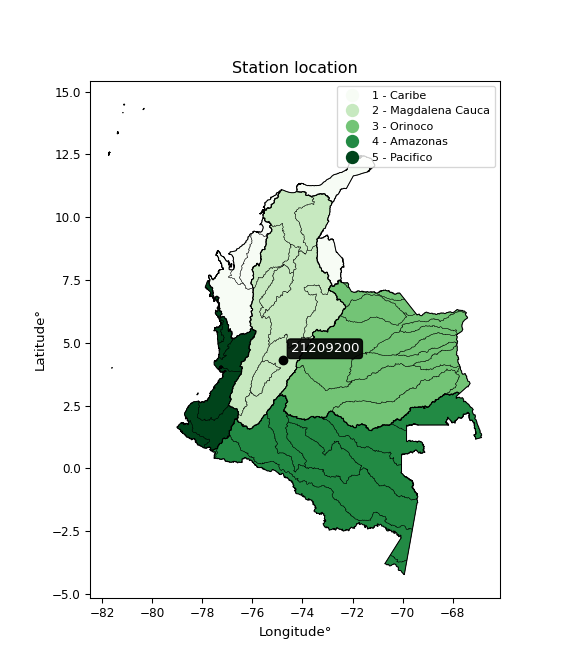</img>

</div>


## A. General information


### 1. General running parameters

• app_version: _v20260312_. • runtime: _2026-03-12 07:15:23.203550_. • Python version: _3.14.0_. • SciPy version: _1.16.3_. • Pandas version: _2.3.3_. • NumPy version: _2.3.5_. • Stations dataset (station_dataset_file): _dataset/pmax24h_in/automatic_colombia_2003_2025.csv_. • Stations catalog (station_catalog_file): _dataset/CNE.xls_. • Minimum year to eval til year_max (date_min): _1900_. • Maximum year to eval since year_min (date_max): _2025_. • Creates, save and include plots into reports (create_plot): _True_. • Plot only fit distributions with Δo > Δ (plot_only_fit): _True_. • Plot only simple graphs avoiding multiple CDFs and multiple Extreme values plots (plot_only_simple): _True_. • Eval low extreme values, if False, evaluates high extreme values (low_extreme): _False_. • Eval every SciPy distribution as logarithmic (pdist_logarithmic_on): _True_. • Standard deviation normalized (ddof): _1.0_. • Return periods to eval in years (Tr): _[2, 2.33, 5, 10, 15, 20, 25, 50, 75, 100, 200, 250, 500, 750, 1000]_. • Minimum data sample per station, 0 means any (minimum_sample): _5_. • Z-Score maximum threshold to adjust a value, 0 means disable (zscore_max): _3.5_. • Z-Score minimum threshold to adjust a value, 0 means disable (zscore_min): _-2.5_. • Avoid zeros, e.g. rain = 0 (avoid_zeros): _True_. • Avoid null values (avoid_nans): _True_. 

:file_folder:Table: [dataset.csv](../../dataset/pmax24h_in/automatic_colombia_2003_2025.csv)

> Delta Degrees of Freedom (DDOF): is a parameter used in the formulas for calculating variance and standard deviation. When ddof=0, the divisor is $N$ (the total number of observations) and this is used when your data set is the entire population. When ddof=1, the divisor is $N-1$ and this is used when your data set is a sample drawn from a larger population. Using $N-1$ provides an unbiased estimate of the population variance (known as Bessel´s correction).


### 2. Station info and location

|   id |   CODIGO | NOMBRE                | CATEGORIA    | TECNOLOGIA                              | ESTADO   | FECHA_INSTALACION   |   FECHA_SUSPENSION |   ALTITUD |   LATITUD |   LONGITUD | DEPARTAMENTO   | MUNICIPIO   | AREA_OPERATIVA                            | ENTIDAD                                                     | AREA_HIDROGRAFICA   | ZONA_HIDROGRAFICA   | SUBZONA_HIDROGRAFICA   | CORRIENTE   | Catalogo   |   Version |
|-----:|---------:|:----------------------|:-------------|:----------------------------------------|:---------|:--------------------|-------------------:|----------:|----------:|-----------:|:---------------|:------------|:------------------------------------------|:------------------------------------------------------------|:--------------------|:--------------------|:-----------------------|:------------|:-----------|----------:|
|    0 | 21209200 | LA CAMPIÑA [21209200] | Limnigráfica | Automática con Telemetría, Convencional | Activa   | 15/11/1992          |                nan |       425 |   4.30489 |   -74.7938 | Cundinamarca   | Girardot    | Area Operativa 11 - Cundinamarca-Amazonas | INSTITUTO DE HIDROLOGIA METEOROLOGIA Y ESTUDIOS AMBIENTALES | Magdalena Cauca     | Alto Magdalena      | Río Bogotá             | Bogota      | CNE_IDEAM  |  20251226 |

<div align="center">

Dynamic map: [:earth_americas:Google](http://maps.google.com/maps?q=4.304889,-74.793778) [:earth_americas:OSM](https://www.openstreetmap.org/#map=18/4.304889/-74.793778&layers=P) [:earth_americas:Bing](https://www.bing.com/maps?cp=4.304889~-74.793778&lvl=18) [:earth_americas:Apple](https://maps.apple.com/frame?center=4.304889%2C-74.793778&span=0.003%2C0.006)

</div>


<div align="center">

```geojson
{
  "type": "Feature",
  "geometry": {
    "type": "Point", 
    "coordinates": [-74.793778, 4.304889]
  }, 
  "properties": {
    "Name": "21209200"
  }
}
```

</div>


### 3. Discrete values table and plot

<div align="center">

|               |          0 |           1 |            2 |          3 |           4 |           5 |
|:--------------|-----------:|------------:|-------------:|-----------:|------------:|------------:|
| Date          | 2019       | 2020        | 2021         | 2022       | 2023        | 2024        |
| Value         |  168.8     |   84.6      |   64.2       |   10.5     |   29.4      |   54.8      |
| Value_initial |  168.8     |   84.6      |   64.2       |   10.5     |   29.4      |   54.8      |
| count         |    6       |    6        |    6         |    6       |    6        |    6        |
| mean          |   68.7167  |   68.7167   |   68.7167    |   68.7167  |   68.7167   |   68.7167   |
| std           |   55.5302  |   55.5302   |   55.5302    |   55.5302  |   55.5302   |   55.5302   |
| zscore        |    1.80232 |    0.286031 |   -0.0813371 |   -1.04838 |   -0.708023 |   -0.250614 |


</div>


<div align="center">

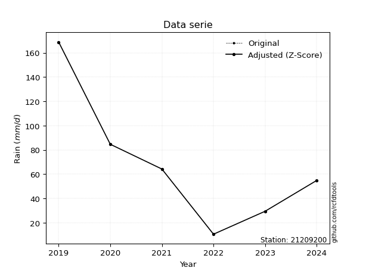</img>

</div>


> The initial value (value_initial) correspond to the initial obtained or null completed value, and value (value) is adjusted only when the initial value is outside the valid range (outlier) definite through the Z-Score value. If Z-Score is active, values out of range or outliers are replaced with the station mean value. A Z-Score (or standard score) measures how many standard deviations a data point is from the mean of a dataset, indicating its relative position; positive scores mean above the mean, negative mean below, and a score of zero is exactly at the mean, allowing for comparison of values from different distributions. It´s calculated using the formula $z=(x–μ)/σ$, where $x$ is the data point, $μ$ is the mean, and $σ$ is the standard deviation, helping identify outliers and understand probability.
>
> <sub>**Note**: In this study, "completing" (filling gaps in) and "extending" (forecasting or lengthening the historical record) rainfall data series are avoided for certain critical analyses because they introduce artificial bias and uncertainty, which can distort the statistics of rare events (extremes), alter day-to-day variability, and compromise the integrity and homogeneity of the original data. Some reasons against Completing/Extending rainfall data are: **Distortion of Extremes and Variability**: The primary issue is that most gap-filling or extension methods rely on averaging or regression with nearby stations, which inherently smooths the data. Rainfall is highly variable in space and time, with a large percentage of zero values and occasional large storms. Infilling methods often underestimate the highest values and overestimate the lowest (zero) values, which severely distorts analyses focused on flood frequency, drought severity, and intensity-duration-frequency (IDF) curves, **Loss of Data Homogeneity**: Infilled or extended data are synthetic estimates, not actual measurements. Combining these estimates with observed data can violate the assumption of data homogeneity, which requires that the data properties do not change over time. Inhomogeneity can lead to incorrect conclusions about long-term trends or changes in climate patterns, **Propagation of Errors**: Errors and biases from the original data (e.g., wind-induced undercatch, instrument errors, site changes) or the data used for imputation can propagate through the analysis, leading to unreliable hydrological models and inaccurate predictions, **Compromised Statistical Integrity**: For statistical analyses, especially those involving the frequency of events, using artificial data can introduce time bias or autocorrelation that doesn´t exist in reality, making it difficult to assess the true probability of events, **Difficulty in Validation**: It is difficult to accurately validate the quality of filled or extended data, especially for past periods where ground-truth measurements are unavailable. The reliability of imputation techniques heavily depends on the density of the surrounding station network and the complexity of the local topography.</sub>


### 4. Active continuous probability distributions from SciPy (80 of 104 available)

A Probability Density Function (PDF) describes the relative likelihood of a continuous random variable falling within a specific range, where the total area under its curve equals 1, and the area over any interval gives the actual probability for that range. Unlike discrete probabilities (like rolling a die), a PDF shows density, not direct probability for a single point (which is zero), with higher points indicating higher likelihood, often visualized as a bell curve for normal distributions.

A log of a probability density function (log-PDF) is simply the logarithm of the PDF´s value, denoted as $log(f(x))$, useful for converting multiplication of probabilities into addition, improving numerical stability with tiny numbers, and connecting to information theory concepts like entropy. Instead of dealing with very small probabilities (e.g., 0.000001), log-PDFs use negative numbers (e.g., $log(0.00001) ≈ -11.51$ that are easier for computers to handle, preventing underflow errors and simplifying complex calculations. In this study, each active probability distribution from SciPy is also evaluated in the $log$ form.

[scipy.stats](https://docs.scipy.org/doc/scipy/reference/stats.html) is a Python´s powerful submodule within the SciPy library for comprehensive statistical analysis, offering over 130 probability distributions (like Normal, Poisson, etc.), functions for descriptive stats (mean, variance), hypothesis testing (t-tests, chi-square), random variable generation, and statistical tests, making it essential for data science, modeling, and research. It provides tools to explore, model, and draw conclusions from data efficiently, working seamlessly with [NumPy](https://numpy.org/).

<div align="center">

|   id | p_dist           |   n_parameter | fit_method   | label                                                                       | active   | ref                                                                                                      |
|-----:|:-----------------|--------------:|:-------------|:----------------------------------------------------------------------------|:---------|:---------------------------------------------------------------------------------------------------------|
|    0 | alpha            |             3 | MLE          | Alpha                                                                       | True     | [:mortar_board:](https://docs.scipy.org/doc/scipy/reference/generated/scipy.stats.alpha.html)            |
|    1 | anglit           |             2 | MM           | Anglit                                                                      | True     | [:mortar_board:](https://docs.scipy.org/doc/scipy/reference/generated/scipy.stats.anglit.html)           |
|    2 | arcsine          |             2 | MM           | Arcsine                                                                     | True     | [:mortar_board:](https://docs.scipy.org/doc/scipy/reference/generated/scipy.stats.arcsine.html)          |
|    3 | argus            |             3 | MLE          | Argus                                                                       | True     | [:mortar_board:](https://docs.scipy.org/doc/scipy/reference/generated/scipy.stats.argus.html)            |
|    4 | beta             |             4 | MLE          | Beta                                                                        | True     | [:mortar_board:](https://docs.scipy.org/doc/scipy/reference/generated/scipy.stats.beta.html)             |
|    5 | betaprime        |             4 | MLE          | Beta prime                                                                  | True     | [:mortar_board:](https://docs.scipy.org/doc/scipy/reference/generated/scipy.stats.betaprime.html)        |
|    6 | bradford         |             3 | MLE          | Bradford                                                                    | True     | [:mortar_board:](https://docs.scipy.org/doc/scipy/reference/generated/scipy.stats.bradford.html)         |
|    7 | burr             |             4 | MLE          | Burr (Type III)                                                             | True     | [:mortar_board:](https://docs.scipy.org/doc/scipy/reference/generated/scipy.stats.burr.html)             |
|    8 | burr12           |             4 | MLE          | Burr (Type III) 12                                                          | True     | [:mortar_board:](https://docs.scipy.org/doc/scipy/reference/generated/scipy.stats.burr12.html)           |
|    9 | cosine           |             2 | MLE          | Cosine                                                                      | True     | [:mortar_board:](https://docs.scipy.org/doc/scipy/reference/generated/scipy.stats.cosine.html)           |
|   10 | crystalball      |             4 | MLE          | Crystalball                                                                 | True     | [:mortar_board:](https://docs.scipy.org/doc/scipy/reference/generated/scipy.stats.crystalball.html)      |
|   11 | dgamma           |             3 | MLE          | Double gamma                                                                | True     | [:mortar_board:](https://docs.scipy.org/doc/scipy/reference/generated/scipy.stats.dgamma.html)           |
|   12 | dweibull         |             3 | MLE          | Double Weibull                                                              | True     | [:mortar_board:](https://docs.scipy.org/doc/scipy/reference/generated/scipy.stats.dweibull.html)         |
|   13 | erlang           |             3 | MLE          | Erlang                                                                      | True     | [:mortar_board:](https://docs.scipy.org/doc/scipy/reference/generated/scipy.stats.erlang.html)           |
|   14 | exponnorm        |             3 | MLE          | Exponentially modified Normal                                               | True     | [:mortar_board:](https://docs.scipy.org/doc/scipy/reference/generated/scipy.stats.exponnorm.html)        |
|   15 | exponpow         |             3 | MLE          | Exponential power                                                           | True     | [:mortar_board:](https://docs.scipy.org/doc/scipy/reference/generated/scipy.stats.exponpow.html)         |
|   16 | exponweib        |             4 | MLE          | Exponentiated Weibull                                                       | True     | [:mortar_board:](https://docs.scipy.org/doc/scipy/reference/generated/scipy.stats.exponweib.html)        |
|   17 | f                |             4 | MLE          | F                                                                           | True     | [:mortar_board:](https://docs.scipy.org/doc/scipy/reference/generated/scipy.stats.f.html)                |
|   18 | fatiguelife      |             3 | MLE          | Fatigue-life (Birnbaum-Saunders)                                            | True     | [:mortar_board:](https://docs.scipy.org/doc/scipy/reference/generated/scipy.stats.fatiguelife.html)      |
|   19 | foldnorm         |             3 | MM           | Fold Normal                                                                 | True     | [:mortar_board:](https://docs.scipy.org/doc/scipy/reference/generated/scipy.stats.foldnorm.html)         |
|   20 | gamma            |             3 | MLE          | Gamma                                                                       | True     | [:mortar_board:](https://docs.scipy.org/doc/scipy/reference/generated/scipy.stats.gamma.html)            |
|   21 | gausshyper       |             6 | MLE          | Gauss hypergeometric                                                        | True     | [:mortar_board:](https://docs.scipy.org/doc/scipy/reference/generated/scipy.stats.gausshyper.html)       |
|   22 | genexpon         |             5 | MLE          | Generalized exponential                                                     | True     | [:mortar_board:](https://docs.scipy.org/doc/scipy/reference/generated/scipy.stats.genexpon.html)         |
|   23 | genextreme       |             3 | MLE          | Generalized exponential                                                     | True     | [:mortar_board:](https://docs.scipy.org/doc/scipy/reference/generated/scipy.stats.genextreme.html)       |
|   24 | gengamma         |             4 | MLE          | Generalized gamma                                                           | True     | [:mortar_board:](https://docs.scipy.org/doc/scipy/reference/generated/scipy.stats.gengamma.html)         |
|   25 | genhalflogistic  |             3 | MLE          | Generalized half-logistic                                                   | True     | [:mortar_board:](https://docs.scipy.org/doc/scipy/reference/generated/scipy.stats.genhalflogistic.html)  |
|   26 | genlogistic      |             3 | MLE          | Generalized logistic                                                        | True     | [:mortar_board:](https://docs.scipy.org/doc/scipy/reference/generated/scipy.stats.genlogistic.html)      |
|   27 | gennorm          |             3 | MLE          | Generalized Normal                                                          | True     | [:mortar_board:](https://docs.scipy.org/doc/scipy/reference/generated/scipy.stats.gennorm.html)          |
|   28 | genpareto        |             3 | MLE          | Generalized Pareto                                                          | True     | [:mortar_board:](https://docs.scipy.org/doc/scipy/reference/generated/scipy.stats.genpareto.html)        |
|   29 | gompertz         |             3 | MLE          | Gompertz (or truncated Gumbel)                                              | True     | [:mortar_board:](https://docs.scipy.org/doc/scipy/reference/generated/scipy.stats.gompertz.html)         |
|   30 | gumbel_l         |             2 | MM           | Gumbel Left Skew                                                            | True     | [:mortar_board:](https://docs.scipy.org/doc/scipy/reference/generated/scipy.stats.gumbel_l.html)         |
|   31 | gumbel_r         |             2 | MM           | Gumbel Right Skew                                                           | True     | [:mortar_board:](https://docs.scipy.org/doc/scipy/reference/generated/scipy.stats.gumbel_r.html)         |
|   32 | halfgennorm      |             3 | MLE          | Upper half of a generalized normal                                          | True     | [:mortar_board:](https://docs.scipy.org/doc/scipy/reference/generated/scipy.stats.halfgennorm.html)      |
|   33 | halflogistic     |             2 | MM           | Half-logistic                                                               | True     | [:mortar_board:](https://docs.scipy.org/doc/scipy/reference/generated/scipy.stats.halflogistic.html)     |
|   34 | halfnorm         |             2 | MM           | Half Normal                                                                 | True     | [:mortar_board:](https://docs.scipy.org/doc/scipy/reference/generated/scipy.stats.halfnorm.html)         |
|   35 | hypsecant        |             2 | MM           | hyperbolic secant                                                           | True     | [:mortar_board:](https://docs.scipy.org/doc/scipy/reference/generated/scipy.stats.hypsecant.html)        |
|   36 | invgamma         |             3 | MLE          | Inverted gamma                                                              | True     | [:mortar_board:](https://docs.scipy.org/doc/scipy/reference/generated/scipy.stats.invgamma.html)         |
|   37 | invgauss         |             3 | MLE          | Inverse Gaussian                                                            | True     | [:mortar_board:](https://docs.scipy.org/doc/scipy/reference/generated/scipy.stats.invgauss.html)         |
|   38 | invweibull       |             3 | MLE          | Inverted Weibull                                                            | True     | [:mortar_board:](https://docs.scipy.org/doc/scipy/reference/generated/scipy.stats.invweibull.html)       |
|   39 | johnsonsb        |             4 | MLE          | Johnson SB                                                                  | True     | [:mortar_board:](https://docs.scipy.org/doc/scipy/reference/generated/scipy.stats.johnsonsb.html)        |
|   40 | johnsonsu        |             4 | MLE          | Johnson Su                                                                  | True     | [:mortar_board:](https://docs.scipy.org/doc/scipy/reference/generated/scipy.stats.johnsonsu.html)        |
|   41 | kappa3           |             3 | MLE          | Kappa 3                                                                     | True     | [:mortar_board:](https://docs.scipy.org/doc/scipy/reference/generated/scipy.stats.kappa3.html)           |
|   42 | kappa4           |             4 | MLE          | Kappa 4                                                                     | True     | [:mortar_board:](https://docs.scipy.org/doc/scipy/reference/generated/scipy.stats.kappa4.html)           |
|   43 | ksone            |             3 | MLE          | Kolmogorov-Smirnov one-sided test statistic distribution                    | True     | [:mortar_board:](https://docs.scipy.org/doc/scipy/reference/generated/scipy.stats.ksone.html)            |
|   44 | kstwobign        |             2 | MLE          | Limiting distribution of scaled Kolmogorov-Smirnov two-sided test statistic | True     | [:mortar_board:](https://docs.scipy.org/doc/scipy/reference/generated/scipy.stats.kstwobign.html)        |
|   45 | laplace          |             2 | MM           | Laplace                                                                     | True     | [:mortar_board:](https://docs.scipy.org/doc/scipy/reference/generated/scipy.stats.laplace.html)          |
|   46 | levy_l           |             2 | MLE          | Left-skewed Levy                                                            | True     | [:mortar_board:](https://docs.scipy.org/doc/scipy/reference/generated/scipy.stats.levy_l.html)           |
|   47 | loggamma         |             3 | MLE          | Log gamma                                                                   | True     | [:mortar_board:](https://docs.scipy.org/doc/scipy/reference/generated/scipy.stats.loggamma.html)         |
|   48 | logistic         |             2 | MM           | Logistic (or Sech-squared)                                                  | True     | [:mortar_board:](https://docs.scipy.org/doc/scipy/reference/generated/scipy.stats.logistic.html)         |
|   49 | loglaplace       |             3 | MLE          | Log-Laplace                                                                 | True     | [:mortar_board:](https://docs.scipy.org/doc/scipy/reference/generated/scipy.stats.loglaplace.html)       |
|   50 | lomax            |             3 | MLE          | Lomax (Pareto of the second kind)                                           | True     | [:mortar_board:](https://docs.scipy.org/doc/scipy/reference/generated/scipy.stats.lomax.html)            |
|   51 | maxwell          |             2 | MM           | Maxwell                                                                     | True     | [:mortar_board:](https://docs.scipy.org/doc/scipy/reference/generated/scipy.stats.maxwell.html)          |
|   52 | mielke           |             4 | MLE          | Mielke Beta-Kappa / Dagum                                                   | True     | [:mortar_board:](https://docs.scipy.org/doc/scipy/reference/generated/scipy.stats.mielke.html)           |
|   53 | moyal            |             2 | MM           | Moyal                                                                       | True     | [:mortar_board:](https://docs.scipy.org/doc/scipy/reference/generated/scipy.stats.moyal.html)            |
|   54 | nakagami         |             3 | MLE          | Nakagami                                                                    | True     | [:mortar_board:](https://docs.scipy.org/doc/scipy/reference/generated/scipy.stats.nakagami.html)         |
|   55 | ncf              |             5 | MLE          | Non-central F distribution                                                  | True     | [:mortar_board:](https://docs.scipy.org/doc/scipy/reference/generated/scipy.stats.ncf.html)              |
|   56 | nct              |             4 | MLE          | Non-central Student’s t                                                     | True     | [:mortar_board:](https://docs.scipy.org/doc/scipy/reference/generated/scipy.stats.nct.html)              |
|   57 | norm             |             2 | MM           | Normal                                                                      | True     | [:mortar_board:](https://docs.scipy.org/doc/scipy/reference/generated/scipy.stats.norm.html)             |
|   58 | pearson3         |             3 | MM           | Pearson type III                                                            | True     | [:mortar_board:](https://docs.scipy.org/doc/scipy/reference/generated/scipy.stats.pearson3.html)         |
|   59 | powerlaw         |             3 | MLE          | Power-function                                                              | True     | [:mortar_board:](https://docs.scipy.org/doc/scipy/reference/generated/scipy.stats.powerlaw.html)         |
|   60 | rayleigh         |             2 | MM           | Rayleigh                                                                    | True     | [:mortar_board:](https://docs.scipy.org/doc/scipy/reference/generated/scipy.stats.rayleigh.html)         |
|   61 | rdist            |             3 | MLE          | R-distributed (symmetric beta)                                              | True     | [:mortar_board:](https://docs.scipy.org/doc/scipy/reference/generated/scipy.stats.rdist.html)            |
|   62 | rice             |             3 | MLE          | Rice                                                                        | True     | [:mortar_board:](https://docs.scipy.org/doc/scipy/reference/generated/scipy.stats.rice.html)             |
|   63 | semicircular     |             2 | MM           | Semicircular                                                                | True     | [:mortar_board:](https://docs.scipy.org/doc/scipy/reference/generated/scipy.stats.semicircular.html)     |
|   64 | skewnorm         |             3 | MLE          | Skew normal                                                                 | True     | [:mortar_board:](https://docs.scipy.org/doc/scipy/reference/generated/scipy.stats.skewnorm.html)         |
|   65 | t                |             3 | MLE          | Student’s t                                                                 | True     | [:mortar_board:](https://docs.scipy.org/doc/scipy/reference/generated/scipy.stats.t.html)                |
|   66 | trapezoid        |             4 | MLE          | Trapezoid                                                                   | True     | [:mortar_board:](https://docs.scipy.org/doc/scipy/reference/generated/scipy.stats.trapezoid.html)        |
|   67 | triang           |             3 | MLE          | Triangular                                                                  | True     | [:mortar_board:](https://docs.scipy.org/doc/scipy/reference/generated/scipy.stats.triang.html)           |
|   68 | truncexpon       |             3 | MLE          | Truncated exponential                                                       | True     | [:mortar_board:](https://docs.scipy.org/doc/scipy/reference/generated/scipy.stats.truncexpon.html)       |
|   69 | truncnorm        |             4 | MLE          | Truncated normal                                                            | True     | [:mortar_board:](https://docs.scipy.org/doc/scipy/reference/generated/scipy.stats.truncnorm.html)        |
|   70 | truncpareto      |             4 | MLE          | Upper truncated Pareto                                                      | True     | [:mortar_board:](https://docs.scipy.org/doc/scipy/reference/generated/scipy.stats.truncpareto.html)      |
|   71 | truncweibull_min |             5 | MLE          | Doubly truncated Weibull minimum                                            | True     | [:mortar_board:](https://docs.scipy.org/doc/scipy/reference/generated/scipy.stats.truncweibull_min.html) |
|   72 | tukeylambda      |             3 | MLE          | Tukey-Lamdba                                                                | True     | [:mortar_board:](https://docs.scipy.org/doc/scipy/reference/generated/scipy.stats.tukeylambda.html)      |
|   73 | uniform          |             2 | MLE          | Uniform                                                                     | True     | [:mortar_board:](https://docs.scipy.org/doc/scipy/reference/generated/scipy.stats.uniform.html)          |
|   74 | vonmises         |             3 | MLE          | Von Mises                                                                   | True     | [:mortar_board:](https://docs.scipy.org/doc/scipy/reference/generated/scipy.stats.vonmises.html)         |
|   75 | vonmises_line    |             3 | MLE          | Von Mises line                                                              | True     | [:mortar_board:](https://docs.scipy.org/doc/scipy/reference/generated/scipy.stats.vonmises_line.html)    |
|   76 | wald             |             2 | MM           | Wald                                                                        | True     | [:mortar_board:](https://docs.scipy.org/doc/scipy/reference/generated/scipy.stats.wald.html)             |
|   77 | weibull_max      |             3 | MLE          | Weibull maximum                                                             | True     | [:mortar_board:](https://docs.scipy.org/doc/scipy/reference/generated/scipy.stats.weibull_max.html)      |
|   78 | weibull_min      |             3 | MLE          | Weibull minimum                                                             | True     | [:mortar_board:](https://docs.scipy.org/doc/scipy/reference/generated/scipy.stats.weibull_min.html)      |
|   79 | wrapcauchy       |             3 | MLE          | Wrapped  Cauchy                                                             | True     | [:mortar_board:](https://docs.scipy.org/doc/scipy/reference/generated/scipy.stats.wrapcauchy.html)       |

</div>

> **n_parameter:** # arguments & localization & scale.
>
> **Fit methods:** (MLE) maximum likelihood, (MM) L-moments.
>
>**Inactive** (With the only purpose of prevent loops, zero divisions, infinite values, over high estimated values or horizontal trending for recurrence intervals estimations, the follow distributions were disabled.)**:** lognorm, norminvgauss, powernorm, powerlognorm, cauchy, halfcauchy, foldcauchy, skewcauchy, chi2, expon, fisk, genhyperbolic, geninvgauss, gibrat, kstwo, laplace_asymmetric, levy, levy_stable, ncx2, pareto, rel_breitwigner, recipinvgauss, studentized_range, loguniform, 


## B. Probability (PDF) vs. Empirical (EDF) distributions functions

A continuous probability distribution (CPD) describes probabilities for variables that can take any value within a range (like rain any time), unlike discrete variables with specific outcomes (like temperature). It uses a Probability Density Function (PDF), a curve where the total area under it equals 1, and the probability of the variable falling within an interval (a to b) is found by calculating the area under the curve between those points. A key feature is that the probability of hitting any single exact value is zero, so probabilities are always expressed for ranges, e.g., $P(a ≤ X ≤ b)$.

<div align="center">

Distributions parameters from station values
|     |   station | p_dist              |   n |              loc |          scale | shape                  | shape1                | shape2                 | shape3             |
|----:|----------:|:--------------------|----:|-----------------:|---------------:|:-----------------------|:----------------------|:-----------------------|:-------------------|
|   0 |  21209200 | alpha               |   6 |     -0.0653149   |   23.527       | 3.059346384321668e-11  |                       |                        |                    |
|   1 |  21209200 | anglit              |   6 |     68.7167      |  148.294       |                        |                       |                        |                    |
|   2 |  21209200 | arcsine             |   6 |     -2.97248     |  143.378       |                        |                       |                        |                    |
|   3 |  21209200 | argus               |   6 |    -46.3436      |  224.955       | 7.149187485908491e-07  |                       |                        |                    |
|   4 |  21209200 | beta                |   6 |     -6.18712     |  174.987       | 0.7416274755897407     | 0.4464505929077279    |                        |                    |
|   5 |  21209200 | betaprime           |   6 |     10.5         |  840.264       | 0.7405415267542084     | 11.417125344505225    |                        |                    |
|   6 |  21209200 | bradford            |   6 |     10.4378      |  158.362       | 7.450634769729918      |                       |                        |                    |
|   7 |  21209200 | burr                |   6 |     -0.130006    |   92.3149      | 3.125851404644683      | 0.41153920389165966   |                        |                    |
|   8 |  21209200 | burr12              |   6 |     -1.91724     |   12.2271      | 269.2291349180217      | 0.0025409078838258795 |                        |                    |
|   9 |  21209200 | cosine              |   6 |     75.8785      |   43.7265      |                        |                       |                        |                    |
|  10 |  21209200 | crystalball         |   6 |     68.7167      |   50.6919      | 5335.375332070778      | 2052.4099846257272    |                        |                    |
|  11 |  21209200 | dgamma              |   6 |     64.2         |   41.3284      | 0.8298115237209727     |                       |                        |                    |
|  12 |  21209200 | dweibull            |   6 |     59.6985      |   37.2152      | 1.0040828875465049     |                       |                        |                    |
|  13 |  21209200 | erlang              |   6 |     10.5         |   47.5303      | 0.9245348070176347     |                       |                        |                    |
|  14 |  21209200 | exponnorm           |   6 |     10.4224      |    0.0231554   | 2490.2962243334086     |                       |                        |                    |
|  15 |  21209200 | exponpow            |   6 |     10.5         |  123.965       | 0.31926446885318616    |                       |                        |                    |
|  16 |  21209200 | exponweib           |   6 |     10.5         |   16.8563      | 1.3841897693158547     | 0.5272439653916394    |                        |                    |
|  17 |  21209200 | f                   |   6 |     10.5         |   50.9696      | 1.214698622783346      | 376.8361266028858     |                        |                    |
|  18 |  21209200 | fatiguelife         |   6 |     10.5         |    0.000693916 | 389.4834297507505      |                       |                        |                    |
|  19 |  21209200 | foldnorm            |   6 |      0.954976    |   76.1266      | 0.485510356863918      |                       |                        |                    |
|  20 |  21209200 | gamma               |   6 |     10.5         |   54.6011      | 0.8557721690333013     |                       |                        |                    |
|  21 |  21209200 | gausshyper          |   6 |     -5.77357     |  174.574       | 1.371875280906001      | 0.5006326611722574    | 0.9178281365311282     | 1.0265003145404759 |
|  22 |  21209200 | genexpon            |   6 |     10.5         |  115.791       | 1.7514561561542648     | 0.9302530228469882    | 0.7273187247961809     |                    |
|  23 |  21209200 | genextreme          |   6 |     13.6343      |   16.9799      | -5.41719942078897      |                       |                        |                    |
|  24 |  21209200 | gengamma            |   6 |     10.5         |   15.1609      | 1.3815594557511117     | 0.46879179273456956   |                        |                    |
|  25 |  21209200 | genhalflogistic     |   6 |     -5.50276     |  182.834       | 1.0489469972026064     |                       |                        |                    |
|  26 |  21209200 | genlogistic         |   6 |   -220.684       |   36.6591      | 1447.3421488785043     |                       |                        |                    |
|  27 |  21209200 | gennorm             |   6 |     64.2         |    3.1814      | 0.4264850269077136     |                       |                        |                    |
|  28 |  21209200 | genpareto           |   6 |     -0.184386    |  259.74        | -1.5370678395422221    |                       |                        |                    |
|  29 |  21209200 | gompertz            |   6 |     10.5         |  168.813       | 2.044303519794605      |                       |                        |                    |
|  30 |  21209200 | gumbel_l            |   6 |     91.5307      |   39.5243      |                        |                       |                        |                    |
|  31 |  21209200 | gumbel_r            |   6 |     45.9026      |   39.5243      |                        |                       |                        |                    |
|  32 |  21209200 | halfgennorm         |   6 |     10.5         |    7.36125     | 0.45429048079309975    |                       |                        |                    |
|  33 |  21209200 | halflogistic        |   6 |      8.63499     |   43.3398      |                        |                       |                        |                    |
|  34 |  21209200 | halfnorm            |   6 |      1.62047     |   84.0926      |                        |                       |                        |                    |
|  35 |  21209200 | hypsecant           |   6 |     68.7167      |   32.2715      |                        |                       |                        |                    |
|  36 |  21209200 | invgamma            |   6 |    -37.818       |  446.904       | 5.152874073678898      |                       |                        |                    |
|  37 |  21209200 | invgauss            |   6 |    -13.804       |  173.324       | 0.4761069414221484     |                       |                        |                    |
|  38 |  21209200 | invweibull          |   6 |     10.5         |    4.1166      | 0.055776387279749526   |                       |                        |                    |
|  39 |  21209200 | johnsonsb           |   6 |      7.4375      |  161.363       | -0.6474022556905166    | 0.11619833148715081   |                        |                    |
|  40 |  21209200 | johnsonsu           |   6 |    -10.0314      |    1.02296     | -7.121112879060146     | 1.47662322272176      |                        |                    |
|  41 |  21209200 | kappa3              |   6 |     10.5         |   61.5992      | 2.9347176710484923     |                       |                        |                    |
|  42 |  21209200 | kappa4              |   6 |     -5.7236      |  171.484       | 1.104356558359922      | 0.9757743325950441    |                        |                    |
|  43 |  21209200 | ksone               |   6 |     -5.33        |  189.96        | 1.0                    |                       |                        |                    |
|  44 |  21209200 | kstwobign           |   6 |    -85.5501      |  177.865       |                        |                       |                        |                    |
|  45 |  21209200 | laplace             |   6 |     68.7167      |   35.8446      |                        |                       |                        |                    |
|  46 |  21209200 | levy_l              |   6 |    179.966       |   46.4333      |                        |                       |                        |                    |
|  47 |  21209200 | loggamma            |   6 | -18003.2         | 2361.37        | 2107.913911377359      |                       |                        |                    |
|  48 |  21209200 | logistic            |   6 |     68.7167      |   27.9479      |                        |                       |                        |                    |
|  49 |  21209200 | loglaplace          |   6 |     -0.154624    |   54.9547      | 1.5094294016141225     |                       |                        |                    |
|  50 |  21209200 | lomax               |   6 |     10.5         | 4559.07        | 79.06744831812853      |                       |                        |                    |
|  51 |  21209200 | maxwell             |   6 |    -51.4018      |   75.2731      |                        |                       |                        |                    |
|  52 |  21209200 | mielke              |   6 |     10.5         |  108.56        | 0.5272097571098716     | 2.984787306105405     |                        |                    |
|  53 |  21209200 | moyal               |   6 |     39.7278      |   22.8194      |                        |                       |                        |                    |
|  54 |  21209200 | nakagami            |   6 |     29.4         |   56.4492      | 0.3038098011817505     |                       |                        |                    |
|  55 |  21209200 | ncf                 |   6 |     -0.0345647   |    6.91695e-06 | 5.712814334393041e-07  | 19.28614367272665     | 4.649372717961446      |                    |
|  56 |  21209200 | nct                 |   6 |    -53.1382      |   11.8956      | 4.320374752769971      | 8.403420281381571     |                        |                    |
|  57 |  21209200 | norm                |   6 |     68.7167      |   50.6919      |                        |                       |                        |                    |
|  58 |  21209200 | pearson3            |   6 |     68.7167      |   50.6919      | 0.9540291603976716     |                       |                        |                    |
|  59 |  21209200 | powerlaw            |   6 |     10.5         |  158.3         | 0.13553901530356138    |                       |                        |                    |
|  60 |  21209200 | rayleigh            |   6 |    -28.2599      |   77.3761      |                        |                       |                        |                    |
|  61 |  21209200 | rdist               |   6 |     -4.23135     |   88.8313      | 1.084715695122358      |                       |                        |                    |
|  62 |  21209200 | rice                |   6 |    -14.6416      |   68.9865      | 0.0002313054770498934  |                       |                        |                    |
|  63 |  21209200 | semicircular        |   6 |     68.7167      |  101.384       |                        |                       |                        |                    |
|  64 |  21209200 | skewnorm            |   6 |     10.5         |   77.1945      | 36914079.30143854      |                       |                        |                    |
|  65 |  21209200 | t                   |   6 |     68.7165      |   50.692       | 297519263.50513554     |                       |                        |                    |
|  66 |  21209200 | trapezoid           |   6 |     -5.5965      |  189.96        | 1.0                    | 1.0                   |                        |                    |
|  67 |  21209200 | triang              |   6 |     -5.90104     |  174.701       | 0.9999999911598962     |                       |                        |                    |
|  68 |  21209200 | truncexpon          |   6 |     10.5         |  144.006       | 1.0992598759410148     |                       |                        |                    |
|  69 |  21209200 | truncnorm           |   6 |     68.7167      |   50.6919      | -2400.1085493502633    | 53862.7061883725      |                        |                    |
|  70 |  21209200 | truncpareto         |   6 |     10.3434      |    0.156573    | 0.20427324901397678    | 1012.0301589330254    |                        |                    |
|  71 |  21209200 | truncweibull_min    |   6 |     -0.556968    |  138.746       | 1.1508245650022229     | 0.0014205476765056886 | 1.2206273670554837     |                    |
|  72 |  21209200 | tukeylambda         |   6 |     -4.17173     |   93.4124      | 1.052275978507288      |                       |                        |                    |
|  73 |  21209200 | uniform             |   6 |     10.5         |  158.3         |                        |                       |                        |                    |
|  74 |  21209200 | vonmises            |   6 |     -2.04709     |    1           | 0.9655390797152987     |                       |                        |                    |
|  75 |  21209200 | vonmises_line       |   6 |     61.487       |   34.1588      | 0.8853717533585418     |                       |                        |                    |
|  76 |  21209200 | wald                |   6 |     18.0248      |   50.6919      |                        |                       |                        |                    |
|  77 |  21209200 | weibull_max         |   6 |    168.8         |    1.65922     | 0.1892797463973795     |                       |                        |                    |
|  78 |  21209200 | weibull_min         |   6 |     10.5         |   59.8279      | 0.4159097181099787     |                       |                        |                    |
|  79 |  21209200 | wrapcauchy          |   6 |     10.5         |   25.1942      | 0.2496811597078925     |                       |                        |                    |
|  80 |  21209200 | logalpha            |   6 |    -18.1662      |  542.744       | 24.609436990965435     |                       |                        |                    |
|  81 |  21209200 | loganglit           |   6 |      3.91079     |    2.54622     |                        |                       |                        |                    |
|  82 |  21209200 | logarcsine          |   6 |      2.67987     |    2.46183     |                        |                       |                        |                    |
|  83 |  21209200 | logargus            |   6 |      1.69127     |    3.57843     | 1.1182260000246478     |                       |                        |                    |
|  84 |  21209200 | logbeta             |   6 |      1.54202     |    3.5867      | 2.4644668597080273     | 0.80831560591879      |                        |                    |
|  85 |  21209200 | logbetaprime        |   6 |     -0.42359     |    1.45546e+07 | 20.28755804378291      | 67978597.72476268     |                        |                    |
|  86 |  21209200 | logbradford         |   6 |      2.35137     |    2.77742     | 1.1229284167354785     |                       |                        |                    |
|  87 |  21209200 | logburr             |   6 |     -0.031106    |    4.79547     | 17.51538575443132      | 0.2356093974034214    |                        |                    |
|  88 |  21209200 | logburr12           |   6 |     -4.27449     |   15.4711      | 11.500675609302043     | 900.8923258378013     |                        |                    |
|  89 |  21209200 | logcosine           |   6 |      3.84627     |    0.736415    |                        |                       |                        |                    |
|  90 |  21209200 | logcrystalball      |   6 |      3.91078     |    0.870383    | 7.543417282303382      | 1.4400740525513376    |                        |                    |
|  91 |  21209200 | logdgamma           |   6 |      4.00369     |    0.715228    | 0.8265166594157354     |                       |                        |                    |
|  92 |  21209200 | logdweibull         |   6 |      4.00369     |    0.694219    | 0.9256535877080102     |                       |                        |                    |
|  93 |  21209200 | logerlang           |   6 |     -9.32074     |    0.0594833   | 222.3574844736657      |                       |                        |                    |
|  94 |  21209200 | logexponnorm        |   6 |      3.9102      |    0.870382    | 0.0006749257394225009  |                       |                        |                    |
|  95 |  21209200 | logexponpow         |   6 |      2.35138     |    1.40909     | 0.41141119562343154    |                       |                        |                    |
|  96 |  21209200 | logexponweib        |   6 |      2.35138     |    1.37715     | 1.1051576745613723     | 0.7881312741006445    |                        |                    |
|  97 |  21209200 | logf                |   6 |   -503.657       |  507.566       | 4360538.427001308      | 798234.3796382693     |                        |                    |
|  98 |  21209200 | logfatiguelife      |   6 |   -391.847       |  395.758       | 0.0022025449637567526  |                       |                        |                    |
|  99 |  21209200 | logfoldnorm         |   6 |     -3.60527     |    0.84737     | 8.873705978446878      |                       |                        |                    |
| 100 |  21209200 | loggamma            |   6 |    -10.9718      |    0.0530811   | 280.3267094053423      |                       |                        |                    |
| 101 |  21209200 | loggausshyper       |   6 |      2.35083     |    2.77789     | 0.9586679263477241     | 0.9044384005790289    | 1.0816739577343042     | 1.0101946677719815 |
| 102 |  21209200 | loggenexpon         |   6 |      2.27733     |    0.0145765   | 0.0029735715964800775  | 2.747732891506125     | 3.0040734072397625e-05 |                    |
| 103 |  21209200 | loggenextreme       |   6 |      3.77651     |    1.00297     | 0.6727638584698028     |                       |                        |                    |
| 104 |  21209200 | loggengamma         |   6 |      2.35138     |    0.942346    | 0.21850734148792333    | 1.459413150627599     |                        |                    |
| 105 |  21209200 | loggenhalflogistic  |   6 |      2.28579     |    2.95571     | 1.0396717973359113     |                       |                        |                    |
| 106 |  21209200 | loggenlogistic      |   6 |      4.51604     |    0.319235    | 0.4135781969645711     |                       |                        |                    |
| 107 |  21209200 | loggennorm          |   6 |      4.162       |    0.00353836  | 0.27877664939813485    |                       |                        |                    |
| 108 |  21209200 | loggenpareto        |   6 |     -0.190693    |    8.71659     | -1.638639515630138     |                       |                        |                    |
| 109 |  21209200 | loggompertz         |   6 |      2.35138     |    0.940068    | 0.15366417510691488    |                       |                        |                    |
| 110 |  21209200 | loggumbel_l         |   6 |      4.3025      |    0.678636    |                        |                       |                        |                    |
| 111 |  21209200 | loggumbel_r         |   6 |      3.51907     |    0.678636    |                        |                       |                        |                    |
| 112 |  21209200 | loghalfgennorm      |   6 |      2.35138     |    1.14274     | 0.8355599827994697     |                       |                        |                    |
| 113 |  21209200 | loghalflogistic     |   6 |      2.8792      |    0.744133    |                        |                       |                        |                    |
| 114 |  21209200 | loghalfnorm         |   6 |      2.75877     |    1.44385     |                        |                       |                        |                    |
| 115 |  21209200 | loghypsecant        |   6 |      3.91079     |    0.554104    |                        |                       |                        |                    |
| 116 |  21209200 | loginvgamma         |   6 |    -11.5777      | 4663.53        | 302.20977328231584     |                       |                        |                    |
| 117 |  21209200 | loginvgauss         |   6 |     -4.22344     |  632.709       | 0.01284410584324373    |                       |                        |                    |
| 118 |  21209200 | loginvweibull       |   6 |     -1.66779e+08 |    1.66779e+08 | 183655956.58169046     |                       |                        |                    |
| 119 |  21209200 | logjohnsonsb        |   6 |      2.35138     |    2.77734     | 0.14903851090771134    | 0.11654937674409573   |                        |                    |
| 120 |  21209200 | logjohnsonsu        |   6 |      6.78867     |    0.317681    | 9.450701904392018      | 3.3103190368477247    |                        |                    |
| 121 |  21209200 | logkappa3           |   6 |      2.35138     |    2.34675     | 14.773036534013137     |                       |                        |                    |
| 122 |  21209200 | logkappa4           |   6 |      2.14915     |    3.23754     | 1.0668223692206735     | 1.0865764073851858    |                        |                    |
| 123 |  21209200 | logksone            |   6 |      2.07364     |    3.33281     | 1.0                    |                       |                        |                    |
| 124 |  21209200 | logkstwobign        |   6 |      0.293799    |    4.13162     |                        |                       |                        |                    |
| 125 |  21209200 | loglaplace          |   6 |      3.91079     |    0.615455    |                        |                       |                        |                    |
| 126 |  21209200 | loglevy_l           |   6 |      5.24468     |    0.480963    |                        |                       |                        |                    |
| 127 |  21209200 | logloggamma         |   6 |      3.92173     |    0.904112    | 1.449192204333323      |                       |                        |                    |
| 128 |  21209200 | loglogistic         |   6 |      3.91079     |    0.479868    |                        |                       |                        |                    |
| 129 |  21209200 | logloglaplace       |   6 |     -0.0692811   |    4.23128     | 5.616967797385584      |                       |                        |                    |
| 130 |  21209200 | loglomax            |   6 |      2.35137     | 5443.69        | 3623.1186935931282     |                       |                        |                    |
| 131 |  21209200 | logmaxwell          |   6 |      1.84834     |    1.29245     |                        |                       |                        |                    |
| 132 |  21209200 | logmielke           |   6 |      2.35138     |    3.14337     | 0.14406567751376784    | 22.01342831695716     |                        |                    |
| 133 |  21209200 | logmoyal            |   6 |      3.41304     |    0.391811    |                        |                       |                        |                    |
| 134 |  21209200 | lognakagami         |   6 |      3.38099     |    0.781914    | 0.3752791812226392     |                       |                        |                    |
| 135 |  21209200 | logncf              |   6 |     -1.33633     |    1.56479e-06 | 5.6448887679335486e-05 | 313.39731481704234    | 188.16726611065272     |                    |
| 136 |  21209200 | lognct              |   6 |    -42.9865      |    0.847625    | 26654.236051541317     | 55.32576209711212     |                        |                    |
| 137 |  21209200 | lognorm             |   6 |      3.91079     |    0.870385    |                        |                       |                        |                    |
| 138 |  21209200 | logpearson3         |   6 |      3.91079     |    0.870384    | -0.4981888407099879    |                       |                        |                    |
| 139 |  21209200 | logpowerlaw         |   6 |      2.35138     |    2.77734     | 0.15545081838301447    |                       |                        |                    |
| 140 |  21209200 | lograyleigh         |   6 |      2.24569     |    1.32856     |                        |                       |                        |                    |
| 141 |  21209200 | logrdist            |   6 |      3.40179     |    1.05042     | 1.266794724263763      |                       |                        |                    |
| 142 |  21209200 | logrice             |   6 |      1.7968      |    0.953831    | 1.9351581251929222     |                       |                        |                    |
| 143 |  21209200 | logsemicircular     |   6 |      3.91079     |    1.74077     |                        |                       |                        |                    |
| 144 |  21209200 | logskewnorm         |   6 |      4.93589     |    1.34478     | -3.1440704000839785    |                       |                        |                    |
| 145 |  21209200 | logt                |   6 |      3.91079     |    0.870384    | 14634693822.617798     |                       |                        |                    |
| 146 |  21209200 | logtrapezoid        |   6 |      1.44897     |    3.69273     | 1.0                    | 1.0                   |                        |                    |
| 147 |  21209200 | logtriang           |   6 |      1.46308     |    3.66569     | 0.9999865130683094     |                       |                        |                    |
| 148 |  21209200 | logtruncexpon       |   6 |      2.35138     |    3.23754     | 0.8578550792879427     |                       |                        |                    |
| 149 |  21209200 | logtruncnorm        |   6 |     -0.3018      |    1.78309     | 2.058365719662551      | 3.0455687145417194    |                        |                    |
| 150 |  21209200 | logtruncpareto      |   6 |      2.34647     |    0.00490391  | 0.20349200033373682    | 567.3514565174983     |                        |                    |
| 151 |  21209200 | logtruncweibull_min |   6 |      2.3489      |    3.40129     | 0.8713100790720312     | 0.0007265635812087202 | 0.8172815266508575     |                    |
| 152 |  21209200 | logtukeylambda      |   6 |      3.39465     |    1.18374     | 1.1346299637013189     |                       |                        |                    |
| 153 |  21209200 | loguniform          |   6 |      2.35138     |    2.77734     |                        |                       |                        |                    |
| 154 |  21209200 | logvonmises         |   6 |     -2.30396     |    1           | 1.875997411387692      |                       |                        |                    |
| 155 |  21209200 | logvonmises_line    |   6 |      3.7238      |    0.447197    | 0.042261781397912354   |                       |                        |                    |
| 156 |  21209200 | logwald             |   6 |      3.04041     |    0.870373    |                        |                       |                        |                    |
| 157 |  21209200 | logweibull_max      |   6 |      5.26735     |    1.49087     | 1.486453464702564      |                       |                        |                    |
| 158 |  21209200 | logweibull_min      |   6 |     -4.12606     |    8.41411     | 11.28702546214653      |                       |                        |                    |
| 159 |  21209200 | logwrapcauchy       |   6 |      2.33402     |    0.44479     | 7.092978455318594e-05  |                       |                        |                    |

</div>

> **loc** (Location parameter): This shifts the distribution along the x-axis. For many common distributions, like the normal (Gaussian) distribution, loc represents the mean $μ$. For others, like the uniform distribution, it might represent the minimum value, or for the beta distribution, the left end of the support interval.
>
> **scale** (Scale parameter): This determines the width or spread of the distribution. For the normal distribution, scale represents the standard deviation $σ$. For a uniform distribution, it defines the length of the interval (from $loc$ to $loc + scale$).
>
> **shape** (Shape parameters): Refers to parameters that define the specific form of a probability distribution, distinct from its location (loc) and scale (scale). These parameters are required arguments for most distribution functions. For example, a normal (Gaussian) distribution is fully defined by its location (mean) and scale (standard deviation), so it has no specific shape parameters beyond loc and scale. However, other distributions have intrinsic properties that need specification, as Gamma distribution that takes a shape parameter, often named $a$ or $alpha$.


### 0. Cumulative distribution values - CDF (160 evaluated)

Cumulative Distribution Function (CDF), denoted as $F$<sub>$X$</sub>$(x)$, is a function that gives the probability that a random variable $X$ will take a value less than or equal to a specific value, $x$ (i.e., $(P(X≥x)$. It essentially "accumulates" probabilities from a given point up to the far right (positive infinity), providing a complete picture of the distribution´s probabilities for both discrete (like rain) and continuous (like temperature) variables, helping to find probabilities over ranges or above certain values. Each station is evaluated separately ordering the $x$ values ascending, calculating the CDF and PDF values for the activated distributions and their logarithmic forms.

<div align="center">

CDF ordered by x ascending and calculating $log(f(x))$ separately
|   id |   Station |   date |     x |   count |    mean |     std |     zscore |   Value_initial |   station |   m |     alpha |   alpha_pdf |   anglit |   anglit_pdf |   arcsine |   arcsine_pdf |    argus |   argus_pdf |      beta |    beta_pdf |   betaprime |   betaprime_pdf |   bradford |   bradford_pdf |      burr |    burr_pdf |    burr12 |   burr12_pdf |   cosine |   cosine_pdf |   crystalball |   crystalball_pdf |   dgamma |   dgamma_pdf |   dweibull |   dweibull_pdf |      erlang |   erlang_pdf |   exponnorm |   exponnorm_pdf |    exponpow |   exponpow_pdf |   exponweib |   exponweib_pdf |           f |        f_pdf |   fatiguelife |   fatiguelife_pdf |   foldnorm |   foldnorm_pdf |      gamma |   gamma_pdf |   gausshyper |   gausshyper_pdf |    genexpon |   genexpon_pdf |   genextreme |   genextreme_pdf |    gengamma |    gengamma_pdf |   genhalflogistic |   genhalflogistic_pdf |   genlogistic |   genlogistic_pdf |   gennorm |   gennorm_pdf |   genpareto |   genpareto_pdf |    gompertz |   gompertz_pdf |   gumbel_l |   gumbel_l_pdf |   gumbel_r |   gumbel_r_pdf |   halfgennorm |   halfgennorm_pdf |   halflogistic |   halflogistic_pdf |   halfnorm |   halfnorm_pdf |   hypsecant |   hypsecant_pdf |   invgamma |   invgamma_pdf |   invgauss |   invgauss_pdf |   invweibull |   invweibull_pdf |   johnsonsb |   johnsonsb_pdf |   johnsonsu |   johnsonsu_pdf |      kappa3 |   kappa3_pdf |     kappa4 |   kappa4_pdf |     ksone |   ksone_pdf |   kstwobign |   kstwobign_pdf |   laplace |   laplace_pdf |   levy_l |   levy_l_pdf |   loggamma |   loggamma_pdf |   logistic |   logistic_pdf |   loglaplace |   loglaplace_pdf |       lomax |   lomax_pdf |   maxwell |   maxwell_pdf |     mielke |   mielke_pdf |     moyal |   moyal_pdf |    nakagami |    nakagami_pdf |      ncf |    ncf_pdf |       nct |     nct_pdf |     norm |   norm_pdf |   pearson3 |   pearson3_pdf |   powerlaw |   powerlaw_pdf |   rayleigh |   rayleigh_pdf |    rdist |      rdist_pdf |     rice |   rice_pdf |   semicircular |   semicircular_pdf |   skewnorm |   skewnorm_pdf |        t |      t_pdf |   trapezoid |   trapezoid_pdf |     triang |   triang_pdf |   truncexpon |   truncexpon_pdf |   truncnorm |   truncnorm_pdf |   truncpareto |   truncpareto_pdf |   truncweibull_min |   truncweibull_min_pdf |   tukeylambda |   tukeylambda_pdf |   uniform |   uniform_pdf |   vonmises |   vonmises_pdf |   vonmises_line |   vonmises_line_pdf |      wald |    wald_pdf |   weibull_max |   weibull_max_pdf |   weibull_min |   weibull_min_pdf |   wrapcauchy |   wrapcauchy_pdf |   logalpha |   logalpha_pdf |   loganglit |   loganglit_pdf |   logarcsine |   logarcsine_pdf |   logargus |   logargus_pdf |   logbeta |   logbeta_pdf |   logbetaprime |   logbetaprime_pdf |   logbradford |   logbradford_pdf |   logburr |   logburr_pdf |   logburr12 |   logburr12_pdf |   logcosine |   logcosine_pdf |   logcrystalball |   logcrystalball_pdf |   logdgamma |   logdgamma_pdf |   logdweibull |   logdweibull_pdf |   logerlang |   logerlang_pdf |   logexponnorm |   logexponnorm_pdf |   logexponpow |   logexponpow_pdf |   logexponweib |   logexponweib_pdf |      logf |   logf_pdf |   logfatiguelife |   logfatiguelife_pdf |   logfoldnorm |   logfoldnorm_pdf |   loggausshyper |   loggausshyper_pdf |   loggenexpon |   loggenexpon_pdf |   loggenextreme |   loggenextreme_pdf |   loggengamma |   loggengamma_pdf |   loggenhalflogistic |   loggenhalflogistic_pdf |   loggenlogistic |   loggenlogistic_pdf |   loggennorm |   loggennorm_pdf |   loggenpareto |   loggenpareto_pdf |   loggompertz |   loggompertz_pdf |   loggumbel_l |   loggumbel_l_pdf |   loggumbel_r |   loggumbel_r_pdf |   loghalfgennorm |   loghalfgennorm_pdf |   loghalflogistic |   loghalflogistic_pdf |   loghalfnorm |   loghalfnorm_pdf |   loghypsecant |   loghypsecant_pdf |   loginvgamma |   loginvgamma_pdf |   loginvgauss |   loginvgauss_pdf |   loginvweibull |   loginvweibull_pdf |   logjohnsonsb |   logjohnsonsb_pdf |   logjohnsonsu |   logjohnsonsu_pdf |   logkappa3 |   logkappa3_pdf |   logkappa4 |   logkappa4_pdf |   logksone |   logksone_pdf |   logkstwobign |   logkstwobign_pdf |   loglevy_l |   loglevy_l_pdf |   logloggamma |   logloggamma_pdf |   loglogistic |   loglogistic_pdf |   logloglaplace |   logloglaplace_pdf |   loglomax |   loglomax_pdf |   logmaxwell |   logmaxwell_pdf |   logmielke |   logmielke_pdf |    logmoyal |   logmoyal_pdf |   lognakagami |   lognakagami_pdf |    logncf |   logncf_pdf |    lognct |   lognct_pdf |   lognorm |   lognorm_pdf |   logpearson3 |   logpearson3_pdf |   logpowerlaw |   logpowerlaw_pdf |   lograyleigh |   lograyleigh_pdf |   logrdist |   logrdist_pdf |   logrice |   logrice_pdf |   logsemicircular |   logsemicircular_pdf |   logskewnorm |   logskewnorm_pdf |      logt |   logt_pdf |   logtrapezoid |   logtrapezoid_pdf |   logtriang |   logtriang_pdf |   logtruncexpon |   logtruncexpon_pdf |   logtruncnorm |   logtruncnorm_pdf |   logtruncpareto |   logtruncpareto_pdf |   logtruncweibull_min |   logtruncweibull_min_pdf |   logtukeylambda |   logtukeylambda_pdf |   loguniform |   loguniform_pdf |   logvonmises |   logvonmises_pdf |   logvonmises_line |   logvonmises_line_pdf |   logwald |   logwald_pdf |   logweibull_max |   logweibull_max_pdf |   logweibull_min |   logweibull_min_pdf |   logwrapcauchy |   logwrapcauchy_pdf |
|-----:|----------:|-------:|------:|--------:|--------:|--------:|-----------:|----------------:|----------:|----:|----------:|------------:|---------:|-------------:|----------:|--------------:|---------:|------------:|----------:|------------:|------------:|----------------:|-----------:|---------------:|----------:|------------:|----------:|-------------:|---------:|-------------:|--------------:|------------------:|---------:|-------------:|-----------:|---------------:|------------:|-------------:|------------:|----------------:|------------:|---------------:|------------:|----------------:|------------:|-------------:|--------------:|------------------:|-----------:|---------------:|-----------:|------------:|-------------:|-----------------:|------------:|---------------:|-------------:|-----------------:|------------:|----------------:|------------------:|----------------------:|--------------:|------------------:|----------:|--------------:|------------:|----------------:|------------:|---------------:|-----------:|---------------:|-----------:|---------------:|--------------:|------------------:|---------------:|-------------------:|-----------:|---------------:|------------:|----------------:|-----------:|---------------:|-----------:|---------------:|-------------:|-----------------:|------------:|----------------:|------------:|----------------:|------------:|-------------:|-----------:|-------------:|----------:|------------:|------------:|----------------:|----------:|--------------:|---------:|-------------:|-----------:|---------------:|-----------:|---------------:|-------------:|-----------------:|------------:|------------:|----------:|--------------:|-----------:|-------------:|----------:|------------:|------------:|----------------:|---------:|-----------:|----------:|------------:|---------:|-----------:|-----------:|---------------:|-----------:|---------------:|-----------:|---------------:|---------:|---------------:|---------:|-----------:|---------------:|-------------------:|-----------:|---------------:|---------:|-----------:|------------:|----------------:|-----------:|-------------:|-------------:|-----------------:|------------:|----------------:|--------------:|------------------:|-------------------:|-----------------------:|--------------:|------------------:|----------:|--------------:|-----------:|---------------:|----------------:|--------------------:|----------:|------------:|--------------:|------------------:|--------------:|------------------:|-------------:|-----------------:|-----------:|---------------:|------------:|----------------:|-------------:|-----------------:|-----------:|---------------:|----------:|--------------:|---------------:|-------------------:|--------------:|------------------:|----------:|--------------:|------------:|----------------:|------------:|----------------:|-----------------:|---------------------:|------------:|----------------:|--------------:|------------------:|------------:|----------------:|---------------:|-------------------:|--------------:|------------------:|---------------:|-------------------:|----------:|-----------:|-----------------:|---------------------:|--------------:|------------------:|----------------:|--------------------:|--------------:|------------------:|----------------:|--------------------:|--------------:|------------------:|---------------------:|-------------------------:|-----------------:|---------------------:|-------------:|-----------------:|---------------:|-------------------:|--------------:|------------------:|--------------:|------------------:|--------------:|------------------:|-----------------:|---------------------:|------------------:|----------------------:|--------------:|------------------:|---------------:|-------------------:|--------------:|------------------:|--------------:|------------------:|----------------:|--------------------:|---------------:|-------------------:|---------------:|-------------------:|------------:|----------------:|------------:|----------------:|-----------:|---------------:|---------------:|-------------------:|------------:|----------------:|--------------:|------------------:|--------------:|------------------:|----------------:|--------------------:|-----------:|---------------:|-------------:|-----------------:|------------:|----------------:|------------:|---------------:|--------------:|------------------:|----------:|-------------:|----------:|-------------:|----------:|--------------:|--------------:|------------------:|--------------:|------------------:|--------------:|------------------:|-----------:|---------------:|----------:|--------------:|------------------:|----------------------:|--------------:|------------------:|----------:|-----------:|---------------:|-------------------:|------------:|----------------:|----------------:|--------------------:|---------------:|-------------------:|-----------------:|---------------------:|----------------------:|--------------------------:|-----------------:|---------------------:|-------------:|-----------------:|--------------:|------------------:|-------------------:|-----------------------:|----------:|--------------:|-----------------:|---------------------:|-----------------:|---------------------:|----------------:|--------------------:|
|    0 |  21209200 |   2022 |  10.5 |       6 | 68.7167 | 55.5302 | -1.04838   |            10.5 |  21209200 |   1 | 0.0259598 | 0.0140921   | 0.146534 |   0.00476945 |  0.19834  |    0.00760873 | 0.094232 |  0.0032605  | 0.0907184 | 0.00416353  |  1.0622e-07 |      3.10457    |  0.0013695 |     0.0219801  | 0.0619711 | 0.00749084  | 0.0105384 |  0.0536684   | 0.103337 |   0.00391479 |      0.125393 |        0.00406979 | 0.106026 |  0.00278667  |   0.1331   |    0.00359519  | 6.68815e-16 |  0.348096    |  0.00134406 |      0.0173116  | 4.19163e-06 |    7.53362e+08 | 2.18638e-12 |    898.26       | 5.29659e-07 | 99.1687      |      0.043322 |       5.05409e+07 |  0.0887413 |     0.00925994 | 8.1995e-15 | 3.95016     |    0.0271864 |       0.00226057 | 2.28388e-15 |     0.015126   |    0.0014397 |     14.5706      | 6.13646e-11 | 11186.8         |         0.0458718 |            0.00300484 |     0.0714614 |        0.00513887 |  0.107759 |   0.00198539  |   0.0416027 |      0.00393887 | 1.86719e-13 |     0.0121098  |   0.120776 |    0.0028633   |  0.0863719 |     0.00535197 |   1.45279e-10 |       0.0559712   |      0.0215128 |         0.0115314  |  0.0840942 |     0.00943542 |    0.103884 |     0.00316222  |  0.0536208 |    0.0062504   |  0.0480105 |     0.00743171 |  0.000750653 |      1.69576e+11 |    0.134399 |     0.00837167  |   0.0476675 |      0.00713084 | 7.47037e-13 |  0.0112487   | 3.5731e-15 |   0.187226   | 0.0833333 |  0.00526427 |   0.0675121 |      0.00524428 | 0.0985404 |   0.0027491   | 0.399338 |   0.0010745  |  0.0361838 |      0.0962019 |   0.110756 |    0.00352402  |    0.0396804 |        0.0644732 | 2.77265e-15 |  0.0173429  |  0.121232 |    0.00511181 | 7.6959e-05 | 23.737       | 0.0577923 |  0.00548384 | 0           |     0           | 0.199003 | 0.00968585 | 0.0560147 | 0.00598864  | 0.125393 | 0.00406979 |   0.096516 |     0.0057968  |  0.0050422 |    3.84729e+11 |   0.117913 |     0.00571058 | 0.556061 |     0.00383814 | 0.064252 | 0.00494338 |       0.155663 |         0.00514087 |   0        |     0.010336   | 0.125394 | 0.00406981 |  0.00718023 |     0.000892148 | 0.00881357 |   0.00107476 |  4.71403e-08 |       0.0104129  |    0.125393 |      0.00406979 |      0        |       1.7241      |          0.0733108 |             0.00749937 |      0.581448 |        0.00555382 |  0        |    0.00631712 |    2.49354 |      0.335122  |        0.133314 |          0.00414063 | 0         | 0           |     0.0935085 |       0.000264953 |   1.33692e-07 |       3.13021e+07 |   1.4003e-07 |       0.0105214  |  0.0326502 |      0.0940854 |   0.0296172 |        0.133161 |     0        |         0        |  0.0392911 |       0.119275 | 0.0186466 |     0.0576429 |      0.0358091 |           0.110539 |   1.98974e-06 |          0.537071 | 0.0557539 |      0.096573 |   0.0510381 |       0.0862854 |   0.0342509 |        0.120335 |         0.036596 |            0.0920808 |    0.03576  |       0.0528279 |     0.0536835 |          0.067111 |    0.035641 |       0.0961365 |      0.0365951 |          0.0920791 |   4.19297e-07 |       3.88443e+08 |     3.2118e-14 |         62.9942    | 0.0370467 |   0.092987 |        0.0365141 |            0.0921392 |      0.032582 |         0.0859723 |     0.000382883 |            0.66843  |     0.0160405 |          0.229029 |       0.0664949 |           0.0918787 |   1.41816e-05 |       1.01835e+10 |            0.0112239 |                 0.173137 |        0.0605155 |            0.0783106 |    0.0660108 |        0.0362968 |       0.32739  |           0.147792 |   2.99585e-09 |          0.163461 |     0.0548503 |          0.078566 |    0.00374205 |         0.0308133 |      1.47169e-09 |            0.795619  |          0        |              0        |      0        |          0        |       0.038118 |          0.0686278 |     0.0335799 |          0.096466 |     0.0343988 |          0.102982 |       0.0335534 |            0.125427 |     0.00449968 |        1.07368e+07 |      0.0574474 |          0.0856677 | 3.04526e-13 |        0.355117 | 1.10855e-15 |        3.10142  |  0.0833333 |       0.300047 |      0.0347943 |           0.151326 |    0.316519 |       0.0517343 |     0.0567111 |         0.0845041 |      0.037339 |         0.0749056 |       0.0217088 |           0.0503738 | 2.6001e-06 |       0.665561 |    0.0149874 |        0.0866974 |  0.00520679 |     1.68912e+12 | 0.000106156 |     0.00215684 |   0           |         0         | 0.0253095 |    0.0862975 | 0.0366711 |    0.0924263 | 0.0365959 |     0.0920804 |     0.0485786 |         0.0907279 |    0.00350327 |        1.2263e+12 |    0.00315911 |          0.059688 |  5.566e-11 |  151154        | 0.0277832 |      0.106247 |         0.0198653 |              0.162531 |     0.0546194 |         0.0935879 | 0.0365956 |   0.09208  |       0.059719 |           0.132354 |   0.0587234 |        0.132216 |     1.00176e-07 |            0.53631  |      0         |           0        |         0        |           57.2496    |           1.87017e-08 |                  1.14523  |      7.10543e-15 |             0.834394 |     0        |         0.360057 |       1.03904 |         0.0683144 |          0.0110765 |               0.341053 |  0        |     0         |        0.0664956 |            0.0918816 |        0.0508682 |             0.086345 |      0.00621138 |            0.357871 |
|    1 |  21209200 |   2023 |  29.4 |       6 | 68.7167 | 55.5302 | -0.708023  |            29.4 |  21209200 |   2 | 0.424602  | 0.0157197   | 0.247124 |   0.00581736 |  0.315225 |    0.00530994 | 0.165141 |  0.00422812 | 0.163724  | 0.00367321  |  0.353224   |      0.0118156  |  0.298797  |     0.0116505  | 0.228149  | 0.00966473  | 0.474493  |  0.0114791   | 0.191761 |   0.00540984 |      0.218992 |        0.00582566 | 0.175339 |  0.00473977  |   0.22166  |    0.00597548  | 0.365359    |  0.0144388   |  0.280434   |      0.0124786  | 0.518445    |    0.00772286  | 0.555909    |      0.0120467  | 0.415845    |  0.0115856   |      0.664113 |       0.00408825  |  0.260344  |     0.00883096 | 0.364852   | 0.0136382   |    0.0768406 |       0.00293605 | 0.255132    |     0.0119367  |    0.487861  |      0.00341991  | 0.51671     |     0.0106249   |         0.106109  |            0.00338093 |     0.206747  |        0.00888483 |  0.157579 |   0.00348882  |   0.11769   |      0.0041178  | 0.215085    |     0.0106312  |   0.187498 |    0.0042684   |  0.219104  |     0.00841623 |   0.392682    |       0.012063    |      0.235081  |         0.0108992  |  0.25886   |     0.00898433 |    0.18305  |     0.00536469  |  0.227104  |    0.0110452   |  0.245926  |     0.0117301  |  0.399116    |      0.00108185  |    0.194306 |     0.00168487  |   0.240431  |      0.011649   | 0.211836    |  0.0110903   | 0.147989   |   0.00707888 | 0.182828  |  0.00526427 |   0.202244  |      0.00863428 | 0.166958  |   0.00465783  | 0.421332 |   0.00126116 |  0.280811  |      0.388507  |   0.196742 |    0.00565461  |    0.211409  |        0.343501  | 0.278991    |  0.0124528  |  0.235532 |    0.00686508 | 0.397487   |  0.011028    | 0.209862  |  0.00998728 | 1.11163e-10 | 19012.2         | 0.375638 | 0.00879774 | 0.223944  | 0.0108859   | 0.218992 | 0.00582566 |   0.231424 |     0.00818013 |  0.749713  |    0.00537647  |   0.242441 |     0.00729586 | 0.630423 |     0.0040675  | 0.184361 | 0.00754802 |       0.259454 |         0.00578791 |   0.193417 |     0.0100308  | 0.218994 | 0.00582567 |  0.033941   |     0.00193968  | 0.0408304  |   0.00231327 |  0.184435    |       0.00913211 |    0.218992 |      0.00582566 |      0.82595  |       0.00531201  |          0.21943   |             0.00775406 |      0.686551 |        0.00557074 |  0.119394 |    0.00631712 |    5.51045 |      0.335025  |        0.233116 |          0.00651675 | 0.0867914 | 0.0193787   |     0.0989288 |       0.000310747 |   0.461648    |       0.00733609  |   0.184752   |       0.00849802 |  0.281236  |      0.394351  |   0.297884  |        0.359221 |     0.358372 |         0.286489 |  0.259328  |       0.308169 | 0.149099  |     0.209553  |      0.305343  |           0.396625 |   0.462324    |          0.379212 | 0.245335  |      0.29596  |   0.24104   |       0.314418  |   0.305445  |        0.390522 |         0.271368 |            0.380845  |    0.169062 |       0.263989  |     0.202422  |          0.272095 |    0.281881 |       0.391126  |      0.271364  |          0.380843  |   0.755429    |       0.206845    |     0.514922   |          0.285127  | 0.27265   |   0.380703 |        0.271484  |            0.380872  |      0.264657 |         0.386287  |     0.451166    |            0.362752 |     0.369708  |          0.398517 |       0.242022  |           0.270565  |   0.952761    |       0.111768    |            0.2298    |                 0.260639 |        0.227152  |            0.286109  |    0.133671  |        0.119222  |       0.493004 |           0.177031 |   0.263456    |          0.35998  |     0.22679   |          0.293048 |    0.293573   |         0.530198  |      0.513765    |            0.318152  |          0.324944 |              0.600976 |      0.333496 |          0.503605 |       0.23362  |          0.384772  |     0.286761  |          0.399807 |     0.297879  |          0.403018 |       0.335408  |            0.403479 |     0.534811   |        0.0714896   |      0.24024   |          0.300851  | 0.365635    |        0.355117 | 0.370847    |        0.344375 |  0.392268  |       0.300047 |      0.368137  |           0.407738 |    0.388552 |       0.0955804 |     0.23908   |         0.302889  |      0.248985 |         0.389672  |       0.158929  |           0.258733  | 0.496018   |       0.335368 |    0.295931  |        0.429761  |  0.851469   |     0.119139    | 0.297529    |     0.61651    |   2.80954e-12 |      4748.43      | 0.283353  |    0.418413  | 0.272042  |    0.381229  | 0.271366  |     0.380843  |     0.253812  |         0.334579  |    0.857054   |        0.129397   |    0.305887   |          0.446461 |  0.492602  |       0.355798 | 0.283811  |      0.391895 |         0.309283  |              0.348363 |     0.247575  |         0.304034  | 0.271366  |   0.380843 |       0.273736 |           0.283367 |   0.27375   |        0.285466 |     0.473002    |            0.390211 |      0.0180007 |           1.42402  |         0.915333 |            0.0913314 |           0.523263    |                  0.370494 |      0.493666    |             0.46371  |     0.370722 |         0.360057 |       1.23278 |         0.358274  |          0.373295  |               0.366731 |  0.26183  |     1.16634   |        0.242028  |            0.270573  |        0.241161  |             0.314857 |      0.374646   |            0.357785 |
|    2 |  21209200 |   2024 |  54.8 |       6 | 68.7167 | 55.5302 | -0.250614  |            54.8 |  21209200 |   3 | 0.668059  | 0.00568828  | 0.406705 |   0.00662493 |  0.437813 |    0.00452624 | 0.287349 |  0.00535585 | 0.254997  | 0.00357238  |  0.577709   |      0.00664719 |  0.528174  |     0.00714068 | 0.476181  | 0.00931366  | 0.649949  |  0.00422209  | 0.349495 |   0.00686479 |      0.391837 |        0.00757889 | 0.359225 |  0.01095     |   0.43881  |    0.0117417   | 0.640054    |  0.00793463  |  0.536798   |      0.00803281 | 0.651598    |    0.00371394  | 0.747893    |      0.00478859 | 0.628342    |  0.00612427  |      0.741738 |       0.0023668   |  0.471295  |     0.00768602 | 0.624483   | 0.00757477  |    0.15973   |       0.00356998 | 0.510958    |     0.00835157 |    0.541565  |      0.00138401  | 0.691539    |     0.00456683  |         0.199672  |            0.0040146  |     0.454498  |        0.00977389 |  0.315663 |   0.0114296   |   0.225918  |      0.00441763 | 0.458515    |     0.00852497 |   0.3262   |    0.00673082  |  0.450036  |     0.00909114 |   0.604622    |       0.00584124  |      0.487362  |         0.00879653 |  0.47287   |     0.00776856 |    0.3668   |     0.00901244  |  0.49971   |    0.00951699  |  0.514582  |     0.00891687 |  0.416494    |      0.000459305 |    0.226788 |     0.00104617  |   0.511626  |      0.00908146 | 0.478064    |  0.00955424  | 0.319386   |   0.00650059 | 0.31654   |  0.00526427 |   0.437994  |      0.00924594 | 0.339121  |   0.00946088  | 0.457527 |   0.00161266 |  0.550561  |      0.443341  |   0.378022 |    0.00841285  |    0.570056  |        0.698579  | 0.534471    |  0.00799592 |  0.42564  |    0.00779886 | 0.616119   |  0.00685983  | 0.472299  |  0.00970519 | 0.471158    |     0.0107501   | 0.572236 | 0.00663187 | 0.498095  | 0.00969391  | 0.391837 | 0.00757889 |   0.449869 |     0.00852624 |  0.841466  |    0.00257452  |   0.437944 |     0.00779753 | 0.742762 |     0.00494753 | 0.397471 | 0.00879164 |       0.412888 |         0.00621987 |   0.433948 |     0.00876678 | 0.391838 | 0.00757888 |  0.101088   |     0.00334748  | 0.120726   |   0.00397773 |  0.397086    |       0.00765543 |    0.391837 |      0.00757889 |      0.904692 |       0.00191521  |          0.409544  |             0.00713367 |      0.828657 |        0.00562802 |  0.279848 |    0.00631712 |    9.59862 |      0.321179  |        0.43772  |          0.00920908 | 0.531674  | 0.0120917   |     0.107859  |       0.000398806 |   0.58626     |       0.00342804  |   0.353135   |       0.00512643 |  0.551047  |      0.436921  |   0.536455  |        0.391693 |     0.524048 |         0.259336 |  0.484825  |       0.412362 | 0.320686  |     0.349498  |      0.563602  |           0.402711 |   0.679666    |          0.321977 | 0.484843  |      0.472937 |   0.492263  |       0.477925  |   0.567784  |        0.427324 |         0.542504 |            0.455749  |    0.5      |     237.24      |     0.5       |          8.10554  |    0.552673 |       0.443602  |      0.5425    |          0.455749  |   0.851726    |       0.114656    |     0.658014   |          0.18435   | 0.543053  |   0.453759 |        0.54238   |            0.454982  |      0.54213  |         0.468173  |     0.660781    |            0.314608 |     0.605605  |          0.344497 |       0.457437  |           0.420839  |   0.989714    |       0.0261223   |            0.418463  |                 0.35262  |        0.477361  |            0.514975  |    0.293141  |        0.600536  |       0.612515 |           0.210189 |   0.521647    |          0.453421 |     0.474725  |          0.498337 |    0.612856   |         0.442166  |      0.673266    |            0.204029  |          0.638459 |              0.398027 |      0.611437 |          0.381052 |       0.553122 |          0.566478  |     0.559073  |          0.438757 |     0.565603  |          0.42275  |       0.576787  |            0.349513 |     0.576848   |        0.0681766   |      0.483611  |          0.470742  | 0.58675     |        0.354973 | 0.585261    |        0.345966 |  0.579106  |       0.300047 |      0.604399  |           0.335668 |    0.466418 |       0.164876  |     0.48523   |         0.476494  |      0.548251 |         0.516125  |       0.403597  |           0.556595  | 0.666981   |       0.221578 |    0.573373  |        0.427404  |  0.911511   |     0.0794748   | 0.637924    |     0.428941   |   0.616591    |         0.623651  | 0.564772  |    0.445309  | 0.543045  |    0.454932  | 0.542502  |     0.455748  |     0.509719  |         0.465735  |    0.922444   |        0.0867841  |    0.583341   |          0.414993 |  0.724146  |       0.411631 | 0.552745  |      0.439687 |         0.53396   |              0.365191 |     0.487227  |         0.459764  | 0.542502  |   0.455749 |       0.478623 |           0.374696 |   0.480365  |        0.378149 |     0.694046    |            0.321935 |      0.639324  |           0.651304 |         0.957786 |            0.051801  |           0.727622    |                  0.291219 |      0.784382    |             0.474274 |     0.594927 |         0.360057 |       1.51214 |         0.495982  |          0.603583  |               0.368131 |  0.707488 |     0.391651  |        0.457448  |            0.420843  |        0.49256   |             0.477923 |      0.59743    |            0.357779 |
|    3 |  21209200 |   2021 |  64.2 |       6 | 68.7167 | 55.5302 | -0.0813371 |            64.2 |  21209200 |   4 | 0.714297  | 0.0042506   | 0.469561 |   0.00673085 |  0.479932 |    0.00444898 | 0.339378 |  0.00570753 | 0.288729  | 0.00361044  |  0.634883   |      0.00556086 |  0.590903  |     0.00624592 | 0.559939  | 0.00846115  | 0.684811  |  0.00326113  | 0.415489 |   0.00715052 |      0.464501 |        0.00783876 | 0.5      |  4.57586     |   0.556504 |    0.011863    | 0.707238    |  0.00641697  |  0.606473   |      0.00682451 | 0.683455    |    0.00309822  | 0.787541    |      0.00371313 | 0.68077     |  0.00507679  |      0.762458 |       0.00205581  |  0.54102   |     0.00714088 | 0.688991   | 0.00620225  |    0.194322  |       0.00379056 | 0.584175    |     0.00724624 |    0.55328   |      0.00112574  | 0.729909    |     0.00365085  |         0.238715  |            0.00429738 |     0.543219  |        0.00904074 |  0.5      |   0.0558827   |   0.268065  |      0.00455248 | 0.534958    |     0.00774072 |   0.393972 |    0.00767923  |  0.532895  |     0.00848644 |   0.654143    |       0.00475164  |      0.565607  |         0.00784601 |  0.543229  |     0.00719328 |    0.455595 |     0.00976769  |  0.582974  |    0.00818994  |  0.592131  |     0.00759834 |  0.420407    |      0.000378382 |    0.236246 |     0.000973286 |   0.590587  |      0.00772962 | 0.56326     |  0.00854305  | 0.379861   |   0.00637053 | 0.366024  |  0.00526427 |   0.52234   |      0.00865355 | 0.440804  |   0.0122977   | 0.473477 |   0.00178591 |  0.619366  |      0.423798  |   0.459685 |    0.00888706  |    0.667571  |        0.540135  | 0.603814    |  0.00679102 |  0.498608 |    0.00768762 | 0.676053   |  0.00591379  | 0.558576  |  0.00861843 | 0.563579    |     0.00900171  | 0.630778 | 0.00583155 | 0.582999  | 0.00835477  | 0.464501 | 0.00783877 |   0.527878 |     0.00803228 |  0.863701  |    0.00217999  |   0.51029  |     0.00756273 | 0.792536 |     0.00572084 | 0.479549 | 0.00862199 |       0.471648 |         0.00627307 |   0.513349 |     0.00811468 | 0.464502 | 0.00783875 |  0.135003   |     0.00386847  | 0.161012   |   0.00459371 |  0.466749    |       0.00717168 |    0.464501 |      0.00783876 |      0.920708 |       0.00152019  |          0.475141  |             0.0068194  |      0.881746 |        0.00567062 |  0.339229 |    0.00631712 |   11.0135  |      0.0503764 |        0.525386 |          0.00934003 | 0.630045  | 0.00901308  |     0.11181   |       0.000443289 |   0.615592    |       0.00284641  |   0.397974   |       0.00446076 |  0.61863   |      0.414961  |   0.598024  |        0.385117 |     0.565424 |         0.264156 |  0.551818  |       0.433357 | 0.37949   |     0.394195  |      0.62555   |           0.37859  |   0.729686    |          0.310079 | 0.562495  |      0.505446 |   0.569454  |       0.494369  |   0.6344    |        0.412682 |         0.613569 |            0.439652  |    0.638857 |       0.640832  |     0.612362  |          0.576909 |    0.621455 |       0.423263  |      0.613565  |          0.439654  |   0.868703    |       0.100227    |     0.685756   |          0.166511  | 0.613792  |   0.437557 |        0.613316  |            0.438806  |      0.615098 |         0.451068  |     0.709893    |            0.306075 |     0.658202  |          0.319497 |       0.526762  |           0.45407   |   0.993146    |       0.0177478   |            0.476745  |                 0.384411 |        0.56182   |            0.547307  |    0.5       |       10.7481    |       0.646768 |           0.222987 |   0.593773    |          0.455679 |     0.556471  |          0.531338 |    0.678582   |         0.387719  |      0.703877    |            0.183121  |          0.697257 |              0.345256 |      0.668886 |          0.3446   |       0.63961  |          0.520085  |     0.626836  |          0.415382 |     0.630676  |          0.39774  |       0.629867  |            0.320616 |     0.587912   |        0.0719787   |      0.560139  |          0.493456  | 0.642921    |        0.354561 | 0.640189    |        0.348079 |  0.626607  |       0.300047 |      0.65533   |           0.307519 |    0.494915 |       0.196678  |     0.562594  |         0.498042  |      0.627969 |         0.48685   |       0.5       |           0.663742  | 0.700275   |       0.19942  |    0.638859  |        0.398502  |  0.923606   |     0.0734879   | 0.700595    |     0.363616   |   0.706518    |         0.514235  | 0.63317   |    0.416922  | 0.613964  |    0.438637  | 0.613567  |     0.439652  |     0.584022  |         0.470274  |    0.935658   |        0.0803306  |    0.646639   |          0.383642 |  0.79318   |       0.466935 | 0.620994  |      0.420541 |         0.591553  |              0.361883 |     0.562184  |         0.48508   | 0.613567  |   0.439653 |       0.53978  |           0.397915 |   0.542097  |        0.401713 |     0.743786    |            0.306572 |      0.732015  |           0.523559 |         0.965547 |            0.0464142 |           0.772453    |                  0.275362 |      0.860123    |             0.483489 |     0.651929 |         0.360057 |       1.58977 |         0.480993  |          0.66157   |               0.364211 |  0.762136 |     0.30337   |        0.526773  |            0.454071  |        0.569735  |             0.494165 |      0.654072   |            0.357792 |
|    4 |  21209200 |   2020 |  84.6 |       6 | 68.7167 | 55.5302 |  0.286031  |            84.6 |  21209200 |   5 | 0.781103  | 0.00251957  | 0.60629  |   0.00658923 |  0.571114 |    0.0045533  | 0.462383 |  0.00631208 | 0.364151  | 0.00381204  |  0.729983   |      0.00388798 |  0.703609  |     0.00491055 | 0.708867  | 0.00609796  | 0.737773  |  0.00207342  | 0.563279 |   0.0072074  |      0.622985 |        0.00749295 | 0.739302 |  0.0073545   |   0.74364  |    0.00690538  | 0.812414    |  0.00407735  |  0.723731   |      0.00479103 | 0.73714     |    0.00224494  | 0.847452    |      0.00231437 | 0.767068    |  0.00350909  |      0.799266 |       0.00158847  |  0.673579  |     0.0058362  | 0.792175   | 0.00407492  |    0.276805  |       0.00431081 | 0.710665    |     0.00524153 |    0.572505  |      0.000795449 | 0.790616    |     0.00242715  |         0.333555  |            0.00503129 |     0.704803  |        0.00672511 |  0.775853 |   0.00613873  |   0.364414  |      0.00491099 | 0.675853    |     0.00608853 |   0.567927 |    0.00917356  |  0.686838  |     0.00652802 |   0.734011    |       0.00322191  |      0.704606  |         0.00580911 |  0.676241  |     0.00583103 |    0.650698 |     0.00877861  |  0.721931  |    0.00553607  |  0.721503  |     0.00520776 |  0.426941    |      0.000273518 |    0.255416 |     0.000927486 |   0.721584  |      0.00523788 | 0.712303    |  0.00606084  | 0.507446   |   0.00614812 | 0.473415  |  0.00526427 |   0.680578  |      0.0067865  | 0.678984  |   0.00895578  | 0.514686 |   0.00228828 |  0.728718  |      0.364303  |   0.638375 |    0.00826009  |    0.787681  |        0.344979  | 0.720507    |  0.0047697  |  0.647379 |    0.00676463 | 0.778523   |  0.0041967   | 0.708322  |  0.00609838 | 0.718023    |     0.006305    | 0.733591 | 0.00430203 | 0.724412  | 0.00560851  | 0.622985 | 0.00749295 |   0.676124 |     0.00642464 |  0.902231  |    0.0016503   |   0.654838 |     0.00650653 | 1        | 29294          | 0.64468  | 0.00740945 |       0.599327 |         0.00620177 |   0.662901 |     0.00652029 | 0.622986 | 0.00749293 |  0.225452   |     0.00499914  | 0.268359   |   0.00593052 |  0.603161    |       0.00622442 |    0.622985 |      0.00749295 |      0.946161 |       0.00103254  |          0.606889  |             0.00609175 |      1        |        0.00905589 |  0.468099 |    0.00631712 |   14.1501  |      0.162568  |        0.702989 |          0.00770632 | 0.768549  | 0.00503707  |     0.122113  |       0.000577237 |   0.664811    |       0.00205643  |   0.480805   |       0.00381729 |  0.725284  |      0.354256  |   0.701166  |        0.35955  |     0.640873 |         0.286166 |  0.675228  |       0.45796  | 0.50052   |     0.486826  |      0.722536  |           0.322052 |   0.812604    |          0.291315 | 0.703922  |      0.503537 |   0.704743  |       0.475136  |   0.742421  |        0.366161 |         0.727628 |            0.381545  |    0.772232 |       0.36574   |     0.738381  |          0.361219 |    0.730503 |       0.362728  |      0.727625  |          0.381547  |   0.893441    |       0.0799828   |     0.72796    |          0.140322  | 0.727303  |   0.379762 |        0.727149  |            0.380805  |      0.731799 |         0.388895  |     0.792688    |            0.294874 |     0.739771  |          0.27103  |       0.658179  |           0.493383  |   0.996686    |       0.008874    |            0.591773  |                 0.452394 |        0.711519  |            0.517001  |    0.761977  |        0.370365  |       0.712268 |           0.254194 |   0.716511    |          0.426483 |     0.705026  |          0.530659 |    0.772435   |         0.293896  |      0.749994    |            0.152217  |          0.780773 |              0.262315 |      0.755163 |          0.28101  |       0.765362 |          0.386135  |     0.733269  |          0.352298 |     0.732323  |          0.336076 |       0.710971  |            0.267071 |     0.609447   |        0.0862008   |      0.696986  |          0.487399  | 0.740378    |        0.350649 | 0.736992    |        0.354177 |  0.7094    |       0.300047 |      0.733233  |           0.257189 |    0.55996  |       0.283403  |     0.700051  |         0.486597  |      0.749984 |         0.390749  |       0.64936   |           0.436974  | 0.750544   |       0.165965 |    0.740104  |        0.332977  |  0.942673   |     0.0650786   | 0.78686     |     0.265429   |   0.824885    |         0.349296  | 0.739024  |    0.347143  | 0.727726  |    0.380467  | 0.727627  |     0.381546  |     0.710507  |         0.437806  |    0.956518   |        0.0712616  |    0.743701   |          0.318329 |  0.969911  |       1.33743  | 0.729669  |      0.362767 |         0.689796  |              0.34854  |     0.697765  |         0.486325  | 0.727626  |   0.381546 |       0.65516  |           0.438386 |   0.658608  |        0.442783 |     0.824874    |            0.281525 |      0.851356  |           0.351172 |         0.977299 |            0.0391472 |           0.844943    |                  0.250616 |      1           |             0.834394 |     0.75128  |         0.360057 |       1.71364 |         0.408778  |          0.760875  |               0.355344 |  0.830528 |     0.200963  |        0.65819   |            0.493376  |        0.704926  |             0.474659 |      0.752802   |            0.357821 |
|    5 |  21209200 |   2019 | 168.8 |       6 | 68.7167 | 55.5302 |  1.80232   |           168.8 |  21209200 |   6 | 0.889194  | 0.000651944 | 0.987839 |   0.00147818 |  1        |    0          | 0.975076 |  0.00372563 | 1         | 1.45653e+06 |  0.911834   |      0.00109415 |  1         |     0.00260861 | 0.943687  | 0.000944065 | 0.835277  |  0.000660065 | 0.973541 |   0.0017241  |      0.975829 |        0.00112079 | 0.971468 |  0.000725989 |   0.973687 |    0.000713064 | 0.969431    |  0.000654856 |  0.935852   |      0.00111244 | 0.857466    |    0.000916309 | 0.947118    |      0.00056938 | 0.929446    |  0.000958958 |      0.889957 |       0.000728537 |  0.953651  |     0.00133583 | 0.958943   | 0.000781357 |    1         |  274346          | 0.942754    |     0.00115566 |    0.615814  |      0.000348149 | 0.905755    |     0.000755818 |         1         |            0.0607381  |     0.965423  |        0.0009267  |  0.951504 |   0.000662356 |   1         |   1445.98       | 0.958296    |     0.00128991 |   0.999144 |    0.000152901 |  0.956354  |     0.00107983 |   0.887306    |       0.000994435 |      0.951537  |         0.00109112 |  0.953193  |     0.00131507 |    0.971377 |     0.000885743 |  0.941358  |    0.000978606 |  0.939624  |     0.00105899 |  0.442274    |      0.000127133 |    0.999801 |     2.45143e+09 |   0.93666   |      0.00102609 | 0.944097    |  0.000926455 | 0.993874   |   0.00515757 | 0.916667  |  0.00526427 |   0.966518  |      0.00107675 | 0.969355  |   0.000854934 | 0.958577 |   0.00910899 |  0.912643  |      0.169573  |   0.972908 |    0.000943098 |    0.93089   |        0.112291  | 0.932713    |  0.00112779 |  0.964214 |    0.00125707 | 0.951587   |  0.000776243 | 0.952854  |  0.00103183 | 0.972982    |     0.000919093 | 0.931226 | 0.00108002 | 0.942767  | 0.000948574 | 0.975829 | 0.00112079 |   0.956715 |     0.00117113 |  1         |    0.000856216 |   0.960955 |     0.00128513 | 1        |     0          | 0.970853 | 0.00112349 |       0.99913  |         0.00100252 |   0.9597   |     0.00126241 | 0.975829 | 0.00112079 |  0.842852   |     0.00966593  | 1          |   0.0114481  |  1           |       0.00346871 |    0.975829 |      0.00112079 |      1        |       0.000414467 |          1         |             0.00339716 |      1        |        0          |  1        |    0.00631712 |   27.8299  |      0.180914  |        1        |          0.00159418 | 0.952164  | 0.000796712 |     0.997524  |       1.64704e+10 |   0.77661     |       0.000879703 |   1          |       0.0105214  |  0.905007  |      0.169038  |   0.908634  |        0.226318 |     0.953723 |         1.785    |  0.970061  |       0.306146 | 1         |   555.34      |      0.889788  |           0.165824 |   0.99998     |          0.25299  | 0.943967  |      0.163903 |   0.946655  |       0.190919  |   0.934005  |        0.179415 |         0.919139 |            0.172192  |    0.921563 |       0.118032  |     0.895291  |          0.134693 |    0.913173 |       0.16806   |      0.919138  |          0.172194  |   0.936136    |       0.0469126   |     0.807574   |          0.0939226 | 0.918264  |   0.172394 |        0.918484  |            0.172457  |      0.924138 |         0.168514  |     1           |            7.3907   |     0.88443   |          0.151222 |       0.971142  |           0.304938  |   0.999517    |       0.00139932  |            1         |                 2.74893  |        0.94495   |            0.15664   |    0.885609  |        0.0904816 |       1        |      189565        |   0.938897    |          0.191672 |     0.965904  |          0.169745 |    0.910916   |         0.12524   |      0.834661    |            0.0974088 |          0.907205 |              0.118917 |      0.899288 |          0.143673 |       0.929609 |          0.126003  |     0.910317  |          0.164149 |     0.903009  |          0.162563 |       0.852635  |            0.149685 |     0.999546   |        4.37182e+07 |      0.950798  |          0.199431  | 0.947262    |        0.187876 | 0.999987    |        0.818072 |  0.916667  |       0.300047 |      0.870744  |           0.146321 |    0.958306 |       0.880753  |     0.949137  |         0.193379  |      0.926767 |         0.141435  |       0.842596  |           0.170092  | 0.842452   |       0.104805 |    0.908023  |        0.158739  |  0.981914   |     0.0478015   | 0.910837    |     0.113308   |   0.964952    |         0.0938091 | 0.911061  |    0.157934  | 0.918772  |    0.172045  | 0.919138  |     0.172193  |     0.935751  |         0.192783  |    1          |        0.0559711  |    0.905064   |          0.155068 |  1         |       0        | 0.913687  |      0.170343 |         0.905781  |              0.261296 |     0.948921  |         0.191481  | 0.919139  |   0.172193 |       0.992982 |           0.539701 |   0.999986  |        0.5456   |     1           |            0.227433 |      1         |           0.116331 |         1        |            0.0277673 |           1           |                  0.200803 |      1           |             0        |     1        |         0.360057 |       1.90839 |         0.163744  |          1         |               0.341015 |  0.921006 |     0.0820083 |        0.971141  |            0.30492   |        0.94658   |             0.190864 |      1          |            0.357871 |


</div>

An Empirical Distribution Function (EDF) is a step-function estimate of a true cumulative distribution function (CDF) based on observed sample data, representing the proportion of data points less than or equal to a given value. It is calculated by ordering your data and jumping up by $1/n$ (where $n$ is sample size) at each unique data point, allowing analysis without assuming an underlying population distribution, and it gets closer to the true CDF as the sample size grows. For the empirical probability calculations, the parameter $m$ correspond to the order number which means the position of the $x$ values in an ascending order list.

The Kolmogorov-Smirnov (K-S) test is a non-parametric statistical test used to determine if a sample data set comes from a specific theoretical distribution (one-sample) or if two different samples come from the same underlying distribution (two-sample), by comparing their cumulative distribution functions (CDFs). It calculates the maximum vertical difference (D statistic) between these functions, with a small p-value indicating a significant difference and rejection of the null hypothesis (that the data/samples match).


### 1. EDF California (1923)

California´s estimates the true probability distribution of water-related data (like rainfall, streamflow) using observed samples, crucial for risk assessment.

<div align="center">


$P=m/n$


</div>


**1.1. Empirical values**

<div align="center">

|                | 0                   | 1                  | 2              | 3                  | 4                  | 5              |
|:---------------|:--------------------|:-------------------|:---------------|:-------------------|:-------------------|:---------------|
| date           | 2022                | 2023               | 2024           | 2021               | 2020               | 2019           |
| x              | 10.5                | 29.4               | 54.8           | 64.2               | 84.6               | 168.8          |
| m              | 1                   | 2                  | 3              | 4                  | 5                  | 6              |
| empirical_dist | edf_california      | edf_california     | edf_california | edf_california     | edf_california     | edf_california |
| empirical      | 0.16666666666666666 | 0.3333333333333333 | 0.5            | 0.6666666666666666 | 0.8333333333333334 | 1.0            |
| empirical_tr   | 1.2                 | 1.4999999999999998 | 2.0            | 2.9999999999999996 | 6.000000000000002  | inf            |

</div>


**1.2. Kolmogorov-Smirnov fit test (sorted by Δ)**


<div align="center">

|                | 0                   | 1                   | 2                   | 3                   | 4                   | 5                   | 6                  | 7                  | 8                   | 9                   | 10                  | 11                  | 12                  | 13                  | 14                  | 15                  | 16                  | 17                  | 18                | 19                  | 20                 | 21                 | 22                  | 23                  | 24                  | 25                  | 26                 | 27               | 28               | 29                  | 30                  | 31                  | 32                  | 33                  | 34                  | 35                  | 36                 | 37                  | 38                 | 39                  | 40                  | 41                 | 42                 | 43                  | 44                  | 45                  | 46                  | 47                  | 48                  | 49                  | 50                  | 51                  | 52                  | 53                  | 54                  | 55                 | 56                  | 57                  | 58                  | 59                  | 60                 | 61                  | 62                  | 63                  | 64                  | 65                  | 66                 | 67                  | 68                 | 69                  | 70                  | 71                  | 72                  | 73                  | 74                  | 75                  | 76                  | 77                  | 78                  | 79                | 80                  | 81                  | 82                  | 83                | 84                  | 85                 | 86                  | 87                 | 88                 | 89                  | 90                  | 91                  | 92                 | 93                  | 94                 | 95                 | 96                  | 97                 | 98                  | 99                  | 100                 | 101                 | 102                | 103                | 104                | 105                 | 106                 | 107                 | 108                | 109                | 110                 | 111                | 112                | 113                 | 114                 | 115                 | 116                 | 117                 | 118                 | 119                 | 120                 | 121                 | 122                 | 123                | 124                | 125                 | 126                 | 127                 | 128                | 129                 | 130                | 131                 | 132                 | 133                | 134                | 135                 | 136                 | 137               | 138               | 139                | 140                | 141                | 142                 | 143                | 144                 | 145                | 146                 | 147                | 148                | 149                | 150                | 151                | 152                | 153                | 154                | 155                | 156                | 157                | 158               | 159                |
|:---------------|:--------------------|:--------------------|:--------------------|:--------------------|:--------------------|:--------------------|:-------------------|:-------------------|:--------------------|:--------------------|:--------------------|:--------------------|:--------------------|:--------------------|:--------------------|:--------------------|:--------------------|:--------------------|:------------------|:--------------------|:-------------------|:-------------------|:--------------------|:--------------------|:--------------------|:--------------------|:-------------------|:-----------------|:-----------------|:--------------------|:--------------------|:--------------------|:--------------------|:--------------------|:--------------------|:--------------------|:-------------------|:--------------------|:-------------------|:--------------------|:--------------------|:-------------------|:-------------------|:--------------------|:--------------------|:--------------------|:--------------------|:--------------------|:--------------------|:--------------------|:--------------------|:--------------------|:--------------------|:--------------------|:--------------------|:-------------------|:--------------------|:--------------------|:--------------------|:--------------------|:-------------------|:--------------------|:--------------------|:--------------------|:--------------------|:--------------------|:-------------------|:--------------------|:-------------------|:--------------------|:--------------------|:--------------------|:--------------------|:--------------------|:--------------------|:--------------------|:--------------------|:--------------------|:--------------------|:------------------|:--------------------|:--------------------|:--------------------|:------------------|:--------------------|:-------------------|:--------------------|:-------------------|:-------------------|:--------------------|:--------------------|:--------------------|:-------------------|:--------------------|:-------------------|:-------------------|:--------------------|:-------------------|:--------------------|:--------------------|:--------------------|:--------------------|:-------------------|:-------------------|:-------------------|:--------------------|:--------------------|:--------------------|:-------------------|:-------------------|:--------------------|:-------------------|:-------------------|:--------------------|:--------------------|:--------------------|:--------------------|:--------------------|:--------------------|:--------------------|:--------------------|:--------------------|:--------------------|:-------------------|:-------------------|:--------------------|:--------------------|:--------------------|:-------------------|:--------------------|:-------------------|:--------------------|:--------------------|:-------------------|:-------------------|:--------------------|:--------------------|:------------------|:------------------|:-------------------|:-------------------|:-------------------|:--------------------|:-------------------|:--------------------|:-------------------|:--------------------|:-------------------|:-------------------|:-------------------|:-------------------|:-------------------|:-------------------|:-------------------|:-------------------|:-------------------|:-------------------|:-------------------|:------------------|:-------------------|
| station        | 21209200            | 21209200            | 21209200            | 21209200            | 21209200            | 21209200            | 21209200           | 21209200           | 21209200            | 21209200            | 21209200            | 21209200            | 21209200            | 21209200            | 21209200            | 21209200            | 21209200            | 21209200            | 21209200          | 21209200            | 21209200           | 21209200           | 21209200            | 21209200            | 21209200            | 21209200            | 21209200           | 21209200         | 21209200         | 21209200            | 21209200            | 21209200            | 21209200            | 21209200            | 21209200            | 21209200            | 21209200           | 21209200            | 21209200           | 21209200            | 21209200            | 21209200           | 21209200           | 21209200            | 21209200            | 21209200            | 21209200            | 21209200            | 21209200            | 21209200            | 21209200            | 21209200            | 21209200            | 21209200            | 21209200            | 21209200           | 21209200            | 21209200            | 21209200            | 21209200            | 21209200           | 21209200            | 21209200            | 21209200            | 21209200            | 21209200            | 21209200           | 21209200            | 21209200           | 21209200            | 21209200            | 21209200            | 21209200            | 21209200            | 21209200            | 21209200            | 21209200            | 21209200            | 21209200            | 21209200          | 21209200            | 21209200            | 21209200            | 21209200          | 21209200            | 21209200           | 21209200            | 21209200           | 21209200           | 21209200            | 21209200            | 21209200            | 21209200           | 21209200            | 21209200           | 21209200           | 21209200            | 21209200           | 21209200            | 21209200            | 21209200            | 21209200            | 21209200           | 21209200           | 21209200           | 21209200            | 21209200            | 21209200            | 21209200           | 21209200           | 21209200            | 21209200           | 21209200           | 21209200            | 21209200            | 21209200            | 21209200            | 21209200            | 21209200            | 21209200            | 21209200            | 21209200            | 21209200            | 21209200           | 21209200           | 21209200            | 21209200            | 21209200            | 21209200           | 21209200            | 21209200           | 21209200            | 21209200            | 21209200           | 21209200           | 21209200            | 21209200            | 21209200          | 21209200          | 21209200           | 21209200           | 21209200           | 21209200            | 21209200           | 21209200            | 21209200           | 21209200            | 21209200           | 21209200           | 21209200           | 21209200           | 21209200           | 21209200           | 21209200           | 21209200           | 21209200           | 21209200           | 21209200           | 21209200          | 21209200           |
| empirical_dist | edf_california      | edf_california      | edf_california      | edf_california      | edf_california      | edf_california      | edf_california     | edf_california     | edf_california      | edf_california      | edf_california      | edf_california      | edf_california      | edf_california      | edf_california      | edf_california      | edf_california      | edf_california      | edf_california    | edf_california      | edf_california     | edf_california     | edf_california      | edf_california      | edf_california      | edf_california      | edf_california     | edf_california   | edf_california   | edf_california      | edf_california      | edf_california      | edf_california      | edf_california      | edf_california      | edf_california      | edf_california     | edf_california      | edf_california     | edf_california      | edf_california      | edf_california     | edf_california     | edf_california      | edf_california      | edf_california      | edf_california      | edf_california      | edf_california      | edf_california      | edf_california      | edf_california      | edf_california      | edf_california      | edf_california      | edf_california     | edf_california      | edf_california      | edf_california      | edf_california      | edf_california     | edf_california      | edf_california      | edf_california      | edf_california      | edf_california      | edf_california     | edf_california      | edf_california     | edf_california      | edf_california      | edf_california      | edf_california      | edf_california      | edf_california      | edf_california      | edf_california      | edf_california      | edf_california      | edf_california    | edf_california      | edf_california      | edf_california      | edf_california    | edf_california      | edf_california     | edf_california      | edf_california     | edf_california     | edf_california      | edf_california      | edf_california      | edf_california     | edf_california      | edf_california     | edf_california     | edf_california      | edf_california     | edf_california      | edf_california      | edf_california      | edf_california      | edf_california     | edf_california     | edf_california     | edf_california      | edf_california      | edf_california      | edf_california     | edf_california     | edf_california      | edf_california     | edf_california     | edf_california      | edf_california      | edf_california      | edf_california      | edf_california      | edf_california      | edf_california      | edf_california      | edf_california      | edf_california      | edf_california     | edf_california     | edf_california      | edf_california      | edf_california      | edf_california     | edf_california      | edf_california     | edf_california      | edf_california      | edf_california     | edf_california     | edf_california      | edf_california      | edf_california    | edf_california    | edf_california     | edf_california     | edf_california     | edf_california      | edf_california     | edf_california      | edf_california     | edf_california      | edf_california     | edf_california     | edf_california     | edf_california     | edf_california     | edf_california     | edf_california     | edf_california     | edf_california     | edf_california     | edf_california     | edf_california    | edf_california     |
| p_dist         | ncf                 | nct                 | dweibull            | invgamma            | invgauss            | johnsonsu           | loggenlogistic     | logpearson3        | logksone            | burr                | moyal               | loglaplace          | loglaplace          | loggumbel_l         | logweibull_min      | genlogistic         | loghypsecant        | logburr12           | loglogistic       | logburr             | logf               | lognct             | logcrystalball      | lognorm             | logt                | logexponnorm        | logfatiguelife     | loggamma         | loggamma         | logbetaprime        | logdweibull         | logerlang           | logkstwobign        | loginvgauss         | logcosine           | loginvgamma         | logloggamma        | logalpha            | logfoldnorm        | logskewnorm         | logjohnsonsu        | loganglit          | logrice            | vonmises_line       | logncf              | halflogistic        | gumbel_r            | logsemicircular     | loginvweibull       | loggenexpon         | logmaxwell          | kstwobign           | logvonmises_line    | halfnorm            | pearson3            | logargus           | foldnorm            | logwrapcauchy       | loggenpareto        | loggumbel_r         | lograyleigh        | logdgamma           | burr12              | bradford            | exponnorm           | loggausshyper       | logmoyal           | mielke              | f                  | betaprime           | loggompertz         | halfgennorm         | kappa3              | logkappa3           | gompertz            | gamma               | lomax               | genexpon            | logkappa4           | erlang            | loguniform          | loghalfnorm         | loghalflogistic     | dgamma            | loglomax            | alpha              | skewnorm            | logtriang          | logweibull_max     | loggenextreme       | logtrapezoid        | rayleigh            | logbradford        | loghalfgennorm      | logloglaplace      | gennorm            | exponpow            | maxwell            | rice                | gengamma            | logexponweib        | logarcsine          | logtruncexpon      | loggennorm         | logistic           | logwald             | t                   | norm                | crystalball        | truncnorm          | hypsecant           | weibull_min        | logjohnsonsb       | logrdist            | laplace             | truncweibull_min    | anglit              | logtruncweibull_min | truncexpon          | semicircular        | loggenhalflogistic  | wald                | exponweib           | arcsine            | cosine             | gumbel_l            | loglevy_l           | logtukeylambda      | logtruncnorm       | levy_l              | kappa4             | fatiguelife         | logbeta             | nakagami           | lognakagami        | wrapcauchy          | ksone               | uniform           | argus             | genextreme         | rdist              | tukeylambda        | powerlaw            | logexponpow        | genpareto           | beta               | truncpareto         | genhalflogistic    | logmielke          | logpowerlaw        | gausshyper         | invweibull         | triang             | johnsonsb          | logtruncpareto     | trapezoid          | loggengamma        | weibull_max        | logvonmises       | vonmises           |
| delta          | 0.09974246612874016 | 0.11065194193323324 | 0.11167302304630614 | 0.11304587972618312 | 0.11865616724411854 | 0.11899917717510425 | 0.1218142819308412 | 0.1228265063176931 | 0.12393347694682644 | 0.12446588058351604 | 0.12501111255556607 | 0.12698631271467015 | 0.12698631271467015 | 0.12830765869356753 | 0.12840687548308305 | 0.12853030820903066 | 0.12854869842547706 | 0.12859016894309316 | 0.129327670105173 | 0.12941117709049954 | 0.1296200128465862 | 0.1299955352399197 | 0.13007067591417532 | 0.13007079178781653 | 0.13007105594076146 | 0.13007153274949226 | 0.1301525419134401 | 0.13048287977907 | 0.13048287977907 | 0.13085752945766246 | 0.13091110809092418 | 0.13102566536975307 | 0.13187239193224623 | 0.13226788852127797 | 0.13241573102633417 | 0.13308671871155792 | 0.1332821113234368 | 0.13401650960034084 | 0.1340846606896183 | 0.13556830512083928 | 0.13634722539457755 | 0.1370494424057933 | 0.1388834367117226 | 0.14128041052565332 | 0.14135714268156943 | 0.14515387278834843 | 0.14649563864494175 | 0.14680133560153122 | 0.14736476358760764 | 0.15062619014500514 | 0.15167922533184644 | 0.15275497137946992 | 0.15559012342029221 | 0.15709187235433053 | 0.15720942526271353 | 0.1581052975400018 | 0.15975397214683074 | 0.16045528658526784 | 0.16072376284600973 | 0.16292461470040986 | 0.1635075589953888 | 0.16427158631899613 | 0.16472259053708083 | 0.16529716179195292 | 0.16532261038881493 | 0.16628378416141545 | 0.1665605110473202 | 0.16658970767652878 | 0.1666661370072768 | 0.16666656044656245 | 0.16666666367081218 | 0.16666666652138803 | 0.16666666666591962 | 0.16666666666636212 | 0.16666666666647995 | 0.16666666666665847 | 0.16666666666666388 | 0.16666666666666438 | 0.16666666666666555 | 0.166666666666666 | 0.16666666666666666 | 0.16666666666666666 | 0.16666666666666666 | 0.166666666666745 | 0.16698087420922403 | 0.1680592077955959 | 0.17043246795334321 | 0.1747254481210373 | 0.1751437913408047 | 0.17515435778094002 | 0.17817284155149293 | 0.17849571448105184 | 0.1796664093333089 | 0.18043168347762167 | 0.1839738259847835 | 0.1843367330387684 | 0.18511161508177193 | 0.1859547987851634 | 0.18865352686128445 | 0.19153867505377287 | 0.19242635579776612 | 0.19246051035590683 | 0.1940458574953624 | 0.2068590392368974 | 0.2069815105485705 | 0.20748752366987866 | 0.21034705715313307 | 0.21034799585867026 | 0.2103479989047835 | 0.2103480016578363 | 0.21107211753226301 | 0.2233902805538065 | 0.2238863441904585 | 0.22414591686981822 | 0.22586231018728847 | 0.22644412729930063 | 0.22704356724032038 | 0.22762240423293012 | 0.23017218441060494 | 0.23400653483048373 | 0.24155996816715164 | 0.24654196257834238 | 0.24789349919431092 | 0.2622190301126819 | 0.2700544144780116 | 0.27269495789456066 | 0.27337283623355757 | 0.28438162907968234 | 0.3153326425287103 | 0.31864740249487367 | 0.3258874471103643 | 0.33077939964680264 | 0.33281288584383895 | 0.3333333332221702 | 0.3333333333305238 | 0.35252828820810667 | 0.35991787744788384 | 0.365234786270794 | 0.370949933567601 | 0.3841858782845753 | 0.3893943957933115 | 0.4147811676943979 | 0.41637941992405697 | 0.4220960832324881 | 0.46891926878657625 | 0.4691826652908174 | 0.49261668654817564 | 0.4997778996471418 | 0.5181351858792977 | 0.5237205455935847 | 0.5565281780272548 | 0.5577262491423067 | 0.5649743430579454 | 0.5779178021504228 | 0.5819998894645517 | 0.6078808366719689 | 0.6194275625725929 | 0.7112201036484406 | 1.012136690448625 | 26.829903197870156 |
| deltao         | 0.530385761606      | 0.530385761606      | 0.530385761606      | 0.530385761606      | 0.530385761606      | 0.530385761606      | 0.530385761606     | 0.530385761606     | 0.530385761606      | 0.530385761606      | 0.530385761606      | 0.530385761606      | 0.530385761606      | 0.530385761606      | 0.530385761606      | 0.530385761606      | 0.530385761606      | 0.530385761606      | 0.530385761606    | 0.530385761606      | 0.530385761606     | 0.530385761606     | 0.530385761606      | 0.530385761606      | 0.530385761606      | 0.530385761606      | 0.530385761606     | 0.530385761606   | 0.530385761606   | 0.530385761606      | 0.530385761606      | 0.530385761606      | 0.530385761606      | 0.530385761606      | 0.530385761606      | 0.530385761606      | 0.530385761606     | 0.530385761606      | 0.530385761606     | 0.530385761606      | 0.530385761606      | 0.530385761606     | 0.530385761606     | 0.530385761606      | 0.530385761606      | 0.530385761606      | 0.530385761606      | 0.530385761606      | 0.530385761606      | 0.530385761606      | 0.530385761606      | 0.530385761606      | 0.530385761606      | 0.530385761606      | 0.530385761606      | 0.530385761606     | 0.530385761606      | 0.530385761606      | 0.530385761606      | 0.530385761606      | 0.530385761606     | 0.530385761606      | 0.530385761606      | 0.530385761606      | 0.530385761606      | 0.530385761606      | 0.530385761606     | 0.530385761606      | 0.530385761606     | 0.530385761606      | 0.530385761606      | 0.530385761606      | 0.530385761606      | 0.530385761606      | 0.530385761606      | 0.530385761606      | 0.530385761606      | 0.530385761606      | 0.530385761606      | 0.530385761606    | 0.530385761606      | 0.530385761606      | 0.530385761606      | 0.530385761606    | 0.530385761606      | 0.530385761606     | 0.530385761606      | 0.530385761606     | 0.530385761606     | 0.530385761606      | 0.530385761606      | 0.530385761606      | 0.530385761606     | 0.530385761606      | 0.530385761606     | 0.530385761606     | 0.530385761606      | 0.530385761606     | 0.530385761606      | 0.530385761606      | 0.530385761606      | 0.530385761606      | 0.530385761606     | 0.530385761606     | 0.530385761606     | 0.530385761606      | 0.530385761606      | 0.530385761606      | 0.530385761606     | 0.530385761606     | 0.530385761606      | 0.530385761606     | 0.530385761606     | 0.530385761606      | 0.530385761606      | 0.530385761606      | 0.530385761606      | 0.530385761606      | 0.530385761606      | 0.530385761606      | 0.530385761606      | 0.530385761606      | 0.530385761606      | 0.530385761606     | 0.530385761606     | 0.530385761606      | 0.530385761606      | 0.530385761606      | 0.530385761606     | 0.530385761606      | 0.530385761606     | 0.530385761606      | 0.530385761606      | 0.530385761606     | 0.530385761606     | 0.530385761606      | 0.530385761606      | 0.530385761606    | 0.530385761606    | 0.530385761606     | 0.530385761606     | 0.530385761606     | 0.530385761606      | 0.530385761606     | 0.530385761606      | 0.530385761606     | 0.530385761606      | 0.530385761606     | 0.530385761606     | 0.530385761606     | 0.530385761606     | 0.530385761606     | 0.530385761606     | 0.530385761606     | 0.530385761606     | 0.530385761606     | 0.530385761606     | 0.530385761606     | 0.530385761606    | 0.530385761606     |
| eval           | Δo > Δ              | Δo > Δ              | Δo > Δ              | Δo > Δ              | Δo > Δ              | Δo > Δ              | Δo > Δ             | Δo > Δ             | Δo > Δ              | Δo > Δ              | Δo > Δ              | Δo > Δ              | Δo > Δ              | Δo > Δ              | Δo > Δ              | Δo > Δ              | Δo > Δ              | Δo > Δ              | Δo > Δ            | Δo > Δ              | Δo > Δ             | Δo > Δ             | Δo > Δ              | Δo > Δ              | Δo > Δ              | Δo > Δ              | Δo > Δ             | Δo > Δ           | Δo > Δ           | Δo > Δ              | Δo > Δ              | Δo > Δ              | Δo > Δ              | Δo > Δ              | Δo > Δ              | Δo > Δ              | Δo > Δ             | Δo > Δ              | Δo > Δ             | Δo > Δ              | Δo > Δ              | Δo > Δ             | Δo > Δ             | Δo > Δ              | Δo > Δ              | Δo > Δ              | Δo > Δ              | Δo > Δ              | Δo > Δ              | Δo > Δ              | Δo > Δ              | Δo > Δ              | Δo > Δ              | Δo > Δ              | Δo > Δ              | Δo > Δ             | Δo > Δ              | Δo > Δ              | Δo > Δ              | Δo > Δ              | Δo > Δ             | Δo > Δ              | Δo > Δ              | Δo > Δ              | Δo > Δ              | Δo > Δ              | Δo > Δ             | Δo > Δ              | Δo > Δ             | Δo > Δ              | Δo > Δ              | Δo > Δ              | Δo > Δ              | Δo > Δ              | Δo > Δ              | Δo > Δ              | Δo > Δ              | Δo > Δ              | Δo > Δ              | Δo > Δ            | Δo > Δ              | Δo > Δ              | Δo > Δ              | Δo > Δ            | Δo > Δ              | Δo > Δ             | Δo > Δ              | Δo > Δ             | Δo > Δ             | Δo > Δ              | Δo > Δ              | Δo > Δ              | Δo > Δ             | Δo > Δ              | Δo > Δ             | Δo > Δ             | Δo > Δ              | Δo > Δ             | Δo > Δ              | Δo > Δ              | Δo > Δ              | Δo > Δ              | Δo > Δ             | Δo > Δ             | Δo > Δ             | Δo > Δ              | Δo > Δ              | Δo > Δ              | Δo > Δ             | Δo > Δ             | Δo > Δ              | Δo > Δ             | Δo > Δ             | Δo > Δ              | Δo > Δ              | Δo > Δ              | Δo > Δ              | Δo > Δ              | Δo > Δ              | Δo > Δ              | Δo > Δ              | Δo > Δ              | Δo > Δ              | Δo > Δ             | Δo > Δ             | Δo > Δ              | Δo > Δ              | Δo > Δ              | Δo > Δ             | Δo > Δ              | Δo > Δ             | Δo > Δ              | Δo > Δ              | Δo > Δ             | Δo > Δ             | Δo > Δ              | Δo > Δ              | Δo > Δ            | Δo > Δ            | Δo > Δ             | Δo > Δ             | Δo > Δ             | Δo > Δ              | Δo > Δ             | Δo > Δ              | Δo > Δ             | Δo > Δ              | Δo > Δ             | Δo > Δ             | Δo > Δ             | Δo <= Δ            | Δo <= Δ            | Δo <= Δ            | Δo <= Δ            | Δo <= Δ            | Δo <= Δ            | Δo <= Δ            | Δo <= Δ            | Δo <= Δ           | Δo <= Δ            |
| fit            | 1                   | 1                   | 1                   | 1                   | 1                   | 1                   | 1                  | 1                  | 1                   | 1                   | 1                   | 1                   | 1                   | 1                   | 1                   | 1                   | 1                   | 1                   | 1                 | 1                   | 1                  | 1                  | 1                   | 1                   | 1                   | 1                   | 1                  | 1                | 1                | 1                   | 1                   | 1                   | 1                   | 1                   | 1                   | 1                   | 1                  | 1                   | 1                  | 1                   | 1                   | 1                  | 1                  | 1                   | 1                   | 1                   | 1                   | 1                   | 1                   | 1                   | 1                   | 1                   | 1                   | 1                   | 1                   | 1                  | 1                   | 1                   | 1                   | 1                   | 1                  | 1                   | 1                   | 1                   | 1                   | 1                   | 1                  | 1                   | 1                  | 1                   | 1                   | 1                   | 1                   | 1                   | 1                   | 1                   | 1                   | 1                   | 1                   | 1                 | 1                   | 1                   | 1                   | 1                 | 1                   | 1                  | 1                   | 1                  | 1                  | 1                   | 1                   | 1                   | 1                  | 1                   | 1                  | 1                  | 1                   | 1                  | 1                   | 1                   | 1                   | 1                   | 1                  | 1                  | 1                  | 1                   | 1                   | 1                   | 1                  | 1                  | 1                   | 1                  | 1                  | 1                   | 1                   | 1                   | 1                   | 1                   | 1                   | 1                   | 1                   | 1                   | 1                   | 1                  | 1                  | 1                   | 1                   | 1                   | 1                  | 1                   | 1                  | 1                   | 1                   | 1                  | 1                  | 1                   | 1                   | 1                 | 1                 | 1                  | 1                  | 1                  | 1                   | 1                  | 1                   | 1                  | 1                   | 1                  | 1                  | 1                  | 0                  | 0                  | 0                  | 0                  | 0                  | 0                  | 0                  | 0                  | 0                 | 0                  |
| n              | 6                   | 6                   | 6                   | 6                   | 6                   | 6                   | 6                  | 6                  | 6                   | 6                   | 6                   | 6                   | 6                   | 6                   | 6                   | 6                   | 6                   | 6                   | 6                 | 6                   | 6                  | 6                  | 6                   | 6                   | 6                   | 6                   | 6                  | 6                | 6                | 6                   | 6                   | 6                   | 6                   | 6                   | 6                   | 6                   | 6                  | 6                   | 6                  | 6                   | 6                   | 6                  | 6                  | 6                   | 6                   | 6                   | 6                   | 6                   | 6                   | 6                   | 6                   | 6                   | 6                   | 6                   | 6                   | 6                  | 6                   | 6                   | 6                   | 6                   | 6                  | 6                   | 6                   | 6                   | 6                   | 6                   | 6                  | 6                   | 6                  | 6                   | 6                   | 6                   | 6                   | 6                   | 6                   | 6                   | 6                   | 6                   | 6                   | 6                 | 6                   | 6                   | 6                   | 6                 | 6                   | 6                  | 6                   | 6                  | 6                  | 6                   | 6                   | 6                   | 6                  | 6                   | 6                  | 6                  | 6                   | 6                  | 6                   | 6                   | 6                   | 6                   | 6                  | 6                  | 6                  | 6                   | 6                   | 6                   | 6                  | 6                  | 6                   | 6                  | 6                  | 6                   | 6                   | 6                   | 6                   | 6                   | 6                   | 6                   | 6                   | 6                   | 6                   | 6                  | 6                  | 6                   | 6                   | 6                   | 6                  | 6                   | 6                  | 6                   | 6                   | 6                  | 6                  | 6                   | 6                   | 6                 | 6                 | 6                  | 6                  | 6                  | 6                   | 6                  | 6                   | 6                  | 6                   | 6                  | 6                  | 6                  | 6                  | 6                  | 6                  | 6                  | 6                  | 6                  | 6                  | 6                  | 6                 | 6                  |
| best_fit       | 1                   | 0                   | 0                   | 0                   | 0                   | 0                   | 0                  | 0                  | 0                   | 0                   | 0                   | 0                   | 0                   | 0                   | 0                   | 0                   | 0                   | 0                   | 0                 | 0                   | 0                  | 0                  | 0                   | 0                   | 0                   | 0                   | 0                  | 0                | 0                | 0                   | 0                   | 0                   | 0                   | 0                   | 0                   | 0                   | 0                  | 0                   | 0                  | 0                   | 0                   | 0                  | 0                  | 0                   | 0                   | 0                   | 0                   | 0                   | 0                   | 0                   | 0                   | 0                   | 0                   | 0                   | 0                   | 0                  | 0                   | 0                   | 0                   | 0                   | 0                  | 0                   | 0                   | 0                   | 0                   | 0                   | 0                  | 0                   | 0                  | 0                   | 0                   | 0                   | 0                   | 0                   | 0                   | 0                   | 0                   | 0                   | 0                   | 0                 | 0                   | 0                   | 0                   | 0                 | 0                   | 0                  | 0                   | 0                  | 0                  | 0                   | 0                   | 0                   | 0                  | 0                   | 0                  | 0                  | 0                   | 0                  | 0                   | 0                   | 0                   | 0                   | 0                  | 0                  | 0                  | 0                   | 0                   | 0                   | 0                  | 0                  | 0                   | 0                  | 0                  | 0                   | 0                   | 0                   | 0                   | 0                   | 0                   | 0                   | 0                   | 0                   | 0                   | 0                  | 0                  | 0                   | 0                   | 0                   | 0                  | 0                   | 0                  | 0                   | 0                   | 0                  | 0                  | 0                   | 0                   | 0                 | 0                 | 0                  | 0                  | 0                  | 0                   | 0                  | 0                   | 0                  | 0                   | 0                  | 0                  | 0                  | 0                  | 0                  | 0                  | 0                  | 0                  | 0                  | 0                  | 0                  | 0                 | 0                  |
| best_fit_sort  | 1                   | 2                   | 3                   | 4                   | 5                   | 6                   | 7                  | 8                  | 9                   | 10                  | 11                  | 12                  | 13                  | 14                  | 15                  | 16                  | 17                  | 18                  | 19                | 20                  | 21                 | 22                 | 23                  | 24                  | 25                  | 26                  | 27                 | 28               | 29               | 30                  | 31                  | 32                  | 33                  | 34                  | 35                  | 36                  | 37                 | 38                  | 39                 | 40                  | 41                  | 42                 | 43                 | 44                  | 45                  | 46                  | 47                  | 48                  | 49                  | 50                  | 51                  | 52                  | 53                  | 54                  | 55                  | 56                 | 57                  | 58                  | 59                  | 60                  | 61                 | 62                  | 63                  | 64                  | 65                  | 66                  | 67                 | 68                  | 69                 | 70                  | 71                  | 72                  | 73                  | 74                  | 75                  | 76                  | 77                  | 78                  | 79                  | 80                | 81                  | 82                  | 83                  | 84                | 85                  | 86                 | 87                  | 88                 | 89                 | 90                  | 91                  | 92                  | 93                 | 94                  | 95                 | 96                 | 97                  | 98                 | 99                  | 100                 | 101                 | 102                 | 103                | 104                | 105                | 106                 | 107                 | 108                 | 109                | 110                | 111                 | 112                | 113                | 114                 | 115                 | 116                 | 117                 | 118                 | 119                 | 120                 | 121                 | 122                 | 123                 | 124                | 125                | 126                 | 127                 | 128                 | 129                | 130                 | 131                | 132                 | 133                 | 134                | 135                | 136                 | 137                 | 138               | 139               | 140                | 141                | 142                | 143                 | 144                | 145                 | 146                | 147                 | 148                | 149                | 150                | 151                | 152                | 153                | 154                | 155                | 156                | 157                | 158                | 159               | 160                |

</div>


**1.3. Best fit**

<div align="center">

|   id |   station | empirical_dist   | p_dist   |     delta |   deltao | eval   |   fit |   n |   best_fit |   best_fit_sort |
|-----:|----------:|:-----------------|:---------|----------:|---------:|:-------|------:|----:|-----------:|----------------:|
|    0 |  21209200 | edf_california   | ncf      | 0.0997425 | 0.530386 | Δo > Δ |     1 |   6 |          1 |               1 |

</div>


<div align="center">

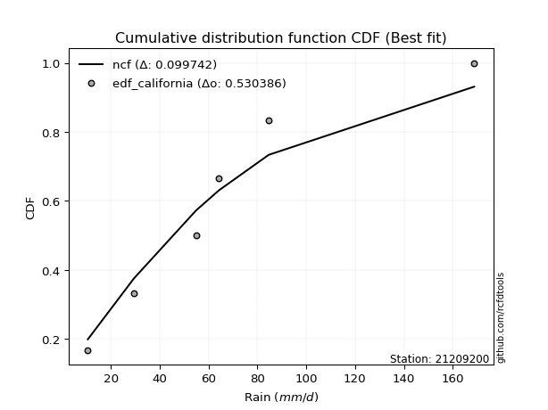</img>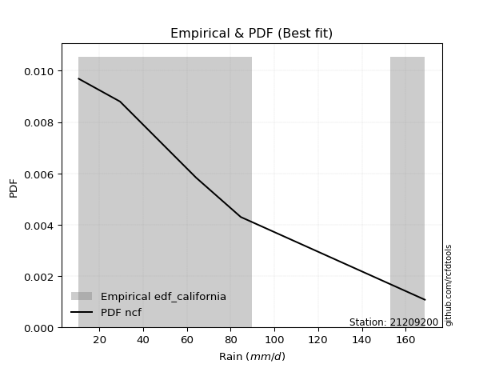</img>

</div>


### 2. EDF Hazen (1930)

Hazen method for plotting positions is a formula used to estimate the empirical cumulative probability distribution of flood events or other hydrological data. This formula often results in biased estimations, particularly when extrapolating to extreme events (high return periods).

<div align="center">


$P=(m-0.5)/n$


</div>


**2.1. Empirical values**

<div align="center">

|                | 0                   | 1                  | 2                  | 3                  | 4         | 5                  |
|:---------------|:--------------------|:-------------------|:-------------------|:-------------------|:----------|:-------------------|
| date           | 2022                | 2023               | 2024               | 2021               | 2020      | 2019               |
| x              | 10.5                | 29.4               | 54.8               | 64.2               | 84.6      | 168.8              |
| m              | 1                   | 2                  | 3                  | 4                  | 5         | 6                  |
| empirical_dist | edf_hazen           | edf_hazen          | edf_hazen          | edf_hazen          | edf_hazen | edf_hazen          |
| empirical      | 0.08333333333333333 | 0.25               | 0.4166666666666667 | 0.5833333333333334 | 0.75      | 0.9166666666666666 |
| empirical_tr   | 1.090909090909091   | 1.3333333333333333 | 1.7142857142857144 | 2.4000000000000004 | 4.0       | 11.999999999999995 |

</div>


**2.2. Kolmogorov-Smirnov fit test (sorted by Δ)**


<div align="center">

|                | 0                   | 1                   | 2                   | 3                    | 4                   | 5                    | 6                   | 7                   | 8                   | 9                   | 10                  | 11                  | 12                  | 13                  | 14                  | 15                  | 16                  | 17                  | 18                  | 19                 | 20                  | 21                  | 22                  | 23                 | 24                  | 25                  | 26                  | 27                  | 28                  | 29                  | 30                  | 31                  | 32                  | 33                  | 34                  | 35                  | 36                  | 37                  | 38                  | 39                  | 40                 | 41                  | 42                  | 43                | 44                  | 45                  | 46                 | 47                  | 48                 | 49                  | 50                  | 51                  | 52                  | 53                  | 54                  | 55                  | 56                  | 57                 | 58                 | 59                  | 60                  | 61                  | 62                  | 63                  | 64                  | 65                  | 66                  | 67                  | 68                  | 69                  | 70                  | 71                 | 72                  | 73                | 74                  | 75                  | 76                  | 77                  | 78                  | 79                  | 80                  | 81                  | 82                  | 83                  | 84                  | 85                  | 86                 | 87                  | 88                  | 89                  | 90                | 91                 | 92                 | 93                 | 94                  | 95                  | 96                  | 97                  | 98                 | 99                  | 100                | 101                | 102                 | 103                | 104                | 105                 | 106                 | 107                 | 108                 | 109                 | 110               | 111                 | 112                | 113                 | 114                 | 115                | 116                 | 117                 | 118                 | 119                 | 120                | 121                | 122               | 123                | 124                 | 125                | 126                | 127                 | 128                | 129                | 130                | 131                | 132               | 133                | 134                 | 135                 | 136                | 137                 | 138                 | 139                | 140                 | 141                 | 142                 | 143                | 144                | 145                | 146               | 147                | 148                | 149                | 150                | 151                | 152               | 153               | 154               | 155                | 156               | 157                | 158                | 159                |
|:---------------|:--------------------|:--------------------|:--------------------|:---------------------|:--------------------|:---------------------|:--------------------|:--------------------|:--------------------|:--------------------|:--------------------|:--------------------|:--------------------|:--------------------|:--------------------|:--------------------|:--------------------|:--------------------|:--------------------|:-------------------|:--------------------|:--------------------|:--------------------|:-------------------|:--------------------|:--------------------|:--------------------|:--------------------|:--------------------|:--------------------|:--------------------|:--------------------|:--------------------|:--------------------|:--------------------|:--------------------|:--------------------|:--------------------|:--------------------|:--------------------|:-------------------|:--------------------|:--------------------|:------------------|:--------------------|:--------------------|:-------------------|:--------------------|:-------------------|:--------------------|:--------------------|:--------------------|:--------------------|:--------------------|:--------------------|:--------------------|:--------------------|:-------------------|:-------------------|:--------------------|:--------------------|:--------------------|:--------------------|:--------------------|:--------------------|:--------------------|:--------------------|:--------------------|:--------------------|:--------------------|:--------------------|:-------------------|:--------------------|:------------------|:--------------------|:--------------------|:--------------------|:--------------------|:--------------------|:--------------------|:--------------------|:--------------------|:--------------------|:--------------------|:--------------------|:--------------------|:-------------------|:--------------------|:--------------------|:--------------------|:------------------|:-------------------|:-------------------|:-------------------|:--------------------|:--------------------|:--------------------|:--------------------|:-------------------|:--------------------|:-------------------|:-------------------|:--------------------|:-------------------|:-------------------|:--------------------|:--------------------|:--------------------|:--------------------|:--------------------|:------------------|:--------------------|:-------------------|:--------------------|:--------------------|:-------------------|:--------------------|:--------------------|:--------------------|:--------------------|:-------------------|:-------------------|:------------------|:-------------------|:--------------------|:-------------------|:-------------------|:--------------------|:-------------------|:-------------------|:-------------------|:-------------------|:------------------|:-------------------|:--------------------|:--------------------|:-------------------|:--------------------|:--------------------|:-------------------|:--------------------|:--------------------|:--------------------|:-------------------|:-------------------|:-------------------|:------------------|:-------------------|:-------------------|:-------------------|:-------------------|:-------------------|:------------------|:------------------|:------------------|:-------------------|:------------------|:-------------------|:-------------------|:-------------------|
| station        | 21209200            | 21209200            | 21209200            | 21209200             | 21209200            | 21209200             | 21209200            | 21209200            | 21209200            | 21209200            | 21209200            | 21209200            | 21209200            | 21209200            | 21209200            | 21209200            | 21209200            | 21209200            | 21209200            | 21209200           | 21209200            | 21209200            | 21209200            | 21209200           | 21209200            | 21209200            | 21209200            | 21209200            | 21209200            | 21209200            | 21209200            | 21209200            | 21209200            | 21209200            | 21209200            | 21209200            | 21209200            | 21209200            | 21209200            | 21209200            | 21209200           | 21209200            | 21209200            | 21209200          | 21209200            | 21209200            | 21209200           | 21209200            | 21209200           | 21209200            | 21209200            | 21209200            | 21209200            | 21209200            | 21209200            | 21209200            | 21209200            | 21209200           | 21209200           | 21209200            | 21209200            | 21209200            | 21209200            | 21209200            | 21209200            | 21209200            | 21209200            | 21209200            | 21209200            | 21209200            | 21209200            | 21209200           | 21209200            | 21209200          | 21209200            | 21209200            | 21209200            | 21209200            | 21209200            | 21209200            | 21209200            | 21209200            | 21209200            | 21209200            | 21209200            | 21209200            | 21209200           | 21209200            | 21209200            | 21209200            | 21209200          | 21209200           | 21209200           | 21209200           | 21209200            | 21209200            | 21209200            | 21209200            | 21209200           | 21209200            | 21209200           | 21209200           | 21209200            | 21209200           | 21209200           | 21209200            | 21209200            | 21209200            | 21209200            | 21209200            | 21209200          | 21209200            | 21209200           | 21209200            | 21209200            | 21209200           | 21209200            | 21209200            | 21209200            | 21209200            | 21209200           | 21209200           | 21209200          | 21209200           | 21209200            | 21209200           | 21209200           | 21209200            | 21209200           | 21209200           | 21209200           | 21209200           | 21209200          | 21209200           | 21209200            | 21209200            | 21209200           | 21209200            | 21209200            | 21209200           | 21209200            | 21209200            | 21209200            | 21209200           | 21209200           | 21209200           | 21209200          | 21209200           | 21209200           | 21209200           | 21209200           | 21209200           | 21209200          | 21209200          | 21209200          | 21209200           | 21209200          | 21209200           | 21209200           | 21209200           |
| empirical_dist | edf_hazen           | edf_hazen           | edf_hazen           | edf_hazen            | edf_hazen           | edf_hazen            | edf_hazen           | edf_hazen           | edf_hazen           | edf_hazen           | edf_hazen           | edf_hazen           | edf_hazen           | edf_hazen           | edf_hazen           | edf_hazen           | edf_hazen           | edf_hazen           | edf_hazen           | edf_hazen          | edf_hazen           | edf_hazen           | edf_hazen           | edf_hazen          | edf_hazen           | edf_hazen           | edf_hazen           | edf_hazen           | edf_hazen           | edf_hazen           | edf_hazen           | edf_hazen           | edf_hazen           | edf_hazen           | edf_hazen           | edf_hazen           | edf_hazen           | edf_hazen           | edf_hazen           | edf_hazen           | edf_hazen          | edf_hazen           | edf_hazen           | edf_hazen         | edf_hazen           | edf_hazen           | edf_hazen          | edf_hazen           | edf_hazen          | edf_hazen           | edf_hazen           | edf_hazen           | edf_hazen           | edf_hazen           | edf_hazen           | edf_hazen           | edf_hazen           | edf_hazen          | edf_hazen          | edf_hazen           | edf_hazen           | edf_hazen           | edf_hazen           | edf_hazen           | edf_hazen           | edf_hazen           | edf_hazen           | edf_hazen           | edf_hazen           | edf_hazen           | edf_hazen           | edf_hazen          | edf_hazen           | edf_hazen         | edf_hazen           | edf_hazen           | edf_hazen           | edf_hazen           | edf_hazen           | edf_hazen           | edf_hazen           | edf_hazen           | edf_hazen           | edf_hazen           | edf_hazen           | edf_hazen           | edf_hazen          | edf_hazen           | edf_hazen           | edf_hazen           | edf_hazen         | edf_hazen          | edf_hazen          | edf_hazen          | edf_hazen           | edf_hazen           | edf_hazen           | edf_hazen           | edf_hazen          | edf_hazen           | edf_hazen          | edf_hazen          | edf_hazen           | edf_hazen          | edf_hazen          | edf_hazen           | edf_hazen           | edf_hazen           | edf_hazen           | edf_hazen           | edf_hazen         | edf_hazen           | edf_hazen          | edf_hazen           | edf_hazen           | edf_hazen          | edf_hazen           | edf_hazen           | edf_hazen           | edf_hazen           | edf_hazen          | edf_hazen          | edf_hazen         | edf_hazen          | edf_hazen           | edf_hazen          | edf_hazen          | edf_hazen           | edf_hazen          | edf_hazen          | edf_hazen          | edf_hazen          | edf_hazen         | edf_hazen          | edf_hazen           | edf_hazen           | edf_hazen          | edf_hazen           | edf_hazen           | edf_hazen          | edf_hazen           | edf_hazen           | edf_hazen           | edf_hazen          | edf_hazen          | edf_hazen          | edf_hazen         | edf_hazen          | edf_hazen          | edf_hazen          | edf_hazen          | edf_hazen          | edf_hazen         | edf_hazen         | edf_hazen         | edf_hazen          | edf_hazen         | edf_hazen          | edf_hazen          | edf_hazen          |
| p_dist         | genlogistic         | moyal               | dweibull            | loggumbel_l          | burr                | loggenlogistic       | gumbel_r            | logjohnsonsu        | logburr             | logloggamma         | kstwobign           | logskewnorm         | halflogistic        | halfnorm            | pearson3            | logargus            | logburr12           | logweibull_min      | foldnorm            | nct                | invgamma            | kappa3              | logdgamma           | gompertz           | vonmises_line       | logdweibull         | dgamma              | skewnorm            | logtriang           | logweibull_max      | loggenextreme       | logpearson3         | genexpon            | logtrapezoid        | johnsonsu           | rayleigh            | invgauss            | logloglaplace       | gennorm             | maxwell             | loggompertz        | rice                | logarcsine          | bradford          | logsemicircular     | lomax               | loganglit          | exponnorm           | loggennorm         | logistic            | logfoldnorm         | logfatiguelife      | logexponnorm        | logt                | lognorm             | logcrystalball      | lognct              | logf               | t                  | norm                | crystalball         | truncnorm           | hypsecant           | loglogistic         | loggamma            | loggamma            | logalpha            | logerlang           | logrice             | loghypsecant        | loginvgamma         | laplace            | truncweibull_min    | anglit            | truncexpon          | logbetaprime        | logncf              | loginvgauss         | semicircular        | logcosine           | loglaplace          | loglaplace          | ncf                 | logmaxwell          | loggenhalflogistic  | loginvweibull       | betaprime          | logksone            | wald                | lograyleigh         | logkappa4         | logkappa3          | loguniform         | arcsine            | logwrapcauchy       | cosine              | logvonmises_line    | logkstwobign        | halfgennorm        | loggenexpon         | gumbel_l           | loghalfnorm        | loggumbel_r         | mielke             | gamma              | weibull_min         | f                   | logmoyal            | loghalflogistic     | erlang              | logtruncnorm      | loglevy_l           | burr12             | kappa4              | loggenpareto        | loggausshyper      | logbeta             | nakagami            | lognakagami         | loglomax            | alpha              | logbradford        | loghalfgennorm    | logexponweib       | exponpow            | wrapcauchy         | gengamma           | ksone               | logtruncexpon      | uniform            | logjohnsonsb       | argus              | logwald           | genextreme         | logrdist            | logtruncweibull_min | levy_l             | exponweib           | logtukeylambda      | genpareto          | beta                | fatiguelife         | genhalflogistic     | rdist              | gausshyper         | invweibull         | triang            | johnsonsb          | tukeylambda        | powerlaw           | logexponpow        | trapezoid          | truncpareto       | logmielke         | logpowerlaw       | weibull_max        | logtruncpareto    | loggengamma        | logvonmises        | vonmises           |
| delta          | 0.04875611850878114 | 0.05563216849973546 | 0.05702026574193142 | 0.058058002509876305 | 0.05951417312827145 | 0.060694828840043236 | 0.06316230531160838 | 0.06694478161818768 | 0.06817681514678114 | 0.06856302639514866 | 0.06942163804613655 | 0.07055993464729154 | 0.07069486270733988 | 0.07375853902099716 | 0.07387609192938016 | 0.07477196420666843 | 0.07559601454471959 | 0.07589360850719157 | 0.07642063881349737 | 0.0814285840391939 | 0.08304345550806919 | 0.08333333333258629 | 0.08333333333307835 | 0.0833333333331466 | 0.08333333333324056 | 0.08333333333331777 | 0.08333333333341175 | 0.08709913462000984 | 0.09139211478770393 | 0.09181045800747134 | 0.09182102444760665 | 0.09305244391378392 | 0.09429178443691183 | 0.09483950821815956 | 0.09495896100442486 | 0.09516238114771847 | 0.09791550419141387 | 0.10064049265145014 | 0.10100339970543509 | 0.10262146545183004 | 0.1049805997123337 | 0.10532019352795108 | 0.10912717702257346 | 0.111507015854795 | 0.11729358152419028 | 0.11780471935849351 | 0.1197882726342196 | 0.12013111123550518 | 0.1235257059035641 | 0.12364817721523724 | 0.12546368017587822 | 0.12571325756034374 | 0.12583377659223943 | 0.12583528933882687 | 0.12583569328507954 | 0.12583753741372067 | 0.12637881068202855 | 0.1263867089582436 | 0.1270137238197997 | 0.12701466252533689 | 0.12701466557145014 | 0.12701466832450292 | 0.12773878419892976 | 0.13158393120565298 | 0.13389400258349476 | 0.13389400258349476 | 0.13438073118182653 | 0.13600614701912989 | 0.13607874240509538 | 0.13645499923190635 | 0.14240677694096232 | 0.1425289768539552 | 0.14311079396596726 | 0.143710233906987 | 0.14683885107727157 | 0.14693558124123723 | 0.14810573178467507 | 0.14893586275742793 | 0.15067320149715036 | 0.15111688173824273 | 0.15338931977628062 | 0.15338931977628062 | 0.15556909203993724 | 0.15670660752627125 | 0.15822663483381827 | 0.16012033870171033 | 0.1610423409426846 | 0.16243940195996048 | 0.16320862924500906 | 0.16667407005554497 | 0.168594609842539 | 0.1700830912795937 | 0.1782606156852859 | 0.1788856967793485 | 0.18076318353750526 | 0.18672108114467822 | 0.18691621817515397 | 0.18773261584174167 | 0.1879553917474605 | 0.18893791874598215 | 0.1893616245612274 | 0.1947701546801927 | 0.19618935414772337 | 0.1994522867914184 | 0.2078163197250214 | 0.21164824028097573 | 0.21167558409046777 | 0.22125735680679687 | 0.22179266270223247 | 0.22338700438662712 | 0.231999309195377 | 0.23318536455413014 | 0.2332824848373199 | 0.24255411377703096 | 0.24405709617934307 | 0.2441142976050103 | 0.24947955251050558 | 0.24999999988883684 | 0.24999999999719047 | 0.25031420754255734 | 0.2513925411289292 | 0.2629997426666422 | 0.263765016810955 | 0.2649216338415521 | 0.26844494841510524 | 0.2691949548747733 | 0.2748720083871062 | 0.27658454411455047 | 0.2773791908286957 | 0.2819014529374606 | 0.2848111254286829 | 0.2876166002342676 | 0.290820857003212 | 0.3008525449512419 | 0.30747925020315153 | 0.31095573756626343 | 0.3160047284764537 | 0.33122683252764423 | 0.36771496241301566 | 0.3855859354532429 | 0.38584933195748405 | 0.41411273298013596 | 0.41644456631380844 | 0.4727277291266448 | 0.4731948446939214 | 0.4743929158089733 | 0.481641009724612 | 0.4945844688170894 | 0.4981145010277312 | 0.4997127532573903 | 0.5054294165658214 | 0.5245475033386355 | 0.575950019881509 | 0.601468519212631 | 0.607053878926918 | 0.6278867703151072 | 0.665333222797885 | 0.7027608959059263 | 1.0954700237819583 | 26.913236531203488 |
| deltao         | 0.530385761606      | 0.530385761606      | 0.530385761606      | 0.530385761606       | 0.530385761606      | 0.530385761606       | 0.530385761606      | 0.530385761606      | 0.530385761606      | 0.530385761606      | 0.530385761606      | 0.530385761606      | 0.530385761606      | 0.530385761606      | 0.530385761606      | 0.530385761606      | 0.530385761606      | 0.530385761606      | 0.530385761606      | 0.530385761606     | 0.530385761606      | 0.530385761606      | 0.530385761606      | 0.530385761606     | 0.530385761606      | 0.530385761606      | 0.530385761606      | 0.530385761606      | 0.530385761606      | 0.530385761606      | 0.530385761606      | 0.530385761606      | 0.530385761606      | 0.530385761606      | 0.530385761606      | 0.530385761606      | 0.530385761606      | 0.530385761606      | 0.530385761606      | 0.530385761606      | 0.530385761606     | 0.530385761606      | 0.530385761606      | 0.530385761606    | 0.530385761606      | 0.530385761606      | 0.530385761606     | 0.530385761606      | 0.530385761606     | 0.530385761606      | 0.530385761606      | 0.530385761606      | 0.530385761606      | 0.530385761606      | 0.530385761606      | 0.530385761606      | 0.530385761606      | 0.530385761606     | 0.530385761606     | 0.530385761606      | 0.530385761606      | 0.530385761606      | 0.530385761606      | 0.530385761606      | 0.530385761606      | 0.530385761606      | 0.530385761606      | 0.530385761606      | 0.530385761606      | 0.530385761606      | 0.530385761606      | 0.530385761606     | 0.530385761606      | 0.530385761606    | 0.530385761606      | 0.530385761606      | 0.530385761606      | 0.530385761606      | 0.530385761606      | 0.530385761606      | 0.530385761606      | 0.530385761606      | 0.530385761606      | 0.530385761606      | 0.530385761606      | 0.530385761606      | 0.530385761606     | 0.530385761606      | 0.530385761606      | 0.530385761606      | 0.530385761606    | 0.530385761606     | 0.530385761606     | 0.530385761606     | 0.530385761606      | 0.530385761606      | 0.530385761606      | 0.530385761606      | 0.530385761606     | 0.530385761606      | 0.530385761606     | 0.530385761606     | 0.530385761606      | 0.530385761606     | 0.530385761606     | 0.530385761606      | 0.530385761606      | 0.530385761606      | 0.530385761606      | 0.530385761606      | 0.530385761606    | 0.530385761606      | 0.530385761606     | 0.530385761606      | 0.530385761606      | 0.530385761606     | 0.530385761606      | 0.530385761606      | 0.530385761606      | 0.530385761606      | 0.530385761606     | 0.530385761606     | 0.530385761606    | 0.530385761606     | 0.530385761606      | 0.530385761606     | 0.530385761606     | 0.530385761606      | 0.530385761606     | 0.530385761606     | 0.530385761606     | 0.530385761606     | 0.530385761606    | 0.530385761606     | 0.530385761606      | 0.530385761606      | 0.530385761606     | 0.530385761606      | 0.530385761606      | 0.530385761606     | 0.530385761606      | 0.530385761606      | 0.530385761606      | 0.530385761606     | 0.530385761606     | 0.530385761606     | 0.530385761606    | 0.530385761606     | 0.530385761606     | 0.530385761606     | 0.530385761606     | 0.530385761606     | 0.530385761606    | 0.530385761606    | 0.530385761606    | 0.530385761606     | 0.530385761606    | 0.530385761606     | 0.530385761606     | 0.530385761606     |
| eval           | Δo > Δ              | Δo > Δ              | Δo > Δ              | Δo > Δ               | Δo > Δ              | Δo > Δ               | Δo > Δ              | Δo > Δ              | Δo > Δ              | Δo > Δ              | Δo > Δ              | Δo > Δ              | Δo > Δ              | Δo > Δ              | Δo > Δ              | Δo > Δ              | Δo > Δ              | Δo > Δ              | Δo > Δ              | Δo > Δ             | Δo > Δ              | Δo > Δ              | Δo > Δ              | Δo > Δ             | Δo > Δ              | Δo > Δ              | Δo > Δ              | Δo > Δ              | Δo > Δ              | Δo > Δ              | Δo > Δ              | Δo > Δ              | Δo > Δ              | Δo > Δ              | Δo > Δ              | Δo > Δ              | Δo > Δ              | Δo > Δ              | Δo > Δ              | Δo > Δ              | Δo > Δ             | Δo > Δ              | Δo > Δ              | Δo > Δ            | Δo > Δ              | Δo > Δ              | Δo > Δ             | Δo > Δ              | Δo > Δ             | Δo > Δ              | Δo > Δ              | Δo > Δ              | Δo > Δ              | Δo > Δ              | Δo > Δ              | Δo > Δ              | Δo > Δ              | Δo > Δ             | Δo > Δ             | Δo > Δ              | Δo > Δ              | Δo > Δ              | Δo > Δ              | Δo > Δ              | Δo > Δ              | Δo > Δ              | Δo > Δ              | Δo > Δ              | Δo > Δ              | Δo > Δ              | Δo > Δ              | Δo > Δ             | Δo > Δ              | Δo > Δ            | Δo > Δ              | Δo > Δ              | Δo > Δ              | Δo > Δ              | Δo > Δ              | Δo > Δ              | Δo > Δ              | Δo > Δ              | Δo > Δ              | Δo > Δ              | Δo > Δ              | Δo > Δ              | Δo > Δ             | Δo > Δ              | Δo > Δ              | Δo > Δ              | Δo > Δ            | Δo > Δ             | Δo > Δ             | Δo > Δ             | Δo > Δ              | Δo > Δ              | Δo > Δ              | Δo > Δ              | Δo > Δ             | Δo > Δ              | Δo > Δ             | Δo > Δ             | Δo > Δ              | Δo > Δ             | Δo > Δ             | Δo > Δ              | Δo > Δ              | Δo > Δ              | Δo > Δ              | Δo > Δ              | Δo > Δ            | Δo > Δ              | Δo > Δ             | Δo > Δ              | Δo > Δ              | Δo > Δ             | Δo > Δ              | Δo > Δ              | Δo > Δ              | Δo > Δ              | Δo > Δ             | Δo > Δ             | Δo > Δ            | Δo > Δ             | Δo > Δ              | Δo > Δ             | Δo > Δ             | Δo > Δ              | Δo > Δ             | Δo > Δ             | Δo > Δ             | Δo > Δ             | Δo > Δ            | Δo > Δ             | Δo > Δ              | Δo > Δ              | Δo > Δ             | Δo > Δ              | Δo > Δ              | Δo > Δ             | Δo > Δ              | Δo > Δ              | Δo > Δ              | Δo > Δ             | Δo > Δ             | Δo > Δ             | Δo > Δ            | Δo > Δ             | Δo > Δ             | Δo > Δ             | Δo > Δ             | Δo > Δ             | Δo <= Δ           | Δo <= Δ           | Δo <= Δ           | Δo <= Δ            | Δo <= Δ           | Δo <= Δ            | Δo <= Δ            | Δo <= Δ            |
| fit            | 1                   | 1                   | 1                   | 1                    | 1                   | 1                    | 1                   | 1                   | 1                   | 1                   | 1                   | 1                   | 1                   | 1                   | 1                   | 1                   | 1                   | 1                   | 1                   | 1                  | 1                   | 1                   | 1                   | 1                  | 1                   | 1                   | 1                   | 1                   | 1                   | 1                   | 1                   | 1                   | 1                   | 1                   | 1                   | 1                   | 1                   | 1                   | 1                   | 1                   | 1                  | 1                   | 1                   | 1                 | 1                   | 1                   | 1                  | 1                   | 1                  | 1                   | 1                   | 1                   | 1                   | 1                   | 1                   | 1                   | 1                   | 1                  | 1                  | 1                   | 1                   | 1                   | 1                   | 1                   | 1                   | 1                   | 1                   | 1                   | 1                   | 1                   | 1                   | 1                  | 1                   | 1                 | 1                   | 1                   | 1                   | 1                   | 1                   | 1                   | 1                   | 1                   | 1                   | 1                   | 1                   | 1                   | 1                  | 1                   | 1                   | 1                   | 1                 | 1                  | 1                  | 1                  | 1                   | 1                   | 1                   | 1                   | 1                  | 1                   | 1                  | 1                  | 1                   | 1                  | 1                  | 1                   | 1                   | 1                   | 1                   | 1                   | 1                 | 1                   | 1                  | 1                   | 1                   | 1                  | 1                   | 1                   | 1                   | 1                   | 1                  | 1                  | 1                 | 1                  | 1                   | 1                  | 1                  | 1                   | 1                  | 1                  | 1                  | 1                  | 1                 | 1                  | 1                   | 1                   | 1                  | 1                   | 1                   | 1                  | 1                   | 1                   | 1                   | 1                  | 1                  | 1                  | 1                 | 1                  | 1                  | 1                  | 1                  | 1                  | 0                 | 0                 | 0                 | 0                  | 0                 | 0                  | 0                  | 0                  |
| n              | 6                   | 6                   | 6                   | 6                    | 6                   | 6                    | 6                   | 6                   | 6                   | 6                   | 6                   | 6                   | 6                   | 6                   | 6                   | 6                   | 6                   | 6                   | 6                   | 6                  | 6                   | 6                   | 6                   | 6                  | 6                   | 6                   | 6                   | 6                   | 6                   | 6                   | 6                   | 6                   | 6                   | 6                   | 6                   | 6                   | 6                   | 6                   | 6                   | 6                   | 6                  | 6                   | 6                   | 6                 | 6                   | 6                   | 6                  | 6                   | 6                  | 6                   | 6                   | 6                   | 6                   | 6                   | 6                   | 6                   | 6                   | 6                  | 6                  | 6                   | 6                   | 6                   | 6                   | 6                   | 6                   | 6                   | 6                   | 6                   | 6                   | 6                   | 6                   | 6                  | 6                   | 6                 | 6                   | 6                   | 6                   | 6                   | 6                   | 6                   | 6                   | 6                   | 6                   | 6                   | 6                   | 6                   | 6                  | 6                   | 6                   | 6                   | 6                 | 6                  | 6                  | 6                  | 6                   | 6                   | 6                   | 6                   | 6                  | 6                   | 6                  | 6                  | 6                   | 6                  | 6                  | 6                   | 6                   | 6                   | 6                   | 6                   | 6                 | 6                   | 6                  | 6                   | 6                   | 6                  | 6                   | 6                   | 6                   | 6                   | 6                  | 6                  | 6                 | 6                  | 6                   | 6                  | 6                  | 6                   | 6                  | 6                  | 6                  | 6                  | 6                 | 6                  | 6                   | 6                   | 6                  | 6                   | 6                   | 6                  | 6                   | 6                   | 6                   | 6                  | 6                  | 6                  | 6                 | 6                  | 6                  | 6                  | 6                  | 6                  | 6                 | 6                 | 6                 | 6                  | 6                 | 6                  | 6                  | 6                  |
| best_fit       | 1                   | 0                   | 0                   | 0                    | 0                   | 0                    | 0                   | 0                   | 0                   | 0                   | 0                   | 0                   | 0                   | 0                   | 0                   | 0                   | 0                   | 0                   | 0                   | 0                  | 0                   | 0                   | 0                   | 0                  | 0                   | 0                   | 0                   | 0                   | 0                   | 0                   | 0                   | 0                   | 0                   | 0                   | 0                   | 0                   | 0                   | 0                   | 0                   | 0                   | 0                  | 0                   | 0                   | 0                 | 0                   | 0                   | 0                  | 0                   | 0                  | 0                   | 0                   | 0                   | 0                   | 0                   | 0                   | 0                   | 0                   | 0                  | 0                  | 0                   | 0                   | 0                   | 0                   | 0                   | 0                   | 0                   | 0                   | 0                   | 0                   | 0                   | 0                   | 0                  | 0                   | 0                 | 0                   | 0                   | 0                   | 0                   | 0                   | 0                   | 0                   | 0                   | 0                   | 0                   | 0                   | 0                   | 0                  | 0                   | 0                   | 0                   | 0                 | 0                  | 0                  | 0                  | 0                   | 0                   | 0                   | 0                   | 0                  | 0                   | 0                  | 0                  | 0                   | 0                  | 0                  | 0                   | 0                   | 0                   | 0                   | 0                   | 0                 | 0                   | 0                  | 0                   | 0                   | 0                  | 0                   | 0                   | 0                   | 0                   | 0                  | 0                  | 0                 | 0                  | 0                   | 0                  | 0                  | 0                   | 0                  | 0                  | 0                  | 0                  | 0                 | 0                  | 0                   | 0                   | 0                  | 0                   | 0                   | 0                  | 0                   | 0                   | 0                   | 0                  | 0                  | 0                  | 0                 | 0                  | 0                  | 0                  | 0                  | 0                  | 0                 | 0                 | 0                 | 0                  | 0                 | 0                  | 0                  | 0                  |
| best_fit_sort  | 1                   | 2                   | 3                   | 4                    | 5                   | 6                    | 7                   | 8                   | 9                   | 10                  | 11                  | 12                  | 13                  | 14                  | 15                  | 16                  | 17                  | 18                  | 19                  | 20                 | 21                  | 22                  | 23                  | 24                 | 25                  | 26                  | 27                  | 28                  | 29                  | 30                  | 31                  | 32                  | 33                  | 34                  | 35                  | 36                  | 37                  | 38                  | 39                  | 40                  | 41                 | 42                  | 43                  | 44                | 45                  | 46                  | 47                 | 48                  | 49                 | 50                  | 51                  | 52                  | 53                  | 54                  | 55                  | 56                  | 57                  | 58                 | 59                 | 60                  | 61                  | 62                  | 63                  | 64                  | 65                  | 66                  | 67                  | 68                  | 69                  | 70                  | 71                  | 72                 | 73                  | 74                | 75                  | 76                  | 77                  | 78                  | 79                  | 80                  | 81                  | 82                  | 83                  | 84                  | 85                  | 86                  | 87                 | 88                  | 89                  | 90                  | 91                | 92                 | 93                 | 94                 | 95                  | 96                  | 97                  | 98                  | 99                 | 100                 | 101                | 102                | 103                 | 104                | 105                | 106                 | 107                 | 108                 | 109                 | 110                 | 111               | 112                 | 113                | 114                 | 115                 | 116                | 117                 | 118                 | 119                 | 120                 | 121                | 122                | 123               | 124                | 125                 | 126                | 127                | 128                 | 129                | 130                | 131                | 132                | 133               | 134                | 135                 | 136                 | 137                | 138                 | 139                 | 140                | 141                 | 142                 | 143                 | 144                | 145                | 146                | 147               | 148                | 149                | 150                | 151                | 152                | 153               | 154               | 155               | 156                | 157               | 158                | 159                | 160                |

</div>


**2.3. Best fit**

<div align="center">

|   id |   station | empirical_dist   | p_dist      |     delta |   deltao | eval   |   fit |   n |   best_fit |   best_fit_sort |
|-----:|----------:|:-----------------|:------------|----------:|---------:|:-------|------:|----:|-----------:|----------------:|
|    0 |  21209200 | edf_hazen        | genlogistic | 0.0487561 | 0.530386 | Δo > Δ |     1 |   6 |          1 |               1 |

</div>


<div align="center">

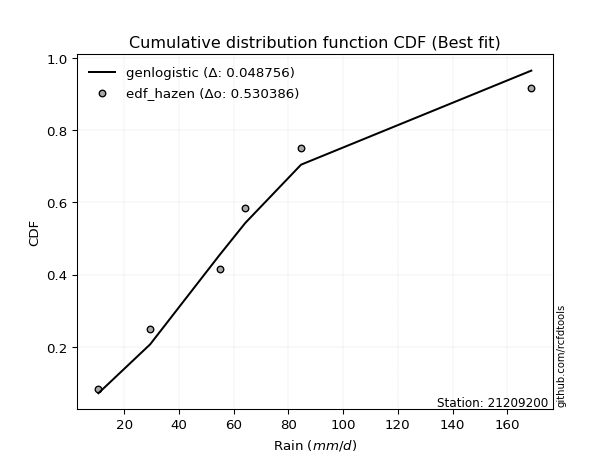</img>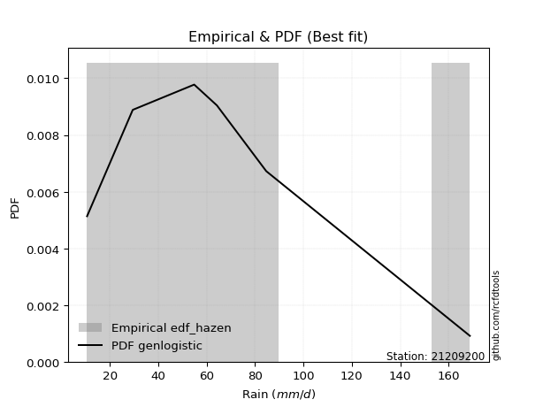</img>

</div>


### 3. EDF Weibull (1939)

Weibull plotting position formula is an empirical method used to estimate the non-exceedance probability or plotting position for a set of observed data, is often recommended or widely used in practice, particularly in flood frequency analysis.

<div align="center">


$P=m/(n+1)$


</div>


**3.1. Empirical values**

<div align="center">

|                | 0                   | 1                  | 2                   | 3                  | 4                  | 5                  |
|:---------------|:--------------------|:-------------------|:--------------------|:-------------------|:-------------------|:-------------------|
| date           | 2022                | 2023               | 2024                | 2021               | 2020               | 2019               |
| x              | 10.5                | 29.4               | 54.8                | 64.2               | 84.6               | 168.8              |
| m              | 1                   | 2                  | 3                   | 4                  | 5                  | 6                  |
| empirical_dist | edf_weibull         | edf_weibull        | edf_weibull         | edf_weibull        | edf_weibull        | edf_weibull        |
| empirical      | 0.14285714285714285 | 0.2857142857142857 | 0.42857142857142855 | 0.5714285714285714 | 0.7142857142857143 | 0.8571428571428571 |
| empirical_tr   | 1.1666666666666665  | 1.4                | 1.75                | 2.333333333333333  | 3.5                | 6.999999999999997  |

</div>


**3.2. Kolmogorov-Smirnov fit test (sorted by Δ)**


<div align="center">

|                | 0                   | 1                   | 2                  | 3                   | 4                   | 5                   | 6                  | 7                   | 8                   | 9                   | 10                  | 11                  | 12                  | 13                  | 14                  | 15                  | 16                  | 17                  | 18                  | 19                  | 20                  | 21                  | 22                 | 23                  | 24                  | 25                 | 26                  | 27                  | 28                  | 29                  | 30                  | 31                  | 32                 | 33                  | 34                  | 35                  | 36                  | 37                  | 38                  | 39                  | 40                  | 41                  | 42                  | 43                  | 44                  | 45                  | 46                  | 47                  | 48                 | 49                 | 50                  | 51                  | 52                  | 53                  | 54                  | 55                  | 56                  | 57                  | 58                  | 59                 | 60                  | 61                  | 62                 | 63                  | 64                  | 65                  | 66                  | 67                  | 68                  | 69                 | 70                  | 71                 | 72                  | 73                 | 74                 | 75                  | 76                 | 77                  | 78                  | 79                  | 80                  | 81                  | 82                  | 83                  | 84                  | 85                  | 86                  | 87                  | 88                  | 89                 | 90                  | 91                  | 92                  | 93                  | 94                 | 95                 | 96                 | 97                 | 98                  | 99                  | 100                 | 101                 | 102                 | 103                | 104                 | 105                 | 106                 | 107                | 108                 | 109                 | 110               | 111                | 112                 | 113                 | 114                 | 115                | 116                 | 117                 | 118                | 119                 | 120                 | 121                 | 122                 | 123                 | 124                | 125                 | 126                 | 127                | 128                | 129                | 130                 | 131                 | 132                | 133                 | 134                 | 135                 | 136                 | 137                 | 138                | 139                 | 140                | 141                 | 142                 | 143                 | 144                 | 145                | 146                 | 147                | 148                | 149                | 150                | 151                 | 152                | 153                | 154                | 155                | 156                | 157                | 158                | 159                |
|:---------------|:--------------------|:--------------------|:-------------------|:--------------------|:--------------------|:--------------------|:-------------------|:--------------------|:--------------------|:--------------------|:--------------------|:--------------------|:--------------------|:--------------------|:--------------------|:--------------------|:--------------------|:--------------------|:--------------------|:--------------------|:--------------------|:--------------------|:-------------------|:--------------------|:--------------------|:-------------------|:--------------------|:--------------------|:--------------------|:--------------------|:--------------------|:--------------------|:-------------------|:--------------------|:--------------------|:--------------------|:--------------------|:--------------------|:--------------------|:--------------------|:--------------------|:--------------------|:--------------------|:--------------------|:--------------------|:--------------------|:--------------------|:--------------------|:-------------------|:-------------------|:--------------------|:--------------------|:--------------------|:--------------------|:--------------------|:--------------------|:--------------------|:--------------------|:--------------------|:-------------------|:--------------------|:--------------------|:-------------------|:--------------------|:--------------------|:--------------------|:--------------------|:--------------------|:--------------------|:-------------------|:--------------------|:-------------------|:--------------------|:-------------------|:-------------------|:--------------------|:-------------------|:--------------------|:--------------------|:--------------------|:--------------------|:--------------------|:--------------------|:--------------------|:--------------------|:--------------------|:--------------------|:--------------------|:--------------------|:-------------------|:--------------------|:--------------------|:--------------------|:--------------------|:-------------------|:-------------------|:-------------------|:-------------------|:--------------------|:--------------------|:--------------------|:--------------------|:--------------------|:-------------------|:--------------------|:--------------------|:--------------------|:-------------------|:--------------------|:--------------------|:------------------|:-------------------|:--------------------|:--------------------|:--------------------|:-------------------|:--------------------|:--------------------|:-------------------|:--------------------|:--------------------|:--------------------|:--------------------|:--------------------|:-------------------|:--------------------|:--------------------|:-------------------|:-------------------|:-------------------|:--------------------|:--------------------|:-------------------|:--------------------|:--------------------|:--------------------|:--------------------|:--------------------|:-------------------|:--------------------|:-------------------|:--------------------|:--------------------|:--------------------|:--------------------|:-------------------|:--------------------|:-------------------|:-------------------|:-------------------|:-------------------|:--------------------|:-------------------|:-------------------|:-------------------|:-------------------|:-------------------|:-------------------|:-------------------|:-------------------|
| station        | 21209200            | 21209200            | 21209200           | 21209200            | 21209200            | 21209200            | 21209200           | 21209200            | 21209200            | 21209200            | 21209200            | 21209200            | 21209200            | 21209200            | 21209200            | 21209200            | 21209200            | 21209200            | 21209200            | 21209200            | 21209200            | 21209200            | 21209200           | 21209200            | 21209200            | 21209200           | 21209200            | 21209200            | 21209200            | 21209200            | 21209200            | 21209200            | 21209200           | 21209200            | 21209200            | 21209200            | 21209200            | 21209200            | 21209200            | 21209200            | 21209200            | 21209200            | 21209200            | 21209200            | 21209200            | 21209200            | 21209200            | 21209200            | 21209200           | 21209200           | 21209200            | 21209200            | 21209200            | 21209200            | 21209200            | 21209200            | 21209200            | 21209200            | 21209200            | 21209200           | 21209200            | 21209200            | 21209200           | 21209200            | 21209200            | 21209200            | 21209200            | 21209200            | 21209200            | 21209200           | 21209200            | 21209200           | 21209200            | 21209200           | 21209200           | 21209200            | 21209200           | 21209200            | 21209200            | 21209200            | 21209200            | 21209200            | 21209200            | 21209200            | 21209200            | 21209200            | 21209200            | 21209200            | 21209200            | 21209200           | 21209200            | 21209200            | 21209200            | 21209200            | 21209200           | 21209200           | 21209200           | 21209200           | 21209200            | 21209200            | 21209200            | 21209200            | 21209200            | 21209200           | 21209200            | 21209200            | 21209200            | 21209200           | 21209200            | 21209200            | 21209200          | 21209200           | 21209200            | 21209200            | 21209200            | 21209200           | 21209200            | 21209200            | 21209200           | 21209200            | 21209200            | 21209200            | 21209200            | 21209200            | 21209200           | 21209200            | 21209200            | 21209200           | 21209200           | 21209200           | 21209200            | 21209200            | 21209200           | 21209200            | 21209200            | 21209200            | 21209200            | 21209200            | 21209200           | 21209200            | 21209200           | 21209200            | 21209200            | 21209200            | 21209200            | 21209200           | 21209200            | 21209200           | 21209200           | 21209200           | 21209200           | 21209200            | 21209200           | 21209200           | 21209200           | 21209200           | 21209200           | 21209200           | 21209200           | 21209200           |
| empirical_dist | edf_weibull         | edf_weibull         | edf_weibull        | edf_weibull         | edf_weibull         | edf_weibull         | edf_weibull        | edf_weibull         | edf_weibull         | edf_weibull         | edf_weibull         | edf_weibull         | edf_weibull         | edf_weibull         | edf_weibull         | edf_weibull         | edf_weibull         | edf_weibull         | edf_weibull         | edf_weibull         | edf_weibull         | edf_weibull         | edf_weibull        | edf_weibull         | edf_weibull         | edf_weibull        | edf_weibull         | edf_weibull         | edf_weibull         | edf_weibull         | edf_weibull         | edf_weibull         | edf_weibull        | edf_weibull         | edf_weibull         | edf_weibull         | edf_weibull         | edf_weibull         | edf_weibull         | edf_weibull         | edf_weibull         | edf_weibull         | edf_weibull         | edf_weibull         | edf_weibull         | edf_weibull         | edf_weibull         | edf_weibull         | edf_weibull        | edf_weibull        | edf_weibull         | edf_weibull         | edf_weibull         | edf_weibull         | edf_weibull         | edf_weibull         | edf_weibull         | edf_weibull         | edf_weibull         | edf_weibull        | edf_weibull         | edf_weibull         | edf_weibull        | edf_weibull         | edf_weibull         | edf_weibull         | edf_weibull         | edf_weibull         | edf_weibull         | edf_weibull        | edf_weibull         | edf_weibull        | edf_weibull         | edf_weibull        | edf_weibull        | edf_weibull         | edf_weibull        | edf_weibull         | edf_weibull         | edf_weibull         | edf_weibull         | edf_weibull         | edf_weibull         | edf_weibull         | edf_weibull         | edf_weibull         | edf_weibull         | edf_weibull         | edf_weibull         | edf_weibull        | edf_weibull         | edf_weibull         | edf_weibull         | edf_weibull         | edf_weibull        | edf_weibull        | edf_weibull        | edf_weibull        | edf_weibull         | edf_weibull         | edf_weibull         | edf_weibull         | edf_weibull         | edf_weibull        | edf_weibull         | edf_weibull         | edf_weibull         | edf_weibull        | edf_weibull         | edf_weibull         | edf_weibull       | edf_weibull        | edf_weibull         | edf_weibull         | edf_weibull         | edf_weibull        | edf_weibull         | edf_weibull         | edf_weibull        | edf_weibull         | edf_weibull         | edf_weibull         | edf_weibull         | edf_weibull         | edf_weibull        | edf_weibull         | edf_weibull         | edf_weibull        | edf_weibull        | edf_weibull        | edf_weibull         | edf_weibull         | edf_weibull        | edf_weibull         | edf_weibull         | edf_weibull         | edf_weibull         | edf_weibull         | edf_weibull        | edf_weibull         | edf_weibull        | edf_weibull         | edf_weibull         | edf_weibull         | edf_weibull         | edf_weibull        | edf_weibull         | edf_weibull        | edf_weibull        | edf_weibull        | edf_weibull        | edf_weibull         | edf_weibull        | edf_weibull        | edf_weibull        | edf_weibull        | edf_weibull        | edf_weibull        | edf_weibull        | edf_weibull        |
| p_dist         | burr                | nct                 | logburr            | loggenlogistic      | logdweibull         | invgamma            | logskewnorm        | logburr12           | logweibull_min      | logloggamma         | logjohnsonsu        | logpearson3         | invgauss            | johnsonsu           | moyal               | halfnorm            | foldnorm            | gumbel_r            | pearson3            | rayleigh            | maxwell             | genlogistic         | loggumbel_l        | kstwobign           | logargus            | loganglit          | logfoldnorm         | rice                | logfatiguelife      | logexponnorm        | logt                | lognorm             | logcrystalball     | logweibull_max      | loggenextreme       | dgamma              | lognct              | logf                | logistic            | hypsecant           | dweibull            | logdgamma           | t                   | crystalball         | truncnorm           | norm                | loglogistic         | halflogistic        | loggamma           | loggamma           | logalpha            | logsemicircular     | logerlang           | logrice             | loghypsecant        | logloglaplace       | gennorm             | loginvgamma         | laplace             | anglit             | logbetaprime        | logtrapezoid        | logncf             | loginvgauss         | logcosine           | loglaplace          | loglaplace          | exponnorm           | semicircular        | logtriang          | bradford            | truncexpon         | loggompertz         | truncweibull_min   | kappa3             | gompertz            | vonmises_line      | lomax               | genexpon            | loggenhalflogistic  | logarcsine          | skewnorm            | arcsine             | ncf                 | logmaxwell          | loginvweibull       | betaprime           | logksone            | loggennorm          | lograyleigh        | cosine              | logkappa4           | logkappa3           | loguniform          | logwrapcauchy      | loglevy_l          | logvonmises_line   | logkstwobign       | weibull_min         | halfgennorm         | loggenexpon         | gumbel_l            | loghalfnorm         | loggumbel_r        | mielke              | gamma               | wald                | f                  | kappa4              | loggenpareto        | logmoyal          | loghalflogistic    | erlang              | logbeta             | burr12              | logexponweib       | loggausshyper       | exponpow            | wrapcauchy         | loglomax            | alpha               | ksone               | genextreme          | loghalfgennorm      | uniform            | logjohnsonsb        | logbradford         | argus              | levy_l             | gengamma           | logtruncexpon       | logtruncnorm        | logwald            | nakagami            | lognakagami         | logrdist            | logtruncweibull_min | exponweib           | genpareto          | beta                | logtukeylambda     | fatiguelife         | genhalflogistic     | rdist               | invweibull          | gausshyper         | tukeylambda         | triang             | johnsonsb          | powerlaw           | logexponpow        | trapezoid           | truncpareto        | logmielke          | logpowerlaw        | weibull_max        | logtruncpareto     | loggengamma        | logvonmises        | vonmises           |
| delta          | 0.08654378906382187 | 0.08684241812370944 | 0.0871032593556273 | 0.08780700828354526 | 0.08917367005853041 | 0.08923635591665931 | 0.0917780018997697 | 0.09181903792587617 | 0.09198890761130987 | 0.09199382778052478 | 0.09365537713135397 | 0.09427850942757914 | 0.09484664343459473 | 0.09518965336558044 | 0.09571095836637677 | 0.09604993994993449 | 0.09650858200493351 | 0.09921112796543441 | 0.09957247370837774 | 0.10381228630706252 | 0.10707086092805163 | 0.10827992803259068 | 0.1087613802756413 | 0.10937514026803219 | 0.11291798242654072 | 0.1132399185962695 | 0.11355891827111636 | 0.11370985810100331 | 0.11380849565558188 | 0.11392901468747757 | 0.11393052743406501 | 0.11393093138031768 | 0.1139327755089588 | 0.11399766848514792 | 0.11399920149243414 | 0.11432536648579394 | 0.11447404877726669 | 0.11448194705348175 | 0.11576557372265017 | 0.11583402229416778 | 0.11654407526574095 | 0.11665253869994852 | 0.11868586968046813 | 0.11868592940785427 | 0.11868592952737278 | 0.11868593194587185 | 0.11967916930089112 | 0.12134434897882462 | 0.1219892406787329 | 0.1219892406787329 | 0.12247596927706467 | 0.12299181179200741 | 0.12410138511436802 | 0.12417398050033351 | 0.12455023732714449 | 0.12678514022441323 | 0.12813557007289386 | 0.13050201503620046 | 0.13062421494919324 | 0.1306964650669754 | 0.13503081933647537 | 0.13583911687820638 | 0.1362009698799132 | 0.13703110085266607 | 0.13921211983348086 | 0.14148455787151876 | 0.14148455787151876 | 0.14151308657929113 | 0.14198686899081048 | 0.1428428861311567 | 0.14285708628965177 | 0.1428570957168096 | 0.14285713986128837 | 0.1428571426571923 | 0.1428571428563958 | 0.14285714285695614 | 0.1428571428570501 | 0.14285714285714007 | 0.14285714285714057 | 0.14285714285714202 | 0.14285714285714285 | 0.14285714285714285 | 0.14317141106506281 | 0.14366433013517538 | 0.14480184562150938 | 0.14821557679694847 | 0.14913757903792274 | 0.15053464005519862 | 0.15204318699560782 | 0.1547693081507831 | 0.15593910333712147 | 0.15668984793777713 | 0.15817832937483184 | 0.16635585378052403 | 0.1688584216327434 | 0.1736615550303206 | 0.1750114562703921 | 0.1758278539369798 | 0.17593395456669003 | 0.17605062984269865 | 0.17703315684122028 | 0.17745686265646543 | 0.18286539277543085 | 0.1842845922429615 | 0.18754752488665655 | 0.19591155782025954 | 0.19892291495929476 | 0.1997708221857059 | 0.20683982806274526 | 0.20728983222081504 | 0.209352594902035 | 0.2098879007974706 | 0.21148224248186526 | 0.21376526679621988 | 0.22137772293255803 | 0.2294427043818103 | 0.23220953570024844 | 0.23273066270081955 | 0.2334806691604876 | 0.23840944563779548 | 0.23948777922416736 | 0.24087025840026477 | 0.24132873542743238 | 0.24469408236756857 | 0.2461871672231749 | 0.24909683971439722 | 0.25109498076188036 | 0.2519023145199819 | 0.2564809189526442 | 0.2629672464823443 | 0.26547442892393386 | 0.26771359490966273 | 0.2789160950984501 | 0.28571428560312256 | 0.28571428571147617 | 0.29557448829838967 | 0.2990509756615016  | 0.31932207062288237 | 0.3498716497389572 | 0.35013504624319836 | 0.3558102005082538 | 0.37839844726585026 | 0.38073028059952274 | 0.41320391960283526 | 0.41486910628516377 | 0.4374805589796357 | 0.43859069150392166 | 0.4459267240103263 | 0.4588701831028037 | 0.4639984675431046 | 0.4697151308515357 | 0.48883321762434984 | 0.5402357341672233 | 0.5657542334983453 | 0.5713395932126323 | 0.5921724846008215 | 0.6296189370835993 | 0.6670466101916406 | 1.0835652618771965 | 26.972760340727298 |
| deltao         | 0.530385761606      | 0.530385761606      | 0.530385761606     | 0.530385761606      | 0.530385761606      | 0.530385761606      | 0.530385761606     | 0.530385761606      | 0.530385761606      | 0.530385761606      | 0.530385761606      | 0.530385761606      | 0.530385761606      | 0.530385761606      | 0.530385761606      | 0.530385761606      | 0.530385761606      | 0.530385761606      | 0.530385761606      | 0.530385761606      | 0.530385761606      | 0.530385761606      | 0.530385761606     | 0.530385761606      | 0.530385761606      | 0.530385761606     | 0.530385761606      | 0.530385761606      | 0.530385761606      | 0.530385761606      | 0.530385761606      | 0.530385761606      | 0.530385761606     | 0.530385761606      | 0.530385761606      | 0.530385761606      | 0.530385761606      | 0.530385761606      | 0.530385761606      | 0.530385761606      | 0.530385761606      | 0.530385761606      | 0.530385761606      | 0.530385761606      | 0.530385761606      | 0.530385761606      | 0.530385761606      | 0.530385761606      | 0.530385761606     | 0.530385761606     | 0.530385761606      | 0.530385761606      | 0.530385761606      | 0.530385761606      | 0.530385761606      | 0.530385761606      | 0.530385761606      | 0.530385761606      | 0.530385761606      | 0.530385761606     | 0.530385761606      | 0.530385761606      | 0.530385761606     | 0.530385761606      | 0.530385761606      | 0.530385761606      | 0.530385761606      | 0.530385761606      | 0.530385761606      | 0.530385761606     | 0.530385761606      | 0.530385761606     | 0.530385761606      | 0.530385761606     | 0.530385761606     | 0.530385761606      | 0.530385761606     | 0.530385761606      | 0.530385761606      | 0.530385761606      | 0.530385761606      | 0.530385761606      | 0.530385761606      | 0.530385761606      | 0.530385761606      | 0.530385761606      | 0.530385761606      | 0.530385761606      | 0.530385761606      | 0.530385761606     | 0.530385761606      | 0.530385761606      | 0.530385761606      | 0.530385761606      | 0.530385761606     | 0.530385761606     | 0.530385761606     | 0.530385761606     | 0.530385761606      | 0.530385761606      | 0.530385761606      | 0.530385761606      | 0.530385761606      | 0.530385761606     | 0.530385761606      | 0.530385761606      | 0.530385761606      | 0.530385761606     | 0.530385761606      | 0.530385761606      | 0.530385761606    | 0.530385761606     | 0.530385761606      | 0.530385761606      | 0.530385761606      | 0.530385761606     | 0.530385761606      | 0.530385761606      | 0.530385761606     | 0.530385761606      | 0.530385761606      | 0.530385761606      | 0.530385761606      | 0.530385761606      | 0.530385761606     | 0.530385761606      | 0.530385761606      | 0.530385761606     | 0.530385761606     | 0.530385761606     | 0.530385761606      | 0.530385761606      | 0.530385761606     | 0.530385761606      | 0.530385761606      | 0.530385761606      | 0.530385761606      | 0.530385761606      | 0.530385761606     | 0.530385761606      | 0.530385761606     | 0.530385761606      | 0.530385761606      | 0.530385761606      | 0.530385761606      | 0.530385761606     | 0.530385761606      | 0.530385761606     | 0.530385761606     | 0.530385761606     | 0.530385761606     | 0.530385761606      | 0.530385761606     | 0.530385761606     | 0.530385761606     | 0.530385761606     | 0.530385761606     | 0.530385761606     | 0.530385761606     | 0.530385761606     |
| eval           | Δo > Δ              | Δo > Δ              | Δo > Δ             | Δo > Δ              | Δo > Δ              | Δo > Δ              | Δo > Δ             | Δo > Δ              | Δo > Δ              | Δo > Δ              | Δo > Δ              | Δo > Δ              | Δo > Δ              | Δo > Δ              | Δo > Δ              | Δo > Δ              | Δo > Δ              | Δo > Δ              | Δo > Δ              | Δo > Δ              | Δo > Δ              | Δo > Δ              | Δo > Δ             | Δo > Δ              | Δo > Δ              | Δo > Δ             | Δo > Δ              | Δo > Δ              | Δo > Δ              | Δo > Δ              | Δo > Δ              | Δo > Δ              | Δo > Δ             | Δo > Δ              | Δo > Δ              | Δo > Δ              | Δo > Δ              | Δo > Δ              | Δo > Δ              | Δo > Δ              | Δo > Δ              | Δo > Δ              | Δo > Δ              | Δo > Δ              | Δo > Δ              | Δo > Δ              | Δo > Δ              | Δo > Δ              | Δo > Δ             | Δo > Δ             | Δo > Δ              | Δo > Δ              | Δo > Δ              | Δo > Δ              | Δo > Δ              | Δo > Δ              | Δo > Δ              | Δo > Δ              | Δo > Δ              | Δo > Δ             | Δo > Δ              | Δo > Δ              | Δo > Δ             | Δo > Δ              | Δo > Δ              | Δo > Δ              | Δo > Δ              | Δo > Δ              | Δo > Δ              | Δo > Δ             | Δo > Δ              | Δo > Δ             | Δo > Δ              | Δo > Δ             | Δo > Δ             | Δo > Δ              | Δo > Δ             | Δo > Δ              | Δo > Δ              | Δo > Δ              | Δo > Δ              | Δo > Δ              | Δo > Δ              | Δo > Δ              | Δo > Δ              | Δo > Δ              | Δo > Δ              | Δo > Δ              | Δo > Δ              | Δo > Δ             | Δo > Δ              | Δo > Δ              | Δo > Δ              | Δo > Δ              | Δo > Δ             | Δo > Δ             | Δo > Δ             | Δo > Δ             | Δo > Δ              | Δo > Δ              | Δo > Δ              | Δo > Δ              | Δo > Δ              | Δo > Δ             | Δo > Δ              | Δo > Δ              | Δo > Δ              | Δo > Δ             | Δo > Δ              | Δo > Δ              | Δo > Δ            | Δo > Δ             | Δo > Δ              | Δo > Δ              | Δo > Δ              | Δo > Δ             | Δo > Δ              | Δo > Δ              | Δo > Δ             | Δo > Δ              | Δo > Δ              | Δo > Δ              | Δo > Δ              | Δo > Δ              | Δo > Δ             | Δo > Δ              | Δo > Δ              | Δo > Δ             | Δo > Δ             | Δo > Δ             | Δo > Δ              | Δo > Δ              | Δo > Δ             | Δo > Δ              | Δo > Δ              | Δo > Δ              | Δo > Δ              | Δo > Δ              | Δo > Δ             | Δo > Δ              | Δo > Δ             | Δo > Δ              | Δo > Δ              | Δo > Δ              | Δo > Δ              | Δo > Δ             | Δo > Δ              | Δo > Δ             | Δo > Δ             | Δo > Δ             | Δo > Δ             | Δo > Δ              | Δo <= Δ            | Δo <= Δ            | Δo <= Δ            | Δo <= Δ            | Δo <= Δ            | Δo <= Δ            | Δo <= Δ            | Δo <= Δ            |
| fit            | 1                   | 1                   | 1                  | 1                   | 1                   | 1                   | 1                  | 1                   | 1                   | 1                   | 1                   | 1                   | 1                   | 1                   | 1                   | 1                   | 1                   | 1                   | 1                   | 1                   | 1                   | 1                   | 1                  | 1                   | 1                   | 1                  | 1                   | 1                   | 1                   | 1                   | 1                   | 1                   | 1                  | 1                   | 1                   | 1                   | 1                   | 1                   | 1                   | 1                   | 1                   | 1                   | 1                   | 1                   | 1                   | 1                   | 1                   | 1                   | 1                  | 1                  | 1                   | 1                   | 1                   | 1                   | 1                   | 1                   | 1                   | 1                   | 1                   | 1                  | 1                   | 1                   | 1                  | 1                   | 1                   | 1                   | 1                   | 1                   | 1                   | 1                  | 1                   | 1                  | 1                   | 1                  | 1                  | 1                   | 1                  | 1                   | 1                   | 1                   | 1                   | 1                   | 1                   | 1                   | 1                   | 1                   | 1                   | 1                   | 1                   | 1                  | 1                   | 1                   | 1                   | 1                   | 1                  | 1                  | 1                  | 1                  | 1                   | 1                   | 1                   | 1                   | 1                   | 1                  | 1                   | 1                   | 1                   | 1                  | 1                   | 1                   | 1                 | 1                  | 1                   | 1                   | 1                   | 1                  | 1                   | 1                   | 1                  | 1                   | 1                   | 1                   | 1                   | 1                   | 1                  | 1                   | 1                   | 1                  | 1                  | 1                  | 1                   | 1                   | 1                  | 1                   | 1                   | 1                   | 1                   | 1                   | 1                  | 1                   | 1                  | 1                   | 1                   | 1                   | 1                   | 1                  | 1                   | 1                  | 1                  | 1                  | 1                  | 1                   | 0                  | 0                  | 0                  | 0                  | 0                  | 0                  | 0                  | 0                  |
| n              | 6                   | 6                   | 6                  | 6                   | 6                   | 6                   | 6                  | 6                   | 6                   | 6                   | 6                   | 6                   | 6                   | 6                   | 6                   | 6                   | 6                   | 6                   | 6                   | 6                   | 6                   | 6                   | 6                  | 6                   | 6                   | 6                  | 6                   | 6                   | 6                   | 6                   | 6                   | 6                   | 6                  | 6                   | 6                   | 6                   | 6                   | 6                   | 6                   | 6                   | 6                   | 6                   | 6                   | 6                   | 6                   | 6                   | 6                   | 6                   | 6                  | 6                  | 6                   | 6                   | 6                   | 6                   | 6                   | 6                   | 6                   | 6                   | 6                   | 6                  | 6                   | 6                   | 6                  | 6                   | 6                   | 6                   | 6                   | 6                   | 6                   | 6                  | 6                   | 6                  | 6                   | 6                  | 6                  | 6                   | 6                  | 6                   | 6                   | 6                   | 6                   | 6                   | 6                   | 6                   | 6                   | 6                   | 6                   | 6                   | 6                   | 6                  | 6                   | 6                   | 6                   | 6                   | 6                  | 6                  | 6                  | 6                  | 6                   | 6                   | 6                   | 6                   | 6                   | 6                  | 6                   | 6                   | 6                   | 6                  | 6                   | 6                   | 6                 | 6                  | 6                   | 6                   | 6                   | 6                  | 6                   | 6                   | 6                  | 6                   | 6                   | 6                   | 6                   | 6                   | 6                  | 6                   | 6                   | 6                  | 6                  | 6                  | 6                   | 6                   | 6                  | 6                   | 6                   | 6                   | 6                   | 6                   | 6                  | 6                   | 6                  | 6                   | 6                   | 6                   | 6                   | 6                  | 6                   | 6                  | 6                  | 6                  | 6                  | 6                   | 6                  | 6                  | 6                  | 6                  | 6                  | 6                  | 6                  | 6                  |
| best_fit       | 1                   | 0                   | 0                  | 0                   | 0                   | 0                   | 0                  | 0                   | 0                   | 0                   | 0                   | 0                   | 0                   | 0                   | 0                   | 0                   | 0                   | 0                   | 0                   | 0                   | 0                   | 0                   | 0                  | 0                   | 0                   | 0                  | 0                   | 0                   | 0                   | 0                   | 0                   | 0                   | 0                  | 0                   | 0                   | 0                   | 0                   | 0                   | 0                   | 0                   | 0                   | 0                   | 0                   | 0                   | 0                   | 0                   | 0                   | 0                   | 0                  | 0                  | 0                   | 0                   | 0                   | 0                   | 0                   | 0                   | 0                   | 0                   | 0                   | 0                  | 0                   | 0                   | 0                  | 0                   | 0                   | 0                   | 0                   | 0                   | 0                   | 0                  | 0                   | 0                  | 0                   | 0                  | 0                  | 0                   | 0                  | 0                   | 0                   | 0                   | 0                   | 0                   | 0                   | 0                   | 0                   | 0                   | 0                   | 0                   | 0                   | 0                  | 0                   | 0                   | 0                   | 0                   | 0                  | 0                  | 0                  | 0                  | 0                   | 0                   | 0                   | 0                   | 0                   | 0                  | 0                   | 0                   | 0                   | 0                  | 0                   | 0                   | 0                 | 0                  | 0                   | 0                   | 0                   | 0                  | 0                   | 0                   | 0                  | 0                   | 0                   | 0                   | 0                   | 0                   | 0                  | 0                   | 0                   | 0                  | 0                  | 0                  | 0                   | 0                   | 0                  | 0                   | 0                   | 0                   | 0                   | 0                   | 0                  | 0                   | 0                  | 0                   | 0                   | 0                   | 0                   | 0                  | 0                   | 0                  | 0                  | 0                  | 0                  | 0                   | 0                  | 0                  | 0                  | 0                  | 0                  | 0                  | 0                  | 0                  |
| best_fit_sort  | 1                   | 2                   | 3                  | 4                   | 5                   | 6                   | 7                  | 8                   | 9                   | 10                  | 11                  | 12                  | 13                  | 14                  | 15                  | 16                  | 17                  | 18                  | 19                  | 20                  | 21                  | 22                  | 23                 | 24                  | 25                  | 26                 | 27                  | 28                  | 29                  | 30                  | 31                  | 32                  | 33                 | 34                  | 35                  | 36                  | 37                  | 38                  | 39                  | 40                  | 41                  | 42                  | 43                  | 44                  | 45                  | 46                  | 47                  | 48                  | 49                 | 50                 | 51                  | 52                  | 53                  | 54                  | 55                  | 56                  | 57                  | 58                  | 59                  | 60                 | 61                  | 62                  | 63                 | 64                  | 65                  | 66                  | 67                  | 68                  | 69                  | 70                 | 71                  | 72                 | 73                  | 74                 | 75                 | 76                  | 77                 | 78                  | 79                  | 80                  | 81                  | 82                  | 83                  | 84                  | 85                  | 86                  | 87                  | 88                  | 89                  | 90                 | 91                  | 92                  | 93                  | 94                  | 95                 | 96                 | 97                 | 98                 | 99                  | 100                 | 101                 | 102                 | 103                 | 104                | 105                 | 106                 | 107                 | 108                | 109                 | 110                 | 111               | 112                | 113                 | 114                 | 115                 | 116                | 117                 | 118                 | 119                | 120                 | 121                 | 122                 | 123                 | 124                 | 125                | 126                 | 127                 | 128                | 129                | 130                | 131                 | 132                 | 133                | 134                 | 135                 | 136                 | 137                 | 138                 | 139                | 140                 | 141                | 142                 | 143                 | 144                 | 145                 | 146                | 147                 | 148                | 149                | 150                | 151                | 152                 | 153                | 154                | 155                | 156                | 157                | 158                | 159                | 160                |

</div>


**3.3. Best fit**

<div align="center">

|   id |   station | empirical_dist   | p_dist   |     delta |   deltao | eval   |   fit |   n |   best_fit |   best_fit_sort |
|-----:|----------:|:-----------------|:---------|----------:|---------:|:-------|------:|----:|-----------:|----------------:|
|    0 |  21209200 | edf_weibull      | burr     | 0.0865438 | 0.530386 | Δo > Δ |     1 |   6 |          1 |               1 |

</div>


<div align="center">

</img></img>

</div>


### 4. EDF Beard (1943)

The Beard formula (or Beard´s plotting position formula) in hydrology is used to estimate the empirical non-exceedance probability _(P)_ of a flood event (or other extreme hydrological data point) within a given dataset.

<div align="center">


$P=(m-0.31)/(n+0.38)$


</div>


**4.1. Empirical values**

<div align="center">

|                | 0                   | 1                   | 2                  | 3                  | 4                  | 5                  |
|:---------------|:--------------------|:--------------------|:-------------------|:-------------------|:-------------------|:-------------------|
| date           | 2022                | 2023                | 2024               | 2021               | 2020               | 2019               |
| x              | 10.5                | 29.4                | 54.8               | 64.2               | 84.6               | 168.8              |
| m              | 1                   | 2                   | 3                  | 4                  | 5                  | 6                  |
| empirical_dist | edf_beard           | edf_beard           | edf_beard          | edf_beard          | edf_beard          | edf_beard          |
| empirical      | 0.10815047021943573 | 0.26489028213166144 | 0.4216300940438871 | 0.5783699059561128 | 0.7351097178683387 | 0.8918495297805643 |
| empirical_tr   | 1.1212653778558874  | 1.3603411513859276  | 1.7289972899728996 | 2.3717472118959106 | 3.7751479289940844 | 9.246376811594207  |

</div>


**4.2. Kolmogorov-Smirnov fit test (sorted by Δ)**


<div align="center">

|                | 0                   | 1                    | 2                   | 3                   | 4                   | 5                    | 6                  | 7                   | 8                  | 9                   | 10                 | 11                  | 12                  | 13                  | 14                  | 15                  | 16                  | 17                  | 18                 | 19                  | 20                 | 21                  | 22                  | 23                  | 24                 | 25                  | 26                  | 27                  | 28                  | 29                  | 30                  | 31                  | 32                  | 33                  | 34                 | 35                  | 36                  | 37                  | 38                  | 39                | 40                  | 41                  | 42                  | 43                  | 44                  | 45                  | 46                  | 47                  | 48                  | 49                 | 50                  | 51                  | 52                  | 53                  | 54                 | 55                  | 56                  | 57                 | 58                  | 59                  | 60                  | 61                 | 62                  | 63                  | 64                  | 65                  | 66                  | 67                 | 68                  | 69                  | 70                  | 71                 | 72                  | 73                  | 74                  | 75                  | 76                 | 77                  | 78                  | 79                 | 80                  | 81                  | 82                  | 83                 | 84                 | 85                 | 86                  | 87                  | 88                  | 89                  | 90                 | 91                  | 92                 | 93                  | 94                  | 95                 | 96                  | 97                  | 98                  | 99                 | 100                 | 101                 | 102                 | 103                 | 104                | 105                 | 106                 | 107                | 108                 | 109                 | 110                 | 111                 | 112                | 113                 | 114                 | 115                 | 116                | 117                 | 118                 | 119                 | 120              | 121                | 122                 | 123                | 124                 | 125                | 126                | 127                | 128                 | 129                | 130                | 131                | 132                | 133                 | 134                | 135                | 136                 | 137                | 138                | 139                 | 140                 | 141                | 142                | 143                 | 144               | 145                | 146                 | 147                 | 148                 | 149                 | 150              | 151                | 152                | 153                | 154                | 155                | 156                | 157                | 158               | 159               |
|:---------------|:--------------------|:---------------------|:--------------------|:--------------------|:--------------------|:---------------------|:-------------------|:--------------------|:-------------------|:--------------------|:-------------------|:--------------------|:--------------------|:--------------------|:--------------------|:--------------------|:--------------------|:--------------------|:-------------------|:--------------------|:-------------------|:--------------------|:--------------------|:--------------------|:-------------------|:--------------------|:--------------------|:--------------------|:--------------------|:--------------------|:--------------------|:--------------------|:--------------------|:--------------------|:-------------------|:--------------------|:--------------------|:--------------------|:--------------------|:------------------|:--------------------|:--------------------|:--------------------|:--------------------|:--------------------|:--------------------|:--------------------|:--------------------|:--------------------|:-------------------|:--------------------|:--------------------|:--------------------|:--------------------|:-------------------|:--------------------|:--------------------|:-------------------|:--------------------|:--------------------|:--------------------|:-------------------|:--------------------|:--------------------|:--------------------|:--------------------|:--------------------|:-------------------|:--------------------|:--------------------|:--------------------|:-------------------|:--------------------|:--------------------|:--------------------|:--------------------|:-------------------|:--------------------|:--------------------|:-------------------|:--------------------|:--------------------|:--------------------|:-------------------|:-------------------|:-------------------|:--------------------|:--------------------|:--------------------|:--------------------|:-------------------|:--------------------|:-------------------|:--------------------|:--------------------|:-------------------|:--------------------|:--------------------|:--------------------|:-------------------|:--------------------|:--------------------|:--------------------|:--------------------|:-------------------|:--------------------|:--------------------|:-------------------|:--------------------|:--------------------|:--------------------|:--------------------|:-------------------|:--------------------|:--------------------|:--------------------|:-------------------|:--------------------|:--------------------|:--------------------|:-----------------|:-------------------|:--------------------|:-------------------|:--------------------|:-------------------|:-------------------|:-------------------|:--------------------|:-------------------|:-------------------|:-------------------|:-------------------|:--------------------|:-------------------|:-------------------|:--------------------|:-------------------|:-------------------|:--------------------|:--------------------|:-------------------|:-------------------|:--------------------|:------------------|:-------------------|:--------------------|:--------------------|:--------------------|:--------------------|:-----------------|:-------------------|:-------------------|:-------------------|:-------------------|:-------------------|:-------------------|:-------------------|:------------------|:------------------|
| station        | 21209200            | 21209200             | 21209200            | 21209200            | 21209200            | 21209200             | 21209200           | 21209200            | 21209200           | 21209200            | 21209200           | 21209200            | 21209200            | 21209200            | 21209200            | 21209200            | 21209200            | 21209200            | 21209200           | 21209200            | 21209200           | 21209200            | 21209200            | 21209200            | 21209200           | 21209200            | 21209200            | 21209200            | 21209200            | 21209200            | 21209200            | 21209200            | 21209200            | 21209200            | 21209200           | 21209200            | 21209200            | 21209200            | 21209200            | 21209200          | 21209200            | 21209200            | 21209200            | 21209200            | 21209200            | 21209200            | 21209200            | 21209200            | 21209200            | 21209200           | 21209200            | 21209200            | 21209200            | 21209200            | 21209200           | 21209200            | 21209200            | 21209200           | 21209200            | 21209200            | 21209200            | 21209200           | 21209200            | 21209200            | 21209200            | 21209200            | 21209200            | 21209200           | 21209200            | 21209200            | 21209200            | 21209200           | 21209200            | 21209200            | 21209200            | 21209200            | 21209200           | 21209200            | 21209200            | 21209200           | 21209200            | 21209200            | 21209200            | 21209200           | 21209200           | 21209200           | 21209200            | 21209200            | 21209200            | 21209200            | 21209200           | 21209200            | 21209200           | 21209200            | 21209200            | 21209200           | 21209200            | 21209200            | 21209200            | 21209200           | 21209200            | 21209200            | 21209200            | 21209200            | 21209200           | 21209200            | 21209200            | 21209200           | 21209200            | 21209200            | 21209200            | 21209200            | 21209200           | 21209200            | 21209200            | 21209200            | 21209200           | 21209200            | 21209200            | 21209200            | 21209200         | 21209200           | 21209200            | 21209200           | 21209200            | 21209200           | 21209200           | 21209200           | 21209200            | 21209200           | 21209200           | 21209200           | 21209200           | 21209200            | 21209200           | 21209200           | 21209200            | 21209200           | 21209200           | 21209200            | 21209200            | 21209200           | 21209200           | 21209200            | 21209200          | 21209200           | 21209200            | 21209200            | 21209200            | 21209200            | 21209200         | 21209200           | 21209200           | 21209200           | 21209200           | 21209200           | 21209200           | 21209200           | 21209200          | 21209200          |
| empirical_dist | edf_beard           | edf_beard            | edf_beard           | edf_beard           | edf_beard           | edf_beard            | edf_beard          | edf_beard           | edf_beard          | edf_beard           | edf_beard          | edf_beard           | edf_beard           | edf_beard           | edf_beard           | edf_beard           | edf_beard           | edf_beard           | edf_beard          | edf_beard           | edf_beard          | edf_beard           | edf_beard           | edf_beard           | edf_beard          | edf_beard           | edf_beard           | edf_beard           | edf_beard           | edf_beard           | edf_beard           | edf_beard           | edf_beard           | edf_beard           | edf_beard          | edf_beard           | edf_beard           | edf_beard           | edf_beard           | edf_beard         | edf_beard           | edf_beard           | edf_beard           | edf_beard           | edf_beard           | edf_beard           | edf_beard           | edf_beard           | edf_beard           | edf_beard          | edf_beard           | edf_beard           | edf_beard           | edf_beard           | edf_beard          | edf_beard           | edf_beard           | edf_beard          | edf_beard           | edf_beard           | edf_beard           | edf_beard          | edf_beard           | edf_beard           | edf_beard           | edf_beard           | edf_beard           | edf_beard          | edf_beard           | edf_beard           | edf_beard           | edf_beard          | edf_beard           | edf_beard           | edf_beard           | edf_beard           | edf_beard          | edf_beard           | edf_beard           | edf_beard          | edf_beard           | edf_beard           | edf_beard           | edf_beard          | edf_beard          | edf_beard          | edf_beard           | edf_beard           | edf_beard           | edf_beard           | edf_beard          | edf_beard           | edf_beard          | edf_beard           | edf_beard           | edf_beard          | edf_beard           | edf_beard           | edf_beard           | edf_beard          | edf_beard           | edf_beard           | edf_beard           | edf_beard           | edf_beard          | edf_beard           | edf_beard           | edf_beard          | edf_beard           | edf_beard           | edf_beard           | edf_beard           | edf_beard          | edf_beard           | edf_beard           | edf_beard           | edf_beard          | edf_beard           | edf_beard           | edf_beard           | edf_beard        | edf_beard          | edf_beard           | edf_beard          | edf_beard           | edf_beard          | edf_beard          | edf_beard          | edf_beard           | edf_beard          | edf_beard          | edf_beard          | edf_beard          | edf_beard           | edf_beard          | edf_beard          | edf_beard           | edf_beard          | edf_beard          | edf_beard           | edf_beard           | edf_beard          | edf_beard          | edf_beard           | edf_beard         | edf_beard          | edf_beard           | edf_beard           | edf_beard           | edf_beard           | edf_beard        | edf_beard          | edf_beard          | edf_beard          | edf_beard          | edf_beard          | edf_beard          | edf_beard          | edf_beard         | edf_beard         |
| p_dist         | burr                | loggenlogistic       | moyal               | halfnorm            | foldnorm            | logjohnsonsu         | logburr            | logloggamma         | gumbel_r           | pearson3            | logskewnorm        | logburr12           | logweibull_min      | genlogistic         | loggumbel_l         | kstwobign           | nct                 | invgamma            | logargus           | logdweibull         | logweibull_max     | loggenextreme       | rayleigh            | dweibull            | halflogistic       | maxwell             | logpearson3         | dgamma              | johnsonsu           | invgauss            | logdgamma           | rice                | logtrapezoid        | logloglaplace       | gennorm            | logtriang           | bradford            | loggompertz         | kappa3              | gompertz          | vonmises_line       | genexpon            | skewnorm            | logarcsine          | logsemicircular     | lomax               | t                   | crystalball         | norm                | truncnorm          | loganglit           | exponnorm           | logistic            | logfoldnorm         | logfatiguelife     | logexponnorm        | logt                | lognorm            | logcrystalball      | lognct              | logf                | hypsecant          | loglogistic         | truncweibull_min    | anglit              | loggamma            | loggamma            | logalpha           | logerlang           | logrice             | loggennorm          | loghypsecant       | truncexpon          | semicircular        | loginvgamma         | laplace             | logbetaprime       | logncf              | loggenhalflogistic  | loginvgauss        | logcosine           | loglaplace          | loglaplace          | ncf                | logmaxwell         | loginvweibull      | betaprime           | logksone            | lograyleigh         | logkappa4           | arcsine            | logkappa3           | cosine             | loguniform          | logwrapcauchy       | wald               | logvonmises_line    | logkstwobign        | halfgennorm         | loggenexpon        | gumbel_l            | loghalfnorm         | loggumbel_r         | mielke              | weibull_min        | gamma               | f                   | loglevy_l          | logmoyal            | loghalflogistic     | erlang              | kappa4              | loggenpareto       | burr12              | logbeta             | loggausshyper       | loglomax           | alpha               | logtruncnorm        | logexponweib        | loghalfgennorm   | exponpow           | wrapcauchy          | logbradford        | ksone               | nakagami           | lognakagami        | uniform            | gengamma            | logjohnsonsb       | logtruncexpon      | argus              | genextreme         | logwald             | levy_l             | logrdist           | logtruncweibull_min | exponweib          | logtukeylambda     | genpareto           | beta                | fatiguelife        | genhalflogistic    | rdist               | invweibull        | gausshyper         | triang              | tukeylambda         | johnsonsb           | powerlaw            | logexponpow      | trapezoid          | truncpareto        | logmielke          | logpowerlaw        | weibull_max        | logtruncpareto     | loggengamma        | logvonmises       | vonmises          |
| delta          | 0.05455074575105101 | 0.055731401462822794 | 0.06100428572866956 | 0.06134326731222728 | 0.06180190936722629 | 0.061981354240967235 | 0.0632133877695607 | 0.06359959901792822 | 0.0645044553277272 | 0.06486580107067053 | 0.0655965072700711 | 0.07063258716749915 | 0.07093018112997113 | 0.07357325539488346 | 0.07405470763793409 | 0.07466846763032498 | 0.07646515666197345 | 0.07808002813084874 | 0.0782113097888335 | 0.07836990595609733 | 0.0792909958474407 | 0.07929252885472693 | 0.08027209901605714 | 0.08183740262803374 | 0.0866376763411175 | 0.08773118332016872 | 0.08808901653656348 | 0.08955091446506397 | 0.08999553362720442 | 0.09295207681419343 | 0.09582853511732425 | 0.09882086128593748 | 0.10113244424049916 | 0.10596113664178897 | 0.1073115664902696 | 0.10813621349344948 | 0.10815041365194455 | 0.10815046722358124 | 0.10815047021868869 | 0.108150470219249 | 0.10815047021934288 | 0.10815047021943344 | 0.10815047021943573 | 0.10815047021943573 | 0.11233015414696984 | 0.11284129198127307 | 0.11386751106951687 | 0.11386883558255068 | 0.11386883592446578 | 0.1138688393629812 | 0.11482484525699915 | 0.11516768385828474 | 0.11868474983801669 | 0.12050025279865778 | 0.1207498301831233 | 0.12087034921501899 | 0.12087186196160643 | 0.1208722659078591 | 0.12087411003650023 | 0.12141538330480811 | 0.12142328158102317 | 0.1227753568217092 | 0.12662050382843254 | 0.12822051183430594 | 0.12881995177532568 | 0.12893057520627432 | 0.12893057520627432 | 0.1294173038046061 | 0.13104271964190944 | 0.13111531502787493 | 0.13121918341298355 | 0.1314915718546859 | 0.13194856894561025 | 0.13578291936548903 | 0.13744334956374188 | 0.13756554947673466 | 0.1419721538640168 | 0.14314230440745462 | 0.14333635270215694 | 0.1439724353802075 | 0.14615345436102228 | 0.14842589239906018 | 0.14842589239906018 | 0.1506056646627168 | 0.1517431801490508 | 0.1551569113244899 | 0.15607891356546416 | 0.15747597458274004 | 0.16171064267832452 | 0.16363118246531855 | 0.1639954146476872 | 0.16511966390237326 | 0.1718307990130169 | 0.17329718830806545 | 0.17579975616028481 | 0.1780989113766705 | 0.18195279079793353 | 0.18276918846452123 | 0.18299196437024007 | 0.1839744913687617 | 0.18439819718400685 | 0.18980672730297227 | 0.19122592677050293 | 0.19448885941419797 | 0.1967579581493143 | 0.20285289234780096 | 0.20671215671324733 | 0.2083682276680277 | 0.21629392942957643 | 0.21682923532501203 | 0.21842357700940668 | 0.22766383164536963 | 0.2281138358034393 | 0.22831905746009945 | 0.23458927037884425 | 0.23915087022778986 | 0.2453507801653369 | 0.24642911375170878 | 0.24688959132703844 | 0.25003135170989066 | 0.25163541689511 | 0.2535546662834438 | 0.25430467274311197 | 0.2580363152894218 | 0.26169426198288914 | 0.2648902820204983 | 0.2648902821288519 | 0.2670111708057993 | 0.26990858100988574 | 0.2699208432970215 | 0.2724157634514753 | 0.2727263181026063 | 0.2760354080651396 | 0.28585742962599153 | 0.2911875915903513 | 0.3025158228259311 | 0.305992310189043   | 0.3262634051504238 | 0.3627515350357952 | 0.37069565332158155 | 0.37095904982582273 | 0.3992224508484745 | 0.4015542841821471 | 0.44791059224054236 | 0.449575778922871 | 0.4583045625622601 | 0.46675072759295066 | 0.47329736414162876 | 0.47969418668542807 | 0.48482247112572885 | 0.49053913443416 | 0.5096572212069742 | 0.5610597377498475 | 0.5865782370809696 | 0.5921635967952565 | 0.6129964881834459 | 0.6504429406662235 | 0.6878706137742648 | 1.090506596404738 | 26.93805366808959 |
| deltao         | 0.530385761606      | 0.530385761606       | 0.530385761606      | 0.530385761606      | 0.530385761606      | 0.530385761606       | 0.530385761606     | 0.530385761606      | 0.530385761606     | 0.530385761606      | 0.530385761606     | 0.530385761606      | 0.530385761606      | 0.530385761606      | 0.530385761606      | 0.530385761606      | 0.530385761606      | 0.530385761606      | 0.530385761606     | 0.530385761606      | 0.530385761606     | 0.530385761606      | 0.530385761606      | 0.530385761606      | 0.530385761606     | 0.530385761606      | 0.530385761606      | 0.530385761606      | 0.530385761606      | 0.530385761606      | 0.530385761606      | 0.530385761606      | 0.530385761606      | 0.530385761606      | 0.530385761606     | 0.530385761606      | 0.530385761606      | 0.530385761606      | 0.530385761606      | 0.530385761606    | 0.530385761606      | 0.530385761606      | 0.530385761606      | 0.530385761606      | 0.530385761606      | 0.530385761606      | 0.530385761606      | 0.530385761606      | 0.530385761606      | 0.530385761606     | 0.530385761606      | 0.530385761606      | 0.530385761606      | 0.530385761606      | 0.530385761606     | 0.530385761606      | 0.530385761606      | 0.530385761606     | 0.530385761606      | 0.530385761606      | 0.530385761606      | 0.530385761606     | 0.530385761606      | 0.530385761606      | 0.530385761606      | 0.530385761606      | 0.530385761606      | 0.530385761606     | 0.530385761606      | 0.530385761606      | 0.530385761606      | 0.530385761606     | 0.530385761606      | 0.530385761606      | 0.530385761606      | 0.530385761606      | 0.530385761606     | 0.530385761606      | 0.530385761606      | 0.530385761606     | 0.530385761606      | 0.530385761606      | 0.530385761606      | 0.530385761606     | 0.530385761606     | 0.530385761606     | 0.530385761606      | 0.530385761606      | 0.530385761606      | 0.530385761606      | 0.530385761606     | 0.530385761606      | 0.530385761606     | 0.530385761606      | 0.530385761606      | 0.530385761606     | 0.530385761606      | 0.530385761606      | 0.530385761606      | 0.530385761606     | 0.530385761606      | 0.530385761606      | 0.530385761606      | 0.530385761606      | 0.530385761606     | 0.530385761606      | 0.530385761606      | 0.530385761606     | 0.530385761606      | 0.530385761606      | 0.530385761606      | 0.530385761606      | 0.530385761606     | 0.530385761606      | 0.530385761606      | 0.530385761606      | 0.530385761606     | 0.530385761606      | 0.530385761606      | 0.530385761606      | 0.530385761606   | 0.530385761606     | 0.530385761606      | 0.530385761606     | 0.530385761606      | 0.530385761606     | 0.530385761606     | 0.530385761606     | 0.530385761606      | 0.530385761606     | 0.530385761606     | 0.530385761606     | 0.530385761606     | 0.530385761606      | 0.530385761606     | 0.530385761606     | 0.530385761606      | 0.530385761606     | 0.530385761606     | 0.530385761606      | 0.530385761606      | 0.530385761606     | 0.530385761606     | 0.530385761606      | 0.530385761606    | 0.530385761606     | 0.530385761606      | 0.530385761606      | 0.530385761606      | 0.530385761606      | 0.530385761606   | 0.530385761606     | 0.530385761606     | 0.530385761606     | 0.530385761606     | 0.530385761606     | 0.530385761606     | 0.530385761606     | 0.530385761606    | 0.530385761606    |
| eval           | Δo > Δ              | Δo > Δ               | Δo > Δ              | Δo > Δ              | Δo > Δ              | Δo > Δ               | Δo > Δ             | Δo > Δ              | Δo > Δ             | Δo > Δ              | Δo > Δ             | Δo > Δ              | Δo > Δ              | Δo > Δ              | Δo > Δ              | Δo > Δ              | Δo > Δ              | Δo > Δ              | Δo > Δ             | Δo > Δ              | Δo > Δ             | Δo > Δ              | Δo > Δ              | Δo > Δ              | Δo > Δ             | Δo > Δ              | Δo > Δ              | Δo > Δ              | Δo > Δ              | Δo > Δ              | Δo > Δ              | Δo > Δ              | Δo > Δ              | Δo > Δ              | Δo > Δ             | Δo > Δ              | Δo > Δ              | Δo > Δ              | Δo > Δ              | Δo > Δ            | Δo > Δ              | Δo > Δ              | Δo > Δ              | Δo > Δ              | Δo > Δ              | Δo > Δ              | Δo > Δ              | Δo > Δ              | Δo > Δ              | Δo > Δ             | Δo > Δ              | Δo > Δ              | Δo > Δ              | Δo > Δ              | Δo > Δ             | Δo > Δ              | Δo > Δ              | Δo > Δ             | Δo > Δ              | Δo > Δ              | Δo > Δ              | Δo > Δ             | Δo > Δ              | Δo > Δ              | Δo > Δ              | Δo > Δ              | Δo > Δ              | Δo > Δ             | Δo > Δ              | Δo > Δ              | Δo > Δ              | Δo > Δ             | Δo > Δ              | Δo > Δ              | Δo > Δ              | Δo > Δ              | Δo > Δ             | Δo > Δ              | Δo > Δ              | Δo > Δ             | Δo > Δ              | Δo > Δ              | Δo > Δ              | Δo > Δ             | Δo > Δ             | Δo > Δ             | Δo > Δ              | Δo > Δ              | Δo > Δ              | Δo > Δ              | Δo > Δ             | Δo > Δ              | Δo > Δ             | Δo > Δ              | Δo > Δ              | Δo > Δ             | Δo > Δ              | Δo > Δ              | Δo > Δ              | Δo > Δ             | Δo > Δ              | Δo > Δ              | Δo > Δ              | Δo > Δ              | Δo > Δ             | Δo > Δ              | Δo > Δ              | Δo > Δ             | Δo > Δ              | Δo > Δ              | Δo > Δ              | Δo > Δ              | Δo > Δ             | Δo > Δ              | Δo > Δ              | Δo > Δ              | Δo > Δ             | Δo > Δ              | Δo > Δ              | Δo > Δ              | Δo > Δ           | Δo > Δ             | Δo > Δ              | Δo > Δ             | Δo > Δ              | Δo > Δ             | Δo > Δ             | Δo > Δ             | Δo > Δ              | Δo > Δ             | Δo > Δ             | Δo > Δ             | Δo > Δ             | Δo > Δ              | Δo > Δ             | Δo > Δ             | Δo > Δ              | Δo > Δ             | Δo > Δ             | Δo > Δ              | Δo > Δ              | Δo > Δ             | Δo > Δ             | Δo > Δ              | Δo > Δ            | Δo > Δ             | Δo > Δ              | Δo > Δ              | Δo > Δ              | Δo > Δ              | Δo > Δ           | Δo > Δ             | Δo <= Δ            | Δo <= Δ            | Δo <= Δ            | Δo <= Δ            | Δo <= Δ            | Δo <= Δ            | Δo <= Δ           | Δo <= Δ           |
| fit            | 1                   | 1                    | 1                   | 1                   | 1                   | 1                    | 1                  | 1                   | 1                  | 1                   | 1                  | 1                   | 1                   | 1                   | 1                   | 1                   | 1                   | 1                   | 1                  | 1                   | 1                  | 1                   | 1                   | 1                   | 1                  | 1                   | 1                   | 1                   | 1                   | 1                   | 1                   | 1                   | 1                   | 1                   | 1                  | 1                   | 1                   | 1                   | 1                   | 1                 | 1                   | 1                   | 1                   | 1                   | 1                   | 1                   | 1                   | 1                   | 1                   | 1                  | 1                   | 1                   | 1                   | 1                   | 1                  | 1                   | 1                   | 1                  | 1                   | 1                   | 1                   | 1                  | 1                   | 1                   | 1                   | 1                   | 1                   | 1                  | 1                   | 1                   | 1                   | 1                  | 1                   | 1                   | 1                   | 1                   | 1                  | 1                   | 1                   | 1                  | 1                   | 1                   | 1                   | 1                  | 1                  | 1                  | 1                   | 1                   | 1                   | 1                   | 1                  | 1                   | 1                  | 1                   | 1                   | 1                  | 1                   | 1                   | 1                   | 1                  | 1                   | 1                   | 1                   | 1                   | 1                  | 1                   | 1                   | 1                  | 1                   | 1                   | 1                   | 1                   | 1                  | 1                   | 1                   | 1                   | 1                  | 1                   | 1                   | 1                   | 1                | 1                  | 1                   | 1                  | 1                   | 1                  | 1                  | 1                  | 1                   | 1                  | 1                  | 1                  | 1                  | 1                   | 1                  | 1                  | 1                   | 1                  | 1                  | 1                   | 1                   | 1                  | 1                  | 1                   | 1                 | 1                  | 1                   | 1                   | 1                   | 1                   | 1                | 1                  | 0                  | 0                  | 0                  | 0                  | 0                  | 0                  | 0                 | 0                 |
| n              | 6                   | 6                    | 6                   | 6                   | 6                   | 6                    | 6                  | 6                   | 6                  | 6                   | 6                  | 6                   | 6                   | 6                   | 6                   | 6                   | 6                   | 6                   | 6                  | 6                   | 6                  | 6                   | 6                   | 6                   | 6                  | 6                   | 6                   | 6                   | 6                   | 6                   | 6                   | 6                   | 6                   | 6                   | 6                  | 6                   | 6                   | 6                   | 6                   | 6                 | 6                   | 6                   | 6                   | 6                   | 6                   | 6                   | 6                   | 6                   | 6                   | 6                  | 6                   | 6                   | 6                   | 6                   | 6                  | 6                   | 6                   | 6                  | 6                   | 6                   | 6                   | 6                  | 6                   | 6                   | 6                   | 6                   | 6                   | 6                  | 6                   | 6                   | 6                   | 6                  | 6                   | 6                   | 6                   | 6                   | 6                  | 6                   | 6                   | 6                  | 6                   | 6                   | 6                   | 6                  | 6                  | 6                  | 6                   | 6                   | 6                   | 6                   | 6                  | 6                   | 6                  | 6                   | 6                   | 6                  | 6                   | 6                   | 6                   | 6                  | 6                   | 6                   | 6                   | 6                   | 6                  | 6                   | 6                   | 6                  | 6                   | 6                   | 6                   | 6                   | 6                  | 6                   | 6                   | 6                   | 6                  | 6                   | 6                   | 6                   | 6                | 6                  | 6                   | 6                  | 6                   | 6                  | 6                  | 6                  | 6                   | 6                  | 6                  | 6                  | 6                  | 6                   | 6                  | 6                  | 6                   | 6                  | 6                  | 6                   | 6                   | 6                  | 6                  | 6                   | 6                 | 6                  | 6                   | 6                   | 6                   | 6                   | 6                | 6                  | 6                  | 6                  | 6                  | 6                  | 6                  | 6                  | 6                 | 6                 |
| best_fit       | 1                   | 0                    | 0                   | 0                   | 0                   | 0                    | 0                  | 0                   | 0                  | 0                   | 0                  | 0                   | 0                   | 0                   | 0                   | 0                   | 0                   | 0                   | 0                  | 0                   | 0                  | 0                   | 0                   | 0                   | 0                  | 0                   | 0                   | 0                   | 0                   | 0                   | 0                   | 0                   | 0                   | 0                   | 0                  | 0                   | 0                   | 0                   | 0                   | 0                 | 0                   | 0                   | 0                   | 0                   | 0                   | 0                   | 0                   | 0                   | 0                   | 0                  | 0                   | 0                   | 0                   | 0                   | 0                  | 0                   | 0                   | 0                  | 0                   | 0                   | 0                   | 0                  | 0                   | 0                   | 0                   | 0                   | 0                   | 0                  | 0                   | 0                   | 0                   | 0                  | 0                   | 0                   | 0                   | 0                   | 0                  | 0                   | 0                   | 0                  | 0                   | 0                   | 0                   | 0                  | 0                  | 0                  | 0                   | 0                   | 0                   | 0                   | 0                  | 0                   | 0                  | 0                   | 0                   | 0                  | 0                   | 0                   | 0                   | 0                  | 0                   | 0                   | 0                   | 0                   | 0                  | 0                   | 0                   | 0                  | 0                   | 0                   | 0                   | 0                   | 0                  | 0                   | 0                   | 0                   | 0                  | 0                   | 0                   | 0                   | 0                | 0                  | 0                   | 0                  | 0                   | 0                  | 0                  | 0                  | 0                   | 0                  | 0                  | 0                  | 0                  | 0                   | 0                  | 0                  | 0                   | 0                  | 0                  | 0                   | 0                   | 0                  | 0                  | 0                   | 0                 | 0                  | 0                   | 0                   | 0                   | 0                   | 0                | 0                  | 0                  | 0                  | 0                  | 0                  | 0                  | 0                  | 0                 | 0                 |
| best_fit_sort  | 1                   | 2                    | 3                   | 4                   | 5                   | 6                    | 7                  | 8                   | 9                  | 10                  | 11                 | 12                  | 13                  | 14                  | 15                  | 16                  | 17                  | 18                  | 19                 | 20                  | 21                 | 22                  | 23                  | 24                  | 25                 | 26                  | 27                  | 28                  | 29                  | 30                  | 31                  | 32                  | 33                  | 34                  | 35                 | 36                  | 37                  | 38                  | 39                  | 40                | 41                  | 42                  | 43                  | 44                  | 45                  | 46                  | 47                  | 48                  | 49                  | 50                 | 51                  | 52                  | 53                  | 54                  | 55                 | 56                  | 57                  | 58                 | 59                  | 60                  | 61                  | 62                 | 63                  | 64                  | 65                  | 66                  | 67                  | 68                 | 69                  | 70                  | 71                  | 72                 | 73                  | 74                  | 75                  | 76                  | 77                 | 78                  | 79                  | 80                 | 81                  | 82                  | 83                  | 84                 | 85                 | 86                 | 87                  | 88                  | 89                  | 90                  | 91                 | 92                  | 93                 | 94                  | 95                  | 96                 | 97                  | 98                  | 99                  | 100                | 101                 | 102                 | 103                 | 104                 | 105                | 106                 | 107                 | 108                | 109                 | 110                 | 111                 | 112                 | 113                | 114                 | 115                 | 116                 | 117                | 118                 | 119                 | 120                 | 121              | 122                | 123                 | 124                | 125                 | 126                | 127                | 128                | 129                 | 130                | 131                | 132                | 133                | 134                 | 135                | 136                | 137                 | 138                | 139                | 140                 | 141                 | 142                | 143                | 144                 | 145               | 146                | 147                 | 148                 | 149                 | 150                 | 151              | 152                | 153                | 154                | 155                | 156                | 157                | 158                | 159               | 160               |

</div>


**4.3. Best fit**

<div align="center">

|   id |   station | empirical_dist   | p_dist   |     delta |   deltao | eval   |   fit |   n |   best_fit |   best_fit_sort |
|-----:|----------:|:-----------------|:---------|----------:|---------:|:-------|------:|----:|-----------:|----------------:|
|    0 |  21209200 | edf_beard        | burr     | 0.0545507 | 0.530386 | Δo > Δ |     1 |   6 |          1 |               1 |

</div>


<div align="center">

</img></img>

</div>


### 5. EDF Chegodayev (1955)

The Chegodayev formula is an empirical plotting position formula used in hydrological frequency analysis to estimate the exceedance probability or return period of a specific event from a set of observed data. It is primarily used for plotting observed data points on probability paper to fit a theoretical distribution, particularly for analyzing extreme events like maximum flood flows or rainfall intensities. The constant _b_ value in the generalized plotting position formula is 0.3.

<div align="center">


$P=(m-b)/(n+1-2b)$


</div>


**5.1. Empirical values**

<div align="center">

|                | 0                   | 1                  | 2                  | 3                  | 4                 | 5                 |
|:---------------|:--------------------|:-------------------|:-------------------|:-------------------|:------------------|:------------------|
| date           | 2022                | 2023               | 2024               | 2021               | 2020              | 2019              |
| x              | 10.5                | 29.4               | 54.8               | 64.2               | 84.6              | 168.8             |
| m              | 1                   | 2                  | 3                  | 4                  | 5                 | 6                 |
| empirical_dist | edf_chegodayev      | edf_chegodayev     | edf_chegodayev     | edf_chegodayev     | edf_chegodayev    | edf_chegodayev    |
| empirical      | 0.10937499999999999 | 0.265625           | 0.421875           | 0.578125           | 0.734375          | 0.890625          |
| empirical_tr   | 1.1228070175438596  | 1.3617021276595744 | 1.7297297297297298 | 2.3703703703703702 | 3.764705882352941 | 9.142857142857142 |

</div>


**5.2. Kolmogorov-Smirnov fit test (sorted by Δ)**


<div align="center">

|                | 0                   | 1                   | 2                   | 3                   | 4                   | 5                   | 6                  | 7                   | 8                   | 9                  | 10                  | 11                  | 12                  | 13                  | 14                 | 15                  | 16                  | 17                  | 18                  | 19                  | 20                  | 21                  | 22                  | 23                  | 24                  | 25                  | 26                  | 27                  | 28                  | 29                  | 30                  | 31                  | 32                  | 33                  | 34                  | 35                 | 36                  | 37                  | 38                  | 39                  | 40                  | 41                 | 42                  | 43                  | 44                  | 45                 | 46                  | 47                  | 48                  | 49                  | 50                  | 51                  | 52                  | 53                  | 54                  | 55                  | 56                  | 57                  | 58                  | 59                  | 60                 | 61                  | 62                  | 63                  | 64                | 65                  | 66                  | 67                  | 68                  | 69                  | 70                  | 71                  | 72                  | 73                  | 74                | 75                  | 76                  | 77                  | 78                  | 79                 | 80                 | 81                 | 82                 | 83                  | 84                  | 85                  | 86                 | 87                  | 88                  | 89                 | 90                  | 91                 | 92                  | 93                  | 94                  | 95                  | 96                  | 97                  | 98                 | 99                  | 100                 | 101                | 102                 | 103                | 104                 | 105                | 106                 | 107                 | 108                 | 109                 | 110                | 111                 | 112                 | 113                 | 114                 | 115                 | 116                 | 117                | 118               | 119                | 120                | 121                 | 122                | 123                | 124                 | 125                 | 126                 | 127                | 128                | 129                 | 130                | 131                | 132                | 133                 | 134                 | 135                | 136                 | 137                | 138                 | 139                | 140                 | 141                 | 142                 | 143                | 144                | 145                | 146               | 147                | 148                | 149                | 150                | 151                | 152               | 153               | 154               | 155                | 156               | 157                | 158               | 159                |
|:---------------|:--------------------|:--------------------|:--------------------|:--------------------|:--------------------|:--------------------|:-------------------|:--------------------|:--------------------|:-------------------|:--------------------|:--------------------|:--------------------|:--------------------|:-------------------|:--------------------|:--------------------|:--------------------|:--------------------|:--------------------|:--------------------|:--------------------|:--------------------|:--------------------|:--------------------|:--------------------|:--------------------|:--------------------|:--------------------|:--------------------|:--------------------|:--------------------|:--------------------|:--------------------|:--------------------|:-------------------|:--------------------|:--------------------|:--------------------|:--------------------|:--------------------|:-------------------|:--------------------|:--------------------|:--------------------|:-------------------|:--------------------|:--------------------|:--------------------|:--------------------|:--------------------|:--------------------|:--------------------|:--------------------|:--------------------|:--------------------|:--------------------|:--------------------|:--------------------|:--------------------|:-------------------|:--------------------|:--------------------|:--------------------|:------------------|:--------------------|:--------------------|:--------------------|:--------------------|:--------------------|:--------------------|:--------------------|:--------------------|:--------------------|:------------------|:--------------------|:--------------------|:--------------------|:--------------------|:-------------------|:-------------------|:-------------------|:-------------------|:--------------------|:--------------------|:--------------------|:-------------------|:--------------------|:--------------------|:-------------------|:--------------------|:-------------------|:--------------------|:--------------------|:--------------------|:--------------------|:--------------------|:--------------------|:-------------------|:--------------------|:--------------------|:-------------------|:--------------------|:-------------------|:--------------------|:-------------------|:--------------------|:--------------------|:--------------------|:--------------------|:-------------------|:--------------------|:--------------------|:--------------------|:--------------------|:--------------------|:--------------------|:-------------------|:------------------|:-------------------|:-------------------|:--------------------|:-------------------|:-------------------|:--------------------|:--------------------|:--------------------|:-------------------|:-------------------|:--------------------|:-------------------|:-------------------|:-------------------|:--------------------|:--------------------|:-------------------|:--------------------|:-------------------|:--------------------|:-------------------|:--------------------|:--------------------|:--------------------|:-------------------|:-------------------|:-------------------|:------------------|:-------------------|:-------------------|:-------------------|:-------------------|:-------------------|:------------------|:------------------|:------------------|:-------------------|:------------------|:-------------------|:------------------|:-------------------|
| station        | 21209200            | 21209200            | 21209200            | 21209200            | 21209200            | 21209200            | 21209200           | 21209200            | 21209200            | 21209200           | 21209200            | 21209200            | 21209200            | 21209200            | 21209200           | 21209200            | 21209200            | 21209200            | 21209200            | 21209200            | 21209200            | 21209200            | 21209200            | 21209200            | 21209200            | 21209200            | 21209200            | 21209200            | 21209200            | 21209200            | 21209200            | 21209200            | 21209200            | 21209200            | 21209200            | 21209200           | 21209200            | 21209200            | 21209200            | 21209200            | 21209200            | 21209200           | 21209200            | 21209200            | 21209200            | 21209200           | 21209200            | 21209200            | 21209200            | 21209200            | 21209200            | 21209200            | 21209200            | 21209200            | 21209200            | 21209200            | 21209200            | 21209200            | 21209200            | 21209200            | 21209200           | 21209200            | 21209200            | 21209200            | 21209200          | 21209200            | 21209200            | 21209200            | 21209200            | 21209200            | 21209200            | 21209200            | 21209200            | 21209200            | 21209200          | 21209200            | 21209200            | 21209200            | 21209200            | 21209200           | 21209200           | 21209200           | 21209200           | 21209200            | 21209200            | 21209200            | 21209200           | 21209200            | 21209200            | 21209200           | 21209200            | 21209200           | 21209200            | 21209200            | 21209200            | 21209200            | 21209200            | 21209200            | 21209200           | 21209200            | 21209200            | 21209200           | 21209200            | 21209200           | 21209200            | 21209200           | 21209200            | 21209200            | 21209200            | 21209200            | 21209200           | 21209200            | 21209200            | 21209200            | 21209200            | 21209200            | 21209200            | 21209200           | 21209200          | 21209200           | 21209200           | 21209200            | 21209200           | 21209200           | 21209200            | 21209200            | 21209200            | 21209200           | 21209200           | 21209200            | 21209200           | 21209200           | 21209200           | 21209200            | 21209200            | 21209200           | 21209200            | 21209200           | 21209200            | 21209200           | 21209200            | 21209200            | 21209200            | 21209200           | 21209200           | 21209200           | 21209200          | 21209200           | 21209200           | 21209200           | 21209200           | 21209200           | 21209200          | 21209200          | 21209200          | 21209200           | 21209200          | 21209200           | 21209200          | 21209200           |
| empirical_dist | edf_chegodayev      | edf_chegodayev      | edf_chegodayev      | edf_chegodayev      | edf_chegodayev      | edf_chegodayev      | edf_chegodayev     | edf_chegodayev      | edf_chegodayev      | edf_chegodayev     | edf_chegodayev      | edf_chegodayev      | edf_chegodayev      | edf_chegodayev      | edf_chegodayev     | edf_chegodayev      | edf_chegodayev      | edf_chegodayev      | edf_chegodayev      | edf_chegodayev      | edf_chegodayev      | edf_chegodayev      | edf_chegodayev      | edf_chegodayev      | edf_chegodayev      | edf_chegodayev      | edf_chegodayev      | edf_chegodayev      | edf_chegodayev      | edf_chegodayev      | edf_chegodayev      | edf_chegodayev      | edf_chegodayev      | edf_chegodayev      | edf_chegodayev      | edf_chegodayev     | edf_chegodayev      | edf_chegodayev      | edf_chegodayev      | edf_chegodayev      | edf_chegodayev      | edf_chegodayev     | edf_chegodayev      | edf_chegodayev      | edf_chegodayev      | edf_chegodayev     | edf_chegodayev      | edf_chegodayev      | edf_chegodayev      | edf_chegodayev      | edf_chegodayev      | edf_chegodayev      | edf_chegodayev      | edf_chegodayev      | edf_chegodayev      | edf_chegodayev      | edf_chegodayev      | edf_chegodayev      | edf_chegodayev      | edf_chegodayev      | edf_chegodayev     | edf_chegodayev      | edf_chegodayev      | edf_chegodayev      | edf_chegodayev    | edf_chegodayev      | edf_chegodayev      | edf_chegodayev      | edf_chegodayev      | edf_chegodayev      | edf_chegodayev      | edf_chegodayev      | edf_chegodayev      | edf_chegodayev      | edf_chegodayev    | edf_chegodayev      | edf_chegodayev      | edf_chegodayev      | edf_chegodayev      | edf_chegodayev     | edf_chegodayev     | edf_chegodayev     | edf_chegodayev     | edf_chegodayev      | edf_chegodayev      | edf_chegodayev      | edf_chegodayev     | edf_chegodayev      | edf_chegodayev      | edf_chegodayev     | edf_chegodayev      | edf_chegodayev     | edf_chegodayev      | edf_chegodayev      | edf_chegodayev      | edf_chegodayev      | edf_chegodayev      | edf_chegodayev      | edf_chegodayev     | edf_chegodayev      | edf_chegodayev      | edf_chegodayev     | edf_chegodayev      | edf_chegodayev     | edf_chegodayev      | edf_chegodayev     | edf_chegodayev      | edf_chegodayev      | edf_chegodayev      | edf_chegodayev      | edf_chegodayev     | edf_chegodayev      | edf_chegodayev      | edf_chegodayev      | edf_chegodayev      | edf_chegodayev      | edf_chegodayev      | edf_chegodayev     | edf_chegodayev    | edf_chegodayev     | edf_chegodayev     | edf_chegodayev      | edf_chegodayev     | edf_chegodayev     | edf_chegodayev      | edf_chegodayev      | edf_chegodayev      | edf_chegodayev     | edf_chegodayev     | edf_chegodayev      | edf_chegodayev     | edf_chegodayev     | edf_chegodayev     | edf_chegodayev      | edf_chegodayev      | edf_chegodayev     | edf_chegodayev      | edf_chegodayev     | edf_chegodayev      | edf_chegodayev     | edf_chegodayev      | edf_chegodayev      | edf_chegodayev      | edf_chegodayev     | edf_chegodayev     | edf_chegodayev     | edf_chegodayev    | edf_chegodayev     | edf_chegodayev     | edf_chegodayev     | edf_chegodayev     | edf_chegodayev     | edf_chegodayev    | edf_chegodayev    | edf_chegodayev    | edf_chegodayev     | edf_chegodayev    | edf_chegodayev     | edf_chegodayev    | edf_chegodayev     |
| p_dist         | burr                | loggenlogistic      | logjohnsonsu        | moyal               | halfnorm            | logburr             | foldnorm           | logloggamma         | logskewnorm         | gumbel_r           | pearson3            | logburr12           | logweibull_min      | genlogistic         | loggumbel_l        | kstwobign           | nct                 | invgamma            | logdweibull         | logargus            | rayleigh            | logweibull_max      | loggenextreme       | dweibull            | maxwell             | logpearson3         | halflogistic        | johnsonsu           | dgamma              | invgauss            | logdgamma           | rice                | logtrapezoid        | logloglaplace       | gennorm             | logtriang          | bradford            | loggompertz         | kappa3              | gompertz            | vonmises_line       | genexpon           | skewnorm            | logarcsine          | logsemicircular     | lomax              | t                   | crystalball         | norm                | truncnorm           | loganglit           | exponnorm           | logistic            | logfoldnorm         | logfatiguelife      | logexponnorm        | logt                | lognorm             | logcrystalball      | lognct              | logf               | hypsecant           | loglogistic         | truncweibull_min    | anglit            | loggamma            | loggamma            | logalpha            | logerlang           | logrice             | truncexpon          | loghypsecant        | loggennorm          | semicircular        | loginvgamma       | laplace             | logbetaprime        | loggenhalflogistic  | logncf              | loginvgauss        | logcosine          | loglaplace         | loglaplace         | ncf                 | logmaxwell          | loginvweibull       | betaprime          | logksone            | lograyleigh         | arcsine            | logkappa4           | logkappa3          | cosine              | loguniform          | logwrapcauchy       | wald                | logvonmises_line    | logkstwobign        | halfgennorm        | loggenexpon         | gumbel_l            | loghalfnorm        | loggumbel_r         | mielke             | weibull_min         | gamma              | f                   | loglevy_l           | logmoyal            | loghalflogistic     | erlang             | kappa4              | loggenpareto        | burr12              | logbeta             | loggausshyper       | loglomax            | alpha              | logtruncnorm      | logexponweib       | loghalfgennorm     | exponpow            | wrapcauchy         | logbradford        | ksone               | nakagami            | lognakagami         | uniform            | logjohnsonsb       | gengamma            | argus              | logtruncexpon      | genextreme         | logwald             | levy_l              | logrdist           | logtruncweibull_min | exponweib          | logtukeylambda      | genpareto          | beta                | fatiguelife         | genhalflogistic     | rdist              | invweibull         | gausshyper         | triang            | tukeylambda        | johnsonsb          | powerlaw           | logexponpow        | trapezoid          | truncpareto       | logmielke         | logpowerlaw       | weibull_max        | logtruncpareto    | loggengamma        | logvonmises       | vonmises           |
| delta          | 0.05430583979493814 | 0.05548649550670992 | 0.06173644828485436 | 0.06222881550923387 | 0.06256779709279159 | 0.06296848181344783 | 0.0630264391477906 | 0.06335469306181535 | 0.06535160131395823 | 0.0657289851082915 | 0.06609033085123484 | 0.07038768121138628 | 0.07068527517385825 | 0.07479778517544777 | 0.0752792374184984 | 0.07589299741088928 | 0.07622025070586058 | 0.07783512217473587 | 0.07812499999998446 | 0.07943583956939781 | 0.07953738114771847 | 0.08051552562800501 | 0.08051705863529124 | 0.08306193240859805 | 0.08699646545183004 | 0.08784411058045061 | 0.08786220612168176 | 0.08975062767109154 | 0.09028563233340253 | 0.09270717085808056 | 0.09656325298566282 | 0.09857595532982466 | 0.10235697402106347 | 0.10669585451012753 | 0.10804628435860816 | 0.1093607432740138 | 0.10937494343250886 | 0.10937499700414549 | 0.10937499999925294 | 0.10937499999981326 | 0.10937499999990719 | 0.1093749999999977 | 0.10937499999999999 | 0.10937499999999999 | 0.11208524819085697 | 0.1125963860251602 | 0.11362260511340405 | 0.11362392962643786 | 0.11362392996835297 | 0.11362393340686838 | 0.11457993930088628 | 0.11492277790217187 | 0.11843984388190387 | 0.12025534684254491 | 0.12050492422701042 | 0.12062544325890612 | 0.12062695600549356 | 0.12062735995174623 | 0.12062920408038735 | 0.12117047734869524 | 0.1211783756249103 | 0.12253045086559639 | 0.12637559787231967 | 0.12748579396596726 | 0.128085233906987 | 0.12868566925016145 | 0.12868566925016145 | 0.12917239784849321 | 0.13079781368579657 | 0.13087040907176206 | 0.13121385107727157 | 0.13124666589857303 | 0.13195390128132212 | 0.13504820149715036 | 0.137198443607629 | 0.13732064352062184 | 0.14172724790790392 | 0.14260163483381827 | 0.14289739845134175 | 0.1437275294240946 | 0.1459085484049094 | 0.1481809864429473 | 0.1481809864429473 | 0.15036075870660393 | 0.15149827419293793 | 0.15491200536837701 | 0.1558340076093513 | 0.15723106862662717 | 0.16146573672221165 | 0.1632606967793485 | 0.16338627650920567 | 0.1648747579462604 | 0.17109608114467822 | 0.17305228235195258 | 0.17555485020417194 | 0.17883362924500906 | 0.18170788484182065 | 0.18252428250840835 | 0.1827470584141272 | 0.18372958541264883 | 0.18415329122789403 | 0.1895618213468594 | 0.19098102081439006 | 0.1942439534580851 | 0.19602324028097573 | 0.2026079863916881 | 0.20646725075713446 | 0.20714369788746345 | 0.21604902347346355 | 0.21658432936889915 | 0.2181786710532938 | 0.22692911377703096 | 0.22737911793510074 | 0.22807415150398658 | 0.23385455251050558 | 0.23890596427167698 | 0.24510587420922403 | 0.2461842077955959 | 0.247624309195377 | 0.2492966338415521 | 0.2513905109389971 | 0.25281994841510524 | 0.2535699548747733 | 0.2577914093333089 | 0.26095954411455047 | 0.26562499988883687 | 0.26562499999719047 | 0.2662764529374606 | 0.2691861254286829 | 0.26966367505377287 | 0.2719916002342676 | 0.2721708574953624 | 0.2748108782845753 | 0.28561252366987866 | 0.28996306180978704 | 0.3022709168698182 | 0.3057474042329301  | 0.3260184991943109 | 0.36250662907968234 | 0.3699609354532429 | 0.37022433195748405 | 0.39848773298013596 | 0.40081956631380844 | 0.4466860624599781 | 0.4483512491423067 | 0.4575698446939214 | 0.466016009724612 | 0.4720728343610645 | 0.4789594688170894 | 0.4840877532573903 | 0.4898044165658214 | 0.5089225033386355 | 0.560325019881509 | 0.585843519212631 | 0.591428878926918 | 0.6122617703151072 | 0.649708222797885 | 0.6871358959059263 | 1.090261690448625 | 26.939278197870156 |
| deltao         | 0.530385761606      | 0.530385761606      | 0.530385761606      | 0.530385761606      | 0.530385761606      | 0.530385761606      | 0.530385761606     | 0.530385761606      | 0.530385761606      | 0.530385761606     | 0.530385761606      | 0.530385761606      | 0.530385761606      | 0.530385761606      | 0.530385761606     | 0.530385761606      | 0.530385761606      | 0.530385761606      | 0.530385761606      | 0.530385761606      | 0.530385761606      | 0.530385761606      | 0.530385761606      | 0.530385761606      | 0.530385761606      | 0.530385761606      | 0.530385761606      | 0.530385761606      | 0.530385761606      | 0.530385761606      | 0.530385761606      | 0.530385761606      | 0.530385761606      | 0.530385761606      | 0.530385761606      | 0.530385761606     | 0.530385761606      | 0.530385761606      | 0.530385761606      | 0.530385761606      | 0.530385761606      | 0.530385761606     | 0.530385761606      | 0.530385761606      | 0.530385761606      | 0.530385761606     | 0.530385761606      | 0.530385761606      | 0.530385761606      | 0.530385761606      | 0.530385761606      | 0.530385761606      | 0.530385761606      | 0.530385761606      | 0.530385761606      | 0.530385761606      | 0.530385761606      | 0.530385761606      | 0.530385761606      | 0.530385761606      | 0.530385761606     | 0.530385761606      | 0.530385761606      | 0.530385761606      | 0.530385761606    | 0.530385761606      | 0.530385761606      | 0.530385761606      | 0.530385761606      | 0.530385761606      | 0.530385761606      | 0.530385761606      | 0.530385761606      | 0.530385761606      | 0.530385761606    | 0.530385761606      | 0.530385761606      | 0.530385761606      | 0.530385761606      | 0.530385761606     | 0.530385761606     | 0.530385761606     | 0.530385761606     | 0.530385761606      | 0.530385761606      | 0.530385761606      | 0.530385761606     | 0.530385761606      | 0.530385761606      | 0.530385761606     | 0.530385761606      | 0.530385761606     | 0.530385761606      | 0.530385761606      | 0.530385761606      | 0.530385761606      | 0.530385761606      | 0.530385761606      | 0.530385761606     | 0.530385761606      | 0.530385761606      | 0.530385761606     | 0.530385761606      | 0.530385761606     | 0.530385761606      | 0.530385761606     | 0.530385761606      | 0.530385761606      | 0.530385761606      | 0.530385761606      | 0.530385761606     | 0.530385761606      | 0.530385761606      | 0.530385761606      | 0.530385761606      | 0.530385761606      | 0.530385761606      | 0.530385761606     | 0.530385761606    | 0.530385761606     | 0.530385761606     | 0.530385761606      | 0.530385761606     | 0.530385761606     | 0.530385761606      | 0.530385761606      | 0.530385761606      | 0.530385761606     | 0.530385761606     | 0.530385761606      | 0.530385761606     | 0.530385761606     | 0.530385761606     | 0.530385761606      | 0.530385761606      | 0.530385761606     | 0.530385761606      | 0.530385761606     | 0.530385761606      | 0.530385761606     | 0.530385761606      | 0.530385761606      | 0.530385761606      | 0.530385761606     | 0.530385761606     | 0.530385761606     | 0.530385761606    | 0.530385761606     | 0.530385761606     | 0.530385761606     | 0.530385761606     | 0.530385761606     | 0.530385761606    | 0.530385761606    | 0.530385761606    | 0.530385761606     | 0.530385761606    | 0.530385761606     | 0.530385761606    | 0.530385761606     |
| eval           | Δo > Δ              | Δo > Δ              | Δo > Δ              | Δo > Δ              | Δo > Δ              | Δo > Δ              | Δo > Δ             | Δo > Δ              | Δo > Δ              | Δo > Δ             | Δo > Δ              | Δo > Δ              | Δo > Δ              | Δo > Δ              | Δo > Δ             | Δo > Δ              | Δo > Δ              | Δo > Δ              | Δo > Δ              | Δo > Δ              | Δo > Δ              | Δo > Δ              | Δo > Δ              | Δo > Δ              | Δo > Δ              | Δo > Δ              | Δo > Δ              | Δo > Δ              | Δo > Δ              | Δo > Δ              | Δo > Δ              | Δo > Δ              | Δo > Δ              | Δo > Δ              | Δo > Δ              | Δo > Δ             | Δo > Δ              | Δo > Δ              | Δo > Δ              | Δo > Δ              | Δo > Δ              | Δo > Δ             | Δo > Δ              | Δo > Δ              | Δo > Δ              | Δo > Δ             | Δo > Δ              | Δo > Δ              | Δo > Δ              | Δo > Δ              | Δo > Δ              | Δo > Δ              | Δo > Δ              | Δo > Δ              | Δo > Δ              | Δo > Δ              | Δo > Δ              | Δo > Δ              | Δo > Δ              | Δo > Δ              | Δo > Δ             | Δo > Δ              | Δo > Δ              | Δo > Δ              | Δo > Δ            | Δo > Δ              | Δo > Δ              | Δo > Δ              | Δo > Δ              | Δo > Δ              | Δo > Δ              | Δo > Δ              | Δo > Δ              | Δo > Δ              | Δo > Δ            | Δo > Δ              | Δo > Δ              | Δo > Δ              | Δo > Δ              | Δo > Δ             | Δo > Δ             | Δo > Δ             | Δo > Δ             | Δo > Δ              | Δo > Δ              | Δo > Δ              | Δo > Δ             | Δo > Δ              | Δo > Δ              | Δo > Δ             | Δo > Δ              | Δo > Δ             | Δo > Δ              | Δo > Δ              | Δo > Δ              | Δo > Δ              | Δo > Δ              | Δo > Δ              | Δo > Δ             | Δo > Δ              | Δo > Δ              | Δo > Δ             | Δo > Δ              | Δo > Δ             | Δo > Δ              | Δo > Δ             | Δo > Δ              | Δo > Δ              | Δo > Δ              | Δo > Δ              | Δo > Δ             | Δo > Δ              | Δo > Δ              | Δo > Δ              | Δo > Δ              | Δo > Δ              | Δo > Δ              | Δo > Δ             | Δo > Δ            | Δo > Δ             | Δo > Δ             | Δo > Δ              | Δo > Δ             | Δo > Δ             | Δo > Δ              | Δo > Δ              | Δo > Δ              | Δo > Δ             | Δo > Δ             | Δo > Δ              | Δo > Δ             | Δo > Δ             | Δo > Δ             | Δo > Δ              | Δo > Δ              | Δo > Δ             | Δo > Δ              | Δo > Δ             | Δo > Δ              | Δo > Δ             | Δo > Δ              | Δo > Δ              | Δo > Δ              | Δo > Δ             | Δo > Δ             | Δo > Δ             | Δo > Δ            | Δo > Δ             | Δo > Δ             | Δo > Δ             | Δo > Δ             | Δo > Δ             | Δo <= Δ           | Δo <= Δ           | Δo <= Δ           | Δo <= Δ            | Δo <= Δ           | Δo <= Δ            | Δo <= Δ           | Δo <= Δ            |
| fit            | 1                   | 1                   | 1                   | 1                   | 1                   | 1                   | 1                  | 1                   | 1                   | 1                  | 1                   | 1                   | 1                   | 1                   | 1                  | 1                   | 1                   | 1                   | 1                   | 1                   | 1                   | 1                   | 1                   | 1                   | 1                   | 1                   | 1                   | 1                   | 1                   | 1                   | 1                   | 1                   | 1                   | 1                   | 1                   | 1                  | 1                   | 1                   | 1                   | 1                   | 1                   | 1                  | 1                   | 1                   | 1                   | 1                  | 1                   | 1                   | 1                   | 1                   | 1                   | 1                   | 1                   | 1                   | 1                   | 1                   | 1                   | 1                   | 1                   | 1                   | 1                  | 1                   | 1                   | 1                   | 1                 | 1                   | 1                   | 1                   | 1                   | 1                   | 1                   | 1                   | 1                   | 1                   | 1                 | 1                   | 1                   | 1                   | 1                   | 1                  | 1                  | 1                  | 1                  | 1                   | 1                   | 1                   | 1                  | 1                   | 1                   | 1                  | 1                   | 1                  | 1                   | 1                   | 1                   | 1                   | 1                   | 1                   | 1                  | 1                   | 1                   | 1                  | 1                   | 1                  | 1                   | 1                  | 1                   | 1                   | 1                   | 1                   | 1                  | 1                   | 1                   | 1                   | 1                   | 1                   | 1                   | 1                  | 1                 | 1                  | 1                  | 1                   | 1                  | 1                  | 1                   | 1                   | 1                   | 1                  | 1                  | 1                   | 1                  | 1                  | 1                  | 1                   | 1                   | 1                  | 1                   | 1                  | 1                   | 1                  | 1                   | 1                   | 1                   | 1                  | 1                  | 1                  | 1                 | 1                  | 1                  | 1                  | 1                  | 1                  | 0                 | 0                 | 0                 | 0                  | 0                 | 0                  | 0                 | 0                  |
| n              | 6                   | 6                   | 6                   | 6                   | 6                   | 6                   | 6                  | 6                   | 6                   | 6                  | 6                   | 6                   | 6                   | 6                   | 6                  | 6                   | 6                   | 6                   | 6                   | 6                   | 6                   | 6                   | 6                   | 6                   | 6                   | 6                   | 6                   | 6                   | 6                   | 6                   | 6                   | 6                   | 6                   | 6                   | 6                   | 6                  | 6                   | 6                   | 6                   | 6                   | 6                   | 6                  | 6                   | 6                   | 6                   | 6                  | 6                   | 6                   | 6                   | 6                   | 6                   | 6                   | 6                   | 6                   | 6                   | 6                   | 6                   | 6                   | 6                   | 6                   | 6                  | 6                   | 6                   | 6                   | 6                 | 6                   | 6                   | 6                   | 6                   | 6                   | 6                   | 6                   | 6                   | 6                   | 6                 | 6                   | 6                   | 6                   | 6                   | 6                  | 6                  | 6                  | 6                  | 6                   | 6                   | 6                   | 6                  | 6                   | 6                   | 6                  | 6                   | 6                  | 6                   | 6                   | 6                   | 6                   | 6                   | 6                   | 6                  | 6                   | 6                   | 6                  | 6                   | 6                  | 6                   | 6                  | 6                   | 6                   | 6                   | 6                   | 6                  | 6                   | 6                   | 6                   | 6                   | 6                   | 6                   | 6                  | 6                 | 6                  | 6                  | 6                   | 6                  | 6                  | 6                   | 6                   | 6                   | 6                  | 6                  | 6                   | 6                  | 6                  | 6                  | 6                   | 6                   | 6                  | 6                   | 6                  | 6                   | 6                  | 6                   | 6                   | 6                   | 6                  | 6                  | 6                  | 6                 | 6                  | 6                  | 6                  | 6                  | 6                  | 6                 | 6                 | 6                 | 6                  | 6                 | 6                  | 6                 | 6                  |
| best_fit       | 1                   | 0                   | 0                   | 0                   | 0                   | 0                   | 0                  | 0                   | 0                   | 0                  | 0                   | 0                   | 0                   | 0                   | 0                  | 0                   | 0                   | 0                   | 0                   | 0                   | 0                   | 0                   | 0                   | 0                   | 0                   | 0                   | 0                   | 0                   | 0                   | 0                   | 0                   | 0                   | 0                   | 0                   | 0                   | 0                  | 0                   | 0                   | 0                   | 0                   | 0                   | 0                  | 0                   | 0                   | 0                   | 0                  | 0                   | 0                   | 0                   | 0                   | 0                   | 0                   | 0                   | 0                   | 0                   | 0                   | 0                   | 0                   | 0                   | 0                   | 0                  | 0                   | 0                   | 0                   | 0                 | 0                   | 0                   | 0                   | 0                   | 0                   | 0                   | 0                   | 0                   | 0                   | 0                 | 0                   | 0                   | 0                   | 0                   | 0                  | 0                  | 0                  | 0                  | 0                   | 0                   | 0                   | 0                  | 0                   | 0                   | 0                  | 0                   | 0                  | 0                   | 0                   | 0                   | 0                   | 0                   | 0                   | 0                  | 0                   | 0                   | 0                  | 0                   | 0                  | 0                   | 0                  | 0                   | 0                   | 0                   | 0                   | 0                  | 0                   | 0                   | 0                   | 0                   | 0                   | 0                   | 0                  | 0                 | 0                  | 0                  | 0                   | 0                  | 0                  | 0                   | 0                   | 0                   | 0                  | 0                  | 0                   | 0                  | 0                  | 0                  | 0                   | 0                   | 0                  | 0                   | 0                  | 0                   | 0                  | 0                   | 0                   | 0                   | 0                  | 0                  | 0                  | 0                 | 0                  | 0                  | 0                  | 0                  | 0                  | 0                 | 0                 | 0                 | 0                  | 0                 | 0                  | 0                 | 0                  |
| best_fit_sort  | 1                   | 2                   | 3                   | 4                   | 5                   | 6                   | 7                  | 8                   | 9                   | 10                 | 11                  | 12                  | 13                  | 14                  | 15                 | 16                  | 17                  | 18                  | 19                  | 20                  | 21                  | 22                  | 23                  | 24                  | 25                  | 26                  | 27                  | 28                  | 29                  | 30                  | 31                  | 32                  | 33                  | 34                  | 35                  | 36                 | 37                  | 38                  | 39                  | 40                  | 41                  | 42                 | 43                  | 44                  | 45                  | 46                 | 47                  | 48                  | 49                  | 50                  | 51                  | 52                  | 53                  | 54                  | 55                  | 56                  | 57                  | 58                  | 59                  | 60                  | 61                 | 62                  | 63                  | 64                  | 65                | 66                  | 67                  | 68                  | 69                  | 70                  | 71                  | 72                  | 73                  | 74                  | 75                | 76                  | 77                  | 78                  | 79                  | 80                 | 81                 | 82                 | 83                 | 84                  | 85                  | 86                  | 87                 | 88                  | 89                  | 90                 | 91                  | 92                 | 93                  | 94                  | 95                  | 96                  | 97                  | 98                  | 99                 | 100                 | 101                 | 102                | 103                 | 104                | 105                 | 106                | 107                 | 108                 | 109                 | 110                 | 111                | 112                 | 113                 | 114                 | 115                 | 116                 | 117                 | 118                | 119               | 120                | 121                | 122                 | 123                | 124                | 125                 | 126                 | 127                 | 128                | 129                | 130                 | 131                | 132                | 133                | 134                 | 135                 | 136                | 137                 | 138                | 139                 | 140                | 141                 | 142                 | 143                 | 144                | 145                | 146                | 147               | 148                | 149                | 150                | 151                | 152                | 153               | 154               | 155               | 156                | 157               | 158                | 159               | 160                |

</div>


**5.3. Best fit**

<div align="center">

|   id |   station | empirical_dist   | p_dist   |     delta |   deltao | eval   |   fit |   n |   best_fit |   best_fit_sort |
|-----:|----------:|:-----------------|:---------|----------:|---------:|:-------|------:|----:|-----------:|----------------:|
|    0 |  21209200 | edf_chegodayev   | burr     | 0.0543058 | 0.530386 | Δo > Δ |     1 |   6 |          1 |               1 |

</div>


<div align="center">

</img></img>

</div>


### 6. EDF Blom (1958)

The Blom formula is a specific "plotting position" formula used in hydrology and statistical analysis to estimate the empirical cumulative probability (or non-exceedance probability) of a data series. It is particularly recommended for data that are approximately normally distributed. The constant _a_ is set to 0.375 (or 3/8).

<div align="center">


$P=(m-a)/(n+1-2a)$


</div>


**6.1. Empirical values**

<div align="center">

|                | 0                  | 1                  | 2                  | 3                 | 4                 | 5                  |
|:---------------|:-------------------|:-------------------|:-------------------|:------------------|:------------------|:-------------------|
| date           | 2022               | 2023               | 2024               | 2021              | 2020              | 2019               |
| x              | 10.5               | 29.4               | 54.8               | 64.2              | 84.6              | 168.8              |
| m              | 1                  | 2                  | 3                  | 4                 | 5                 | 6                  |
| empirical_dist | edf_blom           | edf_blom           | edf_blom           | edf_blom          | edf_blom          | edf_blom           |
| empirical      | 0.1                | 0.26               | 0.42               | 0.58              | 0.74              | 0.9                |
| empirical_tr   | 1.1111111111111112 | 1.3513513513513513 | 1.7241379310344827 | 2.380952380952381 | 3.846153846153846 | 10.000000000000002 |

</div>


**6.2. Kolmogorov-Smirnov fit test (sorted by Δ)**


<div align="center">

|                | 0                   | 1                   | 2                   | 3                    | 4                   | 5                   | 6                   | 7                   | 8                   | 9                   | 10                  | 11                  | 12                  | 13                  | 14                  | 15                  | 16                  | 17                  | 18                 | 19                  | 20                  | 21                  | 22                  | 23                  | 24                  | 25                  | 26                  | 27                  | 28                  | 29                  | 30                  | 31                  | 32                  | 33                  | 34                  | 35                  | 36                  | 37             | 38                  | 39                  | 40                 | 41                | 42                  | 43                 | 44                  | 45                  | 46                 | 47                  | 48                  | 49                  | 50                  | 51                  | 52                  | 53                  | 54                  | 55                  | 56                  | 57                  | 58                  | 59                  | 60                  | 61                  | 62                 | 63                  | 64                  | 65                  | 66                  | 67                 | 68                  | 69                  | 70                  | 71                | 72                  | 73                  | 74                 | 75                  | 76                  | 77                  | 78                  | 79                  | 80                  | 81                  | 82                  | 83                  | 84                  | 85                  | 86                 | 87                  | 88                  | 89                 | 90                 | 91                 | 92                  | 93                 | 94                  | 95                  | 96                  | 97                  | 98                 | 99                  | 100               | 101                | 102                 | 103                | 104                 | 105                | 106                 | 107                 | 108                 | 109                 | 110                 | 111                | 112                 | 113                 | 114                 | 115               | 116                 | 117                 | 118                 | 119               | 120                | 121                 | 122                | 123                | 124                | 125                | 126                 | 127                | 128                | 129                | 130                | 131                | 132                | 133                | 134                 | 135                 | 136                 | 137                 | 138                 | 139                 | 140                 | 141                 | 142                 | 143                 | 144                | 145                | 146               | 147                 | 148                | 149                | 150                | 151                | 152               | 153               | 154               | 155                | 156               | 157                | 158                | 159                |
|:---------------|:--------------------|:--------------------|:--------------------|:---------------------|:--------------------|:--------------------|:--------------------|:--------------------|:--------------------|:--------------------|:--------------------|:--------------------|:--------------------|:--------------------|:--------------------|:--------------------|:--------------------|:--------------------|:-------------------|:--------------------|:--------------------|:--------------------|:--------------------|:--------------------|:--------------------|:--------------------|:--------------------|:--------------------|:--------------------|:--------------------|:--------------------|:--------------------|:--------------------|:--------------------|:--------------------|:--------------------|:--------------------|:---------------|:--------------------|:--------------------|:-------------------|:------------------|:--------------------|:-------------------|:--------------------|:--------------------|:-------------------|:--------------------|:--------------------|:--------------------|:--------------------|:--------------------|:--------------------|:--------------------|:--------------------|:--------------------|:--------------------|:--------------------|:--------------------|:--------------------|:--------------------|:--------------------|:-------------------|:--------------------|:--------------------|:--------------------|:--------------------|:-------------------|:--------------------|:--------------------|:--------------------|:------------------|:--------------------|:--------------------|:-------------------|:--------------------|:--------------------|:--------------------|:--------------------|:--------------------|:--------------------|:--------------------|:--------------------|:--------------------|:--------------------|:--------------------|:-------------------|:--------------------|:--------------------|:-------------------|:-------------------|:-------------------|:--------------------|:-------------------|:--------------------|:--------------------|:--------------------|:--------------------|:-------------------|:--------------------|:------------------|:-------------------|:--------------------|:-------------------|:--------------------|:-------------------|:--------------------|:--------------------|:--------------------|:--------------------|:--------------------|:-------------------|:--------------------|:--------------------|:--------------------|:------------------|:--------------------|:--------------------|:--------------------|:------------------|:-------------------|:--------------------|:-------------------|:-------------------|:-------------------|:-------------------|:--------------------|:-------------------|:-------------------|:-------------------|:-------------------|:-------------------|:-------------------|:-------------------|:--------------------|:--------------------|:--------------------|:--------------------|:--------------------|:--------------------|:--------------------|:--------------------|:--------------------|:--------------------|:-------------------|:-------------------|:------------------|:--------------------|:-------------------|:-------------------|:-------------------|:-------------------|:------------------|:------------------|:------------------|:-------------------|:------------------|:-------------------|:-------------------|:-------------------|
| station        | 21209200            | 21209200            | 21209200            | 21209200             | 21209200            | 21209200            | 21209200            | 21209200            | 21209200            | 21209200            | 21209200            | 21209200            | 21209200            | 21209200            | 21209200            | 21209200            | 21209200            | 21209200            | 21209200           | 21209200            | 21209200            | 21209200            | 21209200            | 21209200            | 21209200            | 21209200            | 21209200            | 21209200            | 21209200            | 21209200            | 21209200            | 21209200            | 21209200            | 21209200            | 21209200            | 21209200            | 21209200            | 21209200       | 21209200            | 21209200            | 21209200           | 21209200          | 21209200            | 21209200           | 21209200            | 21209200            | 21209200           | 21209200            | 21209200            | 21209200            | 21209200            | 21209200            | 21209200            | 21209200            | 21209200            | 21209200            | 21209200            | 21209200            | 21209200            | 21209200            | 21209200            | 21209200            | 21209200           | 21209200            | 21209200            | 21209200            | 21209200            | 21209200           | 21209200            | 21209200            | 21209200            | 21209200          | 21209200            | 21209200            | 21209200           | 21209200            | 21209200            | 21209200            | 21209200            | 21209200            | 21209200            | 21209200            | 21209200            | 21209200            | 21209200            | 21209200            | 21209200           | 21209200            | 21209200            | 21209200           | 21209200           | 21209200           | 21209200            | 21209200           | 21209200            | 21209200            | 21209200            | 21209200            | 21209200           | 21209200            | 21209200          | 21209200           | 21209200            | 21209200           | 21209200            | 21209200           | 21209200            | 21209200            | 21209200            | 21209200            | 21209200            | 21209200           | 21209200            | 21209200            | 21209200            | 21209200          | 21209200            | 21209200            | 21209200            | 21209200          | 21209200           | 21209200            | 21209200           | 21209200           | 21209200           | 21209200           | 21209200            | 21209200           | 21209200           | 21209200           | 21209200           | 21209200           | 21209200           | 21209200           | 21209200            | 21209200            | 21209200            | 21209200            | 21209200            | 21209200            | 21209200            | 21209200            | 21209200            | 21209200            | 21209200           | 21209200           | 21209200          | 21209200            | 21209200           | 21209200           | 21209200           | 21209200           | 21209200          | 21209200          | 21209200          | 21209200           | 21209200          | 21209200           | 21209200           | 21209200           |
| empirical_dist | edf_blom            | edf_blom            | edf_blom            | edf_blom             | edf_blom            | edf_blom            | edf_blom            | edf_blom            | edf_blom            | edf_blom            | edf_blom            | edf_blom            | edf_blom            | edf_blom            | edf_blom            | edf_blom            | edf_blom            | edf_blom            | edf_blom           | edf_blom            | edf_blom            | edf_blom            | edf_blom            | edf_blom            | edf_blom            | edf_blom            | edf_blom            | edf_blom            | edf_blom            | edf_blom            | edf_blom            | edf_blom            | edf_blom            | edf_blom            | edf_blom            | edf_blom            | edf_blom            | edf_blom       | edf_blom            | edf_blom            | edf_blom           | edf_blom          | edf_blom            | edf_blom           | edf_blom            | edf_blom            | edf_blom           | edf_blom            | edf_blom            | edf_blom            | edf_blom            | edf_blom            | edf_blom            | edf_blom            | edf_blom            | edf_blom            | edf_blom            | edf_blom            | edf_blom            | edf_blom            | edf_blom            | edf_blom            | edf_blom           | edf_blom            | edf_blom            | edf_blom            | edf_blom            | edf_blom           | edf_blom            | edf_blom            | edf_blom            | edf_blom          | edf_blom            | edf_blom            | edf_blom           | edf_blom            | edf_blom            | edf_blom            | edf_blom            | edf_blom            | edf_blom            | edf_blom            | edf_blom            | edf_blom            | edf_blom            | edf_blom            | edf_blom           | edf_blom            | edf_blom            | edf_blom           | edf_blom           | edf_blom           | edf_blom            | edf_blom           | edf_blom            | edf_blom            | edf_blom            | edf_blom            | edf_blom           | edf_blom            | edf_blom          | edf_blom           | edf_blom            | edf_blom           | edf_blom            | edf_blom           | edf_blom            | edf_blom            | edf_blom            | edf_blom            | edf_blom            | edf_blom           | edf_blom            | edf_blom            | edf_blom            | edf_blom          | edf_blom            | edf_blom            | edf_blom            | edf_blom          | edf_blom           | edf_blom            | edf_blom           | edf_blom           | edf_blom           | edf_blom           | edf_blom            | edf_blom           | edf_blom           | edf_blom           | edf_blom           | edf_blom           | edf_blom           | edf_blom           | edf_blom            | edf_blom            | edf_blom            | edf_blom            | edf_blom            | edf_blom            | edf_blom            | edf_blom            | edf_blom            | edf_blom            | edf_blom           | edf_blom           | edf_blom          | edf_blom            | edf_blom           | edf_blom           | edf_blom           | edf_blom           | edf_blom          | edf_blom          | edf_blom          | edf_blom           | edf_blom          | edf_blom           | edf_blom           | edf_blom           |
| p_dist         | moyal               | burr                | gumbel_r            | loggenlogistic       | logjohnsonsu        | halfnorm            | pearson3            | logburr             | logloggamma         | genlogistic         | loggumbel_l         | foldnorm            | kstwobign           | logskewnorm         | logargus            | logburr12           | logweibull_min      | dweibull            | nct                | halflogistic        | invgamma            | logdweibull         | logweibull_max      | loggenextreme       | dgamma              | rayleigh            | logpearson3         | logdgamma           | johnsonsu           | maxwell             | logtrapezoid        | invgauss            | logtriang           | kappa3              | gompertz            | vonmises_line       | genexpon            | skewnorm       | rice                | logloglaplace       | loggompertz        | logarcsine        | gennorm             | bradford           | logsemicircular     | lomax               | loganglit          | exponnorm           | t                   | norm                | crystalball         | truncnorm           | logistic            | logfoldnorm         | logfatiguelife      | logexponnorm        | logt                | lognorm             | logcrystalball      | lognct              | logf                | hypsecant           | loggennorm         | loglogistic         | loggamma            | loggamma            | logalpha            | logerlang          | logrice             | truncweibull_min    | loghypsecant        | anglit            | truncexpon          | loginvgamma         | laplace            | semicircular        | logbetaprime        | logncf              | loginvgauss         | logcosine           | loggenhalflogistic  | loglaplace          | loglaplace          | ncf                 | logmaxwell          | loginvweibull       | betaprime          | logksone            | lograyleigh         | logkappa4          | logkappa3          | arcsine            | wald                | loguniform         | cosine              | logwrapcauchy       | logvonmises_line    | logkstwobign        | halfgennorm        | loggenexpon         | gumbel_l          | loghalfnorm        | loggumbel_r         | mielke             | weibull_min         | gamma              | f                   | loglevy_l           | logmoyal            | loghalflogistic     | erlang              | burr12             | kappa4              | loggenpareto        | logbeta             | loggausshyper     | logtruncnorm        | loglomax            | alpha               | loghalfgennorm    | logexponweib       | exponpow            | wrapcauchy         | logbradford        | nakagami           | lognakagami        | ksone               | gengamma           | uniform            | logtruncexpon      | logjohnsonsb       | argus              | genextreme         | logwald            | levy_l              | logrdist            | logtruncweibull_min | exponweib           | logtukeylambda      | genpareto           | beta                | fatiguelife         | genhalflogistic     | rdist               | invweibull         | gausshyper         | triang            | tukeylambda         | johnsonsb          | powerlaw           | logexponpow        | trapezoid          | truncpareto       | logmielke         | logpowerlaw       | weibull_max        | logtruncpareto    | loggengamma        | logvonmises        | vonmises           |
| delta          | 0.05285381550923385 | 0.05618083979493815 | 0.05635398510829148 | 0.057361495506709936 | 0.06361144828485438 | 0.06375853902099715 | 0.06387609192938015 | 0.06484348181344785 | 0.06522969306181536 | 0.06542278517544775 | 0.06590423741849838 | 0.06642063881349736 | 0.06651799741088926 | 0.06722660131395825 | 0.07006083956939779 | 0.07226268121138629 | 0.07256027517385827 | 0.07368693240859803 | 0.0780952507058606 | 0.07848720612168178 | 0.07971012217473589 | 0.07999999999998447 | 0.08181045800747133 | 0.08182102444760664 | 0.08466063233340254 | 0.08516238114771846 | 0.08971911058045062 | 0.09093825298566283 | 0.09162562767109156 | 0.09262146545183003 | 0.09298197402106345 | 0.09458217085808057 | 0.09998574327401377 | 0.09999999999925296 | 0.09999999999981328 | 0.09999999999990716 | 0.09999999999999772 | 0.1            | 0.10045095532982462 | 0.10107085451012754 | 0.1016472663790004 | 0.104048191936913 | 0.10433673303876839 | 0.1081736825214617 | 0.11396024819085698 | 0.11447138602516022 | 0.1164549393008863 | 0.11679777790217188 | 0.11701372381979969 | 0.11701466252533688 | 0.11701466557145013 | 0.11701466832450291 | 0.12031484388190383 | 0.12213034684254492 | 0.12237992422701044 | 0.12250044325890613 | 0.12250195600549357 | 0.12250235995174624 | 0.12250420408038737 | 0.12304547734869525 | 0.12305337562491031 | 0.12440545086559635 | 0.1268590392368974 | 0.12825059787231968 | 0.13056066925016147 | 0.13056066925016147 | 0.13104739784849323 | 0.1326728136857966 | 0.13274540907176208 | 0.13311079396596726 | 0.13312166589857305 | 0.133710233906987 | 0.13683885107727156 | 0.13907344360762902 | 0.1391956435206218 | 0.14067320149715035 | 0.14360224790790393 | 0.14477239845134177 | 0.14560252942409463 | 0.14778354840490943 | 0.14822663483381826 | 0.15005598644294732 | 0.15005598644294732 | 0.15223575870660394 | 0.15337327419293795 | 0.15678700536837703 | 0.1577090076093513 | 0.15910606862662718 | 0.16334073672221167 | 0.1652612765092057 | 0.1667497579462604 | 0.1688856967793485 | 0.17320862924500907 | 0.1749272823519526 | 0.17672108114467822 | 0.17742985020417196 | 0.18358288484182067 | 0.18439928250840837 | 0.1846220584141272 | 0.18560458541264885 | 0.186028291227894 | 0.1914368213468594 | 0.19285602081439007 | 0.1961189534580851 | 0.20164824028097572 | 0.2044829863916881 | 0.20834225075713447 | 0.21651869788746345 | 0.21792402347346357 | 0.21845932936889917 | 0.22005367105329382 | 0.2299491515039866 | 0.23255411377703095 | 0.23300411793510073 | 0.23947955251050557 | 0.240780964271677 | 0.24199930919537702 | 0.24698087420922404 | 0.24805920779559593 | 0.253765016810955 | 0.2549216338415521 | 0.25844494841510524 | 0.2591949548747733 | 0.2596664093333089 | 0.2599999998888369 | 0.2599999999971905 | 0.26658454411455046 | 0.2715386750537729 | 0.2719014529374606 | 0.2740458574953624 | 0.2748111254286829 | 0.2776166002342676 | 0.2841858782845753 | 0.2874875236698787 | 0.29933806180978706 | 0.30414591686981823 | 0.30762240423293014 | 0.32789349919431093 | 0.36438162907968236 | 0.37558593545324287 | 0.37584933195748405 | 0.40411273298013595 | 0.40644456631380843 | 0.45606106245997813 | 0.4577262491423067 | 0.4631948446939214 | 0.471641009724612 | 0.48144783436106453 | 0.4845844688170894 | 0.4897127532573903 | 0.4954294165658214 | 0.5145475033386355 | 0.565950019881509 | 0.591468519212631 | 0.597053878926918 | 0.6178867703151072 | 0.655333222797885 | 0.6927608959059263 | 1.0921366904486252 | 26.929903197870157 |
| deltao         | 0.530385761606      | 0.530385761606      | 0.530385761606      | 0.530385761606       | 0.530385761606      | 0.530385761606      | 0.530385761606      | 0.530385761606      | 0.530385761606      | 0.530385761606      | 0.530385761606      | 0.530385761606      | 0.530385761606      | 0.530385761606      | 0.530385761606      | 0.530385761606      | 0.530385761606      | 0.530385761606      | 0.530385761606     | 0.530385761606      | 0.530385761606      | 0.530385761606      | 0.530385761606      | 0.530385761606      | 0.530385761606      | 0.530385761606      | 0.530385761606      | 0.530385761606      | 0.530385761606      | 0.530385761606      | 0.530385761606      | 0.530385761606      | 0.530385761606      | 0.530385761606      | 0.530385761606      | 0.530385761606      | 0.530385761606      | 0.530385761606 | 0.530385761606      | 0.530385761606      | 0.530385761606     | 0.530385761606    | 0.530385761606      | 0.530385761606     | 0.530385761606      | 0.530385761606      | 0.530385761606     | 0.530385761606      | 0.530385761606      | 0.530385761606      | 0.530385761606      | 0.530385761606      | 0.530385761606      | 0.530385761606      | 0.530385761606      | 0.530385761606      | 0.530385761606      | 0.530385761606      | 0.530385761606      | 0.530385761606      | 0.530385761606      | 0.530385761606      | 0.530385761606     | 0.530385761606      | 0.530385761606      | 0.530385761606      | 0.530385761606      | 0.530385761606     | 0.530385761606      | 0.530385761606      | 0.530385761606      | 0.530385761606    | 0.530385761606      | 0.530385761606      | 0.530385761606     | 0.530385761606      | 0.530385761606      | 0.530385761606      | 0.530385761606      | 0.530385761606      | 0.530385761606      | 0.530385761606      | 0.530385761606      | 0.530385761606      | 0.530385761606      | 0.530385761606      | 0.530385761606     | 0.530385761606      | 0.530385761606      | 0.530385761606     | 0.530385761606     | 0.530385761606     | 0.530385761606      | 0.530385761606     | 0.530385761606      | 0.530385761606      | 0.530385761606      | 0.530385761606      | 0.530385761606     | 0.530385761606      | 0.530385761606    | 0.530385761606     | 0.530385761606      | 0.530385761606     | 0.530385761606      | 0.530385761606     | 0.530385761606      | 0.530385761606      | 0.530385761606      | 0.530385761606      | 0.530385761606      | 0.530385761606     | 0.530385761606      | 0.530385761606      | 0.530385761606      | 0.530385761606    | 0.530385761606      | 0.530385761606      | 0.530385761606      | 0.530385761606    | 0.530385761606     | 0.530385761606      | 0.530385761606     | 0.530385761606     | 0.530385761606     | 0.530385761606     | 0.530385761606      | 0.530385761606     | 0.530385761606     | 0.530385761606     | 0.530385761606     | 0.530385761606     | 0.530385761606     | 0.530385761606     | 0.530385761606      | 0.530385761606      | 0.530385761606      | 0.530385761606      | 0.530385761606      | 0.530385761606      | 0.530385761606      | 0.530385761606      | 0.530385761606      | 0.530385761606      | 0.530385761606     | 0.530385761606     | 0.530385761606    | 0.530385761606      | 0.530385761606     | 0.530385761606     | 0.530385761606     | 0.530385761606     | 0.530385761606    | 0.530385761606    | 0.530385761606    | 0.530385761606     | 0.530385761606    | 0.530385761606     | 0.530385761606     | 0.530385761606     |
| eval           | Δo > Δ              | Δo > Δ              | Δo > Δ              | Δo > Δ               | Δo > Δ              | Δo > Δ              | Δo > Δ              | Δo > Δ              | Δo > Δ              | Δo > Δ              | Δo > Δ              | Δo > Δ              | Δo > Δ              | Δo > Δ              | Δo > Δ              | Δo > Δ              | Δo > Δ              | Δo > Δ              | Δo > Δ             | Δo > Δ              | Δo > Δ              | Δo > Δ              | Δo > Δ              | Δo > Δ              | Δo > Δ              | Δo > Δ              | Δo > Δ              | Δo > Δ              | Δo > Δ              | Δo > Δ              | Δo > Δ              | Δo > Δ              | Δo > Δ              | Δo > Δ              | Δo > Δ              | Δo > Δ              | Δo > Δ              | Δo > Δ         | Δo > Δ              | Δo > Δ              | Δo > Δ             | Δo > Δ            | Δo > Δ              | Δo > Δ             | Δo > Δ              | Δo > Δ              | Δo > Δ             | Δo > Δ              | Δo > Δ              | Δo > Δ              | Δo > Δ              | Δo > Δ              | Δo > Δ              | Δo > Δ              | Δo > Δ              | Δo > Δ              | Δo > Δ              | Δo > Δ              | Δo > Δ              | Δo > Δ              | Δo > Δ              | Δo > Δ              | Δo > Δ             | Δo > Δ              | Δo > Δ              | Δo > Δ              | Δo > Δ              | Δo > Δ             | Δo > Δ              | Δo > Δ              | Δo > Δ              | Δo > Δ            | Δo > Δ              | Δo > Δ              | Δo > Δ             | Δo > Δ              | Δo > Δ              | Δo > Δ              | Δo > Δ              | Δo > Δ              | Δo > Δ              | Δo > Δ              | Δo > Δ              | Δo > Δ              | Δo > Δ              | Δo > Δ              | Δo > Δ             | Δo > Δ              | Δo > Δ              | Δo > Δ             | Δo > Δ             | Δo > Δ             | Δo > Δ              | Δo > Δ             | Δo > Δ              | Δo > Δ              | Δo > Δ              | Δo > Δ              | Δo > Δ             | Δo > Δ              | Δo > Δ            | Δo > Δ             | Δo > Δ              | Δo > Δ             | Δo > Δ              | Δo > Δ             | Δo > Δ              | Δo > Δ              | Δo > Δ              | Δo > Δ              | Δo > Δ              | Δo > Δ             | Δo > Δ              | Δo > Δ              | Δo > Δ              | Δo > Δ            | Δo > Δ              | Δo > Δ              | Δo > Δ              | Δo > Δ            | Δo > Δ             | Δo > Δ              | Δo > Δ             | Δo > Δ             | Δo > Δ             | Δo > Δ             | Δo > Δ              | Δo > Δ             | Δo > Δ             | Δo > Δ             | Δo > Δ             | Δo > Δ             | Δo > Δ             | Δo > Δ             | Δo > Δ              | Δo > Δ              | Δo > Δ              | Δo > Δ              | Δo > Δ              | Δo > Δ              | Δo > Δ              | Δo > Δ              | Δo > Δ              | Δo > Δ              | Δo > Δ             | Δo > Δ             | Δo > Δ            | Δo > Δ              | Δo > Δ             | Δo > Δ             | Δo > Δ             | Δo > Δ             | Δo <= Δ           | Δo <= Δ           | Δo <= Δ           | Δo <= Δ            | Δo <= Δ           | Δo <= Δ            | Δo <= Δ            | Δo <= Δ            |
| fit            | 1                   | 1                   | 1                   | 1                    | 1                   | 1                   | 1                   | 1                   | 1                   | 1                   | 1                   | 1                   | 1                   | 1                   | 1                   | 1                   | 1                   | 1                   | 1                  | 1                   | 1                   | 1                   | 1                   | 1                   | 1                   | 1                   | 1                   | 1                   | 1                   | 1                   | 1                   | 1                   | 1                   | 1                   | 1                   | 1                   | 1                   | 1              | 1                   | 1                   | 1                  | 1                 | 1                   | 1                  | 1                   | 1                   | 1                  | 1                   | 1                   | 1                   | 1                   | 1                   | 1                   | 1                   | 1                   | 1                   | 1                   | 1                   | 1                   | 1                   | 1                   | 1                   | 1                  | 1                   | 1                   | 1                   | 1                   | 1                  | 1                   | 1                   | 1                   | 1                 | 1                   | 1                   | 1                  | 1                   | 1                   | 1                   | 1                   | 1                   | 1                   | 1                   | 1                   | 1                   | 1                   | 1                   | 1                  | 1                   | 1                   | 1                  | 1                  | 1                  | 1                   | 1                  | 1                   | 1                   | 1                   | 1                   | 1                  | 1                   | 1                 | 1                  | 1                   | 1                  | 1                   | 1                  | 1                   | 1                   | 1                   | 1                   | 1                   | 1                  | 1                   | 1                   | 1                   | 1                 | 1                   | 1                   | 1                   | 1                 | 1                  | 1                   | 1                  | 1                  | 1                  | 1                  | 1                   | 1                  | 1                  | 1                  | 1                  | 1                  | 1                  | 1                  | 1                   | 1                   | 1                   | 1                   | 1                   | 1                   | 1                   | 1                   | 1                   | 1                   | 1                  | 1                  | 1                 | 1                   | 1                  | 1                  | 1                  | 1                  | 0                 | 0                 | 0                 | 0                  | 0                 | 0                  | 0                  | 0                  |
| n              | 6                   | 6                   | 6                   | 6                    | 6                   | 6                   | 6                   | 6                   | 6                   | 6                   | 6                   | 6                   | 6                   | 6                   | 6                   | 6                   | 6                   | 6                   | 6                  | 6                   | 6                   | 6                   | 6                   | 6                   | 6                   | 6                   | 6                   | 6                   | 6                   | 6                   | 6                   | 6                   | 6                   | 6                   | 6                   | 6                   | 6                   | 6              | 6                   | 6                   | 6                  | 6                 | 6                   | 6                  | 6                   | 6                   | 6                  | 6                   | 6                   | 6                   | 6                   | 6                   | 6                   | 6                   | 6                   | 6                   | 6                   | 6                   | 6                   | 6                   | 6                   | 6                   | 6                  | 6                   | 6                   | 6                   | 6                   | 6                  | 6                   | 6                   | 6                   | 6                 | 6                   | 6                   | 6                  | 6                   | 6                   | 6                   | 6                   | 6                   | 6                   | 6                   | 6                   | 6                   | 6                   | 6                   | 6                  | 6                   | 6                   | 6                  | 6                  | 6                  | 6                   | 6                  | 6                   | 6                   | 6                   | 6                   | 6                  | 6                   | 6                 | 6                  | 6                   | 6                  | 6                   | 6                  | 6                   | 6                   | 6                   | 6                   | 6                   | 6                  | 6                   | 6                   | 6                   | 6                 | 6                   | 6                   | 6                   | 6                 | 6                  | 6                   | 6                  | 6                  | 6                  | 6                  | 6                   | 6                  | 6                  | 6                  | 6                  | 6                  | 6                  | 6                  | 6                   | 6                   | 6                   | 6                   | 6                   | 6                   | 6                   | 6                   | 6                   | 6                   | 6                  | 6                  | 6                 | 6                   | 6                  | 6                  | 6                  | 6                  | 6                 | 6                 | 6                 | 6                  | 6                 | 6                  | 6                  | 6                  |
| best_fit       | 1                   | 0                   | 0                   | 0                    | 0                   | 0                   | 0                   | 0                   | 0                   | 0                   | 0                   | 0                   | 0                   | 0                   | 0                   | 0                   | 0                   | 0                   | 0                  | 0                   | 0                   | 0                   | 0                   | 0                   | 0                   | 0                   | 0                   | 0                   | 0                   | 0                   | 0                   | 0                   | 0                   | 0                   | 0                   | 0                   | 0                   | 0              | 0                   | 0                   | 0                  | 0                 | 0                   | 0                  | 0                   | 0                   | 0                  | 0                   | 0                   | 0                   | 0                   | 0                   | 0                   | 0                   | 0                   | 0                   | 0                   | 0                   | 0                   | 0                   | 0                   | 0                   | 0                  | 0                   | 0                   | 0                   | 0                   | 0                  | 0                   | 0                   | 0                   | 0                 | 0                   | 0                   | 0                  | 0                   | 0                   | 0                   | 0                   | 0                   | 0                   | 0                   | 0                   | 0                   | 0                   | 0                   | 0                  | 0                   | 0                   | 0                  | 0                  | 0                  | 0                   | 0                  | 0                   | 0                   | 0                   | 0                   | 0                  | 0                   | 0                 | 0                  | 0                   | 0                  | 0                   | 0                  | 0                   | 0                   | 0                   | 0                   | 0                   | 0                  | 0                   | 0                   | 0                   | 0                 | 0                   | 0                   | 0                   | 0                 | 0                  | 0                   | 0                  | 0                  | 0                  | 0                  | 0                   | 0                  | 0                  | 0                  | 0                  | 0                  | 0                  | 0                  | 0                   | 0                   | 0                   | 0                   | 0                   | 0                   | 0                   | 0                   | 0                   | 0                   | 0                  | 0                  | 0                 | 0                   | 0                  | 0                  | 0                  | 0                  | 0                 | 0                 | 0                 | 0                  | 0                 | 0                  | 0                  | 0                  |
| best_fit_sort  | 1                   | 2                   | 3                   | 4                    | 5                   | 6                   | 7                   | 8                   | 9                   | 10                  | 11                  | 12                  | 13                  | 14                  | 15                  | 16                  | 17                  | 18                  | 19                 | 20                  | 21                  | 22                  | 23                  | 24                  | 25                  | 26                  | 27                  | 28                  | 29                  | 30                  | 31                  | 32                  | 33                  | 34                  | 35                  | 36                  | 37                  | 38             | 39                  | 40                  | 41                 | 42                | 43                  | 44                 | 45                  | 46                  | 47                 | 48                  | 49                  | 50                  | 51                  | 52                  | 53                  | 54                  | 55                  | 56                  | 57                  | 58                  | 59                  | 60                  | 61                  | 62                  | 63                 | 64                  | 65                  | 66                  | 67                  | 68                 | 69                  | 70                  | 71                  | 72                | 73                  | 74                  | 75                 | 76                  | 77                  | 78                  | 79                  | 80                  | 81                  | 82                  | 83                  | 84                  | 85                  | 86                  | 87                 | 88                  | 89                  | 90                 | 91                 | 92                 | 93                  | 94                 | 95                  | 96                  | 97                  | 98                  | 99                 | 100                 | 101               | 102                | 103                 | 104                | 105                 | 106                | 107                 | 108                 | 109                 | 110                 | 111                 | 112                | 113                 | 114                 | 115                 | 116               | 117                 | 118                 | 119                 | 120               | 121                | 122                 | 123                | 124                | 125                | 126                | 127                 | 128                | 129                | 130                | 131                | 132                | 133                | 134                | 135                 | 136                 | 137                 | 138                 | 139                 | 140                 | 141                 | 142                 | 143                 | 144                 | 145                | 146                | 147               | 148                 | 149                | 150                | 151                | 152                | 153               | 154               | 155               | 156                | 157               | 158                | 159                | 160                |

</div>


**6.3. Best fit**

<div align="center">

|   id |   station | empirical_dist   | p_dist   |     delta |   deltao | eval   |   fit |   n |   best_fit |   best_fit_sort |
|-----:|----------:|:-----------------|:---------|----------:|---------:|:-------|------:|----:|-----------:|----------------:|
|    0 |  21209200 | edf_blom         | moyal    | 0.0528538 | 0.530386 | Δo > Δ |     1 |   6 |          1 |               1 |

</div>


<div align="center">

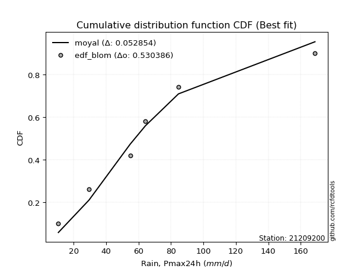</img></img>

</div>


### 7. EDF Tukey (1962)

In hydrology, the Tukey formula is used as a plotting position formula to estimate the empirical probability or frequency of a flood event (or other hydrological data). The formula parameter is given as _c=0.333_ (or 1/3).

<div align="center">


$P=(m-c)/(n+1-2c)$


</div>


**7.1. Empirical values**

<div align="center">

|                | 0                   | 1                  | 2                   | 3                  | 4                  | 5                  |
|:---------------|:--------------------|:-------------------|:--------------------|:-------------------|:-------------------|:-------------------|
| date           | 2022                | 2023               | 2024                | 2021               | 2020               | 2019               |
| x              | 10.5                | 29.4               | 54.8                | 64.2               | 84.6               | 168.8              |
| m              | 1                   | 2                  | 3                   | 4                  | 5                  | 6                  |
| empirical_dist | edf_tukey           | edf_tukey          | edf_tukey           | edf_tukey          | edf_tukey          | edf_tukey          |
| empirical      | 0.10526315789473684 | 0.2631578947368421 | 0.42105263157894735 | 0.5789473684210527 | 0.7368421052631579 | 0.8947368421052632 |
| empirical_tr   | 1.1176470588235294  | 1.357142857142857  | 1.7272727272727273  | 2.375              | 3.7999999999999994 | 9.5                |

</div>


**7.2. Kolmogorov-Smirnov fit test (sorted by Δ)**


<div align="center">

|                | 0                   | 1                    | 2                    | 3                    | 4                   | 5                   | 6                   | 7                   | 8                   | 9                 | 10                  | 11                  | 12                  | 13                  | 14                  | 15                  | 16                  | 17                  | 18                 | 19                  | 20                 | 21                  | 22                  | 23                  | 24                  | 25                  | 26                  | 27                 | 28                 | 29                  | 30                  | 31                  | 32                  | 33                  | 34                  | 35                  | 36                 | 37                  | 38                  | 39                  | 40                  | 41                  | 42                  | 43                  | 44                  | 45                  | 46                 | 47                  | 48                  | 49                  | 50                  | 51                  | 52                  | 53                  | 54                  | 55                  | 56                  | 57                  | 58                  | 59                  | 60                  | 61                  | 62                  | 63                 | 64                 | 65                 | 66                  | 67                  | 68                  | 69                  | 70                  | 71                 | 72                  | 73                 | 74                  | 75                 | 76                  | 77                 | 78                  | 79                  | 80                  | 81                  | 82                  | 83                  | 84                 | 85                  | 86                  | 87                  | 88                 | 89                  | 90                  | 91                  | 92                  | 93                  | 94                  | 95                 | 96                 | 97                | 98                  | 99                 | 100                | 101                 | 102                | 103                 | 104                 | 105                 | 106                | 107                 | 108                | 109                | 110                 | 111                 | 112                | 113                 | 114                 | 115                 | 116                | 117                 | 118                 | 119              | 120                 | 121                 | 122                 | 123                 | 124                 | 125                 | 126                | 127                 | 128                | 129                 | 130                 | 131                 | 132                 | 133                | 134                | 135                | 136                 | 137                | 138               | 139                 | 140                | 141                 | 142                | 143                 | 144                 | 145                | 146                 | 147                 | 148                 | 149                | 150                | 151                | 152                | 153               | 154                | 155               | 156               | 157                | 158                | 159                |
|:---------------|:--------------------|:---------------------|:---------------------|:---------------------|:--------------------|:--------------------|:--------------------|:--------------------|:--------------------|:------------------|:--------------------|:--------------------|:--------------------|:--------------------|:--------------------|:--------------------|:--------------------|:--------------------|:-------------------|:--------------------|:-------------------|:--------------------|:--------------------|:--------------------|:--------------------|:--------------------|:--------------------|:-------------------|:-------------------|:--------------------|:--------------------|:--------------------|:--------------------|:--------------------|:--------------------|:--------------------|:-------------------|:--------------------|:--------------------|:--------------------|:--------------------|:--------------------|:--------------------|:--------------------|:--------------------|:--------------------|:-------------------|:--------------------|:--------------------|:--------------------|:--------------------|:--------------------|:--------------------|:--------------------|:--------------------|:--------------------|:--------------------|:--------------------|:--------------------|:--------------------|:--------------------|:--------------------|:--------------------|:-------------------|:-------------------|:-------------------|:--------------------|:--------------------|:--------------------|:--------------------|:--------------------|:-------------------|:--------------------|:-------------------|:--------------------|:-------------------|:--------------------|:-------------------|:--------------------|:--------------------|:--------------------|:--------------------|:--------------------|:--------------------|:-------------------|:--------------------|:--------------------|:--------------------|:-------------------|:--------------------|:--------------------|:--------------------|:--------------------|:--------------------|:--------------------|:-------------------|:-------------------|:------------------|:--------------------|:-------------------|:-------------------|:--------------------|:-------------------|:--------------------|:--------------------|:--------------------|:-------------------|:--------------------|:-------------------|:-------------------|:--------------------|:--------------------|:-------------------|:--------------------|:--------------------|:--------------------|:-------------------|:--------------------|:--------------------|:-----------------|:--------------------|:--------------------|:--------------------|:--------------------|:--------------------|:--------------------|:-------------------|:--------------------|:-------------------|:--------------------|:--------------------|:--------------------|:--------------------|:-------------------|:-------------------|:-------------------|:--------------------|:-------------------|:------------------|:--------------------|:-------------------|:--------------------|:-------------------|:--------------------|:--------------------|:-------------------|:--------------------|:--------------------|:--------------------|:-------------------|:-------------------|:-------------------|:-------------------|:------------------|:-------------------|:------------------|:------------------|:-------------------|:-------------------|:-------------------|
| station        | 21209200            | 21209200             | 21209200             | 21209200             | 21209200            | 21209200            | 21209200            | 21209200            | 21209200            | 21209200          | 21209200            | 21209200            | 21209200            | 21209200            | 21209200            | 21209200            | 21209200            | 21209200            | 21209200           | 21209200            | 21209200           | 21209200            | 21209200            | 21209200            | 21209200            | 21209200            | 21209200            | 21209200           | 21209200           | 21209200            | 21209200            | 21209200            | 21209200            | 21209200            | 21209200            | 21209200            | 21209200           | 21209200            | 21209200            | 21209200            | 21209200            | 21209200            | 21209200            | 21209200            | 21209200            | 21209200            | 21209200           | 21209200            | 21209200            | 21209200            | 21209200            | 21209200            | 21209200            | 21209200            | 21209200            | 21209200            | 21209200            | 21209200            | 21209200            | 21209200            | 21209200            | 21209200            | 21209200            | 21209200           | 21209200           | 21209200           | 21209200            | 21209200            | 21209200            | 21209200            | 21209200            | 21209200           | 21209200            | 21209200           | 21209200            | 21209200           | 21209200            | 21209200           | 21209200            | 21209200            | 21209200            | 21209200            | 21209200            | 21209200            | 21209200           | 21209200            | 21209200            | 21209200            | 21209200           | 21209200            | 21209200            | 21209200            | 21209200            | 21209200            | 21209200            | 21209200           | 21209200           | 21209200          | 21209200            | 21209200           | 21209200           | 21209200            | 21209200           | 21209200            | 21209200            | 21209200            | 21209200           | 21209200            | 21209200           | 21209200           | 21209200            | 21209200            | 21209200           | 21209200            | 21209200            | 21209200            | 21209200           | 21209200            | 21209200            | 21209200         | 21209200            | 21209200            | 21209200            | 21209200            | 21209200            | 21209200            | 21209200           | 21209200            | 21209200           | 21209200            | 21209200            | 21209200            | 21209200            | 21209200           | 21209200           | 21209200           | 21209200            | 21209200           | 21209200          | 21209200            | 21209200           | 21209200            | 21209200           | 21209200            | 21209200            | 21209200           | 21209200            | 21209200            | 21209200            | 21209200           | 21209200           | 21209200           | 21209200           | 21209200          | 21209200           | 21209200          | 21209200          | 21209200           | 21209200           | 21209200           |
| empirical_dist | edf_tukey           | edf_tukey            | edf_tukey            | edf_tukey            | edf_tukey           | edf_tukey           | edf_tukey           | edf_tukey           | edf_tukey           | edf_tukey         | edf_tukey           | edf_tukey           | edf_tukey           | edf_tukey           | edf_tukey           | edf_tukey           | edf_tukey           | edf_tukey           | edf_tukey          | edf_tukey           | edf_tukey          | edf_tukey           | edf_tukey           | edf_tukey           | edf_tukey           | edf_tukey           | edf_tukey           | edf_tukey          | edf_tukey          | edf_tukey           | edf_tukey           | edf_tukey           | edf_tukey           | edf_tukey           | edf_tukey           | edf_tukey           | edf_tukey          | edf_tukey           | edf_tukey           | edf_tukey           | edf_tukey           | edf_tukey           | edf_tukey           | edf_tukey           | edf_tukey           | edf_tukey           | edf_tukey          | edf_tukey           | edf_tukey           | edf_tukey           | edf_tukey           | edf_tukey           | edf_tukey           | edf_tukey           | edf_tukey           | edf_tukey           | edf_tukey           | edf_tukey           | edf_tukey           | edf_tukey           | edf_tukey           | edf_tukey           | edf_tukey           | edf_tukey          | edf_tukey          | edf_tukey          | edf_tukey           | edf_tukey           | edf_tukey           | edf_tukey           | edf_tukey           | edf_tukey          | edf_tukey           | edf_tukey          | edf_tukey           | edf_tukey          | edf_tukey           | edf_tukey          | edf_tukey           | edf_tukey           | edf_tukey           | edf_tukey           | edf_tukey           | edf_tukey           | edf_tukey          | edf_tukey           | edf_tukey           | edf_tukey           | edf_tukey          | edf_tukey           | edf_tukey           | edf_tukey           | edf_tukey           | edf_tukey           | edf_tukey           | edf_tukey          | edf_tukey          | edf_tukey         | edf_tukey           | edf_tukey          | edf_tukey          | edf_tukey           | edf_tukey          | edf_tukey           | edf_tukey           | edf_tukey           | edf_tukey          | edf_tukey           | edf_tukey          | edf_tukey          | edf_tukey           | edf_tukey           | edf_tukey          | edf_tukey           | edf_tukey           | edf_tukey           | edf_tukey          | edf_tukey           | edf_tukey           | edf_tukey        | edf_tukey           | edf_tukey           | edf_tukey           | edf_tukey           | edf_tukey           | edf_tukey           | edf_tukey          | edf_tukey           | edf_tukey          | edf_tukey           | edf_tukey           | edf_tukey           | edf_tukey           | edf_tukey          | edf_tukey          | edf_tukey          | edf_tukey           | edf_tukey          | edf_tukey         | edf_tukey           | edf_tukey          | edf_tukey           | edf_tukey          | edf_tukey           | edf_tukey           | edf_tukey          | edf_tukey           | edf_tukey           | edf_tukey           | edf_tukey          | edf_tukey          | edf_tukey          | edf_tukey          | edf_tukey         | edf_tukey          | edf_tukey         | edf_tukey         | edf_tukey          | edf_tukey          | edf_tukey          |
| p_dist         | burr                | loggenlogistic       | moyal                | halfnorm             | gumbel_r            | pearson3            | logjohnsonsu        | foldnorm            | logburr             | logloggamma       | logskewnorm         | genlogistic         | loggumbel_l         | logburr12           | logweibull_min      | kstwobign           | logargus            | nct                 | logweibull_max     | invgamma            | loggenextreme      | logdweibull         | dweibull            | rayleigh            | halflogistic        | dgamma              | logpearson3         | maxwell            | johnsonsu          | invgauss            | logdgamma           | logtrapezoid        | rice                | logloglaplace       | logtriang           | loggompertz         | kappa3             | gompertz            | vonmises_line       | genexpon            | skewnorm            | logarcsine          | gennorm             | bradford            | logsemicircular     | lomax               | t                  | crystalball         | norm                | truncnorm           | loganglit           | exponnorm           | logistic            | logfoldnorm         | logfatiguelife      | logexponnorm        | logt                | lognorm             | logcrystalball      | lognct              | logf                | hypsecant           | loglogistic         | loggennorm         | loggamma           | loggamma           | truncweibull_min    | logalpha            | anglit              | logerlang           | logrice             | loghypsecant       | truncexpon          | semicircular       | loginvgamma         | laplace            | logbetaprime        | logncf             | loginvgauss         | loggenhalflogistic  | logcosine           | loglaplace          | loglaplace          | ncf                 | logmaxwell         | loginvweibull       | betaprime           | logksone            | lograyleigh        | logkappa4           | logkappa3           | arcsine             | cosine              | loguniform          | wald                | logwrapcauchy      | logvonmises_line   | logkstwobign      | halfgennorm         | loggenexpon        | gumbel_l           | loghalfnorm         | loggumbel_r        | mielke              | weibull_min         | gamma               | f                  | loglevy_l           | logmoyal           | loghalflogistic    | erlang              | burr12              | kappa4             | loggenpareto        | logbeta             | loggausshyper       | logtruncnorm       | loglomax            | alpha               | logexponweib     | loghalfgennorm      | exponpow            | wrapcauchy          | logbradford         | nakagami            | lognakagami         | ksone              | uniform             | gengamma           | logjohnsonsb        | logtruncexpon       | argus               | genextreme          | logwald            | levy_l             | logrdist           | logtruncweibull_min | exponweib          | logtukeylambda    | genpareto           | beta               | fatiguelife         | genhalflogistic    | rdist               | invweibull          | gausshyper         | triang              | tukeylambda         | johnsonsb           | powerlaw           | logexponpow        | trapezoid          | truncpareto        | logmielke         | logpowerlaw        | weibull_max       | logtruncpareto    | loggengamma        | logvonmises        | vonmises           |
| delta          | 0.05512820821599079 | 0.056308863927762576 | 0.058116973403970706 | 0.060600644284155014 | 0.06161714300302834 | 0.06197848874597167 | 0.06255881670590702 | 0.06326274407665522 | 0.06379085023450048 | 0.064177061482868 | 0.06617396973501088 | 0.07068594307018461 | 0.07116739531323524 | 0.07121004963243893 | 0.07150764359491091 | 0.07178115530562612 | 0.07532399746413465 | 0.07704261912691324 | 0.0786525632706292 | 0.07865749059578853 | 0.0786631297107645 | 0.07894736842103711 | 0.07895009030333489 | 0.08200448641087632 | 0.08375036401641861 | 0.08781852707024462 | 0.08866647900150326 | 0.0894635707149879 | 0.0905729960921442 | 0.09352953927913321 | 0.09409614772250491 | 0.09824513191580031 | 0.09939832375087732 | 0.10422874924696962 | 0.10524890116875063 | 0.10526315489888234 | 0.1052631578939898 | 0.10526315789455011 | 0.10526315789464402 | 0.10526315789473455 | 0.10526315789473684 | 0.10526315789473684 | 0.10557917909545025 | 0.10712105094251434 | 0.11290761661190962 | 0.11341875444621285 | 0.1144449735344567 | 0.11444629804749051 | 0.11444629838940562 | 0.11444630182792104 | 0.11540230772193893 | 0.11574514632322452 | 0.11926221230295653 | 0.12107771526359756 | 0.12132729264806308 | 0.12144781167995877 | 0.12144932442654621 | 0.12144972837279888 | 0.12145157250144001 | 0.12199284576974789 | 0.12200074404596295 | 0.12335281928664904 | 0.12719796629337232 | 0.1294867960181642 | 0.1295080376712141 | 0.1295080376712141 | 0.12995289922912512 | 0.12999476626954587 | 0.13055233917014486 | 0.13162018210684923 | 0.13169277749281472 | 0.1320690343196257 | 0.13368095634042942 | 0.1375153067603082 | 0.13802081202868166 | 0.1381430119416745 | 0.14254961632895657 | 0.1437197668723944 | 0.14454989784514727 | 0.14506874009697612 | 0.14673091682596207 | 0.14900335486399996 | 0.14900335486399996 | 0.15118312712765658 | 0.1523206426139906 | 0.15573437378942967 | 0.15665637603040394 | 0.15805343704767982 | 0.1622881051432643 | 0.16420864493025833 | 0.16569712636731304 | 0.16572780204250637 | 0.17356318640783608 | 0.17387465077300523 | 0.17636652398185115 | 0.1763772186252246 | 0.1825302532628733 | 0.183346650929461 | 0.18356942683517985 | 0.1845519538337015 | 0.1849756596489467 | 0.19038418976791205 | 0.1918033892354427 | 0.19506632187913775 | 0.19849034554413364 | 0.20343035481274074 | 0.2072896191781871 | 0.21125553999272662 | 0.2168713918945162 | 0.2174066977899518 | 0.21900103947434646 | 0.22889651992503923 | 0.2293962190401888 | 0.22984622319825865 | 0.23632165777366343 | 0.23972833269272964 | 0.2451572039322191 | 0.24592824263027668 | 0.24700657621664857 | 0.25176373910471 | 0.25221287936004977 | 0.25528705367826315 | 0.25603706013793115 | 0.25861377775436156 | 0.26315789462567896 | 0.26315789473403256 | 0.2634266493777083 | 0.26874355820061846 | 0.2704860434748255 | 0.27165323069184083 | 0.27299322591641506 | 0.27445870549742546 | 0.27892272038983845 | 0.2864348920909313 | 0.2940749039150502 | 0.3030932852908709 | 0.3065697726539828  | 0.3268408676153636 | 0.363328997500735 | 0.37242804071640073 | 0.3726914372206419 | 0.40095483824329387 | 0.4032866715769663 | 0.45079790456524127 | 0.45246309124756984 | 0.4600369499570793 | 0.46848311498776984 | 0.47618467646632767 | 0.48142657408024725 | 0.4865548585205482 | 0.4922715218289793 | 0.5113896086017934 | 0.5627921251446668 | 0.588310624475789 | 0.5938959841900759 | 0.614728875578265 | 0.652175328061043 | 0.6896030011690841 | 1.0910840588696777 | 26.935166355764892 |
| deltao         | 0.530385761606      | 0.530385761606       | 0.530385761606       | 0.530385761606       | 0.530385761606      | 0.530385761606      | 0.530385761606      | 0.530385761606      | 0.530385761606      | 0.530385761606    | 0.530385761606      | 0.530385761606      | 0.530385761606      | 0.530385761606      | 0.530385761606      | 0.530385761606      | 0.530385761606      | 0.530385761606      | 0.530385761606     | 0.530385761606      | 0.530385761606     | 0.530385761606      | 0.530385761606      | 0.530385761606      | 0.530385761606      | 0.530385761606      | 0.530385761606      | 0.530385761606     | 0.530385761606     | 0.530385761606      | 0.530385761606      | 0.530385761606      | 0.530385761606      | 0.530385761606      | 0.530385761606      | 0.530385761606      | 0.530385761606     | 0.530385761606      | 0.530385761606      | 0.530385761606      | 0.530385761606      | 0.530385761606      | 0.530385761606      | 0.530385761606      | 0.530385761606      | 0.530385761606      | 0.530385761606     | 0.530385761606      | 0.530385761606      | 0.530385761606      | 0.530385761606      | 0.530385761606      | 0.530385761606      | 0.530385761606      | 0.530385761606      | 0.530385761606      | 0.530385761606      | 0.530385761606      | 0.530385761606      | 0.530385761606      | 0.530385761606      | 0.530385761606      | 0.530385761606      | 0.530385761606     | 0.530385761606     | 0.530385761606     | 0.530385761606      | 0.530385761606      | 0.530385761606      | 0.530385761606      | 0.530385761606      | 0.530385761606     | 0.530385761606      | 0.530385761606     | 0.530385761606      | 0.530385761606     | 0.530385761606      | 0.530385761606     | 0.530385761606      | 0.530385761606      | 0.530385761606      | 0.530385761606      | 0.530385761606      | 0.530385761606      | 0.530385761606     | 0.530385761606      | 0.530385761606      | 0.530385761606      | 0.530385761606     | 0.530385761606      | 0.530385761606      | 0.530385761606      | 0.530385761606      | 0.530385761606      | 0.530385761606      | 0.530385761606     | 0.530385761606     | 0.530385761606    | 0.530385761606      | 0.530385761606     | 0.530385761606     | 0.530385761606      | 0.530385761606     | 0.530385761606      | 0.530385761606      | 0.530385761606      | 0.530385761606     | 0.530385761606      | 0.530385761606     | 0.530385761606     | 0.530385761606      | 0.530385761606      | 0.530385761606     | 0.530385761606      | 0.530385761606      | 0.530385761606      | 0.530385761606     | 0.530385761606      | 0.530385761606      | 0.530385761606   | 0.530385761606      | 0.530385761606      | 0.530385761606      | 0.530385761606      | 0.530385761606      | 0.530385761606      | 0.530385761606     | 0.530385761606      | 0.530385761606     | 0.530385761606      | 0.530385761606      | 0.530385761606      | 0.530385761606      | 0.530385761606     | 0.530385761606     | 0.530385761606     | 0.530385761606      | 0.530385761606     | 0.530385761606    | 0.530385761606      | 0.530385761606     | 0.530385761606      | 0.530385761606     | 0.530385761606      | 0.530385761606      | 0.530385761606     | 0.530385761606      | 0.530385761606      | 0.530385761606      | 0.530385761606     | 0.530385761606     | 0.530385761606     | 0.530385761606     | 0.530385761606    | 0.530385761606     | 0.530385761606    | 0.530385761606    | 0.530385761606     | 0.530385761606     | 0.530385761606     |
| eval           | Δo > Δ              | Δo > Δ               | Δo > Δ               | Δo > Δ               | Δo > Δ              | Δo > Δ              | Δo > Δ              | Δo > Δ              | Δo > Δ              | Δo > Δ            | Δo > Δ              | Δo > Δ              | Δo > Δ              | Δo > Δ              | Δo > Δ              | Δo > Δ              | Δo > Δ              | Δo > Δ              | Δo > Δ             | Δo > Δ              | Δo > Δ             | Δo > Δ              | Δo > Δ              | Δo > Δ              | Δo > Δ              | Δo > Δ              | Δo > Δ              | Δo > Δ             | Δo > Δ             | Δo > Δ              | Δo > Δ              | Δo > Δ              | Δo > Δ              | Δo > Δ              | Δo > Δ              | Δo > Δ              | Δo > Δ             | Δo > Δ              | Δo > Δ              | Δo > Δ              | Δo > Δ              | Δo > Δ              | Δo > Δ              | Δo > Δ              | Δo > Δ              | Δo > Δ              | Δo > Δ             | Δo > Δ              | Δo > Δ              | Δo > Δ              | Δo > Δ              | Δo > Δ              | Δo > Δ              | Δo > Δ              | Δo > Δ              | Δo > Δ              | Δo > Δ              | Δo > Δ              | Δo > Δ              | Δo > Δ              | Δo > Δ              | Δo > Δ              | Δo > Δ              | Δo > Δ             | Δo > Δ             | Δo > Δ             | Δo > Δ              | Δo > Δ              | Δo > Δ              | Δo > Δ              | Δo > Δ              | Δo > Δ             | Δo > Δ              | Δo > Δ             | Δo > Δ              | Δo > Δ             | Δo > Δ              | Δo > Δ             | Δo > Δ              | Δo > Δ              | Δo > Δ              | Δo > Δ              | Δo > Δ              | Δo > Δ              | Δo > Δ             | Δo > Δ              | Δo > Δ              | Δo > Δ              | Δo > Δ             | Δo > Δ              | Δo > Δ              | Δo > Δ              | Δo > Δ              | Δo > Δ              | Δo > Δ              | Δo > Δ             | Δo > Δ             | Δo > Δ            | Δo > Δ              | Δo > Δ             | Δo > Δ             | Δo > Δ              | Δo > Δ             | Δo > Δ              | Δo > Δ              | Δo > Δ              | Δo > Δ             | Δo > Δ              | Δo > Δ             | Δo > Δ             | Δo > Δ              | Δo > Δ              | Δo > Δ             | Δo > Δ              | Δo > Δ              | Δo > Δ              | Δo > Δ             | Δo > Δ              | Δo > Δ              | Δo > Δ           | Δo > Δ              | Δo > Δ              | Δo > Δ              | Δo > Δ              | Δo > Δ              | Δo > Δ              | Δo > Δ             | Δo > Δ              | Δo > Δ             | Δo > Δ              | Δo > Δ              | Δo > Δ              | Δo > Δ              | Δo > Δ             | Δo > Δ             | Δo > Δ             | Δo > Δ              | Δo > Δ             | Δo > Δ            | Δo > Δ              | Δo > Δ             | Δo > Δ              | Δo > Δ             | Δo > Δ              | Δo > Δ              | Δo > Δ             | Δo > Δ              | Δo > Δ              | Δo > Δ              | Δo > Δ             | Δo > Δ             | Δo > Δ             | Δo <= Δ            | Δo <= Δ           | Δo <= Δ            | Δo <= Δ           | Δo <= Δ           | Δo <= Δ            | Δo <= Δ            | Δo <= Δ            |
| fit            | 1                   | 1                    | 1                    | 1                    | 1                   | 1                   | 1                   | 1                   | 1                   | 1                 | 1                   | 1                   | 1                   | 1                   | 1                   | 1                   | 1                   | 1                   | 1                  | 1                   | 1                  | 1                   | 1                   | 1                   | 1                   | 1                   | 1                   | 1                  | 1                  | 1                   | 1                   | 1                   | 1                   | 1                   | 1                   | 1                   | 1                  | 1                   | 1                   | 1                   | 1                   | 1                   | 1                   | 1                   | 1                   | 1                   | 1                  | 1                   | 1                   | 1                   | 1                   | 1                   | 1                   | 1                   | 1                   | 1                   | 1                   | 1                   | 1                   | 1                   | 1                   | 1                   | 1                   | 1                  | 1                  | 1                  | 1                   | 1                   | 1                   | 1                   | 1                   | 1                  | 1                   | 1                  | 1                   | 1                  | 1                   | 1                  | 1                   | 1                   | 1                   | 1                   | 1                   | 1                   | 1                  | 1                   | 1                   | 1                   | 1                  | 1                   | 1                   | 1                   | 1                   | 1                   | 1                   | 1                  | 1                  | 1                 | 1                   | 1                  | 1                  | 1                   | 1                  | 1                   | 1                   | 1                   | 1                  | 1                   | 1                  | 1                  | 1                   | 1                   | 1                  | 1                   | 1                   | 1                   | 1                  | 1                   | 1                   | 1                | 1                   | 1                   | 1                   | 1                   | 1                   | 1                   | 1                  | 1                   | 1                  | 1                   | 1                   | 1                   | 1                   | 1                  | 1                  | 1                  | 1                   | 1                  | 1                 | 1                   | 1                  | 1                   | 1                  | 1                   | 1                   | 1                  | 1                   | 1                   | 1                   | 1                  | 1                  | 1                  | 0                  | 0                 | 0                  | 0                 | 0                 | 0                  | 0                  | 0                  |
| n              | 6                   | 6                    | 6                    | 6                    | 6                   | 6                   | 6                   | 6                   | 6                   | 6                 | 6                   | 6                   | 6                   | 6                   | 6                   | 6                   | 6                   | 6                   | 6                  | 6                   | 6                  | 6                   | 6                   | 6                   | 6                   | 6                   | 6                   | 6                  | 6                  | 6                   | 6                   | 6                   | 6                   | 6                   | 6                   | 6                   | 6                  | 6                   | 6                   | 6                   | 6                   | 6                   | 6                   | 6                   | 6                   | 6                   | 6                  | 6                   | 6                   | 6                   | 6                   | 6                   | 6                   | 6                   | 6                   | 6                   | 6                   | 6                   | 6                   | 6                   | 6                   | 6                   | 6                   | 6                  | 6                  | 6                  | 6                   | 6                   | 6                   | 6                   | 6                   | 6                  | 6                   | 6                  | 6                   | 6                  | 6                   | 6                  | 6                   | 6                   | 6                   | 6                   | 6                   | 6                   | 6                  | 6                   | 6                   | 6                   | 6                  | 6                   | 6                   | 6                   | 6                   | 6                   | 6                   | 6                  | 6                  | 6                 | 6                   | 6                  | 6                  | 6                   | 6                  | 6                   | 6                   | 6                   | 6                  | 6                   | 6                  | 6                  | 6                   | 6                   | 6                  | 6                   | 6                   | 6                   | 6                  | 6                   | 6                   | 6                | 6                   | 6                   | 6                   | 6                   | 6                   | 6                   | 6                  | 6                   | 6                  | 6                   | 6                   | 6                   | 6                   | 6                  | 6                  | 6                  | 6                   | 6                  | 6                 | 6                   | 6                  | 6                   | 6                  | 6                   | 6                   | 6                  | 6                   | 6                   | 6                   | 6                  | 6                  | 6                  | 6                  | 6                 | 6                  | 6                 | 6                 | 6                  | 6                  | 6                  |
| best_fit       | 1                   | 0                    | 0                    | 0                    | 0                   | 0                   | 0                   | 0                   | 0                   | 0                 | 0                   | 0                   | 0                   | 0                   | 0                   | 0                   | 0                   | 0                   | 0                  | 0                   | 0                  | 0                   | 0                   | 0                   | 0                   | 0                   | 0                   | 0                  | 0                  | 0                   | 0                   | 0                   | 0                   | 0                   | 0                   | 0                   | 0                  | 0                   | 0                   | 0                   | 0                   | 0                   | 0                   | 0                   | 0                   | 0                   | 0                  | 0                   | 0                   | 0                   | 0                   | 0                   | 0                   | 0                   | 0                   | 0                   | 0                   | 0                   | 0                   | 0                   | 0                   | 0                   | 0                   | 0                  | 0                  | 0                  | 0                   | 0                   | 0                   | 0                   | 0                   | 0                  | 0                   | 0                  | 0                   | 0                  | 0                   | 0                  | 0                   | 0                   | 0                   | 0                   | 0                   | 0                   | 0                  | 0                   | 0                   | 0                   | 0                  | 0                   | 0                   | 0                   | 0                   | 0                   | 0                   | 0                  | 0                  | 0                 | 0                   | 0                  | 0                  | 0                   | 0                  | 0                   | 0                   | 0                   | 0                  | 0                   | 0                  | 0                  | 0                   | 0                   | 0                  | 0                   | 0                   | 0                   | 0                  | 0                   | 0                   | 0                | 0                   | 0                   | 0                   | 0                   | 0                   | 0                   | 0                  | 0                   | 0                  | 0                   | 0                   | 0                   | 0                   | 0                  | 0                  | 0                  | 0                   | 0                  | 0                 | 0                   | 0                  | 0                   | 0                  | 0                   | 0                   | 0                  | 0                   | 0                   | 0                   | 0                  | 0                  | 0                  | 0                  | 0                 | 0                  | 0                 | 0                 | 0                  | 0                  | 0                  |
| best_fit_sort  | 1                   | 2                    | 3                    | 4                    | 5                   | 6                   | 7                   | 8                   | 9                   | 10                | 11                  | 12                  | 13                  | 14                  | 15                  | 16                  | 17                  | 18                  | 19                 | 20                  | 21                 | 22                  | 23                  | 24                  | 25                  | 26                  | 27                  | 28                 | 29                 | 30                  | 31                  | 32                  | 33                  | 34                  | 35                  | 36                  | 37                 | 38                  | 39                  | 40                  | 41                  | 42                  | 43                  | 44                  | 45                  | 46                  | 47                 | 48                  | 49                  | 50                  | 51                  | 52                  | 53                  | 54                  | 55                  | 56                  | 57                  | 58                  | 59                  | 60                  | 61                  | 62                  | 63                  | 64                 | 65                 | 66                 | 67                  | 68                  | 69                  | 70                  | 71                  | 72                 | 73                  | 74                 | 75                  | 76                 | 77                  | 78                 | 79                  | 80                  | 81                  | 82                  | 83                  | 84                  | 85                 | 86                  | 87                  | 88                  | 89                 | 90                  | 91                  | 92                  | 93                  | 94                  | 95                  | 96                 | 97                 | 98                | 99                  | 100                | 101                | 102                 | 103                | 104                 | 105                 | 106                 | 107                | 108                 | 109                | 110                | 111                 | 112                 | 113                | 114                 | 115                 | 116                 | 117                | 118                 | 119                 | 120              | 121                 | 122                 | 123                 | 124                 | 125                 | 126                 | 127                | 128                 | 129                | 130                 | 131                 | 132                 | 133                 | 134                | 135                | 136                | 137                 | 138                | 139               | 140                 | 141                | 142                 | 143                | 144                 | 145                 | 146                | 147                 | 148                 | 149                 | 150                | 151                | 152                | 153                | 154               | 155                | 156               | 157               | 158                | 159                | 160                |

</div>


**7.3. Best fit**

<div align="center">

|   id |   station | empirical_dist   | p_dist   |     delta |   deltao | eval   |   fit |   n |   best_fit |   best_fit_sort |
|-----:|----------:|:-----------------|:---------|----------:|---------:|:-------|------:|----:|-----------:|----------------:|
|    0 |  21209200 | edf_tukey        | burr     | 0.0551282 | 0.530386 | Δo > Δ |     1 |   6 |          1 |               1 |

</div>


<div align="center">

</img>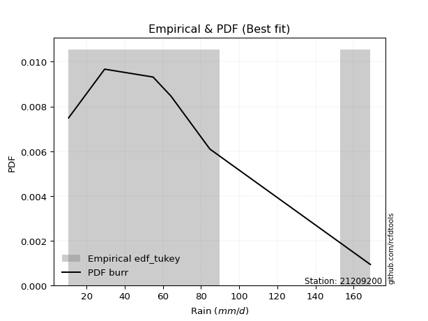</img>

</div>


### 8. EDF Gringorten (1963)

Gringorten plotting position formula is essential for estimating the probability and return periods of extreme events like floods and heavy rainfall. The constant _a=0.44_.

<div align="center">


$P=(m-a)/(n+1-2a)$


</div>


**8.1. Empirical values**

<div align="center">

|                | 0                   | 1                  | 2                   | 3                  | 4                  | 5                  |
|:---------------|:--------------------|:-------------------|:--------------------|:-------------------|:-------------------|:-------------------|
| date           | 2022                | 2023               | 2024                | 2021               | 2020               | 2019               |
| x              | 10.5                | 29.4               | 54.8                | 64.2               | 84.6               | 168.8              |
| m              | 1                   | 2                  | 3                   | 4                  | 5                  | 6                  |
| empirical_dist | edf_gringorten      | edf_gringorten     | edf_gringorten      | edf_gringorten     | edf_gringorten     | edf_gringorten     |
| empirical      | 0.09150326797385622 | 0.2549019607843137 | 0.41830065359477125 | 0.5816993464052288 | 0.7450980392156862 | 0.9084967320261437 |
| empirical_tr   | 1.1007194244604317  | 1.3421052631578947 | 1.7191011235955058  | 2.3906250000000004 | 3.9230769230769216 | 10.928571428571415 |

</div>


**8.2. Kolmogorov-Smirnov fit test (sorted by Δ)**


<div align="center">

|                | 0                   | 1                  | 2                   | 3                   | 4                   | 5                    | 6                   | 7                   | 8                   | 9                   | 10                 | 11                  | 12                  | 13                  | 14                  | 15                  | 16                  | 17                  | 18                | 19                  | 20                  | 21                 | 22                  | 23                  | 24                  | 25                  | 26                  | 27                  | 28                  | 29                  | 30                  | 31                  | 32                  | 33                  | 34                  | 35                  | 36                  | 37                 | 38                  | 39                  | 40                  | 41                  | 42                  | 43                  | 44                  | 45                  | 46                  | 47                  | 48                  | 49                  | 50                  | 51                  | 52                 | 53                  | 54                  | 55                  | 56                 | 57                  | 58                 | 59                  | 60                  | 61                  | 62                 | 63                 | 64                 | 65                 | 66                  | 67                  | 68                 | 69                  | 70                  | 71                 | 72                  | 73                  | 74                  | 75                  | 76                  | 77                 | 78                  | 79                  | 80                  | 81                  | 82                  | 83                  | 84                  | 85                  | 86                  | 87                  | 88                 | 89                  | 90                  | 91                  | 92                 | 93                  | 94                 | 95                 | 96                 | 97                 | 98                  | 99                  | 100                 | 101                 | 102                | 103                 | 104                 | 105                 | 106                | 107                | 108                | 109                 | 110                 | 111                 | 112                 | 113                 | 114                 | 115                 | 116                 | 117                 | 118                 | 119                | 120                | 121                | 122                | 123                 | 124                 | 125                | 126                 | 127                | 128                 | 129                | 130                | 131                | 132                | 133                 | 134                 | 135                | 136                 | 137                 | 138                | 139                 | 140                 | 141                 | 142                | 143                | 144                 | 145                | 146                 | 147                | 148                | 149                | 150                | 151                | 152                | 153                | 154                | 155                | 156                | 157                | 158                | 159               |
|:---------------|:--------------------|:-------------------|:--------------------|:--------------------|:--------------------|:---------------------|:--------------------|:--------------------|:--------------------|:--------------------|:-------------------|:--------------------|:--------------------|:--------------------|:--------------------|:--------------------|:--------------------|:--------------------|:------------------|:--------------------|:--------------------|:-------------------|:--------------------|:--------------------|:--------------------|:--------------------|:--------------------|:--------------------|:--------------------|:--------------------|:--------------------|:--------------------|:--------------------|:--------------------|:--------------------|:--------------------|:--------------------|:-------------------|:--------------------|:--------------------|:--------------------|:--------------------|:--------------------|:--------------------|:--------------------|:--------------------|:--------------------|:--------------------|:--------------------|:--------------------|:--------------------|:--------------------|:-------------------|:--------------------|:--------------------|:--------------------|:-------------------|:--------------------|:-------------------|:--------------------|:--------------------|:--------------------|:-------------------|:-------------------|:-------------------|:-------------------|:--------------------|:--------------------|:-------------------|:--------------------|:--------------------|:-------------------|:--------------------|:--------------------|:--------------------|:--------------------|:--------------------|:-------------------|:--------------------|:--------------------|:--------------------|:--------------------|:--------------------|:--------------------|:--------------------|:--------------------|:--------------------|:--------------------|:-------------------|:--------------------|:--------------------|:--------------------|:-------------------|:--------------------|:-------------------|:-------------------|:-------------------|:-------------------|:--------------------|:--------------------|:--------------------|:--------------------|:-------------------|:--------------------|:--------------------|:--------------------|:-------------------|:-------------------|:-------------------|:--------------------|:--------------------|:--------------------|:--------------------|:--------------------|:--------------------|:--------------------|:--------------------|:--------------------|:--------------------|:-------------------|:-------------------|:-------------------|:-------------------|:--------------------|:--------------------|:-------------------|:--------------------|:-------------------|:--------------------|:-------------------|:-------------------|:-------------------|:-------------------|:--------------------|:--------------------|:-------------------|:--------------------|:--------------------|:-------------------|:--------------------|:--------------------|:--------------------|:-------------------|:-------------------|:--------------------|:-------------------|:--------------------|:-------------------|:-------------------|:-------------------|:-------------------|:-------------------|:-------------------|:-------------------|:-------------------|:-------------------|:-------------------|:-------------------|:-------------------|:------------------|
| station        | 21209200            | 21209200           | 21209200            | 21209200            | 21209200            | 21209200             | 21209200            | 21209200            | 21209200            | 21209200            | 21209200           | 21209200            | 21209200            | 21209200            | 21209200            | 21209200            | 21209200            | 21209200            | 21209200          | 21209200            | 21209200            | 21209200           | 21209200            | 21209200            | 21209200            | 21209200            | 21209200            | 21209200            | 21209200            | 21209200            | 21209200            | 21209200            | 21209200            | 21209200            | 21209200            | 21209200            | 21209200            | 21209200           | 21209200            | 21209200            | 21209200            | 21209200            | 21209200            | 21209200            | 21209200            | 21209200            | 21209200            | 21209200            | 21209200            | 21209200            | 21209200            | 21209200            | 21209200           | 21209200            | 21209200            | 21209200            | 21209200           | 21209200            | 21209200           | 21209200            | 21209200            | 21209200            | 21209200           | 21209200           | 21209200           | 21209200           | 21209200            | 21209200            | 21209200           | 21209200            | 21209200            | 21209200           | 21209200            | 21209200            | 21209200            | 21209200            | 21209200            | 21209200           | 21209200            | 21209200            | 21209200            | 21209200            | 21209200            | 21209200            | 21209200            | 21209200            | 21209200            | 21209200            | 21209200           | 21209200            | 21209200            | 21209200            | 21209200           | 21209200            | 21209200           | 21209200           | 21209200           | 21209200           | 21209200            | 21209200            | 21209200            | 21209200            | 21209200           | 21209200            | 21209200            | 21209200            | 21209200           | 21209200           | 21209200           | 21209200            | 21209200            | 21209200            | 21209200            | 21209200            | 21209200            | 21209200            | 21209200            | 21209200            | 21209200            | 21209200           | 21209200           | 21209200           | 21209200           | 21209200            | 21209200            | 21209200           | 21209200            | 21209200           | 21209200            | 21209200           | 21209200           | 21209200           | 21209200           | 21209200            | 21209200            | 21209200           | 21209200            | 21209200            | 21209200           | 21209200            | 21209200            | 21209200            | 21209200           | 21209200           | 21209200            | 21209200           | 21209200            | 21209200           | 21209200           | 21209200           | 21209200           | 21209200           | 21209200           | 21209200           | 21209200           | 21209200           | 21209200           | 21209200           | 21209200           | 21209200          |
| empirical_dist | edf_gringorten      | edf_gringorten     | edf_gringorten      | edf_gringorten      | edf_gringorten      | edf_gringorten       | edf_gringorten      | edf_gringorten      | edf_gringorten      | edf_gringorten      | edf_gringorten     | edf_gringorten      | edf_gringorten      | edf_gringorten      | edf_gringorten      | edf_gringorten      | edf_gringorten      | edf_gringorten      | edf_gringorten    | edf_gringorten      | edf_gringorten      | edf_gringorten     | edf_gringorten      | edf_gringorten      | edf_gringorten      | edf_gringorten      | edf_gringorten      | edf_gringorten      | edf_gringorten      | edf_gringorten      | edf_gringorten      | edf_gringorten      | edf_gringorten      | edf_gringorten      | edf_gringorten      | edf_gringorten      | edf_gringorten      | edf_gringorten     | edf_gringorten      | edf_gringorten      | edf_gringorten      | edf_gringorten      | edf_gringorten      | edf_gringorten      | edf_gringorten      | edf_gringorten      | edf_gringorten      | edf_gringorten      | edf_gringorten      | edf_gringorten      | edf_gringorten      | edf_gringorten      | edf_gringorten     | edf_gringorten      | edf_gringorten      | edf_gringorten      | edf_gringorten     | edf_gringorten      | edf_gringorten     | edf_gringorten      | edf_gringorten      | edf_gringorten      | edf_gringorten     | edf_gringorten     | edf_gringorten     | edf_gringorten     | edf_gringorten      | edf_gringorten      | edf_gringorten     | edf_gringorten      | edf_gringorten      | edf_gringorten     | edf_gringorten      | edf_gringorten      | edf_gringorten      | edf_gringorten      | edf_gringorten      | edf_gringorten     | edf_gringorten      | edf_gringorten      | edf_gringorten      | edf_gringorten      | edf_gringorten      | edf_gringorten      | edf_gringorten      | edf_gringorten      | edf_gringorten      | edf_gringorten      | edf_gringorten     | edf_gringorten      | edf_gringorten      | edf_gringorten      | edf_gringorten     | edf_gringorten      | edf_gringorten     | edf_gringorten     | edf_gringorten     | edf_gringorten     | edf_gringorten      | edf_gringorten      | edf_gringorten      | edf_gringorten      | edf_gringorten     | edf_gringorten      | edf_gringorten      | edf_gringorten      | edf_gringorten     | edf_gringorten     | edf_gringorten     | edf_gringorten      | edf_gringorten      | edf_gringorten      | edf_gringorten      | edf_gringorten      | edf_gringorten      | edf_gringorten      | edf_gringorten      | edf_gringorten      | edf_gringorten      | edf_gringorten     | edf_gringorten     | edf_gringorten     | edf_gringorten     | edf_gringorten      | edf_gringorten      | edf_gringorten     | edf_gringorten      | edf_gringorten     | edf_gringorten      | edf_gringorten     | edf_gringorten     | edf_gringorten     | edf_gringorten     | edf_gringorten      | edf_gringorten      | edf_gringorten     | edf_gringorten      | edf_gringorten      | edf_gringorten     | edf_gringorten      | edf_gringorten      | edf_gringorten      | edf_gringorten     | edf_gringorten     | edf_gringorten      | edf_gringorten     | edf_gringorten      | edf_gringorten     | edf_gringorten     | edf_gringorten     | edf_gringorten     | edf_gringorten     | edf_gringorten     | edf_gringorten     | edf_gringorten     | edf_gringorten     | edf_gringorten     | edf_gringorten     | edf_gringorten     | edf_gringorten    |
| p_dist         | moyal               | genlogistic        | loggumbel_l         | burr                | gumbel_r            | loggenlogistic       | kstwobign           | dweibull            | logjohnsonsu        | logburr             | logloggamma        | halfnorm            | logskewnorm         | pearson3            | logargus            | halflogistic        | foldnorm            | logburr12           | logweibull_min    | nct                 | invgamma            | logdweibull        | dgamma              | logdgamma           | logweibull_max      | loggenextreme       | logtrapezoid        | rayleigh            | logpearson3         | logtriang           | kappa3              | gompertz            | vonmises_line       | skewnorm            | genexpon            | johnsonsu           | logloglaplace       | invgauss           | maxwell             | rice                | gennorm             | loggompertz         | logarcsine          | bradford            | logsemicircular     | lomax               | loganglit           | exponnorm           | logistic            | t                   | norm                | crystalball         | truncnorm          | logfoldnorm         | logfatiguelife      | logexponnorm        | logt               | lognorm             | logcrystalball     | lognct              | logf                | loggennorm          | hypsecant          | loglogistic        | loggamma           | loggamma           | logalpha            | logerlang           | logrice            | loghypsecant        | truncweibull_min    | anglit             | loginvgamma         | laplace             | truncexpon          | logbetaprime        | semicircular        | logncf             | loginvgauss         | logcosine           | loglaplace          | loglaplace          | loggenhalflogistic  | ncf                 | logmaxwell          | loginvweibull       | betaprime           | logksone            | lograyleigh        | logkappa4           | wald                | logkappa3           | arcsine            | loguniform          | logwrapcauchy      | cosine             | logvonmises_line   | logkstwobign       | halfgennorm         | loggenexpon         | gumbel_l            | loghalfnorm         | loggumbel_r        | mielke              | gamma               | weibull_min         | f                  | logmoyal           | loghalflogistic    | erlang              | loglevy_l           | burr12              | logtruncnorm        | kappa4              | loggenpareto        | loggausshyper       | logbeta             | loglomax            | alpha               | nakagami           | lognakagami        | loghalfgennorm     | logexponweib       | logbradford         | exponpow            | wrapcauchy         | ksone               | gengamma           | logtruncexpon       | uniform            | logjohnsonsb       | argus              | logwald            | genextreme          | logrdist            | levy_l             | logtruncweibull_min | exponweib           | logtukeylambda     | genpareto           | beta                | fatiguelife         | genhalflogistic    | rdist              | invweibull          | gausshyper         | triang              | johnsonsb          | tukeylambda        | powerlaw           | logexponpow        | trapezoid          | truncpareto        | logmielke          | logpowerlaw        | weibull_max        | logtruncpareto     | loggengamma        | logvonmises        | vonmises          |
| delta          | 0.05399818157163089 | 0.0569260531493041 | 0.05740750539235473 | 0.05788018620016688 | 0.05826034452729456 | 0.059060841911938666 | 0.06451967726182273 | 0.06519020038245438 | 0.06531079469008311 | 0.06654282821867658 | 0.0669290394670441 | 0.06885657823668334 | 0.06892594771918698 | 0.06897413114506634 | 0.06987000342235461 | 0.06999047409553799 | 0.07151867802918355 | 0.07396202761661502 | 0.074259621579087 | 0.07979459711108933 | 0.08140946857996462 | 0.0816993464052132 | 0.08169934640530718 | 0.08584021376997653 | 0.08690849722315752 | 0.08691906366329283 | 0.08993754743384574 | 0.09026042036340465 | 0.09141845698567935 | 0.09148901124787012 | 0.09150326797310918 | 0.09150326797366949 | 0.09150326797376351 | 0.09150326797385622 | 0.09265779750880726 | 0.09332497407632029 | 0.09597281529444124 | 0.0962815172633093 | 0.09771950466751622 | 0.10215030173505346 | 0.10263738663353966 | 0.10334661278422913 | 0.10574753834214173 | 0.10987302892669043 | 0.11565959459608571 | 0.11617073243038895 | 0.11815428570611503 | 0.11849712430740061 | 0.12201419028713267 | 0.12211176303548588 | 0.12211270174102307 | 0.12211270478713632 | 0.1221127075401891 | 0.12382969324777365 | 0.12407927063223917 | 0.12419978966413486 | 0.1242013024107223 | 0.12420170635697497 | 0.1242035504856161 | 0.12474482375392398 | 0.12475272203013904 | 0.12515969283166867 | 0.1261047972708252 | 0.1299499442775484 | 0.1322600156553902 | 0.1322600156553902 | 0.13274674425372196 | 0.13437216009102532 | 0.1344447554769908 | 0.13482101230380178 | 0.13820883318165345 | 0.1388082731226732 | 0.14077279001285775 | 0.14089498992585064 | 0.14193689029295775 | 0.14530159431313266 | 0.14577124071283654 | 0.1464717448565705 | 0.14730187582932336 | 0.14948289481013816 | 0.15175533284817605 | 0.15175533284817605 | 0.15332467404950445 | 0.15393510511183267 | 0.15507262059816668 | 0.15848635177360576 | 0.15940835401458003 | 0.16080541503185591 | 0.1650400831274404 | 0.16696062291443442 | 0.16811059002932277 | 0.16844910435148913 | 0.1739837359950347 | 0.17662662875718133 | 0.1791291966094007 | 0.1818191203603644 | 0.1852822312470494 | 0.1860986289136371 | 0.18632140481935594 | 0.18730393181787758 | 0.18772763763312283 | 0.19313616775208814 | 0.1945553672196188 | 0.19781829986331384 | 0.20618233279691683 | 0.20674627949666202 | 0.2100415971623632 | 0.2196233698786923 | 0.2201586757741279 | 0.22175301745852255 | 0.22501542991360723 | 0.23164849790921532 | 0.23690126997969072 | 0.23765215299271714 | 0.23810215715078703 | 0.24248031067690573 | 0.24457759172619176 | 0.24868022061445277 | 0.24975855420082466 | 0.2549019606731506 | 0.2549019607815042 | 0.2588630560266413 | 0.2600196730572384 | 0.26136575573853765 | 0.26354298763079154 | 0.2642929940904595 | 0.27168258333023665 | 0.2732380214590016 | 0.27574520390059115 | 0.2769994921531468 | 0.2799091646443692 | 0.2827146394499538 | 0.2891868700751074 | 0.29268261031071896 | 0.30584526327504696 | 0.3078347938359308 | 0.30932175063815887 | 0.32959284559953966 | 0.3660809754849111 | 0.38068397466892906 | 0.38094737117317024 | 0.40921077219582225 | 0.4115426055294946 | 0.4645577944861219 | 0.46622298116845035 | 0.4682928839096076 | 0.47673904894029817 | 0.4896825080327756 | 0.4899445663872083 | 0.4948107924730766 | 0.5005274557815077 | 0.5196455425543217 | 0.5710480590971952 | 0.5965665584283173 | 0.6021519181426043 | 0.6229848095307934 | 0.6604312620135713 | 0.6978589351216126 | 1.0938360368538538 | 26.92140646584401 |
| deltao         | 0.530385761606      | 0.530385761606     | 0.530385761606      | 0.530385761606      | 0.530385761606      | 0.530385761606       | 0.530385761606      | 0.530385761606      | 0.530385761606      | 0.530385761606      | 0.530385761606     | 0.530385761606      | 0.530385761606      | 0.530385761606      | 0.530385761606      | 0.530385761606      | 0.530385761606      | 0.530385761606      | 0.530385761606    | 0.530385761606      | 0.530385761606      | 0.530385761606     | 0.530385761606      | 0.530385761606      | 0.530385761606      | 0.530385761606      | 0.530385761606      | 0.530385761606      | 0.530385761606      | 0.530385761606      | 0.530385761606      | 0.530385761606      | 0.530385761606      | 0.530385761606      | 0.530385761606      | 0.530385761606      | 0.530385761606      | 0.530385761606     | 0.530385761606      | 0.530385761606      | 0.530385761606      | 0.530385761606      | 0.530385761606      | 0.530385761606      | 0.530385761606      | 0.530385761606      | 0.530385761606      | 0.530385761606      | 0.530385761606      | 0.530385761606      | 0.530385761606      | 0.530385761606      | 0.530385761606     | 0.530385761606      | 0.530385761606      | 0.530385761606      | 0.530385761606     | 0.530385761606      | 0.530385761606     | 0.530385761606      | 0.530385761606      | 0.530385761606      | 0.530385761606     | 0.530385761606     | 0.530385761606     | 0.530385761606     | 0.530385761606      | 0.530385761606      | 0.530385761606     | 0.530385761606      | 0.530385761606      | 0.530385761606     | 0.530385761606      | 0.530385761606      | 0.530385761606      | 0.530385761606      | 0.530385761606      | 0.530385761606     | 0.530385761606      | 0.530385761606      | 0.530385761606      | 0.530385761606      | 0.530385761606      | 0.530385761606      | 0.530385761606      | 0.530385761606      | 0.530385761606      | 0.530385761606      | 0.530385761606     | 0.530385761606      | 0.530385761606      | 0.530385761606      | 0.530385761606     | 0.530385761606      | 0.530385761606     | 0.530385761606     | 0.530385761606     | 0.530385761606     | 0.530385761606      | 0.530385761606      | 0.530385761606      | 0.530385761606      | 0.530385761606     | 0.530385761606      | 0.530385761606      | 0.530385761606      | 0.530385761606     | 0.530385761606     | 0.530385761606     | 0.530385761606      | 0.530385761606      | 0.530385761606      | 0.530385761606      | 0.530385761606      | 0.530385761606      | 0.530385761606      | 0.530385761606      | 0.530385761606      | 0.530385761606      | 0.530385761606     | 0.530385761606     | 0.530385761606     | 0.530385761606     | 0.530385761606      | 0.530385761606      | 0.530385761606     | 0.530385761606      | 0.530385761606     | 0.530385761606      | 0.530385761606     | 0.530385761606     | 0.530385761606     | 0.530385761606     | 0.530385761606      | 0.530385761606      | 0.530385761606     | 0.530385761606      | 0.530385761606      | 0.530385761606     | 0.530385761606      | 0.530385761606      | 0.530385761606      | 0.530385761606     | 0.530385761606     | 0.530385761606      | 0.530385761606     | 0.530385761606      | 0.530385761606     | 0.530385761606     | 0.530385761606     | 0.530385761606     | 0.530385761606     | 0.530385761606     | 0.530385761606     | 0.530385761606     | 0.530385761606     | 0.530385761606     | 0.530385761606     | 0.530385761606     | 0.530385761606    |
| eval           | Δo > Δ              | Δo > Δ             | Δo > Δ              | Δo > Δ              | Δo > Δ              | Δo > Δ               | Δo > Δ              | Δo > Δ              | Δo > Δ              | Δo > Δ              | Δo > Δ             | Δo > Δ              | Δo > Δ              | Δo > Δ              | Δo > Δ              | Δo > Δ              | Δo > Δ              | Δo > Δ              | Δo > Δ            | Δo > Δ              | Δo > Δ              | Δo > Δ             | Δo > Δ              | Δo > Δ              | Δo > Δ              | Δo > Δ              | Δo > Δ              | Δo > Δ              | Δo > Δ              | Δo > Δ              | Δo > Δ              | Δo > Δ              | Δo > Δ              | Δo > Δ              | Δo > Δ              | Δo > Δ              | Δo > Δ              | Δo > Δ             | Δo > Δ              | Δo > Δ              | Δo > Δ              | Δo > Δ              | Δo > Δ              | Δo > Δ              | Δo > Δ              | Δo > Δ              | Δo > Δ              | Δo > Δ              | Δo > Δ              | Δo > Δ              | Δo > Δ              | Δo > Δ              | Δo > Δ             | Δo > Δ              | Δo > Δ              | Δo > Δ              | Δo > Δ             | Δo > Δ              | Δo > Δ             | Δo > Δ              | Δo > Δ              | Δo > Δ              | Δo > Δ             | Δo > Δ             | Δo > Δ             | Δo > Δ             | Δo > Δ              | Δo > Δ              | Δo > Δ             | Δo > Δ              | Δo > Δ              | Δo > Δ             | Δo > Δ              | Δo > Δ              | Δo > Δ              | Δo > Δ              | Δo > Δ              | Δo > Δ             | Δo > Δ              | Δo > Δ              | Δo > Δ              | Δo > Δ              | Δo > Δ              | Δo > Δ              | Δo > Δ              | Δo > Δ              | Δo > Δ              | Δo > Δ              | Δo > Δ             | Δo > Δ              | Δo > Δ              | Δo > Δ              | Δo > Δ             | Δo > Δ              | Δo > Δ             | Δo > Δ             | Δo > Δ             | Δo > Δ             | Δo > Δ              | Δo > Δ              | Δo > Δ              | Δo > Δ              | Δo > Δ             | Δo > Δ              | Δo > Δ              | Δo > Δ              | Δo > Δ             | Δo > Δ             | Δo > Δ             | Δo > Δ              | Δo > Δ              | Δo > Δ              | Δo > Δ              | Δo > Δ              | Δo > Δ              | Δo > Δ              | Δo > Δ              | Δo > Δ              | Δo > Δ              | Δo > Δ             | Δo > Δ             | Δo > Δ             | Δo > Δ             | Δo > Δ              | Δo > Δ              | Δo > Δ             | Δo > Δ              | Δo > Δ             | Δo > Δ              | Δo > Δ             | Δo > Δ             | Δo > Δ             | Δo > Δ             | Δo > Δ              | Δo > Δ              | Δo > Δ             | Δo > Δ              | Δo > Δ              | Δo > Δ             | Δo > Δ              | Δo > Δ              | Δo > Δ              | Δo > Δ             | Δo > Δ             | Δo > Δ              | Δo > Δ             | Δo > Δ              | Δo > Δ             | Δo > Δ             | Δo > Δ             | Δo > Δ             | Δo > Δ             | Δo <= Δ            | Δo <= Δ            | Δo <= Δ            | Δo <= Δ            | Δo <= Δ            | Δo <= Δ            | Δo <= Δ            | Δo <= Δ           |
| fit            | 1                   | 1                  | 1                   | 1                   | 1                   | 1                    | 1                   | 1                   | 1                   | 1                   | 1                  | 1                   | 1                   | 1                   | 1                   | 1                   | 1                   | 1                   | 1                 | 1                   | 1                   | 1                  | 1                   | 1                   | 1                   | 1                   | 1                   | 1                   | 1                   | 1                   | 1                   | 1                   | 1                   | 1                   | 1                   | 1                   | 1                   | 1                  | 1                   | 1                   | 1                   | 1                   | 1                   | 1                   | 1                   | 1                   | 1                   | 1                   | 1                   | 1                   | 1                   | 1                   | 1                  | 1                   | 1                   | 1                   | 1                  | 1                   | 1                  | 1                   | 1                   | 1                   | 1                  | 1                  | 1                  | 1                  | 1                   | 1                   | 1                  | 1                   | 1                   | 1                  | 1                   | 1                   | 1                   | 1                   | 1                   | 1                  | 1                   | 1                   | 1                   | 1                   | 1                   | 1                   | 1                   | 1                   | 1                   | 1                   | 1                  | 1                   | 1                   | 1                   | 1                  | 1                   | 1                  | 1                  | 1                  | 1                  | 1                   | 1                   | 1                   | 1                   | 1                  | 1                   | 1                   | 1                   | 1                  | 1                  | 1                  | 1                   | 1                   | 1                   | 1                   | 1                   | 1                   | 1                   | 1                   | 1                   | 1                   | 1                  | 1                  | 1                  | 1                  | 1                   | 1                   | 1                  | 1                   | 1                  | 1                   | 1                  | 1                  | 1                  | 1                  | 1                   | 1                   | 1                  | 1                   | 1                   | 1                  | 1                   | 1                   | 1                   | 1                  | 1                  | 1                   | 1                  | 1                   | 1                  | 1                  | 1                  | 1                  | 1                  | 0                  | 0                  | 0                  | 0                  | 0                  | 0                  | 0                  | 0                 |
| n              | 6                   | 6                  | 6                   | 6                   | 6                   | 6                    | 6                   | 6                   | 6                   | 6                   | 6                  | 6                   | 6                   | 6                   | 6                   | 6                   | 6                   | 6                   | 6                 | 6                   | 6                   | 6                  | 6                   | 6                   | 6                   | 6                   | 6                   | 6                   | 6                   | 6                   | 6                   | 6                   | 6                   | 6                   | 6                   | 6                   | 6                   | 6                  | 6                   | 6                   | 6                   | 6                   | 6                   | 6                   | 6                   | 6                   | 6                   | 6                   | 6                   | 6                   | 6                   | 6                   | 6                  | 6                   | 6                   | 6                   | 6                  | 6                   | 6                  | 6                   | 6                   | 6                   | 6                  | 6                  | 6                  | 6                  | 6                   | 6                   | 6                  | 6                   | 6                   | 6                  | 6                   | 6                   | 6                   | 6                   | 6                   | 6                  | 6                   | 6                   | 6                   | 6                   | 6                   | 6                   | 6                   | 6                   | 6                   | 6                   | 6                  | 6                   | 6                   | 6                   | 6                  | 6                   | 6                  | 6                  | 6                  | 6                  | 6                   | 6                   | 6                   | 6                   | 6                  | 6                   | 6                   | 6                   | 6                  | 6                  | 6                  | 6                   | 6                   | 6                   | 6                   | 6                   | 6                   | 6                   | 6                   | 6                   | 6                   | 6                  | 6                  | 6                  | 6                  | 6                   | 6                   | 6                  | 6                   | 6                  | 6                   | 6                  | 6                  | 6                  | 6                  | 6                   | 6                   | 6                  | 6                   | 6                   | 6                  | 6                   | 6                   | 6                   | 6                  | 6                  | 6                   | 6                  | 6                   | 6                  | 6                  | 6                  | 6                  | 6                  | 6                  | 6                  | 6                  | 6                  | 6                  | 6                  | 6                  | 6                 |
| best_fit       | 1                   | 0                  | 0                   | 0                   | 0                   | 0                    | 0                   | 0                   | 0                   | 0                   | 0                  | 0                   | 0                   | 0                   | 0                   | 0                   | 0                   | 0                   | 0                 | 0                   | 0                   | 0                  | 0                   | 0                   | 0                   | 0                   | 0                   | 0                   | 0                   | 0                   | 0                   | 0                   | 0                   | 0                   | 0                   | 0                   | 0                   | 0                  | 0                   | 0                   | 0                   | 0                   | 0                   | 0                   | 0                   | 0                   | 0                   | 0                   | 0                   | 0                   | 0                   | 0                   | 0                  | 0                   | 0                   | 0                   | 0                  | 0                   | 0                  | 0                   | 0                   | 0                   | 0                  | 0                  | 0                  | 0                  | 0                   | 0                   | 0                  | 0                   | 0                   | 0                  | 0                   | 0                   | 0                   | 0                   | 0                   | 0                  | 0                   | 0                   | 0                   | 0                   | 0                   | 0                   | 0                   | 0                   | 0                   | 0                   | 0                  | 0                   | 0                   | 0                   | 0                  | 0                   | 0                  | 0                  | 0                  | 0                  | 0                   | 0                   | 0                   | 0                   | 0                  | 0                   | 0                   | 0                   | 0                  | 0                  | 0                  | 0                   | 0                   | 0                   | 0                   | 0                   | 0                   | 0                   | 0                   | 0                   | 0                   | 0                  | 0                  | 0                  | 0                  | 0                   | 0                   | 0                  | 0                   | 0                  | 0                   | 0                  | 0                  | 0                  | 0                  | 0                   | 0                   | 0                  | 0                   | 0                   | 0                  | 0                   | 0                   | 0                   | 0                  | 0                  | 0                   | 0                  | 0                   | 0                  | 0                  | 0                  | 0                  | 0                  | 0                  | 0                  | 0                  | 0                  | 0                  | 0                  | 0                  | 0                 |
| best_fit_sort  | 1                   | 2                  | 3                   | 4                   | 5                   | 6                    | 7                   | 8                   | 9                   | 10                  | 11                 | 12                  | 13                  | 14                  | 15                  | 16                  | 17                  | 18                  | 19                | 20                  | 21                  | 22                 | 23                  | 24                  | 25                  | 26                  | 27                  | 28                  | 29                  | 30                  | 31                  | 32                  | 33                  | 34                  | 35                  | 36                  | 37                  | 38                 | 39                  | 40                  | 41                  | 42                  | 43                  | 44                  | 45                  | 46                  | 47                  | 48                  | 49                  | 50                  | 51                  | 52                  | 53                 | 54                  | 55                  | 56                  | 57                 | 58                  | 59                 | 60                  | 61                  | 62                  | 63                 | 64                 | 65                 | 66                 | 67                  | 68                  | 69                 | 70                  | 71                  | 72                 | 73                  | 74                  | 75                  | 76                  | 77                  | 78                 | 79                  | 80                  | 81                  | 82                  | 83                  | 84                  | 85                  | 86                  | 87                  | 88                  | 89                 | 90                  | 91                  | 92                  | 93                 | 94                  | 95                 | 96                 | 97                 | 98                 | 99                  | 100                 | 101                 | 102                 | 103                | 104                 | 105                 | 106                 | 107                | 108                | 109                | 110                 | 111                 | 112                 | 113                 | 114                 | 115                 | 116                 | 117                 | 118                 | 119                 | 120                | 121                | 122                | 123                | 124                 | 125                 | 126                | 127                 | 128                | 129                 | 130                | 131                | 132                | 133                | 134                 | 135                 | 136                | 137                 | 138                 | 139                | 140                 | 141                 | 142                 | 143                | 144                | 145                 | 146                | 147                 | 148                | 149                | 150                | 151                | 152                | 153                | 154                | 155                | 156                | 157                | 158                | 159                | 160               |

</div>


**8.3. Best fit**

<div align="center">

|   id |   station | empirical_dist   | p_dist   |     delta |   deltao | eval   |   fit |   n |   best_fit |   best_fit_sort |
|-----:|----------:|:-----------------|:---------|----------:|---------:|:-------|------:|----:|-----------:|----------------:|
|    0 |  21209200 | edf_gringorten   | moyal    | 0.0539982 | 0.530386 | Δo > Δ |     1 |   6 |          1 |               1 |

</div>


<div align="center">

</img></img>

</div>


### 9. EDF Filliben (1975)

The specific values of the constants (0.3175) (often denoted as $alpha$) and (0.365) are derived from a method proposed by James J. Filliben in a 1975 paper. This particular formula is the mean value of the $i$-th order statistic of the normal distribution and is considered a robust and effective plotting position formula for the normal probability plot correlation coefficient test for normality.

<div align="center">


$P=(m-0.3175)/(n+0.365)$


</div>


**9.1. Empirical values**

<div align="center">

|                | 0                   | 1                   | 2                  | 3                  | 4                  | 5                  |
|:---------------|:--------------------|:--------------------|:-------------------|:-------------------|:-------------------|:-------------------|
| date           | 2022                | 2023                | 2024               | 2021               | 2020               | 2019               |
| x              | 10.5                | 29.4                | 54.8               | 64.2               | 84.6               | 168.8              |
| m              | 1                   | 2                   | 3                  | 4                  | 5                  | 6                  |
| empirical_dist | edf_filliben        | edf_filliben        | edf_filliben       | edf_filliben       | edf_filliben       | edf_filliben       |
| empirical      | 0.10722702278083267 | 0.26433621366849963 | 0.4214454045561665 | 0.5785545954438335 | 0.7356637863315004 | 0.8927729772191673 |
| empirical_tr   | 1.1201055873295205  | 1.3593166043780034  | 1.7284453496266123 | 2.3727865796831313 | 3.783060921248143  | 9.326007326007321  |

</div>


**9.2. Kolmogorov-Smirnov fit test (sorted by Δ)**


<div align="center">

|                | 0                   | 1                    | 2                   | 3                    | 4                   | 5                    | 6                  | 7                   | 8                   | 9                   | 10                 | 11                  | 12                  | 13                  | 14                  | 15                  | 16                  | 17                  | 18                  | 19                  | 20                  | 21                  | 22                  | 23                  | 24                  | 25                  | 26                  | 27                  | 28                  | 29                  | 30                  | 31                  | 32                  | 33                  | 34                 | 35                  | 36                 | 37                  | 38                  | 39                  | 40                  | 41                  | 42                  | 43                  | 44                  | 45                  | 46                  | 47                  | 48                  | 49                  | 50                  | 51                  | 52                  | 53                  | 54                 | 55                  | 56                  | 57                 | 58                  | 59                  | 60                  | 61                  | 62                  | 63                 | 64                  | 65                  | 66                  | 67                 | 68                  | 69                  | 70                  | 71                 | 72                | 73                  | 74                  | 75                  | 76                 | 77                  | 78                 | 79                 | 80                  | 81                  | 82                  | 83                 | 84                 | 85                 | 86                  | 87                  | 88                  | 89                  | 90                  | 91                  | 92                  | 93                  | 94                  | 95                 | 96                  | 97                  | 98                  | 99                 | 100                | 101                 | 102                 | 103                 | 104                | 105                 | 106                 | 107                 | 108                 | 109                 | 110                 | 111                 | 112                 | 113                | 114               | 115                 | 116                | 117                 | 118                 | 119                 | 120                | 121                | 122                | 123                | 124                | 125                | 126                | 127                 | 128                 | 129                | 130                | 131                 | 132                 | 133                 | 134                 | 135                | 136                 | 137                | 138                | 139                | 140                | 141                | 142                 | 143                | 144                 | 145                 | 146                | 147                | 148                | 149                 | 150                | 151               | 152                | 153                | 154                | 155                | 156                | 157                | 158                | 159               |
|:---------------|:--------------------|:---------------------|:--------------------|:---------------------|:--------------------|:---------------------|:-------------------|:--------------------|:--------------------|:--------------------|:-------------------|:--------------------|:--------------------|:--------------------|:--------------------|:--------------------|:--------------------|:--------------------|:--------------------|:--------------------|:--------------------|:--------------------|:--------------------|:--------------------|:--------------------|:--------------------|:--------------------|:--------------------|:--------------------|:--------------------|:--------------------|:--------------------|:--------------------|:--------------------|:-------------------|:--------------------|:-------------------|:--------------------|:--------------------|:--------------------|:--------------------|:--------------------|:--------------------|:--------------------|:--------------------|:--------------------|:--------------------|:--------------------|:--------------------|:--------------------|:--------------------|:--------------------|:--------------------|:--------------------|:-------------------|:--------------------|:--------------------|:-------------------|:--------------------|:--------------------|:--------------------|:--------------------|:--------------------|:-------------------|:--------------------|:--------------------|:--------------------|:-------------------|:--------------------|:--------------------|:--------------------|:-------------------|:------------------|:--------------------|:--------------------|:--------------------|:-------------------|:--------------------|:-------------------|:-------------------|:--------------------|:--------------------|:--------------------|:-------------------|:-------------------|:-------------------|:--------------------|:--------------------|:--------------------|:--------------------|:--------------------|:--------------------|:--------------------|:--------------------|:--------------------|:-------------------|:--------------------|:--------------------|:--------------------|:-------------------|:-------------------|:--------------------|:--------------------|:--------------------|:-------------------|:--------------------|:--------------------|:--------------------|:--------------------|:--------------------|:--------------------|:--------------------|:--------------------|:-------------------|:------------------|:--------------------|:-------------------|:--------------------|:--------------------|:--------------------|:-------------------|:-------------------|:-------------------|:-------------------|:-------------------|:-------------------|:-------------------|:--------------------|:--------------------|:-------------------|:-------------------|:--------------------|:--------------------|:--------------------|:--------------------|:-------------------|:--------------------|:-------------------|:-------------------|:-------------------|:-------------------|:-------------------|:--------------------|:-------------------|:--------------------|:--------------------|:-------------------|:-------------------|:-------------------|:--------------------|:-------------------|:------------------|:-------------------|:-------------------|:-------------------|:-------------------|:-------------------|:-------------------|:-------------------|:------------------|
| station        | 21209200            | 21209200             | 21209200            | 21209200             | 21209200            | 21209200             | 21209200           | 21209200            | 21209200            | 21209200            | 21209200           | 21209200            | 21209200            | 21209200            | 21209200            | 21209200            | 21209200            | 21209200            | 21209200            | 21209200            | 21209200            | 21209200            | 21209200            | 21209200            | 21209200            | 21209200            | 21209200            | 21209200            | 21209200            | 21209200            | 21209200            | 21209200            | 21209200            | 21209200            | 21209200           | 21209200            | 21209200           | 21209200            | 21209200            | 21209200            | 21209200            | 21209200            | 21209200            | 21209200            | 21209200            | 21209200            | 21209200            | 21209200            | 21209200            | 21209200            | 21209200            | 21209200            | 21209200            | 21209200            | 21209200           | 21209200            | 21209200            | 21209200           | 21209200            | 21209200            | 21209200            | 21209200            | 21209200            | 21209200           | 21209200            | 21209200            | 21209200            | 21209200           | 21209200            | 21209200            | 21209200            | 21209200           | 21209200          | 21209200            | 21209200            | 21209200            | 21209200           | 21209200            | 21209200           | 21209200           | 21209200            | 21209200            | 21209200            | 21209200           | 21209200           | 21209200           | 21209200            | 21209200            | 21209200            | 21209200            | 21209200            | 21209200            | 21209200            | 21209200            | 21209200            | 21209200           | 21209200            | 21209200            | 21209200            | 21209200           | 21209200           | 21209200            | 21209200            | 21209200            | 21209200           | 21209200            | 21209200            | 21209200            | 21209200            | 21209200            | 21209200            | 21209200            | 21209200            | 21209200           | 21209200          | 21209200            | 21209200           | 21209200            | 21209200            | 21209200            | 21209200           | 21209200           | 21209200           | 21209200           | 21209200           | 21209200           | 21209200           | 21209200            | 21209200            | 21209200           | 21209200           | 21209200            | 21209200            | 21209200            | 21209200            | 21209200           | 21209200            | 21209200           | 21209200           | 21209200           | 21209200           | 21209200           | 21209200            | 21209200           | 21209200            | 21209200            | 21209200           | 21209200           | 21209200           | 21209200            | 21209200           | 21209200          | 21209200           | 21209200           | 21209200           | 21209200           | 21209200           | 21209200           | 21209200           | 21209200          |
| empirical_dist | edf_filliben        | edf_filliben         | edf_filliben        | edf_filliben         | edf_filliben        | edf_filliben         | edf_filliben       | edf_filliben        | edf_filliben        | edf_filliben        | edf_filliben       | edf_filliben        | edf_filliben        | edf_filliben        | edf_filliben        | edf_filliben        | edf_filliben        | edf_filliben        | edf_filliben        | edf_filliben        | edf_filliben        | edf_filliben        | edf_filliben        | edf_filliben        | edf_filliben        | edf_filliben        | edf_filliben        | edf_filliben        | edf_filliben        | edf_filliben        | edf_filliben        | edf_filliben        | edf_filliben        | edf_filliben        | edf_filliben       | edf_filliben        | edf_filliben       | edf_filliben        | edf_filliben        | edf_filliben        | edf_filliben        | edf_filliben        | edf_filliben        | edf_filliben        | edf_filliben        | edf_filliben        | edf_filliben        | edf_filliben        | edf_filliben        | edf_filliben        | edf_filliben        | edf_filliben        | edf_filliben        | edf_filliben        | edf_filliben       | edf_filliben        | edf_filliben        | edf_filliben       | edf_filliben        | edf_filliben        | edf_filliben        | edf_filliben        | edf_filliben        | edf_filliben       | edf_filliben        | edf_filliben        | edf_filliben        | edf_filliben       | edf_filliben        | edf_filliben        | edf_filliben        | edf_filliben       | edf_filliben      | edf_filliben        | edf_filliben        | edf_filliben        | edf_filliben       | edf_filliben        | edf_filliben       | edf_filliben       | edf_filliben        | edf_filliben        | edf_filliben        | edf_filliben       | edf_filliben       | edf_filliben       | edf_filliben        | edf_filliben        | edf_filliben        | edf_filliben        | edf_filliben        | edf_filliben        | edf_filliben        | edf_filliben        | edf_filliben        | edf_filliben       | edf_filliben        | edf_filliben        | edf_filliben        | edf_filliben       | edf_filliben       | edf_filliben        | edf_filliben        | edf_filliben        | edf_filliben       | edf_filliben        | edf_filliben        | edf_filliben        | edf_filliben        | edf_filliben        | edf_filliben        | edf_filliben        | edf_filliben        | edf_filliben       | edf_filliben      | edf_filliben        | edf_filliben       | edf_filliben        | edf_filliben        | edf_filliben        | edf_filliben       | edf_filliben       | edf_filliben       | edf_filliben       | edf_filliben       | edf_filliben       | edf_filliben       | edf_filliben        | edf_filliben        | edf_filliben       | edf_filliben       | edf_filliben        | edf_filliben        | edf_filliben        | edf_filliben        | edf_filliben       | edf_filliben        | edf_filliben       | edf_filliben       | edf_filliben       | edf_filliben       | edf_filliben       | edf_filliben        | edf_filliben       | edf_filliben        | edf_filliben        | edf_filliben       | edf_filliben       | edf_filliben       | edf_filliben        | edf_filliben       | edf_filliben      | edf_filliben       | edf_filliben       | edf_filliben       | edf_filliben       | edf_filliben       | edf_filliben       | edf_filliben       | edf_filliben      |
| p_dist         | burr                | loggenlogistic       | moyal               | halfnorm             | foldnorm            | logjohnsonsu         | logburr            | gumbel_r            | logloggamma         | pearson3            | logskewnorm        | logburr12           | logweibull_min      | genlogistic         | loggumbel_l         | kstwobign           | nct                 | logargus            | invgamma            | logweibull_max      | loggenextreme       | logdweibull         | rayleigh            | dweibull            | halflogistic        | logpearson3         | maxwell             | dgamma              | johnsonsu           | invgauss            | logdgamma           | rice                | logtrapezoid        | logloglaplace       | gennorm            | logtriang           | bradford           | loggompertz         | kappa3              | gompertz            | vonmises_line       | genexpon            | skewnorm            | logarcsine          | logsemicircular     | lomax               | t                   | crystalball         | norm                | truncnorm           | loganglit           | exponnorm           | logistic            | logfoldnorm         | logfatiguelife     | logexponnorm        | logt                | lognorm            | logcrystalball      | lognct              | logf                | hypsecant           | loglogistic         | truncweibull_min   | loggamma            | loggamma            | anglit              | logalpha           | loggennorm          | logerlang           | logrice             | loghypsecant       | truncexpon        | semicircular        | loginvgamma         | laplace             | logbetaprime       | logncf              | loggenhalflogistic | loginvgauss        | logcosine           | loglaplace          | loglaplace          | ncf                | logmaxwell         | loginvweibull      | betaprime           | logksone            | lograyleigh         | logkappa4           | arcsine             | logkappa3           | cosine              | loguniform          | logwrapcauchy       | wald               | logvonmises_line    | logkstwobign        | halfgennorm         | loggenexpon        | gumbel_l           | loghalfnorm         | loggumbel_r         | mielke              | weibull_min        | gamma               | f                   | loglevy_l           | logmoyal            | loghalflogistic     | erlang              | kappa4              | burr12              | loggenpareto       | logbeta           | loggausshyper       | loglomax           | logtruncnorm        | alpha               | logexponweib        | loghalfgennorm     | exponpow           | wrapcauchy         | logbradford        | ksone              | nakagami           | lognakagami        | uniform             | gengamma            | logjohnsonsb       | logtruncexpon      | argus               | genextreme          | logwald             | levy_l              | logrdist           | logtruncweibull_min | exponweib          | logtukeylambda     | genpareto          | beta               | fatiguelife        | genhalflogistic     | rdist              | invweibull          | gausshyper          | triang             | tukeylambda        | johnsonsb          | powerlaw            | logexponpow        | trapezoid         | truncpareto        | logmielke          | logpowerlaw        | weibull_max        | logtruncpareto     | loggengamma        | logvonmises        | vonmises          |
| delta          | 0.05473543523877161 | 0.055916090950543396 | 0.06008083829006661 | 0.060419819873624325 | 0.06208442514499779 | 0.062166043728687836 | 0.0633980772572813 | 0.06358100788912424 | 0.06378428850564882 | 0.06394235363206757 | 0.0657811967577917 | 0.07081727665521975 | 0.07111487061769173 | 0.07264980795628051 | 0.07313126019933114 | 0.07374502019172202 | 0.07664984614969406 | 0.07728786235023055 | 0.07826471761856935 | 0.07836754840883775 | 0.07836908141612398 | 0.07855459544381793 | 0.08082616747921889 | 0.08091395518943079 | 0.08571422890251444 | 0.08827370602428408 | 0.08828525178333047 | 0.08899684600190216 | 0.09018022311492502 | 0.09313676630191403 | 0.09527446665416245 | 0.09900555077365814 | 0.10020899680189621 | 0.10540706817862716 | 0.1067574980271078 | 0.10721276605484653 | 0.1072269662133416 | 0.10722701978497817 | 0.10722702278008563 | 0.10722702278064594 | 0.10722702278073992 | 0.10722702278083038 | 0.10722702278083267 | 0.10722702278083267 | 0.11251484363469044 | 0.11302598146899367 | 0.11405220055723753 | 0.11405352507027133 | 0.11405352541218644 | 0.11405352885070186 | 0.11500953474471975 | 0.11535237334600534 | 0.11886943932573735 | 0.12068494228637838 | 0.1209345196708439 | 0.12105503870273959 | 0.12105655144932703 | 0.1210569553955797 | 0.12105879952422083 | 0.12160007279252871 | 0.12160797106874377 | 0.12296004630942986 | 0.12680519331615314 | 0.1287745802974677 | 0.12911526469399492 | 0.12911526469399492 | 0.12937402023848743 | 0.1296019932923267 | 0.13066511494982175 | 0.13122740912963005 | 0.13130000451559554 | 0.1316762613424065 | 0.132502637408772 | 0.13633698782865078 | 0.13762803905146248 | 0.13775023896445532 | 0.1421568433517374 | 0.14332699389517523 | 0.1438904211653187 | 0.1441571248679281 | 0.14633814384874289 | 0.14861058188678078 | 0.14861058188678078 | 0.1507903541504374 | 0.1519278696367714 | 0.1553416008122105 | 0.15626360305318476 | 0.15766066407046064 | 0.16189533216604512 | 0.16381587195303915 | 0.16454948311084894 | 0.16530435339009386 | 0.17238486747617865 | 0.17348187779578605 | 0.17598444564800542 | 0.1775448429135087 | 0.18213748028565413 | 0.18295387795224183 | 0.18317665385796067 | 0.1841591808564823 | 0.1845828866717275 | 0.18999141679069287 | 0.19141061625822353 | 0.19467354890191857 | 0.1973120266124761 | 0.20303758183552156 | 0.20689684620096793 | 0.20929167510663077 | 0.21647861891729703 | 0.21701392481273263 | 0.21860826649712728 | 0.22821790010853138 | 0.22850374694782005 | 0.2286679042666011 | 0.235143338842006 | 0.23933555971551046 | 0.2455354696530575 | 0.24633552286387664 | 0.24661380323942939 | 0.25058542017305246 | 0.2518201063828306 | 0.2541087347466056 | 0.2548587412062737 | 0.2582210047771424 | 0.2622483304460509 | 0.2643362135573365 | 0.2643362136656901 | 0.26756523926896103 | 0.27009327049760634 | 0.2704749117601833 | 0.2726004529391959 | 0.27328038656576803 | 0.27695885550374255 | 0.28604211911371213 | 0.29211103902895436 | 0.3027005123136517 | 0.3061769996767636  | 0.3264480946381444 | 0.3629362245235158 | 0.3712497217847433 | 0.3715131182889845 | 0.3997765193116363 | 0.40210835264530886 | 0.4488340396791454 | 0.45049922636147394 | 0.45885863102542185 | 0.4673047960561124 | 0.4742208115802318 | 0.4802482551485898 | 0.48537653958889065 | 0.4910932028973218 | 0.510211289670136 | 0.5616138062130094 | 0.5871323055441313 | 0.5927176652584183 | 0.6135505566466076 | 0.6509970091293853 | 0.6884246822374267 | 1.0906912858924587 | 26.93713022065099 |
| deltao         | 0.530385761606      | 0.530385761606       | 0.530385761606      | 0.530385761606       | 0.530385761606      | 0.530385761606       | 0.530385761606     | 0.530385761606      | 0.530385761606      | 0.530385761606      | 0.530385761606     | 0.530385761606      | 0.530385761606      | 0.530385761606      | 0.530385761606      | 0.530385761606      | 0.530385761606      | 0.530385761606      | 0.530385761606      | 0.530385761606      | 0.530385761606      | 0.530385761606      | 0.530385761606      | 0.530385761606      | 0.530385761606      | 0.530385761606      | 0.530385761606      | 0.530385761606      | 0.530385761606      | 0.530385761606      | 0.530385761606      | 0.530385761606      | 0.530385761606      | 0.530385761606      | 0.530385761606     | 0.530385761606      | 0.530385761606     | 0.530385761606      | 0.530385761606      | 0.530385761606      | 0.530385761606      | 0.530385761606      | 0.530385761606      | 0.530385761606      | 0.530385761606      | 0.530385761606      | 0.530385761606      | 0.530385761606      | 0.530385761606      | 0.530385761606      | 0.530385761606      | 0.530385761606      | 0.530385761606      | 0.530385761606      | 0.530385761606     | 0.530385761606      | 0.530385761606      | 0.530385761606     | 0.530385761606      | 0.530385761606      | 0.530385761606      | 0.530385761606      | 0.530385761606      | 0.530385761606     | 0.530385761606      | 0.530385761606      | 0.530385761606      | 0.530385761606     | 0.530385761606      | 0.530385761606      | 0.530385761606      | 0.530385761606     | 0.530385761606    | 0.530385761606      | 0.530385761606      | 0.530385761606      | 0.530385761606     | 0.530385761606      | 0.530385761606     | 0.530385761606     | 0.530385761606      | 0.530385761606      | 0.530385761606      | 0.530385761606     | 0.530385761606     | 0.530385761606     | 0.530385761606      | 0.530385761606      | 0.530385761606      | 0.530385761606      | 0.530385761606      | 0.530385761606      | 0.530385761606      | 0.530385761606      | 0.530385761606      | 0.530385761606     | 0.530385761606      | 0.530385761606      | 0.530385761606      | 0.530385761606     | 0.530385761606     | 0.530385761606      | 0.530385761606      | 0.530385761606      | 0.530385761606     | 0.530385761606      | 0.530385761606      | 0.530385761606      | 0.530385761606      | 0.530385761606      | 0.530385761606      | 0.530385761606      | 0.530385761606      | 0.530385761606     | 0.530385761606    | 0.530385761606      | 0.530385761606     | 0.530385761606      | 0.530385761606      | 0.530385761606      | 0.530385761606     | 0.530385761606     | 0.530385761606     | 0.530385761606     | 0.530385761606     | 0.530385761606     | 0.530385761606     | 0.530385761606      | 0.530385761606      | 0.530385761606     | 0.530385761606     | 0.530385761606      | 0.530385761606      | 0.530385761606      | 0.530385761606      | 0.530385761606     | 0.530385761606      | 0.530385761606     | 0.530385761606     | 0.530385761606     | 0.530385761606     | 0.530385761606     | 0.530385761606      | 0.530385761606     | 0.530385761606      | 0.530385761606      | 0.530385761606     | 0.530385761606     | 0.530385761606     | 0.530385761606      | 0.530385761606     | 0.530385761606    | 0.530385761606     | 0.530385761606     | 0.530385761606     | 0.530385761606     | 0.530385761606     | 0.530385761606     | 0.530385761606     | 0.530385761606    |
| eval           | Δo > Δ              | Δo > Δ               | Δo > Δ              | Δo > Δ               | Δo > Δ              | Δo > Δ               | Δo > Δ             | Δo > Δ              | Δo > Δ              | Δo > Δ              | Δo > Δ             | Δo > Δ              | Δo > Δ              | Δo > Δ              | Δo > Δ              | Δo > Δ              | Δo > Δ              | Δo > Δ              | Δo > Δ              | Δo > Δ              | Δo > Δ              | Δo > Δ              | Δo > Δ              | Δo > Δ              | Δo > Δ              | Δo > Δ              | Δo > Δ              | Δo > Δ              | Δo > Δ              | Δo > Δ              | Δo > Δ              | Δo > Δ              | Δo > Δ              | Δo > Δ              | Δo > Δ             | Δo > Δ              | Δo > Δ             | Δo > Δ              | Δo > Δ              | Δo > Δ              | Δo > Δ              | Δo > Δ              | Δo > Δ              | Δo > Δ              | Δo > Δ              | Δo > Δ              | Δo > Δ              | Δo > Δ              | Δo > Δ              | Δo > Δ              | Δo > Δ              | Δo > Δ              | Δo > Δ              | Δo > Δ              | Δo > Δ             | Δo > Δ              | Δo > Δ              | Δo > Δ             | Δo > Δ              | Δo > Δ              | Δo > Δ              | Δo > Δ              | Δo > Δ              | Δo > Δ             | Δo > Δ              | Δo > Δ              | Δo > Δ              | Δo > Δ             | Δo > Δ              | Δo > Δ              | Δo > Δ              | Δo > Δ             | Δo > Δ            | Δo > Δ              | Δo > Δ              | Δo > Δ              | Δo > Δ             | Δo > Δ              | Δo > Δ             | Δo > Δ             | Δo > Δ              | Δo > Δ              | Δo > Δ              | Δo > Δ             | Δo > Δ             | Δo > Δ             | Δo > Δ              | Δo > Δ              | Δo > Δ              | Δo > Δ              | Δo > Δ              | Δo > Δ              | Δo > Δ              | Δo > Δ              | Δo > Δ              | Δo > Δ             | Δo > Δ              | Δo > Δ              | Δo > Δ              | Δo > Δ             | Δo > Δ             | Δo > Δ              | Δo > Δ              | Δo > Δ              | Δo > Δ             | Δo > Δ              | Δo > Δ              | Δo > Δ              | Δo > Δ              | Δo > Δ              | Δo > Δ              | Δo > Δ              | Δo > Δ              | Δo > Δ             | Δo > Δ            | Δo > Δ              | Δo > Δ             | Δo > Δ              | Δo > Δ              | Δo > Δ              | Δo > Δ             | Δo > Δ             | Δo > Δ             | Δo > Δ             | Δo > Δ             | Δo > Δ             | Δo > Δ             | Δo > Δ              | Δo > Δ              | Δo > Δ             | Δo > Δ             | Δo > Δ              | Δo > Δ              | Δo > Δ              | Δo > Δ              | Δo > Δ             | Δo > Δ              | Δo > Δ             | Δo > Δ             | Δo > Δ             | Δo > Δ             | Δo > Δ             | Δo > Δ              | Δo > Δ             | Δo > Δ              | Δo > Δ              | Δo > Δ             | Δo > Δ             | Δo > Δ             | Δo > Δ              | Δo > Δ             | Δo > Δ            | Δo <= Δ            | Δo <= Δ            | Δo <= Δ            | Δo <= Δ            | Δo <= Δ            | Δo <= Δ            | Δo <= Δ            | Δo <= Δ           |
| fit            | 1                   | 1                    | 1                   | 1                    | 1                   | 1                    | 1                  | 1                   | 1                   | 1                   | 1                  | 1                   | 1                   | 1                   | 1                   | 1                   | 1                   | 1                   | 1                   | 1                   | 1                   | 1                   | 1                   | 1                   | 1                   | 1                   | 1                   | 1                   | 1                   | 1                   | 1                   | 1                   | 1                   | 1                   | 1                  | 1                   | 1                  | 1                   | 1                   | 1                   | 1                   | 1                   | 1                   | 1                   | 1                   | 1                   | 1                   | 1                   | 1                   | 1                   | 1                   | 1                   | 1                   | 1                   | 1                  | 1                   | 1                   | 1                  | 1                   | 1                   | 1                   | 1                   | 1                   | 1                  | 1                   | 1                   | 1                   | 1                  | 1                   | 1                   | 1                   | 1                  | 1                 | 1                   | 1                   | 1                   | 1                  | 1                   | 1                  | 1                  | 1                   | 1                   | 1                   | 1                  | 1                  | 1                  | 1                   | 1                   | 1                   | 1                   | 1                   | 1                   | 1                   | 1                   | 1                   | 1                  | 1                   | 1                   | 1                   | 1                  | 1                  | 1                   | 1                   | 1                   | 1                  | 1                   | 1                   | 1                   | 1                   | 1                   | 1                   | 1                   | 1                   | 1                  | 1                 | 1                   | 1                  | 1                   | 1                   | 1                   | 1                  | 1                  | 1                  | 1                  | 1                  | 1                  | 1                  | 1                   | 1                   | 1                  | 1                  | 1                   | 1                   | 1                   | 1                   | 1                  | 1                   | 1                  | 1                  | 1                  | 1                  | 1                  | 1                   | 1                  | 1                   | 1                   | 1                  | 1                  | 1                  | 1                   | 1                  | 1                 | 0                  | 0                  | 0                  | 0                  | 0                  | 0                  | 0                  | 0                 |
| n              | 6                   | 6                    | 6                   | 6                    | 6                   | 6                    | 6                  | 6                   | 6                   | 6                   | 6                  | 6                   | 6                   | 6                   | 6                   | 6                   | 6                   | 6                   | 6                   | 6                   | 6                   | 6                   | 6                   | 6                   | 6                   | 6                   | 6                   | 6                   | 6                   | 6                   | 6                   | 6                   | 6                   | 6                   | 6                  | 6                   | 6                  | 6                   | 6                   | 6                   | 6                   | 6                   | 6                   | 6                   | 6                   | 6                   | 6                   | 6                   | 6                   | 6                   | 6                   | 6                   | 6                   | 6                   | 6                  | 6                   | 6                   | 6                  | 6                   | 6                   | 6                   | 6                   | 6                   | 6                  | 6                   | 6                   | 6                   | 6                  | 6                   | 6                   | 6                   | 6                  | 6                 | 6                   | 6                   | 6                   | 6                  | 6                   | 6                  | 6                  | 6                   | 6                   | 6                   | 6                  | 6                  | 6                  | 6                   | 6                   | 6                   | 6                   | 6                   | 6                   | 6                   | 6                   | 6                   | 6                  | 6                   | 6                   | 6                   | 6                  | 6                  | 6                   | 6                   | 6                   | 6                  | 6                   | 6                   | 6                   | 6                   | 6                   | 6                   | 6                   | 6                   | 6                  | 6                 | 6                   | 6                  | 6                   | 6                   | 6                   | 6                  | 6                  | 6                  | 6                  | 6                  | 6                  | 6                  | 6                   | 6                   | 6                  | 6                  | 6                   | 6                   | 6                   | 6                   | 6                  | 6                   | 6                  | 6                  | 6                  | 6                  | 6                  | 6                   | 6                  | 6                   | 6                   | 6                  | 6                  | 6                  | 6                   | 6                  | 6                 | 6                  | 6                  | 6                  | 6                  | 6                  | 6                  | 6                  | 6                 |
| best_fit       | 1                   | 0                    | 0                   | 0                    | 0                   | 0                    | 0                  | 0                   | 0                   | 0                   | 0                  | 0                   | 0                   | 0                   | 0                   | 0                   | 0                   | 0                   | 0                   | 0                   | 0                   | 0                   | 0                   | 0                   | 0                   | 0                   | 0                   | 0                   | 0                   | 0                   | 0                   | 0                   | 0                   | 0                   | 0                  | 0                   | 0                  | 0                   | 0                   | 0                   | 0                   | 0                   | 0                   | 0                   | 0                   | 0                   | 0                   | 0                   | 0                   | 0                   | 0                   | 0                   | 0                   | 0                   | 0                  | 0                   | 0                   | 0                  | 0                   | 0                   | 0                   | 0                   | 0                   | 0                  | 0                   | 0                   | 0                   | 0                  | 0                   | 0                   | 0                   | 0                  | 0                 | 0                   | 0                   | 0                   | 0                  | 0                   | 0                  | 0                  | 0                   | 0                   | 0                   | 0                  | 0                  | 0                  | 0                   | 0                   | 0                   | 0                   | 0                   | 0                   | 0                   | 0                   | 0                   | 0                  | 0                   | 0                   | 0                   | 0                  | 0                  | 0                   | 0                   | 0                   | 0                  | 0                   | 0                   | 0                   | 0                   | 0                   | 0                   | 0                   | 0                   | 0                  | 0                 | 0                   | 0                  | 0                   | 0                   | 0                   | 0                  | 0                  | 0                  | 0                  | 0                  | 0                  | 0                  | 0                   | 0                   | 0                  | 0                  | 0                   | 0                   | 0                   | 0                   | 0                  | 0                   | 0                  | 0                  | 0                  | 0                  | 0                  | 0                   | 0                  | 0                   | 0                   | 0                  | 0                  | 0                  | 0                   | 0                  | 0                 | 0                  | 0                  | 0                  | 0                  | 0                  | 0                  | 0                  | 0                 |
| best_fit_sort  | 1                   | 2                    | 3                   | 4                    | 5                   | 6                    | 7                  | 8                   | 9                   | 10                  | 11                 | 12                  | 13                  | 14                  | 15                  | 16                  | 17                  | 18                  | 19                  | 20                  | 21                  | 22                  | 23                  | 24                  | 25                  | 26                  | 27                  | 28                  | 29                  | 30                  | 31                  | 32                  | 33                  | 34                  | 35                 | 36                  | 37                 | 38                  | 39                  | 40                  | 41                  | 42                  | 43                  | 44                  | 45                  | 46                  | 47                  | 48                  | 49                  | 50                  | 51                  | 52                  | 53                  | 54                  | 55                 | 56                  | 57                  | 58                 | 59                  | 60                  | 61                  | 62                  | 63                  | 64                 | 65                  | 66                  | 67                  | 68                 | 69                  | 70                  | 71                  | 72                 | 73                | 74                  | 75                  | 76                  | 77                 | 78                  | 79                 | 80                 | 81                  | 82                  | 83                  | 84                 | 85                 | 86                 | 87                  | 88                  | 89                  | 90                  | 91                  | 92                  | 93                  | 94                  | 95                  | 96                 | 97                  | 98                  | 99                  | 100                | 101                | 102                 | 103                 | 104                 | 105                | 106                 | 107                 | 108                 | 109                 | 110                 | 111                 | 112                 | 113                 | 114                | 115               | 116                 | 117                | 118                 | 119                 | 120                 | 121                | 122                | 123                | 124                | 125                | 126                | 127                | 128                 | 129                 | 130                | 131                | 132                 | 133                 | 134                 | 135                 | 136                | 137                 | 138                | 139                | 140                | 141                | 142                | 143                 | 144                | 145                 | 146                 | 147                | 148                | 149                | 150                 | 151                | 152               | 153                | 154                | 155                | 156                | 157                | 158                | 159                | 160               |

</div>


**9.3. Best fit**

<div align="center">

|   id |   station | empirical_dist   | p_dist   |     delta |   deltao | eval   |   fit |   n |   best_fit |   best_fit_sort |
|-----:|----------:|:-----------------|:---------|----------:|---------:|:-------|------:|----:|-----------:|----------------:|
|    0 |  21209200 | edf_filliben     | burr     | 0.0547354 | 0.530386 | Δo > Δ |     1 |   6 |          1 |               1 |

</div>


<div align="center">

</img>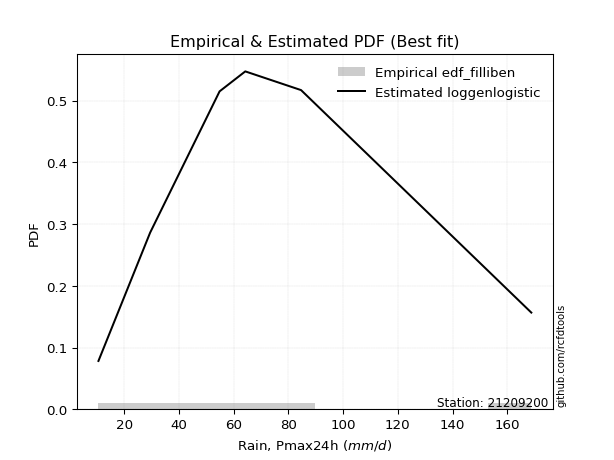</img>

</div>


### 10. EDF Jenkinson (1977)

The Jenkinson formula in hydrology is an empirical plotting position formula used to estimate the non-exceedance probability _(P)_ or return period _(T)_ of a given ordered observation within a sample. It is a widely used method in the frequency analysis of extreme events such as floods and rainfall, as it provides a distribution-free way to plot data. _a≈0.31_ and _b≈0.38_ are constants derived to approximate the median of the probability distribution for the given rank.

<div align="center">


$P=(m-a)/(n+b)$


</div>


**10.1. Empirical values**

<div align="center">

|                | 0                   | 1                   | 2                  | 3                  | 4                  | 5                  |
|:---------------|:--------------------|:--------------------|:-------------------|:-------------------|:-------------------|:-------------------|
| date           | 2022                | 2023                | 2024               | 2021               | 2020               | 2019               |
| x              | 10.5                | 29.4                | 54.8               | 64.2               | 84.6               | 168.8              |
| m              | 1                   | 2                   | 3                  | 4                  | 5                  | 6                  |
| empirical_dist | edf_jenkinson       | edf_jenkinson       | edf_jenkinson      | edf_jenkinson      | edf_jenkinson      | edf_jenkinson      |
| empirical      | 0.10815047021943573 | 0.26489028213166144 | 0.4216300940438871 | 0.5783699059561128 | 0.7351097178683387 | 0.8918495297805643 |
| empirical_tr   | 1.1212653778558874  | 1.3603411513859276  | 1.7289972899728996 | 2.3717472118959106 | 3.7751479289940844 | 9.246376811594207  |

</div>


**10.2. Kolmogorov-Smirnov fit test (sorted by Δ)**


<div align="center">

|                | 0                   | 1                    | 2                   | 3                   | 4                   | 5                    | 6                  | 7                   | 8                  | 9                   | 10                 | 11                  | 12                  | 13                  | 14                  | 15                  | 16                  | 17                  | 18                 | 19                  | 20                 | 21                  | 22                  | 23                  | 24                 | 25                  | 26                  | 27                  | 28                  | 29                  | 30                  | 31                  | 32                  | 33                  | 34                 | 35                  | 36                  | 37                  | 38                  | 39                | 40                  | 41                  | 42                  | 43                  | 44                  | 45                  | 46                  | 47                  | 48                  | 49                 | 50                  | 51                  | 52                  | 53                  | 54                 | 55                  | 56                  | 57                 | 58                  | 59                  | 60                  | 61                 | 62                  | 63                  | 64                  | 65                  | 66                  | 67                 | 68                  | 69                  | 70                  | 71                 | 72                  | 73                  | 74                  | 75                  | 76                 | 77                  | 78                  | 79                 | 80                  | 81                  | 82                  | 83                 | 84                 | 85                 | 86                  | 87                  | 88                  | 89                  | 90                 | 91                  | 92                 | 93                  | 94                  | 95                 | 96                  | 97                  | 98                  | 99                 | 100                 | 101                 | 102                 | 103                 | 104                | 105                 | 106                 | 107                | 108                 | 109                 | 110                 | 111                 | 112                | 113                 | 114                 | 115                 | 116                | 117                 | 118                 | 119                 | 120              | 121                | 122                 | 123                | 124                 | 125                | 126                | 127                | 128                 | 129                | 130                | 131                | 132                | 133                 | 134                | 135                | 136                 | 137                | 138                | 139                 | 140                 | 141                | 142                | 143                 | 144               | 145                | 146                 | 147                 | 148                 | 149                 | 150              | 151                | 152                | 153                | 154                | 155                | 156                | 157                | 158               | 159               |
|:---------------|:--------------------|:---------------------|:--------------------|:--------------------|:--------------------|:---------------------|:-------------------|:--------------------|:-------------------|:--------------------|:-------------------|:--------------------|:--------------------|:--------------------|:--------------------|:--------------------|:--------------------|:--------------------|:-------------------|:--------------------|:-------------------|:--------------------|:--------------------|:--------------------|:-------------------|:--------------------|:--------------------|:--------------------|:--------------------|:--------------------|:--------------------|:--------------------|:--------------------|:--------------------|:-------------------|:--------------------|:--------------------|:--------------------|:--------------------|:------------------|:--------------------|:--------------------|:--------------------|:--------------------|:--------------------|:--------------------|:--------------------|:--------------------|:--------------------|:-------------------|:--------------------|:--------------------|:--------------------|:--------------------|:-------------------|:--------------------|:--------------------|:-------------------|:--------------------|:--------------------|:--------------------|:-------------------|:--------------------|:--------------------|:--------------------|:--------------------|:--------------------|:-------------------|:--------------------|:--------------------|:--------------------|:-------------------|:--------------------|:--------------------|:--------------------|:--------------------|:-------------------|:--------------------|:--------------------|:-------------------|:--------------------|:--------------------|:--------------------|:-------------------|:-------------------|:-------------------|:--------------------|:--------------------|:--------------------|:--------------------|:-------------------|:--------------------|:-------------------|:--------------------|:--------------------|:-------------------|:--------------------|:--------------------|:--------------------|:-------------------|:--------------------|:--------------------|:--------------------|:--------------------|:-------------------|:--------------------|:--------------------|:-------------------|:--------------------|:--------------------|:--------------------|:--------------------|:-------------------|:--------------------|:--------------------|:--------------------|:-------------------|:--------------------|:--------------------|:--------------------|:-----------------|:-------------------|:--------------------|:-------------------|:--------------------|:-------------------|:-------------------|:-------------------|:--------------------|:-------------------|:-------------------|:-------------------|:-------------------|:--------------------|:-------------------|:-------------------|:--------------------|:-------------------|:-------------------|:--------------------|:--------------------|:-------------------|:-------------------|:--------------------|:------------------|:-------------------|:--------------------|:--------------------|:--------------------|:--------------------|:-----------------|:-------------------|:-------------------|:-------------------|:-------------------|:-------------------|:-------------------|:-------------------|:------------------|:------------------|
| station        | 21209200            | 21209200             | 21209200            | 21209200            | 21209200            | 21209200             | 21209200           | 21209200            | 21209200           | 21209200            | 21209200           | 21209200            | 21209200            | 21209200            | 21209200            | 21209200            | 21209200            | 21209200            | 21209200           | 21209200            | 21209200           | 21209200            | 21209200            | 21209200            | 21209200           | 21209200            | 21209200            | 21209200            | 21209200            | 21209200            | 21209200            | 21209200            | 21209200            | 21209200            | 21209200           | 21209200            | 21209200            | 21209200            | 21209200            | 21209200          | 21209200            | 21209200            | 21209200            | 21209200            | 21209200            | 21209200            | 21209200            | 21209200            | 21209200            | 21209200           | 21209200            | 21209200            | 21209200            | 21209200            | 21209200           | 21209200            | 21209200            | 21209200           | 21209200            | 21209200            | 21209200            | 21209200           | 21209200            | 21209200            | 21209200            | 21209200            | 21209200            | 21209200           | 21209200            | 21209200            | 21209200            | 21209200           | 21209200            | 21209200            | 21209200            | 21209200            | 21209200           | 21209200            | 21209200            | 21209200           | 21209200            | 21209200            | 21209200            | 21209200           | 21209200           | 21209200           | 21209200            | 21209200            | 21209200            | 21209200            | 21209200           | 21209200            | 21209200           | 21209200            | 21209200            | 21209200           | 21209200            | 21209200            | 21209200            | 21209200           | 21209200            | 21209200            | 21209200            | 21209200            | 21209200           | 21209200            | 21209200            | 21209200           | 21209200            | 21209200            | 21209200            | 21209200            | 21209200           | 21209200            | 21209200            | 21209200            | 21209200           | 21209200            | 21209200            | 21209200            | 21209200         | 21209200           | 21209200            | 21209200           | 21209200            | 21209200           | 21209200           | 21209200           | 21209200            | 21209200           | 21209200           | 21209200           | 21209200           | 21209200            | 21209200           | 21209200           | 21209200            | 21209200           | 21209200           | 21209200            | 21209200            | 21209200           | 21209200           | 21209200            | 21209200          | 21209200           | 21209200            | 21209200            | 21209200            | 21209200            | 21209200         | 21209200           | 21209200           | 21209200           | 21209200           | 21209200           | 21209200           | 21209200           | 21209200          | 21209200          |
| empirical_dist | edf_jenkinson       | edf_jenkinson        | edf_jenkinson       | edf_jenkinson       | edf_jenkinson       | edf_jenkinson        | edf_jenkinson      | edf_jenkinson       | edf_jenkinson      | edf_jenkinson       | edf_jenkinson      | edf_jenkinson       | edf_jenkinson       | edf_jenkinson       | edf_jenkinson       | edf_jenkinson       | edf_jenkinson       | edf_jenkinson       | edf_jenkinson      | edf_jenkinson       | edf_jenkinson      | edf_jenkinson       | edf_jenkinson       | edf_jenkinson       | edf_jenkinson      | edf_jenkinson       | edf_jenkinson       | edf_jenkinson       | edf_jenkinson       | edf_jenkinson       | edf_jenkinson       | edf_jenkinson       | edf_jenkinson       | edf_jenkinson       | edf_jenkinson      | edf_jenkinson       | edf_jenkinson       | edf_jenkinson       | edf_jenkinson       | edf_jenkinson     | edf_jenkinson       | edf_jenkinson       | edf_jenkinson       | edf_jenkinson       | edf_jenkinson       | edf_jenkinson       | edf_jenkinson       | edf_jenkinson       | edf_jenkinson       | edf_jenkinson      | edf_jenkinson       | edf_jenkinson       | edf_jenkinson       | edf_jenkinson       | edf_jenkinson      | edf_jenkinson       | edf_jenkinson       | edf_jenkinson      | edf_jenkinson       | edf_jenkinson       | edf_jenkinson       | edf_jenkinson      | edf_jenkinson       | edf_jenkinson       | edf_jenkinson       | edf_jenkinson       | edf_jenkinson       | edf_jenkinson      | edf_jenkinson       | edf_jenkinson       | edf_jenkinson       | edf_jenkinson      | edf_jenkinson       | edf_jenkinson       | edf_jenkinson       | edf_jenkinson       | edf_jenkinson      | edf_jenkinson       | edf_jenkinson       | edf_jenkinson      | edf_jenkinson       | edf_jenkinson       | edf_jenkinson       | edf_jenkinson      | edf_jenkinson      | edf_jenkinson      | edf_jenkinson       | edf_jenkinson       | edf_jenkinson       | edf_jenkinson       | edf_jenkinson      | edf_jenkinson       | edf_jenkinson      | edf_jenkinson       | edf_jenkinson       | edf_jenkinson      | edf_jenkinson       | edf_jenkinson       | edf_jenkinson       | edf_jenkinson      | edf_jenkinson       | edf_jenkinson       | edf_jenkinson       | edf_jenkinson       | edf_jenkinson      | edf_jenkinson       | edf_jenkinson       | edf_jenkinson      | edf_jenkinson       | edf_jenkinson       | edf_jenkinson       | edf_jenkinson       | edf_jenkinson      | edf_jenkinson       | edf_jenkinson       | edf_jenkinson       | edf_jenkinson      | edf_jenkinson       | edf_jenkinson       | edf_jenkinson       | edf_jenkinson    | edf_jenkinson      | edf_jenkinson       | edf_jenkinson      | edf_jenkinson       | edf_jenkinson      | edf_jenkinson      | edf_jenkinson      | edf_jenkinson       | edf_jenkinson      | edf_jenkinson      | edf_jenkinson      | edf_jenkinson      | edf_jenkinson       | edf_jenkinson      | edf_jenkinson      | edf_jenkinson       | edf_jenkinson      | edf_jenkinson      | edf_jenkinson       | edf_jenkinson       | edf_jenkinson      | edf_jenkinson      | edf_jenkinson       | edf_jenkinson     | edf_jenkinson      | edf_jenkinson       | edf_jenkinson       | edf_jenkinson       | edf_jenkinson       | edf_jenkinson    | edf_jenkinson      | edf_jenkinson      | edf_jenkinson      | edf_jenkinson      | edf_jenkinson      | edf_jenkinson      | edf_jenkinson      | edf_jenkinson     | edf_jenkinson     |
| p_dist         | burr                | loggenlogistic       | moyal               | halfnorm            | foldnorm            | logjohnsonsu         | logburr            | logloggamma         | gumbel_r           | pearson3            | logskewnorm        | logburr12           | logweibull_min      | genlogistic         | loggumbel_l         | kstwobign           | nct                 | invgamma            | logargus           | logdweibull         | logweibull_max     | loggenextreme       | rayleigh            | dweibull            | halflogistic       | maxwell             | logpearson3         | dgamma              | johnsonsu           | invgauss            | logdgamma           | rice                | logtrapezoid        | logloglaplace       | gennorm            | logtriang           | bradford            | loggompertz         | kappa3              | gompertz          | vonmises_line       | genexpon            | skewnorm            | logarcsine          | logsemicircular     | lomax               | t                   | crystalball         | norm                | truncnorm          | loganglit           | exponnorm           | logistic            | logfoldnorm         | logfatiguelife     | logexponnorm        | logt                | lognorm            | logcrystalball      | lognct              | logf                | hypsecant          | loglogistic         | truncweibull_min    | anglit              | loggamma            | loggamma            | logalpha           | logerlang           | logrice             | loggennorm          | loghypsecant       | truncexpon          | semicircular        | loginvgamma         | laplace             | logbetaprime       | logncf              | loggenhalflogistic  | loginvgauss        | logcosine           | loglaplace          | loglaplace          | ncf                | logmaxwell         | loginvweibull      | betaprime           | logksone            | lograyleigh         | logkappa4           | arcsine            | logkappa3           | cosine             | loguniform          | logwrapcauchy       | wald               | logvonmises_line    | logkstwobign        | halfgennorm         | loggenexpon        | gumbel_l            | loghalfnorm         | loggumbel_r         | mielke              | weibull_min        | gamma               | f                   | loglevy_l          | logmoyal            | loghalflogistic     | erlang              | kappa4              | loggenpareto       | burr12              | logbeta             | loggausshyper       | loglomax           | alpha               | logtruncnorm        | logexponweib        | loghalfgennorm   | exponpow           | wrapcauchy          | logbradford        | ksone               | nakagami           | lognakagami        | uniform            | gengamma            | logjohnsonsb       | logtruncexpon      | argus              | genextreme         | logwald             | levy_l             | logrdist           | logtruncweibull_min | exponweib          | logtukeylambda     | genpareto           | beta                | fatiguelife        | genhalflogistic    | rdist               | invweibull        | gausshyper         | triang              | tukeylambda         | johnsonsb           | powerlaw            | logexponpow      | trapezoid          | truncpareto        | logmielke          | logpowerlaw        | weibull_max        | logtruncpareto     | loggengamma        | logvonmises       | vonmises          |
| delta          | 0.05455074575105101 | 0.055731401462822794 | 0.06100428572866956 | 0.06134326731222728 | 0.06180190936722629 | 0.061981354240967235 | 0.0632133877695607 | 0.06359959901792822 | 0.0645044553277272 | 0.06486580107067053 | 0.0655965072700711 | 0.07063258716749915 | 0.07093018112997113 | 0.07357325539488346 | 0.07405470763793409 | 0.07466846763032498 | 0.07646515666197345 | 0.07808002813084874 | 0.0782113097888335 | 0.07836990595609733 | 0.0792909958474407 | 0.07929252885472693 | 0.08027209901605714 | 0.08183740262803374 | 0.0866376763411175 | 0.08773118332016872 | 0.08808901653656348 | 0.08955091446506397 | 0.08999553362720442 | 0.09295207681419343 | 0.09582853511732425 | 0.09882086128593748 | 0.10113244424049916 | 0.10596113664178897 | 0.1073115664902696 | 0.10813621349344948 | 0.10815041365194455 | 0.10815046722358124 | 0.10815047021868869 | 0.108150470219249 | 0.10815047021934288 | 0.10815047021943344 | 0.10815047021943573 | 0.10815047021943573 | 0.11233015414696984 | 0.11284129198127307 | 0.11386751106951687 | 0.11386883558255068 | 0.11386883592446578 | 0.1138688393629812 | 0.11482484525699915 | 0.11516768385828474 | 0.11868474983801669 | 0.12050025279865778 | 0.1207498301831233 | 0.12087034921501899 | 0.12087186196160643 | 0.1208722659078591 | 0.12087411003650023 | 0.12141538330480811 | 0.12142328158102317 | 0.1227753568217092 | 0.12662050382843254 | 0.12822051183430594 | 0.12881995177532568 | 0.12893057520627432 | 0.12893057520627432 | 0.1294173038046061 | 0.13104271964190944 | 0.13111531502787493 | 0.13121918341298355 | 0.1314915718546859 | 0.13194856894561025 | 0.13578291936548903 | 0.13744334956374188 | 0.13756554947673466 | 0.1419721538640168 | 0.14314230440745462 | 0.14333635270215694 | 0.1439724353802075 | 0.14615345436102228 | 0.14842589239906018 | 0.14842589239906018 | 0.1506056646627168 | 0.1517431801490508 | 0.1551569113244899 | 0.15607891356546416 | 0.15747597458274004 | 0.16171064267832452 | 0.16363118246531855 | 0.1639954146476872 | 0.16511966390237326 | 0.1718307990130169 | 0.17329718830806545 | 0.17579975616028481 | 0.1780989113766705 | 0.18195279079793353 | 0.18276918846452123 | 0.18299196437024007 | 0.1839744913687617 | 0.18439819718400685 | 0.18980672730297227 | 0.19122592677050293 | 0.19448885941419797 | 0.1967579581493143 | 0.20285289234780096 | 0.20671215671324733 | 0.2083682276680277 | 0.21629392942957643 | 0.21682923532501203 | 0.21842357700940668 | 0.22766383164536963 | 0.2281138358034393 | 0.22831905746009945 | 0.23458927037884425 | 0.23915087022778986 | 0.2453507801653369 | 0.24642911375170878 | 0.24688959132703844 | 0.25003135170989066 | 0.25163541689511 | 0.2535546662834438 | 0.25430467274311197 | 0.2580363152894218 | 0.26169426198288914 | 0.2648902820204983 | 0.2648902821288519 | 0.2670111708057993 | 0.26990858100988574 | 0.2699208432970215 | 0.2724157634514753 | 0.2727263181026063 | 0.2760354080651396 | 0.28585742962599153 | 0.2911875915903513 | 0.3025158228259311 | 0.305992310189043   | 0.3262634051504238 | 0.3627515350357952 | 0.37069565332158155 | 0.37095904982582273 | 0.3992224508484745 | 0.4015542841821471 | 0.44791059224054236 | 0.449575778922871 | 0.4583045625622601 | 0.46675072759295066 | 0.47329736414162876 | 0.47969418668542807 | 0.48482247112572885 | 0.49053913443416 | 0.5096572212069742 | 0.5610597377498475 | 0.5865782370809696 | 0.5921635967952565 | 0.6129964881834459 | 0.6504429406662235 | 0.6878706137742648 | 1.090506596404738 | 26.93805366808959 |
| deltao         | 0.530385761606      | 0.530385761606       | 0.530385761606      | 0.530385761606      | 0.530385761606      | 0.530385761606       | 0.530385761606     | 0.530385761606      | 0.530385761606     | 0.530385761606      | 0.530385761606     | 0.530385761606      | 0.530385761606      | 0.530385761606      | 0.530385761606      | 0.530385761606      | 0.530385761606      | 0.530385761606      | 0.530385761606     | 0.530385761606      | 0.530385761606     | 0.530385761606      | 0.530385761606      | 0.530385761606      | 0.530385761606     | 0.530385761606      | 0.530385761606      | 0.530385761606      | 0.530385761606      | 0.530385761606      | 0.530385761606      | 0.530385761606      | 0.530385761606      | 0.530385761606      | 0.530385761606     | 0.530385761606      | 0.530385761606      | 0.530385761606      | 0.530385761606      | 0.530385761606    | 0.530385761606      | 0.530385761606      | 0.530385761606      | 0.530385761606      | 0.530385761606      | 0.530385761606      | 0.530385761606      | 0.530385761606      | 0.530385761606      | 0.530385761606     | 0.530385761606      | 0.530385761606      | 0.530385761606      | 0.530385761606      | 0.530385761606     | 0.530385761606      | 0.530385761606      | 0.530385761606     | 0.530385761606      | 0.530385761606      | 0.530385761606      | 0.530385761606     | 0.530385761606      | 0.530385761606      | 0.530385761606      | 0.530385761606      | 0.530385761606      | 0.530385761606     | 0.530385761606      | 0.530385761606      | 0.530385761606      | 0.530385761606     | 0.530385761606      | 0.530385761606      | 0.530385761606      | 0.530385761606      | 0.530385761606     | 0.530385761606      | 0.530385761606      | 0.530385761606     | 0.530385761606      | 0.530385761606      | 0.530385761606      | 0.530385761606     | 0.530385761606     | 0.530385761606     | 0.530385761606      | 0.530385761606      | 0.530385761606      | 0.530385761606      | 0.530385761606     | 0.530385761606      | 0.530385761606     | 0.530385761606      | 0.530385761606      | 0.530385761606     | 0.530385761606      | 0.530385761606      | 0.530385761606      | 0.530385761606     | 0.530385761606      | 0.530385761606      | 0.530385761606      | 0.530385761606      | 0.530385761606     | 0.530385761606      | 0.530385761606      | 0.530385761606     | 0.530385761606      | 0.530385761606      | 0.530385761606      | 0.530385761606      | 0.530385761606     | 0.530385761606      | 0.530385761606      | 0.530385761606      | 0.530385761606     | 0.530385761606      | 0.530385761606      | 0.530385761606      | 0.530385761606   | 0.530385761606     | 0.530385761606      | 0.530385761606     | 0.530385761606      | 0.530385761606     | 0.530385761606     | 0.530385761606     | 0.530385761606      | 0.530385761606     | 0.530385761606     | 0.530385761606     | 0.530385761606     | 0.530385761606      | 0.530385761606     | 0.530385761606     | 0.530385761606      | 0.530385761606     | 0.530385761606     | 0.530385761606      | 0.530385761606      | 0.530385761606     | 0.530385761606     | 0.530385761606      | 0.530385761606    | 0.530385761606     | 0.530385761606      | 0.530385761606      | 0.530385761606      | 0.530385761606      | 0.530385761606   | 0.530385761606     | 0.530385761606     | 0.530385761606     | 0.530385761606     | 0.530385761606     | 0.530385761606     | 0.530385761606     | 0.530385761606    | 0.530385761606    |
| eval           | Δo > Δ              | Δo > Δ               | Δo > Δ              | Δo > Δ              | Δo > Δ              | Δo > Δ               | Δo > Δ             | Δo > Δ              | Δo > Δ             | Δo > Δ              | Δo > Δ             | Δo > Δ              | Δo > Δ              | Δo > Δ              | Δo > Δ              | Δo > Δ              | Δo > Δ              | Δo > Δ              | Δo > Δ             | Δo > Δ              | Δo > Δ             | Δo > Δ              | Δo > Δ              | Δo > Δ              | Δo > Δ             | Δo > Δ              | Δo > Δ              | Δo > Δ              | Δo > Δ              | Δo > Δ              | Δo > Δ              | Δo > Δ              | Δo > Δ              | Δo > Δ              | Δo > Δ             | Δo > Δ              | Δo > Δ              | Δo > Δ              | Δo > Δ              | Δo > Δ            | Δo > Δ              | Δo > Δ              | Δo > Δ              | Δo > Δ              | Δo > Δ              | Δo > Δ              | Δo > Δ              | Δo > Δ              | Δo > Δ              | Δo > Δ             | Δo > Δ              | Δo > Δ              | Δo > Δ              | Δo > Δ              | Δo > Δ             | Δo > Δ              | Δo > Δ              | Δo > Δ             | Δo > Δ              | Δo > Δ              | Δo > Δ              | Δo > Δ             | Δo > Δ              | Δo > Δ              | Δo > Δ              | Δo > Δ              | Δo > Δ              | Δo > Δ             | Δo > Δ              | Δo > Δ              | Δo > Δ              | Δo > Δ             | Δo > Δ              | Δo > Δ              | Δo > Δ              | Δo > Δ              | Δo > Δ             | Δo > Δ              | Δo > Δ              | Δo > Δ             | Δo > Δ              | Δo > Δ              | Δo > Δ              | Δo > Δ             | Δo > Δ             | Δo > Δ             | Δo > Δ              | Δo > Δ              | Δo > Δ              | Δo > Δ              | Δo > Δ             | Δo > Δ              | Δo > Δ             | Δo > Δ              | Δo > Δ              | Δo > Δ             | Δo > Δ              | Δo > Δ              | Δo > Δ              | Δo > Δ             | Δo > Δ              | Δo > Δ              | Δo > Δ              | Δo > Δ              | Δo > Δ             | Δo > Δ              | Δo > Δ              | Δo > Δ             | Δo > Δ              | Δo > Δ              | Δo > Δ              | Δo > Δ              | Δo > Δ             | Δo > Δ              | Δo > Δ              | Δo > Δ              | Δo > Δ             | Δo > Δ              | Δo > Δ              | Δo > Δ              | Δo > Δ           | Δo > Δ             | Δo > Δ              | Δo > Δ             | Δo > Δ              | Δo > Δ             | Δo > Δ             | Δo > Δ             | Δo > Δ              | Δo > Δ             | Δo > Δ             | Δo > Δ             | Δo > Δ             | Δo > Δ              | Δo > Δ             | Δo > Δ             | Δo > Δ              | Δo > Δ             | Δo > Δ             | Δo > Δ              | Δo > Δ              | Δo > Δ             | Δo > Δ             | Δo > Δ              | Δo > Δ            | Δo > Δ             | Δo > Δ              | Δo > Δ              | Δo > Δ              | Δo > Δ              | Δo > Δ           | Δo > Δ             | Δo <= Δ            | Δo <= Δ            | Δo <= Δ            | Δo <= Δ            | Δo <= Δ            | Δo <= Δ            | Δo <= Δ           | Δo <= Δ           |
| fit            | 1                   | 1                    | 1                   | 1                   | 1                   | 1                    | 1                  | 1                   | 1                  | 1                   | 1                  | 1                   | 1                   | 1                   | 1                   | 1                   | 1                   | 1                   | 1                  | 1                   | 1                  | 1                   | 1                   | 1                   | 1                  | 1                   | 1                   | 1                   | 1                   | 1                   | 1                   | 1                   | 1                   | 1                   | 1                  | 1                   | 1                   | 1                   | 1                   | 1                 | 1                   | 1                   | 1                   | 1                   | 1                   | 1                   | 1                   | 1                   | 1                   | 1                  | 1                   | 1                   | 1                   | 1                   | 1                  | 1                   | 1                   | 1                  | 1                   | 1                   | 1                   | 1                  | 1                   | 1                   | 1                   | 1                   | 1                   | 1                  | 1                   | 1                   | 1                   | 1                  | 1                   | 1                   | 1                   | 1                   | 1                  | 1                   | 1                   | 1                  | 1                   | 1                   | 1                   | 1                  | 1                  | 1                  | 1                   | 1                   | 1                   | 1                   | 1                  | 1                   | 1                  | 1                   | 1                   | 1                  | 1                   | 1                   | 1                   | 1                  | 1                   | 1                   | 1                   | 1                   | 1                  | 1                   | 1                   | 1                  | 1                   | 1                   | 1                   | 1                   | 1                  | 1                   | 1                   | 1                   | 1                  | 1                   | 1                   | 1                   | 1                | 1                  | 1                   | 1                  | 1                   | 1                  | 1                  | 1                  | 1                   | 1                  | 1                  | 1                  | 1                  | 1                   | 1                  | 1                  | 1                   | 1                  | 1                  | 1                   | 1                   | 1                  | 1                  | 1                   | 1                 | 1                  | 1                   | 1                   | 1                   | 1                   | 1                | 1                  | 0                  | 0                  | 0                  | 0                  | 0                  | 0                  | 0                 | 0                 |
| n              | 6                   | 6                    | 6                   | 6                   | 6                   | 6                    | 6                  | 6                   | 6                  | 6                   | 6                  | 6                   | 6                   | 6                   | 6                   | 6                   | 6                   | 6                   | 6                  | 6                   | 6                  | 6                   | 6                   | 6                   | 6                  | 6                   | 6                   | 6                   | 6                   | 6                   | 6                   | 6                   | 6                   | 6                   | 6                  | 6                   | 6                   | 6                   | 6                   | 6                 | 6                   | 6                   | 6                   | 6                   | 6                   | 6                   | 6                   | 6                   | 6                   | 6                  | 6                   | 6                   | 6                   | 6                   | 6                  | 6                   | 6                   | 6                  | 6                   | 6                   | 6                   | 6                  | 6                   | 6                   | 6                   | 6                   | 6                   | 6                  | 6                   | 6                   | 6                   | 6                  | 6                   | 6                   | 6                   | 6                   | 6                  | 6                   | 6                   | 6                  | 6                   | 6                   | 6                   | 6                  | 6                  | 6                  | 6                   | 6                   | 6                   | 6                   | 6                  | 6                   | 6                  | 6                   | 6                   | 6                  | 6                   | 6                   | 6                   | 6                  | 6                   | 6                   | 6                   | 6                   | 6                  | 6                   | 6                   | 6                  | 6                   | 6                   | 6                   | 6                   | 6                  | 6                   | 6                   | 6                   | 6                  | 6                   | 6                   | 6                   | 6                | 6                  | 6                   | 6                  | 6                   | 6                  | 6                  | 6                  | 6                   | 6                  | 6                  | 6                  | 6                  | 6                   | 6                  | 6                  | 6                   | 6                  | 6                  | 6                   | 6                   | 6                  | 6                  | 6                   | 6                 | 6                  | 6                   | 6                   | 6                   | 6                   | 6                | 6                  | 6                  | 6                  | 6                  | 6                  | 6                  | 6                  | 6                 | 6                 |
| best_fit       | 1                   | 0                    | 0                   | 0                   | 0                   | 0                    | 0                  | 0                   | 0                  | 0                   | 0                  | 0                   | 0                   | 0                   | 0                   | 0                   | 0                   | 0                   | 0                  | 0                   | 0                  | 0                   | 0                   | 0                   | 0                  | 0                   | 0                   | 0                   | 0                   | 0                   | 0                   | 0                   | 0                   | 0                   | 0                  | 0                   | 0                   | 0                   | 0                   | 0                 | 0                   | 0                   | 0                   | 0                   | 0                   | 0                   | 0                   | 0                   | 0                   | 0                  | 0                   | 0                   | 0                   | 0                   | 0                  | 0                   | 0                   | 0                  | 0                   | 0                   | 0                   | 0                  | 0                   | 0                   | 0                   | 0                   | 0                   | 0                  | 0                   | 0                   | 0                   | 0                  | 0                   | 0                   | 0                   | 0                   | 0                  | 0                   | 0                   | 0                  | 0                   | 0                   | 0                   | 0                  | 0                  | 0                  | 0                   | 0                   | 0                   | 0                   | 0                  | 0                   | 0                  | 0                   | 0                   | 0                  | 0                   | 0                   | 0                   | 0                  | 0                   | 0                   | 0                   | 0                   | 0                  | 0                   | 0                   | 0                  | 0                   | 0                   | 0                   | 0                   | 0                  | 0                   | 0                   | 0                   | 0                  | 0                   | 0                   | 0                   | 0                | 0                  | 0                   | 0                  | 0                   | 0                  | 0                  | 0                  | 0                   | 0                  | 0                  | 0                  | 0                  | 0                   | 0                  | 0                  | 0                   | 0                  | 0                  | 0                   | 0                   | 0                  | 0                  | 0                   | 0                 | 0                  | 0                   | 0                   | 0                   | 0                   | 0                | 0                  | 0                  | 0                  | 0                  | 0                  | 0                  | 0                  | 0                 | 0                 |
| best_fit_sort  | 1                   | 2                    | 3                   | 4                   | 5                   | 6                    | 7                  | 8                   | 9                  | 10                  | 11                 | 12                  | 13                  | 14                  | 15                  | 16                  | 17                  | 18                  | 19                 | 20                  | 21                 | 22                  | 23                  | 24                  | 25                 | 26                  | 27                  | 28                  | 29                  | 30                  | 31                  | 32                  | 33                  | 34                  | 35                 | 36                  | 37                  | 38                  | 39                  | 40                | 41                  | 42                  | 43                  | 44                  | 45                  | 46                  | 47                  | 48                  | 49                  | 50                 | 51                  | 52                  | 53                  | 54                  | 55                 | 56                  | 57                  | 58                 | 59                  | 60                  | 61                  | 62                 | 63                  | 64                  | 65                  | 66                  | 67                  | 68                 | 69                  | 70                  | 71                  | 72                 | 73                  | 74                  | 75                  | 76                  | 77                 | 78                  | 79                  | 80                 | 81                  | 82                  | 83                  | 84                 | 85                 | 86                 | 87                  | 88                  | 89                  | 90                  | 91                 | 92                  | 93                 | 94                  | 95                  | 96                 | 97                  | 98                  | 99                  | 100                | 101                 | 102                 | 103                 | 104                 | 105                | 106                 | 107                 | 108                | 109                 | 110                 | 111                 | 112                 | 113                | 114                 | 115                 | 116                 | 117                | 118                 | 119                 | 120                 | 121              | 122                | 123                 | 124                | 125                 | 126                | 127                | 128                | 129                 | 130                | 131                | 132                | 133                | 134                 | 135                | 136                | 137                 | 138                | 139                | 140                 | 141                 | 142                | 143                | 144                 | 145               | 146                | 147                 | 148                 | 149                 | 150                 | 151              | 152                | 153                | 154                | 155                | 156                | 157                | 158                | 159               | 160               |

</div>


**10.3. Best fit**

<div align="center">

|   id |   station | empirical_dist   | p_dist   |     delta |   deltao | eval   |   fit |   n |   best_fit |   best_fit_sort |
|-----:|----------:|:-----------------|:---------|----------:|---------:|:-------|------:|----:|-----------:|----------------:|
|    0 |  21209200 | edf_jenkinson    | burr     | 0.0545507 | 0.530386 | Δo > Δ |     1 |   6 |          1 |               1 |

</div>


<div align="center">

</img></img>

</div>


### 11. EDF Cunnane (1978)

Cunnane´s work in statistical hydrology has focused on the performance and evaluation of different probability distributions (such as GEV, Gumbel, Lognormal) for flood frequency estimation. _b_ is a constant, typically set to 0.4.

<div align="center">


$P=(m-b)/(n+1-2b)$


</div>


**11.1. Empirical values**

<div align="center">

|                | 0                  | 1                   | 2                   | 3                  | 4                  | 5                  |
|:---------------|:-------------------|:--------------------|:--------------------|:-------------------|:-------------------|:-------------------|
| date           | 2022               | 2023                | 2024                | 2021               | 2020               | 2019               |
| x              | 10.5               | 29.4                | 54.8                | 64.2               | 84.6               | 168.8              |
| m              | 1                  | 2                   | 3                   | 4                  | 5                  | 6                  |
| empirical_dist | edf_cunnane        | edf_cunnane         | edf_cunnane         | edf_cunnane        | edf_cunnane        | edf_cunnane        |
| empirical      | 0.0967741935483871 | 0.25806451612903225 | 0.41935483870967744 | 0.5806451612903226 | 0.7419354838709676 | 0.9032258064516128 |
| empirical_tr   | 1.1071428571428572 | 1.3478260869565217  | 1.7222222222222225  | 2.384615384615385  | 3.8749999999999982 | 10.333333333333318 |

</div>


**11.2. Kolmogorov-Smirnov fit test (sorted by Δ)**


<div align="center">

|                | 0                   | 1                   | 2                  | 3                    | 4                    | 5                   | 6                   | 7                   | 8                  | 9                  | 10                 | 11                  | 12                  | 13                 | 14                | 15                  | 16                  | 17                  | 18                  | 19                  | 20                  | 21                  | 22                  | 23                  | 24                  | 25                 | 26                  | 27                 | 28                  | 29                  | 30                  | 31                  | 32                  | 33                  | 34                  | 35                  | 36                 | 37                 | 38                  | 39                  | 40                  | 41                  | 42                  | 43                  | 44                  | 45                  | 46                  | 47                  | 48                  | 49                  | 50                  | 51                  | 52                  | 53                  | 54                  | 55                  | 56                  | 57                  | 58                  | 59                 | 60                  | 61                | 62                  | 63                  | 64                  | 65                  | 66                  | 67                  | 68                  | 69                 | 70                 | 71                  | 72                 | 73                  | 74                  | 75                | 76                  | 77                  | 78                  | 79                  | 80                 | 81                  | 82                  | 83                 | 84                 | 85                  | 86                  | 87                  | 88                  | 89                  | 90                  | 91                  | 92                 | 93                  | 94                 | 95                  | 96                  | 97                  | 98                  | 99                 | 100                 | 101                 | 102                 | 103                 | 104                 | 105                 | 106                 | 107                 | 108                 | 109                 | 110                 | 111                 | 112                | 113                | 114                 | 115                | 116                 | 117                | 118                 | 119                 | 120                 | 121                | 122                | 123                 | 124               | 125                 | 126                | 127                 | 128                 | 129                 | 130                 | 131                 | 132                 | 133                | 134                | 135                | 136                 | 137                | 138                | 139                | 140                | 141                | 142                | 143               | 144                 | 145                 | 146                 | 147                | 148                 | 149                 | 150                 | 151                | 152                | 153                | 154                | 155                | 156                | 157               | 158                | 159                |
|:---------------|:--------------------|:--------------------|:-------------------|:---------------------|:---------------------|:--------------------|:--------------------|:--------------------|:-------------------|:-------------------|:-------------------|:--------------------|:--------------------|:-------------------|:------------------|:--------------------|:--------------------|:--------------------|:--------------------|:--------------------|:--------------------|:--------------------|:--------------------|:--------------------|:--------------------|:-------------------|:--------------------|:-------------------|:--------------------|:--------------------|:--------------------|:--------------------|:--------------------|:--------------------|:--------------------|:--------------------|:-------------------|:-------------------|:--------------------|:--------------------|:--------------------|:--------------------|:--------------------|:--------------------|:--------------------|:--------------------|:--------------------|:--------------------|:--------------------|:--------------------|:--------------------|:--------------------|:--------------------|:--------------------|:--------------------|:--------------------|:--------------------|:--------------------|:--------------------|:-------------------|:--------------------|:------------------|:--------------------|:--------------------|:--------------------|:--------------------|:--------------------|:--------------------|:--------------------|:-------------------|:-------------------|:--------------------|:-------------------|:--------------------|:--------------------|:------------------|:--------------------|:--------------------|:--------------------|:--------------------|:-------------------|:--------------------|:--------------------|:-------------------|:-------------------|:--------------------|:--------------------|:--------------------|:--------------------|:--------------------|:--------------------|:--------------------|:-------------------|:--------------------|:-------------------|:--------------------|:--------------------|:--------------------|:--------------------|:-------------------|:--------------------|:--------------------|:--------------------|:--------------------|:--------------------|:--------------------|:--------------------|:--------------------|:--------------------|:--------------------|:--------------------|:--------------------|:-------------------|:-------------------|:--------------------|:-------------------|:--------------------|:-------------------|:--------------------|:--------------------|:--------------------|:-------------------|:-------------------|:--------------------|:------------------|:--------------------|:-------------------|:--------------------|:--------------------|:--------------------|:--------------------|:--------------------|:--------------------|:-------------------|:-------------------|:-------------------|:--------------------|:-------------------|:-------------------|:-------------------|:-------------------|:-------------------|:-------------------|:------------------|:--------------------|:--------------------|:--------------------|:-------------------|:--------------------|:--------------------|:--------------------|:-------------------|:-------------------|:-------------------|:-------------------|:-------------------|:-------------------|:------------------|:-------------------|:-------------------|
| station        | 21209200            | 21209200            | 21209200           | 21209200             | 21209200             | 21209200            | 21209200            | 21209200            | 21209200           | 21209200           | 21209200           | 21209200            | 21209200            | 21209200           | 21209200          | 21209200            | 21209200            | 21209200            | 21209200            | 21209200            | 21209200            | 21209200            | 21209200            | 21209200            | 21209200            | 21209200           | 21209200            | 21209200           | 21209200            | 21209200            | 21209200            | 21209200            | 21209200            | 21209200            | 21209200            | 21209200            | 21209200           | 21209200           | 21209200            | 21209200            | 21209200            | 21209200            | 21209200            | 21209200            | 21209200            | 21209200            | 21209200            | 21209200            | 21209200            | 21209200            | 21209200            | 21209200            | 21209200            | 21209200            | 21209200            | 21209200            | 21209200            | 21209200            | 21209200            | 21209200           | 21209200            | 21209200          | 21209200            | 21209200            | 21209200            | 21209200            | 21209200            | 21209200            | 21209200            | 21209200           | 21209200           | 21209200            | 21209200           | 21209200            | 21209200            | 21209200          | 21209200            | 21209200            | 21209200            | 21209200            | 21209200           | 21209200            | 21209200            | 21209200           | 21209200           | 21209200            | 21209200            | 21209200            | 21209200            | 21209200            | 21209200            | 21209200            | 21209200           | 21209200            | 21209200           | 21209200            | 21209200            | 21209200            | 21209200            | 21209200           | 21209200            | 21209200            | 21209200            | 21209200            | 21209200            | 21209200            | 21209200            | 21209200            | 21209200            | 21209200            | 21209200            | 21209200            | 21209200           | 21209200           | 21209200            | 21209200           | 21209200            | 21209200           | 21209200            | 21209200            | 21209200            | 21209200           | 21209200           | 21209200            | 21209200          | 21209200            | 21209200           | 21209200            | 21209200            | 21209200            | 21209200            | 21209200            | 21209200            | 21209200           | 21209200           | 21209200           | 21209200            | 21209200           | 21209200           | 21209200           | 21209200           | 21209200           | 21209200           | 21209200          | 21209200            | 21209200            | 21209200            | 21209200           | 21209200            | 21209200            | 21209200            | 21209200           | 21209200           | 21209200           | 21209200           | 21209200           | 21209200           | 21209200          | 21209200           | 21209200           |
| empirical_dist | edf_cunnane         | edf_cunnane         | edf_cunnane        | edf_cunnane          | edf_cunnane          | edf_cunnane         | edf_cunnane         | edf_cunnane         | edf_cunnane        | edf_cunnane        | edf_cunnane        | edf_cunnane         | edf_cunnane         | edf_cunnane        | edf_cunnane       | edf_cunnane         | edf_cunnane         | edf_cunnane         | edf_cunnane         | edf_cunnane         | edf_cunnane         | edf_cunnane         | edf_cunnane         | edf_cunnane         | edf_cunnane         | edf_cunnane        | edf_cunnane         | edf_cunnane        | edf_cunnane         | edf_cunnane         | edf_cunnane         | edf_cunnane         | edf_cunnane         | edf_cunnane         | edf_cunnane         | edf_cunnane         | edf_cunnane        | edf_cunnane        | edf_cunnane         | edf_cunnane         | edf_cunnane         | edf_cunnane         | edf_cunnane         | edf_cunnane         | edf_cunnane         | edf_cunnane         | edf_cunnane         | edf_cunnane         | edf_cunnane         | edf_cunnane         | edf_cunnane         | edf_cunnane         | edf_cunnane         | edf_cunnane         | edf_cunnane         | edf_cunnane         | edf_cunnane         | edf_cunnane         | edf_cunnane         | edf_cunnane        | edf_cunnane         | edf_cunnane       | edf_cunnane         | edf_cunnane         | edf_cunnane         | edf_cunnane         | edf_cunnane         | edf_cunnane         | edf_cunnane         | edf_cunnane        | edf_cunnane        | edf_cunnane         | edf_cunnane        | edf_cunnane         | edf_cunnane         | edf_cunnane       | edf_cunnane         | edf_cunnane         | edf_cunnane         | edf_cunnane         | edf_cunnane        | edf_cunnane         | edf_cunnane         | edf_cunnane        | edf_cunnane        | edf_cunnane         | edf_cunnane         | edf_cunnane         | edf_cunnane         | edf_cunnane         | edf_cunnane         | edf_cunnane         | edf_cunnane        | edf_cunnane         | edf_cunnane        | edf_cunnane         | edf_cunnane         | edf_cunnane         | edf_cunnane         | edf_cunnane        | edf_cunnane         | edf_cunnane         | edf_cunnane         | edf_cunnane         | edf_cunnane         | edf_cunnane         | edf_cunnane         | edf_cunnane         | edf_cunnane         | edf_cunnane         | edf_cunnane         | edf_cunnane         | edf_cunnane        | edf_cunnane        | edf_cunnane         | edf_cunnane        | edf_cunnane         | edf_cunnane        | edf_cunnane         | edf_cunnane         | edf_cunnane         | edf_cunnane        | edf_cunnane        | edf_cunnane         | edf_cunnane       | edf_cunnane         | edf_cunnane        | edf_cunnane         | edf_cunnane         | edf_cunnane         | edf_cunnane         | edf_cunnane         | edf_cunnane         | edf_cunnane        | edf_cunnane        | edf_cunnane        | edf_cunnane         | edf_cunnane        | edf_cunnane        | edf_cunnane        | edf_cunnane        | edf_cunnane        | edf_cunnane        | edf_cunnane       | edf_cunnane         | edf_cunnane         | edf_cunnane         | edf_cunnane        | edf_cunnane         | edf_cunnane         | edf_cunnane         | edf_cunnane        | edf_cunnane        | edf_cunnane        | edf_cunnane        | edf_cunnane        | edf_cunnane        | edf_cunnane       | edf_cunnane        | edf_cunnane        |
| p_dist         | moyal               | gumbel_r            | burr               | loggenlogistic       | genlogistic          | loggumbel_l         | kstwobign           | logjohnsonsu        | logburr            | halfnorm           | pearson3           | logloggamma         | logargus            | logskewnorm        | foldnorm          | dweibull            | logburr12           | logweibull_min      | halflogistic        | nct                 | invgamma            | logdweibull         | dgamma              | logweibull_max      | loggenextreme       | rayleigh           | logdgamma           | logtrapezoid       | logpearson3         | johnsonsu           | maxwell             | invgauss            | logtriang           | kappa3              | gompertz            | vonmises_line       | genexpon           | skewnorm           | logloglaplace       | rice                | loggompertz         | gennorm             | logarcsine          | bradford            | logsemicircular     | lomax               | loganglit           | exponnorm           | t                   | norm                | crystalball         | truncnorm           | logistic            | logfoldnorm         | logfatiguelife      | logexponnorm        | logt                | lognorm             | logcrystalball      | lognct             | logf                | hypsecant         | loggennorm          | loglogistic         | loggamma            | loggamma            | logalpha            | logerlang           | logrice             | loghypsecant       | truncweibull_min   | anglit              | truncexpon         | loginvgamma         | laplace             | semicircular      | logbetaprime        | logncf              | loginvgauss         | logcosine           | loggenhalflogistic | loglaplace          | loglaplace          | ncf                | logmaxwell         | loginvweibull       | betaprime           | logksone            | lograyleigh         | logkappa4           | logkappa3           | arcsine             | wald               | loguniform          | logwrapcauchy      | cosine              | logvonmises_line    | logkstwobign        | halfgennorm         | loggenexpon        | gumbel_l            | loghalfnorm         | loggumbel_r         | mielke              | weibull_min         | gamma               | f                   | logmoyal            | loghalflogistic     | loglevy_l           | erlang              | burr12              | kappa4             | loggenpareto       | logtruncnorm        | logbeta            | loggausshyper       | loglomax           | alpha               | loghalfgennorm      | logexponweib        | nakagami           | lognakagami        | logbradford         | exponpow          | wrapcauchy          | ksone              | gengamma            | uniform             | logtruncexpon       | logjohnsonsb        | argus               | genextreme          | logwald            | levy_l             | logrdist           | logtruncweibull_min | exponweib          | logtukeylambda     | genpareto          | beta               | fatiguelife        | genhalflogistic    | rdist             | invweibull          | gausshyper          | triang              | tukeylambda        | johnsonsb           | powerlaw            | logexponpow         | trapezoid          | truncpareto        | logmielke          | logpowerlaw        | weibull_max        | logtruncpareto     | loggengamma       | logvonmises        | vonmises           |
| delta          | 0.05294399645672471 | 0.05509778918257602 | 0.0568260010852607 | 0.058006656797032485 | 0.062196978723835006 | 0.06267843096688563 | 0.06329219095927652 | 0.06425660957517693 | 0.0654886431037704 | 0.0656940228919648 | 0.0658115758003478 | 0.06587485435213791 | 0.06683503311778505 | 0.0678717626042808 | 0.068356122684465 | 0.07046112595698528 | 0.07290784250170884 | 0.07320543646418082 | 0.07526139967006887 | 0.07874041199618315 | 0.08035528346505844 | 0.08064516129030702 | 0.08272514846243478 | 0.08374594187843898 | 0.08375650831857429 | 0.0870978650186861 | 0.08900276911469507 | 0.0897561675694507 | 0.09036427187077317 | 0.09227078896141411 | 0.09455694932279768 | 0.09522733214840312 | 0.09675993682240103 | 0.09677419354764005 | 0.09677419354820037 | 0.09677419354829442 | 0.0967741935483848 | 0.0967741935483871 | 0.09913537063915978 | 0.10109611662014728 | 0.10229242766932295 | 0.10369157174844584 | 0.10469335322723555 | 0.10881884381178425 | 0.11460540948117953 | 0.11511654731548276 | 0.11710010059120884 | 0.11744293919249443 | 0.11894920769076733 | 0.11895014639630452 | 0.11895014944241777 | 0.11895015219547056 | 0.12096000517222649 | 0.12277550813286747 | 0.12302508551733299 | 0.12314560454922868 | 0.12314711729581612 | 0.12314752124206879 | 0.12314936537070992 | 0.1236906386390178 | 0.12369853691523286 | 0.125050612155919 | 0.12621387794657485 | 0.12889575916264223 | 0.13120583054048401 | 0.13120583054048401 | 0.13169255913881578 | 0.13331797497611914 | 0.13339057036208463 | 0.1337668271888956 | 0.1350462778369349 | 0.13564571777795464 | 0.1387743349482392 | 0.13971860489795157 | 0.13984080481094446 | 0.142608685368118 | 0.14424740919822648 | 0.14541755974166432 | 0.14624769071441718 | 0.14842870969523198 | 0.1501621187047859 | 0.15070114773326987 | 0.15070114773326987 | 0.1528809199969265 | 0.1540184354832605 | 0.15743216665869958 | 0.15835416889967385 | 0.15975122991694973 | 0.16398589801253421 | 0.16590643779952824 | 0.16739491923658295 | 0.17082118065031615 | 0.1712731453740413 | 0.17557244364227514 | 0.1780750114944945 | 0.17865656501564586 | 0.18422804613214322 | 0.18504444379873092 | 0.18526721970444976 | 0.1862497467029714 | 0.18667345251821665 | 0.19208198263718196 | 0.19350118210471262 | 0.19676411474840766 | 0.20358372415194348 | 0.20512814768201065 | 0.20898741204745702 | 0.21856918476378612 | 0.21910449065922172 | 0.21974450433907636 | 0.22069883234361637 | 0.23059431279430914 | 0.2344895976479986 | 0.2349396018060685 | 0.24006382532440926 | 0.2414150363814732 | 0.24142612556199955 | 0.2476260354995466 | 0.24870436908591848 | 0.25570050068192274 | 0.25685711771251984 | 0.2580645160178691 | 0.2580645161262227 | 0.26031157062363147 | 0.260380432286073 | 0.26113043874574093 | 0.2685200279855181 | 0.27218383634409543 | 0.27383693680842824 | 0.27469101878568497 | 0.27674660929965067 | 0.27955208410523524 | 0.28741168473618806 | 0.2881326849602012 | 0.3025638682613999 | 0.3047910781601408 | 0.3082675655232527  | 0.3285386604846335 | 0.3650267903700049 | 0.3775214193242105 | 0.3777848158284517 | 0.4060482168511037 | 0.4083800501847761 | 0.459286868911591 | 0.46095205559391944 | 0.46513032856488906 | 0.47357649359557963 | 0.4846736408126774 | 0.48651995268805703 | 0.49164823712835803 | 0.49736490043678916 | 0.5164829872096032 | 0.5678855037524767 | 0.5934040030835988 | 0.5989893627978857 | 0.6198222541860748 | 0.6572687066688527 | 0.694696379776894 | 1.0927818517389476 | 26.926677391418544 |
| deltao         | 0.530385761606      | 0.530385761606      | 0.530385761606     | 0.530385761606       | 0.530385761606       | 0.530385761606      | 0.530385761606      | 0.530385761606      | 0.530385761606     | 0.530385761606     | 0.530385761606     | 0.530385761606      | 0.530385761606      | 0.530385761606     | 0.530385761606    | 0.530385761606      | 0.530385761606      | 0.530385761606      | 0.530385761606      | 0.530385761606      | 0.530385761606      | 0.530385761606      | 0.530385761606      | 0.530385761606      | 0.530385761606      | 0.530385761606     | 0.530385761606      | 0.530385761606     | 0.530385761606      | 0.530385761606      | 0.530385761606      | 0.530385761606      | 0.530385761606      | 0.530385761606      | 0.530385761606      | 0.530385761606      | 0.530385761606     | 0.530385761606     | 0.530385761606      | 0.530385761606      | 0.530385761606      | 0.530385761606      | 0.530385761606      | 0.530385761606      | 0.530385761606      | 0.530385761606      | 0.530385761606      | 0.530385761606      | 0.530385761606      | 0.530385761606      | 0.530385761606      | 0.530385761606      | 0.530385761606      | 0.530385761606      | 0.530385761606      | 0.530385761606      | 0.530385761606      | 0.530385761606      | 0.530385761606      | 0.530385761606     | 0.530385761606      | 0.530385761606    | 0.530385761606      | 0.530385761606      | 0.530385761606      | 0.530385761606      | 0.530385761606      | 0.530385761606      | 0.530385761606      | 0.530385761606     | 0.530385761606     | 0.530385761606      | 0.530385761606     | 0.530385761606      | 0.530385761606      | 0.530385761606    | 0.530385761606      | 0.530385761606      | 0.530385761606      | 0.530385761606      | 0.530385761606     | 0.530385761606      | 0.530385761606      | 0.530385761606     | 0.530385761606     | 0.530385761606      | 0.530385761606      | 0.530385761606      | 0.530385761606      | 0.530385761606      | 0.530385761606      | 0.530385761606      | 0.530385761606     | 0.530385761606      | 0.530385761606     | 0.530385761606      | 0.530385761606      | 0.530385761606      | 0.530385761606      | 0.530385761606     | 0.530385761606      | 0.530385761606      | 0.530385761606      | 0.530385761606      | 0.530385761606      | 0.530385761606      | 0.530385761606      | 0.530385761606      | 0.530385761606      | 0.530385761606      | 0.530385761606      | 0.530385761606      | 0.530385761606     | 0.530385761606     | 0.530385761606      | 0.530385761606     | 0.530385761606      | 0.530385761606     | 0.530385761606      | 0.530385761606      | 0.530385761606      | 0.530385761606     | 0.530385761606     | 0.530385761606      | 0.530385761606    | 0.530385761606      | 0.530385761606     | 0.530385761606      | 0.530385761606      | 0.530385761606      | 0.530385761606      | 0.530385761606      | 0.530385761606      | 0.530385761606     | 0.530385761606     | 0.530385761606     | 0.530385761606      | 0.530385761606     | 0.530385761606     | 0.530385761606     | 0.530385761606     | 0.530385761606     | 0.530385761606     | 0.530385761606    | 0.530385761606      | 0.530385761606      | 0.530385761606      | 0.530385761606     | 0.530385761606      | 0.530385761606      | 0.530385761606      | 0.530385761606     | 0.530385761606     | 0.530385761606     | 0.530385761606     | 0.530385761606     | 0.530385761606     | 0.530385761606    | 0.530385761606     | 0.530385761606     |
| eval           | Δo > Δ              | Δo > Δ              | Δo > Δ             | Δo > Δ               | Δo > Δ               | Δo > Δ              | Δo > Δ              | Δo > Δ              | Δo > Δ             | Δo > Δ             | Δo > Δ             | Δo > Δ              | Δo > Δ              | Δo > Δ             | Δo > Δ            | Δo > Δ              | Δo > Δ              | Δo > Δ              | Δo > Δ              | Δo > Δ              | Δo > Δ              | Δo > Δ              | Δo > Δ              | Δo > Δ              | Δo > Δ              | Δo > Δ             | Δo > Δ              | Δo > Δ             | Δo > Δ              | Δo > Δ              | Δo > Δ              | Δo > Δ              | Δo > Δ              | Δo > Δ              | Δo > Δ              | Δo > Δ              | Δo > Δ             | Δo > Δ             | Δo > Δ              | Δo > Δ              | Δo > Δ              | Δo > Δ              | Δo > Δ              | Δo > Δ              | Δo > Δ              | Δo > Δ              | Δo > Δ              | Δo > Δ              | Δo > Δ              | Δo > Δ              | Δo > Δ              | Δo > Δ              | Δo > Δ              | Δo > Δ              | Δo > Δ              | Δo > Δ              | Δo > Δ              | Δo > Δ              | Δo > Δ              | Δo > Δ             | Δo > Δ              | Δo > Δ            | Δo > Δ              | Δo > Δ              | Δo > Δ              | Δo > Δ              | Δo > Δ              | Δo > Δ              | Δo > Δ              | Δo > Δ             | Δo > Δ             | Δo > Δ              | Δo > Δ             | Δo > Δ              | Δo > Δ              | Δo > Δ            | Δo > Δ              | Δo > Δ              | Δo > Δ              | Δo > Δ              | Δo > Δ             | Δo > Δ              | Δo > Δ              | Δo > Δ             | Δo > Δ             | Δo > Δ              | Δo > Δ              | Δo > Δ              | Δo > Δ              | Δo > Δ              | Δo > Δ              | Δo > Δ              | Δo > Δ             | Δo > Δ              | Δo > Δ             | Δo > Δ              | Δo > Δ              | Δo > Δ              | Δo > Δ              | Δo > Δ             | Δo > Δ              | Δo > Δ              | Δo > Δ              | Δo > Δ              | Δo > Δ              | Δo > Δ              | Δo > Δ              | Δo > Δ              | Δo > Δ              | Δo > Δ              | Δo > Δ              | Δo > Δ              | Δo > Δ             | Δo > Δ             | Δo > Δ              | Δo > Δ             | Δo > Δ              | Δo > Δ             | Δo > Δ              | Δo > Δ              | Δo > Δ              | Δo > Δ             | Δo > Δ             | Δo > Δ              | Δo > Δ            | Δo > Δ              | Δo > Δ             | Δo > Δ              | Δo > Δ              | Δo > Δ              | Δo > Δ              | Δo > Δ              | Δo > Δ              | Δo > Δ             | Δo > Δ             | Δo > Δ             | Δo > Δ              | Δo > Δ             | Δo > Δ             | Δo > Δ             | Δo > Δ             | Δo > Δ             | Δo > Δ             | Δo > Δ            | Δo > Δ              | Δo > Δ              | Δo > Δ              | Δo > Δ             | Δo > Δ              | Δo > Δ              | Δo > Δ              | Δo > Δ             | Δo <= Δ            | Δo <= Δ            | Δo <= Δ            | Δo <= Δ            | Δo <= Δ            | Δo <= Δ           | Δo <= Δ            | Δo <= Δ            |
| fit            | 1                   | 1                   | 1                  | 1                    | 1                    | 1                   | 1                   | 1                   | 1                  | 1                  | 1                  | 1                   | 1                   | 1                  | 1                 | 1                   | 1                   | 1                   | 1                   | 1                   | 1                   | 1                   | 1                   | 1                   | 1                   | 1                  | 1                   | 1                  | 1                   | 1                   | 1                   | 1                   | 1                   | 1                   | 1                   | 1                   | 1                  | 1                  | 1                   | 1                   | 1                   | 1                   | 1                   | 1                   | 1                   | 1                   | 1                   | 1                   | 1                   | 1                   | 1                   | 1                   | 1                   | 1                   | 1                   | 1                   | 1                   | 1                   | 1                   | 1                  | 1                   | 1                 | 1                   | 1                   | 1                   | 1                   | 1                   | 1                   | 1                   | 1                  | 1                  | 1                   | 1                  | 1                   | 1                   | 1                 | 1                   | 1                   | 1                   | 1                   | 1                  | 1                   | 1                   | 1                  | 1                  | 1                   | 1                   | 1                   | 1                   | 1                   | 1                   | 1                   | 1                  | 1                   | 1                  | 1                   | 1                   | 1                   | 1                   | 1                  | 1                   | 1                   | 1                   | 1                   | 1                   | 1                   | 1                   | 1                   | 1                   | 1                   | 1                   | 1                   | 1                  | 1                  | 1                   | 1                  | 1                   | 1                  | 1                   | 1                   | 1                   | 1                  | 1                  | 1                   | 1                 | 1                   | 1                  | 1                   | 1                   | 1                   | 1                   | 1                   | 1                   | 1                  | 1                  | 1                  | 1                   | 1                  | 1                  | 1                  | 1                  | 1                  | 1                  | 1                 | 1                   | 1                   | 1                   | 1                  | 1                   | 1                   | 1                   | 1                  | 0                  | 0                  | 0                  | 0                  | 0                  | 0                 | 0                  | 0                  |
| n              | 6                   | 6                   | 6                  | 6                    | 6                    | 6                   | 6                   | 6                   | 6                  | 6                  | 6                  | 6                   | 6                   | 6                  | 6                 | 6                   | 6                   | 6                   | 6                   | 6                   | 6                   | 6                   | 6                   | 6                   | 6                   | 6                  | 6                   | 6                  | 6                   | 6                   | 6                   | 6                   | 6                   | 6                   | 6                   | 6                   | 6                  | 6                  | 6                   | 6                   | 6                   | 6                   | 6                   | 6                   | 6                   | 6                   | 6                   | 6                   | 6                   | 6                   | 6                   | 6                   | 6                   | 6                   | 6                   | 6                   | 6                   | 6                   | 6                   | 6                  | 6                   | 6                 | 6                   | 6                   | 6                   | 6                   | 6                   | 6                   | 6                   | 6                  | 6                  | 6                   | 6                  | 6                   | 6                   | 6                 | 6                   | 6                   | 6                   | 6                   | 6                  | 6                   | 6                   | 6                  | 6                  | 6                   | 6                   | 6                   | 6                   | 6                   | 6                   | 6                   | 6                  | 6                   | 6                  | 6                   | 6                   | 6                   | 6                   | 6                  | 6                   | 6                   | 6                   | 6                   | 6                   | 6                   | 6                   | 6                   | 6                   | 6                   | 6                   | 6                   | 6                  | 6                  | 6                   | 6                  | 6                   | 6                  | 6                   | 6                   | 6                   | 6                  | 6                  | 6                   | 6                 | 6                   | 6                  | 6                   | 6                   | 6                   | 6                   | 6                   | 6                   | 6                  | 6                  | 6                  | 6                   | 6                  | 6                  | 6                  | 6                  | 6                  | 6                  | 6                 | 6                   | 6                   | 6                   | 6                  | 6                   | 6                   | 6                   | 6                  | 6                  | 6                  | 6                  | 6                  | 6                  | 6                 | 6                  | 6                  |
| best_fit       | 1                   | 0                   | 0                  | 0                    | 0                    | 0                   | 0                   | 0                   | 0                  | 0                  | 0                  | 0                   | 0                   | 0                  | 0                 | 0                   | 0                   | 0                   | 0                   | 0                   | 0                   | 0                   | 0                   | 0                   | 0                   | 0                  | 0                   | 0                  | 0                   | 0                   | 0                   | 0                   | 0                   | 0                   | 0                   | 0                   | 0                  | 0                  | 0                   | 0                   | 0                   | 0                   | 0                   | 0                   | 0                   | 0                   | 0                   | 0                   | 0                   | 0                   | 0                   | 0                   | 0                   | 0                   | 0                   | 0                   | 0                   | 0                   | 0                   | 0                  | 0                   | 0                 | 0                   | 0                   | 0                   | 0                   | 0                   | 0                   | 0                   | 0                  | 0                  | 0                   | 0                  | 0                   | 0                   | 0                 | 0                   | 0                   | 0                   | 0                   | 0                  | 0                   | 0                   | 0                  | 0                  | 0                   | 0                   | 0                   | 0                   | 0                   | 0                   | 0                   | 0                  | 0                   | 0                  | 0                   | 0                   | 0                   | 0                   | 0                  | 0                   | 0                   | 0                   | 0                   | 0                   | 0                   | 0                   | 0                   | 0                   | 0                   | 0                   | 0                   | 0                  | 0                  | 0                   | 0                  | 0                   | 0                  | 0                   | 0                   | 0                   | 0                  | 0                  | 0                   | 0                 | 0                   | 0                  | 0                   | 0                   | 0                   | 0                   | 0                   | 0                   | 0                  | 0                  | 0                  | 0                   | 0                  | 0                  | 0                  | 0                  | 0                  | 0                  | 0                 | 0                   | 0                   | 0                   | 0                  | 0                   | 0                   | 0                   | 0                  | 0                  | 0                  | 0                  | 0                  | 0                  | 0                 | 0                  | 0                  |
| best_fit_sort  | 1                   | 2                   | 3                  | 4                    | 5                    | 6                   | 7                   | 8                   | 9                  | 10                 | 11                 | 12                  | 13                  | 14                 | 15                | 16                  | 17                  | 18                  | 19                  | 20                  | 21                  | 22                  | 23                  | 24                  | 25                  | 26                 | 27                  | 28                 | 29                  | 30                  | 31                  | 32                  | 33                  | 34                  | 35                  | 36                  | 37                 | 38                 | 39                  | 40                  | 41                  | 42                  | 43                  | 44                  | 45                  | 46                  | 47                  | 48                  | 49                  | 50                  | 51                  | 52                  | 53                  | 54                  | 55                  | 56                  | 57                  | 58                  | 59                  | 60                 | 61                  | 62                | 63                  | 64                  | 65                  | 66                  | 67                  | 68                  | 69                  | 70                 | 71                 | 72                  | 73                 | 74                  | 75                  | 76                | 77                  | 78                  | 79                  | 80                  | 81                 | 82                  | 83                  | 84                 | 85                 | 86                  | 87                  | 88                  | 89                  | 90                  | 91                  | 92                  | 93                 | 94                  | 95                 | 96                  | 97                  | 98                  | 99                  | 100                | 101                 | 102                 | 103                 | 104                 | 105                 | 106                 | 107                 | 108                 | 109                 | 110                 | 111                 | 112                 | 113                | 114                | 115                 | 116                | 117                 | 118                | 119                 | 120                 | 121                 | 122                | 123                | 124                 | 125               | 126                 | 127                | 128                 | 129                 | 130                 | 131                 | 132                 | 133                 | 134                | 135                | 136                | 137                 | 138                | 139                | 140                | 141                | 142                | 143                | 144               | 145                 | 146                 | 147                 | 148                | 149                 | 150                 | 151                 | 152                | 153                | 154                | 155                | 156                | 157                | 158               | 159                | 160                |

</div>


**11.3. Best fit**

<div align="center">

|   id |   station | empirical_dist   | p_dist   |    delta |   deltao | eval   |   fit |   n |   best_fit |   best_fit_sort |
|-----:|----------:|:-----------------|:---------|---------:|---------:|:-------|------:|----:|-----------:|----------------:|
|    0 |  21209200 | edf_cunnane      | moyal    | 0.052944 | 0.530386 | Δo > Δ |     1 |   6 |          1 |               1 |

</div>


<div align="center">

</img>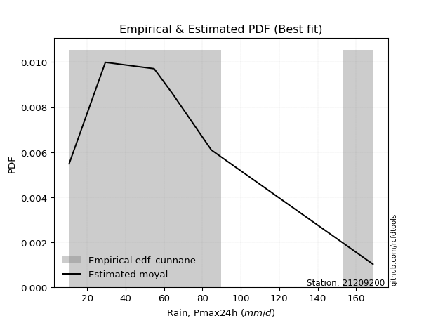</img>

</div>


### 12. EDF Adamowski (1981)

The Adamowski formula in hydrology refers to a specific plotting position formula used for estimating the non-parametric empirical distribution of hydrological events (like flood peaks) to calculate their return periods. This formula provides an alternative to traditional parametric methods (like the Gumbel or Log Pearson Type III distributions). 

<div align="center">


$P=(m-0.25)/(n+0.5)$


</div>


**12.1. Empirical values**

<div align="center">

|                | 0                   | 1                  | 2                  | 3                  | 4                  | 5                  |
|:---------------|:--------------------|:-------------------|:-------------------|:-------------------|:-------------------|:-------------------|
| date           | 2022                | 2023               | 2024               | 2021               | 2020               | 2019               |
| x              | 10.5                | 29.4               | 54.8               | 64.2               | 84.6               | 168.8              |
| m              | 1                   | 2                  | 3                  | 4                  | 5                  | 6                  |
| empirical_dist | edf_adamowski       | edf_adamowski      | edf_adamowski      | edf_adamowski      | edf_adamowski      | edf_adamowski      |
| empirical      | 0.11538461538461539 | 0.2692307692307692 | 0.4230769230769231 | 0.5769230769230769 | 0.7307692307692307 | 0.8846153846153846 |
| empirical_tr   | 1.1304347826086958  | 1.3684210526315788 | 1.7333333333333334 | 2.3636363636363633 | 3.7142857142857135 | 8.666666666666664  |

</div>


**12.2. Kolmogorov-Smirnov fit test (sorted by Δ)**


<div align="center">

|                | 0                   | 1                   | 2                   | 3                   | 4                  | 5                   | 6                   | 7                   | 8                   | 9                  | 10                  | 11                  | 12                  | 13                  | 14                  | 15                 | 16                  | 17                  | 18                  | 19                 | 20                  | 21                  | 22                  | 23                  | 24                  | 25                  | 26                  | 27                  | 28                  | 29                  | 30                  | 31                  | 32                  | 33                  | 34                 | 35                  | 36                  | 37                  | 38                  | 39                  | 40                  | 41                  | 42                  | 43                  | 44                 | 45                  | 46                  | 47                 | 48                  | 49                 | 50                  | 51                  | 52                  | 53                  | 54                  | 55                  | 56                  | 57                  | 58                  | 59                  | 60                  | 61                  | 62                  | 63                  | 64                 | 65                  | 66                  | 67                 | 68                  | 69                 | 70                | 71                  | 72                  | 73                  | 74                  | 75                  | 76                 | 77                  | 78                  | 79                  | 80                  | 81                  | 82                  | 83                  | 84                  | 85                  | 86                  | 87                 | 88                  | 89                  | 90                 | 91                 | 92                  | 93                 | 94                  | 95                  | 96                  | 97                  | 98                  | 99                  | 100                | 101                 | 102                 | 103                | 104                 | 105                 | 106                 | 107                 | 108                 | 109                 | 110                 | 111                 | 112                 | 113                | 114                | 115                | 116                 | 117                 | 118                 | 119                 | 120                 | 121                 | 122                | 123                 | 124                | 125                 | 126                | 127                 | 128                | 129                 | 130                | 131                | 132                 | 133                | 134                | 135                 | 136                 | 137                 | 138                 | 139                | 140                | 141                 | 142                 | 143                | 144                 | 145                 | 146                | 147                | 148                | 149                 | 150                | 151                | 152                | 153                | 154                | 155                | 156                | 157               | 158               | 159                |
|:---------------|:--------------------|:--------------------|:--------------------|:--------------------|:-------------------|:--------------------|:--------------------|:--------------------|:--------------------|:-------------------|:--------------------|:--------------------|:--------------------|:--------------------|:--------------------|:-------------------|:--------------------|:--------------------|:--------------------|:-------------------|:--------------------|:--------------------|:--------------------|:--------------------|:--------------------|:--------------------|:--------------------|:--------------------|:--------------------|:--------------------|:--------------------|:--------------------|:--------------------|:--------------------|:-------------------|:--------------------|:--------------------|:--------------------|:--------------------|:--------------------|:--------------------|:--------------------|:--------------------|:--------------------|:-------------------|:--------------------|:--------------------|:-------------------|:--------------------|:-------------------|:--------------------|:--------------------|:--------------------|:--------------------|:--------------------|:--------------------|:--------------------|:--------------------|:--------------------|:--------------------|:--------------------|:--------------------|:--------------------|:--------------------|:-------------------|:--------------------|:--------------------|:-------------------|:--------------------|:-------------------|:------------------|:--------------------|:--------------------|:--------------------|:--------------------|:--------------------|:-------------------|:--------------------|:--------------------|:--------------------|:--------------------|:--------------------|:--------------------|:--------------------|:--------------------|:--------------------|:--------------------|:-------------------|:--------------------|:--------------------|:-------------------|:-------------------|:--------------------|:-------------------|:--------------------|:--------------------|:--------------------|:--------------------|:--------------------|:--------------------|:-------------------|:--------------------|:--------------------|:-------------------|:--------------------|:--------------------|:--------------------|:--------------------|:--------------------|:--------------------|:--------------------|:--------------------|:--------------------|:-------------------|:-------------------|:-------------------|:--------------------|:--------------------|:--------------------|:--------------------|:--------------------|:--------------------|:-------------------|:--------------------|:-------------------|:--------------------|:-------------------|:--------------------|:-------------------|:--------------------|:-------------------|:-------------------|:--------------------|:-------------------|:-------------------|:--------------------|:--------------------|:--------------------|:--------------------|:-------------------|:-------------------|:--------------------|:--------------------|:-------------------|:--------------------|:--------------------|:-------------------|:-------------------|:-------------------|:--------------------|:-------------------|:-------------------|:-------------------|:-------------------|:-------------------|:-------------------|:-------------------|:------------------|:------------------|:-------------------|
| station        | 21209200            | 21209200            | 21209200            | 21209200            | 21209200           | 21209200            | 21209200            | 21209200            | 21209200            | 21209200           | 21209200            | 21209200            | 21209200            | 21209200            | 21209200            | 21209200           | 21209200            | 21209200            | 21209200            | 21209200           | 21209200            | 21209200            | 21209200            | 21209200            | 21209200            | 21209200            | 21209200            | 21209200            | 21209200            | 21209200            | 21209200            | 21209200            | 21209200            | 21209200            | 21209200           | 21209200            | 21209200            | 21209200            | 21209200            | 21209200            | 21209200            | 21209200            | 21209200            | 21209200            | 21209200           | 21209200            | 21209200            | 21209200           | 21209200            | 21209200           | 21209200            | 21209200            | 21209200            | 21209200            | 21209200            | 21209200            | 21209200            | 21209200            | 21209200            | 21209200            | 21209200            | 21209200            | 21209200            | 21209200            | 21209200           | 21209200            | 21209200            | 21209200           | 21209200            | 21209200           | 21209200          | 21209200            | 21209200            | 21209200            | 21209200            | 21209200            | 21209200           | 21209200            | 21209200            | 21209200            | 21209200            | 21209200            | 21209200            | 21209200            | 21209200            | 21209200            | 21209200            | 21209200           | 21209200            | 21209200            | 21209200           | 21209200           | 21209200            | 21209200           | 21209200            | 21209200            | 21209200            | 21209200            | 21209200            | 21209200            | 21209200           | 21209200            | 21209200            | 21209200           | 21209200            | 21209200            | 21209200            | 21209200            | 21209200            | 21209200            | 21209200            | 21209200            | 21209200            | 21209200           | 21209200           | 21209200           | 21209200            | 21209200            | 21209200            | 21209200            | 21209200            | 21209200            | 21209200           | 21209200            | 21209200           | 21209200            | 21209200           | 21209200            | 21209200           | 21209200            | 21209200           | 21209200           | 21209200            | 21209200           | 21209200           | 21209200            | 21209200            | 21209200            | 21209200            | 21209200           | 21209200           | 21209200            | 21209200            | 21209200           | 21209200            | 21209200            | 21209200           | 21209200           | 21209200           | 21209200            | 21209200           | 21209200           | 21209200           | 21209200           | 21209200           | 21209200           | 21209200           | 21209200          | 21209200          | 21209200           |
| empirical_dist | edf_adamowski       | edf_adamowski       | edf_adamowski       | edf_adamowski       | edf_adamowski      | edf_adamowski       | edf_adamowski       | edf_adamowski       | edf_adamowski       | edf_adamowski      | edf_adamowski       | edf_adamowski       | edf_adamowski       | edf_adamowski       | edf_adamowski       | edf_adamowski      | edf_adamowski       | edf_adamowski       | edf_adamowski       | edf_adamowski      | edf_adamowski       | edf_adamowski       | edf_adamowski       | edf_adamowski       | edf_adamowski       | edf_adamowski       | edf_adamowski       | edf_adamowski       | edf_adamowski       | edf_adamowski       | edf_adamowski       | edf_adamowski       | edf_adamowski       | edf_adamowski       | edf_adamowski      | edf_adamowski       | edf_adamowski       | edf_adamowski       | edf_adamowski       | edf_adamowski       | edf_adamowski       | edf_adamowski       | edf_adamowski       | edf_adamowski       | edf_adamowski      | edf_adamowski       | edf_adamowski       | edf_adamowski      | edf_adamowski       | edf_adamowski      | edf_adamowski       | edf_adamowski       | edf_adamowski       | edf_adamowski       | edf_adamowski       | edf_adamowski       | edf_adamowski       | edf_adamowski       | edf_adamowski       | edf_adamowski       | edf_adamowski       | edf_adamowski       | edf_adamowski       | edf_adamowski       | edf_adamowski      | edf_adamowski       | edf_adamowski       | edf_adamowski      | edf_adamowski       | edf_adamowski      | edf_adamowski     | edf_adamowski       | edf_adamowski       | edf_adamowski       | edf_adamowski       | edf_adamowski       | edf_adamowski      | edf_adamowski       | edf_adamowski       | edf_adamowski       | edf_adamowski       | edf_adamowski       | edf_adamowski       | edf_adamowski       | edf_adamowski       | edf_adamowski       | edf_adamowski       | edf_adamowski      | edf_adamowski       | edf_adamowski       | edf_adamowski      | edf_adamowski      | edf_adamowski       | edf_adamowski      | edf_adamowski       | edf_adamowski       | edf_adamowski       | edf_adamowski       | edf_adamowski       | edf_adamowski       | edf_adamowski      | edf_adamowski       | edf_adamowski       | edf_adamowski      | edf_adamowski       | edf_adamowski       | edf_adamowski       | edf_adamowski       | edf_adamowski       | edf_adamowski       | edf_adamowski       | edf_adamowski       | edf_adamowski       | edf_adamowski      | edf_adamowski      | edf_adamowski      | edf_adamowski       | edf_adamowski       | edf_adamowski       | edf_adamowski       | edf_adamowski       | edf_adamowski       | edf_adamowski      | edf_adamowski       | edf_adamowski      | edf_adamowski       | edf_adamowski      | edf_adamowski       | edf_adamowski      | edf_adamowski       | edf_adamowski      | edf_adamowski      | edf_adamowski       | edf_adamowski      | edf_adamowski      | edf_adamowski       | edf_adamowski       | edf_adamowski       | edf_adamowski       | edf_adamowski      | edf_adamowski      | edf_adamowski       | edf_adamowski       | edf_adamowski      | edf_adamowski       | edf_adamowski       | edf_adamowski      | edf_adamowski      | edf_adamowski      | edf_adamowski       | edf_adamowski      | edf_adamowski      | edf_adamowski      | edf_adamowski      | edf_adamowski      | edf_adamowski      | edf_adamowski      | edf_adamowski     | edf_adamowski     | edf_adamowski      |
| p_dist         | burr                | loggenlogistic      | logburr             | logskewnorm         | logloggamma        | logjohnsonsu        | moyal               | halfnorm            | foldnorm            | logburr12          | logweibull_min      | gumbel_r            | pearson3            | nct                 | rayleigh            | invgamma           | logdweibull         | genlogistic         | loggumbel_l         | kstwobign          | maxwell             | logargus            | logweibull_max      | loggenextreme       | logpearson3         | johnsonsu           | dweibull            | invgauss            | halflogistic        | dgamma              | rice                | logdgamma           | logtrapezoid        | logloglaplace       | logsemicircular    | gennorm             | t                   | crystalball         | norm                | truncnorm           | loganglit           | exponnorm           | logtriang           | bradford            | loggompertz        | kappa3              | gompertz            | vonmises_line      | lomax               | genexpon           | logarcsine          | skewnorm            | logistic            | logfoldnorm         | logfatiguelife      | logexponnorm        | logt                | lognorm             | logcrystalball      | lognct              | logf                | hypsecant           | truncweibull_min    | anglit              | loglogistic        | loggamma            | loggamma            | truncexpon         | logalpha            | logerlang          | logrice           | loghypsecant        | semicircular        | loggennorm          | loginvgamma         | laplace             | loggenhalflogistic | logbetaprime        | logncf              | loginvgauss         | logcosine           | loglaplace          | loglaplace          | ncf                 | logmaxwell          | loginvweibull       | betaprime           | logksone           | arcsine             | lograyleigh         | logkappa4          | logkappa3          | cosine              | loguniform         | logwrapcauchy       | logvonmises_line    | logkstwobign        | halfgennorm         | wald                | loggenexpon         | gumbel_l           | loghalfnorm         | loggumbel_r         | weibull_min        | mielke              | loglevy_l           | gamma               | f                   | logmoyal            | loghalflogistic     | erlang              | kappa4              | loggenpareto        | burr12             | logbeta            | loggausshyper      | loglomax            | alpha               | logexponweib        | exponpow            | wrapcauchy          | loghalfgennorm      | logtruncnorm       | logbradford         | ksone              | uniform             | logjohnsonsb       | argus               | gengamma           | genextreme          | nakagami           | lognakagami        | logtruncexpon       | levy_l             | logwald            | logrdist            | logtruncweibull_min | exponweib           | logtukeylambda      | genpareto          | beta               | fatiguelife         | genhalflogistic     | rdist              | invweibull          | gausshyper          | triang             | tukeylambda        | johnsonsb          | powerlaw            | logexponpow        | trapezoid          | truncpareto        | logmielke          | logpowerlaw        | weibull_max        | logtruncpareto     | loggengamma       | logvonmises       | vonmises           |
| delta          | 0.05907126159129439 | 0.06033448081101778 | 0.06176655873652476 | 0.06430547442724222 | 0.0645213003079973 | 0.06618284965882648 | 0.06823843089384929 | 0.06857741247740701 | 0.06903605453240602 | 0.0691857581344632 | 0.06948335209693518 | 0.07173860049290692 | 0.07209994623585025 | 0.07501832762893751 | 0.07633975883453503 | 0.0766331990978128 | 0.07692307692306138 | 0.08080740056006319 | 0.08128885280311382 | 0.0819026127955047 | 0.08339069622106077 | 0.08544545495401323 | 0.08652514101262043 | 0.08652667401990666 | 0.08664218750352753 | 0.08854870459416847 | 0.08907154779321347 | 0.09150524778115748 | 0.09387182150629717 | 0.09389140156417175 | 0.09737403225290153 | 0.10016902221643204 | 0.10836658940567889 | 0.11030162374089675 | 0.1108833251139339 | 0.11165205358937738 | 0.11242068203648092 | 0.11242200654951473 | 0.11242200689142984 | 0.11242201032994525 | 0.11337801622396321 | 0.11404055910676367 | 0.11537035865862921 | 0.11538455881712428 | 0.1153846123887609 | 0.11538461538386835 | 0.11538461538442867 | 0.1153846153845226 | 0.11538461538461262 | 0.1153846153846131 | 0.11538461538461539 | 0.11538461538461539 | 0.11723792080498074 | 0.11905342376562184 | 0.11930300115008735 | 0.11942352018198304 | 0.11942503292857048 | 0.11942543687482315 | 0.11942728100346428 | 0.11996855427177217 | 0.11997645254798722 | 0.12132852778867326 | 0.12388002473519799 | 0.12447946467621773 | 0.1251736747953966 | 0.12748374617323838 | 0.12748374617323838 | 0.1276080818465023 | 0.12797047477157014 | 0.1295958906088735 | 0.129668485994839 | 0.13004474282164996 | 0.13144243226638108 | 0.13555967051209133 | 0.13599652053070593 | 0.13611872044369872 | 0.138995865603049  | 0.14052532483098085 | 0.14169547537441868 | 0.14252560634717154 | 0.14470662532798634 | 0.14697906336602423 | 0.14697906336602423 | 0.14915883562968085 | 0.15029635111601486 | 0.15371008229145394 | 0.15463208453242822 | 0.1560291455497041 | 0.15965492754857924 | 0.16026381364528858 | 0.1621843534322826 | 0.1636728348693373 | 0.16749031191390895 | 0.1718503592750295 | 0.17435292712724887 | 0.18050596176489758 | 0.18132235943148528 | 0.18154513533720412 | 0.18243939847577828 | 0.18252766233572576 | 0.1829513681509709 | 0.18835989826993632 | 0.18977909773746698 | 0.1924174710502065 | 0.19304203038116202 | 0.20113408250284806 | 0.20140606331476502 | 0.20526532768021138 | 0.21484710039654048 | 0.21538240629197608 | 0.21697674797637073 | 0.22332334454626168 | 0.22377334870433152 | 0.2268722284270635 | 0.2302487832797363 | 0.2377040411947539 | 0.24390395113230096 | 0.24498228471867284 | 0.24569086461078288 | 0.24921417918433603 | 0.24996418564400402 | 0.25018858786207404 | 0.2512300784261462 | 0.25658948625638583 | 0.2573537748837812 | 0.26267068370669133 | 0.2655803561979137 | 0.26838583100349833 | 0.2684617519768498 | 0.26880126289995987 | 0.2692307691196061 | 0.2692307692279597 | 0.27096893441843933 | 0.2839534464251716 | 0.2844106005929556 | 0.30106899379289515 | 0.30454548115600705 | 0.32481657611738785 | 0.36130470600275927 | 0.3663551662224736 | 0.3666185627267148 | 0.39488196374936674 | 0.39721379708303917 | 0.4406764470753627 | 0.44234163375769125 | 0.45396407546315215 | 0.4624102404938427 | 0.4660632189764491 | 0.4753536995863201 | 0.48048198402662107 | 0.4861986473350522 | 0.5053167341078663 | 0.5567192506507397 | 0.5822377499818618 | 0.5878231096961488 | 0.6086560010843379 | 0.6461024535671158 | 0.683530126675157 | 1.089059767371702 | 26.945287813254772 |
| deltao         | 0.530385761606      | 0.530385761606      | 0.530385761606      | 0.530385761606      | 0.530385761606     | 0.530385761606      | 0.530385761606      | 0.530385761606      | 0.530385761606      | 0.530385761606     | 0.530385761606      | 0.530385761606      | 0.530385761606      | 0.530385761606      | 0.530385761606      | 0.530385761606     | 0.530385761606      | 0.530385761606      | 0.530385761606      | 0.530385761606     | 0.530385761606      | 0.530385761606      | 0.530385761606      | 0.530385761606      | 0.530385761606      | 0.530385761606      | 0.530385761606      | 0.530385761606      | 0.530385761606      | 0.530385761606      | 0.530385761606      | 0.530385761606      | 0.530385761606      | 0.530385761606      | 0.530385761606     | 0.530385761606      | 0.530385761606      | 0.530385761606      | 0.530385761606      | 0.530385761606      | 0.530385761606      | 0.530385761606      | 0.530385761606      | 0.530385761606      | 0.530385761606     | 0.530385761606      | 0.530385761606      | 0.530385761606     | 0.530385761606      | 0.530385761606     | 0.530385761606      | 0.530385761606      | 0.530385761606      | 0.530385761606      | 0.530385761606      | 0.530385761606      | 0.530385761606      | 0.530385761606      | 0.530385761606      | 0.530385761606      | 0.530385761606      | 0.530385761606      | 0.530385761606      | 0.530385761606      | 0.530385761606     | 0.530385761606      | 0.530385761606      | 0.530385761606     | 0.530385761606      | 0.530385761606     | 0.530385761606    | 0.530385761606      | 0.530385761606      | 0.530385761606      | 0.530385761606      | 0.530385761606      | 0.530385761606     | 0.530385761606      | 0.530385761606      | 0.530385761606      | 0.530385761606      | 0.530385761606      | 0.530385761606      | 0.530385761606      | 0.530385761606      | 0.530385761606      | 0.530385761606      | 0.530385761606     | 0.530385761606      | 0.530385761606      | 0.530385761606     | 0.530385761606     | 0.530385761606      | 0.530385761606     | 0.530385761606      | 0.530385761606      | 0.530385761606      | 0.530385761606      | 0.530385761606      | 0.530385761606      | 0.530385761606     | 0.530385761606      | 0.530385761606      | 0.530385761606     | 0.530385761606      | 0.530385761606      | 0.530385761606      | 0.530385761606      | 0.530385761606      | 0.530385761606      | 0.530385761606      | 0.530385761606      | 0.530385761606      | 0.530385761606     | 0.530385761606     | 0.530385761606     | 0.530385761606      | 0.530385761606      | 0.530385761606      | 0.530385761606      | 0.530385761606      | 0.530385761606      | 0.530385761606     | 0.530385761606      | 0.530385761606     | 0.530385761606      | 0.530385761606     | 0.530385761606      | 0.530385761606     | 0.530385761606      | 0.530385761606     | 0.530385761606     | 0.530385761606      | 0.530385761606     | 0.530385761606     | 0.530385761606      | 0.530385761606      | 0.530385761606      | 0.530385761606      | 0.530385761606     | 0.530385761606     | 0.530385761606      | 0.530385761606      | 0.530385761606     | 0.530385761606      | 0.530385761606      | 0.530385761606     | 0.530385761606     | 0.530385761606     | 0.530385761606      | 0.530385761606     | 0.530385761606     | 0.530385761606     | 0.530385761606     | 0.530385761606     | 0.530385761606     | 0.530385761606     | 0.530385761606    | 0.530385761606    | 0.530385761606     |
| eval           | Δo > Δ              | Δo > Δ              | Δo > Δ              | Δo > Δ              | Δo > Δ             | Δo > Δ              | Δo > Δ              | Δo > Δ              | Δo > Δ              | Δo > Δ             | Δo > Δ              | Δo > Δ              | Δo > Δ              | Δo > Δ              | Δo > Δ              | Δo > Δ             | Δo > Δ              | Δo > Δ              | Δo > Δ              | Δo > Δ             | Δo > Δ              | Δo > Δ              | Δo > Δ              | Δo > Δ              | Δo > Δ              | Δo > Δ              | Δo > Δ              | Δo > Δ              | Δo > Δ              | Δo > Δ              | Δo > Δ              | Δo > Δ              | Δo > Δ              | Δo > Δ              | Δo > Δ             | Δo > Δ              | Δo > Δ              | Δo > Δ              | Δo > Δ              | Δo > Δ              | Δo > Δ              | Δo > Δ              | Δo > Δ              | Δo > Δ              | Δo > Δ             | Δo > Δ              | Δo > Δ              | Δo > Δ             | Δo > Δ              | Δo > Δ             | Δo > Δ              | Δo > Δ              | Δo > Δ              | Δo > Δ              | Δo > Δ              | Δo > Δ              | Δo > Δ              | Δo > Δ              | Δo > Δ              | Δo > Δ              | Δo > Δ              | Δo > Δ              | Δo > Δ              | Δo > Δ              | Δo > Δ             | Δo > Δ              | Δo > Δ              | Δo > Δ             | Δo > Δ              | Δo > Δ             | Δo > Δ            | Δo > Δ              | Δo > Δ              | Δo > Δ              | Δo > Δ              | Δo > Δ              | Δo > Δ             | Δo > Δ              | Δo > Δ              | Δo > Δ              | Δo > Δ              | Δo > Δ              | Δo > Δ              | Δo > Δ              | Δo > Δ              | Δo > Δ              | Δo > Δ              | Δo > Δ             | Δo > Δ              | Δo > Δ              | Δo > Δ             | Δo > Δ             | Δo > Δ              | Δo > Δ             | Δo > Δ              | Δo > Δ              | Δo > Δ              | Δo > Δ              | Δo > Δ              | Δo > Δ              | Δo > Δ             | Δo > Δ              | Δo > Δ              | Δo > Δ             | Δo > Δ              | Δo > Δ              | Δo > Δ              | Δo > Δ              | Δo > Δ              | Δo > Δ              | Δo > Δ              | Δo > Δ              | Δo > Δ              | Δo > Δ             | Δo > Δ             | Δo > Δ             | Δo > Δ              | Δo > Δ              | Δo > Δ              | Δo > Δ              | Δo > Δ              | Δo > Δ              | Δo > Δ             | Δo > Δ              | Δo > Δ             | Δo > Δ              | Δo > Δ             | Δo > Δ              | Δo > Δ             | Δo > Δ              | Δo > Δ             | Δo > Δ             | Δo > Δ              | Δo > Δ             | Δo > Δ             | Δo > Δ              | Δo > Δ              | Δo > Δ              | Δo > Δ              | Δo > Δ             | Δo > Δ             | Δo > Δ              | Δo > Δ              | Δo > Δ             | Δo > Δ              | Δo > Δ              | Δo > Δ             | Δo > Δ             | Δo > Δ             | Δo > Δ              | Δo > Δ             | Δo > Δ             | Δo <= Δ            | Δo <= Δ            | Δo <= Δ            | Δo <= Δ            | Δo <= Δ            | Δo <= Δ           | Δo <= Δ           | Δo <= Δ            |
| fit            | 1                   | 1                   | 1                   | 1                   | 1                  | 1                   | 1                   | 1                   | 1                   | 1                  | 1                   | 1                   | 1                   | 1                   | 1                   | 1                  | 1                   | 1                   | 1                   | 1                  | 1                   | 1                   | 1                   | 1                   | 1                   | 1                   | 1                   | 1                   | 1                   | 1                   | 1                   | 1                   | 1                   | 1                   | 1                  | 1                   | 1                   | 1                   | 1                   | 1                   | 1                   | 1                   | 1                   | 1                   | 1                  | 1                   | 1                   | 1                  | 1                   | 1                  | 1                   | 1                   | 1                   | 1                   | 1                   | 1                   | 1                   | 1                   | 1                   | 1                   | 1                   | 1                   | 1                   | 1                   | 1                  | 1                   | 1                   | 1                  | 1                   | 1                  | 1                 | 1                   | 1                   | 1                   | 1                   | 1                   | 1                  | 1                   | 1                   | 1                   | 1                   | 1                   | 1                   | 1                   | 1                   | 1                   | 1                   | 1                  | 1                   | 1                   | 1                  | 1                  | 1                   | 1                  | 1                   | 1                   | 1                   | 1                   | 1                   | 1                   | 1                  | 1                   | 1                   | 1                  | 1                   | 1                   | 1                   | 1                   | 1                   | 1                   | 1                   | 1                   | 1                   | 1                  | 1                  | 1                  | 1                   | 1                   | 1                   | 1                   | 1                   | 1                   | 1                  | 1                   | 1                  | 1                   | 1                  | 1                   | 1                  | 1                   | 1                  | 1                  | 1                   | 1                  | 1                  | 1                   | 1                   | 1                   | 1                   | 1                  | 1                  | 1                   | 1                   | 1                  | 1                   | 1                   | 1                  | 1                  | 1                  | 1                   | 1                  | 1                  | 0                  | 0                  | 0                  | 0                  | 0                  | 0                 | 0                 | 0                  |
| n              | 6                   | 6                   | 6                   | 6                   | 6                  | 6                   | 6                   | 6                   | 6                   | 6                  | 6                   | 6                   | 6                   | 6                   | 6                   | 6                  | 6                   | 6                   | 6                   | 6                  | 6                   | 6                   | 6                   | 6                   | 6                   | 6                   | 6                   | 6                   | 6                   | 6                   | 6                   | 6                   | 6                   | 6                   | 6                  | 6                   | 6                   | 6                   | 6                   | 6                   | 6                   | 6                   | 6                   | 6                   | 6                  | 6                   | 6                   | 6                  | 6                   | 6                  | 6                   | 6                   | 6                   | 6                   | 6                   | 6                   | 6                   | 6                   | 6                   | 6                   | 6                   | 6                   | 6                   | 6                   | 6                  | 6                   | 6                   | 6                  | 6                   | 6                  | 6                 | 6                   | 6                   | 6                   | 6                   | 6                   | 6                  | 6                   | 6                   | 6                   | 6                   | 6                   | 6                   | 6                   | 6                   | 6                   | 6                   | 6                  | 6                   | 6                   | 6                  | 6                  | 6                   | 6                  | 6                   | 6                   | 6                   | 6                   | 6                   | 6                   | 6                  | 6                   | 6                   | 6                  | 6                   | 6                   | 6                   | 6                   | 6                   | 6                   | 6                   | 6                   | 6                   | 6                  | 6                  | 6                  | 6                   | 6                   | 6                   | 6                   | 6                   | 6                   | 6                  | 6                   | 6                  | 6                   | 6                  | 6                   | 6                  | 6                   | 6                  | 6                  | 6                   | 6                  | 6                  | 6                   | 6                   | 6                   | 6                   | 6                  | 6                  | 6                   | 6                   | 6                  | 6                   | 6                   | 6                  | 6                  | 6                  | 6                   | 6                  | 6                  | 6                  | 6                  | 6                  | 6                  | 6                  | 6                 | 6                 | 6                  |
| best_fit       | 1                   | 0                   | 0                   | 0                   | 0                  | 0                   | 0                   | 0                   | 0                   | 0                  | 0                   | 0                   | 0                   | 0                   | 0                   | 0                  | 0                   | 0                   | 0                   | 0                  | 0                   | 0                   | 0                   | 0                   | 0                   | 0                   | 0                   | 0                   | 0                   | 0                   | 0                   | 0                   | 0                   | 0                   | 0                  | 0                   | 0                   | 0                   | 0                   | 0                   | 0                   | 0                   | 0                   | 0                   | 0                  | 0                   | 0                   | 0                  | 0                   | 0                  | 0                   | 0                   | 0                   | 0                   | 0                   | 0                   | 0                   | 0                   | 0                   | 0                   | 0                   | 0                   | 0                   | 0                   | 0                  | 0                   | 0                   | 0                  | 0                   | 0                  | 0                 | 0                   | 0                   | 0                   | 0                   | 0                   | 0                  | 0                   | 0                   | 0                   | 0                   | 0                   | 0                   | 0                   | 0                   | 0                   | 0                   | 0                  | 0                   | 0                   | 0                  | 0                  | 0                   | 0                  | 0                   | 0                   | 0                   | 0                   | 0                   | 0                   | 0                  | 0                   | 0                   | 0                  | 0                   | 0                   | 0                   | 0                   | 0                   | 0                   | 0                   | 0                   | 0                   | 0                  | 0                  | 0                  | 0                   | 0                   | 0                   | 0                   | 0                   | 0                   | 0                  | 0                   | 0                  | 0                   | 0                  | 0                   | 0                  | 0                   | 0                  | 0                  | 0                   | 0                  | 0                  | 0                   | 0                   | 0                   | 0                   | 0                  | 0                  | 0                   | 0                   | 0                  | 0                   | 0                   | 0                  | 0                  | 0                  | 0                   | 0                  | 0                  | 0                  | 0                  | 0                  | 0                  | 0                  | 0                 | 0                 | 0                  |
| best_fit_sort  | 1                   | 2                   | 3                   | 4                   | 5                  | 6                   | 7                   | 8                   | 9                   | 10                 | 11                  | 12                  | 13                  | 14                  | 15                  | 16                 | 17                  | 18                  | 19                  | 20                 | 21                  | 22                  | 23                  | 24                  | 25                  | 26                  | 27                  | 28                  | 29                  | 30                  | 31                  | 32                  | 33                  | 34                  | 35                 | 36                  | 37                  | 38                  | 39                  | 40                  | 41                  | 42                  | 43                  | 44                  | 45                 | 46                  | 47                  | 48                 | 49                  | 50                 | 51                  | 52                  | 53                  | 54                  | 55                  | 56                  | 57                  | 58                  | 59                  | 60                  | 61                  | 62                  | 63                  | 64                  | 65                 | 66                  | 67                  | 68                 | 69                  | 70                 | 71                | 72                  | 73                  | 74                  | 75                  | 76                  | 77                 | 78                  | 79                  | 80                  | 81                  | 82                  | 83                  | 84                  | 85                  | 86                  | 87                  | 88                 | 89                  | 90                  | 91                 | 92                 | 93                  | 94                 | 95                  | 96                  | 97                  | 98                  | 99                  | 100                 | 101                | 102                 | 103                 | 104                | 105                 | 106                 | 107                 | 108                 | 109                 | 110                 | 111                 | 112                 | 113                 | 114                | 115                | 116                | 117                 | 118                 | 119                 | 120                 | 121                 | 122                 | 123                | 124                 | 125                | 126                 | 127                | 128                 | 129                | 130                 | 131                | 132                | 133                 | 134                | 135                | 136                 | 137                 | 138                 | 139                 | 140                | 141                | 142                 | 143                 | 144                | 145                 | 146                 | 147                | 148                | 149                | 150                 | 151                | 152                | 153                | 154                | 155                | 156                | 157                | 158               | 159               | 160                |

</div>


**12.3. Best fit**

<div align="center">

|   id |   station | empirical_dist   | p_dist   |     delta |   deltao | eval   |   fit |   n |   best_fit |   best_fit_sort |
|-----:|----------:|:-----------------|:---------|----------:|---------:|:-------|------:|----:|-----------:|----------------:|
|    0 |  21209200 | edf_adamowski    | burr     | 0.0590713 | 0.530386 | Δo > Δ |     1 |   6 |          1 |               1 |

</div>


<div align="center">

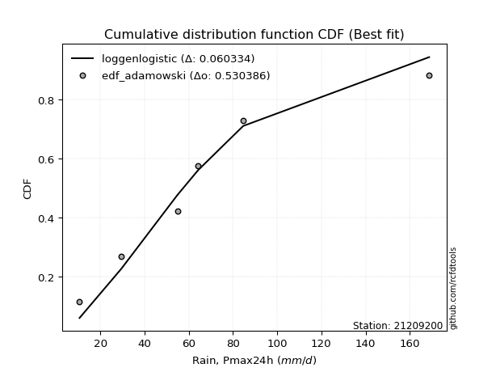</img></img>

</div>


## C. Best fit & Estimate extreme values for specific return periods - Tr

Best fit in probability distribution analysis means finding the theoretical distribution (like Normal, Poisson, Exponential, etc.) that most accurately mirrors your real-world data´s patterns (shape, center, spread) for better predictions, using methods like visual checks (Q-Q plots), goodness-of-fit tests (Kolmogorov-Smirnov, Chi-Squared), and information criteria (AIC) to score and select the simplest, most representative model.


### 1. Best fit (ordered by delta Δ)

:file_folder:Table: [bestfit_21209200.csv](table/bestfit_21209200.csv)

<div align="center">

|   id |   station | empirical_dist   | p_dist      |     delta |   deltao | eval   |   fit |   n |   best_fit |   best_fit_sort |
|-----:|----------:|:-----------------|:------------|----------:|---------:|:-------|------:|----:|-----------:|----------------:|
|    0 |  21209200 | edf_hazen        | genlogistic | 0.0487561 | 0.530386 | Δo > Δ |     1 |   6 |          1 |               1 |
|    1 |  21209200 | edf_blom         | moyal       | 0.0528538 | 0.530386 | Δo > Δ |     1 |   6 |          1 |               2 |
|    2 |  21209200 | edf_cunnane      | moyal       | 0.052944  | 0.530386 | Δo > Δ |     1 |   6 |          1 |               3 |
|    3 |  21209200 | edf_gringorten   | moyal       | 0.0539982 | 0.530386 | Δo > Δ |     1 |   6 |          1 |               4 |
|    4 |  21209200 | edf_chegodayev   | burr        | 0.0543058 | 0.530386 | Δo > Δ |     1 |   6 |          1 |               5 |
|    5 |  21209200 | edf_jenkinson    | burr        | 0.0545507 | 0.530386 | Δo > Δ |     1 |   6 |          1 |               6 |
|    6 |  21209200 | edf_beard        | burr        | 0.0545507 | 0.530386 | Δo > Δ |     1 |   6 |          1 |               7 |
|    7 |  21209200 | edf_filliben     | burr        | 0.0547354 | 0.530386 | Δo > Δ |     1 |   6 |          1 |               8 |
|    8 |  21209200 | edf_tukey        | burr        | 0.0551282 | 0.530386 | Δo > Δ |     1 |   6 |          1 |               9 |
|    9 |  21209200 | edf_adamowski    | burr        | 0.0590713 | 0.530386 | Δo > Δ |     1 |   6 |          1 |              10 |
|   10 |  21209200 | edf_weibull      | burr        | 0.0865438 | 0.530386 | Δo > Δ |     1 |   6 |          1 |              11 |
|   11 |  21209200 | edf_california   | ncf         | 0.0997425 | 0.530386 | Δo > Δ |     1 |   6 |          1 |              12 |

</div>


### 2. Extreme values and % difference analysis

In hydrology, a return period (or recurrence interval $Tr$) is the statistical average time between extreme events like floods or droughts of a specific magnitude, indicating how rare an event is, with a 100-year flood, for example, having a 1% chance of occurring in any given year, not that it happens exactly every century. It is a key tool for infrastructure design (like bridges or dams) and risk assessment, calculated from historical data to determine the probability of future events, although it is important to remember it is statistical average, and events can cluster or be missed.

The extreme value porcentage difference is evaluated as $pdiff = 1 - (ETrBf / ETr) * 100$, where _ETrBf_ correspond to the bestfit extreme value for a specific recurrence interval and _ETr_ correspond to the extreme value for one of the most used PDFsused in hydrology.

> risk_rate: assuming the return period as the project useful life.

:file_folder:Table: [extreme_21209200.csv](table/extreme_21209200.csv), all PDFs.  
:file_folder:Table: [extremepdiff_21209200.csv](table/extremepdiff_21209200.csv), % difference between bestfit and most used PDFs in Hydrology.

<div align="center">

Extreme values table for only best fit PDFs
|   id |      tr |   prob_l |     prob_g |      alpha |   anglit |   arcsine |    argus |    beta |   betaprime |   bradford |     burr |   burr12 |   cosine |   crystalball |   dgamma |   dweibull |   erlang |   exponnorm |   exponpow |   exponweib |        f |   fatiguelife |   foldnorm |    gamma |   gausshyper |   genexpon |       genextreme |   gengamma |   genhalflogistic |   genlogistic |   gennorm |   genpareto |   gompertz |   gumbel_l |   gumbel_r |   halfgennorm |   halflogistic |   halfnorm |   hypsecant |   invgamma |   invgauss |       invweibull |   johnsonsb |   johnsonsu |   kappa3 |   kappa4 |   ksone |   kstwobign |   laplace |   levy_l |   loggamma |   logistic |   loglaplace |    lomax |   maxwell |   mielke |    moyal |   nakagami |      ncf |      nct |     norm |   pearson3 |   powerlaw |   rayleigh |    rdist |     rice |   semicircular |   skewnorm |        t |   trapezoid |   triang |   truncexpon |   truncnorm |   truncpareto |   truncweibull_min |   tukeylambda |   uniform |   vonmises |   vonmises_line |     wald |   weibull_max |   weibull_min |   wrapcauchy |   logalpha |   loganglit |   logarcsine |   logargus |   logbeta |   logbetaprime |   logbradford |   logburr |   logburr12 |   logcosine |   logcrystalball |   logdgamma |   logdweibull |   logerlang |   logexponnorm |   logexponpow |     logexponweib |     logf |   logfatiguelife |   logfoldnorm |   loggausshyper |   loggenexpon |   loggenextreme |   loggengamma |   loggenhalflogistic |   loggenlogistic |       loggennorm |   loggenpareto |   loggompertz |   loggumbel_l |   loggumbel_r |   loghalfgennorm |   loghalflogistic |   loghalfnorm |   loghypsecant |   loginvgamma |   loginvgauss |   loginvweibull |   logjohnsonsb |   logjohnsonsu |   logkappa3 |   logkappa4 |   logksone |   logkstwobign |   loglevy_l |   logloggamma |   loglogistic |   logloglaplace |    loglomax |   logmaxwell |   logmielke |   logmoyal |   lognakagami |    logncf |   lognct |   lognorm |   logpearson3 |   logpowerlaw |   lograyleigh |   logrdist |   logrice |   logsemicircular |   logskewnorm |     logt |   logtrapezoid |   logtriang |   logtruncexpon |   logtruncnorm |   logtruncpareto |   logtruncweibull_min |   logtukeylambda |   loguniform |   logvonmises |   logvonmises_line |    logwald |   logweibull_max |   logweibull_min |   logwrapcauchy |   station |   n |   risk_rate |
|-----:|--------:|---------:|-----------:|-----------:|---------:|----------:|---------:|--------:|------------:|-----------:|---------:|---------:|---------:|--------------:|---------:|-----------:|---------:|------------:|-----------:|------------:|---------:|--------------:|-----------:|---------:|-------------:|-----------:|-----------------:|-----------:|------------------:|--------------:|----------:|------------:|-----------:|-----------:|-----------:|--------------:|---------------:|-----------:|------------:|-----------:|-----------:|-----------------:|------------:|------------:|---------:|---------:|--------:|------------:|----------:|---------:|-----------:|-----------:|-------------:|---------:|----------:|---------:|---------:|-----------:|---------:|---------:|---------:|-----------:|-----------:|-----------:|---------:|---------:|---------------:|-----------:|---------:|------------:|---------:|-------------:|------------:|--------------:|-------------------:|--------------:|----------:|-----------:|----------------:|---------:|--------------:|--------------:|-------------:|-----------:|------------:|-------------:|-----------:|----------:|---------------:|--------------:|----------:|------------:|------------:|-----------------:|------------:|--------------:|------------:|---------------:|--------------:|-----------------:|---------:|-----------------:|--------------:|----------------:|--------------:|----------------:|--------------:|---------------------:|-----------------:|-----------------:|---------------:|--------------:|--------------:|--------------:|-----------------:|------------------:|--------------:|---------------:|--------------:|--------------:|----------------:|---------------:|---------------:|------------:|------------:|-----------:|---------------:|------------:|--------------:|--------------:|----------------:|------------:|-------------:|------------:|-----------:|--------------:|----------:|---------:|----------:|--------------:|--------------:|--------------:|-----------:|----------:|------------------:|--------------:|---------:|---------------:|------------:|----------------:|---------------:|-----------------:|----------------------:|-----------------:|-------------:|--------------:|-------------------:|-----------:|-----------------:|-----------------:|----------------:|----------:|----:|------------:|
|    0 |    2    | 0.5      | 0.5        |    34.8158 |  68.7167 |   68.7167 |  90.4984 | 117.338 |     44.3046 |    50.9708 |  57.3854 |  31.7627 |  75.8785 |       68.7167 |  64.2    |    59.6985 |  39.9837 |     50.3919 |    27.13   |     25.2362 |  37.603  |       10.5007 |    58.587  |  40.7712 |      128.237 |    53.5004 |     33.3264      |    27.8828 |           113.741 |       59.5291 |   64.2    |     110.571 |    59.7884 |    77.0445 |    60.3888 |       39.9854 |        56.2486 |    58.3401 |     68.7167 |    54.8305 |    53.1858 |   2950.43        |     168.188 |     53.5328 |  57.124  |  83.3901 |  89.65  |     61.6465 |   68.7167 |   77.9   |    48.9375 |    68.7167 |      49.9382 |  50.6429 |   64.3812 |  39.8486 |  57.7003 |    57.5574 |  44.5989 |  54.9968 |  68.7167 |    60.7743 |    11.4517 |    62.8435 | -4.23135 |  66.5838 |        68.7167 |    62.5669 |  68.7165 |     128.726 |  117.631 |      68.9127 |     68.7167 |       11.9482 |            67.8798 |      -4.17173 |    89.65  | -2.04709   |         61.487  |  52.2844 |       168.561 |       35.2851 |       89.65  |    48.8181 |     49.9382 |      49.9381 |    56.8411 |   84.5096 |        46.9432 |       32.5173 |   56.5699 |     55.6921 |     46.8183 |          49.938  |     54.8    |       54.8    |     48.7152 |        49.9384 |       14.1231 |     27.9295      |  49.8585 |          49.9442 |       50.1008 |         33.7195 |       40.9927 |         60.4788 |       11.3974 |              68.1348 |          57.2341 |     64.2         |        30.5798 |       52.2373 |       57.6146 |       43.2845 |     28.1744      |           40.3147 |       41.7888 |        49.9382 |       47.9808 |       47.0562 |         44.4377 |        19.2243 |        56.7282 |     42.9212 |     42.7981 |    42.0999 |        40.9774 |     65.8558 |       56.5151 |       49.9382 |         64.2    |     29.7526 |      46.3557 |     10.772  |    41.3318 |       46.2558 |   47.5092 |  49.8715 |   49.9382 |       53.6662 |       10.843  |       45.1478 |    30.0178 |   48.6539 |           49.9382 |       56.3348 |  49.9382 |        57.9813 |     57.6905 |         31.5298 |        45.3997 |          10.9271 |               27.6336 |          29.8044 |      42.0999 |      0.099863 |            41.4217 |    37.6618 |          60.4773 |          55.6576 |         41.7361 |  21209200 |   6 |    0.75     |
|    1 |    2.33 | 0.570815 | 0.429185   |    41.4394 |  79.2536 |   84.5344 | 101.344  | 131.597 |     53.7734 |    61.0518 |  65.4959 |  40.1871 |  85.647  |       77.7627 |  68.0238 |    65.4257 |  46.8434 |     59.1984 |    37.2591 |     30.6757 |  46.2418 |       13.8535 |    68.4498 |  48.2105 |      138.816 |    62.3819 |     82.508       |    35.1515 |           124.107 |       67.3052 |   66.4849 |     122.754 |    68.9531 |    84.9147 |    68.7709 |       49.3768 |        64.8667 |    68.1031 |     75.9562 |    62.7341 |    61.4617 | 131724           |     168.668 |     61.699  |  65.0898 |  94.9883 | 103.102 |     69.9563 |   74.1909 |  105.676 |    57.3741 |    76.6868 |      54.8597 |  59.535  |   73.7793 |  48.5201 |  65.635  |    65.0098 |  54.5861 |  62.7598 |  77.7627 |    69.6719 |    13.0288 |    72.3807 | 14.33    |  75.0869 |        80.0177 |    71.529  |  77.7625 |     137.923 |  126.09  |      79.495  |     77.7627 |       12.8384 |            78.7788 |       8.58541 |   100.86  | -1.83428   |         69.1032 |  58.216  |       168.722 |       50.5049 |      107.806 |    57.3511 |     59.8419 |      65.5214 |    67.0597 |   96.9909 |        55.7933 |       39.6107 |   65.2631 |     64.3771 |     55.1904 |          58.3291 |     58.5052 |       60.0309 |     57.0981 |        58.3296 |       16.1216 |     36.3397      |  58.2743 |          58.3516 |       58.2795 |         41.4948 |       49.6373 |         70.6122 |       11.9093 |              80.7154 |          65.2623 |     65.739       |        44.6372 |       61.0486 |       65.9507 |       49.9847 |     35.6345      |           46.7441 |       49.4151 |        56.5479 |       56.2917 |       55.4812 |         53.8755 |        50.1161 |        65.6015 |     52.3947 |     52.5576 |    53.3065 |        49.7022 |     87.8097 |       65.2672 |       57.2618 |         72.1413 |     37.4283 |      54.4734 |     11.1956 |    47.3645 |       51.0717 |   55.5504 |  58.266  |   58.3294 |       62.423  |       11.322  |       53.1808 |    36.5974 |   57.109  |           60.6322 |       65.3502 |  58.3294 |        69.3322 |     68.8942 |         38.1643 |        49.6652 |          11.1798 |               33.5455 |          34.7198 |      51.2504 |      0.115286 |            50.143  |    41.6995 |          70.6105 |          64.3405 |         50.8715 |  21209200 |   6 |    0.729209 |
|    2 |    5    | 0.8      | 0.2        |    92.7993 | 116.43   |  126.714  | 136.134  | 161.842 |    105.947  |   106.394  | 102.423  | 126.635  | 120.849  |      111.38   |  94.1579 |    93.8106 |  81.6532 |    103.229  |   119.278  |     67.7063 |  94.8222 |       85.0635 |   109.857  |  86.5586 |      162.228 |   104.647  |  10603.3         |    88.606  |           151.408 |      101.085  |   88.9239 |     154.561 |   108.529  |   110.34   |   105.187  |      109.623  |       103.862  |   109.389  |    104.996  |   101.284  |   102.381  |      1.96606e+12 |     168.8   |    102.368  | 101.796  | 133.869  | 146.638 |    105.255  |  101.561  |  151.693 |   104.646  |   107.461  |      87.7701 | 104.252  |  110.77   |  89.9697 | 102.39   |    99.4126 | 102.291  | 100.49   | 111.38   |   107.389  |    41.0129 |   110.562  | 65.488   | 109.129  |       118.583  |   109.429  | 111.38   |     164.309 |  150.356 |     120.306  |    111.38   |       25.1867 |           119.95   |      49.7003  |   137.14  | -1.00032   |         98.958  |  91.421  |       168.799 |      198.356  |      148.073 |   106.596  |    113.299  |     135.181  |   110.981  |  138.451  |       110.392  |       81.0344 |  103.653  |    104.645  |     99.8474 |         103.888  |     91.7883 |      103.064  |    104.163  |       103.889  |       37.5086 |    155.998       | 104.096  |         104.085  |      102.228  |         86.7269 |      107.751  |        112.602  |       15.8782 |             126.369  |         101.803  |     95.7308      |       115.363  |      104.084  |      102.049  |       93.4082 |    122.48        |           91.3073 |      100.397  |        93.1021 |      103.945  |      105.411  |        124.383  |       167.577  |       105.681  |    100.475  |    100.922  |   114.421  |       112.843  |    141.434  |      105.125  |       97.1274 |        135.875  |    117.927  |     102.806  |     20.4766 |    89.0281 |       79.0649 |  102.377  | 103.923  |  103.889  |      105.243  |       20.3361 |      102.44   |    65.1371 |  104.381  |          117.566  |      105.5    | 103.889  |       115.798  |    114.634  |         77.5376 |        74.108  |          14.7938 |               71.0808 |          56.6318 |      96.8581 |      0.200034 |            94.501  |    73.7451 |         112.6    |         104.626  |         96.5283 |  21209200 |   6 |    0.67232  |
|    3 |   10    | 0.9      | 0.1        |   187.16   | 137.473  |  136.897  | 152.911  | 167.319 |    158.724  |   134.28   | 136.772  | inf      | 142.117  |      133.681  | 120.129  |   119.478  | 113.654  |    143.198  |   226.919  |    114.738  | 143.394  |      183.386  |   140.141  | 122.278  |      167.151 |   140.784  | 617329           |   161.494  |           160.857 |      128.597  |  122.022  |     163.893 |   137.853  |   124.495  |   134.847  |      182.594  |       136.246  |   139.941  |    128.184  |   138.076  |   140.368  |      1.36989e+18 |     168.8   |    141.379  | 136.14   | 151.533  | 165.634 |    132.13   |  126.406  |  162.803 |   157.268  |   130.124  |     134.467  | 145.22   |  136.802  | 126.726  | 134.39   |   126.27   | 145.189  | 136.723  | 133.681  |   136.635  |    83.2586 |   137.787  | 79.1462  | 133.401  |       138.372  |   137.474  | 133.681  |     174.615 |  159.835 |     142.521  |    133.681  |       52.4295 |           142.214  |      67.4136  |   152.97  | -0.364571  |        121.495  | 126.659  |       168.8   |      454.931  |      159.092 |   163.971  |    162.607  |     161.008  |   139.458  |  155.531  |       179.957  |      115.357  |  137.524  |    138.823  |    142.854  |         152.356  |    143.736  |      174.954  |    156.729  |       152.358  |       92.0883 |    684.273       | 153.027  |         152.869  |      148.411  |        122.263  |      188.21   |        139.672  |       21.3365 |             147.759  |         135.783  |    201.799       |       149.377  |      142.151  |      130.127  |      155.438  |    402.197       |          159.215  |      169.641  |       138.636  |      158.938  |      165.741  |        245.877  |       168.772  |       138.16   |    137.925  |    132.362  |   159.679  |       210.667  |    158.683  |      138.18   |      143.332  |        261.372  |    334.312  |     160.744  |     47.6638 |   154.224  |      110.204  |  157.898  | 152.618  |  152.357  |      143.965  |       43.0154 |      163.485  |    78.0991 |  156.451  |          165.138  |      138.277  | 152.357  |       141.485  |    139.858  |        111.768  |        98.8199 |          25.2375 |              106.274  |          69.6764 |     127.866  |      0.300112 |           126.007  |   135.051  |         139.671  |         138.843  |        127.649  |  21209200 |   6 |    0.651322 |
|    4 |   15    | 0.933333 | 0.0666667  |   281.184  | 146.458  |  138.839  | 159.288  | 168.202 |    191.678  |   144.978  | 158.941  | inf      | 151.805  |      144.81   | 135.7    |   134.47   | 132.474  |    166.579  |   299.662  |    147.959  | 172.976  |      247.691  |   155.775  | 143.398  |      168.066 |   161.227  |      6.11773e+06 |   214.858  |           163.703 |      144.118  |  146.701  |     166.169 |   152.908  |   130.906  |   151.581  |      233.127  |       154.573  |   155.839  |    141.418  |   161.191  |   163.162  |      2.71212e+21 |     168.8   |    165.65   | 158.416  | 157.551  | 171.966 |    146.397  |  140.94   |  166.159 |   193.223  |   142.473  |     172.581  | 169.352  |  150.159  | 149.531  | 152.962  |   140.422  | 170.783  | 159.72   | 144.81   |   152.54   |   105.651  |   151.814  | 82.005   | 145.907  |       146.089  |   152.068  | 144.81   |     177.922 |  162.876 |     150.759  |    144.81   |       73.3361 |           150.504  |      73.2467  |   158.247 | -0.0248681 |        133.194  | 149.288  |       168.8   |      666.902  |      162.404 |   204.531  |    189.733  |     166.468  |   151.737  |  160.695  |       232.188  |      130.553  |  158.988  |    158.247  |    168.171  |         184.436  |    188.109  |      240.673  |    192.737  |       184.437  |      159.219  |   1716.57        | 185.495  |         185.217  |      178.754  |        136.999  |      251.113  |        151.503  |       25.3938 |             154.925  |         157.708  |    385.562       |       158.509  |      164.107  |      145.268  |      207.176  |    826.097       |          218.092  |      222.886  |       174.003  |      197.544  |      209.461  |        361.156  |       168.796  |       155.955  |    157.666  |    144.314  |   178.442  |       293.446  |    164.296  |      156.697  |      177.183  |        398.524  |    615.05   |     202.178  |     73.5958 |   212.147  |      131.136  |  197.728  | 184.903  |  184.437  |      166.722  |       62.3807 |      208.007  |    81.6373 |  191.65   |          188.534  |      156.776  | 184.437  |       150.879  |    149.074  |        127.499  |       112.871  |          36.703  |              123.079  |          74.5207 |     140.269  |      0.376335 |           138.862  |   199.174  |         151.503  |         158.297  |        140.11   |  21209200 |   6 |    0.644736 |
|    5 |   20    | 0.95     | 0.05       |   375.125  | 151.744  |  139.523  | 162.789  | 168.486 |    215.958  |   150.62   | 176.001  | inf      | 157.763  |      152.097  | 146.856  |   145.099  | 145.858  |    183.168  |   354.509  |    174.045  | 194.355  |      295.301  |   166.152  | 158.456  |      168.387 |   175.484  |      3.04803e+07 |   257.538  |           165.064 |      154.986  |  166.575  |     167.109 |   162.83   |   134.896  |   163.298  |      272.46   |       167.413  |   166.439  |    150.754  |   178.475  |   179.597  |      5.51467e+23 |     168.8   |    183.616  | 175.636  | 160.594  | 175.132 |    156.008  |  151.252  |  167.878 |   221.323  |   151.008  |     206.01   | 186.549  |  159.023  | 166.796  | 166.114  |   149.889  | 189.29   | 177.054  | 152.097  |   163.438  |   118.924  |   161.137  | 83.0705  | 154.22   |       150.37   |   161.798  | 152.097  |     179.554 |  164.376 |     155.062  |    152.097  |       88.4329 |           154.848  |      76.1404  |   160.885 |  0.192758  |        140.473  | 166.15   |       168.8   |      847.244  |      164.023 |   236.928  |    207.759  |     168.434  |   158.84   |  163.099  |       275.459  |      139.049  |  175.473  |    171.851  |    185.92   |         209.021  |    228.109  |      302.759  |    220.924  |       209.023  |      235.705  |   3368.6         | 210.415  |         210.037  |      201.913  |        144.876  |      304.247  |        158.414  |       28.7018 |             158.488  |         174.579  |    678.874       |       162.301  |      179.57   |      155.57   |      253.344  |   1389.88        |          271.885  |      267.376  |       204.255  |      228.242  |      244.911  |        472.724  |       168.799  |       168.129  |    171.326  |    150.505  |   188.634  |       366.849  |    167.247  |      169.56   |      205.147  |        547.888  |    947.932  |     235.416  |     94.933  |   265.899  |      147.286  |  229.856  | 209.672  |  209.022  |      182.921  |       77.3345 |      244.119  |    83.1334 |  218.953  |          202.912  |      169.761  | 209.022  |       155.741  |    153.842  |        136.457  |       122.102  |          47.5244 |              132.808  |          77.0226 |     146.914  |      0.442052 |           145.795  |   266.056  |         158.415  |         171.923  |        146.79   |  21209200 |   6 |    0.641514 |
|    6 |   25    | 0.96     | 0.04       |   469.033  | 155.326  |  139.841  | 165.047  | 168.609 |    235.302  |   154.102  | 190.136  | inf      | 161.941  |      157.462  | 155.558  |   153.34   | 156.256  |    196.035  |   398.573  |    195.704  | 211.126  |      333.129  |   173.849  | 170.171  |      168.535 |   186.419  |      1.05008e+08 |   293.406  |           165.86  |      163.357  |  183.342  |     167.6   |   170.143  |   137.736  |   172.322  |      304.951  |       177.306  |   174.326  |    157.979  |   192.444  |   192.491  |      3.3071e+25  |     168.8   |    198.004  | 189.956  | 162.434  | 177.032 |    163.208  |  159.25   |  168.957 |   244.704  |   157.537  |     236.337  | 199.932  |  165.604  | 180.98   | 176.309  |   156.943  | 203.879  | 191.153  | 157.462  |   171.708  |   127.633  |   168.064  | 83.5855  | 160.396  |       153.146  |   169.038  | 157.462  |     180.526 |  165.27  |     157.707  |    157.462  |       99.5926 |           157.523  |      77.8665  |   162.468 |  0.343301  |        145.393  | 179.657  |       168.8   |     1005.02   |      164.985 |   264.325  |    220.938  |     169.354  |   163.561  |  164.464  |       313.023  |      144.465  |  189.162  |    182.321  |    199.474  |         229.19   |    265.133  |      362.332  |    244.406  |       229.191  |      319.775  |   5748.41        | 230.88   |         230.415  |      220.857  |        149.732  |      350.924  |        163.04   |       31.534  |             160.613  |         188.554  |   1123.98        |       164.265  |      191.506  |      163.343  |      295.807  |   2091.47        |          322.22   |      306.148  |       231.233  |      254.116  |      275.215  |        581.649  |       168.799  |       177.337  |    181.931  |    154.264  |   195.027  |       433.623  |    169.127  |      179.402  |      229.484  |        709.415  |   1325.89   |     263.577  |    112.094  |   316.765  |      160.59   |  257.229  | 230.008  |  229.191  |      195.514  |       88.8792 |      274.951  |    83.9192 |  241.54   |          212.821  |      179.793  | 229.191  |       158.711  |    156.754  |        142.231  |       128.673  |          57.2309 |              139.135  |          78.5439 |     151.052  |      0.501613 |           150.126  |   335.497  |         163.041  |         182.411  |        150.949  |  21209200 |   6 |    0.639603 |
|    7 |   50    | 0.98     | 0.02       |   938.427  | 164.144  |  140.264  | 170.165  | 168.76  |    298.241  |   161.294  | 240.093  | inf      | 172.881  |      172.825  | 182.797  |   178.921  | 188.622  |    236.004  |   542.065  |    270.851  | 264.1    |      454.498  |   196.11   | 206.717  |      168.734 |   219.809  |      4.74345e+09 |   420.282  |           167.394 |      189.143  |  242.993  |     168.387 |   191.028  |   145.444  |   200.124  |      416.902  |       207.786  |   197.249  |    180.38   |   239.347  |   233.316  |      9.91744e+30 |     168.8   |    245.4    | 240.96   | 166.157  | 180.831 |    184.347  |  184.096  |  171.386 |   326.977  |   177.485  |     362.078  | 241.743  |  184.69   | 230.669  | 207.958  |   177.467  | 250.7    | 239.105  | 172.825  |   196.562  |   146.879  |   188.173  | 84.317   | 178.324  |       159.49   |   190.081  | 172.825  |     182.454 |  167.044 |     163.147  |    172.825  |      128.268  |           163.041  |      81.2857  |   165.634 |  0.693499  |        156.493  | 223.756  |       168.8   |     1599.98   |      166.898 |   363.653  |    257.053  |     170.591  |   174.684  |  166.953  |       455.772  |      156.074  |  238.11   |    214.482  |    239.83   |         298.369  |    424.598  |      637.962  |    327.218  |       298.371  |      822.521  |  32072.4         | 301.209  |         300.414  |      285.523  |        159.591  |      531.343  |        174.051  |       41.9964 |             164.808  |         237.934  |   8016.43        |       167.33   |      228.294  |      186.457  |      476.784  |   7640.08        |          543.801  |      453.802  |       339.695  |      347.346  |      387.232  |       1101.73   |       168.8    |       204.752  |    216.167  |    161.788  |   208.469  |       708.56   |    173.435  |      209.342  |      323.224  |       1695.46   |   3760.52   |     365.787  |    162.27   |   545.429  |      206.509  |  357.885  | 299.857  |  298.371  |      234.743  |      120.33   |      388.33   |    85.1753 |  320.134  |          237.31   |      210.937  | 298.37   |       164.775  |    162.699  |        154.772  |       145.156  |          90.7694 |              153.028  |          81.6114 |     159.679  |      0.75178  |           159.186  |   715.364  |         174.052  |         214.629  |        159.625  |  21209200 |   6 |    0.63583  |
|    8 |   75    | 0.986667 | 0.0133333  |  1407.75   | 168.025  |  140.343  | 172.195  | 168.784 |    337.086  |   163.761  | 274.387  | inf      | 178.106  |      181.068  | 198.846  |   193.875  | 207.594  |    259.385  |   629.522  |    320.277  | 295.604  |      527.592  |   208.163  | 228.184  |      168.771 |   239      |      4.34479e+10 |   505.401  |           167.884 |      204.131  |  283.232  |     168.578 |   202.146  |   149.342  |   216.283  |      490.116  |       225.505  |   209.728  |    193.47   |   269.545  |   257.704  |      1.51291e+34 |     168.8   |    275.137  | 276.317  | 167.418  | 182.097 |    195.978  |  198.63   |  172.384 |   382.522  |   189.006  |     464.706  | 266.371  |  195.066  | 264.645  | 226.466  |   188.641  | 279.281  | 270.479  | 181.068  |   210.623  |   153.874  |   199.112  | 84.466   | 188.077  |       162.024  |   201.536  | 181.068  |     183.093 |  167.631 |     165.007  |    181.068  |      140.216  |           164.933  |      82.4105  |   166.689 |  0.823372  |        160.509  | 250.893  |       168.8   |     2025.31   |      167.532 |   433.086  |    274.764  |     170.822  |   179.26   |  167.68   |       560.892  |      160.189  |  272.435  |    233.098  |    261.889  |         343.733  |    560.384  |      892.416  |    383.272  |       343.736  |     1421.61   |  91077.1         | 347.426  |         346.394  |      327.706  |        162.845  |      666.057  |        178.629  |       49.4455 |             166.18   |         271.822  |  34358.8         |       168.042  |      249.635  |      199.363  |      629.245  |  16579.4         |          737.159  |      562.232  |       425.31   |      412.049  |      467.237  |       1597.04   |       168.8    |       220.035  |    237.917  |    164.253  |   213.153  |       928.352  |    175.238  |      226.483  |      393.929  |       2973.51   |   6920.27   |     437.125  |    187.366  |   749.457  |      236.81   |  429.428  | 345.733  |  343.736  |      257.736  |      134.15   |      468.573  |    85.4775 |  372.487  |          247.863  |      229.259  | 343.735  |       166.833  |    164.716  |        159.272  |       152.016  |         109.358  |              158.062  |          82.6312 |     162.663  |      0.953953 |           162.328  |  1139.93   |         178.631  |         233.279  |        162.627  |  21209200 |   6 |    0.634587 |
|    9 |  100    | 0.99     | 0.01       |  1877.07   | 170.332  |  140.37   | 173.328  | 168.791 |    365.573  |   165.007  | 301.41   | inf      | 181.38   |      186.644  | 210.272  |   204.48   | 221.069  |    275.974  |   692.737  |    357.771  | 318.152  |      580.185  |   216.348  | 243.447  |      168.783 |   252.49   |      2.08327e+11 |   570.703  |           168.124 |      214.739  |  314.196  |     168.658 |   209.612  |   151.891  |   227.72   |      545.522  |       238.046  |   218.229  |    202.756  |   292.347  |   275.217  |      2.70964e+36 |     168.8   |    297.188  | 304.36   | 168.054  | 182.73  |    203.948  |  208.941  |  172.967 |   425.579  |   197.141  |     554.718  | 283.922  |  202.134  | 291.425  | 239.596  |   196.25   | 300.149  | 294.426  | 186.644  |   220.423  |   157.487  |   206.565  | 84.5211  | 194.722  |       163.443  |   209.34   | 186.644  |     183.411 |  167.924 |     165.946  |    186.644  |      146.736  |           165.889  |      82.9683  |   167.217 |  0.890111  |        162.558  | 270.678  |       168.8   |     2363.33   |      167.849 |   488.122  |    285.87   |     170.902  |   181.856  |  168.015  |       646.948  |      162.295  |  299.972  |    246.238  |    276.738  |         378.265  |    682.799  |     1134.49   |    426.796  |       378.268  |     2088.58   | 194027           | 382.653  |         381.43   |      359.716  |        164.442  |      776.983  |        181.24   |       55.4115 |             166.857  |         298.518  | 112082           |       168.326  |      264.706  |      208.284  |      765.779  |  28929.4         |          914.269  |      650.586  |       498.827  |      463.097  |      531.503  |       2077.01   |       168.8    |       230.571  |    254.468  |    165.461  |   215.534  |      1117.14   |    176.3    |      238.503  |      452.975  |       4543.32   |  10667.8    |     493.526  |    203.446  |   938.984  |      259.956  |  486.756  | 380.689  |  378.268  |      274.053  |      141.859  |      532.541  |    85.6009 |  412.714  |          253.977  |      242.347  | 378.267  |       167.869  |    165.731  |        161.587  |       155.786  |         120.906  |              160.661  |          83.1372 |     164.176  |      1.12001  |           163.922  |  1601.08   |         181.242  |         246.443  |        164.149  |  21209200 |   6 |    0.633968 |
|   10 |  200    | 0.995    | 0.005      |  3754.27   | 174.692  |  140.397  | 175.298  | 168.798 |    437.457  |   166.893  | 377.313  | inf      | 188.039  |      199.29   | 237.913  |   230.02   | 253.578  |    315.943  |   847.971  |    456.315  | 373.061  |      708.925  |   234.997  | 280.316  |      168.796 |   284.626  |      9.02412e+12 |   744.872  |           168.474 |      240.241  |  397.113  |     168.751 |   226.351  |   157.433  |   255.216  |      690.839  |       268.195  |   237.671  |    225.127  |   352.492  |   318.071  |      7.07273e+41 |     168.8   |    353.737  | 383.91   | 169.019  | 183.68  |    222.302  |  233.787  |  174.073 |   542.965  |   216.653  |     849.85   | 326.472  |  218.305  | 366.869  | 271.231  |   213.64   | 352.623  | 358.614  | 199.29   |   243.532  |   163.053  |   223.618  | 84.578   | 209.926  |       165.917  |   227.188  | 199.29   |     183.888 |  168.363 |     167.366  |    199.29   |      157.27   |           167.336  |      83.7965  |   168.008 |  0.99179   |        165.667  | 319.961  |       168.8   |     3306.58   |      168.325 |   643.133  |    308.089  |     170.98   |   186.439  |  168.467  |       900.699  |      165.516  |  379.823  |    277.717  |    309.577  |         470.004  |   1101.26   |     2034.28   |    545.734  |       470.007  |     5202.89   |      1.26186e+06 | 476.41   |         474.647  |      444.396  |        166.758  |     1105.61   |        185.871  |       72.4494 |             167.854  |         373.478  |      3.37087e+06 |       168.648  |      300.8    |      229.076  |     1227.82   | 113118           |         1534.23   |      908.412  |       732.431  |      605.891  |      715.947  |       3906.59   |       168.8    |       254.986  |    299.305  |    167.221  |   219.156  |      1711.09   |    178.33   |      267.042  |      633.256  |      13857.4    |  30268.1    |     651.465  |    238.587  |  1616.44   |      321.729  |  650.839  | 473.684  |  470.007  |      313.32   |      154.561  |      713.701  |    85.744  |  520.962  |          264.998  |      274.283  | 470.006  |       169.432  |    167.263  |        165.142  |       161.941  |         141.947  |              164.665  |          83.8862 |     166.472  |      1.53775  |           166.343  |  3731.66   |         185.874  |         277.978  |        166.458  |  21209200 |   6 |    0.633042 |
|   11 |  250    | 0.996    | 0.004      |  4692.87   | 175.801  |  140.4    | 175.759  | 168.799 |    461.6    |   167.273  | 405.466  | inf      | 189.864  |      203.155  | 246.84   |   238.238  | 264.055  |    328.811  |   898.605  |    490.49   | 390.895  |      750.881  |   240.716  | 292.21   |      168.797 |   294.877  |      3.03086e+13 |   806.028  |           168.542 |      248.44   |  426.328  |     168.765 |   231.405  |   159.064  |   264.055  |      741.183  |       277.888  |   243.653  |    232.329  |   373.559  |   332.051  |      3.89914e+43 |     168.8   |    373.013  | 413.682  | 169.214  | 183.87  |    227.983  |  241.786  |  174.36  |   585.192  |   222.918  |     974.958  | 340.25   |  223.282  | 394.965  | 281.415  |   218.985  | 370.22   | 381.438  | 203.155  |   250.838  |   164.187  |   228.868  | 84.5854  | 214.607  |       166.497  |   232.678  | 203.155  |     183.983 |  168.45  |     167.651  |    203.155  |      159.493  |           167.628  |      83.9603  |   168.167 |  1.01228   |        166.293  | 336.265  |       168.8   |     3650.28   |      168.42  |   700.561  |    314.015  |     170.99   |   187.525  |  168.547  |       998.525  |      166.169  |  410.415  |    287.806  |    319.241  |         502.25   |   1285.1    |     2458.85   |    588.613  |       502.254  |     6947.98   |      2.33869e+06 | 509.42   |         507.457  |      474.054  |        167.202  |     1232.5    |        186.972  |       78.8352 |             168.05   |         401.274  |      1.20553e+07 |       168.694  |      312.359  |      235.58   |     1429.06   | 176572           |         1812.04   |     1006.66   |       828.833  |      658.464  |      785.407  |       4786.31   |       168.8    |       262.573  |    315.542  |    167.56   |   219.888  |      1952.44   |    178.862  |      276.117  |      705.168  |      20452.6    |  42345.7    |     709.592  |    249.362  |  1925.31   |      343.527  |  712.517  | 506.414  |  502.254  |      325.932  |      157.279  |      781.016  |    85.7654 |  559.438  |          267.652  |      284.707  | 502.253  |       169.746  |    167.57   |        165.865  |       163.253  |         146.796  |              165.481  |          84.0336 |     166.935  |      1.65852  |           166.832  |  4937.17   |         186.975  |         288.085  |        166.924  |  21209200 |   6 |    0.632858 |
|   12 |  500    | 0.998    | 0.002      |  9385.83   | 178.552  |  140.404  | 176.819  | 168.8   |    539.826  |   168.035  | 506.715  | inf      | 194.721  |      214.616  | 274.641  |   263.758  | 296.624  |    368.78   |  1057.23   |    604.193  | 446.722  |      882.498  |   257.714  | 329.216  |      168.799 |   326.472  |      1.30216e+15 |  1011.9    |           168.676 |      273.887  |  525.008  |     168.788 |   246.203  |   163.738  |   291.491  |      908.667  |       307.972  |   261.486  |    254.698  |   444.923  |   375.996  |      9.90515e+48 |     168.8   |    436.39   | 521.783  | 169.609  | 184.25  |    245.006  |  266.631  |  175.103 |   731.65   |   242.346  |    1493.68   | 383.296  |  238.136  | 496.556  | 313.05   |   234.906  | 427.244  | 459.995  | 214.616  |   273.185  |   166.479  |   244.53   | 84.5959  | 228.571  |       167.834  |   249.049  | 214.616  |     184.173 |  168.625 |     168.225  |    214.616  |      164.062  |           168.213  |      84.2849  |   168.483 |  1.05336   |        167.546  | 388.107  |       168.8   |     4847.35   |      168.61  |   906.008  |    329.203  |     171.002  |   190.04   |  168.693  |      1363.15   |      167.485  |  524.903  |    319.044  |    346.454  |         611.482  |   2078.51   |     4449.89   |    737.658  |       611.486  |    16808.5    |      1.65675e+07 | 621.421  |         618.745  |      574.158  |        168.055  |     1704.69   |        189.527  |      101.943  |             168.435  |         501.206  |      1.15529e+09 |       168.766  |      348.098  |      255.266  |     2288.94   | 717157           |         3037.36   |     1367.3    |      1216.95   |      845.295  |     1038.09   |       8990.08   |       168.8    |       285.355  |    373.012  |    168.216  |   221.358  |      2899.4    |    180.244  |      303.998  |      984.386  |      76010.4    | 120181      |     915.735  |    282.864  |  3314.32   |      417.642  |  936.629  | 617.424  |  611.487  |      364.961  |      162.906  |     1022.01   |    85.7991 |  691.206  |          273.864  |      317.601  | 611.486  |       170.375  |    168.186  |        167.324  |       165.964  |         157.244  |              167.13   |          84.3237 |     167.865  |      1.94932  |           167.813  | 12024.1    |         189.53   |         319.374  |        167.859  |  21209200 |   6 |    0.632489 |
|   13 |  750    | 0.998667 | 0.00133333 | 14078.8    | 179.77   |  140.405  | 177.244  | 168.8   |    587.926  |   168.29   | 577.126  | inf      | 197.075  |      220.983  | 290.946  |   278.68   | 315.693  |    392.161  |  1150.66   |    675.964  | 479.654  |      960.263  |   267.18   | 350.902  |      168.8   |   344.804  |      1.1732e+16  |  1143.54   |           168.719 |      288.763  |  588.349  |     168.794 |   254.294  |   166.236  |   307.53   |     1014.45   |       325.559  |   271.449  |    267.783  |   491.213  |   402.039  |      1.43072e+52 |     168.8   |    476.023  | 597.798  | 169.743  | 184.377 |    254.569  |  281.165  |  175.456 |   828.979  |   253.697  |    1917.05   | 408.652  |  246.443  | 567.694  | 331.555  |   243.789  | 462.363  | 511.926  | 220.983  |   286.042  |   167.249  |   253.289  | 84.5981  | 236.38   |       168.371  |   258.195  | 220.983  |     184.237 |  168.683 |     168.416  |    220.983  |      165.622  |           168.408  |      84.3917  |   168.589 |  1.06707   |        167.964  | 419.19   |       168.8   |     5641.17   |      168.673 |  1047.58   |    336.16   |     171.004  |   191.059  |  168.735  |      1626.26   |      167.927  |  608.664  |    337.26   |    360.464  |         682.118  |   2755.7    |     6313.6    |    836.965  |       682.123  |    27881.8    |      5.35263e+07 | 693.984  |         690.823  |      638.634  |        168.324  |     2043.89   |        190.562  |      118.067  |             168.561  |         570.675  |      2.62065e+10 |       168.783  |      368.894  |      266.453  |     3014.64   |      1.64808e+06 |         4108.09   |     1622.39   |      1523.51   |      973.032  |     1215.52   |      12995.9    |       168.8    |       298.164  |    412.514  |    168.425  |   221.851  |      3620.61   |    180.903  |      320.112  |     1196.2    |     177208      | 221248      |    1056.13   |    303.189  |  4553.9    |      465.771  | 1093.88   | 689.317  |  682.124  |      387.656  |      164.841  |     1187.85   |    85.8071 |  777.472  |          276.405  |      337.237  | 682.122  |       170.585  |    168.392  |        167.814  |       166.895  |         160.966  |              167.684  |          84.4184 |     168.176  |      2.0619   |           168.141  | 20503.6    |         190.565  |         337.617  |        168.172  |  21209200 |   6 |    0.632366 |
|   14 | 1000    | 0.999    | 0.001      | 18771.7    | 180.496  |  140.405  | 177.484  | 168.8   |    623.14   |   168.417  | 632.89   | inf      | 198.56   |      225.366  | 302.531  |   289.264  | 329.23   |    408.75   |  1217.1    |    729.225  | 503.133  |     1015.73   |   273.705  | 366.303  |      168.8   |   357.754  |      5.57933e+16 |  1241.99   |           168.74  |      299.316  |  635.831  |     168.796 |   259.808  |   167.917  |   318.907  |     1093.01   |       338.035  |   278.329  |    277.067  |   526.289  |   420.655  |      2.49371e+54 |     168.8   |    505.338  | 658.43   | 169.81   | 184.44  |    261.194  |  291.477  |  175.677 |   903.723  |   261.746  |    2288.37   | 426.722  |  252.185  | 624.3    | 344.684  |   249.92   | 488.117  | 551.759  | 225.366  |   295.078  |   167.636  |   259.341  | 84.5989  | 241.776  |       168.674  |   264.511  | 225.367  |     184.268 |  168.713 |     168.512  |    225.366  |      166.409  |           168.506  |      84.4447  |   168.642 |  1.07392   |        168.173  | 441.549  |       168.8   |     6247.55   |      168.705 |  1158.84   |    340.376  |     171.005  |   191.633  |  168.754  |      1839.12   |      168.148  |  677.412  |    350.165  |    369.592  |         735.439  |   3367.13   |     8101.82   |    913.352  |       735.444  |    39736.1    |      1.2445e+08  | 748.825  |         745.286  |      687.187  |        168.453  |     2317.06   |        191.145  |      130.836  |             168.623  |         625.681  |      2.98056e+11 |       168.789  |      383.604  |      274.257  |     3664.98   |      2.98968e+06 |         5089.38   |     1825.83   |      1786.79   |     1072.92   |     1356.62   |      16878.3    |       168.8    |       307.034  |    443.689  |    168.526  |   222.097  |      4222.96   |    181.319  |      331.467  |     1373.5    |     335642      | 341153      |    1165.56   |    318.202  |  5705.43   |      502.194  | 1218.94   | 743.637  |  735.445  |      403.686  |      165.819  |     1317.94   |    85.8104 |  843.084  |          277.843  |      351.36   | 735.444  |       170.69   |    168.495  |        168.06   |       167.366  |         162.874  |              167.962  |          84.4651 |     168.332  |      2.12119  |           168.306  | 30099.3    |         191.149  |         350.54   |        168.329  |  21209200 |   6 |    0.632305 |


</div>


<div align="center">

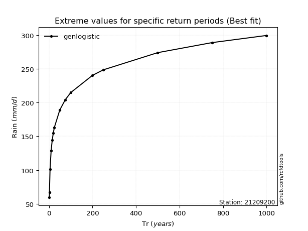</img>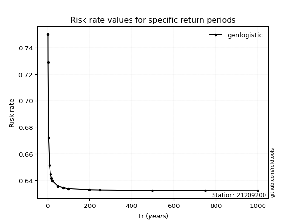</img>

</div>


<sub>**APP DISCLAIMER**: NO WARRANTY - This software is provided by [github.com/rcfdtools](https://github.com/rcfdtools) "as is", without any express or implied warranty, including warranties of merchantability, fitness for a particular purpose, or non-infringement. There is no guarantee that the software will be error-free or operate without interruption. LIMITATION OF LIABILITY - Neither the authors nor copyright holders will be liable for claims or damages arising from the software or its use. You are responsible for determining if the software is appropriate for your use and assume all associated risks, including errors, legal compliance, and data loss. NO PROFESSIONAL ADVICE - The software provides general information and does not offer professional advice. It should not replace consultation with professional advisors.</sub>