<div align="center">


</div>

# PMax24h Station (Rain, Pmax24h): 21209920

Maximum Precipitation in 24 hours (PMax24h) is the greatest amount of rainfall for a specific duration that is meteorologically possible for a given location, acting as a "worst-case" scenario for extreme storms, crucial for designing safety-critical infrastructure like bridges, river deviations, dams, spillways, and nuclear plants to prevent catastrophic failure. The PMax24h is related with the Probable Maximum Precipitation (PMP) and it is calculated by hydrologists using meteorological data to determine the upper limit of extreme rainfall, often leading to the Probable Maximum Flood (PMF) for flood control design, and is increasingly being studied for climate change impacts. Probable Maximum Precipitation (PMP) is the theoretical upper limit of rainfall, a deterministic estimate for extreme events, while probability distributions (like GEV, Gumbel) describe the likelihood and frequency of various precipitation amounts, including rare ones, showing how often events occur, with PMP representing the extreme end of these distributions, used for critical infrastructure design to ensure safety against the worst conceivable weather, unlike standard statistical forecasts which cover typical probabilities.

The most common probability distributions in hydrology, used for analyzing floods, rainfall, and streamflow, include the Normal, Log-Normal, Gumbel, Gamma (including Log-Pearson Type III), and Generalized Extreme Value (GEV) distributions, often chosen based on the data´s skewness and whether modeling extremes or general conditions, with Gumbel and GEV popular for extreme events like floods, while the Normal distribution serves as a baseline, though often requiring transformations for skewed hydrological data. These distributions help in designing water infrastructure, managing water resources, and forecasting hydrologic events.

> Hydrological data often isn´t perfectly normal (it´s skewed), so different distributions are needed for different applications, such as: **Flood Frequency Analysis**: Using Gumbel, GEV, or Log-Pearson Type III for predicting extreme flood magnitudes and their return periods, **Rainfall Analysis**: Normal for annual totals, but Log-Normal, Weibull, or GEV for intensity or extreme daily rainfall, **Streamflow Modeling**: Gamma and Log-Normal for maximum flows, GEV for minimum flows, and Kappa for daily flows.

<div align="center">

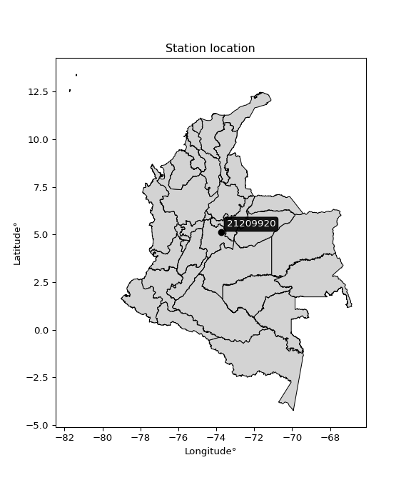</img>

</div>


## A. General information


### 1. General running parameters

• app_version: _v20260225_. • runtime: _2026-02-25 06:22:56.084431_. • Python version: _3.14.0_. • SciPy version: _1.16.3_. • Pandas version: _2.3.3_. • NumPy version: _2.3.5_. • Stations dataset (station_dataset_file): _dataset/pmax24h_in/automatic_test.csv_. • Stations catalog (station_catalog_file): _dataset/CNE.xls_. • Minimum year to eval til year_max (date_min): _1900_. • Maximum year to eval since year_min (date_max): _2025_. • Creates, save and include plots into reports (create_plot): _True_. • Plot only fit distributions with Δo > Δ (plot_only_fit): _True_. • Plot only simple graphs avoiding multiple CDFs and multiple Extreme values plots (plot_only_simple): _False_. • Eval low extreme values, if False, evaluates high extreme values (low_extreme): _False_. • Eval every SciPy distribution as logarithmic (pdist_logarithmic_on): _True_. • Standard deviation normalized (ddof): _1.0_. • Return periods to eval in years (Tr): _[2, 2.33, 5, 10, 15, 20, 25, 50, 75, 100, 200, 250, 500, 750, 1000]_. • Minimum data sample per station, 0 means any (minimum_sample): _5_. • Z-Score maximum threshold to adjust a value, 0 means disable (zscore_max): _3.5_. • Z-Score minimum threshold to adjust a value, 0 means disable (zscore_min): _-2.5_. • Avoid zeros, e.g. rain = 0 (avoid_zeros): _True_. • Avoid null values (avoid_nans): _True_. 

:file_folder:Table: [dataset.csv](../../dataset/pmax24h_in/automatic_test.csv)

> Delta Degrees of Freedom (DDOF): is a parameter used in the formulas for calculating variance and standard deviation. When ddof=0, the divisor is $N$ (the total number of observations) and this is used when your data set is the entire population. When ddof=1, the divisor is $N-1$ and this is used when your data set is a sample drawn from a larger population. Using $N-1$ provides an unbiased estimate of the population variance (known as Bessel´s correction).


### 2. Station info and location

|   id |   CODIGO | NOMBRE                  | CATEGORIA    | TECNOLOGIA                              | ESTADO   | FECHA_INSTALACION   |   FECHA_SUSPENSION |   ALTITUD |   LATITUD |   LONGITUD | DEPARTAMENTO   | MUNICIPIO   | AREA_OPERATIVA                            | ENTIDAD                                                     | AREA_HIDROGRAFICA   | ZONA_HIDROGRAFICA   | SUBZONA_HIDROGRAFICA   | CORRIENTE   | Catalogo   |   Version |
|-----:|---------:|:------------------------|:-------------|:----------------------------------------|:---------|:--------------------|-------------------:|----------:|----------:|-----------:|:---------------|:------------|:------------------------------------------|:------------------------------------------------------------|:--------------------|:--------------------|:-----------------------|:------------|:-----------|----------:|
|    0 | 21209920 | SANTA ROSITA [21209920] | Limnigráfica | Automática con Telemetría, Convencional | Activa   | 19/05/2005          |                nan |      2598 |   5.10588 |   -73.7536 | Cundinamarca   | Suesca      | Area Operativa 11 - Cundinamarca-Amazonas | INSTITUTO DE HIDROLOGIA METEOROLOGIA Y ESTUDIOS AMBIENTALES | Magdalena Cauca     | Alto Magdalena      | Río Bogotá             | Bogota      | CNE_IDEAM  |  20251226 |

<div align="center">

Dynamic map: [:earth_americas:Google](http://maps.google.com/maps?q=5.105878,-73.753646) [:earth_americas:OSM](https://www.openstreetmap.org/#map=18/5.105878/-73.753646&layers=P) [:earth_americas:Bing](https://www.bing.com/maps?cp=5.105878~-73.753646&lvl=18) [:earth_americas:Apple](https://maps.apple.com/frame?center=5.105878%2C-73.753646&span=0.003%2C0.006)

</div>


<div align="center">

```geojson
{
  "type": "Feature",
  "geometry": {
    "type": "Point", 
    "coordinates": [-73.753646, 5.105878]
  }, 
  "properties": {
    "Name": "21209920"
  }
}
```

</div>


### 3. Discrete values table and plot

<div align="center">

|               |            0 |           1 |           2 |           3 |           4 |           5 |           6 |          7 |           8 |          9 |         10 |          11 |          12 |          13 |          14 |          15 |         16 |          17 |         18 |         19 |           20 |
|:--------------|-------------:|------------:|------------:|------------:|------------:|------------:|------------:|-----------:|------------:|-----------:|-----------:|------------:|------------:|------------:|------------:|------------:|-----------:|------------:|-----------:|-----------:|-------------:|
| Date          | 2005         | 2006        | 2007        | 2008        | 2009        | 2010        | 2011        | 2012       | 2013        | 2014       | 2015       | 2016        | 2017        | 2018        | 2019        | 2020        | 2021       | 2022        | 2023       | 2024       | 2025         |
| Value         |   28         |   23        |   37.3      |   43.2      |   34.1      |   42.7      |   42.6      |   64.1     |   16.3      |   15.6     |   13.9     |   11.1      |    9.7      |   13.4      |   13.1      |   20        |   13.9     |   19.4      |   13.9     |  104.4     |   27.6       |
| Value_initial |   28         |   23        |   37.3      |   43.2      |   34.1      |   42.7      |   42.6      |   64.1     |   16.3      |   15.6     |   13.9     |   11.1      |    9.7      |   13.4      |   13.1      |   20        |   13.9     |   19.4      |   13.9     |  104.4     |   27.6       |
| count         |   21         |   21        |   21        |   21        |   21        |   21        |   21        |   21       |   21        |   21       |   21       |   21        |   21        |   21        |   21        |   21        |   21       |   21        |   21       |   21       |   21         |
| mean          |   28.919     |   28.919    |   28.919    |   28.919    |   28.919    |   28.919    |   28.919    |   28.919   |   28.919    |   28.919   |   28.919   |   28.919    |   28.919    |   28.919    |   28.919    |   28.919    |   28.919   |   28.919    |   28.919   |   28.919   |   28.919     |
| std           |   22.3744    |   22.3744   |   22.3744   |   22.3744   |   22.3744   |   22.3744   |   22.3744   |   22.3744  |   22.3744   |   22.3744  |   22.3744  |   22.3744   |   22.3744   |   22.3744   |   22.3744   |   22.3744   |   22.3744  |   22.3744   |   22.3744  |   22.3744  |   22.3744    |
| zscore        |   -0.0410758 |   -0.264545 |    0.374577 |    0.638271 |    0.231557 |    0.615924 |    0.611455 |    1.57237 |   -0.563994 |   -0.59528 |   -0.67126 |   -0.796403 |   -0.858974 |   -0.693607 |   -0.707015 |   -0.398627 |   -0.67126 |   -0.425443 |   -0.67126 |    3.37354 |   -0.0589534 |


</div>


<div align="center">

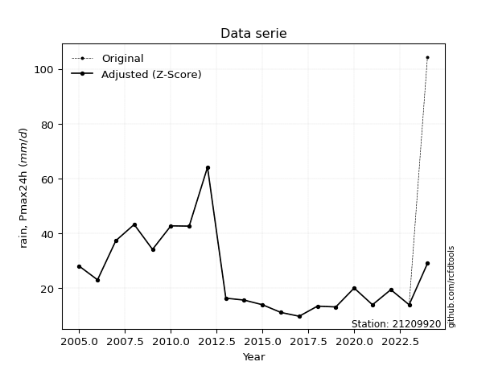</img>

</div>


> The initial value (value_initial) correspond to the initial obtained or null completed value, and value (value) is adjusted only when the initial value is outside the valid range (outlier) definite through the Z-Score value. If Z-Score is active, values out of range or outliers are replaced with the station mean value. A Z-Score (or standard score) measures how many standard deviations a data point is from the mean of a dataset, indicating its relative position; positive scores mean above the mean, negative mean below, and a score of zero is exactly at the mean, allowing for comparison of values from different distributions. It´s calculated using the formula $z=(x–μ)/σ$, where $x$ is the data point, $μ$ is the mean, and $σ$ is the standard deviation, helping identify outliers and understand probability.
>
> <sub>**Note**: In this study, "completing" (filling gaps in) and "extending" (forecasting or lengthening the historical record) rainfall data series are avoided for certain critical analyses because they introduce artificial bias and uncertainty, which can distort the statistics of rare events (extremes), alter day-to-day variability, and compromise the integrity and homogeneity of the original data. Some reasons against Completing/Extending rainfall data are: **Distortion of Extremes and Variability**: The primary issue is that most gap-filling or extension methods rely on averaging or regression with nearby stations, which inherently smooths the data. Rainfall is highly variable in space and time, with a large percentage of zero values and occasional large storms. Infilling methods often underestimate the highest values and overestimate the lowest (zero) values, which severely distorts analyses focused on flood frequency, drought severity, and intensity-duration-frequency (IDF) curves, **Loss of Data Homogeneity**: Infilled or extended data are synthetic estimates, not actual measurements. Combining these estimates with observed data can violate the assumption of data homogeneity, which requires that the data properties do not change over time. Inhomogeneity can lead to incorrect conclusions about long-term trends or changes in climate patterns, **Propagation of Errors**: Errors and biases from the original data (e.g., wind-induced undercatch, instrument errors, site changes) or the data used for imputation can propagate through the analysis, leading to unreliable hydrological models and inaccurate predictions, **Compromised Statistical Integrity**: For statistical analyses, especially those involving the frequency of events, using artificial data can introduce time bias or autocorrelation that doesn´t exist in reality, making it difficult to assess the true probability of events, **Difficulty in Validation**: It is difficult to accurately validate the quality of filled or extended data, especially for past periods where ground-truth measurements are unavailable. The reliability of imputation techniques heavily depends on the density of the surrounding station network and the complexity of the local topography.</sub>


### 4. Active continuous probability distributions from SciPy (80 of 104 available)

A Probability Density Function (PDF) describes the relative likelihood of a continuous random variable falling within a specific range, where the total area under its curve equals 1, and the area over any interval gives the actual probability for that range. Unlike discrete probabilities (like rolling a die), a PDF shows density, not direct probability for a single point (which is zero), with higher points indicating higher likelihood, often visualized as a bell curve for normal distributions.

A log of a probability density function (log-PDF) is simply the logarithm of the PDF´s value, denoted as $log(f(x))$, useful for converting multiplication of probabilities into addition, improving numerical stability with tiny numbers, and connecting to information theory concepts like entropy. Instead of dealing with very small probabilities (e.g., 0.000001), log-PDFs use negative numbers (e.g., $log(0.00001) ≈ -11.51$ that are easier for computers to handle, preventing underflow errors and simplifying complex calculations. In this study, each active probability distribution from SciPy is also evaluated in the $log$ form.

[scipy.stats](https://docs.scipy.org/doc/scipy/reference/stats.html) is a Python´s powerful submodule within the SciPy library for comprehensive statistical analysis, offering over 130 probability distributions (like Normal, Poisson), functions for descriptive stats (mean, variance), hypothesis testing (t-tests, chi-square), random variable generation, and statistical tests, making it essential for data science, modeling, and research. It provides tools to explore, model, and draw conclusions from data efficiently, working seamlessly with NumPy.

<div align="center">

|   id | p_dist           |   n_parameter | fit_method   | label                                                                       | active   | ref                                                                                                      |
|-----:|:-----------------|--------------:|:-------------|:----------------------------------------------------------------------------|:---------|:---------------------------------------------------------------------------------------------------------|
|    0 | alpha            |             3 | MLE          | Alpha                                                                       | True     | [:mortar_board:](https://docs.scipy.org/doc/scipy/reference/generated/scipy.stats.alpha.html)            |
|    1 | anglit           |             2 | MM           | Anglit                                                                      | True     | [:mortar_board:](https://docs.scipy.org/doc/scipy/reference/generated/scipy.stats.anglit.html)           |
|    2 | arcsine          |             2 | MM           | Arcsine                                                                     | True     | [:mortar_board:](https://docs.scipy.org/doc/scipy/reference/generated/scipy.stats.arcsine.html)          |
|    3 | argus            |             3 | MLE          | Argus                                                                       | True     | [:mortar_board:](https://docs.scipy.org/doc/scipy/reference/generated/scipy.stats.argus.html)            |
|    4 | beta             |             4 | MLE          | Beta                                                                        | True     | [:mortar_board:](https://docs.scipy.org/doc/scipy/reference/generated/scipy.stats.beta.html)             |
|    5 | betaprime        |             4 | MLE          | Beta prime                                                                  | True     | [:mortar_board:](https://docs.scipy.org/doc/scipy/reference/generated/scipy.stats.betaprime.html)        |
|    6 | bradford         |             3 | MLE          | Bradford                                                                    | True     | [:mortar_board:](https://docs.scipy.org/doc/scipy/reference/generated/scipy.stats.bradford.html)         |
|    7 | burr             |             4 | MLE          | Burr (Type III)                                                             | True     | [:mortar_board:](https://docs.scipy.org/doc/scipy/reference/generated/scipy.stats.burr.html)             |
|    8 | burr12           |             4 | MLE          | Burr (Type III) 12                                                          | True     | [:mortar_board:](https://docs.scipy.org/doc/scipy/reference/generated/scipy.stats.burr12.html)           |
|    9 | cosine           |             2 | MLE          | Cosine                                                                      | True     | [:mortar_board:](https://docs.scipy.org/doc/scipy/reference/generated/scipy.stats.cosine.html)           |
|   10 | crystalball      |             4 | MLE          | Crystalball                                                                 | True     | [:mortar_board:](https://docs.scipy.org/doc/scipy/reference/generated/scipy.stats.crystalball.html)      |
|   11 | dgamma           |             3 | MLE          | Double gamma                                                                | True     | [:mortar_board:](https://docs.scipy.org/doc/scipy/reference/generated/scipy.stats.dgamma.html)           |
|   12 | dweibull         |             3 | MLE          | Double Weibull                                                              | True     | [:mortar_board:](https://docs.scipy.org/doc/scipy/reference/generated/scipy.stats.dweibull.html)         |
|   13 | erlang           |             3 | MLE          | Erlang                                                                      | True     | [:mortar_board:](https://docs.scipy.org/doc/scipy/reference/generated/scipy.stats.erlang.html)           |
|   14 | exponnorm        |             3 | MLE          | Exponentially modified Normal                                               | True     | [:mortar_board:](https://docs.scipy.org/doc/scipy/reference/generated/scipy.stats.exponnorm.html)        |
|   15 | exponpow         |             3 | MLE          | Exponential power                                                           | True     | [:mortar_board:](https://docs.scipy.org/doc/scipy/reference/generated/scipy.stats.exponpow.html)         |
|   16 | exponweib        |             4 | MLE          | Exponentiated Weibull                                                       | True     | [:mortar_board:](https://docs.scipy.org/doc/scipy/reference/generated/scipy.stats.exponweib.html)        |
|   17 | f                |             4 | MLE          | F                                                                           | True     | [:mortar_board:](https://docs.scipy.org/doc/scipy/reference/generated/scipy.stats.f.html)                |
|   18 | fatiguelife      |             3 | MLE          | Fatigue-life (Birnbaum-Saunders)                                            | True     | [:mortar_board:](https://docs.scipy.org/doc/scipy/reference/generated/scipy.stats.fatiguelife.html)      |
|   19 | foldnorm         |             3 | MM           | Fold Normal                                                                 | True     | [:mortar_board:](https://docs.scipy.org/doc/scipy/reference/generated/scipy.stats.foldnorm.html)         |
|   20 | gamma            |             3 | MLE          | Gamma                                                                       | True     | [:mortar_board:](https://docs.scipy.org/doc/scipy/reference/generated/scipy.stats.gamma.html)            |
|   21 | gausshyper       |             6 | MLE          | Gauss hypergeometric                                                        | True     | [:mortar_board:](https://docs.scipy.org/doc/scipy/reference/generated/scipy.stats.gausshyper.html)       |
|   22 | genexpon         |             5 | MLE          | Generalized exponential                                                     | True     | [:mortar_board:](https://docs.scipy.org/doc/scipy/reference/generated/scipy.stats.genexpon.html)         |
|   23 | genextreme       |             3 | MLE          | Generalized exponential                                                     | True     | [:mortar_board:](https://docs.scipy.org/doc/scipy/reference/generated/scipy.stats.genextreme.html)       |
|   24 | gengamma         |             4 | MLE          | Generalized gamma                                                           | True     | [:mortar_board:](https://docs.scipy.org/doc/scipy/reference/generated/scipy.stats.gengamma.html)         |
|   25 | genhalflogistic  |             3 | MLE          | Generalized half-logistic                                                   | True     | [:mortar_board:](https://docs.scipy.org/doc/scipy/reference/generated/scipy.stats.genhalflogistic.html)  |
|   26 | genlogistic      |             3 | MLE          | Generalized logistic                                                        | True     | [:mortar_board:](https://docs.scipy.org/doc/scipy/reference/generated/scipy.stats.genlogistic.html)      |
|   27 | gennorm          |             3 | MLE          | Generalized Normal                                                          | True     | [:mortar_board:](https://docs.scipy.org/doc/scipy/reference/generated/scipy.stats.gennorm.html)          |
|   28 | genpareto        |             3 | MLE          | Generalized Pareto                                                          | True     | [:mortar_board:](https://docs.scipy.org/doc/scipy/reference/generated/scipy.stats.genpareto.html)        |
|   29 | gompertz         |             3 | MLE          | Gompertz (or truncated Gumbel)                                              | True     | [:mortar_board:](https://docs.scipy.org/doc/scipy/reference/generated/scipy.stats.gompertz.html)         |
|   30 | gumbel_l         |             2 | MM           | Gumbel Left Skew                                                            | True     | [:mortar_board:](https://docs.scipy.org/doc/scipy/reference/generated/scipy.stats.gumbel_l.html)         |
|   31 | gumbel_r         |             2 | MM           | Gumbel Right Skew                                                           | True     | [:mortar_board:](https://docs.scipy.org/doc/scipy/reference/generated/scipy.stats.gumbel_r.html)         |
|   32 | halfgennorm      |             3 | MLE          | Upper half of a generalized normal                                          | True     | [:mortar_board:](https://docs.scipy.org/doc/scipy/reference/generated/scipy.stats.halfgennorm.html)      |
|   33 | halflogistic     |             2 | MM           | Half-logistic                                                               | True     | [:mortar_board:](https://docs.scipy.org/doc/scipy/reference/generated/scipy.stats.halflogistic.html)     |
|   34 | halfnorm         |             2 | MM           | Half Normal                                                                 | True     | [:mortar_board:](https://docs.scipy.org/doc/scipy/reference/generated/scipy.stats.halfnorm.html)         |
|   35 | hypsecant        |             2 | MM           | hyperbolic secant                                                           | True     | [:mortar_board:](https://docs.scipy.org/doc/scipy/reference/generated/scipy.stats.hypsecant.html)        |
|   36 | invgamma         |             3 | MLE          | Inverted gamma                                                              | True     | [:mortar_board:](https://docs.scipy.org/doc/scipy/reference/generated/scipy.stats.invgamma.html)         |
|   37 | invgauss         |             3 | MLE          | Inverse Gaussian                                                            | True     | [:mortar_board:](https://docs.scipy.org/doc/scipy/reference/generated/scipy.stats.invgauss.html)         |
|   38 | invweibull       |             3 | MLE          | Inverted Weibull                                                            | True     | [:mortar_board:](https://docs.scipy.org/doc/scipy/reference/generated/scipy.stats.invweibull.html)       |
|   39 | johnsonsb        |             4 | MLE          | Johnson SB                                                                  | True     | [:mortar_board:](https://docs.scipy.org/doc/scipy/reference/generated/scipy.stats.johnsonsb.html)        |
|   40 | johnsonsu        |             4 | MLE          | Johnson Su                                                                  | True     | [:mortar_board:](https://docs.scipy.org/doc/scipy/reference/generated/scipy.stats.johnsonsu.html)        |
|   41 | kappa3           |             3 | MLE          | Kappa 3                                                                     | True     | [:mortar_board:](https://docs.scipy.org/doc/scipy/reference/generated/scipy.stats.kappa3.html)           |
|   42 | kappa4           |             4 | MLE          | Kappa 4                                                                     | True     | [:mortar_board:](https://docs.scipy.org/doc/scipy/reference/generated/scipy.stats.kappa4.html)           |
|   43 | ksone            |             3 | MLE          | Kolmogorov-Smirnov one-sided test statistic distribution                    | True     | [:mortar_board:](https://docs.scipy.org/doc/scipy/reference/generated/scipy.stats.ksone.html)            |
|   44 | kstwobign        |             2 | MLE          | Limiting distribution of scaled Kolmogorov-Smirnov two-sided test statistic | True     | [:mortar_board:](https://docs.scipy.org/doc/scipy/reference/generated/scipy.stats.kstwobign.html)        |
|   45 | laplace          |             2 | MM           | Laplace                                                                     | True     | [:mortar_board:](https://docs.scipy.org/doc/scipy/reference/generated/scipy.stats.laplace.html)          |
|   46 | levy_l           |             2 | MLE          | Left-skewed Levy                                                            | True     | [:mortar_board:](https://docs.scipy.org/doc/scipy/reference/generated/scipy.stats.levy_l.html)           |
|   47 | loggamma         |             3 | MLE          | Log gamma                                                                   | True     | [:mortar_board:](https://docs.scipy.org/doc/scipy/reference/generated/scipy.stats.loggamma.html)         |
|   48 | logistic         |             2 | MM           | Logistic (or Sech-squared)                                                  | True     | [:mortar_board:](https://docs.scipy.org/doc/scipy/reference/generated/scipy.stats.logistic.html)         |
|   49 | loglaplace       |             3 | MLE          | Log-Laplace                                                                 | True     | [:mortar_board:](https://docs.scipy.org/doc/scipy/reference/generated/scipy.stats.loglaplace.html)       |
|   50 | lomax            |             3 | MLE          | Lomax (Pareto of the second kind)                                           | True     | [:mortar_board:](https://docs.scipy.org/doc/scipy/reference/generated/scipy.stats.lomax.html)            |
|   51 | maxwell          |             2 | MM           | Maxwell                                                                     | True     | [:mortar_board:](https://docs.scipy.org/doc/scipy/reference/generated/scipy.stats.maxwell.html)          |
|   52 | mielke           |             4 | MLE          | Mielke Beta-Kappa / Dagum                                                   | True     | [:mortar_board:](https://docs.scipy.org/doc/scipy/reference/generated/scipy.stats.mielke.html)           |
|   53 | moyal            |             2 | MM           | Moyal                                                                       | True     | [:mortar_board:](https://docs.scipy.org/doc/scipy/reference/generated/scipy.stats.moyal.html)            |
|   54 | nakagami         |             3 | MLE          | Nakagami                                                                    | True     | [:mortar_board:](https://docs.scipy.org/doc/scipy/reference/generated/scipy.stats.nakagami.html)         |
|   55 | ncf              |             5 | MLE          | Non-central F distribution                                                  | True     | [:mortar_board:](https://docs.scipy.org/doc/scipy/reference/generated/scipy.stats.ncf.html)              |
|   56 | nct              |             4 | MLE          | Non-central Student’s t                                                     | True     | [:mortar_board:](https://docs.scipy.org/doc/scipy/reference/generated/scipy.stats.nct.html)              |
|   57 | norm             |             2 | MM           | Normal                                                                      | True     | [:mortar_board:](https://docs.scipy.org/doc/scipy/reference/generated/scipy.stats.norm.html)             |
|   58 | pearson3         |             3 | MM           | Pearson type III                                                            | True     | [:mortar_board:](https://docs.scipy.org/doc/scipy/reference/generated/scipy.stats.pearson3.html)         |
|   59 | powerlaw         |             3 | MLE          | Power-function                                                              | True     | [:mortar_board:](https://docs.scipy.org/doc/scipy/reference/generated/scipy.stats.powerlaw.html)         |
|   60 | rayleigh         |             2 | MM           | Rayleigh                                                                    | True     | [:mortar_board:](https://docs.scipy.org/doc/scipy/reference/generated/scipy.stats.rayleigh.html)         |
|   61 | rdist            |             3 | MLE          | R-distributed (symmetric beta)                                              | True     | [:mortar_board:](https://docs.scipy.org/doc/scipy/reference/generated/scipy.stats.rdist.html)            |
|   62 | rice             |             3 | MLE          | Rice                                                                        | True     | [:mortar_board:](https://docs.scipy.org/doc/scipy/reference/generated/scipy.stats.rice.html)             |
|   63 | semicircular     |             2 | MM           | Semicircular                                                                | True     | [:mortar_board:](https://docs.scipy.org/doc/scipy/reference/generated/scipy.stats.semicircular.html)     |
|   64 | skewnorm         |             3 | MLE          | Skew normal                                                                 | True     | [:mortar_board:](https://docs.scipy.org/doc/scipy/reference/generated/scipy.stats.skewnorm.html)         |
|   65 | t                |             3 | MLE          | Student’s t                                                                 | True     | [:mortar_board:](https://docs.scipy.org/doc/scipy/reference/generated/scipy.stats.t.html)                |
|   66 | trapezoid        |             4 | MLE          | Trapezoid                                                                   | True     | [:mortar_board:](https://docs.scipy.org/doc/scipy/reference/generated/scipy.stats.trapezoid.html)        |
|   67 | triang           |             3 | MLE          | Triangular                                                                  | True     | [:mortar_board:](https://docs.scipy.org/doc/scipy/reference/generated/scipy.stats.triang.html)           |
|   68 | truncexpon       |             3 | MLE          | Truncated exponential                                                       | True     | [:mortar_board:](https://docs.scipy.org/doc/scipy/reference/generated/scipy.stats.truncexpon.html)       |
|   69 | truncnorm        |             4 | MLE          | Truncated normal                                                            | True     | [:mortar_board:](https://docs.scipy.org/doc/scipy/reference/generated/scipy.stats.truncnorm.html)        |
|   70 | truncpareto      |             4 | MLE          | Upper truncated Pareto                                                      | True     | [:mortar_board:](https://docs.scipy.org/doc/scipy/reference/generated/scipy.stats.truncpareto.html)      |
|   71 | truncweibull_min |             5 | MLE          | Doubly truncated Weibull minimum                                            | True     | [:mortar_board:](https://docs.scipy.org/doc/scipy/reference/generated/scipy.stats.truncweibull_min.html) |
|   72 | tukeylambda      |             3 | MLE          | Tukey-Lamdba                                                                | True     | [:mortar_board:](https://docs.scipy.org/doc/scipy/reference/generated/scipy.stats.tukeylambda.html)      |
|   73 | uniform          |             2 | MLE          | Uniform                                                                     | True     | [:mortar_board:](https://docs.scipy.org/doc/scipy/reference/generated/scipy.stats.uniform.html)          |
|   74 | vonmises         |             3 | MLE          | Von Mises                                                                   | True     | [:mortar_board:](https://docs.scipy.org/doc/scipy/reference/generated/scipy.stats.vonmises.html)         |
|   75 | vonmises_line    |             3 | MLE          | Von Mises line                                                              | True     | [:mortar_board:](https://docs.scipy.org/doc/scipy/reference/generated/scipy.stats.vonmises_line.html)    |
|   76 | wald             |             2 | MM           | Wald                                                                        | True     | [:mortar_board:](https://docs.scipy.org/doc/scipy/reference/generated/scipy.stats.wald.html)             |
|   77 | weibull_max      |             3 | MLE          | Weibull maximum                                                             | True     | [:mortar_board:](https://docs.scipy.org/doc/scipy/reference/generated/scipy.stats.weibull_max.html)      |
|   78 | weibull_min      |             3 | MLE          | Weibull minimum                                                             | True     | [:mortar_board:](https://docs.scipy.org/doc/scipy/reference/generated/scipy.stats.weibull_min.html)      |
|   79 | wrapcauchy       |             3 | MLE          | Wrapped  Cauchy                                                             | True     | [:mortar_board:](https://docs.scipy.org/doc/scipy/reference/generated/scipy.stats.wrapcauchy.html)       |

</div>

> **n_parameter:** # arguments & localization & scale.
>
> **Fit methods:** (MLE) maximum likelihood, (MM) L-moments.
>
>**Inactive** (With the only purpose of prevent loops, zero divisions, infinite values, over high estimated values or horizontal trending for recurrence intervals estimations, the follow distributions were disabled.)**:** lognorm, norminvgauss, powernorm, powerlognorm, cauchy, halfcauchy, foldcauchy, skewcauchy, chi2, expon, fisk, genhyperbolic, geninvgauss, gibrat, kstwo, laplace_asymmetric, levy, levy_stable, ncx2, pareto, rel_breitwigner, recipinvgauss, studentized_range, loguniform, 


## B. Probability (PDF) vs. Empirical (EDF) distributions functions

A continuous probability distribution (CPD) describes probabilities for variables that can take any value within a range (like rain any time), unlike discrete variables with specific outcomes (like temperature). It uses a Probability Density Function (PDF), a curve where the total area under it equals 1, and the probability of the variable falling within an interval (a to b) is found by calculating the area under the curve between those points. A key feature is that the probability of hitting any single exact value is zero, so probabilities are always expressed for ranges, e.g., $P(a ≤ X ≤ b)$.

<div align="center">

Distributions parameters from station values
|     |   station | p_dist              |   n |               loc |            scale | shape                  | shape1                 | shape2               | shape3              |
|----:|----------:|:--------------------|----:|------------------:|-----------------:|:-----------------------|:-----------------------|:---------------------|:--------------------|
|   0 |  21209920 | alpha               |  21 |       3.35367     |     20.5062      | 1.0505720233864801     |                        |                      |                     |
|   1 |  21209920 | anglit              |  21 |      28.919       |     63.8767      |                        |                        |                      |                     |
|   2 |  21209920 | arcsine             |  21 |      -1.96061     |     61.7593      |                        |                        |                      |                     |
|   3 |  21209920 | argus               |  21 |     -38.4459      |    144.793       | 2.7869417777505802e-06 |                        |                      |                     |
|   4 |  21209920 | beta                |  21 |       9.7         |    176.259       | 0.6110620727394981     | 5.813036330115937      |                      |                     |
|   5 |  21209920 | betaprime           |  21 |       6.17927     |      0.329144    | 61.6324745018415       | 1.7497765931242846     |                      |                     |
|   6 |  21209920 | bradford            |  21 |      -0.750809    |    105.151       | 3.5143845883400706     |                        |                      |                     |
|   7 |  21209920 | burr                |  21 |       5.12283     |      0.750362    | 1.4987538970664183     | 62.12654778177716      |                      |                     |
|   8 |  21209920 | burr12              |  21 |       0.120264    |     11.6198      | 10.371083706400993     | 0.13473525872426795    |                      |                     |
|   9 |  21209920 | cosine              |  21 |      24.2969      |      8.94111     |                        |                        |                      |                     |
|  10 |  21209920 | crystalball         |  21 |      28.919       |     21.8352      | 3134.6244457785533     | 246.89012712715225     |                      |                     |
|  11 |  21209920 | dgamma              |  21 |      21.9627      |     12.0273      | 1.2220735015145197     |                        |                      |                     |
|  12 |  21209920 | dweibull            |  21 |      24.2255      |     15.6868      | 1.1230019510604938     |                        |                      |                     |
|  13 |  21209920 | erlang              |  21 |       9.7         |     19.7582      | 0.6974569860678914     |                        |                      |                     |
|  14 |  21209920 | exponnorm           |  21 |       9.67661     |      0.00857178  | 2234.805265619272      |                        |                      |                     |
|  15 |  21209920 | exponpow            |  21 |       9.7         |     38.0271      | 0.5830503715094029     |                        |                      |                     |
|  16 |  21209920 | exponweib           |  21 |       9.7         |     17.1663      | 1.019554255626517      | 0.798828151041406      |                      |                     |
|  17 |  21209920 | f                   |  21 |       6.90505     |     11.2166      | 18.741400729316886     | 3.6129075780190174     |                      |                     |
|  18 |  21209920 | fatiguelife         |  21 |       8.15803     |     12.7156      | 1.1235700695579534     |                        |                      |                     |
|  19 |  21209920 | foldnorm            |  21 |      -3.34073     |     39.6392      | 0.00407672937193026    |                        |                      |                     |
|  20 |  21209920 | gamma               |  21 |       9.7         |     28.6214      | 0.6764111749567028     |                        |                      |                     |
|  21 |  21209920 | gausshyper          |  21 |       9.7         |   3229.3         | 0.6851340111022703     | 123.97182451837318     | -149.82440174838723  | 0.05830016254634188 |
|  22 |  21209920 | genexpon            |  21 |       9.7         |      9.28232     | 0.4829720266885272     | 3.561258702202629e-09  | 1.598745131360618    |                     |
|  23 |  21209920 | genextreme          |  21 |      16.8912      |      7.89402     | -0.6598519290006479    |                        |                      |                     |
|  24 |  21209920 | gengamma            |  21 |       9.7         |     19.1193      | 0.9902141135399058     | 0.8193467736141248     |                      |                     |
|  25 |  21209920 | genhalflogistic     |  21 |       9.7         |     14.4289      | 1.5156271809210762e-06 |                        |                      |                     |
|  26 |  21209920 | genlogistic         |  21 |     -76.024       |     12.5407      | 2175.964614337536      |                        |                      |                     |
|  27 |  21209920 | gennorm             |  21 |      19.4         |      8.38673     | 0.7311295376172056     |                        |                      |                     |
|  28 |  21209920 | genpareto           |  21 |       9.7         |     14.8899      | 0.25548871072858237    |                        |                      |                     |
|  29 |  21209920 | gompertz            |  21 |       9.7         |    172.798       | 8.102142052358847      |                        |                      |                     |
|  30 |  21209920 | gumbel_l            |  21 |      38.746       |     17.0248      |                        |                        |                      |                     |
|  31 |  21209920 | gumbel_r            |  21 |      19.092       |     17.0248      |                        |                        |                      |                     |
|  32 |  21209920 | halfgennorm         |  21 |       9.7         |     10.909       | 0.7349620693427306     |                        |                      |                     |
|  33 |  21209920 | halflogistic        |  21 |       3.03927     |     18.6683      |                        |                        |                      |                     |
|  34 |  21209920 | halfnorm            |  21 |       0.0178041   |     36.2223      |                        |                        |                      |                     |
|  35 |  21209920 | hypsecant           |  21 |      28.919       |     13.9007      |                        |                        |                      |                     |
|  36 |  21209920 | invgamma            |  21 |       6.01508     |     20.415       | 1.7498279706922883     |                        |                      |                     |
|  37 |  21209920 | invgauss            |  21 |       7.57804     |     15.5418      | 1.3731325258654201     |                        |                      |                     |
|  38 |  21209920 | invweibull          |  21 |       4.9279      |     11.9633      | 1.5154978634817984     |                        |                      |                     |
|  39 |  21209920 | johnsonsb           |  21 |       9.23429     |    129.162       | 1.5966495148031319     | 0.697605085451402      |                      |                     |
|  40 |  21209920 | johnsonsu           |  21 |       8.65101     |      0.0599156   | -5.530497446657138     | 0.9237922034950257     |                      |                     |
|  41 |  21209920 | kappa3              |  21 |       9.7         |     13.8187      | 1.7712026584212492     |                        |                      |                     |
|  42 |  21209920 | kappa4              |  21 |       0.226936    |    102.824       | 1.1014043965771052     | 0.9861488565777183     |                      |                     |
|  43 |  21209920 | ksone               |  21 |       0.23        |    113.64        | 1.0                    |                        |                      |                     |
|  44 |  21209920 | kstwobign           |  21 |     -27.8527      |     66.3646      |                        |                        |                      |                     |
|  45 |  21209920 | laplace             |  21 |      28.919       |     15.4398      |                        |                        |                      |                     |
|  46 |  21209920 | levy_l              |  21 |     112.315       |     57.7097      |                        |                        |                      |                     |
|  47 |  21209920 | loggamma            |  21 |   -6260.83        |    866.054       | 1426.1538140131115     |                        |                      |                     |
|  48 |  21209920 | logistic            |  21 |      28.919       |     12.0384      |                        |                        |                      |                     |
|  49 |  21209920 | loglaplace          |  21 |      -0.0997417   |     20.0997      | 1.958649683867078      |                        |                      |                     |
|  50 |  21209920 | lomax               |  21 |       9.69924     |     99.612       | 6.159379484958997      |                        |                      |                     |
|  51 |  21209920 | maxwell             |  21 |     -22.8212      |     32.4234      |                        |                        |                      |                     |
|  52 |  21209920 | mielke              |  21 |       7.02878     |      4.02391     | 5.622144375028476      | 1.4105646448724087     |                      |                     |
|  53 |  21209920 | moyal               |  21 |      16.4323      |      9.82929     |                        |                        |                      |                     |
|  54 |  21209920 | nakagami            |  21 |       9.7         |     39.0183      | 0.29782494602828247    |                        |                      |                     |
|  55 |  21209920 | ncf                 |  21 |      -0.834733    |     21.6194      | 55.775821226240566     | 7.354503196202375      | 8.60889254343535e-05 |                     |
|  56 |  21209920 | nct                 |  21 |       0.207291    |      0.279858    | 2.034499484930296      | 62.433383588142846     |                      |                     |
|  57 |  21209920 | norm                |  21 |      28.919       |     21.8352      |                        |                        |                      |                     |
|  58 |  21209920 | pearson3            |  21 |      28.919       |     21.8352      | 2.0384179704975542     |                        |                      |                     |
|  59 |  21209920 | powerlaw            |  21 |       9.7         |     94.7         | 0.2620132727405842     |                        |                      |                     |
|  60 |  21209920 | rayleigh            |  21 |     -12.853       |     33.3292      |                        |                        |                      |                     |
|  61 |  21209920 | rdist               |  21 |       1.34949     |     41.8505      | 1.1706287101388466     |                        |                      |                     |
|  62 |  21209920 | rice                |  21 |      -2.78907     |     27.223       | 0.0004785433456282348  |                        |                      |                     |
|  63 |  21209920 | semicircular        |  21 |      28.919       |     43.6704      |                        |                        |                      |                     |
|  64 |  21209920 | skewnorm            |  21 |       9.69994     |     29.0894      | 2183394.900416494      |                        |                      |                     |
|  65 |  21209920 | t                   |  21 |      21.5904      |     11.1971      | 2.192973241668387      |                        |                      |                     |
|  66 |  21209920 | trapezoid           |  21 |       0.23        |    113.64        | 1.0                    | 1.0                    |                      |                     |
|  67 |  21209920 | triang              |  21 |       0.30666     |    110.231       | 0.11605888286787261    |                        |                      |                     |
|  68 |  21209920 | truncexpon          |  21 |       0.246531    |     88.5914      | 1.1756608000136546     |                        |                      |                     |
|  69 |  21209920 | truncnorm           |  21 |   -2109.68        |    218.443       | 9.702234881063799      | 104.71656668902955     |                      |                     |
|  70 |  21209920 | truncpareto         |  21 |     -89.718       |     99.418       | 5.5901674556493175     | 1.9525438966427586     |                      |                     |
|  71 |  21209920 | truncweibull_min    |  21 |       0.0778114   |     74.0546      | 0.9504131738148867     | 0.0007775491805018281  | 1.4087196526012433   |                     |
|  72 |  21209920 | tukeylambda         |  21 |       1.26752     |     46.0068      | 1.097162731718416      |                        |                      |                     |
|  73 |  21209920 | uniform             |  21 |       9.7         |     94.7         |                        |                        |                      |                     |
|  74 |  21209920 | vonmises            |  21 |       1.97825     |      1           | 0.16972592247573393    |                        |                      |                     |
|  75 |  21209920 | vonmises_line       |  21 |      26.827       |      5.45169     | 8.565251104717372e-07  |                        |                      |                     |
|  76 |  21209920 | wald                |  21 |       7.08385     |     21.8352      |                        |                        |                      |                     |
|  77 |  21209920 | weibull_max         |  21 |     104.4         |      1.55601     | 0.21072549672651134    |                        |                      |                     |
|  78 |  21209920 | weibull_min         |  21 |       9.7         |     20.9202      | 0.95106594849549       |                        |                      |                     |
|  79 |  21209920 | wrapcauchy          |  21 |       9.7         |     15.0721      | 0.5134460890815193     |                        |                      |                     |
|  80 |  21209920 | logalpha            |  21 |       0.226751    |     14.2644      | 5.076378397133288      |                        |                      |                     |
|  81 |  21209920 | loganglit           |  21 |       3.15507     |      1.79599     |                        |                        |                      |                     |
|  82 |  21209920 | logarcsine          |  21 |       2.28683     |      1.73647     |                        |                        |                      |                     |
|  83 |  21209920 | logargus            |  21 |       1.60081     |      3.09348     | 2.2493169796448497e-05 |                        |                      |                     |
|  84 |  21209920 | logbeta             |  21 |       2.27213     |      2.44663     | 0.8172225765010268     | 1.4396672298094164     |                      |                     |
|  85 |  21209920 | logbetaprime        |  21 |       1.45481     |      0.167638    | 81.27034037124088      | 8.98447098373003       |                      |                     |
|  86 |  21209920 | logbradford         |  21 |       2.27212     |      2.37611     | 1.073213880898951      |                        |                      |                     |
|  87 |  21209920 | logburr             |  21 |      -4.24231     |      5.14724     | 15.161877079231868     | 129.41725778312954     |                      |                     |
|  88 |  21209920 | logburr12           |  21 | -233111           | 233113           | 3501261.97212267       | 0.08895093959783404    |                      |                     |
|  89 |  21209920 | logcosine           |  21 |       3.23926     |      0.546796    |                        |                        |                      |                     |
|  90 |  21209920 | logcrystalball      |  21 |       3.15507     |      0.613933    | 17.961581373893925     | 863.4685958928442      |                      |                     |
|  91 |  21209920 | logdgamma           |  21 |       3.08093     |      0.242388    | 2.1322020239851014     |                        |                      |                     |
|  92 |  21209920 | logdweibull         |  21 |       3.206       |      0.593916    | 1.7319345179259575     |                        |                      |                     |
|  93 |  21209920 | logerlang           |  21 |       2.18388     |      0.452792    | 2.144909349792428      |                        |                      |                     |
|  94 |  21209920 | logexponnorm        |  21 |       2.43355     |      0.153355    | 4.704862033032671      |                        |                      |                     |
|  95 |  21209920 | logexponpow         |  21 |       2.27213     |      1.13881     | 0.8151034748870456     |                        |                      |                     |
|  96 |  21209920 | logexponweib        |  21 |       2.27213     |      1.47832     | 0.33306583843059606    | 2.401673524255518      |                      |                     |
|  97 |  21209920 | logf                |  21 |       2.01336     |      1.07013     | 8.302154861584064      | 24.325463152163607     |                      |                     |
|  98 |  21209920 | logfatiguelife      |  21 |       1.86348     |      1.14519     | 0.5050712343892414     |                        |                      |                     |
|  99 |  21209920 | logfoldnorm         |  21 |       2.26255     |      0.767062    | 0.995865013663624      |                        |                      |                     |
| 100 |  21209920 | loggamma            |  21 |       2.18387     |      0.452778    | 2.1449680862017324     |                        |                      |                     |
| 101 |  21209920 | loggausshyper       |  21 |       2.27213     |      2.39073     | 0.9505866332757867     | 1.0824517971728702     | 1.0307646462117717   | 1.0199520366891623  |
| 102 |  21209920 | loggenexpon         |  21 |       2.27213     |      0.931531    | 0.4715198442044306     | 1.1892003820784285     | 1.173915161072859    |                     |
| 103 |  21209920 | loggenextreme       |  21 |       2.85514     |      0.47135     | -0.05401486027241759   |                        |                      |                     |
| 104 |  21209920 | loggengamma         |  21 |       2.27213     |      1.8199      | 0.23070467550581836    | 3.2112391251371077     |                      |                     |
| 105 |  21209920 | loggenhalflogistic  |  21 |       2.27212     |      2.27578     | 0.9572477156965409     |                        |                      |                     |
| 106 |  21209920 | loggenlogistic      |  21 |      -0.406835    |      0.483441    | 878.7164741040433      |                        |                      |                     |
| 107 |  21209920 | loggennorm          |  21 |       3.23109     |      1.0092      | 3.082229778458506      |                        |                      |                     |
| 108 |  21209920 | loggenpareto        |  21 |      -0.000640552 |      6.16573     | -1.3262848109672982    |                        |                      |                     |
| 109 |  21209920 | loggompertz         |  21 |       2.27213     |      1.19017     | 0.6974002674632137     |                        |                      |                     |
| 110 |  21209920 | loggumbel_l         |  21 |       3.43137     |      0.478682    |                        |                        |                      |                     |
| 111 |  21209920 | loggumbel_r         |  21 |       2.87876     |      0.478682    |                        |                        |                      |                     |
| 112 |  21209920 | loghalfgennorm      |  21 |       2.27213     |      1.75338     | 2.92061312933284       |                        |                      |                     |
| 113 |  21209920 | loghalflogistic     |  21 |       2.42743     |      0.524883    |                        |                        |                      |                     |
| 114 |  21209920 | loghalfnorm         |  21 |       2.34245     |      1.01846     |                        |                        |                      |                     |
| 115 |  21209920 | loghypsecant        |  21 |       3.15507     |      0.390842    |                        |                        |                      |                     |
| 116 |  21209920 | loginvgamma         |  21 |       1.3765      |     14.1878      | 8.949731876134623      |                        |                      |                     |
| 117 |  21209920 | loginvgauss         |  21 |       1.81152     |      5.52645     | 0.24311150433983153    |                        |                      |                     |
| 118 |  21209920 | loginvweibull       |  21 |      -5.87015     |      8.72527     | 18.51238932005903      |                        |                      |                     |
| 119 |  21209920 | logjohnsonsb        |  21 |       2.20313     |      2.78094     | 0.6800512080421786     | 0.8121425554946546     |                      |                     |
| 120 |  21209920 | logjohnsonsu        |  21 |       1.85139     |      0.0555227   | -7.657610778369387     | 2.0502190966069263     |                      |                     |
| 121 |  21209920 | logkappa3           |  21 |       2.27213     |      1.27491     | 6.375177597301019      |                        |                      |                     |
| 122 |  21209920 | logkappa4           |  21 |       2.09684     |      2.70218     | 1.0694850548889108     | 1.0472900162790868     |                      |                     |
| 123 |  21209920 | logksone            |  21 |       2.03452     |      2.85132     | 1.0                    |                        |                      |                     |
| 124 |  21209920 | logkstwobign        |  21 |       1.17043     |      2.27714     |                        |                        |                      |                     |
| 125 |  21209920 | loglaplace          |  21 |       3.15507     |      0.434116    |                        |                        |                      |                     |
| 126 |  21209920 | loglevy_l           |  21 |       4.79263     |      1.03877     |                        |                        |                      |                     |
| 127 |  21209920 | logloggamma         |  21 |    -167.75        |     23.482       | 1448.8856564005891     |                        |                      |                     |
| 128 |  21209920 | loglogistic         |  21 |       3.15507     |      0.338479    |                        |                        |                      |                     |
| 129 |  21209920 | logloglaplace       |  21 |      -0.0283802   |      3.02411     | 6.237852166716703      |                        |                      |                     |
| 130 |  21209920 | loglomax            |  21 |       2.27213     |      1.8118e+08  | 208617635.30448005     |                        |                      |                     |
| 131 |  21209920 | logmaxwell          |  21 |       1.7003      |      0.911638    |                        |                        |                      |                     |
| 132 |  21209920 | logmielke           |  21 |      -3.70253     |      4.83147     | 1014.2531672617988     | 14.022270248485096     |                      |                     |
| 133 |  21209920 | logmoyal            |  21 |       2.80398     |      0.276367    |                        |                        |                      |                     |
| 134 |  21209920 | lognakagami         |  21 |       2.27213     |      1.12542     | 0.4290593964636744     |                        |                      |                     |
| 135 |  21209920 | logncf              |  21 |      -1.11827     |      4.20748     | 482.6012581300025      | 125.35553680719457     | 9.15050268858917e-05 |                     |
| 136 |  21209920 | lognct              |  21 |       0.0230299   |      0.0556822   | 15.074457886887622     | 53.35803334168011      |                      |                     |
| 137 |  21209920 | lognorm             |  21 |       3.15507     |      0.613933    |                        |                        |                      |                     |
| 138 |  21209920 | logpearson3         |  21 |       3.15507     |      0.613937    | 0.6431888986893972     |                        |                      |                     |
| 139 |  21209920 | logpowerlaw         |  21 |       2.27213     |      2.3761      | 0.3508919560319779     |                        |                      |                     |
| 140 |  21209920 | lograyleigh         |  21 |       1.98058     |      0.937107    |                        |                        |                      |                     |
| 141 |  21209920 | logrdist            |  21 |       3.22334     |      0.951215    | 1.2013148974338195     |                        |                      |                     |
| 142 |  21209920 | logrice             |  21 |       2.08214     |      0.874097    | 0.0010026336717572056  |                        |                      |                     |
| 143 |  21209920 | logsemicircular     |  21 |       3.15507     |      1.22788     |                        |                        |                      |                     |
| 144 |  21209920 | logskewnorm         |  21 |       2.35702     |      1.00687     | 7.773172208193278      |                        |                      |                     |
| 145 |  21209920 | logt                |  21 |       3.15507     |      0.613935    | 714955336.9825242      |                        |                      |                     |
| 146 |  21209920 | logtrapezoid        |  21 |       2.03452     |      2.85132     | 0.9999999999999999     | 1.0                    |                      |                     |
| 147 |  21209920 | logtriang           |  21 |       2.14981     |      2.72879     | 0.16324059401456986    |                        |                      |                     |
| 148 |  21209920 | logtruncexpon       |  21 |       2.27212     |      2.42444     | 0.9800624496238668     |                        |                      |                     |
| 149 |  21209920 | logtruncnorm        |  21 |       0.132261    |      1.74862     | 1.2237442357890422     | 11.439340789729027     |                      |                     |
| 150 |  21209920 | logtruncpareto      |  21 |      -1.34218e+08 |      1.34218e+08 | 152011998.65541118     | 1.0000000177033528     |                      |                     |
| 151 |  21209920 | logtruncweibull_min |  21 |       2.27126     |      2.33857     | 0.9574814530282112     | 0.00036961029220773683 | 1.0164274665819335   |                     |
| 152 |  21209920 | logtukeylambda      |  21 |       3.21837     |      1.01447     | 1.0721026634809603     |                        |                      |                     |
| 153 |  21209920 | loguniform          |  21 |       2.27213     |      2.3761      |                        |                        |                      |                     |
| 154 |  21209920 | logvonmises         |  21 |       3.12855     |      1           | 3.24521758175864       |                        |                      |                     |
| 155 |  21209920 | logvonmises_line    |  21 |       3.10573     |      0.490993    | 0.9919412338583788     |                        |                      |                     |
| 156 |  21209920 | logwald             |  21 |       2.54118     |      0.61389     |                        |                        |                      |                     |
| 157 |  21209920 | logweibull_max      |  21 |       1.87474e+07 |      1.87474e+07 | 38830066.1349981       |                        |                      |                     |
| 158 |  21209920 | logweibull_min      |  21 |       2.22993     |      1.02084     | 1.4862820072534983     |                        |                      |                     |
| 159 |  21209920 | logwrapcauchy       |  21 |       2.27213     |      0.378169    | 0.5                    |                        |                      |                     |

</div>

> **loc** (Location parameter): This shifts the distribution along the x-axis. For many common distributions, like the normal (Gaussian) distribution, loc represents the mean $μ$. For others, like the uniform distribution, it might represent the minimum value, or for the beta distribution, the left end of the support interval.
>
> **scale** (Scale parameter): This determines the width or spread of the distribution. For the normal distribution, scale represents the standard deviation $σ$. For a uniform distribution, it defines the length of the interval (from $loc$ to $loc + scale$).
>
> **shape** (Shape parameters): Refers to parameters that define the specific form of a probability distribution, distinct from its location (loc) and scale (scale). These parameters are required arguments for most distribution functions. For example, a normal (Gaussian) distribution is fully defined by its location (mean) and scale (standard deviation), so it has no specific shape parameters beyond loc and scale. However, other distributions have intrinsic properties that need specification, as Gamma distribution that takes a shape parameter, often named $a$ or $alpha$.


### 0. Cumulative distribution values - CDF (160 evaluated)

Cumulative Distribution Function (CDF), denoted as $F$<sub>$X$</sub>$(x)$, is a function that gives the probability that a random variable $X$ will take a value less than or equal to a specific value, $x$ (i.e., $(P(X≥x)$. It essentially "accumulates" probabilities from a given point up to the far right (positive infinity), providing a complete picture of the distribution´s probabilities for both discrete (like rain) and continuous (like temperature) variables, helping to find probabilities over ranges or above certain values. Each station is evaluated separately ordering the $x$ values ascending, calculating the CDF and PDF values for the activated distributions and their logarithmic forms.

<div align="center">

CDF ordered by x ascending and calculating $log(f(x))$ separately
|   id |   Station |   date |     x |   count |   mean |     std |     zscore |   Value_initial |   station |   m |     alpha |   alpha_pdf |   anglit |   anglit_pdf |   arcsine |   arcsine_pdf |    argus |   argus_pdf |        beta |        beta_pdf |   betaprime |   betaprime_pdf |   bradford |   bradford_pdf |      burr |    burr_pdf |    burr12 |   burr12_pdf |    cosine |   cosine_pdf |   crystalball |   crystalball_pdf |   dgamma |   dgamma_pdf |   dweibull |   dweibull_pdf |      erlang |     erlang_pdf |   exponnorm |   exponnorm_pdf |    exponpow |    exponpow_pdf |   exponweib |   exponweib_pdf |         f |       f_pdf |   fatiguelife |   fatiguelife_pdf |   foldnorm |   foldnorm_pdf |       gamma |     gamma_pdf |   gausshyper |   gausshyper_pdf |    genexpon |   genexpon_pdf |   genextreme |   genextreme_pdf |   gengamma |   gengamma_pdf |   genhalflogistic |   genhalflogistic_pdf |   genlogistic |   genlogistic_pdf |   gennorm |   gennorm_pdf |   genpareto |   genpareto_pdf |   gompertz |   gompertz_pdf |   gumbel_l |   gumbel_l_pdf |   gumbel_r |   gumbel_r_pdf |   halfgennorm |   halfgennorm_pdf |   halflogistic |   halflogistic_pdf |   halfnorm |   halfnorm_pdf |   hypsecant |   hypsecant_pdf |   invgamma |   invgamma_pdf |   invgauss |   invgauss_pdf |   invweibull |   invweibull_pdf |   johnsonsb |   johnsonsb_pdf |   johnsonsu |   johnsonsu_pdf |      kappa3 |   kappa3_pdf |     kappa4 |   kappa4_pdf |     ksone |   ksone_pdf |   kstwobign |   kstwobign_pdf |   laplace |   laplace_pdf |   levy_l |   levy_l_pdf |   loggamma |   loggamma_pdf |   logistic |   logistic_pdf |   loglaplace |   loglaplace_pdf |       lomax |   lomax_pdf |   maxwell |   maxwell_pdf |    mielke |   mielke_pdf |    moyal |   moyal_pdf |    nakagami |   nakagami_pdf |       ncf |     ncf_pdf |       nct |     nct_pdf |     norm |    norm_pdf |   pearson3 |   pearson3_pdf |    powerlaw |   powerlaw_pdf |   rayleigh |   rayleigh_pdf |    rdist |      rdist_pdf |      rice |    rice_pdf |   semicircular |   semicircular_pdf |    skewnorm |   skewnorm_pdf |        t |       t_pdf |   trapezoid |   trapezoid_pdf |    triang |   triang_pdf |   truncexpon |   truncexpon_pdf |   truncnorm |   truncnorm_pdf |   truncpareto |   truncpareto_pdf |   truncweibull_min |   truncweibull_min_pdf |   tukeylambda |   tukeylambda_pdf |   uniform |   uniform_pdf |   vonmises |   vonmises_pdf |   vonmises_line |   vonmises_line_pdf |       wald |    wald_pdf |   weibull_max |   weibull_max_pdf |   weibull_min |   weibull_min_pdf |   wrapcauchy |   wrapcauchy_pdf |   logalpha |   logalpha_pdf |   loganglit |   loganglit_pdf |   logarcsine |   logarcsine_pdf |   logargus |   logargus_pdf |     logbeta |   logbeta_pdf |   logbetaprime |   logbetaprime_pdf |   logbradford |   logbradford_pdf |   logburr |   logburr_pdf |   logburr12 |   logburr12_pdf |   logcosine |   logcosine_pdf |   logcrystalball |   logcrystalball_pdf |   logdgamma |   logdgamma_pdf |   logdweibull |   logdweibull_pdf |   logerlang |   logerlang_pdf |   logexponnorm |   logexponnorm_pdf |   logexponpow |   logexponpow_pdf |   logexponweib |   logexponweib_pdf |      logf |   logf_pdf |   logfatiguelife |   logfatiguelife_pdf |   logfoldnorm |   logfoldnorm_pdf |   loggausshyper |   loggausshyper_pdf |   loggenexpon |   loggenexpon_pdf |   loggenextreme |   loggenextreme_pdf |   loggengamma |   loggengamma_pdf |   loggenhalflogistic |   loggenhalflogistic_pdf |   loggenlogistic |   loggenlogistic_pdf |   loggennorm |   loggennorm_pdf |   loggenpareto |   loggenpareto_pdf |   loggompertz |   loggompertz_pdf |   loggumbel_l |   loggumbel_l_pdf |   loggumbel_r |   loggumbel_r_pdf |   loghalfgennorm |   loghalfgennorm_pdf |   loghalflogistic |   loghalflogistic_pdf |   loghalfnorm |   loghalfnorm_pdf |   loghypsecant |   loghypsecant_pdf |   loginvgamma |   loginvgamma_pdf |   loginvgauss |   loginvgauss_pdf |   loginvweibull |   loginvweibull_pdf |   logjohnsonsb |   logjohnsonsb_pdf |   logjohnsonsu |   logjohnsonsu_pdf |   logkappa3 |   logkappa3_pdf |   logkappa4 |   logkappa4_pdf |   logksone |   logksone_pdf |   logkstwobign |   logkstwobign_pdf |   loglevy_l |   loglevy_l_pdf |   logloggamma |   logloggamma_pdf |   loglogistic |   loglogistic_pdf |   logloglaplace |   logloglaplace_pdf |   loglomax |   loglomax_pdf |   logmaxwell |   logmaxwell_pdf |   logmielke |   logmielke_pdf |   logmoyal |   logmoyal_pdf |   lognakagami |   lognakagami_pdf |    logncf |   logncf_pdf |    lognct |   lognct_pdf |   lognorm |   lognorm_pdf |   logpearson3 |   logpearson3_pdf |   logpowerlaw |   logpowerlaw_pdf |   lograyleigh |   lograyleigh_pdf |    logrdist |   logrdist_pdf |   logrice |   logrice_pdf |   logsemicircular |   logsemicircular_pdf |   logskewnorm |   logskewnorm_pdf |      logt |   logt_pdf |   logtrapezoid |   logtrapezoid_pdf |   logtriang |   logtriang_pdf |   logtruncexpon |   logtruncexpon_pdf |   logtruncnorm |   logtruncnorm_pdf |   logtruncpareto |   logtruncpareto_pdf |   logtruncweibull_min |   logtruncweibull_min_pdf |   logtukeylambda |   logtukeylambda_pdf |   loguniform |   loguniform_pdf |   logvonmises |   logvonmises_pdf |   logvonmises_line |   logvonmises_line_pdf |     logwald |   logwald_pdf |   logweibull_max |   logweibull_max_pdf |   logweibull_min |   logweibull_min_pdf |   logwrapcauchy |   logwrapcauchy_pdf |
|-----:|----------:|-------:|------:|--------:|-------:|--------:|-----------:|----------------:|----------:|----:|----------:|------------:|---------:|-------------:|----------:|--------------:|---------:|------------:|------------:|----------------:|------------:|----------------:|-----------:|---------------:|----------:|------------:|----------:|-------------:|----------:|-------------:|--------------:|------------------:|---------:|-------------:|-----------:|---------------:|------------:|---------------:|------------:|----------------:|------------:|----------------:|------------:|----------------:|----------:|------------:|--------------:|------------------:|-----------:|---------------:|------------:|--------------:|-------------:|-----------------:|------------:|---------------:|-------------:|-----------------:|-----------:|---------------:|------------------:|----------------------:|--------------:|------------------:|----------:|--------------:|------------:|----------------:|-----------:|---------------:|-----------:|---------------:|-----------:|---------------:|--------------:|------------------:|---------------:|-------------------:|-----------:|---------------:|------------:|----------------:|-----------:|---------------:|-----------:|---------------:|-------------:|-----------------:|------------:|----------------:|------------:|----------------:|------------:|-------------:|-----------:|-------------:|----------:|------------:|------------:|----------------:|----------:|--------------:|---------:|-------------:|-----------:|---------------:|-----------:|---------------:|-------------:|-----------------:|------------:|------------:|----------:|--------------:|----------:|-------------:|---------:|------------:|------------:|---------------:|----------:|------------:|----------:|------------:|---------:|------------:|-----------:|---------------:|------------:|---------------:|-----------:|---------------:|---------:|---------------:|----------:|------------:|---------------:|-------------------:|------------:|---------------:|---------:|------------:|------------:|----------------:|----------:|-------------:|-------------:|-----------------:|------------:|----------------:|--------------:|------------------:|-------------------:|-----------------------:|--------------:|------------------:|----------:|--------------:|-----------:|---------------:|----------------:|--------------------:|-----------:|------------:|--------------:|------------------:|--------------:|------------------:|-------------:|-----------------:|-----------:|---------------:|------------:|----------------:|-------------:|-----------------:|-----------:|---------------:|------------:|--------------:|---------------:|-------------------:|--------------:|------------------:|----------:|--------------:|------------:|----------------:|------------:|----------------:|-----------------:|---------------------:|------------:|----------------:|--------------:|------------------:|------------:|----------------:|---------------:|-------------------:|--------------:|------------------:|---------------:|-------------------:|----------:|-----------:|-----------------:|---------------------:|--------------:|------------------:|----------------:|--------------------:|--------------:|------------------:|----------------:|--------------------:|--------------:|------------------:|---------------------:|-------------------------:|-----------------:|---------------------:|-------------:|-----------------:|---------------:|-------------------:|--------------:|------------------:|--------------:|------------------:|--------------:|------------------:|-----------------:|---------------------:|------------------:|----------------------:|--------------:|------------------:|---------------:|-------------------:|--------------:|------------------:|--------------:|------------------:|----------------:|--------------------:|---------------:|-------------------:|---------------:|-------------------:|------------:|----------------:|------------:|----------------:|-----------:|---------------:|---------------:|-------------------:|------------:|----------------:|--------------:|------------------:|--------------:|------------------:|----------------:|--------------------:|-----------:|---------------:|-------------:|-----------------:|------------:|----------------:|-----------:|---------------:|--------------:|------------------:|----------:|-------------:|----------:|-------------:|----------:|--------------:|--------------:|------------------:|--------------:|------------------:|--------------:|------------------:|------------:|---------------:|----------:|--------------:|------------------:|----------------------:|--------------:|------------------:|----------:|-----------:|---------------:|-------------------:|------------:|----------------:|----------------:|--------------------:|---------------:|-------------------:|-----------------:|---------------------:|----------------------:|--------------------------:|-----------------:|---------------------:|-------------:|-----------------:|--------------:|------------------:|-------------------:|-----------------------:|------------:|--------------:|-----------------:|---------------------:|-----------------:|---------------------:|----------------:|--------------------:|
|    0 |  21209920 |   2017 |   9.7 |      21 | 28.919 | 22.3744 | -0.858974  |             9.7 |  21209920 |   1 | 0.0171177 | 0.0220857   | 0.216955 |    0.0129052 |  0.286164 |     0.0131697 | 0.161178 |  0.00649746 | 1.31997e-10 | 45406.8         |   0.0174101 |     0.0231923   |   0.198756 |     0.0164339  | 0.0182909 | 0.0232095   | 0.016921  |   0.0170597  | 0.0813187 |   0.0167016  |      0.189379 |       0.0124029   | 0.227203 |  0.0165041   |   0.199809 |    0.0141694   | 7.08421e-12 | 2781.5         |  0.00122034 |     0.0519723   | 3.00926e-10 | 98772.3         | 9.57016e-14 |    43.8786      | 0.018374  | 0.0244604   |     0.0123555 |        0.0297678  |   0.257831 |    0.0190682   | 1.20488e-11 | 4588.01       |  8.79327e-12 |   3397.33        | 4.27675e-10 |    0.0520314   |    0.0178412 |      0.0228124   | 9.8766e-14 |   45.1101      |       7.32517e-11 |            0.0346527  |     0.0965864 |       0.017992    |  0.238313 |   0.0161136   | 5.15922e-12 |     0.0671596   | 7.7043e-14 |    0.046888    |   0.166042 |    0.0088943   |   0.176198 |    0.0179682   |   2.42008e-15 |       0.0756879   |       0.176528 |         0.0259487  |   0.210761 |    0.0212544   |    0.156513 |     0.0108111   |  0.0174302 |    0.0231859   |  0.0136771 |    0.0261015   |    0.0178412 |      0.0228124   |   0.0100348 |     0.0401897   |   0.0123864 |     0.0282259   | 3.23388e-12 |  0.0524039   | 3.2683e-15 |   0.285914   | 0.0833333 |  0.00879972 |   0.0939813 |     0.0167829   |  0.144003 |   0.00932675  | 0.546702 |   0.00220089 |  0.0114438 |      0.261154  |   0.168474 |    0.011637    |    0.0654133 |        0.150681  | 4.70762e-05 | 0.0618304   |  0.20021  |   0.0149706   | 0.0169312 |  0.0228277   | 0.15901  |  0.0212022  | 1.43284e-10 | 48046          | 0.0613893 | 0.0243891   | 0.0331709 | 0.0239099   | 0.189379 | 0.0124029   |   0.104506 |    0.0433692   | 4.14335e-05 |    6.11145e+09 |   0.204626 |    0.0161482   | 0.571125 |     0.00861396 | 0.0998868 | 0.015169    |       0.229155 |         0.0130902  | 1.65587e-06 |    0.0274286   | 0.195539 | 0.0164458   |  0.00694444 |      0.00146662 | 0.0625678 |   0.0133217  |     0.146391 |       0.0146739  | 2.13166e-14 |     0.0448778   |   1.43399e-09 |       0.0575963   |           0.177413 |             0.0164301  |      0.598084 |         0.0116451 | 0         |     0.0105597 |    1.75578 |       0.161591 |     6.36255e-07 |           0.0291937 | 0.00998944 | 0.0173738   |     0.0928406 |       0.000491033 |    5.1926e-16 |       0.278013    |  7.91576e-09 |       0.032846   |  0.0288739 |      0.224745  |   0.0838523 |        0.308649 |     0        |         0        |  0.0698024 |       0.205438 | 1.87638e-13 |   345.295     |      0.0231    |          0.222394  |   4.77868e-06 |          0.619484 | 0.0276515 |     0.227746  |  0.00948607 |       0.134466  |   0.0624502 |        0.233831 |        0.0751926 |             0.231023 |   0.0883345 |       0.269875  |     0.0559604 |          0.227279 |   0.0114432 |       0.261153  |      0.014609  |          0.182457  |   2.75477e-13 |       505.625     |    3.83243e-13 |        690.316     | 0.0196671 |  0.241651  |        0.016514  |            0.2263    |    0.00606518 |         0.633511  |     1.72089e-15 |            3.68374  |   1.47935e-09 |         0.506177  |       0.0274    |           0.22408   |   2.97941e-12 |      4970.37      |          6.25285e-07 |                 0.219705 |        0.0321093 |            0.22794   |    0.0573592 |        0.235815  |       0.397126 |           0.191304 |   5.63915e-09 |         0.585966  |      0.084941 |       0.169689    |     0.0286875 |         0.21283   |      4.18008e-11 |             0.639416 |          0        |             0         |     0         |         0         |      0.0662528 |          0.168292  |     0.023112  |         0.222367  |     0.0175777 |         0.22487   |       0.0273962 |            0.224073 |      0.0106771 |          0.340625  |      0.0189687 |          0.223626  | 2.02941e-11 |       0.586582  | 1.20778e-15 |        4.03872  |  0.0833333 |       0.350714 |      0.0266315 |          0.230645  |    0.479108 |       0.0826889 |     0.0763832 |         0.229751  |     0.0685898 |         0.188742  |       0.0907972 |           0.246198  | 6.0723e-11 |      1.15144   |    0.0584055 |         0.282853 |   0.0275787 |       0.226738  |  0.0088572 |      0.1229    |   4.74827e-14 |        91.7513    | 0.0569306 |    0.247448  | 0.0370318 |     0.236464 | 0.0751926 |      0.231023 |     0.0507593 |         0.259302  |   3.02714e-06 |       2.39186e+09 |     0.0472439 |         0.31631   | 1.18864e-10 |  676064        | 0.0233444 |     0.242856  |         0.0855023 |              0.360301 |     0.0156062 |         0.20222   | 0.0751924 |   0.231022 |     0.00694444 |          0.0584524 |   0.0123092 |       0.201261  |     7.09623e-07 |            0.660249 |    1.07512e-06 |          0.976264  |         0        |             1.21496  |           4.79571e-07 |                  0.898474 |      7.10543e-15 |             0.899834 |    0         |         0.420857 |     0.0783571 |         0.223617  |          0.0955708 |              0.226612  | 0           |    0          |        0.0319766 |            0.228016  |       0.00873977 |            0.306518  |        0        |            1.26257  |
|    1 |  21209920 |   2016 |  11.1 |      21 | 28.919 | 22.3744 | -0.796403  |            11.1 |  21209920 |   2 | 0.0646608 | 0.0446634   | 0.235289 |    0.0132812 |  0.304205 |     0.0126215 | 0.17039  |  0.00666183 | 0.164827    |     0.0702425   |   0.0655761 |     0.0439921   |   0.221374 |     0.0158831  | 0.0665011 | 0.0442262   | 0.0578013 |   0.04283    | 0.106651  |   0.0194856  |      0.20723  |       0.013096    | 0.251381 |  0.018049    |   0.22053  |    0.0154451   | 0.168842    |    0.0806574   |  0.0716104  |     0.048464    | 0.145322    |     0.0600691   | 0.121304    |     0.065911    | 0.0685376 | 0.0454159   |     0.07748   |        0.0561885  |   0.284367 |    0.0188362   | 0.140814    |    0.0660707  |  0.138791    |      0.0659466   | 0.0702541   |    0.048376    |    0.065457  |      0.043819    | 0.113638   |    0.0620465   |       0.0484758   |            0.0345713  |     0.12362   |       0.0205977   |  0.262269 |   0.0181643   | 0.0887262   |     0.0597651   | 0.0637847  |    0.0442543   |   0.17892  |    0.0095075   |   0.20208  |    0.0189808   |   0.0934489   |       0.0606718   |       0.212601 |         0.0255728  |   0.240357 |    0.0210202   |    0.172335 |     0.0118007   |  0.065568  |    0.0439631   |  0.0705917 |    0.0511013   |    0.0654571 |      0.043819    |   0.0886283 |     0.0609093   |   0.0718284 |     0.0516453   | 0.0729632   |  0.0516116   | 0.0220468  |   0.0142964  | 0.0956529 |  0.00879972 |   0.118923  |     0.0188129   |  0.157671 |   0.010212    | 0.549809 |   0.00223799 |  0.0686362 |      0.560619  |   0.185399 |    0.0125454   |    0.0892361 |        0.205558  | 0.0824158   | 0.0559509   |  0.221604 |   0.0155824   | 0.0652204 |  0.0446617   | 0.189657 |  0.0225234  | 0.106983    |     0.045504   | 0.0998204 | 0.0302387   | 0.0755319 | 0.0360281   | 0.20723  | 0.013096    |   0.162778 |    0.0399841   | 0.33148     |    0.0620373   |   0.227597 |    0.0166553   | 0.583222 |     0.00866836 | 0.122037  | 0.0164543   |       0.247637 |         0.0133091  | 0.038387    |    0.027397    | 0.220075 | 0.0186339   |  0.00914948 |      0.00168344 | 0.082608  |   0.0153072  |     0.166773 |       0.0144438  | 0.060915    |     0.0421714   |   0.0770227   |       0.0525257   |           0.200111 |             0.0159997  |      0.614393 |         0.0116525 | 0.0147835 |     0.0105597 |    1.95949 |       0.134383 |     0.0408718   |           0.0291937 | 0.0498483  | 0.0378906   |     0.0935347 |       0.000500554 |    0.0735444  |       0.0480772   |  0.0457009   |       0.0322431  |  0.0712767 |      0.408572  |   0.129989  |        0.374491 |     0.169426 |         0.722415 |  0.100114  |       0.243987 | 0.126988    |     0.759161  |      0.0673624 |          0.437795  |   0.0810791   |          0.583927 | 0.0713734 |     0.425276  |  0.0535613  |       0.583476  |   0.0987724 |        0.305217 |        0.111503  |             0.309274 |   0.13203   |       0.382877  |     0.0939613 |          0.340461 |   0.0686358 |       0.56062   |      0.0599703 |          0.514415  |   0.174709    |         1.04471   |    0.147179    |          0.871859  | 0.0685597 |  0.47987   |        0.0655017 |            0.497339  |    0.0914684  |         0.633355  |     0.0975402   |            0.666128 |   0.0787918   |         0.650049  |       0.0703515 |           0.41761   |   0.15969     |         0.877351  |          0.0304847   |                 0.232697 |        0.0740503 |            0.398122  |    0.0951165 |        0.32435   |       0.423102 |           0.194073 |   0.0802448   |         0.603587  |      0.110987 |       0.218489    |     0.068591  |         0.383963  |      0.0861933   |             0.63906  |          0        |             0         |     0.0504916 |         0.781855  |      0.0932105 |          0.235093  |     0.0673707 |         0.437787  |     0.0654512 |         0.484157  |       0.070348  |            0.417625 |      0.0837098 |          0.661465  |      0.065597  |          0.468919  | 0.0790825   |       0.586582  | 0.0648215   |        0.450157 |  0.130616  |       0.350714 |      0.0703394 |          0.419129  |    0.490658 |       0.0887567 |     0.112406  |         0.306253  |     0.0988341 |         0.263136  |       0.129526  |           0.331768  | 0.143787   |      0.985879  |    0.103758  |         0.389405 |   0.0711224 |       0.423706  |  0.0402698 |      0.361375  |   0.126838    |         0.803849  | 0.0975058 |    0.356143  | 0.0790762 |     0.390089 | 0.111503  |      0.309273 |     0.0939253 |         0.381961  |   0.365383    |       0.950978    |     0.0983281 |         0.437778  | 0.142348    |       0.646014 | 0.0667108 |     0.396755  |         0.137673  |              0.411125 |     0.0634995 |         0.514475  | 0.111503  |   0.309272 |     0.0170606  |          0.091618  |   0.0543963 |       0.423088  |     0.0865852   |            0.624536 |    0.12548     |          0.885728  |         0.151907 |             1.04291  |           0.0986454   |                  0.679106 |      0.0750363   |             0.54041  |    0.0567396 |         0.420857 |     0.113828  |         0.304962  |          0.130675  |              0.2973    | 0           |    0          |        0.0739807 |            0.399005  |       0.071293   |            0.576747  |        0.157728 |            1.00884  |
|    2 |  21209920 |   2019 |  13.1 |      21 | 28.919 | 22.3744 | -0.707015  |            13.1 |  21209920 |   3 | 0.171194  | 0.0579508   | 0.262352 |    0.0137738 |  0.328801 |     0.0120026 | 0.183945 |  0.00689279 | 0.277697    |     0.0470626   |   0.167777  |     0.0548754   |   0.252403 |     0.0151574  | 0.16998   | 0.0557934   | 0.17452   |   0.0674617  | 0.149541  |   0.0233744  |      0.234387 |       0.0140534   | 0.289785 |  0.0203726   |   0.25334  |    0.0173858   | 0.301065    |    0.0557312   |  0.16365    |     0.0436593   | 0.24211     |     0.0406165   | 0.233311    |     0.0485725   | 0.173111  | 0.055806    |     0.19139   |        0.0546739  |   0.321679 |    0.0184696   | 0.249622    |    0.0462345  |  0.247806    |      0.046463    | 0.162142    |    0.0435949   |    0.168346  |      0.0556246   | 0.219719   |    0.0462917   |       0.117277    |            0.0341761  |     0.168218  |       0.0239003   |  0.302052 |   0.0217722   | 0.199029    |     0.0508277   | 0.148706   |    0.0407086   |   0.198851 |    0.0104331   |   0.241267 |    0.0201497   |   0.20282     |       0.0495069   |       0.263122 |         0.024929   |   0.282023 |    0.0206366   |    0.197428 |     0.0133094   |  0.16771   |    0.0548501   |  0.181295  |    0.0559386   |    0.168346  |      0.0556247   |   0.203271  |     0.0525892   |   0.181174  |     0.0547025   | 0.173602    |  0.0487624   | 0.0493354  |   0.0131711  | 0.113252  |  0.00879972 |   0.159117  |     0.0212904   |  0.179477 |   0.0116243   | 0.55434  |   0.00229279 |  0.17842   |      0.734415  |   0.21181  |    0.0138678   |    0.1307    |        0.301071  | 0.186795    | 0.0486235   |  0.253559 |   0.0163509   | 0.17001   |  0.0565023   | 0.236128 |  0.0238355  | 0.18141     |     0.0317262  | 0.166197  | 0.0355261   | 0.158826  | 0.0456541   | 0.234387 | 0.0140534   |   0.238595 |    0.0359501   | 0.418239    |    0.0322306   |   0.26153  |    0.0172532   | 0.60065  |     0.00876344 | 0.156615  | 0.0180823   |       0.27454  |         0.0135878  | 0.0930473   |    0.027242    | 0.260669 | 0.0219928   |  0.0128261  |      0.00199318 | 0.116059  |   0.0181436  |     0.195337 |       0.0141214  | 0.141617    |     0.0385829   |   0.175538    |       0.0461478   |           0.231531 |             0.0154284  |      0.63771  |         0.0116654 | 0.0359029 |     0.0105597 |    2.24325 |       0.161426 |     0.0992591   |           0.0291937 | 0.139544   | 0.0487365   |     0.0945498 |       0.000514715 |    0.162751   |       0.0416018   |  0.107829    |       0.0295937  |  0.157618  |      0.624516  |   0.197957  |        0.443721 |     0.26593  |         0.494364 |  0.144317  |       0.289231 | 0.241042    |     0.634622  |      0.160304  |          0.668621  |   0.174557    |          0.545456 | 0.161463  |     0.650444  |  0.194117   |       0.98152   |   0.156542  |        0.391314 |        0.17138   |             0.414322 |   0.209123  |       0.551034  |     0.163484  |          0.49973  |   0.178419  |       0.734412  |      0.179824  |          0.884132  |   0.330707    |         0.858948  |    0.278567    |          0.733517  | 0.16703   |  0.686838  |        0.169017  |            0.72422   |    0.196299   |         0.631758  |     0.201604    |            0.595203 |   0.194561    |         0.731825  |       0.158948  |           0.640958  |   0.289012    |         0.71078   |          0.0704627   |                 0.250243 |        0.157461  |            0.601465  |    0.157359  |        0.423789  |       0.455555 |           0.197774 |   0.181512    |         0.617351  |      0.153202 |       0.294175    |     0.150217  |         0.594889  |      0.191852    |             0.635725 |          0.137426 |             0.934603  |     0.17879   |         0.763672  |      0.141084  |          0.34927   |     0.160321  |         0.668727  |     0.16681   |         0.71391   |       0.15895   |            0.641001 |      0.199491  |          0.708576  |      0.164431  |          0.702001  | 0.176259    |       0.586571  | 0.137357    |        0.428735 |  0.188718  |       0.350714 |      0.157255  |          0.617659  |    0.50605  |       0.0972816 |     0.171604  |         0.409214  |     0.151768  |         0.380332  |       0.195276  |           0.468321  | 0.292482   |      0.814665  |    0.178333  |         0.506988 |   0.160932  |       0.648708  |  0.128557  |      0.691256  |   0.250478    |         0.700132  | 0.167862  |    0.491383  | 0.159381  |     0.573607 | 0.17138   |      0.414322 |     0.169358  |         0.524612  |   0.484044    |       0.565241    |     0.180913  |         0.552202  | 0.23367     |       0.487875 | 0.145662  |     0.548437  |         0.209756  |              0.456427 |     0.17152   |         0.737293  | 0.171379  |   0.41432  |     0.0356145  |          0.132372  |   0.147067  |       0.695671  |     0.186594    |            0.583285 |    0.263335    |          0.77952   |         0.309442 |             0.864491 |           0.204974    |                  0.608955 |      0.163437    |             0.528609 |    0.126462  |         0.420857 |     0.17373   |         0.420044  |          0.188786  |              0.408024  | 2.62548e-05 |    0.00852364 |        0.157613  |            0.603156  |       0.179158   |            0.702868  |        0.286313 |            0.574504 |
|    3 |  21209920 |   2018 |  13.4 |      21 | 28.919 | 22.3744 | -0.693607  |            13.4 |  21209920 |   4 | 0.188619  | 0.0581585   | 0.266495 |    0.0138431 |  0.33239  |     0.0119232 | 0.186018 |  0.00692703 | 0.291525    |     0.0451609   |   0.184271  |     0.0550392   |   0.256934 |     0.0150542  | 0.186754  | 0.0559821   | 0.194822  |   0.0677598  | 0.156638  |   0.0239384  |      0.238624 |       0.0141926   | 0.29595  |  0.020728    |   0.258601 |    0.0176873   | 0.317445    |    0.0535049   |  0.176646   |     0.0429809   | 0.254059    |     0.0390715   | 0.247628    |     0.0469      | 0.189874  | 0.0558988   |     0.207611  |        0.0534535  |   0.327212 |    0.0184112   | 0.263231    |    0.0445175  |  0.261486    |      0.0447641   | 0.175119    |    0.0429197   |    0.185074  |      0.0558502   | 0.233376   |    0.0447719   |       0.127517    |            0.0340892  |     0.175455  |       0.0243396   |  0.308677 |   0.0224001   | 0.214097    |     0.0496301   | 0.160842   |    0.040198    |   0.202003 |    0.0105768   |   0.247334 |    0.0202956   |   0.217471    |       0.0481776   |       0.270585 |         0.0248224  |   0.288205 |    0.0205743   |    0.201456 |     0.0135442   |  0.184197  |    0.0550157   |  0.197981  |    0.0552735   |    0.185075  |      0.0558503   |   0.218821  |     0.0510794   |   0.197489  |     0.0540417   | 0.188149    |  0.048213    | 0.0532711  |   0.0130684  | 0.115892  |  0.00879972 |   0.165553  |     0.0216136   |  0.182998 |   0.0118524   | 0.555029 |   0.00230119 |  0.195177  |      0.745374  |   0.216    |    0.014067    |    0.137698  |        0.317191  | 0.201231    | 0.0476216   |  0.25848  |   0.0164549   | 0.186993  |  0.0566626   | 0.2433   |  0.023975   | 0.190763    |     0.030647   | 0.17693   | 0.0360109   | 0.172624  | 0.0463049   | 0.238624 | 0.0141926   |   0.249297 |    0.0353998   | 0.427609    |    0.0302808   |   0.266717 |    0.01733     | 0.603281 |     0.00877957 | 0.162073  | 0.0183045   |       0.278622 |         0.0136263  | 0.101215    |    0.0272077   | 0.267345 | 0.0225088   |  0.013431   |      0.00203964 | 0.121494  |   0.0180878  |     0.199566 |       0.0140737  | 0.153115    |     0.0380714   |   0.18925     |       0.0452702   |           0.236147 |             0.0153464  |      0.64121  |         0.0116675 | 0.0390707 |     0.0105597 |    2.29289 |       0.1695   |     0.108017    |           0.0291937 | 0.154217   | 0.0490461   |     0.0947046 |       0.000516898 |    0.175113   |       0.0408183   |  0.116629    |       0.029066   |  0.172032  |      0.648366  |   0.208099  |        0.45206  |     0.276953 |         0.47963  |  0.150934  |       0.295205 | 0.255282    |     0.623338  |      0.175708  |          0.691584  |   0.186853    |          0.540588 | 0.176464  |     0.674232  |  0.216334   |       0.979412  |   0.165529  |        0.40254  |        0.180925  |             0.428784 |   0.221867  |       0.574569  |     0.17504   |          0.520989 |   0.195177  |       0.74537   |      0.200112  |          0.906489  |   0.349942    |         0.840257  |    0.295032    |          0.72093   | 0.182787  |  0.704501  |        0.185622  |            0.741943  |    0.210599   |         0.631273  |     0.214991    |            0.587354 |   0.211183    |         0.73612   |       0.173736  |           0.66492   |   0.304948    |         0.696959  |          0.0761576   |                 0.252789 |        0.171345  |            0.62461   |    0.167089  |        0.435569  |       0.460039 |           0.198309 |   0.195503    |         0.618453  |      0.159995 |       0.30595     |     0.163966  |         0.61934   |      0.206237    |             0.634855 |          0.158522 |             0.928656  |     0.196036  |         0.759657  |      0.149202  |          0.367919  |     0.175727  |         0.691702  |     0.183195  |         0.732902  |       0.173739  |            0.664966 |      0.215502  |          0.705461  |      0.180565  |          0.722637  | 0.189541    |       0.586565  | 0.147044    |        0.426918 |  0.196659  |       0.350714 |      0.171475  |          0.638117  |    0.508267 |       0.0985512 |     0.181031  |         0.423435  |     0.160582  |         0.398238  |       0.206124  |           0.490073  | 0.31069    |      0.7937    |    0.189972  |         0.520956 |   0.175894  |       0.672501  |  0.144616  |      0.726614  |   0.266212    |         0.689646  | 0.179183  |    0.508519  | 0.172614  |     0.595047 | 0.180925  |      0.428784 |     0.181431  |         0.54169   |   0.496542    |       0.539204    |     0.193557  |         0.564471  | 0.244587    |       0.476626 | 0.158273  |     0.565286  |         0.220148  |              0.461451 |     0.188311  |         0.745182  | 0.180924  |   0.428782 |     0.0386748  |          0.137942  |   0.163241  |       0.732926  |     0.19974     |            0.577863 |    0.280826    |          0.765495  |         0.328767 |             0.842603 |           0.218672    |                  0.600982 |      0.175395    |             0.527631 |    0.135991  |         0.420857 |     0.183426  |         0.436343  |          0.198213  |              0.42466   | 0.00196994  |    0.22147    |        0.171535  |            0.626361  |       0.195167   |            0.710939  |        0.298832 |            0.531948 |
|    4 |  21209920 |   2015 |  13.9 |      21 | 28.919 | 22.3744 | -0.67126   |            13.9 |  21209920 |   5 | 0.217645  | 0.0578127   | 0.273445 |    0.0139559 |  0.33832  |     0.0117975 | 0.189496 |  0.00698386 | 0.313395    |     0.0423923   |   0.211748  |     0.0547699   |   0.264419 |     0.0148853  | 0.214705  | 0.0557117   | 0.228533  |   0.0668276  | 0.168839  |   0.0248627  |      0.245778 |       0.0144217   | 0.306462 |  0.0213211   |   0.267571 |    0.0181947   | 0.343353    |    0.0502053   |  0.197858   |     0.0418736   | 0.27302     |     0.0368374   | 0.270437    |     0.0443865   | 0.217753  | 0.0555209   |     0.233804  |        0.0513007  |   0.336392 |    0.0183119   | 0.284842    |    0.0419886  |  0.283226    |      0.0422577   | 0.196302    |    0.0418175   |    0.212974  |      0.0556367   | 0.255179   |    0.0424859   |       0.144522    |            0.0339289  |     0.1878    |       0.0250347   |  0.320151 |   0.0235074   | 0.238428    |     0.0477088   | 0.180731   |    0.039359    |   0.207352 |    0.010819    |   0.257539 |    0.0205214   |   0.241034    |       0.0460989   |       0.282951 |         0.024639   |   0.298465 |    0.0204677   |    0.208327 |     0.0139395   |  0.211664  |    0.0547496   |  0.22527   |    0.0538251   |    0.212974  |      0.0556368   |   0.243744  |     0.0486296   |   0.224179  |     0.0526701   | 0.212016    |  0.0472443   | 0.0597663  |   0.0129158  | 0.120292  |  0.00879972 |   0.176489  |     0.0221228   |  0.189021 |   0.0122425   | 0.556183 |   0.00231532 |  0.222733  |      0.757975  |   0.223116 |    0.0143986   |    0.149822  |        0.34512   | 0.224635    | 0.0460037   |  0.266749 |   0.0166215   | 0.215268  |  0.056325    | 0.255339 |  0.0241754  | 0.205687    |     0.0290933  | 0.195105  | 0.0366559   | 0.19597   | 0.0470043   | 0.245778 | 0.0144217   |   0.266773 |    0.0345084   | 0.442048    |    0.0275768   |   0.275413 |    0.0174506   | 0.607678 |     0.0088076  | 0.171315  | 0.0186617   |       0.285451 |         0.0136886  | 0.114803    |    0.0271443   | 0.278814 | 0.0233689   |  0.0144702  |      0.00211707 | 0.130514  |   0.0179947  |     0.206583 |       0.0139945  | 0.17194     |     0.0372337   |   0.211528    |       0.0438498   |           0.243787 |             0.0152119  |      0.647045 |         0.0116713 | 0.0443506 |     0.0105597 |    2.38067 |       0.180975 |     0.122614    |           0.0291937 | 0.178775   | 0.0490985   |     0.0949639 |       0.000520573 |    0.195209   |       0.0395777   |  0.130932    |       0.0281378  |  0.196433  |      0.682897  |   0.224898  |        0.464941 |     0.294141 |         0.459385 |  0.161924  |       0.304753 | 0.277805    |     0.606563  |      0.201647  |          0.723433  |   0.206515    |          0.532893 | 0.2018    |     0.707978  |  0.251925   |       0.961181  |   0.180603  |        0.420291 |        0.197058  |             0.451956 |   0.243598  |       0.61153   |     0.194737  |          0.553955 |   0.222732  |       0.75797   |      0.233742  |          0.926255  |   0.380193    |         0.811564  |    0.321091    |          0.702014  | 0.20904   |  0.727703  |        0.213234  |            0.764227  |    0.233707   |         0.630283  |     0.236284    |            0.575238 |   0.238233    |         0.740076  |       0.19874   |           0.699155  |   0.330103    |         0.676746  |          0.0854949   |                 0.256988 |        0.194863  |            0.658599  |    0.183378  |        0.453457  |       0.46732  |           0.199189 |   0.218186    |         0.619803  |      0.171563 |       0.325736    |     0.187331  |         0.655459  |      0.229465    |             0.633183 |          0.192342 |             0.917352  |     0.223736  |         0.752418  |      0.163255  |          0.399628  |     0.201671  |         0.723566  |     0.210516  |         0.757371  |       0.198744  |            0.699204 |      0.241219  |          0.698109  |      0.207561  |          0.749964  | 0.211029    |       0.586549  | 0.162634    |        0.424279 |  0.209507  |       0.350714 |      0.1954    |          0.667208  |    0.511916 |       0.100664  |     0.196962  |         0.446252  |     0.175712  |         0.427906  |       0.224747  |           0.526992  | 0.339162   |      0.760917  |    0.209451  |         0.542206 |   0.201167  |       0.70626   |  0.17217   |      0.77605   |   0.291177    |         0.673485  | 0.198303  |    0.535046  | 0.195009  |     0.626988 | 0.197058  |      0.451956 |     0.201756  |         0.567584  |   0.51561     |       0.502896    |     0.214574  |         0.582526  | 0.261752    |       0.460917 | 0.17945   |     0.590407  |         0.237194  |              0.469053 |     0.215732  |         0.75054   | 0.197057  |   0.451953 |     0.0438933  |          0.146954  |   0.189875  |       0.721167  |     0.22075     |            0.569197 |    0.308457    |          0.743073  |         0.359004 |             0.808358 |           0.240459    |                  0.588593 |      0.194697    |             0.526228 |    0.151409  |         0.420857 |     0.199893  |         0.462653  |          0.214269  |              0.451985  | 0.0237519   |    0.979648   |        0.195119  |            0.660416  |       0.221399   |            0.720482  |        0.317182 |            0.471532 |
|    5 |  21209920 |   2021 |  13.9 |      21 | 28.919 | 22.3744 | -0.67126   |            13.9 |  21209920 |   6 | 0.217645  | 0.0578127   | 0.273445 |    0.0139559 |  0.33832  |     0.0117975 | 0.189496 |  0.00698386 | 0.313395    |     0.0423923   |   0.211748  |     0.0547699   |   0.264419 |     0.0148853  | 0.214705  | 0.0557117   | 0.228533  |   0.0668276  | 0.168839  |   0.0248627  |      0.245778 |       0.0144217   | 0.306462 |  0.0213211   |   0.267571 |    0.0181947   | 0.343353    |    0.0502053   |  0.197858   |     0.0418736   | 0.27302     |     0.0368374   | 0.270437    |     0.0443865   | 0.217753  | 0.0555209   |     0.233804  |        0.0513007  |   0.336392 |    0.0183119   | 0.284842    |    0.0419886  |  0.283226    |      0.0422577   | 0.196302    |    0.0418175   |    0.212974  |      0.0556367   | 0.255179   |    0.0424859   |       0.144522    |            0.0339289  |     0.1878    |       0.0250347   |  0.320151 |   0.0235074   | 0.238428    |     0.0477088   | 0.180731   |    0.039359    |   0.207352 |    0.010819    |   0.257539 |    0.0205214   |   0.241034    |       0.0460989   |       0.282951 |         0.024639   |   0.298465 |    0.0204677   |    0.208327 |     0.0139395   |  0.211664  |    0.0547496   |  0.22527   |    0.0538251   |    0.212974  |      0.0556368   |   0.243744  |     0.0486296   |   0.224179  |     0.0526701   | 0.212016    |  0.0472443   | 0.0597663  |   0.0129158  | 0.120292  |  0.00879972 |   0.176489  |     0.0221228   |  0.189021 |   0.0122425   | 0.556183 |   0.00231532 |  0.222733  |      0.757975  |   0.223116 |    0.0143986   |    0.149822  |        0.34512   | 0.224635    | 0.0460037   |  0.266749 |   0.0166215   | 0.215268  |  0.056325    | 0.255339 |  0.0241754  | 0.205687    |     0.0290933  | 0.195105  | 0.0366559   | 0.19597   | 0.0470043   | 0.245778 | 0.0144217   |   0.266773 |    0.0345084   | 0.442048    |    0.0275768   |   0.275413 |    0.0174506   | 0.607678 |     0.0088076  | 0.171315  | 0.0186617   |       0.285451 |         0.0136886  | 0.114803    |    0.0271443   | 0.278814 | 0.0233689   |  0.0144702  |      0.00211707 | 0.130514  |   0.0179947  |     0.206583 |       0.0139945  | 0.17194     |     0.0372337   |   0.211528    |       0.0438498   |           0.243787 |             0.0152119  |      0.647045 |         0.0116713 | 0.0443506 |     0.0105597 |    2.38067 |       0.180975 |     0.122614    |           0.0291937 | 0.178775   | 0.0490985   |     0.0949639 |       0.000520573 |    0.195209   |       0.0395777   |  0.130932    |       0.0281378  |  0.196433  |      0.682897  |   0.224898  |        0.464941 |     0.294141 |         0.459385 |  0.161924  |       0.304753 | 0.277805    |     0.606563  |      0.201647  |          0.723433  |   0.206515    |          0.532893 | 0.2018    |     0.707978  |  0.251925   |       0.961181  |   0.180603  |        0.420291 |        0.197058  |             0.451956 |   0.243598  |       0.61153   |     0.194737  |          0.553955 |   0.222732  |       0.75797   |      0.233742  |          0.926255  |   0.380193    |         0.811564  |    0.321091    |          0.702014  | 0.20904   |  0.727703  |        0.213234  |            0.764227  |    0.233707   |         0.630283  |     0.236284    |            0.575238 |   0.238233    |         0.740076  |       0.19874   |           0.699155  |   0.330103    |         0.676746  |          0.0854949   |                 0.256988 |        0.194863  |            0.658599  |    0.183378  |        0.453457  |       0.46732  |           0.199189 |   0.218186    |         0.619803  |      0.171563 |       0.325736    |     0.187331  |         0.655459  |      0.229465    |             0.633183 |          0.192342 |             0.917352  |     0.223736  |         0.752418  |      0.163255  |          0.399628  |     0.201671  |         0.723566  |     0.210516  |         0.757371  |       0.198744  |            0.699204 |      0.241219  |          0.698109  |      0.207561  |          0.749964  | 0.211029    |       0.586549  | 0.162634    |        0.424279 |  0.209507  |       0.350714 |      0.1954    |          0.667208  |    0.511916 |       0.100664  |     0.196962  |         0.446252  |     0.175712  |         0.427906  |       0.224747  |           0.526992  | 0.339162   |      0.760917  |    0.209451  |         0.542206 |   0.201167  |       0.70626   |  0.17217   |      0.77605   |   0.291177    |         0.673485  | 0.198303  |    0.535046  | 0.195009  |     0.626988 | 0.197058  |      0.451956 |     0.201756  |         0.567584  |   0.51561     |       0.502896    |     0.214574  |         0.582526  | 0.261752    |       0.460917 | 0.17945   |     0.590407  |         0.237194  |              0.469053 |     0.215732  |         0.75054   | 0.197057  |   0.451953 |     0.0438933  |          0.146954  |   0.189875  |       0.721167  |     0.22075     |            0.569197 |    0.308457    |          0.743073  |         0.359004 |             0.808358 |           0.240459    |                  0.588593 |      0.194697    |             0.526228 |    0.151409  |         0.420857 |     0.199893  |         0.462653  |          0.214269  |              0.451985  | 0.0237519   |    0.979648   |        0.195119  |            0.660416  |       0.221399   |            0.720482  |        0.317182 |            0.471532 |
|    6 |  21209920 |   2023 |  13.9 |      21 | 28.919 | 22.3744 | -0.67126   |            13.9 |  21209920 |   7 | 0.217645  | 0.0578127   | 0.273445 |    0.0139559 |  0.33832  |     0.0117975 | 0.189496 |  0.00698386 | 0.313395    |     0.0423923   |   0.211748  |     0.0547699   |   0.264419 |     0.0148853  | 0.214705  | 0.0557117   | 0.228533  |   0.0668276  | 0.168839  |   0.0248627  |      0.245778 |       0.0144217   | 0.306462 |  0.0213211   |   0.267571 |    0.0181947   | 0.343353    |    0.0502053   |  0.197858   |     0.0418736   | 0.27302     |     0.0368374   | 0.270437    |     0.0443865   | 0.217753  | 0.0555209   |     0.233804  |        0.0513007  |   0.336392 |    0.0183119   | 0.284842    |    0.0419886  |  0.283226    |      0.0422577   | 0.196302    |    0.0418175   |    0.212974  |      0.0556367   | 0.255179   |    0.0424859   |       0.144522    |            0.0339289  |     0.1878    |       0.0250347   |  0.320151 |   0.0235074   | 0.238428    |     0.0477088   | 0.180731   |    0.039359    |   0.207352 |    0.010819    |   0.257539 |    0.0205214   |   0.241034    |       0.0460989   |       0.282951 |         0.024639   |   0.298465 |    0.0204677   |    0.208327 |     0.0139395   |  0.211664  |    0.0547496   |  0.22527   |    0.0538251   |    0.212974  |      0.0556368   |   0.243744  |     0.0486296   |   0.224179  |     0.0526701   | 0.212016    |  0.0472443   | 0.0597663  |   0.0129158  | 0.120292  |  0.00879972 |   0.176489  |     0.0221228   |  0.189021 |   0.0122425   | 0.556183 |   0.00231532 |  0.222733  |      0.757975  |   0.223116 |    0.0143986   |    0.149822  |        0.34512   | 0.224635    | 0.0460037   |  0.266749 |   0.0166215   | 0.215268  |  0.056325    | 0.255339 |  0.0241754  | 0.205687    |     0.0290933  | 0.195105  | 0.0366559   | 0.19597   | 0.0470043   | 0.245778 | 0.0144217   |   0.266773 |    0.0345084   | 0.442048    |    0.0275768   |   0.275413 |    0.0174506   | 0.607678 |     0.0088076  | 0.171315  | 0.0186617   |       0.285451 |         0.0136886  | 0.114803    |    0.0271443   | 0.278814 | 0.0233689   |  0.0144702  |      0.00211707 | 0.130514  |   0.0179947  |     0.206583 |       0.0139945  | 0.17194     |     0.0372337   |   0.211528    |       0.0438498   |           0.243787 |             0.0152119  |      0.647045 |         0.0116713 | 0.0443506 |     0.0105597 |    2.38067 |       0.180975 |     0.122614    |           0.0291937 | 0.178775   | 0.0490985   |     0.0949639 |       0.000520573 |    0.195209   |       0.0395777   |  0.130932    |       0.0281378  |  0.196433  |      0.682897  |   0.224898  |        0.464941 |     0.294141 |         0.459385 |  0.161924  |       0.304753 | 0.277805    |     0.606563  |      0.201647  |          0.723433  |   0.206515    |          0.532893 | 0.2018    |     0.707978  |  0.251925   |       0.961181  |   0.180603  |        0.420291 |        0.197058  |             0.451956 |   0.243598  |       0.61153   |     0.194737  |          0.553955 |   0.222732  |       0.75797   |      0.233742  |          0.926255  |   0.380193    |         0.811564  |    0.321091    |          0.702014  | 0.20904   |  0.727703  |        0.213234  |            0.764227  |    0.233707   |         0.630283  |     0.236284    |            0.575238 |   0.238233    |         0.740076  |       0.19874   |           0.699155  |   0.330103    |         0.676746  |          0.0854949   |                 0.256988 |        0.194863  |            0.658599  |    0.183378  |        0.453457  |       0.46732  |           0.199189 |   0.218186    |         0.619803  |      0.171563 |       0.325736    |     0.187331  |         0.655459  |      0.229465    |             0.633183 |          0.192342 |             0.917352  |     0.223736  |         0.752418  |      0.163255  |          0.399628  |     0.201671  |         0.723566  |     0.210516  |         0.757371  |       0.198744  |            0.699204 |      0.241219  |          0.698109  |      0.207561  |          0.749964  | 0.211029    |       0.586549  | 0.162634    |        0.424279 |  0.209507  |       0.350714 |      0.1954    |          0.667208  |    0.511916 |       0.100664  |     0.196962  |         0.446252  |     0.175712  |         0.427906  |       0.224747  |           0.526992  | 0.339162   |      0.760917  |    0.209451  |         0.542206 |   0.201167  |       0.70626   |  0.17217   |      0.77605   |   0.291177    |         0.673485  | 0.198303  |    0.535046  | 0.195009  |     0.626988 | 0.197058  |      0.451956 |     0.201756  |         0.567584  |   0.51561     |       0.502896    |     0.214574  |         0.582526  | 0.261752    |       0.460917 | 0.17945   |     0.590407  |         0.237194  |              0.469053 |     0.215732  |         0.75054   | 0.197057  |   0.451953 |     0.0438933  |          0.146954  |   0.189875  |       0.721167  |     0.22075     |            0.569197 |    0.308457    |          0.743073  |         0.359004 |             0.808358 |           0.240459    |                  0.588593 |      0.194697    |             0.526228 |    0.151409  |         0.420857 |     0.199893  |         0.462653  |          0.214269  |              0.451985  | 0.0237519   |    0.979648   |        0.195119  |            0.660416  |       0.221399   |            0.720482  |        0.317182 |            0.471532 |
|    7 |  21209920 |   2014 |  15.6 |      21 | 28.919 | 22.3744 | -0.59528   |            15.6 |  21209920 |   8 | 0.312146  | 0.0526222   | 0.29748  |    0.0143135 |  0.358048 |     0.0114255 | 0.201531 |  0.0071748  | 0.379105    |     0.0354098   |   0.301884  |     0.0506692   |   0.289253 |     0.0143384  | 0.30626   | 0.0513511   | 0.33469   |   0.0571395  | 0.213666  |   0.0278234  |      0.270937 |       0.015169    | 0.344405 |  0.0233001   |   0.299991 |    0.0199528   | 0.420901    |    0.0415649   |  0.265976   |     0.0383177   | 0.33057     |     0.0312803   | 0.339823    |     0.0376239   | 0.308907  | 0.0511373   |     0.314724  |        0.0440012  |   0.367225 |    0.017957    | 0.350301    |    0.0354465  |  0.349178    |      0.0357494   | 0.264338    |    0.0382775   |    0.304533  |      0.0514176   | 0.321872   |    0.0363173   |       0.201649    |            0.0332437  |     0.232135  |       0.0270244   |  0.363738 |   0.0279751   | 0.314388    |     0.0418125   | 0.245286   |    0.0366161   |   0.22646  |    0.0116669   |   0.292976 |    0.0211266   |   0.314062    |       0.0400487   |       0.324276 |         0.0239669  |   0.332937 |    0.0200807   |    0.233187 |     0.0153145   |  0.301773  |    0.0506585   |  0.311533  |    0.047465    |    0.304534  |      0.0514178   |   0.319898  |     0.041216    |   0.308894  |     0.0468251   | 0.289285    |  0.0435816   | 0.0813613  |   0.0125147  | 0.135252  |  0.00879972 |   0.215392  |     0.0235724   |  0.211023 |   0.0136674   | 0.56016  |   0.00236442 |  0.310961  |      0.763715  |   0.248546 |    0.0155146   |    0.195437  |        0.450194  | 0.298453    | 0.0409533   |  0.295446 |   0.0171234   | 0.307616  |  0.0516644   | 0.296835 |  0.024572   | 0.251647    |     0.0252727  | 0.258417  | 0.0375114   | 0.276027  | 0.0465579   | 0.270937 | 0.015169    |   0.322998 |    0.0316907   | 0.483218    |    0.0214593   |   0.305384 |    0.0177919   | 0.622739 |     0.00891416 | 0.203994  | 0.0197517   |       0.308891 |         0.0138833  | 0.160728    |    0.0268703   | 0.320991 | 0.0262222   |  0.018293   |      0.00238035 | 0.160836  |   0.0176781  |     0.230147 |       0.0137285  | 0.232902    |     0.0345196   |   0.282204    |       0.0393906   |           0.269269 |             0.0147713  |      0.666897 |         0.0116854 | 0.062302  |     0.0105597 |    2.69188 |       0.171803 |     0.172243    |           0.0291937 | 0.260523   | 0.046555    |     0.0958597 |       0.000533407 |    0.259215   |       0.0358292   |  0.175903    |       0.0247312  |  0.279968  |      0.755778  |   0.280664  |        0.500362 |     0.344368 |         0.415273 |  0.198779  |       0.333815 | 0.345132    |     0.562256  |      0.289046  |          0.780886  |   0.266663    |          0.510029 | 0.287882  |     0.773873  |  0.356965   |       0.853096  |   0.23215   |        0.472052 |        0.25327   |             0.521173 |   0.31996   |       0.703259  |     0.263819  |          0.636816 |   0.31096   |       0.763709  |      0.339537  |          0.88712   |   0.469002    |         0.729509  |    0.399004    |          0.649978  | 0.295481  |  0.761279  |        0.30347   |            0.789539  |    0.306163   |         0.625027  |     0.300624    |            0.54085  |   0.323416    |         0.731598  |       0.283953  |           0.767913  |   0.40505     |         0.624712  |          0.115939    |                 0.270891 |        0.275693  |            0.734238  |    0.238511  |        0.499548  |       0.490469 |           0.202098 |   0.289788    |         0.620356  |      0.212992 |       0.393793    |     0.268169  |         0.737332  |      0.302116    |             0.625456 |          0.295589 |             0.869363  |     0.308988  |         0.723918  |      0.215616  |          0.510439  |     0.289086  |         0.781029  |     0.300354  |         0.789311  |       0.283963  |            0.767966 |      0.319895  |          0.663496  |      0.297064  |          0.790629  | 0.278699    |       0.586385  | 0.211189    |        0.41774  |  0.249973  |       0.350714 |      0.276262  |          0.726322  |    0.523936 |       0.107829  |     0.252466  |         0.514727  |     0.230624  |         0.524217  |       0.292898  |           0.658243  | 0.421376   |      0.666252  |    0.275357  |         0.596949 |   0.287054  |       0.772215  |  0.267841  |      0.865716  |   0.366138    |         0.626635  | 0.264341  |    0.606165  | 0.272076  |     0.702066 | 0.25327   |      0.521172 |     0.271264  |         0.632875  |   0.568477    |       0.419817    |     0.284436  |         0.624729  | 0.312719    |       0.425462 | 0.251372  |     0.651711  |         0.292524  |              0.489043 |     0.30171   |         0.73415   | 0.253268  |   0.52117  |     0.0624867  |          0.175338  |   0.270948  |       0.68413   |     0.284887    |            0.542743 |    0.390217    |          0.674717  |         0.446437 |             0.709334 |           0.306268    |                  0.552856 |      0.255208    |             0.522883 |    0.199968  |         0.420857 |     0.257943  |         0.542414  |          0.271415  |              0.538075  | 0.203926    |    1.73157    |        0.27616   |            0.736022  |       0.305211   |            0.726869  |        0.363056 |            0.335507 |
|    8 |  21209920 |   2013 |  16.3 |      21 | 28.919 | 22.3744 | -0.563994  |            16.3 |  21209920 |   9 | 0.347944  | 0.0496181   | 0.307547 |    0.014449  |  0.365999 |     0.0112942 | 0.206581 |  0.00725238 | 0.403112    |     0.0332337   |   0.336518  |     0.0482502   |   0.299215 |     0.0141247  | 0.341317  | 0.0487742   | 0.37304   |   0.0524537  | 0.233538  |   0.0289432  |      0.281658 |       0.0154606   | 0.360985 |  0.0240654   |   0.314213 |    0.0206823   | 0.449001    |    0.0387801   |  0.292314   |     0.0369428   | 0.351853    |     0.029569    | 0.365365    |     0.0353944   | 0.343839  | 0.0486333   |     0.344554  |        0.0412597  |   0.379741 |    0.0178033   | 0.374367    |    0.0333576  |  0.373457    |      0.0336636   | 0.290651    |    0.0369084   |    0.33965   |      0.048877    | 0.346566   |    0.0342753   |       0.224802    |            0.0329015  |     0.251283  |       0.0276665   |  0.384093 |   0.0302304   | 0.342889    |     0.039642    | 0.270537   |    0.0355347   |   0.234752 |    0.0120263   |   0.307828 |    0.0213034   |   0.341339    |       0.0379179   |       0.34095  |         0.0236699  |   0.346934 |    0.0199107   |    0.244108 |     0.0158894   |  0.336401  |    0.0482426   |  0.343793  |    0.0447147   |    0.339651  |      0.0488771   |   0.347819  |     0.0385977   |   0.340782  |     0.04429     | 0.319229    |  0.0419674   | 0.0900752  |   0.0123849  | 0.141411  |  0.00879972 |   0.232061  |     0.0240425   |  0.22081  |   0.0143013   | 0.561823 |   0.00238513 |  0.344317  |      0.755327  |   0.259564 |    0.0159648   |    0.216231  |        0.498095  | 0.326452    | 0.0390597   |  0.307496 |   0.0173006   | 0.34285   |  0.0489684   | 0.314054 |  0.0246162  | 0.268921    |     0.0241113  | 0.284638  | 0.0373653   | 0.308263  | 0.0454809   | 0.281658 | 0.0154606   |   0.344802 |    0.0306146   | 0.497624    |    0.0197552   |   0.317878 |    0.0179017   | 0.628996 |     0.00896342 | 0.21796   | 0.0201439   |       0.318635 |         0.013956   | 0.17949     |    0.0267317   | 0.339736 | 0.0273219   |  0.0199972  |      0.00248876 | 0.173165  |   0.0175478  |     0.239719 |       0.0136204  | 0.256692    |     0.0334598   |   0.309184    |       0.0377079   |           0.279547 |             0.0145967  |      0.675079 |         0.0116918 | 0.0696938 |     0.0105597 |    2.80562 |       0.153168 |     0.192679    |           0.0291937 | 0.292529   | 0.0448574   |     0.096235  |       0.000538851 |    0.283808   |       0.0344502   |  0.192715    |       0.0233069  |  0.31346   |      0.768926  |   0.302881  |        0.511699 |     0.362336 |         0.403796 |  0.213665  |       0.344435 | 0.369491    |     0.547798  |      0.323482  |          0.786804  |   0.28887     |          0.501837 | 0.322085  |     0.783179  |  0.393407   |       0.807472  |   0.253263  |        0.489749 |        0.276678  |             0.545125 |   0.35122   |       0.718465  |     0.29221   |          0.655288 |   0.344315  |       0.75532   |      0.377662  |          0.848889  |   0.500383    |         0.700464  |    0.427137    |          0.631993  | 0.328904  |  0.760533  |        0.338042  |            0.784611  |    0.333533   |         0.621954  |     0.324101    |            0.528973 |   0.355318    |         0.721438  |       0.317925  |           0.778644  |   0.432098    |         0.607891  |          0.127951    |                 0.276466 |        0.308292  |            0.749888  |    0.26074   |        0.512888  |       0.499365 |           0.203263 |   0.316991    |         0.619008  |      0.230888 |       0.421796    |     0.300948  |         0.754956  |      0.329483    |             0.621405 |          0.333262 |             0.846795  |     0.340483  |         0.710962  |      0.23901   |          0.555661  |     0.323528  |         0.786936  |     0.334963  |         0.786441  |       0.317937  |            0.778694 |      0.348678  |          0.647846  |      0.331791  |          0.790401  | 0.304435    |       0.586236  | 0.229481    |        0.415768 |  0.265368  |       0.350714 |      0.30839   |          0.736516  |    0.528734 |       0.110777  |     0.275589  |         0.538577  |     0.254432  |         0.560438  |       0.323015  |           0.714625  | 0.449893   |      0.633415  |    0.301911  |         0.61248  |   0.321184  |       0.781547  |  0.306092  |      0.875063  |   0.393272    |         0.609748  | 0.291424  |    0.627249  | 0.303301  |     0.71964  | 0.276678  |      0.545125 |     0.299446  |         0.650531  |   0.586378    |       0.396416    |     0.312094  |         0.634966  | 0.331177    |       0.415866 | 0.280346  |     0.667832  |         0.314127  |              0.495179 |     0.333671  |         0.721808  | 0.276676  |   0.545122 |     0.07042    |          0.186136  |   0.300668  |       0.670041  |     0.308496    |            0.533005 |    0.419282    |          0.649653  |         0.476811 |             0.674932 |           0.330258    |                  0.540315 |      0.278138    |             0.521932 |    0.218441  |         0.420857 |     0.282371  |         0.570273  |          0.295721  |              0.56913   | 0.277832    |    1.62445    |        0.308835  |            0.751575  |       0.337014   |            0.721616  |        0.376973 |            0.299754 |
|    9 |  21209920 |   2022 |  19.4 |      21 | 28.919 | 22.3744 | -0.425443  |            19.4 |  21209920 |  10 | 0.480586  | 0.0362852   | 0.353174 |    0.014965  |  0.400252 |     0.0108358 | 0.229587 |  0.00758825 | 0.494345    |     0.0261813   |   0.468485  |     0.0370218   |   0.341617 |     0.0132502  | 0.473882  | 0.0369278   | 0.507493  |   0.0355097  | 0.32996   |   0.0329971  |      0.331437 |       0.0166144   | 0.439622 |  0.0261136   |   0.383185 |    0.0237289   | 0.553795    |    0.0295037   |  0.398051   |     0.0314231   | 0.434303    |     0.0240656   | 0.462549    |     0.0278209   | 0.476573  | 0.0371623   |     0.456323  |        0.0314541  |   0.433821 |    0.0170744   | 0.466248    |    0.0264267  |  0.466268    |      0.0267147   | 0.396316    |    0.0314105   |    0.472661  |      0.0370914   | 0.441279   |    0.0272922   |       0.324019    |            0.0310146  |     0.340018  |       0.0292413   |  0.5      |   0.0490025   | 0.452607    |     0.0315171   | 0.373634   |    0.0310648   |   0.27457  |    0.0136775   |   0.374533 |    0.0216049   |   0.446343    |       0.0302449   |       0.412147 |         0.0222338  |   0.407412 |    0.0190893   |    0.297301 |     0.0184107   |  0.468359  |    0.0370223   |  0.464991  |    0.0339492   |    0.472662  |      0.0370914   |   0.452436  |     0.0295041   |   0.46175   |     0.0341277   | 0.438019    |  0.0346918   | 0.127744   |   0.0119478  | 0.168691  |  0.00879972 |   0.30885   |     0.0252752   |  0.269908 |   0.0174813   | 0.569363 |   0.00248049 |  0.470478  |      0.686247  |   0.312013 |    0.0178314   |    0.322922  |        0.743861  | 0.435827    | 0.0317891   |  0.362106 |   0.0178737   | 0.475395  |  0.0367703   | 0.389855 |  0.0241139  | 0.337485    |     0.0204319  | 0.39675   | 0.0344799   | 0.438407  | 0.0380501   | 0.331437 | 0.0166144   |   0.432884 |    0.0263355   | 0.550449    |    0.0148686   |   0.37389  |    0.018179    | 0.657168 |     0.00922475 | 0.282644  | 0.0214784   |       0.36234  |         0.0142273  | 0.261211    |    0.0259454   | 0.430777 | 0.0310264   |  0.0284565  |      0.00296886 | 0.226669  |   0.0169705  |     0.281212 |       0.0131521  | 0.35357     |     0.0291404   |   0.415599    |       0.031185    |           0.323648 |             0.0138657  |      0.711374 |         0.0117256 | 0.102429  |     0.0105597 |    3.24597 |       0.161883 |     0.283179    |           0.0291937 | 0.418583   | 0.0364427   |     0.0979442 |       0.000564148 |    0.382105   |       0.0291671   |  0.255777    |       0.017586   |  0.447325  |      0.752184  |   0.395108  |        0.544405 |     0.429852 |         0.375704 |  0.277134  |       0.383892 | 0.460413    |     0.498406  |      0.458077  |          0.744181  |   0.373573    |          0.471783 | 0.457018  |     0.750522  |  0.519153   |       0.642241  |   0.343797  |        0.546354 |        0.378606  |             0.619493 |   0.466895  |       0.520892  |     0.405581  |          0.610693 |   0.470476  |       0.68624   |      0.510511  |          0.678055  |   0.612768    |         0.592042  |    0.531254    |          0.564715  | 0.457605  |  0.706546  |        0.469512  |            0.714937  |    0.440281   |         0.60205   |     0.412421    |            0.486746 |   0.47567     |         0.655318  |       0.452579  |           0.751734  |   0.532668    |         0.54882   |          0.178118    |                 0.300284 |        0.439987  |            0.746864  |    0.353288  |        0.545143  |       0.53518  |           0.208245 |   0.423723    |         0.604552  |      0.31455  |       0.540819    |     0.434019  |         0.75679   |      0.435832    |             0.598275 |          0.471772 |             0.740576  |     0.459153  |         0.649815  |      0.351167  |          0.727005  |     0.458139  |         0.744219  |     0.467239  |         0.721456  |       0.452599  |            0.751768 |      0.455777  |          0.582005  |      0.465329  |          0.730616  | 0.406382    |       0.584402  | 0.301311    |        0.409763 |  0.32643   |       0.350714 |      0.436547  |          0.722763  |    0.549127 |       0.123879  |     0.376411  |         0.613644  |     0.363379  |         0.683454  |       0.469403  |           0.978092  | 0.549825   |      0.51835   |    0.411961  |         0.643492 |   0.455844  |       0.749031  |  0.455116  |      0.81574   |   0.493751    |         0.544849  | 0.405514  |    0.67292   | 0.430897  |     0.73137  | 0.378606  |      0.619492 |     0.416183  |         0.679645  |   0.649021    |       0.328554    |     0.424244  |         0.645597  | 0.401154    |       0.390944 | 0.39974   |     0.69382   |         0.401991  |              0.51224  |     0.454222  |         0.660271  | 0.378604  |   0.61949  |     0.106556   |          0.228967  |   0.412463  |       0.614154  |     0.398043    |            0.49607  |    0.524078    |          0.555617  |         0.583461 |             0.554142 |           0.420287    |                  0.494906 |      0.368763    |             0.519366 |    0.291716  |         0.420857 |     0.389784  |         0.655834  |          0.403979  |              0.665478  | 0.509833    |    1.05614    |        0.440772  |            0.747904  |       0.458882   |            0.671671  |        0.420317 |            0.209157 |
|   10 |  21209920 |   2020 |  20   |      21 | 28.919 | 22.3744 | -0.398627  |            20   |  21209920 |  11 | 0.501675  | 0.0340355   | 0.362179 |    0.0150487 |  0.406733 |     0.010767  | 0.234159 |  0.00765176 | 0.509736    |     0.0251368   |   0.490097  |     0.0350347   |   0.34952  |     0.0130933  | 0.495412  | 0.0348568   | 0.528048  |   0.0330476  | 0.349938  |   0.0335844  |      0.341464 |       0.0168082   | 0.455238 |  0.0258706   |   0.397572 |    0.024221    | 0.571073    |    0.0281062   |  0.416613   |     0.0304541   | 0.448496    |     0.0232524   | 0.47889     |     0.0266623   | 0.49826   | 0.0351447   |     0.474737  |        0.0299426  |   0.444021 |    0.0169248   | 0.481787    |    0.0253808  |  0.481978    |      0.0256622   | 0.414871    |    0.0304451   |    0.494289  |      0.0350208   | 0.457328   |    0.026216    |       0.342501    |            0.0305877  |     0.357589  |       0.0293164   |  0.527054 |   0.0423724   | 0.471114    |     0.0301851   | 0.39203    |    0.0302573   |   0.282875 |    0.0140059   |   0.38749  |    0.0215782   |   0.464118    |       0.0290193   |       0.425399 |         0.0219365  |   0.418815 |    0.0189182   |    0.308488 |     0.0188778   |  0.489972  |    0.035036    |  0.484832  |    0.0322049   |    0.49429   |      0.0350208   |   0.469718  |     0.0281203   |   0.481715  |     0.0324388   | 0.458423    |  0.0333265   | 0.134892   |   0.0118808  | 0.17397   |  0.00879972 |   0.324044  |     0.0253648   |  0.280604 |   0.018174    | 0.570857 |   0.00249966 |  0.49114   |      0.670315  |   0.322811 |    0.0181589   |    0.346393  |        0.797927  | 0.454531    | 0.0305674   |  0.372852 |   0.0179445   | 0.49682   |  0.0346627   | 0.404263 |  0.0239068  | 0.349581    |     0.0198952  | 0.417193  | 0.0336547   | 0.460756  | 0.0364469   | 0.341464 | 0.0168082   |   0.448459 |    0.0255879   | 0.559174    |    0.0142244   |   0.384803 |    0.0181944   | 0.662721 |     0.00928449 | 0.295587  | 0.0216612   |       0.370889 |         0.0142706  | 0.276723    |    0.0257621   | 0.44952  | 0.0314323   |  0.0302657  |      0.00306178 | 0.236817  |   0.0168588  |     0.289077 |       0.0130633  | 0.370823    |     0.0283706   |   0.433976    |       0.0300781   |           0.331927 |             0.0137313  |      0.718412 |         0.0117332 | 0.108765  |     0.0105597 |    3.34785 |       0.177241 |     0.300696    |           0.0291937 | 0.439976   | 0.034877    |     0.0982842 |       0.00056928  |    0.399335   |       0.0282706   |  0.266042    |       0.0166387  |  0.470058  |      0.740114  |   0.411747  |        0.548053 |     0.441253 |         0.372952 |  0.288925  |       0.390316 | 0.475476    |     0.490708  |      0.480514  |          0.72876   |   0.387869    |          0.466891 | 0.479663  |     0.736087  |  0.538324   |       0.616696  |   0.360553  |        0.553743 |        0.397612  |             0.628294 |   0.481259  |       0.417855  |     0.423704  |          0.577837 |   0.491137  |       0.670309  |      0.530737  |          0.650215  |   0.630525    |         0.573919  |    0.54828     |          0.553237  | 0.478896  |  0.691261  |        0.491025  |            0.697448  |    0.458545   |         0.597111  |     0.427145    |            0.480025 |   0.495411    |         0.640773  |       0.475275  |           0.738163  |   0.549237    |         0.539128  |          0.187333    |                 0.304751 |        0.462596  |            0.737337  |    0.369937  |        0.547942  |       0.541537 |           0.209183 |   0.442076    |         0.60047   |      0.331349 |       0.562226    |     0.456936  |         0.747632  |      0.453976    |             0.592974 |          0.494019 |             0.720109  |     0.478763  |         0.637753  |      0.373686  |          0.751134  |     0.480576  |         0.728779  |     0.488955  |         0.704269  |       0.475296  |            0.738195 |      0.473328  |          0.57045   |      0.487327  |          0.713553  | 0.424173    |       0.583718  | 0.313779    |        0.408942 |  0.337112  |       0.350714 |      0.458422  |          0.713303  |    0.552938 |       0.126431  |     0.395244  |         0.622748  |     0.384441  |         0.699146  |       0.500001  |           1.03135   | 0.56534    |      0.500486  |    0.431571  |         0.643922 |   0.478445  |       0.734634  |  0.47965   |      0.794806  |   0.510176    |         0.533676  | 0.426039  |    0.674487  | 0.453082  |     0.724948 | 0.397612  |      0.628294 |     0.436868  |         0.678266  |   0.658889    |       0.319509    |     0.44387   |         0.64288   | 0.413019    |       0.388222 | 0.420858  |     0.692499  |         0.417622  |              0.514088 |     0.474148  |         0.648018  | 0.39761   |   0.628291 |     0.113645   |          0.23646   |   0.43102   |       0.604377  |     0.413058    |            0.489877 |    0.540765    |          0.540074  |         0.600052 |             0.535352 |           0.435249    |                  0.487564 |      0.384578    |             0.519078 |    0.304535  |         0.420857 |     0.409912  |         0.665466  |          0.424414  |              0.675888  | 0.540742    |    0.974601   |        0.463411  |            0.738243  |       0.479156   |            0.659393  |        0.426531 |            0.19902  |
|   11 |  21209920 |   2006 |  23   |      21 | 28.919 | 22.3744 | -0.264545  |            23   |  21209920 |  12 | 0.589162  | 0.024839    | 0.407866 |    0.0153871 |  0.438606 |     0.0105028 | 0.257582 |  0.00796166 | 0.578372    |     0.0208449   |   0.581887  |     0.0265669   |   0.387682 |     0.0123615  | 0.586225  | 0.0261345   | 0.612052  |   0.0236724  | 0.45391   |   0.0354138  |      0.393165 |       0.0176115   | 0.521404 |  0.0242503   |   0.472253 |    0.0247075   | 0.646303    |    0.0223498   |  0.50118    |     0.0260395   | 0.512965    |     0.0198969   | 0.551288    |     0.0218432   | 0.590204  | 0.0265702   |     0.554784  |        0.0237681  |   0.493634 |    0.0161408   | 0.551093    |    0.0210407  |  0.552074    |      0.0212847   | 0.499435    |    0.0260451   |    0.585571  |      0.0262794   | 0.528893   |    0.0217103   |       0.430802    |            0.0282215  |     0.445029  |       0.0287254   |  0.630606 |   0.0285896   | 0.552716    |     0.0244579   | 0.477033   |    0.0264827   |   0.327381 |    0.015668    |   0.451628 |    0.0210867   |   0.543006    |       0.0238034   |       0.488901 |         0.0203815  |   0.47423  |    0.0180115   |    0.36838  |     0.0209689   |  0.581769  |    0.0265703   |  0.570029  |    0.0249814   |    0.585572  |      0.0262794   |   0.545146  |     0.0224839   |   0.567819  |     0.0253118   | 0.548689    |  0.0270063   | 0.170093   |   0.0115988  | 0.20037   |  0.00879972 |   0.400128  |     0.0251968   |  0.340783 |   0.0220717   | 0.578504 |   0.00259922 |  0.57934   |      0.590481  |   0.379498 |    0.0195607   |    0.477957  |        1.10099   | 0.5379      | 0.0252075   |  0.427007 |   0.0181058   | 0.586889  |  0.025856    | 0.473998 |  0.0224893  | 0.405794    |     0.0176948  | 0.511366  | 0.0290434   | 0.558464  | 0.0288661   | 0.393165 | 0.0176115   |   0.519983 |    0.0221821   | 0.597908    |    0.0117789   |   0.43931  |    0.0180966   | 0.69108  |     0.00963785 | 0.361552  | 0.0222172   |       0.413978 |         0.0144433  | 0.352482    |    0.0247065   | 0.544787 | 0.0315307   |  0.040148   |      0.00352639 | 0.286556  |   0.0163002  |     0.32761  |       0.0126283  | 0.45048     |     0.0248129   |   0.516612    |       0.0251793   |           0.372145 |             0.0130891  |      0.753674 |         0.011777  | 0.140444  |     0.0105597 |    3.86738 |       0.143546 |     0.388277    |           0.0291937 | 0.533786   | 0.0279152   |     0.100032  |       0.000596193 |    0.477953   |       0.024265    |  0.309752    |       0.0127209  |  0.568439  |      0.662673  |   0.489102  |        0.556662 |     0.492824 |         0.366711 |  0.345433  |       0.417733 | 0.541717    |     0.457776  |      0.576521  |          0.64157   |   0.451617    |          0.445687 | 0.576873  |     0.650806  |  0.616954   |       0.511739  |   0.439775  |        0.576911 |        0.487283  |             0.649484 |   0.507884  |       0.28631   |     0.487678  |          0.298913 |   0.579336  |       0.590477  |      0.613369  |          0.535857  |   0.705064    |         0.493482  |    0.621929    |          0.500667  | 0.569983  |  0.609815  |        0.582403  |            0.608507  |    0.540101   |         0.568232  |     0.492185    |            0.451226 |   0.579979    |         0.568169  |       0.573004  |           0.655887  |   0.621508    |         0.495076  |          0.231421    |                 0.326513 |        0.561344  |            0.670247  |    0.447036  |        0.553755  |       0.571088 |           0.213781 |   0.524382    |         0.57567   |      0.416648 |       0.656816    |     0.557165  |         0.680791  |      0.534893    |             0.563552 |          0.587931 |             0.623317  |     0.563825  |         0.578542  |      0.484066  |          0.813401  |     0.57658   |         0.641509  |     0.581311  |         0.615352  |       0.573028  |            0.655901 |      0.549413  |          0.518756  |      0.580913  |          0.623231  | 0.505406    |       0.577836  | 0.370704    |        0.405819 |  0.386129  |       0.350714 |      0.554143  |          0.652368  |    0.571486 |       0.139321  |     0.484267  |         0.645896  |     0.485547  |         0.737981  |       0.622797  |           0.743688  | 0.62995    |      0.426091  |    0.520796  |         0.628218 |   0.575466  |       0.649592  |  0.583048  |      0.681575  |   0.581201    |         0.482798  | 0.519623  |    0.658648  | 0.551062  |     0.671234 | 0.487283  |      0.649484 |     0.530112  |         0.650576  |   0.701009    |       0.284906    |     0.532071  |         0.615392  | 0.466652    |       0.380488 | 0.516212  |     0.666978  |         0.489853  |              0.518405 |     0.560572  |         0.587709  | 0.487281  |   0.649482 |     0.149095   |          0.270842  |   0.512354  |       0.559515  |     0.479588    |            0.462435 |    0.611443    |          0.472306  |         0.669253 |             0.456977 |           0.501136    |                  0.455778 |      0.457059    |             0.518257 |    0.363355  |         0.420857 |     0.504755  |         0.684707  |          0.520609  |              0.691591  | 0.655068    |    0.681879   |        0.562244  |            0.670562  |       0.566934   |            0.59483   |        0.451802 |            0.16582  |
|   12 |  21209920 |   2025 |  27.6 |      21 | 28.919 | 22.3744 | -0.0589534 |            27.6 |  21209920 |  13 | 0.68108   | 0.01597     | 0.479356 |    0.0156418 |  0.486399 |     0.0103175 | 0.295251 |  0.00841044 | 0.662862    |     0.0161798   |   0.682176  |     0.0177552   |   0.442238 |     0.0113856  | 0.68428   | 0.0172576   | 0.69964   |   0.0152714  | 0.616264  |   0.0343998  |      0.475915 |       0.0182373   | 0.638402 |  0.0240923   |   0.581558 |    0.0247969   | 0.733979    |    0.0161858   |  0.607666   |     0.0204807   | 0.595449    |     0.0161778   | 0.638904    |     0.0165859   | 0.690302  | 0.0176808   |     0.648305  |        0.0173702  |   0.564934 |    0.0148427   | 0.636248    |    0.0162749  |  0.638212    |      0.0164591   | 0.605983    |    0.0205012   |    0.684187  |      0.0173571   | 0.616601   |    0.0167279   |       0.551326    |            0.0241197  |     0.570609  |       0.0255249   |  0.735907 |   0.0183241   | 0.649482    |     0.0180093   | 0.586999   |    0.0214783   |   0.405242 |    0.0181521   |   0.545152 |    0.0194268   |   0.638231    |       0.0179502   |       0.57691  |         0.0178692  |   0.553623 |    0.0164837   |    0.469841 |     0.0227961   |  0.682076  |    0.0177591   |  0.666457  |    0.017529    |    0.684188  |      0.0173571   |   0.634166  |     0.0166567   |   0.665566  |     0.017749    | 0.65427     |  0.01931     | 0.222668   |   0.0112771  | 0.240848  |  0.00879972 |   0.512512  |     0.0234203   |  0.459058 |   0.0297321   | 0.590835 |   0.00276484 |  0.677109  |      0.482492  |   0.472635 |    0.0207047   |    0.656319  |        0.791679  | 0.638656    | 0.0189397   |  0.509762 |   0.0177609   | 0.683681  |  0.0170027   | 0.570979 |  0.0195865  | 0.481274    |     0.0152577  | 0.628543  | 0.022058    | 0.669244  | 0.0198633   | 0.475915 | 0.0182373   |   0.611716 |    0.0178658   | 0.6463      |    0.00946029  |   0.521251 |    0.0174344   | 0.737079 |     0.0104213  | 0.463702  | 0.0219914   |       0.480774 |         0.0145712  | 0.461674    |    0.0226977   | 0.679512 | 0.0261912   |  0.0580079  |      0.00423879 | 0.359567  |   0.0154436  |     0.384218 |       0.0119894  | 0.553643    |     0.0201973   |   0.618339    |       0.0193448   |           0.430247 |             0.0121877  |      0.808047 |         0.0118689 | 0.189018  |     0.0105597 |    4.59096 |       0.183557 |     0.522568    |           0.0291937 | 0.642869   | 0.0200217   |     0.102877  |       0.00064196  |    0.577761   |       0.0193426   |  0.358531    |       0.00883904 |  0.677835  |      0.535388  |   0.590121  |        0.547676 |     0.560022 |         0.373234 |  0.424438  |       0.447745 | 0.621579    |     0.418874  |      0.681798  |          0.513011  |   0.53056     |          0.420759 | 0.683727  |     0.520568  |  0.699762   |       0.401117  |   0.545651  |        0.579138 |        0.60453   |             0.627378 |   0.610836  |       0.711337  |     0.526973  |          0.406323 |   0.677104  |       0.48249   |      0.699701  |          0.416206  |   0.78598     |         0.395537  |    0.706923    |          0.431565  | 0.670642  |  0.494482  |        0.682351  |            0.48881   |    0.639118   |         0.515134  |     0.571344    |            0.417812 |   0.674514    |         0.469025  |       0.680961  |           0.527177  |   0.70643     |         0.435948  |          0.293791    |                 0.358366 |        0.672973  |            0.551196  |    0.548053  |        0.553855  |       0.610674 |           0.220643 |   0.625295    |         0.528609  |      0.545617 |       0.748773    |     0.670566  |         0.55983   |      0.633209    |             0.512627 |          0.690116 |             0.498911  |     0.661779  |         0.495265  |      0.628873  |          0.748579  |     0.68184   |         0.512888  |     0.682357  |         0.493832  |       0.680986  |            0.527174 |      0.638166  |          0.455718  |      0.683037  |          0.497619  | 0.609223    |       0.557871  | 0.444419    |        0.403021 |  0.450072  |       0.350714 |      0.663868  |          0.548721  |    0.598671 |       0.159632  |     0.601159  |         0.627127  |     0.617942  |         0.697502  |       0.734053  |           0.495768  | 0.700023   |      0.345406  |    0.630652  |         0.570905 |   0.682139  |       0.519807  |  0.693063  |      0.527065  |   0.663256    |         0.417593  | 0.634232  |    0.591274  | 0.664042  |     0.563667 | 0.60453   |      0.627378 |     0.642306  |         0.574209  |   0.749756    |       0.251588    |     0.638735  |         0.550118  | 0.535871    |       0.380693 | 0.631833  |     0.595429  |         0.584133  |              0.513897 |     0.660036  |         0.50262   | 0.604528  |   0.627377 |     0.202564   |          0.315693  |   0.609031  |       0.500992  |     0.560808    |            0.428935 |    0.690148    |          0.392728  |         0.74453  |             0.371719 |           0.580759    |                  0.41835  |      0.551534    |             0.518314 |    0.440086  |         0.420857 |     0.627139  |         0.646206  |          0.642574  |              0.632517  | 0.755821    |    0.444191   |        0.673871  |            0.550921  |       0.666848   |            0.500289  |        0.479816 |            0.144792 |
|   13 |  21209920 |   2005 |  28   |      21 | 28.919 | 22.3744 | -0.0410758 |            28   |  21209920 |  14 | 0.687356  | 0.015411    | 0.485614 |    0.0156487 |  0.490525 |     0.0103126 | 0.298623 |  0.00844786 | 0.669267    |     0.0158473   |   0.689161  |     0.0171739   |   0.446777 |     0.011308   | 0.691066  | 0.0166799   | 0.705643  |   0.0147517  | 0.629965  |   0.0340957  |      0.483213 |       0.0182544   | 0.647953 |  0.0236617   |   0.591429 |    0.0245479   | 0.740367    |    0.0157558   |  0.615773   |     0.0200575   | 0.601865    |     0.0159075   | 0.645464    |     0.0162142   | 0.697257  | 0.0170956   |     0.655165  |        0.0169341  |   0.570848 |    0.0147255   | 0.642689    |    0.0159347  |  0.644726    |      0.016114    | 0.614099    |    0.020079    |    0.691013  |      0.0167757   | 0.623221   |    0.0163723   |       0.5609      |            0.0237507  |     0.580747  |       0.0251631   |  0.74311  |   0.0176963   | 0.656594    |     0.0175518   | 0.595512   |    0.0210844   |   0.412544 |    0.0183555   |   0.552887 |    0.0192449   |   0.645327    |       0.0175321   |       0.584013 |         0.0176483  |   0.560189 |    0.0163446   |    0.47897  |     0.0228489   |  0.689063  |    0.0171777   |  0.673368  |    0.0170298   |    0.691014  |      0.0167757   |   0.640749  |     0.01626     |   0.672562  |     0.017236    | 0.661882    |  0.0187545   | 0.227174   |   0.0112534  | 0.244368  |  0.00879972 |   0.521837  |     0.0232045   |  0.471106 |   0.0305124   | 0.591944 |   0.00278005 |  0.683991  |      0.474197  |   0.480923 |    0.0207367   |    0.667524  |        0.765869  | 0.646141    | 0.0184845   |  0.516854 |   0.0176996   | 0.690367  |  0.0164303   | 0.578759 |  0.0193153  | 0.487341    |     0.0150792  | 0.637256  | 0.0215045   | 0.677063  | 0.0192348   | 0.483213 | 0.0182544   |   0.618796 |    0.0175346   | 0.650053    |    0.00930725  |   0.528209 |    0.0173509   | 0.741265 |     0.0105087  | 0.472484  | 0.021916    |       0.486603 |         0.0145746  | 0.470715    |    0.0225043   | 0.689858 | 0.025537    |  0.0597158  |      0.00430074 | 0.365729  |   0.0153692  |     0.389003 |       0.0119353  | 0.56165     |     0.0198386   |   0.62599     |       0.0189157   |           0.435107 |             0.0121136  |      0.812796 |         0.0118787 | 0.193242  |     0.0105597 |    4.66295 |       0.175853 |     0.534245    |           0.0291937 | 0.650766   | 0.0194699   |     0.103135  |       0.000646225 |    0.585424   |       0.0189711   |  0.362017    |       0.00859091 |  0.685465  |      0.525108  |   0.59799   |        0.545997 |     0.565401 |         0.374495 |  0.430895  |       0.449802 | 0.627585    |     0.415937  |      0.689108  |          0.503006  |   0.536601    |          0.41891  | 0.691143  |     0.510332  |  0.705479   |       0.39348   |   0.553976  |        0.577942 |        0.613529  |             0.623321 |   0.621112  |       0.716621  |     0.533052  |          0.438261 |   0.683987  |       0.474195  |      0.70563   |          0.407988  |   0.791618    |         0.38818   |    0.713093    |          0.426088  | 0.677693  |  0.485556  |        0.689319  |            0.479728  |    0.646495   |         0.510249  |     0.577338    |            0.415342 |   0.681207    |         0.461338  |       0.688473  |           0.516965  |   0.712668    |         0.431131  |          0.298967    |                 0.361064 |        0.680832  |            0.541289  |    0.556021  |        0.553682  |       0.613853 |           0.221234 |   0.632869    |         0.524223  |      0.556424 |       0.75327     |     0.678548  |         0.549719  |      0.640552    |             0.508035 |          0.697227 |             0.489514  |     0.668857  |         0.48856   |      0.639565  |          0.737384  |     0.689147  |         0.50288   |     0.689396  |         0.484572  |       0.688498  |            0.516961 |      0.644689  |          0.450967  |      0.690128  |          0.488021  | 0.617233    |       0.555387  | 0.450217    |        0.402852 |  0.455118  |       0.350714 |      0.671701  |          0.540077  |    0.600981 |       0.161436  |     0.610156  |         0.623337  |     0.627927  |         0.690249  |       0.741077  |           0.480608  | 0.704952   |      0.33973   |    0.638824  |         0.564989 |   0.689544  |       0.50961   |  0.700563  |      0.515555  |   0.669228    |         0.412528  | 0.64269   |    0.584289  | 0.672085  |     0.554311 | 0.613529  |      0.623321 |     0.650515  |         0.566862  |   0.75336     |       0.249367    |     0.646606  |         0.543923  | 0.541352    |       0.38119  | 0.640351  |     0.588427  |         0.591522  |              0.513048 |     0.667219  |         0.495762  | 0.613526  |   0.62332  |     0.207132   |          0.319233  |   0.616206  |       0.496373  |     0.566962    |            0.426397 |    0.695757    |          0.386871  |         0.749835 |             0.365711 |           0.586758    |                  0.415567 |      0.558993    |             0.518372 |    0.446142  |         0.420857 |     0.636395  |         0.640342  |          0.651619  |              0.624626  | 0.762111    |    0.430173   |        0.681727  |            0.540978  |       0.673992   |            0.492699  |        0.481893 |            0.143913 |
|   14 |  21209920 |   2009 |  34.1 |      21 | 28.919 | 22.3744 |  0.231557  |            34.1 |  21209920 |  15 | 0.761037  | 0.00942243  | 0.580754 |    0.0154496 |  0.55366  |     0.0104563 | 0.351824 |  0.00898404 | 0.752554    |     0.011723    |   0.772222  |     0.0107151   |   0.512401 |     0.010243   | 0.771422  | 0.0103331   | 0.776744  |   0.00918084 | 0.816078  |   0.0259315  |      0.593778 |       0.0177635   | 0.770718 |  0.0166391   |   0.724119 |    0.0186569   | 0.819572    |    0.0106062   |  0.720557   |     0.0145876   | 0.687826    |     0.0124639   | 0.72959     |     0.0116868   | 0.779726  | 0.0106073   |     0.741553  |        0.0118065  |   0.655101 |    0.0128851   | 0.726231    |    0.0117315  |  0.729148    |      0.0118433   | 0.719046    |    0.0146184   |    0.771809  |      0.0103855   | 0.708859   |    0.0119996   |       0.688725    |            0.0182155  |     0.715956  |       0.0190746   |  0.828001 |   0.0108548   | 0.745593    |     0.0120436   | 0.707351   |    0.0158028   |   0.532881 |    0.0208846   |   0.660903 |    0.0160772   |   0.735605    |       0.0124245   |       0.6815   |         0.014344   |   0.653252 |    0.0141487   |    0.615983 |     0.0213955   |  0.772144  |    0.0107181   |  0.758243  |    0.0113176   |    0.77181   |      0.0103855   |   0.724566  |     0.011602    |   0.758084  |     0.0113335   | 0.754491    |  0.0121474   | 0.294839   |   0.010947   | 0.298046  |  0.00879972 |   0.651858  |     0.019272    |  0.64253  |   0.0231524   | 0.609645 |   0.00302958 |  0.766727  |      0.367855  |   0.605962 |    0.0198342   |    0.788852  |        0.486385  | 0.740638    | 0.0128818   |  0.620844 |   0.016243    | 0.769463  |  0.010169    | 0.683944 |  0.0152086  | 0.571909    |     0.0127565  | 0.745591  | 0.0144472   | 0.770347  | 0.0120181   | 0.593778 | 0.0177635   |   0.711898 |    0.0132018   | 0.700946    |    0.00752693  |   0.629279 |    0.0156697   | 0.810753 |     0.0125481  | 0.600727  | 0.0198745   |       0.57535  |         0.0144749  | 0.598416    |    0.0192941   | 0.81436  | 0.015536    |  0.0888317  |      0.00524545 | 0.456017  |   0.0142333  |     0.459359 |       0.0111412  | 0.667526    |     0.015089    |   0.723996    |       0.013559    |           0.505702 |             0.0110538  |      0.885827 |         0.0120877 | 0.257656  |     0.0105597 |    5.63037 |       0.179803 |     0.712327    |           0.0291937 | 0.748087   | 0.0129769   |     0.107289  |       0.000717886 |    0.685757   |       0.0141788   |  0.405365    |       0.00592219 |  0.775524  |      0.391721  |   0.702389  |        0.509141 |     0.641848 |         0.406297 |  0.521974  |       0.472711 | 0.705685    |     0.376891  |      0.77538   |          0.375977  |   0.616775    |          0.395124 | 0.778523  |     0.379886  |  0.773661   |       0.302389  |   0.664938  |        0.542141 |        0.728924  |             0.539641 |   0.755993  |       0.612185  |     0.647226  |          0.659144 |   0.766722  |       0.367855  |      0.775995  |          0.310466  |   0.858618    |         0.29374   |    0.789687    |          0.351306  | 0.761878  |  0.371608  |        0.77226   |            0.365227  |    0.73989    |         0.435167  |     0.656006    |            0.383539 |   0.762125    |         0.361798  |       0.777125  |           0.385918  |   0.790972    |         0.362736  |          0.373975    |                 0.401053 |        0.774341  |            0.40957   |    0.664312  |        0.541359  |       0.658314 |           0.230243 |   0.729669    |         0.455523  |      0.706831 |       0.751481    |     0.773434  |         0.415113  |      0.73398     |             0.437943 |          0.781664 |             0.370561  |     0.756117  |         0.397292  |      0.766673  |          0.544942  |     0.775393  |         0.375843  |     0.773053  |         0.367691  |       0.777148  |            0.385904 |      0.72737   |          0.388948  |      0.774047  |          0.367138  | 0.72209     |       0.502317  | 0.529434    |        0.401201 |  0.524241  |       0.350714 |      0.766505  |          0.422835  |    0.635476 |       0.189822  |     0.725885  |         0.542813  |     0.751312  |         0.552005  |       0.818543  |           0.318157  | 0.764857   |      0.270754  |    0.741236  |         0.470817 |   0.776836  |       0.379707  |  0.787762  |      0.374791  |   0.743814    |         0.344949  | 0.747401  |    0.47496   | 0.768586  |     0.425609 | 0.728924  |      0.539641 |     0.751608  |         0.456901  |   0.799813    |       0.223238    |     0.744783  |         0.450094  | 0.617687    |       0.396091 | 0.746023  |     0.48105   |         0.690981  |              0.493804 |     0.755688  |         0.402361  | 0.728921  |   0.539642 |     0.274829   |          0.367718  |   0.707804  |       0.433109  |     0.647676    |            0.393105 |    0.764518    |          0.312773  |         0.814436 |             0.292545 |           0.665059    |                  0.379652 |      0.661296    |             0.520034 |    0.529089  |         0.420857 |     0.752492  |         0.529508  |          0.762057  |              0.489822  | 0.831215    |    0.283539   |        0.775138  |            0.408939  |       0.760997   |            0.391289  |        0.509721 |            0.141332 |
|   15 |  21209920 |   2007 |  37.3 |      21 | 28.919 | 22.3744 |  0.374577  |            37.3 |  21209920 |  16 | 0.788002  | 0.00753062  | 0.629705 |    0.0151192 |  0.587489 |     0.0107101 | 0.380983 |  0.0092375  | 0.787371    |     0.0100857   |   0.802924  |     0.00857859  |   0.544395 |     0.00976081 | 0.801011  | 0.00826353  | 0.803127  |   0.00739917 | 0.889536  |   0.0198693  |      0.649447 |       0.0169731   | 0.818698 |  0.0134323   |   0.778681 |    0.0154929   | 0.850332    |    0.0086902   |  0.763546   |     0.0123434   | 0.725365    |     0.0110325   | 0.764116    |     0.00994985  | 0.810079  | 0.00846849  |     0.776215  |        0.00992789 |   0.694758 |    0.0119003   | 0.761049    |    0.0100804  |  0.764276    |      0.0101632   | 0.762138    |    0.0123763   |    0.80154   |      0.00830104  | 0.744448   |    0.0102973   |       0.742674    |            0.0155395  |     0.771909  |       0.0159343   |  0.858948 |   0.00859477  | 0.78073     |     0.00999345  | 0.754188   |    0.0135217   |   0.600911 |    0.0215327   |   0.709509 |    0.0143021   |   0.772127    |       0.0104685   |       0.724768 |         0.0127144  |   0.696642 |    0.0129695   |    0.681243 |     0.019286    |  0.802855  |    0.00858116  |  0.79113   |    0.00932251  |    0.801541  |      0.00830103  |   0.758863  |     0.00989768  |   0.790905  |     0.0092695   | 0.789423    |  0.00978679  | 0.329657   |   0.0108167  | 0.326206  |  0.00879972 |   0.709908  |     0.0170064   |  0.709445 |   0.0188186   | 0.61957  |   0.00317513 |  0.797768  |      0.324889  |   0.667342 |    0.0184408   |    0.828267  |        0.395592  | 0.778305    | 0.010734    |  0.671141 |   0.0151639   | 0.798589  |  0.00813761  | 0.729392 |  0.013225   | 0.611087    |     0.0117477  | 0.787295  | 0.011717    | 0.804682  | 0.00955748  | 0.649447 | 0.0169731   |   0.751164 |    0.0113853   | 0.723948    |    0.00687261  |   0.677668 |    0.0145529   | 0.854065 |     0.0147588  | 0.661863  | 0.0182914   |       0.621422 |         0.0143069  | 0.657278    |    0.0174874   | 0.857282 | 0.0114702   |  0.10641    |      0.00574103 | 0.50061   |   0.0136374  |     0.494374 |       0.0107459  | 0.712499    |     0.013067    |   0.763919    |       0.0114604   |           0.540253 |             0.0105458  |      0.924789 |         0.0122792 | 0.291447  |     0.0105597 |    6.10357 |       0.139793 |     0.805747    |           0.0291937 | 0.785724   | 0.0106417   |     0.109654  |       0.000761194 |    0.727885   |       0.0122042   |  0.422908    |       0.0050888  |  0.808224  |      0.33831   |   0.746973  |        0.484129 |     0.679438 |         0.433727 |  0.564697  |       0.479497 | 0.738712    |     0.359562  |      0.806823  |          0.326037  |   0.651766    |          0.385171 | 0.810253  |     0.328541  |  0.799222   |       0.268239  |   0.712384  |        0.514723 |        0.775074  |             0.488419 |   0.806806  |       0.519806  |     0.706579  |          0.655857 |   0.797763  |       0.324889  |      0.802181  |          0.274172  |   0.883209    |         0.255061  |    0.819693    |          0.317859  | 0.793139  |  0.326159  |        0.802961  |            0.320086  |    0.777237   |         0.397319  |     0.689803    |            0.37014  |   0.792726    |         0.321056  |       0.809368  |           0.333943  |   0.822061    |         0.330398  |          0.410846    |                 0.421293 |        0.808609  |            0.355286  |    0.712231  |        0.525805  |       0.679177 |           0.235025 |   0.768943    |         0.41982   |      0.772334 |       0.703844    |     0.808143  |         0.359628  |      0.771685    |             0.402503 |          0.81275  |             0.323346  |     0.789942  |         0.357152  |      0.811456  |          0.454686  |     0.806825  |         0.325911  |     0.803933  |         0.321635  |       0.80939   |            0.333927 |      0.761059  |          0.362393  |      0.804817  |          0.319816  | 0.76553     |       0.464893  | 0.565402    |        0.400843 |  0.555699  |       0.350714 |      0.802157  |          0.372602  |    0.653188 |       0.205436  |     0.772364  |         0.492524  |     0.79748   |         0.477151  |       0.844647  |           0.265689  | 0.78793    |      0.244186  |    0.781344  |         0.423259 |   0.80856   |       0.328588  |  0.818954  |      0.321866  |   0.773431    |         0.315606  | 0.787606  |    0.421465  | 0.804265  |     0.370567 | 0.775074  |      0.488419 |     0.790263  |         0.405128  |   0.81939     |       0.213471    |     0.783119  |         0.404637  | 0.653761    |       0.409073 | 0.786831  |     0.428783  |         0.734681  |              0.48004  |     0.789925  |         0.361284  | 0.775071  |   0.488421 |     0.308801   |          0.389783  |   0.745361  |       0.404318  |     0.682292    |            0.378827 |    0.791209    |          0.282735  |         0.839387 |             0.264286 |           0.69843     |                  0.364555 |      0.708       |             0.521425 |    0.566839  |         0.420857 |     0.797217  |         0.467096  |          0.802968  |              0.4226    | 0.854504    |    0.237416   |        0.809346  |            0.354593  |       0.794141   |            0.348147  |        0.522575 |            0.145921 |
|   16 |  21209920 |   2011 |  42.6 |      21 | 28.919 | 22.3744 |  0.611455  |            42.6 |  21209920 |  17 | 0.821866  | 0.00541446  | 0.707688 |    0.0142407 |  0.646101 |     0.0114981 | 0.430957 |  0.00961038 | 0.834803    |     0.00790956  |   0.841422  |     0.00613146  |   0.594209 |     0.00905477 | 0.838101  | 0.00591119  | 0.836577  |   0.00537573 | 0.967244  |   0.00963939 |      0.734525 |       0.0150144   | 0.878167 |  0.00923415  |   0.848548 |    0.0110552   | 0.889692    |    0.00630164  |  0.820696   |     0.00936005  | 0.778392    |     0.00904795  | 0.810626    |     0.0077154   | 0.848002  | 0.00602569  |     0.822257  |        0.0075794  |   0.753529 |    0.0102835   | 0.808463    |    0.00791358 |  0.812019    |      0.00795703  | 0.819465    |    0.00939347  |    0.838782  |      0.00593217  | 0.792866   |    0.00808186  |       0.81444     |            0.0116672  |     0.843952  |       0.0114172   |  0.89706  |   0.00597574  | 0.826546    |     0.00744582  | 0.817179   |    0.0103699   |   0.714651 |    0.0210187   |   0.77773  |    0.0114834   |   0.820639    |       0.0079706   |       0.785499 |         0.0102578  |   0.760237 |    0.0110375   |    0.772302 |     0.0150186   |  0.841366  |    0.00613344  |  0.83378   |    0.00692704  |    0.838783  |      0.00593216  |   0.80535   |     0.00776374  |   0.833071  |     0.00680563  | 0.833366    |  0.00698923  | 0.38648    |   0.0106314  | 0.372844  |  0.00879972 |   0.790284  |     0.0133723   |  0.793866 |   0.0133508   | 0.63709  |   0.00344187 |  0.83707   |      0.268117  |   0.757026 |    0.0152793   |    0.873544  |        0.291294  | 0.827587    | 0.00801398  |  0.74612  |   0.0130845   | 0.835147  |  0.00583321  | 0.791638 |  0.0103547  | 0.669358    |     0.010277   | 0.839898  | 0.00834288  | 0.847258  | 0.00671952  | 0.734525 | 0.0150144   |   0.804697 |    0.00891788  | 0.758046    |    0.00603702  |   0.749452 |    0.0125073   | 0.962087 |     0.0370546  | 0.750914  | 0.0152556   |       0.696127 |         0.013844   | 0.741944    |    0.014469    | 0.904935 | 0.00691475  |  0.139013   |      0.00656185 | 0.570273  |   0.0126505  |     0.549658 |       0.0101219  | 0.774111    |     0.0102916   |   0.817116    |       0.00875386  |           0.594049 |             0.00976678 |      0.991703 |         0.0133599 | 0.347413  |     0.0105597 |    6.97076 |       0.13389  |     0.960473    |           0.0291937 | 0.834136   | 0.00780622  |     0.113901  |       0.000843724 |    0.785229   |       0.00954989  |  0.447293    |       0.00419492 |  0.848461  |      0.269472  |   0.808362  |        0.438297 |     0.74123  |         0.504762 |  0.628814  |       0.484628 | 0.784786    |     0.333981  |      0.845755  |          0.261966  |   0.702009    |          0.371317 | 0.8494    |     0.262788  |  0.831876   |       0.224613  |   0.777487  |        0.463336 |        0.834492  |             0.405137 |   0.866796  |       0.385745  |     0.789268  |          0.577712 |   0.837066  |       0.268119  |      0.83545   |          0.228061  |   0.913579    |         0.203229  |    0.858708    |          0.269796  | 0.832431  |  0.26694   |        0.84149   |            0.261519  |    0.826195   |         0.33952   |     0.737714    |            0.35127  |   0.831694    |         0.266765  |       0.849162  |           0.267114  |   0.862742    |         0.281958  |          0.468949    |                 0.453902 |        0.850954  |            0.284065  |    0.779711  |        0.486529  |       0.710927 |           0.243154 |   0.821021    |         0.363604  |      0.858193 |       0.578652    |     0.850962  |         0.286902  |      0.821542    |             0.3477   |          0.851516 |             0.261888  |     0.833598  |         0.300709  |      0.86384   |          0.33785   |     0.845741  |         0.26186   |     0.842592  |         0.261994  |       0.849182  |            0.267096 |      0.806677  |          0.324585  |      0.843146  |          0.258977  | 0.822853    |       0.395647  | 0.618647    |        0.400765 |  0.602295  |       0.350714 |      0.847031  |          0.304201  |    0.682223 |       0.232492  |     0.832381  |         0.409896  |     0.853603  |         0.369196  |       0.875723  |           0.205073  | 0.818013   |      0.209547  |    0.832851  |         0.352321 |   0.847733  |       0.26312   |  0.857164  |      0.255638  |   0.812584    |         0.274219  | 0.838414  |    0.3441    | 0.848491  |     0.296897 | 0.834492  |      0.405137 |     0.839137  |         0.331476  |   0.846891    |       0.200825    |     0.832428  |         0.337995  | 0.709947    |       0.439426 | 0.838696  |     0.352507  |         0.796762  |              0.453113 |     0.834044  |         0.303557  | 0.83449   |   0.405139 |     0.362759   |          0.422467  |   0.796245  |       0.361671  |     0.731269    |            0.358626 |    0.826034    |          0.242286  |         0.871987 |             0.227365 |           0.745448    |                  0.343472 |      0.777466    |             0.524517 |    0.622754  |         0.420857 |     0.852942  |         0.371972  |          0.852821  |              0.329949  | 0.882365    |    0.184655   |        0.851597  |            0.283347  |       0.836411   |            0.289226  |        0.542815 |            0.160468 |
|   17 |  21209920 |   2010 |  42.7 |      21 | 28.919 | 22.3744 |  0.615924  |            42.7 |  21209920 |  18 | 0.822406  | 0.00538319  | 0.709111 |    0.0142203 |  0.647251 |     0.0115188 | 0.431919 |  0.00961682 | 0.835592    |     0.00787374  |   0.842033  |     0.00609487  |   0.595114 |     0.00904243 | 0.83869   | 0.00587616  | 0.837113  |   0.00534551 | 0.968199  |   0.00946297 |      0.736024 |       0.0149712   | 0.879087 |  0.00916752  |   0.84965  |    0.0109821   | 0.89032     |    0.00626407  |  0.82163    |     0.00931132  | 0.779295    |     0.00901435  | 0.811395    |     0.00767942  | 0.848602  | 0.00598924  |     0.823013  |        0.00754218 |   0.754555 |    0.0102534   | 0.809252    |    0.00787824 |  0.812813    |      0.00792105  | 0.820402    |    0.00934472  |    0.839373  |      0.0058969   | 0.793672   |    0.00804593  |       0.815603    |            0.0116015  |     0.84509   |       0.0113418   |  0.897656 |   0.00593627  | 0.827289    |     0.00740582  | 0.818214   |    0.0103172   |   0.716751 |    0.0209869   |   0.778875 |    0.011433    |   0.821434    |       0.00793064  |       0.786522 |         0.0102147  |   0.761339 |    0.0110017   |    0.7738   |     0.0149371   |  0.841977  |    0.00609684  |  0.834471  |    0.00689007  |    0.839374  |      0.00589689  |   0.806125  |     0.00772984  |   0.83375   |     0.00676783  | 0.834063    |  0.00694677  | 0.387543   |   0.0106282  | 0.373724  |  0.00879972 |   0.791618  |     0.0133069   |  0.795197 |   0.0132646   | 0.637435 |   0.00344724 |  0.837698  |      0.267189  |   0.758551 |    0.015214    |    0.874225  |        0.289725  | 0.828387    | 0.00797082  |  0.747426 |   0.013043    | 0.835729  |  0.00579892  | 0.792671 |  0.0103058  | 0.670385    |     0.0102511  | 0.84073   | 0.00829057  | 0.847928  | 0.00667708  | 0.736024 | 0.0149712   |   0.805587 |    0.00887696  | 0.758649    |    0.00602352  |   0.7507   |    0.0124675   | 0.965931 |     0.0399449  | 0.752437  | 0.0151958   |       0.697511 |         0.013833   | 0.743388    |    0.0144128   | 0.905623 | 0.00685033  |  0.13967    |      0.00657733 | 0.571537  |   0.0126319  |     0.550669 |       0.0101105  | 0.775137    |     0.0102453   |   0.817989    |       0.00871038  |           0.595025 |             0.00975277 |      0.993043 |         0.0134468 | 0.348469  |     0.0105597 |    6.98413 |       0.133508 |     0.963392    |           0.0291937 | 0.834914   | 0.00776229  |     0.113985  |       0.00084543  |    0.786182   |       0.00950611  |  0.447712    |       0.00418237 |  0.849092  |      0.268369  |   0.809388  |        0.437399 |     0.742416 |         0.506551 |  0.62995   |       0.48466  | 0.785568    |     0.333528  |      0.846368  |          0.26094   |   0.702879    |          0.371082 | 0.850015  |     0.261736  |  0.832402   |       0.22391   |   0.778572  |        0.462328 |        0.835441  |             0.403633 |   0.867697  |       0.383544  |     0.79062   |          0.575808 |   0.837693  |       0.267191  |      0.835984  |          0.227322  |   0.914055    |         0.202375  |    0.859339    |          0.268968  | 0.833056  |  0.265981  |        0.842102  |            0.260572  |    0.82699    |         0.338496  |     0.738538    |            0.350946 |   0.832318    |         0.265873  |       0.849787  |           0.266043  |   0.863402    |         0.281104  |          0.470014    |                 0.454507 |        0.851619  |            0.282911  |    0.78085   |        0.485647  |       0.711497 |           0.24331  |   0.821872    |         0.362588  |      0.859546 |       0.575943    |     0.851633  |         0.285726  |      0.822356    |             0.34672  |          0.852128 |             0.260894  |     0.834302  |         0.299751  |      0.86463   |          0.336009  |     0.846354  |         0.260834  |     0.843205  |         0.261031  |       0.849807  |            0.266025 |      0.807438  |          0.323931  |      0.843752  |          0.258     | 0.823779    |       0.394312  | 0.619587    |        0.400769 |  0.603117  |       0.350714 |      0.847743  |          0.303066  |    0.682769 |       0.233017  |     0.83334   |         0.408396  |     0.854466  |         0.36739   |       0.876202  |           0.204155  | 0.818504   |      0.208982  |    0.833676  |         0.351087 |   0.848348  |       0.262072  |  0.857762  |      0.254591  |   0.813226    |         0.273513  | 0.839219  |    0.342782  | 0.849185  |     0.295692 | 0.835441  |      0.403633 |     0.839913  |         0.330229  |   0.847361    |       0.200619    |     0.833219  |         0.336844  | 0.710978    |       0.440125 | 0.839521  |     0.351196  |         0.797824  |              0.452561 |     0.834754  |         0.302579  | 0.835438  |   0.403635 |     0.363751   |          0.423044  |   0.797093  |       0.360918  |     0.732109    |            0.358279 |    0.826601    |          0.241614  |         0.872519 |             0.226762 |           0.746253    |                  0.343113 |      0.778696    |             0.524586 |    0.623741  |         0.420857 |     0.853812  |         0.370321  |          0.853593  |              0.328439  | 0.882797    |    0.183858   |        0.85226   |            0.282194  |       0.837088   |            0.288245  |        0.543191 |            0.160822 |
|   18 |  21209920 |   2008 |  43.2 |      21 | 28.919 | 22.3744 |  0.638271  |            43.2 |  21209920 |  19 | 0.825059  | 0.00523068  | 0.716195 |    0.0141161 |  0.653037 |     0.0116261 | 0.436735 |  0.00964865 | 0.839485    |     0.0076972   |   0.845036  |     0.00591625  |   0.59962  |     0.00898123 | 0.841585  | 0.00570519  | 0.839748  |   0.00519798 | 0.972713  |   0.00859698 |      0.743455 |       0.0147525   | 0.883589 |  0.00884088  |   0.855051 |    0.0106225   | 0.893406    |    0.00607982  |  0.826225   |     0.00907143  | 0.783761    |     0.0088482   | 0.815191    |     0.00750252  | 0.851552  | 0.00581133  |     0.826739  |        0.00735945 |   0.759645 |    0.0101035   | 0.813148    |    0.00770422 |  0.816729    |      0.00774387  | 0.825014    |    0.00910474  |    0.842278  |      0.00572477  | 0.797651   |    0.00786907  |       0.821322    |            0.0112771  |     0.850668  |       0.0109704   |  0.900575 |   0.00574343  | 0.830942    |     0.00720966  | 0.823307   |    0.0100572   |   0.727203 |    0.0208149   |   0.784529 |    0.0111827   |   0.82535     |       0.00773428  |       0.791576 |         0.0100011  |   0.766795 |    0.0108231   |    0.781167 |     0.0145315   |  0.844981  |    0.00591817  |  0.83787   |    0.00670902  |    0.842279  |      0.00572475  |   0.809948  |     0.00756329  |   0.837087  |     0.0065828   | 0.837484    |  0.00673924  | 0.392853   |   0.0106123  | 0.378124  |  0.00879972 |   0.79819   |     0.0129827   |  0.801723 |   0.0128419   | 0.639165 |   0.00347428 |  0.840782  |      0.262618  |   0.766076 |    0.014886    |    0.877553  |        0.282059  | 0.832319    | 0.00775893  |  0.753896 |   0.012835    | 0.838586  |  0.00563156  | 0.797763 |  0.0100643  | 0.675478    |     0.0101229  | 0.84481   | 0.00803447  | 0.851215  | 0.00646993  | 0.743455 | 0.0147525   |   0.809975 |    0.00867517  | 0.761644    |    0.00595704  |   0.756884 |    0.0122676   | 1        | 14775          | 0.75996   | 0.0148959   |       0.704413 |         0.0137763  | 0.750524    |    0.0141324   | 0.908969 | 0.00653819  |  0.142978   |      0.00665477 | 0.57783   |   0.0125388  |     0.55571  |       0.0100536  | 0.780203    |     0.0100168   |   0.822291    |       0.00849671  |           0.599884 |             0.00968307 |      1        |         0.0208558 | 0.353749  |     0.0105597 |    7.05102 |       0.134981 |     0.977989    |           0.0291937 | 0.838741   | 0.00754707  |     0.11441   |       0.000854048 |    0.790881   |       0.00929037  |  0.449788    |       0.00412158 |  0.852184  |      0.262946  |   0.814454  |        0.432896 |     0.748366 |         0.515835 |  0.635593  |       0.484791 | 0.789438    |     0.331278  |      0.849376  |          0.255895  |   0.707192    |          0.369917 | 0.853032  |     0.256569  |  0.834989   |       0.220455  |   0.783925  |        0.457279 |        0.840096  |             0.396161 |   0.872099  |       0.372723  |     0.797268  |          0.566169 |   0.840777  |       0.26262   |      0.838609  |          0.223683  |   0.916386    |         0.198166  |    0.862447    |          0.264872  | 0.836125  |  0.261263  |        0.845108  |            0.255913  |    0.830901   |         0.333416  |     0.742614    |            0.349341 |   0.835388    |         0.261478  |       0.852854  |           0.260779  |   0.86665     |         0.276867  |          0.475323    |                 0.457528 |        0.85488   |            0.277239  |    0.786478  |        0.48117   |       0.714334 |           0.244096 |   0.826064    |         0.357536  |      0.866172 |       0.562283    |     0.854926  |         0.279939  |      0.826364    |             0.341849 |          0.855137 |             0.256001  |     0.837764  |         0.29502   |      0.868489  |          0.326991  |     0.849361  |         0.255791  |     0.846216  |         0.256295  |       0.852873  |            0.260761 |      0.81119   |          0.320694  |      0.846728  |          0.253195  | 0.82833     |       0.387639  | 0.624252    |        0.40079  |  0.6072    |       0.350714 |      0.851238  |          0.297469  |    0.685497 |       0.235651  |     0.838051  |         0.400939  |     0.858691  |         0.358488  |       0.878553  |           0.199664  | 0.82092    |      0.2062    |    0.837727  |         0.34498  |   0.851369  |       0.256927  |  0.860696  |      0.24945   |   0.81639     |         0.270022  | 0.843171  |    0.336266  | 0.852593  |     0.28976  | 0.840096  |      0.396161 |     0.843721  |         0.324072  |   0.849691    |       0.199603    |     0.837107  |         0.331151  | 0.716122    |       0.443701 | 0.843572  |     0.344715  |         0.803077  |              0.449778 |     0.838249  |         0.297743  | 0.840094  |   0.396163 |     0.368692   |          0.425907  |   0.801273  |       0.357181  |     0.73627     |            0.356563 |    0.829394    |          0.2383    |         0.875142 |             0.223792 |           0.750237    |                  0.341336 |      0.784805    |             0.524936 |    0.62864   |         0.420857 |     0.858076  |         0.362153  |          0.857373  |              0.321017  | 0.884915    |    0.179965   |        0.855512  |            0.276522  |       0.840416   |            0.283404  |        0.545074 |            0.16264  |
|   19 |  21209920 |   2012 |  64.1 |      21 | 28.919 | 22.3744 |  1.57237   |            64.1 |  21209920 |  20 | 0.893123  | 0.002015    | 0.94595  |    0.0070798 |  1        |     0         | 0.648125 |  0.0103596  | 0.943549    |     0.00297552  |   0.919935  |     0.00211441  |   0.764914 |     0.00700058 | 0.914316  | 0.00207987  | 0.907789  |   0.00201393 | 1         |   0          |      0.946432 |       0.00498935  | 0.977053 |  0.0018109   |   0.971106 |    0.00231997  | 0.966837    |    0.00182305  |  0.941634   |     0.00304683  | 0.911843    |     0.00399167  | 0.917438    |     0.00304383  | 0.924636  | 0.00204523  |     0.925417  |        0.00288645 |   0.911123 |    0.00473433  | 0.919231    |    0.00317296 |  0.922702    |      0.00313892  | 0.941017    |    0.00306896  |    0.915134  |      0.00207859  | 0.906775   |    0.00331771  |       0.954945    |            0.00305225 |     0.969911  |       0.00236284  |  0.967781 |   0.0016374   | 0.924265    |     0.00263074  | 0.950107   |    0.00320496  |   0.988129 |    0.00309139  |   0.931369 |    0.00388964  |   0.927486    |       0.00291321  |       0.926828 |         0.00377617 |   0.923129 |    0.00460604  |    0.949438 |     0.00362207  |  0.919906  |    0.00211518  |  0.925882  |    0.00254724  |    0.915135  |      0.00207858  |   0.916997  |     0.00337875  |   0.922136  |     0.00242655  | 0.921245    |  0.00229006  | 0.608822   |   0.0100919  | 0.562038  |  0.00879972 |   0.956996  |     0.00359127  |  0.948786 |   0.00331704  | 0.726064 |   0.00497571 |  0.918498  |      0.141764  |   0.948943 |    0.00402467  |    0.950662  |        0.113651  | 0.931708    | 0.00273116  |  0.933823 |   0.00486436  | 0.910748  |  0.00207995  | 0.929481 |  0.00357782 | 0.838832    |     0.00580885 | 0.941033  | 0.00243737  | 0.930455  | 0.00213192  | 0.946432 | 0.00498935  |   0.926628 |    0.00333385  | 0.864809    |    0.00416528  |   0.930432 |    0.00481932  | 1        |     0          | 0.951132  | 0.00441074  |       0.950082 |         0.00863674 | 0.93853     |    0.0047729   | 0.972833 | 0.00125901  |  0.315887   |      0.00989155 | 0.799223  |   0.00864709 |     0.742885 |       0.00794081 | 0.915589    |     0.00388348  |   0.935016    |       0.00324549  |           0.775179 |             0.00722915 |      1        |         0         | 0.574446  |     0.0105597 |   10.3689  |       0.179719 |     1           |           0         | 0.9346     | 0.00263397  |     0.137345  |       0.00142575  |    0.916387   |       0.00362753  |  0.524331    |       0.00356651 |  0.926494  |      0.128501  |   0.949958  |        0.242798 |     1        |         0        |  0.822905  |       0.450618 | 0.904662    |     0.250902  |      0.922819  |          0.129731  |   0.845906    |          0.334334 | 0.926183  |     0.128115  |  0.9026     |       0.130126  |   0.926251  |        0.257988 |        0.949247  |             0.170004 |   0.962572  |       0.122484  |     0.948558  |          0.212284 |   0.918495  |       0.141767  |      0.906598  |          0.129453  |   0.970617    |         0.0867143 |    0.941607    |          0.142168  | 0.912932  |  0.139616  |        0.920144  |            0.135799  |    0.930086   |         0.175638  |     0.870144    |            0.297611 |   0.913468    |         0.144042  |       0.927079  |           0.129546  |   0.948714    |         0.143637  |          0.678274    |                 0.576628 |        0.933027  |            0.133782  |    0.935374  |        0.255129  |       0.817292 |           0.282418 |   0.933519    |         0.190378  |      0.98981  |       0.0976313   |     0.933575  |         0.134051  |      0.929412    |             0.184708 |          0.928976 |             0.13051   |     0.925746  |         0.159251  |      0.951484  |          0.123653  |     0.922777  |         0.129696  |     0.921063  |         0.134819  |       0.927091  |            0.129531 |      0.916675  |          0.214773  |      0.920226  |          0.131682  | 0.936326    |       0.169868  | 0.782953    |        0.404772 |  0.745593  |       0.350714 |      0.936399  |          0.146682  |    0.800106 |       0.355715  |     0.948811  |         0.172772  |     0.951213  |         0.137104  |       0.934484  |           0.0975646 | 0.886311   |      0.130906  |    0.936579  |         0.167124 |   0.924768  |       0.128916  |  0.931514  |      0.1236    |   0.901493    |         0.166194  | 0.937576  |    0.156661  | 0.933896  |     0.137659 | 0.949247  |      0.170004 |     0.935573  |         0.155022  |   0.922538    |       0.171428    |     0.933165  |         0.165904  | 0.963663    |       1.54958  | 0.940788  |     0.161064  |         0.954981  |              0.297649 |     0.926726  |         0.159344  | 0.949246  |   0.170006 |     0.55591    |          0.52298   |   0.917227  |       0.230518  |     0.866118    |            0.303005 |    0.903899    |          0.145349  |         0.946356 |             0.143136 |           0.873835    |                  0.286887 |      0.997447    |             0.597417 |    0.794712  |         0.420857 |     0.953239  |         0.141073  |          0.945192  |              0.149528  | 0.936104    |    0.0912389  |        0.933405  |            0.133235  |       0.924072   |            0.150698  |        0.632774 |            0.324486 |
|   20 |  21209920 |   2024 | 104.4 |      21 | 28.919 | 22.3744 |  3.37354   |           104.4 |  21209920 |  21 | 0.939535  | 0.000655615 | 1        |    0         |  1        |     0         | 0.995635 |  0.00334067 | 0.995338    |     0.000347216 |   0.965194  |     0.000573282 |   1        |     0.00491188 | 0.959772  | 0.000594724 | 0.953407  |   0.00062435 | 1         |   0          |      0.999727 |       4.64395e-05 | 0.999088 |  7.36921e-05 |   0.999032 |    8.47368e-05 | 0.99624     |    0.000200516 |  0.992879   |     0.000371708 | 0.988741    |     0.000647436 | 0.979625    |     0.000672319 | 0.968008  | 0.000542435 |     0.983209  |        0.00060077 |   0.993432 |    0.000500745 | 0.982794    |    0.00064872 |  0.98456     |      0.000610964 | 0.992754    |    0.000376994 |    0.960441  |      0.000590608 | 0.976018   |    0.000771397 |       0.997181    |            0.00019507 |     0.998772  |       9.78476e-05 |  0.995161 |   0.000213208 | 0.977115    |     0.000585531 | 0.997297   |    0.000219235 |   1        |    8.02774e-21 |   0.993357 |    0.000388921 |   0.984114    |       0.000566082 |       0.991268 |         0.00046569 |   0.996045 |    0.000346514 |    0.99721  |     0.000200731 |  0.965181  |    0.000573498 |  0.978689  |    0.000604864 |    0.960442  |      0.000590603 |   0.989686  |     0.000762536 |   0.972837  |     0.000604411 | 0.96837     |  0.000565872 | 0.999172   |   0.00881556 | 0.916667  |  0.00879972 |   0.999289  |     8.53429e-05 |  0.996234 |   0.000243884 | 0.993072 |   0.00355271 |  0.965807  |      0.0621399 |   0.998111 |    0.000156585 |    0.98396   |        0.0369478 | 0.983684    | 0.000517186 |  0.998492 |   0.000171921 | 0.956689  |  0.000610244 | 0.99091  |  0.00046237 | 0.970135    |     0.00143301 | 0.985283  | 0.000425363 | 0.973668  | 0.000506904 | 0.999727 | 4.64395e-05 |   0.988194 |    0.000534295 | 1           |    0.00276677  |   0.997947 |    0.000216749 | 1        |     0          | 0.99957   | 6.21922e-05 |       1        |         0          | 0.998868    |    0.000137038 | 0.99314  | 0.000176321 |  0.840278   |      0.0161328  | 0.996492  |   0.00114296 |     1        |       0.00503855 | 0.987002    |     0.000608854 |   1           |       0.000700304 |           1        |             0.0042195  |      1        |         0         | 1         |     0.0105597 |   16.8261  |       0.1498   |     1           |           0         | 0.985228   | 0.000508149 |     0.9989    |       1.6299e+10  |    0.985069   |       0.000630449 |  0.99998     |       0.032846   |  0.967859  |      0.0525618 |   1         |        0        |     1        |         0        |  0.994919  |       0.164234 | 0.995265    |     0.0968748 |      0.965455  |          0.0556135 |   0.999999    |          0.298805 | 0.967926  |     0.0538048 |  0.949238   |       0.0678176 |   0.995296  |        0.045207 |        0.992495  |             0.033753 |   0.992868  |       0.0249706 |     0.995213  |          0.026724 |   0.965805  |       0.0621424 |      0.952494  |          0.0658423 |   0.994368    |         0.0217438 |    0.98516     |          0.0475984 | 0.959916  |  0.0630008 |        0.965451  |            0.0598092 |    0.982734   |         0.0557535 |     0.997351    |            0.196444 |   0.962137    |         0.0650813 |       0.969052  |           0.0536149 |   0.99008     |         0.0396052 |          0.999209    |                 0.62819  |        0.975042  |            0.0509744 |    0.995638  |        0.0321417 |       1        |        1364.8      |   0.988173    |         0.0510241 |      0.999997 |       8.04744e-05 |     0.975496  |         0.0505584 |      0.984423    |             0.056328 |          0.971342 |             0.0538162 |     0.976425  |         0.0603917 |      0.986048  |          0.0356865 |     0.965408  |         0.0556241 |     0.965881  |         0.0589384 |       0.969058  |            0.053606 |      0.989056  |          0.0792973 |      0.964025  |          0.0579226 | 0.982321    |       0.0444365 | 0.98633     |        0.453805 |  0.916667  |       0.350714 |      0.981163  |          0.0505347 |    0.992685 |       0.203096  |     0.99262   |         0.0338039 |     0.988007  |         0.0350064 |       0.967044  |           0.0439583 | 0.935167   |      0.0746511 |    0.984941  |         0.049079 |   0.966918  |       0.0546087 |  0.971635  |      0.0512962 |   0.959578    |         0.0795112 | 0.98317   |    0.0478889 | 0.976375  |     0.050126 | 0.992495  |      0.033753 |     0.981673  |         0.0501271 |   1           |       0.147675    |     0.982609  |         0.0528286 | 1           |       0        | 0.986555  |     0.0451542 |         1         |              0        |     0.977129  |         0.0595013 | 0.992494  |   0.033754 |     0.840278   |          0.642976  |   0.991483  |       0.0739445 |     1           |            0.247783 |    0.955638    |          0.0735249 |         1        |             0.08238  |           0.999996    |                  0.23248  |      1           |             0        |    1         |         0.420857 |     0.989555  |         0.0314898 |          1         |              0.0952909 | 0.967226    |    0.0431679  |        0.975219  |            0.0506848 |       0.972764   |            0.0603145 |        1        |            1.26257  |


</div>

An Empirical Distribution Function (EDF) is a step-function estimate of a true cumulative distribution function (CDF) based on observed sample data, representing the proportion of data points less than or equal to a given value. It is calculated by ordering your data and jumping up by $1/n$ (where $n$ is sample size) at each unique data point, allowing analysis without assuming an underlying population distribution, and it gets closer to the true CDF as the sample size grows. For the empirical probability calculations, the parameter $m$ correspond to the order number which means the position of the $x$ values in an ascending order list.

The Kolmogorov-Smirnov (K-S) test is a non-parametric statistical test used to determine if a sample data set comes from a specific theoretical distribution (one-sample) or if two different samples come from the same underlying distribution (two-sample), by comparing their cumulative distribution functions (CDFs). It calculates the maximum vertical difference (D statistic) between these functions, with a small p-value indicating a significant difference and rejection of the null hypothesis (that the data/samples match).


### 1. EDF California (1923)

California´s estimates the true probability distribution of water-related data (like rainfall, streamflow) using observed samples, crucial for risk assessment.

<div align="center">


$P=m/n$


</div>


**1.1. Empirical values**

<div align="center">

|                | 0                    | 1                   | 2                   | 3                   | 4                   | 5                  | 6                  | 7                   | 8                   | 9                   | 10                 | 11                 | 12                 | 13                 | 14                 | 15                 | 16                 | 17                 | 18                 | 19                 | 20             |
|:---------------|:---------------------|:--------------------|:--------------------|:--------------------|:--------------------|:-------------------|:-------------------|:--------------------|:--------------------|:--------------------|:-------------------|:-------------------|:-------------------|:-------------------|:-------------------|:-------------------|:-------------------|:-------------------|:-------------------|:-------------------|:---------------|
| date           | 2017                 | 2016                | 2019                | 2018                | 2015                | 2021               | 2023               | 2014                | 2013                | 2022                | 2020               | 2006               | 2025               | 2005               | 2009               | 2007               | 2011               | 2010               | 2008               | 2012               | 2024           |
| x              | 9.7                  | 11.1                | 13.1                | 13.4                | 13.9                | 13.9               | 13.9               | 15.6                | 16.3                | 19.4                | 20.0               | 23.0               | 27.6               | 28.0               | 34.1               | 37.3               | 42.6               | 42.7               | 43.2               | 64.1               | 104.4          |
| m              | 1                    | 2                   | 3                   | 4                   | 5                   | 6                  | 7                  | 8                   | 9                   | 10                  | 11                 | 12                 | 13                 | 14                 | 15                 | 16                 | 17                 | 18                 | 19                 | 20                 | 21             |
| empirical_dist | edf_california       | edf_california      | edf_california      | edf_california      | edf_california      | edf_california     | edf_california     | edf_california      | edf_california      | edf_california      | edf_california     | edf_california     | edf_california     | edf_california     | edf_california     | edf_california     | edf_california     | edf_california     | edf_california     | edf_california     | edf_california |
| empirical      | 0.047619047619047616 | 0.09523809523809523 | 0.14285714285714285 | 0.19047619047619047 | 0.23809523809523808 | 0.2857142857142857 | 0.3333333333333333 | 0.38095238095238093 | 0.42857142857142855 | 0.47619047619047616 | 0.5238095238095238 | 0.5714285714285714 | 0.6190476190476191 | 0.6666666666666666 | 0.7142857142857143 | 0.7619047619047619 | 0.8095238095238095 | 0.8571428571428571 | 0.9047619047619048 | 0.9523809523809523 | 1.0            |
| empirical_tr   | 1.05                 | 1.1052631578947367  | 1.1666666666666665  | 1.2352941176470589  | 1.3125              | 1.4                | 1.4999999999999998 | 1.6153846153846154  | 1.75                | 1.909090909090909   | 2.1                | 2.333333333333333  | 2.625              | 2.9999999999999996 | 3.5                | 4.199999999999999  | 5.25               | 6.999999999999997  | 10.5               | 20.999999999999975 | inf            |

</div>


**1.2. Kolmogorov-Smirnov fit test (sorted by Δ)**


<div align="center">

|                | 0                   | 1                   | 2                   | 3                   | 4                   | 5                   | 6                   | 7                   | 8                   | 9                   | 10                  | 11                  | 12                  | 13                  | 14                  | 15                  | 16                  | 17                  | 18                  | 19                  | 20                  | 21                  | 22                  | 23                  | 24                  | 25                  | 26                  | 27                  | 28                  | 29                  | 30                  | 31                  | 32                  | 33                  | 34                  | 35                  | 36                  | 37                  | 38                  | 39                  | 40                  | 41                  | 42                  | 43                  | 44                  | 45                  | 46                  | 47                  | 48                  | 49                  | 50                  | 51                  | 52                  | 53                  | 54                  | 55                  | 56                  | 57                  | 58                  | 59                  | 60                  | 61                  | 62                  | 63                  | 64                  | 65                  | 66                  | 67                  | 68                  | 69                  | 70                  | 71                  | 72                  | 73                  | 74                  | 75                  | 76                  | 77                  | 78                  | 79                  | 80                  | 81                  | 82                  | 83                  | 84                  | 85                  | 86                  | 87                  | 88                  | 89                  | 90                  | 91                  | 92                  | 93                  | 94                  | 95                  | 96                  | 97                  | 98                  | 99                  | 100                 | 101                 | 102                 | 103                 | 104                 | 105                 | 106                 | 107                 | 108                 | 109                 | 110                 | 111                 | 112                 | 113                 | 114                 | 115                 | 116                 | 117                 | 118                 | 119                 | 120                 | 121                 | 122                 | 123                 | 124                 | 125                 | 126                 | 127                 | 128                 | 129                 | 130                 | 131                 | 132                 | 133                 | 134                 | 135                 | 136                 | 137                 | 138                 | 139                 | 140                 | 141                 | 142                 | 143                 | 144                 | 145                 | 146                 | 147                 | 148                 | 149                 | 150                 | 151                 | 152                 | 153                 | 154                 | 155                 | 156                 | 157                 | 158                 | 159                 |
|:---------------|:--------------------|:--------------------|:--------------------|:--------------------|:--------------------|:--------------------|:--------------------|:--------------------|:--------------------|:--------------------|:--------------------|:--------------------|:--------------------|:--------------------|:--------------------|:--------------------|:--------------------|:--------------------|:--------------------|:--------------------|:--------------------|:--------------------|:--------------------|:--------------------|:--------------------|:--------------------|:--------------------|:--------------------|:--------------------|:--------------------|:--------------------|:--------------------|:--------------------|:--------------------|:--------------------|:--------------------|:--------------------|:--------------------|:--------------------|:--------------------|:--------------------|:--------------------|:--------------------|:--------------------|:--------------------|:--------------------|:--------------------|:--------------------|:--------------------|:--------------------|:--------------------|:--------------------|:--------------------|:--------------------|:--------------------|:--------------------|:--------------------|:--------------------|:--------------------|:--------------------|:--------------------|:--------------------|:--------------------|:--------------------|:--------------------|:--------------------|:--------------------|:--------------------|:--------------------|:--------------------|:--------------------|:--------------------|:--------------------|:--------------------|:--------------------|:--------------------|:--------------------|:--------------------|:--------------------|:--------------------|:--------------------|:--------------------|:--------------------|:--------------------|:--------------------|:--------------------|:--------------------|:--------------------|:--------------------|:--------------------|:--------------------|:--------------------|:--------------------|:--------------------|:--------------------|:--------------------|:--------------------|:--------------------|:--------------------|:--------------------|:--------------------|:--------------------|:--------------------|:--------------------|:--------------------|:--------------------|:--------------------|:--------------------|:--------------------|:--------------------|:--------------------|:--------------------|:--------------------|:--------------------|:--------------------|:--------------------|:--------------------|:--------------------|:--------------------|:--------------------|:--------------------|:--------------------|:--------------------|:--------------------|:--------------------|:--------------------|:--------------------|:--------------------|:--------------------|:--------------------|:--------------------|:--------------------|:--------------------|:--------------------|:--------------------|:--------------------|:--------------------|:--------------------|:--------------------|:--------------------|:--------------------|:--------------------|:--------------------|:--------------------|:--------------------|:--------------------|:--------------------|:--------------------|:--------------------|:--------------------|:--------------------|:--------------------|:--------------------|:--------------------|:--------------------|:--------------------|:--------------------|:--------------------|:--------------------|:--------------------|
| station        | 21209920            | 21209920            | 21209920            | 21209920            | 21209920            | 21209920            | 21209920            | 21209920            | 21209920            | 21209920            | 21209920            | 21209920            | 21209920            | 21209920            | 21209920            | 21209920            | 21209920            | 21209920            | 21209920            | 21209920            | 21209920            | 21209920            | 21209920            | 21209920            | 21209920            | 21209920            | 21209920            | 21209920            | 21209920            | 21209920            | 21209920            | 21209920            | 21209920            | 21209920            | 21209920            | 21209920            | 21209920            | 21209920            | 21209920            | 21209920            | 21209920            | 21209920            | 21209920            | 21209920            | 21209920            | 21209920            | 21209920            | 21209920            | 21209920            | 21209920            | 21209920            | 21209920            | 21209920            | 21209920            | 21209920            | 21209920            | 21209920            | 21209920            | 21209920            | 21209920            | 21209920            | 21209920            | 21209920            | 21209920            | 21209920            | 21209920            | 21209920            | 21209920            | 21209920            | 21209920            | 21209920            | 21209920            | 21209920            | 21209920            | 21209920            | 21209920            | 21209920            | 21209920            | 21209920            | 21209920            | 21209920            | 21209920            | 21209920            | 21209920            | 21209920            | 21209920            | 21209920            | 21209920            | 21209920            | 21209920            | 21209920            | 21209920            | 21209920            | 21209920            | 21209920            | 21209920            | 21209920            | 21209920            | 21209920            | 21209920            | 21209920            | 21209920            | 21209920            | 21209920            | 21209920            | 21209920            | 21209920            | 21209920            | 21209920            | 21209920            | 21209920            | 21209920            | 21209920            | 21209920            | 21209920            | 21209920            | 21209920            | 21209920            | 21209920            | 21209920            | 21209920            | 21209920            | 21209920            | 21209920            | 21209920            | 21209920            | 21209920            | 21209920            | 21209920            | 21209920            | 21209920            | 21209920            | 21209920            | 21209920            | 21209920            | 21209920            | 21209920            | 21209920            | 21209920            | 21209920            | 21209920            | 21209920            | 21209920            | 21209920            | 21209920            | 21209920            | 21209920            | 21209920            | 21209920            | 21209920            | 21209920            | 21209920            | 21209920            | 21209920            | 21209920            | 21209920            | 21209920            | 21209920            | 21209920            | 21209920            |
| empirical_dist | edf_california      | edf_california      | edf_california      | edf_california      | edf_california      | edf_california      | edf_california      | edf_california      | edf_california      | edf_california      | edf_california      | edf_california      | edf_california      | edf_california      | edf_california      | edf_california      | edf_california      | edf_california      | edf_california      | edf_california      | edf_california      | edf_california      | edf_california      | edf_california      | edf_california      | edf_california      | edf_california      | edf_california      | edf_california      | edf_california      | edf_california      | edf_california      | edf_california      | edf_california      | edf_california      | edf_california      | edf_california      | edf_california      | edf_california      | edf_california      | edf_california      | edf_california      | edf_california      | edf_california      | edf_california      | edf_california      | edf_california      | edf_california      | edf_california      | edf_california      | edf_california      | edf_california      | edf_california      | edf_california      | edf_california      | edf_california      | edf_california      | edf_california      | edf_california      | edf_california      | edf_california      | edf_california      | edf_california      | edf_california      | edf_california      | edf_california      | edf_california      | edf_california      | edf_california      | edf_california      | edf_california      | edf_california      | edf_california      | edf_california      | edf_california      | edf_california      | edf_california      | edf_california      | edf_california      | edf_california      | edf_california      | edf_california      | edf_california      | edf_california      | edf_california      | edf_california      | edf_california      | edf_california      | edf_california      | edf_california      | edf_california      | edf_california      | edf_california      | edf_california      | edf_california      | edf_california      | edf_california      | edf_california      | edf_california      | edf_california      | edf_california      | edf_california      | edf_california      | edf_california      | edf_california      | edf_california      | edf_california      | edf_california      | edf_california      | edf_california      | edf_california      | edf_california      | edf_california      | edf_california      | edf_california      | edf_california      | edf_california      | edf_california      | edf_california      | edf_california      | edf_california      | edf_california      | edf_california      | edf_california      | edf_california      | edf_california      | edf_california      | edf_california      | edf_california      | edf_california      | edf_california      | edf_california      | edf_california      | edf_california      | edf_california      | edf_california      | edf_california      | edf_california      | edf_california      | edf_california      | edf_california      | edf_california      | edf_california      | edf_california      | edf_california      | edf_california      | edf_california      | edf_california      | edf_california      | edf_california      | edf_california      | edf_california      | edf_california      | edf_california      | edf_california      | edf_california      | edf_california      | edf_california      | edf_california      | edf_california      |
| p_dist         | logburr12           | logdgamma           | exponweib           | halfgennorm         | logjohnsonsb        | johnsonsb           | genpareto           | loggenexpon         | pearson3            | fatiguelife         | logexponnorm        | logfoldnorm         | loghalfgennorm      | burr12              | gausshyper          | gamma               | gengamma            | lognakagami         | invgauss            | lomax               | johnsonsu           | loghalfnorm         | loggamma            | loggamma            | logerlang           | logweibull_min      | logsemicircular     | logloglaplace       | loggompertz         | logbeta             | f                   | alpha               | logskewnorm         | mielke              | burr                | lograyleigh         | moyal               | logfatiguelife      | invweibull          | genextreme          | logtruncnorm        | exponpow            | kappa3              | betaprime           | invgamma            | truncpareto         | loginvgauss         | logkappa3           | logf                | loganglit           | logjohnsonsu        | logmaxwell          | halflogistic        | logburr             | logpearson3         | loginvgamma         | logbetaprime        | logmielke           | logvonmises_line    | loginvweibull       | loggenextreme       | beta                | logexponweib        | exponnorm           | gumbel_r            | logalpha            | logncf              | nct                 | genexpon            | logkstwobign        | logweibull_max      | lognct              | loggenlogistic      | logdweibull         | loghalflogistic     | logtriang           | ncf                 | weibull_min         | loggumbel_r         | loggengamma         | logvonmises         | t                   | loglomax            | logtukeylambda      | logcrystalball      | lognorm             | logt                | dweibull            | maxwell             | logloggamma         | logrice             | logtruncweibull_min | wald                | logarcsine          | rayleigh            | gompertz            | erlang              | logmoyal            | loggausshyper       | halfnorm            | logtruncpareto      | loggennorm          | logtruncexpon       | truncnorm           | loglogistic         | logcosine           | genlogistic         | dgamma              | crystalball         | norm                | logexponpow         | anglit              | logrdist            | loghypsecant        | gennorm             | cosine              | logbradford         | loggumbel_l         | kstwobign           | semicircular        | logistic            | genhalflogistic     | foldnorm            | loglaplace          | loglaplace          | hypsecant           | rice                | nakagami            | vonmises_line       | laplace             | skewnorm            | arcsine             | gumbel_l            | logargus            | powerlaw            | loguniform          | logkappa4           | logksone            | truncweibull_min    | bradford            | logwald             | triang              | logpowerlaw         | truncexpon          | loggenpareto        | logwrapcauchy       | loggenhalflogistic  | loglevy_l           | wrapcauchy          | argus               | levy_l              | kappa4              | rdist               | ksone               | logtrapezoid        | tukeylambda         | uniform             | trapezoid           | weibull_max         | vonmises            |
| delta          | 0.08140804923020772 | 0.08973518778983325 | 0.0904538755945124  | 0.09229964446952446 | 0.09357195830858267 | 0.09481376235473882 | 0.0949057834786983  | 0.0950999667168829  | 0.09573744168345663 | 0.09952938762346197 | 0.09959160026443897 | 0.09962592175756838 | 0.1038683017648993  | 0.10479991056614346 | 0.10494870720691876 | 0.10676505615162371 | 0.10711131115604322 | 0.10762120009330767 | 0.10806284154311538 | 0.10869858364247945 | 0.10915426980559989 | 0.10959731634462067 | 0.11060050893430481 | 0.11060050893430481 | 0.11060133649220122 | 0.1119343286102914  | 0.114444199342088   | 0.1150058027753349  | 0.11514718125576853 | 0.11532410945829163 | 0.115579840286934   | 0.11568878790515211 | 0.11760109888994541 | 0.11806530545078006 | 0.11862824698095675 | 0.11875972130945303 | 0.11954630906332708 | 0.12009930700725124 | 0.12035912128743523 | 0.12035944616464947 | 0.12047748126121421 | 0.12100095576598491 | 0.12131707278748088 | 0.1215849410897814  | 0.12166956137360718 | 0.12180554025244594 | 0.12281749650423804 | 0.12413671937637849 | 0.124293056593128   | 0.12569077132054968 | 0.12577231383281712 | 0.12666012242008845 | 0.12890899015399393 | 0.1315329020314515  | 0.1315769795581136  | 0.1316624871804914  | 0.13168588090774364 | 0.13216647335796067 | 0.13285079459933902 | 0.13458941054978882 | 0.1345935647199611  | 0.13483944906382628 | 0.1357102961018971  | 0.13625695843609847 | 0.13631984672248082 | 0.1369001942138667  | 0.13714704791214333 | 0.13736285452403377 | 0.13792077565070976 | 0.13793336712141846 | 0.1382144596318253  | 0.13832404841295148 | 0.13847018274240425 | 0.1385968302078735  | 0.14099173678228613 | 0.14345808686261607 | 0.14393325137187707 | 0.14476371702602342 | 0.14600271965049658 | 0.1461553227310105  | 0.14620092030927784 | 0.14792032506276204 | 0.14962502115740522 | 0.1504330053757365  | 0.15189360597021273 | 0.15189367722502467 | 0.15189505382067675 | 0.15218956292513794 | 0.15259105320987404 | 0.15298274332336242 | 0.15388366429460779 | 0.1545250027479692  | 0.15455864684704432 | 0.15639571481165548 | 0.15700662093507597 | 0.15803451920311146 | 0.15820767523977125 | 0.16116305971151218 | 0.1621480388593285  | 0.16314202608250522 | 0.16658486203412698 | 0.1678318096904035  | 0.16849171107501038 | 0.17187895121098173 | 0.17413900982427116 | 0.17530830734508174 | 0.17728867805936915 | 0.17958411633641735 | 0.18345326552321928 | 0.18345326695170222 | 0.18784936206016017 | 0.1885669413099087  | 0.18863955843815028 | 0.18956125311229688 | 0.1906938368253112  | 0.1950330138502676  | 0.19756970794885964 | 0.19768354115515333 | 0.1997650786820011  | 0.20034892718332553 | 0.20099880455668762 | 0.20376953188345118 | 0.2102124297329359  | 0.2123403033715322  | 0.2123403033715322  | 0.2153212231838929  | 0.2282226052589431  | 0.2292836984583041  | 0.2358925589439847  | 0.24320601153954285 | 0.24908161425226444 | 0.25172461036155747 | 0.2541226792760246  | 0.2691688068685584  | 0.2753819311556713  | 0.276121600384061   | 0.280509434566078   | 0.2975616511137016  | 0.3048775926049262  | 0.30514214167314746 | 0.30958141511918585 | 0.3269320359275484  | 0.3411867599920981  | 0.3490514937324729  | 0.34950677811472863 | 0.35968773475595894 | 0.4294392378653031  | 0.4314894081530221  | 0.45497418934793404 | 0.46802686062527443 | 0.4990830424531388  | 0.5119089881672634  | 0.5235061656205482  | 0.5266380047267059  | 0.5360697567314623  | 0.5504652670358998  | 0.5510132247196662  | 0.7617842209840757  | 0.8150358369731756  | 15.826131543411858  |
| deltao         | 0.30282488509099936 | 0.30282488509099936 | 0.30282488509099936 | 0.30282488509099936 | 0.30282488509099936 | 0.30282488509099936 | 0.30282488509099936 | 0.30282488509099936 | 0.30282488509099936 | 0.30282488509099936 | 0.30282488509099936 | 0.30282488509099936 | 0.30282488509099936 | 0.30282488509099936 | 0.30282488509099936 | 0.30282488509099936 | 0.30282488509099936 | 0.30282488509099936 | 0.30282488509099936 | 0.30282488509099936 | 0.30282488509099936 | 0.30282488509099936 | 0.30282488509099936 | 0.30282488509099936 | 0.30282488509099936 | 0.30282488509099936 | 0.30282488509099936 | 0.30282488509099936 | 0.30282488509099936 | 0.30282488509099936 | 0.30282488509099936 | 0.30282488509099936 | 0.30282488509099936 | 0.30282488509099936 | 0.30282488509099936 | 0.30282488509099936 | 0.30282488509099936 | 0.30282488509099936 | 0.30282488509099936 | 0.30282488509099936 | 0.30282488509099936 | 0.30282488509099936 | 0.30282488509099936 | 0.30282488509099936 | 0.30282488509099936 | 0.30282488509099936 | 0.30282488509099936 | 0.30282488509099936 | 0.30282488509099936 | 0.30282488509099936 | 0.30282488509099936 | 0.30282488509099936 | 0.30282488509099936 | 0.30282488509099936 | 0.30282488509099936 | 0.30282488509099936 | 0.30282488509099936 | 0.30282488509099936 | 0.30282488509099936 | 0.30282488509099936 | 0.30282488509099936 | 0.30282488509099936 | 0.30282488509099936 | 0.30282488509099936 | 0.30282488509099936 | 0.30282488509099936 | 0.30282488509099936 | 0.30282488509099936 | 0.30282488509099936 | 0.30282488509099936 | 0.30282488509099936 | 0.30282488509099936 | 0.30282488509099936 | 0.30282488509099936 | 0.30282488509099936 | 0.30282488509099936 | 0.30282488509099936 | 0.30282488509099936 | 0.30282488509099936 | 0.30282488509099936 | 0.30282488509099936 | 0.30282488509099936 | 0.30282488509099936 | 0.30282488509099936 | 0.30282488509099936 | 0.30282488509099936 | 0.30282488509099936 | 0.30282488509099936 | 0.30282488509099936 | 0.30282488509099936 | 0.30282488509099936 | 0.30282488509099936 | 0.30282488509099936 | 0.30282488509099936 | 0.30282488509099936 | 0.30282488509099936 | 0.30282488509099936 | 0.30282488509099936 | 0.30282488509099936 | 0.30282488509099936 | 0.30282488509099936 | 0.30282488509099936 | 0.30282488509099936 | 0.30282488509099936 | 0.30282488509099936 | 0.30282488509099936 | 0.30282488509099936 | 0.30282488509099936 | 0.30282488509099936 | 0.30282488509099936 | 0.30282488509099936 | 0.30282488509099936 | 0.30282488509099936 | 0.30282488509099936 | 0.30282488509099936 | 0.30282488509099936 | 0.30282488509099936 | 0.30282488509099936 | 0.30282488509099936 | 0.30282488509099936 | 0.30282488509099936 | 0.30282488509099936 | 0.30282488509099936 | 0.30282488509099936 | 0.30282488509099936 | 0.30282488509099936 | 0.30282488509099936 | 0.30282488509099936 | 0.30282488509099936 | 0.30282488509099936 | 0.30282488509099936 | 0.30282488509099936 | 0.30282488509099936 | 0.30282488509099936 | 0.30282488509099936 | 0.30282488509099936 | 0.30282488509099936 | 0.30282488509099936 | 0.30282488509099936 | 0.30282488509099936 | 0.30282488509099936 | 0.30282488509099936 | 0.30282488509099936 | 0.30282488509099936 | 0.30282488509099936 | 0.30282488509099936 | 0.30282488509099936 | 0.30282488509099936 | 0.30282488509099936 | 0.30282488509099936 | 0.30282488509099936 | 0.30282488509099936 | 0.30282488509099936 | 0.30282488509099936 | 0.30282488509099936 | 0.30282488509099936 | 0.30282488509099936 | 0.30282488509099936 | 0.30282488509099936 | 0.30282488509099936 |
| eval           | Δo > Δ              | Δo > Δ              | Δo > Δ              | Δo > Δ              | Δo > Δ              | Δo > Δ              | Δo > Δ              | Δo > Δ              | Δo > Δ              | Δo > Δ              | Δo > Δ              | Δo > Δ              | Δo > Δ              | Δo > Δ              | Δo > Δ              | Δo > Δ              | Δo > Δ              | Δo > Δ              | Δo > Δ              | Δo > Δ              | Δo > Δ              | Δo > Δ              | Δo > Δ              | Δo > Δ              | Δo > Δ              | Δo > Δ              | Δo > Δ              | Δo > Δ              | Δo > Δ              | Δo > Δ              | Δo > Δ              | Δo > Δ              | Δo > Δ              | Δo > Δ              | Δo > Δ              | Δo > Δ              | Δo > Δ              | Δo > Δ              | Δo > Δ              | Δo > Δ              | Δo > Δ              | Δo > Δ              | Δo > Δ              | Δo > Δ              | Δo > Δ              | Δo > Δ              | Δo > Δ              | Δo > Δ              | Δo > Δ              | Δo > Δ              | Δo > Δ              | Δo > Δ              | Δo > Δ              | Δo > Δ              | Δo > Δ              | Δo > Δ              | Δo > Δ              | Δo > Δ              | Δo > Δ              | Δo > Δ              | Δo > Δ              | Δo > Δ              | Δo > Δ              | Δo > Δ              | Δo > Δ              | Δo > Δ              | Δo > Δ              | Δo > Δ              | Δo > Δ              | Δo > Δ              | Δo > Δ              | Δo > Δ              | Δo > Δ              | Δo > Δ              | Δo > Δ              | Δo > Δ              | Δo > Δ              | Δo > Δ              | Δo > Δ              | Δo > Δ              | Δo > Δ              | Δo > Δ              | Δo > Δ              | Δo > Δ              | Δo > Δ              | Δo > Δ              | Δo > Δ              | Δo > Δ              | Δo > Δ              | Δo > Δ              | Δo > Δ              | Δo > Δ              | Δo > Δ              | Δo > Δ              | Δo > Δ              | Δo > Δ              | Δo > Δ              | Δo > Δ              | Δo > Δ              | Δo > Δ              | Δo > Δ              | Δo > Δ              | Δo > Δ              | Δo > Δ              | Δo > Δ              | Δo > Δ              | Δo > Δ              | Δo > Δ              | Δo > Δ              | Δo > Δ              | Δo > Δ              | Δo > Δ              | Δo > Δ              | Δo > Δ              | Δo > Δ              | Δo > Δ              | Δo > Δ              | Δo > Δ              | Δo > Δ              | Δo > Δ              | Δo > Δ              | Δo > Δ              | Δo > Δ              | Δo > Δ              | Δo > Δ              | Δo > Δ              | Δo > Δ              | Δo > Δ              | Δo > Δ              | Δo > Δ              | Δo > Δ              | Δo > Δ              | Δo > Δ              | Δo > Δ              | Δo > Δ              | Δo > Δ              | Δo > Δ              | Δo > Δ              | Δo <= Δ             | Δo <= Δ             | Δo <= Δ             | Δo <= Δ             | Δo <= Δ             | Δo <= Δ             | Δo <= Δ             | Δo <= Δ             | Δo <= Δ             | Δo <= Δ             | Δo <= Δ             | Δo <= Δ             | Δo <= Δ             | Δo <= Δ             | Δo <= Δ             | Δo <= Δ             | Δo <= Δ             | Δo <= Δ             | Δo <= Δ             | Δo <= Δ             | Δo <= Δ             | Δo <= Δ             |
| fit            | 1                   | 1                   | 1                   | 1                   | 1                   | 1                   | 1                   | 1                   | 1                   | 1                   | 1                   | 1                   | 1                   | 1                   | 1                   | 1                   | 1                   | 1                   | 1                   | 1                   | 1                   | 1                   | 1                   | 1                   | 1                   | 1                   | 1                   | 1                   | 1                   | 1                   | 1                   | 1                   | 1                   | 1                   | 1                   | 1                   | 1                   | 1                   | 1                   | 1                   | 1                   | 1                   | 1                   | 1                   | 1                   | 1                   | 1                   | 1                   | 1                   | 1                   | 1                   | 1                   | 1                   | 1                   | 1                   | 1                   | 1                   | 1                   | 1                   | 1                   | 1                   | 1                   | 1                   | 1                   | 1                   | 1                   | 1                   | 1                   | 1                   | 1                   | 1                   | 1                   | 1                   | 1                   | 1                   | 1                   | 1                   | 1                   | 1                   | 1                   | 1                   | 1                   | 1                   | 1                   | 1                   | 1                   | 1                   | 1                   | 1                   | 1                   | 1                   | 1                   | 1                   | 1                   | 1                   | 1                   | 1                   | 1                   | 1                   | 1                   | 1                   | 1                   | 1                   | 1                   | 1                   | 1                   | 1                   | 1                   | 1                   | 1                   | 1                   | 1                   | 1                   | 1                   | 1                   | 1                   | 1                   | 1                   | 1                   | 1                   | 1                   | 1                   | 1                   | 1                   | 1                   | 1                   | 1                   | 1                   | 1                   | 1                   | 1                   | 1                   | 1                   | 1                   | 1                   | 1                   | 1                   | 1                   | 0                   | 0                   | 0                   | 0                   | 0                   | 0                   | 0                   | 0                   | 0                   | 0                   | 0                   | 0                   | 0                   | 0                   | 0                   | 0                   | 0                   | 0                   | 0                   | 0                   | 0                   | 0                   |
| n              | 21                  | 21                  | 21                  | 21                  | 21                  | 21                  | 21                  | 21                  | 21                  | 21                  | 21                  | 21                  | 21                  | 21                  | 21                  | 21                  | 21                  | 21                  | 21                  | 21                  | 21                  | 21                  | 21                  | 21                  | 21                  | 21                  | 21                  | 21                  | 21                  | 21                  | 21                  | 21                  | 21                  | 21                  | 21                  | 21                  | 21                  | 21                  | 21                  | 21                  | 21                  | 21                  | 21                  | 21                  | 21                  | 21                  | 21                  | 21                  | 21                  | 21                  | 21                  | 21                  | 21                  | 21                  | 21                  | 21                  | 21                  | 21                  | 21                  | 21                  | 21                  | 21                  | 21                  | 21                  | 21                  | 21                  | 21                  | 21                  | 21                  | 21                  | 21                  | 21                  | 21                  | 21                  | 21                  | 21                  | 21                  | 21                  | 21                  | 21                  | 21                  | 21                  | 21                  | 21                  | 21                  | 21                  | 21                  | 21                  | 21                  | 21                  | 21                  | 21                  | 21                  | 21                  | 21                  | 21                  | 21                  | 21                  | 21                  | 21                  | 21                  | 21                  | 21                  | 21                  | 21                  | 21                  | 21                  | 21                  | 21                  | 21                  | 21                  | 21                  | 21                  | 21                  | 21                  | 21                  | 21                  | 21                  | 21                  | 21                  | 21                  | 21                  | 21                  | 21                  | 21                  | 21                  | 21                  | 21                  | 21                  | 21                  | 21                  | 21                  | 21                  | 21                  | 21                  | 21                  | 21                  | 21                  | 21                  | 21                  | 21                  | 21                  | 21                  | 21                  | 21                  | 21                  | 21                  | 21                  | 21                  | 21                  | 21                  | 21                  | 21                  | 21                  | 21                  | 21                  | 21                  | 21                  | 21                  | 21                  |
| best_fit       | 1                   | 0                   | 0                   | 0                   | 0                   | 0                   | 0                   | 0                   | 0                   | 0                   | 0                   | 0                   | 0                   | 0                   | 0                   | 0                   | 0                   | 0                   | 0                   | 0                   | 0                   | 0                   | 0                   | 0                   | 0                   | 0                   | 0                   | 0                   | 0                   | 0                   | 0                   | 0                   | 0                   | 0                   | 0                   | 0                   | 0                   | 0                   | 0                   | 0                   | 0                   | 0                   | 0                   | 0                   | 0                   | 0                   | 0                   | 0                   | 0                   | 0                   | 0                   | 0                   | 0                   | 0                   | 0                   | 0                   | 0                   | 0                   | 0                   | 0                   | 0                   | 0                   | 0                   | 0                   | 0                   | 0                   | 0                   | 0                   | 0                   | 0                   | 0                   | 0                   | 0                   | 0                   | 0                   | 0                   | 0                   | 0                   | 0                   | 0                   | 0                   | 0                   | 0                   | 0                   | 0                   | 0                   | 0                   | 0                   | 0                   | 0                   | 0                   | 0                   | 0                   | 0                   | 0                   | 0                   | 0                   | 0                   | 0                   | 0                   | 0                   | 0                   | 0                   | 0                   | 0                   | 0                   | 0                   | 0                   | 0                   | 0                   | 0                   | 0                   | 0                   | 0                   | 0                   | 0                   | 0                   | 0                   | 0                   | 0                   | 0                   | 0                   | 0                   | 0                   | 0                   | 0                   | 0                   | 0                   | 0                   | 0                   | 0                   | 0                   | 0                   | 0                   | 0                   | 0                   | 0                   | 0                   | 0                   | 0                   | 0                   | 0                   | 0                   | 0                   | 0                   | 0                   | 0                   | 0                   | 0                   | 0                   | 0                   | 0                   | 0                   | 0                   | 0                   | 0                   | 0                   | 0                   | 0                   | 0                   |
| best_fit_sort  | 1                   | 2                   | 3                   | 4                   | 5                   | 6                   | 7                   | 8                   | 9                   | 10                  | 11                  | 12                  | 13                  | 14                  | 15                  | 16                  | 17                  | 18                  | 19                  | 20                  | 21                  | 22                  | 23                  | 24                  | 25                  | 26                  | 27                  | 28                  | 29                  | 30                  | 31                  | 32                  | 33                  | 34                  | 35                  | 36                  | 37                  | 38                  | 39                  | 40                  | 41                  | 42                  | 43                  | 44                  | 45                  | 46                  | 47                  | 48                  | 49                  | 50                  | 51                  | 52                  | 53                  | 54                  | 55                  | 56                  | 57                  | 58                  | 59                  | 60                  | 61                  | 62                  | 63                  | 64                  | 65                  | 66                  | 67                  | 68                  | 69                  | 70                  | 71                  | 72                  | 73                  | 74                  | 75                  | 76                  | 77                  | 78                  | 79                  | 80                  | 81                  | 82                  | 83                  | 84                  | 85                  | 86                  | 87                  | 88                  | 89                  | 90                  | 91                  | 92                  | 93                  | 94                  | 95                  | 96                  | 97                  | 98                  | 99                  | 100                 | 101                 | 102                 | 103                 | 104                 | 105                 | 106                 | 107                 | 108                 | 109                 | 110                 | 111                 | 112                 | 113                 | 114                 | 115                 | 116                 | 117                 | 118                 | 119                 | 120                 | 121                 | 122                 | 123                 | 124                 | 125                 | 126                 | 127                 | 128                 | 129                 | 130                 | 131                 | 132                 | 133                 | 134                 | 135                 | 136                 | 137                 | 138                 | 139                 | 140                 | 141                 | 142                 | 143                 | 144                 | 145                 | 146                 | 147                 | 148                 | 149                 | 150                 | 151                 | 152                 | 153                 | 154                 | 155                 | 156                 | 157                 | 158                 | 159                 | 160                 |

</div>


<div align="center">

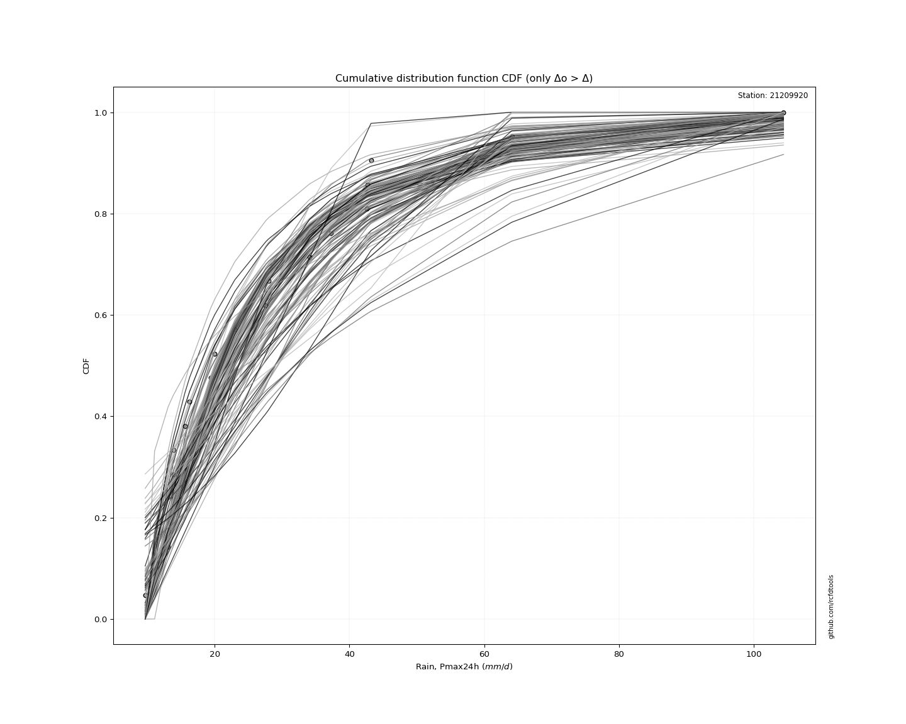</img>

</div>


**1.3. Best fit**

<div align="center">

|   id |   station | empirical_dist   | p_dist    |    delta |   deltao | eval   |   fit |   n |   best_fit |   best_fit_sort |
|-----:|----------:|:-----------------|:----------|---------:|---------:|:-------|------:|----:|-----------:|----------------:|
|    0 |  21209920 | edf_california   | logburr12 | 0.081408 | 0.302825 | Δo > Δ |     1 |  21 |          1 |               1 |

</div>


<div align="center">

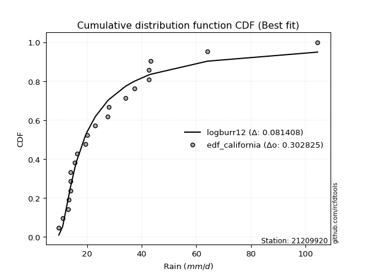</img>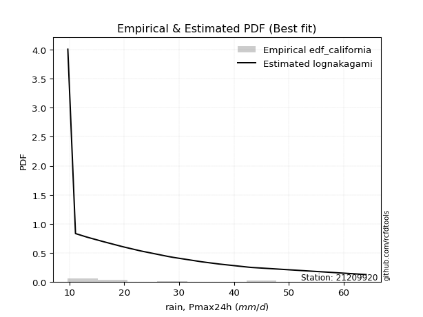</img>

</div>


### 2. EDF Hazen (1930)

Hazen method for plotting positions is a formula used to estimate the empirical cumulative probability distribution of flood events or other hydrological data. This formula often results in biased estimations, particularly when extrapolating to extreme events (high return periods).

<div align="center">


$P=(m-0.5)/n$


</div>


**2.1. Empirical values**

<div align="center">

|                | 0                    | 1                   | 2                   | 3                   | 4                   | 5                  | 6                   | 7                   | 8                   | 9                  | 10        | 11                 | 12                 | 13                 | 14                 | 15                 | 16                 | 17                 | 18                 | 19                 | 20                 |
|:---------------|:---------------------|:--------------------|:--------------------|:--------------------|:--------------------|:-------------------|:--------------------|:--------------------|:--------------------|:-------------------|:----------|:-------------------|:-------------------|:-------------------|:-------------------|:-------------------|:-------------------|:-------------------|:-------------------|:-------------------|:-------------------|
| date           | 2017                 | 2016                | 2019                | 2018                | 2015                | 2021               | 2023                | 2014                | 2013                | 2022               | 2020      | 2006               | 2025               | 2005               | 2009               | 2007               | 2011               | 2010               | 2008               | 2012               | 2024               |
| x              | 9.7                  | 11.1                | 13.1                | 13.4                | 13.9                | 13.9               | 13.9                | 15.6                | 16.3                | 19.4               | 20.0      | 23.0               | 27.6               | 28.0               | 34.1               | 37.3               | 42.6               | 42.7               | 43.2               | 64.1               | 104.4              |
| m              | 1                    | 2                   | 3                   | 4                   | 5                   | 6                  | 7                   | 8                   | 9                   | 10                 | 11        | 12                 | 13                 | 14                 | 15                 | 16                 | 17                 | 18                 | 19                 | 20                 | 21                 |
| empirical_dist | edf_hazen            | edf_hazen           | edf_hazen           | edf_hazen           | edf_hazen           | edf_hazen          | edf_hazen           | edf_hazen           | edf_hazen           | edf_hazen          | edf_hazen | edf_hazen          | edf_hazen          | edf_hazen          | edf_hazen          | edf_hazen          | edf_hazen          | edf_hazen          | edf_hazen          | edf_hazen          | edf_hazen          |
| empirical      | 0.023809523809523808 | 0.07142857142857142 | 0.11904761904761904 | 0.16666666666666666 | 0.21428571428571427 | 0.2619047619047619 | 0.30952380952380953 | 0.35714285714285715 | 0.40476190476190477 | 0.4523809523809524 | 0.5       | 0.5476190476190477 | 0.5952380952380952 | 0.6428571428571429 | 0.6904761904761905 | 0.7380952380952381 | 0.7857142857142857 | 0.8333333333333334 | 0.8809523809523809 | 0.9285714285714286 | 0.9761904761904762 |
| empirical_tr   | 1.024390243902439    | 1.0769230769230769  | 1.135135135135135   | 1.2                 | 1.2727272727272727  | 1.3548387096774193 | 1.4482758620689655  | 1.5555555555555558  | 1.68                | 1.826086956521739  | 2.0       | 2.210526315789474  | 2.4705882352941178 | 2.8000000000000003 | 3.230769230769231  | 3.818181818181819  | 4.666666666666666  | 6.000000000000002  | 8.399999999999999  | 14.000000000000007 | 41.99999999999995  |

</div>


**2.2. Kolmogorov-Smirnov fit test (sorted by Δ)**


<div align="center">

|                | 0                   | 1                   | 2                   | 3                   | 4                   | 5                   | 6                   | 7                   | 8                   | 9                   | 10                  | 11                  | 12                  | 13                  | 14                  | 15                  | 16                  | 17                  | 18                  | 19                  | 20                  | 21                  | 22                  | 23                  | 24                  | 25                  | 26                  | 27                  | 28                  | 29                  | 30                  | 31                  | 32                  | 33                  | 34                  | 35                  | 36                  | 37                  | 38                  | 39                  | 40                  | 41                  | 42                  | 43                  | 44                  | 45                  | 46                  | 47                  | 48                  | 49                  | 50                  | 51                  | 52                  | 53                  | 54                  | 55                  | 56                  | 57                  | 58                  | 59                  | 60                  | 61                  | 62                  | 63                  | 64                  | 65                  | 66                  | 67                  | 68                  | 69                  | 70                  | 71                  | 72                  | 73                  | 74                  | 75                  | 76                  | 77                  | 78                  | 79                  | 80                  | 81                  | 82                  | 83                  | 84                  | 85                  | 86                  | 87                  | 88                  | 89                  | 90                  | 91                  | 92                  | 93                  | 94                  | 95                  | 96                  | 97                  | 98                  | 99                  | 100                 | 101                 | 102                 | 103                 | 104                 | 105                 | 106                 | 107                 | 108                 | 109                 | 110                 | 111                 | 112                 | 113                 | 114                 | 115                 | 116                 | 117                 | 118                 | 119                 | 120                 | 121                 | 122                 | 123                 | 124                 | 125                 | 126                 | 127                 | 128                 | 129                 | 130                 | 131                 | 132                 | 133                 | 134                 | 135                 | 136                 | 137                 | 138                 | 139                 | 140                 | 141                 | 142                 | 143                 | 144                 | 145                 | 146                 | 147                 | 148                 | 149                 | 150                 | 151                 | 152                 | 153                 | 154                 | 155                 | 156                 | 157                 | 158                 | 159                 |
|:---------------|:--------------------|:--------------------|:--------------------|:--------------------|:--------------------|:--------------------|:--------------------|:--------------------|:--------------------|:--------------------|:--------------------|:--------------------|:--------------------|:--------------------|:--------------------|:--------------------|:--------------------|:--------------------|:--------------------|:--------------------|:--------------------|:--------------------|:--------------------|:--------------------|:--------------------|:--------------------|:--------------------|:--------------------|:--------------------|:--------------------|:--------------------|:--------------------|:--------------------|:--------------------|:--------------------|:--------------------|:--------------------|:--------------------|:--------------------|:--------------------|:--------------------|:--------------------|:--------------------|:--------------------|:--------------------|:--------------------|:--------------------|:--------------------|:--------------------|:--------------------|:--------------------|:--------------------|:--------------------|:--------------------|:--------------------|:--------------------|:--------------------|:--------------------|:--------------------|:--------------------|:--------------------|:--------------------|:--------------------|:--------------------|:--------------------|:--------------------|:--------------------|:--------------------|:--------------------|:--------------------|:--------------------|:--------------------|:--------------------|:--------------------|:--------------------|:--------------------|:--------------------|:--------------------|:--------------------|:--------------------|:--------------------|:--------------------|:--------------------|:--------------------|:--------------------|:--------------------|:--------------------|:--------------------|:--------------------|:--------------------|:--------------------|:--------------------|:--------------------|:--------------------|:--------------------|:--------------------|:--------------------|:--------------------|:--------------------|:--------------------|:--------------------|:--------------------|:--------------------|:--------------------|:--------------------|:--------------------|:--------------------|:--------------------|:--------------------|:--------------------|:--------------------|:--------------------|:--------------------|:--------------------|:--------------------|:--------------------|:--------------------|:--------------------|:--------------------|:--------------------|:--------------------|:--------------------|:--------------------|:--------------------|:--------------------|:--------------------|:--------------------|:--------------------|:--------------------|:--------------------|:--------------------|:--------------------|:--------------------|:--------------------|:--------------------|:--------------------|:--------------------|:--------------------|:--------------------|:--------------------|:--------------------|:--------------------|:--------------------|:--------------------|:--------------------|:--------------------|:--------------------|:--------------------|:--------------------|:--------------------|:--------------------|:--------------------|:--------------------|:--------------------|:--------------------|:--------------------|:--------------------|:--------------------|:--------------------|:--------------------|
| station        | 21209920            | 21209920            | 21209920            | 21209920            | 21209920            | 21209920            | 21209920            | 21209920            | 21209920            | 21209920            | 21209920            | 21209920            | 21209920            | 21209920            | 21209920            | 21209920            | 21209920            | 21209920            | 21209920            | 21209920            | 21209920            | 21209920            | 21209920            | 21209920            | 21209920            | 21209920            | 21209920            | 21209920            | 21209920            | 21209920            | 21209920            | 21209920            | 21209920            | 21209920            | 21209920            | 21209920            | 21209920            | 21209920            | 21209920            | 21209920            | 21209920            | 21209920            | 21209920            | 21209920            | 21209920            | 21209920            | 21209920            | 21209920            | 21209920            | 21209920            | 21209920            | 21209920            | 21209920            | 21209920            | 21209920            | 21209920            | 21209920            | 21209920            | 21209920            | 21209920            | 21209920            | 21209920            | 21209920            | 21209920            | 21209920            | 21209920            | 21209920            | 21209920            | 21209920            | 21209920            | 21209920            | 21209920            | 21209920            | 21209920            | 21209920            | 21209920            | 21209920            | 21209920            | 21209920            | 21209920            | 21209920            | 21209920            | 21209920            | 21209920            | 21209920            | 21209920            | 21209920            | 21209920            | 21209920            | 21209920            | 21209920            | 21209920            | 21209920            | 21209920            | 21209920            | 21209920            | 21209920            | 21209920            | 21209920            | 21209920            | 21209920            | 21209920            | 21209920            | 21209920            | 21209920            | 21209920            | 21209920            | 21209920            | 21209920            | 21209920            | 21209920            | 21209920            | 21209920            | 21209920            | 21209920            | 21209920            | 21209920            | 21209920            | 21209920            | 21209920            | 21209920            | 21209920            | 21209920            | 21209920            | 21209920            | 21209920            | 21209920            | 21209920            | 21209920            | 21209920            | 21209920            | 21209920            | 21209920            | 21209920            | 21209920            | 21209920            | 21209920            | 21209920            | 21209920            | 21209920            | 21209920            | 21209920            | 21209920            | 21209920            | 21209920            | 21209920            | 21209920            | 21209920            | 21209920            | 21209920            | 21209920            | 21209920            | 21209920            | 21209920            | 21209920            | 21209920            | 21209920            | 21209920            | 21209920            | 21209920            |
| empirical_dist | edf_hazen           | edf_hazen           | edf_hazen           | edf_hazen           | edf_hazen           | edf_hazen           | edf_hazen           | edf_hazen           | edf_hazen           | edf_hazen           | edf_hazen           | edf_hazen           | edf_hazen           | edf_hazen           | edf_hazen           | edf_hazen           | edf_hazen           | edf_hazen           | edf_hazen           | edf_hazen           | edf_hazen           | edf_hazen           | edf_hazen           | edf_hazen           | edf_hazen           | edf_hazen           | edf_hazen           | edf_hazen           | edf_hazen           | edf_hazen           | edf_hazen           | edf_hazen           | edf_hazen           | edf_hazen           | edf_hazen           | edf_hazen           | edf_hazen           | edf_hazen           | edf_hazen           | edf_hazen           | edf_hazen           | edf_hazen           | edf_hazen           | edf_hazen           | edf_hazen           | edf_hazen           | edf_hazen           | edf_hazen           | edf_hazen           | edf_hazen           | edf_hazen           | edf_hazen           | edf_hazen           | edf_hazen           | edf_hazen           | edf_hazen           | edf_hazen           | edf_hazen           | edf_hazen           | edf_hazen           | edf_hazen           | edf_hazen           | edf_hazen           | edf_hazen           | edf_hazen           | edf_hazen           | edf_hazen           | edf_hazen           | edf_hazen           | edf_hazen           | edf_hazen           | edf_hazen           | edf_hazen           | edf_hazen           | edf_hazen           | edf_hazen           | edf_hazen           | edf_hazen           | edf_hazen           | edf_hazen           | edf_hazen           | edf_hazen           | edf_hazen           | edf_hazen           | edf_hazen           | edf_hazen           | edf_hazen           | edf_hazen           | edf_hazen           | edf_hazen           | edf_hazen           | edf_hazen           | edf_hazen           | edf_hazen           | edf_hazen           | edf_hazen           | edf_hazen           | edf_hazen           | edf_hazen           | edf_hazen           | edf_hazen           | edf_hazen           | edf_hazen           | edf_hazen           | edf_hazen           | edf_hazen           | edf_hazen           | edf_hazen           | edf_hazen           | edf_hazen           | edf_hazen           | edf_hazen           | edf_hazen           | edf_hazen           | edf_hazen           | edf_hazen           | edf_hazen           | edf_hazen           | edf_hazen           | edf_hazen           | edf_hazen           | edf_hazen           | edf_hazen           | edf_hazen           | edf_hazen           | edf_hazen           | edf_hazen           | edf_hazen           | edf_hazen           | edf_hazen           | edf_hazen           | edf_hazen           | edf_hazen           | edf_hazen           | edf_hazen           | edf_hazen           | edf_hazen           | edf_hazen           | edf_hazen           | edf_hazen           | edf_hazen           | edf_hazen           | edf_hazen           | edf_hazen           | edf_hazen           | edf_hazen           | edf_hazen           | edf_hazen           | edf_hazen           | edf_hazen           | edf_hazen           | edf_hazen           | edf_hazen           | edf_hazen           | edf_hazen           | edf_hazen           | edf_hazen           | edf_hazen           | edf_hazen           | edf_hazen           |
| p_dist         | fatiguelife         | logfoldnorm         | loggenexpon         | genpareto           | loghalfgennorm      | logjohnsonsb        | halfgennorm         | johnsonsb           | invgauss            | lomax               | johnsonsu           | loghalfnorm         | loggamma            | loggamma            | logerlang           | logweibull_min      | logdgamma           | logsemicircular     | loggompertz         | alpha               | logskewnorm         | mielke              | burr                | lograyleigh         | f                   | logfatiguelife      | invweibull          | genextreme          | kappa3              | betaprime           | invgamma            | truncpareto         | loginvgauss         | logkappa3           | logf                | gengamma            | loganglit           | logjohnsonsu        | logmaxwell          | burr12              | logexponnorm        | logburr12           | logburr             | logpearson3         | loginvgamma         | logbetaprime        | logmielke           | logvonmises_line    | loginvweibull       | loggenextreme       | exponnorm           | logalpha            | logncf              | nct                 | genexpon            | logkstwobign        | exponweib           | logweibull_max      | lognct              | loggenlogistic      | logdweibull         | loghalflogistic     | pearson3            | logtriang           | ncf                 | weibull_min         | logbeta             | loggumbel_r         | logvonmises         | exponpow            | logtukeylambda      | logcrystalball      | lognorm             | logt                | gausshyper          | logloggamma         | logrice             | gamma               | logtruncweibull_min | wald                | lognakagami         | gompertz            | moyal               | logmoyal            | loggausshyper       | logloglaplace       | loggennorm          | logtruncnorm        | logtruncexpon       | logarcsine          | truncnorm           | loglogistic         | logcosine           | gumbel_r            | halflogistic        | genlogistic         | beta                | logexponweib        | logrdist            | crystalball         | norm                | loghypsecant        | loggengamma         | t                   | loglomax            | logbradford         | loggumbel_l         | kstwobign           | dweibull            | maxwell             | logistic            | genhalflogistic     | rayleigh            | cosine              | erlang              | halfnorm            | loglaplace          | loglaplace          | logtruncpareto      | hypsecant           | anglit              | dgamma              | rice                | semicircular        | nakagami            | logexponpow         | vonmises_line       | gennorm             | laplace             | skewnorm            | gumbel_l            | foldnorm            | logargus            | loguniform          | logkappa4           | arcsine             | logksone            | truncweibull_min    | bradford            | logwald             | powerlaw            | triang              | truncexpon          | logwrapcauchy       | logpowerlaw         | loggenpareto        | loggenhalflogistic  | wrapcauchy          | argus               | loglevy_l           | kappa4              | ksone               | logtrapezoid        | levy_l              | uniform             | rdist               | tukeylambda         | trapezoid           | weibull_max         | vonmises            |
| delta          | 0.07571986381393819 | 0.07725172802448566 | 0.07927607594234287 | 0.0799811998122214  | 0.08005877795537553 | 0.08044314657434912 | 0.08377263775035504 | 0.08422320930389907 | 0.0842533177335916  | 0.08488905983295567 | 0.08534474599607611 | 0.08578779253509689 | 0.08679098512478103 | 0.08679098512478103 | 0.08679181268267744 | 0.08812480480076762 | 0.09007526328989576 | 0.09070877846100053 | 0.09133765744624475 | 0.09187926409562833 | 0.09379157508042163 | 0.09425578164125628 | 0.09481872317143297 | 0.09495019749992925 | 0.09506396487736113 | 0.09628978319772746 | 0.09654959747791145 | 0.09654992235512569 | 0.0975075489779571  | 0.09777541728025763 | 0.0978600375640834  | 0.09799601644292216 | 0.09900797269471426 | 0.10032719556685471 | 0.10048353278360422 | 0.10067183092547638 | 0.1018812475110259  | 0.10196279002329334 | 0.10285059861056467 | 0.10440155762122305 | 0.10446300324178992 | 0.10452422039880893 | 0.10772337822192771 | 0.10776745574858981 | 0.10785296337096761 | 0.10787635709821985 | 0.10835694954843689 | 0.10904127078981524 | 0.11077988674026504 | 0.11078404091043731 | 0.1124474346265747  | 0.11309067040434292 | 0.11333752410261955 | 0.11355333071450999 | 0.11411125184118598 | 0.11412384331189468 | 0.11426339940403621 | 0.11440493582230152 | 0.1145145246034277  | 0.11466065893288047 | 0.11478730639834972 | 0.11718221297276235 | 0.11954696549298044 | 0.1196485630530923  | 0.12012372756235329 | 0.12095419321649964 | 0.12199432184898498 | 0.1221931958409728  | 0.12239139649975406 | 0.12306253868227249 | 0.12662348156621273 | 0.12808408216068895 | 0.1280841534155009  | 0.12808553001115297 | 0.12875823101644257 | 0.12917321951383864 | 0.130074140485084   | 0.13057457996114752 | 0.13071547893844537 | 0.13074912303752054 | 0.13143072390283148 | 0.13422499539358768 | 0.13520073186174278 | 0.1373535359019884  | 0.13833851504980466 | 0.13881532658485873 | 0.14402228588087973 | 0.14428700507073802 | 0.14468218726548654 | 0.14688228680270446 | 0.14806942740145795 | 0.15032948601474738 | 0.15149878353555796 | 0.1523887034986263  | 0.15271851396351774 | 0.15347915424984537 | 0.15864897287335009 | 0.15951981991142092 | 0.16483003462862644 | 0.16556959016882342 | 0.1655695941494019  | 0.1657517293027731  | 0.16996484654053431 | 0.17172984887228585 | 0.17343454496692903 | 0.1737601841393358  | 0.17387401734562954 | 0.17595555487247727 | 0.17599908673466175 | 0.17640057701939785 | 0.17718928074716378 | 0.1799600080739274  | 0.18081614474459978 | 0.18152965516556174 | 0.18201719904929506 | 0.18695154989202903 | 0.18853077956200842 | 0.18853077956200842 | 0.1903943858436508  | 0.19151169937436907 | 0.1931456845878088  | 0.20339364014594116 | 0.20441308144941928 | 0.2053452801387993  | 0.20547417464878026 | 0.21165888586968398 | 0.21208303513446092 | 0.21450336063483502 | 0.21939648773001902 | 0.22527209044274066 | 0.23031315546650089 | 0.23402195354245972 | 0.24535928305903454 | 0.25231207657453714 | 0.2566999107565542  | 0.2623542322397274  | 0.27375212730417775 | 0.28106806879540236 | 0.2813326178636236  | 0.2857718913096621  | 0.29919145496519506 | 0.30312251211802455 | 0.32524196992294907 | 0.3358782109464351  | 0.36499628380162186 | 0.37331630192425247 | 0.40562971405577924 | 0.4311646655384102  | 0.4442173368157506  | 0.4552989319625459  | 0.4880994643577395  | 0.502828480917182   | 0.5122602329219385  | 0.5228925662626626  | 0.5272037009101422  | 0.547315689430072   | 0.5742747908454237  | 0.7379746971745518  | 0.7912263131636519  | 15.849941067221382  |
| deltao         | 0.30282488509099936 | 0.30282488509099936 | 0.30282488509099936 | 0.30282488509099936 | 0.30282488509099936 | 0.30282488509099936 | 0.30282488509099936 | 0.30282488509099936 | 0.30282488509099936 | 0.30282488509099936 | 0.30282488509099936 | 0.30282488509099936 | 0.30282488509099936 | 0.30282488509099936 | 0.30282488509099936 | 0.30282488509099936 | 0.30282488509099936 | 0.30282488509099936 | 0.30282488509099936 | 0.30282488509099936 | 0.30282488509099936 | 0.30282488509099936 | 0.30282488509099936 | 0.30282488509099936 | 0.30282488509099936 | 0.30282488509099936 | 0.30282488509099936 | 0.30282488509099936 | 0.30282488509099936 | 0.30282488509099936 | 0.30282488509099936 | 0.30282488509099936 | 0.30282488509099936 | 0.30282488509099936 | 0.30282488509099936 | 0.30282488509099936 | 0.30282488509099936 | 0.30282488509099936 | 0.30282488509099936 | 0.30282488509099936 | 0.30282488509099936 | 0.30282488509099936 | 0.30282488509099936 | 0.30282488509099936 | 0.30282488509099936 | 0.30282488509099936 | 0.30282488509099936 | 0.30282488509099936 | 0.30282488509099936 | 0.30282488509099936 | 0.30282488509099936 | 0.30282488509099936 | 0.30282488509099936 | 0.30282488509099936 | 0.30282488509099936 | 0.30282488509099936 | 0.30282488509099936 | 0.30282488509099936 | 0.30282488509099936 | 0.30282488509099936 | 0.30282488509099936 | 0.30282488509099936 | 0.30282488509099936 | 0.30282488509099936 | 0.30282488509099936 | 0.30282488509099936 | 0.30282488509099936 | 0.30282488509099936 | 0.30282488509099936 | 0.30282488509099936 | 0.30282488509099936 | 0.30282488509099936 | 0.30282488509099936 | 0.30282488509099936 | 0.30282488509099936 | 0.30282488509099936 | 0.30282488509099936 | 0.30282488509099936 | 0.30282488509099936 | 0.30282488509099936 | 0.30282488509099936 | 0.30282488509099936 | 0.30282488509099936 | 0.30282488509099936 | 0.30282488509099936 | 0.30282488509099936 | 0.30282488509099936 | 0.30282488509099936 | 0.30282488509099936 | 0.30282488509099936 | 0.30282488509099936 | 0.30282488509099936 | 0.30282488509099936 | 0.30282488509099936 | 0.30282488509099936 | 0.30282488509099936 | 0.30282488509099936 | 0.30282488509099936 | 0.30282488509099936 | 0.30282488509099936 | 0.30282488509099936 | 0.30282488509099936 | 0.30282488509099936 | 0.30282488509099936 | 0.30282488509099936 | 0.30282488509099936 | 0.30282488509099936 | 0.30282488509099936 | 0.30282488509099936 | 0.30282488509099936 | 0.30282488509099936 | 0.30282488509099936 | 0.30282488509099936 | 0.30282488509099936 | 0.30282488509099936 | 0.30282488509099936 | 0.30282488509099936 | 0.30282488509099936 | 0.30282488509099936 | 0.30282488509099936 | 0.30282488509099936 | 0.30282488509099936 | 0.30282488509099936 | 0.30282488509099936 | 0.30282488509099936 | 0.30282488509099936 | 0.30282488509099936 | 0.30282488509099936 | 0.30282488509099936 | 0.30282488509099936 | 0.30282488509099936 | 0.30282488509099936 | 0.30282488509099936 | 0.30282488509099936 | 0.30282488509099936 | 0.30282488509099936 | 0.30282488509099936 | 0.30282488509099936 | 0.30282488509099936 | 0.30282488509099936 | 0.30282488509099936 | 0.30282488509099936 | 0.30282488509099936 | 0.30282488509099936 | 0.30282488509099936 | 0.30282488509099936 | 0.30282488509099936 | 0.30282488509099936 | 0.30282488509099936 | 0.30282488509099936 | 0.30282488509099936 | 0.30282488509099936 | 0.30282488509099936 | 0.30282488509099936 | 0.30282488509099936 | 0.30282488509099936 | 0.30282488509099936 | 0.30282488509099936 | 0.30282488509099936 | 0.30282488509099936 |
| eval           | Δo > Δ              | Δo > Δ              | Δo > Δ              | Δo > Δ              | Δo > Δ              | Δo > Δ              | Δo > Δ              | Δo > Δ              | Δo > Δ              | Δo > Δ              | Δo > Δ              | Δo > Δ              | Δo > Δ              | Δo > Δ              | Δo > Δ              | Δo > Δ              | Δo > Δ              | Δo > Δ              | Δo > Δ              | Δo > Δ              | Δo > Δ              | Δo > Δ              | Δo > Δ              | Δo > Δ              | Δo > Δ              | Δo > Δ              | Δo > Δ              | Δo > Δ              | Δo > Δ              | Δo > Δ              | Δo > Δ              | Δo > Δ              | Δo > Δ              | Δo > Δ              | Δo > Δ              | Δo > Δ              | Δo > Δ              | Δo > Δ              | Δo > Δ              | Δo > Δ              | Δo > Δ              | Δo > Δ              | Δo > Δ              | Δo > Δ              | Δo > Δ              | Δo > Δ              | Δo > Δ              | Δo > Δ              | Δo > Δ              | Δo > Δ              | Δo > Δ              | Δo > Δ              | Δo > Δ              | Δo > Δ              | Δo > Δ              | Δo > Δ              | Δo > Δ              | Δo > Δ              | Δo > Δ              | Δo > Δ              | Δo > Δ              | Δo > Δ              | Δo > Δ              | Δo > Δ              | Δo > Δ              | Δo > Δ              | Δo > Δ              | Δo > Δ              | Δo > Δ              | Δo > Δ              | Δo > Δ              | Δo > Δ              | Δo > Δ              | Δo > Δ              | Δo > Δ              | Δo > Δ              | Δo > Δ              | Δo > Δ              | Δo > Δ              | Δo > Δ              | Δo > Δ              | Δo > Δ              | Δo > Δ              | Δo > Δ              | Δo > Δ              | Δo > Δ              | Δo > Δ              | Δo > Δ              | Δo > Δ              | Δo > Δ              | Δo > Δ              | Δo > Δ              | Δo > Δ              | Δo > Δ              | Δo > Δ              | Δo > Δ              | Δo > Δ              | Δo > Δ              | Δo > Δ              | Δo > Δ              | Δo > Δ              | Δo > Δ              | Δo > Δ              | Δo > Δ              | Δo > Δ              | Δo > Δ              | Δo > Δ              | Δo > Δ              | Δo > Δ              | Δo > Δ              | Δo > Δ              | Δo > Δ              | Δo > Δ              | Δo > Δ              | Δo > Δ              | Δo > Δ              | Δo > Δ              | Δo > Δ              | Δo > Δ              | Δo > Δ              | Δo > Δ              | Δo > Δ              | Δo > Δ              | Δo > Δ              | Δo > Δ              | Δo > Δ              | Δo > Δ              | Δo > Δ              | Δo > Δ              | Δo > Δ              | Δo > Δ              | Δo > Δ              | Δo > Δ              | Δo > Δ              | Δo > Δ              | Δo > Δ              | Δo > Δ              | Δo > Δ              | Δo > Δ              | Δo > Δ              | Δo > Δ              | Δo <= Δ             | Δo <= Δ             | Δo <= Δ             | Δo <= Δ             | Δo <= Δ             | Δo <= Δ             | Δo <= Δ             | Δo <= Δ             | Δo <= Δ             | Δo <= Δ             | Δo <= Δ             | Δo <= Δ             | Δo <= Δ             | Δo <= Δ             | Δo <= Δ             | Δo <= Δ             | Δo <= Δ             | Δo <= Δ             | Δo <= Δ             |
| fit            | 1                   | 1                   | 1                   | 1                   | 1                   | 1                   | 1                   | 1                   | 1                   | 1                   | 1                   | 1                   | 1                   | 1                   | 1                   | 1                   | 1                   | 1                   | 1                   | 1                   | 1                   | 1                   | 1                   | 1                   | 1                   | 1                   | 1                   | 1                   | 1                   | 1                   | 1                   | 1                   | 1                   | 1                   | 1                   | 1                   | 1                   | 1                   | 1                   | 1                   | 1                   | 1                   | 1                   | 1                   | 1                   | 1                   | 1                   | 1                   | 1                   | 1                   | 1                   | 1                   | 1                   | 1                   | 1                   | 1                   | 1                   | 1                   | 1                   | 1                   | 1                   | 1                   | 1                   | 1                   | 1                   | 1                   | 1                   | 1                   | 1                   | 1                   | 1                   | 1                   | 1                   | 1                   | 1                   | 1                   | 1                   | 1                   | 1                   | 1                   | 1                   | 1                   | 1                   | 1                   | 1                   | 1                   | 1                   | 1                   | 1                   | 1                   | 1                   | 1                   | 1                   | 1                   | 1                   | 1                   | 1                   | 1                   | 1                   | 1                   | 1                   | 1                   | 1                   | 1                   | 1                   | 1                   | 1                   | 1                   | 1                   | 1                   | 1                   | 1                   | 1                   | 1                   | 1                   | 1                   | 1                   | 1                   | 1                   | 1                   | 1                   | 1                   | 1                   | 1                   | 1                   | 1                   | 1                   | 1                   | 1                   | 1                   | 1                   | 1                   | 1                   | 1                   | 1                   | 1                   | 1                   | 1                   | 1                   | 1                   | 1                   | 0                   | 0                   | 0                   | 0                   | 0                   | 0                   | 0                   | 0                   | 0                   | 0                   | 0                   | 0                   | 0                   | 0                   | 0                   | 0                   | 0                   | 0                   | 0                   |
| n              | 21                  | 21                  | 21                  | 21                  | 21                  | 21                  | 21                  | 21                  | 21                  | 21                  | 21                  | 21                  | 21                  | 21                  | 21                  | 21                  | 21                  | 21                  | 21                  | 21                  | 21                  | 21                  | 21                  | 21                  | 21                  | 21                  | 21                  | 21                  | 21                  | 21                  | 21                  | 21                  | 21                  | 21                  | 21                  | 21                  | 21                  | 21                  | 21                  | 21                  | 21                  | 21                  | 21                  | 21                  | 21                  | 21                  | 21                  | 21                  | 21                  | 21                  | 21                  | 21                  | 21                  | 21                  | 21                  | 21                  | 21                  | 21                  | 21                  | 21                  | 21                  | 21                  | 21                  | 21                  | 21                  | 21                  | 21                  | 21                  | 21                  | 21                  | 21                  | 21                  | 21                  | 21                  | 21                  | 21                  | 21                  | 21                  | 21                  | 21                  | 21                  | 21                  | 21                  | 21                  | 21                  | 21                  | 21                  | 21                  | 21                  | 21                  | 21                  | 21                  | 21                  | 21                  | 21                  | 21                  | 21                  | 21                  | 21                  | 21                  | 21                  | 21                  | 21                  | 21                  | 21                  | 21                  | 21                  | 21                  | 21                  | 21                  | 21                  | 21                  | 21                  | 21                  | 21                  | 21                  | 21                  | 21                  | 21                  | 21                  | 21                  | 21                  | 21                  | 21                  | 21                  | 21                  | 21                  | 21                  | 21                  | 21                  | 21                  | 21                  | 21                  | 21                  | 21                  | 21                  | 21                  | 21                  | 21                  | 21                  | 21                  | 21                  | 21                  | 21                  | 21                  | 21                  | 21                  | 21                  | 21                  | 21                  | 21                  | 21                  | 21                  | 21                  | 21                  | 21                  | 21                  | 21                  | 21                  | 21                  |
| best_fit       | 1                   | 0                   | 0                   | 0                   | 0                   | 0                   | 0                   | 0                   | 0                   | 0                   | 0                   | 0                   | 0                   | 0                   | 0                   | 0                   | 0                   | 0                   | 0                   | 0                   | 0                   | 0                   | 0                   | 0                   | 0                   | 0                   | 0                   | 0                   | 0                   | 0                   | 0                   | 0                   | 0                   | 0                   | 0                   | 0                   | 0                   | 0                   | 0                   | 0                   | 0                   | 0                   | 0                   | 0                   | 0                   | 0                   | 0                   | 0                   | 0                   | 0                   | 0                   | 0                   | 0                   | 0                   | 0                   | 0                   | 0                   | 0                   | 0                   | 0                   | 0                   | 0                   | 0                   | 0                   | 0                   | 0                   | 0                   | 0                   | 0                   | 0                   | 0                   | 0                   | 0                   | 0                   | 0                   | 0                   | 0                   | 0                   | 0                   | 0                   | 0                   | 0                   | 0                   | 0                   | 0                   | 0                   | 0                   | 0                   | 0                   | 0                   | 0                   | 0                   | 0                   | 0                   | 0                   | 0                   | 0                   | 0                   | 0                   | 0                   | 0                   | 0                   | 0                   | 0                   | 0                   | 0                   | 0                   | 0                   | 0                   | 0                   | 0                   | 0                   | 0                   | 0                   | 0                   | 0                   | 0                   | 0                   | 0                   | 0                   | 0                   | 0                   | 0                   | 0                   | 0                   | 0                   | 0                   | 0                   | 0                   | 0                   | 0                   | 0                   | 0                   | 0                   | 0                   | 0                   | 0                   | 0                   | 0                   | 0                   | 0                   | 0                   | 0                   | 0                   | 0                   | 0                   | 0                   | 0                   | 0                   | 0                   | 0                   | 0                   | 0                   | 0                   | 0                   | 0                   | 0                   | 0                   | 0                   | 0                   |
| best_fit_sort  | 1                   | 2                   | 3                   | 4                   | 5                   | 6                   | 7                   | 8                   | 9                   | 10                  | 11                  | 12                  | 13                  | 14                  | 15                  | 16                  | 17                  | 18                  | 19                  | 20                  | 21                  | 22                  | 23                  | 24                  | 25                  | 26                  | 27                  | 28                  | 29                  | 30                  | 31                  | 32                  | 33                  | 34                  | 35                  | 36                  | 37                  | 38                  | 39                  | 40                  | 41                  | 42                  | 43                  | 44                  | 45                  | 46                  | 47                  | 48                  | 49                  | 50                  | 51                  | 52                  | 53                  | 54                  | 55                  | 56                  | 57                  | 58                  | 59                  | 60                  | 61                  | 62                  | 63                  | 64                  | 65                  | 66                  | 67                  | 68                  | 69                  | 70                  | 71                  | 72                  | 73                  | 74                  | 75                  | 76                  | 77                  | 78                  | 79                  | 80                  | 81                  | 82                  | 83                  | 84                  | 85                  | 86                  | 87                  | 88                  | 89                  | 90                  | 91                  | 92                  | 93                  | 94                  | 95                  | 96                  | 97                  | 98                  | 99                  | 100                 | 101                 | 102                 | 103                 | 104                 | 105                 | 106                 | 107                 | 108                 | 109                 | 110                 | 111                 | 112                 | 113                 | 114                 | 115                 | 116                 | 117                 | 118                 | 119                 | 120                 | 121                 | 122                 | 123                 | 124                 | 125                 | 126                 | 127                 | 128                 | 129                 | 130                 | 131                 | 132                 | 133                 | 134                 | 135                 | 136                 | 137                 | 138                 | 139                 | 140                 | 141                 | 142                 | 143                 | 144                 | 145                 | 146                 | 147                 | 148                 | 149                 | 150                 | 151                 | 152                 | 153                 | 154                 | 155                 | 156                 | 157                 | 158                 | 159                 | 160                 |

</div>


<div align="center">

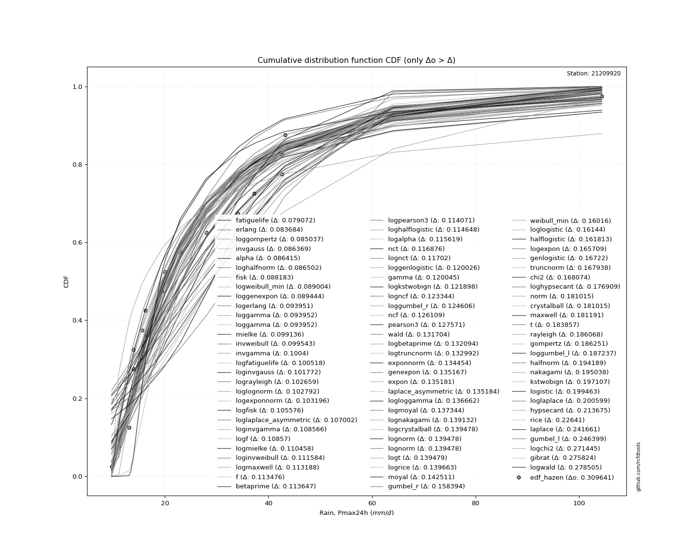</img>

</div>


**2.3. Best fit**

<div align="center">

|   id |   station | empirical_dist   | p_dist      |     delta |   deltao | eval   |   fit |   n |   best_fit |   best_fit_sort |
|-----:|----------:|:-----------------|:------------|----------:|---------:|:-------|------:|----:|-----------:|----------------:|
|    0 |  21209920 | edf_hazen        | fatiguelife | 0.0757199 | 0.302825 | Δo > Δ |     1 |  21 |          1 |               1 |

</div>


<div align="center">

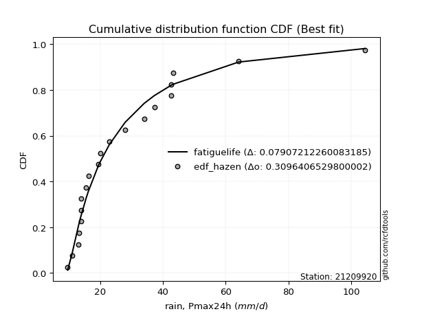</img></img>

</div>


### 3. EDF Weibull (1939)

Weibull plotting position formula is an empirical method used to estimate the non-exceedance probability or plotting position for a set of observed data, is often recommended or widely used in practice, particularly in flood frequency analysis.

<div align="center">


$P=m/(n+1)$


</div>


**3.1. Empirical values**

<div align="center">

|                | 0                    | 1                   | 2                   | 3                   | 4                   | 5                  | 6                  | 7                   | 8                  | 9                   | 10          | 11                 | 12                 | 13                 | 14                 | 15                 | 16                 | 17                 | 18                 | 19                 | 20                 |
|:---------------|:---------------------|:--------------------|:--------------------|:--------------------|:--------------------|:-------------------|:-------------------|:--------------------|:-------------------|:--------------------|:------------|:-------------------|:-------------------|:-------------------|:-------------------|:-------------------|:-------------------|:-------------------|:-------------------|:-------------------|:-------------------|
| date           | 2017                 | 2016                | 2019                | 2018                | 2015                | 2021               | 2023               | 2014                | 2013               | 2022                | 2020        | 2006               | 2025               | 2005               | 2009               | 2007               | 2011               | 2010               | 2008               | 2012               | 2024               |
| x              | 9.7                  | 11.1                | 13.1                | 13.4                | 13.9                | 13.9               | 13.9               | 15.6                | 16.3               | 19.4                | 20.0        | 23.0               | 27.6               | 28.0               | 34.1               | 37.3               | 42.6               | 42.7               | 43.2               | 64.1               | 104.4              |
| m              | 1                    | 2                   | 3                   | 4                   | 5                   | 6                  | 7                  | 8                   | 9                  | 10                  | 11          | 12                 | 13                 | 14                 | 15                 | 16                 | 17                 | 18                 | 19                 | 20                 | 21                 |
| empirical_dist | edf_weibull          | edf_weibull         | edf_weibull         | edf_weibull         | edf_weibull         | edf_weibull        | edf_weibull        | edf_weibull         | edf_weibull        | edf_weibull         | edf_weibull | edf_weibull        | edf_weibull        | edf_weibull        | edf_weibull        | edf_weibull        | edf_weibull        | edf_weibull        | edf_weibull        | edf_weibull        | edf_weibull        |
| empirical      | 0.045454545454545456 | 0.09090909090909091 | 0.13636363636363635 | 0.18181818181818182 | 0.22727272727272727 | 0.2727272727272727 | 0.3181818181818182 | 0.36363636363636365 | 0.4090909090909091 | 0.45454545454545453 | 0.5         | 0.5454545454545454 | 0.5909090909090909 | 0.6363636363636364 | 0.6818181818181818 | 0.7272727272727273 | 0.7727272727272727 | 0.8181818181818182 | 0.8636363636363636 | 0.9090909090909091 | 0.9545454545454546 |
| empirical_tr   | 1.0476190476190477   | 1.1                 | 1.1578947368421053  | 1.2222222222222223  | 1.2941176470588236  | 1.375              | 1.4666666666666666 | 1.5714285714285714  | 1.6923076923076925 | 1.8333333333333335  | 2.0         | 2.1999999999999997 | 2.4444444444444446 | 2.75               | 3.1428571428571423 | 3.666666666666667  | 4.3999999999999995 | 5.500000000000002  | 7.333333333333334  | 10.999999999999996 | 22.00000000000002  |

</div>


**3.2. Kolmogorov-Smirnov fit test (sorted by Δ)**


<div align="center">

|                | 0                   | 1                   | 2                   | 3                   | 4                   | 5                   | 6                   | 7                   | 8                   | 9                   | 10                  | 11                  | 12                  | 13                  | 14                  | 15                  | 16                  | 17                  | 18                  | 19                  | 20                  | 21                  | 22                  | 23                  | 24                  | 25                  | 26                  | 27                  | 28                  | 29                  | 30                  | 31                  | 32                  | 33                  | 34                  | 35                  | 36                  | 37                  | 38                  | 39                  | 40                  | 41                  | 42                  | 43                  | 44                  | 45                  | 46                  | 47                  | 48                  | 49                  | 50                  | 51                  | 52                  | 53                  | 54                  | 55                  | 56                  | 57                  | 58                  | 59                  | 60                  | 61                  | 62                  | 63                  | 64                  | 65                  | 66                  | 67                  | 68                  | 69                  | 70                  | 71                  | 72                  | 73                  | 74                  | 75                  | 76                  | 77                  | 78                  | 79                  | 80                  | 81                  | 82                  | 83                  | 84                  | 85                  | 86                  | 87                  | 88                  | 89                  | 90                  | 91                  | 92                  | 93                  | 94                  | 95                  | 96                  | 97                  | 98                  | 99                  | 100                 | 101                 | 102                 | 103                 | 104                 | 105                 | 106                 | 107                 | 108                 | 109                 | 110                 | 111                 | 112                 | 113                 | 114                 | 115                 | 116                 | 117                 | 118                 | 119                 | 120                 | 121                 | 122                 | 123                 | 124                 | 125                 | 126                 | 127                 | 128                 | 129                 | 130                 | 131                 | 132                 | 133                 | 134                 | 135                 | 136                 | 137                 | 138                 | 139                 | 140                 | 141                 | 142                 | 143                 | 144                 | 145                 | 146                 | 147                 | 148                 | 149                 | 150                 | 151                 | 152                 | 153                 | 154                 | 155                 | 156                 | 157                 | 158                 | 159                 |
|:---------------|:--------------------|:--------------------|:--------------------|:--------------------|:--------------------|:--------------------|:--------------------|:--------------------|:--------------------|:--------------------|:--------------------|:--------------------|:--------------------|:--------------------|:--------------------|:--------------------|:--------------------|:--------------------|:--------------------|:--------------------|:--------------------|:--------------------|:--------------------|:--------------------|:--------------------|:--------------------|:--------------------|:--------------------|:--------------------|:--------------------|:--------------------|:--------------------|:--------------------|:--------------------|:--------------------|:--------------------|:--------------------|:--------------------|:--------------------|:--------------------|:--------------------|:--------------------|:--------------------|:--------------------|:--------------------|:--------------------|:--------------------|:--------------------|:--------------------|:--------------------|:--------------------|:--------------------|:--------------------|:--------------------|:--------------------|:--------------------|:--------------------|:--------------------|:--------------------|:--------------------|:--------------------|:--------------------|:--------------------|:--------------------|:--------------------|:--------------------|:--------------------|:--------------------|:--------------------|:--------------------|:--------------------|:--------------------|:--------------------|:--------------------|:--------------------|:--------------------|:--------------------|:--------------------|:--------------------|:--------------------|:--------------------|:--------------------|:--------------------|:--------------------|:--------------------|:--------------------|:--------------------|:--------------------|:--------------------|:--------------------|:--------------------|:--------------------|:--------------------|:--------------------|:--------------------|:--------------------|:--------------------|:--------------------|:--------------------|:--------------------|:--------------------|:--------------------|:--------------------|:--------------------|:--------------------|:--------------------|:--------------------|:--------------------|:--------------------|:--------------------|:--------------------|:--------------------|:--------------------|:--------------------|:--------------------|:--------------------|:--------------------|:--------------------|:--------------------|:--------------------|:--------------------|:--------------------|:--------------------|:--------------------|:--------------------|:--------------------|:--------------------|:--------------------|:--------------------|:--------------------|:--------------------|:--------------------|:--------------------|:--------------------|:--------------------|:--------------------|:--------------------|:--------------------|:--------------------|:--------------------|:--------------------|:--------------------|:--------------------|:--------------------|:--------------------|:--------------------|:--------------------|:--------------------|:--------------------|:--------------------|:--------------------|:--------------------|:--------------------|:--------------------|:--------------------|:--------------------|:--------------------|:--------------------|:--------------------|:--------------------|
| station        | 21209920            | 21209920            | 21209920            | 21209920            | 21209920            | 21209920            | 21209920            | 21209920            | 21209920            | 21209920            | 21209920            | 21209920            | 21209920            | 21209920            | 21209920            | 21209920            | 21209920            | 21209920            | 21209920            | 21209920            | 21209920            | 21209920            | 21209920            | 21209920            | 21209920            | 21209920            | 21209920            | 21209920            | 21209920            | 21209920            | 21209920            | 21209920            | 21209920            | 21209920            | 21209920            | 21209920            | 21209920            | 21209920            | 21209920            | 21209920            | 21209920            | 21209920            | 21209920            | 21209920            | 21209920            | 21209920            | 21209920            | 21209920            | 21209920            | 21209920            | 21209920            | 21209920            | 21209920            | 21209920            | 21209920            | 21209920            | 21209920            | 21209920            | 21209920            | 21209920            | 21209920            | 21209920            | 21209920            | 21209920            | 21209920            | 21209920            | 21209920            | 21209920            | 21209920            | 21209920            | 21209920            | 21209920            | 21209920            | 21209920            | 21209920            | 21209920            | 21209920            | 21209920            | 21209920            | 21209920            | 21209920            | 21209920            | 21209920            | 21209920            | 21209920            | 21209920            | 21209920            | 21209920            | 21209920            | 21209920            | 21209920            | 21209920            | 21209920            | 21209920            | 21209920            | 21209920            | 21209920            | 21209920            | 21209920            | 21209920            | 21209920            | 21209920            | 21209920            | 21209920            | 21209920            | 21209920            | 21209920            | 21209920            | 21209920            | 21209920            | 21209920            | 21209920            | 21209920            | 21209920            | 21209920            | 21209920            | 21209920            | 21209920            | 21209920            | 21209920            | 21209920            | 21209920            | 21209920            | 21209920            | 21209920            | 21209920            | 21209920            | 21209920            | 21209920            | 21209920            | 21209920            | 21209920            | 21209920            | 21209920            | 21209920            | 21209920            | 21209920            | 21209920            | 21209920            | 21209920            | 21209920            | 21209920            | 21209920            | 21209920            | 21209920            | 21209920            | 21209920            | 21209920            | 21209920            | 21209920            | 21209920            | 21209920            | 21209920            | 21209920            | 21209920            | 21209920            | 21209920            | 21209920            | 21209920            | 21209920            |
| empirical_dist | edf_weibull         | edf_weibull         | edf_weibull         | edf_weibull         | edf_weibull         | edf_weibull         | edf_weibull         | edf_weibull         | edf_weibull         | edf_weibull         | edf_weibull         | edf_weibull         | edf_weibull         | edf_weibull         | edf_weibull         | edf_weibull         | edf_weibull         | edf_weibull         | edf_weibull         | edf_weibull         | edf_weibull         | edf_weibull         | edf_weibull         | edf_weibull         | edf_weibull         | edf_weibull         | edf_weibull         | edf_weibull         | edf_weibull         | edf_weibull         | edf_weibull         | edf_weibull         | edf_weibull         | edf_weibull         | edf_weibull         | edf_weibull         | edf_weibull         | edf_weibull         | edf_weibull         | edf_weibull         | edf_weibull         | edf_weibull         | edf_weibull         | edf_weibull         | edf_weibull         | edf_weibull         | edf_weibull         | edf_weibull         | edf_weibull         | edf_weibull         | edf_weibull         | edf_weibull         | edf_weibull         | edf_weibull         | edf_weibull         | edf_weibull         | edf_weibull         | edf_weibull         | edf_weibull         | edf_weibull         | edf_weibull         | edf_weibull         | edf_weibull         | edf_weibull         | edf_weibull         | edf_weibull         | edf_weibull         | edf_weibull         | edf_weibull         | edf_weibull         | edf_weibull         | edf_weibull         | edf_weibull         | edf_weibull         | edf_weibull         | edf_weibull         | edf_weibull         | edf_weibull         | edf_weibull         | edf_weibull         | edf_weibull         | edf_weibull         | edf_weibull         | edf_weibull         | edf_weibull         | edf_weibull         | edf_weibull         | edf_weibull         | edf_weibull         | edf_weibull         | edf_weibull         | edf_weibull         | edf_weibull         | edf_weibull         | edf_weibull         | edf_weibull         | edf_weibull         | edf_weibull         | edf_weibull         | edf_weibull         | edf_weibull         | edf_weibull         | edf_weibull         | edf_weibull         | edf_weibull         | edf_weibull         | edf_weibull         | edf_weibull         | edf_weibull         | edf_weibull         | edf_weibull         | edf_weibull         | edf_weibull         | edf_weibull         | edf_weibull         | edf_weibull         | edf_weibull         | edf_weibull         | edf_weibull         | edf_weibull         | edf_weibull         | edf_weibull         | edf_weibull         | edf_weibull         | edf_weibull         | edf_weibull         | edf_weibull         | edf_weibull         | edf_weibull         | edf_weibull         | edf_weibull         | edf_weibull         | edf_weibull         | edf_weibull         | edf_weibull         | edf_weibull         | edf_weibull         | edf_weibull         | edf_weibull         | edf_weibull         | edf_weibull         | edf_weibull         | edf_weibull         | edf_weibull         | edf_weibull         | edf_weibull         | edf_weibull         | edf_weibull         | edf_weibull         | edf_weibull         | edf_weibull         | edf_weibull         | edf_weibull         | edf_weibull         | edf_weibull         | edf_weibull         | edf_weibull         | edf_weibull         | edf_weibull         | edf_weibull         |
| p_dist         | johnsonsb           | logjohnsonsb        | halfgennorm         | genpareto           | gengamma            | loggenexpon         | fatiguelife         | logfoldnorm         | loghalfgennorm      | invgauss            | lomax               | johnsonsu           | logdgamma           | loghalfnorm         | logsemicircular     | loggamma            | loggamma            | logerlang           | logweibull_min      | exponweib           | loggompertz         | f                   | alpha               | pearson3            | logskewnorm         | mielke              | burr                | lograyleigh         | logbeta             | logfatiguelife      | invweibull          | genextreme          | exponpow            | kappa3              | loganglit           | betaprime           | invgamma            | truncpareto         | logkappa3           | loginvgauss         | burr12              | logmaxwell          | logexponnorm        | logburr12           | logf                | logjohnsonsu        | gausshyper          | gamma               | logvonmises_line    | logtruncweibull_min | moyal               | lognakagami         | logburr             | logpearson3         | loginvgamma         | logbetaprime        | logmielke           | loginvweibull       | loggenextreme       | logncf              | exponnorm           | loggausshyper       | logalpha            | genexpon            | nct                 | logkstwobign        | logweibull_max      | lognct              | loggenlogistic      | logdweibull         | ncf                 | weibull_min         | loghalflogistic     | logvonmises         | logtruncnorm        | logtruncexpon       | logtriang           | logarcsine          | gumbel_r            | loggumbel_r         | logtukeylambda      | halflogistic        | logcrystalball      | lognorm             | logt                | logloggamma         | gompertz            | logrice             | wald                | beta                | logexponweib        | logloglaplace       | logmoyal            | logrdist            | loggennorm          | t                   | truncnorm           | loggengamma         | dweibull            | loglogistic         | maxwell             | logcosine           | loglomax            | logbradford         | genlogistic         | norm                | crystalball         | rayleigh            | erlang              | halfnorm            | loghypsecant        | anglit              | logtruncpareto      | kstwobign           | logistic            | loggumbel_l         | dgamma              | semicircular        | genhalflogistic     | nakagami            | hypsecant           | gennorm             | loglaplace          | loglaplace          | cosine              | logexponpow         | rice                | foldnorm            | vonmises_line       | laplace             | gumbel_l            | logargus            | skewnorm            | loguniform          | logkappa4           | arcsine             | logksone            | truncweibull_min    | bradford            | powerlaw            | triang              | logwald             | truncexpon          | logwrapcauchy       | logpowerlaw         | loggenpareto        | loggenhalflogistic  | wrapcauchy          | argus               | loglevy_l           | kappa4              | ksone               | logtrapezoid        | levy_l              | uniform             | rdist               | tukeylambda         | trapezoid           | weibull_max         | vonmises            |
| delta          | 0.0744381242958072  | 0.07696305046953722 | 0.07714812931800932 | 0.07975426832718316 | 0.08335581360945907 | 0.08360508027134717 | 0.08437787247194684 | 0.08447440660605324 | 0.08871678661338417 | 0.09291132639160024 | 0.09354706849096431 | 0.09400275465408475 | 0.09406833998623532 | 0.09444580119310553 | 0.09496367986156856 | 0.09544899378278968 | 0.09544899378278968 | 0.09544982134068608 | 0.09678281345877626 | 0.0969473820880189  | 0.0999956661042534  | 0.10042832513541886 | 0.10053727275363697 | 0.10223094817696313 | 0.10244958373843027 | 0.10291379029926492 | 0.10347673182944161 | 0.1036082061579379  | 0.10467830453296767 | 0.1049477918557361  | 0.10520760613592009 | 0.10520793101313433 | 0.10574652136625518 | 0.10616555763596575 | 0.10621025184003025 | 0.10643342593826627 | 0.10651804622209204 | 0.1066540251009308  | 0.10715298689760983 | 0.1076659813527229  | 0.10873056195022734 | 0.10873075851216948 | 0.10879200757079421 | 0.10885322472781322 | 0.10914154144161287 | 0.11062079868130198 | 0.11144221370042526 | 0.1132585626451302  | 0.11337027511881959 | 0.11339946162242809 | 0.11355571021672113 | 0.11411470658681416 | 0.11638138687993635 | 0.11642546440659846 | 0.11651097202897626 | 0.1165343657562285  | 0.11701495820644553 | 0.11943789539827368 | 0.11944204956844595 | 0.11987916225421164 | 0.1203234654171273  | 0.12102249773378737 | 0.12174867906235157 | 0.12187972564177718 | 0.12221133937251863 | 0.12278185196990332 | 0.12306294448031016 | 0.12317253326143635 | 0.12331866759088911 | 0.12344531505635836 | 0.12445273189135764 | 0.125283197545504   | 0.125840221630771   | 0.1267204008287584  | 0.1269709877547207  | 0.12736616994946925 | 0.12830657171110094 | 0.12956626948668715 | 0.13074368185360463 | 0.13085120449898144 | 0.13095248589521707 | 0.13107349231849608 | 0.1324130864896933  | 0.13241315774450524 | 0.13241453434015732 | 0.133502223842843   | 0.13855399972259203 | 0.13873214914309265 | 0.13940713169552918 | 0.14133295555733277 | 0.1422038025954036  | 0.14314433091386303 | 0.14601154455999704 | 0.14751401731260916 | 0.14835129020988408 | 0.15008482722726418 | 0.1523984317304623  | 0.152648829224517   | 0.1543540650896401  | 0.15465849034375173 | 0.15475555537437619 | 0.1558277878645623  | 0.15611852765091172 | 0.15644416682331852 | 0.15780815857884972 | 0.15853608968214006 | 0.15853609130004848 | 0.15917112309957815 | 0.16470118173327775 | 0.16530652824700737 | 0.17008073363177745 | 0.17150066294278715 | 0.17307836852763347 | 0.17702983016670173 | 0.17718928074716378 | 0.1782030216746339  | 0.1817486185009195  | 0.18370025849377764 | 0.18428901240293175 | 0.18815815733276298 | 0.19151169937436907 | 0.19285833898981336 | 0.19285978389101277 | 0.19285978389101277 | 0.19451666815257473 | 0.19507094721977447 | 0.20441308144941928 | 0.21237693189743806 | 0.21641203946346527 | 0.21939648773001902 | 0.22381964897299433 | 0.22804326574301725 | 0.229601094771745   | 0.23499605925851985 | 0.2393838934405369  | 0.24070921059470574 | 0.25643610998816047 | 0.2637520514793851  | 0.26401660054760634 | 0.2818754376491778  | 0.28580649480200726 | 0.2944298999676707  | 0.3079259526069318  | 0.3185621936304178  | 0.34768026648560457 | 0.3516712802792308  | 0.38831369673976196 | 0.4138486482223929  | 0.4269013194997333  | 0.43365391031752426 | 0.4707834470417222  | 0.48551246360116473 | 0.49494421560592117 | 0.501247544617641   | 0.5098876835941251  | 0.5256706677850504  | 0.5526297692004021  | 0.7206586798585346  | 0.7717457936831323  | 15.871586088866403  |
| deltao         | 0.30282488509099936 | 0.30282488509099936 | 0.30282488509099936 | 0.30282488509099936 | 0.30282488509099936 | 0.30282488509099936 | 0.30282488509099936 | 0.30282488509099936 | 0.30282488509099936 | 0.30282488509099936 | 0.30282488509099936 | 0.30282488509099936 | 0.30282488509099936 | 0.30282488509099936 | 0.30282488509099936 | 0.30282488509099936 | 0.30282488509099936 | 0.30282488509099936 | 0.30282488509099936 | 0.30282488509099936 | 0.30282488509099936 | 0.30282488509099936 | 0.30282488509099936 | 0.30282488509099936 | 0.30282488509099936 | 0.30282488509099936 | 0.30282488509099936 | 0.30282488509099936 | 0.30282488509099936 | 0.30282488509099936 | 0.30282488509099936 | 0.30282488509099936 | 0.30282488509099936 | 0.30282488509099936 | 0.30282488509099936 | 0.30282488509099936 | 0.30282488509099936 | 0.30282488509099936 | 0.30282488509099936 | 0.30282488509099936 | 0.30282488509099936 | 0.30282488509099936 | 0.30282488509099936 | 0.30282488509099936 | 0.30282488509099936 | 0.30282488509099936 | 0.30282488509099936 | 0.30282488509099936 | 0.30282488509099936 | 0.30282488509099936 | 0.30282488509099936 | 0.30282488509099936 | 0.30282488509099936 | 0.30282488509099936 | 0.30282488509099936 | 0.30282488509099936 | 0.30282488509099936 | 0.30282488509099936 | 0.30282488509099936 | 0.30282488509099936 | 0.30282488509099936 | 0.30282488509099936 | 0.30282488509099936 | 0.30282488509099936 | 0.30282488509099936 | 0.30282488509099936 | 0.30282488509099936 | 0.30282488509099936 | 0.30282488509099936 | 0.30282488509099936 | 0.30282488509099936 | 0.30282488509099936 | 0.30282488509099936 | 0.30282488509099936 | 0.30282488509099936 | 0.30282488509099936 | 0.30282488509099936 | 0.30282488509099936 | 0.30282488509099936 | 0.30282488509099936 | 0.30282488509099936 | 0.30282488509099936 | 0.30282488509099936 | 0.30282488509099936 | 0.30282488509099936 | 0.30282488509099936 | 0.30282488509099936 | 0.30282488509099936 | 0.30282488509099936 | 0.30282488509099936 | 0.30282488509099936 | 0.30282488509099936 | 0.30282488509099936 | 0.30282488509099936 | 0.30282488509099936 | 0.30282488509099936 | 0.30282488509099936 | 0.30282488509099936 | 0.30282488509099936 | 0.30282488509099936 | 0.30282488509099936 | 0.30282488509099936 | 0.30282488509099936 | 0.30282488509099936 | 0.30282488509099936 | 0.30282488509099936 | 0.30282488509099936 | 0.30282488509099936 | 0.30282488509099936 | 0.30282488509099936 | 0.30282488509099936 | 0.30282488509099936 | 0.30282488509099936 | 0.30282488509099936 | 0.30282488509099936 | 0.30282488509099936 | 0.30282488509099936 | 0.30282488509099936 | 0.30282488509099936 | 0.30282488509099936 | 0.30282488509099936 | 0.30282488509099936 | 0.30282488509099936 | 0.30282488509099936 | 0.30282488509099936 | 0.30282488509099936 | 0.30282488509099936 | 0.30282488509099936 | 0.30282488509099936 | 0.30282488509099936 | 0.30282488509099936 | 0.30282488509099936 | 0.30282488509099936 | 0.30282488509099936 | 0.30282488509099936 | 0.30282488509099936 | 0.30282488509099936 | 0.30282488509099936 | 0.30282488509099936 | 0.30282488509099936 | 0.30282488509099936 | 0.30282488509099936 | 0.30282488509099936 | 0.30282488509099936 | 0.30282488509099936 | 0.30282488509099936 | 0.30282488509099936 | 0.30282488509099936 | 0.30282488509099936 | 0.30282488509099936 | 0.30282488509099936 | 0.30282488509099936 | 0.30282488509099936 | 0.30282488509099936 | 0.30282488509099936 | 0.30282488509099936 | 0.30282488509099936 | 0.30282488509099936 | 0.30282488509099936 | 0.30282488509099936 |
| eval           | Δo > Δ              | Δo > Δ              | Δo > Δ              | Δo > Δ              | Δo > Δ              | Δo > Δ              | Δo > Δ              | Δo > Δ              | Δo > Δ              | Δo > Δ              | Δo > Δ              | Δo > Δ              | Δo > Δ              | Δo > Δ              | Δo > Δ              | Δo > Δ              | Δo > Δ              | Δo > Δ              | Δo > Δ              | Δo > Δ              | Δo > Δ              | Δo > Δ              | Δo > Δ              | Δo > Δ              | Δo > Δ              | Δo > Δ              | Δo > Δ              | Δo > Δ              | Δo > Δ              | Δo > Δ              | Δo > Δ              | Δo > Δ              | Δo > Δ              | Δo > Δ              | Δo > Δ              | Δo > Δ              | Δo > Δ              | Δo > Δ              | Δo > Δ              | Δo > Δ              | Δo > Δ              | Δo > Δ              | Δo > Δ              | Δo > Δ              | Δo > Δ              | Δo > Δ              | Δo > Δ              | Δo > Δ              | Δo > Δ              | Δo > Δ              | Δo > Δ              | Δo > Δ              | Δo > Δ              | Δo > Δ              | Δo > Δ              | Δo > Δ              | Δo > Δ              | Δo > Δ              | Δo > Δ              | Δo > Δ              | Δo > Δ              | Δo > Δ              | Δo > Δ              | Δo > Δ              | Δo > Δ              | Δo > Δ              | Δo > Δ              | Δo > Δ              | Δo > Δ              | Δo > Δ              | Δo > Δ              | Δo > Δ              | Δo > Δ              | Δo > Δ              | Δo > Δ              | Δo > Δ              | Δo > Δ              | Δo > Δ              | Δo > Δ              | Δo > Δ              | Δo > Δ              | Δo > Δ              | Δo > Δ              | Δo > Δ              | Δo > Δ              | Δo > Δ              | Δo > Δ              | Δo > Δ              | Δo > Δ              | Δo > Δ              | Δo > Δ              | Δo > Δ              | Δo > Δ              | Δo > Δ              | Δo > Δ              | Δo > Δ              | Δo > Δ              | Δo > Δ              | Δo > Δ              | Δo > Δ              | Δo > Δ              | Δo > Δ              | Δo > Δ              | Δo > Δ              | Δo > Δ              | Δo > Δ              | Δo > Δ              | Δo > Δ              | Δo > Δ              | Δo > Δ              | Δo > Δ              | Δo > Δ              | Δo > Δ              | Δo > Δ              | Δo > Δ              | Δo > Δ              | Δo > Δ              | Δo > Δ              | Δo > Δ              | Δo > Δ              | Δo > Δ              | Δo > Δ              | Δo > Δ              | Δo > Δ              | Δo > Δ              | Δo > Δ              | Δo > Δ              | Δo > Δ              | Δo > Δ              | Δo > Δ              | Δo > Δ              | Δo > Δ              | Δo > Δ              | Δo > Δ              | Δo > Δ              | Δo > Δ              | Δo > Δ              | Δo > Δ              | Δo > Δ              | Δo > Δ              | Δo > Δ              | Δo > Δ              | Δo <= Δ             | Δo <= Δ             | Δo <= Δ             | Δo <= Δ             | Δo <= Δ             | Δo <= Δ             | Δo <= Δ             | Δo <= Δ             | Δo <= Δ             | Δo <= Δ             | Δo <= Δ             | Δo <= Δ             | Δo <= Δ             | Δo <= Δ             | Δo <= Δ             | Δo <= Δ             | Δo <= Δ             | Δo <= Δ             |
| fit            | 1                   | 1                   | 1                   | 1                   | 1                   | 1                   | 1                   | 1                   | 1                   | 1                   | 1                   | 1                   | 1                   | 1                   | 1                   | 1                   | 1                   | 1                   | 1                   | 1                   | 1                   | 1                   | 1                   | 1                   | 1                   | 1                   | 1                   | 1                   | 1                   | 1                   | 1                   | 1                   | 1                   | 1                   | 1                   | 1                   | 1                   | 1                   | 1                   | 1                   | 1                   | 1                   | 1                   | 1                   | 1                   | 1                   | 1                   | 1                   | 1                   | 1                   | 1                   | 1                   | 1                   | 1                   | 1                   | 1                   | 1                   | 1                   | 1                   | 1                   | 1                   | 1                   | 1                   | 1                   | 1                   | 1                   | 1                   | 1                   | 1                   | 1                   | 1                   | 1                   | 1                   | 1                   | 1                   | 1                   | 1                   | 1                   | 1                   | 1                   | 1                   | 1                   | 1                   | 1                   | 1                   | 1                   | 1                   | 1                   | 1                   | 1                   | 1                   | 1                   | 1                   | 1                   | 1                   | 1                   | 1                   | 1                   | 1                   | 1                   | 1                   | 1                   | 1                   | 1                   | 1                   | 1                   | 1                   | 1                   | 1                   | 1                   | 1                   | 1                   | 1                   | 1                   | 1                   | 1                   | 1                   | 1                   | 1                   | 1                   | 1                   | 1                   | 1                   | 1                   | 1                   | 1                   | 1                   | 1                   | 1                   | 1                   | 1                   | 1                   | 1                   | 1                   | 1                   | 1                   | 1                   | 1                   | 1                   | 1                   | 1                   | 1                   | 0                   | 0                   | 0                   | 0                   | 0                   | 0                   | 0                   | 0                   | 0                   | 0                   | 0                   | 0                   | 0                   | 0                   | 0                   | 0                   | 0                   | 0                   |
| n              | 21                  | 21                  | 21                  | 21                  | 21                  | 21                  | 21                  | 21                  | 21                  | 21                  | 21                  | 21                  | 21                  | 21                  | 21                  | 21                  | 21                  | 21                  | 21                  | 21                  | 21                  | 21                  | 21                  | 21                  | 21                  | 21                  | 21                  | 21                  | 21                  | 21                  | 21                  | 21                  | 21                  | 21                  | 21                  | 21                  | 21                  | 21                  | 21                  | 21                  | 21                  | 21                  | 21                  | 21                  | 21                  | 21                  | 21                  | 21                  | 21                  | 21                  | 21                  | 21                  | 21                  | 21                  | 21                  | 21                  | 21                  | 21                  | 21                  | 21                  | 21                  | 21                  | 21                  | 21                  | 21                  | 21                  | 21                  | 21                  | 21                  | 21                  | 21                  | 21                  | 21                  | 21                  | 21                  | 21                  | 21                  | 21                  | 21                  | 21                  | 21                  | 21                  | 21                  | 21                  | 21                  | 21                  | 21                  | 21                  | 21                  | 21                  | 21                  | 21                  | 21                  | 21                  | 21                  | 21                  | 21                  | 21                  | 21                  | 21                  | 21                  | 21                  | 21                  | 21                  | 21                  | 21                  | 21                  | 21                  | 21                  | 21                  | 21                  | 21                  | 21                  | 21                  | 21                  | 21                  | 21                  | 21                  | 21                  | 21                  | 21                  | 21                  | 21                  | 21                  | 21                  | 21                  | 21                  | 21                  | 21                  | 21                  | 21                  | 21                  | 21                  | 21                  | 21                  | 21                  | 21                  | 21                  | 21                  | 21                  | 21                  | 21                  | 21                  | 21                  | 21                  | 21                  | 21                  | 21                  | 21                  | 21                  | 21                  | 21                  | 21                  | 21                  | 21                  | 21                  | 21                  | 21                  | 21                  | 21                  |
| best_fit       | 1                   | 0                   | 0                   | 0                   | 0                   | 0                   | 0                   | 0                   | 0                   | 0                   | 0                   | 0                   | 0                   | 0                   | 0                   | 0                   | 0                   | 0                   | 0                   | 0                   | 0                   | 0                   | 0                   | 0                   | 0                   | 0                   | 0                   | 0                   | 0                   | 0                   | 0                   | 0                   | 0                   | 0                   | 0                   | 0                   | 0                   | 0                   | 0                   | 0                   | 0                   | 0                   | 0                   | 0                   | 0                   | 0                   | 0                   | 0                   | 0                   | 0                   | 0                   | 0                   | 0                   | 0                   | 0                   | 0                   | 0                   | 0                   | 0                   | 0                   | 0                   | 0                   | 0                   | 0                   | 0                   | 0                   | 0                   | 0                   | 0                   | 0                   | 0                   | 0                   | 0                   | 0                   | 0                   | 0                   | 0                   | 0                   | 0                   | 0                   | 0                   | 0                   | 0                   | 0                   | 0                   | 0                   | 0                   | 0                   | 0                   | 0                   | 0                   | 0                   | 0                   | 0                   | 0                   | 0                   | 0                   | 0                   | 0                   | 0                   | 0                   | 0                   | 0                   | 0                   | 0                   | 0                   | 0                   | 0                   | 0                   | 0                   | 0                   | 0                   | 0                   | 0                   | 0                   | 0                   | 0                   | 0                   | 0                   | 0                   | 0                   | 0                   | 0                   | 0                   | 0                   | 0                   | 0                   | 0                   | 0                   | 0                   | 0                   | 0                   | 0                   | 0                   | 0                   | 0                   | 0                   | 0                   | 0                   | 0                   | 0                   | 0                   | 0                   | 0                   | 0                   | 0                   | 0                   | 0                   | 0                   | 0                   | 0                   | 0                   | 0                   | 0                   | 0                   | 0                   | 0                   | 0                   | 0                   | 0                   |
| best_fit_sort  | 1                   | 2                   | 3                   | 4                   | 5                   | 6                   | 7                   | 8                   | 9                   | 10                  | 11                  | 12                  | 13                  | 14                  | 15                  | 16                  | 17                  | 18                  | 19                  | 20                  | 21                  | 22                  | 23                  | 24                  | 25                  | 26                  | 27                  | 28                  | 29                  | 30                  | 31                  | 32                  | 33                  | 34                  | 35                  | 36                  | 37                  | 38                  | 39                  | 40                  | 41                  | 42                  | 43                  | 44                  | 45                  | 46                  | 47                  | 48                  | 49                  | 50                  | 51                  | 52                  | 53                  | 54                  | 55                  | 56                  | 57                  | 58                  | 59                  | 60                  | 61                  | 62                  | 63                  | 64                  | 65                  | 66                  | 67                  | 68                  | 69                  | 70                  | 71                  | 72                  | 73                  | 74                  | 75                  | 76                  | 77                  | 78                  | 79                  | 80                  | 81                  | 82                  | 83                  | 84                  | 85                  | 86                  | 87                  | 88                  | 89                  | 90                  | 91                  | 92                  | 93                  | 94                  | 95                  | 96                  | 97                  | 98                  | 99                  | 100                 | 101                 | 102                 | 103                 | 104                 | 105                 | 106                 | 107                 | 108                 | 109                 | 110                 | 111                 | 112                 | 113                 | 114                 | 115                 | 116                 | 117                 | 118                 | 119                 | 120                 | 121                 | 122                 | 123                 | 124                 | 125                 | 126                 | 127                 | 128                 | 129                 | 130                 | 131                 | 132                 | 133                 | 134                 | 135                 | 136                 | 137                 | 138                 | 139                 | 140                 | 141                 | 142                 | 143                 | 144                 | 145                 | 146                 | 147                 | 148                 | 149                 | 150                 | 151                 | 152                 | 153                 | 154                 | 155                 | 156                 | 157                 | 158                 | 159                 | 160                 |

</div>


<div align="center">

</img>

</div>


**3.3. Best fit**

<div align="center">

|   id |   station | empirical_dist   | p_dist    |     delta |   deltao | eval   |   fit |   n |   best_fit |   best_fit_sort |
|-----:|----------:|:-----------------|:----------|----------:|---------:|:-------|------:|----:|-----------:|----------------:|
|    0 |  21209920 | edf_weibull      | johnsonsb | 0.0744381 | 0.302825 | Δo > Δ |     1 |  21 |          1 |               1 |

</div>


<div align="center">

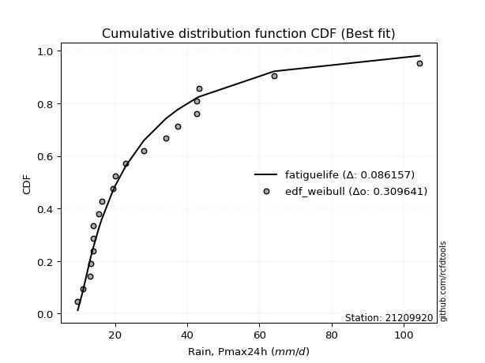</img></img>

</div>


### 4. EDF Beard (1943)

The Beard formula (or Beard´s plotting position formula) in hydrology is used to estimate the empirical non-exceedance probability _(P)_ of a flood event (or other extreme hydrological data point) within a given dataset.

<div align="center">


$P=(m-0.31)/(n+0.38)$


</div>


**4.1. Empirical values**

<div align="center">

|                | 0                    | 1                   | 2                   | 3                   | 4                  | 5                  | 6                   | 7                  | 8                   | 9                  | 10        | 11                 | 12                 | 13                 | 14                 | 15                 | 16                 | 17                 | 18                 | 19                 | 20                 |
|:---------------|:---------------------|:--------------------|:--------------------|:--------------------|:-------------------|:-------------------|:--------------------|:-------------------|:--------------------|:-------------------|:----------|:-------------------|:-------------------|:-------------------|:-------------------|:-------------------|:-------------------|:-------------------|:-------------------|:-------------------|:-------------------|
| date           | 2017                 | 2016                | 2019                | 2018                | 2015               | 2021               | 2023                | 2014               | 2013                | 2022               | 2020      | 2006               | 2025               | 2005               | 2009               | 2007               | 2011               | 2010               | 2008               | 2012               | 2024               |
| x              | 9.7                  | 11.1                | 13.1                | 13.4                | 13.9               | 13.9               | 13.9                | 15.6               | 16.3                | 19.4               | 20.0      | 23.0               | 27.6               | 28.0               | 34.1               | 37.3               | 42.6               | 42.7               | 43.2               | 64.1               | 104.4              |
| m              | 1                    | 2                   | 3                   | 4                   | 5                  | 6                  | 7                   | 8                  | 9                   | 10                 | 11        | 12                 | 13                 | 14                 | 15                 | 16                 | 17                 | 18                 | 19                 | 20                 | 21                 |
| empirical_dist | edf_beard            | edf_beard           | edf_beard           | edf_beard           | edf_beard          | edf_beard          | edf_beard           | edf_beard          | edf_beard           | edf_beard          | edf_beard | edf_beard          | edf_beard          | edf_beard          | edf_beard          | edf_beard          | edf_beard          | edf_beard          | edf_beard          | edf_beard          | edf_beard          |
| empirical      | 0.032273152478952294 | 0.07904583723105707 | 0.12581852198316185 | 0.17259120673526662 | 0.2193638914873714 | 0.2661365762394762 | 0.31290926099158095 | 0.3596819457436857 | 0.40645463049579045 | 0.4532273152478952 | 0.5       | 0.5467726847521047 | 0.5935453695042096 | 0.6403180542563143 | 0.6870907390084191 | 0.7338634237605238 | 0.7806361085126288 | 0.8274087932647335 | 0.8741814780168383 | 0.920954162768943  | 0.9677268475210478 |
| empirical_tr   | 1.0333494441759306   | 1.085830370746572   | 1.1439272338148743  | 1.208592425098926   | 1.281006590772918  | 1.362651370299554  | 1.4554118447923756  | 1.5617238860482106 | 1.6847911741528763  | 1.828913601368691  | 2.0       | 2.206398348813209  | 2.4602991944764097 | 2.780234070221066  | 3.195814648729447  | 3.7574692442882247 | 4.558635394456293  | 5.794037940379407  | 7.947955390334582  | 12.650887573964514 | 30.985507246376862 |

</div>


**4.2. Kolmogorov-Smirnov fit test (sorted by Δ)**


<div align="center">

|                | 0                   | 1                   | 2                   | 3                   | 4                   | 5                   | 6                   | 7                   | 8                   | 9                   | 10                  | 11                  | 12                  | 13                  | 14                  | 15                  | 16                  | 17                  | 18                  | 19                  | 20                  | 21                  | 22                  | 23                  | 24                  | 25                  | 26                  | 27                  | 28                  | 29                  | 30                  | 31                  | 32                  | 33                  | 34                  | 35                  | 36                  | 37                  | 38                  | 39                  | 40                  | 41                  | 42                  | 43                  | 44                  | 45                  | 46                  | 47                  | 48                  | 49                  | 50                  | 51                  | 52                  | 53                  | 54                  | 55                  | 56                  | 57                  | 58                  | 59                  | 60                  | 61                  | 62                  | 63                  | 64                  | 65                  | 66                  | 67                  | 68                  | 69                  | 70                  | 71                  | 72                  | 73                  | 74                  | 75                  | 76                  | 77                  | 78                  | 79                  | 80                  | 81                  | 82                  | 83                  | 84                  | 85                  | 86                  | 87                  | 88                  | 89                  | 90                  | 91                  | 92                  | 93                  | 94                  | 95                  | 96                  | 97                  | 98                  | 99                  | 100                 | 101                 | 102                 | 103                 | 104                 | 105                 | 106                 | 107                 | 108                 | 109                 | 110                 | 111                 | 112                 | 113                 | 114                 | 115                 | 116                 | 117                 | 118                 | 119                 | 120                 | 121                 | 122                 | 123                 | 124                 | 125                 | 126                 | 127                 | 128                 | 129                 | 130                 | 131                 | 132                 | 133                 | 134                 | 135                 | 136                 | 137                 | 138                 | 139                 | 140                 | 141                 | 142                 | 143                 | 144                 | 145                 | 146                 | 147                 | 148                 | 149                 | 150                 | 151                 | 152                 | 153                 | 154                 | 155                 | 156                 | 157                 | 158                 | 159                 |
|:---------------|:--------------------|:--------------------|:--------------------|:--------------------|:--------------------|:--------------------|:--------------------|:--------------------|:--------------------|:--------------------|:--------------------|:--------------------|:--------------------|:--------------------|:--------------------|:--------------------|:--------------------|:--------------------|:--------------------|:--------------------|:--------------------|:--------------------|:--------------------|:--------------------|:--------------------|:--------------------|:--------------------|:--------------------|:--------------------|:--------------------|:--------------------|:--------------------|:--------------------|:--------------------|:--------------------|:--------------------|:--------------------|:--------------------|:--------------------|:--------------------|:--------------------|:--------------------|:--------------------|:--------------------|:--------------------|:--------------------|:--------------------|:--------------------|:--------------------|:--------------------|:--------------------|:--------------------|:--------------------|:--------------------|:--------------------|:--------------------|:--------------------|:--------------------|:--------------------|:--------------------|:--------------------|:--------------------|:--------------------|:--------------------|:--------------------|:--------------------|:--------------------|:--------------------|:--------------------|:--------------------|:--------------------|:--------------------|:--------------------|:--------------------|:--------------------|:--------------------|:--------------------|:--------------------|:--------------------|:--------------------|:--------------------|:--------------------|:--------------------|:--------------------|:--------------------|:--------------------|:--------------------|:--------------------|:--------------------|:--------------------|:--------------------|:--------------------|:--------------------|:--------------------|:--------------------|:--------------------|:--------------------|:--------------------|:--------------------|:--------------------|:--------------------|:--------------------|:--------------------|:--------------------|:--------------------|:--------------------|:--------------------|:--------------------|:--------------------|:--------------------|:--------------------|:--------------------|:--------------------|:--------------------|:--------------------|:--------------------|:--------------------|:--------------------|:--------------------|:--------------------|:--------------------|:--------------------|:--------------------|:--------------------|:--------------------|:--------------------|:--------------------|:--------------------|:--------------------|:--------------------|:--------------------|:--------------------|:--------------------|:--------------------|:--------------------|:--------------------|:--------------------|:--------------------|:--------------------|:--------------------|:--------------------|:--------------------|:--------------------|:--------------------|:--------------------|:--------------------|:--------------------|:--------------------|:--------------------|:--------------------|:--------------------|:--------------------|:--------------------|:--------------------|:--------------------|:--------------------|:--------------------|:--------------------|:--------------------|:--------------------|
| station        | 21209920            | 21209920            | 21209920            | 21209920            | 21209920            | 21209920            | 21209920            | 21209920            | 21209920            | 21209920            | 21209920            | 21209920            | 21209920            | 21209920            | 21209920            | 21209920            | 21209920            | 21209920            | 21209920            | 21209920            | 21209920            | 21209920            | 21209920            | 21209920            | 21209920            | 21209920            | 21209920            | 21209920            | 21209920            | 21209920            | 21209920            | 21209920            | 21209920            | 21209920            | 21209920            | 21209920            | 21209920            | 21209920            | 21209920            | 21209920            | 21209920            | 21209920            | 21209920            | 21209920            | 21209920            | 21209920            | 21209920            | 21209920            | 21209920            | 21209920            | 21209920            | 21209920            | 21209920            | 21209920            | 21209920            | 21209920            | 21209920            | 21209920            | 21209920            | 21209920            | 21209920            | 21209920            | 21209920            | 21209920            | 21209920            | 21209920            | 21209920            | 21209920            | 21209920            | 21209920            | 21209920            | 21209920            | 21209920            | 21209920            | 21209920            | 21209920            | 21209920            | 21209920            | 21209920            | 21209920            | 21209920            | 21209920            | 21209920            | 21209920            | 21209920            | 21209920            | 21209920            | 21209920            | 21209920            | 21209920            | 21209920            | 21209920            | 21209920            | 21209920            | 21209920            | 21209920            | 21209920            | 21209920            | 21209920            | 21209920            | 21209920            | 21209920            | 21209920            | 21209920            | 21209920            | 21209920            | 21209920            | 21209920            | 21209920            | 21209920            | 21209920            | 21209920            | 21209920            | 21209920            | 21209920            | 21209920            | 21209920            | 21209920            | 21209920            | 21209920            | 21209920            | 21209920            | 21209920            | 21209920            | 21209920            | 21209920            | 21209920            | 21209920            | 21209920            | 21209920            | 21209920            | 21209920            | 21209920            | 21209920            | 21209920            | 21209920            | 21209920            | 21209920            | 21209920            | 21209920            | 21209920            | 21209920            | 21209920            | 21209920            | 21209920            | 21209920            | 21209920            | 21209920            | 21209920            | 21209920            | 21209920            | 21209920            | 21209920            | 21209920            | 21209920            | 21209920            | 21209920            | 21209920            | 21209920            | 21209920            |
| empirical_dist | edf_beard           | edf_beard           | edf_beard           | edf_beard           | edf_beard           | edf_beard           | edf_beard           | edf_beard           | edf_beard           | edf_beard           | edf_beard           | edf_beard           | edf_beard           | edf_beard           | edf_beard           | edf_beard           | edf_beard           | edf_beard           | edf_beard           | edf_beard           | edf_beard           | edf_beard           | edf_beard           | edf_beard           | edf_beard           | edf_beard           | edf_beard           | edf_beard           | edf_beard           | edf_beard           | edf_beard           | edf_beard           | edf_beard           | edf_beard           | edf_beard           | edf_beard           | edf_beard           | edf_beard           | edf_beard           | edf_beard           | edf_beard           | edf_beard           | edf_beard           | edf_beard           | edf_beard           | edf_beard           | edf_beard           | edf_beard           | edf_beard           | edf_beard           | edf_beard           | edf_beard           | edf_beard           | edf_beard           | edf_beard           | edf_beard           | edf_beard           | edf_beard           | edf_beard           | edf_beard           | edf_beard           | edf_beard           | edf_beard           | edf_beard           | edf_beard           | edf_beard           | edf_beard           | edf_beard           | edf_beard           | edf_beard           | edf_beard           | edf_beard           | edf_beard           | edf_beard           | edf_beard           | edf_beard           | edf_beard           | edf_beard           | edf_beard           | edf_beard           | edf_beard           | edf_beard           | edf_beard           | edf_beard           | edf_beard           | edf_beard           | edf_beard           | edf_beard           | edf_beard           | edf_beard           | edf_beard           | edf_beard           | edf_beard           | edf_beard           | edf_beard           | edf_beard           | edf_beard           | edf_beard           | edf_beard           | edf_beard           | edf_beard           | edf_beard           | edf_beard           | edf_beard           | edf_beard           | edf_beard           | edf_beard           | edf_beard           | edf_beard           | edf_beard           | edf_beard           | edf_beard           | edf_beard           | edf_beard           | edf_beard           | edf_beard           | edf_beard           | edf_beard           | edf_beard           | edf_beard           | edf_beard           | edf_beard           | edf_beard           | edf_beard           | edf_beard           | edf_beard           | edf_beard           | edf_beard           | edf_beard           | edf_beard           | edf_beard           | edf_beard           | edf_beard           | edf_beard           | edf_beard           | edf_beard           | edf_beard           | edf_beard           | edf_beard           | edf_beard           | edf_beard           | edf_beard           | edf_beard           | edf_beard           | edf_beard           | edf_beard           | edf_beard           | edf_beard           | edf_beard           | edf_beard           | edf_beard           | edf_beard           | edf_beard           | edf_beard           | edf_beard           | edf_beard           | edf_beard           | edf_beard           | edf_beard           | edf_beard           |
| p_dist         | logjohnsonsb        | genpareto           | halfgennorm         | johnsonsb           | fatiguelife         | logfoldnorm         | loggenexpon         | loghalfgennorm      | logdgamma           | invgauss            | lomax               | johnsonsu           | loghalfnorm         | loggamma            | loggamma            | logerlang           | logweibull_min      | logsemicircular     | gengamma            | loggompertz         | alpha               | f                   | logskewnorm         | mielke              | burr                | lograyleigh         | logfatiguelife      | invweibull          | genextreme          | kappa3              | betaprime           | invgamma            | truncpareto         | logkappa3           | loginvgauss         | loganglit           | logf                | logmaxwell          | logjohnsonsu        | burr12              | logexponnorm        | logburr12           | exponweib           | logvonmises_line    | logburr             | logpearson3         | loginvgamma         | logbetaprime        | logmielke           | pearson3            | loginvweibull       | loggenextreme       | logncf              | exponnorm           | logbeta             | exponpow            | logalpha            | genexpon            | nct                 | logkstwobign        | logweibull_max      | lognct              | loggenlogistic      | logdweibull         | loghalflogistic     | ncf                 | gausshyper          | weibull_min         | logtriang           | gamma               | logtruncweibull_min | logvonmises         | lognakagami         | loggumbel_r         | moyal               | logtukeylambda      | logcrystalball      | lognorm             | logt                | logloggamma         | loggausshyper       | logrice             | wald                | gompertz            | logtruncnorm        | logtruncexpon       | logarcsine          | logloglaplace       | logmoyal            | gumbel_r            | halflogistic        | loggennorm          | truncnorm           | beta                | loglogistic         | logexponweib        | logcosine           | genlogistic         | logrdist            | norm                | crystalball         | loggengamma         | t                   | loglomax            | logbradford         | loghypsecant        | dweibull            | maxwell             | rayleigh            | erlang              | loggumbel_l         | kstwobign           | logistic            | halfnorm            | genhalflogistic     | logtruncpareto      | anglit              | cosine              | loglaplace          | loglaplace          | hypsecant           | dgamma              | semicircular        | nakagami            | rice                | logexponpow         | gennorm             | vonmises_line       | laplace             | foldnorm            | skewnorm            | gumbel_l            | logargus            | loguniform          | logkappa4           | arcsine             | logksone            | truncweibull_min    | bradford            | logwald             | powerlaw            | triang              | truncexpon          | logwrapcauchy       | logpowerlaw         | loggenpareto        | loggenhalflogistic  | wrapcauchy          | argus               | loglevy_l           | kappa4              | ksone               | logtrapezoid        | levy_l              | uniform             | rdist               | tukeylambda         | trapezoid           | weibull_max         | vonmises            |
| delta          | 0.07367224363880631 | 0.07448171113694593 | 0.07700173481481223 | 0.07745230636835626 | 0.07910531528170961 | 0.07920184941581601 | 0.08096880167622855 | 0.08344422942314694 | 0.08615950420087926 | 0.08763876920136301 | 0.08827451130072708 | 0.08873019746384753 | 0.0891732440028683  | 0.09017643659255245 | 0.09017643659255245 | 0.09017726415044885 | 0.09151025626853904 | 0.0923274012664499  | 0.09390092798993357 | 0.09472310891401617 | 0.09526471556339974 | 0.09675669061124681 | 0.09717702654819305 | 0.0976412331090277  | 0.09820417463920439 | 0.09833564896770067 | 0.09967523466549888 | 0.09993504894568286 | 0.0999353738228971  | 0.10089300044572852 | 0.10116086874802904 | 0.10124548903185482 | 0.10138146791069358 | 0.10201992130074039 | 0.10239342416248567 | 0.10357397324491158 | 0.10386898425137564 | 0.10454332434445035 | 0.10534824149106475 | 0.10609428335510873 | 0.1061557289756756  | 0.10621694613269461 | 0.1074924964684934  | 0.11073399652370092 | 0.11110882968969912 | 0.11115290721636123 | 0.11123841483873903 | 0.11126180856599127 | 0.1117424010162083  | 0.11277606255743763 | 0.11416533820803645 | 0.11416949237820873 | 0.11503024983650523 | 0.11505090822689007 | 0.11522341891344218 | 0.11629163574672968 | 0.11647612187211434 | 0.11660716845153996 | 0.1169387821822814  | 0.1175092947796661  | 0.11779038729007293 | 0.11789997607119912 | 0.11804611040065188 | 0.11817275786612114 | 0.12056766444053377 | 0.12181645329623897 | 0.12198732808089977 | 0.12264691895038532 | 0.12303401452086371 | 0.12380367702560471 | 0.12394457600290276 | 0.12408412223363974 | 0.12465982096728867 | 0.1255786473087442  | 0.1267371031923143  | 0.1283162073000984  | 0.12977680789457463 | 0.12977687914938657 | 0.12977825574503865 | 0.13086594524772432 | 0.13156761211426204 | 0.13345959195285542 | 0.13413457450529195 | 0.13591772112747336 | 0.13751610213519522 | 0.13791128432994393 | 0.14011138386716165 | 0.14050805231874441 | 0.14073898736975982 | 0.1439250748291978  | 0.14425488529408925 | 0.1457150116147654  | 0.14976215313534363 | 0.15187806993780728 | 0.15202221174863306 | 0.1527489169758781  | 0.15319150926944364 | 0.15517187998373105 | 0.15805913169308383 | 0.15853608968214006 | 0.15853609130004848 | 0.1631939436049915  | 0.16326622020285736 | 0.16666364203138623 | 0.1669892812037932  | 0.16744445503665878 | 0.16753545806523326 | 0.16793694834996936 | 0.1723525160751713  | 0.17524629611375225 | 0.17556674307951523 | 0.17595555487247727 | 0.17718928074716378 | 0.17848792122260054 | 0.18165273380781308 | 0.18362348290810798 | 0.18468205591838033 | 0.18660783236721867 | 0.1902235052958941  | 0.1902235052958941  | 0.19151169937436907 | 0.19493001147651268 | 0.1968816514693708  | 0.19870327171323765 | 0.20441308144941928 | 0.20488798293414118 | 0.20603973196540654 | 0.2137757608683466  | 0.21939648773001902 | 0.22555832487303124 | 0.22696481617662634 | 0.22777406686567225 | 0.23858838012349193 | 0.24554117363899453 | 0.24992900782101157 | 0.2538906035702989  | 0.26698122436863514 | 0.27429716585985975 | 0.274561714928081   | 0.2891573427774335  | 0.2924205520296523  | 0.29635160918248193 | 0.31847106698740646 | 0.3291073080108925  | 0.3582253808660791  | 0.36485267325482396 | 0.39885881112023663 | 0.4243937626028676  | 0.437446433880208   | 0.44683530329311744 | 0.4813285614221969  | 0.4960575779816394  | 0.5054893299863958  | 0.514428937593234   | 0.5204327979745997  | 0.5388520607606435  | 0.5658111621759951  | 0.7312037942390093  | 0.7836090473611663  | 15.85840469589081   |
| deltao         | 0.30282488509099936 | 0.30282488509099936 | 0.30282488509099936 | 0.30282488509099936 | 0.30282488509099936 | 0.30282488509099936 | 0.30282488509099936 | 0.30282488509099936 | 0.30282488509099936 | 0.30282488509099936 | 0.30282488509099936 | 0.30282488509099936 | 0.30282488509099936 | 0.30282488509099936 | 0.30282488509099936 | 0.30282488509099936 | 0.30282488509099936 | 0.30282488509099936 | 0.30282488509099936 | 0.30282488509099936 | 0.30282488509099936 | 0.30282488509099936 | 0.30282488509099936 | 0.30282488509099936 | 0.30282488509099936 | 0.30282488509099936 | 0.30282488509099936 | 0.30282488509099936 | 0.30282488509099936 | 0.30282488509099936 | 0.30282488509099936 | 0.30282488509099936 | 0.30282488509099936 | 0.30282488509099936 | 0.30282488509099936 | 0.30282488509099936 | 0.30282488509099936 | 0.30282488509099936 | 0.30282488509099936 | 0.30282488509099936 | 0.30282488509099936 | 0.30282488509099936 | 0.30282488509099936 | 0.30282488509099936 | 0.30282488509099936 | 0.30282488509099936 | 0.30282488509099936 | 0.30282488509099936 | 0.30282488509099936 | 0.30282488509099936 | 0.30282488509099936 | 0.30282488509099936 | 0.30282488509099936 | 0.30282488509099936 | 0.30282488509099936 | 0.30282488509099936 | 0.30282488509099936 | 0.30282488509099936 | 0.30282488509099936 | 0.30282488509099936 | 0.30282488509099936 | 0.30282488509099936 | 0.30282488509099936 | 0.30282488509099936 | 0.30282488509099936 | 0.30282488509099936 | 0.30282488509099936 | 0.30282488509099936 | 0.30282488509099936 | 0.30282488509099936 | 0.30282488509099936 | 0.30282488509099936 | 0.30282488509099936 | 0.30282488509099936 | 0.30282488509099936 | 0.30282488509099936 | 0.30282488509099936 | 0.30282488509099936 | 0.30282488509099936 | 0.30282488509099936 | 0.30282488509099936 | 0.30282488509099936 | 0.30282488509099936 | 0.30282488509099936 | 0.30282488509099936 | 0.30282488509099936 | 0.30282488509099936 | 0.30282488509099936 | 0.30282488509099936 | 0.30282488509099936 | 0.30282488509099936 | 0.30282488509099936 | 0.30282488509099936 | 0.30282488509099936 | 0.30282488509099936 | 0.30282488509099936 | 0.30282488509099936 | 0.30282488509099936 | 0.30282488509099936 | 0.30282488509099936 | 0.30282488509099936 | 0.30282488509099936 | 0.30282488509099936 | 0.30282488509099936 | 0.30282488509099936 | 0.30282488509099936 | 0.30282488509099936 | 0.30282488509099936 | 0.30282488509099936 | 0.30282488509099936 | 0.30282488509099936 | 0.30282488509099936 | 0.30282488509099936 | 0.30282488509099936 | 0.30282488509099936 | 0.30282488509099936 | 0.30282488509099936 | 0.30282488509099936 | 0.30282488509099936 | 0.30282488509099936 | 0.30282488509099936 | 0.30282488509099936 | 0.30282488509099936 | 0.30282488509099936 | 0.30282488509099936 | 0.30282488509099936 | 0.30282488509099936 | 0.30282488509099936 | 0.30282488509099936 | 0.30282488509099936 | 0.30282488509099936 | 0.30282488509099936 | 0.30282488509099936 | 0.30282488509099936 | 0.30282488509099936 | 0.30282488509099936 | 0.30282488509099936 | 0.30282488509099936 | 0.30282488509099936 | 0.30282488509099936 | 0.30282488509099936 | 0.30282488509099936 | 0.30282488509099936 | 0.30282488509099936 | 0.30282488509099936 | 0.30282488509099936 | 0.30282488509099936 | 0.30282488509099936 | 0.30282488509099936 | 0.30282488509099936 | 0.30282488509099936 | 0.30282488509099936 | 0.30282488509099936 | 0.30282488509099936 | 0.30282488509099936 | 0.30282488509099936 | 0.30282488509099936 | 0.30282488509099936 | 0.30282488509099936 | 0.30282488509099936 |
| eval           | Δo > Δ              | Δo > Δ              | Δo > Δ              | Δo > Δ              | Δo > Δ              | Δo > Δ              | Δo > Δ              | Δo > Δ              | Δo > Δ              | Δo > Δ              | Δo > Δ              | Δo > Δ              | Δo > Δ              | Δo > Δ              | Δo > Δ              | Δo > Δ              | Δo > Δ              | Δo > Δ              | Δo > Δ              | Δo > Δ              | Δo > Δ              | Δo > Δ              | Δo > Δ              | Δo > Δ              | Δo > Δ              | Δo > Δ              | Δo > Δ              | Δo > Δ              | Δo > Δ              | Δo > Δ              | Δo > Δ              | Δo > Δ              | Δo > Δ              | Δo > Δ              | Δo > Δ              | Δo > Δ              | Δo > Δ              | Δo > Δ              | Δo > Δ              | Δo > Δ              | Δo > Δ              | Δo > Δ              | Δo > Δ              | Δo > Δ              | Δo > Δ              | Δo > Δ              | Δo > Δ              | Δo > Δ              | Δo > Δ              | Δo > Δ              | Δo > Δ              | Δo > Δ              | Δo > Δ              | Δo > Δ              | Δo > Δ              | Δo > Δ              | Δo > Δ              | Δo > Δ              | Δo > Δ              | Δo > Δ              | Δo > Δ              | Δo > Δ              | Δo > Δ              | Δo > Δ              | Δo > Δ              | Δo > Δ              | Δo > Δ              | Δo > Δ              | Δo > Δ              | Δo > Δ              | Δo > Δ              | Δo > Δ              | Δo > Δ              | Δo > Δ              | Δo > Δ              | Δo > Δ              | Δo > Δ              | Δo > Δ              | Δo > Δ              | Δo > Δ              | Δo > Δ              | Δo > Δ              | Δo > Δ              | Δo > Δ              | Δo > Δ              | Δo > Δ              | Δo > Δ              | Δo > Δ              | Δo > Δ              | Δo > Δ              | Δo > Δ              | Δo > Δ              | Δo > Δ              | Δo > Δ              | Δo > Δ              | Δo > Δ              | Δo > Δ              | Δo > Δ              | Δo > Δ              | Δo > Δ              | Δo > Δ              | Δo > Δ              | Δo > Δ              | Δo > Δ              | Δo > Δ              | Δo > Δ              | Δo > Δ              | Δo > Δ              | Δo > Δ              | Δo > Δ              | Δo > Δ              | Δo > Δ              | Δo > Δ              | Δo > Δ              | Δo > Δ              | Δo > Δ              | Δo > Δ              | Δo > Δ              | Δo > Δ              | Δo > Δ              | Δo > Δ              | Δo > Δ              | Δo > Δ              | Δo > Δ              | Δo > Δ              | Δo > Δ              | Δo > Δ              | Δo > Δ              | Δo > Δ              | Δo > Δ              | Δo > Δ              | Δo > Δ              | Δo > Δ              | Δo > Δ              | Δo > Δ              | Δo > Δ              | Δo > Δ              | Δo > Δ              | Δo > Δ              | Δo > Δ              | Δo > Δ              | Δo > Δ              | Δo <= Δ             | Δo <= Δ             | Δo <= Δ             | Δo <= Δ             | Δo <= Δ             | Δo <= Δ             | Δo <= Δ             | Δo <= Δ             | Δo <= Δ             | Δo <= Δ             | Δo <= Δ             | Δo <= Δ             | Δo <= Δ             | Δo <= Δ             | Δo <= Δ             | Δo <= Δ             | Δo <= Δ             | Δo <= Δ             |
| fit            | 1                   | 1                   | 1                   | 1                   | 1                   | 1                   | 1                   | 1                   | 1                   | 1                   | 1                   | 1                   | 1                   | 1                   | 1                   | 1                   | 1                   | 1                   | 1                   | 1                   | 1                   | 1                   | 1                   | 1                   | 1                   | 1                   | 1                   | 1                   | 1                   | 1                   | 1                   | 1                   | 1                   | 1                   | 1                   | 1                   | 1                   | 1                   | 1                   | 1                   | 1                   | 1                   | 1                   | 1                   | 1                   | 1                   | 1                   | 1                   | 1                   | 1                   | 1                   | 1                   | 1                   | 1                   | 1                   | 1                   | 1                   | 1                   | 1                   | 1                   | 1                   | 1                   | 1                   | 1                   | 1                   | 1                   | 1                   | 1                   | 1                   | 1                   | 1                   | 1                   | 1                   | 1                   | 1                   | 1                   | 1                   | 1                   | 1                   | 1                   | 1                   | 1                   | 1                   | 1                   | 1                   | 1                   | 1                   | 1                   | 1                   | 1                   | 1                   | 1                   | 1                   | 1                   | 1                   | 1                   | 1                   | 1                   | 1                   | 1                   | 1                   | 1                   | 1                   | 1                   | 1                   | 1                   | 1                   | 1                   | 1                   | 1                   | 1                   | 1                   | 1                   | 1                   | 1                   | 1                   | 1                   | 1                   | 1                   | 1                   | 1                   | 1                   | 1                   | 1                   | 1                   | 1                   | 1                   | 1                   | 1                   | 1                   | 1                   | 1                   | 1                   | 1                   | 1                   | 1                   | 1                   | 1                   | 1                   | 1                   | 1                   | 1                   | 0                   | 0                   | 0                   | 0                   | 0                   | 0                   | 0                   | 0                   | 0                   | 0                   | 0                   | 0                   | 0                   | 0                   | 0                   | 0                   | 0                   | 0                   |
| n              | 21                  | 21                  | 21                  | 21                  | 21                  | 21                  | 21                  | 21                  | 21                  | 21                  | 21                  | 21                  | 21                  | 21                  | 21                  | 21                  | 21                  | 21                  | 21                  | 21                  | 21                  | 21                  | 21                  | 21                  | 21                  | 21                  | 21                  | 21                  | 21                  | 21                  | 21                  | 21                  | 21                  | 21                  | 21                  | 21                  | 21                  | 21                  | 21                  | 21                  | 21                  | 21                  | 21                  | 21                  | 21                  | 21                  | 21                  | 21                  | 21                  | 21                  | 21                  | 21                  | 21                  | 21                  | 21                  | 21                  | 21                  | 21                  | 21                  | 21                  | 21                  | 21                  | 21                  | 21                  | 21                  | 21                  | 21                  | 21                  | 21                  | 21                  | 21                  | 21                  | 21                  | 21                  | 21                  | 21                  | 21                  | 21                  | 21                  | 21                  | 21                  | 21                  | 21                  | 21                  | 21                  | 21                  | 21                  | 21                  | 21                  | 21                  | 21                  | 21                  | 21                  | 21                  | 21                  | 21                  | 21                  | 21                  | 21                  | 21                  | 21                  | 21                  | 21                  | 21                  | 21                  | 21                  | 21                  | 21                  | 21                  | 21                  | 21                  | 21                  | 21                  | 21                  | 21                  | 21                  | 21                  | 21                  | 21                  | 21                  | 21                  | 21                  | 21                  | 21                  | 21                  | 21                  | 21                  | 21                  | 21                  | 21                  | 21                  | 21                  | 21                  | 21                  | 21                  | 21                  | 21                  | 21                  | 21                  | 21                  | 21                  | 21                  | 21                  | 21                  | 21                  | 21                  | 21                  | 21                  | 21                  | 21                  | 21                  | 21                  | 21                  | 21                  | 21                  | 21                  | 21                  | 21                  | 21                  | 21                  |
| best_fit       | 1                   | 0                   | 0                   | 0                   | 0                   | 0                   | 0                   | 0                   | 0                   | 0                   | 0                   | 0                   | 0                   | 0                   | 0                   | 0                   | 0                   | 0                   | 0                   | 0                   | 0                   | 0                   | 0                   | 0                   | 0                   | 0                   | 0                   | 0                   | 0                   | 0                   | 0                   | 0                   | 0                   | 0                   | 0                   | 0                   | 0                   | 0                   | 0                   | 0                   | 0                   | 0                   | 0                   | 0                   | 0                   | 0                   | 0                   | 0                   | 0                   | 0                   | 0                   | 0                   | 0                   | 0                   | 0                   | 0                   | 0                   | 0                   | 0                   | 0                   | 0                   | 0                   | 0                   | 0                   | 0                   | 0                   | 0                   | 0                   | 0                   | 0                   | 0                   | 0                   | 0                   | 0                   | 0                   | 0                   | 0                   | 0                   | 0                   | 0                   | 0                   | 0                   | 0                   | 0                   | 0                   | 0                   | 0                   | 0                   | 0                   | 0                   | 0                   | 0                   | 0                   | 0                   | 0                   | 0                   | 0                   | 0                   | 0                   | 0                   | 0                   | 0                   | 0                   | 0                   | 0                   | 0                   | 0                   | 0                   | 0                   | 0                   | 0                   | 0                   | 0                   | 0                   | 0                   | 0                   | 0                   | 0                   | 0                   | 0                   | 0                   | 0                   | 0                   | 0                   | 0                   | 0                   | 0                   | 0                   | 0                   | 0                   | 0                   | 0                   | 0                   | 0                   | 0                   | 0                   | 0                   | 0                   | 0                   | 0                   | 0                   | 0                   | 0                   | 0                   | 0                   | 0                   | 0                   | 0                   | 0                   | 0                   | 0                   | 0                   | 0                   | 0                   | 0                   | 0                   | 0                   | 0                   | 0                   | 0                   |
| best_fit_sort  | 1                   | 2                   | 3                   | 4                   | 5                   | 6                   | 7                   | 8                   | 9                   | 10                  | 11                  | 12                  | 13                  | 14                  | 15                  | 16                  | 17                  | 18                  | 19                  | 20                  | 21                  | 22                  | 23                  | 24                  | 25                  | 26                  | 27                  | 28                  | 29                  | 30                  | 31                  | 32                  | 33                  | 34                  | 35                  | 36                  | 37                  | 38                  | 39                  | 40                  | 41                  | 42                  | 43                  | 44                  | 45                  | 46                  | 47                  | 48                  | 49                  | 50                  | 51                  | 52                  | 53                  | 54                  | 55                  | 56                  | 57                  | 58                  | 59                  | 60                  | 61                  | 62                  | 63                  | 64                  | 65                  | 66                  | 67                  | 68                  | 69                  | 70                  | 71                  | 72                  | 73                  | 74                  | 75                  | 76                  | 77                  | 78                  | 79                  | 80                  | 81                  | 82                  | 83                  | 84                  | 85                  | 86                  | 87                  | 88                  | 89                  | 90                  | 91                  | 92                  | 93                  | 94                  | 95                  | 96                  | 97                  | 98                  | 99                  | 100                 | 101                 | 102                 | 103                 | 104                 | 105                 | 106                 | 107                 | 108                 | 109                 | 110                 | 111                 | 112                 | 113                 | 114                 | 115                 | 116                 | 117                 | 118                 | 119                 | 120                 | 121                 | 122                 | 123                 | 124                 | 125                 | 126                 | 127                 | 128                 | 129                 | 130                 | 131                 | 132                 | 133                 | 134                 | 135                 | 136                 | 137                 | 138                 | 139                 | 140                 | 141                 | 142                 | 143                 | 144                 | 145                 | 146                 | 147                 | 148                 | 149                 | 150                 | 151                 | 152                 | 153                 | 154                 | 155                 | 156                 | 157                 | 158                 | 159                 | 160                 |

</div>


<div align="center">

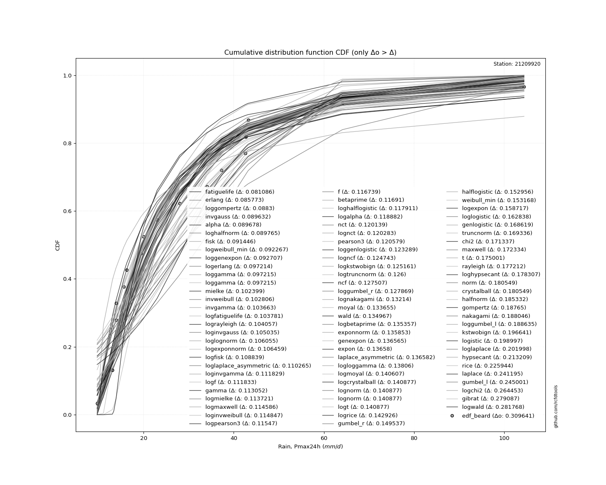</img>

</div>


**4.3. Best fit**

<div align="center">

|   id |   station | empirical_dist   | p_dist       |     delta |   deltao | eval   |   fit |   n |   best_fit |   best_fit_sort |
|-----:|----------:|:-----------------|:-------------|----------:|---------:|:-------|------:|----:|-----------:|----------------:|
|    0 |  21209920 | edf_beard        | logjohnsonsb | 0.0736722 | 0.302825 | Δo > Δ |     1 |  21 |          1 |               1 |

</div>


<div align="center">

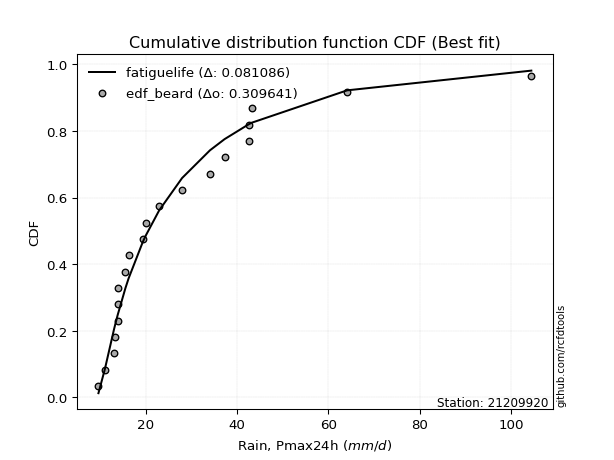</img>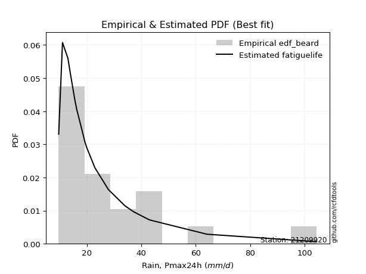</img>

</div>


### 5. EDF Chegodayev (1955)

The Chegodayev formula is an empirical plotting position formula used in hydrological frequency analysis to estimate the exceedance probability or return period of a specific event from a set of observed data. It is primarily used for plotting observed data points on probability paper to fit a theoretical distribution, particularly for analyzing extreme events like maximum flood flows or rainfall intensities. The constant _b_ value in the generalized plotting position formula is 0.3.

<div align="center">


$P=(m-b)/(n+1-2b)$


</div>


**5.1. Empirical values**

<div align="center">

|                | 0                   | 1                   | 2                   | 3                   | 4                  | 5                  | 6                   | 7                  | 8                   | 9                  | 10             | 11                 | 12                 | 13                 | 14                 | 15                 | 16                | 17                 | 18                 | 19                 | 20                 |
|:---------------|:--------------------|:--------------------|:--------------------|:--------------------|:-------------------|:-------------------|:--------------------|:-------------------|:--------------------|:-------------------|:---------------|:-------------------|:-------------------|:-------------------|:-------------------|:-------------------|:------------------|:-------------------|:-------------------|:-------------------|:-------------------|
| date           | 2017                | 2016                | 2019                | 2018                | 2015               | 2021               | 2023                | 2014               | 2013                | 2022               | 2020           | 2006               | 2025               | 2005               | 2009               | 2007               | 2011              | 2010               | 2008               | 2012               | 2024               |
| x              | 9.7                 | 11.1                | 13.1                | 13.4                | 13.9               | 13.9               | 13.9                | 15.6               | 16.3                | 19.4               | 20.0           | 23.0               | 27.6               | 28.0               | 34.1               | 37.3               | 42.6              | 42.7               | 43.2               | 64.1               | 104.4              |
| m              | 1                   | 2                   | 3                   | 4                   | 5                  | 6                  | 7                   | 8                  | 9                   | 10                 | 11             | 12                 | 13                 | 14                 | 15                 | 16                 | 17                | 18                 | 19                 | 20                 | 21                 |
| empirical_dist | edf_chegodayev      | edf_chegodayev      | edf_chegodayev      | edf_chegodayev      | edf_chegodayev     | edf_chegodayev     | edf_chegodayev      | edf_chegodayev     | edf_chegodayev      | edf_chegodayev     | edf_chegodayev | edf_chegodayev     | edf_chegodayev     | edf_chegodayev     | edf_chegodayev     | edf_chegodayev     | edf_chegodayev    | edf_chegodayev     | edf_chegodayev     | edf_chegodayev     | edf_chegodayev     |
| empirical      | 0.03271028037383177 | 0.07943925233644861 | 0.12616822429906543 | 0.17289719626168226 | 0.2196261682242991 | 0.2663551401869159 | 0.31308411214953275 | 0.3598130841121496 | 0.40654205607476634 | 0.4532710280373832 | 0.5            | 0.5467289719626168 | 0.5934579439252337 | 0.6401869158878505 | 0.6869158878504673 | 0.7336448598130841 | 0.780373831775701 | 0.8271028037383178 | 0.8738317757009346 | 0.9205607476635514 | 0.9672897196261683 |
| empirical_tr   | 1.0338164251207729  | 1.086294416243655   | 1.1443850267379678  | 1.209039548022599   | 1.2814371257485029 | 1.3630573248407645 | 1.4557823129251701  | 1.5620437956204383 | 1.68503937007874    | 1.829059829059829  | 2.0            | 2.2061855670103094 | 2.4597701149425286 | 2.7792207792207795 | 3.194029850746269  | 3.7543859649122813 | 4.553191489361703 | 5.783783783783785  | 7.925925925925928  | 12.588235294117654 | 30.57142857142862  |

</div>


**5.2. Kolmogorov-Smirnov fit test (sorted by Δ)**


<div align="center">

|                | 0                   | 1                   | 2                   | 3                   | 4                   | 5                   | 6                   | 7                   | 8                   | 9                   | 10                  | 11                  | 12                  | 13                  | 14                  | 15                  | 16                  | 17                  | 18                  | 19                  | 20                  | 21                  | 22                  | 23                  | 24                  | 25                  | 26                  | 27                  | 28                  | 29                  | 30                  | 31                  | 32                  | 33                  | 34                  | 35                  | 36                  | 37                  | 38                  | 39                  | 40                  | 41                  | 42                  | 43                  | 44                  | 45                  | 46                  | 47                  | 48                  | 49                  | 50                  | 51                  | 52                  | 53                  | 54                  | 55                  | 56                  | 57                  | 58                  | 59                  | 60                  | 61                  | 62                  | 63                  | 64                  | 65                  | 66                  | 67                  | 68                  | 69                  | 70                  | 71                  | 72                  | 73                  | 74                  | 75                  | 76                  | 77                  | 78                  | 79                  | 80                  | 81                  | 82                  | 83                  | 84                  | 85                  | 86                  | 87                  | 88                  | 89                  | 90                  | 91                  | 92                  | 93                  | 94                  | 95                  | 96                  | 97                  | 98                  | 99                  | 100                 | 101                 | 102                 | 103                 | 104                 | 105                 | 106                 | 107                 | 108                 | 109                 | 110                 | 111                 | 112                 | 113                 | 114                 | 115                 | 116                 | 117                 | 118                 | 119                 | 120                 | 121                 | 122                 | 123                 | 124                 | 125                 | 126                 | 127                 | 128                 | 129                 | 130                 | 131                 | 132                 | 133                 | 134                 | 135                 | 136                 | 137                 | 138                 | 139                 | 140                 | 141                 | 142                 | 143                 | 144                 | 145                 | 146                 | 147                 | 148                 | 149                 | 150                 | 151                 | 152                 | 153                 | 154                 | 155                 | 156                 | 157                 | 158                 | 159                 |
|:---------------|:--------------------|:--------------------|:--------------------|:--------------------|:--------------------|:--------------------|:--------------------|:--------------------|:--------------------|:--------------------|:--------------------|:--------------------|:--------------------|:--------------------|:--------------------|:--------------------|:--------------------|:--------------------|:--------------------|:--------------------|:--------------------|:--------------------|:--------------------|:--------------------|:--------------------|:--------------------|:--------------------|:--------------------|:--------------------|:--------------------|:--------------------|:--------------------|:--------------------|:--------------------|:--------------------|:--------------------|:--------------------|:--------------------|:--------------------|:--------------------|:--------------------|:--------------------|:--------------------|:--------------------|:--------------------|:--------------------|:--------------------|:--------------------|:--------------------|:--------------------|:--------------------|:--------------------|:--------------------|:--------------------|:--------------------|:--------------------|:--------------------|:--------------------|:--------------------|:--------------------|:--------------------|:--------------------|:--------------------|:--------------------|:--------------------|:--------------------|:--------------------|:--------------------|:--------------------|:--------------------|:--------------------|:--------------------|:--------------------|:--------------------|:--------------------|:--------------------|:--------------------|:--------------------|:--------------------|:--------------------|:--------------------|:--------------------|:--------------------|:--------------------|:--------------------|:--------------------|:--------------------|:--------------------|:--------------------|:--------------------|:--------------------|:--------------------|:--------------------|:--------------------|:--------------------|:--------------------|:--------------------|:--------------------|:--------------------|:--------------------|:--------------------|:--------------------|:--------------------|:--------------------|:--------------------|:--------------------|:--------------------|:--------------------|:--------------------|:--------------------|:--------------------|:--------------------|:--------------------|:--------------------|:--------------------|:--------------------|:--------------------|:--------------------|:--------------------|:--------------------|:--------------------|:--------------------|:--------------------|:--------------------|:--------------------|:--------------------|:--------------------|:--------------------|:--------------------|:--------------------|:--------------------|:--------------------|:--------------------|:--------------------|:--------------------|:--------------------|:--------------------|:--------------------|:--------------------|:--------------------|:--------------------|:--------------------|:--------------------|:--------------------|:--------------------|:--------------------|:--------------------|:--------------------|:--------------------|:--------------------|:--------------------|:--------------------|:--------------------|:--------------------|:--------------------|:--------------------|:--------------------|:--------------------|:--------------------|:--------------------|
| station        | 21209920            | 21209920            | 21209920            | 21209920            | 21209920            | 21209920            | 21209920            | 21209920            | 21209920            | 21209920            | 21209920            | 21209920            | 21209920            | 21209920            | 21209920            | 21209920            | 21209920            | 21209920            | 21209920            | 21209920            | 21209920            | 21209920            | 21209920            | 21209920            | 21209920            | 21209920            | 21209920            | 21209920            | 21209920            | 21209920            | 21209920            | 21209920            | 21209920            | 21209920            | 21209920            | 21209920            | 21209920            | 21209920            | 21209920            | 21209920            | 21209920            | 21209920            | 21209920            | 21209920            | 21209920            | 21209920            | 21209920            | 21209920            | 21209920            | 21209920            | 21209920            | 21209920            | 21209920            | 21209920            | 21209920            | 21209920            | 21209920            | 21209920            | 21209920            | 21209920            | 21209920            | 21209920            | 21209920            | 21209920            | 21209920            | 21209920            | 21209920            | 21209920            | 21209920            | 21209920            | 21209920            | 21209920            | 21209920            | 21209920            | 21209920            | 21209920            | 21209920            | 21209920            | 21209920            | 21209920            | 21209920            | 21209920            | 21209920            | 21209920            | 21209920            | 21209920            | 21209920            | 21209920            | 21209920            | 21209920            | 21209920            | 21209920            | 21209920            | 21209920            | 21209920            | 21209920            | 21209920            | 21209920            | 21209920            | 21209920            | 21209920            | 21209920            | 21209920            | 21209920            | 21209920            | 21209920            | 21209920            | 21209920            | 21209920            | 21209920            | 21209920            | 21209920            | 21209920            | 21209920            | 21209920            | 21209920            | 21209920            | 21209920            | 21209920            | 21209920            | 21209920            | 21209920            | 21209920            | 21209920            | 21209920            | 21209920            | 21209920            | 21209920            | 21209920            | 21209920            | 21209920            | 21209920            | 21209920            | 21209920            | 21209920            | 21209920            | 21209920            | 21209920            | 21209920            | 21209920            | 21209920            | 21209920            | 21209920            | 21209920            | 21209920            | 21209920            | 21209920            | 21209920            | 21209920            | 21209920            | 21209920            | 21209920            | 21209920            | 21209920            | 21209920            | 21209920            | 21209920            | 21209920            | 21209920            | 21209920            |
| empirical_dist | edf_chegodayev      | edf_chegodayev      | edf_chegodayev      | edf_chegodayev      | edf_chegodayev      | edf_chegodayev      | edf_chegodayev      | edf_chegodayev      | edf_chegodayev      | edf_chegodayev      | edf_chegodayev      | edf_chegodayev      | edf_chegodayev      | edf_chegodayev      | edf_chegodayev      | edf_chegodayev      | edf_chegodayev      | edf_chegodayev      | edf_chegodayev      | edf_chegodayev      | edf_chegodayev      | edf_chegodayev      | edf_chegodayev      | edf_chegodayev      | edf_chegodayev      | edf_chegodayev      | edf_chegodayev      | edf_chegodayev      | edf_chegodayev      | edf_chegodayev      | edf_chegodayev      | edf_chegodayev      | edf_chegodayev      | edf_chegodayev      | edf_chegodayev      | edf_chegodayev      | edf_chegodayev      | edf_chegodayev      | edf_chegodayev      | edf_chegodayev      | edf_chegodayev      | edf_chegodayev      | edf_chegodayev      | edf_chegodayev      | edf_chegodayev      | edf_chegodayev      | edf_chegodayev      | edf_chegodayev      | edf_chegodayev      | edf_chegodayev      | edf_chegodayev      | edf_chegodayev      | edf_chegodayev      | edf_chegodayev      | edf_chegodayev      | edf_chegodayev      | edf_chegodayev      | edf_chegodayev      | edf_chegodayev      | edf_chegodayev      | edf_chegodayev      | edf_chegodayev      | edf_chegodayev      | edf_chegodayev      | edf_chegodayev      | edf_chegodayev      | edf_chegodayev      | edf_chegodayev      | edf_chegodayev      | edf_chegodayev      | edf_chegodayev      | edf_chegodayev      | edf_chegodayev      | edf_chegodayev      | edf_chegodayev      | edf_chegodayev      | edf_chegodayev      | edf_chegodayev      | edf_chegodayev      | edf_chegodayev      | edf_chegodayev      | edf_chegodayev      | edf_chegodayev      | edf_chegodayev      | edf_chegodayev      | edf_chegodayev      | edf_chegodayev      | edf_chegodayev      | edf_chegodayev      | edf_chegodayev      | edf_chegodayev      | edf_chegodayev      | edf_chegodayev      | edf_chegodayev      | edf_chegodayev      | edf_chegodayev      | edf_chegodayev      | edf_chegodayev      | edf_chegodayev      | edf_chegodayev      | edf_chegodayev      | edf_chegodayev      | edf_chegodayev      | edf_chegodayev      | edf_chegodayev      | edf_chegodayev      | edf_chegodayev      | edf_chegodayev      | edf_chegodayev      | edf_chegodayev      | edf_chegodayev      | edf_chegodayev      | edf_chegodayev      | edf_chegodayev      | edf_chegodayev      | edf_chegodayev      | edf_chegodayev      | edf_chegodayev      | edf_chegodayev      | edf_chegodayev      | edf_chegodayev      | edf_chegodayev      | edf_chegodayev      | edf_chegodayev      | edf_chegodayev      | edf_chegodayev      | edf_chegodayev      | edf_chegodayev      | edf_chegodayev      | edf_chegodayev      | edf_chegodayev      | edf_chegodayev      | edf_chegodayev      | edf_chegodayev      | edf_chegodayev      | edf_chegodayev      | edf_chegodayev      | edf_chegodayev      | edf_chegodayev      | edf_chegodayev      | edf_chegodayev      | edf_chegodayev      | edf_chegodayev      | edf_chegodayev      | edf_chegodayev      | edf_chegodayev      | edf_chegodayev      | edf_chegodayev      | edf_chegodayev      | edf_chegodayev      | edf_chegodayev      | edf_chegodayev      | edf_chegodayev      | edf_chegodayev      | edf_chegodayev      | edf_chegodayev      | edf_chegodayev      | edf_chegodayev      | edf_chegodayev      | edf_chegodayev      |
| p_dist         | logjohnsonsb        | genpareto           | halfgennorm         | johnsonsb           | fatiguelife         | logfoldnorm         | loggenexpon         | loghalfgennorm      | logdgamma           | invgauss            | lomax               | johnsonsu           | loghalfnorm         | loggamma            | loggamma            | logerlang           | logweibull_min      | logsemicircular     | gengamma            | loggompertz         | alpha               | f                   | logskewnorm         | mielke              | burr                | lograyleigh         | logfatiguelife      | invweibull          | genextreme          | kappa3              | betaprime           | invgamma            | truncpareto         | logkappa3           | loginvgauss         | loganglit           | logf                | logmaxwell          | logjohnsonsu        | burr12              | logexponnorm        | logburr12           | exponweib           | logvonmises_line    | logburr             | logpearson3         | loginvgamma         | logbetaprime        | logmielke           | pearson3            | loginvweibull       | loggenextreme       | logbeta             | logncf              | exponnorm           | exponpow            | logalpha            | genexpon            | nct                 | logkstwobign        | logweibull_max      | lognct              | loggenlogistic      | logdweibull         | loghalflogistic     | gausshyper          | ncf                 | weibull_min         | logtriang           | gamma               | logtruncweibull_min | logvonmises         | lognakagami         | loggumbel_r         | moyal               | logtukeylambda      | logcrystalball      | lognorm             | logt                | logloggamma         | loggausshyper       | logrice             | wald                | gompertz            | logtruncnorm        | logtruncexpon       | logarcsine          | logloglaplace       | logmoyal            | gumbel_r            | halflogistic        | loggennorm          | truncnorm           | beta                | loglogistic         | logexponweib        | logcosine           | genlogistic         | logrdist            | norm                | crystalball         | t                   | loggengamma         | loglomax            | logbradford         | dweibull            | maxwell             | loghypsecant        | rayleigh            | erlang              | loggumbel_l         | kstwobign           | logistic            | halfnorm            | genhalflogistic     | logtruncpareto      | anglit              | cosine              | loglaplace          | loglaplace          | hypsecant           | dgamma              | semicircular        | nakagami            | rice                | logexponpow         | gennorm             | vonmises_line       | laplace             | foldnorm            | skewnorm            | gumbel_l            | logargus            | loguniform          | logkappa4           | arcsine             | logksone            | truncweibull_min    | bradford            | logwald             | powerlaw            | triang              | truncexpon          | logwrapcauchy       | logpowerlaw         | loggenpareto        | loggenhalflogistic  | wrapcauchy          | argus               | loglevy_l           | kappa4              | ksone               | logtrapezoid        | levy_l              | uniform             | rdist               | tukeylambda         | trapezoid           | weibull_max         | vonmises            |
| delta          | 0.07332254132290272 | 0.07465656229489773 | 0.07665203249890865 | 0.07710260405245267 | 0.0792801664396614  | 0.0793767005737678  | 0.08105622725520445 | 0.08361908058109874 | 0.08642178093780706 | 0.08781362035931481 | 0.08844936245867888 | 0.08890504862179932 | 0.0893480951608201  | 0.09035128775050424 | 0.09035128775050424 | 0.09035211530840065 | 0.09168510742649083 | 0.09241482684542579 | 0.09355122567402999 | 0.09489796007196796 | 0.09543956672135154 | 0.0968441161902227  | 0.09735187770614484 | 0.09781608426697949 | 0.09837902579715618 | 0.09851050012565246 | 0.09985008582345067 | 0.10010990010363466 | 0.1001102249808489  | 0.10106785160368031 | 0.10133571990598084 | 0.10142034018980661 | 0.10155631906864537 | 0.10210734687971629 | 0.10256827532043747 | 0.10366139882388747 | 0.10404383540932743 | 0.10463074992342625 | 0.10552309264901655 | 0.10618170893408463 | 0.1062431545546515  | 0.10630437171167051 | 0.10714279415258982 | 0.11082142210267681 | 0.11128368084765092 | 0.11132775837431302 | 0.11141326599669082 | 0.11143665972394307 | 0.1119172521741601  | 0.11242636024153405 | 0.11434018936598825 | 0.11434434353616052 | 0.11487371659753859 | 0.11511767541548112 | 0.11522575938484186 | 0.1159419334308261  | 0.11665097303006614 | 0.11678201960949175 | 0.1171136333402332  | 0.11768414593761789 | 0.11796523844802473 | 0.11807482722915091 | 0.11822096155860368 | 0.11834760902407293 | 0.12074251559848556 | 0.12163762576499618 | 0.12190387887521487 | 0.12273434452936122 | 0.1232088656788155  | 0.12345397470970113 | 0.12359487368699906 | 0.12417154781261563 | 0.12431011865138508 | 0.125753498466696   | 0.1262999752974348  | 0.1284036328790743  | 0.12986423347355053 | 0.12986430472836247 | 0.12986568132401455 | 0.13095337082670022 | 0.13121790979835835 | 0.13363444311080722 | 0.13430942566324375 | 0.13600514670644925 | 0.13716639981929163 | 0.13756158201404023 | 0.13976168155125807 | 0.1405954778977203  | 0.1409138385277116  | 0.14348794693431832 | 0.14381775739920977 | 0.1458024371937413  | 0.14984957871431953 | 0.1515283676219037  | 0.15210963732760896 | 0.15239921465997452 | 0.15327893484841953 | 0.15525930556270695 | 0.15770942937718013 | 0.15853608968214006 | 0.15853609130004848 | 0.16282909230797787 | 0.16284424128908792 | 0.16631393971548264 | 0.1666395788878895  | 0.16709833017035378 | 0.16749982045508988 | 0.16753188061563468 | 0.1719153881802918  | 0.17489659379784867 | 0.17565416865849112 | 0.17595555487247727 | 0.17718928074716378 | 0.17805079332772106 | 0.18174015938678897 | 0.1832737805922044  | 0.18424492802350084 | 0.18687010910414648 | 0.19031093087487    | 0.19031093087487    | 0.19151169937436907 | 0.1944928835816332  | 0.19644452357449133 | 0.19835356939733395 | 0.20441308144941928 | 0.2045382806182376  | 0.20560260407052705 | 0.2138631864473225  | 0.21939648773001902 | 0.22512119697815175 | 0.22705224175560224 | 0.22764292849720846 | 0.23823867780758823 | 0.24519147132309083 | 0.24957930550510787 | 0.2534534756754194  | 0.26663152205273144 | 0.27394746354395605 | 0.2742120126121773  | 0.2893321939353853  | 0.2920708497137487  | 0.29600190686657823 | 0.31812136467150276 | 0.3287576056949888  | 0.3578756785501755  | 0.36441554535994447 | 0.39850910880433293 | 0.4240440602869639  | 0.4370967315643043  | 0.44639817539823795 | 0.4809788591062932  | 0.4957078756657357  | 0.5051396276704921  | 0.5139918096983547  | 0.5200830956586959  | 0.5384149328657641  | 0.5653740342811158  | 0.7308540919231055  | 0.7832156322557747  | 15.85884182378569   |
| deltao         | 0.30282488509099936 | 0.30282488509099936 | 0.30282488509099936 | 0.30282488509099936 | 0.30282488509099936 | 0.30282488509099936 | 0.30282488509099936 | 0.30282488509099936 | 0.30282488509099936 | 0.30282488509099936 | 0.30282488509099936 | 0.30282488509099936 | 0.30282488509099936 | 0.30282488509099936 | 0.30282488509099936 | 0.30282488509099936 | 0.30282488509099936 | 0.30282488509099936 | 0.30282488509099936 | 0.30282488509099936 | 0.30282488509099936 | 0.30282488509099936 | 0.30282488509099936 | 0.30282488509099936 | 0.30282488509099936 | 0.30282488509099936 | 0.30282488509099936 | 0.30282488509099936 | 0.30282488509099936 | 0.30282488509099936 | 0.30282488509099936 | 0.30282488509099936 | 0.30282488509099936 | 0.30282488509099936 | 0.30282488509099936 | 0.30282488509099936 | 0.30282488509099936 | 0.30282488509099936 | 0.30282488509099936 | 0.30282488509099936 | 0.30282488509099936 | 0.30282488509099936 | 0.30282488509099936 | 0.30282488509099936 | 0.30282488509099936 | 0.30282488509099936 | 0.30282488509099936 | 0.30282488509099936 | 0.30282488509099936 | 0.30282488509099936 | 0.30282488509099936 | 0.30282488509099936 | 0.30282488509099936 | 0.30282488509099936 | 0.30282488509099936 | 0.30282488509099936 | 0.30282488509099936 | 0.30282488509099936 | 0.30282488509099936 | 0.30282488509099936 | 0.30282488509099936 | 0.30282488509099936 | 0.30282488509099936 | 0.30282488509099936 | 0.30282488509099936 | 0.30282488509099936 | 0.30282488509099936 | 0.30282488509099936 | 0.30282488509099936 | 0.30282488509099936 | 0.30282488509099936 | 0.30282488509099936 | 0.30282488509099936 | 0.30282488509099936 | 0.30282488509099936 | 0.30282488509099936 | 0.30282488509099936 | 0.30282488509099936 | 0.30282488509099936 | 0.30282488509099936 | 0.30282488509099936 | 0.30282488509099936 | 0.30282488509099936 | 0.30282488509099936 | 0.30282488509099936 | 0.30282488509099936 | 0.30282488509099936 | 0.30282488509099936 | 0.30282488509099936 | 0.30282488509099936 | 0.30282488509099936 | 0.30282488509099936 | 0.30282488509099936 | 0.30282488509099936 | 0.30282488509099936 | 0.30282488509099936 | 0.30282488509099936 | 0.30282488509099936 | 0.30282488509099936 | 0.30282488509099936 | 0.30282488509099936 | 0.30282488509099936 | 0.30282488509099936 | 0.30282488509099936 | 0.30282488509099936 | 0.30282488509099936 | 0.30282488509099936 | 0.30282488509099936 | 0.30282488509099936 | 0.30282488509099936 | 0.30282488509099936 | 0.30282488509099936 | 0.30282488509099936 | 0.30282488509099936 | 0.30282488509099936 | 0.30282488509099936 | 0.30282488509099936 | 0.30282488509099936 | 0.30282488509099936 | 0.30282488509099936 | 0.30282488509099936 | 0.30282488509099936 | 0.30282488509099936 | 0.30282488509099936 | 0.30282488509099936 | 0.30282488509099936 | 0.30282488509099936 | 0.30282488509099936 | 0.30282488509099936 | 0.30282488509099936 | 0.30282488509099936 | 0.30282488509099936 | 0.30282488509099936 | 0.30282488509099936 | 0.30282488509099936 | 0.30282488509099936 | 0.30282488509099936 | 0.30282488509099936 | 0.30282488509099936 | 0.30282488509099936 | 0.30282488509099936 | 0.30282488509099936 | 0.30282488509099936 | 0.30282488509099936 | 0.30282488509099936 | 0.30282488509099936 | 0.30282488509099936 | 0.30282488509099936 | 0.30282488509099936 | 0.30282488509099936 | 0.30282488509099936 | 0.30282488509099936 | 0.30282488509099936 | 0.30282488509099936 | 0.30282488509099936 | 0.30282488509099936 | 0.30282488509099936 | 0.30282488509099936 | 0.30282488509099936 | 0.30282488509099936 |
| eval           | Δo > Δ              | Δo > Δ              | Δo > Δ              | Δo > Δ              | Δo > Δ              | Δo > Δ              | Δo > Δ              | Δo > Δ              | Δo > Δ              | Δo > Δ              | Δo > Δ              | Δo > Δ              | Δo > Δ              | Δo > Δ              | Δo > Δ              | Δo > Δ              | Δo > Δ              | Δo > Δ              | Δo > Δ              | Δo > Δ              | Δo > Δ              | Δo > Δ              | Δo > Δ              | Δo > Δ              | Δo > Δ              | Δo > Δ              | Δo > Δ              | Δo > Δ              | Δo > Δ              | Δo > Δ              | Δo > Δ              | Δo > Δ              | Δo > Δ              | Δo > Δ              | Δo > Δ              | Δo > Δ              | Δo > Δ              | Δo > Δ              | Δo > Δ              | Δo > Δ              | Δo > Δ              | Δo > Δ              | Δo > Δ              | Δo > Δ              | Δo > Δ              | Δo > Δ              | Δo > Δ              | Δo > Δ              | Δo > Δ              | Δo > Δ              | Δo > Δ              | Δo > Δ              | Δo > Δ              | Δo > Δ              | Δo > Δ              | Δo > Δ              | Δo > Δ              | Δo > Δ              | Δo > Δ              | Δo > Δ              | Δo > Δ              | Δo > Δ              | Δo > Δ              | Δo > Δ              | Δo > Δ              | Δo > Δ              | Δo > Δ              | Δo > Δ              | Δo > Δ              | Δo > Δ              | Δo > Δ              | Δo > Δ              | Δo > Δ              | Δo > Δ              | Δo > Δ              | Δo > Δ              | Δo > Δ              | Δo > Δ              | Δo > Δ              | Δo > Δ              | Δo > Δ              | Δo > Δ              | Δo > Δ              | Δo > Δ              | Δo > Δ              | Δo > Δ              | Δo > Δ              | Δo > Δ              | Δo > Δ              | Δo > Δ              | Δo > Δ              | Δo > Δ              | Δo > Δ              | Δo > Δ              | Δo > Δ              | Δo > Δ              | Δo > Δ              | Δo > Δ              | Δo > Δ              | Δo > Δ              | Δo > Δ              | Δo > Δ              | Δo > Δ              | Δo > Δ              | Δo > Δ              | Δo > Δ              | Δo > Δ              | Δo > Δ              | Δo > Δ              | Δo > Δ              | Δo > Δ              | Δo > Δ              | Δo > Δ              | Δo > Δ              | Δo > Δ              | Δo > Δ              | Δo > Δ              | Δo > Δ              | Δo > Δ              | Δo > Δ              | Δo > Δ              | Δo > Δ              | Δo > Δ              | Δo > Δ              | Δo > Δ              | Δo > Δ              | Δo > Δ              | Δo > Δ              | Δo > Δ              | Δo > Δ              | Δo > Δ              | Δo > Δ              | Δo > Δ              | Δo > Δ              | Δo > Δ              | Δo > Δ              | Δo > Δ              | Δo > Δ              | Δo > Δ              | Δo > Δ              | Δo > Δ              | Δo > Δ              | Δo <= Δ             | Δo <= Δ             | Δo <= Δ             | Δo <= Δ             | Δo <= Δ             | Δo <= Δ             | Δo <= Δ             | Δo <= Δ             | Δo <= Δ             | Δo <= Δ             | Δo <= Δ             | Δo <= Δ             | Δo <= Δ             | Δo <= Δ             | Δo <= Δ             | Δo <= Δ             | Δo <= Δ             | Δo <= Δ             |
| fit            | 1                   | 1                   | 1                   | 1                   | 1                   | 1                   | 1                   | 1                   | 1                   | 1                   | 1                   | 1                   | 1                   | 1                   | 1                   | 1                   | 1                   | 1                   | 1                   | 1                   | 1                   | 1                   | 1                   | 1                   | 1                   | 1                   | 1                   | 1                   | 1                   | 1                   | 1                   | 1                   | 1                   | 1                   | 1                   | 1                   | 1                   | 1                   | 1                   | 1                   | 1                   | 1                   | 1                   | 1                   | 1                   | 1                   | 1                   | 1                   | 1                   | 1                   | 1                   | 1                   | 1                   | 1                   | 1                   | 1                   | 1                   | 1                   | 1                   | 1                   | 1                   | 1                   | 1                   | 1                   | 1                   | 1                   | 1                   | 1                   | 1                   | 1                   | 1                   | 1                   | 1                   | 1                   | 1                   | 1                   | 1                   | 1                   | 1                   | 1                   | 1                   | 1                   | 1                   | 1                   | 1                   | 1                   | 1                   | 1                   | 1                   | 1                   | 1                   | 1                   | 1                   | 1                   | 1                   | 1                   | 1                   | 1                   | 1                   | 1                   | 1                   | 1                   | 1                   | 1                   | 1                   | 1                   | 1                   | 1                   | 1                   | 1                   | 1                   | 1                   | 1                   | 1                   | 1                   | 1                   | 1                   | 1                   | 1                   | 1                   | 1                   | 1                   | 1                   | 1                   | 1                   | 1                   | 1                   | 1                   | 1                   | 1                   | 1                   | 1                   | 1                   | 1                   | 1                   | 1                   | 1                   | 1                   | 1                   | 1                   | 1                   | 1                   | 0                   | 0                   | 0                   | 0                   | 0                   | 0                   | 0                   | 0                   | 0                   | 0                   | 0                   | 0                   | 0                   | 0                   | 0                   | 0                   | 0                   | 0                   |
| n              | 21                  | 21                  | 21                  | 21                  | 21                  | 21                  | 21                  | 21                  | 21                  | 21                  | 21                  | 21                  | 21                  | 21                  | 21                  | 21                  | 21                  | 21                  | 21                  | 21                  | 21                  | 21                  | 21                  | 21                  | 21                  | 21                  | 21                  | 21                  | 21                  | 21                  | 21                  | 21                  | 21                  | 21                  | 21                  | 21                  | 21                  | 21                  | 21                  | 21                  | 21                  | 21                  | 21                  | 21                  | 21                  | 21                  | 21                  | 21                  | 21                  | 21                  | 21                  | 21                  | 21                  | 21                  | 21                  | 21                  | 21                  | 21                  | 21                  | 21                  | 21                  | 21                  | 21                  | 21                  | 21                  | 21                  | 21                  | 21                  | 21                  | 21                  | 21                  | 21                  | 21                  | 21                  | 21                  | 21                  | 21                  | 21                  | 21                  | 21                  | 21                  | 21                  | 21                  | 21                  | 21                  | 21                  | 21                  | 21                  | 21                  | 21                  | 21                  | 21                  | 21                  | 21                  | 21                  | 21                  | 21                  | 21                  | 21                  | 21                  | 21                  | 21                  | 21                  | 21                  | 21                  | 21                  | 21                  | 21                  | 21                  | 21                  | 21                  | 21                  | 21                  | 21                  | 21                  | 21                  | 21                  | 21                  | 21                  | 21                  | 21                  | 21                  | 21                  | 21                  | 21                  | 21                  | 21                  | 21                  | 21                  | 21                  | 21                  | 21                  | 21                  | 21                  | 21                  | 21                  | 21                  | 21                  | 21                  | 21                  | 21                  | 21                  | 21                  | 21                  | 21                  | 21                  | 21                  | 21                  | 21                  | 21                  | 21                  | 21                  | 21                  | 21                  | 21                  | 21                  | 21                  | 21                  | 21                  | 21                  |
| best_fit       | 1                   | 0                   | 0                   | 0                   | 0                   | 0                   | 0                   | 0                   | 0                   | 0                   | 0                   | 0                   | 0                   | 0                   | 0                   | 0                   | 0                   | 0                   | 0                   | 0                   | 0                   | 0                   | 0                   | 0                   | 0                   | 0                   | 0                   | 0                   | 0                   | 0                   | 0                   | 0                   | 0                   | 0                   | 0                   | 0                   | 0                   | 0                   | 0                   | 0                   | 0                   | 0                   | 0                   | 0                   | 0                   | 0                   | 0                   | 0                   | 0                   | 0                   | 0                   | 0                   | 0                   | 0                   | 0                   | 0                   | 0                   | 0                   | 0                   | 0                   | 0                   | 0                   | 0                   | 0                   | 0                   | 0                   | 0                   | 0                   | 0                   | 0                   | 0                   | 0                   | 0                   | 0                   | 0                   | 0                   | 0                   | 0                   | 0                   | 0                   | 0                   | 0                   | 0                   | 0                   | 0                   | 0                   | 0                   | 0                   | 0                   | 0                   | 0                   | 0                   | 0                   | 0                   | 0                   | 0                   | 0                   | 0                   | 0                   | 0                   | 0                   | 0                   | 0                   | 0                   | 0                   | 0                   | 0                   | 0                   | 0                   | 0                   | 0                   | 0                   | 0                   | 0                   | 0                   | 0                   | 0                   | 0                   | 0                   | 0                   | 0                   | 0                   | 0                   | 0                   | 0                   | 0                   | 0                   | 0                   | 0                   | 0                   | 0                   | 0                   | 0                   | 0                   | 0                   | 0                   | 0                   | 0                   | 0                   | 0                   | 0                   | 0                   | 0                   | 0                   | 0                   | 0                   | 0                   | 0                   | 0                   | 0                   | 0                   | 0                   | 0                   | 0                   | 0                   | 0                   | 0                   | 0                   | 0                   | 0                   |
| best_fit_sort  | 1                   | 2                   | 3                   | 4                   | 5                   | 6                   | 7                   | 8                   | 9                   | 10                  | 11                  | 12                  | 13                  | 14                  | 15                  | 16                  | 17                  | 18                  | 19                  | 20                  | 21                  | 22                  | 23                  | 24                  | 25                  | 26                  | 27                  | 28                  | 29                  | 30                  | 31                  | 32                  | 33                  | 34                  | 35                  | 36                  | 37                  | 38                  | 39                  | 40                  | 41                  | 42                  | 43                  | 44                  | 45                  | 46                  | 47                  | 48                  | 49                  | 50                  | 51                  | 52                  | 53                  | 54                  | 55                  | 56                  | 57                  | 58                  | 59                  | 60                  | 61                  | 62                  | 63                  | 64                  | 65                  | 66                  | 67                  | 68                  | 69                  | 70                  | 71                  | 72                  | 73                  | 74                  | 75                  | 76                  | 77                  | 78                  | 79                  | 80                  | 81                  | 82                  | 83                  | 84                  | 85                  | 86                  | 87                  | 88                  | 89                  | 90                  | 91                  | 92                  | 93                  | 94                  | 95                  | 96                  | 97                  | 98                  | 99                  | 100                 | 101                 | 102                 | 103                 | 104                 | 105                 | 106                 | 107                 | 108                 | 109                 | 110                 | 111                 | 112                 | 113                 | 114                 | 115                 | 116                 | 117                 | 118                 | 119                 | 120                 | 121                 | 122                 | 123                 | 124                 | 125                 | 126                 | 127                 | 128                 | 129                 | 130                 | 131                 | 132                 | 133                 | 134                 | 135                 | 136                 | 137                 | 138                 | 139                 | 140                 | 141                 | 142                 | 143                 | 144                 | 145                 | 146                 | 147                 | 148                 | 149                 | 150                 | 151                 | 152                 | 153                 | 154                 | 155                 | 156                 | 157                 | 158                 | 159                 | 160                 |

</div>


<div align="center">

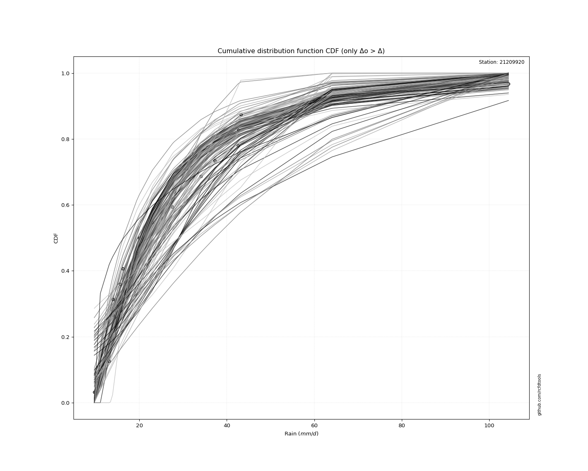</img>

</div>


**5.3. Best fit**

<div align="center">

|   id |   station | empirical_dist   | p_dist       |     delta |   deltao | eval   |   fit |   n |   best_fit |   best_fit_sort |
|-----:|----------:|:-----------------|:-------------|----------:|---------:|:-------|------:|----:|-----------:|----------------:|
|    0 |  21209920 | edf_chegodayev   | logjohnsonsb | 0.0733225 | 0.302825 | Δo > Δ |     1 |  21 |          1 |               1 |

</div>


<div align="center">

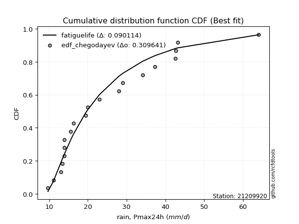</img>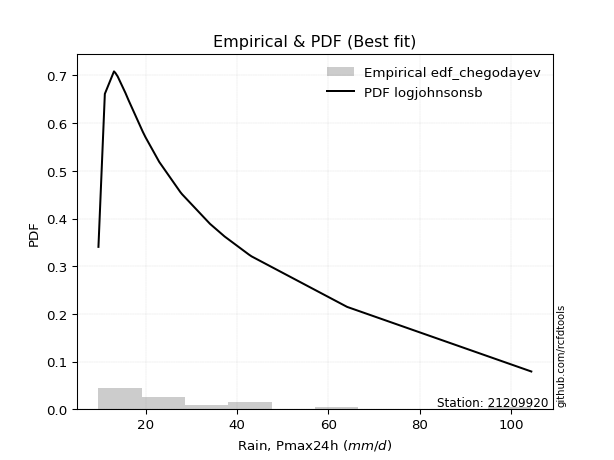</img>

</div>


### 6. EDF Blom (1958)

The Blom formula is a specific "plotting position" formula used in hydrology and statistical analysis to estimate the empirical cumulative probability (or non-exceedance probability) of a data series. It is particularly recommended for data that are approximately normally distributed. The constant _a_ is set to 0.375 (or 3/8).

<div align="center">


$P=(m-a)/(n+1-2a)$


</div>


**6.1. Empirical values**

<div align="center">

|                | 0                    | 1                   | 2                   | 3                   | 4                   | 5                  | 6                   | 7                  | 8                   | 9                   | 10       | 11                 | 12                 | 13                 | 14                 | 15                 | 16                 | 17                 | 18                 | 19                 | 20                 |
|:---------------|:---------------------|:--------------------|:--------------------|:--------------------|:--------------------|:-------------------|:--------------------|:-------------------|:--------------------|:--------------------|:---------|:-------------------|:-------------------|:-------------------|:-------------------|:-------------------|:-------------------|:-------------------|:-------------------|:-------------------|:-------------------|
| date           | 2017                 | 2016                | 2019                | 2018                | 2015                | 2021               | 2023                | 2014               | 2013                | 2022                | 2020     | 2006               | 2025               | 2005               | 2009               | 2007               | 2011               | 2010               | 2008               | 2012               | 2024               |
| x              | 9.7                  | 11.1                | 13.1                | 13.4                | 13.9                | 13.9               | 13.9                | 15.6               | 16.3                | 19.4                | 20.0     | 23.0               | 27.6               | 28.0               | 34.1               | 37.3               | 42.6               | 42.7               | 43.2               | 64.1               | 104.4              |
| m              | 1                    | 2                   | 3                   | 4                   | 5                   | 6                  | 7                   | 8                  | 9                   | 10                  | 11       | 12                 | 13                 | 14                 | 15                 | 16                 | 17                 | 18                 | 19                 | 20                 | 21                 |
| empirical_dist | edf_blom             | edf_blom            | edf_blom            | edf_blom            | edf_blom            | edf_blom           | edf_blom            | edf_blom           | edf_blom            | edf_blom            | edf_blom | edf_blom           | edf_blom           | edf_blom           | edf_blom           | edf_blom           | edf_blom           | edf_blom           | edf_blom           | edf_blom           | edf_blom           |
| empirical      | 0.029411764705882353 | 0.07647058823529412 | 0.12352941176470589 | 0.17058823529411765 | 0.21764705882352942 | 0.2647058823529412 | 0.31176470588235294 | 0.3588235294117647 | 0.40588235294117647 | 0.45294117647058824 | 0.5      | 0.5470588235294118 | 0.5941176470588235 | 0.6411764705882353 | 0.6882352941176471 | 0.7352941176470589 | 0.7823529411764706 | 0.8294117647058824 | 0.8764705882352941 | 0.9235294117647059 | 0.9705882352941176 |
| empirical_tr   | 1.0303030303030303   | 1.0828025477707006  | 1.1409395973154361  | 1.2056737588652484  | 1.2781954887218046  | 1.3599999999999999 | 1.452991452991453   | 1.559633027522936  | 1.683168316831683   | 1.8279569892473115  | 2.0      | 2.207792207792208  | 2.463768115942029  | 2.7868852459016398 | 3.207547169811321  | 3.7777777777777786 | 4.594594594594595  | 5.862068965517243  | 8.095238095238095  | 13.076923076923086 | 33.99999999999999  |

</div>


**6.2. Kolmogorov-Smirnov fit test (sorted by Δ)**


<div align="center">

|                | 0                   | 1                   | 2                   | 3                   | 4                   | 5                   | 6                   | 7                   | 8                   | 9                   | 10                  | 11                  | 12                  | 13                  | 14                  | 15                  | 16                  | 17                  | 18                  | 19                  | 20                  | 21                  | 22                  | 23                  | 24                  | 25                  | 26                  | 27                  | 28                  | 29                  | 30                  | 31                  | 32                  | 33                  | 34                  | 35                  | 36                  | 37                  | 38                  | 39                  | 40                  | 41                  | 42                  | 43                  | 44                  | 45                  | 46                  | 47                  | 48                  | 49                  | 50                  | 51                  | 52                  | 53                  | 54                  | 55                  | 56                  | 57                  | 58                  | 59                  | 60                  | 61                  | 62                  | 63                  | 64                  | 65                  | 66                  | 67                  | 68                  | 69                  | 70                  | 71                  | 72                  | 73                  | 74                  | 75                  | 76                  | 77                  | 78                  | 79                  | 80                  | 81                  | 82                  | 83                  | 84                  | 85                  | 86                  | 87                  | 88                  | 89                  | 90                  | 91                  | 92                  | 93                  | 94                  | 95                  | 96                  | 97                  | 98                  | 99                  | 100                 | 101                 | 102                 | 103                 | 104                 | 105                 | 106                 | 107                 | 108                 | 109                 | 110                 | 111                 | 112                 | 113                 | 114                 | 115                 | 116                 | 117                 | 118                 | 119                 | 120                 | 121                 | 122                 | 123                 | 124                 | 125                 | 126                 | 127                 | 128                 | 129                 | 130                 | 131                 | 132                 | 133                 | 134                 | 135                 | 136                 | 137                 | 138                 | 139                 | 140                 | 141                 | 142                 | 143                 | 144                 | 145                 | 146                 | 147                 | 148                 | 149                 | 150                 | 151                 | 152                 | 153                 | 154                 | 155                 | 156                 | 157                 | 158                 | 159                 |
|:---------------|:--------------------|:--------------------|:--------------------|:--------------------|:--------------------|:--------------------|:--------------------|:--------------------|:--------------------|:--------------------|:--------------------|:--------------------|:--------------------|:--------------------|:--------------------|:--------------------|:--------------------|:--------------------|:--------------------|:--------------------|:--------------------|:--------------------|:--------------------|:--------------------|:--------------------|:--------------------|:--------------------|:--------------------|:--------------------|:--------------------|:--------------------|:--------------------|:--------------------|:--------------------|:--------------------|:--------------------|:--------------------|:--------------------|:--------------------|:--------------------|:--------------------|:--------------------|:--------------------|:--------------------|:--------------------|:--------------------|:--------------------|:--------------------|:--------------------|:--------------------|:--------------------|:--------------------|:--------------------|:--------------------|:--------------------|:--------------------|:--------------------|:--------------------|:--------------------|:--------------------|:--------------------|:--------------------|:--------------------|:--------------------|:--------------------|:--------------------|:--------------------|:--------------------|:--------------------|:--------------------|:--------------------|:--------------------|:--------------------|:--------------------|:--------------------|:--------------------|:--------------------|:--------------------|:--------------------|:--------------------|:--------------------|:--------------------|:--------------------|:--------------------|:--------------------|:--------------------|:--------------------|:--------------------|:--------------------|:--------------------|:--------------------|:--------------------|:--------------------|:--------------------|:--------------------|:--------------------|:--------------------|:--------------------|:--------------------|:--------------------|:--------------------|:--------------------|:--------------------|:--------------------|:--------------------|:--------------------|:--------------------|:--------------------|:--------------------|:--------------------|:--------------------|:--------------------|:--------------------|:--------------------|:--------------------|:--------------------|:--------------------|:--------------------|:--------------------|:--------------------|:--------------------|:--------------------|:--------------------|:--------------------|:--------------------|:--------------------|:--------------------|:--------------------|:--------------------|:--------------------|:--------------------|:--------------------|:--------------------|:--------------------|:--------------------|:--------------------|:--------------------|:--------------------|:--------------------|:--------------------|:--------------------|:--------------------|:--------------------|:--------------------|:--------------------|:--------------------|:--------------------|:--------------------|:--------------------|:--------------------|:--------------------|:--------------------|:--------------------|:--------------------|:--------------------|:--------------------|:--------------------|:--------------------|:--------------------|:--------------------|
| station        | 21209920            | 21209920            | 21209920            | 21209920            | 21209920            | 21209920            | 21209920            | 21209920            | 21209920            | 21209920            | 21209920            | 21209920            | 21209920            | 21209920            | 21209920            | 21209920            | 21209920            | 21209920            | 21209920            | 21209920            | 21209920            | 21209920            | 21209920            | 21209920            | 21209920            | 21209920            | 21209920            | 21209920            | 21209920            | 21209920            | 21209920            | 21209920            | 21209920            | 21209920            | 21209920            | 21209920            | 21209920            | 21209920            | 21209920            | 21209920            | 21209920            | 21209920            | 21209920            | 21209920            | 21209920            | 21209920            | 21209920            | 21209920            | 21209920            | 21209920            | 21209920            | 21209920            | 21209920            | 21209920            | 21209920            | 21209920            | 21209920            | 21209920            | 21209920            | 21209920            | 21209920            | 21209920            | 21209920            | 21209920            | 21209920            | 21209920            | 21209920            | 21209920            | 21209920            | 21209920            | 21209920            | 21209920            | 21209920            | 21209920            | 21209920            | 21209920            | 21209920            | 21209920            | 21209920            | 21209920            | 21209920            | 21209920            | 21209920            | 21209920            | 21209920            | 21209920            | 21209920            | 21209920            | 21209920            | 21209920            | 21209920            | 21209920            | 21209920            | 21209920            | 21209920            | 21209920            | 21209920            | 21209920            | 21209920            | 21209920            | 21209920            | 21209920            | 21209920            | 21209920            | 21209920            | 21209920            | 21209920            | 21209920            | 21209920            | 21209920            | 21209920            | 21209920            | 21209920            | 21209920            | 21209920            | 21209920            | 21209920            | 21209920            | 21209920            | 21209920            | 21209920            | 21209920            | 21209920            | 21209920            | 21209920            | 21209920            | 21209920            | 21209920            | 21209920            | 21209920            | 21209920            | 21209920            | 21209920            | 21209920            | 21209920            | 21209920            | 21209920            | 21209920            | 21209920            | 21209920            | 21209920            | 21209920            | 21209920            | 21209920            | 21209920            | 21209920            | 21209920            | 21209920            | 21209920            | 21209920            | 21209920            | 21209920            | 21209920            | 21209920            | 21209920            | 21209920            | 21209920            | 21209920            | 21209920            | 21209920            |
| empirical_dist | edf_blom            | edf_blom            | edf_blom            | edf_blom            | edf_blom            | edf_blom            | edf_blom            | edf_blom            | edf_blom            | edf_blom            | edf_blom            | edf_blom            | edf_blom            | edf_blom            | edf_blom            | edf_blom            | edf_blom            | edf_blom            | edf_blom            | edf_blom            | edf_blom            | edf_blom            | edf_blom            | edf_blom            | edf_blom            | edf_blom            | edf_blom            | edf_blom            | edf_blom            | edf_blom            | edf_blom            | edf_blom            | edf_blom            | edf_blom            | edf_blom            | edf_blom            | edf_blom            | edf_blom            | edf_blom            | edf_blom            | edf_blom            | edf_blom            | edf_blom            | edf_blom            | edf_blom            | edf_blom            | edf_blom            | edf_blom            | edf_blom            | edf_blom            | edf_blom            | edf_blom            | edf_blom            | edf_blom            | edf_blom            | edf_blom            | edf_blom            | edf_blom            | edf_blom            | edf_blom            | edf_blom            | edf_blom            | edf_blom            | edf_blom            | edf_blom            | edf_blom            | edf_blom            | edf_blom            | edf_blom            | edf_blom            | edf_blom            | edf_blom            | edf_blom            | edf_blom            | edf_blom            | edf_blom            | edf_blom            | edf_blom            | edf_blom            | edf_blom            | edf_blom            | edf_blom            | edf_blom            | edf_blom            | edf_blom            | edf_blom            | edf_blom            | edf_blom            | edf_blom            | edf_blom            | edf_blom            | edf_blom            | edf_blom            | edf_blom            | edf_blom            | edf_blom            | edf_blom            | edf_blom            | edf_blom            | edf_blom            | edf_blom            | edf_blom            | edf_blom            | edf_blom            | edf_blom            | edf_blom            | edf_blom            | edf_blom            | edf_blom            | edf_blom            | edf_blom            | edf_blom            | edf_blom            | edf_blom            | edf_blom            | edf_blom            | edf_blom            | edf_blom            | edf_blom            | edf_blom            | edf_blom            | edf_blom            | edf_blom            | edf_blom            | edf_blom            | edf_blom            | edf_blom            | edf_blom            | edf_blom            | edf_blom            | edf_blom            | edf_blom            | edf_blom            | edf_blom            | edf_blom            | edf_blom            | edf_blom            | edf_blom            | edf_blom            | edf_blom            | edf_blom            | edf_blom            | edf_blom            | edf_blom            | edf_blom            | edf_blom            | edf_blom            | edf_blom            | edf_blom            | edf_blom            | edf_blom            | edf_blom            | edf_blom            | edf_blom            | edf_blom            | edf_blom            | edf_blom            | edf_blom            | edf_blom            | edf_blom            |
| p_dist         | genpareto           | logjohnsonsb        | fatiguelife         | logfoldnorm         | halfgennorm         | johnsonsb           | loggenexpon         | loghalfgennorm      | logdgamma           | invgauss            | lomax               | johnsonsu           | loghalfnorm         | loggamma            | loggamma            | logerlang           | logweibull_min      | logsemicircular     | loggompertz         | alpha               | logskewnorm         | f                   | gengamma            | mielke              | burr                | lograyleigh         | logfatiguelife      | invweibull          | genextreme          | kappa3              | betaprime           | invgamma            | truncpareto         | loginvgauss         | logkappa3           | logf                | loganglit           | logmaxwell          | logjohnsonsu        | burr12              | logexponnorm        | logburr12           | exponweib           | logburr             | logpearson3         | loginvgamma         | logbetaprime        | logvonmises_line    | logmielke           | loginvweibull       | loggenextreme       | exponnorm           | logncf              | pearson3            | logalpha            | genexpon            | nct                 | logkstwobign        | logweibull_max      | lognct              | loggenlogistic      | logdweibull         | logbeta             | exponpow            | loghalflogistic     | ncf                 | logtriang           | weibull_min         | logvonmises         | gausshyper          | loggumbel_r         | gamma               | logtruncweibull_min | lognakagami         | logtukeylambda      | logcrystalball      | lognorm             | logt                | moyal               | logloggamma         | logrice             | wald                | loggausshyper       | gompertz            | logmoyal            | logtruncnorm        | logloglaplace       | logtruncexpon       | logarcsine          | loggennorm          | gumbel_r            | halflogistic        | truncnorm           | loglogistic         | logcosine           | beta                | genlogistic         | logexponweib        | crystalball         | norm                | logrdist            | loggengamma         | t                   | loghypsecant        | loglomax            | logbradford         | dweibull            | maxwell             | loggumbel_l         | rayleigh            | kstwobign           | logistic            | erlang              | genhalflogistic     | halfnorm            | cosine              | logtruncpareto      | anglit              | loglaplace          | loglaplace          | hypsecant           | dgamma              | semicircular        | nakagami            | rice                | logexponpow         | gennorm             | vonmises_line       | laplace             | skewnorm            | foldnorm            | gumbel_l            | logargus            | loguniform          | logkappa4           | arcsine             | logksone            | truncweibull_min    | bradford            | logwald             | powerlaw            | triang              | truncexpon          | logwrapcauchy       | logpowerlaw         | loggenpareto        | loggenhalflogistic  | wrapcauchy          | argus               | loglevy_l           | kappa4              | ksone               | logtrapezoid        | levy_l              | uniform             | rdist               | tukeylambda         | trapezoid           | weibull_max         | vonmises            |
| delta          | 0.07549940709513456 | 0.07596135385726227 | 0.0779607601724816  | 0.078057294306588   | 0.07929084503326819 | 0.07974141658681222 | 0.08039652412161458 | 0.08229967431391894 | 0.08559347057280892 | 0.08649421409213501 | 0.08712995619149908 | 0.08758564235461952 | 0.0880286888936403  | 0.08903188148332444 | 0.08903188148332444 | 0.08903270904122085 | 0.09036570115931103 | 0.09175512371183592 | 0.09357855380478816 | 0.09412016045417174 | 0.09603247143896504 | 0.09618441305663283 | 0.09619003820838953 | 0.09649667799979969 | 0.09705961952997638 | 0.09719109385847266 | 0.09853067955627087 | 0.09879049383645486 | 0.0987908187136691  | 0.09974844533650051 | 0.10001631363880104 | 0.10010093392262681 | 0.10023691280146557 | 0.10124886905325767 | 0.10144764374612641 | 0.10272442914214763 | 0.1030016956902976  | 0.10397104678983637 | 0.10420368638183675 | 0.10552200580049476 | 0.10558345142106162 | 0.10564466857808064 | 0.10978160668694936 | 0.10996427458047112 | 0.11000835210713322 | 0.11009385972951102 | 0.11011725345676326 | 0.11016171896908694 | 0.1105978459069803  | 0.11302078309880845 | 0.11302493726898072 | 0.11390635311766206 | 0.11445797228189125 | 0.11506517277589359 | 0.11533156676288633 | 0.11546261334231195 | 0.1157942270730534  | 0.11636473967043809 | 0.11664583218084493 | 0.11675542096197111 | 0.11690155529142388 | 0.11702820275689313 | 0.11751252913189814 | 0.11858074596518564 | 0.11942310933130576 | 0.121244175741625   | 0.1218894594116357  | 0.12207464139577134 | 0.12351184467902576 | 0.12427643829935572 | 0.1244340921995162  | 0.12609278724406067 | 0.12623368622135855 | 0.12694893118574463 | 0.12774392974548443 | 0.12920453033996065 | 0.1292046015947726  | 0.12920597819042468 | 0.12959849096538423 | 0.13029366769311035 | 0.13231503684362741 | 0.13299001939606395 | 0.13385672233271784 | 0.13534544357285938 | 0.1395944322605318  | 0.13980521235365118 | 0.13993577476413044 | 0.14020039454839972 | 0.1424004940856176  | 0.14514273406015143 | 0.14678646260226774 | 0.1471162730671592  | 0.14918987558072966 | 0.1514499341940191  | 0.15261923171482966 | 0.15416718015626324 | 0.15459960242911708 | 0.15503802719433407 | 0.15996734927246486 | 0.15996735325304334 | 0.16034824191153962 | 0.16548305382344747 | 0.1661276079759273  | 0.1668721774820448  | 0.1689527522498422  | 0.16927839142224899 | 0.1703968458383032  | 0.1707983361230393  | 0.17499446552490125 | 0.17521390384824123 | 0.17595555487247727 | 0.17718928074716378 | 0.1775354063322082  | 0.1810804562531991  | 0.18134930899567048 | 0.18489099970337686 | 0.18591259312656394 | 0.18754344369145026 | 0.18965122774128013 | 0.18965122774128013 | 0.19151169937436907 | 0.1977913992495826  | 0.19974303924244075 | 0.20099238193169344 | 0.20441308144941928 | 0.20717709315259714 | 0.20890111973847647 | 0.21320348331373262 | 0.21939648773001902 | 0.22639253862201236 | 0.22841971264610117 | 0.22863248319759333 | 0.24087749034194772 | 0.24783028385745032 | 0.25221811803946736 | 0.25675199134336885 | 0.26927033458709093 | 0.27658627607831554 | 0.2768508251465368  | 0.2880127876682055  | 0.29470966224810824 | 0.2986407194009377  | 0.32076017720586225 | 0.3313964182293483  | 0.36051449108453504 | 0.3677140610278939  | 0.4011479213386924  | 0.4266828728213234  | 0.4397355440986638  | 0.44969669106618737 | 0.48361767164065267 | 0.4983466882000952  | 0.5077784402048516  | 0.517290325366304   | 0.5227219081930554  | 0.5417134485337135  | 0.5686725499490651  | 0.733492904457465   | 0.7861842963569292  | 15.85554330811774   |
| deltao         | 0.30282488509099936 | 0.30282488509099936 | 0.30282488509099936 | 0.30282488509099936 | 0.30282488509099936 | 0.30282488509099936 | 0.30282488509099936 | 0.30282488509099936 | 0.30282488509099936 | 0.30282488509099936 | 0.30282488509099936 | 0.30282488509099936 | 0.30282488509099936 | 0.30282488509099936 | 0.30282488509099936 | 0.30282488509099936 | 0.30282488509099936 | 0.30282488509099936 | 0.30282488509099936 | 0.30282488509099936 | 0.30282488509099936 | 0.30282488509099936 | 0.30282488509099936 | 0.30282488509099936 | 0.30282488509099936 | 0.30282488509099936 | 0.30282488509099936 | 0.30282488509099936 | 0.30282488509099936 | 0.30282488509099936 | 0.30282488509099936 | 0.30282488509099936 | 0.30282488509099936 | 0.30282488509099936 | 0.30282488509099936 | 0.30282488509099936 | 0.30282488509099936 | 0.30282488509099936 | 0.30282488509099936 | 0.30282488509099936 | 0.30282488509099936 | 0.30282488509099936 | 0.30282488509099936 | 0.30282488509099936 | 0.30282488509099936 | 0.30282488509099936 | 0.30282488509099936 | 0.30282488509099936 | 0.30282488509099936 | 0.30282488509099936 | 0.30282488509099936 | 0.30282488509099936 | 0.30282488509099936 | 0.30282488509099936 | 0.30282488509099936 | 0.30282488509099936 | 0.30282488509099936 | 0.30282488509099936 | 0.30282488509099936 | 0.30282488509099936 | 0.30282488509099936 | 0.30282488509099936 | 0.30282488509099936 | 0.30282488509099936 | 0.30282488509099936 | 0.30282488509099936 | 0.30282488509099936 | 0.30282488509099936 | 0.30282488509099936 | 0.30282488509099936 | 0.30282488509099936 | 0.30282488509099936 | 0.30282488509099936 | 0.30282488509099936 | 0.30282488509099936 | 0.30282488509099936 | 0.30282488509099936 | 0.30282488509099936 | 0.30282488509099936 | 0.30282488509099936 | 0.30282488509099936 | 0.30282488509099936 | 0.30282488509099936 | 0.30282488509099936 | 0.30282488509099936 | 0.30282488509099936 | 0.30282488509099936 | 0.30282488509099936 | 0.30282488509099936 | 0.30282488509099936 | 0.30282488509099936 | 0.30282488509099936 | 0.30282488509099936 | 0.30282488509099936 | 0.30282488509099936 | 0.30282488509099936 | 0.30282488509099936 | 0.30282488509099936 | 0.30282488509099936 | 0.30282488509099936 | 0.30282488509099936 | 0.30282488509099936 | 0.30282488509099936 | 0.30282488509099936 | 0.30282488509099936 | 0.30282488509099936 | 0.30282488509099936 | 0.30282488509099936 | 0.30282488509099936 | 0.30282488509099936 | 0.30282488509099936 | 0.30282488509099936 | 0.30282488509099936 | 0.30282488509099936 | 0.30282488509099936 | 0.30282488509099936 | 0.30282488509099936 | 0.30282488509099936 | 0.30282488509099936 | 0.30282488509099936 | 0.30282488509099936 | 0.30282488509099936 | 0.30282488509099936 | 0.30282488509099936 | 0.30282488509099936 | 0.30282488509099936 | 0.30282488509099936 | 0.30282488509099936 | 0.30282488509099936 | 0.30282488509099936 | 0.30282488509099936 | 0.30282488509099936 | 0.30282488509099936 | 0.30282488509099936 | 0.30282488509099936 | 0.30282488509099936 | 0.30282488509099936 | 0.30282488509099936 | 0.30282488509099936 | 0.30282488509099936 | 0.30282488509099936 | 0.30282488509099936 | 0.30282488509099936 | 0.30282488509099936 | 0.30282488509099936 | 0.30282488509099936 | 0.30282488509099936 | 0.30282488509099936 | 0.30282488509099936 | 0.30282488509099936 | 0.30282488509099936 | 0.30282488509099936 | 0.30282488509099936 | 0.30282488509099936 | 0.30282488509099936 | 0.30282488509099936 | 0.30282488509099936 | 0.30282488509099936 | 0.30282488509099936 | 0.30282488509099936 |
| eval           | Δo > Δ              | Δo > Δ              | Δo > Δ              | Δo > Δ              | Δo > Δ              | Δo > Δ              | Δo > Δ              | Δo > Δ              | Δo > Δ              | Δo > Δ              | Δo > Δ              | Δo > Δ              | Δo > Δ              | Δo > Δ              | Δo > Δ              | Δo > Δ              | Δo > Δ              | Δo > Δ              | Δo > Δ              | Δo > Δ              | Δo > Δ              | Δo > Δ              | Δo > Δ              | Δo > Δ              | Δo > Δ              | Δo > Δ              | Δo > Δ              | Δo > Δ              | Δo > Δ              | Δo > Δ              | Δo > Δ              | Δo > Δ              | Δo > Δ              | Δo > Δ              | Δo > Δ              | Δo > Δ              | Δo > Δ              | Δo > Δ              | Δo > Δ              | Δo > Δ              | Δo > Δ              | Δo > Δ              | Δo > Δ              | Δo > Δ              | Δo > Δ              | Δo > Δ              | Δo > Δ              | Δo > Δ              | Δo > Δ              | Δo > Δ              | Δo > Δ              | Δo > Δ              | Δo > Δ              | Δo > Δ              | Δo > Δ              | Δo > Δ              | Δo > Δ              | Δo > Δ              | Δo > Δ              | Δo > Δ              | Δo > Δ              | Δo > Δ              | Δo > Δ              | Δo > Δ              | Δo > Δ              | Δo > Δ              | Δo > Δ              | Δo > Δ              | Δo > Δ              | Δo > Δ              | Δo > Δ              | Δo > Δ              | Δo > Δ              | Δo > Δ              | Δo > Δ              | Δo > Δ              | Δo > Δ              | Δo > Δ              | Δo > Δ              | Δo > Δ              | Δo > Δ              | Δo > Δ              | Δo > Δ              | Δo > Δ              | Δo > Δ              | Δo > Δ              | Δo > Δ              | Δo > Δ              | Δo > Δ              | Δo > Δ              | Δo > Δ              | Δo > Δ              | Δo > Δ              | Δo > Δ              | Δo > Δ              | Δo > Δ              | Δo > Δ              | Δo > Δ              | Δo > Δ              | Δo > Δ              | Δo > Δ              | Δo > Δ              | Δo > Δ              | Δo > Δ              | Δo > Δ              | Δo > Δ              | Δo > Δ              | Δo > Δ              | Δo > Δ              | Δo > Δ              | Δo > Δ              | Δo > Δ              | Δo > Δ              | Δo > Δ              | Δo > Δ              | Δo > Δ              | Δo > Δ              | Δo > Δ              | Δo > Δ              | Δo > Δ              | Δo > Δ              | Δo > Δ              | Δo > Δ              | Δo > Δ              | Δo > Δ              | Δo > Δ              | Δo > Δ              | Δo > Δ              | Δo > Δ              | Δo > Δ              | Δo > Δ              | Δo > Δ              | Δo > Δ              | Δo > Δ              | Δo > Δ              | Δo > Δ              | Δo > Δ              | Δo > Δ              | Δo > Δ              | Δo > Δ              | Δo > Δ              | Δo > Δ              | Δo <= Δ             | Δo <= Δ             | Δo <= Δ             | Δo <= Δ             | Δo <= Δ             | Δo <= Δ             | Δo <= Δ             | Δo <= Δ             | Δo <= Δ             | Δo <= Δ             | Δo <= Δ             | Δo <= Δ             | Δo <= Δ             | Δo <= Δ             | Δo <= Δ             | Δo <= Δ             | Δo <= Δ             | Δo <= Δ             |
| fit            | 1                   | 1                   | 1                   | 1                   | 1                   | 1                   | 1                   | 1                   | 1                   | 1                   | 1                   | 1                   | 1                   | 1                   | 1                   | 1                   | 1                   | 1                   | 1                   | 1                   | 1                   | 1                   | 1                   | 1                   | 1                   | 1                   | 1                   | 1                   | 1                   | 1                   | 1                   | 1                   | 1                   | 1                   | 1                   | 1                   | 1                   | 1                   | 1                   | 1                   | 1                   | 1                   | 1                   | 1                   | 1                   | 1                   | 1                   | 1                   | 1                   | 1                   | 1                   | 1                   | 1                   | 1                   | 1                   | 1                   | 1                   | 1                   | 1                   | 1                   | 1                   | 1                   | 1                   | 1                   | 1                   | 1                   | 1                   | 1                   | 1                   | 1                   | 1                   | 1                   | 1                   | 1                   | 1                   | 1                   | 1                   | 1                   | 1                   | 1                   | 1                   | 1                   | 1                   | 1                   | 1                   | 1                   | 1                   | 1                   | 1                   | 1                   | 1                   | 1                   | 1                   | 1                   | 1                   | 1                   | 1                   | 1                   | 1                   | 1                   | 1                   | 1                   | 1                   | 1                   | 1                   | 1                   | 1                   | 1                   | 1                   | 1                   | 1                   | 1                   | 1                   | 1                   | 1                   | 1                   | 1                   | 1                   | 1                   | 1                   | 1                   | 1                   | 1                   | 1                   | 1                   | 1                   | 1                   | 1                   | 1                   | 1                   | 1                   | 1                   | 1                   | 1                   | 1                   | 1                   | 1                   | 1                   | 1                   | 1                   | 1                   | 1                   | 0                   | 0                   | 0                   | 0                   | 0                   | 0                   | 0                   | 0                   | 0                   | 0                   | 0                   | 0                   | 0                   | 0                   | 0                   | 0                   | 0                   | 0                   |
| n              | 21                  | 21                  | 21                  | 21                  | 21                  | 21                  | 21                  | 21                  | 21                  | 21                  | 21                  | 21                  | 21                  | 21                  | 21                  | 21                  | 21                  | 21                  | 21                  | 21                  | 21                  | 21                  | 21                  | 21                  | 21                  | 21                  | 21                  | 21                  | 21                  | 21                  | 21                  | 21                  | 21                  | 21                  | 21                  | 21                  | 21                  | 21                  | 21                  | 21                  | 21                  | 21                  | 21                  | 21                  | 21                  | 21                  | 21                  | 21                  | 21                  | 21                  | 21                  | 21                  | 21                  | 21                  | 21                  | 21                  | 21                  | 21                  | 21                  | 21                  | 21                  | 21                  | 21                  | 21                  | 21                  | 21                  | 21                  | 21                  | 21                  | 21                  | 21                  | 21                  | 21                  | 21                  | 21                  | 21                  | 21                  | 21                  | 21                  | 21                  | 21                  | 21                  | 21                  | 21                  | 21                  | 21                  | 21                  | 21                  | 21                  | 21                  | 21                  | 21                  | 21                  | 21                  | 21                  | 21                  | 21                  | 21                  | 21                  | 21                  | 21                  | 21                  | 21                  | 21                  | 21                  | 21                  | 21                  | 21                  | 21                  | 21                  | 21                  | 21                  | 21                  | 21                  | 21                  | 21                  | 21                  | 21                  | 21                  | 21                  | 21                  | 21                  | 21                  | 21                  | 21                  | 21                  | 21                  | 21                  | 21                  | 21                  | 21                  | 21                  | 21                  | 21                  | 21                  | 21                  | 21                  | 21                  | 21                  | 21                  | 21                  | 21                  | 21                  | 21                  | 21                  | 21                  | 21                  | 21                  | 21                  | 21                  | 21                  | 21                  | 21                  | 21                  | 21                  | 21                  | 21                  | 21                  | 21                  | 21                  |
| best_fit       | 1                   | 0                   | 0                   | 0                   | 0                   | 0                   | 0                   | 0                   | 0                   | 0                   | 0                   | 0                   | 0                   | 0                   | 0                   | 0                   | 0                   | 0                   | 0                   | 0                   | 0                   | 0                   | 0                   | 0                   | 0                   | 0                   | 0                   | 0                   | 0                   | 0                   | 0                   | 0                   | 0                   | 0                   | 0                   | 0                   | 0                   | 0                   | 0                   | 0                   | 0                   | 0                   | 0                   | 0                   | 0                   | 0                   | 0                   | 0                   | 0                   | 0                   | 0                   | 0                   | 0                   | 0                   | 0                   | 0                   | 0                   | 0                   | 0                   | 0                   | 0                   | 0                   | 0                   | 0                   | 0                   | 0                   | 0                   | 0                   | 0                   | 0                   | 0                   | 0                   | 0                   | 0                   | 0                   | 0                   | 0                   | 0                   | 0                   | 0                   | 0                   | 0                   | 0                   | 0                   | 0                   | 0                   | 0                   | 0                   | 0                   | 0                   | 0                   | 0                   | 0                   | 0                   | 0                   | 0                   | 0                   | 0                   | 0                   | 0                   | 0                   | 0                   | 0                   | 0                   | 0                   | 0                   | 0                   | 0                   | 0                   | 0                   | 0                   | 0                   | 0                   | 0                   | 0                   | 0                   | 0                   | 0                   | 0                   | 0                   | 0                   | 0                   | 0                   | 0                   | 0                   | 0                   | 0                   | 0                   | 0                   | 0                   | 0                   | 0                   | 0                   | 0                   | 0                   | 0                   | 0                   | 0                   | 0                   | 0                   | 0                   | 0                   | 0                   | 0                   | 0                   | 0                   | 0                   | 0                   | 0                   | 0                   | 0                   | 0                   | 0                   | 0                   | 0                   | 0                   | 0                   | 0                   | 0                   | 0                   |
| best_fit_sort  | 1                   | 2                   | 3                   | 4                   | 5                   | 6                   | 7                   | 8                   | 9                   | 10                  | 11                  | 12                  | 13                  | 14                  | 15                  | 16                  | 17                  | 18                  | 19                  | 20                  | 21                  | 22                  | 23                  | 24                  | 25                  | 26                  | 27                  | 28                  | 29                  | 30                  | 31                  | 32                  | 33                  | 34                  | 35                  | 36                  | 37                  | 38                  | 39                  | 40                  | 41                  | 42                  | 43                  | 44                  | 45                  | 46                  | 47                  | 48                  | 49                  | 50                  | 51                  | 52                  | 53                  | 54                  | 55                  | 56                  | 57                  | 58                  | 59                  | 60                  | 61                  | 62                  | 63                  | 64                  | 65                  | 66                  | 67                  | 68                  | 69                  | 70                  | 71                  | 72                  | 73                  | 74                  | 75                  | 76                  | 77                  | 78                  | 79                  | 80                  | 81                  | 82                  | 83                  | 84                  | 85                  | 86                  | 87                  | 88                  | 89                  | 90                  | 91                  | 92                  | 93                  | 94                  | 95                  | 96                  | 97                  | 98                  | 99                  | 100                 | 101                 | 102                 | 103                 | 104                 | 105                 | 106                 | 107                 | 108                 | 109                 | 110                 | 111                 | 112                 | 113                 | 114                 | 115                 | 116                 | 117                 | 118                 | 119                 | 120                 | 121                 | 122                 | 123                 | 124                 | 125                 | 126                 | 127                 | 128                 | 129                 | 130                 | 131                 | 132                 | 133                 | 134                 | 135                 | 136                 | 137                 | 138                 | 139                 | 140                 | 141                 | 142                 | 143                 | 144                 | 145                 | 146                 | 147                 | 148                 | 149                 | 150                 | 151                 | 152                 | 153                 | 154                 | 155                 | 156                 | 157                 | 158                 | 159                 | 160                 |

</div>


<div align="center">

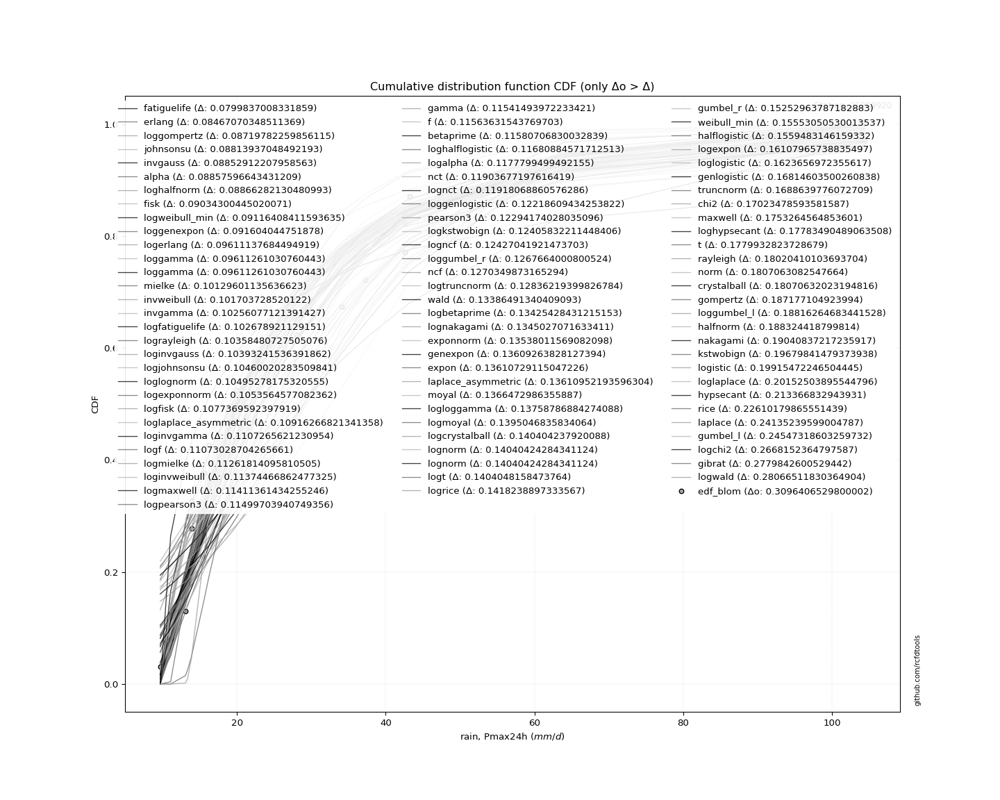</img>

</div>


**6.3. Best fit**

<div align="center">

|   id |   station | empirical_dist   | p_dist    |     delta |   deltao | eval   |   fit |   n |   best_fit |   best_fit_sort |
|-----:|----------:|:-----------------|:----------|----------:|---------:|:-------|------:|----:|-----------:|----------------:|
|    0 |  21209920 | edf_blom         | genpareto | 0.0754994 | 0.302825 | Δo > Δ |     1 |  21 |          1 |               1 |

</div>


<div align="center">

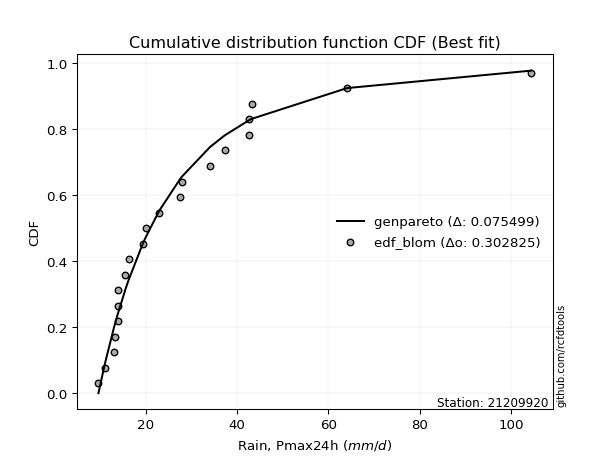</img></img>

</div>


### 7. EDF Tukey (1962)

In hydrology, the Tukey formula is used as a plotting position formula to estimate the empirical probability or frequency of a flood event (or other hydrological data). The formula parameter is given as _c=0.333_ (or 1/3).

<div align="center">


$P=(m-c)/(n+1-2c)$


</div>


**7.1. Empirical values**

<div align="center">

|                | 0                 | 1                  | 2                  | 3                  | 4         | 5                  | 6                  | 7                  | 8                  | 9                  | 10        | 11                | 12                 | 13                | 14        | 15                | 16                | 17                | 18        | 19        | 20        |
|:---------------|:------------------|:-------------------|:-------------------|:-------------------|:----------|:-------------------|:-------------------|:-------------------|:-------------------|:-------------------|:----------|:------------------|:-------------------|:------------------|:----------|:------------------|:------------------|:------------------|:----------|:----------|:----------|
| date           | 2017              | 2016               | 2019               | 2018               | 2015      | 2021               | 2023               | 2014               | 2013               | 2022               | 2020      | 2006              | 2025               | 2005              | 2009      | 2007              | 2011              | 2010              | 2008      | 2012      | 2024      |
| x              | 9.7               | 11.1               | 13.1               | 13.4               | 13.9      | 13.9               | 13.9               | 15.6               | 16.3               | 19.4               | 20.0      | 23.0              | 27.6               | 28.0              | 34.1      | 37.3              | 42.6              | 42.7              | 43.2      | 64.1      | 104.4     |
| m              | 1                 | 2                  | 3                  | 4                  | 5         | 6                  | 7                  | 8                  | 9                  | 10                 | 11        | 12                | 13                 | 14                | 15        | 16                | 17                | 18                | 19        | 20        | 21        |
| empirical_dist | edf_tukey         | edf_tukey          | edf_tukey          | edf_tukey          | edf_tukey | edf_tukey          | edf_tukey          | edf_tukey          | edf_tukey          | edf_tukey          | edf_tukey | edf_tukey         | edf_tukey          | edf_tukey         | edf_tukey | edf_tukey         | edf_tukey         | edf_tukey         | edf_tukey | edf_tukey | edf_tukey |
| empirical      | 0.03125           | 0.078125           | 0.125              | 0.171875           | 0.21875   | 0.265625           | 0.3125             | 0.359375           | 0.40625            | 0.453125           | 0.5       | 0.546875          | 0.59375            | 0.640625          | 0.6875    | 0.734375          | 0.78125           | 0.828125          | 0.875     | 0.921875  | 0.96875   |
| empirical_tr   | 1.032258064516129 | 1.0847457627118644 | 1.1428571428571428 | 1.2075471698113207 | 1.28      | 1.3617021276595744 | 1.4545454545454546 | 1.5609756097560976 | 1.6842105263157894 | 1.8285714285714285 | 2.0       | 2.206896551724138 | 2.4615384615384617 | 2.782608695652174 | 3.2       | 3.764705882352941 | 4.571428571428571 | 5.818181818181818 | 8.0       | 12.8      | 32.0      |

</div>


**7.2. Kolmogorov-Smirnov fit test (sorted by Δ)**


<div align="center">

|                | 0                   | 1                   | 2                   | 3                   | 4                   | 5                   | 6                   | 7                   | 8                   | 9                   | 10                  | 11                  | 12                  | 13                  | 14                  | 15                  | 16                  | 17                  | 18                  | 19                  | 20                  | 21                  | 22                  | 23                  | 24                  | 25                  | 26                  | 27                  | 28                  | 29                  | 30                  | 31                  | 32                  | 33                  | 34                  | 35                  | 36                  | 37                  | 38                  | 39                  | 40                  | 41                  | 42                  | 43                  | 44                  | 45                  | 46                  | 47                  | 48                  | 49                  | 50                  | 51                  | 52                  | 53                  | 54                  | 55                  | 56                  | 57                  | 58                  | 59                  | 60                  | 61                  | 62                  | 63                  | 64                  | 65                  | 66                  | 67                  | 68                  | 69                  | 70                  | 71                  | 72                  | 73                  | 74                  | 75                  | 76                  | 77                  | 78                  | 79                  | 80                  | 81                  | 82                  | 83                  | 84                  | 85                  | 86                  | 87                  | 88                  | 89                  | 90                  | 91                  | 92                  | 93                  | 94                  | 95                  | 96                  | 97                  | 98                  | 99                  | 100                 | 101                 | 102                 | 103                 | 104                 | 105                 | 106                 | 107                 | 108                 | 109                 | 110                 | 111                 | 112                 | 113                 | 114                 | 115                 | 116                 | 117                 | 118                 | 119                 | 120                 | 121                 | 122                 | 123                 | 124                 | 125                 | 126                 | 127                 | 128                 | 129                 | 130                 | 131                 | 132                 | 133                 | 134                 | 135                 | 136                 | 137                 | 138                 | 139                 | 140                 | 141                 | 142                 | 143                 | 144                 | 145                 | 146                 | 147                 | 148                 | 149                 | 150                 | 151                 | 152                 | 153                 | 154                 | 155                 | 156                 | 157                 | 158                 | 159                 |
|:---------------|:--------------------|:--------------------|:--------------------|:--------------------|:--------------------|:--------------------|:--------------------|:--------------------|:--------------------|:--------------------|:--------------------|:--------------------|:--------------------|:--------------------|:--------------------|:--------------------|:--------------------|:--------------------|:--------------------|:--------------------|:--------------------|:--------------------|:--------------------|:--------------------|:--------------------|:--------------------|:--------------------|:--------------------|:--------------------|:--------------------|:--------------------|:--------------------|:--------------------|:--------------------|:--------------------|:--------------------|:--------------------|:--------------------|:--------------------|:--------------------|:--------------------|:--------------------|:--------------------|:--------------------|:--------------------|:--------------------|:--------------------|:--------------------|:--------------------|:--------------------|:--------------------|:--------------------|:--------------------|:--------------------|:--------------------|:--------------------|:--------------------|:--------------------|:--------------------|:--------------------|:--------------------|:--------------------|:--------------------|:--------------------|:--------------------|:--------------------|:--------------------|:--------------------|:--------------------|:--------------------|:--------------------|:--------------------|:--------------------|:--------------------|:--------------------|:--------------------|:--------------------|:--------------------|:--------------------|:--------------------|:--------------------|:--------------------|:--------------------|:--------------------|:--------------------|:--------------------|:--------------------|:--------------------|:--------------------|:--------------------|:--------------------|:--------------------|:--------------------|:--------------------|:--------------------|:--------------------|:--------------------|:--------------------|:--------------------|:--------------------|:--------------------|:--------------------|:--------------------|:--------------------|:--------------------|:--------------------|:--------------------|:--------------------|:--------------------|:--------------------|:--------------------|:--------------------|:--------------------|:--------------------|:--------------------|:--------------------|:--------------------|:--------------------|:--------------------|:--------------------|:--------------------|:--------------------|:--------------------|:--------------------|:--------------------|:--------------------|:--------------------|:--------------------|:--------------------|:--------------------|:--------------------|:--------------------|:--------------------|:--------------------|:--------------------|:--------------------|:--------------------|:--------------------|:--------------------|:--------------------|:--------------------|:--------------------|:--------------------|:--------------------|:--------------------|:--------------------|:--------------------|:--------------------|:--------------------|:--------------------|:--------------------|:--------------------|:--------------------|:--------------------|:--------------------|:--------------------|:--------------------|:--------------------|:--------------------|:--------------------|
| station        | 21209920            | 21209920            | 21209920            | 21209920            | 21209920            | 21209920            | 21209920            | 21209920            | 21209920            | 21209920            | 21209920            | 21209920            | 21209920            | 21209920            | 21209920            | 21209920            | 21209920            | 21209920            | 21209920            | 21209920            | 21209920            | 21209920            | 21209920            | 21209920            | 21209920            | 21209920            | 21209920            | 21209920            | 21209920            | 21209920            | 21209920            | 21209920            | 21209920            | 21209920            | 21209920            | 21209920            | 21209920            | 21209920            | 21209920            | 21209920            | 21209920            | 21209920            | 21209920            | 21209920            | 21209920            | 21209920            | 21209920            | 21209920            | 21209920            | 21209920            | 21209920            | 21209920            | 21209920            | 21209920            | 21209920            | 21209920            | 21209920            | 21209920            | 21209920            | 21209920            | 21209920            | 21209920            | 21209920            | 21209920            | 21209920            | 21209920            | 21209920            | 21209920            | 21209920            | 21209920            | 21209920            | 21209920            | 21209920            | 21209920            | 21209920            | 21209920            | 21209920            | 21209920            | 21209920            | 21209920            | 21209920            | 21209920            | 21209920            | 21209920            | 21209920            | 21209920            | 21209920            | 21209920            | 21209920            | 21209920            | 21209920            | 21209920            | 21209920            | 21209920            | 21209920            | 21209920            | 21209920            | 21209920            | 21209920            | 21209920            | 21209920            | 21209920            | 21209920            | 21209920            | 21209920            | 21209920            | 21209920            | 21209920            | 21209920            | 21209920            | 21209920            | 21209920            | 21209920            | 21209920            | 21209920            | 21209920            | 21209920            | 21209920            | 21209920            | 21209920            | 21209920            | 21209920            | 21209920            | 21209920            | 21209920            | 21209920            | 21209920            | 21209920            | 21209920            | 21209920            | 21209920            | 21209920            | 21209920            | 21209920            | 21209920            | 21209920            | 21209920            | 21209920            | 21209920            | 21209920            | 21209920            | 21209920            | 21209920            | 21209920            | 21209920            | 21209920            | 21209920            | 21209920            | 21209920            | 21209920            | 21209920            | 21209920            | 21209920            | 21209920            | 21209920            | 21209920            | 21209920            | 21209920            | 21209920            | 21209920            |
| empirical_dist | edf_tukey           | edf_tukey           | edf_tukey           | edf_tukey           | edf_tukey           | edf_tukey           | edf_tukey           | edf_tukey           | edf_tukey           | edf_tukey           | edf_tukey           | edf_tukey           | edf_tukey           | edf_tukey           | edf_tukey           | edf_tukey           | edf_tukey           | edf_tukey           | edf_tukey           | edf_tukey           | edf_tukey           | edf_tukey           | edf_tukey           | edf_tukey           | edf_tukey           | edf_tukey           | edf_tukey           | edf_tukey           | edf_tukey           | edf_tukey           | edf_tukey           | edf_tukey           | edf_tukey           | edf_tukey           | edf_tukey           | edf_tukey           | edf_tukey           | edf_tukey           | edf_tukey           | edf_tukey           | edf_tukey           | edf_tukey           | edf_tukey           | edf_tukey           | edf_tukey           | edf_tukey           | edf_tukey           | edf_tukey           | edf_tukey           | edf_tukey           | edf_tukey           | edf_tukey           | edf_tukey           | edf_tukey           | edf_tukey           | edf_tukey           | edf_tukey           | edf_tukey           | edf_tukey           | edf_tukey           | edf_tukey           | edf_tukey           | edf_tukey           | edf_tukey           | edf_tukey           | edf_tukey           | edf_tukey           | edf_tukey           | edf_tukey           | edf_tukey           | edf_tukey           | edf_tukey           | edf_tukey           | edf_tukey           | edf_tukey           | edf_tukey           | edf_tukey           | edf_tukey           | edf_tukey           | edf_tukey           | edf_tukey           | edf_tukey           | edf_tukey           | edf_tukey           | edf_tukey           | edf_tukey           | edf_tukey           | edf_tukey           | edf_tukey           | edf_tukey           | edf_tukey           | edf_tukey           | edf_tukey           | edf_tukey           | edf_tukey           | edf_tukey           | edf_tukey           | edf_tukey           | edf_tukey           | edf_tukey           | edf_tukey           | edf_tukey           | edf_tukey           | edf_tukey           | edf_tukey           | edf_tukey           | edf_tukey           | edf_tukey           | edf_tukey           | edf_tukey           | edf_tukey           | edf_tukey           | edf_tukey           | edf_tukey           | edf_tukey           | edf_tukey           | edf_tukey           | edf_tukey           | edf_tukey           | edf_tukey           | edf_tukey           | edf_tukey           | edf_tukey           | edf_tukey           | edf_tukey           | edf_tukey           | edf_tukey           | edf_tukey           | edf_tukey           | edf_tukey           | edf_tukey           | edf_tukey           | edf_tukey           | edf_tukey           | edf_tukey           | edf_tukey           | edf_tukey           | edf_tukey           | edf_tukey           | edf_tukey           | edf_tukey           | edf_tukey           | edf_tukey           | edf_tukey           | edf_tukey           | edf_tukey           | edf_tukey           | edf_tukey           | edf_tukey           | edf_tukey           | edf_tukey           | edf_tukey           | edf_tukey           | edf_tukey           | edf_tukey           | edf_tukey           | edf_tukey           | edf_tukey           | edf_tukey           | edf_tukey           |
| p_dist         | genpareto           | logjohnsonsb        | halfgennorm         | johnsonsb           | fatiguelife         | logfoldnorm         | loggenexpon         | loghalfgennorm      | logdgamma           | invgauss            | lomax               | johnsonsu           | loghalfnorm         | loggamma            | loggamma            | logerlang           | logweibull_min      | logsemicircular     | loggompertz         | gengamma            | alpha               | f                   | logskewnorm         | mielke              | burr                | lograyleigh         | logfatiguelife      | invweibull          | genextreme          | kappa3              | betaprime           | invgamma            | truncpareto         | logkappa3           | loginvgauss         | loganglit           | logf                | logmaxwell          | logjohnsonsu        | burr12              | logexponnorm        | logburr12           | exponweib           | logvonmises_line    | logburr             | logpearson3         | loginvgamma         | logbetaprime        | logmielke           | pearson3            | loginvweibull       | loggenextreme       | exponnorm           | logncf              | logbeta             | logalpha            | genexpon            | nct                 | logkstwobign        | exponpow            | logweibull_max      | lognct              | loggenlogistic      | logdweibull         | loghalflogistic     | ncf                 | weibull_min         | logtriang           | gausshyper          | logvonmises         | gamma               | logtruncweibull_min | loggumbel_r         | lognakagami         | moyal               | logtukeylambda      | logcrystalball      | lognorm             | logt                | logloggamma         | loggausshyper       | logrice             | wald                | gompertz            | logtruncnorm        | logtruncexpon       | logloglaplace       | logmoyal            | logarcsine          | gumbel_r            | halflogistic        | loggennorm          | truncnorm           | loglogistic         | beta                | logcosine           | logexponweib        | genlogistic         | norm                | crystalball         | logrdist            | loggengamma         | t                   | loghypsecant        | loglomax            | logbradford         | dweibull            | maxwell             | rayleigh            | loggumbel_l         | kstwobign           | erlang              | logistic            | halfnorm            | genhalflogistic     | logtruncpareto      | anglit              | cosine              | loglaplace          | loglaplace          | hypsecant           | dgamma              | semicircular        | nakagami            | rice                | logexponpow         | gennorm             | vonmises_line       | laplace             | foldnorm            | skewnorm            | gumbel_l            | logargus            | loguniform          | logkappa4           | arcsine             | logksone            | truncweibull_min    | bradford            | logwald             | powerlaw            | triang              | truncexpon          | logwrapcauchy       | logpowerlaw         | loggenpareto        | loggenhalflogistic  | wrapcauchy          | argus               | loglevy_l           | kappa4              | ksone               | logtrapezoid        | levy_l              | uniform             | rdist               | tukeylambda         | trapezoid           | weibull_max         | vonmises            |
| delta          | 0.07407245014536498 | 0.07449076562196816 | 0.07782025679797408 | 0.0782708283515181  | 0.07869605429012866 | 0.07879258842423506 | 0.0807641711804381  | 0.08303496843156599 | 0.08554561271350802 | 0.08722950820978206 | 0.08786525030914613 | 0.08832093647226658 | 0.08876398301128735 | 0.0897671756009715  | 0.0897671756009715  | 0.0897680031588679  | 0.09110099527695809 | 0.09212277077065945 | 0.09431384792243522 | 0.09471944997309542 | 0.09485545457181879 | 0.09655206011545636 | 0.0967677655566121  | 0.09723197211744675 | 0.09779491364762344 | 0.09792638797611972 | 0.09926597367391793 | 0.09952578795410191 | 0.09952611283131615 | 0.10048373945414757 | 0.10075160775644809 | 0.10083622804027387 | 0.10097220691911263 | 0.10181529080494994 | 0.10198416317090472 | 0.10336934274912113 | 0.10345972325979469 | 0.1043386938486599  | 0.1049389804994838  | 0.10588965285931828 | 0.10595109847988515 | 0.10601231563690416 | 0.10831101845165525 | 0.11052936602791047 | 0.11069956869811817 | 0.11074364622478028 | 0.11082915384715808 | 0.11085254757441032 | 0.11133314002462735 | 0.11359458454059948 | 0.1137560772164555  | 0.11376023138662777 | 0.11464164723530912 | 0.11482561934071478 | 0.11604194089660402 | 0.11606686088053339 | 0.116197907459959   | 0.11652952119070045 | 0.11710003378808514 | 0.11711015772989153 | 0.11738112629849198 | 0.11749071507961817 | 0.11763684940907093 | 0.11776349687454019 | 0.12015840344895282 | 0.12161182280044852 | 0.12244228845459487 | 0.12262475352928276 | 0.12280585006406161 | 0.12387949173784929 | 0.12462219900876656 | 0.12476309798606444 | 0.12516938631716326 | 0.12547834295045052 | 0.1277602556712666  | 0.12811157680430796 | 0.12957217739878418 | 0.12957224865359612 | 0.1295736252492482  | 0.13066131475193388 | 0.13238613409742372 | 0.13305033096127447 | 0.133725313513711   | 0.1357130906316829  | 0.13833462411835706 | 0.1387298063131056  | 0.14030342182295397 | 0.14032972637817887 | 0.1409299058503235  | 0.1449482273081501  | 0.14527803777304155 | 0.14551038111897496 | 0.1495575226395532  | 0.15181758125284261 | 0.15269659192096913 | 0.1529868787736532  | 0.15356743895903996 | 0.1549672494879406  | 0.15853608968214006 | 0.15853609130004848 | 0.1588776536762455  | 0.16401246558815336 | 0.16428937268180965 | 0.16723982454086833 | 0.16748216401454807 | 0.16780780318695487 | 0.16855861054418556 | 0.16896010082892166 | 0.1733756685541236  | 0.17536211258372478 | 0.17595555487247727 | 0.1760648180969141  | 0.17718928074716378 | 0.17951107370155284 | 0.18144810331202263 | 0.18444200489126983 | 0.18570520839733262 | 0.18599394087984744 | 0.19001887480010365 | 0.19001887480010365 | 0.19151169937436907 | 0.19595316395546497 | 0.1979048039483231  | 0.19952179369639933 | 0.20441308144941928 | 0.20570650491730302 | 0.20706288444435883 | 0.21357113037255615 | 0.21939648773001902 | 0.22658147735198353 | 0.2267601856808359  | 0.22808101260935798 | 0.2394069021066536  | 0.2463596956221562  | 0.25074752980417325 | 0.2549137560492512  | 0.2677997463517968  | 0.27511568784302143 | 0.2753802369112427  | 0.28874808178585254 | 0.2932390740128141  | 0.2971701311656436  | 0.31928958897056814 | 0.3299258299940542  | 0.3590439028492409  | 0.36587582573377625 | 0.3996773331033983  | 0.4252122845860293  | 0.43826495586336967 | 0.44785845577206973 | 0.48214708340535856 | 0.4968760999648011  | 0.5063078519695575  | 0.5154520900721864  | 0.5212513199577613  | 0.5398752132395959  | 0.5668343146549475  | 0.7320223162221708  | 0.7845298845922233  | 15.857381543411858  |
| deltao         | 0.30282488509099936 | 0.30282488509099936 | 0.30282488509099936 | 0.30282488509099936 | 0.30282488509099936 | 0.30282488509099936 | 0.30282488509099936 | 0.30282488509099936 | 0.30282488509099936 | 0.30282488509099936 | 0.30282488509099936 | 0.30282488509099936 | 0.30282488509099936 | 0.30282488509099936 | 0.30282488509099936 | 0.30282488509099936 | 0.30282488509099936 | 0.30282488509099936 | 0.30282488509099936 | 0.30282488509099936 | 0.30282488509099936 | 0.30282488509099936 | 0.30282488509099936 | 0.30282488509099936 | 0.30282488509099936 | 0.30282488509099936 | 0.30282488509099936 | 0.30282488509099936 | 0.30282488509099936 | 0.30282488509099936 | 0.30282488509099936 | 0.30282488509099936 | 0.30282488509099936 | 0.30282488509099936 | 0.30282488509099936 | 0.30282488509099936 | 0.30282488509099936 | 0.30282488509099936 | 0.30282488509099936 | 0.30282488509099936 | 0.30282488509099936 | 0.30282488509099936 | 0.30282488509099936 | 0.30282488509099936 | 0.30282488509099936 | 0.30282488509099936 | 0.30282488509099936 | 0.30282488509099936 | 0.30282488509099936 | 0.30282488509099936 | 0.30282488509099936 | 0.30282488509099936 | 0.30282488509099936 | 0.30282488509099936 | 0.30282488509099936 | 0.30282488509099936 | 0.30282488509099936 | 0.30282488509099936 | 0.30282488509099936 | 0.30282488509099936 | 0.30282488509099936 | 0.30282488509099936 | 0.30282488509099936 | 0.30282488509099936 | 0.30282488509099936 | 0.30282488509099936 | 0.30282488509099936 | 0.30282488509099936 | 0.30282488509099936 | 0.30282488509099936 | 0.30282488509099936 | 0.30282488509099936 | 0.30282488509099936 | 0.30282488509099936 | 0.30282488509099936 | 0.30282488509099936 | 0.30282488509099936 | 0.30282488509099936 | 0.30282488509099936 | 0.30282488509099936 | 0.30282488509099936 | 0.30282488509099936 | 0.30282488509099936 | 0.30282488509099936 | 0.30282488509099936 | 0.30282488509099936 | 0.30282488509099936 | 0.30282488509099936 | 0.30282488509099936 | 0.30282488509099936 | 0.30282488509099936 | 0.30282488509099936 | 0.30282488509099936 | 0.30282488509099936 | 0.30282488509099936 | 0.30282488509099936 | 0.30282488509099936 | 0.30282488509099936 | 0.30282488509099936 | 0.30282488509099936 | 0.30282488509099936 | 0.30282488509099936 | 0.30282488509099936 | 0.30282488509099936 | 0.30282488509099936 | 0.30282488509099936 | 0.30282488509099936 | 0.30282488509099936 | 0.30282488509099936 | 0.30282488509099936 | 0.30282488509099936 | 0.30282488509099936 | 0.30282488509099936 | 0.30282488509099936 | 0.30282488509099936 | 0.30282488509099936 | 0.30282488509099936 | 0.30282488509099936 | 0.30282488509099936 | 0.30282488509099936 | 0.30282488509099936 | 0.30282488509099936 | 0.30282488509099936 | 0.30282488509099936 | 0.30282488509099936 | 0.30282488509099936 | 0.30282488509099936 | 0.30282488509099936 | 0.30282488509099936 | 0.30282488509099936 | 0.30282488509099936 | 0.30282488509099936 | 0.30282488509099936 | 0.30282488509099936 | 0.30282488509099936 | 0.30282488509099936 | 0.30282488509099936 | 0.30282488509099936 | 0.30282488509099936 | 0.30282488509099936 | 0.30282488509099936 | 0.30282488509099936 | 0.30282488509099936 | 0.30282488509099936 | 0.30282488509099936 | 0.30282488509099936 | 0.30282488509099936 | 0.30282488509099936 | 0.30282488509099936 | 0.30282488509099936 | 0.30282488509099936 | 0.30282488509099936 | 0.30282488509099936 | 0.30282488509099936 | 0.30282488509099936 | 0.30282488509099936 | 0.30282488509099936 | 0.30282488509099936 | 0.30282488509099936 | 0.30282488509099936 |
| eval           | Δo > Δ              | Δo > Δ              | Δo > Δ              | Δo > Δ              | Δo > Δ              | Δo > Δ              | Δo > Δ              | Δo > Δ              | Δo > Δ              | Δo > Δ              | Δo > Δ              | Δo > Δ              | Δo > Δ              | Δo > Δ              | Δo > Δ              | Δo > Δ              | Δo > Δ              | Δo > Δ              | Δo > Δ              | Δo > Δ              | Δo > Δ              | Δo > Δ              | Δo > Δ              | Δo > Δ              | Δo > Δ              | Δo > Δ              | Δo > Δ              | Δo > Δ              | Δo > Δ              | Δo > Δ              | Δo > Δ              | Δo > Δ              | Δo > Δ              | Δo > Δ              | Δo > Δ              | Δo > Δ              | Δo > Δ              | Δo > Δ              | Δo > Δ              | Δo > Δ              | Δo > Δ              | Δo > Δ              | Δo > Δ              | Δo > Δ              | Δo > Δ              | Δo > Δ              | Δo > Δ              | Δo > Δ              | Δo > Δ              | Δo > Δ              | Δo > Δ              | Δo > Δ              | Δo > Δ              | Δo > Δ              | Δo > Δ              | Δo > Δ              | Δo > Δ              | Δo > Δ              | Δo > Δ              | Δo > Δ              | Δo > Δ              | Δo > Δ              | Δo > Δ              | Δo > Δ              | Δo > Δ              | Δo > Δ              | Δo > Δ              | Δo > Δ              | Δo > Δ              | Δo > Δ              | Δo > Δ              | Δo > Δ              | Δo > Δ              | Δo > Δ              | Δo > Δ              | Δo > Δ              | Δo > Δ              | Δo > Δ              | Δo > Δ              | Δo > Δ              | Δo > Δ              | Δo > Δ              | Δo > Δ              | Δo > Δ              | Δo > Δ              | Δo > Δ              | Δo > Δ              | Δo > Δ              | Δo > Δ              | Δo > Δ              | Δo > Δ              | Δo > Δ              | Δo > Δ              | Δo > Δ              | Δo > Δ              | Δo > Δ              | Δo > Δ              | Δo > Δ              | Δo > Δ              | Δo > Δ              | Δo > Δ              | Δo > Δ              | Δo > Δ              | Δo > Δ              | Δo > Δ              | Δo > Δ              | Δo > Δ              | Δo > Δ              | Δo > Δ              | Δo > Δ              | Δo > Δ              | Δo > Δ              | Δo > Δ              | Δo > Δ              | Δo > Δ              | Δo > Δ              | Δo > Δ              | Δo > Δ              | Δo > Δ              | Δo > Δ              | Δo > Δ              | Δo > Δ              | Δo > Δ              | Δo > Δ              | Δo > Δ              | Δo > Δ              | Δo > Δ              | Δo > Δ              | Δo > Δ              | Δo > Δ              | Δo > Δ              | Δo > Δ              | Δo > Δ              | Δo > Δ              | Δo > Δ              | Δo > Δ              | Δo > Δ              | Δo > Δ              | Δo > Δ              | Δo > Δ              | Δo > Δ              | Δo > Δ              | Δo <= Δ             | Δo <= Δ             | Δo <= Δ             | Δo <= Δ             | Δo <= Δ             | Δo <= Δ             | Δo <= Δ             | Δo <= Δ             | Δo <= Δ             | Δo <= Δ             | Δo <= Δ             | Δo <= Δ             | Δo <= Δ             | Δo <= Δ             | Δo <= Δ             | Δo <= Δ             | Δo <= Δ             | Δo <= Δ             |
| fit            | 1                   | 1                   | 1                   | 1                   | 1                   | 1                   | 1                   | 1                   | 1                   | 1                   | 1                   | 1                   | 1                   | 1                   | 1                   | 1                   | 1                   | 1                   | 1                   | 1                   | 1                   | 1                   | 1                   | 1                   | 1                   | 1                   | 1                   | 1                   | 1                   | 1                   | 1                   | 1                   | 1                   | 1                   | 1                   | 1                   | 1                   | 1                   | 1                   | 1                   | 1                   | 1                   | 1                   | 1                   | 1                   | 1                   | 1                   | 1                   | 1                   | 1                   | 1                   | 1                   | 1                   | 1                   | 1                   | 1                   | 1                   | 1                   | 1                   | 1                   | 1                   | 1                   | 1                   | 1                   | 1                   | 1                   | 1                   | 1                   | 1                   | 1                   | 1                   | 1                   | 1                   | 1                   | 1                   | 1                   | 1                   | 1                   | 1                   | 1                   | 1                   | 1                   | 1                   | 1                   | 1                   | 1                   | 1                   | 1                   | 1                   | 1                   | 1                   | 1                   | 1                   | 1                   | 1                   | 1                   | 1                   | 1                   | 1                   | 1                   | 1                   | 1                   | 1                   | 1                   | 1                   | 1                   | 1                   | 1                   | 1                   | 1                   | 1                   | 1                   | 1                   | 1                   | 1                   | 1                   | 1                   | 1                   | 1                   | 1                   | 1                   | 1                   | 1                   | 1                   | 1                   | 1                   | 1                   | 1                   | 1                   | 1                   | 1                   | 1                   | 1                   | 1                   | 1                   | 1                   | 1                   | 1                   | 1                   | 1                   | 1                   | 1                   | 0                   | 0                   | 0                   | 0                   | 0                   | 0                   | 0                   | 0                   | 0                   | 0                   | 0                   | 0                   | 0                   | 0                   | 0                   | 0                   | 0                   | 0                   |
| n              | 21                  | 21                  | 21                  | 21                  | 21                  | 21                  | 21                  | 21                  | 21                  | 21                  | 21                  | 21                  | 21                  | 21                  | 21                  | 21                  | 21                  | 21                  | 21                  | 21                  | 21                  | 21                  | 21                  | 21                  | 21                  | 21                  | 21                  | 21                  | 21                  | 21                  | 21                  | 21                  | 21                  | 21                  | 21                  | 21                  | 21                  | 21                  | 21                  | 21                  | 21                  | 21                  | 21                  | 21                  | 21                  | 21                  | 21                  | 21                  | 21                  | 21                  | 21                  | 21                  | 21                  | 21                  | 21                  | 21                  | 21                  | 21                  | 21                  | 21                  | 21                  | 21                  | 21                  | 21                  | 21                  | 21                  | 21                  | 21                  | 21                  | 21                  | 21                  | 21                  | 21                  | 21                  | 21                  | 21                  | 21                  | 21                  | 21                  | 21                  | 21                  | 21                  | 21                  | 21                  | 21                  | 21                  | 21                  | 21                  | 21                  | 21                  | 21                  | 21                  | 21                  | 21                  | 21                  | 21                  | 21                  | 21                  | 21                  | 21                  | 21                  | 21                  | 21                  | 21                  | 21                  | 21                  | 21                  | 21                  | 21                  | 21                  | 21                  | 21                  | 21                  | 21                  | 21                  | 21                  | 21                  | 21                  | 21                  | 21                  | 21                  | 21                  | 21                  | 21                  | 21                  | 21                  | 21                  | 21                  | 21                  | 21                  | 21                  | 21                  | 21                  | 21                  | 21                  | 21                  | 21                  | 21                  | 21                  | 21                  | 21                  | 21                  | 21                  | 21                  | 21                  | 21                  | 21                  | 21                  | 21                  | 21                  | 21                  | 21                  | 21                  | 21                  | 21                  | 21                  | 21                  | 21                  | 21                  | 21                  |
| best_fit       | 1                   | 0                   | 0                   | 0                   | 0                   | 0                   | 0                   | 0                   | 0                   | 0                   | 0                   | 0                   | 0                   | 0                   | 0                   | 0                   | 0                   | 0                   | 0                   | 0                   | 0                   | 0                   | 0                   | 0                   | 0                   | 0                   | 0                   | 0                   | 0                   | 0                   | 0                   | 0                   | 0                   | 0                   | 0                   | 0                   | 0                   | 0                   | 0                   | 0                   | 0                   | 0                   | 0                   | 0                   | 0                   | 0                   | 0                   | 0                   | 0                   | 0                   | 0                   | 0                   | 0                   | 0                   | 0                   | 0                   | 0                   | 0                   | 0                   | 0                   | 0                   | 0                   | 0                   | 0                   | 0                   | 0                   | 0                   | 0                   | 0                   | 0                   | 0                   | 0                   | 0                   | 0                   | 0                   | 0                   | 0                   | 0                   | 0                   | 0                   | 0                   | 0                   | 0                   | 0                   | 0                   | 0                   | 0                   | 0                   | 0                   | 0                   | 0                   | 0                   | 0                   | 0                   | 0                   | 0                   | 0                   | 0                   | 0                   | 0                   | 0                   | 0                   | 0                   | 0                   | 0                   | 0                   | 0                   | 0                   | 0                   | 0                   | 0                   | 0                   | 0                   | 0                   | 0                   | 0                   | 0                   | 0                   | 0                   | 0                   | 0                   | 0                   | 0                   | 0                   | 0                   | 0                   | 0                   | 0                   | 0                   | 0                   | 0                   | 0                   | 0                   | 0                   | 0                   | 0                   | 0                   | 0                   | 0                   | 0                   | 0                   | 0                   | 0                   | 0                   | 0                   | 0                   | 0                   | 0                   | 0                   | 0                   | 0                   | 0                   | 0                   | 0                   | 0                   | 0                   | 0                   | 0                   | 0                   | 0                   |
| best_fit_sort  | 1                   | 2                   | 3                   | 4                   | 5                   | 6                   | 7                   | 8                   | 9                   | 10                  | 11                  | 12                  | 13                  | 14                  | 15                  | 16                  | 17                  | 18                  | 19                  | 20                  | 21                  | 22                  | 23                  | 24                  | 25                  | 26                  | 27                  | 28                  | 29                  | 30                  | 31                  | 32                  | 33                  | 34                  | 35                  | 36                  | 37                  | 38                  | 39                  | 40                  | 41                  | 42                  | 43                  | 44                  | 45                  | 46                  | 47                  | 48                  | 49                  | 50                  | 51                  | 52                  | 53                  | 54                  | 55                  | 56                  | 57                  | 58                  | 59                  | 60                  | 61                  | 62                  | 63                  | 64                  | 65                  | 66                  | 67                  | 68                  | 69                  | 70                  | 71                  | 72                  | 73                  | 74                  | 75                  | 76                  | 77                  | 78                  | 79                  | 80                  | 81                  | 82                  | 83                  | 84                  | 85                  | 86                  | 87                  | 88                  | 89                  | 90                  | 91                  | 92                  | 93                  | 94                  | 95                  | 96                  | 97                  | 98                  | 99                  | 100                 | 101                 | 102                 | 103                 | 104                 | 105                 | 106                 | 107                 | 108                 | 109                 | 110                 | 111                 | 112                 | 113                 | 114                 | 115                 | 116                 | 117                 | 118                 | 119                 | 120                 | 121                 | 122                 | 123                 | 124                 | 125                 | 126                 | 127                 | 128                 | 129                 | 130                 | 131                 | 132                 | 133                 | 134                 | 135                 | 136                 | 137                 | 138                 | 139                 | 140                 | 141                 | 142                 | 143                 | 144                 | 145                 | 146                 | 147                 | 148                 | 149                 | 150                 | 151                 | 152                 | 153                 | 154                 | 155                 | 156                 | 157                 | 158                 | 159                 | 160                 |

</div>


<div align="center">

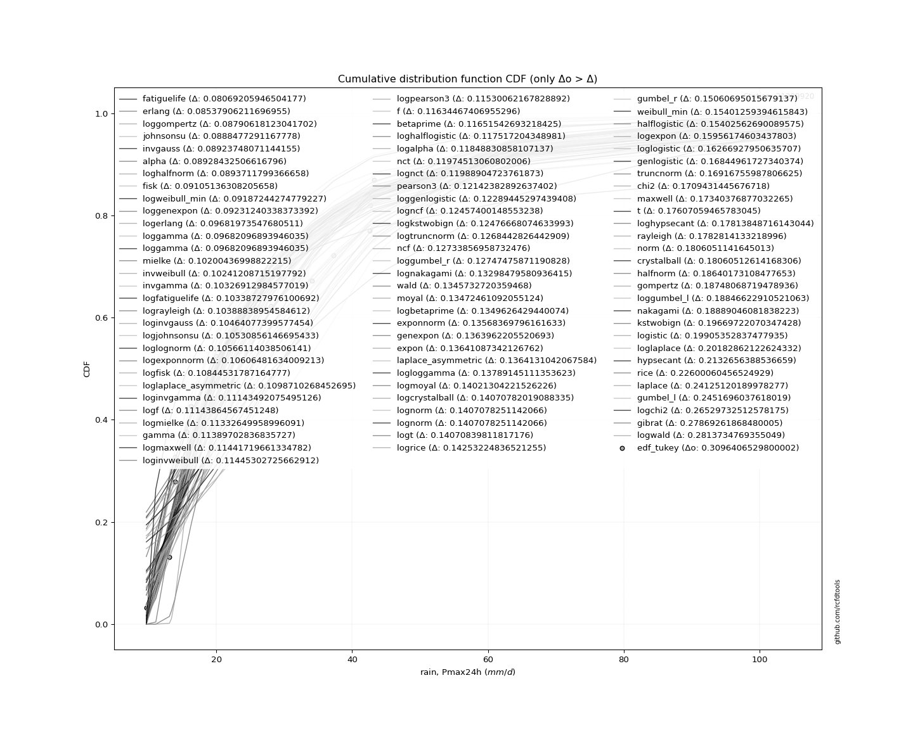</img>

</div>


**7.3. Best fit**

<div align="center">

|   id |   station | empirical_dist   | p_dist    |     delta |   deltao | eval   |   fit |   n |   best_fit |   best_fit_sort |
|-----:|----------:|:-----------------|:----------|----------:|---------:|:-------|------:|----:|-----------:|----------------:|
|    0 |  21209920 | edf_tukey        | genpareto | 0.0740725 | 0.302825 | Δo > Δ |     1 |  21 |          1 |               1 |

</div>


<div align="center">

</img>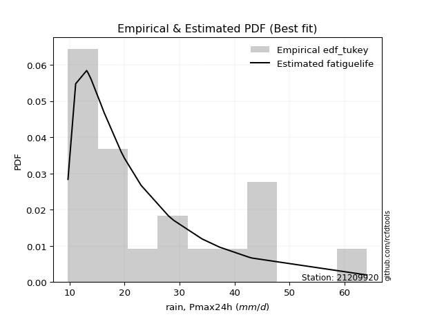</img>

</div>


### 8. EDF Gringorten (1963)

Gringorten plotting position formula is essential for estimating the probability and return periods of extreme events like floods and heavy rainfall. The constant _a=0.44_.

<div align="center">


$P=(m-a)/(n+1-2a)$


</div>


**8.1. Empirical values**

<div align="center">

|                | 0                    | 1                   | 2                   | 3                   | 4                   | 5                   | 6                   | 7                  | 8                   | 9                   | 10             | 11                 | 12                 | 13                 | 14                 | 15                 | 16                | 17                 | 18                 | 19                 | 20                 |
|:---------------|:---------------------|:--------------------|:--------------------|:--------------------|:--------------------|:--------------------|:--------------------|:-------------------|:--------------------|:--------------------|:---------------|:-------------------|:-------------------|:-------------------|:-------------------|:-------------------|:------------------|:-------------------|:-------------------|:-------------------|:-------------------|
| date           | 2017                 | 2016                | 2019                | 2018                | 2015                | 2021                | 2023                | 2014               | 2013                | 2022                | 2020           | 2006               | 2025               | 2005               | 2009               | 2007               | 2011              | 2010               | 2008               | 2012               | 2024               |
| x              | 9.7                  | 11.1                | 13.1                | 13.4                | 13.9                | 13.9                | 13.9                | 15.6               | 16.3                | 19.4                | 20.0           | 23.0               | 27.6               | 28.0               | 34.1               | 37.3               | 42.6              | 42.7               | 43.2               | 64.1               | 104.4              |
| m              | 1                    | 2                   | 3                   | 4                   | 5                   | 6                   | 7                   | 8                  | 9                   | 10                  | 11             | 12                 | 13                 | 14                 | 15                 | 16                 | 17                | 18                 | 19                 | 20                 | 21                 |
| empirical_dist | edf_gringorten       | edf_gringorten      | edf_gringorten      | edf_gringorten      | edf_gringorten      | edf_gringorten      | edf_gringorten      | edf_gringorten     | edf_gringorten      | edf_gringorten      | edf_gringorten | edf_gringorten     | edf_gringorten     | edf_gringorten     | edf_gringorten     | edf_gringorten     | edf_gringorten    | edf_gringorten     | edf_gringorten     | edf_gringorten     | edf_gringorten     |
| empirical      | 0.026515151515151516 | 0.07386363636363637 | 0.12121212121212122 | 0.16856060606060605 | 0.21590909090909088 | 0.26325757575757575 | 0.31060606060606055 | 0.3579545454545454 | 0.40530303030303033 | 0.45265151515151514 | 0.5            | 0.5473484848484849 | 0.5946969696969697 | 0.6420454545454546 | 0.6893939393939393 | 0.7367424242424242 | 0.784090909090909 | 0.8314393939393938 | 0.8787878787878787 | 0.9261363636363635 | 0.9734848484848484 |
| empirical_tr   | 1.027237354085603    | 1.0797546012269938  | 1.1379310344827587  | 1.202733485193622   | 1.2753623188405796  | 1.3573264781491001  | 1.4505494505494505  | 1.5575221238938053 | 1.681528662420382   | 1.8269896193771626  | 2.0            | 2.209205020920502  | 2.4672897196261685 | 2.793650793650794  | 3.2195121951219505 | 3.798561151079136  | 4.631578947368418 | 5.932584269662917  | 8.249999999999993  | 13.53846153846152  | 37.71428571428559  |

</div>


**8.2. Kolmogorov-Smirnov fit test (sorted by Δ)**


<div align="center">

|                | 0                   | 1                   | 2                   | 3                   | 4                   | 5                   | 6                   | 7                   | 8                   | 9                   | 10                  | 11                  | 12                  | 13                  | 14                  | 15                  | 16                  | 17                  | 18                  | 19                  | 20                  | 21                  | 22                  | 23                  | 24                  | 25                  | 26                  | 27                  | 28                  | 29                  | 30                  | 31                  | 32                  | 33                  | 34                  | 35                  | 36                  | 37                  | 38                  | 39                  | 40                  | 41                  | 42                  | 43                  | 44                  | 45                  | 46                  | 47                  | 48                  | 49                  | 50                  | 51                  | 52                  | 53                  | 54                  | 55                  | 56                  | 57                  | 58                  | 59                  | 60                  | 61                  | 62                  | 63                  | 64                  | 65                  | 66                  | 67                  | 68                  | 69                  | 70                  | 71                  | 72                  | 73                  | 74                  | 75                  | 76                  | 77                  | 78                  | 79                  | 80                  | 81                  | 82                  | 83                  | 84                  | 85                  | 86                  | 87                  | 88                  | 89                  | 90                  | 91                  | 92                  | 93                  | 94                  | 95                  | 96                  | 97                  | 98                  | 99                  | 100                 | 101                 | 102                 | 103                 | 104                 | 105                 | 106                 | 107                 | 108                 | 109                 | 110                 | 111                 | 112                 | 113                 | 114                 | 115                 | 116                 | 117                 | 118                 | 119                 | 120                 | 121                 | 122                 | 123                 | 124                 | 125                 | 126                 | 127                 | 128                 | 129                 | 130                 | 131                 | 132                 | 133                 | 134                 | 135                 | 136                 | 137                 | 138                 | 139                 | 140                 | 141                 | 142                 | 143                 | 144                 | 145                 | 146                 | 147                 | 148                 | 149                 | 150                 | 151                 | 152                 | 153                 | 154                 | 155                 | 156                 | 157                 | 158                 | 159                 |
|:---------------|:--------------------|:--------------------|:--------------------|:--------------------|:--------------------|:--------------------|:--------------------|:--------------------|:--------------------|:--------------------|:--------------------|:--------------------|:--------------------|:--------------------|:--------------------|:--------------------|:--------------------|:--------------------|:--------------------|:--------------------|:--------------------|:--------------------|:--------------------|:--------------------|:--------------------|:--------------------|:--------------------|:--------------------|:--------------------|:--------------------|:--------------------|:--------------------|:--------------------|:--------------------|:--------------------|:--------------------|:--------------------|:--------------------|:--------------------|:--------------------|:--------------------|:--------------------|:--------------------|:--------------------|:--------------------|:--------------------|:--------------------|:--------------------|:--------------------|:--------------------|:--------------------|:--------------------|:--------------------|:--------------------|:--------------------|:--------------------|:--------------------|:--------------------|:--------------------|:--------------------|:--------------------|:--------------------|:--------------------|:--------------------|:--------------------|:--------------------|:--------------------|:--------------------|:--------------------|:--------------------|:--------------------|:--------------------|:--------------------|:--------------------|:--------------------|:--------------------|:--------------------|:--------------------|:--------------------|:--------------------|:--------------------|:--------------------|:--------------------|:--------------------|:--------------------|:--------------------|:--------------------|:--------------------|:--------------------|:--------------------|:--------------------|:--------------------|:--------------------|:--------------------|:--------------------|:--------------------|:--------------------|:--------------------|:--------------------|:--------------------|:--------------------|:--------------------|:--------------------|:--------------------|:--------------------|:--------------------|:--------------------|:--------------------|:--------------------|:--------------------|:--------------------|:--------------------|:--------------------|:--------------------|:--------------------|:--------------------|:--------------------|:--------------------|:--------------------|:--------------------|:--------------------|:--------------------|:--------------------|:--------------------|:--------------------|:--------------------|:--------------------|:--------------------|:--------------------|:--------------------|:--------------------|:--------------------|:--------------------|:--------------------|:--------------------|:--------------------|:--------------------|:--------------------|:--------------------|:--------------------|:--------------------|:--------------------|:--------------------|:--------------------|:--------------------|:--------------------|:--------------------|:--------------------|:--------------------|:--------------------|:--------------------|:--------------------|:--------------------|:--------------------|:--------------------|:--------------------|:--------------------|:--------------------|:--------------------|:--------------------|
| station        | 21209920            | 21209920            | 21209920            | 21209920            | 21209920            | 21209920            | 21209920            | 21209920            | 21209920            | 21209920            | 21209920            | 21209920            | 21209920            | 21209920            | 21209920            | 21209920            | 21209920            | 21209920            | 21209920            | 21209920            | 21209920            | 21209920            | 21209920            | 21209920            | 21209920            | 21209920            | 21209920            | 21209920            | 21209920            | 21209920            | 21209920            | 21209920            | 21209920            | 21209920            | 21209920            | 21209920            | 21209920            | 21209920            | 21209920            | 21209920            | 21209920            | 21209920            | 21209920            | 21209920            | 21209920            | 21209920            | 21209920            | 21209920            | 21209920            | 21209920            | 21209920            | 21209920            | 21209920            | 21209920            | 21209920            | 21209920            | 21209920            | 21209920            | 21209920            | 21209920            | 21209920            | 21209920            | 21209920            | 21209920            | 21209920            | 21209920            | 21209920            | 21209920            | 21209920            | 21209920            | 21209920            | 21209920            | 21209920            | 21209920            | 21209920            | 21209920            | 21209920            | 21209920            | 21209920            | 21209920            | 21209920            | 21209920            | 21209920            | 21209920            | 21209920            | 21209920            | 21209920            | 21209920            | 21209920            | 21209920            | 21209920            | 21209920            | 21209920            | 21209920            | 21209920            | 21209920            | 21209920            | 21209920            | 21209920            | 21209920            | 21209920            | 21209920            | 21209920            | 21209920            | 21209920            | 21209920            | 21209920            | 21209920            | 21209920            | 21209920            | 21209920            | 21209920            | 21209920            | 21209920            | 21209920            | 21209920            | 21209920            | 21209920            | 21209920            | 21209920            | 21209920            | 21209920            | 21209920            | 21209920            | 21209920            | 21209920            | 21209920            | 21209920            | 21209920            | 21209920            | 21209920            | 21209920            | 21209920            | 21209920            | 21209920            | 21209920            | 21209920            | 21209920            | 21209920            | 21209920            | 21209920            | 21209920            | 21209920            | 21209920            | 21209920            | 21209920            | 21209920            | 21209920            | 21209920            | 21209920            | 21209920            | 21209920            | 21209920            | 21209920            | 21209920            | 21209920            | 21209920            | 21209920            | 21209920            | 21209920            |
| empirical_dist | edf_gringorten      | edf_gringorten      | edf_gringorten      | edf_gringorten      | edf_gringorten      | edf_gringorten      | edf_gringorten      | edf_gringorten      | edf_gringorten      | edf_gringorten      | edf_gringorten      | edf_gringorten      | edf_gringorten      | edf_gringorten      | edf_gringorten      | edf_gringorten      | edf_gringorten      | edf_gringorten      | edf_gringorten      | edf_gringorten      | edf_gringorten      | edf_gringorten      | edf_gringorten      | edf_gringorten      | edf_gringorten      | edf_gringorten      | edf_gringorten      | edf_gringorten      | edf_gringorten      | edf_gringorten      | edf_gringorten      | edf_gringorten      | edf_gringorten      | edf_gringorten      | edf_gringorten      | edf_gringorten      | edf_gringorten      | edf_gringorten      | edf_gringorten      | edf_gringorten      | edf_gringorten      | edf_gringorten      | edf_gringorten      | edf_gringorten      | edf_gringorten      | edf_gringorten      | edf_gringorten      | edf_gringorten      | edf_gringorten      | edf_gringorten      | edf_gringorten      | edf_gringorten      | edf_gringorten      | edf_gringorten      | edf_gringorten      | edf_gringorten      | edf_gringorten      | edf_gringorten      | edf_gringorten      | edf_gringorten      | edf_gringorten      | edf_gringorten      | edf_gringorten      | edf_gringorten      | edf_gringorten      | edf_gringorten      | edf_gringorten      | edf_gringorten      | edf_gringorten      | edf_gringorten      | edf_gringorten      | edf_gringorten      | edf_gringorten      | edf_gringorten      | edf_gringorten      | edf_gringorten      | edf_gringorten      | edf_gringorten      | edf_gringorten      | edf_gringorten      | edf_gringorten      | edf_gringorten      | edf_gringorten      | edf_gringorten      | edf_gringorten      | edf_gringorten      | edf_gringorten      | edf_gringorten      | edf_gringorten      | edf_gringorten      | edf_gringorten      | edf_gringorten      | edf_gringorten      | edf_gringorten      | edf_gringorten      | edf_gringorten      | edf_gringorten      | edf_gringorten      | edf_gringorten      | edf_gringorten      | edf_gringorten      | edf_gringorten      | edf_gringorten      | edf_gringorten      | edf_gringorten      | edf_gringorten      | edf_gringorten      | edf_gringorten      | edf_gringorten      | edf_gringorten      | edf_gringorten      | edf_gringorten      | edf_gringorten      | edf_gringorten      | edf_gringorten      | edf_gringorten      | edf_gringorten      | edf_gringorten      | edf_gringorten      | edf_gringorten      | edf_gringorten      | edf_gringorten      | edf_gringorten      | edf_gringorten      | edf_gringorten      | edf_gringorten      | edf_gringorten      | edf_gringorten      | edf_gringorten      | edf_gringorten      | edf_gringorten      | edf_gringorten      | edf_gringorten      | edf_gringorten      | edf_gringorten      | edf_gringorten      | edf_gringorten      | edf_gringorten      | edf_gringorten      | edf_gringorten      | edf_gringorten      | edf_gringorten      | edf_gringorten      | edf_gringorten      | edf_gringorten      | edf_gringorten      | edf_gringorten      | edf_gringorten      | edf_gringorten      | edf_gringorten      | edf_gringorten      | edf_gringorten      | edf_gringorten      | edf_gringorten      | edf_gringorten      | edf_gringorten      | edf_gringorten      | edf_gringorten      | edf_gringorten      | edf_gringorten      |
| p_dist         | fatiguelife         | logfoldnorm         | genpareto           | logjohnsonsb        | loggenexpon         | loghalfgennorm      | halfgennorm         | johnsonsb           | invgauss            | lomax               | johnsonsu           | loghalfnorm         | loggamma            | loggamma            | logerlang           | logdgamma           | logweibull_min      | logsemicircular     | loggompertz         | alpha               | logskewnorm         | mielke              | f                   | burr                | lograyleigh         | logfatiguelife      | invweibull          | genextreme          | gengamma            | kappa3              | betaprime           | invgamma            | truncpareto         | loginvgauss         | logkappa3           | logf                | loganglit           | logjohnsonsu        | logmaxwell          | burr12              | logexponnorm        | logburr12           | logburr             | logpearson3         | loginvgamma         | logbetaprime        | logmielke           | logvonmises_line    | loginvweibull       | loggenextreme       | exponweib           | exponnorm           | logncf              | logalpha            | nct                 | genexpon            | logkstwobign        | logweibull_max      | lognct              | loggenlogistic      | logdweibull         | pearson3            | loghalflogistic     | logbeta             | ncf                 | logtriang           | exponpow            | weibull_min         | logvonmises         | loggumbel_r         | gausshyper          | logtukeylambda      | gamma               | logtruncweibull_min | logcrystalball      | lognorm             | logt                | lognakagami         | logloggamma         | logrice             | wald                | moyal               | gompertz            | loggausshyper       | logmoyal            | logloglaplace       | logtruncnorm        | logtruncexpon       | loggennorm          | logarcsine          | truncnorm           | gumbel_r            | halflogistic        | loglogistic         | logcosine           | genlogistic         | beta                | logexponweib        | logrdist            | crystalball         | norm                | loghypsecant        | loggengamma         | t                   | loglomax            | logbradford         | dweibull            | maxwell             | loggumbel_l         | kstwobign           | logistic            | rayleigh            | erlang              | genhalflogistic     | cosine              | halfnorm            | logtruncpareto      | loglaplace          | loglaplace          | anglit              | hypsecant           | dgamma              | semicircular        | nakagami            | rice                | logexponpow         | gennorm             | vonmises_line       | laplace             | skewnorm            | gumbel_l            | foldnorm            | logargus            | loguniform          | logkappa4           | arcsine             | logksone            | truncweibull_min    | bradford            | logwald             | powerlaw            | triang              | truncexpon          | logwrapcauchy       | logpowerlaw         | loggenpareto        | loggenhalflogistic  | wrapcauchy          | argus               | loglevy_l           | kappa4              | ksone               | logtrapezoid        | levy_l              | uniform             | rdist               | tukeylambda         | trapezoid           | weibull_max         | vonmises            |
| delta          | 0.07680211489618921 | 0.07689864903029561 | 0.07781669764771923 | 0.07827864440984694 | 0.07981720148346838 | 0.08114102903762654 | 0.08160813558585286 | 0.08205870713939689 | 0.08533556881584262 | 0.08597131091520668 | 0.08642699707832713 | 0.0868700436173479  | 0.08787323620703205 | 0.08787323620703205 | 0.08787406376492846 | 0.08791076112539359 | 0.08920705588301864 | 0.09117580107368978 | 0.09241990852849577 | 0.09296151517787934 | 0.09487382616267265 | 0.0953380327235073  | 0.09560509041848664 | 0.09590097425368399 | 0.09603244858218027 | 0.09737203427997848 | 0.09763184856016247 | 0.09763217343737671 | 0.0985073287609742  | 0.09858980006020812 | 0.09885766836250864 | 0.09894228864633442 | 0.09907826752517318 | 0.10009022377696528 | 0.10086832110798027 | 0.10156578386585524 | 0.10242237305215146 | 0.10304504110554435 | 0.10339172415169023 | 0.10494268316234856 | 0.10500412878291543 | 0.10506534593993444 | 0.10880562930417872 | 0.10884970683084083 | 0.10893521445321863 | 0.10895860818047087 | 0.1094392006306879  | 0.1095823963309408  | 0.11186213782251606 | 0.11186629199268833 | 0.11209889723953403 | 0.11298856016770026 | 0.11387864964374511 | 0.11417292148659394 | 0.114635581796761   | 0.11465237738231154 | 0.1152060943941457  | 0.11548718690455254 | 0.11559677568567872 | 0.11574291001513148 | 0.11586955748060074 | 0.11738246332847826 | 0.11826446405501337 | 0.11982981968448281 | 0.12066485310347885 | 0.12073081413534331 | 0.12089803651777031 | 0.1214953187576252  | 0.12293252204087962 | 0.12327544692322381 | 0.1265937288519404  | 0.1271646071073383  | 0.12841007779664534 | 0.12855097677394312 | 0.12862520770181451 | 0.12862527895662645 | 0.12862665555227853 | 0.1292662217383293  | 0.1297143450549642  | 0.13115639156733502 | 0.13183137411977155 | 0.13249510415611507 | 0.13476612093471324 | 0.1361740128853024  | 0.13843578698423942 | 0.13935645212598424 | 0.14212250290623585 | 0.14251768510098428 | 0.1445634114220053  | 0.14471778463820228 | 0.14861055294258352 | 0.14968307579299858 | 0.15001288625789003 | 0.15087061155587295 | 0.15203990907668352 | 0.15402027979097094 | 0.1564844707088479  | 0.15735531774691874 | 0.16266553246412419 | 0.1628639624631957  | 0.16286396644377418 | 0.16629285484389866 | 0.16780034437603214 | 0.16902422116665813 | 0.17127004280242686 | 0.17159568197483355 | 0.17329345902903404 | 0.17369494931377014 | 0.1744151428867551  | 0.17595555487247727 | 0.17718928074716378 | 0.17811051703897207 | 0.17985269688479288 | 0.18050113361505296 | 0.1831530317889385  | 0.18424592218640132 | 0.1882298836791486  | 0.18907190510313399 | 0.18907190510313399 | 0.1904400568821811  | 0.19151169937436907 | 0.20068801244031345 | 0.20263965243317159 | 0.203309672484278   | 0.20441308144941928 | 0.2094943837051818  | 0.2117977329292073  | 0.21262416067558648 | 0.21939648773001902 | 0.22581321598386622 | 0.22950146715481257 | 0.231316325836832   | 0.24319478089453228 | 0.2501475744100349  | 0.2545354085920519  | 0.2596486045340997  | 0.2715876251396755  | 0.2789035666309001  | 0.27916811569912137 | 0.2868541423919131  | 0.2970269528006929  | 0.3009580099535223  | 0.3230774677584468  | 0.33371370878193285 | 0.3628317816371197  | 0.37061067421862476 | 0.403465211891277   | 0.42900016337390795 | 0.44205283465124834 | 0.45259330425691824 | 0.48593496219323723 | 0.5006639787526798  | 0.5100957307574362  | 0.5201869385570349  | 0.52503919874564    | 0.5446100617244444  | 0.571569163139796   | 0.7358101950100495  | 0.7887912482285868  | 15.85264669492701   |
| deltao         | 0.30282488509099936 | 0.30282488509099936 | 0.30282488509099936 | 0.30282488509099936 | 0.30282488509099936 | 0.30282488509099936 | 0.30282488509099936 | 0.30282488509099936 | 0.30282488509099936 | 0.30282488509099936 | 0.30282488509099936 | 0.30282488509099936 | 0.30282488509099936 | 0.30282488509099936 | 0.30282488509099936 | 0.30282488509099936 | 0.30282488509099936 | 0.30282488509099936 | 0.30282488509099936 | 0.30282488509099936 | 0.30282488509099936 | 0.30282488509099936 | 0.30282488509099936 | 0.30282488509099936 | 0.30282488509099936 | 0.30282488509099936 | 0.30282488509099936 | 0.30282488509099936 | 0.30282488509099936 | 0.30282488509099936 | 0.30282488509099936 | 0.30282488509099936 | 0.30282488509099936 | 0.30282488509099936 | 0.30282488509099936 | 0.30282488509099936 | 0.30282488509099936 | 0.30282488509099936 | 0.30282488509099936 | 0.30282488509099936 | 0.30282488509099936 | 0.30282488509099936 | 0.30282488509099936 | 0.30282488509099936 | 0.30282488509099936 | 0.30282488509099936 | 0.30282488509099936 | 0.30282488509099936 | 0.30282488509099936 | 0.30282488509099936 | 0.30282488509099936 | 0.30282488509099936 | 0.30282488509099936 | 0.30282488509099936 | 0.30282488509099936 | 0.30282488509099936 | 0.30282488509099936 | 0.30282488509099936 | 0.30282488509099936 | 0.30282488509099936 | 0.30282488509099936 | 0.30282488509099936 | 0.30282488509099936 | 0.30282488509099936 | 0.30282488509099936 | 0.30282488509099936 | 0.30282488509099936 | 0.30282488509099936 | 0.30282488509099936 | 0.30282488509099936 | 0.30282488509099936 | 0.30282488509099936 | 0.30282488509099936 | 0.30282488509099936 | 0.30282488509099936 | 0.30282488509099936 | 0.30282488509099936 | 0.30282488509099936 | 0.30282488509099936 | 0.30282488509099936 | 0.30282488509099936 | 0.30282488509099936 | 0.30282488509099936 | 0.30282488509099936 | 0.30282488509099936 | 0.30282488509099936 | 0.30282488509099936 | 0.30282488509099936 | 0.30282488509099936 | 0.30282488509099936 | 0.30282488509099936 | 0.30282488509099936 | 0.30282488509099936 | 0.30282488509099936 | 0.30282488509099936 | 0.30282488509099936 | 0.30282488509099936 | 0.30282488509099936 | 0.30282488509099936 | 0.30282488509099936 | 0.30282488509099936 | 0.30282488509099936 | 0.30282488509099936 | 0.30282488509099936 | 0.30282488509099936 | 0.30282488509099936 | 0.30282488509099936 | 0.30282488509099936 | 0.30282488509099936 | 0.30282488509099936 | 0.30282488509099936 | 0.30282488509099936 | 0.30282488509099936 | 0.30282488509099936 | 0.30282488509099936 | 0.30282488509099936 | 0.30282488509099936 | 0.30282488509099936 | 0.30282488509099936 | 0.30282488509099936 | 0.30282488509099936 | 0.30282488509099936 | 0.30282488509099936 | 0.30282488509099936 | 0.30282488509099936 | 0.30282488509099936 | 0.30282488509099936 | 0.30282488509099936 | 0.30282488509099936 | 0.30282488509099936 | 0.30282488509099936 | 0.30282488509099936 | 0.30282488509099936 | 0.30282488509099936 | 0.30282488509099936 | 0.30282488509099936 | 0.30282488509099936 | 0.30282488509099936 | 0.30282488509099936 | 0.30282488509099936 | 0.30282488509099936 | 0.30282488509099936 | 0.30282488509099936 | 0.30282488509099936 | 0.30282488509099936 | 0.30282488509099936 | 0.30282488509099936 | 0.30282488509099936 | 0.30282488509099936 | 0.30282488509099936 | 0.30282488509099936 | 0.30282488509099936 | 0.30282488509099936 | 0.30282488509099936 | 0.30282488509099936 | 0.30282488509099936 | 0.30282488509099936 | 0.30282488509099936 | 0.30282488509099936 | 0.30282488509099936 |
| eval           | Δo > Δ              | Δo > Δ              | Δo > Δ              | Δo > Δ              | Δo > Δ              | Δo > Δ              | Δo > Δ              | Δo > Δ              | Δo > Δ              | Δo > Δ              | Δo > Δ              | Δo > Δ              | Δo > Δ              | Δo > Δ              | Δo > Δ              | Δo > Δ              | Δo > Δ              | Δo > Δ              | Δo > Δ              | Δo > Δ              | Δo > Δ              | Δo > Δ              | Δo > Δ              | Δo > Δ              | Δo > Δ              | Δo > Δ              | Δo > Δ              | Δo > Δ              | Δo > Δ              | Δo > Δ              | Δo > Δ              | Δo > Δ              | Δo > Δ              | Δo > Δ              | Δo > Δ              | Δo > Δ              | Δo > Δ              | Δo > Δ              | Δo > Δ              | Δo > Δ              | Δo > Δ              | Δo > Δ              | Δo > Δ              | Δo > Δ              | Δo > Δ              | Δo > Δ              | Δo > Δ              | Δo > Δ              | Δo > Δ              | Δo > Δ              | Δo > Δ              | Δo > Δ              | Δo > Δ              | Δo > Δ              | Δo > Δ              | Δo > Δ              | Δo > Δ              | Δo > Δ              | Δo > Δ              | Δo > Δ              | Δo > Δ              | Δo > Δ              | Δo > Δ              | Δo > Δ              | Δo > Δ              | Δo > Δ              | Δo > Δ              | Δo > Δ              | Δo > Δ              | Δo > Δ              | Δo > Δ              | Δo > Δ              | Δo > Δ              | Δo > Δ              | Δo > Δ              | Δo > Δ              | Δo > Δ              | Δo > Δ              | Δo > Δ              | Δo > Δ              | Δo > Δ              | Δo > Δ              | Δo > Δ              | Δo > Δ              | Δo > Δ              | Δo > Δ              | Δo > Δ              | Δo > Δ              | Δo > Δ              | Δo > Δ              | Δo > Δ              | Δo > Δ              | Δo > Δ              | Δo > Δ              | Δo > Δ              | Δo > Δ              | Δo > Δ              | Δo > Δ              | Δo > Δ              | Δo > Δ              | Δo > Δ              | Δo > Δ              | Δo > Δ              | Δo > Δ              | Δo > Δ              | Δo > Δ              | Δo > Δ              | Δo > Δ              | Δo > Δ              | Δo > Δ              | Δo > Δ              | Δo > Δ              | Δo > Δ              | Δo > Δ              | Δo > Δ              | Δo > Δ              | Δo > Δ              | Δo > Δ              | Δo > Δ              | Δo > Δ              | Δo > Δ              | Δo > Δ              | Δo > Δ              | Δo > Δ              | Δo > Δ              | Δo > Δ              | Δo > Δ              | Δo > Δ              | Δo > Δ              | Δo > Δ              | Δo > Δ              | Δo > Δ              | Δo > Δ              | Δo > Δ              | Δo > Δ              | Δo > Δ              | Δo > Δ              | Δo > Δ              | Δo > Δ              | Δo > Δ              | Δo > Δ              | Δo > Δ              | Δo <= Δ             | Δo <= Δ             | Δo <= Δ             | Δo <= Δ             | Δo <= Δ             | Δo <= Δ             | Δo <= Δ             | Δo <= Δ             | Δo <= Δ             | Δo <= Δ             | Δo <= Δ             | Δo <= Δ             | Δo <= Δ             | Δo <= Δ             | Δo <= Δ             | Δo <= Δ             | Δo <= Δ             | Δo <= Δ             |
| fit            | 1                   | 1                   | 1                   | 1                   | 1                   | 1                   | 1                   | 1                   | 1                   | 1                   | 1                   | 1                   | 1                   | 1                   | 1                   | 1                   | 1                   | 1                   | 1                   | 1                   | 1                   | 1                   | 1                   | 1                   | 1                   | 1                   | 1                   | 1                   | 1                   | 1                   | 1                   | 1                   | 1                   | 1                   | 1                   | 1                   | 1                   | 1                   | 1                   | 1                   | 1                   | 1                   | 1                   | 1                   | 1                   | 1                   | 1                   | 1                   | 1                   | 1                   | 1                   | 1                   | 1                   | 1                   | 1                   | 1                   | 1                   | 1                   | 1                   | 1                   | 1                   | 1                   | 1                   | 1                   | 1                   | 1                   | 1                   | 1                   | 1                   | 1                   | 1                   | 1                   | 1                   | 1                   | 1                   | 1                   | 1                   | 1                   | 1                   | 1                   | 1                   | 1                   | 1                   | 1                   | 1                   | 1                   | 1                   | 1                   | 1                   | 1                   | 1                   | 1                   | 1                   | 1                   | 1                   | 1                   | 1                   | 1                   | 1                   | 1                   | 1                   | 1                   | 1                   | 1                   | 1                   | 1                   | 1                   | 1                   | 1                   | 1                   | 1                   | 1                   | 1                   | 1                   | 1                   | 1                   | 1                   | 1                   | 1                   | 1                   | 1                   | 1                   | 1                   | 1                   | 1                   | 1                   | 1                   | 1                   | 1                   | 1                   | 1                   | 1                   | 1                   | 1                   | 1                   | 1                   | 1                   | 1                   | 1                   | 1                   | 1                   | 1                   | 0                   | 0                   | 0                   | 0                   | 0                   | 0                   | 0                   | 0                   | 0                   | 0                   | 0                   | 0                   | 0                   | 0                   | 0                   | 0                   | 0                   | 0                   |
| n              | 21                  | 21                  | 21                  | 21                  | 21                  | 21                  | 21                  | 21                  | 21                  | 21                  | 21                  | 21                  | 21                  | 21                  | 21                  | 21                  | 21                  | 21                  | 21                  | 21                  | 21                  | 21                  | 21                  | 21                  | 21                  | 21                  | 21                  | 21                  | 21                  | 21                  | 21                  | 21                  | 21                  | 21                  | 21                  | 21                  | 21                  | 21                  | 21                  | 21                  | 21                  | 21                  | 21                  | 21                  | 21                  | 21                  | 21                  | 21                  | 21                  | 21                  | 21                  | 21                  | 21                  | 21                  | 21                  | 21                  | 21                  | 21                  | 21                  | 21                  | 21                  | 21                  | 21                  | 21                  | 21                  | 21                  | 21                  | 21                  | 21                  | 21                  | 21                  | 21                  | 21                  | 21                  | 21                  | 21                  | 21                  | 21                  | 21                  | 21                  | 21                  | 21                  | 21                  | 21                  | 21                  | 21                  | 21                  | 21                  | 21                  | 21                  | 21                  | 21                  | 21                  | 21                  | 21                  | 21                  | 21                  | 21                  | 21                  | 21                  | 21                  | 21                  | 21                  | 21                  | 21                  | 21                  | 21                  | 21                  | 21                  | 21                  | 21                  | 21                  | 21                  | 21                  | 21                  | 21                  | 21                  | 21                  | 21                  | 21                  | 21                  | 21                  | 21                  | 21                  | 21                  | 21                  | 21                  | 21                  | 21                  | 21                  | 21                  | 21                  | 21                  | 21                  | 21                  | 21                  | 21                  | 21                  | 21                  | 21                  | 21                  | 21                  | 21                  | 21                  | 21                  | 21                  | 21                  | 21                  | 21                  | 21                  | 21                  | 21                  | 21                  | 21                  | 21                  | 21                  | 21                  | 21                  | 21                  | 21                  |
| best_fit       | 1                   | 0                   | 0                   | 0                   | 0                   | 0                   | 0                   | 0                   | 0                   | 0                   | 0                   | 0                   | 0                   | 0                   | 0                   | 0                   | 0                   | 0                   | 0                   | 0                   | 0                   | 0                   | 0                   | 0                   | 0                   | 0                   | 0                   | 0                   | 0                   | 0                   | 0                   | 0                   | 0                   | 0                   | 0                   | 0                   | 0                   | 0                   | 0                   | 0                   | 0                   | 0                   | 0                   | 0                   | 0                   | 0                   | 0                   | 0                   | 0                   | 0                   | 0                   | 0                   | 0                   | 0                   | 0                   | 0                   | 0                   | 0                   | 0                   | 0                   | 0                   | 0                   | 0                   | 0                   | 0                   | 0                   | 0                   | 0                   | 0                   | 0                   | 0                   | 0                   | 0                   | 0                   | 0                   | 0                   | 0                   | 0                   | 0                   | 0                   | 0                   | 0                   | 0                   | 0                   | 0                   | 0                   | 0                   | 0                   | 0                   | 0                   | 0                   | 0                   | 0                   | 0                   | 0                   | 0                   | 0                   | 0                   | 0                   | 0                   | 0                   | 0                   | 0                   | 0                   | 0                   | 0                   | 0                   | 0                   | 0                   | 0                   | 0                   | 0                   | 0                   | 0                   | 0                   | 0                   | 0                   | 0                   | 0                   | 0                   | 0                   | 0                   | 0                   | 0                   | 0                   | 0                   | 0                   | 0                   | 0                   | 0                   | 0                   | 0                   | 0                   | 0                   | 0                   | 0                   | 0                   | 0                   | 0                   | 0                   | 0                   | 0                   | 0                   | 0                   | 0                   | 0                   | 0                   | 0                   | 0                   | 0                   | 0                   | 0                   | 0                   | 0                   | 0                   | 0                   | 0                   | 0                   | 0                   | 0                   |
| best_fit_sort  | 1                   | 2                   | 3                   | 4                   | 5                   | 6                   | 7                   | 8                   | 9                   | 10                  | 11                  | 12                  | 13                  | 14                  | 15                  | 16                  | 17                  | 18                  | 19                  | 20                  | 21                  | 22                  | 23                  | 24                  | 25                  | 26                  | 27                  | 28                  | 29                  | 30                  | 31                  | 32                  | 33                  | 34                  | 35                  | 36                  | 37                  | 38                  | 39                  | 40                  | 41                  | 42                  | 43                  | 44                  | 45                  | 46                  | 47                  | 48                  | 49                  | 50                  | 51                  | 52                  | 53                  | 54                  | 55                  | 56                  | 57                  | 58                  | 59                  | 60                  | 61                  | 62                  | 63                  | 64                  | 65                  | 66                  | 67                  | 68                  | 69                  | 70                  | 71                  | 72                  | 73                  | 74                  | 75                  | 76                  | 77                  | 78                  | 79                  | 80                  | 81                  | 82                  | 83                  | 84                  | 85                  | 86                  | 87                  | 88                  | 89                  | 90                  | 91                  | 92                  | 93                  | 94                  | 95                  | 96                  | 97                  | 98                  | 99                  | 100                 | 101                 | 102                 | 103                 | 104                 | 105                 | 106                 | 107                 | 108                 | 109                 | 110                 | 111                 | 112                 | 113                 | 114                 | 115                 | 116                 | 117                 | 118                 | 119                 | 120                 | 121                 | 122                 | 123                 | 124                 | 125                 | 126                 | 127                 | 128                 | 129                 | 130                 | 131                 | 132                 | 133                 | 134                 | 135                 | 136                 | 137                 | 138                 | 139                 | 140                 | 141                 | 142                 | 143                 | 144                 | 145                 | 146                 | 147                 | 148                 | 149                 | 150                 | 151                 | 152                 | 153                 | 154                 | 155                 | 156                 | 157                 | 158                 | 159                 | 160                 |

</div>


<div align="center">

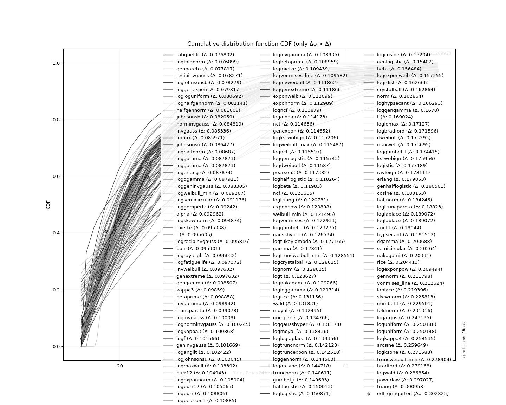</img>

</div>


**8.3. Best fit**

<div align="center">

|   id |   station | empirical_dist   | p_dist      |     delta |   deltao | eval   |   fit |   n |   best_fit |   best_fit_sort |
|-----:|----------:|:-----------------|:------------|----------:|---------:|:-------|------:|----:|-----------:|----------------:|
|    0 |  21209920 | edf_gringorten   | fatiguelife | 0.0768021 | 0.302825 | Δo > Δ |     1 |  21 |          1 |               1 |

</div>


<div align="center">

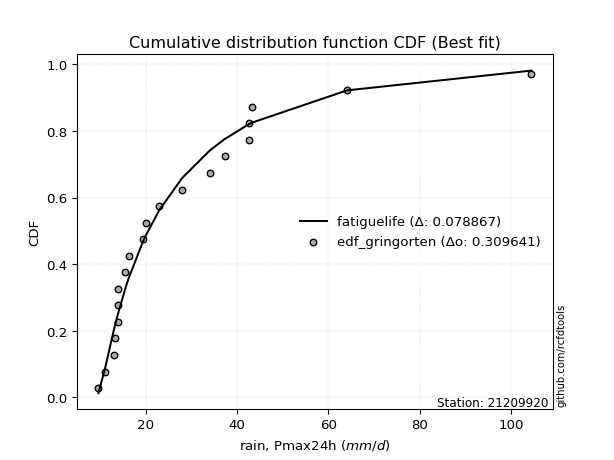</img></img>

</div>


### 9. EDF Filliben (1975)

The specific values of the constants (0.3175) (often denoted as $alpha$) and (0.365) are derived from a method proposed by James J. Filliben in a 1975 paper. This particular formula is the mean value of the $i$-th order statistic of the normal distribution and is considered a robust and effective plotting position formula for the normal probability plot correlation coefficient test for normality.

<div align="center">


$P=(m-0.3175)/(n+0.365)$


</div>


**9.1. Empirical values**

<div align="center">

|                | 0                   | 1                   | 2                   | 3                  | 4                   | 5                  | 6                  | 7                   | 8                   | 9                  | 10           | 11                 | 12                 | 13                 | 14                 | 15                 | 16                 | 17                 | 18                 | 19                 | 20                 |
|:---------------|:--------------------|:--------------------|:--------------------|:-------------------|:--------------------|:-------------------|:-------------------|:--------------------|:--------------------|:-------------------|:-------------|:-------------------|:-------------------|:-------------------|:-------------------|:-------------------|:-------------------|:-------------------|:-------------------|:-------------------|:-------------------|
| date           | 2017                | 2016                | 2019                | 2018               | 2015                | 2021               | 2023               | 2014                | 2013                | 2022               | 2020         | 2006               | 2025               | 2005               | 2009               | 2007               | 2011               | 2010               | 2008               | 2012               | 2024               |
| x              | 9.7                 | 11.1                | 13.1                | 13.4               | 13.9                | 13.9               | 13.9               | 15.6                | 16.3                | 19.4               | 20.0         | 23.0               | 27.6               | 28.0               | 34.1               | 37.3               | 42.6               | 42.7               | 43.2               | 64.1               | 104.4              |
| m              | 1                   | 2                   | 3                   | 4                  | 5                   | 6                  | 7                  | 8                   | 9                   | 10                 | 11           | 12                 | 13                 | 14                 | 15                 | 16                 | 17                 | 18                 | 19                 | 20                 | 21                 |
| empirical_dist | edf_filliben        | edf_filliben        | edf_filliben        | edf_filliben       | edf_filliben        | edf_filliben       | edf_filliben       | edf_filliben        | edf_filliben        | edf_filliben       | edf_filliben | edf_filliben       | edf_filliben       | edf_filliben       | edf_filliben       | edf_filliben       | edf_filliben       | edf_filliben       | edf_filliben       | edf_filliben       | edf_filliben       |
| empirical      | 0.03194476948279897 | 0.07875029253451908 | 0.12555581558623918 | 0.1723613386379593 | 0.21916686168967942 | 0.2659723847413995 | 0.3127779077931196 | 0.35958343084483974 | 0.40638895389655977 | 0.4531944769482799 | 0.5          | 0.5468055230517201 | 0.5936110461034402 | 0.6404165691551603 | 0.6872220922068805 | 0.7340276152586005 | 0.7808331383103208 | 0.8276386613620408 | 0.8744441844137609 | 0.9212497074654811 | 0.9680552305172011 |
| empirical_tr   | 1.0329989121237761  | 1.0854820271815064  | 1.1435835675097017  | 1.2082567510250248 | 1.2806833508167241  | 1.3623465646421171 | 1.4551336625234124 | 1.561483646994336   | 1.6846047703528482  | 1.8288037663171408 | 2.0          | 2.206558223599277  | 2.4606968039159227 | 2.780995769606248  | 3.1971567527123086 | 3.759788825340959  | 4.56273358248799   | 5.801765105227429  | 7.964585274930109  | 12.69836552748888  | 31.304029304029378 |

</div>


**9.2. Kolmogorov-Smirnov fit test (sorted by Δ)**


<div align="center">

|                | 0                   | 1                   | 2                   | 3                   | 4                   | 5                   | 6                   | 7                   | 8                   | 9                   | 10                  | 11                  | 12                  | 13                  | 14                  | 15                  | 16                  | 17                  | 18                  | 19                  | 20                  | 21                  | 22                  | 23                  | 24                  | 25                  | 26                  | 27                  | 28                  | 29                  | 30                  | 31                  | 32                  | 33                  | 34                  | 35                  | 36                  | 37                  | 38                  | 39                  | 40                  | 41                  | 42                  | 43                  | 44                  | 45                  | 46                  | 47                  | 48                  | 49                  | 50                  | 51                  | 52                  | 53                  | 54                  | 55                  | 56                  | 57                  | 58                  | 59                  | 60                  | 61                  | 62                  | 63                  | 64                  | 65                  | 66                  | 67                  | 68                  | 69                  | 70                  | 71                  | 72                  | 73                  | 74                  | 75                  | 76                  | 77                  | 78                  | 79                  | 80                  | 81                  | 82                  | 83                  | 84                  | 85                  | 86                  | 87                  | 88                  | 89                  | 90                  | 91                  | 92                  | 93                  | 94                  | 95                  | 96                  | 97                  | 98                  | 99                  | 100                 | 101                 | 102                 | 103                 | 104                 | 105                 | 106                 | 107                 | 108                 | 109                 | 110                 | 111                 | 112                 | 113                 | 114                 | 115                 | 116                 | 117                 | 118                 | 119                 | 120                 | 121                 | 122                 | 123                 | 124                 | 125                 | 126                 | 127                 | 128                 | 129                 | 130                 | 131                 | 132                 | 133                 | 134                 | 135                 | 136                 | 137                 | 138                 | 139                 | 140                 | 141                 | 142                 | 143                 | 144                 | 145                 | 146                 | 147                 | 148                 | 149                 | 150                 | 151                 | 152                 | 153                 | 154                 | 155                 | 156                 | 157                 | 158                 | 159                 |
|:---------------|:--------------------|:--------------------|:--------------------|:--------------------|:--------------------|:--------------------|:--------------------|:--------------------|:--------------------|:--------------------|:--------------------|:--------------------|:--------------------|:--------------------|:--------------------|:--------------------|:--------------------|:--------------------|:--------------------|:--------------------|:--------------------|:--------------------|:--------------------|:--------------------|:--------------------|:--------------------|:--------------------|:--------------------|:--------------------|:--------------------|:--------------------|:--------------------|:--------------------|:--------------------|:--------------------|:--------------------|:--------------------|:--------------------|:--------------------|:--------------------|:--------------------|:--------------------|:--------------------|:--------------------|:--------------------|:--------------------|:--------------------|:--------------------|:--------------------|:--------------------|:--------------------|:--------------------|:--------------------|:--------------------|:--------------------|:--------------------|:--------------------|:--------------------|:--------------------|:--------------------|:--------------------|:--------------------|:--------------------|:--------------------|:--------------------|:--------------------|:--------------------|:--------------------|:--------------------|:--------------------|:--------------------|:--------------------|:--------------------|:--------------------|:--------------------|:--------------------|:--------------------|:--------------------|:--------------------|:--------------------|:--------------------|:--------------------|:--------------------|:--------------------|:--------------------|:--------------------|:--------------------|:--------------------|:--------------------|:--------------------|:--------------------|:--------------------|:--------------------|:--------------------|:--------------------|:--------------------|:--------------------|:--------------------|:--------------------|:--------------------|:--------------------|:--------------------|:--------------------|:--------------------|:--------------------|:--------------------|:--------------------|:--------------------|:--------------------|:--------------------|:--------------------|:--------------------|:--------------------|:--------------------|:--------------------|:--------------------|:--------------------|:--------------------|:--------------------|:--------------------|:--------------------|:--------------------|:--------------------|:--------------------|:--------------------|:--------------------|:--------------------|:--------------------|:--------------------|:--------------------|:--------------------|:--------------------|:--------------------|:--------------------|:--------------------|:--------------------|:--------------------|:--------------------|:--------------------|:--------------------|:--------------------|:--------------------|:--------------------|:--------------------|:--------------------|:--------------------|:--------------------|:--------------------|:--------------------|:--------------------|:--------------------|:--------------------|:--------------------|:--------------------|:--------------------|:--------------------|:--------------------|:--------------------|:--------------------|:--------------------|
| station        | 21209920            | 21209920            | 21209920            | 21209920            | 21209920            | 21209920            | 21209920            | 21209920            | 21209920            | 21209920            | 21209920            | 21209920            | 21209920            | 21209920            | 21209920            | 21209920            | 21209920            | 21209920            | 21209920            | 21209920            | 21209920            | 21209920            | 21209920            | 21209920            | 21209920            | 21209920            | 21209920            | 21209920            | 21209920            | 21209920            | 21209920            | 21209920            | 21209920            | 21209920            | 21209920            | 21209920            | 21209920            | 21209920            | 21209920            | 21209920            | 21209920            | 21209920            | 21209920            | 21209920            | 21209920            | 21209920            | 21209920            | 21209920            | 21209920            | 21209920            | 21209920            | 21209920            | 21209920            | 21209920            | 21209920            | 21209920            | 21209920            | 21209920            | 21209920            | 21209920            | 21209920            | 21209920            | 21209920            | 21209920            | 21209920            | 21209920            | 21209920            | 21209920            | 21209920            | 21209920            | 21209920            | 21209920            | 21209920            | 21209920            | 21209920            | 21209920            | 21209920            | 21209920            | 21209920            | 21209920            | 21209920            | 21209920            | 21209920            | 21209920            | 21209920            | 21209920            | 21209920            | 21209920            | 21209920            | 21209920            | 21209920            | 21209920            | 21209920            | 21209920            | 21209920            | 21209920            | 21209920            | 21209920            | 21209920            | 21209920            | 21209920            | 21209920            | 21209920            | 21209920            | 21209920            | 21209920            | 21209920            | 21209920            | 21209920            | 21209920            | 21209920            | 21209920            | 21209920            | 21209920            | 21209920            | 21209920            | 21209920            | 21209920            | 21209920            | 21209920            | 21209920            | 21209920            | 21209920            | 21209920            | 21209920            | 21209920            | 21209920            | 21209920            | 21209920            | 21209920            | 21209920            | 21209920            | 21209920            | 21209920            | 21209920            | 21209920            | 21209920            | 21209920            | 21209920            | 21209920            | 21209920            | 21209920            | 21209920            | 21209920            | 21209920            | 21209920            | 21209920            | 21209920            | 21209920            | 21209920            | 21209920            | 21209920            | 21209920            | 21209920            | 21209920            | 21209920            | 21209920            | 21209920            | 21209920            | 21209920            |
| empirical_dist | edf_filliben        | edf_filliben        | edf_filliben        | edf_filliben        | edf_filliben        | edf_filliben        | edf_filliben        | edf_filliben        | edf_filliben        | edf_filliben        | edf_filliben        | edf_filliben        | edf_filliben        | edf_filliben        | edf_filliben        | edf_filliben        | edf_filliben        | edf_filliben        | edf_filliben        | edf_filliben        | edf_filliben        | edf_filliben        | edf_filliben        | edf_filliben        | edf_filliben        | edf_filliben        | edf_filliben        | edf_filliben        | edf_filliben        | edf_filliben        | edf_filliben        | edf_filliben        | edf_filliben        | edf_filliben        | edf_filliben        | edf_filliben        | edf_filliben        | edf_filliben        | edf_filliben        | edf_filliben        | edf_filliben        | edf_filliben        | edf_filliben        | edf_filliben        | edf_filliben        | edf_filliben        | edf_filliben        | edf_filliben        | edf_filliben        | edf_filliben        | edf_filliben        | edf_filliben        | edf_filliben        | edf_filliben        | edf_filliben        | edf_filliben        | edf_filliben        | edf_filliben        | edf_filliben        | edf_filliben        | edf_filliben        | edf_filliben        | edf_filliben        | edf_filliben        | edf_filliben        | edf_filliben        | edf_filliben        | edf_filliben        | edf_filliben        | edf_filliben        | edf_filliben        | edf_filliben        | edf_filliben        | edf_filliben        | edf_filliben        | edf_filliben        | edf_filliben        | edf_filliben        | edf_filliben        | edf_filliben        | edf_filliben        | edf_filliben        | edf_filliben        | edf_filliben        | edf_filliben        | edf_filliben        | edf_filliben        | edf_filliben        | edf_filliben        | edf_filliben        | edf_filliben        | edf_filliben        | edf_filliben        | edf_filliben        | edf_filliben        | edf_filliben        | edf_filliben        | edf_filliben        | edf_filliben        | edf_filliben        | edf_filliben        | edf_filliben        | edf_filliben        | edf_filliben        | edf_filliben        | edf_filliben        | edf_filliben        | edf_filliben        | edf_filliben        | edf_filliben        | edf_filliben        | edf_filliben        | edf_filliben        | edf_filliben        | edf_filliben        | edf_filliben        | edf_filliben        | edf_filliben        | edf_filliben        | edf_filliben        | edf_filliben        | edf_filliben        | edf_filliben        | edf_filliben        | edf_filliben        | edf_filliben        | edf_filliben        | edf_filliben        | edf_filliben        | edf_filliben        | edf_filliben        | edf_filliben        | edf_filliben        | edf_filliben        | edf_filliben        | edf_filliben        | edf_filliben        | edf_filliben        | edf_filliben        | edf_filliben        | edf_filliben        | edf_filliben        | edf_filliben        | edf_filliben        | edf_filliben        | edf_filliben        | edf_filliben        | edf_filliben        | edf_filliben        | edf_filliben        | edf_filliben        | edf_filliben        | edf_filliben        | edf_filliben        | edf_filliben        | edf_filliben        | edf_filliben        | edf_filliben        | edf_filliben        | edf_filliben        |
| p_dist         | logjohnsonsb        | genpareto           | halfgennorm         | johnsonsb           | fatiguelife         | logfoldnorm         | loggenexpon         | loghalfgennorm      | logdgamma           | invgauss            | lomax               | johnsonsu           | loghalfnorm         | loggamma            | loggamma            | logerlang           | logweibull_min      | logsemicircular     | gengamma            | loggompertz         | alpha               | f                   | logskewnorm         | mielke              | burr                | lograyleigh         | logfatiguelife      | invweibull          | genextreme          | kappa3              | betaprime           | invgamma            | truncpareto         | logkappa3           | loginvgauss         | loganglit           | logf                | logmaxwell          | logjohnsonsu        | burr12              | logexponnorm        | logburr12           | exponweib           | logvonmises_line    | logburr             | logpearson3         | loginvgamma         | logbetaprime        | logmielke           | pearson3            | loginvweibull       | loggenextreme       | exponnorm           | logncf              | logbeta             | logalpha            | genexpon            | exponpow            | nct                 | logkstwobign        | logweibull_max      | lognct              | loggenlogistic      | logdweibull         | loghalflogistic     | ncf                 | gausshyper          | weibull_min         | logtriang           | logvonmises         | gamma               | logtruncweibull_min | lognakagami         | loggumbel_r         | moyal               | logtukeylambda      | logcrystalball      | lognorm             | logt                | logloggamma         | loggausshyper       | logrice             | wald                | gompertz            | logtruncnorm        | logtruncexpon       | logarcsine          | logloglaplace       | logmoyal            | gumbel_r            | halflogistic        | loggennorm          | truncnorm           | loglogistic         | beta                | logexponweib        | logcosine           | genlogistic         | logrdist            | norm                | crystalball         | loggengamma         | t                   | loglomax            | logbradford         | loghypsecant        | dweibull            | maxwell             | rayleigh            | loggumbel_l         | erlang              | kstwobign           | logistic            | halfnorm            | genhalflogistic     | logtruncpareto      | anglit              | cosine              | loglaplace          | loglaplace          | hypsecant           | dgamma              | semicircular        | nakagami            | rice                | logexponpow         | gennorm             | vonmises_line       | laplace             | foldnorm            | skewnorm            | gumbel_l            | logargus            | loguniform          | logkappa4           | arcsine             | logksone            | truncweibull_min    | bradford            | logwald             | powerlaw            | triang              | truncexpon          | logwrapcauchy       | logpowerlaw         | loggenpareto        | loggenhalflogistic  | wrapcauchy          | argus               | loglevy_l           | kappa4              | ksone               | logtrapezoid        | levy_l              | uniform             | rdist               | tukeylambda         | trapezoid           | weibull_max         | vonmises            |
| delta          | 0.07393495003572897 | 0.07435035793848457 | 0.0772644412117349  | 0.07771501276527892 | 0.07897396208324825 | 0.07907049621735465 | 0.08090312507699793 | 0.08331287622468558 | 0.08596247440318727 | 0.08750741600290166 | 0.08814315810226572 | 0.08859884426538617 | 0.08904189080440694 | 0.09004508339409109 | 0.09004508339409109 | 0.0900459109519875  | 0.09137890307007768 | 0.09226172466721921 | 0.09416363438685624 | 0.09459175571555481 | 0.09513336236493838 | 0.09669101401201619 | 0.09704567334973169 | 0.09750987991056634 | 0.09807282144074303 | 0.09820429576923931 | 0.09954388146703752 | 0.0998036957472215  | 0.09980402062443575 | 0.10076164724726716 | 0.10102951554956768 | 0.10111413583339346 | 0.10125011471223222 | 0.10195424470150971 | 0.10226207096402432 | 0.1035082966456809  | 0.10373763105291428 | 0.10447764774521967 | 0.1052168882926034  | 0.10602860675587811 | 0.10609005237644498 | 0.10615126953346399 | 0.10775520286541607 | 0.11066831992447024 | 0.11097747649123776 | 0.11102155401789987 | 0.11110706164027767 | 0.11113045536752991 | 0.11161104781774694 | 0.1130387689543603  | 0.1140339850095751  | 0.11403813917974737 | 0.11491955502842871 | 0.11496457323727455 | 0.11548612531036484 | 0.11634476867365298 | 0.1164758152530786  | 0.11655434214365235 | 0.11680742898382004 | 0.11737794158120474 | 0.11765903409161158 | 0.11776862287273776 | 0.11791475720219052 | 0.11804140466765978 | 0.12043631124207241 | 0.12175077669700829 | 0.12225003447782243 | 0.12258124235115464 | 0.12290266132240235 | 0.12401844563440906 | 0.12406638342252738 | 0.12420728239982537 | 0.12492252736421133 | 0.12544729411028285 | 0.1270654861884676  | 0.12825053070086773 | 0.12971113129534395 | 0.1297112025501559  | 0.12971257914580797 | 0.13080026864849364 | 0.13183031851118465 | 0.13332823875439406 | 0.1340032213068306  | 0.13585204452824268 | 0.13777880853211788 | 0.13817399072686654 | 0.14037409026408432 | 0.1404423757195138  | 0.14060763417129846 | 0.14425345782535112 | 0.14458326829024257 | 0.14564933501553473 | 0.14969647653611295 | 0.15195653514940238 | 0.15214077633472994 | 0.15301162337280078 | 0.15312583267021296 | 0.15510620338450037 | 0.15832183809000644 | 0.15853608968214006 | 0.15853609130004848 | 0.16345665000191417 | 0.16359460319901067 | 0.1669263484283089  | 0.1672519876007158  | 0.1673787784374281  | 0.16786384106138658 | 0.16826533134612268 | 0.1726808990713246  | 0.17550106648028455 | 0.17550900251067492 | 0.17595555487247727 | 0.17718928074716378 | 0.17881630421875386 | 0.1815870572085824  | 0.18388618930503065 | 0.18501043891453364 | 0.1864108025695267  | 0.19015782869666342 | 0.19015782869666342 | 0.19151169937436907 | 0.195258394472666   | 0.19721003446552413 | 0.19896597811016026 | 0.20441308144941928 | 0.20515068933106384 | 0.20636811496155985 | 0.21371008426911592 | 0.21939648773001902 | 0.22588670786918455 | 0.22689913957739566 | 0.2278725817645183  | 0.23885108652041454 | 0.24580388003591713 | 0.2501917142179342  | 0.25421898656645225 | 0.26724393076555775 | 0.27455987225678236 | 0.2748244213250036  | 0.28902598957897213 | 0.29268325842657494 | 0.29661431557940454 | 0.31873377338432907 | 0.3293700144078151  | 0.35848808726300174 | 0.3651810562509773  | 0.39912151751715924 | 0.4246564689997902  | 0.4377091402771306  | 0.4471636862892708  | 0.4815912678191195  | 0.496320284378562   | 0.5057520363833184  | 0.5147573205893874  | 0.5206955043715222  | 0.5391804437567969  | 0.5661395451721485  | 0.7314665006359318  | 0.7839045920577044  | 15.858076312894656  |
| deltao         | 0.30282488509099936 | 0.30282488509099936 | 0.30282488509099936 | 0.30282488509099936 | 0.30282488509099936 | 0.30282488509099936 | 0.30282488509099936 | 0.30282488509099936 | 0.30282488509099936 | 0.30282488509099936 | 0.30282488509099936 | 0.30282488509099936 | 0.30282488509099936 | 0.30282488509099936 | 0.30282488509099936 | 0.30282488509099936 | 0.30282488509099936 | 0.30282488509099936 | 0.30282488509099936 | 0.30282488509099936 | 0.30282488509099936 | 0.30282488509099936 | 0.30282488509099936 | 0.30282488509099936 | 0.30282488509099936 | 0.30282488509099936 | 0.30282488509099936 | 0.30282488509099936 | 0.30282488509099936 | 0.30282488509099936 | 0.30282488509099936 | 0.30282488509099936 | 0.30282488509099936 | 0.30282488509099936 | 0.30282488509099936 | 0.30282488509099936 | 0.30282488509099936 | 0.30282488509099936 | 0.30282488509099936 | 0.30282488509099936 | 0.30282488509099936 | 0.30282488509099936 | 0.30282488509099936 | 0.30282488509099936 | 0.30282488509099936 | 0.30282488509099936 | 0.30282488509099936 | 0.30282488509099936 | 0.30282488509099936 | 0.30282488509099936 | 0.30282488509099936 | 0.30282488509099936 | 0.30282488509099936 | 0.30282488509099936 | 0.30282488509099936 | 0.30282488509099936 | 0.30282488509099936 | 0.30282488509099936 | 0.30282488509099936 | 0.30282488509099936 | 0.30282488509099936 | 0.30282488509099936 | 0.30282488509099936 | 0.30282488509099936 | 0.30282488509099936 | 0.30282488509099936 | 0.30282488509099936 | 0.30282488509099936 | 0.30282488509099936 | 0.30282488509099936 | 0.30282488509099936 | 0.30282488509099936 | 0.30282488509099936 | 0.30282488509099936 | 0.30282488509099936 | 0.30282488509099936 | 0.30282488509099936 | 0.30282488509099936 | 0.30282488509099936 | 0.30282488509099936 | 0.30282488509099936 | 0.30282488509099936 | 0.30282488509099936 | 0.30282488509099936 | 0.30282488509099936 | 0.30282488509099936 | 0.30282488509099936 | 0.30282488509099936 | 0.30282488509099936 | 0.30282488509099936 | 0.30282488509099936 | 0.30282488509099936 | 0.30282488509099936 | 0.30282488509099936 | 0.30282488509099936 | 0.30282488509099936 | 0.30282488509099936 | 0.30282488509099936 | 0.30282488509099936 | 0.30282488509099936 | 0.30282488509099936 | 0.30282488509099936 | 0.30282488509099936 | 0.30282488509099936 | 0.30282488509099936 | 0.30282488509099936 | 0.30282488509099936 | 0.30282488509099936 | 0.30282488509099936 | 0.30282488509099936 | 0.30282488509099936 | 0.30282488509099936 | 0.30282488509099936 | 0.30282488509099936 | 0.30282488509099936 | 0.30282488509099936 | 0.30282488509099936 | 0.30282488509099936 | 0.30282488509099936 | 0.30282488509099936 | 0.30282488509099936 | 0.30282488509099936 | 0.30282488509099936 | 0.30282488509099936 | 0.30282488509099936 | 0.30282488509099936 | 0.30282488509099936 | 0.30282488509099936 | 0.30282488509099936 | 0.30282488509099936 | 0.30282488509099936 | 0.30282488509099936 | 0.30282488509099936 | 0.30282488509099936 | 0.30282488509099936 | 0.30282488509099936 | 0.30282488509099936 | 0.30282488509099936 | 0.30282488509099936 | 0.30282488509099936 | 0.30282488509099936 | 0.30282488509099936 | 0.30282488509099936 | 0.30282488509099936 | 0.30282488509099936 | 0.30282488509099936 | 0.30282488509099936 | 0.30282488509099936 | 0.30282488509099936 | 0.30282488509099936 | 0.30282488509099936 | 0.30282488509099936 | 0.30282488509099936 | 0.30282488509099936 | 0.30282488509099936 | 0.30282488509099936 | 0.30282488509099936 | 0.30282488509099936 | 0.30282488509099936 | 0.30282488509099936 |
| eval           | Δo > Δ              | Δo > Δ              | Δo > Δ              | Δo > Δ              | Δo > Δ              | Δo > Δ              | Δo > Δ              | Δo > Δ              | Δo > Δ              | Δo > Δ              | Δo > Δ              | Δo > Δ              | Δo > Δ              | Δo > Δ              | Δo > Δ              | Δo > Δ              | Δo > Δ              | Δo > Δ              | Δo > Δ              | Δo > Δ              | Δo > Δ              | Δo > Δ              | Δo > Δ              | Δo > Δ              | Δo > Δ              | Δo > Δ              | Δo > Δ              | Δo > Δ              | Δo > Δ              | Δo > Δ              | Δo > Δ              | Δo > Δ              | Δo > Δ              | Δo > Δ              | Δo > Δ              | Δo > Δ              | Δo > Δ              | Δo > Δ              | Δo > Δ              | Δo > Δ              | Δo > Δ              | Δo > Δ              | Δo > Δ              | Δo > Δ              | Δo > Δ              | Δo > Δ              | Δo > Δ              | Δo > Δ              | Δo > Δ              | Δo > Δ              | Δo > Δ              | Δo > Δ              | Δo > Δ              | Δo > Δ              | Δo > Δ              | Δo > Δ              | Δo > Δ              | Δo > Δ              | Δo > Δ              | Δo > Δ              | Δo > Δ              | Δo > Δ              | Δo > Δ              | Δo > Δ              | Δo > Δ              | Δo > Δ              | Δo > Δ              | Δo > Δ              | Δo > Δ              | Δo > Δ              | Δo > Δ              | Δo > Δ              | Δo > Δ              | Δo > Δ              | Δo > Δ              | Δo > Δ              | Δo > Δ              | Δo > Δ              | Δo > Δ              | Δo > Δ              | Δo > Δ              | Δo > Δ              | Δo > Δ              | Δo > Δ              | Δo > Δ              | Δo > Δ              | Δo > Δ              | Δo > Δ              | Δo > Δ              | Δo > Δ              | Δo > Δ              | Δo > Δ              | Δo > Δ              | Δo > Δ              | Δo > Δ              | Δo > Δ              | Δo > Δ              | Δo > Δ              | Δo > Δ              | Δo > Δ              | Δo > Δ              | Δo > Δ              | Δo > Δ              | Δo > Δ              | Δo > Δ              | Δo > Δ              | Δo > Δ              | Δo > Δ              | Δo > Δ              | Δo > Δ              | Δo > Δ              | Δo > Δ              | Δo > Δ              | Δo > Δ              | Δo > Δ              | Δo > Δ              | Δo > Δ              | Δo > Δ              | Δo > Δ              | Δo > Δ              | Δo > Δ              | Δo > Δ              | Δo > Δ              | Δo > Δ              | Δo > Δ              | Δo > Δ              | Δo > Δ              | Δo > Δ              | Δo > Δ              | Δo > Δ              | Δo > Δ              | Δo > Δ              | Δo > Δ              | Δo > Δ              | Δo > Δ              | Δo > Δ              | Δo > Δ              | Δo > Δ              | Δo > Δ              | Δo > Δ              | Δo > Δ              | Δo > Δ              | Δo <= Δ             | Δo <= Δ             | Δo <= Δ             | Δo <= Δ             | Δo <= Δ             | Δo <= Δ             | Δo <= Δ             | Δo <= Δ             | Δo <= Δ             | Δo <= Δ             | Δo <= Δ             | Δo <= Δ             | Δo <= Δ             | Δo <= Δ             | Δo <= Δ             | Δo <= Δ             | Δo <= Δ             | Δo <= Δ             |
| fit            | 1                   | 1                   | 1                   | 1                   | 1                   | 1                   | 1                   | 1                   | 1                   | 1                   | 1                   | 1                   | 1                   | 1                   | 1                   | 1                   | 1                   | 1                   | 1                   | 1                   | 1                   | 1                   | 1                   | 1                   | 1                   | 1                   | 1                   | 1                   | 1                   | 1                   | 1                   | 1                   | 1                   | 1                   | 1                   | 1                   | 1                   | 1                   | 1                   | 1                   | 1                   | 1                   | 1                   | 1                   | 1                   | 1                   | 1                   | 1                   | 1                   | 1                   | 1                   | 1                   | 1                   | 1                   | 1                   | 1                   | 1                   | 1                   | 1                   | 1                   | 1                   | 1                   | 1                   | 1                   | 1                   | 1                   | 1                   | 1                   | 1                   | 1                   | 1                   | 1                   | 1                   | 1                   | 1                   | 1                   | 1                   | 1                   | 1                   | 1                   | 1                   | 1                   | 1                   | 1                   | 1                   | 1                   | 1                   | 1                   | 1                   | 1                   | 1                   | 1                   | 1                   | 1                   | 1                   | 1                   | 1                   | 1                   | 1                   | 1                   | 1                   | 1                   | 1                   | 1                   | 1                   | 1                   | 1                   | 1                   | 1                   | 1                   | 1                   | 1                   | 1                   | 1                   | 1                   | 1                   | 1                   | 1                   | 1                   | 1                   | 1                   | 1                   | 1                   | 1                   | 1                   | 1                   | 1                   | 1                   | 1                   | 1                   | 1                   | 1                   | 1                   | 1                   | 1                   | 1                   | 1                   | 1                   | 1                   | 1                   | 1                   | 1                   | 0                   | 0                   | 0                   | 0                   | 0                   | 0                   | 0                   | 0                   | 0                   | 0                   | 0                   | 0                   | 0                   | 0                   | 0                   | 0                   | 0                   | 0                   |
| n              | 21                  | 21                  | 21                  | 21                  | 21                  | 21                  | 21                  | 21                  | 21                  | 21                  | 21                  | 21                  | 21                  | 21                  | 21                  | 21                  | 21                  | 21                  | 21                  | 21                  | 21                  | 21                  | 21                  | 21                  | 21                  | 21                  | 21                  | 21                  | 21                  | 21                  | 21                  | 21                  | 21                  | 21                  | 21                  | 21                  | 21                  | 21                  | 21                  | 21                  | 21                  | 21                  | 21                  | 21                  | 21                  | 21                  | 21                  | 21                  | 21                  | 21                  | 21                  | 21                  | 21                  | 21                  | 21                  | 21                  | 21                  | 21                  | 21                  | 21                  | 21                  | 21                  | 21                  | 21                  | 21                  | 21                  | 21                  | 21                  | 21                  | 21                  | 21                  | 21                  | 21                  | 21                  | 21                  | 21                  | 21                  | 21                  | 21                  | 21                  | 21                  | 21                  | 21                  | 21                  | 21                  | 21                  | 21                  | 21                  | 21                  | 21                  | 21                  | 21                  | 21                  | 21                  | 21                  | 21                  | 21                  | 21                  | 21                  | 21                  | 21                  | 21                  | 21                  | 21                  | 21                  | 21                  | 21                  | 21                  | 21                  | 21                  | 21                  | 21                  | 21                  | 21                  | 21                  | 21                  | 21                  | 21                  | 21                  | 21                  | 21                  | 21                  | 21                  | 21                  | 21                  | 21                  | 21                  | 21                  | 21                  | 21                  | 21                  | 21                  | 21                  | 21                  | 21                  | 21                  | 21                  | 21                  | 21                  | 21                  | 21                  | 21                  | 21                  | 21                  | 21                  | 21                  | 21                  | 21                  | 21                  | 21                  | 21                  | 21                  | 21                  | 21                  | 21                  | 21                  | 21                  | 21                  | 21                  | 21                  |
| best_fit       | 1                   | 0                   | 0                   | 0                   | 0                   | 0                   | 0                   | 0                   | 0                   | 0                   | 0                   | 0                   | 0                   | 0                   | 0                   | 0                   | 0                   | 0                   | 0                   | 0                   | 0                   | 0                   | 0                   | 0                   | 0                   | 0                   | 0                   | 0                   | 0                   | 0                   | 0                   | 0                   | 0                   | 0                   | 0                   | 0                   | 0                   | 0                   | 0                   | 0                   | 0                   | 0                   | 0                   | 0                   | 0                   | 0                   | 0                   | 0                   | 0                   | 0                   | 0                   | 0                   | 0                   | 0                   | 0                   | 0                   | 0                   | 0                   | 0                   | 0                   | 0                   | 0                   | 0                   | 0                   | 0                   | 0                   | 0                   | 0                   | 0                   | 0                   | 0                   | 0                   | 0                   | 0                   | 0                   | 0                   | 0                   | 0                   | 0                   | 0                   | 0                   | 0                   | 0                   | 0                   | 0                   | 0                   | 0                   | 0                   | 0                   | 0                   | 0                   | 0                   | 0                   | 0                   | 0                   | 0                   | 0                   | 0                   | 0                   | 0                   | 0                   | 0                   | 0                   | 0                   | 0                   | 0                   | 0                   | 0                   | 0                   | 0                   | 0                   | 0                   | 0                   | 0                   | 0                   | 0                   | 0                   | 0                   | 0                   | 0                   | 0                   | 0                   | 0                   | 0                   | 0                   | 0                   | 0                   | 0                   | 0                   | 0                   | 0                   | 0                   | 0                   | 0                   | 0                   | 0                   | 0                   | 0                   | 0                   | 0                   | 0                   | 0                   | 0                   | 0                   | 0                   | 0                   | 0                   | 0                   | 0                   | 0                   | 0                   | 0                   | 0                   | 0                   | 0                   | 0                   | 0                   | 0                   | 0                   | 0                   |
| best_fit_sort  | 1                   | 2                   | 3                   | 4                   | 5                   | 6                   | 7                   | 8                   | 9                   | 10                  | 11                  | 12                  | 13                  | 14                  | 15                  | 16                  | 17                  | 18                  | 19                  | 20                  | 21                  | 22                  | 23                  | 24                  | 25                  | 26                  | 27                  | 28                  | 29                  | 30                  | 31                  | 32                  | 33                  | 34                  | 35                  | 36                  | 37                  | 38                  | 39                  | 40                  | 41                  | 42                  | 43                  | 44                  | 45                  | 46                  | 47                  | 48                  | 49                  | 50                  | 51                  | 52                  | 53                  | 54                  | 55                  | 56                  | 57                  | 58                  | 59                  | 60                  | 61                  | 62                  | 63                  | 64                  | 65                  | 66                  | 67                  | 68                  | 69                  | 70                  | 71                  | 72                  | 73                  | 74                  | 75                  | 76                  | 77                  | 78                  | 79                  | 80                  | 81                  | 82                  | 83                  | 84                  | 85                  | 86                  | 87                  | 88                  | 89                  | 90                  | 91                  | 92                  | 93                  | 94                  | 95                  | 96                  | 97                  | 98                  | 99                  | 100                 | 101                 | 102                 | 103                 | 104                 | 105                 | 106                 | 107                 | 108                 | 109                 | 110                 | 111                 | 112                 | 113                 | 114                 | 115                 | 116                 | 117                 | 118                 | 119                 | 120                 | 121                 | 122                 | 123                 | 124                 | 125                 | 126                 | 127                 | 128                 | 129                 | 130                 | 131                 | 132                 | 133                 | 134                 | 135                 | 136                 | 137                 | 138                 | 139                 | 140                 | 141                 | 142                 | 143                 | 144                 | 145                 | 146                 | 147                 | 148                 | 149                 | 150                 | 151                 | 152                 | 153                 | 154                 | 155                 | 156                 | 157                 | 158                 | 159                 | 160                 |

</div>


<div align="center">

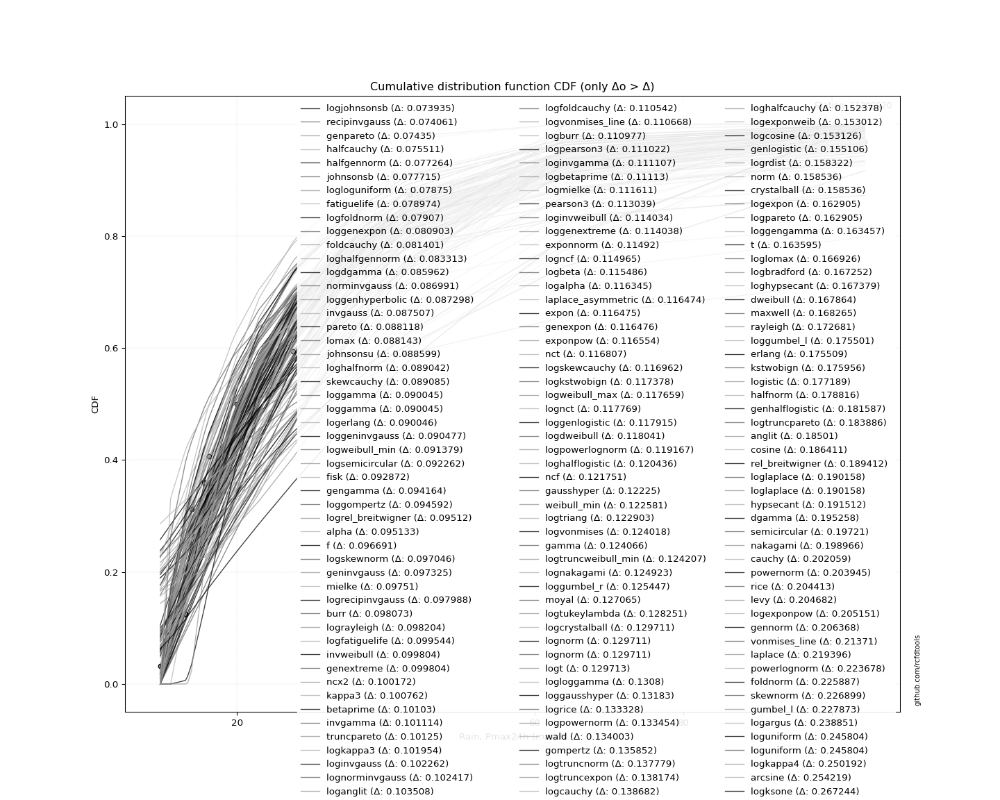</img>

</div>


**9.3. Best fit**

<div align="center">

|   id |   station | empirical_dist   | p_dist       |    delta |   deltao | eval   |   fit |   n |   best_fit |   best_fit_sort |
|-----:|----------:|:-----------------|:-------------|---------:|---------:|:-------|------:|----:|-----------:|----------------:|
|    0 |  21209920 | edf_filliben     | logjohnsonsb | 0.073935 | 0.302825 | Δo > Δ |     1 |  21 |          1 |               1 |

</div>


<div align="center">

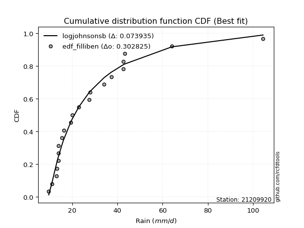</img>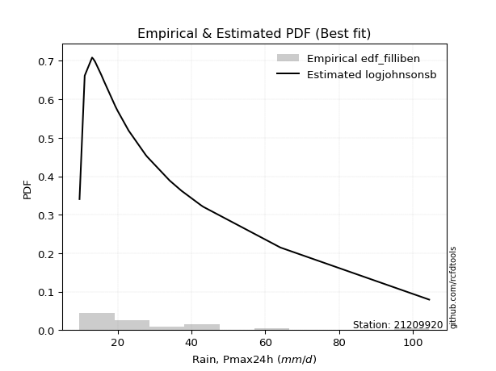</img>

</div>


### 10. EDF Jenkinson (1977)

The Jenkinson formula in hydrology is an empirical plotting position formula used to estimate the non-exceedance probability _(P)_ or return period _(T)_ of a given ordered observation within a sample. It is a widely used method in the frequency analysis of extreme events such as floods and rainfall, as it provides a distribution-free way to plot data. _a≈0.31_ and _b≈0.38_ are constants derived to approximate the median of the probability distribution for the given rank.

<div align="center">


$P=(m-a)/(n+b)$


</div>


**10.1. Empirical values**

<div align="center">

|                | 0                    | 1                   | 2                   | 3                   | 4                  | 5                  | 6                   | 7                  | 8                   | 9                  | 10            | 11                 | 12                 | 13                 | 14                 | 15                 | 16                 | 17                 | 18                 | 19                 | 20                 |
|:---------------|:---------------------|:--------------------|:--------------------|:--------------------|:-------------------|:-------------------|:--------------------|:-------------------|:--------------------|:-------------------|:--------------|:-------------------|:-------------------|:-------------------|:-------------------|:-------------------|:-------------------|:-------------------|:-------------------|:-------------------|:-------------------|
| date           | 2017                 | 2016                | 2019                | 2018                | 2015               | 2021               | 2023                | 2014               | 2013                | 2022               | 2020          | 2006               | 2025               | 2005               | 2009               | 2007               | 2011               | 2010               | 2008               | 2012               | 2024               |
| x              | 9.7                  | 11.1                | 13.1                | 13.4                | 13.9               | 13.9               | 13.9                | 15.6               | 16.3                | 19.4               | 20.0          | 23.0               | 27.6               | 28.0               | 34.1               | 37.3               | 42.6               | 42.7               | 43.2               | 64.1               | 104.4              |
| m              | 1                    | 2                   | 3                   | 4                   | 5                  | 6                  | 7                   | 8                  | 9                   | 10                 | 11            | 12                 | 13                 | 14                 | 15                 | 16                 | 17                 | 18                 | 19                 | 20                 | 21                 |
| empirical_dist | edf_jenkinson        | edf_jenkinson       | edf_jenkinson       | edf_jenkinson       | edf_jenkinson      | edf_jenkinson      | edf_jenkinson       | edf_jenkinson      | edf_jenkinson       | edf_jenkinson      | edf_jenkinson | edf_jenkinson      | edf_jenkinson      | edf_jenkinson      | edf_jenkinson      | edf_jenkinson      | edf_jenkinson      | edf_jenkinson      | edf_jenkinson      | edf_jenkinson      | edf_jenkinson      |
| empirical      | 0.032273152478952294 | 0.07904583723105707 | 0.12581852198316185 | 0.17259120673526662 | 0.2193638914873714 | 0.2661365762394762 | 0.31290926099158095 | 0.3596819457436857 | 0.40645463049579045 | 0.4532273152478952 | 0.5           | 0.5467726847521047 | 0.5935453695042096 | 0.6403180542563143 | 0.6870907390084191 | 0.7338634237605238 | 0.7806361085126288 | 0.8274087932647335 | 0.8741814780168383 | 0.920954162768943  | 0.9677268475210478 |
| empirical_tr   | 1.0333494441759306   | 1.085830370746572   | 1.1439272338148743  | 1.208592425098926   | 1.281006590772918  | 1.362651370299554  | 1.4554118447923756  | 1.5617238860482106 | 1.6847911741528763  | 1.828913601368691  | 2.0           | 2.206398348813209  | 2.4602991944764097 | 2.780234070221066  | 3.195814648729447  | 3.7574692442882247 | 4.558635394456293  | 5.794037940379407  | 7.947955390334582  | 12.650887573964514 | 30.985507246376862 |

</div>


**10.2. Kolmogorov-Smirnov fit test (sorted by Δ)**


<div align="center">

|                | 0                   | 1                   | 2                   | 3                   | 4                   | 5                   | 6                   | 7                   | 8                   | 9                   | 10                  | 11                  | 12                  | 13                  | 14                  | 15                  | 16                  | 17                  | 18                  | 19                  | 20                  | 21                  | 22                  | 23                  | 24                  | 25                  | 26                  | 27                  | 28                  | 29                  | 30                  | 31                  | 32                  | 33                  | 34                  | 35                  | 36                  | 37                  | 38                  | 39                  | 40                  | 41                  | 42                  | 43                  | 44                  | 45                  | 46                  | 47                  | 48                  | 49                  | 50                  | 51                  | 52                  | 53                  | 54                  | 55                  | 56                  | 57                  | 58                  | 59                  | 60                  | 61                  | 62                  | 63                  | 64                  | 65                  | 66                  | 67                  | 68                  | 69                  | 70                  | 71                  | 72                  | 73                  | 74                  | 75                  | 76                  | 77                  | 78                  | 79                  | 80                  | 81                  | 82                  | 83                  | 84                  | 85                  | 86                  | 87                  | 88                  | 89                  | 90                  | 91                  | 92                  | 93                  | 94                  | 95                  | 96                  | 97                  | 98                  | 99                  | 100                 | 101                 | 102                 | 103                 | 104                 | 105                 | 106                 | 107                 | 108                 | 109                 | 110                 | 111                 | 112                 | 113                 | 114                 | 115                 | 116                 | 117                 | 118                 | 119                 | 120                 | 121                 | 122                 | 123                 | 124                 | 125                 | 126                 | 127                 | 128                 | 129                 | 130                 | 131                 | 132                 | 133                 | 134                 | 135                 | 136                 | 137                 | 138                 | 139                 | 140                 | 141                 | 142                 | 143                 | 144                 | 145                 | 146                 | 147                 | 148                 | 149                 | 150                 | 151                 | 152                 | 153                 | 154                 | 155                 | 156                 | 157                 | 158                 | 159                 |
|:---------------|:--------------------|:--------------------|:--------------------|:--------------------|:--------------------|:--------------------|:--------------------|:--------------------|:--------------------|:--------------------|:--------------------|:--------------------|:--------------------|:--------------------|:--------------------|:--------------------|:--------------------|:--------------------|:--------------------|:--------------------|:--------------------|:--------------------|:--------------------|:--------------------|:--------------------|:--------------------|:--------------------|:--------------------|:--------------------|:--------------------|:--------------------|:--------------------|:--------------------|:--------------------|:--------------------|:--------------------|:--------------------|:--------------------|:--------------------|:--------------------|:--------------------|:--------------------|:--------------------|:--------------------|:--------------------|:--------------------|:--------------------|:--------------------|:--------------------|:--------------------|:--------------------|:--------------------|:--------------------|:--------------------|:--------------------|:--------------------|:--------------------|:--------------------|:--------------------|:--------------------|:--------------------|:--------------------|:--------------------|:--------------------|:--------------------|:--------------------|:--------------------|:--------------------|:--------------------|:--------------------|:--------------------|:--------------------|:--------------------|:--------------------|:--------------------|:--------------------|:--------------------|:--------------------|:--------------------|:--------------------|:--------------------|:--------------------|:--------------------|:--------------------|:--------------------|:--------------------|:--------------------|:--------------------|:--------------------|:--------------------|:--------------------|:--------------------|:--------------------|:--------------------|:--------------------|:--------------------|:--------------------|:--------------------|:--------------------|:--------------------|:--------------------|:--------------------|:--------------------|:--------------------|:--------------------|:--------------------|:--------------------|:--------------------|:--------------------|:--------------------|:--------------------|:--------------------|:--------------------|:--------------------|:--------------------|:--------------------|:--------------------|:--------------------|:--------------------|:--------------------|:--------------------|:--------------------|:--------------------|:--------------------|:--------------------|:--------------------|:--------------------|:--------------------|:--------------------|:--------------------|:--------------------|:--------------------|:--------------------|:--------------------|:--------------------|:--------------------|:--------------------|:--------------------|:--------------------|:--------------------|:--------------------|:--------------------|:--------------------|:--------------------|:--------------------|:--------------------|:--------------------|:--------------------|:--------------------|:--------------------|:--------------------|:--------------------|:--------------------|:--------------------|:--------------------|:--------------------|:--------------------|:--------------------|:--------------------|:--------------------|
| station        | 21209920            | 21209920            | 21209920            | 21209920            | 21209920            | 21209920            | 21209920            | 21209920            | 21209920            | 21209920            | 21209920            | 21209920            | 21209920            | 21209920            | 21209920            | 21209920            | 21209920            | 21209920            | 21209920            | 21209920            | 21209920            | 21209920            | 21209920            | 21209920            | 21209920            | 21209920            | 21209920            | 21209920            | 21209920            | 21209920            | 21209920            | 21209920            | 21209920            | 21209920            | 21209920            | 21209920            | 21209920            | 21209920            | 21209920            | 21209920            | 21209920            | 21209920            | 21209920            | 21209920            | 21209920            | 21209920            | 21209920            | 21209920            | 21209920            | 21209920            | 21209920            | 21209920            | 21209920            | 21209920            | 21209920            | 21209920            | 21209920            | 21209920            | 21209920            | 21209920            | 21209920            | 21209920            | 21209920            | 21209920            | 21209920            | 21209920            | 21209920            | 21209920            | 21209920            | 21209920            | 21209920            | 21209920            | 21209920            | 21209920            | 21209920            | 21209920            | 21209920            | 21209920            | 21209920            | 21209920            | 21209920            | 21209920            | 21209920            | 21209920            | 21209920            | 21209920            | 21209920            | 21209920            | 21209920            | 21209920            | 21209920            | 21209920            | 21209920            | 21209920            | 21209920            | 21209920            | 21209920            | 21209920            | 21209920            | 21209920            | 21209920            | 21209920            | 21209920            | 21209920            | 21209920            | 21209920            | 21209920            | 21209920            | 21209920            | 21209920            | 21209920            | 21209920            | 21209920            | 21209920            | 21209920            | 21209920            | 21209920            | 21209920            | 21209920            | 21209920            | 21209920            | 21209920            | 21209920            | 21209920            | 21209920            | 21209920            | 21209920            | 21209920            | 21209920            | 21209920            | 21209920            | 21209920            | 21209920            | 21209920            | 21209920            | 21209920            | 21209920            | 21209920            | 21209920            | 21209920            | 21209920            | 21209920            | 21209920            | 21209920            | 21209920            | 21209920            | 21209920            | 21209920            | 21209920            | 21209920            | 21209920            | 21209920            | 21209920            | 21209920            | 21209920            | 21209920            | 21209920            | 21209920            | 21209920            | 21209920            |
| empirical_dist | edf_jenkinson       | edf_jenkinson       | edf_jenkinson       | edf_jenkinson       | edf_jenkinson       | edf_jenkinson       | edf_jenkinson       | edf_jenkinson       | edf_jenkinson       | edf_jenkinson       | edf_jenkinson       | edf_jenkinson       | edf_jenkinson       | edf_jenkinson       | edf_jenkinson       | edf_jenkinson       | edf_jenkinson       | edf_jenkinson       | edf_jenkinson       | edf_jenkinson       | edf_jenkinson       | edf_jenkinson       | edf_jenkinson       | edf_jenkinson       | edf_jenkinson       | edf_jenkinson       | edf_jenkinson       | edf_jenkinson       | edf_jenkinson       | edf_jenkinson       | edf_jenkinson       | edf_jenkinson       | edf_jenkinson       | edf_jenkinson       | edf_jenkinson       | edf_jenkinson       | edf_jenkinson       | edf_jenkinson       | edf_jenkinson       | edf_jenkinson       | edf_jenkinson       | edf_jenkinson       | edf_jenkinson       | edf_jenkinson       | edf_jenkinson       | edf_jenkinson       | edf_jenkinson       | edf_jenkinson       | edf_jenkinson       | edf_jenkinson       | edf_jenkinson       | edf_jenkinson       | edf_jenkinson       | edf_jenkinson       | edf_jenkinson       | edf_jenkinson       | edf_jenkinson       | edf_jenkinson       | edf_jenkinson       | edf_jenkinson       | edf_jenkinson       | edf_jenkinson       | edf_jenkinson       | edf_jenkinson       | edf_jenkinson       | edf_jenkinson       | edf_jenkinson       | edf_jenkinson       | edf_jenkinson       | edf_jenkinson       | edf_jenkinson       | edf_jenkinson       | edf_jenkinson       | edf_jenkinson       | edf_jenkinson       | edf_jenkinson       | edf_jenkinson       | edf_jenkinson       | edf_jenkinson       | edf_jenkinson       | edf_jenkinson       | edf_jenkinson       | edf_jenkinson       | edf_jenkinson       | edf_jenkinson       | edf_jenkinson       | edf_jenkinson       | edf_jenkinson       | edf_jenkinson       | edf_jenkinson       | edf_jenkinson       | edf_jenkinson       | edf_jenkinson       | edf_jenkinson       | edf_jenkinson       | edf_jenkinson       | edf_jenkinson       | edf_jenkinson       | edf_jenkinson       | edf_jenkinson       | edf_jenkinson       | edf_jenkinson       | edf_jenkinson       | edf_jenkinson       | edf_jenkinson       | edf_jenkinson       | edf_jenkinson       | edf_jenkinson       | edf_jenkinson       | edf_jenkinson       | edf_jenkinson       | edf_jenkinson       | edf_jenkinson       | edf_jenkinson       | edf_jenkinson       | edf_jenkinson       | edf_jenkinson       | edf_jenkinson       | edf_jenkinson       | edf_jenkinson       | edf_jenkinson       | edf_jenkinson       | edf_jenkinson       | edf_jenkinson       | edf_jenkinson       | edf_jenkinson       | edf_jenkinson       | edf_jenkinson       | edf_jenkinson       | edf_jenkinson       | edf_jenkinson       | edf_jenkinson       | edf_jenkinson       | edf_jenkinson       | edf_jenkinson       | edf_jenkinson       | edf_jenkinson       | edf_jenkinson       | edf_jenkinson       | edf_jenkinson       | edf_jenkinson       | edf_jenkinson       | edf_jenkinson       | edf_jenkinson       | edf_jenkinson       | edf_jenkinson       | edf_jenkinson       | edf_jenkinson       | edf_jenkinson       | edf_jenkinson       | edf_jenkinson       | edf_jenkinson       | edf_jenkinson       | edf_jenkinson       | edf_jenkinson       | edf_jenkinson       | edf_jenkinson       | edf_jenkinson       | edf_jenkinson       | edf_jenkinson       |
| p_dist         | logjohnsonsb        | genpareto           | halfgennorm         | johnsonsb           | fatiguelife         | logfoldnorm         | loggenexpon         | loghalfgennorm      | logdgamma           | invgauss            | lomax               | johnsonsu           | loghalfnorm         | loggamma            | loggamma            | logerlang           | logweibull_min      | logsemicircular     | gengamma            | loggompertz         | alpha               | f                   | logskewnorm         | mielke              | burr                | lograyleigh         | logfatiguelife      | invweibull          | genextreme          | kappa3              | betaprime           | invgamma            | truncpareto         | logkappa3           | loginvgauss         | loganglit           | logf                | logmaxwell          | logjohnsonsu        | burr12              | logexponnorm        | logburr12           | exponweib           | logvonmises_line    | logburr             | logpearson3         | loginvgamma         | logbetaprime        | logmielke           | pearson3            | loginvweibull       | loggenextreme       | logncf              | exponnorm           | logbeta             | exponpow            | logalpha            | genexpon            | nct                 | logkstwobign        | logweibull_max      | lognct              | loggenlogistic      | logdweibull         | loghalflogistic     | ncf                 | gausshyper          | weibull_min         | logtriang           | gamma               | logtruncweibull_min | logvonmises         | lognakagami         | loggumbel_r         | moyal               | logtukeylambda      | logcrystalball      | lognorm             | logt                | logloggamma         | loggausshyper       | logrice             | wald                | gompertz            | logtruncnorm        | logtruncexpon       | logarcsine          | logloglaplace       | logmoyal            | gumbel_r            | halflogistic        | loggennorm          | truncnorm           | beta                | loglogistic         | logexponweib        | logcosine           | genlogistic         | logrdist            | norm                | crystalball         | loggengamma         | t                   | loglomax            | logbradford         | loghypsecant        | dweibull            | maxwell             | rayleigh            | erlang              | loggumbel_l         | kstwobign           | logistic            | halfnorm            | genhalflogistic     | logtruncpareto      | anglit              | cosine              | loglaplace          | loglaplace          | hypsecant           | dgamma              | semicircular        | nakagami            | rice                | logexponpow         | gennorm             | vonmises_line       | laplace             | foldnorm            | skewnorm            | gumbel_l            | logargus            | loguniform          | logkappa4           | arcsine             | logksone            | truncweibull_min    | bradford            | logwald             | powerlaw            | triang              | truncexpon          | logwrapcauchy       | logpowerlaw         | loggenpareto        | loggenhalflogistic  | wrapcauchy          | argus               | loglevy_l           | kappa4              | ksone               | logtrapezoid        | levy_l              | uniform             | rdist               | tukeylambda         | trapezoid           | weibull_max         | vonmises            |
| delta          | 0.07367224363880631 | 0.07448171113694593 | 0.07700173481481223 | 0.07745230636835626 | 0.07910531528170961 | 0.07920184941581601 | 0.08096880167622855 | 0.08344422942314694 | 0.08615950420087926 | 0.08763876920136301 | 0.08827451130072708 | 0.08873019746384753 | 0.0891732440028683  | 0.09017643659255245 | 0.09017643659255245 | 0.09017726415044885 | 0.09151025626853904 | 0.0923274012664499  | 0.09390092798993357 | 0.09472310891401617 | 0.09526471556339974 | 0.09675669061124681 | 0.09717702654819305 | 0.0976412331090277  | 0.09820417463920439 | 0.09833564896770067 | 0.09967523466549888 | 0.09993504894568286 | 0.0999353738228971  | 0.10089300044572852 | 0.10116086874802904 | 0.10124548903185482 | 0.10138146791069358 | 0.10201992130074039 | 0.10239342416248567 | 0.10357397324491158 | 0.10386898425137564 | 0.10454332434445035 | 0.10534824149106475 | 0.10609428335510873 | 0.1061557289756756  | 0.10621694613269461 | 0.1074924964684934  | 0.11073399652370092 | 0.11110882968969912 | 0.11115290721636123 | 0.11123841483873903 | 0.11126180856599127 | 0.1117424010162083  | 0.11277606255743763 | 0.11416533820803645 | 0.11416949237820873 | 0.11503024983650523 | 0.11505090822689007 | 0.11522341891344218 | 0.11629163574672968 | 0.11647612187211434 | 0.11660716845153996 | 0.1169387821822814  | 0.1175092947796661  | 0.11779038729007293 | 0.11789997607119912 | 0.11804611040065188 | 0.11817275786612114 | 0.12056766444053377 | 0.12181645329623897 | 0.12198732808089977 | 0.12264691895038532 | 0.12303401452086371 | 0.12380367702560471 | 0.12394457600290276 | 0.12408412223363974 | 0.12465982096728867 | 0.1255786473087442  | 0.1267371031923143  | 0.1283162073000984  | 0.12977680789457463 | 0.12977687914938657 | 0.12977825574503865 | 0.13086594524772432 | 0.13156761211426204 | 0.13345959195285542 | 0.13413457450529195 | 0.13591772112747336 | 0.13751610213519522 | 0.13791128432994393 | 0.14011138386716165 | 0.14050805231874441 | 0.14073898736975982 | 0.1439250748291978  | 0.14425488529408925 | 0.1457150116147654  | 0.14976215313534363 | 0.15187806993780728 | 0.15202221174863306 | 0.1527489169758781  | 0.15319150926944364 | 0.15517187998373105 | 0.15805913169308383 | 0.15853608968214006 | 0.15853609130004848 | 0.1631939436049915  | 0.16326622020285736 | 0.16666364203138623 | 0.1669892812037932  | 0.16744445503665878 | 0.16753545806523326 | 0.16793694834996936 | 0.1723525160751713  | 0.17524629611375225 | 0.17556674307951523 | 0.17595555487247727 | 0.17718928074716378 | 0.17848792122260054 | 0.18165273380781308 | 0.18362348290810798 | 0.18468205591838033 | 0.18660783236721867 | 0.1902235052958941  | 0.1902235052958941  | 0.19151169937436907 | 0.19493001147651268 | 0.1968816514693708  | 0.19870327171323765 | 0.20441308144941928 | 0.20488798293414118 | 0.20603973196540654 | 0.2137757608683466  | 0.21939648773001902 | 0.22555832487303124 | 0.22696481617662634 | 0.22777406686567225 | 0.23858838012349193 | 0.24554117363899453 | 0.24992900782101157 | 0.2538906035702989  | 0.26698122436863514 | 0.27429716585985975 | 0.274561714928081   | 0.2891573427774335  | 0.2924205520296523  | 0.29635160918248193 | 0.31847106698740646 | 0.3291073080108925  | 0.3582253808660791  | 0.36485267325482396 | 0.39885881112023663 | 0.4243937626028676  | 0.437446433880208   | 0.44683530329311744 | 0.4813285614221969  | 0.4960575779816394  | 0.5054893299863958  | 0.514428937593234   | 0.5204327979745997  | 0.5388520607606435  | 0.5658111621759951  | 0.7312037942390093  | 0.7836090473611663  | 15.85840469589081   |
| deltao         | 0.30282488509099936 | 0.30282488509099936 | 0.30282488509099936 | 0.30282488509099936 | 0.30282488509099936 | 0.30282488509099936 | 0.30282488509099936 | 0.30282488509099936 | 0.30282488509099936 | 0.30282488509099936 | 0.30282488509099936 | 0.30282488509099936 | 0.30282488509099936 | 0.30282488509099936 | 0.30282488509099936 | 0.30282488509099936 | 0.30282488509099936 | 0.30282488509099936 | 0.30282488509099936 | 0.30282488509099936 | 0.30282488509099936 | 0.30282488509099936 | 0.30282488509099936 | 0.30282488509099936 | 0.30282488509099936 | 0.30282488509099936 | 0.30282488509099936 | 0.30282488509099936 | 0.30282488509099936 | 0.30282488509099936 | 0.30282488509099936 | 0.30282488509099936 | 0.30282488509099936 | 0.30282488509099936 | 0.30282488509099936 | 0.30282488509099936 | 0.30282488509099936 | 0.30282488509099936 | 0.30282488509099936 | 0.30282488509099936 | 0.30282488509099936 | 0.30282488509099936 | 0.30282488509099936 | 0.30282488509099936 | 0.30282488509099936 | 0.30282488509099936 | 0.30282488509099936 | 0.30282488509099936 | 0.30282488509099936 | 0.30282488509099936 | 0.30282488509099936 | 0.30282488509099936 | 0.30282488509099936 | 0.30282488509099936 | 0.30282488509099936 | 0.30282488509099936 | 0.30282488509099936 | 0.30282488509099936 | 0.30282488509099936 | 0.30282488509099936 | 0.30282488509099936 | 0.30282488509099936 | 0.30282488509099936 | 0.30282488509099936 | 0.30282488509099936 | 0.30282488509099936 | 0.30282488509099936 | 0.30282488509099936 | 0.30282488509099936 | 0.30282488509099936 | 0.30282488509099936 | 0.30282488509099936 | 0.30282488509099936 | 0.30282488509099936 | 0.30282488509099936 | 0.30282488509099936 | 0.30282488509099936 | 0.30282488509099936 | 0.30282488509099936 | 0.30282488509099936 | 0.30282488509099936 | 0.30282488509099936 | 0.30282488509099936 | 0.30282488509099936 | 0.30282488509099936 | 0.30282488509099936 | 0.30282488509099936 | 0.30282488509099936 | 0.30282488509099936 | 0.30282488509099936 | 0.30282488509099936 | 0.30282488509099936 | 0.30282488509099936 | 0.30282488509099936 | 0.30282488509099936 | 0.30282488509099936 | 0.30282488509099936 | 0.30282488509099936 | 0.30282488509099936 | 0.30282488509099936 | 0.30282488509099936 | 0.30282488509099936 | 0.30282488509099936 | 0.30282488509099936 | 0.30282488509099936 | 0.30282488509099936 | 0.30282488509099936 | 0.30282488509099936 | 0.30282488509099936 | 0.30282488509099936 | 0.30282488509099936 | 0.30282488509099936 | 0.30282488509099936 | 0.30282488509099936 | 0.30282488509099936 | 0.30282488509099936 | 0.30282488509099936 | 0.30282488509099936 | 0.30282488509099936 | 0.30282488509099936 | 0.30282488509099936 | 0.30282488509099936 | 0.30282488509099936 | 0.30282488509099936 | 0.30282488509099936 | 0.30282488509099936 | 0.30282488509099936 | 0.30282488509099936 | 0.30282488509099936 | 0.30282488509099936 | 0.30282488509099936 | 0.30282488509099936 | 0.30282488509099936 | 0.30282488509099936 | 0.30282488509099936 | 0.30282488509099936 | 0.30282488509099936 | 0.30282488509099936 | 0.30282488509099936 | 0.30282488509099936 | 0.30282488509099936 | 0.30282488509099936 | 0.30282488509099936 | 0.30282488509099936 | 0.30282488509099936 | 0.30282488509099936 | 0.30282488509099936 | 0.30282488509099936 | 0.30282488509099936 | 0.30282488509099936 | 0.30282488509099936 | 0.30282488509099936 | 0.30282488509099936 | 0.30282488509099936 | 0.30282488509099936 | 0.30282488509099936 | 0.30282488509099936 | 0.30282488509099936 | 0.30282488509099936 | 0.30282488509099936 |
| eval           | Δo > Δ              | Δo > Δ              | Δo > Δ              | Δo > Δ              | Δo > Δ              | Δo > Δ              | Δo > Δ              | Δo > Δ              | Δo > Δ              | Δo > Δ              | Δo > Δ              | Δo > Δ              | Δo > Δ              | Δo > Δ              | Δo > Δ              | Δo > Δ              | Δo > Δ              | Δo > Δ              | Δo > Δ              | Δo > Δ              | Δo > Δ              | Δo > Δ              | Δo > Δ              | Δo > Δ              | Δo > Δ              | Δo > Δ              | Δo > Δ              | Δo > Δ              | Δo > Δ              | Δo > Δ              | Δo > Δ              | Δo > Δ              | Δo > Δ              | Δo > Δ              | Δo > Δ              | Δo > Δ              | Δo > Δ              | Δo > Δ              | Δo > Δ              | Δo > Δ              | Δo > Δ              | Δo > Δ              | Δo > Δ              | Δo > Δ              | Δo > Δ              | Δo > Δ              | Δo > Δ              | Δo > Δ              | Δo > Δ              | Δo > Δ              | Δo > Δ              | Δo > Δ              | Δo > Δ              | Δo > Δ              | Δo > Δ              | Δo > Δ              | Δo > Δ              | Δo > Δ              | Δo > Δ              | Δo > Δ              | Δo > Δ              | Δo > Δ              | Δo > Δ              | Δo > Δ              | Δo > Δ              | Δo > Δ              | Δo > Δ              | Δo > Δ              | Δo > Δ              | Δo > Δ              | Δo > Δ              | Δo > Δ              | Δo > Δ              | Δo > Δ              | Δo > Δ              | Δo > Δ              | Δo > Δ              | Δo > Δ              | Δo > Δ              | Δo > Δ              | Δo > Δ              | Δo > Δ              | Δo > Δ              | Δo > Δ              | Δo > Δ              | Δo > Δ              | Δo > Δ              | Δo > Δ              | Δo > Δ              | Δo > Δ              | Δo > Δ              | Δo > Δ              | Δo > Δ              | Δo > Δ              | Δo > Δ              | Δo > Δ              | Δo > Δ              | Δo > Δ              | Δo > Δ              | Δo > Δ              | Δo > Δ              | Δo > Δ              | Δo > Δ              | Δo > Δ              | Δo > Δ              | Δo > Δ              | Δo > Δ              | Δo > Δ              | Δo > Δ              | Δo > Δ              | Δo > Δ              | Δo > Δ              | Δo > Δ              | Δo > Δ              | Δo > Δ              | Δo > Δ              | Δo > Δ              | Δo > Δ              | Δo > Δ              | Δo > Δ              | Δo > Δ              | Δo > Δ              | Δo > Δ              | Δo > Δ              | Δo > Δ              | Δo > Δ              | Δo > Δ              | Δo > Δ              | Δo > Δ              | Δo > Δ              | Δo > Δ              | Δo > Δ              | Δo > Δ              | Δo > Δ              | Δo > Δ              | Δo > Δ              | Δo > Δ              | Δo > Δ              | Δo > Δ              | Δo > Δ              | Δo > Δ              | Δo > Δ              | Δo <= Δ             | Δo <= Δ             | Δo <= Δ             | Δo <= Δ             | Δo <= Δ             | Δo <= Δ             | Δo <= Δ             | Δo <= Δ             | Δo <= Δ             | Δo <= Δ             | Δo <= Δ             | Δo <= Δ             | Δo <= Δ             | Δo <= Δ             | Δo <= Δ             | Δo <= Δ             | Δo <= Δ             | Δo <= Δ             |
| fit            | 1                   | 1                   | 1                   | 1                   | 1                   | 1                   | 1                   | 1                   | 1                   | 1                   | 1                   | 1                   | 1                   | 1                   | 1                   | 1                   | 1                   | 1                   | 1                   | 1                   | 1                   | 1                   | 1                   | 1                   | 1                   | 1                   | 1                   | 1                   | 1                   | 1                   | 1                   | 1                   | 1                   | 1                   | 1                   | 1                   | 1                   | 1                   | 1                   | 1                   | 1                   | 1                   | 1                   | 1                   | 1                   | 1                   | 1                   | 1                   | 1                   | 1                   | 1                   | 1                   | 1                   | 1                   | 1                   | 1                   | 1                   | 1                   | 1                   | 1                   | 1                   | 1                   | 1                   | 1                   | 1                   | 1                   | 1                   | 1                   | 1                   | 1                   | 1                   | 1                   | 1                   | 1                   | 1                   | 1                   | 1                   | 1                   | 1                   | 1                   | 1                   | 1                   | 1                   | 1                   | 1                   | 1                   | 1                   | 1                   | 1                   | 1                   | 1                   | 1                   | 1                   | 1                   | 1                   | 1                   | 1                   | 1                   | 1                   | 1                   | 1                   | 1                   | 1                   | 1                   | 1                   | 1                   | 1                   | 1                   | 1                   | 1                   | 1                   | 1                   | 1                   | 1                   | 1                   | 1                   | 1                   | 1                   | 1                   | 1                   | 1                   | 1                   | 1                   | 1                   | 1                   | 1                   | 1                   | 1                   | 1                   | 1                   | 1                   | 1                   | 1                   | 1                   | 1                   | 1                   | 1                   | 1                   | 1                   | 1                   | 1                   | 1                   | 0                   | 0                   | 0                   | 0                   | 0                   | 0                   | 0                   | 0                   | 0                   | 0                   | 0                   | 0                   | 0                   | 0                   | 0                   | 0                   | 0                   | 0                   |
| n              | 21                  | 21                  | 21                  | 21                  | 21                  | 21                  | 21                  | 21                  | 21                  | 21                  | 21                  | 21                  | 21                  | 21                  | 21                  | 21                  | 21                  | 21                  | 21                  | 21                  | 21                  | 21                  | 21                  | 21                  | 21                  | 21                  | 21                  | 21                  | 21                  | 21                  | 21                  | 21                  | 21                  | 21                  | 21                  | 21                  | 21                  | 21                  | 21                  | 21                  | 21                  | 21                  | 21                  | 21                  | 21                  | 21                  | 21                  | 21                  | 21                  | 21                  | 21                  | 21                  | 21                  | 21                  | 21                  | 21                  | 21                  | 21                  | 21                  | 21                  | 21                  | 21                  | 21                  | 21                  | 21                  | 21                  | 21                  | 21                  | 21                  | 21                  | 21                  | 21                  | 21                  | 21                  | 21                  | 21                  | 21                  | 21                  | 21                  | 21                  | 21                  | 21                  | 21                  | 21                  | 21                  | 21                  | 21                  | 21                  | 21                  | 21                  | 21                  | 21                  | 21                  | 21                  | 21                  | 21                  | 21                  | 21                  | 21                  | 21                  | 21                  | 21                  | 21                  | 21                  | 21                  | 21                  | 21                  | 21                  | 21                  | 21                  | 21                  | 21                  | 21                  | 21                  | 21                  | 21                  | 21                  | 21                  | 21                  | 21                  | 21                  | 21                  | 21                  | 21                  | 21                  | 21                  | 21                  | 21                  | 21                  | 21                  | 21                  | 21                  | 21                  | 21                  | 21                  | 21                  | 21                  | 21                  | 21                  | 21                  | 21                  | 21                  | 21                  | 21                  | 21                  | 21                  | 21                  | 21                  | 21                  | 21                  | 21                  | 21                  | 21                  | 21                  | 21                  | 21                  | 21                  | 21                  | 21                  | 21                  |
| best_fit       | 1                   | 0                   | 0                   | 0                   | 0                   | 0                   | 0                   | 0                   | 0                   | 0                   | 0                   | 0                   | 0                   | 0                   | 0                   | 0                   | 0                   | 0                   | 0                   | 0                   | 0                   | 0                   | 0                   | 0                   | 0                   | 0                   | 0                   | 0                   | 0                   | 0                   | 0                   | 0                   | 0                   | 0                   | 0                   | 0                   | 0                   | 0                   | 0                   | 0                   | 0                   | 0                   | 0                   | 0                   | 0                   | 0                   | 0                   | 0                   | 0                   | 0                   | 0                   | 0                   | 0                   | 0                   | 0                   | 0                   | 0                   | 0                   | 0                   | 0                   | 0                   | 0                   | 0                   | 0                   | 0                   | 0                   | 0                   | 0                   | 0                   | 0                   | 0                   | 0                   | 0                   | 0                   | 0                   | 0                   | 0                   | 0                   | 0                   | 0                   | 0                   | 0                   | 0                   | 0                   | 0                   | 0                   | 0                   | 0                   | 0                   | 0                   | 0                   | 0                   | 0                   | 0                   | 0                   | 0                   | 0                   | 0                   | 0                   | 0                   | 0                   | 0                   | 0                   | 0                   | 0                   | 0                   | 0                   | 0                   | 0                   | 0                   | 0                   | 0                   | 0                   | 0                   | 0                   | 0                   | 0                   | 0                   | 0                   | 0                   | 0                   | 0                   | 0                   | 0                   | 0                   | 0                   | 0                   | 0                   | 0                   | 0                   | 0                   | 0                   | 0                   | 0                   | 0                   | 0                   | 0                   | 0                   | 0                   | 0                   | 0                   | 0                   | 0                   | 0                   | 0                   | 0                   | 0                   | 0                   | 0                   | 0                   | 0                   | 0                   | 0                   | 0                   | 0                   | 0                   | 0                   | 0                   | 0                   | 0                   |
| best_fit_sort  | 1                   | 2                   | 3                   | 4                   | 5                   | 6                   | 7                   | 8                   | 9                   | 10                  | 11                  | 12                  | 13                  | 14                  | 15                  | 16                  | 17                  | 18                  | 19                  | 20                  | 21                  | 22                  | 23                  | 24                  | 25                  | 26                  | 27                  | 28                  | 29                  | 30                  | 31                  | 32                  | 33                  | 34                  | 35                  | 36                  | 37                  | 38                  | 39                  | 40                  | 41                  | 42                  | 43                  | 44                  | 45                  | 46                  | 47                  | 48                  | 49                  | 50                  | 51                  | 52                  | 53                  | 54                  | 55                  | 56                  | 57                  | 58                  | 59                  | 60                  | 61                  | 62                  | 63                  | 64                  | 65                  | 66                  | 67                  | 68                  | 69                  | 70                  | 71                  | 72                  | 73                  | 74                  | 75                  | 76                  | 77                  | 78                  | 79                  | 80                  | 81                  | 82                  | 83                  | 84                  | 85                  | 86                  | 87                  | 88                  | 89                  | 90                  | 91                  | 92                  | 93                  | 94                  | 95                  | 96                  | 97                  | 98                  | 99                  | 100                 | 101                 | 102                 | 103                 | 104                 | 105                 | 106                 | 107                 | 108                 | 109                 | 110                 | 111                 | 112                 | 113                 | 114                 | 115                 | 116                 | 117                 | 118                 | 119                 | 120                 | 121                 | 122                 | 123                 | 124                 | 125                 | 126                 | 127                 | 128                 | 129                 | 130                 | 131                 | 132                 | 133                 | 134                 | 135                 | 136                 | 137                 | 138                 | 139                 | 140                 | 141                 | 142                 | 143                 | 144                 | 145                 | 146                 | 147                 | 148                 | 149                 | 150                 | 151                 | 152                 | 153                 | 154                 | 155                 | 156                 | 157                 | 158                 | 159                 | 160                 |

</div>


<div align="center">

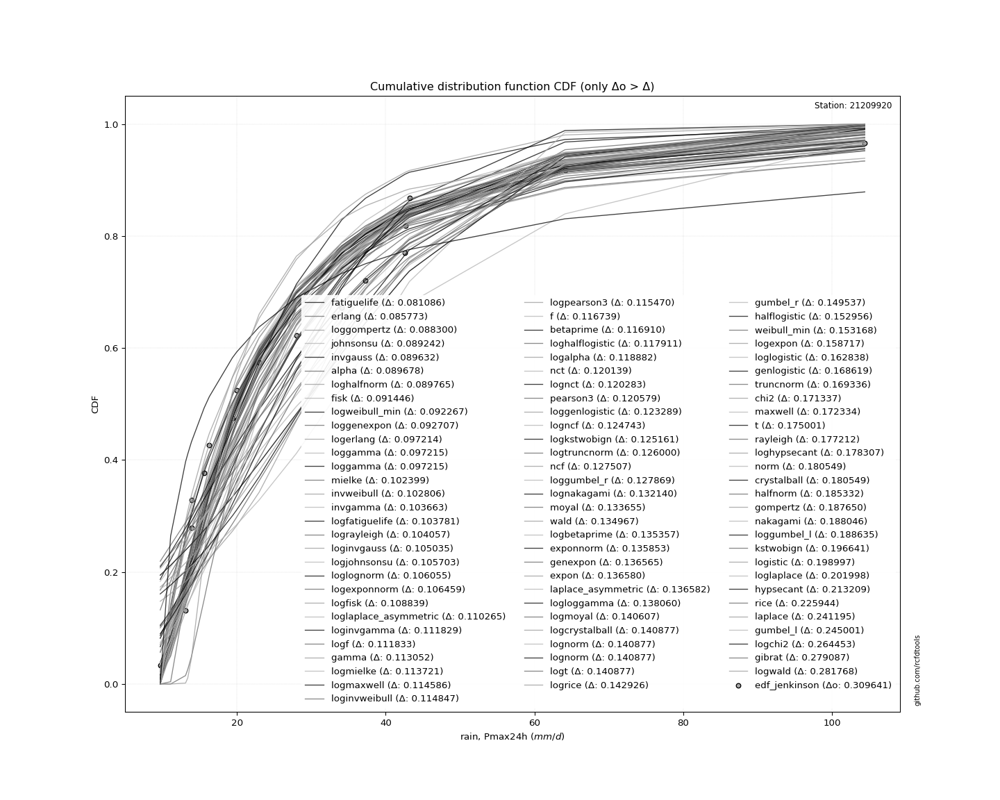</img>

</div>


**10.3. Best fit**

<div align="center">

|   id |   station | empirical_dist   | p_dist       |     delta |   deltao | eval   |   fit |   n |   best_fit |   best_fit_sort |
|-----:|----------:|:-----------------|:-------------|----------:|---------:|:-------|------:|----:|-----------:|----------------:|
|    0 |  21209920 | edf_jenkinson    | logjohnsonsb | 0.0736722 | 0.302825 | Δo > Δ |     1 |  21 |          1 |               1 |

</div>


<div align="center">

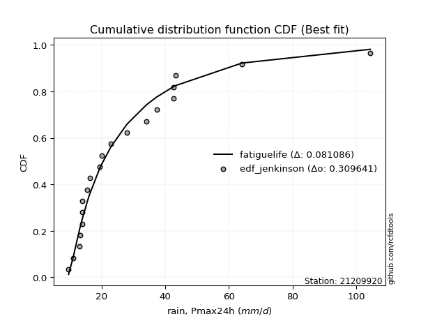</img></img>

</div>


### 11. EDF Cunnane (1978)

Cunnane´s work in statistical hydrology has focused on the performance and evaluation of different probability distributions (such as GEV, Gumbel, Lognormal) for flood frequency estimation. _b_ is a constant, typically set to 0.4.

<div align="center">


$P=(m-b)/(n+1-2b)$


</div>


**11.1. Empirical values**

<div align="center">

|                | 0                   | 1                   | 2                   | 3                  | 4                   | 5                  | 6                  | 7                  | 8                  | 9                  | 10          | 11                 | 12                 | 13                 | 14                 | 15                 | 16                 | 17                 | 18                 | 19                 | 20                 |
|:---------------|:--------------------|:--------------------|:--------------------|:-------------------|:--------------------|:-------------------|:-------------------|:-------------------|:-------------------|:-------------------|:------------|:-------------------|:-------------------|:-------------------|:-------------------|:-------------------|:-------------------|:-------------------|:-------------------|:-------------------|:-------------------|
| date           | 2017                | 2016                | 2019                | 2018               | 2015                | 2021               | 2023               | 2014               | 2013               | 2022               | 2020        | 2006               | 2025               | 2005               | 2009               | 2007               | 2011               | 2010               | 2008               | 2012               | 2024               |
| x              | 9.7                 | 11.1                | 13.1                | 13.4               | 13.9                | 13.9               | 13.9               | 15.6               | 16.3               | 19.4               | 20.0        | 23.0               | 27.6               | 28.0               | 34.1               | 37.3               | 42.6               | 42.7               | 43.2               | 64.1               | 104.4              |
| m              | 1                   | 2                   | 3                   | 4                  | 5                   | 6                  | 7                  | 8                  | 9                  | 10                 | 11          | 12                 | 13                 | 14                 | 15                 | 16                 | 17                 | 18                 | 19                 | 20                 | 21                 |
| empirical_dist | edf_cunnane         | edf_cunnane         | edf_cunnane         | edf_cunnane        | edf_cunnane         | edf_cunnane        | edf_cunnane        | edf_cunnane        | edf_cunnane        | edf_cunnane        | edf_cunnane | edf_cunnane        | edf_cunnane        | edf_cunnane        | edf_cunnane        | edf_cunnane        | edf_cunnane        | edf_cunnane        | edf_cunnane        | edf_cunnane        | edf_cunnane        |
| empirical      | 0.02830188679245283 | 0.07547169811320756 | 0.12264150943396228 | 0.169811320754717  | 0.21698113207547168 | 0.2641509433962264 | 0.3113207547169811 | 0.3584905660377358 | 0.4056603773584906 | 0.4528301886792453 | 0.5         | 0.5471698113207547 | 0.5943396226415094 | 0.6415094339622641 | 0.6886792452830188 | 0.7358490566037736 | 0.7830188679245284 | 0.8301886792452832 | 0.8773584905660379 | 0.9245283018867926 | 0.9716981132075473 |
| empirical_tr   | 1.029126213592233   | 1.0816326530612246  | 1.139784946236559   | 1.2045454545454546 | 1.2771084337349397  | 1.3589743589743588 | 1.452054794520548  | 1.5588235294117645 | 1.6825396825396826 | 1.8275862068965518 | 2.0         | 2.2083333333333335 | 2.4651162790697674 | 2.789473684210526  | 3.2121212121212115 | 3.7857142857142865 | 4.608695652173914  | 5.888888888888894  | 8.153846153846162  | 13.250000000000023 | 35.33333333333348  |

</div>


**11.2. Kolmogorov-Smirnov fit test (sorted by Δ)**


<div align="center">

|                | 0                   | 1                   | 2                   | 3                   | 4                   | 5                   | 6                   | 7                   | 8                   | 9                   | 10                  | 11                  | 12                  | 13                  | 14                  | 15                  | 16                  | 17                  | 18                  | 19                  | 20                  | 21                  | 22                  | 23                  | 24                  | 25                  | 26                  | 27                  | 28                  | 29                  | 30                  | 31                  | 32                  | 33                  | 34                  | 35                  | 36                  | 37                  | 38                  | 39                  | 40                  | 41                  | 42                  | 43                  | 44                  | 45                  | 46                  | 47                  | 48                  | 49                  | 50                  | 51                  | 52                  | 53                  | 54                  | 55                  | 56                  | 57                  | 58                  | 59                  | 60                  | 61                  | 62                  | 63                  | 64                  | 65                  | 66                  | 67                  | 68                  | 69                  | 70                  | 71                  | 72                  | 73                  | 74                  | 75                  | 76                  | 77                  | 78                  | 79                  | 80                  | 81                  | 82                  | 83                  | 84                  | 85                  | 86                  | 87                  | 88                  | 89                  | 90                  | 91                  | 92                  | 93                  | 94                  | 95                  | 96                  | 97                  | 98                  | 99                  | 100                 | 101                 | 102                 | 103                 | 104                 | 105                 | 106                 | 107                 | 108                 | 109                 | 110                 | 111                 | 112                 | 113                 | 114                 | 115                 | 116                 | 117                 | 118                 | 119                 | 120                 | 121                 | 122                 | 123                 | 124                 | 125                 | 126                 | 127                 | 128                 | 129                 | 130                 | 131                 | 132                 | 133                 | 134                 | 135                 | 136                 | 137                 | 138                 | 139                 | 140                 | 141                 | 142                 | 143                 | 144                 | 145                 | 146                 | 147                 | 148                 | 149                 | 150                 | 151                 | 152                 | 153                 | 154                 | 155                 | 156                 | 157                 | 158                 | 159                 |
|:---------------|:--------------------|:--------------------|:--------------------|:--------------------|:--------------------|:--------------------|:--------------------|:--------------------|:--------------------|:--------------------|:--------------------|:--------------------|:--------------------|:--------------------|:--------------------|:--------------------|:--------------------|:--------------------|:--------------------|:--------------------|:--------------------|:--------------------|:--------------------|:--------------------|:--------------------|:--------------------|:--------------------|:--------------------|:--------------------|:--------------------|:--------------------|:--------------------|:--------------------|:--------------------|:--------------------|:--------------------|:--------------------|:--------------------|:--------------------|:--------------------|:--------------------|:--------------------|:--------------------|:--------------------|:--------------------|:--------------------|:--------------------|:--------------------|:--------------------|:--------------------|:--------------------|:--------------------|:--------------------|:--------------------|:--------------------|:--------------------|:--------------------|:--------------------|:--------------------|:--------------------|:--------------------|:--------------------|:--------------------|:--------------------|:--------------------|:--------------------|:--------------------|:--------------------|:--------------------|:--------------------|:--------------------|:--------------------|:--------------------|:--------------------|:--------------------|:--------------------|:--------------------|:--------------------|:--------------------|:--------------------|:--------------------|:--------------------|:--------------------|:--------------------|:--------------------|:--------------------|:--------------------|:--------------------|:--------------------|:--------------------|:--------------------|:--------------------|:--------------------|:--------------------|:--------------------|:--------------------|:--------------------|:--------------------|:--------------------|:--------------------|:--------------------|:--------------------|:--------------------|:--------------------|:--------------------|:--------------------|:--------------------|:--------------------|:--------------------|:--------------------|:--------------------|:--------------------|:--------------------|:--------------------|:--------------------|:--------------------|:--------------------|:--------------------|:--------------------|:--------------------|:--------------------|:--------------------|:--------------------|:--------------------|:--------------------|:--------------------|:--------------------|:--------------------|:--------------------|:--------------------|:--------------------|:--------------------|:--------------------|:--------------------|:--------------------|:--------------------|:--------------------|:--------------------|:--------------------|:--------------------|:--------------------|:--------------------|:--------------------|:--------------------|:--------------------|:--------------------|:--------------------|:--------------------|:--------------------|:--------------------|:--------------------|:--------------------|:--------------------|:--------------------|:--------------------|:--------------------|:--------------------|:--------------------|:--------------------|:--------------------|
| station        | 21209920            | 21209920            | 21209920            | 21209920            | 21209920            | 21209920            | 21209920            | 21209920            | 21209920            | 21209920            | 21209920            | 21209920            | 21209920            | 21209920            | 21209920            | 21209920            | 21209920            | 21209920            | 21209920            | 21209920            | 21209920            | 21209920            | 21209920            | 21209920            | 21209920            | 21209920            | 21209920            | 21209920            | 21209920            | 21209920            | 21209920            | 21209920            | 21209920            | 21209920            | 21209920            | 21209920            | 21209920            | 21209920            | 21209920            | 21209920            | 21209920            | 21209920            | 21209920            | 21209920            | 21209920            | 21209920            | 21209920            | 21209920            | 21209920            | 21209920            | 21209920            | 21209920            | 21209920            | 21209920            | 21209920            | 21209920            | 21209920            | 21209920            | 21209920            | 21209920            | 21209920            | 21209920            | 21209920            | 21209920            | 21209920            | 21209920            | 21209920            | 21209920            | 21209920            | 21209920            | 21209920            | 21209920            | 21209920            | 21209920            | 21209920            | 21209920            | 21209920            | 21209920            | 21209920            | 21209920            | 21209920            | 21209920            | 21209920            | 21209920            | 21209920            | 21209920            | 21209920            | 21209920            | 21209920            | 21209920            | 21209920            | 21209920            | 21209920            | 21209920            | 21209920            | 21209920            | 21209920            | 21209920            | 21209920            | 21209920            | 21209920            | 21209920            | 21209920            | 21209920            | 21209920            | 21209920            | 21209920            | 21209920            | 21209920            | 21209920            | 21209920            | 21209920            | 21209920            | 21209920            | 21209920            | 21209920            | 21209920            | 21209920            | 21209920            | 21209920            | 21209920            | 21209920            | 21209920            | 21209920            | 21209920            | 21209920            | 21209920            | 21209920            | 21209920            | 21209920            | 21209920            | 21209920            | 21209920            | 21209920            | 21209920            | 21209920            | 21209920            | 21209920            | 21209920            | 21209920            | 21209920            | 21209920            | 21209920            | 21209920            | 21209920            | 21209920            | 21209920            | 21209920            | 21209920            | 21209920            | 21209920            | 21209920            | 21209920            | 21209920            | 21209920            | 21209920            | 21209920            | 21209920            | 21209920            | 21209920            |
| empirical_dist | edf_cunnane         | edf_cunnane         | edf_cunnane         | edf_cunnane         | edf_cunnane         | edf_cunnane         | edf_cunnane         | edf_cunnane         | edf_cunnane         | edf_cunnane         | edf_cunnane         | edf_cunnane         | edf_cunnane         | edf_cunnane         | edf_cunnane         | edf_cunnane         | edf_cunnane         | edf_cunnane         | edf_cunnane         | edf_cunnane         | edf_cunnane         | edf_cunnane         | edf_cunnane         | edf_cunnane         | edf_cunnane         | edf_cunnane         | edf_cunnane         | edf_cunnane         | edf_cunnane         | edf_cunnane         | edf_cunnane         | edf_cunnane         | edf_cunnane         | edf_cunnane         | edf_cunnane         | edf_cunnane         | edf_cunnane         | edf_cunnane         | edf_cunnane         | edf_cunnane         | edf_cunnane         | edf_cunnane         | edf_cunnane         | edf_cunnane         | edf_cunnane         | edf_cunnane         | edf_cunnane         | edf_cunnane         | edf_cunnane         | edf_cunnane         | edf_cunnane         | edf_cunnane         | edf_cunnane         | edf_cunnane         | edf_cunnane         | edf_cunnane         | edf_cunnane         | edf_cunnane         | edf_cunnane         | edf_cunnane         | edf_cunnane         | edf_cunnane         | edf_cunnane         | edf_cunnane         | edf_cunnane         | edf_cunnane         | edf_cunnane         | edf_cunnane         | edf_cunnane         | edf_cunnane         | edf_cunnane         | edf_cunnane         | edf_cunnane         | edf_cunnane         | edf_cunnane         | edf_cunnane         | edf_cunnane         | edf_cunnane         | edf_cunnane         | edf_cunnane         | edf_cunnane         | edf_cunnane         | edf_cunnane         | edf_cunnane         | edf_cunnane         | edf_cunnane         | edf_cunnane         | edf_cunnane         | edf_cunnane         | edf_cunnane         | edf_cunnane         | edf_cunnane         | edf_cunnane         | edf_cunnane         | edf_cunnane         | edf_cunnane         | edf_cunnane         | edf_cunnane         | edf_cunnane         | edf_cunnane         | edf_cunnane         | edf_cunnane         | edf_cunnane         | edf_cunnane         | edf_cunnane         | edf_cunnane         | edf_cunnane         | edf_cunnane         | edf_cunnane         | edf_cunnane         | edf_cunnane         | edf_cunnane         | edf_cunnane         | edf_cunnane         | edf_cunnane         | edf_cunnane         | edf_cunnane         | edf_cunnane         | edf_cunnane         | edf_cunnane         | edf_cunnane         | edf_cunnane         | edf_cunnane         | edf_cunnane         | edf_cunnane         | edf_cunnane         | edf_cunnane         | edf_cunnane         | edf_cunnane         | edf_cunnane         | edf_cunnane         | edf_cunnane         | edf_cunnane         | edf_cunnane         | edf_cunnane         | edf_cunnane         | edf_cunnane         | edf_cunnane         | edf_cunnane         | edf_cunnane         | edf_cunnane         | edf_cunnane         | edf_cunnane         | edf_cunnane         | edf_cunnane         | edf_cunnane         | edf_cunnane         | edf_cunnane         | edf_cunnane         | edf_cunnane         | edf_cunnane         | edf_cunnane         | edf_cunnane         | edf_cunnane         | edf_cunnane         | edf_cunnane         | edf_cunnane         | edf_cunnane         | edf_cunnane         | edf_cunnane         |
| p_dist         | genpareto           | logjohnsonsb        | fatiguelife         | logfoldnorm         | loggenexpon         | halfgennorm         | johnsonsb           | loghalfgennorm      | invgauss            | logdgamma           | lomax               | johnsonsu           | loghalfnorm         | loggamma            | loggamma            | logerlang           | logweibull_min      | logsemicircular     | loggompertz         | alpha               | logskewnorm         | f                   | mielke              | burr                | lograyleigh         | gengamma            | logfatiguelife      | invweibull          | genextreme          | kappa3              | betaprime           | invgamma            | truncpareto         | loginvgauss         | logkappa3           | logf                | loganglit           | logmaxwell          | logjohnsonsu        | burr12              | logexponnorm        | logburr12           | logburr             | logpearson3         | loginvgamma         | logbetaprime        | logvonmises_line    | logmielke           | exponweib           | loginvweibull       | loggenextreme       | exponnorm           | logncf              | logalpha            | genexpon            | nct                 | logkstwobign        | pearson3            | logweibull_max      | lognct              | loggenlogistic      | logdweibull         | logbeta             | loghalflogistic     | exponpow            | ncf                 | logtriang           | weibull_min         | logvonmises         | loggumbel_r         | gausshyper          | gamma               | logtruncweibull_min | logtukeylambda      | lognakagami         | logcrystalball      | lognorm             | logt                | logloggamma         | moyal               | logrice             | wald                | loggausshyper       | gompertz            | logmoyal            | logloglaplace       | logtruncnorm        | logtruncexpon       | logarcsine          | loggennorm          | gumbel_r            | halflogistic        | truncnorm           | loglogistic         | logcosine           | genlogistic         | beta                | logexponweib        | crystalball         | norm                | logrdist            | loggengamma         | loghypsecant        | t                   | loglomax            | logbradford         | dweibull            | maxwell             | loggumbel_l         | kstwobign           | rayleigh            | logistic            | erlang              | genhalflogistic     | halfnorm            | cosine              | logtruncpareto      | anglit              | loglaplace          | loglaplace          | hypsecant           | dgamma              | semicircular        | nakagami            | rice                | logexponpow         | gennorm             | vonmises_line       | laplace             | skewnorm            | gumbel_l            | foldnorm            | logargus            | loguniform          | logkappa4           | arcsine             | logksone            | truncweibull_min    | bradford            | logwald             | powerlaw            | triang              | truncexpon          | logwrapcauchy       | logpowerlaw         | loggenpareto        | loggenhalflogistic  | wrapcauchy          | argus               | loglevy_l           | kappa4              | ksone               | logtrapezoid        | levy_l              | uniform             | rdist               | tukeylambda         | trapezoid           | weibull_max         | vonmises            |
| delta          | 0.07638730942587817 | 0.07684925618800588 | 0.07751680900710978 | 0.07761334314121618 | 0.08017454853892869 | 0.0801787473640118  | 0.08062931891755583 | 0.08185572314854711 | 0.08605026292676318 | 0.08648137290355253 | 0.08668600502612725 | 0.0871416911892477  | 0.08758473772826847 | 0.08858793031795262 | 0.08858793031795262 | 0.08858875787584902 | 0.0899217499939392  | 0.09153314812915003 | 0.09313460263941634 | 0.09367620928879991 | 0.09558852027359321 | 0.09596243747394695 | 0.09605272683442787 | 0.09661566836460456 | 0.09674714269310083 | 0.09707794053913314 | 0.09808672839089905 | 0.09834654267108303 | 0.09834686754829727 | 0.09930449417112869 | 0.09957236247342921 | 0.09965698275725499 | 0.09979296163609375 | 0.10080491788788584 | 0.10122566816344053 | 0.10228047797677581 | 0.10277972010761172 | 0.10374907120715049 | 0.10375973521646492 | 0.10530003021780887 | 0.10536147583837574 | 0.10542269299539475 | 0.10952032341509929 | 0.1095644009417614  | 0.1096499085641392  | 0.10967330229139144 | 0.10993974338640106 | 0.11015389474160847 | 0.11066950901769297 | 0.11257683193343662 | 0.1125809861036089  | 0.11346240195229024 | 0.11423599669920537 | 0.11488761559751451 | 0.11501866217694012 | 0.11535027590768157 | 0.11592078850506626 | 0.1159530751066372  | 0.1162018810154731  | 0.11631146979659929 | 0.11645760412605205 | 0.1165842515915213  | 0.11840043146264174 | 0.11897915816593393 | 0.11946864829592925 | 0.12102220015893911 | 0.12144550824626388 | 0.12185266581308546 | 0.12328986909633988 | 0.12399014103414438 | 0.12516434063009935 | 0.1269806895748043  | 0.12712158855210232 | 0.12752195416279855 | 0.12783683351648822 | 0.12898255475727477 | 0.1289826260120867  | 0.1289840026077388  | 0.13007169211042446 | 0.13070836887881376 | 0.1318710856782556  | 0.13254606823069212 | 0.1347446246634616  | 0.1351234679901735  | 0.13915048109515998 | 0.13971379918144455 | 0.14069311468439477 | 0.14108829687914348 | 0.1432883964163612  | 0.14492075847746555 | 0.14789634051569728 | 0.14822615098058872 | 0.14896789999804377 | 0.1512279586113332  | 0.15239725613214378 | 0.1543776268464312  | 0.15505508248700683 | 0.15592592952507767 | 0.1610772271858944  | 0.16107723116647288 | 0.16123614424228339 | 0.16637095615419106 | 0.16665020189935892 | 0.16723748588935683 | 0.16984065458058578 | 0.17016629375299275 | 0.17150672375173273 | 0.17190821403646883 | 0.17477248994221536 | 0.17595555487247727 | 0.17632378176167077 | 0.17718928074716378 | 0.1784233086629518  | 0.18085848067051322 | 0.1824591869091     | 0.1842250729553191  | 0.18680049545730754 | 0.1886533216048798  | 0.18942925215859424 | 0.18942925215859424 | 0.19151169937436907 | 0.19890127716301215 | 0.20085291715587028 | 0.2018802842624372  | 0.20441308144941928 | 0.20806499548334073 | 0.210010997651906   | 0.21298150773104674 | 0.21939648773001902 | 0.22617056303932648 | 0.2289654465716221  | 0.2295295905595307  | 0.24176539267269148 | 0.24871818618819408 | 0.2531060203702111  | 0.2578618692567984  | 0.2701582369178347  | 0.2774741784090593  | 0.27773872747728057 | 0.28756883650283366 | 0.29559756457885183 | 0.2995286217316815  | 0.321648079536606   | 0.33228432056009205 | 0.36140239341527863 | 0.3688239389413234  | 0.4020358236694362  | 0.42757077515206715 | 0.44062344642940754 | 0.4508065689796169  | 0.48450557397139643 | 0.49923459053083896 | 0.5086663425355954  | 0.5184002032797336  | 0.5236098105237992  | 0.542823326447143   | 0.5697824278624947  | 0.7343808067882087  | 0.7871831864790159  | 15.85443343020431   |
| deltao         | 0.30282488509099936 | 0.30282488509099936 | 0.30282488509099936 | 0.30282488509099936 | 0.30282488509099936 | 0.30282488509099936 | 0.30282488509099936 | 0.30282488509099936 | 0.30282488509099936 | 0.30282488509099936 | 0.30282488509099936 | 0.30282488509099936 | 0.30282488509099936 | 0.30282488509099936 | 0.30282488509099936 | 0.30282488509099936 | 0.30282488509099936 | 0.30282488509099936 | 0.30282488509099936 | 0.30282488509099936 | 0.30282488509099936 | 0.30282488509099936 | 0.30282488509099936 | 0.30282488509099936 | 0.30282488509099936 | 0.30282488509099936 | 0.30282488509099936 | 0.30282488509099936 | 0.30282488509099936 | 0.30282488509099936 | 0.30282488509099936 | 0.30282488509099936 | 0.30282488509099936 | 0.30282488509099936 | 0.30282488509099936 | 0.30282488509099936 | 0.30282488509099936 | 0.30282488509099936 | 0.30282488509099936 | 0.30282488509099936 | 0.30282488509099936 | 0.30282488509099936 | 0.30282488509099936 | 0.30282488509099936 | 0.30282488509099936 | 0.30282488509099936 | 0.30282488509099936 | 0.30282488509099936 | 0.30282488509099936 | 0.30282488509099936 | 0.30282488509099936 | 0.30282488509099936 | 0.30282488509099936 | 0.30282488509099936 | 0.30282488509099936 | 0.30282488509099936 | 0.30282488509099936 | 0.30282488509099936 | 0.30282488509099936 | 0.30282488509099936 | 0.30282488509099936 | 0.30282488509099936 | 0.30282488509099936 | 0.30282488509099936 | 0.30282488509099936 | 0.30282488509099936 | 0.30282488509099936 | 0.30282488509099936 | 0.30282488509099936 | 0.30282488509099936 | 0.30282488509099936 | 0.30282488509099936 | 0.30282488509099936 | 0.30282488509099936 | 0.30282488509099936 | 0.30282488509099936 | 0.30282488509099936 | 0.30282488509099936 | 0.30282488509099936 | 0.30282488509099936 | 0.30282488509099936 | 0.30282488509099936 | 0.30282488509099936 | 0.30282488509099936 | 0.30282488509099936 | 0.30282488509099936 | 0.30282488509099936 | 0.30282488509099936 | 0.30282488509099936 | 0.30282488509099936 | 0.30282488509099936 | 0.30282488509099936 | 0.30282488509099936 | 0.30282488509099936 | 0.30282488509099936 | 0.30282488509099936 | 0.30282488509099936 | 0.30282488509099936 | 0.30282488509099936 | 0.30282488509099936 | 0.30282488509099936 | 0.30282488509099936 | 0.30282488509099936 | 0.30282488509099936 | 0.30282488509099936 | 0.30282488509099936 | 0.30282488509099936 | 0.30282488509099936 | 0.30282488509099936 | 0.30282488509099936 | 0.30282488509099936 | 0.30282488509099936 | 0.30282488509099936 | 0.30282488509099936 | 0.30282488509099936 | 0.30282488509099936 | 0.30282488509099936 | 0.30282488509099936 | 0.30282488509099936 | 0.30282488509099936 | 0.30282488509099936 | 0.30282488509099936 | 0.30282488509099936 | 0.30282488509099936 | 0.30282488509099936 | 0.30282488509099936 | 0.30282488509099936 | 0.30282488509099936 | 0.30282488509099936 | 0.30282488509099936 | 0.30282488509099936 | 0.30282488509099936 | 0.30282488509099936 | 0.30282488509099936 | 0.30282488509099936 | 0.30282488509099936 | 0.30282488509099936 | 0.30282488509099936 | 0.30282488509099936 | 0.30282488509099936 | 0.30282488509099936 | 0.30282488509099936 | 0.30282488509099936 | 0.30282488509099936 | 0.30282488509099936 | 0.30282488509099936 | 0.30282488509099936 | 0.30282488509099936 | 0.30282488509099936 | 0.30282488509099936 | 0.30282488509099936 | 0.30282488509099936 | 0.30282488509099936 | 0.30282488509099936 | 0.30282488509099936 | 0.30282488509099936 | 0.30282488509099936 | 0.30282488509099936 | 0.30282488509099936 | 0.30282488509099936 |
| eval           | Δo > Δ              | Δo > Δ              | Δo > Δ              | Δo > Δ              | Δo > Δ              | Δo > Δ              | Δo > Δ              | Δo > Δ              | Δo > Δ              | Δo > Δ              | Δo > Δ              | Δo > Δ              | Δo > Δ              | Δo > Δ              | Δo > Δ              | Δo > Δ              | Δo > Δ              | Δo > Δ              | Δo > Δ              | Δo > Δ              | Δo > Δ              | Δo > Δ              | Δo > Δ              | Δo > Δ              | Δo > Δ              | Δo > Δ              | Δo > Δ              | Δo > Δ              | Δo > Δ              | Δo > Δ              | Δo > Δ              | Δo > Δ              | Δo > Δ              | Δo > Δ              | Δo > Δ              | Δo > Δ              | Δo > Δ              | Δo > Δ              | Δo > Δ              | Δo > Δ              | Δo > Δ              | Δo > Δ              | Δo > Δ              | Δo > Δ              | Δo > Δ              | Δo > Δ              | Δo > Δ              | Δo > Δ              | Δo > Δ              | Δo > Δ              | Δo > Δ              | Δo > Δ              | Δo > Δ              | Δo > Δ              | Δo > Δ              | Δo > Δ              | Δo > Δ              | Δo > Δ              | Δo > Δ              | Δo > Δ              | Δo > Δ              | Δo > Δ              | Δo > Δ              | Δo > Δ              | Δo > Δ              | Δo > Δ              | Δo > Δ              | Δo > Δ              | Δo > Δ              | Δo > Δ              | Δo > Δ              | Δo > Δ              | Δo > Δ              | Δo > Δ              | Δo > Δ              | Δo > Δ              | Δo > Δ              | Δo > Δ              | Δo > Δ              | Δo > Δ              | Δo > Δ              | Δo > Δ              | Δo > Δ              | Δo > Δ              | Δo > Δ              | Δo > Δ              | Δo > Δ              | Δo > Δ              | Δo > Δ              | Δo > Δ              | Δo > Δ              | Δo > Δ              | Δo > Δ              | Δo > Δ              | Δo > Δ              | Δo > Δ              | Δo > Δ              | Δo > Δ              | Δo > Δ              | Δo > Δ              | Δo > Δ              | Δo > Δ              | Δo > Δ              | Δo > Δ              | Δo > Δ              | Δo > Δ              | Δo > Δ              | Δo > Δ              | Δo > Δ              | Δo > Δ              | Δo > Δ              | Δo > Δ              | Δo > Δ              | Δo > Δ              | Δo > Δ              | Δo > Δ              | Δo > Δ              | Δo > Δ              | Δo > Δ              | Δo > Δ              | Δo > Δ              | Δo > Δ              | Δo > Δ              | Δo > Δ              | Δo > Δ              | Δo > Δ              | Δo > Δ              | Δo > Δ              | Δo > Δ              | Δo > Δ              | Δo > Δ              | Δo > Δ              | Δo > Δ              | Δo > Δ              | Δo > Δ              | Δo > Δ              | Δo > Δ              | Δo > Δ              | Δo > Δ              | Δo > Δ              | Δo > Δ              | Δo > Δ              | Δo <= Δ             | Δo <= Δ             | Δo <= Δ             | Δo <= Δ             | Δo <= Δ             | Δo <= Δ             | Δo <= Δ             | Δo <= Δ             | Δo <= Δ             | Δo <= Δ             | Δo <= Δ             | Δo <= Δ             | Δo <= Δ             | Δo <= Δ             | Δo <= Δ             | Δo <= Δ             | Δo <= Δ             | Δo <= Δ             |
| fit            | 1                   | 1                   | 1                   | 1                   | 1                   | 1                   | 1                   | 1                   | 1                   | 1                   | 1                   | 1                   | 1                   | 1                   | 1                   | 1                   | 1                   | 1                   | 1                   | 1                   | 1                   | 1                   | 1                   | 1                   | 1                   | 1                   | 1                   | 1                   | 1                   | 1                   | 1                   | 1                   | 1                   | 1                   | 1                   | 1                   | 1                   | 1                   | 1                   | 1                   | 1                   | 1                   | 1                   | 1                   | 1                   | 1                   | 1                   | 1                   | 1                   | 1                   | 1                   | 1                   | 1                   | 1                   | 1                   | 1                   | 1                   | 1                   | 1                   | 1                   | 1                   | 1                   | 1                   | 1                   | 1                   | 1                   | 1                   | 1                   | 1                   | 1                   | 1                   | 1                   | 1                   | 1                   | 1                   | 1                   | 1                   | 1                   | 1                   | 1                   | 1                   | 1                   | 1                   | 1                   | 1                   | 1                   | 1                   | 1                   | 1                   | 1                   | 1                   | 1                   | 1                   | 1                   | 1                   | 1                   | 1                   | 1                   | 1                   | 1                   | 1                   | 1                   | 1                   | 1                   | 1                   | 1                   | 1                   | 1                   | 1                   | 1                   | 1                   | 1                   | 1                   | 1                   | 1                   | 1                   | 1                   | 1                   | 1                   | 1                   | 1                   | 1                   | 1                   | 1                   | 1                   | 1                   | 1                   | 1                   | 1                   | 1                   | 1                   | 1                   | 1                   | 1                   | 1                   | 1                   | 1                   | 1                   | 1                   | 1                   | 1                   | 1                   | 0                   | 0                   | 0                   | 0                   | 0                   | 0                   | 0                   | 0                   | 0                   | 0                   | 0                   | 0                   | 0                   | 0                   | 0                   | 0                   | 0                   | 0                   |
| n              | 21                  | 21                  | 21                  | 21                  | 21                  | 21                  | 21                  | 21                  | 21                  | 21                  | 21                  | 21                  | 21                  | 21                  | 21                  | 21                  | 21                  | 21                  | 21                  | 21                  | 21                  | 21                  | 21                  | 21                  | 21                  | 21                  | 21                  | 21                  | 21                  | 21                  | 21                  | 21                  | 21                  | 21                  | 21                  | 21                  | 21                  | 21                  | 21                  | 21                  | 21                  | 21                  | 21                  | 21                  | 21                  | 21                  | 21                  | 21                  | 21                  | 21                  | 21                  | 21                  | 21                  | 21                  | 21                  | 21                  | 21                  | 21                  | 21                  | 21                  | 21                  | 21                  | 21                  | 21                  | 21                  | 21                  | 21                  | 21                  | 21                  | 21                  | 21                  | 21                  | 21                  | 21                  | 21                  | 21                  | 21                  | 21                  | 21                  | 21                  | 21                  | 21                  | 21                  | 21                  | 21                  | 21                  | 21                  | 21                  | 21                  | 21                  | 21                  | 21                  | 21                  | 21                  | 21                  | 21                  | 21                  | 21                  | 21                  | 21                  | 21                  | 21                  | 21                  | 21                  | 21                  | 21                  | 21                  | 21                  | 21                  | 21                  | 21                  | 21                  | 21                  | 21                  | 21                  | 21                  | 21                  | 21                  | 21                  | 21                  | 21                  | 21                  | 21                  | 21                  | 21                  | 21                  | 21                  | 21                  | 21                  | 21                  | 21                  | 21                  | 21                  | 21                  | 21                  | 21                  | 21                  | 21                  | 21                  | 21                  | 21                  | 21                  | 21                  | 21                  | 21                  | 21                  | 21                  | 21                  | 21                  | 21                  | 21                  | 21                  | 21                  | 21                  | 21                  | 21                  | 21                  | 21                  | 21                  | 21                  |
| best_fit       | 1                   | 0                   | 0                   | 0                   | 0                   | 0                   | 0                   | 0                   | 0                   | 0                   | 0                   | 0                   | 0                   | 0                   | 0                   | 0                   | 0                   | 0                   | 0                   | 0                   | 0                   | 0                   | 0                   | 0                   | 0                   | 0                   | 0                   | 0                   | 0                   | 0                   | 0                   | 0                   | 0                   | 0                   | 0                   | 0                   | 0                   | 0                   | 0                   | 0                   | 0                   | 0                   | 0                   | 0                   | 0                   | 0                   | 0                   | 0                   | 0                   | 0                   | 0                   | 0                   | 0                   | 0                   | 0                   | 0                   | 0                   | 0                   | 0                   | 0                   | 0                   | 0                   | 0                   | 0                   | 0                   | 0                   | 0                   | 0                   | 0                   | 0                   | 0                   | 0                   | 0                   | 0                   | 0                   | 0                   | 0                   | 0                   | 0                   | 0                   | 0                   | 0                   | 0                   | 0                   | 0                   | 0                   | 0                   | 0                   | 0                   | 0                   | 0                   | 0                   | 0                   | 0                   | 0                   | 0                   | 0                   | 0                   | 0                   | 0                   | 0                   | 0                   | 0                   | 0                   | 0                   | 0                   | 0                   | 0                   | 0                   | 0                   | 0                   | 0                   | 0                   | 0                   | 0                   | 0                   | 0                   | 0                   | 0                   | 0                   | 0                   | 0                   | 0                   | 0                   | 0                   | 0                   | 0                   | 0                   | 0                   | 0                   | 0                   | 0                   | 0                   | 0                   | 0                   | 0                   | 0                   | 0                   | 0                   | 0                   | 0                   | 0                   | 0                   | 0                   | 0                   | 0                   | 0                   | 0                   | 0                   | 0                   | 0                   | 0                   | 0                   | 0                   | 0                   | 0                   | 0                   | 0                   | 0                   | 0                   |
| best_fit_sort  | 1                   | 2                   | 3                   | 4                   | 5                   | 6                   | 7                   | 8                   | 9                   | 10                  | 11                  | 12                  | 13                  | 14                  | 15                  | 16                  | 17                  | 18                  | 19                  | 20                  | 21                  | 22                  | 23                  | 24                  | 25                  | 26                  | 27                  | 28                  | 29                  | 30                  | 31                  | 32                  | 33                  | 34                  | 35                  | 36                  | 37                  | 38                  | 39                  | 40                  | 41                  | 42                  | 43                  | 44                  | 45                  | 46                  | 47                  | 48                  | 49                  | 50                  | 51                  | 52                  | 53                  | 54                  | 55                  | 56                  | 57                  | 58                  | 59                  | 60                  | 61                  | 62                  | 63                  | 64                  | 65                  | 66                  | 67                  | 68                  | 69                  | 70                  | 71                  | 72                  | 73                  | 74                  | 75                  | 76                  | 77                  | 78                  | 79                  | 80                  | 81                  | 82                  | 83                  | 84                  | 85                  | 86                  | 87                  | 88                  | 89                  | 90                  | 91                  | 92                  | 93                  | 94                  | 95                  | 96                  | 97                  | 98                  | 99                  | 100                 | 101                 | 102                 | 103                 | 104                 | 105                 | 106                 | 107                 | 108                 | 109                 | 110                 | 111                 | 112                 | 113                 | 114                 | 115                 | 116                 | 117                 | 118                 | 119                 | 120                 | 121                 | 122                 | 123                 | 124                 | 125                 | 126                 | 127                 | 128                 | 129                 | 130                 | 131                 | 132                 | 133                 | 134                 | 135                 | 136                 | 137                 | 138                 | 139                 | 140                 | 141                 | 142                 | 143                 | 144                 | 145                 | 146                 | 147                 | 148                 | 149                 | 150                 | 151                 | 152                 | 153                 | 154                 | 155                 | 156                 | 157                 | 158                 | 159                 | 160                 |

</div>


<div align="center">

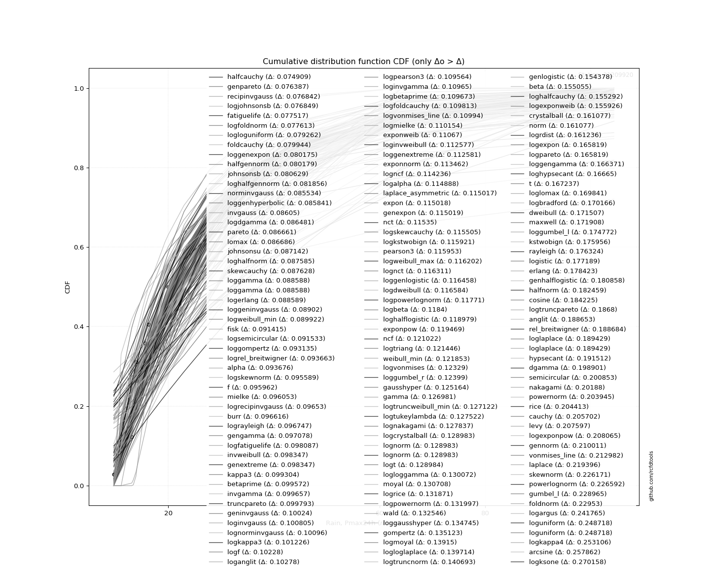</img>

</div>


**11.3. Best fit**

<div align="center">

|   id |   station | empirical_dist   | p_dist    |     delta |   deltao | eval   |   fit |   n |   best_fit |   best_fit_sort |
|-----:|----------:|:-----------------|:----------|----------:|---------:|:-------|------:|----:|-----------:|----------------:|
|    0 |  21209920 | edf_cunnane      | genpareto | 0.0763873 | 0.302825 | Δo > Δ |     1 |  21 |          1 |               1 |

</div>


<div align="center">

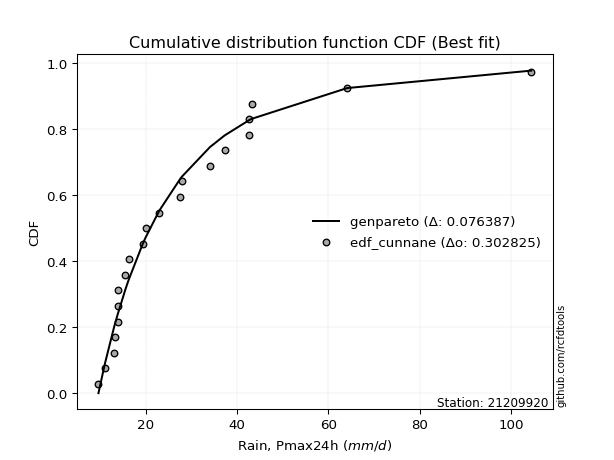</img>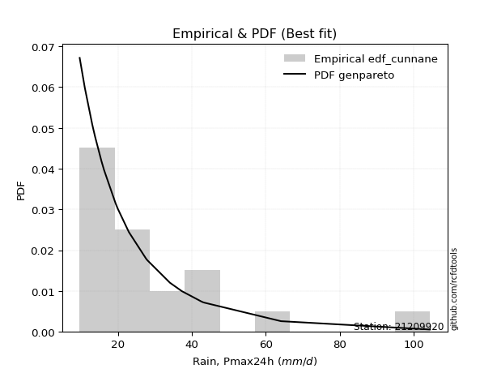</img>

</div>


### 12. EDF Adamowski (1981)

The Adamowski formula in hydrology refers to a specific plotting position formula used for estimating the non-parametric empirical distribution of hydrological events (like flood peaks) to calculate their return periods. This formula provides an alternative to traditional parametric methods (like the Gumbel or Log Pearson Type III distributions). 

<div align="center">


$P=(m-0.25)/(n+0.5)$


</div>


**12.1. Empirical values**

<div align="center">

|                | 0                   | 1                   | 2                   | 3                  | 4                   | 5                   | 6                 | 7                   | 8                  | 9                   | 10            | 11                 | 12                 | 13                 | 14                | 15                 | 16                 | 17                 | 18                 | 19                 | 20                 |
|:---------------|:--------------------|:--------------------|:--------------------|:-------------------|:--------------------|:--------------------|:------------------|:--------------------|:-------------------|:--------------------|:--------------|:-------------------|:-------------------|:-------------------|:------------------|:-------------------|:-------------------|:-------------------|:-------------------|:-------------------|:-------------------|
| date           | 2017                | 2016                | 2019                | 2018               | 2015                | 2021                | 2023              | 2014                | 2013               | 2022                | 2020          | 2006               | 2025               | 2005               | 2009              | 2007               | 2011               | 2010               | 2008               | 2012               | 2024               |
| x              | 9.7                 | 11.1                | 13.1                | 13.4               | 13.9                | 13.9                | 13.9              | 15.6                | 16.3               | 19.4                | 20.0          | 23.0               | 27.6               | 28.0               | 34.1              | 37.3               | 42.6               | 42.7               | 43.2               | 64.1               | 104.4              |
| m              | 1                   | 2                   | 3                   | 4                  | 5                   | 6                   | 7                 | 8                   | 9                  | 10                  | 11            | 12                 | 13                 | 14                 | 15                | 16                 | 17                 | 18                 | 19                 | 20                 | 21                 |
| empirical_dist | edf_adamowski       | edf_adamowski       | edf_adamowski       | edf_adamowski      | edf_adamowski       | edf_adamowski       | edf_adamowski     | edf_adamowski       | edf_adamowski      | edf_adamowski       | edf_adamowski | edf_adamowski      | edf_adamowski      | edf_adamowski      | edf_adamowski     | edf_adamowski      | edf_adamowski      | edf_adamowski      | edf_adamowski      | edf_adamowski      | edf_adamowski      |
| empirical      | 0.03488372093023256 | 0.08139534883720931 | 0.12790697674418605 | 0.1744186046511628 | 0.22093023255813954 | 0.26744186046511625 | 0.313953488372093 | 0.36046511627906974 | 0.4069767441860465 | 0.45348837209302323 | 0.5           | 0.5465116279069767 | 0.5930232558139535 | 0.6395348837209303 | 0.686046511627907 | 0.7325581395348837 | 0.7790697674418605 | 0.8255813953488372 | 0.872093023255814  | 0.9186046511627907 | 0.9651162790697675 |
| empirical_tr   | 1.036144578313253   | 1.0886075949367089  | 1.1466666666666667  | 1.2112676056338028 | 1.2835820895522387  | 1.3650793650793651  | 1.457627118644068 | 1.5636363636363635  | 1.6862745098039218 | 1.829787234042553   | 2.0           | 2.205128205128205  | 2.4571428571428573 | 2.774193548387097  | 3.185185185185185 | 3.7391304347826084 | 4.526315789473685  | 5.733333333333334  | 7.8181818181818175 | 12.285714285714281 | 28.666666666666707 |

</div>


**12.2. Kolmogorov-Smirnov fit test (sorted by Δ)**


<div align="center">

|                | 0                   | 1                   | 2                   | 3                   | 4                   | 5                   | 6                   | 7                   | 8                   | 9                   | 10                  | 11                  | 12                  | 13                  | 14                  | 15                  | 16                  | 17                  | 18                  | 19                  | 20                  | 21                  | 22                  | 23                  | 24                  | 25                  | 26                  | 27                  | 28                  | 29                  | 30                  | 31                  | 32                  | 33                  | 34                  | 35                  | 36                  | 37                  | 38                  | 39                  | 40                  | 41                  | 42                  | 43                  | 44                  | 45                  | 46                  | 47                  | 48                  | 49                  | 50                  | 51                  | 52                  | 53                  | 54                  | 55                  | 56                  | 57                  | 58                  | 59                  | 60                  | 61                  | 62                  | 63                  | 64                  | 65                  | 66                  | 67                  | 68                  | 69                  | 70                  | 71                  | 72                  | 73                  | 74                  | 75                  | 76                  | 77                  | 78                  | 79                  | 80                  | 81                  | 82                  | 83                  | 84                  | 85                  | 86                  | 87                  | 88                  | 89                  | 90                  | 91                  | 92                  | 93                  | 94                  | 95                  | 96                  | 97                  | 98                  | 99                  | 100                 | 101                 | 102                 | 103                 | 104                 | 105                 | 106                 | 107                 | 108                 | 109                 | 110                 | 111                 | 112                 | 113                 | 114                 | 115                 | 116                 | 117                 | 118                 | 119                 | 120                 | 121                 | 122                 | 123                 | 124                 | 125                 | 126                 | 127                 | 128                 | 129                 | 130                 | 131                 | 132                 | 133                 | 134                 | 135                 | 136                 | 137                 | 138                 | 139                 | 140                 | 141                 | 142                 | 143                 | 144                 | 145                 | 146                 | 147                 | 148                 | 149                 | 150                 | 151                 | 152                 | 153                 | 154                 | 155                 | 156                 | 157                 | 158                 | 159                 |
|:---------------|:--------------------|:--------------------|:--------------------|:--------------------|:--------------------|:--------------------|:--------------------|:--------------------|:--------------------|:--------------------|:--------------------|:--------------------|:--------------------|:--------------------|:--------------------|:--------------------|:--------------------|:--------------------|:--------------------|:--------------------|:--------------------|:--------------------|:--------------------|:--------------------|:--------------------|:--------------------|:--------------------|:--------------------|:--------------------|:--------------------|:--------------------|:--------------------|:--------------------|:--------------------|:--------------------|:--------------------|:--------------------|:--------------------|:--------------------|:--------------------|:--------------------|:--------------------|:--------------------|:--------------------|:--------------------|:--------------------|:--------------------|:--------------------|:--------------------|:--------------------|:--------------------|:--------------------|:--------------------|:--------------------|:--------------------|:--------------------|:--------------------|:--------------------|:--------------------|:--------------------|:--------------------|:--------------------|:--------------------|:--------------------|:--------------------|:--------------------|:--------------------|:--------------------|:--------------------|:--------------------|:--------------------|:--------------------|:--------------------|:--------------------|:--------------------|:--------------------|:--------------------|:--------------------|:--------------------|:--------------------|:--------------------|:--------------------|:--------------------|:--------------------|:--------------------|:--------------------|:--------------------|:--------------------|:--------------------|:--------------------|:--------------------|:--------------------|:--------------------|:--------------------|:--------------------|:--------------------|:--------------------|:--------------------|:--------------------|:--------------------|:--------------------|:--------------------|:--------------------|:--------------------|:--------------------|:--------------------|:--------------------|:--------------------|:--------------------|:--------------------|:--------------------|:--------------------|:--------------------|:--------------------|:--------------------|:--------------------|:--------------------|:--------------------|:--------------------|:--------------------|:--------------------|:--------------------|:--------------------|:--------------------|:--------------------|:--------------------|:--------------------|:--------------------|:--------------------|:--------------------|:--------------------|:--------------------|:--------------------|:--------------------|:--------------------|:--------------------|:--------------------|:--------------------|:--------------------|:--------------------|:--------------------|:--------------------|:--------------------|:--------------------|:--------------------|:--------------------|:--------------------|:--------------------|:--------------------|:--------------------|:--------------------|:--------------------|:--------------------|:--------------------|:--------------------|:--------------------|:--------------------|:--------------------|:--------------------|:--------------------|
| station        | 21209920            | 21209920            | 21209920            | 21209920            | 21209920            | 21209920            | 21209920            | 21209920            | 21209920            | 21209920            | 21209920            | 21209920            | 21209920            | 21209920            | 21209920            | 21209920            | 21209920            | 21209920            | 21209920            | 21209920            | 21209920            | 21209920            | 21209920            | 21209920            | 21209920            | 21209920            | 21209920            | 21209920            | 21209920            | 21209920            | 21209920            | 21209920            | 21209920            | 21209920            | 21209920            | 21209920            | 21209920            | 21209920            | 21209920            | 21209920            | 21209920            | 21209920            | 21209920            | 21209920            | 21209920            | 21209920            | 21209920            | 21209920            | 21209920            | 21209920            | 21209920            | 21209920            | 21209920            | 21209920            | 21209920            | 21209920            | 21209920            | 21209920            | 21209920            | 21209920            | 21209920            | 21209920            | 21209920            | 21209920            | 21209920            | 21209920            | 21209920            | 21209920            | 21209920            | 21209920            | 21209920            | 21209920            | 21209920            | 21209920            | 21209920            | 21209920            | 21209920            | 21209920            | 21209920            | 21209920            | 21209920            | 21209920            | 21209920            | 21209920            | 21209920            | 21209920            | 21209920            | 21209920            | 21209920            | 21209920            | 21209920            | 21209920            | 21209920            | 21209920            | 21209920            | 21209920            | 21209920            | 21209920            | 21209920            | 21209920            | 21209920            | 21209920            | 21209920            | 21209920            | 21209920            | 21209920            | 21209920            | 21209920            | 21209920            | 21209920            | 21209920            | 21209920            | 21209920            | 21209920            | 21209920            | 21209920            | 21209920            | 21209920            | 21209920            | 21209920            | 21209920            | 21209920            | 21209920            | 21209920            | 21209920            | 21209920            | 21209920            | 21209920            | 21209920            | 21209920            | 21209920            | 21209920            | 21209920            | 21209920            | 21209920            | 21209920            | 21209920            | 21209920            | 21209920            | 21209920            | 21209920            | 21209920            | 21209920            | 21209920            | 21209920            | 21209920            | 21209920            | 21209920            | 21209920            | 21209920            | 21209920            | 21209920            | 21209920            | 21209920            | 21209920            | 21209920            | 21209920            | 21209920            | 21209920            | 21209920            |
| empirical_dist | edf_adamowski       | edf_adamowski       | edf_adamowski       | edf_adamowski       | edf_adamowski       | edf_adamowski       | edf_adamowski       | edf_adamowski       | edf_adamowski       | edf_adamowski       | edf_adamowski       | edf_adamowski       | edf_adamowski       | edf_adamowski       | edf_adamowski       | edf_adamowski       | edf_adamowski       | edf_adamowski       | edf_adamowski       | edf_adamowski       | edf_adamowski       | edf_adamowski       | edf_adamowski       | edf_adamowski       | edf_adamowski       | edf_adamowski       | edf_adamowski       | edf_adamowski       | edf_adamowski       | edf_adamowski       | edf_adamowski       | edf_adamowski       | edf_adamowski       | edf_adamowski       | edf_adamowski       | edf_adamowski       | edf_adamowski       | edf_adamowski       | edf_adamowski       | edf_adamowski       | edf_adamowski       | edf_adamowski       | edf_adamowski       | edf_adamowski       | edf_adamowski       | edf_adamowski       | edf_adamowski       | edf_adamowski       | edf_adamowski       | edf_adamowski       | edf_adamowski       | edf_adamowski       | edf_adamowski       | edf_adamowski       | edf_adamowski       | edf_adamowski       | edf_adamowski       | edf_adamowski       | edf_adamowski       | edf_adamowski       | edf_adamowski       | edf_adamowski       | edf_adamowski       | edf_adamowski       | edf_adamowski       | edf_adamowski       | edf_adamowski       | edf_adamowski       | edf_adamowski       | edf_adamowski       | edf_adamowski       | edf_adamowski       | edf_adamowski       | edf_adamowski       | edf_adamowski       | edf_adamowski       | edf_adamowski       | edf_adamowski       | edf_adamowski       | edf_adamowski       | edf_adamowski       | edf_adamowski       | edf_adamowski       | edf_adamowski       | edf_adamowski       | edf_adamowski       | edf_adamowski       | edf_adamowski       | edf_adamowski       | edf_adamowski       | edf_adamowski       | edf_adamowski       | edf_adamowski       | edf_adamowski       | edf_adamowski       | edf_adamowski       | edf_adamowski       | edf_adamowski       | edf_adamowski       | edf_adamowski       | edf_adamowski       | edf_adamowski       | edf_adamowski       | edf_adamowski       | edf_adamowski       | edf_adamowski       | edf_adamowski       | edf_adamowski       | edf_adamowski       | edf_adamowski       | edf_adamowski       | edf_adamowski       | edf_adamowski       | edf_adamowski       | edf_adamowski       | edf_adamowski       | edf_adamowski       | edf_adamowski       | edf_adamowski       | edf_adamowski       | edf_adamowski       | edf_adamowski       | edf_adamowski       | edf_adamowski       | edf_adamowski       | edf_adamowski       | edf_adamowski       | edf_adamowski       | edf_adamowski       | edf_adamowski       | edf_adamowski       | edf_adamowski       | edf_adamowski       | edf_adamowski       | edf_adamowski       | edf_adamowski       | edf_adamowski       | edf_adamowski       | edf_adamowski       | edf_adamowski       | edf_adamowski       | edf_adamowski       | edf_adamowski       | edf_adamowski       | edf_adamowski       | edf_adamowski       | edf_adamowski       | edf_adamowski       | edf_adamowski       | edf_adamowski       | edf_adamowski       | edf_adamowski       | edf_adamowski       | edf_adamowski       | edf_adamowski       | edf_adamowski       | edf_adamowski       | edf_adamowski       | edf_adamowski       | edf_adamowski       |
| p_dist         | logjohnsonsb        | halfgennorm         | johnsonsb           | genpareto           | fatiguelife         | logfoldnorm         | loggenexpon         | loghalfgennorm      | logdgamma           | invgauss            | lomax               | johnsonsu           | loghalfnorm         | loggamma            | loggamma            | logerlang           | gengamma            | logweibull_min      | logsemicircular     | loggompertz         | alpha               | f                   | logskewnorm         | mielke              | burr                | lograyleigh         | logfatiguelife      | invweibull          | genextreme          | kappa3              | betaprime           | invgamma            | truncpareto         | logkappa3           | loginvgauss         | loganglit           | logf                | logmaxwell          | exponweib           | logjohnsonsu        | burr12              | logexponnorm        | logburr12           | pearson3            | logvonmises_line    | logburr             | logpearson3         | loginvgamma         | logbetaprime        | logmielke           | logbeta             | exponpow            | loginvweibull       | loggenextreme       | logncf              | exponnorm           | logalpha            | genexpon            | nct                 | logkstwobign        | logweibull_max      | lognct              | loggenlogistic      | logdweibull         | gausshyper          | loghalflogistic     | gamma               | logtruncweibull_min | ncf                 | lognakagami         | weibull_min         | logtriang           | moyal               | logvonmises         | loggumbel_r         | logtukeylambda      | loggausshyper       | logcrystalball      | lognorm             | logt                | logloggamma         | logrice             | wald                | logtruncnorm        | logtruncexpon       | gompertz            | logarcsine          | logloglaplace       | gumbel_r            | halflogistic        | logmoyal            | loggennorm          | beta                | truncnorm           | logexponweib        | loglogistic         | logcosine           | genlogistic         | logrdist            | norm                | crystalball         | t                   | loggengamma         | loglomax            | logbradford         | dweibull            | maxwell             | loghypsecant        | rayleigh            | erlang              | halfnorm            | kstwobign           | loggumbel_l         | logistic            | logtruncpareto      | anglit              | genhalflogistic     | cosine              | loglaplace          | loglaplace          | hypsecant           | dgamma              | semicircular        | nakagami            | logexponpow         | gennorm             | rice                | vonmises_line       | laplace             | foldnorm            | gumbel_l            | skewnorm            | logargus            | loguniform          | logkappa4           | arcsine             | logksone            | truncweibull_min    | bradford            | logwald             | powerlaw            | triang              | truncexpon          | logwrapcauchy       | logpowerlaw         | loggenpareto        | loggenhalflogistic  | wrapcauchy          | argus               | loglevy_l           | kappa4              | ksone               | logtrapezoid        | levy_l              | uniform             | rdist               | tukeylambda         | trapezoid           | weibull_max         | vonmises            |
| delta          | 0.07273472065981207 | 0.07491328005378803 | 0.07536385160733206 | 0.07552593851745801 | 0.08014954266222168 | 0.08024607679632809 | 0.08149091536648456 | 0.08448845680365902 | 0.0877258452716475  | 0.08868299658187509 | 0.08931873868123916 | 0.0897744248443596  | 0.09021747138338038 | 0.09122066397306453 | 0.09122066397306453 | 0.09122149153096093 | 0.09181247322890937 | 0.09255448364905111 | 0.09284951495670596 | 0.09576733629452824 | 0.09630894294391182 | 0.09727880430150282 | 0.09822125392870512 | 0.09868546048953977 | 0.09924840201971646 | 0.09937987634821274 | 0.10071946204601095 | 0.10097927632619494 | 0.10097960120340918 | 0.1019372278262406  | 0.10220509612854112 | 0.1022897164123669  | 0.10242569529120565 | 0.10292465708788467 | 0.10343765154299775 | 0.10409608693516764 | 0.10491321163188772 | 0.10506543803470642 | 0.1054040417074692  | 0.10639246887157683 | 0.10661639704536474 | 0.10667784266593161 | 0.10673905982295062 | 0.11068760779641343 | 0.11125611021395698 | 0.1121530570702112  | 0.1121971345968733  | 0.1122826422192511  | 0.11230603594650335 | 0.11278662839672038 | 0.11313496415241797 | 0.11420318098570548 | 0.11520956558854853 | 0.1152137197587208  | 0.11565083244448648 | 0.11609513560740214 | 0.11752034925262642 | 0.11765139583205203 | 0.11798300956279348 | 0.11855352216017817 | 0.11883461467058501 | 0.1189442034517112  | 0.11909033778116396 | 0.11921698524663321 | 0.11989887331987556 | 0.12161189182104584 | 0.12171522226458051 | 0.12185612124187839 | 0.12233856698649503 | 0.12257136620626446 | 0.12316903264064138 | 0.12407824190137579 | 0.12412653474103402 | 0.1246062359238958  | 0.1266228746892563  | 0.12883832099035447 | 0.12947915735323767 | 0.1302989215848307  | 0.13029899283964264 | 0.13030036943529472 | 0.1313880589379804  | 0.1345038193333675  | 0.13517880188580403 | 0.135427647374171   | 0.13582282956891956 | 0.13643983481772942 | 0.13802292910613745 | 0.14103016600900042 | 0.14131450637791754 | 0.14164431684280898 | 0.1417832147502719  | 0.14623712530502148 | 0.14978961517678308 | 0.1502842668255997  | 0.1506604622148539  | 0.15254432543888913 | 0.1537136229596997  | 0.15569399367398712 | 0.15597067693205946 | 0.15853608968214006 | 0.15853609130004848 | 0.1606556517515771  | 0.1611054888439673  | 0.16457518727036202 | 0.16490082644276882 | 0.164924889613953   | 0.1653263798986891  | 0.16796656872691484 | 0.16974194762389103 | 0.17315784135272805 | 0.17587735277132027 | 0.17595555487247727 | 0.1760888567697713  | 0.17718928074716378 | 0.18153502814708378 | 0.18207148746710006 | 0.18217484749806914 | 0.18817417343798692 | 0.19074561898615017 | 0.19074561898615017 | 0.19151169937436907 | 0.1923194430252324  | 0.19427108301809054 | 0.19661481695221328 | 0.20279952817311697 | 0.20342916351412627 | 0.20441308144941928 | 0.21429787455860266 | 0.21939648773001902 | 0.22294775642175096 | 0.22699089633028824 | 0.2274869298668824  | 0.23649992536246756 | 0.24345271887797015 | 0.2478405530599872  | 0.25128003511901864 | 0.26489276960761077 | 0.2722087110988354  | 0.27247326016705664 | 0.29020157015794557 | 0.2903320972686281  | 0.29426315442145756 | 0.3163826122263821  | 0.3270188532498681  | 0.3561369261050549  | 0.3622421048035437  | 0.39677035635921226 | 0.4223053078418432  | 0.4353579791191836  | 0.44422473484183717 | 0.4792401066611725  | 0.49396912322061504 | 0.5034008752253715  | 0.5118183691419539  | 0.5183443432135753  | 0.5362414923093634  | 0.563200593724715   | 0.7291153394779848  | 0.781259535755014   | 15.86101526434209   |
| deltao         | 0.30282488509099936 | 0.30282488509099936 | 0.30282488509099936 | 0.30282488509099936 | 0.30282488509099936 | 0.30282488509099936 | 0.30282488509099936 | 0.30282488509099936 | 0.30282488509099936 | 0.30282488509099936 | 0.30282488509099936 | 0.30282488509099936 | 0.30282488509099936 | 0.30282488509099936 | 0.30282488509099936 | 0.30282488509099936 | 0.30282488509099936 | 0.30282488509099936 | 0.30282488509099936 | 0.30282488509099936 | 0.30282488509099936 | 0.30282488509099936 | 0.30282488509099936 | 0.30282488509099936 | 0.30282488509099936 | 0.30282488509099936 | 0.30282488509099936 | 0.30282488509099936 | 0.30282488509099936 | 0.30282488509099936 | 0.30282488509099936 | 0.30282488509099936 | 0.30282488509099936 | 0.30282488509099936 | 0.30282488509099936 | 0.30282488509099936 | 0.30282488509099936 | 0.30282488509099936 | 0.30282488509099936 | 0.30282488509099936 | 0.30282488509099936 | 0.30282488509099936 | 0.30282488509099936 | 0.30282488509099936 | 0.30282488509099936 | 0.30282488509099936 | 0.30282488509099936 | 0.30282488509099936 | 0.30282488509099936 | 0.30282488509099936 | 0.30282488509099936 | 0.30282488509099936 | 0.30282488509099936 | 0.30282488509099936 | 0.30282488509099936 | 0.30282488509099936 | 0.30282488509099936 | 0.30282488509099936 | 0.30282488509099936 | 0.30282488509099936 | 0.30282488509099936 | 0.30282488509099936 | 0.30282488509099936 | 0.30282488509099936 | 0.30282488509099936 | 0.30282488509099936 | 0.30282488509099936 | 0.30282488509099936 | 0.30282488509099936 | 0.30282488509099936 | 0.30282488509099936 | 0.30282488509099936 | 0.30282488509099936 | 0.30282488509099936 | 0.30282488509099936 | 0.30282488509099936 | 0.30282488509099936 | 0.30282488509099936 | 0.30282488509099936 | 0.30282488509099936 | 0.30282488509099936 | 0.30282488509099936 | 0.30282488509099936 | 0.30282488509099936 | 0.30282488509099936 | 0.30282488509099936 | 0.30282488509099936 | 0.30282488509099936 | 0.30282488509099936 | 0.30282488509099936 | 0.30282488509099936 | 0.30282488509099936 | 0.30282488509099936 | 0.30282488509099936 | 0.30282488509099936 | 0.30282488509099936 | 0.30282488509099936 | 0.30282488509099936 | 0.30282488509099936 | 0.30282488509099936 | 0.30282488509099936 | 0.30282488509099936 | 0.30282488509099936 | 0.30282488509099936 | 0.30282488509099936 | 0.30282488509099936 | 0.30282488509099936 | 0.30282488509099936 | 0.30282488509099936 | 0.30282488509099936 | 0.30282488509099936 | 0.30282488509099936 | 0.30282488509099936 | 0.30282488509099936 | 0.30282488509099936 | 0.30282488509099936 | 0.30282488509099936 | 0.30282488509099936 | 0.30282488509099936 | 0.30282488509099936 | 0.30282488509099936 | 0.30282488509099936 | 0.30282488509099936 | 0.30282488509099936 | 0.30282488509099936 | 0.30282488509099936 | 0.30282488509099936 | 0.30282488509099936 | 0.30282488509099936 | 0.30282488509099936 | 0.30282488509099936 | 0.30282488509099936 | 0.30282488509099936 | 0.30282488509099936 | 0.30282488509099936 | 0.30282488509099936 | 0.30282488509099936 | 0.30282488509099936 | 0.30282488509099936 | 0.30282488509099936 | 0.30282488509099936 | 0.30282488509099936 | 0.30282488509099936 | 0.30282488509099936 | 0.30282488509099936 | 0.30282488509099936 | 0.30282488509099936 | 0.30282488509099936 | 0.30282488509099936 | 0.30282488509099936 | 0.30282488509099936 | 0.30282488509099936 | 0.30282488509099936 | 0.30282488509099936 | 0.30282488509099936 | 0.30282488509099936 | 0.30282488509099936 | 0.30282488509099936 | 0.30282488509099936 | 0.30282488509099936 |
| eval           | Δo > Δ              | Δo > Δ              | Δo > Δ              | Δo > Δ              | Δo > Δ              | Δo > Δ              | Δo > Δ              | Δo > Δ              | Δo > Δ              | Δo > Δ              | Δo > Δ              | Δo > Δ              | Δo > Δ              | Δo > Δ              | Δo > Δ              | Δo > Δ              | Δo > Δ              | Δo > Δ              | Δo > Δ              | Δo > Δ              | Δo > Δ              | Δo > Δ              | Δo > Δ              | Δo > Δ              | Δo > Δ              | Δo > Δ              | Δo > Δ              | Δo > Δ              | Δo > Δ              | Δo > Δ              | Δo > Δ              | Δo > Δ              | Δo > Δ              | Δo > Δ              | Δo > Δ              | Δo > Δ              | Δo > Δ              | Δo > Δ              | Δo > Δ              | Δo > Δ              | Δo > Δ              | Δo > Δ              | Δo > Δ              | Δo > Δ              | Δo > Δ              | Δo > Δ              | Δo > Δ              | Δo > Δ              | Δo > Δ              | Δo > Δ              | Δo > Δ              | Δo > Δ              | Δo > Δ              | Δo > Δ              | Δo > Δ              | Δo > Δ              | Δo > Δ              | Δo > Δ              | Δo > Δ              | Δo > Δ              | Δo > Δ              | Δo > Δ              | Δo > Δ              | Δo > Δ              | Δo > Δ              | Δo > Δ              | Δo > Δ              | Δo > Δ              | Δo > Δ              | Δo > Δ              | Δo > Δ              | Δo > Δ              | Δo > Δ              | Δo > Δ              | Δo > Δ              | Δo > Δ              | Δo > Δ              | Δo > Δ              | Δo > Δ              | Δo > Δ              | Δo > Δ              | Δo > Δ              | Δo > Δ              | Δo > Δ              | Δo > Δ              | Δo > Δ              | Δo > Δ              | Δo > Δ              | Δo > Δ              | Δo > Δ              | Δo > Δ              | Δo > Δ              | Δo > Δ              | Δo > Δ              | Δo > Δ              | Δo > Δ              | Δo > Δ              | Δo > Δ              | Δo > Δ              | Δo > Δ              | Δo > Δ              | Δo > Δ              | Δo > Δ              | Δo > Δ              | Δo > Δ              | Δo > Δ              | Δo > Δ              | Δo > Δ              | Δo > Δ              | Δo > Δ              | Δo > Δ              | Δo > Δ              | Δo > Δ              | Δo > Δ              | Δo > Δ              | Δo > Δ              | Δo > Δ              | Δo > Δ              | Δo > Δ              | Δo > Δ              | Δo > Δ              | Δo > Δ              | Δo > Δ              | Δo > Δ              | Δo > Δ              | Δo > Δ              | Δo > Δ              | Δo > Δ              | Δo > Δ              | Δo > Δ              | Δo > Δ              | Δo > Δ              | Δo > Δ              | Δo > Δ              | Δo > Δ              | Δo > Δ              | Δo > Δ              | Δo > Δ              | Δo > Δ              | Δo > Δ              | Δo > Δ              | Δo > Δ              | Δo <= Δ             | Δo <= Δ             | Δo <= Δ             | Δo <= Δ             | Δo <= Δ             | Δo <= Δ             | Δo <= Δ             | Δo <= Δ             | Δo <= Δ             | Δo <= Δ             | Δo <= Δ             | Δo <= Δ             | Δo <= Δ             | Δo <= Δ             | Δo <= Δ             | Δo <= Δ             | Δo <= Δ             | Δo <= Δ             |
| fit            | 1                   | 1                   | 1                   | 1                   | 1                   | 1                   | 1                   | 1                   | 1                   | 1                   | 1                   | 1                   | 1                   | 1                   | 1                   | 1                   | 1                   | 1                   | 1                   | 1                   | 1                   | 1                   | 1                   | 1                   | 1                   | 1                   | 1                   | 1                   | 1                   | 1                   | 1                   | 1                   | 1                   | 1                   | 1                   | 1                   | 1                   | 1                   | 1                   | 1                   | 1                   | 1                   | 1                   | 1                   | 1                   | 1                   | 1                   | 1                   | 1                   | 1                   | 1                   | 1                   | 1                   | 1                   | 1                   | 1                   | 1                   | 1                   | 1                   | 1                   | 1                   | 1                   | 1                   | 1                   | 1                   | 1                   | 1                   | 1                   | 1                   | 1                   | 1                   | 1                   | 1                   | 1                   | 1                   | 1                   | 1                   | 1                   | 1                   | 1                   | 1                   | 1                   | 1                   | 1                   | 1                   | 1                   | 1                   | 1                   | 1                   | 1                   | 1                   | 1                   | 1                   | 1                   | 1                   | 1                   | 1                   | 1                   | 1                   | 1                   | 1                   | 1                   | 1                   | 1                   | 1                   | 1                   | 1                   | 1                   | 1                   | 1                   | 1                   | 1                   | 1                   | 1                   | 1                   | 1                   | 1                   | 1                   | 1                   | 1                   | 1                   | 1                   | 1                   | 1                   | 1                   | 1                   | 1                   | 1                   | 1                   | 1                   | 1                   | 1                   | 1                   | 1                   | 1                   | 1                   | 1                   | 1                   | 1                   | 1                   | 1                   | 1                   | 0                   | 0                   | 0                   | 0                   | 0                   | 0                   | 0                   | 0                   | 0                   | 0                   | 0                   | 0                   | 0                   | 0                   | 0                   | 0                   | 0                   | 0                   |
| n              | 21                  | 21                  | 21                  | 21                  | 21                  | 21                  | 21                  | 21                  | 21                  | 21                  | 21                  | 21                  | 21                  | 21                  | 21                  | 21                  | 21                  | 21                  | 21                  | 21                  | 21                  | 21                  | 21                  | 21                  | 21                  | 21                  | 21                  | 21                  | 21                  | 21                  | 21                  | 21                  | 21                  | 21                  | 21                  | 21                  | 21                  | 21                  | 21                  | 21                  | 21                  | 21                  | 21                  | 21                  | 21                  | 21                  | 21                  | 21                  | 21                  | 21                  | 21                  | 21                  | 21                  | 21                  | 21                  | 21                  | 21                  | 21                  | 21                  | 21                  | 21                  | 21                  | 21                  | 21                  | 21                  | 21                  | 21                  | 21                  | 21                  | 21                  | 21                  | 21                  | 21                  | 21                  | 21                  | 21                  | 21                  | 21                  | 21                  | 21                  | 21                  | 21                  | 21                  | 21                  | 21                  | 21                  | 21                  | 21                  | 21                  | 21                  | 21                  | 21                  | 21                  | 21                  | 21                  | 21                  | 21                  | 21                  | 21                  | 21                  | 21                  | 21                  | 21                  | 21                  | 21                  | 21                  | 21                  | 21                  | 21                  | 21                  | 21                  | 21                  | 21                  | 21                  | 21                  | 21                  | 21                  | 21                  | 21                  | 21                  | 21                  | 21                  | 21                  | 21                  | 21                  | 21                  | 21                  | 21                  | 21                  | 21                  | 21                  | 21                  | 21                  | 21                  | 21                  | 21                  | 21                  | 21                  | 21                  | 21                  | 21                  | 21                  | 21                  | 21                  | 21                  | 21                  | 21                  | 21                  | 21                  | 21                  | 21                  | 21                  | 21                  | 21                  | 21                  | 21                  | 21                  | 21                  | 21                  | 21                  |
| best_fit       | 1                   | 0                   | 0                   | 0                   | 0                   | 0                   | 0                   | 0                   | 0                   | 0                   | 0                   | 0                   | 0                   | 0                   | 0                   | 0                   | 0                   | 0                   | 0                   | 0                   | 0                   | 0                   | 0                   | 0                   | 0                   | 0                   | 0                   | 0                   | 0                   | 0                   | 0                   | 0                   | 0                   | 0                   | 0                   | 0                   | 0                   | 0                   | 0                   | 0                   | 0                   | 0                   | 0                   | 0                   | 0                   | 0                   | 0                   | 0                   | 0                   | 0                   | 0                   | 0                   | 0                   | 0                   | 0                   | 0                   | 0                   | 0                   | 0                   | 0                   | 0                   | 0                   | 0                   | 0                   | 0                   | 0                   | 0                   | 0                   | 0                   | 0                   | 0                   | 0                   | 0                   | 0                   | 0                   | 0                   | 0                   | 0                   | 0                   | 0                   | 0                   | 0                   | 0                   | 0                   | 0                   | 0                   | 0                   | 0                   | 0                   | 0                   | 0                   | 0                   | 0                   | 0                   | 0                   | 0                   | 0                   | 0                   | 0                   | 0                   | 0                   | 0                   | 0                   | 0                   | 0                   | 0                   | 0                   | 0                   | 0                   | 0                   | 0                   | 0                   | 0                   | 0                   | 0                   | 0                   | 0                   | 0                   | 0                   | 0                   | 0                   | 0                   | 0                   | 0                   | 0                   | 0                   | 0                   | 0                   | 0                   | 0                   | 0                   | 0                   | 0                   | 0                   | 0                   | 0                   | 0                   | 0                   | 0                   | 0                   | 0                   | 0                   | 0                   | 0                   | 0                   | 0                   | 0                   | 0                   | 0                   | 0                   | 0                   | 0                   | 0                   | 0                   | 0                   | 0                   | 0                   | 0                   | 0                   | 0                   |
| best_fit_sort  | 1                   | 2                   | 3                   | 4                   | 5                   | 6                   | 7                   | 8                   | 9                   | 10                  | 11                  | 12                  | 13                  | 14                  | 15                  | 16                  | 17                  | 18                  | 19                  | 20                  | 21                  | 22                  | 23                  | 24                  | 25                  | 26                  | 27                  | 28                  | 29                  | 30                  | 31                  | 32                  | 33                  | 34                  | 35                  | 36                  | 37                  | 38                  | 39                  | 40                  | 41                  | 42                  | 43                  | 44                  | 45                  | 46                  | 47                  | 48                  | 49                  | 50                  | 51                  | 52                  | 53                  | 54                  | 55                  | 56                  | 57                  | 58                  | 59                  | 60                  | 61                  | 62                  | 63                  | 64                  | 65                  | 66                  | 67                  | 68                  | 69                  | 70                  | 71                  | 72                  | 73                  | 74                  | 75                  | 76                  | 77                  | 78                  | 79                  | 80                  | 81                  | 82                  | 83                  | 84                  | 85                  | 86                  | 87                  | 88                  | 89                  | 90                  | 91                  | 92                  | 93                  | 94                  | 95                  | 96                  | 97                  | 98                  | 99                  | 100                 | 101                 | 102                 | 103                 | 104                 | 105                 | 106                 | 107                 | 108                 | 109                 | 110                 | 111                 | 112                 | 113                 | 114                 | 115                 | 116                 | 117                 | 118                 | 119                 | 120                 | 121                 | 122                 | 123                 | 124                 | 125                 | 126                 | 127                 | 128                 | 129                 | 130                 | 131                 | 132                 | 133                 | 134                 | 135                 | 136                 | 137                 | 138                 | 139                 | 140                 | 141                 | 142                 | 143                 | 144                 | 145                 | 146                 | 147                 | 148                 | 149                 | 150                 | 151                 | 152                 | 153                 | 154                 | 155                 | 156                 | 157                 | 158                 | 159                 | 160                 |

</div>


<div align="center">

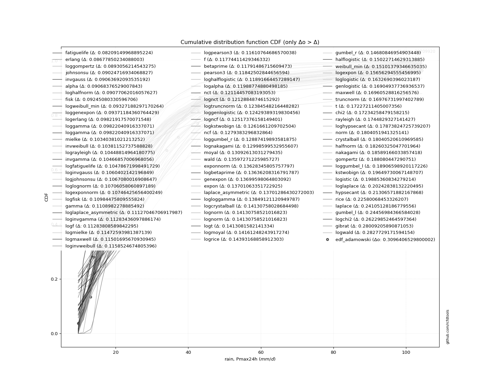</img>

</div>


**12.3. Best fit**

<div align="center">

|   id |   station | empirical_dist   | p_dist       |     delta |   deltao | eval   |   fit |   n |   best_fit |   best_fit_sort |
|-----:|----------:|:-----------------|:-------------|----------:|---------:|:-------|------:|----:|-----------:|----------------:|
|    0 |  21209920 | edf_adamowski    | logjohnsonsb | 0.0727347 | 0.302825 | Δo > Δ |     1 |  21 |          1 |               1 |

</div>


<div align="center">

</img></img>

</div>


## C. Best fit & Estimate extreme values for specific return periods - Tr

Best fit in probability distribution analysis means finding the theoretical distribution (like Normal, Poisson, Exponential) that most accurately mirrors your real-world data´s patterns (shape, center, spread) for better predictions, using methods like visual checks (Q-Q plots), goodness-of-fit tests (Kolmogorov-Smirnov, Chi-Squared), and information criteria (AIC) to score and select the simplest, most representative model.


### 1. Best fit (ordered by delta Δ)

:file_folder:Table: [bestfit_21209920.csv](table/bestfit_21209920.csv)

<div align="center">

|   id |   station | empirical_dist   | p_dist       |     delta |   deltao | eval   |   fit |   n |   best_fit |   best_fit_sort |
|-----:|----------:|:-----------------|:-------------|----------:|---------:|:-------|------:|----:|-----------:|----------------:|
|    0 |  21209920 | edf_adamowski    | logjohnsonsb | 0.0727347 | 0.302825 | Δo > Δ |     1 |  21 |          1 |               1 |
|    1 |  21209920 | edf_chegodayev   | logjohnsonsb | 0.0733225 | 0.302825 | Δo > Δ |     1 |  21 |          1 |               2 |
|    2 |  21209920 | edf_jenkinson    | logjohnsonsb | 0.0736722 | 0.302825 | Δo > Δ |     1 |  21 |          1 |               3 |
|    3 |  21209920 | edf_beard        | logjohnsonsb | 0.0736722 | 0.302825 | Δo > Δ |     1 |  21 |          1 |               4 |
|    4 |  21209920 | edf_filliben     | logjohnsonsb | 0.073935  | 0.302825 | Δo > Δ |     1 |  21 |          1 |               5 |
|    5 |  21209920 | edf_tukey        | genpareto    | 0.0740725 | 0.302825 | Δo > Δ |     1 |  21 |          1 |               6 |
|    6 |  21209920 | edf_weibull      | johnsonsb    | 0.0744381 | 0.302825 | Δo > Δ |     1 |  21 |          1 |               7 |
|    7 |  21209920 | edf_blom         | genpareto    | 0.0754994 | 0.302825 | Δo > Δ |     1 |  21 |          1 |               8 |
|    8 |  21209920 | edf_hazen        | fatiguelife  | 0.0757199 | 0.302825 | Δo > Δ |     1 |  21 |          1 |               9 |
|    9 |  21209920 | edf_cunnane      | genpareto    | 0.0763873 | 0.302825 | Δo > Δ |     1 |  21 |          1 |              10 |
|   10 |  21209920 | edf_gringorten   | fatiguelife  | 0.0768021 | 0.302825 | Δo > Δ |     1 |  21 |          1 |              11 |
|   11 |  21209920 | edf_california   | logburr12    | 0.081408  | 0.302825 | Δo > Δ |     1 |  21 |          1 |              12 |

</div>


### 2. Extreme values and % difference analysis

In hydrology, a return period (or recurrence interval $Tr$) is the statistical average time between extreme events like floods or droughts of a specific magnitude, indicating how rare an event is, with a 100-year flood, for example, having a 1% chance of occurring in any given year, not that it happens exactly every century. It is a key tool for infrastructure design (like bridges or dams) and risk assessment, calculated from historical data to determine the probability of future events, although it is important to remember it is statistical average, and events can cluster or be missed.

The extreme value porcentage difference is evaluated as $pdiff = 1 - (ETrBf / ETr) * 100$, where _ETrBf_ correspond to the bestfit extreme value for a specific recurrence interval and _ETr_ correspond to the extreme value for one of the most used PDFsused in hydrology.

> risk_rate: assuming the return period as the project useful life.

:file_folder:Table: [extreme_21209920.csv](table/extreme_21209920.csv), all PDFs.  
:file_folder:Table: [extremepdiff_21209920.csv](table/extremepdiff_21209920.csv), % difference between bestfit and most used PDFs in Hydrology.

<div align="center">

Extreme values table for only best fit PDFs
|   id |      tr |   prob_l |     prob_g |     alpha |   anglit |   arcsine |    argus |     beta |   betaprime |   bradford |      burr |    burr12 |   cosine |   crystalball |   dgamma |   dweibull |   erlang |   exponnorm |   exponpow |   exponweib |        f |   fatiguelife |   foldnorm |    gamma |   gausshyper |   genexpon |   genextreme |   gengamma |   genhalflogistic |   genlogistic |   gennorm |   genpareto |   gompertz |   gumbel_l |   gumbel_r |   halfgennorm |   halflogistic |   halfnorm |   hypsecant |   invgamma |   invgauss |   invweibull |   johnsonsb |   johnsonsu |   kappa3 |   kappa4 |    ksone |   kstwobign |   laplace |   levy_l |   loggamma |   logistic |   loglaplace |    lomax |   maxwell |    mielke |    moyal |   nakagami |      ncf |      nct |    norm |   pearson3 |   powerlaw |   rayleigh |    rdist |    rice |   semicircular |   skewnorm |        t |   trapezoid |   triang |   truncexpon |   truncnorm |   truncpareto |   truncweibull_min |   tukeylambda |   uniform |   vonmises |   vonmises_line |     wald |   weibull_max |   weibull_min |   wrapcauchy |   logalpha |   loganglit |   logarcsine |   logargus |   logbeta |   logbetaprime |   logbradford |   logburr |   logburr12 |   logcosine |   logcrystalball |   logdgamma |   logdweibull |   logerlang |   logexponnorm |   logexponpow |   logexponweib |      logf |   logfatiguelife |   logfoldnorm |   loggausshyper |   loggenexpon |   loggenextreme |   loggengamma |   loggenhalflogistic |   loggenlogistic |   loggennorm |   loggenpareto |   loggompertz |   loggumbel_l |   loggumbel_r |   loghalfgennorm |   loghalflogistic |   loghalfnorm |   loghypsecant |   loginvgamma |   loginvgauss |   loginvweibull |   logjohnsonsb |   logjohnsonsu |   logkappa3 |   logkappa4 |   logksone |   logkstwobign |   loglevy_l |   logloggamma |   loglogistic |   logloglaplace |   loglomax |   logmaxwell |   logmielke |   logmoyal |   lognakagami |   logncf |   lognct |   lognorm |   logpearson3 |   logpowerlaw |   lograyleigh |   logrdist |   logrice |   logsemicircular |   logskewnorm |     logt |   logtrapezoid |   logtriang |   logtruncexpon |   logtruncnorm |   logtruncpareto |   logtruncweibull_min |   logtukeylambda |   loguniform |   logvonmises |   logvonmises_line |   logwald |   logweibull_max |   logweibull_min |   logwrapcauchy |   station |   n |   risk_rate |
|-----:|--------:|---------:|-----------:|----------:|---------:|----------:|---------:|---------:|------------:|-----------:|----------:|----------:|---------:|--------------:|---------:|-----------:|---------:|------------:|-----------:|------------:|---------:|--------------:|-----------:|---------:|-------------:|-----------:|-------------:|-----------:|------------------:|--------------:|----------:|------------:|-----------:|-----------:|-----------:|--------------:|---------------:|-----------:|------------:|-----------:|-----------:|-------------:|------------:|------------:|---------:|---------:|---------:|------------:|----------:|---------:|-----------:|-----------:|-------------:|---------:|----------:|----------:|---------:|-----------:|---------:|---------:|--------:|-----------:|-----------:|-----------:|---------:|--------:|---------------:|-----------:|---------:|------------:|---------:|-------------:|------------:|--------------:|-------------------:|--------------:|----------:|-----------:|----------------:|---------:|--------------:|--------------:|-------------:|-----------:|------------:|-------------:|-----------:|----------:|---------------:|--------------:|----------:|------------:|------------:|-----------------:|------------:|--------------:|------------:|---------------:|--------------:|---------------:|----------:|-----------------:|--------------:|----------------:|--------------:|----------------:|--------------:|---------------------:|-----------------:|-------------:|---------------:|--------------:|--------------:|--------------:|-----------------:|------------------:|--------------:|---------------:|--------------:|--------------:|----------------:|---------------:|---------------:|------------:|------------:|-----------:|---------------:|------------:|--------------:|--------------:|----------------:|-----------:|-------------:|------------:|-----------:|--------------:|---------:|---------:|----------:|--------------:|--------------:|--------------:|-----------:|----------:|------------------:|--------------:|---------:|---------------:|------------:|----------------:|---------------:|-----------------:|----------------------:|-----------------:|-------------:|--------------:|-------------------:|----------:|-----------------:|-----------------:|----------------:|----------:|----:|------------:|
|    0 |    2    | 0.5      | 0.5        |   19.9509 |  28.919  |   28.919  |  49.6328 |  19.6176 |     20.2864 |    32.9006 |   20.1325 |   19.1917 |  24.2969 |       28.919  |  21.9627 |    24.2255 |  17.7033 |     22.9547 |    22.3586 |     20.8143 |  20.0496 |       20.8737 |    23.3957 |  20.7351 |      20.7189 |    23.0217 |      20.1644 |    21.7202 |           25.5517 |       24.9481 |   19.4    |     20.9912 |    23.8846 |    32.5062 |    25.3319 |       21.2913 |        23.5485 |    24.4494 |     28.919  |    20.2901 |    20.4809 |      20.1643 |     21.1247 |     20.5775 |  21.3041 |  53.4387 |  57.05   |     27.0689 |   28.919  | -14.5376 |    20.2675 |    28.919  |      23.4546 |  21.5642 |   27.0516 |   20.0922 |  24.1738 |    28.8499 |  22.6128 |  21.1225 | 28.919  |    22.1179 |    16.4211 |    26.3892 |  1.34949 | 29.2635 |        28.919  |    29.3204 |  21.5904 |     80.5856 |  37.2553 |      37.8251 |     25.0905 |       22.3527 |            33.5861 |       1.26752 |   57.05   |    1.97825 |         26.827  |  21.841  |       104.127 |       23.9299 |      57.0503 |    20.8366 |     23.4547 |      23.4546 |    32.5441 |   21.0384 |        20.5476 |       25.6871 |   20.5659 |     18.8408 |     25.5148 |          23.4546 |     21.7786 |       24.6802 |     20.2676 |        19.1047 |       16.2911 |        18.3737 |   20.6276 |          20.2605 |       21.4539 |         23.4034 |       20.1441 |         20.6893 |       18.2973 |              45.5569 |          21.0553 |      25.3072 |        16.351  |       22.0532 |       25.9437 |       21.2044 |          21.6358 |           20.1675 |       20.6846 |        23.4546 |       20.5458 |       20.3182 |         20.6887 |        20.9729 |        20.3611 |     22.7859 |     31.6891 |    31.8226 |        21.2197 |     12.2963 |       23.5667 |       23.4546 |         20      |    17.7096 |      22.2549 |     20.602  |    20.5251 |       19.6247 |  22.3282 |  21.3558 |   23.4546 |       21.9699 |       13.4868 |       21.8442 |    25.1119 |   22.4504 |           23.4546 |       20.8249 |  23.4547 |        57.438  |     22.5008 |         24.0477 |        18.5929 |          16.8813 |               22.9428 |          24.9872 |      31.8226 |       22.8408 |            22.3255 |   19.2224 |          21.0302 |          20.6491 |         31.8226 |  21209920 |  21 |    0.75     |
|    1 |    2.33 | 0.570815 | 0.429185   |   22.2881 |  33.4578 |   35.7324 |  56.6137 |  22.6413 |     22.591  |    40.0615 |   22.4263 |   21.4023 |  26.2943 |       32.8156 |  24.9252 |    27.1687 |  19.9909 |     25.8803 |    26.1249 |     23.9201 |  22.2939 |       23.6916 |    27.9978 |  23.9641 |      23.9041 |    25.9569 |      22.4529 |    25.0499 |           28.4209 |       27.6081 |   21.1272 |     23.7594 |    26.8593 |    35.8962 |    28.9424 |       24.2139 |        27.2607 |    28.6547 |     32.0374 |    22.5953 |    23.0315 |      22.4529 |     24.1895 |     23.1189 |  23.8445 |  60.3485 |  65.0975 |     30.1695 |   31.277  |  19.9834 |    22.6727 |    32.3521 |      25.0623 |  24.3628 |   31.0998 |   22.3962 |  27.5917 |    34.0143 |  25.1758 |  23.4355 | 32.8156 |    25.4254 |    20.8427 |    30.4973 |  9.66404 | 32.619  |        33.7869 |    32.6977 |  23.8322 |     86.0877 |  42.6429 |      44.7153 |     28.4668 |       25.2997 |            40.2609 |       7.35732 |   63.7562 |    2.35798 |         29.2527 |  24.396  |       104.3   |       27.244  |      75.534  |    23.0828 |     26.6471 |      28.407  |    37.7786 |   24.5342 |        22.7973 |       30.4141 |   22.7879 |     21.123  |     28.8299 |          26.1703 |     26.0428 |       30.1652 |     22.6728 |        21.3309 |       18.1162 |        20.8436 |   23.0314 |          22.5705 |       24.2936 |         27.5651 |       22.6348 |         22.9235 |       20.8267 |              52.6111 |          23.3294 |      28.7586 |        22.9707 |       24.9651 |       28.5382 |       23.47   |          24.5366 |           22.3862 |       23.2809 |        25.6039 |       22.7952 |       22.6145 |         22.9227 |        23.9833 |        22.6336 |     25.7799 |     37.8072 |    38.9429 |        23.6017 |     22.8894 |       26.3073 |       25.8315 |         21.5567 |    20.2214 |      24.9377 |     22.8365 |    22.5954 |       22.5144 |  24.8921 |  23.695  |   26.1703 |       24.5108 |       15.6875 |       24.5189 |    30.2391 |   25.0043 |           26.8949 |       23.4072 |  26.1704 |        65.9408 |     25.6185 |         28.2547 |        21.1764 |          18.9678 |               26.9553 |          28.6459 |      37.6541 |       25.3447 |            24.7464 |   20.654  |          23.2976 |          23.151  |         49.9563 |  21209920 |  21 |    0.729209 |
|    2 |    5    | 0.8      | 0.2        |   38.9831 |  49.4714 |   53.9012 |  79.0063 |  38.5899 |     36.963  |    69.2467 |   37.1782 |   36.8831 |  33.4924 |       47.296  |  35.9702 |    38.7375 |  32.3548 |     40.5074 |    45.1009 |     41.2655 |  36.1559 |       39.8593 |    47.4594 |  41.5555 |      41.1391 |    40.6321 |      37.1156 |    43.5006 |           41.4035 |       39.1634 |   31.7447 |     39.3422 |    41.0093 |    46.8479 |    44.6283 |       40.1668 |        44.0577 |    46.4386 |     44.5459 |    36.9709 |    38.2789 |      37.1155 |     41.9211 |     38.3115 |  38.421  |  83.3989 |  91.142  |     43.3399 |   43.0664 |  77.1767 |    37.5584 |    45.6078 |      34.9125 |  39.4449 |   47.0332 |   37.4744 |  43.4234 |    57.9758 |  38.4244 |  36.8183 | 47.296  |    42.0796 |    50.1095 |    46.9438 | 33.2285  | 46.0523 |        50.3988 |    46.9795 |  33.2129 |    101.873  |  64.19   |      71.6015 |     45.2702 |       40.7346 |            67.6167 |      26.9216  |   85.46   |    3.69704 |         37.1032 |  38.6988 |       104.399 |       44.2044 |      97.4837 |    36.4217 |     41.8014 |      47.346  |    60.9563 |   44.6131 |        36.5401 |       56.0034 |   36.1819 |     37.4086 |     44.7734 |          39.3213 |     36.821  |       43.4097 |     37.559  |        37.0061 |       28.6201 |        35.1326 |   38.1058 |          36.9589 |       39.5747 |         51.197  |       38.1683 |         36.2908 |       34.9703 |              78.2079 |          36.4239 |      44.4463 |        60.2373 |       40.2817 |       38.829  |       36.4798 |          40.1268 |           35.8992 |       38.3847 |        36.3954 |       36.5396 |       36.8508 |         36.2885 |        41.74   |        36.7488 |     40.2968 |     66.8539 |    74.8567 |        37.0856 |     64.0809 |       39.5347 |       37.4984 |         32.2731 |    39.2474 |      39.0318 |     36.3605 |    35.2647 |       40.7345 |  38.4377 |  36.877  |   39.3213 |       38.2234 |       34.1285 |       38.9338 |    51.4385 |   38.4891 |           42.906  |       38.3739 |  39.3215 |        97.9853 |     43.0466 |         52.0136 |        38.4998 |          32.5013 |               50.2276 |          44.4676 |      64.9105 |       37.5239 |            37.0405 |   30.8775 |          36.3497 |          37.9404 |         87.2275 |  21209920 |  21 |    0.67232  |
|    3 |   10    | 0.9      | 0.1        |   67.7422 |  58.5353 |   58.2873 |  89.8045 |  52.9104 |     56.1864 |    85.5012 |   58.0437 |   60.4926 |  37.8413 |       56.902  |  45.1947 |    48.1902 |  44.3212 |     53.7855 |    61.2947 |     58.9528 |  54.4409 |       56.6167 |    61.8605 |  58.6882 |      57.7852 |    53.9538 |      57.7408 |    62.1352 |           52.1849 |       48.5746 |   43.1002 |     56.3763 |    52.9222 |    52.9453 |    57.4042 |       56.2256 |        58.007  |    59.5982 |     54.5343 |    56.1986 |    55.6495 |      57.7405 |     59.4732 |     56.4039 |  56.3678 |  93.786  | 102.506  |     53.3675 |   53.7685 |  90.9845 |    56.943  |    55.3701 |      47.1697 |  54.8529 |   58.2463 |   59.4071 |  57.2074 |    76.738  |  52.11   |  53.2056 | 56.902  |    57.2895 |    73.0449 |    58.6705 | 40.0789  | 55.6305 |        58.9227 |    57.5477 |  41.9093 |    108.038  |  77.765  |      86.4915 |     60.4133 |       55.2614 |            83.7745 |      35.2697  |   94.93   |    4.38117 |         40.5286 |  53.8774 |       104.4   |       59.9827 |     101.263  |    53.8208 |     53.9349 |      53.5601 |    76.7735 |   62.9293 |        54.9818 |       75.6014 |   53.8467 |     62.8484 |     58.4147 |          51.514  |     46.9389 |       53.9324 |     56.9444 |        61.0199 |       39.9927 |        50.5877 |   58.7996 |          56.1303 |       55.2448 |         71.0273 |       58.7442 |         53.6783 |       49.2845 |              90.7068 |          52.355  |      56.8488 |        83.8406 |       55.0692 |       46.0905 |       52.2466 |          55.74   |           53.1391 |       55.5713 |        48.1964 |       54.9932 |       55.7869 |         53.6737 |        59.5135 |        55.9123 |     53.977  |     85.326  |    99.5547 |        52.3159 |     82.1613 |       51.7329 |       49.3423 |         48.7103 |    71.6553 |      53.4984 |     54.3272 |    51.9584 |       63.5302 |  52.7891 |  52.4354 |   51.5141 |       53.0872 |       56.3691 |       54.1403 |    60.2832 |   52.3484 |           54.5261 |       55.3223 |  51.5144 |       114.379  |     59.6947 |         71.8748 |        62.4324 |          48.6452 |               70.3517 |          53.6986 |      82.3204 |       49.2988 |            50.4087 |   47.3123 |          52.2216 |          55.6536 |         96.2194 |  21209920 |  21 |    0.651322 |
|    4 |   15    | 0.933333 | 0.0666667  |   95.8134 |  62.4058 |   59.1239 |  93.9097 |  60.9146 |     71.4054 |    91.4871 |   75.3324 |   80.817  |  39.8222 |       61.6956 |  50.4662 |    53.4983 |  51.5078 |     61.5527 |    70.1665 |     69.9607 |  68.7736 |       67.0122 |    69.3548 |  69.003  |      67.7515 |    61.7465 |      74.7622 |    73.6658 |           58.2862 |       53.8842 |   50.3054 |     67.832  |    59.5282 |    55.7067 |    64.6122 |       66.2012 |        65.901  |    66.4465 |     60.2346 |    71.4209 |    67.2148 |      74.7618 |     69.3988 |     69.2141 |  70.0852 |  97.3029 | 106.294  |     58.6909 |   60.0288 |  95.1557 |    71.8982 |    60.689  |      56.248  |  64.7033 |   63.9996 |   77.9728 |  65.2071 |    86.6309 |  61.1756 |  65.4928 | 61.6956 |    66.2095 |    82.4767 |    64.7126 | 41.631   | 60.5656 |        62.2467 |    63.0474 |  47.7537 |    110.017  |  83.779  |      92.0682 |     69.2236 |       63.5873 |            90.0444 |      37.9943  |   98.0867 |    4.62333 |         41.6704 |  63.6245 |       104.4   |       69.3326 |     102.344  |    67.7937 |     60.1356 |      54.8349 |    83.8111 |   72.3398 |        69.9531 |       83.9697 |   67.9812 |     85.1333 |     65.9379 |          58.9467 |     53.5469 |       60.1005 |     71.9003 |        81.7567 |       47.4158 |        60.6509 |   75.7374 |          71.259  |       65.3186 |         80.1474 |       74.8968 |         67.4213 |       58.1681 |              95.0945 |          64.2472 |      63.5945 |        91.8484 |       64.0375 |       49.8115 |       63.9845 |          65.5048 |           66.3447 |       67.3712 |        56.5745 |       69.9813 |       70.752  |         67.4147 |        69.5562 |        71.4779 |     63.0048 |     92.3926 |   109.481  |        62.8004 |     88.5676 |       59.1397 |       57.3019 |         63.3562 |   101.901  |      62.8918 |     68.7949 |    65.0636 |       80.1196 |  62.4354 |  63.8394 |   58.9467 |       63.1941 |       68.3129 |       64.1653 |    62.5474 |   61.3369 |           59.8679 |       66.9225 |  58.9471 |       120.2    |     68.999  |         80.8898 |        81.1887 |          58.7831 |               79.6608 |          57.1253 |      89.1057 |       56.8822 |            59.5113 |   62.228  |          64.0656 |          68.4056 |         98.9615 |  21209920 |  21 |    0.644736 |
|    5 |   20    | 0.95     | 0.05       |  123.674  |  64.6826 |   59.4185 |  96.163  |  66.3862 |     84.5244 |    94.5947 |   90.6961 |   99.2645 |  41.0404 |       64.8347 |  54.1714 |    57.1924 |  56.667  |     67.0637 |    76.1995 |     78.0273 |  81.0509 |       74.5856 |    74.3513 |  76.4159 |      74.89   |    67.2755 |      89.85   |    82.0883 |           62.561  |       57.6019 |   55.6363 |     76.7105 |    64.0665 |    57.4255 |    69.6591 |       73.514  |        71.4318 |    71.0123 |     64.2559 |    84.5426 |    75.9854 |      89.8493 |     76.0456 |     79.4123 |  81.7326 |  99.0747 | 108.188  |     62.277  |   64.4705 |  97.2918 |    84.5563 |    64.3653 |      63.7301 |  72.0962 |   67.8179 |   94.7031 |  70.8725 |    93.2501 |  68.1741 |  75.7502 | 64.8348 |    72.5456 |    87.5628 |    68.7286 | 42.2384  | 63.8459 |        64.0905 |    66.7141 |  52.4056 |    110.993  |  87.3641 |      94.994  |     75.4535 |       69.2379 |            93.3866 |      39.3382  |   99.665  |    4.74635 |         42.2413 |  70.888  |       104.4   |       76.0111 |     102.867  |    80.1277 |     64.1112 |      55.291  |    87.9446 |   78.2273 |        83.1972 |       88.5805 |   80.3456 |    105.589  |     71.038  |          64.3861 |     58.6233 |       64.5419 |     84.559  |       100.616  |       53.0196 |        68.2396 |   90.7534 |          84.2734 |       72.9059 |         85.3995 |       88.7481 |         79.3366 |       64.6819 |              97.3438 |          74.1475 |      68.2183 |        95.657  |       70.5266 |       52.2779 |       73.7398 |          72.7168 |           77.507  |       76.5997 |        63.3467 |       83.245  |       83.6501 |         79.3281 |        76.278  |        85.2064 |     70.1622 |     96.0863 |   114.809  |        71.0233 |     92.0393 |       64.547  |       63.5418 |         77.1637 |   130.824  |      70.0194 |     81.5088 |    76.299  |       93.535  |  69.9422 |  73.247  |   64.3861 |       71.1034 |       75.572  |       71.8355 |    63.4707 |   68.1497 |           63.0532 |       75.9785 |  64.3865 |       123.18   |     75.2217 |         86.0046 |        97.0832 |          65.7776 |               84.9877 |          58.9007 |      92.7052 |       62.6891 |            66.2537 |   76.3262 |          73.9236 |          78.7057 |        100.317  |  21209920 |  21 |    0.641514 |
|    6 |   25    | 0.96     | 0.04       |  151.441  |  66.2256 |   59.5552 |  97.6161 |  70.5043 |     96.2814 |    96.4971 |  104.785  |  116.431  |  41.8947 |       67.1456 |  57.0295 |    60.0227 |  60.6973 |     71.3383 |    80.7363 |     84.4195 |  92.0027 |       80.5549 |    78.0689 |  82.2108 |      80.4567 |    71.5641 |     103.659  |    88.748  |           65.8545 |       60.4654 |   59.8872 |     84.061  |    67.5065 |    58.6486 |    73.5466 |       79.3129 |        75.693  |    74.4094 |     67.3681 |    96.302  |    83.0872 |     103.659  |     80.9164 |     88.0016 |  92.08   | 100.143  | 109.324  |     64.9631 |   67.9158 |  98.6325 |    95.74   |    67.1777 |      70.2126 |  78.0731 |   70.6525 |  110.205  |  75.2638 |    98.1823 |  73.9611 |  84.7348 | 67.1456 |    77.4638 |    90.7376 |    71.7124 | 42.5426  | 66.283  |        65.2865 |    69.4423 |  56.366  |    111.574  |  89.8106 |      96.797  |     80.2738 |       73.4007 |            95.4652 |      40.1365  |  100.612  |    4.82063 |         42.5838 |  76.7058 |       104.4   |       81.2143 |     103.177  |    91.4602 |     66.9537 |      55.5039 |    90.7177 |   82.3229 |        95.3541 |       91.4963 |   91.5873 |    124.783  |     74.8481 |          68.7084 |     62.8088 |       68.0369 |     95.7433 |       118.193  |       57.5567 |        74.3817 |  104.539  |          95.9191 |       79.0543 |         88.8247 |      101.115  |         90.0926 |       69.8513 |              98.7156 |          82.8016 |      71.7292 |        97.8245 |       75.6269 |       54.1071 |       82.2567 |          78.4741 |           87.3723 |       84.277  |        69.1396 |       95.4235 |       95.2128 |         90.0825 |        81.2074 |        97.7593 |     76.2683 |     98.3472 |   118.13   |        77.8804 |     94.2875 |       68.8361 |       68.7703 |         90.4902 |   158.8    |      75.8285 |     93.1105 |    86.3259 |      104.959  |  76.1837 |  81.4265 |   68.7084 |       77.7019 |       80.4208 |       78.1222 |    63.9437 |   73.6969 |           65.2098 |       83.5028 |  68.7089 |       124.99   |     79.7874 |         89.2951 |       111.089  |          70.9033 |               88.4315 |          59.9838 |      94.9343 |       67.4864 |            71.4004 |   89.8898 |          82.5394 |          87.487  |        101.129  |  21209920 |  21 |    0.639603 |
|    7 |   50    | 0.98     | 0.02       |  289.815  |  70.0238 |   59.7378 | 100.911  |  82.5712 |    143.952  |   100.389  |  164.491  |  191.127  |  44.1318 |       73.7631 |  65.8399 |    68.6509 |  73.346  |     84.6164 |    94.0922 |    104.963  | 136.024  |       99.5267 |    88.8746 | 100.414  |      97.8677 |    84.8858 |     161.975  |   110.075  |           76.0023 |       69.2866 |   73.6864 |    109.759  |    77.7751 |    61.9689 |    85.5219 |       97.9864 |        88.8224 |    84.2836 |     77.0171 |   143.982  |   106.646  |     161.974  |     94.2475 |    118.812  | 133.526  | 102.296  | 111.597  |     72.8507 |   78.6179 | 101.651  |   139.825  |    75.7702 |      94.863  |  98.0822 |   78.8736 |  177.224  |  88.8963 |   112.534  |  94.2044 | 119.685  | 73.7631 |    92.7569 |    97.3725 |    80.3739 | 42.9986  | 73.3577 |        68.0189 |    77.372  |  71.1428 |    112.728  |  95.8816 |     100.517  |     95.1811 |       84.6388 |            99.8015 |      41.7073  |  102.506  |    4.96995 |         43.2689 |  95.7013 |       104.4   |       97.4905 |     103.791  |   140.605  |     74.4996 |      55.7895 |    97.3331 |   92.5403 |       147.58   |       97.6885 |  138.837  |    209.642  |     85.8214 |          82.7589 |     77.3832 |       79.2381 |    139.831  |       194.889  |       72.6973 |        94.8934 |  163.57   |         143.012  |       99.7041 |         96.4552 |      150.928  |        134.626  |       86.5461 |             101.526  |         116.339  |      82.3044 |       101.726  |       91.814  |       59.4014 |      115.186  |          97.2757 |          126.384  |      111.246  |        90.6879 |      147.774  |      142.172  |        134.608  |        94.765  |       151.059  |     99.4295 |    102.94   |   125.062  |       102.086  |     99.5523 |       82.734  |       87.5638 |        154.172  |   289.926  |      95.5476 |    142.248  |   126.65   |      146.73   |  98.2186 | 112.927  |   82.759  |      101.107  |       91.4039 |       99.6643 |    64.6719 |   92.4917 |           70.4171 |      109.876  |  82.7596 |       128.661  |     92.35   |         96.4312 |       165.607  |          84.2465 |               95.9438 |          62.1814 |      99.5547 |       84.4757 |            85.1372 |  153.337  |         115.918  |         119.795  |        102.757  |  21209920 |  21 |    0.63583  |
|    8 |   75    | 0.986667 | 0.0133333  |  427.969  |  71.6953 |   59.7716 | 102.217  |  89.1197 |    181.927  |   101.713  |  214.481  |  255.43   |  45.2001 |       77.3138 |  70.9567 |    73.6011 |  80.8182 |     92.3836 |   101.433  |    117.42   | 170.756  |      110.869  |    94.7568 | 111.177  |     108.11   |    92.6785 |     210.608  |   122.958  |           81.9011 |       74.4139 |   82.1432 |    127.041  |    83.5106 |    63.6478 |    92.4824 |      109.343  |        96.4545 |    89.6587 |     82.6559 |   181.964  |   121.361  |     210.606  |    100.752  |    140.015  | 166.209  | 103.02   | 112.355  |     77.1905 |   84.8782 | 102.892  |   173.796  |    80.733  |     113.12   | 110.874  |   83.3433 |  234.584  |  96.8683 |   120.347  | 107.86   | 146.295  | 77.3138 |   101.712  |    99.6707 |    85.0861 | 43.0992  | 77.2065 |        69.1105 |    81.6886 |  81.9757 |    113.11   |  98.5711 |     101.792  |    103.856  |       89.7983 |           101.304  |      42.2194  |  103.137  |    5.01988 |         43.4972 | 107.39   |       104.4   |      107.083  |     103.994  |   183.878  |     78.0846 |      55.8426 |   100.088  |   96.9636 |       192.62   |       99.8657 |  178.414  |    283.978  |     91.6156 |          91.4476 |     87.1658 |       86.07   |    173.805  |       261.12   |       82.28   |       107.911  |  214.075  |         180.42   |      112.936  |         99.3011 |      190.331  |        171.24   |       96.7524 |             102.492  |         141.764  |      88.3106 |       102.83   |      101.505  |       62.2728 |      140.086  |         108.925  |          156.634  |      129.395  |       106.268  |      192.957  |      179.694  |        171.215  |       101.456  |       196.187  |    116.999  |    104.478  |   127.463  |       118.478  |    101.8    |       91.2961 |      100.676  |        216.661  |   412.305  |     108.342  |    183.795  |   158.472  |      176.087  | 113.23   | 136.757  |   91.4476 |      117.112  |       95.4928 |      113.784  |    64.8381 |  104.658  |           72.6118 |      127.582  |  91.4483 |       129.9    |     98.5303 |         98.989  |       206.691  |          89.9827 |               98.6508 |          62.9187 |     101.144  |       96.3414 |            90.9334 |  212.994  |         141.214  |         142.755  |        103.303  |  21209920 |  21 |    0.634587 |
|    9 |  100    | 0.99     | 0.01       |  566.063  |  72.6893 |   59.7835 | 102.947  |  93.5414 |    214.728  |   102.379  |  259.072  |  313.794  |  45.8697 |       79.7153 |  74.5741 |    77.0763 |  86.1465 |     97.8945 |   106.449  |    126.44   | 200.569  |      119.004  |    98.7639 | 118.855  |     115.393  |    98.2075 |     253.88   |   132.265  |           86.0762 |       78.0427 |   88.3033 |    140.435  |    87.4675 |    64.746  |    97.4088 |      117.583  |       101.856  |    93.3204 |     86.6558 |   214.77   |   132.171  |     253.877  |    104.815  |    156.624  | 194.298  | 103.384  | 112.734  |     80.1639 |   89.32   | 103.617  |   202.494  |    84.2368 |     128.168  | 120.475  |   86.3877 |  286.482  | 102.524  |   125.668  | 118.476  | 168.635  | 79.7153 |   108.069  |   100.836  |    88.2964 | 43.1383  | 79.8287 |        69.7217 |    84.6293 |  90.8902 |    113.3    | 100.174  |     102.437  |    109.99   |       92.7999 |           102.066  |      42.4721  |  103.453  |    5.04486 |         43.6114 | 115.913  |       104.4   |      113.917  |     104.096  |   224.469  |     80.2976 |      55.8613 |   101.66   |   99.5237 |       233.979  |      100.976  |  213.95   |    352.211  |     95.445  |          97.8357 |     94.7468 |       91.0569 |    202.504  |       321.356  |       89.4005 |       117.614  |  260.081  |         212.675  |      122.869  |        100.803  |      224.219  |        203.684  |      104.189  |             102.983  |         163.05   |      92.5101 |       103.325  |      108.472  |       64.2257 |      160.898  |         117.486  |          182.325  |      143.427  |       118.918  |      234.469  |      212.188  |        203.653  |       105.679  |       236.985  |    131.927  |    105.242  |   128.68   |       131.204  |    103.138  |       97.5763 |      111.099  |        279.646  |   529.328  |     118.025  |    221.351  |   185.787  |      199.381  | 124.967  | 156.747  |   97.8357 |      129.642  |       97.6254 |      124.532  |    64.9038 |  113.852  |           73.8705 |      141.252  |  97.8365 |       130.523  |    102.41   |        100.304  |       240.741  |          93.1761 |              100.045  |          63.2867 |     101.949  |      105.92   |            94.0726 |  270.661  |         162.387  |         161.14   |        103.576  |  21209920 |  21 |    0.633968 |
|   10 |  200    | 0.995    | 0.005      | 1118.29   |  74.5671 |   59.7949 | 104.214  | 103.455  |    319.864  |   103.386  |  409.085  |  515.239  |  47.2312 |       85.1628 |  83.2539 |    85.3388 |  99.0606 |    111.173  |   117.943  |    148.745  | 295.26   |      138.858  |   107.929  | 137.474  |     132.976  |   111.529  |     398.907  |   155.215  |           96.1137 |       86.7668 |  103.656  |    177.055  |    96.6451 |    67.1331 |   109.252  |      138.023  |       114.843  |   101.695  |     96.2919 |   319.924  |   159.329  |     398.901  |    112.92   |    202.502  | 283.793  | 103.934  | 113.302  |     87.0124 |  100.022  | 104.991  |   291.387  |    92.6418 |     173.165  | 145.534  |   93.353  |  464.843  | 116.151  |   137.828  | 147.659  | 237.322  | 85.1628 |   123.394  |   102.606  |    95.642  | 43.1811  | 85.8284 |        70.7874 |    91.3549 | 117.611  |    113.586  | 103.21   |     103.413  |    124.703  |       98.0144 |           103.224  |      42.8447  |  103.927  |    5.08234 |         43.7827 | 137.141  |       104.4   |      130.471  |     104.248  |   376.619  |     84.651  |      55.8792 |   104.451  |  104.117  |       381.764  |      102.671  |  335.918  |    591.735  |    103.732  |         114.029  |    115.489  |      103.588  |    291.404  |       529.887  |      107.644  |       142.624  |  421.683  |         315.815  |      148.769  |        103.192  |      332.175  |        312.611  |      122.773  |             103.736  |         228.233  |     102.463  |       103.97   |      125.551  |       68.6842 |      224.477  |         139.135  |          262.679  |      181.508  |       155.924  |      382.942  |      316.862  |        312.557  |       114.257  |       378.43   |    179.574  |    106.375  |   130.527  |       165.959  |    105.72   |      113.443  |      140.716  |        544.005  |   966.412  |     143.558  |    351.685  |   272.526  |      264.887  | 157.492  | 218.479  |  114.029  |      164.378  |      100.94   |      153.1    |    64.9771 |  138.04   |           76.1173 |      178.277  | 114.03   |       131.46   |    110.177  |        102.323  |       342.657  |          98.4482 |              102.191  |          63.8352 |     103.167  |      134.518  |            99.073  |  491.614  |         227.205  |         213.674  |        103.987  |  21209920 |  21 |    0.633042 |
|   11 |  250    | 0.996    | 0.004      | 1394.37   |  75.0451 |   59.7963 | 104.511  | 106.433  |    363.579  |   103.588  |  474.097  |  604.431  |  47.6044 |       86.8275 |  86.039  |    87.9689 | 103.238  |    115.447  |   121.479  |    156.088  | 334.323  |      145.314  |   110.748  | 143.499  |     138.642  |   115.818  |     461.556  |   162.751  |           99.3406 |       89.5715 |  108.745  |    190.293  |    99.4988 |    67.8354 |   113.06   |      144.772  |       119.018  |   104.272  |     99.3938 |   363.646  |   168.374  |     461.55   |    115.082  |    219.179  | 320.838  | 104.045  | 113.415  |     89.1318 |  103.467  | 105.348  |   327.24   |    95.3402 |     190.779  | 154.22   |   95.4971 |  543.548  | 120.538  |   141.565  | 158.266  | 264.88   | 86.8275 |   128.33   |   102.962  |    97.9031 | 43.1871  | 87.6753 |        71.0374 |    93.4239 | 128.117  |    113.642  | 103.984  |     103.61   |    129.419  |       99.1834 |           103.458  |      42.9179  |  104.021  |    5.08984 |         43.8169 | 144.164  |       104.4   |      135.825  |     104.279  |   450.619  |     85.7962 |      55.8814 |   105.115  |  105.216  |       449.977  |      103.014  |  390.078  |    699.304  |    106.127  |         119.493  |    122.995  |      107.786  |    327.261  |       622.452  |      113.841  |       151.18   |  494.947  |         358.616  |      157.725  |        103.697  |      376.833  |        360.012  |      128.955  |             103.89   |         254.293  |     105.626  |       104.08   |      131.132  |       70.054  |      249.842  |         146.415  |          295.396  |      195.144  |       170.134  |      451.532  |      360.601  |        359.947  |       116.592  |       441.774  |    199.599  |    106.597  |   130.9    |       178.478  |    106.402  |      118.781  |      151.807  |        684.987  |  1173.08   |     152.478  |    410.15   |   308.301  |      289.073  | 169.395  | 243.443  |  119.493  |      177.083  |      101.62   |      163.15   |    64.9876 |  146.473  |           76.6543 |      191.513  | 119.494  |       131.648  |    112.25   |        102.734  |       382.381  |          99.5801 |              102.627  |          63.9438 |     103.412  |      145.961  |           100.113  |  598.927  |         253.112  |         233.381  |        104.07   |  21209920 |  21 |    0.632858 |
|   12 |  500    | 0.998    | 0.002      | 2774.73   |  76.2301 |   59.7981 | 105.193  | 115.053  |    541.033  |   103.993  |  750.366  |  992.526  |  48.5976 |       91.7643 |  94.6667 |    96.0566 | 116.264  |    128.725  |   132.005  |    179.364  | 491.538  |      165.537  |   119.155  | 162.294  |     156.242  |   129.14   |     726.842  |   186.585  |          109.356  |       98.2766 |  124.977  |    236.572  |   108.074  |    69.8488 |   124.878  |      166.232  |       131.977  |   111.953  |    109.029  |   541.128  |   197.286  |     726.83   |    120.649  |    277.557  | 470.586  | 104.268  | 113.643  |     95.4833 |  114.169  | 106.271  |   467.887  |   103.709  |     257.759  | 183.299  |  101.895  |  884.802  | 134.164  |   152.696  | 195.586  | 372.521  | 91.7643 |   143.67   |   103.679  |   104.65   | 43.1961  | 93.1858 |        71.613  |    99.5929 | 168.345  |    113.756  | 105.903  |     104.004  |    144.007  |      101.675  |           103.927  |      43.0621  |  104.211  |    5.10484 |         43.8854 | 166.494  |       104.4   |      152.524  |     104.34   |   825.299  |     88.703  |      55.8842 |   106.659  |  107.766  |       767.353  |      103.704  |  629.292  |   1174.87   |    112.773  |         137.286  |    149.276  |      121.373  |    467.921  |      1026.37   |      134.094  |       179.38   |  826.942  |         532.022  |      187.586  |        104.749  |      557.129  |        564.16   |      148.783  |             104.204  |         355.694  |     115.358  |       104.272  |      148.706  |       74.1341 |      348.314  |         170.012  |          425.245  |      242.19   |       223.073  |      771.016  |      539.31   |        564.048  |       122.734  |       724.222  |    283.605  |    107.036  |   131.649  |       221.939  |    108.186  |      136.109  |      192.079  |       1480.49   |  2141.73   |     182.53   |    671.67   |   452.236  |      375.075  | 211.563  | 342.413  |  137.286  |      222.001  |      102.998  |      197.228  |    65.0036 |  174.823  |           77.905  |      237.1    | 137.287  |       132.024  |    117.562  |        103.562  |       531.76   |         101.929  |              103.509  |          64.1591 |     103.905  |      191.867  |           102.232  | 1122.1    |         353.885  |         304.776  |        104.235  |  21209920 |  21 |    0.632489 |
|   13 |  750    | 0.998667 | 0.00133333 | 4155.07   |  76.7547 |   59.7984 | 105.467  | 119.679  |    682.504  |   104.129  |  982.108  | 1326.62   |  49.079  |       94.5067 |  99.6993 |   100.735  | 123.916  |    136.492  |   137.866  |    193.289  | 615.677  |      177.468  |   123.851  | 173.338  |     166.532  |   136.932  |     948.5    |   200.808  |          115.211  |      103.366  |  134.757  |    267.696  |   112.9    |    70.9248 |   131.786  |      179.119  |       139.552  |   116.245  |    114.665  |   682.619  |   214.712  |     948.484  |    123.23   |    316.719  | 589.448  | 104.343  | 113.718  |     99.0515 |  120.43   | 106.71   |   575.685  |   108.598  |     307.367  | 201.89   |  105.474  | 1177.47   | 142.135  |   158.907  | 220.879  | 454.715  | 94.5067 |   152.647  |   103.919  |   108.422  | 43.198   | 96.2672 |        71.8447 |   103.039  | 198.413  |    113.794  | 106.754  |     104.136  |    152.498  |      102.555  |           104.085  |      43.1093  |  104.274  |    5.10984 |         43.9083 | 179.883  |       104.4   |      162.338  |     104.36   |  1222.82   |     90.0211 |      55.8848 |   107.285  |  108.796  |      1066.89   |      103.936  |  840.912  |   1591.47   |    116.142  |         148.291  |    166.984  |      129.722  |    575.729  |      1375.17   |      146.639  |       197.052  | 1129.66   |         669.985  |      206.554  |        105.119  |      700.009  |        739.407  |      160.819  |             104.311  |         432.789  |     120.997  |       104.325  |      159.145  |       76.4112 |      422.992  |         184.514  |          526.19   |      273.25   |       261.379  |     1072.95   |      682.937  |        739.251  |       125.664  |       976.693  |    354.472  |    107.178  |   131.899  |       250.844  |    109.042  |      146.788  |      220.384  |       2421.9    |  3045.76   |     201.851  |    906.534  |   565.844  |      433.799  | 240.366  | 419.731  |  148.291  |      252.571  |      103.463  |      219.298  |    65.0072 |  193.005  |           78.4141 |      267.139  | 148.292  |       132.15   |    119.995  |        103.84   |       640.384  |         102.739  |              103.806  |          64.2299 |     104.07   |      228.236  |           102.95   | 1634.97   |         430.477  |         354.664  |        104.29   |  21209920 |  21 |    0.632366 |
|   14 | 1000    | 0.999    | 0.001      | 5535.4    |  77.0674 |   59.7985 | 105.621  | 122.785  |    804.728  |   104.197  | 1188.98   | 1629.86   |  49.3826 |       96.3949 | 103.265  |   104.034  | 129.356  |    142.003  |   141.904  |    203.301  | 722.269  |      185.973  |   127.094  | 181.192  |     173.828  |   142.461  |    1145.87   |   211.018  |          119.365  |      106.975  |  141.818  |    291.817  |   116.244  |    71.649  |   136.687  |      188.406  |       144.926  |   119.208  |    118.664  |   804.86   |   227.283  |    1145.85   |    124.812  |    346.949  | 691.868  | 104.38   | 113.756  |    101.523  |  124.871  | 106.985  |   666.442  |   112.065  |     348.253  | 215.842  |  107.947  | 1442.47   | 147.79   |   163.192  | 240.583  | 523.797  | 96.3949 |   159.018  |   104.039  |   111.029  | 43.1988  | 98.3966 |        71.9748 |   105.419  | 223.356  |    113.813  | 107.261  |     104.202  |    158.503  |      103.006  |           104.163  |      43.1326  |  104.305  |    5.11234 |         43.9197 | 189.514  |       104.4   |      169.32   |     104.37   |  1649.95   |     90.816  |      55.885  |   107.638  |  109.374  |      1359.16   |      104.052  | 1037.82   |   1973.86   |    118.318  |         156.376  |    180.724  |      135.834  |    666.496  |      1692.39   |      155.851  |       210.135  | 1417.36   |         789.034  |      220.717  |        105.309  |      822.984  |        899.068  |      169.556  |             104.366  |         497.407  |     124.981  |       104.349  |      166.619  |       77.9831 |      485.482  |         195.121  |          612.01   |      296.995  |       292.484  |     1367.83   |      807.738  |        898.871  |       127.493  |      1213.18   |    418.828  |    107.248  |   132.025  |       273.049  |    109.584  |      154.616  |      242.951  |       3503.2    |  3910.22   |     216.387  |   1127.38   |   663.368  |      479.629  | 262.914  | 485.943  |  156.376  |      276.427  |      103.696  |      235.977  |    65.0086 |  206.663  |           78.7016 |      290.079  | 156.378  |       132.213  |    121.469  |        103.98   |       728.56   |         103.149  |              103.954  |          64.265  |     104.152  |      258.828  |           103.31   | 2143.4    |         494.659  |         394.213  |        104.317  |  21209920 |  21 |    0.632305 |


</div>


<div align="center">

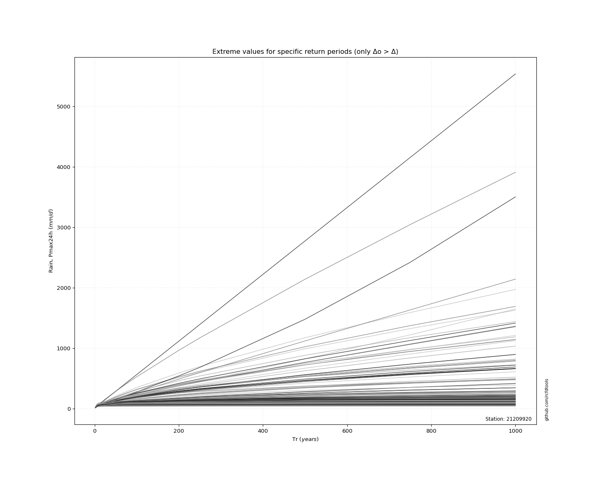</img>

</div>


<div align="center">

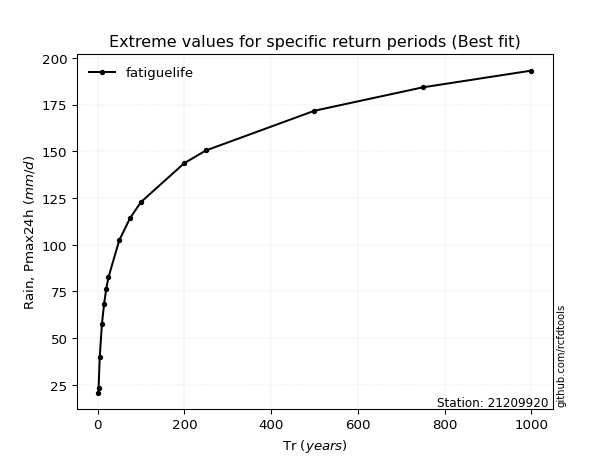</img>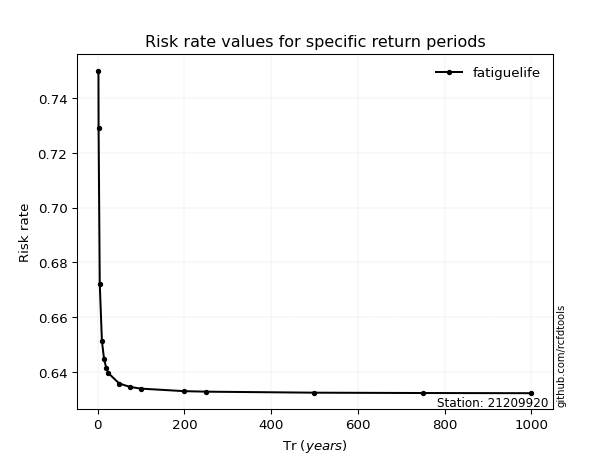</img>

</div>


<sub>**APP DISCLAIMER**: NO WARRANTY - This software is provided by [github.com/rcfdtools](https://github.com/rcfdtools) "as is", without any express or implied warranty, including warranties of merchantability, fitness for a particular purpose, or non-infringement. There is no guarantee that the software will be error-free or operate without interruption. LIMITATION OF LIABILITY - Neither the authors nor copyright holders will be liable for claims or damages arising from the software or its use. You are responsible for determining if the software is appropriate for your use and assume all associated risks, including errors, legal compliance, and data loss. NO PROFESSIONAL ADVICE - The software provides general information and does not offer professional advice. It should not replace consultation with professional advisors.</sub>