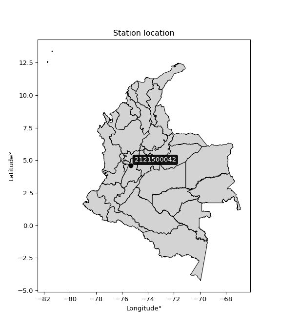

<div align="center">


</div>

# PMax24h Station (Rain, Pmax24h): 2121500042

Maximum Precipitation in 24 hours (PMax24h) is the greatest amount of rainfall for a specific duration that is meteorologically possible for a given location, acting as a "worst-case" scenario for extreme storms, crucial for designing safety-critical infrastructure like bridges, river deviations, dams, spillways, and nuclear plants to prevent catastrophic failure. The PMax24h is related with the Probable Maximum Precipitation (PMP) and it is calculated by hydrologists using meteorological data to determine the upper limit of extreme rainfall, often leading to the Probable Maximum Flood (PMF) for flood control design, and is increasingly being studied for climate change impacts. Probable Maximum Precipitation (PMP) is the theoretical upper limit of rainfall, a deterministic estimate for extreme events, while probability distributions (like GEV, Gumbel) describe the likelihood and frequency of various precipitation amounts, including rare ones, showing how often events occur, with PMP representing the extreme end of these distributions, used for critical infrastructure design to ensure safety against the worst conceivable weather, unlike standard statistical forecasts which cover typical probabilities.

The most common probability distributions in hydrology, used for analyzing floods, rainfall, and streamflow, include the Normal, Log-Normal, Gumbel, Gamma (including Log-Pearson Type III), and Generalized Extreme Value (GEV) distributions, often chosen based on the data´s skewness and whether modeling extremes or general conditions, with Gumbel and GEV popular for extreme events like floods, while the Normal distribution serves as a baseline, though often requiring transformations for skewed hydrological data. These distributions help in designing water infrastructure, managing water resources, and forecasting hydrologic events.

> Hydrological data often isn´t perfectly normal (it´s skewed), so different distributions are needed for different applications, such as: **Flood Frequency Analysis**: Using Gumbel, GEV, or Log-Pearson Type III for predicting extreme flood magnitudes and their return periods, **Rainfall Analysis**: Normal for annual totals, but Log-Normal, Weibull, or GEV for intensity or extreme daily rainfall, **Streamflow Modeling**: Gamma and Log-Normal for maximum flows, GEV for minimum flows, and Kappa for daily flows.

<div align="center">

</img>

</div>


## A. General information


### 1. General running parameters

• app_version: _v20260225_. • runtime: _2026-02-27 14:50:08.749431_. • Python version: _3.14.0_. • SciPy version: _1.16.3_. • Pandas version: _2.3.3_. • NumPy version: _2.3.5_. • Stations dataset (station_dataset_file): _dataset/pmax24h_in/automatic_colombia_2003_2025.csv_. • Stations catalog (station_catalog_file): _dataset/CNE.xls_. • Minimum year to eval til year_max (date_min): _1900_. • Maximum year to eval since year_min (date_max): _2025_. • Creates, save and include plots into reports (create_plot): _False_. • Plot only fit distributions with Δo > Δ (plot_only_fit): _True_. • Plot only simple graphs avoiding multiple CDFs and multiple Extreme values plots (plot_only_simple): _False_. • Eval low extreme values, if False, evaluates high extreme values (low_extreme): _False_. • Eval every SciPy distribution as logarithmic (pdist_logarithmic_on): _True_. • Standard deviation normalized (ddof): _1.0_. • Return periods to eval in years (Tr): _[2, 2.33, 5, 10, 15, 20, 25, 50, 75, 100, 200, 250, 500, 750, 1000]_. • Minimum data sample per station, 0 means any (minimum_sample): _5_. • Z-Score maximum threshold to adjust a value, 0 means disable (zscore_max): _3.5_. • Z-Score minimum threshold to adjust a value, 0 means disable (zscore_min): _-2.5_. • Avoid zeros, e.g. rain = 0 (avoid_zeros): _True_. • Avoid null values (avoid_nans): _True_. 

:file_folder:Table: [dataset.csv](../../dataset/pmax24h_in/automatic_colombia_2003_2025.csv)

> Delta Degrees of Freedom (DDOF): is a parameter used in the formulas for calculating variance and standard deviation. When ddof=0, the divisor is $N$ (the total number of observations) and this is used when your data set is the entire population. When ddof=1, the divisor is $N-1$ and this is used when your data set is a sample drawn from a larger population. Using $N-1$ provides an unbiased estimate of the population variance (known as Bessel´s correction).


### 2. Station info and location

|   id |     CODIGO | NOMBRE                           | CATEGORIA               | TECNOLOGIA                | ESTADO   | FECHA_INSTALACION   |   FECHA_SUSPENSION |   ALTITUD |   LATITUD |   LONGITUD | DEPARTAMENTO   | MUNICIPIO   | AREA_OPERATIVA             | ENTIDAD                                                     | AREA_HIDROGRAFICA   | ZONA_HIDROGRAFICA   | SUBZONA_HIDROGRAFICA   |   CORRIENTE | Catalogo   |   Version |
|-----:|-----------:|:---------------------------------|:------------------------|:--------------------------|:---------|:--------------------|-------------------:|----------:|----------:|-----------:|:---------------|:------------|:---------------------------|:------------------------------------------------------------|:--------------------|:--------------------|:-----------------------|------------:|:-----------|----------:|
|    0 | 2121500042 | EL SILENCIO - AUT   [2121500042] | Climatológica Principal | Automática con Telemetría | Activa   | 17/12/2017          |                nan |      2579 |   4.60113 |   -75.3311 | Tolima         | Ibagué      | Area Operativa 10 - Tolima | INSTITUTO DE HIDROLOGIA METEOROLOGIA Y ESTUDIOS AMBIENTALES | Magdalena Cauca     | Alto Magdalena      | Río Coello             |         nan | CNE_IDEAM  |  20251226 |

<div align="center">

Dynamic map: [:earth_americas:Google](http://maps.google.com/maps?q=4.601127,-75.331133) [:earth_americas:OSM](https://www.openstreetmap.org/#map=18/4.601127/-75.331133&layers=P) [:earth_americas:Bing](https://www.bing.com/maps?cp=4.601127~-75.331133&lvl=18) [:earth_americas:Apple](https://maps.apple.com/frame?center=4.601127%2C-75.331133&span=0.003%2C0.006)

</div>


<div align="center">

```geojson
{
  "type": "Feature",
  "geometry": {
    "type": "Point", 
    "coordinates": [-75.331133, 4.601127]
  }, 
  "properties": {
    "Name": "2121500042"
  }
}
```

</div>


### 3. Discrete values table and plot

<div align="center">

|               |           0 |           1 |            2 |           3 |          4 |          5 |
|:--------------|------------:|------------:|-------------:|------------:|-----------:|-----------:|
| Date          | 2019        | 2020        | 2021         | 2022        | 2023       | 2025       |
| Value         |   40.8      |   37.6      |   45.6       |   56.8      |    7.8     |   97       |
| Value_initial |   40.8      |   37.6      |   45.6       |   56.8      |    7.8     |   97       |
| count         |    6        |    6        |    6         |    6        |    6       |    6       |
| mean          |   47.6      |   47.6      |   47.6       |   47.6      |   47.6     |   47.6     |
| std           |   29.1866   |   29.1866   |   29.1866    |   29.1866   |   29.1866  |   29.1866  |
| zscore        |   -0.232984 |   -0.342623 |   -0.0685247 |    0.315213 |   -1.36364 |    1.69256 |


</div>


> The initial value (value_initial) correspond to the initial obtained or null completed value, and value (value) is adjusted only when the initial value is outside the valid range (outlier) definite through the Z-Score value. If Z-Score is active, values out of range or outliers are replaced with the station mean value. A Z-Score (or standard score) measures how many standard deviations a data point is from the mean of a dataset, indicating its relative position; positive scores mean above the mean, negative mean below, and a score of zero is exactly at the mean, allowing for comparison of values from different distributions. It´s calculated using the formula $z=(x–μ)/σ$, where $x$ is the data point, $μ$ is the mean, and $σ$ is the standard deviation, helping identify outliers and understand probability.
>
> <sub>**Note**: In this study, "completing" (filling gaps in) and "extending" (forecasting or lengthening the historical record) rainfall data series are avoided for certain critical analyses because they introduce artificial bias and uncertainty, which can distort the statistics of rare events (extremes), alter day-to-day variability, and compromise the integrity and homogeneity of the original data. Some reasons against Completing/Extending rainfall data are: **Distortion of Extremes and Variability**: The primary issue is that most gap-filling or extension methods rely on averaging or regression with nearby stations, which inherently smooths the data. Rainfall is highly variable in space and time, with a large percentage of zero values and occasional large storms. Infilling methods often underestimate the highest values and overestimate the lowest (zero) values, which severely distorts analyses focused on flood frequency, drought severity, and intensity-duration-frequency (IDF) curves, **Loss of Data Homogeneity**: Infilled or extended data are synthetic estimates, not actual measurements. Combining these estimates with observed data can violate the assumption of data homogeneity, which requires that the data properties do not change over time. Inhomogeneity can lead to incorrect conclusions about long-term trends or changes in climate patterns, **Propagation of Errors**: Errors and biases from the original data (e.g., wind-induced undercatch, instrument errors, site changes) or the data used for imputation can propagate through the analysis, leading to unreliable hydrological models and inaccurate predictions, **Compromised Statistical Integrity**: For statistical analyses, especially those involving the frequency of events, using artificial data can introduce time bias or autocorrelation that doesn´t exist in reality, making it difficult to assess the true probability of events, **Difficulty in Validation**: It is difficult to accurately validate the quality of filled or extended data, especially for past periods where ground-truth measurements are unavailable. The reliability of imputation techniques heavily depends on the density of the surrounding station network and the complexity of the local topography.</sub>


### 4. Active continuous probability distributions from SciPy (80 of 104 available)

A Probability Density Function (PDF) describes the relative likelihood of a continuous random variable falling within a specific range, where the total area under its curve equals 1, and the area over any interval gives the actual probability for that range. Unlike discrete probabilities (like rolling a die), a PDF shows density, not direct probability for a single point (which is zero), with higher points indicating higher likelihood, often visualized as a bell curve for normal distributions.

A log of a probability density function (log-PDF) is simply the logarithm of the PDF´s value, denoted as $log(f(x))$, useful for converting multiplication of probabilities into addition, improving numerical stability with tiny numbers, and connecting to information theory concepts like entropy. Instead of dealing with very small probabilities (e.g., 0.000001), log-PDFs use negative numbers (e.g., $log(0.00001) ≈ -11.51$ that are easier for computers to handle, preventing underflow errors and simplifying complex calculations. In this study, each active probability distribution from SciPy is also evaluated in the $log$ form.

[scipy.stats](https://docs.scipy.org/doc/scipy/reference/stats.html) is a Python´s powerful submodule within the SciPy library for comprehensive statistical analysis, offering over 130 probability distributions (like Normal, Poisson, etc.), functions for descriptive stats (mean, variance), hypothesis testing (t-tests, chi-square), random variable generation, and statistical tests, making it essential for data science, modeling, and research. It provides tools to explore, model, and draw conclusions from data efficiently, working seamlessly with [NumPy](https://numpy.org/).

<div align="center">

|   id | p_dist           |   n_parameter | fit_method   | label                                                                       | active   | ref                                                                                                      |
|-----:|:-----------------|--------------:|:-------------|:----------------------------------------------------------------------------|:---------|:---------------------------------------------------------------------------------------------------------|
|    0 | alpha            |             3 | MLE          | Alpha                                                                       | True     | [:mortar_board:](https://docs.scipy.org/doc/scipy/reference/generated/scipy.stats.alpha.html)            |
|    1 | anglit           |             2 | MM           | Anglit                                                                      | True     | [:mortar_board:](https://docs.scipy.org/doc/scipy/reference/generated/scipy.stats.anglit.html)           |
|    2 | arcsine          |             2 | MM           | Arcsine                                                                     | True     | [:mortar_board:](https://docs.scipy.org/doc/scipy/reference/generated/scipy.stats.arcsine.html)          |
|    3 | argus            |             3 | MLE          | Argus                                                                       | True     | [:mortar_board:](https://docs.scipy.org/doc/scipy/reference/generated/scipy.stats.argus.html)            |
|    4 | beta             |             4 | MLE          | Beta                                                                        | True     | [:mortar_board:](https://docs.scipy.org/doc/scipy/reference/generated/scipy.stats.beta.html)             |
|    5 | betaprime        |             4 | MLE          | Beta prime                                                                  | True     | [:mortar_board:](https://docs.scipy.org/doc/scipy/reference/generated/scipy.stats.betaprime.html)        |
|    6 | bradford         |             3 | MLE          | Bradford                                                                    | True     | [:mortar_board:](https://docs.scipy.org/doc/scipy/reference/generated/scipy.stats.bradford.html)         |
|    7 | burr             |             4 | MLE          | Burr (Type III)                                                             | True     | [:mortar_board:](https://docs.scipy.org/doc/scipy/reference/generated/scipy.stats.burr.html)             |
|    8 | burr12           |             4 | MLE          | Burr (Type III) 12                                                          | True     | [:mortar_board:](https://docs.scipy.org/doc/scipy/reference/generated/scipy.stats.burr12.html)           |
|    9 | cosine           |             2 | MLE          | Cosine                                                                      | True     | [:mortar_board:](https://docs.scipy.org/doc/scipy/reference/generated/scipy.stats.cosine.html)           |
|   10 | crystalball      |             4 | MLE          | Crystalball                                                                 | True     | [:mortar_board:](https://docs.scipy.org/doc/scipy/reference/generated/scipy.stats.crystalball.html)      |
|   11 | dgamma           |             3 | MLE          | Double gamma                                                                | True     | [:mortar_board:](https://docs.scipy.org/doc/scipy/reference/generated/scipy.stats.dgamma.html)           |
|   12 | dweibull         |             3 | MLE          | Double Weibull                                                              | True     | [:mortar_board:](https://docs.scipy.org/doc/scipy/reference/generated/scipy.stats.dweibull.html)         |
|   13 | erlang           |             3 | MLE          | Erlang                                                                      | True     | [:mortar_board:](https://docs.scipy.org/doc/scipy/reference/generated/scipy.stats.erlang.html)           |
|   14 | exponnorm        |             3 | MLE          | Exponentially modified Normal                                               | True     | [:mortar_board:](https://docs.scipy.org/doc/scipy/reference/generated/scipy.stats.exponnorm.html)        |
|   15 | exponpow         |             3 | MLE          | Exponential power                                                           | True     | [:mortar_board:](https://docs.scipy.org/doc/scipy/reference/generated/scipy.stats.exponpow.html)         |
|   16 | exponweib        |             4 | MLE          | Exponentiated Weibull                                                       | True     | [:mortar_board:](https://docs.scipy.org/doc/scipy/reference/generated/scipy.stats.exponweib.html)        |
|   17 | f                |             4 | MLE          | F                                                                           | True     | [:mortar_board:](https://docs.scipy.org/doc/scipy/reference/generated/scipy.stats.f.html)                |
|   18 | fatiguelife      |             3 | MLE          | Fatigue-life (Birnbaum-Saunders)                                            | True     | [:mortar_board:](https://docs.scipy.org/doc/scipy/reference/generated/scipy.stats.fatiguelife.html)      |
|   19 | foldnorm         |             3 | MM           | Fold Normal                                                                 | True     | [:mortar_board:](https://docs.scipy.org/doc/scipy/reference/generated/scipy.stats.foldnorm.html)         |
|   20 | gamma            |             3 | MLE          | Gamma                                                                       | True     | [:mortar_board:](https://docs.scipy.org/doc/scipy/reference/generated/scipy.stats.gamma.html)            |
|   21 | gausshyper       |             6 | MLE          | Gauss hypergeometric                                                        | True     | [:mortar_board:](https://docs.scipy.org/doc/scipy/reference/generated/scipy.stats.gausshyper.html)       |
|   22 | genexpon         |             5 | MLE          | Generalized exponential                                                     | True     | [:mortar_board:](https://docs.scipy.org/doc/scipy/reference/generated/scipy.stats.genexpon.html)         |
|   23 | genextreme       |             3 | MLE          | Generalized exponential                                                     | True     | [:mortar_board:](https://docs.scipy.org/doc/scipy/reference/generated/scipy.stats.genextreme.html)       |
|   24 | gengamma         |             4 | MLE          | Generalized gamma                                                           | True     | [:mortar_board:](https://docs.scipy.org/doc/scipy/reference/generated/scipy.stats.gengamma.html)         |
|   25 | genhalflogistic  |             3 | MLE          | Generalized half-logistic                                                   | True     | [:mortar_board:](https://docs.scipy.org/doc/scipy/reference/generated/scipy.stats.genhalflogistic.html)  |
|   26 | genlogistic      |             3 | MLE          | Generalized logistic                                                        | True     | [:mortar_board:](https://docs.scipy.org/doc/scipy/reference/generated/scipy.stats.genlogistic.html)      |
|   27 | gennorm          |             3 | MLE          | Generalized Normal                                                          | True     | [:mortar_board:](https://docs.scipy.org/doc/scipy/reference/generated/scipy.stats.gennorm.html)          |
|   28 | genpareto        |             3 | MLE          | Generalized Pareto                                                          | True     | [:mortar_board:](https://docs.scipy.org/doc/scipy/reference/generated/scipy.stats.genpareto.html)        |
|   29 | gompertz         |             3 | MLE          | Gompertz (or truncated Gumbel)                                              | True     | [:mortar_board:](https://docs.scipy.org/doc/scipy/reference/generated/scipy.stats.gompertz.html)         |
|   30 | gumbel_l         |             2 | MM           | Gumbel Left Skew                                                            | True     | [:mortar_board:](https://docs.scipy.org/doc/scipy/reference/generated/scipy.stats.gumbel_l.html)         |
|   31 | gumbel_r         |             2 | MM           | Gumbel Right Skew                                                           | True     | [:mortar_board:](https://docs.scipy.org/doc/scipy/reference/generated/scipy.stats.gumbel_r.html)         |
|   32 | halfgennorm      |             3 | MLE          | Upper half of a generalized normal                                          | True     | [:mortar_board:](https://docs.scipy.org/doc/scipy/reference/generated/scipy.stats.halfgennorm.html)      |
|   33 | halflogistic     |             2 | MM           | Half-logistic                                                               | True     | [:mortar_board:](https://docs.scipy.org/doc/scipy/reference/generated/scipy.stats.halflogistic.html)     |
|   34 | halfnorm         |             2 | MM           | Half Normal                                                                 | True     | [:mortar_board:](https://docs.scipy.org/doc/scipy/reference/generated/scipy.stats.halfnorm.html)         |
|   35 | hypsecant        |             2 | MM           | hyperbolic secant                                                           | True     | [:mortar_board:](https://docs.scipy.org/doc/scipy/reference/generated/scipy.stats.hypsecant.html)        |
|   36 | invgamma         |             3 | MLE          | Inverted gamma                                                              | True     | [:mortar_board:](https://docs.scipy.org/doc/scipy/reference/generated/scipy.stats.invgamma.html)         |
|   37 | invgauss         |             3 | MLE          | Inverse Gaussian                                                            | True     | [:mortar_board:](https://docs.scipy.org/doc/scipy/reference/generated/scipy.stats.invgauss.html)         |
|   38 | invweibull       |             3 | MLE          | Inverted Weibull                                                            | True     | [:mortar_board:](https://docs.scipy.org/doc/scipy/reference/generated/scipy.stats.invweibull.html)       |
|   39 | johnsonsb        |             4 | MLE          | Johnson SB                                                                  | True     | [:mortar_board:](https://docs.scipy.org/doc/scipy/reference/generated/scipy.stats.johnsonsb.html)        |
|   40 | johnsonsu        |             4 | MLE          | Johnson Su                                                                  | True     | [:mortar_board:](https://docs.scipy.org/doc/scipy/reference/generated/scipy.stats.johnsonsu.html)        |
|   41 | kappa3           |             3 | MLE          | Kappa 3                                                                     | True     | [:mortar_board:](https://docs.scipy.org/doc/scipy/reference/generated/scipy.stats.kappa3.html)           |
|   42 | kappa4           |             4 | MLE          | Kappa 4                                                                     | True     | [:mortar_board:](https://docs.scipy.org/doc/scipy/reference/generated/scipy.stats.kappa4.html)           |
|   43 | ksone            |             3 | MLE          | Kolmogorov-Smirnov one-sided test statistic distribution                    | True     | [:mortar_board:](https://docs.scipy.org/doc/scipy/reference/generated/scipy.stats.ksone.html)            |
|   44 | kstwobign        |             2 | MLE          | Limiting distribution of scaled Kolmogorov-Smirnov two-sided test statistic | True     | [:mortar_board:](https://docs.scipy.org/doc/scipy/reference/generated/scipy.stats.kstwobign.html)        |
|   45 | laplace          |             2 | MM           | Laplace                                                                     | True     | [:mortar_board:](https://docs.scipy.org/doc/scipy/reference/generated/scipy.stats.laplace.html)          |
|   46 | levy_l           |             2 | MLE          | Left-skewed Levy                                                            | True     | [:mortar_board:](https://docs.scipy.org/doc/scipy/reference/generated/scipy.stats.levy_l.html)           |
|   47 | loggamma         |             3 | MLE          | Log gamma                                                                   | True     | [:mortar_board:](https://docs.scipy.org/doc/scipy/reference/generated/scipy.stats.loggamma.html)         |
|   48 | logistic         |             2 | MM           | Logistic (or Sech-squared)                                                  | True     | [:mortar_board:](https://docs.scipy.org/doc/scipy/reference/generated/scipy.stats.logistic.html)         |
|   49 | loglaplace       |             3 | MLE          | Log-Laplace                                                                 | True     | [:mortar_board:](https://docs.scipy.org/doc/scipy/reference/generated/scipy.stats.loglaplace.html)       |
|   50 | lomax            |             3 | MLE          | Lomax (Pareto of the second kind)                                           | True     | [:mortar_board:](https://docs.scipy.org/doc/scipy/reference/generated/scipy.stats.lomax.html)            |
|   51 | maxwell          |             2 | MM           | Maxwell                                                                     | True     | [:mortar_board:](https://docs.scipy.org/doc/scipy/reference/generated/scipy.stats.maxwell.html)          |
|   52 | mielke           |             4 | MLE          | Mielke Beta-Kappa / Dagum                                                   | True     | [:mortar_board:](https://docs.scipy.org/doc/scipy/reference/generated/scipy.stats.mielke.html)           |
|   53 | moyal            |             2 | MM           | Moyal                                                                       | True     | [:mortar_board:](https://docs.scipy.org/doc/scipy/reference/generated/scipy.stats.moyal.html)            |
|   54 | nakagami         |             3 | MLE          | Nakagami                                                                    | True     | [:mortar_board:](https://docs.scipy.org/doc/scipy/reference/generated/scipy.stats.nakagami.html)         |
|   55 | ncf              |             5 | MLE          | Non-central F distribution                                                  | True     | [:mortar_board:](https://docs.scipy.org/doc/scipy/reference/generated/scipy.stats.ncf.html)              |
|   56 | nct              |             4 | MLE          | Non-central Student’s t                                                     | True     | [:mortar_board:](https://docs.scipy.org/doc/scipy/reference/generated/scipy.stats.nct.html)              |
|   57 | norm             |             2 | MM           | Normal                                                                      | True     | [:mortar_board:](https://docs.scipy.org/doc/scipy/reference/generated/scipy.stats.norm.html)             |
|   58 | pearson3         |             3 | MM           | Pearson type III                                                            | True     | [:mortar_board:](https://docs.scipy.org/doc/scipy/reference/generated/scipy.stats.pearson3.html)         |
|   59 | powerlaw         |             3 | MLE          | Power-function                                                              | True     | [:mortar_board:](https://docs.scipy.org/doc/scipy/reference/generated/scipy.stats.powerlaw.html)         |
|   60 | rayleigh         |             2 | MM           | Rayleigh                                                                    | True     | [:mortar_board:](https://docs.scipy.org/doc/scipy/reference/generated/scipy.stats.rayleigh.html)         |
|   61 | rdist            |             3 | MLE          | R-distributed (symmetric beta)                                              | True     | [:mortar_board:](https://docs.scipy.org/doc/scipy/reference/generated/scipy.stats.rdist.html)            |
|   62 | rice             |             3 | MLE          | Rice                                                                        | True     | [:mortar_board:](https://docs.scipy.org/doc/scipy/reference/generated/scipy.stats.rice.html)             |
|   63 | semicircular     |             2 | MM           | Semicircular                                                                | True     | [:mortar_board:](https://docs.scipy.org/doc/scipy/reference/generated/scipy.stats.semicircular.html)     |
|   64 | skewnorm         |             3 | MLE          | Skew normal                                                                 | True     | [:mortar_board:](https://docs.scipy.org/doc/scipy/reference/generated/scipy.stats.skewnorm.html)         |
|   65 | t                |             3 | MLE          | Student’s t                                                                 | True     | [:mortar_board:](https://docs.scipy.org/doc/scipy/reference/generated/scipy.stats.t.html)                |
|   66 | trapezoid        |             4 | MLE          | Trapezoid                                                                   | True     | [:mortar_board:](https://docs.scipy.org/doc/scipy/reference/generated/scipy.stats.trapezoid.html)        |
|   67 | triang           |             3 | MLE          | Triangular                                                                  | True     | [:mortar_board:](https://docs.scipy.org/doc/scipy/reference/generated/scipy.stats.triang.html)           |
|   68 | truncexpon       |             3 | MLE          | Truncated exponential                                                       | True     | [:mortar_board:](https://docs.scipy.org/doc/scipy/reference/generated/scipy.stats.truncexpon.html)       |
|   69 | truncnorm        |             4 | MLE          | Truncated normal                                                            | True     | [:mortar_board:](https://docs.scipy.org/doc/scipy/reference/generated/scipy.stats.truncnorm.html)        |
|   70 | truncpareto      |             4 | MLE          | Upper truncated Pareto                                                      | True     | [:mortar_board:](https://docs.scipy.org/doc/scipy/reference/generated/scipy.stats.truncpareto.html)      |
|   71 | truncweibull_min |             5 | MLE          | Doubly truncated Weibull minimum                                            | True     | [:mortar_board:](https://docs.scipy.org/doc/scipy/reference/generated/scipy.stats.truncweibull_min.html) |
|   72 | tukeylambda      |             3 | MLE          | Tukey-Lamdba                                                                | True     | [:mortar_board:](https://docs.scipy.org/doc/scipy/reference/generated/scipy.stats.tukeylambda.html)      |
|   73 | uniform          |             2 | MLE          | Uniform                                                                     | True     | [:mortar_board:](https://docs.scipy.org/doc/scipy/reference/generated/scipy.stats.uniform.html)          |
|   74 | vonmises         |             3 | MLE          | Von Mises                                                                   | True     | [:mortar_board:](https://docs.scipy.org/doc/scipy/reference/generated/scipy.stats.vonmises.html)         |
|   75 | vonmises_line    |             3 | MLE          | Von Mises line                                                              | True     | [:mortar_board:](https://docs.scipy.org/doc/scipy/reference/generated/scipy.stats.vonmises_line.html)    |
|   76 | wald             |             2 | MM           | Wald                                                                        | True     | [:mortar_board:](https://docs.scipy.org/doc/scipy/reference/generated/scipy.stats.wald.html)             |
|   77 | weibull_max      |             3 | MLE          | Weibull maximum                                                             | True     | [:mortar_board:](https://docs.scipy.org/doc/scipy/reference/generated/scipy.stats.weibull_max.html)      |
|   78 | weibull_min      |             3 | MLE          | Weibull minimum                                                             | True     | [:mortar_board:](https://docs.scipy.org/doc/scipy/reference/generated/scipy.stats.weibull_min.html)      |
|   79 | wrapcauchy       |             3 | MLE          | Wrapped  Cauchy                                                             | True     | [:mortar_board:](https://docs.scipy.org/doc/scipy/reference/generated/scipy.stats.wrapcauchy.html)       |

</div>

> **n_parameter:** # arguments & localization & scale.
>
> **Fit methods:** (MLE) maximum likelihood, (MM) L-moments.
>
>**Inactive** (With the only purpose of prevent loops, zero divisions, infinite values, over high estimated values or horizontal trending for recurrence intervals estimations, the follow distributions were disabled.)**:** lognorm, norminvgauss, powernorm, powerlognorm, cauchy, halfcauchy, foldcauchy, skewcauchy, chi2, expon, fisk, genhyperbolic, geninvgauss, gibrat, kstwo, laplace_asymmetric, levy, levy_stable, ncx2, pareto, rel_breitwigner, recipinvgauss, studentized_range, loguniform, 


## B. Probability (PDF) vs. Empirical (EDF) distributions functions

A continuous probability distribution (CPD) describes probabilities for variables that can take any value within a range (like rain any time), unlike discrete variables with specific outcomes (like temperature). It uses a Probability Density Function (PDF), a curve where the total area under it equals 1, and the probability of the variable falling within an interval (a to b) is found by calculating the area under the curve between those points. A key feature is that the probability of hitting any single exact value is zero, so probabilities are always expressed for ranges, e.g., $P(a ≤ X ≤ b)$.

<div align="center">

Distributions parameters from station values
|     |    station | p_dist              |   n |               loc |            scale | shape                  | shape1                 | shape2                 | shape3            |
|----:|-----------:|:--------------------|----:|------------------:|-----------------:|:-----------------------|:-----------------------|:-----------------------|:------------------|
|   0 | 2121500042 | alpha               |   6 |      -0.0452078   |     18.0509      | 1.5610705306180747e-11 |                        |                        |                   |
|   1 | 2121500042 | anglit              |   6 |      47.6         |     77.9431      |                        |                        |                        |                   |
|   2 | 2121500042 | arcsine             |   6 |       9.92028     |     75.3594      |                        |                        |                        |                   |
|   3 | 2121500042 | argus               |   6 |     -15.3262      |    117.583       | 1.597947277693459e-06  |                        |                        |                   |
|   4 | 2121500042 | beta                |   6 |       4.12884     |     92.8712      | 0.6887925330860197     | 0.4976410837657144     |                        |                   |
|   5 | 2121500042 | betaprime           |   6 |     -35.0263      |   4481.04        | 9.636568969351067      | 523.6064146716456      |                        |                   |
|   6 | 2121500042 | bradford            |   6 |       7.79962     |     89.2004      | 0.9483886742789396     |                        |                        |                   |
|   7 | 2121500042 | burr                |   6 |       7.79997     |     86.3289      | 5.855008178307928      | 0.06901286540607598    |                        |                   |
|   8 | 2121500042 | burr12              |   6 |      -1.24347     |      8.91389     | 295.7628117264476      | 0.0022615922543797167  |                        |                   |
|   9 | 2121500042 | cosine              |   6 |      49.5619      |     23.0575      |                        |                        |                        |                   |
|  10 | 2121500042 | crystalball         |   6 |      47.6         |     26.6436      | 15215.099261355157     | 112.41111096760977     |                        |                   |
|  11 | 2121500042 | dgamma              |   6 |      45.6         |     20.2827      | 0.8484943388481989     |                        |                        |                   |
|  12 | 2121500042 | dweibull            |   6 |      40.8         |     21.1037      | 0.7877289765235371     |                        |                        |                   |
|  13 | 2121500042 | erlang              |   6 |     -32.9932      |      8.98058     | 8.974169993057398      |                        |                        |                   |
|  14 | 2121500042 | exponnorm           |   6 |      26.0133      |     16.963       | 1.2725739286085735     |                        |                        |                   |
|  15 | 2121500042 | exponpow            |   6 |       7.8         |     19.4963      | 0.35405801159948314    |                        |                        |                   |
|  16 | 2121500042 | exponweib           |   6 |    -510.559       |    319.268       | 783.9782877510602      | 3.526349999620601      |                        |                   |
|  17 | 2121500042 | f                   |   6 |     -33.154       |     80.7403      | 18.05223972815878      | 11559.953282556535     |                        |                   |
|  18 | 2121500042 | fatiguelife         |   6 |       7.8         |      4.49564e-05 | 726.1873853078944      |                        |                        |                   |
|  19 | 2121500042 | foldnorm            |   6 |       4.57528     |     30.4868      | 1.3249210072653799     |                        |                        |                   |
|  20 | 2121500042 | gamma               |   6 |     -32.9932      |      8.98057     | 8.974175211089392      |                        |                        |                   |
|  21 | 2121500042 | gausshyper          |   6 |       7.69839     |     89.3016      | 1.0193550135612046     | 0.5880845472742584     | 1.053716040549963      | 1.105599001995424 |
|  22 | 2121500042 | genexpon            |   6 |       0.247819    |      0.85619     | 0.0032393461152844362  | 1.3335459529154416     | 0.0003066300477135983  |                   |
|  23 | 2121500042 | genextreme          |   6 |      36.639       |     23.7662      | 0.13674955117648369    |                        |                        |                   |
|  24 | 2121500042 | gengamma            |   6 |       7.71736     |     74.0596      | 0.29176408959605626    | 2.4835075364443195     |                        |                   |
|  25 | 2121500042 | genhalflogistic     |   6 |      -1.1574      |    102.466       | 1.0438985590611987     |                        |                        |                   |
|  26 | 2121500042 | genlogistic         |   6 |      22.3617      |     18.6165      | 2.6590625171403164     |                        |                        |                   |
|  27 | 2121500042 | gennorm             |   6 |      40.8         |      0.00064532  | 0.18740292078668785    |                        |                        |                   |
|  28 | 2121500042 | genpareto           |   6 |      -0.021385    |    141.485       | -1.458281817386681     |                        |                        |                   |
|  29 | 2121500042 | gompertz            |   6 |      -0.438469    |      2.44904     | 3.145459355186432e-17  |                        |                        |                   |
|  30 | 2121500042 | gumbel_l            |   6 |      59.591       |     20.7739      |                        |                        |                        |                   |
|  31 | 2121500042 | gumbel_r            |   6 |      35.609       |     20.7739      |                        |                        |                        |                   |
|  32 | 2121500042 | halfgennorm         |   6 |       7.79945     |     89.3923      | 2453.286206444216      |                        |                        |                   |
|  33 | 2121500042 | halflogistic        |   6 |      16.0212      |     22.7793      |                        |                        |                        |                   |
|  34 | 2121500042 | halfnorm            |   6 |      12.3344      |     44.1989      |                        |                        |                        |                   |
|  35 | 2121500042 | hypsecant           |   6 |      47.6         |     16.9618      |                        |                        |                        |                   |
|  36 | 2121500042 | invgamma            |   6 |    -122.531       |   7027.67        | 42.30636292107939      |                        |                        |                   |
|  37 | 2121500042 | invgauss            |   6 |     -74.0802      |   2486.21        | 0.04895235126230767    |                        |                        |                   |
|  38 | 2121500042 | invweibull          |   6 |      -1.76739e+09 |      1.76739e+09 | 76767716.37705798      |                        |                        |                   |
|  39 | 2121500042 | johnsonsb           |   6 |       7.8         |     89.2         | -0.5479521444657569    | 0.09495586899531223    |                        |                   |
|  40 | 2121500042 | johnsonsu           |   6 |      40.9901      |      5.43164     | -0.23227009740232993   | 0.567753188653525      |                        |                   |
|  41 | 2121500042 | kappa3              |   6 |       7.8         |     49.024       | 4.615912099986626      |                        |                        |                   |
|  42 | 2121500042 | kappa4              |   6 |      -1.12302     |     97.6665      | 1.100484836751102      | 0.9878065135989085     |                        |                   |
|  43 | 2121500042 | ksone               |   6 |      -1.12        |    107.04        | 1.0                    |                        |                        |                   |
|  44 | 2121500042 | kstwobign           |   6 |     -47.4103      |    109.162       |                        |                        |                        |                   |
|  45 | 2121500042 | laplace             |   6 |      47.6         |     18.8399      |                        |                        |                        |                   |
|  46 | 2121500042 | levy_l              |   6 |     102.42        |     22.5363      |                        |                        |                        |                   |
|  47 | 2121500042 | loggamma            |   6 |   -8872.71        |   1181.57        | 1900.3668292640505     |                        |                        |                   |
|  48 | 2121500042 | logistic            |   6 |      47.6         |     14.6894      |                        |                        |                        |                   |
|  49 | 2121500042 | loglaplace          |   6 |      -0.106927    |     45.7069      | 1.979844927915535      |                        |                        |                   |
|  50 | 2121500042 | lomax               |   6 |       7.8         |   6985.64        | 176.25986977197232     |                        |                        |                   |
|  51 | 2121500042 | maxwell             |   6 |     -15.5341      |     39.5634      |                        |                        |                        |                   |
|  52 | 2121500042 | mielke              |   6 |       7.8         |     67.7134      | 0.8906532311383832     | 3.4899871791391703     |                        |                   |
|  53 | 2121500042 | moyal               |   6 |      32.3635      |     11.9938      |                        |                        |                        |                   |
|  54 | 2121500042 | nakagami            |   6 |      37.6         |     23.0689      | 0.16446463283968843    |                        |                        |                   |
|  55 | 2121500042 | ncf                 |   6 |      -0.0920611   |      1.9307e-06  | 7.928999315879827e-07  | 10.475845518434502     | 17.134429656845235     |                   |
|  56 | 2121500042 | nct                 |   6 |      -0.0559088   |     21.6959      | 10.16371971422235      | 2.0281394524409397     |                        |                   |
|  57 | 2121500042 | norm                |   6 |      47.6         |     26.6436      |                        |                        |                        |                   |
|  58 | 2121500042 | pearson3            |   6 |      47.6         |     26.6436      | 0.5019662540836787     |                        |                        |                   |
|  59 | 2121500042 | powerlaw            |   6 |       7.8         |     89.2         | 0.14052634983202025    |                        |                        |                   |
|  60 | 2121500042 | rayleigh            |   6 |      -3.37071     |     40.6687      |                        |                        |                        |                   |
|  61 | 2121500042 | rdist               |   6 |      -0.125583    |     45.7256      | 1.0951944269121263     |                        |                        |                   |
|  62 | 2121500042 | rice                |   6 |      -3.47202     |     36.5526      | 0.6953655617687602     |                        |                        |                   |
|  63 | 2121500042 | semicircular        |   6 |      47.6         |     53.2871      |                        |                        |                        |                   |
|  64 | 2121500042 | skewnorm            |   6 |      20.0217      |     38.3463      | 2.1523675662844446     |                        |                        |                   |
|  65 | 2121500042 | t                   |   6 |      43.2791      |     10.5704      | 1.2202506515626106     |                        |                        |                   |
|  66 | 2121500042 | trapezoid           |   6 |      -1.176       |    107.04        | 0.9999999999999999     | 1.0                    |                        |                   |
|  67 | 2121500042 | triang              |   6 |      -1.1913      |     98.1914      | 0.9999999835514812     |                        |                        |                   |
|  68 | 2121500042 | truncexpon          |   6 |      -1.15732     |    120.917       | 0.8117774159405924     |                        |                        |                   |
|  69 | 2121500042 | truncnorm           |   6 |      47.6         |     26.6436      | -252.0340905038009     | 1389.8458466157686     |                        |                   |
|  70 | 2121500042 | truncpareto         |   6 |       7.67894     |      0.121063    | 0.2035417082673555     | 737.8068593632106      |                        |                   |
|  71 | 2121500042 | truncweibull_min    |   6 |      -0.866925    |    108.23        | 1.346814755008492      | 0.0017793081164999371  | 0.9042462735024808     |                   |
|  72 | 2121500042 | tukeylambda         |   6 |      -0.123693    |     48.3102      | 1.0565681790410588     |                        |                        |                   |
|  73 | 2121500042 | uniform             |   6 |       7.8         |     89.2         |                        |                        |                        |                   |
|  74 | 2121500042 | vonmises            |   6 |       1.55272     |      1           | 0.9488848450296462     |                        |                        |                   |
|  75 | 2121500042 | vonmises_line       |   6 |      53.2605      |     14.4705      | 0.42015210964376065    |                        |                        |                   |
|  76 | 2121500042 | wald                |   6 |      20.9564      |     26.6436      |                        |                        |                        |                   |
|  77 | 2121500042 | weibull_max         |   6 |      97           |      1.74772     | 0.1990715814593288     |                        |                        |                   |
|  78 | 2121500042 | weibull_min         |   6 |      -1.32797     |     54.945       | 1.8753658204497032     |                        |                        |                   |
|  79 | 2121500042 | wrapcauchy          |   6 |       7.60624     |     14.2277      | 1.321314903853463e-05  |                        |                        |                   |
|  80 | 2121500042 | logalpha            |   6 |     -15.1688      |    428.277       | 22.841423283962577     |                        |                        |                   |
|  81 | 2121500042 | loganglit           |   6 |       3.63733     |      2.26145     |                        |                        |                        |                   |
|  82 | 2121500042 | logarcsine          |   6 |       2.54407     |      2.18651     |                        |                        |                        |                   |
|  83 | 2121500042 | logargus            |   6 |       1.23827     |      3.42038     | 2.0044027632477954     |                        |                        |                   |
|  84 | 2121500042 | logbeta             |   6 |       1.79616     |      2.77855     | 1.6450605261097837     | 0.509216089582863      |                        |                   |
|  85 | 2121500042 | logbetaprime        |   6 |     -28.3782      |     25.9565      | 3632.0128590193126     | 2945.508887904076      |                        |                   |
|  86 | 2121500042 | logbradford         |   6 |       2.05412     |      2.5206      | 1.1185352963794108     |                        |                        |                   |
|  87 | 2121500042 | logburr             |   6 |  -18413.6         |  18417.8         | 87664.5803967125       | 0.3193976559150886     |                        |                   |
|  88 | 2121500042 | logburr12           |   6 |   -1652.71        |   1663.69        | 3179.7608166673735     | 645060.5241628676      |                        |                   |
|  89 | 2121500042 | logcosine           |   6 |       3.51489     |      0.679015    |                        |                        |                        |                   |
|  90 | 2121500042 | logcrystalball      |   6 |       3.63733     |      0.773038    | 457.42582203980123     | 6282.800840842292      |                        |                   |
|  91 | 2121500042 | logdgamma           |   6 |       3.81991     |      0.583123    | 0.8578418377442338     |                        |                        |                   |
|  92 | 2121500042 | logdweibull         |   6 |       3.81991     |      0.58365     | 0.8670461772520799     |                        |                        |                   |
|  93 | 2121500042 | logerlang           |   6 |      -9.90177     |      0.0489048   | 276.83461930526516     |                        |                        |                   |
|  94 | 2121500042 | logexponnorm        |   6 |       3.63683     |      0.773034    | 0.0006417411748711752  |                        |                        |                   |
|  95 | 2121500042 | logexponpow         |   6 |       2.05412     |      1.37374     | 0.16049759697926946    |                        |                        |                   |
|  96 | 2121500042 | logexponweib        |   6 |       2.05412     |      1.745       | 0.5135632001492387     | 0.3014478243405067     |                        |                   |
|  97 | 2121500042 | logf                |   6 |    -124.743       |    128.377       | 136657.85894604435     | 90254.50066089496      |                        |                   |
|  98 | 2121500042 | logfatiguelife      |   6 |    -368.313       |    371.949       | 0.002065564408596169   |                        |                        |                   |
|  99 | 2121500042 | logfoldnorm         |   6 |      -0.730046    |      0.729276    | 5.996548663979251      |                        |                        |                   |
| 100 | 2121500042 | loggamma            |   6 |     -10.6363      |      0.0463969   | 307.5479597328067      |                        |                        |                   |
| 101 | 2121500042 | loggausshyper       |   6 |       2.02114     |      2.55357     | 1.0932032674384273     | 0.8018201500309916     | 1.0323516505784718     | 1.004365143736131 |
| 102 | 2121500042 | loggenexpon         |   6 |       2.05412     |      1.46238     | 0.5163206742762639     | 0.7965968188821246     | 1.1135382013407258     |                   |
| 103 | 2121500042 | loggenextreme       |   6 |       3.69583     |      0.970709    | 1.1044829007967922     |                        |                        |                   |
| 104 | 2121500042 | loggengamma         |   6 |       2.05412     |      1.08811     | 1.1410751868880489     | 0.7292412267886825     |                        |                   |
| 105 | 2121500042 | loggenhalflogistic  |   6 |       2.04667     |      2.60201     | 1.029261362831873      |                        |                        |                   |
| 106 | 2121500042 | loggenlogistic      |   6 |       4.20288     |      0.210949    | 0.3209807982367109     |                        |                        |                   |
| 107 | 2121500042 | loggennorm          |   6 |       3.70868     |      0.00907566  | 0.3364885378388962     |                        |                        |                   |
| 108 | 2121500042 | loggenpareto        |   6 |      -0.000280478 |      6.16845     | -1.3482978832139878    |                        |                        |                   |
| 109 | 2121500042 | loggompertz         |   6 |       2.05412     |      0.624774    | 0.05050933008418862    |                        |                        |                   |
| 110 | 2121500042 | loggumbel_l         |   6 |       3.98524     |      0.602735    |                        |                        |                        |                   |
| 111 | 2121500042 | loggumbel_r         |   6 |       3.28942     |      0.602735    |                        |                        |                        |                   |
| 112 | 2121500042 | loghalfgennorm      |   6 |       2.05412     |      1.08784     | 0.8216789030146958     |                        |                        |                   |
| 113 | 2121500042 | loghalflogistic     |   6 |       2.72104     |      0.660956    |                        |                        |                        |                   |
| 114 | 2121500042 | loghalfnorm         |   6 |       2.61412     |      1.2824      |                        |                        |                        |                   |
| 115 | 2121500042 | loghypsecant        |   6 |       3.63733     |      0.492131    |                        |                        |                        |                   |
| 116 | 2121500042 | loginvgamma         |   6 |     -16.1337      |  11960.8         | 606.1715743447651      |                        |                        |                   |
| 117 | 2121500042 | loginvgauss         |   6 |      -5.36262     |   1019.05        | 0.008829893763073957   |                        |                        |                   |
| 118 | 2121500042 | loginvweibull       |   6 | -209953           | 209956           | 235969.04384490428     |                        |                        |                   |
| 119 | 2121500042 | logjohnsonsb        |   6 |       1.01532     |      3.55939     | -1.7678543841861019    | 0.14089885827914056    |                        |                   |
| 120 | 2121500042 | logjohnsonsu        |   6 |       3.77167     |      0.133297    | 0.031856126039000204   | 0.5464778008117936     |                        |                   |
| 121 | 2121500042 | logkappa3           |   6 |       2.05412     |      2.48757     | 138.00029056879112     |                        |                        |                   |
| 122 | 2121500042 | logkappa4           |   6 |       1.85321     |      2.74107     | 1.0791023949501208     | 1.001743959380236      |                        |                   |
| 123 | 2121500042 | logksone            |   6 |       1.80207     |      3.0247      | 1.0                    |                        |                        |                   |
| 124 | 2121500042 | logkstwobign        |   6 |       0.0471274   |      4.10241     |                        |                        |                        |                   |
| 125 | 2121500042 | loglaplace          |   6 |       3.63733     |      0.54662     |                        |                        |                        |                   |
| 126 | 2121500042 | loglevy_l           |   6 |       4.66045     |      0.355738    |                        |                        |                        |                   |
| 127 | 2121500042 | logloggamma         |   6 |       4.31797     |      0.359215    | 0.5142553717378542     |                        |                        |                   |
| 128 | 2121500042 | loglogistic         |   6 |       3.63733     |      0.426198    |                        |                        |                        |                   |
| 129 | 2121500042 | logloglaplace       |   6 |      -5.80743e+07 |      5.80743e+07 | 106317857.9004266      |                        |                        |                   |
| 130 | 2121500042 | loglomax            |   6 |       2.05412     |      6.28711e+12 | 2071298090976.4326     |                        |                        |                   |
| 131 | 2121500042 | logmaxwell          |   6 |       1.80555     |      1.1479      |                        |                        |                        |                   |
| 132 | 2121500042 | logmielke           |   6 |      -1.67544e+07 |      1.67544e+07 | 25523278.278746493     | 79336365.47877127      |                        |                   |
| 133 | 2121500042 | logmoyal            |   6 |       3.19525     |      0.347989    |                        |                        |                        |                   |
| 134 | 2121500042 | lognakagami         |   6 |       3.627       |      0.383266    | 0.24569646762781172    |                        |                        |                   |
| 135 | 2121500042 | logncf              |   6 |     -16.4951      |     20.121       | 1996.4170390088693     | 3232.3454339850587     | 3.5698545191529206e-05 |                   |
| 136 | 2121500042 | lognct              |   6 |     -44.649       |      0.734286    | 18198.23958824126      | 65.75720733821143      |                        |                   |
| 137 | 2121500042 | lognorm             |   6 |       3.63733     |      0.773038    |                        |                        |                        |                   |
| 138 | 2121500042 | logpearson3         |   6 |       3.63733     |      0.773038    | -1.108752254003657     |                        |                        |                   |
| 139 | 2121500042 | logpowerlaw         |   6 |       2.05412     |      2.52059     | 0.15888946190335893    |                        |                        |                   |
| 140 | 2121500042 | lograyleigh         |   6 |       2.15843     |      1.17999     |                        |                        |                        |                   |
| 141 | 2121500042 | logrdist            |   6 |       3.04376     |      0.995772    | 1.234912876151227      |                        |                        |                   |
| 142 | 2121500042 | logrice             |   6 |    -188.484       |      0.772727    | 248.62547480259656     |                        |                        |                   |
| 143 | 2121500042 | logsemicircular     |   6 |       3.63733     |      1.54605     |                        |                        |                        |                   |
| 144 | 2121500042 | logskewnorm         |   6 |       4.57471     |      1.21509     | -19054827.408440888    |                        |                        |                   |
| 145 | 2121500042 | logt                |   6 |       3.78143     |      0.20868     | 0.9754031475817739     |                        |                        |                   |
| 146 | 2121500042 | logtrapezoid        |   6 |       1.45085     |      3.27972     | 1.0                    | 1.0                    |                        |                   |
| 147 | 2121500042 | logtriang           |   6 |       1.56066     |      3.01406     | 0.999998348044382      |                        |                        |                   |
| 148 | 2121500042 | logtruncexpon       |   6 |       2.05412     |      3.68103     | 0.6847515439652658     |                        |                        |                   |
| 149 | 2121500042 | logtruncnorm        |   6 |      -0.216351    |      1.50779     | 2.5489961570078945     | 3.1775422338670785     |                        |                   |
| 150 | 2121500042 | logtruncpareto      |   6 |       2.04899     |      0.00513473  | 0.20333557815250716    | 491.88947278799344     |                        |                   |
| 151 | 2121500042 | logtruncweibull_min |   6 |       2.05412     |      3.219       | 0.8218699027076486     | 3.0782293831856014e-17 | 0.8012831032064027     |                   |
| 152 | 2121500042 | logtukeylambda      |   6 |       3.03303     |      1.19603     | 1.188307311769082      |                        |                        |                   |
| 153 | 2121500042 | loguniform          |   6 |       2.05412     |      2.52059     |                        |                        |                        |                   |
| 154 | 2121500042 | logvonmises         |   6 |      -2.54795     |      1           | 2.3721041197280015     |                        |                        |                   |
| 155 | 2121500042 | logvonmises_line    |   6 |       3.77224     |      0.546893    | 1.1097030393422207     |                        |                        |                   |
| 156 | 2121500042 | logwald             |   6 |       2.86429     |      0.773036    |                        |                        |                        |                   |
| 157 | 2121500042 | logweibull_max      |   6 |       4.57471     |      0.787413    | 0.4410308328322168     |                        |                        |                   |
| 158 | 2121500042 | logweibull_min      |   6 |      -4.68959e+07 |      4.68959e+07 | 84853028.66369057      |                        |                        |                   |
| 159 | 2121500042 | logwrapcauchy       |   6 |       2.05412     |      0.401164    | 0.11640803989071777    |                        |                        |                   |

</div>

> **loc** (Location parameter): This shifts the distribution along the x-axis. For many common distributions, like the normal (Gaussian) distribution, loc represents the mean $μ$. For others, like the uniform distribution, it might represent the minimum value, or for the beta distribution, the left end of the support interval.
>
> **scale** (Scale parameter): This determines the width or spread of the distribution. For the normal distribution, scale represents the standard deviation $σ$. For a uniform distribution, it defines the length of the interval (from $loc$ to $loc + scale$).
>
> **shape** (Shape parameters): Refers to parameters that define the specific form of a probability distribution, distinct from its location (loc) and scale (scale). These parameters are required arguments for most distribution functions. For example, a normal (Gaussian) distribution is fully defined by its location (mean) and scale (standard deviation), so it has no specific shape parameters beyond loc and scale. However, other distributions have intrinsic properties that need specification, as Gamma distribution that takes a shape parameter, often named $a$ or $alpha$.


### 0. Cumulative distribution values - CDF (160 evaluated)

Cumulative Distribution Function (CDF), denoted as $F$<sub>$X$</sub>$(x)$, is a function that gives the probability that a random variable $X$ will take a value less than or equal to a specific value, $x$ (i.e., $(P(X≥x)$. It essentially "accumulates" probabilities from a given point up to the far right (positive infinity), providing a complete picture of the distribution´s probabilities for both discrete (like rain) and continuous (like temperature) variables, helping to find probabilities over ranges or above certain values. Each station is evaluated separately ordering the $x$ values ascending, calculating the CDF and PDF values for the activated distributions and their logarithmic forms.

<div align="center">

CDF ordered by x ascending and calculating $log(f(x))$ separately
|   id |    Station |   date |    x |   count |   mean |     std |     zscore |   Value_initial |    station |   m |     alpha |   alpha_pdf |    anglit |   anglit_pdf |   arcsine |   arcsine_pdf |     argus |   argus_pdf |      beta |        beta_pdf |   betaprime |   betaprime_pdf |    bradford |   bradford_pdf |       burr |    burr_pdf |     burr12 |   burr12_pdf |    cosine |   cosine_pdf |   crystalball |   crystalball_pdf |    dgamma |   dgamma_pdf |   dweibull |   dweibull_pdf |    erlang |   erlang_pdf |   exponnorm |   exponnorm_pdf |    exponpow |   exponpow_pdf |   exponweib |   exponweib_pdf |         f |      f_pdf |   fatiguelife |   fatiguelife_pdf |   foldnorm |   foldnorm_pdf |     gamma |   gamma_pdf |   gausshyper |   gausshyper_pdf |   genexpon |   genexpon_pdf |   genextreme |   genextreme_pdf |   gengamma |   gengamma_pdf |   genhalflogistic |   genhalflogistic_pdf |   genlogistic |   genlogistic_pdf |   gennorm |   gennorm_pdf |   genpareto |   genpareto_pdf |    gompertz |   gompertz_pdf |   gumbel_l |   gumbel_l_pdf |   gumbel_r |   gumbel_r_pdf |   halfgennorm |   halfgennorm_pdf |   halflogistic |   halflogistic_pdf |   halfnorm |   halfnorm_pdf |   hypsecant |   hypsecant_pdf |   invgamma |   invgamma_pdf |   invgauss |   invgauss_pdf |   invweibull |   invweibull_pdf |   johnsonsb |    johnsonsb_pdf |   johnsonsu |   johnsonsu_pdf |      kappa3 |   kappa3_pdf |      kappa4 |   kappa4_pdf |     ksone |   ksone_pdf |   kstwobign |   kstwobign_pdf |   laplace |   laplace_pdf |   levy_l |   levy_l_pdf |   loggamma |   loggamma_pdf |   logistic |   logistic_pdf |   loglaplace |   loglaplace_pdf |       lomax |   lomax_pdf |   maxwell |   maxwell_pdf |     mielke |   mielke_pdf |     moyal |   moyal_pdf |    nakagami |   nakagami_pdf |      ncf |    ncf_pdf |       nct |    nct_pdf |      norm |   norm_pdf |   pearson3 |   pearson3_pdf |   powerlaw |   powerlaw_pdf |   rayleigh |   rayleigh_pdf |    rdist |      rdist_pdf |      rice |   rice_pdf |   semicircular |   semicircular_pdf |   skewnorm |   skewnorm_pdf |         t |      t_pdf |   trapezoid |   trapezoid_pdf |     triang |   triang_pdf |   truncexpon |   truncexpon_pdf |   truncnorm |   truncnorm_pdf |   truncpareto |   truncpareto_pdf |   truncweibull_min |   truncweibull_min_pdf |   tukeylambda |   tukeylambda_pdf |   uniform |   uniform_pdf |   vonmises |   vonmises_pdf |   vonmises_line |   vonmises_line_pdf |     wald |   wald_pdf |   weibull_max |   weibull_max_pdf |   weibull_min |   weibull_min_pdf |   wrapcauchy |   wrapcauchy_pdf |   logalpha |   logalpha_pdf |   loganglit |   loganglit_pdf |   logarcsine |   logarcsine_pdf |   logargus |   logargus_pdf |    logbeta |   logbeta_pdf |   logbetaprime |   logbetaprime_pdf |   logbradford |   logbradford_pdf |   logburr |   logburr_pdf |   logburr12 |   logburr12_pdf |   logcosine |   logcosine_pdf |   logcrystalball |   logcrystalball_pdf |   logdgamma |   logdgamma_pdf |   logdweibull |   logdweibull_pdf |   logerlang |   logerlang_pdf |   logexponnorm |   logexponnorm_pdf |   logexponpow |   logexponpow_pdf |   logexponweib |   logexponweib_pdf |      logf |   logf_pdf |   logfatiguelife |   logfatiguelife_pdf |   logfoldnorm |   logfoldnorm_pdf |   loggausshyper |   loggausshyper_pdf |   loggenexpon |   loggenexpon_pdf |   loggenextreme |   loggenextreme_pdf |   loggengamma |   loggengamma_pdf |   loggenhalflogistic |   loggenhalflogistic_pdf |   loggenlogistic |   loggenlogistic_pdf |   loggennorm |   loggennorm_pdf |   loggenpareto |   loggenpareto_pdf |   loggompertz |   loggompertz_pdf |   loggumbel_l |   loggumbel_l_pdf |   loggumbel_r |   loggumbel_r_pdf |   loghalfgennorm |   loghalfgennorm_pdf |   loghalflogistic |   loghalflogistic_pdf |   loghalfnorm |   loghalfnorm_pdf |   loghypsecant |   loghypsecant_pdf |   loginvgamma |   loginvgamma_pdf |   loginvgauss |   loginvgauss_pdf |   loginvweibull |   loginvweibull_pdf |   logjohnsonsb |   logjohnsonsb_pdf |   logjohnsonsu |   logjohnsonsu_pdf |   logkappa3 |   logkappa3_pdf |   logkappa4 |   logkappa4_pdf |   logksone |   logksone_pdf |   logkstwobign |   logkstwobign_pdf |   loglevy_l |   loglevy_l_pdf |   logloggamma |   logloggamma_pdf |   loglogistic |   loglogistic_pdf |   logloglaplace |   logloglaplace_pdf |    loglomax |   loglomax_pdf |   logmaxwell |   logmaxwell_pdf |   logmielke |   logmielke_pdf |    logmoyal |   logmoyal_pdf |   lognakagami |   lognakagami_pdf |    logncf |   logncf_pdf |    lognct |   lognct_pdf |   lognorm |   lognorm_pdf |   logpearson3 |   logpearson3_pdf |   logpowerlaw |   logpowerlaw_pdf |   lograyleigh |   lograyleigh_pdf |   logrdist |   logrdist_pdf |   logrice |   logrice_pdf |   logsemicircular |   logsemicircular_pdf |   logskewnorm |   logskewnorm_pdf |      logt |   logt_pdf |   logtrapezoid |   logtrapezoid_pdf |   logtriang |   logtriang_pdf |   logtruncexpon |   logtruncexpon_pdf |   logtruncnorm |   logtruncnorm_pdf |   logtruncpareto |   logtruncpareto_pdf |   logtruncweibull_min |   logtruncweibull_min_pdf |   logtukeylambda |   logtukeylambda_pdf |   loguniform |   loguniform_pdf |   logvonmises |   logvonmises_pdf |   logvonmises_line |   logvonmises_line_pdf |   logwald |   logwald_pdf |   logweibull_max |   logweibull_max_pdf |   logweibull_min |   logweibull_min_pdf |   logwrapcauchy |   logwrapcauchy_pdf |
|-----:|-----------:|-------:|-----:|--------:|-------:|--------:|-----------:|----------------:|-----------:|----:|----------:|------------:|----------:|-------------:|----------:|--------------:|----------:|------------:|----------:|----------------:|------------:|----------------:|------------:|---------------:|-----------:|------------:|-----------:|-------------:|----------:|-------------:|--------------:|------------------:|----------:|-------------:|-----------:|---------------:|----------:|-------------:|------------:|----------------:|------------:|---------------:|------------:|----------------:|----------:|-----------:|--------------:|------------------:|-----------:|---------------:|----------:|------------:|-------------:|-----------------:|-----------:|---------------:|-------------:|-----------------:|-----------:|---------------:|------------------:|----------------------:|--------------:|------------------:|----------:|--------------:|------------:|----------------:|------------:|---------------:|-----------:|---------------:|-----------:|---------------:|--------------:|------------------:|---------------:|-------------------:|-----------:|---------------:|------------:|----------------:|-----------:|---------------:|-----------:|---------------:|-------------:|-----------------:|------------:|-----------------:|------------:|----------------:|------------:|-------------:|------------:|-------------:|----------:|------------:|------------:|----------------:|----------:|--------------:|---------:|-------------:|-----------:|---------------:|-----------:|---------------:|-------------:|-----------------:|------------:|------------:|----------:|--------------:|-----------:|-------------:|----------:|------------:|------------:|---------------:|---------:|-----------:|----------:|-----------:|----------:|-----------:|-----------:|---------------:|-----------:|---------------:|-----------:|---------------:|---------:|---------------:|----------:|-----------:|---------------:|-------------------:|-----------:|---------------:|----------:|-----------:|------------:|----------------:|-----------:|-------------:|-------------:|-----------------:|------------:|----------------:|--------------:|------------------:|-------------------:|-----------------------:|--------------:|------------------:|----------:|--------------:|-----------:|---------------:|----------------:|--------------------:|---------:|-----------:|--------------:|------------------:|--------------:|------------------:|-------------:|-----------------:|-----------:|---------------:|------------:|----------------:|-------------:|-----------------:|-----------:|---------------:|-----------:|--------------:|---------------:|-------------------:|--------------:|------------------:|----------:|--------------:|------------:|----------------:|------------:|----------------:|-----------------:|---------------------:|------------:|----------------:|--------------:|------------------:|------------:|----------------:|---------------:|-------------------:|--------------:|------------------:|---------------:|-------------------:|----------:|-----------:|-----------------:|---------------------:|--------------:|------------------:|----------------:|--------------------:|--------------:|------------------:|----------------:|--------------------:|--------------:|------------------:|---------------------:|-------------------------:|-----------------:|---------------------:|-------------:|-----------------:|---------------:|-------------------:|--------------:|------------------:|--------------:|------------------:|--------------:|------------------:|-----------------:|---------------------:|------------------:|----------------------:|--------------:|------------------:|---------------:|-------------------:|--------------:|------------------:|--------------:|------------------:|----------------:|--------------------:|---------------:|-------------------:|---------------:|-------------------:|------------:|----------------:|------------:|----------------:|-----------:|---------------:|---------------:|-------------------:|------------:|----------------:|--------------:|------------------:|--------------:|------------------:|----------------:|--------------------:|------------:|---------------:|-------------:|-----------------:|------------:|----------------:|------------:|---------------:|--------------:|------------------:|----------:|-------------:|----------:|-------------:|----------:|--------------:|--------------:|------------------:|--------------:|------------------:|--------------:|------------------:|-----------:|---------------:|----------:|--------------:|------------------:|----------------------:|--------------:|------------------:|----------:|-----------:|---------------:|-------------------:|------------:|----------------:|----------------:|--------------------:|---------------:|-------------------:|-----------------:|---------------------:|----------------------:|--------------------------:|-----------------:|---------------------:|-------------:|-----------------:|--------------:|------------------:|-------------------:|-----------------------:|----------:|--------------:|-----------------:|---------------------:|-----------------:|---------------------:|----------------:|--------------------:|
|    0 | 2121500042 |   2023 |  7.8 |       6 |   47.6 | 29.1866 | -1.36364   |             7.8 | 2121500042 |   1 | 0.0213986 |  0.0165823  | 0.0736171 |   0.00670096 |  0        |    0          | 0.0574601 |  0.00492009 | 0.0622052 |      0.0118125  |   0.0433596 |      0.00539022 | 6.09148e-06 |     0.0159401  | 0.00251687 | 31.882      | 0.00963802 |   0.0722398  | 0.0571598 |   0.00525903 |      0.067615 |        0.0049065  | 0.0598574 |   0.00312358 |   0.120599 |     0.004094   | 0.0431385 |   0.00541666 |   0.0418202 |      0.00461661 | 1.63749e-06 |    6.52758e+08 |   0.0434583 |      0.00513117 | 0.0431563 | 0.00541458 |     0.0177037 |       2.38314e+09 |  0.0351355 |     0.0109261  | 0.0431384 |  0.00541666 |   0.00097307 |       0.00975782 |  0.0434921 |     0.00764287 |    0.0462781 |       0.00513234 | 0.00807353 |      0.0707891 |         0.0458015 |            0.0053584  |     0.0458925 |        0.00449774 | 0.0771476 |   0.00175252  |   0.0560071 |      0.00725709 | 8.77693e-16 |    3.71226e-16 |  0.0793312 |    0.00366315  |  0.0220622 |     0.00405041 |      0        |         0.0111893 |       0        |         0          |   0        |     0          |   0.0607451 |      0.00355958 |  0.0450771 |     0.00514092 |  0.0441021 |     0.0052831  |    0.0387633 |       0.00547252 | 9.98136e-06 |      4.77975e+09 |   0.0487385 |      0.00170593 | 9.55577e-13 |   0.0146449  | 3.17847e-15 |   0.292789   | 0.0833333 |   0.0093423 |   0.0398632 |      0.00624251 |  0.060465 |    0.00320942 | 0.374474 |   0.00182665 |   0.022867 |      0.0720825 |  0.0624185 |     0.003984   |    0.0276122 |        0.0505145 | 2.59959e-15 |  0.0252317  | 0.0492086 |    0.00589529 | 6.8497e-10 |   0.175449   | 0.0053639 |  0.00191975 | 0           |    0           | 0.020046 | 0.00564375 | 0.0475034 | 0.00457079 | 0.0676148 | 0.00490649 |  0.0495162 |     0.00527782 | 0.00408122 |    6.45725e+11 |  0.0370207 |     0.00650394 | 0.559    |     0.00751323 | 0.0366715 | 0.00638992 |       0.073457 |         0.00794402 |  0.0460822 |     0.00487217 | 0.0736825 | 0.00236136 |  0.00703191 |      0.00156683 | 0.00838491 |   0.00186512 |     0.128435 |       0.013814   |   0.0676148 |      0.00490649 |      0        |       2.27437     |          0.0560164 |             0.00861234 |      0.58531  |         0.0107721 |  0        |     0.0112108 |    1.48808 |       0.331818 |     3.03542e-10 |          0.00691684 | 0        | 0          |      0.112171 |       0.000547671 |     0.0339295 |        0.00685128 |   0.00216747 |        0.0111866 |  0.0214182 |      0.0740828 |  0.00726069 |       0.0750846 |     0        |         0        |   0.034569 |      0.0883834 | 0.00861517 |   0.055961    |      0.0208771 |          0.0666452 |   3.31653e-06 |          0.591104 | 0.0380718 |     0.0578837 |   0.0238418 |       0.0452634 |   0.0245263 |        0.105839 |        0.0202786 |            0.0633728 |   0.0180381 |        0.032084 |     0.0367182 |         0.0470813 |   0.0224173 |       0.0712197 |      0.0202781 |          0.0633717 |    0.00326454 |       1.17983e+12 |     0.00385302 |        1.34317e+12 | 0.0205171 |  0.0643825 |        0.0195265 |            0.0620162 |     0.0146721 |          0.050951 |       0.0104488 |            0.344562 |   8.74156e-10 |          0.353069 |       0.0745796 |           0.0695417 |   1.46467e-13 |       274.444     |           0.00143429 |                 0.192727 |         0.038023 |            0.0578537 |    0.0356338 |        0.0298472 |       0.357329 |           0.189104 |   2.94332e-07 |         0.0808446 |     0.0397897 |         0.0646841 |   0.000424805 |        0.00547194 |      4.19747e-08 |             0.826556 |          0        |              0        |      0        |          0        |      0.0254981 |          0.0517561 |     0.0203293 |         0.0682957 |     0.0219266 |         0.0755351 |       0.0251921 |            0.104229 |      0.0291955 |        0.0127417   |      0.0405282 |          0.0276289 | 7.14275e-11 |        0.387899 | 1.64038e-15 |        5.39102  |  0.0833333 |       0.330611 |      0.0295783 |           0.137195 |    0.288204 |       0.0528193 |      0.044096 |         0.0630518 |      0.023783 |         0.0544756 |       0.0224978 |           0.0411872 | 2.43892e-13 |       0.329452 |   0.00266298 |        0.0318387 |   0.0379163 |       0.0577585 | 2.56163e-07 |    1.01183e-05 |   0           |       0           | 0.0221982 |    0.0703367 | 0.0204819 |    0.0640383 | 0.0202786 |     0.0633728 |     0.0410385 |          0.069148 |    0.00313943 |       1.12325e+12 |      0        |          0        |  0.0197059 |       1.9861   | 0.0202381 |     0.0632912 |          0        |              0        |      0.038042 |         0.0763687 | 0.0401398 |  0.0224551 |      0.0338346 |           0.112169 |   0.0268045 |        0.108638 |     5.06601e-07 |            0.547946 |     0          |            0       |         0        |           55.2734    |           1.15638e-13 |                301.887    |        0.0166259 |             0.572988 |     0        |         0.396733 |       1.01936 |         0.0410508 |        1.66919e-08 |              0.0720031 |  0        |      0        |         0.188149 |          0.0549947   |        0.0303668 |            0.0541025 |     1.13507e-08 |            0.501267 |
|    1 | 2121500042 |   2020 | 37.6 |       6 |   47.6 | 29.1866 | -0.342623  |            37.6 | 2121500042 |   2 | 0.631583  |  0.00905925 | 0.373105  |   0.0124098  |  0.414498 |    0.00876198 | 0.287954  |  0.0102551  | 0.308226  |      0.00728331 |   0.390793  |      0.0155661  | 0.412646    |     0.0121048  | 0.650556   |  0.00880378 | 0.626399   |   0.00643352 | 0.33852   |   0.0128968  |      0.35371  |        0.0139549  | 0.298191  |   0.0171754  |   0.398739 |     0.0222127  | 0.391442  |   0.0155551  |   0.387232  |      0.0169309  | 0.888821    |    0.00490696  |   0.390648  |      0.0158995  | 0.391394  | 0.015556   |     0.868888  |       0.00400295  |  0.3965    |     0.0134294  | 0.391442  |  0.0155551  |   0.290512   |       0.00925371 |  0.410636  |     0.0144276  |    0.382792  |       0.0155526  | 0.56316    |      0.0125845 |         0.236042  |            0.00761427 |     0.378479  |        0.0165463  | 0.257244  |   0.02613     |   0.285698  |      0.00824621 | 1.75045e-10 |    7.1475e-11  |  0.293156  |    0.011805    |  0.403085  |     0.0176301  |      0        |         0.0111893 |       0.441144 |         0.0176782  |   0.43243  |     0.0153311  |   0.32235   |      0.0159187  |  0.38546   |     0.0157134  |  0.389161  |     0.0156283  |    0.410328  |       0.0158765  | 0.269789    |      0.00158153  |   0.285387  |      0.030124   | 0.434385    |   0.0142661  | 0.36979     |   0.0112461  | 0.361734  |   0.0093423 |   0.420939  |      0.0151942  |  0.29407  |    0.0156089  | 0.444567 |   0.00304993 |   0.504643 |      0.490363  |  0.336091  |     0.0151901  |    0.490646  |        0.897598  | 0.527778    |  0.0118644  | 0.385865  |    0.0147619  | 0.474651   |   0.0134211  | 0.421464  |  0.0193561  | 6.32661e-06 |    2.92876e+08 | 0.444241 | 0.0153374  | 0.376614  | 0.0163011  | 0.353709  | 0.013955   |  0.380813  |     0.0152528  | 0.857213   |    0.00404231  |  0.397973  |     0.0149131  | 0.823372 |     0.0124203  | 0.393294  | 0.0148752  |       0.381235 |         0.0117347  |  0.378483  |     0.0156993  | 0.336263  | 0.02466    |  0.13123    |      0.00676863 | 0.156071   |   0.0080467  |     0.493289 |       0.0107966  |   0.353709  |      0.013955   |      0.912047 |       0.00299797  |          0.377284  |             0.011648   |      0.909198 |         0.0110828 |  0.334081 |     0.0112108 |    6.10534 |       0.119046 |     0.267172    |          0.0128239  | 0.464557 | 0.0270937  |      0.13297  |       0.000899123 |     0.407845  |        0.0149479  |   0.335523   |        0.0111862 |  0.522174  |      0.482884  |  0.495435   |       0.442177  |     0.496994 |         0.291171 |   0.406347 |      0.453177  | 0.280396   |   0.32018     |      0.499189  |          0.502683  |   0.705238    |          0.348123 | 0.407879  |     0.582684  |   0.3904    |       0.579234  |   0.552437  |        0.465594 |        0.494673  |            0.516025  |   0.323905  |        0.65227  |     0.340932  |         0.586791  |   0.5032    |       0.490456  |      0.494672  |          0.516027  |    0.831134   |       0.0489311   |     0.782705   |        0.0456444   | 0.496049  |  0.512313  |        0.495224  |            0.519239  |     0.491199  |          0.546905 |       0.60503   |            0.367296 |   0.598569    |          0.294388 |       0.342786  |           0.35062   |   0.677976    |         0.181913  |           0.443541   |                 0.411749 |         0.407982 |            0.582776  |    0.322201  |        1.1711    |       0.688897 |           0.243469 |   0.437688    |         0.563602  |     0.42416   |         0.527297  |   0.56487     |        0.535278   |      0.663838    |             0.213449 |          0.594981 |              0.488684 |      0.570374 |          0.455461 |      0.493323  |          0.646656  |     0.509021  |         0.496663  |     0.514682  |         0.47247   |       0.533424  |            0.376758 |      0.0520786 |        0.0215862   |      0.314885  |          0.986716  | 0.610119    |        0.387899 | 0.641854    |        0.378531 |  0.603345  |       0.330611 |      0.56839   |           0.355705 |    0.442599 |       0.190675  |      0.399441 |         0.518762  |      0.493945 |         0.586495  |       0.400584  |           0.733358  | 0.404401    |       0.196193 |   0.527927   |        0.496962  |   0.407904  |       0.583123  | 0.590745    |    0.533501    |   5.02269e-08 |       2.77885e+07 | 0.501835  |    0.492449  | 0.495252  |    0.513627  | 0.494673  |     0.516025  |     0.421068  |          0.49932  |    0.927809   |       0.0937255   |      0.539054 |          0.486173 |  0.726285  |       0.433296 | 0.494672  |     0.516234  |          0.495748 |              0.411762 |      0.435422 |         0.484436  | 0.298465  |  0.977499  |      0.440257  |           0.404619 |   0.470006  |        0.454915 |     0.70137     |            0.35741  |     5.3535e-06 |            2.20487 |         0.960277 |            0.0561187 |           0.753311    |                  0.294428 |        0.785532  |             0.4907   |     0.624013 |         0.396733 |       1.43844 |         0.563509  |        0.405009    |              0.637283  |  0.662722 |      0.526534 |         0.337851 |          0.170612    |        0.411959  |            0.564938  |     0.600013    |            0.331885 |
|    2 | 2121500042 |   2019 | 40.8 |       6 |   47.6 | 29.1866 | -0.232984  |            40.8 | 2121500042 |   3 | 0.658537  |  0.00782971 | 0.413199  |   0.0126351  |  0.442239 |    0.0085888  | 0.321493  |  0.0107017  | 0.331517  |      0.00727897 |   0.440616  |      0.0155319  | 0.450889    |     0.0118     | 0.677853   |  0.00827035 | 0.645667   |   0.0056373  | 0.380487  |   0.0133126  |      0.399277 |        0.0144935  | 0.359949  |   0.0217289  |   0.5      |    31.0104     | 0.441213  |   0.0155115  |   0.441605  |      0.0169878  | 0.903303    |    0.00417009  |   0.441536  |      0.0158599  | 0.44117   | 0.0155131  |     0.880962  |       0.00355567  |  0.439646  |     0.0135204  | 0.441213  |  0.0155115  |   0.320041   |       0.0092052  |  0.456575  |     0.0142596  |    0.432747  |       0.0156256  | 0.602286   |      0.0118731 |         0.260927  |            0.00794242 |     0.431775  |        0.0167025  | 0.5       |   3.56656     |   0.312314  |      0.00839097 | 6.46568e-10 |    2.64009e-10 |  0.332839  |    0.0129978   |  0.458914  |     0.0172064  |      0        |         0.0111893 |       0.495926 |         0.0165514  |   0.480447 |     0.014671   |   0.375677  |      0.017353   |  0.435889  |     0.0157599  |  0.439217  |     0.0156146  |    0.460611  |       0.0155094  | 0.274751    |      0.00152322  |   0.400467  |      0.0403708  | 0.479706    |   0.0140469  | 0.405596    |   0.0111347  | 0.391629  |   0.0093423 |   0.46893   |      0.0147717  |  0.348511 |    0.0184986  | 0.454659 |   0.00326099 |   0.544529 |      0.485487  |  0.386293  |     0.0161389  |    0.561188  |        0.802772  | 0.56425     |  0.010943   | 0.433276  |    0.0148368  | 0.516774   |   0.0128977  | 0.481751  |  0.0182703  | 0.417793    |    0.0428286   | 0.491852 | 0.0144028  | 0.429198  | 0.0165068  | 0.399276  | 0.0144935  |  0.429893  |     0.0153818  | 0.869588   |    0.00370303  |  0.445571  |     0.0148067  | 0.867257 |     0.0153853  | 0.440839  | 0.0148113  |       0.418982 |         0.0118493  |  0.428925  |     0.0157789  | 0.423869  | 0.0297237  |  0.153784   |      0.00732721 | 0.182882   |   0.00871049 |     0.527386 |       0.0105147  |   0.399276  |      0.0144935  |      0.921068 |       0.00265288  |          0.414557  |             0.0116423  |      0.944856 |         0.0112156 |  0.369955 |     0.0112108 |    6.88169 |       0.131339 |     0.309861    |          0.0138445  | 0.54333  | 0.022299   |      0.135944 |       0.000960922 |     0.455377  |        0.0147324  |   0.371319   |        0.0111861 |  0.561274  |      0.473789  |  0.531532   |       0.441315  |     0.52079  |         0.29178  |   0.444647 |      0.484827  | 0.307511   |   0.344216    |      0.540126  |          0.498822  |   0.733373    |          0.340847 | 0.457656  |     0.635567  |   0.439528  |       0.622929  |   0.590231  |        0.459301 |        0.536772  |            0.513877  |   0.383232  |        0.811435 |     0.394275  |         0.730144  |   0.543096  |       0.485654  |      0.536772  |          0.513879  |    0.835017   |       0.0462003   |     0.786332   |        0.0432169   | 0.537825  |  0.509687  |        0.537576  |            0.516858  |     0.535831  |          0.544831 |       0.635061  |            0.368163 |   0.622063    |          0.280907 |       0.372786  |           0.38457   |   0.692412    |         0.171714  |           0.478018   |                 0.43276  |         0.457759 |            0.635481  |    0.5       |        9.50663   |       0.709013 |           0.249204 |   0.484777    |         0.588527  |     0.468484  |         0.557342  |   0.607274    |        0.502531   |      0.680779    |             0.201521 |          0.633433 |              0.452952 |      0.606631 |          0.432238 |      0.545991  |          0.640059  |     0.54936   |         0.490279  |     0.552971  |         0.464399  |       0.563652  |            0.363189 |      0.053919  |        0.0235454   |      0.413867  |          1.44416   | 0.641802    |        0.387899 | 0.672716    |        0.377186 |  0.630348  |       0.330611 |      0.596885  |           0.341909 |    0.45904  |       0.212576  |      0.443577 |         0.561762  |      0.541758 |         0.58249   |       0.465194  |           0.85164   | 0.420214    |       0.191029 |   0.567991   |        0.483382  |   0.45771   |       0.635834  | 0.632501    |    0.488995    |   0.364418    |       2.17286     | 0.541905  |    0.48791   | 0.537145  |    0.511255  | 0.536772  |     0.513877  |     0.463034  |          0.527858 |    0.935302   |       0.0898183   |      0.578114 |          0.469725 |  0.762793  |       0.462447 | 0.536789  |     0.514084  |          0.52937  |              0.411332 |      0.476014 |         0.50936   | 0.393789  |  1.35174   |      0.473926  |           0.419806 |   0.507897  |        0.472897 |     0.730241    |            0.349567 |     0.168135   |            1.91769 |         0.964723 |            0.0528122 |           0.77697     |                  0.284984 |        0.825835  |             0.496445 |     0.656418 |         0.396733 |       1.48483 |         0.570907  |        0.457994    |              0.657622  |  0.702516 |      0.450296 |         0.352444 |          0.187178    |        0.459641  |            0.601808  |     0.627537    |            0.342487 |
|    3 | 2121500042 |   2021 | 45.6 |       6 |   47.6 | 29.1866 | -0.0685247 |            45.6 | 2121500042 |   4 | 0.692503  |  0.00639276 | 0.474352  |   0.012813   |  0.483096 |    0.0084597  | 0.374347  |  0.0113071  | 0.366546  |      0.00732695 |   0.51421   |      0.0150534  | 0.506485    |     0.0113704  | 0.715875   |  0.00759218 | 0.670385   |   0.00470669 | 0.44544   |   0.0137034  |      0.470082 |        0.0149312  | 0.5       |   4.8595     |   0.63381  |     0.0187171  | 0.514684  |   0.0150235  |   0.522022  |      0.0163928  | 0.921146    |    0.00330549  |   0.516585  |      0.0153228  | 0.514651  | 0.0150258  |     0.896652  |       0.00300239  |  0.504485  |     0.0134528  | 0.514685  |  0.0150235  |   0.364118   |       0.00916745 |  0.523909  |     0.013748   |    0.507118  |       0.0152763  | 0.656777   |      0.0108363 |         0.300314  |            0.00847813 |     0.511237  |        0.0162839  | 0.777026  |   0.0177107   |   0.353153  |      0.00862973 | 4.58998e-09 |    1.8742e-09  |  0.39946   |    0.0147411   |  0.538913  |     0.0160373  |      0        |         0.0111893 |       0.571163 |         0.0147891  |   0.54833  |     0.0135995  |   0.462554  |      0.0186365  |  0.51078   |     0.015356   |  0.513249  |     0.0151494  |    0.532957  |       0.0145682  | 0.281924    |      0.00147236  |   0.581231  |      0.0311319  | 0.546047    |   0.013561   | 0.458678    |   0.010986   | 0.436472  |   0.0093423 |   0.537777  |      0.0138695  |  0.449641 |    0.0238665  | 0.471163 |   0.00362636 |   0.597818 |      0.471342  |  0.466014  |     0.0169405  |    0.641979  |        0.654972  | 0.613719    |  0.0096941  | 0.504071  |    0.014593   | 0.576612   |   0.0120154  | 0.564677  |  0.0162287  | 0.563432    |    0.0227757   | 0.557372 | 0.0128851  | 0.50797   | 0.0161966  | 0.470081  | 0.0149312  |  0.503341  |     0.0151376  | 0.886342   |    0.00329509  |  0.515662  |     0.0143405  | 1        | 47772.1        | 0.5111    | 0.0144061  |       0.476112 |         0.0119385  |  0.503974  |     0.0153988  | 0.571412  | 0.0299007  |  0.190965   |      0.00816509 | 0.227082   |   0.00970618 |     0.576867 |       0.0101054  |   0.470081  |      0.0149312  |      0.932797 |       0.00225413  |          0.470302  |             0.0115736  |      1        |         0.0178697 |  0.423767 |     0.0112108 |    7.52156 |       0.331357 |     0.379562    |          0.0151311  | 0.636389 | 0.0167814  |      0.140808 |       0.00106908  |     0.524767  |        0.0141288  |   0.425012   |        0.011186  |  0.612978  |      0.454724  |  0.580386   |       0.436443  |     0.55341  |         0.295305 |   0.501032 |      0.529222  | 0.347832   |   0.381915    |      0.594943  |          0.485352  |   0.770754    |          0.331415 | 0.531915  |     0.696616  |   0.511678  |       0.671873  |   0.640605  |        0.445529 |        0.593356  |            0.501875  |   0.5       |      109.393    |     0.5       |        69.3303    |   0.59641   |       0.471608  |      0.593356  |          0.501878  |    0.839968   |       0.0428933   |     0.790972   |        0.0402746   | 0.593917  |  0.497276  |        0.594467  |            0.504387  |     0.595784  |          0.531195 |       0.676128  |            0.370525 |   0.652296    |          0.262799 |       0.418417  |           0.437293  |   0.710792    |         0.159007  |           0.527871   |                 0.464256 |         0.53199  |            0.696168  |    0.7086    |        0.931106  |       0.737217 |           0.258212 |   0.551666    |         0.611911  |     0.532384  |         0.589709  |   0.660521    |        0.454487   |      0.702346    |             0.186492 |          0.681157 |              0.405492 |      0.652914 |          0.399889 |      0.615473  |          0.604703  |     0.603061  |         0.473942  |     0.603727  |         0.447143  |       0.602933  |            0.342848 |      0.0567202 |        0.0270023   |      0.589223  |          1.4993    | 0.684946    |        0.387899 | 0.714572    |        0.375478 |  0.667121  |       0.330611 |      0.633823  |           0.322153 |    0.484667 |       0.24988   |      0.509158 |         0.616311  |      0.60549  |         0.560471  |       0.561597  |           0.802594  | 0.441075    |       0.184128 |   0.620457   |        0.459007  |   0.531977  |       0.696462  | 0.683582    |    0.430016    |   0.550409    |       1.33357     | 0.595483  |    0.474093  | 0.593427  |    0.499096  | 0.593356  |     0.501875  |     0.52368   |          0.561412 |    0.945021   |       0.0850352   |      0.628906 |          0.442817 |  0.817477  |       0.527672 | 0.593395  |     0.502067  |          0.575005 |              0.408889 |      0.534474 |         0.541426  | 0.557748  |  1.46747   |      0.521769  |           0.440486 |   0.561857  |        0.497384 |     0.76854     |            0.339162 |     0.362035   |            1.57834 |         0.970371 |            0.0488467 |           0.807987    |                  0.272887 |        0.881645  |             0.50807  |     0.700545 |         0.396733 |       1.54824 |         0.566549  |        0.531539    |              0.659777  |  0.747779 |      0.367099 |         0.374741 |          0.214914    |        0.528927  |            0.641603  |     0.666607    |            0.360785 |
|    4 | 2121500042 |   2022 | 56.8 |       6 |   47.6 | 29.1866 |  0.315213  |            56.8 | 2121500042 |   5 | 0.750831  |  0.00423794 | 0.616942  |   0.012474   |  0.578513 |    0.00871144 | 0.507399  |  0.0123602  | 0.450318  |      0.00769541 |   0.670035  |      0.0125204  | 0.628713    |     0.0104802  | 0.793498   |  0.00631425 | 0.714419   |   0.00329105 | 0.599106  |   0.0134677  |      0.635065 |        0.0141067  | 0.751342  |   0.0139396  |   0.776244 |     0.00885759 | 0.670141  |   0.0124888  |   0.687744  |      0.0128546  | 0.95012     |    0.00199697  |   0.674133  |      0.0125522  | 0.670135  | 0.012491   |     0.924733  |       0.00208224  |  0.64984   |     0.012266   | 0.670141  |  0.0124888  |   0.467096   |       0.00927088 |  0.66711   |     0.0116549  |    0.666386  |       0.0128742  | 0.764987   |      0.008506  |         0.403299  |            0.00997683 |     0.678169  |        0.0131627  | 0.874919  |   0.00461276  |   0.453478  |      0.00932267 | 4.44567e-07 |    1.81527e-07 |  0.582839  |    0.0175565   |  0.697281  |     0.0121025  |      0        |         0.0111893 |       0.713896 |         0.0107631  |   0.685601 |     0.0108831  |   0.664758  |      0.016308   |  0.670068  |     0.0127968  |  0.670043  |     0.0125872  |    0.679162  |       0.0114133  | 0.298349    |      0.00149132  |   0.783453  |      0.00996492 | 0.687811    |   0.0115421  | 0.580045    |   0.0106979  | 0.541106  |   0.0093423 |   0.67818   |      0.0111145  |  0.693174 |    0.016286   | 0.517851 |   0.00480115 |   0.69635  |      0.421645  |  0.651651  |     0.0154535  |    0.760441  |        0.438254  | 0.708303    |  0.00730876 | 0.658257  |    0.0126732  | 0.697954   |   0.00958629 | 0.718055  |  0.0112518  | 0.741787    |    0.0115196   | 0.682042 | 0.00945764 | 0.675398  | 0.0133169  | 0.635065  | 0.0141067  |  0.662392  |     0.0129556  | 0.919262   |    0.00263634  |  0.665296  |     0.0121766  | 1        |     0          | 0.662096  | 0.0123412  |       0.609364 |         0.0117676  |  0.663923  |     0.01288    | 0.803946  | 0.0121426  |  0.293362   |      0.0101201  | 0.348802   |   0.0120295  |     0.684965 |       0.00921145 |   0.635065  |      0.0141067  |      0.954345 |       0.00165088  |          0.598056  |             0.0111957  |      1        |         0         |  0.549327 |     0.0112108 |    9.1548  |       0.165484 |     0.556491    |          0.0158276  | 0.776539 | 0.00918002 |      0.154625 |       0.00142939  |     0.670898  |        0.0118004  |   0.550295   |        0.011186  |  0.707115  |      0.399175  |  0.674128   |       0.414514  |     0.619923 |         0.313118 |   0.626872 |      0.615366  | 0.441996   |   0.483196    |      0.696492  |          0.434601  |   0.841623    |          0.314243 | 0.690687  |     0.720416  |   0.66466   |       0.703215  |   0.734068  |        0.402229 |        0.698571  |            0.45074   |   0.692975  |        0.611664 |     0.674263  |         0.551049  |   0.695022  |       0.422102  |      0.698572  |          0.450741  |    0.848769   |       0.0374688   |     0.799265   |        0.0354403   | 0.698113  |  0.446253  |        0.700102  |            0.451997  |     0.706645  |          0.471898 |       0.758483  |            0.381022 |   0.706204    |          0.228479 |       0.528251  |           0.570337  |   0.743257    |         0.137308  |           0.637668   |                 0.538619 |         0.690572 |            0.719208  |    0.828698  |        0.33249   |       0.796373 |           0.282199 |   0.68696     |         0.607233  |     0.665217  |         0.607802  |   0.749703    |        0.358322   |      0.74036     |             0.160427 |          0.760506 |              0.318955 |      0.733655 |          0.335456 |      0.735247  |          0.478054  |     0.701699  |         0.420127  |     0.696673  |         0.396022  |       0.673491  |            0.299201 |      0.0637738 |        0.0387121   |      0.794775  |          0.519279  | 0.77014     |        0.387899 | 0.7967      |        0.372478 |  0.739732  |       0.330611 |      0.700143  |           0.281617 |    0.550901 |       0.365188  |      0.653319 |         0.683662  |      0.719849 |         0.473175  |       0.70674   |           0.536878  | 0.480089    |       0.171301 |   0.71466    |        0.396225  |   0.690591  |       0.719167  | 0.766254    |    0.326075    |   0.767344    |       0.725311    | 0.694651  |    0.424581  | 0.698044  |    0.448186  | 0.698571  |     0.45074   |     0.651833  |          0.597216 |    0.962789   |       0.0770505   |      0.719364 |          0.379142 |  1         |  275417        | 0.698647  |     0.450872  |          0.663729 |              0.397593 |      0.659618 |         0.595947  | 0.781634  |  0.597924  |      0.622997  |           0.481322 |   0.676406  |        0.545736 |     0.840851    |            0.319518 |     0.648174   |            1.05742 |         0.980365 |            0.0424363 |           0.865494    |                  0.251245 |        1         |             0.83429  |     0.787679 |         0.396733 |       1.66774 |         0.512387  |        0.669662    |              0.581836  |  0.814772 |      0.251854 |         0.430243 |          0.299036    |        0.673732  |            0.661209  |     0.750813    |            0.408111 |
|    5 | 2121500042 |   2025 | 97   |       6 |   47.6 | 29.1866 |  1.69256   |            97   | 2121500042 |   6 | 0.852441  |  0.00150306 | 0.977192  |   0.00383075 |  1        |    0          | 0.974157  |  0.00720605 | 1         | 438353          |   0.952025  |      0.00270764 | 1           |     0.00818119 | 0.959309   |  0.00196533 | 0.799158   |   0.00136744 | 0.968125  |   0.00367483 |      0.968138 |        0.00268429 | 0.970428  |   0.00152485 |   0.942517 |     0.00174285 | 0.951817  |   0.00271483 |   0.949195  |      0.00235288 | 0.989401    |    0.000399799 |   0.951647  |      0.00264697 | 0.951829  | 0.00271427 |     0.973793  |       0.000661058 |  0.956055  |     0.00305084 | 0.951817  |  0.00271483 |   1          |   18962.7        |  0.947501  |     0.00298341 |    0.956804  |       0.00272368 | 0.963991   |      0.0021068 |         1         |            0.0914912  |     0.953305  |        0.0024269  | 0.950043  |   0.000787156 |   1         |    729.801      | 0.997472    |    0.00617399  |  0.997652  |    0.000684227 |  0.949264  |     0.00237926 |      0.998088 |         0.0111318 |       0.944422 |         0.00237205 |   0.944579 |     0.00288228 |   0.965438  |      0.00203366 |  0.953584  |     0.00262769 |  0.952017  |     0.00268855 |    0.934733  |       0.00274032 | 0.937018    | 421113           |   0.931536  |      0.00133172 | 0.946123    |   0.00239267 | 0.992864    |   0.00964697 | 0.916667  |   0.0093423 |   0.939616  |      0.00292689 |  0.963675 |    0.00192809 | 0.958557 |   0.0187701  |   0.875289 |      0.242057  |  0.966527  |     0.00220244 |    0.910007  |        0.164636  | 0.89316     |  0.00266177 | 0.955824  |    0.00285612 | 0.920718   |   0.00254205 | 0.946127  |  0.00224245 | 0.963541    |    0.0020333   | 0.89959  | 0.00270895 | 0.954986  | 0.00240103 | 0.968138  | 0.00268429 |  0.956069  |     0.00271083 | 1          |    0.00157541  |  0.952429  |     0.00288689 | 1        |     0          | 0.95407   | 0.00289647 |       0.988305 |         0.00447929 |  0.955298  |     0.00277423 | 0.954506  | 0.00100107 |  0.841237   |      0.0171373  | 0.999999   |   0.0203684  |     1        |       0.00660606 |   0.968138  |      0.00268429 |      1        |       0.000803846 |          1         |             0.00861965 |      1        |         0         |  1        |     0.0112108 |   15.8275  |       0.181379 |     0.988085    |          0.00693739 | 0.947019 | 0.00170045 |      0.998434 |       2.19189e+10 |     0.949131  |        0.00288976 |   0.999986   |        0.0111866 |  0.874795  |      0.226429  |  0.868632   |       0.298749  |     0.827937 |         0.565783 |   0.970866 |      0.494346  | 1          |   1.67204e+07 |      0.879835  |          0.244786  |   0.999998    |          0.279017 | 0.9508    |     0.2112    |   0.9527    |       0.276907  |   0.907559  |        0.23673  |        0.887358  |            0.24741   |   0.888501  |        0.20498  |     0.856716  |         0.205703  |   0.874312  |       0.242872  |      0.887359  |          0.24741   |    0.866163   |       0.0282865   |     0.815856   |        0.0272244   | 0.885397  |  0.246715  |        0.888772  |            0.246081  |     0.899279  |          0.241912 |       1         |          322.441    |   0.808439    |          0.156674 |       1         |          33.2811    |   0.805555    |         0.0982391 |           1          |                 2.18424  |         0.95044  |            0.211803  |    0.922468  |        0.0922372 |       1        |        1792.74     |   0.939416    |         0.276772  |     0.929991  |         0.308864  |   0.888209    |        0.174697   |      0.812534    |             0.112465 |          0.88584  |              0.162861 |      0.873696 |          0.193359 |      0.905923  |          0.188391  |     0.878275  |         0.236398  |     0.865424  |         0.232545  |       0.805241  |            0.196036 |      0.999673  |        4.27082e+11 |      0.918605  |          0.101114  | 0.977424    |        0.37118  | 0.994543    |        0.368311 |  0.916667  |       0.330611 |      0.825105  |           0.187824 |    0.958339 |       1.19057   |      0.954929 |         0.30206   |      0.900196 |         0.210801  |       0.889909  |           0.201545  | 0.56413     |       0.143569 |   0.879274   |        0.220406  |   0.950382  |       0.211831  | 0.890408    |    0.156471    |   0.967402    |       0.140606    | 0.874879  |    0.243692  | 0.886056  |    0.247258  | 0.887358  |     0.24741   |     0.933142  |          0.362857 |    1          |       0.0630367   |      0.877123 |          0.213237 |  1         |       0        | 0.887453  |     0.247362  |          0.860823 |              0.327453 |      1        |         0.656646  | 0.915672  |  0.099297  |      0.907215  |           0.580829 |   0.999998  |        0.663557 |     1           |            0.276283 |     0.999998   |            0.36458 |         1        |            0.0318637 |           0.987893    |                  0.208146 |        1         |             0        |     1        |         0.396733 |       1.87644 |         0.259868  |        0.888513    |              0.244944  |  0.906282 |      0.112473 |         1        |          1.26932e+08 |        0.947644  |            0.279431  |     1           |            0.501267 |


</div>

An Empirical Distribution Function (EDF) is a step-function estimate of a true cumulative distribution function (CDF) based on observed sample data, representing the proportion of data points less than or equal to a given value. It is calculated by ordering your data and jumping up by $1/n$ (where $n$ is sample size) at each unique data point, allowing analysis without assuming an underlying population distribution, and it gets closer to the true CDF as the sample size grows. For the empirical probability calculations, the parameter $m$ correspond to the order number which means the position of the $x$ values in an ascending order list.

The Kolmogorov-Smirnov (K-S) test is a non-parametric statistical test used to determine if a sample data set comes from a specific theoretical distribution (one-sample) or if two different samples come from the same underlying distribution (two-sample), by comparing their cumulative distribution functions (CDFs). It calculates the maximum vertical difference (D statistic) between these functions, with a small p-value indicating a significant difference and rejection of the null hypothesis (that the data/samples match).


### 1. EDF California (1923)

California´s estimates the true probability distribution of water-related data (like rainfall, streamflow) using observed samples, crucial for risk assessment.

<div align="center">


$P=m/n$


</div>


**1.1. Empirical values**

<div align="center">

|                | 0                   | 1                  | 2              | 3                  | 4                  | 5              |
|:---------------|:--------------------|:-------------------|:---------------|:-------------------|:-------------------|:---------------|
| date           | 2023                | 2020               | 2019           | 2021               | 2022               | 2025           |
| x              | 7.8                 | 37.6               | 40.8           | 45.6               | 56.8               | 97.0           |
| m              | 1                   | 2                  | 3              | 4                  | 5                  | 6              |
| empirical_dist | edf_california      | edf_california     | edf_california | edf_california     | edf_california     | edf_california |
| empirical      | 0.16666666666666666 | 0.3333333333333333 | 0.5            | 0.6666666666666666 | 0.8333333333333334 | 1.0            |
| empirical_tr   | 1.2                 | 1.4999999999999998 | 2.0            | 2.9999999999999996 | 6.000000000000002  | inf            |

</div>


**1.2. Kolmogorov-Smirnov fit test (sorted by Δ)**


<div align="center">

|                | 0                  | 1                   | 2                   | 3                   | 4                   | 5                   | 6                  | 7                   | 8                  | 9                   | 10                 | 11                  | 12                  | 13                  | 14                  | 15                  | 16                  | 17                  | 18                  | 19                  | 20                  | 21                 | 22                  | 23                 | 24                  | 25                 | 26                  | 27                  | 28                  | 29                  | 30                  | 31                  | 32                  | 33                  | 34                  | 35                | 36                  | 37                 | 38                 | 39                  | 40                  | 41                  | 42                 | 43                  | 44                  | 45                  | 46                  | 47                 | 48                 | 49                  | 50                  | 51                  | 52                  | 53                  | 54                  | 55                  | 56                 | 57                  | 58                  | 59                 | 60                  | 61                  | 62                  | 63                 | 64                  | 65                 | 66                 | 67                  | 68                  | 69                 | 70                  | 71                  | 72                  | 73                  | 74                 | 75                  | 76                  | 77                 | 78                  | 79                  | 80                  | 81                 | 82                  | 83                  | 84                  | 85                  | 86                 | 87                  | 88                  | 89                 | 90                  | 91                  | 92                  | 93                  | 94                  | 95                  | 96                  | 97                 | 98                | 99                 | 100                | 101                 | 102                 | 103                | 104                 | 105                 | 106                | 107                | 108                | 109                 | 110                 | 111                 | 112                 | 113                | 114                | 115                 | 116                | 117                | 118                 | 119                 | 120                 | 121                | 122                | 123                | 124                | 125                 | 126                | 127                | 128                | 129                | 130                 | 131                | 132                | 133                | 134               | 135                 | 136                 | 137                 | 138               | 139                | 140               | 141                | 142               | 143                | 144              | 145                | 146                | 147                | 148                | 149                | 150                | 151                | 152                | 153                | 154                | 155                | 156                | 157                | 158                | 159                |
|:---------------|:-------------------|:--------------------|:--------------------|:--------------------|:--------------------|:--------------------|:-------------------|:--------------------|:-------------------|:--------------------|:-------------------|:--------------------|:--------------------|:--------------------|:--------------------|:--------------------|:--------------------|:--------------------|:--------------------|:--------------------|:--------------------|:-------------------|:--------------------|:-------------------|:--------------------|:-------------------|:--------------------|:--------------------|:--------------------|:--------------------|:--------------------|:--------------------|:--------------------|:--------------------|:--------------------|:------------------|:--------------------|:-------------------|:-------------------|:--------------------|:--------------------|:--------------------|:-------------------|:--------------------|:--------------------|:--------------------|:--------------------|:-------------------|:-------------------|:--------------------|:--------------------|:--------------------|:--------------------|:--------------------|:--------------------|:--------------------|:-------------------|:--------------------|:--------------------|:-------------------|:--------------------|:--------------------|:--------------------|:-------------------|:--------------------|:-------------------|:-------------------|:--------------------|:--------------------|:-------------------|:--------------------|:--------------------|:--------------------|:--------------------|:-------------------|:--------------------|:--------------------|:-------------------|:--------------------|:--------------------|:--------------------|:-------------------|:--------------------|:--------------------|:--------------------|:--------------------|:-------------------|:--------------------|:--------------------|:-------------------|:--------------------|:--------------------|:--------------------|:--------------------|:--------------------|:--------------------|:--------------------|:-------------------|:------------------|:-------------------|:-------------------|:--------------------|:--------------------|:-------------------|:--------------------|:--------------------|:-------------------|:-------------------|:-------------------|:--------------------|:--------------------|:--------------------|:--------------------|:-------------------|:-------------------|:--------------------|:-------------------|:-------------------|:--------------------|:--------------------|:--------------------|:-------------------|:-------------------|:-------------------|:-------------------|:--------------------|:-------------------|:-------------------|:-------------------|:-------------------|:--------------------|:-------------------|:-------------------|:-------------------|:------------------|:--------------------|:--------------------|:--------------------|:------------------|:-------------------|:------------------|:-------------------|:------------------|:-------------------|:-----------------|:-------------------|:-------------------|:-------------------|:-------------------|:-------------------|:-------------------|:-------------------|:-------------------|:-------------------|:-------------------|:-------------------|:-------------------|:-------------------|:-------------------|:-------------------|
| station        | 2121500042         | 2121500042          | 2121500042          | 2121500042          | 2121500042          | 2121500042          | 2121500042         | 2121500042          | 2121500042         | 2121500042          | 2121500042         | 2121500042          | 2121500042          | 2121500042          | 2121500042          | 2121500042          | 2121500042          | 2121500042          | 2121500042          | 2121500042          | 2121500042          | 2121500042         | 2121500042          | 2121500042         | 2121500042          | 2121500042         | 2121500042          | 2121500042          | 2121500042          | 2121500042          | 2121500042          | 2121500042          | 2121500042          | 2121500042          | 2121500042          | 2121500042        | 2121500042          | 2121500042         | 2121500042         | 2121500042          | 2121500042          | 2121500042          | 2121500042         | 2121500042          | 2121500042          | 2121500042          | 2121500042          | 2121500042         | 2121500042         | 2121500042          | 2121500042          | 2121500042          | 2121500042          | 2121500042          | 2121500042          | 2121500042          | 2121500042         | 2121500042          | 2121500042          | 2121500042         | 2121500042          | 2121500042          | 2121500042          | 2121500042         | 2121500042          | 2121500042         | 2121500042         | 2121500042          | 2121500042          | 2121500042         | 2121500042          | 2121500042          | 2121500042          | 2121500042          | 2121500042         | 2121500042          | 2121500042          | 2121500042         | 2121500042          | 2121500042          | 2121500042          | 2121500042         | 2121500042          | 2121500042          | 2121500042          | 2121500042          | 2121500042         | 2121500042          | 2121500042          | 2121500042         | 2121500042          | 2121500042          | 2121500042          | 2121500042          | 2121500042          | 2121500042          | 2121500042          | 2121500042         | 2121500042        | 2121500042         | 2121500042         | 2121500042          | 2121500042          | 2121500042         | 2121500042          | 2121500042          | 2121500042         | 2121500042         | 2121500042         | 2121500042          | 2121500042          | 2121500042          | 2121500042          | 2121500042         | 2121500042         | 2121500042          | 2121500042         | 2121500042         | 2121500042          | 2121500042          | 2121500042          | 2121500042         | 2121500042         | 2121500042         | 2121500042         | 2121500042          | 2121500042         | 2121500042         | 2121500042         | 2121500042         | 2121500042          | 2121500042         | 2121500042         | 2121500042         | 2121500042        | 2121500042          | 2121500042          | 2121500042          | 2121500042        | 2121500042         | 2121500042        | 2121500042         | 2121500042        | 2121500042         | 2121500042       | 2121500042         | 2121500042         | 2121500042         | 2121500042         | 2121500042         | 2121500042         | 2121500042         | 2121500042         | 2121500042         | 2121500042         | 2121500042         | 2121500042         | 2121500042         | 2121500042         | 2121500042         |
| empirical_dist | edf_california     | edf_california      | edf_california      | edf_california      | edf_california      | edf_california      | edf_california     | edf_california      | edf_california     | edf_california      | edf_california     | edf_california      | edf_california      | edf_california      | edf_california      | edf_california      | edf_california      | edf_california      | edf_california      | edf_california      | edf_california      | edf_california     | edf_california      | edf_california     | edf_california      | edf_california     | edf_california      | edf_california      | edf_california      | edf_california      | edf_california      | edf_california      | edf_california      | edf_california      | edf_california      | edf_california    | edf_california      | edf_california     | edf_california     | edf_california      | edf_california      | edf_california      | edf_california     | edf_california      | edf_california      | edf_california      | edf_california      | edf_california     | edf_california     | edf_california      | edf_california      | edf_california      | edf_california      | edf_california      | edf_california      | edf_california      | edf_california     | edf_california      | edf_california      | edf_california     | edf_california      | edf_california      | edf_california      | edf_california     | edf_california      | edf_california     | edf_california     | edf_california      | edf_california      | edf_california     | edf_california      | edf_california      | edf_california      | edf_california      | edf_california     | edf_california      | edf_california      | edf_california     | edf_california      | edf_california      | edf_california      | edf_california     | edf_california      | edf_california      | edf_california      | edf_california      | edf_california     | edf_california      | edf_california      | edf_california     | edf_california      | edf_california      | edf_california      | edf_california      | edf_california      | edf_california      | edf_california      | edf_california     | edf_california    | edf_california     | edf_california     | edf_california      | edf_california      | edf_california     | edf_california      | edf_california      | edf_california     | edf_california     | edf_california     | edf_california      | edf_california      | edf_california      | edf_california      | edf_california     | edf_california     | edf_california      | edf_california     | edf_california     | edf_california      | edf_california      | edf_california      | edf_california     | edf_california     | edf_california     | edf_california     | edf_california      | edf_california     | edf_california     | edf_california     | edf_california     | edf_california      | edf_california     | edf_california     | edf_california     | edf_california    | edf_california      | edf_california      | edf_california      | edf_california    | edf_california     | edf_california    | edf_california     | edf_california    | edf_california     | edf_california   | edf_california     | edf_california     | edf_california     | edf_california     | edf_california     | edf_california     | edf_california     | edf_california     | edf_california     | edf_california     | edf_california     | edf_california     | edf_california     | edf_california     | edf_california     |
| p_dist         | dweibull           | t                   | gennorm             | johnsonsu           | logjohnsonsu        | logt                | loggennorm         | logburr             | logmielke          | loggenlogistic      | logloglaplace      | gumbel_r            | exponnorm           | ncf                 | invweibull          | kstwobign           | genlogistic         | logtriang           | loglaplace          | loglaplace          | logfoldnorm         | nct                | exponweib           | logweibull_min     | truncexpon          | loghypsecant       | loglogistic         | moyal               | logrice             | logexponnorm        | logcrystalball      | lognorm             | logfatiguelife      | lognct              | loganglit           | weibull_min       | logf                | gamma              | erlang             | f                   | invgamma            | invgauss            | betaprime          | logbetaprime        | genexpon            | loggompertz         | logvonmises_line    | mielke             | kappa3             | logdweibull         | dgamma              | wald                | halflogistic        | halfnorm            | logdgamma           | genextreme          | rayleigh           | loggumbel_l         | logncf              | logburr12          | skewnorm            | logsemicircular     | logerlang           | pearson3           | rice                | loggamma           | loggamma           | logskewnorm         | maxwell             | loginvgamma        | logloggamma         | loginvgauss         | logpearson3         | foldnorm            | logalpha           | lomax               | logmaxwell          | loggenhalflogistic | crystalball         | norm                | truncnorm           | loginvweibull      | logistic            | hypsecant           | bradford            | lograyleigh         | logargus           | logtrapezoid        | logarcsine          | anglit             | laplace             | logcosine           | semicircular        | gengamma            | loggumbel_r         | cosine              | logkstwobign        | truncweibull_min   | loghalfnorm       | kappa4             | arcsine            | logmoyal            | loghalflogistic     | loggenexpon        | logwrapcauchy       | gumbel_l            | logksone           | loggausshyper      | logkappa3          | loglevy_l           | wrapcauchy          | uniform             | vonmises_line       | loguniform         | ksone              | burr12              | alpha              | loggenextreme      | logkappa4           | levy_l              | burr                | argus              | logwald            | loghalfgennorm     | nakagami           | logtruncnorm        | lognakagami        | loggengamma        | loggenpareto       | gausshyper         | logtruncexpon       | logbradford        | genpareto          | beta               | logbeta           | logrdist            | logweibull_max      | logtruncweibull_min | genhalflogistic   | loglomax           | logexponweib      | logtukeylambda     | triang            | rdist              | logexponpow      | powerlaw           | johnsonsb          | fatiguelife        | trapezoid          | exponpow           | tukeylambda        | truncpareto        | logpowerlaw        | logtruncpareto     | weibull_max        | logjohnsonsb       | gompertz           | halfgennorm        | logvonmises        | vonmises           |
| delta          | 0.0654059988224967 | 0.09525463506053644 | 0.11035893565748334 | 0.11792811752179072 | 0.12613842160561275 | 0.12652690858997384 | 0.1310328872267757 | 0.14264649341076285 | 0.1427423288331109 | 0.14276099427206346 | 0.1441688638300831 | 0.14460442879077273 | 0.14558890217791387 | 0.15129157898005163 | 0.15417121994101302 | 0.15515338269988665 | 0.15542989128974227 | 0.15692712976128764 | 0.15731231757145775 | 0.15731231757145775 | 0.15786538662712019 | 0.1586969436692547 | 0.15920047087964384 | 0.1596016472128431 | 0.15995614676676528 | 0.1599899753464381 | 0.16061142942671808 | 0.16130277110964797 | 0.16133895718529967 | 0.16133904035056046 | 0.16133919617048237 | 0.16133920541534308 | 0.16189018147747103 | 0.16191831041355798 | 0.16210175920313663 | 0.162435125912334 | 0.16271613310550592 | 0.1631921885256563 | 0.1631924141328681 | 0.16319876300843095 | 0.16326492244203183 | 0.16329063455195736 | 0.1632978511098675 | 0.16585604736873022 | 0.16622375045256998 | 0.16666637233457712 | 0.16666664997478242 | 0.1666666659816971 | 0.1666666666657111 | 0.16666666666659558 | 0.16666666666662588 | 0.16666666666666666 | 0.16666666666666666 | 0.16666666666666666 | 0.16666666666672325 | 0.16694750840082362 | 0.1680377061051882 | 0.16811623353451088 | 0.16850126534452808 | 0.1686735118144227 | 0.16941060809990738 | 0.16960414523809486 | 0.16986673097571964 | 0.1709415792364749 | 0.17123725383842048 | 0.1713095598125312 | 0.1713095598125312 | 0.17371500816729168 | 0.17507604082088368 | 0.1756873135318508 | 0.18001446630265416 | 0.18134863747821034 | 0.18150077752273663 | 0.18349292868369838 | 0.1888411424104643 | 0.19444505938301332 | 0.19459415997711044 | 0.1956655922065026 | 0.19826791079721706 | 0.19826812164074603 | 0.19826812499949775 | 0.2000905777576783 | 0.20065239689302217 | 0.20411250056633756 | 0.20462037084268403 | 0.20572099181604203 | 0.2064613385082711 | 0.21033620056220748 | 0.21341001784654345 | 0.2163917648318544 | 0.21702536906297837 | 0.21910333828521794 | 0.22396974717435458 | 0.22982640366503332 | 0.23153716399932905 | 0.23422744072817026 | 0.23505627463691642 | 0.2352775855697169 | 0.237041104921413 | 0.2532879453757523 | 0.2548200891754816 | 0.25741147453302854 | 0.26164775826394043 | 0.2652354817077129 | 0.26667916960152466 | 0.26720687186585257 | 0.2700111997512625 | 0.2716968341876322 | 0.2767854428456619 | 0.28243280708521146 | 0.28303828773566797 | 0.28400597907324365 | 0.28710432820947174 | 0.2906801063681816 | 0.2922272047832587 | 0.29306519388061264 | 0.2982499676105798 | 0.3050821093107112 | 0.30852035162287644 | 0.31548230314382397 | 0.31722250407072355 | 0.3259339098073539 | 0.3293891257840406 | 0.3305045834280997 | 0.3333270067267769 | 0.33332797983428897 | 0.3333332831064122 | 0.3446421754529752 | 0.3555636862599351 | 0.3662376145266894 | 0.36803659628398083 | 0.3719044529648123 | 0.3798558318668309 | 0.3830152301077866 | 0.391337288541118 | 0.39295121264559213 | 0.40309014471923604 | 0.41997760133888035 | 0.430034438493737 | 0.4358698463625985 | 0.449371295715059 | 0.4521988623244108 | 0.484531258038859 | 0.4900388362036004 | 0.49780037960275 | 0.5238793270677045 | 0.5349844779733667 | 0.5355541693126307 | 0.5399710374675184 | 0.5554872275478706 | 0.5758644117641605 | 0.5787138181153948 | 0.5944754421262985 | 0.6269433584302377 | 0.6787083337241538 | 0.7695594866517199 | 0.8333328887660552 | 0.8333333333333334 | 1.1051101564429617 | 14.827538213049518 |
| deltao         | 0.530385761606     | 0.530385761606      | 0.530385761606      | 0.530385761606      | 0.530385761606      | 0.530385761606      | 0.530385761606     | 0.530385761606      | 0.530385761606     | 0.530385761606      | 0.530385761606     | 0.530385761606      | 0.530385761606      | 0.530385761606      | 0.530385761606      | 0.530385761606      | 0.530385761606      | 0.530385761606      | 0.530385761606      | 0.530385761606      | 0.530385761606      | 0.530385761606     | 0.530385761606      | 0.530385761606     | 0.530385761606      | 0.530385761606     | 0.530385761606      | 0.530385761606      | 0.530385761606      | 0.530385761606      | 0.530385761606      | 0.530385761606      | 0.530385761606      | 0.530385761606      | 0.530385761606      | 0.530385761606    | 0.530385761606      | 0.530385761606     | 0.530385761606     | 0.530385761606      | 0.530385761606      | 0.530385761606      | 0.530385761606     | 0.530385761606      | 0.530385761606      | 0.530385761606      | 0.530385761606      | 0.530385761606     | 0.530385761606     | 0.530385761606      | 0.530385761606      | 0.530385761606      | 0.530385761606      | 0.530385761606      | 0.530385761606      | 0.530385761606      | 0.530385761606     | 0.530385761606      | 0.530385761606      | 0.530385761606     | 0.530385761606      | 0.530385761606      | 0.530385761606      | 0.530385761606     | 0.530385761606      | 0.530385761606     | 0.530385761606     | 0.530385761606      | 0.530385761606      | 0.530385761606     | 0.530385761606      | 0.530385761606      | 0.530385761606      | 0.530385761606      | 0.530385761606     | 0.530385761606      | 0.530385761606      | 0.530385761606     | 0.530385761606      | 0.530385761606      | 0.530385761606      | 0.530385761606     | 0.530385761606      | 0.530385761606      | 0.530385761606      | 0.530385761606      | 0.530385761606     | 0.530385761606      | 0.530385761606      | 0.530385761606     | 0.530385761606      | 0.530385761606      | 0.530385761606      | 0.530385761606      | 0.530385761606      | 0.530385761606      | 0.530385761606      | 0.530385761606     | 0.530385761606    | 0.530385761606     | 0.530385761606     | 0.530385761606      | 0.530385761606      | 0.530385761606     | 0.530385761606      | 0.530385761606      | 0.530385761606     | 0.530385761606     | 0.530385761606     | 0.530385761606      | 0.530385761606      | 0.530385761606      | 0.530385761606      | 0.530385761606     | 0.530385761606     | 0.530385761606      | 0.530385761606     | 0.530385761606     | 0.530385761606      | 0.530385761606      | 0.530385761606      | 0.530385761606     | 0.530385761606     | 0.530385761606     | 0.530385761606     | 0.530385761606      | 0.530385761606     | 0.530385761606     | 0.530385761606     | 0.530385761606     | 0.530385761606      | 0.530385761606     | 0.530385761606     | 0.530385761606     | 0.530385761606    | 0.530385761606      | 0.530385761606      | 0.530385761606      | 0.530385761606    | 0.530385761606     | 0.530385761606    | 0.530385761606     | 0.530385761606    | 0.530385761606     | 0.530385761606   | 0.530385761606     | 0.530385761606     | 0.530385761606     | 0.530385761606     | 0.530385761606     | 0.530385761606     | 0.530385761606     | 0.530385761606     | 0.530385761606     | 0.530385761606     | 0.530385761606     | 0.530385761606     | 0.530385761606     | 0.530385761606     | 0.530385761606     |
| eval           | Δo > Δ             | Δo > Δ              | Δo > Δ              | Δo > Δ              | Δo > Δ              | Δo > Δ              | Δo > Δ             | Δo > Δ              | Δo > Δ             | Δo > Δ              | Δo > Δ             | Δo > Δ              | Δo > Δ              | Δo > Δ              | Δo > Δ              | Δo > Δ              | Δo > Δ              | Δo > Δ              | Δo > Δ              | Δo > Δ              | Δo > Δ              | Δo > Δ             | Δo > Δ              | Δo > Δ             | Δo > Δ              | Δo > Δ             | Δo > Δ              | Δo > Δ              | Δo > Δ              | Δo > Δ              | Δo > Δ              | Δo > Δ              | Δo > Δ              | Δo > Δ              | Δo > Δ              | Δo > Δ            | Δo > Δ              | Δo > Δ             | Δo > Δ             | Δo > Δ              | Δo > Δ              | Δo > Δ              | Δo > Δ             | Δo > Δ              | Δo > Δ              | Δo > Δ              | Δo > Δ              | Δo > Δ             | Δo > Δ             | Δo > Δ              | Δo > Δ              | Δo > Δ              | Δo > Δ              | Δo > Δ              | Δo > Δ              | Δo > Δ              | Δo > Δ             | Δo > Δ              | Δo > Δ              | Δo > Δ             | Δo > Δ              | Δo > Δ              | Δo > Δ              | Δo > Δ             | Δo > Δ              | Δo > Δ             | Δo > Δ             | Δo > Δ              | Δo > Δ              | Δo > Δ             | Δo > Δ              | Δo > Δ              | Δo > Δ              | Δo > Δ              | Δo > Δ             | Δo > Δ              | Δo > Δ              | Δo > Δ             | Δo > Δ              | Δo > Δ              | Δo > Δ              | Δo > Δ             | Δo > Δ              | Δo > Δ              | Δo > Δ              | Δo > Δ              | Δo > Δ             | Δo > Δ              | Δo > Δ              | Δo > Δ             | Δo > Δ              | Δo > Δ              | Δo > Δ              | Δo > Δ              | Δo > Δ              | Δo > Δ              | Δo > Δ              | Δo > Δ             | Δo > Δ            | Δo > Δ             | Δo > Δ             | Δo > Δ              | Δo > Δ              | Δo > Δ             | Δo > Δ              | Δo > Δ              | Δo > Δ             | Δo > Δ             | Δo > Δ             | Δo > Δ              | Δo > Δ              | Δo > Δ              | Δo > Δ              | Δo > Δ             | Δo > Δ             | Δo > Δ              | Δo > Δ             | Δo > Δ             | Δo > Δ              | Δo > Δ              | Δo > Δ              | Δo > Δ             | Δo > Δ             | Δo > Δ             | Δo > Δ             | Δo > Δ              | Δo > Δ             | Δo > Δ             | Δo > Δ             | Δo > Δ             | Δo > Δ              | Δo > Δ             | Δo > Δ             | Δo > Δ             | Δo > Δ            | Δo > Δ              | Δo > Δ              | Δo > Δ              | Δo > Δ            | Δo > Δ             | Δo > Δ            | Δo > Δ             | Δo > Δ            | Δo > Δ             | Δo > Δ           | Δo > Δ             | Δo <= Δ            | Δo <= Δ            | Δo <= Δ            | Δo <= Δ            | Δo <= Δ            | Δo <= Δ            | Δo <= Δ            | Δo <= Δ            | Δo <= Δ            | Δo <= Δ            | Δo <= Δ            | Δo <= Δ            | Δo <= Δ            | Δo <= Δ            |
| fit            | 1                  | 1                   | 1                   | 1                   | 1                   | 1                   | 1                  | 1                   | 1                  | 1                   | 1                  | 1                   | 1                   | 1                   | 1                   | 1                   | 1                   | 1                   | 1                   | 1                   | 1                   | 1                  | 1                   | 1                  | 1                   | 1                  | 1                   | 1                   | 1                   | 1                   | 1                   | 1                   | 1                   | 1                   | 1                   | 1                 | 1                   | 1                  | 1                  | 1                   | 1                   | 1                   | 1                  | 1                   | 1                   | 1                   | 1                   | 1                  | 1                  | 1                   | 1                   | 1                   | 1                   | 1                   | 1                   | 1                   | 1                  | 1                   | 1                   | 1                  | 1                   | 1                   | 1                   | 1                  | 1                   | 1                  | 1                  | 1                   | 1                   | 1                  | 1                   | 1                   | 1                   | 1                   | 1                  | 1                   | 1                   | 1                  | 1                   | 1                   | 1                   | 1                  | 1                   | 1                   | 1                   | 1                   | 1                  | 1                   | 1                   | 1                  | 1                   | 1                   | 1                   | 1                   | 1                   | 1                   | 1                   | 1                  | 1                 | 1                  | 1                  | 1                   | 1                   | 1                  | 1                   | 1                   | 1                  | 1                  | 1                  | 1                   | 1                   | 1                   | 1                   | 1                  | 1                  | 1                   | 1                  | 1                  | 1                   | 1                   | 1                   | 1                  | 1                  | 1                  | 1                  | 1                   | 1                  | 1                  | 1                  | 1                  | 1                   | 1                  | 1                  | 1                  | 1                 | 1                   | 1                   | 1                   | 1                 | 1                  | 1                 | 1                  | 1                 | 1                  | 1                | 1                  | 0                  | 0                  | 0                  | 0                  | 0                  | 0                  | 0                  | 0                  | 0                  | 0                  | 0                  | 0                  | 0                  | 0                  |
| n              | 6                  | 6                   | 6                   | 6                   | 6                   | 6                   | 6                  | 6                   | 6                  | 6                   | 6                  | 6                   | 6                   | 6                   | 6                   | 6                   | 6                   | 6                   | 6                   | 6                   | 6                   | 6                  | 6                   | 6                  | 6                   | 6                  | 6                   | 6                   | 6                   | 6                   | 6                   | 6                   | 6                   | 6                   | 6                   | 6                 | 6                   | 6                  | 6                  | 6                   | 6                   | 6                   | 6                  | 6                   | 6                   | 6                   | 6                   | 6                  | 6                  | 6                   | 6                   | 6                   | 6                   | 6                   | 6                   | 6                   | 6                  | 6                   | 6                   | 6                  | 6                   | 6                   | 6                   | 6                  | 6                   | 6                  | 6                  | 6                   | 6                   | 6                  | 6                   | 6                   | 6                   | 6                   | 6                  | 6                   | 6                   | 6                  | 6                   | 6                   | 6                   | 6                  | 6                   | 6                   | 6                   | 6                   | 6                  | 6                   | 6                   | 6                  | 6                   | 6                   | 6                   | 6                   | 6                   | 6                   | 6                   | 6                  | 6                 | 6                  | 6                  | 6                   | 6                   | 6                  | 6                   | 6                   | 6                  | 6                  | 6                  | 6                   | 6                   | 6                   | 6                   | 6                  | 6                  | 6                   | 6                  | 6                  | 6                   | 6                   | 6                   | 6                  | 6                  | 6                  | 6                  | 6                   | 6                  | 6                  | 6                  | 6                  | 6                   | 6                  | 6                  | 6                  | 6                 | 6                   | 6                   | 6                   | 6                 | 6                  | 6                 | 6                  | 6                 | 6                  | 6                | 6                  | 6                  | 6                  | 6                  | 6                  | 6                  | 6                  | 6                  | 6                  | 6                  | 6                  | 6                  | 6                  | 6                  | 6                  |
| best_fit       | 1                  | 0                   | 0                   | 0                   | 0                   | 0                   | 0                  | 0                   | 0                  | 0                   | 0                  | 0                   | 0                   | 0                   | 0                   | 0                   | 0                   | 0                   | 0                   | 0                   | 0                   | 0                  | 0                   | 0                  | 0                   | 0                  | 0                   | 0                   | 0                   | 0                   | 0                   | 0                   | 0                   | 0                   | 0                   | 0                 | 0                   | 0                  | 0                  | 0                   | 0                   | 0                   | 0                  | 0                   | 0                   | 0                   | 0                   | 0                  | 0                  | 0                   | 0                   | 0                   | 0                   | 0                   | 0                   | 0                   | 0                  | 0                   | 0                   | 0                  | 0                   | 0                   | 0                   | 0                  | 0                   | 0                  | 0                  | 0                   | 0                   | 0                  | 0                   | 0                   | 0                   | 0                   | 0                  | 0                   | 0                   | 0                  | 0                   | 0                   | 0                   | 0                  | 0                   | 0                   | 0                   | 0                   | 0                  | 0                   | 0                   | 0                  | 0                   | 0                   | 0                   | 0                   | 0                   | 0                   | 0                   | 0                  | 0                 | 0                  | 0                  | 0                   | 0                   | 0                  | 0                   | 0                   | 0                  | 0                  | 0                  | 0                   | 0                   | 0                   | 0                   | 0                  | 0                  | 0                   | 0                  | 0                  | 0                   | 0                   | 0                   | 0                  | 0                  | 0                  | 0                  | 0                   | 0                  | 0                  | 0                  | 0                  | 0                   | 0                  | 0                  | 0                  | 0                 | 0                   | 0                   | 0                   | 0                 | 0                  | 0                 | 0                  | 0                 | 0                  | 0                | 0                  | 0                  | 0                  | 0                  | 0                  | 0                  | 0                  | 0                  | 0                  | 0                  | 0                  | 0                  | 0                  | 0                  | 0                  |
| best_fit_sort  | 1                  | 2                   | 3                   | 4                   | 5                   | 6                   | 7                  | 8                   | 9                  | 10                  | 11                 | 12                  | 13                  | 14                  | 15                  | 16                  | 17                  | 18                  | 19                  | 20                  | 21                  | 22                 | 23                  | 24                 | 25                  | 26                 | 27                  | 28                  | 29                  | 30                  | 31                  | 32                  | 33                  | 34                  | 35                  | 36                | 37                  | 38                 | 39                 | 40                  | 41                  | 42                  | 43                 | 44                  | 45                  | 46                  | 47                  | 48                 | 49                 | 50                  | 51                  | 52                  | 53                  | 54                  | 55                  | 56                  | 57                 | 58                  | 59                  | 60                 | 61                  | 62                  | 63                  | 64                 | 65                  | 66                 | 67                 | 68                  | 69                  | 70                 | 71                  | 72                  | 73                  | 74                  | 75                 | 76                  | 77                  | 78                 | 79                  | 80                  | 81                  | 82                 | 83                  | 84                  | 85                  | 86                  | 87                 | 88                  | 89                  | 90                 | 91                  | 92                  | 93                  | 94                  | 95                  | 96                  | 97                  | 98                 | 99                | 100                | 101                | 102                 | 103                 | 104                | 105                 | 106                 | 107                | 108                | 109                | 110                 | 111                 | 112                 | 113                 | 114                | 115                | 116                 | 117                | 118                | 119                 | 120                 | 121                 | 122                | 123                | 124                | 125                | 126                 | 127                | 128                | 129                | 130                | 131                 | 132                | 133                | 134                | 135               | 136                 | 137                 | 138                 | 139               | 140                | 141               | 142                | 143               | 144                | 145              | 146                | 147                | 148                | 149                | 150                | 151                | 152                | 153                | 154                | 155                | 156                | 157                | 158                | 159                | 160                |

</div>


**1.3. Best fit**

<div align="center">

|   id |    station | empirical_dist   | p_dist   |    delta |   deltao | eval   |   fit |   n |   best_fit |   best_fit_sort |
|-----:|-----------:|:-----------------|:---------|---------:|---------:|:-------|------:|----:|-----------:|----------------:|
|    0 | 2121500042 | edf_california   | dweibull | 0.065406 | 0.530386 | Δo > Δ |     1 |   6 |          1 |               1 |

</div>


### 2. EDF Hazen (1930)

Hazen method for plotting positions is a formula used to estimate the empirical cumulative probability distribution of flood events or other hydrological data. This formula often results in biased estimations, particularly when extrapolating to extreme events (high return periods).

<div align="center">


$P=(m-0.5)/n$


</div>


**2.1. Empirical values**

<div align="center">

|                | 0                   | 1                  | 2                  | 3                  | 4         | 5                  |
|:---------------|:--------------------|:-------------------|:-------------------|:-------------------|:----------|:-------------------|
| date           | 2023                | 2020               | 2019               | 2021               | 2022      | 2025               |
| x              | 7.8                 | 37.6               | 40.8               | 45.6               | 56.8      | 97.0               |
| m              | 1                   | 2                  | 3                  | 4                  | 5         | 6                  |
| empirical_dist | edf_hazen           | edf_hazen          | edf_hazen          | edf_hazen          | edf_hazen | edf_hazen          |
| empirical      | 0.08333333333333333 | 0.25               | 0.4166666666666667 | 0.5833333333333334 | 0.75      | 0.9166666666666666 |
| empirical_tr   | 1.090909090909091   | 1.3333333333333333 | 1.7142857142857144 | 2.4000000000000004 | 4.0       | 11.999999999999995 |

</div>


**2.2. Kolmogorov-Smirnov fit test (sorted by Δ)**


<div align="center">

|                | 0                   | 1                   | 2                   | 3                   | 4                   | 5                   | 6                   | 7                   | 8                   | 9                   | 10                  | 11                 | 12                 | 13                  | 14                 | 15                 | 16                  | 17                 | 18                  | 19                 | 20                 | 21                  | 22                 | 23                  | 24                  | 25                 | 26                  | 27                  | 28                  | 29                 | 30                  | 31                 | 32                  | 33                  | 34                  | 35                  | 36                  | 37                  | 38                  | 39                  | 40                  | 41                  | 42                  | 43                  | 44                  | 45                  | 46                  | 47                  | 48                  | 49                  | 50                 | 51                  | 52                 | 53                  | 54                  | 55                  | 56                 | 57                 | 58                  | 59                  | 60                  | 61                  | 62                 | 63                  | 64                 | 65                | 66                 | 67                  | 68                  | 69                  | 70                  | 71                  | 72                  | 73                  | 74                  | 75                  | 76                  | 77                 | 78                  | 79                 | 80                  | 81                 | 82                  | 83                  | 84                  | 85                 | 86                  | 87                 | 88                  | 89                  | 90                  | 91                  | 92                  | 93                  | 94                  | 95                  | 96                 | 97                  | 98                 | 99                 | 100                | 101                 | 102                | 103                 | 104                 | 105                 | 106                | 107                 | 108                 | 109                 | 110                | 111                 | 112                | 113                 | 114                 | 115                 | 116                | 117                | 118                 | 119                 | 120                 | 121                | 122                 | 123                 | 124                | 125                | 126                 | 127                | 128                 | 129                 | 130                 | 131                 | 132                | 133                 | 134               | 135                | 136                 | 137                 | 138                | 139                | 140               | 141                 | 142                 | 143                | 144                | 145                | 146                | 147                | 148                | 149               | 150               | 151                | 152               | 153                | 154                | 155               | 156                | 157            | 158               | 159                |
|:---------------|:--------------------|:--------------------|:--------------------|:--------------------|:--------------------|:--------------------|:--------------------|:--------------------|:--------------------|:--------------------|:--------------------|:-------------------|:-------------------|:--------------------|:-------------------|:-------------------|:--------------------|:-------------------|:--------------------|:-------------------|:-------------------|:--------------------|:-------------------|:--------------------|:--------------------|:-------------------|:--------------------|:--------------------|:--------------------|:-------------------|:--------------------|:-------------------|:--------------------|:--------------------|:--------------------|:--------------------|:--------------------|:--------------------|:--------------------|:--------------------|:--------------------|:--------------------|:--------------------|:--------------------|:--------------------|:--------------------|:--------------------|:--------------------|:--------------------|:--------------------|:-------------------|:--------------------|:-------------------|:--------------------|:--------------------|:--------------------|:-------------------|:-------------------|:--------------------|:--------------------|:--------------------|:--------------------|:-------------------|:--------------------|:-------------------|:------------------|:-------------------|:--------------------|:--------------------|:--------------------|:--------------------|:--------------------|:--------------------|:--------------------|:--------------------|:--------------------|:--------------------|:-------------------|:--------------------|:-------------------|:--------------------|:-------------------|:--------------------|:--------------------|:--------------------|:-------------------|:--------------------|:-------------------|:--------------------|:--------------------|:--------------------|:--------------------|:--------------------|:--------------------|:--------------------|:--------------------|:-------------------|:--------------------|:-------------------|:-------------------|:-------------------|:--------------------|:-------------------|:--------------------|:--------------------|:--------------------|:-------------------|:--------------------|:--------------------|:--------------------|:-------------------|:--------------------|:-------------------|:--------------------|:--------------------|:--------------------|:-------------------|:-------------------|:--------------------|:--------------------|:--------------------|:-------------------|:--------------------|:--------------------|:-------------------|:-------------------|:--------------------|:-------------------|:--------------------|:--------------------|:--------------------|:--------------------|:-------------------|:--------------------|:------------------|:-------------------|:--------------------|:--------------------|:-------------------|:-------------------|:------------------|:--------------------|:--------------------|:-------------------|:-------------------|:-------------------|:-------------------|:-------------------|:-------------------|:------------------|:------------------|:-------------------|:------------------|:-------------------|:-------------------|:------------------|:-------------------|:---------------|:------------------|:-------------------|
| station        | 2121500042          | 2121500042          | 2121500042          | 2121500042          | 2121500042          | 2121500042          | 2121500042          | 2121500042          | 2121500042          | 2121500042          | 2121500042          | 2121500042         | 2121500042         | 2121500042          | 2121500042         | 2121500042         | 2121500042          | 2121500042         | 2121500042          | 2121500042         | 2121500042         | 2121500042          | 2121500042         | 2121500042          | 2121500042          | 2121500042         | 2121500042          | 2121500042          | 2121500042          | 2121500042         | 2121500042          | 2121500042         | 2121500042          | 2121500042          | 2121500042          | 2121500042          | 2121500042          | 2121500042          | 2121500042          | 2121500042          | 2121500042          | 2121500042          | 2121500042          | 2121500042          | 2121500042          | 2121500042          | 2121500042          | 2121500042          | 2121500042          | 2121500042          | 2121500042         | 2121500042          | 2121500042         | 2121500042          | 2121500042          | 2121500042          | 2121500042         | 2121500042         | 2121500042          | 2121500042          | 2121500042          | 2121500042          | 2121500042         | 2121500042          | 2121500042         | 2121500042        | 2121500042         | 2121500042          | 2121500042          | 2121500042          | 2121500042          | 2121500042          | 2121500042          | 2121500042          | 2121500042          | 2121500042          | 2121500042          | 2121500042         | 2121500042          | 2121500042         | 2121500042          | 2121500042         | 2121500042          | 2121500042          | 2121500042          | 2121500042         | 2121500042          | 2121500042         | 2121500042          | 2121500042          | 2121500042          | 2121500042          | 2121500042          | 2121500042          | 2121500042          | 2121500042          | 2121500042         | 2121500042          | 2121500042         | 2121500042         | 2121500042         | 2121500042          | 2121500042         | 2121500042          | 2121500042          | 2121500042          | 2121500042         | 2121500042          | 2121500042          | 2121500042          | 2121500042         | 2121500042          | 2121500042         | 2121500042          | 2121500042          | 2121500042          | 2121500042         | 2121500042         | 2121500042          | 2121500042          | 2121500042          | 2121500042         | 2121500042          | 2121500042          | 2121500042         | 2121500042         | 2121500042          | 2121500042         | 2121500042          | 2121500042          | 2121500042          | 2121500042          | 2121500042         | 2121500042          | 2121500042        | 2121500042         | 2121500042          | 2121500042          | 2121500042         | 2121500042         | 2121500042        | 2121500042          | 2121500042          | 2121500042         | 2121500042         | 2121500042         | 2121500042         | 2121500042         | 2121500042         | 2121500042        | 2121500042        | 2121500042         | 2121500042        | 2121500042         | 2121500042         | 2121500042        | 2121500042         | 2121500042     | 2121500042        | 2121500042         |
| empirical_dist | edf_hazen           | edf_hazen           | edf_hazen           | edf_hazen           | edf_hazen           | edf_hazen           | edf_hazen           | edf_hazen           | edf_hazen           | edf_hazen           | edf_hazen           | edf_hazen          | edf_hazen          | edf_hazen           | edf_hazen          | edf_hazen          | edf_hazen           | edf_hazen          | edf_hazen           | edf_hazen          | edf_hazen          | edf_hazen           | edf_hazen          | edf_hazen           | edf_hazen           | edf_hazen          | edf_hazen           | edf_hazen           | edf_hazen           | edf_hazen          | edf_hazen           | edf_hazen          | edf_hazen           | edf_hazen           | edf_hazen           | edf_hazen           | edf_hazen           | edf_hazen           | edf_hazen           | edf_hazen           | edf_hazen           | edf_hazen           | edf_hazen           | edf_hazen           | edf_hazen           | edf_hazen           | edf_hazen           | edf_hazen           | edf_hazen           | edf_hazen           | edf_hazen          | edf_hazen           | edf_hazen          | edf_hazen           | edf_hazen           | edf_hazen           | edf_hazen          | edf_hazen          | edf_hazen           | edf_hazen           | edf_hazen           | edf_hazen           | edf_hazen          | edf_hazen           | edf_hazen          | edf_hazen         | edf_hazen          | edf_hazen           | edf_hazen           | edf_hazen           | edf_hazen           | edf_hazen           | edf_hazen           | edf_hazen           | edf_hazen           | edf_hazen           | edf_hazen           | edf_hazen          | edf_hazen           | edf_hazen          | edf_hazen           | edf_hazen          | edf_hazen           | edf_hazen           | edf_hazen           | edf_hazen          | edf_hazen           | edf_hazen          | edf_hazen           | edf_hazen           | edf_hazen           | edf_hazen           | edf_hazen           | edf_hazen           | edf_hazen           | edf_hazen           | edf_hazen          | edf_hazen           | edf_hazen          | edf_hazen          | edf_hazen          | edf_hazen           | edf_hazen          | edf_hazen           | edf_hazen           | edf_hazen           | edf_hazen          | edf_hazen           | edf_hazen           | edf_hazen           | edf_hazen          | edf_hazen           | edf_hazen          | edf_hazen           | edf_hazen           | edf_hazen           | edf_hazen          | edf_hazen          | edf_hazen           | edf_hazen           | edf_hazen           | edf_hazen          | edf_hazen           | edf_hazen           | edf_hazen          | edf_hazen          | edf_hazen           | edf_hazen          | edf_hazen           | edf_hazen           | edf_hazen           | edf_hazen           | edf_hazen          | edf_hazen           | edf_hazen         | edf_hazen          | edf_hazen           | edf_hazen           | edf_hazen          | edf_hazen          | edf_hazen         | edf_hazen           | edf_hazen           | edf_hazen          | edf_hazen          | edf_hazen          | edf_hazen          | edf_hazen          | edf_hazen          | edf_hazen         | edf_hazen         | edf_hazen          | edf_hazen         | edf_hazen          | edf_hazen          | edf_hazen         | edf_hazen          | edf_hazen      | edf_hazen         | edf_hazen          |
| p_dist         | johnsonsu           | logt                | logjohnsonsu        | dgamma              | logdgamma           | t                   | logdweibull         | crystalball         | norm                | truncnorm           | logistic            | hypsecant          | loggennorm         | nct                 | genlogistic        | skewnorm           | pearson3            | genextreme         | anglit              | laplace            | invgamma           | maxwell             | exponnorm          | invgauss            | logburr12           | semicircular       | exponweib           | betaprime           | f                   | erlang             | gamma               | rice               | foldnorm            | rayleigh            | dweibull            | logloggamma         | logloglaplace       | cosine              | truncweibull_min    | gumbel_r            | logvonmises_line    | logargus            | weibull_min         | logburr             | logmielke           | loggenlogistic      | invweibull          | genexpon            | logweibull_min      | bradford            | kappa4             | kstwobign           | logpearson3        | moyal               | arcsine             | loggumbel_l         | halfnorm           | gumbel_l           | kappa3              | logskewnorm         | loggompertz         | logtrapezoid        | halflogistic       | loggenhalflogistic  | gennorm            | ncf               | wrapcauchy         | uniform             | vonmises_line       | loglevy_l           | ksone               | wald                | logtriang           | loggenextreme       | mielke              | loglaplace          | loglaplace          | logfoldnorm        | argus               | truncexpon         | loghypsecant        | loglogistic        | logrice             | logexponnorm        | logcrystalball      | lognorm            | logfatiguelife      | lognct             | loganglit           | logsemicircular     | logf                | logarcsine          | logbetaprime        | nakagami            | logtruncnorm        | lognakagami         | logncf             | logerlang           | loggamma           | loggamma           | loginvgamma        | loginvgauss         | logalpha           | lomax               | logmaxwell          | gausshyper          | loginvweibull      | lograyleigh         | levy_l              | genpareto           | beta               | logcosine           | logbeta            | gengamma            | loggumbel_r         | logkstwobign        | logweibull_max     | loghalfnorm        | logmoyal            | loghalflogistic     | genhalflogistic     | loggenexpon        | logwrapcauchy       | loglomax            | logksone           | loggausshyper      | logkappa3           | loguniform         | burr12              | alpha               | logkappa4           | burr                | triang             | logwald             | loghalfgennorm    | loggengamma        | loggenpareto        | logtruncexpon       | johnsonsb          | logbradford        | trapezoid         | logrdist            | logtruncweibull_min | logexponweib       | logtukeylambda     | rdist              | logexponpow        | weibull_max        | powerlaw           | fatiguelife       | exponpow          | tukeylambda        | truncpareto       | logpowerlaw        | logjohnsonsb       | logtruncpareto    | gompertz           | halfgennorm    | logvonmises       | vonmises           |
| delta          | 0.03538685060140012 | 0.04846488441287533 | 0.06488468374089773 | 0.08333333333329263 | 0.08333333333338999 | 0.08626341687365247 | 0.09093202607873324 | 0.11493457746388369 | 0.11493478830741266 | 0.11493479166616438 | 0.11731906355968891 | 0.1207791672330043 | 0.1252667456317873 | 0.12661428155028354 | 0.1284792394737137 | 0.1284834393180495 | 0.13081296106377888 | 0.1327921331476561 | 0.13305843149852103 | 0.1336920357296451 | 0.1354603777687523 | 0.13586486659043367 | 0.1372319235745964 | 0.13916082566262256 | 0.14040032417464648 | 0.1406364138410212 | 0.14064750961889289 | 0.14079318084031356 | 0.14139412804924478 | 0.1414415962331098 | 0.14144166007344627 | 0.1432935908536767 | 0.14649983784523984 | 0.14797278166678185 | 0.14873933215583002 | 0.14944127757755715 | 0.15058421322127896 | 0.15089410739483688 | 0.15194425223638353 | 0.15308532660640595 | 0.15500855017983334 | 0.15634737427766388 | 0.15784522350000363 | 0.15787911359143197 | 0.15790368105130925 | 0.15798209019734083 | 0.16032842562768307 | 0.16063585551750448 | 0.16195877161589622 | 0.16264552613307853 | 0.1699546120424189 | 0.17093924919286185 | 0.1710675186795817 | 0.17146389204203283 | 0.17148675584214823 | 0.17415968995280406 | 0.1824303773424451 | 0.1838735385325193 | 0.18438537574596175 | 0.18542181189115065 | 0.18768794344897166 | 0.19025748110898627 | 0.1911435076208854 | 0.19354091355417513 | 0.1936922689908166 | 0.194241262527934 | 0.1997049544023346 | 0.20067264573991028 | 0.20377099487613848 | 0.20487106096991087 | 0.20889387144992533 | 0.21455669079460138 | 0.22000567814232236 | 0.22174877597737785 | 0.22465060450100344 | 0.24064565090479106 | 0.24064565090479106 | 0.2411987199604535 | 0.24260057647402056 | 0.2432894801000986 | 0.24332330867977142 | 0.2439447627600514 | 0.24467229051863298 | 0.24467237368389377 | 0.24467252950381568 | 0.2446725387486764 | 0.24522351481080434 | 0.2452516437468913 | 0.24543509253646995 | 0.24574803452349037 | 0.24604946643883924 | 0.24699435408359766 | 0.24918938070206353 | 0.24999367339344358 | 0.24999464650095565 | 0.24999994977307885 | 0.2518345986778614 | 0.25320006430905295 | 0.2546428931458645 | 0.2546428931458645 | 0.2590206468651841 | 0.26468197081154365 | 0.2721744757437976 | 0.27777839271634663 | 0.27792749331044375 | 0.28290428119335603 | 0.2834239110910116 | 0.28905432514937535 | 0.29114060405259384 | 0.29652249853349755 | 0.2996818967744532 | 0.30243667161855126 | 0.3080039552077846 | 0.31315973699836663 | 0.31487049733266237 | 0.31838960797024973 | 0.3197568113859027 | 0.3203744382547463 | 0.34074480786636185 | 0.34498109159727375 | 0.34670110516040364 | 0.3485688150410462 | 0.35001250293485797 | 0.35253651302926514 | 0.3533445330845958 | 0.3550301675209655 | 0.36011877617899524 | 0.3740134397015149 | 0.37639852721394595 | 0.38158330094391313 | 0.39185368495620976 | 0.40055583740405687 | 0.4011979247055256 | 0.41272245911737393 | 0.413837916761433 | 0.4279755087863085 | 0.43889701959326843 | 0.45136992961731415 | 0.4516511446400333 | 0.4552377862981456 | 0.456637704134185 | 0.47628454597892544 | 0.5033109346722137  | 0.5327046290483923 | 0.5355321956577441 | 0.5733721695369337 | 0.5811337129360833 | 0.5953750003908205 | 0.6072126604010377 | 0.618887502645964 | 0.638820560881204 | 0.6591977450974937 | 0.662047151448728 | 0.6778087754596319 | 0.6862261533183865 | 0.710276691763571 | 0.7499995554327218 | 0.75           | 1.188443489776295 | 14.910871546382852 |
| deltao         | 0.530385761606      | 0.530385761606      | 0.530385761606      | 0.530385761606      | 0.530385761606      | 0.530385761606      | 0.530385761606      | 0.530385761606      | 0.530385761606      | 0.530385761606      | 0.530385761606      | 0.530385761606     | 0.530385761606     | 0.530385761606      | 0.530385761606     | 0.530385761606     | 0.530385761606      | 0.530385761606     | 0.530385761606      | 0.530385761606     | 0.530385761606     | 0.530385761606      | 0.530385761606     | 0.530385761606      | 0.530385761606      | 0.530385761606     | 0.530385761606      | 0.530385761606      | 0.530385761606      | 0.530385761606     | 0.530385761606      | 0.530385761606     | 0.530385761606      | 0.530385761606      | 0.530385761606      | 0.530385761606      | 0.530385761606      | 0.530385761606      | 0.530385761606      | 0.530385761606      | 0.530385761606      | 0.530385761606      | 0.530385761606      | 0.530385761606      | 0.530385761606      | 0.530385761606      | 0.530385761606      | 0.530385761606      | 0.530385761606      | 0.530385761606      | 0.530385761606     | 0.530385761606      | 0.530385761606     | 0.530385761606      | 0.530385761606      | 0.530385761606      | 0.530385761606     | 0.530385761606     | 0.530385761606      | 0.530385761606      | 0.530385761606      | 0.530385761606      | 0.530385761606     | 0.530385761606      | 0.530385761606     | 0.530385761606    | 0.530385761606     | 0.530385761606      | 0.530385761606      | 0.530385761606      | 0.530385761606      | 0.530385761606      | 0.530385761606      | 0.530385761606      | 0.530385761606      | 0.530385761606      | 0.530385761606      | 0.530385761606     | 0.530385761606      | 0.530385761606     | 0.530385761606      | 0.530385761606     | 0.530385761606      | 0.530385761606      | 0.530385761606      | 0.530385761606     | 0.530385761606      | 0.530385761606     | 0.530385761606      | 0.530385761606      | 0.530385761606      | 0.530385761606      | 0.530385761606      | 0.530385761606      | 0.530385761606      | 0.530385761606      | 0.530385761606     | 0.530385761606      | 0.530385761606     | 0.530385761606     | 0.530385761606     | 0.530385761606      | 0.530385761606     | 0.530385761606      | 0.530385761606      | 0.530385761606      | 0.530385761606     | 0.530385761606      | 0.530385761606      | 0.530385761606      | 0.530385761606     | 0.530385761606      | 0.530385761606     | 0.530385761606      | 0.530385761606      | 0.530385761606      | 0.530385761606     | 0.530385761606     | 0.530385761606      | 0.530385761606      | 0.530385761606      | 0.530385761606     | 0.530385761606      | 0.530385761606      | 0.530385761606     | 0.530385761606     | 0.530385761606      | 0.530385761606     | 0.530385761606      | 0.530385761606      | 0.530385761606      | 0.530385761606      | 0.530385761606     | 0.530385761606      | 0.530385761606    | 0.530385761606     | 0.530385761606      | 0.530385761606      | 0.530385761606     | 0.530385761606     | 0.530385761606    | 0.530385761606      | 0.530385761606      | 0.530385761606     | 0.530385761606     | 0.530385761606     | 0.530385761606     | 0.530385761606     | 0.530385761606     | 0.530385761606    | 0.530385761606    | 0.530385761606     | 0.530385761606    | 0.530385761606     | 0.530385761606     | 0.530385761606    | 0.530385761606     | 0.530385761606 | 0.530385761606    | 0.530385761606     |
| eval           | Δo > Δ              | Δo > Δ              | Δo > Δ              | Δo > Δ              | Δo > Δ              | Δo > Δ              | Δo > Δ              | Δo > Δ              | Δo > Δ              | Δo > Δ              | Δo > Δ              | Δo > Δ             | Δo > Δ             | Δo > Δ              | Δo > Δ             | Δo > Δ             | Δo > Δ              | Δo > Δ             | Δo > Δ              | Δo > Δ             | Δo > Δ             | Δo > Δ              | Δo > Δ             | Δo > Δ              | Δo > Δ              | Δo > Δ             | Δo > Δ              | Δo > Δ              | Δo > Δ              | Δo > Δ             | Δo > Δ              | Δo > Δ             | Δo > Δ              | Δo > Δ              | Δo > Δ              | Δo > Δ              | Δo > Δ              | Δo > Δ              | Δo > Δ              | Δo > Δ              | Δo > Δ              | Δo > Δ              | Δo > Δ              | Δo > Δ              | Δo > Δ              | Δo > Δ              | Δo > Δ              | Δo > Δ              | Δo > Δ              | Δo > Δ              | Δo > Δ             | Δo > Δ              | Δo > Δ             | Δo > Δ              | Δo > Δ              | Δo > Δ              | Δo > Δ             | Δo > Δ             | Δo > Δ              | Δo > Δ              | Δo > Δ              | Δo > Δ              | Δo > Δ             | Δo > Δ              | Δo > Δ             | Δo > Δ            | Δo > Δ             | Δo > Δ              | Δo > Δ              | Δo > Δ              | Δo > Δ              | Δo > Δ              | Δo > Δ              | Δo > Δ              | Δo > Δ              | Δo > Δ              | Δo > Δ              | Δo > Δ             | Δo > Δ              | Δo > Δ             | Δo > Δ              | Δo > Δ             | Δo > Δ              | Δo > Δ              | Δo > Δ              | Δo > Δ             | Δo > Δ              | Δo > Δ             | Δo > Δ              | Δo > Δ              | Δo > Δ              | Δo > Δ              | Δo > Δ              | Δo > Δ              | Δo > Δ              | Δo > Δ              | Δo > Δ             | Δo > Δ              | Δo > Δ             | Δo > Δ             | Δo > Δ             | Δo > Δ              | Δo > Δ             | Δo > Δ              | Δo > Δ              | Δo > Δ              | Δo > Δ             | Δo > Δ              | Δo > Δ              | Δo > Δ              | Δo > Δ             | Δo > Δ              | Δo > Δ             | Δo > Δ              | Δo > Δ              | Δo > Δ              | Δo > Δ             | Δo > Δ             | Δo > Δ              | Δo > Δ              | Δo > Δ              | Δo > Δ             | Δo > Δ              | Δo > Δ              | Δo > Δ             | Δo > Δ             | Δo > Δ              | Δo > Δ             | Δo > Δ              | Δo > Δ              | Δo > Δ              | Δo > Δ              | Δo > Δ             | Δo > Δ              | Δo > Δ            | Δo > Δ             | Δo > Δ              | Δo > Δ              | Δo > Δ             | Δo > Δ             | Δo > Δ            | Δo > Δ              | Δo > Δ              | Δo <= Δ            | Δo <= Δ            | Δo <= Δ            | Δo <= Δ            | Δo <= Δ            | Δo <= Δ            | Δo <= Δ           | Δo <= Δ           | Δo <= Δ            | Δo <= Δ           | Δo <= Δ            | Δo <= Δ            | Δo <= Δ           | Δo <= Δ            | Δo <= Δ        | Δo <= Δ           | Δo <= Δ            |
| fit            | 1                   | 1                   | 1                   | 1                   | 1                   | 1                   | 1                   | 1                   | 1                   | 1                   | 1                   | 1                  | 1                  | 1                   | 1                  | 1                  | 1                   | 1                  | 1                   | 1                  | 1                  | 1                   | 1                  | 1                   | 1                   | 1                  | 1                   | 1                   | 1                   | 1                  | 1                   | 1                  | 1                   | 1                   | 1                   | 1                   | 1                   | 1                   | 1                   | 1                   | 1                   | 1                   | 1                   | 1                   | 1                   | 1                   | 1                   | 1                   | 1                   | 1                   | 1                  | 1                   | 1                  | 1                   | 1                   | 1                   | 1                  | 1                  | 1                   | 1                   | 1                   | 1                   | 1                  | 1                   | 1                  | 1                 | 1                  | 1                   | 1                   | 1                   | 1                   | 1                   | 1                   | 1                   | 1                   | 1                   | 1                   | 1                  | 1                   | 1                  | 1                   | 1                  | 1                   | 1                   | 1                   | 1                  | 1                   | 1                  | 1                   | 1                   | 1                   | 1                   | 1                   | 1                   | 1                   | 1                   | 1                  | 1                   | 1                  | 1                  | 1                  | 1                   | 1                  | 1                   | 1                   | 1                   | 1                  | 1                   | 1                   | 1                   | 1                  | 1                   | 1                  | 1                   | 1                   | 1                   | 1                  | 1                  | 1                   | 1                   | 1                   | 1                  | 1                   | 1                   | 1                  | 1                  | 1                   | 1                  | 1                   | 1                   | 1                   | 1                   | 1                  | 1                   | 1                 | 1                  | 1                   | 1                   | 1                  | 1                  | 1                 | 1                   | 1                   | 0                  | 0                  | 0                  | 0                  | 0                  | 0                  | 0                 | 0                 | 0                  | 0                 | 0                  | 0                  | 0                 | 0                  | 0              | 0                 | 0                  |
| n              | 6                   | 6                   | 6                   | 6                   | 6                   | 6                   | 6                   | 6                   | 6                   | 6                   | 6                   | 6                  | 6                  | 6                   | 6                  | 6                  | 6                   | 6                  | 6                   | 6                  | 6                  | 6                   | 6                  | 6                   | 6                   | 6                  | 6                   | 6                   | 6                   | 6                  | 6                   | 6                  | 6                   | 6                   | 6                   | 6                   | 6                   | 6                   | 6                   | 6                   | 6                   | 6                   | 6                   | 6                   | 6                   | 6                   | 6                   | 6                   | 6                   | 6                   | 6                  | 6                   | 6                  | 6                   | 6                   | 6                   | 6                  | 6                  | 6                   | 6                   | 6                   | 6                   | 6                  | 6                   | 6                  | 6                 | 6                  | 6                   | 6                   | 6                   | 6                   | 6                   | 6                   | 6                   | 6                   | 6                   | 6                   | 6                  | 6                   | 6                  | 6                   | 6                  | 6                   | 6                   | 6                   | 6                  | 6                   | 6                  | 6                   | 6                   | 6                   | 6                   | 6                   | 6                   | 6                   | 6                   | 6                  | 6                   | 6                  | 6                  | 6                  | 6                   | 6                  | 6                   | 6                   | 6                   | 6                  | 6                   | 6                   | 6                   | 6                  | 6                   | 6                  | 6                   | 6                   | 6                   | 6                  | 6                  | 6                   | 6                   | 6                   | 6                  | 6                   | 6                   | 6                  | 6                  | 6                   | 6                  | 6                   | 6                   | 6                   | 6                   | 6                  | 6                   | 6                 | 6                  | 6                   | 6                   | 6                  | 6                  | 6                 | 6                   | 6                   | 6                  | 6                  | 6                  | 6                  | 6                  | 6                  | 6                 | 6                 | 6                  | 6                 | 6                  | 6                  | 6                 | 6                  | 6              | 6                 | 6                  |
| best_fit       | 1                   | 0                   | 0                   | 0                   | 0                   | 0                   | 0                   | 0                   | 0                   | 0                   | 0                   | 0                  | 0                  | 0                   | 0                  | 0                  | 0                   | 0                  | 0                   | 0                  | 0                  | 0                   | 0                  | 0                   | 0                   | 0                  | 0                   | 0                   | 0                   | 0                  | 0                   | 0                  | 0                   | 0                   | 0                   | 0                   | 0                   | 0                   | 0                   | 0                   | 0                   | 0                   | 0                   | 0                   | 0                   | 0                   | 0                   | 0                   | 0                   | 0                   | 0                  | 0                   | 0                  | 0                   | 0                   | 0                   | 0                  | 0                  | 0                   | 0                   | 0                   | 0                   | 0                  | 0                   | 0                  | 0                 | 0                  | 0                   | 0                   | 0                   | 0                   | 0                   | 0                   | 0                   | 0                   | 0                   | 0                   | 0                  | 0                   | 0                  | 0                   | 0                  | 0                   | 0                   | 0                   | 0                  | 0                   | 0                  | 0                   | 0                   | 0                   | 0                   | 0                   | 0                   | 0                   | 0                   | 0                  | 0                   | 0                  | 0                  | 0                  | 0                   | 0                  | 0                   | 0                   | 0                   | 0                  | 0                   | 0                   | 0                   | 0                  | 0                   | 0                  | 0                   | 0                   | 0                   | 0                  | 0                  | 0                   | 0                   | 0                   | 0                  | 0                   | 0                   | 0                  | 0                  | 0                   | 0                  | 0                   | 0                   | 0                   | 0                   | 0                  | 0                   | 0                 | 0                  | 0                   | 0                   | 0                  | 0                  | 0                 | 0                   | 0                   | 0                  | 0                  | 0                  | 0                  | 0                  | 0                  | 0                 | 0                 | 0                  | 0                 | 0                  | 0                  | 0                 | 0                  | 0              | 0                 | 0                  |
| best_fit_sort  | 1                   | 2                   | 3                   | 4                   | 5                   | 6                   | 7                   | 8                   | 9                   | 10                  | 11                  | 12                 | 13                 | 14                  | 15                 | 16                 | 17                  | 18                 | 19                  | 20                 | 21                 | 22                  | 23                 | 24                  | 25                  | 26                 | 27                  | 28                  | 29                  | 30                 | 31                  | 32                 | 33                  | 34                  | 35                  | 36                  | 37                  | 38                  | 39                  | 40                  | 41                  | 42                  | 43                  | 44                  | 45                  | 46                  | 47                  | 48                  | 49                  | 50                  | 51                 | 52                  | 53                 | 54                  | 55                  | 56                  | 57                 | 58                 | 59                  | 60                  | 61                  | 62                  | 63                 | 64                  | 65                 | 66                | 67                 | 68                  | 69                  | 70                  | 71                  | 72                  | 73                  | 74                  | 75                  | 76                  | 77                  | 78                 | 79                  | 80                 | 81                  | 82                 | 83                  | 84                  | 85                  | 86                 | 87                  | 88                 | 89                  | 90                  | 91                  | 92                  | 93                  | 94                  | 95                  | 96                  | 97                 | 98                  | 99                 | 100                | 101                | 102                 | 103                | 104                 | 105                 | 106                 | 107                | 108                 | 109                 | 110                 | 111                | 112                 | 113                | 114                 | 115                 | 116                 | 117                | 118                | 119                 | 120                 | 121                 | 122                | 123                 | 124                 | 125                | 126                | 127                 | 128                | 129                 | 130                 | 131                 | 132                 | 133                | 134                 | 135               | 136                | 137                 | 138                 | 139                | 140                | 141               | 142                 | 143                 | 144                | 145                | 146                | 147                | 148                | 149                | 150               | 151               | 152                | 153               | 154                | 155                | 156               | 157                | 158            | 159               | 160                |

</div>


**2.3. Best fit**

<div align="center">

|   id |    station | empirical_dist   | p_dist    |     delta |   deltao | eval   |   fit |   n |   best_fit |   best_fit_sort |
|-----:|-----------:|:-----------------|:----------|----------:|---------:|:-------|------:|----:|-----------:|----------------:|
|    0 | 2121500042 | edf_hazen        | johnsonsu | 0.0353869 | 0.530386 | Δo > Δ |     1 |   6 |          1 |               1 |

</div>


### 3. EDF Weibull (1939)

Weibull plotting position formula is an empirical method used to estimate the non-exceedance probability or plotting position for a set of observed data, is often recommended or widely used in practice, particularly in flood frequency analysis.

<div align="center">


$P=m/(n+1)$


</div>


**3.1. Empirical values**

<div align="center">

|                | 0                   | 1                  | 2                   | 3                  | 4                  | 5                  |
|:---------------|:--------------------|:-------------------|:--------------------|:-------------------|:-------------------|:-------------------|
| date           | 2023                | 2020               | 2019                | 2021               | 2022               | 2025               |
| x              | 7.8                 | 37.6               | 40.8                | 45.6               | 56.8               | 97.0               |
| m              | 1                   | 2                  | 3                   | 4                  | 5                  | 6                  |
| empirical_dist | edf_weibull         | edf_weibull        | edf_weibull         | edf_weibull        | edf_weibull        | edf_weibull        |
| empirical      | 0.14285714285714285 | 0.2857142857142857 | 0.42857142857142855 | 0.5714285714285714 | 0.7142857142857143 | 0.8571428571428571 |
| empirical_tr   | 1.1666666666666665  | 1.4                | 1.75                | 2.333333333333333  | 3.5                | 6.999999999999997  |

</div>


**3.2. Kolmogorov-Smirnov fit test (sorted by Δ)**


<div align="center">

|                | 0                   | 1                   | 2                   | 3                   | 4                   | 5                   | 6                   | 7                  | 8                   | 9                  | 10                  | 11                  | 12                  | 13                  | 14                  | 15                  | 16                  | 17                  | 18                  | 19                  | 20                  | 21                  | 22                  | 23                  | 24                  | 25                 | 26                  | 27                  | 28                  | 29                  | 30                  | 31                  | 32                 | 33                  | 34                  | 35                  | 36                  | 37                  | 38                  | 39                  | 40                  | 41                  | 42                  | 43                  | 44                  | 45                 | 46                  | 47                | 48                  | 49                  | 50                  | 51                 | 52                 | 53                  | 54                  | 55                 | 56                 | 57                  | 58                  | 59                  | 60                  | 61                 | 62                  | 63                 | 64                 | 65                 | 66                  | 67                  | 68                  | 69                  | 70                  | 71                  | 72                  | 73                 | 74                  | 75                  | 76                 | 77                  | 78                  | 79                 | 80                  | 81                 | 82                  | 83                  | 84                  | 85                 | 86                  | 87                 | 88                  | 89                  | 90                  | 91                  | 92                  | 93                 | 94                  | 95                  | 96                  | 97                 | 98                  | 99                 | 100                | 101                 | 102                 | 103                 | 104                 | 105                 | 106                 | 107                 | 108                 | 109                | 110                 | 111                 | 112                 | 113               | 114                | 115                | 116                 | 117                | 118                | 119                 | 120                 | 121                 | 122                | 123                | 124                | 125                | 126                 | 127                | 128                 | 129                 | 130                 | 131                 | 132                | 133                 | 134                | 135                | 136                 | 137                 | 138                | 139                | 140                | 141                 | 142                 | 143                 | 144                | 145               | 146                | 147                | 148               | 149                | 150                | 151               | 152                | 153                | 154                | 155                | 156                | 157                | 158                | 159               |
|:---------------|:--------------------|:--------------------|:--------------------|:--------------------|:--------------------|:--------------------|:--------------------|:-------------------|:--------------------|:-------------------|:--------------------|:--------------------|:--------------------|:--------------------|:--------------------|:--------------------|:--------------------|:--------------------|:--------------------|:--------------------|:--------------------|:--------------------|:--------------------|:--------------------|:--------------------|:-------------------|:--------------------|:--------------------|:--------------------|:--------------------|:--------------------|:--------------------|:-------------------|:--------------------|:--------------------|:--------------------|:--------------------|:--------------------|:--------------------|:--------------------|:--------------------|:--------------------|:--------------------|:--------------------|:--------------------|:-------------------|:--------------------|:------------------|:--------------------|:--------------------|:--------------------|:-------------------|:-------------------|:--------------------|:--------------------|:-------------------|:-------------------|:--------------------|:--------------------|:--------------------|:--------------------|:-------------------|:--------------------|:-------------------|:-------------------|:-------------------|:--------------------|:--------------------|:--------------------|:--------------------|:--------------------|:--------------------|:--------------------|:-------------------|:--------------------|:--------------------|:-------------------|:--------------------|:--------------------|:-------------------|:--------------------|:-------------------|:--------------------|:--------------------|:--------------------|:-------------------|:--------------------|:-------------------|:--------------------|:--------------------|:--------------------|:--------------------|:--------------------|:-------------------|:--------------------|:--------------------|:--------------------|:-------------------|:--------------------|:-------------------|:-------------------|:--------------------|:--------------------|:--------------------|:--------------------|:--------------------|:--------------------|:--------------------|:--------------------|:-------------------|:--------------------|:--------------------|:--------------------|:------------------|:-------------------|:-------------------|:--------------------|:-------------------|:-------------------|:--------------------|:--------------------|:--------------------|:-------------------|:-------------------|:-------------------|:-------------------|:--------------------|:-------------------|:--------------------|:--------------------|:--------------------|:--------------------|:-------------------|:--------------------|:-------------------|:-------------------|:--------------------|:--------------------|:-------------------|:-------------------|:-------------------|:--------------------|:--------------------|:--------------------|:-------------------|:------------------|:-------------------|:-------------------|:------------------|:-------------------|:-------------------|:------------------|:-------------------|:-------------------|:-------------------|:-------------------|:-------------------|:-------------------|:-------------------|:------------------|
| station        | 2121500042          | 2121500042          | 2121500042          | 2121500042          | 2121500042          | 2121500042          | 2121500042          | 2121500042         | 2121500042          | 2121500042         | 2121500042          | 2121500042          | 2121500042          | 2121500042          | 2121500042          | 2121500042          | 2121500042          | 2121500042          | 2121500042          | 2121500042          | 2121500042          | 2121500042          | 2121500042          | 2121500042          | 2121500042          | 2121500042         | 2121500042          | 2121500042          | 2121500042          | 2121500042          | 2121500042          | 2121500042          | 2121500042         | 2121500042          | 2121500042          | 2121500042          | 2121500042          | 2121500042          | 2121500042          | 2121500042          | 2121500042          | 2121500042          | 2121500042          | 2121500042          | 2121500042          | 2121500042         | 2121500042          | 2121500042        | 2121500042          | 2121500042          | 2121500042          | 2121500042         | 2121500042         | 2121500042          | 2121500042          | 2121500042         | 2121500042         | 2121500042          | 2121500042          | 2121500042          | 2121500042          | 2121500042         | 2121500042          | 2121500042         | 2121500042         | 2121500042         | 2121500042          | 2121500042          | 2121500042          | 2121500042          | 2121500042          | 2121500042          | 2121500042          | 2121500042         | 2121500042          | 2121500042          | 2121500042         | 2121500042          | 2121500042          | 2121500042         | 2121500042          | 2121500042         | 2121500042          | 2121500042          | 2121500042          | 2121500042         | 2121500042          | 2121500042         | 2121500042          | 2121500042          | 2121500042          | 2121500042          | 2121500042          | 2121500042         | 2121500042          | 2121500042          | 2121500042          | 2121500042         | 2121500042          | 2121500042         | 2121500042         | 2121500042          | 2121500042          | 2121500042          | 2121500042          | 2121500042          | 2121500042          | 2121500042          | 2121500042          | 2121500042         | 2121500042          | 2121500042          | 2121500042          | 2121500042        | 2121500042         | 2121500042         | 2121500042          | 2121500042         | 2121500042         | 2121500042          | 2121500042          | 2121500042          | 2121500042         | 2121500042         | 2121500042         | 2121500042         | 2121500042          | 2121500042         | 2121500042          | 2121500042          | 2121500042          | 2121500042          | 2121500042         | 2121500042          | 2121500042         | 2121500042         | 2121500042          | 2121500042          | 2121500042         | 2121500042         | 2121500042         | 2121500042          | 2121500042          | 2121500042          | 2121500042         | 2121500042        | 2121500042         | 2121500042         | 2121500042        | 2121500042         | 2121500042         | 2121500042        | 2121500042         | 2121500042         | 2121500042         | 2121500042         | 2121500042         | 2121500042         | 2121500042         | 2121500042        |
| empirical_dist | edf_weibull         | edf_weibull         | edf_weibull         | edf_weibull         | edf_weibull         | edf_weibull         | edf_weibull         | edf_weibull        | edf_weibull         | edf_weibull        | edf_weibull         | edf_weibull         | edf_weibull         | edf_weibull         | edf_weibull         | edf_weibull         | edf_weibull         | edf_weibull         | edf_weibull         | edf_weibull         | edf_weibull         | edf_weibull         | edf_weibull         | edf_weibull         | edf_weibull         | edf_weibull        | edf_weibull         | edf_weibull         | edf_weibull         | edf_weibull         | edf_weibull         | edf_weibull         | edf_weibull        | edf_weibull         | edf_weibull         | edf_weibull         | edf_weibull         | edf_weibull         | edf_weibull         | edf_weibull         | edf_weibull         | edf_weibull         | edf_weibull         | edf_weibull         | edf_weibull         | edf_weibull        | edf_weibull         | edf_weibull       | edf_weibull         | edf_weibull         | edf_weibull         | edf_weibull        | edf_weibull        | edf_weibull         | edf_weibull         | edf_weibull        | edf_weibull        | edf_weibull         | edf_weibull         | edf_weibull         | edf_weibull         | edf_weibull        | edf_weibull         | edf_weibull        | edf_weibull        | edf_weibull        | edf_weibull         | edf_weibull         | edf_weibull         | edf_weibull         | edf_weibull         | edf_weibull         | edf_weibull         | edf_weibull        | edf_weibull         | edf_weibull         | edf_weibull        | edf_weibull         | edf_weibull         | edf_weibull        | edf_weibull         | edf_weibull        | edf_weibull         | edf_weibull         | edf_weibull         | edf_weibull        | edf_weibull         | edf_weibull        | edf_weibull         | edf_weibull         | edf_weibull         | edf_weibull         | edf_weibull         | edf_weibull        | edf_weibull         | edf_weibull         | edf_weibull         | edf_weibull        | edf_weibull         | edf_weibull        | edf_weibull        | edf_weibull         | edf_weibull         | edf_weibull         | edf_weibull         | edf_weibull         | edf_weibull         | edf_weibull         | edf_weibull         | edf_weibull        | edf_weibull         | edf_weibull         | edf_weibull         | edf_weibull       | edf_weibull        | edf_weibull        | edf_weibull         | edf_weibull        | edf_weibull        | edf_weibull         | edf_weibull         | edf_weibull         | edf_weibull        | edf_weibull        | edf_weibull        | edf_weibull        | edf_weibull         | edf_weibull        | edf_weibull         | edf_weibull         | edf_weibull         | edf_weibull         | edf_weibull        | edf_weibull         | edf_weibull        | edf_weibull        | edf_weibull         | edf_weibull         | edf_weibull        | edf_weibull        | edf_weibull        | edf_weibull         | edf_weibull         | edf_weibull         | edf_weibull        | edf_weibull       | edf_weibull        | edf_weibull        | edf_weibull       | edf_weibull        | edf_weibull        | edf_weibull       | edf_weibull        | edf_weibull        | edf_weibull        | edf_weibull        | edf_weibull        | edf_weibull        | edf_weibull        | edf_weibull       |
| p_dist         | johnsonsu           | genlogistic         | t                   | nct                 | skewnorm            | pearson3            | genextreme          | invgamma           | maxwell             | exponnorm          | logjohnsonsu        | logt                | invgauss            | exponweib           | betaprime           | f                   | erlang              | gamma               | logdweibull         | rice                | hypsecant           | logistic            | foldnorm            | crystalball         | norm                | truncnorm          | rayleigh            | dweibull            | dgamma              | logloggamma         | logburr12           | anglit              | logloglaplace      | logargus            | gumbel_r            | laplace             | weibull_min         | logburr             | logmielke           | loggenlogistic      | invweibull          | logdgamma           | genexpon            | cosine              | logweibull_min      | semicircular       | kstwobign           | logpearson3       | loggennorm          | moyal               | loggumbel_l         | bradford           | logvonmises_line   | truncweibull_min    | kappa4              | arcsine            | halfnorm           | kappa3              | logskewnorm         | loggompertz         | logtrapezoid        | halflogistic       | loggenhalflogistic  | ncf                | loglevy_l          | wrapcauchy         | uniform             | gumbel_l            | ksone               | wald                | logtriang           | loggenextreme       | mielke              | vonmises_line      | loglaplace          | loglaplace          | logfoldnorm        | gennorm             | argus               | truncexpon         | loghypsecant        | loglogistic        | logrice             | logexponnorm        | logcrystalball      | lognorm            | logfatiguelife      | lognct             | loganglit           | logsemicircular     | logf                | logarcsine          | logbetaprime        | logncf             | logerlang           | loggamma            | loggamma            | loginvgamma        | loginvgauss         | levy_l             | logalpha           | lomax               | logmaxwell          | gausshyper          | loginvweibull       | lograyleigh         | genpareto           | beta                | logcosine           | logbeta            | gengamma            | loggumbel_r         | logkstwobign        | logweibull_max    | loghalfnorm        | nakagami           | logtruncnorm        | lognakagami        | loglomax           | logmoyal            | loghalflogistic     | genhalflogistic     | loggenexpon        | logwrapcauchy      | logksone           | loggausshyper      | logkappa3           | loguniform         | burr12              | alpha               | logkappa4           | burr                | triang             | logwald             | loghalfgennorm     | loggengamma        | loggenpareto        | logtruncexpon       | johnsonsb          | logbradford        | trapezoid          | logrdist            | logtruncweibull_min | logexponweib        | logtukeylambda     | rdist             | logexponpow        | weibull_max        | powerlaw          | fatiguelife        | exponpow           | tukeylambda       | truncpareto        | logpowerlaw        | logjohnsonsb       | logtruncpareto     | gompertz           | halfgennorm        | logvonmises        | vonmises          |
| delta          | 0.09411859371226691 | 0.09696460893653353 | 0.09736270360665011 | 0.09784265902133005 | 0.09815530435749176 | 0.09892595451201158 | 0.09966129354052078 | 0.0997460920544666 | 0.10015058087614798 | 0.1015176378603107 | 0.10232889779608895 | 0.10271738478045005 | 0.10344653994833686 | 0.10493322390460719 | 0.10507889512602786 | 0.10567984233495908 | 0.10572731051882411 | 0.10572737435916058 | 0.10613896420931457 | 0.10757930513939101 | 0.10887440532824233 | 0.10938432301819201 | 0.11078555213095415 | 0.11099509117735051 | 0.11099511997084865 | 0.1109951202268209 | 0.11225849595249615 | 0.11302504644154432 | 0.11328475636263458 | 0.11372699186327145 | 0.11901531393919916 | 0.12004940075911907 | 0.1203593400205593 | 0.12063308856337818 | 0.12079490498124891 | 0.12178727382488314 | 0.12213093778571793 | 0.12216482787714628 | 0.12218939533702355 | 0.12226780448305513 | 0.12461413991339737 | 0.12481900787229164 | 0.12492156980321878 | 0.12598831672191463 | 0.12624448590161053 | 0.1311619729946415 | 0.13522496347857615 | 0.135353232965296 | 0.13717150753654928 | 0.13749324730012416 | 0.13844540423851837 | 0.1428569644711295 | 0.1428571261652586 | 0.14285714285704798 | 0.14285714285713966 | 0.1428571428571429 | 0.1467160916281594 | 0.14867109003167606 | 0.14970752617686495 | 0.15197365773468596 | 0.15454319539470057 | 0.1554292219065997 | 0.15782662783988943 | 0.1585269768136483 | 0.1633851880375924 | 0.1639906686880489 | 0.16495836002562458 | 0.17196877662775734 | 0.17317958573563963 | 0.17884240508031568 | 0.18429139242803666 | 0.18603449026309216 | 0.18893631878671774 | 0.1918662329713765 | 0.20493136519050537 | 0.20493136519050537 | 0.2054844342461678 | 0.20559703089557857 | 0.20688629075973486 | 0.2075751943858129 | 0.20760902296548572 | 0.2082304770457657 | 0.20895800480434729 | 0.20895808796960808 | 0.20895824378952998 | 0.2089582530343907 | 0.20950922909651865 | 0.2095373580326056 | 0.20972080682218425 | 0.21003374880920467 | 0.21033518072455354 | 0.21128006836931196 | 0.21347509498777784 | 0.2161203129635757 | 0.21748577859476725 | 0.21892860743157883 | 0.21892860743157883 | 0.2233063611508984 | 0.22896768509725796 | 0.2316167945287843 | 0.2364601900295119 | 0.24206410700206094 | 0.24221320759615805 | 0.24718999547907033 | 0.24770962537672592 | 0.25334003943508965 | 0.26080821281921185 | 0.26396761106016753 | 0.26672238590426556 | 0.2722896694934989 | 0.27744545128408094 | 0.27915621161837667 | 0.28267532225596403 | 0.284042525671617 | 0.2846601525404606 | 0.2857079591077293 | 0.28570893221524135 | 0.2857142354873646 | 0.2930127035054556 | 0.30503052215207616 | 0.30926680588298805 | 0.31098681944611795 | 0.3128545293267605 | 0.3142982172205723 | 0.3176302473703101 | 0.3193158818066798 | 0.32440449046470954 | 0.3382991539872292 | 0.34068424149966026 | 0.34586901522962743 | 0.35613939924192406 | 0.36484155168977117 | 0.3654836389912399 | 0.37700817340308823 | 0.3781236310471473 | 0.3922612230720228 | 0.40318273387898274 | 0.41565564390302845 | 0.4159368589257476 | 0.4195235005838599 | 0.4209234184198993 | 0.44057026026463975 | 0.46759664895792796 | 0.49699034333410663 | 0.4998179099434584 | 0.537657883822648 | 0.5454194272217976 | 0.5596607146765348 | 0.571498374686752 | 0.5831732169316783 | 0.6031062751669183 | 0.623483459383208 | 0.6263328657344424 | 0.6420944897453462 | 0.6505118676041008 | 0.6745624060492853 | 0.7142852697184361 | 0.7142857142857143 | 1.1527292040620094 | 14.97039535590666 |
| deltao         | 0.530385761606      | 0.530385761606      | 0.530385761606      | 0.530385761606      | 0.530385761606      | 0.530385761606      | 0.530385761606      | 0.530385761606     | 0.530385761606      | 0.530385761606     | 0.530385761606      | 0.530385761606      | 0.530385761606      | 0.530385761606      | 0.530385761606      | 0.530385761606      | 0.530385761606      | 0.530385761606      | 0.530385761606      | 0.530385761606      | 0.530385761606      | 0.530385761606      | 0.530385761606      | 0.530385761606      | 0.530385761606      | 0.530385761606     | 0.530385761606      | 0.530385761606      | 0.530385761606      | 0.530385761606      | 0.530385761606      | 0.530385761606      | 0.530385761606     | 0.530385761606      | 0.530385761606      | 0.530385761606      | 0.530385761606      | 0.530385761606      | 0.530385761606      | 0.530385761606      | 0.530385761606      | 0.530385761606      | 0.530385761606      | 0.530385761606      | 0.530385761606      | 0.530385761606     | 0.530385761606      | 0.530385761606    | 0.530385761606      | 0.530385761606      | 0.530385761606      | 0.530385761606     | 0.530385761606     | 0.530385761606      | 0.530385761606      | 0.530385761606     | 0.530385761606     | 0.530385761606      | 0.530385761606      | 0.530385761606      | 0.530385761606      | 0.530385761606     | 0.530385761606      | 0.530385761606     | 0.530385761606     | 0.530385761606     | 0.530385761606      | 0.530385761606      | 0.530385761606      | 0.530385761606      | 0.530385761606      | 0.530385761606      | 0.530385761606      | 0.530385761606     | 0.530385761606      | 0.530385761606      | 0.530385761606     | 0.530385761606      | 0.530385761606      | 0.530385761606     | 0.530385761606      | 0.530385761606     | 0.530385761606      | 0.530385761606      | 0.530385761606      | 0.530385761606     | 0.530385761606      | 0.530385761606     | 0.530385761606      | 0.530385761606      | 0.530385761606      | 0.530385761606      | 0.530385761606      | 0.530385761606     | 0.530385761606      | 0.530385761606      | 0.530385761606      | 0.530385761606     | 0.530385761606      | 0.530385761606     | 0.530385761606     | 0.530385761606      | 0.530385761606      | 0.530385761606      | 0.530385761606      | 0.530385761606      | 0.530385761606      | 0.530385761606      | 0.530385761606      | 0.530385761606     | 0.530385761606      | 0.530385761606      | 0.530385761606      | 0.530385761606    | 0.530385761606     | 0.530385761606     | 0.530385761606      | 0.530385761606     | 0.530385761606     | 0.530385761606      | 0.530385761606      | 0.530385761606      | 0.530385761606     | 0.530385761606     | 0.530385761606     | 0.530385761606     | 0.530385761606      | 0.530385761606     | 0.530385761606      | 0.530385761606      | 0.530385761606      | 0.530385761606      | 0.530385761606     | 0.530385761606      | 0.530385761606     | 0.530385761606     | 0.530385761606      | 0.530385761606      | 0.530385761606     | 0.530385761606     | 0.530385761606     | 0.530385761606      | 0.530385761606      | 0.530385761606      | 0.530385761606     | 0.530385761606    | 0.530385761606     | 0.530385761606     | 0.530385761606    | 0.530385761606     | 0.530385761606     | 0.530385761606    | 0.530385761606     | 0.530385761606     | 0.530385761606     | 0.530385761606     | 0.530385761606     | 0.530385761606     | 0.530385761606     | 0.530385761606    |
| eval           | Δo > Δ              | Δo > Δ              | Δo > Δ              | Δo > Δ              | Δo > Δ              | Δo > Δ              | Δo > Δ              | Δo > Δ             | Δo > Δ              | Δo > Δ             | Δo > Δ              | Δo > Δ              | Δo > Δ              | Δo > Δ              | Δo > Δ              | Δo > Δ              | Δo > Δ              | Δo > Δ              | Δo > Δ              | Δo > Δ              | Δo > Δ              | Δo > Δ              | Δo > Δ              | Δo > Δ              | Δo > Δ              | Δo > Δ             | Δo > Δ              | Δo > Δ              | Δo > Δ              | Δo > Δ              | Δo > Δ              | Δo > Δ              | Δo > Δ             | Δo > Δ              | Δo > Δ              | Δo > Δ              | Δo > Δ              | Δo > Δ              | Δo > Δ              | Δo > Δ              | Δo > Δ              | Δo > Δ              | Δo > Δ              | Δo > Δ              | Δo > Δ              | Δo > Δ             | Δo > Δ              | Δo > Δ            | Δo > Δ              | Δo > Δ              | Δo > Δ              | Δo > Δ             | Δo > Δ             | Δo > Δ              | Δo > Δ              | Δo > Δ             | Δo > Δ             | Δo > Δ              | Δo > Δ              | Δo > Δ              | Δo > Δ              | Δo > Δ             | Δo > Δ              | Δo > Δ             | Δo > Δ             | Δo > Δ             | Δo > Δ              | Δo > Δ              | Δo > Δ              | Δo > Δ              | Δo > Δ              | Δo > Δ              | Δo > Δ              | Δo > Δ             | Δo > Δ              | Δo > Δ              | Δo > Δ             | Δo > Δ              | Δo > Δ              | Δo > Δ             | Δo > Δ              | Δo > Δ             | Δo > Δ              | Δo > Δ              | Δo > Δ              | Δo > Δ             | Δo > Δ              | Δo > Δ             | Δo > Δ              | Δo > Δ              | Δo > Δ              | Δo > Δ              | Δo > Δ              | Δo > Δ             | Δo > Δ              | Δo > Δ              | Δo > Δ              | Δo > Δ             | Δo > Δ              | Δo > Δ             | Δo > Δ             | Δo > Δ              | Δo > Δ              | Δo > Δ              | Δo > Δ              | Δo > Δ              | Δo > Δ              | Δo > Δ              | Δo > Δ              | Δo > Δ             | Δo > Δ              | Δo > Δ              | Δo > Δ              | Δo > Δ            | Δo > Δ             | Δo > Δ             | Δo > Δ              | Δo > Δ             | Δo > Δ             | Δo > Δ              | Δo > Δ              | Δo > Δ              | Δo > Δ             | Δo > Δ             | Δo > Δ             | Δo > Δ             | Δo > Δ              | Δo > Δ             | Δo > Δ              | Δo > Δ              | Δo > Δ              | Δo > Δ              | Δo > Δ             | Δo > Δ              | Δo > Δ             | Δo > Δ             | Δo > Δ              | Δo > Δ              | Δo > Δ             | Δo > Δ             | Δo > Δ             | Δo > Δ              | Δo > Δ              | Δo > Δ              | Δo > Δ             | Δo <= Δ           | Δo <= Δ            | Δo <= Δ            | Δo <= Δ           | Δo <= Δ            | Δo <= Δ            | Δo <= Δ           | Δo <= Δ            | Δo <= Δ            | Δo <= Δ            | Δo <= Δ            | Δo <= Δ            | Δo <= Δ            | Δo <= Δ            | Δo <= Δ           |
| fit            | 1                   | 1                   | 1                   | 1                   | 1                   | 1                   | 1                   | 1                  | 1                   | 1                  | 1                   | 1                   | 1                   | 1                   | 1                   | 1                   | 1                   | 1                   | 1                   | 1                   | 1                   | 1                   | 1                   | 1                   | 1                   | 1                  | 1                   | 1                   | 1                   | 1                   | 1                   | 1                   | 1                  | 1                   | 1                   | 1                   | 1                   | 1                   | 1                   | 1                   | 1                   | 1                   | 1                   | 1                   | 1                   | 1                  | 1                   | 1                 | 1                   | 1                   | 1                   | 1                  | 1                  | 1                   | 1                   | 1                  | 1                  | 1                   | 1                   | 1                   | 1                   | 1                  | 1                   | 1                  | 1                  | 1                  | 1                   | 1                   | 1                   | 1                   | 1                   | 1                   | 1                   | 1                  | 1                   | 1                   | 1                  | 1                   | 1                   | 1                  | 1                   | 1                  | 1                   | 1                   | 1                   | 1                  | 1                   | 1                  | 1                   | 1                   | 1                   | 1                   | 1                   | 1                  | 1                   | 1                   | 1                   | 1                  | 1                   | 1                  | 1                  | 1                   | 1                   | 1                   | 1                   | 1                   | 1                   | 1                   | 1                   | 1                  | 1                   | 1                   | 1                   | 1                 | 1                  | 1                  | 1                   | 1                  | 1                  | 1                   | 1                   | 1                   | 1                  | 1                  | 1                  | 1                  | 1                   | 1                  | 1                   | 1                   | 1                   | 1                   | 1                  | 1                   | 1                  | 1                  | 1                   | 1                   | 1                  | 1                  | 1                  | 1                   | 1                   | 1                   | 1                  | 0                 | 0                  | 0                  | 0                 | 0                  | 0                  | 0                 | 0                  | 0                  | 0                  | 0                  | 0                  | 0                  | 0                  | 0                 |
| n              | 6                   | 6                   | 6                   | 6                   | 6                   | 6                   | 6                   | 6                  | 6                   | 6                  | 6                   | 6                   | 6                   | 6                   | 6                   | 6                   | 6                   | 6                   | 6                   | 6                   | 6                   | 6                   | 6                   | 6                   | 6                   | 6                  | 6                   | 6                   | 6                   | 6                   | 6                   | 6                   | 6                  | 6                   | 6                   | 6                   | 6                   | 6                   | 6                   | 6                   | 6                   | 6                   | 6                   | 6                   | 6                   | 6                  | 6                   | 6                 | 6                   | 6                   | 6                   | 6                  | 6                  | 6                   | 6                   | 6                  | 6                  | 6                   | 6                   | 6                   | 6                   | 6                  | 6                   | 6                  | 6                  | 6                  | 6                   | 6                   | 6                   | 6                   | 6                   | 6                   | 6                   | 6                  | 6                   | 6                   | 6                  | 6                   | 6                   | 6                  | 6                   | 6                  | 6                   | 6                   | 6                   | 6                  | 6                   | 6                  | 6                   | 6                   | 6                   | 6                   | 6                   | 6                  | 6                   | 6                   | 6                   | 6                  | 6                   | 6                  | 6                  | 6                   | 6                   | 6                   | 6                   | 6                   | 6                   | 6                   | 6                   | 6                  | 6                   | 6                   | 6                   | 6                 | 6                  | 6                  | 6                   | 6                  | 6                  | 6                   | 6                   | 6                   | 6                  | 6                  | 6                  | 6                  | 6                   | 6                  | 6                   | 6                   | 6                   | 6                   | 6                  | 6                   | 6                  | 6                  | 6                   | 6                   | 6                  | 6                  | 6                  | 6                   | 6                   | 6                   | 6                  | 6                 | 6                  | 6                  | 6                 | 6                  | 6                  | 6                 | 6                  | 6                  | 6                  | 6                  | 6                  | 6                  | 6                  | 6                 |
| best_fit       | 1                   | 0                   | 0                   | 0                   | 0                   | 0                   | 0                   | 0                  | 0                   | 0                  | 0                   | 0                   | 0                   | 0                   | 0                   | 0                   | 0                   | 0                   | 0                   | 0                   | 0                   | 0                   | 0                   | 0                   | 0                   | 0                  | 0                   | 0                   | 0                   | 0                   | 0                   | 0                   | 0                  | 0                   | 0                   | 0                   | 0                   | 0                   | 0                   | 0                   | 0                   | 0                   | 0                   | 0                   | 0                   | 0                  | 0                   | 0                 | 0                   | 0                   | 0                   | 0                  | 0                  | 0                   | 0                   | 0                  | 0                  | 0                   | 0                   | 0                   | 0                   | 0                  | 0                   | 0                  | 0                  | 0                  | 0                   | 0                   | 0                   | 0                   | 0                   | 0                   | 0                   | 0                  | 0                   | 0                   | 0                  | 0                   | 0                   | 0                  | 0                   | 0                  | 0                   | 0                   | 0                   | 0                  | 0                   | 0                  | 0                   | 0                   | 0                   | 0                   | 0                   | 0                  | 0                   | 0                   | 0                   | 0                  | 0                   | 0                  | 0                  | 0                   | 0                   | 0                   | 0                   | 0                   | 0                   | 0                   | 0                   | 0                  | 0                   | 0                   | 0                   | 0                 | 0                  | 0                  | 0                   | 0                  | 0                  | 0                   | 0                   | 0                   | 0                  | 0                  | 0                  | 0                  | 0                   | 0                  | 0                   | 0                   | 0                   | 0                   | 0                  | 0                   | 0                  | 0                  | 0                   | 0                   | 0                  | 0                  | 0                  | 0                   | 0                   | 0                   | 0                  | 0                 | 0                  | 0                  | 0                 | 0                  | 0                  | 0                 | 0                  | 0                  | 0                  | 0                  | 0                  | 0                  | 0                  | 0                 |
| best_fit_sort  | 1                   | 2                   | 3                   | 4                   | 5                   | 6                   | 7                   | 8                  | 9                   | 10                 | 11                  | 12                  | 13                  | 14                  | 15                  | 16                  | 17                  | 18                  | 19                  | 20                  | 21                  | 22                  | 23                  | 24                  | 25                  | 26                 | 27                  | 28                  | 29                  | 30                  | 31                  | 32                  | 33                 | 34                  | 35                  | 36                  | 37                  | 38                  | 39                  | 40                  | 41                  | 42                  | 43                  | 44                  | 45                  | 46                 | 47                  | 48                | 49                  | 50                  | 51                  | 52                 | 53                 | 54                  | 55                  | 56                 | 57                 | 58                  | 59                  | 60                  | 61                  | 62                 | 63                  | 64                 | 65                 | 66                 | 67                  | 68                  | 69                  | 70                  | 71                  | 72                  | 73                  | 74                 | 75                  | 76                  | 77                 | 78                  | 79                  | 80                 | 81                  | 82                 | 83                  | 84                  | 85                  | 86                 | 87                  | 88                 | 89                  | 90                  | 91                  | 92                  | 93                  | 94                 | 95                  | 96                  | 97                  | 98                 | 99                  | 100                | 101                | 102                 | 103                 | 104                 | 105                 | 106                 | 107                 | 108                 | 109                 | 110                | 111                 | 112                 | 113                 | 114               | 115                | 116                | 117                 | 118                | 119                | 120                 | 121                 | 122                 | 123                | 124                | 125                | 126                | 127                 | 128                | 129                 | 130                 | 131                 | 132                 | 133                | 134                 | 135                | 136                | 137                 | 138                 | 139                | 140                | 141                | 142                 | 143                 | 144                 | 145                | 146               | 147                | 148                | 149               | 150                | 151                | 152               | 153                | 154                | 155                | 156                | 157                | 158                | 159                | 160               |

</div>


**3.3. Best fit**

<div align="center">

|   id |    station | empirical_dist   | p_dist    |     delta |   deltao | eval   |   fit |   n |   best_fit |   best_fit_sort |
|-----:|-----------:|:-----------------|:----------|----------:|---------:|:-------|------:|----:|-----------:|----------------:|
|    0 | 2121500042 | edf_weibull      | johnsonsu | 0.0941186 | 0.530386 | Δo > Δ |     1 |   6 |          1 |               1 |

</div>


### 4. EDF Beard (1943)

The Beard formula (or Beard´s plotting position formula) in hydrology is used to estimate the empirical non-exceedance probability _(P)_ of a flood event (or other extreme hydrological data point) within a given dataset.

<div align="center">


$P=(m-0.31)/(n+0.38)$


</div>


**4.1. Empirical values**

<div align="center">

|                | 0                   | 1                   | 2                  | 3                  | 4                  | 5                  |
|:---------------|:--------------------|:--------------------|:-------------------|:-------------------|:-------------------|:-------------------|
| date           | 2023                | 2020                | 2019               | 2021               | 2022               | 2025               |
| x              | 7.8                 | 37.6                | 40.8               | 45.6               | 56.8               | 97.0               |
| m              | 1                   | 2                   | 3                  | 4                  | 5                  | 6                  |
| empirical_dist | edf_beard           | edf_beard           | edf_beard          | edf_beard          | edf_beard          | edf_beard          |
| empirical      | 0.10815047021943573 | 0.26489028213166144 | 0.4216300940438871 | 0.5783699059561128 | 0.7351097178683387 | 0.8918495297805643 |
| empirical_tr   | 1.1212653778558874  | 1.3603411513859276  | 1.7289972899728996 | 2.3717472118959106 | 3.7751479289940844 | 9.246376811594207  |

</div>


**4.2. Kolmogorov-Smirnov fit test (sorted by Δ)**


<div align="center">

|                | 0                    | 1                   | 2                   | 3                   | 4                   | 5                   | 6                   | 7                  | 8                  | 9                   | 10                 | 11                  | 12                  | 13                  | 14                  | 15                  | 16                  | 17                  | 18                  | 19                  | 20                  | 21                  | 22                  | 23                 | 24                  | 25                  | 26                  | 27                  | 28                  | 29                  | 30                  | 31                  | 32                 | 33                 | 34                  | 35                  | 36                  | 37                  | 38                 | 39                 | 40                 | 41                  | 42                 | 43                  | 44                  | 45                 | 46                  | 47                  | 48                 | 49                 | 50                  | 51                  | 52                  | 53                 | 54                 | 55                  | 56                  | 57                  | 58                 | 59                  | 60                  | 61                  | 62                 | 63                  | 64                  | 65                  | 66                  | 67                  | 68                | 69                  | 70                  | 71                  | 72                  | 73                  | 74                | 75                  | 76                  | 77                  | 78                  | 79                  | 80                  | 81                  | 82                  | 83                  | 84                  | 85                  | 86                 | 87                  | 88                 | 89                  | 90                 | 91                  | 92                 | 93                  | 94                  | 95                 | 96                 | 97                  | 98                  | 99                  | 100                | 101                | 102               | 103                | 104                | 105                | 106                | 107                | 108                | 109                | 110                | 111                | 112                | 113                | 114                 | 115                | 116                 | 117                | 118                | 119                | 120                | 121                | 122                 | 123                 | 124                 | 125                 | 126                | 127                 | 128                | 129                | 130                | 131                 | 132                | 133                | 134                 | 135                | 136               | 137                | 138               | 139                 | 140                 | 141               | 142                 | 143                | 144                | 145                | 146                | 147                | 148                | 149                | 150                | 151                | 152                | 153                | 154                | 155                | 156                | 157                | 158                | 159                |
|:---------------|:---------------------|:--------------------|:--------------------|:--------------------|:--------------------|:--------------------|:--------------------|:-------------------|:-------------------|:--------------------|:-------------------|:--------------------|:--------------------|:--------------------|:--------------------|:--------------------|:--------------------|:--------------------|:--------------------|:--------------------|:--------------------|:--------------------|:--------------------|:-------------------|:--------------------|:--------------------|:--------------------|:--------------------|:--------------------|:--------------------|:--------------------|:--------------------|:-------------------|:-------------------|:--------------------|:--------------------|:--------------------|:--------------------|:-------------------|:-------------------|:-------------------|:--------------------|:-------------------|:--------------------|:--------------------|:-------------------|:--------------------|:--------------------|:-------------------|:-------------------|:--------------------|:--------------------|:--------------------|:-------------------|:-------------------|:--------------------|:--------------------|:--------------------|:-------------------|:--------------------|:--------------------|:--------------------|:-------------------|:--------------------|:--------------------|:--------------------|:--------------------|:--------------------|:------------------|:--------------------|:--------------------|:--------------------|:--------------------|:--------------------|:------------------|:--------------------|:--------------------|:--------------------|:--------------------|:--------------------|:--------------------|:--------------------|:--------------------|:--------------------|:--------------------|:--------------------|:-------------------|:--------------------|:-------------------|:--------------------|:-------------------|:--------------------|:-------------------|:--------------------|:--------------------|:-------------------|:-------------------|:--------------------|:--------------------|:--------------------|:-------------------|:-------------------|:------------------|:-------------------|:-------------------|:-------------------|:-------------------|:-------------------|:-------------------|:-------------------|:-------------------|:-------------------|:-------------------|:-------------------|:--------------------|:-------------------|:--------------------|:-------------------|:-------------------|:-------------------|:-------------------|:-------------------|:--------------------|:--------------------|:--------------------|:--------------------|:-------------------|:--------------------|:-------------------|:-------------------|:-------------------|:--------------------|:-------------------|:-------------------|:--------------------|:-------------------|:------------------|:-------------------|:------------------|:--------------------|:--------------------|:------------------|:--------------------|:-------------------|:-------------------|:-------------------|:-------------------|:-------------------|:-------------------|:-------------------|:-------------------|:-------------------|:-------------------|:-------------------|:-------------------|:-------------------|:-------------------|:-------------------|:-------------------|:-------------------|
| station        | 2121500042           | 2121500042          | 2121500042          | 2121500042          | 2121500042          | 2121500042          | 2121500042          | 2121500042         | 2121500042         | 2121500042          | 2121500042         | 2121500042          | 2121500042          | 2121500042          | 2121500042          | 2121500042          | 2121500042          | 2121500042          | 2121500042          | 2121500042          | 2121500042          | 2121500042          | 2121500042          | 2121500042         | 2121500042          | 2121500042          | 2121500042          | 2121500042          | 2121500042          | 2121500042          | 2121500042          | 2121500042          | 2121500042         | 2121500042         | 2121500042          | 2121500042          | 2121500042          | 2121500042          | 2121500042         | 2121500042         | 2121500042         | 2121500042          | 2121500042         | 2121500042          | 2121500042          | 2121500042         | 2121500042          | 2121500042          | 2121500042         | 2121500042         | 2121500042          | 2121500042          | 2121500042          | 2121500042         | 2121500042         | 2121500042          | 2121500042          | 2121500042          | 2121500042         | 2121500042          | 2121500042          | 2121500042          | 2121500042         | 2121500042          | 2121500042          | 2121500042          | 2121500042          | 2121500042          | 2121500042        | 2121500042          | 2121500042          | 2121500042          | 2121500042          | 2121500042          | 2121500042        | 2121500042          | 2121500042          | 2121500042          | 2121500042          | 2121500042          | 2121500042          | 2121500042          | 2121500042          | 2121500042          | 2121500042          | 2121500042          | 2121500042         | 2121500042          | 2121500042         | 2121500042          | 2121500042         | 2121500042          | 2121500042         | 2121500042          | 2121500042          | 2121500042         | 2121500042         | 2121500042          | 2121500042          | 2121500042          | 2121500042         | 2121500042         | 2121500042        | 2121500042         | 2121500042         | 2121500042         | 2121500042         | 2121500042         | 2121500042         | 2121500042         | 2121500042         | 2121500042         | 2121500042         | 2121500042         | 2121500042          | 2121500042         | 2121500042          | 2121500042         | 2121500042         | 2121500042         | 2121500042         | 2121500042         | 2121500042          | 2121500042          | 2121500042          | 2121500042          | 2121500042         | 2121500042          | 2121500042         | 2121500042         | 2121500042         | 2121500042          | 2121500042         | 2121500042         | 2121500042          | 2121500042         | 2121500042        | 2121500042         | 2121500042        | 2121500042          | 2121500042          | 2121500042        | 2121500042          | 2121500042         | 2121500042         | 2121500042         | 2121500042         | 2121500042         | 2121500042         | 2121500042         | 2121500042         | 2121500042         | 2121500042         | 2121500042         | 2121500042         | 2121500042         | 2121500042         | 2121500042         | 2121500042         | 2121500042         |
| empirical_dist | edf_beard            | edf_beard           | edf_beard           | edf_beard           | edf_beard           | edf_beard           | edf_beard           | edf_beard          | edf_beard          | edf_beard           | edf_beard          | edf_beard           | edf_beard           | edf_beard           | edf_beard           | edf_beard           | edf_beard           | edf_beard           | edf_beard           | edf_beard           | edf_beard           | edf_beard           | edf_beard           | edf_beard          | edf_beard           | edf_beard           | edf_beard           | edf_beard           | edf_beard           | edf_beard           | edf_beard           | edf_beard           | edf_beard          | edf_beard          | edf_beard           | edf_beard           | edf_beard           | edf_beard           | edf_beard          | edf_beard          | edf_beard          | edf_beard           | edf_beard          | edf_beard           | edf_beard           | edf_beard          | edf_beard           | edf_beard           | edf_beard          | edf_beard          | edf_beard           | edf_beard           | edf_beard           | edf_beard          | edf_beard          | edf_beard           | edf_beard           | edf_beard           | edf_beard          | edf_beard           | edf_beard           | edf_beard           | edf_beard          | edf_beard           | edf_beard           | edf_beard           | edf_beard           | edf_beard           | edf_beard         | edf_beard           | edf_beard           | edf_beard           | edf_beard           | edf_beard           | edf_beard         | edf_beard           | edf_beard           | edf_beard           | edf_beard           | edf_beard           | edf_beard           | edf_beard           | edf_beard           | edf_beard           | edf_beard           | edf_beard           | edf_beard          | edf_beard           | edf_beard          | edf_beard           | edf_beard          | edf_beard           | edf_beard          | edf_beard           | edf_beard           | edf_beard          | edf_beard          | edf_beard           | edf_beard           | edf_beard           | edf_beard          | edf_beard          | edf_beard         | edf_beard          | edf_beard          | edf_beard          | edf_beard          | edf_beard          | edf_beard          | edf_beard          | edf_beard          | edf_beard          | edf_beard          | edf_beard          | edf_beard           | edf_beard          | edf_beard           | edf_beard          | edf_beard          | edf_beard          | edf_beard          | edf_beard          | edf_beard           | edf_beard           | edf_beard           | edf_beard           | edf_beard          | edf_beard           | edf_beard          | edf_beard          | edf_beard          | edf_beard           | edf_beard          | edf_beard          | edf_beard           | edf_beard          | edf_beard         | edf_beard          | edf_beard         | edf_beard           | edf_beard           | edf_beard         | edf_beard           | edf_beard          | edf_beard          | edf_beard          | edf_beard          | edf_beard          | edf_beard          | edf_beard          | edf_beard          | edf_beard          | edf_beard          | edf_beard          | edf_beard          | edf_beard          | edf_beard          | edf_beard          | edf_beard          | edf_beard          |
| p_dist         | johnsonsu            | logjohnsonsu        | logt                | t                   | logdweibull         | dgamma              | logdgamma           | crystalball        | norm               | truncnorm           | nct                | logistic            | genlogistic         | skewnorm            | hypsecant           | pearson3            | genextreme          | anglit              | invgamma            | maxwell             | exponnorm           | invgauss            | logburr12           | semicircular       | exponweib           | betaprime           | f                   | erlang              | gamma               | rice                | laplace             | loggennorm          | foldnorm           | rayleigh           | dweibull            | logloggamma         | logloglaplace       | cosine              | truncweibull_min   | gumbel_r           | logvonmises_line   | logargus            | weibull_min        | logburr             | logmielke           | loggenlogistic     | invweibull          | genexpon            | logweibull_min     | bradford           | kappa4              | kstwobign           | logpearson3         | moyal              | arcsine            | loggumbel_l         | halfnorm            | kappa3              | logskewnorm        | loggompertz         | logtrapezoid        | halflogistic        | loggenhalflogistic | gumbel_l            | ncf                 | loglevy_l           | wrapcauchy          | uniform             | ksone             | gennorm             | vonmises_line       | wald                | logtriang           | loggenextreme       | mielke            | loglaplace          | loglaplace          | logfoldnorm         | argus               | truncexpon          | loghypsecant        | loglogistic         | logrice             | logexponnorm        | logcrystalball      | lognorm             | logfatiguelife     | lognct              | loganglit          | logsemicircular     | logf               | logarcsine          | logbetaprime       | logncf              | logerlang           | loggamma           | loggamma           | loginvgamma         | loginvgauss         | logalpha            | lomax              | logmaxwell         | nakagami          | logtruncnorm       | lognakagami        | levy_l             | gausshyper         | loginvweibull      | lograyleigh        | genpareto          | beta               | logcosine          | logbeta            | gengamma           | loggumbel_r         | logkstwobign       | logweibull_max      | loghalfnorm        | logmoyal           | loglomax           | loghalflogistic    | genhalflogistic    | loggenexpon         | logwrapcauchy       | logksone            | loggausshyper       | logkappa3          | loguniform          | burr12             | alpha              | logkappa4          | burr                | triang             | logwald            | loghalfgennorm      | loggengamma        | loggenpareto      | logtruncexpon      | johnsonsb         | logbradford         | trapezoid           | logrdist          | logtruncweibull_min | logexponweib       | logtukeylambda     | rdist              | logexponpow        | weibull_max        | powerlaw           | fatiguelife        | exponpow           | tukeylambda        | truncpareto        | logpowerlaw        | logjohnsonsb       | logtruncpareto     | gompertz           | halfgennorm        | logvonmises        | vonmises           |
| delta          | 0.059411921074559795 | 0.06762222515838182 | 0.06801071214274293 | 0.07137313474199103 | 0.07836990595604176 | 0.07857808372492736 | 0.09011233523458452 | 0.1082880809052878 | 0.1082884108688118 | 0.10828841581100623 | 0.1117239994186221 | 0.11235563618246835 | 0.11358895734205227 | 0.11359315718638807 | 0.11581573985578375 | 0.11592267893211744 | 0.11790185101599465 | 0.11816814936685971 | 0.12057009563709087 | 0.12097458445877224 | 0.12234164144293497 | 0.12427054353096112 | 0.12551004204298505 | 0.1257461317093599 | 0.12575722748723145 | 0.12590289870865212 | 0.12650384591758335 | 0.12655131410144838 | 0.12655137794178484 | 0.12840330872201527 | 0.12872860835242456 | 0.13023017300900785 | 0.1316095557135784 | 0.1330824995351204 | 0.13384905002416858 | 0.13455099544589572 | 0.13569393108961753 | 0.13600382526317556 | 0.1370539701047222 | 0.1381950444747445 | 0.1401182680481719 | 0.14145709214600244 | 0.1429549413683422 | 0.14298883145977054 | 0.14301339891964782 | 0.1430918080656794 | 0.14543814349602163 | 0.14574557338584304 | 0.1470684894842348 | 0.1477552440014171 | 0.15506432991075758 | 0.15604896706120042 | 0.15617723654792026 | 0.1565736099103714 | 0.1565964737104869 | 0.15926940782114263 | 0.16754009521078367 | 0.16949509361430032 | 0.1705315297594892 | 0.17279766131731022 | 0.17536719897732483 | 0.17625322548922395 | 0.1786506314225137 | 0.17891011115529876 | 0.17935098039627256 | 0.18420919162021676 | 0.18481467227067327 | 0.18578236360824896 | 0.194003589318264 | 0.19865569636803715 | 0.19880756749891793 | 0.19966640866293994 | 0.20511539601066092 | 0.20685849384571653 | 0.209760322369342 | 0.22575536877312963 | 0.22575536877312963 | 0.22630843782879206 | 0.22771029434235923 | 0.22839919796843716 | 0.22843302654810999 | 0.22905448062838996 | 0.22978200838697155 | 0.22978209155223234 | 0.22978224737215425 | 0.22978225661701496 | 0.2303332326791429 | 0.23036136161522985 | 0.2305448104048085 | 0.23085775239182893 | 0.2311591843071778 | 0.23210407195193622 | 0.2342990985704021 | 0.23694431654619996 | 0.23830978217739152 | 0.2397526110142031 | 0.2397526110142031 | 0.24413036473352268 | 0.24979168867988222 | 0.25728419361213617 | 0.2628881105846852 | 0.2630372111787823 | 0.264883955525105 | 0.2648849286326171 | 0.2648902319047403 | 0.2663234671664914 | 0.2680139990616947 | 0.2685336289593502 | 0.2741640430177139 | 0.2816322164018362 | 0.2847916146427919 | 0.2875463894868898 | 0.2931136730761233 | 0.2982694548667052 | 0.29998021520100093 | 0.3034993258385883 | 0.30486652925424135 | 0.3054841561230849 | 0.3258545257347004 | 0.3277193761431628 | 0.3300908094656123 | 0.3318108230287423 | 0.33367853290938476 | 0.33512222080319654 | 0.33845425095293435 | 0.34013988538930406 | 0.3452284940473338 | 0.35912315756985347 | 0.3615082450822845 | 0.3666930188122517 | 0.3769634028245483 | 0.38566555527239543 | 0.3863076425738643 | 0.3978321769857125 | 0.39894763462977156 | 0.4130852266546471 | 0.424006737461607 | 0.4364796474856527 | 0.436760862508372 | 0.44034750416648416 | 0.44174742200252365 | 0.461394263847264 | 0.4884206525405522  | 0.5178143469167309 | 0.5206419135260827 | 0.5584818874052723 | 0.5662434308044219 | 0.5804847182591591 | 0.5923223782693763 | 0.6039972205143026 | 0.6239302787495425 | 0.6443074629658323 | 0.6471568693170666 | 0.6629184933279705 | 0.6713358711867252 | 0.6953864096319096 | 0.7351092733010605 | 0.7351097178683387 | 1.1735532076446336 | 14.935688683268953 |
| deltao         | 0.530385761606       | 0.530385761606      | 0.530385761606      | 0.530385761606      | 0.530385761606      | 0.530385761606      | 0.530385761606      | 0.530385761606     | 0.530385761606     | 0.530385761606      | 0.530385761606     | 0.530385761606      | 0.530385761606      | 0.530385761606      | 0.530385761606      | 0.530385761606      | 0.530385761606      | 0.530385761606      | 0.530385761606      | 0.530385761606      | 0.530385761606      | 0.530385761606      | 0.530385761606      | 0.530385761606     | 0.530385761606      | 0.530385761606      | 0.530385761606      | 0.530385761606      | 0.530385761606      | 0.530385761606      | 0.530385761606      | 0.530385761606      | 0.530385761606     | 0.530385761606     | 0.530385761606      | 0.530385761606      | 0.530385761606      | 0.530385761606      | 0.530385761606     | 0.530385761606     | 0.530385761606     | 0.530385761606      | 0.530385761606     | 0.530385761606      | 0.530385761606      | 0.530385761606     | 0.530385761606      | 0.530385761606      | 0.530385761606     | 0.530385761606     | 0.530385761606      | 0.530385761606      | 0.530385761606      | 0.530385761606     | 0.530385761606     | 0.530385761606      | 0.530385761606      | 0.530385761606      | 0.530385761606     | 0.530385761606      | 0.530385761606      | 0.530385761606      | 0.530385761606     | 0.530385761606      | 0.530385761606      | 0.530385761606      | 0.530385761606      | 0.530385761606      | 0.530385761606    | 0.530385761606      | 0.530385761606      | 0.530385761606      | 0.530385761606      | 0.530385761606      | 0.530385761606    | 0.530385761606      | 0.530385761606      | 0.530385761606      | 0.530385761606      | 0.530385761606      | 0.530385761606      | 0.530385761606      | 0.530385761606      | 0.530385761606      | 0.530385761606      | 0.530385761606      | 0.530385761606     | 0.530385761606      | 0.530385761606     | 0.530385761606      | 0.530385761606     | 0.530385761606      | 0.530385761606     | 0.530385761606      | 0.530385761606      | 0.530385761606     | 0.530385761606     | 0.530385761606      | 0.530385761606      | 0.530385761606      | 0.530385761606     | 0.530385761606     | 0.530385761606    | 0.530385761606     | 0.530385761606     | 0.530385761606     | 0.530385761606     | 0.530385761606     | 0.530385761606     | 0.530385761606     | 0.530385761606     | 0.530385761606     | 0.530385761606     | 0.530385761606     | 0.530385761606      | 0.530385761606     | 0.530385761606      | 0.530385761606     | 0.530385761606     | 0.530385761606     | 0.530385761606     | 0.530385761606     | 0.530385761606      | 0.530385761606      | 0.530385761606      | 0.530385761606      | 0.530385761606     | 0.530385761606      | 0.530385761606     | 0.530385761606     | 0.530385761606     | 0.530385761606      | 0.530385761606     | 0.530385761606     | 0.530385761606      | 0.530385761606     | 0.530385761606    | 0.530385761606     | 0.530385761606    | 0.530385761606      | 0.530385761606      | 0.530385761606    | 0.530385761606      | 0.530385761606     | 0.530385761606     | 0.530385761606     | 0.530385761606     | 0.530385761606     | 0.530385761606     | 0.530385761606     | 0.530385761606     | 0.530385761606     | 0.530385761606     | 0.530385761606     | 0.530385761606     | 0.530385761606     | 0.530385761606     | 0.530385761606     | 0.530385761606     | 0.530385761606     |
| eval           | Δo > Δ               | Δo > Δ              | Δo > Δ              | Δo > Δ              | Δo > Δ              | Δo > Δ              | Δo > Δ              | Δo > Δ             | Δo > Δ             | Δo > Δ              | Δo > Δ             | Δo > Δ              | Δo > Δ              | Δo > Δ              | Δo > Δ              | Δo > Δ              | Δo > Δ              | Δo > Δ              | Δo > Δ              | Δo > Δ              | Δo > Δ              | Δo > Δ              | Δo > Δ              | Δo > Δ             | Δo > Δ              | Δo > Δ              | Δo > Δ              | Δo > Δ              | Δo > Δ              | Δo > Δ              | Δo > Δ              | Δo > Δ              | Δo > Δ             | Δo > Δ             | Δo > Δ              | Δo > Δ              | Δo > Δ              | Δo > Δ              | Δo > Δ             | Δo > Δ             | Δo > Δ             | Δo > Δ              | Δo > Δ             | Δo > Δ              | Δo > Δ              | Δo > Δ             | Δo > Δ              | Δo > Δ              | Δo > Δ             | Δo > Δ             | Δo > Δ              | Δo > Δ              | Δo > Δ              | Δo > Δ             | Δo > Δ             | Δo > Δ              | Δo > Δ              | Δo > Δ              | Δo > Δ             | Δo > Δ              | Δo > Δ              | Δo > Δ              | Δo > Δ             | Δo > Δ              | Δo > Δ              | Δo > Δ              | Δo > Δ              | Δo > Δ              | Δo > Δ            | Δo > Δ              | Δo > Δ              | Δo > Δ              | Δo > Δ              | Δo > Δ              | Δo > Δ            | Δo > Δ              | Δo > Δ              | Δo > Δ              | Δo > Δ              | Δo > Δ              | Δo > Δ              | Δo > Δ              | Δo > Δ              | Δo > Δ              | Δo > Δ              | Δo > Δ              | Δo > Δ             | Δo > Δ              | Δo > Δ             | Δo > Δ              | Δo > Δ             | Δo > Δ              | Δo > Δ             | Δo > Δ              | Δo > Δ              | Δo > Δ             | Δo > Δ             | Δo > Δ              | Δo > Δ              | Δo > Δ              | Δo > Δ             | Δo > Δ             | Δo > Δ            | Δo > Δ             | Δo > Δ             | Δo > Δ             | Δo > Δ             | Δo > Δ             | Δo > Δ             | Δo > Δ             | Δo > Δ             | Δo > Δ             | Δo > Δ             | Δo > Δ             | Δo > Δ              | Δo > Δ             | Δo > Δ              | Δo > Δ             | Δo > Δ             | Δo > Δ             | Δo > Δ             | Δo > Δ             | Δo > Δ              | Δo > Δ              | Δo > Δ              | Δo > Δ              | Δo > Δ             | Δo > Δ              | Δo > Δ             | Δo > Δ             | Δo > Δ             | Δo > Δ              | Δo > Δ             | Δo > Δ             | Δo > Δ              | Δo > Δ             | Δo > Δ            | Δo > Δ             | Δo > Δ            | Δo > Δ              | Δo > Δ              | Δo > Δ            | Δo > Δ              | Δo > Δ             | Δo > Δ             | Δo <= Δ            | Δo <= Δ            | Δo <= Δ            | Δo <= Δ            | Δo <= Δ            | Δo <= Δ            | Δo <= Δ            | Δo <= Δ            | Δo <= Δ            | Δo <= Δ            | Δo <= Δ            | Δo <= Δ            | Δo <= Δ            | Δo <= Δ            | Δo <= Δ            |
| fit            | 1                    | 1                   | 1                   | 1                   | 1                   | 1                   | 1                   | 1                  | 1                  | 1                   | 1                  | 1                   | 1                   | 1                   | 1                   | 1                   | 1                   | 1                   | 1                   | 1                   | 1                   | 1                   | 1                   | 1                  | 1                   | 1                   | 1                   | 1                   | 1                   | 1                   | 1                   | 1                   | 1                  | 1                  | 1                   | 1                   | 1                   | 1                   | 1                  | 1                  | 1                  | 1                   | 1                  | 1                   | 1                   | 1                  | 1                   | 1                   | 1                  | 1                  | 1                   | 1                   | 1                   | 1                  | 1                  | 1                   | 1                   | 1                   | 1                  | 1                   | 1                   | 1                   | 1                  | 1                   | 1                   | 1                   | 1                   | 1                   | 1                 | 1                   | 1                   | 1                   | 1                   | 1                   | 1                 | 1                   | 1                   | 1                   | 1                   | 1                   | 1                   | 1                   | 1                   | 1                   | 1                   | 1                   | 1                  | 1                   | 1                  | 1                   | 1                  | 1                   | 1                  | 1                   | 1                   | 1                  | 1                  | 1                   | 1                   | 1                   | 1                  | 1                  | 1                 | 1                  | 1                  | 1                  | 1                  | 1                  | 1                  | 1                  | 1                  | 1                  | 1                  | 1                  | 1                   | 1                  | 1                   | 1                  | 1                  | 1                  | 1                  | 1                  | 1                   | 1                   | 1                   | 1                   | 1                  | 1                   | 1                  | 1                  | 1                  | 1                   | 1                  | 1                  | 1                   | 1                  | 1                 | 1                  | 1                 | 1                   | 1                   | 1                 | 1                   | 1                  | 1                  | 0                  | 0                  | 0                  | 0                  | 0                  | 0                  | 0                  | 0                  | 0                  | 0                  | 0                  | 0                  | 0                  | 0                  | 0                  |
| n              | 6                    | 6                   | 6                   | 6                   | 6                   | 6                   | 6                   | 6                  | 6                  | 6                   | 6                  | 6                   | 6                   | 6                   | 6                   | 6                   | 6                   | 6                   | 6                   | 6                   | 6                   | 6                   | 6                   | 6                  | 6                   | 6                   | 6                   | 6                   | 6                   | 6                   | 6                   | 6                   | 6                  | 6                  | 6                   | 6                   | 6                   | 6                   | 6                  | 6                  | 6                  | 6                   | 6                  | 6                   | 6                   | 6                  | 6                   | 6                   | 6                  | 6                  | 6                   | 6                   | 6                   | 6                  | 6                  | 6                   | 6                   | 6                   | 6                  | 6                   | 6                   | 6                   | 6                  | 6                   | 6                   | 6                   | 6                   | 6                   | 6                 | 6                   | 6                   | 6                   | 6                   | 6                   | 6                 | 6                   | 6                   | 6                   | 6                   | 6                   | 6                   | 6                   | 6                   | 6                   | 6                   | 6                   | 6                  | 6                   | 6                  | 6                   | 6                  | 6                   | 6                  | 6                   | 6                   | 6                  | 6                  | 6                   | 6                   | 6                   | 6                  | 6                  | 6                 | 6                  | 6                  | 6                  | 6                  | 6                  | 6                  | 6                  | 6                  | 6                  | 6                  | 6                  | 6                   | 6                  | 6                   | 6                  | 6                  | 6                  | 6                  | 6                  | 6                   | 6                   | 6                   | 6                   | 6                  | 6                   | 6                  | 6                  | 6                  | 6                   | 6                  | 6                  | 6                   | 6                  | 6                 | 6                  | 6                 | 6                   | 6                   | 6                 | 6                   | 6                  | 6                  | 6                  | 6                  | 6                  | 6                  | 6                  | 6                  | 6                  | 6                  | 6                  | 6                  | 6                  | 6                  | 6                  | 6                  | 6                  |
| best_fit       | 1                    | 0                   | 0                   | 0                   | 0                   | 0                   | 0                   | 0                  | 0                  | 0                   | 0                  | 0                   | 0                   | 0                   | 0                   | 0                   | 0                   | 0                   | 0                   | 0                   | 0                   | 0                   | 0                   | 0                  | 0                   | 0                   | 0                   | 0                   | 0                   | 0                   | 0                   | 0                   | 0                  | 0                  | 0                   | 0                   | 0                   | 0                   | 0                  | 0                  | 0                  | 0                   | 0                  | 0                   | 0                   | 0                  | 0                   | 0                   | 0                  | 0                  | 0                   | 0                   | 0                   | 0                  | 0                  | 0                   | 0                   | 0                   | 0                  | 0                   | 0                   | 0                   | 0                  | 0                   | 0                   | 0                   | 0                   | 0                   | 0                 | 0                   | 0                   | 0                   | 0                   | 0                   | 0                 | 0                   | 0                   | 0                   | 0                   | 0                   | 0                   | 0                   | 0                   | 0                   | 0                   | 0                   | 0                  | 0                   | 0                  | 0                   | 0                  | 0                   | 0                  | 0                   | 0                   | 0                  | 0                  | 0                   | 0                   | 0                   | 0                  | 0                  | 0                 | 0                  | 0                  | 0                  | 0                  | 0                  | 0                  | 0                  | 0                  | 0                  | 0                  | 0                  | 0                   | 0                  | 0                   | 0                  | 0                  | 0                  | 0                  | 0                  | 0                   | 0                   | 0                   | 0                   | 0                  | 0                   | 0                  | 0                  | 0                  | 0                   | 0                  | 0                  | 0                   | 0                  | 0                 | 0                  | 0                 | 0                   | 0                   | 0                 | 0                   | 0                  | 0                  | 0                  | 0                  | 0                  | 0                  | 0                  | 0                  | 0                  | 0                  | 0                  | 0                  | 0                  | 0                  | 0                  | 0                  | 0                  |
| best_fit_sort  | 1                    | 2                   | 3                   | 4                   | 5                   | 6                   | 7                   | 8                  | 9                  | 10                  | 11                 | 12                  | 13                  | 14                  | 15                  | 16                  | 17                  | 18                  | 19                  | 20                  | 21                  | 22                  | 23                  | 24                 | 25                  | 26                  | 27                  | 28                  | 29                  | 30                  | 31                  | 32                  | 33                 | 34                 | 35                  | 36                  | 37                  | 38                  | 39                 | 40                 | 41                 | 42                  | 43                 | 44                  | 45                  | 46                 | 47                  | 48                  | 49                 | 50                 | 51                  | 52                  | 53                  | 54                 | 55                 | 56                  | 57                  | 58                  | 59                 | 60                  | 61                  | 62                  | 63                 | 64                  | 65                  | 66                  | 67                  | 68                  | 69                | 70                  | 71                  | 72                  | 73                  | 74                  | 75                | 76                  | 77                  | 78                  | 79                  | 80                  | 81                  | 82                  | 83                  | 84                  | 85                  | 86                  | 87                 | 88                  | 89                 | 90                  | 91                 | 92                  | 93                 | 94                  | 95                  | 96                 | 97                 | 98                  | 99                  | 100                 | 101                | 102                | 103               | 104                | 105                | 106                | 107                | 108                | 109                | 110                | 111                | 112                | 113                | 114                | 115                 | 116                | 117                 | 118                | 119                | 120                | 121                | 122                | 123                 | 124                 | 125                 | 126                 | 127                | 128                 | 129                | 130                | 131                | 132                 | 133                | 134                | 135                 | 136                | 137               | 138                | 139               | 140                 | 141                 | 142               | 143                 | 144                | 145                | 146                | 147                | 148                | 149                | 150                | 151                | 152                | 153                | 154                | 155                | 156                | 157                | 158                | 159                | 160                |

</div>


**4.3. Best fit**

<div align="center">

|   id |    station | empirical_dist   | p_dist    |     delta |   deltao | eval   |   fit |   n |   best_fit |   best_fit_sort |
|-----:|-----------:|:-----------------|:----------|----------:|---------:|:-------|------:|----:|-----------:|----------------:|
|    0 | 2121500042 | edf_beard        | johnsonsu | 0.0594119 | 0.530386 | Δo > Δ |     1 |   6 |          1 |               1 |

</div>


### 5. EDF Chegodayev (1955)

The Chegodayev formula is an empirical plotting position formula used in hydrological frequency analysis to estimate the exceedance probability or return period of a specific event from a set of observed data. It is primarily used for plotting observed data points on probability paper to fit a theoretical distribution, particularly for analyzing extreme events like maximum flood flows or rainfall intensities. The constant _b_ value in the generalized plotting position formula is 0.3.

<div align="center">


$P=(m-b)/(n+1-2b)$


</div>


**5.1. Empirical values**

<div align="center">

|                | 0                   | 1                  | 2                  | 3                  | 4                 | 5                 |
|:---------------|:--------------------|:-------------------|:-------------------|:-------------------|:------------------|:------------------|
| date           | 2023                | 2020               | 2019               | 2021               | 2022              | 2025              |
| x              | 7.8                 | 37.6               | 40.8               | 45.6               | 56.8              | 97.0              |
| m              | 1                   | 2                  | 3                  | 4                  | 5                 | 6                 |
| empirical_dist | edf_chegodayev      | edf_chegodayev     | edf_chegodayev     | edf_chegodayev     | edf_chegodayev    | edf_chegodayev    |
| empirical      | 0.10937499999999999 | 0.265625           | 0.421875           | 0.578125           | 0.734375          | 0.890625          |
| empirical_tr   | 1.1228070175438596  | 1.3617021276595744 | 1.7297297297297298 | 2.3703703703703702 | 3.764705882352941 | 9.142857142857142 |

</div>


**5.2. Kolmogorov-Smirnov fit test (sorted by Δ)**


<div align="center">

|                | 0                   | 1                   | 2                   | 3                   | 4                   | 5                   | 6                   | 7                   | 8                   | 9                   | 10                  | 11                  | 12                 | 13                  | 14                  | 15                  | 16                  | 17                  | 18                 | 19                  | 20                 | 21                  | 22                  | 23                 | 24                  | 25                  | 26                  | 27                 | 28                  | 29                 | 30                  | 31                  | 32                  | 33                  | 34                  | 35                  | 36                  | 37                  | 38                  | 39                  | 40                  | 41                  | 42                  | 43                  | 44                  | 45                  | 46                  | 47                  | 48                  | 49                  | 50                 | 51                  | 52                 | 53                  | 54                  | 55                  | 56                 | 57                  | 58                  | 59                  | 60                  | 61                 | 62                  | 63                | 64                  | 65                 | 66                 | 67                  | 68                  | 69                 | 70                  | 71                  | 72                  | 73                  | 74                  | 75                  | 76                  | 77                 | 78                  | 79                 | 80                  | 81                 | 82                  | 83                  | 84                  | 85                 | 86                  | 87                 | 88                  | 89                  | 90                  | 91                  | 92                  | 93                 | 94                  | 95                  | 96                  | 97                 | 98                  | 99                 | 100                 | 101                 | 102                 | 103                | 104                 | 105                | 106                 | 107                | 108                 | 109                 | 110                | 111                 | 112                | 113                 | 114                 | 115                 | 116                | 117                | 118                 | 119                | 120                 | 121                 | 122                | 123                 | 124                | 125                | 126                 | 127                | 128                 | 129                 | 130                 | 131                 | 132                | 133                 | 134               | 135                | 136                 | 137                 | 138                | 139                | 140               | 141                 | 142                 | 143                | 144                | 145                | 146                | 147                | 148                | 149               | 150               | 151                | 152               | 153                | 154                | 155               | 156                | 157            | 158               | 159                |
|:---------------|:--------------------|:--------------------|:--------------------|:--------------------|:--------------------|:--------------------|:--------------------|:--------------------|:--------------------|:--------------------|:--------------------|:--------------------|:-------------------|:--------------------|:--------------------|:--------------------|:--------------------|:--------------------|:-------------------|:--------------------|:-------------------|:--------------------|:--------------------|:-------------------|:--------------------|:--------------------|:--------------------|:-------------------|:--------------------|:-------------------|:--------------------|:--------------------|:--------------------|:--------------------|:--------------------|:--------------------|:--------------------|:--------------------|:--------------------|:--------------------|:--------------------|:--------------------|:--------------------|:--------------------|:--------------------|:--------------------|:--------------------|:--------------------|:--------------------|:--------------------|:-------------------|:--------------------|:-------------------|:--------------------|:--------------------|:--------------------|:-------------------|:--------------------|:--------------------|:--------------------|:--------------------|:-------------------|:--------------------|:------------------|:--------------------|:-------------------|:-------------------|:--------------------|:--------------------|:-------------------|:--------------------|:--------------------|:--------------------|:--------------------|:--------------------|:--------------------|:--------------------|:-------------------|:--------------------|:-------------------|:--------------------|:-------------------|:--------------------|:--------------------|:--------------------|:-------------------|:--------------------|:-------------------|:--------------------|:--------------------|:--------------------|:--------------------|:--------------------|:-------------------|:--------------------|:--------------------|:--------------------|:-------------------|:--------------------|:-------------------|:--------------------|:--------------------|:--------------------|:-------------------|:--------------------|:-------------------|:--------------------|:-------------------|:--------------------|:--------------------|:-------------------|:--------------------|:-------------------|:--------------------|:--------------------|:--------------------|:-------------------|:-------------------|:--------------------|:-------------------|:--------------------|:--------------------|:-------------------|:--------------------|:-------------------|:-------------------|:--------------------|:-------------------|:--------------------|:--------------------|:--------------------|:--------------------|:-------------------|:--------------------|:------------------|:-------------------|:--------------------|:--------------------|:-------------------|:-------------------|:------------------|:--------------------|:--------------------|:-------------------|:-------------------|:-------------------|:-------------------|:-------------------|:-------------------|:------------------|:------------------|:-------------------|:------------------|:-------------------|:-------------------|:------------------|:-------------------|:---------------|:------------------|:-------------------|
| station        | 2121500042          | 2121500042          | 2121500042          | 2121500042          | 2121500042          | 2121500042          | 2121500042          | 2121500042          | 2121500042          | 2121500042          | 2121500042          | 2121500042          | 2121500042         | 2121500042          | 2121500042          | 2121500042          | 2121500042          | 2121500042          | 2121500042         | 2121500042          | 2121500042         | 2121500042          | 2121500042          | 2121500042         | 2121500042          | 2121500042          | 2121500042          | 2121500042         | 2121500042          | 2121500042         | 2121500042          | 2121500042          | 2121500042          | 2121500042          | 2121500042          | 2121500042          | 2121500042          | 2121500042          | 2121500042          | 2121500042          | 2121500042          | 2121500042          | 2121500042          | 2121500042          | 2121500042          | 2121500042          | 2121500042          | 2121500042          | 2121500042          | 2121500042          | 2121500042         | 2121500042          | 2121500042         | 2121500042          | 2121500042          | 2121500042          | 2121500042         | 2121500042          | 2121500042          | 2121500042          | 2121500042          | 2121500042         | 2121500042          | 2121500042        | 2121500042          | 2121500042         | 2121500042         | 2121500042          | 2121500042          | 2121500042         | 2121500042          | 2121500042          | 2121500042          | 2121500042          | 2121500042          | 2121500042          | 2121500042          | 2121500042         | 2121500042          | 2121500042         | 2121500042          | 2121500042         | 2121500042          | 2121500042          | 2121500042          | 2121500042         | 2121500042          | 2121500042         | 2121500042          | 2121500042          | 2121500042          | 2121500042          | 2121500042          | 2121500042         | 2121500042          | 2121500042          | 2121500042          | 2121500042         | 2121500042          | 2121500042         | 2121500042          | 2121500042          | 2121500042          | 2121500042         | 2121500042          | 2121500042         | 2121500042          | 2121500042         | 2121500042          | 2121500042          | 2121500042         | 2121500042          | 2121500042         | 2121500042          | 2121500042          | 2121500042          | 2121500042         | 2121500042         | 2121500042          | 2121500042         | 2121500042          | 2121500042          | 2121500042         | 2121500042          | 2121500042         | 2121500042         | 2121500042          | 2121500042         | 2121500042          | 2121500042          | 2121500042          | 2121500042          | 2121500042         | 2121500042          | 2121500042        | 2121500042         | 2121500042          | 2121500042          | 2121500042         | 2121500042         | 2121500042        | 2121500042          | 2121500042          | 2121500042         | 2121500042         | 2121500042         | 2121500042         | 2121500042         | 2121500042         | 2121500042        | 2121500042        | 2121500042         | 2121500042        | 2121500042         | 2121500042         | 2121500042        | 2121500042         | 2121500042     | 2121500042        | 2121500042         |
| empirical_dist | edf_chegodayev      | edf_chegodayev      | edf_chegodayev      | edf_chegodayev      | edf_chegodayev      | edf_chegodayev      | edf_chegodayev      | edf_chegodayev      | edf_chegodayev      | edf_chegodayev      | edf_chegodayev      | edf_chegodayev      | edf_chegodayev     | edf_chegodayev      | edf_chegodayev      | edf_chegodayev      | edf_chegodayev      | edf_chegodayev      | edf_chegodayev     | edf_chegodayev      | edf_chegodayev     | edf_chegodayev      | edf_chegodayev      | edf_chegodayev     | edf_chegodayev      | edf_chegodayev      | edf_chegodayev      | edf_chegodayev     | edf_chegodayev      | edf_chegodayev     | edf_chegodayev      | edf_chegodayev      | edf_chegodayev      | edf_chegodayev      | edf_chegodayev      | edf_chegodayev      | edf_chegodayev      | edf_chegodayev      | edf_chegodayev      | edf_chegodayev      | edf_chegodayev      | edf_chegodayev      | edf_chegodayev      | edf_chegodayev      | edf_chegodayev      | edf_chegodayev      | edf_chegodayev      | edf_chegodayev      | edf_chegodayev      | edf_chegodayev      | edf_chegodayev     | edf_chegodayev      | edf_chegodayev     | edf_chegodayev      | edf_chegodayev      | edf_chegodayev      | edf_chegodayev     | edf_chegodayev      | edf_chegodayev      | edf_chegodayev      | edf_chegodayev      | edf_chegodayev     | edf_chegodayev      | edf_chegodayev    | edf_chegodayev      | edf_chegodayev     | edf_chegodayev     | edf_chegodayev      | edf_chegodayev      | edf_chegodayev     | edf_chegodayev      | edf_chegodayev      | edf_chegodayev      | edf_chegodayev      | edf_chegodayev      | edf_chegodayev      | edf_chegodayev      | edf_chegodayev     | edf_chegodayev      | edf_chegodayev     | edf_chegodayev      | edf_chegodayev     | edf_chegodayev      | edf_chegodayev      | edf_chegodayev      | edf_chegodayev     | edf_chegodayev      | edf_chegodayev     | edf_chegodayev      | edf_chegodayev      | edf_chegodayev      | edf_chegodayev      | edf_chegodayev      | edf_chegodayev     | edf_chegodayev      | edf_chegodayev      | edf_chegodayev      | edf_chegodayev     | edf_chegodayev      | edf_chegodayev     | edf_chegodayev      | edf_chegodayev      | edf_chegodayev      | edf_chegodayev     | edf_chegodayev      | edf_chegodayev     | edf_chegodayev      | edf_chegodayev     | edf_chegodayev      | edf_chegodayev      | edf_chegodayev     | edf_chegodayev      | edf_chegodayev     | edf_chegodayev      | edf_chegodayev      | edf_chegodayev      | edf_chegodayev     | edf_chegodayev     | edf_chegodayev      | edf_chegodayev     | edf_chegodayev      | edf_chegodayev      | edf_chegodayev     | edf_chegodayev      | edf_chegodayev     | edf_chegodayev     | edf_chegodayev      | edf_chegodayev     | edf_chegodayev      | edf_chegodayev      | edf_chegodayev      | edf_chegodayev      | edf_chegodayev     | edf_chegodayev      | edf_chegodayev    | edf_chegodayev     | edf_chegodayev      | edf_chegodayev      | edf_chegodayev     | edf_chegodayev     | edf_chegodayev    | edf_chegodayev      | edf_chegodayev      | edf_chegodayev     | edf_chegodayev     | edf_chegodayev     | edf_chegodayev     | edf_chegodayev     | edf_chegodayev     | edf_chegodayev    | edf_chegodayev    | edf_chegodayev     | edf_chegodayev    | edf_chegodayev     | edf_chegodayev     | edf_chegodayev    | edf_chegodayev     | edf_chegodayev | edf_chegodayev    | edf_chegodayev     |
| p_dist         | johnsonsu           | logjohnsonsu        | logt                | t                   | logdweibull         | dgamma              | logdgamma           | crystalball         | norm                | truncnorm           | nct                 | logistic            | genlogistic        | skewnorm            | pearson3            | hypsecant           | genextreme          | anglit              | invgamma           | maxwell             | exponnorm          | invgauss            | logburr12           | semicircular       | exponweib           | betaprime           | f                   | erlang             | gamma               | rice               | laplace             | loggennorm          | foldnorm            | rayleigh            | dweibull            | logloggamma         | logloglaplace       | cosine              | truncweibull_min    | gumbel_r            | logvonmises_line    | logargus            | weibull_min         | logburr             | logmielke           | loggenlogistic      | invweibull          | genexpon            | logweibull_min      | bradford            | kappa4             | kstwobign           | logpearson3        | moyal               | arcsine             | loggumbel_l         | halfnorm           | kappa3              | logskewnorm         | loggompertz         | logtrapezoid        | halflogistic       | loggenhalflogistic  | ncf               | gumbel_l            | loglevy_l          | wrapcauchy         | uniform             | ksone               | vonmises_line      | gennorm             | wald                | logtriang           | loggenextreme       | mielke              | loglaplace          | loglaplace          | logfoldnorm        | argus               | truncexpon         | loghypsecant        | loglogistic        | logrice             | logexponnorm        | logcrystalball      | lognorm            | logfatiguelife      | lognct             | loganglit           | logsemicircular     | logf                | logarcsine          | logbetaprime        | logncf             | logerlang           | loggamma            | loggamma            | loginvgamma        | loginvgauss         | logalpha           | lomax               | logmaxwell          | levy_l              | nakagami           | logtruncnorm        | lognakagami        | gausshyper          | loginvweibull      | lograyleigh         | genpareto           | beta               | logcosine           | logbeta            | gengamma            | loggumbel_r         | logkstwobign        | logweibull_max     | loghalfnorm        | logmoyal            | loglomax           | loghalflogistic     | genhalflogistic     | loggenexpon        | logwrapcauchy       | logksone           | loggausshyper      | logkappa3           | loguniform         | burr12              | alpha               | logkappa4           | burr                | triang             | logwald             | loghalfgennorm    | loggengamma        | loggenpareto        | logtruncexpon       | johnsonsb          | logbradford        | trapezoid         | logrdist            | logtruncweibull_min | logexponweib       | logtukeylambda     | rdist              | logexponpow        | weibull_max        | powerlaw           | fatiguelife       | exponpow          | tukeylambda        | truncpareto       | logpowerlaw        | logjohnsonsb       | logtruncpareto    | gompertz           | halfgennorm    | logvonmises       | vonmises           |
| delta          | 0.06063645085512405 | 0.06884675493894607 | 0.06923524192330718 | 0.07063841687365247 | 0.07812499999992895 | 0.07980261350549167 | 0.09133686501514877 | 0.10804317494917498 | 0.10804350491269898 | 0.10804350985489342 | 0.11098928155028354 | 0.11211073022635554 | 0.1128542394737137 | 0.11285843931804951 | 0.11518796106377888 | 0.11557083389967093 | 0.11716713314765609 | 0.11743343149852103 | 0.1198353777687523 | 0.12023986659043367 | 0.1216069235745964 | 0.12353582566262256 | 0.12477532417464648 | 0.1250114138410212 | 0.12502250961889289 | 0.12516818084031356 | 0.12576912804924478 | 0.1258165962331098 | 0.12581666007344627 | 0.1276685908536767 | 0.12848370239631174 | 0.13047507896512067 | 0.13087483784523984 | 0.13234778166678185 | 0.13311433215583002 | 0.13381627757755715 | 0.13495921322127896 | 0.13526910739483688 | 0.13631925223638353 | 0.13746032660640595 | 0.13938355017983334 | 0.14072237427766388 | 0.14222022350000363 | 0.14225411359143197 | 0.14227868105130925 | 0.14235709019734083 | 0.14470342562768307 | 0.14501085551750448 | 0.14633377161589622 | 0.14702052613307853 | 0.1543296120424189 | 0.15531424919286185 | 0.1554425186795817 | 0.15583889204203283 | 0.15586175584214823 | 0.15853468995280406 | 0.1668053773424451 | 0.16876037574596175 | 0.16979681189115065 | 0.17206294344897166 | 0.17463248110898627 | 0.1755185076208854 | 0.17791591355417513 | 0.178616262527934 | 0.17866520519918594 | 0.1834744737518781 | 0.1840799544023346 | 0.18504764573991028 | 0.19326887144992533 | 0.1985626615428051 | 0.19890060232414997 | 0.19893169079460138 | 0.20438067814232236 | 0.20612377597737785 | 0.20902560450100344 | 0.22502065090479106 | 0.22502065090479106 | 0.2255737199604535 | 0.22697557647402056 | 0.2276644801000986 | 0.22769830867977142 | 0.2283197627600514 | 0.22904729051863298 | 0.22904737368389377 | 0.22904752950381568 | 0.2290475387486764 | 0.22959851481080434 | 0.2296266437468913 | 0.22981009253646995 | 0.23012303452349037 | 0.23042446643883924 | 0.23136935408359766 | 0.23356438070206353 | 0.2362095986778614 | 0.23757506430905295 | 0.23901789314586452 | 0.23901789314586452 | 0.2433956468651841 | 0.24905697081154365 | 0.2565494757437976 | 0.26215339271634663 | 0.26230249331044375 | 0.26509893738592716 | 0.2656186733934436 | 0.26561964650095565 | 0.2656249497730789 | 0.26727928119335603 | 0.2677989110910116 | 0.27342932514937535 | 0.28089749853349755 | 0.2840568967744532 | 0.28681167161855126 | 0.2923789552077846 | 0.29753473699836663 | 0.29924549733266237 | 0.30276460797024973 | 0.3041318113859027 | 0.3047494382547463 | 0.32511980786636185 | 0.3264948463625985 | 0.32935609159727375 | 0.33107610516040364 | 0.3329438150410462 | 0.33438750293485797 | 0.3377195330845958 | 0.3394051675209655 | 0.34449377617899524 | 0.3583884397015149 | 0.36077352721394595 | 0.36595830094391313 | 0.37622868495620976 | 0.38493083740405687 | 0.3855729247055256 | 0.39709745911737393 | 0.398212916761433 | 0.4123505087863085 | 0.42327201959326843 | 0.43574492961731415 | 0.4360261446400333 | 0.4396127862981456 | 0.441012704134185 | 0.46065954597892544 | 0.48768593467221366 | 0.5170796290483923 | 0.5199071956577441 | 0.5577471695369337 | 0.5655087129360833 | 0.5797500003908205 | 0.5915876604010377 | 0.603262502645964 | 0.623195560881204 | 0.6435727450974937 | 0.646422151448728 | 0.6621837754596319 | 0.6706011533183865 | 0.694651691763571 | 0.7343745554327218 | 0.734375       | 1.172818489776295 | 14.936913213049518 |
| deltao         | 0.530385761606      | 0.530385761606      | 0.530385761606      | 0.530385761606      | 0.530385761606      | 0.530385761606      | 0.530385761606      | 0.530385761606      | 0.530385761606      | 0.530385761606      | 0.530385761606      | 0.530385761606      | 0.530385761606     | 0.530385761606      | 0.530385761606      | 0.530385761606      | 0.530385761606      | 0.530385761606      | 0.530385761606     | 0.530385761606      | 0.530385761606     | 0.530385761606      | 0.530385761606      | 0.530385761606     | 0.530385761606      | 0.530385761606      | 0.530385761606      | 0.530385761606     | 0.530385761606      | 0.530385761606     | 0.530385761606      | 0.530385761606      | 0.530385761606      | 0.530385761606      | 0.530385761606      | 0.530385761606      | 0.530385761606      | 0.530385761606      | 0.530385761606      | 0.530385761606      | 0.530385761606      | 0.530385761606      | 0.530385761606      | 0.530385761606      | 0.530385761606      | 0.530385761606      | 0.530385761606      | 0.530385761606      | 0.530385761606      | 0.530385761606      | 0.530385761606     | 0.530385761606      | 0.530385761606     | 0.530385761606      | 0.530385761606      | 0.530385761606      | 0.530385761606     | 0.530385761606      | 0.530385761606      | 0.530385761606      | 0.530385761606      | 0.530385761606     | 0.530385761606      | 0.530385761606    | 0.530385761606      | 0.530385761606     | 0.530385761606     | 0.530385761606      | 0.530385761606      | 0.530385761606     | 0.530385761606      | 0.530385761606      | 0.530385761606      | 0.530385761606      | 0.530385761606      | 0.530385761606      | 0.530385761606      | 0.530385761606     | 0.530385761606      | 0.530385761606     | 0.530385761606      | 0.530385761606     | 0.530385761606      | 0.530385761606      | 0.530385761606      | 0.530385761606     | 0.530385761606      | 0.530385761606     | 0.530385761606      | 0.530385761606      | 0.530385761606      | 0.530385761606      | 0.530385761606      | 0.530385761606     | 0.530385761606      | 0.530385761606      | 0.530385761606      | 0.530385761606     | 0.530385761606      | 0.530385761606     | 0.530385761606      | 0.530385761606      | 0.530385761606      | 0.530385761606     | 0.530385761606      | 0.530385761606     | 0.530385761606      | 0.530385761606     | 0.530385761606      | 0.530385761606      | 0.530385761606     | 0.530385761606      | 0.530385761606     | 0.530385761606      | 0.530385761606      | 0.530385761606      | 0.530385761606     | 0.530385761606     | 0.530385761606      | 0.530385761606     | 0.530385761606      | 0.530385761606      | 0.530385761606     | 0.530385761606      | 0.530385761606     | 0.530385761606     | 0.530385761606      | 0.530385761606     | 0.530385761606      | 0.530385761606      | 0.530385761606      | 0.530385761606      | 0.530385761606     | 0.530385761606      | 0.530385761606    | 0.530385761606     | 0.530385761606      | 0.530385761606      | 0.530385761606     | 0.530385761606     | 0.530385761606    | 0.530385761606      | 0.530385761606      | 0.530385761606     | 0.530385761606     | 0.530385761606     | 0.530385761606     | 0.530385761606     | 0.530385761606     | 0.530385761606    | 0.530385761606    | 0.530385761606     | 0.530385761606    | 0.530385761606     | 0.530385761606     | 0.530385761606    | 0.530385761606     | 0.530385761606 | 0.530385761606    | 0.530385761606     |
| eval           | Δo > Δ              | Δo > Δ              | Δo > Δ              | Δo > Δ              | Δo > Δ              | Δo > Δ              | Δo > Δ              | Δo > Δ              | Δo > Δ              | Δo > Δ              | Δo > Δ              | Δo > Δ              | Δo > Δ             | Δo > Δ              | Δo > Δ              | Δo > Δ              | Δo > Δ              | Δo > Δ              | Δo > Δ             | Δo > Δ              | Δo > Δ             | Δo > Δ              | Δo > Δ              | Δo > Δ             | Δo > Δ              | Δo > Δ              | Δo > Δ              | Δo > Δ             | Δo > Δ              | Δo > Δ             | Δo > Δ              | Δo > Δ              | Δo > Δ              | Δo > Δ              | Δo > Δ              | Δo > Δ              | Δo > Δ              | Δo > Δ              | Δo > Δ              | Δo > Δ              | Δo > Δ              | Δo > Δ              | Δo > Δ              | Δo > Δ              | Δo > Δ              | Δo > Δ              | Δo > Δ              | Δo > Δ              | Δo > Δ              | Δo > Δ              | Δo > Δ             | Δo > Δ              | Δo > Δ             | Δo > Δ              | Δo > Δ              | Δo > Δ              | Δo > Δ             | Δo > Δ              | Δo > Δ              | Δo > Δ              | Δo > Δ              | Δo > Δ             | Δo > Δ              | Δo > Δ            | Δo > Δ              | Δo > Δ             | Δo > Δ             | Δo > Δ              | Δo > Δ              | Δo > Δ             | Δo > Δ              | Δo > Δ              | Δo > Δ              | Δo > Δ              | Δo > Δ              | Δo > Δ              | Δo > Δ              | Δo > Δ             | Δo > Δ              | Δo > Δ             | Δo > Δ              | Δo > Δ             | Δo > Δ              | Δo > Δ              | Δo > Δ              | Δo > Δ             | Δo > Δ              | Δo > Δ             | Δo > Δ              | Δo > Δ              | Δo > Δ              | Δo > Δ              | Δo > Δ              | Δo > Δ             | Δo > Δ              | Δo > Δ              | Δo > Δ              | Δo > Δ             | Δo > Δ              | Δo > Δ             | Δo > Δ              | Δo > Δ              | Δo > Δ              | Δo > Δ             | Δo > Δ              | Δo > Δ             | Δo > Δ              | Δo > Δ             | Δo > Δ              | Δo > Δ              | Δo > Δ             | Δo > Δ              | Δo > Δ             | Δo > Δ              | Δo > Δ              | Δo > Δ              | Δo > Δ             | Δo > Δ             | Δo > Δ              | Δo > Δ             | Δo > Δ              | Δo > Δ              | Δo > Δ             | Δo > Δ              | Δo > Δ             | Δo > Δ             | Δo > Δ              | Δo > Δ             | Δo > Δ              | Δo > Δ              | Δo > Δ              | Δo > Δ              | Δo > Δ             | Δo > Δ              | Δo > Δ            | Δo > Δ             | Δo > Δ              | Δo > Δ              | Δo > Δ             | Δo > Δ             | Δo > Δ            | Δo > Δ              | Δo > Δ              | Δo > Δ             | Δo > Δ             | Δo <= Δ            | Δo <= Δ            | Δo <= Δ            | Δo <= Δ            | Δo <= Δ           | Δo <= Δ           | Δo <= Δ            | Δo <= Δ           | Δo <= Δ            | Δo <= Δ            | Δo <= Δ           | Δo <= Δ            | Δo <= Δ        | Δo <= Δ           | Δo <= Δ            |
| fit            | 1                   | 1                   | 1                   | 1                   | 1                   | 1                   | 1                   | 1                   | 1                   | 1                   | 1                   | 1                   | 1                  | 1                   | 1                   | 1                   | 1                   | 1                   | 1                  | 1                   | 1                  | 1                   | 1                   | 1                  | 1                   | 1                   | 1                   | 1                  | 1                   | 1                  | 1                   | 1                   | 1                   | 1                   | 1                   | 1                   | 1                   | 1                   | 1                   | 1                   | 1                   | 1                   | 1                   | 1                   | 1                   | 1                   | 1                   | 1                   | 1                   | 1                   | 1                  | 1                   | 1                  | 1                   | 1                   | 1                   | 1                  | 1                   | 1                   | 1                   | 1                   | 1                  | 1                   | 1                 | 1                   | 1                  | 1                  | 1                   | 1                   | 1                  | 1                   | 1                   | 1                   | 1                   | 1                   | 1                   | 1                   | 1                  | 1                   | 1                  | 1                   | 1                  | 1                   | 1                   | 1                   | 1                  | 1                   | 1                  | 1                   | 1                   | 1                   | 1                   | 1                   | 1                  | 1                   | 1                   | 1                   | 1                  | 1                   | 1                  | 1                   | 1                   | 1                   | 1                  | 1                   | 1                  | 1                   | 1                  | 1                   | 1                   | 1                  | 1                   | 1                  | 1                   | 1                   | 1                   | 1                  | 1                  | 1                   | 1                  | 1                   | 1                   | 1                  | 1                   | 1                  | 1                  | 1                   | 1                  | 1                   | 1                   | 1                   | 1                   | 1                  | 1                   | 1                 | 1                  | 1                   | 1                   | 1                  | 1                  | 1                 | 1                   | 1                   | 1                  | 1                  | 0                  | 0                  | 0                  | 0                  | 0                 | 0                 | 0                  | 0                 | 0                  | 0                  | 0                 | 0                  | 0              | 0                 | 0                  |
| n              | 6                   | 6                   | 6                   | 6                   | 6                   | 6                   | 6                   | 6                   | 6                   | 6                   | 6                   | 6                   | 6                  | 6                   | 6                   | 6                   | 6                   | 6                   | 6                  | 6                   | 6                  | 6                   | 6                   | 6                  | 6                   | 6                   | 6                   | 6                  | 6                   | 6                  | 6                   | 6                   | 6                   | 6                   | 6                   | 6                   | 6                   | 6                   | 6                   | 6                   | 6                   | 6                   | 6                   | 6                   | 6                   | 6                   | 6                   | 6                   | 6                   | 6                   | 6                  | 6                   | 6                  | 6                   | 6                   | 6                   | 6                  | 6                   | 6                   | 6                   | 6                   | 6                  | 6                   | 6                 | 6                   | 6                  | 6                  | 6                   | 6                   | 6                  | 6                   | 6                   | 6                   | 6                   | 6                   | 6                   | 6                   | 6                  | 6                   | 6                  | 6                   | 6                  | 6                   | 6                   | 6                   | 6                  | 6                   | 6                  | 6                   | 6                   | 6                   | 6                   | 6                   | 6                  | 6                   | 6                   | 6                   | 6                  | 6                   | 6                  | 6                   | 6                   | 6                   | 6                  | 6                   | 6                  | 6                   | 6                  | 6                   | 6                   | 6                  | 6                   | 6                  | 6                   | 6                   | 6                   | 6                  | 6                  | 6                   | 6                  | 6                   | 6                   | 6                  | 6                   | 6                  | 6                  | 6                   | 6                  | 6                   | 6                   | 6                   | 6                   | 6                  | 6                   | 6                 | 6                  | 6                   | 6                   | 6                  | 6                  | 6                 | 6                   | 6                   | 6                  | 6                  | 6                  | 6                  | 6                  | 6                  | 6                 | 6                 | 6                  | 6                 | 6                  | 6                  | 6                 | 6                  | 6              | 6                 | 6                  |
| best_fit       | 1                   | 0                   | 0                   | 0                   | 0                   | 0                   | 0                   | 0                   | 0                   | 0                   | 0                   | 0                   | 0                  | 0                   | 0                   | 0                   | 0                   | 0                   | 0                  | 0                   | 0                  | 0                   | 0                   | 0                  | 0                   | 0                   | 0                   | 0                  | 0                   | 0                  | 0                   | 0                   | 0                   | 0                   | 0                   | 0                   | 0                   | 0                   | 0                   | 0                   | 0                   | 0                   | 0                   | 0                   | 0                   | 0                   | 0                   | 0                   | 0                   | 0                   | 0                  | 0                   | 0                  | 0                   | 0                   | 0                   | 0                  | 0                   | 0                   | 0                   | 0                   | 0                  | 0                   | 0                 | 0                   | 0                  | 0                  | 0                   | 0                   | 0                  | 0                   | 0                   | 0                   | 0                   | 0                   | 0                   | 0                   | 0                  | 0                   | 0                  | 0                   | 0                  | 0                   | 0                   | 0                   | 0                  | 0                   | 0                  | 0                   | 0                   | 0                   | 0                   | 0                   | 0                  | 0                   | 0                   | 0                   | 0                  | 0                   | 0                  | 0                   | 0                   | 0                   | 0                  | 0                   | 0                  | 0                   | 0                  | 0                   | 0                   | 0                  | 0                   | 0                  | 0                   | 0                   | 0                   | 0                  | 0                  | 0                   | 0                  | 0                   | 0                   | 0                  | 0                   | 0                  | 0                  | 0                   | 0                  | 0                   | 0                   | 0                   | 0                   | 0                  | 0                   | 0                 | 0                  | 0                   | 0                   | 0                  | 0                  | 0                 | 0                   | 0                   | 0                  | 0                  | 0                  | 0                  | 0                  | 0                  | 0                 | 0                 | 0                  | 0                 | 0                  | 0                  | 0                 | 0                  | 0              | 0                 | 0                  |
| best_fit_sort  | 1                   | 2                   | 3                   | 4                   | 5                   | 6                   | 7                   | 8                   | 9                   | 10                  | 11                  | 12                  | 13                 | 14                  | 15                  | 16                  | 17                  | 18                  | 19                 | 20                  | 21                 | 22                  | 23                  | 24                 | 25                  | 26                  | 27                  | 28                 | 29                  | 30                 | 31                  | 32                  | 33                  | 34                  | 35                  | 36                  | 37                  | 38                  | 39                  | 40                  | 41                  | 42                  | 43                  | 44                  | 45                  | 46                  | 47                  | 48                  | 49                  | 50                  | 51                 | 52                  | 53                 | 54                  | 55                  | 56                  | 57                 | 58                  | 59                  | 60                  | 61                  | 62                 | 63                  | 64                | 65                  | 66                 | 67                 | 68                  | 69                  | 70                 | 71                  | 72                  | 73                  | 74                  | 75                  | 76                  | 77                  | 78                 | 79                  | 80                 | 81                  | 82                 | 83                  | 84                  | 85                  | 86                 | 87                  | 88                 | 89                  | 90                  | 91                  | 92                  | 93                  | 94                 | 95                  | 96                  | 97                  | 98                 | 99                  | 100                | 101                 | 102                 | 103                 | 104                | 105                 | 106                | 107                 | 108                | 109                 | 110                 | 111                | 112                 | 113                | 114                 | 115                 | 116                 | 117                | 118                | 119                 | 120                | 121                 | 122                 | 123                | 124                 | 125                | 126                | 127                 | 128                | 129                 | 130                 | 131                 | 132                 | 133                | 134                 | 135               | 136                | 137                 | 138                 | 139                | 140                | 141               | 142                 | 143                 | 144                | 145                | 146                | 147                | 148                | 149                | 150               | 151               | 152                | 153               | 154                | 155                | 156               | 157                | 158            | 159               | 160                |

</div>


**5.3. Best fit**

<div align="center">

|   id |    station | empirical_dist   | p_dist    |     delta |   deltao | eval   |   fit |   n |   best_fit |   best_fit_sort |
|-----:|-----------:|:-----------------|:----------|----------:|---------:|:-------|------:|----:|-----------:|----------------:|
|    0 | 2121500042 | edf_chegodayev   | johnsonsu | 0.0606365 | 0.530386 | Δo > Δ |     1 |   6 |          1 |               1 |

</div>


### 6. EDF Blom (1958)

The Blom formula is a specific "plotting position" formula used in hydrology and statistical analysis to estimate the empirical cumulative probability (or non-exceedance probability) of a data series. It is particularly recommended for data that are approximately normally distributed. The constant _a_ is set to 0.375 (or 3/8).

<div align="center">


$P=(m-a)/(n+1-2a)$


</div>


**6.1. Empirical values**

<div align="center">

|                | 0                  | 1                  | 2                  | 3                 | 4                 | 5                  |
|:---------------|:-------------------|:-------------------|:-------------------|:------------------|:------------------|:-------------------|
| date           | 2023               | 2020               | 2019               | 2021              | 2022              | 2025               |
| x              | 7.8                | 37.6               | 40.8               | 45.6              | 56.8              | 97.0               |
| m              | 1                  | 2                  | 3                  | 4                 | 5                 | 6                  |
| empirical_dist | edf_blom           | edf_blom           | edf_blom           | edf_blom          | edf_blom          | edf_blom           |
| empirical      | 0.1                | 0.26               | 0.42               | 0.58              | 0.74              | 0.9                |
| empirical_tr   | 1.1111111111111112 | 1.3513513513513513 | 1.7241379310344827 | 2.380952380952381 | 3.846153846153846 | 10.000000000000002 |

</div>


**6.2. Kolmogorov-Smirnov fit test (sorted by Δ)**


<div align="center">

|                | 0                   | 1                    | 2                  | 3                   | 4                   | 5                   | 6                  | 7                   | 8                   | 9                   | 10                 | 11                  | 12                  | 13                 | 14                 | 15                  | 16                  | 17                  | 18                 | 19                  | 20                 | 21                 | 22                  | 23                 | 24                  | 25                 | 26                  | 27                  | 28                  | 29                 | 30                  | 31                 | 32                  | 33                  | 34               | 35                  | 36                  | 37                  | 38                  | 39                  | 40                  | 41                  | 42                  | 43                  | 44                  | 45                  | 46                  | 47                  | 48                  | 49                  | 50                 | 51                  | 52                 | 53                  | 54                  | 55                  | 56                 | 57                  | 58                  | 59                  | 60                  | 61                 | 62                  | 63                  | 64                | 65                  | 66                 | 67                  | 68               | 69                  | 70                  | 71                  | 72                  | 73                  | 74                  | 75                  | 76                  | 77                 | 78                  | 79                 | 80                 | 81                  | 82                  | 83                  | 84                  | 85                  | 86                  | 87                  | 88                  | 89                  | 90                  | 91                  | 92                  | 93                 | 94                  | 95                  | 96                  | 97                 | 98                  | 99                 | 100                 | 101                | 102                | 103                | 104                 | 105               | 106                | 107                | 108                 | 109                 | 110                | 111                 | 112                | 113                | 114                 | 115                | 116                 | 117                | 118                 | 119                 | 120                 | 121                 | 122                | 123                 | 124                | 125                | 126                 | 127                | 128                 | 129                | 130                 | 131                 | 132                | 133                | 134               | 135                | 136                | 137                 | 138                | 139                | 140                 | 141                 | 142                 | 143                | 144                | 145                | 146                | 147                | 148                | 149               | 150               | 151                | 152               | 153                | 154                | 155               | 156                | 157            | 158               | 159                |
|:---------------|:--------------------|:---------------------|:-------------------|:--------------------|:--------------------|:--------------------|:-------------------|:--------------------|:--------------------|:--------------------|:-------------------|:--------------------|:--------------------|:-------------------|:-------------------|:--------------------|:--------------------|:--------------------|:-------------------|:--------------------|:-------------------|:-------------------|:--------------------|:-------------------|:--------------------|:-------------------|:--------------------|:--------------------|:--------------------|:-------------------|:--------------------|:-------------------|:--------------------|:--------------------|:-----------------|:--------------------|:--------------------|:--------------------|:--------------------|:--------------------|:--------------------|:--------------------|:--------------------|:--------------------|:--------------------|:--------------------|:--------------------|:--------------------|:--------------------|:--------------------|:-------------------|:--------------------|:-------------------|:--------------------|:--------------------|:--------------------|:-------------------|:--------------------|:--------------------|:--------------------|:--------------------|:-------------------|:--------------------|:--------------------|:------------------|:--------------------|:-------------------|:--------------------|:-----------------|:--------------------|:--------------------|:--------------------|:--------------------|:--------------------|:--------------------|:--------------------|:--------------------|:-------------------|:--------------------|:-------------------|:-------------------|:--------------------|:--------------------|:--------------------|:--------------------|:--------------------|:--------------------|:--------------------|:--------------------|:--------------------|:--------------------|:--------------------|:--------------------|:-------------------|:--------------------|:--------------------|:--------------------|:-------------------|:--------------------|:-------------------|:--------------------|:-------------------|:-------------------|:-------------------|:--------------------|:------------------|:-------------------|:-------------------|:--------------------|:--------------------|:-------------------|:--------------------|:-------------------|:-------------------|:--------------------|:-------------------|:--------------------|:-------------------|:--------------------|:--------------------|:--------------------|:--------------------|:-------------------|:--------------------|:-------------------|:-------------------|:--------------------|:-------------------|:--------------------|:-------------------|:--------------------|:--------------------|:-------------------|:-------------------|:------------------|:-------------------|:-------------------|:--------------------|:-------------------|:-------------------|:--------------------|:--------------------|:--------------------|:-------------------|:-------------------|:-------------------|:-------------------|:-------------------|:-------------------|:------------------|:------------------|:-------------------|:------------------|:-------------------|:-------------------|:------------------|:-------------------|:---------------|:------------------|:-------------------|
| station        | 2121500042          | 2121500042           | 2121500042         | 2121500042          | 2121500042          | 2121500042          | 2121500042         | 2121500042          | 2121500042          | 2121500042          | 2121500042         | 2121500042          | 2121500042          | 2121500042         | 2121500042         | 2121500042          | 2121500042          | 2121500042          | 2121500042         | 2121500042          | 2121500042         | 2121500042         | 2121500042          | 2121500042         | 2121500042          | 2121500042         | 2121500042          | 2121500042          | 2121500042          | 2121500042         | 2121500042          | 2121500042         | 2121500042          | 2121500042          | 2121500042       | 2121500042          | 2121500042          | 2121500042          | 2121500042          | 2121500042          | 2121500042          | 2121500042          | 2121500042          | 2121500042          | 2121500042          | 2121500042          | 2121500042          | 2121500042          | 2121500042          | 2121500042          | 2121500042         | 2121500042          | 2121500042         | 2121500042          | 2121500042          | 2121500042          | 2121500042         | 2121500042          | 2121500042          | 2121500042          | 2121500042          | 2121500042         | 2121500042          | 2121500042          | 2121500042        | 2121500042          | 2121500042         | 2121500042          | 2121500042       | 2121500042          | 2121500042          | 2121500042          | 2121500042          | 2121500042          | 2121500042          | 2121500042          | 2121500042          | 2121500042         | 2121500042          | 2121500042         | 2121500042         | 2121500042          | 2121500042          | 2121500042          | 2121500042          | 2121500042          | 2121500042          | 2121500042          | 2121500042          | 2121500042          | 2121500042          | 2121500042          | 2121500042          | 2121500042         | 2121500042          | 2121500042          | 2121500042          | 2121500042         | 2121500042          | 2121500042         | 2121500042          | 2121500042         | 2121500042         | 2121500042         | 2121500042          | 2121500042        | 2121500042         | 2121500042         | 2121500042          | 2121500042          | 2121500042         | 2121500042          | 2121500042         | 2121500042         | 2121500042          | 2121500042         | 2121500042          | 2121500042         | 2121500042          | 2121500042          | 2121500042          | 2121500042          | 2121500042         | 2121500042          | 2121500042         | 2121500042         | 2121500042          | 2121500042         | 2121500042          | 2121500042         | 2121500042          | 2121500042          | 2121500042         | 2121500042         | 2121500042        | 2121500042         | 2121500042         | 2121500042          | 2121500042         | 2121500042         | 2121500042          | 2121500042          | 2121500042          | 2121500042         | 2121500042         | 2121500042         | 2121500042         | 2121500042         | 2121500042         | 2121500042        | 2121500042        | 2121500042         | 2121500042        | 2121500042         | 2121500042         | 2121500042        | 2121500042         | 2121500042     | 2121500042        | 2121500042         |
| empirical_dist | edf_blom            | edf_blom             | edf_blom           | edf_blom            | edf_blom            | edf_blom            | edf_blom           | edf_blom            | edf_blom            | edf_blom            | edf_blom           | edf_blom            | edf_blom            | edf_blom           | edf_blom           | edf_blom            | edf_blom            | edf_blom            | edf_blom           | edf_blom            | edf_blom           | edf_blom           | edf_blom            | edf_blom           | edf_blom            | edf_blom           | edf_blom            | edf_blom            | edf_blom            | edf_blom           | edf_blom            | edf_blom           | edf_blom            | edf_blom            | edf_blom         | edf_blom            | edf_blom            | edf_blom            | edf_blom            | edf_blom            | edf_blom            | edf_blom            | edf_blom            | edf_blom            | edf_blom            | edf_blom            | edf_blom            | edf_blom            | edf_blom            | edf_blom            | edf_blom           | edf_blom            | edf_blom           | edf_blom            | edf_blom            | edf_blom            | edf_blom           | edf_blom            | edf_blom            | edf_blom            | edf_blom            | edf_blom           | edf_blom            | edf_blom            | edf_blom          | edf_blom            | edf_blom           | edf_blom            | edf_blom         | edf_blom            | edf_blom            | edf_blom            | edf_blom            | edf_blom            | edf_blom            | edf_blom            | edf_blom            | edf_blom           | edf_blom            | edf_blom           | edf_blom           | edf_blom            | edf_blom            | edf_blom            | edf_blom            | edf_blom            | edf_blom            | edf_blom            | edf_blom            | edf_blom            | edf_blom            | edf_blom            | edf_blom            | edf_blom           | edf_blom            | edf_blom            | edf_blom            | edf_blom           | edf_blom            | edf_blom           | edf_blom            | edf_blom           | edf_blom           | edf_blom           | edf_blom            | edf_blom          | edf_blom           | edf_blom           | edf_blom            | edf_blom            | edf_blom           | edf_blom            | edf_blom           | edf_blom           | edf_blom            | edf_blom           | edf_blom            | edf_blom           | edf_blom            | edf_blom            | edf_blom            | edf_blom            | edf_blom           | edf_blom            | edf_blom           | edf_blom           | edf_blom            | edf_blom           | edf_blom            | edf_blom           | edf_blom            | edf_blom            | edf_blom           | edf_blom           | edf_blom          | edf_blom           | edf_blom           | edf_blom            | edf_blom           | edf_blom           | edf_blom            | edf_blom            | edf_blom            | edf_blom           | edf_blom           | edf_blom           | edf_blom           | edf_blom           | edf_blom           | edf_blom          | edf_blom          | edf_blom           | edf_blom          | edf_blom           | edf_blom           | edf_blom          | edf_blom           | edf_blom       | edf_blom          | edf_blom           |
| p_dist         | johnsonsu           | logjohnsonsu         | logt               | t                   | dgamma              | logdweibull         | logdgamma          | crystalball         | norm                | truncnorm           | logistic           | nct                 | hypsecant           | genlogistic        | skewnorm           | pearson3            | genextreme          | anglit              | invgamma           | maxwell             | exponnorm          | loggennorm         | invgauss            | laplace            | logburr12           | semicircular       | exponweib           | betaprime           | f                   | erlang             | gamma               | rice               | foldnorm            | rayleigh            | dweibull         | logloggamma         | logloglaplace       | cosine              | truncweibull_min    | gumbel_r            | logvonmises_line    | logargus            | weibull_min         | logburr             | logmielke           | loggenlogistic      | invweibull          | genexpon            | logweibull_min      | bradford            | kappa4             | kstwobign           | logpearson3        | moyal               | arcsine             | loggumbel_l         | halfnorm           | kappa3              | logskewnorm         | loggompertz         | logtrapezoid        | gumbel_l           | halflogistic        | loggenhalflogistic  | ncf               | loglevy_l           | wrapcauchy         | uniform             | gennorm          | ksone               | vonmises_line       | wald                | logtriang           | loggenextreme       | mielke              | loglaplace          | loglaplace          | logfoldnorm        | argus               | truncexpon         | loghypsecant       | loglogistic         | logrice             | logexponnorm        | logcrystalball      | lognorm             | logfatiguelife      | lognct              | loganglit           | logsemicircular     | logf                | logarcsine          | logbetaprime        | logncf             | logerlang           | loggamma            | loggamma            | loginvgamma        | loginvgauss         | nakagami           | logtruncnorm        | lognakagami        | logalpha           | lomax              | logmaxwell          | gausshyper        | loginvweibull      | levy_l             | lograyleigh         | genpareto           | beta               | logcosine           | logbeta            | gengamma           | loggumbel_r         | logkstwobign       | logweibull_max      | loghalfnorm        | logmoyal            | loghalflogistic     | loglomax            | genhalflogistic     | loggenexpon        | logwrapcauchy       | logksone           | loggausshyper      | logkappa3           | loguniform         | burr12              | alpha              | logkappa4           | burr                | triang             | logwald            | loghalfgennorm    | loggengamma        | loggenpareto       | logtruncexpon       | johnsonsb          | logbradford        | trapezoid           | logrdist            | logtruncweibull_min | logexponweib       | logtukeylambda     | rdist              | logexponpow        | weibull_max        | powerlaw           | fatiguelife       | exponpow          | tukeylambda        | truncpareto       | logpowerlaw        | logjohnsonsb       | logtruncpareto    | gompertz           | halfgennorm    | logvonmises       | vonmises           |
| delta          | 0.05126145085512407 | 0.059471754938946096 | 0.0598602419233072 | 0.07626341687365246 | 0.07999999999995921 | 0.08093202607873323 | 0.0819618650151488 | 0.10991817494917494 | 0.10991850491269894 | 0.10991850985489338 | 0.1139857302263555 | 0.11661428155028353 | 0.11744583389967089 | 0.1184792394737137 | 0.1184834393180495 | 0.12081296106377887 | 0.12279213314765608 | 0.12305843149852103 | 0.1254603777687523 | 0.12586486659043367 | 0.1272319235745964 | 0.1286000789651207 | 0.12916082566262255 | 0.1303587023963117 | 0.13040032417464648 | 0.1306364138410212 | 0.13064750961889288 | 0.13079318084031355 | 0.13139412804924477 | 0.1314415962331098 | 0.13144166007344626 | 0.1332935908536767 | 0.13649983784523984 | 0.13797278166678184 | 0.13873933215583 | 0.13944127757755714 | 0.14058421322127895 | 0.14089410739483688 | 0.14194425223638352 | 0.14308532660640594 | 0.14500855017983333 | 0.14634737427766387 | 0.14784522350000362 | 0.14787911359143197 | 0.14790368105130924 | 0.14798209019734082 | 0.15032842562768306 | 0.15063585551750447 | 0.15195877161589622 | 0.15264552613307852 | 0.1599546120424189 | 0.16093924919286184 | 0.1610675186795817 | 0.16146389204203282 | 0.16148675584214822 | 0.16415968995280406 | 0.1724303773424451 | 0.17438537574596175 | 0.17542181189115064 | 0.17768794344897165 | 0.18025748110898626 | 0.1805402051991859 | 0.18114350762088538 | 0.18354091355417512 | 0.184241262527934 | 0.18909947375187808 | 0.1897049544023346 | 0.19067264573991027 | 0.19702560232415 | 0.19889387144992532 | 0.20043766154280507 | 0.20455669079460137 | 0.21000567814232235 | 0.21174877597737785 | 0.21465060450100343 | 0.23064565090479106 | 0.23064565090479106 | 0.2311987199604535 | 0.23260057647402055 | 0.2332894801000986 | 0.2333233086797714 | 0.23394476276005138 | 0.23467229051863298 | 0.23467237368389376 | 0.23467252950381567 | 0.23467253874867638 | 0.23522351481080433 | 0.23525164374689128 | 0.23543509253646994 | 0.23574803452349036 | 0.23604946643883923 | 0.23699435408359765 | 0.23918938070206353 | 0.2418345986778614 | 0.24320006430905294 | 0.24464289314586452 | 0.24464289314586452 | 0.2490206468651841 | 0.25468197081154365 | 0.2599936733934436 | 0.25999464650095566 | 0.2599999497730789 | 0.2621744757437976 | 0.2677783927163466 | 0.26792749331044374 | 0.272904281193356 | 0.2734239110910116 | 0.2744739373859272 | 0.27905432514937534 | 0.28652249853349754 | 0.2896818967744532 | 0.29243667161855125 | 0.2980039552077846 | 0.3031597369983666 | 0.30487049733266236 | 0.3083896079702497 | 0.30975681138590266 | 0.3103744382547463 | 0.33074480786636185 | 0.33498109159727374 | 0.33586984636259853 | 0.33670110516040364 | 0.3385688150410462 | 0.34001250293485796 | 0.3433445330845958 | 0.3450301675209655 | 0.35011877617899523 | 0.3640134397015149 | 0.36639852721394595 | 0.3715833009439131 | 0.38185368495620975 | 0.39055583740405686 | 0.3911979247055256 | 0.4027224591173739 | 0.403837916761433 | 0.4179755087863085 | 0.4288970195932684 | 0.44136992961731414 | 0.4416511446400333 | 0.4452377862981456 | 0.44663770413418497 | 0.46628454597892544 | 0.49331093467221365 | 0.5227046290483923 | 0.5255321956577441 | 0.5633721695369337 | 0.5711337129360833 | 0.5853750003908205 | 0.5972126604010377 | 0.608887502645964 | 0.628820560881204 | 0.6491977450974937 | 0.652047151448728 | 0.6678087754596319 | 0.6762261533183865 | 0.700276691763571 | 0.7399995554327218 | 0.74           | 1.178443489776295 | 14.927538213049518 |
| deltao         | 0.530385761606      | 0.530385761606       | 0.530385761606     | 0.530385761606      | 0.530385761606      | 0.530385761606      | 0.530385761606     | 0.530385761606      | 0.530385761606      | 0.530385761606      | 0.530385761606     | 0.530385761606      | 0.530385761606      | 0.530385761606     | 0.530385761606     | 0.530385761606      | 0.530385761606      | 0.530385761606      | 0.530385761606     | 0.530385761606      | 0.530385761606     | 0.530385761606     | 0.530385761606      | 0.530385761606     | 0.530385761606      | 0.530385761606     | 0.530385761606      | 0.530385761606      | 0.530385761606      | 0.530385761606     | 0.530385761606      | 0.530385761606     | 0.530385761606      | 0.530385761606      | 0.530385761606   | 0.530385761606      | 0.530385761606      | 0.530385761606      | 0.530385761606      | 0.530385761606      | 0.530385761606      | 0.530385761606      | 0.530385761606      | 0.530385761606      | 0.530385761606      | 0.530385761606      | 0.530385761606      | 0.530385761606      | 0.530385761606      | 0.530385761606      | 0.530385761606     | 0.530385761606      | 0.530385761606     | 0.530385761606      | 0.530385761606      | 0.530385761606      | 0.530385761606     | 0.530385761606      | 0.530385761606      | 0.530385761606      | 0.530385761606      | 0.530385761606     | 0.530385761606      | 0.530385761606      | 0.530385761606    | 0.530385761606      | 0.530385761606     | 0.530385761606      | 0.530385761606   | 0.530385761606      | 0.530385761606      | 0.530385761606      | 0.530385761606      | 0.530385761606      | 0.530385761606      | 0.530385761606      | 0.530385761606      | 0.530385761606     | 0.530385761606      | 0.530385761606     | 0.530385761606     | 0.530385761606      | 0.530385761606      | 0.530385761606      | 0.530385761606      | 0.530385761606      | 0.530385761606      | 0.530385761606      | 0.530385761606      | 0.530385761606      | 0.530385761606      | 0.530385761606      | 0.530385761606      | 0.530385761606     | 0.530385761606      | 0.530385761606      | 0.530385761606      | 0.530385761606     | 0.530385761606      | 0.530385761606     | 0.530385761606      | 0.530385761606     | 0.530385761606     | 0.530385761606     | 0.530385761606      | 0.530385761606    | 0.530385761606     | 0.530385761606     | 0.530385761606      | 0.530385761606      | 0.530385761606     | 0.530385761606      | 0.530385761606     | 0.530385761606     | 0.530385761606      | 0.530385761606     | 0.530385761606      | 0.530385761606     | 0.530385761606      | 0.530385761606      | 0.530385761606      | 0.530385761606      | 0.530385761606     | 0.530385761606      | 0.530385761606     | 0.530385761606     | 0.530385761606      | 0.530385761606     | 0.530385761606      | 0.530385761606     | 0.530385761606      | 0.530385761606      | 0.530385761606     | 0.530385761606     | 0.530385761606    | 0.530385761606     | 0.530385761606     | 0.530385761606      | 0.530385761606     | 0.530385761606     | 0.530385761606      | 0.530385761606      | 0.530385761606      | 0.530385761606     | 0.530385761606     | 0.530385761606     | 0.530385761606     | 0.530385761606     | 0.530385761606     | 0.530385761606    | 0.530385761606    | 0.530385761606     | 0.530385761606    | 0.530385761606     | 0.530385761606     | 0.530385761606    | 0.530385761606     | 0.530385761606 | 0.530385761606    | 0.530385761606     |
| eval           | Δo > Δ              | Δo > Δ               | Δo > Δ             | Δo > Δ              | Δo > Δ              | Δo > Δ              | Δo > Δ             | Δo > Δ              | Δo > Δ              | Δo > Δ              | Δo > Δ             | Δo > Δ              | Δo > Δ              | Δo > Δ             | Δo > Δ             | Δo > Δ              | Δo > Δ              | Δo > Δ              | Δo > Δ             | Δo > Δ              | Δo > Δ             | Δo > Δ             | Δo > Δ              | Δo > Δ             | Δo > Δ              | Δo > Δ             | Δo > Δ              | Δo > Δ              | Δo > Δ              | Δo > Δ             | Δo > Δ              | Δo > Δ             | Δo > Δ              | Δo > Δ              | Δo > Δ           | Δo > Δ              | Δo > Δ              | Δo > Δ              | Δo > Δ              | Δo > Δ              | Δo > Δ              | Δo > Δ              | Δo > Δ              | Δo > Δ              | Δo > Δ              | Δo > Δ              | Δo > Δ              | Δo > Δ              | Δo > Δ              | Δo > Δ              | Δo > Δ             | Δo > Δ              | Δo > Δ             | Δo > Δ              | Δo > Δ              | Δo > Δ              | Δo > Δ             | Δo > Δ              | Δo > Δ              | Δo > Δ              | Δo > Δ              | Δo > Δ             | Δo > Δ              | Δo > Δ              | Δo > Δ            | Δo > Δ              | Δo > Δ             | Δo > Δ              | Δo > Δ           | Δo > Δ              | Δo > Δ              | Δo > Δ              | Δo > Δ              | Δo > Δ              | Δo > Δ              | Δo > Δ              | Δo > Δ              | Δo > Δ             | Δo > Δ              | Δo > Δ             | Δo > Δ             | Δo > Δ              | Δo > Δ              | Δo > Δ              | Δo > Δ              | Δo > Δ              | Δo > Δ              | Δo > Δ              | Δo > Δ              | Δo > Δ              | Δo > Δ              | Δo > Δ              | Δo > Δ              | Δo > Δ             | Δo > Δ              | Δo > Δ              | Δo > Δ              | Δo > Δ             | Δo > Δ              | Δo > Δ             | Δo > Δ              | Δo > Δ             | Δo > Δ             | Δo > Δ             | Δo > Δ              | Δo > Δ            | Δo > Δ             | Δo > Δ             | Δo > Δ              | Δo > Δ              | Δo > Δ             | Δo > Δ              | Δo > Δ             | Δo > Δ             | Δo > Δ              | Δo > Δ             | Δo > Δ              | Δo > Δ             | Δo > Δ              | Δo > Δ              | Δo > Δ              | Δo > Δ              | Δo > Δ             | Δo > Δ              | Δo > Δ             | Δo > Δ             | Δo > Δ              | Δo > Δ             | Δo > Δ              | Δo > Δ             | Δo > Δ              | Δo > Δ              | Δo > Δ             | Δo > Δ             | Δo > Δ            | Δo > Δ             | Δo > Δ             | Δo > Δ              | Δo > Δ             | Δo > Δ             | Δo > Δ              | Δo > Δ              | Δo > Δ              | Δo > Δ             | Δo > Δ             | Δo <= Δ            | Δo <= Δ            | Δo <= Δ            | Δo <= Δ            | Δo <= Δ           | Δo <= Δ           | Δo <= Δ            | Δo <= Δ           | Δo <= Δ            | Δo <= Δ            | Δo <= Δ           | Δo <= Δ            | Δo <= Δ        | Δo <= Δ           | Δo <= Δ            |
| fit            | 1                   | 1                    | 1                  | 1                   | 1                   | 1                   | 1                  | 1                   | 1                   | 1                   | 1                  | 1                   | 1                   | 1                  | 1                  | 1                   | 1                   | 1                   | 1                  | 1                   | 1                  | 1                  | 1                   | 1                  | 1                   | 1                  | 1                   | 1                   | 1                   | 1                  | 1                   | 1                  | 1                   | 1                   | 1                | 1                   | 1                   | 1                   | 1                   | 1                   | 1                   | 1                   | 1                   | 1                   | 1                   | 1                   | 1                   | 1                   | 1                   | 1                   | 1                  | 1                   | 1                  | 1                   | 1                   | 1                   | 1                  | 1                   | 1                   | 1                   | 1                   | 1                  | 1                   | 1                   | 1                 | 1                   | 1                  | 1                   | 1                | 1                   | 1                   | 1                   | 1                   | 1                   | 1                   | 1                   | 1                   | 1                  | 1                   | 1                  | 1                  | 1                   | 1                   | 1                   | 1                   | 1                   | 1                   | 1                   | 1                   | 1                   | 1                   | 1                   | 1                   | 1                  | 1                   | 1                   | 1                   | 1                  | 1                   | 1                  | 1                   | 1                  | 1                  | 1                  | 1                   | 1                 | 1                  | 1                  | 1                   | 1                   | 1                  | 1                   | 1                  | 1                  | 1                   | 1                  | 1                   | 1                  | 1                   | 1                   | 1                   | 1                   | 1                  | 1                   | 1                  | 1                  | 1                   | 1                  | 1                   | 1                  | 1                   | 1                   | 1                  | 1                  | 1                 | 1                  | 1                  | 1                   | 1                  | 1                  | 1                   | 1                   | 1                   | 1                  | 1                  | 0                  | 0                  | 0                  | 0                  | 0                 | 0                 | 0                  | 0                 | 0                  | 0                  | 0                 | 0                  | 0              | 0                 | 0                  |
| n              | 6                   | 6                    | 6                  | 6                   | 6                   | 6                   | 6                  | 6                   | 6                   | 6                   | 6                  | 6                   | 6                   | 6                  | 6                  | 6                   | 6                   | 6                   | 6                  | 6                   | 6                  | 6                  | 6                   | 6                  | 6                   | 6                  | 6                   | 6                   | 6                   | 6                  | 6                   | 6                  | 6                   | 6                   | 6                | 6                   | 6                   | 6                   | 6                   | 6                   | 6                   | 6                   | 6                   | 6                   | 6                   | 6                   | 6                   | 6                   | 6                   | 6                   | 6                  | 6                   | 6                  | 6                   | 6                   | 6                   | 6                  | 6                   | 6                   | 6                   | 6                   | 6                  | 6                   | 6                   | 6                 | 6                   | 6                  | 6                   | 6                | 6                   | 6                   | 6                   | 6                   | 6                   | 6                   | 6                   | 6                   | 6                  | 6                   | 6                  | 6                  | 6                   | 6                   | 6                   | 6                   | 6                   | 6                   | 6                   | 6                   | 6                   | 6                   | 6                   | 6                   | 6                  | 6                   | 6                   | 6                   | 6                  | 6                   | 6                  | 6                   | 6                  | 6                  | 6                  | 6                   | 6                 | 6                  | 6                  | 6                   | 6                   | 6                  | 6                   | 6                  | 6                  | 6                   | 6                  | 6                   | 6                  | 6                   | 6                   | 6                   | 6                   | 6                  | 6                   | 6                  | 6                  | 6                   | 6                  | 6                   | 6                  | 6                   | 6                   | 6                  | 6                  | 6                 | 6                  | 6                  | 6                   | 6                  | 6                  | 6                   | 6                   | 6                   | 6                  | 6                  | 6                  | 6                  | 6                  | 6                  | 6                 | 6                 | 6                  | 6                 | 6                  | 6                  | 6                 | 6                  | 6              | 6                 | 6                  |
| best_fit       | 1                   | 0                    | 0                  | 0                   | 0                   | 0                   | 0                  | 0                   | 0                   | 0                   | 0                  | 0                   | 0                   | 0                  | 0                  | 0                   | 0                   | 0                   | 0                  | 0                   | 0                  | 0                  | 0                   | 0                  | 0                   | 0                  | 0                   | 0                   | 0                   | 0                  | 0                   | 0                  | 0                   | 0                   | 0                | 0                   | 0                   | 0                   | 0                   | 0                   | 0                   | 0                   | 0                   | 0                   | 0                   | 0                   | 0                   | 0                   | 0                   | 0                   | 0                  | 0                   | 0                  | 0                   | 0                   | 0                   | 0                  | 0                   | 0                   | 0                   | 0                   | 0                  | 0                   | 0                   | 0                 | 0                   | 0                  | 0                   | 0                | 0                   | 0                   | 0                   | 0                   | 0                   | 0                   | 0                   | 0                   | 0                  | 0                   | 0                  | 0                  | 0                   | 0                   | 0                   | 0                   | 0                   | 0                   | 0                   | 0                   | 0                   | 0                   | 0                   | 0                   | 0                  | 0                   | 0                   | 0                   | 0                  | 0                   | 0                  | 0                   | 0                  | 0                  | 0                  | 0                   | 0                 | 0                  | 0                  | 0                   | 0                   | 0                  | 0                   | 0                  | 0                  | 0                   | 0                  | 0                   | 0                  | 0                   | 0                   | 0                   | 0                   | 0                  | 0                   | 0                  | 0                  | 0                   | 0                  | 0                   | 0                  | 0                   | 0                   | 0                  | 0                  | 0                 | 0                  | 0                  | 0                   | 0                  | 0                  | 0                   | 0                   | 0                   | 0                  | 0                  | 0                  | 0                  | 0                  | 0                  | 0                 | 0                 | 0                  | 0                 | 0                  | 0                  | 0                 | 0                  | 0              | 0                 | 0                  |
| best_fit_sort  | 1                   | 2                    | 3                  | 4                   | 5                   | 6                   | 7                  | 8                   | 9                   | 10                  | 11                 | 12                  | 13                  | 14                 | 15                 | 16                  | 17                  | 18                  | 19                 | 20                  | 21                 | 22                 | 23                  | 24                 | 25                  | 26                 | 27                  | 28                  | 29                  | 30                 | 31                  | 32                 | 33                  | 34                  | 35               | 36                  | 37                  | 38                  | 39                  | 40                  | 41                  | 42                  | 43                  | 44                  | 45                  | 46                  | 47                  | 48                  | 49                  | 50                  | 51                 | 52                  | 53                 | 54                  | 55                  | 56                  | 57                 | 58                  | 59                  | 60                  | 61                  | 62                 | 63                  | 64                  | 65                | 66                  | 67                 | 68                  | 69               | 70                  | 71                  | 72                  | 73                  | 74                  | 75                  | 76                  | 77                  | 78                 | 79                  | 80                 | 81                 | 82                  | 83                  | 84                  | 85                  | 86                  | 87                  | 88                  | 89                  | 90                  | 91                  | 92                  | 93                  | 94                 | 95                  | 96                  | 97                  | 98                 | 99                  | 100                | 101                 | 102                | 103                | 104                | 105                 | 106               | 107                | 108                | 109                 | 110                 | 111                | 112                 | 113                | 114                | 115                 | 116                | 117                 | 118                | 119                 | 120                 | 121                 | 122                 | 123                | 124                 | 125                | 126                | 127                 | 128                | 129                 | 130                | 131                 | 132                 | 133                | 134                | 135               | 136                | 137                | 138                 | 139                | 140                | 141                 | 142                 | 143                 | 144                | 145                | 146                | 147                | 148                | 149                | 150               | 151               | 152                | 153               | 154                | 155                | 156               | 157                | 158            | 159               | 160                |

</div>


**6.3. Best fit**

<div align="center">

|   id |    station | empirical_dist   | p_dist    |     delta |   deltao | eval   |   fit |   n |   best_fit |   best_fit_sort |
|-----:|-----------:|:-----------------|:----------|----------:|---------:|:-------|------:|----:|-----------:|----------------:|
|    0 | 2121500042 | edf_blom         | johnsonsu | 0.0512615 | 0.530386 | Δo > Δ |     1 |   6 |          1 |               1 |

</div>


### 7. EDF Tukey (1962)

In hydrology, the Tukey formula is used as a plotting position formula to estimate the empirical probability or frequency of a flood event (or other hydrological data). The formula parameter is given as _c=0.333_ (or 1/3).

<div align="center">


$P=(m-c)/(n+1-2c)$


</div>


**7.1. Empirical values**

<div align="center">

|                | 0                   | 1                  | 2                   | 3                  | 4                  | 5                  |
|:---------------|:--------------------|:-------------------|:--------------------|:-------------------|:-------------------|:-------------------|
| date           | 2023                | 2020               | 2019                | 2021               | 2022               | 2025               |
| x              | 7.8                 | 37.6               | 40.8                | 45.6               | 56.8               | 97.0               |
| m              | 1                   | 2                  | 3                   | 4                  | 5                  | 6                  |
| empirical_dist | edf_tukey           | edf_tukey          | edf_tukey           | edf_tukey          | edf_tukey          | edf_tukey          |
| empirical      | 0.10526315789473684 | 0.2631578947368421 | 0.42105263157894735 | 0.5789473684210527 | 0.7368421052631579 | 0.8947368421052632 |
| empirical_tr   | 1.1176470588235294  | 1.357142857142857  | 1.7272727272727273  | 2.375              | 3.7999999999999994 | 9.5                |

</div>


**7.2. Kolmogorov-Smirnov fit test (sorted by Δ)**


<div align="center">

|                | 0                  | 1                   | 2                   | 3                   | 4                  | 5                   | 6                   | 7                   | 8                   | 9                   | 10                  | 11                  | 12                  | 13                  | 14                  | 15                  | 16                | 17                  | 18                  | 19                  | 20                  | 21                  | 22                 | 23                  | 24                 | 25                  | 26                 | 27                  | 28                  | 29                 | 30                  | 31                  | 32                  | 33                  | 34                  | 35                  | 36                  | 37                  | 38                  | 39                  | 40                  | 41                  | 42                  | 43                  | 44                  | 45                  | 46                  | 47                 | 48                  | 49                  | 50                  | 51                  | 52                 | 53                  | 54                  | 55                  | 56                  | 57                  | 58                  | 59                  | 60                  | 61                 | 62                 | 63                  | 64                 | 65                  | 66                  | 67                  | 68                  | 69                 | 70                  | 71                 | 72                  | 73                 | 74                  | 75                  | 76                  | 77                 | 78                 | 79                 | 80                  | 81                 | 82                 | 83                  | 84                 | 85                 | 86                  | 87                 | 88                  | 89                  | 90                  | 91                  | 92                  | 93                 | 94                  | 95                  | 96                  | 97                  | 98                  | 99                 | 100                | 101                 | 102                 | 103                 | 104                 | 105                | 106                | 107                | 108                 | 109                | 110                | 111                 | 112                | 113                 | 114                | 115                 | 116                | 117                 | 118                 | 119                | 120                 | 121                | 122                | 123                | 124                | 125                | 126                 | 127                | 128                 | 129                 | 130                 | 131                | 132                | 133                 | 134                | 135                 | 136                 | 137                 | 138                 | 139                | 140                 | 141                 | 142                 | 143                | 144                | 145                | 146                | 147                | 148                | 149                | 150                | 151                | 152               | 153                | 154                | 155               | 156                | 157                | 158               | 159                |
|:---------------|:-------------------|:--------------------|:--------------------|:--------------------|:-------------------|:--------------------|:--------------------|:--------------------|:--------------------|:--------------------|:--------------------|:--------------------|:--------------------|:--------------------|:--------------------|:--------------------|:------------------|:--------------------|:--------------------|:--------------------|:--------------------|:--------------------|:-------------------|:--------------------|:-------------------|:--------------------|:-------------------|:--------------------|:--------------------|:-------------------|:--------------------|:--------------------|:--------------------|:--------------------|:--------------------|:--------------------|:--------------------|:--------------------|:--------------------|:--------------------|:--------------------|:--------------------|:--------------------|:--------------------|:--------------------|:--------------------|:--------------------|:-------------------|:--------------------|:--------------------|:--------------------|:--------------------|:-------------------|:--------------------|:--------------------|:--------------------|:--------------------|:--------------------|:--------------------|:--------------------|:--------------------|:-------------------|:-------------------|:--------------------|:-------------------|:--------------------|:--------------------|:--------------------|:--------------------|:-------------------|:--------------------|:-------------------|:--------------------|:-------------------|:--------------------|:--------------------|:--------------------|:-------------------|:-------------------|:-------------------|:--------------------|:-------------------|:-------------------|:--------------------|:-------------------|:-------------------|:--------------------|:-------------------|:--------------------|:--------------------|:--------------------|:--------------------|:--------------------|:-------------------|:--------------------|:--------------------|:--------------------|:--------------------|:--------------------|:-------------------|:-------------------|:--------------------|:--------------------|:--------------------|:--------------------|:-------------------|:-------------------|:-------------------|:--------------------|:-------------------|:-------------------|:--------------------|:-------------------|:--------------------|:-------------------|:--------------------|:-------------------|:--------------------|:--------------------|:-------------------|:--------------------|:-------------------|:-------------------|:-------------------|:-------------------|:-------------------|:--------------------|:-------------------|:--------------------|:--------------------|:--------------------|:-------------------|:-------------------|:--------------------|:-------------------|:--------------------|:--------------------|:--------------------|:--------------------|:-------------------|:--------------------|:--------------------|:--------------------|:-------------------|:-------------------|:-------------------|:-------------------|:-------------------|:-------------------|:-------------------|:-------------------|:-------------------|:------------------|:-------------------|:-------------------|:------------------|:-------------------|:-------------------|:------------------|:-------------------|
| station        | 2121500042         | 2121500042          | 2121500042          | 2121500042          | 2121500042         | 2121500042          | 2121500042          | 2121500042          | 2121500042          | 2121500042          | 2121500042          | 2121500042          | 2121500042          | 2121500042          | 2121500042          | 2121500042          | 2121500042        | 2121500042          | 2121500042          | 2121500042          | 2121500042          | 2121500042          | 2121500042         | 2121500042          | 2121500042         | 2121500042          | 2121500042         | 2121500042          | 2121500042          | 2121500042         | 2121500042          | 2121500042          | 2121500042          | 2121500042          | 2121500042          | 2121500042          | 2121500042          | 2121500042          | 2121500042          | 2121500042          | 2121500042          | 2121500042          | 2121500042          | 2121500042          | 2121500042          | 2121500042          | 2121500042          | 2121500042         | 2121500042          | 2121500042          | 2121500042          | 2121500042          | 2121500042         | 2121500042          | 2121500042          | 2121500042          | 2121500042          | 2121500042          | 2121500042          | 2121500042          | 2121500042          | 2121500042         | 2121500042         | 2121500042          | 2121500042         | 2121500042          | 2121500042          | 2121500042          | 2121500042          | 2121500042         | 2121500042          | 2121500042         | 2121500042          | 2121500042         | 2121500042          | 2121500042          | 2121500042          | 2121500042         | 2121500042         | 2121500042         | 2121500042          | 2121500042         | 2121500042         | 2121500042          | 2121500042         | 2121500042         | 2121500042          | 2121500042         | 2121500042          | 2121500042          | 2121500042          | 2121500042          | 2121500042          | 2121500042         | 2121500042          | 2121500042          | 2121500042          | 2121500042          | 2121500042          | 2121500042         | 2121500042         | 2121500042          | 2121500042          | 2121500042          | 2121500042          | 2121500042         | 2121500042         | 2121500042         | 2121500042          | 2121500042         | 2121500042         | 2121500042          | 2121500042         | 2121500042          | 2121500042         | 2121500042          | 2121500042         | 2121500042          | 2121500042          | 2121500042         | 2121500042          | 2121500042         | 2121500042         | 2121500042         | 2121500042         | 2121500042         | 2121500042          | 2121500042         | 2121500042          | 2121500042          | 2121500042          | 2121500042         | 2121500042         | 2121500042          | 2121500042         | 2121500042          | 2121500042          | 2121500042          | 2121500042          | 2121500042         | 2121500042          | 2121500042          | 2121500042          | 2121500042         | 2121500042         | 2121500042         | 2121500042         | 2121500042         | 2121500042         | 2121500042         | 2121500042         | 2121500042         | 2121500042        | 2121500042         | 2121500042         | 2121500042        | 2121500042         | 2121500042         | 2121500042        | 2121500042         |
| empirical_dist | edf_tukey          | edf_tukey           | edf_tukey           | edf_tukey           | edf_tukey          | edf_tukey           | edf_tukey           | edf_tukey           | edf_tukey           | edf_tukey           | edf_tukey           | edf_tukey           | edf_tukey           | edf_tukey           | edf_tukey           | edf_tukey           | edf_tukey         | edf_tukey           | edf_tukey           | edf_tukey           | edf_tukey           | edf_tukey           | edf_tukey          | edf_tukey           | edf_tukey          | edf_tukey           | edf_tukey          | edf_tukey           | edf_tukey           | edf_tukey          | edf_tukey           | edf_tukey           | edf_tukey           | edf_tukey           | edf_tukey           | edf_tukey           | edf_tukey           | edf_tukey           | edf_tukey           | edf_tukey           | edf_tukey           | edf_tukey           | edf_tukey           | edf_tukey           | edf_tukey           | edf_tukey           | edf_tukey           | edf_tukey          | edf_tukey           | edf_tukey           | edf_tukey           | edf_tukey           | edf_tukey          | edf_tukey           | edf_tukey           | edf_tukey           | edf_tukey           | edf_tukey           | edf_tukey           | edf_tukey           | edf_tukey           | edf_tukey          | edf_tukey          | edf_tukey           | edf_tukey          | edf_tukey           | edf_tukey           | edf_tukey           | edf_tukey           | edf_tukey          | edf_tukey           | edf_tukey          | edf_tukey           | edf_tukey          | edf_tukey           | edf_tukey           | edf_tukey           | edf_tukey          | edf_tukey          | edf_tukey          | edf_tukey           | edf_tukey          | edf_tukey          | edf_tukey           | edf_tukey          | edf_tukey          | edf_tukey           | edf_tukey          | edf_tukey           | edf_tukey           | edf_tukey           | edf_tukey           | edf_tukey           | edf_tukey          | edf_tukey           | edf_tukey           | edf_tukey           | edf_tukey           | edf_tukey           | edf_tukey          | edf_tukey          | edf_tukey           | edf_tukey           | edf_tukey           | edf_tukey           | edf_tukey          | edf_tukey          | edf_tukey          | edf_tukey           | edf_tukey          | edf_tukey          | edf_tukey           | edf_tukey          | edf_tukey           | edf_tukey          | edf_tukey           | edf_tukey          | edf_tukey           | edf_tukey           | edf_tukey          | edf_tukey           | edf_tukey          | edf_tukey          | edf_tukey          | edf_tukey          | edf_tukey          | edf_tukey           | edf_tukey          | edf_tukey           | edf_tukey           | edf_tukey           | edf_tukey          | edf_tukey          | edf_tukey           | edf_tukey          | edf_tukey           | edf_tukey           | edf_tukey           | edf_tukey           | edf_tukey          | edf_tukey           | edf_tukey           | edf_tukey           | edf_tukey          | edf_tukey          | edf_tukey          | edf_tukey          | edf_tukey          | edf_tukey          | edf_tukey          | edf_tukey          | edf_tukey          | edf_tukey         | edf_tukey          | edf_tukey          | edf_tukey         | edf_tukey          | edf_tukey          | edf_tukey         | edf_tukey          |
| p_dist         | johnsonsu          | logjohnsonsu        | logt                | t                   | logdweibull        | dgamma              | logdgamma           | crystalball         | norm                | truncnorm           | logistic            | nct                 | genlogistic         | skewnorm            | hypsecant           | pearson3            | genextreme        | anglit              | invgamma            | maxwell             | exponnorm           | invgauss            | logburr12          | semicircular        | exponweib          | betaprime           | f                  | erlang              | gamma               | laplace            | loggennorm          | rice                | foldnorm            | rayleigh            | dweibull            | logloggamma         | logloglaplace       | cosine              | truncweibull_min    | gumbel_r            | logvonmises_line    | logargus            | weibull_min         | logburr             | logmielke           | loggenlogistic      | invweibull          | genexpon           | logweibull_min      | bradford            | kappa4              | kstwobign           | logpearson3        | moyal               | arcsine             | loggumbel_l         | halfnorm            | kappa3              | logskewnorm         | loggompertz         | logtrapezoid        | halflogistic       | gumbel_l           | loggenhalflogistic  | ncf                | loglevy_l           | wrapcauchy          | uniform             | ksone               | gennorm            | vonmises_line       | wald               | logtriang           | loggenextreme      | mielke              | loglaplace          | loglaplace          | logfoldnorm        | argus              | truncexpon         | loghypsecant        | loglogistic        | logrice            | logexponnorm        | logcrystalball     | lognorm            | logfatiguelife      | lognct             | loganglit           | logsemicircular     | logf                | logarcsine          | logbetaprime        | logncf             | logerlang           | loggamma            | loggamma            | loginvgamma         | loginvgauss         | logalpha           | nakagami           | logtruncnorm        | lognakagami         | lomax               | logmaxwell          | levy_l             | gausshyper         | loginvweibull      | lograyleigh         | genpareto          | beta               | logcosine           | logbeta            | gengamma            | loggumbel_r        | logkstwobign        | logweibull_max     | loghalfnorm         | logmoyal            | loglomax           | loghalflogistic     | genhalflogistic    | loggenexpon        | logwrapcauchy      | logksone           | loggausshyper      | logkappa3           | loguniform         | burr12              | alpha               | logkappa4           | burr               | triang             | logwald             | loghalfgennorm     | loggengamma         | loggenpareto        | logtruncexpon       | johnsonsb           | logbradford        | trapezoid           | logrdist            | logtruncweibull_min | logexponweib       | logtukeylambda     | rdist              | logexponpow        | weibull_max        | powerlaw           | fatiguelife        | exponpow           | tukeylambda        | truncpareto       | logpowerlaw        | logjohnsonsb       | logtruncpareto    | gompertz           | halfgennorm        | logvonmises       | vonmises           |
| delta          | 0.0565246087498609 | 0.06473491283368293 | 0.06512339981804403 | 0.07310552213681037 | 0.0789473684209816 | 0.07894736842101191 | 0.08722502290988562 | 0.10886554337022764 | 0.10886587333375164 | 0.10886587827594607 | 0.11293309864740819 | 0.11345638681344145 | 0.11532134473687161 | 0.11532554458120742 | 0.11639320232072359 | 0.11765506632693679 | 0.119634238410814 | 0.11990053676167889 | 0.12230248303191021 | 0.12270697185359158 | 0.12407402883775431 | 0.12600293092578047 | 0.1272424294378044 | 0.12747851910417907 | 0.1274896148820508 | 0.12763528610347147 | 0.1282362333124027 | 0.12828370149626772 | 0.12828376533660418 | 0.1293060708173644 | 0.12965271054406802 | 0.13013569611683462 | 0.13334194310839775 | 0.13481488692993976 | 0.13558143741898793 | 0.13628338284071506 | 0.13742631848443687 | 0.13773621265799474 | 0.13878635749954138 | 0.13992743186956386 | 0.14185065544299125 | 0.14318947954082178 | 0.14468732876316154 | 0.14472121885458988 | 0.14474578631446716 | 0.14482419546049874 | 0.14717053089084098 | 0.1474779607806624 | 0.14880087687905413 | 0.14948763139623644 | 0.15679671730557676 | 0.15778135445601976 | 0.1579096239427396 | 0.15830599730519074 | 0.15832886110530608 | 0.16100179521596197 | 0.16927248260560301 | 0.17122748100911966 | 0.17226391715430855 | 0.17453004871212957 | 0.17709958637214418 | 0.1779856128840433 | 0.1794875736202386 | 0.18038301881733304 | 0.1810833677910919 | 0.18594157901503594 | 0.18654705966549245 | 0.18751475100306814 | 0.19573597671308318 | 0.1980782339030973 | 0.19938502996385776 | 0.2013987960577593 | 0.20684778340548027 | 0.2085908812405357 | 0.21149270976416135 | 0.22748775616794897 | 0.22748775616794897 | 0.2280408252236114 | 0.2294426817371784 | 0.2301315853632565 | 0.23016541394292933 | 0.2307868680232093 | 0.2315143957817909 | 0.23151447894705168 | 0.2315146347669736 | 0.2315146440118343 | 0.23206562007396225 | 0.2320937490100492 | 0.23227719779962785 | 0.23259013978664828 | 0.23289157170199715 | 0.23383645934675557 | 0.23603148596522144 | 0.2386767039410193 | 0.24004216957221086 | 0.24148499840902243 | 0.24148499840902243 | 0.24586275212834202 | 0.25152407607470156 | 0.2590165810069555 | 0.2631515681302857 | 0.26315254123779774 | 0.26315784450992097 | 0.26462049797950454 | 0.26476959857360166 | 0.2692107794911903 | 0.2697463864565139 | 0.2702660163541695 | 0.27589643041253326 | 0.2833646037966554 | 0.2865240020376111 | 0.28927877688170917 | 0.2948460604709425 | 0.30000184226152454 | 0.3017126025958203 | 0.30523171323340764 | 0.3065989166490605 | 0.30721654351790423 | 0.32758691312951976 | 0.3306066884678617 | 0.33182319686043166 | 0.3335432104235615 | 0.3354109203042041 | 0.3368546081980159 | 0.3401866383477537 | 0.3418722727841234 | 0.34696088144215315 | 0.3608555449646728 | 0.36324063247710386 | 0.36842540620707104 | 0.37869579021936767 | 0.3873979426672148 | 0.3880400299686835 | 0.39956456438053184 | 0.4006800220245909 | 0.41481761404946643 | 0.42573912485642634 | 0.43821203488047206 | 0.43849324990319116 | 0.4420798915613035 | 0.44347980939734283 | 0.46312665124208335 | 0.49015303993537157 | 0.5195467343115503 | 0.5223743009209021 | 0.5602142748000916 | 0.5679758181992411 | 0.5822171056539783 | 0.5940547656641957 | 0.6057296079091219 | 0.6256626661443618 | 0.6460398503606517 | 0.648889256711886 | 0.6646508807227898 | 0.6730682585815444 | 0.697118797026729 | 0.7368416606958796 | 0.7368421052631579 | 1.175285595039453 | 14.932801370944254 |
| deltao         | 0.530385761606     | 0.530385761606      | 0.530385761606      | 0.530385761606      | 0.530385761606     | 0.530385761606      | 0.530385761606      | 0.530385761606      | 0.530385761606      | 0.530385761606      | 0.530385761606      | 0.530385761606      | 0.530385761606      | 0.530385761606      | 0.530385761606      | 0.530385761606      | 0.530385761606    | 0.530385761606      | 0.530385761606      | 0.530385761606      | 0.530385761606      | 0.530385761606      | 0.530385761606     | 0.530385761606      | 0.530385761606     | 0.530385761606      | 0.530385761606     | 0.530385761606      | 0.530385761606      | 0.530385761606     | 0.530385761606      | 0.530385761606      | 0.530385761606      | 0.530385761606      | 0.530385761606      | 0.530385761606      | 0.530385761606      | 0.530385761606      | 0.530385761606      | 0.530385761606      | 0.530385761606      | 0.530385761606      | 0.530385761606      | 0.530385761606      | 0.530385761606      | 0.530385761606      | 0.530385761606      | 0.530385761606     | 0.530385761606      | 0.530385761606      | 0.530385761606      | 0.530385761606      | 0.530385761606     | 0.530385761606      | 0.530385761606      | 0.530385761606      | 0.530385761606      | 0.530385761606      | 0.530385761606      | 0.530385761606      | 0.530385761606      | 0.530385761606     | 0.530385761606     | 0.530385761606      | 0.530385761606     | 0.530385761606      | 0.530385761606      | 0.530385761606      | 0.530385761606      | 0.530385761606     | 0.530385761606      | 0.530385761606     | 0.530385761606      | 0.530385761606     | 0.530385761606      | 0.530385761606      | 0.530385761606      | 0.530385761606     | 0.530385761606     | 0.530385761606     | 0.530385761606      | 0.530385761606     | 0.530385761606     | 0.530385761606      | 0.530385761606     | 0.530385761606     | 0.530385761606      | 0.530385761606     | 0.530385761606      | 0.530385761606      | 0.530385761606      | 0.530385761606      | 0.530385761606      | 0.530385761606     | 0.530385761606      | 0.530385761606      | 0.530385761606      | 0.530385761606      | 0.530385761606      | 0.530385761606     | 0.530385761606     | 0.530385761606      | 0.530385761606      | 0.530385761606      | 0.530385761606      | 0.530385761606     | 0.530385761606     | 0.530385761606     | 0.530385761606      | 0.530385761606     | 0.530385761606     | 0.530385761606      | 0.530385761606     | 0.530385761606      | 0.530385761606     | 0.530385761606      | 0.530385761606     | 0.530385761606      | 0.530385761606      | 0.530385761606     | 0.530385761606      | 0.530385761606     | 0.530385761606     | 0.530385761606     | 0.530385761606     | 0.530385761606     | 0.530385761606      | 0.530385761606     | 0.530385761606      | 0.530385761606      | 0.530385761606      | 0.530385761606     | 0.530385761606     | 0.530385761606      | 0.530385761606     | 0.530385761606      | 0.530385761606      | 0.530385761606      | 0.530385761606      | 0.530385761606     | 0.530385761606      | 0.530385761606      | 0.530385761606      | 0.530385761606     | 0.530385761606     | 0.530385761606     | 0.530385761606     | 0.530385761606     | 0.530385761606     | 0.530385761606     | 0.530385761606     | 0.530385761606     | 0.530385761606    | 0.530385761606     | 0.530385761606     | 0.530385761606    | 0.530385761606     | 0.530385761606     | 0.530385761606    | 0.530385761606     |
| eval           | Δo > Δ             | Δo > Δ              | Δo > Δ              | Δo > Δ              | Δo > Δ             | Δo > Δ              | Δo > Δ              | Δo > Δ              | Δo > Δ              | Δo > Δ              | Δo > Δ              | Δo > Δ              | Δo > Δ              | Δo > Δ              | Δo > Δ              | Δo > Δ              | Δo > Δ            | Δo > Δ              | Δo > Δ              | Δo > Δ              | Δo > Δ              | Δo > Δ              | Δo > Δ             | Δo > Δ              | Δo > Δ             | Δo > Δ              | Δo > Δ             | Δo > Δ              | Δo > Δ              | Δo > Δ             | Δo > Δ              | Δo > Δ              | Δo > Δ              | Δo > Δ              | Δo > Δ              | Δo > Δ              | Δo > Δ              | Δo > Δ              | Δo > Δ              | Δo > Δ              | Δo > Δ              | Δo > Δ              | Δo > Δ              | Δo > Δ              | Δo > Δ              | Δo > Δ              | Δo > Δ              | Δo > Δ             | Δo > Δ              | Δo > Δ              | Δo > Δ              | Δo > Δ              | Δo > Δ             | Δo > Δ              | Δo > Δ              | Δo > Δ              | Δo > Δ              | Δo > Δ              | Δo > Δ              | Δo > Δ              | Δo > Δ              | Δo > Δ             | Δo > Δ             | Δo > Δ              | Δo > Δ             | Δo > Δ              | Δo > Δ              | Δo > Δ              | Δo > Δ              | Δo > Δ             | Δo > Δ              | Δo > Δ             | Δo > Δ              | Δo > Δ             | Δo > Δ              | Δo > Δ              | Δo > Δ              | Δo > Δ             | Δo > Δ             | Δo > Δ             | Δo > Δ              | Δo > Δ             | Δo > Δ             | Δo > Δ              | Δo > Δ             | Δo > Δ             | Δo > Δ              | Δo > Δ             | Δo > Δ              | Δo > Δ              | Δo > Δ              | Δo > Δ              | Δo > Δ              | Δo > Δ             | Δo > Δ              | Δo > Δ              | Δo > Δ              | Δo > Δ              | Δo > Δ              | Δo > Δ             | Δo > Δ             | Δo > Δ              | Δo > Δ              | Δo > Δ              | Δo > Δ              | Δo > Δ             | Δo > Δ             | Δo > Δ             | Δo > Δ              | Δo > Δ             | Δo > Δ             | Δo > Δ              | Δo > Δ             | Δo > Δ              | Δo > Δ             | Δo > Δ              | Δo > Δ             | Δo > Δ              | Δo > Δ              | Δo > Δ             | Δo > Δ              | Δo > Δ             | Δo > Δ             | Δo > Δ             | Δo > Δ             | Δo > Δ             | Δo > Δ              | Δo > Δ             | Δo > Δ              | Δo > Δ              | Δo > Δ              | Δo > Δ             | Δo > Δ             | Δo > Δ              | Δo > Δ             | Δo > Δ              | Δo > Δ              | Δo > Δ              | Δo > Δ              | Δo > Δ             | Δo > Δ              | Δo > Δ              | Δo > Δ              | Δo > Δ             | Δo > Δ             | Δo <= Δ            | Δo <= Δ            | Δo <= Δ            | Δo <= Δ            | Δo <= Δ            | Δo <= Δ            | Δo <= Δ            | Δo <= Δ           | Δo <= Δ            | Δo <= Δ            | Δo <= Δ           | Δo <= Δ            | Δo <= Δ            | Δo <= Δ           | Δo <= Δ            |
| fit            | 1                  | 1                   | 1                   | 1                   | 1                  | 1                   | 1                   | 1                   | 1                   | 1                   | 1                   | 1                   | 1                   | 1                   | 1                   | 1                   | 1                 | 1                   | 1                   | 1                   | 1                   | 1                   | 1                  | 1                   | 1                  | 1                   | 1                  | 1                   | 1                   | 1                  | 1                   | 1                   | 1                   | 1                   | 1                   | 1                   | 1                   | 1                   | 1                   | 1                   | 1                   | 1                   | 1                   | 1                   | 1                   | 1                   | 1                   | 1                  | 1                   | 1                   | 1                   | 1                   | 1                  | 1                   | 1                   | 1                   | 1                   | 1                   | 1                   | 1                   | 1                   | 1                  | 1                  | 1                   | 1                  | 1                   | 1                   | 1                   | 1                   | 1                  | 1                   | 1                  | 1                   | 1                  | 1                   | 1                   | 1                   | 1                  | 1                  | 1                  | 1                   | 1                  | 1                  | 1                   | 1                  | 1                  | 1                   | 1                  | 1                   | 1                   | 1                   | 1                   | 1                   | 1                  | 1                   | 1                   | 1                   | 1                   | 1                   | 1                  | 1                  | 1                   | 1                   | 1                   | 1                   | 1                  | 1                  | 1                  | 1                   | 1                  | 1                  | 1                   | 1                  | 1                   | 1                  | 1                   | 1                  | 1                   | 1                   | 1                  | 1                   | 1                  | 1                  | 1                  | 1                  | 1                  | 1                   | 1                  | 1                   | 1                   | 1                   | 1                  | 1                  | 1                   | 1                  | 1                   | 1                   | 1                   | 1                   | 1                  | 1                   | 1                   | 1                   | 1                  | 1                  | 0                  | 0                  | 0                  | 0                  | 0                  | 0                  | 0                  | 0                 | 0                  | 0                  | 0                 | 0                  | 0                  | 0                 | 0                  |
| n              | 6                  | 6                   | 6                   | 6                   | 6                  | 6                   | 6                   | 6                   | 6                   | 6                   | 6                   | 6                   | 6                   | 6                   | 6                   | 6                   | 6                 | 6                   | 6                   | 6                   | 6                   | 6                   | 6                  | 6                   | 6                  | 6                   | 6                  | 6                   | 6                   | 6                  | 6                   | 6                   | 6                   | 6                   | 6                   | 6                   | 6                   | 6                   | 6                   | 6                   | 6                   | 6                   | 6                   | 6                   | 6                   | 6                   | 6                   | 6                  | 6                   | 6                   | 6                   | 6                   | 6                  | 6                   | 6                   | 6                   | 6                   | 6                   | 6                   | 6                   | 6                   | 6                  | 6                  | 6                   | 6                  | 6                   | 6                   | 6                   | 6                   | 6                  | 6                   | 6                  | 6                   | 6                  | 6                   | 6                   | 6                   | 6                  | 6                  | 6                  | 6                   | 6                  | 6                  | 6                   | 6                  | 6                  | 6                   | 6                  | 6                   | 6                   | 6                   | 6                   | 6                   | 6                  | 6                   | 6                   | 6                   | 6                   | 6                   | 6                  | 6                  | 6                   | 6                   | 6                   | 6                   | 6                  | 6                  | 6                  | 6                   | 6                  | 6                  | 6                   | 6                  | 6                   | 6                  | 6                   | 6                  | 6                   | 6                   | 6                  | 6                   | 6                  | 6                  | 6                  | 6                  | 6                  | 6                   | 6                  | 6                   | 6                   | 6                   | 6                  | 6                  | 6                   | 6                  | 6                   | 6                   | 6                   | 6                   | 6                  | 6                   | 6                   | 6                   | 6                  | 6                  | 6                  | 6                  | 6                  | 6                  | 6                  | 6                  | 6                  | 6                 | 6                  | 6                  | 6                 | 6                  | 6                  | 6                 | 6                  |
| best_fit       | 1                  | 0                   | 0                   | 0                   | 0                  | 0                   | 0                   | 0                   | 0                   | 0                   | 0                   | 0                   | 0                   | 0                   | 0                   | 0                   | 0                 | 0                   | 0                   | 0                   | 0                   | 0                   | 0                  | 0                   | 0                  | 0                   | 0                  | 0                   | 0                   | 0                  | 0                   | 0                   | 0                   | 0                   | 0                   | 0                   | 0                   | 0                   | 0                   | 0                   | 0                   | 0                   | 0                   | 0                   | 0                   | 0                   | 0                   | 0                  | 0                   | 0                   | 0                   | 0                   | 0                  | 0                   | 0                   | 0                   | 0                   | 0                   | 0                   | 0                   | 0                   | 0                  | 0                  | 0                   | 0                  | 0                   | 0                   | 0                   | 0                   | 0                  | 0                   | 0                  | 0                   | 0                  | 0                   | 0                   | 0                   | 0                  | 0                  | 0                  | 0                   | 0                  | 0                  | 0                   | 0                  | 0                  | 0                   | 0                  | 0                   | 0                   | 0                   | 0                   | 0                   | 0                  | 0                   | 0                   | 0                   | 0                   | 0                   | 0                  | 0                  | 0                   | 0                   | 0                   | 0                   | 0                  | 0                  | 0                  | 0                   | 0                  | 0                  | 0                   | 0                  | 0                   | 0                  | 0                   | 0                  | 0                   | 0                   | 0                  | 0                   | 0                  | 0                  | 0                  | 0                  | 0                  | 0                   | 0                  | 0                   | 0                   | 0                   | 0                  | 0                  | 0                   | 0                  | 0                   | 0                   | 0                   | 0                   | 0                  | 0                   | 0                   | 0                   | 0                  | 0                  | 0                  | 0                  | 0                  | 0                  | 0                  | 0                  | 0                  | 0                 | 0                  | 0                  | 0                 | 0                  | 0                  | 0                 | 0                  |
| best_fit_sort  | 1                  | 2                   | 3                   | 4                   | 5                  | 6                   | 7                   | 8                   | 9                   | 10                  | 11                  | 12                  | 13                  | 14                  | 15                  | 16                  | 17                | 18                  | 19                  | 20                  | 21                  | 22                  | 23                 | 24                  | 25                 | 26                  | 27                 | 28                  | 29                  | 30                 | 31                  | 32                  | 33                  | 34                  | 35                  | 36                  | 37                  | 38                  | 39                  | 40                  | 41                  | 42                  | 43                  | 44                  | 45                  | 46                  | 47                  | 48                 | 49                  | 50                  | 51                  | 52                  | 53                 | 54                  | 55                  | 56                  | 57                  | 58                  | 59                  | 60                  | 61                  | 62                 | 63                 | 64                  | 65                 | 66                  | 67                  | 68                  | 69                  | 70                 | 71                  | 72                 | 73                  | 74                 | 75                  | 76                  | 77                  | 78                 | 79                 | 80                 | 81                  | 82                 | 83                 | 84                  | 85                 | 86                 | 87                  | 88                 | 89                  | 90                  | 91                  | 92                  | 93                  | 94                 | 95                  | 96                  | 97                  | 98                  | 99                  | 100                | 101                | 102                 | 103                 | 104                 | 105                 | 106                | 107                | 108                | 109                 | 110                | 111                | 112                 | 113                | 114                 | 115                | 116                 | 117                | 118                 | 119                 | 120                | 121                 | 122                | 123                | 124                | 125                | 126                | 127                 | 128                | 129                 | 130                 | 131                 | 132                | 133                | 134                 | 135                | 136                 | 137                 | 138                 | 139                 | 140                | 141                 | 142                 | 143                 | 144                | 145                | 146                | 147                | 148                | 149                | 150                | 151                | 152                | 153               | 154                | 155                | 156               | 157                | 158                | 159               | 160                |

</div>


**7.3. Best fit**

<div align="center">

|   id |    station | empirical_dist   | p_dist    |     delta |   deltao | eval   |   fit |   n |   best_fit |   best_fit_sort |
|-----:|-----------:|:-----------------|:----------|----------:|---------:|:-------|------:|----:|-----------:|----------------:|
|    0 | 2121500042 | edf_tukey        | johnsonsu | 0.0565246 | 0.530386 | Δo > Δ |     1 |   6 |          1 |               1 |

</div>


### 8. EDF Gringorten (1963)

Gringorten plotting position formula is essential for estimating the probability and return periods of extreme events like floods and heavy rainfall. The constant _a=0.44_.

<div align="center">


$P=(m-a)/(n+1-2a)$


</div>


**8.1. Empirical values**

<div align="center">

|                | 0                   | 1                  | 2                   | 3                  | 4                  | 5                  |
|:---------------|:--------------------|:-------------------|:--------------------|:-------------------|:-------------------|:-------------------|
| date           | 2023                | 2020               | 2019                | 2021               | 2022               | 2025               |
| x              | 7.8                 | 37.6               | 40.8                | 45.6               | 56.8               | 97.0               |
| m              | 1                   | 2                  | 3                   | 4                  | 5                  | 6                  |
| empirical_dist | edf_gringorten      | edf_gringorten     | edf_gringorten      | edf_gringorten     | edf_gringorten     | edf_gringorten     |
| empirical      | 0.09150326797385622 | 0.2549019607843137 | 0.41830065359477125 | 0.5816993464052288 | 0.7450980392156862 | 0.9084967320261437 |
| empirical_tr   | 1.1007194244604317  | 1.3421052631578947 | 1.7191011235955058  | 2.3906250000000004 | 3.9230769230769216 | 10.928571428571415 |

</div>


**8.2. Kolmogorov-Smirnov fit test (sorted by Δ)**


<div align="center">

|                | 0                   | 1                    | 2                   | 3                   | 4                   | 5                   | 6                   | 7                   | 8                   | 9                   | 10                  | 11                  | 12                  | 13              | 14                 | 15                  | 16                  | 17                  | 18                  | 19                 | 20                  | 21                  | 22                 | 23                  | 24                  | 25                 | 26                  | 27                  | 28                  | 29                 | 30                  | 31                | 32                  | 33                  | 34                 | 35                  | 36                  | 37                  | 38                 | 39                  | 40                  | 41                  | 42                  | 43                  | 44                  | 45                  | 46                  | 47                  | 48                  | 49                  | 50                 | 51                  | 52                | 53                  | 54                 | 55                  | 56                 | 57                  | 58                  | 59                  | 60                  | 61                  | 62                  | 63                  | 64                 | 65                  | 66                  | 67                  | 68                  | 69                 | 70                 | 71                  | 72                  | 73                  | 74                  | 75                  | 76                  | 77                 | 78                  | 79                 | 80                 | 81                  | 82                  | 83                  | 84                  | 85                  | 86                  | 87                  | 88                  | 89                  | 90                  | 91                  | 92                  | 93                 | 94                  | 95                  | 96                  | 97                 | 98                 | 99                  | 100                | 101                 | 102                | 103                | 104                 | 105                | 106                | 107                 | 108                 | 109                 | 110                | 111                 | 112                | 113                | 114                 | 115               | 116                 | 117                | 118                 | 119                 | 120                | 121                | 122                | 123                 | 124                | 125                | 126                 | 127                | 128                 | 129                | 130                 | 131                 | 132                | 133                | 134                | 135                | 136                | 137                 | 138                | 139                | 140                 | 141                 | 142                 | 143                | 144                | 145              | 146                | 147                | 148               | 149                | 150                | 151              | 152                | 153                | 154                | 155                | 156               | 157                | 158                | 159                |
|:---------------|:--------------------|:---------------------|:--------------------|:--------------------|:--------------------|:--------------------|:--------------------|:--------------------|:--------------------|:--------------------|:--------------------|:--------------------|:--------------------|:----------------|:-------------------|:--------------------|:--------------------|:--------------------|:--------------------|:-------------------|:--------------------|:--------------------|:-------------------|:--------------------|:--------------------|:-------------------|:--------------------|:--------------------|:--------------------|:-------------------|:--------------------|:------------------|:--------------------|:--------------------|:-------------------|:--------------------|:--------------------|:--------------------|:-------------------|:--------------------|:--------------------|:--------------------|:--------------------|:--------------------|:--------------------|:--------------------|:--------------------|:--------------------|:--------------------|:--------------------|:-------------------|:--------------------|:------------------|:--------------------|:-------------------|:--------------------|:-------------------|:--------------------|:--------------------|:--------------------|:--------------------|:--------------------|:--------------------|:--------------------|:-------------------|:--------------------|:--------------------|:--------------------|:--------------------|:-------------------|:-------------------|:--------------------|:--------------------|:--------------------|:--------------------|:--------------------|:--------------------|:-------------------|:--------------------|:-------------------|:-------------------|:--------------------|:--------------------|:--------------------|:--------------------|:--------------------|:--------------------|:--------------------|:--------------------|:--------------------|:--------------------|:--------------------|:--------------------|:-------------------|:--------------------|:--------------------|:--------------------|:-------------------|:-------------------|:--------------------|:-------------------|:--------------------|:-------------------|:-------------------|:--------------------|:-------------------|:-------------------|:--------------------|:--------------------|:--------------------|:-------------------|:--------------------|:-------------------|:-------------------|:--------------------|:------------------|:--------------------|:-------------------|:--------------------|:--------------------|:-------------------|:-------------------|:-------------------|:--------------------|:-------------------|:-------------------|:--------------------|:-------------------|:--------------------|:-------------------|:--------------------|:--------------------|:-------------------|:-------------------|:-------------------|:-------------------|:-------------------|:--------------------|:-------------------|:-------------------|:--------------------|:--------------------|:--------------------|:-------------------|:-------------------|:-----------------|:-------------------|:-------------------|:------------------|:-------------------|:-------------------|:-----------------|:-------------------|:-------------------|:-------------------|:-------------------|:------------------|:-------------------|:-------------------|:-------------------|
| station        | 2121500042          | 2121500042           | 2121500042          | 2121500042          | 2121500042          | 2121500042          | 2121500042          | 2121500042          | 2121500042          | 2121500042          | 2121500042          | 2121500042          | 2121500042          | 2121500042      | 2121500042         | 2121500042          | 2121500042          | 2121500042          | 2121500042          | 2121500042         | 2121500042          | 2121500042          | 2121500042         | 2121500042          | 2121500042          | 2121500042         | 2121500042          | 2121500042          | 2121500042          | 2121500042         | 2121500042          | 2121500042        | 2121500042          | 2121500042          | 2121500042         | 2121500042          | 2121500042          | 2121500042          | 2121500042         | 2121500042          | 2121500042          | 2121500042          | 2121500042          | 2121500042          | 2121500042          | 2121500042          | 2121500042          | 2121500042          | 2121500042          | 2121500042          | 2121500042         | 2121500042          | 2121500042        | 2121500042          | 2121500042         | 2121500042          | 2121500042         | 2121500042          | 2121500042          | 2121500042          | 2121500042          | 2121500042          | 2121500042          | 2121500042          | 2121500042         | 2121500042          | 2121500042          | 2121500042          | 2121500042          | 2121500042         | 2121500042         | 2121500042          | 2121500042          | 2121500042          | 2121500042          | 2121500042          | 2121500042          | 2121500042         | 2121500042          | 2121500042         | 2121500042         | 2121500042          | 2121500042          | 2121500042          | 2121500042          | 2121500042          | 2121500042          | 2121500042          | 2121500042          | 2121500042          | 2121500042          | 2121500042          | 2121500042          | 2121500042         | 2121500042          | 2121500042          | 2121500042          | 2121500042         | 2121500042         | 2121500042          | 2121500042         | 2121500042          | 2121500042         | 2121500042         | 2121500042          | 2121500042         | 2121500042         | 2121500042          | 2121500042          | 2121500042          | 2121500042         | 2121500042          | 2121500042         | 2121500042         | 2121500042          | 2121500042        | 2121500042          | 2121500042         | 2121500042          | 2121500042          | 2121500042         | 2121500042         | 2121500042         | 2121500042          | 2121500042         | 2121500042         | 2121500042          | 2121500042         | 2121500042          | 2121500042         | 2121500042          | 2121500042          | 2121500042         | 2121500042         | 2121500042         | 2121500042         | 2121500042         | 2121500042          | 2121500042         | 2121500042         | 2121500042          | 2121500042          | 2121500042          | 2121500042         | 2121500042         | 2121500042       | 2121500042         | 2121500042         | 2121500042        | 2121500042         | 2121500042         | 2121500042       | 2121500042         | 2121500042         | 2121500042         | 2121500042         | 2121500042        | 2121500042         | 2121500042         | 2121500042         |
| empirical_dist | edf_gringorten      | edf_gringorten       | edf_gringorten      | edf_gringorten      | edf_gringorten      | edf_gringorten      | edf_gringorten      | edf_gringorten      | edf_gringorten      | edf_gringorten      | edf_gringorten      | edf_gringorten      | edf_gringorten      | edf_gringorten  | edf_gringorten     | edf_gringorten      | edf_gringorten      | edf_gringorten      | edf_gringorten      | edf_gringorten     | edf_gringorten      | edf_gringorten      | edf_gringorten     | edf_gringorten      | edf_gringorten      | edf_gringorten     | edf_gringorten      | edf_gringorten      | edf_gringorten      | edf_gringorten     | edf_gringorten      | edf_gringorten    | edf_gringorten      | edf_gringorten      | edf_gringorten     | edf_gringorten      | edf_gringorten      | edf_gringorten      | edf_gringorten     | edf_gringorten      | edf_gringorten      | edf_gringorten      | edf_gringorten      | edf_gringorten      | edf_gringorten      | edf_gringorten      | edf_gringorten      | edf_gringorten      | edf_gringorten      | edf_gringorten      | edf_gringorten     | edf_gringorten      | edf_gringorten    | edf_gringorten      | edf_gringorten     | edf_gringorten      | edf_gringorten     | edf_gringorten      | edf_gringorten      | edf_gringorten      | edf_gringorten      | edf_gringorten      | edf_gringorten      | edf_gringorten      | edf_gringorten     | edf_gringorten      | edf_gringorten      | edf_gringorten      | edf_gringorten      | edf_gringorten     | edf_gringorten     | edf_gringorten      | edf_gringorten      | edf_gringorten      | edf_gringorten      | edf_gringorten      | edf_gringorten      | edf_gringorten     | edf_gringorten      | edf_gringorten     | edf_gringorten     | edf_gringorten      | edf_gringorten      | edf_gringorten      | edf_gringorten      | edf_gringorten      | edf_gringorten      | edf_gringorten      | edf_gringorten      | edf_gringorten      | edf_gringorten      | edf_gringorten      | edf_gringorten      | edf_gringorten     | edf_gringorten      | edf_gringorten      | edf_gringorten      | edf_gringorten     | edf_gringorten     | edf_gringorten      | edf_gringorten     | edf_gringorten      | edf_gringorten     | edf_gringorten     | edf_gringorten      | edf_gringorten     | edf_gringorten     | edf_gringorten      | edf_gringorten      | edf_gringorten      | edf_gringorten     | edf_gringorten      | edf_gringorten     | edf_gringorten     | edf_gringorten      | edf_gringorten    | edf_gringorten      | edf_gringorten     | edf_gringorten      | edf_gringorten      | edf_gringorten     | edf_gringorten     | edf_gringorten     | edf_gringorten      | edf_gringorten     | edf_gringorten     | edf_gringorten      | edf_gringorten     | edf_gringorten      | edf_gringorten     | edf_gringorten      | edf_gringorten      | edf_gringorten     | edf_gringorten     | edf_gringorten     | edf_gringorten     | edf_gringorten     | edf_gringorten      | edf_gringorten     | edf_gringorten     | edf_gringorten      | edf_gringorten      | edf_gringorten      | edf_gringorten     | edf_gringorten     | edf_gringorten   | edf_gringorten     | edf_gringorten     | edf_gringorten    | edf_gringorten     | edf_gringorten     | edf_gringorten   | edf_gringorten     | edf_gringorten     | edf_gringorten     | edf_gringorten     | edf_gringorten    | edf_gringorten     | edf_gringorten     | edf_gringorten     |
| p_dist         | johnsonsu           | logt                 | logjohnsonsu        | t                   | dgamma              | logdgamma           | logdweibull         | crystalball         | norm                | truncnorm           | logistic            | hypsecant           | nct                 | genlogistic     | skewnorm           | pearson3            | loggennorm          | genextreme          | anglit              | invgamma           | maxwell             | laplace             | exponnorm          | invgauss            | logburr12           | semicircular       | exponweib           | betaprime           | f                   | erlang             | gamma               | rice              | foldnorm            | rayleigh            | dweibull           | logloggamma         | logloglaplace       | cosine              | truncweibull_min   | gumbel_r            | logvonmises_line    | logargus            | weibull_min         | logburr             | logmielke           | loggenlogistic      | invweibull          | genexpon            | logweibull_min      | bradford            | kappa4             | kstwobign           | logpearson3       | moyal               | arcsine            | loggumbel_l         | halfnorm           | kappa3              | logskewnorm         | gumbel_l            | loggompertz         | logtrapezoid        | halflogistic        | loggenhalflogistic  | ncf                | wrapcauchy          | gennorm             | uniform             | loglevy_l           | vonmises_line      | ksone              | wald                | logtriang           | loggenextreme       | mielke              | loglaplace          | loglaplace          | logfoldnorm        | argus               | truncexpon         | loghypsecant       | loglogistic         | logrice             | logexponnorm        | logcrystalball      | lognorm             | logfatiguelife      | lognct              | loganglit           | logsemicircular     | logf                | logarcsine          | logbetaprime        | logncf             | logerlang           | loggamma            | loggamma            | loginvgamma        | nakagami           | logtruncnorm        | lognakagami        | loginvgauss         | logalpha           | lomax              | logmaxwell          | gausshyper         | loginvweibull      | levy_l              | lograyleigh         | genpareto           | beta               | logcosine           | logbeta            | gengamma           | loggumbel_r         | logkstwobign      | logweibull_max      | loghalfnorm        | logmoyal            | loghalflogistic     | genhalflogistic    | loggenexpon        | loglomax           | logwrapcauchy       | logksone           | loggausshyper      | logkappa3           | loguniform         | burr12              | alpha              | logkappa4           | burr                | triang             | logwald            | loghalfgennorm     | loggengamma        | loggenpareto       | logtruncexpon       | johnsonsb          | logbradford        | trapezoid           | logrdist            | logtruncweibull_min | logexponweib       | logtukeylambda     | rdist            | logexponpow        | weibull_max        | powerlaw          | fatiguelife        | exponpow           | tukeylambda      | truncpareto        | logpowerlaw        | logjohnsonsb       | logtruncpareto     | gompertz          | halfgennorm        | logvonmises        | vonmises           |
| delta          | 0.04276471882898028 | 0.051363509897163415 | 0.05998272295658402 | 0.08136145608933876 | 0.08169934640518806 | 0.08169934640528542 | 0.08603006529441953 | 0.11161752135440378 | 0.11161785131792779 | 0.11161785626012222 | 0.11568507663158434 | 0.11914518030489973 | 0.12171232076596983 | 0.1235772786894 | 0.1235814785337358 | 0.12591100027946517 | 0.12690073255989187 | 0.12789017236334238 | 0.12815647071420722 | 0.1305584169844386 | 0.13096290580611997 | 0.13205804880154054 | 0.1323299627902827 | 0.13425886487830885 | 0.13549836339033278 | 0.1357344530567074 | 0.13574554883457918 | 0.13589122005599985 | 0.13649216726493107 | 0.1365396354487961 | 0.13653969928913257 | 0.138391630069363 | 0.14159787706092614 | 0.14307082088246814 | 0.1438373713715163 | 0.14453931679324344 | 0.14568225243696525 | 0.14599214661052307 | 0.1470422914520697 | 0.14818336582209224 | 0.15010658939551963 | 0.15144541349335017 | 0.15294326271568992 | 0.15297715280711827 | 0.15300172026699554 | 0.15308012941302712 | 0.15542646484336936 | 0.15573389473319077 | 0.15705681083158252 | 0.15774356534876482 | 0.1650526512581051 | 0.16603728840854814 | 0.166165557895268 | 0.16656193125771912 | 0.1665847950578344 | 0.16925772916849036 | 0.1775284165581314 | 0.17948341496164805 | 0.18051985110683694 | 0.18223955160441474 | 0.18278598266465795 | 0.18535552032467256 | 0.18624154683657168 | 0.18863895276986142 | 0.1893393017436203 | 0.19480299361802078 | 0.19532625591892117 | 0.19577068495559646 | 0.19670112632938797 | 0.2021370079480339 | 0.2039919106656115 | 0.20965473001028767 | 0.21510371735800865 | 0.21684681519306404 | 0.21974864371668973 | 0.23574369012047736 | 0.23574369012047736 | 0.2362967591761398 | 0.23769861568970674 | 0.2383875193157849 | 0.2384213478954577 | 0.23904280197573768 | 0.23977032973431928 | 0.23977041289958007 | 0.23977056871950198 | 0.23977057796436269 | 0.24032155402649064 | 0.24034968296257758 | 0.24053313175215624 | 0.24084607373917666 | 0.24114750565452553 | 0.24209239329928395 | 0.24428741991774983 | 0.2469326378935477 | 0.24829810352473924 | 0.24974093236155082 | 0.24974093236155082 | 0.2541186860808704 | 0.2548956341777573 | 0.25489660728526936 | 0.2549019105573926 | 0.25978001002722995 | 0.2672725149594839 | 0.2728764319320329 | 0.27302553252613004 | 0.2780023204090422 | 0.2785219503066979 | 0.28297066941207094 | 0.28415236436506164 | 0.29162053774918373 | 0.2947799359901394 | 0.29753471083423755 | 0.3031019944234708 | 0.3082577762140529 | 0.30996853654834866 | 0.313487647185936 | 0.31485485060158885 | 0.3154724774704326 | 0.33584284708204815 | 0.34007913081296004 | 0.3417991443760898 | 0.3436668542567325 | 0.3443665783887422 | 0.34511054215054426 | 0.3484425723002821 | 0.3501282067366518 | 0.35521681539468153 | 0.3691114789172012 | 0.37149656642963225 | 0.3766813401595994 | 0.38695172417189605 | 0.39565387661974316 | 0.3962959639212118 | 0.4078204983330602 | 0.4089359559771193 | 0.4230735480019948 | 0.4339950588089547 | 0.44646796883300044 | 0.4467491838557195 | 0.4503358255138319 | 0.45173574334987115 | 0.47138258519461174 | 0.49840897388789995 | 0.5278026682640786 | 0.5306302348734304 | 0.56847020875262 | 0.5762317521517696 | 0.5904730396065067 | 0.602310699616724 | 0.6139855418616503 | 0.6339186000968903 | 0.65429578431318 | 0.6571451906644143 | 0.6729068146753182 | 0.6813241925340727 | 0.7053747309792573 | 0.745097594648408 | 0.7450980392156862 | 1.1835415289919813 | 14.919041481023374 |
| deltao         | 0.530385761606      | 0.530385761606       | 0.530385761606      | 0.530385761606      | 0.530385761606      | 0.530385761606      | 0.530385761606      | 0.530385761606      | 0.530385761606      | 0.530385761606      | 0.530385761606      | 0.530385761606      | 0.530385761606      | 0.530385761606  | 0.530385761606     | 0.530385761606      | 0.530385761606      | 0.530385761606      | 0.530385761606      | 0.530385761606     | 0.530385761606      | 0.530385761606      | 0.530385761606     | 0.530385761606      | 0.530385761606      | 0.530385761606     | 0.530385761606      | 0.530385761606      | 0.530385761606      | 0.530385761606     | 0.530385761606      | 0.530385761606    | 0.530385761606      | 0.530385761606      | 0.530385761606     | 0.530385761606      | 0.530385761606      | 0.530385761606      | 0.530385761606     | 0.530385761606      | 0.530385761606      | 0.530385761606      | 0.530385761606      | 0.530385761606      | 0.530385761606      | 0.530385761606      | 0.530385761606      | 0.530385761606      | 0.530385761606      | 0.530385761606      | 0.530385761606     | 0.530385761606      | 0.530385761606    | 0.530385761606      | 0.530385761606     | 0.530385761606      | 0.530385761606     | 0.530385761606      | 0.530385761606      | 0.530385761606      | 0.530385761606      | 0.530385761606      | 0.530385761606      | 0.530385761606      | 0.530385761606     | 0.530385761606      | 0.530385761606      | 0.530385761606      | 0.530385761606      | 0.530385761606     | 0.530385761606     | 0.530385761606      | 0.530385761606      | 0.530385761606      | 0.530385761606      | 0.530385761606      | 0.530385761606      | 0.530385761606     | 0.530385761606      | 0.530385761606     | 0.530385761606     | 0.530385761606      | 0.530385761606      | 0.530385761606      | 0.530385761606      | 0.530385761606      | 0.530385761606      | 0.530385761606      | 0.530385761606      | 0.530385761606      | 0.530385761606      | 0.530385761606      | 0.530385761606      | 0.530385761606     | 0.530385761606      | 0.530385761606      | 0.530385761606      | 0.530385761606     | 0.530385761606     | 0.530385761606      | 0.530385761606     | 0.530385761606      | 0.530385761606     | 0.530385761606     | 0.530385761606      | 0.530385761606     | 0.530385761606     | 0.530385761606      | 0.530385761606      | 0.530385761606      | 0.530385761606     | 0.530385761606      | 0.530385761606     | 0.530385761606     | 0.530385761606      | 0.530385761606    | 0.530385761606      | 0.530385761606     | 0.530385761606      | 0.530385761606      | 0.530385761606     | 0.530385761606     | 0.530385761606     | 0.530385761606      | 0.530385761606     | 0.530385761606     | 0.530385761606      | 0.530385761606     | 0.530385761606      | 0.530385761606     | 0.530385761606      | 0.530385761606      | 0.530385761606     | 0.530385761606     | 0.530385761606     | 0.530385761606     | 0.530385761606     | 0.530385761606      | 0.530385761606     | 0.530385761606     | 0.530385761606      | 0.530385761606      | 0.530385761606      | 0.530385761606     | 0.530385761606     | 0.530385761606   | 0.530385761606     | 0.530385761606     | 0.530385761606    | 0.530385761606     | 0.530385761606     | 0.530385761606   | 0.530385761606     | 0.530385761606     | 0.530385761606     | 0.530385761606     | 0.530385761606    | 0.530385761606     | 0.530385761606     | 0.530385761606     |
| eval           | Δo > Δ              | Δo > Δ               | Δo > Δ              | Δo > Δ              | Δo > Δ              | Δo > Δ              | Δo > Δ              | Δo > Δ              | Δo > Δ              | Δo > Δ              | Δo > Δ              | Δo > Δ              | Δo > Δ              | Δo > Δ          | Δo > Δ             | Δo > Δ              | Δo > Δ              | Δo > Δ              | Δo > Δ              | Δo > Δ             | Δo > Δ              | Δo > Δ              | Δo > Δ             | Δo > Δ              | Δo > Δ              | Δo > Δ             | Δo > Δ              | Δo > Δ              | Δo > Δ              | Δo > Δ             | Δo > Δ              | Δo > Δ            | Δo > Δ              | Δo > Δ              | Δo > Δ             | Δo > Δ              | Δo > Δ              | Δo > Δ              | Δo > Δ             | Δo > Δ              | Δo > Δ              | Δo > Δ              | Δo > Δ              | Δo > Δ              | Δo > Δ              | Δo > Δ              | Δo > Δ              | Δo > Δ              | Δo > Δ              | Δo > Δ              | Δo > Δ             | Δo > Δ              | Δo > Δ            | Δo > Δ              | Δo > Δ             | Δo > Δ              | Δo > Δ             | Δo > Δ              | Δo > Δ              | Δo > Δ              | Δo > Δ              | Δo > Δ              | Δo > Δ              | Δo > Δ              | Δo > Δ             | Δo > Δ              | Δo > Δ              | Δo > Δ              | Δo > Δ              | Δo > Δ             | Δo > Δ             | Δo > Δ              | Δo > Δ              | Δo > Δ              | Δo > Δ              | Δo > Δ              | Δo > Δ              | Δo > Δ             | Δo > Δ              | Δo > Δ             | Δo > Δ             | Δo > Δ              | Δo > Δ              | Δo > Δ              | Δo > Δ              | Δo > Δ              | Δo > Δ              | Δo > Δ              | Δo > Δ              | Δo > Δ              | Δo > Δ              | Δo > Δ              | Δo > Δ              | Δo > Δ             | Δo > Δ              | Δo > Δ              | Δo > Δ              | Δo > Δ             | Δo > Δ             | Δo > Δ              | Δo > Δ             | Δo > Δ              | Δo > Δ             | Δo > Δ             | Δo > Δ              | Δo > Δ             | Δo > Δ             | Δo > Δ              | Δo > Δ              | Δo > Δ              | Δo > Δ             | Δo > Δ              | Δo > Δ             | Δo > Δ             | Δo > Δ              | Δo > Δ            | Δo > Δ              | Δo > Δ             | Δo > Δ              | Δo > Δ              | Δo > Δ             | Δo > Δ             | Δo > Δ             | Δo > Δ              | Δo > Δ             | Δo > Δ             | Δo > Δ              | Δo > Δ             | Δo > Δ              | Δo > Δ             | Δo > Δ              | Δo > Δ              | Δo > Δ             | Δo > Δ             | Δo > Δ             | Δo > Δ             | Δo > Δ             | Δo > Δ              | Δo > Δ             | Δo > Δ             | Δo > Δ              | Δo > Δ              | Δo > Δ              | Δo > Δ             | Δo <= Δ            | Δo <= Δ          | Δo <= Δ            | Δo <= Δ            | Δo <= Δ           | Δo <= Δ            | Δo <= Δ            | Δo <= Δ          | Δo <= Δ            | Δo <= Δ            | Δo <= Δ            | Δo <= Δ            | Δo <= Δ           | Δo <= Δ            | Δo <= Δ            | Δo <= Δ            |
| fit            | 1                   | 1                    | 1                   | 1                   | 1                   | 1                   | 1                   | 1                   | 1                   | 1                   | 1                   | 1                   | 1                   | 1               | 1                  | 1                   | 1                   | 1                   | 1                   | 1                  | 1                   | 1                   | 1                  | 1                   | 1                   | 1                  | 1                   | 1                   | 1                   | 1                  | 1                   | 1                 | 1                   | 1                   | 1                  | 1                   | 1                   | 1                   | 1                  | 1                   | 1                   | 1                   | 1                   | 1                   | 1                   | 1                   | 1                   | 1                   | 1                   | 1                   | 1                  | 1                   | 1                 | 1                   | 1                  | 1                   | 1                  | 1                   | 1                   | 1                   | 1                   | 1                   | 1                   | 1                   | 1                  | 1                   | 1                   | 1                   | 1                   | 1                  | 1                  | 1                   | 1                   | 1                   | 1                   | 1                   | 1                   | 1                  | 1                   | 1                  | 1                  | 1                   | 1                   | 1                   | 1                   | 1                   | 1                   | 1                   | 1                   | 1                   | 1                   | 1                   | 1                   | 1                  | 1                   | 1                   | 1                   | 1                  | 1                  | 1                   | 1                  | 1                   | 1                  | 1                  | 1                   | 1                  | 1                  | 1                   | 1                   | 1                   | 1                  | 1                   | 1                  | 1                  | 1                   | 1                 | 1                   | 1                  | 1                   | 1                   | 1                  | 1                  | 1                  | 1                   | 1                  | 1                  | 1                   | 1                  | 1                   | 1                  | 1                   | 1                   | 1                  | 1                  | 1                  | 1                  | 1                  | 1                   | 1                  | 1                  | 1                   | 1                   | 1                   | 1                  | 0                  | 0                | 0                  | 0                  | 0                 | 0                  | 0                  | 0                | 0                  | 0                  | 0                  | 0                  | 0                 | 0                  | 0                  | 0                  |
| n              | 6                   | 6                    | 6                   | 6                   | 6                   | 6                   | 6                   | 6                   | 6                   | 6                   | 6                   | 6                   | 6                   | 6               | 6                  | 6                   | 6                   | 6                   | 6                   | 6                  | 6                   | 6                   | 6                  | 6                   | 6                   | 6                  | 6                   | 6                   | 6                   | 6                  | 6                   | 6                 | 6                   | 6                   | 6                  | 6                   | 6                   | 6                   | 6                  | 6                   | 6                   | 6                   | 6                   | 6                   | 6                   | 6                   | 6                   | 6                   | 6                   | 6                   | 6                  | 6                   | 6                 | 6                   | 6                  | 6                   | 6                  | 6                   | 6                   | 6                   | 6                   | 6                   | 6                   | 6                   | 6                  | 6                   | 6                   | 6                   | 6                   | 6                  | 6                  | 6                   | 6                   | 6                   | 6                   | 6                   | 6                   | 6                  | 6                   | 6                  | 6                  | 6                   | 6                   | 6                   | 6                   | 6                   | 6                   | 6                   | 6                   | 6                   | 6                   | 6                   | 6                   | 6                  | 6                   | 6                   | 6                   | 6                  | 6                  | 6                   | 6                  | 6                   | 6                  | 6                  | 6                   | 6                  | 6                  | 6                   | 6                   | 6                   | 6                  | 6                   | 6                  | 6                  | 6                   | 6                 | 6                   | 6                  | 6                   | 6                   | 6                  | 6                  | 6                  | 6                   | 6                  | 6                  | 6                   | 6                  | 6                   | 6                  | 6                   | 6                   | 6                  | 6                  | 6                  | 6                  | 6                  | 6                   | 6                  | 6                  | 6                   | 6                   | 6                   | 6                  | 6                  | 6                | 6                  | 6                  | 6                 | 6                  | 6                  | 6                | 6                  | 6                  | 6                  | 6                  | 6                 | 6                  | 6                  | 6                  |
| best_fit       | 1                   | 0                    | 0                   | 0                   | 0                   | 0                   | 0                   | 0                   | 0                   | 0                   | 0                   | 0                   | 0                   | 0               | 0                  | 0                   | 0                   | 0                   | 0                   | 0                  | 0                   | 0                   | 0                  | 0                   | 0                   | 0                  | 0                   | 0                   | 0                   | 0                  | 0                   | 0                 | 0                   | 0                   | 0                  | 0                   | 0                   | 0                   | 0                  | 0                   | 0                   | 0                   | 0                   | 0                   | 0                   | 0                   | 0                   | 0                   | 0                   | 0                   | 0                  | 0                   | 0                 | 0                   | 0                  | 0                   | 0                  | 0                   | 0                   | 0                   | 0                   | 0                   | 0                   | 0                   | 0                  | 0                   | 0                   | 0                   | 0                   | 0                  | 0                  | 0                   | 0                   | 0                   | 0                   | 0                   | 0                   | 0                  | 0                   | 0                  | 0                  | 0                   | 0                   | 0                   | 0                   | 0                   | 0                   | 0                   | 0                   | 0                   | 0                   | 0                   | 0                   | 0                  | 0                   | 0                   | 0                   | 0                  | 0                  | 0                   | 0                  | 0                   | 0                  | 0                  | 0                   | 0                  | 0                  | 0                   | 0                   | 0                   | 0                  | 0                   | 0                  | 0                  | 0                   | 0                 | 0                   | 0                  | 0                   | 0                   | 0                  | 0                  | 0                  | 0                   | 0                  | 0                  | 0                   | 0                  | 0                   | 0                  | 0                   | 0                   | 0                  | 0                  | 0                  | 0                  | 0                  | 0                   | 0                  | 0                  | 0                   | 0                   | 0                   | 0                  | 0                  | 0                | 0                  | 0                  | 0                 | 0                  | 0                  | 0                | 0                  | 0                  | 0                  | 0                  | 0                 | 0                  | 0                  | 0                  |
| best_fit_sort  | 1                   | 2                    | 3                   | 4                   | 5                   | 6                   | 7                   | 8                   | 9                   | 10                  | 11                  | 12                  | 13                  | 14              | 15                 | 16                  | 17                  | 18                  | 19                  | 20                 | 21                  | 22                  | 23                 | 24                  | 25                  | 26                 | 27                  | 28                  | 29                  | 30                 | 31                  | 32                | 33                  | 34                  | 35                 | 36                  | 37                  | 38                  | 39                 | 40                  | 41                  | 42                  | 43                  | 44                  | 45                  | 46                  | 47                  | 48                  | 49                  | 50                  | 51                 | 52                  | 53                | 54                  | 55                 | 56                  | 57                 | 58                  | 59                  | 60                  | 61                  | 62                  | 63                  | 64                  | 65                 | 66                  | 67                  | 68                  | 69                  | 70                 | 71                 | 72                  | 73                  | 74                  | 75                  | 76                  | 77                  | 78                 | 79                  | 80                 | 81                 | 82                  | 83                  | 84                  | 85                  | 86                  | 87                  | 88                  | 89                  | 90                  | 91                  | 92                  | 93                  | 94                 | 95                  | 96                  | 97                  | 98                 | 99                 | 100                 | 101                | 102                 | 103                | 104                | 105                 | 106                | 107                | 108                 | 109                 | 110                 | 111                | 112                 | 113                | 114                | 115                 | 116               | 117                 | 118                | 119                 | 120                 | 121                | 122                | 123                | 124                 | 125                | 126                | 127                 | 128                | 129                 | 130                | 131                 | 132                 | 133                | 134                | 135                | 136                | 137                | 138                 | 139                | 140                | 141                 | 142                 | 143                 | 144                | 145                | 146              | 147                | 148                | 149               | 150                | 151                | 152              | 153                | 154                | 155                | 156                | 157               | 158                | 159                | 160                |

</div>


**8.3. Best fit**

<div align="center">

|   id |    station | empirical_dist   | p_dist    |     delta |   deltao | eval   |   fit |   n |   best_fit |   best_fit_sort |
|-----:|-----------:|:-----------------|:----------|----------:|---------:|:-------|------:|----:|-----------:|----------------:|
|    0 | 2121500042 | edf_gringorten   | johnsonsu | 0.0427647 | 0.530386 | Δo > Δ |     1 |   6 |          1 |               1 |

</div>


### 9. EDF Filliben (1975)

The specific values of the constants (0.3175) (often denoted as $alpha$) and (0.365) are derived from a method proposed by James J. Filliben in a 1975 paper. This particular formula is the mean value of the $i$-th order statistic of the normal distribution and is considered a robust and effective plotting position formula for the normal probability plot correlation coefficient test for normality.

<div align="center">


$P=(m-0.3175)/(n+0.365)$


</div>


**9.1. Empirical values**

<div align="center">

|                | 0                   | 1                   | 2                  | 3                  | 4                  | 5                  |
|:---------------|:--------------------|:--------------------|:-------------------|:-------------------|:-------------------|:-------------------|
| date           | 2023                | 2020                | 2019               | 2021               | 2022               | 2025               |
| x              | 7.8                 | 37.6                | 40.8               | 45.6               | 56.8               | 97.0               |
| m              | 1                   | 2                   | 3                  | 4                  | 5                  | 6                  |
| empirical_dist | edf_filliben        | edf_filliben        | edf_filliben       | edf_filliben       | edf_filliben       | edf_filliben       |
| empirical      | 0.10722702278083267 | 0.26433621366849963 | 0.4214454045561665 | 0.5785545954438335 | 0.7356637863315004 | 0.8927729772191673 |
| empirical_tr   | 1.1201055873295205  | 1.3593166043780034  | 1.7284453496266123 | 2.3727865796831313 | 3.783060921248143  | 9.326007326007321  |

</div>


**9.2. Kolmogorov-Smirnov fit test (sorted by Δ)**


<div align="center">

|                | 0                   | 1                   | 2                   | 3                   | 4                   | 5                   | 6                   | 7                   | 8                   | 9                   | 10                 | 11                  | 12                  | 13                  | 14                  | 15                  | 16                  | 17                  | 18                  | 19                  | 20                  | 21                  | 22                  | 23                  | 24                  | 25                  | 26                  | 27                  | 28                  | 29                 | 30                  | 31                 | 32                 | 33                  | 34                 | 35                  | 36                  | 37                 | 38                  | 39                  | 40                 | 41                  | 42                | 43                  | 44                  | 45                 | 46                  | 47                  | 48                 | 49                 | 50                  | 51                  | 52                  | 53                 | 54                  | 55                  | 56                  | 57                  | 58                  | 59                  | 60                  | 61                  | 62                  | 63                 | 64                  | 65                 | 66                  | 67                 | 68                  | 69                 | 70                  | 71                  | 72                  | 73                  | 74                 | 75                  | 76                  | 77                  | 78                  | 79                  | 80                 | 81                  | 82                  | 83                  | 84                  | 85                  | 86                 | 87                  | 88                  | 89                  | 90                 | 91                  | 92                 | 93                  | 94                  | 95                 | 96                 | 97                  | 98                | 99                | 100               | 101                | 102                | 103                | 104                | 105                | 106                 | 107               | 108                | 109                 | 110                 | 111                | 112                 | 113               | 114                 | 115                | 116                | 117                | 118                | 119                | 120                | 121                 | 122                 | 123                 | 124                 | 125                 | 126                | 127                | 128                | 129                | 130                | 131                 | 132                 | 133                | 134                 | 135                | 136                | 137                | 138                 | 139                 | 140                | 141                | 142                 | 143                | 144                | 145                | 146                | 147                | 148               | 149                | 150                | 151               | 152                | 153                | 154               | 155                | 156                | 157                | 158                | 159                |
|:---------------|:--------------------|:--------------------|:--------------------|:--------------------|:--------------------|:--------------------|:--------------------|:--------------------|:--------------------|:--------------------|:-------------------|:--------------------|:--------------------|:--------------------|:--------------------|:--------------------|:--------------------|:--------------------|:--------------------|:--------------------|:--------------------|:--------------------|:--------------------|:--------------------|:--------------------|:--------------------|:--------------------|:--------------------|:--------------------|:-------------------|:--------------------|:-------------------|:-------------------|:--------------------|:-------------------|:--------------------|:--------------------|:-------------------|:--------------------|:--------------------|:-------------------|:--------------------|:------------------|:--------------------|:--------------------|:-------------------|:--------------------|:--------------------|:-------------------|:-------------------|:--------------------|:--------------------|:--------------------|:-------------------|:--------------------|:--------------------|:--------------------|:--------------------|:--------------------|:--------------------|:--------------------|:--------------------|:--------------------|:-------------------|:--------------------|:-------------------|:--------------------|:-------------------|:--------------------|:-------------------|:--------------------|:--------------------|:--------------------|:--------------------|:-------------------|:--------------------|:--------------------|:--------------------|:--------------------|:--------------------|:-------------------|:--------------------|:--------------------|:--------------------|:--------------------|:--------------------|:-------------------|:--------------------|:--------------------|:--------------------|:-------------------|:--------------------|:-------------------|:--------------------|:--------------------|:-------------------|:-------------------|:--------------------|:------------------|:------------------|:------------------|:-------------------|:-------------------|:-------------------|:-------------------|:-------------------|:--------------------|:------------------|:-------------------|:--------------------|:--------------------|:-------------------|:--------------------|:------------------|:--------------------|:-------------------|:-------------------|:-------------------|:-------------------|:-------------------|:-------------------|:--------------------|:--------------------|:--------------------|:--------------------|:--------------------|:-------------------|:-------------------|:-------------------|:-------------------|:-------------------|:--------------------|:--------------------|:-------------------|:--------------------|:-------------------|:-------------------|:-------------------|:--------------------|:--------------------|:-------------------|:-------------------|:--------------------|:-------------------|:-------------------|:-------------------|:-------------------|:-------------------|:------------------|:-------------------|:-------------------|:------------------|:-------------------|:-------------------|:------------------|:-------------------|:-------------------|:-------------------|:-------------------|:-------------------|
| station        | 2121500042          | 2121500042          | 2121500042          | 2121500042          | 2121500042          | 2121500042          | 2121500042          | 2121500042          | 2121500042          | 2121500042          | 2121500042         | 2121500042          | 2121500042          | 2121500042          | 2121500042          | 2121500042          | 2121500042          | 2121500042          | 2121500042          | 2121500042          | 2121500042          | 2121500042          | 2121500042          | 2121500042          | 2121500042          | 2121500042          | 2121500042          | 2121500042          | 2121500042          | 2121500042         | 2121500042          | 2121500042         | 2121500042         | 2121500042          | 2121500042         | 2121500042          | 2121500042          | 2121500042         | 2121500042          | 2121500042          | 2121500042         | 2121500042          | 2121500042        | 2121500042          | 2121500042          | 2121500042         | 2121500042          | 2121500042          | 2121500042         | 2121500042         | 2121500042          | 2121500042          | 2121500042          | 2121500042         | 2121500042          | 2121500042          | 2121500042          | 2121500042          | 2121500042          | 2121500042          | 2121500042          | 2121500042          | 2121500042          | 2121500042         | 2121500042          | 2121500042         | 2121500042          | 2121500042         | 2121500042          | 2121500042         | 2121500042          | 2121500042          | 2121500042          | 2121500042          | 2121500042         | 2121500042          | 2121500042          | 2121500042          | 2121500042          | 2121500042          | 2121500042         | 2121500042          | 2121500042          | 2121500042          | 2121500042          | 2121500042          | 2121500042         | 2121500042          | 2121500042          | 2121500042          | 2121500042         | 2121500042          | 2121500042         | 2121500042          | 2121500042          | 2121500042         | 2121500042         | 2121500042          | 2121500042        | 2121500042        | 2121500042        | 2121500042         | 2121500042         | 2121500042         | 2121500042         | 2121500042         | 2121500042          | 2121500042        | 2121500042         | 2121500042          | 2121500042          | 2121500042         | 2121500042          | 2121500042        | 2121500042          | 2121500042         | 2121500042         | 2121500042         | 2121500042         | 2121500042         | 2121500042         | 2121500042          | 2121500042          | 2121500042          | 2121500042          | 2121500042          | 2121500042         | 2121500042         | 2121500042         | 2121500042         | 2121500042         | 2121500042          | 2121500042          | 2121500042         | 2121500042          | 2121500042         | 2121500042         | 2121500042         | 2121500042          | 2121500042          | 2121500042         | 2121500042         | 2121500042          | 2121500042         | 2121500042         | 2121500042         | 2121500042         | 2121500042         | 2121500042        | 2121500042         | 2121500042         | 2121500042        | 2121500042         | 2121500042         | 2121500042        | 2121500042         | 2121500042         | 2121500042         | 2121500042         | 2121500042         |
| empirical_dist | edf_filliben        | edf_filliben        | edf_filliben        | edf_filliben        | edf_filliben        | edf_filliben        | edf_filliben        | edf_filliben        | edf_filliben        | edf_filliben        | edf_filliben       | edf_filliben        | edf_filliben        | edf_filliben        | edf_filliben        | edf_filliben        | edf_filliben        | edf_filliben        | edf_filliben        | edf_filliben        | edf_filliben        | edf_filliben        | edf_filliben        | edf_filliben        | edf_filliben        | edf_filliben        | edf_filliben        | edf_filliben        | edf_filliben        | edf_filliben       | edf_filliben        | edf_filliben       | edf_filliben       | edf_filliben        | edf_filliben       | edf_filliben        | edf_filliben        | edf_filliben       | edf_filliben        | edf_filliben        | edf_filliben       | edf_filliben        | edf_filliben      | edf_filliben        | edf_filliben        | edf_filliben       | edf_filliben        | edf_filliben        | edf_filliben       | edf_filliben       | edf_filliben        | edf_filliben        | edf_filliben        | edf_filliben       | edf_filliben        | edf_filliben        | edf_filliben        | edf_filliben        | edf_filliben        | edf_filliben        | edf_filliben        | edf_filliben        | edf_filliben        | edf_filliben       | edf_filliben        | edf_filliben       | edf_filliben        | edf_filliben       | edf_filliben        | edf_filliben       | edf_filliben        | edf_filliben        | edf_filliben        | edf_filliben        | edf_filliben       | edf_filliben        | edf_filliben        | edf_filliben        | edf_filliben        | edf_filliben        | edf_filliben       | edf_filliben        | edf_filliben        | edf_filliben        | edf_filliben        | edf_filliben        | edf_filliben       | edf_filliben        | edf_filliben        | edf_filliben        | edf_filliben       | edf_filliben        | edf_filliben       | edf_filliben        | edf_filliben        | edf_filliben       | edf_filliben       | edf_filliben        | edf_filliben      | edf_filliben      | edf_filliben      | edf_filliben       | edf_filliben       | edf_filliben       | edf_filliben       | edf_filliben       | edf_filliben        | edf_filliben      | edf_filliben       | edf_filliben        | edf_filliben        | edf_filliben       | edf_filliben        | edf_filliben      | edf_filliben        | edf_filliben       | edf_filliben       | edf_filliben       | edf_filliben       | edf_filliben       | edf_filliben       | edf_filliben        | edf_filliben        | edf_filliben        | edf_filliben        | edf_filliben        | edf_filliben       | edf_filliben       | edf_filliben       | edf_filliben       | edf_filliben       | edf_filliben        | edf_filliben        | edf_filliben       | edf_filliben        | edf_filliben       | edf_filliben       | edf_filliben       | edf_filliben        | edf_filliben        | edf_filliben       | edf_filliben       | edf_filliben        | edf_filliben       | edf_filliben       | edf_filliben       | edf_filliben       | edf_filliben       | edf_filliben      | edf_filliben       | edf_filliben       | edf_filliben      | edf_filliben       | edf_filliben       | edf_filliben      | edf_filliben       | edf_filliben       | edf_filliben       | edf_filliben       | edf_filliben       |
| p_dist         | johnsonsu           | logjohnsonsu        | logt                | t                   | logdweibull         | dgamma              | logdgamma           | crystalball         | norm                | truncnorm           | nct                | logistic            | genlogistic         | skewnorm            | hypsecant           | pearson3            | genextreme          | anglit              | invgamma            | maxwell             | exponnorm           | invgauss            | logburr12           | semicircular        | exponweib           | betaprime           | f                   | erlang              | gamma               | laplace            | rice                | loggennorm         | foldnorm           | rayleigh            | dweibull           | logloggamma         | logloglaplace       | cosine             | truncweibull_min    | gumbel_r            | logvonmises_line   | logargus            | weibull_min       | logburr             | logmielke           | loggenlogistic     | invweibull          | genexpon            | logweibull_min     | bradford           | kappa4              | kstwobign           | logpearson3         | moyal              | arcsine             | loggumbel_l         | halfnorm            | kappa3              | logskewnorm         | loggompertz         | logtrapezoid        | halflogistic        | gumbel_l            | loggenhalflogistic | ncf                 | loglevy_l          | wrapcauchy          | uniform            | ksone               | gennorm            | vonmises_line       | wald                | logtriang           | loggenextreme       | mielke             | loglaplace          | loglaplace          | logfoldnorm         | argus               | truncexpon          | loghypsecant       | loglogistic         | logrice             | logexponnorm        | logcrystalball      | lognorm             | logfatiguelife     | lognct              | loganglit           | logsemicircular     | logf               | logarcsine          | logbetaprime       | logncf              | logerlang           | loggamma           | loggamma           | loginvgamma         | loginvgauss       | logalpha          | lomax             | logmaxwell         | nakagami           | logtruncnorm       | lognakagami        | levy_l             | gausshyper          | loginvweibull     | lograyleigh        | genpareto           | beta                | logcosine          | logbeta             | gengamma          | loggumbel_r         | logkstwobign       | logweibull_max     | loghalfnorm        | logmoyal           | loglomax           | loghalflogistic    | genhalflogistic     | loggenexpon         | logwrapcauchy       | logksone            | loggausshyper       | logkappa3          | loguniform         | burr12             | alpha              | logkappa4          | burr                | triang              | logwald            | loghalfgennorm      | loggengamma        | loggenpareto       | logtruncexpon      | johnsonsb           | logbradford         | trapezoid          | logrdist           | logtruncweibull_min | logexponweib       | logtukeylambda     | rdist              | logexponpow        | weibull_max        | powerlaw          | fatiguelife        | exponpow           | tukeylambda       | truncpareto        | logpowerlaw        | logjohnsonsb      | logtruncpareto     | gompertz           | halfgennorm        | logvonmises        | vonmises           |
| delta          | 0.05848847363595673 | 0.06669877771977875 | 0.06708726470413987 | 0.07192720320515283 | 0.07855459544376242 | 0.07855459544379273 | 0.08918888779598146 | 0.10847277039300846 | 0.10847310035653246 | 0.10847310529872689 | 0.1122780678817839 | 0.11254032567018901 | 0.11414302580521407 | 0.11414722564954988 | 0.11600042934350441 | 0.11647674739527925 | 0.11845591947915646 | 0.11872221783002146 | 0.12112416410025267 | 0.12152865292193404 | 0.12289570990609677 | 0.12482461199412292 | 0.12606411050614685 | 0.12630020017252164 | 0.12631129595039325 | 0.12645696717181393 | 0.12705791438074515 | 0.12710538256461018 | 0.12710544640494664 | 0.1289132978401452 | 0.12895737718517708 | 0.1300454835212872 | 0.1321636241767402 | 0.13363656799828222 | 0.1344031184873304 | 0.13510506390905752 | 0.13624799955277933 | 0.1365578937263373 | 0.13760803856788395 | 0.13874911293790632 | 0.1406723365113337 | 0.14201116060916424 | 0.143509009831504 | 0.14354289992293234 | 0.14356746738280962 | 0.1436458765288412 | 0.14599221195918344 | 0.14629964184900485 | 0.1476225579473966 | 0.1483093124645789 | 0.15561839837391933 | 0.15660303552436222 | 0.15673130501108207 | 0.1571276783735332 | 0.15715054217364866 | 0.15982347628430443 | 0.16809416367394547 | 0.17004916207746212 | 0.17108559822265101 | 0.17335172978047203 | 0.17592126744048664 | 0.17680729395238576 | 0.17909480064301941 | 0.1792046998856755 | 0.17990504885943437 | 0.1847632600833785 | 0.18536874073383502 | 0.1863364320714107 | 0.19455765778142575 | 0.1984710068803165 | 0.19899225698663858 | 0.20022047712610175 | 0.20566946447382273 | 0.20741256230887828 | 0.2103143908325038 | 0.22630943723629143 | 0.22630943723629143 | 0.22686250629195387 | 0.22826436280552098 | 0.22895326643159897 | 0.2289870950112718 | 0.22960854909155176 | 0.23033607685013335 | 0.23033616001539414 | 0.23033631583531605 | 0.23033632508017676 | 0.2308873011423047 | 0.23091543007839166 | 0.23109887886797031 | 0.23141182085499074 | 0.2317132527703396 | 0.23265814041509802 | 0.2348531670335639 | 0.23749838500936177 | 0.23886385064055332 | 0.2403066794773649 | 0.2403066794773649 | 0.24468443319668448 | 0.250345757143044 | 0.257838262075298 | 0.263442179047847 | 0.2635912796419441 | 0.2643298870619432 | 0.2643308601694553 | 0.2643361634415785 | 0.2672469146050945 | 0.26856806752485646 | 0.269087697422512 | 0.2747181114808757 | 0.28218628486499797 | 0.28534568310595365 | 0.2881004579500516 | 0.29366774153928504 | 0.298823523329867 | 0.30053428366416274 | 0.3040533943017501 | 0.3054205977174031 | 0.3060382245862467 | 0.3264085941978622 | 0.3286428235817658 | 0.3306448779287741 | 0.33236489149190407 | 0.33423260137254657 | 0.33567628926635834 | 0.33900831941609616 | 0.34069395385246587 | 0.3457825625104956 | 0.3596772260330153 | 0.3620623135454463 | 0.3672470872754135 | 0.3775174712877101 | 0.38621962373555724 | 0.38686171103702605 | 0.3983862454488743 | 0.39950170309293337 | 0.4136392951178089 | 0.4245608059247688 | 0.4370337159488145 | 0.43731493097153373 | 0.44090157262964597 | 0.4423014904656854 | 0.4619483323104258 | 0.48897472100371403 | 0.5183684153798926 | 0.5211959819892444 | 0.5590359558684341 | 0.5667974992675837 | 0.5810387867223209 | 0.592876446732538 | 0.6045512889774645 | 0.6244843472127044 | 0.644861531428994 | 0.6477109377802284 | 0.6634725617911323 | 0.671889939649887 | 0.6959404780950713 | 0.7356633417642222 | 0.7356637863315004 | 1.1741072761077953 | 14.934765235830351 |
| deltao         | 0.530385761606      | 0.530385761606      | 0.530385761606      | 0.530385761606      | 0.530385761606      | 0.530385761606      | 0.530385761606      | 0.530385761606      | 0.530385761606      | 0.530385761606      | 0.530385761606     | 0.530385761606      | 0.530385761606      | 0.530385761606      | 0.530385761606      | 0.530385761606      | 0.530385761606      | 0.530385761606      | 0.530385761606      | 0.530385761606      | 0.530385761606      | 0.530385761606      | 0.530385761606      | 0.530385761606      | 0.530385761606      | 0.530385761606      | 0.530385761606      | 0.530385761606      | 0.530385761606      | 0.530385761606     | 0.530385761606      | 0.530385761606     | 0.530385761606     | 0.530385761606      | 0.530385761606     | 0.530385761606      | 0.530385761606      | 0.530385761606     | 0.530385761606      | 0.530385761606      | 0.530385761606     | 0.530385761606      | 0.530385761606    | 0.530385761606      | 0.530385761606      | 0.530385761606     | 0.530385761606      | 0.530385761606      | 0.530385761606     | 0.530385761606     | 0.530385761606      | 0.530385761606      | 0.530385761606      | 0.530385761606     | 0.530385761606      | 0.530385761606      | 0.530385761606      | 0.530385761606      | 0.530385761606      | 0.530385761606      | 0.530385761606      | 0.530385761606      | 0.530385761606      | 0.530385761606     | 0.530385761606      | 0.530385761606     | 0.530385761606      | 0.530385761606     | 0.530385761606      | 0.530385761606     | 0.530385761606      | 0.530385761606      | 0.530385761606      | 0.530385761606      | 0.530385761606     | 0.530385761606      | 0.530385761606      | 0.530385761606      | 0.530385761606      | 0.530385761606      | 0.530385761606     | 0.530385761606      | 0.530385761606      | 0.530385761606      | 0.530385761606      | 0.530385761606      | 0.530385761606     | 0.530385761606      | 0.530385761606      | 0.530385761606      | 0.530385761606     | 0.530385761606      | 0.530385761606     | 0.530385761606      | 0.530385761606      | 0.530385761606     | 0.530385761606     | 0.530385761606      | 0.530385761606    | 0.530385761606    | 0.530385761606    | 0.530385761606     | 0.530385761606     | 0.530385761606     | 0.530385761606     | 0.530385761606     | 0.530385761606      | 0.530385761606    | 0.530385761606     | 0.530385761606      | 0.530385761606      | 0.530385761606     | 0.530385761606      | 0.530385761606    | 0.530385761606      | 0.530385761606     | 0.530385761606     | 0.530385761606     | 0.530385761606     | 0.530385761606     | 0.530385761606     | 0.530385761606      | 0.530385761606      | 0.530385761606      | 0.530385761606      | 0.530385761606      | 0.530385761606     | 0.530385761606     | 0.530385761606     | 0.530385761606     | 0.530385761606     | 0.530385761606      | 0.530385761606      | 0.530385761606     | 0.530385761606      | 0.530385761606     | 0.530385761606     | 0.530385761606     | 0.530385761606      | 0.530385761606      | 0.530385761606     | 0.530385761606     | 0.530385761606      | 0.530385761606     | 0.530385761606     | 0.530385761606     | 0.530385761606     | 0.530385761606     | 0.530385761606    | 0.530385761606     | 0.530385761606     | 0.530385761606    | 0.530385761606     | 0.530385761606     | 0.530385761606    | 0.530385761606     | 0.530385761606     | 0.530385761606     | 0.530385761606     | 0.530385761606     |
| eval           | Δo > Δ              | Δo > Δ              | Δo > Δ              | Δo > Δ              | Δo > Δ              | Δo > Δ              | Δo > Δ              | Δo > Δ              | Δo > Δ              | Δo > Δ              | Δo > Δ             | Δo > Δ              | Δo > Δ              | Δo > Δ              | Δo > Δ              | Δo > Δ              | Δo > Δ              | Δo > Δ              | Δo > Δ              | Δo > Δ              | Δo > Δ              | Δo > Δ              | Δo > Δ              | Δo > Δ              | Δo > Δ              | Δo > Δ              | Δo > Δ              | Δo > Δ              | Δo > Δ              | Δo > Δ             | Δo > Δ              | Δo > Δ             | Δo > Δ             | Δo > Δ              | Δo > Δ             | Δo > Δ              | Δo > Δ              | Δo > Δ             | Δo > Δ              | Δo > Δ              | Δo > Δ             | Δo > Δ              | Δo > Δ            | Δo > Δ              | Δo > Δ              | Δo > Δ             | Δo > Δ              | Δo > Δ              | Δo > Δ             | Δo > Δ             | Δo > Δ              | Δo > Δ              | Δo > Δ              | Δo > Δ             | Δo > Δ              | Δo > Δ              | Δo > Δ              | Δo > Δ              | Δo > Δ              | Δo > Δ              | Δo > Δ              | Δo > Δ              | Δo > Δ              | Δo > Δ             | Δo > Δ              | Δo > Δ             | Δo > Δ              | Δo > Δ             | Δo > Δ              | Δo > Δ             | Δo > Δ              | Δo > Δ              | Δo > Δ              | Δo > Δ              | Δo > Δ             | Δo > Δ              | Δo > Δ              | Δo > Δ              | Δo > Δ              | Δo > Δ              | Δo > Δ             | Δo > Δ              | Δo > Δ              | Δo > Δ              | Δo > Δ              | Δo > Δ              | Δo > Δ             | Δo > Δ              | Δo > Δ              | Δo > Δ              | Δo > Δ             | Δo > Δ              | Δo > Δ             | Δo > Δ              | Δo > Δ              | Δo > Δ             | Δo > Δ             | Δo > Δ              | Δo > Δ            | Δo > Δ            | Δo > Δ            | Δo > Δ             | Δo > Δ             | Δo > Δ             | Δo > Δ             | Δo > Δ             | Δo > Δ              | Δo > Δ            | Δo > Δ             | Δo > Δ              | Δo > Δ              | Δo > Δ             | Δo > Δ              | Δo > Δ            | Δo > Δ              | Δo > Δ             | Δo > Δ             | Δo > Δ             | Δo > Δ             | Δo > Δ             | Δo > Δ             | Δo > Δ              | Δo > Δ              | Δo > Δ              | Δo > Δ              | Δo > Δ              | Δo > Δ             | Δo > Δ             | Δo > Δ             | Δo > Δ             | Δo > Δ             | Δo > Δ              | Δo > Δ              | Δo > Δ             | Δo > Δ              | Δo > Δ             | Δo > Δ             | Δo > Δ             | Δo > Δ              | Δo > Δ              | Δo > Δ             | Δo > Δ             | Δo > Δ              | Δo > Δ             | Δo > Δ             | Δo <= Δ            | Δo <= Δ            | Δo <= Δ            | Δo <= Δ           | Δo <= Δ            | Δo <= Δ            | Δo <= Δ           | Δo <= Δ            | Δo <= Δ            | Δo <= Δ           | Δo <= Δ            | Δo <= Δ            | Δo <= Δ            | Δo <= Δ            | Δo <= Δ            |
| fit            | 1                   | 1                   | 1                   | 1                   | 1                   | 1                   | 1                   | 1                   | 1                   | 1                   | 1                  | 1                   | 1                   | 1                   | 1                   | 1                   | 1                   | 1                   | 1                   | 1                   | 1                   | 1                   | 1                   | 1                   | 1                   | 1                   | 1                   | 1                   | 1                   | 1                  | 1                   | 1                  | 1                  | 1                   | 1                  | 1                   | 1                   | 1                  | 1                   | 1                   | 1                  | 1                   | 1                 | 1                   | 1                   | 1                  | 1                   | 1                   | 1                  | 1                  | 1                   | 1                   | 1                   | 1                  | 1                   | 1                   | 1                   | 1                   | 1                   | 1                   | 1                   | 1                   | 1                   | 1                  | 1                   | 1                  | 1                   | 1                  | 1                   | 1                  | 1                   | 1                   | 1                   | 1                   | 1                  | 1                   | 1                   | 1                   | 1                   | 1                   | 1                  | 1                   | 1                   | 1                   | 1                   | 1                   | 1                  | 1                   | 1                   | 1                   | 1                  | 1                   | 1                  | 1                   | 1                   | 1                  | 1                  | 1                   | 1                 | 1                 | 1                 | 1                  | 1                  | 1                  | 1                  | 1                  | 1                   | 1                 | 1                  | 1                   | 1                   | 1                  | 1                   | 1                 | 1                   | 1                  | 1                  | 1                  | 1                  | 1                  | 1                  | 1                   | 1                   | 1                   | 1                   | 1                   | 1                  | 1                  | 1                  | 1                  | 1                  | 1                   | 1                   | 1                  | 1                   | 1                  | 1                  | 1                  | 1                   | 1                   | 1                  | 1                  | 1                   | 1                  | 1                  | 0                  | 0                  | 0                  | 0                 | 0                  | 0                  | 0                 | 0                  | 0                  | 0                 | 0                  | 0                  | 0                  | 0                  | 0                  |
| n              | 6                   | 6                   | 6                   | 6                   | 6                   | 6                   | 6                   | 6                   | 6                   | 6                   | 6                  | 6                   | 6                   | 6                   | 6                   | 6                   | 6                   | 6                   | 6                   | 6                   | 6                   | 6                   | 6                   | 6                   | 6                   | 6                   | 6                   | 6                   | 6                   | 6                  | 6                   | 6                  | 6                  | 6                   | 6                  | 6                   | 6                   | 6                  | 6                   | 6                   | 6                  | 6                   | 6                 | 6                   | 6                   | 6                  | 6                   | 6                   | 6                  | 6                  | 6                   | 6                   | 6                   | 6                  | 6                   | 6                   | 6                   | 6                   | 6                   | 6                   | 6                   | 6                   | 6                   | 6                  | 6                   | 6                  | 6                   | 6                  | 6                   | 6                  | 6                   | 6                   | 6                   | 6                   | 6                  | 6                   | 6                   | 6                   | 6                   | 6                   | 6                  | 6                   | 6                   | 6                   | 6                   | 6                   | 6                  | 6                   | 6                   | 6                   | 6                  | 6                   | 6                  | 6                   | 6                   | 6                  | 6                  | 6                   | 6                 | 6                 | 6                 | 6                  | 6                  | 6                  | 6                  | 6                  | 6                   | 6                 | 6                  | 6                   | 6                   | 6                  | 6                   | 6                 | 6                   | 6                  | 6                  | 6                  | 6                  | 6                  | 6                  | 6                   | 6                   | 6                   | 6                   | 6                   | 6                  | 6                  | 6                  | 6                  | 6                  | 6                   | 6                   | 6                  | 6                   | 6                  | 6                  | 6                  | 6                   | 6                   | 6                  | 6                  | 6                   | 6                  | 6                  | 6                  | 6                  | 6                  | 6                 | 6                  | 6                  | 6                 | 6                  | 6                  | 6                 | 6                  | 6                  | 6                  | 6                  | 6                  |
| best_fit       | 1                   | 0                   | 0                   | 0                   | 0                   | 0                   | 0                   | 0                   | 0                   | 0                   | 0                  | 0                   | 0                   | 0                   | 0                   | 0                   | 0                   | 0                   | 0                   | 0                   | 0                   | 0                   | 0                   | 0                   | 0                   | 0                   | 0                   | 0                   | 0                   | 0                  | 0                   | 0                  | 0                  | 0                   | 0                  | 0                   | 0                   | 0                  | 0                   | 0                   | 0                  | 0                   | 0                 | 0                   | 0                   | 0                  | 0                   | 0                   | 0                  | 0                  | 0                   | 0                   | 0                   | 0                  | 0                   | 0                   | 0                   | 0                   | 0                   | 0                   | 0                   | 0                   | 0                   | 0                  | 0                   | 0                  | 0                   | 0                  | 0                   | 0                  | 0                   | 0                   | 0                   | 0                   | 0                  | 0                   | 0                   | 0                   | 0                   | 0                   | 0                  | 0                   | 0                   | 0                   | 0                   | 0                   | 0                  | 0                   | 0                   | 0                   | 0                  | 0                   | 0                  | 0                   | 0                   | 0                  | 0                  | 0                   | 0                 | 0                 | 0                 | 0                  | 0                  | 0                  | 0                  | 0                  | 0                   | 0                 | 0                  | 0                   | 0                   | 0                  | 0                   | 0                 | 0                   | 0                  | 0                  | 0                  | 0                  | 0                  | 0                  | 0                   | 0                   | 0                   | 0                   | 0                   | 0                  | 0                  | 0                  | 0                  | 0                  | 0                   | 0                   | 0                  | 0                   | 0                  | 0                  | 0                  | 0                   | 0                   | 0                  | 0                  | 0                   | 0                  | 0                  | 0                  | 0                  | 0                  | 0                 | 0                  | 0                  | 0                 | 0                  | 0                  | 0                 | 0                  | 0                  | 0                  | 0                  | 0                  |
| best_fit_sort  | 1                   | 2                   | 3                   | 4                   | 5                   | 6                   | 7                   | 8                   | 9                   | 10                  | 11                 | 12                  | 13                  | 14                  | 15                  | 16                  | 17                  | 18                  | 19                  | 20                  | 21                  | 22                  | 23                  | 24                  | 25                  | 26                  | 27                  | 28                  | 29                  | 30                 | 31                  | 32                 | 33                 | 34                  | 35                 | 36                  | 37                  | 38                 | 39                  | 40                  | 41                 | 42                  | 43                | 44                  | 45                  | 46                 | 47                  | 48                  | 49                 | 50                 | 51                  | 52                  | 53                  | 54                 | 55                  | 56                  | 57                  | 58                  | 59                  | 60                  | 61                  | 62                  | 63                  | 64                 | 65                  | 66                 | 67                  | 68                 | 69                  | 70                 | 71                  | 72                  | 73                  | 74                  | 75                 | 76                  | 77                  | 78                  | 79                  | 80                  | 81                 | 82                  | 83                  | 84                  | 85                  | 86                  | 87                 | 88                  | 89                  | 90                  | 91                 | 92                  | 93                 | 94                  | 95                  | 96                 | 97                 | 98                  | 99                | 100               | 101               | 102                | 103                | 104                | 105                | 106                | 107                 | 108               | 109                | 110                 | 111                 | 112                | 113                 | 114               | 115                 | 116                | 117                | 118                | 119                | 120                | 121                | 122                 | 123                 | 124                 | 125                 | 126                 | 127                | 128                | 129                | 130                | 131                | 132                 | 133                 | 134                | 135                 | 136                | 137                | 138                | 139                 | 140                 | 141                | 142                | 143                 | 144                | 145                | 146                | 147                | 148                | 149               | 150                | 151                | 152               | 153                | 154                | 155               | 156                | 157                | 158                | 159                | 160                |

</div>


**9.3. Best fit**

<div align="center">

|   id |    station | empirical_dist   | p_dist    |     delta |   deltao | eval   |   fit |   n |   best_fit |   best_fit_sort |
|-----:|-----------:|:-----------------|:----------|----------:|---------:|:-------|------:|----:|-----------:|----------------:|
|    0 | 2121500042 | edf_filliben     | johnsonsu | 0.0584885 | 0.530386 | Δo > Δ |     1 |   6 |          1 |               1 |

</div>


### 10. EDF Jenkinson (1977)

The Jenkinson formula in hydrology is an empirical plotting position formula used to estimate the non-exceedance probability _(P)_ or return period _(T)_ of a given ordered observation within a sample. It is a widely used method in the frequency analysis of extreme events such as floods and rainfall, as it provides a distribution-free way to plot data. _a≈0.31_ and _b≈0.38_ are constants derived to approximate the median of the probability distribution for the given rank.

<div align="center">


$P=(m-a)/(n+b)$


</div>


**10.1. Empirical values**

<div align="center">

|                | 0                   | 1                   | 2                  | 3                  | 4                  | 5                  |
|:---------------|:--------------------|:--------------------|:-------------------|:-------------------|:-------------------|:-------------------|
| date           | 2023                | 2020                | 2019               | 2021               | 2022               | 2025               |
| x              | 7.8                 | 37.6                | 40.8               | 45.6               | 56.8               | 97.0               |
| m              | 1                   | 2                   | 3                  | 4                  | 5                  | 6                  |
| empirical_dist | edf_jenkinson       | edf_jenkinson       | edf_jenkinson      | edf_jenkinson      | edf_jenkinson      | edf_jenkinson      |
| empirical      | 0.10815047021943573 | 0.26489028213166144 | 0.4216300940438871 | 0.5783699059561128 | 0.7351097178683387 | 0.8918495297805643 |
| empirical_tr   | 1.1212653778558874  | 1.3603411513859276  | 1.7289972899728996 | 2.3717472118959106 | 3.7751479289940844 | 9.246376811594207  |

</div>


**10.2. Kolmogorov-Smirnov fit test (sorted by Δ)**


<div align="center">

|                | 0                    | 1                   | 2                   | 3                   | 4                   | 5                   | 6                   | 7                  | 8                  | 9                   | 10                 | 11                  | 12                  | 13                  | 14                  | 15                  | 16                  | 17                  | 18                  | 19                  | 20                  | 21                  | 22                  | 23                 | 24                  | 25                  | 26                  | 27                  | 28                  | 29                  | 30                  | 31                  | 32                 | 33                 | 34                  | 35                  | 36                  | 37                  | 38                 | 39                 | 40                 | 41                  | 42                 | 43                  | 44                  | 45                 | 46                  | 47                  | 48                 | 49                 | 50                  | 51                  | 52                  | 53                 | 54                 | 55                  | 56                  | 57                  | 58                 | 59                  | 60                  | 61                  | 62                 | 63                  | 64                  | 65                  | 66                  | 67                  | 68                | 69                  | 70                  | 71                  | 72                  | 73                  | 74                | 75                  | 76                  | 77                  | 78                  | 79                  | 80                  | 81                  | 82                  | 83                  | 84                  | 85                  | 86                 | 87                  | 88                 | 89                  | 90                 | 91                  | 92                 | 93                  | 94                  | 95                 | 96                 | 97                  | 98                  | 99                  | 100                | 101                | 102               | 103                | 104                | 105                | 106                | 107                | 108                | 109                | 110                | 111                | 112                | 113                | 114                 | 115                | 116                 | 117                | 118                | 119                | 120                | 121                | 122                 | 123                 | 124                 | 125                 | 126                | 127                 | 128                | 129                | 130                | 131                 | 132                | 133                | 134                 | 135                | 136               | 137                | 138               | 139                 | 140                 | 141               | 142                 | 143                | 144                | 145                | 146                | 147                | 148                | 149                | 150                | 151                | 152                | 153                | 154                | 155                | 156                | 157                | 158                | 159                |
|:---------------|:---------------------|:--------------------|:--------------------|:--------------------|:--------------------|:--------------------|:--------------------|:-------------------|:-------------------|:--------------------|:-------------------|:--------------------|:--------------------|:--------------------|:--------------------|:--------------------|:--------------------|:--------------------|:--------------------|:--------------------|:--------------------|:--------------------|:--------------------|:-------------------|:--------------------|:--------------------|:--------------------|:--------------------|:--------------------|:--------------------|:--------------------|:--------------------|:-------------------|:-------------------|:--------------------|:--------------------|:--------------------|:--------------------|:-------------------|:-------------------|:-------------------|:--------------------|:-------------------|:--------------------|:--------------------|:-------------------|:--------------------|:--------------------|:-------------------|:-------------------|:--------------------|:--------------------|:--------------------|:-------------------|:-------------------|:--------------------|:--------------------|:--------------------|:-------------------|:--------------------|:--------------------|:--------------------|:-------------------|:--------------------|:--------------------|:--------------------|:--------------------|:--------------------|:------------------|:--------------------|:--------------------|:--------------------|:--------------------|:--------------------|:------------------|:--------------------|:--------------------|:--------------------|:--------------------|:--------------------|:--------------------|:--------------------|:--------------------|:--------------------|:--------------------|:--------------------|:-------------------|:--------------------|:-------------------|:--------------------|:-------------------|:--------------------|:-------------------|:--------------------|:--------------------|:-------------------|:-------------------|:--------------------|:--------------------|:--------------------|:-------------------|:-------------------|:------------------|:-------------------|:-------------------|:-------------------|:-------------------|:-------------------|:-------------------|:-------------------|:-------------------|:-------------------|:-------------------|:-------------------|:--------------------|:-------------------|:--------------------|:-------------------|:-------------------|:-------------------|:-------------------|:-------------------|:--------------------|:--------------------|:--------------------|:--------------------|:-------------------|:--------------------|:-------------------|:-------------------|:-------------------|:--------------------|:-------------------|:-------------------|:--------------------|:-------------------|:------------------|:-------------------|:------------------|:--------------------|:--------------------|:------------------|:--------------------|:-------------------|:-------------------|:-------------------|:-------------------|:-------------------|:-------------------|:-------------------|:-------------------|:-------------------|:-------------------|:-------------------|:-------------------|:-------------------|:-------------------|:-------------------|:-------------------|:-------------------|
| station        | 2121500042           | 2121500042          | 2121500042          | 2121500042          | 2121500042          | 2121500042          | 2121500042          | 2121500042         | 2121500042         | 2121500042          | 2121500042         | 2121500042          | 2121500042          | 2121500042          | 2121500042          | 2121500042          | 2121500042          | 2121500042          | 2121500042          | 2121500042          | 2121500042          | 2121500042          | 2121500042          | 2121500042         | 2121500042          | 2121500042          | 2121500042          | 2121500042          | 2121500042          | 2121500042          | 2121500042          | 2121500042          | 2121500042         | 2121500042         | 2121500042          | 2121500042          | 2121500042          | 2121500042          | 2121500042         | 2121500042         | 2121500042         | 2121500042          | 2121500042         | 2121500042          | 2121500042          | 2121500042         | 2121500042          | 2121500042          | 2121500042         | 2121500042         | 2121500042          | 2121500042          | 2121500042          | 2121500042         | 2121500042         | 2121500042          | 2121500042          | 2121500042          | 2121500042         | 2121500042          | 2121500042          | 2121500042          | 2121500042         | 2121500042          | 2121500042          | 2121500042          | 2121500042          | 2121500042          | 2121500042        | 2121500042          | 2121500042          | 2121500042          | 2121500042          | 2121500042          | 2121500042        | 2121500042          | 2121500042          | 2121500042          | 2121500042          | 2121500042          | 2121500042          | 2121500042          | 2121500042          | 2121500042          | 2121500042          | 2121500042          | 2121500042         | 2121500042          | 2121500042         | 2121500042          | 2121500042         | 2121500042          | 2121500042         | 2121500042          | 2121500042          | 2121500042         | 2121500042         | 2121500042          | 2121500042          | 2121500042          | 2121500042         | 2121500042         | 2121500042        | 2121500042         | 2121500042         | 2121500042         | 2121500042         | 2121500042         | 2121500042         | 2121500042         | 2121500042         | 2121500042         | 2121500042         | 2121500042         | 2121500042          | 2121500042         | 2121500042          | 2121500042         | 2121500042         | 2121500042         | 2121500042         | 2121500042         | 2121500042          | 2121500042          | 2121500042          | 2121500042          | 2121500042         | 2121500042          | 2121500042         | 2121500042         | 2121500042         | 2121500042          | 2121500042         | 2121500042         | 2121500042          | 2121500042         | 2121500042        | 2121500042         | 2121500042        | 2121500042          | 2121500042          | 2121500042        | 2121500042          | 2121500042         | 2121500042         | 2121500042         | 2121500042         | 2121500042         | 2121500042         | 2121500042         | 2121500042         | 2121500042         | 2121500042         | 2121500042         | 2121500042         | 2121500042         | 2121500042         | 2121500042         | 2121500042         | 2121500042         |
| empirical_dist | edf_jenkinson        | edf_jenkinson       | edf_jenkinson       | edf_jenkinson       | edf_jenkinson       | edf_jenkinson       | edf_jenkinson       | edf_jenkinson      | edf_jenkinson      | edf_jenkinson       | edf_jenkinson      | edf_jenkinson       | edf_jenkinson       | edf_jenkinson       | edf_jenkinson       | edf_jenkinson       | edf_jenkinson       | edf_jenkinson       | edf_jenkinson       | edf_jenkinson       | edf_jenkinson       | edf_jenkinson       | edf_jenkinson       | edf_jenkinson      | edf_jenkinson       | edf_jenkinson       | edf_jenkinson       | edf_jenkinson       | edf_jenkinson       | edf_jenkinson       | edf_jenkinson       | edf_jenkinson       | edf_jenkinson      | edf_jenkinson      | edf_jenkinson       | edf_jenkinson       | edf_jenkinson       | edf_jenkinson       | edf_jenkinson      | edf_jenkinson      | edf_jenkinson      | edf_jenkinson       | edf_jenkinson      | edf_jenkinson       | edf_jenkinson       | edf_jenkinson      | edf_jenkinson       | edf_jenkinson       | edf_jenkinson      | edf_jenkinson      | edf_jenkinson       | edf_jenkinson       | edf_jenkinson       | edf_jenkinson      | edf_jenkinson      | edf_jenkinson       | edf_jenkinson       | edf_jenkinson       | edf_jenkinson      | edf_jenkinson       | edf_jenkinson       | edf_jenkinson       | edf_jenkinson      | edf_jenkinson       | edf_jenkinson       | edf_jenkinson       | edf_jenkinson       | edf_jenkinson       | edf_jenkinson     | edf_jenkinson       | edf_jenkinson       | edf_jenkinson       | edf_jenkinson       | edf_jenkinson       | edf_jenkinson     | edf_jenkinson       | edf_jenkinson       | edf_jenkinson       | edf_jenkinson       | edf_jenkinson       | edf_jenkinson       | edf_jenkinson       | edf_jenkinson       | edf_jenkinson       | edf_jenkinson       | edf_jenkinson       | edf_jenkinson      | edf_jenkinson       | edf_jenkinson      | edf_jenkinson       | edf_jenkinson      | edf_jenkinson       | edf_jenkinson      | edf_jenkinson       | edf_jenkinson       | edf_jenkinson      | edf_jenkinson      | edf_jenkinson       | edf_jenkinson       | edf_jenkinson       | edf_jenkinson      | edf_jenkinson      | edf_jenkinson     | edf_jenkinson      | edf_jenkinson      | edf_jenkinson      | edf_jenkinson      | edf_jenkinson      | edf_jenkinson      | edf_jenkinson      | edf_jenkinson      | edf_jenkinson      | edf_jenkinson      | edf_jenkinson      | edf_jenkinson       | edf_jenkinson      | edf_jenkinson       | edf_jenkinson      | edf_jenkinson      | edf_jenkinson      | edf_jenkinson      | edf_jenkinson      | edf_jenkinson       | edf_jenkinson       | edf_jenkinson       | edf_jenkinson       | edf_jenkinson      | edf_jenkinson       | edf_jenkinson      | edf_jenkinson      | edf_jenkinson      | edf_jenkinson       | edf_jenkinson      | edf_jenkinson      | edf_jenkinson       | edf_jenkinson      | edf_jenkinson     | edf_jenkinson      | edf_jenkinson     | edf_jenkinson       | edf_jenkinson       | edf_jenkinson     | edf_jenkinson       | edf_jenkinson      | edf_jenkinson      | edf_jenkinson      | edf_jenkinson      | edf_jenkinson      | edf_jenkinson      | edf_jenkinson      | edf_jenkinson      | edf_jenkinson      | edf_jenkinson      | edf_jenkinson      | edf_jenkinson      | edf_jenkinson      | edf_jenkinson      | edf_jenkinson      | edf_jenkinson      | edf_jenkinson      |
| p_dist         | johnsonsu            | logjohnsonsu        | logt                | t                   | logdweibull         | dgamma              | logdgamma           | crystalball        | norm               | truncnorm           | nct                | logistic            | genlogistic         | skewnorm            | hypsecant           | pearson3            | genextreme          | anglit              | invgamma            | maxwell             | exponnorm           | invgauss            | logburr12           | semicircular       | exponweib           | betaprime           | f                   | erlang              | gamma               | rice                | laplace             | loggennorm          | foldnorm           | rayleigh           | dweibull            | logloggamma         | logloglaplace       | cosine              | truncweibull_min   | gumbel_r           | logvonmises_line   | logargus            | weibull_min        | logburr             | logmielke           | loggenlogistic     | invweibull          | genexpon            | logweibull_min     | bradford           | kappa4              | kstwobign           | logpearson3         | moyal              | arcsine            | loggumbel_l         | halfnorm            | kappa3              | logskewnorm        | loggompertz         | logtrapezoid        | halflogistic        | loggenhalflogistic | gumbel_l            | ncf                 | loglevy_l           | wrapcauchy          | uniform             | ksone             | gennorm             | vonmises_line       | wald                | logtriang           | loggenextreme       | mielke            | loglaplace          | loglaplace          | logfoldnorm         | argus               | truncexpon          | loghypsecant        | loglogistic         | logrice             | logexponnorm        | logcrystalball      | lognorm             | logfatiguelife     | lognct              | loganglit          | logsemicircular     | logf               | logarcsine          | logbetaprime       | logncf              | logerlang           | loggamma           | loggamma           | loginvgamma         | loginvgauss         | logalpha            | lomax              | logmaxwell         | nakagami          | logtruncnorm       | lognakagami        | levy_l             | gausshyper         | loginvweibull      | lograyleigh        | genpareto          | beta               | logcosine          | logbeta            | gengamma           | loggumbel_r         | logkstwobign       | logweibull_max      | loghalfnorm        | logmoyal           | loglomax           | loghalflogistic    | genhalflogistic    | loggenexpon         | logwrapcauchy       | logksone            | loggausshyper       | logkappa3          | loguniform          | burr12             | alpha              | logkappa4          | burr                | triang             | logwald            | loghalfgennorm      | loggengamma        | loggenpareto      | logtruncexpon      | johnsonsb         | logbradford         | trapezoid           | logrdist          | logtruncweibull_min | logexponweib       | logtukeylambda     | rdist              | logexponpow        | weibull_max        | powerlaw           | fatiguelife        | exponpow           | tukeylambda        | truncpareto        | logpowerlaw        | logjohnsonsb       | logtruncpareto     | gompertz           | halfgennorm        | logvonmises        | vonmises           |
| delta          | 0.059411921074559795 | 0.06762222515838182 | 0.06801071214274293 | 0.07137313474199103 | 0.07836990595604176 | 0.07857808372492736 | 0.09011233523458452 | 0.1082880809052878 | 0.1082884108688118 | 0.10828841581100623 | 0.1117239994186221 | 0.11235563618246835 | 0.11358895734205227 | 0.11359315718638807 | 0.11581573985578375 | 0.11592267893211744 | 0.11790185101599465 | 0.11816814936685971 | 0.12057009563709087 | 0.12097458445877224 | 0.12234164144293497 | 0.12427054353096112 | 0.12551004204298505 | 0.1257461317093599 | 0.12575722748723145 | 0.12590289870865212 | 0.12650384591758335 | 0.12655131410144838 | 0.12655137794178484 | 0.12840330872201527 | 0.12872860835242456 | 0.13023017300900785 | 0.1316095557135784 | 0.1330824995351204 | 0.13384905002416858 | 0.13455099544589572 | 0.13569393108961753 | 0.13600382526317556 | 0.1370539701047222 | 0.1381950444747445 | 0.1401182680481719 | 0.14145709214600244 | 0.1429549413683422 | 0.14298883145977054 | 0.14301339891964782 | 0.1430918080656794 | 0.14543814349602163 | 0.14574557338584304 | 0.1470684894842348 | 0.1477552440014171 | 0.15506432991075758 | 0.15604896706120042 | 0.15617723654792026 | 0.1565736099103714 | 0.1565964737104869 | 0.15926940782114263 | 0.16754009521078367 | 0.16949509361430032 | 0.1705315297594892 | 0.17279766131731022 | 0.17536719897732483 | 0.17625322548922395 | 0.1786506314225137 | 0.17891011115529876 | 0.17935098039627256 | 0.18420919162021676 | 0.18481467227067327 | 0.18578236360824896 | 0.194003589318264 | 0.19865569636803715 | 0.19880756749891793 | 0.19966640866293994 | 0.20511539601066092 | 0.20685849384571653 | 0.209760322369342 | 0.22575536877312963 | 0.22575536877312963 | 0.22630843782879206 | 0.22771029434235923 | 0.22839919796843716 | 0.22843302654810999 | 0.22905448062838996 | 0.22978200838697155 | 0.22978209155223234 | 0.22978224737215425 | 0.22978225661701496 | 0.2303332326791429 | 0.23036136161522985 | 0.2305448104048085 | 0.23085775239182893 | 0.2311591843071778 | 0.23210407195193622 | 0.2342990985704021 | 0.23694431654619996 | 0.23830978217739152 | 0.2397526110142031 | 0.2397526110142031 | 0.24413036473352268 | 0.24979168867988222 | 0.25728419361213617 | 0.2628881105846852 | 0.2630372111787823 | 0.264883955525105 | 0.2648849286326171 | 0.2648902319047403 | 0.2663234671664914 | 0.2680139990616947 | 0.2685336289593502 | 0.2741640430177139 | 0.2816322164018362 | 0.2847916146427919 | 0.2875463894868898 | 0.2931136730761233 | 0.2982694548667052 | 0.29998021520100093 | 0.3034993258385883 | 0.30486652925424135 | 0.3054841561230849 | 0.3258545257347004 | 0.3277193761431628 | 0.3300908094656123 | 0.3318108230287423 | 0.33367853290938476 | 0.33512222080319654 | 0.33845425095293435 | 0.34013988538930406 | 0.3452284940473338 | 0.35912315756985347 | 0.3615082450822845 | 0.3666930188122517 | 0.3769634028245483 | 0.38566555527239543 | 0.3863076425738643 | 0.3978321769857125 | 0.39894763462977156 | 0.4130852266546471 | 0.424006737461607 | 0.4364796474856527 | 0.436760862508372 | 0.44034750416648416 | 0.44174742200252365 | 0.461394263847264 | 0.4884206525405522  | 0.5178143469167309 | 0.5206419135260827 | 0.5584818874052723 | 0.5662434308044219 | 0.5804847182591591 | 0.5923223782693763 | 0.6039972205143026 | 0.6239302787495425 | 0.6443074629658323 | 0.6471568693170666 | 0.6629184933279705 | 0.6713358711867252 | 0.6953864096319096 | 0.7351092733010605 | 0.7351097178683387 | 1.1735532076446336 | 14.935688683268953 |
| deltao         | 0.530385761606       | 0.530385761606      | 0.530385761606      | 0.530385761606      | 0.530385761606      | 0.530385761606      | 0.530385761606      | 0.530385761606     | 0.530385761606     | 0.530385761606      | 0.530385761606     | 0.530385761606      | 0.530385761606      | 0.530385761606      | 0.530385761606      | 0.530385761606      | 0.530385761606      | 0.530385761606      | 0.530385761606      | 0.530385761606      | 0.530385761606      | 0.530385761606      | 0.530385761606      | 0.530385761606     | 0.530385761606      | 0.530385761606      | 0.530385761606      | 0.530385761606      | 0.530385761606      | 0.530385761606      | 0.530385761606      | 0.530385761606      | 0.530385761606     | 0.530385761606     | 0.530385761606      | 0.530385761606      | 0.530385761606      | 0.530385761606      | 0.530385761606     | 0.530385761606     | 0.530385761606     | 0.530385761606      | 0.530385761606     | 0.530385761606      | 0.530385761606      | 0.530385761606     | 0.530385761606      | 0.530385761606      | 0.530385761606     | 0.530385761606     | 0.530385761606      | 0.530385761606      | 0.530385761606      | 0.530385761606     | 0.530385761606     | 0.530385761606      | 0.530385761606      | 0.530385761606      | 0.530385761606     | 0.530385761606      | 0.530385761606      | 0.530385761606      | 0.530385761606     | 0.530385761606      | 0.530385761606      | 0.530385761606      | 0.530385761606      | 0.530385761606      | 0.530385761606    | 0.530385761606      | 0.530385761606      | 0.530385761606      | 0.530385761606      | 0.530385761606      | 0.530385761606    | 0.530385761606      | 0.530385761606      | 0.530385761606      | 0.530385761606      | 0.530385761606      | 0.530385761606      | 0.530385761606      | 0.530385761606      | 0.530385761606      | 0.530385761606      | 0.530385761606      | 0.530385761606     | 0.530385761606      | 0.530385761606     | 0.530385761606      | 0.530385761606     | 0.530385761606      | 0.530385761606     | 0.530385761606      | 0.530385761606      | 0.530385761606     | 0.530385761606     | 0.530385761606      | 0.530385761606      | 0.530385761606      | 0.530385761606     | 0.530385761606     | 0.530385761606    | 0.530385761606     | 0.530385761606     | 0.530385761606     | 0.530385761606     | 0.530385761606     | 0.530385761606     | 0.530385761606     | 0.530385761606     | 0.530385761606     | 0.530385761606     | 0.530385761606     | 0.530385761606      | 0.530385761606     | 0.530385761606      | 0.530385761606     | 0.530385761606     | 0.530385761606     | 0.530385761606     | 0.530385761606     | 0.530385761606      | 0.530385761606      | 0.530385761606      | 0.530385761606      | 0.530385761606     | 0.530385761606      | 0.530385761606     | 0.530385761606     | 0.530385761606     | 0.530385761606      | 0.530385761606     | 0.530385761606     | 0.530385761606      | 0.530385761606     | 0.530385761606    | 0.530385761606     | 0.530385761606    | 0.530385761606      | 0.530385761606      | 0.530385761606    | 0.530385761606      | 0.530385761606     | 0.530385761606     | 0.530385761606     | 0.530385761606     | 0.530385761606     | 0.530385761606     | 0.530385761606     | 0.530385761606     | 0.530385761606     | 0.530385761606     | 0.530385761606     | 0.530385761606     | 0.530385761606     | 0.530385761606     | 0.530385761606     | 0.530385761606     | 0.530385761606     |
| eval           | Δo > Δ               | Δo > Δ              | Δo > Δ              | Δo > Δ              | Δo > Δ              | Δo > Δ              | Δo > Δ              | Δo > Δ             | Δo > Δ             | Δo > Δ              | Δo > Δ             | Δo > Δ              | Δo > Δ              | Δo > Δ              | Δo > Δ              | Δo > Δ              | Δo > Δ              | Δo > Δ              | Δo > Δ              | Δo > Δ              | Δo > Δ              | Δo > Δ              | Δo > Δ              | Δo > Δ             | Δo > Δ              | Δo > Δ              | Δo > Δ              | Δo > Δ              | Δo > Δ              | Δo > Δ              | Δo > Δ              | Δo > Δ              | Δo > Δ             | Δo > Δ             | Δo > Δ              | Δo > Δ              | Δo > Δ              | Δo > Δ              | Δo > Δ             | Δo > Δ             | Δo > Δ             | Δo > Δ              | Δo > Δ             | Δo > Δ              | Δo > Δ              | Δo > Δ             | Δo > Δ              | Δo > Δ              | Δo > Δ             | Δo > Δ             | Δo > Δ              | Δo > Δ              | Δo > Δ              | Δo > Δ             | Δo > Δ             | Δo > Δ              | Δo > Δ              | Δo > Δ              | Δo > Δ             | Δo > Δ              | Δo > Δ              | Δo > Δ              | Δo > Δ             | Δo > Δ              | Δo > Δ              | Δo > Δ              | Δo > Δ              | Δo > Δ              | Δo > Δ            | Δo > Δ              | Δo > Δ              | Δo > Δ              | Δo > Δ              | Δo > Δ              | Δo > Δ            | Δo > Δ              | Δo > Δ              | Δo > Δ              | Δo > Δ              | Δo > Δ              | Δo > Δ              | Δo > Δ              | Δo > Δ              | Δo > Δ              | Δo > Δ              | Δo > Δ              | Δo > Δ             | Δo > Δ              | Δo > Δ             | Δo > Δ              | Δo > Δ             | Δo > Δ              | Δo > Δ             | Δo > Δ              | Δo > Δ              | Δo > Δ             | Δo > Δ             | Δo > Δ              | Δo > Δ              | Δo > Δ              | Δo > Δ             | Δo > Δ             | Δo > Δ            | Δo > Δ             | Δo > Δ             | Δo > Δ             | Δo > Δ             | Δo > Δ             | Δo > Δ             | Δo > Δ             | Δo > Δ             | Δo > Δ             | Δo > Δ             | Δo > Δ             | Δo > Δ              | Δo > Δ             | Δo > Δ              | Δo > Δ             | Δo > Δ             | Δo > Δ             | Δo > Δ             | Δo > Δ             | Δo > Δ              | Δo > Δ              | Δo > Δ              | Δo > Δ              | Δo > Δ             | Δo > Δ              | Δo > Δ             | Δo > Δ             | Δo > Δ             | Δo > Δ              | Δo > Δ             | Δo > Δ             | Δo > Δ              | Δo > Δ             | Δo > Δ            | Δo > Δ             | Δo > Δ            | Δo > Δ              | Δo > Δ              | Δo > Δ            | Δo > Δ              | Δo > Δ             | Δo > Δ             | Δo <= Δ            | Δo <= Δ            | Δo <= Δ            | Δo <= Δ            | Δo <= Δ            | Δo <= Δ            | Δo <= Δ            | Δo <= Δ            | Δo <= Δ            | Δo <= Δ            | Δo <= Δ            | Δo <= Δ            | Δo <= Δ            | Δo <= Δ            | Δo <= Δ            |
| fit            | 1                    | 1                   | 1                   | 1                   | 1                   | 1                   | 1                   | 1                  | 1                  | 1                   | 1                  | 1                   | 1                   | 1                   | 1                   | 1                   | 1                   | 1                   | 1                   | 1                   | 1                   | 1                   | 1                   | 1                  | 1                   | 1                   | 1                   | 1                   | 1                   | 1                   | 1                   | 1                   | 1                  | 1                  | 1                   | 1                   | 1                   | 1                   | 1                  | 1                  | 1                  | 1                   | 1                  | 1                   | 1                   | 1                  | 1                   | 1                   | 1                  | 1                  | 1                   | 1                   | 1                   | 1                  | 1                  | 1                   | 1                   | 1                   | 1                  | 1                   | 1                   | 1                   | 1                  | 1                   | 1                   | 1                   | 1                   | 1                   | 1                 | 1                   | 1                   | 1                   | 1                   | 1                   | 1                 | 1                   | 1                   | 1                   | 1                   | 1                   | 1                   | 1                   | 1                   | 1                   | 1                   | 1                   | 1                  | 1                   | 1                  | 1                   | 1                  | 1                   | 1                  | 1                   | 1                   | 1                  | 1                  | 1                   | 1                   | 1                   | 1                  | 1                  | 1                 | 1                  | 1                  | 1                  | 1                  | 1                  | 1                  | 1                  | 1                  | 1                  | 1                  | 1                  | 1                   | 1                  | 1                   | 1                  | 1                  | 1                  | 1                  | 1                  | 1                   | 1                   | 1                   | 1                   | 1                  | 1                   | 1                  | 1                  | 1                  | 1                   | 1                  | 1                  | 1                   | 1                  | 1                 | 1                  | 1                 | 1                   | 1                   | 1                 | 1                   | 1                  | 1                  | 0                  | 0                  | 0                  | 0                  | 0                  | 0                  | 0                  | 0                  | 0                  | 0                  | 0                  | 0                  | 0                  | 0                  | 0                  |
| n              | 6                    | 6                   | 6                   | 6                   | 6                   | 6                   | 6                   | 6                  | 6                  | 6                   | 6                  | 6                   | 6                   | 6                   | 6                   | 6                   | 6                   | 6                   | 6                   | 6                   | 6                   | 6                   | 6                   | 6                  | 6                   | 6                   | 6                   | 6                   | 6                   | 6                   | 6                   | 6                   | 6                  | 6                  | 6                   | 6                   | 6                   | 6                   | 6                  | 6                  | 6                  | 6                   | 6                  | 6                   | 6                   | 6                  | 6                   | 6                   | 6                  | 6                  | 6                   | 6                   | 6                   | 6                  | 6                  | 6                   | 6                   | 6                   | 6                  | 6                   | 6                   | 6                   | 6                  | 6                   | 6                   | 6                   | 6                   | 6                   | 6                 | 6                   | 6                   | 6                   | 6                   | 6                   | 6                 | 6                   | 6                   | 6                   | 6                   | 6                   | 6                   | 6                   | 6                   | 6                   | 6                   | 6                   | 6                  | 6                   | 6                  | 6                   | 6                  | 6                   | 6                  | 6                   | 6                   | 6                  | 6                  | 6                   | 6                   | 6                   | 6                  | 6                  | 6                 | 6                  | 6                  | 6                  | 6                  | 6                  | 6                  | 6                  | 6                  | 6                  | 6                  | 6                  | 6                   | 6                  | 6                   | 6                  | 6                  | 6                  | 6                  | 6                  | 6                   | 6                   | 6                   | 6                   | 6                  | 6                   | 6                  | 6                  | 6                  | 6                   | 6                  | 6                  | 6                   | 6                  | 6                 | 6                  | 6                 | 6                   | 6                   | 6                 | 6                   | 6                  | 6                  | 6                  | 6                  | 6                  | 6                  | 6                  | 6                  | 6                  | 6                  | 6                  | 6                  | 6                  | 6                  | 6                  | 6                  | 6                  |
| best_fit       | 1                    | 0                   | 0                   | 0                   | 0                   | 0                   | 0                   | 0                  | 0                  | 0                   | 0                  | 0                   | 0                   | 0                   | 0                   | 0                   | 0                   | 0                   | 0                   | 0                   | 0                   | 0                   | 0                   | 0                  | 0                   | 0                   | 0                   | 0                   | 0                   | 0                   | 0                   | 0                   | 0                  | 0                  | 0                   | 0                   | 0                   | 0                   | 0                  | 0                  | 0                  | 0                   | 0                  | 0                   | 0                   | 0                  | 0                   | 0                   | 0                  | 0                  | 0                   | 0                   | 0                   | 0                  | 0                  | 0                   | 0                   | 0                   | 0                  | 0                   | 0                   | 0                   | 0                  | 0                   | 0                   | 0                   | 0                   | 0                   | 0                 | 0                   | 0                   | 0                   | 0                   | 0                   | 0                 | 0                   | 0                   | 0                   | 0                   | 0                   | 0                   | 0                   | 0                   | 0                   | 0                   | 0                   | 0                  | 0                   | 0                  | 0                   | 0                  | 0                   | 0                  | 0                   | 0                   | 0                  | 0                  | 0                   | 0                   | 0                   | 0                  | 0                  | 0                 | 0                  | 0                  | 0                  | 0                  | 0                  | 0                  | 0                  | 0                  | 0                  | 0                  | 0                  | 0                   | 0                  | 0                   | 0                  | 0                  | 0                  | 0                  | 0                  | 0                   | 0                   | 0                   | 0                   | 0                  | 0                   | 0                  | 0                  | 0                  | 0                   | 0                  | 0                  | 0                   | 0                  | 0                 | 0                  | 0                 | 0                   | 0                   | 0                 | 0                   | 0                  | 0                  | 0                  | 0                  | 0                  | 0                  | 0                  | 0                  | 0                  | 0                  | 0                  | 0                  | 0                  | 0                  | 0                  | 0                  | 0                  |
| best_fit_sort  | 1                    | 2                   | 3                   | 4                   | 5                   | 6                   | 7                   | 8                  | 9                  | 10                  | 11                 | 12                  | 13                  | 14                  | 15                  | 16                  | 17                  | 18                  | 19                  | 20                  | 21                  | 22                  | 23                  | 24                 | 25                  | 26                  | 27                  | 28                  | 29                  | 30                  | 31                  | 32                  | 33                 | 34                 | 35                  | 36                  | 37                  | 38                  | 39                 | 40                 | 41                 | 42                  | 43                 | 44                  | 45                  | 46                 | 47                  | 48                  | 49                 | 50                 | 51                  | 52                  | 53                  | 54                 | 55                 | 56                  | 57                  | 58                  | 59                 | 60                  | 61                  | 62                  | 63                 | 64                  | 65                  | 66                  | 67                  | 68                  | 69                | 70                  | 71                  | 72                  | 73                  | 74                  | 75                | 76                  | 77                  | 78                  | 79                  | 80                  | 81                  | 82                  | 83                  | 84                  | 85                  | 86                  | 87                 | 88                  | 89                 | 90                  | 91                 | 92                  | 93                 | 94                  | 95                  | 96                 | 97                 | 98                  | 99                  | 100                 | 101                | 102                | 103               | 104                | 105                | 106                | 107                | 108                | 109                | 110                | 111                | 112                | 113                | 114                | 115                 | 116                | 117                 | 118                | 119                | 120                | 121                | 122                | 123                 | 124                 | 125                 | 126                 | 127                | 128                 | 129                | 130                | 131                | 132                 | 133                | 134                | 135                 | 136                | 137               | 138                | 139               | 140                 | 141                 | 142               | 143                 | 144                | 145                | 146                | 147                | 148                | 149                | 150                | 151                | 152                | 153                | 154                | 155                | 156                | 157                | 158                | 159                | 160                |

</div>


**10.3. Best fit**

<div align="center">

|   id |    station | empirical_dist   | p_dist    |     delta |   deltao | eval   |   fit |   n |   best_fit |   best_fit_sort |
|-----:|-----------:|:-----------------|:----------|----------:|---------:|:-------|------:|----:|-----------:|----------------:|
|    0 | 2121500042 | edf_jenkinson    | johnsonsu | 0.0594119 | 0.530386 | Δo > Δ |     1 |   6 |          1 |               1 |

</div>


### 11. EDF Cunnane (1978)

Cunnane´s work in statistical hydrology has focused on the performance and evaluation of different probability distributions (such as GEV, Gumbel, Lognormal) for flood frequency estimation. _b_ is a constant, typically set to 0.4.

<div align="center">


$P=(m-b)/(n+1-2b)$


</div>


**11.1. Empirical values**

<div align="center">

|                | 0                  | 1                   | 2                   | 3                  | 4                  | 5                  |
|:---------------|:-------------------|:--------------------|:--------------------|:-------------------|:-------------------|:-------------------|
| date           | 2023               | 2020                | 2019                | 2021               | 2022               | 2025               |
| x              | 7.8                | 37.6                | 40.8                | 45.6               | 56.8               | 97.0               |
| m              | 1                  | 2                   | 3                   | 4                  | 5                  | 6                  |
| empirical_dist | edf_cunnane        | edf_cunnane         | edf_cunnane         | edf_cunnane        | edf_cunnane        | edf_cunnane        |
| empirical      | 0.0967741935483871 | 0.25806451612903225 | 0.41935483870967744 | 0.5806451612903226 | 0.7419354838709676 | 0.9032258064516128 |
| empirical_tr   | 1.1071428571428572 | 1.3478260869565217  | 1.7222222222222225  | 2.384615384615385  | 3.8749999999999982 | 10.333333333333318 |

</div>


**11.2. Kolmogorov-Smirnov fit test (sorted by Δ)**


<div align="center">

|                | 0                   | 1                   | 2                   | 3                   | 4                   | 5                   | 6                   | 7                  | 8                  | 9                   | 10                  | 11                  | 12                  | 13                  | 14                  | 15                  | 16                  | 17                  | 18                  | 19                  | 20                  | 21                  | 22                  | 23                 | 24                  | 25                  | 26                  | 27                 | 28                  | 29                  | 30                  | 31                  | 32                 | 33                 | 34                  | 35                 | 36                 | 37                  | 38                  | 39                 | 40                 | 41                  | 42                  | 43                  | 44                | 45                  | 46                  | 47                  | 48                  | 49                  | 50                  | 51                 | 52                  | 53                  | 54                  | 55                 | 56                  | 57                 | 58                 | 59                 | 60                  | 61                  | 62                  | 63                  | 64                  | 65                 | 66                  | 67                  | 68                  | 69                  | 70                  | 71                  | 72                 | 73                 | 74                  | 75                 | 76                 | 77                  | 78                 | 79                  | 80                  | 81                  | 82                  | 83                  | 84                  | 85                  | 86                 | 87                  | 88                 | 89                  | 90                | 91                 | 92                  | 93                  | 94                 | 95                  | 96                  | 97                  | 98                 | 99                  | 100                | 101                 | 102                 | 103                | 104                | 105                 | 106                 | 107                 | 108                | 109                | 110                 | 111               | 112                 | 113                | 114                | 115                | 116                | 117                 | 118                | 119                | 120                | 121                | 122                 | 123                | 124                 | 125                 | 126               | 127                 | 128                | 129                | 130                | 131                | 132                 | 133                | 134                 | 135                 | 136                | 137                | 138                 | 139                 | 140                | 141                | 142                 | 143                | 144                | 145                | 146               | 147                | 148                | 149                | 150                | 151                | 152                | 153                | 154                | 155                | 156                | 157                | 158                | 159                |
|:---------------|:--------------------|:--------------------|:--------------------|:--------------------|:--------------------|:--------------------|:--------------------|:-------------------|:-------------------|:--------------------|:--------------------|:--------------------|:--------------------|:--------------------|:--------------------|:--------------------|:--------------------|:--------------------|:--------------------|:--------------------|:--------------------|:--------------------|:--------------------|:-------------------|:--------------------|:--------------------|:--------------------|:-------------------|:--------------------|:--------------------|:--------------------|:--------------------|:-------------------|:-------------------|:--------------------|:-------------------|:-------------------|:--------------------|:--------------------|:-------------------|:-------------------|:--------------------|:--------------------|:--------------------|:------------------|:--------------------|:--------------------|:--------------------|:--------------------|:--------------------|:--------------------|:-------------------|:--------------------|:--------------------|:--------------------|:-------------------|:--------------------|:-------------------|:-------------------|:-------------------|:--------------------|:--------------------|:--------------------|:--------------------|:--------------------|:-------------------|:--------------------|:--------------------|:--------------------|:--------------------|:--------------------|:--------------------|:-------------------|:-------------------|:--------------------|:-------------------|:-------------------|:--------------------|:-------------------|:--------------------|:--------------------|:--------------------|:--------------------|:--------------------|:--------------------|:--------------------|:-------------------|:--------------------|:-------------------|:--------------------|:------------------|:-------------------|:--------------------|:--------------------|:-------------------|:--------------------|:--------------------|:--------------------|:-------------------|:--------------------|:-------------------|:--------------------|:--------------------|:-------------------|:-------------------|:--------------------|:--------------------|:--------------------|:-------------------|:-------------------|:--------------------|:------------------|:--------------------|:-------------------|:-------------------|:-------------------|:-------------------|:--------------------|:-------------------|:-------------------|:-------------------|:-------------------|:--------------------|:-------------------|:--------------------|:--------------------|:------------------|:--------------------|:-------------------|:-------------------|:-------------------|:-------------------|:--------------------|:-------------------|:--------------------|:--------------------|:-------------------|:-------------------|:--------------------|:--------------------|:-------------------|:-------------------|:--------------------|:-------------------|:-------------------|:-------------------|:------------------|:-------------------|:-------------------|:-------------------|:-------------------|:-------------------|:-------------------|:-------------------|:-------------------|:-------------------|:-------------------|:-------------------|:-------------------|:-------------------|
| station        | 2121500042          | 2121500042          | 2121500042          | 2121500042          | 2121500042          | 2121500042          | 2121500042          | 2121500042         | 2121500042         | 2121500042          | 2121500042          | 2121500042          | 2121500042          | 2121500042          | 2121500042          | 2121500042          | 2121500042          | 2121500042          | 2121500042          | 2121500042          | 2121500042          | 2121500042          | 2121500042          | 2121500042         | 2121500042          | 2121500042          | 2121500042          | 2121500042         | 2121500042          | 2121500042          | 2121500042          | 2121500042          | 2121500042         | 2121500042         | 2121500042          | 2121500042         | 2121500042         | 2121500042          | 2121500042          | 2121500042         | 2121500042         | 2121500042          | 2121500042          | 2121500042          | 2121500042        | 2121500042          | 2121500042          | 2121500042          | 2121500042          | 2121500042          | 2121500042          | 2121500042         | 2121500042          | 2121500042          | 2121500042          | 2121500042         | 2121500042          | 2121500042         | 2121500042         | 2121500042         | 2121500042          | 2121500042          | 2121500042          | 2121500042          | 2121500042          | 2121500042         | 2121500042          | 2121500042          | 2121500042          | 2121500042          | 2121500042          | 2121500042          | 2121500042         | 2121500042         | 2121500042          | 2121500042         | 2121500042         | 2121500042          | 2121500042         | 2121500042          | 2121500042          | 2121500042          | 2121500042          | 2121500042          | 2121500042          | 2121500042          | 2121500042         | 2121500042          | 2121500042         | 2121500042          | 2121500042        | 2121500042         | 2121500042          | 2121500042          | 2121500042         | 2121500042          | 2121500042          | 2121500042          | 2121500042         | 2121500042          | 2121500042         | 2121500042          | 2121500042          | 2121500042         | 2121500042         | 2121500042          | 2121500042          | 2121500042          | 2121500042         | 2121500042         | 2121500042          | 2121500042        | 2121500042          | 2121500042         | 2121500042         | 2121500042         | 2121500042         | 2121500042          | 2121500042         | 2121500042         | 2121500042         | 2121500042         | 2121500042          | 2121500042         | 2121500042          | 2121500042          | 2121500042        | 2121500042          | 2121500042         | 2121500042         | 2121500042         | 2121500042         | 2121500042          | 2121500042         | 2121500042          | 2121500042          | 2121500042         | 2121500042         | 2121500042          | 2121500042          | 2121500042         | 2121500042         | 2121500042          | 2121500042         | 2121500042         | 2121500042         | 2121500042        | 2121500042         | 2121500042         | 2121500042         | 2121500042         | 2121500042         | 2121500042         | 2121500042         | 2121500042         | 2121500042         | 2121500042         | 2121500042         | 2121500042         | 2121500042         |
| empirical_dist | edf_cunnane         | edf_cunnane         | edf_cunnane         | edf_cunnane         | edf_cunnane         | edf_cunnane         | edf_cunnane         | edf_cunnane        | edf_cunnane        | edf_cunnane         | edf_cunnane         | edf_cunnane         | edf_cunnane         | edf_cunnane         | edf_cunnane         | edf_cunnane         | edf_cunnane         | edf_cunnane         | edf_cunnane         | edf_cunnane         | edf_cunnane         | edf_cunnane         | edf_cunnane         | edf_cunnane        | edf_cunnane         | edf_cunnane         | edf_cunnane         | edf_cunnane        | edf_cunnane         | edf_cunnane         | edf_cunnane         | edf_cunnane         | edf_cunnane        | edf_cunnane        | edf_cunnane         | edf_cunnane        | edf_cunnane        | edf_cunnane         | edf_cunnane         | edf_cunnane        | edf_cunnane        | edf_cunnane         | edf_cunnane         | edf_cunnane         | edf_cunnane       | edf_cunnane         | edf_cunnane         | edf_cunnane         | edf_cunnane         | edf_cunnane         | edf_cunnane         | edf_cunnane        | edf_cunnane         | edf_cunnane         | edf_cunnane         | edf_cunnane        | edf_cunnane         | edf_cunnane        | edf_cunnane        | edf_cunnane        | edf_cunnane         | edf_cunnane         | edf_cunnane         | edf_cunnane         | edf_cunnane         | edf_cunnane        | edf_cunnane         | edf_cunnane         | edf_cunnane         | edf_cunnane         | edf_cunnane         | edf_cunnane         | edf_cunnane        | edf_cunnane        | edf_cunnane         | edf_cunnane        | edf_cunnane        | edf_cunnane         | edf_cunnane        | edf_cunnane         | edf_cunnane         | edf_cunnane         | edf_cunnane         | edf_cunnane         | edf_cunnane         | edf_cunnane         | edf_cunnane        | edf_cunnane         | edf_cunnane        | edf_cunnane         | edf_cunnane       | edf_cunnane        | edf_cunnane         | edf_cunnane         | edf_cunnane        | edf_cunnane         | edf_cunnane         | edf_cunnane         | edf_cunnane        | edf_cunnane         | edf_cunnane        | edf_cunnane         | edf_cunnane         | edf_cunnane        | edf_cunnane        | edf_cunnane         | edf_cunnane         | edf_cunnane         | edf_cunnane        | edf_cunnane        | edf_cunnane         | edf_cunnane       | edf_cunnane         | edf_cunnane        | edf_cunnane        | edf_cunnane        | edf_cunnane        | edf_cunnane         | edf_cunnane        | edf_cunnane        | edf_cunnane        | edf_cunnane        | edf_cunnane         | edf_cunnane        | edf_cunnane         | edf_cunnane         | edf_cunnane       | edf_cunnane         | edf_cunnane        | edf_cunnane        | edf_cunnane        | edf_cunnane        | edf_cunnane         | edf_cunnane        | edf_cunnane         | edf_cunnane         | edf_cunnane        | edf_cunnane        | edf_cunnane         | edf_cunnane         | edf_cunnane        | edf_cunnane        | edf_cunnane         | edf_cunnane        | edf_cunnane        | edf_cunnane        | edf_cunnane       | edf_cunnane        | edf_cunnane        | edf_cunnane        | edf_cunnane        | edf_cunnane        | edf_cunnane        | edf_cunnane        | edf_cunnane        | edf_cunnane        | edf_cunnane        | edf_cunnane        | edf_cunnane        | edf_cunnane        |
| p_dist         | johnsonsu           | logt                | logjohnsonsu        | t                   | dgamma              | logdgamma           | logdweibull         | crystalball        | norm               | truncnorm           | logistic            | hypsecant           | nct                 | genlogistic         | skewnorm            | pearson3            | genextreme          | anglit              | invgamma            | maxwell             | loggennorm          | exponnorm           | laplace             | invgauss           | logburr12           | semicircular        | exponweib           | betaprime          | f                   | erlang              | gamma               | rice                | foldnorm           | rayleigh           | dweibull            | logloggamma        | logloglaplace      | cosine              | truncweibull_min    | gumbel_r           | logvonmises_line   | logargus            | weibull_min         | logburr             | logmielke         | loggenlogistic      | invweibull          | genexpon            | logweibull_min      | bradford            | kappa4              | kstwobign          | logpearson3         | moyal               | arcsine             | loggumbel_l        | halfnorm            | kappa3             | logskewnorm        | loggompertz        | gumbel_l            | logtrapezoid        | halflogistic        | loggenhalflogistic  | ncf                 | loglevy_l          | wrapcauchy          | uniform             | gennorm             | ksone               | vonmises_line       | wald                | logtriang          | loggenextreme      | mielke              | loglaplace         | loglaplace         | logfoldnorm         | argus              | truncexpon          | loghypsecant        | loglogistic         | logrice             | logexponnorm        | logcrystalball      | lognorm             | logfatiguelife     | lognct              | loganglit          | logsemicircular     | logf              | logarcsine         | logbetaprime        | logncf              | logerlang          | loggamma            | loggamma            | loginvgamma         | loginvgauss        | nakagami            | logtruncnorm       | lognakagami         | logalpha            | lomax              | logmaxwell         | gausshyper          | loginvweibull       | levy_l              | lograyleigh        | genpareto          | beta                | logcosine         | logbeta             | gengamma           | loggumbel_r        | logkstwobign       | logweibull_max     | loghalfnorm         | logmoyal           | loghalflogistic    | genhalflogistic    | loglomax           | loggenexpon         | logwrapcauchy      | logksone            | loggausshyper       | logkappa3         | loguniform          | burr12             | alpha              | logkappa4          | burr               | triang              | logwald            | loghalfgennorm      | loggengamma         | loggenpareto       | logtruncexpon      | johnsonsb           | logbradford         | trapezoid          | logrdist           | logtruncweibull_min | logexponweib       | logtukeylambda     | rdist              | logexponpow       | weibull_max        | powerlaw           | fatiguelife        | exponpow           | tukeylambda        | truncpareto        | logpowerlaw        | logjohnsonsb       | logtruncpareto     | gompertz           | halfgennorm        | logvonmises        | vonmises           |
| delta          | 0.04803564440351116 | 0.05663443547169429 | 0.05682016761186548 | 0.07819890074462021 | 0.08064516129028187 | 0.08064516129037924 | 0.08286750994970099 | 0.1105633362394976 | 0.1105636662030216 | 0.11056367114521604 | 0.11463089151667816 | 0.11809099518999355 | 0.11854976542125129 | 0.12041472334468145 | 0.12041892318901726 | 0.12274844493474663 | 0.12472761701862384 | 0.12499391536948867 | 0.12739586163972005 | 0.12780035046140142 | 0.12795491767479805 | 0.12916740744556415 | 0.13100386368663436 | 0.1310963095335903 | 0.13233580804561423 | 0.13257189771198885 | 0.13258299348986063 | 0.1327286647112813 | 0.13332961192021253 | 0.13337708010407756 | 0.13337714394441402 | 0.13522907472464446 | 0.1384353217162076 | 0.1399082655377496 | 0.14067481602679777 | 0.1413767614485249 | 0.1425196970922467 | 0.14282959126580452 | 0.14387973610735116 | 0.1450208104773737 | 0.1469440340508011 | 0.14828285814863162 | 0.14978070737097138 | 0.14981459746239972 | 0.149839164922277 | 0.14991757406830858 | 0.15226390949865082 | 0.15257133938847223 | 0.15389425548686397 | 0.15458101000404628 | 0.16189009591338654 | 0.1628747330638296 | 0.16300300255054945 | 0.16339937591300058 | 0.16342223971311587 | 0.1660951738237718 | 0.17436586121341285 | 0.1763208596169295 | 0.1773572957621184 | 0.1796234273199394 | 0.18118536648950856 | 0.18219296497995402 | 0.18307899149185314 | 0.18547639742514288 | 0.18617674639890175 | 0.1914302007548571 | 0.19164043827330224 | 0.19260812961087792 | 0.19638044103382735 | 0.20082935532089297 | 0.20108282283312773 | 0.20649217466556913 | 0.2119411620132901 | 0.2136842598483455 | 0.21658608837197119 | 0.2325811347757588 | 0.2325811347757588 | 0.23313420383142125 | 0.2345360603449882 | 0.23522496397106635 | 0.23525879255073917 | 0.23588024663101914 | 0.23660777438960073 | 0.23660785755486152 | 0.23660801337478343 | 0.23660802261964414 | 0.2371589986817721 | 0.23718712761785904 | 0.2373705764074377 | 0.23768351839445812 | 0.237984950309807 | 0.2389298379545654 | 0.24112486457303128 | 0.24377008254882915 | 0.2451355481800207 | 0.24657837701683227 | 0.24657837701683227 | 0.25095613073615186 | 0.2566174546825114 | 0.25805818952247583 | 0.2580591626299879 | 0.25806446590211113 | 0.26410995961476535 | 0.2697138765873144 | 0.2698629771814115 | 0.27483976506432367 | 0.27535939496197936 | 0.27769974383754004 | 0.2809898090203431 | 0.2884579824044652 | 0.29161738064542087 | 0.294372155489519 | 0.29993943907875226 | 0.3050952208693344 | 0.3068059812036301 | 0.3103250918412175 | 0.3116922952568703 | 0.31230992212571407 | 0.3326802917373296 | 0.3369165754682415 | 0.3386365890313713 | 0.3390956528142113 | 0.34050429891201395 | 0.3419479868058257 | 0.34528001695556354 | 0.34696565139193325 | 0.352054260049963 | 0.36594892357248265 | 0.3683340110849137 | 0.3735187848148809 | 0.3837891688271775 | 0.3924913212750246 | 0.39313340857649326 | 0.4046579429883417 | 0.40577340063240075 | 0.41991099265727627 | 0.4308325034642362 | 0.4433054134882819 | 0.44358662851100095 | 0.44717327016911335 | 0.4485731880051526 | 0.4682200298498932 | 0.4952464185431814  | 0.5246401129193601 | 0.5274676795287119 | 0.5653076534079015 | 0.573069196807051 | 0.5873104842617881 | 0.5991481442720055 | 0.6108229865169318 | 0.6307560447521717 | 0.6511332289684615 | 0.6539826353196958 | 0.6697442593305997 | 0.6781616371893542 | 0.7022121756345387 | 0.7419350393036894 | 0.7419354838709676 | 1.1803789736472627 | 14.924312406597906 |
| deltao         | 0.530385761606      | 0.530385761606      | 0.530385761606      | 0.530385761606      | 0.530385761606      | 0.530385761606      | 0.530385761606      | 0.530385761606     | 0.530385761606     | 0.530385761606      | 0.530385761606      | 0.530385761606      | 0.530385761606      | 0.530385761606      | 0.530385761606      | 0.530385761606      | 0.530385761606      | 0.530385761606      | 0.530385761606      | 0.530385761606      | 0.530385761606      | 0.530385761606      | 0.530385761606      | 0.530385761606     | 0.530385761606      | 0.530385761606      | 0.530385761606      | 0.530385761606     | 0.530385761606      | 0.530385761606      | 0.530385761606      | 0.530385761606      | 0.530385761606     | 0.530385761606     | 0.530385761606      | 0.530385761606     | 0.530385761606     | 0.530385761606      | 0.530385761606      | 0.530385761606     | 0.530385761606     | 0.530385761606      | 0.530385761606      | 0.530385761606      | 0.530385761606    | 0.530385761606      | 0.530385761606      | 0.530385761606      | 0.530385761606      | 0.530385761606      | 0.530385761606      | 0.530385761606     | 0.530385761606      | 0.530385761606      | 0.530385761606      | 0.530385761606     | 0.530385761606      | 0.530385761606     | 0.530385761606     | 0.530385761606     | 0.530385761606      | 0.530385761606      | 0.530385761606      | 0.530385761606      | 0.530385761606      | 0.530385761606     | 0.530385761606      | 0.530385761606      | 0.530385761606      | 0.530385761606      | 0.530385761606      | 0.530385761606      | 0.530385761606     | 0.530385761606     | 0.530385761606      | 0.530385761606     | 0.530385761606     | 0.530385761606      | 0.530385761606     | 0.530385761606      | 0.530385761606      | 0.530385761606      | 0.530385761606      | 0.530385761606      | 0.530385761606      | 0.530385761606      | 0.530385761606     | 0.530385761606      | 0.530385761606     | 0.530385761606      | 0.530385761606    | 0.530385761606     | 0.530385761606      | 0.530385761606      | 0.530385761606     | 0.530385761606      | 0.530385761606      | 0.530385761606      | 0.530385761606     | 0.530385761606      | 0.530385761606     | 0.530385761606      | 0.530385761606      | 0.530385761606     | 0.530385761606     | 0.530385761606      | 0.530385761606      | 0.530385761606      | 0.530385761606     | 0.530385761606     | 0.530385761606      | 0.530385761606    | 0.530385761606      | 0.530385761606     | 0.530385761606     | 0.530385761606     | 0.530385761606     | 0.530385761606      | 0.530385761606     | 0.530385761606     | 0.530385761606     | 0.530385761606     | 0.530385761606      | 0.530385761606     | 0.530385761606      | 0.530385761606      | 0.530385761606    | 0.530385761606      | 0.530385761606     | 0.530385761606     | 0.530385761606     | 0.530385761606     | 0.530385761606      | 0.530385761606     | 0.530385761606      | 0.530385761606      | 0.530385761606     | 0.530385761606     | 0.530385761606      | 0.530385761606      | 0.530385761606     | 0.530385761606     | 0.530385761606      | 0.530385761606     | 0.530385761606     | 0.530385761606     | 0.530385761606    | 0.530385761606     | 0.530385761606     | 0.530385761606     | 0.530385761606     | 0.530385761606     | 0.530385761606     | 0.530385761606     | 0.530385761606     | 0.530385761606     | 0.530385761606     | 0.530385761606     | 0.530385761606     | 0.530385761606     |
| eval           | Δo > Δ              | Δo > Δ              | Δo > Δ              | Δo > Δ              | Δo > Δ              | Δo > Δ              | Δo > Δ              | Δo > Δ             | Δo > Δ             | Δo > Δ              | Δo > Δ              | Δo > Δ              | Δo > Δ              | Δo > Δ              | Δo > Δ              | Δo > Δ              | Δo > Δ              | Δo > Δ              | Δo > Δ              | Δo > Δ              | Δo > Δ              | Δo > Δ              | Δo > Δ              | Δo > Δ             | Δo > Δ              | Δo > Δ              | Δo > Δ              | Δo > Δ             | Δo > Δ              | Δo > Δ              | Δo > Δ              | Δo > Δ              | Δo > Δ             | Δo > Δ             | Δo > Δ              | Δo > Δ             | Δo > Δ             | Δo > Δ              | Δo > Δ              | Δo > Δ             | Δo > Δ             | Δo > Δ              | Δo > Δ              | Δo > Δ              | Δo > Δ            | Δo > Δ              | Δo > Δ              | Δo > Δ              | Δo > Δ              | Δo > Δ              | Δo > Δ              | Δo > Δ             | Δo > Δ              | Δo > Δ              | Δo > Δ              | Δo > Δ             | Δo > Δ              | Δo > Δ             | Δo > Δ             | Δo > Δ             | Δo > Δ              | Δo > Δ              | Δo > Δ              | Δo > Δ              | Δo > Δ              | Δo > Δ             | Δo > Δ              | Δo > Δ              | Δo > Δ              | Δo > Δ              | Δo > Δ              | Δo > Δ              | Δo > Δ             | Δo > Δ             | Δo > Δ              | Δo > Δ             | Δo > Δ             | Δo > Δ              | Δo > Δ             | Δo > Δ              | Δo > Δ              | Δo > Δ              | Δo > Δ              | Δo > Δ              | Δo > Δ              | Δo > Δ              | Δo > Δ             | Δo > Δ              | Δo > Δ             | Δo > Δ              | Δo > Δ            | Δo > Δ             | Δo > Δ              | Δo > Δ              | Δo > Δ             | Δo > Δ              | Δo > Δ              | Δo > Δ              | Δo > Δ             | Δo > Δ              | Δo > Δ             | Δo > Δ              | Δo > Δ              | Δo > Δ             | Δo > Δ             | Δo > Δ              | Δo > Δ              | Δo > Δ              | Δo > Δ             | Δo > Δ             | Δo > Δ              | Δo > Δ            | Δo > Δ              | Δo > Δ             | Δo > Δ             | Δo > Δ             | Δo > Δ             | Δo > Δ              | Δo > Δ             | Δo > Δ             | Δo > Δ             | Δo > Δ             | Δo > Δ              | Δo > Δ             | Δo > Δ              | Δo > Δ              | Δo > Δ            | Δo > Δ              | Δo > Δ             | Δo > Δ             | Δo > Δ             | Δo > Δ             | Δo > Δ              | Δo > Δ             | Δo > Δ              | Δo > Δ              | Δo > Δ             | Δo > Δ             | Δo > Δ              | Δo > Δ              | Δo > Δ             | Δo > Δ             | Δo > Δ              | Δo > Δ             | Δo > Δ             | Δo <= Δ            | Δo <= Δ           | Δo <= Δ            | Δo <= Δ            | Δo <= Δ            | Δo <= Δ            | Δo <= Δ            | Δo <= Δ            | Δo <= Δ            | Δo <= Δ            | Δo <= Δ            | Δo <= Δ            | Δo <= Δ            | Δo <= Δ            | Δo <= Δ            |
| fit            | 1                   | 1                   | 1                   | 1                   | 1                   | 1                   | 1                   | 1                  | 1                  | 1                   | 1                   | 1                   | 1                   | 1                   | 1                   | 1                   | 1                   | 1                   | 1                   | 1                   | 1                   | 1                   | 1                   | 1                  | 1                   | 1                   | 1                   | 1                  | 1                   | 1                   | 1                   | 1                   | 1                  | 1                  | 1                   | 1                  | 1                  | 1                   | 1                   | 1                  | 1                  | 1                   | 1                   | 1                   | 1                 | 1                   | 1                   | 1                   | 1                   | 1                   | 1                   | 1                  | 1                   | 1                   | 1                   | 1                  | 1                   | 1                  | 1                  | 1                  | 1                   | 1                   | 1                   | 1                   | 1                   | 1                  | 1                   | 1                   | 1                   | 1                   | 1                   | 1                   | 1                  | 1                  | 1                   | 1                  | 1                  | 1                   | 1                  | 1                   | 1                   | 1                   | 1                   | 1                   | 1                   | 1                   | 1                  | 1                   | 1                  | 1                   | 1                 | 1                  | 1                   | 1                   | 1                  | 1                   | 1                   | 1                   | 1                  | 1                   | 1                  | 1                   | 1                   | 1                  | 1                  | 1                   | 1                   | 1                   | 1                  | 1                  | 1                   | 1                 | 1                   | 1                  | 1                  | 1                  | 1                  | 1                   | 1                  | 1                  | 1                  | 1                  | 1                   | 1                  | 1                   | 1                   | 1                 | 1                   | 1                  | 1                  | 1                  | 1                  | 1                   | 1                  | 1                   | 1                   | 1                  | 1                  | 1                   | 1                   | 1                  | 1                  | 1                   | 1                  | 1                  | 0                  | 0                 | 0                  | 0                  | 0                  | 0                  | 0                  | 0                  | 0                  | 0                  | 0                  | 0                  | 0                  | 0                  | 0                  |
| n              | 6                   | 6                   | 6                   | 6                   | 6                   | 6                   | 6                   | 6                  | 6                  | 6                   | 6                   | 6                   | 6                   | 6                   | 6                   | 6                   | 6                   | 6                   | 6                   | 6                   | 6                   | 6                   | 6                   | 6                  | 6                   | 6                   | 6                   | 6                  | 6                   | 6                   | 6                   | 6                   | 6                  | 6                  | 6                   | 6                  | 6                  | 6                   | 6                   | 6                  | 6                  | 6                   | 6                   | 6                   | 6                 | 6                   | 6                   | 6                   | 6                   | 6                   | 6                   | 6                  | 6                   | 6                   | 6                   | 6                  | 6                   | 6                  | 6                  | 6                  | 6                   | 6                   | 6                   | 6                   | 6                   | 6                  | 6                   | 6                   | 6                   | 6                   | 6                   | 6                   | 6                  | 6                  | 6                   | 6                  | 6                  | 6                   | 6                  | 6                   | 6                   | 6                   | 6                   | 6                   | 6                   | 6                   | 6                  | 6                   | 6                  | 6                   | 6                 | 6                  | 6                   | 6                   | 6                  | 6                   | 6                   | 6                   | 6                  | 6                   | 6                  | 6                   | 6                   | 6                  | 6                  | 6                   | 6                   | 6                   | 6                  | 6                  | 6                   | 6                 | 6                   | 6                  | 6                  | 6                  | 6                  | 6                   | 6                  | 6                  | 6                  | 6                  | 6                   | 6                  | 6                   | 6                   | 6                 | 6                   | 6                  | 6                  | 6                  | 6                  | 6                   | 6                  | 6                   | 6                   | 6                  | 6                  | 6                   | 6                   | 6                  | 6                  | 6                   | 6                  | 6                  | 6                  | 6                 | 6                  | 6                  | 6                  | 6                  | 6                  | 6                  | 6                  | 6                  | 6                  | 6                  | 6                  | 6                  | 6                  |
| best_fit       | 1                   | 0                   | 0                   | 0                   | 0                   | 0                   | 0                   | 0                  | 0                  | 0                   | 0                   | 0                   | 0                   | 0                   | 0                   | 0                   | 0                   | 0                   | 0                   | 0                   | 0                   | 0                   | 0                   | 0                  | 0                   | 0                   | 0                   | 0                  | 0                   | 0                   | 0                   | 0                   | 0                  | 0                  | 0                   | 0                  | 0                  | 0                   | 0                   | 0                  | 0                  | 0                   | 0                   | 0                   | 0                 | 0                   | 0                   | 0                   | 0                   | 0                   | 0                   | 0                  | 0                   | 0                   | 0                   | 0                  | 0                   | 0                  | 0                  | 0                  | 0                   | 0                   | 0                   | 0                   | 0                   | 0                  | 0                   | 0                   | 0                   | 0                   | 0                   | 0                   | 0                  | 0                  | 0                   | 0                  | 0                  | 0                   | 0                  | 0                   | 0                   | 0                   | 0                   | 0                   | 0                   | 0                   | 0                  | 0                   | 0                  | 0                   | 0                 | 0                  | 0                   | 0                   | 0                  | 0                   | 0                   | 0                   | 0                  | 0                   | 0                  | 0                   | 0                   | 0                  | 0                  | 0                   | 0                   | 0                   | 0                  | 0                  | 0                   | 0                 | 0                   | 0                  | 0                  | 0                  | 0                  | 0                   | 0                  | 0                  | 0                  | 0                  | 0                   | 0                  | 0                   | 0                   | 0                 | 0                   | 0                  | 0                  | 0                  | 0                  | 0                   | 0                  | 0                   | 0                   | 0                  | 0                  | 0                   | 0                   | 0                  | 0                  | 0                   | 0                  | 0                  | 0                  | 0                 | 0                  | 0                  | 0                  | 0                  | 0                  | 0                  | 0                  | 0                  | 0                  | 0                  | 0                  | 0                  | 0                  |
| best_fit_sort  | 1                   | 2                   | 3                   | 4                   | 5                   | 6                   | 7                   | 8                  | 9                  | 10                  | 11                  | 12                  | 13                  | 14                  | 15                  | 16                  | 17                  | 18                  | 19                  | 20                  | 21                  | 22                  | 23                  | 24                 | 25                  | 26                  | 27                  | 28                 | 29                  | 30                  | 31                  | 32                  | 33                 | 34                 | 35                  | 36                 | 37                 | 38                  | 39                  | 40                 | 41                 | 42                  | 43                  | 44                  | 45                | 46                  | 47                  | 48                  | 49                  | 50                  | 51                  | 52                 | 53                  | 54                  | 55                  | 56                 | 57                  | 58                 | 59                 | 60                 | 61                  | 62                  | 63                  | 64                  | 65                  | 66                 | 67                  | 68                  | 69                  | 70                  | 71                  | 72                  | 73                 | 74                 | 75                  | 76                 | 77                 | 78                  | 79                 | 80                  | 81                  | 82                  | 83                  | 84                  | 85                  | 86                  | 87                 | 88                  | 89                 | 90                  | 91                | 92                 | 93                  | 94                  | 95                 | 96                  | 97                  | 98                  | 99                 | 100                 | 101                | 102                 | 103                 | 104                | 105                | 106                 | 107                 | 108                 | 109                | 110                | 111                 | 112               | 113                 | 114                | 115                | 116                | 117                | 118                 | 119                | 120                | 121                | 122                | 123                 | 124                | 125                 | 126                 | 127               | 128                 | 129                | 130                | 131                | 132                | 133                 | 134                | 135                 | 136                 | 137                | 138                | 139                 | 140                 | 141                | 142                | 143                 | 144                | 145                | 146                | 147               | 148                | 149                | 150                | 151                | 152                | 153                | 154                | 155                | 156                | 157                | 158                | 159                | 160                |

</div>


**11.3. Best fit**

<div align="center">

|   id |    station | empirical_dist   | p_dist    |     delta |   deltao | eval   |   fit |   n |   best_fit |   best_fit_sort |
|-----:|-----------:|:-----------------|:----------|----------:|---------:|:-------|------:|----:|-----------:|----------------:|
|    0 | 2121500042 | edf_cunnane      | johnsonsu | 0.0480356 | 0.530386 | Δo > Δ |     1 |   6 |          1 |               1 |

</div>


### 12. EDF Adamowski (1981)

The Adamowski formula in hydrology refers to a specific plotting position formula used for estimating the non-parametric empirical distribution of hydrological events (like flood peaks) to calculate their return periods. This formula provides an alternative to traditional parametric methods (like the Gumbel or Log Pearson Type III distributions). 

<div align="center">


$P=(m-0.25)/(n+0.5)$


</div>


**12.1. Empirical values**

<div align="center">

|                | 0                   | 1                  | 2                  | 3                  | 4                  | 5                  |
|:---------------|:--------------------|:-------------------|:-------------------|:-------------------|:-------------------|:-------------------|
| date           | 2023                | 2020               | 2019               | 2021               | 2022               | 2025               |
| x              | 7.8                 | 37.6               | 40.8               | 45.6               | 56.8               | 97.0               |
| m              | 1                   | 2                  | 3                  | 4                  | 5                  | 6                  |
| empirical_dist | edf_adamowski       | edf_adamowski      | edf_adamowski      | edf_adamowski      | edf_adamowski      | edf_adamowski      |
| empirical      | 0.11538461538461539 | 0.2692307692307692 | 0.4230769230769231 | 0.5769230769230769 | 0.7307692307692307 | 0.8846153846153846 |
| empirical_tr   | 1.1304347826086958  | 1.3684210526315788 | 1.7333333333333334 | 2.3636363636363633 | 3.7142857142857135 | 8.666666666666664  |

</div>


**12.2. Kolmogorov-Smirnov fit test (sorted by Δ)**


<div align="center">

|                | 0                   | 1                   | 2                   | 3                   | 4                   | 5                   | 6                   | 7                   | 8                   | 9                   | 10                  | 11                  | 12                  | 13                  | 14                  | 15                  | 16                  | 17                 | 18                  | 19                  | 20                  | 21                  | 22                  | 23                  | 24                  | 25                  | 26                  | 27                 | 28                  | 29                 | 30                  | 31                 | 32                  | 33                 | 34                  | 35                  | 36                 | 37                 | 38                  | 39                  | 40                  | 41                  | 42                 | 43                  | 44                  | 45                 | 46                  | 47                  | 48                | 49                  | 50                  | 51                  | 52                  | 53                 | 54                  | 55                  | 56                 | 57                  | 58                  | 59                  | 60                  | 61                  | 62                 | 63                  | 64                 | 65                 | 66                  | 67                | 68                  | 69                  | 70                  | 71                 | 72                  | 73                  | 74                  | 75                  | 76                  | 77                  | 78                  | 79                  | 80                 | 81                  | 82                  | 83                  | 84                  | 85                  | 86                  | 87                  | 88                  | 89                  | 90                  | 91                  | 92                  | 93                  | 94                  | 95                 | 96                 | 97                 | 98                  | 99                 | 100                | 101                 | 102                 | 103                 | 104                | 105                | 106                 | 107                | 108                 | 109                | 110                 | 111                 | 112                 | 113                | 114                 | 115                | 116                | 117                | 118                | 119                 | 120                 | 121                 | 122               | 123                 | 124                | 125                | 126               | 127                | 128                 | 129                | 130                 | 131                 | 132                 | 133                | 134                | 135                | 136                | 137                 | 138                 | 139                | 140                | 141                | 142                 | 143                | 144               | 145                | 146               | 147                | 148                | 149                | 150                | 151                | 152                | 153                | 154                | 155                | 156                | 157                | 158                | 159                |
|:---------------|:--------------------|:--------------------|:--------------------|:--------------------|:--------------------|:--------------------|:--------------------|:--------------------|:--------------------|:--------------------|:--------------------|:--------------------|:--------------------|:--------------------|:--------------------|:--------------------|:--------------------|:-------------------|:--------------------|:--------------------|:--------------------|:--------------------|:--------------------|:--------------------|:--------------------|:--------------------|:--------------------|:-------------------|:--------------------|:-------------------|:--------------------|:-------------------|:--------------------|:-------------------|:--------------------|:--------------------|:-------------------|:-------------------|:--------------------|:--------------------|:--------------------|:--------------------|:-------------------|:--------------------|:--------------------|:-------------------|:--------------------|:--------------------|:------------------|:--------------------|:--------------------|:--------------------|:--------------------|:-------------------|:--------------------|:--------------------|:-------------------|:--------------------|:--------------------|:--------------------|:--------------------|:--------------------|:-------------------|:--------------------|:-------------------|:-------------------|:--------------------|:------------------|:--------------------|:--------------------|:--------------------|:-------------------|:--------------------|:--------------------|:--------------------|:--------------------|:--------------------|:--------------------|:--------------------|:--------------------|:-------------------|:--------------------|:--------------------|:--------------------|:--------------------|:--------------------|:--------------------|:--------------------|:--------------------|:--------------------|:--------------------|:--------------------|:--------------------|:--------------------|:--------------------|:-------------------|:-------------------|:-------------------|:--------------------|:-------------------|:-------------------|:--------------------|:--------------------|:--------------------|:-------------------|:-------------------|:--------------------|:-------------------|:--------------------|:-------------------|:--------------------|:--------------------|:--------------------|:-------------------|:--------------------|:-------------------|:-------------------|:-------------------|:-------------------|:--------------------|:--------------------|:--------------------|:------------------|:--------------------|:-------------------|:-------------------|:------------------|:-------------------|:--------------------|:-------------------|:--------------------|:--------------------|:--------------------|:-------------------|:-------------------|:-------------------|:-------------------|:--------------------|:--------------------|:-------------------|:-------------------|:-------------------|:--------------------|:-------------------|:------------------|:-------------------|:------------------|:-------------------|:-------------------|:-------------------|:-------------------|:-------------------|:-------------------|:-------------------|:-------------------|:-------------------|:-------------------|:-------------------|:-------------------|:-------------------|
| station        | 2121500042          | 2121500042          | 2121500042          | 2121500042          | 2121500042          | 2121500042          | 2121500042          | 2121500042          | 2121500042          | 2121500042          | 2121500042          | 2121500042          | 2121500042          | 2121500042          | 2121500042          | 2121500042          | 2121500042          | 2121500042         | 2121500042          | 2121500042          | 2121500042          | 2121500042          | 2121500042          | 2121500042          | 2121500042          | 2121500042          | 2121500042          | 2121500042         | 2121500042          | 2121500042         | 2121500042          | 2121500042         | 2121500042          | 2121500042         | 2121500042          | 2121500042          | 2121500042         | 2121500042         | 2121500042          | 2121500042          | 2121500042          | 2121500042          | 2121500042         | 2121500042          | 2121500042          | 2121500042         | 2121500042          | 2121500042          | 2121500042        | 2121500042          | 2121500042          | 2121500042          | 2121500042          | 2121500042         | 2121500042          | 2121500042          | 2121500042         | 2121500042          | 2121500042          | 2121500042          | 2121500042          | 2121500042          | 2121500042         | 2121500042          | 2121500042         | 2121500042         | 2121500042          | 2121500042        | 2121500042          | 2121500042          | 2121500042          | 2121500042         | 2121500042          | 2121500042          | 2121500042          | 2121500042          | 2121500042          | 2121500042          | 2121500042          | 2121500042          | 2121500042         | 2121500042          | 2121500042          | 2121500042          | 2121500042          | 2121500042          | 2121500042          | 2121500042          | 2121500042          | 2121500042          | 2121500042          | 2121500042          | 2121500042          | 2121500042          | 2121500042          | 2121500042         | 2121500042         | 2121500042         | 2121500042          | 2121500042         | 2121500042         | 2121500042          | 2121500042          | 2121500042          | 2121500042         | 2121500042         | 2121500042          | 2121500042         | 2121500042          | 2121500042         | 2121500042          | 2121500042          | 2121500042          | 2121500042         | 2121500042          | 2121500042         | 2121500042         | 2121500042         | 2121500042         | 2121500042          | 2121500042          | 2121500042          | 2121500042        | 2121500042          | 2121500042         | 2121500042         | 2121500042        | 2121500042         | 2121500042          | 2121500042         | 2121500042          | 2121500042          | 2121500042          | 2121500042         | 2121500042         | 2121500042         | 2121500042         | 2121500042          | 2121500042          | 2121500042         | 2121500042         | 2121500042         | 2121500042          | 2121500042         | 2121500042        | 2121500042         | 2121500042        | 2121500042         | 2121500042         | 2121500042         | 2121500042         | 2121500042         | 2121500042         | 2121500042         | 2121500042         | 2121500042         | 2121500042         | 2121500042         | 2121500042         | 2121500042         |
| empirical_dist | edf_adamowski       | edf_adamowski       | edf_adamowski       | edf_adamowski       | edf_adamowski       | edf_adamowski       | edf_adamowski       | edf_adamowski       | edf_adamowski       | edf_adamowski       | edf_adamowski       | edf_adamowski       | edf_adamowski       | edf_adamowski       | edf_adamowski       | edf_adamowski       | edf_adamowski       | edf_adamowski      | edf_adamowski       | edf_adamowski       | edf_adamowski       | edf_adamowski       | edf_adamowski       | edf_adamowski       | edf_adamowski       | edf_adamowski       | edf_adamowski       | edf_adamowski      | edf_adamowski       | edf_adamowski      | edf_adamowski       | edf_adamowski      | edf_adamowski       | edf_adamowski      | edf_adamowski       | edf_adamowski       | edf_adamowski      | edf_adamowski      | edf_adamowski       | edf_adamowski       | edf_adamowski       | edf_adamowski       | edf_adamowski      | edf_adamowski       | edf_adamowski       | edf_adamowski      | edf_adamowski       | edf_adamowski       | edf_adamowski     | edf_adamowski       | edf_adamowski       | edf_adamowski       | edf_adamowski       | edf_adamowski      | edf_adamowski       | edf_adamowski       | edf_adamowski      | edf_adamowski       | edf_adamowski       | edf_adamowski       | edf_adamowski       | edf_adamowski       | edf_adamowski      | edf_adamowski       | edf_adamowski      | edf_adamowski      | edf_adamowski       | edf_adamowski     | edf_adamowski       | edf_adamowski       | edf_adamowski       | edf_adamowski      | edf_adamowski       | edf_adamowski       | edf_adamowski       | edf_adamowski       | edf_adamowski       | edf_adamowski       | edf_adamowski       | edf_adamowski       | edf_adamowski      | edf_adamowski       | edf_adamowski       | edf_adamowski       | edf_adamowski       | edf_adamowski       | edf_adamowski       | edf_adamowski       | edf_adamowski       | edf_adamowski       | edf_adamowski       | edf_adamowski       | edf_adamowski       | edf_adamowski       | edf_adamowski       | edf_adamowski      | edf_adamowski      | edf_adamowski      | edf_adamowski       | edf_adamowski      | edf_adamowski      | edf_adamowski       | edf_adamowski       | edf_adamowski       | edf_adamowski      | edf_adamowski      | edf_adamowski       | edf_adamowski      | edf_adamowski       | edf_adamowski      | edf_adamowski       | edf_adamowski       | edf_adamowski       | edf_adamowski      | edf_adamowski       | edf_adamowski      | edf_adamowski      | edf_adamowski      | edf_adamowski      | edf_adamowski       | edf_adamowski       | edf_adamowski       | edf_adamowski     | edf_adamowski       | edf_adamowski      | edf_adamowski      | edf_adamowski     | edf_adamowski      | edf_adamowski       | edf_adamowski      | edf_adamowski       | edf_adamowski       | edf_adamowski       | edf_adamowski      | edf_adamowski      | edf_adamowski      | edf_adamowski      | edf_adamowski       | edf_adamowski       | edf_adamowski      | edf_adamowski      | edf_adamowski      | edf_adamowski       | edf_adamowski      | edf_adamowski     | edf_adamowski      | edf_adamowski     | edf_adamowski      | edf_adamowski      | edf_adamowski      | edf_adamowski      | edf_adamowski      | edf_adamowski      | edf_adamowski      | edf_adamowski      | edf_adamowski      | edf_adamowski      | edf_adamowski      | edf_adamowski      | edf_adamowski      |
| p_dist         | johnsonsu           | t                   | logjohnsonsu        | logt                | logdweibull         | dgamma              | logdgamma           | crystalball         | norm                | truncnorm           | nct                 | genlogistic         | skewnorm            | logistic            | pearson3            | genextreme          | anglit              | hypsecant          | invgamma            | maxwell             | exponnorm           | invgauss            | logburr12           | semicircular        | exponweib           | betaprime           | f                   | erlang             | gamma               | rice               | foldnorm            | laplace            | rayleigh            | dweibull           | logloggamma         | logloglaplace       | cosine             | loggennorm         | truncweibull_min    | gumbel_r            | logvonmises_line    | logargus            | weibull_min        | logburr             | logmielke           | loggenlogistic     | invweibull          | genexpon            | logweibull_min    | bradford            | kappa4              | kstwobign           | logpearson3         | moyal              | arcsine             | loggumbel_l         | halfnorm           | kappa3              | logskewnorm         | loggompertz         | logtrapezoid        | halflogistic        | loggenhalflogistic | ncf                 | gumbel_l           | loglevy_l          | wrapcauchy          | uniform           | ksone               | wald                | vonmises_line       | gennorm            | logtriang           | loggenextreme       | mielke              | loglaplace          | loglaplace          | logfoldnorm         | argus               | truncexpon          | loghypsecant       | loglogistic         | logrice             | logexponnorm        | logcrystalball      | lognorm             | logfatiguelife      | lognct              | loganglit           | logsemicircular     | logf                | logarcsine          | logbetaprime        | logncf              | logerlang           | loggamma           | loggamma           | loginvgamma        | loginvgauss         | logalpha           | lomax              | logmaxwell          | levy_l              | gausshyper          | loginvweibull      | nakagami           | logtruncnorm        | lognakagami        | lograyleigh         | genpareto          | beta                | logcosine           | logbeta             | gengamma           | loggumbel_r         | logkstwobign       | logweibull_max     | loghalfnorm        | loglomax           | logmoyal            | loghalflogistic     | genhalflogistic     | loggenexpon       | logwrapcauchy       | logksone           | loggausshyper      | logkappa3         | loguniform         | burr12              | alpha              | logkappa4           | burr                | triang              | logwald            | loghalfgennorm     | loggengamma        | loggenpareto       | logtruncexpon       | johnsonsb           | logbradford        | trapezoid          | logrdist           | logtruncweibull_min | logexponweib       | logtukeylambda    | rdist              | logexponpow       | weibull_max        | powerlaw           | fatiguelife        | exponpow           | tukeylambda        | truncpareto        | logpowerlaw        | logjohnsonsb       | logtruncpareto     | gompertz           | halfgennorm        | logvonmises        | vonmises           |
| delta          | 0.06664606623973945 | 0.07317630587611068 | 0.07485637032356149 | 0.07524485730792259 | 0.07866643673678711 | 0.08581222889010709 | 0.09734648039976418 | 0.10684125187225185 | 0.10684158183577586 | 0.10684158677797029 | 0.10738351231951432 | 0.10924847024294448 | 0.10925267008728029 | 0.11090880714943241 | 0.11158219183300966 | 0.11356136391688687 | 0.11382766226775176 | 0.1143689108227478 | 0.11622960853798309 | 0.11663409735966446 | 0.11800115434382719 | 0.11993005643185334 | 0.12116955494387727 | 0.12140564461025194 | 0.12141674038812367 | 0.12156241160954434 | 0.12216335881847556 | 0.1222108270023406 | 0.12221089084267706 | 0.1240628216229075 | 0.12726906861447063 | 0.1272817793193886 | 0.12874201243601263 | 0.1295085629250608 | 0.13021050834678793 | 0.13135344399050974 | 0.1316633381640676 | 0.1316770020420438 | 0.13271348300561425 | 0.13385455737563673 | 0.13577778094906412 | 0.13711660504689466 | 0.1386144542692344 | 0.13864834436066276 | 0.13867291182054003 | 0.1387513209665716 | 0.14109765639691385 | 0.14140508628673526 | 0.142728002385127 | 0.14341475690230931 | 0.15072384281164963 | 0.15170847996209263 | 0.15183674944881248 | 0.1522331228112636 | 0.15225598661137896 | 0.15492892072203485 | 0.1631996081116759 | 0.16515460651519254 | 0.16619104266038143 | 0.16845717421820244 | 0.17102671187821705 | 0.17191273839011617 | 0.1743101443234059 | 0.17501049329716478 | 0.1774632821222628 | 0.1798687045211088 | 0.18047418517156533 | 0.181441876509141 | 0.18966310221915605 | 0.19532592156383216 | 0.19736073846588198 | 0.2001025254010731 | 0.20077490891155314 | 0.20251800674660858 | 0.20541983527023422 | 0.22141488167402185 | 0.22141488167402185 | 0.22196795072968428 | 0.22336980724325128 | 0.22405871086932938 | 0.2240925394490022 | 0.22471399352928217 | 0.22544152128786377 | 0.22544160445312456 | 0.22544176027304647 | 0.22544176951790718 | 0.22599274558003513 | 0.22602087451612207 | 0.22620432330570073 | 0.22651726529272115 | 0.22681869720807002 | 0.22776358485282844 | 0.22995861147129432 | 0.23260382944709218 | 0.23396929507828373 | 0.2354121239150953 | 0.2354121239150953 | 0.2397898776344149 | 0.24545120158077444 | 0.2529437065130284 | 0.2585476234855774 | 0.25869672407967453 | 0.25908932200131174 | 0.26367351196258676 | 0.2641931418602424 | 0.2692244426242128 | 0.26922541573172487 | 0.2692307190038481 | 0.26982355591860613 | 0.2772917293027283 | 0.28045112754368395 | 0.28320590238778204 | 0.28877318597701535 | 0.2939289677675974 | 0.29563972810189315 | 0.2991588387394805 | 0.3005260421551334 | 0.3011436690239771 | 0.3204852309779831 | 0.32151403863559264 | 0.32575032236650453 | 0.32747033592963437 | 0.329338045810277 | 0.33078173370408875 | 0.3341137638538266 | 0.3357993982901963 | 0.340888006948226 | 0.3547826704707457 | 0.35716775798317674 | 0.3623525317131439 | 0.37262291572544054 | 0.38132506817328765 | 0.38196715547475635 | 0.3934916898866047 | 0.3946071475306638 | 0.4087447395555393 | 0.4196662503624992 | 0.43213916038654493 | 0.43242037540926404 | 0.4360070170673764 | 0.4374069349034157 | 0.4570537767481562 | 0.48408016544144444 | 0.5134738598176232 | 0.516301426426975 | 0.5541414003061644 | 0.561902943705314 | 0.5761442311600512 | 0.5879818911702686 | 0.5996567334151948 | 0.6195897916504347 | 0.6399669758667246 | 0.6428163822179589 | 0.6585780062288626 | 0.6669953840876173 | 0.6910459225328018 | 0.7307687862019525 | 0.7307692307692307 | 1.1692127205455258 | 14.942922828434133 |
| deltao         | 0.530385761606      | 0.530385761606      | 0.530385761606      | 0.530385761606      | 0.530385761606      | 0.530385761606      | 0.530385761606      | 0.530385761606      | 0.530385761606      | 0.530385761606      | 0.530385761606      | 0.530385761606      | 0.530385761606      | 0.530385761606      | 0.530385761606      | 0.530385761606      | 0.530385761606      | 0.530385761606     | 0.530385761606      | 0.530385761606      | 0.530385761606      | 0.530385761606      | 0.530385761606      | 0.530385761606      | 0.530385761606      | 0.530385761606      | 0.530385761606      | 0.530385761606     | 0.530385761606      | 0.530385761606     | 0.530385761606      | 0.530385761606     | 0.530385761606      | 0.530385761606     | 0.530385761606      | 0.530385761606      | 0.530385761606     | 0.530385761606     | 0.530385761606      | 0.530385761606      | 0.530385761606      | 0.530385761606      | 0.530385761606     | 0.530385761606      | 0.530385761606      | 0.530385761606     | 0.530385761606      | 0.530385761606      | 0.530385761606    | 0.530385761606      | 0.530385761606      | 0.530385761606      | 0.530385761606      | 0.530385761606     | 0.530385761606      | 0.530385761606      | 0.530385761606     | 0.530385761606      | 0.530385761606      | 0.530385761606      | 0.530385761606      | 0.530385761606      | 0.530385761606     | 0.530385761606      | 0.530385761606     | 0.530385761606     | 0.530385761606      | 0.530385761606    | 0.530385761606      | 0.530385761606      | 0.530385761606      | 0.530385761606     | 0.530385761606      | 0.530385761606      | 0.530385761606      | 0.530385761606      | 0.530385761606      | 0.530385761606      | 0.530385761606      | 0.530385761606      | 0.530385761606     | 0.530385761606      | 0.530385761606      | 0.530385761606      | 0.530385761606      | 0.530385761606      | 0.530385761606      | 0.530385761606      | 0.530385761606      | 0.530385761606      | 0.530385761606      | 0.530385761606      | 0.530385761606      | 0.530385761606      | 0.530385761606      | 0.530385761606     | 0.530385761606     | 0.530385761606     | 0.530385761606      | 0.530385761606     | 0.530385761606     | 0.530385761606      | 0.530385761606      | 0.530385761606      | 0.530385761606     | 0.530385761606     | 0.530385761606      | 0.530385761606     | 0.530385761606      | 0.530385761606     | 0.530385761606      | 0.530385761606      | 0.530385761606      | 0.530385761606     | 0.530385761606      | 0.530385761606     | 0.530385761606     | 0.530385761606     | 0.530385761606     | 0.530385761606      | 0.530385761606      | 0.530385761606      | 0.530385761606    | 0.530385761606      | 0.530385761606     | 0.530385761606     | 0.530385761606    | 0.530385761606     | 0.530385761606      | 0.530385761606     | 0.530385761606      | 0.530385761606      | 0.530385761606      | 0.530385761606     | 0.530385761606     | 0.530385761606     | 0.530385761606     | 0.530385761606      | 0.530385761606      | 0.530385761606     | 0.530385761606     | 0.530385761606     | 0.530385761606      | 0.530385761606     | 0.530385761606    | 0.530385761606     | 0.530385761606    | 0.530385761606     | 0.530385761606     | 0.530385761606     | 0.530385761606     | 0.530385761606     | 0.530385761606     | 0.530385761606     | 0.530385761606     | 0.530385761606     | 0.530385761606     | 0.530385761606     | 0.530385761606     | 0.530385761606     |
| eval           | Δo > Δ              | Δo > Δ              | Δo > Δ              | Δo > Δ              | Δo > Δ              | Δo > Δ              | Δo > Δ              | Δo > Δ              | Δo > Δ              | Δo > Δ              | Δo > Δ              | Δo > Δ              | Δo > Δ              | Δo > Δ              | Δo > Δ              | Δo > Δ              | Δo > Δ              | Δo > Δ             | Δo > Δ              | Δo > Δ              | Δo > Δ              | Δo > Δ              | Δo > Δ              | Δo > Δ              | Δo > Δ              | Δo > Δ              | Δo > Δ              | Δo > Δ             | Δo > Δ              | Δo > Δ             | Δo > Δ              | Δo > Δ             | Δo > Δ              | Δo > Δ             | Δo > Δ              | Δo > Δ              | Δo > Δ             | Δo > Δ             | Δo > Δ              | Δo > Δ              | Δo > Δ              | Δo > Δ              | Δo > Δ             | Δo > Δ              | Δo > Δ              | Δo > Δ             | Δo > Δ              | Δo > Δ              | Δo > Δ            | Δo > Δ              | Δo > Δ              | Δo > Δ              | Δo > Δ              | Δo > Δ             | Δo > Δ              | Δo > Δ              | Δo > Δ             | Δo > Δ              | Δo > Δ              | Δo > Δ              | Δo > Δ              | Δo > Δ              | Δo > Δ             | Δo > Δ              | Δo > Δ             | Δo > Δ             | Δo > Δ              | Δo > Δ            | Δo > Δ              | Δo > Δ              | Δo > Δ              | Δo > Δ             | Δo > Δ              | Δo > Δ              | Δo > Δ              | Δo > Δ              | Δo > Δ              | Δo > Δ              | Δo > Δ              | Δo > Δ              | Δo > Δ             | Δo > Δ              | Δo > Δ              | Δo > Δ              | Δo > Δ              | Δo > Δ              | Δo > Δ              | Δo > Δ              | Δo > Δ              | Δo > Δ              | Δo > Δ              | Δo > Δ              | Δo > Δ              | Δo > Δ              | Δo > Δ              | Δo > Δ             | Δo > Δ             | Δo > Δ             | Δo > Δ              | Δo > Δ             | Δo > Δ             | Δo > Δ              | Δo > Δ              | Δo > Δ              | Δo > Δ             | Δo > Δ             | Δo > Δ              | Δo > Δ             | Δo > Δ              | Δo > Δ             | Δo > Δ              | Δo > Δ              | Δo > Δ              | Δo > Δ             | Δo > Δ              | Δo > Δ             | Δo > Δ             | Δo > Δ             | Δo > Δ             | Δo > Δ              | Δo > Δ              | Δo > Δ              | Δo > Δ            | Δo > Δ              | Δo > Δ             | Δo > Δ             | Δo > Δ            | Δo > Δ             | Δo > Δ              | Δo > Δ             | Δo > Δ              | Δo > Δ              | Δo > Δ              | Δo > Δ             | Δo > Δ             | Δo > Δ             | Δo > Δ             | Δo > Δ              | Δo > Δ              | Δo > Δ             | Δo > Δ             | Δo > Δ             | Δo > Δ              | Δo > Δ             | Δo > Δ            | Δo <= Δ            | Δo <= Δ           | Δo <= Δ            | Δo <= Δ            | Δo <= Δ            | Δo <= Δ            | Δo <= Δ            | Δo <= Δ            | Δo <= Δ            | Δo <= Δ            | Δo <= Δ            | Δo <= Δ            | Δo <= Δ            | Δo <= Δ            | Δo <= Δ            |
| fit            | 1                   | 1                   | 1                   | 1                   | 1                   | 1                   | 1                   | 1                   | 1                   | 1                   | 1                   | 1                   | 1                   | 1                   | 1                   | 1                   | 1                   | 1                  | 1                   | 1                   | 1                   | 1                   | 1                   | 1                   | 1                   | 1                   | 1                   | 1                  | 1                   | 1                  | 1                   | 1                  | 1                   | 1                  | 1                   | 1                   | 1                  | 1                  | 1                   | 1                   | 1                   | 1                   | 1                  | 1                   | 1                   | 1                  | 1                   | 1                   | 1                 | 1                   | 1                   | 1                   | 1                   | 1                  | 1                   | 1                   | 1                  | 1                   | 1                   | 1                   | 1                   | 1                   | 1                  | 1                   | 1                  | 1                  | 1                   | 1                 | 1                   | 1                   | 1                   | 1                  | 1                   | 1                   | 1                   | 1                   | 1                   | 1                   | 1                   | 1                   | 1                  | 1                   | 1                   | 1                   | 1                   | 1                   | 1                   | 1                   | 1                   | 1                   | 1                   | 1                   | 1                   | 1                   | 1                   | 1                  | 1                  | 1                  | 1                   | 1                  | 1                  | 1                   | 1                   | 1                   | 1                  | 1                  | 1                   | 1                  | 1                   | 1                  | 1                   | 1                   | 1                   | 1                  | 1                   | 1                  | 1                  | 1                  | 1                  | 1                   | 1                   | 1                   | 1                 | 1                   | 1                  | 1                  | 1                 | 1                  | 1                   | 1                  | 1                   | 1                   | 1                   | 1                  | 1                  | 1                  | 1                  | 1                   | 1                   | 1                  | 1                  | 1                  | 1                   | 1                  | 1                 | 0                  | 0                 | 0                  | 0                  | 0                  | 0                  | 0                  | 0                  | 0                  | 0                  | 0                  | 0                  | 0                  | 0                  | 0                  |
| n              | 6                   | 6                   | 6                   | 6                   | 6                   | 6                   | 6                   | 6                   | 6                   | 6                   | 6                   | 6                   | 6                   | 6                   | 6                   | 6                   | 6                   | 6                  | 6                   | 6                   | 6                   | 6                   | 6                   | 6                   | 6                   | 6                   | 6                   | 6                  | 6                   | 6                  | 6                   | 6                  | 6                   | 6                  | 6                   | 6                   | 6                  | 6                  | 6                   | 6                   | 6                   | 6                   | 6                  | 6                   | 6                   | 6                  | 6                   | 6                   | 6                 | 6                   | 6                   | 6                   | 6                   | 6                  | 6                   | 6                   | 6                  | 6                   | 6                   | 6                   | 6                   | 6                   | 6                  | 6                   | 6                  | 6                  | 6                   | 6                 | 6                   | 6                   | 6                   | 6                  | 6                   | 6                   | 6                   | 6                   | 6                   | 6                   | 6                   | 6                   | 6                  | 6                   | 6                   | 6                   | 6                   | 6                   | 6                   | 6                   | 6                   | 6                   | 6                   | 6                   | 6                   | 6                   | 6                   | 6                  | 6                  | 6                  | 6                   | 6                  | 6                  | 6                   | 6                   | 6                   | 6                  | 6                  | 6                   | 6                  | 6                   | 6                  | 6                   | 6                   | 6                   | 6                  | 6                   | 6                  | 6                  | 6                  | 6                  | 6                   | 6                   | 6                   | 6                 | 6                   | 6                  | 6                  | 6                 | 6                  | 6                   | 6                  | 6                   | 6                   | 6                   | 6                  | 6                  | 6                  | 6                  | 6                   | 6                   | 6                  | 6                  | 6                  | 6                   | 6                  | 6                 | 6                  | 6                 | 6                  | 6                  | 6                  | 6                  | 6                  | 6                  | 6                  | 6                  | 6                  | 6                  | 6                  | 6                  | 6                  |
| best_fit       | 1                   | 0                   | 0                   | 0                   | 0                   | 0                   | 0                   | 0                   | 0                   | 0                   | 0                   | 0                   | 0                   | 0                   | 0                   | 0                   | 0                   | 0                  | 0                   | 0                   | 0                   | 0                   | 0                   | 0                   | 0                   | 0                   | 0                   | 0                  | 0                   | 0                  | 0                   | 0                  | 0                   | 0                  | 0                   | 0                   | 0                  | 0                  | 0                   | 0                   | 0                   | 0                   | 0                  | 0                   | 0                   | 0                  | 0                   | 0                   | 0                 | 0                   | 0                   | 0                   | 0                   | 0                  | 0                   | 0                   | 0                  | 0                   | 0                   | 0                   | 0                   | 0                   | 0                  | 0                   | 0                  | 0                  | 0                   | 0                 | 0                   | 0                   | 0                   | 0                  | 0                   | 0                   | 0                   | 0                   | 0                   | 0                   | 0                   | 0                   | 0                  | 0                   | 0                   | 0                   | 0                   | 0                   | 0                   | 0                   | 0                   | 0                   | 0                   | 0                   | 0                   | 0                   | 0                   | 0                  | 0                  | 0                  | 0                   | 0                  | 0                  | 0                   | 0                   | 0                   | 0                  | 0                  | 0                   | 0                  | 0                   | 0                  | 0                   | 0                   | 0                   | 0                  | 0                   | 0                  | 0                  | 0                  | 0                  | 0                   | 0                   | 0                   | 0                 | 0                   | 0                  | 0                  | 0                 | 0                  | 0                   | 0                  | 0                   | 0                   | 0                   | 0                  | 0                  | 0                  | 0                  | 0                   | 0                   | 0                  | 0                  | 0                  | 0                   | 0                  | 0                 | 0                  | 0                 | 0                  | 0                  | 0                  | 0                  | 0                  | 0                  | 0                  | 0                  | 0                  | 0                  | 0                  | 0                  | 0                  |
| best_fit_sort  | 1                   | 2                   | 3                   | 4                   | 5                   | 6                   | 7                   | 8                   | 9                   | 10                  | 11                  | 12                  | 13                  | 14                  | 15                  | 16                  | 17                  | 18                 | 19                  | 20                  | 21                  | 22                  | 23                  | 24                  | 25                  | 26                  | 27                  | 28                 | 29                  | 30                 | 31                  | 32                 | 33                  | 34                 | 35                  | 36                  | 37                 | 38                 | 39                  | 40                  | 41                  | 42                  | 43                 | 44                  | 45                  | 46                 | 47                  | 48                  | 49                | 50                  | 51                  | 52                  | 53                  | 54                 | 55                  | 56                  | 57                 | 58                  | 59                  | 60                  | 61                  | 62                  | 63                 | 64                  | 65                 | 66                 | 67                  | 68                | 69                  | 70                  | 71                  | 72                 | 73                  | 74                  | 75                  | 76                  | 77                  | 78                  | 79                  | 80                  | 81                 | 82                  | 83                  | 84                  | 85                  | 86                  | 87                  | 88                  | 89                  | 90                  | 91                  | 92                  | 93                  | 94                  | 95                  | 96                 | 97                 | 98                 | 99                  | 100                | 101                | 102                 | 103                 | 104                 | 105                | 106                | 107                 | 108                | 109                 | 110                | 111                 | 112                 | 113                 | 114                | 115                 | 116                | 117                | 118                | 119                | 120                 | 121                 | 122                 | 123               | 124                 | 125                | 126                | 127               | 128                | 129                 | 130                | 131                 | 132                 | 133                 | 134                | 135                | 136                | 137                | 138                 | 139                 | 140                | 141                | 142                | 143                 | 144                | 145               | 146                | 147               | 148                | 149                | 150                | 151                | 152                | 153                | 154                | 155                | 156                | 157                | 158                | 159                | 160                |

</div>


**12.3. Best fit**

<div align="center">

|   id |    station | empirical_dist   | p_dist    |     delta |   deltao | eval   |   fit |   n |   best_fit |   best_fit_sort |
|-----:|-----------:|:-----------------|:----------|----------:|---------:|:-------|------:|----:|-----------:|----------------:|
|    0 | 2121500042 | edf_adamowski    | johnsonsu | 0.0666461 | 0.530386 | Δo > Δ |     1 |   6 |          1 |               1 |

</div>


## C. Best fit & Estimate extreme values for specific return periods - Tr

Best fit in probability distribution analysis means finding the theoretical distribution (like Normal, Poisson, Exponential, etc.) that most accurately mirrors your real-world data´s patterns (shape, center, spread) for better predictions, using methods like visual checks (Q-Q plots), goodness-of-fit tests (Kolmogorov-Smirnov, Chi-Squared), and information criteria (AIC) to score and select the simplest, most representative model.


### 1. Best fit (ordered by delta Δ)

:file_folder:Table: [bestfit_2121500042.csv](table/bestfit_2121500042.csv)

<div align="center">

|   id |    station | empirical_dist   | p_dist    |     delta |   deltao | eval   |   fit |   n |   best_fit |   best_fit_sort |
|-----:|-----------:|:-----------------|:----------|----------:|---------:|:-------|------:|----:|-----------:|----------------:|
|    0 | 2121500042 | edf_hazen        | johnsonsu | 0.0353869 | 0.530386 | Δo > Δ |     1 |   6 |          1 |               1 |
|    1 | 2121500042 | edf_gringorten   | johnsonsu | 0.0427647 | 0.530386 | Δo > Δ |     1 |   6 |          1 |               2 |
|    2 | 2121500042 | edf_cunnane      | johnsonsu | 0.0480356 | 0.530386 | Δo > Δ |     1 |   6 |          1 |               3 |
|    3 | 2121500042 | edf_blom         | johnsonsu | 0.0512615 | 0.530386 | Δo > Δ |     1 |   6 |          1 |               4 |
|    4 | 2121500042 | edf_tukey        | johnsonsu | 0.0565246 | 0.530386 | Δo > Δ |     1 |   6 |          1 |               5 |
|    5 | 2121500042 | edf_filliben     | johnsonsu | 0.0584885 | 0.530386 | Δo > Δ |     1 |   6 |          1 |               6 |
|    6 | 2121500042 | edf_beard        | johnsonsu | 0.0594119 | 0.530386 | Δo > Δ |     1 |   6 |          1 |               7 |
|    7 | 2121500042 | edf_jenkinson    | johnsonsu | 0.0594119 | 0.530386 | Δo > Δ |     1 |   6 |          1 |               8 |
|    8 | 2121500042 | edf_chegodayev   | johnsonsu | 0.0606365 | 0.530386 | Δo > Δ |     1 |   6 |          1 |               9 |
|    9 | 2121500042 | edf_california   | dweibull  | 0.065406  | 0.530386 | Δo > Δ |     1 |   6 |          1 |              10 |
|   10 | 2121500042 | edf_adamowski    | johnsonsu | 0.0666461 | 0.530386 | Δo > Δ |     1 |   6 |          1 |              11 |
|   11 | 2121500042 | edf_weibull      | johnsonsu | 0.0941186 | 0.530386 | Δo > Δ |     1 |   6 |          1 |              12 |

</div>


### 2. Extreme values and % difference analysis

In hydrology, a return period (or recurrence interval $Tr$) is the statistical average time between extreme events like floods or droughts of a specific magnitude, indicating how rare an event is, with a 100-year flood, for example, having a 1% chance of occurring in any given year, not that it happens exactly every century. It is a key tool for infrastructure design (like bridges or dams) and risk assessment, calculated from historical data to determine the probability of future events, although it is important to remember it is statistical average, and events can cluster or be missed.

The extreme value porcentage difference is evaluated as $pdiff = 1 - (ETrBf / ETr) * 100$, where _ETrBf_ correspond to the bestfit extreme value for a specific recurrence interval and _ETr_ correspond to the extreme value for one of the most used PDFsused in hydrology.

> risk_rate: assuming the return period as the project useful life.

:file_folder:Table: [extreme_2121500042.csv](table/extreme_2121500042.csv), all PDFs.  
:file_folder:Table: [extremepdiff_2121500042.csv](table/extremepdiff_2121500042.csv), % difference between bestfit and most used PDFs in Hydrology.

<div align="center">

Extreme values table for only best fit PDFs
|   id |      tr |   prob_l |     prob_g |      alpha |   anglit |   arcsine |    argus |    beta |   betaprime |   bradford |     burr |   burr12 |   cosine |   crystalball |   dgamma |   dweibull |   erlang |   exponnorm |   exponpow |   exponweib |        f |   fatiguelife |   foldnorm |    gamma |   gausshyper |   genexpon |   genextreme |   gengamma |   genhalflogistic |   genlogistic |   gennorm |   genpareto |   gompertz |   gumbel_l |   gumbel_r |   halfgennorm |   halflogistic |   halfnorm |   hypsecant |   invgamma |   invgauss |   invweibull |   johnsonsb |   johnsonsu |   kappa3 |   kappa4 |    ksone |   kstwobign |   laplace |   levy_l |   loggamma |   logistic |   loglaplace |    lomax |   maxwell |   mielke |    moyal |   nakagami |      ncf |      nct |     norm |   pearson3 |   powerlaw |   rayleigh |     rdist |     rice |   semicircular |   skewnorm |         t |   trapezoid |   triang |   truncexpon |   truncnorm |   truncpareto |   truncweibull_min |   tukeylambda |   uniform |   vonmises |   vonmises_line |     wald |   weibull_max |   weibull_min |   wrapcauchy |   logalpha |   loganglit |   logarcsine |   logargus |   logbeta |   logbetaprime |   logbradford |   logburr |   logburr12 |   logcosine |   logcrystalball |   logdgamma |   logdweibull |   logerlang |   logexponnorm |      logexponpow |      logexponweib |     logf |   logfatiguelife |   logfoldnorm |   loggausshyper |   loggenexpon |   loggenextreme |      loggengamma |   loggenhalflogistic |   loggenlogistic |   loggennorm |   loggenpareto |   loggompertz |   loggumbel_l |   loggumbel_r |   loghalfgennorm |   loghalflogistic |   loghalfnorm |   loghypsecant |   loginvgamma |   loginvgauss |   loginvweibull |   logjohnsonsb |     logjohnsonsu |   logkappa3 |   logkappa4 |   logksone |   logkstwobign |   loglevy_l |   logloggamma |   loglogistic |   logloglaplace |         loglomax |   logmaxwell |   logmielke |   logmoyal |   lognakagami |   logncf |   lognct |   lognorm |   logpearson3 |   logpowerlaw |   lograyleigh |   logrdist |   logrice |   logsemicircular |   logskewnorm |            logt |   logtrapezoid |   logtriang |   logtruncexpon |   logtruncnorm |   logtruncpareto |   logtruncweibull_min |   logtukeylambda |   loguniform |   logvonmises |   logvonmises_line |    logwald |   logweibull_max |   logweibull_min |   logwrapcauchy |    station |   n |   risk_rate |
|-----:|--------:|---------:|-----------:|-----------:|---------:|----------:|---------:|--------:|------------:|-----------:|---------:|---------:|---------:|--------------:|---------:|-----------:|---------:|------------:|-----------:|------------:|---------:|--------------:|-----------:|---------:|-------------:|-----------:|-------------:|-----------:|------------------:|--------------:|----------:|------------:|-----------:|-----------:|-----------:|--------------:|---------------:|-----------:|------------:|-----------:|-----------:|-------------:|------------:|------------:|---------:|---------:|---------:|------------:|----------:|---------:|-----------:|-----------:|-------------:|---------:|----------:|---------:|---------:|-----------:|---------:|---------:|---------:|-----------:|-----------:|-----------:|----------:|---------:|---------------:|-----------:|----------:|------------:|---------:|-------------:|------------:|--------------:|-------------------:|--------------:|----------:|-----------:|----------------:|---------:|--------------:|--------------:|-------------:|-----------:|------------:|-------------:|-----------:|----------:|---------------:|--------------:|----------:|------------:|------------:|-----------------:|------------:|--------------:|------------:|---------------:|-----------------:|------------------:|---------:|-----------------:|--------------:|----------------:|--------------:|----------------:|-----------------:|---------------------:|-----------------:|-------------:|---------------:|--------------:|--------------:|--------------:|-----------------:|------------------:|--------------:|---------------:|--------------:|--------------:|----------------:|---------------:|-----------------:|------------:|------------:|-----------:|---------------:|------------:|--------------:|--------------:|----------------:|-----------------:|-------------:|------------:|-----------:|--------------:|---------:|---------:|----------:|--------------:|--------------:|--------------:|-----------:|----------:|------------------:|--------------:|----------------:|---------------:|------------:|----------------:|---------------:|-----------------:|----------------------:|-----------------:|-------------:|--------------:|-------------------:|-----------:|-----------------:|-----------------:|----------------:|-----------:|----:|------------:|
|    0 |    2    | 0.5      | 0.5        |    26.717  |  47.6    |   47.6    |  56.2003 | 63.1041 |     44.6602 |    45.0309 |  23.3298 |  23.8817 |  49.5619 |       47.6    |  45.6    |    40.8    |  44.6271 |     44.2667 |    10.9862 |     44.5236 |  44.6294 |       7.80004 |    45.2668 |  44.6271 |      60.331  |    43.8749 |      45.1349 |    32.7928 |           65.8214 |       44.9122 |   40.8    |     61.6914 |    91.7224 |    51.9771 |    43.2229 |       7.79945 |        41.0468 |    42.1461 |     47.6    |    44.9001 |    44.729  |      43.3758 |     96.7227 |     43.2747 |  42.2511 |  49.3797 |  52.4    |     42.929  |   47.6    |  52.8829 |    37.2458 |    47.6    |      37.9902 |  35.3253 |   45.3213 |  39.5104 |  41.8098 |    43.1397 |  41.3692 |  45.1089 |  47.6    |    45.3795 |    8.44299 |    44.5131 | -0.125583 |  44.8319 |        47.6    |    45.3422 |   43.2791 |     74.5127 |  68.2405 |      38.2231 |     47.6    |       8.84723 |            48.1727 |     -0.123693 |   52.4    |    1.55272 |         53.2605 |  38.9632 |       96.7227 |       43.863  |      52.3038 |    35.9181 |     37.9902 |      37.9902 |    45.5111 |   63.5133 |        37.6607 |       21.7719 |   43.5252 |     44.8105 |     33.6123 |          37.9902 |     45.6    |       45.6    |     37.3555 |        37.9902 |      7.99957     |      8.05542      |  37.8911 |          37.9475 |       38.2099 |         28.2513 |       27.6275 |         53.9687 |     18.1261      |              42.8922 |          43.5192 |      40.8    |        16.0846 |       41.8629 |       43.1346 |       33.4593 |     20.43        |           31.4116 |       32.4301 |        37.9902 |       36.9238 |       36.452  |         34.4602 |        96.9988 |     43.1159      |     28.3073 |     25.937  |    27.5064 |        31.2547 |     48.3517 |       44.9237 |       37.9902 |         42.4402 |     63.9477      |      35.5597 |     43.521  |    32.1152 |       44.0075 |  37.4602 |  37.9492 |   37.9902 |       43.6971 |       8.05469 |       34.7354 |    20.9841 |   37.99   |           37.9903 |       42.7404 |    43.8788      |        43.3783 |     40.1217 |         22.2593 |        50.1472 |          8.1211  |               18.1135 |          20.7601 |      27.5064 |     0.0782419 |            43.4773 |    29.5693 |          68.8352 |          43.568  |         27.5064 | 2121500042 |   6 |    0.75     |
|    1 |    2.33 | 0.570815 | 0.429185   |    31.7989 |  53.1382 |   55.9138 |  61.8694 | 71.4512 |     49.4433 |    51.3808 |  29.3551 |  30.3259 |  54.7129 |       52.3545 |  47.5989 |    42.7424 |  49.4188 |     48.6407 |    12.6928 |     49.219  |  49.4205 |       8.55505 |    50.5867 |  49.4188 |      67.7559 |    49.077  |      49.8599 |    38.2117 |           71.6659 |       49.3422 |   41.0207 |     68.7409 |    92.2101 |    56.1136 |    47.6285 |       7.79945 |        45.5765 |    47.2775 |     51.4051 |    49.5946 |    49.4844 |      48.2583 |     96.9576 |     45.2712 |  47.4426 |  55.938  |  59.9801 |     48.029  |   50.4772 |  66.3638 |    43.0834 |    51.7891 |      41.2977 |  41.4045 |   50.2609 |  45.1194 |  45.9803 |    45.9289 |  46.6573 |  49.563  |  52.3546 |    50.1467 |    9.4503  |    49.5258 |  9.36792  |  49.8311 |        53.5398 |    50.0459 |   45.5801 |     79.6952 |  72.9946 |      45.0026 |     52.3546 |       9.46761 |            54.3782 |      6.45425  |   58.7167 |    1.76756 |         57.7081 |  42.0809 |       96.9045 |       48.9252 |      58.6345 |    41.6325 |     44.6125 |      48.3538 |    51.7153 |   71.2959 |        43.4049 |       26.0421 |   48.1761 |     49.7086 |     39.1181 |          43.6096 |     48.3839 |       48.7511 |     43.2113 |        43.6096 |      8.32448     |      8.53313      |  43.5434 |          43.5247 |       43.5206 |         34.254  |       34.2987 |         60.9979 |     23.0755      |              49.8851 |          48.1731 |      41.5706 |        22.4715 |       47.0447 |       48.635  |       38.0216 |     25.7353      |           35.8237 |       37.6364 |        42.4246 |       42.6351 |       42.4072 |         41.6167 |        96.9997 |     45.0537      |     33.9769 |     31.1919 |    34.0767 |        37.8577 |     59.8175 |       50.2368 |       42.8999 |         46.1324 |    101.659       |      41.0394 |     48.173  |    36.2462 |       46.3212 |  43.3063 |  43.5928 |   43.6096 |       49.5205 |       8.39871 |       40.1732 |    25.401  |   43.607  |           45.1353 |       48.7125 |    46.0113      |        50.8435 |     46.4255 |         26.5421 |        53.0349 |          8.30762 |               21.6945 |          24.0859 |      32.8816 |     0.0886329 |            48.4187 |    32.3687 |          78.4651 |          48.6364 |         34.3907 | 2121500042 |   6 |    0.729209 |
|    2 |    5    | 0.8      | 0.2        |    71.2043 |  72.6782 |   78.0835 |  80.0539 | 91.2082 |     68.9173 |    74.1141 |  57.8386 | inf      |  73.2755 |       70.0238 |  60.7294 |    59.6869 |  68.9386 |     67.1423 |    25.129  |     68.5482 |  68.937  |      24.5929  |    70.6523 |  68.9386 |      88.3048 |    69.9953 |      68.8685 |    61.1386 |           87.0965 |       67.7051 |   47.0924 |     87.7195 |    93.7855 |    69.477  |    66.7686 |      79.2965  |        66.0724 |    68.9776 |     66.6681 |    68.6572 |    68.8661 |      69.4702 |     97      |     58.584  |  67.9111 |  77.7963 |  84.512  |     69.6928 |   64.8628 |  88.6984 |    74.6567 |    67.9638 |      62.6893 |  71.8783 |   69.7031 |  69.3229 |  65.2984 |    62.5332 |  72.4945 |  67.7753 |  70.0238 |    69.1313 |   26.0282  |    69.594  | 35.6298   |  69.6972 |        73.8099 |    69.1513 |   56.4799 |     94.5635 |  86.6337 |      69.9814 |     70.0238 |      17.5106  |            75.6867 |     27.6475   |   79.16   |    2.60958 |         74.5694 |  59.5333 |       96.9991 |       69.4883 |      79.1226 |    73.5923 |     78.6454 |      92.0001 |    74.0021 |   90.7914 |        73.9844 |       49.8555 |   66.7869 |     69.5017 |     67.5743 |          72.8158 |     70.8818 |       77.2912 |     74.9197 |        72.8156 |     22.4971      |     57.9968       |  73.1047 |          72.4843 |       70.5886 |         63.2578 |       92.0096 |         82.0265 |     91.7533      |              74.538  |          66.8208 |      52.688  |        57.5325 |       69.1357 |       71.6697 |       66.2534 |     87.1061      |           64.9301 |       70.6393 |        66.0605 |       73.6674 |       76.116  |         94.4703 |        97      |     57.3878      |     61.3451 |     57.3055 |    68.158  |        85.4542 |     85.1023 |       70.6471 |       68.5912 |         70.0075 |   1032.07        |      72.1413 |     66.8216 |    63.4867 |       59.5875 |  74.8679 |  73.0291 |   72.8158 |       73.1609 |      14.4829  |       71.914  |    44.0784 |   72.7963 |           81.2698 |       71.2982 |    58.7134      |        80.1836 |     70.5634 |         50.0916 |        67.1638 |         10.8799  |               44.2919 |          38.723  |      58.5917 |     0.142435  |            73.7589 |    53.7078 |          94.4866 |          69.4005 |         63.8165 | 2121500042 |   6 |    0.67232  |
|    3 |   10    | 0.9      | 0.1        |   143.602  |  83.7381 |   83.4355 |  88.8229 | 95.5471 |     83.37   |    85.1756 |  77.156  | inf      |  84.4903 |       81.7451 |  73.6283 |    79.4124 |  83.4244 |     82.3587 |    40.0231 |     83.1688 |  83.4208 |      46.737   |    84.0456 |  83.4244 |      94.2621 |    84.9744 |      82.6753 |    77.5212 |           92.4602 |       82.0919 |   63.6615 |     93.6226 |    94.6626 |    76.9171 |    82.3579 |      88.2336  |        83.0935 |    85.0351 |     78.8561 |    82.8719 |    83.3111 |      86.747  |     97      |     79.8743 |  83.3673 |  87.6324 |  95.216  |     86.187  |   77.9216 |  94.0906 |   108.33   |    79.8758 |      91.5678 |  99.6561 |   83.3855 |  89.8716 |  82.1178 |    77.535  |  97.1516 |  81.8147 |  81.7451 |    82.855  |   49.9454  |    83.903  | 42.7203   |  83.7147 |        84.2109 |    83.0951 |   70.2424 |    100.371  |  91.9612 |      82.7376 |     81.7451 |      33.8869  |            85.9159 |     36.7691   |   88.08   |    3.25042 |         85.1136 |  78.0545 |       97      |       84.3901 |      88.062  |   109.483  |    108.401  |     107.455  |    85.9243 |   95.3814 |       105.919  |       68.6786 |   81.5494 |     83.7629 |     94.0184 |         102.311  |    102.928  |      125.257  |    108.797  |       102.31   |    500.691       | 147550            | 103.218  |         101.708  |       97.2903 |         80.6699 |      210.8    |         90.1535 |    390.575       |              85.8533 |          81.6388 |      79.4114 |        79.0082 |       85.9773 |       88.9377 |      104.146  |    283.724       |          106.398  |      112.56   |        94.0844 |      107.066  |      114.493  |        184.194  |        97      |     83.1759      |     79.3854 |     75.0448 |    92.2313 |       158.832  |     92.6629 |       84.3095 |       96.9098 |        102.23   |   8461.39        |     107.298  |     81.6495 |   103.423  |       73.0692 | 108.46   | 102.903  |  102.311  |       89.2884 |      28.5842  |      108.923  |    52.2078 |  102.269  |          109.897  |       83.2644 |    84.889       |        95.8001 |     83.0998 |         68.681  |        78.0679 |         17.8705  |               65.3944 |          47.2689 |      75.3883 |     0.200002  |           101.899  |    91.9211 |          96.5366 |          84.5913 |         79.2621 | 2121500042 |   6 |    0.651322 |
|    4 |   15    | 0.933333 | 0.0666667  |   215.741  |  88.4609 |   84.4563 |  92.1566 | 96.3556 |     91.0569 |    89.0298 |  86.5114 | inf      |  89.5988 |       87.5943 |  81.3378 |    92.1572 |  91.1254 |     91.1315 |    49.6453 |     91.0321 |  91.1211 |      61.2197  |    90.7351 |  91.1253 |      95.6189 |    92.7085 |      89.8621 |    85.789  |           94.0804 |       90.1019 |   80.6645 |     95.1302 |    95.0598 |    80.2866 |    91.1533 |      91.2126  |        92.7259 |    93.3914 |     85.8116 |    90.4899 |    91.024  |      96.4945 |     97      |     98.3802 |  92.2489 |  90.9594 |  98.784  |     94.9434 |   85.5605 |  95.7195 |   130.743  |    86.3661 |     114.287  | 115.956  |   90.4057 | 102.478  |  91.8791 |    85.7003 | 112.627  |  89.5984 |  87.5943 |    90.0485 |   62.3938  |    91.2757 | 44.2199   |  90.8908 |        88.2669 |    90.3455 |   82.0031 |    102.234  |  93.6706 |      87.3073 |     87.5943 |      45.8387  |            89.503  |     39.7702   |   91.0533 |    3.59097 |         89.3584 |  89.948  |       97      |       92.1337 |      91.0418 |   134.306  |    124.321  |     110.685  |    90.6389 |   96.2676 |       126.883  |       76.8352 |   90.2574 |     91.1514 |    109.282  |         121.234  |    128.592  |      168.895  |    131.374  |       121.234  |  12846.1         |      2.57719e+09  | 122.652  |         120.452  |      114.183  |         86.7278 |      337.662  |         92.6523 |    977.374       |              89.6324 |          90.3877 |     110.674  |        86.1381 |       94.9555 |       98.0716 |      134.422  |    581.276       |          140.707  |      143.443  |       115.123  |      129.467  |      141.239  |        268.461  |        97      |    115.302       |     86.5091 |     82.1407 |   102.015  |       220.726  |     95.0764 |       91.0772 |      116.99   |        127.575  |  28969.4         |     131.538  |     90.407  |   137.283  |       81.4315 | 130.795  | 122.132  |  121.234  |       97.0512 |      39.9203  |      134.903  |    54.3586 |  121.177  |          123.621  |       87.625  |   121.431       |       101.429  |     87.5765 |         76.7837 |        83.079  |         25.1189  |               75.4646 |          50.4012 |      81.9961 |     0.240362  |           121.889  |   129.802  |          96.8223 |          92.5245 |         84.8587 | 2121500042 |   6 |    0.644736 |
|    5 |   20    | 0.95     | 0.05       |   287.816  |  91.2391 |   84.8158 |  93.9864 | 96.6383 |     96.2658 |    90.9892 |  92.6988 | inf      |  92.7404 |       91.4248 |  86.8547 |   101.639  |  96.3417 |     97.3449 |    56.74   |     96.3871 |  96.3373 |      71.9423  |    95.1168 |  96.3417 |      96.1515 |    97.8548 |      94.6521 |    91.2044 |           94.857  |       95.6828 |   96.9454 |     95.7709 |    95.3071 |    82.3839 |    97.3115 |      92.7022  |        99.4746 |    98.9626 |     90.7185 |    95.6818 |    96.2636 |     103.319  |     97      |    114.984  |  98.6879 |  92.6345 | 100.568  |    100.842  |   90.9804 |  96.5536 |   148      |    90.852  |     133.749  | 127.543  |   95.0648 | 111.941  |  98.7921 |    91.2088 | 124.189  |  95.0286 |  91.4248 |    94.8855 |   69.7218  |    96.1761 | 44.7824   |  95.6437 |        90.5166 |    95.1791 |   92.865  |    103.154  |  94.5138 |      89.6586 |     91.4248 |      54.2508  |            91.3349 |     41.2582   |   92.54   |    3.80785 |         91.6127 |  98.811  |       97      |       97.3031 |      92.5316 |   153.891  |    134.757  |     111.846  |    93.2675 |   96.5833 |       142.891  |       81.3562 |   96.636  |     96.0761 |    119.875  |         135.485  |    150.783  |      210.011  |    148.771  |       135.484  | 273050           |      7.09993e+13  | 137.339  |         134.568  |      126.805  |         89.6825 |      469.908  |         93.8462 |   1926.6         |              91.5128 |          96.7993 |     146.325  |        89.4906 |      101.027  |      104.225  |      160.72   |    977.093       |          171.142  |      168.61   |       132.737  |      146.803  |      162.424  |        349.489  |        97      |    155.034       |     90.3083 |     85.9423 |   107.29   |       275.504  |     96.3366 |       95.4807 |      133.252  |        149.283  |  69370           |     150.577  |     96.826  |   167.774  |       87.567  | 147.981  | 136.642  |  135.485  |      101.948  |      48.3896  |      155.515  |    55.2524 |  135.415  |          131.96   |       89.8837 |   173.599       |       104.326  |     89.8729 |         81.2919 |        85.9808 |         31.69    |               81.2943 |          52.0077 |      85.5141 |     0.273218  |           137.442  |   167.865  |          96.9092 |          97.8339 |         87.7645 | 2121500042 |   6 |    0.641514 |
|    6 |   25    | 0.96     | 0.04       |   359.866  |  93.1219 |   84.9826 |  95.1664 | 96.7689 |    100.19   |    92.1754 |  97.3545 | inf      |  94.9435 |       94.2445 |  91.1549 |   109.219  | 100.27   |    102.163  |    62.3586 |    100.432  | 100.266  |      80.4618  |    98.3426 | 100.27   |      96.4188 |   101.681  |      98.2115 |    95.1851 |           95.3114 |       99.9704 |  112.38   |     96.1123 |    95.483  |    83.8764 |   102.055  |      93.5959  |       104.674  |   103.108  |     94.516  |    99.6107 |   100.218  |     108.576  |     97      |    130.183  | 103.816  |  93.6442 | 101.638  |    105.26   |   95.1844 |  97.0772 |   162.21   |    94.2836 |     151.1    | 136.544  |   98.5237 | 119.658  | 104.15   |    95.327  | 133.526  |  99.2121 |  94.2445 |    98.5104 |   74.5122  |    99.817  | 45.0556   |  99.1667 |        91.9761 |    98.7754 |  103.159  |    103.701  |  95.0162 |      91.0917 |     94.2445 |      60.374   |            92.4471 |     42.1453   |   93.432  |    3.95715 |         93.0007 | 105.91   |       97      |      101.155  |      93.4256 |   170.312  |    142.323  |     112.389  |    94.9777 |   96.731  |       155.996  |       84.2246 |  101.743  |     99.7419 |    127.91   |         147.036  |    170.698  |      249.41   |    163.105  |       147.035  |      4.64949e+06 |      1.92833e+18  | 149.273  |         146.008  |      136.979  |         91.3981 |      606.244  |         94.5402 |   3310.36        |              92.6354 |         101.935  |     186.497  |        91.3839 |      105.589  |      108.837  |      184.433  |   1469.99        |          199.012  |      190.158  |       148.198  |      161.134  |      180.235  |        428.222  |        97      |    203.732       |     92.6713 |     88.3088 |   110.585  |       325.266  |     97.1361 |       98.7057 |      147.202  |        168.634  | 136561           |     166.473  |    101.968  |   195.994  |       92.4413 | 162.128  | 148.42   |  147.036  |      105.437  |      54.7962  |      172.842  |    55.7162 |  146.954  |          137.667  |       91.2653 |   248.387       |       106.092  |     91.2696 |         84.1589 |        87.878  |         37.4154  |               85.086  |          52.9801 |      87.697  |     0.301744  |           149.868  |   206.259  |          96.9459 |         101.797  |         89.5463 | 2121500042 |   6 |    0.639603 |
|    7 |   50    | 0.98     | 0.02       |   720.004  |  97.7565 |   85.2054 |  97.8418 | 96.9426 |    111.853  |    94.5716 | 111.59   | inf      | 100.712  |      102.319  | 104.603  |   133.884  | 111.938  |    117.126  |    80.2565 |    112.485  | 111.934  |     107.796   |   107.581  | 111.938  |      96.8209 |   112.801  |     108.503  |   106.532  |           96.1896 |      113.138  |  179.16   |     96.6769 |    95.9606 |    87.9278 |   116.667  |      95.3833  |       120.695  |   115.156  |    106.29   |   111.389  |   112.009  |     124.771  |     97      |    193.192  | 120.807  |  95.6771 | 103.779  |    118.235  |  108.243  |  98.256  |   211.325  |   104.768  |     220.706  | 164.577  |  108.555  | 146.261  | 120.785  |   107.341  | 164.838  | 112.176  | 102.319  |   109.195  |   85.0554  |   110.386  | 45.4463   | 109.355  |        95.3102 |   109.229  |  149.887  |    104.788  |  96.0132 |      94.0098 |    102.319  |      75.8007  |            94.7021 |     43.9014   |   95.216  |    4.30214 |         95.8375 | 129.088  |       97      |      112.386  |      95.2134 |   228.99   |    162.808  |     113.117  |    98.8979 |   96.931  |       200.826  |       90.3392 |  118.763  |    110.414  |    151.595  |         185.853  |    251.558  |      431.581  |    212.7    |       185.851  |      4.91087e+11 |      8.06551e+38  | 189.56   |         184.457  |      170.86   |         94.5918 |     1329.24   |         95.8611 |  19213.3         |              94.8587 |         119.056  |     461.37   |        94.7542 |      119.067  |      122.413  |      281.816  |   5379.99        |          316.782  |      269.735  |       208.545  |      211.032  |      244.139  |        800.721  |        97      |    642.527       |     97.682  |     93.2416 |   117.481  |       529.657  |     98.9605 |      107.856  |      199.54   |        246.251  |      1.11959e+06 |     222.713  |    119.113  |   317.577  |      108.234  | 210.996  | 188.099  |  185.853  |      114.784  |      71.7909  |      234.87   |    56.4444 |  185.732  |          151.65   |       94.0899 |  1513.51        |       109.684  |     94.106  |         90.2898 |        92.0926 |         56.3147  |               93.4131 |          54.9281 |      92.2313 |     0.413866  |           185.773  |   404.087  |          96.989  |         113.382  |         93.2042 | 2121500042 |   6 |    0.63583  |
|    8 |   75    | 0.986667 | 0.0133333  |  1080.09   |  99.7961 |   85.2467 |  98.9029 | 96.9746 |    118.374  |    95.3775 | 120.073  | inf      | 103.467  |      106.652  | 112.52   |   149.014  | 118.457  |    125.878  |    90.9241 |    119.229  | 118.454  |     124.259   |   112.538  | 118.457  |      96.9101 |   118.858  |     114.046  |   112.577  |           96.4711 |      120.773  |  234.133  |     96.8211 |    96.2022 |    89.9765 |   125.161  |      95.9791  |       130.008  |   121.715  |    113.17   |   118.049  |   118.628  |     134.183  |     97      |    243.697  | 131.698  |  96.3605 | 104.493  |    125.373  |  115.882  |  98.7404 |   243.843  |   110.824  |     275.467  | 181.026  |  114.009  | 164.07   | 130.513  |   113.885  | 184.965  | 119.813  | 106.652  |   115.115  |   88.8739  |   116.136  | 45.5267   | 114.874  |        96.6421 |   114.919  |  192.204  |    105.148  |  96.3433 |      94.9983 |    106.652  |      82.1165  |            95.4631 |     44.4786   |   95.8107 |    4.42938 |         96.7957 | 143.351  |       97      |      118.526  |      95.8094 |   269.377  |    172.733  |     113.253  |   100.469  |   96.9689 |       230.165  |       92.4962 |  129.707  |    116.238  |    164.407  |         210.747  |    316.029  |      600.058  |    245.575  |       210.746  |      3.25801e+15 |      6.99856e+56  | 215.531  |         209.119  |      192.373  |         95.5391 |     2097.84   |         96.2734 |  56517.5         |              95.5888 |         130.072  |     877.015  |        95.6936 |      126.539  |      129.91   |      360.568  |  11707.6         |          415.063  |      326.274  |       254.624  |      244.361  |      288.297  |       1152.04   |        97      |   1635.98        |     99.5727 |     94.9465 |   119.874  |       692.631  |     99.7201 |      112.71   |      237.867  |        307.301  |      3.83315e+06 |     260.897  |    130.147  |   421.136  |      117.939  | 243.333  | 213.62   |  210.747  |      119.357  |      79.0846  |      277.511  |    56.6153 |  210.6    |          157.625  |       95.0502 |  9419.67        |       110.9    |     95.0643 |         92.459  |        93.6424 |         66.3496  |               96.4308 |          55.5708 |      93.7942 |     0.503014  |           202.132  |   611.219  |          96.9957 |         119.733  |         94.4533 | 2121500042 |   6 |    0.634587 |
|    9 |  100    | 0.99     | 0.01       |  1440.17   | 101.009  |   85.2611 |  99.4952 | 96.9857 |    122.891  |    95.7818 | 126.268  | inf      | 105.194  |      109.582  | 118.153  |   160.033  | 122.97   |    132.089  |    98.5416 |    123.894  | 122.968  |     136.104   |   115.891  | 122.97   |      96.9449 |   122.988  |     117.785  |   116.646  |           96.609  |      126.171  |  281.643  |     96.8824 |    96.3601 |    91.3165 |   131.172  |      96.277   |       136.599  |   126.183  |    118.051  |   122.695  |   123.223  |     140.845  |     97      |    287.041  | 139.939  |  96.7038 | 104.85   |    130.264  |  121.302  |  99.0236 |   268.757  |   115.099  |     322.376  | 192.72   |  117.724  | 177.903  | 137.414  |   118.339  | 200.148  | 125.284  | 109.582  |   119.194  |   90.8433  |   120.053  | 45.5566   | 118.626  |        97.3879 |   118.795  |  231.948  |    105.327  |  96.5079 |      95.4956 |    109.582  |      85.538   |            95.8455 |     44.7647   |   96.108  |    4.49465 |         97.2762 | 153.751  |       97      |      122.72   |      96.1073 |   301.098  |    178.92   |     113.3    |   101.35   |   96.9823 |       252.485  |       93.5981 |  137.991  |    120.213  |    172.984  |         229.45   |    371.735  |      760.79   |    270.782  |       229.448  |      4.29543e+18 |      5.31593e+72  | 235.103  |         227.648  |      208.439  |         95.9767 |     2897.34   |         96.4716 | 124097           |              95.9503 |         138.413  |    1458.67   |        96.1117 |      131.684  |      135.06   |      429.272  |  20483.8         |          502.544  |      371.435  |       293.359  |      270.042  |      323.049  |       1490.34   |        97      |   3675.38        |    100.651  |     95.8104 |   121.089  |       832.39   |    100.167  |      115.97   |      269.282  |        359.592  |      9.17885e+06 |     290.589  |    138.502  |   514.498  |      125.04   | 268.101  | 232.826  |  229.45   |      122.262  |      83.1139  |      310.915  |    56.684  |  229.281  |          161.073  |       95.534  | 59513.4         |       111.512  |     95.5458 |         93.5685 |        94.4481 |         72.4601  |               97.9886 |          55.8885 |      94.5856 |     0.58103   |           211.259  |   826.479  |          96.9977 |         124.079  |         95.0838 | 2121500042 |   6 |    0.633968 |
|   10 |  200    | 0.995    | 0.005      |  2880.44   | 103.3    |   85.2751 | 100.525  | 96.9965 |    133.458  |    96.3899 | 142.064  | inf      | 108.705  |      116.229  | 131.776  |   187.467  | 133.518  |    147.051  |   116.967  |    134.767  | 133.519  |     165.098   |   123.497  | 133.518  |      96.983  |   132.446  |     126.193  |   125.809  |           96.8109 |      139.14   |  430.363  |     96.9572 |    96.7035 |    94.2292 |   145.624  |      96.7239  |       152.446  |   136.402  |    129.809  |   133.678  |   134.006  |     156.861  |     97      |    422.841  | 161.822  |  97.2219 | 105.385  |    141.529  |  134.361  |  99.5601 |   335.597  |   125.355  |     470.882  | 220.974  |  126.223  | 216.016  | 154.041  |   128.504  | 240.132  | 138.716  | 116.229  |   128.672  |   93.8743  |   129.016  | 45.5878   | 127.184  |        98.6883 |   127.661  |  376.54   |    105.596  |  96.7543 |      96.2455 |    116.229  |      91.0323  |            96.4213 |     45.1891   |   96.554  |    4.59401 |         97.9982 | 179.653  |       97      |      132.35   |      96.5543 |   389.333  |    191.219  |     113.346  |   102.888  |   96.9955 |       311.772  |       95.2809 |  159.974  |    129.328  |    191.826  |         278.256  |    550.392  |     1362.33   |    338.481  |       278.253  |      3.68015e+27 |      3.96859e+123 | 286.407  |         276.012  |      250.031  |         96.5674 |     6295.1    |         96.7546 | 883101           |              96.4856 |         160.558  |    6008.33   |        96.6501 |      143.612  |      146.97   |      652.879  |  80803.7         |          795.907  |      499.632  |       412.628  |      339.521  |      419.936  |       2767.64   |        97      |  47951.8         |    102.736  |     97.1204 |   122.934  |      1271.11   |    101.019  |      123.296  |      362.609  |        525.1    |      7.52521e+07 |     371.855  |    160.687  |   833.489  |      142.906  | 334.528  | 283.073  |  278.256  |      128.262  |      89.6967  |      403.26   |    56.7622 |  278.03   |          167.266  |       96.2642 |     1.04412e+08 |       112.433  |     96.2712 |         95.2646 |        95.698  |         83.3869  |              100.389  |          56.3568 |      95.7852 |     0.830519  |           226.132  |  1752.36   |          96.9995 |         134.076  |         96.0372 | 2121500042 |   6 |    0.633042 |
|   11 |  250    | 0.996    | 0.004      |  3600.57   | 103.884  |   85.2767 | 100.766  | 96.9977 |    136.777  |    96.5117 | 147.467  | inf      | 109.668  |      118.261  | 136.173  |   196.547  | 136.828  |    151.868  |   122.901  |    138.167  | 136.83   |     174.548   |   125.821  | 136.828  |      96.9884 |   135.36   |     128.73   |   128.591  |           96.8502 |      143.307  |  490.022  |     96.9691 |    96.8046 |    95.0862 |   150.27   |      96.8132  |       157.54   |   139.546  |    133.594  |   137.162  |   137.403  |     162.01   |     97      |    477.725  | 169.55   |  97.3262 | 105.492  |    145.015  |  138.565  |  99.6997 |   359.308  |   128.648  |     531.968  | 230.093  |  128.839  | 229.921  | 159.394  |   131.623  | 254.118  | 143.133  | 118.261  |   131.631  |   94.4918  |   131.775  | 45.5919   | 129.812  |        98.9933 |   130.389  |  443.462  |    105.65   |  96.8035 |      96.396  |    118.261  |      92.1865  |            96.5369 |     45.273    |   96.6432 |    4.61402 |         98.1427 | 188.223  |       97      |      135.323  |      96.6437 |   421.677  |    194.482  |     113.352  |   103.249  |   96.9971 |       332.62   |       95.6219 |  167.726  |    132.14   |    197.341  |         295.148  |    624.717  |     1648.29   |    362.52   |       295.146  |      7.41041e+30 |      1.85693e+144 | 304.234  |         292.755  |      264.327  |         96.6722 |     8078.13   |         96.8082 |      1.69335e+06 |              96.5911 |         168.37   |   10057.4    |        96.7409 |      147.326  |      150.67   |      747.094  | 126574           |          922.698  |      547.349  |       460.525  |      364.36   |      455.509  |       3377      |        97      | 136908           |    103.315  |     97.3844 |   123.306  |      1449.05   |    101.242  |      125.515  |      398.958  |        593.168  |      1.48141e+08 |     401.18   |    168.514  |   973.527  |      148.891  | 358.087  | 300.503  |  295.148  |      129.931  |      91.0969  |      436.869  |    56.7737 |  294.902  |          168.753  |       96.4109 |     4.55033e+09 |       112.618  |     96.4168 |         95.6085 |        95.9542 |         85.8709  |              100.879  |          56.4486 |      96.0269 |     0.927728  |           229.272  |  2247.01   |          96.9997 |         137.168  |         96.229  | 2121500042 |   6 |    0.632858 |
|   12 |  500    | 0.998    | 0.002      |  7201.2    | 105.329  |   85.279  | 101.319  | 96.9994 |    146.87   |    96.7557 | 165.44   | inf      | 112.229  |      124.285  | 149.865  |   225.462  | 146.886  |    166.831  |   141.287  |    148.441  | 146.892  |     204.19    |   132.714  | 146.886  |      96.9964 |   144.06   |     136.129  |   136.786  |           96.9274 |      156.236  |  718.66   |     96.9888 |    97.0942 |    97.5429 |   164.69   |      96.9921  |       173.352  |   148.919  |    145.351  |   147.867  |   147.759  |     177.991  |     97      |    691.379  | 195.987  |  97.5358 | 105.706  |    155.462  |  151.624  | 100.06   |   440.422  |   138.859  |     777.024  | 258.495  |  136.646  | 279.107  | 176.021  |   140.898  | 301.425  | 157.202  | 124.285  |   140.58   |   95.7382  |   140.007  | 45.5977   | 137.634  |        99.6957 |   138.521  |  749.662  |    105.757  |  96.9018 |      96.6976 |    124.285  |      94.5531  |            96.7682 |     45.439    |   96.8216 |    4.65414 |         98.4318 | 215.471  |       97      |      144.218  |      96.8225 |   536.189  |    202.815  |     113.359  |   104.081  |   96.9992 |       403.312  |       96.3082 |  194.19   |    140.542  |    212.802  |         351.516  |    926.671  |     3004.26   |    444.84   |       351.513  |      2.89387e+42 |      9.01219e+223 | 363.962  |         348.638  |      311.709  |         96.8618 |    17514.1    |         96.9109 |      1.35366e+07 |              96.7997 |         195.05   |   60513.6    |        96.8982 |      158.524  |      161.802  |     1135.22   | 520746           |         1459.87   |      718.415  |       647.741  |      450.027  |      581.587  |       6262.82   |        97      |      8.49899e+06 |    104.961  |     97.9142 |   124.054  |      2145.85   |    101.819  |      132.044  |      536.534  |        866.184  |      1.21452e+09 |     503.168  |    195.248  |  1577.1    |      168.236  | 438.667  | 358.793  |  351.516  |      134.429  |      93.9865  |      554.733  |    56.7914 |  351.198  |          172.227  |       96.705  |     9.05783e+17 |       112.989  |     96.7082 |         96.3011 |        96.473  |         91.1833  |              101.867  |          56.6289 |      96.5122 |     1.23864   |           235.708  |  4953.88   |          96.9999 |         146.432  |         96.6138 | 2121500042 |   6 |    0.632489 |
|   13 |  750    | 0.998667 | 0.00133333 | 10801.8    | 105.97   |   85.2794 | 101.542  | 96.9998 |    152.64   |    96.8371 | 176.894  | inf      | 113.47   |      127.631  | 157.892  |   242.844  | 152.63   |    175.584  |   151.984  |    154.264  | 152.639  |     221.704   |   136.543  | 152.63   |      96.9982 |   148.93   |     140.14   |   141.303  |           96.9525 |      163.793  |  887.016  |     96.9938 |    97.249  |    98.8559 |   173.12   |      97.0524  |       182.596  |   154.156  |    152.229  |   154.063  |   153.699  |     187.334  |     97      |    852.416  | 213.349  |  97.6062 | 105.777  |    161.332  |  159.262  | 100.231  |   493.499  |   144.825  |     969.816  | 275.16   |  141.013  | 312.675  | 185.747  |   146.063  | 332.058  | 165.709  | 127.631  |   145.664  |   96.1571  |   144.611  | 45.5989   | 141.997  |        99.9784 |   143.064  | 1028.12   |    105.793  |  96.9346 |      96.7983 |    127.631  |      95.3597  |            96.8454 |     45.4937   |   96.8811 |    4.66752 |         98.5282 | 231.808  |       97      |      149.207  |      96.8821 |   614.194  |    206.617  |     113.361  |   104.416  |   96.9997 |       449.103  |       96.5383 |  211.52   |    145.25   |    220.724  |         387.357  |   1167.65   |     4291.68   |    498.767  |       387.353  |      1.4699e+50  |      4.99256e+282 | 402.115  |         384.182  |      341.608  |         96.9166 |    27530.2    |         96.9431 |      4.74266e+07 |              96.868  |         212.529  |  199225      |        96.941  |      164.858  |      168.085  |     1449.78   |      1.20736e+06 |         1908.97   |      836.294  |       790.791  |      506.627  |      667.533  |       8986.32   |        97      |      1.97994e+08 |    105.864  |     98.0912 |   124.305  |      2675.41   |    102.095  |      135.637  |      637.926  |       1080.93   |      4.15818e+09 |     571.128  |    212.764  |  2091.3    |      180.094  | 491.387  | 395.952  |  387.357  |      136.642  |      94.9769  |      634.002  |    56.7956 |  386.991  |          173.646  |       96.8033 |     2.32301e+26 |       113.112  |     96.8055 |         96.5334 |        96.6479 |         93.0633  |              102.2    |          56.6876 |      96.6746 |     1.39467   |           237.898  |  7958.01   |          97      |         151.638  |         96.7423 | 2121500042 |   6 |    0.632366 |
|   14 | 1000    | 0.999    | 0.001      | 14402.5    | 106.351  |   85.2795 | 101.667  | 96.9999 |    156.681  |    96.8778 | 185.488  | inf      | 114.253  |      129.935  | 163.595  |   255.374  | 156.65   |    181.794  |   159.54   |    158.318  | 156.662  |     234.198   |   139.179  | 156.65   |      96.9989 |   152.297  |     142.853  |   144.399  |           96.9648 |      169.153  | 1024.09   |     96.9959 |    97.3531 |    99.7396 |   179.1    |      97.0832  |       189.153  |   157.772  |    157.108  |   158.437  |   157.866  |     193.961  |     97      |    985.915  | 226.612  |  97.6416 | 105.813  |    165.398  |  164.682  | 100.339  |   533.873  |   149.056  |    1134.97   | 287.008  |  144.031  | 338.948  | 192.648  |   149.623  | 355.245  | 171.882  | 129.935  |   149.212  |   96.3672  |   147.792  | 45.5994   | 145.007  |       100.137  |   146.201  | 1289.98   |    105.81   |  96.951  |      96.8487 |    129.935  |      95.7663  |            96.884  |     45.5208   |   96.9108 |    4.67422 |         98.5764 | 243.56   |       97      |      152.66   |      96.9119 |   675.08   |    208.917  |     113.361  |   104.604  |   96.9998 |       483.716  |       96.6536 |  224.732  |    148.507  |    225.873  |         414.136  |   1376.02   |     5540.14   |    539.819  |       414.132  |      1.10684e+56 |    inf            | 430.704  |         410.745  |      363.845  |         96.9417 |    37942      |         96.9586 |      1.17327e+08 |              96.9018 |         225.858  |  495679      |        96.96   |      169.264  |      172.45   |     1724.45   |      2.20527e+06 |         2309.01   |      928.812  |       911.063  |      549.949  |      734.625  |      11609.5    |        97      |      2.74336e+09 |    106.489  |     98.1798 |   124.43   |      3117.12   |    102.268  |      138.097  |      721.242  |       1264.86   |      9.95715e+09 |     623.393  |    226.124  |  2554.88   |      188.757  | 531.489  | 423.761  |  414.136  |      138.052  |      95.4774  |      695.306  |    56.7972 |  413.733  |          174.448  |       96.8524 |     7.03714e+34 |       113.174  |     96.8542 |         96.6498 |        96.7357 |         94.025   |              102.366  |          56.7166 |      96.7558 |     1.48532   |           239.001  | 11191.4    |          97      |         155.245  |         96.8067 | 2121500042 |   6 |    0.632305 |


</div>


<sub>**APP DISCLAIMER**: NO WARRANTY - This software is provided by [github.com/rcfdtools](https://github.com/rcfdtools) "as is", without any express or implied warranty, including warranties of merchantability, fitness for a particular purpose, or non-infringement. There is no guarantee that the software will be error-free or operate without interruption. LIMITATION OF LIABILITY - Neither the authors nor copyright holders will be liable for claims or damages arising from the software or its use. You are responsible for determining if the software is appropriate for your use and assume all associated risks, including errors, legal compliance, and data loss. NO PROFESSIONAL ADVICE - The software provides general information and does not offer professional advice. It should not replace consultation with professional advisors.</sub>