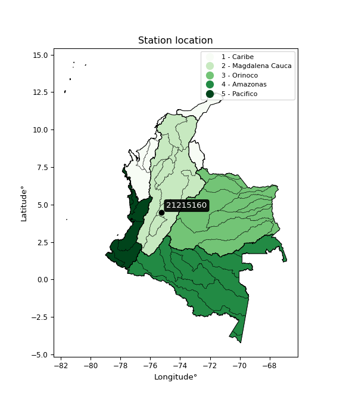

<div align="center">


</div>

# PMP Station (rain, Pmax24h): 21215160

Probable Maximum Precipitation (PMP) is the greatest amount of rainfall for a specific duration that is meteorologically possible for a given location, acting as a "worst-case" scenario for extreme storms, crucial for designing safety-critical infrastructure like bridges, river deviations, dams, spillways, and nuclear plants to prevent catastrophic failure. PMP is calculated by hydrologists using meteorological data to determine the upper limit of extreme rainfall, often leading to the Probable Maximum Flood (PMF) for flood control design, and is increasingly being studied for climate change impacts.

<div align="center">

</img>

</div>


## A. General information


### 1. General running parameters

• app_version: _v20251228_. • runtime: _2025-12-28 08:43:48.795225_. • Python version: _3.14.0_. • SciPy version: _1.16.3_. • Pandas version: _2.3.3_. • NumPy version: _2.3.5_. • Stations dataset (station_dataset_file): _dataset/pmax24h_in/automatic_colombia_2003_2024.csv_. • Stations catalog (station_catalog_file): _dataset/CNE_IDEAM.xls_. • Minimum year to eval til year_max (date_min): _1900_. • Maximum year to eval since year_min (date_max): _2024_. • Creates, save and include plots into reports (create_plot): _False_. • Plot only fit distributions with Δo > Δ (plot_only_fit): _True_. • Eval low extreme values, if False, evaluates high extreme values (low_extreme): _False_. • Eval every SciPy distribution as logarithmic (pdist_logarithmic_on): _True_. • Standard deviation normalized (ddof): _1.0_. • Return periods to eval in years (Tr): _[2, 2.33, 5, 10, 15, 20, 25, 50, 75, 100, 200, 250, 500, 750, 1000]_. • Minimum data sample per station, 0 means any (minimum_sample): _5_. • Z-Score maximum threshold to adjust a value, 0 means disable (zscore_max): _3.5_. • Z-Score minimum threshold to adjust a value, 0 means disable (zscore_min): _-2.5_. • Avoid zeros, e.g. rain = 0 (avoid_zeros): _True_. • Avoid null values (avoid_nans): _True_. [:file_folder:Dataset file.](../../dataset/pmax24h_in/automatic_colombia_2003_2024.csv)

> Delta Degrees of Freedom (DDOF): is a parameter used in the formulas for calculating variance and standard deviation. When ddof=0, the divisor is $N$ (the total number of observations) and this is used when your data set is the entire population. When ddof=1, the divisor is $N-1$ and this is used when your data set is a sample drawn from a larger population. Using $N-1$ provides an unbiased estimate of the population variance (known as Bessel´s correction).


### 2. Station info and location

|   id |   CODIGO | NOMBRE                                   | CATEGORIA               | TECNOLOGIA                | ESTADO           | FECHA_INSTALACION   |   FECHA_SUSPENSION |   ALTITUD |   LATITUD |   LONGITUD | DEPARTAMENTO   | MUNICIPIO   | AREA_OPERATIVA             | ENTIDAD                                                     | AREA_HIDROGRAFICA   | ZONA_HIDROGRAFICA   | SUBZONA_HIDROGRAFICA   |   CORRIENTE | Catalogo   |
|-----:|---------:|:-----------------------------------------|:------------------------|:--------------------------|:-----------------|:--------------------|-------------------:|----------:|----------:|-----------:|:---------------|:------------|:---------------------------|:------------------------------------------------------------|:--------------------|:--------------------|:-----------------------|------------:|:-----------|
|    0 | 21215160 | CERROS NOROCCIDENTALES  - AUT [21215160] | Climatológica Principal | Automática con Telemetría | En Mantenimiento | 18/10/2005          |                nan |      1946 |   4.47036 |   -75.2439 | Tolima         | Ibagué      | Area Operativa 10 - Tolima | INSTITUTO DE HIDROLOGIA METEOROLOGIA Y ESTUDIOS AMBIENTALES | Magdalena Cauca     | Alto Magdalena      | Río Coello             |         nan | CNE_IDEAM  |

<div align="center">

Map location in: [:earth_americas:Google](http://maps.google.com/maps?q=4.470361111,-75.24386111) [:earth_americas:OSM](https://www.openstreetmap.org/#map=18/4.470361111/-75.24386111&layers=P) [:earth_americas:Bing](https://www.bing.com/maps?cp=4.470361111~-75.24386111&lvl=18) [:earth_americas:Apple](https://maps.apple.com/frame?center=4.470361111%2C-75.24386111&span=0.003%2C0.006)

</div>


<div align="center">

```geojson
{
  "type": "Feature",
  "geometry": {
    "type": "Point", 
    "coordinates": [-75.24386111, 4.470361111]
  }, 
  "properties": {
    "Name": "21215160"
  }
}
```

</div>


### 3. Discrete values table and plot

|               |          0 |           1 |           2 |            3 |         4 |            5 |           6 |           7 |           8 |           9 |         10 |          11 |            12 |           13 |          14 |          15 |          16 |         17 |         18 |
|:--------------|-----------:|------------:|------------:|-------------:|----------:|-------------:|------------:|------------:|------------:|------------:|-----------:|------------:|--------------:|-------------:|------------:|------------:|------------:|-----------:|-----------:|
| Date          | 2005       | 2006        | 2007        | 2008         | 2009      | 2010         | 2011        | 2012        | 2013        | 2014        | 2015       | 2016        | 2017          | 2018         | 2019        | 2021        | 2022        | 2023       | 2024       |
| Value         |   39       |   59.2      |   47.2      |   66         |   95.4    |   62.8       |   80.4      |   68.8      |   55.3      |   56.8      |  151.1     |   53.7      |   65.7        |   66.1       |   75.5      |   77.6      |   83.4      |   32       |   10.8     |
| Value_initial |   39       |   59.2      |   47.2      |   66         |   95.4    |   62.8       |   80.4      |   68.8      |   55.3      |   56.8      |  151.1     |   53.7      |   65.7        |   66.1       |   75.5      |   77.6      |   83.4      |   32       |   10.8     |
| count         |   19       |   19        |   19        |   19         |   19      |   19         |   19        |   19        |   19        |   19        |   19       |   19        |   19          |   19         |   19        |   19        |   19        |   19       |   19       |
| mean          |   65.6211  |   65.6211   |   65.6211   |   65.6211    |   65.6211 |   65.6211    |   65.6211   |   65.6211   |   65.6211   |   65.6211   |   65.6211  |   65.6211   |   65.6211     |   65.6211    |   65.6211   |   65.6211   |   65.6211   |   65.6211  |   65.6211  |
| std           |   28.4203  |   28.4203   |   28.4203   |   28.4203    |   28.4203 |   28.4203    |   28.4203   |   28.4203   |   28.4203   |   28.4203   |   28.4203  |   28.4203   |   28.4203     |   28.4203    |   28.4203   |   28.4203   |   28.4203   |   28.4203  |   28.4203  |
| zscore        |   -0.93669 |   -0.225932 |   -0.648164 |    0.0133337 |    1.0478 |   -0.0992617 |    0.520013 |    0.111855 |   -0.363157 |   -0.310378 |    3.00767 |   -0.419455 |    0.00277785 |    0.0168523 |    0.347601 |    0.421492 |    0.625571 |   -1.18299 |   -1.92894 |

> The initial value (value_initial) correspond to the initial obtained or null completed value, and value (value) is adjusted only when the initial value is outside the valid range definite through the Z-Score value. If Z-Score is active, values out of range or outliers are replaced with the station mean value


### 4. Active continuous probability distributions from SciPy (44 of 104 available)

[scipy.stats](https://docs.scipy.org/doc/scipy/reference/stats.html) is a Python´s powerful submodule within the SciPy library for comprehensive statistical analysis, offering over 130 probability distributions (like Normal, Poisson), functions for descriptive stats (mean, variance), hypothesis testing (t-tests, chi-square), random variable generation, and statistical tests, making it essential for data science, modeling, and research. It provides tools to explore, model, and draw conclusions from data efficiently, working seamlessly with NumPy.

<div align="center">

|   id | p_dist             |   n_parameter | fit_method   | label                                                                       | active   | ref                                                                                                        |
|-----:|:-------------------|--------------:|:-------------|:----------------------------------------------------------------------------|:---------|:-----------------------------------------------------------------------------------------------------------|
|    0 | alpha              |             3 | MLE          | Alpha                                                                       | True     | [:mortar_board:](https://docs.scipy.org/doc/scipy/reference/generated/scipy.stats.alpha.html)              |
|    1 | betaprime          |             4 | MLE          | Beta prime                                                                  | True     | [:mortar_board:](https://docs.scipy.org/doc/scipy/reference/generated/scipy.stats.betaprime.html)          |
|    2 | chi2               |             3 | MLE          | Chi²                                                                        | True     | [:mortar_board:](https://docs.scipy.org/doc/scipy/reference/generated/scipy.stats.chi2.html)               |
|    3 | crystalball        |             4 | MLE          | Crystalball                                                                 | True     | [:mortar_board:](https://docs.scipy.org/doc/scipy/reference/generated/scipy.stats.crystalball.html)        |
|    4 | erlang             |             3 | MLE          | Erlang                                                                      | True     | [:mortar_board:](https://docs.scipy.org/doc/scipy/reference/generated/scipy.stats.erlang.html)             |
|    5 | expon              |             2 | MLE          | Exponential                                                                 | True     | [:mortar_board:](https://docs.scipy.org/doc/scipy/reference/generated/scipy.stats.expon.html)              |
|    6 | exponnorm          |             3 | MLE          | Exponentially modified Normal                                               | True     | [:mortar_board:](https://docs.scipy.org/doc/scipy/reference/generated/scipy.stats.exponnorm.html)          |
|    7 | f                  |             4 | MLE          | F                                                                           | True     | [:mortar_board:](https://docs.scipy.org/doc/scipy/reference/generated/scipy.stats.f.html)                  |
|    8 | fatiguelife        |             3 | MLE          | Fatigue-life (Birnbaum-Saunders)                                            | True     | [:mortar_board:](https://docs.scipy.org/doc/scipy/reference/generated/scipy.stats.fatiguelife.html)        |
|    9 | fisk               |             3 | MLE          | Fisk                                                                        | True     | [:mortar_board:](https://docs.scipy.org/doc/scipy/reference/generated/scipy.stats.fisk.html)               |
|   10 | gamma              |             3 | MLE          | Gamma                                                                       | True     | [:mortar_board:](https://docs.scipy.org/doc/scipy/reference/generated/scipy.stats.gamma.html)              |
|   11 | genexpon           |             5 | MLE          | Generalized exponential                                                     | True     | [:mortar_board:](https://docs.scipy.org/doc/scipy/reference/generated/scipy.stats.genexpon.html)           |
|   12 | genlogistic        |             3 | MLE          | Generalized logistic                                                        | True     | [:mortar_board:](https://docs.scipy.org/doc/scipy/reference/generated/scipy.stats.genlogistic.html)        |
|   13 | gibrat             |             2 | MM           | Gibrat                                                                      | True     | [:mortar_board:](https://docs.scipy.org/doc/scipy/reference/generated/scipy.stats.gibrat.html)             |
|   14 | gompertz           |             3 | MLE          | Gompertz (or truncated Gumbel)                                              | True     | [:mortar_board:](https://docs.scipy.org/doc/scipy/reference/generated/scipy.stats.gompertz.html)           |
|   15 | gumbel_l           |             2 | MM           | Gumbel Left Skew                                                            | True     | [:mortar_board:](https://docs.scipy.org/doc/scipy/reference/generated/scipy.stats.gumbel_l.html)           |
|   16 | gumbel_r           |             2 | MM           | Gumbel Right Skew                                                           | True     | [:mortar_board:](https://docs.scipy.org/doc/scipy/reference/generated/scipy.stats.gumbel_r.html)           |
|   17 | halflogistic       |             2 | MM           | Half-logistic                                                               | True     | [:mortar_board:](https://docs.scipy.org/doc/scipy/reference/generated/scipy.stats.halflogistic.html)       |
|   18 | halfnorm           |             2 | MM           | Half Normal                                                                 | True     | [:mortar_board:](https://docs.scipy.org/doc/scipy/reference/generated/scipy.stats.halfnorm.html)           |
|   19 | hypsecant          |             2 | MM           | hyperbolic secant                                                           | True     | [:mortar_board:](https://docs.scipy.org/doc/scipy/reference/generated/scipy.stats.hypsecant.html)          |
|   20 | invgamma           |             3 | MLE          | Inverted gamma                                                              | True     | [:mortar_board:](https://docs.scipy.org/doc/scipy/reference/generated/scipy.stats.invgamma.html)           |
|   21 | invgauss           |             3 | MLE          | Inverse Gaussian                                                            | True     | [:mortar_board:](https://docs.scipy.org/doc/scipy/reference/generated/scipy.stats.invgauss.html)           |
|   22 | invweibull         |             3 | MLE          | Inverted Weibull                                                            | True     | [:mortar_board:](https://docs.scipy.org/doc/scipy/reference/generated/scipy.stats.invweibull.html)         |
|   23 | johnsonsu          |             4 | MLE          | Johnson Su                                                                  | True     | [:mortar_board:](https://docs.scipy.org/doc/scipy/reference/generated/scipy.stats.johnsonsu.html)          |
|   24 | kstwobign          |             2 | MLE          | Limiting distribution of scaled Kolmogorov-Smirnov two-sided test statistic | True     | [:mortar_board:](https://docs.scipy.org/doc/scipy/reference/generated/scipy.stats.kstwobign.html)          |
|   25 | laplace            |             2 | MM           | Laplace                                                                     | True     | [:mortar_board:](https://docs.scipy.org/doc/scipy/reference/generated/scipy.stats.laplace.html)            |
|   26 | laplace_asymmetric |             3 | MLE          | Asymmetric Laplace                                                          | True     | [:mortar_board:](https://docs.scipy.org/doc/scipy/reference/generated/scipy.stats.laplace_asymmetric.html) |
|   27 | loggamma           |             3 | MLE          | Log gamma                                                                   | True     | [:mortar_board:](https://docs.scipy.org/doc/scipy/reference/generated/scipy.stats.loggamma.html)           |
|   28 | logistic           |             2 | MM           | Logistic (or Sech-squared)                                                  | True     | [:mortar_board:](https://docs.scipy.org/doc/scipy/reference/generated/scipy.stats.logistic.html)           |
|   29 | lognorm            |             3 | MLE          | Log Normal                                                                  | True     | [:mortar_board:](https://docs.scipy.org/doc/scipy/reference/generated/scipy.stats.lognorm.html)            |
|   30 | maxwell            |             2 | MM           | Maxwell                                                                     | True     | [:mortar_board:](https://docs.scipy.org/doc/scipy/reference/generated/scipy.stats.maxwell.html)            |
|   31 | mielke             |             4 | MLE          | Mielke Beta-Kappa / Dagum                                                   | True     | [:mortar_board:](https://docs.scipy.org/doc/scipy/reference/generated/scipy.stats.mielke.html)             |
|   32 | moyal              |             2 | MM           | Moyal                                                                       | True     | [:mortar_board:](https://docs.scipy.org/doc/scipy/reference/generated/scipy.stats.moyal.html)              |
|   33 | nakagami           |             3 | MLE          | Nakagami                                                                    | True     | [:mortar_board:](https://docs.scipy.org/doc/scipy/reference/generated/scipy.stats.nakagami.html)           |
|   34 | ncf                |             5 | MLE          | Non-central F distribution                                                  | True     | [:mortar_board:](https://docs.scipy.org/doc/scipy/reference/generated/scipy.stats.ncf.html)                |
|   35 | nct                |             4 | MLE          | Non-central Student’s t                                                     | True     | [:mortar_board:](https://docs.scipy.org/doc/scipy/reference/generated/scipy.stats.nct.html)                |
|   36 | norm               |             2 | MM           | Normal                                                                      | True     | [:mortar_board:](https://docs.scipy.org/doc/scipy/reference/generated/scipy.stats.norm.html)               |
|   37 | pearson3           |             3 | MM           | Pearson type III                                                            | True     | [:mortar_board:](https://docs.scipy.org/doc/scipy/reference/generated/scipy.stats.pearson3.html)           |
|   38 | rayleigh           |             2 | MM           | Rayleigh                                                                    | True     | [:mortar_board:](https://docs.scipy.org/doc/scipy/reference/generated/scipy.stats.rayleigh.html)           |
|   39 | rice               |             3 | MLE          | Rice                                                                        | True     | [:mortar_board:](https://docs.scipy.org/doc/scipy/reference/generated/scipy.stats.rice.html)               |
|   40 | t                  |             3 | MLE          | Student’s t                                                                 | True     | [:mortar_board:](https://docs.scipy.org/doc/scipy/reference/generated/scipy.stats.t.html)                  |
|   41 | truncnorm          |             4 | MLE          | Truncated normal                                                            | True     | [:mortar_board:](https://docs.scipy.org/doc/scipy/reference/generated/scipy.stats.truncnorm.html)          |
|   42 | wald               |             2 | MM           | Wald                                                                        | True     | [:mortar_board:](https://docs.scipy.org/doc/scipy/reference/generated/scipy.stats.wald.html)               |
|   43 | weibull_min        |             3 | MLE          | Weibull minimum                                                             | True     | [:mortar_board:](https://docs.scipy.org/doc/scipy/reference/generated/scipy.stats.weibull_min.html)        |

</div>

> **n_parameter:** # arguments & localization & scale.
>
> **Fit methods:** (MLE) maximum likelihood, (MM) L-moments.
>
>**Inactive:** foldnorm, gennorm, norminvgauss, powernorm, powerlognorm, skewnorm, genextreme, anglit, arcsine, argus, beta, bradford, burr, burr12, cauchy, cosine, halfcauchy, foldcauchy, skewcauchy, wrapcauchy, dgamma, gengamma, exponweib, exponpow, truncexpon, gausshyper, genhalflogistic, genhyperbolic, geninvgauss, halfgennorm, johnsonsb, kappa4, kappa3, ksone, kstwo, loglaplace, levy, levy_l, levy_stable, ncx2, pareto, genpareto, truncpareto, lomax, powerlaw, rdist, rel_breitwigner, recipinvgauss, semicircular, studentized_range, trapezoid, triang, truncweibull_min, tukeylambda, uniform, loguniform, vonmises, vonmises_line, weibull_max, dweibull, 


## B. Probability distributions vs. Empirical distributions

A continuous probability distribution (CPD) describes probabilities for variables that can take any value within a range (like rain any time), unlike discrete variables with specific outcomes (like temperature). It uses a Probability Density Function (PDF), a curve where the total area under it equals 1, and the probability of the variable falling within an interval (a to b) is found by calculating the area under the curve between those points. A key feature is that the probability of hitting any single exact value is zero, so probabilities are always expressed for ranges, e.g., $P(a ≤ X ≤ b)$.

<div align="center">

Distributions parameters from station values
|    |   station | p_dist                |   n |              loc |           scale | shape                  | shape1              | shape2                 | shape3   |
|---:|----------:|:----------------------|----:|-----------------:|----------------:|:-----------------------|:--------------------|:-----------------------|:---------|
|  0 |  21215160 | alpha                 |  19 |     -0.0968904   |    37.286       | 2.2385022000596144e-10 |                     |                        |          |
|  1 |  21215160 | betaprime             |  19 |    -48.8991      |  5816.89        | 18.322370499535822     | 931.6832754061824   |                        |          |
|  2 |  21215160 | chi2                  |  19 |    -48.5289      |     3.19969     | 35.6753038231933       |                     |                        |          |
|  3 |  21215160 | crystalball           |  19 |     65.6211      |    27.6623      | 4534.329004447416      | 3419.6554268190403  |                        |          |
|  4 |  21215160 | erlang                |  19 |    -48.5288      |     6.39938     | 17.8376351203391       |                     |                        |          |
|  5 |  21215160 | expon                 |  19 |     10.8         |    54.8211      |                        |                     |                        |          |
|  6 |  21215160 | exponnorm             |  19 |     46.2952      |    17.9664      | 1.0756638034350283     |                     |                        |          |
|  7 |  21215160 | f                     |  19 |    -48.635       |   114.239       | 35.84067122973994      | 14286.997214484123  |                        |          |
|  8 |  21215160 | fatiguelife           |  19 |     10.8         |     0.000583498 | 273.48286966631525     |                     |                        |          |
|  9 |  21215160 | fisk                  |  19 |   -100.426       |   163.908       | 12.16801170846913      |                     |                        |          |
| 10 |  21215160 | gamma                 |  19 |    -48.5289      |     6.39938     | 17.837657271742284     |                     |                        |          |
| 11 |  21215160 | genexpon              |  19 |      9.73433     |     3.29993     | 1.8698809884122974e-05 | 0.05967635287940912 | 5.400917183810157      |          |
| 12 |  21215160 | genlogistic           |  19 |     56.1596      |    15.369       | 1.462536103376987      |                     |                        |          |
| 13 |  21215160 | gibrat                |  19 |     44.5182      |    12.7995      |                        |                     |                        |          |
| 14 |  21215160 | gompertz              |  19 |     32           |    22.7565      | 0.07003017928753671    |                     |                        |          |
| 15 |  21215160 | gumbel_l              |  19 |     78.0706      |    21.5682      |                        |                     |                        |          |
| 16 |  21215160 | gumbel_r              |  19 |     53.1715      |    21.5682      |                        |                     |                        |          |
| 17 |  21215160 | halflogistic          |  19 |     32.8348      |    23.6503      |                        |                     |                        |          |
| 18 |  21215160 | halfnorm              |  19 |     29.007       |    45.8889      |                        |                     |                        |          |
| 19 |  21215160 | hypsecant             |  19 |     65.6211      |    17.6104      |                        |                     |                        |          |
| 20 |  21215160 | invgamma              |  19 |   -129.045       | 10296.7         | 53.902274936592086     |                     |                        |          |
| 21 |  21215160 | invgauss              |  19 |    -81.0717      |  4250.38        | 0.034514930572293434   |                     |                        |          |
| 22 |  21215160 | invweibull            |  19 |     -1.01084e+07 |     1.01085e+07 | 413502.4964214798      |                     |                        |          |
| 23 |  21215160 | johnsonsu             |  19 |     62.6536      |    14.4095      | -0.08145707375804656   | 0.9226976422793324  |                        |          |
| 24 |  21215160 | kstwobign             |  19 |    -39.4207      |   121.552       |                        |                     |                        |          |
| 25 |  21215160 | laplace               |  19 |     65.6211      |    19.5602      |                        |                     |                        |          |
| 26 |  21215160 | laplace_asymmetric    |  19 |     65.7         |    18.2893      | 1.002163456336592      |                     |                        |          |
| 27 |  21215160 | loggamma              |  19 |  -6707.32        |   961.661       | 1145.122259432338      |                     |                        |          |
| 28 |  21215160 | logistic              |  19 |     65.6211      |    15.251       |                        |                     |                        |          |
| 29 |  21215160 | lognorm               |  19 |    -86.8559      |   150.115       | 0.17582475896591596    |                     |                        |          |
| 30 |  21215160 | maxwell               |  19 |      0.0729315   |    41.0762      |                        |                     |                        |          |
| 31 |  21215160 | mielke                |  19 |     -0.223533    |    78.3063      | 2.7438614847125407     | 6.6163826494033895  |                        |          |
| 32 |  21215160 | moyal                 |  19 |     49.802       |    12.4524      |                        |                     |                        |          |
| 33 |  21215160 | nakagami              |  19 |     31.067       |    44.2593      | 0.6303306443870997     |                     |                        |          |
| 34 |  21215160 | ncf                   |  19 |    -25.348       |     0.35846     | 0.17846622391477474    | 10929.661791802217  | 45.1032549689203       |          |
| 35 |  21215160 | nct                   |  19 |     -0.00248697  |    20.8311      | 12.852063052155545     | 2.9624061786698164  |                        |          |
| 36 |  21215160 | norm                  |  19 |     65.6211      |    27.6623      |                        |                     |                        |          |
| 37 |  21215160 | pearson3              |  19 |     65.621       |    27.6623      | 1.0713954113326136     |                     |                        |          |
| 38 |  21215160 | rayleigh              |  19 |     12.7014      |    42.2238      |                        |                     |                        |          |
| 39 |  21215160 | rice                  |  19 |      0.585382    |    30.5916      | 1.826812117117741      |                     |                        |          |
| 40 |  21215160 | t                     |  19 |     63.8201      |    14.4771      | 2.1098696918008053     |                     |                        |          |
| 41 |  21215160 | truncnorm             |  19 |     65.6211      |    27.6623      | -728.6449960978499     | 153.34751522030166  |                        |          |
| 42 |  21215160 | wald                  |  19 |     37.9587      |    27.6623      |                        |                     |                        |          |
| 43 |  21215160 | weibull_min           |  19 |     30.0458      |    41.8523      | 1.5655503024362565     |                     |                        |          |
| 44 |  21215160 | logalpha              |  19 |    -15.9519      |   740.996       | 37.0460376104821       |                     |                        |          |
| 45 |  21215160 | logbetaprime          |  19 |    -10.6946      |    20.1129      | 1246.8430900901226     | 1699.0054102707827  |                        |          |
| 46 |  21215160 | logchi2               |  19 |     -4.05076     |     0.0195525   | 415.72881474910946     |                     |                        |          |
| 47 |  21215160 | logcrystalball        |  19 |      4.20334     |     0.306598    | 1.1958093915534138     | 3.6791126661377644  |                        |          |
| 48 |  21215160 | logerlang             |  19 |     -5.94724     |     0.0294424   | 340.4965069216919      |                     |                        |          |
| 49 |  21215160 | logexpon              |  19 |      2.37955     |     1.69831     |                        |                     |                        |          |
| 50 |  21215160 | logexponnorm          |  19 |      4.07752     |     0.514242    | 0.0006538559098700886  |                     |                        |          |
| 51 |  21215160 | logf                  |  19 |  -1107.21        |  1111.29        | 34738814.49140324      | 12658959.378808532  |                        |          |
| 52 |  21215160 | logfatiguelife        |  19 |   -478.665       |   482.743       | 0.0010666312340874506  |                     |                        |          |
| 53 |  21215160 | logfisk               |  19 |     -5.62561e+07 |     5.62561e+07 | 246559945.38031176     |                     |                        |          |
| 54 |  21215160 | loggamma              |  19 |     -5.39748     |     0.0302817   | 313.0754448804581      |                     |                        |          |
| 55 |  21215160 | loggenexpon           |  19 |      2.37309     |     0.00256418  | 0.00016001674485986988 | 1.0617083916341534  | 3.4810316633011257e-06 |          |
| 56 |  21215160 | loggenlogistic        |  19 |      4.35871     |     0.151449    | 0.4127344120136023     |                     |                        |          |
| 57 |  21215160 | loggibrat             |  19 |      3.68556     |     0.237944    |                        |                     |                        |          |
| 58 |  21215160 | loggompertz           |  19 |      2.37954     |     0.423919    | 0.011071582856477039   |                     |                        |          |
| 59 |  21215160 | loggumbel_l           |  19 |      4.3093      |     0.400953    |                        |                     |                        |          |
| 60 |  21215160 | loggumbel_r           |  19 |      3.84642     |     0.400953    |                        |                     |                        |          |
| 61 |  21215160 | loghalflogistic       |  19 |      3.46841     |     0.43963     |                        |                     |                        |          |
| 62 |  21215160 | loghalfnorm           |  19 |      3.39723     |     0.853047    |                        |                     |                        |          |
| 63 |  21215160 | loghypsecant          |  19 |      4.07786     |     0.327377    |                        |                     |                        |          |
| 64 |  21215160 | loginvgamma           |  19 |    -10.0286      |  9345.32        | 663.5840597607407      |                     |                        |          |
| 65 |  21215160 | loginvgauss           |  19 |     -2.76033     |   959.926       | 0.0070956412522472055  |                     |                        |          |
| 66 |  21215160 | loginvweibull         |  19 |     -9.28388e+07 |     9.28388e+07 | 141599939.066162       |                     |                        |          |
| 67 |  21215160 | logjohnsonsu          |  19 |      4.2345      |     0.189663    | 0.3126320855750953     | 0.8237104506087638  |                        |          |
| 68 |  21215160 | logkstwobign          |  19 |      2.82633     |     1.53754     |                        |                     |                        |          |
| 69 |  21215160 | loglaplace            |  19 |      4.07786     |     0.363624    |                        |                     |                        |          |
| 70 |  21215160 | loglaplace_asymmetric |  19 |      4.19117     |     0.303494    | 1.2039660583475515     |                     |                        |          |
| 71 |  21215160 | logloggamma           |  19 |      3.96187     |     0.544888    | 1.7054668796263912     |                     |                        |          |
| 72 |  21215160 | loglogistic           |  19 |      4.07786     |     0.283517    |                        |                     |                        |          |
| 73 |  21215160 | loglognorm            |  19 | -60169.9         | 60173.9         | 8.545995682438507e-06  |                     |                        |          |
| 74 |  21215160 | logmaxwell            |  19 |      2.85928     |     0.763632    |                        |                     |                        |          |
| 75 |  21215160 | logmielke             |  19 |     -1.39463e+07 |     1.39463e+07 | 37166837.39002375      | 92450652.2880285    |                        |          |
| 76 |  21215160 | logmoyal              |  19 |      3.78378     |     0.231491    |                        |                     |                        |          |
| 77 |  21215160 | lognakagami           |  19 |      3.15886     |     1.05992     | 2.318514634294758      |                     |                        |          |
| 78 |  21215160 | logncf                |  19 |    -64.1868      |    31.8864      | 26900.537691432015     | 466267.40838430193  | 30693.786303968933     |          |
| 79 |  21215160 | lognct                |  19 |    -23.6155      |     0.403684    | 3325.0750878001363     | 68.58094173585653   |                        |          |
| 80 |  21215160 | lognorm               |  19 |      4.07786     |     0.514243    |                        |                     |                        |          |
| 81 |  21215160 | logpearson3           |  19 |      4.07786     |     0.514242    | -1.6082202198954905    |                     |                        |          |
| 82 |  21215160 | lograyleigh           |  19 |      3.0941      |     0.784926    |                        |                     |                        |          |
| 83 |  21215160 | logrice               |  19 |   -157.288       |     0.514244    | 313.7903273507154      |                     |                        |          |
| 84 |  21215160 | logt                  |  19 |      4.16896     |     0.207648    | 1.61999030453783       |                     |                        |          |
| 85 |  21215160 | logtruncnorm          |  19 |     -0.257383    |     1.81035     | 2.056577744651368      | 5.604869844179613   |                        |          |
| 86 |  21215160 | logwald               |  19 |      3.56365     |     0.514216    |                        |                     |                        |          |
| 87 |  21215160 | logweibull_min        |  19 |     -5.47554     |     9.76557     | 23.764525255197203     |                     |                        |          |

</div>

> **loc** (Location parameter): This shifts the distribution along the x-axis. For many common distributions, like the normal (Gaussian) distribution, loc represents the mean $μ$. For others, like the uniform distribution, it might represent the minimum value, or for the beta distribution, the left end of the support interval.
>
> **scale** (Scale parameter): This determines the width or spread of the distribution. For the normal distribution, scale represents the standard deviation $σ$. For a uniform distribution, it defines the length of the interval (from $loc$ to $loc + scale$).
>
> **shape** (Shape parameters): Refers to parameters that define the specific form of a probability distribution, distinct from its location (loc) and scale (scale). These parameters are required arguments for most distribution functions. For example, a normal (Gaussian) distribution is fully defined by its location (mean) and scale (standard deviation), so it has no specific shape parameters beyond loc and scale. However, other distributions have intrinsic properties that need specification, as Gamma distribution that takes a shape parameter, often named $a$ or $alpha$.


### 0. Cumulative distribution values - CDF (88 evaluated)

Cumulative Distribution Function (CDF), denoted as $F$<sub>$X$</sub>$(x)$, is a function that gives the probability that a random variable $X$ will take a value less than or equal to a specific value, $x$ (i.e., $(P(X≥x)$. It essentially "accumulates" probabilities from a given point up to the far right (positive infinity), providing a complete picture of the distribution´s probabilities for both discrete (like rain) and continuous (like temperature) variables, helping to find probabilities over ranges or above certain values.

<div align="center">

CDF ordered by x ascending and calculating $log(f(x))$ separately
|   id |   Station |   date |     x |   count |    mean |     std |      zscore |   Value_initial |   station |   m |       alpha |   alpha_pdf |   betaprime |   betaprime_pdf |      chi2 |    chi2_pdf |   crystalball |   crystalball_pdf |     erlang |   erlang_pdf |    expon |   expon_pdf |   exponnorm |   exponnorm_pdf |         f |       f_pdf |   fatiguelife |   fatiguelife_pdf |       fisk |    fisk_pdf |     gamma |   gamma_pdf |   genexpon |   genexpon_pdf |   genlogistic |   genlogistic_pdf |    gibrat |   gibrat_pdf |   gompertz |   gompertz_pdf |   gumbel_l |   gumbel_l_pdf |    gumbel_r |   gumbel_r_pdf |   halflogistic |   halflogistic_pdf |   halfnorm |   halfnorm_pdf |   hypsecant |   hypsecant_pdf |   invgamma |   invgamma_pdf |   invgauss |   invgauss_pdf |   invweibull |   invweibull_pdf |   johnsonsu |   johnsonsu_pdf |   kstwobign |   kstwobign_pdf |   laplace |   laplace_pdf |   laplace_asymmetric |   laplace_asymmetric_pdf |    loggamma |   loggamma_pdf |   logistic |   logistic_pdf |     lognorm |   lognorm_pdf |    maxwell |   maxwell_pdf |     mielke |   mielke_pdf |       moyal |   moyal_pdf |   nakagami |   nakagami_pdf |        ncf |     ncf_pdf |       nct |     nct_pdf |      norm |    norm_pdf |   pearson3 |   pearson3_pdf |   rayleigh |   rayleigh_pdf |      rice |    rice_pdf |         t |       t_pdf |   truncnorm |   truncnorm_pdf |        wald |    wald_pdf |   weibull_min |   weibull_min_pdf |    logalpha |   logalpha_pdf |   logbetaprime |   logbetaprime_pdf |     logchi2 |   logchi2_pdf |   logcrystalball |   logcrystalball_pdf |   logerlang |   logerlang_pdf |   logexpon |   logexpon_pdf |   logexponnorm |   logexponnorm_pdf |        logf |   logf_pdf |   logfatiguelife |   logfatiguelife_pdf |     logfisk |   logfisk_pdf |   loggenexpon |   loggenexpon_pdf |   loggenlogistic |   loggenlogistic_pdf |   loggibrat |   loggibrat_pdf |   loggompertz |   loggompertz_pdf |   loggumbel_l |   loggumbel_l_pdf |   loggumbel_r |   loggumbel_r_pdf |   loghalflogistic |   loghalflogistic_pdf |   loghalfnorm |   loghalfnorm_pdf |   loghypsecant |   loghypsecant_pdf |   loginvgamma |   loginvgamma_pdf |   loginvgauss |   loginvgauss_pdf |   loginvweibull |   loginvweibull_pdf |   logjohnsonsu |   logjohnsonsu_pdf |   logkstwobign |   logkstwobign_pdf |   loglaplace |   loglaplace_pdf |   loglaplace_asymmetric |   loglaplace_asymmetric_pdf |   logloggamma |   logloggamma_pdf |   loglogistic |   loglogistic_pdf |   loglognorm |   loglognorm_pdf |   logmaxwell |   logmaxwell_pdf |   logmielke |   logmielke_pdf |    logmoyal |   logmoyal_pdf |   lognakagami |   lognakagami_pdf |      logncf |   logncf_pdf |      lognct |   lognct_pdf |   logpearson3 |   logpearson3_pdf |   lograyleigh |   lograyleigh_pdf |     logrice |   logrice_pdf |      logt |   logt_pdf |   logtruncnorm |   logtruncnorm_pdf |   logwald |   logwald_pdf |   logweibull_min |   logweibull_min_pdf |
|-----:|----------:|-------:|------:|--------:|--------:|--------:|------------:|----------------:|----------:|----:|------------:|------------:|------------:|----------------:|----------:|------------:|--------------:|------------------:|-----------:|-------------:|---------:|------------:|------------:|----------------:|----------:|------------:|--------------:|------------------:|-----------:|------------:|----------:|------------:|-----------:|---------------:|--------------:|------------------:|----------:|-------------:|-----------:|---------------:|-----------:|---------------:|------------:|---------------:|---------------:|-------------------:|-----------:|---------------:|------------:|----------------:|-----------:|---------------:|-----------:|---------------:|-------------:|-----------------:|------------:|----------------:|------------:|----------------:|----------:|--------------:|---------------------:|-------------------------:|------------:|---------------:|-----------:|---------------:|------------:|--------------:|-----------:|--------------:|-----------:|-------------:|------------:|------------:|-----------:|---------------:|-----------:|------------:|----------:|------------:|----------:|------------:|-----------:|---------------:|-----------:|---------------:|----------:|------------:|----------:|------------:|------------:|----------------:|------------:|------------:|--------------:|------------------:|------------:|---------------:|---------------:|-------------------:|------------:|--------------:|-----------------:|---------------------:|------------:|----------------:|-----------:|---------------:|---------------:|-------------------:|------------:|-----------:|-----------------:|---------------------:|------------:|--------------:|--------------:|------------------:|-----------------:|---------------------:|------------:|----------------:|--------------:|------------------:|--------------:|------------------:|--------------:|------------------:|------------------:|----------------------:|--------------:|------------------:|---------------:|-------------------:|--------------:|------------------:|--------------:|------------------:|----------------:|--------------------:|---------------:|-------------------:|---------------:|-------------------:|-------------:|-----------------:|------------------------:|----------------------------:|--------------:|------------------:|--------------:|------------------:|-------------:|-----------------:|-------------:|-----------------:|------------:|----------------:|------------:|---------------:|--------------:|------------------:|------------:|-------------:|------------:|-------------:|--------------:|------------------:|--------------:|------------------:|------------:|--------------:|----------:|-----------:|---------------:|-------------------:|----------:|--------------:|-----------------:|---------------------:|
|    0 |  21215160 |   2024 |  10.8 |      19 | 65.6211 | 28.4203 | -1.92894    |            10.8 |  21215160 |   1 | 0.000622295 | 0.000718628 |  0.00784485 |     0.00125196  | 0.0079789 | 0.00126499  |     0.0237511 |       0.00202383  | 0.00797889 |  0.00126499  | 0        |  0.0182412  |  0.00636206 |     0.000917727 | 0.0079641 | 0.00126335  |     0.0882028 |       2.53328e+07 | 0.00885346 | 0.000959984 | 0.0079789 | 0.00126499  |  0.0101084 |     0.0147779  |     0.0123884 |       0.00112034  | 0         |  0           | 0          |    0           |  0.0432402 |    0.00196083  | 0.000799449 |    0.00026434  |       0        |        0           |  0         |    0           |   0.0282903 |     0.00160434  |  0.0069588 |    0.00113169  | 0.00692166 |     0.00116682 |   0.00369397 |      0.000846362 |   0.0274358 |     0.00108302  |  0.00440797 |      0.00118092 | 0.0303237 |   0.00155027  |            0.0250653 |              0.00136753  | 0.000371346 |      0.0028755 |  0.0267378 |    0.0017063   | 0.000479043 |    0.00332159 | 0.00464112 |   0.00128033  | 0.00460964 |  0.00114738  | 1.68751e-06 | 1.61596e-06 | 0          |    0           | 0.00828708 | 0.00131555  | 0.0073202 | 0.000996828 | 0.0237511 | 0.00202383  |   0        |    0           |  0         |    0           | 0.0106991 | 0.00213122  | 0.030944  | 0.00110326  |   0.0237511 |     0.00202383  | 0           | 0           |    0          |       0           | 0.000367663 |     0.00294672 |    0.000598945 |         0.00427685 | 0.000622617 |    0.00452005 |        0.016561  |            0.0184834 | 0.000476807 |      0.00354588 |   0        |       0.588819 |    0.000479048 |         0.00332163 | 0.000497218 | 0.00343275 |      0.000477163 |           0.00331691 | 0.000453638 |    0.00198731 |   0.000414262 |         0.0660041 |       0.00454505 |            0.0123864 |    0        |       0         |   1.55334e-07 |         0.0261176 |     0.0080913 |         0.0200983 |   1.40752e-17 |       1.36212e-15 |          0        |              0        |     0         |          0        |     0.00355559 |          0.0108606 |   0.000411459 |        0.00321393 |   0.000459019 |         0.0038334 |     0.000281875 |          0.00351421 |      0.0162249 |          0.0178952 |     0          |          0         |   0.00468371 |        0.0128806 |               0.0041584 |                   0.0113805 |    0.00439974 |         0.0134935 |    0.00249699 |        0.00878519 |  0.000479009 |       0.00332145 |     0        |         0        |  0.00504131 |       0.013435  | 9.93026e-96 |     9.2653e-93 |     0         |         0         | 0.000460614 |   0.00323362 | 0.000510692 |   0.00360045 |     0.0110839 |         0.0245834 |      0        |          0        | 0.000479043 |    0.00332159 | 0.0120563 |  0.0107458 |    0           |           0        | 0         |     0         |       0.00564827 |            0.0170397 |
|    1 |  21215160 |   2023 |  32   |      19 | 65.6211 | 28.4203 | -1.18299    |            32   |  21215160 |   2 | 0.24537     | 0.014707    |  0.0945657  |     0.00790677  | 0.0948492 | 0.00789699  |     0.112105  |       0.00689044  | 0.0948491  |  0.00789699  | 0.320714 |  0.012391   |  0.0767853  |     0.00705426  | 0.0948044 | 0.00789723  |     0.757085  |       0.00514393  | 0.0694464  | 0.00593796  | 0.0948492 | 0.00789698  |  0.324115  |     0.0122266  |     0.0761546 |       0.00600096  | 0         |  0           | 5.2537e-08 |    0.00307737  |  0.111412  |    0.00486649  | 0.0693394   |    0.0085797   |       0        |        0           |  0.0520033 |    0.0173504   |   0.0936683 |     0.00524249  |  0.0909536 |    0.00790054  | 0.0935102  |     0.00805639 |   0.0950734  |      0.00915151  |   0.0714963 |     0.00371754  |  0.119702   |      0.0103022  | 0.0896363 |   0.00458258  |            0.0796891 |              0.00434775  | 0.123223    |      0.397844  |  0.0993464 |    0.00586692  | 0.116956    |    0.382      | 0.104516   |   0.00867561  | 0.0873769  |  0.00741938  | 0.0409758   | 0.00811076  | 0.00642208 |    0.0086757   | 0.0962788  | 0.00789961  | 0.0817278 | 0.00734996  | 0.112105  | 0.00689044  |   0.069169 |    0.00994942  |  0.0991799 |    0.00975101  | 0.112919  | 0.00781808  | 0.0761939 | 0.00385658  |   0.112105  |     0.00689044  | 0           | 0           |    0.00821962 |       0.00655777  | 0.132443    |     0.421124   |    0.133667    |         0.407434   | 0.137684    |    0.411248   |        0.0831698 |            0.169539  | 0.128771    |      0.403429   |   0.47248  |       0.310614 |    0.116957    |         0.382001   | 0.118131    | 0.383676   |      0.117197    |           0.382547   | 0.0503453   |    0.209545   |   0.332061    |         0.451612  |       0.0876228  |            0.238139  |    0        |       0         |   0.124074    |         0.296602  |     0.114835  |         0.269292  |   0.0754485   |       0.486296    |          0        |              0        |     0.0640077 |          0.932323 |     0.0973728  |          0.292816  |   0.131161    |        0.41215    |   0.152504    |         0.450357  |     0.210268    |          0.5001     |      0.0773119 |          0.150701  |     0.00480856 |          0.0997763 |   0.0928709  |        0.255403  |               0.0812692 |                   0.222414  |    0.106406   |         0.285547  |    0.103489   |        0.327245   |  0.116957    |       0.382004   |     0.110633 |         0.480761 |  0.091042   |       0.242001  | 0.0468498   |     0.475136   |     0.0071616 |         0.101963  | 0.116568    |   0.38073    | 0.123283    |   0.393037   |     0.116019  |         0.241621  |      0.106031 |          0.539237 | 0.116956    |    0.382      | 0.0512804 |  0.107413  |    3.87321e-07 |           1.33865  | 0         |     0         |       0.115726   |            0.289055  |
|    2 |  21215160 |   2005 |  39   |      19 | 65.6211 | 28.4203 | -0.93669    |            39   |  21215160 |   3 | 0.340245    | 0.0123511   |  0.160114   |     0.0107873   | 0.160275  | 0.0107628   |     0.167935  |       0.00907641  | 0.160275   |  0.0107628   | 0.402141 |  0.0109056  |  0.138271   |     0.0105601   | 0.160239  | 0.010765    |     0.789253  |       0.00411629  | 0.122555   | 0.00938486  | 0.160275  | 0.0107628   |  0.404504  |     0.0107724  |     0.129099  |       0.00925495  | 0         |  0           | 0.0249069  |    0.00408147  |  0.150758  |    0.00643425  | 0.145278    |    0.012994    |       0.129608 |        0.0207862   |  0.172388  |    0.0169799   |   0.138189  |     0.00760285  |  0.15708   |    0.0109603   | 0.160476   |     0.0110326  |   0.170812   |      0.0123479   |   0.104918  |     0.00605424  |  0.200533   |      0.0126014  | 0.128205  |   0.00655436  |            0.116751  |              0.00636981  | 0.218964    |      0.56798   |  0.148613  |    0.00829628  | 0.210223    |    0.560788   | 0.174113   |   0.0111341   | 0.149385   |  0.0103435   | 0.122831    | 0.0150324   | 0.0946609  |    0.0148569   | 0.161488   | 0.0106984   | 0.145143  | 0.0107851   | 0.167935  | 0.00907641  |   0.154123 |    0.0140231   |  0.176312  |    0.0121501   | 0.175013  | 0.00990826  | 0.111021  | 0.0063254   |   0.167935  |     0.00907641  | 6.80343e-07 | 8.97354e-06 |    0.0855626  |       0.0143007   | 0.232678    |     0.588563   |    0.230288    |         0.566633   | 0.234439    |    0.56362    |        0.128758  |            0.308976  | 0.225093    |      0.567899   |   0.530484 |       0.27646  |    0.210224    |         0.560789   | 0.211634    | 0.561359   |      0.210551    |           0.561056   | 0.112031    |    0.436003   |   0.422066    |         0.454919  |       0.149774   |            0.404069  |    0        |       0         |   0.195742    |         0.43428   |     0.181095  |         0.408045  |   0.206417    |       0.812305    |          0.218377 |              1.08308  |     0.245121  |          0.890841 |     0.175039   |          0.508129  |   0.229174    |        0.575492   |   0.256612    |         0.596164  |     0.31562     |          0.555148   |      0.117434  |          0.269739  |     0.0717903  |          0.627808  |   0.160012   |        0.440048  |               0.139654  |                   0.382199  |    0.17786    |         0.444739  |    0.188271   |        0.539033   |  0.210225    |       0.560791   |     0.22517  |         0.665615 |  0.153811   |       0.406013  | 0.194803    |     0.964148   |     0.0574101 |         0.447084  | 0.209441    |   0.557961   | 0.218168    |   0.564981   |     0.174383  |         0.354869  |      0.231389 |          0.710414 | 0.210223    |    0.560788   | 0.0820226 |  0.221082  |    0.236728    |           1.06286  | 0.0586908 |     1.70442   |       0.186884   |            0.437422  |
|    3 |  21215160 |   2007 |  47.2 |      19 | 65.6211 | 28.4203 | -0.648164   |            47.2 |  21215160 |   4 | 0.430499    | 0.00974693  |  0.260526   |     0.0135312   | 0.260442  | 0.0134981   |     0.252729  |       0.0115538   | 0.260442   |  0.0134981   | 0.485201 |  0.00939054 |  0.241327   |     0.014424    | 0.260432  | 0.013502    |     0.819447  |       0.0032982   | 0.218732   | 0.0140854   | 0.260442  | 0.0134981   |  0.486598  |     0.00928733 |     0.222834  |       0.0136085   | 0.0590364 |  0.0438586   | 0.0643782  |    0.00561517  |  0.212584  |    0.00872539  | 0.267405    |    0.016353    |       0.294695 |        0.0193054   |  0.308232  |    0.0160732   |   0.215087  |     0.0113052   |  0.259647  |    0.0138653   | 0.263019   |     0.0137838  |   0.282637   |      0.0146092   |   0.173319  |     0.0111879   |  0.309865   |      0.0138037  | 0.19497   |   0.00996769  |            0.182624  |              0.00996374  | 0.340464    |      0.695384  |  0.230081  |    0.0116152   | 0.331943    |    0.705889   | 0.274738   |   0.0132396   | 0.248869   |  0.0138959   | 0.266944    | 0.0192053   | 0.226084   |    0.0167767   | 0.260867   | 0.0133777   | 0.248884  | 0.0143286   | 0.252729  | 0.0115538   |   0.280332 |    0.0163098   |  0.283788  |    0.0138589   | 0.265454  | 0.0120679   | 0.182221  | 0.0115512   |   0.252729  |     0.0115538   | 0.20219     | 0.0384602   |    0.219254   |       0.0176357   | 0.35715     |     0.704721   |    0.350394    |         0.682415   | 0.353198    |    0.671419   |        0.212744  |            0.614364  | 0.345975    |      0.689109   |   0.580385 |       0.247077 |    0.331944    |         0.70589    | 0.333313    | 0.704852   |      0.33227     |           0.705578   | 0.225521    |    0.765507   |   0.507729    |         0.440195  |       0.249348   |            0.656051  |    0.365755 |       2.22785   |   0.293889    |         0.598068  |     0.274987  |         0.581462  |   0.375192    |       0.917332    |          0.412806 |              0.943511 |     0.407986  |          0.810215 |     0.297862   |          0.782755  |   0.351046    |        0.691293   |   0.37984     |         0.683939  |     0.42232     |          0.555237   |      0.189968  |          0.526144  |     0.237397   |          1.0435    |   0.270441   |        0.743738  |               0.235434  |                   0.644324  |    0.280455   |         0.634098  |    0.312556   |        0.757856   |  0.331945    |       0.705889   |     0.362656 |         0.759073 |  0.253331   |       0.652939  | 0.39059     |     1.02348    |     0.185982  |         0.89469   | 0.330451    |   0.701333   | 0.339628    |   0.698511   |     0.255713  |         0.504746  |      0.37444  |          0.771954 | 0.331943    |    0.705889   | 0.148004  |  0.522083  |    0.417751    |           0.841219 | 0.419668  |     1.54411   |       0.286857   |            0.614098  |
|    4 |  21215160 |   2016 |  53.7 |      19 | 65.6211 | 28.4203 | -0.419455   |            53.7 |  21215160 |   5 | 0.488255    | 0.00808463  |  0.353119   |     0.0148053   | 0.352827  | 0.0147754   |     0.333253  |       0.013143    | 0.352827   |  0.0147754   | 0.54276  |  0.0083406  |  0.342305   |     0.0164328   | 0.352843  | 0.0147795   |     0.839268  |       0.00282004  | 0.321089   | 0.01721     | 0.352827  | 0.0147754   |  0.543552  |     0.00825705 |     0.321275  |       0.0165071   | 0.369875  |  0.0411169   | 0.105684   |    0.00714171  |  0.276067  |    0.0108433   | 0.376892    |    0.0170515   |       0.414572 |        0.0175078   |  0.409495  |    0.0150437   |   0.299316  |     0.0146002   |  0.354554  |    0.0151657   | 0.357027   |     0.0149774  |   0.379625   |      0.015041    |   0.266596  |     0.0178692   |  0.399851   |      0.0137581  | 0.271824  |   0.0138968   |            0.260359  |              0.0142049   | 0.43345     |      0.739308  |  0.313963  |    0.014123    | 0.427139    |    0.762811   | 0.364058   |   0.0141195   | 0.347373   |  0.0162952   | 0.392487    | 0.0190063   | 0.336045   |    0.0168973   | 0.352428   | 0.0146485   | 0.348144  | 0.0160029   | 0.333253  | 0.013143    |   0.387339 |    0.0163984   |  0.375875  |    0.0143525   | 0.34821   | 0.013308    | 0.276787  | 0.0177695   |   0.333253  |     0.013143    | 0.422547    | 0.0285381   |    0.335883   |       0.0179905   | 0.450674    |     0.738146   |    0.441312    |         0.720682   | 0.442413    |    0.705596   |        0.311147  |            0.907765  | 0.437936    |      0.729939   |   0.611082 |       0.229002 |    0.42714     |         0.762812   | 0.428275    | 0.76076    |      0.427398    |           0.762065   | 0.338875    |    0.981919   |   0.563412    |         0.421999  |       0.347831   |            0.874547  |    0.588842 |       1.30604   |   0.378558    |         0.713599  |     0.358295  |         0.710001  |   0.491354    |       0.870803    |          0.526814 |              0.821677 |     0.508021  |          0.738637 |     0.409417   |          0.933198  |   0.44297     |        0.727118   |   0.469565    |         0.70087   |     0.492621    |          0.531972   |      0.278398  |          0.878734  |     0.377128   |          1.09408   |   0.385627   |        1.06051   |               0.335132  |                   0.917173  |    0.370688   |         0.762564  |    0.41748    |        0.857764   |  0.427141    |       0.762808   |     0.46153  |         0.766225 |  0.351094   |       0.866421  | 0.51586     |     0.906661   |     0.316584  |         1.10832   | 0.425007    |   0.757551   | 0.433347    |   0.747514   |     0.328774  |         0.631159  |      0.473671 |          0.759719 | 0.427139    |    0.762811   | 0.242093  |  0.981233  |    0.517874    |           0.713687 | 0.583484  |     1.03038   |       0.37409    |            0.736805  |
|    5 |  21215160 |   2013 |  55.3 |      19 | 65.6211 | 28.4203 | -0.363157   |            55.3 |  21215160 |   6 | 0.500903    | 0.00772933  |  0.37695    |     0.0149737   | 0.376611  | 0.0149458   |     0.354534  |       0.0134522   | 0.376611   |  0.0149458   | 0.555912 |  0.00810069 |  0.368837   |     0.0167159   | 0.376634  | 0.0149498   |     0.843698  |       0.00271858  | 0.349075   | 0.0177545   | 0.376611  | 0.0149458   |  0.556574  |     0.00802149 |     0.348114  |       0.0170266   | 0.431896  |  0.0364609   | 0.117444   |    0.00756116  |  0.293854  |    0.0113914   | 0.404126    |    0.0169763   |       0.442187 |        0.0170076   |  0.433335  |    0.0147552   |   0.323291  |     0.0153606   |  0.378955  |    0.0153249   | 0.381111   |     0.0151175  |   0.40365    |      0.0149797   |   0.296677  |     0.0197308   |  0.421774   |      0.0136402  | 0.294993  |   0.0150813   |            0.284108  |              0.0155006   | 0.455223    |      0.743485  |  0.336988  |    0.01465     | 0.449641    |    0.769597   | 0.386737   |   0.0142213   | 0.373819   |  0.0167512   | 0.422606    | 0.018627    | 0.363002   |    0.0167907   | 0.376012   | 0.0148228   | 0.373928  | 0.0162136   | 0.354534  | 0.0134522   |   0.413456 |    0.0162378   |  0.398853  |    0.0143635   | 0.369683  | 0.013527    | 0.306525  | 0.0193958   |   0.354534  |     0.0134522   | 0.466154    | 0.0260023   |    0.364575   |       0.0178623   | 0.472376    |     0.739874   |    0.462525    |         0.72399    | 0.463173    |    0.708271   |        0.338693  |            0.967864  | 0.459426    |      0.733628   |   0.617748 |       0.225077 |    0.449642    |         0.769597   | 0.450515    | 0.767355   |      0.449876    |           0.768762   | 0.368273    |    1.01965    |   0.57573     |         0.417079  |       0.37426    |            0.925668  |    0.624976 |       1.15889   |   0.399878    |         0.738537  |     0.379562  |         0.738624  |   0.516636    |       0.85096     |          0.550513 |              0.79264  |     0.529448  |          0.720946 |     0.437128   |          0.953399  |   0.46436     |        0.729665   |   0.490129    |         0.699649  |     0.508135    |          0.524694   |      0.305802  |          0.990019  |     0.409119   |          1.08409   |   0.418055   |        1.14969   |               0.363171  |                   0.99391   |    0.393471   |         0.789175  |    0.442858   |        0.870265   |  0.449643    |       0.769593   |     0.483967 |         0.761814 |  0.377269   |       0.91644   | 0.541984    |     0.872617   |     0.349565  |         1.137     | 0.447354    |   0.764279   | 0.455376    |   0.752757   |     0.347765  |         0.662651  |      0.495863 |          0.75171  | 0.449641    |    0.769597   | 0.272922  |  1.12028   |    0.538434    |           0.686992 | 0.612412  |     0.941778  |       0.396107   |            0.762851  |
|    6 |  21215160 |   2014 |  56.8 |      19 | 65.6211 | 28.4203 | -0.310378   |            56.8 |  21215160 |   7 | 0.512258    | 0.00741403  |  0.399496   |     0.0150781   | 0.399116  | 0.0150525   |     0.374908  |       0.0137069   | 0.399116   |  0.0150525   | 0.567898 |  0.00788204 |  0.394057   |     0.0168978   | 0.399145  | 0.0150563   |     0.847708  |       0.00262833  | 0.376024   | 0.0181584   | 0.399116  | 0.0150525   |  0.568444  |     0.00780675 |     0.373963  |       0.0174228   | 0.483533  |  0.0324547   | 0.12909    |    0.00796977  |  0.311329  |    0.0119096   | 0.42949     |    0.0168297   |       0.467337 |        0.016524    |  0.455258  |    0.0144736   |   0.346836  |     0.0160227   |  0.402017  |    0.0154156   | 0.403851   |     0.0151936  |   0.426043   |      0.0148697   |   0.327554  |     0.0214204   |  0.442131   |      0.0134981  | 0.318505  |   0.0162833   |            0.308337  |              0.0168225   | 0.47515     |      0.745338  |  0.359303  |    0.0150943   | 0.470296    |    0.773635   | 0.408115   |   0.0142759   | 0.399225   |  0.0171113   | 0.450228    | 0.01819     | 0.388087   |    0.0166493   | 0.398337   | 0.014935    | 0.39835   | 0.016336    | 0.374908  | 0.0137069   |   0.437667 |    0.0160342   |  0.420383  |    0.0143368   | 0.390106  | 0.0136979   | 0.336719  | 0.0208449   |   0.374908  |     0.0137069   | 0.50349     | 0.0238106   |    0.391239   |       0.0176804   | 0.492177    |     0.739526   |    0.481921    |         0.725202   | 0.482142    |    0.709023   |        0.365277  |            1.01794   | 0.479084    |      0.735115   |   0.623725 |       0.221558 |    0.470298    |         0.773635   | 0.469948    | 0.771238   |      0.470508    |           0.772725   | 0.395958    |    1.04826    |   0.58683     |         0.412369  |       0.399646   |            0.971103  |    0.654389 |       1.04154   |   0.419938    |         0.760371  |     0.399672  |         0.764016  |   0.539144    |       0.830692    |          0.571371 |              0.766026 |     0.548524  |          0.704461 |     0.462822   |          0.965679  |   0.483899    |        0.730137   |   0.508821    |         0.696935  |     0.522083    |          0.517534   |      0.333772  |          1.1017    |     0.43795    |          1.06961   |   0.449985   |        1.2375    |               0.39077   |                   1.06944   |    0.414901   |         0.811985  |    0.466258   |        0.877766   |  0.470298    |       0.77363    |     0.504282 |         0.755986 |  0.402395   |       0.960966  | 0.56491     |     0.840495   |     0.380263  |         1.15584   | 0.467867    |   0.768305   | 0.475564    |   0.755516   |     0.365893  |         0.692152  |      0.515867 |          0.742914 | 0.470296    |    0.773635   | 0.304659  |  1.25156   |    0.556503    |           0.663376 | 0.636625  |     0.868804  |       0.416829   |            0.785458  |
|    7 |  21215160 |   2006 |  59.2 |      19 | 65.6211 | 28.4203 | -0.225932   |            59.2 |  21215160 |   8 | 0.529479    | 0.00694326  |  0.435782   |     0.015139    | 0.435346  | 0.0151176   |     0.408221  |       0.0140385   | 0.435346   |  0.0151176   | 0.586407 |  0.00754442 |  0.434799   |     0.017019    | 0.435384  | 0.0151211   |     0.853851  |       0.00249284  | 0.420158   | 0.0185711   | 0.435346  | 0.0151176   |  0.58678   |     0.00747507 |     0.416349  |       0.0178571   | 0.554564  |  0.026918    | 0.149031   |    0.00865344  |  0.340909  |    0.0127396   | 0.469467    |    0.016459    |       0.506044 |        0.0157275   |  0.489435  |    0.0140032   |   0.386428  |     0.0169368   |  0.439078  |    0.015445    | 0.440358   |     0.0152065  |   0.461427   |      0.0145988   |   0.381881  |     0.0237453   |  0.4742     |      0.0132145  | 0.360084  |   0.018409    |            0.351473  |              0.019176    | 0.505994    |      0.744527  |  0.396272  |    0.0156868   | 0.502375    |    0.775772   | 0.442404   |   0.0142827   | 0.440837   |  0.0175312   | 0.492921    | 0.0173653   | 0.427699   |    0.0163464   | 0.434298   | 0.0150121   | 0.437649  | 0.0163828   | 0.408221  | 0.0140385   |   0.475668 |    0.0156157   |  0.454672  |    0.0142228   | 0.42324   | 0.0138988   | 0.389235  | 0.0228307   |   0.408221  |     0.0140385   | 0.556801    | 0.0206941   |    0.433217   |       0.0172807   | 0.522713    |     0.735422   |    0.511917    |         0.723696   | 0.511457    |    0.707031   |        0.408827  |            1.08414   | 0.509496    |      0.733891   |   0.632783 |       0.216224 |    0.502376    |         0.775772   | 0.506105    | 0.773175   |      0.502547    |           0.774761   | 0.440052    |    1.07995    |   0.603739    |         0.40469   |       0.441219   |            1.03681   |    0.694191 |       0.887011  |   0.452069    |         0.791908  |     0.432073  |         0.80137   |   0.572817    |       0.796021    |          0.60222  |              0.72485  |     0.577141  |          0.678393 |     0.502976   |          0.972261  |   0.514074    |        0.727423   |   0.537528    |         0.68982   |     0.543257    |          0.505582   |      0.383188  |          1.28839   |     0.48161    |          1.03873   |   0.504192   |        1.36352   |               0.437633  |                   1.19769   |    0.449181   |         0.843885  |    0.502699   |        0.881756   |  0.502377    |       0.775767   |     0.535328 |         0.74376  |  0.443524   |       1.02555   | 0.598647    |     0.789752   |     0.428471  |         1.17102   | 0.499726    |   0.770504   | 0.506856    |   0.755952   |     0.395504  |         0.739117  |      0.546288 |          0.726709 | 0.502375    |    0.775772   | 0.360544  |  1.44504   |    0.583223    |           0.628176 | 0.670463  |     0.768944  |       0.450015   |            0.817684  |
|    8 |  21215160 |   2010 |  62.8 |      19 | 65.6211 | 28.4203 | -0.0992617  |            62.8 |  21215160 |   9 | 0.553308    | 0.00630835  |  0.490105   |     0.014995    | 0.489605  | 0.0149809   |     0.459386  |       0.0143471   | 0.489605   |  0.0149809   | 0.612694 |  0.00706491 |  0.495839   |     0.0168179   | 0.489654  | 0.0149837   |     0.862486  |       0.00230782  | 0.487315   | 0.0186248   | 0.489605  | 0.0149809   |  0.612832  |     0.00700378 |     0.481108  |       0.0180217   | 0.639266  |  0.0204783   | 0.182122   |    0.00974243  |  0.388978  |    0.0139559   | 0.527337    |    0.0156457   |       0.560462 |        0.0145005   |  0.538518  |    0.0132579   |   0.449226  |     0.0178457   |  0.494392  |    0.0152362   | 0.494792   |     0.014989   |   0.512978   |      0.0140073   |   0.471267  |     0.0254783   |  0.520847   |      0.0126818  | 0.432847  |   0.0221289   |            0.427753  |              0.0233377   | 0.549731    |      0.735767  |  0.453888  |    0.0162529   | 0.548055    |    0.770151   | 0.493583   |   0.0141153   | 0.504493   |  0.0177453   | 0.552922    | 0.0159417   | 0.485502   |    0.0157375   | 0.488219   | 0.0148992   | 0.496279  | 0.0161274   | 0.459386  | 0.0143471   |   0.530498 |    0.0148156   |  0.505344  |    0.0139      | 0.473569  | 0.0140269   | 0.474968  | 0.0244776   |   0.459386  |     0.0143471   | 0.624101    | 0.0168492   |    0.494045   |       0.0164761   | 0.565781    |     0.722316   |    0.554409    |         0.714565   | 0.552957    |    0.69771    |        0.474936  |            1.14928   | 0.552596    |      0.724869   |   0.645328 |       0.208838 |    0.548057    |         0.770151   | 0.548888    | 0.767354   |      0.548165    |           0.76903    | 0.504446    |    1.09562    |   0.627287    |         0.392979  |       0.504808   |            1.11315   |    0.741162 |       0.712189  |   0.500002    |         0.830607  |     0.480821  |         0.84879   |   0.618223    |       0.741501    |          0.643289 |              0.666675 |     0.616068  |          0.640256 |     0.560016   |          0.955072  |   0.556734    |        0.716504   |   0.577812    |         0.673863  |     0.572562    |          0.486973   |      0.467076  |          1.54536   |     0.541289   |          0.980829  |   0.578491   |        1.15919   |               0.514369  |                   1.4077    |    0.500135   |         0.880436  |    0.554536   |        0.871292   |  0.548057    |       0.770145   |     0.578572 |         0.720137 |  0.50642    |       1.10118   | 0.643123    |     0.717227   |     0.49755   |         1.16382   | 0.545102    |   0.765147   | 0.551311    |   0.748569   |     0.44117   |         0.808367  |      0.588388 |          0.698716 | 0.548055    |    0.770151   | 0.452135  |  1.63282   |    0.618888    |           0.580648 | 0.712214  |     0.649646  |       0.49947    |            0.856148  |
|    9 |  21215160 |   2017 |  65.7 |      19 | 65.6211 | 28.4203 |  0.00277785 |            65.7 |  21215160 |  10 | 0.57093     | 0.00585251  |  0.533186   |     0.0146893   | 0.532654  | 0.0146816   |     0.501139  |       0.0144218   | 0.532654   |  0.0146816   | 0.63265  |  0.00670089 |  0.543992   |     0.0163485   | 0.532711  | 0.0146838   |     0.86898   |       0.00217264  | 0.540793   | 0.0181895   | 0.532654  | 0.0146816   |  0.63262   |     0.00664583 |     0.533041  |       0.0177339   | 0.692776  |  0.01659     | 0.211706   |    0.0106663   |  0.430797  |    0.0148717   | 0.571547    |    0.014824    |       0.601067 |        0.0135034   |  0.57606   |    0.0126298   |   0.501427  |     0.0180749   |  0.538083  |    0.014868    | 0.537772   |     0.0146271  |   0.552748   |      0.0134049   |   0.544663  |     0.0248367   |  0.556911   |      0.0121802  | 0.502014  |   0.0254591   |            0.501081  |              0.0273384   | 0.582683    |      0.723274  |  0.501294  |    0.0163922   | 0.582595    |    0.7591     | 0.534143   |   0.013837    | 0.555715   |  0.0175204   | 0.597387    | 0.014718    | 0.530287   |    0.0151335   | 0.531063   | 0.0146225   | 0.542433  | 0.0156681   | 0.501139  | 0.0144218   |   0.572387 |    0.0140604   |  0.54513   |    0.0135219   | 0.514207  | 0.0139767   | 0.545993  | 0.024265    |   0.501139  |     0.0144218   | 0.669238    | 0.0143603   |    0.540713   |       0.0156915   | 0.598058    |     0.70688    |    0.586407    |         0.702269   | 0.584198    |    0.68567    |        0.527425  |            1.17203   | 0.585056    |      0.712428   |   0.654632 |       0.203359 |    0.582596    |         0.759099   | 0.583249    | 0.756224   |      0.582652    |           0.757925   | 0.553702    |    1.08306    |   0.644815    |         0.383489  |       0.555972   |            1.14977   |    0.770851 |       0.606596  |   0.538044    |         0.853645  |     0.519835  |         0.878559  |   0.650706    |       0.697354    |          0.672398 |              0.623117 |     0.644302  |          0.610569 |     0.602452   |          0.922374  |   0.588788    |        0.702848   |   0.607875    |         0.657416  |     0.594205    |          0.471754   |      0.540006  |          1.66824   |     0.584412   |          0.928804  |   0.627703   |        1.02385   |               0.58201   |                   1.59282   |    0.540345   |         0.899596  |    0.59345    |        0.85098    |  0.582596    |       0.759093   |     0.610589 |         0.697732 |  0.55705    |       1.13819   | 0.674273    |     0.663085   |     0.549548  |         1.1369    | 0.579423    |   0.754439   | 0.584857    |   0.736753   |     0.47888   |         0.862379  |      0.619382 |          0.673992 | 0.582595    |    0.7591     | 0.526718  |  1.65058   |    0.64432     |           0.546352 | 0.73978   |     0.573533  |       0.53864    |            0.877943  |
|   10 |  21215160 |   2008 |  66   |      19 | 65.6211 | 28.4203 |  0.0133337  |            66   |  21215160 |  11 | 0.572679    | 0.00580795  |  0.537587   |     0.0146489   | 0.537053  | 0.0146417   |     0.505465  |       0.0144205   | 0.537053   |  0.0146417   | 0.634655 |  0.00666432 |  0.548888   |     0.0162859   | 0.53711   | 0.0146439   |     0.86963   |       0.0021593   | 0.54624    | 0.0181221   | 0.537053  | 0.0146417   |  0.634608  |     0.00660986 |     0.538354  |       0.017684    | 0.6977    |  0.0162412   | 0.21492    |    0.0107637   |  0.435272  |    0.0149614   | 0.575981    |    0.0147327   |       0.605103 |        0.0134005   |  0.579839  |    0.0125636   |   0.506849  |     0.0180709   |  0.542536  |    0.0148207   | 0.542154   |     0.0145811  |   0.55676    |      0.0133375   |   0.55209   |     0.0246713   |  0.560556   |      0.0121254  | 0.509593  |   0.0250716   |            0.509215  |              0.0268927   | 0.585974    |      0.721746  |  0.506212  |    0.0163898   | 0.58605     |    0.757669   | 0.538289   |   0.0138014   | 0.560965   |  0.0174765   | 0.601783    | 0.0145901   | 0.534817   |    0.0150661   | 0.535444   | 0.0145851   | 0.547124  | 0.0156091   | 0.505465  | 0.0144205   |   0.576593 |    0.0139781   |  0.54918   |    0.0134774   | 0.518398  | 0.0139637   | 0.553257  | 0.0241623   |   0.505465  |     0.0144205   | 0.673512    | 0.0141292   |    0.545407   |       0.0156049   | 0.601274    |     0.705077   |    0.589603    |         0.700784   | 0.587319    |    0.684229   |        0.532767  |            1.17294   | 0.588298    |      0.710917   |   0.655557 |       0.202815 |    0.586052    |         0.757668   | 0.58669     | 0.754789   |      0.586102    |           0.756491   | 0.558631    |    1.08064    |   0.64656     |         0.382508  |       0.561216   |            1.15213   |    0.773592 |       0.597055  |   0.541937    |         0.855596  |     0.523844  |         0.881181  |   0.653873    |       0.692831    |          0.675227 |              0.618781 |     0.647077  |          0.607556 |     0.606645   |          0.918242  |   0.591986    |        0.701227   |   0.610866    |         0.655567  |     0.596351    |          0.470179   |      0.54762   |          1.67411   |     0.588631   |          0.923284  |   0.632338   |        1.0111    |               0.589312  |                   1.6128    |    0.544447   |         0.901047  |    0.597321   |        0.848375   |  0.586051    |       0.757662   |     0.613762 |         0.695283 |  0.562241   |       1.14063   | 0.677282    |     0.657723   |     0.554719  |         1.13323   | 0.582857    |   0.75305    | 0.58821     |   0.735274   |     0.482821  |         0.867846  |      0.622447 |          0.671357 | 0.58605     |    0.757669   | 0.534226  |  1.64542   |    0.646802    |           0.542987 | 0.742376  |     0.566479  |       0.542644   |            0.879716  |
|   11 |  21215160 |   2018 |  66.1 |      19 | 65.6211 | 28.4203 |  0.0168523  |            66.1 |  21215160 |  12 | 0.573259    | 0.00579319  |  0.539051   |     0.014635    | 0.538516  | 0.0146281   |     0.506907  |       0.0144197   | 0.538516   |  0.0146281   | 0.635321 |  0.00665218 |  0.550515   |     0.0162644   | 0.538574  | 0.0146302   |     0.869846  |       0.00215487  | 0.548051   | 0.0180987   | 0.538516  | 0.0146281   |  0.635269  |     0.00659792 |     0.540121  |       0.0176665   | 0.699319  |  0.016127    | 0.215998   |    0.0107963   |  0.43677   |    0.0149911   | 0.577453    |    0.014702    |       0.606441 |        0.0133662   |  0.581094  |    0.0125416   |   0.508656  |     0.0180684   |  0.544018  |    0.0148046   | 0.543611   |     0.0145654  |   0.558092   |      0.0133149   |   0.554554  |     0.0246125   |  0.561768   |      0.012107   | 0.512094  |   0.0249438   |            0.511897  |              0.0267457   | 0.587067    |      0.721228  |  0.50785   |    0.0163883   | 0.587197    |    0.757181   | 0.539668   |   0.0137893   | 0.562712   |  0.017461    | 0.60324     | 0.0145475   | 0.536322   |    0.0150434   | 0.536902   | 0.0145722   | 0.548684  | 0.015589    | 0.506907  | 0.0144197   |   0.57799  |    0.0139505   |  0.550527  |    0.0134623   | 0.519795  | 0.0139591   | 0.555671  | 0.0241248   |   0.506907  |     0.0144197   | 0.674921    | 0.0140532   |    0.546966   |       0.0155758   | 0.602341    |     0.704468   |    0.590663    |         0.700281   | 0.588355    |    0.683742   |        0.534543  |            1.17318   | 0.589374    |      0.710405   |   0.655864 |       0.202634 |    0.587198    |         0.75718    | 0.587833    | 0.7543     |      0.587247    |           0.756002   | 0.560266    |    1.07978    |   0.647139    |         0.382181  |       0.562961   |            1.15285   |    0.774494 |       0.593926  |   0.543233    |         0.856228  |     0.525178  |         0.882035  |   0.654921    |       0.691326    |          0.676163 |              0.617343 |     0.647996  |          0.606554 |     0.608034   |          0.916838  |   0.593048    |        0.700679   |   0.611858    |         0.654946  |     0.597062    |          0.469655   |      0.550156  |          1.67574   |     0.590028   |          0.92144   |   0.633866   |        1.0069    |               0.591759  |                   1.6195    |    0.545812   |         0.901509  |    0.598604   |        0.847488   |  0.587198    |       0.757174   |     0.614814 |         0.694463 |  0.563968   |       1.14139   | 0.678276    |     0.655946   |     0.556434  |         1.13198   | 0.583997    |   0.752576   | 0.589323    |   0.734772   |     0.484137  |         0.869662  |      0.623463 |          0.670476 | 0.587197    |    0.757181   | 0.536716  |  1.64343   |    0.647623    |           0.541872 | 0.743232  |     0.564159  |       0.543976   |            0.880286  |
|   12 |  21215160 |   2012 |  68.8 |      19 | 65.6211 | 28.4203 |  0.111855   |            68.8 |  21215160 |  13 | 0.58838     | 0.00541362  |  0.578002   |     0.0141981   | 0.577457  | 0.014197    |     0.545746  |       0.0143269   | 0.577457   |  0.014197    | 0.652846 |  0.00633249 |  0.593558   |     0.0155888   | 0.577519  | 0.0141984   |     0.875507  |       0.00204003  | 0.595923   | 0.0173144   | 0.577457  | 0.014197    |  0.652655  |     0.0062834  |     0.587052  |       0.0170522   | 0.739017  |  0.0133843   | 0.246345   |    0.0116858   |  0.478279  |    0.0157381   | 0.615996    |    0.0138379   |       0.641286 |        0.012447    |  0.614145  |    0.0119384   |   0.55715   |     0.0177846   |  0.583342  |    0.0143049   | 0.58231    |     0.0140821  |   0.593188   |      0.0126723   |   0.618318  |     0.0224564   |  0.59377    |      0.0115925  | 0.575001  |   0.0217277   |            0.579022  |              0.0230675   | 0.615641    |      0.70567   |  0.551922  |    0.0162155   | 0.617222    |    0.742051   | 0.576412   |   0.0134131   | 0.609149   |  0.0168873   | 0.640967    | 0.0134011   | 0.576082   |    0.0143977   | 0.575722   | 0.0141633   | 0.58997   | 0.0149688   | 0.545746  | 0.0143269   |   0.614627 |    0.0131814   |  0.586291  |    0.0130177   | 0.55726   | 0.013774    | 0.618931  | 0.0225688   |   0.545746  |     0.0143269   | 0.710259    | 0.0121782   |    0.58793    |       0.014758    | 0.630199    |     0.686688   |    0.618409    |         0.685272   | 0.615449    |    0.669281   |        0.581499  |            1.16927   | 0.61752     |      0.69509    |   0.663882 |       0.197913 |    0.617223    |         0.74205    | 0.61774     | 0.739163   |      0.617224    |           0.740853   | 0.602935    |    1.04926    |   0.662265    |         0.37338   |       0.609345   |            1.16056   |    0.796711 |       0.518123  |   0.577805    |         0.869807  |     0.560899  |         0.90133   |   0.681798    |       0.651307    |          0.700124 |              0.579837 |     0.671748  |          0.579991 |     0.643926   |          0.874594  |   0.620787    |        0.684518   |   0.637732    |         0.637225  |     0.615584    |          0.455541   |      0.617275  |          1.65696   |     0.625922   |          0.871294  |   0.672037   |        0.901927  |               0.651709  |                   1.38168   |    0.582096   |         0.90982   |    0.632013   |        0.820313   |  0.617223    |       0.742043   |     0.642165 |         0.671528 |  0.609915   |       1.15027   | 0.703609    |     0.609885   |     0.601002  |         1.09249   | 0.613845    |   0.737863   | 0.618446    |   0.719471   |     0.519913  |         0.917518  |      0.649826 |          0.646286 | 0.617222    |    0.742051   | 0.600825  |  1.54541   |    0.668736    |           0.513086 | 0.764646  |     0.506848  |       0.579473   |            0.891848  |
|   13 |  21215160 |   2019 |  75.5 |      19 | 65.6211 | 28.4203 |  0.347601   |            75.5 |  21215160 |  14 | 0.621857    | 0.00460949  |  0.668346   |     0.0126823   | 0.667837  | 0.0126937   |     0.639501  |       0.0135309   | 0.667837   |  0.0126937   | 0.692784 |  0.00560398 |  0.690743   |     0.0133102   | 0.667904  | 0.0126936   |     0.888309  |       0.00178879  | 0.702863   | 0.014445    | 0.667837  | 0.0126937   |  0.692302  |     0.00556618 |     0.693692  |       0.0146052   | 0.811649  |  0.00871195  | 0.332101   |    0.0139015   |  0.588376  |    0.0169405   | 0.701076    |    0.0115438   |       0.717271 |        0.0102646   |  0.689018  |    0.0104071   |   0.669873  |     0.0155617   |  0.67389   |    0.0126402   | 0.671574   |     0.0124845  |   0.6723     |      0.0109194   |   0.74507   |     0.0153459   |  0.666887   |      0.0102176  | 0.698263  |   0.015426    |            0.70838   |              0.0159794   | 0.679086    |      0.657082  |  0.656504  |    0.0147863   | 0.683996    |    0.691735   | 0.662239   |   0.0121346   | 0.714613   |  0.0143778   | 0.72158     | 0.0107141   | 0.666609   |    0.0125853   | 0.666055   | 0.0127117   | 0.683787  | 0.0129461   | 0.639501  | 0.0135309   |   0.696241 |    0.0111695   |  0.669121  |    0.0116548   | 0.646804  | 0.0128517   | 0.749681  | 0.0161726   |   0.639501  |     0.0135309   | 0.779409    | 0.0087033   |    0.679532   |       0.0125606   | 0.69169     |     0.634354   |    0.680055    |         0.638975   | 0.675701    |    0.625174   |        0.687068  |            1.08644   | 0.680027    |      0.647603   |   0.681779 |       0.187375 |    0.683997    |         0.691734   | 0.684252    | 0.689018   |      0.683889    |           0.690587   | 0.695296    |    0.92854    |   0.695976    |         0.35195   |       0.714703   |            1.08457   |    0.838228 |       0.383774  |   0.659161    |         0.874304  |     0.645729  |         0.916876  |   0.738019    |       0.559166    |          0.750122 |              0.497371 |     0.722777  |          0.518312 |     0.719616   |          0.749919  |   0.682249    |        0.635884   |   0.694734    |         0.587817  |     0.656347    |          0.421519   |      0.7545    |          1.23574   |     0.701257   |          0.749438  |   0.745999   |        0.698525  |               0.759099  |                   0.95566   |    0.66642    |         0.897191  |    0.704461   |        0.734332   |  0.683996    |       0.691727   |     0.701815 |         0.610697 |  0.714519   |       1.07896   | 0.755599    |     0.511057   |     0.696833  |         0.962306  | 0.680287    |   0.688831   | 0.68316     |   0.670346   |     0.610173  |         1.02296   |      0.707077 |          0.584805 | 0.683996    |    0.691735   | 0.725929  |  1.12526   |    0.713488    |           0.451174 | 0.806499  |     0.399181  |       0.662562   |            0.888977  |
|   14 |  21215160 |   2021 |  77.6 |      19 | 65.6211 | 28.4203 |  0.421492   |            77.6 |  21215160 |  15 | 0.631306    | 0.00439208  |  0.694389   |     0.0121152   | 0.693907  | 0.0121296   |     0.667508  |       0.0131311   | 0.693907   |  0.0121296   | 0.70433  |  0.00539337 |  0.717841   |     0.0124931   | 0.693973  | 0.012129    |     0.891991  |       0.0017186   | 0.732111   | 0.013405    | 0.693907  | 0.0121296   |  0.703772  |     0.0053587  |     0.723391  |       0.0136717   | 0.828836  |  0.00768282  | 0.361994   |    0.0145631   |  0.624095  |    0.0170525   | 0.72456     |    0.0108236   |       0.738148 |        0.00962223  |  0.710367  |    0.0099252   |   0.701528  |     0.0145719   |  0.699802  |    0.0120331   | 0.697186   |     0.0119028  |   0.694637   |      0.0103535   |   0.775136  |     0.0133246   |  0.687878   |      0.0097738  | 0.728979  |   0.0138557   |            0.740078  |              0.0142425   | 0.69688     |      0.639874  |  0.686854  |    0.014103    | 0.702725    |    0.673326   | 0.687224   |   0.0116557   | 0.743769   |  0.0133799   | 0.743266    | 0.00994523  | 0.692403   |    0.0119783   | 0.692178   | 0.0121612   | 0.710223  | 0.0122265   | 0.667508  | 0.0131311   |   0.719032 |    0.0105369   |  0.693092  |    0.0111719   | 0.673372  | 0.0124433   | 0.781441  | 0.014096    |   0.667508  |     0.0131311   | 0.796797    | 0.0078744   |    0.705168   |       0.0118548   | 0.70885     |     0.61644    |    0.697364    |         0.622668   | 0.692642    |    0.609725   |        0.716316  |            1.04461   | 0.697567    |      0.63084    |   0.686879 |       0.184372 |    0.702726    |         0.673325   | 0.702907    | 0.670706   |      0.702586    |           0.672217   | 0.720157    |    0.883272   |   0.705542    |         0.345405  |       0.743835   |            1.03747   |    0.848323 |       0.352685  |   0.683061    |         0.867351  |     0.670831  |         0.912244  |   0.752996    |       0.532783    |          0.763451 |              0.474426 |     0.736749  |          0.500253 |     0.739638   |          0.709536  |   0.699465    |        0.619007   |   0.710637    |         0.571429  |     0.66777     |          0.411281   |      0.786205  |          1.07632   |     0.721321   |          0.713296  |   0.764458   |        0.647761  |               0.783941  |                   0.857111  |    0.690867   |         0.884253  |    0.724202   |        0.704486   |  0.702724    |       0.673319   |     0.718303 |         0.591197 |  0.743519   |       1.03342   | 0.769249    |     0.484268   |     0.72261   |         0.916407  | 0.698942    |   0.67087    | 0.701312    |   0.652685   |     0.638624  |         1.05077   |      0.722859 |          0.565638 | 0.702725    |    0.673326   | 0.754994  |  0.994775  |    0.725631    |           0.434148 | 0.817085  |     0.372915  |       0.686828   |            0.879265  |
|   15 |  21215160 |   2011 |  80.4 |      19 | 65.6211 | 28.4203 |  0.520013   |            80.4 |  21215160 |  16 | 0.643223    | 0.00412418  |  0.727202   |     0.0113163   | 0.726766  | 0.011334    |     0.70342   |       0.0125037   | 0.726766   |  0.011334    | 0.719052 |  0.00512482 |  0.751264   |     0.0113788   | 0.72683   | 0.0113329   |     0.896678  |       0.00163052  | 0.767678   | 0.0120013   | 0.726766  | 0.011334    |  0.718403  |     0.00509403 |     0.759869  |       0.0123787   | 0.848688  |  0.00653577  | 0.403943   |    0.0153869   |  0.671773  |    0.0169537   | 0.753547    |    0.00988615  |       0.763934 |        0.00880339  |  0.737262  |    0.00928689  |   0.74037   |     0.0131618   |  0.73232   |    0.0111884   | 0.729386   |     0.0110927  |   0.722575   |      0.00960436  |   0.809073  |     0.010986    |  0.714416   |      0.00918216 | 0.765127  |   0.0120077   |            0.777048  |              0.0122167   | 0.719144    |      0.616049  |  0.724929  |    0.013075    | 0.726141    |    0.647531   | 0.718919   |   0.0109767   | 0.77929    |  0.0119854   | 0.769749    | 0.00898419  | 0.724793   |    0.0111558   | 0.725147   | 0.0113809   | 0.743082  | 0.0112418   | 0.70342   | 0.0125037   |   0.74737  |    0.00970799  |  0.723441  |    0.0105015   | 0.707368  | 0.0118264   | 0.817313  | 0.0115848   |   0.70342   |     0.0125037   | 0.817466    | 0.0069147   |    0.73705    |       0.0109205   | 0.730271    |     0.591975   |    0.71904     |         0.600125   | 0.713882    |    0.588405   |        0.75225   |            0.981249  | 0.719522    |      0.607651   |   0.693346 |       0.180564 |    0.726142    |         0.64753    | 0.726233    | 0.645061   |      0.725964    |           0.646485   | 0.750372    |    0.820962   |   0.717634    |         0.336832  |       0.77933    |            0.962998  |    0.860178 |       0.317033  |   0.713559    |         0.852253  |     0.702961  |         0.89929   |   0.77129     |       0.499552    |          0.779757 |              0.445807 |     0.75407   |          0.477118 |     0.763856   |          0.656952  |   0.721       |        0.59582    |   0.730503    |         0.549313  |     0.682114    |          0.398005   |      0.820901  |          0.885288  |     0.745785   |          0.667139  |   0.786336   |        0.587597  |               0.812283  |                   0.744676  |    0.721823   |         0.861144  |    0.748462   |        0.664041   |  0.72614     |       0.647524   |     0.738802 |         0.565275 |  0.778905   |       0.960832  | 0.785826    |     0.451324   |     0.753995  |         0.853955  | 0.722282    |   0.645687   | 0.724017    |   0.628093   |     0.676453  |         1.08279   |      0.742464 |          0.540443 | 0.726141    |    0.647531   | 0.787461  |  0.840171  |    0.740642    |           0.412958 | 0.829747  |     0.342039  |       0.717681   |            0.860347  |
|   16 |  21215160 |   2022 |  83.4 |      19 | 65.6211 | 28.4203 |  0.625571   |            83.4 |  21215160 |  17 | 0.655196    | 0.00386227  |  0.759823   |     0.0104269   | 0.759444  | 0.010447    |     0.739795  |       0.0117306   | 0.759444   |  0.010447    | 0.734013 |  0.00485191 |  0.783612   |     0.0101904   | 0.759503  | 0.0104454   |     0.901436  |       0.00154253  | 0.801463   | 0.0105326   | 0.759444  | 0.010447    |  0.733278  |     0.00482495 |     0.794912  |       0.0109867   | 0.866741  |  0.00553449  | 0.451298   |    0.0161605   |  0.722047  |    0.0164995   | 0.78175     |    0.00892437  |       0.789091 |        0.00797739  |  0.764109  |    0.0086128   |   0.77755   |     0.0116284   |  0.764496  |    0.0102604   | 0.761331   |     0.0102011  |   0.750205   |      0.00882001  |   0.838837  |     0.00893002  |  0.741019   |      0.00855481 | 0.798523  |   0.0103003   |            0.810844  |              0.0103648   | 0.741236    |      0.589814  |  0.762376  |    0.0118784   | 0.749342    |    0.618812   | 0.750711   |   0.0102126   | 0.812987   |  0.0104839   | 0.795261    | 0.00803799  | 0.756931   |    0.0102697   | 0.757985   | 0.0105065   | 0.775216  | 0.0101824   | 0.739795  | 0.0117306   |   0.775196 |    0.00884871  |  0.75384   |    0.00976146  | 0.741759  | 0.0110895   | 0.848539  | 0.00930587  |   0.739795  |     0.0117306   | 0.836863    | 0.00604052  |    0.768336   |       0.0099413   | 0.751475    |     0.565396   |    0.740575    |         0.575325   | 0.735012    |    0.564982   |        0.78686   |            0.90697   | 0.741319    |      0.582132   |   0.69989  |       0.17671  |    0.749344    |         0.61881    | 0.749348    | 0.616524   |      0.749129    |           0.617847   | 0.779225    |    0.75399    |   0.72981     |         0.327856  |       0.813007   |            0.873897  |    0.871189 |       0.284793  |   0.744381    |         0.829195  |     0.73553   |         0.87729   |   0.788979    |       0.466389    |          0.795566 |              0.417482 |     0.771116  |          0.453508 |     0.786937   |          0.603298  |   0.742367    |        0.570475   |   0.750194    |         0.525549  |     0.696443    |          0.384283   |      0.850146  |          0.716529  |     0.769366   |          0.620449  |   0.806813   |        0.531282  |               0.837674  |                   0.64395   |    0.752818   |         0.829795  |    0.772      |        0.620831   |  0.749342    |       0.618805   |     0.759009 |         0.537849 |  0.812534   |       0.873369  | 0.801766    |     0.419248   |     0.784059  |         0.787055  | 0.745428    |   0.617631   | 0.746533    |   0.600867   |     0.716632  |         1.10948   |      0.76178  |          0.514072 | 0.749342    |    0.618812   | 0.815633  |  0.701588  |    0.755383    |           0.391986 | 0.841742  |     0.313346  |       0.748725   |            0.833178  |
|   17 |  21215160 |   2009 |  95.4 |      19 | 65.6211 | 28.4203 |  1.0478     |            95.4 |  21215160 |  18 | 0.69621     | 0.00302276  |  0.863542   |     0.00691751  | 0.863418  | 0.00693759  |     0.859152  |       0.00807927  | 0.863418   |  0.0069376   | 0.786304 |  0.00389806 |  0.879803   |     0.00605721  | 0.863453  | 0.00693535  |     0.918084  |       0.0012454   | 0.897056   | 0.00573813  | 0.863418  | 0.0069376   |  0.785324  |     0.00388345 |     0.896177  |       0.00615822  | 0.916221  |  0.0030252   | 0.655478   |    0.0171928   |  0.892823  |    0.0110976   | 0.868355    |    0.00568299  |       0.867458 |        0.00523286  |  0.852053  |    0.00610493  |   0.88395   |     0.00644484  |  0.865781  |    0.00670525  | 0.86264    |     0.0067567  |   0.838685   |      0.00603536  |   0.912655  |     0.00409578  |  0.829316   |      0.00621829 | 0.890909  |   0.0055772   |            0.901994  |              0.00537025  | 0.813563    |      0.484518  |  0.875728  |    0.0071358   | 0.824806    |    0.501625   | 0.854371   |   0.00708085  | 0.90663    |  0.00547631  | 0.872668    | 0.00506912  | 0.859543   |    0.00690692  | 0.862802   | 0.00700915  | 0.873479  | 0.00634491  | 0.859152  | 0.00807927  |   0.862619 |    0.00585131  |  0.853102  |    0.00681397  | 0.855095  | 0.0077467   | 0.922872  | 0.00392023  |   0.859152  |     0.00807927  | 0.893531    | 0.00364611  |    0.865901   |       0.00645412  | 0.82056     |     0.461317   |    0.811335    |         0.475755   | 0.804752    |    0.471004   |        0.88844   |            0.601204  | 0.812804    |      0.479717   |   0.72273  |       0.163262 |    0.824807    |         0.501623   | 0.824556    | 0.500156   |      0.824488    |           0.501054   | 0.864167    |    0.514465   |   0.771636    |         0.294309  |       0.906619   |            0.522365  |    0.903088 |       0.196573  |   0.846984    |         0.681587  |     0.844298  |         0.722219  |   0.844087    |       0.35683     |          0.845257 |              0.324751 |     0.826431  |          0.370547 |     0.855689   |          0.425863  |   0.812393    |        0.469964   |   0.814738    |         0.434031  |     0.744752    |          0.334758   |      0.917229  |          0.334988  |     0.841894   |          0.462587  |   0.866518   |        0.367087  |               0.904768  |                   0.377788  |    0.853705   |         0.65782   |    0.844722   |        0.462642   |  0.824804    |       0.50162    |     0.824428 |         0.435426 |  0.9063     |       0.524314  | 0.851039    |     0.31798    |     0.873249  |         0.542711  | 0.8209      |   0.502924   | 0.820033    |   0.490661   |     0.867627  |         1.09917   |      0.824361 |          0.417347 | 0.824806    |    0.501625   | 0.884708  |  0.366262  |    0.803286    |           0.322616 | 0.877933  |     0.230247  |       0.850901   |            0.672076  |
|   18 |  21215160 |   2015 | 151.1 |      19 | 65.6211 | 28.4203 |  3.00767    |           151.1 |  21215160 |  19 | 0.805214    | 0.00126239  |  0.99621    |     0.000287387 | 0.996294  | 0.000284014 |     0.999     |       0.000121777 | 0.996294   |  0.000284015 | 0.922636 |  0.00141121 |  0.9932     |     0.000351835 | 0.996287  | 0.000284229 |     0.963513  |       0.000510878 | 0.994572   | 0.000261142 | 0.996294  | 0.000284014 |  0.921623  |     0.00141782 |     0.996972  |       0.000196532 | 0.982976  |  0.000396039 | 0.999998   |    1.22921e-06 |  1         |    2.01713e-13 | 0.989388    |    0.000489418 |       0.986622 |        0.000561875 |  0.9922    |    0.000504741 |   0.995036  |     0.000281881 |  0.995283  |    0.000317829 | 0.995265   |     0.00032888 |   0.98214    |      0.000724016 |   0.987403  |     0.000335417 |  0.985306   |      0.0007579  | 0.993675  |   0.000323379 |            0.995368  |              0.000253798 | 0.956313    |      0.16226   |  0.996333  |    0.000239541 | 0.966232    |    0.1459     | 0.996361   |   0.000304628 | 0.994742   |  0.000227842 | 0.986339    | 0.000548456 | 0.996382   |    0.000298399 | 0.996563   | 0.000272941 | 0.993781  | 0.000338931 | 0.999     | 0.000121777 |   0.990303 |    0.000498087 |  0.995354  |    0.000360643 | 0.998308  | 0.000181585 | 0.988381  | 0.000269169 |   0.999     |     0.000121777 | 0.980481    | 0.000542595 |    0.994876   |       0.000349476 | 0.956348    |     0.155859   |    0.953632    |         0.166188   | 0.948472    |    0.174218   |        0.996442  |            0.0344227 | 0.955159    |      0.163904   |   0.788502 |       0.124534 |    0.966232    |         0.145899   | 0.965885    | 0.146498   |      0.965953    |           0.146414   | 0.979484    |    0.088072   |   0.881011    |         0.184007  |       0.994736   |            0.0344469 |    0.957528 |       0.0678988 |   0.996212    |         0.0499192 |     0.997136  |         0.0418233 |   0.947588    |       0.12723     |          0.942761 |              0.126472 |     0.942555  |          0.153865 |     0.963999   |          0.109734  |   0.952834    |        0.16486    |   0.947442    |         0.164281  |     0.864035    |          0.192592   |      0.980481  |          0.0484649 |     0.965624   |          0.127475  |   0.962314   |        0.103641  |               0.984636  |                   0.0609495 |    0.99544    |         0.0529406 |    0.964966   |        0.119239   |  0.96623     |       0.145903   |     0.953802 |         0.153615 |  0.994761   |       0.0344128 | 0.94455     |     0.119574   |     0.989238  |         0.0692532 | 0.964153    |   0.150853   | 0.961635    |   0.153782   |     1         |         0         |      0.950395 |          0.154896 | 0.966232    |    0.1459     | 0.961307  |  0.0690692 |    0.910176    |           0.158938 | 0.945829  |     0.0903418 |       0.995996   |            0.0500578 |


</div>

An Empirical Distribution Function (EDF) is a step-function estimate of a true cumulative distribution function (CDF) based on observed sample data, representing the proportion of data points less than or equal to a given value. It is calculated by ordering your data and jumping up by $1/n$ (where $n$ is sample size) at each unique data point, allowing analysis without assuming an underlying population distribution, and it gets closer to the true CDF as the sample size grows.


### 1. Empirical - EDF California (1923)

California´s estimates the true probability distribution of water-related data (like rainfall, streamflow) using observed samples, crucial for risk assessment.

<div align="center">


$P=m/n$


</div>


**1.1. Empirical values**

<div align="center">

|                | 0                   | 1                   | 2                   | 3                   | 4                  | 5                  | 6                  | 7                   | 8                   | 9                  | 10                 | 11                | 12                 | 13                 | 14                 | 15                 | 16                 | 17                 | 18             |
|:---------------|:--------------------|:--------------------|:--------------------|:--------------------|:-------------------|:-------------------|:-------------------|:--------------------|:--------------------|:-------------------|:-------------------|:------------------|:-------------------|:-------------------|:-------------------|:-------------------|:-------------------|:-------------------|:---------------|
| date           | 2024                | 2023                | 2005                | 2007                | 2016               | 2013               | 2014               | 2006                | 2010                | 2017               | 2008               | 2018              | 2012               | 2019               | 2021               | 2011               | 2022               | 2009               | 2015           |
| x              | 10.8                | 32.0                | 39.0                | 47.2                | 53.7               | 55.3               | 56.8               | 59.2                | 62.8                | 65.7               | 66.0               | 66.1              | 68.8               | 75.5               | 77.6               | 80.4               | 83.4               | 95.4               | 151.1          |
| m              | 1                   | 2                   | 3                   | 4                   | 5                  | 6                  | 7                  | 8                   | 9                   | 10                 | 11                 | 12                | 13                 | 14                 | 15                 | 16                 | 17                 | 18                 | 19             |
| empirical_dist | edf_california      | edf_california      | edf_california      | edf_california      | edf_california     | edf_california     | edf_california     | edf_california      | edf_california      | edf_california     | edf_california     | edf_california    | edf_california     | edf_california     | edf_california     | edf_california     | edf_california     | edf_california     | edf_california |
| empirical      | 0.05263157894736842 | 0.10526315789473684 | 0.15789473684210525 | 0.21052631578947367 | 0.2631578947368421 | 0.3157894736842105 | 0.3684210526315789 | 0.42105263157894735 | 0.47368421052631576 | 0.5263157894736842 | 0.5789473684210527 | 0.631578947368421 | 0.6842105263157895 | 0.7368421052631579 | 0.7894736842105263 | 0.8421052631578947 | 0.8947368421052632 | 0.9473684210526315 | 1.0            |
| empirical_tr   | 1.0555555555555556  | 1.1176470588235294  | 1.1875              | 1.2666666666666666  | 1.357142857142857  | 1.4615384615384615 | 1.5833333333333335 | 1.7272727272727273  | 1.8999999999999997  | 2.111111111111111  | 2.375              | 2.714285714285714 | 3.166666666666667  | 3.7999999999999994 | 4.75               | 6.333333333333331  | 9.5                | 18.999999999999982 | inf            |

</div>


**1.2. Kolmogorov-Smirnov fit test (sorted by Δ)**


<div align="center">

|                | 0                     | 1                   | 2                   | 3                   | 4                   | 5                   | 6                   | 7                   | 8                   | 9                   | 10                  | 11                  | 12                  | 13                  | 14                  | 15                  | 16                  | 17                  | 18                  | 19                  | 20                  | 21                  | 22                  | 23                  | 24                  | 25                  | 26                  | 27                  | 28                  | 29                  | 30                  | 31                  | 32                  | 33                  | 34                  | 35                  | 36                  | 37                  | 38                  | 39                  | 40                  | 41                  | 42                  | 43                  | 44                  | 45                  | 46                  | 47                  | 48                  | 49                  | 50                  | 51                  | 52                  | 53                  | 54                  | 55                  | 56                  | 57                  | 58                  | 59                  | 60                  | 61                  | 62                  | 63                  | 64                  | 65                  | 66                  | 67                  | 68                  | 69                  | 70                  | 71                  | 72                  | 73                  | 74                  | 75                  | 76                  | 77                  | 78                  | 79                  | 80                  | 81                  | 82                  | 83                  | 84                  | 85                  | 86                  | 87                  |
|:---------------|:----------------------|:--------------------|:--------------------|:--------------------|:--------------------|:--------------------|:--------------------|:--------------------|:--------------------|:--------------------|:--------------------|:--------------------|:--------------------|:--------------------|:--------------------|:--------------------|:--------------------|:--------------------|:--------------------|:--------------------|:--------------------|:--------------------|:--------------------|:--------------------|:--------------------|:--------------------|:--------------------|:--------------------|:--------------------|:--------------------|:--------------------|:--------------------|:--------------------|:--------------------|:--------------------|:--------------------|:--------------------|:--------------------|:--------------------|:--------------------|:--------------------|:--------------------|:--------------------|:--------------------|:--------------------|:--------------------|:--------------------|:--------------------|:--------------------|:--------------------|:--------------------|:--------------------|:--------------------|:--------------------|:--------------------|:--------------------|:--------------------|:--------------------|:--------------------|:--------------------|:--------------------|:--------------------|:--------------------|:--------------------|:--------------------|:--------------------|:--------------------|:--------------------|:--------------------|:--------------------|:--------------------|:--------------------|:--------------------|:--------------------|:--------------------|:--------------------|:--------------------|:--------------------|:--------------------|:--------------------|:--------------------|:--------------------|:--------------------|:--------------------|:--------------------|:--------------------|:--------------------|:--------------------|
| station        | 21215160              | 21215160            | 21215160            | 21215160            | 21215160            | 21215160            | 21215160            | 21215160            | 21215160            | 21215160            | 21215160            | 21215160            | 21215160            | 21215160            | 21215160            | 21215160            | 21215160            | 21215160            | 21215160            | 21215160            | 21215160            | 21215160            | 21215160            | 21215160            | 21215160            | 21215160            | 21215160            | 21215160            | 21215160            | 21215160            | 21215160            | 21215160            | 21215160            | 21215160            | 21215160            | 21215160            | 21215160            | 21215160            | 21215160            | 21215160            | 21215160            | 21215160            | 21215160            | 21215160            | 21215160            | 21215160            | 21215160            | 21215160            | 21215160            | 21215160            | 21215160            | 21215160            | 21215160            | 21215160            | 21215160            | 21215160            | 21215160            | 21215160            | 21215160            | 21215160            | 21215160            | 21215160            | 21215160            | 21215160            | 21215160            | 21215160            | 21215160            | 21215160            | 21215160            | 21215160            | 21215160            | 21215160            | 21215160            | 21215160            | 21215160            | 21215160            | 21215160            | 21215160            | 21215160            | 21215160            | 21215160            | 21215160            | 21215160            | 21215160            | 21215160            | 21215160            | 21215160            | 21215160            |
| empirical_dist | edf_california        | edf_california      | edf_california      | edf_california      | edf_california      | edf_california      | edf_california      | edf_california      | edf_california      | edf_california      | edf_california      | edf_california      | edf_california      | edf_california      | edf_california      | edf_california      | edf_california      | edf_california      | edf_california      | edf_california      | edf_california      | edf_california      | edf_california      | edf_california      | edf_california      | edf_california      | edf_california      | edf_california      | edf_california      | edf_california      | edf_california      | edf_california      | edf_california      | edf_california      | edf_california      | edf_california      | edf_california      | edf_california      | edf_california      | edf_california      | edf_california      | edf_california      | edf_california      | edf_california      | edf_california      | edf_california      | edf_california      | edf_california      | edf_california      | edf_california      | edf_california      | edf_california      | edf_california      | edf_california      | edf_california      | edf_california      | edf_california      | edf_california      | edf_california      | edf_california      | edf_california      | edf_california      | edf_california      | edf_california      | edf_california      | edf_california      | edf_california      | edf_california      | edf_california      | edf_california      | edf_california      | edf_california      | edf_california      | edf_california      | edf_california      | edf_california      | edf_california      | edf_california      | edf_california      | edf_california      | edf_california      | edf_california      | edf_california      | edf_california      | edf_california      | edf_california      | edf_california      | edf_california      |
| p_dist         | loglaplace_asymmetric | t                   | johnsonsu           | logjohnsonsu        | mielke              | loggenlogistic      | logmielke           | fisk                | logt                | genlogistic         | logcrystalball      | lognakagami         | exponnorm           | gumbel_r            | logfisk             | laplace             | nct                 | laplace_asymmetric  | loglaplace          | pearson3            | logkstwobign        | weibull_min         | hypsecant           | moyal               | invgamma            | logistic            | invgauss            | betaprime           | f                   | chi2                | gamma               | erlang              | ncf                 | nakagami            | rayleigh            | logloggamma         | maxwell             | invweibull          | logweibull_min      | loghypsecant        | halfnorm            | loggompertz         | halflogistic        | rice                | kstwobign           | loglogistic         | truncnorm           | crystalball         | norm                | loggumbel_l         | wald                | logncf              | lognorm             | lognorm             | logrice             | logexponnorm        | loglognorm          | logfatiguelife      | logf                | gibrat              | lognct              | loggamma            | loggamma            | logerlang           | logpearson3         | logbetaprime        | logchi2             | loginvgamma         | logalpha            | logmaxwell          | gumbel_l            | loginvgauss         | lograyleigh         | loggumbel_r         | loginvweibull       | loghalfnorm         | alpha               | logmoyal            | logtruncnorm        | loghalflogistic     | expon               | genexpon            | loggenexpon         | logwald             | loggibrat           | logexpon            | gompertz            | fatiguelife         |
| delta          | 0.07197362144375818   | 0.07590753269607853 | 0.0770250295628333  | 0.08142266641713503 | 0.08421494953432557 | 0.08467348588362783 | 0.0879365538664264  | 0.09327359928914503 | 0.09486285362331026 | 0.09982501350894257 | 0.10787706636215832 | 0.11067815612201837 | 0.11112493119246591 | 0.11373452460711958 | 0.11551176641082428 | 0.11948472986431558 | 0.11952043455390282 | 0.11968200307565113 | 0.12246869561988744 | 0.12418131478852207 | 0.12537075068138603 | 0.1264010870958585  | 0.1270602199677442  | 0.1293287629180277  | 0.13024076230352077 | 0.13236039824635437 | 0.13340605906655223 | 0.134913863992972   | 0.135233693130961   | 0.13529297456247025 | 0.1352930417122905  | 0.13529304583999258 | 0.13675145825927026 | 0.13780608242006975 | 0.140897156630029   | 0.14191835061162406 | 0.14402627883257535 | 0.1445313830991859  | 0.1460120545320015  | 0.14625863163763636 | 0.146336650055382   | 0.15035534513342308 | 0.15141399109019077 | 0.15297794615275917 | 0.15371774284192108 | 0.15432191300194847 | 0.15494194511454606 | 0.15494196037536068 | 0.15494196062003773 | 0.1592070497846243  | 0.15938881407910482 | 0.16184937405274125 | 0.16398105856708717 | 0.16398105856708717 | 0.16398106628342118 | 0.16398236716798298 | 0.16398317331197287 | 0.164239731181541   | 0.16511711517342686 | 0.16645998022298913 | 0.170188861898187   | 0.17029184301331035 | 0.17029184301331035 | 0.17477762450727358 | 0.1781046163120923  | 0.17815388813760752 | 0.17925467035447823 | 0.17981183047777627 | 0.18751591237567322 | 0.19837250751985191 | 0.2059313421811324  | 0.2064067995720021  | 0.2105131662180894  | 0.22819602542296352 | 0.2294635858188277  | 0.24486283939837344 | 0.2511583904969781  | 0.25270238037633524 | 0.254716124303422   | 0.2636563609118004  | 0.27960174913009966 | 0.28039413647258055 | 0.3002538679156212  | 0.3203261386791349  | 0.3256836945357436  | 0.3725893079639134  | 0.44343928716232905 | 0.6518220823830292  |
| deltao         | 0.31564497164100014   | 0.31564497164100014 | 0.31564497164100014 | 0.31564497164100014 | 0.31564497164100014 | 0.31564497164100014 | 0.31564497164100014 | 0.31564497164100014 | 0.31564497164100014 | 0.31564497164100014 | 0.31564497164100014 | 0.31564497164100014 | 0.31564497164100014 | 0.31564497164100014 | 0.31564497164100014 | 0.31564497164100014 | 0.31564497164100014 | 0.31564497164100014 | 0.31564497164100014 | 0.31564497164100014 | 0.31564497164100014 | 0.31564497164100014 | 0.31564497164100014 | 0.31564497164100014 | 0.31564497164100014 | 0.31564497164100014 | 0.31564497164100014 | 0.31564497164100014 | 0.31564497164100014 | 0.31564497164100014 | 0.31564497164100014 | 0.31564497164100014 | 0.31564497164100014 | 0.31564497164100014 | 0.31564497164100014 | 0.31564497164100014 | 0.31564497164100014 | 0.31564497164100014 | 0.31564497164100014 | 0.31564497164100014 | 0.31564497164100014 | 0.31564497164100014 | 0.31564497164100014 | 0.31564497164100014 | 0.31564497164100014 | 0.31564497164100014 | 0.31564497164100014 | 0.31564497164100014 | 0.31564497164100014 | 0.31564497164100014 | 0.31564497164100014 | 0.31564497164100014 | 0.31564497164100014 | 0.31564497164100014 | 0.31564497164100014 | 0.31564497164100014 | 0.31564497164100014 | 0.31564497164100014 | 0.31564497164100014 | 0.31564497164100014 | 0.31564497164100014 | 0.31564497164100014 | 0.31564497164100014 | 0.31564497164100014 | 0.31564497164100014 | 0.31564497164100014 | 0.31564497164100014 | 0.31564497164100014 | 0.31564497164100014 | 0.31564497164100014 | 0.31564497164100014 | 0.31564497164100014 | 0.31564497164100014 | 0.31564497164100014 | 0.31564497164100014 | 0.31564497164100014 | 0.31564497164100014 | 0.31564497164100014 | 0.31564497164100014 | 0.31564497164100014 | 0.31564497164100014 | 0.31564497164100014 | 0.31564497164100014 | 0.31564497164100014 | 0.31564497164100014 | 0.31564497164100014 | 0.31564497164100014 | 0.31564497164100014 |
| eval           | Δo > Δ                | Δo > Δ              | Δo > Δ              | Δo > Δ              | Δo > Δ              | Δo > Δ              | Δo > Δ              | Δo > Δ              | Δo > Δ              | Δo > Δ              | Δo > Δ              | Δo > Δ              | Δo > Δ              | Δo > Δ              | Δo > Δ              | Δo > Δ              | Δo > Δ              | Δo > Δ              | Δo > Δ              | Δo > Δ              | Δo > Δ              | Δo > Δ              | Δo > Δ              | Δo > Δ              | Δo > Δ              | Δo > Δ              | Δo > Δ              | Δo > Δ              | Δo > Δ              | Δo > Δ              | Δo > Δ              | Δo > Δ              | Δo > Δ              | Δo > Δ              | Δo > Δ              | Δo > Δ              | Δo > Δ              | Δo > Δ              | Δo > Δ              | Δo > Δ              | Δo > Δ              | Δo > Δ              | Δo > Δ              | Δo > Δ              | Δo > Δ              | Δo > Δ              | Δo > Δ              | Δo > Δ              | Δo > Δ              | Δo > Δ              | Δo > Δ              | Δo > Δ              | Δo > Δ              | Δo > Δ              | Δo > Δ              | Δo > Δ              | Δo > Δ              | Δo > Δ              | Δo > Δ              | Δo > Δ              | Δo > Δ              | Δo > Δ              | Δo > Δ              | Δo > Δ              | Δo > Δ              | Δo > Δ              | Δo > Δ              | Δo > Δ              | Δo > Δ              | Δo > Δ              | Δo > Δ              | Δo > Δ              | Δo > Δ              | Δo > Δ              | Δo > Δ              | Δo > Δ              | Δo > Δ              | Δo > Δ              | Δo > Δ              | Δo > Δ              | Δo > Δ              | Δo > Δ              | Δo > Δ              | Δo <= Δ             | Δo <= Δ             | Δo <= Δ             | Δo <= Δ             | Δo <= Δ             |
| fit            | 1                     | 1                   | 1                   | 1                   | 1                   | 1                   | 1                   | 1                   | 1                   | 1                   | 1                   | 1                   | 1                   | 1                   | 1                   | 1                   | 1                   | 1                   | 1                   | 1                   | 1                   | 1                   | 1                   | 1                   | 1                   | 1                   | 1                   | 1                   | 1                   | 1                   | 1                   | 1                   | 1                   | 1                   | 1                   | 1                   | 1                   | 1                   | 1                   | 1                   | 1                   | 1                   | 1                   | 1                   | 1                   | 1                   | 1                   | 1                   | 1                   | 1                   | 1                   | 1                   | 1                   | 1                   | 1                   | 1                   | 1                   | 1                   | 1                   | 1                   | 1                   | 1                   | 1                   | 1                   | 1                   | 1                   | 1                   | 1                   | 1                   | 1                   | 1                   | 1                   | 1                   | 1                   | 1                   | 1                   | 1                   | 1                   | 1                   | 1                   | 1                   | 1                   | 1                   | 0                   | 0                   | 0                   | 0                   | 0                   |
| n              | 19                    | 19                  | 19                  | 19                  | 19                  | 19                  | 19                  | 19                  | 19                  | 19                  | 19                  | 19                  | 19                  | 19                  | 19                  | 19                  | 19                  | 19                  | 19                  | 19                  | 19                  | 19                  | 19                  | 19                  | 19                  | 19                  | 19                  | 19                  | 19                  | 19                  | 19                  | 19                  | 19                  | 19                  | 19                  | 19                  | 19                  | 19                  | 19                  | 19                  | 19                  | 19                  | 19                  | 19                  | 19                  | 19                  | 19                  | 19                  | 19                  | 19                  | 19                  | 19                  | 19                  | 19                  | 19                  | 19                  | 19                  | 19                  | 19                  | 19                  | 19                  | 19                  | 19                  | 19                  | 19                  | 19                  | 19                  | 19                  | 19                  | 19                  | 19                  | 19                  | 19                  | 19                  | 19                  | 19                  | 19                  | 19                  | 19                  | 19                  | 19                  | 19                  | 19                  | 19                  | 19                  | 19                  | 19                  | 19                  |
| best_fit       | 1                     | 0                   | 0                   | 0                   | 0                   | 0                   | 0                   | 0                   | 0                   | 0                   | 0                   | 0                   | 0                   | 0                   | 0                   | 0                   | 0                   | 0                   | 0                   | 0                   | 0                   | 0                   | 0                   | 0                   | 0                   | 0                   | 0                   | 0                   | 0                   | 0                   | 0                   | 0                   | 0                   | 0                   | 0                   | 0                   | 0                   | 0                   | 0                   | 0                   | 0                   | 0                   | 0                   | 0                   | 0                   | 0                   | 0                   | 0                   | 0                   | 0                   | 0                   | 0                   | 0                   | 0                   | 0                   | 0                   | 0                   | 0                   | 0                   | 0                   | 0                   | 0                   | 0                   | 0                   | 0                   | 0                   | 0                   | 0                   | 0                   | 0                   | 0                   | 0                   | 0                   | 0                   | 0                   | 0                   | 0                   | 0                   | 0                   | 0                   | 0                   | 0                   | 0                   | 0                   | 0                   | 0                   | 0                   | 0                   |
| best_fit_sort  | 1                     | 2                   | 3                   | 4                   | 5                   | 6                   | 7                   | 8                   | 9                   | 10                  | 11                  | 12                  | 13                  | 14                  | 15                  | 16                  | 17                  | 18                  | 19                  | 20                  | 21                  | 22                  | 23                  | 24                  | 25                  | 26                  | 27                  | 28                  | 29                  | 30                  | 31                  | 32                  | 33                  | 34                  | 35                  | 36                  | 37                  | 38                  | 39                  | 40                  | 41                  | 42                  | 43                  | 44                  | 45                  | 46                  | 47                  | 48                  | 49                  | 50                  | 51                  | 52                  | 53                  | 54                  | 55                  | 56                  | 57                  | 58                  | 59                  | 60                  | 61                  | 62                  | 63                  | 64                  | 65                  | 66                  | 67                  | 68                  | 69                  | 70                  | 71                  | 72                  | 73                  | 74                  | 75                  | 76                  | 77                  | 78                  | 79                  | 80                  | 81                  | 82                  | 83                  | 84                  | 85                  | 86                  | 87                  | 88                  |

</div>


**1.3. Best fit**

<div align="center">

|   id |   station | empirical_dist   | p_dist                |     delta |   deltao | eval   |   fit |   n |   best_fit |   best_fit_sort |
|-----:|----------:|:-----------------|:----------------------|----------:|---------:|:-------|------:|----:|-----------:|----------------:|
|    0 |  21215160 | edf_california   | loglaplace_asymmetric | 0.0719736 | 0.315645 | Δo > Δ |     1 |  19 |          1 |               1 |

</div>


### 2. Empirical - EDF Hazen (1930)

Hazen method for plotting positions is a formula used to estimate the empirical cumulative probability distribution of flood events or other hydrological data. This formula often results in biased estimations, particularly when extrapolating to extreme events (high return periods).

<div align="center">


$P=(m-0.5)/n$


</div>


**2.1. Empirical values**

<div align="center">

|                | 0                   | 1                   | 2                   | 3                   | 4                   | 5                  | 6                   | 7                   | 8                  | 9         | 10                 | 11                 | 12                 | 13                 | 14                 | 15                 | 16                | 17                 | 18                 |
|:---------------|:--------------------|:--------------------|:--------------------|:--------------------|:--------------------|:-------------------|:--------------------|:--------------------|:-------------------|:----------|:-------------------|:-------------------|:-------------------|:-------------------|:-------------------|:-------------------|:------------------|:-------------------|:-------------------|
| date           | 2024                | 2023                | 2005                | 2007                | 2016                | 2013               | 2014                | 2006                | 2010               | 2017      | 2008               | 2018               | 2012               | 2019               | 2021               | 2011               | 2022              | 2009               | 2015               |
| x              | 10.8                | 32.0                | 39.0                | 47.2                | 53.7                | 55.3               | 56.8                | 59.2                | 62.8               | 65.7      | 66.0               | 66.1               | 68.8               | 75.5               | 77.6               | 80.4               | 83.4              | 95.4               | 151.1              |
| m              | 1                   | 2                   | 3                   | 4                   | 5                   | 6                  | 7                   | 8                   | 9                  | 10        | 11                 | 12                 | 13                 | 14                 | 15                 | 16                 | 17                | 18                 | 19                 |
| empirical_dist | edf_hazen           | edf_hazen           | edf_hazen           | edf_hazen           | edf_hazen           | edf_hazen          | edf_hazen           | edf_hazen           | edf_hazen          | edf_hazen | edf_hazen          | edf_hazen          | edf_hazen          | edf_hazen          | edf_hazen          | edf_hazen          | edf_hazen         | edf_hazen          | edf_hazen          |
| empirical      | 0.02631578947368421 | 0.07894736842105263 | 0.13157894736842105 | 0.18421052631578946 | 0.23684210526315788 | 0.2894736842105263 | 0.34210526315789475 | 0.39473684210526316 | 0.4473684210526316 | 0.5       | 0.5526315789473685 | 0.6052631578947368 | 0.6578947368421053 | 0.7105263157894737 | 0.7631578947368421 | 0.8157894736842105 | 0.868421052631579 | 0.9210526315789473 | 0.9736842105263158 |
| empirical_tr   | 1.027027027027027   | 1.0857142857142856  | 1.1515151515151514  | 1.2258064516129032  | 1.3103448275862069  | 1.4074074074074074 | 1.5199999999999998  | 1.6521739130434783  | 1.8095238095238098 | 2.0       | 2.235294117647059  | 2.533333333333333  | 2.9230769230769234 | 3.4545454545454546 | 4.222222222222223  | 5.428571428571428  | 7.600000000000002 | 12.666666666666663 | 38.00000000000004  |

</div>


**2.2. Kolmogorov-Smirnov fit test (sorted by Δ)**


<div align="center">

|                | 0                   | 1                   | 2                    | 3                   | 4                   | 5                   | 6                   | 7                   | 8                   | 9                   | 10                    | 11                  | 12                  | 13                  | 14                  | 15                  | 16                  | 17                  | 18                  | 19                  | 20                  | 21                  | 22                  | 23                  | 24                  | 25                  | 26                  | 27                  | 28                  | 29                  | 30                  | 31                  | 32                  | 33                  | 34                  | 35                  | 36                  | 37                  | 38                  | 39                  | 40                  | 41                  | 42                  | 43                  | 44                  | 45                  | 46                  | 47                  | 48                  | 49                  | 50                  | 51                  | 52                  | 53                  | 54                  | 55                  | 56                  | 57                  | 58                  | 59                  | 60                  | 61                  | 62                  | 63                  | 64                  | 65                  | 66                  | 67                  | 68                  | 69                  | 70                  | 71                  | 72                  | 73                  | 74                  | 75                  | 76                  | 77                  | 78                  | 79                  | 80                  | 81                  | 82                  | 83                  | 84                  | 85                  | 86                  | 87                  |
|:---------------|:--------------------|:--------------------|:---------------------|:--------------------|:--------------------|:--------------------|:--------------------|:--------------------|:--------------------|:--------------------|:----------------------|:--------------------|:--------------------|:--------------------|:--------------------|:--------------------|:--------------------|:--------------------|:--------------------|:--------------------|:--------------------|:--------------------|:--------------------|:--------------------|:--------------------|:--------------------|:--------------------|:--------------------|:--------------------|:--------------------|:--------------------|:--------------------|:--------------------|:--------------------|:--------------------|:--------------------|:--------------------|:--------------------|:--------------------|:--------------------|:--------------------|:--------------------|:--------------------|:--------------------|:--------------------|:--------------------|:--------------------|:--------------------|:--------------------|:--------------------|:--------------------|:--------------------|:--------------------|:--------------------|:--------------------|:--------------------|:--------------------|:--------------------|:--------------------|:--------------------|:--------------------|:--------------------|:--------------------|:--------------------|:--------------------|:--------------------|:--------------------|:--------------------|:--------------------|:--------------------|:--------------------|:--------------------|:--------------------|:--------------------|:--------------------|:--------------------|:--------------------|:--------------------|:--------------------|:--------------------|:--------------------|:--------------------|:--------------------|:--------------------|:--------------------|:--------------------|:--------------------|:--------------------|
| station        | 21215160            | 21215160            | 21215160             | 21215160            | 21215160            | 21215160            | 21215160            | 21215160            | 21215160            | 21215160            | 21215160              | 21215160            | 21215160            | 21215160            | 21215160            | 21215160            | 21215160            | 21215160            | 21215160            | 21215160            | 21215160            | 21215160            | 21215160            | 21215160            | 21215160            | 21215160            | 21215160            | 21215160            | 21215160            | 21215160            | 21215160            | 21215160            | 21215160            | 21215160            | 21215160            | 21215160            | 21215160            | 21215160            | 21215160            | 21215160            | 21215160            | 21215160            | 21215160            | 21215160            | 21215160            | 21215160            | 21215160            | 21215160            | 21215160            | 21215160            | 21215160            | 21215160            | 21215160            | 21215160            | 21215160            | 21215160            | 21215160            | 21215160            | 21215160            | 21215160            | 21215160            | 21215160            | 21215160            | 21215160            | 21215160            | 21215160            | 21215160            | 21215160            | 21215160            | 21215160            | 21215160            | 21215160            | 21215160            | 21215160            | 21215160            | 21215160            | 21215160            | 21215160            | 21215160            | 21215160            | 21215160            | 21215160            | 21215160            | 21215160            | 21215160            | 21215160            | 21215160            | 21215160            |
| empirical_dist | edf_hazen           | edf_hazen           | edf_hazen            | edf_hazen           | edf_hazen           | edf_hazen           | edf_hazen           | edf_hazen           | edf_hazen           | edf_hazen           | edf_hazen             | edf_hazen           | edf_hazen           | edf_hazen           | edf_hazen           | edf_hazen           | edf_hazen           | edf_hazen           | edf_hazen           | edf_hazen           | edf_hazen           | edf_hazen           | edf_hazen           | edf_hazen           | edf_hazen           | edf_hazen           | edf_hazen           | edf_hazen           | edf_hazen           | edf_hazen           | edf_hazen           | edf_hazen           | edf_hazen           | edf_hazen           | edf_hazen           | edf_hazen           | edf_hazen           | edf_hazen           | edf_hazen           | edf_hazen           | edf_hazen           | edf_hazen           | edf_hazen           | edf_hazen           | edf_hazen           | edf_hazen           | edf_hazen           | edf_hazen           | edf_hazen           | edf_hazen           | edf_hazen           | edf_hazen           | edf_hazen           | edf_hazen           | edf_hazen           | edf_hazen           | edf_hazen           | edf_hazen           | edf_hazen           | edf_hazen           | edf_hazen           | edf_hazen           | edf_hazen           | edf_hazen           | edf_hazen           | edf_hazen           | edf_hazen           | edf_hazen           | edf_hazen           | edf_hazen           | edf_hazen           | edf_hazen           | edf_hazen           | edf_hazen           | edf_hazen           | edf_hazen           | edf_hazen           | edf_hazen           | edf_hazen           | edf_hazen           | edf_hazen           | edf_hazen           | edf_hazen           | edf_hazen           | edf_hazen           | edf_hazen           | edf_hazen           | edf_hazen           |
| p_dist         | t                   | johnsonsu           | logjohnsonsu         | logt                | logcrystalball      | fisk                | lognakagami         | genlogistic         | laplace             | laplace_asymmetric  | loglaplace_asymmetric | weibull_min         | hypsecant           | logfisk             | exponnorm           | logistic            | mielke              | loggenlogistic      | nct                 | nakagami            | logmielke           | ncf                 | gamma               | erlang              | chi2                | f                   | betaprime           | invgamma            | invgauss            | rice                | maxwell             | truncnorm           | crystalball         | norm                | loggumbel_l         | logloggamma         | logweibull_min      | rayleigh            | gumbel_r            | logkstwobign        | loggompertz         | invweibull          | loglaplace          | pearson3            | logpearson3         | moyal               | kstwobign           | loghypsecant        | halfnorm            | halflogistic        | gumbel_l            | loglogistic         | wald                | logncf              | lognorm             | lognorm             | logrice             | logexponnorm        | loglognorm          | logfatiguelife      | logf                | gibrat              | lognct              | loggamma            | loggamma            | logerlang           | logbetaprime        | logchi2             | loginvgamma         | logalpha            | logmaxwell          | loginvgauss         | lograyleigh         | alpha               | loggumbel_r         | loginvweibull       | loghalfnorm         | logmoyal            | logtruncnorm        | loghalflogistic     | expon               | genexpon            | loggenexpon         | logwald             | loggibrat           | logexpon            | gompertz            | fatiguelife         |
| delta          | 0.04959174322239435 | 0.05070924008914912 | 0.055106876943450844 | 0.06854706414962608 | 0.08156127688847414 | 0.08424672445708972 | 0.08436236664833419 | 0.0844325326308987  | 0.0931689403906314  | 0.09336621360196695 | 0.0982894109174424    | 0.10008529762217433 | 0.10074443049406001 | 0.10203286628441424 | 0.1054633801887234  | 0.10604460877267019 | 0.11053073900800978 | 0.11098927535731204 | 0.11130213460101654 | 0.11149029294638557 | 0.11425234334011061 | 0.11558556150030666 | 0.11598446882185373 | 0.11598446941551913 | 0.1159845311136258  | 0.11600077662124328 | 0.11627723816476507 | 0.11771142927085229 | 0.12018522253434341 | 0.126662156679075   | 0.12721600521612544 | 0.12862615564086188 | 0.1286261709016765  | 0.12862617114635355 | 0.13289126031094012 | 0.13384619258108457 | 0.13724767051044504 | 0.13903291031287038 | 0.1400503140808038  | 0.14028560775940072 | 0.14171630720013143 | 0.1427830654087575  | 0.14878448509357164 | 0.15049710426220628 | 0.1517888268384081  | 0.1556445523917119  | 0.16300854051256827 | 0.17257442111132057 | 0.1726524395290662  | 0.17772978056387498 | 0.17961555270744822 | 0.18063770247563268 | 0.18570460355278903 | 0.18816516352642546 | 0.19029684804077138 | 0.19029684804077138 | 0.1902968557571054  | 0.1902981566416672  | 0.19029896278565708 | 0.1905555206552252  | 0.19143290464711107 | 0.19277576969667332 | 0.1965046513718712  | 0.19660763248699456 | 0.19660763248699456 | 0.20109341398095779 | 0.20446967761129173 | 0.20557045982816244 | 0.20612761995146048 | 0.21383170184935743 | 0.22468829699353612 | 0.2327225890456863  | 0.23682895569177362 | 0.25141246003206785 | 0.25451181489664776 | 0.25577937529251193 | 0.2711786288720577  | 0.2790181698500195  | 0.28103191377710623 | 0.28997215038548463 | 0.3059175386037839  | 0.3067099259462648  | 0.32656965738930543 | 0.34664192815281913 | 0.3519994840094278  | 0.3989050974375976  | 0.4171234976886449  | 0.6781378718567134  |
| deltao         | 0.31564497164100014 | 0.31564497164100014 | 0.31564497164100014  | 0.31564497164100014 | 0.31564497164100014 | 0.31564497164100014 | 0.31564497164100014 | 0.31564497164100014 | 0.31564497164100014 | 0.31564497164100014 | 0.31564497164100014   | 0.31564497164100014 | 0.31564497164100014 | 0.31564497164100014 | 0.31564497164100014 | 0.31564497164100014 | 0.31564497164100014 | 0.31564497164100014 | 0.31564497164100014 | 0.31564497164100014 | 0.31564497164100014 | 0.31564497164100014 | 0.31564497164100014 | 0.31564497164100014 | 0.31564497164100014 | 0.31564497164100014 | 0.31564497164100014 | 0.31564497164100014 | 0.31564497164100014 | 0.31564497164100014 | 0.31564497164100014 | 0.31564497164100014 | 0.31564497164100014 | 0.31564497164100014 | 0.31564497164100014 | 0.31564497164100014 | 0.31564497164100014 | 0.31564497164100014 | 0.31564497164100014 | 0.31564497164100014 | 0.31564497164100014 | 0.31564497164100014 | 0.31564497164100014 | 0.31564497164100014 | 0.31564497164100014 | 0.31564497164100014 | 0.31564497164100014 | 0.31564497164100014 | 0.31564497164100014 | 0.31564497164100014 | 0.31564497164100014 | 0.31564497164100014 | 0.31564497164100014 | 0.31564497164100014 | 0.31564497164100014 | 0.31564497164100014 | 0.31564497164100014 | 0.31564497164100014 | 0.31564497164100014 | 0.31564497164100014 | 0.31564497164100014 | 0.31564497164100014 | 0.31564497164100014 | 0.31564497164100014 | 0.31564497164100014 | 0.31564497164100014 | 0.31564497164100014 | 0.31564497164100014 | 0.31564497164100014 | 0.31564497164100014 | 0.31564497164100014 | 0.31564497164100014 | 0.31564497164100014 | 0.31564497164100014 | 0.31564497164100014 | 0.31564497164100014 | 0.31564497164100014 | 0.31564497164100014 | 0.31564497164100014 | 0.31564497164100014 | 0.31564497164100014 | 0.31564497164100014 | 0.31564497164100014 | 0.31564497164100014 | 0.31564497164100014 | 0.31564497164100014 | 0.31564497164100014 | 0.31564497164100014 |
| eval           | Δo > Δ              | Δo > Δ              | Δo > Δ               | Δo > Δ              | Δo > Δ              | Δo > Δ              | Δo > Δ              | Δo > Δ              | Δo > Δ              | Δo > Δ              | Δo > Δ                | Δo > Δ              | Δo > Δ              | Δo > Δ              | Δo > Δ              | Δo > Δ              | Δo > Δ              | Δo > Δ              | Δo > Δ              | Δo > Δ              | Δo > Δ              | Δo > Δ              | Δo > Δ              | Δo > Δ              | Δo > Δ              | Δo > Δ              | Δo > Δ              | Δo > Δ              | Δo > Δ              | Δo > Δ              | Δo > Δ              | Δo > Δ              | Δo > Δ              | Δo > Δ              | Δo > Δ              | Δo > Δ              | Δo > Δ              | Δo > Δ              | Δo > Δ              | Δo > Δ              | Δo > Δ              | Δo > Δ              | Δo > Δ              | Δo > Δ              | Δo > Δ              | Δo > Δ              | Δo > Δ              | Δo > Δ              | Δo > Δ              | Δo > Δ              | Δo > Δ              | Δo > Δ              | Δo > Δ              | Δo > Δ              | Δo > Δ              | Δo > Δ              | Δo > Δ              | Δo > Δ              | Δo > Δ              | Δo > Δ              | Δo > Δ              | Δo > Δ              | Δo > Δ              | Δo > Δ              | Δo > Δ              | Δo > Δ              | Δo > Δ              | Δo > Δ              | Δo > Δ              | Δo > Δ              | Δo > Δ              | Δo > Δ              | Δo > Δ              | Δo > Δ              | Δo > Δ              | Δo > Δ              | Δo > Δ              | Δo > Δ              | Δo > Δ              | Δo > Δ              | Δo > Δ              | Δo > Δ              | Δo <= Δ             | Δo <= Δ             | Δo <= Δ             | Δo <= Δ             | Δo <= Δ             | Δo <= Δ             |
| fit            | 1                   | 1                   | 1                    | 1                   | 1                   | 1                   | 1                   | 1                   | 1                   | 1                   | 1                     | 1                   | 1                   | 1                   | 1                   | 1                   | 1                   | 1                   | 1                   | 1                   | 1                   | 1                   | 1                   | 1                   | 1                   | 1                   | 1                   | 1                   | 1                   | 1                   | 1                   | 1                   | 1                   | 1                   | 1                   | 1                   | 1                   | 1                   | 1                   | 1                   | 1                   | 1                   | 1                   | 1                   | 1                   | 1                   | 1                   | 1                   | 1                   | 1                   | 1                   | 1                   | 1                   | 1                   | 1                   | 1                   | 1                   | 1                   | 1                   | 1                   | 1                   | 1                   | 1                   | 1                   | 1                   | 1                   | 1                   | 1                   | 1                   | 1                   | 1                   | 1                   | 1                   | 1                   | 1                   | 1                   | 1                   | 1                   | 1                   | 1                   | 1                   | 1                   | 0                   | 0                   | 0                   | 0                   | 0                   | 0                   |
| n              | 19                  | 19                  | 19                   | 19                  | 19                  | 19                  | 19                  | 19                  | 19                  | 19                  | 19                    | 19                  | 19                  | 19                  | 19                  | 19                  | 19                  | 19                  | 19                  | 19                  | 19                  | 19                  | 19                  | 19                  | 19                  | 19                  | 19                  | 19                  | 19                  | 19                  | 19                  | 19                  | 19                  | 19                  | 19                  | 19                  | 19                  | 19                  | 19                  | 19                  | 19                  | 19                  | 19                  | 19                  | 19                  | 19                  | 19                  | 19                  | 19                  | 19                  | 19                  | 19                  | 19                  | 19                  | 19                  | 19                  | 19                  | 19                  | 19                  | 19                  | 19                  | 19                  | 19                  | 19                  | 19                  | 19                  | 19                  | 19                  | 19                  | 19                  | 19                  | 19                  | 19                  | 19                  | 19                  | 19                  | 19                  | 19                  | 19                  | 19                  | 19                  | 19                  | 19                  | 19                  | 19                  | 19                  | 19                  | 19                  |
| best_fit       | 1                   | 0                   | 0                    | 0                   | 0                   | 0                   | 0                   | 0                   | 0                   | 0                   | 0                     | 0                   | 0                   | 0                   | 0                   | 0                   | 0                   | 0                   | 0                   | 0                   | 0                   | 0                   | 0                   | 0                   | 0                   | 0                   | 0                   | 0                   | 0                   | 0                   | 0                   | 0                   | 0                   | 0                   | 0                   | 0                   | 0                   | 0                   | 0                   | 0                   | 0                   | 0                   | 0                   | 0                   | 0                   | 0                   | 0                   | 0                   | 0                   | 0                   | 0                   | 0                   | 0                   | 0                   | 0                   | 0                   | 0                   | 0                   | 0                   | 0                   | 0                   | 0                   | 0                   | 0                   | 0                   | 0                   | 0                   | 0                   | 0                   | 0                   | 0                   | 0                   | 0                   | 0                   | 0                   | 0                   | 0                   | 0                   | 0                   | 0                   | 0                   | 0                   | 0                   | 0                   | 0                   | 0                   | 0                   | 0                   |
| best_fit_sort  | 1                   | 2                   | 3                    | 4                   | 5                   | 6                   | 7                   | 8                   | 9                   | 10                  | 11                    | 12                  | 13                  | 14                  | 15                  | 16                  | 17                  | 18                  | 19                  | 20                  | 21                  | 22                  | 23                  | 24                  | 25                  | 26                  | 27                  | 28                  | 29                  | 30                  | 31                  | 32                  | 33                  | 34                  | 35                  | 36                  | 37                  | 38                  | 39                  | 40                  | 41                  | 42                  | 43                  | 44                  | 45                  | 46                  | 47                  | 48                  | 49                  | 50                  | 51                  | 52                  | 53                  | 54                  | 55                  | 56                  | 57                  | 58                  | 59                  | 60                  | 61                  | 62                  | 63                  | 64                  | 65                  | 66                  | 67                  | 68                  | 69                  | 70                  | 71                  | 72                  | 73                  | 74                  | 75                  | 76                  | 77                  | 78                  | 79                  | 80                  | 81                  | 82                  | 83                  | 84                  | 85                  | 86                  | 87                  | 88                  |

</div>


**2.3. Best fit**

<div align="center">

|   id |   station | empirical_dist   | p_dist   |     delta |   deltao | eval   |   fit |   n |   best_fit |   best_fit_sort |
|-----:|----------:|:-----------------|:---------|----------:|---------:|:-------|------:|----:|-----------:|----------------:|
|    0 |  21215160 | edf_hazen        | t        | 0.0495917 | 0.315645 | Δo > Δ |     1 |  19 |          1 |               1 |

</div>


### 3. Empirical - EDF Weibull (1939)

Weibull plotting position formula is an empirical method used to estimate the non-exceedance probability or plotting position for a set of observed data, is often recommended or widely used in practice, particularly in flood frequency analysis.

<div align="center">


$P=m/(n+1)$


</div>


**3.1. Empirical values**

<div align="center">

|                | 0                  | 1                  | 2                  | 3           | 4                  | 5                  | 6                  | 7                  | 8                  | 9           | 10                 | 11          | 12                | 13                | 14          | 15                | 16                | 17                 | 18                 |
|:---------------|:-------------------|:-------------------|:-------------------|:------------|:-------------------|:-------------------|:-------------------|:-------------------|:-------------------|:------------|:-------------------|:------------|:------------------|:------------------|:------------|:------------------|:------------------|:-------------------|:-------------------|
| date           | 2024               | 2023               | 2005               | 2007        | 2016               | 2013               | 2014               | 2006               | 2010               | 2017        | 2008               | 2018        | 2012              | 2019              | 2021        | 2011              | 2022              | 2009               | 2015               |
| x              | 10.8               | 32.0               | 39.0               | 47.2        | 53.7               | 55.3               | 56.8               | 59.2               | 62.8               | 65.7        | 66.0               | 66.1        | 68.8              | 75.5              | 77.6        | 80.4              | 83.4              | 95.4               | 151.1              |
| m              | 1                  | 2                  | 3                  | 4           | 5                  | 6                  | 7                  | 8                  | 9                  | 10          | 11                 | 12          | 13                | 14                | 15          | 16                | 17                | 18                 | 19                 |
| empirical_dist | edf_weibull        | edf_weibull        | edf_weibull        | edf_weibull | edf_weibull        | edf_weibull        | edf_weibull        | edf_weibull        | edf_weibull        | edf_weibull | edf_weibull        | edf_weibull | edf_weibull       | edf_weibull       | edf_weibull | edf_weibull       | edf_weibull       | edf_weibull        | edf_weibull        |
| empirical      | 0.05               | 0.1                | 0.15               | 0.2         | 0.25               | 0.3                | 0.35               | 0.4                | 0.45               | 0.5         | 0.55               | 0.6         | 0.65              | 0.7               | 0.75        | 0.8               | 0.85              | 0.9                | 0.95               |
| empirical_tr   | 1.0526315789473684 | 1.1111111111111112 | 1.1764705882352942 | 1.25        | 1.3333333333333333 | 1.4285714285714286 | 1.5384615384615383 | 1.6666666666666667 | 1.8181818181818181 | 2.0         | 2.2222222222222223 | 2.5         | 2.857142857142857 | 3.333333333333333 | 4.0         | 5.000000000000001 | 6.666666666666666 | 10.000000000000002 | 19.999999999999982 |

</div>


**3.2. Kolmogorov-Smirnov fit test (sorted by Δ)**


<div align="center">

|                | 0                   | 1                   | 2                   | 3                   | 4                   | 5                   | 6                   | 7                     | 8                   | 9                   | 10                  | 11                  | 12                  | 13                  | 14                  | 15                  | 16                  | 17                  | 18                  | 19                  | 20                  | 21                  | 22                  | 23                  | 24                  | 25                  | 26                  | 27                  | 28                  | 29                  | 30                  | 31                  | 32                  | 33                  | 34                  | 35                  | 36                  | 37                  | 38                  | 39                  | 40                  | 41                  | 42                  | 43                  | 44                  | 45                  | 46                  | 47                  | 48                  | 49                  | 50                  | 51                  | 52                  | 53                  | 54                  | 55                  | 56                  | 57                  | 58                  | 59                  | 60                  | 61                  | 62                  | 63                  | 64                  | 65                  | 66                  | 67                  | 68                  | 69                  | 70                  | 71                  | 72                  | 73                  | 74                  | 75                  | 76                  | 77                  | 78                  | 79                  | 80                  | 81                  | 82                  | 83                  | 84                  | 85                  | 86                  | 87                  |
|:---------------|:--------------------|:--------------------|:--------------------|:--------------------|:--------------------|:--------------------|:--------------------|:----------------------|:--------------------|:--------------------|:--------------------|:--------------------|:--------------------|:--------------------|:--------------------|:--------------------|:--------------------|:--------------------|:--------------------|:--------------------|:--------------------|:--------------------|:--------------------|:--------------------|:--------------------|:--------------------|:--------------------|:--------------------|:--------------------|:--------------------|:--------------------|:--------------------|:--------------------|:--------------------|:--------------------|:--------------------|:--------------------|:--------------------|:--------------------|:--------------------|:--------------------|:--------------------|:--------------------|:--------------------|:--------------------|:--------------------|:--------------------|:--------------------|:--------------------|:--------------------|:--------------------|:--------------------|:--------------------|:--------------------|:--------------------|:--------------------|:--------------------|:--------------------|:--------------------|:--------------------|:--------------------|:--------------------|:--------------------|:--------------------|:--------------------|:--------------------|:--------------------|:--------------------|:--------------------|:--------------------|:--------------------|:--------------------|:--------------------|:--------------------|:--------------------|:--------------------|:--------------------|:--------------------|:--------------------|:--------------------|:--------------------|:--------------------|:--------------------|:--------------------|:--------------------|:--------------------|:--------------------|:--------------------|
| station        | 21215160            | 21215160            | 21215160            | 21215160            | 21215160            | 21215160            | 21215160            | 21215160              | 21215160            | 21215160            | 21215160            | 21215160            | 21215160            | 21215160            | 21215160            | 21215160            | 21215160            | 21215160            | 21215160            | 21215160            | 21215160            | 21215160            | 21215160            | 21215160            | 21215160            | 21215160            | 21215160            | 21215160            | 21215160            | 21215160            | 21215160            | 21215160            | 21215160            | 21215160            | 21215160            | 21215160            | 21215160            | 21215160            | 21215160            | 21215160            | 21215160            | 21215160            | 21215160            | 21215160            | 21215160            | 21215160            | 21215160            | 21215160            | 21215160            | 21215160            | 21215160            | 21215160            | 21215160            | 21215160            | 21215160            | 21215160            | 21215160            | 21215160            | 21215160            | 21215160            | 21215160            | 21215160            | 21215160            | 21215160            | 21215160            | 21215160            | 21215160            | 21215160            | 21215160            | 21215160            | 21215160            | 21215160            | 21215160            | 21215160            | 21215160            | 21215160            | 21215160            | 21215160            | 21215160            | 21215160            | 21215160            | 21215160            | 21215160            | 21215160            | 21215160            | 21215160            | 21215160            | 21215160            |
| empirical_dist | edf_weibull         | edf_weibull         | edf_weibull         | edf_weibull         | edf_weibull         | edf_weibull         | edf_weibull         | edf_weibull           | edf_weibull         | edf_weibull         | edf_weibull         | edf_weibull         | edf_weibull         | edf_weibull         | edf_weibull         | edf_weibull         | edf_weibull         | edf_weibull         | edf_weibull         | edf_weibull         | edf_weibull         | edf_weibull         | edf_weibull         | edf_weibull         | edf_weibull         | edf_weibull         | edf_weibull         | edf_weibull         | edf_weibull         | edf_weibull         | edf_weibull         | edf_weibull         | edf_weibull         | edf_weibull         | edf_weibull         | edf_weibull         | edf_weibull         | edf_weibull         | edf_weibull         | edf_weibull         | edf_weibull         | edf_weibull         | edf_weibull         | edf_weibull         | edf_weibull         | edf_weibull         | edf_weibull         | edf_weibull         | edf_weibull         | edf_weibull         | edf_weibull         | edf_weibull         | edf_weibull         | edf_weibull         | edf_weibull         | edf_weibull         | edf_weibull         | edf_weibull         | edf_weibull         | edf_weibull         | edf_weibull         | edf_weibull         | edf_weibull         | edf_weibull         | edf_weibull         | edf_weibull         | edf_weibull         | edf_weibull         | edf_weibull         | edf_weibull         | edf_weibull         | edf_weibull         | edf_weibull         | edf_weibull         | edf_weibull         | edf_weibull         | edf_weibull         | edf_weibull         | edf_weibull         | edf_weibull         | edf_weibull         | edf_weibull         | edf_weibull         | edf_weibull         | edf_weibull         | edf_weibull         | edf_weibull         | edf_weibull         |
| p_dist         | johnsonsu           | t                   | logjohnsonsu        | logt                | logcrystalball      | fisk                | genlogistic         | loglaplace_asymmetric | laplace             | laplace_asymmetric  | logfisk             | weibull_min         | exponnorm           | lognakagami         | hypsecant           | nakagami            | mielke              | loggenlogistic      | logistic            | nct                 | logmielke           | ncf                 | gamma               | erlang              | chi2                | f                   | betaprime           | invgamma            | invgauss            | rice                | truncnorm           | crystalball         | norm                | maxwell             | loggumbel_l         | logloggamma         | logweibull_min      | rayleigh            | gumbel_r            | logkstwobign        | loggompertz         | invweibull          | logpearson3         | loglaplace          | pearson3            | moyal               | kstwobign           | loghypsecant        | halfnorm            | halflogistic        | loglogistic         | gumbel_l            | wald                | logncf              | lognorm             | lognorm             | logrice             | logexponnorm        | loglognorm          | logfatiguelife      | logf                | lognct              | loggamma            | loggamma            | logerlang           | logbetaprime        | logchi2             | gibrat              | loginvgamma         | logalpha            | logmaxwell          | loginvgauss         | lograyleigh         | alpha               | loggumbel_r         | loginvweibull       | loghalfnorm         | logmoyal            | logtruncnorm        | loghalflogistic     | expon               | genexpon            | loggenexpon         | logwald             | loggibrat           | logexpon            | gompertz            | fatiguelife         |
| delta          | 0.04544608219441226 | 0.04968074700179992 | 0.05450004889176707 | 0.06797742342598224 | 0.06850050460632173 | 0.0710888297202476  | 0.07127463789405658 | 0.08513151618060028   | 0.08790578249589454 | 0.0881030557072301  | 0.08887497154757212 | 0.0917803812307096  | 0.09230548545188128 | 0.09283840260398758 | 0.09284969365195472 | 0.09357792093430448 | 0.09737284427116766 | 0.09783138062046992 | 0.09807753656472451 | 0.09814423986417442 | 0.1010944486032685  | 0.10242766676346454 | 0.10282657408501161 | 0.10282657467867701 | 0.10282663637678369 | 0.10284288188440116 | 0.10311934342792295 | 0.10455353453401017 | 0.10702732779750129 | 0.10824110404749598 | 0.11020510300928288 | 0.11020511827009749 | 0.11020511851477455 | 0.11405811047928333 | 0.11447020767936111 | 0.12068829784424245 | 0.12408977577360292 | 0.12587501557602826 | 0.12689241934396167 | 0.1271277130225586  | 0.1285584124632893  | 0.12962517067191537 | 0.1333677742068291  | 0.13562659035672953 | 0.13733920952536416 | 0.14248665765486979 | 0.14985064577572615 | 0.15941652637447845 | 0.15949454479222408 | 0.16457188582703286 | 0.16747980773879056 | 0.17172081586534294 | 0.17410105332205522 | 0.17500726878958334 | 0.17713895330392926 | 0.17713895330392926 | 0.17713896102026327 | 0.17714026190482507 | 0.17714106804881496 | 0.1773976259183831  | 0.17827500991026896 | 0.18334675663502908 | 0.18344973775015244 | 0.18344973775015244 | 0.18793551924411567 | 0.1913117828744496  | 0.19241256509132032 | 0.19277576969667332 | 0.19296972521461836 | 0.2006738071125153  | 0.211530402256694   | 0.21956469430884418 | 0.2236710609549315  | 0.23825456529522576 | 0.2413539201598056  | 0.2426214805556698  | 0.25802073413521553 | 0.26586027511317734 | 0.2678740190402641  | 0.2768142556486425  | 0.29275964386694175 | 0.29355203120942264 | 0.3134117626524633  | 0.333484033415977   | 0.3388415892725857  | 0.3804840448060186  | 0.4036549127163175  | 0.657085240277766   |
| deltao         | 0.31564497164100014 | 0.31564497164100014 | 0.31564497164100014 | 0.31564497164100014 | 0.31564497164100014 | 0.31564497164100014 | 0.31564497164100014 | 0.31564497164100014   | 0.31564497164100014 | 0.31564497164100014 | 0.31564497164100014 | 0.31564497164100014 | 0.31564497164100014 | 0.31564497164100014 | 0.31564497164100014 | 0.31564497164100014 | 0.31564497164100014 | 0.31564497164100014 | 0.31564497164100014 | 0.31564497164100014 | 0.31564497164100014 | 0.31564497164100014 | 0.31564497164100014 | 0.31564497164100014 | 0.31564497164100014 | 0.31564497164100014 | 0.31564497164100014 | 0.31564497164100014 | 0.31564497164100014 | 0.31564497164100014 | 0.31564497164100014 | 0.31564497164100014 | 0.31564497164100014 | 0.31564497164100014 | 0.31564497164100014 | 0.31564497164100014 | 0.31564497164100014 | 0.31564497164100014 | 0.31564497164100014 | 0.31564497164100014 | 0.31564497164100014 | 0.31564497164100014 | 0.31564497164100014 | 0.31564497164100014 | 0.31564497164100014 | 0.31564497164100014 | 0.31564497164100014 | 0.31564497164100014 | 0.31564497164100014 | 0.31564497164100014 | 0.31564497164100014 | 0.31564497164100014 | 0.31564497164100014 | 0.31564497164100014 | 0.31564497164100014 | 0.31564497164100014 | 0.31564497164100014 | 0.31564497164100014 | 0.31564497164100014 | 0.31564497164100014 | 0.31564497164100014 | 0.31564497164100014 | 0.31564497164100014 | 0.31564497164100014 | 0.31564497164100014 | 0.31564497164100014 | 0.31564497164100014 | 0.31564497164100014 | 0.31564497164100014 | 0.31564497164100014 | 0.31564497164100014 | 0.31564497164100014 | 0.31564497164100014 | 0.31564497164100014 | 0.31564497164100014 | 0.31564497164100014 | 0.31564497164100014 | 0.31564497164100014 | 0.31564497164100014 | 0.31564497164100014 | 0.31564497164100014 | 0.31564497164100014 | 0.31564497164100014 | 0.31564497164100014 | 0.31564497164100014 | 0.31564497164100014 | 0.31564497164100014 | 0.31564497164100014 |
| eval           | Δo > Δ              | Δo > Δ              | Δo > Δ              | Δo > Δ              | Δo > Δ              | Δo > Δ              | Δo > Δ              | Δo > Δ                | Δo > Δ              | Δo > Δ              | Δo > Δ              | Δo > Δ              | Δo > Δ              | Δo > Δ              | Δo > Δ              | Δo > Δ              | Δo > Δ              | Δo > Δ              | Δo > Δ              | Δo > Δ              | Δo > Δ              | Δo > Δ              | Δo > Δ              | Δo > Δ              | Δo > Δ              | Δo > Δ              | Δo > Δ              | Δo > Δ              | Δo > Δ              | Δo > Δ              | Δo > Δ              | Δo > Δ              | Δo > Δ              | Δo > Δ              | Δo > Δ              | Δo > Δ              | Δo > Δ              | Δo > Δ              | Δo > Δ              | Δo > Δ              | Δo > Δ              | Δo > Δ              | Δo > Δ              | Δo > Δ              | Δo > Δ              | Δo > Δ              | Δo > Δ              | Δo > Δ              | Δo > Δ              | Δo > Δ              | Δo > Δ              | Δo > Δ              | Δo > Δ              | Δo > Δ              | Δo > Δ              | Δo > Δ              | Δo > Δ              | Δo > Δ              | Δo > Δ              | Δo > Δ              | Δo > Δ              | Δo > Δ              | Δo > Δ              | Δo > Δ              | Δo > Δ              | Δo > Δ              | Δo > Δ              | Δo > Δ              | Δo > Δ              | Δo > Δ              | Δo > Δ              | Δo > Δ              | Δo > Δ              | Δo > Δ              | Δo > Δ              | Δo > Δ              | Δo > Δ              | Δo > Δ              | Δo > Δ              | Δo > Δ              | Δo > Δ              | Δo > Δ              | Δo > Δ              | Δo <= Δ             | Δo <= Δ             | Δo <= Δ             | Δo <= Δ             | Δo <= Δ             |
| fit            | 1                   | 1                   | 1                   | 1                   | 1                   | 1                   | 1                   | 1                     | 1                   | 1                   | 1                   | 1                   | 1                   | 1                   | 1                   | 1                   | 1                   | 1                   | 1                   | 1                   | 1                   | 1                   | 1                   | 1                   | 1                   | 1                   | 1                   | 1                   | 1                   | 1                   | 1                   | 1                   | 1                   | 1                   | 1                   | 1                   | 1                   | 1                   | 1                   | 1                   | 1                   | 1                   | 1                   | 1                   | 1                   | 1                   | 1                   | 1                   | 1                   | 1                   | 1                   | 1                   | 1                   | 1                   | 1                   | 1                   | 1                   | 1                   | 1                   | 1                   | 1                   | 1                   | 1                   | 1                   | 1                   | 1                   | 1                   | 1                   | 1                   | 1                   | 1                   | 1                   | 1                   | 1                   | 1                   | 1                   | 1                   | 1                   | 1                   | 1                   | 1                   | 1                   | 1                   | 0                   | 0                   | 0                   | 0                   | 0                   |
| n              | 19                  | 19                  | 19                  | 19                  | 19                  | 19                  | 19                  | 19                    | 19                  | 19                  | 19                  | 19                  | 19                  | 19                  | 19                  | 19                  | 19                  | 19                  | 19                  | 19                  | 19                  | 19                  | 19                  | 19                  | 19                  | 19                  | 19                  | 19                  | 19                  | 19                  | 19                  | 19                  | 19                  | 19                  | 19                  | 19                  | 19                  | 19                  | 19                  | 19                  | 19                  | 19                  | 19                  | 19                  | 19                  | 19                  | 19                  | 19                  | 19                  | 19                  | 19                  | 19                  | 19                  | 19                  | 19                  | 19                  | 19                  | 19                  | 19                  | 19                  | 19                  | 19                  | 19                  | 19                  | 19                  | 19                  | 19                  | 19                  | 19                  | 19                  | 19                  | 19                  | 19                  | 19                  | 19                  | 19                  | 19                  | 19                  | 19                  | 19                  | 19                  | 19                  | 19                  | 19                  | 19                  | 19                  | 19                  | 19                  |
| best_fit       | 1                   | 0                   | 0                   | 0                   | 0                   | 0                   | 0                   | 0                     | 0                   | 0                   | 0                   | 0                   | 0                   | 0                   | 0                   | 0                   | 0                   | 0                   | 0                   | 0                   | 0                   | 0                   | 0                   | 0                   | 0                   | 0                   | 0                   | 0                   | 0                   | 0                   | 0                   | 0                   | 0                   | 0                   | 0                   | 0                   | 0                   | 0                   | 0                   | 0                   | 0                   | 0                   | 0                   | 0                   | 0                   | 0                   | 0                   | 0                   | 0                   | 0                   | 0                   | 0                   | 0                   | 0                   | 0                   | 0                   | 0                   | 0                   | 0                   | 0                   | 0                   | 0                   | 0                   | 0                   | 0                   | 0                   | 0                   | 0                   | 0                   | 0                   | 0                   | 0                   | 0                   | 0                   | 0                   | 0                   | 0                   | 0                   | 0                   | 0                   | 0                   | 0                   | 0                   | 0                   | 0                   | 0                   | 0                   | 0                   |
| best_fit_sort  | 1                   | 2                   | 3                   | 4                   | 5                   | 6                   | 7                   | 8                     | 9                   | 10                  | 11                  | 12                  | 13                  | 14                  | 15                  | 16                  | 17                  | 18                  | 19                  | 20                  | 21                  | 22                  | 23                  | 24                  | 25                  | 26                  | 27                  | 28                  | 29                  | 30                  | 31                  | 32                  | 33                  | 34                  | 35                  | 36                  | 37                  | 38                  | 39                  | 40                  | 41                  | 42                  | 43                  | 44                  | 45                  | 46                  | 47                  | 48                  | 49                  | 50                  | 51                  | 52                  | 53                  | 54                  | 55                  | 56                  | 57                  | 58                  | 59                  | 60                  | 61                  | 62                  | 63                  | 64                  | 65                  | 66                  | 67                  | 68                  | 69                  | 70                  | 71                  | 72                  | 73                  | 74                  | 75                  | 76                  | 77                  | 78                  | 79                  | 80                  | 81                  | 82                  | 83                  | 84                  | 85                  | 86                  | 87                  | 88                  |

</div>


**3.3. Best fit**

<div align="center">

|   id |   station | empirical_dist   | p_dist    |     delta |   deltao | eval   |   fit |   n |   best_fit |   best_fit_sort |
|-----:|----------:|:-----------------|:----------|----------:|---------:|:-------|------:|----:|-----------:|----------------:|
|    0 |  21215160 | edf_weibull      | johnsonsu | 0.0454461 | 0.315645 | Δo > Δ |     1 |  19 |          1 |               1 |

</div>


### 4. Empirical - EDF Beard (1943)

The Beard formula (or Beard´s plotting position formula) in hydrology is used to estimate the empirical non-exceedance probability _(P)_ of a flood event (or other extreme hydrological data point) within a given dataset.

<div align="center">


$P=(m-0.31)/(n+0.38)$


</div>


**4.1. Empirical values**

<div align="center">

|                | 0                   | 1                   | 2                  | 3                   | 4                   | 5                   | 6                  | 7                  | 8                  | 9         | 10                 | 11                 | 12                 | 13                 | 14                 | 15                 | 16                 | 17                 | 18                 |
|:---------------|:--------------------|:--------------------|:-------------------|:--------------------|:--------------------|:--------------------|:-------------------|:-------------------|:-------------------|:----------|:-------------------|:-------------------|:-------------------|:-------------------|:-------------------|:-------------------|:-------------------|:-------------------|:-------------------|
| date           | 2024                | 2023                | 2005               | 2007                | 2016                | 2013                | 2014               | 2006               | 2010               | 2017      | 2008               | 2018               | 2012               | 2019               | 2021               | 2011               | 2022               | 2009               | 2015               |
| x              | 10.8                | 32.0                | 39.0               | 47.2                | 53.7                | 55.3                | 56.8               | 59.2               | 62.8               | 65.7      | 66.0               | 66.1               | 68.8               | 75.5               | 77.6               | 80.4               | 83.4               | 95.4               | 151.1              |
| m              | 1                   | 2                   | 3                  | 4                   | 5                   | 6                   | 7                  | 8                  | 9                  | 10        | 11                 | 12                 | 13                 | 14                 | 15                 | 16                 | 17                 | 18                 | 19                 |
| empirical_dist | edf_beard           | edf_beard           | edf_beard          | edf_beard           | edf_beard           | edf_beard           | edf_beard          | edf_beard          | edf_beard          | edf_beard | edf_beard          | edf_beard          | edf_beard          | edf_beard          | edf_beard          | edf_beard          | edf_beard          | edf_beard          | edf_beard          |
| empirical      | 0.03560371517027864 | 0.08720330237358101 | 0.1388028895768834 | 0.19040247678018576 | 0.24200206398348817 | 0.29360165118679055 | 0.3452012383900929 | 0.3968008255933953 | 0.4484004127966976 | 0.5       | 0.5515995872033024 | 0.6031991744066048 | 0.6547987616099071 | 0.7063983488132095 | 0.7579979360165119 | 0.8095975232198143 | 0.8611971104231168 | 0.9127966976264191 | 0.9643962848297215 |
| empirical_tr   | 1.0369181380417336  | 1.0955342001130581  | 1.1611743559017376 | 1.2351816443594645  | 1.3192648059904697  | 1.4156318480642804  | 1.5271867612293144 | 1.6578272027373824 | 1.812909260991581  | 2.0       | 2.230149597238205  | 2.5201560468140443 | 2.896860986547085  | 3.40597539543058   | 4.132196162046909  | 5.252032520325204  | 7.204460966542758  | 11.467455621301793 | 28.086956521739243 |

</div>


**4.2. Kolmogorov-Smirnov fit test (sorted by Δ)**


<div align="center">

|                | 0                    | 1                   | 2                   | 3                   | 4                   | 5                   | 6                   | 7                   | 8                   | 9                   | 10                    | 11                  | 12                  | 13                  | 14                  | 15                  | 16                  | 17                  | 18                  | 19                  | 20                  | 21                  | 22                  | 23                  | 24                  | 25                  | 26                  | 27                  | 28                  | 29                  | 30                  | 31                  | 32                  | 33                  | 34                  | 35                  | 36                  | 37                  | 38                  | 39                  | 40                  | 41                  | 42                  | 43                  | 44                  | 45                  | 46                  | 47                  | 48                  | 49                  | 50                  | 51                  | 52                  | 53                  | 54                  | 55                  | 56                  | 57                  | 58                  | 59                  | 60                  | 61                  | 62                  | 63                  | 64                  | 65                  | 66                  | 67                  | 68                  | 69                  | 70                  | 71                  | 72                  | 73                  | 74                  | 75                  | 76                  | 77                  | 78                  | 79                  | 80                  | 81                  | 82                  | 83                  | 84                  | 85                  | 86                  | 87                  |
|:---------------|:---------------------|:--------------------|:--------------------|:--------------------|:--------------------|:--------------------|:--------------------|:--------------------|:--------------------|:--------------------|:----------------------|:--------------------|:--------------------|:--------------------|:--------------------|:--------------------|:--------------------|:--------------------|:--------------------|:--------------------|:--------------------|:--------------------|:--------------------|:--------------------|:--------------------|:--------------------|:--------------------|:--------------------|:--------------------|:--------------------|:--------------------|:--------------------|:--------------------|:--------------------|:--------------------|:--------------------|:--------------------|:--------------------|:--------------------|:--------------------|:--------------------|:--------------------|:--------------------|:--------------------|:--------------------|:--------------------|:--------------------|:--------------------|:--------------------|:--------------------|:--------------------|:--------------------|:--------------------|:--------------------|:--------------------|:--------------------|:--------------------|:--------------------|:--------------------|:--------------------|:--------------------|:--------------------|:--------------------|:--------------------|:--------------------|:--------------------|:--------------------|:--------------------|:--------------------|:--------------------|:--------------------|:--------------------|:--------------------|:--------------------|:--------------------|:--------------------|:--------------------|:--------------------|:--------------------|:--------------------|:--------------------|:--------------------|:--------------------|:--------------------|:--------------------|:--------------------|:--------------------|:--------------------|
| station        | 21215160             | 21215160            | 21215160            | 21215160            | 21215160            | 21215160            | 21215160            | 21215160            | 21215160            | 21215160            | 21215160              | 21215160            | 21215160            | 21215160            | 21215160            | 21215160            | 21215160            | 21215160            | 21215160            | 21215160            | 21215160            | 21215160            | 21215160            | 21215160            | 21215160            | 21215160            | 21215160            | 21215160            | 21215160            | 21215160            | 21215160            | 21215160            | 21215160            | 21215160            | 21215160            | 21215160            | 21215160            | 21215160            | 21215160            | 21215160            | 21215160            | 21215160            | 21215160            | 21215160            | 21215160            | 21215160            | 21215160            | 21215160            | 21215160            | 21215160            | 21215160            | 21215160            | 21215160            | 21215160            | 21215160            | 21215160            | 21215160            | 21215160            | 21215160            | 21215160            | 21215160            | 21215160            | 21215160            | 21215160            | 21215160            | 21215160            | 21215160            | 21215160            | 21215160            | 21215160            | 21215160            | 21215160            | 21215160            | 21215160            | 21215160            | 21215160            | 21215160            | 21215160            | 21215160            | 21215160            | 21215160            | 21215160            | 21215160            | 21215160            | 21215160            | 21215160            | 21215160            | 21215160            |
| empirical_dist | edf_beard            | edf_beard           | edf_beard           | edf_beard           | edf_beard           | edf_beard           | edf_beard           | edf_beard           | edf_beard           | edf_beard           | edf_beard             | edf_beard           | edf_beard           | edf_beard           | edf_beard           | edf_beard           | edf_beard           | edf_beard           | edf_beard           | edf_beard           | edf_beard           | edf_beard           | edf_beard           | edf_beard           | edf_beard           | edf_beard           | edf_beard           | edf_beard           | edf_beard           | edf_beard           | edf_beard           | edf_beard           | edf_beard           | edf_beard           | edf_beard           | edf_beard           | edf_beard           | edf_beard           | edf_beard           | edf_beard           | edf_beard           | edf_beard           | edf_beard           | edf_beard           | edf_beard           | edf_beard           | edf_beard           | edf_beard           | edf_beard           | edf_beard           | edf_beard           | edf_beard           | edf_beard           | edf_beard           | edf_beard           | edf_beard           | edf_beard           | edf_beard           | edf_beard           | edf_beard           | edf_beard           | edf_beard           | edf_beard           | edf_beard           | edf_beard           | edf_beard           | edf_beard           | edf_beard           | edf_beard           | edf_beard           | edf_beard           | edf_beard           | edf_beard           | edf_beard           | edf_beard           | edf_beard           | edf_beard           | edf_beard           | edf_beard           | edf_beard           | edf_beard           | edf_beard           | edf_beard           | edf_beard           | edf_beard           | edf_beard           | edf_beard           | edf_beard           |
| p_dist         | t                    | johnsonsu           | logjohnsonsu        | logt                | logcrystalball      | fisk                | genlogistic         | lognakagami         | laplace             | laplace_asymmetric  | loglaplace_asymmetric | weibull_min         | logfisk             | hypsecant           | exponnorm           | logistic            | nakagami            | mielke              | loggenlogistic      | nct                 | logmielke           | ncf                 | gamma               | erlang              | chi2                | f                   | betaprime           | invgamma            | invgauss            | rice                | truncnorm           | crystalball         | norm                | maxwell             | loggumbel_l         | logloggamma         | logweibull_min      | rayleigh            | gumbel_r            | logkstwobign        | loggompertz         | invweibull          | loglaplace          | logpearson3         | pearson3            | moyal               | kstwobign           | loghypsecant        | halfnorm            | halflogistic        | loglogistic         | gumbel_l            | wald                | logncf              | lognorm             | lognorm             | logrice             | logexponnorm        | loglognorm          | logfatiguelife      | logf                | lognct              | loggamma            | loggamma            | gibrat              | logerlang           | logbetaprime        | logchi2             | loginvgamma         | logalpha            | logmaxwell          | loginvgauss         | lograyleigh         | alpha               | loggumbel_r         | loginvweibull       | loghalfnorm         | logmoyal            | logtruncnorm        | loghalflogistic     | expon               | genexpon            | loggenexpon         | logwald             | loggibrat           | logexpon            | gompertz            | fatiguelife         |
| delta          | 0.047527759734262265 | 0.04864525660101704 | 0.05304289345531876 | 0.066483080661494   | 0.07433733468001191 | 0.07908676573675943 | 0.07927257391056841 | 0.08139277654590099 | 0.09110495690249931 | 0.09130223011383487 | 0.0931294521971121    | 0.09388122876732702 | 0.09687290756408395 | 0.09764845526186183 | 0.1003034214683931  | 0.10287629817463162 | 0.10426635073792334 | 0.10537078028767949 | 0.10582931663698175 | 0.10614217588068625 | 0.10909238461978032 | 0.11042560277997637 | 0.11082451010152344 | 0.11082451069518884 | 0.11082457239329552 | 0.11084081790091299 | 0.11111727944443478 | 0.112551470550522   | 0.11502526381401312 | 0.11943821447061276 | 0.12140221343239965 | 0.12140222869321426 | 0.12140222893789132 | 0.12205604649579516 | 0.1256673181024779  | 0.12868623386075428 | 0.13208771179011475 | 0.1338729515925401  | 0.1348903553604735  | 0.13512564903907043 | 0.13655634847980114 | 0.1376231066884272  | 0.14362452637324136 | 0.14456488462994588 | 0.145337145541876   | 0.15048459367138162 | 0.15784858179223799 | 0.16741446239099028 | 0.1674924808087359  | 0.1725698218435447  | 0.1754777437553024  | 0.17651957747525004 | 0.18054464483245874 | 0.18300520480609517 | 0.1851368893204411  | 0.1851368893204411  | 0.1851368970367751  | 0.1851381979213369  | 0.1851390040653268  | 0.18539556193489493 | 0.1862729459267808  | 0.19134469265154092 | 0.19144767376666427 | 0.19144767376666427 | 0.19277576969667332 | 0.1959334552606275  | 0.19930971889096144 | 0.20041050110783215 | 0.2009676612311302  | 0.20867174312902714 | 0.21952833827320584 | 0.227562630325356   | 0.23166899697144333 | 0.2462525013117376  | 0.24935185617631744 | 0.2506194165721816  | 0.26601867015172737 | 0.27385821112968917 | 0.2758719550567759  | 0.2848121916651543  | 0.3007575798834536  | 0.30154996722593447 | 0.3214096986689751  | 0.3414819694324888  | 0.3468395252890975  | 0.39168115522913527 | 0.40989955548018264 | 0.669881937904185   |
| deltao         | 0.31564497164100014  | 0.31564497164100014 | 0.31564497164100014 | 0.31564497164100014 | 0.31564497164100014 | 0.31564497164100014 | 0.31564497164100014 | 0.31564497164100014 | 0.31564497164100014 | 0.31564497164100014 | 0.31564497164100014   | 0.31564497164100014 | 0.31564497164100014 | 0.31564497164100014 | 0.31564497164100014 | 0.31564497164100014 | 0.31564497164100014 | 0.31564497164100014 | 0.31564497164100014 | 0.31564497164100014 | 0.31564497164100014 | 0.31564497164100014 | 0.31564497164100014 | 0.31564497164100014 | 0.31564497164100014 | 0.31564497164100014 | 0.31564497164100014 | 0.31564497164100014 | 0.31564497164100014 | 0.31564497164100014 | 0.31564497164100014 | 0.31564497164100014 | 0.31564497164100014 | 0.31564497164100014 | 0.31564497164100014 | 0.31564497164100014 | 0.31564497164100014 | 0.31564497164100014 | 0.31564497164100014 | 0.31564497164100014 | 0.31564497164100014 | 0.31564497164100014 | 0.31564497164100014 | 0.31564497164100014 | 0.31564497164100014 | 0.31564497164100014 | 0.31564497164100014 | 0.31564497164100014 | 0.31564497164100014 | 0.31564497164100014 | 0.31564497164100014 | 0.31564497164100014 | 0.31564497164100014 | 0.31564497164100014 | 0.31564497164100014 | 0.31564497164100014 | 0.31564497164100014 | 0.31564497164100014 | 0.31564497164100014 | 0.31564497164100014 | 0.31564497164100014 | 0.31564497164100014 | 0.31564497164100014 | 0.31564497164100014 | 0.31564497164100014 | 0.31564497164100014 | 0.31564497164100014 | 0.31564497164100014 | 0.31564497164100014 | 0.31564497164100014 | 0.31564497164100014 | 0.31564497164100014 | 0.31564497164100014 | 0.31564497164100014 | 0.31564497164100014 | 0.31564497164100014 | 0.31564497164100014 | 0.31564497164100014 | 0.31564497164100014 | 0.31564497164100014 | 0.31564497164100014 | 0.31564497164100014 | 0.31564497164100014 | 0.31564497164100014 | 0.31564497164100014 | 0.31564497164100014 | 0.31564497164100014 | 0.31564497164100014 |
| eval           | Δo > Δ               | Δo > Δ              | Δo > Δ              | Δo > Δ              | Δo > Δ              | Δo > Δ              | Δo > Δ              | Δo > Δ              | Δo > Δ              | Δo > Δ              | Δo > Δ                | Δo > Δ              | Δo > Δ              | Δo > Δ              | Δo > Δ              | Δo > Δ              | Δo > Δ              | Δo > Δ              | Δo > Δ              | Δo > Δ              | Δo > Δ              | Δo > Δ              | Δo > Δ              | Δo > Δ              | Δo > Δ              | Δo > Δ              | Δo > Δ              | Δo > Δ              | Δo > Δ              | Δo > Δ              | Δo > Δ              | Δo > Δ              | Δo > Δ              | Δo > Δ              | Δo > Δ              | Δo > Δ              | Δo > Δ              | Δo > Δ              | Δo > Δ              | Δo > Δ              | Δo > Δ              | Δo > Δ              | Δo > Δ              | Δo > Δ              | Δo > Δ              | Δo > Δ              | Δo > Δ              | Δo > Δ              | Δo > Δ              | Δo > Δ              | Δo > Δ              | Δo > Δ              | Δo > Δ              | Δo > Δ              | Δo > Δ              | Δo > Δ              | Δo > Δ              | Δo > Δ              | Δo > Δ              | Δo > Δ              | Δo > Δ              | Δo > Δ              | Δo > Δ              | Δo > Δ              | Δo > Δ              | Δo > Δ              | Δo > Δ              | Δo > Δ              | Δo > Δ              | Δo > Δ              | Δo > Δ              | Δo > Δ              | Δo > Δ              | Δo > Δ              | Δo > Δ              | Δo > Δ              | Δo > Δ              | Δo > Δ              | Δo > Δ              | Δo > Δ              | Δo > Δ              | Δo > Δ              | Δo <= Δ             | Δo <= Δ             | Δo <= Δ             | Δo <= Δ             | Δo <= Δ             | Δo <= Δ             |
| fit            | 1                    | 1                   | 1                   | 1                   | 1                   | 1                   | 1                   | 1                   | 1                   | 1                   | 1                     | 1                   | 1                   | 1                   | 1                   | 1                   | 1                   | 1                   | 1                   | 1                   | 1                   | 1                   | 1                   | 1                   | 1                   | 1                   | 1                   | 1                   | 1                   | 1                   | 1                   | 1                   | 1                   | 1                   | 1                   | 1                   | 1                   | 1                   | 1                   | 1                   | 1                   | 1                   | 1                   | 1                   | 1                   | 1                   | 1                   | 1                   | 1                   | 1                   | 1                   | 1                   | 1                   | 1                   | 1                   | 1                   | 1                   | 1                   | 1                   | 1                   | 1                   | 1                   | 1                   | 1                   | 1                   | 1                   | 1                   | 1                   | 1                   | 1                   | 1                   | 1                   | 1                   | 1                   | 1                   | 1                   | 1                   | 1                   | 1                   | 1                   | 1                   | 1                   | 0                   | 0                   | 0                   | 0                   | 0                   | 0                   |
| n              | 19                   | 19                  | 19                  | 19                  | 19                  | 19                  | 19                  | 19                  | 19                  | 19                  | 19                    | 19                  | 19                  | 19                  | 19                  | 19                  | 19                  | 19                  | 19                  | 19                  | 19                  | 19                  | 19                  | 19                  | 19                  | 19                  | 19                  | 19                  | 19                  | 19                  | 19                  | 19                  | 19                  | 19                  | 19                  | 19                  | 19                  | 19                  | 19                  | 19                  | 19                  | 19                  | 19                  | 19                  | 19                  | 19                  | 19                  | 19                  | 19                  | 19                  | 19                  | 19                  | 19                  | 19                  | 19                  | 19                  | 19                  | 19                  | 19                  | 19                  | 19                  | 19                  | 19                  | 19                  | 19                  | 19                  | 19                  | 19                  | 19                  | 19                  | 19                  | 19                  | 19                  | 19                  | 19                  | 19                  | 19                  | 19                  | 19                  | 19                  | 19                  | 19                  | 19                  | 19                  | 19                  | 19                  | 19                  | 19                  |
| best_fit       | 1                    | 0                   | 0                   | 0                   | 0                   | 0                   | 0                   | 0                   | 0                   | 0                   | 0                     | 0                   | 0                   | 0                   | 0                   | 0                   | 0                   | 0                   | 0                   | 0                   | 0                   | 0                   | 0                   | 0                   | 0                   | 0                   | 0                   | 0                   | 0                   | 0                   | 0                   | 0                   | 0                   | 0                   | 0                   | 0                   | 0                   | 0                   | 0                   | 0                   | 0                   | 0                   | 0                   | 0                   | 0                   | 0                   | 0                   | 0                   | 0                   | 0                   | 0                   | 0                   | 0                   | 0                   | 0                   | 0                   | 0                   | 0                   | 0                   | 0                   | 0                   | 0                   | 0                   | 0                   | 0                   | 0                   | 0                   | 0                   | 0                   | 0                   | 0                   | 0                   | 0                   | 0                   | 0                   | 0                   | 0                   | 0                   | 0                   | 0                   | 0                   | 0                   | 0                   | 0                   | 0                   | 0                   | 0                   | 0                   |
| best_fit_sort  | 1                    | 2                   | 3                   | 4                   | 5                   | 6                   | 7                   | 8                   | 9                   | 10                  | 11                    | 12                  | 13                  | 14                  | 15                  | 16                  | 17                  | 18                  | 19                  | 20                  | 21                  | 22                  | 23                  | 24                  | 25                  | 26                  | 27                  | 28                  | 29                  | 30                  | 31                  | 32                  | 33                  | 34                  | 35                  | 36                  | 37                  | 38                  | 39                  | 40                  | 41                  | 42                  | 43                  | 44                  | 45                  | 46                  | 47                  | 48                  | 49                  | 50                  | 51                  | 52                  | 53                  | 54                  | 55                  | 56                  | 57                  | 58                  | 59                  | 60                  | 61                  | 62                  | 63                  | 64                  | 65                  | 66                  | 67                  | 68                  | 69                  | 70                  | 71                  | 72                  | 73                  | 74                  | 75                  | 76                  | 77                  | 78                  | 79                  | 80                  | 81                  | 82                  | 83                  | 84                  | 85                  | 86                  | 87                  | 88                  |

</div>


**4.3. Best fit**

<div align="center">

|   id |   station | empirical_dist   | p_dist   |     delta |   deltao | eval   |   fit |   n |   best_fit |   best_fit_sort |
|-----:|----------:|:-----------------|:---------|----------:|---------:|:-------|------:|----:|-----------:|----------------:|
|    0 |  21215160 | edf_beard        | t        | 0.0475278 | 0.315645 | Δo > Δ |     1 |  19 |          1 |               1 |

</div>


### 5. Empirical - EDF Chegodayev (1955)

The Chegodayev formula is an empirical plotting position formula used in hydrological frequency analysis to estimate the exceedance probability or return period of a specific event from a set of observed data. It is primarily used for plotting observed data points on probability paper to fit a theoretical distribution, particularly for analyzing extreme events like maximum flood flows or rainfall intensities. The constant _b_ value in the generalized plotting position formula is 0.3.

<div align="center">


$P=(m-b)/(n+1-2b)$


</div>


**5.1. Empirical values**

<div align="center">

|                | 0                   | 1                   | 2                  | 3                  | 4                   | 5                   | 6                  | 7                  | 8                  | 9              | 10                 | 11                 | 12                 | 13                 | 14                 | 15                 | 16                 | 17                 | 18                 |
|:---------------|:--------------------|:--------------------|:-------------------|:-------------------|:--------------------|:--------------------|:-------------------|:-------------------|:-------------------|:---------------|:-------------------|:-------------------|:-------------------|:-------------------|:-------------------|:-------------------|:-------------------|:-------------------|:-------------------|
| date           | 2024                | 2023                | 2005               | 2007               | 2016                | 2013                | 2014               | 2006               | 2010               | 2017           | 2008               | 2018               | 2012               | 2019               | 2021               | 2011               | 2022               | 2009               | 2015               |
| x              | 10.8                | 32.0                | 39.0               | 47.2               | 53.7                | 55.3                | 56.8               | 59.2               | 62.8               | 65.7           | 66.0               | 66.1               | 68.8               | 75.5               | 77.6               | 80.4               | 83.4               | 95.4               | 151.1              |
| m              | 1                   | 2                   | 3                  | 4                  | 5                   | 6                   | 7                  | 8                  | 9                  | 10             | 11                 | 12                 | 13                 | 14                 | 15                 | 16                 | 17                 | 18                 | 19                 |
| empirical_dist | edf_chegodayev      | edf_chegodayev      | edf_chegodayev     | edf_chegodayev     | edf_chegodayev      | edf_chegodayev      | edf_chegodayev     | edf_chegodayev     | edf_chegodayev     | edf_chegodayev | edf_chegodayev     | edf_chegodayev     | edf_chegodayev     | edf_chegodayev     | edf_chegodayev     | edf_chegodayev     | edf_chegodayev     | edf_chegodayev     | edf_chegodayev     |
| empirical      | 0.03608247422680413 | 0.08762886597938145 | 0.1391752577319588 | 0.1907216494845361 | 0.24226804123711343 | 0.29381443298969073 | 0.3453608247422681 | 0.3969072164948454 | 0.4484536082474227 | 0.5            | 0.5515463917525774 | 0.6030927835051546 | 0.654639175257732  | 0.7061855670103093 | 0.7577319587628866 | 0.8092783505154639 | 0.8608247422680413 | 0.9123711340206185 | 0.9639175257731959 |
| empirical_tr   | 1.0374331550802138  | 1.096045197740113   | 1.1616766467065869 | 1.2356687898089171 | 1.3197278911564627  | 1.416058394160584   | 1.5275590551181104 | 1.6581196581196582 | 1.8130841121495327 | 2.0            | 2.2298850574712645 | 2.519480519480519  | 2.8955223880597014 | 3.403508771929825  | 4.127659574468085  | 5.243243243243244  | 7.185185185185188  | 11.41176470588235  | 27.714285714285726 |

</div>


**5.2. Kolmogorov-Smirnov fit test (sorted by Δ)**


<div align="center">

|                | 0                    | 1                   | 2                    | 3                   | 4                   | 5                   | 6                   | 7                   | 8                   | 9                   | 10                    | 11                  | 12                  | 13                  | 14                  | 15                  | 16                  | 17                  | 18                  | 19                  | 20                  | 21                  | 22                  | 23                  | 24                  | 25                  | 26                  | 27                  | 28                  | 29                  | 30                  | 31                  | 32                  | 33                  | 34                  | 35                  | 36                  | 37                  | 38                  | 39                  | 40                  | 41                  | 42                  | 43                  | 44                  | 45                  | 46                  | 47                  | 48                  | 49                  | 50                  | 51                  | 52                  | 53                  | 54                  | 55                  | 56                  | 57                  | 58                  | 59                  | 60                  | 61                  | 62                  | 63                  | 64                  | 65                  | 66                  | 67                  | 68                  | 69                  | 70                  | 71                  | 72                  | 73                  | 74                  | 75                  | 76                  | 77                  | 78                  | 79                  | 80                  | 81                  | 82                  | 83                  | 84                  | 85                  | 86                  | 87                  |
|:---------------|:---------------------|:--------------------|:---------------------|:--------------------|:--------------------|:--------------------|:--------------------|:--------------------|:--------------------|:--------------------|:----------------------|:--------------------|:--------------------|:--------------------|:--------------------|:--------------------|:--------------------|:--------------------|:--------------------|:--------------------|:--------------------|:--------------------|:--------------------|:--------------------|:--------------------|:--------------------|:--------------------|:--------------------|:--------------------|:--------------------|:--------------------|:--------------------|:--------------------|:--------------------|:--------------------|:--------------------|:--------------------|:--------------------|:--------------------|:--------------------|:--------------------|:--------------------|:--------------------|:--------------------|:--------------------|:--------------------|:--------------------|:--------------------|:--------------------|:--------------------|:--------------------|:--------------------|:--------------------|:--------------------|:--------------------|:--------------------|:--------------------|:--------------------|:--------------------|:--------------------|:--------------------|:--------------------|:--------------------|:--------------------|:--------------------|:--------------------|:--------------------|:--------------------|:--------------------|:--------------------|:--------------------|:--------------------|:--------------------|:--------------------|:--------------------|:--------------------|:--------------------|:--------------------|:--------------------|:--------------------|:--------------------|:--------------------|:--------------------|:--------------------|:--------------------|:--------------------|:--------------------|:--------------------|
| station        | 21215160             | 21215160            | 21215160             | 21215160            | 21215160            | 21215160            | 21215160            | 21215160            | 21215160            | 21215160            | 21215160              | 21215160            | 21215160            | 21215160            | 21215160            | 21215160            | 21215160            | 21215160            | 21215160            | 21215160            | 21215160            | 21215160            | 21215160            | 21215160            | 21215160            | 21215160            | 21215160            | 21215160            | 21215160            | 21215160            | 21215160            | 21215160            | 21215160            | 21215160            | 21215160            | 21215160            | 21215160            | 21215160            | 21215160            | 21215160            | 21215160            | 21215160            | 21215160            | 21215160            | 21215160            | 21215160            | 21215160            | 21215160            | 21215160            | 21215160            | 21215160            | 21215160            | 21215160            | 21215160            | 21215160            | 21215160            | 21215160            | 21215160            | 21215160            | 21215160            | 21215160            | 21215160            | 21215160            | 21215160            | 21215160            | 21215160            | 21215160            | 21215160            | 21215160            | 21215160            | 21215160            | 21215160            | 21215160            | 21215160            | 21215160            | 21215160            | 21215160            | 21215160            | 21215160            | 21215160            | 21215160            | 21215160            | 21215160            | 21215160            | 21215160            | 21215160            | 21215160            | 21215160            |
| empirical_dist | edf_chegodayev       | edf_chegodayev      | edf_chegodayev       | edf_chegodayev      | edf_chegodayev      | edf_chegodayev      | edf_chegodayev      | edf_chegodayev      | edf_chegodayev      | edf_chegodayev      | edf_chegodayev        | edf_chegodayev      | edf_chegodayev      | edf_chegodayev      | edf_chegodayev      | edf_chegodayev      | edf_chegodayev      | edf_chegodayev      | edf_chegodayev      | edf_chegodayev      | edf_chegodayev      | edf_chegodayev      | edf_chegodayev      | edf_chegodayev      | edf_chegodayev      | edf_chegodayev      | edf_chegodayev      | edf_chegodayev      | edf_chegodayev      | edf_chegodayev      | edf_chegodayev      | edf_chegodayev      | edf_chegodayev      | edf_chegodayev      | edf_chegodayev      | edf_chegodayev      | edf_chegodayev      | edf_chegodayev      | edf_chegodayev      | edf_chegodayev      | edf_chegodayev      | edf_chegodayev      | edf_chegodayev      | edf_chegodayev      | edf_chegodayev      | edf_chegodayev      | edf_chegodayev      | edf_chegodayev      | edf_chegodayev      | edf_chegodayev      | edf_chegodayev      | edf_chegodayev      | edf_chegodayev      | edf_chegodayev      | edf_chegodayev      | edf_chegodayev      | edf_chegodayev      | edf_chegodayev      | edf_chegodayev      | edf_chegodayev      | edf_chegodayev      | edf_chegodayev      | edf_chegodayev      | edf_chegodayev      | edf_chegodayev      | edf_chegodayev      | edf_chegodayev      | edf_chegodayev      | edf_chegodayev      | edf_chegodayev      | edf_chegodayev      | edf_chegodayev      | edf_chegodayev      | edf_chegodayev      | edf_chegodayev      | edf_chegodayev      | edf_chegodayev      | edf_chegodayev      | edf_chegodayev      | edf_chegodayev      | edf_chegodayev      | edf_chegodayev      | edf_chegodayev      | edf_chegodayev      | edf_chegodayev      | edf_chegodayev      | edf_chegodayev      | edf_chegodayev      |
| p_dist         | t                    | johnsonsu           | logjohnsonsu         | logt                | logcrystalball      | fisk                | genlogistic         | lognakagami         | laplace             | laplace_asymmetric  | loglaplace_asymmetric | weibull_min         | logfisk             | hypsecant           | exponnorm           | logistic            | nakagami            | mielke              | loggenlogistic      | nct                 | logmielke           | ncf                 | gamma               | erlang              | chi2                | f                   | betaprime           | invgamma            | invgauss            | rice                | truncnorm           | crystalball         | norm                | maxwell             | loggumbel_l         | logloggamma         | logweibull_min      | rayleigh            | gumbel_r            | logkstwobign        | loggompertz         | invweibull          | loglaplace          | logpearson3         | pearson3            | moyal               | kstwobign           | loghypsecant        | halfnorm            | halflogistic        | loglogistic         | gumbel_l            | wald                | logncf              | lognorm             | lognorm             | logrice             | logexponnorm        | loglognorm          | logfatiguelife      | logf                | lognct              | loggamma            | loggamma            | gibrat              | logerlang           | logbetaprime        | logchi2             | loginvgamma         | logalpha            | logmaxwell          | loginvgauss         | lograyleigh         | alpha               | loggumbel_r         | loginvweibull       | loghalfnorm         | logmoyal            | logtruncnorm        | loghalflogistic     | expon               | genexpon            | loggenexpon         | logwald             | loggibrat           | logexpon            | gompertz            | fatiguelife         |
| delta          | 0.047421368832812116 | 0.04853886569956689 | 0.052936502553868614 | 0.06637668976004385 | 0.07396496652493645 | 0.07882078848313417 | 0.07900659665694315 | 0.0817651447009764  | 0.09099856600104916 | 0.09119583921238472 | 0.09286347494348685   | 0.09361525151370176 | 0.0966069303104587  | 0.09748886890968667 | 0.10003744421476785 | 0.10271671182245645 | 0.10389398258284788 | 0.10510480303405423 | 0.10556333938335649 | 0.10587619862706099 | 0.10882640736615506 | 0.11015962552635111 | 0.11055853284789818 | 0.11055853344156358 | 0.11055859513967026 | 0.11057484064728773 | 0.11085130219080952 | 0.11228549329689674 | 0.11475928656038786 | 0.1190658463155373  | 0.12102984527732419 | 0.1210298605381388  | 0.12102986078281586 | 0.1217900692421699  | 0.12529494994740242 | 0.12842025660712902 | 0.1318217345364895  | 0.13360697433891483 | 0.13462437810684824 | 0.13485967178544517 | 0.13629037122617588 | 0.13735712943480194 | 0.1433585491196161  | 0.1441925164748704  | 0.14507116828825073 | 0.15021861641775636 | 0.15758260453861272 | 0.16714848513736502 | 0.16722650355511065 | 0.17230384458991943 | 0.17521176650167714 | 0.17635999112307488 | 0.18027866757883348 | 0.1827392275524699  | 0.18487091206681583 | 0.18487091206681583 | 0.18487091978314985 | 0.18487222066771164 | 0.18487302681170154 | 0.18512958468126967 | 0.18600696867315553 | 0.19107871539791565 | 0.191181696513039   | 0.191181696513039   | 0.19277576969667332 | 0.19566747800700224 | 0.19904374163733618 | 0.2001445238542069  | 0.20070168397750493 | 0.20840576587540188 | 0.21926236101958058 | 0.22729665307173075 | 0.23140301971781807 | 0.24598652405811233 | 0.24908587892269218 | 0.25035343931855636 | 0.2657526928981021  | 0.2735922338760639  | 0.27560597780315066 | 0.28454621441152905 | 0.3004916026298283  | 0.3012839899723092  | 0.32114372141534986 | 0.34121599217886356 | 0.34657354803547225 | 0.3913087870740598  | 0.4095271873251072  | 0.6694563742983846  |
| deltao         | 0.31564497164100014  | 0.31564497164100014 | 0.31564497164100014  | 0.31564497164100014 | 0.31564497164100014 | 0.31564497164100014 | 0.31564497164100014 | 0.31564497164100014 | 0.31564497164100014 | 0.31564497164100014 | 0.31564497164100014   | 0.31564497164100014 | 0.31564497164100014 | 0.31564497164100014 | 0.31564497164100014 | 0.31564497164100014 | 0.31564497164100014 | 0.31564497164100014 | 0.31564497164100014 | 0.31564497164100014 | 0.31564497164100014 | 0.31564497164100014 | 0.31564497164100014 | 0.31564497164100014 | 0.31564497164100014 | 0.31564497164100014 | 0.31564497164100014 | 0.31564497164100014 | 0.31564497164100014 | 0.31564497164100014 | 0.31564497164100014 | 0.31564497164100014 | 0.31564497164100014 | 0.31564497164100014 | 0.31564497164100014 | 0.31564497164100014 | 0.31564497164100014 | 0.31564497164100014 | 0.31564497164100014 | 0.31564497164100014 | 0.31564497164100014 | 0.31564497164100014 | 0.31564497164100014 | 0.31564497164100014 | 0.31564497164100014 | 0.31564497164100014 | 0.31564497164100014 | 0.31564497164100014 | 0.31564497164100014 | 0.31564497164100014 | 0.31564497164100014 | 0.31564497164100014 | 0.31564497164100014 | 0.31564497164100014 | 0.31564497164100014 | 0.31564497164100014 | 0.31564497164100014 | 0.31564497164100014 | 0.31564497164100014 | 0.31564497164100014 | 0.31564497164100014 | 0.31564497164100014 | 0.31564497164100014 | 0.31564497164100014 | 0.31564497164100014 | 0.31564497164100014 | 0.31564497164100014 | 0.31564497164100014 | 0.31564497164100014 | 0.31564497164100014 | 0.31564497164100014 | 0.31564497164100014 | 0.31564497164100014 | 0.31564497164100014 | 0.31564497164100014 | 0.31564497164100014 | 0.31564497164100014 | 0.31564497164100014 | 0.31564497164100014 | 0.31564497164100014 | 0.31564497164100014 | 0.31564497164100014 | 0.31564497164100014 | 0.31564497164100014 | 0.31564497164100014 | 0.31564497164100014 | 0.31564497164100014 | 0.31564497164100014 |
| eval           | Δo > Δ               | Δo > Δ              | Δo > Δ               | Δo > Δ              | Δo > Δ              | Δo > Δ              | Δo > Δ              | Δo > Δ              | Δo > Δ              | Δo > Δ              | Δo > Δ                | Δo > Δ              | Δo > Δ              | Δo > Δ              | Δo > Δ              | Δo > Δ              | Δo > Δ              | Δo > Δ              | Δo > Δ              | Δo > Δ              | Δo > Δ              | Δo > Δ              | Δo > Δ              | Δo > Δ              | Δo > Δ              | Δo > Δ              | Δo > Δ              | Δo > Δ              | Δo > Δ              | Δo > Δ              | Δo > Δ              | Δo > Δ              | Δo > Δ              | Δo > Δ              | Δo > Δ              | Δo > Δ              | Δo > Δ              | Δo > Δ              | Δo > Δ              | Δo > Δ              | Δo > Δ              | Δo > Δ              | Δo > Δ              | Δo > Δ              | Δo > Δ              | Δo > Δ              | Δo > Δ              | Δo > Δ              | Δo > Δ              | Δo > Δ              | Δo > Δ              | Δo > Δ              | Δo > Δ              | Δo > Δ              | Δo > Δ              | Δo > Δ              | Δo > Δ              | Δo > Δ              | Δo > Δ              | Δo > Δ              | Δo > Δ              | Δo > Δ              | Δo > Δ              | Δo > Δ              | Δo > Δ              | Δo > Δ              | Δo > Δ              | Δo > Δ              | Δo > Δ              | Δo > Δ              | Δo > Δ              | Δo > Δ              | Δo > Δ              | Δo > Δ              | Δo > Δ              | Δo > Δ              | Δo > Δ              | Δo > Δ              | Δo > Δ              | Δo > Δ              | Δo > Δ              | Δo > Δ              | Δo <= Δ             | Δo <= Δ             | Δo <= Δ             | Δo <= Δ             | Δo <= Δ             | Δo <= Δ             |
| fit            | 1                    | 1                   | 1                    | 1                   | 1                   | 1                   | 1                   | 1                   | 1                   | 1                   | 1                     | 1                   | 1                   | 1                   | 1                   | 1                   | 1                   | 1                   | 1                   | 1                   | 1                   | 1                   | 1                   | 1                   | 1                   | 1                   | 1                   | 1                   | 1                   | 1                   | 1                   | 1                   | 1                   | 1                   | 1                   | 1                   | 1                   | 1                   | 1                   | 1                   | 1                   | 1                   | 1                   | 1                   | 1                   | 1                   | 1                   | 1                   | 1                   | 1                   | 1                   | 1                   | 1                   | 1                   | 1                   | 1                   | 1                   | 1                   | 1                   | 1                   | 1                   | 1                   | 1                   | 1                   | 1                   | 1                   | 1                   | 1                   | 1                   | 1                   | 1                   | 1                   | 1                   | 1                   | 1                   | 1                   | 1                   | 1                   | 1                   | 1                   | 1                   | 1                   | 0                   | 0                   | 0                   | 0                   | 0                   | 0                   |
| n              | 19                   | 19                  | 19                   | 19                  | 19                  | 19                  | 19                  | 19                  | 19                  | 19                  | 19                    | 19                  | 19                  | 19                  | 19                  | 19                  | 19                  | 19                  | 19                  | 19                  | 19                  | 19                  | 19                  | 19                  | 19                  | 19                  | 19                  | 19                  | 19                  | 19                  | 19                  | 19                  | 19                  | 19                  | 19                  | 19                  | 19                  | 19                  | 19                  | 19                  | 19                  | 19                  | 19                  | 19                  | 19                  | 19                  | 19                  | 19                  | 19                  | 19                  | 19                  | 19                  | 19                  | 19                  | 19                  | 19                  | 19                  | 19                  | 19                  | 19                  | 19                  | 19                  | 19                  | 19                  | 19                  | 19                  | 19                  | 19                  | 19                  | 19                  | 19                  | 19                  | 19                  | 19                  | 19                  | 19                  | 19                  | 19                  | 19                  | 19                  | 19                  | 19                  | 19                  | 19                  | 19                  | 19                  | 19                  | 19                  |
| best_fit       | 1                    | 0                   | 0                    | 0                   | 0                   | 0                   | 0                   | 0                   | 0                   | 0                   | 0                     | 0                   | 0                   | 0                   | 0                   | 0                   | 0                   | 0                   | 0                   | 0                   | 0                   | 0                   | 0                   | 0                   | 0                   | 0                   | 0                   | 0                   | 0                   | 0                   | 0                   | 0                   | 0                   | 0                   | 0                   | 0                   | 0                   | 0                   | 0                   | 0                   | 0                   | 0                   | 0                   | 0                   | 0                   | 0                   | 0                   | 0                   | 0                   | 0                   | 0                   | 0                   | 0                   | 0                   | 0                   | 0                   | 0                   | 0                   | 0                   | 0                   | 0                   | 0                   | 0                   | 0                   | 0                   | 0                   | 0                   | 0                   | 0                   | 0                   | 0                   | 0                   | 0                   | 0                   | 0                   | 0                   | 0                   | 0                   | 0                   | 0                   | 0                   | 0                   | 0                   | 0                   | 0                   | 0                   | 0                   | 0                   |
| best_fit_sort  | 1                    | 2                   | 3                    | 4                   | 5                   | 6                   | 7                   | 8                   | 9                   | 10                  | 11                    | 12                  | 13                  | 14                  | 15                  | 16                  | 17                  | 18                  | 19                  | 20                  | 21                  | 22                  | 23                  | 24                  | 25                  | 26                  | 27                  | 28                  | 29                  | 30                  | 31                  | 32                  | 33                  | 34                  | 35                  | 36                  | 37                  | 38                  | 39                  | 40                  | 41                  | 42                  | 43                  | 44                  | 45                  | 46                  | 47                  | 48                  | 49                  | 50                  | 51                  | 52                  | 53                  | 54                  | 55                  | 56                  | 57                  | 58                  | 59                  | 60                  | 61                  | 62                  | 63                  | 64                  | 65                  | 66                  | 67                  | 68                  | 69                  | 70                  | 71                  | 72                  | 73                  | 74                  | 75                  | 76                  | 77                  | 78                  | 79                  | 80                  | 81                  | 82                  | 83                  | 84                  | 85                  | 86                  | 87                  | 88                  |

</div>


**5.3. Best fit**

<div align="center">

|   id |   station | empirical_dist   | p_dist   |     delta |   deltao | eval   |   fit |   n |   best_fit |   best_fit_sort |
|-----:|----------:|:-----------------|:---------|----------:|---------:|:-------|------:|----:|-----------:|----------------:|
|    0 |  21215160 | edf_chegodayev   | t        | 0.0474214 | 0.315645 | Δo > Δ |     1 |  19 |          1 |               1 |

</div>


### 6. Empirical - EDF Blom (1958)

The Blom formula is a specific "plotting position" formula used in hydrology and statistical analysis to estimate the empirical cumulative probability (or non-exceedance probability) of a data series. It is particularly recommended for data that are approximately normally distributed. The constant _a_ is set to 0.375 (or 3/8).

<div align="center">


$P=(m-a)/(n+1-2a)$


</div>


**6.1. Empirical values**

<div align="center">

|                | 0                    | 1                   | 2                   | 3                   | 4                   | 5                  | 6                   | 7                  | 8                   | 9        | 10                 | 11                 | 12                 | 13                 | 14                 | 15                 | 16                 | 17                 | 18                 |
|:---------------|:---------------------|:--------------------|:--------------------|:--------------------|:--------------------|:-------------------|:--------------------|:-------------------|:--------------------|:---------|:-------------------|:-------------------|:-------------------|:-------------------|:-------------------|:-------------------|:-------------------|:-------------------|:-------------------|
| date           | 2024                 | 2023                | 2005                | 2007                | 2016                | 2013               | 2014                | 2006               | 2010                | 2017     | 2008               | 2018               | 2012               | 2019               | 2021               | 2011               | 2022               | 2009               | 2015               |
| x              | 10.8                 | 32.0                | 39.0                | 47.2                | 53.7                | 55.3               | 56.8                | 59.2               | 62.8                | 65.7     | 66.0               | 66.1               | 68.8               | 75.5               | 77.6               | 80.4               | 83.4               | 95.4               | 151.1              |
| m              | 1                    | 2                   | 3                   | 4                   | 5                   | 6                  | 7                   | 8                  | 9                   | 10       | 11                 | 12                 | 13                 | 14                 | 15                 | 16                 | 17                 | 18                 | 19                 |
| empirical_dist | edf_blom             | edf_blom            | edf_blom            | edf_blom            | edf_blom            | edf_blom           | edf_blom            | edf_blom           | edf_blom            | edf_blom | edf_blom           | edf_blom           | edf_blom           | edf_blom           | edf_blom           | edf_blom           | edf_blom           | edf_blom           | edf_blom           |
| empirical      | 0.032467532467532464 | 0.08441558441558442 | 0.13636363636363635 | 0.18831168831168832 | 0.24025974025974026 | 0.2922077922077922 | 0.34415584415584416 | 0.3961038961038961 | 0.44805194805194803 | 0.5      | 0.551948051948052  | 0.6038961038961039 | 0.6558441558441559 | 0.7077922077922078 | 0.7597402597402597 | 0.8116883116883117 | 0.8636363636363636 | 0.9155844155844156 | 0.9675324675324676 |
| empirical_tr   | 1.0335570469798658   | 1.0921985815602837  | 1.1578947368421053  | 1.232               | 1.3162393162393162  | 1.4128440366972477 | 1.5247524752475246  | 1.6559139784946235 | 1.811764705882353   | 2.0      | 2.2318840579710146 | 2.5245901639344264 | 2.905660377358491  | 3.4222222222222216 | 4.162162162162161  | 5.310344827586206  | 7.333333333333334  | 11.84615384615385  | 30.800000000000043 |

</div>


**6.2. Kolmogorov-Smirnov fit test (sorted by Δ)**


<div align="center">

|                | 0                   | 1                    | 2                   | 3                   | 4                   | 5                   | 6                   | 7                   | 8                   | 9                   | 10                    | 11                  | 12                  | 13                  | 14                  | 15                  | 16                  | 17                  | 18                  | 19                  | 20                  | 21                  | 22                  | 23                  | 24                  | 25                  | 26                  | 27                  | 28                  | 29                  | 30                  | 31                  | 32                  | 33                  | 34                  | 35                  | 36                  | 37                  | 38                  | 39                  | 40                  | 41                  | 42                  | 43                  | 44                  | 45                  | 46                  | 47                  | 48                  | 49                  | 50                  | 51                  | 52                  | 53                  | 54                  | 55                  | 56                  | 57                  | 58                  | 59                  | 60                  | 61                  | 62                  | 63                  | 64                  | 65                  | 66                  | 67                  | 68                  | 69                  | 70                  | 71                  | 72                  | 73                  | 74                  | 75                  | 76                  | 77                  | 78                  | 79                  | 80                  | 81                  | 82                  | 83                  | 84                  | 85                  | 86                  | 87                  |
|:---------------|:--------------------|:---------------------|:--------------------|:--------------------|:--------------------|:--------------------|:--------------------|:--------------------|:--------------------|:--------------------|:----------------------|:--------------------|:--------------------|:--------------------|:--------------------|:--------------------|:--------------------|:--------------------|:--------------------|:--------------------|:--------------------|:--------------------|:--------------------|:--------------------|:--------------------|:--------------------|:--------------------|:--------------------|:--------------------|:--------------------|:--------------------|:--------------------|:--------------------|:--------------------|:--------------------|:--------------------|:--------------------|:--------------------|:--------------------|:--------------------|:--------------------|:--------------------|:--------------------|:--------------------|:--------------------|:--------------------|:--------------------|:--------------------|:--------------------|:--------------------|:--------------------|:--------------------|:--------------------|:--------------------|:--------------------|:--------------------|:--------------------|:--------------------|:--------------------|:--------------------|:--------------------|:--------------------|:--------------------|:--------------------|:--------------------|:--------------------|:--------------------|:--------------------|:--------------------|:--------------------|:--------------------|:--------------------|:--------------------|:--------------------|:--------------------|:--------------------|:--------------------|:--------------------|:--------------------|:--------------------|:--------------------|:--------------------|:--------------------|:--------------------|:--------------------|:--------------------|:--------------------|:--------------------|
| station        | 21215160            | 21215160             | 21215160            | 21215160            | 21215160            | 21215160            | 21215160            | 21215160            | 21215160            | 21215160            | 21215160              | 21215160            | 21215160            | 21215160            | 21215160            | 21215160            | 21215160            | 21215160            | 21215160            | 21215160            | 21215160            | 21215160            | 21215160            | 21215160            | 21215160            | 21215160            | 21215160            | 21215160            | 21215160            | 21215160            | 21215160            | 21215160            | 21215160            | 21215160            | 21215160            | 21215160            | 21215160            | 21215160            | 21215160            | 21215160            | 21215160            | 21215160            | 21215160            | 21215160            | 21215160            | 21215160            | 21215160            | 21215160            | 21215160            | 21215160            | 21215160            | 21215160            | 21215160            | 21215160            | 21215160            | 21215160            | 21215160            | 21215160            | 21215160            | 21215160            | 21215160            | 21215160            | 21215160            | 21215160            | 21215160            | 21215160            | 21215160            | 21215160            | 21215160            | 21215160            | 21215160            | 21215160            | 21215160            | 21215160            | 21215160            | 21215160            | 21215160            | 21215160            | 21215160            | 21215160            | 21215160            | 21215160            | 21215160            | 21215160            | 21215160            | 21215160            | 21215160            | 21215160            |
| empirical_dist | edf_blom            | edf_blom             | edf_blom            | edf_blom            | edf_blom            | edf_blom            | edf_blom            | edf_blom            | edf_blom            | edf_blom            | edf_blom              | edf_blom            | edf_blom            | edf_blom            | edf_blom            | edf_blom            | edf_blom            | edf_blom            | edf_blom            | edf_blom            | edf_blom            | edf_blom            | edf_blom            | edf_blom            | edf_blom            | edf_blom            | edf_blom            | edf_blom            | edf_blom            | edf_blom            | edf_blom            | edf_blom            | edf_blom            | edf_blom            | edf_blom            | edf_blom            | edf_blom            | edf_blom            | edf_blom            | edf_blom            | edf_blom            | edf_blom            | edf_blom            | edf_blom            | edf_blom            | edf_blom            | edf_blom            | edf_blom            | edf_blom            | edf_blom            | edf_blom            | edf_blom            | edf_blom            | edf_blom            | edf_blom            | edf_blom            | edf_blom            | edf_blom            | edf_blom            | edf_blom            | edf_blom            | edf_blom            | edf_blom            | edf_blom            | edf_blom            | edf_blom            | edf_blom            | edf_blom            | edf_blom            | edf_blom            | edf_blom            | edf_blom            | edf_blom            | edf_blom            | edf_blom            | edf_blom            | edf_blom            | edf_blom            | edf_blom            | edf_blom            | edf_blom            | edf_blom            | edf_blom            | edf_blom            | edf_blom            | edf_blom            | edf_blom            | edf_blom            |
| p_dist         | t                   | johnsonsu            | logjohnsonsu        | logt                | logcrystalball      | lognakagami         | fisk                | genlogistic         | laplace             | laplace_asymmetric  | loglaplace_asymmetric | weibull_min         | logfisk             | hypsecant           | exponnorm           | logistic            | nakagami            | mielke              | loggenlogistic      | nct                 | logmielke           | ncf                 | gamma               | erlang              | chi2                | f                   | betaprime           | invgamma            | invgauss            | rice                | maxwell             | truncnorm           | crystalball         | norm                | loggumbel_l         | logloggamma         | logweibull_min      | rayleigh            | gumbel_r            | logkstwobign        | loggompertz         | invweibull          | loglaplace          | logpearson3         | pearson3            | moyal               | kstwobign           | loghypsecant        | halfnorm            | halflogistic        | loglogistic         | gumbel_l            | wald                | logncf              | lognorm             | lognorm             | logrice             | logexponnorm        | loglognorm          | logfatiguelife      | logf                | gibrat              | lognct              | loggamma            | loggamma            | logerlang           | logbetaprime        | logchi2             | loginvgamma         | logalpha            | logmaxwell          | loginvgauss         | lograyleigh         | alpha               | loggumbel_r         | loginvweibull       | loghalfnorm         | logmoyal            | logtruncnorm        | loghalflogistic     | expon               | genexpon            | loggenexpon         | logwald             | loggibrat           | logexpon            | gompertz            | fatiguelife         |
| delta          | 0.04822468922376144 | 0.049342186090516216 | 0.05373982294481794 | 0.06718001015099317 | 0.07677658789325881 | 0.07957767765311885 | 0.08082908946050735 | 0.08101489763431632 | 0.09180188639199849 | 0.09199915960333405 | 0.09487177592086002   | 0.09562355249107493 | 0.09861523128783187 | 0.0986938494961106  | 0.10204574519214102 | 0.10392169240888038 | 0.10670560395117024 | 0.1071131040114274  | 0.10757164036072966 | 0.10788449960443416 | 0.11083470834352824 | 0.11216792650372429 | 0.11256683382527136 | 0.11256683441893675 | 0.11256689611704343 | 0.1125831416246609  | 0.11285960316818269 | 0.11429379427426992 | 0.11676758753776104 | 0.12187746768385965 | 0.12379837021954307 | 0.12384146664564655 | 0.12384148190646116 | 0.12384148215113822 | 0.12810657131572478 | 0.1304285575845022  | 0.13383003551386266 | 0.135615275316288   | 0.13663267908422141 | 0.13686797276281834 | 0.13829867220354905 | 0.1393654304121751  | 0.14536685009698927 | 0.14700413784319277 | 0.1470794692656239  | 0.15222691739512953 | 0.1595909055159859  | 0.1691567861147382  | 0.16923480453248382 | 0.1743121455672926  | 0.1772200674790503  | 0.1775649717094988  | 0.18228696855620666 | 0.18474752852984308 | 0.186879213044189   | 0.186879213044189   | 0.18687922076052302 | 0.1868805216450848  | 0.1868813277890747  | 0.18713788565864284 | 0.1880152696505287  | 0.19277576969667332 | 0.19308701637528883 | 0.19318999749041219 | 0.19318999749041219 | 0.1976757789843754  | 0.20105204261470935 | 0.20215282483158006 | 0.2027099849548781  | 0.21041406685277506 | 0.22127066199695375 | 0.22930495404910392 | 0.23341132069519124 | 0.2479948250354855  | 0.25109417990006533 | 0.2523617402959295  | 0.26776099387547525 | 0.27560053485343705 | 0.2776142787805238  | 0.2865545153889022  | 0.30249990360720147 | 0.30329229094968235 | 0.323152022392723   | 0.3432242931562367  | 0.3485818490128454  | 0.3941204084423823  | 0.41233880869342954 | 0.6726696558621816  |
| deltao         | 0.31564497164100014 | 0.31564497164100014  | 0.31564497164100014 | 0.31564497164100014 | 0.31564497164100014 | 0.31564497164100014 | 0.31564497164100014 | 0.31564497164100014 | 0.31564497164100014 | 0.31564497164100014 | 0.31564497164100014   | 0.31564497164100014 | 0.31564497164100014 | 0.31564497164100014 | 0.31564497164100014 | 0.31564497164100014 | 0.31564497164100014 | 0.31564497164100014 | 0.31564497164100014 | 0.31564497164100014 | 0.31564497164100014 | 0.31564497164100014 | 0.31564497164100014 | 0.31564497164100014 | 0.31564497164100014 | 0.31564497164100014 | 0.31564497164100014 | 0.31564497164100014 | 0.31564497164100014 | 0.31564497164100014 | 0.31564497164100014 | 0.31564497164100014 | 0.31564497164100014 | 0.31564497164100014 | 0.31564497164100014 | 0.31564497164100014 | 0.31564497164100014 | 0.31564497164100014 | 0.31564497164100014 | 0.31564497164100014 | 0.31564497164100014 | 0.31564497164100014 | 0.31564497164100014 | 0.31564497164100014 | 0.31564497164100014 | 0.31564497164100014 | 0.31564497164100014 | 0.31564497164100014 | 0.31564497164100014 | 0.31564497164100014 | 0.31564497164100014 | 0.31564497164100014 | 0.31564497164100014 | 0.31564497164100014 | 0.31564497164100014 | 0.31564497164100014 | 0.31564497164100014 | 0.31564497164100014 | 0.31564497164100014 | 0.31564497164100014 | 0.31564497164100014 | 0.31564497164100014 | 0.31564497164100014 | 0.31564497164100014 | 0.31564497164100014 | 0.31564497164100014 | 0.31564497164100014 | 0.31564497164100014 | 0.31564497164100014 | 0.31564497164100014 | 0.31564497164100014 | 0.31564497164100014 | 0.31564497164100014 | 0.31564497164100014 | 0.31564497164100014 | 0.31564497164100014 | 0.31564497164100014 | 0.31564497164100014 | 0.31564497164100014 | 0.31564497164100014 | 0.31564497164100014 | 0.31564497164100014 | 0.31564497164100014 | 0.31564497164100014 | 0.31564497164100014 | 0.31564497164100014 | 0.31564497164100014 | 0.31564497164100014 |
| eval           | Δo > Δ              | Δo > Δ               | Δo > Δ              | Δo > Δ              | Δo > Δ              | Δo > Δ              | Δo > Δ              | Δo > Δ              | Δo > Δ              | Δo > Δ              | Δo > Δ                | Δo > Δ              | Δo > Δ              | Δo > Δ              | Δo > Δ              | Δo > Δ              | Δo > Δ              | Δo > Δ              | Δo > Δ              | Δo > Δ              | Δo > Δ              | Δo > Δ              | Δo > Δ              | Δo > Δ              | Δo > Δ              | Δo > Δ              | Δo > Δ              | Δo > Δ              | Δo > Δ              | Δo > Δ              | Δo > Δ              | Δo > Δ              | Δo > Δ              | Δo > Δ              | Δo > Δ              | Δo > Δ              | Δo > Δ              | Δo > Δ              | Δo > Δ              | Δo > Δ              | Δo > Δ              | Δo > Δ              | Δo > Δ              | Δo > Δ              | Δo > Δ              | Δo > Δ              | Δo > Δ              | Δo > Δ              | Δo > Δ              | Δo > Δ              | Δo > Δ              | Δo > Δ              | Δo > Δ              | Δo > Δ              | Δo > Δ              | Δo > Δ              | Δo > Δ              | Δo > Δ              | Δo > Δ              | Δo > Δ              | Δo > Δ              | Δo > Δ              | Δo > Δ              | Δo > Δ              | Δo > Δ              | Δo > Δ              | Δo > Δ              | Δo > Δ              | Δo > Δ              | Δo > Δ              | Δo > Δ              | Δo > Δ              | Δo > Δ              | Δo > Δ              | Δo > Δ              | Δo > Δ              | Δo > Δ              | Δo > Δ              | Δo > Δ              | Δo > Δ              | Δo > Δ              | Δo > Δ              | Δo <= Δ             | Δo <= Δ             | Δo <= Δ             | Δo <= Δ             | Δo <= Δ             | Δo <= Δ             |
| fit            | 1                   | 1                    | 1                   | 1                   | 1                   | 1                   | 1                   | 1                   | 1                   | 1                   | 1                     | 1                   | 1                   | 1                   | 1                   | 1                   | 1                   | 1                   | 1                   | 1                   | 1                   | 1                   | 1                   | 1                   | 1                   | 1                   | 1                   | 1                   | 1                   | 1                   | 1                   | 1                   | 1                   | 1                   | 1                   | 1                   | 1                   | 1                   | 1                   | 1                   | 1                   | 1                   | 1                   | 1                   | 1                   | 1                   | 1                   | 1                   | 1                   | 1                   | 1                   | 1                   | 1                   | 1                   | 1                   | 1                   | 1                   | 1                   | 1                   | 1                   | 1                   | 1                   | 1                   | 1                   | 1                   | 1                   | 1                   | 1                   | 1                   | 1                   | 1                   | 1                   | 1                   | 1                   | 1                   | 1                   | 1                   | 1                   | 1                   | 1                   | 1                   | 1                   | 0                   | 0                   | 0                   | 0                   | 0                   | 0                   |
| n              | 19                  | 19                   | 19                  | 19                  | 19                  | 19                  | 19                  | 19                  | 19                  | 19                  | 19                    | 19                  | 19                  | 19                  | 19                  | 19                  | 19                  | 19                  | 19                  | 19                  | 19                  | 19                  | 19                  | 19                  | 19                  | 19                  | 19                  | 19                  | 19                  | 19                  | 19                  | 19                  | 19                  | 19                  | 19                  | 19                  | 19                  | 19                  | 19                  | 19                  | 19                  | 19                  | 19                  | 19                  | 19                  | 19                  | 19                  | 19                  | 19                  | 19                  | 19                  | 19                  | 19                  | 19                  | 19                  | 19                  | 19                  | 19                  | 19                  | 19                  | 19                  | 19                  | 19                  | 19                  | 19                  | 19                  | 19                  | 19                  | 19                  | 19                  | 19                  | 19                  | 19                  | 19                  | 19                  | 19                  | 19                  | 19                  | 19                  | 19                  | 19                  | 19                  | 19                  | 19                  | 19                  | 19                  | 19                  | 19                  |
| best_fit       | 1                   | 0                    | 0                   | 0                   | 0                   | 0                   | 0                   | 0                   | 0                   | 0                   | 0                     | 0                   | 0                   | 0                   | 0                   | 0                   | 0                   | 0                   | 0                   | 0                   | 0                   | 0                   | 0                   | 0                   | 0                   | 0                   | 0                   | 0                   | 0                   | 0                   | 0                   | 0                   | 0                   | 0                   | 0                   | 0                   | 0                   | 0                   | 0                   | 0                   | 0                   | 0                   | 0                   | 0                   | 0                   | 0                   | 0                   | 0                   | 0                   | 0                   | 0                   | 0                   | 0                   | 0                   | 0                   | 0                   | 0                   | 0                   | 0                   | 0                   | 0                   | 0                   | 0                   | 0                   | 0                   | 0                   | 0                   | 0                   | 0                   | 0                   | 0                   | 0                   | 0                   | 0                   | 0                   | 0                   | 0                   | 0                   | 0                   | 0                   | 0                   | 0                   | 0                   | 0                   | 0                   | 0                   | 0                   | 0                   |
| best_fit_sort  | 1                   | 2                    | 3                   | 4                   | 5                   | 6                   | 7                   | 8                   | 9                   | 10                  | 11                    | 12                  | 13                  | 14                  | 15                  | 16                  | 17                  | 18                  | 19                  | 20                  | 21                  | 22                  | 23                  | 24                  | 25                  | 26                  | 27                  | 28                  | 29                  | 30                  | 31                  | 32                  | 33                  | 34                  | 35                  | 36                  | 37                  | 38                  | 39                  | 40                  | 41                  | 42                  | 43                  | 44                  | 45                  | 46                  | 47                  | 48                  | 49                  | 50                  | 51                  | 52                  | 53                  | 54                  | 55                  | 56                  | 57                  | 58                  | 59                  | 60                  | 61                  | 62                  | 63                  | 64                  | 65                  | 66                  | 67                  | 68                  | 69                  | 70                  | 71                  | 72                  | 73                  | 74                  | 75                  | 76                  | 77                  | 78                  | 79                  | 80                  | 81                  | 82                  | 83                  | 84                  | 85                  | 86                  | 87                  | 88                  |

</div>


**6.3. Best fit**

<div align="center">

|   id |   station | empirical_dist   | p_dist   |     delta |   deltao | eval   |   fit |   n |   best_fit |   best_fit_sort |
|-----:|----------:|:-----------------|:---------|----------:|---------:|:-------|------:|----:|-----------:|----------------:|
|    0 |  21215160 | edf_blom         | t        | 0.0482247 | 0.315645 | Δo > Δ |     1 |  19 |          1 |               1 |

</div>


### 7. Empirical - EDF Tukey (1962)

In hydrology, the Tukey formula is used as a plotting position formula to estimate the empirical probability or frequency of a flood event (or other hydrological data). The formula parameter is given as _c=0.333_ (or 1/3).

<div align="center">


$P=(m-c)/(n+1-2c)$


</div>


**7.1. Empirical values**

<div align="center">

|                | 0                    | 1                   | 2                   | 3                  | 4                  | 5                   | 6                  | 7                   | 8                  | 9         | 10                 | 11                 | 12                 | 13                 | 14                 | 15                 | 16                 | 17                 | 18                 |
|:---------------|:---------------------|:--------------------|:--------------------|:-------------------|:-------------------|:--------------------|:-------------------|:--------------------|:-------------------|:----------|:-------------------|:-------------------|:-------------------|:-------------------|:-------------------|:-------------------|:-------------------|:-------------------|:-------------------|
| date           | 2024                 | 2023                | 2005                | 2007               | 2016               | 2013                | 2014               | 2006                | 2010               | 2017      | 2008               | 2018               | 2012               | 2019               | 2021               | 2011               | 2022               | 2009               | 2015               |
| x              | 10.8                 | 32.0                | 39.0                | 47.2               | 53.7               | 55.3                | 56.8               | 59.2                | 62.8               | 65.7      | 66.0               | 66.1               | 68.8               | 75.5               | 77.6               | 80.4               | 83.4               | 95.4               | 151.1              |
| m              | 1                    | 2                   | 3                   | 4                  | 5                  | 6                   | 7                  | 8                   | 9                  | 10        | 11                 | 12                 | 13                 | 14                 | 15                 | 16                 | 17                 | 18                 | 19                 |
| empirical_dist | edf_tukey            | edf_tukey           | edf_tukey           | edf_tukey          | edf_tukey          | edf_tukey           | edf_tukey          | edf_tukey           | edf_tukey          | edf_tukey | edf_tukey          | edf_tukey          | edf_tukey          | edf_tukey          | edf_tukey          | edf_tukey          | edf_tukey          | edf_tukey          | edf_tukey          |
| empirical      | 0.034482758620689655 | 0.08620689655172414 | 0.13793103448275862 | 0.1896551724137931 | 0.2413793103448276 | 0.29310344827586204 | 0.3448275862068966 | 0.39655172413793105 | 0.4482758620689655 | 0.5       | 0.5517241379310345 | 0.603448275862069  | 0.6551724137931034 | 0.7068965517241379 | 0.7586206896551724 | 0.8103448275862069 | 0.8620689655172413 | 0.9137931034482759 | 0.9655172413793104 |
| empirical_tr   | 1.0357142857142856   | 1.0943396226415094  | 1.1600000000000001  | 1.2340425531914894 | 1.3181818181818183 | 1.4146341463414636  | 1.5263157894736843 | 1.6571428571428573  | 1.8125             | 2.0       | 2.230769230769231  | 2.5217391304347827 | 2.9                | 3.4117647058823524 | 4.142857142857142  | 5.272727272727272  | 7.249999999999997  | 11.600000000000007 | 29.000000000000036 |

</div>


**7.2. Kolmogorov-Smirnov fit test (sorted by Δ)**


<div align="center">

|                | 0                   | 1                    | 2                   | 3                   | 4                   | 5                   | 6                   | 7                   | 8                   | 9                   | 10                    | 11                  | 12                  | 13                  | 14                  | 15                  | 16                  | 17                  | 18                  | 19                  | 20                  | 21                  | 22                  | 23                  | 24                  | 25                  | 26                  | 27                  | 28                  | 29                  | 30                  | 31                  | 32                  | 33                  | 34                  | 35                  | 36                  | 37                  | 38                  | 39                  | 40                  | 41                  | 42                  | 43                  | 44                  | 45                  | 46                  | 47                  | 48                  | 49                  | 50                  | 51                  | 52                  | 53                  | 54                  | 55                  | 56                  | 57                  | 58                  | 59                  | 60                  | 61                  | 62                  | 63                  | 64                  | 65                  | 66                  | 67                  | 68                  | 69                  | 70                  | 71                  | 72                  | 73                  | 74                  | 75                  | 76                  | 77                  | 78                  | 79                  | 80                  | 81                  | 82                  | 83                  | 84                  | 85                  | 86                  | 87                  |
|:---------------|:--------------------|:---------------------|:--------------------|:--------------------|:--------------------|:--------------------|:--------------------|:--------------------|:--------------------|:--------------------|:----------------------|:--------------------|:--------------------|:--------------------|:--------------------|:--------------------|:--------------------|:--------------------|:--------------------|:--------------------|:--------------------|:--------------------|:--------------------|:--------------------|:--------------------|:--------------------|:--------------------|:--------------------|:--------------------|:--------------------|:--------------------|:--------------------|:--------------------|:--------------------|:--------------------|:--------------------|:--------------------|:--------------------|:--------------------|:--------------------|:--------------------|:--------------------|:--------------------|:--------------------|:--------------------|:--------------------|:--------------------|:--------------------|:--------------------|:--------------------|:--------------------|:--------------------|:--------------------|:--------------------|:--------------------|:--------------------|:--------------------|:--------------------|:--------------------|:--------------------|:--------------------|:--------------------|:--------------------|:--------------------|:--------------------|:--------------------|:--------------------|:--------------------|:--------------------|:--------------------|:--------------------|:--------------------|:--------------------|:--------------------|:--------------------|:--------------------|:--------------------|:--------------------|:--------------------|:--------------------|:--------------------|:--------------------|:--------------------|:--------------------|:--------------------|:--------------------|:--------------------|:--------------------|
| station        | 21215160            | 21215160             | 21215160            | 21215160            | 21215160            | 21215160            | 21215160            | 21215160            | 21215160            | 21215160            | 21215160              | 21215160            | 21215160            | 21215160            | 21215160            | 21215160            | 21215160            | 21215160            | 21215160            | 21215160            | 21215160            | 21215160            | 21215160            | 21215160            | 21215160            | 21215160            | 21215160            | 21215160            | 21215160            | 21215160            | 21215160            | 21215160            | 21215160            | 21215160            | 21215160            | 21215160            | 21215160            | 21215160            | 21215160            | 21215160            | 21215160            | 21215160            | 21215160            | 21215160            | 21215160            | 21215160            | 21215160            | 21215160            | 21215160            | 21215160            | 21215160            | 21215160            | 21215160            | 21215160            | 21215160            | 21215160            | 21215160            | 21215160            | 21215160            | 21215160            | 21215160            | 21215160            | 21215160            | 21215160            | 21215160            | 21215160            | 21215160            | 21215160            | 21215160            | 21215160            | 21215160            | 21215160            | 21215160            | 21215160            | 21215160            | 21215160            | 21215160            | 21215160            | 21215160            | 21215160            | 21215160            | 21215160            | 21215160            | 21215160            | 21215160            | 21215160            | 21215160            | 21215160            |
| empirical_dist | edf_tukey           | edf_tukey            | edf_tukey           | edf_tukey           | edf_tukey           | edf_tukey           | edf_tukey           | edf_tukey           | edf_tukey           | edf_tukey           | edf_tukey             | edf_tukey           | edf_tukey           | edf_tukey           | edf_tukey           | edf_tukey           | edf_tukey           | edf_tukey           | edf_tukey           | edf_tukey           | edf_tukey           | edf_tukey           | edf_tukey           | edf_tukey           | edf_tukey           | edf_tukey           | edf_tukey           | edf_tukey           | edf_tukey           | edf_tukey           | edf_tukey           | edf_tukey           | edf_tukey           | edf_tukey           | edf_tukey           | edf_tukey           | edf_tukey           | edf_tukey           | edf_tukey           | edf_tukey           | edf_tukey           | edf_tukey           | edf_tukey           | edf_tukey           | edf_tukey           | edf_tukey           | edf_tukey           | edf_tukey           | edf_tukey           | edf_tukey           | edf_tukey           | edf_tukey           | edf_tukey           | edf_tukey           | edf_tukey           | edf_tukey           | edf_tukey           | edf_tukey           | edf_tukey           | edf_tukey           | edf_tukey           | edf_tukey           | edf_tukey           | edf_tukey           | edf_tukey           | edf_tukey           | edf_tukey           | edf_tukey           | edf_tukey           | edf_tukey           | edf_tukey           | edf_tukey           | edf_tukey           | edf_tukey           | edf_tukey           | edf_tukey           | edf_tukey           | edf_tukey           | edf_tukey           | edf_tukey           | edf_tukey           | edf_tukey           | edf_tukey           | edf_tukey           | edf_tukey           | edf_tukey           | edf_tukey           | edf_tukey           |
| p_dist         | t                   | johnsonsu            | logjohnsonsu        | logt                | logcrystalball      | fisk                | genlogistic         | lognakagami         | laplace             | laplace_asymmetric  | loglaplace_asymmetric | weibull_min         | logfisk             | hypsecant           | exponnorm           | logistic            | nakagami            | mielke              | loggenlogistic      | nct                 | logmielke           | ncf                 | gamma               | erlang              | chi2                | f                   | betaprime           | invgamma            | invgauss            | rice                | truncnorm           | crystalball         | norm                | maxwell             | loggumbel_l         | logloggamma         | logweibull_min      | rayleigh            | gumbel_r            | logkstwobign        | loggompertz         | invweibull          | loglaplace          | logpearson3         | pearson3            | moyal               | kstwobign           | loghypsecant        | halfnorm            | halflogistic        | loglogistic         | gumbel_l            | wald                | logncf              | lognorm             | lognorm             | logrice             | logexponnorm        | loglognorm          | logfatiguelife      | logf                | lognct              | loggamma            | loggamma            | gibrat              | logerlang           | logbetaprime        | logchi2             | loginvgamma         | logalpha            | logmaxwell          | loginvgauss         | lograyleigh         | alpha               | loggumbel_r         | loginvweibull       | loghalfnorm         | logmoyal            | logtruncnorm        | loghalflogistic     | expon               | genexpon            | loggenexpon         | logwald             | loggibrat           | logexpon            | gompertz            | fatiguelife         |
| delta          | 0.04777686118972646 | 0.048894358056481235 | 0.05329199491078296 | 0.0667321821169582  | 0.07520918977413649 | 0.07970951937542001 | 0.07989532754922898 | 0.08052092145177622 | 0.09135405835796351 | 0.09155133156929907 | 0.09375220583577268   | 0.09450398240598759 | 0.09749566120274453 | 0.09802210744505813 | 0.10092617510705368 | 0.10324995035782791 | 0.10513820583204792 | 0.10599353392634006 | 0.10645207027564232 | 0.10676492951934682 | 0.1097151382584409  | 0.11104835641863695 | 0.11144726374018402 | 0.11144726433384941 | 0.11144732603195609 | 0.11146357153957356 | 0.11174003308309535 | 0.11317422418918258 | 0.1156480174526737  | 0.12031006956473733 | 0.12227406852652423 | 0.12227408378733884 | 0.1222740840320159  | 0.12267880013445573 | 0.12653917319660246 | 0.12930898749941486 | 0.13271046542877532 | 0.13449570523120066 | 0.13551310899913407 | 0.135748402677731   | 0.1371791021184617  | 0.13824586032708777 | 0.14424728001190193 | 0.14543673972407045 | 0.14595989918053656 | 0.1511073473100422  | 0.15847133543089856 | 0.16803721602965085 | 0.16811523444739648 | 0.17319257548220526 | 0.17610049739396297 | 0.17689322965844634 | 0.18116739847111932 | 0.18362795844475574 | 0.18575964295910166 | 0.18575964295910166 | 0.18575965067543568 | 0.18576095155999747 | 0.18576175770398737 | 0.1860183155735555  | 0.18689569956544136 | 0.1919674462902015  | 0.19207042740532485 | 0.19207042740532485 | 0.19277576969667332 | 0.19655620889928807 | 0.199932472529622   | 0.20103325474649272 | 0.20159041486979076 | 0.20929449676768772 | 0.2201510919118664  | 0.22818538396401658 | 0.2322917506101039  | 0.24687525495039817 | 0.24997460981497802 | 0.25124217021084216 | 0.2666414237903879  | 0.2744809647683497  | 0.27649470869543646 | 0.28543494530381486 | 0.30138033352211413 | 0.302172720864595   | 0.32203245230763566 | 0.34210472307114936 | 0.34746227892775805 | 0.39255301032326    | 0.4107714105743072  | 0.6708783437260419  |
| deltao         | 0.31564497164100014 | 0.31564497164100014  | 0.31564497164100014 | 0.31564497164100014 | 0.31564497164100014 | 0.31564497164100014 | 0.31564497164100014 | 0.31564497164100014 | 0.31564497164100014 | 0.31564497164100014 | 0.31564497164100014   | 0.31564497164100014 | 0.31564497164100014 | 0.31564497164100014 | 0.31564497164100014 | 0.31564497164100014 | 0.31564497164100014 | 0.31564497164100014 | 0.31564497164100014 | 0.31564497164100014 | 0.31564497164100014 | 0.31564497164100014 | 0.31564497164100014 | 0.31564497164100014 | 0.31564497164100014 | 0.31564497164100014 | 0.31564497164100014 | 0.31564497164100014 | 0.31564497164100014 | 0.31564497164100014 | 0.31564497164100014 | 0.31564497164100014 | 0.31564497164100014 | 0.31564497164100014 | 0.31564497164100014 | 0.31564497164100014 | 0.31564497164100014 | 0.31564497164100014 | 0.31564497164100014 | 0.31564497164100014 | 0.31564497164100014 | 0.31564497164100014 | 0.31564497164100014 | 0.31564497164100014 | 0.31564497164100014 | 0.31564497164100014 | 0.31564497164100014 | 0.31564497164100014 | 0.31564497164100014 | 0.31564497164100014 | 0.31564497164100014 | 0.31564497164100014 | 0.31564497164100014 | 0.31564497164100014 | 0.31564497164100014 | 0.31564497164100014 | 0.31564497164100014 | 0.31564497164100014 | 0.31564497164100014 | 0.31564497164100014 | 0.31564497164100014 | 0.31564497164100014 | 0.31564497164100014 | 0.31564497164100014 | 0.31564497164100014 | 0.31564497164100014 | 0.31564497164100014 | 0.31564497164100014 | 0.31564497164100014 | 0.31564497164100014 | 0.31564497164100014 | 0.31564497164100014 | 0.31564497164100014 | 0.31564497164100014 | 0.31564497164100014 | 0.31564497164100014 | 0.31564497164100014 | 0.31564497164100014 | 0.31564497164100014 | 0.31564497164100014 | 0.31564497164100014 | 0.31564497164100014 | 0.31564497164100014 | 0.31564497164100014 | 0.31564497164100014 | 0.31564497164100014 | 0.31564497164100014 | 0.31564497164100014 |
| eval           | Δo > Δ              | Δo > Δ               | Δo > Δ              | Δo > Δ              | Δo > Δ              | Δo > Δ              | Δo > Δ              | Δo > Δ              | Δo > Δ              | Δo > Δ              | Δo > Δ                | Δo > Δ              | Δo > Δ              | Δo > Δ              | Δo > Δ              | Δo > Δ              | Δo > Δ              | Δo > Δ              | Δo > Δ              | Δo > Δ              | Δo > Δ              | Δo > Δ              | Δo > Δ              | Δo > Δ              | Δo > Δ              | Δo > Δ              | Δo > Δ              | Δo > Δ              | Δo > Δ              | Δo > Δ              | Δo > Δ              | Δo > Δ              | Δo > Δ              | Δo > Δ              | Δo > Δ              | Δo > Δ              | Δo > Δ              | Δo > Δ              | Δo > Δ              | Δo > Δ              | Δo > Δ              | Δo > Δ              | Δo > Δ              | Δo > Δ              | Δo > Δ              | Δo > Δ              | Δo > Δ              | Δo > Δ              | Δo > Δ              | Δo > Δ              | Δo > Δ              | Δo > Δ              | Δo > Δ              | Δo > Δ              | Δo > Δ              | Δo > Δ              | Δo > Δ              | Δo > Δ              | Δo > Δ              | Δo > Δ              | Δo > Δ              | Δo > Δ              | Δo > Δ              | Δo > Δ              | Δo > Δ              | Δo > Δ              | Δo > Δ              | Δo > Δ              | Δo > Δ              | Δo > Δ              | Δo > Δ              | Δo > Δ              | Δo > Δ              | Δo > Δ              | Δo > Δ              | Δo > Δ              | Δo > Δ              | Δo > Δ              | Δo > Δ              | Δo > Δ              | Δo > Δ              | Δo > Δ              | Δo <= Δ             | Δo <= Δ             | Δo <= Δ             | Δo <= Δ             | Δo <= Δ             | Δo <= Δ             |
| fit            | 1                   | 1                    | 1                   | 1                   | 1                   | 1                   | 1                   | 1                   | 1                   | 1                   | 1                     | 1                   | 1                   | 1                   | 1                   | 1                   | 1                   | 1                   | 1                   | 1                   | 1                   | 1                   | 1                   | 1                   | 1                   | 1                   | 1                   | 1                   | 1                   | 1                   | 1                   | 1                   | 1                   | 1                   | 1                   | 1                   | 1                   | 1                   | 1                   | 1                   | 1                   | 1                   | 1                   | 1                   | 1                   | 1                   | 1                   | 1                   | 1                   | 1                   | 1                   | 1                   | 1                   | 1                   | 1                   | 1                   | 1                   | 1                   | 1                   | 1                   | 1                   | 1                   | 1                   | 1                   | 1                   | 1                   | 1                   | 1                   | 1                   | 1                   | 1                   | 1                   | 1                   | 1                   | 1                   | 1                   | 1                   | 1                   | 1                   | 1                   | 1                   | 1                   | 0                   | 0                   | 0                   | 0                   | 0                   | 0                   |
| n              | 19                  | 19                   | 19                  | 19                  | 19                  | 19                  | 19                  | 19                  | 19                  | 19                  | 19                    | 19                  | 19                  | 19                  | 19                  | 19                  | 19                  | 19                  | 19                  | 19                  | 19                  | 19                  | 19                  | 19                  | 19                  | 19                  | 19                  | 19                  | 19                  | 19                  | 19                  | 19                  | 19                  | 19                  | 19                  | 19                  | 19                  | 19                  | 19                  | 19                  | 19                  | 19                  | 19                  | 19                  | 19                  | 19                  | 19                  | 19                  | 19                  | 19                  | 19                  | 19                  | 19                  | 19                  | 19                  | 19                  | 19                  | 19                  | 19                  | 19                  | 19                  | 19                  | 19                  | 19                  | 19                  | 19                  | 19                  | 19                  | 19                  | 19                  | 19                  | 19                  | 19                  | 19                  | 19                  | 19                  | 19                  | 19                  | 19                  | 19                  | 19                  | 19                  | 19                  | 19                  | 19                  | 19                  | 19                  | 19                  |
| best_fit       | 1                   | 0                    | 0                   | 0                   | 0                   | 0                   | 0                   | 0                   | 0                   | 0                   | 0                     | 0                   | 0                   | 0                   | 0                   | 0                   | 0                   | 0                   | 0                   | 0                   | 0                   | 0                   | 0                   | 0                   | 0                   | 0                   | 0                   | 0                   | 0                   | 0                   | 0                   | 0                   | 0                   | 0                   | 0                   | 0                   | 0                   | 0                   | 0                   | 0                   | 0                   | 0                   | 0                   | 0                   | 0                   | 0                   | 0                   | 0                   | 0                   | 0                   | 0                   | 0                   | 0                   | 0                   | 0                   | 0                   | 0                   | 0                   | 0                   | 0                   | 0                   | 0                   | 0                   | 0                   | 0                   | 0                   | 0                   | 0                   | 0                   | 0                   | 0                   | 0                   | 0                   | 0                   | 0                   | 0                   | 0                   | 0                   | 0                   | 0                   | 0                   | 0                   | 0                   | 0                   | 0                   | 0                   | 0                   | 0                   |
| best_fit_sort  | 1                   | 2                    | 3                   | 4                   | 5                   | 6                   | 7                   | 8                   | 9                   | 10                  | 11                    | 12                  | 13                  | 14                  | 15                  | 16                  | 17                  | 18                  | 19                  | 20                  | 21                  | 22                  | 23                  | 24                  | 25                  | 26                  | 27                  | 28                  | 29                  | 30                  | 31                  | 32                  | 33                  | 34                  | 35                  | 36                  | 37                  | 38                  | 39                  | 40                  | 41                  | 42                  | 43                  | 44                  | 45                  | 46                  | 47                  | 48                  | 49                  | 50                  | 51                  | 52                  | 53                  | 54                  | 55                  | 56                  | 57                  | 58                  | 59                  | 60                  | 61                  | 62                  | 63                  | 64                  | 65                  | 66                  | 67                  | 68                  | 69                  | 70                  | 71                  | 72                  | 73                  | 74                  | 75                  | 76                  | 77                  | 78                  | 79                  | 80                  | 81                  | 82                  | 83                  | 84                  | 85                  | 86                  | 87                  | 88                  |

</div>


**7.3. Best fit**

<div align="center">

|   id |   station | empirical_dist   | p_dist   |     delta |   deltao | eval   |   fit |   n |   best_fit |   best_fit_sort |
|-----:|----------:|:-----------------|:---------|----------:|---------:|:-------|------:|----:|-----------:|----------------:|
|    0 |  21215160 | edf_tukey        | t        | 0.0477769 | 0.315645 | Δo > Δ |     1 |  19 |          1 |               1 |

</div>


### 8. Empirical - EDF Gringorten (1963)

Gringorten plotting position formula is essential for estimating the probability and return periods of extreme events like floods and heavy rainfall. The constant _a=0.44_.

<div align="center">


$P=(m-a)/(n+1-2a)$


</div>


**8.1. Empirical values**

<div align="center">

|                | 0                    | 1                   | 2                   | 3                   | 4                   | 5                   | 6                  | 7                  | 8                  | 9              | 10                 | 11                | 12                 | 13                 | 14                 | 15                 | 16                 | 17                 | 18                 |
|:---------------|:---------------------|:--------------------|:--------------------|:--------------------|:--------------------|:--------------------|:-------------------|:-------------------|:-------------------|:---------------|:-------------------|:------------------|:-------------------|:-------------------|:-------------------|:-------------------|:-------------------|:-------------------|:-------------------|
| date           | 2024                 | 2023                | 2005                | 2007                | 2016                | 2013                | 2014               | 2006               | 2010               | 2017           | 2008               | 2018              | 2012               | 2019               | 2021               | 2011               | 2022               | 2009               | 2015               |
| x              | 10.8                 | 32.0                | 39.0                | 47.2                | 53.7                | 55.3                | 56.8               | 59.2               | 62.8               | 65.7           | 66.0               | 66.1              | 68.8               | 75.5               | 77.6               | 80.4               | 83.4               | 95.4               | 151.1              |
| m              | 1                    | 2                   | 3                   | 4                   | 5                   | 6                   | 7                  | 8                  | 9                  | 10             | 11                 | 12                | 13                 | 14                 | 15                 | 16                 | 17                 | 18                 | 19                 |
| empirical_dist | edf_gringorten       | edf_gringorten      | edf_gringorten      | edf_gringorten      | edf_gringorten      | edf_gringorten      | edf_gringorten     | edf_gringorten     | edf_gringorten     | edf_gringorten | edf_gringorten     | edf_gringorten    | edf_gringorten     | edf_gringorten     | edf_gringorten     | edf_gringorten     | edf_gringorten     | edf_gringorten     | edf_gringorten     |
| empirical      | 0.029288702928870293 | 0.08158995815899582 | 0.13389121338912133 | 0.18619246861924685 | 0.23849372384937234 | 0.29079497907949786 | 0.3430962343096234 | 0.3953974895397489 | 0.4476987447698745 | 0.5            | 0.5523012552301255 | 0.604602510460251 | 0.6569037656903766 | 0.7092050209205021 | 0.7615062761506276 | 0.8138075313807531 | 0.8661087866108785 | 0.918410041841004  | 0.9707112970711296 |
| empirical_tr   | 1.0301724137931034   | 1.0888382687927107  | 1.1545893719806763  | 1.2287917737789202  | 1.313186813186813   | 1.4100294985250739  | 1.522292993630573  | 1.6539792387543253 | 1.8106060606060606 | 2.0            | 2.2336448598130842 | 2.529100529100529 | 2.9146341463414633 | 3.4388489208633093 | 4.192982456140351  | 5.370786516853932  | 7.468749999999993  | 12.256410256410238 | 34.14285714285699  |

</div>


**8.2. Kolmogorov-Smirnov fit test (sorted by Δ)**


<div align="center">

|                | 0                   | 1                    | 2                   | 3                   | 4                   | 5                   | 6                   | 7                   | 8                   | 9                   | 10                    | 11                  | 12                  | 13                  | 14                  | 15                  | 16                  | 17                  | 18                  | 19                  | 20                  | 21                  | 22                  | 23                  | 24                  | 25                  | 26                  | 27                  | 28                  | 29                  | 30                  | 31                  | 32                  | 33                  | 34                  | 35                  | 36                  | 37                  | 38                  | 39                  | 40                  | 41                  | 42                  | 43                  | 44                  | 45                  | 46                  | 47                  | 48                  | 49                  | 50                  | 51                  | 52                  | 53                  | 54                  | 55                  | 56                  | 57                  | 58                  | 59                  | 60                  | 61                  | 62                  | 63                  | 64                  | 65                  | 66                  | 67                  | 68                  | 69                  | 70                  | 71                  | 72                  | 73                  | 74                  | 75                  | 76                  | 77                  | 78                  | 79                  | 80                  | 81                  | 82                  | 83                  | 84                  | 85                  | 86                  | 87                  |
|:---------------|:--------------------|:---------------------|:--------------------|:--------------------|:--------------------|:--------------------|:--------------------|:--------------------|:--------------------|:--------------------|:----------------------|:--------------------|:--------------------|:--------------------|:--------------------|:--------------------|:--------------------|:--------------------|:--------------------|:--------------------|:--------------------|:--------------------|:--------------------|:--------------------|:--------------------|:--------------------|:--------------------|:--------------------|:--------------------|:--------------------|:--------------------|:--------------------|:--------------------|:--------------------|:--------------------|:--------------------|:--------------------|:--------------------|:--------------------|:--------------------|:--------------------|:--------------------|:--------------------|:--------------------|:--------------------|:--------------------|:--------------------|:--------------------|:--------------------|:--------------------|:--------------------|:--------------------|:--------------------|:--------------------|:--------------------|:--------------------|:--------------------|:--------------------|:--------------------|:--------------------|:--------------------|:--------------------|:--------------------|:--------------------|:--------------------|:--------------------|:--------------------|:--------------------|:--------------------|:--------------------|:--------------------|:--------------------|:--------------------|:--------------------|:--------------------|:--------------------|:--------------------|:--------------------|:--------------------|:--------------------|:--------------------|:--------------------|:--------------------|:--------------------|:--------------------|:--------------------|:--------------------|:--------------------|
| station        | 21215160            | 21215160             | 21215160            | 21215160            | 21215160            | 21215160            | 21215160            | 21215160            | 21215160            | 21215160            | 21215160              | 21215160            | 21215160            | 21215160            | 21215160            | 21215160            | 21215160            | 21215160            | 21215160            | 21215160            | 21215160            | 21215160            | 21215160            | 21215160            | 21215160            | 21215160            | 21215160            | 21215160            | 21215160            | 21215160            | 21215160            | 21215160            | 21215160            | 21215160            | 21215160            | 21215160            | 21215160            | 21215160            | 21215160            | 21215160            | 21215160            | 21215160            | 21215160            | 21215160            | 21215160            | 21215160            | 21215160            | 21215160            | 21215160            | 21215160            | 21215160            | 21215160            | 21215160            | 21215160            | 21215160            | 21215160            | 21215160            | 21215160            | 21215160            | 21215160            | 21215160            | 21215160            | 21215160            | 21215160            | 21215160            | 21215160            | 21215160            | 21215160            | 21215160            | 21215160            | 21215160            | 21215160            | 21215160            | 21215160            | 21215160            | 21215160            | 21215160            | 21215160            | 21215160            | 21215160            | 21215160            | 21215160            | 21215160            | 21215160            | 21215160            | 21215160            | 21215160            | 21215160            |
| empirical_dist | edf_gringorten      | edf_gringorten       | edf_gringorten      | edf_gringorten      | edf_gringorten      | edf_gringorten      | edf_gringorten      | edf_gringorten      | edf_gringorten      | edf_gringorten      | edf_gringorten        | edf_gringorten      | edf_gringorten      | edf_gringorten      | edf_gringorten      | edf_gringorten      | edf_gringorten      | edf_gringorten      | edf_gringorten      | edf_gringorten      | edf_gringorten      | edf_gringorten      | edf_gringorten      | edf_gringorten      | edf_gringorten      | edf_gringorten      | edf_gringorten      | edf_gringorten      | edf_gringorten      | edf_gringorten      | edf_gringorten      | edf_gringorten      | edf_gringorten      | edf_gringorten      | edf_gringorten      | edf_gringorten      | edf_gringorten      | edf_gringorten      | edf_gringorten      | edf_gringorten      | edf_gringorten      | edf_gringorten      | edf_gringorten      | edf_gringorten      | edf_gringorten      | edf_gringorten      | edf_gringorten      | edf_gringorten      | edf_gringorten      | edf_gringorten      | edf_gringorten      | edf_gringorten      | edf_gringorten      | edf_gringorten      | edf_gringorten      | edf_gringorten      | edf_gringorten      | edf_gringorten      | edf_gringorten      | edf_gringorten      | edf_gringorten      | edf_gringorten      | edf_gringorten      | edf_gringorten      | edf_gringorten      | edf_gringorten      | edf_gringorten      | edf_gringorten      | edf_gringorten      | edf_gringorten      | edf_gringorten      | edf_gringorten      | edf_gringorten      | edf_gringorten      | edf_gringorten      | edf_gringorten      | edf_gringorten      | edf_gringorten      | edf_gringorten      | edf_gringorten      | edf_gringorten      | edf_gringorten      | edf_gringorten      | edf_gringorten      | edf_gringorten      | edf_gringorten      | edf_gringorten      | edf_gringorten      |
| p_dist         | t                   | johnsonsu            | logjohnsonsu        | logt                | logcrystalball      | lognakagami         | fisk                | genlogistic         | laplace             | laplace_asymmetric  | loglaplace_asymmetric | weibull_min         | hypsecant           | logfisk             | exponnorm           | logistic            | mielke              | nakagami            | loggenlogistic      | nct                 | logmielke           | ncf                 | gamma               | erlang              | chi2                | f                   | betaprime           | invgamma            | invgauss            | rice                | maxwell             | truncnorm           | crystalball         | norm                | loggumbel_l         | logloggamma         | logweibull_min      | rayleigh            | gumbel_r            | logkstwobign        | loggompertz         | invweibull          | loglaplace          | pearson3            | logpearson3         | moyal               | kstwobign           | loghypsecant        | halfnorm            | halflogistic        | gumbel_l            | loglogistic         | wald                | logncf              | lognorm             | lognorm             | logrice             | logexponnorm        | loglognorm          | logfatiguelife      | logf                | gibrat              | lognct              | loggamma            | loggamma            | logerlang           | logbetaprime        | logchi2             | loginvgamma         | logalpha            | logmaxwell          | loginvgauss         | lograyleigh         | alpha               | loggumbel_r         | loginvweibull       | loghalfnorm         | logmoyal            | logtruncnorm        | loghalflogistic     | expon               | genexpon            | loggenexpon         | logwald             | loggibrat           | logexpon            | gompertz            | fatiguelife         |
| delta          | 0.04893109578790855 | 0.050048592654663326 | 0.05444622950896505 | 0.06788641671514029 | 0.0792490108677737  | 0.08205010062763374 | 0.08259510587087526 | 0.08278091404468424 | 0.0925082929561456  | 0.09270556616748116 | 0.09663779233122793   | 0.09777303160147388 | 0.09975345934233126 | 0.10038124769819978 | 0.10381176160250893 | 0.10498130225510105 | 0.10887912042179532 | 0.10917802692568512 | 0.10933765677109758 | 0.10965051601480208 | 0.11260072475389615 | 0.1139339429140922  | 0.11433285023563927 | 0.11433285082930467 | 0.11433291252741135 | 0.11434915803502882 | 0.11462561957855061 | 0.11605981068463783 | 0.11853360394812895 | 0.12434989065837454 | 0.12556438662991098 | 0.12631388962016143 | 0.12631390488097605 | 0.1263139051256531  | 0.13057899429023967 | 0.1321945739948701  | 0.13559605192423058 | 0.13738129172665592 | 0.13839869549458933 | 0.13863398917318626 | 0.14006468861391697 | 0.14113144682254303 | 0.14713286650735719 | 0.14884548567599182 | 0.14947656081770766 | 0.15399293380549745 | 0.1613569219263538  | 0.1709228025251061  | 0.17100082094285174 | 0.17607816197766052 | 0.17862458155571947 | 0.17898608388941822 | 0.18405298496657457 | 0.186513544940211   | 0.18864522945455692 | 0.18864522945455692 | 0.18864523717089093 | 0.18864653805545273 | 0.18864734419944262 | 0.18890390206901075 | 0.18978128606089661 | 0.19277576969667332 | 0.19485303278565674 | 0.1949560139007801  | 0.1949560139007801  | 0.19944179539474333 | 0.20281805902507727 | 0.20391884124194798 | 0.20447600136524602 | 0.21218008326314297 | 0.22303667840732166 | 0.23107097045947184 | 0.23517733710555916 | 0.24976084144585342 | 0.25286019631043327 | 0.25412775670629745 | 0.2695270102858432  | 0.277366551263805   | 0.27938029519089175 | 0.28832053179927014 | 0.3042659200175694  | 0.3050583073600503  | 0.32491803880309095 | 0.34499030956660465 | 0.35034786542321333 | 0.3965928314168973  | 0.4148112316679444  | 0.6754952821187702  |
| deltao         | 0.31564497164100014 | 0.31564497164100014  | 0.31564497164100014 | 0.31564497164100014 | 0.31564497164100014 | 0.31564497164100014 | 0.31564497164100014 | 0.31564497164100014 | 0.31564497164100014 | 0.31564497164100014 | 0.31564497164100014   | 0.31564497164100014 | 0.31564497164100014 | 0.31564497164100014 | 0.31564497164100014 | 0.31564497164100014 | 0.31564497164100014 | 0.31564497164100014 | 0.31564497164100014 | 0.31564497164100014 | 0.31564497164100014 | 0.31564497164100014 | 0.31564497164100014 | 0.31564497164100014 | 0.31564497164100014 | 0.31564497164100014 | 0.31564497164100014 | 0.31564497164100014 | 0.31564497164100014 | 0.31564497164100014 | 0.31564497164100014 | 0.31564497164100014 | 0.31564497164100014 | 0.31564497164100014 | 0.31564497164100014 | 0.31564497164100014 | 0.31564497164100014 | 0.31564497164100014 | 0.31564497164100014 | 0.31564497164100014 | 0.31564497164100014 | 0.31564497164100014 | 0.31564497164100014 | 0.31564497164100014 | 0.31564497164100014 | 0.31564497164100014 | 0.31564497164100014 | 0.31564497164100014 | 0.31564497164100014 | 0.31564497164100014 | 0.31564497164100014 | 0.31564497164100014 | 0.31564497164100014 | 0.31564497164100014 | 0.31564497164100014 | 0.31564497164100014 | 0.31564497164100014 | 0.31564497164100014 | 0.31564497164100014 | 0.31564497164100014 | 0.31564497164100014 | 0.31564497164100014 | 0.31564497164100014 | 0.31564497164100014 | 0.31564497164100014 | 0.31564497164100014 | 0.31564497164100014 | 0.31564497164100014 | 0.31564497164100014 | 0.31564497164100014 | 0.31564497164100014 | 0.31564497164100014 | 0.31564497164100014 | 0.31564497164100014 | 0.31564497164100014 | 0.31564497164100014 | 0.31564497164100014 | 0.31564497164100014 | 0.31564497164100014 | 0.31564497164100014 | 0.31564497164100014 | 0.31564497164100014 | 0.31564497164100014 | 0.31564497164100014 | 0.31564497164100014 | 0.31564497164100014 | 0.31564497164100014 | 0.31564497164100014 |
| eval           | Δo > Δ              | Δo > Δ               | Δo > Δ              | Δo > Δ              | Δo > Δ              | Δo > Δ              | Δo > Δ              | Δo > Δ              | Δo > Δ              | Δo > Δ              | Δo > Δ                | Δo > Δ              | Δo > Δ              | Δo > Δ              | Δo > Δ              | Δo > Δ              | Δo > Δ              | Δo > Δ              | Δo > Δ              | Δo > Δ              | Δo > Δ              | Δo > Δ              | Δo > Δ              | Δo > Δ              | Δo > Δ              | Δo > Δ              | Δo > Δ              | Δo > Δ              | Δo > Δ              | Δo > Δ              | Δo > Δ              | Δo > Δ              | Δo > Δ              | Δo > Δ              | Δo > Δ              | Δo > Δ              | Δo > Δ              | Δo > Δ              | Δo > Δ              | Δo > Δ              | Δo > Δ              | Δo > Δ              | Δo > Δ              | Δo > Δ              | Δo > Δ              | Δo > Δ              | Δo > Δ              | Δo > Δ              | Δo > Δ              | Δo > Δ              | Δo > Δ              | Δo > Δ              | Δo > Δ              | Δo > Δ              | Δo > Δ              | Δo > Δ              | Δo > Δ              | Δo > Δ              | Δo > Δ              | Δo > Δ              | Δo > Δ              | Δo > Δ              | Δo > Δ              | Δo > Δ              | Δo > Δ              | Δo > Δ              | Δo > Δ              | Δo > Δ              | Δo > Δ              | Δo > Δ              | Δo > Δ              | Δo > Δ              | Δo > Δ              | Δo > Δ              | Δo > Δ              | Δo > Δ              | Δo > Δ              | Δo > Δ              | Δo > Δ              | Δo > Δ              | Δo > Δ              | Δo > Δ              | Δo <= Δ             | Δo <= Δ             | Δo <= Δ             | Δo <= Δ             | Δo <= Δ             | Δo <= Δ             |
| fit            | 1                   | 1                    | 1                   | 1                   | 1                   | 1                   | 1                   | 1                   | 1                   | 1                   | 1                     | 1                   | 1                   | 1                   | 1                   | 1                   | 1                   | 1                   | 1                   | 1                   | 1                   | 1                   | 1                   | 1                   | 1                   | 1                   | 1                   | 1                   | 1                   | 1                   | 1                   | 1                   | 1                   | 1                   | 1                   | 1                   | 1                   | 1                   | 1                   | 1                   | 1                   | 1                   | 1                   | 1                   | 1                   | 1                   | 1                   | 1                   | 1                   | 1                   | 1                   | 1                   | 1                   | 1                   | 1                   | 1                   | 1                   | 1                   | 1                   | 1                   | 1                   | 1                   | 1                   | 1                   | 1                   | 1                   | 1                   | 1                   | 1                   | 1                   | 1                   | 1                   | 1                   | 1                   | 1                   | 1                   | 1                   | 1                   | 1                   | 1                   | 1                   | 1                   | 0                   | 0                   | 0                   | 0                   | 0                   | 0                   |
| n              | 19                  | 19                   | 19                  | 19                  | 19                  | 19                  | 19                  | 19                  | 19                  | 19                  | 19                    | 19                  | 19                  | 19                  | 19                  | 19                  | 19                  | 19                  | 19                  | 19                  | 19                  | 19                  | 19                  | 19                  | 19                  | 19                  | 19                  | 19                  | 19                  | 19                  | 19                  | 19                  | 19                  | 19                  | 19                  | 19                  | 19                  | 19                  | 19                  | 19                  | 19                  | 19                  | 19                  | 19                  | 19                  | 19                  | 19                  | 19                  | 19                  | 19                  | 19                  | 19                  | 19                  | 19                  | 19                  | 19                  | 19                  | 19                  | 19                  | 19                  | 19                  | 19                  | 19                  | 19                  | 19                  | 19                  | 19                  | 19                  | 19                  | 19                  | 19                  | 19                  | 19                  | 19                  | 19                  | 19                  | 19                  | 19                  | 19                  | 19                  | 19                  | 19                  | 19                  | 19                  | 19                  | 19                  | 19                  | 19                  |
| best_fit       | 1                   | 0                    | 0                   | 0                   | 0                   | 0                   | 0                   | 0                   | 0                   | 0                   | 0                     | 0                   | 0                   | 0                   | 0                   | 0                   | 0                   | 0                   | 0                   | 0                   | 0                   | 0                   | 0                   | 0                   | 0                   | 0                   | 0                   | 0                   | 0                   | 0                   | 0                   | 0                   | 0                   | 0                   | 0                   | 0                   | 0                   | 0                   | 0                   | 0                   | 0                   | 0                   | 0                   | 0                   | 0                   | 0                   | 0                   | 0                   | 0                   | 0                   | 0                   | 0                   | 0                   | 0                   | 0                   | 0                   | 0                   | 0                   | 0                   | 0                   | 0                   | 0                   | 0                   | 0                   | 0                   | 0                   | 0                   | 0                   | 0                   | 0                   | 0                   | 0                   | 0                   | 0                   | 0                   | 0                   | 0                   | 0                   | 0                   | 0                   | 0                   | 0                   | 0                   | 0                   | 0                   | 0                   | 0                   | 0                   |
| best_fit_sort  | 1                   | 2                    | 3                   | 4                   | 5                   | 6                   | 7                   | 8                   | 9                   | 10                  | 11                    | 12                  | 13                  | 14                  | 15                  | 16                  | 17                  | 18                  | 19                  | 20                  | 21                  | 22                  | 23                  | 24                  | 25                  | 26                  | 27                  | 28                  | 29                  | 30                  | 31                  | 32                  | 33                  | 34                  | 35                  | 36                  | 37                  | 38                  | 39                  | 40                  | 41                  | 42                  | 43                  | 44                  | 45                  | 46                  | 47                  | 48                  | 49                  | 50                  | 51                  | 52                  | 53                  | 54                  | 55                  | 56                  | 57                  | 58                  | 59                  | 60                  | 61                  | 62                  | 63                  | 64                  | 65                  | 66                  | 67                  | 68                  | 69                  | 70                  | 71                  | 72                  | 73                  | 74                  | 75                  | 76                  | 77                  | 78                  | 79                  | 80                  | 81                  | 82                  | 83                  | 84                  | 85                  | 86                  | 87                  | 88                  |

</div>


**8.3. Best fit**

<div align="center">

|   id |   station | empirical_dist   | p_dist   |     delta |   deltao | eval   |   fit |   n |   best_fit |   best_fit_sort |
|-----:|----------:|:-----------------|:---------|----------:|---------:|:-------|------:|----:|-----------:|----------------:|
|    0 |  21215160 | edf_gringorten   | t        | 0.0489311 | 0.315645 | Δo > Δ |     1 |  19 |          1 |               1 |

</div>


### 9. Empirical - EDF Filliben (1975)

The specific values of the constants (0.3175) (often denoted as $alpha$) and (0.365) are derived from a method proposed by James J. Filliben in a 1975 paper. This particular formula is the mean value of the $i$-th order statistic of the normal distribution and is considered a robust and effective plotting position formula for the normal probability plot correlation coefficient test for normality.

<div align="center">


$P=(m-0.3175)/(n+0.365)$


</div>


**9.1. Empirical values**

<div align="center">

|                | 0                   | 1                   | 2                  | 3                   | 4                   | 5                  | 6                  | 7                  | 8                  | 9            | 10                 | 11                 | 12                 | 13                 | 14                 | 15                 | 16                | 17                 | 18                 |
|:---------------|:--------------------|:--------------------|:-------------------|:--------------------|:--------------------|:-------------------|:-------------------|:-------------------|:-------------------|:-------------|:-------------------|:-------------------|:-------------------|:-------------------|:-------------------|:-------------------|:------------------|:-------------------|:-------------------|
| date           | 2024                | 2023                | 2005               | 2007                | 2016                | 2013               | 2014               | 2006               | 2010               | 2017         | 2008               | 2018               | 2012               | 2019               | 2021               | 2011               | 2022              | 2009               | 2015               |
| x              | 10.8                | 32.0                | 39.0               | 47.2                | 53.7                | 55.3               | 56.8               | 59.2               | 62.8               | 65.7         | 66.0               | 66.1               | 68.8               | 75.5               | 77.6               | 80.4               | 83.4              | 95.4               | 151.1              |
| m              | 1                   | 2                   | 3                  | 4                   | 5                   | 6                  | 7                  | 8                  | 9                  | 10           | 11                 | 12                 | 13                 | 14                 | 15                 | 16                 | 17                | 18                 | 19                 |
| empirical_dist | edf_filliben        | edf_filliben        | edf_filliben       | edf_filliben        | edf_filliben        | edf_filliben       | edf_filliben       | edf_filliben       | edf_filliben       | edf_filliben | edf_filliben       | edf_filliben       | edf_filliben       | edf_filliben       | edf_filliben       | edf_filliben       | edf_filliben      | edf_filliben       | edf_filliben       |
| empirical      | 0.03524399690162665 | 0.08688355280144593 | 0.1385231087012652 | 0.19016266460108444 | 0.24180222050090372 | 0.293441776400723  | 0.3450813323005423 | 0.3967208882003615 | 0.4483604441001807 | 0.5          | 0.5516395558998193 | 0.6032791117996386 | 0.6549186676994578 | 0.7065582235992771 | 0.7581977794990963 | 0.8098373353989156 | 0.861476891298735 | 0.9131164471985542 | 0.9647560030983735 |
| empirical_tr   | 1.0365315134484143  | 1.0951505726000283  | 1.1607972426195114 | 1.2348158775705405  | 1.3189170781542654  | 1.4153115293257812 | 1.5269071555292728 | 1.6576075326342818 | 1.8127779077931194 | 2.0          | 2.2303484019579614 | 2.5206638464041657 | 2.8978675645342316 | 3.407831060272768  | 4.135611318739989  | 5.258655804480651  | 7.219012115563846 | 11.509658246656779 | 28.373626373626497 |

</div>


**9.2. Kolmogorov-Smirnov fit test (sorted by Δ)**


<div align="center">

|                | 0                   | 1                   | 2                    | 3                   | 4                   | 5                   | 6                   | 7                   | 8                   | 9                   | 10                    | 11                  | 12                  | 13                  | 14                  | 15                  | 16                  | 17                  | 18                  | 19                  | 20                  | 21                  | 22                  | 23                  | 24                  | 25                  | 26                  | 27                  | 28                  | 29                  | 30                  | 31                  | 32                  | 33                  | 34                  | 35                  | 36                  | 37                  | 38                  | 39                  | 40                  | 41                  | 42                  | 43                  | 44                  | 45                  | 46                  | 47                  | 48                  | 49                  | 50                  | 51                  | 52                  | 53                  | 54                  | 55                  | 56                  | 57                  | 58                  | 59                  | 60                  | 61                  | 62                  | 63                  | 64                  | 65                  | 66                  | 67                  | 68                  | 69                  | 70                  | 71                  | 72                  | 73                  | 74                  | 75                  | 76                  | 77                  | 78                  | 79                  | 80                  | 81                  | 82                  | 83                  | 84                  | 85                  | 86                  | 87                  |
|:---------------|:--------------------|:--------------------|:---------------------|:--------------------|:--------------------|:--------------------|:--------------------|:--------------------|:--------------------|:--------------------|:----------------------|:--------------------|:--------------------|:--------------------|:--------------------|:--------------------|:--------------------|:--------------------|:--------------------|:--------------------|:--------------------|:--------------------|:--------------------|:--------------------|:--------------------|:--------------------|:--------------------|:--------------------|:--------------------|:--------------------|:--------------------|:--------------------|:--------------------|:--------------------|:--------------------|:--------------------|:--------------------|:--------------------|:--------------------|:--------------------|:--------------------|:--------------------|:--------------------|:--------------------|:--------------------|:--------------------|:--------------------|:--------------------|:--------------------|:--------------------|:--------------------|:--------------------|:--------------------|:--------------------|:--------------------|:--------------------|:--------------------|:--------------------|:--------------------|:--------------------|:--------------------|:--------------------|:--------------------|:--------------------|:--------------------|:--------------------|:--------------------|:--------------------|:--------------------|:--------------------|:--------------------|:--------------------|:--------------------|:--------------------|:--------------------|:--------------------|:--------------------|:--------------------|:--------------------|:--------------------|:--------------------|:--------------------|:--------------------|:--------------------|:--------------------|:--------------------|:--------------------|:--------------------|
| station        | 21215160            | 21215160            | 21215160             | 21215160            | 21215160            | 21215160            | 21215160            | 21215160            | 21215160            | 21215160            | 21215160              | 21215160            | 21215160            | 21215160            | 21215160            | 21215160            | 21215160            | 21215160            | 21215160            | 21215160            | 21215160            | 21215160            | 21215160            | 21215160            | 21215160            | 21215160            | 21215160            | 21215160            | 21215160            | 21215160            | 21215160            | 21215160            | 21215160            | 21215160            | 21215160            | 21215160            | 21215160            | 21215160            | 21215160            | 21215160            | 21215160            | 21215160            | 21215160            | 21215160            | 21215160            | 21215160            | 21215160            | 21215160            | 21215160            | 21215160            | 21215160            | 21215160            | 21215160            | 21215160            | 21215160            | 21215160            | 21215160            | 21215160            | 21215160            | 21215160            | 21215160            | 21215160            | 21215160            | 21215160            | 21215160            | 21215160            | 21215160            | 21215160            | 21215160            | 21215160            | 21215160            | 21215160            | 21215160            | 21215160            | 21215160            | 21215160            | 21215160            | 21215160            | 21215160            | 21215160            | 21215160            | 21215160            | 21215160            | 21215160            | 21215160            | 21215160            | 21215160            | 21215160            |
| empirical_dist | edf_filliben        | edf_filliben        | edf_filliben         | edf_filliben        | edf_filliben        | edf_filliben        | edf_filliben        | edf_filliben        | edf_filliben        | edf_filliben        | edf_filliben          | edf_filliben        | edf_filliben        | edf_filliben        | edf_filliben        | edf_filliben        | edf_filliben        | edf_filliben        | edf_filliben        | edf_filliben        | edf_filliben        | edf_filliben        | edf_filliben        | edf_filliben        | edf_filliben        | edf_filliben        | edf_filliben        | edf_filliben        | edf_filliben        | edf_filliben        | edf_filliben        | edf_filliben        | edf_filliben        | edf_filliben        | edf_filliben        | edf_filliben        | edf_filliben        | edf_filliben        | edf_filliben        | edf_filliben        | edf_filliben        | edf_filliben        | edf_filliben        | edf_filliben        | edf_filliben        | edf_filliben        | edf_filliben        | edf_filliben        | edf_filliben        | edf_filliben        | edf_filliben        | edf_filliben        | edf_filliben        | edf_filliben        | edf_filliben        | edf_filliben        | edf_filliben        | edf_filliben        | edf_filliben        | edf_filliben        | edf_filliben        | edf_filliben        | edf_filliben        | edf_filliben        | edf_filliben        | edf_filliben        | edf_filliben        | edf_filliben        | edf_filliben        | edf_filliben        | edf_filliben        | edf_filliben        | edf_filliben        | edf_filliben        | edf_filliben        | edf_filliben        | edf_filliben        | edf_filliben        | edf_filliben        | edf_filliben        | edf_filliben        | edf_filliben        | edf_filliben        | edf_filliben        | edf_filliben        | edf_filliben        | edf_filliben        | edf_filliben        |
| p_dist         | t                   | johnsonsu           | logjohnsonsu         | logt                | logcrystalball      | fisk                | genlogistic         | lognakagami         | laplace             | laplace_asymmetric  | loglaplace_asymmetric | weibull_min         | logfisk             | hypsecant           | exponnorm           | logistic            | nakagami            | mielke              | loggenlogistic      | nct                 | logmielke           | ncf                 | gamma               | erlang              | chi2                | f                   | betaprime           | invgamma            | invgauss            | rice                | truncnorm           | crystalball         | norm                | maxwell             | loggumbel_l         | logloggamma         | logweibull_min      | rayleigh            | gumbel_r            | logkstwobign        | loggompertz         | invweibull          | loglaplace          | logpearson3         | pearson3            | moyal               | kstwobign           | loghypsecant        | halfnorm            | halflogistic        | loglogistic         | gumbel_l            | wald                | logncf              | lognorm             | lognorm             | logrice             | logexponnorm        | loglognorm          | logfatiguelife      | logf                | lognct              | loggamma            | loggamma            | gibrat              | logerlang           | logbetaprime        | logchi2             | loginvgamma         | logalpha            | logmaxwell          | loginvgauss         | lograyleigh         | alpha               | loggumbel_r         | loginvweibull       | loghalfnorm         | logmoyal            | logtruncnorm        | loghalflogistic     | expon               | genexpon            | loggenexpon         | logwald             | loggibrat           | logexpon            | gompertz            | fatiguelife         |
| delta          | 0.04760769712729607 | 0.04872519399405084 | 0.053122830848352565 | 0.0665630180545278  | 0.07461711555563011 | 0.07928660921934388 | 0.07947241739315286 | 0.0811129956702828  | 0.09118489429553311 | 0.09138216750686867 | 0.09332929567969656   | 0.09408107224991147 | 0.0970727510466684  | 0.09776836135141254 | 0.10050326495097756 | 0.10299620426418232 | 0.10454613161354154 | 0.10557062377026394 | 0.1060291601195662  | 0.1063420193632707  | 0.10929222810236477 | 0.11062544626256082 | 0.1110243535841079  | 0.11102435417777329 | 0.11102441587587997 | 0.11104066138349744 | 0.11131712292701923 | 0.11275131403310645 | 0.11522510729659757 | 0.11971799534623095 | 0.12168199430801785 | 0.12168200956883246 | 0.12168200981350952 | 0.1222558899783796  | 0.12594709897809608 | 0.12888607734333873 | 0.1322875552726992  | 0.13407279507512454 | 0.13509019884305795 | 0.13532549252165488 | 0.1367561919623856  | 0.13782295017101165 | 0.1438243698558258  | 0.14484466550556407 | 0.14553698902446044 | 0.15068443715396607 | 0.15804842527482243 | 0.16761430587357473 | 0.16769232429132036 | 0.17276966532612914 | 0.17567758723788685 | 0.17663948356480075 | 0.1807444883150432  | 0.18320504828867962 | 0.18533673280302554 | 0.18533673280302554 | 0.18533674051935956 | 0.18533804140392135 | 0.18533884754791125 | 0.18559540541747938 | 0.18647278940936524 | 0.19154453613412536 | 0.19164751724924872 | 0.19164751724924872 | 0.19277576969667332 | 0.19613329874321195 | 0.1995095623735459  | 0.2006103445904166  | 0.20116750471371464 | 0.2088715866116116  | 0.21972818175579029 | 0.22776247380794046 | 0.23186884045402778 | 0.24645234479432204 | 0.2495516996589019  | 0.25081926005476607 | 0.2662185136343118  | 0.2740580546122736  | 0.27607179853936037 | 0.28501203514773876 | 0.30095742336603803 | 0.3017498107085189  | 0.32160954215155957 | 0.34168181291507327 | 0.34703936877168196 | 0.39196093610475347 | 0.41017933635580084 | 0.6702016874763201  |
| deltao         | 0.31564497164100014 | 0.31564497164100014 | 0.31564497164100014  | 0.31564497164100014 | 0.31564497164100014 | 0.31564497164100014 | 0.31564497164100014 | 0.31564497164100014 | 0.31564497164100014 | 0.31564497164100014 | 0.31564497164100014   | 0.31564497164100014 | 0.31564497164100014 | 0.31564497164100014 | 0.31564497164100014 | 0.31564497164100014 | 0.31564497164100014 | 0.31564497164100014 | 0.31564497164100014 | 0.31564497164100014 | 0.31564497164100014 | 0.31564497164100014 | 0.31564497164100014 | 0.31564497164100014 | 0.31564497164100014 | 0.31564497164100014 | 0.31564497164100014 | 0.31564497164100014 | 0.31564497164100014 | 0.31564497164100014 | 0.31564497164100014 | 0.31564497164100014 | 0.31564497164100014 | 0.31564497164100014 | 0.31564497164100014 | 0.31564497164100014 | 0.31564497164100014 | 0.31564497164100014 | 0.31564497164100014 | 0.31564497164100014 | 0.31564497164100014 | 0.31564497164100014 | 0.31564497164100014 | 0.31564497164100014 | 0.31564497164100014 | 0.31564497164100014 | 0.31564497164100014 | 0.31564497164100014 | 0.31564497164100014 | 0.31564497164100014 | 0.31564497164100014 | 0.31564497164100014 | 0.31564497164100014 | 0.31564497164100014 | 0.31564497164100014 | 0.31564497164100014 | 0.31564497164100014 | 0.31564497164100014 | 0.31564497164100014 | 0.31564497164100014 | 0.31564497164100014 | 0.31564497164100014 | 0.31564497164100014 | 0.31564497164100014 | 0.31564497164100014 | 0.31564497164100014 | 0.31564497164100014 | 0.31564497164100014 | 0.31564497164100014 | 0.31564497164100014 | 0.31564497164100014 | 0.31564497164100014 | 0.31564497164100014 | 0.31564497164100014 | 0.31564497164100014 | 0.31564497164100014 | 0.31564497164100014 | 0.31564497164100014 | 0.31564497164100014 | 0.31564497164100014 | 0.31564497164100014 | 0.31564497164100014 | 0.31564497164100014 | 0.31564497164100014 | 0.31564497164100014 | 0.31564497164100014 | 0.31564497164100014 | 0.31564497164100014 |
| eval           | Δo > Δ              | Δo > Δ              | Δo > Δ               | Δo > Δ              | Δo > Δ              | Δo > Δ              | Δo > Δ              | Δo > Δ              | Δo > Δ              | Δo > Δ              | Δo > Δ                | Δo > Δ              | Δo > Δ              | Δo > Δ              | Δo > Δ              | Δo > Δ              | Δo > Δ              | Δo > Δ              | Δo > Δ              | Δo > Δ              | Δo > Δ              | Δo > Δ              | Δo > Δ              | Δo > Δ              | Δo > Δ              | Δo > Δ              | Δo > Δ              | Δo > Δ              | Δo > Δ              | Δo > Δ              | Δo > Δ              | Δo > Δ              | Δo > Δ              | Δo > Δ              | Δo > Δ              | Δo > Δ              | Δo > Δ              | Δo > Δ              | Δo > Δ              | Δo > Δ              | Δo > Δ              | Δo > Δ              | Δo > Δ              | Δo > Δ              | Δo > Δ              | Δo > Δ              | Δo > Δ              | Δo > Δ              | Δo > Δ              | Δo > Δ              | Δo > Δ              | Δo > Δ              | Δo > Δ              | Δo > Δ              | Δo > Δ              | Δo > Δ              | Δo > Δ              | Δo > Δ              | Δo > Δ              | Δo > Δ              | Δo > Δ              | Δo > Δ              | Δo > Δ              | Δo > Δ              | Δo > Δ              | Δo > Δ              | Δo > Δ              | Δo > Δ              | Δo > Δ              | Δo > Δ              | Δo > Δ              | Δo > Δ              | Δo > Δ              | Δo > Δ              | Δo > Δ              | Δo > Δ              | Δo > Δ              | Δo > Δ              | Δo > Δ              | Δo > Δ              | Δo > Δ              | Δo > Δ              | Δo <= Δ             | Δo <= Δ             | Δo <= Δ             | Δo <= Δ             | Δo <= Δ             | Δo <= Δ             |
| fit            | 1                   | 1                   | 1                    | 1                   | 1                   | 1                   | 1                   | 1                   | 1                   | 1                   | 1                     | 1                   | 1                   | 1                   | 1                   | 1                   | 1                   | 1                   | 1                   | 1                   | 1                   | 1                   | 1                   | 1                   | 1                   | 1                   | 1                   | 1                   | 1                   | 1                   | 1                   | 1                   | 1                   | 1                   | 1                   | 1                   | 1                   | 1                   | 1                   | 1                   | 1                   | 1                   | 1                   | 1                   | 1                   | 1                   | 1                   | 1                   | 1                   | 1                   | 1                   | 1                   | 1                   | 1                   | 1                   | 1                   | 1                   | 1                   | 1                   | 1                   | 1                   | 1                   | 1                   | 1                   | 1                   | 1                   | 1                   | 1                   | 1                   | 1                   | 1                   | 1                   | 1                   | 1                   | 1                   | 1                   | 1                   | 1                   | 1                   | 1                   | 1                   | 1                   | 0                   | 0                   | 0                   | 0                   | 0                   | 0                   |
| n              | 19                  | 19                  | 19                   | 19                  | 19                  | 19                  | 19                  | 19                  | 19                  | 19                  | 19                    | 19                  | 19                  | 19                  | 19                  | 19                  | 19                  | 19                  | 19                  | 19                  | 19                  | 19                  | 19                  | 19                  | 19                  | 19                  | 19                  | 19                  | 19                  | 19                  | 19                  | 19                  | 19                  | 19                  | 19                  | 19                  | 19                  | 19                  | 19                  | 19                  | 19                  | 19                  | 19                  | 19                  | 19                  | 19                  | 19                  | 19                  | 19                  | 19                  | 19                  | 19                  | 19                  | 19                  | 19                  | 19                  | 19                  | 19                  | 19                  | 19                  | 19                  | 19                  | 19                  | 19                  | 19                  | 19                  | 19                  | 19                  | 19                  | 19                  | 19                  | 19                  | 19                  | 19                  | 19                  | 19                  | 19                  | 19                  | 19                  | 19                  | 19                  | 19                  | 19                  | 19                  | 19                  | 19                  | 19                  | 19                  |
| best_fit       | 1                   | 0                   | 0                    | 0                   | 0                   | 0                   | 0                   | 0                   | 0                   | 0                   | 0                     | 0                   | 0                   | 0                   | 0                   | 0                   | 0                   | 0                   | 0                   | 0                   | 0                   | 0                   | 0                   | 0                   | 0                   | 0                   | 0                   | 0                   | 0                   | 0                   | 0                   | 0                   | 0                   | 0                   | 0                   | 0                   | 0                   | 0                   | 0                   | 0                   | 0                   | 0                   | 0                   | 0                   | 0                   | 0                   | 0                   | 0                   | 0                   | 0                   | 0                   | 0                   | 0                   | 0                   | 0                   | 0                   | 0                   | 0                   | 0                   | 0                   | 0                   | 0                   | 0                   | 0                   | 0                   | 0                   | 0                   | 0                   | 0                   | 0                   | 0                   | 0                   | 0                   | 0                   | 0                   | 0                   | 0                   | 0                   | 0                   | 0                   | 0                   | 0                   | 0                   | 0                   | 0                   | 0                   | 0                   | 0                   |
| best_fit_sort  | 1                   | 2                   | 3                    | 4                   | 5                   | 6                   | 7                   | 8                   | 9                   | 10                  | 11                    | 12                  | 13                  | 14                  | 15                  | 16                  | 17                  | 18                  | 19                  | 20                  | 21                  | 22                  | 23                  | 24                  | 25                  | 26                  | 27                  | 28                  | 29                  | 30                  | 31                  | 32                  | 33                  | 34                  | 35                  | 36                  | 37                  | 38                  | 39                  | 40                  | 41                  | 42                  | 43                  | 44                  | 45                  | 46                  | 47                  | 48                  | 49                  | 50                  | 51                  | 52                  | 53                  | 54                  | 55                  | 56                  | 57                  | 58                  | 59                  | 60                  | 61                  | 62                  | 63                  | 64                  | 65                  | 66                  | 67                  | 68                  | 69                  | 70                  | 71                  | 72                  | 73                  | 74                  | 75                  | 76                  | 77                  | 78                  | 79                  | 80                  | 81                  | 82                  | 83                  | 84                  | 85                  | 86                  | 87                  | 88                  |

</div>


**9.3. Best fit**

<div align="center">

|   id |   station | empirical_dist   | p_dist   |     delta |   deltao | eval   |   fit |   n |   best_fit |   best_fit_sort |
|-----:|----------:|:-----------------|:---------|----------:|---------:|:-------|------:|----:|-----------:|----------------:|
|    0 |  21215160 | edf_filliben     | t        | 0.0476077 | 0.315645 | Δo > Δ |     1 |  19 |          1 |               1 |

</div>


### 10. Empirical - EDF Jenkinson (1977)

The Jenkinson formula in hydrology is an empirical plotting position formula used to estimate the non-exceedance probability _(P)_ or return period _(T)_ of a given ordered observation within a sample. It is a widely used method in the frequency analysis of extreme events such as floods and rainfall, as it provides a distribution-free way to plot data. _a≈0.31_ and _b≈0.38_ are constants derived to approximate the median of the probability distribution for the given rank.

<div align="center">


$P=(m-a)/(n+b)$


</div>


**10.1. Empirical values**

<div align="center">

|                | 0                   | 1                   | 2                  | 3                   | 4                   | 5                   | 6                  | 7                  | 8                  | 9             | 10                 | 11                 | 12                 | 13                 | 14                 | 15                 | 16                 | 17                 | 18                 |
|:---------------|:--------------------|:--------------------|:-------------------|:--------------------|:--------------------|:--------------------|:-------------------|:-------------------|:-------------------|:--------------|:-------------------|:-------------------|:-------------------|:-------------------|:-------------------|:-------------------|:-------------------|:-------------------|:-------------------|
| date           | 2024                | 2023                | 2005               | 2007                | 2016                | 2013                | 2014               | 2006               | 2010               | 2017          | 2008               | 2018               | 2012               | 2019               | 2021               | 2011               | 2022               | 2009               | 2015               |
| x              | 10.8                | 32.0                | 39.0               | 47.2                | 53.7                | 55.3                | 56.8               | 59.2               | 62.8               | 65.7          | 66.0               | 66.1               | 68.8               | 75.5               | 77.6               | 80.4               | 83.4               | 95.4               | 151.1              |
| m              | 1                   | 2                   | 3                  | 4                   | 5                   | 6                   | 7                  | 8                  | 9                  | 10            | 11                 | 12                 | 13                 | 14                 | 15                 | 16                 | 17                 | 18                 | 19                 |
| empirical_dist | edf_jenkinson       | edf_jenkinson       | edf_jenkinson      | edf_jenkinson       | edf_jenkinson       | edf_jenkinson       | edf_jenkinson      | edf_jenkinson      | edf_jenkinson      | edf_jenkinson | edf_jenkinson      | edf_jenkinson      | edf_jenkinson      | edf_jenkinson      | edf_jenkinson      | edf_jenkinson      | edf_jenkinson      | edf_jenkinson      | edf_jenkinson      |
| empirical      | 0.03560371517027864 | 0.08720330237358101 | 0.1388028895768834 | 0.19040247678018576 | 0.24200206398348817 | 0.29360165118679055 | 0.3452012383900929 | 0.3968008255933953 | 0.4484004127966976 | 0.5           | 0.5515995872033024 | 0.6031991744066048 | 0.6547987616099071 | 0.7063983488132095 | 0.7579979360165119 | 0.8095975232198143 | 0.8611971104231168 | 0.9127966976264191 | 0.9643962848297215 |
| empirical_tr   | 1.0369181380417336  | 1.0955342001130581  | 1.1611743559017376 | 1.2351816443594645  | 1.3192648059904697  | 1.4156318480642804  | 1.5271867612293144 | 1.6578272027373824 | 1.812909260991581  | 2.0           | 2.230149597238205  | 2.5201560468140443 | 2.896860986547085  | 3.40597539543058   | 4.132196162046909  | 5.252032520325204  | 7.204460966542758  | 11.467455621301793 | 28.086956521739243 |

</div>


**10.2. Kolmogorov-Smirnov fit test (sorted by Δ)**


<div align="center">

|                | 0                    | 1                   | 2                   | 3                   | 4                   | 5                   | 6                   | 7                   | 8                   | 9                   | 10                    | 11                  | 12                  | 13                  | 14                  | 15                  | 16                  | 17                  | 18                  | 19                  | 20                  | 21                  | 22                  | 23                  | 24                  | 25                  | 26                  | 27                  | 28                  | 29                  | 30                  | 31                  | 32                  | 33                  | 34                  | 35                  | 36                  | 37                  | 38                  | 39                  | 40                  | 41                  | 42                  | 43                  | 44                  | 45                  | 46                  | 47                  | 48                  | 49                  | 50                  | 51                  | 52                  | 53                  | 54                  | 55                  | 56                  | 57                  | 58                  | 59                  | 60                  | 61                  | 62                  | 63                  | 64                  | 65                  | 66                  | 67                  | 68                  | 69                  | 70                  | 71                  | 72                  | 73                  | 74                  | 75                  | 76                  | 77                  | 78                  | 79                  | 80                  | 81                  | 82                  | 83                  | 84                  | 85                  | 86                  | 87                  |
|:---------------|:---------------------|:--------------------|:--------------------|:--------------------|:--------------------|:--------------------|:--------------------|:--------------------|:--------------------|:--------------------|:----------------------|:--------------------|:--------------------|:--------------------|:--------------------|:--------------------|:--------------------|:--------------------|:--------------------|:--------------------|:--------------------|:--------------------|:--------------------|:--------------------|:--------------------|:--------------------|:--------------------|:--------------------|:--------------------|:--------------------|:--------------------|:--------------------|:--------------------|:--------------------|:--------------------|:--------------------|:--------------------|:--------------------|:--------------------|:--------------------|:--------------------|:--------------------|:--------------------|:--------------------|:--------------------|:--------------------|:--------------------|:--------------------|:--------------------|:--------------------|:--------------------|:--------------------|:--------------------|:--------------------|:--------------------|:--------------------|:--------------------|:--------------------|:--------------------|:--------------------|:--------------------|:--------------------|:--------------------|:--------------------|:--------------------|:--------------------|:--------------------|:--------------------|:--------------------|:--------------------|:--------------------|:--------------------|:--------------------|:--------------------|:--------------------|:--------------------|:--------------------|:--------------------|:--------------------|:--------------------|:--------------------|:--------------------|:--------------------|:--------------------|:--------------------|:--------------------|:--------------------|:--------------------|
| station        | 21215160             | 21215160            | 21215160            | 21215160            | 21215160            | 21215160            | 21215160            | 21215160            | 21215160            | 21215160            | 21215160              | 21215160            | 21215160            | 21215160            | 21215160            | 21215160            | 21215160            | 21215160            | 21215160            | 21215160            | 21215160            | 21215160            | 21215160            | 21215160            | 21215160            | 21215160            | 21215160            | 21215160            | 21215160            | 21215160            | 21215160            | 21215160            | 21215160            | 21215160            | 21215160            | 21215160            | 21215160            | 21215160            | 21215160            | 21215160            | 21215160            | 21215160            | 21215160            | 21215160            | 21215160            | 21215160            | 21215160            | 21215160            | 21215160            | 21215160            | 21215160            | 21215160            | 21215160            | 21215160            | 21215160            | 21215160            | 21215160            | 21215160            | 21215160            | 21215160            | 21215160            | 21215160            | 21215160            | 21215160            | 21215160            | 21215160            | 21215160            | 21215160            | 21215160            | 21215160            | 21215160            | 21215160            | 21215160            | 21215160            | 21215160            | 21215160            | 21215160            | 21215160            | 21215160            | 21215160            | 21215160            | 21215160            | 21215160            | 21215160            | 21215160            | 21215160            | 21215160            | 21215160            |
| empirical_dist | edf_jenkinson        | edf_jenkinson       | edf_jenkinson       | edf_jenkinson       | edf_jenkinson       | edf_jenkinson       | edf_jenkinson       | edf_jenkinson       | edf_jenkinson       | edf_jenkinson       | edf_jenkinson         | edf_jenkinson       | edf_jenkinson       | edf_jenkinson       | edf_jenkinson       | edf_jenkinson       | edf_jenkinson       | edf_jenkinson       | edf_jenkinson       | edf_jenkinson       | edf_jenkinson       | edf_jenkinson       | edf_jenkinson       | edf_jenkinson       | edf_jenkinson       | edf_jenkinson       | edf_jenkinson       | edf_jenkinson       | edf_jenkinson       | edf_jenkinson       | edf_jenkinson       | edf_jenkinson       | edf_jenkinson       | edf_jenkinson       | edf_jenkinson       | edf_jenkinson       | edf_jenkinson       | edf_jenkinson       | edf_jenkinson       | edf_jenkinson       | edf_jenkinson       | edf_jenkinson       | edf_jenkinson       | edf_jenkinson       | edf_jenkinson       | edf_jenkinson       | edf_jenkinson       | edf_jenkinson       | edf_jenkinson       | edf_jenkinson       | edf_jenkinson       | edf_jenkinson       | edf_jenkinson       | edf_jenkinson       | edf_jenkinson       | edf_jenkinson       | edf_jenkinson       | edf_jenkinson       | edf_jenkinson       | edf_jenkinson       | edf_jenkinson       | edf_jenkinson       | edf_jenkinson       | edf_jenkinson       | edf_jenkinson       | edf_jenkinson       | edf_jenkinson       | edf_jenkinson       | edf_jenkinson       | edf_jenkinson       | edf_jenkinson       | edf_jenkinson       | edf_jenkinson       | edf_jenkinson       | edf_jenkinson       | edf_jenkinson       | edf_jenkinson       | edf_jenkinson       | edf_jenkinson       | edf_jenkinson       | edf_jenkinson       | edf_jenkinson       | edf_jenkinson       | edf_jenkinson       | edf_jenkinson       | edf_jenkinson       | edf_jenkinson       | edf_jenkinson       |
| p_dist         | t                    | johnsonsu           | logjohnsonsu        | logt                | logcrystalball      | fisk                | genlogistic         | lognakagami         | laplace             | laplace_asymmetric  | loglaplace_asymmetric | weibull_min         | logfisk             | hypsecant           | exponnorm           | logistic            | nakagami            | mielke              | loggenlogistic      | nct                 | logmielke           | ncf                 | gamma               | erlang              | chi2                | f                   | betaprime           | invgamma            | invgauss            | rice                | truncnorm           | crystalball         | norm                | maxwell             | loggumbel_l         | logloggamma         | logweibull_min      | rayleigh            | gumbel_r            | logkstwobign        | loggompertz         | invweibull          | loglaplace          | logpearson3         | pearson3            | moyal               | kstwobign           | loghypsecant        | halfnorm            | halflogistic        | loglogistic         | gumbel_l            | wald                | logncf              | lognorm             | lognorm             | logrice             | logexponnorm        | loglognorm          | logfatiguelife      | logf                | lognct              | loggamma            | loggamma            | gibrat              | logerlang           | logbetaprime        | logchi2             | loginvgamma         | logalpha            | logmaxwell          | loginvgauss         | lograyleigh         | alpha               | loggumbel_r         | loginvweibull       | loghalfnorm         | logmoyal            | logtruncnorm        | loghalflogistic     | expon               | genexpon            | loggenexpon         | logwald             | loggibrat           | logexpon            | gompertz            | fatiguelife         |
| delta          | 0.047527759734262265 | 0.04864525660101704 | 0.05304289345531876 | 0.066483080661494   | 0.07433733468001191 | 0.07908676573675943 | 0.07927257391056841 | 0.08139277654590099 | 0.09110495690249931 | 0.09130223011383487 | 0.0931294521971121    | 0.09388122876732702 | 0.09687290756408395 | 0.09764845526186183 | 0.1003034214683931  | 0.10287629817463162 | 0.10426635073792334 | 0.10537078028767949 | 0.10582931663698175 | 0.10614217588068625 | 0.10909238461978032 | 0.11042560277997637 | 0.11082451010152344 | 0.11082451069518884 | 0.11082457239329552 | 0.11084081790091299 | 0.11111727944443478 | 0.112551470550522   | 0.11502526381401312 | 0.11943821447061276 | 0.12140221343239965 | 0.12140222869321426 | 0.12140222893789132 | 0.12205604649579516 | 0.1256673181024779  | 0.12868623386075428 | 0.13208771179011475 | 0.1338729515925401  | 0.1348903553604735  | 0.13512564903907043 | 0.13655634847980114 | 0.1376231066884272  | 0.14362452637324136 | 0.14456488462994588 | 0.145337145541876   | 0.15048459367138162 | 0.15784858179223799 | 0.16741446239099028 | 0.1674924808087359  | 0.1725698218435447  | 0.1754777437553024  | 0.17651957747525004 | 0.18054464483245874 | 0.18300520480609517 | 0.1851368893204411  | 0.1851368893204411  | 0.1851368970367751  | 0.1851381979213369  | 0.1851390040653268  | 0.18539556193489493 | 0.1862729459267808  | 0.19134469265154092 | 0.19144767376666427 | 0.19144767376666427 | 0.19277576969667332 | 0.1959334552606275  | 0.19930971889096144 | 0.20041050110783215 | 0.2009676612311302  | 0.20867174312902714 | 0.21952833827320584 | 0.227562630325356   | 0.23166899697144333 | 0.2462525013117376  | 0.24935185617631744 | 0.2506194165721816  | 0.26601867015172737 | 0.27385821112968917 | 0.2758719550567759  | 0.2848121916651543  | 0.3007575798834536  | 0.30154996722593447 | 0.3214096986689751  | 0.3414819694324888  | 0.3468395252890975  | 0.39168115522913527 | 0.40989955548018264 | 0.669881937904185   |
| deltao         | 0.31564497164100014  | 0.31564497164100014 | 0.31564497164100014 | 0.31564497164100014 | 0.31564497164100014 | 0.31564497164100014 | 0.31564497164100014 | 0.31564497164100014 | 0.31564497164100014 | 0.31564497164100014 | 0.31564497164100014   | 0.31564497164100014 | 0.31564497164100014 | 0.31564497164100014 | 0.31564497164100014 | 0.31564497164100014 | 0.31564497164100014 | 0.31564497164100014 | 0.31564497164100014 | 0.31564497164100014 | 0.31564497164100014 | 0.31564497164100014 | 0.31564497164100014 | 0.31564497164100014 | 0.31564497164100014 | 0.31564497164100014 | 0.31564497164100014 | 0.31564497164100014 | 0.31564497164100014 | 0.31564497164100014 | 0.31564497164100014 | 0.31564497164100014 | 0.31564497164100014 | 0.31564497164100014 | 0.31564497164100014 | 0.31564497164100014 | 0.31564497164100014 | 0.31564497164100014 | 0.31564497164100014 | 0.31564497164100014 | 0.31564497164100014 | 0.31564497164100014 | 0.31564497164100014 | 0.31564497164100014 | 0.31564497164100014 | 0.31564497164100014 | 0.31564497164100014 | 0.31564497164100014 | 0.31564497164100014 | 0.31564497164100014 | 0.31564497164100014 | 0.31564497164100014 | 0.31564497164100014 | 0.31564497164100014 | 0.31564497164100014 | 0.31564497164100014 | 0.31564497164100014 | 0.31564497164100014 | 0.31564497164100014 | 0.31564497164100014 | 0.31564497164100014 | 0.31564497164100014 | 0.31564497164100014 | 0.31564497164100014 | 0.31564497164100014 | 0.31564497164100014 | 0.31564497164100014 | 0.31564497164100014 | 0.31564497164100014 | 0.31564497164100014 | 0.31564497164100014 | 0.31564497164100014 | 0.31564497164100014 | 0.31564497164100014 | 0.31564497164100014 | 0.31564497164100014 | 0.31564497164100014 | 0.31564497164100014 | 0.31564497164100014 | 0.31564497164100014 | 0.31564497164100014 | 0.31564497164100014 | 0.31564497164100014 | 0.31564497164100014 | 0.31564497164100014 | 0.31564497164100014 | 0.31564497164100014 | 0.31564497164100014 |
| eval           | Δo > Δ               | Δo > Δ              | Δo > Δ              | Δo > Δ              | Δo > Δ              | Δo > Δ              | Δo > Δ              | Δo > Δ              | Δo > Δ              | Δo > Δ              | Δo > Δ                | Δo > Δ              | Δo > Δ              | Δo > Δ              | Δo > Δ              | Δo > Δ              | Δo > Δ              | Δo > Δ              | Δo > Δ              | Δo > Δ              | Δo > Δ              | Δo > Δ              | Δo > Δ              | Δo > Δ              | Δo > Δ              | Δo > Δ              | Δo > Δ              | Δo > Δ              | Δo > Δ              | Δo > Δ              | Δo > Δ              | Δo > Δ              | Δo > Δ              | Δo > Δ              | Δo > Δ              | Δo > Δ              | Δo > Δ              | Δo > Δ              | Δo > Δ              | Δo > Δ              | Δo > Δ              | Δo > Δ              | Δo > Δ              | Δo > Δ              | Δo > Δ              | Δo > Δ              | Δo > Δ              | Δo > Δ              | Δo > Δ              | Δo > Δ              | Δo > Δ              | Δo > Δ              | Δo > Δ              | Δo > Δ              | Δo > Δ              | Δo > Δ              | Δo > Δ              | Δo > Δ              | Δo > Δ              | Δo > Δ              | Δo > Δ              | Δo > Δ              | Δo > Δ              | Δo > Δ              | Δo > Δ              | Δo > Δ              | Δo > Δ              | Δo > Δ              | Δo > Δ              | Δo > Δ              | Δo > Δ              | Δo > Δ              | Δo > Δ              | Δo > Δ              | Δo > Δ              | Δo > Δ              | Δo > Δ              | Δo > Δ              | Δo > Δ              | Δo > Δ              | Δo > Δ              | Δo > Δ              | Δo <= Δ             | Δo <= Δ             | Δo <= Δ             | Δo <= Δ             | Δo <= Δ             | Δo <= Δ             |
| fit            | 1                    | 1                   | 1                   | 1                   | 1                   | 1                   | 1                   | 1                   | 1                   | 1                   | 1                     | 1                   | 1                   | 1                   | 1                   | 1                   | 1                   | 1                   | 1                   | 1                   | 1                   | 1                   | 1                   | 1                   | 1                   | 1                   | 1                   | 1                   | 1                   | 1                   | 1                   | 1                   | 1                   | 1                   | 1                   | 1                   | 1                   | 1                   | 1                   | 1                   | 1                   | 1                   | 1                   | 1                   | 1                   | 1                   | 1                   | 1                   | 1                   | 1                   | 1                   | 1                   | 1                   | 1                   | 1                   | 1                   | 1                   | 1                   | 1                   | 1                   | 1                   | 1                   | 1                   | 1                   | 1                   | 1                   | 1                   | 1                   | 1                   | 1                   | 1                   | 1                   | 1                   | 1                   | 1                   | 1                   | 1                   | 1                   | 1                   | 1                   | 1                   | 1                   | 0                   | 0                   | 0                   | 0                   | 0                   | 0                   |
| n              | 19                   | 19                  | 19                  | 19                  | 19                  | 19                  | 19                  | 19                  | 19                  | 19                  | 19                    | 19                  | 19                  | 19                  | 19                  | 19                  | 19                  | 19                  | 19                  | 19                  | 19                  | 19                  | 19                  | 19                  | 19                  | 19                  | 19                  | 19                  | 19                  | 19                  | 19                  | 19                  | 19                  | 19                  | 19                  | 19                  | 19                  | 19                  | 19                  | 19                  | 19                  | 19                  | 19                  | 19                  | 19                  | 19                  | 19                  | 19                  | 19                  | 19                  | 19                  | 19                  | 19                  | 19                  | 19                  | 19                  | 19                  | 19                  | 19                  | 19                  | 19                  | 19                  | 19                  | 19                  | 19                  | 19                  | 19                  | 19                  | 19                  | 19                  | 19                  | 19                  | 19                  | 19                  | 19                  | 19                  | 19                  | 19                  | 19                  | 19                  | 19                  | 19                  | 19                  | 19                  | 19                  | 19                  | 19                  | 19                  |
| best_fit       | 1                    | 0                   | 0                   | 0                   | 0                   | 0                   | 0                   | 0                   | 0                   | 0                   | 0                     | 0                   | 0                   | 0                   | 0                   | 0                   | 0                   | 0                   | 0                   | 0                   | 0                   | 0                   | 0                   | 0                   | 0                   | 0                   | 0                   | 0                   | 0                   | 0                   | 0                   | 0                   | 0                   | 0                   | 0                   | 0                   | 0                   | 0                   | 0                   | 0                   | 0                   | 0                   | 0                   | 0                   | 0                   | 0                   | 0                   | 0                   | 0                   | 0                   | 0                   | 0                   | 0                   | 0                   | 0                   | 0                   | 0                   | 0                   | 0                   | 0                   | 0                   | 0                   | 0                   | 0                   | 0                   | 0                   | 0                   | 0                   | 0                   | 0                   | 0                   | 0                   | 0                   | 0                   | 0                   | 0                   | 0                   | 0                   | 0                   | 0                   | 0                   | 0                   | 0                   | 0                   | 0                   | 0                   | 0                   | 0                   |
| best_fit_sort  | 1                    | 2                   | 3                   | 4                   | 5                   | 6                   | 7                   | 8                   | 9                   | 10                  | 11                    | 12                  | 13                  | 14                  | 15                  | 16                  | 17                  | 18                  | 19                  | 20                  | 21                  | 22                  | 23                  | 24                  | 25                  | 26                  | 27                  | 28                  | 29                  | 30                  | 31                  | 32                  | 33                  | 34                  | 35                  | 36                  | 37                  | 38                  | 39                  | 40                  | 41                  | 42                  | 43                  | 44                  | 45                  | 46                  | 47                  | 48                  | 49                  | 50                  | 51                  | 52                  | 53                  | 54                  | 55                  | 56                  | 57                  | 58                  | 59                  | 60                  | 61                  | 62                  | 63                  | 64                  | 65                  | 66                  | 67                  | 68                  | 69                  | 70                  | 71                  | 72                  | 73                  | 74                  | 75                  | 76                  | 77                  | 78                  | 79                  | 80                  | 81                  | 82                  | 83                  | 84                  | 85                  | 86                  | 87                  | 88                  |

</div>


**10.3. Best fit**

<div align="center">

|   id |   station | empirical_dist   | p_dist   |     delta |   deltao | eval   |   fit |   n |   best_fit |   best_fit_sort |
|-----:|----------:|:-----------------|:---------|----------:|---------:|:-------|------:|----:|-----------:|----------------:|
|    0 |  21215160 | edf_jenkinson    | t        | 0.0475278 | 0.315645 | Δo > Δ |     1 |  19 |          1 |               1 |

</div>


### 11. Empirical - EDF Cunnane (1978)

Cunnane´s work in statistical hydrology has focused on the performance and evaluation of different probability distributions (such as GEV, Gumbel, Lognormal) for flood frequency estimation. _b_ is a constant, typically set to 0.4.

<div align="center">


$P=(m-b)/(n+1-2b)$


</div>


**11.1. Empirical values**

<div align="center">

|                | 0                 | 1                   | 2                   | 3                  | 4                   | 5                  | 6                  | 7                  | 8                  | 9           | 10                 | 11                 | 12                | 13                 | 14                 | 15                | 16                 | 17                 | 18                 |
|:---------------|:------------------|:--------------------|:--------------------|:-------------------|:--------------------|:-------------------|:-------------------|:-------------------|:-------------------|:------------|:-------------------|:-------------------|:------------------|:-------------------|:-------------------|:------------------|:-------------------|:-------------------|:-------------------|
| date           | 2024              | 2023                | 2005                | 2007               | 2016                | 2013               | 2014               | 2006               | 2010               | 2017        | 2008               | 2018               | 2012              | 2019               | 2021               | 2011              | 2022               | 2009               | 2015               |
| x              | 10.8              | 32.0                | 39.0                | 47.2               | 53.7                | 55.3               | 56.8               | 59.2               | 62.8               | 65.7        | 66.0               | 66.1               | 68.8              | 75.5               | 77.6               | 80.4              | 83.4               | 95.4               | 151.1              |
| m              | 1                 | 2                   | 3                   | 4                  | 5                   | 6                  | 7                  | 8                  | 9                  | 10          | 11                 | 12                 | 13                | 14                 | 15                 | 16                | 17                 | 18                 | 19                 |
| empirical_dist | edf_cunnane       | edf_cunnane         | edf_cunnane         | edf_cunnane        | edf_cunnane         | edf_cunnane        | edf_cunnane        | edf_cunnane        | edf_cunnane        | edf_cunnane | edf_cunnane        | edf_cunnane        | edf_cunnane       | edf_cunnane        | edf_cunnane        | edf_cunnane       | edf_cunnane        | edf_cunnane        | edf_cunnane        |
| empirical      | 0.03125           | 0.08333333333333334 | 0.13541666666666669 | 0.1875             | 0.23958333333333331 | 0.2916666666666667 | 0.34375            | 0.3958333333333333 | 0.4479166666666667 | 0.5         | 0.5520833333333334 | 0.6041666666666666 | 0.65625           | 0.7083333333333334 | 0.7604166666666666 | 0.8125            | 0.8645833333333335 | 0.9166666666666667 | 0.9687500000000001 |
| empirical_tr   | 1.032258064516129 | 1.090909090909091   | 1.1566265060240966  | 1.2307692307692308 | 1.3150684931506849  | 1.411764705882353  | 1.5238095238095237 | 1.6551724137931032 | 1.8113207547169814 | 2.0         | 2.2325581395348837 | 2.526315789473684  | 2.909090909090909 | 3.428571428571429  | 4.17391304347826   | 5.333333333333333 | 7.384615384615393  | 12.00000000000001  | 32.000000000000114 |

</div>


**11.2. Kolmogorov-Smirnov fit test (sorted by Δ)**


<div align="center">

|                | 0                   | 1                    | 2                   | 3                   | 4                   | 5                   | 6                   | 7                   | 8                   | 9                   | 10                    | 11                  | 12                  | 13                  | 14                  | 15                  | 16                  | 17                  | 18                  | 19                  | 20                  | 21                  | 22                  | 23                  | 24                  | 25                  | 26                  | 27                  | 28                  | 29                  | 30                  | 31                  | 32                  | 33                  | 34                  | 35                  | 36                  | 37                  | 38                  | 39                  | 40                  | 41                  | 42                  | 43                  | 44                  | 45                  | 46                  | 47                  | 48                  | 49                  | 50                  | 51                  | 52                  | 53                  | 54                  | 55                  | 56                  | 57                  | 58                  | 59                  | 60                  | 61                  | 62                  | 63                  | 64                  | 65                  | 66                  | 67                  | 68                  | 69                  | 70                  | 71                  | 72                  | 73                  | 74                  | 75                  | 76                  | 77                  | 78                  | 79                  | 80                  | 81                  | 82                  | 83                  | 84                  | 85                  | 86                  | 87                  |
|:---------------|:--------------------|:---------------------|:--------------------|:--------------------|:--------------------|:--------------------|:--------------------|:--------------------|:--------------------|:--------------------|:----------------------|:--------------------|:--------------------|:--------------------|:--------------------|:--------------------|:--------------------|:--------------------|:--------------------|:--------------------|:--------------------|:--------------------|:--------------------|:--------------------|:--------------------|:--------------------|:--------------------|:--------------------|:--------------------|:--------------------|:--------------------|:--------------------|:--------------------|:--------------------|:--------------------|:--------------------|:--------------------|:--------------------|:--------------------|:--------------------|:--------------------|:--------------------|:--------------------|:--------------------|:--------------------|:--------------------|:--------------------|:--------------------|:--------------------|:--------------------|:--------------------|:--------------------|:--------------------|:--------------------|:--------------------|:--------------------|:--------------------|:--------------------|:--------------------|:--------------------|:--------------------|:--------------------|:--------------------|:--------------------|:--------------------|:--------------------|:--------------------|:--------------------|:--------------------|:--------------------|:--------------------|:--------------------|:--------------------|:--------------------|:--------------------|:--------------------|:--------------------|:--------------------|:--------------------|:--------------------|:--------------------|:--------------------|:--------------------|:--------------------|:--------------------|:--------------------|:--------------------|:--------------------|
| station        | 21215160            | 21215160             | 21215160            | 21215160            | 21215160            | 21215160            | 21215160            | 21215160            | 21215160            | 21215160            | 21215160              | 21215160            | 21215160            | 21215160            | 21215160            | 21215160            | 21215160            | 21215160            | 21215160            | 21215160            | 21215160            | 21215160            | 21215160            | 21215160            | 21215160            | 21215160            | 21215160            | 21215160            | 21215160            | 21215160            | 21215160            | 21215160            | 21215160            | 21215160            | 21215160            | 21215160            | 21215160            | 21215160            | 21215160            | 21215160            | 21215160            | 21215160            | 21215160            | 21215160            | 21215160            | 21215160            | 21215160            | 21215160            | 21215160            | 21215160            | 21215160            | 21215160            | 21215160            | 21215160            | 21215160            | 21215160            | 21215160            | 21215160            | 21215160            | 21215160            | 21215160            | 21215160            | 21215160            | 21215160            | 21215160            | 21215160            | 21215160            | 21215160            | 21215160            | 21215160            | 21215160            | 21215160            | 21215160            | 21215160            | 21215160            | 21215160            | 21215160            | 21215160            | 21215160            | 21215160            | 21215160            | 21215160            | 21215160            | 21215160            | 21215160            | 21215160            | 21215160            | 21215160            |
| empirical_dist | edf_cunnane         | edf_cunnane          | edf_cunnane         | edf_cunnane         | edf_cunnane         | edf_cunnane         | edf_cunnane         | edf_cunnane         | edf_cunnane         | edf_cunnane         | edf_cunnane           | edf_cunnane         | edf_cunnane         | edf_cunnane         | edf_cunnane         | edf_cunnane         | edf_cunnane         | edf_cunnane         | edf_cunnane         | edf_cunnane         | edf_cunnane         | edf_cunnane         | edf_cunnane         | edf_cunnane         | edf_cunnane         | edf_cunnane         | edf_cunnane         | edf_cunnane         | edf_cunnane         | edf_cunnane         | edf_cunnane         | edf_cunnane         | edf_cunnane         | edf_cunnane         | edf_cunnane         | edf_cunnane         | edf_cunnane         | edf_cunnane         | edf_cunnane         | edf_cunnane         | edf_cunnane         | edf_cunnane         | edf_cunnane         | edf_cunnane         | edf_cunnane         | edf_cunnane         | edf_cunnane         | edf_cunnane         | edf_cunnane         | edf_cunnane         | edf_cunnane         | edf_cunnane         | edf_cunnane         | edf_cunnane         | edf_cunnane         | edf_cunnane         | edf_cunnane         | edf_cunnane         | edf_cunnane         | edf_cunnane         | edf_cunnane         | edf_cunnane         | edf_cunnane         | edf_cunnane         | edf_cunnane         | edf_cunnane         | edf_cunnane         | edf_cunnane         | edf_cunnane         | edf_cunnane         | edf_cunnane         | edf_cunnane         | edf_cunnane         | edf_cunnane         | edf_cunnane         | edf_cunnane         | edf_cunnane         | edf_cunnane         | edf_cunnane         | edf_cunnane         | edf_cunnane         | edf_cunnane         | edf_cunnane         | edf_cunnane         | edf_cunnane         | edf_cunnane         | edf_cunnane         | edf_cunnane         |
| p_dist         | t                   | johnsonsu            | logjohnsonsu        | logt                | logcrystalball      | lognakagami         | fisk                | genlogistic         | laplace             | laplace_asymmetric  | loglaplace_asymmetric | weibull_min         | hypsecant           | logfisk             | exponnorm           | logistic            | nakagami            | mielke              | loggenlogistic      | nct                 | logmielke           | ncf                 | gamma               | erlang              | chi2                | f                   | betaprime           | invgamma            | invgauss            | rice                | maxwell             | truncnorm           | crystalball         | norm                | loggumbel_l         | logloggamma         | logweibull_min      | rayleigh            | gumbel_r            | logkstwobign        | loggompertz         | invweibull          | loglaplace          | pearson3            | logpearson3         | moyal               | kstwobign           | loghypsecant        | halfnorm            | halflogistic        | loglogistic         | gumbel_l            | wald                | logncf              | lognorm             | lognorm             | logrice             | logexponnorm        | loglognorm          | logfatiguelife      | logf                | gibrat              | lognct              | loggamma            | loggamma            | logerlang           | logbetaprime        | logchi2             | loginvgamma         | logalpha            | logmaxwell          | loginvgauss         | lograyleigh         | alpha               | loggumbel_r         | loginvweibull       | loghalfnorm         | logmoyal            | logtruncnorm        | loghalflogistic     | expon               | genexpon            | loggenexpon         | logwald             | loggibrat           | logexpon            | gompertz            | fatiguelife         |
| delta          | 0.04849525199432414 | 0.049612748861078915 | 0.05401038571538064 | 0.06745057292155587 | 0.07772355759022864 | 0.08052464735008869 | 0.08150549638691429 | 0.08169130456072327 | 0.09207244916256119 | 0.09226972237389675 | 0.09554818284726696   | 0.09629995941748187 | 0.0990996936519547  | 0.09929163821423881 | 0.10272215211854796 | 0.10432753656472449 | 0.10765257364814007 | 0.10778951093783434 | 0.1082480472871366  | 0.1085609065308411  | 0.11151111526993518 | 0.11284433343013123 | 0.1132432407516783  | 0.11324324134534369 | 0.11324330304345037 | 0.11325954855106785 | 0.11353601009458963 | 0.11497020120067686 | 0.11744399446416798 | 0.12282443738082949 | 0.12447477714595001 | 0.12478843634261638 | 0.124788451603431   | 0.12478845184810805 | 0.12905354101269462 | 0.13110496451090914 | 0.1345064424402696  | 0.13629168224269494 | 0.13730908601062836 | 0.13754437968922528 | 0.138975079129956   | 0.14004183733858205 | 0.1460432570233962  | 0.14775587619203084 | 0.1479511075401626  | 0.15290332432153647 | 0.16026731244239284 | 0.16983319304114514 | 0.16991121145889077 | 0.17498855249369955 | 0.17789647440545725 | 0.1779708158653429  | 0.1829633754826136  | 0.18542393545625002 | 0.18755561997059594 | 0.18755561997059594 | 0.18755562768692996 | 0.18755692857149175 | 0.18755773471548165 | 0.18781429258504978 | 0.18869167657693564 | 0.19277576969667332 | 0.19376342330169577 | 0.19386640441681913 | 0.19386640441681913 | 0.19835218591078235 | 0.2017284495411163  | 0.202829231757987   | 0.20338639188128504 | 0.211090473779182   | 0.2219470689233607  | 0.22998136097551086 | 0.23408772762159819 | 0.24867123196189245 | 0.2517705868264723  | 0.2530381472223365  | 0.2684374008018822  | 0.276276941779844   | 0.2782906857069308  | 0.28723092231530917 | 0.30317631053360844 | 0.3039686978760893  | 0.32382842931913    | 0.3439007000826437  | 0.34925825593925236 | 0.39506737813935194 | 0.41328577839039937 | 0.6737519069444327  |
| deltao         | 0.31564497164100014 | 0.31564497164100014  | 0.31564497164100014 | 0.31564497164100014 | 0.31564497164100014 | 0.31564497164100014 | 0.31564497164100014 | 0.31564497164100014 | 0.31564497164100014 | 0.31564497164100014 | 0.31564497164100014   | 0.31564497164100014 | 0.31564497164100014 | 0.31564497164100014 | 0.31564497164100014 | 0.31564497164100014 | 0.31564497164100014 | 0.31564497164100014 | 0.31564497164100014 | 0.31564497164100014 | 0.31564497164100014 | 0.31564497164100014 | 0.31564497164100014 | 0.31564497164100014 | 0.31564497164100014 | 0.31564497164100014 | 0.31564497164100014 | 0.31564497164100014 | 0.31564497164100014 | 0.31564497164100014 | 0.31564497164100014 | 0.31564497164100014 | 0.31564497164100014 | 0.31564497164100014 | 0.31564497164100014 | 0.31564497164100014 | 0.31564497164100014 | 0.31564497164100014 | 0.31564497164100014 | 0.31564497164100014 | 0.31564497164100014 | 0.31564497164100014 | 0.31564497164100014 | 0.31564497164100014 | 0.31564497164100014 | 0.31564497164100014 | 0.31564497164100014 | 0.31564497164100014 | 0.31564497164100014 | 0.31564497164100014 | 0.31564497164100014 | 0.31564497164100014 | 0.31564497164100014 | 0.31564497164100014 | 0.31564497164100014 | 0.31564497164100014 | 0.31564497164100014 | 0.31564497164100014 | 0.31564497164100014 | 0.31564497164100014 | 0.31564497164100014 | 0.31564497164100014 | 0.31564497164100014 | 0.31564497164100014 | 0.31564497164100014 | 0.31564497164100014 | 0.31564497164100014 | 0.31564497164100014 | 0.31564497164100014 | 0.31564497164100014 | 0.31564497164100014 | 0.31564497164100014 | 0.31564497164100014 | 0.31564497164100014 | 0.31564497164100014 | 0.31564497164100014 | 0.31564497164100014 | 0.31564497164100014 | 0.31564497164100014 | 0.31564497164100014 | 0.31564497164100014 | 0.31564497164100014 | 0.31564497164100014 | 0.31564497164100014 | 0.31564497164100014 | 0.31564497164100014 | 0.31564497164100014 | 0.31564497164100014 |
| eval           | Δo > Δ              | Δo > Δ               | Δo > Δ              | Δo > Δ              | Δo > Δ              | Δo > Δ              | Δo > Δ              | Δo > Δ              | Δo > Δ              | Δo > Δ              | Δo > Δ                | Δo > Δ              | Δo > Δ              | Δo > Δ              | Δo > Δ              | Δo > Δ              | Δo > Δ              | Δo > Δ              | Δo > Δ              | Δo > Δ              | Δo > Δ              | Δo > Δ              | Δo > Δ              | Δo > Δ              | Δo > Δ              | Δo > Δ              | Δo > Δ              | Δo > Δ              | Δo > Δ              | Δo > Δ              | Δo > Δ              | Δo > Δ              | Δo > Δ              | Δo > Δ              | Δo > Δ              | Δo > Δ              | Δo > Δ              | Δo > Δ              | Δo > Δ              | Δo > Δ              | Δo > Δ              | Δo > Δ              | Δo > Δ              | Δo > Δ              | Δo > Δ              | Δo > Δ              | Δo > Δ              | Δo > Δ              | Δo > Δ              | Δo > Δ              | Δo > Δ              | Δo > Δ              | Δo > Δ              | Δo > Δ              | Δo > Δ              | Δo > Δ              | Δo > Δ              | Δo > Δ              | Δo > Δ              | Δo > Δ              | Δo > Δ              | Δo > Δ              | Δo > Δ              | Δo > Δ              | Δo > Δ              | Δo > Δ              | Δo > Δ              | Δo > Δ              | Δo > Δ              | Δo > Δ              | Δo > Δ              | Δo > Δ              | Δo > Δ              | Δo > Δ              | Δo > Δ              | Δo > Δ              | Δo > Δ              | Δo > Δ              | Δo > Δ              | Δo > Δ              | Δo > Δ              | Δo > Δ              | Δo <= Δ             | Δo <= Δ             | Δo <= Δ             | Δo <= Δ             | Δo <= Δ             | Δo <= Δ             |
| fit            | 1                   | 1                    | 1                   | 1                   | 1                   | 1                   | 1                   | 1                   | 1                   | 1                   | 1                     | 1                   | 1                   | 1                   | 1                   | 1                   | 1                   | 1                   | 1                   | 1                   | 1                   | 1                   | 1                   | 1                   | 1                   | 1                   | 1                   | 1                   | 1                   | 1                   | 1                   | 1                   | 1                   | 1                   | 1                   | 1                   | 1                   | 1                   | 1                   | 1                   | 1                   | 1                   | 1                   | 1                   | 1                   | 1                   | 1                   | 1                   | 1                   | 1                   | 1                   | 1                   | 1                   | 1                   | 1                   | 1                   | 1                   | 1                   | 1                   | 1                   | 1                   | 1                   | 1                   | 1                   | 1                   | 1                   | 1                   | 1                   | 1                   | 1                   | 1                   | 1                   | 1                   | 1                   | 1                   | 1                   | 1                   | 1                   | 1                   | 1                   | 1                   | 1                   | 0                   | 0                   | 0                   | 0                   | 0                   | 0                   |
| n              | 19                  | 19                   | 19                  | 19                  | 19                  | 19                  | 19                  | 19                  | 19                  | 19                  | 19                    | 19                  | 19                  | 19                  | 19                  | 19                  | 19                  | 19                  | 19                  | 19                  | 19                  | 19                  | 19                  | 19                  | 19                  | 19                  | 19                  | 19                  | 19                  | 19                  | 19                  | 19                  | 19                  | 19                  | 19                  | 19                  | 19                  | 19                  | 19                  | 19                  | 19                  | 19                  | 19                  | 19                  | 19                  | 19                  | 19                  | 19                  | 19                  | 19                  | 19                  | 19                  | 19                  | 19                  | 19                  | 19                  | 19                  | 19                  | 19                  | 19                  | 19                  | 19                  | 19                  | 19                  | 19                  | 19                  | 19                  | 19                  | 19                  | 19                  | 19                  | 19                  | 19                  | 19                  | 19                  | 19                  | 19                  | 19                  | 19                  | 19                  | 19                  | 19                  | 19                  | 19                  | 19                  | 19                  | 19                  | 19                  |
| best_fit       | 1                   | 0                    | 0                   | 0                   | 0                   | 0                   | 0                   | 0                   | 0                   | 0                   | 0                     | 0                   | 0                   | 0                   | 0                   | 0                   | 0                   | 0                   | 0                   | 0                   | 0                   | 0                   | 0                   | 0                   | 0                   | 0                   | 0                   | 0                   | 0                   | 0                   | 0                   | 0                   | 0                   | 0                   | 0                   | 0                   | 0                   | 0                   | 0                   | 0                   | 0                   | 0                   | 0                   | 0                   | 0                   | 0                   | 0                   | 0                   | 0                   | 0                   | 0                   | 0                   | 0                   | 0                   | 0                   | 0                   | 0                   | 0                   | 0                   | 0                   | 0                   | 0                   | 0                   | 0                   | 0                   | 0                   | 0                   | 0                   | 0                   | 0                   | 0                   | 0                   | 0                   | 0                   | 0                   | 0                   | 0                   | 0                   | 0                   | 0                   | 0                   | 0                   | 0                   | 0                   | 0                   | 0                   | 0                   | 0                   |
| best_fit_sort  | 1                   | 2                    | 3                   | 4                   | 5                   | 6                   | 7                   | 8                   | 9                   | 10                  | 11                    | 12                  | 13                  | 14                  | 15                  | 16                  | 17                  | 18                  | 19                  | 20                  | 21                  | 22                  | 23                  | 24                  | 25                  | 26                  | 27                  | 28                  | 29                  | 30                  | 31                  | 32                  | 33                  | 34                  | 35                  | 36                  | 37                  | 38                  | 39                  | 40                  | 41                  | 42                  | 43                  | 44                  | 45                  | 46                  | 47                  | 48                  | 49                  | 50                  | 51                  | 52                  | 53                  | 54                  | 55                  | 56                  | 57                  | 58                  | 59                  | 60                  | 61                  | 62                  | 63                  | 64                  | 65                  | 66                  | 67                  | 68                  | 69                  | 70                  | 71                  | 72                  | 73                  | 74                  | 75                  | 76                  | 77                  | 78                  | 79                  | 80                  | 81                  | 82                  | 83                  | 84                  | 85                  | 86                  | 87                  | 88                  |

</div>


**11.3. Best fit**

<div align="center">

|   id |   station | empirical_dist   | p_dist   |     delta |   deltao | eval   |   fit |   n |   best_fit |   best_fit_sort |
|-----:|----------:|:-----------------|:---------|----------:|---------:|:-------|------:|----:|-----------:|----------------:|
|    0 |  21215160 | edf_cunnane      | t        | 0.0484953 | 0.315645 | Δo > Δ |     1 |  19 |          1 |               1 |

</div>


### 12. Empirical - EDF Adamowski (1981)

The Adamowski formula in hydrology refers to a specific plotting position formula used for estimating the non-parametric empirical distribution of hydrological events (like flood peaks) to calculate their return periods. This formula provides an alternative to traditional parametric methods (like the Gumbel or Log Pearson Type III distributions). 

<div align="center">


$P=(m-0.25)/(n+0.5)$


</div>


**12.1. Empirical values**

<div align="center">

|                | 0                    | 1                   | 2                   | 3                   | 4                   | 5                  | 6                   | 7                  | 8                   | 9             | 10                 | 11                 | 12                 | 13                 | 14                 | 15                 | 16                 | 17                 | 18                 |
|:---------------|:---------------------|:--------------------|:--------------------|:--------------------|:--------------------|:-------------------|:--------------------|:-------------------|:--------------------|:--------------|:-------------------|:-------------------|:-------------------|:-------------------|:-------------------|:-------------------|:-------------------|:-------------------|:-------------------|
| date           | 2024                 | 2023                | 2005                | 2007                | 2016                | 2013               | 2014                | 2006               | 2010                | 2017          | 2008               | 2018               | 2012               | 2019               | 2021               | 2011               | 2022               | 2009               | 2015               |
| x              | 10.8                 | 32.0                | 39.0                | 47.2                | 53.7                | 55.3               | 56.8                | 59.2               | 62.8                | 65.7          | 66.0               | 66.1               | 68.8               | 75.5               | 77.6               | 80.4               | 83.4               | 95.4               | 151.1              |
| m              | 1                    | 2                   | 3                   | 4                   | 5                   | 6                  | 7                   | 8                  | 9                   | 10            | 11                 | 12                 | 13                 | 14                 | 15                 | 16                 | 17                 | 18                 | 19                 |
| empirical_dist | edf_adamowski        | edf_adamowski       | edf_adamowski       | edf_adamowski       | edf_adamowski       | edf_adamowski      | edf_adamowski       | edf_adamowski      | edf_adamowski       | edf_adamowski | edf_adamowski      | edf_adamowski      | edf_adamowski      | edf_adamowski      | edf_adamowski      | edf_adamowski      | edf_adamowski      | edf_adamowski      | edf_adamowski      |
| empirical      | 0.038461538461538464 | 0.08974358974358974 | 0.14102564102564102 | 0.19230769230769232 | 0.24358974358974358 | 0.2948717948717949 | 0.34615384615384615 | 0.3974358974358974 | 0.44871794871794873 | 0.5           | 0.5512820512820513 | 0.6025641025641025 | 0.6538461538461539 | 0.7051282051282052 | 0.7564102564102564 | 0.8076923076923077 | 0.8589743589743589 | 0.9102564102564102 | 0.9615384615384616 |
| empirical_tr   | 1.04                 | 1.0985915492957747  | 1.164179104477612   | 1.2380952380952381  | 1.3220338983050848  | 1.4181818181818182 | 1.5294117647058822  | 1.6595744680851061 | 1.813953488372093   | 2.0           | 2.2285714285714286 | 2.5161290322580645 | 2.888888888888889  | 3.3913043478260874 | 4.105263157894736  | 5.2                | 7.090909090909088  | 11.14285714285714  | 26.000000000000018 |

</div>


**12.2. Kolmogorov-Smirnov fit test (sorted by Δ)**


<div align="center">

|                | 0                   | 1                   | 2                   | 3                   | 4                   | 5                   | 6                   | 7                   | 8                   | 9                   | 10                    | 11                  | 12                  | 13                  | 14                  | 15                  | 16                  | 17                  | 18                  | 19                  | 20                  | 21                  | 22                  | 23                  | 24                  | 25                  | 26                  | 27                  | 28                  | 29                  | 30                  | 31                  | 32                  | 33                  | 34                  | 35                  | 36                  | 37                  | 38                  | 39                  | 40                  | 41                  | 42                  | 43                  | 44                  | 45                  | 46                  | 47                  | 48                  | 49                  | 50                  | 51                  | 52                  | 53                  | 54                  | 55                  | 56                  | 57                  | 58                  | 59                  | 60                  | 61                  | 62                  | 63                  | 64                  | 65                  | 66                  | 67                  | 68                  | 69                  | 70                  | 71                  | 72                  | 73                  | 74                  | 75                  | 76                  | 77                  | 78                  | 79                  | 80                  | 81                  | 82                  | 83                  | 84                  | 85                  | 86                  | 87                  |
|:---------------|:--------------------|:--------------------|:--------------------|:--------------------|:--------------------|:--------------------|:--------------------|:--------------------|:--------------------|:--------------------|:----------------------|:--------------------|:--------------------|:--------------------|:--------------------|:--------------------|:--------------------|:--------------------|:--------------------|:--------------------|:--------------------|:--------------------|:--------------------|:--------------------|:--------------------|:--------------------|:--------------------|:--------------------|:--------------------|:--------------------|:--------------------|:--------------------|:--------------------|:--------------------|:--------------------|:--------------------|:--------------------|:--------------------|:--------------------|:--------------------|:--------------------|:--------------------|:--------------------|:--------------------|:--------------------|:--------------------|:--------------------|:--------------------|:--------------------|:--------------------|:--------------------|:--------------------|:--------------------|:--------------------|:--------------------|:--------------------|:--------------------|:--------------------|:--------------------|:--------------------|:--------------------|:--------------------|:--------------------|:--------------------|:--------------------|:--------------------|:--------------------|:--------------------|:--------------------|:--------------------|:--------------------|:--------------------|:--------------------|:--------------------|:--------------------|:--------------------|:--------------------|:--------------------|:--------------------|:--------------------|:--------------------|:--------------------|:--------------------|:--------------------|:--------------------|:--------------------|:--------------------|:--------------------|
| station        | 21215160            | 21215160            | 21215160            | 21215160            | 21215160            | 21215160            | 21215160            | 21215160            | 21215160            | 21215160            | 21215160              | 21215160            | 21215160            | 21215160            | 21215160            | 21215160            | 21215160            | 21215160            | 21215160            | 21215160            | 21215160            | 21215160            | 21215160            | 21215160            | 21215160            | 21215160            | 21215160            | 21215160            | 21215160            | 21215160            | 21215160            | 21215160            | 21215160            | 21215160            | 21215160            | 21215160            | 21215160            | 21215160            | 21215160            | 21215160            | 21215160            | 21215160            | 21215160            | 21215160            | 21215160            | 21215160            | 21215160            | 21215160            | 21215160            | 21215160            | 21215160            | 21215160            | 21215160            | 21215160            | 21215160            | 21215160            | 21215160            | 21215160            | 21215160            | 21215160            | 21215160            | 21215160            | 21215160            | 21215160            | 21215160            | 21215160            | 21215160            | 21215160            | 21215160            | 21215160            | 21215160            | 21215160            | 21215160            | 21215160            | 21215160            | 21215160            | 21215160            | 21215160            | 21215160            | 21215160            | 21215160            | 21215160            | 21215160            | 21215160            | 21215160            | 21215160            | 21215160            | 21215160            |
| empirical_dist | edf_adamowski       | edf_adamowski       | edf_adamowski       | edf_adamowski       | edf_adamowski       | edf_adamowski       | edf_adamowski       | edf_adamowski       | edf_adamowski       | edf_adamowski       | edf_adamowski         | edf_adamowski       | edf_adamowski       | edf_adamowski       | edf_adamowski       | edf_adamowski       | edf_adamowski       | edf_adamowski       | edf_adamowski       | edf_adamowski       | edf_adamowski       | edf_adamowski       | edf_adamowski       | edf_adamowski       | edf_adamowski       | edf_adamowski       | edf_adamowski       | edf_adamowski       | edf_adamowski       | edf_adamowski       | edf_adamowski       | edf_adamowski       | edf_adamowski       | edf_adamowski       | edf_adamowski       | edf_adamowski       | edf_adamowski       | edf_adamowski       | edf_adamowski       | edf_adamowski       | edf_adamowski       | edf_adamowski       | edf_adamowski       | edf_adamowski       | edf_adamowski       | edf_adamowski       | edf_adamowski       | edf_adamowski       | edf_adamowski       | edf_adamowski       | edf_adamowski       | edf_adamowski       | edf_adamowski       | edf_adamowski       | edf_adamowski       | edf_adamowski       | edf_adamowski       | edf_adamowski       | edf_adamowski       | edf_adamowski       | edf_adamowski       | edf_adamowski       | edf_adamowski       | edf_adamowski       | edf_adamowski       | edf_adamowski       | edf_adamowski       | edf_adamowski       | edf_adamowski       | edf_adamowski       | edf_adamowski       | edf_adamowski       | edf_adamowski       | edf_adamowski       | edf_adamowski       | edf_adamowski       | edf_adamowski       | edf_adamowski       | edf_adamowski       | edf_adamowski       | edf_adamowski       | edf_adamowski       | edf_adamowski       | edf_adamowski       | edf_adamowski       | edf_adamowski       | edf_adamowski       | edf_adamowski       |
| p_dist         | t                   | johnsonsu           | logjohnsonsu        | logt                | logcrystalball      | fisk                | genlogistic         | lognakagami         | laplace             | laplace_asymmetric  | loglaplace_asymmetric | weibull_min         | logfisk             | hypsecant           | exponnorm           | logistic            | nakagami            | mielke              | loggenlogistic      | nct                 | logmielke           | ncf                 | gamma               | erlang              | chi2                | f                   | betaprime           | invgamma            | invgauss            | rice                | truncnorm           | crystalball         | norm                | maxwell             | loggumbel_l         | logloggamma         | logweibull_min      | rayleigh            | gumbel_r            | logkstwobign        | loggompertz         | invweibull          | loglaplace          | logpearson3         | pearson3            | moyal               | kstwobign           | loghypsecant        | halfnorm            | halflogistic        | loglogistic         | gumbel_l            | wald                | logncf              | lognorm             | lognorm             | logrice             | logexponnorm        | loglognorm          | logfatiguelife      | logf                | lognct              | loggamma            | loggamma            | gibrat              | logerlang           | logbetaprime        | logchi2             | loginvgamma         | logalpha            | logmaxwell          | loginvgauss         | lograyleigh         | alpha               | loggumbel_r         | loginvweibull       | loghalfnorm         | logmoyal            | logtruncnorm        | loghalflogistic     | expon               | genexpon            | loggenexpon         | logwald             | loggibrat           | logexpon            | gompertz            | fatiguelife         |
| delta          | 0.04689268789176004 | 0.04801018475851482 | 0.05240782161281654 | 0.06584800881899178 | 0.07234665845247557 | 0.07749908613050402 | 0.077684894304313   | 0.08361552799465863 | 0.09046988505999709 | 0.09066715827133265 | 0.09154177259085669   | 0.0922935491610716  | 0.09528522795782854 | 0.09669584749810856 | 0.09871574186213769 | 0.10192369041087834 | 0.10204359928916551 | 0.10378310068142407 | 0.10424163703072634 | 0.10455449627443084 | 0.10750470501352491 | 0.10883792317372096 | 0.10923683049526803 | 0.10923683108893342 | 0.1092368927870401  | 0.10925313829465758 | 0.10952959983817936 | 0.11096379094426659 | 0.11343758420775771 | 0.11721546302185493 | 0.11917946198364182 | 0.11917947724445643 | 0.11917947748913349 | 0.12046836688953974 | 0.12344456665372006 | 0.12709855425449887 | 0.13050003218385933 | 0.13228527198628467 | 0.1333026757542181  | 0.133537969432815   | 0.13496866887354572 | 0.13603542708217178 | 0.14203684676698594 | 0.14234213318118805 | 0.14374946593562057 | 0.1488969140651262  | 0.15626090218598257 | 0.16582678278473487 | 0.1659048012024805  | 0.17098214223728928 | 0.17389006414904698 | 0.17556696971149677 | 0.17895696522620333 | 0.18141752519983975 | 0.18354920971418567 | 0.18354920971418567 | 0.1835492174305197  | 0.18355051831508148 | 0.18355132445907138 | 0.1838078823286395  | 0.18468526632052537 | 0.1897570130452855  | 0.18985999416040886 | 0.18985999416040886 | 0.19277576969667332 | 0.19434577565437208 | 0.19772203928470602 | 0.19882282150157674 | 0.19937998162487477 | 0.20708406352277173 | 0.21794065866695042 | 0.2259749507191006  | 0.23008131736518792 | 0.24466482170548218 | 0.24776417657006203 | 0.2490317369659262  | 0.2644309905454719  | 0.2722705315234337  | 0.2742842754505205  | 0.28322451205889887 | 0.29916990027719814 | 0.299962287619679   | 0.3198220190627197  | 0.3398942898262334  | 0.34525184568284206 | 0.3894584037803776  | 0.4076768040314248  | 0.6673416505341763  |
| deltao         | 0.31564497164100014 | 0.31564497164100014 | 0.31564497164100014 | 0.31564497164100014 | 0.31564497164100014 | 0.31564497164100014 | 0.31564497164100014 | 0.31564497164100014 | 0.31564497164100014 | 0.31564497164100014 | 0.31564497164100014   | 0.31564497164100014 | 0.31564497164100014 | 0.31564497164100014 | 0.31564497164100014 | 0.31564497164100014 | 0.31564497164100014 | 0.31564497164100014 | 0.31564497164100014 | 0.31564497164100014 | 0.31564497164100014 | 0.31564497164100014 | 0.31564497164100014 | 0.31564497164100014 | 0.31564497164100014 | 0.31564497164100014 | 0.31564497164100014 | 0.31564497164100014 | 0.31564497164100014 | 0.31564497164100014 | 0.31564497164100014 | 0.31564497164100014 | 0.31564497164100014 | 0.31564497164100014 | 0.31564497164100014 | 0.31564497164100014 | 0.31564497164100014 | 0.31564497164100014 | 0.31564497164100014 | 0.31564497164100014 | 0.31564497164100014 | 0.31564497164100014 | 0.31564497164100014 | 0.31564497164100014 | 0.31564497164100014 | 0.31564497164100014 | 0.31564497164100014 | 0.31564497164100014 | 0.31564497164100014 | 0.31564497164100014 | 0.31564497164100014 | 0.31564497164100014 | 0.31564497164100014 | 0.31564497164100014 | 0.31564497164100014 | 0.31564497164100014 | 0.31564497164100014 | 0.31564497164100014 | 0.31564497164100014 | 0.31564497164100014 | 0.31564497164100014 | 0.31564497164100014 | 0.31564497164100014 | 0.31564497164100014 | 0.31564497164100014 | 0.31564497164100014 | 0.31564497164100014 | 0.31564497164100014 | 0.31564497164100014 | 0.31564497164100014 | 0.31564497164100014 | 0.31564497164100014 | 0.31564497164100014 | 0.31564497164100014 | 0.31564497164100014 | 0.31564497164100014 | 0.31564497164100014 | 0.31564497164100014 | 0.31564497164100014 | 0.31564497164100014 | 0.31564497164100014 | 0.31564497164100014 | 0.31564497164100014 | 0.31564497164100014 | 0.31564497164100014 | 0.31564497164100014 | 0.31564497164100014 | 0.31564497164100014 |
| eval           | Δo > Δ              | Δo > Δ              | Δo > Δ              | Δo > Δ              | Δo > Δ              | Δo > Δ              | Δo > Δ              | Δo > Δ              | Δo > Δ              | Δo > Δ              | Δo > Δ                | Δo > Δ              | Δo > Δ              | Δo > Δ              | Δo > Δ              | Δo > Δ              | Δo > Δ              | Δo > Δ              | Δo > Δ              | Δo > Δ              | Δo > Δ              | Δo > Δ              | Δo > Δ              | Δo > Δ              | Δo > Δ              | Δo > Δ              | Δo > Δ              | Δo > Δ              | Δo > Δ              | Δo > Δ              | Δo > Δ              | Δo > Δ              | Δo > Δ              | Δo > Δ              | Δo > Δ              | Δo > Δ              | Δo > Δ              | Δo > Δ              | Δo > Δ              | Δo > Δ              | Δo > Δ              | Δo > Δ              | Δo > Δ              | Δo > Δ              | Δo > Δ              | Δo > Δ              | Δo > Δ              | Δo > Δ              | Δo > Δ              | Δo > Δ              | Δo > Δ              | Δo > Δ              | Δo > Δ              | Δo > Δ              | Δo > Δ              | Δo > Δ              | Δo > Δ              | Δo > Δ              | Δo > Δ              | Δo > Δ              | Δo > Δ              | Δo > Δ              | Δo > Δ              | Δo > Δ              | Δo > Δ              | Δo > Δ              | Δo > Δ              | Δo > Δ              | Δo > Δ              | Δo > Δ              | Δo > Δ              | Δo > Δ              | Δo > Δ              | Δo > Δ              | Δo > Δ              | Δo > Δ              | Δo > Δ              | Δo > Δ              | Δo > Δ              | Δo > Δ              | Δo > Δ              | Δo > Δ              | Δo <= Δ             | Δo <= Δ             | Δo <= Δ             | Δo <= Δ             | Δo <= Δ             | Δo <= Δ             |
| fit            | 1                   | 1                   | 1                   | 1                   | 1                   | 1                   | 1                   | 1                   | 1                   | 1                   | 1                     | 1                   | 1                   | 1                   | 1                   | 1                   | 1                   | 1                   | 1                   | 1                   | 1                   | 1                   | 1                   | 1                   | 1                   | 1                   | 1                   | 1                   | 1                   | 1                   | 1                   | 1                   | 1                   | 1                   | 1                   | 1                   | 1                   | 1                   | 1                   | 1                   | 1                   | 1                   | 1                   | 1                   | 1                   | 1                   | 1                   | 1                   | 1                   | 1                   | 1                   | 1                   | 1                   | 1                   | 1                   | 1                   | 1                   | 1                   | 1                   | 1                   | 1                   | 1                   | 1                   | 1                   | 1                   | 1                   | 1                   | 1                   | 1                   | 1                   | 1                   | 1                   | 1                   | 1                   | 1                   | 1                   | 1                   | 1                   | 1                   | 1                   | 1                   | 1                   | 0                   | 0                   | 0                   | 0                   | 0                   | 0                   |
| n              | 19                  | 19                  | 19                  | 19                  | 19                  | 19                  | 19                  | 19                  | 19                  | 19                  | 19                    | 19                  | 19                  | 19                  | 19                  | 19                  | 19                  | 19                  | 19                  | 19                  | 19                  | 19                  | 19                  | 19                  | 19                  | 19                  | 19                  | 19                  | 19                  | 19                  | 19                  | 19                  | 19                  | 19                  | 19                  | 19                  | 19                  | 19                  | 19                  | 19                  | 19                  | 19                  | 19                  | 19                  | 19                  | 19                  | 19                  | 19                  | 19                  | 19                  | 19                  | 19                  | 19                  | 19                  | 19                  | 19                  | 19                  | 19                  | 19                  | 19                  | 19                  | 19                  | 19                  | 19                  | 19                  | 19                  | 19                  | 19                  | 19                  | 19                  | 19                  | 19                  | 19                  | 19                  | 19                  | 19                  | 19                  | 19                  | 19                  | 19                  | 19                  | 19                  | 19                  | 19                  | 19                  | 19                  | 19                  | 19                  |
| best_fit       | 1                   | 0                   | 0                   | 0                   | 0                   | 0                   | 0                   | 0                   | 0                   | 0                   | 0                     | 0                   | 0                   | 0                   | 0                   | 0                   | 0                   | 0                   | 0                   | 0                   | 0                   | 0                   | 0                   | 0                   | 0                   | 0                   | 0                   | 0                   | 0                   | 0                   | 0                   | 0                   | 0                   | 0                   | 0                   | 0                   | 0                   | 0                   | 0                   | 0                   | 0                   | 0                   | 0                   | 0                   | 0                   | 0                   | 0                   | 0                   | 0                   | 0                   | 0                   | 0                   | 0                   | 0                   | 0                   | 0                   | 0                   | 0                   | 0                   | 0                   | 0                   | 0                   | 0                   | 0                   | 0                   | 0                   | 0                   | 0                   | 0                   | 0                   | 0                   | 0                   | 0                   | 0                   | 0                   | 0                   | 0                   | 0                   | 0                   | 0                   | 0                   | 0                   | 0                   | 0                   | 0                   | 0                   | 0                   | 0                   |
| best_fit_sort  | 1                   | 2                   | 3                   | 4                   | 5                   | 6                   | 7                   | 8                   | 9                   | 10                  | 11                    | 12                  | 13                  | 14                  | 15                  | 16                  | 17                  | 18                  | 19                  | 20                  | 21                  | 22                  | 23                  | 24                  | 25                  | 26                  | 27                  | 28                  | 29                  | 30                  | 31                  | 32                  | 33                  | 34                  | 35                  | 36                  | 37                  | 38                  | 39                  | 40                  | 41                  | 42                  | 43                  | 44                  | 45                  | 46                  | 47                  | 48                  | 49                  | 50                  | 51                  | 52                  | 53                  | 54                  | 55                  | 56                  | 57                  | 58                  | 59                  | 60                  | 61                  | 62                  | 63                  | 64                  | 65                  | 66                  | 67                  | 68                  | 69                  | 70                  | 71                  | 72                  | 73                  | 74                  | 75                  | 76                  | 77                  | 78                  | 79                  | 80                  | 81                  | 82                  | 83                  | 84                  | 85                  | 86                  | 87                  | 88                  |

</div>


**12.3. Best fit**

<div align="center">

|   id |   station | empirical_dist   | p_dist   |     delta |   deltao | eval   |   fit |   n |   best_fit |   best_fit_sort |
|-----:|----------:|:-----------------|:---------|----------:|---------:|:-------|------:|----:|-----------:|----------------:|
|    0 |  21215160 | edf_adamowski    | t        | 0.0468927 | 0.315645 | Δo > Δ |     1 |  19 |          1 |               1 |

</div>


## C. Best fit & Estimate extreme values for specific return periods - Tr


### 1. Best fit (ordered by delta Δ)

<div align="center">

|   id |   station | empirical_dist   | p_dist                |     delta |   deltao | eval   |   fit |   n |   best_fit |   best_fit_sort |
|-----:|----------:|:-----------------|:----------------------|----------:|---------:|:-------|------:|----:|-----------:|----------------:|
|    0 |  21215160 | edf_weibull      | johnsonsu             | 0.0454461 | 0.315645 | Δo > Δ |     1 |  19 |          1 |               1 |
|    1 |  21215160 | edf_adamowski    | t                     | 0.0468927 | 0.315645 | Δo > Δ |     1 |  19 |          1 |               2 |
|    2 |  21215160 | edf_chegodayev   | t                     | 0.0474214 | 0.315645 | Δo > Δ |     1 |  19 |          1 |               3 |
|    3 |  21215160 | edf_jenkinson    | t                     | 0.0475278 | 0.315645 | Δo > Δ |     1 |  19 |          1 |               4 |
|    4 |  21215160 | edf_beard        | t                     | 0.0475278 | 0.315645 | Δo > Δ |     1 |  19 |          1 |               5 |
|    5 |  21215160 | edf_filliben     | t                     | 0.0476077 | 0.315645 | Δo > Δ |     1 |  19 |          1 |               6 |
|    6 |  21215160 | edf_tukey        | t                     | 0.0477769 | 0.315645 | Δo > Δ |     1 |  19 |          1 |               7 |
|    7 |  21215160 | edf_blom         | t                     | 0.0482247 | 0.315645 | Δo > Δ |     1 |  19 |          1 |               8 |
|    8 |  21215160 | edf_cunnane      | t                     | 0.0484953 | 0.315645 | Δo > Δ |     1 |  19 |          1 |               9 |
|    9 |  21215160 | edf_gringorten   | t                     | 0.0489311 | 0.315645 | Δo > Δ |     1 |  19 |          1 |              10 |
|   10 |  21215160 | edf_hazen        | t                     | 0.0495917 | 0.315645 | Δo > Δ |     1 |  19 |          1 |              11 |
|   11 |  21215160 | edf_california   | loglaplace_asymmetric | 0.0719736 | 0.315645 | Δo > Δ |     1 |  19 |          1 |              12 |

</div>

:file_folder:Tables: [bestfit_21215160.csv](table/bestfit_21215160.csv) | [extreme_21215160.csv](table/extreme_21215160.csv)


### 2. Extreme values

In hydrology, a return period (or recurrence interval $Tr$) is the statistical average time between extreme events like floods or droughts of a specific magnitude, indicating how rare an event is, with a 100-year flood, for example, having a 1% chance of occurring in any given year, not that it happens exactly every century. It is a key tool for infrastructure design (like bridges or dams) and risk assessment, calculated from historical data to determine the probability of future events, although it is important to remember it is statistical average, and events can cluster or be missed.

> risk_rate: assuming the return period as the project useful life.

|   id |      tr |   prob_l |     prob_g |      alpha |   betaprime |     chi2 |   crystalball |   erlang |    expon |   exponnorm |        f |   fatiguelife |     fisk |    gamma |   genexpon |   genlogistic |   gibrat |   gompertz |   gumbel_l |   gumbel_r |   halflogistic |   halfnorm |   hypsecant |   invgamma |   invgauss |   invweibull |   johnsonsu |   kstwobign |   laplace |   laplace_asymmetric |   loggamma |   logistic |   lognorm |   maxwell |   mielke |    moyal |   nakagami |      ncf |      nct |     norm |   pearson3 |   rayleigh |     rice |        t |   truncnorm |     wald |   weibull_min |   logalpha |   logbetaprime |   logchi2 |   logcrystalball |   logerlang |        logexpon |   logexponnorm |     logf |   logfatiguelife |   logfisk |   loggenexpon |   loggenlogistic |   loggibrat |   loggompertz |   loggumbel_l |   loggumbel_r |   loghalflogistic |   loghalfnorm |   loghypsecant |   loginvgamma |   loginvgauss |   loginvweibull |   logjohnsonsu |   logkstwobign |   loglaplace |   loglaplace_asymmetric |   logloggamma |   loglogistic |   loglognorm |   logmaxwell |   logmielke |   logmoyal |   lognakagami |   logncf |   lognct |   logpearson3 |   lograyleigh |   logrice |        logt |   logtruncnorm |   logwald |   logweibull_min |   station |   n |   risk_rate |
|-----:|--------:|---------:|-----------:|-----------:|------------:|---------:|--------------:|---------:|---------:|------------:|---------:|--------------:|---------:|---------:|-----------:|--------------:|---------:|-----------:|-----------:|-----------:|---------------:|-----------:|------------:|-----------:|-----------:|-------------:|------------:|------------:|----------:|---------------------:|-----------:|-----------:|----------:|----------:|---------:|---------:|-----------:|---------:|---------:|---------:|-----------:|-----------:|---------:|---------:|------------:|---------:|--------------:|-----------:|---------------:|----------:|-----------------:|------------:|----------------:|---------------:|---------:|-----------------:|----------:|--------------:|-----------------:|------------:|--------------:|--------------:|--------------:|------------------:|--------------:|---------------:|--------------:|--------------:|----------------:|---------------:|---------------:|-------------:|------------------------:|--------------:|--------------:|-------------:|-------------:|------------:|-----------:|--------------:|---------:|---------:|--------------:|--------------:|----------:|------------:|---------------:|----------:|-----------------:|----------:|----:|------------:|
|    0 |    2    | 0.5      | 0.5        |    55.1834 |     63.4611 |  63.4952 |       65.6211 |  63.4952 |  48.7991 |     63.0476 |  63.4917 |       10.8006 |  63.4822 |  63.4952 |    48.6622 |       63.8499 |  57.3177 |    86.3554 |    70.1655 |    61.0766 |        58.8173 |    59.9586 |     65.6211 |    63.1685 |    63.1479 |      61.8791 |     63.9274 |     61.1727 |   65.6211 |              65.6604 |    58.7255 |    65.6211 |   59.0191 |   63.2552 |  62.5468 |  59.6095 |    63.7266 |  63.5923 |  63.0309 |  65.6211 |    60.7744 |    62.4161 |  64.6848 |  63.8201 |     65.6211 |  56.6541 |       63.1624 |    57.4042 |        58.234  |   58.2493 |          64.1756 |     58.4394 |     35.0483     |        59.0189 |  58.9446 |          59.0057 |   62.5457 |       46.3804 |          62.5288 |     50.5773 |       62.7998 |       64.2218 |       54.2378 |           52.0077 |       53.1225 |        59.0191 |       58.0671 |       56.0864 |         54.4524 |        64.121  |        60.2656 |      59.0191 |                 62.1532 |       62.7904 |       59.0191 |      59.0189 |      56.4795 |     62.4339 |    52.7785 |       62.9324 |  59.2211 |  58.6656 |       67.3017 |       55.6055 |   59.0191 |     64.6485 |        52.3926 |   49.9577 |          62.8388 |  21215160 |  19 |    0.75     |
|    1 |    2.33 | 0.570815 | 0.429185   |    65.6805 |     68.2954 |  68.3336 |       70.5574 |  68.3336 |  57.1714 |     67.3592 |  68.3293 |       12.1909 |  67.3691 |  68.3336 |    57.1046 |       67.8548 |  59.8183 |    90.5065 |    74.4602 |    65.6507 |        63.5202 |    65.2862 |     69.5716 |    67.9296 |    67.9883 |      67.0636 |     66.7664 |     66.8516 |   68.6083 |              68.4476 |    64.6346 |    69.9703 |   64.6913 |   68.3837 |  66.5651 |  63.9394 |    68.4354 |  68.4543 |  67.5337 |  70.5574 |    65.5883 |    67.6205 |  69.7875 |  66.7312 |     70.5574 |  59.8909 |       67.6541 |    63.2398 |        64.2643 |   64.4354 |          68.175  |     64.4054 |     45.4265     |        64.6912 |  64.6315 |          64.6849 |   66.7507 |       54.6538 |          66.5513 |     52.984  |       68.2487 |       69.5594 |       59.0515 |           56.7589 |       58.653  |        63.5166 |       64.0511 |       62.1529 |         62.5754 |        66.9177 |        64.754  |      62.3893 |                 65.2354 |       67.9515 |       63.9891 |      64.6912 |      62.1295 |     66.4972 |    57.2026 |       66.9493 |  64.9563 |  64.4645 |       72.5911 |       61.2541 |   64.6913 |     67.5018 |        58.0569 |   53.0559 |          68.1346 |  21215160 |  19 |    0.729209 |
|    2 |    5    | 0.8      | 0.2        |   147.077  |     87.495  |  87.5268 |       88.9023 |  87.5268 |  99.0311 |     85.0607 |  87.5212 |       41.7136 |  83.2615 |  87.5268 |    99.3145 |       83.8677 |  74.2147 |   104.304  |    88.3346 |    85.5226 |        84.7998 |    87.816  |     85.4183 |    87.063  |    87.4281 |      89.587  |     79.5969 |     90.9744 |   83.5439 |              82.3826 |    92.8247 |    86.7635 |   90.9816 |   88.5693 |  82.1956 |  83.9962 |    87.8798 |  87.6551 |  85.9447 |  88.9023 |    86.3377 |    88.456  |  89.0341 |  78.98   |     88.9023 |  78.0107 |       86.7654 |    91.3861 |        93.195  |   94.4497 |          84.6389 |     92.9394 |    166.148      |        90.9815 |  91.0106 |          91.0298 |   85.8156 |      105.507  |          82.1931 |     69.2428 |       89.4115 |       90.0265 |       85.4413 |           84.2993 |       89.1619 |        85.2757 |       92.9678 |       92.2953 |        114.486  |        78.6372 |        87.8586 |      82.3556 |                 79.1256 |       88.4766 |       87.4352 |      90.9819 |      90.4215 |     82.2349 |    83.0509 |       85.1495 |  91.647  |  91.7071 |       89.8143 |       90.2295 |   90.9816 |     81.6556 |        94.4403 |   74.3048 |          88.9039 |  21215160 |  19 |    0.67232  |
|    3 |   10    | 0.9      | 0.1        |   296.621  |    101.335  | 101.338  |      101.072  | 101.338  | 137.03   |     99.0319 | 101.334  |       82.4768 |  95.9204 | 101.338  |   137.632  |       96.0314 |  90.625  |   112.167  |    96.0592 |   101.708  |       102.472  |   104.488  |     98.0722 |   101.135  |   101.659  |     107.932  |     92.5705 |    109.341  |   97.102  |              95.0324 |   118.603  |    99.131  |  114.079  |  102.775  |  94.2304 | 101.459  |   102.047  | 101.378  | 100.026  | 101.072  |   102.713  |   103.312  | 101.971  |  90.5031 |    101.072  |  97.24   |      101.345  |   117.549  |       119.837  |  122.505  |          97.3249 |    119.111  |    539.185      |       114.079  | 114.216  |         114.202  |  103.257  |      168.708  |          94.2321 |     93.9428 |      103.98   |      103.929  |      115.436  |          117.082  |      121.555  |       107.892  |      119.896  |      121.454  |        187.253  |        91.1696 |       110.836  |     105.963  |                 94.2324 |      103.117  |      110.036  |     114.079  |     117.751  |     94.2905 |   114.902  |      100.67   | 115.228  | 116.089  |       98.3061 |      118.929  |  114.079  |     99.9202 |       142.166  |  106.233  |         103.425  |  21215160 |  19 |    0.651322 |
|    4 |   15    | 0.933333 | 0.0666667  |   445.632  |    108.58   | 108.559  |      107.145  | 108.559  | 159.258  |    106.949  | 108.557  |      109.137  | 103.181  | 108.559  |   160.046  |      102.731  | 101.944  |   115.757  |    99.5575 |   110.84   |       112.472  |   113.163  |    105.294  |   108.613  |   109.181  |     118.282  |    101.397  |    119.091  |  105.033  |             102.432  |   134.231  |   105.869  |  127.713  |  110.064  | 101.165  | 111.593  |   109.39   | 108.52   | 107.763  | 107.145  |   111.697  |   110.967  | 108.462  |  98.342  |    107.145  | 109.588  |      109.128  |   133.596  |       136.058  |  139.751  |         104.286  |    135.004  |   1073.49       |       127.712  | 127.925  |         127.891  |  114.21   |      214.887  |         101.169  |    115.944  |      111.348  |      110.912  |      136.794  |          141.002  |      142.829  |       123.393  |      136.425  |      139.81   |        247.163  |       100.833  |       125.384  |     122.796  |                104.373  |      110.688  |      124.721  |     127.714  |     134.838  |    101.222  |   138.723  |      109.664  | 129.2    | 130.659  |      101.581  |      137.115  |  127.713  |    116.229  |       178.436  |  133.643  |         110.843  |  21215160 |  19 |    0.644736 |
|    5 |   20    | 0.95     | 0.05       |   594.511  |    113.449  | 113.408  |      111.122  | 113.408  | 175.029  |    112.529  | 113.408  |      128.875  | 108.356  | 113.408  |   175.949  |      107.381  | 110.823  |   118      |   101.735  |   117.233  |       119.479  |   118.948  |    110.388  |   113.684  |   114.263  |     125.529  |    108.335  |    125.659  |  110.66   |             107.682  |   145.643  |   110.527  |  137.512  |  114.901  | 106.162  | 118.771  |   114.281  | 113.304  | 113.125  | 111.122  |   117.88   |   116.055  | 112.724  | 104.629  |    111.122  | 118.79   |      114.396  |   145.398  |       147.932  |  152.447  |         109.094  |    146.621  |   1749.77       |       137.512  | 137.784  |         137.734  |  122.451  |      252.384  |         106.167  |    136.752  |      116.197  |      115.494  |      154.059  |          160.616  |      159.042  |       135.651  |      148.586  |      153.521  |        300.188  |       109.246  |       136.246  |     136.338  |                112.223  |      115.734  |      136      |     137.514  |     147.526  |    106.212  |   158.525  |      116.062  | 139.265  | 141.207  |      103.394  |      150.717  |  137.512  |    132.205  |       208.656  |  158.575  |         115.754  |  21215160 |  19 |    0.641514 |
|    6 |   25    | 0.96     | 0.04       |   743.339  |    117.096  | 117.039  |      114.049  | 117.039  | 187.262  |    116.848  | 117.04   |      144.558  | 112.403  | 117.039  |   188.284  |      110.946  | 118.225  |   119.599  |   103.285  |   122.158  |       124.877  |   123.251  |    114.331  |   117.509  |   118.085  |     131.111  |    114.142  |    130.579  |  115.025  |             111.754  |   154.702  |   114.09   |  145.204  |  118.492  | 110.112  | 124.334  |   117.918  | 116.879  | 117.236  | 114.049  |   122.585  |   119.835  | 115.866  | 110.012  |    114.049  | 126.161  |      118.357  |   154.816  |       157.374  |  162.582  |         112.768  |    155.848  |   2556.02       |       145.203  | 145.524  |         145.463  |  129.155  |      284.423  |         110.118  |    156.926  |      119.778  |      118.869  |      168.829  |          177.571  |      172.289  |       145.967  |      158.291  |      164.581  |        348.667  |       116.908  |       144.995  |     147.862  |                118.717  |      119.491  |      145.313  |     145.205  |     157.711  |    110.155  |   175.797  |      121.048  | 147.176  | 149.529  |      104.569  |      161.689  |  145.204  |    148.341  |       234.983  |  181.86   |         119.394  |  21215160 |  19 |    0.639603 |
|    7 |   50    | 0.98     | 0.02       |  1487.24   |    127.841  | 127.726  |      122.433  | 127.726  | 225.261  |    130.249  | 127.732  |      194.876  | 125.261  | 127.726  |   226.601  |      121.865  | 144.317  |   123.951  |   107.491  |   137.329  |       141.511  |   135.761  |    126.555  |   128.911  |   129.414  |     148.307  |    134.823  |    145.026  |  128.583  |             124.404  |   184.117  |   124.975  |  169.692  |  128.907  | 122.956  | 141.604  |   128.484  | 127.369  | 129.855  | 122.433  |   136.788  |   130.808  | 124.883  | 130.301  |    122.433  | 150.225  |      130.073  |   185.688  |       188.122  |  195.813  |         123.953  |    185.842  |   8294.85       |       169.692  | 170.182  |         170.083  |  151.999  |      402.402  |         122.966  |    254.888  |      130.067  |      128.537  |      223.837  |          241.908  |      217.395  |       183.208  |      190.109  |      201.53   |        552.968  |       149.631  |       174.067  |     190.247  |                141.382  |      130.439  |      177.906  |     169.695  |     191.404  |    122.967  |   242.352  |      136.735  | 172.434  | 176.262  |      107.26   |      198.276  |  169.692  |    237.285  |       335.546  |  284.456  |         129.925  |  21215160 |  19 |    0.63583  |
|    8 |   75    | 0.986667 | 0.0133333  |  2231.04   |    133.792  | 133.639  |      126.931  | 133.639  | 247.489  |    138.086  | 133.648  |      225.18   | 133.038  | 133.639  |   249.015  |      128.184  | 161.94   |   126.157  |   109.618  |   146.148  |       151.18   |   142.57   |    133.699  |   135.316  |   135.733  |     158.302  |    148.983  |    152.975  |  136.514  |             131.804  |   202.301  |   131.263  |  184.492  |  134.569  | 130.97   | 151.704  |   134.236  | 133.152  | 137.203  | 126.931  |   144.86   |   136.777  | 129.732  | 145.342  |    126.931  | 165.034  |      136.577  |   204.985  |       207.192  |  216.581  |         130.387  |    204.405  |  16514.6        |       184.492  | 185.095  |         184.973  |  166.989  |      486.026  |         130.985  |    353.694  |      135.605  |      133.722  |      263.709  |          289.539  |      246.731  |       209.227  |      209.997  |      225.127  |        722.961  |       177.964  |       192.478  |     220.469  |                156.597  |      136.421  |      199.964  |     184.495  |     212.651  |    130.957  |   292.405  |      146.092  | 187.747  | 192.586  |      108.34   |      221.547  |  184.492  |    346.821  |       409.913  |  374.597  |         135.635  |  21215160 |  19 |    0.634587 |
|    9 |  100    | 0.99     | 0.01       |  2974.81   |    137.892  | 137.709  |      129.973  | 137.709  | 263.26   |    143.645  | 137.721  |      246.984  | 138.689  | 137.709  |   264.918  |      132.649  | 175.592  |   127.602  |   111.009  |   152.389  |       158.023  |   147.209  |    138.766  |   139.768  |   140.104  |     165.375  |    160.055  |    158.421  |  142.141  |             137.054  |   215.675  |   135.701  |  195.228  |  138.426  | 136.92   | 158.869  |   138.154  | 137.125  | 142.426  | 129.973  |   150.5    |   140.844  | 133.016  | 157.805  |    129.973  | 175.83   |      141.058  |   219.276  |       221.244  |  231.958  |         134.922  |    218.067  |  26918.6        |       195.228  | 195.916  |         195.777  |  178.455  |      552.752  |         136.938  |    455.874  |      139.355  |      137.225  |      296.151  |          328.817  |      268.952  |       229.895  |      224.725  |      242.834  |        873.996  |       204.259  |       206.205  |     244.782  |                168.375  |      140.509  |      217.164  |     195.231  |     228.459  |    136.887  |   334.067  |      152.827  | 198.876  | 204.5    |      108.947  |      238.946  |  195.228  |    483.278  |       470.899  |  457.854  |         139.519  |  21215160 |  19 |    0.633968 |
|   10 |  200    | 0.995    | 0.005      |  5949.84   |    147.415  | 147.156  |      136.875  | 147.156  | 301.259  |    157.041  | 147.176  |      300.358  | 152.811  | 147.156  |   303.235  |      143.367  | 212.732  |   130.748  |   114.033  |   167.393  |       174.476  |   157.819  |    150.974  |   150.235  |   150.314  |     182.382  |    190.585  |    170.964  |  155.699  |             149.704  |   249.614  |   146.349  |  221.952  |  147.25   | 152.265  | 176.132  |   147.118  | 146.319  | 155.114  | 136.875  |   163.84   |   150.15   | 140.474  | 195.536  |    136.875  | 202.724  |      151.459  |   255.902  |       257.001  |  271.333  |         145.785  |    252.765  |  87356.6        |       221.952  | 222.867  |         222.689  |  209.273  |      741.966  |         152.294  |    909.292  |      147.869  |      145.161  |      391.426  |          446.453  |      327.59   |       288.462  |      262.463  |      289.05   |       1379.09   |       301.335  |       241.661  |     314.95   |                200.522  |      149.895  |      264.701  |     221.957  |     269.186  |    152.177  |   460.477  |      169.419  | 226.652  | 234.419  |      110.013  |      284.073  |  221.952  |   1430.56   |       650.936  |  754.815  |         148.386  |  21215160 |  19 |    0.633042 |
|   11 |  250    | 0.996    | 0.004      |  7437.34   |    150.388  | 150.103  |      138.983  | 150.103  | 313.492  |    161.353  | 150.125  |      317.752  | 157.519  | 150.103  |   315.57   |      146.81   | 226.059  |   131.675  |   114.923  |   172.216  |       179.765  |   161.083  |    154.903  |   153.541  |   153.517  |     187.849  |    201.671  |    174.846  |  160.064  |             153.776  |   261.082  |   149.768  |  230.827  |  149.967  | 157.537  | 181.69   |   149.876  | 149.18   | 159.244  | 138.983  |   168.07   |   153.015  | 142.757  | 210.498  |    138.983  | 211.621  |      154.701  |   268.392  |       269.112  |  284.747  |         149.271  |    264.499  | 127608          |       230.826  | 231.822  |         231.63   |  220.254  |      812.353  |         157.569  |   1164.91   |      150.473  |      147.582  |      428.148  |          492.579  |      348.082  |       310.324  |      275.328  |      305.067  |       1596.89   |       348.022  |       253.824  |     341.57   |                212.124  |      152.795  |      282.069  |     230.832  |     283.128  |    157.429  |   510.595  |      174.88   | 235.898  | 244.433  |      110.264  |      299.61   |  230.827  |   2265.2    |       720.345  |  890.569  |         151.112  |  21215160 |  19 |    0.632858 |
|   12 |  500    | 0.998    | 0.002      | 14874.8    |    159.378  | 159.007  |      145.238  | 159.007  | 351.491  |    174.749  | 159.038  |      372.319  | 172.684  | 159.007  |   353.887  |      157.489  | 272.114  |   134.335  |   117.474  |   187.188  |       196.182  |   170.814  |    167.11   |   163.649  |   163.248  |     204.819  |    240.456  |    186.479  |  173.622  |             166.426  |   298.497  |   160.37   |  259.287  |  158.072  | 175.052  | 198.953  |   158.103  | 157.802  | 172.262  | 145.238  |   181.034  |   161.562  | 149.531  | 268.303  |    145.238  | 239.911  |      164.482  |   309.515  |       308.717  |  328.858  |         160.099  |    302.806  | 414117          |       259.286  | 260.55   |         260.317  |  258.111  |     1064.63   |         175.101  |   2742.35   |      158.194  |      154.748  |      565.545  |          668.357  |      417.107  |       389.374  |      317.671  |      358.668  |       2517.26   |       581.907  |       294.062  |     439.483  |                252.623  |      161.473  |      343.518  |     259.293  |     329.174  |    174.874  |   703.798  |      192.24   | 265.617  | 276.795  |      110.848  |      351.204  |  259.287  |  15226.4    |       978.683  | 1506.8    |         159.233  |  21215160 |  19 |    0.632489 |
|   13 |  750    | 0.998667 | 0.00133333 | 22312.3    |    164.485  | 164.06   |      148.712  | 164.061  | 373.719  |    182.585  | 164.097  |      404.559  | 181.954  | 164.061  |   376.301  |      163.729  | 302.572  |   135.757  |   118.837  |   195.94   |       205.779  |   176.251  |    174.251  |   169.47   |   168.805  |     214.739  |    266.462  |    193.015  |  181.553  |             173.826  |   321.7    |   166.564  |  276.586  |  162.606  | 186.161  | 209.051  |   162.701  | 162.682  | 180.036  | 148.712  |   188.512  |   166.341  | 153.298  | 311.945  |    148.712  | 256.873  |      170.02   |   335.298  |       333.344  |  356.465  |         166.444  |    326.582  | 824482          |       276.585  | 278.022  |         277.765  |  283.173  |     1238.47   |         186.223  |   4830.88   |      162.482  |      158.72   |      665.472  |          798.89   |      461.466  |       444.647  |      344.205  |      392.904  |       3284.55   |       827.776  |       319.405  |     509.299  |                279.81   |      166.343  |      385.439  |     276.594  |     358.119  |    185.936  |   849.132  |      202.69   | 283.732  | 296.645  |      111.086  |      383.836  |  276.586  |  72145.9    |      1164.56   | 2065.33   |         163.769  |  21215160 |  19 |    0.632366 |
|   14 | 1000    | 0.999    | 0.001      | 29749.8    |    168.049  | 167.585  |      151.104  | 167.585  | 389.49   |    188.145  | 167.626  |      427.557  | 188.717  | 167.585  |   392.204  |      168.155  | 325.88   |   136.716  |   119.754  |   202.149  |       212.587  |   180.006  |    179.317  |   173.566  |   172.695  |     221.776  |    286.534  |    197.542  |  187.18   |             179.076  |   338.781  |   170.956  |  289.163  |  165.739  | 194.46   | 216.215  |   165.877  | 166.079  | 185.633  | 151.104  |   193.775  |   169.644  | 155.894  | 348.376  |    151.104  | 269.074  |      173.875  |   354.41   |       351.502  |  376.903  |         170.956  |    344.092  |      1.3439e+06 |       289.162  | 290.729  |         290.454  |  302.406  |     1374.93   |         194.532  |   7450.84   |      165.434  |      161.45   |      746.885  |          906.662  |      494.825  |       488.56   |      363.865  |      418.577  |       3966.78   |      1090.6    |       338.231  |     565.462  |                300.855  |      169.717  |      418.234  |     289.171  |     379.6    |    194.2    |   970.106  |      210.243  | 296.924  | 311.157  |      111.22   |      408.141  |  289.163  | 282495      |      1314.52   | 2591.15   |         166.901  |  21215160 |  19 |    0.632305 |

<sub>**APP DISCLAIMER**: NO WARRANTY - This software is provided by [github.com/rcfdtools](https://github.com/rcfdtools) "as is", without any express or implied warranty, including warranties of merchantability, fitness for a particular purpose, or non-infringement. There is no guarantee that the software will be error-free or operate without interruption. LIMITATION OF LIABILITY - Neither the authors nor copyright holders will be liable for claims or damages arising from the software or its use. You are responsible for determining if the software is appropriate for your use and assume all associated risks, including errors, legal compliance, and data loss. NO PROFESSIONAL ADVICE - The software provides general information and does not offer professional advice. It should not replace consultation with professional advisors.</sub>