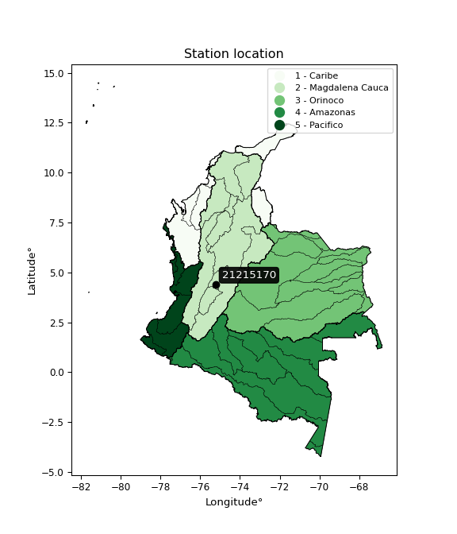

<div align="center">


</div>

# PMP Station (Rain, Pmax24h): 21215170

Probable Maximum Precipitation (PMP) is the greatest amount of rainfall for a specific duration that is meteorologically possible for a given location, acting as a "worst-case" scenario for extreme storms, crucial for designing safety-critical infrastructure like bridges, river deviations, dams, spillways, and nuclear plants to prevent catastrophic failure. PMP is calculated by hydrologists using meteorological data to determine the upper limit of extreme rainfall, often leading to the Probable Maximum Flood (PMF) for flood control design, and is increasingly being studied for climate change impacts. Probable Maximum Precipitation (PMP) is the theoretical upper limit of rainfall, a deterministic estimate for extreme events, while probability distributions (like GEV, Gumbel) describe the likelihood and frequency of various precipitation amounts, including rare ones, showing how often events occur, with PMP representing the extreme end of these distributions, used for critical infrastructure design to ensure safety against the worst conceivable weather, unlike standard statistical forecasts which cover typical probabilities.

The most common probability distributions in hydrology, used for analyzing floods, rainfall, and streamflow, include the Normal, Log-Normal, Gumbel, Gamma (including Log-Pearson Type III), and Generalized Extreme Value (GEV) distributions, often chosen based on the data´s skewness and whether modeling extremes or general conditions, with Gumbel and GEV popular for extreme events like floods, while the Normal distribution serves as a baseline, though often requiring transformations for skewed hydrological data. These distributions help in designing water infrastructure, managing water resources, and forecasting hydrologic events.

> Hydrological data often isn´t perfectly normal (it´s skewed), so different distributions are needed for different applications, such as: **Flood Frequency Analysis**: Using Gumbel, GEV, or Log-Pearson Type III for predicting extreme flood magnitudes and their return periods, **Rainfall Analysis**: Normal for annual totals, but Log-Normal, Weibull, or GEV for intensity or extreme daily rainfall, **Streamflow Modeling**: Gamma and Log-Normal for maximum flows, GEV for minimum flows, and Kappa for daily flows.

<div align="center">

</img>

</div>


## A. General information


### 1. General running parameters

• app_version: _v20260113_. • runtime: _2026-01-13 16:28:34.738620_. • Python version: _3.14.0_. • SciPy version: _1.16.3_. • Pandas version: _2.3.3_. • NumPy version: _2.3.5_. • Stations dataset (station_dataset_file): _dataset/pmax24h_in/automatic_colombia_2003_2025.csv_. • Stations catalog (station_catalog_file): _dataset/CNE.xls_. • Minimum year to eval til year_max (date_min): _1900_. • Maximum year to eval since year_min (date_max): _2025_. • Creates, save and include plots into reports (create_plot): _False_. • Plot only fit distributions with Δo > Δ (plot_only_fit): _True_. • Plot only simple graphs avoiding multiple CDFs and multiple Extreme values plots (plot_only_simple): _True_. • Eval low extreme values, if False, evaluates high extreme values (low_extreme): _False_. • Eval every SciPy distribution as logarithmic (pdist_logarithmic_on): _True_. • Standard deviation normalized (ddof): _1.0_. • Return periods to eval in years (Tr): _[2, 2.33, 5, 10, 15, 20, 25, 50, 75, 100, 200, 250, 500, 750, 1000]_. • Minimum data sample per station, 0 means any (minimum_sample): _5_. • Z-Score maximum threshold to adjust a value, 0 means disable (zscore_max): _3.5_. • Z-Score minimum threshold to adjust a value, 0 means disable (zscore_min): _-2.5_. • Avoid zeros, e.g. rain = 0 (avoid_zeros): _True_. • Avoid null values (avoid_nans): _True_. 

:file_folder:Table: [dataset.csv](../../dataset/pmax24h_in/automatic_colombia_2003_2025.csv)

> Delta Degrees of Freedom (DDOF): is a parameter used in the formulas for calculating variance and standard deviation. When ddof=0, the divisor is $N$ (the total number of observations) and this is used when your data set is the entire population. When ddof=1, the divisor is $N-1$ and this is used when your data set is a sample drawn from a larger population. Using $N-1$ provides an unbiased estimate of the population variance (known as Bessel´s correction).


### 2. Station info and location

|   id |   CODIGO | NOMBRE                        | CATEGORIA               | TECNOLOGIA                | ESTADO     | FECHA_INSTALACION   | FECHA_SUSPENSION   |   ALTITUD |   LATITUD |   LONGITUD | DEPARTAMENTO   | MUNICIPIO   | AREA_OPERATIVA             | ENTIDAD                                                     | AREA_HIDROGRAFICA   | ZONA_HIDROGRAFICA   | SUBZONA_HIDROGRAFICA   |   CORRIENTE | Catalogo   |   Version |
|-----:|---------:|:------------------------------|:------------------------|:--------------------------|:-----------|:--------------------|:-------------------|----------:|----------:|-----------:|:---------------|:------------|:---------------------------|:------------------------------------------------------------|:--------------------|:--------------------|:-----------------------|------------:|:-----------|----------:|
|    0 | 21215170 | LA MARTINICA - AUT [21215170] | Climatológica Principal | Automática con Telemetría | Suspendida | 10/12/2005          | 28/08/2014         |      1780 |     4.402 |   -75.2291 | Tolima         | Ibagué      | Area Operativa 10 - Tolima | INSTITUTO DE HIDROLOGIA METEOROLOGIA Y ESTUDIOS AMBIENTALES | Magdalena Cauca     | Alto Magdalena      | Río Coello             |         nan | CNE_IDEAM  |  20251226 |

<div align="center">

Dynamic map: [:earth_americas:Google](http://maps.google.com/maps?q=4.402,-75.22905556) [:earth_americas:OSM](https://www.openstreetmap.org/#map=18/4.402/-75.22905556&layers=P) [:earth_americas:Bing](https://www.bing.com/maps?cp=4.402~-75.22905556&lvl=18) [:earth_americas:Apple](https://maps.apple.com/frame?center=4.402%2C-75.22905556&span=0.003%2C0.006)

</div>


<div align="center">

```geojson
{
  "type": "Feature",
  "geometry": {
    "type": "Point", 
    "coordinates": [-75.22905556, 4.402]
  }, 
  "properties": {
    "Name": "21215170"
  }
}
```

</div>


### 3. Discrete values table and plot

<div align="center">

|               |          0 |           1 |           2 |          3 |           4 |          5 |
|:--------------|-----------:|------------:|------------:|-----------:|------------:|-----------:|
| Date          | 2005       | 2006        | 2007        | 2008       | 2009        | 2010       |
| Value         |   42.6     |   64.8      |   70.9      |   76.9     |   50.2      |   42.9     |
| Value_initial |   42.6     |   64.8      |   70.9      |   76.9     |   50.2      |   42.9     |
| count         |    6       |    6        |    6        |    6       |    6        |    6       |
| mean          |   58.05    |   58.05     |   58.05     |   58.05    |   58.05     |   58.05    |
| std           |   14.8044  |   14.8044   |   14.8044   |   14.8044  |   14.8044   |   14.8044  |
| zscore        |   -1.04361 |    0.455945 |    0.867984 |    1.27327 |   -0.530247 |   -1.02334 |


</div>


> The initial value (value_initial) correspond to the initial obtained or null completed value, and value (value) is adjusted only when the initial value is outside the valid range (outlier) definite through the Z-Score value. If Z-Score is active, values out of range or outliers are replaced with the station mean value. A Z-Score (or standard score) measures how many standard deviations a data point is from the mean of a dataset, indicating its relative position; positive scores mean above the mean, negative mean below, and a score of zero is exactly at the mean, allowing for comparison of values from different distributions. It´s calculated using the formula $z=(x–μ)/σ$, where $x$ is the data point, $μ$ is the mean, and $σ$ is the standard deviation, helping identify outliers and understand probability.
>
> <sub>**Note**: In this study, "completing" (filling gaps in) and "extending" (forecasting or lengthening the historical record) rainfall data series are avoided for certain critical analyses because they introduce artificial bias and uncertainty, which can distort the statistics of rare events (extremes), alter day-to-day variability, and compromise the integrity and homogeneity of the original data. Some reasons against Completing/Extending rainfall data are: **Distortion of Extremes and Variability**: The primary issue is that most gap-filling or extension methods rely on averaging or regression with nearby stations, which inherently smooths the data. Rainfall is highly variable in space and time, with a large percentage of zero values and occasional large storms. Infilling methods often underestimate the highest values and overestimate the lowest (zero) values, which severely distorts analyses focused on flood frequency, drought severity, and intensity-duration-frequency (IDF) curves, **Loss of Data Homogeneity**: Infilled or extended data are synthetic estimates, not actual measurements. Combining these estimates with observed data can violate the assumption of data homogeneity, which requires that the data properties do not change over time. Inhomogeneity can lead to incorrect conclusions about long-term trends or changes in climate patterns, **Propagation of Errors**: Errors and biases from the original data (e.g., wind-induced undercatch, instrument errors, site changes) or the data used for imputation can propagate through the analysis, leading to unreliable hydrological models and inaccurate predictions, **Compromised Statistical Integrity**: For statistical analyses, especially those involving the frequency of events, using artificial data can introduce time bias or autocorrelation that doesn´t exist in reality, making it difficult to assess the true probability of events, **Difficulty in Validation**: It is difficult to accurately validate the quality of filled or extended data, especially for past periods where ground-truth measurements are unavailable. The reliability of imputation techniques heavily depends on the density of the surrounding station network and the complexity of the local topography.</sub>


### 4. Active continuous probability distributions from SciPy (45 of 104 available)

A Probability Density Function (PDF) describes the relative likelihood of a continuous random variable falling within a specific range, where the total area under its curve equals 1, and the area over any interval gives the actual probability for that range. Unlike discrete probabilities (like rolling a die), a PDF shows density, not direct probability for a single point (which is zero), with higher points indicating higher likelihood, often visualized as a bell curve for normal distributions.

A log of a probability density function (log-PDF) is simply the logarithm of the PDF´s value, denoted as $log(f(x))$, useful for converting multiplication of probabilities into addition, improving numerical stability with tiny numbers, and connecting to information theory concepts like entropy. Instead of dealing with very small probabilities (e.g., 0.000001), log-PDFs use negative numbers (e.g., $log(0.00001) ≈ -11.51$ that are easier for computers to handle, preventing underflow errors and simplifying complex calculations. In this study, each active probability distribution from SciPy is also evaluated in the $log$ form.

[scipy.stats](https://docs.scipy.org/doc/scipy/reference/stats.html) is a Python´s powerful submodule within the SciPy library for comprehensive statistical analysis, offering over 130 probability distributions (like Normal, Poisson), functions for descriptive stats (mean, variance), hypothesis testing (t-tests, chi-square), random variable generation, and statistical tests, making it essential for data science, modeling, and research. It provides tools to explore, model, and draw conclusions from data efficiently, working seamlessly with NumPy.

<div align="center">

|   id | p_dist             |   n_parameter | fit_method   | label                                                                       | active   | ref                                                                                                        |
|-----:|:-------------------|--------------:|:-------------|:----------------------------------------------------------------------------|:---------|:-----------------------------------------------------------------------------------------------------------|
|    0 | alpha              |             3 | MLE          | Alpha                                                                       | True     | [:mortar_board:](https://docs.scipy.org/doc/scipy/reference/generated/scipy.stats.alpha.html)              |
|    1 | betaprime          |             4 | MLE          | Beta prime                                                                  | True     | [:mortar_board:](https://docs.scipy.org/doc/scipy/reference/generated/scipy.stats.betaprime.html)          |
|    2 | chi2               |             3 | MLE          | Chi²                                                                        | True     | [:mortar_board:](https://docs.scipy.org/doc/scipy/reference/generated/scipy.stats.chi2.html)               |
|    3 | crystalball        |             4 | MLE          | Crystalball                                                                 | True     | [:mortar_board:](https://docs.scipy.org/doc/scipy/reference/generated/scipy.stats.crystalball.html)        |
|    4 | dweibull           |             3 | MLE          | Double Weibull                                                              | True     | [:mortar_board:](https://docs.scipy.org/doc/scipy/reference/generated/scipy.stats.dweibull.html)           |
|    5 | erlang             |             3 | MLE          | Erlang                                                                      | True     | [:mortar_board:](https://docs.scipy.org/doc/scipy/reference/generated/scipy.stats.erlang.html)             |
|    6 | expon              |             2 | MLE          | Exponential                                                                 | True     | [:mortar_board:](https://docs.scipy.org/doc/scipy/reference/generated/scipy.stats.expon.html)              |
|    7 | exponnorm          |             3 | MLE          | Exponentially modified Normal                                               | True     | [:mortar_board:](https://docs.scipy.org/doc/scipy/reference/generated/scipy.stats.exponnorm.html)          |
|    8 | f                  |             4 | MLE          | F                                                                           | True     | [:mortar_board:](https://docs.scipy.org/doc/scipy/reference/generated/scipy.stats.f.html)                  |
|    9 | fatiguelife        |             3 | MLE          | Fatigue-life (Birnbaum-Saunders)                                            | True     | [:mortar_board:](https://docs.scipy.org/doc/scipy/reference/generated/scipy.stats.fatiguelife.html)        |
|   10 | fisk               |             3 | MLE          | Fisk                                                                        | True     | [:mortar_board:](https://docs.scipy.org/doc/scipy/reference/generated/scipy.stats.fisk.html)               |
|   11 | gamma              |             3 | MLE          | Gamma                                                                       | True     | [:mortar_board:](https://docs.scipy.org/doc/scipy/reference/generated/scipy.stats.gamma.html)              |
|   12 | genexpon           |             5 | MLE          | Generalized exponential                                                     | True     | [:mortar_board:](https://docs.scipy.org/doc/scipy/reference/generated/scipy.stats.genexpon.html)           |
|   13 | genlogistic        |             3 | MLE          | Generalized logistic                                                        | True     | [:mortar_board:](https://docs.scipy.org/doc/scipy/reference/generated/scipy.stats.genlogistic.html)        |
|   14 | gibrat             |             2 | MM           | Gibrat                                                                      | True     | [:mortar_board:](https://docs.scipy.org/doc/scipy/reference/generated/scipy.stats.gibrat.html)             |
|   15 | gompertz           |             3 | MLE          | Gompertz (or truncated Gumbel)                                              | True     | [:mortar_board:](https://docs.scipy.org/doc/scipy/reference/generated/scipy.stats.gompertz.html)           |
|   16 | gumbel_l           |             2 | MM           | Gumbel Left Skew                                                            | True     | [:mortar_board:](https://docs.scipy.org/doc/scipy/reference/generated/scipy.stats.gumbel_l.html)           |
|   17 | gumbel_r           |             2 | MM           | Gumbel Right Skew                                                           | True     | [:mortar_board:](https://docs.scipy.org/doc/scipy/reference/generated/scipy.stats.gumbel_r.html)           |
|   18 | halflogistic       |             2 | MM           | Half-logistic                                                               | True     | [:mortar_board:](https://docs.scipy.org/doc/scipy/reference/generated/scipy.stats.halflogistic.html)       |
|   19 | halfnorm           |             2 | MM           | Half Normal                                                                 | True     | [:mortar_board:](https://docs.scipy.org/doc/scipy/reference/generated/scipy.stats.halfnorm.html)           |
|   20 | hypsecant          |             2 | MM           | hyperbolic secant                                                           | True     | [:mortar_board:](https://docs.scipy.org/doc/scipy/reference/generated/scipy.stats.hypsecant.html)          |
|   21 | invgamma           |             3 | MLE          | Inverted gamma                                                              | True     | [:mortar_board:](https://docs.scipy.org/doc/scipy/reference/generated/scipy.stats.invgamma.html)           |
|   22 | invgauss           |             3 | MLE          | Inverse Gaussian                                                            | True     | [:mortar_board:](https://docs.scipy.org/doc/scipy/reference/generated/scipy.stats.invgauss.html)           |
|   23 | invweibull         |             3 | MLE          | Inverted Weibull                                                            | True     | [:mortar_board:](https://docs.scipy.org/doc/scipy/reference/generated/scipy.stats.invweibull.html)         |
|   24 | kappa4             |             4 | MLE          | Kappa 4                                                                     | True     | [:mortar_board:](https://docs.scipy.org/doc/scipy/reference/generated/scipy.stats.kappa4.html)             |
|   25 | kstwobign          |             2 | MLE          | Limiting distribution of scaled Kolmogorov-Smirnov two-sided test statistic | True     | [:mortar_board:](https://docs.scipy.org/doc/scipy/reference/generated/scipy.stats.kstwobign.html)          |
|   26 | laplace            |             2 | MM           | Laplace                                                                     | True     | [:mortar_board:](https://docs.scipy.org/doc/scipy/reference/generated/scipy.stats.laplace.html)            |
|   27 | laplace_asymmetric |             3 | MLE          | Asymmetric Laplace                                                          | True     | [:mortar_board:](https://docs.scipy.org/doc/scipy/reference/generated/scipy.stats.laplace_asymmetric.html) |
|   28 | loggamma           |             3 | MLE          | Log gamma                                                                   | True     | [:mortar_board:](https://docs.scipy.org/doc/scipy/reference/generated/scipy.stats.loggamma.html)           |
|   29 | logistic           |             2 | MM           | Logistic (or Sech-squared)                                                  | True     | [:mortar_board:](https://docs.scipy.org/doc/scipy/reference/generated/scipy.stats.logistic.html)           |
|   30 | lognorm            |             3 | MLE          | Log Normal                                                                  | True     | [:mortar_board:](https://docs.scipy.org/doc/scipy/reference/generated/scipy.stats.lognorm.html)            |
|   31 | maxwell            |             2 | MM           | Maxwell                                                                     | True     | [:mortar_board:](https://docs.scipy.org/doc/scipy/reference/generated/scipy.stats.maxwell.html)            |
|   32 | mielke             |             4 | MLE          | Mielke Beta-Kappa / Dagum                                                   | True     | [:mortar_board:](https://docs.scipy.org/doc/scipy/reference/generated/scipy.stats.mielke.html)             |
|   33 | moyal              |             2 | MM           | Moyal                                                                       | True     | [:mortar_board:](https://docs.scipy.org/doc/scipy/reference/generated/scipy.stats.moyal.html)              |
|   34 | nakagami           |             3 | MLE          | Nakagami                                                                    | True     | [:mortar_board:](https://docs.scipy.org/doc/scipy/reference/generated/scipy.stats.nakagami.html)           |
|   35 | ncf                |             5 | MLE          | Non-central F distribution                                                  | True     | [:mortar_board:](https://docs.scipy.org/doc/scipy/reference/generated/scipy.stats.ncf.html)                |
|   36 | nct                |             4 | MLE          | Non-central Student’s t                                                     | True     | [:mortar_board:](https://docs.scipy.org/doc/scipy/reference/generated/scipy.stats.nct.html)                |
|   37 | norm               |             2 | MM           | Normal                                                                      | True     | [:mortar_board:](https://docs.scipy.org/doc/scipy/reference/generated/scipy.stats.norm.html)               |
|   38 | pearson3           |             3 | MM           | Pearson type III                                                            | True     | [:mortar_board:](https://docs.scipy.org/doc/scipy/reference/generated/scipy.stats.pearson3.html)           |
|   39 | rayleigh           |             2 | MM           | Rayleigh                                                                    | True     | [:mortar_board:](https://docs.scipy.org/doc/scipy/reference/generated/scipy.stats.rayleigh.html)           |
|   40 | rice               |             3 | MLE          | Rice                                                                        | True     | [:mortar_board:](https://docs.scipy.org/doc/scipy/reference/generated/scipy.stats.rice.html)               |
|   41 | t                  |             3 | MLE          | Student’s t                                                                 | True     | [:mortar_board:](https://docs.scipy.org/doc/scipy/reference/generated/scipy.stats.t.html)                  |
|   42 | truncnorm          |             4 | MLE          | Truncated normal                                                            | True     | [:mortar_board:](https://docs.scipy.org/doc/scipy/reference/generated/scipy.stats.truncnorm.html)          |
|   43 | wald               |             2 | MM           | Wald                                                                        | True     | [:mortar_board:](https://docs.scipy.org/doc/scipy/reference/generated/scipy.stats.wald.html)               |
|   44 | weibull_min        |             3 | MLE          | Weibull minimum                                                             | True     | [:mortar_board:](https://docs.scipy.org/doc/scipy/reference/generated/scipy.stats.weibull_min.html)        |

</div>

> **n_parameter:** # arguments & localization & scale.
>
> **Fit methods:** (MLE) maximum likelihood, (MM) L-moments.
>
>**Inactive** (With the only purpose of prevent loops, zero divisions, infinite values, over high estimated values or horizontal trending for recurrence intervals estimations, the follow distributions were disabled.)**:** foldnorm, gennorm, norminvgauss, powernorm, powerlognorm, skewnorm, genextreme, anglit, arcsine, argus, beta, bradford, burr, burr12, cauchy, cosine, halfcauchy, foldcauchy, skewcauchy, wrapcauchy, dgamma, gengamma, exponweib, exponpow, truncexpon, gausshyper, genhalflogistic, genhyperbolic, geninvgauss, halfgennorm, johnsonsb, johnsonsu, kappa3, ksone, kstwo, loglaplace, levy, levy_l, levy_stable, ncx2, pareto, genpareto, truncpareto, lomax, powerlaw, rdist, rel_breitwigner, recipinvgauss, semicircular, studentized_range, trapezoid, triang, truncweibull_min, tukeylambda, uniform, loguniform, vonmises, vonmises_line, weibull_max, 


## B. Probability (PDF) vs. Empirical (EDF) distributions functions

A continuous probability distribution (CPD) describes probabilities for variables that can take any value within a range (like rain any time), unlike discrete variables with specific outcomes (like temperature). It uses a Probability Density Function (PDF), a curve where the total area under it equals 1, and the probability of the variable falling within an interval (a to b) is found by calculating the area under the curve between those points. A key feature is that the probability of hitting any single exact value is zero, so probabilities are always expressed for ranges, e.g., $P(a ≤ X ≤ b)$.

<div align="center">

Distributions parameters from station values
|    |   station | p_dist                |   n |             loc |          scale | shape                 | shape1             | shape2              | shape3   |
|---:|----------:|:----------------------|----:|----------------:|---------------:|:----------------------|:-------------------|:--------------------|:---------|
|  0 |  21215170 | alpha                 |   6 |   -67.8341      | 1165.01        | 9.361619872860636     |                    |                     |          |
|  1 |  21215170 | betaprime             |   6 |    -1.10197     |    3.33718     | 337.35600886561565    | 20.01662258063684  |                     |          |
|  2 |  21215170 | chi2                  |   6 |    42.6         |    1.81052     | 0.2183545287226058    |                    |                     |          |
|  3 |  21215170 | crystalball           |   6 |     0.152199    |   59.5295      | 8.120236054540412     | 1.000001221280769  |                     |          |
|  4 |  21215170 | dweibull              |   6 |    58.1167      |   14.3165      | 3.4731573654790235    |                    |                     |          |
|  5 |  21215170 | erlang                |   6 |  -108.809       |    1.09146     | 152.79117949464177    |                    |                     |          |
|  6 |  21215170 | expon                 |   6 |    42.6         |   15.45        |                       |                    |                     |          |
|  7 |  21215170 | exponnorm             |   6 |    57.2269      |   13.4894      | 0.06101579837292315   |                    |                     |          |
|  8 |  21215170 | f                     |   6 |    42.6         |   15.5793      | 0.8717775383481438    | 353.8964702778029  |                     |          |
|  9 |  21215170 | fatiguelife           |   6 |    42.6         |    5.83208e-06 | 1475.2593121944337    |                    |                     |          |
| 10 |  21215170 | fisk                  |   6 |    42.6         |    6.58075     | 0.5351534095068564    |                    |                     |          |
| 11 |  21215170 | gamma                 |   6 |  -121.841       |    1.00251     | 179.49296211208173    |                    |                     |          |
| 12 |  21215170 | genexpon              |   6 |    42.6         |    1.38009e+08 | 7783871.5870956555    | 49602254.82273107  | 234922.19726188388  |          |
| 13 |  21215170 | genlogistic           |   6 |   -27.4218      |   11.3346      | 1050.002991540594     |                    |                     |          |
| 14 |  21215170 | gibrat                |   6 |    47.7401      |    6.25325     |                       |                    |                     |          |
| 15 |  21215170 | gompertz              |   6 |    42.6         |   46.8091      | 2.2278781824723364    |                    |                     |          |
| 16 |  21215170 | gumbel_l              |   6 |    64.1323      |   10.5372      |                       |                    |                     |          |
| 17 |  21215170 | gumbel_r              |   6 |    51.9677      |   10.5372      |                       |                    |                     |          |
| 18 |  21215170 | halflogistic          |   6 |    42.0321      |   11.5544      |                       |                    |                     |          |
| 19 |  21215170 | halfnorm              |   6 |    40.1621      |   22.4192      |                       |                    |                     |          |
| 20 |  21215170 | hypsecant             |   6 |    58.05        |    8.60362     |                       |                    |                     |          |
| 21 |  21215170 | invgamma              |   6 |    33.8097      |   42.1686      | 2.5748530452137324    |                    |                     |          |
| 22 |  21215170 | invgauss              |   6 |    41.8898      |    2.66229     | 6.070021231764255     |                    |                     |          |
| 23 |  21215170 | invweibull            |   6 |    42.6         |    1.6493      | 0.04731832344251997   |                    |                     |          |
| 24 |  21215170 | kappa4                |   6 |    38.1916      |   42.205       | 1.117158720436684     | 1.0736734804345214 |                     |          |
| 25 |  21215170 | kstwobign             |   6 |    13.0847      |   51.2178      |                       |                    |                     |          |
| 26 |  21215170 | laplace               |   6 |    58.05        |    9.55622     |                       |                    |                     |          |
| 27 |  21215170 | laplace_asymmetric    |   6 |    42.6         |    0.00147291  | 9.533120992491671e-05 |                    |                     |          |
| 28 |  21215170 | loggamma              |   6 | -2866.25        |  424.572       | 980.5455944422629     |                    |                     |          |
| 29 |  21215170 | logistic              |   6 |    58.05        |    7.45095     |                       |                    |                     |          |
| 30 |  21215170 | lognorm               |   6 |    42.6         |    0.0265354   | 13.045666107195647    |                    |                     |          |
| 31 |  21215170 | maxwell               |   6 |    26.0262      |   20.0679      |                       |                    |                     |          |
| 32 |  21215170 | mielke                |   6 |   -21.6968      |   25.8439      | 7844.114302758033     | 6.852087781189095  |                     |          |
| 33 |  21215170 | moyal                 |   6 |    50.3215      |    6.08368     |                       |                    |                     |          |
| 34 |  21215170 | nakagami              |   6 |    42.6         |   27.7763      | 0.14792349164967447   |                    |                     |          |
| 35 |  21215170 | ncf                   |   6 |    -0.0108822   |    8.86529e-07 | 9.91569370520335e-08  | 3.2491554840610894 | 5.5843812209950965  |          |
| 36 |  21215170 | nct                   |   6 |    -0.810784    |    0.469937    | 9.815012364433212     | 115.69090901726753 |                     |          |
| 37 |  21215170 | norm                  |   6 |    58.05        |   13.5145      |                       |                    |                     |          |
| 38 |  21215170 | pearson3              |   6 |    58.05        |   13.5145      | 0.0998961522656131    |                    |                     |          |
| 39 |  21215170 | rayleigh              |   6 |    32.1959      |   20.6286      |                       |                    |                     |          |
| 40 |  21215170 | rice                  |   6 |    34.0516      |   17.1702      | 0.7569841460678461    |                    |                     |          |
| 41 |  21215170 | t                     |   6 |    58.0518      |   13.5137      | 7723902.863407054     |                    |                     |          |
| 42 |  21215170 | truncnorm             |   6 |    54.6861      |   13.423       | -0.9004059248535263   | 1437.323511116706  |                     |          |
| 43 |  21215170 | wald                  |   6 |    44.5355      |   13.5145      |                       |                    |                     |          |
| 44 |  21215170 | weibull_min           |   6 |    42.6         |   24.306       | 0.1578470082911414    |                    |                     |          |
| 45 |  21215170 | logalpha              |   6 |    -2.42337     |  176.239       | 27.33331756648144     |                    |                     |          |
| 46 |  21215170 | logbetaprime          |   6 |    -0.837648    |   17.8124      | 540.4264848248717     | 1977.2959793353175 |                     |          |
| 47 |  21215170 | logchi2               |   6 |     3.75185     |    0.993061    | 0.9388448104902488    |                    |                     |          |
| 48 |  21215170 | logcrystalball        |   6 |     4.03364     |    0.236256    | 8144.562889896657     | 228.2781627280911  |                     |          |
| 49 |  21215170 | logdweibull           |   6 |     4.03463     |    0.250497    | 3.704530389266761     |                    |                     |          |
| 50 |  21215170 | logerlang             |   6 |   -39.3836      |    0.00128573  | 33768.55939186482     |                    |                     |          |
| 51 |  21215170 | logexpon              |   6 |     3.75185     |    0.281783    |                       |                    |                     |          |
| 52 |  21215170 | logexponnorm          |   6 |     4.03322     |    0.236256    | 0.0017755373551071323 |                    |                     |          |
| 53 |  21215170 | logf                  |   6 |     3.75185     |    0.270086    | 0.7784663937823262    | 1279.1186632324907 |                     |          |
| 54 |  21215170 | logfatiguelife        |   6 |     3.75185     |    6.92808e-07 | 578.4866458994815     |                    |                     |          |
| 55 |  21215170 | logfisk               |   6 |    -3.11047e+06 |    3.11048e+06 | 20828108.934428178    |                    |                     |          |
| 56 |  21215170 | loggamma              |   6 |   -39.3824      |    0.00128568  | 33769.0245837767      |                    |                     |          |
| 57 |  21215170 | loggenexpon           |   6 |     3.75185     |    0.592771    | 1.9287099147898523    | 1.0338003457089537 | 0.47466837813257967 |          |
| 58 |  21215170 | loggenlogistic        |   6 |     2.59973     |    0.203773    | 639.0721723932054     |                    |                     |          |
| 59 |  21215170 | loggibrat             |   6 |     3.85339     |    0.109327    |                       |                    |                     |          |
| 60 |  21215170 | loggompertz           |   6 |     3.75185     |    0.602381    | 1.3867085120543607    |                    |                     |          |
| 61 |  21215170 | loggumbel_l           |   6 |     4.13997     |    0.184208    |                       |                    |                     |          |
| 62 |  21215170 | loggumbel_r           |   6 |     3.92731     |    0.184208    |                       |                    |                     |          |
| 63 |  21215170 | loghalflogistic       |   6 |     3.75361     |    0.201998    |                       |                    |                     |          |
| 64 |  21215170 | loghalfnorm           |   6 |     3.72093     |    0.391925    |                       |                    |                     |          |
| 65 |  21215170 | loghypsecant          |   6 |     4.03364     |    0.150405    |                       |                    |                     |          |
| 66 |  21215170 | loginvgamma           |   6 |    -2.47764     | 4926.81        | 757.6723397027099     |                    |                     |          |
| 67 |  21215170 | loginvgauss           |   6 |     3.7323      |    0.0748896   | 4.023725315966381     |                    |                     |          |
| 68 |  21215170 | loginvweibull         |   6 |    -1.66831e+07 |    1.66831e+07 | 82164885.07096285     |                    |                     |          |
| 69 |  21215170 | logkappa4             |   6 |     3.64695     |    0.75542     | 1.1620724668662339    | 1.0591684376501567 |                     |          |
| 70 |  21215170 | logkstwobign          |   6 |     3.22795     |    0.916977    |                       |                    |                     |          |
| 71 |  21215170 | loglaplace            |   6 |     4.03364     |    0.167058    |                       |                    |                     |          |
| 72 |  21215170 | loglaplace_asymmetric |   6 |     4.34251     |    0.00342673  | 90.10839893572219     |                    |                     |          |
| 73 |  21215170 | logloggamma           |   6 |   -12.4935      |    3.17943     | 181.43745501466867    |                    |                     |          |
| 74 |  21215170 | loglogistic           |   6 |     4.03364     |    0.130255    |                       |                    |                     |          |
| 75 |  21215170 | loglognorm            |   6 |     3.75185     |    0.000633386 | 12.606851755096866    |                    |                     |          |
| 76 |  21215170 | logmaxwell            |   6 |     3.47381     |    0.35082     |                       |                    |                     |          |
| 77 |  21215170 | logmielke             |   6 |    -8.84236e+06 |    8.84236e+06 | 2690297888.778901     | 43649278.64545657  |                     |          |
| 78 |  21215170 | logmoyal              |   6 |     3.89853     |    0.106353    |                       |                    |                     |          |
| 79 |  21215170 | lognakagami           |   6 |     3.75185     |    0.53829     | 0.3378226839592062    |                    |                     |          |
| 80 |  21215170 | logncf                |   6 |    -4.03345     |    4.07677     | 4891.243238568542     | 3635.2529779122124 | 4782.6599217502535  |          |
| 81 |  21215170 | lognct                |   6 |    -9.79795     |    0.134912    | 1349.0312036065661    | 102.45892380794618 |                     |          |
| 82 |  21215170 | lognorm               |   6 |     4.03364     |    0.236256    |                       |                    |                     |          |
| 83 |  21215170 | logpearson3           |   6 |     4.03364     |    0.236256    | -0.01107839658832024  |                    |                     |          |
| 84 |  21215170 | lograyleigh           |   6 |     3.58167     |    0.360621    |                       |                    |                     |          |
| 85 |  21215170 | logrice               |   6 |     3.60284     |    0.293205    | 0.8988895126909833    |                    |                     |          |
| 86 |  21215170 | logt                  |   6 |     4.03364     |    0.236256    | 3093721015.8386416    |                    |                     |          |
| 87 |  21215170 | logtruncnorm          |   6 |    -2.25616     |    1.59317     | 3.7711093124263027    | 4.141851539674723  |                     |          |
| 88 |  21215170 | logwald               |   6 |     3.79738     |    0.236257    |                       |                    |                     |          |
| 89 |  21215170 | logweibull_min        |   6 |     3.75185     |    0.308593    | 0.719749710352624     |                    |                     |          |

</div>

> **loc** (Location parameter): This shifts the distribution along the x-axis. For many common distributions, like the normal (Gaussian) distribution, loc represents the mean $μ$. For others, like the uniform distribution, it might represent the minimum value, or for the beta distribution, the left end of the support interval.
>
> **scale** (Scale parameter): This determines the width or spread of the distribution. For the normal distribution, scale represents the standard deviation $σ$. For a uniform distribution, it defines the length of the interval (from $loc$ to $loc + scale$).
>
> **shape** (Shape parameters): Refers to parameters that define the specific form of a probability distribution, distinct from its location (loc) and scale (scale). These parameters are required arguments for most distribution functions. For example, a normal (Gaussian) distribution is fully defined by its location (mean) and scale (standard deviation), so it has no specific shape parameters beyond loc and scale. However, other distributions have intrinsic properties that need specification, as Gamma distribution that takes a shape parameter, often named $a$ or $alpha$.


### 0. Cumulative distribution values - CDF (90 evaluated)

Cumulative Distribution Function (CDF), denoted as $F$<sub>$X$</sub>$(x)$, is a function that gives the probability that a random variable $X$ will take a value less than or equal to a specific value, $x$ (i.e., $(P(X≥x)$. It essentially "accumulates" probabilities from a given point up to the far right (positive infinity), providing a complete picture of the distribution´s probabilities for both discrete (like rain) and continuous (like temperature) variables, helping to find probabilities over ranges or above certain values. Each station is evaluated separately ordering the $x$ values ascending, calculating the CDF and PDF values for the activated distributions and their logarithmic forms.

<div align="center">

CDF ordered by x ascending and calculating $log(f(x))$ separately
|   id |   Station |   date |    x |   count |   mean |     std |    zscore |   Value_initial |   station |   m |    alpha |   alpha_pdf |   betaprime |   betaprime_pdf |      chi2 |    chi2_pdf |   crystalball |   crystalball_pdf |   dweibull |   dweibull_pdf |   erlang |   erlang_pdf |     expon |   expon_pdf |   exponnorm |   exponnorm_pdf |          f |       f_pdf |   fatiguelife |   fatiguelife_pdf |        fisk |        fisk_pdf |    gamma |   gamma_pdf |    genexpon |   genexpon_pdf |   genlogistic |   genlogistic_pdf |   gibrat |   gibrat_pdf |    gompertz |   gompertz_pdf |   gumbel_l |   gumbel_l_pdf |   gumbel_r |   gumbel_r_pdf |   halflogistic |   halflogistic_pdf |   halfnorm |   halfnorm_pdf |   hypsecant |   hypsecant_pdf |   invgamma |   invgamma_pdf |   invgauss |   invgauss_pdf |   invweibull |   invweibull_pdf |      kappa4 |   kappa4_pdf |   kstwobign |   kstwobign_pdf |   laplace |   laplace_pdf |   laplace_asymmetric |   laplace_asymmetric_pdf |   loggamma |   loggamma_pdf |   logistic |   logistic_pdf |   lognorm |   lognorm_pdf |   maxwell |   maxwell_pdf |   mielke |   mielke_pdf |     moyal |   moyal_pdf |   nakagami |   nakagami_pdf |      ncf |    ncf_pdf |      nct |    nct_pdf |     norm |   norm_pdf |   pearson3 |   pearson3_pdf |   rayleigh |   rayleigh_pdf |      rice |   rice_pdf |        t |     t_pdf |   truncnorm |   truncnorm_pdf |     wald |   wald_pdf |   weibull_min |   weibull_min_pdf |   logalpha |   logalpha_pdf |   logbetaprime |   logbetaprime_pdf |     logchi2 |   logchi2_pdf |   logcrystalball |   logcrystalball_pdf |   logdweibull |   logdweibull_pdf |   logerlang |   logerlang_pdf |   logexpon |   logexpon_pdf |   logexponnorm |   logexponnorm_pdf |        logf |      logf_pdf |   logfatiguelife |   logfatiguelife_pdf |   logfisk |   logfisk_pdf |   loggenexpon |   loggenexpon_pdf |   loggenlogistic |   loggenlogistic_pdf |   loggibrat |   loggibrat_pdf |   loggompertz |   loggompertz_pdf |   loggumbel_l |   loggumbel_l_pdf |   loggumbel_r |   loggumbel_r_pdf |   loghalflogistic |   loghalflogistic_pdf |   loghalfnorm |   loghalfnorm_pdf |   loghypsecant |   loghypsecant_pdf |   loginvgamma |   loginvgamma_pdf |   loginvgauss |   loginvgauss_pdf |   loginvweibull |   loginvweibull_pdf |   logkappa4 |   logkappa4_pdf |   logkstwobign |   logkstwobign_pdf |   loglaplace |   loglaplace_pdf |   loglaplace_asymmetric |   loglaplace_asymmetric_pdf |   logloggamma |   logloggamma_pdf |   loglogistic |   loglogistic_pdf |   loglognorm |   loglognorm_pdf |   logmaxwell |   logmaxwell_pdf |   logmielke |   logmielke_pdf |   logmoyal |   logmoyal_pdf |   lognakagami |   lognakagami_pdf |   logncf |   logncf_pdf |   lognct |   lognct_pdf |   logpearson3 |   logpearson3_pdf |   lograyleigh |   lograyleigh_pdf |   logrice |   logrice_pdf |     logt |   logt_pdf |   logtruncnorm |   logtruncnorm_pdf |   logwald |   logwald_pdf |   logweibull_min |   logweibull_min_pdf |
|-----:|----------:|-------:|-----:|--------:|-------:|--------:|----------:|----------------:|----------:|----:|---------:|------------:|------------:|----------------:|----------:|------------:|--------------:|------------------:|-----------:|---------------:|---------:|-------------:|----------:|------------:|------------:|----------------:|-----------:|------------:|--------------:|------------------:|------------:|----------------:|---------:|------------:|------------:|---------------:|--------------:|------------------:|---------:|-------------:|------------:|---------------:|-----------:|---------------:|-----------:|---------------:|---------------:|-------------------:|-----------:|---------------:|------------:|----------------:|-----------:|---------------:|-----------:|---------------:|-------------:|-----------------:|------------:|-------------:|------------:|----------------:|----------:|--------------:|---------------------:|-------------------------:|-----------:|---------------:|-----------:|---------------:|----------:|--------------:|----------:|--------------:|---------:|-------------:|----------:|------------:|-----------:|---------------:|---------:|-----------:|---------:|-----------:|---------:|-----------:|-----------:|---------------:|-----------:|---------------:|----------:|-----------:|---------:|----------:|------------:|----------------:|---------:|-----------:|--------------:|------------------:|-----------:|---------------:|---------------:|-------------------:|------------:|--------------:|-----------------:|---------------------:|--------------:|------------------:|------------:|----------------:|-----------:|---------------:|---------------:|-------------------:|------------:|--------------:|-----------------:|---------------------:|----------:|--------------:|--------------:|------------------:|-----------------:|---------------------:|------------:|----------------:|--------------:|------------------:|--------------:|------------------:|--------------:|------------------:|------------------:|----------------------:|--------------:|------------------:|---------------:|-------------------:|--------------:|------------------:|--------------:|------------------:|----------------:|--------------------:|------------:|----------------:|---------------:|-------------------:|-------------:|-----------------:|------------------------:|----------------------------:|--------------:|------------------:|--------------:|------------------:|-------------:|-----------------:|-------------:|-----------------:|------------:|----------------:|-----------:|---------------:|--------------:|------------------:|---------:|-------------:|---------:|-------------:|--------------:|------------------:|--------------:|------------------:|----------:|--------------:|---------:|-----------:|---------------:|-------------------:|----------:|--------------:|-----------------:|---------------------:|
|    0 |  21215170 |   2005 | 42.6 |       6 |  58.05 | 14.8044 | -1.04361  |            42.6 |  21215170 |   1 | 0.117458 |  0.0188224  |    0.114102 |      0.0206584  | 0.0261593 | 4.01946e+11 |      0.762094 |        0.00519721 |   0.133221 |      0.039439  | 0.125499 |    0.0163197 | 0         |  0.0647249  |    0.126469 |       0.0153592 | 0.00255478 | 36.4366     |     0.0687612 |       8.09344e+10 | 2.77195e-08 | 298246          | 0.122201 |   0.0160204 | 1.09012e-10 |     0.0564013  |      0.113411 |        0.0217573  | 0        |   0          | 1.78899e-13 |     0.047595   |   0.121537 |      0.0108029 |  0.087797  |     0.0202697  |      0.0245682 |         0.0432473  |  0.086594  |     0.0353795  |    0.104725 |      0.0119538  |  0.0948579 |     0.0379284  |   0.062149 |     0.19608    |   0.00836523 |      2.66489e+11 | 5.23119e-15 |    1.12557   |    0.105941 |      0.0230795  | 0.0992716 |    0.0103882  |          9.12795e-09 |                0.0647231 |   0.116337 |       0.831939 |   0.111693 |     0.0133161  |  0.116493 |      0.829139 |  0.12259  |     0.0192825 |      nan |          nan | 0.0592563 |  0.0208797  | 1.9685e-05 |    8.19621e+08 | 0.464472 | 0.00693466 | 0.110896 | 0.0223978  | 0.126475 |  0.0153572 |   0.125277 |      0.015866  |   0.11943  |      0.0215293 | 0.0890552 |  0.0199236 | 0.126432 | 0.0153545 |  3.1007e-06 |      0.0242828  | 0        | 0          |    0.00352548 |       7.81803e+10 |   0.113837 |       0.890606 |       0.115217 |           0.862525 | 5.08202e-08 |   5.37192e+07 |         0.116493 |             0.829139 |      0.104369 |          2.14215  |    0.116357 |        0.83201  |  0         |       3.54883  |       0.116494 |           0.829143 | 0.000232023 | 384068        |        0.0725574 |          1.03102e+11 |  0.130876 |      0.761668 |   2.10151e-09 |          3.25372  |         0.106967 |             1.17129  |    0        |        0        |   5.48083e-11 |          2.30204  |      0.114509 |          0.584594 |     0.07486   |          1.05341  |         0         |              0        |     0.0628977 |          2.02948  |      0.0970182 |           0.635104 |      0.114791 |          0.868909 |     0.0641583 |          7.48238  |        0.106068 |            1.17207  | 1.86454e-14 |       224.302   |       0.100184 |           1.25425  |    0.0925616 |         0.554068 |                0.147637 |                    0.478135 |      0.117513 |          0.810055 |      0.103093 |          0.709877 |    0.0132124 |      6.06361e+12 |     0.11004  |         1.04356  |    0.10706  |        1.15969  |  0.0462757 |       1.0262   |   5.00107e-11 |      76087.3      | 0.114984 |     0.852914 | 0.17388  |     0.88436  |      0.116644 |          0.826267 |      0.105384 |          1.17075  | 0.0829697 |      1.0708   | 0.116495 |   0.829144 |    1.63671e-06 |           3.19238  |  0        |      0        |      2.07747e-11 |         33670.3      |
|    1 |  21215170 |   2010 | 42.9 |       6 |  58.05 | 14.8044 | -1.02334  |            42.9 |  21215170 |   2 | 0.123186 |  0.019359   |    0.120391 |      0.0212688  | 0.797524  | 0.269311    |      0.763651 |        0.0051785  |   0.145288 |      0.0409839 | 0.130458 |    0.0167429 | 0.0192302 |  0.0634802  |    0.131135 |       0.0157501 | 0.140056   |  0.202286   |     0.561091  |       0.101022    | 0.160755    |      0.240664   | 0.12707  |   0.0164439 | 0.0168051   |     0.0556338  |      0.12004  |        0.0224285  | 0        |   0          | 0.0142222   |     0.0472197  |   0.124818 |      0.0110734 |  0.0940016 |     0.021093   |      0.0375375 |         0.0432124  |  0.0971998 |     0.0353249  |    0.108371 |      0.012354   |  0.106464  |     0.0394112  |   0.122788 |     0.201357   |   0.338244   |      0.0578313   | 0.0132863   |    0.0396549 |    0.112973 |      0.0238002  | 0.102437  |    0.0107195  |          0.0192296   |                0.0634785 |   0.122279 |       0.861614 |   0.115751 |     0.0137369  |  0.122415 |      0.858661 |  0.128444 |     0.0197394 |      nan |          nan | 0.0657173 |  0.0221918  | 0.21145    |    0.20852     | 0.466547 | 0.00689726 | 0.11772  | 0.0230969  | 0.131141 |  0.015748  |   0.130098 |      0.0162751 |   0.125958 |      0.0219859 | 0.0951179 |  0.0204921 | 0.131097 | 0.0157454 |  0.00736113 |      0.0247703  | 0        | 0          |    0.393305   |       0.159522    |   0.120203 |       0.923515 |       0.121379 |           0.893791 | 0.0796745   |   5.31682     |         0.122415 |             0.858661 |      0.119966 |          2.30046  |    0.122299 |        0.861684 |  0.0245966 |       3.46154  |       0.122416 |           0.858665 | 0.187829    |     10.3424   |        0.569052  |          4.87145     |  0.136315 |      0.788354 |   0.0226081   |          3.18971  |         0.11536  |             1.22058  |    0        |        0        |   0.0161179   |          2.29148  |      0.11868  |          0.604433 |     0.0824763 |          1.11721  |         0.0130325 |              2.47485  |     0.0771289 |          2.02629  |      0.101576  |           0.663942 |      0.121    |          0.900548 |     0.118567  |          7.81019  |        0.114469 |            1.22193  | 0.0204633   |         2.51013 |       0.109175 |           1.30793  |    0.0965327 |         0.577838 |                0.151031 |                    0.489126 |      0.123298 |          0.838547 |      0.108182 |          0.740693 |    0.57565   |      4.42806     |     0.11749  |         1.07943  |    0.11537  |        1.20862  |  0.053831  |       1.12713  |   0.0413722   |          3.98311  | 0.121077 |     0.883785 | 0.180154 |     0.903749 |      0.122546 |          0.855632 |      0.11373  |          1.20766  | 0.0906321 |      1.11279  | 0.122417 |   0.858666 |    0.0222193   |           3.13976  |  0        |      0        |      0.0635518   |             6.30647  |
|    2 |  21215170 |   2009 | 50.2 |       6 |  58.05 | 14.8044 | -0.530247 |            50.2 |  21215170 |   3 | 0.30554  |  0.0293137  |    0.318202 |      0.0310078  | 0.9945    | 0.00201502  |      0.799748 |        0.00470647 |   0.440034 |      0.0246631 | 0.288786 |    0.0261359 | 0.388542  |  0.0395766  |    0.280684 |       0.02494   | 0.539503   |  0.0266248  |     0.780474  |       0.0150548   | 0.519256    |      0.0175776  | 0.283588 |   0.0259811 | 0.359971    |     0.0390552  |      0.328293 |        0.0322441  | 0.175412 |   0.104949   | 0.324797    |     0.0378014  |   0.233982 |      0.0193772 |  0.306464  |     0.0343962  |      0.339432  |         0.0382877  |  0.345658  |     0.032195   |    0.243092 |      0.0255871  |  0.417608  |     0.037819   |   0.663757 |     0.0261641  |   0.394452   |      0.00228462  | 0.241502    |    0.0286943 |    0.330105 |      0.0328962  | 0.219896  |    0.0230107  |          0.388534    |                0.039576  |   0.30976  |       1.49544  |   0.258543 |     0.025728   |  0.309292 |      1.49178  |  0.306388 |     0.0279273 |      nan |          nan | 0.312477  |  0.0397698  | 0.549374   |    0.0211802   | 0.513723 | 0.00604683 | 0.330832 | 0.0326559  | 0.280669 |  0.024937  |   0.284378 |      0.0255914 |   0.316731 |      0.0289084 | 0.284456  |  0.0298853 | 0.280611 | 0.0249362 |  0.226899   |      0.0344421  | 0.289651 | 0.0727393  |    0.564972   |       0.00752044  |   0.320134 |       1.56854  |       0.315246 |           1.53287  | 0.341311    |   0.922328    |         0.309292 |             1.49178  |      0.469616 |          0.919532 |    0.309787 |        1.49544  |  0.441544  |       1.98187  |       0.309293 |           1.49178  | 0.602683    |      1.20237  |        0.799955  |          0.717622    |  0.311312 |      1.43563  |   0.424291    |          1.99688  |         0.367986 |             1.80392  |    0.288714 |        5.45437  |   0.352355    |          1.95796  |      0.256576 |          1.19657  |     0.345338  |          1.99326  |         0.381663  |              2.1147   |     0.381354  |          1.7986   |      0.273143  |           1.60124  |      0.316219 |          1.54049  |     0.651531  |          1.34407  |        0.36802  |            1.81182  | 0.310535    |         1.64292 |       0.373434 |           1.8357   |    0.247282  |         1.48021  |                0.251239 |                    0.813659 |      0.306051 |          1.46652  |      0.288431 |          1.57567  |    0.670333  |      0.174918    |     0.338077 |         1.63276  |    0.366545 |        1.80128  |  0.357005  |       2.26066  |   0.345383    |          1.38846  | 0.313085 |     1.52232  | 0.352674 |     1.25843  |      0.308803 |          1.48801  |      0.349362 |          1.67277  | 0.321641  |      1.71041  | 0.309294 |   1.49178  |    0.433552    |           2.15304  |  0.36686  |      3.70762  |      0.470011    |             1.47531  |
|    3 |  21215170 |   2006 | 64.8 |       6 |  58.05 | 14.8044 |  0.455945 |            64.8 |  21215170 |   4 | 0.71835  |  0.0223562  |    0.726931 |      0.0208944  | 0.999956  | 1.37562e-05 |      0.861256 |        0.00371608 |   0.534243 |      0.0171717 | 0.701051 |    0.0250463 | 0.762335  |  0.0153828  |    0.691295 |       0.0260553 | 0.77107    |  0.00966601 |     0.906999  |       0.00495599  | 0.657172    |      0.00543101 | 0.697572 |   0.025353  | 0.753646    |     0.0171782  |      0.735419 |        0.0199364  | 0.842221 |   0.0141322  | 0.741266    |     0.0197873  |   0.655417 |      0.0348408 |  0.743877  |     0.0208877  |      0.755326  |         0.0185851  |  0.728217  |     0.0194565  |    0.727463 |      0.0279461  |  0.760184  |     0.0130366  |   0.841508 |     0.00587613 |   0.413024   |      0.000778443 | 0.642413    |    0.0269663 |    0.740266 |      0.0203459  | 0.753278  |    0.0258179  |          0.762325    |                0.015383  |   0.72034  |       1.42095  |   0.712166 |     0.0275114  |  0.719955 |      1.42493  |  0.708238 |     0.0229548 |      nan |          nan | 0.760947  |  0.0190484  | 0.746495   |    0.00915993  | 0.591481 | 0.00467363 | 0.735023 | 0.0194771  | 0.691273 |  0.0260579 |   0.69567  |      0.0254703 |   0.713219 |      0.0219727 | 0.709196  |  0.0238702 | 0.691237 | 0.0260609 |  0.723568   |      0.0274197  | 0.810661 | 0.0147938  |    0.626858   |       0.00261544  |   0.728699 |       1.34314  |       0.724747 |           1.38024  | 0.509654    |   0.493059    |         0.719955 |             1.42493  |      0.550292 |          1.29212  |    0.720354 |        1.42087  |  0.774303  |       0.80096  |       0.719956 |           1.42493  | 0.792921    |      0.469276 |        0.910696  |          0.258871    |  0.714117 |      1.36704  |   0.771212    |          0.858248 |         0.751431 |             1.05359  |    0.857116 |        0.70985  |   0.752298    |          1.14407  |      0.694397 |          1.9667   |     0.766502  |          1.1065   |         0.775475  |              0.986738 |     0.749505  |          1.05193  |      0.757548  |           1.46058  |      0.725216 |          1.37059  |     0.829821  |          0.368711 |        0.752535 |            1.05372  | 0.707179    |         1.50812 |       0.759564 |           1.07332  |    0.780679  |         1.31284  |                0.574319 |                    1.85998  |      0.717188 |          1.45237  |      0.742101 |          1.46933  |    0.696809  |      0.0660654   |     0.733404 |         1.24569  |    0.751046 |        1.05894  |  0.781497  |       1.00118  |   0.624055    |          0.860891 | 0.722767 |     1.39085  | 0.682931 |     1.17662  |      0.719545 |          1.42902  |      0.737295 |          1.19111  | 0.733632  |      1.29153  | 0.719956 |   1.42493  |    0.841552    |           1.14253  |  0.826456 |      0.761793 |      0.712695    |             0.61487  |
|    4 |  21215170 |   2007 | 70.9 |       6 |  58.05 | 14.8044 |  0.867984 |            70.9 |  21215170 |   5 | 0.832516 |  0.015171   |    0.832842 |      0.0140305  | 0.999993  | 2.05572e-06 |      0.882672 |        0.00330732 |   0.745358 |      0.0466825 | 0.832103 |    0.0177022 | 0.839861  |  0.010365   |    0.829158 |       0.0187813 | 0.821692   |  0.00710826 |     0.932305  |       0.00345189  | 0.685817    |      0.00407458 | 0.830437 |   0.0179673 | 0.840747    |     0.011674   |      0.83575  |        0.0132287  | 0.904787 |   0.00730995 | 0.842799    |     0.0136957  |   0.850549 |      0.0269591 |  0.847177  |     0.0133337  |      0.848062  |         0.0121508  |  0.829642  |     0.0139037  |    0.859366 |      0.0158193  |  0.824974  |     0.00857811 |   0.871234 |     0.00404679 |   0.417216   |      0.000609804 | 0.807919    |    0.0274575 |    0.843666 |      0.0137622  | 0.869688  |    0.0136364  |          0.839853    |                0.0103652 |   0.83237  |       1.05776  |   0.848722 |     0.0172318  |  0.832352 |      1.06155  |  0.828212 |     0.0163176 |      nan |          nan | 0.853792  |  0.011881   | 0.796297   |    0.00727781  | 0.618555 | 0.00421271 | 0.832885 | 0.0128972  | 0.829154 |  0.0187842 |   0.829647 |      0.0181783 |   0.827978 |      0.015646  | 0.832987  |  0.0166729 | 0.829136 | 0.0187867 |  0.860867   |      0.0175595  | 0.879921 | 0.00859305 |    0.640954   |       0.0020513   |   0.833616 |       0.984354 |       0.833051 |           1.01933  | 0.550808    |   0.42506     |         0.832352 |             1.06155  |      0.749276 |          2.82874  |    0.832377 |        1.0577   |  0.835991  |       0.582041 |       0.832353 |           1.06155  | 0.830234    |      0.366102 |        0.93087   |          0.193476    |  0.820226 |      0.987379 |   0.837387    |          0.624093 |         0.832111 |             0.7504   |    0.90602  |        0.411095 |   0.841767    |          0.848559 |      0.855133 |          1.51934  |     0.849446  |          0.752437 |         0.850125  |              0.68636  |     0.832011  |          0.787019 |      0.862051  |           0.888738 |      0.832676 |          1.01103  |     0.858337  |          0.272541 |        0.83315  |            0.749021 | 0.84306     |         1.51971 |       0.842294 |           0.774076 |    0.872002  |         0.766184 |                0.76858  |                    2.48911  |      0.832135 |          1.08807  |      0.85165  |          0.969964 |    0.702172  |      0.0539613   |     0.83099  |         0.922738 |    0.83212  |        0.753775 |  0.855813  |       0.670444 |   0.69565     |          0.733269 | 0.832073 |     1.0301   | 0.779868 |     0.969675 |      0.83232  |          1.06548  |      0.830643 |          0.88503  | 0.834468  |      0.948784 | 0.832353 |   1.06155  |    0.933426    |           0.908312 |  0.881382 |      0.48452  |      0.761749    |             0.482862 |
|    5 |  21215170 |   2008 | 76.9 |       6 |  58.05 | 14.8044 |  1.27327  |            76.9 |  21215170 |   6 | 0.905287 |  0.00937901 |    0.900561 |      0.00883562 | 0.999999  | 3.30336e-07 |      0.901343 |        0.0029191  |   0.961658 |      0.0182067 | 0.916363 |    0.0106076 | 0.891398  |  0.00702926 |    0.918451 |       0.0111585 | 0.858898   |  0.00539424 |     0.949898  |       0.00247546  | 0.707555    |      0.00322841 | 0.915942 |   0.0107541 | 0.898485    |     0.00779484 |      0.89971  |        0.00838838 | 0.938182 |   0.00418161 | 0.91        |     0.00891334 |   0.965234 |      0.0110829 |  0.910424  |     0.00810827 |      0.906735  |         0.00769539 |  0.89872   |     0.00929436 |    0.929113 |      0.00817129 |  0.867722  |     0.00587966 |   0.892077 |     0.00298386 |   0.420533   |      0.000502539 | 0.97962     |    0.0316438 |    0.910343 |      0.00872183 | 0.930448  |    0.00727816 |          0.891391    |                0.0070295 |   0.904224 |       0.716293 |   0.92621  |     0.00917265 |  0.904452 |      0.718437 |  0.907399 |     0.0102777 |      nan |          nan | 0.910392  |  0.00733359 | 0.835693   |    0.00591457  | 0.642608 | 0.0038135  | 0.895363 | 0.00822415 | 0.918461 |  0.0111599 |   0.916241 |      0.0108885 |   0.904454 |      0.0100374 | 0.913032  |  0.010241  | 0.918455 | 0.0111613 |  0.93999    |      0.00926052 | 0.920683 | 0.00530644 |    0.652111   |       0.00169042  |   0.900622 |       0.672584 |       0.902379 |           0.693739 | 0.583325    |   0.377219    |         0.904452 |             0.718437 |      0.941587 |          1.50906  |    0.904227 |        0.716254 |  0.877068  |       0.436265 |       0.904453 |           0.718433 | 0.857064    |      0.297539 |        0.944769  |          0.150804    |  0.887139 |      0.67044  |   0.8813      |          0.46423  |         0.883937 |             0.535106 |    0.932968 |        0.265488 |   0.900745    |          0.609119 |      0.950349 |          0.809354 |     0.900339  |          0.513119 |         0.897202  |              0.482749 |     0.887253  |          0.578828 |      0.918781  |           0.534161 |      0.901488 |          0.689553 |     0.87799   |          0.214738 |        0.884838 |            0.533186 | 0.96947     |         1.63574 |       0.895826 |           0.552102 |    0.921292  |         0.471139 |                0.999877 |                    3.23819  |      0.905963 |          0.733483 |      0.91461  |          0.599585 |    0.706227  |      0.0462476   |     0.894616 |         0.650104 |    0.884152 |        0.536851 |  0.901296  |       0.461666 |   0.750945    |          0.629755 | 0.902154 |     0.701188 | 0.850046 |     0.757078 |      0.904677 |          0.72068  |      0.892001 |          0.631842 | 0.89948   |      0.658645 | 0.904453 |   0.718433 |    0.999998    |           0.736343 |  0.914116 |      0.332664 |      0.797218    |             0.394285 |


</div>

An Empirical Distribution Function (EDF) is a step-function estimate of a true cumulative distribution function (CDF) based on observed sample data, representing the proportion of data points less than or equal to a given value. It is calculated by ordering your data and jumping up by $1/n$ (where $n$ is sample size) at each unique data point, allowing analysis without assuming an underlying population distribution, and it gets closer to the true CDF as the sample size grows. For the empirical probability calculations, the parameter $m$ correspond to the order number which means the position of the $x$ values in an ascending order list.

The Kolmogorov-Smirnov (K-S) test is a non-parametric statistical test used to determine if a sample data set comes from a specific theoretical distribution (one-sample) or if two different samples come from the same underlying distribution (two-sample), by comparing their cumulative distribution functions (CDFs). It calculates the maximum vertical difference (D statistic) between these functions, with a small p-value indicating a significant difference and rejection of the null hypothesis (that the data/samples match).


### 1. EDF California (1923)

California´s estimates the true probability distribution of water-related data (like rainfall, streamflow) using observed samples, crucial for risk assessment.

<div align="center">


$P=m/n$


</div>


**1.1. Empirical values**

<div align="center">

|                | 0                   | 1                  | 2              | 3                  | 4                  | 5              |
|:---------------|:--------------------|:-------------------|:---------------|:-------------------|:-------------------|:---------------|
| date           | 2005                | 2010               | 2009           | 2006               | 2007               | 2008           |
| x              | 42.6                | 42.9               | 50.2           | 64.8               | 70.9               | 76.9           |
| m              | 1                   | 2                  | 3              | 4                  | 5                  | 6              |
| empirical_dist | edf_california      | edf_california     | edf_california | edf_california     | edf_california     | edf_california |
| empirical      | 0.16666666666666666 | 0.3333333333333333 | 0.5            | 0.6666666666666666 | 0.8333333333333334 | 1.0            |
| empirical_tr   | 1.2                 | 1.4999999999999998 | 2.0            | 2.9999999999999996 | 6.000000000000002  | inf            |

</div>


**1.2. Kolmogorov-Smirnov fit test (sorted by Δ)**


<div align="center">

|                | 0                   | 1                  | 2                   | 3                   | 4                  | 5                   | 6                   | 7                   | 8                  | 9                 | 10                 | 11                  | 12                 | 13                  | 14                  | 15                | 16                | 17                  | 18                  | 19                  | 20                  | 21                  | 22                  | 23                  | 24                | 25                  | 26                  | 27                  | 28                 | 29                 | 30                  | 31                  | 32                 | 33                  | 34                 | 35                 | 36                  | 37                  | 38                  | 39                 | 40                  | 41                  | 42                  | 43                 | 44                  | 45                  | 46                  | 47                  | 48                  | 49                  | 50                  | 51                    | 52                  | 53                 | 54                 | 55                 | 56                 | 57                 | 58                 | 59                  | 60                | 61                 | 62                 | 63                  | 64                  | 65                 | 66                | 67                  | 68                 | 69                 | 70                  | 71                  | 72                 | 73                 | 74                  | 75                  | 76                 | 77                 | 78                 | 79                 | 80                 | 81                 | 82                 | 83                  | 84                 | 85                  | 86                 | 87                | 88                 | 89             |
|:---------------|:--------------------|:-------------------|:--------------------|:--------------------|:-------------------|:--------------------|:--------------------|:--------------------|:-------------------|:------------------|:-------------------|:--------------------|:-------------------|:--------------------|:--------------------|:------------------|:------------------|:--------------------|:--------------------|:--------------------|:--------------------|:--------------------|:--------------------|:--------------------|:------------------|:--------------------|:--------------------|:--------------------|:-------------------|:-------------------|:--------------------|:--------------------|:-------------------|:--------------------|:-------------------|:-------------------|:--------------------|:--------------------|:--------------------|:-------------------|:--------------------|:--------------------|:--------------------|:-------------------|:--------------------|:--------------------|:--------------------|:--------------------|:--------------------|:--------------------|:--------------------|:----------------------|:--------------------|:-------------------|:-------------------|:-------------------|:-------------------|:-------------------|:-------------------|:--------------------|:------------------|:-------------------|:-------------------|:--------------------|:--------------------|:-------------------|:------------------|:--------------------|:-------------------|:-------------------|:--------------------|:--------------------|:-------------------|:-------------------|:--------------------|:--------------------|:-------------------|:-------------------|:-------------------|:-------------------|:-------------------|:-------------------|:-------------------|:--------------------|:-------------------|:--------------------|:-------------------|:------------------|:-------------------|:---------------|
| station        | 21215170            | 21215170           | 21215170            | 21215170            | 21215170           | 21215170            | 21215170            | 21215170            | 21215170           | 21215170          | 21215170           | 21215170            | 21215170           | 21215170            | 21215170            | 21215170          | 21215170          | 21215170            | 21215170            | 21215170            | 21215170            | 21215170            | 21215170            | 21215170            | 21215170          | 21215170            | 21215170            | 21215170            | 21215170           | 21215170           | 21215170            | 21215170            | 21215170           | 21215170            | 21215170           | 21215170           | 21215170            | 21215170            | 21215170            | 21215170           | 21215170            | 21215170            | 21215170            | 21215170           | 21215170            | 21215170            | 21215170            | 21215170            | 21215170            | 21215170            | 21215170            | 21215170              | 21215170            | 21215170           | 21215170           | 21215170           | 21215170           | 21215170           | 21215170           | 21215170            | 21215170          | 21215170           | 21215170           | 21215170            | 21215170            | 21215170           | 21215170          | 21215170            | 21215170           | 21215170           | 21215170            | 21215170            | 21215170           | 21215170           | 21215170            | 21215170            | 21215170           | 21215170           | 21215170           | 21215170           | 21215170           | 21215170           | 21215170           | 21215170            | 21215170           | 21215170            | 21215170           | 21215170          | 21215170           | 21215170       |
| empirical_dist | edf_california      | edf_california     | edf_california      | edf_california      | edf_california     | edf_california      | edf_california      | edf_california      | edf_california     | edf_california    | edf_california     | edf_california      | edf_california     | edf_california      | edf_california      | edf_california    | edf_california    | edf_california      | edf_california      | edf_california      | edf_california      | edf_california      | edf_california      | edf_california      | edf_california    | edf_california      | edf_california      | edf_california      | edf_california     | edf_california     | edf_california      | edf_california      | edf_california     | edf_california      | edf_california     | edf_california     | edf_california      | edf_california      | edf_california      | edf_california     | edf_california      | edf_california      | edf_california      | edf_california     | edf_california      | edf_california      | edf_california      | edf_california      | edf_california      | edf_california      | edf_california      | edf_california        | edf_california      | edf_california     | edf_california     | edf_california     | edf_california     | edf_california     | edf_california     | edf_california      | edf_california    | edf_california     | edf_california     | edf_california      | edf_california      | edf_california     | edf_california    | edf_california      | edf_california     | edf_california     | edf_california      | edf_california      | edf_california     | edf_california     | edf_california      | edf_california      | edf_california     | edf_california     | edf_california     | edf_california     | edf_california     | edf_california     | edf_california     | edf_california      | edf_california     | edf_california      | edf_california     | edf_california    | edf_california     | edf_california |
| p_dist         | lognct              | logf               | nakagami            | dweibull            | f                  | logfisk             | maxwell             | rayleigh            | logloggamma        | alpha             | invgauss           | logpearson3         | logt               | logexponnorm        | logcrystalball      | lognorm           | lognorm           | logerlang           | loggamma            | loggamma            | erlang              | logbetaprime        | logncf              | loginvgamma         | betaprime         | logalpha            | genlogistic         | logdweibull         | loginvgauss        | nct                | pearson3            | logmaxwell          | gamma              | logmielke           | loggenlogistic     | loginvweibull      | exponnorm           | norm                | t                   | lograyleigh        | kstwobign           | logkstwobign        | loglogistic         | invgamma           | loghypsecant        | halfnorm            | rice                | gumbel_r            | logistic            | logrice             | loggumbel_l         | loglaplace_asymmetric | loggumbel_r         | loglaplace         | loghalfnorm        | hypsecant          | gumbel_l           | moyal              | logweibull_min     | logmoyal            | laplace           | fatiguelife        | lognakagami        | fisk                | loglognorm          | halflogistic       | logfatiguelife    | logexpon            | loggenexpon        | logtruncnorm       | logkappa4           | expon               | laplace_asymmetric | genexpon           | loggompertz         | gompertz            | kappa4             | loghalflogistic    | truncnorm          | gibrat             | logwald            | loggibrat          | wald               | weibull_min         | ncf                | logchi2             | chi2               | invweibull        | crystalball        | mielke         |
| delta          | 0.15317888594496765 | 0.1664346434190498 | 0.16664698162540517 | 0.18804548714870892 | 0.1932771437332619 | 0.19701861846115604 | 0.20488967080076795 | 0.20737563815085489 | 0.2100354550885877 | 0.210147820453161 | 0.2105449793339178 | 0.21078760237751076 | 0.2109168318139308 | 0.21091719004130835 | 0.21091802481747451 | 0.210918052315688 | 0.210918052315688 | 0.21103415037971268 | 0.21105408132189868 | 0.21105408132189868 | 0.21121355826362692 | 0.21195420866008519 | 0.21225608390159129 | 0.21233364185837186 | 0.212942411537708 | 0.21313081564680797 | 0.21329375755999191 | 0.21336778145268848 | 0.2147662344996103 | 0.2156130339938305 | 0.21562164614677232 | 0.21584350292661297 | 0.2164123880949893 | 0.21796305608664088 | 0.2179731545891876 | 0.2188647786125141 | 0.21931638173596563 | 0.21933136057606273 | 0.21938900859385957 | 0.2196037472601084 | 0.22036010178957363 | 0.22415830668990497 | 0.22515102862500064 | 0.2268695333543701 | 0.23175767937335714 | 0.23613355180863582 | 0.23821542697882675 | 0.23933177939913852 | 0.24145732936283998 | 0.24270120076083368 | 0.24342353180025728 | 0.24876079051825745   | 0.25085699174606246 | 0.2527178626369329 | 0.2562044329836104 | 0.2569083469641852 | 0.2660175857901554 | 0.2676159875966177 | 0.2697815531822606 | 0.27950235161151854 | 0.280104335325925 | 0.2804741922608971 | 0.2919611147778865 | 0.29244539561555927 | 0.29377300171231224 | 0.2957958291300506 | 0.299954585548301 | 0.30873670340339976 | 0.3107252691791961 | 0.3111140456531763 | 0.31287001032318573 | 0.31410316249844406 | 0.3141036867018075 | 0.3165282370466247 | 0.31721540857304076 | 0.31911109235026097 | 0.3200470194025534 | 0.3203008409070665 | 0.3259722059136039 | 0.3333333333333333 | 0.3333333333333333 | 0.3333333333333333 | 0.3333333333333333 | 0.34788935041726565 | 0.3573918304962408 | 0.41667500777487065 | 0.4944995867786379 | 0.579467281627273 | 0.5954275531268497 | nan            |
| deltao         | 0.530385761606      | 0.530385761606     | 0.530385761606      | 0.530385761606      | 0.530385761606     | 0.530385761606      | 0.530385761606      | 0.530385761606      | 0.530385761606     | 0.530385761606    | 0.530385761606     | 0.530385761606      | 0.530385761606     | 0.530385761606      | 0.530385761606      | 0.530385761606    | 0.530385761606    | 0.530385761606      | 0.530385761606      | 0.530385761606      | 0.530385761606      | 0.530385761606      | 0.530385761606      | 0.530385761606      | 0.530385761606    | 0.530385761606      | 0.530385761606      | 0.530385761606      | 0.530385761606     | 0.530385761606     | 0.530385761606      | 0.530385761606      | 0.530385761606     | 0.530385761606      | 0.530385761606     | 0.530385761606     | 0.530385761606      | 0.530385761606      | 0.530385761606      | 0.530385761606     | 0.530385761606      | 0.530385761606      | 0.530385761606      | 0.530385761606     | 0.530385761606      | 0.530385761606      | 0.530385761606      | 0.530385761606      | 0.530385761606      | 0.530385761606      | 0.530385761606      | 0.530385761606        | 0.530385761606      | 0.530385761606     | 0.530385761606     | 0.530385761606     | 0.530385761606     | 0.530385761606     | 0.530385761606     | 0.530385761606      | 0.530385761606    | 0.530385761606     | 0.530385761606     | 0.530385761606      | 0.530385761606      | 0.530385761606     | 0.530385761606    | 0.530385761606      | 0.530385761606     | 0.530385761606     | 0.530385761606      | 0.530385761606      | 0.530385761606     | 0.530385761606     | 0.530385761606      | 0.530385761606      | 0.530385761606     | 0.530385761606     | 0.530385761606     | 0.530385761606     | 0.530385761606     | 0.530385761606     | 0.530385761606     | 0.530385761606      | 0.530385761606     | 0.530385761606      | 0.530385761606     | 0.530385761606    | 0.530385761606     | 0.530385761606 |
| eval           | Δo > Δ              | Δo > Δ             | Δo > Δ              | Δo > Δ              | Δo > Δ             | Δo > Δ              | Δo > Δ              | Δo > Δ              | Δo > Δ             | Δo > Δ            | Δo > Δ             | Δo > Δ              | Δo > Δ             | Δo > Δ              | Δo > Δ              | Δo > Δ            | Δo > Δ            | Δo > Δ              | Δo > Δ              | Δo > Δ              | Δo > Δ              | Δo > Δ              | Δo > Δ              | Δo > Δ              | Δo > Δ            | Δo > Δ              | Δo > Δ              | Δo > Δ              | Δo > Δ             | Δo > Δ             | Δo > Δ              | Δo > Δ              | Δo > Δ             | Δo > Δ              | Δo > Δ             | Δo > Δ             | Δo > Δ              | Δo > Δ              | Δo > Δ              | Δo > Δ             | Δo > Δ              | Δo > Δ              | Δo > Δ              | Δo > Δ             | Δo > Δ              | Δo > Δ              | Δo > Δ              | Δo > Δ              | Δo > Δ              | Δo > Δ              | Δo > Δ              | Δo > Δ                | Δo > Δ              | Δo > Δ             | Δo > Δ             | Δo > Δ             | Δo > Δ             | Δo > Δ             | Δo > Δ             | Δo > Δ              | Δo > Δ            | Δo > Δ             | Δo > Δ             | Δo > Δ              | Δo > Δ              | Δo > Δ             | Δo > Δ            | Δo > Δ              | Δo > Δ             | Δo > Δ             | Δo > Δ              | Δo > Δ              | Δo > Δ             | Δo > Δ             | Δo > Δ              | Δo > Δ              | Δo > Δ             | Δo > Δ             | Δo > Δ             | Δo > Δ             | Δo > Δ             | Δo > Δ             | Δo > Δ             | Δo > Δ              | Δo > Δ             | Δo > Δ              | Δo > Δ             | Δo <= Δ           | Δo <= Δ            | Δo <= Δ        |
| fit            | 1                   | 1                  | 1                   | 1                   | 1                  | 1                   | 1                   | 1                   | 1                  | 1                 | 1                  | 1                   | 1                  | 1                   | 1                   | 1                 | 1                 | 1                   | 1                   | 1                   | 1                   | 1                   | 1                   | 1                   | 1                 | 1                   | 1                   | 1                   | 1                  | 1                  | 1                   | 1                   | 1                  | 1                   | 1                  | 1                  | 1                   | 1                   | 1                   | 1                  | 1                   | 1                   | 1                   | 1                  | 1                   | 1                   | 1                   | 1                   | 1                   | 1                   | 1                   | 1                     | 1                   | 1                  | 1                  | 1                  | 1                  | 1                  | 1                  | 1                   | 1                 | 1                  | 1                  | 1                   | 1                   | 1                  | 1                 | 1                   | 1                  | 1                  | 1                   | 1                   | 1                  | 1                  | 1                   | 1                   | 1                  | 1                  | 1                  | 1                  | 1                  | 1                  | 1                  | 1                   | 1                  | 1                   | 1                  | 0                 | 0                  | 0              |
| n              | 6                   | 6                  | 6                   | 6                   | 6                  | 6                   | 6                   | 6                   | 6                  | 6                 | 6                  | 6                   | 6                  | 6                   | 6                   | 6                 | 6                 | 6                   | 6                   | 6                   | 6                   | 6                   | 6                   | 6                   | 6                 | 6                   | 6                   | 6                   | 6                  | 6                  | 6                   | 6                   | 6                  | 6                   | 6                  | 6                  | 6                   | 6                   | 6                   | 6                  | 6                   | 6                   | 6                   | 6                  | 6                   | 6                   | 6                   | 6                   | 6                   | 6                   | 6                   | 6                     | 6                   | 6                  | 6                  | 6                  | 6                  | 6                  | 6                  | 6                   | 6                 | 6                  | 6                  | 6                   | 6                   | 6                  | 6                 | 6                   | 6                  | 6                  | 6                   | 6                   | 6                  | 6                  | 6                   | 6                   | 6                  | 6                  | 6                  | 6                  | 6                  | 6                  | 6                  | 6                   | 6                  | 6                   | 6                  | 6                 | 6                  | 6              |
| best_fit       | 1                   | 0                  | 0                   | 0                   | 0                  | 0                   | 0                   | 0                   | 0                  | 0                 | 0                  | 0                   | 0                  | 0                   | 0                   | 0                 | 0                 | 0                   | 0                   | 0                   | 0                   | 0                   | 0                   | 0                   | 0                 | 0                   | 0                   | 0                   | 0                  | 0                  | 0                   | 0                   | 0                  | 0                   | 0                  | 0                  | 0                   | 0                   | 0                   | 0                  | 0                   | 0                   | 0                   | 0                  | 0                   | 0                   | 0                   | 0                   | 0                   | 0                   | 0                   | 0                     | 0                   | 0                  | 0                  | 0                  | 0                  | 0                  | 0                  | 0                   | 0                 | 0                  | 0                  | 0                   | 0                   | 0                  | 0                 | 0                   | 0                  | 0                  | 0                   | 0                   | 0                  | 0                  | 0                   | 0                   | 0                  | 0                  | 0                  | 0                  | 0                  | 0                  | 0                  | 0                   | 0                  | 0                   | 0                  | 0                 | 0                  | 0              |
| best_fit_sort  | 1                   | 2                  | 3                   | 4                   | 5                  | 6                   | 7                   | 8                   | 9                  | 10                | 11                 | 12                  | 13                 | 14                  | 15                  | 16                | 17                | 18                  | 19                  | 20                  | 21                  | 22                  | 23                  | 24                  | 25                | 26                  | 27                  | 28                  | 29                 | 30                 | 31                  | 32                  | 33                 | 34                  | 35                 | 36                 | 37                  | 38                  | 39                  | 40                 | 41                  | 42                  | 43                  | 44                 | 45                  | 46                  | 47                  | 48                  | 49                  | 50                  | 51                  | 52                    | 53                  | 54                 | 55                 | 56                 | 57                 | 58                 | 59                 | 60                  | 61                | 62                 | 63                 | 64                  | 65                  | 66                 | 67                | 68                  | 69                 | 70                 | 71                  | 72                  | 73                 | 74                 | 75                  | 76                  | 77                 | 78                 | 79                 | 80                 | 81                 | 82                 | 83                 | 84                  | 85                 | 86                  | 87                 | 88                | 89                 | 90             |

</div>


**1.3. Best fit**

<div align="center">

|   id |   station | empirical_dist   | p_dist   |    delta |   deltao | eval   |   fit |   n |   best_fit |   best_fit_sort |
|-----:|----------:|:-----------------|:---------|---------:|---------:|:-------|------:|----:|-----------:|----------------:|
|    0 |  21215170 | edf_california   | lognct   | 0.153179 | 0.530386 | Δo > Δ |     1 |   6 |          1 |               1 |

</div>


### 2. EDF Hazen (1930)

Hazen method for plotting positions is a formula used to estimate the empirical cumulative probability distribution of flood events or other hydrological data. This formula often results in biased estimations, particularly when extrapolating to extreme events (high return periods).

<div align="center">


$P=(m-0.5)/n$


</div>


**2.1. Empirical values**

<div align="center">

|                | 0                   | 1                  | 2                  | 3                  | 4         | 5                  |
|:---------------|:--------------------|:-------------------|:-------------------|:-------------------|:----------|:-------------------|
| date           | 2005                | 2010               | 2009               | 2006               | 2007      | 2008               |
| x              | 42.6                | 42.9               | 50.2               | 64.8               | 70.9      | 76.9               |
| m              | 1                   | 2                  | 3                  | 4                  | 5         | 6                  |
| empirical_dist | edf_hazen           | edf_hazen          | edf_hazen          | edf_hazen          | edf_hazen | edf_hazen          |
| empirical      | 0.08333333333333333 | 0.25               | 0.4166666666666667 | 0.5833333333333334 | 0.75      | 0.9166666666666666 |
| empirical_tr   | 1.090909090909091   | 1.3333333333333333 | 1.7142857142857144 | 2.4000000000000004 | 4.0       | 11.999999999999995 |

</div>


**2.2. Kolmogorov-Smirnov fit test (sorted by Δ)**


<div align="center">

|                | 0                   | 1                  | 2                   | 3                  | 4                   | 5                   | 6                   | 7                 | 8                 | 9                   | 10                  | 11                 | 12                 | 13                  | 14                  | 15                  | 16                  | 17                  | 18                  | 19                  | 20                  | 21                  | 22                  | 23                  | 24                 | 25                  | 26                  | 27                  | 28                  | 29                  | 30                  | 31                 | 32                  | 33                  | 34                  | 35                  | 36                  | 37                  | 38                  | 39                  | 40                  | 41                    | 42                  | 43                  | 44                  | 45                  | 46                  | 47                  | 48                  | 49                  | 50                  | 51                  | 52                  | 53                  | 54                 | 55                  | 56                  | 57                  | 58                  | 59                 | 60                  | 61                  | 62                  | 63                  | 64                 | 65                  | 66                  | 67                  | 68                  | 69                  | 70                 | 71                  | 72                  | 73                  | 74             | 75             | 76                 | 77                 | 78                 | 79                 | 80                  | 81                  | 82                 | 83                 | 84                  | 85                 | 86                 | 87                 | 88                | 89             |
|:---------------|:--------------------|:-------------------|:--------------------|:-------------------|:--------------------|:--------------------|:--------------------|:------------------|:------------------|:--------------------|:--------------------|:-------------------|:-------------------|:--------------------|:--------------------|:--------------------|:--------------------|:--------------------|:--------------------|:--------------------|:--------------------|:--------------------|:--------------------|:--------------------|:-------------------|:--------------------|:--------------------|:--------------------|:--------------------|:--------------------|:--------------------|:-------------------|:--------------------|:--------------------|:--------------------|:--------------------|:--------------------|:--------------------|:--------------------|:--------------------|:--------------------|:----------------------|:--------------------|:--------------------|:--------------------|:--------------------|:--------------------|:--------------------|:--------------------|:--------------------|:--------------------|:--------------------|:--------------------|:--------------------|:-------------------|:--------------------|:--------------------|:--------------------|:--------------------|:-------------------|:--------------------|:--------------------|:--------------------|:--------------------|:-------------------|:--------------------|:--------------------|:--------------------|:--------------------|:--------------------|:-------------------|:--------------------|:--------------------|:--------------------|:---------------|:---------------|:-------------------|:-------------------|:-------------------|:-------------------|:--------------------|:--------------------|:-------------------|:-------------------|:--------------------|:-------------------|:-------------------|:-------------------|:------------------|:---------------|
| station        | 21215170            | 21215170           | 21215170            | 21215170           | 21215170            | 21215170            | 21215170            | 21215170          | 21215170          | 21215170            | 21215170            | 21215170           | 21215170           | 21215170            | 21215170            | 21215170            | 21215170            | 21215170            | 21215170            | 21215170            | 21215170            | 21215170            | 21215170            | 21215170            | 21215170           | 21215170            | 21215170            | 21215170            | 21215170            | 21215170            | 21215170            | 21215170           | 21215170            | 21215170            | 21215170            | 21215170            | 21215170            | 21215170            | 21215170            | 21215170            | 21215170            | 21215170              | 21215170            | 21215170            | 21215170            | 21215170            | 21215170            | 21215170            | 21215170            | 21215170            | 21215170            | 21215170            | 21215170            | 21215170            | 21215170           | 21215170            | 21215170            | 21215170            | 21215170            | 21215170           | 21215170            | 21215170            | 21215170            | 21215170            | 21215170           | 21215170            | 21215170            | 21215170            | 21215170            | 21215170            | 21215170           | 21215170            | 21215170            | 21215170            | 21215170       | 21215170       | 21215170           | 21215170           | 21215170           | 21215170           | 21215170            | 21215170            | 21215170           | 21215170           | 21215170            | 21215170           | 21215170           | 21215170           | 21215170          | 21215170       |
| empirical_dist | edf_hazen           | edf_hazen          | edf_hazen           | edf_hazen          | edf_hazen           | edf_hazen           | edf_hazen           | edf_hazen         | edf_hazen         | edf_hazen           | edf_hazen           | edf_hazen          | edf_hazen          | edf_hazen           | edf_hazen           | edf_hazen           | edf_hazen           | edf_hazen           | edf_hazen           | edf_hazen           | edf_hazen           | edf_hazen           | edf_hazen           | edf_hazen           | edf_hazen          | edf_hazen           | edf_hazen           | edf_hazen           | edf_hazen           | edf_hazen           | edf_hazen           | edf_hazen          | edf_hazen           | edf_hazen           | edf_hazen           | edf_hazen           | edf_hazen           | edf_hazen           | edf_hazen           | edf_hazen           | edf_hazen           | edf_hazen             | edf_hazen           | edf_hazen           | edf_hazen           | edf_hazen           | edf_hazen           | edf_hazen           | edf_hazen           | edf_hazen           | edf_hazen           | edf_hazen           | edf_hazen           | edf_hazen           | edf_hazen          | edf_hazen           | edf_hazen           | edf_hazen           | edf_hazen           | edf_hazen          | edf_hazen           | edf_hazen           | edf_hazen           | edf_hazen           | edf_hazen          | edf_hazen           | edf_hazen           | edf_hazen           | edf_hazen           | edf_hazen           | edf_hazen          | edf_hazen           | edf_hazen           | edf_hazen           | edf_hazen      | edf_hazen      | edf_hazen          | edf_hazen          | edf_hazen          | edf_hazen          | edf_hazen           | edf_hazen           | edf_hazen          | edf_hazen          | edf_hazen           | edf_hazen          | edf_hazen          | edf_hazen          | edf_hazen         | edf_hazen      |
| p_dist         | lognct              | dweibull           | maxwell             | erlang             | rayleigh            | logdweibull         | logfisk             | pearson3          | gamma             | logloggamma         | alpha               | exponnorm          | norm               | t                   | logpearson3         | logcrystalball      | lognorm             | lognorm             | logexponnorm        | logt                | loggamma            | loggamma            | logerlang           | logncf              | logbetaprime       | loginvgamma         | betaprime           | logalpha            | logmaxwell          | nct                 | genlogistic         | halfnorm           | lograyleigh         | rice                | kstwobign           | logistic            | loglogistic         | logrice             | loggumbel_l         | gumbel_r            | nakagami            | loglaplace_asymmetric | logmielke           | loggenlogistic      | loginvweibull       | loghalfnorm         | hypsecant           | loghypsecant        | logkstwobign        | invgamma            | gumbel_l            | loggumbel_r         | moyal               | logweibull_min      | f                  | laplace             | loglaplace          | logmoyal            | lognakagami         | fisk               | logf                | halflogistic        | logexpon            | loggenexpon         | logkappa4          | expon               | laplace_asymmetric  | genexpon            | loggompertz         | gompertz            | kappa4             | loghalflogistic     | truncnorm           | loginvgauss         | logwald        | wald           | invgauss           | logtruncnorm       | gibrat             | weibull_min        | loggibrat           | loglognorm          | logchi2            | fatiguelife        | ncf                 | logfatiguelife     | invweibull         | chi2               | crystalball       | mielke         |
| delta          | 0.09959771037670051 | 0.1047121538153756 | 0.12490418331228315 | 0.1278802249302936 | 0.12988606195935393 | 0.13003444811935516 | 0.13078340574202818 | 0.132288312813439 | 0.133079054761656 | 0.13385445840013466 | 0.13501702450325803 | 0.1359830484026323 | 0.1359980272427294 | 0.13605567526052625 | 0.13621132466464703 | 0.13662178722333485 | 0.13662180233580523 | 0.13662180233580523 | 0.13662305453756296 | 0.13662314906597273 | 0.13700653844475474 | 0.13700653844475474 | 0.13702021198440528 | 0.13943398369355975 | 0.1414139892188443 | 0.14188283085008313 | 0.14359776349136266 | 0.14536578799233857 | 0.15007050405195088 | 0.15168948185721398 | 0.15208578646168525 | 0.1528002184753025 | 0.15396148661413622 | 0.15488209364549343 | 0.15693310791040793 | 0.15812399602950666 | 0.15876738129237222 | 0.15936786742750036 | 0.16009019846692396 | 0.16054332041974673 | 0.16316159114180562 | 0.16542745718492413   | 0.16771272778832558 | 0.16809768358732213 | 0.16920181666398537 | 0.17287109965027705 | 0.17357501363085187 | 0.17421472098027146 | 0.17623049739201324 | 0.17685050913661593 | 0.18268425245682207 | 0.18316879236725625 | 0.18428265426328438 | 0.18644821984892726 | 0.1877368336272236 | 0.19677100199259168 | 0.19734614925236393 | 0.19816366475870362 | 0.20862778144455318 | 0.2091120622822259 | 0.20958732148874692 | 0.21246249579671728 | 0.22540337007006644 | 0.22739193584586276 | 0.2295366769898524 | 0.23076982916511077 | 0.23077035336847418 | 0.23319490371329138 | 0.23388207523970742 | 0.23577775901692768 | 0.2367136860692201 | 0.23696750757373322 | 0.24263887258027056 | 0.24648717214060611 | 0.25           | 0.25           | 0.2581748847881059 | 0.2582184633328457 | 0.2588875719145559 | 0.2645560170839323 | 0.27378290032542785 | 0.32564968068200295 | 0.3333416744415373 | 0.3638075255942304 | 0.38113868300920545 | 0.3832879188816343 | 0.4961339482939396 | 0.5778329201119712 | 0.678760886460183 | nan            |
| deltao         | 0.530385761606      | 0.530385761606     | 0.530385761606      | 0.530385761606     | 0.530385761606      | 0.530385761606      | 0.530385761606      | 0.530385761606    | 0.530385761606    | 0.530385761606      | 0.530385761606      | 0.530385761606     | 0.530385761606     | 0.530385761606      | 0.530385761606      | 0.530385761606      | 0.530385761606      | 0.530385761606      | 0.530385761606      | 0.530385761606      | 0.530385761606      | 0.530385761606      | 0.530385761606      | 0.530385761606      | 0.530385761606     | 0.530385761606      | 0.530385761606      | 0.530385761606      | 0.530385761606      | 0.530385761606      | 0.530385761606      | 0.530385761606     | 0.530385761606      | 0.530385761606      | 0.530385761606      | 0.530385761606      | 0.530385761606      | 0.530385761606      | 0.530385761606      | 0.530385761606      | 0.530385761606      | 0.530385761606        | 0.530385761606      | 0.530385761606      | 0.530385761606      | 0.530385761606      | 0.530385761606      | 0.530385761606      | 0.530385761606      | 0.530385761606      | 0.530385761606      | 0.530385761606      | 0.530385761606      | 0.530385761606      | 0.530385761606     | 0.530385761606      | 0.530385761606      | 0.530385761606      | 0.530385761606      | 0.530385761606     | 0.530385761606      | 0.530385761606      | 0.530385761606      | 0.530385761606      | 0.530385761606     | 0.530385761606      | 0.530385761606      | 0.530385761606      | 0.530385761606      | 0.530385761606      | 0.530385761606     | 0.530385761606      | 0.530385761606      | 0.530385761606      | 0.530385761606 | 0.530385761606 | 0.530385761606     | 0.530385761606     | 0.530385761606     | 0.530385761606     | 0.530385761606      | 0.530385761606      | 0.530385761606     | 0.530385761606     | 0.530385761606      | 0.530385761606     | 0.530385761606     | 0.530385761606     | 0.530385761606    | 0.530385761606 |
| eval           | Δo > Δ              | Δo > Δ             | Δo > Δ              | Δo > Δ             | Δo > Δ              | Δo > Δ              | Δo > Δ              | Δo > Δ            | Δo > Δ            | Δo > Δ              | Δo > Δ              | Δo > Δ             | Δo > Δ             | Δo > Δ              | Δo > Δ              | Δo > Δ              | Δo > Δ              | Δo > Δ              | Δo > Δ              | Δo > Δ              | Δo > Δ              | Δo > Δ              | Δo > Δ              | Δo > Δ              | Δo > Δ             | Δo > Δ              | Δo > Δ              | Δo > Δ              | Δo > Δ              | Δo > Δ              | Δo > Δ              | Δo > Δ             | Δo > Δ              | Δo > Δ              | Δo > Δ              | Δo > Δ              | Δo > Δ              | Δo > Δ              | Δo > Δ              | Δo > Δ              | Δo > Δ              | Δo > Δ                | Δo > Δ              | Δo > Δ              | Δo > Δ              | Δo > Δ              | Δo > Δ              | Δo > Δ              | Δo > Δ              | Δo > Δ              | Δo > Δ              | Δo > Δ              | Δo > Δ              | Δo > Δ              | Δo > Δ             | Δo > Δ              | Δo > Δ              | Δo > Δ              | Δo > Δ              | Δo > Δ             | Δo > Δ              | Δo > Δ              | Δo > Δ              | Δo > Δ              | Δo > Δ             | Δo > Δ              | Δo > Δ              | Δo > Δ              | Δo > Δ              | Δo > Δ              | Δo > Δ             | Δo > Δ              | Δo > Δ              | Δo > Δ              | Δo > Δ         | Δo > Δ         | Δo > Δ             | Δo > Δ             | Δo > Δ             | Δo > Δ             | Δo > Δ              | Δo > Δ              | Δo > Δ             | Δo > Δ             | Δo > Δ              | Δo > Δ             | Δo > Δ             | Δo <= Δ            | Δo <= Δ           | Δo <= Δ        |
| fit            | 1                   | 1                  | 1                   | 1                  | 1                   | 1                   | 1                   | 1                 | 1                 | 1                   | 1                   | 1                  | 1                  | 1                   | 1                   | 1                   | 1                   | 1                   | 1                   | 1                   | 1                   | 1                   | 1                   | 1                   | 1                  | 1                   | 1                   | 1                   | 1                   | 1                   | 1                   | 1                  | 1                   | 1                   | 1                   | 1                   | 1                   | 1                   | 1                   | 1                   | 1                   | 1                     | 1                   | 1                   | 1                   | 1                   | 1                   | 1                   | 1                   | 1                   | 1                   | 1                   | 1                   | 1                   | 1                  | 1                   | 1                   | 1                   | 1                   | 1                  | 1                   | 1                   | 1                   | 1                   | 1                  | 1                   | 1                   | 1                   | 1                   | 1                   | 1                  | 1                   | 1                   | 1                   | 1              | 1              | 1                  | 1                  | 1                  | 1                  | 1                   | 1                   | 1                  | 1                  | 1                   | 1                  | 1                  | 0                  | 0                 | 0              |
| n              | 6                   | 6                  | 6                   | 6                  | 6                   | 6                   | 6                   | 6                 | 6                 | 6                   | 6                   | 6                  | 6                  | 6                   | 6                   | 6                   | 6                   | 6                   | 6                   | 6                   | 6                   | 6                   | 6                   | 6                   | 6                  | 6                   | 6                   | 6                   | 6                   | 6                   | 6                   | 6                  | 6                   | 6                   | 6                   | 6                   | 6                   | 6                   | 6                   | 6                   | 6                   | 6                     | 6                   | 6                   | 6                   | 6                   | 6                   | 6                   | 6                   | 6                   | 6                   | 6                   | 6                   | 6                   | 6                  | 6                   | 6                   | 6                   | 6                   | 6                  | 6                   | 6                   | 6                   | 6                   | 6                  | 6                   | 6                   | 6                   | 6                   | 6                   | 6                  | 6                   | 6                   | 6                   | 6              | 6              | 6                  | 6                  | 6                  | 6                  | 6                   | 6                   | 6                  | 6                  | 6                   | 6                  | 6                  | 6                  | 6                 | 6              |
| best_fit       | 1                   | 0                  | 0                   | 0                  | 0                   | 0                   | 0                   | 0                 | 0                 | 0                   | 0                   | 0                  | 0                  | 0                   | 0                   | 0                   | 0                   | 0                   | 0                   | 0                   | 0                   | 0                   | 0                   | 0                   | 0                  | 0                   | 0                   | 0                   | 0                   | 0                   | 0                   | 0                  | 0                   | 0                   | 0                   | 0                   | 0                   | 0                   | 0                   | 0                   | 0                   | 0                     | 0                   | 0                   | 0                   | 0                   | 0                   | 0                   | 0                   | 0                   | 0                   | 0                   | 0                   | 0                   | 0                  | 0                   | 0                   | 0                   | 0                   | 0                  | 0                   | 0                   | 0                   | 0                   | 0                  | 0                   | 0                   | 0                   | 0                   | 0                   | 0                  | 0                   | 0                   | 0                   | 0              | 0              | 0                  | 0                  | 0                  | 0                  | 0                   | 0                   | 0                  | 0                  | 0                   | 0                  | 0                  | 0                  | 0                 | 0              |
| best_fit_sort  | 1                   | 2                  | 3                   | 4                  | 5                   | 6                   | 7                   | 8                 | 9                 | 10                  | 11                  | 12                 | 13                 | 14                  | 15                  | 16                  | 17                  | 18                  | 19                  | 20                  | 21                  | 22                  | 23                  | 24                  | 25                 | 26                  | 27                  | 28                  | 29                  | 30                  | 31                  | 32                 | 33                  | 34                  | 35                  | 36                  | 37                  | 38                  | 39                  | 40                  | 41                  | 42                    | 43                  | 44                  | 45                  | 46                  | 47                  | 48                  | 49                  | 50                  | 51                  | 52                  | 53                  | 54                  | 55                 | 56                  | 57                  | 58                  | 59                  | 60                 | 61                  | 62                  | 63                  | 64                  | 65                 | 66                  | 67                  | 68                  | 69                  | 70                  | 71                 | 72                  | 73                  | 74                  | 75             | 76             | 77                 | 78                 | 79                 | 80                 | 81                  | 82                  | 83                 | 84                 | 85                  | 86                 | 87                 | 88                 | 89                | 90             |

</div>


**2.3. Best fit**

<div align="center">

|   id |   station | empirical_dist   | p_dist   |     delta |   deltao | eval   |   fit |   n |   best_fit |   best_fit_sort |
|-----:|----------:|:-----------------|:---------|----------:|---------:|:-------|------:|----:|-----------:|----------------:|
|    0 |  21215170 | edf_hazen        | lognct   | 0.0995977 | 0.530386 | Δo > Δ |     1 |   6 |          1 |               1 |

</div>


### 3. EDF Weibull (1939)

Weibull plotting position formula is an empirical method used to estimate the non-exceedance probability or plotting position for a set of observed data, is often recommended or widely used in practice, particularly in flood frequency analysis.

<div align="center">


$P=m/(n+1)$


</div>


**3.1. Empirical values**

<div align="center">

|                | 0                   | 1                  | 2                   | 3                  | 4                  | 5                  |
|:---------------|:--------------------|:-------------------|:--------------------|:-------------------|:-------------------|:-------------------|
| date           | 2005                | 2010               | 2009                | 2006               | 2007               | 2008               |
| x              | 42.6                | 42.9               | 50.2                | 64.8               | 70.9               | 76.9               |
| m              | 1                   | 2                  | 3                   | 4                  | 5                  | 6                  |
| empirical_dist | edf_weibull         | edf_weibull        | edf_weibull         | edf_weibull        | edf_weibull        | edf_weibull        |
| empirical      | 0.14285714285714285 | 0.2857142857142857 | 0.42857142857142855 | 0.5714285714285714 | 0.7142857142857143 | 0.8571428571428571 |
| empirical_tr   | 1.1666666666666665  | 1.4                | 1.75                | 2.333333333333333  | 3.5                | 6.999999999999997  |

</div>


**3.2. Kolmogorov-Smirnov fit test (sorted by Δ)**


<div align="center">

|                | 0                   | 1                  | 2                   | 3                   | 4                   | 5                   | 6                  | 7                   | 8                  | 9                   | 10                  | 11                  | 12                  | 13                  | 14                  | 15                 | 16                  | 17                 | 18                  | 19                  | 20                  | 21                  | 22                  | 23                  | 24                  | 25                  | 26                  | 27                  | 28                 | 29                  | 30                  | 31                  | 32                  | 33                  | 34                  | 35                  | 36                 | 37                    | 38                  | 39                  | 40                 | 41                  | 42                  | 43                  | 44                  | 45                 | 46                 | 47                  | 48                 | 49                  | 50                  | 51                  | 52                  | 53                  | 54                  | 55                  | 56                 | 57                  | 58                 | 59                  | 60                  | 61                  | 62                  | 63                 | 64                  | 65                  | 66                 | 67                  | 68                 | 69                 | 70                  | 71                 | 72                 | 73                  | 74                 | 75                 | 76                  | 77                  | 78                 | 79                 | 80                 | 81                 | 82                  | 83                 | 84                  | 85                  | 86                  | 87                 | 88                 | 89             |
|:---------------|:--------------------|:-------------------|:--------------------|:--------------------|:--------------------|:--------------------|:-------------------|:--------------------|:-------------------|:--------------------|:--------------------|:--------------------|:--------------------|:--------------------|:--------------------|:-------------------|:--------------------|:-------------------|:--------------------|:--------------------|:--------------------|:--------------------|:--------------------|:--------------------|:--------------------|:--------------------|:--------------------|:--------------------|:-------------------|:--------------------|:--------------------|:--------------------|:--------------------|:--------------------|:--------------------|:--------------------|:-------------------|:----------------------|:--------------------|:--------------------|:-------------------|:--------------------|:--------------------|:--------------------|:--------------------|:-------------------|:-------------------|:--------------------|:-------------------|:--------------------|:--------------------|:--------------------|:--------------------|:--------------------|:--------------------|:--------------------|:-------------------|:--------------------|:-------------------|:--------------------|:--------------------|:--------------------|:--------------------|:-------------------|:--------------------|:--------------------|:-------------------|:--------------------|:-------------------|:-------------------|:--------------------|:-------------------|:-------------------|:--------------------|:-------------------|:-------------------|:--------------------|:--------------------|:-------------------|:-------------------|:-------------------|:-------------------|:--------------------|:-------------------|:--------------------|:--------------------|:--------------------|:-------------------|:-------------------|:---------------|
| station        | 21215170            | 21215170           | 21215170            | 21215170            | 21215170            | 21215170            | 21215170           | 21215170            | 21215170           | 21215170            | 21215170            | 21215170            | 21215170            | 21215170            | 21215170            | 21215170           | 21215170            | 21215170           | 21215170            | 21215170            | 21215170            | 21215170            | 21215170            | 21215170            | 21215170            | 21215170            | 21215170            | 21215170            | 21215170           | 21215170            | 21215170            | 21215170            | 21215170            | 21215170            | 21215170            | 21215170            | 21215170           | 21215170              | 21215170            | 21215170            | 21215170           | 21215170            | 21215170            | 21215170            | 21215170            | 21215170           | 21215170           | 21215170            | 21215170           | 21215170            | 21215170            | 21215170            | 21215170            | 21215170            | 21215170            | 21215170            | 21215170           | 21215170            | 21215170           | 21215170            | 21215170            | 21215170            | 21215170            | 21215170           | 21215170            | 21215170            | 21215170           | 21215170            | 21215170           | 21215170           | 21215170            | 21215170           | 21215170           | 21215170            | 21215170           | 21215170           | 21215170            | 21215170            | 21215170           | 21215170           | 21215170           | 21215170           | 21215170            | 21215170           | 21215170            | 21215170            | 21215170            | 21215170           | 21215170           | 21215170       |
| empirical_dist | edf_weibull         | edf_weibull        | edf_weibull         | edf_weibull         | edf_weibull         | edf_weibull         | edf_weibull        | edf_weibull         | edf_weibull        | edf_weibull         | edf_weibull         | edf_weibull         | edf_weibull         | edf_weibull         | edf_weibull         | edf_weibull        | edf_weibull         | edf_weibull        | edf_weibull         | edf_weibull         | edf_weibull         | edf_weibull         | edf_weibull         | edf_weibull         | edf_weibull         | edf_weibull         | edf_weibull         | edf_weibull         | edf_weibull        | edf_weibull         | edf_weibull         | edf_weibull         | edf_weibull         | edf_weibull         | edf_weibull         | edf_weibull         | edf_weibull        | edf_weibull           | edf_weibull         | edf_weibull         | edf_weibull        | edf_weibull         | edf_weibull         | edf_weibull         | edf_weibull         | edf_weibull        | edf_weibull        | edf_weibull         | edf_weibull        | edf_weibull         | edf_weibull         | edf_weibull         | edf_weibull         | edf_weibull         | edf_weibull         | edf_weibull         | edf_weibull        | edf_weibull         | edf_weibull        | edf_weibull         | edf_weibull         | edf_weibull         | edf_weibull         | edf_weibull        | edf_weibull         | edf_weibull         | edf_weibull        | edf_weibull         | edf_weibull        | edf_weibull        | edf_weibull         | edf_weibull        | edf_weibull        | edf_weibull         | edf_weibull        | edf_weibull        | edf_weibull         | edf_weibull         | edf_weibull        | edf_weibull        | edf_weibull        | edf_weibull        | edf_weibull         | edf_weibull        | edf_weibull         | edf_weibull         | edf_weibull         | edf_weibull        | edf_weibull        | edf_weibull    |
| p_dist         | lognct              | dweibull           | logfisk             | fisk                | norm                | exponnorm           | t                  | erlang              | pearson3           | maxwell             | gamma               | rayleigh            | logloggamma         | alpha               | logpearson3         | logt               | logexponnorm        | logcrystalball     | lognorm             | lognorm             | logerlang           | loggamma            | loggamma            | logbetaprime        | logncf              | loginvgamma         | betaprime           | logalpha            | genlogistic        | logdweibull         | nct                 | logmaxwell          | logistic            | lograyleigh         | loggumbel_l         | kstwobign           | nakagami           | loglaplace_asymmetric | loglogistic         | logmielke           | loggenlogistic     | loginvweibull       | hypsecant           | loghypsecant        | logkstwobign        | halfnorm           | invgamma           | rice                | gumbel_r           | gumbel_l            | logrice             | f                   | loggumbel_r         | weibull_min         | loghalfnorm         | laplace             | loglaplace         | moyal               | logf               | logweibull_min      | logmoyal            | lognakagami         | halflogistic        | loginvgauss        | logexpon            | loggenexpon         | logkappa4          | expon               | laplace_asymmetric | genexpon           | loggompertz         | invgauss           | logtruncnorm       | gompertz            | kappa4             | loghalflogistic    | logchi2             | truncnorm           | gibrat             | loggibrat          | wald               | logwald            | loglognorm          | ncf                | fatiguelife         | logfatiguelife      | invweibull          | chi2               | crystalball        | mielke         |
| delta          | 0.11150247228146248 | 0.1404264395296613 | 0.14939957084210842 | 0.14958825275841636 | 0.15457370486128957 | 0.15457913578322782 | 0.1546175059528838 | 0.15525599292848324 | 0.1556160655400518 | 0.15727062318172033 | 0.15864379002740425 | 0.15975659053180727 | 0.16241640746954009 | 0.16252877283411338 | 0.16316855475846315 | 0.1632977841948832 | 0.16329814242226073 | 0.1632989771984269 | 0.16329900469664038 | 0.16329900469664038 | 0.16341510276066507 | 0.16343503370285106 | 0.16343503370285106 | 0.16433516104103757 | 0.16463703628254367 | 0.16471459423932425 | 0.16532336391866037 | 0.16551176802776035 | 0.1656747099409443 | 0.16574873383364086 | 0.16799398637478288 | 0.16822445530756536 | 0.17002875793426853 | 0.17198469964106078 | 0.17199496037168582 | 0.17274105417052601 | 0.1750663530465676 | 0.177332219089686     | 0.17753198100595302 | 0.17961748969308755 | 0.1800024454920841 | 0.18110657856874735 | 0.18547977553561373 | 0.18611948288503344 | 0.18813525929677521 | 0.1885145041895882 | 0.1887552710413779 | 0.19059637935977913 | 0.1917127317800909 | 0.19458901436158393 | 0.19508215314178606 | 0.19964159553198557 | 0.20323794412701485 | 0.20503220756012275 | 0.20858538536456275 | 0.20867576389735354 | 0.2092509111571259 | 0.21999693997757008 | 0.2214920833935089 | 0.22216250556321296 | 0.23188330399247092 | 0.24434206715883888 | 0.24817678151100298 | 0.2583919340453681 | 0.26111765578435214 | 0.26310622156014846 | 0.2652509627041381 | 0.26648411487939644 | 0.2664846390827599 | 0.2689091894275771 | 0.26959636095399314 | 0.2700796466928679 | 0.2701232252376077 | 0.27149204473121336 | 0.2724279717835058 | 0.2726817932880189 | 0.27381786491772775 | 0.27835315829455626 | 0.2857142857142857 | 0.2857142857142857 | 0.2857142857142857 | 0.2857142857142857 | 0.28993539496771725 | 0.3216148734853959 | 0.35190276368946855 | 0.37138315697687246 | 0.43661013877013005 | 0.5659281582072093 | 0.6192370769363735 | nan            |
| deltao         | 0.530385761606      | 0.530385761606     | 0.530385761606      | 0.530385761606      | 0.530385761606      | 0.530385761606      | 0.530385761606     | 0.530385761606      | 0.530385761606     | 0.530385761606      | 0.530385761606      | 0.530385761606      | 0.530385761606      | 0.530385761606      | 0.530385761606      | 0.530385761606     | 0.530385761606      | 0.530385761606     | 0.530385761606      | 0.530385761606      | 0.530385761606      | 0.530385761606      | 0.530385761606      | 0.530385761606      | 0.530385761606      | 0.530385761606      | 0.530385761606      | 0.530385761606      | 0.530385761606     | 0.530385761606      | 0.530385761606      | 0.530385761606      | 0.530385761606      | 0.530385761606      | 0.530385761606      | 0.530385761606      | 0.530385761606     | 0.530385761606        | 0.530385761606      | 0.530385761606      | 0.530385761606     | 0.530385761606      | 0.530385761606      | 0.530385761606      | 0.530385761606      | 0.530385761606     | 0.530385761606     | 0.530385761606      | 0.530385761606     | 0.530385761606      | 0.530385761606      | 0.530385761606      | 0.530385761606      | 0.530385761606      | 0.530385761606      | 0.530385761606      | 0.530385761606     | 0.530385761606      | 0.530385761606     | 0.530385761606      | 0.530385761606      | 0.530385761606      | 0.530385761606      | 0.530385761606     | 0.530385761606      | 0.530385761606      | 0.530385761606     | 0.530385761606      | 0.530385761606     | 0.530385761606     | 0.530385761606      | 0.530385761606     | 0.530385761606     | 0.530385761606      | 0.530385761606     | 0.530385761606     | 0.530385761606      | 0.530385761606      | 0.530385761606     | 0.530385761606     | 0.530385761606     | 0.530385761606     | 0.530385761606      | 0.530385761606     | 0.530385761606      | 0.530385761606      | 0.530385761606      | 0.530385761606     | 0.530385761606     | 0.530385761606 |
| eval           | Δo > Δ              | Δo > Δ             | Δo > Δ              | Δo > Δ              | Δo > Δ              | Δo > Δ              | Δo > Δ             | Δo > Δ              | Δo > Δ             | Δo > Δ              | Δo > Δ              | Δo > Δ              | Δo > Δ              | Δo > Δ              | Δo > Δ              | Δo > Δ             | Δo > Δ              | Δo > Δ             | Δo > Δ              | Δo > Δ              | Δo > Δ              | Δo > Δ              | Δo > Δ              | Δo > Δ              | Δo > Δ              | Δo > Δ              | Δo > Δ              | Δo > Δ              | Δo > Δ             | Δo > Δ              | Δo > Δ              | Δo > Δ              | Δo > Δ              | Δo > Δ              | Δo > Δ              | Δo > Δ              | Δo > Δ             | Δo > Δ                | Δo > Δ              | Δo > Δ              | Δo > Δ             | Δo > Δ              | Δo > Δ              | Δo > Δ              | Δo > Δ              | Δo > Δ             | Δo > Δ             | Δo > Δ              | Δo > Δ             | Δo > Δ              | Δo > Δ              | Δo > Δ              | Δo > Δ              | Δo > Δ              | Δo > Δ              | Δo > Δ              | Δo > Δ             | Δo > Δ              | Δo > Δ             | Δo > Δ              | Δo > Δ              | Δo > Δ              | Δo > Δ              | Δo > Δ             | Δo > Δ              | Δo > Δ              | Δo > Δ             | Δo > Δ              | Δo > Δ             | Δo > Δ             | Δo > Δ              | Δo > Δ             | Δo > Δ             | Δo > Δ              | Δo > Δ             | Δo > Δ             | Δo > Δ              | Δo > Δ              | Δo > Δ             | Δo > Δ             | Δo > Δ             | Δo > Δ             | Δo > Δ              | Δo > Δ             | Δo > Δ              | Δo > Δ              | Δo > Δ              | Δo <= Δ            | Δo <= Δ            | Δo <= Δ        |
| fit            | 1                   | 1                  | 1                   | 1                   | 1                   | 1                   | 1                  | 1                   | 1                  | 1                   | 1                   | 1                   | 1                   | 1                   | 1                   | 1                  | 1                   | 1                  | 1                   | 1                   | 1                   | 1                   | 1                   | 1                   | 1                   | 1                   | 1                   | 1                   | 1                  | 1                   | 1                   | 1                   | 1                   | 1                   | 1                   | 1                   | 1                  | 1                     | 1                   | 1                   | 1                  | 1                   | 1                   | 1                   | 1                   | 1                  | 1                  | 1                   | 1                  | 1                   | 1                   | 1                   | 1                   | 1                   | 1                   | 1                   | 1                  | 1                   | 1                  | 1                   | 1                   | 1                   | 1                   | 1                  | 1                   | 1                   | 1                  | 1                   | 1                  | 1                  | 1                   | 1                  | 1                  | 1                   | 1                  | 1                  | 1                   | 1                   | 1                  | 1                  | 1                  | 1                  | 1                   | 1                  | 1                   | 1                   | 1                   | 0                  | 0                  | 0              |
| n              | 6                   | 6                  | 6                   | 6                   | 6                   | 6                   | 6                  | 6                   | 6                  | 6                   | 6                   | 6                   | 6                   | 6                   | 6                   | 6                  | 6                   | 6                  | 6                   | 6                   | 6                   | 6                   | 6                   | 6                   | 6                   | 6                   | 6                   | 6                   | 6                  | 6                   | 6                   | 6                   | 6                   | 6                   | 6                   | 6                   | 6                  | 6                     | 6                   | 6                   | 6                  | 6                   | 6                   | 6                   | 6                   | 6                  | 6                  | 6                   | 6                  | 6                   | 6                   | 6                   | 6                   | 6                   | 6                   | 6                   | 6                  | 6                   | 6                  | 6                   | 6                   | 6                   | 6                   | 6                  | 6                   | 6                   | 6                  | 6                   | 6                  | 6                  | 6                   | 6                  | 6                  | 6                   | 6                  | 6                  | 6                   | 6                   | 6                  | 6                  | 6                  | 6                  | 6                   | 6                  | 6                   | 6                   | 6                   | 6                  | 6                  | 6              |
| best_fit       | 1                   | 0                  | 0                   | 0                   | 0                   | 0                   | 0                  | 0                   | 0                  | 0                   | 0                   | 0                   | 0                   | 0                   | 0                   | 0                  | 0                   | 0                  | 0                   | 0                   | 0                   | 0                   | 0                   | 0                   | 0                   | 0                   | 0                   | 0                   | 0                  | 0                   | 0                   | 0                   | 0                   | 0                   | 0                   | 0                   | 0                  | 0                     | 0                   | 0                   | 0                  | 0                   | 0                   | 0                   | 0                   | 0                  | 0                  | 0                   | 0                  | 0                   | 0                   | 0                   | 0                   | 0                   | 0                   | 0                   | 0                  | 0                   | 0                  | 0                   | 0                   | 0                   | 0                   | 0                  | 0                   | 0                   | 0                  | 0                   | 0                  | 0                  | 0                   | 0                  | 0                  | 0                   | 0                  | 0                  | 0                   | 0                   | 0                  | 0                  | 0                  | 0                  | 0                   | 0                  | 0                   | 0                   | 0                   | 0                  | 0                  | 0              |
| best_fit_sort  | 1                   | 2                  | 3                   | 4                   | 5                   | 6                   | 7                  | 8                   | 9                  | 10                  | 11                  | 12                  | 13                  | 14                  | 15                  | 16                 | 17                  | 18                 | 19                  | 20                  | 21                  | 22                  | 23                  | 24                  | 25                  | 26                  | 27                  | 28                  | 29                 | 30                  | 31                  | 32                  | 33                  | 34                  | 35                  | 36                  | 37                 | 38                    | 39                  | 40                  | 41                 | 42                  | 43                  | 44                  | 45                  | 46                 | 47                 | 48                  | 49                 | 50                  | 51                  | 52                  | 53                  | 54                  | 55                  | 56                  | 57                 | 58                  | 59                 | 60                  | 61                  | 62                  | 63                  | 64                 | 65                  | 66                  | 67                 | 68                  | 69                 | 70                 | 71                  | 72                 | 73                 | 74                  | 75                 | 76                 | 77                  | 78                  | 79                 | 80                 | 81                 | 82                 | 83                  | 84                 | 85                  | 86                  | 87                  | 88                 | 89                 | 90             |

</div>


**3.3. Best fit**

<div align="center">

|   id |   station | empirical_dist   | p_dist   |    delta |   deltao | eval   |   fit |   n |   best_fit |   best_fit_sort |
|-----:|----------:|:-----------------|:---------|---------:|---------:|:-------|------:|----:|-----------:|----------------:|
|    0 |  21215170 | edf_weibull      | lognct   | 0.111502 | 0.530386 | Δo > Δ |     1 |   6 |          1 |               1 |

</div>


### 4. EDF Beard (1943)

The Beard formula (or Beard´s plotting position formula) in hydrology is used to estimate the empirical non-exceedance probability _(P)_ of a flood event (or other extreme hydrological data point) within a given dataset.

<div align="center">


$P=(m-0.31)/(n+0.38)$


</div>


**4.1. Empirical values**

<div align="center">

|                | 0                   | 1                   | 2                  | 3                  | 4                  | 5                  |
|:---------------|:--------------------|:--------------------|:-------------------|:-------------------|:-------------------|:-------------------|
| date           | 2005                | 2010                | 2009               | 2006               | 2007               | 2008               |
| x              | 42.6                | 42.9                | 50.2               | 64.8               | 70.9               | 76.9               |
| m              | 1                   | 2                   | 3                  | 4                  | 5                  | 6                  |
| empirical_dist | edf_beard           | edf_beard           | edf_beard          | edf_beard          | edf_beard          | edf_beard          |
| empirical      | 0.10815047021943573 | 0.26489028213166144 | 0.4216300940438871 | 0.5783699059561128 | 0.7351097178683387 | 0.8918495297805643 |
| empirical_tr   | 1.1212653778558874  | 1.3603411513859276  | 1.7289972899728996 | 2.3717472118959106 | 3.7751479289940844 | 9.246376811594207  |

</div>


**4.2. Kolmogorov-Smirnov fit test (sorted by Δ)**


<div align="center">

|                | 0                   | 1                   | 2                   | 3                   | 4                   | 5                   | 6                   | 7                 | 8                   | 9                   | 10                 | 11                  | 12                  | 13                  | 14                  | 15                  | 16                  | 17                  | 18                  | 19                 | 20                 | 21                 | 22                 | 23                 | 24                  | 25                  | 26                  | 27                  | 28                  | 29                  | 30                 | 31                  | 32                  | 33                 | 34                  | 35                 | 36                  | 37                  | 38                  | 39                    | 40                  | 41                  | 42                  | 43                  | 44                 | 45                 | 46                  | 47                 | 48                  | 49                  | 50                 | 51                 | 52                 | 53                  | 54                  | 55                 | 56                  | 57                 | 58                  | 59                  | 60                  | 61                 | 62                  | 63                  | 64                 | 65                  | 66                 | 67                  | 68                  | 69                  | 70                 | 71                  | 72                  | 73                  | 74                | 75                  | 76                  | 77                  | 78                  | 79                  | 80                 | 81                  | 82                 | 83                | 84                  | 85                 | 86                  | 87                 | 88                 | 89             |
|:---------------|:--------------------|:--------------------|:--------------------|:--------------------|:--------------------|:--------------------|:--------------------|:------------------|:--------------------|:--------------------|:-------------------|:--------------------|:--------------------|:--------------------|:--------------------|:--------------------|:--------------------|:--------------------|:--------------------|:-------------------|:-------------------|:-------------------|:-------------------|:-------------------|:--------------------|:--------------------|:--------------------|:--------------------|:--------------------|:--------------------|:-------------------|:--------------------|:--------------------|:-------------------|:--------------------|:-------------------|:--------------------|:--------------------|:--------------------|:----------------------|:--------------------|:--------------------|:--------------------|:--------------------|:-------------------|:-------------------|:--------------------|:-------------------|:--------------------|:--------------------|:-------------------|:-------------------|:-------------------|:--------------------|:--------------------|:-------------------|:--------------------|:-------------------|:--------------------|:--------------------|:--------------------|:-------------------|:--------------------|:--------------------|:-------------------|:--------------------|:-------------------|:--------------------|:--------------------|:--------------------|:-------------------|:--------------------|:--------------------|:--------------------|:------------------|:--------------------|:--------------------|:--------------------|:--------------------|:--------------------|:-------------------|:--------------------|:-------------------|:------------------|:--------------------|:-------------------|:--------------------|:-------------------|:-------------------|:---------------|
| station        | 21215170            | 21215170            | 21215170            | 21215170            | 21215170            | 21215170            | 21215170            | 21215170          | 21215170            | 21215170            | 21215170           | 21215170            | 21215170            | 21215170            | 21215170            | 21215170            | 21215170            | 21215170            | 21215170            | 21215170           | 21215170           | 21215170           | 21215170           | 21215170           | 21215170            | 21215170            | 21215170            | 21215170            | 21215170            | 21215170            | 21215170           | 21215170            | 21215170            | 21215170           | 21215170            | 21215170           | 21215170            | 21215170            | 21215170            | 21215170              | 21215170            | 21215170            | 21215170            | 21215170            | 21215170           | 21215170           | 21215170            | 21215170           | 21215170            | 21215170            | 21215170           | 21215170           | 21215170           | 21215170            | 21215170            | 21215170           | 21215170            | 21215170           | 21215170            | 21215170            | 21215170            | 21215170           | 21215170            | 21215170            | 21215170           | 21215170            | 21215170           | 21215170            | 21215170            | 21215170            | 21215170           | 21215170            | 21215170            | 21215170            | 21215170          | 21215170            | 21215170            | 21215170            | 21215170            | 21215170            | 21215170           | 21215170            | 21215170           | 21215170          | 21215170            | 21215170           | 21215170            | 21215170           | 21215170           | 21215170       |
| empirical_dist | edf_beard           | edf_beard           | edf_beard           | edf_beard           | edf_beard           | edf_beard           | edf_beard           | edf_beard         | edf_beard           | edf_beard           | edf_beard          | edf_beard           | edf_beard           | edf_beard           | edf_beard           | edf_beard           | edf_beard           | edf_beard           | edf_beard           | edf_beard          | edf_beard          | edf_beard          | edf_beard          | edf_beard          | edf_beard           | edf_beard           | edf_beard           | edf_beard           | edf_beard           | edf_beard           | edf_beard          | edf_beard           | edf_beard           | edf_beard          | edf_beard           | edf_beard          | edf_beard           | edf_beard           | edf_beard           | edf_beard             | edf_beard           | edf_beard           | edf_beard           | edf_beard           | edf_beard          | edf_beard          | edf_beard           | edf_beard          | edf_beard           | edf_beard           | edf_beard          | edf_beard          | edf_beard          | edf_beard           | edf_beard           | edf_beard          | edf_beard           | edf_beard          | edf_beard           | edf_beard           | edf_beard           | edf_beard          | edf_beard           | edf_beard           | edf_beard          | edf_beard           | edf_beard          | edf_beard           | edf_beard           | edf_beard           | edf_beard          | edf_beard           | edf_beard           | edf_beard           | edf_beard         | edf_beard           | edf_beard           | edf_beard           | edf_beard           | edf_beard           | edf_beard          | edf_beard           | edf_beard          | edf_beard         | edf_beard           | edf_beard          | edf_beard           | edf_beard          | edf_beard          | edf_beard      |
| p_dist         | lognct              | dweibull            | erlang              | logfisk             | maxwell             | pearson3            | gamma               | rayleigh          | exponnorm           | norm                | t                  | logloggamma         | alpha               | logpearson3         | logt                | logexponnorm        | logcrystalball      | lognorm             | lognorm             | logerlang          | loggamma           | loggamma           | logncf             | logdweibull        | logbetaprime        | loginvgamma         | betaprime           | logalpha            | logmaxwell          | nct                 | genlogistic        | lograyleigh         | kstwobign           | logistic           | loglogistic         | loggumbel_l        | halfnorm            | nakagami            | rice                | loglaplace_asymmetric | gumbel_r            | logmielke           | loggenlogistic      | loginvweibull       | logrice            | hypsecant          | loghypsecant        | logkstwobign       | invgamma            | fisk                | gumbel_l           | loghalfnorm        | loggumbel_r        | f                   | moyal               | logweibull_min     | laplace             | loglaplace         | logmoyal            | logf                | lognakagami         | halflogistic       | weibull_min         | logexpon            | loggenexpon        | logkappa4           | expon              | laplace_asymmetric  | genexpon            | loggompertz         | gompertz           | loginvgauss         | kappa4              | loghalflogistic     | truncnorm         | invgauss            | logtruncnorm        | gibrat              | wald                | logwald             | loggibrat          | logchi2             | loglognorm         | ncf               | fatiguelife         | logfatiguelife     | invweibull          | chi2               | crystalball        | mielke         |
| delta          | 0.10456113775392106 | 0.11960243594703704 | 0.13443198934585898 | 0.13574683311924873 | 0.13644661959909607 | 0.13725174019065944 | 0.13804248213887643 | 0.138932586949183 | 0.14094647577985275 | 0.14096145461994986 | 0.1410191026377467 | 0.14159240388691582 | 0.14170476925148912 | 0.14234455117583888 | 0.14247378061225893 | 0.14247413883963647 | 0.14247497361580264 | 0.14247500111401612 | 0.14247500111401612 | 0.1425910991780408 | 0.1426110301202268 | 0.1426110301202268 | 0.1443974110707803 | 0.1449247302510166 | 0.14637741659606485 | 0.14684625822730368 | 0.14856119086858321 | 0.15032921536955912 | 0.15503393142917143 | 0.15665290923443453 | 0.1570492138389058 | 0.15892491399135678 | 0.16189653528762848 | 0.1630874234067271 | 0.16373080866959278 | 0.1650536258441444 | 0.16769050060696394 | 0.16812501851902617 | 0.16977237577715487 | 0.17039088456214457   | 0.17088872819746664 | 0.17267615516554613 | 0.17306111096454269 | 0.17416524404120592 | 0.1742581495591618 | 0.1785384410080723 | 0.17917814835749202 | 0.1811939247692338 | 0.18181393651383648 | 0.18429492539612358 | 0.1876476798340425 | 0.1877613817819385 | 0.1881322197444768 | 0.19270026100444415 | 0.19917293639494582 | 0.2013385019805887 | 0.20173442936981212 | 0.2023095766295845 | 0.21105930040984666 | 0.21455074886596748 | 0.22351806357621462 | 0.2273527779283787 | 0.23973888019782996 | 0.24029365220172788 | 0.2422822179775242 | 0.24442695912151383 | 0.2456601112967722 | 0.24566063550013562 | 0.24808518584495282 | 0.24877235737136885 | 0.2506680411485891 | 0.25145059951782667 | 0.25160396820088154 | 0.25185778970539463 | 0.257529154711932 | 0.26313831216532646 | 0.26318189071006626 | 0.26489028213166144 | 0.26489028213166144 | 0.26489028213166144 | 0.2787463277026484 | 0.30852453755543496 | 0.3107593985503415 | 0.356321546123103 | 0.35884409821700997 | 0.3783244915044139 | 0.47131681140783727 | 0.5728694927347509 | 0.6539437495740806 | nan            |
| deltao         | 0.530385761606      | 0.530385761606      | 0.530385761606      | 0.530385761606      | 0.530385761606      | 0.530385761606      | 0.530385761606      | 0.530385761606    | 0.530385761606      | 0.530385761606      | 0.530385761606     | 0.530385761606      | 0.530385761606      | 0.530385761606      | 0.530385761606      | 0.530385761606      | 0.530385761606      | 0.530385761606      | 0.530385761606      | 0.530385761606     | 0.530385761606     | 0.530385761606     | 0.530385761606     | 0.530385761606     | 0.530385761606      | 0.530385761606      | 0.530385761606      | 0.530385761606      | 0.530385761606      | 0.530385761606      | 0.530385761606     | 0.530385761606      | 0.530385761606      | 0.530385761606     | 0.530385761606      | 0.530385761606     | 0.530385761606      | 0.530385761606      | 0.530385761606      | 0.530385761606        | 0.530385761606      | 0.530385761606      | 0.530385761606      | 0.530385761606      | 0.530385761606     | 0.530385761606     | 0.530385761606      | 0.530385761606     | 0.530385761606      | 0.530385761606      | 0.530385761606     | 0.530385761606     | 0.530385761606     | 0.530385761606      | 0.530385761606      | 0.530385761606     | 0.530385761606      | 0.530385761606     | 0.530385761606      | 0.530385761606      | 0.530385761606      | 0.530385761606     | 0.530385761606      | 0.530385761606      | 0.530385761606     | 0.530385761606      | 0.530385761606     | 0.530385761606      | 0.530385761606      | 0.530385761606      | 0.530385761606     | 0.530385761606      | 0.530385761606      | 0.530385761606      | 0.530385761606    | 0.530385761606      | 0.530385761606      | 0.530385761606      | 0.530385761606      | 0.530385761606      | 0.530385761606     | 0.530385761606      | 0.530385761606     | 0.530385761606    | 0.530385761606      | 0.530385761606     | 0.530385761606      | 0.530385761606     | 0.530385761606     | 0.530385761606 |
| eval           | Δo > Δ              | Δo > Δ              | Δo > Δ              | Δo > Δ              | Δo > Δ              | Δo > Δ              | Δo > Δ              | Δo > Δ            | Δo > Δ              | Δo > Δ              | Δo > Δ             | Δo > Δ              | Δo > Δ              | Δo > Δ              | Δo > Δ              | Δo > Δ              | Δo > Δ              | Δo > Δ              | Δo > Δ              | Δo > Δ             | Δo > Δ             | Δo > Δ             | Δo > Δ             | Δo > Δ             | Δo > Δ              | Δo > Δ              | Δo > Δ              | Δo > Δ              | Δo > Δ              | Δo > Δ              | Δo > Δ             | Δo > Δ              | Δo > Δ              | Δo > Δ             | Δo > Δ              | Δo > Δ             | Δo > Δ              | Δo > Δ              | Δo > Δ              | Δo > Δ                | Δo > Δ              | Δo > Δ              | Δo > Δ              | Δo > Δ              | Δo > Δ             | Δo > Δ             | Δo > Δ              | Δo > Δ             | Δo > Δ              | Δo > Δ              | Δo > Δ             | Δo > Δ             | Δo > Δ             | Δo > Δ              | Δo > Δ              | Δo > Δ             | Δo > Δ              | Δo > Δ             | Δo > Δ              | Δo > Δ              | Δo > Δ              | Δo > Δ             | Δo > Δ              | Δo > Δ              | Δo > Δ             | Δo > Δ              | Δo > Δ             | Δo > Δ              | Δo > Δ              | Δo > Δ              | Δo > Δ             | Δo > Δ              | Δo > Δ              | Δo > Δ              | Δo > Δ            | Δo > Δ              | Δo > Δ              | Δo > Δ              | Δo > Δ              | Δo > Δ              | Δo > Δ             | Δo > Δ              | Δo > Δ             | Δo > Δ            | Δo > Δ              | Δo > Δ             | Δo > Δ              | Δo <= Δ            | Δo <= Δ            | Δo <= Δ        |
| fit            | 1                   | 1                   | 1                   | 1                   | 1                   | 1                   | 1                   | 1                 | 1                   | 1                   | 1                  | 1                   | 1                   | 1                   | 1                   | 1                   | 1                   | 1                   | 1                   | 1                  | 1                  | 1                  | 1                  | 1                  | 1                   | 1                   | 1                   | 1                   | 1                   | 1                   | 1                  | 1                   | 1                   | 1                  | 1                   | 1                  | 1                   | 1                   | 1                   | 1                     | 1                   | 1                   | 1                   | 1                   | 1                  | 1                  | 1                   | 1                  | 1                   | 1                   | 1                  | 1                  | 1                  | 1                   | 1                   | 1                  | 1                   | 1                  | 1                   | 1                   | 1                   | 1                  | 1                   | 1                   | 1                  | 1                   | 1                  | 1                   | 1                   | 1                   | 1                  | 1                   | 1                   | 1                   | 1                 | 1                   | 1                   | 1                   | 1                   | 1                   | 1                  | 1                   | 1                  | 1                 | 1                   | 1                  | 1                   | 0                  | 0                  | 0              |
| n              | 6                   | 6                   | 6                   | 6                   | 6                   | 6                   | 6                   | 6                 | 6                   | 6                   | 6                  | 6                   | 6                   | 6                   | 6                   | 6                   | 6                   | 6                   | 6                   | 6                  | 6                  | 6                  | 6                  | 6                  | 6                   | 6                   | 6                   | 6                   | 6                   | 6                   | 6                  | 6                   | 6                   | 6                  | 6                   | 6                  | 6                   | 6                   | 6                   | 6                     | 6                   | 6                   | 6                   | 6                   | 6                  | 6                  | 6                   | 6                  | 6                   | 6                   | 6                  | 6                  | 6                  | 6                   | 6                   | 6                  | 6                   | 6                  | 6                   | 6                   | 6                   | 6                  | 6                   | 6                   | 6                  | 6                   | 6                  | 6                   | 6                   | 6                   | 6                  | 6                   | 6                   | 6                   | 6                 | 6                   | 6                   | 6                   | 6                   | 6                   | 6                  | 6                   | 6                  | 6                 | 6                   | 6                  | 6                   | 6                  | 6                  | 6              |
| best_fit       | 1                   | 0                   | 0                   | 0                   | 0                   | 0                   | 0                   | 0                 | 0                   | 0                   | 0                  | 0                   | 0                   | 0                   | 0                   | 0                   | 0                   | 0                   | 0                   | 0                  | 0                  | 0                  | 0                  | 0                  | 0                   | 0                   | 0                   | 0                   | 0                   | 0                   | 0                  | 0                   | 0                   | 0                  | 0                   | 0                  | 0                   | 0                   | 0                   | 0                     | 0                   | 0                   | 0                   | 0                   | 0                  | 0                  | 0                   | 0                  | 0                   | 0                   | 0                  | 0                  | 0                  | 0                   | 0                   | 0                  | 0                   | 0                  | 0                   | 0                   | 0                   | 0                  | 0                   | 0                   | 0                  | 0                   | 0                  | 0                   | 0                   | 0                   | 0                  | 0                   | 0                   | 0                   | 0                 | 0                   | 0                   | 0                   | 0                   | 0                   | 0                  | 0                   | 0                  | 0                 | 0                   | 0                  | 0                   | 0                  | 0                  | 0              |
| best_fit_sort  | 1                   | 2                   | 3                   | 4                   | 5                   | 6                   | 7                   | 8                 | 9                   | 10                  | 11                 | 12                  | 13                  | 14                  | 15                  | 16                  | 17                  | 18                  | 19                  | 20                 | 21                 | 22                 | 23                 | 24                 | 25                  | 26                  | 27                  | 28                  | 29                  | 30                  | 31                 | 32                  | 33                  | 34                 | 35                  | 36                 | 37                  | 38                  | 39                  | 40                    | 41                  | 42                  | 43                  | 44                  | 45                 | 46                 | 47                  | 48                 | 49                  | 50                  | 51                 | 52                 | 53                 | 54                  | 55                  | 56                 | 57                  | 58                 | 59                  | 60                  | 61                  | 62                 | 63                  | 64                  | 65                 | 66                  | 67                 | 68                  | 69                  | 70                  | 71                 | 72                  | 73                  | 74                  | 75                | 76                  | 77                  | 78                  | 79                  | 80                  | 81                 | 82                  | 83                 | 84                | 85                  | 86                 | 87                  | 88                 | 89                 | 90             |

</div>


**4.3. Best fit**

<div align="center">

|   id |   station | empirical_dist   | p_dist   |    delta |   deltao | eval   |   fit |   n |   best_fit |   best_fit_sort |
|-----:|----------:|:-----------------|:---------|---------:|---------:|:-------|------:|----:|-----------:|----------------:|
|    0 |  21215170 | edf_beard        | lognct   | 0.104561 | 0.530386 | Δo > Δ |     1 |   6 |          1 |               1 |

</div>


### 5. EDF Chegodayev (1955)

The Chegodayev formula is an empirical plotting position formula used in hydrological frequency analysis to estimate the exceedance probability or return period of a specific event from a set of observed data. It is primarily used for plotting observed data points on probability paper to fit a theoretical distribution, particularly for analyzing extreme events like maximum flood flows or rainfall intensities. The constant _b_ value in the generalized plotting position formula is 0.3.

<div align="center">


$P=(m-b)/(n+1-2b)$


</div>


**5.1. Empirical values**

<div align="center">

|                | 0                   | 1                  | 2                  | 3                  | 4                 | 5                 |
|:---------------|:--------------------|:-------------------|:-------------------|:-------------------|:------------------|:------------------|
| date           | 2005                | 2010               | 2009               | 2006               | 2007              | 2008              |
| x              | 42.6                | 42.9               | 50.2               | 64.8               | 70.9              | 76.9              |
| m              | 1                   | 2                  | 3                  | 4                  | 5                 | 6                 |
| empirical_dist | edf_chegodayev      | edf_chegodayev     | edf_chegodayev     | edf_chegodayev     | edf_chegodayev    | edf_chegodayev    |
| empirical      | 0.10937499999999999 | 0.265625           | 0.421875           | 0.578125           | 0.734375          | 0.890625          |
| empirical_tr   | 1.1228070175438596  | 1.3617021276595744 | 1.7297297297297298 | 2.3703703703703702 | 3.764705882352941 | 9.142857142857142 |

</div>


**5.2. Kolmogorov-Smirnov fit test (sorted by Δ)**


<div align="center">

|                | 0                   | 1                  | 2                   | 3                   | 4                   | 5                   | 6                   | 7                   | 8                   | 9                   | 10                  | 11                 | 12                  | 13                  | 14                 | 15                  | 16                 | 17                  | 18                  | 19                  | 20                  | 21                  | 22                  | 23                  | 24                  | 25                 | 26                  | 27                  | 28                  | 29                  | 30                  | 31                 | 32                 | 33                  | 34                 | 35                  | 36                | 37                 | 38                  | 39                    | 40                 | 41                  | 42                 | 43                  | 44                  | 45                  | 46                  | 47                 | 48                 | 49                  | 50                 | 51                  | 52                  | 53                  | 54                  | 55                | 56                  | 57                 | 58                  | 59                 | 60                  | 61                  | 62                  | 63                  | 64                  | 65                 | 66                  | 67                  | 68                  | 69                  | 70                  | 71                 | 72                 | 73                 | 74                  | 75                 | 76                 | 77             | 78             | 79             | 80                 | 81                  | 82                  | 83                  | 84                 | 85                | 86                  | 87                 | 88                 | 89             |
|:---------------|:--------------------|:-------------------|:--------------------|:--------------------|:--------------------|:--------------------|:--------------------|:--------------------|:--------------------|:--------------------|:--------------------|:-------------------|:--------------------|:--------------------|:-------------------|:--------------------|:-------------------|:--------------------|:--------------------|:--------------------|:--------------------|:--------------------|:--------------------|:--------------------|:--------------------|:-------------------|:--------------------|:--------------------|:--------------------|:--------------------|:--------------------|:-------------------|:-------------------|:--------------------|:-------------------|:--------------------|:------------------|:-------------------|:--------------------|:----------------------|:-------------------|:--------------------|:-------------------|:--------------------|:--------------------|:--------------------|:--------------------|:-------------------|:-------------------|:--------------------|:-------------------|:--------------------|:--------------------|:--------------------|:--------------------|:------------------|:--------------------|:-------------------|:--------------------|:-------------------|:--------------------|:--------------------|:--------------------|:--------------------|:--------------------|:-------------------|:--------------------|:--------------------|:--------------------|:--------------------|:--------------------|:-------------------|:-------------------|:-------------------|:--------------------|:-------------------|:-------------------|:---------------|:---------------|:---------------|:-------------------|:--------------------|:--------------------|:--------------------|:-------------------|:------------------|:--------------------|:-------------------|:-------------------|:---------------|
| station        | 21215170            | 21215170           | 21215170            | 21215170            | 21215170            | 21215170            | 21215170            | 21215170            | 21215170            | 21215170            | 21215170            | 21215170           | 21215170            | 21215170            | 21215170           | 21215170            | 21215170           | 21215170            | 21215170            | 21215170            | 21215170            | 21215170            | 21215170            | 21215170            | 21215170            | 21215170           | 21215170            | 21215170            | 21215170            | 21215170            | 21215170            | 21215170           | 21215170           | 21215170            | 21215170           | 21215170            | 21215170          | 21215170           | 21215170            | 21215170              | 21215170           | 21215170            | 21215170           | 21215170            | 21215170            | 21215170            | 21215170            | 21215170           | 21215170           | 21215170            | 21215170           | 21215170            | 21215170            | 21215170            | 21215170            | 21215170          | 21215170            | 21215170           | 21215170            | 21215170           | 21215170            | 21215170            | 21215170            | 21215170            | 21215170            | 21215170           | 21215170            | 21215170            | 21215170            | 21215170            | 21215170            | 21215170           | 21215170           | 21215170           | 21215170            | 21215170           | 21215170           | 21215170       | 21215170       | 21215170       | 21215170           | 21215170            | 21215170            | 21215170            | 21215170           | 21215170          | 21215170            | 21215170           | 21215170           | 21215170       |
| empirical_dist | edf_chegodayev      | edf_chegodayev     | edf_chegodayev      | edf_chegodayev      | edf_chegodayev      | edf_chegodayev      | edf_chegodayev      | edf_chegodayev      | edf_chegodayev      | edf_chegodayev      | edf_chegodayev      | edf_chegodayev     | edf_chegodayev      | edf_chegodayev      | edf_chegodayev     | edf_chegodayev      | edf_chegodayev     | edf_chegodayev      | edf_chegodayev      | edf_chegodayev      | edf_chegodayev      | edf_chegodayev      | edf_chegodayev      | edf_chegodayev      | edf_chegodayev      | edf_chegodayev     | edf_chegodayev      | edf_chegodayev      | edf_chegodayev      | edf_chegodayev      | edf_chegodayev      | edf_chegodayev     | edf_chegodayev     | edf_chegodayev      | edf_chegodayev     | edf_chegodayev      | edf_chegodayev    | edf_chegodayev     | edf_chegodayev      | edf_chegodayev        | edf_chegodayev     | edf_chegodayev      | edf_chegodayev     | edf_chegodayev      | edf_chegodayev      | edf_chegodayev      | edf_chegodayev      | edf_chegodayev     | edf_chegodayev     | edf_chegodayev      | edf_chegodayev     | edf_chegodayev      | edf_chegodayev      | edf_chegodayev      | edf_chegodayev      | edf_chegodayev    | edf_chegodayev      | edf_chegodayev     | edf_chegodayev      | edf_chegodayev     | edf_chegodayev      | edf_chegodayev      | edf_chegodayev      | edf_chegodayev      | edf_chegodayev      | edf_chegodayev     | edf_chegodayev      | edf_chegodayev      | edf_chegodayev      | edf_chegodayev      | edf_chegodayev      | edf_chegodayev     | edf_chegodayev     | edf_chegodayev     | edf_chegodayev      | edf_chegodayev     | edf_chegodayev     | edf_chegodayev | edf_chegodayev | edf_chegodayev | edf_chegodayev     | edf_chegodayev      | edf_chegodayev      | edf_chegodayev      | edf_chegodayev     | edf_chegodayev    | edf_chegodayev      | edf_chegodayev     | edf_chegodayev     | edf_chegodayev |
| p_dist         | lognct              | dweibull           | erlang              | logfisk             | maxwell             | pearson3            | gamma               | rayleigh            | exponnorm           | norm                | t                   | logloggamma        | alpha               | logpearson3         | logt               | logexponnorm        | logcrystalball     | lognorm             | lognorm             | logerlang           | loggamma            | loggamma            | logncf              | logdweibull         | logbetaprime        | loginvgamma        | betaprime           | logalpha            | logmaxwell          | nct                 | genlogistic         | lograyleigh        | kstwobign          | logistic            | loglogistic        | loggumbel_l         | nakagami          | halfnorm           | rice                | loglaplace_asymmetric | gumbel_r           | logmielke           | loggenlogistic     | loginvweibull       | logrice             | hypsecant           | loghypsecant        | logkstwobign       | invgamma           | fisk                | gumbel_l           | loggumbel_r         | loghalfnorm         | f                   | moyal               | laplace           | logweibull_min      | loglaplace         | logmoyal            | logf               | lognakagami         | halflogistic        | weibull_min         | logexpon            | loggenexpon         | logkappa4          | expon               | laplace_asymmetric  | genexpon            | loggompertz         | gompertz            | loginvgauss        | kappa4             | loghalflogistic    | truncnorm           | invgauss           | logtruncnorm       | gibrat         | wald           | logwald        | loggibrat          | logchi2             | loglognorm          | ncf                 | fatiguelife        | logfatiguelife    | invweibull          | chi2               | crystalball        | mielke         |
| delta          | 0.10480604371003388 | 0.1203371538153756 | 0.13516670721419755 | 0.13599173907536155 | 0.13718133746743463 | 0.13749664614677232 | 0.13855450431311855 | 0.13966730481752157 | 0.14119138173596563 | 0.14120636057606273 | 0.14126400859385957 | 0.1423271217552544 | 0.14243948711982768 | 0.14307926904417745 | 0.1432084984805975 | 0.14320885670797504 | 0.1432096914841412 | 0.14320971898235468 | 0.14320971898235468 | 0.14332581704637937 | 0.14334574798856536 | 0.14334574798856536 | 0.14464231702689312 | 0.14565944811935516 | 0.14662232255217766 | 0.1470911641834165 | 0.14880609682469603 | 0.15057412132567194 | 0.15527883738528425 | 0.15689781519054735 | 0.15729411979501862 | 0.1591698199474696 | 0.1621414412437413 | 0.16333232936283998 | 0.1639757146257056 | 0.16529853180025728 | 0.168369924475139 | 0.1684252184753025 | 0.17050709364549343 | 0.17063579051825745   | 0.1716234460658052 | 0.17292106112165895 | 0.1733060169206555 | 0.17441014999731874 | 0.17499286742750036 | 0.17878334696418519 | 0.17942305431360484 | 0.1814388307253466 | 0.1820588424699493 | 0.18307039561555927 | 0.1878925857901554 | 0.18837712570058962 | 0.18849609965027705 | 0.19294516696055697 | 0.19990765426328438 | 0.201979335325925 | 0.20207321984892726 | 0.2025544825856973 | 0.21179401827818523 | 0.2147956548220803 | 0.22425278144455318 | 0.22808749579671728 | 0.23851435041726565 | 0.24102837007006644 | 0.24301693584586276 | 0.2451616769898524 | 0.24639482916511077 | 0.24639535336847418 | 0.24881990371329138 | 0.24950707523970742 | 0.25140275901692766 | 0.2516955054739395 | 0.2523386860692201 | 0.2525925075737332 | 0.25826387258027056 | 0.2633832181214393 | 0.2634267966661791 | 0.265625       | 0.265625       | 0.265625       | 0.2789912336587612 | 0.30730000777487065 | 0.31002468068200295 | 0.35509701634253876 | 0.3585991922608971 | 0.378079585548301 | 0.47009228162727296 | 0.5726245867786379 | 0.6527192197935163 | nan            |
| deltao         | 0.530385761606      | 0.530385761606     | 0.530385761606      | 0.530385761606      | 0.530385761606      | 0.530385761606      | 0.530385761606      | 0.530385761606      | 0.530385761606      | 0.530385761606      | 0.530385761606      | 0.530385761606     | 0.530385761606      | 0.530385761606      | 0.530385761606     | 0.530385761606      | 0.530385761606     | 0.530385761606      | 0.530385761606      | 0.530385761606      | 0.530385761606      | 0.530385761606      | 0.530385761606      | 0.530385761606      | 0.530385761606      | 0.530385761606     | 0.530385761606      | 0.530385761606      | 0.530385761606      | 0.530385761606      | 0.530385761606      | 0.530385761606     | 0.530385761606     | 0.530385761606      | 0.530385761606     | 0.530385761606      | 0.530385761606    | 0.530385761606     | 0.530385761606      | 0.530385761606        | 0.530385761606     | 0.530385761606      | 0.530385761606     | 0.530385761606      | 0.530385761606      | 0.530385761606      | 0.530385761606      | 0.530385761606     | 0.530385761606     | 0.530385761606      | 0.530385761606     | 0.530385761606      | 0.530385761606      | 0.530385761606      | 0.530385761606      | 0.530385761606    | 0.530385761606      | 0.530385761606     | 0.530385761606      | 0.530385761606     | 0.530385761606      | 0.530385761606      | 0.530385761606      | 0.530385761606      | 0.530385761606      | 0.530385761606     | 0.530385761606      | 0.530385761606      | 0.530385761606      | 0.530385761606      | 0.530385761606      | 0.530385761606     | 0.530385761606     | 0.530385761606     | 0.530385761606      | 0.530385761606     | 0.530385761606     | 0.530385761606 | 0.530385761606 | 0.530385761606 | 0.530385761606     | 0.530385761606      | 0.530385761606      | 0.530385761606      | 0.530385761606     | 0.530385761606    | 0.530385761606      | 0.530385761606     | 0.530385761606     | 0.530385761606 |
| eval           | Δo > Δ              | Δo > Δ             | Δo > Δ              | Δo > Δ              | Δo > Δ              | Δo > Δ              | Δo > Δ              | Δo > Δ              | Δo > Δ              | Δo > Δ              | Δo > Δ              | Δo > Δ             | Δo > Δ              | Δo > Δ              | Δo > Δ             | Δo > Δ              | Δo > Δ             | Δo > Δ              | Δo > Δ              | Δo > Δ              | Δo > Δ              | Δo > Δ              | Δo > Δ              | Δo > Δ              | Δo > Δ              | Δo > Δ             | Δo > Δ              | Δo > Δ              | Δo > Δ              | Δo > Δ              | Δo > Δ              | Δo > Δ             | Δo > Δ             | Δo > Δ              | Δo > Δ             | Δo > Δ              | Δo > Δ            | Δo > Δ             | Δo > Δ              | Δo > Δ                | Δo > Δ             | Δo > Δ              | Δo > Δ             | Δo > Δ              | Δo > Δ              | Δo > Δ              | Δo > Δ              | Δo > Δ             | Δo > Δ             | Δo > Δ              | Δo > Δ             | Δo > Δ              | Δo > Δ              | Δo > Δ              | Δo > Δ              | Δo > Δ            | Δo > Δ              | Δo > Δ             | Δo > Δ              | Δo > Δ             | Δo > Δ              | Δo > Δ              | Δo > Δ              | Δo > Δ              | Δo > Δ              | Δo > Δ             | Δo > Δ              | Δo > Δ              | Δo > Δ              | Δo > Δ              | Δo > Δ              | Δo > Δ             | Δo > Δ             | Δo > Δ             | Δo > Δ              | Δo > Δ             | Δo > Δ             | Δo > Δ         | Δo > Δ         | Δo > Δ         | Δo > Δ             | Δo > Δ              | Δo > Δ              | Δo > Δ              | Δo > Δ             | Δo > Δ            | Δo > Δ              | Δo <= Δ            | Δo <= Δ            | Δo <= Δ        |
| fit            | 1                   | 1                  | 1                   | 1                   | 1                   | 1                   | 1                   | 1                   | 1                   | 1                   | 1                   | 1                  | 1                   | 1                   | 1                  | 1                   | 1                  | 1                   | 1                   | 1                   | 1                   | 1                   | 1                   | 1                   | 1                   | 1                  | 1                   | 1                   | 1                   | 1                   | 1                   | 1                  | 1                  | 1                   | 1                  | 1                   | 1                 | 1                  | 1                   | 1                     | 1                  | 1                   | 1                  | 1                   | 1                   | 1                   | 1                   | 1                  | 1                  | 1                   | 1                  | 1                   | 1                   | 1                   | 1                   | 1                 | 1                   | 1                  | 1                   | 1                  | 1                   | 1                   | 1                   | 1                   | 1                   | 1                  | 1                   | 1                   | 1                   | 1                   | 1                   | 1                  | 1                  | 1                  | 1                   | 1                  | 1                  | 1              | 1              | 1              | 1                  | 1                   | 1                   | 1                   | 1                  | 1                 | 1                   | 0                  | 0                  | 0              |
| n              | 6                   | 6                  | 6                   | 6                   | 6                   | 6                   | 6                   | 6                   | 6                   | 6                   | 6                   | 6                  | 6                   | 6                   | 6                  | 6                   | 6                  | 6                   | 6                   | 6                   | 6                   | 6                   | 6                   | 6                   | 6                   | 6                  | 6                   | 6                   | 6                   | 6                   | 6                   | 6                  | 6                  | 6                   | 6                  | 6                   | 6                 | 6                  | 6                   | 6                     | 6                  | 6                   | 6                  | 6                   | 6                   | 6                   | 6                   | 6                  | 6                  | 6                   | 6                  | 6                   | 6                   | 6                   | 6                   | 6                 | 6                   | 6                  | 6                   | 6                  | 6                   | 6                   | 6                   | 6                   | 6                   | 6                  | 6                   | 6                   | 6                   | 6                   | 6                   | 6                  | 6                  | 6                  | 6                   | 6                  | 6                  | 6              | 6              | 6              | 6                  | 6                   | 6                   | 6                   | 6                  | 6                 | 6                   | 6                  | 6                  | 6              |
| best_fit       | 1                   | 0                  | 0                   | 0                   | 0                   | 0                   | 0                   | 0                   | 0                   | 0                   | 0                   | 0                  | 0                   | 0                   | 0                  | 0                   | 0                  | 0                   | 0                   | 0                   | 0                   | 0                   | 0                   | 0                   | 0                   | 0                  | 0                   | 0                   | 0                   | 0                   | 0                   | 0                  | 0                  | 0                   | 0                  | 0                   | 0                 | 0                  | 0                   | 0                     | 0                  | 0                   | 0                  | 0                   | 0                   | 0                   | 0                   | 0                  | 0                  | 0                   | 0                  | 0                   | 0                   | 0                   | 0                   | 0                 | 0                   | 0                  | 0                   | 0                  | 0                   | 0                   | 0                   | 0                   | 0                   | 0                  | 0                   | 0                   | 0                   | 0                   | 0                   | 0                  | 0                  | 0                  | 0                   | 0                  | 0                  | 0              | 0              | 0              | 0                  | 0                   | 0                   | 0                   | 0                  | 0                 | 0                   | 0                  | 0                  | 0              |
| best_fit_sort  | 1                   | 2                  | 3                   | 4                   | 5                   | 6                   | 7                   | 8                   | 9                   | 10                  | 11                  | 12                 | 13                  | 14                  | 15                 | 16                  | 17                 | 18                  | 19                  | 20                  | 21                  | 22                  | 23                  | 24                  | 25                  | 26                 | 27                  | 28                  | 29                  | 30                  | 31                  | 32                 | 33                 | 34                  | 35                 | 36                  | 37                | 38                 | 39                  | 40                    | 41                 | 42                  | 43                 | 44                  | 45                  | 46                  | 47                  | 48                 | 49                 | 50                  | 51                 | 52                  | 53                  | 54                  | 55                  | 56                | 57                  | 58                 | 59                  | 60                 | 61                  | 62                  | 63                  | 64                  | 65                  | 66                 | 67                  | 68                  | 69                  | 70                  | 71                  | 72                 | 73                 | 74                 | 75                  | 76                 | 77                 | 78             | 79             | 80             | 81                 | 82                  | 83                  | 84                  | 85                 | 86                | 87                  | 88                 | 89                 | 90             |

</div>


**5.3. Best fit**

<div align="center">

|   id |   station | empirical_dist   | p_dist   |    delta |   deltao | eval   |   fit |   n |   best_fit |   best_fit_sort |
|-----:|----------:|:-----------------|:---------|---------:|---------:|:-------|------:|----:|-----------:|----------------:|
|    0 |  21215170 | edf_chegodayev   | lognct   | 0.104806 | 0.530386 | Δo > Δ |     1 |   6 |          1 |               1 |

</div>


### 6. EDF Blom (1958)

The Blom formula is a specific "plotting position" formula used in hydrology and statistical analysis to estimate the empirical cumulative probability (or non-exceedance probability) of a data series. It is particularly recommended for data that are approximately normally distributed. The constant _a_ is set to 0.375 (or 3/8).

<div align="center">


$P=(m-a)/(n+1-2a)$


</div>


**6.1. Empirical values**

<div align="center">

|                | 0                  | 1                  | 2                  | 3                 | 4                 | 5                  |
|:---------------|:-------------------|:-------------------|:-------------------|:------------------|:------------------|:-------------------|
| date           | 2005               | 2010               | 2009               | 2006              | 2007              | 2008               |
| x              | 42.6               | 42.9               | 50.2               | 64.8              | 70.9              | 76.9               |
| m              | 1                  | 2                  | 3                  | 4                 | 5                 | 6                  |
| empirical_dist | edf_blom           | edf_blom           | edf_blom           | edf_blom          | edf_blom          | edf_blom           |
| empirical      | 0.1                | 0.26               | 0.42               | 0.58              | 0.74              | 0.9                |
| empirical_tr   | 1.1111111111111112 | 1.3513513513513513 | 1.7241379310344827 | 2.380952380952381 | 3.846153846153846 | 10.000000000000002 |

</div>


**6.2. Kolmogorov-Smirnov fit test (sorted by Δ)**


<div align="center">

|                | 0                   | 1                   | 2                  | 3                   | 4                   | 5                  | 6                  | 7                  | 8                   | 9                   | 10                 | 11                 | 12                  | 13                  | 14                  | 15                  | 16                  | 17                  | 18                  | 19                  | 20                  | 21                  | 22                 | 23                  | 24                 | 25                  | 26                  | 27                  | 28                 | 29                 | 30                  | 31                  | 32                  | 33                  | 34                  | 35                  | 36                  | 37                  | 38                  | 39                  | 40                    | 41                  | 42                | 43                  | 44                  | 45                  | 46                  | 47                  | 48                  | 49                  | 50                  | 51                  | 52                | 53                 | 54                 | 55                  | 56                  | 57                  | 58                  | 59                  | 60                 | 61                  | 62                  | 63                  | 64                 | 65                  | 66                 | 67                 | 68                  | 69                 | 70                  | 71                  | 72                  | 73                  | 74                  | 75             | 76             | 77                 | 78                 | 79                 | 80                  | 81                  | 82                 | 83                 | 84                 | 85                | 86                | 87                | 88                 | 89             |
|:---------------|:--------------------|:--------------------|:-------------------|:--------------------|:--------------------|:-------------------|:-------------------|:-------------------|:--------------------|:--------------------|:-------------------|:-------------------|:--------------------|:--------------------|:--------------------|:--------------------|:--------------------|:--------------------|:--------------------|:--------------------|:--------------------|:--------------------|:-------------------|:--------------------|:-------------------|:--------------------|:--------------------|:--------------------|:-------------------|:-------------------|:--------------------|:--------------------|:--------------------|:--------------------|:--------------------|:--------------------|:--------------------|:--------------------|:--------------------|:--------------------|:----------------------|:--------------------|:------------------|:--------------------|:--------------------|:--------------------|:--------------------|:--------------------|:--------------------|:--------------------|:--------------------|:--------------------|:------------------|:-------------------|:-------------------|:--------------------|:--------------------|:--------------------|:--------------------|:--------------------|:-------------------|:--------------------|:--------------------|:--------------------|:-------------------|:--------------------|:-------------------|:-------------------|:--------------------|:-------------------|:--------------------|:--------------------|:--------------------|:--------------------|:--------------------|:---------------|:---------------|:-------------------|:-------------------|:-------------------|:--------------------|:--------------------|:-------------------|:-------------------|:-------------------|:------------------|:------------------|:------------------|:-------------------|:---------------|
| station        | 21215170            | 21215170            | 21215170           | 21215170            | 21215170            | 21215170           | 21215170           | 21215170           | 21215170            | 21215170            | 21215170           | 21215170           | 21215170            | 21215170            | 21215170            | 21215170            | 21215170            | 21215170            | 21215170            | 21215170            | 21215170            | 21215170            | 21215170           | 21215170            | 21215170           | 21215170            | 21215170            | 21215170            | 21215170           | 21215170           | 21215170            | 21215170            | 21215170            | 21215170            | 21215170            | 21215170            | 21215170            | 21215170            | 21215170            | 21215170            | 21215170              | 21215170            | 21215170          | 21215170            | 21215170            | 21215170            | 21215170            | 21215170            | 21215170            | 21215170            | 21215170            | 21215170            | 21215170          | 21215170           | 21215170           | 21215170            | 21215170            | 21215170            | 21215170            | 21215170            | 21215170           | 21215170            | 21215170            | 21215170            | 21215170           | 21215170            | 21215170           | 21215170           | 21215170            | 21215170           | 21215170            | 21215170            | 21215170            | 21215170            | 21215170            | 21215170       | 21215170       | 21215170           | 21215170           | 21215170           | 21215170            | 21215170            | 21215170           | 21215170           | 21215170           | 21215170          | 21215170          | 21215170          | 21215170           | 21215170       |
| empirical_dist | edf_blom            | edf_blom            | edf_blom           | edf_blom            | edf_blom            | edf_blom           | edf_blom           | edf_blom           | edf_blom            | edf_blom            | edf_blom           | edf_blom           | edf_blom            | edf_blom            | edf_blom            | edf_blom            | edf_blom            | edf_blom            | edf_blom            | edf_blom            | edf_blom            | edf_blom            | edf_blom           | edf_blom            | edf_blom           | edf_blom            | edf_blom            | edf_blom            | edf_blom           | edf_blom           | edf_blom            | edf_blom            | edf_blom            | edf_blom            | edf_blom            | edf_blom            | edf_blom            | edf_blom            | edf_blom            | edf_blom            | edf_blom              | edf_blom            | edf_blom          | edf_blom            | edf_blom            | edf_blom            | edf_blom            | edf_blom            | edf_blom            | edf_blom            | edf_blom            | edf_blom            | edf_blom          | edf_blom           | edf_blom           | edf_blom            | edf_blom            | edf_blom            | edf_blom            | edf_blom            | edf_blom           | edf_blom            | edf_blom            | edf_blom            | edf_blom           | edf_blom            | edf_blom           | edf_blom           | edf_blom            | edf_blom           | edf_blom            | edf_blom            | edf_blom            | edf_blom            | edf_blom            | edf_blom       | edf_blom       | edf_blom           | edf_blom           | edf_blom           | edf_blom            | edf_blom            | edf_blom           | edf_blom           | edf_blom           | edf_blom          | edf_blom          | edf_blom          | edf_blom           | edf_blom       |
| p_dist         | lognct              | dweibull            | erlang             | maxwell             | rayleigh            | logfisk            | pearson3           | gamma              | logloggamma         | alpha               | exponnorm          | norm               | t                   | logpearson3         | logcrystalball      | lognorm             | lognorm             | logexponnorm        | logt                | logdweibull         | loggamma            | loggamma            | logerlang          | logncf              | logbetaprime       | loginvgamma         | betaprime           | logalpha            | logmaxwell         | nct                | genlogistic         | lograyleigh         | kstwobign           | logistic            | loglogistic         | halfnorm            | loggumbel_l         | rice                | gumbel_r            | nakagami            | loglaplace_asymmetric | logrice             | logmielke         | loggenlogistic      | loginvweibull       | hypsecant           | loghypsecant        | logkstwobign        | invgamma            | loghalfnorm         | gumbel_l            | loggumbel_r         | f                 | fisk               | moyal              | logweibull_min      | laplace             | loglaplace          | logmoyal            | logf                | lognakagami        | halflogistic        | logexpon            | loggenexpon         | logkappa4          | expon               | laplace_asymmetric | genexpon           | loggompertz         | gompertz           | kappa4              | loghalflogistic     | weibull_min         | loginvgauss         | truncnorm           | wald           | logwald        | invgauss           | logtruncnorm       | gibrat             | loggibrat           | loglognorm          | logchi2            | fatiguelife        | ncf                | logfatiguelife    | invweibull        | chi2              | crystalball        | mielke         |
| delta          | 0.10293104371003392 | 0.11471215381537561 | 0.1312135582636269 | 0.13155633746743464 | 0.13404230481752158 | 0.1341167390753616 | 0.1356216461467723 | 0.1364123880949893 | 0.13718779173346807 | 0.13835035783659144 | 0.1393163817359656 | 0.1393313605760627 | 0.13938900859385955 | 0.13954465799798044 | 0.13995512055666826 | 0.13995513566913864 | 0.13995513566913864 | 0.13995638787089637 | 0.13995648239930614 | 0.14003444811935517 | 0.14033987177808815 | 0.14033987177808815 | 0.1403535453177387 | 0.14276731702689316 | 0.1447473225521777 | 0.14521616418341654 | 0.14693109682469607 | 0.14869912132567198 | 0.1534038373852843 | 0.1550228151905474 | 0.15541911979501866 | 0.15729481994746963 | 0.16026644124374134 | 0.16145732936283996 | 0.16210071462570563 | 0.16280021847530252 | 0.16342353180025726 | 0.16488209364549344 | 0.16599844606580522 | 0.16649492447513903 | 0.16876079051825743   | 0.16936786742750037 | 0.171046061121659 | 0.17143101692065554 | 0.17253514999731878 | 0.17690834696418517 | 0.17754805431360487 | 0.17956383072534665 | 0.18018384246994934 | 0.18287109965027706 | 0.18601758579015537 | 0.18650212570058966 | 0.191070166960557 | 0.1924453956155593 | 0.1942826542632844 | 0.19644821984892727 | 0.20010433532592498 | 0.20067948258569734 | 0.20616901827818523 | 0.21292065482208034 | 0.2186277814445532 | 0.22246249579671729 | 0.23540337007006645 | 0.23739193584586277 | 0.2395366769898524 | 0.24076982916511078 | 0.2407703533684742 | 0.2431949037132914 | 0.24388207523970742 | 0.2457777590169277 | 0.24671368606922012 | 0.24696750757373323 | 0.24788935041726567 | 0.24982050547393952 | 0.25263887258027057 | 0.26           | 0.26           | 0.2615082181214393 | 0.2615517966661791 | 0.2622209052478893 | 0.27711623365876126 | 0.31564968068200294 | 0.3166750077748707 | 0.3604741922608971 | 0.3644720163425388 | 0.379954585548301 | 0.479467281627273 | 0.574499586778638 | 0.6620942197935163 | nan            |
| deltao         | 0.530385761606      | 0.530385761606      | 0.530385761606     | 0.530385761606      | 0.530385761606      | 0.530385761606     | 0.530385761606     | 0.530385761606     | 0.530385761606      | 0.530385761606      | 0.530385761606     | 0.530385761606     | 0.530385761606      | 0.530385761606      | 0.530385761606      | 0.530385761606      | 0.530385761606      | 0.530385761606      | 0.530385761606      | 0.530385761606      | 0.530385761606      | 0.530385761606      | 0.530385761606     | 0.530385761606      | 0.530385761606     | 0.530385761606      | 0.530385761606      | 0.530385761606      | 0.530385761606     | 0.530385761606     | 0.530385761606      | 0.530385761606      | 0.530385761606      | 0.530385761606      | 0.530385761606      | 0.530385761606      | 0.530385761606      | 0.530385761606      | 0.530385761606      | 0.530385761606      | 0.530385761606        | 0.530385761606      | 0.530385761606    | 0.530385761606      | 0.530385761606      | 0.530385761606      | 0.530385761606      | 0.530385761606      | 0.530385761606      | 0.530385761606      | 0.530385761606      | 0.530385761606      | 0.530385761606    | 0.530385761606     | 0.530385761606     | 0.530385761606      | 0.530385761606      | 0.530385761606      | 0.530385761606      | 0.530385761606      | 0.530385761606     | 0.530385761606      | 0.530385761606      | 0.530385761606      | 0.530385761606     | 0.530385761606      | 0.530385761606     | 0.530385761606     | 0.530385761606      | 0.530385761606     | 0.530385761606      | 0.530385761606      | 0.530385761606      | 0.530385761606      | 0.530385761606      | 0.530385761606 | 0.530385761606 | 0.530385761606     | 0.530385761606     | 0.530385761606     | 0.530385761606      | 0.530385761606      | 0.530385761606     | 0.530385761606     | 0.530385761606     | 0.530385761606    | 0.530385761606    | 0.530385761606    | 0.530385761606     | 0.530385761606 |
| eval           | Δo > Δ              | Δo > Δ              | Δo > Δ             | Δo > Δ              | Δo > Δ              | Δo > Δ             | Δo > Δ             | Δo > Δ             | Δo > Δ              | Δo > Δ              | Δo > Δ             | Δo > Δ             | Δo > Δ              | Δo > Δ              | Δo > Δ              | Δo > Δ              | Δo > Δ              | Δo > Δ              | Δo > Δ              | Δo > Δ              | Δo > Δ              | Δo > Δ              | Δo > Δ             | Δo > Δ              | Δo > Δ             | Δo > Δ              | Δo > Δ              | Δo > Δ              | Δo > Δ             | Δo > Δ             | Δo > Δ              | Δo > Δ              | Δo > Δ              | Δo > Δ              | Δo > Δ              | Δo > Δ              | Δo > Δ              | Δo > Δ              | Δo > Δ              | Δo > Δ              | Δo > Δ                | Δo > Δ              | Δo > Δ            | Δo > Δ              | Δo > Δ              | Δo > Δ              | Δo > Δ              | Δo > Δ              | Δo > Δ              | Δo > Δ              | Δo > Δ              | Δo > Δ              | Δo > Δ            | Δo > Δ             | Δo > Δ             | Δo > Δ              | Δo > Δ              | Δo > Δ              | Δo > Δ              | Δo > Δ              | Δo > Δ             | Δo > Δ              | Δo > Δ              | Δo > Δ              | Δo > Δ             | Δo > Δ              | Δo > Δ             | Δo > Δ             | Δo > Δ              | Δo > Δ             | Δo > Δ              | Δo > Δ              | Δo > Δ              | Δo > Δ              | Δo > Δ              | Δo > Δ         | Δo > Δ         | Δo > Δ             | Δo > Δ             | Δo > Δ             | Δo > Δ              | Δo > Δ              | Δo > Δ             | Δo > Δ             | Δo > Δ             | Δo > Δ            | Δo > Δ            | Δo <= Δ           | Δo <= Δ            | Δo <= Δ        |
| fit            | 1                   | 1                   | 1                  | 1                   | 1                   | 1                  | 1                  | 1                  | 1                   | 1                   | 1                  | 1                  | 1                   | 1                   | 1                   | 1                   | 1                   | 1                   | 1                   | 1                   | 1                   | 1                   | 1                  | 1                   | 1                  | 1                   | 1                   | 1                   | 1                  | 1                  | 1                   | 1                   | 1                   | 1                   | 1                   | 1                   | 1                   | 1                   | 1                   | 1                   | 1                     | 1                   | 1                 | 1                   | 1                   | 1                   | 1                   | 1                   | 1                   | 1                   | 1                   | 1                   | 1                 | 1                  | 1                  | 1                   | 1                   | 1                   | 1                   | 1                   | 1                  | 1                   | 1                   | 1                   | 1                  | 1                   | 1                  | 1                  | 1                   | 1                  | 1                   | 1                   | 1                   | 1                   | 1                   | 1              | 1              | 1                  | 1                  | 1                  | 1                   | 1                   | 1                  | 1                  | 1                  | 1                 | 1                 | 0                 | 0                  | 0              |
| n              | 6                   | 6                   | 6                  | 6                   | 6                   | 6                  | 6                  | 6                  | 6                   | 6                   | 6                  | 6                  | 6                   | 6                   | 6                   | 6                   | 6                   | 6                   | 6                   | 6                   | 6                   | 6                   | 6                  | 6                   | 6                  | 6                   | 6                   | 6                   | 6                  | 6                  | 6                   | 6                   | 6                   | 6                   | 6                   | 6                   | 6                   | 6                   | 6                   | 6                   | 6                     | 6                   | 6                 | 6                   | 6                   | 6                   | 6                   | 6                   | 6                   | 6                   | 6                   | 6                   | 6                 | 6                  | 6                  | 6                   | 6                   | 6                   | 6                   | 6                   | 6                  | 6                   | 6                   | 6                   | 6                  | 6                   | 6                  | 6                  | 6                   | 6                  | 6                   | 6                   | 6                   | 6                   | 6                   | 6              | 6              | 6                  | 6                  | 6                  | 6                   | 6                   | 6                  | 6                  | 6                  | 6                 | 6                 | 6                 | 6                  | 6              |
| best_fit       | 1                   | 0                   | 0                  | 0                   | 0                   | 0                  | 0                  | 0                  | 0                   | 0                   | 0                  | 0                  | 0                   | 0                   | 0                   | 0                   | 0                   | 0                   | 0                   | 0                   | 0                   | 0                   | 0                  | 0                   | 0                  | 0                   | 0                   | 0                   | 0                  | 0                  | 0                   | 0                   | 0                   | 0                   | 0                   | 0                   | 0                   | 0                   | 0                   | 0                   | 0                     | 0                   | 0                 | 0                   | 0                   | 0                   | 0                   | 0                   | 0                   | 0                   | 0                   | 0                   | 0                 | 0                  | 0                  | 0                   | 0                   | 0                   | 0                   | 0                   | 0                  | 0                   | 0                   | 0                   | 0                  | 0                   | 0                  | 0                  | 0                   | 0                  | 0                   | 0                   | 0                   | 0                   | 0                   | 0              | 0              | 0                  | 0                  | 0                  | 0                   | 0                   | 0                  | 0                  | 0                  | 0                 | 0                 | 0                 | 0                  | 0              |
| best_fit_sort  | 1                   | 2                   | 3                  | 4                   | 5                   | 6                  | 7                  | 8                  | 9                   | 10                  | 11                 | 12                 | 13                  | 14                  | 15                  | 16                  | 17                  | 18                  | 19                  | 20                  | 21                  | 22                  | 23                 | 24                  | 25                 | 26                  | 27                  | 28                  | 29                 | 30                 | 31                  | 32                  | 33                  | 34                  | 35                  | 36                  | 37                  | 38                  | 39                  | 40                  | 41                    | 42                  | 43                | 44                  | 45                  | 46                  | 47                  | 48                  | 49                  | 50                  | 51                  | 52                  | 53                | 54                 | 55                 | 56                  | 57                  | 58                  | 59                  | 60                  | 61                 | 62                  | 63                  | 64                  | 65                 | 66                  | 67                 | 68                 | 69                  | 70                 | 71                  | 72                  | 73                  | 74                  | 75                  | 76             | 77             | 78                 | 79                 | 80                 | 81                  | 82                  | 83                 | 84                 | 85                 | 86                | 87                | 88                | 89                 | 90             |

</div>


**6.3. Best fit**

<div align="center">

|   id |   station | empirical_dist   | p_dist   |    delta |   deltao | eval   |   fit |   n |   best_fit |   best_fit_sort |
|-----:|----------:|:-----------------|:---------|---------:|---------:|:-------|------:|----:|-----------:|----------------:|
|    0 |  21215170 | edf_blom         | lognct   | 0.102931 | 0.530386 | Δo > Δ |     1 |   6 |          1 |               1 |

</div>


### 7. EDF Tukey (1962)

In hydrology, the Tukey formula is used as a plotting position formula to estimate the empirical probability or frequency of a flood event (or other hydrological data). The formula parameter is given as _c=0.333_ (or 1/3).

<div align="center">


$P=(m-c)/(n+1-2c)$


</div>


**7.1. Empirical values**

<div align="center">

|                | 0                   | 1                  | 2                   | 3                  | 4                  | 5                  |
|:---------------|:--------------------|:-------------------|:--------------------|:-------------------|:-------------------|:-------------------|
| date           | 2005                | 2010               | 2009                | 2006               | 2007               | 2008               |
| x              | 42.6                | 42.9               | 50.2                | 64.8               | 70.9               | 76.9               |
| m              | 1                   | 2                  | 3                   | 4                  | 5                  | 6                  |
| empirical_dist | edf_tukey           | edf_tukey          | edf_tukey           | edf_tukey          | edf_tukey          | edf_tukey          |
| empirical      | 0.10526315789473684 | 0.2631578947368421 | 0.42105263157894735 | 0.5789473684210527 | 0.7368421052631579 | 0.8947368421052632 |
| empirical_tr   | 1.1176470588235294  | 1.357142857142857  | 1.7272727272727273  | 2.375              | 3.7999999999999994 | 9.5                |

</div>


**7.2. Kolmogorov-Smirnov fit test (sorted by Δ)**


<div align="center">

|                | 0                   | 1                  | 2                   | 3                   | 4                  | 5                   | 6                   | 7                   | 8                   | 9                   | 10                  | 11                  | 12                  | 13                  | 14                  | 15                  | 16                  | 17                  | 18                  | 19                  | 20                  | 21                | 22                  | 23                  | 24                | 25                  | 26                  | 27                  | 28                 | 29                 | 30                  | 31                  | 32                  | 33                  | 34                  | 35                  | 36                 | 37                  | 38                  | 39                 | 40                    | 41                 | 42                  | 43                  | 44                 | 45                  | 46                  | 47                  | 48                  | 49                  | 50                  | 51                  | 52                  | 53                 | 54                  | 55                  | 56                  | 57                  | 58                  | 59                  | 60                  | 61                  | 62                  | 63                  | 64                  | 65                  | 66                  | 67                  | 68                  | 69                 | 70                  | 71                 | 72                 | 73                  | 74                  | 75                 | 76                 | 77                 | 78                 | 79                  | 80                  | 81                 | 82                  | 83                 | 84                  | 85                  | 86                 | 87                 | 88                 | 89             |
|:---------------|:--------------------|:-------------------|:--------------------|:--------------------|:-------------------|:--------------------|:--------------------|:--------------------|:--------------------|:--------------------|:--------------------|:--------------------|:--------------------|:--------------------|:--------------------|:--------------------|:--------------------|:--------------------|:--------------------|:--------------------|:--------------------|:------------------|:--------------------|:--------------------|:------------------|:--------------------|:--------------------|:--------------------|:-------------------|:-------------------|:--------------------|:--------------------|:--------------------|:--------------------|:--------------------|:--------------------|:-------------------|:--------------------|:--------------------|:-------------------|:----------------------|:-------------------|:--------------------|:--------------------|:-------------------|:--------------------|:--------------------|:--------------------|:--------------------|:--------------------|:--------------------|:--------------------|:--------------------|:-------------------|:--------------------|:--------------------|:--------------------|:--------------------|:--------------------|:--------------------|:--------------------|:--------------------|:--------------------|:--------------------|:--------------------|:--------------------|:--------------------|:--------------------|:--------------------|:-------------------|:--------------------|:-------------------|:-------------------|:--------------------|:--------------------|:-------------------|:-------------------|:-------------------|:-------------------|:--------------------|:--------------------|:-------------------|:--------------------|:-------------------|:--------------------|:--------------------|:-------------------|:-------------------|:-------------------|:---------------|
| station        | 21215170            | 21215170           | 21215170            | 21215170            | 21215170           | 21215170            | 21215170            | 21215170            | 21215170            | 21215170            | 21215170            | 21215170            | 21215170            | 21215170            | 21215170            | 21215170            | 21215170            | 21215170            | 21215170            | 21215170            | 21215170            | 21215170          | 21215170            | 21215170            | 21215170          | 21215170            | 21215170            | 21215170            | 21215170           | 21215170           | 21215170            | 21215170            | 21215170            | 21215170            | 21215170            | 21215170            | 21215170           | 21215170            | 21215170            | 21215170           | 21215170              | 21215170           | 21215170            | 21215170            | 21215170           | 21215170            | 21215170            | 21215170            | 21215170            | 21215170            | 21215170            | 21215170            | 21215170            | 21215170           | 21215170            | 21215170            | 21215170            | 21215170            | 21215170            | 21215170            | 21215170            | 21215170            | 21215170            | 21215170            | 21215170            | 21215170            | 21215170            | 21215170            | 21215170            | 21215170           | 21215170            | 21215170           | 21215170           | 21215170            | 21215170            | 21215170           | 21215170           | 21215170           | 21215170           | 21215170            | 21215170            | 21215170           | 21215170            | 21215170           | 21215170            | 21215170            | 21215170           | 21215170           | 21215170           | 21215170       |
| empirical_dist | edf_tukey           | edf_tukey          | edf_tukey           | edf_tukey           | edf_tukey          | edf_tukey           | edf_tukey           | edf_tukey           | edf_tukey           | edf_tukey           | edf_tukey           | edf_tukey           | edf_tukey           | edf_tukey           | edf_tukey           | edf_tukey           | edf_tukey           | edf_tukey           | edf_tukey           | edf_tukey           | edf_tukey           | edf_tukey         | edf_tukey           | edf_tukey           | edf_tukey         | edf_tukey           | edf_tukey           | edf_tukey           | edf_tukey          | edf_tukey          | edf_tukey           | edf_tukey           | edf_tukey           | edf_tukey           | edf_tukey           | edf_tukey           | edf_tukey          | edf_tukey           | edf_tukey           | edf_tukey          | edf_tukey             | edf_tukey          | edf_tukey           | edf_tukey           | edf_tukey          | edf_tukey           | edf_tukey           | edf_tukey           | edf_tukey           | edf_tukey           | edf_tukey           | edf_tukey           | edf_tukey           | edf_tukey          | edf_tukey           | edf_tukey           | edf_tukey           | edf_tukey           | edf_tukey           | edf_tukey           | edf_tukey           | edf_tukey           | edf_tukey           | edf_tukey           | edf_tukey           | edf_tukey           | edf_tukey           | edf_tukey           | edf_tukey           | edf_tukey          | edf_tukey           | edf_tukey          | edf_tukey          | edf_tukey           | edf_tukey           | edf_tukey          | edf_tukey          | edf_tukey          | edf_tukey          | edf_tukey           | edf_tukey           | edf_tukey          | edf_tukey           | edf_tukey          | edf_tukey           | edf_tukey           | edf_tukey          | edf_tukey          | edf_tukey          | edf_tukey      |
| p_dist         | lognct              | dweibull           | erlang              | maxwell             | logfisk            | pearson3            | rayleigh            | gamma               | logloggamma         | alpha               | exponnorm           | norm                | t                   | logpearson3         | logcrystalball      | lognorm             | lognorm             | logexponnorm        | logt                | loggamma            | loggamma            | logerlang         | logdweibull         | logncf              | logbetaprime      | loginvgamma         | betaprime           | logalpha            | logmaxwell         | nct                | genlogistic         | lograyleigh         | kstwobign           | logistic            | loglogistic         | loggumbel_l         | halfnorm           | nakagami            | rice                | gumbel_r           | loglaplace_asymmetric | logmielke          | loggenlogistic      | logrice             | loginvweibull      | hypsecant           | loghypsecant        | logkstwobign        | invgamma            | loghalfnorm         | gumbel_l            | fisk                | loggumbel_r         | f                  | moyal               | logweibull_min      | laplace             | loglaplace          | logmoyal            | logf                | lognakagami         | halflogistic        | logexpon            | loggenexpon         | weibull_min         | logkappa4           | expon               | laplace_asymmetric  | genexpon            | loggompertz        | gompertz            | kappa4             | loghalflogistic    | loginvgauss         | truncnorm           | invgauss           | logtruncnorm       | wald               | logwald            | gibrat              | loggibrat           | logchi2            | loglognorm          | ncf                | fatiguelife         | logfatiguelife      | invweibull         | chi2               | crystalball        | mielke         |
| delta          | 0.10398367528898123 | 0.1178700485522177 | 0.13269960195103964 | 0.13471423220427672 | 0.1351693706543089 | 0.13667427772571966 | 0.13720019955436366 | 0.13746501967393665 | 0.13986001649209648 | 0.13997238185666977 | 0.14036901331491297 | 0.14038399215501007 | 0.14044164017280691 | 0.14061216378101954 | 0.14100775213561556 | 0.14100776724808595 | 0.14100776724808595 | 0.14100901944984368 | 0.14100911397825344 | 0.14139250335703546 | 0.14139250335703546 | 0.141406176896686 | 0.14319234285619725 | 0.14381994860584046 | 0.145799954131125 | 0.14626879576236385 | 0.14798372840364338 | 0.14975175290461928 | 0.1544564689642316 | 0.1560754467694947 | 0.15647175137396596 | 0.15834745152641694 | 0.16131907282268865 | 0.16250996094178732 | 0.16315334620465294 | 0.16447616337920462 | 0.1659581132121446 | 0.16754755605408633 | 0.16803998838233553 | 0.1691563408026473 | 0.1698134220972048    | 0.1720986927006063 | 0.17248364849960285 | 0.17252576216434246 | 0.1735877815762661 | 0.17796097854313253 | 0.17860068589255218 | 0.18061646230429396 | 0.18123647404889665 | 0.18602899438711915 | 0.18707021736910273 | 0.18718223772082243 | 0.18755475727953697 | 0.1921227985395043 | 0.19744054900012648 | 0.19960611458576935 | 0.20115696690487234 | 0.20173211416464465 | 0.20932691301502732 | 0.21397328640102764 | 0.22178567618139527 | 0.22562039053355937 | 0.23856126480690854 | 0.24054983058270485 | 0.24262619252252882 | 0.24269457172669448 | 0.24392772390195286 | 0.24392824810531627 | 0.24635279845013347 | 0.2470399699765495 | 0.24893565375376978 | 0.2498715808060622 | 0.2501254023105753 | 0.25087313705288683 | 0.25579676731711265 | 0.2625608497003866 | 0.2626044282451264 | 0.2631578947368421 | 0.2631578947368421 | 0.26327353682683663 | 0.27816886523770856 | 0.3114118498801338 | 0.31249178594516086 | 0.3592088584478019 | 0.35942156068194975 | 0.37890195396935367 | 0.4742041237325361 | 0.5734469551996906 | 0.6568310618987795 | nan            |
| deltao         | 0.530385761606      | 0.530385761606     | 0.530385761606      | 0.530385761606      | 0.530385761606     | 0.530385761606      | 0.530385761606      | 0.530385761606      | 0.530385761606      | 0.530385761606      | 0.530385761606      | 0.530385761606      | 0.530385761606      | 0.530385761606      | 0.530385761606      | 0.530385761606      | 0.530385761606      | 0.530385761606      | 0.530385761606      | 0.530385761606      | 0.530385761606      | 0.530385761606    | 0.530385761606      | 0.530385761606      | 0.530385761606    | 0.530385761606      | 0.530385761606      | 0.530385761606      | 0.530385761606     | 0.530385761606     | 0.530385761606      | 0.530385761606      | 0.530385761606      | 0.530385761606      | 0.530385761606      | 0.530385761606      | 0.530385761606     | 0.530385761606      | 0.530385761606      | 0.530385761606     | 0.530385761606        | 0.530385761606     | 0.530385761606      | 0.530385761606      | 0.530385761606     | 0.530385761606      | 0.530385761606      | 0.530385761606      | 0.530385761606      | 0.530385761606      | 0.530385761606      | 0.530385761606      | 0.530385761606      | 0.530385761606     | 0.530385761606      | 0.530385761606      | 0.530385761606      | 0.530385761606      | 0.530385761606      | 0.530385761606      | 0.530385761606      | 0.530385761606      | 0.530385761606      | 0.530385761606      | 0.530385761606      | 0.530385761606      | 0.530385761606      | 0.530385761606      | 0.530385761606      | 0.530385761606     | 0.530385761606      | 0.530385761606     | 0.530385761606     | 0.530385761606      | 0.530385761606      | 0.530385761606     | 0.530385761606     | 0.530385761606     | 0.530385761606     | 0.530385761606      | 0.530385761606      | 0.530385761606     | 0.530385761606      | 0.530385761606     | 0.530385761606      | 0.530385761606      | 0.530385761606     | 0.530385761606     | 0.530385761606     | 0.530385761606 |
| eval           | Δo > Δ              | Δo > Δ             | Δo > Δ              | Δo > Δ              | Δo > Δ             | Δo > Δ              | Δo > Δ              | Δo > Δ              | Δo > Δ              | Δo > Δ              | Δo > Δ              | Δo > Δ              | Δo > Δ              | Δo > Δ              | Δo > Δ              | Δo > Δ              | Δo > Δ              | Δo > Δ              | Δo > Δ              | Δo > Δ              | Δo > Δ              | Δo > Δ            | Δo > Δ              | Δo > Δ              | Δo > Δ            | Δo > Δ              | Δo > Δ              | Δo > Δ              | Δo > Δ             | Δo > Δ             | Δo > Δ              | Δo > Δ              | Δo > Δ              | Δo > Δ              | Δo > Δ              | Δo > Δ              | Δo > Δ             | Δo > Δ              | Δo > Δ              | Δo > Δ             | Δo > Δ                | Δo > Δ             | Δo > Δ              | Δo > Δ              | Δo > Δ             | Δo > Δ              | Δo > Δ              | Δo > Δ              | Δo > Δ              | Δo > Δ              | Δo > Δ              | Δo > Δ              | Δo > Δ              | Δo > Δ             | Δo > Δ              | Δo > Δ              | Δo > Δ              | Δo > Δ              | Δo > Δ              | Δo > Δ              | Δo > Δ              | Δo > Δ              | Δo > Δ              | Δo > Δ              | Δo > Δ              | Δo > Δ              | Δo > Δ              | Δo > Δ              | Δo > Δ              | Δo > Δ             | Δo > Δ              | Δo > Δ             | Δo > Δ             | Δo > Δ              | Δo > Δ              | Δo > Δ             | Δo > Δ             | Δo > Δ             | Δo > Δ             | Δo > Δ              | Δo > Δ              | Δo > Δ             | Δo > Δ              | Δo > Δ             | Δo > Δ              | Δo > Δ              | Δo > Δ             | Δo <= Δ            | Δo <= Δ            | Δo <= Δ        |
| fit            | 1                   | 1                  | 1                   | 1                   | 1                  | 1                   | 1                   | 1                   | 1                   | 1                   | 1                   | 1                   | 1                   | 1                   | 1                   | 1                   | 1                   | 1                   | 1                   | 1                   | 1                   | 1                 | 1                   | 1                   | 1                 | 1                   | 1                   | 1                   | 1                  | 1                  | 1                   | 1                   | 1                   | 1                   | 1                   | 1                   | 1                  | 1                   | 1                   | 1                  | 1                     | 1                  | 1                   | 1                   | 1                  | 1                   | 1                   | 1                   | 1                   | 1                   | 1                   | 1                   | 1                   | 1                  | 1                   | 1                   | 1                   | 1                   | 1                   | 1                   | 1                   | 1                   | 1                   | 1                   | 1                   | 1                   | 1                   | 1                   | 1                   | 1                  | 1                   | 1                  | 1                  | 1                   | 1                   | 1                  | 1                  | 1                  | 1                  | 1                   | 1                   | 1                  | 1                   | 1                  | 1                   | 1                   | 1                  | 0                  | 0                  | 0              |
| n              | 6                   | 6                  | 6                   | 6                   | 6                  | 6                   | 6                   | 6                   | 6                   | 6                   | 6                   | 6                   | 6                   | 6                   | 6                   | 6                   | 6                   | 6                   | 6                   | 6                   | 6                   | 6                 | 6                   | 6                   | 6                 | 6                   | 6                   | 6                   | 6                  | 6                  | 6                   | 6                   | 6                   | 6                   | 6                   | 6                   | 6                  | 6                   | 6                   | 6                  | 6                     | 6                  | 6                   | 6                   | 6                  | 6                   | 6                   | 6                   | 6                   | 6                   | 6                   | 6                   | 6                   | 6                  | 6                   | 6                   | 6                   | 6                   | 6                   | 6                   | 6                   | 6                   | 6                   | 6                   | 6                   | 6                   | 6                   | 6                   | 6                   | 6                  | 6                   | 6                  | 6                  | 6                   | 6                   | 6                  | 6                  | 6                  | 6                  | 6                   | 6                   | 6                  | 6                   | 6                  | 6                   | 6                   | 6                  | 6                  | 6                  | 6              |
| best_fit       | 1                   | 0                  | 0                   | 0                   | 0                  | 0                   | 0                   | 0                   | 0                   | 0                   | 0                   | 0                   | 0                   | 0                   | 0                   | 0                   | 0                   | 0                   | 0                   | 0                   | 0                   | 0                 | 0                   | 0                   | 0                 | 0                   | 0                   | 0                   | 0                  | 0                  | 0                   | 0                   | 0                   | 0                   | 0                   | 0                   | 0                  | 0                   | 0                   | 0                  | 0                     | 0                  | 0                   | 0                   | 0                  | 0                   | 0                   | 0                   | 0                   | 0                   | 0                   | 0                   | 0                   | 0                  | 0                   | 0                   | 0                   | 0                   | 0                   | 0                   | 0                   | 0                   | 0                   | 0                   | 0                   | 0                   | 0                   | 0                   | 0                   | 0                  | 0                   | 0                  | 0                  | 0                   | 0                   | 0                  | 0                  | 0                  | 0                  | 0                   | 0                   | 0                  | 0                   | 0                  | 0                   | 0                   | 0                  | 0                  | 0                  | 0              |
| best_fit_sort  | 1                   | 2                  | 3                   | 4                   | 5                  | 6                   | 7                   | 8                   | 9                   | 10                  | 11                  | 12                  | 13                  | 14                  | 15                  | 16                  | 17                  | 18                  | 19                  | 20                  | 21                  | 22                | 23                  | 24                  | 25                | 26                  | 27                  | 28                  | 29                 | 30                 | 31                  | 32                  | 33                  | 34                  | 35                  | 36                  | 37                 | 38                  | 39                  | 40                 | 41                    | 42                 | 43                  | 44                  | 45                 | 46                  | 47                  | 48                  | 49                  | 50                  | 51                  | 52                  | 53                  | 54                 | 55                  | 56                  | 57                  | 58                  | 59                  | 60                  | 61                  | 62                  | 63                  | 64                  | 65                  | 66                  | 67                  | 68                  | 69                  | 70                 | 71                  | 72                 | 73                 | 74                  | 75                  | 76                 | 77                 | 78                 | 79                 | 80                  | 81                  | 82                 | 83                  | 84                 | 85                  | 86                  | 87                 | 88                 | 89                 | 90             |

</div>


**7.3. Best fit**

<div align="center">

|   id |   station | empirical_dist   | p_dist   |    delta |   deltao | eval   |   fit |   n |   best_fit |   best_fit_sort |
|-----:|----------:|:-----------------|:---------|---------:|---------:|:-------|------:|----:|-----------:|----------------:|
|    0 |  21215170 | edf_tukey        | lognct   | 0.103984 | 0.530386 | Δo > Δ |     1 |   6 |          1 |               1 |

</div>


### 8. EDF Gringorten (1963)

Gringorten plotting position formula is essential for estimating the probability and return periods of extreme events like floods and heavy rainfall. The constant _a=0.44_.

<div align="center">


$P=(m-a)/(n+1-2a)$


</div>


**8.1. Empirical values**

<div align="center">

|                | 0                   | 1                  | 2                   | 3                  | 4                  | 5                  |
|:---------------|:--------------------|:-------------------|:--------------------|:-------------------|:-------------------|:-------------------|
| date           | 2005                | 2010               | 2009                | 2006               | 2007               | 2008               |
| x              | 42.6                | 42.9               | 50.2                | 64.8               | 70.9               | 76.9               |
| m              | 1                   | 2                  | 3                   | 4                  | 5                  | 6                  |
| empirical_dist | edf_gringorten      | edf_gringorten     | edf_gringorten      | edf_gringorten     | edf_gringorten     | edf_gringorten     |
| empirical      | 0.09150326797385622 | 0.2549019607843137 | 0.41830065359477125 | 0.5816993464052288 | 0.7450980392156862 | 0.9084967320261437 |
| empirical_tr   | 1.1007194244604317  | 1.3421052631578947 | 1.7191011235955058  | 2.3906250000000004 | 3.9230769230769216 | 10.928571428571415 |

</div>


**8.2. Kolmogorov-Smirnov fit test (sorted by Δ)**


<div align="center">

|                | 0                   | 1                   | 2                   | 3                   | 4                  | 5                   | 6                   | 7                   | 8                   | 9                   | 10                 | 11                  | 12                  | 13                  | 14                 | 15                  | 16                 | 17                 | 18                  | 19                 | 20                 | 21                 | 22                  | 23                  | 24                  | 25                 | 26                  | 27                  | 28                  | 29                  | 30                  | 31                 | 32                  | 33                 | 34                  | 35                  | 36                 | 37                  | 38                 | 39                  | 40                 | 41                    | 42                  | 43                 | 44                  | 45                  | 46                  | 47                  | 48                 | 49                 | 50                  | 51                  | 52                 | 53                  | 54                  | 55                  | 56                 | 57                  | 58                  | 59                 | 60                 | 61                  | 62                  | 63                  | 64                 | 65                  | 66                 | 67                 | 68                  | 69                 | 70                  | 71                  | 72                  | 73                  | 74                 | 75                 | 76                 | 77                 | 78                 | 79                 | 80                 | 81                  | 82                 | 83                  | 84                  | 85                  | 86                  | 87                 | 88                 | 89             |
|:---------------|:--------------------|:--------------------|:--------------------|:--------------------|:-------------------|:--------------------|:--------------------|:--------------------|:--------------------|:--------------------|:-------------------|:--------------------|:--------------------|:--------------------|:-------------------|:--------------------|:-------------------|:-------------------|:--------------------|:-------------------|:-------------------|:-------------------|:--------------------|:--------------------|:--------------------|:-------------------|:--------------------|:--------------------|:--------------------|:--------------------|:--------------------|:-------------------|:--------------------|:-------------------|:--------------------|:--------------------|:-------------------|:--------------------|:-------------------|:--------------------|:-------------------|:----------------------|:--------------------|:-------------------|:--------------------|:--------------------|:--------------------|:--------------------|:-------------------|:-------------------|:--------------------|:--------------------|:-------------------|:--------------------|:--------------------|:--------------------|:-------------------|:--------------------|:--------------------|:-------------------|:-------------------|:--------------------|:--------------------|:--------------------|:-------------------|:--------------------|:-------------------|:-------------------|:--------------------|:-------------------|:--------------------|:--------------------|:--------------------|:--------------------|:-------------------|:-------------------|:-------------------|:-------------------|:-------------------|:-------------------|:-------------------|:--------------------|:-------------------|:--------------------|:--------------------|:--------------------|:--------------------|:-------------------|:-------------------|:---------------|
| station        | 21215170            | 21215170            | 21215170            | 21215170            | 21215170           | 21215170            | 21215170            | 21215170            | 21215170            | 21215170            | 21215170           | 21215170            | 21215170            | 21215170            | 21215170           | 21215170            | 21215170           | 21215170           | 21215170            | 21215170           | 21215170           | 21215170           | 21215170            | 21215170            | 21215170            | 21215170           | 21215170            | 21215170            | 21215170            | 21215170            | 21215170            | 21215170           | 21215170            | 21215170           | 21215170            | 21215170            | 21215170           | 21215170            | 21215170           | 21215170            | 21215170           | 21215170              | 21215170            | 21215170           | 21215170            | 21215170            | 21215170            | 21215170            | 21215170           | 21215170           | 21215170            | 21215170            | 21215170           | 21215170            | 21215170            | 21215170            | 21215170           | 21215170            | 21215170            | 21215170           | 21215170           | 21215170            | 21215170            | 21215170            | 21215170           | 21215170            | 21215170           | 21215170           | 21215170            | 21215170           | 21215170            | 21215170            | 21215170            | 21215170            | 21215170           | 21215170           | 21215170           | 21215170           | 21215170           | 21215170           | 21215170           | 21215170            | 21215170           | 21215170            | 21215170            | 21215170            | 21215170            | 21215170           | 21215170           | 21215170       |
| empirical_dist | edf_gringorten      | edf_gringorten      | edf_gringorten      | edf_gringorten      | edf_gringorten     | edf_gringorten      | edf_gringorten      | edf_gringorten      | edf_gringorten      | edf_gringorten      | edf_gringorten     | edf_gringorten      | edf_gringorten      | edf_gringorten      | edf_gringorten     | edf_gringorten      | edf_gringorten     | edf_gringorten     | edf_gringorten      | edf_gringorten     | edf_gringorten     | edf_gringorten     | edf_gringorten      | edf_gringorten      | edf_gringorten      | edf_gringorten     | edf_gringorten      | edf_gringorten      | edf_gringorten      | edf_gringorten      | edf_gringorten      | edf_gringorten     | edf_gringorten      | edf_gringorten     | edf_gringorten      | edf_gringorten      | edf_gringorten     | edf_gringorten      | edf_gringorten     | edf_gringorten      | edf_gringorten     | edf_gringorten        | edf_gringorten      | edf_gringorten     | edf_gringorten      | edf_gringorten      | edf_gringorten      | edf_gringorten      | edf_gringorten     | edf_gringorten     | edf_gringorten      | edf_gringorten      | edf_gringorten     | edf_gringorten      | edf_gringorten      | edf_gringorten      | edf_gringorten     | edf_gringorten      | edf_gringorten      | edf_gringorten     | edf_gringorten     | edf_gringorten      | edf_gringorten      | edf_gringorten      | edf_gringorten     | edf_gringorten      | edf_gringorten     | edf_gringorten     | edf_gringorten      | edf_gringorten     | edf_gringorten      | edf_gringorten      | edf_gringorten      | edf_gringorten      | edf_gringorten     | edf_gringorten     | edf_gringorten     | edf_gringorten     | edf_gringorten     | edf_gringorten     | edf_gringorten     | edf_gringorten      | edf_gringorten     | edf_gringorten      | edf_gringorten      | edf_gringorten      | edf_gringorten      | edf_gringorten     | edf_gringorten     | edf_gringorten |
| p_dist         | lognct              | dweibull            | maxwell             | erlang              | rayleigh           | logfisk             | pearson3            | gamma               | logdweibull         | logloggamma         | alpha              | exponnorm           | norm                | t                   | logpearson3        | logcrystalball      | lognorm            | lognorm            | logexponnorm        | logt               | loggamma           | loggamma           | logerlang           | logncf              | logbetaprime        | loginvgamma        | betaprime           | logalpha            | logmaxwell          | nct                 | genlogistic         | lograyleigh        | halfnorm            | kstwobign          | logistic            | rice                | loglogistic        | loggumbel_l         | gumbel_r           | logrice             | nakagami           | loglaplace_asymmetric | logmielke           | loggenlogistic     | loginvweibull       | hypsecant           | loghypsecant        | loghalfnorm         | logkstwobign       | invgamma           | gumbel_l            | loggumbel_r         | moyal              | f                   | logweibull_min      | laplace             | loglaplace         | fisk                | logmoyal            | logf               | lognakagami        | halflogistic        | logexpon            | loggenexpon         | logkappa4          | expon               | laplace_asymmetric | genexpon           | loggompertz         | gompertz           | kappa4              | loghalflogistic     | truncnorm           | loginvgauss         | logwald            | wald               | weibull_min        | invgauss           | logtruncnorm       | gibrat             | loggibrat          | loglognorm          | logchi2            | fatiguelife         | ncf                 | logfatiguelife      | invweibull          | chi2               | crystalball        | mielke         |
| delta          | 0.10123169730480508 | 0.10961411459968931 | 0.12653817024038772 | 0.12951421185839818 | 0.1315200488874585 | 0.13241739267013275 | 0.13392229974154357 | 0.13471304168976056 | 0.13493640890366887 | 0.13548844532823923 | 0.1366510114313626 | 0.13761703533073688 | 0.13763201417083398 | 0.13768966218863082 | 0.1378453115927516 | 0.13825577415143941 | 0.1382557892639098 | 0.1382557892639098 | 0.13825704146566753 | 0.1382571359940773 | 0.1386405253728593 | 0.1386405253728593 | 0.13865419891250985 | 0.14106797062166432 | 0.14304797614694886 | 0.1435168177781877 | 0.14523175041946723 | 0.14699977492044314 | 0.15170449098005545 | 0.15332346878531855 | 0.15371977338978982 | 0.1555954735422408 | 0.15770217925961622 | 0.1585670948385125 | 0.15975798295761123 | 0.15978405442980714 | 0.1604013682204768 | 0.16172418539502853 | 0.1621773073478513 | 0.16426982821181407 | 0.1647955780699102 | 0.1670614441130287    | 0.16934671471643015 | 0.1697316705154267 | 0.17083580359208994 | 0.17520900055895644 | 0.17584870790837603 | 0.17777306043459076 | 0.1778644843201178 | 0.1784844960647205 | 0.18431823938492664 | 0.18480277929536082 | 0.1891846150475981 | 0.18937082055532817 | 0.19135018063324097 | 0.19840498892069625 | 0.1989801361804685 | 0.20094212764170294 | 0.20107097906249893 | 0.2112213084168515 | 0.2135297422288669 | 0.21736445658103098 | 0.23030533085438015 | 0.23229389663017647 | 0.2344386377741661 | 0.23567178994942448 | 0.2356723141527879 | 0.2380968644976051 | 0.23878403602402112 | 0.2406797198012414 | 0.24161564685353382 | 0.24186946835804693 | 0.24754083336458427 | 0.24812115906871068 | 0.2549019607843137 | 0.2549019607843137 | 0.2563860824434093 | 0.2598088717162105 | 0.2598524502609503 | 0.2605215588426605 | 0.2754168872535324 | 0.32074771989768924 | 0.3251717398010143 | 0.36217353866612584 | 0.37296874836868255 | 0.38165393195352976 | 0.48796401365341663 | 0.5761989331838666 | 0.6705909518196601 | nan            |
| deltao         | 0.530385761606      | 0.530385761606      | 0.530385761606      | 0.530385761606      | 0.530385761606     | 0.530385761606      | 0.530385761606      | 0.530385761606      | 0.530385761606      | 0.530385761606      | 0.530385761606     | 0.530385761606      | 0.530385761606      | 0.530385761606      | 0.530385761606     | 0.530385761606      | 0.530385761606     | 0.530385761606     | 0.530385761606      | 0.530385761606     | 0.530385761606     | 0.530385761606     | 0.530385761606      | 0.530385761606      | 0.530385761606      | 0.530385761606     | 0.530385761606      | 0.530385761606      | 0.530385761606      | 0.530385761606      | 0.530385761606      | 0.530385761606     | 0.530385761606      | 0.530385761606     | 0.530385761606      | 0.530385761606      | 0.530385761606     | 0.530385761606      | 0.530385761606     | 0.530385761606      | 0.530385761606     | 0.530385761606        | 0.530385761606      | 0.530385761606     | 0.530385761606      | 0.530385761606      | 0.530385761606      | 0.530385761606      | 0.530385761606     | 0.530385761606     | 0.530385761606      | 0.530385761606      | 0.530385761606     | 0.530385761606      | 0.530385761606      | 0.530385761606      | 0.530385761606     | 0.530385761606      | 0.530385761606      | 0.530385761606     | 0.530385761606     | 0.530385761606      | 0.530385761606      | 0.530385761606      | 0.530385761606     | 0.530385761606      | 0.530385761606     | 0.530385761606     | 0.530385761606      | 0.530385761606     | 0.530385761606      | 0.530385761606      | 0.530385761606      | 0.530385761606      | 0.530385761606     | 0.530385761606     | 0.530385761606     | 0.530385761606     | 0.530385761606     | 0.530385761606     | 0.530385761606     | 0.530385761606      | 0.530385761606     | 0.530385761606      | 0.530385761606      | 0.530385761606      | 0.530385761606      | 0.530385761606     | 0.530385761606     | 0.530385761606 |
| eval           | Δo > Δ              | Δo > Δ              | Δo > Δ              | Δo > Δ              | Δo > Δ             | Δo > Δ              | Δo > Δ              | Δo > Δ              | Δo > Δ              | Δo > Δ              | Δo > Δ             | Δo > Δ              | Δo > Δ              | Δo > Δ              | Δo > Δ             | Δo > Δ              | Δo > Δ             | Δo > Δ             | Δo > Δ              | Δo > Δ             | Δo > Δ             | Δo > Δ             | Δo > Δ              | Δo > Δ              | Δo > Δ              | Δo > Δ             | Δo > Δ              | Δo > Δ              | Δo > Δ              | Δo > Δ              | Δo > Δ              | Δo > Δ             | Δo > Δ              | Δo > Δ             | Δo > Δ              | Δo > Δ              | Δo > Δ             | Δo > Δ              | Δo > Δ             | Δo > Δ              | Δo > Δ             | Δo > Δ                | Δo > Δ              | Δo > Δ             | Δo > Δ              | Δo > Δ              | Δo > Δ              | Δo > Δ              | Δo > Δ             | Δo > Δ             | Δo > Δ              | Δo > Δ              | Δo > Δ             | Δo > Δ              | Δo > Δ              | Δo > Δ              | Δo > Δ             | Δo > Δ              | Δo > Δ              | Δo > Δ             | Δo > Δ             | Δo > Δ              | Δo > Δ              | Δo > Δ              | Δo > Δ             | Δo > Δ              | Δo > Δ             | Δo > Δ             | Δo > Δ              | Δo > Δ             | Δo > Δ              | Δo > Δ              | Δo > Δ              | Δo > Δ              | Δo > Δ             | Δo > Δ             | Δo > Δ             | Δo > Δ             | Δo > Δ             | Δo > Δ             | Δo > Δ             | Δo > Δ              | Δo > Δ             | Δo > Δ              | Δo > Δ              | Δo > Δ              | Δo > Δ              | Δo <= Δ            | Δo <= Δ            | Δo <= Δ        |
| fit            | 1                   | 1                   | 1                   | 1                   | 1                  | 1                   | 1                   | 1                   | 1                   | 1                   | 1                  | 1                   | 1                   | 1                   | 1                  | 1                   | 1                  | 1                  | 1                   | 1                  | 1                  | 1                  | 1                   | 1                   | 1                   | 1                  | 1                   | 1                   | 1                   | 1                   | 1                   | 1                  | 1                   | 1                  | 1                   | 1                   | 1                  | 1                   | 1                  | 1                   | 1                  | 1                     | 1                   | 1                  | 1                   | 1                   | 1                   | 1                   | 1                  | 1                  | 1                   | 1                   | 1                  | 1                   | 1                   | 1                   | 1                  | 1                   | 1                   | 1                  | 1                  | 1                   | 1                   | 1                   | 1                  | 1                   | 1                  | 1                  | 1                   | 1                  | 1                   | 1                   | 1                   | 1                   | 1                  | 1                  | 1                  | 1                  | 1                  | 1                  | 1                  | 1                   | 1                  | 1                   | 1                   | 1                   | 1                   | 0                  | 0                  | 0              |
| n              | 6                   | 6                   | 6                   | 6                   | 6                  | 6                   | 6                   | 6                   | 6                   | 6                   | 6                  | 6                   | 6                   | 6                   | 6                  | 6                   | 6                  | 6                  | 6                   | 6                  | 6                  | 6                  | 6                   | 6                   | 6                   | 6                  | 6                   | 6                   | 6                   | 6                   | 6                   | 6                  | 6                   | 6                  | 6                   | 6                   | 6                  | 6                   | 6                  | 6                   | 6                  | 6                     | 6                   | 6                  | 6                   | 6                   | 6                   | 6                   | 6                  | 6                  | 6                   | 6                   | 6                  | 6                   | 6                   | 6                   | 6                  | 6                   | 6                   | 6                  | 6                  | 6                   | 6                   | 6                   | 6                  | 6                   | 6                  | 6                  | 6                   | 6                  | 6                   | 6                   | 6                   | 6                   | 6                  | 6                  | 6                  | 6                  | 6                  | 6                  | 6                  | 6                   | 6                  | 6                   | 6                   | 6                   | 6                   | 6                  | 6                  | 6              |
| best_fit       | 1                   | 0                   | 0                   | 0                   | 0                  | 0                   | 0                   | 0                   | 0                   | 0                   | 0                  | 0                   | 0                   | 0                   | 0                  | 0                   | 0                  | 0                  | 0                   | 0                  | 0                  | 0                  | 0                   | 0                   | 0                   | 0                  | 0                   | 0                   | 0                   | 0                   | 0                   | 0                  | 0                   | 0                  | 0                   | 0                   | 0                  | 0                   | 0                  | 0                   | 0                  | 0                     | 0                   | 0                  | 0                   | 0                   | 0                   | 0                   | 0                  | 0                  | 0                   | 0                   | 0                  | 0                   | 0                   | 0                   | 0                  | 0                   | 0                   | 0                  | 0                  | 0                   | 0                   | 0                   | 0                  | 0                   | 0                  | 0                  | 0                   | 0                  | 0                   | 0                   | 0                   | 0                   | 0                  | 0                  | 0                  | 0                  | 0                  | 0                  | 0                  | 0                   | 0                  | 0                   | 0                   | 0                   | 0                   | 0                  | 0                  | 0              |
| best_fit_sort  | 1                   | 2                   | 3                   | 4                   | 5                  | 6                   | 7                   | 8                   | 9                   | 10                  | 11                 | 12                  | 13                  | 14                  | 15                 | 16                  | 17                 | 18                 | 19                  | 20                 | 21                 | 22                 | 23                  | 24                  | 25                  | 26                 | 27                  | 28                  | 29                  | 30                  | 31                  | 32                 | 33                  | 34                 | 35                  | 36                  | 37                 | 38                  | 39                 | 40                  | 41                 | 42                    | 43                  | 44                 | 45                  | 46                  | 47                  | 48                  | 49                 | 50                 | 51                  | 52                  | 53                 | 54                  | 55                  | 56                  | 57                 | 58                  | 59                  | 60                 | 61                 | 62                  | 63                  | 64                  | 65                 | 66                  | 67                 | 68                 | 69                  | 70                 | 71                  | 72                  | 73                  | 74                  | 75                 | 76                 | 77                 | 78                 | 79                 | 80                 | 81                 | 82                  | 83                 | 84                  | 85                  | 86                  | 87                  | 88                 | 89                 | 90             |

</div>


**8.3. Best fit**

<div align="center">

|   id |   station | empirical_dist   | p_dist   |    delta |   deltao | eval   |   fit |   n |   best_fit |   best_fit_sort |
|-----:|----------:|:-----------------|:---------|---------:|---------:|:-------|------:|----:|-----------:|----------------:|
|    0 |  21215170 | edf_gringorten   | lognct   | 0.101232 | 0.530386 | Δo > Δ |     1 |   6 |          1 |               1 |

</div>


### 9. EDF Filliben (1975)

The specific values of the constants (0.3175) (often denoted as $alpha$) and (0.365) are derived from a method proposed by James J. Filliben in a 1975 paper. This particular formula is the mean value of the $i$-th order statistic of the normal distribution and is considered a robust and effective plotting position formula for the normal probability plot correlation coefficient test for normality.

<div align="center">


$P=(m-0.3175)/(n+0.365)$


</div>


**9.1. Empirical values**

<div align="center">

|                | 0                   | 1                   | 2                  | 3                  | 4                  | 5                  |
|:---------------|:--------------------|:--------------------|:-------------------|:-------------------|:-------------------|:-------------------|
| date           | 2005                | 2010                | 2009               | 2006               | 2007               | 2008               |
| x              | 42.6                | 42.9                | 50.2               | 64.8               | 70.9               | 76.9               |
| m              | 1                   | 2                   | 3                  | 4                  | 5                  | 6                  |
| empirical_dist | edf_filliben        | edf_filliben        | edf_filliben       | edf_filliben       | edf_filliben       | edf_filliben       |
| empirical      | 0.10722702278083267 | 0.26433621366849963 | 0.4214454045561665 | 0.5785545954438335 | 0.7356637863315004 | 0.8927729772191673 |
| empirical_tr   | 1.1201055873295205  | 1.3593166043780034  | 1.7284453496266123 | 2.3727865796831313 | 3.783060921248143  | 9.326007326007321  |

</div>


**9.2. Kolmogorov-Smirnov fit test (sorted by Δ)**


<div align="center">

|                | 0                  | 1                   | 2                   | 3                   | 4                   | 5                   | 6                   | 7                  | 8                   | 9                   | 10                 | 11                  | 12                 | 13                  | 14                  | 15                  | 16                  | 17                  | 18                  | 19                | 20                | 21                | 22                  | 23                 | 24                 | 25                  | 26                  | 27                  | 28                  | 29                  | 30                  | 31                  | 32                  | 33                 | 34                  | 35                 | 36                  | 37                 | 38                  | 39                    | 40                  | 41                  | 42                  | 43             | 44                  | 45                 | 46                  | 47                  | 48                  | 49                  | 50                  | 51                 | 52                  | 53                 | 54                  | 55                 | 56                  | 57                  | 58                  | 59                  | 60                  | 61                 | 62                  | 63                  | 64                 | 65                  | 66                 | 67                 | 68                | 69                  | 70                 | 71                  | 72                | 73                 | 74                 | 75                 | 76                 | 77                  | 78                  | 79                  | 80                  | 81                 | 82                 | 83                 | 84                  | 85                 | 86                 | 87                 | 88                 | 89             |
|:---------------|:-------------------|:--------------------|:--------------------|:--------------------|:--------------------|:--------------------|:--------------------|:-------------------|:--------------------|:--------------------|:-------------------|:--------------------|:-------------------|:--------------------|:--------------------|:--------------------|:--------------------|:--------------------|:--------------------|:------------------|:------------------|:------------------|:--------------------|:-------------------|:-------------------|:--------------------|:--------------------|:--------------------|:--------------------|:--------------------|:--------------------|:--------------------|:--------------------|:-------------------|:--------------------|:-------------------|:--------------------|:-------------------|:--------------------|:----------------------|:--------------------|:--------------------|:--------------------|:---------------|:--------------------|:-------------------|:--------------------|:--------------------|:--------------------|:--------------------|:--------------------|:-------------------|:--------------------|:-------------------|:--------------------|:-------------------|:--------------------|:--------------------|:--------------------|:--------------------|:--------------------|:-------------------|:--------------------|:--------------------|:-------------------|:--------------------|:-------------------|:-------------------|:------------------|:--------------------|:-------------------|:--------------------|:------------------|:-------------------|:-------------------|:-------------------|:-------------------|:--------------------|:--------------------|:--------------------|:--------------------|:-------------------|:-------------------|:-------------------|:--------------------|:-------------------|:-------------------|:-------------------|:-------------------|:---------------|
| station        | 21215170           | 21215170            | 21215170            | 21215170            | 21215170            | 21215170            | 21215170            | 21215170           | 21215170            | 21215170            | 21215170           | 21215170            | 21215170           | 21215170            | 21215170            | 21215170            | 21215170            | 21215170            | 21215170            | 21215170          | 21215170          | 21215170          | 21215170            | 21215170           | 21215170           | 21215170            | 21215170            | 21215170            | 21215170            | 21215170            | 21215170            | 21215170            | 21215170            | 21215170           | 21215170            | 21215170           | 21215170            | 21215170           | 21215170            | 21215170              | 21215170            | 21215170            | 21215170            | 21215170       | 21215170            | 21215170           | 21215170            | 21215170            | 21215170            | 21215170            | 21215170            | 21215170           | 21215170            | 21215170           | 21215170            | 21215170           | 21215170            | 21215170            | 21215170            | 21215170            | 21215170            | 21215170           | 21215170            | 21215170            | 21215170           | 21215170            | 21215170           | 21215170           | 21215170          | 21215170            | 21215170           | 21215170            | 21215170          | 21215170           | 21215170           | 21215170           | 21215170           | 21215170            | 21215170            | 21215170            | 21215170            | 21215170           | 21215170           | 21215170           | 21215170            | 21215170           | 21215170           | 21215170           | 21215170           | 21215170       |
| empirical_dist | edf_filliben       | edf_filliben        | edf_filliben        | edf_filliben        | edf_filliben        | edf_filliben        | edf_filliben        | edf_filliben       | edf_filliben        | edf_filliben        | edf_filliben       | edf_filliben        | edf_filliben       | edf_filliben        | edf_filliben        | edf_filliben        | edf_filliben        | edf_filliben        | edf_filliben        | edf_filliben      | edf_filliben      | edf_filliben      | edf_filliben        | edf_filliben       | edf_filliben       | edf_filliben        | edf_filliben        | edf_filliben        | edf_filliben        | edf_filliben        | edf_filliben        | edf_filliben        | edf_filliben        | edf_filliben       | edf_filliben        | edf_filliben       | edf_filliben        | edf_filliben       | edf_filliben        | edf_filliben          | edf_filliben        | edf_filliben        | edf_filliben        | edf_filliben   | edf_filliben        | edf_filliben       | edf_filliben        | edf_filliben        | edf_filliben        | edf_filliben        | edf_filliben        | edf_filliben       | edf_filliben        | edf_filliben       | edf_filliben        | edf_filliben       | edf_filliben        | edf_filliben        | edf_filliben        | edf_filliben        | edf_filliben        | edf_filliben       | edf_filliben        | edf_filliben        | edf_filliben       | edf_filliben        | edf_filliben       | edf_filliben       | edf_filliben      | edf_filliben        | edf_filliben       | edf_filliben        | edf_filliben      | edf_filliben       | edf_filliben       | edf_filliben       | edf_filliben       | edf_filliben        | edf_filliben        | edf_filliben        | edf_filliben        | edf_filliben       | edf_filliben       | edf_filliben       | edf_filliben        | edf_filliben       | edf_filliben       | edf_filliben       | edf_filliben       | edf_filliben   |
| p_dist         | lognct             | dweibull            | erlang              | logfisk             | maxwell             | pearson3            | gamma               | rayleigh           | exponnorm           | norm                | t                  | logloggamma         | alpha              | logpearson3         | logt                | logexponnorm        | logcrystalball      | lognorm             | lognorm             | logerlang         | loggamma          | loggamma          | logncf              | logdweibull        | logbetaprime       | loginvgamma         | betaprime           | logalpha            | logmaxwell          | nct                 | genlogistic         | lograyleigh         | kstwobign           | logistic           | loglogistic         | loggumbel_l        | halfnorm            | nakagami           | rice                | loglaplace_asymmetric | gumbel_r            | logmielke           | loggenlogistic      | logrice        | loginvweibull       | hypsecant          | loghypsecant        | logkstwobign        | invgamma            | fisk                | loghalfnorm         | gumbel_l           | loggumbel_r         | f                  | moyal               | logweibull_min     | laplace             | loglaplace          | logmoyal            | logf                | lognakagami         | halflogistic       | logexpon            | weibull_min         | loggenexpon        | logkappa4           | expon              | laplace_asymmetric | genexpon          | loggompertz         | gompertz           | kappa4              | loginvgauss       | loghalflogistic    | truncnorm          | invgauss           | logtruncnorm       | gibrat              | wald                | logwald             | loggibrat           | logchi2            | loglognorm         | ncf                | fatiguelife         | logfatiguelife     | invweibull         | chi2               | crystalball        | mielke         |
| delta          | 0.1043764482662004 | 0.11904836748387523 | 0.13387792088269718 | 0.13556214363152808 | 0.13589255113593426 | 0.13706705070293884 | 0.13785779265115583 | 0.1383785184860212 | 0.14076178629213215 | 0.14077676513222925 | 0.1408344131500261 | 0.14103833542375402 | 0.1411507007883273 | 0.14179048271267708 | 0.14191971214909713 | 0.14192007037647467 | 0.14192090515264083 | 0.14192093265085431 | 0.14192093265085431 | 0.142037030714879 | 0.142056961657065 | 0.142056961657065 | 0.14421272158305964 | 0.1443706617878548 | 0.1461927271083442 | 0.14666156873958303 | 0.14837650138086256 | 0.15014452588183846 | 0.15484924194145078 | 0.15646821974671388 | 0.15686452435118514 | 0.15874022450363612 | 0.16171184579990783 | 0.1629027339190065 | 0.16354611918187212 | 0.1648689363564238 | 0.16713643214380214 | 0.1679403290313055 | 0.16921830731399307 | 0.17020619507442397   | 0.17033465973430484 | 0.17249146567782547 | 0.17287642147682203 | 0.173704081096 | 0.17398055455348527 | 0.1783537515203517 | 0.17899345886977136 | 0.18100923528151314 | 0.18162924702611583 | 0.18521837283472653 | 0.18720731331877669 | 0.1874629903463219 | 0.18794753025675615 | 0.1925155715167235 | 0.19861886793178402 | 0.2007844335174269 | 0.20154973988209152 | 0.20212488714186383 | 0.21050523194668486 | 0.21436605937824682 | 0.22296399511305282 | 0.2267987094652169 | 0.23973958373856608 | 0.24066232763643292 | 0.2417281495143624 | 0.24387289065835202 | 0.2451060428336104 | 0.2451065670369738 | 0.247531117381791 | 0.24821828890820705 | 0.2501139726854273 | 0.25104989973771974 | 0.251265910030106 | 0.2513037212422328 | 0.2569750862487702 | 0.2629536226776058 | 0.2629972012223456 | 0.26433621366849963 | 0.26433621366849963 | 0.26433621366849963 | 0.27856163821492774 | 0.3094479849940379 | 0.3113134670135033 | 0.3572449935617061 | 0.35902878770473057 | 0.3785091809921345 | 0.4722402588464402 | 0.5730541822224714 | 0.6548671970126837 | nan            |
| deltao         | 0.530385761606     | 0.530385761606      | 0.530385761606      | 0.530385761606      | 0.530385761606      | 0.530385761606      | 0.530385761606      | 0.530385761606     | 0.530385761606      | 0.530385761606      | 0.530385761606     | 0.530385761606      | 0.530385761606     | 0.530385761606      | 0.530385761606      | 0.530385761606      | 0.530385761606      | 0.530385761606      | 0.530385761606      | 0.530385761606    | 0.530385761606    | 0.530385761606    | 0.530385761606      | 0.530385761606     | 0.530385761606     | 0.530385761606      | 0.530385761606      | 0.530385761606      | 0.530385761606      | 0.530385761606      | 0.530385761606      | 0.530385761606      | 0.530385761606      | 0.530385761606     | 0.530385761606      | 0.530385761606     | 0.530385761606      | 0.530385761606     | 0.530385761606      | 0.530385761606        | 0.530385761606      | 0.530385761606      | 0.530385761606      | 0.530385761606 | 0.530385761606      | 0.530385761606     | 0.530385761606      | 0.530385761606      | 0.530385761606      | 0.530385761606      | 0.530385761606      | 0.530385761606     | 0.530385761606      | 0.530385761606     | 0.530385761606      | 0.530385761606     | 0.530385761606      | 0.530385761606      | 0.530385761606      | 0.530385761606      | 0.530385761606      | 0.530385761606     | 0.530385761606      | 0.530385761606      | 0.530385761606     | 0.530385761606      | 0.530385761606     | 0.530385761606     | 0.530385761606    | 0.530385761606      | 0.530385761606     | 0.530385761606      | 0.530385761606    | 0.530385761606     | 0.530385761606     | 0.530385761606     | 0.530385761606     | 0.530385761606      | 0.530385761606      | 0.530385761606      | 0.530385761606      | 0.530385761606     | 0.530385761606     | 0.530385761606     | 0.530385761606      | 0.530385761606     | 0.530385761606     | 0.530385761606     | 0.530385761606     | 0.530385761606 |
| eval           | Δo > Δ             | Δo > Δ              | Δo > Δ              | Δo > Δ              | Δo > Δ              | Δo > Δ              | Δo > Δ              | Δo > Δ             | Δo > Δ              | Δo > Δ              | Δo > Δ             | Δo > Δ              | Δo > Δ             | Δo > Δ              | Δo > Δ              | Δo > Δ              | Δo > Δ              | Δo > Δ              | Δo > Δ              | Δo > Δ            | Δo > Δ            | Δo > Δ            | Δo > Δ              | Δo > Δ             | Δo > Δ             | Δo > Δ              | Δo > Δ              | Δo > Δ              | Δo > Δ              | Δo > Δ              | Δo > Δ              | Δo > Δ              | Δo > Δ              | Δo > Δ             | Δo > Δ              | Δo > Δ             | Δo > Δ              | Δo > Δ             | Δo > Δ              | Δo > Δ                | Δo > Δ              | Δo > Δ              | Δo > Δ              | Δo > Δ         | Δo > Δ              | Δo > Δ             | Δo > Δ              | Δo > Δ              | Δo > Δ              | Δo > Δ              | Δo > Δ              | Δo > Δ             | Δo > Δ              | Δo > Δ             | Δo > Δ              | Δo > Δ             | Δo > Δ              | Δo > Δ              | Δo > Δ              | Δo > Δ              | Δo > Δ              | Δo > Δ             | Δo > Δ              | Δo > Δ              | Δo > Δ             | Δo > Δ              | Δo > Δ             | Δo > Δ             | Δo > Δ            | Δo > Δ              | Δo > Δ             | Δo > Δ              | Δo > Δ            | Δo > Δ             | Δo > Δ             | Δo > Δ             | Δo > Δ             | Δo > Δ              | Δo > Δ              | Δo > Δ              | Δo > Δ              | Δo > Δ             | Δo > Δ             | Δo > Δ             | Δo > Δ              | Δo > Δ             | Δo > Δ             | Δo <= Δ            | Δo <= Δ            | Δo <= Δ        |
| fit            | 1                  | 1                   | 1                   | 1                   | 1                   | 1                   | 1                   | 1                  | 1                   | 1                   | 1                  | 1                   | 1                  | 1                   | 1                   | 1                   | 1                   | 1                   | 1                   | 1                 | 1                 | 1                 | 1                   | 1                  | 1                  | 1                   | 1                   | 1                   | 1                   | 1                   | 1                   | 1                   | 1                   | 1                  | 1                   | 1                  | 1                   | 1                  | 1                   | 1                     | 1                   | 1                   | 1                   | 1              | 1                   | 1                  | 1                   | 1                   | 1                   | 1                   | 1                   | 1                  | 1                   | 1                  | 1                   | 1                  | 1                   | 1                   | 1                   | 1                   | 1                   | 1                  | 1                   | 1                   | 1                  | 1                   | 1                  | 1                  | 1                 | 1                   | 1                  | 1                   | 1                 | 1                  | 1                  | 1                  | 1                  | 1                   | 1                   | 1                   | 1                   | 1                  | 1                  | 1                  | 1                   | 1                  | 1                  | 0                  | 0                  | 0              |
| n              | 6                  | 6                   | 6                   | 6                   | 6                   | 6                   | 6                   | 6                  | 6                   | 6                   | 6                  | 6                   | 6                  | 6                   | 6                   | 6                   | 6                   | 6                   | 6                   | 6                 | 6                 | 6                 | 6                   | 6                  | 6                  | 6                   | 6                   | 6                   | 6                   | 6                   | 6                   | 6                   | 6                   | 6                  | 6                   | 6                  | 6                   | 6                  | 6                   | 6                     | 6                   | 6                   | 6                   | 6              | 6                   | 6                  | 6                   | 6                   | 6                   | 6                   | 6                   | 6                  | 6                   | 6                  | 6                   | 6                  | 6                   | 6                   | 6                   | 6                   | 6                   | 6                  | 6                   | 6                   | 6                  | 6                   | 6                  | 6                  | 6                 | 6                   | 6                  | 6                   | 6                 | 6                  | 6                  | 6                  | 6                  | 6                   | 6                   | 6                   | 6                   | 6                  | 6                  | 6                  | 6                   | 6                  | 6                  | 6                  | 6                  | 6              |
| best_fit       | 1                  | 0                   | 0                   | 0                   | 0                   | 0                   | 0                   | 0                  | 0                   | 0                   | 0                  | 0                   | 0                  | 0                   | 0                   | 0                   | 0                   | 0                   | 0                   | 0                 | 0                 | 0                 | 0                   | 0                  | 0                  | 0                   | 0                   | 0                   | 0                   | 0                   | 0                   | 0                   | 0                   | 0                  | 0                   | 0                  | 0                   | 0                  | 0                   | 0                     | 0                   | 0                   | 0                   | 0              | 0                   | 0                  | 0                   | 0                   | 0                   | 0                   | 0                   | 0                  | 0                   | 0                  | 0                   | 0                  | 0                   | 0                   | 0                   | 0                   | 0                   | 0                  | 0                   | 0                   | 0                  | 0                   | 0                  | 0                  | 0                 | 0                   | 0                  | 0                   | 0                 | 0                  | 0                  | 0                  | 0                  | 0                   | 0                   | 0                   | 0                   | 0                  | 0                  | 0                  | 0                   | 0                  | 0                  | 0                  | 0                  | 0              |
| best_fit_sort  | 1                  | 2                   | 3                   | 4                   | 5                   | 6                   | 7                   | 8                  | 9                   | 10                  | 11                 | 12                  | 13                 | 14                  | 15                  | 16                  | 17                  | 18                  | 19                  | 20                | 21                | 22                | 23                  | 24                 | 25                 | 26                  | 27                  | 28                  | 29                  | 30                  | 31                  | 32                  | 33                  | 34                 | 35                  | 36                 | 37                  | 38                 | 39                  | 40                    | 41                  | 42                  | 43                  | 44             | 45                  | 46                 | 47                  | 48                  | 49                  | 50                  | 51                  | 52                 | 53                  | 54                 | 55                  | 56                 | 57                  | 58                  | 59                  | 60                  | 61                  | 62                 | 63                  | 64                  | 65                 | 66                  | 67                 | 68                 | 69                | 70                  | 71                 | 72                  | 73                | 74                 | 75                 | 76                 | 77                 | 78                  | 79                  | 80                  | 81                  | 82                 | 83                 | 84                 | 85                  | 86                 | 87                 | 88                 | 89                 | 90             |

</div>


**9.3. Best fit**

<div align="center">

|   id |   station | empirical_dist   | p_dist   |    delta |   deltao | eval   |   fit |   n |   best_fit |   best_fit_sort |
|-----:|----------:|:-----------------|:---------|---------:|---------:|:-------|------:|----:|-----------:|----------------:|
|    0 |  21215170 | edf_filliben     | lognct   | 0.104376 | 0.530386 | Δo > Δ |     1 |   6 |          1 |               1 |

</div>


### 10. EDF Jenkinson (1977)

The Jenkinson formula in hydrology is an empirical plotting position formula used to estimate the non-exceedance probability _(P)_ or return period _(T)_ of a given ordered observation within a sample. It is a widely used method in the frequency analysis of extreme events such as floods and rainfall, as it provides a distribution-free way to plot data. _a≈0.31_ and _b≈0.38_ are constants derived to approximate the median of the probability distribution for the given rank.

<div align="center">


$P=(m-a)/(n+b)$


</div>


**10.1. Empirical values**

<div align="center">

|                | 0                   | 1                   | 2                  | 3                  | 4                  | 5                  |
|:---------------|:--------------------|:--------------------|:-------------------|:-------------------|:-------------------|:-------------------|
| date           | 2005                | 2010                | 2009               | 2006               | 2007               | 2008               |
| x              | 42.6                | 42.9                | 50.2               | 64.8               | 70.9               | 76.9               |
| m              | 1                   | 2                   | 3                  | 4                  | 5                  | 6                  |
| empirical_dist | edf_jenkinson       | edf_jenkinson       | edf_jenkinson      | edf_jenkinson      | edf_jenkinson      | edf_jenkinson      |
| empirical      | 0.10815047021943573 | 0.26489028213166144 | 0.4216300940438871 | 0.5783699059561128 | 0.7351097178683387 | 0.8918495297805643 |
| empirical_tr   | 1.1212653778558874  | 1.3603411513859276  | 1.7289972899728996 | 2.3717472118959106 | 3.7751479289940844 | 9.246376811594207  |

</div>


**10.2. Kolmogorov-Smirnov fit test (sorted by Δ)**


<div align="center">

|                | 0                   | 1                   | 2                   | 3                   | 4                   | 5                   | 6                   | 7                 | 8                   | 9                   | 10                 | 11                  | 12                  | 13                  | 14                  | 15                  | 16                  | 17                  | 18                  | 19                 | 20                 | 21                 | 22                 | 23                 | 24                  | 25                  | 26                  | 27                  | 28                  | 29                  | 30                 | 31                  | 32                  | 33                 | 34                  | 35                 | 36                  | 37                  | 38                  | 39                    | 40                  | 41                  | 42                  | 43                  | 44                 | 45                 | 46                  | 47                 | 48                  | 49                  | 50                 | 51                 | 52                 | 53                  | 54                  | 55                 | 56                  | 57                 | 58                  | 59                  | 60                  | 61                 | 62                  | 63                  | 64                 | 65                  | 66                 | 67                  | 68                  | 69                  | 70                 | 71                  | 72                  | 73                  | 74                | 75                  | 76                  | 77                  | 78                  | 79                  | 80                 | 81                  | 82                 | 83                | 84                  | 85                 | 86                  | 87                 | 88                 | 89             |
|:---------------|:--------------------|:--------------------|:--------------------|:--------------------|:--------------------|:--------------------|:--------------------|:------------------|:--------------------|:--------------------|:-------------------|:--------------------|:--------------------|:--------------------|:--------------------|:--------------------|:--------------------|:--------------------|:--------------------|:-------------------|:-------------------|:-------------------|:-------------------|:-------------------|:--------------------|:--------------------|:--------------------|:--------------------|:--------------------|:--------------------|:-------------------|:--------------------|:--------------------|:-------------------|:--------------------|:-------------------|:--------------------|:--------------------|:--------------------|:----------------------|:--------------------|:--------------------|:--------------------|:--------------------|:-------------------|:-------------------|:--------------------|:-------------------|:--------------------|:--------------------|:-------------------|:-------------------|:-------------------|:--------------------|:--------------------|:-------------------|:--------------------|:-------------------|:--------------------|:--------------------|:--------------------|:-------------------|:--------------------|:--------------------|:-------------------|:--------------------|:-------------------|:--------------------|:--------------------|:--------------------|:-------------------|:--------------------|:--------------------|:--------------------|:------------------|:--------------------|:--------------------|:--------------------|:--------------------|:--------------------|:-------------------|:--------------------|:-------------------|:------------------|:--------------------|:-------------------|:--------------------|:-------------------|:-------------------|:---------------|
| station        | 21215170            | 21215170            | 21215170            | 21215170            | 21215170            | 21215170            | 21215170            | 21215170          | 21215170            | 21215170            | 21215170           | 21215170            | 21215170            | 21215170            | 21215170            | 21215170            | 21215170            | 21215170            | 21215170            | 21215170           | 21215170           | 21215170           | 21215170           | 21215170           | 21215170            | 21215170            | 21215170            | 21215170            | 21215170            | 21215170            | 21215170           | 21215170            | 21215170            | 21215170           | 21215170            | 21215170           | 21215170            | 21215170            | 21215170            | 21215170              | 21215170            | 21215170            | 21215170            | 21215170            | 21215170           | 21215170           | 21215170            | 21215170           | 21215170            | 21215170            | 21215170           | 21215170           | 21215170           | 21215170            | 21215170            | 21215170           | 21215170            | 21215170           | 21215170            | 21215170            | 21215170            | 21215170           | 21215170            | 21215170            | 21215170           | 21215170            | 21215170           | 21215170            | 21215170            | 21215170            | 21215170           | 21215170            | 21215170            | 21215170            | 21215170          | 21215170            | 21215170            | 21215170            | 21215170            | 21215170            | 21215170           | 21215170            | 21215170           | 21215170          | 21215170            | 21215170           | 21215170            | 21215170           | 21215170           | 21215170       |
| empirical_dist | edf_jenkinson       | edf_jenkinson       | edf_jenkinson       | edf_jenkinson       | edf_jenkinson       | edf_jenkinson       | edf_jenkinson       | edf_jenkinson     | edf_jenkinson       | edf_jenkinson       | edf_jenkinson      | edf_jenkinson       | edf_jenkinson       | edf_jenkinson       | edf_jenkinson       | edf_jenkinson       | edf_jenkinson       | edf_jenkinson       | edf_jenkinson       | edf_jenkinson      | edf_jenkinson      | edf_jenkinson      | edf_jenkinson      | edf_jenkinson      | edf_jenkinson       | edf_jenkinson       | edf_jenkinson       | edf_jenkinson       | edf_jenkinson       | edf_jenkinson       | edf_jenkinson      | edf_jenkinson       | edf_jenkinson       | edf_jenkinson      | edf_jenkinson       | edf_jenkinson      | edf_jenkinson       | edf_jenkinson       | edf_jenkinson       | edf_jenkinson         | edf_jenkinson       | edf_jenkinson       | edf_jenkinson       | edf_jenkinson       | edf_jenkinson      | edf_jenkinson      | edf_jenkinson       | edf_jenkinson      | edf_jenkinson       | edf_jenkinson       | edf_jenkinson      | edf_jenkinson      | edf_jenkinson      | edf_jenkinson       | edf_jenkinson       | edf_jenkinson      | edf_jenkinson       | edf_jenkinson      | edf_jenkinson       | edf_jenkinson       | edf_jenkinson       | edf_jenkinson      | edf_jenkinson       | edf_jenkinson       | edf_jenkinson      | edf_jenkinson       | edf_jenkinson      | edf_jenkinson       | edf_jenkinson       | edf_jenkinson       | edf_jenkinson      | edf_jenkinson       | edf_jenkinson       | edf_jenkinson       | edf_jenkinson     | edf_jenkinson       | edf_jenkinson       | edf_jenkinson       | edf_jenkinson       | edf_jenkinson       | edf_jenkinson      | edf_jenkinson       | edf_jenkinson      | edf_jenkinson     | edf_jenkinson       | edf_jenkinson      | edf_jenkinson       | edf_jenkinson      | edf_jenkinson      | edf_jenkinson  |
| p_dist         | lognct              | dweibull            | erlang              | logfisk             | maxwell             | pearson3            | gamma               | rayleigh          | exponnorm           | norm                | t                  | logloggamma         | alpha               | logpearson3         | logt                | logexponnorm        | logcrystalball      | lognorm             | lognorm             | logerlang          | loggamma           | loggamma           | logncf             | logdweibull        | logbetaprime        | loginvgamma         | betaprime           | logalpha            | logmaxwell          | nct                 | genlogistic        | lograyleigh         | kstwobign           | logistic           | loglogistic         | loggumbel_l        | halfnorm            | nakagami            | rice                | loglaplace_asymmetric | gumbel_r            | logmielke           | loggenlogistic      | loginvweibull       | logrice            | hypsecant          | loghypsecant        | logkstwobign       | invgamma            | fisk                | gumbel_l           | loghalfnorm        | loggumbel_r        | f                   | moyal               | logweibull_min     | laplace             | loglaplace         | logmoyal            | logf                | lognakagami         | halflogistic       | weibull_min         | logexpon            | loggenexpon        | logkappa4           | expon              | laplace_asymmetric  | genexpon            | loggompertz         | gompertz           | loginvgauss         | kappa4              | loghalflogistic     | truncnorm         | invgauss            | logtruncnorm        | gibrat              | wald                | logwald             | loggibrat          | logchi2             | loglognorm         | ncf               | fatiguelife         | logfatiguelife     | invweibull          | chi2               | crystalball        | mielke         |
| delta          | 0.10456113775392106 | 0.11960243594703704 | 0.13443198934585898 | 0.13574683311924873 | 0.13644661959909607 | 0.13725174019065944 | 0.13804248213887643 | 0.138932586949183 | 0.14094647577985275 | 0.14096145461994986 | 0.1410191026377467 | 0.14159240388691582 | 0.14170476925148912 | 0.14234455117583888 | 0.14247378061225893 | 0.14247413883963647 | 0.14247497361580264 | 0.14247500111401612 | 0.14247500111401612 | 0.1425910991780408 | 0.1426110301202268 | 0.1426110301202268 | 0.1443974110707803 | 0.1449247302510166 | 0.14637741659606485 | 0.14684625822730368 | 0.14856119086858321 | 0.15032921536955912 | 0.15503393142917143 | 0.15665290923443453 | 0.1570492138389058 | 0.15892491399135678 | 0.16189653528762848 | 0.1630874234067271 | 0.16373080866959278 | 0.1650536258441444 | 0.16769050060696394 | 0.16812501851902617 | 0.16977237577715487 | 0.17039088456214457   | 0.17088872819746664 | 0.17267615516554613 | 0.17306111096454269 | 0.17416524404120592 | 0.1742581495591618 | 0.1785384410080723 | 0.17917814835749202 | 0.1811939247692338 | 0.18181393651383648 | 0.18429492539612358 | 0.1876476798340425 | 0.1877613817819385 | 0.1881322197444768 | 0.19270026100444415 | 0.19917293639494582 | 0.2013385019805887 | 0.20173442936981212 | 0.2023095766295845 | 0.21105930040984666 | 0.21455074886596748 | 0.22351806357621462 | 0.2273527779283787 | 0.23973888019782996 | 0.24029365220172788 | 0.2422822179775242 | 0.24442695912151383 | 0.2456601112967722 | 0.24566063550013562 | 0.24808518584495282 | 0.24877235737136885 | 0.2506680411485891 | 0.25145059951782667 | 0.25160396820088154 | 0.25185778970539463 | 0.257529154711932 | 0.26313831216532646 | 0.26318189071006626 | 0.26489028213166144 | 0.26489028213166144 | 0.26489028213166144 | 0.2787463277026484 | 0.30852453755543496 | 0.3107593985503415 | 0.356321546123103 | 0.35884409821700997 | 0.3783244915044139 | 0.47131681140783727 | 0.5728694927347509 | 0.6539437495740806 | nan            |
| deltao         | 0.530385761606      | 0.530385761606      | 0.530385761606      | 0.530385761606      | 0.530385761606      | 0.530385761606      | 0.530385761606      | 0.530385761606    | 0.530385761606      | 0.530385761606      | 0.530385761606     | 0.530385761606      | 0.530385761606      | 0.530385761606      | 0.530385761606      | 0.530385761606      | 0.530385761606      | 0.530385761606      | 0.530385761606      | 0.530385761606     | 0.530385761606     | 0.530385761606     | 0.530385761606     | 0.530385761606     | 0.530385761606      | 0.530385761606      | 0.530385761606      | 0.530385761606      | 0.530385761606      | 0.530385761606      | 0.530385761606     | 0.530385761606      | 0.530385761606      | 0.530385761606     | 0.530385761606      | 0.530385761606     | 0.530385761606      | 0.530385761606      | 0.530385761606      | 0.530385761606        | 0.530385761606      | 0.530385761606      | 0.530385761606      | 0.530385761606      | 0.530385761606     | 0.530385761606     | 0.530385761606      | 0.530385761606     | 0.530385761606      | 0.530385761606      | 0.530385761606     | 0.530385761606     | 0.530385761606     | 0.530385761606      | 0.530385761606      | 0.530385761606     | 0.530385761606      | 0.530385761606     | 0.530385761606      | 0.530385761606      | 0.530385761606      | 0.530385761606     | 0.530385761606      | 0.530385761606      | 0.530385761606     | 0.530385761606      | 0.530385761606     | 0.530385761606      | 0.530385761606      | 0.530385761606      | 0.530385761606     | 0.530385761606      | 0.530385761606      | 0.530385761606      | 0.530385761606    | 0.530385761606      | 0.530385761606      | 0.530385761606      | 0.530385761606      | 0.530385761606      | 0.530385761606     | 0.530385761606      | 0.530385761606     | 0.530385761606    | 0.530385761606      | 0.530385761606     | 0.530385761606      | 0.530385761606     | 0.530385761606     | 0.530385761606 |
| eval           | Δo > Δ              | Δo > Δ              | Δo > Δ              | Δo > Δ              | Δo > Δ              | Δo > Δ              | Δo > Δ              | Δo > Δ            | Δo > Δ              | Δo > Δ              | Δo > Δ             | Δo > Δ              | Δo > Δ              | Δo > Δ              | Δo > Δ              | Δo > Δ              | Δo > Δ              | Δo > Δ              | Δo > Δ              | Δo > Δ             | Δo > Δ             | Δo > Δ             | Δo > Δ             | Δo > Δ             | Δo > Δ              | Δo > Δ              | Δo > Δ              | Δo > Δ              | Δo > Δ              | Δo > Δ              | Δo > Δ             | Δo > Δ              | Δo > Δ              | Δo > Δ             | Δo > Δ              | Δo > Δ             | Δo > Δ              | Δo > Δ              | Δo > Δ              | Δo > Δ                | Δo > Δ              | Δo > Δ              | Δo > Δ              | Δo > Δ              | Δo > Δ             | Δo > Δ             | Δo > Δ              | Δo > Δ             | Δo > Δ              | Δo > Δ              | Δo > Δ             | Δo > Δ             | Δo > Δ             | Δo > Δ              | Δo > Δ              | Δo > Δ             | Δo > Δ              | Δo > Δ             | Δo > Δ              | Δo > Δ              | Δo > Δ              | Δo > Δ             | Δo > Δ              | Δo > Δ              | Δo > Δ             | Δo > Δ              | Δo > Δ             | Δo > Δ              | Δo > Δ              | Δo > Δ              | Δo > Δ             | Δo > Δ              | Δo > Δ              | Δo > Δ              | Δo > Δ            | Δo > Δ              | Δo > Δ              | Δo > Δ              | Δo > Δ              | Δo > Δ              | Δo > Δ             | Δo > Δ              | Δo > Δ             | Δo > Δ            | Δo > Δ              | Δo > Δ             | Δo > Δ              | Δo <= Δ            | Δo <= Δ            | Δo <= Δ        |
| fit            | 1                   | 1                   | 1                   | 1                   | 1                   | 1                   | 1                   | 1                 | 1                   | 1                   | 1                  | 1                   | 1                   | 1                   | 1                   | 1                   | 1                   | 1                   | 1                   | 1                  | 1                  | 1                  | 1                  | 1                  | 1                   | 1                   | 1                   | 1                   | 1                   | 1                   | 1                  | 1                   | 1                   | 1                  | 1                   | 1                  | 1                   | 1                   | 1                   | 1                     | 1                   | 1                   | 1                   | 1                   | 1                  | 1                  | 1                   | 1                  | 1                   | 1                   | 1                  | 1                  | 1                  | 1                   | 1                   | 1                  | 1                   | 1                  | 1                   | 1                   | 1                   | 1                  | 1                   | 1                   | 1                  | 1                   | 1                  | 1                   | 1                   | 1                   | 1                  | 1                   | 1                   | 1                   | 1                 | 1                   | 1                   | 1                   | 1                   | 1                   | 1                  | 1                   | 1                  | 1                 | 1                   | 1                  | 1                   | 0                  | 0                  | 0              |
| n              | 6                   | 6                   | 6                   | 6                   | 6                   | 6                   | 6                   | 6                 | 6                   | 6                   | 6                  | 6                   | 6                   | 6                   | 6                   | 6                   | 6                   | 6                   | 6                   | 6                  | 6                  | 6                  | 6                  | 6                  | 6                   | 6                   | 6                   | 6                   | 6                   | 6                   | 6                  | 6                   | 6                   | 6                  | 6                   | 6                  | 6                   | 6                   | 6                   | 6                     | 6                   | 6                   | 6                   | 6                   | 6                  | 6                  | 6                   | 6                  | 6                   | 6                   | 6                  | 6                  | 6                  | 6                   | 6                   | 6                  | 6                   | 6                  | 6                   | 6                   | 6                   | 6                  | 6                   | 6                   | 6                  | 6                   | 6                  | 6                   | 6                   | 6                   | 6                  | 6                   | 6                   | 6                   | 6                 | 6                   | 6                   | 6                   | 6                   | 6                   | 6                  | 6                   | 6                  | 6                 | 6                   | 6                  | 6                   | 6                  | 6                  | 6              |
| best_fit       | 1                   | 0                   | 0                   | 0                   | 0                   | 0                   | 0                   | 0                 | 0                   | 0                   | 0                  | 0                   | 0                   | 0                   | 0                   | 0                   | 0                   | 0                   | 0                   | 0                  | 0                  | 0                  | 0                  | 0                  | 0                   | 0                   | 0                   | 0                   | 0                   | 0                   | 0                  | 0                   | 0                   | 0                  | 0                   | 0                  | 0                   | 0                   | 0                   | 0                     | 0                   | 0                   | 0                   | 0                   | 0                  | 0                  | 0                   | 0                  | 0                   | 0                   | 0                  | 0                  | 0                  | 0                   | 0                   | 0                  | 0                   | 0                  | 0                   | 0                   | 0                   | 0                  | 0                   | 0                   | 0                  | 0                   | 0                  | 0                   | 0                   | 0                   | 0                  | 0                   | 0                   | 0                   | 0                 | 0                   | 0                   | 0                   | 0                   | 0                   | 0                  | 0                   | 0                  | 0                 | 0                   | 0                  | 0                   | 0                  | 0                  | 0              |
| best_fit_sort  | 1                   | 2                   | 3                   | 4                   | 5                   | 6                   | 7                   | 8                 | 9                   | 10                  | 11                 | 12                  | 13                  | 14                  | 15                  | 16                  | 17                  | 18                  | 19                  | 20                 | 21                 | 22                 | 23                 | 24                 | 25                  | 26                  | 27                  | 28                  | 29                  | 30                  | 31                 | 32                  | 33                  | 34                 | 35                  | 36                 | 37                  | 38                  | 39                  | 40                    | 41                  | 42                  | 43                  | 44                  | 45                 | 46                 | 47                  | 48                 | 49                  | 50                  | 51                 | 52                 | 53                 | 54                  | 55                  | 56                 | 57                  | 58                 | 59                  | 60                  | 61                  | 62                 | 63                  | 64                  | 65                 | 66                  | 67                 | 68                  | 69                  | 70                  | 71                 | 72                  | 73                  | 74                  | 75                | 76                  | 77                  | 78                  | 79                  | 80                  | 81                 | 82                  | 83                 | 84                | 85                  | 86                 | 87                  | 88                 | 89                 | 90             |

</div>


**10.3. Best fit**

<div align="center">

|   id |   station | empirical_dist   | p_dist   |    delta |   deltao | eval   |   fit |   n |   best_fit |   best_fit_sort |
|-----:|----------:|:-----------------|:---------|---------:|---------:|:-------|------:|----:|-----------:|----------------:|
|    0 |  21215170 | edf_jenkinson    | lognct   | 0.104561 | 0.530386 | Δo > Δ |     1 |   6 |          1 |               1 |

</div>


### 11. EDF Cunnane (1978)

Cunnane´s work in statistical hydrology has focused on the performance and evaluation of different probability distributions (such as GEV, Gumbel, Lognormal) for flood frequency estimation. _b_ is a constant, typically set to 0.4.

<div align="center">


$P=(m-b)/(n+1-2b)$


</div>


**11.1. Empirical values**

<div align="center">

|                | 0                  | 1                   | 2                   | 3                  | 4                  | 5                  |
|:---------------|:-------------------|:--------------------|:--------------------|:-------------------|:-------------------|:-------------------|
| date           | 2005               | 2010                | 2009                | 2006               | 2007               | 2008               |
| x              | 42.6               | 42.9                | 50.2                | 64.8               | 70.9               | 76.9               |
| m              | 1                  | 2                   | 3                   | 4                  | 5                  | 6                  |
| empirical_dist | edf_cunnane        | edf_cunnane         | edf_cunnane         | edf_cunnane        | edf_cunnane        | edf_cunnane        |
| empirical      | 0.0967741935483871 | 0.25806451612903225 | 0.41935483870967744 | 0.5806451612903226 | 0.7419354838709676 | 0.9032258064516128 |
| empirical_tr   | 1.1071428571428572 | 1.3478260869565217  | 1.7222222222222225  | 2.384615384615385  | 3.8749999999999982 | 10.333333333333318 |

</div>


**11.2. Kolmogorov-Smirnov fit test (sorted by Δ)**


<div align="center">

|                | 0                   | 1                   | 2                   | 3                   | 4                   | 5                   | 6                   | 7                   | 8                  | 9                   | 10                 | 11                  | 12                  | 13                | 14                  | 15                 | 16                  | 17                  | 18                 | 19                  | 20                 | 21                 | 22                  | 23                 | 24                  | 25                  | 26                 | 27                  | 28                  | 29                  | 30                | 31                  | 32                  | 33                  | 34                  | 35                  | 36                 | 37                  | 38                  | 39                  | 40                  | 41                    | 42                  | 43                  | 44                  | 45                  | 46                  | 47                | 48                  | 49                 | 50                  | 51                | 52                  | 53                  | 54                 | 55                  | 56                  | 57                  | 58                  | 59                  | 60                  | 61                  | 62                 | 63                | 64                  | 65                  | 66                  | 67                  | 68                  | 69                  | 70                  | 71                  | 72                  | 73                 | 74                 | 75                  | 76                  | 77                  | 78                  | 79                  | 80                 | 81                 | 82                 | 83                  | 84                  | 85                 | 86                 | 87                 | 88                 | 89             |
|:---------------|:--------------------|:--------------------|:--------------------|:--------------------|:--------------------|:--------------------|:--------------------|:--------------------|:-------------------|:--------------------|:-------------------|:--------------------|:--------------------|:------------------|:--------------------|:-------------------|:--------------------|:--------------------|:-------------------|:--------------------|:-------------------|:-------------------|:--------------------|:-------------------|:--------------------|:--------------------|:-------------------|:--------------------|:--------------------|:--------------------|:------------------|:--------------------|:--------------------|:--------------------|:--------------------|:--------------------|:-------------------|:--------------------|:--------------------|:--------------------|:--------------------|:----------------------|:--------------------|:--------------------|:--------------------|:--------------------|:--------------------|:------------------|:--------------------|:-------------------|:--------------------|:------------------|:--------------------|:--------------------|:-------------------|:--------------------|:--------------------|:--------------------|:--------------------|:--------------------|:--------------------|:--------------------|:-------------------|:------------------|:--------------------|:--------------------|:--------------------|:--------------------|:--------------------|:--------------------|:--------------------|:--------------------|:--------------------|:-------------------|:-------------------|:--------------------|:--------------------|:--------------------|:--------------------|:--------------------|:-------------------|:-------------------|:-------------------|:--------------------|:--------------------|:-------------------|:-------------------|:-------------------|:-------------------|:---------------|
| station        | 21215170            | 21215170            | 21215170            | 21215170            | 21215170            | 21215170            | 21215170            | 21215170            | 21215170           | 21215170            | 21215170           | 21215170            | 21215170            | 21215170          | 21215170            | 21215170           | 21215170            | 21215170            | 21215170           | 21215170            | 21215170           | 21215170           | 21215170            | 21215170           | 21215170            | 21215170            | 21215170           | 21215170            | 21215170            | 21215170            | 21215170          | 21215170            | 21215170            | 21215170            | 21215170            | 21215170            | 21215170           | 21215170            | 21215170            | 21215170            | 21215170            | 21215170              | 21215170            | 21215170            | 21215170            | 21215170            | 21215170            | 21215170          | 21215170            | 21215170           | 21215170            | 21215170          | 21215170            | 21215170            | 21215170           | 21215170            | 21215170            | 21215170            | 21215170            | 21215170            | 21215170            | 21215170            | 21215170           | 21215170          | 21215170            | 21215170            | 21215170            | 21215170            | 21215170            | 21215170            | 21215170            | 21215170            | 21215170            | 21215170           | 21215170           | 21215170            | 21215170            | 21215170            | 21215170            | 21215170            | 21215170           | 21215170           | 21215170           | 21215170            | 21215170            | 21215170           | 21215170           | 21215170           | 21215170           | 21215170       |
| empirical_dist | edf_cunnane         | edf_cunnane         | edf_cunnane         | edf_cunnane         | edf_cunnane         | edf_cunnane         | edf_cunnane         | edf_cunnane         | edf_cunnane        | edf_cunnane         | edf_cunnane        | edf_cunnane         | edf_cunnane         | edf_cunnane       | edf_cunnane         | edf_cunnane        | edf_cunnane         | edf_cunnane         | edf_cunnane        | edf_cunnane         | edf_cunnane        | edf_cunnane        | edf_cunnane         | edf_cunnane        | edf_cunnane         | edf_cunnane         | edf_cunnane        | edf_cunnane         | edf_cunnane         | edf_cunnane         | edf_cunnane       | edf_cunnane         | edf_cunnane         | edf_cunnane         | edf_cunnane         | edf_cunnane         | edf_cunnane        | edf_cunnane         | edf_cunnane         | edf_cunnane         | edf_cunnane         | edf_cunnane           | edf_cunnane         | edf_cunnane         | edf_cunnane         | edf_cunnane         | edf_cunnane         | edf_cunnane       | edf_cunnane         | edf_cunnane        | edf_cunnane         | edf_cunnane       | edf_cunnane         | edf_cunnane         | edf_cunnane        | edf_cunnane         | edf_cunnane         | edf_cunnane         | edf_cunnane         | edf_cunnane         | edf_cunnane         | edf_cunnane         | edf_cunnane        | edf_cunnane       | edf_cunnane         | edf_cunnane         | edf_cunnane         | edf_cunnane         | edf_cunnane         | edf_cunnane         | edf_cunnane         | edf_cunnane         | edf_cunnane         | edf_cunnane        | edf_cunnane        | edf_cunnane         | edf_cunnane         | edf_cunnane         | edf_cunnane         | edf_cunnane         | edf_cunnane        | edf_cunnane        | edf_cunnane        | edf_cunnane         | edf_cunnane         | edf_cunnane        | edf_cunnane        | edf_cunnane        | edf_cunnane        | edf_cunnane    |
| p_dist         | lognct              | dweibull            | maxwell             | erlang              | rayleigh            | logfisk             | pearson3            | gamma               | logloggamma        | alpha               | logdweibull        | exponnorm           | norm                | t                 | logpearson3         | logcrystalball     | lognorm             | lognorm             | logexponnorm       | logt                | loggamma           | loggamma           | logerlang           | logncf             | logbetaprime        | loginvgamma         | betaprime          | logalpha            | logmaxwell          | nct                 | genlogistic       | lograyleigh         | kstwobign           | logistic            | halfnorm            | loglogistic         | loggumbel_l        | rice                | gumbel_r            | nakagami            | logrice             | loglaplace_asymmetric | logmielke           | loggenlogistic      | loginvweibull       | hypsecant           | loghypsecant        | logkstwobign      | invgamma            | loghalfnorm        | gumbel_l            | loggumbel_r       | f                   | moyal               | logweibull_min     | fisk                | laplace             | loglaplace          | logmoyal            | logf                | lognakagami         | halflogistic        | logexpon           | loggenexpon       | logkappa4           | expon               | laplace_asymmetric  | genexpon            | loggompertz         | gompertz            | kappa4              | loghalflogistic     | loginvgauss         | truncnorm          | weibull_min        | wald                | logwald             | invgauss            | logtruncnorm        | gibrat              | loggibrat          | loglognorm         | logchi2            | fatiguelife         | ncf                 | logfatiguelife     | invweibull         | chi2               | crystalball        | mielke         |
| delta          | 0.10228588241971126 | 0.11277666994440785 | 0.12962085359646688 | 0.13056839697330436 | 0.13257423400236468 | 0.13347157778503893 | 0.13497648485644975 | 0.13576722680466674 | 0.1365426304431454 | 0.13770519654626878 | 0.1380989642483874 | 0.13867122044564306 | 0.13868619928574016 | 0.138743847303537 | 0.13889949670765778 | 0.1393099592663456 | 0.13930997437881598 | 0.13930997437881598 | 0.1393112265805737 | 0.13931132110898348 | 0.1396947104877655 | 0.1396947104877655 | 0.13970838402741603 | 0.1421221557365705 | 0.14410216126185504 | 0.14457100289309388 | 0.1462859355343734 | 0.14805396003534932 | 0.15275867609496163 | 0.15437765390022473 | 0.154773958504696 | 0.15664965865714697 | 0.15962127995341868 | 0.16081216807251741 | 0.16086473460433476 | 0.16145555333538297 | 0.1627783705099347 | 0.16294660977452569 | 0.16406296219483746 | 0.16584976318481637 | 0.16743238355653262 | 0.16811562922793488   | 0.17040089983133633 | 0.17078585563033288 | 0.17188998870699612 | 0.17626318567386262 | 0.17690289302328221 | 0.178918669435024 | 0.17953868117962668 | 0.1809356157793093 | 0.18537242449983282 | 0.185856964410267 | 0.19042500567023435 | 0.19234717039231664 | 0.1945127359779595 | 0.19567120206717203 | 0.19945917403560243 | 0.20003432129537468 | 0.20423353440721748 | 0.21227549353175768 | 0.21669229757358544 | 0.22052701192574953 | 0.2334678861990987 | 0.235456451974895 | 0.23760119311888464 | 0.23883434529414302 | 0.23883486949750643 | 0.24125941984232363 | 0.24194659136873967 | 0.24384227514595994 | 0.24477820219825236 | 0.24503202370276547 | 0.24917534418361686 | 0.2507033887093028 | 0.2511151568688784 | 0.25806451612903225 | 0.25806451612903225 | 0.26086305683111666 | 0.26090663537585645 | 0.26157574395756666 | 0.2764710723684386 | 0.3175851645529707 | 0.3199008142264834 | 0.36111935355121966 | 0.36769782279415164 | 0.3805997468386236 | 0.4826930880788857 | 0.5751447480689604 | 0.6653200262451292 | nan            |
| deltao         | 0.530385761606      | 0.530385761606      | 0.530385761606      | 0.530385761606      | 0.530385761606      | 0.530385761606      | 0.530385761606      | 0.530385761606      | 0.530385761606     | 0.530385761606      | 0.530385761606     | 0.530385761606      | 0.530385761606      | 0.530385761606    | 0.530385761606      | 0.530385761606     | 0.530385761606      | 0.530385761606      | 0.530385761606     | 0.530385761606      | 0.530385761606     | 0.530385761606     | 0.530385761606      | 0.530385761606     | 0.530385761606      | 0.530385761606      | 0.530385761606     | 0.530385761606      | 0.530385761606      | 0.530385761606      | 0.530385761606    | 0.530385761606      | 0.530385761606      | 0.530385761606      | 0.530385761606      | 0.530385761606      | 0.530385761606     | 0.530385761606      | 0.530385761606      | 0.530385761606      | 0.530385761606      | 0.530385761606        | 0.530385761606      | 0.530385761606      | 0.530385761606      | 0.530385761606      | 0.530385761606      | 0.530385761606    | 0.530385761606      | 0.530385761606     | 0.530385761606      | 0.530385761606    | 0.530385761606      | 0.530385761606      | 0.530385761606     | 0.530385761606      | 0.530385761606      | 0.530385761606      | 0.530385761606      | 0.530385761606      | 0.530385761606      | 0.530385761606      | 0.530385761606     | 0.530385761606    | 0.530385761606      | 0.530385761606      | 0.530385761606      | 0.530385761606      | 0.530385761606      | 0.530385761606      | 0.530385761606      | 0.530385761606      | 0.530385761606      | 0.530385761606     | 0.530385761606     | 0.530385761606      | 0.530385761606      | 0.530385761606      | 0.530385761606      | 0.530385761606      | 0.530385761606     | 0.530385761606     | 0.530385761606     | 0.530385761606      | 0.530385761606      | 0.530385761606     | 0.530385761606     | 0.530385761606     | 0.530385761606     | 0.530385761606 |
| eval           | Δo > Δ              | Δo > Δ              | Δo > Δ              | Δo > Δ              | Δo > Δ              | Δo > Δ              | Δo > Δ              | Δo > Δ              | Δo > Δ             | Δo > Δ              | Δo > Δ             | Δo > Δ              | Δo > Δ              | Δo > Δ            | Δo > Δ              | Δo > Δ             | Δo > Δ              | Δo > Δ              | Δo > Δ             | Δo > Δ              | Δo > Δ             | Δo > Δ             | Δo > Δ              | Δo > Δ             | Δo > Δ              | Δo > Δ              | Δo > Δ             | Δo > Δ              | Δo > Δ              | Δo > Δ              | Δo > Δ            | Δo > Δ              | Δo > Δ              | Δo > Δ              | Δo > Δ              | Δo > Δ              | Δo > Δ             | Δo > Δ              | Δo > Δ              | Δo > Δ              | Δo > Δ              | Δo > Δ                | Δo > Δ              | Δo > Δ              | Δo > Δ              | Δo > Δ              | Δo > Δ              | Δo > Δ            | Δo > Δ              | Δo > Δ             | Δo > Δ              | Δo > Δ            | Δo > Δ              | Δo > Δ              | Δo > Δ             | Δo > Δ              | Δo > Δ              | Δo > Δ              | Δo > Δ              | Δo > Δ              | Δo > Δ              | Δo > Δ              | Δo > Δ             | Δo > Δ            | Δo > Δ              | Δo > Δ              | Δo > Δ              | Δo > Δ              | Δo > Δ              | Δo > Δ              | Δo > Δ              | Δo > Δ              | Δo > Δ              | Δo > Δ             | Δo > Δ             | Δo > Δ              | Δo > Δ              | Δo > Δ              | Δo > Δ              | Δo > Δ              | Δo > Δ             | Δo > Δ             | Δo > Δ             | Δo > Δ              | Δo > Δ              | Δo > Δ             | Δo > Δ             | Δo <= Δ            | Δo <= Δ            | Δo <= Δ        |
| fit            | 1                   | 1                   | 1                   | 1                   | 1                   | 1                   | 1                   | 1                   | 1                  | 1                   | 1                  | 1                   | 1                   | 1                 | 1                   | 1                  | 1                   | 1                   | 1                  | 1                   | 1                  | 1                  | 1                   | 1                  | 1                   | 1                   | 1                  | 1                   | 1                   | 1                   | 1                 | 1                   | 1                   | 1                   | 1                   | 1                   | 1                  | 1                   | 1                   | 1                   | 1                   | 1                     | 1                   | 1                   | 1                   | 1                   | 1                   | 1                 | 1                   | 1                  | 1                   | 1                 | 1                   | 1                   | 1                  | 1                   | 1                   | 1                   | 1                   | 1                   | 1                   | 1                   | 1                  | 1                 | 1                   | 1                   | 1                   | 1                   | 1                   | 1                   | 1                   | 1                   | 1                   | 1                  | 1                  | 1                   | 1                   | 1                   | 1                   | 1                   | 1                  | 1                  | 1                  | 1                   | 1                   | 1                  | 1                  | 0                  | 0                  | 0              |
| n              | 6                   | 6                   | 6                   | 6                   | 6                   | 6                   | 6                   | 6                   | 6                  | 6                   | 6                  | 6                   | 6                   | 6                 | 6                   | 6                  | 6                   | 6                   | 6                  | 6                   | 6                  | 6                  | 6                   | 6                  | 6                   | 6                   | 6                  | 6                   | 6                   | 6                   | 6                 | 6                   | 6                   | 6                   | 6                   | 6                   | 6                  | 6                   | 6                   | 6                   | 6                   | 6                     | 6                   | 6                   | 6                   | 6                   | 6                   | 6                 | 6                   | 6                  | 6                   | 6                 | 6                   | 6                   | 6                  | 6                   | 6                   | 6                   | 6                   | 6                   | 6                   | 6                   | 6                  | 6                 | 6                   | 6                   | 6                   | 6                   | 6                   | 6                   | 6                   | 6                   | 6                   | 6                  | 6                  | 6                   | 6                   | 6                   | 6                   | 6                   | 6                  | 6                  | 6                  | 6                   | 6                   | 6                  | 6                  | 6                  | 6                  | 6              |
| best_fit       | 1                   | 0                   | 0                   | 0                   | 0                   | 0                   | 0                   | 0                   | 0                  | 0                   | 0                  | 0                   | 0                   | 0                 | 0                   | 0                  | 0                   | 0                   | 0                  | 0                   | 0                  | 0                  | 0                   | 0                  | 0                   | 0                   | 0                  | 0                   | 0                   | 0                   | 0                 | 0                   | 0                   | 0                   | 0                   | 0                   | 0                  | 0                   | 0                   | 0                   | 0                   | 0                     | 0                   | 0                   | 0                   | 0                   | 0                   | 0                 | 0                   | 0                  | 0                   | 0                 | 0                   | 0                   | 0                  | 0                   | 0                   | 0                   | 0                   | 0                   | 0                   | 0                   | 0                  | 0                 | 0                   | 0                   | 0                   | 0                   | 0                   | 0                   | 0                   | 0                   | 0                   | 0                  | 0                  | 0                   | 0                   | 0                   | 0                   | 0                   | 0                  | 0                  | 0                  | 0                   | 0                   | 0                  | 0                  | 0                  | 0                  | 0              |
| best_fit_sort  | 1                   | 2                   | 3                   | 4                   | 5                   | 6                   | 7                   | 8                   | 9                  | 10                  | 11                 | 12                  | 13                  | 14                | 15                  | 16                 | 17                  | 18                  | 19                 | 20                  | 21                 | 22                 | 23                  | 24                 | 25                  | 26                  | 27                 | 28                  | 29                  | 30                  | 31                | 32                  | 33                  | 34                  | 35                  | 36                  | 37                 | 38                  | 39                  | 40                  | 41                  | 42                    | 43                  | 44                  | 45                  | 46                  | 47                  | 48                | 49                  | 50                 | 51                  | 52                | 53                  | 54                  | 55                 | 56                  | 57                  | 58                  | 59                  | 60                  | 61                  | 62                  | 63                 | 64                | 65                  | 66                  | 67                  | 68                  | 69                  | 70                  | 71                  | 72                  | 73                  | 74                 | 75                 | 76                  | 77                  | 78                  | 79                  | 80                  | 81                 | 82                 | 83                 | 84                  | 85                  | 86                 | 87                 | 88                 | 89                 | 90             |

</div>


**11.3. Best fit**

<div align="center">

|   id |   station | empirical_dist   | p_dist   |    delta |   deltao | eval   |   fit |   n |   best_fit |   best_fit_sort |
|-----:|----------:|:-----------------|:---------|---------:|---------:|:-------|------:|----:|-----------:|----------------:|
|    0 |  21215170 | edf_cunnane      | lognct   | 0.102286 | 0.530386 | Δo > Δ |     1 |   6 |          1 |               1 |

</div>


### 12. EDF Adamowski (1981)

The Adamowski formula in hydrology refers to a specific plotting position formula used for estimating the non-parametric empirical distribution of hydrological events (like flood peaks) to calculate their return periods. This formula provides an alternative to traditional parametric methods (like the Gumbel or Log Pearson Type III distributions). 

<div align="center">


$P=(m-0.25)/(n+0.5)$


</div>


**12.1. Empirical values**

<div align="center">

|                | 0                   | 1                  | 2                  | 3                  | 4                  | 5                  |
|:---------------|:--------------------|:-------------------|:-------------------|:-------------------|:-------------------|:-------------------|
| date           | 2005                | 2010               | 2009               | 2006               | 2007               | 2008               |
| x              | 42.6                | 42.9               | 50.2               | 64.8               | 70.9               | 76.9               |
| m              | 1                   | 2                  | 3                  | 4                  | 5                  | 6                  |
| empirical_dist | edf_adamowski       | edf_adamowski      | edf_adamowski      | edf_adamowski      | edf_adamowski      | edf_adamowski      |
| empirical      | 0.11538461538461539 | 0.2692307692307692 | 0.4230769230769231 | 0.5769230769230769 | 0.7307692307692307 | 0.8846153846153846 |
| empirical_tr   | 1.1304347826086958  | 1.3684210526315788 | 1.7333333333333334 | 2.3636363636363633 | 3.7142857142857135 | 8.666666666666664  |

</div>


**12.2. Kolmogorov-Smirnov fit test (sorted by Δ)**


<div align="center">

|                | 0                   | 1                   | 2                   | 3                   | 4                   | 5                   | 6                   | 7                  | 8                  | 9                   | 10                 | 11                 | 12                 | 13                  | 14                 | 15                  | 16                  | 17                 | 18                 | 19                  | 20                  | 21                  | 22                 | 23                 | 24                  | 25                  | 26                  | 27                  | 28                  | 29                  | 30                  | 31                  | 32                  | 33                  | 34                  | 35                  | 36                  | 37                    | 38                  | 39                  | 40                  | 41                  | 42                  | 43                  | 44                  | 45                  | 46                  | 47                  | 48                  | 49                  | 50                  | 51                  | 52                  | 53                 | 54                  | 55                 | 56                  | 57                  | 58                  | 59                  | 60                 | 61                 | 62                  | 63                  | 64                  | 65                 | 66                  | 67                 | 68                 | 69                 | 70                  | 71                 | 72                 | 73                 | 74                 | 75                 | 76                 | 77                 | 78                 | 79                 | 80                  | 81                  | 82                  | 83                  | 84                | 85                  | 86                  | 87                 | 88                 | 89             |
|:---------------|:--------------------|:--------------------|:--------------------|:--------------------|:--------------------|:--------------------|:--------------------|:-------------------|:-------------------|:--------------------|:-------------------|:-------------------|:-------------------|:--------------------|:-------------------|:--------------------|:--------------------|:-------------------|:-------------------|:--------------------|:--------------------|:--------------------|:-------------------|:-------------------|:--------------------|:--------------------|:--------------------|:--------------------|:--------------------|:--------------------|:--------------------|:--------------------|:--------------------|:--------------------|:--------------------|:--------------------|:--------------------|:----------------------|:--------------------|:--------------------|:--------------------|:--------------------|:--------------------|:--------------------|:--------------------|:--------------------|:--------------------|:--------------------|:--------------------|:--------------------|:--------------------|:--------------------|:--------------------|:-------------------|:--------------------|:-------------------|:--------------------|:--------------------|:--------------------|:--------------------|:-------------------|:-------------------|:--------------------|:--------------------|:--------------------|:-------------------|:--------------------|:-------------------|:-------------------|:-------------------|:--------------------|:-------------------|:-------------------|:-------------------|:-------------------|:-------------------|:-------------------|:-------------------|:-------------------|:-------------------|:--------------------|:--------------------|:--------------------|:--------------------|:------------------|:--------------------|:--------------------|:-------------------|:-------------------|:---------------|
| station        | 21215170            | 21215170            | 21215170            | 21215170            | 21215170            | 21215170            | 21215170            | 21215170           | 21215170           | 21215170            | 21215170           | 21215170           | 21215170           | 21215170            | 21215170           | 21215170            | 21215170            | 21215170           | 21215170           | 21215170            | 21215170            | 21215170            | 21215170           | 21215170           | 21215170            | 21215170            | 21215170            | 21215170            | 21215170            | 21215170            | 21215170            | 21215170            | 21215170            | 21215170            | 21215170            | 21215170            | 21215170            | 21215170              | 21215170            | 21215170            | 21215170            | 21215170            | 21215170            | 21215170            | 21215170            | 21215170            | 21215170            | 21215170            | 21215170            | 21215170            | 21215170            | 21215170            | 21215170            | 21215170           | 21215170            | 21215170           | 21215170            | 21215170            | 21215170            | 21215170            | 21215170           | 21215170           | 21215170            | 21215170            | 21215170            | 21215170           | 21215170            | 21215170           | 21215170           | 21215170           | 21215170            | 21215170           | 21215170           | 21215170           | 21215170           | 21215170           | 21215170           | 21215170           | 21215170           | 21215170           | 21215170            | 21215170            | 21215170            | 21215170            | 21215170          | 21215170            | 21215170            | 21215170           | 21215170           | 21215170       |
| empirical_dist | edf_adamowski       | edf_adamowski       | edf_adamowski       | edf_adamowski       | edf_adamowski       | edf_adamowski       | edf_adamowski       | edf_adamowski      | edf_adamowski      | edf_adamowski       | edf_adamowski      | edf_adamowski      | edf_adamowski      | edf_adamowski       | edf_adamowski      | edf_adamowski       | edf_adamowski       | edf_adamowski      | edf_adamowski      | edf_adamowski       | edf_adamowski       | edf_adamowski       | edf_adamowski      | edf_adamowski      | edf_adamowski       | edf_adamowski       | edf_adamowski       | edf_adamowski       | edf_adamowski       | edf_adamowski       | edf_adamowski       | edf_adamowski       | edf_adamowski       | edf_adamowski       | edf_adamowski       | edf_adamowski       | edf_adamowski       | edf_adamowski         | edf_adamowski       | edf_adamowski       | edf_adamowski       | edf_adamowski       | edf_adamowski       | edf_adamowski       | edf_adamowski       | edf_adamowski       | edf_adamowski       | edf_adamowski       | edf_adamowski       | edf_adamowski       | edf_adamowski       | edf_adamowski       | edf_adamowski       | edf_adamowski      | edf_adamowski       | edf_adamowski      | edf_adamowski       | edf_adamowski       | edf_adamowski       | edf_adamowski       | edf_adamowski      | edf_adamowski      | edf_adamowski       | edf_adamowski       | edf_adamowski       | edf_adamowski      | edf_adamowski       | edf_adamowski      | edf_adamowski      | edf_adamowski      | edf_adamowski       | edf_adamowski      | edf_adamowski      | edf_adamowski      | edf_adamowski      | edf_adamowski      | edf_adamowski      | edf_adamowski      | edf_adamowski      | edf_adamowski      | edf_adamowski       | edf_adamowski       | edf_adamowski       | edf_adamowski       | edf_adamowski     | edf_adamowski       | edf_adamowski       | edf_adamowski      | edf_adamowski      | edf_adamowski  |
| p_dist         | lognct              | dweibull            | logfisk             | erlang              | pearson3            | maxwell             | gamma               | exponnorm          | norm               | t                   | rayleigh           | logloggamma        | alpha              | logpearson3         | logt               | logexponnorm        | logcrystalball      | lognorm            | lognorm            | logerlang           | loggamma            | loggamma            | logbetaprime       | logncf             | loginvgamma         | logdweibull         | betaprime           | logalpha            | logmaxwell          | nct                 | genlogistic         | lograyleigh         | kstwobign           | logistic            | loglogistic         | loggumbel_l         | nakagami            | loglaplace_asymmetric | halfnorm            | rice                | logmielke           | loggenlogistic      | gumbel_r            | loginvweibull       | fisk                | logrice             | hypsecant           | loghypsecant        | logkstwobign        | invgamma            | gumbel_l            | loggumbel_r         | loghalfnorm         | f                  | laplace             | moyal              | loglaplace          | logweibull_min      | logmoyal            | logf                | lognakagami        | halflogistic       | weibull_min         | logexpon            | loggenexpon         | logkappa4          | expon               | laplace_asymmetric | genexpon           | loginvgauss        | loggompertz         | gompertz           | kappa4             | loghalflogistic    | truncnorm          | invgauss           | logtruncnorm       | gibrat             | wald               | logwald            | loggibrat           | logchi2             | loglognorm          | ncf                 | fatiguelife       | logfatiguelife      | invweibull          | chi2               | crystalball        | mielke         |
| delta          | 0.10600796678695701 | 0.12394292304614482 | 0.13719366215228468 | 0.13877247644496676 | 0.13913254905653533 | 0.14078710669820385 | 0.14216027354388777 | 0.1423933048128887 | 0.1424082836529858 | 0.14246593167078264 | 0.1432730740482908 | 0.1459328909860236 | 0.1460452563505969 | 0.14668503827494667 | 0.1468142677113667 | 0.14681462593874425 | 0.14681546071491042 | 0.1468154882131239 | 0.1468154882131239 | 0.14693158627714858 | 0.14695151721933458 | 0.14695151721933458 | 0.1478516445575211 | 0.1481535197990272 | 0.14829308726033963 | 0.14926521735012438 | 0.15000801990161916 | 0.15177604440259507 | 0.15648076046220738 | 0.15809973826747048 | 0.15849604287194174 | 0.16037174302439272 | 0.16334336432066443 | 0.16453425243976305 | 0.16517763770262872 | 0.16650045487718035 | 0.16957184755206212 | 0.17183771359518052   | 0.17203098770607173 | 0.17411286287626265 | 0.17412298419858208 | 0.17450793999757863 | 0.17522921529657443 | 0.17561207307424187 | 0.17706078023094385 | 0.17859863665826958 | 0.17998527004110826 | 0.18062497739052796 | 0.18264075380226974 | 0.18326076554687243 | 0.18909450886707846 | 0.18957904877751275 | 0.19210186888104627 | 0.1941470900374801 | 0.20318125840284806 | 0.2035134234940536 | 0.20375640566262043 | 0.20567898907969648 | 0.21539978750895444 | 0.21599757789900342 | 0.2278585506753224 | 0.2316932650274865 | 0.23250473503265023 | 0.24463413930083566 | 0.24662270507663198 | 0.2487674462206216 | 0.25000059839587996 | 0.2500011225992434 | 0.2524256729440606 | 0.2528974285508626 | 0.25311284447047666 | 0.2550085282476969 | 0.2559444552999893 | 0.2561982768045024 | 0.2618696418110398 | 0.2645851411983624 | 0.2646287197431022 | 0.2692307692307692 | 0.2692307692307692 | 0.2692307692307692 | 0.28019315673568435 | 0.30129039239025524 | 0.30641891145123373 | 0.34908740095792334 | 0.357397269183974 | 0.37687766247137794 | 0.46408266624265754 | 0.5714226637017148 | 0.6467096044089009 | nan            |
| deltao         | 0.530385761606      | 0.530385761606      | 0.530385761606      | 0.530385761606      | 0.530385761606      | 0.530385761606      | 0.530385761606      | 0.530385761606     | 0.530385761606     | 0.530385761606      | 0.530385761606     | 0.530385761606     | 0.530385761606     | 0.530385761606      | 0.530385761606     | 0.530385761606      | 0.530385761606      | 0.530385761606     | 0.530385761606     | 0.530385761606      | 0.530385761606      | 0.530385761606      | 0.530385761606     | 0.530385761606     | 0.530385761606      | 0.530385761606      | 0.530385761606      | 0.530385761606      | 0.530385761606      | 0.530385761606      | 0.530385761606      | 0.530385761606      | 0.530385761606      | 0.530385761606      | 0.530385761606      | 0.530385761606      | 0.530385761606      | 0.530385761606        | 0.530385761606      | 0.530385761606      | 0.530385761606      | 0.530385761606      | 0.530385761606      | 0.530385761606      | 0.530385761606      | 0.530385761606      | 0.530385761606      | 0.530385761606      | 0.530385761606      | 0.530385761606      | 0.530385761606      | 0.530385761606      | 0.530385761606      | 0.530385761606     | 0.530385761606      | 0.530385761606     | 0.530385761606      | 0.530385761606      | 0.530385761606      | 0.530385761606      | 0.530385761606     | 0.530385761606     | 0.530385761606      | 0.530385761606      | 0.530385761606      | 0.530385761606     | 0.530385761606      | 0.530385761606     | 0.530385761606     | 0.530385761606     | 0.530385761606      | 0.530385761606     | 0.530385761606     | 0.530385761606     | 0.530385761606     | 0.530385761606     | 0.530385761606     | 0.530385761606     | 0.530385761606     | 0.530385761606     | 0.530385761606      | 0.530385761606      | 0.530385761606      | 0.530385761606      | 0.530385761606    | 0.530385761606      | 0.530385761606      | 0.530385761606     | 0.530385761606     | 0.530385761606 |
| eval           | Δo > Δ              | Δo > Δ              | Δo > Δ              | Δo > Δ              | Δo > Δ              | Δo > Δ              | Δo > Δ              | Δo > Δ             | Δo > Δ             | Δo > Δ              | Δo > Δ             | Δo > Δ             | Δo > Δ             | Δo > Δ              | Δo > Δ             | Δo > Δ              | Δo > Δ              | Δo > Δ             | Δo > Δ             | Δo > Δ              | Δo > Δ              | Δo > Δ              | Δo > Δ             | Δo > Δ             | Δo > Δ              | Δo > Δ              | Δo > Δ              | Δo > Δ              | Δo > Δ              | Δo > Δ              | Δo > Δ              | Δo > Δ              | Δo > Δ              | Δo > Δ              | Δo > Δ              | Δo > Δ              | Δo > Δ              | Δo > Δ                | Δo > Δ              | Δo > Δ              | Δo > Δ              | Δo > Δ              | Δo > Δ              | Δo > Δ              | Δo > Δ              | Δo > Δ              | Δo > Δ              | Δo > Δ              | Δo > Δ              | Δo > Δ              | Δo > Δ              | Δo > Δ              | Δo > Δ              | Δo > Δ             | Δo > Δ              | Δo > Δ             | Δo > Δ              | Δo > Δ              | Δo > Δ              | Δo > Δ              | Δo > Δ             | Δo > Δ             | Δo > Δ              | Δo > Δ              | Δo > Δ              | Δo > Δ             | Δo > Δ              | Δo > Δ             | Δo > Δ             | Δo > Δ             | Δo > Δ              | Δo > Δ             | Δo > Δ             | Δo > Δ             | Δo > Δ             | Δo > Δ             | Δo > Δ             | Δo > Δ             | Δo > Δ             | Δo > Δ             | Δo > Δ              | Δo > Δ              | Δo > Δ              | Δo > Δ              | Δo > Δ            | Δo > Δ              | Δo > Δ              | Δo <= Δ            | Δo <= Δ            | Δo <= Δ        |
| fit            | 1                   | 1                   | 1                   | 1                   | 1                   | 1                   | 1                   | 1                  | 1                  | 1                   | 1                  | 1                  | 1                  | 1                   | 1                  | 1                   | 1                   | 1                  | 1                  | 1                   | 1                   | 1                   | 1                  | 1                  | 1                   | 1                   | 1                   | 1                   | 1                   | 1                   | 1                   | 1                   | 1                   | 1                   | 1                   | 1                   | 1                   | 1                     | 1                   | 1                   | 1                   | 1                   | 1                   | 1                   | 1                   | 1                   | 1                   | 1                   | 1                   | 1                   | 1                   | 1                   | 1                   | 1                  | 1                   | 1                  | 1                   | 1                   | 1                   | 1                   | 1                  | 1                  | 1                   | 1                   | 1                   | 1                  | 1                   | 1                  | 1                  | 1                  | 1                   | 1                  | 1                  | 1                  | 1                  | 1                  | 1                  | 1                  | 1                  | 1                  | 1                   | 1                   | 1                   | 1                   | 1                 | 1                   | 1                   | 0                  | 0                  | 0              |
| n              | 6                   | 6                   | 6                   | 6                   | 6                   | 6                   | 6                   | 6                  | 6                  | 6                   | 6                  | 6                  | 6                  | 6                   | 6                  | 6                   | 6                   | 6                  | 6                  | 6                   | 6                   | 6                   | 6                  | 6                  | 6                   | 6                   | 6                   | 6                   | 6                   | 6                   | 6                   | 6                   | 6                   | 6                   | 6                   | 6                   | 6                   | 6                     | 6                   | 6                   | 6                   | 6                   | 6                   | 6                   | 6                   | 6                   | 6                   | 6                   | 6                   | 6                   | 6                   | 6                   | 6                   | 6                  | 6                   | 6                  | 6                   | 6                   | 6                   | 6                   | 6                  | 6                  | 6                   | 6                   | 6                   | 6                  | 6                   | 6                  | 6                  | 6                  | 6                   | 6                  | 6                  | 6                  | 6                  | 6                  | 6                  | 6                  | 6                  | 6                  | 6                   | 6                   | 6                   | 6                   | 6                 | 6                   | 6                   | 6                  | 6                  | 6              |
| best_fit       | 1                   | 0                   | 0                   | 0                   | 0                   | 0                   | 0                   | 0                  | 0                  | 0                   | 0                  | 0                  | 0                  | 0                   | 0                  | 0                   | 0                   | 0                  | 0                  | 0                   | 0                   | 0                   | 0                  | 0                  | 0                   | 0                   | 0                   | 0                   | 0                   | 0                   | 0                   | 0                   | 0                   | 0                   | 0                   | 0                   | 0                   | 0                     | 0                   | 0                   | 0                   | 0                   | 0                   | 0                   | 0                   | 0                   | 0                   | 0                   | 0                   | 0                   | 0                   | 0                   | 0                   | 0                  | 0                   | 0                  | 0                   | 0                   | 0                   | 0                   | 0                  | 0                  | 0                   | 0                   | 0                   | 0                  | 0                   | 0                  | 0                  | 0                  | 0                   | 0                  | 0                  | 0                  | 0                  | 0                  | 0                  | 0                  | 0                  | 0                  | 0                   | 0                   | 0                   | 0                   | 0                 | 0                   | 0                   | 0                  | 0                  | 0              |
| best_fit_sort  | 1                   | 2                   | 3                   | 4                   | 5                   | 6                   | 7                   | 8                  | 9                  | 10                  | 11                 | 12                 | 13                 | 14                  | 15                 | 16                  | 17                  | 18                 | 19                 | 20                  | 21                  | 22                  | 23                 | 24                 | 25                  | 26                  | 27                  | 28                  | 29                  | 30                  | 31                  | 32                  | 33                  | 34                  | 35                  | 36                  | 37                  | 38                    | 39                  | 40                  | 41                  | 42                  | 43                  | 44                  | 45                  | 46                  | 47                  | 48                  | 49                  | 50                  | 51                  | 52                  | 53                  | 54                 | 55                  | 56                 | 57                  | 58                  | 59                  | 60                  | 61                 | 62                 | 63                  | 64                  | 65                  | 66                 | 67                  | 68                 | 69                 | 70                 | 71                  | 72                 | 73                 | 74                 | 75                 | 76                 | 77                 | 78                 | 79                 | 80                 | 81                  | 82                  | 83                  | 84                  | 85                | 86                  | 87                  | 88                 | 89                 | 90             |

</div>


**12.3. Best fit**

<div align="center">

|   id |   station | empirical_dist   | p_dist   |    delta |   deltao | eval   |   fit |   n |   best_fit |   best_fit_sort |
|-----:|----------:|:-----------------|:---------|---------:|---------:|:-------|------:|----:|-----------:|----------------:|
|    0 |  21215170 | edf_adamowski    | lognct   | 0.106008 | 0.530386 | Δo > Δ |     1 |   6 |          1 |               1 |

</div>


## C. Best fit & Estimate extreme values for specific return periods - Tr

Best fit in probability distribution analysis means finding the theoretical distribution (like Normal, Poisson, Exponential) that most accurately mirrors your real-world data´s patterns (shape, center, spread) for better predictions, using methods like visual checks (Q-Q plots), goodness-of-fit tests (Kolmogorov-Smirnov, Chi-Squared), and information criteria (AIC) to score and select the simplest, most representative model.


### 1. Best fit (ordered by delta Δ)

:file_folder:Table: [bestfit_21215170.csv](table/bestfit_21215170.csv)

<div align="center">

|   id |   station | empirical_dist   | p_dist   |     delta |   deltao | eval   |   fit |   n |   best_fit |   best_fit_sort |
|-----:|----------:|:-----------------|:---------|----------:|---------:|:-------|------:|----:|-----------:|----------------:|
|    0 |  21215170 | edf_hazen        | lognct   | 0.0995977 | 0.530386 | Δo > Δ |     1 |   6 |          1 |               1 |
|    1 |  21215170 | edf_gringorten   | lognct   | 0.101232  | 0.530386 | Δo > Δ |     1 |   6 |          1 |               2 |
|    2 |  21215170 | edf_cunnane      | lognct   | 0.102286  | 0.530386 | Δo > Δ |     1 |   6 |          1 |               3 |
|    3 |  21215170 | edf_blom         | lognct   | 0.102931  | 0.530386 | Δo > Δ |     1 |   6 |          1 |               4 |
|    4 |  21215170 | edf_tukey        | lognct   | 0.103984  | 0.530386 | Δo > Δ |     1 |   6 |          1 |               5 |
|    5 |  21215170 | edf_filliben     | lognct   | 0.104376  | 0.530386 | Δo > Δ |     1 |   6 |          1 |               6 |
|    6 |  21215170 | edf_beard        | lognct   | 0.104561  | 0.530386 | Δo > Δ |     1 |   6 |          1 |               7 |
|    7 |  21215170 | edf_jenkinson    | lognct   | 0.104561  | 0.530386 | Δo > Δ |     1 |   6 |          1 |               8 |
|    8 |  21215170 | edf_chegodayev   | lognct   | 0.104806  | 0.530386 | Δo > Δ |     1 |   6 |          1 |               9 |
|    9 |  21215170 | edf_adamowski    | lognct   | 0.106008  | 0.530386 | Δo > Δ |     1 |   6 |          1 |              10 |
|   10 |  21215170 | edf_weibull      | lognct   | 0.111502  | 0.530386 | Δo > Δ |     1 |   6 |          1 |              11 |
|   11 |  21215170 | edf_california   | lognct   | 0.153179  | 0.530386 | Δo > Δ |     1 |   6 |          1 |              12 |

</div>


### 2. Extreme values and % difference analysis

In hydrology, a return period (or recurrence interval $Tr$) is the statistical average time between extreme events like floods or droughts of a specific magnitude, indicating how rare an event is, with a 100-year flood, for example, having a 1% chance of occurring in any given year, not that it happens exactly every century. It is a key tool for infrastructure design (like bridges or dams) and risk assessment, calculated from historical data to determine the probability of future events, although it is important to remember it is statistical average, and events can cluster or be missed.

The extreme value porcentage difference is evaluated as $pdiff = 1 - (ETrBf / ETr) * 100$, where _ETrBf_ correspond to the bestfit extreme value for a specific recurrence interval and _ETr_ correspond to the extreme value for one of the most used PDFsused in hydrology.

> risk_rate: assuming the return period as the project useful life.

:file_folder:Table: [extreme_21215170.csv](table/extreme_21215170.csv), all PDFs.  
:file_folder:Table: [extremepdiff_21215170.csv](table/extremepdiff_21215170.csv), % difference between bestfit and most used PDFs in Hydrology.

<div align="center">

Extreme values table for only best fit PDFs
|   id |      tr |   prob_l |     prob_g |    alpha |   betaprime |    chi2 |   crystalball |   dweibull |   erlang |    expon |   exponnorm |        f |   fatiguelife |             fisk |    gamma |   genexpon |   genlogistic |   gibrat |   gompertz |   gumbel_l |   gumbel_r |   halflogistic |   halfnorm |   hypsecant |   invgamma |   invgauss |       invweibull |   kappa4 |   kstwobign |   laplace |   laplace_asymmetric |   loggamma |   logistic |   lognorm |   maxwell |   mielke |    moyal |   nakagami |       ncf |      nct |    norm |   pearson3 |   rayleigh |     rice |       t |   truncnorm |     wald |      weibull_min |   logalpha |   logbetaprime |          logchi2 |   logcrystalball |   logdweibull |   logerlang |   logexpon |   logexponnorm |      logf |   logfatiguelife |   logfisk |   loggenexpon |   loggenlogistic |   loggibrat |   loggompertz |   loggumbel_l |   loggumbel_r |   loghalflogistic |   loghalfnorm |   loghypsecant |   loginvgamma |   loginvgauss |   loginvweibull |   logkappa4 |   logkstwobign |   loglaplace |   loglaplace_asymmetric |   logloggamma |   loglogistic |    loglognorm |   logmaxwell |   logmielke |   logmoyal |   lognakagami |   logncf |   lognct |   logpearson3 |   lograyleigh |   logrice |     logt |   logtruncnorm |   logwald |   logweibull_min |   station |   n |   risk_rate |
|-----:|--------:|---------:|-----------:|---------:|------------:|--------:|--------------:|-----------:|---------:|---------:|------------:|---------:|--------------:|-----------------:|---------:|-----------:|--------------:|---------:|-----------:|-----------:|-----------:|---------------:|-----------:|------------:|-----------:|-----------:|-----------------:|---------:|------------:|----------:|---------------------:|-----------:|-----------:|----------:|----------:|---------:|---------:|-----------:|----------:|---------:|--------:|-----------:|-----------:|---------:|--------:|------------:|---------:|-----------------:|-----------:|---------------:|-----------------:|-----------------:|--------------:|------------:|-----------:|---------------:|----------:|-----------------:|----------:|--------------:|-----------------:|------------:|--------------:|--------------:|--------------:|------------------:|--------------:|---------------:|--------------:|--------------:|----------------:|------------:|---------------:|-------------:|------------------------:|--------------:|--------------:|--------------:|-------------:|------------:|-----------:|--------------:|---------:|---------:|--------------:|--------------:|----------:|---------:|---------------:|----------:|-----------------:|----------:|----:|------------:|
|    0 |    2    | 0.5      | 0.5        |  56.6117 |     56.0352 | 42.6039 |      0.152199 |    58.1167 |  57.5918 |  53.3091 |     58.049  |  48.8231 |       42.6    |     49.1807      |  57.7681 |    54.1685 |       55.5787 |  53.9934 |    55.2799 |    60.2702 |    55.8298 |        54.726  |    55.2836 |     58.05   |    52.5489 |    46.1312 |   3855.09        |  59.5265 |     55.4712 |   58.05   |              53.3094 |    56.4423 |    58.05   |   56.4659 |   56.8942 |  54.5044 |  55.113  |    48.1155 |   47.9757 |  55.4755 | 58.05   |    57.825  |    56.4842 |  57.2024 | 58.0518 |     57.8087 |  53.6691 |     44.984       |    55.9468 |        56.1818 |     63.5649      |          56.4659 |       56.5218 |     56.4415 |    51.7887 |        56.4659 |   46.8418 |          42.6    |   56.5197 |       52.2678 |          54.0922 |     52.5999 |       54.3823 |       58.7006 |       54.3163 |           53.278  |       53.8001 |        56.4659 |       56.136  |       46.3919 |         54.0741 |     56.5587 |        53.8833 |      56.4659 |                 62.0857 |       56.6308 |       56.4659 |  42.627       |      55.3364 |     54.1365 |    53.6399 |       56.9837 |  56.2761 |  56.1621 |       56.4906 |       54.9413 |   55.6325 |  56.4659 |        51.8367 |   52.3029 |          51.2803 |  21215170 |   6 |    0.75     |
|    1 |    2.33 | 0.570815 | 0.429185   |  59.03   |     58.4607 | 42.6131 |     10.7753   |    66.4509 |  60.0079 |  55.6687 |     60.4607 |  51.4499 |       43.0042 |     53.8126      |  60.173  |    56.5502 |       57.9832 |  55.215  |    57.6654 |    62.3684 |    58.0645 |        57.0236 |    57.8864 |     59.9801 |    54.9323 |    47.4708 | 337072           |  62.1451 |     57.8641 |   59.5094 |              55.669  |    58.8736 |    60.1749 |   58.8974 |   59.3997 |  56.9004 |  57.2284 |    51.2624 |   60.5393 |  57.8923 | 60.4617 |    60.2427 |    59.0268 |  59.5878 | 60.4633 |     59.8497 |  55.2505 |     51.017       |    58.3683 |        58.6098 |     74.4479      |          58.8974 |       65.7238 |     58.8729 |    54.066  |        58.8974 |   48.9713 |          42.9157 |   58.9788 |       54.5704 |          56.4823 |     53.7355 |       56.7538 |       60.8937 |       56.4802 |           55.4617 |       56.3047 |        58.4036 |       58.5654 |       47.8017 |         56.4534 |     59.2253 |        56.2419 |      57.9251 |                 64.6777 |       59.0636 |       58.6028 |  42.8567      |      57.8141 |     56.5253 |    55.6607 |       61.104  |  58.7077 |  59.243  |       58.9223 |       57.4384 |   58.0325 |  58.8974 |        53.802  |   53.769  |          54.4026 |  21215170 |   6 |    0.729209 |
|    2 |    5    | 0.8      | 0.2        |  68.9047 |     68.7336 | 42.9093 |     50.2535   |    72.0773 |  69.1911 |  67.4658 |     69.4237 |  68.0544 |       51.5907 |    130.36        |  69.2977 |    67.7526 |       68.4282 |  62.2485 |    68.0512 |    69.1468 |    67.773  |        67.4198 |    68.8934 |     67.722  |    68.2389 |    59.1167 |      9.63758e+13 |  70.6113 |     68.0286 |   66.8063 |              67.4665 |    68.8798 |    68.3792 |   68.8875 |   69.2614 |  68.2142 |  67.0272 |    71.4135 |  141.184  |  68.5567 | 69.4241 |    69.3535 |    69.2061 |  69.0437 | 69.4252 |     67.8588 |  64.103  |    538.103       |    68.6652 |        68.769  |    195.978       |          68.8875 |       72.1885 |     68.8793 |    67.0452 |        68.8875 |   65.8072 |          50.2032 |   69.5204 |       67.1539 |          68.1511 |     60.7665 |       67.7568 |       68.5544 |       66.9275 |           66.516  |       68.2514 |        66.8679 |       68.7754 |       60.3895 |         68.0669 |     68.9132 |        67.4672 |      65.806  |                 71.7826 |       68.9452 |       67.6406 |   6.06273e+12 |      68.6919 |     68.1621 |    66.0607 |       83.685  |  68.8474 |  72.4312 |       68.8962 |       68.6255 |   68.5297 |  68.8875 |        62.5842 |   62.7685 |          77.4493 |  21215170 |   6 |    0.67232  |
|    3 |   10    | 0.9      | 0.1        |  76.3496 |     76.8366 | 43.6878 |     76.4423   |    74.5356 |  75.4622 |  78.1749 |     75.3701 |  86.1351 |       63.4465 |    441.988       |  75.5152 |    77.0957 |       76.9346 |  70.2657 |    75.8239 |    72.9207 |    75.6804 |        76.0535 |    77.0384 |     73.9041 |    83.5202 |    79.7312 |      7.43875e+20 |  74.2045 |     75.7675 |   73.4301 |              78.1759 |    76.455  |    74.4214 |   76.4328 |   76.2016 |  78.6212 |  75.5586 |    90.3837 |  253.085  |  77.4764 | 75.3696 |    75.5076 |    76.4641 |  75.6956 | 75.3703 |     73.4026 |  73.4976 |   4833.76        |    76.8291 |        76.6391 |    548.359       |          76.4328 |       75.1481 |     76.4546 |    81.5066 |        76.4327 |   91.7819 |          62.3419 |   78.4706 |       80.3289 |          79.4131 |     69.9099 |       76.8062 |       73.2297 |       76.8492 |           77.3529 |       78.6954 |        74.4996 |       76.7352 |       86.6615 |         79.2701 |     73.5881 |        77.4936 |      73.8848 |                 74.4413 |       76.291  |       75.1763 | inf           |      77.5526 |     79.3685 |    76.6858 |      106.592  |  76.666  |  82.9468 |       76.4113 |       77.9094 |   76.9608 |  76.4327 |        68.4501 |   73.972  |         113.869  |  21215170 |   6 |    0.651322 |
|    4 |   15    | 0.933333 | 0.0666667  |  80.3765 |     81.3348 | 44.3435 |     89.511    |    75.6328 |  78.6455 |  84.4394 |     78.3377 |  97.5065 |       71.2004 |    954.519       |  78.6673 |    82.2683 |       81.7337 |  75.7957 |    79.8362 |    74.6298 |    80.1417 |        80.9394 |    81.277  |     77.4323 |    94.4022 |    97.3126 |      5.71988e+24 |  75.3631 |     79.876  |   77.3048 |              84.4405 |    80.5462 |    77.7135 |   80.5017 |   79.7625 |  85.0156 |  80.5099 |   100.805  |  343.918  |  82.6281 | 78.3365 |    78.6117 |    80.2038 |  79.0954 | 78.337  |     76.211  |  79.5303 |  13430.2         |    81.3755 |        80.9538 |   1040.56        |          80.5017 |       76.4985 |     80.546  |    91.3718 |        80.5016 |  113.408  |          71.8273 |   83.823  |       88.9215 |          86.5692 |     77.0064 |       81.7853 |       75.4506 |       83.0827 |           84.2505 |       84.7481 |        79.2392 |       81.1177 |      115.092  |         86.3861 |     75.1811 |        83.4086 |      79.0629 |                 75.282  |       80.212  |       79.6297 | inf           |      82.5338 |     86.4815 |    83.6191 |      121.035  |  80.9398 |  88.8123 |       80.4576 |       83.1729 |   81.6438 |  80.5016 |        70.8928 |   82.1995 |         145.993  |  21215170 |   6 |    0.644736 |
|    5 |   20    | 0.95     | 0.05       |  83.1377 |     84.4627 | 44.8795 |     98.0695   |    76.319  |  80.7497 |  88.8841 |     80.2811 | 105.837  |       76.9412 |   1656.15        |  80.7494 |    85.8251 |       85.0939 |  80.1335 |    82.4879 |    75.6936 |    83.2654 |        84.3626 |    84.1029 |     79.9212 |   103.183  |   112.421  |      3.00736e+27 |  75.9294 |     82.6436 |   80.054  |              88.8854 |    83.3452 |    79.9889 |   83.283  |   82.1258 |  89.7337 |  84.0164 |   107.852  |  423.449  |  86.2961 | 80.2794 |    80.6564 |    82.6894 |  81.3454 | 80.2798 |     78.0616 |  84.026  |  25421.8         |    84.5427 |        83.9317 |   1659.94        |          83.283  |       77.3525 |     83.3451 |    99.0872 |        83.2829 |  132.506  |          79.7682 |   87.7343 |       95.4555 |          91.96   |     83.0736 |       85.1997 |       76.867  |       87.7458 |           89.4464 |       89.0399 |        82.763  |       84.1499 |      145.365  |         91.7455 |     75.9772 |        87.6455 |      82.9554 |                 75.6945 |       82.8763 |       82.861  | inf           |      86.015  |     91.8367 |    88.9054 |      131.764  |  83.8843 |  92.8995 |       83.2209 |       86.8667 |   84.8926 |  83.2829 |        72.2375 |   88.9203 |         175.746  |  21215170 |   6 |    0.641514 |
|    6 |   25    | 0.96     | 0.04       |  85.237  |     86.8633 | 45.3294 |    104.37     |    76.8103 |  82.3087 |  92.3316 |     81.7118 | 112.425  |       81.5025 |   2539.32        |  82.2913 |    88.5245 |       87.6821 |  83.7498 |    84.4459 |    76.4506 |    85.6715 |        87      |    86.2055 |     81.8474 |   110.682  |   125.648  |      3.74899e+29 |  76.2633 |     84.7166 |   82.1864 |              92.333  |    85.4686 |    81.7295 |   85.3916 |   83.8802 |  93.5097 |  86.7343 |   113.126  |  495.544  |  89.1594 | 81.7097 |    82.1677 |    84.5362 |  83.0123 | 81.71   |     79.4289 |  87.6268 |  40050.5         |    86.9766 |        86.2047 |   2398.8         |          85.3916 |       77.9685 |     85.4686 |   105.518  |        85.3915 |  149.903  |          86.6989 |   90.8493 |      100.79   |          96.3402 |     88.4954 |       87.7871 |       77.891  |       91.5152 |           93.6672 |       92.3736 |        85.5974 |       86.4686 |      177.361  |         96.0992 |     76.4527 |        90.9595 |      86.1062 |                 75.9397 |       84.8878 |       85.4212 | inf           |      88.694  |     96.1862 |    93.2316 |      140.368  |  86.1292 |  96.0401 |       85.3146 |       89.717  |   87.3795 |  85.3915 |        73.0896 |   94.6978 |         203.934  |  21215170 |   6 |    0.639603 |
|    7 |   50    | 0.98     | 0.02       |  91.585  |     94.2335 | 46.8802 |    122.411    |    78.1622 |  86.8195 | 103.041  |     85.8088 | 133.468  |       96.1371 |   9518.37        |  86.7493 |    96.6121 |       95.6551 |  96.4972 |    90.0532 |    78.5056 |    93.0834 |        95.1262 |    92.3169 |     87.8195 |   138.486  |   174.858  |      1.07118e+36 |  76.912  |     90.804  |   88.8103 |             103.042  |    91.8582 |    87.0478 |   91.7299 |   88.9685 | 105.965  |  95.1719 |   128.522  |  794.201  |  98.2151 | 85.8054 |    86.5239 |    89.8971 |  87.829  | 85.8055 |     83.3638 |  99.3838 | 137676           |    94.4648 |        93.1171 |   7732.38        |          91.7299 |       79.6839 |     91.8583 |   128.277  |        91.7298 |  222.527  |         113.268  |  101.068  |      118.978  |         111.188  |    110.588  |       95.523  |       80.7401 |      104.176  |          107.966  |      102.789  |        95.0171 |       93.542  |      361.022  |        110.853  |     77.3913 |       101.433  |      96.6772 |                 76.4247 |       90.8914 |       93.7438 | inf           |      96.945  |    110.92   |   108.05   |      168.727  |  92.9418 | 105.696  |       91.6011 |       98.5316 |   94.9694 |  91.7298 |        74.9081 |  116.306  |         332.006  |  21215170 |   6 |    0.63583  |
|    8 |   75    | 0.986667 | 0.0133333  |  95.2131 |     98.5157 | 47.8729 |    132.091    |    78.8587 |  89.2684 | 109.305  |     88.0073 | 146.113  |      104.951  |  20514.8         |  89.1675 |   101.156  |      100.289  | 105.107  |    93.0465 |    79.5448 |    97.3915 |        99.8499 |    95.6438 |     91.3095 |   158.524  |   208.964  |      6.05767e+39 |  77.1196 |     94.1533 |   92.685  |             109.307  |    95.4844 |    90.1194 |   95.3226 |   91.735  | 113.814  | 100.106  |   136.912  | 1037.84   | 103.662  | 88.0031 |    88.8787 |    92.8137 |  90.4365 | 88.003  |     85.4853 | 106.618  | 257118           |    98.8263 |        97.0884 |  15567.8         |          95.3226 |       80.5795 |     95.4847 |   143.804  |        95.3225 |  282.279  |         133.053  |  107.486  |      130.858  |         120.848  |    128.553  |       99.8614 |       82.2202 |      112.324  |          117.26   |      108.944  |       100.995  |       97.6206 |      580.559  |        120.448  |     77.6968 |       107.702  |     103.453  |                 76.5848 |       94.2665 |       98.9152 | inf           |     101.749  |    120.5    |   117.783  |      186.506  |  96.8465 | 111.312  |       95.1599 |      103.686  |   99.3422 |  95.3225 |        75.5515 |  131.986  |         448.845  |  21215170 |   6 |    0.634587 |
|    9 |  100    | 0.99     | 0.01       |  97.7621 |    101.552  | 48.6075 |    138.638    |    79.32   |  90.9362 | 113.75   |     89.4942 | 155.209  |      111.293  |  35309.3         |  90.8135 |   104.304  |      103.569  | 111.776  |    95.06   |    80.2245 |   100.441  |       103.193  |    97.9101 |     93.7852 |   174.764  |   235.33   |      2.74247e+42 |  77.2208 |     96.4481 |   95.4341 |             113.752  |    98.0191 |    92.288  |   97.832  |   93.6193 | 119.659  | 103.607  |   142.621  | 1251.48   | 107.609  | 89.4895 |    90.4784 |    94.8006 |  92.208  | 89.4893 |     86.9236 | 111.893  | 386890           |   101.924  |        99.885  |  25718           |          97.832  |       81.177  |     98.0195 |   155.946  |        97.8319 |  334.994  |         149.393  |  112.261  |      139.899  |         128.189  |    144.451  |      102.866  |       83.2031 |      118.474  |          124.318  |      113.347  |       105.462  |      100.499  |      832.782  |        127.737  |     77.847  |       112.219  |     108.546  |                 76.6646 |       96.6122 |      102.737  | inf           |     105.156  |    127.775  |   125.216  |      199.675  |  99.5923 | 115.296  |       97.6438 |      107.35   |  102.425  |  97.8319 |        75.8807 |  144.735  |         559.739  |  21215170 |   6 |    0.633968 |
|   10 |  200    | 0.995    | 0.005      | 103.85   |    108.892  | 50.4613 |    153.49     |    80.3396 |  94.7533 | 124.459  |     92.8673 | 177.492  |      126.816  | 130049           |  94.5783 |   111.658  |      111.454  | 129.922  |    99.5826 |    81.7019 |   107.771  |       111.231  |   103.094  |     99.7493 |   222.169  |   305.468  |      6.6533e+48  |  77.3676 |    101.733  |  102.058  |             124.461  |   104.025  |    97.4902 |  103.772  |   97.9303 | 134.764  | 112.041  |   155.647  | 1951.92   | 117.437  | 92.8611 |    94.1276 |    99.347  |  96.2474 | 92.8607 |     90.1948 | 125.032  | 940432           |   109.425  |       106.579  |  87550           |         103.772  |       82.5107 |    104.025  |   189.584  |       103.772  |  509.611  |         198.369  |  124.598  |      163.971  |         147.711  |    198.379  |      109.877  |       85.38   |      134.672  |          143.075  |      124.098  |       117.051  |      107.411  |     2134.04   |        147.116  |     78.0669 |       123.356  |     121.872  |                 76.784  |      102.127  |      112.518  | inf           |     113.387  |    147.114  |   145.109  |      233.374  | 106.152  | 124.924  |      103.517  |      116.231  |  109.808  | 103.772  |        76.3843 |  182.108  |         974.001  |  21215170 |   6 |    0.633042 |
|   11 |  250    | 0.996    | 0.004      | 105.801  |    111.268  | 51.0793 |    158.029    |    80.6444 |  95.9292 | 127.907  |     93.8981 | 184.763  |      131.875  | 197680           |  95.7375 |   113.961  |      113.989  | 136.432  |   100.95   |    82.1366 |   110.128  |       113.815  |   104.688  |    101.669  |   240.341  |   329.839  |      7.51082e+50 |  77.3959 |    103.369  |  104.19   |             127.909  |   105.934  |    99.1603 |  105.658  |   99.2574 | 139.955  | 114.756  |   159.643  | 2248.83   | 120.706  | 93.8915 |    95.2486 |   100.747  |  97.4871 | 93.891  |     91.1966 | 129.379  |      1.22131e+06 |   111.858  |       108.726  | 130398           |         105.658  |       82.913  |    105.934  |   201.887  |       105.658  |  584.368  |         217.574  |  128.84   |      172.468  |         154.599  |    222.295  |      112.072  |       86.0313 |      140.336  |          149.686  |      127.606  |       121.046  |      109.635  |     2945.6    |        153.95   |     78.1098 |       127.022  |     126.501  |                 76.8078 |      103.868  |      115.852  | inf           |     116.049  |    153.932  |   152.162  |      244.835  | 108.252  | 128.04   |      105.38   |      119.109  |  112.177  | 105.658  |        76.4865 |  196.485  |        1171.48   |  21215170 |   6 |    0.632858 |
|   12 |  500    | 0.998    | 0.002      | 111.856  |    118.71   | 53.0522 |    171.488    |    81.5315 |  99.4427 | 138.616  |     96.9552 | 207.609  |      147.746  | 724492           |  99.1991 |   120.935  |      121.857  | 158.933  |   104.96   |    83.3828 |   117.442  |       121.836  |   109.443  |    107.633  |   307.932  |   410.362  |      1.7648e+57  |  77.4508 |    108.271  |  110.814  |             138.618  |   111.806  |   104.34   |  111.455  |  103.217  | 157.19   | 123.19   |   171.521  | 3479.84   | 131.23   | 96.947  |    98.5887 |   104.922  | 101.176  | 96.9463 |     94.1726 | 143.2    |      2.58342e+06 |   119.492  |       115.393  | 454155           |         111.455  |       84.0928 |    111.807  |   245.433  |       111.455  |  898.276  |         290.739  |  142.934  |      201.449  |         178.089  |    329.437  |      118.717  |       87.926  |      159.478  |          172.218  |      138.666  |       134.347  |      116.557  |     8443.71   |        177.252  |     78.1933 |       138.673  |     142.031  |                 76.8554 |      109.186  |      126.831  | inf           |     124.367  |    177.175  |   176.335  |      282.43   | 114.762  | 137.79   |      111.102  |      128.129  |  119.529  | 111.455  |        76.6924 |  250.185  |        2117.22   |  21215170 |   6 |    0.632489 |
|   13 |  750    | 0.998667 | 0.00133333 | 115.406  |    123.116  | 54.2381 |    178.964    |    82.0142 | 101.411  | 144.88   |     98.6535 | 221.138  |      157.122  |      1.54743e+06 | 101.138  |   124.898  |      126.457  | 173.813  |   107.156  |    84.0488 |   121.718  |       126.525  |   112.099  |    111.121  |   356.759  |   460.463  |      9.35785e+60 |  77.4684 |    111.025  |  114.689  |             144.883  |   115.21   |   107.366  |  114.812  |  105.432  | 168.104  | 128.123  |   178.132  | 4484.6    | 137.664  | 98.6444 |   100.454  |   107.257  | 103.233  | 98.6436 |     95.8287 | 151.487  |      3.85557e+06 |   124.021  |       119.298  | 948325           |         114.812  |       84.7405 |    115.211  |   275.139  |       114.812  | 1158.52   |         345.055  |  151.871  |      220.387  |         193.441  |    427.323  |      122.492  |       88.9557 |      171.856  |          186.929  |      145.256  |       142.795  |      120.626  |    16148.7    |        192.475  |     78.2203 |       145.682  |     151.985  |                 76.8713 |      112.244  |      133.722  | inf           |     129.277  |    192.355  |   192.218  |      305.87   | 118.567  | 143.556  |      114.411  |      133.468  |  123.832  | 114.812  |        76.7614 |  289.186  |        3030.16   |  21215170 |   6 |    0.632366 |
|   14 | 1000    | 0.999    | 0.001      | 117.932  |    126.27   | 55.0916 |    184.112    |    82.3425 | 102.774  | 149.325  |     99.8228 | 230.804  |      163.811  |      2.65057e+06 | 102.479  |   127.661  |      129.719  | 185.2    |   108.654  |    84.497  |   124.751  |       129.851  |   113.933  |    113.596  |   396.367  |   497.195  |      4.10294e+63 |  77.4769 |    112.933  |  117.438  |             149.328  |   117.615  |   109.512  |  117.181  |  106.963  | 176.247  | 131.623  |   182.688  | 5365.86   | 142.363  | 99.813  |   101.743  |   108.871  | 104.652  | 99.8122 |     96.9701 | 157.448  |      5.04807e+06 |   127.267  |       122.075  |      1.60285e+06 |         117.181  |       85.1835 |    117.616  |   298.372  |       117.181  | 1389.3    |         389.895  |  158.546  |      234.798  |         205.127  |    521.455  |      125.124  |       89.6555 |      181.215  |          198.12   |      149.989  |       149.109  |      123.525  |    25912      |        204.06   |     78.2335 |       150.743  |     159.467  |                 76.8792 |      114.393  |      138.834  | inf           |     132.783  |    203.905  |   204.347  |      323.173  | 121.27   | 147.679  |      116.745  |      137.286  |  126.889  | 117.181  |        76.796  |  320.947  |        3928.48   |  21215170 |   6 |    0.632305 |


</div>


<sub>**APP DISCLAIMER**: NO WARRANTY - This software is provided by [github.com/rcfdtools](https://github.com/rcfdtools) "as is", without any express or implied warranty, including warranties of merchantability, fitness for a particular purpose, or non-infringement. There is no guarantee that the software will be error-free or operate without interruption. LIMITATION OF LIABILITY - Neither the authors nor copyright holders will be liable for claims or damages arising from the software or its use. You are responsible for determining if the software is appropriate for your use and assume all associated risks, including errors, legal compliance, and data loss. NO PROFESSIONAL ADVICE - The software provides general information and does not offer professional advice. It should not replace consultation with professional advisors.</sub>