<div align="center">


</div>

# Station (rain, Pmax24h): 21215180

Probable Maximum Precipitation (PMP) is the greatest amount of rainfall for a specific duration that is meteorologically possible for a given location, acting as a "worst-case" scenario for extreme storms, crucial for designing safety-critical infrastructure like bridges, river deviations, dams, spillways, and nuclear plants to prevent catastrophic failure. PMP is calculated by hydrologists using meteorological data to determine the upper limit of extreme rainfall, often leading to the Probable Maximum Flood (PMF) for flood control design, and is increasingly being studied for climate change impacts.

<div align="center">

</img>

</div>


## A. General information


### 1. General running parameters

• app_version: _v20251225_. • runtime: _2025-12-26 14:29:50.888910_. • Python version: _3.14.0_. • SciPy version: _1.16.3_. • Pandas version: _2.3.3_. • NumPy version: _2.3.5_. • Stations dataset (station_dataset_file): _dataset/pmax24h_in/automatic_colombia.csv_. • Stations catalog (station_catalog_file): _dataset/CNE_IDEAM.xls_. • Plot only fit distributions with Δo > Δ (plot_only_fit): _True_. • Eval low extreme values, if False, evaluates high extreme values (low_extreme): _False_. • Eval every SciPy distribution as logarithmic (pdist_logarithmic_on): _True_. • Standard deviation normalized (ddof): _1.0_. • Return periods to eval in years (Tr): _[2, 2.33, 5, 10, 15, 20, 25, 50, 75, 100, 200, 250, 500, 750, 1000]_. • Minimum data sample per station, 0 means any (minimum_sample): _5_. • Z-Score threshold to adjust a value, 0 means disable (zscore): _3.5_. • Avoid zeros, e.g. rain = 0 (avoid_zeros): _True_. • Avoid null values (avoid_nans): _True_. [:file_folder:Dataset file.](../../dataset/pmax24h_in/automatic_colombia.csv)


### 2. Station info and location

|   id |   CODIGO | NOMBRE                           | CATEGORIA               | TECNOLOGIA                | ESTADO           | FECHA_INSTALACION   |   FECHA_SUSPENSION |   ALTITUD |   LATITUD |   LONGITUD | DEPARTAMENTO   | MUNICIPIO   | AREA_OPERATIVA             | ENTIDAD                                                     | AREA_HIDROGRAFICA   | ZONA_HIDROGRAFICA   | SUBZONA_HIDROGRAFICA   |   CORRIENTE | OBSERVACION                                                                                                                                                                                                                                                                                                                                                                                                                                                                                                              | SUBRED                                                   | Catalogo   |
|-----:|---------:|:---------------------------------|:------------------------|:--------------------------|:-----------------|:--------------------|-------------------:|----------:|----------:|-----------:|:---------------|:------------|:---------------------------|:------------------------------------------------------------|:--------------------|:--------------------|:-----------------------|------------:|:-------------------------------------------------------------------------------------------------------------------------------------------------------------------------------------------------------------------------------------------------------------------------------------------------------------------------------------------------------------------------------------------------------------------------------------------------------------------------------------------------------------------------|:---------------------------------------------------------|:-----------|
|    0 | 21215180 | BATALLON ROOKE  - AUT [21215180] | Climatológica Principal | Automática con Telemetría | En Mantenimiento | 10/12/2005          |                nan |      1285 |   4.41806 |   -75.2481 | Tolima         | Ibagué      | Area Operativa 10 - Tolima | INSTITUTO DE HIDROLOGIA METEOROLOGIA Y ESTUDIOS AMBIENTALES | Magdalena Cauca     | Alto Magdalena      | Río Coello             |         nan | Cambio de tecnología por instalación o repotenciación de estaciones proyecto Fondo de Adaptación|17/10/2024$mvelez$SE ACTIVÓ LA ESTACION EL (19/06/2024) POR INSTALACIÓN DE SIM CARD Y CONFIGURACION GPRS EN MODEN  EXTERNO. Se recibe solicitud mediante correo electrónico Ing. Manuel Padilla |20/12/2024$mvelez$Se realiza el cambio de elevación y coordenadas a solicitud del coordinador mediante memorando 20243170190253 del 10/10/2024 |28/11/2025$mvelez$Se cambio de estado bajo el memorando 20253170209843 | Radiación Ultravioleta,Radiación Visible,Radición Global | CNE_IDEAM  |

<div align="center">

Map location in: [:earth_americas:Google](http://maps.google.com/maps?q=4.4180556,-75.248055556) [:earth_americas:OSM](https://www.openstreetmap.org/#map=18/4.4180556/-75.248055556&layers=P) [:earth_americas:Bing](https://www.bing.com/maps?cp=4.4180556~-75.248055556&lvl=18) [:earth_americas:Apple](https://maps.apple.com/frame?center=4.4180556%2C-75.248055556&span=0.003%2C0.006)

</div>


<div align="center">

```geojson
{
  "type": "Feature",
  "geometry": {
    "type": "Point", 
    "coordinates": [-75.248055556, 4.4180556]
  }, 
  "properties": {
    "Name": "21215180"
  }
}
```

</div>


### 3. Discrete values table and plot

|               |           0 |           1 |          2 |            3 |           4 |           5 |            6 |           7 |          8 |           9 |          10 |            11 |          12 |          13 |          14 |          15 |         16 |          17 |         18 |
|:--------------|------------:|------------:|-----------:|-------------:|------------:|------------:|-------------:|------------:|-----------:|------------:|------------:|--------------:|------------:|------------:|------------:|------------:|-----------:|------------:|-----------:|
| Date          | 2006        | 2007        | 2008       | 2009         | 2010        | 2011        | 2012         | 2013        | 2014       | 2015        | 2016        | 2017          | 2018        | 2019        | 2020        | 2021        | 2022       | 2024        | 2025       |
| Value         |   35.4      |   69.9      |  103.1     |   55.7       |   70.8      |   60.8      |   55.3       |   48.7      |  114       |   59.9      |   28.7      |   53.5        |   66        |   47.2      |   44.7      |   29.1      |    0.7     |   73.4      |    0.2     |
| Value_initial |   35.4      |   69.9      |  103.1     |   55.7       |   70.8      |   60.8      |   55.3       |   48.7      |  114       |   59.9      |   28.7      |   53.5        |   66        |   47.2      |   44.7      |   29.1      |    0.7     |   73.4      |    0.2     |
| count         |   19        |   19        |   19       |   19         |   19        |   19        |   19         |   19        |   19       |   19        |   19        |   19          |   19        |   19        |   19        |   19        |   19       |   19        |   19       |
| mean          |   53.5316   |   53.5316   |   53.5316  |   53.5316    |   53.5316   |   53.5316   |   53.5316    |   53.5316   |   53.5316  |   53.5316   |   53.5316   |   53.5316     |   53.5316   |   53.5316   |   53.5316   |   53.5316   |   53.5316  |   53.5316   |   53.5316  |
| std           |   28.5289   |   28.5289   |   28.5289  |   28.5289    |   28.5289   |   28.5289   |   28.5289    |   28.5289   |   28.5289  |   28.5289   |   28.5289   |   28.5289     |   28.5289   |   28.5289   |   28.5289   |   28.5289   |   28.5289  |   28.5289   |   28.5289  |
| zscore        |   -0.635552 |    0.573749 |    1.73748 |    0.0760079 |    0.605296 |    0.254774 |    0.0619871 |   -0.169357 |    2.11955 |    0.223227 |   -0.870402 |   -0.00110691 |    0.437046 |   -0.221936 |   -0.309566 |   -0.856381 |   -1.85186 |    0.696432 |   -1.86939 |

<div align="center">

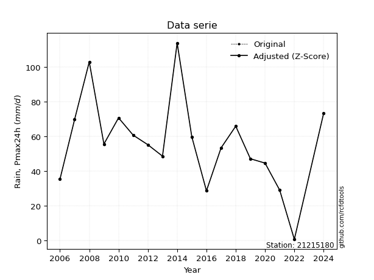</img>

</div>

> If Z-Score is active, values out of range or outliers are replaced with the station mean value.


### 4. Active continuous probability distributions from SciPy (45 of 104 available)

[scipy.stats](https://docs.scipy.org/doc/scipy/reference/stats.html) is a Python´s powerful submodule within the SciPy library for comprehensive statistical analysis, offering over 130 probability distributions (like Normal, Poisson), functions for descriptive stats (mean, variance), hypothesis testing (t-tests, chi-square), random variable generation, and statistical tests, making it essential for data science, modeling, and research. It provides tools to explore, model, and draw conclusions from data efficiently, working seamlessly with NumPy.

<div align="center">

|   id | p_dist             |   n_parameter | fit_method   | label                                                                       | active   | ref                                                                                                        |
|-----:|:-------------------|--------------:|:-------------|:----------------------------------------------------------------------------|:---------|:-----------------------------------------------------------------------------------------------------------|
|    0 | alpha              |             3 | MLE          | Alpha                                                                       | True     | [:mortar_board:](https://docs.scipy.org/doc/scipy/reference/generated/scipy.stats.alpha.html)              |
|    1 | betaprime          |             4 | MLE          | Beta prime                                                                  | True     | [:mortar_board:](https://docs.scipy.org/doc/scipy/reference/generated/scipy.stats.betaprime.html)          |
|    2 | chi2               |             3 | MLE          | Chi²                                                                        | True     | [:mortar_board:](https://docs.scipy.org/doc/scipy/reference/generated/scipy.stats.chi2.html)               |
|    3 | crystalball        |             4 | MLE          | Crystalball                                                                 | True     | [:mortar_board:](https://docs.scipy.org/doc/scipy/reference/generated/scipy.stats.crystalball.html)        |
|    4 | erlang             |             3 | MLE          | Erlang                                                                      | True     | [:mortar_board:](https://docs.scipy.org/doc/scipy/reference/generated/scipy.stats.erlang.html)             |
|    5 | expon              |             2 | MLE          | Exponential                                                                 | True     | [:mortar_board:](https://docs.scipy.org/doc/scipy/reference/generated/scipy.stats.expon.html)              |
|    6 | exponnorm          |             3 | MLE          | Exponentially modified Normal                                               | True     | [:mortar_board:](https://docs.scipy.org/doc/scipy/reference/generated/scipy.stats.exponnorm.html)          |
|    7 | f                  |             4 | MLE          | F                                                                           | True     | [:mortar_board:](https://docs.scipy.org/doc/scipy/reference/generated/scipy.stats.f.html)                  |
|    8 | fatiguelife        |             3 | MLE          | Fatigue-life (Birnbaum-Saunders)                                            | True     | [:mortar_board:](https://docs.scipy.org/doc/scipy/reference/generated/scipy.stats.fatiguelife.html)        |
|    9 | fisk               |             3 | MLE          | Fisk                                                                        | True     | [:mortar_board:](https://docs.scipy.org/doc/scipy/reference/generated/scipy.stats.fisk.html)               |
|   10 | gamma              |             3 | MLE          | Gamma                                                                       | True     | [:mortar_board:](https://docs.scipy.org/doc/scipy/reference/generated/scipy.stats.gamma.html)              |
|   11 | genexpon           |             5 | MLE          | Generalized exponential                                                     | True     | [:mortar_board:](https://docs.scipy.org/doc/scipy/reference/generated/scipy.stats.genexpon.html)           |
|   12 | genlogistic        |             3 | MLE          | Generalized logistic                                                        | True     | [:mortar_board:](https://docs.scipy.org/doc/scipy/reference/generated/scipy.stats.genlogistic.html)        |
|   13 | gibrat             |             2 | MM           | Gibrat                                                                      | True     | [:mortar_board:](https://docs.scipy.org/doc/scipy/reference/generated/scipy.stats.gibrat.html)             |
|   14 | gompertz           |             3 | MLE          | Gompertz (or truncated Gumbel)                                              | True     | [:mortar_board:](https://docs.scipy.org/doc/scipy/reference/generated/scipy.stats.gompertz.html)           |
|   15 | gumbel_l           |             2 | MM           | Gumbel Left Skew                                                            | True     | [:mortar_board:](https://docs.scipy.org/doc/scipy/reference/generated/scipy.stats.gumbel_l.html)           |
|   16 | gumbel_r           |             2 | MM           | Gumbel Right Skew                                                           | True     | [:mortar_board:](https://docs.scipy.org/doc/scipy/reference/generated/scipy.stats.gumbel_r.html)           |
|   17 | halflogistic       |             2 | MM           | Half-logistic                                                               | True     | [:mortar_board:](https://docs.scipy.org/doc/scipy/reference/generated/scipy.stats.halflogistic.html)       |
|   18 | halfnorm           |             2 | MM           | Half Normal                                                                 | True     | [:mortar_board:](https://docs.scipy.org/doc/scipy/reference/generated/scipy.stats.halfnorm.html)           |
|   19 | hypsecant          |             2 | MM           | hyperbolic secant                                                           | True     | [:mortar_board:](https://docs.scipy.org/doc/scipy/reference/generated/scipy.stats.hypsecant.html)          |
|   20 | invgamma           |             3 | MLE          | Inverted gamma                                                              | True     | [:mortar_board:](https://docs.scipy.org/doc/scipy/reference/generated/scipy.stats.invgamma.html)           |
|   21 | invgauss           |             3 | MLE          | Inverse Gaussian                                                            | True     | [:mortar_board:](https://docs.scipy.org/doc/scipy/reference/generated/scipy.stats.invgauss.html)           |
|   22 | invweibull         |             3 | MLE          | Inverted Weibull                                                            | True     | [:mortar_board:](https://docs.scipy.org/doc/scipy/reference/generated/scipy.stats.invweibull.html)         |
|   23 | johnsonsu          |             4 | MLE          | Johnson Su                                                                  | True     | [:mortar_board:](https://docs.scipy.org/doc/scipy/reference/generated/scipy.stats.johnsonsu.html)          |
|   24 | kstwobign          |             2 | MLE          | Limiting distribution of scaled Kolmogorov-Smirnov two-sided test statistic | True     | [:mortar_board:](https://docs.scipy.org/doc/scipy/reference/generated/scipy.stats.kstwobign.html)          |
|   25 | laplace            |             2 | MM           | Laplace                                                                     | True     | [:mortar_board:](https://docs.scipy.org/doc/scipy/reference/generated/scipy.stats.laplace.html)            |
|   26 | laplace_asymmetric |             3 | MLE          | Asymmetric Laplace                                                          | True     | [:mortar_board:](https://docs.scipy.org/doc/scipy/reference/generated/scipy.stats.laplace_asymmetric.html) |
|   27 | loggamma           |             3 | MLE          | Log gamma                                                                   | True     | [:mortar_board:](https://docs.scipy.org/doc/scipy/reference/generated/scipy.stats.loggamma.html)           |
|   28 | logistic           |             2 | MM           | Logistic (or Sech-squared)                                                  | True     | [:mortar_board:](https://docs.scipy.org/doc/scipy/reference/generated/scipy.stats.logistic.html)           |
|   29 | lognorm            |             3 | MLE          | Log Normal                                                                  | True     | [:mortar_board:](https://docs.scipy.org/doc/scipy/reference/generated/scipy.stats.lognorm.html)            |
|   30 | maxwell            |             2 | MM           | Maxwell                                                                     | True     | [:mortar_board:](https://docs.scipy.org/doc/scipy/reference/generated/scipy.stats.maxwell.html)            |
|   31 | mielke             |             4 | MLE          | Mielke Beta-Kappa / Dagum                                                   | True     | [:mortar_board:](https://docs.scipy.org/doc/scipy/reference/generated/scipy.stats.mielke.html)             |
|   32 | moyal              |             2 | MM           | Moyal                                                                       | True     | [:mortar_board:](https://docs.scipy.org/doc/scipy/reference/generated/scipy.stats.moyal.html)              |
|   33 | nakagami           |             3 | MLE          | Nakagami                                                                    | True     | [:mortar_board:](https://docs.scipy.org/doc/scipy/reference/generated/scipy.stats.nakagami.html)           |
|   34 | ncf                |             5 | MLE          | Non-central F distribution                                                  | True     | [:mortar_board:](https://docs.scipy.org/doc/scipy/reference/generated/scipy.stats.ncf.html)                |
|   35 | nct                |             4 | MLE          | Non-central Student’s t                                                     | True     | [:mortar_board:](https://docs.scipy.org/doc/scipy/reference/generated/scipy.stats.nct.html)                |
|   36 | norm               |             2 | MM           | Normal                                                                      | True     | [:mortar_board:](https://docs.scipy.org/doc/scipy/reference/generated/scipy.stats.norm.html)               |
|   37 | pareto             |             3 | MLE          | Pareto                                                                      | True     | [:mortar_board:](https://docs.scipy.org/doc/scipy/reference/generated/scipy.stats.pareto.html)             |
|   38 | pearson3           |             3 | MM           | Pearson type III                                                            | True     | [:mortar_board:](https://docs.scipy.org/doc/scipy/reference/generated/scipy.stats.pearson3.html)           |
|   39 | rayleigh           |             2 | MM           | Rayleigh                                                                    | True     | [:mortar_board:](https://docs.scipy.org/doc/scipy/reference/generated/scipy.stats.rayleigh.html)           |
|   40 | rice               |             3 | MLE          | Rice                                                                        | True     | [:mortar_board:](https://docs.scipy.org/doc/scipy/reference/generated/scipy.stats.rice.html)               |
|   41 | t                  |             3 | MLE          | Student’s t                                                                 | True     | [:mortar_board:](https://docs.scipy.org/doc/scipy/reference/generated/scipy.stats.t.html)                  |
|   42 | truncnorm          |             4 | MLE          | Truncated normal                                                            | True     | [:mortar_board:](https://docs.scipy.org/doc/scipy/reference/generated/scipy.stats.truncnorm.html)          |
|   43 | wald               |             2 | MM           | Wald                                                                        | True     | [:mortar_board:](https://docs.scipy.org/doc/scipy/reference/generated/scipy.stats.wald.html)               |
|   44 | weibull_min        |             3 | MLE          | Weibull minimum                                                             | True     | [:mortar_board:](https://docs.scipy.org/doc/scipy/reference/generated/scipy.stats.weibull_min.html)        |

</div>

> **n_parameter:** # arguments & localization & scale.
>
> **Fit methods:** (MLE) maximum likelihood, (MM) L-moments.
>
>**Inactive:** foldnorm, gennorm, norminvgauss, powernorm, powerlognorm, skewnorm, genextreme, anglit, arcsine, argus, beta, bradford, burr, burr12, cauchy, cosine, halfcauchy, foldcauchy, skewcauchy, wrapcauchy, dgamma, gengamma, exponweib, exponpow, truncexpon, gausshyper, genhalflogistic, genhyperbolic, geninvgauss, halfgennorm, johnsonsb, kappa4, kappa3, ksone, kstwo, loglaplace, levy, levy_l, levy_stable, ncx2, genpareto, truncpareto, lomax, powerlaw, rdist, rel_breitwigner, recipinvgauss, semicircular, studentized_range, trapezoid, triang, truncweibull_min, tukeylambda, uniform, loguniform, vonmises, vonmises_line, weibull_max, dweibull, 


## B. Probability distributions vs. Empirical distributions

A continuous probability distribution (CPD) describes probabilities for variables that can take any value within a range (like rain any time), unlike discrete variables with specific outcomes (like temperature). It uses a Probability Density Function (PDF), a curve where the total area under it equals 1, and the probability of the variable falling within an interval (a to b) is found by calculating the area under the curve between those points. A key feature is that the probability of hitting any single exact value is zero, so probabilities are always expressed for ranges, e.g., $P(a ≤ X ≤ b)$.

<div align="center">

Distributions parameters
|    |   station | p_dist                |   n |             loc |           scale | shape                  | shape1                | shape2             | shape3   |
|---:|----------:|:----------------------|----:|----------------:|----------------:|:-----------------------|:----------------------|:-------------------|:---------|
|  0 |  21215180 | alpha                 |  19 |     0.00123661  |     0.843486    | 1.6020610618087288e-06 |                       |                    |          |
|  1 |  21215180 | betaprime             |  19 |  -563.546       | 36948.5         | 501.6820066608384      | 30042.672411240477    |                    |          |
|  2 |  21215180 | chi2                  |  19 |  -161.43        |     1.83882     | 116.96498128220941     |                       |                    |          |
|  3 |  21215180 | crystalball           |  19 |    53.5316      |    27.768       | 9478.613687477438      | 228.52441826052336    |                    |          |
|  4 |  21215180 | erlang                |  19 |  -861.651       |     0.842618    | 1086.1103042432296     |                       |                    |          |
|  5 |  21215180 | expon                 |  19 |     0.2         |    53.3316      |                        |                       |                    |          |
|  6 |  21215180 | exponnorm             |  19 |    43.3046      |    25.8293      | 0.39594419495005995    |                       |                    |          |
|  7 |  21215180 | f                     |  19 |  -932.109       |   985.635       | 2541.242423230039      | 302499.1079513704     |                    |          |
|  8 |  21215180 | fatiguelife           |  19 | -1193.92        |  1247.13        | 0.022237397554996548   |                       |                    |          |
|  9 |  21215180 | fisk                  |  19 | -7937.17        |  7990.74        | 527.1103089169294      |                       |                    |          |
| 10 |  21215180 | gamma                 |  19 |  -862.639       |     0.841838    | 1088.2918102993358     |                       |                    |          |
| 11 |  21215180 | genexpon              |  19 |     0.199981    |     2.43029     | 0.04974044958214284    | 1.918920919348813e-07 | 2.4871424494421968 |          |
| 12 |  21215180 | genlogistic           |  19 |    55.6269      |    14.6279      | 0.9109955817831332     |                       |                    |          |
| 13 |  21215180 | gibrat                |  19 |    32.3481      |    12.8484      |                        |                       |                    |          |
| 14 |  21215180 | gompertz              |  19 |    28.7         |     6.52089     | 2.9600678550765948e-05 |                       |                    |          |
| 15 |  21215180 | gumbel_l              |  19 |    66.0286      |    21.6506      |                        |                       |                    |          |
| 16 |  21215180 | gumbel_r              |  19 |    41.0345      |    21.6506      |                        |                       |                    |          |
| 17 |  21215180 | halflogistic          |  19 |    20.6201      |    23.7406      |                        |                       |                    |          |
| 18 |  21215180 | halfnorm              |  19 |    16.7777      |    46.0642      |                        |                       |                    |          |
| 19 |  21215180 | hypsecant             |  19 |    53.5316      |    17.6776      |                        |                       |                    |          |
| 20 |  21215180 | invgamma              |  19 |  -249.231       | 34767.3         | 115.99531975761073     |                       |                    |          |
| 21 |  21215180 | invgauss              |  19 |  -138.724       |  8826.72        | 0.021756626055005335   |                       |                    |          |
| 22 |  21215180 | invweibull            |  19 |    -2.13962e+09 |     2.13962e+09 | 78527537.64699383      |                       |                    |          |
| 23 |  21215180 | johnsonsu             |  19 |    56.0781      |    24.1227      | 0.09664177368947925    | 1.1798892796854317    |                    |          |
| 24 |  21215180 | kstwobign             |  19 |   -59.3178      |   129.591       |                        |                       |                    |          |
| 25 |  21215180 | laplace               |  19 |    53.5316      |    19.6349      |                        |                       |                    |          |
| 26 |  21215180 | laplace_asymmetric    |  19 |    55.3         |    20.2272      | 1.0446702019316012     |                       |                    |          |
| 27 |  21215180 | loggamma              |  19 | -6592.87        |   943.432       | 1147.4428073507406     |                       |                    |          |
| 28 |  21215180 | logistic              |  19 |    53.5316      |    15.3093      |                        |                       |                    |          |
| 29 |  21215180 | lognorm               |  19 | -1378.44        |  1431.71        | 0.019388842365764023   |                       |                    |          |
| 30 |  21215180 | maxwell               |  19 |   -12.2668      |    41.233       |                        |                       |                    |          |
| 31 |  21215180 | mielke                |  19 |   -33.2716      |   104.393       | 3.2854796307196645     | 8.68686306376753      |                    |          |
| 32 |  21215180 | moyal                 |  19 |    37.6521      |    12.5         |                        |                       |                    |          |
| 33 |  21215180 | nakagami              |  19 |     0.2         |    62.1793      | 0.404385724627188      |                       |                    |          |
| 34 |  21215180 | ncf                   |  19 |     0.2         |     4.71375     | 0.517723948267899      | 41.59288560823133     | 5.06344817617711   |          |
| 35 |  21215180 | nct                   |  19 |    52.6077      |    25.3518      | 9.76465278620855       | 0.061307851731909224  |                    |          |
| 36 |  21215180 | norm                  |  19 |    53.5316      |    27.768       |                        |                       |                    |          |
| 37 |  21215180 | pareto                |  19 |     0.2         |     2.40276e-07 | 0.05555558830535643    |                       |                    |          |
| 38 |  21215180 | pearson3              |  19 |    53.5316      |    27.768       | 0.06588040847448992    |                       |                    |          |
| 39 |  21215180 | rayleigh              |  19 |     0.40988     |    42.385       |                        |                       |                    |          |
| 40 |  21215180 | rice                  |  19 |   -14.8551      |    30.2312      | 1.990188394259075      |                       |                    |          |
| 41 |  21215180 | t                     |  19 |    53.5315      |    27.7668      | 25877.763957402043     |                       |                    |          |
| 42 |  21215180 | truncnorm             |  19 |    51.9214      |    26.6436      | -1.9412360541873999    | 989.766353988598      |                    |          |
| 43 |  21215180 | wald                  |  19 |    25.7636      |    27.768       |                        |                       |                    |          |
| 44 |  21215180 | weibull_min           |  19 |   -27.9948      |    90.8941      | 3.2065317207162978     |                       |                    |          |
| 45 |  21215180 | logalpha              |  19 |   -23.7492      |   387.736       | 14.248102790201987     |                       |                    |          |
| 46 |  21215180 | logbetaprime          |  19 |    -8.11443     |     7.10426e+12 | 31.02762793954288      | 18911727047609.777    |                    |          |
| 47 |  21215180 | logchi2               |  19 |    -1.60944     |     4.01746     | 1.0966402407710691     |                       |                    |          |
| 48 |  21215180 | logcrystalball        |  19 |     3.49713     |     1.58832     | 7.853733077071816      | 15.435928522157084    |                    |          |
| 49 |  21215180 | logerlang             |  19 |   -16.1416      |     0.16253     | 120.57658319194468     |                       |                    |          |
| 50 |  21215180 | logexpon              |  19 |    -1.60944     |     5.10656     |                        |                       |                    |          |
| 51 |  21215180 | logexponnorm          |  19 |     3.49611     |     1.58833     | 0.0006417554045873312  |                       |                    |          |
| 52 |  21215180 | logf                  |  19 |    -1.60944     |     1.16814     | 1.0291446059577354     | 1.0924798817511139    |                    |          |
| 53 |  21215180 | logfatiguelife        |  19 | -1705.48        |  1708.98        | 0.000932036661842759   |                       |                    |          |
| 54 |  21215180 | logfisk               |  19 |    -2.70624e+08 |     2.70624e+08 | 439182157.51271105     |                       |                    |          |
| 55 |  21215180 | loggamma              |  19 |    -1.60944     |     5.31682     | 0.5786008137583792     |                       |                    |          |
| 56 |  21215180 | loggenexpon           |  19 |    -1.60944     |     2.29826     | 0.09839683974206931    | 0.5100811146210836    | 1.2387750304630167 |          |
| 57 |  21215180 | loggenlogistic        |  19 |     4.52801     |     0.132256    | 0.12527529249751995    |                       |                    |          |
| 58 |  21215180 | loggibrat             |  19 |     2.28542     |     0.734943    |                        |                       |                    |          |
| 59 |  21215180 | loggompertz           |  19 |    -1.64263     |     0.712095    | 0.00034330757504129686 |                       |                    |          |
| 60 |  21215180 | loggumbel_l           |  19 |     4.21195     |     1.23841     |                        |                       |                    |          |
| 61 |  21215180 | loggumbel_r           |  19 |     2.7823      |     1.23841     |                        |                       |                    |          |
| 62 |  21215180 | loghalflogistic       |  19 |     1.61463     |     1.35794     |                        |                       |                    |          |
| 63 |  21215180 | loghalfnorm           |  19 |     1.39482     |     2.63485     |                        |                       |                    |          |
| 64 |  21215180 | loghypsecant          |  19 |     3.49713     |     1.01116     |                        |                       |                    |          |
| 65 |  21215180 | loginvgamma           |  19 |   -45.6906      | 39763.4         | 809.1195402135911      |                       |                    |          |
| 66 |  21215180 | loginvgauss           |  19 |   -15.2355      |  1828.61        | 0.010237896535979493   |                       |                    |          |
| 67 |  21215180 | loginvweibull         |  19 |    -3.34648e+08 |     3.34648e+08 | 151213071.87140015     |                       |                    |          |
| 68 |  21215180 | logjohnsonsu          |  19 |     4.16728     |     0.155448    | 0.5487113663362271     | 0.6020648273600473    |                    |          |
| 69 |  21215180 | logkstwobign          |  19 |    -5.94048     |    10.869       |                        |                       |                    |          |
| 70 |  21215180 | loglaplace            |  19 |     3.49713     |     1.12311     |                        |                       |                    |          |
| 71 |  21215180 | loglaplace_asymmetric |  19 |     4.25986     |     0.492207    | 2.0398507599887266     |                       |                    |          |
| 72 |  21215180 | logloggamma           |  19 |     4.65656     |     0.177155    | 0.16114841965882076    |                       |                    |          |
| 73 |  21215180 | loglogistic           |  19 |     3.49713     |     0.875688    |                        |                       |                    |          |
| 74 |  21215180 | loglognorm            |  19 | -1656.18        |  1659.68        | 0.000955065236314034   |                       |                    |          |
| 75 |  21215180 | logmaxwell            |  19 |    -0.266514    |     2.35851     |                        |                       |                    |          |
| 76 |  21215180 | logmielke             |  19 |    -4.35479e+08 |     4.35479e+08 | 358227412.6631063      | 622154397.6432045     |                    |          |
| 77 |  21215180 | logmoyal              |  19 |     2.58882     |     0.714996    |                        |                       |                    |          |
| 78 |  21215180 | lognakagami           |  19 | -1868.77        |  1872.27        | 345963.0778182701      |                       |                    |          |
| 79 |  21215180 | logncf                |  19 |    -1.60944     |     1.06734     | 1.0606843261678272     | 1.1162635156300045    | 1.0731890613781827 |          |
| 80 |  21215180 | lognct                |  19 |  -121.698       |     1.57974     | 236055.4218557208      | 79.25037879836029     |                    |          |
| 81 |  21215180 | lognorm               |  19 |     3.49713     |     1.58832     |                        |                       |                    |          |
| 82 |  21215180 | logpareto             |  19 |    -1.60944     |     2.89761e-08 | 0.0555555144671452     |                       |                    |          |
| 83 |  21215180 | logpearson3           |  19 |     3.49713     |     1.58831     | -2.4215208975910425    |                       |                    |          |
| 84 |  21215180 | lograyleigh           |  19 |     0.458589    |     2.42441     |                        |                       |                    |          |
| 85 |  21215180 | logrice               |  19 |  -483.376       |     1.58855     | 306.4869558446993      |                       |                    |          |
| 86 |  21215180 | logt                  |  19 |     4.04412     |     0.230088    | 0.9672254310483503     |                       |                    |          |
| 87 |  21215180 | logtruncnorm          |  19 |     2.37798     |     7.29599     | -0.5465233984235134    | 0.32322119666978866   |                    |          |
| 88 |  21215180 | logwald               |  19 |     1.9088      |     1.58832     |                        |                       |                    |          |
| 89 |  21215180 | logweibull_min        |  19 |    -1.60944     |     1.66875     | 0.5737107470958703     |                       |                    |          |

</div>

> **loc** (Location parameter): This shifts the distribution along the x-axis. For many common distributions, like the normal (Gaussian) distribution, loc represents the mean $μ$. For others, like the uniform distribution, it might represent the minimum value, or for the beta distribution, the left end of the support interval.
>
> **scale** (Scale parameter): This determines the width or spread of the distribution. For the normal distribution, scale represents the standard deviation $σ$. For a uniform distribution, it defines the length of the interval (from $loc$ to $loc + scale$).
>
> **shape** (Shape parameters): Refers to parameters that define the specific form of a probability distribution, distinct from its location (loc) and scale (scale). These parameters are required arguments for most distribution functions. For example, a normal (Gaussian) distribution is fully defined by its location (mean) and scale (standard deviation), so it has no specific shape parameters beyond loc and scale. However, other distributions have intrinsic properties that need specification, as Gamma distribution that takes a shape parameter, often named $a$ or $alpha$.


### 0. Cumulative distribution values - CDF (90 evaluated)

> Ordered by x ascending and calculating $log(f(x))$ separately. 

|   id |   Station |   date |     x |   count |    mean |     std |      zscore |   Value_initial |   station |   m |       alpha |   alpha_pdf |   betaprime |   betaprime_pdf |      chi2 |   chi2_pdf |   crystalball |   crystalball_pdf |    erlang |   erlang_pdf |     expon |   expon_pdf |   exponnorm |   exponnorm_pdf |         f |      f_pdf |   fatiguelife |   fatiguelife_pdf |      fisk |   fisk_pdf |     gamma |   gamma_pdf |    genexpon |   genexpon_pdf |   genlogistic |   genlogistic_pdf |    gibrat |   gibrat_pdf |    gompertz |   gompertz_pdf |   gumbel_l |   gumbel_l_pdf |   gumbel_r |   gumbel_r_pdf |   halflogistic |   halflogistic_pdf |   halfnorm |   halfnorm_pdf |   hypsecant |   hypsecant_pdf |   invgamma |   invgamma_pdf |   invgauss |   invgauss_pdf |   invweibull |   invweibull_pdf |   johnsonsu |   johnsonsu_pdf |   kstwobign |   kstwobign_pdf |   laplace |   laplace_pdf |   laplace_asymmetric |   laplace_asymmetric_pdf |    loggamma |   loggamma_pdf |   logistic |   logistic_pdf |     lognorm |   lognorm_pdf |    maxwell |   maxwell_pdf |    mielke |   mielke_pdf |       moyal |   moyal_pdf |    nakagami |   nakagami_pdf |         ncf |     ncf_pdf |       nct |    nct_pdf |      norm |   norm_pdf |   pareto |       pareto_pdf |   pearson3 |   pearson3_pdf |    rayleigh |   rayleigh_pdf |      rice |   rice_pdf |         t |      t_pdf |   truncnorm |   truncnorm_pdf |       wald |   wald_pdf |   weibull_min |   weibull_min_pdf |    logalpha |   logalpha_pdf |   logbetaprime |   logbetaprime_pdf |     logchi2 |   logchi2_pdf |   logcrystalball |   logcrystalball_pdf |   logerlang |   logerlang_pdf |   logexpon |   logexpon_pdf |   logexponnorm |   logexponnorm_pdf |        logf |    logf_pdf |   logfatiguelife |   logfatiguelife_pdf |    logfisk |   logfisk_pdf |   loggenexpon |   loggenexpon_pdf |   loggenlogistic |   loggenlogistic_pdf |   loggibrat |   loggibrat_pdf |   loggompertz |   loggompertz_pdf |   loggumbel_l |   loggumbel_l_pdf |   loggumbel_r |   loggumbel_r_pdf |   loghalflogistic |   loghalflogistic_pdf |   loghalfnorm |   loghalfnorm_pdf |   loghypsecant |   loghypsecant_pdf |   loginvgamma |   loginvgamma_pdf |   loginvgauss |   loginvgauss_pdf |   loginvweibull |   loginvweibull_pdf |   logjohnsonsu |   logjohnsonsu_pdf |   logkstwobign |   logkstwobign_pdf |   loglaplace |   loglaplace_pdf |   loglaplace_asymmetric |   loglaplace_asymmetric_pdf |   logloggamma |   logloggamma_pdf |   loglogistic |   loglogistic_pdf |   loglognorm |   loglognorm_pdf |   logmaxwell |   logmaxwell_pdf |   logmielke |   logmielke_pdf |    logmoyal |   logmoyal_pdf |   lognakagami |   lognakagami_pdf |      logncf |   logncf_pdf |     lognct |   lognct_pdf |   logpareto |   logpareto_pdf |   logpearson3 |   logpearson3_pdf |   lograyleigh |   lograyleigh_pdf |     logrice |   logrice_pdf |      logt |   logt_pdf |   logtruncnorm |   logtruncnorm_pdf |   logwald |   logwald_pdf |   logweibull_min |   logweibull_min_pdf |
|-----:|----------:|-------:|------:|--------:|--------:|--------:|------------:|----------------:|----------:|----:|------------:|------------:|------------:|----------------:|----------:|-----------:|--------------:|------------------:|----------:|-------------:|----------:|------------:|------------:|----------------:|----------:|-----------:|--------------:|------------------:|----------:|-----------:|----------:|------------:|------------:|---------------:|--------------:|------------------:|----------:|-------------:|------------:|---------------:|-----------:|---------------:|-----------:|---------------:|---------------:|-------------------:|-----------:|---------------:|------------:|----------------:|-----------:|---------------:|-----------:|---------------:|-------------:|-----------------:|------------:|----------------:|------------:|----------------:|----------:|--------------:|---------------------:|-------------------------:|------------:|---------------:|-----------:|---------------:|------------:|--------------:|-----------:|--------------:|----------:|-------------:|------------:|------------:|------------:|---------------:|------------:|------------:|----------:|-----------:|----------:|-----------:|---------:|-----------------:|-----------:|---------------:|------------:|---------------:|----------:|-----------:|----------:|-----------:|------------:|----------------:|-----------:|-----------:|--------------:|------------------:|------------:|---------------:|---------------:|-------------------:|------------:|--------------:|-----------------:|---------------------:|------------:|----------------:|-----------:|---------------:|---------------:|-------------------:|------------:|------------:|-----------------:|---------------------:|-----------:|--------------:|--------------:|------------------:|-----------------:|---------------------:|------------:|----------------:|--------------:|------------------:|--------------:|------------------:|--------------:|------------------:|------------------:|----------------------:|--------------:|------------------:|---------------:|-------------------:|--------------:|------------------:|--------------:|------------------:|----------------:|--------------------:|---------------:|-------------------:|---------------:|-------------------:|-------------:|-----------------:|------------------------:|----------------------------:|--------------:|------------------:|--------------:|------------------:|-------------:|-----------------:|-------------:|-----------------:|------------:|----------------:|------------:|---------------:|--------------:|------------------:|------------:|-------------:|-----------:|-------------:|------------:|----------------:|--------------:|------------------:|--------------:|------------------:|------------:|--------------:|----------:|-----------:|---------------:|-------------------:|----------:|--------------:|-----------------:|---------------------:|
|    0 |  21215180 |   2025 |   0.2 |      19 | 53.5316 | 28.5289 | -1.86939    |             0.2 |  21215180 |   1 | 2.19898e-05 | 0.00209318  |   0.0248961 |      0.00222936 | 0.0206294 | 0.00214209 |     0.0273901 |        0.00227175 | 0.0256648 |   0.00223945 | 0         |  0.0187506  |   0.0251066 |      0.00219709 | 0.0257521 | 0.0022401  |     0.0253826 |        0.0022297  | 0.028391  | 0.00183188 | 0.0256719 |  0.0022397  | 3.78653e-07 |     0.0204669  |     0.031047  |        0.00189078 | 0         |  0           | 0           |    0           |  0.046686  |    0.0021052   | 0.00136938 |    0.000417026 |       0        |         0          |   0        |     0          |   0.0311396 |      0.00175872 |  0.0191599 |     0.00214459 |  0.0162818 |     0.00201463 |    0.0142378 |       0.0022218  |   0.0388818 |      0.00163248 |   0.0157368 |      0.0028285  | 0.0330641 |    0.00168394 |            0.0384662 |               0.00182039 | 3.74075e-10 | 974759         |  0.0297822 |     0.00188743 | 0.000652067 |    0.00143019 | 0.00715275 |    0.00168992 | 0.0238222 |   0.0023382  | 7.70874e-06 | 6.45297e-06 | 1.12683e-15 |    32.8348     | 5.69254e-06 | 1.20662e+09 | 0.0291811 | 0.00194756 | 0.0273901 | 0.00227175 | 0        | 231216           |  0.0254903 |     0.00223477 | 0           |    0           | 0.0181103 | 0.00253261 | 0.0273906 | 0.00227162 | 1.57199e-11 |      0.00233622 | 0          | 0          |     0.0231646 |        0.00260371 | 0.000547361 |     0.00152859 |     0.00187248 |         0.00424703 | 9.37218e-10 |   2.31438e+06 |      0.000652067 |           0.00143019 | 0.000978562 |      0.00226263 |   0        |      0.195826  |    0.000652111 |         0.00143027 | 5.29581e-09 | 1.22727e+07 |      0.000657302 |           0.00144101 | 0.000138   |   0.000223923 |   4.04212e-09 |         0.0428136 |       0.0029869  |           0.00282925 |    0        |       0         |   1.63819e-05 |       0.000505106 |    0.00904772 |        0.00727277 |   8.65089e-16 |       2.42282e-14 |          0        |              0        |      0        |          0        |     0.00407936 |         0.00403424 |   0.000785205 |        0.00180441 |   0.000946725 |        0.00235502 |      0.00149165 |          0.00438638 |      0.0204102 |         0.00513204 |     0.00265683 |         0.00891899 |   0.00530057 |       0.00471954 |              0.00233179 |                  0.00232243 |    0.00360052 |         0.0032752 |    0.00292512 |         0.0033306 |  0.000629219 |       0.00139096 |     0        |         0        |  0.00773405 |       0.0063607 | 3.70521e-79 |    9.22043e-77 |   0.000667034 |        0.00145881 | 1.85495e-09 |  4.43045e+06 | 0.0006578  |   0.00144157 |    0        |     1.91729e+06 |     0.0169397 |        0.00948838 |      0        |          0        | 0.000653194 |    0.00143227 | 0.0142949 | 0.00244301 |    1.81497e-06 |           0.140839 |  0        |     0         |      7.79464e-10 |          2.01395e+06 |
|    1 |  21215180 |   2022 |   0.7 |      19 | 53.5316 | 28.5289 | -1.85186    |             0.7 |  21215180 |   2 | 0.227389    | 0.665194    |   0.0260316 |      0.0023128  | 0.0217231 | 0.00223306 |     0.0285458 |        0.00235131 | 0.0268049 |   0.00232143 | 0.0093315 |  0.0185756  |   0.0262254 |      0.00227837 | 0.0268925 | 0.00232189 |     0.0265179 |        0.00231185 | 0.0293214 | 0.00188999 | 0.0268121 |  0.00232167 | 0.0101817   |     0.0202586  |     0.0320065 |        0.00194772 | 0         |  0           | 0           |    0           |  0.0477503 |    0.00215198  | 0.00159182 |    0.000473702 |       0        |         0          |   0        |     0          |   0.0320314 |      0.00180892 |  0.0202565 |     0.00224232 |  0.0173141 |     0.00211518 |    0.0153822 |       0.00235674 |   0.0397082 |      0.00167327 |   0.0171961 |      0.00300943 | 0.0339169 |    0.00172738 |            0.0393873 |               0.00186398 | 0.447006    |      0.17739   |  0.0307405 |     0.00194624 | 0.0076261   |    0.0132313  | 0.0080304  |    0.00182137 | 0.0250114 |   0.00241878 | 1.16229e-05 | 9.3635e-06  | 0.0158102   |     0.0255732  | 0.0362351   | 0.0222298   | 0.0301706 | 0.00201074 | 0.0285458 | 0.00235131 | 0.554359 |      0.0495157   |  0.0266281 |     0.00231692 | 2.34258e-05 |    0.000161489 | 0.0194018 | 0.00263355 | 0.0285462 | 0.00235117 | 0.00118958  |      0.00242247 | 0          | 0          |     0.0244912 |        0.00270301 | 0.0099804   |     0.0188525  |     0.0196078  |         0.0299608  | 0.38473     |   0.152096    |      0.0076261   |           0.0132313  | 0.0118488   |      0.0200164  |   0.217549 |      0.153225  |    0.0076264   |         0.0132317  | 0.519299    | 0.132149    |      0.00767106  |           0.0132924  | 0.00105298 |   0.00170703  |   0.121477    |         0.133342  |       0.00978526 |           0.0092688  |    0        |       0         |   0.0017443   |       0.00292867  |    0.0246844  |        0.0196843  |   3.3305e-06  |       3.3919e-05  |          0        |              0        |      0        |          0        |     0.0140797  |         0.0139198  |   0.00968116  |        0.0167021  |   0.0129477   |        0.0223347  |      0.0248508  |          0.0414897  |      0.028832  |         0.00875641 |     0.045528   |         0.0680727  |   0.0161715  |       0.0143988  |              0.00812035 |                  0.00808776 |    0.0112532  |         0.0102364 |    0.0121178  |         0.0136704 |  0.00749091  |       0.0130814  |     0        |         0        |  0.0216617  |       0.0177961 | 4.35057e-15 |    1.90161e-13 |   0.00774338  |        0.0133922  | 0.388914    |  0.133873    | 0.00767447 |   0.0132999  |    0.62348  |     0.0166973   |     0.0343305 |        0.0195022  |      0        |          0        | 0.00763417  |    0.0132418  | 0.018208  | 0.00399483 |    0.184057    |           0.152432 |  0        |     0         |      0.571866    |          0.166327    |
|    2 |  21215180 |   2016 |  28.7 |      19 | 53.5316 | 28.5289 | -0.870402   |            28.7 |  21215180 |   3 | 0.976553    | 0.000816777 |   0.186978  |      0.00994564 | 0.18948   | 0.0104572  |     0.185593  |        0.00963199 | 0.186188  |   0.00982912 | 0.413975  |  0.0109883  |   0.184935  |      0.00987161 | 0.186066  | 0.00981443 |     0.186023  |        0.00985209 | 0.161973  | 0.00898192 | 0.18619   |  0.00982822 | 0.441952    |     0.0114216  |     0.163468  |        0.00878618 | 0         |  0           | 3.76628e-11 |    4.53936e-06 |  0.163331  |    0.00689128  | 0.170717   |    0.0139388   |       0.168547 |         0.0204626  |   0.204226 |     0.0167506  |   0.153225  |      0.00833685 |  0.196448  |     0.0110047  |  0.194939  |     0.0112199  |    0.224505  |       0.0123089  |   0.146362  |      0.00741641 |   0.254469  |      0.0125726  | 0.141167  |    0.00718959 |            0.148195  |               0.00701322 | 0.794935    |      0.049377  |  0.16493   |     0.00899637 | 0.464824    |    0.250195   | 0.195634   |    0.0116605  | 0.179535  |   0.00941668 | 0.152549    | 0.0164099   | 0.406022    |     0.0108424  | 0.360177    | 0.010992    | 0.168656  | 0.00904922 | 0.185593  | 0.00963199 | 0.644011 |      0.000693936 |  0.186148  |     0.00984406 | 0.199684    |    0.0126029   | 0.193033  | 0.0102192  | 0.185588  | 0.00963192 | 0.17005     |      0.0105163  | 0.00546675 | 0.00952445 |     0.197588  |        0.0099902  | 0.477567    |     0.210196   |     0.488598   |         0.192443   | 0.705936    |   0.05143     |      0.464824    |           0.250195   | 0.489993    |      0.224167   |   0.621878 |      0.0740462 |    0.464824    |         0.250194   | 0.727717    | 0.0257308   |      0.46413     |           0.249469   | 0.30396    |   0.343343    |   0.606007    |         0.0982977 |       0.329782   |           0.312332   |    0.646914 |       0.346787  |   0.318923    |       0.367678    |    0.394288   |        0.245213   |   0.533245    |       0.270743    |          0.565928 |              0.250278 |      0.543526 |          0.229494 |     0.455997   |         0.311795   |   0.47301     |        0.23098    |   0.492908    |        0.212304   |      0.501574   |          0.156382   |      0.192643  |         0.199681   |     0.542854   |         0.138502   |   0.441312   |       0.392936   |              0.328009   |                  0.326693   |    0.329838   |         0.299868  |    0.460052   |         0.283667  |  0.465257    |       0.250749   |     0.498923 |         0.245323 |  0.402718   |       0.263017  | 0.558931    |    0.274897    |   0.465466    |        0.249727   | 0.627769    |  0.0327484   | 0.465014   |   0.249916   |    0.651216 |     0.00390164  |     0.311745  |        0.201333   |      0.510601 |          0.241322 | 0.464845    |    0.250161   | 0.106218  | 0.139667   |    0.780583    |           0.162059 |  0.630419 |     0.287293  |      0.845805    |          0.0333013   |
|    3 |  21215180 |   2021 |  29.1 |      19 | 53.5316 | 28.5289 | -0.856381   |            29.1 |  21215180 |   4 | 0.976875    | 0.000794485 |   0.190982  |      0.0100717  | 0.193688  | 0.0105839  |     0.189471  |        0.00975586 | 0.190145  |   0.00995451 | 0.418354  |  0.0109062  |   0.188909  |      0.0100001  | 0.190017  | 0.00993977 |     0.189989  |        0.00997795 | 0.165598  | 0.00914275 | 0.190146  |  0.00995359 | 0.446501    |     0.0113284  |     0.167014  |        0.00894281 | 0         |  0           | 1.87263e-06 |    4.82652e-06 |  0.166108  |    0.00699648  | 0.176331   |    0.0141337   |       0.17672  |         0.0204032  |   0.210919 |     0.0167124  |   0.156594  |      0.00850527 |  0.200876  |     0.0111322  |  0.199453  |     0.0113483  |    0.229446  |       0.0123965  |   0.149361  |      0.00757996 |   0.259508  |      0.0126219  | 0.144072  |    0.00733756 |            0.151027  |               0.00714724 | 0.795617    |      0.0491909 |  0.16856   |     0.00915442 | 0.468289    |    0.250378   | 0.200321   |    0.0117747  | 0.183328  |   0.0095481  | 0.159167    | 0.0166784   | 0.410348    |     0.0107876  | 0.364567    | 0.0109603   | 0.172305  | 0.00919332 | 0.189471  | 0.00975586 | 0.644286 |      0.000683802 |  0.190111  |     0.00996962 | 0.204745    |    0.0127003   | 0.197143  | 0.010333   | 0.189466  | 0.0097558  | 0.174284    |      0.0106536  | 0.0101185  | 0.0137628  |     0.201605  |        0.0100956  | 0.480475    |     0.210062   |     0.49126    |         0.19232    | 0.706647    |   0.051277    |      0.468289    |           0.250378   | 0.493095    |      0.224098   |   0.622902 |      0.0738458 |    0.468289    |         0.250377   | 0.728072    | 0.0256354   |      0.467584    |           0.249653   | 0.308733   |   0.346343    |   0.607366    |         0.0980033 |       0.334133   |           0.316448   |    0.651672 |       0.340683  |   0.324042    |       0.372076    |    0.397692   |        0.246576   |   0.536985    |       0.269612    |          0.569382 |              0.248834 |      0.546696 |          0.228595 |     0.460317   |         0.312355   |   0.476208    |        0.231011   |   0.495846    |        0.212168   |      0.503736   |          0.156077   |      0.195442  |         0.204817   |     0.544769   |         0.138198   |   0.446784   |       0.397809   |              0.332562   |                  0.331228   |    0.334014   |         0.303651  |    0.46398    |         0.284008  |  0.468729    |       0.250928   |     0.502316 |         0.244978 |  0.406367   |       0.264312  | 0.562724    |    0.273142    |   0.468923    |        0.249906   | 0.628222    |  0.032637    | 0.468474   |   0.250096   |    0.65127  |     0.0038902   |     0.314546  |        0.203405   |      0.513937 |          0.240822 | 0.468309    |    0.250344   | 0.108187  | 0.144792   |    0.782825    |           0.162017 |  0.634368 |     0.283459  |      0.846265    |          0.0331626   |
|    4 |  21215180 |   2006 |  35.4 |      19 | 53.5316 | 28.5289 | -0.635552   |            35.4 |  21215180 |   5 | 0.98099     | 0.00053693  |   0.260425  |      0.0119249  | 0.266249  | 0.0123817  |     0.256889  |        0.0116086  | 0.258845  |   0.0118101  | 0.48316   |  0.00969107 |   0.25805   |      0.0119038  | 0.258624  | 0.0117959  |     0.258855  |        0.0118388  | 0.231393  | 0.0117587  | 0.258839  |  0.0118089  | 0.513461    |     0.00995799 |     0.231397  |        0.0115206  | 0.0752942 |  0.0465214   | 5.31017e-05 |    1.26822e-05 |  0.215731  |    0.00880253  | 0.273282   |    0.0163744   |       0.3016   |         0.0191452  |   0.313985 |     0.015962   |   0.219172  |      0.0114415  |  0.276805  |     0.0128844  |  0.27672   |     0.0130834  |    0.310927  |       0.0133309  |   0.206165  |      0.0105867  |   0.340626  |      0.0130139  | 0.198576  |    0.0101134  |            0.203486  |               0.00962987 | 0.805005    |      0.0466459 |  0.234271  |     0.0117176  | 0.517473    |    0.250931   | 0.279496   |    0.0132568  | 0.250108  |   0.0116594  | 0.273839    | 0.0191914   | 0.475669    |     0.00995874 | 0.431841    | 0.0103704   | 0.237394  | 0.0114583  | 0.256889  | 0.0116086  | 0.648162 |      0.0005553   |  0.25891   |     0.0118259  | 0.288764    |    0.0138527   | 0.267595  | 0.0119814  | 0.256884  | 0.0116088  | 0.247959    |      0.0126857  | 0.215925   | 0.0380209  |     0.270171  |        0.0116262  | 0.521378    |     0.207009   |     0.528721   |         0.189715   | 0.716488    |   0.0491766   |      0.517473    |           0.250931   | 0.53682     |      0.221694   |   0.6371   |      0.0710655 |    0.517472    |         0.25093    | 0.732968    | 0.0243451   |      0.516628    |           0.250234   | 0.380361   |   0.382483    |   0.626166    |         0.0938784 |       0.402262   |           0.380765   |    0.710838 |       0.266792  |   0.402978    |       0.432737    |    0.447837   |        0.264804   |   0.588145    |       0.252079    |          0.616145 |              0.228422 |      0.590228 |          0.215596 |     0.521888   |         0.314054   |   0.521416    |        0.229864   |   0.537156    |        0.209055   |      0.533875   |          0.151397   |      0.244413  |         0.304699   |     0.571419   |         0.133727   |   0.530039   |       0.418445   |              0.404242   |                  0.40262    |    0.399117   |         0.36239   |    0.519856   |         0.28504   |  0.518015    |       0.251415   |     0.549741 |         0.238538 |  0.459798   |       0.280121  | 0.613788    |    0.247919    |   0.518009    |        0.250402   | 0.634468    |  0.0311243   | 0.517601   |   0.250626   |    0.652017 |     0.00373489  |     0.357495  |        0.235961   |      0.560352 |          0.232484 | 0.517486    |    0.250895   | 0.146234  | 0.259252   |    0.814515    |           0.161368 |  0.685023 |     0.235308  |      0.852578    |          0.031282    |
|    5 |  21215180 |   2020 |  44.7 |      19 | 53.5316 | 28.5289 | -0.309566   |            44.7 |  21215180 |   6 | 0.984944    | 0.000336782 |   0.381248  |      0.0138545  | 0.390163  | 0.01403    |     0.375224  |        0.0136584  | 0.37878   |   0.0137863  | 0.565866  |  0.00814028 |   0.379111  |      0.0139269  | 0.378452  | 0.0137783  |     0.379058  |        0.0138133  | 0.357566  | 0.0151699  | 0.378762  |  0.0137849  | 0.59779     |     0.00823202 |     0.355644  |        0.0150285  | 0.484281  |  0.032273    | 0.000314628 |    5.27795e-05 |  0.311604  |    0.0118722   | 0.429878   |    0.0167629   |       0.467719 |         0.0164536  |   0.455592 |     0.0144142  |   0.347206  |      0.0159714  |  0.404383  |     0.0142855  |  0.405692  |     0.0143745  |    0.43588   |       0.0132841  |   0.329579  |      0.0160125  |   0.460181  |      0.0125192  | 0.318881  |    0.0162405  |            0.315992  |               0.0149541  | 0.815552    |      0.0438221 |  0.359651  |     0.0150433  | 0.575609    |    0.246648   | 0.408444   |    0.0142221  | 0.372466  |   0.0145419  | 0.450648    | 0.0181136   | 0.562899    |     0.00881181 | 0.523396    | 0.00928965  | 0.357757  | 0.0142343  | 0.375224  | 0.0136584  | 0.652715 |      0.000433564 |  0.378974  |     0.0137969  | 0.420714    |    0.0142816   | 0.387593  | 0.0136348  | 0.375221  | 0.0136588  | 0.376909    |      0.0148203  | 0.504039   | 0.0236879  |     0.386452  |        0.0132203  | 0.568988    |     0.200756   |     0.57242    |         0.184618   | 0.727682    |   0.0468278   |      0.575609    |           0.246648   | 0.58788     |      0.215524   |   0.653304 |      0.0678923 |    0.575608    |         0.246646   | 0.738481    | 0.0229439   |      0.574609    |           0.246025   | 0.472661   |   0.404499    |   0.647503    |         0.0890879 |       0.501514   |           0.47312    |    0.765186 |       0.20281   |   0.511226    |       0.49159     |    0.511789   |        0.282662   |   0.644258    |       0.228722    |          0.666631 |              0.204576 |      0.638665 |          0.19964  |     0.593942   |         0.301188   |   0.574514    |        0.224749   |   0.585227    |        0.202648   |      0.568468   |          0.145081   |      0.340307  |         0.553292   |     0.601959   |         0.128073   |   0.618177   |       0.339969   |              0.509964   |                  0.507917   |    0.493061   |         0.445453  |    0.585608   |         0.277121  |  0.576252    |       0.247026   |     0.604158 |         0.227475 |  0.526598   |       0.290967  | 0.668131    |    0.218204    |   0.576017    |        0.246083   | 0.641532    |  0.0294692   | 0.575664   |   0.246332   |    0.652868 |     0.0035651   |     0.417961  |        0.284595   |      0.613165 |          0.219908 | 0.575614    |    0.246612   | 0.242899  | 0.643214   |    0.852051    |           0.160447 |  0.734445 |     0.190393  |      0.859631    |          0.0292308   |
|    6 |  21215180 |   2019 |  47.2 |      19 | 53.5316 | 28.5289 | -0.221936   |            47.2 |  21215180 |   7 | 0.985742    | 0.000302055 |   0.416266  |      0.0141418  | 0.425495  | 0.0142162  |     0.409816  |        0.0139983  | 0.413651  |   0.014093   | 0.585747  |  0.00776749 |   0.414339  |      0.0142367  | 0.413306  | 0.0140876  |     0.413995  |        0.0141176  | 0.396307  | 0.0157946  | 0.41363   |  0.0140917  | 0.617853    |     0.00782141 |     0.394104  |        0.0157123  | 0.557608  |  0.0265808   | 0.000475425 |    7.74278e-05 |  0.342358  |    0.0127301   | 0.471335   |    0.0163751   |       0.507828 |         0.0156296  |   0.491024 |     0.0139272  |   0.388354  |      0.0169101  |  0.440241  |     0.0143813  |  0.441727  |     0.0144328  |    0.468796  |       0.0130347  |   0.371322  |      0.0173512  |   0.491126  |      0.0122284  | 0.362181  |    0.0184457  |            0.355678  |               0.0168323  | 0.81792     |      0.0431933 |  0.398055  |     0.0156511  | 0.588985    |    0.244898   | 0.444026   |    0.0142263  | 0.409596  |   0.0151439  | 0.494891    | 0.0172573   | 0.584555    |     0.00851402 | 0.54623     | 0.00897624  | 0.393994  | 0.0147335  | 0.409816  | 0.0139983  | 0.653768 |      0.000409258 |  0.413869  |     0.0141011  | 0.456286    |    0.0141612   | 0.421991  | 0.0138676  | 0.409815  | 0.0139988  | 0.414379    |      0.0151353  | 0.559143   | 0.02048    |     0.419832  |        0.0134694  | 0.579864    |     0.198927   |     0.582427   |         0.183142   | 0.730216    |   0.0463019   |      0.588985    |           0.244898   | 0.599558    |      0.213602   |   0.656979 |      0.0671726 |    0.588984    |         0.244896   | 0.739721    | 0.0226362   |      0.587952    |           0.244299   | 0.494713   |   0.405666    |   0.652321    |         0.087991  |       0.527908   |           0.496995   |    0.77589  |       0.190722  |   0.538252    |       0.501292    |    0.527264   |        0.285998   |   0.656551    |       0.223066    |          0.677616 |              0.199139 |      0.649427 |          0.195869 |     0.610198   |         0.296121   |   0.586699    |        0.223001   |   0.596205    |        0.200767   |      0.576321   |          0.143512   |      0.373011  |         0.652352   |     0.608892   |         0.126713   |   0.636237   |       0.323888   |              0.538368   |                  0.536207   |    0.517879   |         0.466724  |    0.600605   |         0.273932  |  0.589648    |       0.245248   |     0.616455 |         0.224433 |  0.542463   |       0.291983  | 0.679822    |    0.211476    |   0.589362    |        0.24433    | 0.643126    |  0.0291038   | 0.589023   |   0.244583   |    0.653061 |     0.00352763  |     0.433809  |        0.297969   |      0.625044 |          0.216627 | 0.588988    |    0.244863   | 0.282382  | 0.814174   |    0.860777    |           0.16021  |  0.744561 |     0.181481  |      0.86121     |          0.028779    |
|    7 |  21215180 |   2013 |  48.7 |      19 | 53.5316 | 28.5289 | -0.169357   |            48.7 |  21215180 |   8 | 0.986181    | 0.000283737 |   0.437573  |      0.0142604  | 0.446866  | 0.0142722  |     0.430933  |        0.0141512  | 0.434894  |   0.0142242  | 0.597236  |  0.00755207 |   0.435798  |      0.0143673  | 0.434542  | 0.0142203  |     0.435273  |        0.0142469  | 0.420223  | 0.0160813  | 0.434871  |  0.0142229  | 0.629406    |     0.00758493 |     0.417925  |        0.0160388  | 0.59527   |  0.0236983   | 0.000606002 |    9.74408e-05 |  0.361836  |    0.0132392   | 0.495674   |    0.016068    |       0.530894 |         0.0151249  |   0.511688 |     0.0136236  |   0.414064  |      0.0173541  |  0.461818  |     0.0143809  |  0.463364  |     0.01441    |    0.488211  |       0.0128474  |   0.397881  |      0.0180451  |   0.509322  |      0.0120304  | 0.390933  |    0.0199101  |            0.381845  |               0.0180706  | 0.819265    |      0.0428367 |  0.421749  |     0.01593    | 0.596629    |    0.243768   | 0.465335   |    0.0141794  | 0.432545  |   0.015446   | 0.520352    | 0.0166861   | 0.597194    |     0.00833717 | 0.559552    | 0.00878593  | 0.416276  | 0.0149658  | 0.430933  | 0.0141512  | 0.654372 |      0.000395909 |  0.435123  |     0.0142306  | 0.477446    |    0.0140464   | 0.442866  | 0.0139589  | 0.430933  | 0.0141516  | 0.437184    |      0.0152628  | 0.588575   | 0.0187904  |     0.440121  |        0.0135774  | 0.58607     |     0.197817   |     0.588143   |         0.182247   | 0.73166     |   0.0460032   |      0.596629    |           0.243768   | 0.606222    |      0.212421   |   0.659074 |      0.0667624 |    0.596629    |         0.243767   | 0.740426    | 0.0224623   |      0.595578    |           0.243184   | 0.507405   |   0.405623    |   0.655064    |         0.0873641 |       0.543675   |           0.511007   |    0.781754 |       0.184179  |   0.554009    |       0.505932    |    0.536239   |        0.287746   |   0.663479    |       0.219796    |          0.683798 |              0.19604  |      0.655521 |          0.193697 |     0.619412   |         0.292905   |   0.593658    |        0.221905   |   0.602468    |        0.199625   |      0.580796   |          0.142596   |      0.394461  |         0.720437   |     0.612844   |         0.125925   |   0.64623    |       0.31499    |              0.555407   |                  0.553178   |    0.532675   |         0.479196  |    0.609143   |         0.271887  |  0.597303    |       0.244102   |     0.623448 |         0.222614 |  0.551602   |       0.292284  | 0.686379    |    0.207655    |   0.596989    |        0.243199   | 0.644033    |  0.0288971   | 0.596657   |   0.243454   |    0.653171 |     0.00350643  |     0.443257  |        0.306081   |      0.631791 |          0.214689 | 0.596631    |    0.243733   | 0.309614  | 0.928357   |    0.865787    |           0.160069 |  0.750162 |     0.17659   |      0.862106    |          0.0285236   |
|    8 |  21215180 |   2017 |  53.5 |      19 | 53.5316 | 28.5289 | -0.00110691 |            53.5 |  21215180 |   9 | 0.987421    | 0.000235113 |   0.506433  |      0.0143594  | 0.515305  | 0.0141743  |     0.499546  |        0.014367   | 0.503681  |   0.0143655  | 0.631903  |  0.00690205 |   0.505244  |      0.0144942  | 0.503323  | 0.0143671  |     0.504152  |        0.014381   | 0.498718  | 0.0164913  | 0.503652  |  0.0143644  | 0.664083    |     0.00687521 |     0.496541  |        0.0165839  | 0.690937  |  0.016657    | 0.00129693  |    0.000203293 |  0.429157  |    0.014782    | 0.569909   |    0.0148009   |       0.599574 |         0.0134898  |   0.574665 |     0.0126059  |   0.499431  |      0.0180063  |  0.530341  |     0.0141016  |  0.531861  |     0.0140633  |    0.548156  |       0.0120949  |   0.488344  |      0.0193943  |   0.565375  |      0.0113042  | 0.499196  |    0.0254239  |            0.479225  |               0.022679   | 0.823243    |      0.0417862 |  0.499484  |     0.0163299  | 0.619366    |    0.239844   | 0.532615   |    0.0137971  | 0.508343  |   0.0160307  | 0.595759    | 0.0147089   | 0.63587     |     0.0077801  | 0.600252    | 0.00817194  | 0.48923   | 0.0153338  | 0.499546  | 0.014367   | 0.656179 |      0.000358371 |  0.503927  |     0.0143662  | 0.543636    |    0.0134866   | 0.510124  | 0.0140014  | 0.499548  | 0.0143675  | 0.510848    |      0.0153479  | 0.667648   | 0.0143915  |     0.505733  |        0.0137044  | 0.6045      |     0.194236   |     0.605141   |         0.179367   | 0.735943    |   0.0451211   |      0.619366    |           0.239844   | 0.626011    |      0.208543   |   0.665292 |      0.0655446 |    0.619365    |         0.239842   | 0.742514    | 0.0219529   |      0.618262    |           0.239307   | 0.545418   |   0.402364    |   0.663189    |         0.0854974 |       0.593713   |           0.553615   |    0.798201 |       0.166131  |   0.602059    |       0.515128    |    0.563506   |        0.292185   |   0.683677    |       0.209932    |          0.701793 |              0.186859 |      0.673422 |          0.187154 |     0.646449   |         0.282063   |   0.61435     |        0.218232   |   0.621063    |        0.195934   |      0.594069   |          0.13979    |      0.473849  |         0.983739   |     0.624569   |         0.123535   |   0.674635   |       0.2897     |              0.60992    |                  0.607472   |    0.579507   |         0.517287  |    0.634381   |         0.264868  |  0.620068    |       0.240126   |     0.644107 |         0.21686  |  0.579076   |       0.291911  | 0.705367    |    0.196406    |   0.619672    |        0.239276   | 0.646721    |  0.0282905   | 0.619365   |   0.239534   |    0.653498 |     0.00344421  |     0.473248  |        0.332574   |      0.651691 |          0.208656 | 0.619364    |    0.23981    | 0.413684  | 1.27299    |    0.880813    |           0.159631 |  0.766105 |     0.162844  |      0.864752    |          0.0277748   |
|    9 |  21215180 |   2012 |  55.3 |      19 | 53.5316 | 28.5289 |  0.0619871  |            55.3 |  21215180 |  10 | 0.98783     | 0.000220057 |   0.532223  |      0.0142862  | 0.540699  | 0.0140326  |     0.52539   |        0.0143379  | 0.529496  |   0.0143081  | 0.644119  |  0.00667299 |   0.531282  |      0.0144266  | 0.529143  | 0.0143116  |     0.529993  |        0.0143205  | 0.528369  | 0.0164346  | 0.529465  |  0.0143071  | 0.676233    |     0.00662653 |     0.526401  |        0.0165748  | 0.719103  |  0.0146892   | 0.00171826  |    0.000267806 |  0.456238  |    0.0153014   | 0.596055   |    0.014245    |       0.623305 |         0.0128786  |   0.597    |     0.0122099  |   0.53179   |      0.0179166  |  0.555546  |     0.0138951  |  0.556977  |     0.0138347  |    0.569634  |       0.0117653  |   0.52336   |      0.0194695  |   0.585454  |      0.0110037  | 0.543064  |    0.0232716  |            0.521837  |               0.0246956  | 0.824619    |      0.0414238 |  0.528846  |     0.0162756  | 0.627277    |    0.238279   | 0.557251   |    0.0135702  | 0.537252  |   0.0160735  | 0.62155     | 0.0139478   | 0.649689    |     0.00757467 | 0.614754    | 0.00794174  | 0.516829  | 0.0153174  | 0.52539   | 0.0143379  | 0.656813 |      0.000346025 |  0.529741  |     0.0143066  | 0.567667    |    0.0132095   | 0.53526   | 0.0139192  | 0.525392  | 0.0143384  | 0.538398    |      0.0152517  | 0.692341   | 0.0130713  |     0.530372  |        0.0136643  | 0.610905    |     0.192893   |     0.611059   |         0.178286   | 0.737431    |   0.044816    |      0.627277    |           0.238279   | 0.632888    |      0.207066   |   0.667454 |      0.0651213 |    0.627276    |         0.238277   | 0.743237    | 0.0217781   |      0.626156    |           0.23776    | 0.558697   |   0.400121    |   0.666007    |         0.0848464 |       0.612279   |           0.568409   |    0.803601 |       0.160307  |   0.619131    |       0.516481    |    0.573196   |        0.293436   |   0.690566    |       0.206456    |          0.707923 |              0.183677 |      0.679577 |          0.184847 |     0.655714   |         0.277876   |   0.621548    |        0.216806   |   0.627524    |        0.194547   |      0.598678   |          0.138783   |      0.508236  |         1.09565    |     0.628643   |         0.122686   |   0.684081   |       0.281288   |              0.630356   |                  0.627827   |    0.596847   |         0.530702  |    0.643101   |         0.262105  |  0.627988    |       0.238542   |     0.651249 |         0.214738 |  0.588726   |       0.291315  | 0.711802    |    0.192535    |   0.627564    |        0.237713   | 0.647653    |  0.0280819   | 0.627265   |   0.237972   |    0.653612 |     0.00342281  |     0.484421  |        0.342754   |      0.658559 |          0.206464 | 0.627274    |    0.238245   | 0.457188  | 1.349      |    0.886093    |           0.15947  |  0.771418 |     0.158322  |      0.865667    |          0.0275176   |
|   10 |  21215180 |   2009 |  55.7 |      19 | 53.5316 | 28.5289 |  0.0760079  |            55.7 |  21215180 |  11 | 0.987918    | 0.000216908 |   0.537932  |      0.0142619  | 0.546305  | 0.0139938  |     0.531122  |        0.0143233  | 0.535215  |   0.0142872  | 0.646778  |  0.00662313 |   0.537048  |      0.0144032  | 0.534864  | 0.0142912  |     0.535717  |        0.0142989  | 0.534938  | 0.0164064  | 0.535184  |  0.0142863  | 0.678873    |     0.00657251 |     0.533028  |        0.0165565  | 0.724899  |  0.0142914   | 0.00182873  |    0.000284716 |  0.462381  |    0.0154106   | 0.601727   |    0.0141173   |       0.628429 |         0.0127435  |   0.601866 |     0.0121211  |   0.538948  |      0.0178717  |  0.561094  |     0.0138422  |  0.562499  |     0.0137773  |    0.574325  |       0.0116894  |   0.531145  |      0.0194512  |   0.589842  |      0.0109354  | 0.552279  |    0.0228023  |            0.531614  |               0.0241907  | 0.824918    |      0.0413453 |  0.535351  |     0.0162483  | 0.628993    |    0.237925   | 0.562668   |    0.0135142  | 0.543681  |   0.0160686  | 0.627095    | 0.0137792   | 0.652709    |     0.00752927 | 0.617921    | 0.00789071  | 0.522953  | 0.0153023  | 0.531122  | 0.0143233  | 0.656951 |      0.000343393 |  0.53546   |     0.0142853  | 0.572938    |    0.0131436   | 0.540823  | 0.0138938  | 0.531125  | 0.0143237  | 0.544493    |      0.015221   | 0.697515   | 0.0127984  |     0.535834  |        0.0136489  | 0.612294    |     0.192595   |     0.612343   |         0.178046   | 0.737754    |   0.0447499   |      0.628993    |           0.237925   | 0.634379    |      0.206737   |   0.667923 |      0.0650294 |    0.628992    |         0.237924   | 0.743394    | 0.0217404   |      0.627868    |           0.237411   | 0.561578   |   0.399558    |   0.666618    |         0.084705  |       0.616387   |           0.571585   |    0.804752 |       0.159073  |   0.622854    |       0.516635    |    0.575312   |        0.293686   |   0.692051    |       0.2057      |          0.709245 |              0.182988 |      0.680907 |          0.184345 |     0.657714   |         0.276941   |   0.623109    |        0.216487   |   0.628925    |        0.194239   |      0.599678   |          0.138563   |      0.516222  |         1.12065    |     0.629527   |         0.122501   |   0.686102   |       0.279489   |              0.634898   |                  0.63235    |    0.600683   |         0.533607  |    0.644988   |         0.261484  |  0.629706    |       0.238185   |     0.652794 |         0.21427  |  0.590825   |       0.291153  | 0.713187    |    0.191698    |   0.629276    |        0.23736    | 0.647855    |  0.0280368   | 0.628979   |   0.237619   |    0.653636 |     0.00341819  |     0.486899  |        0.345036   |      0.660046 |          0.205982 | 0.62899     |    0.237892   | 0.466948  | 1.35924    |    0.887242    |           0.159435 |  0.772556 |     0.157357  |      0.865865    |          0.027462    |
|   11 |  21215180 |   2015 |  59.9 |      19 | 53.5316 | 28.5289 |  0.223227   |            59.9 |  21215180 |  12 | 0.988765    | 0.000187559 |   0.597047  |      0.0138372  | 0.603998  | 0.0134349  |     0.590699  |        0.0139941  | 0.594509  |   0.0138964  | 0.673528  |  0.00612155 |   0.596763  |      0.0139791  | 0.594183  | 0.0139047  |     0.595043  |        0.0139004  | 0.602738  | 0.0157825  | 0.594474  |  0.0138957  | 0.705324    |     0.00603113 |     0.601651  |        0.0160177  | 0.777224  |  0.0108241   | 0.00350614  |    0.000541257 |  0.529268  |    0.016382    | 0.658111   |    0.0127175   |       0.679009 |         0.0113507  |   0.650797 |     0.0111758  |   0.612269  |      0.0168979  |  0.61786   |     0.0131492  |  0.618904  |     0.0130442  |    0.621674  |       0.0108455  |   0.611337  |      0.0185172  |   0.634223  |      0.0101911  | 0.638498  |    0.0184112  |            0.62295   |               0.0194734  | 0.827895    |      0.0405639 |  0.602522  |     0.0156434  | 0.646153    |    0.234122   | 0.618027   |    0.0128144  | 0.610583  |   0.0156887  | 0.6813      | 0.0120473   | 0.68334     |     0.00705857 | 0.649943    | 0.00735937  | 0.586526  | 0.0148967  | 0.590699  | 0.0139941  | 0.658338 |      0.000317943 |  0.594735  |     0.0138897  | 0.62656     |    0.0123663   | 0.598394  | 0.0134762  | 0.590704  | 0.0139945  | 0.607452    |      0.0147007  | 0.745827   | 0.0103173  |     0.592613  |        0.013346   | 0.626183    |     0.189482   |     0.625196   |         0.175543   | 0.740983    |   0.0440906   |      0.646153    |           0.234122   | 0.649284    |      0.203272   |   0.672617 |      0.0641102 |    0.646153    |         0.234121   | 0.744961    | 0.0213655   |      0.644993    |           0.233651   | 0.590382   |   0.392455    |   0.672724    |         0.0832879 |       0.659064   |           0.601893   |    0.81588  |       0.147261  |   0.660393    |       0.515213    |    0.596741   |        0.295726   |   0.706728    |       0.198086    |          0.722296 |              0.176108 |      0.694124 |          0.179278 |     0.677493   |         0.267112   |   0.638726    |        0.213096   |   0.642929    |        0.191021   |      0.60967    |          0.13632    |      0.606358  |         1.34321    |     0.638364   |         0.120624   |   0.705776   |       0.261971   |              0.682572   |                  0.679833   |    0.640523   |         0.562186  |    0.66376    |         0.254866  |  0.646884    |       0.23434    |     0.668196 |         0.209427 |  0.611915   |       0.28887   | 0.726819    |    0.18339     |   0.646396    |        0.233563   | 0.649877    |  0.0275886   | 0.646118   |   0.233823   |    0.653883 |     0.00337221  |     0.512855  |        0.36951    |      0.674841 |          0.201039 | 0.646148    |    0.23409    | 0.565762  | 1.31491    |    0.898819    |           0.15907  |  0.783652 |     0.148024  |      0.867841    |          0.0269098   |
|   12 |  21215180 |   2011 |  60.8 |      19 | 53.5316 | 28.5289 |  0.254774   |            60.8 |  21215180 |  13 | 0.988931    | 0.000182048 |   0.609443  |      0.0137078  | 0.616022  | 0.0132819  |     0.603245  |        0.0138831  | 0.606961  |   0.0137735  | 0.678991  |  0.00601911 |   0.609286  |      0.0138478  | 0.606644  | 0.0137826  |     0.607499  |        0.0137759  | 0.616851  | 0.0155765  | 0.606926  |  0.0137729  | 0.710703    |     0.00592105 |     0.615982  |        0.0158243  | 0.786691  |  0.0102225   | 0.00402835  |    0.000621035 |  0.544085  |    0.0165399   | 0.669418   |    0.0124093   |       0.689093 |         0.0110602  |   0.660763 |     0.0109712  |   0.627339  |      0.0165846  |  0.629615  |     0.0129711  |  0.630561  |     0.0128595  |    0.63135   |       0.0106565  |   0.627844  |      0.0181578  |   0.643321  |      0.0100269  | 0.654694  |    0.0175863  |            0.640075  |               0.018589   | 0.828498    |      0.0404058 |  0.616513  |     0.0154432  | 0.649639    |    0.233289   | 0.629482   |    0.0126407  | 0.624633  |   0.0155292  | 0.691982    | 0.0116896   | 0.689648    |     0.00695914 | 0.656515    | 0.00724695  | 0.59987   | 0.0147538  | 0.603245  | 0.0138831  | 0.658622 |      0.000312961 |  0.607181  |     0.0137659  | 0.637607    |    0.0121821   | 0.610468  | 0.0133524  | 0.60325   | 0.0138835  | 0.620614    |      0.0145444  | 0.754907   | 0.00986533 |     0.604581  |        0.0132484  | 0.629004    |     0.18882    |     0.62781    |         0.17501    | 0.741639    |   0.043957    |      0.649639    |           0.233289   | 0.65231     |      0.20253    |   0.673572 |      0.0639233 |    0.649638    |         0.233288   | 0.745279    | 0.0212899   |      0.648471    |           0.232827   | 0.596222   |   0.390686    |   0.673964    |         0.0829991 |       0.668082   |           0.607528   |    0.818059 |       0.144975  |   0.668069    |       0.514224    |    0.601154   |        0.296034   |   0.709671    |       0.19653     |          0.724912 |              0.174714 |      0.69679  |          0.178239 |     0.681461   |         0.265015   |   0.641898    |        0.212363   |   0.645773    |        0.190336   |      0.611699   |          0.135855   |      0.626598  |         1.36919    |     0.64016    |         0.120237   |   0.709657   |       0.258516   |              0.692786   |                  0.690006   |    0.648949   |         0.567793  |    0.66755    |         0.253432  |  0.650373    |       0.233499   |     0.671312 |         0.208408 |  0.616218   |       0.288256  | 0.729542    |    0.181716    |   0.649873    |        0.232732   | 0.650288    |  0.0274981   | 0.649599   |   0.232991   |    0.653933 |     0.00336292  |     0.518406  |        0.374885   |      0.677832 |          0.200008 | 0.649633    |    0.233257   | 0.58509   | 1.27578    |    0.901191    |           0.158993 |  0.785845 |     0.146194  |      0.868242    |          0.0267984   |
|   13 |  21215180 |   2018 |  66   |      19 | 53.5316 | 28.5289 |  0.437046   |            66   |  21215180 |  14 | 0.989803    | 0.000154493 |   0.678337  |      0.0127273  | 0.682423  | 0.0122068  |     0.673292  |        0.0129893  | 0.676281  |   0.0128232  | 0.708813  |  0.00545993 |   0.678855  |      0.0128439  | 0.676021  | 0.0128361  |     0.676808  |        0.0128169  | 0.693982  | 0.0139873  | 0.676244  |  0.012823   | 0.73991     |     0.00532326 |     0.69451   |        0.0142644  | 0.832188  |  0.00745741  | 0.00895612  |    0.00137178  |  0.631634  |    0.0169916   | 0.729312   |    0.010633    |       0.742372 |         0.0094539  |   0.714732 |     0.00978664 |   0.707922  |      0.0142996  |  0.694079  |     0.0117818  |  0.694374  |     0.0116469  |    0.683867  |       0.0095374  |   0.715392  |      0.0153473  |   0.692963  |      0.00906364 | 0.735036  |    0.0134946  |            0.724846  |               0.0142108  | 0.831779    |      0.0395487 |  0.693054  |     0.0138955  | 0.668586    |    0.228397   | 0.692354   |    0.0115074  | 0.702052  |   0.0141161  | 0.747627    | 0.00975132  | 0.724362    |     0.00639532 | 0.692536    | 0.00661123  | 0.673806  | 0.0135943  | 0.673292  | 0.0129893  | 0.66018  |      0.000286913 |  0.67645   |     0.0128114  | 0.698008    |    0.0110258   | 0.677642  | 0.0124273  | 0.673298  | 0.0129895  | 0.693383    |      0.0133715  | 0.800242   | 0.00768315 |     0.671611  |        0.0124748  | 0.644346    |     0.185048   |     0.642049   |         0.171972   | 0.745217    |   0.0432311   |      0.668586    |           0.228397   | 0.668758    |      0.198264   |   0.678776 |      0.0629042 |    0.668585    |         0.228396   | 0.747009    | 0.0208817   |      0.667383    |           0.227987   | 0.627832   |   0.379193    |   0.680711    |         0.0814224 |       0.719036   |           0.632139   |    0.829463 |       0.133159  |   0.709914    |       0.504291    |    0.625497   |        0.29701    |   0.725449    |       0.188018    |          0.738939 |              0.167154 |      0.711183 |          0.172531 |     0.702724   |         0.253084   |   0.659154    |        0.20811    |   0.661234    |        0.186428   |      0.622742   |          0.133273   |      0.737308  |         1.25008    |     0.649939   |         0.118098   |   0.730116   |       0.2403     |              0.75179    |                  0.748773   |    0.696732   |         0.595757  |    0.688012   |         0.245123  |  0.669336    |       0.228559   |     0.688181 |         0.202662 |  0.63971    |       0.284007  | 0.744082    |    0.172697    |   0.668775    |        0.227852   | 0.652524    |  0.0270087   | 0.668523   |   0.22811    |    0.654207 |     0.00331271  |     0.550458  |        0.407013   |      0.694009 |          0.194236 | 0.668578    |    0.228367   | 0.678092  | 0.9778     |    0.914221    |           0.15856  |  0.797444 |     0.136611  |      0.870416    |          0.0261965   |
|   14 |  21215180 |   2007 |  69.9 |      19 | 53.5316 | 28.5289 |  0.573749   |            69.9 |  21215180 |  15 | 0.990372    | 0.000137736 |   0.726168  |      0.0117755  | 0.728168  | 0.0112334  |     0.722227  |        0.0120757  | 0.724515  |   0.0118847  | 0.729347  |  0.00507491 |   0.727088  |      0.0118634  | 0.724309  | 0.0118991  |     0.725006  |        0.0118729  | 0.745661  | 0.0124848  | 0.724477  |  0.0118847  | 0.759864    |     0.00491486 |     0.747235  |        0.0127387  | 0.858253  |  0.00597726  | 0.0162519   |    0.00247638  |  0.697536  |    0.0167055   | 0.768264   |    0.00935451  |       0.77705  |         0.0083442  |   0.751181 |     0.00890814 |   0.759873  |      0.0123314  |  0.738062  |     0.0107599  |  0.737823  |     0.0106229  |    0.719417  |       0.00869512 |   0.77044   |      0.0128728  |   0.726899  |      0.00834047 | 0.782767  |    0.0110636  |            0.775043  |               0.0116183  | 0.834033    |      0.0389619 |  0.744441  |     0.012427   | 0.681593    |    0.224679   | 0.73539    |    0.0105512  | 0.754286  |   0.0126234  | 0.783091    | 0.00845939  | 0.7485      |     0.00598516 | 0.71742     | 0.00615319  | 0.724615  | 0.0124281  | 0.722227  | 0.0120757  | 0.661265 |      0.000269994 |  0.724633  |     0.0118709  | 0.739194    |    0.0100883   | 0.724418  | 0.0115358  | 0.722235  | 0.0120758  | 0.743391    |      0.0122444  | 0.827668   | 0.00642712 |     0.718776  |        0.0116857  | 0.654891    |     0.182285   |     0.651858   |         0.169743   | 0.747684    |   0.0427327   |      0.681593    |           0.224679   | 0.68005     |      0.195107   |   0.682367 |      0.062201  |    0.681592    |         0.224678   | 0.7482      | 0.0206038   |      0.680367    |           0.224307   | 0.64933    |   0.369523    |   0.685354    |         0.0803317 |       0.755585   |           0.639297   |    0.836888 |       0.125602  |   0.738551    |       0.49267     |    0.642549   |        0.296938   |   0.736074    |       0.18213     |          0.748386 |              0.16198  |      0.720974 |          0.168549 |     0.717007   |         0.244432   |   0.671011    |        0.204927   |   0.671855    |        0.183562   |      0.630341   |          0.131444   |      0.801098  |         0.961483   |     0.656676   |         0.116594   |   0.743565   |       0.228325   |              0.796031   |                  0.792836   |    0.731388   |         0.61071   |    0.701908   |         0.238936  |  0.682351    |       0.224807   |     0.699697 |         0.198512 |  0.655908   |       0.280174  | 0.75382     |    0.166584    |   0.681751    |        0.224145   | 0.654065    |  0.0266748   | 0.681513   |   0.2244     |    0.654396 |     0.00327844  |     0.574543  |        0.432517   |      0.705043 |          0.190114 | 0.681584    |    0.22465    | 0.728086  | 0.769137   |    0.923315    |           0.158245 |  0.805106 |     0.130363  |      0.871908    |          0.0257863   |
|   15 |  21215180 |   2010 |  70.8 |      19 | 53.5316 | 28.5289 |  0.605296   |            70.8 |  21215180 |  16 | 0.990494    | 0.000134256 |   0.736658  |      0.0115354  | 0.738171  | 0.0109943  |     0.732991  |        0.011841   | 0.735105  |   0.0116464  | 0.733876  |  0.00498999 |   0.737654  |      0.0116159  | 0.734912  | 0.0116611  |     0.735584  |        0.0116336  | 0.756732  | 0.0121173  | 0.735067  |  0.0116466  | 0.764247    |     0.00482516 |     0.758531  |        0.0123616  | 0.863501  |  0.00568935  | 0.0186388   |    0.00283598  |  0.712505  |    0.0165527   | 0.776555   |    0.00907047  |       0.78445  |         0.00810084 |   0.759109 |     0.008708   |   0.770766  |      0.0118753  |  0.747636  |     0.0105141  |  0.747273  |     0.0103783  |    0.727156  |       0.0085031  |   0.781769  |      0.0123049  |   0.734331  |      0.00817511 | 0.7925    |    0.0105679  |            0.78526   |               0.0110906  | 0.83453     |      0.0388325 |  0.755464  |     0.0120671  | 0.684462    |    0.223819   | 0.744783   |    0.0103221  | 0.765477  |   0.0122446  | 0.790579    | 0.00818178  | 0.753845    |     0.00589216 | 0.722912    | 0.00605009  | 0.735668  | 0.0121333  | 0.732991  | 0.011841   | 0.661507 |      0.000266362 |  0.73521   |     0.0116324  | 0.748174    |    0.00986708  | 0.734699  | 0.0113111  | 0.732998  | 0.0118411  | 0.754284    |      0.0119616  | 0.833337   | 0.00617388 |     0.729202  |        0.011482   | 0.657219    |     0.181657   |     0.654027   |         0.169235   | 0.74823     |   0.0426227   |      0.684462    |           0.223819   | 0.682542    |      0.194386   |   0.683162 |      0.0620453 |    0.684461    |         0.223818   | 0.748463    | 0.0205427   |      0.683232    |           0.223456   | 0.654043   |   0.367203    |   0.68638     |         0.0800901 |       0.763764   |           0.639286   |    0.838484 |       0.123992  |   0.744834    |       0.489546    |    0.646347   |        0.296833   |   0.738396    |       0.180827    |          0.750451 |              0.16084  |      0.723124 |          0.167663 |     0.720121   |         0.242479   |   0.673628    |        0.204195   |   0.6742      |        0.182909   |      0.63202    |          0.131035   |      0.812967  |         0.894289   |     0.658166   |         0.116258   |   0.74647    |       0.225739   |              0.806239   |                  0.803003   |    0.739217   |         0.61329   |    0.704956   |         0.23752   |  0.685221    |       0.22394    |     0.702231 |         0.197575 |  0.659487   |       0.279227  | 0.755943    |    0.165245    |   0.684613    |        0.223287   | 0.654406    |  0.0266014   | 0.684378   |   0.223542   |    0.654438 |     0.0032709   |     0.580115  |        0.438603   |      0.707469 |          0.189187 | 0.684452    |    0.22379    | 0.737659  | 0.727661   |    0.925339    |           0.158174 |  0.806765 |     0.129019  |      0.872238    |          0.0256961   |
|   16 |  21215180 |   2024 |  73.4 |      19 | 53.5316 | 28.5289 |  0.696432   |            73.4 |  21215180 |  17 | 0.990831    | 0.000124914 |   0.765716  |      0.010809   | 0.765836  | 0.0102819  |     0.762855  |        0.0111223  | 0.764455  |   0.0109226  | 0.746539  |  0.00475255 |   0.766891  |      0.0108666  | 0.7643    | 0.0109375  |     0.764897  |        0.0109072  | 0.786836  | 0.0110366  | 0.764418  |  0.0109229  | 0.776464    |     0.0045751  |     0.789227  |        0.0112466  | 0.877304  |  0.00494959  | 0.0276572   |    0.00418653  |  0.754782  |    0.0159201   | 0.799099   |    0.00827758  |       0.804625 |         0.00742562 |   0.781005 |     0.00813728 |   0.799954  |      0.010586   |  0.774037  |     0.0097918  |  0.773329  |     0.00966254 |    0.748551  |       0.00795663 |   0.811682  |      0.0107225  |   0.75497   |      0.0077026  | 0.818235  |    0.00925724 |            0.812244  |               0.00969702 | 0.835924    |      0.0384706 |  0.785465  |     0.011007   | 0.69249     |    0.221334   | 0.770749   |    0.00964955 | 0.795848  |   0.0111099  | 0.810851    | 0.00742261  | 0.768818    |     0.00562714 | 0.73826     | 0.00575812  | 0.76607   | 0.011245   | 0.762855  | 0.0111223  | 0.662186 |      0.000256386 |  0.764523  |     0.0109082  | 0.772992    |    0.00922318  | 0.763232  | 0.0106302  | 0.762862  | 0.0111223  | 0.784287    |      0.0111095  | 0.848503   | 0.0055077  |     0.758252  |        0.010855   | 0.663738    |     0.17986    |     0.660104   |         0.167783   | 0.749762    |   0.0423146   |      0.69249     |           0.221334   | 0.689515    |      0.192317   |   0.685391 |      0.0616087 |    0.692489    |         0.221333   | 0.749201    | 0.020372    |      0.691247    |           0.220996   | 0.667164   |   0.360363    |   0.689256    |         0.0794117 |       0.786768   |           0.635367   |    0.842876 |       0.119589  |   0.762317    |       0.479695    |    0.657045   |        0.29636    |   0.744851    |       0.177172    |          0.756194 |              0.157654 |      0.729126 |          0.165171 |     0.728767   |         0.236938   |   0.680954    |        0.202092   |   0.680763    |        0.181042   |      0.636725   |          0.129877   |      0.841996  |         0.720058   |     0.662342   |         0.11531    |   0.754482   |       0.218605   |              0.833139   |                  0.691522   |    0.761442   |         0.618681  |    0.713449   |         0.233462  |  0.693253    |       0.221435   |     0.709308 |         0.194908 |  0.669506   |       0.276378  | 0.761835    |    0.161513    |   0.692622    |        0.220811   | 0.655362    |  0.026396    | 0.692396   |   0.221064   |    0.654556 |     0.00324981  |     0.596255  |        0.456661   |      0.714245 |          0.186558 | 0.692479    |    0.221306   | 0.761949  | 0.622226   |    0.93104     |           0.15797  |  0.811351 |     0.12532   |      0.87316     |          0.0254441   |
|   17 |  21215180 |   2008 | 103.1 |      19 | 53.5316 | 28.5289 |  1.73748    |           103.1 |  21215180 |  18 | 0.993472    | 6.33134e-05 |   0.960385  |      0.00292111 | 0.953719  | 0.00300505 |     0.962877  |        0.00292021 | 0.961139  |   0.00292649 | 0.85477   |  0.00272315 |   0.96048   |      0.00285658 | 0.961241  | 0.00292687 |     0.961131  |        0.00291943 | 0.962912  | 0.00234128 | 0.961125  |  0.00292727 | 0.878283    |     0.00249119 |     0.965786  |        0.00225511 | 0.955992  |  0.00131586  | 0.930688    |    0.0283712   |  0.996079  |    0.00100354  | 0.944701   |    0.00248221  |       0.93989  |         0.00245585 |   0.939064 |     0.00299238 |   0.961489  |      0.00217318 |  0.951978  |     0.00289385 |  0.949879  |     0.0029234  |    0.90722   |       0.00324208 |   0.96188   |      0.00184995 |   0.913577  |      0.00334247 | 0.959951  |    0.00203968 |            0.959503  |               0.00209156 | 0.848439    |      0.0352482 |  0.962232  |     0.00237381 | 0.763264    |    0.194262   | 0.950305   |    0.00302314 | 0.965211  |   0.00207828 | 0.941842    | 0.00232218  | 0.895501    |     0.00305089 | 0.866737    | 0.00310464  | 0.957581  | 0.00271697 | 0.962877  | 0.00292021 | 0.668518 |      0.000178967 |  0.960981  |     0.00292781 | 0.946868    |    0.00303714  | 0.958346  | 0.00302466 | 0.962878  | 0.00291999 | 0.971891    |      0.00242997 | 0.943786   | 0.00174445 |     0.960676  |        0.00311248 | 0.721795    |     0.161491   |     0.71463    |         0.152816   | 0.763663    |   0.0395504   |      0.763264    |           0.194262   | 0.751291    |      0.170755   |   0.705643 |      0.0576428 |    0.763262    |         0.194262   | 0.755863    | 0.0188729   |      0.761948    |           0.194174   | 0.776744   |   0.281423    |   0.715177    |         0.0732262 |       0.955099   |           0.277732   |    0.877483 |       0.0863648 |   0.901293    |       0.321024    |    0.755367   |        0.278133   |   0.799403    |       0.144523    |          0.8049   |              0.129658 |      0.781306 |          0.142121 |     0.800343   |         0.184759   |   0.745936    |        0.179713   |   0.739094    |        0.161889   |      0.678976   |          0.118783   |      0.950125  |         0.125564   |     0.699997   |         0.10633    |   0.818575   |       0.161538   |              0.959186   |                  0.169147   |    0.951183   |         0.394788  |    0.78587    |         0.192167  |  0.764029    |       0.194177   |     0.771104 |         0.168532 |  0.75748    |       0.238463  | 0.811124    |    0.129587    |   0.763234    |        0.193841   | 0.664017    |  0.0245829   | 0.76309    |   0.194063   |    0.655628 |     0.00306347  |     0.793746  |        0.769442   |      0.773331 |          0.161086 | 0.763245    |    0.194243   | 0.878552  | 0.181452   |    0.984368    |           0.155879 |  0.848706 |     0.0961348 |      0.881421    |          0.0232264   |
|   18 |  21215180 |   2014 | 114   |      19 | 53.5316 | 28.5289 |  2.11955    |           114   |  21215180 |  19 | 0.994096    | 5.17851e-05 |   0.983229  |      0.0014083  | 0.978071  | 0.00158013 |     0.985283  |        0.00134164 | 0.983888  |   0.00138963 | 0.881616  |  0.00221978 |   0.982801  |      0.00137864 | 0.983974  | 0.00138699 |     0.983838  |        0.00138855 | 0.98149   | 0.00118941 | 0.983881  |  0.00139014 | 0.902621    |     0.00199306 |     0.983448  |        0.00111189 | 0.967789  |  0.000883822 | 0.999999    |    1.48113e-06 |  0.999896  |    4.41814e-05 | 0.9662     |    0.00153449  |       0.961595 |         0.00158661 |   0.965192 |     0.00186759 |   0.979195  |      0.00117608 |  0.975803  |     0.00158274 |  0.974155  |     0.00163124 |    0.936818  |       0.00224403 |   0.977039  |      0.00102319 |   0.944104  |      0.00230732 | 0.977012  |    0.00117077 |            0.976936  |               0.0011912  | 0.851936    |      0.0343563 |  0.981105  |     0.00121089 | 0.782338    |    0.185277   | 0.975329   |    0.00166909 | 0.981602  |   0.0010492  | 0.962375    | 0.00150389  | 0.924752    |     0.00233761 | 0.896783    | 0.00243265  | 0.979138  | 0.00137394 | 0.985283  | 0.00134164 | 0.670367 |      0.000160922 |  0.983764  |     0.00139395 | 0.972432    |    0.0017431   | 0.982197  | 0.00148467 | 0.985282  | 0.00134157 | 0.98983     |      0.00101853 | 0.959638   | 0.00120269 |     0.984708  |        0.00144358 | 0.737734    |     0.15569    |     0.729749   |         0.148037   | 0.767599    |   0.0387782   |      0.782338    |           0.185277   | 0.768106    |      0.163839   |   0.71138  |      0.0565195 |    0.782337    |         0.185276   | 0.757739    | 0.0184641   |      0.781017    |           0.185264   | 0.803748   |   0.255984    |   0.722448    |         0.0714691 |       0.976687   |           0.158783   |    0.885777 |       0.0788192 |   0.930515    |       0.26024     |    0.782819   |        0.267796   |   0.813476    |       0.135604    |          0.817548 |              0.122103 |      0.795255 |          0.135509 |     0.818174   |         0.170199   |   0.763632    |        0.17241    |   0.75506     |        0.15582    |      0.690748   |          0.115478   |      0.960635  |         0.0868335  |     0.71055    |         0.103676   |   0.834104   |       0.147711   |              0.973089   |                  0.111527   |    0.982156   |         0.219444  |    0.804549   |         0.179573  |  0.783092    |       0.185143   |     0.787637 |         0.160491 |  0.780746   |       0.224399  | 0.823724    |    0.121245    |   0.782268    |        0.184893   | 0.666462    |  0.0240856   | 0.782145   |   0.185102   |    0.655933 |     0.00301228  |     0.883471  |        1.06817    |      0.789137 |          0.153459 | 0.782317    |    0.18526    | 0.894456  | 0.137929   |    1           |           0.155201 |  0.858011 |     0.0891374 |      0.883724    |          0.0226208   |

An Empirical Distribution Function (EDF) is a step-function estimate of a true cumulative distribution function (CDF) based on observed sample data, representing the proportion of data points less than or equal to a given value. It is calculated by ordering your data and jumping up by $1/n$ (where $n$ is sample size) at each unique data point, allowing analysis without assuming an underlying population distribution, and it gets closer to the true CDF as the sample size grows.


### 1. Empirical - EDF California (1923)

California´s estimates the true probability distribution of water-related data (like rainfall, streamflow) using observed samples, crucial for risk assessment.

<div align="center">


$P=m/n$


</div>


**1.1. Empirical values**

<div align="center">

|                | 0                   | 1                   | 2                   | 3                   | 4                  | 5                  | 6                  | 7                   | 8                   | 9                  | 10                 | 11                | 12                 | 13                 | 14                 | 15                 | 16                 | 17                 | 18             |
|:---------------|:--------------------|:--------------------|:--------------------|:--------------------|:-------------------|:-------------------|:-------------------|:--------------------|:--------------------|:-------------------|:-------------------|:------------------|:-------------------|:-------------------|:-------------------|:-------------------|:-------------------|:-------------------|:---------------|
| date           | 2025                | 2022                | 2016                | 2021                | 2006               | 2020               | 2019               | 2013                | 2017                | 2012               | 2009               | 2015              | 2011               | 2018               | 2007               | 2010               | 2024               | 2008               | 2014           |
| x              | 0.2                 | 0.7                 | 28.7                | 29.1                | 35.4               | 44.7               | 47.2               | 48.7                | 53.5                | 55.3               | 55.7               | 59.9              | 60.8               | 66.0               | 69.9               | 70.8               | 73.4               | 103.1              | 114.0          |
| m              | 1                   | 2                   | 3                   | 4                   | 5                  | 6                  | 7                  | 8                   | 9                   | 10                 | 11                 | 12                | 13                 | 14                 | 15                 | 16                 | 17                 | 18                 | 19             |
| empirical_dist | edf_california      | edf_california      | edf_california      | edf_california      | edf_california     | edf_california     | edf_california     | edf_california      | edf_california      | edf_california     | edf_california     | edf_california    | edf_california     | edf_california     | edf_california     | edf_california     | edf_california     | edf_california     | edf_california |
| empirical      | 0.05263157894736842 | 0.10526315789473684 | 0.15789473684210525 | 0.21052631578947367 | 0.2631578947368421 | 0.3157894736842105 | 0.3684210526315789 | 0.42105263157894735 | 0.47368421052631576 | 0.5263157894736842 | 0.5789473684210527 | 0.631578947368421 | 0.6842105263157895 | 0.7368421052631579 | 0.7894736842105263 | 0.8421052631578947 | 0.8947368421052632 | 0.9473684210526315 | 1.0            |
| empirical_tr   | 1.0555555555555556  | 1.1176470588235294  | 1.1875              | 1.2666666666666666  | 1.357142857142857  | 1.4615384615384615 | 1.5833333333333335 | 1.7272727272727273  | 1.8999999999999997  | 2.111111111111111  | 2.375              | 2.714285714285714 | 3.166666666666667  | 3.7999999999999994 | 4.75               | 6.333333333333331  | 9.5                | 18.999999999999982 | inf            |

</div>


**1.2. Kolmogorov-Smirnov fit test (sorted by Δ)**


<div align="center">

|                | 0                   | 1                   | 2                   | 3                   | 4                   | 5                   | 6                   | 7                   | 8                   | 9                   | 10                  | 11                  | 12                  | 13                  | 14                  | 15                  | 16                  | 17                  | 18                  | 19                  | 20                  | 21                  | 22                  | 23                  | 24                  | 25                  | 26                  | 27                  | 28                  | 29                  | 30                  | 31                  | 32                  | 33                  | 34                  | 35                  | 36                  | 37                  | 38                    | 39                  | 40                  | 41                  | 42                  | 43                  | 44                  | 45                  | 46                  | 47                  | 48                  | 49                  | 50                  | 51                  | 52                  | 53                  | 54                  | 55                  | 56                  | 57                  | 58                  | 59                  | 60                  | 61                  | 62                  | 63                  | 64                  | 65                  | 66                  | 67                  | 68                  | 69                  | 70                  | 71                  | 72                  | 73                  | 74                  | 75                  | 76                  | 77                  | 78                  | 79                  | 80                  | 81                  | 82                  | 83                  | 84                  | 85                  | 86                  | 87                  | 88                  | 89                  |
|:---------------|:--------------------|:--------------------|:--------------------|:--------------------|:--------------------|:--------------------|:--------------------|:--------------------|:--------------------|:--------------------|:--------------------|:--------------------|:--------------------|:--------------------|:--------------------|:--------------------|:--------------------|:--------------------|:--------------------|:--------------------|:--------------------|:--------------------|:--------------------|:--------------------|:--------------------|:--------------------|:--------------------|:--------------------|:--------------------|:--------------------|:--------------------|:--------------------|:--------------------|:--------------------|:--------------------|:--------------------|:--------------------|:--------------------|:----------------------|:--------------------|:--------------------|:--------------------|:--------------------|:--------------------|:--------------------|:--------------------|:--------------------|:--------------------|:--------------------|:--------------------|:--------------------|:--------------------|:--------------------|:--------------------|:--------------------|:--------------------|:--------------------|:--------------------|:--------------------|:--------------------|:--------------------|:--------------------|:--------------------|:--------------------|:--------------------|:--------------------|:--------------------|:--------------------|:--------------------|:--------------------|:--------------------|:--------------------|:--------------------|:--------------------|:--------------------|:--------------------|:--------------------|:--------------------|:--------------------|:--------------------|:--------------------|:--------------------|:--------------------|:--------------------|:--------------------|:--------------------|:--------------------|:--------------------|:--------------------|:--------------------|
| station        | 21215180            | 21215180            | 21215180            | 21215180            | 21215180            | 21215180            | 21215180            | 21215180            | 21215180            | 21215180            | 21215180            | 21215180            | 21215180            | 21215180            | 21215180            | 21215180            | 21215180            | 21215180            | 21215180            | 21215180            | 21215180            | 21215180            | 21215180            | 21215180            | 21215180            | 21215180            | 21215180            | 21215180            | 21215180            | 21215180            | 21215180            | 21215180            | 21215180            | 21215180            | 21215180            | 21215180            | 21215180            | 21215180            | 21215180              | 21215180            | 21215180            | 21215180            | 21215180            | 21215180            | 21215180            | 21215180            | 21215180            | 21215180            | 21215180            | 21215180            | 21215180            | 21215180            | 21215180            | 21215180            | 21215180            | 21215180            | 21215180            | 21215180            | 21215180            | 21215180            | 21215180            | 21215180            | 21215180            | 21215180            | 21215180            | 21215180            | 21215180            | 21215180            | 21215180            | 21215180            | 21215180            | 21215180            | 21215180            | 21215180            | 21215180            | 21215180            | 21215180            | 21215180            | 21215180            | 21215180            | 21215180            | 21215180            | 21215180            | 21215180            | 21215180            | 21215180            | 21215180            | 21215180            | 21215180            | 21215180            |
| empirical_dist | edf_california      | edf_california      | edf_california      | edf_california      | edf_california      | edf_california      | edf_california      | edf_california      | edf_california      | edf_california      | edf_california      | edf_california      | edf_california      | edf_california      | edf_california      | edf_california      | edf_california      | edf_california      | edf_california      | edf_california      | edf_california      | edf_california      | edf_california      | edf_california      | edf_california      | edf_california      | edf_california      | edf_california      | edf_california      | edf_california      | edf_california      | edf_california      | edf_california      | edf_california      | edf_california      | edf_california      | edf_california      | edf_california      | edf_california        | edf_california      | edf_california      | edf_california      | edf_california      | edf_california      | edf_california      | edf_california      | edf_california      | edf_california      | edf_california      | edf_california      | edf_california      | edf_california      | edf_california      | edf_california      | edf_california      | edf_california      | edf_california      | edf_california      | edf_california      | edf_california      | edf_california      | edf_california      | edf_california      | edf_california      | edf_california      | edf_california      | edf_california      | edf_california      | edf_california      | edf_california      | edf_california      | edf_california      | edf_california      | edf_california      | edf_california      | edf_california      | edf_california      | edf_california      | edf_california      | edf_california      | edf_california      | edf_california      | edf_california      | edf_california      | edf_california      | edf_california      | edf_california      | edf_california      | edf_california      | edf_california      |
| p_dist         | logjohnsonsu        | laplace             | laplace_asymmetric  | johnsonsu           | hypsecant           | mielke              | genlogistic         | fisk                | logistic            | truncnorm           | gumbel_r            | invgamma            | invgauss            | rayleigh            | maxwell             | exponnorm           | nct                 | chi2                | betaprime           | fatiguelife         | pearson3            | erlang              | gamma               | f                   | rice                | t                   | crystalball         | norm                | logt                | moyal               | weibull_min         | halfnorm            | gumbel_l            | kstwobign           | invweibull          | halflogistic        | logloggamma         | loggenlogistic      | loglaplace_asymmetric | loggompertz         | wald                | ncf                 | gibrat              | logfisk             | loggumbel_l         | logmielke           | nakagami            | expon               | genexpon            | loghypsecant        | logpearson3         | loglogistic         | loglaplace          | logfatiguelife      | lognorm             | lognorm             | logcrystalball      | logexponnorm        | logrice             | lognct              | loglognorm          | lognakagami         | loginvgamma         | logalpha            | logbetaprime        | logerlang           | loginvgauss         | logmaxwell          | loginvweibull       | lograyleigh         | loggumbel_r         | logkstwobign        | loghalfnorm         | logmoyal            | loghalflogistic     | loggenexpon         | logexpon            | logncf              | logwald             | pareto              | loggibrat           | logpareto           | logchi2             | logf                | logtruncnorm        | loggamma            | loggamma            | logweibull_min      | alpha               | gompertz            |
| delta          | 0.07643113018214284 | 0.07650206926776337 | 0.08249322308539953 | 0.08305446373760494 | 0.09478316521524854 | 0.09888845547609926 | 0.10550987478518703 | 0.10790050381535321 | 0.10927198173036534 | 0.11044986278283042 | 0.11408841283205867 | 0.12070033611473041 | 0.12140812846589843 | 0.12174463937069424 | 0.12398783670293723 | 0.12784568146536635 | 0.1286665484639301  | 0.12890047858849318 | 0.12902109756580127 | 0.129839393521335   | 0.13021341592943636 | 0.13028199383477002 | 0.1303191867382152  | 0.1304364253845668  | 0.1315045707920922  | 0.13187458075169212 | 0.1318820184251397  | 0.13188202048810205 | 0.1327874247904539  | 0.13485812537172903 | 0.13648483337102235 | 0.13980290246063948 | 0.14012594886150087 | 0.144391502060238   | 0.14618633615416143 | 0.1519290287249614  | 0.17727195797419887 | 0.18572486855647963 | 0.19417448505092205   | 0.19543684478247558 | 0.2004077941366626  | 0.20760686439122777 | 0.2172529340816663  | 0.2275729875953202  | 0.23769198786349477 | 0.24482297185247448 | 0.24812772628582225 | 0.2560801169470776  | 0.2840567846974837  | 0.298102545680752   | 0.29848186757637185 | 0.3021568326336397  | 0.3023873802760787  | 0.3062349577584742  | 0.30692951787423767 | 0.30692951787423767 | 0.3069295197318177  | 0.30692967094590673 | 0.3069502705918572  | 0.3071192526436039  | 0.3073622062561494  | 0.3075708601290134  | 0.3151156424885079  | 0.319672112731378   | 0.3307028493162739  | 0.33209838951221643 | 0.33501348018793814 | 0.34102836334463693 | 0.3436793050507669  | 0.3527058837018922  | 0.37535032195558865 | 0.38495952191024213 | 0.38563091512333453 | 0.4010366527866583  | 0.4080334657580645  | 0.4481124712509637  | 0.46398372149508954 | 0.4698745115304102  | 0.4725238966724659  | 0.4861161717459473  | 0.4890197048554485  | 0.5182172179340876  | 0.548041417927531   | 0.5698222224476404  | 0.6226878683700197  | 0.6370399042102768  | 0.6370399042102768  | 0.6879106075338635  | 0.8186580366517475  | 0.8670796646731572  |
| deltao         | 0.31564497164100014 | 0.31564497164100014 | 0.31564497164100014 | 0.31564497164100014 | 0.31564497164100014 | 0.31564497164100014 | 0.31564497164100014 | 0.31564497164100014 | 0.31564497164100014 | 0.31564497164100014 | 0.31564497164100014 | 0.31564497164100014 | 0.31564497164100014 | 0.31564497164100014 | 0.31564497164100014 | 0.31564497164100014 | 0.31564497164100014 | 0.31564497164100014 | 0.31564497164100014 | 0.31564497164100014 | 0.31564497164100014 | 0.31564497164100014 | 0.31564497164100014 | 0.31564497164100014 | 0.31564497164100014 | 0.31564497164100014 | 0.31564497164100014 | 0.31564497164100014 | 0.31564497164100014 | 0.31564497164100014 | 0.31564497164100014 | 0.31564497164100014 | 0.31564497164100014 | 0.31564497164100014 | 0.31564497164100014 | 0.31564497164100014 | 0.31564497164100014 | 0.31564497164100014 | 0.31564497164100014   | 0.31564497164100014 | 0.31564497164100014 | 0.31564497164100014 | 0.31564497164100014 | 0.31564497164100014 | 0.31564497164100014 | 0.31564497164100014 | 0.31564497164100014 | 0.31564497164100014 | 0.31564497164100014 | 0.31564497164100014 | 0.31564497164100014 | 0.31564497164100014 | 0.31564497164100014 | 0.31564497164100014 | 0.31564497164100014 | 0.31564497164100014 | 0.31564497164100014 | 0.31564497164100014 | 0.31564497164100014 | 0.31564497164100014 | 0.31564497164100014 | 0.31564497164100014 | 0.31564497164100014 | 0.31564497164100014 | 0.31564497164100014 | 0.31564497164100014 | 0.31564497164100014 | 0.31564497164100014 | 0.31564497164100014 | 0.31564497164100014 | 0.31564497164100014 | 0.31564497164100014 | 0.31564497164100014 | 0.31564497164100014 | 0.31564497164100014 | 0.31564497164100014 | 0.31564497164100014 | 0.31564497164100014 | 0.31564497164100014 | 0.31564497164100014 | 0.31564497164100014 | 0.31564497164100014 | 0.31564497164100014 | 0.31564497164100014 | 0.31564497164100014 | 0.31564497164100014 | 0.31564497164100014 | 0.31564497164100014 | 0.31564497164100014 | 0.31564497164100014 |
| eval           | Δo > Δ              | Δo > Δ              | Δo > Δ              | Δo > Δ              | Δo > Δ              | Δo > Δ              | Δo > Δ              | Δo > Δ              | Δo > Δ              | Δo > Δ              | Δo > Δ              | Δo > Δ              | Δo > Δ              | Δo > Δ              | Δo > Δ              | Δo > Δ              | Δo > Δ              | Δo > Δ              | Δo > Δ              | Δo > Δ              | Δo > Δ              | Δo > Δ              | Δo > Δ              | Δo > Δ              | Δo > Δ              | Δo > Δ              | Δo > Δ              | Δo > Δ              | Δo > Δ              | Δo > Δ              | Δo > Δ              | Δo > Δ              | Δo > Δ              | Δo > Δ              | Δo > Δ              | Δo > Δ              | Δo > Δ              | Δo > Δ              | Δo > Δ                | Δo > Δ              | Δo > Δ              | Δo > Δ              | Δo > Δ              | Δo > Δ              | Δo > Δ              | Δo > Δ              | Δo > Δ              | Δo > Δ              | Δo > Δ              | Δo > Δ              | Δo > Δ              | Δo > Δ              | Δo > Δ              | Δo > Δ              | Δo > Δ              | Δo > Δ              | Δo > Δ              | Δo > Δ              | Δo > Δ              | Δo > Δ              | Δo > Δ              | Δo > Δ              | Δo > Δ              | Δo <= Δ             | Δo <= Δ             | Δo <= Δ             | Δo <= Δ             | Δo <= Δ             | Δo <= Δ             | Δo <= Δ             | Δo <= Δ             | Δo <= Δ             | Δo <= Δ             | Δo <= Δ             | Δo <= Δ             | Δo <= Δ             | Δo <= Δ             | Δo <= Δ             | Δo <= Δ             | Δo <= Δ             | Δo <= Δ             | Δo <= Δ             | Δo <= Δ             | Δo <= Δ             | Δo <= Δ             | Δo <= Δ             | Δo <= Δ             | Δo <= Δ             | Δo <= Δ             | Δo <= Δ             |
| fit            | 1                   | 1                   | 1                   | 1                   | 1                   | 1                   | 1                   | 1                   | 1                   | 1                   | 1                   | 1                   | 1                   | 1                   | 1                   | 1                   | 1                   | 1                   | 1                   | 1                   | 1                   | 1                   | 1                   | 1                   | 1                   | 1                   | 1                   | 1                   | 1                   | 1                   | 1                   | 1                   | 1                   | 1                   | 1                   | 1                   | 1                   | 1                   | 1                     | 1                   | 1                   | 1                   | 1                   | 1                   | 1                   | 1                   | 1                   | 1                   | 1                   | 1                   | 1                   | 1                   | 1                   | 1                   | 1                   | 1                   | 1                   | 1                   | 1                   | 1                   | 1                   | 1                   | 1                   | 0                   | 0                   | 0                   | 0                   | 0                   | 0                   | 0                   | 0                   | 0                   | 0                   | 0                   | 0                   | 0                   | 0                   | 0                   | 0                   | 0                   | 0                   | 0                   | 0                   | 0                   | 0                   | 0                   | 0                   | 0                   | 0                   | 0                   |
| n              | 19                  | 19                  | 19                  | 19                  | 19                  | 19                  | 19                  | 19                  | 19                  | 19                  | 19                  | 19                  | 19                  | 19                  | 19                  | 19                  | 19                  | 19                  | 19                  | 19                  | 19                  | 19                  | 19                  | 19                  | 19                  | 19                  | 19                  | 19                  | 19                  | 19                  | 19                  | 19                  | 19                  | 19                  | 19                  | 19                  | 19                  | 19                  | 19                    | 19                  | 19                  | 19                  | 19                  | 19                  | 19                  | 19                  | 19                  | 19                  | 19                  | 19                  | 19                  | 19                  | 19                  | 19                  | 19                  | 19                  | 19                  | 19                  | 19                  | 19                  | 19                  | 19                  | 19                  | 19                  | 19                  | 19                  | 19                  | 19                  | 19                  | 19                  | 19                  | 19                  | 19                  | 19                  | 19                  | 19                  | 19                  | 19                  | 19                  | 19                  | 19                  | 19                  | 19                  | 19                  | 19                  | 19                  | 19                  | 19                  | 19                  | 19                  |
| best_fit       | 1                   | 0                   | 0                   | 0                   | 0                   | 0                   | 0                   | 0                   | 0                   | 0                   | 0                   | 0                   | 0                   | 0                   | 0                   | 0                   | 0                   | 0                   | 0                   | 0                   | 0                   | 0                   | 0                   | 0                   | 0                   | 0                   | 0                   | 0                   | 0                   | 0                   | 0                   | 0                   | 0                   | 0                   | 0                   | 0                   | 0                   | 0                   | 0                     | 0                   | 0                   | 0                   | 0                   | 0                   | 0                   | 0                   | 0                   | 0                   | 0                   | 0                   | 0                   | 0                   | 0                   | 0                   | 0                   | 0                   | 0                   | 0                   | 0                   | 0                   | 0                   | 0                   | 0                   | 0                   | 0                   | 0                   | 0                   | 0                   | 0                   | 0                   | 0                   | 0                   | 0                   | 0                   | 0                   | 0                   | 0                   | 0                   | 0                   | 0                   | 0                   | 0                   | 0                   | 0                   | 0                   | 0                   | 0                   | 0                   | 0                   | 0                   |
| best_fit_sort  | 1                   | 2                   | 3                   | 4                   | 5                   | 6                   | 7                   | 8                   | 9                   | 10                  | 11                  | 12                  | 13                  | 14                  | 15                  | 16                  | 17                  | 18                  | 19                  | 20                  | 21                  | 22                  | 23                  | 24                  | 25                  | 26                  | 27                  | 28                  | 29                  | 30                  | 31                  | 32                  | 33                  | 34                  | 35                  | 36                  | 37                  | 38                  | 39                    | 40                  | 41                  | 42                  | 43                  | 44                  | 45                  | 46                  | 47                  | 48                  | 49                  | 50                  | 51                  | 52                  | 53                  | 54                  | 55                  | 56                  | 57                  | 58                  | 59                  | 60                  | 61                  | 62                  | 63                  | 64                  | 65                  | 66                  | 67                  | 68                  | 69                  | 70                  | 71                  | 72                  | 73                  | 74                  | 75                  | 76                  | 77                  | 78                  | 79                  | 80                  | 81                  | 82                  | 83                  | 84                  | 85                  | 86                  | 87                  | 88                  | 89                  | 90                  |

</div>


<div align="center">

</img>

</div>


**1.3. Best fit**

<div align="center">

|   id |   station | empirical_dist   | p_dist       |     delta |   deltao | eval   |   fit |   n |   best_fit |   best_fit_sort |
|-----:|----------:|:-----------------|:-------------|----------:|---------:|:-------|------:|----:|-----------:|----------------:|
|    0 |  21215180 | edf_california   | logjohnsonsu | 0.0764311 | 0.315645 | Δo > Δ |     1 |  19 |          1 |               1 |

</div>


<div align="center">

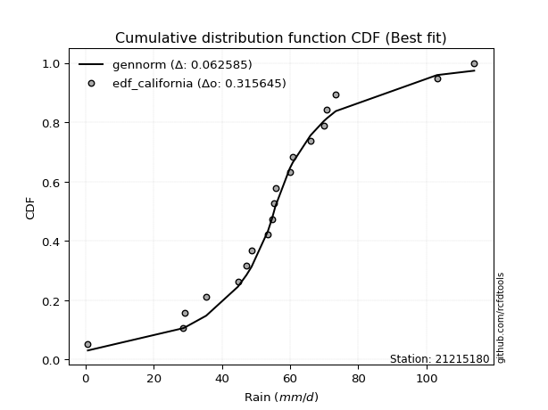</img></img>

</div>


### 2. Empirical - EDF Hazen (1930)

Hazen method for plotting positions is a formula used to estimate the empirical cumulative probability distribution of flood events or other hydrological data. This formula often results in biased estimations, particularly when extrapolating to extreme events (high return periods).

<div align="center">


$P=(m-0.5)/n$


</div>


**2.1. Empirical values**

<div align="center">

|                | 0                   | 1                   | 2                   | 3                   | 4                   | 5                  | 6                   | 7                   | 8                  | 9         | 10                 | 11                 | 12                 | 13                 | 14                 | 15                 | 16                | 17                 | 18                 |
|:---------------|:--------------------|:--------------------|:--------------------|:--------------------|:--------------------|:-------------------|:--------------------|:--------------------|:-------------------|:----------|:-------------------|:-------------------|:-------------------|:-------------------|:-------------------|:-------------------|:------------------|:-------------------|:-------------------|
| date           | 2025                | 2022                | 2016                | 2021                | 2006                | 2020               | 2019                | 2013                | 2017               | 2012      | 2009               | 2015               | 2011               | 2018               | 2007               | 2010               | 2024              | 2008               | 2014               |
| x              | 0.2                 | 0.7                 | 28.7                | 29.1                | 35.4                | 44.7               | 47.2                | 48.7                | 53.5               | 55.3      | 55.7               | 59.9               | 60.8               | 66.0               | 69.9               | 70.8               | 73.4              | 103.1              | 114.0              |
| m              | 1                   | 2                   | 3                   | 4                   | 5                   | 6                  | 7                   | 8                   | 9                  | 10        | 11                 | 12                 | 13                 | 14                 | 15                 | 16                 | 17                | 18                 | 19                 |
| empirical_dist | edf_hazen           | edf_hazen           | edf_hazen           | edf_hazen           | edf_hazen           | edf_hazen          | edf_hazen           | edf_hazen           | edf_hazen          | edf_hazen | edf_hazen          | edf_hazen          | edf_hazen          | edf_hazen          | edf_hazen          | edf_hazen          | edf_hazen         | edf_hazen          | edf_hazen          |
| empirical      | 0.02631578947368421 | 0.07894736842105263 | 0.13157894736842105 | 0.18421052631578946 | 0.23684210526315788 | 0.2894736842105263 | 0.34210526315789475 | 0.39473684210526316 | 0.4473684210526316 | 0.5       | 0.5526315789473685 | 0.6052631578947368 | 0.6578947368421053 | 0.7105263157894737 | 0.7631578947368421 | 0.8157894736842105 | 0.868421052631579 | 0.9210526315789473 | 0.9736842105263158 |
| empirical_tr   | 1.027027027027027   | 1.0857142857142856  | 1.1515151515151514  | 1.2258064516129032  | 1.3103448275862069  | 1.4074074074074074 | 1.5199999999999998  | 1.6521739130434783  | 1.8095238095238098 | 2.0       | 2.235294117647059  | 2.533333333333333  | 2.9230769230769234 | 3.4545454545454546 | 4.222222222222223  | 5.428571428571428  | 7.600000000000002 | 12.666666666666663 | 38.00000000000004  |

</div>


**2.2. Kolmogorov-Smirnov fit test (sorted by Δ)**


<div align="center">

|                | 0                   | 1                    | 2                   | 3                   | 4                   | 5                   | 6                   | 7                   | 8                   | 9                   | 10                  | 11                  | 12                  | 13                  | 14                  | 15                  | 16                  | 17                  | 18                  | 19                  | 20                  | 21                  | 22                  | 23                  | 24                  | 25                  | 26                  | 27                  | 28                  | 29                  | 30                  | 31                  | 32                  | 33                  | 34                  | 35                  | 36                  | 37                  | 38                  | 39                  | 40                    | 41                  | 42                  | 43                  | 44                  | 45                  | 46                  | 47                  | 48                  | 49                  | 50                  | 51                  | 52                  | 53                  | 54                  | 55                  | 56                  | 57                  | 58                  | 59                  | 60                  | 61                  | 62                  | 63                  | 64                  | 65                  | 66                  | 67                  | 68                  | 69                  | 70                  | 71                  | 72                  | 73                  | 74                  | 75                  | 76                  | 77                  | 78                  | 79                  | 80                  | 81                  | 82                  | 83                  | 84                  | 85                  | 86                  | 87                  | 88                  | 89                  |
|:---------------|:--------------------|:---------------------|:--------------------|:--------------------|:--------------------|:--------------------|:--------------------|:--------------------|:--------------------|:--------------------|:--------------------|:--------------------|:--------------------|:--------------------|:--------------------|:--------------------|:--------------------|:--------------------|:--------------------|:--------------------|:--------------------|:--------------------|:--------------------|:--------------------|:--------------------|:--------------------|:--------------------|:--------------------|:--------------------|:--------------------|:--------------------|:--------------------|:--------------------|:--------------------|:--------------------|:--------------------|:--------------------|:--------------------|:--------------------|:--------------------|:----------------------|:--------------------|:--------------------|:--------------------|:--------------------|:--------------------|:--------------------|:--------------------|:--------------------|:--------------------|:--------------------|:--------------------|:--------------------|:--------------------|:--------------------|:--------------------|:--------------------|:--------------------|:--------------------|:--------------------|:--------------------|:--------------------|:--------------------|:--------------------|:--------------------|:--------------------|:--------------------|:--------------------|:--------------------|:--------------------|:--------------------|:--------------------|:--------------------|:--------------------|:--------------------|:--------------------|:--------------------|:--------------------|:--------------------|:--------------------|:--------------------|:--------------------|:--------------------|:--------------------|:--------------------|:--------------------|:--------------------|:--------------------|:--------------------|:--------------------|
| station        | 21215180            | 21215180             | 21215180            | 21215180            | 21215180            | 21215180            | 21215180            | 21215180            | 21215180            | 21215180            | 21215180            | 21215180            | 21215180            | 21215180            | 21215180            | 21215180            | 21215180            | 21215180            | 21215180            | 21215180            | 21215180            | 21215180            | 21215180            | 21215180            | 21215180            | 21215180            | 21215180            | 21215180            | 21215180            | 21215180            | 21215180            | 21215180            | 21215180            | 21215180            | 21215180            | 21215180            | 21215180            | 21215180            | 21215180            | 21215180            | 21215180              | 21215180            | 21215180            | 21215180            | 21215180            | 21215180            | 21215180            | 21215180            | 21215180            | 21215180            | 21215180            | 21215180            | 21215180            | 21215180            | 21215180            | 21215180            | 21215180            | 21215180            | 21215180            | 21215180            | 21215180            | 21215180            | 21215180            | 21215180            | 21215180            | 21215180            | 21215180            | 21215180            | 21215180            | 21215180            | 21215180            | 21215180            | 21215180            | 21215180            | 21215180            | 21215180            | 21215180            | 21215180            | 21215180            | 21215180            | 21215180            | 21215180            | 21215180            | 21215180            | 21215180            | 21215180            | 21215180            | 21215180            | 21215180            | 21215180            |
| empirical_dist | edf_hazen           | edf_hazen            | edf_hazen           | edf_hazen           | edf_hazen           | edf_hazen           | edf_hazen           | edf_hazen           | edf_hazen           | edf_hazen           | edf_hazen           | edf_hazen           | edf_hazen           | edf_hazen           | edf_hazen           | edf_hazen           | edf_hazen           | edf_hazen           | edf_hazen           | edf_hazen           | edf_hazen           | edf_hazen           | edf_hazen           | edf_hazen           | edf_hazen           | edf_hazen           | edf_hazen           | edf_hazen           | edf_hazen           | edf_hazen           | edf_hazen           | edf_hazen           | edf_hazen           | edf_hazen           | edf_hazen           | edf_hazen           | edf_hazen           | edf_hazen           | edf_hazen           | edf_hazen           | edf_hazen             | edf_hazen           | edf_hazen           | edf_hazen           | edf_hazen           | edf_hazen           | edf_hazen           | edf_hazen           | edf_hazen           | edf_hazen           | edf_hazen           | edf_hazen           | edf_hazen           | edf_hazen           | edf_hazen           | edf_hazen           | edf_hazen           | edf_hazen           | edf_hazen           | edf_hazen           | edf_hazen           | edf_hazen           | edf_hazen           | edf_hazen           | edf_hazen           | edf_hazen           | edf_hazen           | edf_hazen           | edf_hazen           | edf_hazen           | edf_hazen           | edf_hazen           | edf_hazen           | edf_hazen           | edf_hazen           | edf_hazen           | edf_hazen           | edf_hazen           | edf_hazen           | edf_hazen           | edf_hazen           | edf_hazen           | edf_hazen           | edf_hazen           | edf_hazen           | edf_hazen           | edf_hazen           | edf_hazen           | edf_hazen           | edf_hazen           |
| p_dist         | laplace             | laplace_asymmetric   | johnsonsu           | logjohnsonsu        | hypsecant           | genlogistic         | fisk                | logistic            | mielke              | truncnorm           | exponnorm           | nct                 | chi2                | betaprime           | fatiguelife         | pearson3            | erlang              | gamma               | f                   | rice                | t                   | crystalball         | norm                | logt                | weibull_min         | gumbel_l            | invgamma            | invgauss            | maxwell             | rayleigh            | gumbel_r            | invweibull          | moyal               | halfnorm            | kstwobign           | halflogistic        | logfisk             | logloggamma         | loggenlogistic      | wald                | loglaplace_asymmetric | loggompertz         | ncf                 | gibrat              | loggumbel_l         | logmielke           | logpearson3         | nakagami            | expon               | genexpon            | loghypsecant        | loglogistic         | loglaplace          | logfatiguelife      | lognorm             | lognorm             | logcrystalball      | logexponnorm        | logrice             | lognct              | loglognorm          | lognakagami         | loginvgamma         | logalpha            | logbetaprime        | logerlang           | loginvgauss         | logmaxwell          | loginvweibull       | lograyleigh         | loggumbel_r         | logkstwobign        | loghalfnorm         | logmoyal            | loghalflogistic     | loggenexpon         | logexpon            | logncf              | logwald             | pareto              | loggibrat           | logpareto           | logchi2             | logf                | logtruncnorm        | loggamma            | loggamma            | logweibull_min      | gompertz            | alpha               |
| delta          | 0.05182807251700722 | 0.056177433611715344 | 0.05673867426392076 | 0.06106403435939298 | 0.06846737574156436 | 0.07919408531150285 | 0.08158471434166903 | 0.08295619225668116 | 0.08299211561110531 | 0.08743501205942722 | 0.10152989199168216 | 0.10235075899024593 | 0.102584689114809   | 0.10270530809211709 | 0.10352360404765082 | 0.10389762645575218 | 0.10396620436108583 | 0.104003397264531   | 0.10412063591088261 | 0.10518878131840803 | 0.10555879127800794 | 0.10556622895145551 | 0.10556623101441787 | 0.10647163531676973 | 0.11016904389733817 | 0.11381015938781669 | 0.1149088189477811  | 0.11621870329849393 | 0.11897019656160951 | 0.13124003162927422 | 0.14040420230574285 | 0.1464067033513265  | 0.1611739148454132  | 0.16611869193432366 | 0.17070729153392217 | 0.17824481819864557 | 0.201257198121636   | 0.20358774744788305 | 0.2120406580301638  | 0.22027941305320425 | 0.22049027452460623   | 0.22175263425615976 | 0.23392265386491196 | 0.24356872355535047 | 0.2627094396484093  | 0.27113876132615866 | 0.27216607810268767 | 0.27444351575950643 | 0.28239590642076184 | 0.3103725741711679  | 0.3244183351544362  | 0.32847262210732386 | 0.3287031697497629  | 0.3325507472321584  | 0.3332453073479219  | 0.3332453073479219  | 0.3332453092055019  | 0.3332454604195909  | 0.3332660600655414  | 0.33343504211728814 | 0.3336779957298336  | 0.33388664960269765 | 0.34143143196219206 | 0.34598790220506226 | 0.3570186387899581  | 0.35841417898590067 | 0.3613292696616224  | 0.3673441528183211  | 0.3699950945244511  | 0.37902167317557645 | 0.4016661114292729  | 0.41127531138392637 | 0.41194670459701876 | 0.4273524422603425  | 0.4343492552317487  | 0.47442826072464794 | 0.4902995109687738  | 0.49619030100409445 | 0.49883968614615015 | 0.5124319612196315  | 0.5153354943291327  | 0.5445330074077718  | 0.5743572074012153  | 0.5961380119213245  | 0.649003657843704   | 0.6633556936839611  | 0.6633556936839611  | 0.7142263970075476  | 0.840763875199473   | 0.8449738261254318  |
| deltao         | 0.31564497164100014 | 0.31564497164100014  | 0.31564497164100014 | 0.31564497164100014 | 0.31564497164100014 | 0.31564497164100014 | 0.31564497164100014 | 0.31564497164100014 | 0.31564497164100014 | 0.31564497164100014 | 0.31564497164100014 | 0.31564497164100014 | 0.31564497164100014 | 0.31564497164100014 | 0.31564497164100014 | 0.31564497164100014 | 0.31564497164100014 | 0.31564497164100014 | 0.31564497164100014 | 0.31564497164100014 | 0.31564497164100014 | 0.31564497164100014 | 0.31564497164100014 | 0.31564497164100014 | 0.31564497164100014 | 0.31564497164100014 | 0.31564497164100014 | 0.31564497164100014 | 0.31564497164100014 | 0.31564497164100014 | 0.31564497164100014 | 0.31564497164100014 | 0.31564497164100014 | 0.31564497164100014 | 0.31564497164100014 | 0.31564497164100014 | 0.31564497164100014 | 0.31564497164100014 | 0.31564497164100014 | 0.31564497164100014 | 0.31564497164100014   | 0.31564497164100014 | 0.31564497164100014 | 0.31564497164100014 | 0.31564497164100014 | 0.31564497164100014 | 0.31564497164100014 | 0.31564497164100014 | 0.31564497164100014 | 0.31564497164100014 | 0.31564497164100014 | 0.31564497164100014 | 0.31564497164100014 | 0.31564497164100014 | 0.31564497164100014 | 0.31564497164100014 | 0.31564497164100014 | 0.31564497164100014 | 0.31564497164100014 | 0.31564497164100014 | 0.31564497164100014 | 0.31564497164100014 | 0.31564497164100014 | 0.31564497164100014 | 0.31564497164100014 | 0.31564497164100014 | 0.31564497164100014 | 0.31564497164100014 | 0.31564497164100014 | 0.31564497164100014 | 0.31564497164100014 | 0.31564497164100014 | 0.31564497164100014 | 0.31564497164100014 | 0.31564497164100014 | 0.31564497164100014 | 0.31564497164100014 | 0.31564497164100014 | 0.31564497164100014 | 0.31564497164100014 | 0.31564497164100014 | 0.31564497164100014 | 0.31564497164100014 | 0.31564497164100014 | 0.31564497164100014 | 0.31564497164100014 | 0.31564497164100014 | 0.31564497164100014 | 0.31564497164100014 | 0.31564497164100014 |
| eval           | Δo > Δ              | Δo > Δ               | Δo > Δ              | Δo > Δ              | Δo > Δ              | Δo > Δ              | Δo > Δ              | Δo > Δ              | Δo > Δ              | Δo > Δ              | Δo > Δ              | Δo > Δ              | Δo > Δ              | Δo > Δ              | Δo > Δ              | Δo > Δ              | Δo > Δ              | Δo > Δ              | Δo > Δ              | Δo > Δ              | Δo > Δ              | Δo > Δ              | Δo > Δ              | Δo > Δ              | Δo > Δ              | Δo > Δ              | Δo > Δ              | Δo > Δ              | Δo > Δ              | Δo > Δ              | Δo > Δ              | Δo > Δ              | Δo > Δ              | Δo > Δ              | Δo > Δ              | Δo > Δ              | Δo > Δ              | Δo > Δ              | Δo > Δ              | Δo > Δ              | Δo > Δ                | Δo > Δ              | Δo > Δ              | Δo > Δ              | Δo > Δ              | Δo > Δ              | Δo > Δ              | Δo > Δ              | Δo > Δ              | Δo > Δ              | Δo <= Δ             | Δo <= Δ             | Δo <= Δ             | Δo <= Δ             | Δo <= Δ             | Δo <= Δ             | Δo <= Δ             | Δo <= Δ             | Δo <= Δ             | Δo <= Δ             | Δo <= Δ             | Δo <= Δ             | Δo <= Δ             | Δo <= Δ             | Δo <= Δ             | Δo <= Δ             | Δo <= Δ             | Δo <= Δ             | Δo <= Δ             | Δo <= Δ             | Δo <= Δ             | Δo <= Δ             | Δo <= Δ             | Δo <= Δ             | Δo <= Δ             | Δo <= Δ             | Δo <= Δ             | Δo <= Δ             | Δo <= Δ             | Δo <= Δ             | Δo <= Δ             | Δo <= Δ             | Δo <= Δ             | Δo <= Δ             | Δo <= Δ             | Δo <= Δ             | Δo <= Δ             | Δo <= Δ             | Δo <= Δ             | Δo <= Δ             |
| fit            | 1                   | 1                    | 1                   | 1                   | 1                   | 1                   | 1                   | 1                   | 1                   | 1                   | 1                   | 1                   | 1                   | 1                   | 1                   | 1                   | 1                   | 1                   | 1                   | 1                   | 1                   | 1                   | 1                   | 1                   | 1                   | 1                   | 1                   | 1                   | 1                   | 1                   | 1                   | 1                   | 1                   | 1                   | 1                   | 1                   | 1                   | 1                   | 1                   | 1                   | 1                     | 1                   | 1                   | 1                   | 1                   | 1                   | 1                   | 1                   | 1                   | 1                   | 0                   | 0                   | 0                   | 0                   | 0                   | 0                   | 0                   | 0                   | 0                   | 0                   | 0                   | 0                   | 0                   | 0                   | 0                   | 0                   | 0                   | 0                   | 0                   | 0                   | 0                   | 0                   | 0                   | 0                   | 0                   | 0                   | 0                   | 0                   | 0                   | 0                   | 0                   | 0                   | 0                   | 0                   | 0                   | 0                   | 0                   | 0                   | 0                   | 0                   |
| n              | 19                  | 19                   | 19                  | 19                  | 19                  | 19                  | 19                  | 19                  | 19                  | 19                  | 19                  | 19                  | 19                  | 19                  | 19                  | 19                  | 19                  | 19                  | 19                  | 19                  | 19                  | 19                  | 19                  | 19                  | 19                  | 19                  | 19                  | 19                  | 19                  | 19                  | 19                  | 19                  | 19                  | 19                  | 19                  | 19                  | 19                  | 19                  | 19                  | 19                  | 19                    | 19                  | 19                  | 19                  | 19                  | 19                  | 19                  | 19                  | 19                  | 19                  | 19                  | 19                  | 19                  | 19                  | 19                  | 19                  | 19                  | 19                  | 19                  | 19                  | 19                  | 19                  | 19                  | 19                  | 19                  | 19                  | 19                  | 19                  | 19                  | 19                  | 19                  | 19                  | 19                  | 19                  | 19                  | 19                  | 19                  | 19                  | 19                  | 19                  | 19                  | 19                  | 19                  | 19                  | 19                  | 19                  | 19                  | 19                  | 19                  | 19                  |
| best_fit       | 1                   | 0                    | 0                   | 0                   | 0                   | 0                   | 0                   | 0                   | 0                   | 0                   | 0                   | 0                   | 0                   | 0                   | 0                   | 0                   | 0                   | 0                   | 0                   | 0                   | 0                   | 0                   | 0                   | 0                   | 0                   | 0                   | 0                   | 0                   | 0                   | 0                   | 0                   | 0                   | 0                   | 0                   | 0                   | 0                   | 0                   | 0                   | 0                   | 0                   | 0                     | 0                   | 0                   | 0                   | 0                   | 0                   | 0                   | 0                   | 0                   | 0                   | 0                   | 0                   | 0                   | 0                   | 0                   | 0                   | 0                   | 0                   | 0                   | 0                   | 0                   | 0                   | 0                   | 0                   | 0                   | 0                   | 0                   | 0                   | 0                   | 0                   | 0                   | 0                   | 0                   | 0                   | 0                   | 0                   | 0                   | 0                   | 0                   | 0                   | 0                   | 0                   | 0                   | 0                   | 0                   | 0                   | 0                   | 0                   | 0                   | 0                   |
| best_fit_sort  | 1                   | 2                    | 3                   | 4                   | 5                   | 6                   | 7                   | 8                   | 9                   | 10                  | 11                  | 12                  | 13                  | 14                  | 15                  | 16                  | 17                  | 18                  | 19                  | 20                  | 21                  | 22                  | 23                  | 24                  | 25                  | 26                  | 27                  | 28                  | 29                  | 30                  | 31                  | 32                  | 33                  | 34                  | 35                  | 36                  | 37                  | 38                  | 39                  | 40                  | 41                    | 42                  | 43                  | 44                  | 45                  | 46                  | 47                  | 48                  | 49                  | 50                  | 51                  | 52                  | 53                  | 54                  | 55                  | 56                  | 57                  | 58                  | 59                  | 60                  | 61                  | 62                  | 63                  | 64                  | 65                  | 66                  | 67                  | 68                  | 69                  | 70                  | 71                  | 72                  | 73                  | 74                  | 75                  | 76                  | 77                  | 78                  | 79                  | 80                  | 81                  | 82                  | 83                  | 84                  | 85                  | 86                  | 87                  | 88                  | 89                  | 90                  |

</div>


<div align="center">

</img>

</div>


**2.3. Best fit**

<div align="center">

|   id |   station | empirical_dist   | p_dist   |     delta |   deltao | eval   |   fit |   n |   best_fit |   best_fit_sort |
|-----:|----------:|:-----------------|:---------|----------:|---------:|:-------|------:|----:|-----------:|----------------:|
|    0 |  21215180 | edf_hazen        | laplace  | 0.0518281 | 0.315645 | Δo > Δ |     1 |  19 |          1 |               1 |

</div>


<div align="center">

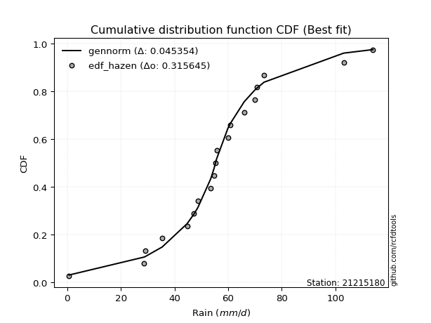</img>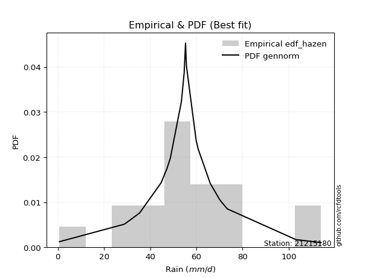</img>

</div>


### 3. Empirical - EDF Weibull (1939)

Weibull plotting position formula is an empirical method used to estimate the non-exceedance probability or plotting position for a set of observed data, is often recommended or widely used in practice, particularly in flood frequency analysis.

<div align="center">


$P=m/(n+1)$


</div>


**3.1. Empirical values**

<div align="center">

|                | 0                  | 1                  | 2                  | 3           | 4                  | 5                  | 6                  | 7                  | 8                  | 9           | 10                 | 11          | 12                | 13                | 14          | 15                | 16                | 17                 | 18                 |
|:---------------|:-------------------|:-------------------|:-------------------|:------------|:-------------------|:-------------------|:-------------------|:-------------------|:-------------------|:------------|:-------------------|:------------|:------------------|:------------------|:------------|:------------------|:------------------|:-------------------|:-------------------|
| date           | 2025               | 2022               | 2016               | 2021        | 2006               | 2020               | 2019               | 2013               | 2017               | 2012        | 2009               | 2015        | 2011              | 2018              | 2007        | 2010              | 2024              | 2008               | 2014               |
| x              | 0.2                | 0.7                | 28.7               | 29.1        | 35.4               | 44.7               | 47.2               | 48.7               | 53.5               | 55.3        | 55.7               | 59.9        | 60.8              | 66.0              | 69.9        | 70.8              | 73.4              | 103.1              | 114.0              |
| m              | 1                  | 2                  | 3                  | 4           | 5                  | 6                  | 7                  | 8                  | 9                  | 10          | 11                 | 12          | 13                | 14                | 15          | 16                | 17                | 18                 | 19                 |
| empirical_dist | edf_weibull        | edf_weibull        | edf_weibull        | edf_weibull | edf_weibull        | edf_weibull        | edf_weibull        | edf_weibull        | edf_weibull        | edf_weibull | edf_weibull        | edf_weibull | edf_weibull       | edf_weibull       | edf_weibull | edf_weibull       | edf_weibull       | edf_weibull        | edf_weibull        |
| empirical      | 0.05               | 0.1                | 0.15               | 0.2         | 0.25               | 0.3                | 0.35               | 0.4                | 0.45               | 0.5         | 0.55               | 0.6         | 0.65              | 0.7               | 0.75        | 0.8               | 0.85              | 0.9                | 0.95               |
| empirical_tr   | 1.0526315789473684 | 1.1111111111111112 | 1.1764705882352942 | 1.25        | 1.3333333333333333 | 1.4285714285714286 | 1.5384615384615383 | 1.6666666666666667 | 1.8181818181818181 | 2.0         | 2.2222222222222223 | 2.5         | 2.857142857142857 | 3.333333333333333 | 4.0         | 5.000000000000001 | 6.666666666666666 | 10.000000000000002 | 19.999999999999982 |

</div>


**3.2. Kolmogorov-Smirnov fit test (sorted by Δ)**


<div align="center">

|                | 0                   | 1                    | 2                   | 3                   | 4                   | 5                   | 6                   | 7                   | 8                   | 9                   | 10                  | 11                  | 12                  | 13                  | 14                  | 15                  | 16                  | 17                  | 18                  | 19                  | 20                  | 21                  | 22                  | 23                  | 24                  | 25                  | 26                  | 27                  | 28                  | 29                  | 30                  | 31                  | 32                  | 33                  | 34                  | 35                  | 36                  | 37                  | 38                  | 39                    | 40                  | 41                  | 42                  | 43                  | 44                  | 45                  | 46                  | 47                  | 48                  | 49                  | 50                  | 51                  | 52                  | 53                  | 54                  | 55                  | 56                  | 57                  | 58                  | 59                  | 60                  | 61                  | 62                  | 63                  | 64                  | 65                  | 66                  | 67                  | 68                  | 69                  | 70                  | 71                  | 72                  | 73                  | 74                  | 75                  | 76                  | 77                  | 78                  | 79                  | 80                  | 81                  | 82                  | 83                  | 84                  | 85                  | 86                  | 87                  | 88                  | 89                  |
|:---------------|:--------------------|:---------------------|:--------------------|:--------------------|:--------------------|:--------------------|:--------------------|:--------------------|:--------------------|:--------------------|:--------------------|:--------------------|:--------------------|:--------------------|:--------------------|:--------------------|:--------------------|:--------------------|:--------------------|:--------------------|:--------------------|:--------------------|:--------------------|:--------------------|:--------------------|:--------------------|:--------------------|:--------------------|:--------------------|:--------------------|:--------------------|:--------------------|:--------------------|:--------------------|:--------------------|:--------------------|:--------------------|:--------------------|:--------------------|:----------------------|:--------------------|:--------------------|:--------------------|:--------------------|:--------------------|:--------------------|:--------------------|:--------------------|:--------------------|:--------------------|:--------------------|:--------------------|:--------------------|:--------------------|:--------------------|:--------------------|:--------------------|:--------------------|:--------------------|:--------------------|:--------------------|:--------------------|:--------------------|:--------------------|:--------------------|:--------------------|:--------------------|:--------------------|:--------------------|:--------------------|:--------------------|:--------------------|:--------------------|:--------------------|:--------------------|:--------------------|:--------------------|:--------------------|:--------------------|:--------------------|:--------------------|:--------------------|:--------------------|:--------------------|:--------------------|:--------------------|:--------------------|:--------------------|:--------------------|:--------------------|
| station        | 21215180            | 21215180             | 21215180            | 21215180            | 21215180            | 21215180            | 21215180            | 21215180            | 21215180            | 21215180            | 21215180            | 21215180            | 21215180            | 21215180            | 21215180            | 21215180            | 21215180            | 21215180            | 21215180            | 21215180            | 21215180            | 21215180            | 21215180            | 21215180            | 21215180            | 21215180            | 21215180            | 21215180            | 21215180            | 21215180            | 21215180            | 21215180            | 21215180            | 21215180            | 21215180            | 21215180            | 21215180            | 21215180            | 21215180            | 21215180              | 21215180            | 21215180            | 21215180            | 21215180            | 21215180            | 21215180            | 21215180            | 21215180            | 21215180            | 21215180            | 21215180            | 21215180            | 21215180            | 21215180            | 21215180            | 21215180            | 21215180            | 21215180            | 21215180            | 21215180            | 21215180            | 21215180            | 21215180            | 21215180            | 21215180            | 21215180            | 21215180            | 21215180            | 21215180            | 21215180            | 21215180            | 21215180            | 21215180            | 21215180            | 21215180            | 21215180            | 21215180            | 21215180            | 21215180            | 21215180            | 21215180            | 21215180            | 21215180            | 21215180            | 21215180            | 21215180            | 21215180            | 21215180            | 21215180            | 21215180            |
| empirical_dist | edf_weibull         | edf_weibull          | edf_weibull         | edf_weibull         | edf_weibull         | edf_weibull         | edf_weibull         | edf_weibull         | edf_weibull         | edf_weibull         | edf_weibull         | edf_weibull         | edf_weibull         | edf_weibull         | edf_weibull         | edf_weibull         | edf_weibull         | edf_weibull         | edf_weibull         | edf_weibull         | edf_weibull         | edf_weibull         | edf_weibull         | edf_weibull         | edf_weibull         | edf_weibull         | edf_weibull         | edf_weibull         | edf_weibull         | edf_weibull         | edf_weibull         | edf_weibull         | edf_weibull         | edf_weibull         | edf_weibull         | edf_weibull         | edf_weibull         | edf_weibull         | edf_weibull         | edf_weibull           | edf_weibull         | edf_weibull         | edf_weibull         | edf_weibull         | edf_weibull         | edf_weibull         | edf_weibull         | edf_weibull         | edf_weibull         | edf_weibull         | edf_weibull         | edf_weibull         | edf_weibull         | edf_weibull         | edf_weibull         | edf_weibull         | edf_weibull         | edf_weibull         | edf_weibull         | edf_weibull         | edf_weibull         | edf_weibull         | edf_weibull         | edf_weibull         | edf_weibull         | edf_weibull         | edf_weibull         | edf_weibull         | edf_weibull         | edf_weibull         | edf_weibull         | edf_weibull         | edf_weibull         | edf_weibull         | edf_weibull         | edf_weibull         | edf_weibull         | edf_weibull         | edf_weibull         | edf_weibull         | edf_weibull         | edf_weibull         | edf_weibull         | edf_weibull         | edf_weibull         | edf_weibull         | edf_weibull         | edf_weibull         | edf_weibull         | edf_weibull         |
| p_dist         | laplace_asymmetric  | johnsonsu            | laplace             | hypsecant           | genlogistic         | logistic            | fisk                | logjohnsonsu        | mielke              | exponnorm           | nct                 | betaprime           | fatiguelife         | pearson3            | erlang              | gamma               | f                   | t                   | crystalball         | norm                | rice                | chi2                | weibull_min         | truncnorm           | logt                | invgamma            | invgauss            | gumbel_l            | maxwell             | rayleigh            | gumbel_r            | invweibull          | moyal               | halfnorm            | kstwobign           | halflogistic        | logfisk             | logloggamma         | loggenlogistic      | loglaplace_asymmetric | loggompertz         | wald                | ncf                 | gibrat              | loggumbel_l         | logmielke           | logpearson3         | nakagami            | expon               | genexpon            | loghypsecant        | loglogistic         | logfatiguelife      | lognorm             | lognorm             | logcrystalball      | logexponnorm        | logrice             | lognct              | loglognorm          | lognakagami         | loglaplace          | loginvgamma         | logalpha            | logbetaprime        | logerlang           | loginvgauss         | logmaxwell          | loginvweibull       | lograyleigh         | loggumbel_r         | logkstwobign        | loghalfnorm         | logmoyal            | loghalflogistic     | loggenexpon         | logexpon            | logncf              | logwald             | pareto              | loggibrat           | logpareto           | logchi2             | logf                | logtruncnorm        | loggamma            | loggamma            | logweibull_min      | gompertz            | alpha               |
| delta          | 0.06061270165490437 | 0.061880238875189786 | 0.06608311367297362 | 0.06796857695705741 | 0.06799346016445619 | 0.06925947471868414 | 0.07067856379042683 | 0.07116797228740601 | 0.07498858376507235 | 0.08310883936010316 | 0.08392970635866692 | 0.08428425546053808 | 0.08510255141607181 | 0.08547657382417317 | 0.08554515172950683 | 0.085582344632952   | 0.0856995832793036  | 0.08713773864642893 | 0.0871451763198765  | 0.08714517838283886 | 0.0875927083558925  | 0.09016304289201493 | 0.09174799126575917 | 0.09881042480683258 | 0.10376566442838589 | 0.10438250315830744 | 0.10569238750902027 | 0.1059154225457114  | 0.10844388077213585 | 0.12071371583980056 | 0.1298778865162692  | 0.13588038756185283 | 0.15064759905593955 | 0.15559237614485    | 0.1601809757444485  | 0.1677185024091719  | 0.182836145490057   | 0.1930614316584094  | 0.20151434224069015 | 0.20996395873513257   | 0.2112263184666861  | 0.21764783410583582 | 0.2233963380754383  | 0.24093714460798205 | 0.24428838701683034 | 0.25271770869457977 | 0.25374502547110867 | 0.2628988621647271  | 0.2658661782867782  | 0.29779012088751095 | 0.3059972825228573  | 0.31005156947574497 | 0.3141296946005795  | 0.3148242547163429  | 0.3148242547163429  | 0.314824256573923   | 0.314824407788012   | 0.3148450074339625  | 0.31501398948570913 | 0.3152569430982547  | 0.31546559697111864 | 0.3181768539602892  | 0.32301037933061316 | 0.32756684957348325 | 0.3385975861583792  | 0.33999312635432166 | 0.34290821703004337 | 0.3489231001867422  | 0.3515740418928721  | 0.36060062054399744 | 0.3832450587976939  | 0.39285425875234736 | 0.39352565196543976 | 0.4089313896287635  | 0.4159282026001697  | 0.45600720809306894 | 0.4718784583371948  | 0.47776924837251544 | 0.48041863351457115 | 0.4940109085880525  | 0.4969144416975537  | 0.5234803758288245  | 0.5559361547696363  | 0.5777169592897455  | 0.630582605212125   | 0.6449346410523821  | 0.6449346410523821  | 0.6958053443759686  | 0.822342822567894   | 0.8265527734938528  |
| deltao         | 0.31564497164100014 | 0.31564497164100014  | 0.31564497164100014 | 0.31564497164100014 | 0.31564497164100014 | 0.31564497164100014 | 0.31564497164100014 | 0.31564497164100014 | 0.31564497164100014 | 0.31564497164100014 | 0.31564497164100014 | 0.31564497164100014 | 0.31564497164100014 | 0.31564497164100014 | 0.31564497164100014 | 0.31564497164100014 | 0.31564497164100014 | 0.31564497164100014 | 0.31564497164100014 | 0.31564497164100014 | 0.31564497164100014 | 0.31564497164100014 | 0.31564497164100014 | 0.31564497164100014 | 0.31564497164100014 | 0.31564497164100014 | 0.31564497164100014 | 0.31564497164100014 | 0.31564497164100014 | 0.31564497164100014 | 0.31564497164100014 | 0.31564497164100014 | 0.31564497164100014 | 0.31564497164100014 | 0.31564497164100014 | 0.31564497164100014 | 0.31564497164100014 | 0.31564497164100014 | 0.31564497164100014 | 0.31564497164100014   | 0.31564497164100014 | 0.31564497164100014 | 0.31564497164100014 | 0.31564497164100014 | 0.31564497164100014 | 0.31564497164100014 | 0.31564497164100014 | 0.31564497164100014 | 0.31564497164100014 | 0.31564497164100014 | 0.31564497164100014 | 0.31564497164100014 | 0.31564497164100014 | 0.31564497164100014 | 0.31564497164100014 | 0.31564497164100014 | 0.31564497164100014 | 0.31564497164100014 | 0.31564497164100014 | 0.31564497164100014 | 0.31564497164100014 | 0.31564497164100014 | 0.31564497164100014 | 0.31564497164100014 | 0.31564497164100014 | 0.31564497164100014 | 0.31564497164100014 | 0.31564497164100014 | 0.31564497164100014 | 0.31564497164100014 | 0.31564497164100014 | 0.31564497164100014 | 0.31564497164100014 | 0.31564497164100014 | 0.31564497164100014 | 0.31564497164100014 | 0.31564497164100014 | 0.31564497164100014 | 0.31564497164100014 | 0.31564497164100014 | 0.31564497164100014 | 0.31564497164100014 | 0.31564497164100014 | 0.31564497164100014 | 0.31564497164100014 | 0.31564497164100014 | 0.31564497164100014 | 0.31564497164100014 | 0.31564497164100014 | 0.31564497164100014 |
| eval           | Δo > Δ              | Δo > Δ               | Δo > Δ              | Δo > Δ              | Δo > Δ              | Δo > Δ              | Δo > Δ              | Δo > Δ              | Δo > Δ              | Δo > Δ              | Δo > Δ              | Δo > Δ              | Δo > Δ              | Δo > Δ              | Δo > Δ              | Δo > Δ              | Δo > Δ              | Δo > Δ              | Δo > Δ              | Δo > Δ              | Δo > Δ              | Δo > Δ              | Δo > Δ              | Δo > Δ              | Δo > Δ              | Δo > Δ              | Δo > Δ              | Δo > Δ              | Δo > Δ              | Δo > Δ              | Δo > Δ              | Δo > Δ              | Δo > Δ              | Δo > Δ              | Δo > Δ              | Δo > Δ              | Δo > Δ              | Δo > Δ              | Δo > Δ              | Δo > Δ                | Δo > Δ              | Δo > Δ              | Δo > Δ              | Δo > Δ              | Δo > Δ              | Δo > Δ              | Δo > Δ              | Δo > Δ              | Δo > Δ              | Δo > Δ              | Δo > Δ              | Δo > Δ              | Δo > Δ              | Δo > Δ              | Δo > Δ              | Δo > Δ              | Δo > Δ              | Δo > Δ              | Δo > Δ              | Δo > Δ              | Δo > Δ              | Δo <= Δ             | Δo <= Δ             | Δo <= Δ             | Δo <= Δ             | Δo <= Δ             | Δo <= Δ             | Δo <= Δ             | Δo <= Δ             | Δo <= Δ             | Δo <= Δ             | Δo <= Δ             | Δo <= Δ             | Δo <= Δ             | Δo <= Δ             | Δo <= Δ             | Δo <= Δ             | Δo <= Δ             | Δo <= Δ             | Δo <= Δ             | Δo <= Δ             | Δo <= Δ             | Δo <= Δ             | Δo <= Δ             | Δo <= Δ             | Δo <= Δ             | Δo <= Δ             | Δo <= Δ             | Δo <= Δ             | Δo <= Δ             |
| fit            | 1                   | 1                    | 1                   | 1                   | 1                   | 1                   | 1                   | 1                   | 1                   | 1                   | 1                   | 1                   | 1                   | 1                   | 1                   | 1                   | 1                   | 1                   | 1                   | 1                   | 1                   | 1                   | 1                   | 1                   | 1                   | 1                   | 1                   | 1                   | 1                   | 1                   | 1                   | 1                   | 1                   | 1                   | 1                   | 1                   | 1                   | 1                   | 1                   | 1                     | 1                   | 1                   | 1                   | 1                   | 1                   | 1                   | 1                   | 1                   | 1                   | 1                   | 1                   | 1                   | 1                   | 1                   | 1                   | 1                   | 1                   | 1                   | 1                   | 1                   | 1                   | 0                   | 0                   | 0                   | 0                   | 0                   | 0                   | 0                   | 0                   | 0                   | 0                   | 0                   | 0                   | 0                   | 0                   | 0                   | 0                   | 0                   | 0                   | 0                   | 0                   | 0                   | 0                   | 0                   | 0                   | 0                   | 0                   | 0                   | 0                   | 0                   |
| n              | 19                  | 19                   | 19                  | 19                  | 19                  | 19                  | 19                  | 19                  | 19                  | 19                  | 19                  | 19                  | 19                  | 19                  | 19                  | 19                  | 19                  | 19                  | 19                  | 19                  | 19                  | 19                  | 19                  | 19                  | 19                  | 19                  | 19                  | 19                  | 19                  | 19                  | 19                  | 19                  | 19                  | 19                  | 19                  | 19                  | 19                  | 19                  | 19                  | 19                    | 19                  | 19                  | 19                  | 19                  | 19                  | 19                  | 19                  | 19                  | 19                  | 19                  | 19                  | 19                  | 19                  | 19                  | 19                  | 19                  | 19                  | 19                  | 19                  | 19                  | 19                  | 19                  | 19                  | 19                  | 19                  | 19                  | 19                  | 19                  | 19                  | 19                  | 19                  | 19                  | 19                  | 19                  | 19                  | 19                  | 19                  | 19                  | 19                  | 19                  | 19                  | 19                  | 19                  | 19                  | 19                  | 19                  | 19                  | 19                  | 19                  | 19                  |
| best_fit       | 1                   | 0                    | 0                   | 0                   | 0                   | 0                   | 0                   | 0                   | 0                   | 0                   | 0                   | 0                   | 0                   | 0                   | 0                   | 0                   | 0                   | 0                   | 0                   | 0                   | 0                   | 0                   | 0                   | 0                   | 0                   | 0                   | 0                   | 0                   | 0                   | 0                   | 0                   | 0                   | 0                   | 0                   | 0                   | 0                   | 0                   | 0                   | 0                   | 0                     | 0                   | 0                   | 0                   | 0                   | 0                   | 0                   | 0                   | 0                   | 0                   | 0                   | 0                   | 0                   | 0                   | 0                   | 0                   | 0                   | 0                   | 0                   | 0                   | 0                   | 0                   | 0                   | 0                   | 0                   | 0                   | 0                   | 0                   | 0                   | 0                   | 0                   | 0                   | 0                   | 0                   | 0                   | 0                   | 0                   | 0                   | 0                   | 0                   | 0                   | 0                   | 0                   | 0                   | 0                   | 0                   | 0                   | 0                   | 0                   | 0                   | 0                   |
| best_fit_sort  | 1                   | 2                    | 3                   | 4                   | 5                   | 6                   | 7                   | 8                   | 9                   | 10                  | 11                  | 12                  | 13                  | 14                  | 15                  | 16                  | 17                  | 18                  | 19                  | 20                  | 21                  | 22                  | 23                  | 24                  | 25                  | 26                  | 27                  | 28                  | 29                  | 30                  | 31                  | 32                  | 33                  | 34                  | 35                  | 36                  | 37                  | 38                  | 39                  | 40                    | 41                  | 42                  | 43                  | 44                  | 45                  | 46                  | 47                  | 48                  | 49                  | 50                  | 51                  | 52                  | 53                  | 54                  | 55                  | 56                  | 57                  | 58                  | 59                  | 60                  | 61                  | 62                  | 63                  | 64                  | 65                  | 66                  | 67                  | 68                  | 69                  | 70                  | 71                  | 72                  | 73                  | 74                  | 75                  | 76                  | 77                  | 78                  | 79                  | 80                  | 81                  | 82                  | 83                  | 84                  | 85                  | 86                  | 87                  | 88                  | 89                  | 90                  |

</div>


<div align="center">

</img>

</div>


**3.3. Best fit**

<div align="center">

|   id |   station | empirical_dist   | p_dist             |     delta |   deltao | eval   |   fit |   n |   best_fit |   best_fit_sort |
|-----:|----------:|:-----------------|:-------------------|----------:|---------:|:-------|------:|----:|-----------:|----------------:|
|    0 |  21215180 | edf_weibull      | laplace_asymmetric | 0.0606127 | 0.315645 | Δo > Δ |     1 |  19 |          1 |               1 |

</div>


<div align="center">

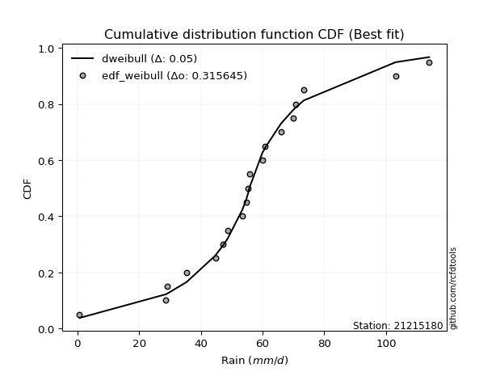</img>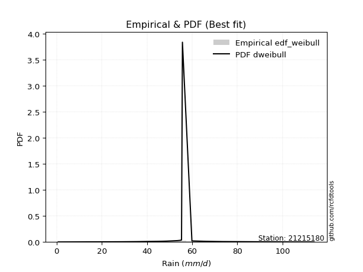</img>

</div>


### 4. Empirical - EDF Beard (1943)

The Beard formula (or Beard´s plotting position formula) in hydrology is used to estimate the empirical non-exceedance probability _(P)_ of a flood event (or other extreme hydrological data point) within a given dataset.

<div align="center">


$P=(m-0.31)/(n+0.38)$


</div>


**4.1. Empirical values**

<div align="center">

|                | 0                   | 1                   | 2                  | 3                   | 4                   | 5                   | 6                  | 7                  | 8                  | 9         | 10                 | 11                 | 12                 | 13                 | 14                 | 15                 | 16                 | 17                 | 18                 |
|:---------------|:--------------------|:--------------------|:-------------------|:--------------------|:--------------------|:--------------------|:-------------------|:-------------------|:-------------------|:----------|:-------------------|:-------------------|:-------------------|:-------------------|:-------------------|:-------------------|:-------------------|:-------------------|:-------------------|
| date           | 2025                | 2022                | 2016               | 2021                | 2006                | 2020                | 2019               | 2013               | 2017               | 2012      | 2009               | 2015               | 2011               | 2018               | 2007               | 2010               | 2024               | 2008               | 2014               |
| x              | 0.2                 | 0.7                 | 28.7               | 29.1                | 35.4                | 44.7                | 47.2               | 48.7               | 53.5               | 55.3      | 55.7               | 59.9               | 60.8               | 66.0               | 69.9               | 70.8               | 73.4               | 103.1              | 114.0              |
| m              | 1                   | 2                   | 3                  | 4                   | 5                   | 6                   | 7                  | 8                  | 9                  | 10        | 11                 | 12                 | 13                 | 14                 | 15                 | 16                 | 17                 | 18                 | 19                 |
| empirical_dist | edf_beard           | edf_beard           | edf_beard          | edf_beard           | edf_beard           | edf_beard           | edf_beard          | edf_beard          | edf_beard          | edf_beard | edf_beard          | edf_beard          | edf_beard          | edf_beard          | edf_beard          | edf_beard          | edf_beard          | edf_beard          | edf_beard          |
| empirical      | 0.03560371517027864 | 0.08720330237358101 | 0.1388028895768834 | 0.19040247678018576 | 0.24200206398348817 | 0.29360165118679055 | 0.3452012383900929 | 0.3968008255933953 | 0.4484004127966976 | 0.5       | 0.5515995872033024 | 0.6031991744066048 | 0.6547987616099071 | 0.7063983488132095 | 0.7579979360165119 | 0.8095975232198143 | 0.8611971104231168 | 0.9127966976264191 | 0.9643962848297215 |
| empirical_tr   | 1.0369181380417336  | 1.0955342001130581  | 1.1611743559017376 | 1.2351816443594645  | 1.3192648059904697  | 1.4156318480642804  | 1.5271867612293144 | 1.6578272027373824 | 1.812909260991581  | 2.0       | 2.230149597238205  | 2.5201560468140443 | 2.896860986547085  | 3.40597539543058   | 4.132196162046909  | 5.252032520325204  | 7.204460966542758  | 11.467455621301793 | 28.086956521739243 |

</div>


**4.2. Kolmogorov-Smirnov fit test (sorted by Δ)**


<div align="center">

|                | 0                   | 1                   | 2                   | 3                   | 4                   | 5                   | 6                   | 7                   | 8                   | 9                   | 10                  | 11                  | 12                  | 13                  | 14                  | 15                  | 16                  | 17                  | 18                  | 19                  | 20                  | 21                  | 22                  | 23                  | 24                  | 25                  | 26                  | 27                  | 28                  | 29                  | 30                  | 31                  | 32                  | 33                  | 34                  | 35                  | 36                  | 37                  | 38                  | 39                    | 40                  | 41                  | 42                  | 43                  | 44                  | 45                  | 46                  | 47                  | 48                  | 49                  | 50                  | 51                  | 52                  | 53                  | 54                  | 55                  | 56                  | 57                  | 58                  | 59                  | 60                  | 61                  | 62                  | 63                  | 64                  | 65                  | 66                  | 67                  | 68                  | 69                  | 70                  | 71                  | 72                  | 73                  | 74                  | 75                  | 76                  | 77                  | 78                  | 79                  | 80                  | 81                  | 82                  | 83                  | 84                  | 85                  | 86                  | 87                  | 88                  | 89                  |
|:---------------|:--------------------|:--------------------|:--------------------|:--------------------|:--------------------|:--------------------|:--------------------|:--------------------|:--------------------|:--------------------|:--------------------|:--------------------|:--------------------|:--------------------|:--------------------|:--------------------|:--------------------|:--------------------|:--------------------|:--------------------|:--------------------|:--------------------|:--------------------|:--------------------|:--------------------|:--------------------|:--------------------|:--------------------|:--------------------|:--------------------|:--------------------|:--------------------|:--------------------|:--------------------|:--------------------|:--------------------|:--------------------|:--------------------|:--------------------|:----------------------|:--------------------|:--------------------|:--------------------|:--------------------|:--------------------|:--------------------|:--------------------|:--------------------|:--------------------|:--------------------|:--------------------|:--------------------|:--------------------|:--------------------|:--------------------|:--------------------|:--------------------|:--------------------|:--------------------|:--------------------|:--------------------|:--------------------|:--------------------|:--------------------|:--------------------|:--------------------|:--------------------|:--------------------|:--------------------|:--------------------|:--------------------|:--------------------|:--------------------|:--------------------|:--------------------|:--------------------|:--------------------|:--------------------|:--------------------|:--------------------|:--------------------|:--------------------|:--------------------|:--------------------|:--------------------|:--------------------|:--------------------|:--------------------|:--------------------|:--------------------|
| station        | 21215180            | 21215180            | 21215180            | 21215180            | 21215180            | 21215180            | 21215180            | 21215180            | 21215180            | 21215180            | 21215180            | 21215180            | 21215180            | 21215180            | 21215180            | 21215180            | 21215180            | 21215180            | 21215180            | 21215180            | 21215180            | 21215180            | 21215180            | 21215180            | 21215180            | 21215180            | 21215180            | 21215180            | 21215180            | 21215180            | 21215180            | 21215180            | 21215180            | 21215180            | 21215180            | 21215180            | 21215180            | 21215180            | 21215180            | 21215180              | 21215180            | 21215180            | 21215180            | 21215180            | 21215180            | 21215180            | 21215180            | 21215180            | 21215180            | 21215180            | 21215180            | 21215180            | 21215180            | 21215180            | 21215180            | 21215180            | 21215180            | 21215180            | 21215180            | 21215180            | 21215180            | 21215180            | 21215180            | 21215180            | 21215180            | 21215180            | 21215180            | 21215180            | 21215180            | 21215180            | 21215180            | 21215180            | 21215180            | 21215180            | 21215180            | 21215180            | 21215180            | 21215180            | 21215180            | 21215180            | 21215180            | 21215180            | 21215180            | 21215180            | 21215180            | 21215180            | 21215180            | 21215180            | 21215180            | 21215180            |
| empirical_dist | edf_beard           | edf_beard           | edf_beard           | edf_beard           | edf_beard           | edf_beard           | edf_beard           | edf_beard           | edf_beard           | edf_beard           | edf_beard           | edf_beard           | edf_beard           | edf_beard           | edf_beard           | edf_beard           | edf_beard           | edf_beard           | edf_beard           | edf_beard           | edf_beard           | edf_beard           | edf_beard           | edf_beard           | edf_beard           | edf_beard           | edf_beard           | edf_beard           | edf_beard           | edf_beard           | edf_beard           | edf_beard           | edf_beard           | edf_beard           | edf_beard           | edf_beard           | edf_beard           | edf_beard           | edf_beard           | edf_beard             | edf_beard           | edf_beard           | edf_beard           | edf_beard           | edf_beard           | edf_beard           | edf_beard           | edf_beard           | edf_beard           | edf_beard           | edf_beard           | edf_beard           | edf_beard           | edf_beard           | edf_beard           | edf_beard           | edf_beard           | edf_beard           | edf_beard           | edf_beard           | edf_beard           | edf_beard           | edf_beard           | edf_beard           | edf_beard           | edf_beard           | edf_beard           | edf_beard           | edf_beard           | edf_beard           | edf_beard           | edf_beard           | edf_beard           | edf_beard           | edf_beard           | edf_beard           | edf_beard           | edf_beard           | edf_beard           | edf_beard           | edf_beard           | edf_beard           | edf_beard           | edf_beard           | edf_beard           | edf_beard           | edf_beard           | edf_beard           | edf_beard           | edf_beard           |
| p_dist         | laplace_asymmetric  | johnsonsu           | laplace             | logjohnsonsu        | hypsecant           | genlogistic         | fisk                | logistic            | mielke              | truncnorm           | exponnorm           | nct                 | betaprime           | fatiguelife         | chi2                | pearson3            | erlang              | gamma               | f                   | rice                | t                   | crystalball         | norm                | logt                | weibull_min         | gumbel_l            | invgamma            | invgauss            | maxwell             | rayleigh            | gumbel_r            | invweibull          | moyal               | halfnorm            | kstwobign           | halflogistic        | logfisk             | logloggamma         | loggenlogistic      | loglaplace_asymmetric | loggompertz         | wald                | ncf                 | gibrat              | loggumbel_l         | logmielke           | logpearson3         | nakagami            | expon               | genexpon            | loghypsecant        | loglogistic         | loglaplace          | logfatiguelife      | lognorm             | lognorm             | logcrystalball      | logexponnorm        | logrice             | lognct              | loglognorm          | lognakagami         | loginvgamma         | logalpha            | logbetaprime        | logerlang           | loginvgauss         | logmaxwell          | loginvweibull       | lograyleigh         | loggumbel_r         | logkstwobign        | loghalfnorm         | logmoyal            | loghalflogistic     | loggenexpon         | logexpon            | logncf              | logwald             | pareto              | loggibrat           | logpareto           | logchi2             | logf                | logtruncnorm        | loggamma            | loggamma            | logweibull_min      | gompertz            | alpha               |
| delta          | 0.04895349140325311 | 0.04951473205545853 | 0.05328641604655463 | 0.05837127466098702 | 0.06124343353310213 | 0.07197014310304062 | 0.0743607721332068  | 0.07573225004821893 | 0.07886414863484109 | 0.08601372718041359 | 0.09430594978321993 | 0.0951268167817837  | 0.09548136588365486 | 0.09629966183918859 | 0.09656139170522438 | 0.09667368424728995 | 0.0967422621526236  | 0.09677945505606877 | 0.09689669370242038 | 0.0979648391099458  | 0.0983348490695457  | 0.09834228674299328 | 0.09834228880595564 | 0.0992476931083075  | 0.10294510168887594 | 0.11071418415561851 | 0.11078085197151688 | 0.11209073632222971 | 0.11484222958534529 | 0.12711206465301    | 0.13627623532947863 | 0.14227873637506228 | 0.157045947869149   | 0.16199072495805944 | 0.16657932455765795 | 0.17411685122238135 | 0.19403325591317377 | 0.19945978047161883 | 0.2079126910538996  | 0.21636230754834201   | 0.21762466727989555 | 0.2192474213091382  | 0.22979468688864774 | 0.24253673181128443 | 0.255485497439947   | 0.2639148191176963  | 0.26494213589422544 | 0.2692972109779365  | 0.2751719642122995  | 0.3041884697007204  | 0.31719439294597385 | 0.3212486798988615  | 0.32457520277349866 | 0.32532680502369604 | 0.32602136513945956 | 0.32602136513945956 | 0.32602136699703954 | 0.32602151821112857 | 0.32604211785707904 | 0.3262110999088258  | 0.32645405352137125 | 0.3266627073942353  | 0.3342074897537297  | 0.3387639599965999  | 0.34979469658149576 | 0.3511902367774383  | 0.35410532745316003 | 0.36012021060985877 | 0.3627711523159888  | 0.3717977309671141  | 0.39444216922081055 | 0.404051369175464   | 0.4047227623885564  | 0.4201285000518802  | 0.4271253130232864  | 0.4672043185161856  | 0.48307556876031144 | 0.4889663587956321  | 0.4916157439376878  | 0.5052080190111692  | 0.5081115521206704  | 0.5362770734552434  | 0.567133265192753   | 0.5889140697128622  | 0.6417797156352416  | 0.6561317514754987  | 0.6561317514754987  | 0.7070024547990853  | 0.8335399329910108  | 0.8377498839169695  |
| deltao         | 0.31564497164100014 | 0.31564497164100014 | 0.31564497164100014 | 0.31564497164100014 | 0.31564497164100014 | 0.31564497164100014 | 0.31564497164100014 | 0.31564497164100014 | 0.31564497164100014 | 0.31564497164100014 | 0.31564497164100014 | 0.31564497164100014 | 0.31564497164100014 | 0.31564497164100014 | 0.31564497164100014 | 0.31564497164100014 | 0.31564497164100014 | 0.31564497164100014 | 0.31564497164100014 | 0.31564497164100014 | 0.31564497164100014 | 0.31564497164100014 | 0.31564497164100014 | 0.31564497164100014 | 0.31564497164100014 | 0.31564497164100014 | 0.31564497164100014 | 0.31564497164100014 | 0.31564497164100014 | 0.31564497164100014 | 0.31564497164100014 | 0.31564497164100014 | 0.31564497164100014 | 0.31564497164100014 | 0.31564497164100014 | 0.31564497164100014 | 0.31564497164100014 | 0.31564497164100014 | 0.31564497164100014 | 0.31564497164100014   | 0.31564497164100014 | 0.31564497164100014 | 0.31564497164100014 | 0.31564497164100014 | 0.31564497164100014 | 0.31564497164100014 | 0.31564497164100014 | 0.31564497164100014 | 0.31564497164100014 | 0.31564497164100014 | 0.31564497164100014 | 0.31564497164100014 | 0.31564497164100014 | 0.31564497164100014 | 0.31564497164100014 | 0.31564497164100014 | 0.31564497164100014 | 0.31564497164100014 | 0.31564497164100014 | 0.31564497164100014 | 0.31564497164100014 | 0.31564497164100014 | 0.31564497164100014 | 0.31564497164100014 | 0.31564497164100014 | 0.31564497164100014 | 0.31564497164100014 | 0.31564497164100014 | 0.31564497164100014 | 0.31564497164100014 | 0.31564497164100014 | 0.31564497164100014 | 0.31564497164100014 | 0.31564497164100014 | 0.31564497164100014 | 0.31564497164100014 | 0.31564497164100014 | 0.31564497164100014 | 0.31564497164100014 | 0.31564497164100014 | 0.31564497164100014 | 0.31564497164100014 | 0.31564497164100014 | 0.31564497164100014 | 0.31564497164100014 | 0.31564497164100014 | 0.31564497164100014 | 0.31564497164100014 | 0.31564497164100014 | 0.31564497164100014 |
| eval           | Δo > Δ              | Δo > Δ              | Δo > Δ              | Δo > Δ              | Δo > Δ              | Δo > Δ              | Δo > Δ              | Δo > Δ              | Δo > Δ              | Δo > Δ              | Δo > Δ              | Δo > Δ              | Δo > Δ              | Δo > Δ              | Δo > Δ              | Δo > Δ              | Δo > Δ              | Δo > Δ              | Δo > Δ              | Δo > Δ              | Δo > Δ              | Δo > Δ              | Δo > Δ              | Δo > Δ              | Δo > Δ              | Δo > Δ              | Δo > Δ              | Δo > Δ              | Δo > Δ              | Δo > Δ              | Δo > Δ              | Δo > Δ              | Δo > Δ              | Δo > Δ              | Δo > Δ              | Δo > Δ              | Δo > Δ              | Δo > Δ              | Δo > Δ              | Δo > Δ                | Δo > Δ              | Δo > Δ              | Δo > Δ              | Δo > Δ              | Δo > Δ              | Δo > Δ              | Δo > Δ              | Δo > Δ              | Δo > Δ              | Δo > Δ              | Δo <= Δ             | Δo <= Δ             | Δo <= Δ             | Δo <= Δ             | Δo <= Δ             | Δo <= Δ             | Δo <= Δ             | Δo <= Δ             | Δo <= Δ             | Δo <= Δ             | Δo <= Δ             | Δo <= Δ             | Δo <= Δ             | Δo <= Δ             | Δo <= Δ             | Δo <= Δ             | Δo <= Δ             | Δo <= Δ             | Δo <= Δ             | Δo <= Δ             | Δo <= Δ             | Δo <= Δ             | Δo <= Δ             | Δo <= Δ             | Δo <= Δ             | Δo <= Δ             | Δo <= Δ             | Δo <= Δ             | Δo <= Δ             | Δo <= Δ             | Δo <= Δ             | Δo <= Δ             | Δo <= Δ             | Δo <= Δ             | Δo <= Δ             | Δo <= Δ             | Δo <= Δ             | Δo <= Δ             | Δo <= Δ             | Δo <= Δ             |
| fit            | 1                   | 1                   | 1                   | 1                   | 1                   | 1                   | 1                   | 1                   | 1                   | 1                   | 1                   | 1                   | 1                   | 1                   | 1                   | 1                   | 1                   | 1                   | 1                   | 1                   | 1                   | 1                   | 1                   | 1                   | 1                   | 1                   | 1                   | 1                   | 1                   | 1                   | 1                   | 1                   | 1                   | 1                   | 1                   | 1                   | 1                   | 1                   | 1                   | 1                     | 1                   | 1                   | 1                   | 1                   | 1                   | 1                   | 1                   | 1                   | 1                   | 1                   | 0                   | 0                   | 0                   | 0                   | 0                   | 0                   | 0                   | 0                   | 0                   | 0                   | 0                   | 0                   | 0                   | 0                   | 0                   | 0                   | 0                   | 0                   | 0                   | 0                   | 0                   | 0                   | 0                   | 0                   | 0                   | 0                   | 0                   | 0                   | 0                   | 0                   | 0                   | 0                   | 0                   | 0                   | 0                   | 0                   | 0                   | 0                   | 0                   | 0                   |
| n              | 19                  | 19                  | 19                  | 19                  | 19                  | 19                  | 19                  | 19                  | 19                  | 19                  | 19                  | 19                  | 19                  | 19                  | 19                  | 19                  | 19                  | 19                  | 19                  | 19                  | 19                  | 19                  | 19                  | 19                  | 19                  | 19                  | 19                  | 19                  | 19                  | 19                  | 19                  | 19                  | 19                  | 19                  | 19                  | 19                  | 19                  | 19                  | 19                  | 19                    | 19                  | 19                  | 19                  | 19                  | 19                  | 19                  | 19                  | 19                  | 19                  | 19                  | 19                  | 19                  | 19                  | 19                  | 19                  | 19                  | 19                  | 19                  | 19                  | 19                  | 19                  | 19                  | 19                  | 19                  | 19                  | 19                  | 19                  | 19                  | 19                  | 19                  | 19                  | 19                  | 19                  | 19                  | 19                  | 19                  | 19                  | 19                  | 19                  | 19                  | 19                  | 19                  | 19                  | 19                  | 19                  | 19                  | 19                  | 19                  | 19                  | 19                  |
| best_fit       | 1                   | 0                   | 0                   | 0                   | 0                   | 0                   | 0                   | 0                   | 0                   | 0                   | 0                   | 0                   | 0                   | 0                   | 0                   | 0                   | 0                   | 0                   | 0                   | 0                   | 0                   | 0                   | 0                   | 0                   | 0                   | 0                   | 0                   | 0                   | 0                   | 0                   | 0                   | 0                   | 0                   | 0                   | 0                   | 0                   | 0                   | 0                   | 0                   | 0                     | 0                   | 0                   | 0                   | 0                   | 0                   | 0                   | 0                   | 0                   | 0                   | 0                   | 0                   | 0                   | 0                   | 0                   | 0                   | 0                   | 0                   | 0                   | 0                   | 0                   | 0                   | 0                   | 0                   | 0                   | 0                   | 0                   | 0                   | 0                   | 0                   | 0                   | 0                   | 0                   | 0                   | 0                   | 0                   | 0                   | 0                   | 0                   | 0                   | 0                   | 0                   | 0                   | 0                   | 0                   | 0                   | 0                   | 0                   | 0                   | 0                   | 0                   |
| best_fit_sort  | 1                   | 2                   | 3                   | 4                   | 5                   | 6                   | 7                   | 8                   | 9                   | 10                  | 11                  | 12                  | 13                  | 14                  | 15                  | 16                  | 17                  | 18                  | 19                  | 20                  | 21                  | 22                  | 23                  | 24                  | 25                  | 26                  | 27                  | 28                  | 29                  | 30                  | 31                  | 32                  | 33                  | 34                  | 35                  | 36                  | 37                  | 38                  | 39                  | 40                    | 41                  | 42                  | 43                  | 44                  | 45                  | 46                  | 47                  | 48                  | 49                  | 50                  | 51                  | 52                  | 53                  | 54                  | 55                  | 56                  | 57                  | 58                  | 59                  | 60                  | 61                  | 62                  | 63                  | 64                  | 65                  | 66                  | 67                  | 68                  | 69                  | 70                  | 71                  | 72                  | 73                  | 74                  | 75                  | 76                  | 77                  | 78                  | 79                  | 80                  | 81                  | 82                  | 83                  | 84                  | 85                  | 86                  | 87                  | 88                  | 89                  | 90                  |

</div>


<div align="center">

</img>

</div>


**4.3. Best fit**

<div align="center">

|   id |   station | empirical_dist   | p_dist             |     delta |   deltao | eval   |   fit |   n |   best_fit |   best_fit_sort |
|-----:|----------:|:-----------------|:-------------------|----------:|---------:|:-------|------:|----:|-----------:|----------------:|
|    0 |  21215180 | edf_beard        | laplace_asymmetric | 0.0489535 | 0.315645 | Δo > Δ |     1 |  19 |          1 |               1 |

</div>


<div align="center">

</img></img>

</div>


### 5. Empirical - EDF Chegodayev (1955)

The Chegodayev formula is an empirical plotting position formula used in hydrological frequency analysis to estimate the exceedance probability or return period of a specific event from a set of observed data. It is primarily used for plotting observed data points on probability paper to fit a theoretical distribution, particularly for analyzing extreme events like maximum flood flows or rainfall intensities. The constant _b_ value in the generalized plotting position formula is 0.3.

<div align="center">


$P=(m-b)/(n+1-2b)$


</div>


**5.1. Empirical values**

<div align="center">

|                | 0                   | 1                   | 2                  | 3                  | 4                   | 5                   | 6                  | 7                  | 8                  | 9              | 10                 | 11                 | 12                 | 13                 | 14                 | 15                 | 16                 | 17                 | 18                 |
|:---------------|:--------------------|:--------------------|:-------------------|:-------------------|:--------------------|:--------------------|:-------------------|:-------------------|:-------------------|:---------------|:-------------------|:-------------------|:-------------------|:-------------------|:-------------------|:-------------------|:-------------------|:-------------------|:-------------------|
| date           | 2025                | 2022                | 2016               | 2021               | 2006                | 2020                | 2019               | 2013               | 2017               | 2012           | 2009               | 2015               | 2011               | 2018               | 2007               | 2010               | 2024               | 2008               | 2014               |
| x              | 0.2                 | 0.7                 | 28.7               | 29.1               | 35.4                | 44.7                | 47.2               | 48.7               | 53.5               | 55.3           | 55.7               | 59.9               | 60.8               | 66.0               | 69.9               | 70.8               | 73.4               | 103.1              | 114.0              |
| m              | 1                   | 2                   | 3                  | 4                  | 5                   | 6                   | 7                  | 8                  | 9                  | 10             | 11                 | 12                 | 13                 | 14                 | 15                 | 16                 | 17                 | 18                 | 19                 |
| empirical_dist | edf_chegodayev      | edf_chegodayev      | edf_chegodayev     | edf_chegodayev     | edf_chegodayev      | edf_chegodayev      | edf_chegodayev     | edf_chegodayev     | edf_chegodayev     | edf_chegodayev | edf_chegodayev     | edf_chegodayev     | edf_chegodayev     | edf_chegodayev     | edf_chegodayev     | edf_chegodayev     | edf_chegodayev     | edf_chegodayev     | edf_chegodayev     |
| empirical      | 0.03608247422680413 | 0.08762886597938145 | 0.1391752577319588 | 0.1907216494845361 | 0.24226804123711343 | 0.29381443298969073 | 0.3453608247422681 | 0.3969072164948454 | 0.4484536082474227 | 0.5            | 0.5515463917525774 | 0.6030927835051546 | 0.654639175257732  | 0.7061855670103093 | 0.7577319587628866 | 0.8092783505154639 | 0.8608247422680413 | 0.9123711340206185 | 0.9639175257731959 |
| empirical_tr   | 1.0374331550802138  | 1.096045197740113   | 1.1616766467065869 | 1.2356687898089171 | 1.3197278911564627  | 1.416058394160584   | 1.5275590551181104 | 1.6581196581196582 | 1.8130841121495327 | 2.0            | 2.2298850574712645 | 2.519480519480519  | 2.8955223880597014 | 3.403508771929825  | 4.127659574468085  | 5.243243243243244  | 7.185185185185188  | 11.41176470588235  | 27.714285714285726 |

</div>


**5.2. Kolmogorov-Smirnov fit test (sorted by Δ)**


<div align="center">

|                | 0                   | 1                   | 2                   | 3                    | 4                   | 5                   | 6                   | 7                   | 8                   | 9                   | 10                  | 11                  | 12                  | 13                  | 14                  | 15                  | 16                  | 17                  | 18                  | 19                  | 20                  | 21                  | 22                  | 23                  | 24                  | 25                  | 26                  | 27                  | 28                  | 29                  | 30                  | 31                  | 32                  | 33                  | 34                  | 35                  | 36                  | 37                  | 38                  | 39                    | 40                  | 41                  | 42                  | 43                  | 44                  | 45                  | 46                  | 47                  | 48                  | 49                  | 50                  | 51                  | 52                  | 53                  | 54                  | 55                  | 56                  | 57                  | 58                  | 59                  | 60                  | 61                  | 62                  | 63                  | 64                  | 65                  | 66                  | 67                  | 68                  | 69                  | 70                  | 71                  | 72                  | 73                  | 74                  | 75                  | 76                  | 77                  | 78                  | 79                  | 80                  | 81                  | 82                  | 83                  | 84                  | 85                  | 86                  | 87                  | 88                  | 89                  |
|:---------------|:--------------------|:--------------------|:--------------------|:---------------------|:--------------------|:--------------------|:--------------------|:--------------------|:--------------------|:--------------------|:--------------------|:--------------------|:--------------------|:--------------------|:--------------------|:--------------------|:--------------------|:--------------------|:--------------------|:--------------------|:--------------------|:--------------------|:--------------------|:--------------------|:--------------------|:--------------------|:--------------------|:--------------------|:--------------------|:--------------------|:--------------------|:--------------------|:--------------------|:--------------------|:--------------------|:--------------------|:--------------------|:--------------------|:--------------------|:----------------------|:--------------------|:--------------------|:--------------------|:--------------------|:--------------------|:--------------------|:--------------------|:--------------------|:--------------------|:--------------------|:--------------------|:--------------------|:--------------------|:--------------------|:--------------------|:--------------------|:--------------------|:--------------------|:--------------------|:--------------------|:--------------------|:--------------------|:--------------------|:--------------------|:--------------------|:--------------------|:--------------------|:--------------------|:--------------------|:--------------------|:--------------------|:--------------------|:--------------------|:--------------------|:--------------------|:--------------------|:--------------------|:--------------------|:--------------------|:--------------------|:--------------------|:--------------------|:--------------------|:--------------------|:--------------------|:--------------------|:--------------------|:--------------------|:--------------------|:--------------------|
| station        | 21215180            | 21215180            | 21215180            | 21215180             | 21215180            | 21215180            | 21215180            | 21215180            | 21215180            | 21215180            | 21215180            | 21215180            | 21215180            | 21215180            | 21215180            | 21215180            | 21215180            | 21215180            | 21215180            | 21215180            | 21215180            | 21215180            | 21215180            | 21215180            | 21215180            | 21215180            | 21215180            | 21215180            | 21215180            | 21215180            | 21215180            | 21215180            | 21215180            | 21215180            | 21215180            | 21215180            | 21215180            | 21215180            | 21215180            | 21215180              | 21215180            | 21215180            | 21215180            | 21215180            | 21215180            | 21215180            | 21215180            | 21215180            | 21215180            | 21215180            | 21215180            | 21215180            | 21215180            | 21215180            | 21215180            | 21215180            | 21215180            | 21215180            | 21215180            | 21215180            | 21215180            | 21215180            | 21215180            | 21215180            | 21215180            | 21215180            | 21215180            | 21215180            | 21215180            | 21215180            | 21215180            | 21215180            | 21215180            | 21215180            | 21215180            | 21215180            | 21215180            | 21215180            | 21215180            | 21215180            | 21215180            | 21215180            | 21215180            | 21215180            | 21215180            | 21215180            | 21215180            | 21215180            | 21215180            | 21215180            |
| empirical_dist | edf_chegodayev      | edf_chegodayev      | edf_chegodayev      | edf_chegodayev       | edf_chegodayev      | edf_chegodayev      | edf_chegodayev      | edf_chegodayev      | edf_chegodayev      | edf_chegodayev      | edf_chegodayev      | edf_chegodayev      | edf_chegodayev      | edf_chegodayev      | edf_chegodayev      | edf_chegodayev      | edf_chegodayev      | edf_chegodayev      | edf_chegodayev      | edf_chegodayev      | edf_chegodayev      | edf_chegodayev      | edf_chegodayev      | edf_chegodayev      | edf_chegodayev      | edf_chegodayev      | edf_chegodayev      | edf_chegodayev      | edf_chegodayev      | edf_chegodayev      | edf_chegodayev      | edf_chegodayev      | edf_chegodayev      | edf_chegodayev      | edf_chegodayev      | edf_chegodayev      | edf_chegodayev      | edf_chegodayev      | edf_chegodayev      | edf_chegodayev        | edf_chegodayev      | edf_chegodayev      | edf_chegodayev      | edf_chegodayev      | edf_chegodayev      | edf_chegodayev      | edf_chegodayev      | edf_chegodayev      | edf_chegodayev      | edf_chegodayev      | edf_chegodayev      | edf_chegodayev      | edf_chegodayev      | edf_chegodayev      | edf_chegodayev      | edf_chegodayev      | edf_chegodayev      | edf_chegodayev      | edf_chegodayev      | edf_chegodayev      | edf_chegodayev      | edf_chegodayev      | edf_chegodayev      | edf_chegodayev      | edf_chegodayev      | edf_chegodayev      | edf_chegodayev      | edf_chegodayev      | edf_chegodayev      | edf_chegodayev      | edf_chegodayev      | edf_chegodayev      | edf_chegodayev      | edf_chegodayev      | edf_chegodayev      | edf_chegodayev      | edf_chegodayev      | edf_chegodayev      | edf_chegodayev      | edf_chegodayev      | edf_chegodayev      | edf_chegodayev      | edf_chegodayev      | edf_chegodayev      | edf_chegodayev      | edf_chegodayev      | edf_chegodayev      | edf_chegodayev      | edf_chegodayev      | edf_chegodayev      |
| p_dist         | laplace_asymmetric  | johnsonsu           | laplace             | logjohnsonsu         | hypsecant           | genlogistic         | fisk                | logistic            | mielke              | truncnorm           | exponnorm           | nct                 | betaprime           | fatiguelife         | pearson3            | chi2                | erlang              | gamma               | f                   | rice                | t                   | crystalball         | norm                | logt                | weibull_min         | gumbel_l            | invgamma            | invgauss            | maxwell             | rayleigh            | gumbel_r            | invweibull          | moyal               | halfnorm            | kstwobign           | halflogistic        | logfisk             | logloggamma         | loggenlogistic      | loglaplace_asymmetric | loggompertz         | wald                | ncf                 | gibrat              | loggumbel_l         | logmielke           | logpearson3         | nakagami            | expon               | genexpon            | loghypsecant        | loglogistic         | loglaplace          | logfatiguelife      | lognorm             | lognorm             | logcrystalball      | logexponnorm        | logrice             | lognct              | loglognorm          | lognakagami         | loginvgamma         | logalpha            | logbetaprime        | logerlang           | loginvgauss         | logmaxwell          | loginvweibull       | lograyleigh         | loggumbel_r         | logkstwobign        | loghalfnorm         | logmoyal            | loghalflogistic     | loggenexpon         | logexpon            | logncf              | logwald             | pareto              | loggibrat           | logpareto           | logchi2             | logf                | logtruncnorm        | loggamma            | loggamma            | logweibull_min      | gompertz            | alpha               |
| delta          | 0.04858112324817765 | 0.04950910485457127 | 0.05371197965235507 | 0.058796838266787464 | 0.06087106537802667 | 0.07159777494796515 | 0.07398840397813133 | 0.07535988189314347 | 0.0786513668319409  | 0.08643929078621403 | 0.09393358162814447 | 0.09475444862670823 | 0.09510899772857939 | 0.09592729368411312 | 0.09630131609221448 | 0.09634860990232419 | 0.09636989399754814 | 0.09640708690099331 | 0.09652432554734491 | 0.09759247095487034 | 0.09796248091447024 | 0.09796991858791781 | 0.09796992065088017 | 0.09887532495323204 | 0.10257273353380048 | 0.11055459780344334 | 0.1105680701686167  | 0.11187795451932953 | 0.1146294477824451  | 0.12689928285010982 | 0.13606345352657845 | 0.1420659545721621  | 0.1568331660662488  | 0.16177794315515925 | 0.16636654275475776 | 0.17390406941948117 | 0.1936608877580983  | 0.19924699866871864 | 0.2076999092509994  | 0.21614952574544183   | 0.21741188547699536 | 0.21919422585841314 | 0.22958190508574755 | 0.24248353636055936 | 0.2551131292848715  | 0.26354245096262097 | 0.26456976773915    | 0.26908442917503633 | 0.27479959605722404 | 0.3039756878978202  | 0.3168220247908985  | 0.32087631174378617 | 0.3243624209705985  | 0.3249544368686207  | 0.3256489969843841  | 0.3256489969843841  | 0.3256489988419642  | 0.3256491500560532  | 0.3256697497020037  | 0.32583873175375033 | 0.3260816853662959  | 0.32629033923915984 | 0.33383512159865436 | 0.33839159184152445 | 0.3494223284264204  | 0.35081786862236286 | 0.35373295929808457 | 0.3597478424547834  | 0.3623987841609133  | 0.37142536281203864 | 0.3940698010657351  | 0.40367900102038856 | 0.40435039423348096 | 0.4197561318968047  | 0.4267529448682109  | 0.46683195036111014 | 0.48270320060523597 | 0.48859399064055664 | 0.49124337578261235 | 0.5048356508560937  | 0.5077391839655949  | 0.535851509849443   | 0.5667608970376775  | 0.5885417015577867  | 0.6414073474801661  | 0.6557593833204233  | 0.6557593833204233  | 0.7066300866440098  | 0.8331675648359353  | 0.837377515761894   |
| deltao         | 0.31564497164100014 | 0.31564497164100014 | 0.31564497164100014 | 0.31564497164100014  | 0.31564497164100014 | 0.31564497164100014 | 0.31564497164100014 | 0.31564497164100014 | 0.31564497164100014 | 0.31564497164100014 | 0.31564497164100014 | 0.31564497164100014 | 0.31564497164100014 | 0.31564497164100014 | 0.31564497164100014 | 0.31564497164100014 | 0.31564497164100014 | 0.31564497164100014 | 0.31564497164100014 | 0.31564497164100014 | 0.31564497164100014 | 0.31564497164100014 | 0.31564497164100014 | 0.31564497164100014 | 0.31564497164100014 | 0.31564497164100014 | 0.31564497164100014 | 0.31564497164100014 | 0.31564497164100014 | 0.31564497164100014 | 0.31564497164100014 | 0.31564497164100014 | 0.31564497164100014 | 0.31564497164100014 | 0.31564497164100014 | 0.31564497164100014 | 0.31564497164100014 | 0.31564497164100014 | 0.31564497164100014 | 0.31564497164100014   | 0.31564497164100014 | 0.31564497164100014 | 0.31564497164100014 | 0.31564497164100014 | 0.31564497164100014 | 0.31564497164100014 | 0.31564497164100014 | 0.31564497164100014 | 0.31564497164100014 | 0.31564497164100014 | 0.31564497164100014 | 0.31564497164100014 | 0.31564497164100014 | 0.31564497164100014 | 0.31564497164100014 | 0.31564497164100014 | 0.31564497164100014 | 0.31564497164100014 | 0.31564497164100014 | 0.31564497164100014 | 0.31564497164100014 | 0.31564497164100014 | 0.31564497164100014 | 0.31564497164100014 | 0.31564497164100014 | 0.31564497164100014 | 0.31564497164100014 | 0.31564497164100014 | 0.31564497164100014 | 0.31564497164100014 | 0.31564497164100014 | 0.31564497164100014 | 0.31564497164100014 | 0.31564497164100014 | 0.31564497164100014 | 0.31564497164100014 | 0.31564497164100014 | 0.31564497164100014 | 0.31564497164100014 | 0.31564497164100014 | 0.31564497164100014 | 0.31564497164100014 | 0.31564497164100014 | 0.31564497164100014 | 0.31564497164100014 | 0.31564497164100014 | 0.31564497164100014 | 0.31564497164100014 | 0.31564497164100014 | 0.31564497164100014 |
| eval           | Δo > Δ              | Δo > Δ              | Δo > Δ              | Δo > Δ               | Δo > Δ              | Δo > Δ              | Δo > Δ              | Δo > Δ              | Δo > Δ              | Δo > Δ              | Δo > Δ              | Δo > Δ              | Δo > Δ              | Δo > Δ              | Δo > Δ              | Δo > Δ              | Δo > Δ              | Δo > Δ              | Δo > Δ              | Δo > Δ              | Δo > Δ              | Δo > Δ              | Δo > Δ              | Δo > Δ              | Δo > Δ              | Δo > Δ              | Δo > Δ              | Δo > Δ              | Δo > Δ              | Δo > Δ              | Δo > Δ              | Δo > Δ              | Δo > Δ              | Δo > Δ              | Δo > Δ              | Δo > Δ              | Δo > Δ              | Δo > Δ              | Δo > Δ              | Δo > Δ                | Δo > Δ              | Δo > Δ              | Δo > Δ              | Δo > Δ              | Δo > Δ              | Δo > Δ              | Δo > Δ              | Δo > Δ              | Δo > Δ              | Δo > Δ              | Δo <= Δ             | Δo <= Δ             | Δo <= Δ             | Δo <= Δ             | Δo <= Δ             | Δo <= Δ             | Δo <= Δ             | Δo <= Δ             | Δo <= Δ             | Δo <= Δ             | Δo <= Δ             | Δo <= Δ             | Δo <= Δ             | Δo <= Δ             | Δo <= Δ             | Δo <= Δ             | Δo <= Δ             | Δo <= Δ             | Δo <= Δ             | Δo <= Δ             | Δo <= Δ             | Δo <= Δ             | Δo <= Δ             | Δo <= Δ             | Δo <= Δ             | Δo <= Δ             | Δo <= Δ             | Δo <= Δ             | Δo <= Δ             | Δo <= Δ             | Δo <= Δ             | Δo <= Δ             | Δo <= Δ             | Δo <= Δ             | Δo <= Δ             | Δo <= Δ             | Δo <= Δ             | Δo <= Δ             | Δo <= Δ             | Δo <= Δ             |
| fit            | 1                   | 1                   | 1                   | 1                    | 1                   | 1                   | 1                   | 1                   | 1                   | 1                   | 1                   | 1                   | 1                   | 1                   | 1                   | 1                   | 1                   | 1                   | 1                   | 1                   | 1                   | 1                   | 1                   | 1                   | 1                   | 1                   | 1                   | 1                   | 1                   | 1                   | 1                   | 1                   | 1                   | 1                   | 1                   | 1                   | 1                   | 1                   | 1                   | 1                     | 1                   | 1                   | 1                   | 1                   | 1                   | 1                   | 1                   | 1                   | 1                   | 1                   | 0                   | 0                   | 0                   | 0                   | 0                   | 0                   | 0                   | 0                   | 0                   | 0                   | 0                   | 0                   | 0                   | 0                   | 0                   | 0                   | 0                   | 0                   | 0                   | 0                   | 0                   | 0                   | 0                   | 0                   | 0                   | 0                   | 0                   | 0                   | 0                   | 0                   | 0                   | 0                   | 0                   | 0                   | 0                   | 0                   | 0                   | 0                   | 0                   | 0                   |
| n              | 19                  | 19                  | 19                  | 19                   | 19                  | 19                  | 19                  | 19                  | 19                  | 19                  | 19                  | 19                  | 19                  | 19                  | 19                  | 19                  | 19                  | 19                  | 19                  | 19                  | 19                  | 19                  | 19                  | 19                  | 19                  | 19                  | 19                  | 19                  | 19                  | 19                  | 19                  | 19                  | 19                  | 19                  | 19                  | 19                  | 19                  | 19                  | 19                  | 19                    | 19                  | 19                  | 19                  | 19                  | 19                  | 19                  | 19                  | 19                  | 19                  | 19                  | 19                  | 19                  | 19                  | 19                  | 19                  | 19                  | 19                  | 19                  | 19                  | 19                  | 19                  | 19                  | 19                  | 19                  | 19                  | 19                  | 19                  | 19                  | 19                  | 19                  | 19                  | 19                  | 19                  | 19                  | 19                  | 19                  | 19                  | 19                  | 19                  | 19                  | 19                  | 19                  | 19                  | 19                  | 19                  | 19                  | 19                  | 19                  | 19                  | 19                  |
| best_fit       | 1                   | 0                   | 0                   | 0                    | 0                   | 0                   | 0                   | 0                   | 0                   | 0                   | 0                   | 0                   | 0                   | 0                   | 0                   | 0                   | 0                   | 0                   | 0                   | 0                   | 0                   | 0                   | 0                   | 0                   | 0                   | 0                   | 0                   | 0                   | 0                   | 0                   | 0                   | 0                   | 0                   | 0                   | 0                   | 0                   | 0                   | 0                   | 0                   | 0                     | 0                   | 0                   | 0                   | 0                   | 0                   | 0                   | 0                   | 0                   | 0                   | 0                   | 0                   | 0                   | 0                   | 0                   | 0                   | 0                   | 0                   | 0                   | 0                   | 0                   | 0                   | 0                   | 0                   | 0                   | 0                   | 0                   | 0                   | 0                   | 0                   | 0                   | 0                   | 0                   | 0                   | 0                   | 0                   | 0                   | 0                   | 0                   | 0                   | 0                   | 0                   | 0                   | 0                   | 0                   | 0                   | 0                   | 0                   | 0                   | 0                   | 0                   |
| best_fit_sort  | 1                   | 2                   | 3                   | 4                    | 5                   | 6                   | 7                   | 8                   | 9                   | 10                  | 11                  | 12                  | 13                  | 14                  | 15                  | 16                  | 17                  | 18                  | 19                  | 20                  | 21                  | 22                  | 23                  | 24                  | 25                  | 26                  | 27                  | 28                  | 29                  | 30                  | 31                  | 32                  | 33                  | 34                  | 35                  | 36                  | 37                  | 38                  | 39                  | 40                    | 41                  | 42                  | 43                  | 44                  | 45                  | 46                  | 47                  | 48                  | 49                  | 50                  | 51                  | 52                  | 53                  | 54                  | 55                  | 56                  | 57                  | 58                  | 59                  | 60                  | 61                  | 62                  | 63                  | 64                  | 65                  | 66                  | 67                  | 68                  | 69                  | 70                  | 71                  | 72                  | 73                  | 74                  | 75                  | 76                  | 77                  | 78                  | 79                  | 80                  | 81                  | 82                  | 83                  | 84                  | 85                  | 86                  | 87                  | 88                  | 89                  | 90                  |

</div>


<div align="center">

</img>

</div>


**5.3. Best fit**

<div align="center">

|   id |   station | empirical_dist   | p_dist             |     delta |   deltao | eval   |   fit |   n |   best_fit |   best_fit_sort |
|-----:|----------:|:-----------------|:-------------------|----------:|---------:|:-------|------:|----:|-----------:|----------------:|
|    0 |  21215180 | edf_chegodayev   | laplace_asymmetric | 0.0485811 | 0.315645 | Δo > Δ |     1 |  19 |          1 |               1 |

</div>


<div align="center">

</img>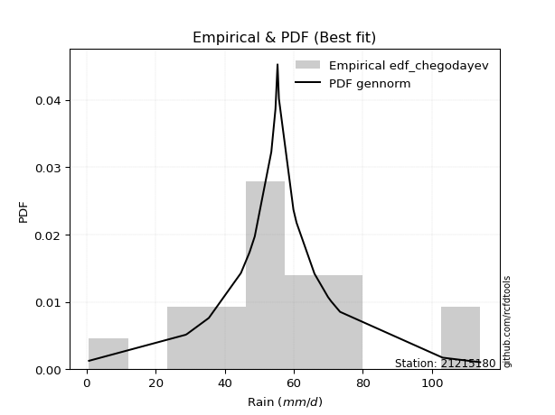</img>

</div>


### 6. Empirical - EDF Blom (1958)

The Blom formula is a specific "plotting position" formula used in hydrology and statistical analysis to estimate the empirical cumulative probability (or non-exceedance probability) of a data series. It is particularly recommended for data that are approximately normally distributed. The constant _a_ is set to 0.375 (or 3/8).

<div align="center">


$P=(m-a)/(n+1-2a)$


</div>


**6.1. Empirical values**

<div align="center">

|                | 0                    | 1                   | 2                   | 3                   | 4                   | 5                  | 6                   | 7                  | 8                   | 9        | 10                 | 11                 | 12                 | 13                 | 14                 | 15                 | 16                 | 17                 | 18                 |
|:---------------|:---------------------|:--------------------|:--------------------|:--------------------|:--------------------|:-------------------|:--------------------|:-------------------|:--------------------|:---------|:-------------------|:-------------------|:-------------------|:-------------------|:-------------------|:-------------------|:-------------------|:-------------------|:-------------------|
| date           | 2025                 | 2022                | 2016                | 2021                | 2006                | 2020               | 2019                | 2013               | 2017                | 2012     | 2009               | 2015               | 2011               | 2018               | 2007               | 2010               | 2024               | 2008               | 2014               |
| x              | 0.2                  | 0.7                 | 28.7                | 29.1                | 35.4                | 44.7               | 47.2                | 48.7               | 53.5                | 55.3     | 55.7               | 59.9               | 60.8               | 66.0               | 69.9               | 70.8               | 73.4               | 103.1              | 114.0              |
| m              | 1                    | 2                   | 3                   | 4                   | 5                   | 6                  | 7                   | 8                  | 9                   | 10       | 11                 | 12                 | 13                 | 14                 | 15                 | 16                 | 17                 | 18                 | 19                 |
| empirical_dist | edf_blom             | edf_blom            | edf_blom            | edf_blom            | edf_blom            | edf_blom           | edf_blom            | edf_blom           | edf_blom            | edf_blom | edf_blom           | edf_blom           | edf_blom           | edf_blom           | edf_blom           | edf_blom           | edf_blom           | edf_blom           | edf_blom           |
| empirical      | 0.032467532467532464 | 0.08441558441558442 | 0.13636363636363635 | 0.18831168831168832 | 0.24025974025974026 | 0.2922077922077922 | 0.34415584415584416 | 0.3961038961038961 | 0.44805194805194803 | 0.5      | 0.551948051948052  | 0.6038961038961039 | 0.6558441558441559 | 0.7077922077922078 | 0.7597402597402597 | 0.8116883116883117 | 0.8636363636363636 | 0.9155844155844156 | 0.9675324675324676 |
| empirical_tr   | 1.0335570469798658   | 1.0921985815602837  | 1.1578947368421053  | 1.232               | 1.3162393162393162  | 1.4128440366972477 | 1.5247524752475246  | 1.6559139784946235 | 1.811764705882353   | 2.0      | 2.2318840579710146 | 2.5245901639344264 | 2.905660377358491  | 3.4222222222222216 | 4.162162162162161  | 5.310344827586206  | 7.333333333333334  | 11.84615384615385  | 30.800000000000043 |

</div>


**6.2. Kolmogorov-Smirnov fit test (sorted by Δ)**


<div align="center">

|                | 0                    | 1                   | 2                   | 3                   | 4                   | 5                   | 6                   | 7                   | 8                   | 9                   | 10                  | 11                  | 12                  | 13                  | 14                  | 15                  | 16                  | 17                  | 18                  | 19                  | 20                  | 21                  | 22                  | 23                  | 24                  | 25                  | 26                  | 27                  | 28                  | 29                  | 30                  | 31                  | 32                  | 33                  | 34                  | 35                  | 36                  | 37                  | 38                  | 39                    | 40                  | 41                  | 42                  | 43                  | 44                  | 45                  | 46                  | 47                  | 48                  | 49                  | 50                  | 51                  | 52                  | 53                  | 54                  | 55                  | 56                  | 57                  | 58                  | 59                  | 60                  | 61                  | 62                  | 63                  | 64                  | 65                  | 66                  | 67                  | 68                  | 69                  | 70                  | 71                  | 72                  | 73                  | 74                  | 75                  | 76                  | 77                  | 78                  | 79                  | 80                  | 81                  | 82                  | 83                  | 84                  | 85                  | 86                  | 87                  | 88                  | 89                  |
|:---------------|:---------------------|:--------------------|:--------------------|:--------------------|:--------------------|:--------------------|:--------------------|:--------------------|:--------------------|:--------------------|:--------------------|:--------------------|:--------------------|:--------------------|:--------------------|:--------------------|:--------------------|:--------------------|:--------------------|:--------------------|:--------------------|:--------------------|:--------------------|:--------------------|:--------------------|:--------------------|:--------------------|:--------------------|:--------------------|:--------------------|:--------------------|:--------------------|:--------------------|:--------------------|:--------------------|:--------------------|:--------------------|:--------------------|:--------------------|:----------------------|:--------------------|:--------------------|:--------------------|:--------------------|:--------------------|:--------------------|:--------------------|:--------------------|:--------------------|:--------------------|:--------------------|:--------------------|:--------------------|:--------------------|:--------------------|:--------------------|:--------------------|:--------------------|:--------------------|:--------------------|:--------------------|:--------------------|:--------------------|:--------------------|:--------------------|:--------------------|:--------------------|:--------------------|:--------------------|:--------------------|:--------------------|:--------------------|:--------------------|:--------------------|:--------------------|:--------------------|:--------------------|:--------------------|:--------------------|:--------------------|:--------------------|:--------------------|:--------------------|:--------------------|:--------------------|:--------------------|:--------------------|:--------------------|:--------------------|:--------------------|
| station        | 21215180             | 21215180            | 21215180            | 21215180            | 21215180            | 21215180            | 21215180            | 21215180            | 21215180            | 21215180            | 21215180            | 21215180            | 21215180            | 21215180            | 21215180            | 21215180            | 21215180            | 21215180            | 21215180            | 21215180            | 21215180            | 21215180            | 21215180            | 21215180            | 21215180            | 21215180            | 21215180            | 21215180            | 21215180            | 21215180            | 21215180            | 21215180            | 21215180            | 21215180            | 21215180            | 21215180            | 21215180            | 21215180            | 21215180            | 21215180              | 21215180            | 21215180            | 21215180            | 21215180            | 21215180            | 21215180            | 21215180            | 21215180            | 21215180            | 21215180            | 21215180            | 21215180            | 21215180            | 21215180            | 21215180            | 21215180            | 21215180            | 21215180            | 21215180            | 21215180            | 21215180            | 21215180            | 21215180            | 21215180            | 21215180            | 21215180            | 21215180            | 21215180            | 21215180            | 21215180            | 21215180            | 21215180            | 21215180            | 21215180            | 21215180            | 21215180            | 21215180            | 21215180            | 21215180            | 21215180            | 21215180            | 21215180            | 21215180            | 21215180            | 21215180            | 21215180            | 21215180            | 21215180            | 21215180            | 21215180            |
| empirical_dist | edf_blom             | edf_blom            | edf_blom            | edf_blom            | edf_blom            | edf_blom            | edf_blom            | edf_blom            | edf_blom            | edf_blom            | edf_blom            | edf_blom            | edf_blom            | edf_blom            | edf_blom            | edf_blom            | edf_blom            | edf_blom            | edf_blom            | edf_blom            | edf_blom            | edf_blom            | edf_blom            | edf_blom            | edf_blom            | edf_blom            | edf_blom            | edf_blom            | edf_blom            | edf_blom            | edf_blom            | edf_blom            | edf_blom            | edf_blom            | edf_blom            | edf_blom            | edf_blom            | edf_blom            | edf_blom            | edf_blom              | edf_blom            | edf_blom            | edf_blom            | edf_blom            | edf_blom            | edf_blom            | edf_blom            | edf_blom            | edf_blom            | edf_blom            | edf_blom            | edf_blom            | edf_blom            | edf_blom            | edf_blom            | edf_blom            | edf_blom            | edf_blom            | edf_blom            | edf_blom            | edf_blom            | edf_blom            | edf_blom            | edf_blom            | edf_blom            | edf_blom            | edf_blom            | edf_blom            | edf_blom            | edf_blom            | edf_blom            | edf_blom            | edf_blom            | edf_blom            | edf_blom            | edf_blom            | edf_blom            | edf_blom            | edf_blom            | edf_blom            | edf_blom            | edf_blom            | edf_blom            | edf_blom            | edf_blom            | edf_blom            | edf_blom            | edf_blom            | edf_blom            | edf_blom            |
| p_dist         | laplace              | laplace_asymmetric  | johnsonsu           | logjohnsonsu        | hypsecant           | genlogistic         | fisk                | logistic            | mielke              | truncnorm           | exponnorm           | nct                 | betaprime           | chi2                | fatiguelife         | pearson3            | erlang              | gamma               | f                   | rice                | t                   | crystalball         | norm                | logt                | weibull_min         | gumbel_l            | invgamma            | invgauss            | maxwell             | rayleigh            | gumbel_r            | invweibull          | moyal               | halfnorm            | kstwobign           | halflogistic        | logfisk             | logloggamma         | loggenlogistic      | loglaplace_asymmetric | loggompertz         | wald                | ncf                 | gibrat              | loggumbel_l         | logmielke           | logpearson3         | nakagami            | expon               | genexpon            | loghypsecant        | loglogistic         | loglaplace          | logfatiguelife      | lognorm             | lognorm             | logcrystalball      | logexponnorm        | logrice             | lognct              | loglognorm          | lognakagami         | loginvgamma         | logalpha            | logbetaprime        | logerlang           | loginvgauss         | logmaxwell          | loginvweibull       | lograyleigh         | loggumbel_r         | logkstwobign        | loghalfnorm         | logmoyal            | loghalflogistic     | loggenexpon         | logexpon            | logncf              | logwald             | pareto              | loggibrat           | logpareto           | logchi2             | logf                | logtruncnorm        | loggamma            | loggamma            | logweibull_min      | gompertz            | alpha               |
| delta          | 0.051144545517690765 | 0.05139274461650001 | 0.05195398526870543 | 0.05627934536417767 | 0.06368268674634903 | 0.07440939631628751 | 0.07680002534645369 | 0.07817150326146582 | 0.08025800761383944 | 0.08470090406216135 | 0.09674520299646683 | 0.09756606999503059 | 0.09792061909690175 | 0.09795525068422273 | 0.09873891505243548 | 0.09911293746053684 | 0.0991815153658705  | 0.09921870826931567 | 0.09933594691566727 | 0.1004040923231927  | 0.1007741022827926  | 0.10078153995624017 | 0.10078154201920253 | 0.1016869463215544  | 0.10538435490212283 | 0.11175957838986728 | 0.11217471095051523 | 0.11348459530122806 | 0.11623608856434364 | 0.12850592363200836 | 0.137670094308477   | 0.14367259535406063 | 0.15843980684814735 | 0.1633845839370578  | 0.1679731835366563  | 0.1755107102013797  | 0.19647250912642067 | 0.20085363945061718 | 0.20930655003289794 | 0.21775616652734037   | 0.2190185262588939  | 0.2195958860538878  | 0.2311885458676461  | 0.24288519655603402 | 0.257924750653194   | 0.2663540723309434  | 0.26738138910747233 | 0.27069106995693487 | 0.2776112174255465  | 0.3055878851759526  | 0.3196336461592209  | 0.3236879331121086  | 0.325969061752497   | 0.3277660582369431  | 0.32846061835270657 | 0.32846061835270657 | 0.3284606202102866  | 0.32846077142437563 | 0.3284813710703261  | 0.3286503531220728  | 0.3288933067346183  | 0.3291019606074823  | 0.3366467429669768  | 0.3412032132098469  | 0.3522339497947428  | 0.35362948999068533 | 0.35654458066640704 | 0.36255946382310583 | 0.3652104055292358  | 0.3742369841803611  | 0.39688142243405755 | 0.40649062238871103 | 0.40716201560180343 | 0.4225677532651272  | 0.4295645662365334  | 0.4696435717294326  | 0.48551482197355844 | 0.4914056120088791  | 0.4940549971509348  | 0.5076472722244162  | 0.5105508053339174  | 0.53906479141324    | 0.569572518406      | 0.5913533229261092  | 0.6442189688484886  | 0.6585710046887457  | 0.6585710046887457  | 0.7094417080123323  | 0.8359791862042577  | 0.8401891371302165  |
| deltao         | 0.31564497164100014  | 0.31564497164100014 | 0.31564497164100014 | 0.31564497164100014 | 0.31564497164100014 | 0.31564497164100014 | 0.31564497164100014 | 0.31564497164100014 | 0.31564497164100014 | 0.31564497164100014 | 0.31564497164100014 | 0.31564497164100014 | 0.31564497164100014 | 0.31564497164100014 | 0.31564497164100014 | 0.31564497164100014 | 0.31564497164100014 | 0.31564497164100014 | 0.31564497164100014 | 0.31564497164100014 | 0.31564497164100014 | 0.31564497164100014 | 0.31564497164100014 | 0.31564497164100014 | 0.31564497164100014 | 0.31564497164100014 | 0.31564497164100014 | 0.31564497164100014 | 0.31564497164100014 | 0.31564497164100014 | 0.31564497164100014 | 0.31564497164100014 | 0.31564497164100014 | 0.31564497164100014 | 0.31564497164100014 | 0.31564497164100014 | 0.31564497164100014 | 0.31564497164100014 | 0.31564497164100014 | 0.31564497164100014   | 0.31564497164100014 | 0.31564497164100014 | 0.31564497164100014 | 0.31564497164100014 | 0.31564497164100014 | 0.31564497164100014 | 0.31564497164100014 | 0.31564497164100014 | 0.31564497164100014 | 0.31564497164100014 | 0.31564497164100014 | 0.31564497164100014 | 0.31564497164100014 | 0.31564497164100014 | 0.31564497164100014 | 0.31564497164100014 | 0.31564497164100014 | 0.31564497164100014 | 0.31564497164100014 | 0.31564497164100014 | 0.31564497164100014 | 0.31564497164100014 | 0.31564497164100014 | 0.31564497164100014 | 0.31564497164100014 | 0.31564497164100014 | 0.31564497164100014 | 0.31564497164100014 | 0.31564497164100014 | 0.31564497164100014 | 0.31564497164100014 | 0.31564497164100014 | 0.31564497164100014 | 0.31564497164100014 | 0.31564497164100014 | 0.31564497164100014 | 0.31564497164100014 | 0.31564497164100014 | 0.31564497164100014 | 0.31564497164100014 | 0.31564497164100014 | 0.31564497164100014 | 0.31564497164100014 | 0.31564497164100014 | 0.31564497164100014 | 0.31564497164100014 | 0.31564497164100014 | 0.31564497164100014 | 0.31564497164100014 | 0.31564497164100014 |
| eval           | Δo > Δ               | Δo > Δ              | Δo > Δ              | Δo > Δ              | Δo > Δ              | Δo > Δ              | Δo > Δ              | Δo > Δ              | Δo > Δ              | Δo > Δ              | Δo > Δ              | Δo > Δ              | Δo > Δ              | Δo > Δ              | Δo > Δ              | Δo > Δ              | Δo > Δ              | Δo > Δ              | Δo > Δ              | Δo > Δ              | Δo > Δ              | Δo > Δ              | Δo > Δ              | Δo > Δ              | Δo > Δ              | Δo > Δ              | Δo > Δ              | Δo > Δ              | Δo > Δ              | Δo > Δ              | Δo > Δ              | Δo > Δ              | Δo > Δ              | Δo > Δ              | Δo > Δ              | Δo > Δ              | Δo > Δ              | Δo > Δ              | Δo > Δ              | Δo > Δ                | Δo > Δ              | Δo > Δ              | Δo > Δ              | Δo > Δ              | Δo > Δ              | Δo > Δ              | Δo > Δ              | Δo > Δ              | Δo > Δ              | Δo > Δ              | Δo <= Δ             | Δo <= Δ             | Δo <= Δ             | Δo <= Δ             | Δo <= Δ             | Δo <= Δ             | Δo <= Δ             | Δo <= Δ             | Δo <= Δ             | Δo <= Δ             | Δo <= Δ             | Δo <= Δ             | Δo <= Δ             | Δo <= Δ             | Δo <= Δ             | Δo <= Δ             | Δo <= Δ             | Δo <= Δ             | Δo <= Δ             | Δo <= Δ             | Δo <= Δ             | Δo <= Δ             | Δo <= Δ             | Δo <= Δ             | Δo <= Δ             | Δo <= Δ             | Δo <= Δ             | Δo <= Δ             | Δo <= Δ             | Δo <= Δ             | Δo <= Δ             | Δo <= Δ             | Δo <= Δ             | Δo <= Δ             | Δo <= Δ             | Δo <= Δ             | Δo <= Δ             | Δo <= Δ             | Δo <= Δ             | Δo <= Δ             |
| fit            | 1                    | 1                   | 1                   | 1                   | 1                   | 1                   | 1                   | 1                   | 1                   | 1                   | 1                   | 1                   | 1                   | 1                   | 1                   | 1                   | 1                   | 1                   | 1                   | 1                   | 1                   | 1                   | 1                   | 1                   | 1                   | 1                   | 1                   | 1                   | 1                   | 1                   | 1                   | 1                   | 1                   | 1                   | 1                   | 1                   | 1                   | 1                   | 1                   | 1                     | 1                   | 1                   | 1                   | 1                   | 1                   | 1                   | 1                   | 1                   | 1                   | 1                   | 0                   | 0                   | 0                   | 0                   | 0                   | 0                   | 0                   | 0                   | 0                   | 0                   | 0                   | 0                   | 0                   | 0                   | 0                   | 0                   | 0                   | 0                   | 0                   | 0                   | 0                   | 0                   | 0                   | 0                   | 0                   | 0                   | 0                   | 0                   | 0                   | 0                   | 0                   | 0                   | 0                   | 0                   | 0                   | 0                   | 0                   | 0                   | 0                   | 0                   |
| n              | 19                   | 19                  | 19                  | 19                  | 19                  | 19                  | 19                  | 19                  | 19                  | 19                  | 19                  | 19                  | 19                  | 19                  | 19                  | 19                  | 19                  | 19                  | 19                  | 19                  | 19                  | 19                  | 19                  | 19                  | 19                  | 19                  | 19                  | 19                  | 19                  | 19                  | 19                  | 19                  | 19                  | 19                  | 19                  | 19                  | 19                  | 19                  | 19                  | 19                    | 19                  | 19                  | 19                  | 19                  | 19                  | 19                  | 19                  | 19                  | 19                  | 19                  | 19                  | 19                  | 19                  | 19                  | 19                  | 19                  | 19                  | 19                  | 19                  | 19                  | 19                  | 19                  | 19                  | 19                  | 19                  | 19                  | 19                  | 19                  | 19                  | 19                  | 19                  | 19                  | 19                  | 19                  | 19                  | 19                  | 19                  | 19                  | 19                  | 19                  | 19                  | 19                  | 19                  | 19                  | 19                  | 19                  | 19                  | 19                  | 19                  | 19                  |
| best_fit       | 1                    | 0                   | 0                   | 0                   | 0                   | 0                   | 0                   | 0                   | 0                   | 0                   | 0                   | 0                   | 0                   | 0                   | 0                   | 0                   | 0                   | 0                   | 0                   | 0                   | 0                   | 0                   | 0                   | 0                   | 0                   | 0                   | 0                   | 0                   | 0                   | 0                   | 0                   | 0                   | 0                   | 0                   | 0                   | 0                   | 0                   | 0                   | 0                   | 0                     | 0                   | 0                   | 0                   | 0                   | 0                   | 0                   | 0                   | 0                   | 0                   | 0                   | 0                   | 0                   | 0                   | 0                   | 0                   | 0                   | 0                   | 0                   | 0                   | 0                   | 0                   | 0                   | 0                   | 0                   | 0                   | 0                   | 0                   | 0                   | 0                   | 0                   | 0                   | 0                   | 0                   | 0                   | 0                   | 0                   | 0                   | 0                   | 0                   | 0                   | 0                   | 0                   | 0                   | 0                   | 0                   | 0                   | 0                   | 0                   | 0                   | 0                   |
| best_fit_sort  | 1                    | 2                   | 3                   | 4                   | 5                   | 6                   | 7                   | 8                   | 9                   | 10                  | 11                  | 12                  | 13                  | 14                  | 15                  | 16                  | 17                  | 18                  | 19                  | 20                  | 21                  | 22                  | 23                  | 24                  | 25                  | 26                  | 27                  | 28                  | 29                  | 30                  | 31                  | 32                  | 33                  | 34                  | 35                  | 36                  | 37                  | 38                  | 39                  | 40                    | 41                  | 42                  | 43                  | 44                  | 45                  | 46                  | 47                  | 48                  | 49                  | 50                  | 51                  | 52                  | 53                  | 54                  | 55                  | 56                  | 57                  | 58                  | 59                  | 60                  | 61                  | 62                  | 63                  | 64                  | 65                  | 66                  | 67                  | 68                  | 69                  | 70                  | 71                  | 72                  | 73                  | 74                  | 75                  | 76                  | 77                  | 78                  | 79                  | 80                  | 81                  | 82                  | 83                  | 84                  | 85                  | 86                  | 87                  | 88                  | 89                  | 90                  |

</div>


<div align="center">

</img>

</div>


**6.3. Best fit**

<div align="center">

|   id |   station | empirical_dist   | p_dist   |     delta |   deltao | eval   |   fit |   n |   best_fit |   best_fit_sort |
|-----:|----------:|:-----------------|:---------|----------:|---------:|:-------|------:|----:|-----------:|----------------:|
|    0 |  21215180 | edf_blom         | laplace  | 0.0511445 | 0.315645 | Δo > Δ |     1 |  19 |          1 |               1 |

</div>


<div align="center">

</img>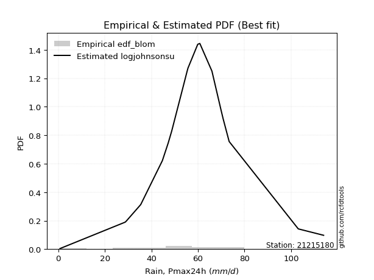</img>

</div>


### 7. Empirical - EDF Tukey (1962)

In hydrology, the Tukey formula is used as a plotting position formula to estimate the empirical probability or frequency of a flood event (or other hydrological data). The formula parameter is given as _c=0.333_ (or 1/3).

<div align="center">


$P=(m-c)/(n+1-2c)$


</div>


**7.1. Empirical values**

<div align="center">

|                | 0                    | 1                   | 2                   | 3                  | 4                  | 5                   | 6                  | 7                   | 8                  | 9         | 10                 | 11                 | 12                 | 13                 | 14                 | 15                 | 16                 | 17                 | 18                 |
|:---------------|:---------------------|:--------------------|:--------------------|:-------------------|:-------------------|:--------------------|:-------------------|:--------------------|:-------------------|:----------|:-------------------|:-------------------|:-------------------|:-------------------|:-------------------|:-------------------|:-------------------|:-------------------|:-------------------|
| date           | 2025                 | 2022                | 2016                | 2021               | 2006               | 2020                | 2019               | 2013                | 2017               | 2012      | 2009               | 2015               | 2011               | 2018               | 2007               | 2010               | 2024               | 2008               | 2014               |
| x              | 0.2                  | 0.7                 | 28.7                | 29.1               | 35.4               | 44.7                | 47.2               | 48.7                | 53.5               | 55.3      | 55.7               | 59.9               | 60.8               | 66.0               | 69.9               | 70.8               | 73.4               | 103.1              | 114.0              |
| m              | 1                    | 2                   | 3                   | 4                  | 5                  | 6                   | 7                  | 8                   | 9                  | 10        | 11                 | 12                 | 13                 | 14                 | 15                 | 16                 | 17                 | 18                 | 19                 |
| empirical_dist | edf_tukey            | edf_tukey           | edf_tukey           | edf_tukey          | edf_tukey          | edf_tukey           | edf_tukey          | edf_tukey           | edf_tukey          | edf_tukey | edf_tukey          | edf_tukey          | edf_tukey          | edf_tukey          | edf_tukey          | edf_tukey          | edf_tukey          | edf_tukey          | edf_tukey          |
| empirical      | 0.034482758620689655 | 0.08620689655172414 | 0.13793103448275862 | 0.1896551724137931 | 0.2413793103448276 | 0.29310344827586204 | 0.3448275862068966 | 0.39655172413793105 | 0.4482758620689655 | 0.5       | 0.5517241379310345 | 0.603448275862069  | 0.6551724137931034 | 0.7068965517241379 | 0.7586206896551724 | 0.8103448275862069 | 0.8620689655172413 | 0.9137931034482759 | 0.9655172413793104 |
| empirical_tr   | 1.0357142857142856   | 1.0943396226415094  | 1.1600000000000001  | 1.2340425531914894 | 1.3181818181818183 | 1.4146341463414636  | 1.5263157894736843 | 1.6571428571428573  | 1.8125             | 2.0       | 2.230769230769231  | 2.5217391304347827 | 2.9                | 3.4117647058823524 | 4.142857142857142  | 5.272727272727272  | 7.249999999999997  | 11.600000000000007 | 29.000000000000036 |

</div>


**7.2. Kolmogorov-Smirnov fit test (sorted by Δ)**


<div align="center">

|                | 0                   | 1                    | 2                    | 3                   | 4                    | 5                   | 6                   | 7                   | 8                   | 9                   | 10                  | 11                  | 12                  | 13                  | 14                  | 15                  | 16                  | 17                  | 18                  | 19                  | 20                  | 21                  | 22                  | 23                  | 24                  | 25                  | 26                  | 27                  | 28                  | 29                  | 30                  | 31                  | 32                  | 33                  | 34                  | 35                  | 36                  | 37                  | 38                  | 39                    | 40                  | 41                  | 42                  | 43                  | 44                  | 45                  | 46                  | 47                  | 48                  | 49                  | 50                  | 51                  | 52                  | 53                  | 54                  | 55                  | 56                  | 57                  | 58                  | 59                  | 60                  | 61                  | 62                  | 63                  | 64                  | 65                  | 66                  | 67                  | 68                  | 69                  | 70                  | 71                  | 72                  | 73                  | 74                  | 75                  | 76                  | 77                  | 78                  | 79                  | 80                  | 81                  | 82                  | 83                  | 84                  | 85                  | 86                  | 87                  | 88                  | 89                  |
|:---------------|:--------------------|:---------------------|:---------------------|:--------------------|:---------------------|:--------------------|:--------------------|:--------------------|:--------------------|:--------------------|:--------------------|:--------------------|:--------------------|:--------------------|:--------------------|:--------------------|:--------------------|:--------------------|:--------------------|:--------------------|:--------------------|:--------------------|:--------------------|:--------------------|:--------------------|:--------------------|:--------------------|:--------------------|:--------------------|:--------------------|:--------------------|:--------------------|:--------------------|:--------------------|:--------------------|:--------------------|:--------------------|:--------------------|:--------------------|:----------------------|:--------------------|:--------------------|:--------------------|:--------------------|:--------------------|:--------------------|:--------------------|:--------------------|:--------------------|:--------------------|:--------------------|:--------------------|:--------------------|:--------------------|:--------------------|:--------------------|:--------------------|:--------------------|:--------------------|:--------------------|:--------------------|:--------------------|:--------------------|:--------------------|:--------------------|:--------------------|:--------------------|:--------------------|:--------------------|:--------------------|:--------------------|:--------------------|:--------------------|:--------------------|:--------------------|:--------------------|:--------------------|:--------------------|:--------------------|:--------------------|:--------------------|:--------------------|:--------------------|:--------------------|:--------------------|:--------------------|:--------------------|:--------------------|:--------------------|:--------------------|
| station        | 21215180            | 21215180             | 21215180             | 21215180            | 21215180             | 21215180            | 21215180            | 21215180            | 21215180            | 21215180            | 21215180            | 21215180            | 21215180            | 21215180            | 21215180            | 21215180            | 21215180            | 21215180            | 21215180            | 21215180            | 21215180            | 21215180            | 21215180            | 21215180            | 21215180            | 21215180            | 21215180            | 21215180            | 21215180            | 21215180            | 21215180            | 21215180            | 21215180            | 21215180            | 21215180            | 21215180            | 21215180            | 21215180            | 21215180            | 21215180              | 21215180            | 21215180            | 21215180            | 21215180            | 21215180            | 21215180            | 21215180            | 21215180            | 21215180            | 21215180            | 21215180            | 21215180            | 21215180            | 21215180            | 21215180            | 21215180            | 21215180            | 21215180            | 21215180            | 21215180            | 21215180            | 21215180            | 21215180            | 21215180            | 21215180            | 21215180            | 21215180            | 21215180            | 21215180            | 21215180            | 21215180            | 21215180            | 21215180            | 21215180            | 21215180            | 21215180            | 21215180            | 21215180            | 21215180            | 21215180            | 21215180            | 21215180            | 21215180            | 21215180            | 21215180            | 21215180            | 21215180            | 21215180            | 21215180            | 21215180            |
| empirical_dist | edf_tukey           | edf_tukey            | edf_tukey            | edf_tukey           | edf_tukey            | edf_tukey           | edf_tukey           | edf_tukey           | edf_tukey           | edf_tukey           | edf_tukey           | edf_tukey           | edf_tukey           | edf_tukey           | edf_tukey           | edf_tukey           | edf_tukey           | edf_tukey           | edf_tukey           | edf_tukey           | edf_tukey           | edf_tukey           | edf_tukey           | edf_tukey           | edf_tukey           | edf_tukey           | edf_tukey           | edf_tukey           | edf_tukey           | edf_tukey           | edf_tukey           | edf_tukey           | edf_tukey           | edf_tukey           | edf_tukey           | edf_tukey           | edf_tukey           | edf_tukey           | edf_tukey           | edf_tukey             | edf_tukey           | edf_tukey           | edf_tukey           | edf_tukey           | edf_tukey           | edf_tukey           | edf_tukey           | edf_tukey           | edf_tukey           | edf_tukey           | edf_tukey           | edf_tukey           | edf_tukey           | edf_tukey           | edf_tukey           | edf_tukey           | edf_tukey           | edf_tukey           | edf_tukey           | edf_tukey           | edf_tukey           | edf_tukey           | edf_tukey           | edf_tukey           | edf_tukey           | edf_tukey           | edf_tukey           | edf_tukey           | edf_tukey           | edf_tukey           | edf_tukey           | edf_tukey           | edf_tukey           | edf_tukey           | edf_tukey           | edf_tukey           | edf_tukey           | edf_tukey           | edf_tukey           | edf_tukey           | edf_tukey           | edf_tukey           | edf_tukey           | edf_tukey           | edf_tukey           | edf_tukey           | edf_tukey           | edf_tukey           | edf_tukey           | edf_tukey           |
| p_dist         | laplace_asymmetric  | johnsonsu            | laplace              | logjohnsonsu        | hypsecant            | genlogistic         | fisk                | logistic            | mielke              | truncnorm           | exponnorm           | nct                 | betaprime           | chi2                | fatiguelife         | pearson3            | erlang              | gamma               | f                   | rice                | t                   | crystalball         | norm                | logt                | weibull_min         | gumbel_l            | invgamma            | invgauss            | maxwell             | rayleigh            | gumbel_r            | invweibull          | moyal               | halfnorm            | kstwobign           | halflogistic        | logfisk             | logloggamma         | loggenlogistic      | loglaplace_asymmetric | loggompertz         | wald                | ncf                 | gibrat              | loggumbel_l         | logmielke           | logpearson3         | nakagami            | expon               | genexpon            | loghypsecant        | loglogistic         | loglaplace          | logfatiguelife      | lognorm             | lognorm             | logcrystalball      | logexponnorm        | logrice             | lognct              | loglognorm          | lognakagami         | loginvgamma         | logalpha            | logbetaprime        | logerlang           | loginvgauss         | logmaxwell          | loginvweibull       | lograyleigh         | loggumbel_r         | logkstwobign        | loghalfnorm         | logmoyal            | loghalflogistic     | loggenexpon         | logexpon            | logncf              | logwald             | pareto              | loggibrat           | logpareto           | logchi2             | logf                | logtruncnorm        | loggamma            | loggamma            | logweibull_min      | gompertz            | alpha               |
| delta          | 0.04982534649737769 | 0.050386587149583106 | 0.052290010224697765 | 0.05737486883913016 | 0.062115288627226706 | 0.07284199819716519 | 0.07523262722733137 | 0.0766041051423435  | 0.0793623515457696  | 0.08501732135855672 | 0.09517780487734451 | 0.09599867187590827 | 0.09635322097777943 | 0.09705959461615288 | 0.09717151693331316 | 0.09754553934141452 | 0.09761411724674818 | 0.09765131015019335 | 0.09776854879654495 | 0.09883669420407037 | 0.09920670416367028 | 0.09921414183711785 | 0.09921414390008021 | 0.10011954820243207 | 0.10381695678300051 | 0.1110878363388148  | 0.11127905488244538 | 0.11258893923315821 | 0.11534043249627379 | 0.1276102675639385  | 0.13677443824040714 | 0.14277693928599078 | 0.1575441507800775  | 0.16248892786898794 | 0.16707752746858645 | 0.17461505413330985 | 0.19490511100729835 | 0.19995798338254733 | 0.2084108939648281  | 0.21686051045927052   | 0.21812287019082405 | 0.2193719720368703  | 0.23029288979957624 | 0.24266128253901653 | 0.2563573525340717  | 0.2647866742118211  | 0.26581399098835    | 0.269795413888865   | 0.27604381930642424 | 0.3046866726116489  | 0.31806624804009864 | 0.3221205349929863  | 0.32507340568442716 | 0.32619866011782084 | 0.3268932202335843  | 0.3268932202335843  | 0.32689322209116434 | 0.32689337330525337 | 0.32691397295120384 | 0.32708295500295054 | 0.32732590861549604 | 0.32753456248836005 | 0.3350793448478545  | 0.33963581509072466 | 0.35066655167562055 | 0.35206209187156307 | 0.3549771825472848  | 0.36099206570398357 | 0.3636430074101135  | 0.37266958606123884 | 0.3953140243149353  | 0.40492322426958877 | 0.40559461748268116 | 0.4210003551460049  | 0.4279971681174111  | 0.46807617361031034 | 0.4839474238544362  | 0.48983821388975685 | 0.49248759903181255 | 0.5060798741052939  | 0.5089834072147952  | 0.5372734792771003  | 0.5680051202868777  | 0.589785924806987   | 0.6426515707293663  | 0.6570036065696234  | 0.6570036065696234  | 0.7078743098932101  | 0.8344117880851354  | 0.8386217390110942  |
| deltao         | 0.31564497164100014 | 0.31564497164100014  | 0.31564497164100014  | 0.31564497164100014 | 0.31564497164100014  | 0.31564497164100014 | 0.31564497164100014 | 0.31564497164100014 | 0.31564497164100014 | 0.31564497164100014 | 0.31564497164100014 | 0.31564497164100014 | 0.31564497164100014 | 0.31564497164100014 | 0.31564497164100014 | 0.31564497164100014 | 0.31564497164100014 | 0.31564497164100014 | 0.31564497164100014 | 0.31564497164100014 | 0.31564497164100014 | 0.31564497164100014 | 0.31564497164100014 | 0.31564497164100014 | 0.31564497164100014 | 0.31564497164100014 | 0.31564497164100014 | 0.31564497164100014 | 0.31564497164100014 | 0.31564497164100014 | 0.31564497164100014 | 0.31564497164100014 | 0.31564497164100014 | 0.31564497164100014 | 0.31564497164100014 | 0.31564497164100014 | 0.31564497164100014 | 0.31564497164100014 | 0.31564497164100014 | 0.31564497164100014   | 0.31564497164100014 | 0.31564497164100014 | 0.31564497164100014 | 0.31564497164100014 | 0.31564497164100014 | 0.31564497164100014 | 0.31564497164100014 | 0.31564497164100014 | 0.31564497164100014 | 0.31564497164100014 | 0.31564497164100014 | 0.31564497164100014 | 0.31564497164100014 | 0.31564497164100014 | 0.31564497164100014 | 0.31564497164100014 | 0.31564497164100014 | 0.31564497164100014 | 0.31564497164100014 | 0.31564497164100014 | 0.31564497164100014 | 0.31564497164100014 | 0.31564497164100014 | 0.31564497164100014 | 0.31564497164100014 | 0.31564497164100014 | 0.31564497164100014 | 0.31564497164100014 | 0.31564497164100014 | 0.31564497164100014 | 0.31564497164100014 | 0.31564497164100014 | 0.31564497164100014 | 0.31564497164100014 | 0.31564497164100014 | 0.31564497164100014 | 0.31564497164100014 | 0.31564497164100014 | 0.31564497164100014 | 0.31564497164100014 | 0.31564497164100014 | 0.31564497164100014 | 0.31564497164100014 | 0.31564497164100014 | 0.31564497164100014 | 0.31564497164100014 | 0.31564497164100014 | 0.31564497164100014 | 0.31564497164100014 | 0.31564497164100014 |
| eval           | Δo > Δ              | Δo > Δ               | Δo > Δ               | Δo > Δ              | Δo > Δ               | Δo > Δ              | Δo > Δ              | Δo > Δ              | Δo > Δ              | Δo > Δ              | Δo > Δ              | Δo > Δ              | Δo > Δ              | Δo > Δ              | Δo > Δ              | Δo > Δ              | Δo > Δ              | Δo > Δ              | Δo > Δ              | Δo > Δ              | Δo > Δ              | Δo > Δ              | Δo > Δ              | Δo > Δ              | Δo > Δ              | Δo > Δ              | Δo > Δ              | Δo > Δ              | Δo > Δ              | Δo > Δ              | Δo > Δ              | Δo > Δ              | Δo > Δ              | Δo > Δ              | Δo > Δ              | Δo > Δ              | Δo > Δ              | Δo > Δ              | Δo > Δ              | Δo > Δ                | Δo > Δ              | Δo > Δ              | Δo > Δ              | Δo > Δ              | Δo > Δ              | Δo > Δ              | Δo > Δ              | Δo > Δ              | Δo > Δ              | Δo > Δ              | Δo <= Δ             | Δo <= Δ             | Δo <= Δ             | Δo <= Δ             | Δo <= Δ             | Δo <= Δ             | Δo <= Δ             | Δo <= Δ             | Δo <= Δ             | Δo <= Δ             | Δo <= Δ             | Δo <= Δ             | Δo <= Δ             | Δo <= Δ             | Δo <= Δ             | Δo <= Δ             | Δo <= Δ             | Δo <= Δ             | Δo <= Δ             | Δo <= Δ             | Δo <= Δ             | Δo <= Δ             | Δo <= Δ             | Δo <= Δ             | Δo <= Δ             | Δo <= Δ             | Δo <= Δ             | Δo <= Δ             | Δo <= Δ             | Δo <= Δ             | Δo <= Δ             | Δo <= Δ             | Δo <= Δ             | Δo <= Δ             | Δo <= Δ             | Δo <= Δ             | Δo <= Δ             | Δo <= Δ             | Δo <= Δ             | Δo <= Δ             |
| fit            | 1                   | 1                    | 1                    | 1                   | 1                    | 1                   | 1                   | 1                   | 1                   | 1                   | 1                   | 1                   | 1                   | 1                   | 1                   | 1                   | 1                   | 1                   | 1                   | 1                   | 1                   | 1                   | 1                   | 1                   | 1                   | 1                   | 1                   | 1                   | 1                   | 1                   | 1                   | 1                   | 1                   | 1                   | 1                   | 1                   | 1                   | 1                   | 1                   | 1                     | 1                   | 1                   | 1                   | 1                   | 1                   | 1                   | 1                   | 1                   | 1                   | 1                   | 0                   | 0                   | 0                   | 0                   | 0                   | 0                   | 0                   | 0                   | 0                   | 0                   | 0                   | 0                   | 0                   | 0                   | 0                   | 0                   | 0                   | 0                   | 0                   | 0                   | 0                   | 0                   | 0                   | 0                   | 0                   | 0                   | 0                   | 0                   | 0                   | 0                   | 0                   | 0                   | 0                   | 0                   | 0                   | 0                   | 0                   | 0                   | 0                   | 0                   |
| n              | 19                  | 19                   | 19                   | 19                  | 19                   | 19                  | 19                  | 19                  | 19                  | 19                  | 19                  | 19                  | 19                  | 19                  | 19                  | 19                  | 19                  | 19                  | 19                  | 19                  | 19                  | 19                  | 19                  | 19                  | 19                  | 19                  | 19                  | 19                  | 19                  | 19                  | 19                  | 19                  | 19                  | 19                  | 19                  | 19                  | 19                  | 19                  | 19                  | 19                    | 19                  | 19                  | 19                  | 19                  | 19                  | 19                  | 19                  | 19                  | 19                  | 19                  | 19                  | 19                  | 19                  | 19                  | 19                  | 19                  | 19                  | 19                  | 19                  | 19                  | 19                  | 19                  | 19                  | 19                  | 19                  | 19                  | 19                  | 19                  | 19                  | 19                  | 19                  | 19                  | 19                  | 19                  | 19                  | 19                  | 19                  | 19                  | 19                  | 19                  | 19                  | 19                  | 19                  | 19                  | 19                  | 19                  | 19                  | 19                  | 19                  | 19                  |
| best_fit       | 1                   | 0                    | 0                    | 0                   | 0                    | 0                   | 0                   | 0                   | 0                   | 0                   | 0                   | 0                   | 0                   | 0                   | 0                   | 0                   | 0                   | 0                   | 0                   | 0                   | 0                   | 0                   | 0                   | 0                   | 0                   | 0                   | 0                   | 0                   | 0                   | 0                   | 0                   | 0                   | 0                   | 0                   | 0                   | 0                   | 0                   | 0                   | 0                   | 0                     | 0                   | 0                   | 0                   | 0                   | 0                   | 0                   | 0                   | 0                   | 0                   | 0                   | 0                   | 0                   | 0                   | 0                   | 0                   | 0                   | 0                   | 0                   | 0                   | 0                   | 0                   | 0                   | 0                   | 0                   | 0                   | 0                   | 0                   | 0                   | 0                   | 0                   | 0                   | 0                   | 0                   | 0                   | 0                   | 0                   | 0                   | 0                   | 0                   | 0                   | 0                   | 0                   | 0                   | 0                   | 0                   | 0                   | 0                   | 0                   | 0                   | 0                   |
| best_fit_sort  | 1                   | 2                    | 3                    | 4                   | 5                    | 6                   | 7                   | 8                   | 9                   | 10                  | 11                  | 12                  | 13                  | 14                  | 15                  | 16                  | 17                  | 18                  | 19                  | 20                  | 21                  | 22                  | 23                  | 24                  | 25                  | 26                  | 27                  | 28                  | 29                  | 30                  | 31                  | 32                  | 33                  | 34                  | 35                  | 36                  | 37                  | 38                  | 39                  | 40                    | 41                  | 42                  | 43                  | 44                  | 45                  | 46                  | 47                  | 48                  | 49                  | 50                  | 51                  | 52                  | 53                  | 54                  | 55                  | 56                  | 57                  | 58                  | 59                  | 60                  | 61                  | 62                  | 63                  | 64                  | 65                  | 66                  | 67                  | 68                  | 69                  | 70                  | 71                  | 72                  | 73                  | 74                  | 75                  | 76                  | 77                  | 78                  | 79                  | 80                  | 81                  | 82                  | 83                  | 84                  | 85                  | 86                  | 87                  | 88                  | 89                  | 90                  |

</div>


<div align="center">

</img>

</div>


**7.3. Best fit**

<div align="center">

|   id |   station | empirical_dist   | p_dist             |     delta |   deltao | eval   |   fit |   n |   best_fit |   best_fit_sort |
|-----:|----------:|:-----------------|:-------------------|----------:|---------:|:-------|------:|----:|-----------:|----------------:|
|    0 |  21215180 | edf_tukey        | laplace_asymmetric | 0.0498253 | 0.315645 | Δo > Δ |     1 |  19 |          1 |               1 |

</div>


<div align="center">

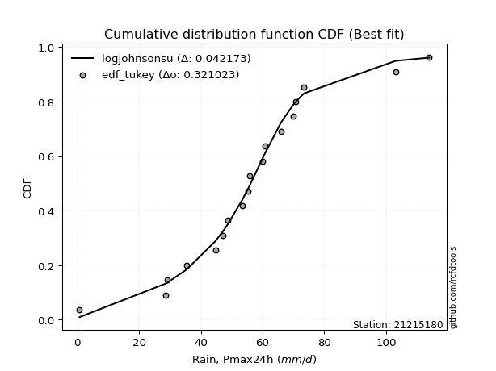</img>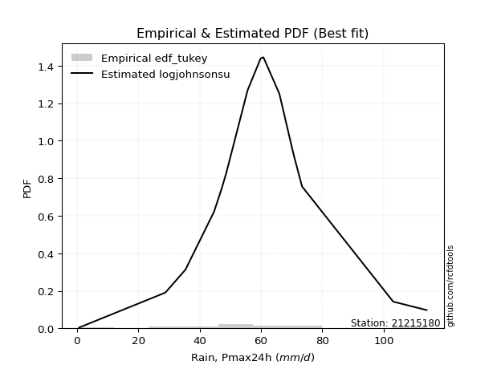</img>

</div>


### 8. Empirical - EDF Gringorten (1963)

Gringorten plotting position formula is essential for estimating the probability and return periods of extreme events like floods and heavy rainfall. The constant _a=0.44_.

<div align="center">


$P=(m-a)/(n+1-2a)$


</div>


**8.1. Empirical values**

<div align="center">

|                | 0                    | 1                   | 2                   | 3                   | 4                   | 5                   | 6                  | 7                  | 8                  | 9              | 10                 | 11                | 12                 | 13                 | 14                 | 15                 | 16                 | 17                 | 18                 |
|:---------------|:---------------------|:--------------------|:--------------------|:--------------------|:--------------------|:--------------------|:-------------------|:-------------------|:-------------------|:---------------|:-------------------|:------------------|:-------------------|:-------------------|:-------------------|:-------------------|:-------------------|:-------------------|:-------------------|
| date           | 2025                 | 2022                | 2016                | 2021                | 2006                | 2020                | 2019               | 2013               | 2017               | 2012           | 2009               | 2015              | 2011               | 2018               | 2007               | 2010               | 2024               | 2008               | 2014               |
| x              | 0.2                  | 0.7                 | 28.7                | 29.1                | 35.4                | 44.7                | 47.2               | 48.7               | 53.5               | 55.3           | 55.7               | 59.9              | 60.8               | 66.0               | 69.9               | 70.8               | 73.4               | 103.1              | 114.0              |
| m              | 1                    | 2                   | 3                   | 4                   | 5                   | 6                   | 7                  | 8                  | 9                  | 10             | 11                 | 12                | 13                 | 14                 | 15                 | 16                 | 17                 | 18                 | 19                 |
| empirical_dist | edf_gringorten       | edf_gringorten      | edf_gringorten      | edf_gringorten      | edf_gringorten      | edf_gringorten      | edf_gringorten     | edf_gringorten     | edf_gringorten     | edf_gringorten | edf_gringorten     | edf_gringorten    | edf_gringorten     | edf_gringorten     | edf_gringorten     | edf_gringorten     | edf_gringorten     | edf_gringorten     | edf_gringorten     |
| empirical      | 0.029288702928870293 | 0.08158995815899582 | 0.13389121338912133 | 0.18619246861924685 | 0.23849372384937234 | 0.29079497907949786 | 0.3430962343096234 | 0.3953974895397489 | 0.4476987447698745 | 0.5            | 0.5523012552301255 | 0.604602510460251 | 0.6569037656903766 | 0.7092050209205021 | 0.7615062761506276 | 0.8138075313807531 | 0.8661087866108785 | 0.918410041841004  | 0.9707112970711296 |
| empirical_tr   | 1.0301724137931034   | 1.0888382687927107  | 1.1545893719806763  | 1.2287917737789202  | 1.313186813186813   | 1.4100294985250739  | 1.522292993630573  | 1.6539792387543253 | 1.8106060606060606 | 2.0            | 2.2336448598130842 | 2.529100529100529 | 2.9146341463414633 | 3.4388489208633093 | 4.192982456140351  | 5.370786516853932  | 7.468749999999993  | 12.256410256410238 | 34.14285714285699  |

</div>


**8.2. Kolmogorov-Smirnov fit test (sorted by Δ)**


<div align="center">

|                | 0                   | 1                    | 2                    | 3                    | 4                   | 5                   | 6                   | 7                   | 8                   | 9                   | 10                  | 11                  | 12                  | 13                  | 14                  | 15                  | 16                  | 17                  | 18                  | 19                  | 20                  | 21                  | 22                  | 23                  | 24                  | 25                  | 26                  | 27                  | 28                  | 29                  | 30                  | 31                  | 32                  | 33                  | 34                  | 35                  | 36                  | 37                  | 38                  | 39                    | 40                  | 41                  | 42                  | 43                  | 44                  | 45                  | 46                  | 47                  | 48                  | 49                  | 50                  | 51                  | 52                  | 53                  | 54                  | 55                  | 56                  | 57                  | 58                  | 59                  | 60                  | 61                  | 62                  | 63                  | 64                  | 65                  | 66                  | 67                  | 68                  | 69                  | 70                  | 71                  | 72                  | 73                  | 74                  | 75                  | 76                  | 77                  | 78                  | 79                  | 80                  | 81                  | 82                  | 83                  | 84                  | 85                  | 86                  | 87                  | 88                  | 89                  |
|:---------------|:--------------------|:---------------------|:---------------------|:---------------------|:--------------------|:--------------------|:--------------------|:--------------------|:--------------------|:--------------------|:--------------------|:--------------------|:--------------------|:--------------------|:--------------------|:--------------------|:--------------------|:--------------------|:--------------------|:--------------------|:--------------------|:--------------------|:--------------------|:--------------------|:--------------------|:--------------------|:--------------------|:--------------------|:--------------------|:--------------------|:--------------------|:--------------------|:--------------------|:--------------------|:--------------------|:--------------------|:--------------------|:--------------------|:--------------------|:----------------------|:--------------------|:--------------------|:--------------------|:--------------------|:--------------------|:--------------------|:--------------------|:--------------------|:--------------------|:--------------------|:--------------------|:--------------------|:--------------------|:--------------------|:--------------------|:--------------------|:--------------------|:--------------------|:--------------------|:--------------------|:--------------------|:--------------------|:--------------------|:--------------------|:--------------------|:--------------------|:--------------------|:--------------------|:--------------------|:--------------------|:--------------------|:--------------------|:--------------------|:--------------------|:--------------------|:--------------------|:--------------------|:--------------------|:--------------------|:--------------------|:--------------------|:--------------------|:--------------------|:--------------------|:--------------------|:--------------------|:--------------------|:--------------------|:--------------------|:--------------------|
| station        | 21215180            | 21215180             | 21215180             | 21215180             | 21215180            | 21215180            | 21215180            | 21215180            | 21215180            | 21215180            | 21215180            | 21215180            | 21215180            | 21215180            | 21215180            | 21215180            | 21215180            | 21215180            | 21215180            | 21215180            | 21215180            | 21215180            | 21215180            | 21215180            | 21215180            | 21215180            | 21215180            | 21215180            | 21215180            | 21215180            | 21215180            | 21215180            | 21215180            | 21215180            | 21215180            | 21215180            | 21215180            | 21215180            | 21215180            | 21215180              | 21215180            | 21215180            | 21215180            | 21215180            | 21215180            | 21215180            | 21215180            | 21215180            | 21215180            | 21215180            | 21215180            | 21215180            | 21215180            | 21215180            | 21215180            | 21215180            | 21215180            | 21215180            | 21215180            | 21215180            | 21215180            | 21215180            | 21215180            | 21215180            | 21215180            | 21215180            | 21215180            | 21215180            | 21215180            | 21215180            | 21215180            | 21215180            | 21215180            | 21215180            | 21215180            | 21215180            | 21215180            | 21215180            | 21215180            | 21215180            | 21215180            | 21215180            | 21215180            | 21215180            | 21215180            | 21215180            | 21215180            | 21215180            | 21215180            | 21215180            |
| empirical_dist | edf_gringorten      | edf_gringorten       | edf_gringorten       | edf_gringorten       | edf_gringorten      | edf_gringorten      | edf_gringorten      | edf_gringorten      | edf_gringorten      | edf_gringorten      | edf_gringorten      | edf_gringorten      | edf_gringorten      | edf_gringorten      | edf_gringorten      | edf_gringorten      | edf_gringorten      | edf_gringorten      | edf_gringorten      | edf_gringorten      | edf_gringorten      | edf_gringorten      | edf_gringorten      | edf_gringorten      | edf_gringorten      | edf_gringorten      | edf_gringorten      | edf_gringorten      | edf_gringorten      | edf_gringorten      | edf_gringorten      | edf_gringorten      | edf_gringorten      | edf_gringorten      | edf_gringorten      | edf_gringorten      | edf_gringorten      | edf_gringorten      | edf_gringorten      | edf_gringorten        | edf_gringorten      | edf_gringorten      | edf_gringorten      | edf_gringorten      | edf_gringorten      | edf_gringorten      | edf_gringorten      | edf_gringorten      | edf_gringorten      | edf_gringorten      | edf_gringorten      | edf_gringorten      | edf_gringorten      | edf_gringorten      | edf_gringorten      | edf_gringorten      | edf_gringorten      | edf_gringorten      | edf_gringorten      | edf_gringorten      | edf_gringorten      | edf_gringorten      | edf_gringorten      | edf_gringorten      | edf_gringorten      | edf_gringorten      | edf_gringorten      | edf_gringorten      | edf_gringorten      | edf_gringorten      | edf_gringorten      | edf_gringorten      | edf_gringorten      | edf_gringorten      | edf_gringorten      | edf_gringorten      | edf_gringorten      | edf_gringorten      | edf_gringorten      | edf_gringorten      | edf_gringorten      | edf_gringorten      | edf_gringorten      | edf_gringorten      | edf_gringorten      | edf_gringorten      | edf_gringorten      | edf_gringorten      | edf_gringorten      | edf_gringorten      |
| p_dist         | laplace             | laplace_asymmetric   | johnsonsu            | logjohnsonsu         | hypsecant           | genlogistic         | fisk                | logistic            | mielke              | truncnorm           | exponnorm           | nct                 | chi2                | betaprime           | fatiguelife         | pearson3            | erlang              | gamma               | f                   | rice                | t                   | crystalball         | norm                | logt                | weibull_min         | gumbel_l            | invgamma            | invgauss            | maxwell             | rayleigh            | gumbel_r            | invweibull          | moyal               | halfnorm            | kstwobign           | halflogistic        | logfisk             | logloggamma         | loggenlogistic      | loglaplace_asymmetric | wald                | loggompertz         | ncf                 | gibrat              | loggumbel_l         | logmielke           | logpearson3         | nakagami            | expon               | genexpon            | loghypsecant        | loglogistic         | loglaplace          | logfatiguelife      | lognorm             | lognorm             | logcrystalball      | logexponnorm        | logrice             | lognct              | loglognorm          | lognakagami         | loginvgamma         | logalpha            | logbetaprime        | logerlang           | loginvgauss         | logmaxwell          | loginvweibull       | lograyleigh         | loggumbel_r         | logkstwobign        | loghalfnorm         | logmoyal            | loghalflogistic     | loggenexpon         | logexpon            | logncf              | logwald             | pareto              | loggibrat           | logpareto           | logchi2             | logf                | logtruncnorm        | loggamma            | loggamma            | logweibull_min      | gompertz            | alpha               |
| delta          | 0.05149774879976432 | 0.053865167591014895 | 0.054426408243220314 | 0.058751768338692695 | 0.06615510972086391 | 0.0768818192908024  | 0.07927244832096858 | 0.08064392623598071 | 0.08167082074213378 | 0.08611371719045569 | 0.09921762597098172 | 0.10003849296954548 | 0.10027242309410855 | 0.10039304207141664 | 0.10121133802695037 | 0.10158536043505173 | 0.10165393834038539 | 0.10169113124383056 | 0.10180836989018216 | 0.10287651529770758 | 0.10324652525730749 | 0.10325396293075506 | 0.10325396499371742 | 0.10415936929606928 | 0.10785677787663772 | 0.11281918823608794 | 0.11358752407880957 | 0.1148974084295224  | 0.11764890169263797 | 0.1299187367603027  | 0.13908290743677132 | 0.14508540848235496 | 0.15985261997644168 | 0.16479739706535212 | 0.16938599666495063 | 0.17692352332967404 | 0.19894493210093556 | 0.20226645257891152 | 0.21071936316119227 | 0.2191689796556347    | 0.21994908933596136 | 0.22043133938718823 | 0.23260135899594042 | 0.24323839983810758 | 0.260397173627709   | 0.26882649530545843 | 0.2698538120819872  | 0.2721312497388062  | 0.2800836404000615  | 0.3080603081504676  | 0.32210606913373596 | 0.32616035608662364 | 0.32738187488079135 | 0.33023848121145816 | 0.33093304132722157 | 0.33093304132722157 | 0.33093304318480166 | 0.3309331943988907  | 0.33095379404484115 | 0.3311227760965878  | 0.33136572970913336 | 0.3315743835819973  | 0.33911916594149183 | 0.3436756361843619  | 0.35470637276925787 | 0.35610191296520033 | 0.35901700364092204 | 0.3650318867976209  | 0.3676828285037508  | 0.3767094071548761  | 0.39935384540857255 | 0.40896304536322603 | 0.4096344385763184  | 0.4250401762396422  | 0.4320369892110484  | 0.4721159947039476  | 0.48798724494807344 | 0.4938780349833941  | 0.4965274201254498  | 0.5101196951989312  | 0.5130232283084324  | 0.5418904176698286  | 0.572044941380515   | 0.5938257459006242  | 0.6466913918230036  | 0.6610434276632607  | 0.6610434276632607  | 0.7119141309868473  | 0.8384516091787726  | 0.8426615601047315  |
| deltao         | 0.31564497164100014 | 0.31564497164100014  | 0.31564497164100014  | 0.31564497164100014  | 0.31564497164100014 | 0.31564497164100014 | 0.31564497164100014 | 0.31564497164100014 | 0.31564497164100014 | 0.31564497164100014 | 0.31564497164100014 | 0.31564497164100014 | 0.31564497164100014 | 0.31564497164100014 | 0.31564497164100014 | 0.31564497164100014 | 0.31564497164100014 | 0.31564497164100014 | 0.31564497164100014 | 0.31564497164100014 | 0.31564497164100014 | 0.31564497164100014 | 0.31564497164100014 | 0.31564497164100014 | 0.31564497164100014 | 0.31564497164100014 | 0.31564497164100014 | 0.31564497164100014 | 0.31564497164100014 | 0.31564497164100014 | 0.31564497164100014 | 0.31564497164100014 | 0.31564497164100014 | 0.31564497164100014 | 0.31564497164100014 | 0.31564497164100014 | 0.31564497164100014 | 0.31564497164100014 | 0.31564497164100014 | 0.31564497164100014   | 0.31564497164100014 | 0.31564497164100014 | 0.31564497164100014 | 0.31564497164100014 | 0.31564497164100014 | 0.31564497164100014 | 0.31564497164100014 | 0.31564497164100014 | 0.31564497164100014 | 0.31564497164100014 | 0.31564497164100014 | 0.31564497164100014 | 0.31564497164100014 | 0.31564497164100014 | 0.31564497164100014 | 0.31564497164100014 | 0.31564497164100014 | 0.31564497164100014 | 0.31564497164100014 | 0.31564497164100014 | 0.31564497164100014 | 0.31564497164100014 | 0.31564497164100014 | 0.31564497164100014 | 0.31564497164100014 | 0.31564497164100014 | 0.31564497164100014 | 0.31564497164100014 | 0.31564497164100014 | 0.31564497164100014 | 0.31564497164100014 | 0.31564497164100014 | 0.31564497164100014 | 0.31564497164100014 | 0.31564497164100014 | 0.31564497164100014 | 0.31564497164100014 | 0.31564497164100014 | 0.31564497164100014 | 0.31564497164100014 | 0.31564497164100014 | 0.31564497164100014 | 0.31564497164100014 | 0.31564497164100014 | 0.31564497164100014 | 0.31564497164100014 | 0.31564497164100014 | 0.31564497164100014 | 0.31564497164100014 | 0.31564497164100014 |
| eval           | Δo > Δ              | Δo > Δ               | Δo > Δ               | Δo > Δ               | Δo > Δ              | Δo > Δ              | Δo > Δ              | Δo > Δ              | Δo > Δ              | Δo > Δ              | Δo > Δ              | Δo > Δ              | Δo > Δ              | Δo > Δ              | Δo > Δ              | Δo > Δ              | Δo > Δ              | Δo > Δ              | Δo > Δ              | Δo > Δ              | Δo > Δ              | Δo > Δ              | Δo > Δ              | Δo > Δ              | Δo > Δ              | Δo > Δ              | Δo > Δ              | Δo > Δ              | Δo > Δ              | Δo > Δ              | Δo > Δ              | Δo > Δ              | Δo > Δ              | Δo > Δ              | Δo > Δ              | Δo > Δ              | Δo > Δ              | Δo > Δ              | Δo > Δ              | Δo > Δ                | Δo > Δ              | Δo > Δ              | Δo > Δ              | Δo > Δ              | Δo > Δ              | Δo > Δ              | Δo > Δ              | Δo > Δ              | Δo > Δ              | Δo > Δ              | Δo <= Δ             | Δo <= Δ             | Δo <= Δ             | Δo <= Δ             | Δo <= Δ             | Δo <= Δ             | Δo <= Δ             | Δo <= Δ             | Δo <= Δ             | Δo <= Δ             | Δo <= Δ             | Δo <= Δ             | Δo <= Δ             | Δo <= Δ             | Δo <= Δ             | Δo <= Δ             | Δo <= Δ             | Δo <= Δ             | Δo <= Δ             | Δo <= Δ             | Δo <= Δ             | Δo <= Δ             | Δo <= Δ             | Δo <= Δ             | Δo <= Δ             | Δo <= Δ             | Δo <= Δ             | Δo <= Δ             | Δo <= Δ             | Δo <= Δ             | Δo <= Δ             | Δo <= Δ             | Δo <= Δ             | Δo <= Δ             | Δo <= Δ             | Δo <= Δ             | Δo <= Δ             | Δo <= Δ             | Δo <= Δ             | Δo <= Δ             |
| fit            | 1                   | 1                    | 1                    | 1                    | 1                   | 1                   | 1                   | 1                   | 1                   | 1                   | 1                   | 1                   | 1                   | 1                   | 1                   | 1                   | 1                   | 1                   | 1                   | 1                   | 1                   | 1                   | 1                   | 1                   | 1                   | 1                   | 1                   | 1                   | 1                   | 1                   | 1                   | 1                   | 1                   | 1                   | 1                   | 1                   | 1                   | 1                   | 1                   | 1                     | 1                   | 1                   | 1                   | 1                   | 1                   | 1                   | 1                   | 1                   | 1                   | 1                   | 0                   | 0                   | 0                   | 0                   | 0                   | 0                   | 0                   | 0                   | 0                   | 0                   | 0                   | 0                   | 0                   | 0                   | 0                   | 0                   | 0                   | 0                   | 0                   | 0                   | 0                   | 0                   | 0                   | 0                   | 0                   | 0                   | 0                   | 0                   | 0                   | 0                   | 0                   | 0                   | 0                   | 0                   | 0                   | 0                   | 0                   | 0                   | 0                   | 0                   |
| n              | 19                  | 19                   | 19                   | 19                   | 19                  | 19                  | 19                  | 19                  | 19                  | 19                  | 19                  | 19                  | 19                  | 19                  | 19                  | 19                  | 19                  | 19                  | 19                  | 19                  | 19                  | 19                  | 19                  | 19                  | 19                  | 19                  | 19                  | 19                  | 19                  | 19                  | 19                  | 19                  | 19                  | 19                  | 19                  | 19                  | 19                  | 19                  | 19                  | 19                    | 19                  | 19                  | 19                  | 19                  | 19                  | 19                  | 19                  | 19                  | 19                  | 19                  | 19                  | 19                  | 19                  | 19                  | 19                  | 19                  | 19                  | 19                  | 19                  | 19                  | 19                  | 19                  | 19                  | 19                  | 19                  | 19                  | 19                  | 19                  | 19                  | 19                  | 19                  | 19                  | 19                  | 19                  | 19                  | 19                  | 19                  | 19                  | 19                  | 19                  | 19                  | 19                  | 19                  | 19                  | 19                  | 19                  | 19                  | 19                  | 19                  | 19                  |
| best_fit       | 1                   | 0                    | 0                    | 0                    | 0                   | 0                   | 0                   | 0                   | 0                   | 0                   | 0                   | 0                   | 0                   | 0                   | 0                   | 0                   | 0                   | 0                   | 0                   | 0                   | 0                   | 0                   | 0                   | 0                   | 0                   | 0                   | 0                   | 0                   | 0                   | 0                   | 0                   | 0                   | 0                   | 0                   | 0                   | 0                   | 0                   | 0                   | 0                   | 0                     | 0                   | 0                   | 0                   | 0                   | 0                   | 0                   | 0                   | 0                   | 0                   | 0                   | 0                   | 0                   | 0                   | 0                   | 0                   | 0                   | 0                   | 0                   | 0                   | 0                   | 0                   | 0                   | 0                   | 0                   | 0                   | 0                   | 0                   | 0                   | 0                   | 0                   | 0                   | 0                   | 0                   | 0                   | 0                   | 0                   | 0                   | 0                   | 0                   | 0                   | 0                   | 0                   | 0                   | 0                   | 0                   | 0                   | 0                   | 0                   | 0                   | 0                   |
| best_fit_sort  | 1                   | 2                    | 3                    | 4                    | 5                   | 6                   | 7                   | 8                   | 9                   | 10                  | 11                  | 12                  | 13                  | 14                  | 15                  | 16                  | 17                  | 18                  | 19                  | 20                  | 21                  | 22                  | 23                  | 24                  | 25                  | 26                  | 27                  | 28                  | 29                  | 30                  | 31                  | 32                  | 33                  | 34                  | 35                  | 36                  | 37                  | 38                  | 39                  | 40                    | 41                  | 42                  | 43                  | 44                  | 45                  | 46                  | 47                  | 48                  | 49                  | 50                  | 51                  | 52                  | 53                  | 54                  | 55                  | 56                  | 57                  | 58                  | 59                  | 60                  | 61                  | 62                  | 63                  | 64                  | 65                  | 66                  | 67                  | 68                  | 69                  | 70                  | 71                  | 72                  | 73                  | 74                  | 75                  | 76                  | 77                  | 78                  | 79                  | 80                  | 81                  | 82                  | 83                  | 84                  | 85                  | 86                  | 87                  | 88                  | 89                  | 90                  |

</div>


<div align="center">

</img>

</div>


**8.3. Best fit**

<div align="center">

|   id |   station | empirical_dist   | p_dist   |     delta |   deltao | eval   |   fit |   n |   best_fit |   best_fit_sort |
|-----:|----------:|:-----------------|:---------|----------:|---------:|:-------|------:|----:|-----------:|----------------:|
|    0 |  21215180 | edf_gringorten   | laplace  | 0.0514977 | 0.315645 | Δo > Δ |     1 |  19 |          1 |               1 |

</div>


<div align="center">

</img></img>

</div>


### 9. Empirical - EDF Filliben (1975)

The specific values of the constants (0.3175) (often denoted as $alpha$) and (0.365) are derived from a method proposed by James J. Filliben in a 1975 paper. This particular formula is the mean value of the $i$-th order statistic of the normal distribution and is considered a robust and effective plotting position formula for the normal probability plot correlation coefficient test for normality.

<div align="center">


$P=(m-0.3175)/(n+0.365)$


</div>


**9.1. Empirical values**

<div align="center">

|                | 0                   | 1                   | 2                  | 3                   | 4                   | 5                  | 6                  | 7                  | 8                  | 9            | 10                 | 11                 | 12                 | 13                 | 14                 | 15                 | 16                | 17                 | 18                 |
|:---------------|:--------------------|:--------------------|:-------------------|:--------------------|:--------------------|:-------------------|:-------------------|:-------------------|:-------------------|:-------------|:-------------------|:-------------------|:-------------------|:-------------------|:-------------------|:-------------------|:------------------|:-------------------|:-------------------|
| date           | 2025                | 2022                | 2016               | 2021                | 2006                | 2020               | 2019               | 2013               | 2017               | 2012         | 2009               | 2015               | 2011               | 2018               | 2007               | 2010               | 2024              | 2008               | 2014               |
| x              | 0.2                 | 0.7                 | 28.7               | 29.1                | 35.4                | 44.7               | 47.2               | 48.7               | 53.5               | 55.3         | 55.7               | 59.9               | 60.8               | 66.0               | 69.9               | 70.8               | 73.4              | 103.1              | 114.0              |
| m              | 1                   | 2                   | 3                  | 4                   | 5                   | 6                  | 7                  | 8                  | 9                  | 10           | 11                 | 12                 | 13                 | 14                 | 15                 | 16                 | 17                | 18                 | 19                 |
| empirical_dist | edf_filliben        | edf_filliben        | edf_filliben       | edf_filliben        | edf_filliben        | edf_filliben       | edf_filliben       | edf_filliben       | edf_filliben       | edf_filliben | edf_filliben       | edf_filliben       | edf_filliben       | edf_filliben       | edf_filliben       | edf_filliben       | edf_filliben      | edf_filliben       | edf_filliben       |
| empirical      | 0.03524399690162665 | 0.08688355280144593 | 0.1385231087012652 | 0.19016266460108444 | 0.24180222050090372 | 0.293441776400723  | 0.3450813323005423 | 0.3967208882003615 | 0.4483604441001807 | 0.5          | 0.5516395558998193 | 0.6032791117996386 | 0.6549186676994578 | 0.7065582235992771 | 0.7581977794990963 | 0.8098373353989156 | 0.861476891298735 | 0.9131164471985542 | 0.9647560030983735 |
| empirical_tr   | 1.0365315134484143  | 1.0951505726000283  | 1.1607972426195114 | 1.2348158775705405  | 1.3189170781542654  | 1.4153115293257812 | 1.5269071555292728 | 1.6576075326342818 | 1.8127779077931194 | 2.0          | 2.2303484019579614 | 2.5206638464041657 | 2.8978675645342316 | 3.407831060272768  | 4.135611318739989  | 5.258655804480651  | 7.219012115563846 | 11.509658246656779 | 28.373626373626497 |

</div>


**9.2. Kolmogorov-Smirnov fit test (sorted by Δ)**


<div align="center">

|                | 0                   | 1                   | 2                   | 3                   | 4                   | 5                   | 6                   | 7                   | 8                   | 9                   | 10                  | 11                  | 12                  | 13                  | 14                  | 15                  | 16                  | 17                  | 18                  | 19                  | 20                  | 21                  | 22                  | 23                  | 24                  | 25                  | 26                  | 27                  | 28                  | 29                  | 30                  | 31                  | 32                  | 33                  | 34                  | 35                  | 36                  | 37                  | 38                  | 39                    | 40                  | 41                  | 42                  | 43                  | 44                  | 45                  | 46                  | 47                  | 48                  | 49                  | 50                  | 51                  | 52                  | 53                  | 54                  | 55                  | 56                  | 57                  | 58                  | 59                  | 60                  | 61                  | 62                  | 63                  | 64                  | 65                  | 66                  | 67                  | 68                  | 69                  | 70                  | 71                  | 72                  | 73                  | 74                  | 75                  | 76                  | 77                  | 78                  | 79                  | 80                  | 81                  | 82                  | 83                  | 84                  | 85                  | 86                  | 87                  | 88                  | 89                  |
|:---------------|:--------------------|:--------------------|:--------------------|:--------------------|:--------------------|:--------------------|:--------------------|:--------------------|:--------------------|:--------------------|:--------------------|:--------------------|:--------------------|:--------------------|:--------------------|:--------------------|:--------------------|:--------------------|:--------------------|:--------------------|:--------------------|:--------------------|:--------------------|:--------------------|:--------------------|:--------------------|:--------------------|:--------------------|:--------------------|:--------------------|:--------------------|:--------------------|:--------------------|:--------------------|:--------------------|:--------------------|:--------------------|:--------------------|:--------------------|:----------------------|:--------------------|:--------------------|:--------------------|:--------------------|:--------------------|:--------------------|:--------------------|:--------------------|:--------------------|:--------------------|:--------------------|:--------------------|:--------------------|:--------------------|:--------------------|:--------------------|:--------------------|:--------------------|:--------------------|:--------------------|:--------------------|:--------------------|:--------------------|:--------------------|:--------------------|:--------------------|:--------------------|:--------------------|:--------------------|:--------------------|:--------------------|:--------------------|:--------------------|:--------------------|:--------------------|:--------------------|:--------------------|:--------------------|:--------------------|:--------------------|:--------------------|:--------------------|:--------------------|:--------------------|:--------------------|:--------------------|:--------------------|:--------------------|:--------------------|:--------------------|
| station        | 21215180            | 21215180            | 21215180            | 21215180            | 21215180            | 21215180            | 21215180            | 21215180            | 21215180            | 21215180            | 21215180            | 21215180            | 21215180            | 21215180            | 21215180            | 21215180            | 21215180            | 21215180            | 21215180            | 21215180            | 21215180            | 21215180            | 21215180            | 21215180            | 21215180            | 21215180            | 21215180            | 21215180            | 21215180            | 21215180            | 21215180            | 21215180            | 21215180            | 21215180            | 21215180            | 21215180            | 21215180            | 21215180            | 21215180            | 21215180              | 21215180            | 21215180            | 21215180            | 21215180            | 21215180            | 21215180            | 21215180            | 21215180            | 21215180            | 21215180            | 21215180            | 21215180            | 21215180            | 21215180            | 21215180            | 21215180            | 21215180            | 21215180            | 21215180            | 21215180            | 21215180            | 21215180            | 21215180            | 21215180            | 21215180            | 21215180            | 21215180            | 21215180            | 21215180            | 21215180            | 21215180            | 21215180            | 21215180            | 21215180            | 21215180            | 21215180            | 21215180            | 21215180            | 21215180            | 21215180            | 21215180            | 21215180            | 21215180            | 21215180            | 21215180            | 21215180            | 21215180            | 21215180            | 21215180            | 21215180            |
| empirical_dist | edf_filliben        | edf_filliben        | edf_filliben        | edf_filliben        | edf_filliben        | edf_filliben        | edf_filliben        | edf_filliben        | edf_filliben        | edf_filliben        | edf_filliben        | edf_filliben        | edf_filliben        | edf_filliben        | edf_filliben        | edf_filliben        | edf_filliben        | edf_filliben        | edf_filliben        | edf_filliben        | edf_filliben        | edf_filliben        | edf_filliben        | edf_filliben        | edf_filliben        | edf_filliben        | edf_filliben        | edf_filliben        | edf_filliben        | edf_filliben        | edf_filliben        | edf_filliben        | edf_filliben        | edf_filliben        | edf_filliben        | edf_filliben        | edf_filliben        | edf_filliben        | edf_filliben        | edf_filliben          | edf_filliben        | edf_filliben        | edf_filliben        | edf_filliben        | edf_filliben        | edf_filliben        | edf_filliben        | edf_filliben        | edf_filliben        | edf_filliben        | edf_filliben        | edf_filliben        | edf_filliben        | edf_filliben        | edf_filliben        | edf_filliben        | edf_filliben        | edf_filliben        | edf_filliben        | edf_filliben        | edf_filliben        | edf_filliben        | edf_filliben        | edf_filliben        | edf_filliben        | edf_filliben        | edf_filliben        | edf_filliben        | edf_filliben        | edf_filliben        | edf_filliben        | edf_filliben        | edf_filliben        | edf_filliben        | edf_filliben        | edf_filliben        | edf_filliben        | edf_filliben        | edf_filliben        | edf_filliben        | edf_filliben        | edf_filliben        | edf_filliben        | edf_filliben        | edf_filliben        | edf_filliben        | edf_filliben        | edf_filliben        | edf_filliben        | edf_filliben        |
| p_dist         | laplace_asymmetric  | johnsonsu           | laplace             | logjohnsonsu        | hypsecant           | genlogistic         | fisk                | logistic            | mielke              | truncnorm           | exponnorm           | nct                 | betaprime           | fatiguelife         | chi2                | pearson3            | erlang              | gamma               | f                   | rice                | t                   | crystalball         | norm                | logt                | weibull_min         | gumbel_l            | invgamma            | invgauss            | maxwell             | rayleigh            | gumbel_r            | invweibull          | moyal               | halfnorm            | kstwobign           | halflogistic        | logfisk             | logloggamma         | loggenlogistic      | loglaplace_asymmetric | loggompertz         | wald                | ncf                 | gibrat              | loggumbel_l         | logmielke           | logpearson3         | nakagami            | expon               | genexpon            | loghypsecant        | loglogistic         | loglaplace          | logfatiguelife      | lognorm             | lognorm             | logcrystalball      | logexponnorm        | logrice             | lognct              | loglognorm          | lognakagami         | loginvgamma         | logalpha            | logbetaprime        | logerlang           | loginvgauss         | logmaxwell          | loginvweibull       | lograyleigh         | loggumbel_r         | logkstwobign        | loghalfnorm         | logmoyal            | loghalflogistic     | loggenexpon         | logexpon            | logncf              | logwald             | pareto              | loggibrat           | logpareto           | logchi2             | logf                | logtruncnorm        | loggamma            | loggamma            | logweibull_min      | gompertz            | alpha               |
| delta          | 0.04923327227887131 | 0.04979451293107673 | 0.05296666647441955 | 0.05805152508885194 | 0.06152321440872033 | 0.07224992397865881 | 0.074640553008825   | 0.07601203092383713 | 0.07902402342090864 | 0.0856939776082785  | 0.09458573065883813 | 0.09540659765740189 | 0.09576114675927305 | 0.09657944271480678 | 0.09672126649129192 | 0.09695346512290814 | 0.0970220430282418  | 0.09705923593168697 | 0.09717647457803857 | 0.098244619985564   | 0.0986146299451639  | 0.09862206761861148 | 0.09862206968157383 | 0.0995274739839257  | 0.10322488256449414 | 0.11083409024516921 | 0.11094072675758443 | 0.11225061110829726 | 0.11500210437141284 | 0.12727193943907755 | 0.13643611011554618 | 0.14243861116112982 | 0.15720582265521654 | 0.162150599744127   | 0.1667391993437255  | 0.1742767260084489  | 0.19431303678879197 | 0.19961965525768638 | 0.20807256583996714 | 0.21652218233440956   | 0.2177845420659631  | 0.21928739000565511 | 0.22995456167471529 | 0.24257670050780133 | 0.25576527831556517 | 0.2641945999933145  | 0.26522191676984364 | 0.26945708576400407 | 0.2754517450879177  | 0.30434834448678794 | 0.31747417382159204 | 0.3215284607744797  | 0.3247350775595662  | 0.32560658589931424 | 0.32630114601507776 | 0.32630114601507776 | 0.32630114787265774 | 0.32630129908674677 | 0.32632189873269724 | 0.326490880784444   | 0.32673383439698944 | 0.3269424882698535  | 0.3344872706293479  | 0.3390437408722181  | 0.35007447745711395 | 0.3514700176530565  | 0.35438510832877823 | 0.36039999148547697 | 0.363050933191607   | 0.3720775118427323  | 0.39472195009642874 | 0.4043311500510822  | 0.4050025432641746  | 0.4204082809274984  | 0.4274050938989046  | 0.4674840993918038  | 0.48335534963592963 | 0.4892461396712503  | 0.491895524813306   | 0.5054877998867874  | 0.5083913329962886  | 0.5365968230273785  | 0.5674130460683712  | 0.5891938505884804  | 0.6420594965108598  | 0.6564115323511169  | 0.6564115323511169  | 0.7072822356747035  | 0.833819713866629   | 0.8380296647925877  |
| deltao         | 0.31564497164100014 | 0.31564497164100014 | 0.31564497164100014 | 0.31564497164100014 | 0.31564497164100014 | 0.31564497164100014 | 0.31564497164100014 | 0.31564497164100014 | 0.31564497164100014 | 0.31564497164100014 | 0.31564497164100014 | 0.31564497164100014 | 0.31564497164100014 | 0.31564497164100014 | 0.31564497164100014 | 0.31564497164100014 | 0.31564497164100014 | 0.31564497164100014 | 0.31564497164100014 | 0.31564497164100014 | 0.31564497164100014 | 0.31564497164100014 | 0.31564497164100014 | 0.31564497164100014 | 0.31564497164100014 | 0.31564497164100014 | 0.31564497164100014 | 0.31564497164100014 | 0.31564497164100014 | 0.31564497164100014 | 0.31564497164100014 | 0.31564497164100014 | 0.31564497164100014 | 0.31564497164100014 | 0.31564497164100014 | 0.31564497164100014 | 0.31564497164100014 | 0.31564497164100014 | 0.31564497164100014 | 0.31564497164100014   | 0.31564497164100014 | 0.31564497164100014 | 0.31564497164100014 | 0.31564497164100014 | 0.31564497164100014 | 0.31564497164100014 | 0.31564497164100014 | 0.31564497164100014 | 0.31564497164100014 | 0.31564497164100014 | 0.31564497164100014 | 0.31564497164100014 | 0.31564497164100014 | 0.31564497164100014 | 0.31564497164100014 | 0.31564497164100014 | 0.31564497164100014 | 0.31564497164100014 | 0.31564497164100014 | 0.31564497164100014 | 0.31564497164100014 | 0.31564497164100014 | 0.31564497164100014 | 0.31564497164100014 | 0.31564497164100014 | 0.31564497164100014 | 0.31564497164100014 | 0.31564497164100014 | 0.31564497164100014 | 0.31564497164100014 | 0.31564497164100014 | 0.31564497164100014 | 0.31564497164100014 | 0.31564497164100014 | 0.31564497164100014 | 0.31564497164100014 | 0.31564497164100014 | 0.31564497164100014 | 0.31564497164100014 | 0.31564497164100014 | 0.31564497164100014 | 0.31564497164100014 | 0.31564497164100014 | 0.31564497164100014 | 0.31564497164100014 | 0.31564497164100014 | 0.31564497164100014 | 0.31564497164100014 | 0.31564497164100014 | 0.31564497164100014 |
| eval           | Δo > Δ              | Δo > Δ              | Δo > Δ              | Δo > Δ              | Δo > Δ              | Δo > Δ              | Δo > Δ              | Δo > Δ              | Δo > Δ              | Δo > Δ              | Δo > Δ              | Δo > Δ              | Δo > Δ              | Δo > Δ              | Δo > Δ              | Δo > Δ              | Δo > Δ              | Δo > Δ              | Δo > Δ              | Δo > Δ              | Δo > Δ              | Δo > Δ              | Δo > Δ              | Δo > Δ              | Δo > Δ              | Δo > Δ              | Δo > Δ              | Δo > Δ              | Δo > Δ              | Δo > Δ              | Δo > Δ              | Δo > Δ              | Δo > Δ              | Δo > Δ              | Δo > Δ              | Δo > Δ              | Δo > Δ              | Δo > Δ              | Δo > Δ              | Δo > Δ                | Δo > Δ              | Δo > Δ              | Δo > Δ              | Δo > Δ              | Δo > Δ              | Δo > Δ              | Δo > Δ              | Δo > Δ              | Δo > Δ              | Δo > Δ              | Δo <= Δ             | Δo <= Δ             | Δo <= Δ             | Δo <= Δ             | Δo <= Δ             | Δo <= Δ             | Δo <= Δ             | Δo <= Δ             | Δo <= Δ             | Δo <= Δ             | Δo <= Δ             | Δo <= Δ             | Δo <= Δ             | Δo <= Δ             | Δo <= Δ             | Δo <= Δ             | Δo <= Δ             | Δo <= Δ             | Δo <= Δ             | Δo <= Δ             | Δo <= Δ             | Δo <= Δ             | Δo <= Δ             | Δo <= Δ             | Δo <= Δ             | Δo <= Δ             | Δo <= Δ             | Δo <= Δ             | Δo <= Δ             | Δo <= Δ             | Δo <= Δ             | Δo <= Δ             | Δo <= Δ             | Δo <= Δ             | Δo <= Δ             | Δo <= Δ             | Δo <= Δ             | Δo <= Δ             | Δo <= Δ             | Δo <= Δ             |
| fit            | 1                   | 1                   | 1                   | 1                   | 1                   | 1                   | 1                   | 1                   | 1                   | 1                   | 1                   | 1                   | 1                   | 1                   | 1                   | 1                   | 1                   | 1                   | 1                   | 1                   | 1                   | 1                   | 1                   | 1                   | 1                   | 1                   | 1                   | 1                   | 1                   | 1                   | 1                   | 1                   | 1                   | 1                   | 1                   | 1                   | 1                   | 1                   | 1                   | 1                     | 1                   | 1                   | 1                   | 1                   | 1                   | 1                   | 1                   | 1                   | 1                   | 1                   | 0                   | 0                   | 0                   | 0                   | 0                   | 0                   | 0                   | 0                   | 0                   | 0                   | 0                   | 0                   | 0                   | 0                   | 0                   | 0                   | 0                   | 0                   | 0                   | 0                   | 0                   | 0                   | 0                   | 0                   | 0                   | 0                   | 0                   | 0                   | 0                   | 0                   | 0                   | 0                   | 0                   | 0                   | 0                   | 0                   | 0                   | 0                   | 0                   | 0                   |
| n              | 19                  | 19                  | 19                  | 19                  | 19                  | 19                  | 19                  | 19                  | 19                  | 19                  | 19                  | 19                  | 19                  | 19                  | 19                  | 19                  | 19                  | 19                  | 19                  | 19                  | 19                  | 19                  | 19                  | 19                  | 19                  | 19                  | 19                  | 19                  | 19                  | 19                  | 19                  | 19                  | 19                  | 19                  | 19                  | 19                  | 19                  | 19                  | 19                  | 19                    | 19                  | 19                  | 19                  | 19                  | 19                  | 19                  | 19                  | 19                  | 19                  | 19                  | 19                  | 19                  | 19                  | 19                  | 19                  | 19                  | 19                  | 19                  | 19                  | 19                  | 19                  | 19                  | 19                  | 19                  | 19                  | 19                  | 19                  | 19                  | 19                  | 19                  | 19                  | 19                  | 19                  | 19                  | 19                  | 19                  | 19                  | 19                  | 19                  | 19                  | 19                  | 19                  | 19                  | 19                  | 19                  | 19                  | 19                  | 19                  | 19                  | 19                  |
| best_fit       | 1                   | 0                   | 0                   | 0                   | 0                   | 0                   | 0                   | 0                   | 0                   | 0                   | 0                   | 0                   | 0                   | 0                   | 0                   | 0                   | 0                   | 0                   | 0                   | 0                   | 0                   | 0                   | 0                   | 0                   | 0                   | 0                   | 0                   | 0                   | 0                   | 0                   | 0                   | 0                   | 0                   | 0                   | 0                   | 0                   | 0                   | 0                   | 0                   | 0                     | 0                   | 0                   | 0                   | 0                   | 0                   | 0                   | 0                   | 0                   | 0                   | 0                   | 0                   | 0                   | 0                   | 0                   | 0                   | 0                   | 0                   | 0                   | 0                   | 0                   | 0                   | 0                   | 0                   | 0                   | 0                   | 0                   | 0                   | 0                   | 0                   | 0                   | 0                   | 0                   | 0                   | 0                   | 0                   | 0                   | 0                   | 0                   | 0                   | 0                   | 0                   | 0                   | 0                   | 0                   | 0                   | 0                   | 0                   | 0                   | 0                   | 0                   |
| best_fit_sort  | 1                   | 2                   | 3                   | 4                   | 5                   | 6                   | 7                   | 8                   | 9                   | 10                  | 11                  | 12                  | 13                  | 14                  | 15                  | 16                  | 17                  | 18                  | 19                  | 20                  | 21                  | 22                  | 23                  | 24                  | 25                  | 26                  | 27                  | 28                  | 29                  | 30                  | 31                  | 32                  | 33                  | 34                  | 35                  | 36                  | 37                  | 38                  | 39                  | 40                    | 41                  | 42                  | 43                  | 44                  | 45                  | 46                  | 47                  | 48                  | 49                  | 50                  | 51                  | 52                  | 53                  | 54                  | 55                  | 56                  | 57                  | 58                  | 59                  | 60                  | 61                  | 62                  | 63                  | 64                  | 65                  | 66                  | 67                  | 68                  | 69                  | 70                  | 71                  | 72                  | 73                  | 74                  | 75                  | 76                  | 77                  | 78                  | 79                  | 80                  | 81                  | 82                  | 83                  | 84                  | 85                  | 86                  | 87                  | 88                  | 89                  | 90                  |

</div>


<div align="center">

</img>

</div>


**9.3. Best fit**

<div align="center">

|   id |   station | empirical_dist   | p_dist             |     delta |   deltao | eval   |   fit |   n |   best_fit |   best_fit_sort |
|-----:|----------:|:-----------------|:-------------------|----------:|---------:|:-------|------:|----:|-----------:|----------------:|
|    0 |  21215180 | edf_filliben     | laplace_asymmetric | 0.0492333 | 0.315645 | Δo > Δ |     1 |  19 |          1 |               1 |

</div>


<div align="center">

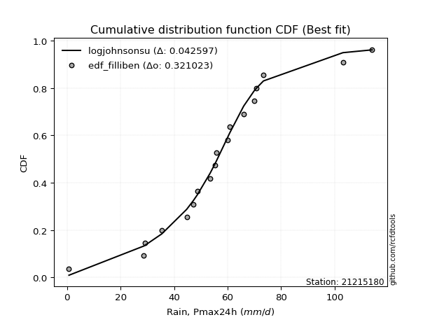</img>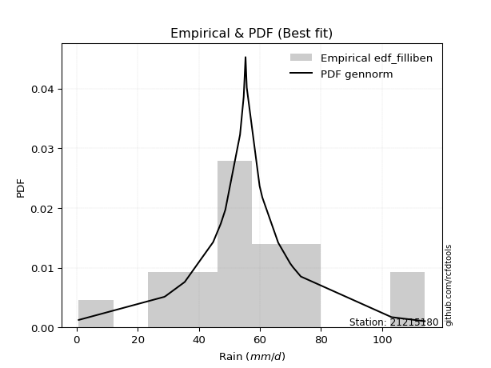</img>

</div>


### 10. Empirical - EDF Jenkinson (1977)

The Jenkinson formula in hydrology is an empirical plotting position formula used to estimate the non-exceedance probability _(P)_ or return period _(T)_ of a given ordered observation within a sample. It is a widely used method in the frequency analysis of extreme events such as floods and rainfall, as it provides a distribution-free way to plot data. _a≈0.31_ and _b≈0.38_ are constants derived to approximate the median of the probability distribution for the given rank.

<div align="center">


$P=(m-a)/(n+b)$


</div>


**10.1. Empirical values**

<div align="center">

|                | 0                   | 1                   | 2                  | 3                   | 4                   | 5                   | 6                  | 7                  | 8                  | 9             | 10                 | 11                 | 12                 | 13                 | 14                 | 15                 | 16                 | 17                 | 18                 |
|:---------------|:--------------------|:--------------------|:-------------------|:--------------------|:--------------------|:--------------------|:-------------------|:-------------------|:-------------------|:--------------|:-------------------|:-------------------|:-------------------|:-------------------|:-------------------|:-------------------|:-------------------|:-------------------|:-------------------|
| date           | 2025                | 2022                | 2016               | 2021                | 2006                | 2020                | 2019               | 2013               | 2017               | 2012          | 2009               | 2015               | 2011               | 2018               | 2007               | 2010               | 2024               | 2008               | 2014               |
| x              | 0.2                 | 0.7                 | 28.7               | 29.1                | 35.4                | 44.7                | 47.2               | 48.7               | 53.5               | 55.3          | 55.7               | 59.9               | 60.8               | 66.0               | 69.9               | 70.8               | 73.4               | 103.1              | 114.0              |
| m              | 1                   | 2                   | 3                  | 4                   | 5                   | 6                   | 7                  | 8                  | 9                  | 10            | 11                 | 12                 | 13                 | 14                 | 15                 | 16                 | 17                 | 18                 | 19                 |
| empirical_dist | edf_jenkinson       | edf_jenkinson       | edf_jenkinson      | edf_jenkinson       | edf_jenkinson       | edf_jenkinson       | edf_jenkinson      | edf_jenkinson      | edf_jenkinson      | edf_jenkinson | edf_jenkinson      | edf_jenkinson      | edf_jenkinson      | edf_jenkinson      | edf_jenkinson      | edf_jenkinson      | edf_jenkinson      | edf_jenkinson      | edf_jenkinson      |
| empirical      | 0.03560371517027864 | 0.08720330237358101 | 0.1388028895768834 | 0.19040247678018576 | 0.24200206398348817 | 0.29360165118679055 | 0.3452012383900929 | 0.3968008255933953 | 0.4484004127966976 | 0.5           | 0.5515995872033024 | 0.6031991744066048 | 0.6547987616099071 | 0.7063983488132095 | 0.7579979360165119 | 0.8095975232198143 | 0.8611971104231168 | 0.9127966976264191 | 0.9643962848297215 |
| empirical_tr   | 1.0369181380417336  | 1.0955342001130581  | 1.1611743559017376 | 1.2351816443594645  | 1.3192648059904697  | 1.4156318480642804  | 1.5271867612293144 | 1.6578272027373824 | 1.812909260991581  | 2.0           | 2.230149597238205  | 2.5201560468140443 | 2.896860986547085  | 3.40597539543058   | 4.132196162046909  | 5.252032520325204  | 7.204460966542758  | 11.467455621301793 | 28.086956521739243 |

</div>


**10.2. Kolmogorov-Smirnov fit test (sorted by Δ)**


<div align="center">

|                | 0                   | 1                   | 2                   | 3                   | 4                   | 5                   | 6                   | 7                   | 8                   | 9                   | 10                  | 11                  | 12                  | 13                  | 14                  | 15                  | 16                  | 17                  | 18                  | 19                  | 20                  | 21                  | 22                  | 23                  | 24                  | 25                  | 26                  | 27                  | 28                  | 29                  | 30                  | 31                  | 32                  | 33                  | 34                  | 35                  | 36                  | 37                  | 38                  | 39                    | 40                  | 41                  | 42                  | 43                  | 44                  | 45                  | 46                  | 47                  | 48                  | 49                  | 50                  | 51                  | 52                  | 53                  | 54                  | 55                  | 56                  | 57                  | 58                  | 59                  | 60                  | 61                  | 62                  | 63                  | 64                  | 65                  | 66                  | 67                  | 68                  | 69                  | 70                  | 71                  | 72                  | 73                  | 74                  | 75                  | 76                  | 77                  | 78                  | 79                  | 80                  | 81                  | 82                  | 83                  | 84                  | 85                  | 86                  | 87                  | 88                  | 89                  |
|:---------------|:--------------------|:--------------------|:--------------------|:--------------------|:--------------------|:--------------------|:--------------------|:--------------------|:--------------------|:--------------------|:--------------------|:--------------------|:--------------------|:--------------------|:--------------------|:--------------------|:--------------------|:--------------------|:--------------------|:--------------------|:--------------------|:--------------------|:--------------------|:--------------------|:--------------------|:--------------------|:--------------------|:--------------------|:--------------------|:--------------------|:--------------------|:--------------------|:--------------------|:--------------------|:--------------------|:--------------------|:--------------------|:--------------------|:--------------------|:----------------------|:--------------------|:--------------------|:--------------------|:--------------------|:--------------------|:--------------------|:--------------------|:--------------------|:--------------------|:--------------------|:--------------------|:--------------------|:--------------------|:--------------------|:--------------------|:--------------------|:--------------------|:--------------------|:--------------------|:--------------------|:--------------------|:--------------------|:--------------------|:--------------------|:--------------------|:--------------------|:--------------------|:--------------------|:--------------------|:--------------------|:--------------------|:--------------------|:--------------------|:--------------------|:--------------------|:--------------------|:--------------------|:--------------------|:--------------------|:--------------------|:--------------------|:--------------------|:--------------------|:--------------------|:--------------------|:--------------------|:--------------------|:--------------------|:--------------------|:--------------------|
| station        | 21215180            | 21215180            | 21215180            | 21215180            | 21215180            | 21215180            | 21215180            | 21215180            | 21215180            | 21215180            | 21215180            | 21215180            | 21215180            | 21215180            | 21215180            | 21215180            | 21215180            | 21215180            | 21215180            | 21215180            | 21215180            | 21215180            | 21215180            | 21215180            | 21215180            | 21215180            | 21215180            | 21215180            | 21215180            | 21215180            | 21215180            | 21215180            | 21215180            | 21215180            | 21215180            | 21215180            | 21215180            | 21215180            | 21215180            | 21215180              | 21215180            | 21215180            | 21215180            | 21215180            | 21215180            | 21215180            | 21215180            | 21215180            | 21215180            | 21215180            | 21215180            | 21215180            | 21215180            | 21215180            | 21215180            | 21215180            | 21215180            | 21215180            | 21215180            | 21215180            | 21215180            | 21215180            | 21215180            | 21215180            | 21215180            | 21215180            | 21215180            | 21215180            | 21215180            | 21215180            | 21215180            | 21215180            | 21215180            | 21215180            | 21215180            | 21215180            | 21215180            | 21215180            | 21215180            | 21215180            | 21215180            | 21215180            | 21215180            | 21215180            | 21215180            | 21215180            | 21215180            | 21215180            | 21215180            | 21215180            |
| empirical_dist | edf_jenkinson       | edf_jenkinson       | edf_jenkinson       | edf_jenkinson       | edf_jenkinson       | edf_jenkinson       | edf_jenkinson       | edf_jenkinson       | edf_jenkinson       | edf_jenkinson       | edf_jenkinson       | edf_jenkinson       | edf_jenkinson       | edf_jenkinson       | edf_jenkinson       | edf_jenkinson       | edf_jenkinson       | edf_jenkinson       | edf_jenkinson       | edf_jenkinson       | edf_jenkinson       | edf_jenkinson       | edf_jenkinson       | edf_jenkinson       | edf_jenkinson       | edf_jenkinson       | edf_jenkinson       | edf_jenkinson       | edf_jenkinson       | edf_jenkinson       | edf_jenkinson       | edf_jenkinson       | edf_jenkinson       | edf_jenkinson       | edf_jenkinson       | edf_jenkinson       | edf_jenkinson       | edf_jenkinson       | edf_jenkinson       | edf_jenkinson         | edf_jenkinson       | edf_jenkinson       | edf_jenkinson       | edf_jenkinson       | edf_jenkinson       | edf_jenkinson       | edf_jenkinson       | edf_jenkinson       | edf_jenkinson       | edf_jenkinson       | edf_jenkinson       | edf_jenkinson       | edf_jenkinson       | edf_jenkinson       | edf_jenkinson       | edf_jenkinson       | edf_jenkinson       | edf_jenkinson       | edf_jenkinson       | edf_jenkinson       | edf_jenkinson       | edf_jenkinson       | edf_jenkinson       | edf_jenkinson       | edf_jenkinson       | edf_jenkinson       | edf_jenkinson       | edf_jenkinson       | edf_jenkinson       | edf_jenkinson       | edf_jenkinson       | edf_jenkinson       | edf_jenkinson       | edf_jenkinson       | edf_jenkinson       | edf_jenkinson       | edf_jenkinson       | edf_jenkinson       | edf_jenkinson       | edf_jenkinson       | edf_jenkinson       | edf_jenkinson       | edf_jenkinson       | edf_jenkinson       | edf_jenkinson       | edf_jenkinson       | edf_jenkinson       | edf_jenkinson       | edf_jenkinson       | edf_jenkinson       |
| p_dist         | laplace_asymmetric  | johnsonsu           | laplace             | logjohnsonsu        | hypsecant           | genlogistic         | fisk                | logistic            | mielke              | truncnorm           | exponnorm           | nct                 | betaprime           | fatiguelife         | chi2                | pearson3            | erlang              | gamma               | f                   | rice                | t                   | crystalball         | norm                | logt                | weibull_min         | gumbel_l            | invgamma            | invgauss            | maxwell             | rayleigh            | gumbel_r            | invweibull          | moyal               | halfnorm            | kstwobign           | halflogistic        | logfisk             | logloggamma         | loggenlogistic      | loglaplace_asymmetric | loggompertz         | wald                | ncf                 | gibrat              | loggumbel_l         | logmielke           | logpearson3         | nakagami            | expon               | genexpon            | loghypsecant        | loglogistic         | loglaplace          | logfatiguelife      | lognorm             | lognorm             | logcrystalball      | logexponnorm        | logrice             | lognct              | loglognorm          | lognakagami         | loginvgamma         | logalpha            | logbetaprime        | logerlang           | loginvgauss         | logmaxwell          | loginvweibull       | lograyleigh         | loggumbel_r         | logkstwobign        | loghalfnorm         | logmoyal            | loghalflogistic     | loggenexpon         | logexpon            | logncf              | logwald             | pareto              | loggibrat           | logpareto           | logchi2             | logf                | logtruncnorm        | loggamma            | loggamma            | logweibull_min      | gompertz            | alpha               |
| delta          | 0.04895349140325311 | 0.04951473205545853 | 0.05328641604655463 | 0.05837127466098702 | 0.06124343353310213 | 0.07197014310304062 | 0.0743607721332068  | 0.07573225004821893 | 0.07886414863484109 | 0.08601372718041359 | 0.09430594978321993 | 0.0951268167817837  | 0.09548136588365486 | 0.09629966183918859 | 0.09656139170522438 | 0.09667368424728995 | 0.0967422621526236  | 0.09677945505606877 | 0.09689669370242038 | 0.0979648391099458  | 0.0983348490695457  | 0.09834228674299328 | 0.09834228880595564 | 0.0992476931083075  | 0.10294510168887594 | 0.11071418415561851 | 0.11078085197151688 | 0.11209073632222971 | 0.11484222958534529 | 0.12711206465301    | 0.13627623532947863 | 0.14227873637506228 | 0.157045947869149   | 0.16199072495805944 | 0.16657932455765795 | 0.17411685122238135 | 0.19403325591317377 | 0.19945978047161883 | 0.2079126910538996  | 0.21636230754834201   | 0.21762466727989555 | 0.2192474213091382  | 0.22979468688864774 | 0.24253673181128443 | 0.255485497439947   | 0.2639148191176963  | 0.26494213589422544 | 0.2692972109779365  | 0.2751719642122995  | 0.3041884697007204  | 0.31719439294597385 | 0.3212486798988615  | 0.32457520277349866 | 0.32532680502369604 | 0.32602136513945956 | 0.32602136513945956 | 0.32602136699703954 | 0.32602151821112857 | 0.32604211785707904 | 0.3262110999088258  | 0.32645405352137125 | 0.3266627073942353  | 0.3342074897537297  | 0.3387639599965999  | 0.34979469658149576 | 0.3511902367774383  | 0.35410532745316003 | 0.36012021060985877 | 0.3627711523159888  | 0.3717977309671141  | 0.39444216922081055 | 0.404051369175464   | 0.4047227623885564  | 0.4201285000518802  | 0.4271253130232864  | 0.4672043185161856  | 0.48307556876031144 | 0.4889663587956321  | 0.4916157439376878  | 0.5052080190111692  | 0.5081115521206704  | 0.5362770734552434  | 0.567133265192753   | 0.5889140697128622  | 0.6417797156352416  | 0.6561317514754987  | 0.6561317514754987  | 0.7070024547990853  | 0.8335399329910108  | 0.8377498839169695  |
| deltao         | 0.31564497164100014 | 0.31564497164100014 | 0.31564497164100014 | 0.31564497164100014 | 0.31564497164100014 | 0.31564497164100014 | 0.31564497164100014 | 0.31564497164100014 | 0.31564497164100014 | 0.31564497164100014 | 0.31564497164100014 | 0.31564497164100014 | 0.31564497164100014 | 0.31564497164100014 | 0.31564497164100014 | 0.31564497164100014 | 0.31564497164100014 | 0.31564497164100014 | 0.31564497164100014 | 0.31564497164100014 | 0.31564497164100014 | 0.31564497164100014 | 0.31564497164100014 | 0.31564497164100014 | 0.31564497164100014 | 0.31564497164100014 | 0.31564497164100014 | 0.31564497164100014 | 0.31564497164100014 | 0.31564497164100014 | 0.31564497164100014 | 0.31564497164100014 | 0.31564497164100014 | 0.31564497164100014 | 0.31564497164100014 | 0.31564497164100014 | 0.31564497164100014 | 0.31564497164100014 | 0.31564497164100014 | 0.31564497164100014   | 0.31564497164100014 | 0.31564497164100014 | 0.31564497164100014 | 0.31564497164100014 | 0.31564497164100014 | 0.31564497164100014 | 0.31564497164100014 | 0.31564497164100014 | 0.31564497164100014 | 0.31564497164100014 | 0.31564497164100014 | 0.31564497164100014 | 0.31564497164100014 | 0.31564497164100014 | 0.31564497164100014 | 0.31564497164100014 | 0.31564497164100014 | 0.31564497164100014 | 0.31564497164100014 | 0.31564497164100014 | 0.31564497164100014 | 0.31564497164100014 | 0.31564497164100014 | 0.31564497164100014 | 0.31564497164100014 | 0.31564497164100014 | 0.31564497164100014 | 0.31564497164100014 | 0.31564497164100014 | 0.31564497164100014 | 0.31564497164100014 | 0.31564497164100014 | 0.31564497164100014 | 0.31564497164100014 | 0.31564497164100014 | 0.31564497164100014 | 0.31564497164100014 | 0.31564497164100014 | 0.31564497164100014 | 0.31564497164100014 | 0.31564497164100014 | 0.31564497164100014 | 0.31564497164100014 | 0.31564497164100014 | 0.31564497164100014 | 0.31564497164100014 | 0.31564497164100014 | 0.31564497164100014 | 0.31564497164100014 | 0.31564497164100014 |
| eval           | Δo > Δ              | Δo > Δ              | Δo > Δ              | Δo > Δ              | Δo > Δ              | Δo > Δ              | Δo > Δ              | Δo > Δ              | Δo > Δ              | Δo > Δ              | Δo > Δ              | Δo > Δ              | Δo > Δ              | Δo > Δ              | Δo > Δ              | Δo > Δ              | Δo > Δ              | Δo > Δ              | Δo > Δ              | Δo > Δ              | Δo > Δ              | Δo > Δ              | Δo > Δ              | Δo > Δ              | Δo > Δ              | Δo > Δ              | Δo > Δ              | Δo > Δ              | Δo > Δ              | Δo > Δ              | Δo > Δ              | Δo > Δ              | Δo > Δ              | Δo > Δ              | Δo > Δ              | Δo > Δ              | Δo > Δ              | Δo > Δ              | Δo > Δ              | Δo > Δ                | Δo > Δ              | Δo > Δ              | Δo > Δ              | Δo > Δ              | Δo > Δ              | Δo > Δ              | Δo > Δ              | Δo > Δ              | Δo > Δ              | Δo > Δ              | Δo <= Δ             | Δo <= Δ             | Δo <= Δ             | Δo <= Δ             | Δo <= Δ             | Δo <= Δ             | Δo <= Δ             | Δo <= Δ             | Δo <= Δ             | Δo <= Δ             | Δo <= Δ             | Δo <= Δ             | Δo <= Δ             | Δo <= Δ             | Δo <= Δ             | Δo <= Δ             | Δo <= Δ             | Δo <= Δ             | Δo <= Δ             | Δo <= Δ             | Δo <= Δ             | Δo <= Δ             | Δo <= Δ             | Δo <= Δ             | Δo <= Δ             | Δo <= Δ             | Δo <= Δ             | Δo <= Δ             | Δo <= Δ             | Δo <= Δ             | Δo <= Δ             | Δo <= Δ             | Δo <= Δ             | Δo <= Δ             | Δo <= Δ             | Δo <= Δ             | Δo <= Δ             | Δo <= Δ             | Δo <= Δ             | Δo <= Δ             |
| fit            | 1                   | 1                   | 1                   | 1                   | 1                   | 1                   | 1                   | 1                   | 1                   | 1                   | 1                   | 1                   | 1                   | 1                   | 1                   | 1                   | 1                   | 1                   | 1                   | 1                   | 1                   | 1                   | 1                   | 1                   | 1                   | 1                   | 1                   | 1                   | 1                   | 1                   | 1                   | 1                   | 1                   | 1                   | 1                   | 1                   | 1                   | 1                   | 1                   | 1                     | 1                   | 1                   | 1                   | 1                   | 1                   | 1                   | 1                   | 1                   | 1                   | 1                   | 0                   | 0                   | 0                   | 0                   | 0                   | 0                   | 0                   | 0                   | 0                   | 0                   | 0                   | 0                   | 0                   | 0                   | 0                   | 0                   | 0                   | 0                   | 0                   | 0                   | 0                   | 0                   | 0                   | 0                   | 0                   | 0                   | 0                   | 0                   | 0                   | 0                   | 0                   | 0                   | 0                   | 0                   | 0                   | 0                   | 0                   | 0                   | 0                   | 0                   |
| n              | 19                  | 19                  | 19                  | 19                  | 19                  | 19                  | 19                  | 19                  | 19                  | 19                  | 19                  | 19                  | 19                  | 19                  | 19                  | 19                  | 19                  | 19                  | 19                  | 19                  | 19                  | 19                  | 19                  | 19                  | 19                  | 19                  | 19                  | 19                  | 19                  | 19                  | 19                  | 19                  | 19                  | 19                  | 19                  | 19                  | 19                  | 19                  | 19                  | 19                    | 19                  | 19                  | 19                  | 19                  | 19                  | 19                  | 19                  | 19                  | 19                  | 19                  | 19                  | 19                  | 19                  | 19                  | 19                  | 19                  | 19                  | 19                  | 19                  | 19                  | 19                  | 19                  | 19                  | 19                  | 19                  | 19                  | 19                  | 19                  | 19                  | 19                  | 19                  | 19                  | 19                  | 19                  | 19                  | 19                  | 19                  | 19                  | 19                  | 19                  | 19                  | 19                  | 19                  | 19                  | 19                  | 19                  | 19                  | 19                  | 19                  | 19                  |
| best_fit       | 1                   | 0                   | 0                   | 0                   | 0                   | 0                   | 0                   | 0                   | 0                   | 0                   | 0                   | 0                   | 0                   | 0                   | 0                   | 0                   | 0                   | 0                   | 0                   | 0                   | 0                   | 0                   | 0                   | 0                   | 0                   | 0                   | 0                   | 0                   | 0                   | 0                   | 0                   | 0                   | 0                   | 0                   | 0                   | 0                   | 0                   | 0                   | 0                   | 0                     | 0                   | 0                   | 0                   | 0                   | 0                   | 0                   | 0                   | 0                   | 0                   | 0                   | 0                   | 0                   | 0                   | 0                   | 0                   | 0                   | 0                   | 0                   | 0                   | 0                   | 0                   | 0                   | 0                   | 0                   | 0                   | 0                   | 0                   | 0                   | 0                   | 0                   | 0                   | 0                   | 0                   | 0                   | 0                   | 0                   | 0                   | 0                   | 0                   | 0                   | 0                   | 0                   | 0                   | 0                   | 0                   | 0                   | 0                   | 0                   | 0                   | 0                   |
| best_fit_sort  | 1                   | 2                   | 3                   | 4                   | 5                   | 6                   | 7                   | 8                   | 9                   | 10                  | 11                  | 12                  | 13                  | 14                  | 15                  | 16                  | 17                  | 18                  | 19                  | 20                  | 21                  | 22                  | 23                  | 24                  | 25                  | 26                  | 27                  | 28                  | 29                  | 30                  | 31                  | 32                  | 33                  | 34                  | 35                  | 36                  | 37                  | 38                  | 39                  | 40                    | 41                  | 42                  | 43                  | 44                  | 45                  | 46                  | 47                  | 48                  | 49                  | 50                  | 51                  | 52                  | 53                  | 54                  | 55                  | 56                  | 57                  | 58                  | 59                  | 60                  | 61                  | 62                  | 63                  | 64                  | 65                  | 66                  | 67                  | 68                  | 69                  | 70                  | 71                  | 72                  | 73                  | 74                  | 75                  | 76                  | 77                  | 78                  | 79                  | 80                  | 81                  | 82                  | 83                  | 84                  | 85                  | 86                  | 87                  | 88                  | 89                  | 90                  |

</div>


<div align="center">

</img>

</div>


**10.3. Best fit**

<div align="center">

|   id |   station | empirical_dist   | p_dist             |     delta |   deltao | eval   |   fit |   n |   best_fit |   best_fit_sort |
|-----:|----------:|:-----------------|:-------------------|----------:|---------:|:-------|------:|----:|-----------:|----------------:|
|    0 |  21215180 | edf_jenkinson    | laplace_asymmetric | 0.0489535 | 0.315645 | Δo > Δ |     1 |  19 |          1 |               1 |

</div>


<div align="center">

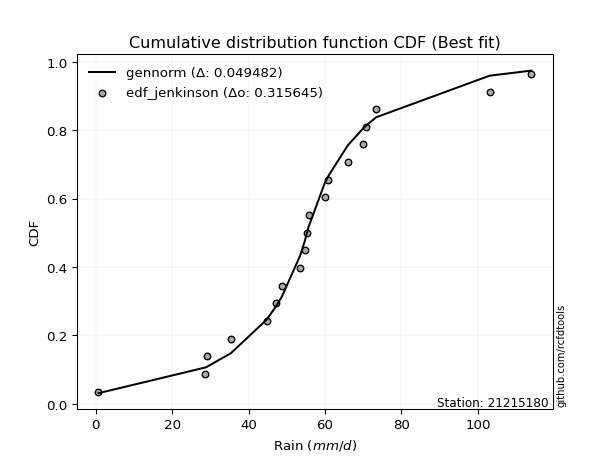</img></img>

</div>


### 11. Empirical - EDF Cunnane (1978)

Cunnane´s work in statistical hydrology has focused on the performance and evaluation of different probability distributions (such as GEV, Gumbel, Lognormal) for flood frequency estimation. _b_ is a constant, typically set to 0.4.

<div align="center">


$P=(m-b)/(n+1-2b)$


</div>


**11.1. Empirical values**

<div align="center">

|                | 0                 | 1                   | 2                   | 3                  | 4                   | 5                  | 6                  | 7                  | 8                  | 9           | 10                 | 11                 | 12                | 13                 | 14                 | 15                | 16                 | 17                 | 18                 |
|:---------------|:------------------|:--------------------|:--------------------|:-------------------|:--------------------|:-------------------|:-------------------|:-------------------|:-------------------|:------------|:-------------------|:-------------------|:------------------|:-------------------|:-------------------|:------------------|:-------------------|:-------------------|:-------------------|
| date           | 2025              | 2022                | 2016                | 2021               | 2006                | 2020               | 2019               | 2013               | 2017               | 2012        | 2009               | 2015               | 2011              | 2018               | 2007               | 2010              | 2024               | 2008               | 2014               |
| x              | 0.2               | 0.7                 | 28.7                | 29.1               | 35.4                | 44.7               | 47.2               | 48.7               | 53.5               | 55.3        | 55.7               | 59.9               | 60.8              | 66.0               | 69.9               | 70.8              | 73.4               | 103.1              | 114.0              |
| m              | 1                 | 2                   | 3                   | 4                  | 5                   | 6                  | 7                  | 8                  | 9                  | 10          | 11                 | 12                 | 13                | 14                 | 15                 | 16                | 17                 | 18                 | 19                 |
| empirical_dist | edf_cunnane       | edf_cunnane         | edf_cunnane         | edf_cunnane        | edf_cunnane         | edf_cunnane        | edf_cunnane        | edf_cunnane        | edf_cunnane        | edf_cunnane | edf_cunnane        | edf_cunnane        | edf_cunnane       | edf_cunnane        | edf_cunnane        | edf_cunnane       | edf_cunnane        | edf_cunnane        | edf_cunnane        |
| empirical      | 0.03125           | 0.08333333333333334 | 0.13541666666666669 | 0.1875             | 0.23958333333333331 | 0.2916666666666667 | 0.34375            | 0.3958333333333333 | 0.4479166666666667 | 0.5         | 0.5520833333333334 | 0.6041666666666666 | 0.65625           | 0.7083333333333334 | 0.7604166666666666 | 0.8125            | 0.8645833333333335 | 0.9166666666666667 | 0.9687500000000001 |
| empirical_tr   | 1.032258064516129 | 1.090909090909091   | 1.1566265060240966  | 1.2307692307692308 | 1.3150684931506849  | 1.411764705882353  | 1.5238095238095237 | 1.6551724137931032 | 1.8113207547169814 | 2.0         | 2.2325581395348837 | 2.526315789473684  | 2.909090909090909 | 3.428571428571429  | 4.17391304347826   | 5.333333333333333 | 7.384615384615393  | 12.00000000000001  | 32.000000000000114 |

</div>


**11.2. Kolmogorov-Smirnov fit test (sorted by Δ)**


<div align="center">

|                | 0                    | 1                   | 2                   | 3                   | 4                   | 5                   | 6                   | 7                   | 8                   | 9                   | 10                  | 11                  | 12                  | 13                  | 14                  | 15                  | 16                  | 17                  | 18                  | 19                  | 20                  | 21                  | 22                  | 23                  | 24                  | 25                  | 26                  | 27                  | 28                  | 29                  | 30                  | 31                  | 32                  | 33                  | 34                  | 35                  | 36                  | 37                  | 38                  | 39                    | 40                  | 41                  | 42                  | 43                  | 44                  | 45                  | 46                  | 47                  | 48                  | 49                  | 50                  | 51                  | 52                  | 53                  | 54                  | 55                  | 56                  | 57                  | 58                  | 59                  | 60                  | 61                  | 62                  | 63                  | 64                  | 65                  | 66                  | 67                  | 68                  | 69                  | 70                  | 71                  | 72                  | 73                  | 74                  | 75                  | 76                  | 77                  | 78                  | 79                  | 80                  | 81                  | 82                  | 83                  | 84                  | 85                  | 86                  | 87                  | 88                  | 89                  |
|:---------------|:---------------------|:--------------------|:--------------------|:--------------------|:--------------------|:--------------------|:--------------------|:--------------------|:--------------------|:--------------------|:--------------------|:--------------------|:--------------------|:--------------------|:--------------------|:--------------------|:--------------------|:--------------------|:--------------------|:--------------------|:--------------------|:--------------------|:--------------------|:--------------------|:--------------------|:--------------------|:--------------------|:--------------------|:--------------------|:--------------------|:--------------------|:--------------------|:--------------------|:--------------------|:--------------------|:--------------------|:--------------------|:--------------------|:--------------------|:----------------------|:--------------------|:--------------------|:--------------------|:--------------------|:--------------------|:--------------------|:--------------------|:--------------------|:--------------------|:--------------------|:--------------------|:--------------------|:--------------------|:--------------------|:--------------------|:--------------------|:--------------------|:--------------------|:--------------------|:--------------------|:--------------------|:--------------------|:--------------------|:--------------------|:--------------------|:--------------------|:--------------------|:--------------------|:--------------------|:--------------------|:--------------------|:--------------------|:--------------------|:--------------------|:--------------------|:--------------------|:--------------------|:--------------------|:--------------------|:--------------------|:--------------------|:--------------------|:--------------------|:--------------------|:--------------------|:--------------------|:--------------------|:--------------------|:--------------------|:--------------------|
| station        | 21215180             | 21215180            | 21215180            | 21215180            | 21215180            | 21215180            | 21215180            | 21215180            | 21215180            | 21215180            | 21215180            | 21215180            | 21215180            | 21215180            | 21215180            | 21215180            | 21215180            | 21215180            | 21215180            | 21215180            | 21215180            | 21215180            | 21215180            | 21215180            | 21215180            | 21215180            | 21215180            | 21215180            | 21215180            | 21215180            | 21215180            | 21215180            | 21215180            | 21215180            | 21215180            | 21215180            | 21215180            | 21215180            | 21215180            | 21215180              | 21215180            | 21215180            | 21215180            | 21215180            | 21215180            | 21215180            | 21215180            | 21215180            | 21215180            | 21215180            | 21215180            | 21215180            | 21215180            | 21215180            | 21215180            | 21215180            | 21215180            | 21215180            | 21215180            | 21215180            | 21215180            | 21215180            | 21215180            | 21215180            | 21215180            | 21215180            | 21215180            | 21215180            | 21215180            | 21215180            | 21215180            | 21215180            | 21215180            | 21215180            | 21215180            | 21215180            | 21215180            | 21215180            | 21215180            | 21215180            | 21215180            | 21215180            | 21215180            | 21215180            | 21215180            | 21215180            | 21215180            | 21215180            | 21215180            | 21215180            |
| empirical_dist | edf_cunnane          | edf_cunnane         | edf_cunnane         | edf_cunnane         | edf_cunnane         | edf_cunnane         | edf_cunnane         | edf_cunnane         | edf_cunnane         | edf_cunnane         | edf_cunnane         | edf_cunnane         | edf_cunnane         | edf_cunnane         | edf_cunnane         | edf_cunnane         | edf_cunnane         | edf_cunnane         | edf_cunnane         | edf_cunnane         | edf_cunnane         | edf_cunnane         | edf_cunnane         | edf_cunnane         | edf_cunnane         | edf_cunnane         | edf_cunnane         | edf_cunnane         | edf_cunnane         | edf_cunnane         | edf_cunnane         | edf_cunnane         | edf_cunnane         | edf_cunnane         | edf_cunnane         | edf_cunnane         | edf_cunnane         | edf_cunnane         | edf_cunnane         | edf_cunnane           | edf_cunnane         | edf_cunnane         | edf_cunnane         | edf_cunnane         | edf_cunnane         | edf_cunnane         | edf_cunnane         | edf_cunnane         | edf_cunnane         | edf_cunnane         | edf_cunnane         | edf_cunnane         | edf_cunnane         | edf_cunnane         | edf_cunnane         | edf_cunnane         | edf_cunnane         | edf_cunnane         | edf_cunnane         | edf_cunnane         | edf_cunnane         | edf_cunnane         | edf_cunnane         | edf_cunnane         | edf_cunnane         | edf_cunnane         | edf_cunnane         | edf_cunnane         | edf_cunnane         | edf_cunnane         | edf_cunnane         | edf_cunnane         | edf_cunnane         | edf_cunnane         | edf_cunnane         | edf_cunnane         | edf_cunnane         | edf_cunnane         | edf_cunnane         | edf_cunnane         | edf_cunnane         | edf_cunnane         | edf_cunnane         | edf_cunnane         | edf_cunnane         | edf_cunnane         | edf_cunnane         | edf_cunnane         | edf_cunnane         | edf_cunnane         |
| p_dist         | laplace              | laplace_asymmetric  | johnsonsu           | logjohnsonsu        | hypsecant           | genlogistic         | fisk                | logistic            | mielke              | truncnorm           | exponnorm           | nct                 | chi2                | betaprime           | fatiguelife         | pearson3            | erlang              | gamma               | f                   | rice                | t                   | crystalball         | norm                | logt                | weibull_min         | gumbel_l            | invgamma            | invgauss            | maxwell             | rayleigh            | gumbel_r            | invweibull          | moyal               | halfnorm            | kstwobign           | halflogistic        | logfisk             | logloggamma         | loggenlogistic      | loglaplace_asymmetric | loggompertz         | wald                | ncf                 | gibrat              | loggumbel_l         | logmielke           | logpearson3         | nakagami            | expon               | genexpon            | loghypsecant        | loglogistic         | loglaplace          | logfatiguelife      | lognorm             | lognorm             | logcrystalball      | logexponnorm        | logrice             | lognct              | loglognorm          | lognakagami         | loginvgamma         | logalpha            | logbetaprime        | logerlang           | loginvgauss         | logmaxwell          | loginvweibull       | lograyleigh         | loggumbel_r         | logkstwobign        | loghalfnorm         | logmoyal            | loghalflogistic     | loggenexpon         | logexpon            | logncf              | logwald             | pareto              | loggibrat           | logpareto           | logchi2             | logf                | logtruncnorm        | loggamma            | loggamma            | logweibull_min      | gompertz            | alpha               |
| delta          | 0.051279826902972114 | 0.05233971431346984 | 0.05290095496567526 | 0.05722631506114734 | 0.06462965644331886 | 0.07535636601325735 | 0.07774699504342353 | 0.07911847295843566 | 0.08079913315496495 | 0.08524202960328686 | 0.09769217269343666 | 0.09851303969200043 | 0.0987469698165635  | 0.09886758879387159 | 0.09968588474940532 | 0.10005990715750668 | 0.10012848506284033 | 0.1001656779662855  | 0.10028291661263711 | 0.10135106202016253 | 0.10172107197976243 | 0.10172850965321001 | 0.10172851171617237 | 0.10263391601852423 | 0.10633132459909267 | 0.11216542254571138 | 0.11271583649164074 | 0.11402572084235357 | 0.11677721410546915 | 0.12904704917313387 | 0.1382112198496025  | 0.14421372089518614 | 0.15898093238927286 | 0.1639257094781833  | 0.1685143090777818  | 0.1760518357425052  | 0.1974194788233905  | 0.2013947649917427  | 0.20984767557402345 | 0.21829729206846588   | 0.2195596518000194  | 0.21973116743916915 | 0.2317296714087716  | 0.24302047794131537 | 0.25887172035016365 | 0.26730104202791305 | 0.26832835880444217 | 0.2712321954980604  | 0.2785581871225162  | 0.30653485487292226 | 0.3205806158561906  | 0.32463490280907825 | 0.3265101872936225  | 0.32871302793391277 | 0.32940758804967624 | 0.32940758804967624 | 0.32940758990725627 | 0.3294077411213453  | 0.32942834076729577 | 0.32959732281904247 | 0.329840276431588   | 0.330048930304452   | 0.33759371266394644 | 0.3421501829068166  | 0.3531809194917125  | 0.354576459687655   | 0.3574915503633767  | 0.3635064335200755  | 0.36615737522620545 | 0.3751839538773308  | 0.3978283921310272  | 0.4074375920856807  | 0.4081089852987731  | 0.42351472296209686 | 0.43051153593350305 | 0.4705905414264023  | 0.4864617916705281  | 0.4923525817058488  | 0.4950019668479045  | 0.5085942419213858  | 0.5114977750308871  | 0.5401470424954911  | 0.5705194881029696  | 0.5923002926230789  | 0.6451659385454582  | 0.6595179743857154  | 0.6595179743857154  | 0.710388677709302   | 0.8369261559012275  | 0.8411361068271861  |
| deltao         | 0.31564497164100014  | 0.31564497164100014 | 0.31564497164100014 | 0.31564497164100014 | 0.31564497164100014 | 0.31564497164100014 | 0.31564497164100014 | 0.31564497164100014 | 0.31564497164100014 | 0.31564497164100014 | 0.31564497164100014 | 0.31564497164100014 | 0.31564497164100014 | 0.31564497164100014 | 0.31564497164100014 | 0.31564497164100014 | 0.31564497164100014 | 0.31564497164100014 | 0.31564497164100014 | 0.31564497164100014 | 0.31564497164100014 | 0.31564497164100014 | 0.31564497164100014 | 0.31564497164100014 | 0.31564497164100014 | 0.31564497164100014 | 0.31564497164100014 | 0.31564497164100014 | 0.31564497164100014 | 0.31564497164100014 | 0.31564497164100014 | 0.31564497164100014 | 0.31564497164100014 | 0.31564497164100014 | 0.31564497164100014 | 0.31564497164100014 | 0.31564497164100014 | 0.31564497164100014 | 0.31564497164100014 | 0.31564497164100014   | 0.31564497164100014 | 0.31564497164100014 | 0.31564497164100014 | 0.31564497164100014 | 0.31564497164100014 | 0.31564497164100014 | 0.31564497164100014 | 0.31564497164100014 | 0.31564497164100014 | 0.31564497164100014 | 0.31564497164100014 | 0.31564497164100014 | 0.31564497164100014 | 0.31564497164100014 | 0.31564497164100014 | 0.31564497164100014 | 0.31564497164100014 | 0.31564497164100014 | 0.31564497164100014 | 0.31564497164100014 | 0.31564497164100014 | 0.31564497164100014 | 0.31564497164100014 | 0.31564497164100014 | 0.31564497164100014 | 0.31564497164100014 | 0.31564497164100014 | 0.31564497164100014 | 0.31564497164100014 | 0.31564497164100014 | 0.31564497164100014 | 0.31564497164100014 | 0.31564497164100014 | 0.31564497164100014 | 0.31564497164100014 | 0.31564497164100014 | 0.31564497164100014 | 0.31564497164100014 | 0.31564497164100014 | 0.31564497164100014 | 0.31564497164100014 | 0.31564497164100014 | 0.31564497164100014 | 0.31564497164100014 | 0.31564497164100014 | 0.31564497164100014 | 0.31564497164100014 | 0.31564497164100014 | 0.31564497164100014 | 0.31564497164100014 |
| eval           | Δo > Δ               | Δo > Δ              | Δo > Δ              | Δo > Δ              | Δo > Δ              | Δo > Δ              | Δo > Δ              | Δo > Δ              | Δo > Δ              | Δo > Δ              | Δo > Δ              | Δo > Δ              | Δo > Δ              | Δo > Δ              | Δo > Δ              | Δo > Δ              | Δo > Δ              | Δo > Δ              | Δo > Δ              | Δo > Δ              | Δo > Δ              | Δo > Δ              | Δo > Δ              | Δo > Δ              | Δo > Δ              | Δo > Δ              | Δo > Δ              | Δo > Δ              | Δo > Δ              | Δo > Δ              | Δo > Δ              | Δo > Δ              | Δo > Δ              | Δo > Δ              | Δo > Δ              | Δo > Δ              | Δo > Δ              | Δo > Δ              | Δo > Δ              | Δo > Δ                | Δo > Δ              | Δo > Δ              | Δo > Δ              | Δo > Δ              | Δo > Δ              | Δo > Δ              | Δo > Δ              | Δo > Δ              | Δo > Δ              | Δo > Δ              | Δo <= Δ             | Δo <= Δ             | Δo <= Δ             | Δo <= Δ             | Δo <= Δ             | Δo <= Δ             | Δo <= Δ             | Δo <= Δ             | Δo <= Δ             | Δo <= Δ             | Δo <= Δ             | Δo <= Δ             | Δo <= Δ             | Δo <= Δ             | Δo <= Δ             | Δo <= Δ             | Δo <= Δ             | Δo <= Δ             | Δo <= Δ             | Δo <= Δ             | Δo <= Δ             | Δo <= Δ             | Δo <= Δ             | Δo <= Δ             | Δo <= Δ             | Δo <= Δ             | Δo <= Δ             | Δo <= Δ             | Δo <= Δ             | Δo <= Δ             | Δo <= Δ             | Δo <= Δ             | Δo <= Δ             | Δo <= Δ             | Δo <= Δ             | Δo <= Δ             | Δo <= Δ             | Δo <= Δ             | Δo <= Δ             | Δo <= Δ             |
| fit            | 1                    | 1                   | 1                   | 1                   | 1                   | 1                   | 1                   | 1                   | 1                   | 1                   | 1                   | 1                   | 1                   | 1                   | 1                   | 1                   | 1                   | 1                   | 1                   | 1                   | 1                   | 1                   | 1                   | 1                   | 1                   | 1                   | 1                   | 1                   | 1                   | 1                   | 1                   | 1                   | 1                   | 1                   | 1                   | 1                   | 1                   | 1                   | 1                   | 1                     | 1                   | 1                   | 1                   | 1                   | 1                   | 1                   | 1                   | 1                   | 1                   | 1                   | 0                   | 0                   | 0                   | 0                   | 0                   | 0                   | 0                   | 0                   | 0                   | 0                   | 0                   | 0                   | 0                   | 0                   | 0                   | 0                   | 0                   | 0                   | 0                   | 0                   | 0                   | 0                   | 0                   | 0                   | 0                   | 0                   | 0                   | 0                   | 0                   | 0                   | 0                   | 0                   | 0                   | 0                   | 0                   | 0                   | 0                   | 0                   | 0                   | 0                   |
| n              | 19                   | 19                  | 19                  | 19                  | 19                  | 19                  | 19                  | 19                  | 19                  | 19                  | 19                  | 19                  | 19                  | 19                  | 19                  | 19                  | 19                  | 19                  | 19                  | 19                  | 19                  | 19                  | 19                  | 19                  | 19                  | 19                  | 19                  | 19                  | 19                  | 19                  | 19                  | 19                  | 19                  | 19                  | 19                  | 19                  | 19                  | 19                  | 19                  | 19                    | 19                  | 19                  | 19                  | 19                  | 19                  | 19                  | 19                  | 19                  | 19                  | 19                  | 19                  | 19                  | 19                  | 19                  | 19                  | 19                  | 19                  | 19                  | 19                  | 19                  | 19                  | 19                  | 19                  | 19                  | 19                  | 19                  | 19                  | 19                  | 19                  | 19                  | 19                  | 19                  | 19                  | 19                  | 19                  | 19                  | 19                  | 19                  | 19                  | 19                  | 19                  | 19                  | 19                  | 19                  | 19                  | 19                  | 19                  | 19                  | 19                  | 19                  |
| best_fit       | 1                    | 0                   | 0                   | 0                   | 0                   | 0                   | 0                   | 0                   | 0                   | 0                   | 0                   | 0                   | 0                   | 0                   | 0                   | 0                   | 0                   | 0                   | 0                   | 0                   | 0                   | 0                   | 0                   | 0                   | 0                   | 0                   | 0                   | 0                   | 0                   | 0                   | 0                   | 0                   | 0                   | 0                   | 0                   | 0                   | 0                   | 0                   | 0                   | 0                     | 0                   | 0                   | 0                   | 0                   | 0                   | 0                   | 0                   | 0                   | 0                   | 0                   | 0                   | 0                   | 0                   | 0                   | 0                   | 0                   | 0                   | 0                   | 0                   | 0                   | 0                   | 0                   | 0                   | 0                   | 0                   | 0                   | 0                   | 0                   | 0                   | 0                   | 0                   | 0                   | 0                   | 0                   | 0                   | 0                   | 0                   | 0                   | 0                   | 0                   | 0                   | 0                   | 0                   | 0                   | 0                   | 0                   | 0                   | 0                   | 0                   | 0                   |
| best_fit_sort  | 1                    | 2                   | 3                   | 4                   | 5                   | 6                   | 7                   | 8                   | 9                   | 10                  | 11                  | 12                  | 13                  | 14                  | 15                  | 16                  | 17                  | 18                  | 19                  | 20                  | 21                  | 22                  | 23                  | 24                  | 25                  | 26                  | 27                  | 28                  | 29                  | 30                  | 31                  | 32                  | 33                  | 34                  | 35                  | 36                  | 37                  | 38                  | 39                  | 40                    | 41                  | 42                  | 43                  | 44                  | 45                  | 46                  | 47                  | 48                  | 49                  | 50                  | 51                  | 52                  | 53                  | 54                  | 55                  | 56                  | 57                  | 58                  | 59                  | 60                  | 61                  | 62                  | 63                  | 64                  | 65                  | 66                  | 67                  | 68                  | 69                  | 70                  | 71                  | 72                  | 73                  | 74                  | 75                  | 76                  | 77                  | 78                  | 79                  | 80                  | 81                  | 82                  | 83                  | 84                  | 85                  | 86                  | 87                  | 88                  | 89                  | 90                  |

</div>


<div align="center">

</img>

</div>


**11.3. Best fit**

<div align="center">

|   id |   station | empirical_dist   | p_dist   |     delta |   deltao | eval   |   fit |   n |   best_fit |   best_fit_sort |
|-----:|----------:|:-----------------|:---------|----------:|---------:|:-------|------:|----:|-----------:|----------------:|
|    0 |  21215180 | edf_cunnane      | laplace  | 0.0512798 | 0.315645 | Δo > Δ |     1 |  19 |          1 |               1 |

</div>


<div align="center">

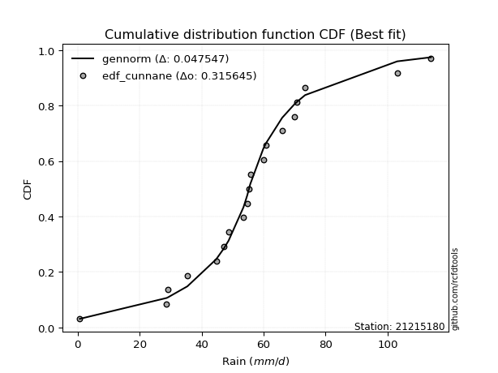</img></img>

</div>


### 12. Empirical - EDF Adamowski (1981)

The Adamowski formula in hydrology refers to a specific plotting position formula used for estimating the non-parametric empirical distribution of hydrological events (like flood peaks) to calculate their return periods. This formula provides an alternative to traditional parametric methods (like the Gumbel or Log Pearson Type III distributions). 

<div align="center">


$P=(m-0.25)/(n+0.5)$


</div>


**12.1. Empirical values**

<div align="center">

|                | 0                    | 1                   | 2                   | 3                   | 4                   | 5                  | 6                   | 7                  | 8                   | 9             | 10                 | 11                 | 12                 | 13                 | 14                 | 15                 | 16                 | 17                 | 18                 |
|:---------------|:---------------------|:--------------------|:--------------------|:--------------------|:--------------------|:-------------------|:--------------------|:-------------------|:--------------------|:--------------|:-------------------|:-------------------|:-------------------|:-------------------|:-------------------|:-------------------|:-------------------|:-------------------|:-------------------|
| date           | 2025                 | 2022                | 2016                | 2021                | 2006                | 2020               | 2019                | 2013               | 2017                | 2012          | 2009               | 2015               | 2011               | 2018               | 2007               | 2010               | 2024               | 2008               | 2014               |
| x              | 0.2                  | 0.7                 | 28.7                | 29.1                | 35.4                | 44.7               | 47.2                | 48.7               | 53.5                | 55.3          | 55.7               | 59.9               | 60.8               | 66.0               | 69.9               | 70.8               | 73.4               | 103.1              | 114.0              |
| m              | 1                    | 2                   | 3                   | 4                   | 5                   | 6                  | 7                   | 8                  | 9                   | 10            | 11                 | 12                 | 13                 | 14                 | 15                 | 16                 | 17                 | 18                 | 19                 |
| empirical_dist | edf_adamowski        | edf_adamowski       | edf_adamowski       | edf_adamowski       | edf_adamowski       | edf_adamowski      | edf_adamowski       | edf_adamowski      | edf_adamowski       | edf_adamowski | edf_adamowski      | edf_adamowski      | edf_adamowski      | edf_adamowski      | edf_adamowski      | edf_adamowski      | edf_adamowski      | edf_adamowski      | edf_adamowski      |
| empirical      | 0.038461538461538464 | 0.08974358974358974 | 0.14102564102564102 | 0.19230769230769232 | 0.24358974358974358 | 0.2948717948717949 | 0.34615384615384615 | 0.3974358974358974 | 0.44871794871794873 | 0.5           | 0.5512820512820513 | 0.6025641025641025 | 0.6538461538461539 | 0.7051282051282052 | 0.7564102564102564 | 0.8076923076923077 | 0.8589743589743589 | 0.9102564102564102 | 0.9615384615384616 |
| empirical_tr   | 1.04                 | 1.0985915492957747  | 1.164179104477612   | 1.2380952380952381  | 1.3220338983050848  | 1.4181818181818182 | 1.5294117647058822  | 1.6595744680851061 | 1.813953488372093   | 2.0           | 2.2285714285714286 | 2.5161290322580645 | 2.888888888888889  | 3.3913043478260874 | 4.105263157894736  | 5.2                | 7.090909090909088  | 11.14285714285714  | 26.000000000000018 |

</div>


**12.2. Kolmogorov-Smirnov fit test (sorted by Δ)**


<div align="center">

|                | 0                   | 1                    | 2                    | 3                   | 4                   | 5                   | 6                   | 7                   | 8                   | 9                   | 10                  | 11                  | 12                  | 13                  | 14                  | 15                  | 16                  | 17                  | 18                  | 19                  | 20                  | 21                  | 22                  | 23                  | 24                  | 25                  | 26                  | 27                  | 28                  | 29                  | 30                  | 31                  | 32                  | 33                  | 34                  | 35                  | 36                  | 37                  | 38                  | 39                    | 40                  | 41                  | 42                  | 43                  | 44                  | 45                  | 46                  | 47                  | 48                  | 49                  | 50                  | 51                  | 52                  | 53                  | 54                  | 55                  | 56                  | 57                  | 58                  | 59                  | 60                  | 61                  | 62                  | 63                  | 64                  | 65                  | 66                  | 67                  | 68                  | 69                  | 70                  | 71                  | 72                  | 73                  | 74                  | 75                  | 76                  | 77                  | 78                  | 79                  | 80                  | 81                  | 82                  | 83                  | 84                  | 85                  | 86                  | 87                  | 88                  | 89                  |
|:---------------|:--------------------|:---------------------|:---------------------|:--------------------|:--------------------|:--------------------|:--------------------|:--------------------|:--------------------|:--------------------|:--------------------|:--------------------|:--------------------|:--------------------|:--------------------|:--------------------|:--------------------|:--------------------|:--------------------|:--------------------|:--------------------|:--------------------|:--------------------|:--------------------|:--------------------|:--------------------|:--------------------|:--------------------|:--------------------|:--------------------|:--------------------|:--------------------|:--------------------|:--------------------|:--------------------|:--------------------|:--------------------|:--------------------|:--------------------|:----------------------|:--------------------|:--------------------|:--------------------|:--------------------|:--------------------|:--------------------|:--------------------|:--------------------|:--------------------|:--------------------|:--------------------|:--------------------|:--------------------|:--------------------|:--------------------|:--------------------|:--------------------|:--------------------|:--------------------|:--------------------|:--------------------|:--------------------|:--------------------|:--------------------|:--------------------|:--------------------|:--------------------|:--------------------|:--------------------|:--------------------|:--------------------|:--------------------|:--------------------|:--------------------|:--------------------|:--------------------|:--------------------|:--------------------|:--------------------|:--------------------|:--------------------|:--------------------|:--------------------|:--------------------|:--------------------|:--------------------|:--------------------|:--------------------|:--------------------|:--------------------|
| station        | 21215180            | 21215180             | 21215180             | 21215180            | 21215180            | 21215180            | 21215180            | 21215180            | 21215180            | 21215180            | 21215180            | 21215180            | 21215180            | 21215180            | 21215180            | 21215180            | 21215180            | 21215180            | 21215180            | 21215180            | 21215180            | 21215180            | 21215180            | 21215180            | 21215180            | 21215180            | 21215180            | 21215180            | 21215180            | 21215180            | 21215180            | 21215180            | 21215180            | 21215180            | 21215180            | 21215180            | 21215180            | 21215180            | 21215180            | 21215180              | 21215180            | 21215180            | 21215180            | 21215180            | 21215180            | 21215180            | 21215180            | 21215180            | 21215180            | 21215180            | 21215180            | 21215180            | 21215180            | 21215180            | 21215180            | 21215180            | 21215180            | 21215180            | 21215180            | 21215180            | 21215180            | 21215180            | 21215180            | 21215180            | 21215180            | 21215180            | 21215180            | 21215180            | 21215180            | 21215180            | 21215180            | 21215180            | 21215180            | 21215180            | 21215180            | 21215180            | 21215180            | 21215180            | 21215180            | 21215180            | 21215180            | 21215180            | 21215180            | 21215180            | 21215180            | 21215180            | 21215180            | 21215180            | 21215180            | 21215180            |
| empirical_dist | edf_adamowski       | edf_adamowski        | edf_adamowski        | edf_adamowski       | edf_adamowski       | edf_adamowski       | edf_adamowski       | edf_adamowski       | edf_adamowski       | edf_adamowski       | edf_adamowski       | edf_adamowski       | edf_adamowski       | edf_adamowski       | edf_adamowski       | edf_adamowski       | edf_adamowski       | edf_adamowski       | edf_adamowski       | edf_adamowski       | edf_adamowski       | edf_adamowski       | edf_adamowski       | edf_adamowski       | edf_adamowski       | edf_adamowski       | edf_adamowski       | edf_adamowski       | edf_adamowski       | edf_adamowski       | edf_adamowski       | edf_adamowski       | edf_adamowski       | edf_adamowski       | edf_adamowski       | edf_adamowski       | edf_adamowski       | edf_adamowski       | edf_adamowski       | edf_adamowski         | edf_adamowski       | edf_adamowski       | edf_adamowski       | edf_adamowski       | edf_adamowski       | edf_adamowski       | edf_adamowski       | edf_adamowski       | edf_adamowski       | edf_adamowski       | edf_adamowski       | edf_adamowski       | edf_adamowski       | edf_adamowski       | edf_adamowski       | edf_adamowski       | edf_adamowski       | edf_adamowski       | edf_adamowski       | edf_adamowski       | edf_adamowski       | edf_adamowski       | edf_adamowski       | edf_adamowski       | edf_adamowski       | edf_adamowski       | edf_adamowski       | edf_adamowski       | edf_adamowski       | edf_adamowski       | edf_adamowski       | edf_adamowski       | edf_adamowski       | edf_adamowski       | edf_adamowski       | edf_adamowski       | edf_adamowski       | edf_adamowski       | edf_adamowski       | edf_adamowski       | edf_adamowski       | edf_adamowski       | edf_adamowski       | edf_adamowski       | edf_adamowski       | edf_adamowski       | edf_adamowski       | edf_adamowski       | edf_adamowski       | edf_adamowski       |
| p_dist         | laplace_asymmetric  | johnsonsu            | laplace              | hypsecant           | logjohnsonsu        | genlogistic         | fisk                | logistic            | mielke              | truncnorm           | exponnorm           | nct                 | betaprime           | fatiguelife         | pearson3            | erlang              | gamma               | f                   | chi2                | rice                | t                   | crystalball         | norm                | logt                | weibull_min         | invgamma            | gumbel_l            | invgauss            | maxwell             | rayleigh            | gumbel_r            | invweibull          | moyal               | halfnorm            | kstwobign           | halflogistic        | logfisk             | logloggamma         | loggenlogistic      | loglaplace_asymmetric | loggompertz         | wald                | ncf                 | gibrat              | loggumbel_l         | logmielke           | logpearson3         | nakagami            | expon               | genexpon            | loghypsecant        | loglogistic         | logfatiguelife      | loglaplace          | lognorm             | lognorm             | logcrystalball      | logexponnorm        | logrice             | lognct              | loglognorm          | lognakagami         | loginvgamma         | logalpha            | logbetaprime        | logerlang           | loginvgauss         | logmaxwell          | loginvweibull       | lograyleigh         | loggumbel_r         | logkstwobign        | loghalfnorm         | logmoyal            | loghalflogistic     | loggenexpon         | logexpon            | logncf              | logwald             | pareto              | loggibrat           | logpareto           | logchi2             | logf                | logtruncnorm        | loggamma            | loggamma            | logweibull_min      | gompertz            | alpha               |
| delta          | 0.05035629139849411 | 0.051623828618779566 | 0.055826703416563365 | 0.0590206820843443  | 0.06091156203099576 | 0.06974739165428279 | 0.07213802068444897 | 0.0735094985994611  | 0.07759400494983676 | 0.08855401455042232 | 0.0920831983344621  | 0.09290406533302586 | 0.09325861443489702 | 0.09407691039043076 | 0.09445093279853212 | 0.09451951070386577 | 0.09455670360731094 | 0.09467394225366255 | 0.09529124802022004 | 0.09574208766118797 | 0.09611209762078787 | 0.09611953529423545 | 0.0961195373571978  | 0.09735540801812947 | 0.10072235024011811 | 0.10951070828651255 | 0.10976157639186523 | 0.11082059263722538 | 0.11357208590034096 | 0.12584192096800567 | 0.1350060916444743  | 0.14100859269005794 | 0.15577580418414466 | 0.1607205812730551  | 0.16530918087265362 | 0.17284670753737702 | 0.19181050446441594 | 0.1981896367866145  | 0.20664254736889526 | 0.21509216386333768   | 0.2163545235948912  | 0.2189298853878871  | 0.2285245432036434  | 0.24221919589003332 | 0.2532627459911893  | 0.2616920676689387  | 0.2627193844454676  | 0.2680270672929322  | 0.27294921276354184 | 0.30291832601571606 | 0.31497164149721624 | 0.3190259284501039  | 0.32310405357493843 | 0.32330505908849433 | 0.3237986136907019  | 0.3237986136907019  | 0.32379861554828193 | 0.32379876676237096 | 0.32381936640832143 | 0.32398834846006813 | 0.32423130207261364 | 0.32443995594547764 | 0.3319847383049721  | 0.33654120854784225 | 0.34757194513273815 | 0.34896748532868066 | 0.35188257600440237 | 0.35789745916110116 | 0.3605484008672311  | 0.36957497951835644 | 0.3922194177720529  | 0.40182861772670636 | 0.40250001093979876 | 0.4179057486031225  | 0.4249025615745287  | 0.46498156706742794 | 0.48085281731155377 | 0.48674360734687444 | 0.48939299248893015 | 0.5029852675624116  | 0.5058888006719127  | 0.5337367860852347  | 0.5649105137439954  | 0.5866913182641045  | 0.639556964186484   | 0.6539090000267411  | 0.6539090000267411  | 0.7047797033503276  | 0.831317181542253   | 0.8355271324682119  |
| deltao         | 0.31564497164100014 | 0.31564497164100014  | 0.31564497164100014  | 0.31564497164100014 | 0.31564497164100014 | 0.31564497164100014 | 0.31564497164100014 | 0.31564497164100014 | 0.31564497164100014 | 0.31564497164100014 | 0.31564497164100014 | 0.31564497164100014 | 0.31564497164100014 | 0.31564497164100014 | 0.31564497164100014 | 0.31564497164100014 | 0.31564497164100014 | 0.31564497164100014 | 0.31564497164100014 | 0.31564497164100014 | 0.31564497164100014 | 0.31564497164100014 | 0.31564497164100014 | 0.31564497164100014 | 0.31564497164100014 | 0.31564497164100014 | 0.31564497164100014 | 0.31564497164100014 | 0.31564497164100014 | 0.31564497164100014 | 0.31564497164100014 | 0.31564497164100014 | 0.31564497164100014 | 0.31564497164100014 | 0.31564497164100014 | 0.31564497164100014 | 0.31564497164100014 | 0.31564497164100014 | 0.31564497164100014 | 0.31564497164100014   | 0.31564497164100014 | 0.31564497164100014 | 0.31564497164100014 | 0.31564497164100014 | 0.31564497164100014 | 0.31564497164100014 | 0.31564497164100014 | 0.31564497164100014 | 0.31564497164100014 | 0.31564497164100014 | 0.31564497164100014 | 0.31564497164100014 | 0.31564497164100014 | 0.31564497164100014 | 0.31564497164100014 | 0.31564497164100014 | 0.31564497164100014 | 0.31564497164100014 | 0.31564497164100014 | 0.31564497164100014 | 0.31564497164100014 | 0.31564497164100014 | 0.31564497164100014 | 0.31564497164100014 | 0.31564497164100014 | 0.31564497164100014 | 0.31564497164100014 | 0.31564497164100014 | 0.31564497164100014 | 0.31564497164100014 | 0.31564497164100014 | 0.31564497164100014 | 0.31564497164100014 | 0.31564497164100014 | 0.31564497164100014 | 0.31564497164100014 | 0.31564497164100014 | 0.31564497164100014 | 0.31564497164100014 | 0.31564497164100014 | 0.31564497164100014 | 0.31564497164100014 | 0.31564497164100014 | 0.31564497164100014 | 0.31564497164100014 | 0.31564497164100014 | 0.31564497164100014 | 0.31564497164100014 | 0.31564497164100014 | 0.31564497164100014 |
| eval           | Δo > Δ              | Δo > Δ               | Δo > Δ               | Δo > Δ              | Δo > Δ              | Δo > Δ              | Δo > Δ              | Δo > Δ              | Δo > Δ              | Δo > Δ              | Δo > Δ              | Δo > Δ              | Δo > Δ              | Δo > Δ              | Δo > Δ              | Δo > Δ              | Δo > Δ              | Δo > Δ              | Δo > Δ              | Δo > Δ              | Δo > Δ              | Δo > Δ              | Δo > Δ              | Δo > Δ              | Δo > Δ              | Δo > Δ              | Δo > Δ              | Δo > Δ              | Δo > Δ              | Δo > Δ              | Δo > Δ              | Δo > Δ              | Δo > Δ              | Δo > Δ              | Δo > Δ              | Δo > Δ              | Δo > Δ              | Δo > Δ              | Δo > Δ              | Δo > Δ                | Δo > Δ              | Δo > Δ              | Δo > Δ              | Δo > Δ              | Δo > Δ              | Δo > Δ              | Δo > Δ              | Δo > Δ              | Δo > Δ              | Δo > Δ              | Δo > Δ              | Δo <= Δ             | Δo <= Δ             | Δo <= Δ             | Δo <= Δ             | Δo <= Δ             | Δo <= Δ             | Δo <= Δ             | Δo <= Δ             | Δo <= Δ             | Δo <= Δ             | Δo <= Δ             | Δo <= Δ             | Δo <= Δ             | Δo <= Δ             | Δo <= Δ             | Δo <= Δ             | Δo <= Δ             | Δo <= Δ             | Δo <= Δ             | Δo <= Δ             | Δo <= Δ             | Δo <= Δ             | Δo <= Δ             | Δo <= Δ             | Δo <= Δ             | Δo <= Δ             | Δo <= Δ             | Δo <= Δ             | Δo <= Δ             | Δo <= Δ             | Δo <= Δ             | Δo <= Δ             | Δo <= Δ             | Δo <= Δ             | Δo <= Δ             | Δo <= Δ             | Δo <= Δ             | Δo <= Δ             | Δo <= Δ             |
| fit            | 1                   | 1                    | 1                    | 1                   | 1                   | 1                   | 1                   | 1                   | 1                   | 1                   | 1                   | 1                   | 1                   | 1                   | 1                   | 1                   | 1                   | 1                   | 1                   | 1                   | 1                   | 1                   | 1                   | 1                   | 1                   | 1                   | 1                   | 1                   | 1                   | 1                   | 1                   | 1                   | 1                   | 1                   | 1                   | 1                   | 1                   | 1                   | 1                   | 1                     | 1                   | 1                   | 1                   | 1                   | 1                   | 1                   | 1                   | 1                   | 1                   | 1                   | 1                   | 0                   | 0                   | 0                   | 0                   | 0                   | 0                   | 0                   | 0                   | 0                   | 0                   | 0                   | 0                   | 0                   | 0                   | 0                   | 0                   | 0                   | 0                   | 0                   | 0                   | 0                   | 0                   | 0                   | 0                   | 0                   | 0                   | 0                   | 0                   | 0                   | 0                   | 0                   | 0                   | 0                   | 0                   | 0                   | 0                   | 0                   | 0                   | 0                   |
| n              | 19                  | 19                   | 19                   | 19                  | 19                  | 19                  | 19                  | 19                  | 19                  | 19                  | 19                  | 19                  | 19                  | 19                  | 19                  | 19                  | 19                  | 19                  | 19                  | 19                  | 19                  | 19                  | 19                  | 19                  | 19                  | 19                  | 19                  | 19                  | 19                  | 19                  | 19                  | 19                  | 19                  | 19                  | 19                  | 19                  | 19                  | 19                  | 19                  | 19                    | 19                  | 19                  | 19                  | 19                  | 19                  | 19                  | 19                  | 19                  | 19                  | 19                  | 19                  | 19                  | 19                  | 19                  | 19                  | 19                  | 19                  | 19                  | 19                  | 19                  | 19                  | 19                  | 19                  | 19                  | 19                  | 19                  | 19                  | 19                  | 19                  | 19                  | 19                  | 19                  | 19                  | 19                  | 19                  | 19                  | 19                  | 19                  | 19                  | 19                  | 19                  | 19                  | 19                  | 19                  | 19                  | 19                  | 19                  | 19                  | 19                  | 19                  |
| best_fit       | 1                   | 0                    | 0                    | 0                   | 0                   | 0                   | 0                   | 0                   | 0                   | 0                   | 0                   | 0                   | 0                   | 0                   | 0                   | 0                   | 0                   | 0                   | 0                   | 0                   | 0                   | 0                   | 0                   | 0                   | 0                   | 0                   | 0                   | 0                   | 0                   | 0                   | 0                   | 0                   | 0                   | 0                   | 0                   | 0                   | 0                   | 0                   | 0                   | 0                     | 0                   | 0                   | 0                   | 0                   | 0                   | 0                   | 0                   | 0                   | 0                   | 0                   | 0                   | 0                   | 0                   | 0                   | 0                   | 0                   | 0                   | 0                   | 0                   | 0                   | 0                   | 0                   | 0                   | 0                   | 0                   | 0                   | 0                   | 0                   | 0                   | 0                   | 0                   | 0                   | 0                   | 0                   | 0                   | 0                   | 0                   | 0                   | 0                   | 0                   | 0                   | 0                   | 0                   | 0                   | 0                   | 0                   | 0                   | 0                   | 0                   | 0                   |
| best_fit_sort  | 1                   | 2                    | 3                    | 4                   | 5                   | 6                   | 7                   | 8                   | 9                   | 10                  | 11                  | 12                  | 13                  | 14                  | 15                  | 16                  | 17                  | 18                  | 19                  | 20                  | 21                  | 22                  | 23                  | 24                  | 25                  | 26                  | 27                  | 28                  | 29                  | 30                  | 31                  | 32                  | 33                  | 34                  | 35                  | 36                  | 37                  | 38                  | 39                  | 40                    | 41                  | 42                  | 43                  | 44                  | 45                  | 46                  | 47                  | 48                  | 49                  | 50                  | 51                  | 52                  | 53                  | 54                  | 55                  | 56                  | 57                  | 58                  | 59                  | 60                  | 61                  | 62                  | 63                  | 64                  | 65                  | 66                  | 67                  | 68                  | 69                  | 70                  | 71                  | 72                  | 73                  | 74                  | 75                  | 76                  | 77                  | 78                  | 79                  | 80                  | 81                  | 82                  | 83                  | 84                  | 85                  | 86                  | 87                  | 88                  | 89                  | 90                  |

</div>


<div align="center">

</img>

</div>


**12.3. Best fit**

<div align="center">

|   id |   station | empirical_dist   | p_dist             |     delta |   deltao | eval   |   fit |   n |   best_fit |   best_fit_sort |
|-----:|----------:|:-----------------|:-------------------|----------:|---------:|:-------|------:|----:|-----------:|----------------:|
|    0 |  21215180 | edf_adamowski    | laplace_asymmetric | 0.0503563 | 0.315645 | Δo > Δ |     1 |  19 |          1 |               1 |

</div>


<div align="center">

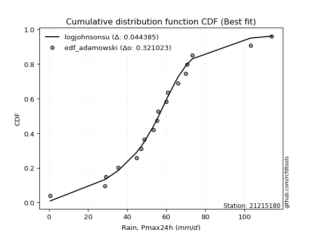</img></img>

</div>


## C. Best fit & Estimate extreme values for specific return periods - Tr


### 1. Best fit (ordered by delta Δ)

<div align="center">

|   id |   station | empirical_dist   | p_dist             |     delta |   deltao | eval   |   fit |   n |   best_fit |   best_fit_sort |
|-----:|----------:|:-----------------|:-------------------|----------:|---------:|:-------|------:|----:|-----------:|----------------:|
|    0 |  21215180 | edf_chegodayev   | laplace_asymmetric | 0.0485811 | 0.315645 | Δo > Δ |     1 |  19 |          1 |               1 |
|    1 |  21215180 | edf_jenkinson    | laplace_asymmetric | 0.0489535 | 0.315645 | Δo > Δ |     1 |  19 |          1 |               2 |
|    2 |  21215180 | edf_beard        | laplace_asymmetric | 0.0489535 | 0.315645 | Δo > Δ |     1 |  19 |          1 |               3 |
|    3 |  21215180 | edf_filliben     | laplace_asymmetric | 0.0492333 | 0.315645 | Δo > Δ |     1 |  19 |          1 |               4 |
|    4 |  21215180 | edf_tukey        | laplace_asymmetric | 0.0498253 | 0.315645 | Δo > Δ |     1 |  19 |          1 |               5 |
|    5 |  21215180 | edf_adamowski    | laplace_asymmetric | 0.0503563 | 0.315645 | Δo > Δ |     1 |  19 |          1 |               6 |
|    6 |  21215180 | edf_blom         | laplace            | 0.0511445 | 0.315645 | Δo > Δ |     1 |  19 |          1 |               7 |
|    7 |  21215180 | edf_cunnane      | laplace            | 0.0512798 | 0.315645 | Δo > Δ |     1 |  19 |          1 |               8 |
|    8 |  21215180 | edf_gringorten   | laplace            | 0.0514977 | 0.315645 | Δo > Δ |     1 |  19 |          1 |               9 |
|    9 |  21215180 | edf_hazen        | laplace            | 0.0518281 | 0.315645 | Δo > Δ |     1 |  19 |          1 |              10 |
|   10 |  21215180 | edf_weibull      | laplace_asymmetric | 0.0606127 | 0.315645 | Δo > Δ |     1 |  19 |          1 |              11 |
|   11 |  21215180 | edf_california   | logjohnsonsu       | 0.0764311 | 0.315645 | Δo > Δ |     1 |  19 |          1 |              12 |

</div>

:file_folder:Tables: [bestfit_21215180.csv](table/bestfit_21215180.csv) | [extreme_21215180.csv](table/extreme_21215180.csv)


### 2. Extreme values

In hydrology, a return period (or recurrence interval $Tr$) is the statistical average time between extreme events like floods or droughts of a specific magnitude, indicating how rare an event is, with a 100-year flood, for example, having a 1% chance of occurring in any given year, not that it happens exactly every century. It is a key tool for infrastructure design (like bridges or dams) and risk assessment, calculated from historical data to determine the probability of future events, although it is important to remember it is statistical average, and events can cluster or be missed.

> risk_rate: assuming the return period as the project useful life.

|   id |      tr |   prob_l |     prob_g |     alpha |   betaprime |     chi2 |   crystalball |   erlang |    expon |   exponnorm |        f |   fatiguelife |     fisk |    gamma |   genexpon |   genlogistic |   gibrat |   gompertz |   gumbel_l |   gumbel_r |   halflogistic |   halfnorm |   hypsecant |   invgamma |   invgauss |   invweibull |   johnsonsu |   kstwobign |   laplace |   laplace_asymmetric |        loggamma |   logistic |   lognorm |   maxwell |   mielke |    moyal |   nakagami |      ncf |      nct |     norm |           pareto |   pearson3 |   rayleigh |     rice |        t |   truncnorm |     wald |   weibull_min |   logalpha |   logbetaprime |          logchi2 |   logcrystalball |   logerlang |         logexpon |   logexponnorm |            logf |   logfatiguelife |   logfisk |      loggenexpon |   loggenlogistic |        loggibrat |   loggompertz |   loggumbel_l |   loggumbel_r |   loghalflogistic |   loghalfnorm |   loghypsecant |   loginvgamma |   loginvgauss |    loginvweibull |   logjohnsonsu |     logkstwobign |   loglaplace |   loglaplace_asymmetric |   logloggamma |   loglogistic |   loglognorm |   logmaxwell |   logmielke |    logmoyal |   lognakagami |         logncf |    lognct |   logpareto |   logpearson3 |   lograyleigh |   logrice |             logt |   logtruncnorm |          logwald |   logweibull_min |   station |   n |   risk_rate |
|-----:|--------:|---------:|-----------:|----------:|------------:|---------:|--------------:|---------:|---------:|------------:|---------:|--------------:|---------:|---------:|-----------:|--------------:|---------:|-----------:|-----------:|-----------:|---------------:|-----------:|------------:|-----------:|-----------:|-------------:|------------:|------------:|----------:|---------------------:|----------------:|-----------:|----------:|----------:|---------:|---------:|-----------:|---------:|---------:|---------:|-----------------:|-----------:|-----------:|---------:|---------:|------------:|---------:|--------------:|-----------:|---------------:|-----------------:|-----------------:|------------:|-----------------:|---------------:|----------------:|-----------------:|----------:|-----------------:|-----------------:|-----------------:|--------------:|--------------:|--------------:|------------------:|--------------:|---------------:|--------------:|--------------:|-----------------:|---------------:|-----------------:|-------------:|------------------------:|--------------:|--------------:|-------------:|-------------:|------------:|------------:|--------------:|---------------:|----------:|------------:|--------------:|--------------:|----------:|-----------------:|---------------:|-----------------:|-----------------:|----------:|----:|------------:|
|    0 |    2    | 0.5      | 0.5        |   1.25179 |     53.0522 |  52.4226 |       53.5316 |  53.2438 |  37.1666 |     53.1383 |  53.2687 |       53.2113 |  53.5777 |  53.2458 |    34.0666 |       53.7086 |  45.1965 |    94.3083 |    58.0934 |    48.9697 |        46.7018 |    47.8475 |     53.5316 |    51.3627 |    51.2525 |      49.6221 |     54.1001 |     47.9284 |   53.5316 |              54.3967 |     0.967376    |    53.5316 |   33.0204 |   51.1567 |  52.9791 |  47.497  |    37.8823 |  42.2222 |  54.2022 |  53.5316 |      0.262986    |    53.2267 |    50.3144 |  52.7775 |  53.5315 |     52.7936 |  44.5304 |       53.0817 |    31.9423 |        30.4545 |      1.74438     |          33.0204 |     30.0109 |      6.89063     |        33.0204 |    0.609901     |          33.1254 |   47.8192 |     10.8382      |          44.5569 |     20.4987      |       43.6861 |       42.8653 |       25.4366 |           22.3422 |       23.8551 |        33.0204 |       32.2576 |       29.6757 |     28.4128      |        54.8809 |     21.2085      |      33.0204 |                 43.8231 |       45.397  |       33.0204 |      32.9539 |      28.8263 |     40.7771 |     23.3816 |       32.9451 |   2.13315      |   33.0008 |    0.201525 |       57.8177 |       27.4704 |   33.0183 |     57.0608      |        5.13893 |     19.7322      |      0.482632    |  21215180 |  19 |    0.75     |
|    1 |    2.33 | 0.570815 | 0.429185   |   1.48926 |     58.0204 |  57.4638 |       58.4868 |  58.2073 |  45.3115 |     58.0593 |  58.2313 |       58.1701 |  57.9021 |  58.2097 |    41.5284 |       57.9952 |  47.7066 |    95.6067 |    62.4045 |    53.5613 |        51.4227 |    53.1955 |     57.4972 |    56.4048 |    56.3056 |      55.4005 |     57.752  |     53.9829 |   56.5302 |              57.3924 |     1.63013     |    57.8975 |   43.8407 |   56.3048 |  57.392  |  51.8435 |    45.604  |  49.9942 |  58.8506 |  58.4868 |      1.18427     |    58.1906 |    55.5387 |  57.872  |  58.4865 |     57.4386 |  47.7795 |       58.2761 |    45.1091 |        44.3135 |      3.69023     |          43.8407 |     41.3163 |     15.0299      |        43.8408 |    1.11015      |          44.0166 |   57.0059 |     20.3258      |          51.2952 |     23.6637      |       50.3379 |       54.8529 |       33.0766 |           29.2683 |       32.3915 |        41.4281 |       43.9712 |       41.648  |     45.4304      |        58.2965 |     35.2406      |      39.1989 |                 50.0566 |       52.6026 |       42.3875 |      43.7283 |      38.6969 |     52.0082 |     29.9811 |       43.7663 |   6.88775      |   43.8298 |    0.225206 |       69.2973 |       37.0376 |   43.8397 |     60.1315      |        7.93343 |     23.7624      |      0.695601    |  21215180 |  19 |    0.729209 |
|    2 |    5    | 0.8      | 0.2        |   3.3306  |     76.7212 |  76.8896 |       76.9017 |  76.8104 |  86.0339 |     76.5879 |  76.8208 |       76.7714 |  74.6209 |  76.814  |    78.8358 |       74.3762 |  62.1581 |    99.8013 |    76.3318 |    73.5091 |        72.7836 |    75.8113 |     73.4044 |    76.1609 |    76.2792 |      80.5044 |     72.3415 |     79.7011 |   71.5229 |              72.1768 |    31.847       |    74.7548 |  125.699  |   76.5674 |  73.7765 |  71.9769 |    79.2421 |  85.4444 |  76.5761 |  76.9017 | 916564           |    76.8084 |    76.4537 |  77.0294 |  76.901  |     74.8463 |  65.9685 |       77.4415 |   176.319  |       191.709  |    283.484       |         125.699  |    139.741  |    741.933       |       125.7    | 2324.2          |         126.645  |  112.355  |    403.035       |          74.9506 |     54.0861      |       79.5747 |      121.668  |      103.527  |           99.3179 |      118.098  |       102.909  |      142.284  |      154.987  |    349.051       |        69.8205 |    304.665       |      92.4089 |                 70.2499 |       78.1083 |      111.173  |     125.173  |     123.319  |    124.529  |     94.8401 |      125.775  |   1.24956e+07  |  125.848  |  inf        |      103.933  |      122.519  |  125.715  |     78.7887      |       32.3577  |     67.2562      |      9.1667      |  21215180 |  19 |    0.67232  |
|    3 |   10    | 0.9      | 0.1        |   6.7136  |     89.3345 |  90.3854 |       89.1177 |  89.2882 | 123      |     89.1612 |  89.281  |       89.2626 |  86.9561 |  89.2925 |   112.702  |       86.3274 |  78.631  |   102.137  |    84.0859 |    89.7563 |        90.5229 |    92.5465 |     86.1067 |    90.2118 |    90.6159 |     100.951  |     84.5858 |     99.2821 |   85.1328 |              85.5978 |   636.944       |    87.1695 |  252.811  |   90.8272 |  85.6997 |  89.5061 |   104.601  | 115.342  |  89.2    |  89.1177 |      2.4027e+11  |    89.3078 |    91.3666 |  89.8754 |  89.1169 |     86.4668 |  85.2713 |       89.9008 |   470.382  |       539.344  |  23845.2         |         252.811  |    322.104  |  25561.9         |       252.814  |    4.91901e+14  |         255.395  |  185.186  |   5634.27        |          89.2481 |    138.774       |      102.687  |      189.583  |      262.217  |          273.964  |      307.586  |       212.813  |      316.517  |      389.168  |   1837.17        |        82.007  |   1574.2         |     201.282  |                 83.0519 |       92.5052 |      226.152  |     251.575  |     278.781  |    226.964  |    258.491  |      253.377  |   6.12474e+27  |  253.384  |  inf        |      115.709  |      287.517  |  252.868  |    118.935       |       60.3464  |    202.882       |    252.492       |  21215180 |  19 |    0.651322 |
|    4 |   15    | 0.933333 | 0.0666667  |  10.0845  |     95.691  |  97.3042 |       95.2137 |  95.556  | 144.625  |     95.5508 |  95.5373 |       95.5415 |  93.6849 |  95.5606 |   132.513  |       92.8173 |  89.9933 |   103.194  |    87.5976 |    98.9228 |       100.562  |   101.255  |     93.3558 |    97.5253 |    98.109  |     112.487  |     92.0692 |    109.677  |   93.094  |              93.4485 |  3962.35        |    93.9337 |  358.287  |   98.1437 |  92.3618 |  99.6793 |   117.856  | 132.423  |  95.9221 |  95.2137 |      3.55091e+14 |    95.5898 |    99.0504 |  96.315  |  95.2131 |     92.2781 |  97.6667 |       96.0178 |   787.248  |       921.108  | 361151           |         358.287  |    492.576  | 202682           |       358.292  |    1.09075e+32  |         362.472  |  243.135  |  26149.6         |          96.4302 |    265.81        |      115.258  |      231.758  |      442.967  |          486.487  |      506.185  |       322.165  |      474.687  |      625.468  |   4688.99        |        92.698  |   3764.46        |     317.377  |                 91.5882 |       98.8811 |      332.991  |     356.448  |     423.659  |    312.25   |    462.555  |      359.394  |   7.13508e+58  |  359.307  |  inf        |      118.78   |      446.21   |  358.385  |    177.784       |       74.4737  |    412.253       |   2603.14        |  21215180 |  19 |    0.644736 |
|    5 |   20    | 0.95     | 0.05       |  13.4525  |     99.8763 | 101.902  |       99.2058 |  99.6754 | 159.967  |     99.786  |  99.6482 |       99.6699 |  98.3389 |  99.6802 |   146.569  |       97.2973 |  98.9062 |   103.853  |    89.7834 |   105.341  |       107.595  |   107.062  |     98.4697 |   102.428  |   103.141  |     120.564  |     97.6292 |    116.68   |   98.7426 |              99.0187 | 14852.3         |    98.6088 |  450.196  |  102.999  |  97.083  | 106.884  |   126.705  | 144.456  | 100.519  |  99.2058 |      6.29849e+16 |    99.7199 |   104.158  | 100.541  |  99.2054 |     96.0871 | 106.904  |       99.9845 |  1113.79   |      1316.88   |      2.58621e+06 |         450.196  |    652.456  | 880688           |       450.203  |    9.73752e+54  |         455.903  |  293.475  |  77605.2         |         101.303  |    442.574       |      123.848  |      262.624  |      639.453  |          727.433  |      705.582  |       431.634  |      620.401  |      858.139  |   9036.51        |       102.998  |   6772.82        |     438.425  |                 98.1718 |      102.793  |      435.082  |     447.831  |     559.294  |    388.482  |    698.46   |      451.844  |   2.65718e+99  |  451.656  |  inf        |      120.09   |      597.599  |  450.334  |    265.913       |       82.7821  |    699.239       |  16112.6         |  21215180 |  19 |    0.641514 |
|    6 |   25    | 0.96     | 0.04       |  16.8193  |    102.969  | 105.321  |      102.145  | 102.715  | 171.868  |    102.933  | 102.681  |      102.717  | 101.901  | 102.72   |   157.472  |      100.722  | 106.336  |   104.321  |    91.3389 |   110.285  |       113.014  |   111.382  |    102.427  |   106.096  |   106.91   |     126.786  |    102.112  |    121.925  |  103.124  |             103.339  | 41872.5         |   102.185  |  532.604  |  106.604  | 100.773  | 112.469  |   133.292  | 153.765  | 104.015  | 102.145  |      3.49635e+18 |   102.768  |   107.952  | 103.656  | 102.144  |     98.8924 | 114.302  |      102.884  |  1445.27   |      1719.31   |      1.21385e+07 |         532.604  |    803.638  |      2.75232e+06 |       532.613  |    1.8745e+83   |         539.757  |  338.914  | 180371           |         105.023  |    676.969       |      130.348  |      287.061  |      848.433  |          991.762  |      903.369  |       541.293  |      756.433  |     1086.17   |  14978.4         |       113.18   |  10515.4         |     563.296  |                103.603  |      105.55   |      533.846  |     529.77   |     687.369  |    458.758  |    961.321  |      534.781  |   8.66408e+148 |  534.49   |  inf        |      120.789  |      742.458  |  532.781  |    398.474       |       88.2239  |   1067.63        |  72721.9         |  21215180 |  19 |    0.639603 |
|    7 |   50    | 0.98     | 0.02       |  33.6479  |    111.878  | 115.271  |      110.56   | 111.456  | 208.834  |    112.103  | 111.401  |      111.483  | 112.794  | 111.461  |   191.338  |      111.178  | 132.528  |   105.593  |    95.5612 |   125.514  |       129.711  |   123.939  |    114.698  |   116.884  |   118.01   |     145.951  |    117.135  |    137.327  |  116.734  |             116.76   |     1.10368e+06 |   113.113  |  861.9    |  117.059  | 112.541  | 129.805  |   152.446  | 182.68   | 114.64   | 110.56   |      9.16541e+23 |   111.536  |   118.967  | 112.593  | 110.56   |    106.931  | 138.459  |      111.091  |  3124.76   |      3751.68   |      1.61276e+09 |         861.9    |   1469.86   |      9.48261e+07 |       861.917  |    8.71905e+298 |         875.42   |  526.141  |      2.47453e+06 |         116.575  |   3028.51        |      149.765  |      365.48   |     2027.37   |         2577.36   |     1852.68   |      1092.08   |     1341.97   |     2161.65   |  71044.5         |       165.27   |  38269.5         |    1226.95   |                122.464  |      112.926  |      997.393  |     857.227  |    1249.98   |    760.15   |   2591.4    |      866.498  | inf            |  865.717  |  inf        |      121.946  |     1394.11   |  862.245  |   3093.67        |      100.253   |   4251.16        |      1.29687e+07 |  21215180 |  19 |    0.63583  |
|    8 |   75    | 0.986667 | 0.0133333  |  50.4741  |    116.691  | 120.708  |      115.075  | 116.167  | 230.458  |    117.136  | 116.099  |      116.211  | 119.092  | 116.173  |   211.149  |      117.213  | 150.218  |   106.236  |    97.6964 |   134.366  |       139.417  |   130.775  |    121.869  |   122.851  |   124.156  |     157.091  |    126.792  |    145.802  |  124.695  |             124.611  |     7.70678e+06 |   119.424  | 1115.91   |  122.743  | 119.727  | 139.943  |   162.873  | 199.67   | 120.777  | 115.075  |      1.35454e+27 |   116.264  |   124.96   | 117.397  | 115.076  |    111.247  | 153.324  |      115.436  |  4802.31   |      5761.11   |      2.95759e+10 |        1115.91   |   2040.94   |      7.51881e+08 |      1115.93   |  inf            |        1134.83   |  678.304  |      1.14461e+07 |         123.503  |   8330.8         |      160.66   |      412.957  |     3363.75   |         4490.34   |     2739.08   |      1645.85   |     1831.6    |     3153.33   | 175584           |       221.992  |  77898.4         |    1934.63   |                135.051  |      116.599  |     1431.02   |    1109.86   |    1730.23   |   1016.2    |   4627.85   |     1122.63   | inf            | 1121.4    |  inf        |      122.24   |     1964.09   | 1116.39   |  24838.2         |      104.632   |   9948.88        |      3.78492e+08 |  21215180 |  19 |    0.634587 |
|    9 |  100    | 0.99     | 0.01       |  67.2998  |    119.96   | 124.425  |      118.13   | 119.363  | 245.801  |    120.593  | 119.285  |      119.418  | 123.542  | 119.368  |   225.205  |      121.473  | 163.922  |   106.657  |    99.093  |   140.63   |       146.286  |   135.431  |    126.956  |   126.96   |   128.39   |     164.975  |    134.075  |    151.608  |  130.344  |             130.181  |     3.09305e+07 |   123.88   | 1328.91   |  126.615  | 124.991  | 147.136  |   169.976  | 211.787  | 125.127  | 118.13   |      2.40264e+29 |   119.471  |   129.042  | 120.65   | 118.131  |    114.168  | 164.162  |      118.35   |  6464.99   |      7731.67   |      2.37154e+11 |        1328.91   |   2552.63   |      3.26706e+09 |      1328.94   |  inf            |        1352.61   |  811.548  |      3.39297e+07 |         128.553  |  18243.9         |      168.211  |      447.299  |     4813.43   |         6651.61   |     3575.04   |      2201.67   |     2263.58   |     4084.4    | 333123           |       284.87   | 126771           |    2672.5    |                144.759  |      118.983  |     1846.44   |    1321.74   |    2159.15   |   1246.92   |   6983.19   |     1337.54   | inf            | 1335.91   |  inf        |      122.365  |     2480.72   | 1329.52   | 204133           |      106.896   |  18492.9         |      4.80873e+09 |  21215180 |  19 |    0.633968 |
|   10 |  200    | 0.995    | 0.005      | 134.601   |    127.413  | 132.974  |      125.057  | 126.636  | 282.768  |    128.615  | 126.536  |      126.722  | 134.226  | 126.642  |   259.071  |      131.69   | 201.205  |   107.571  |   102.129  |   155.692  |       162.802  |   146.081  |    139.21   |   136.506  |   138.228  |     183.93   |    153.216  |    164.981  |  143.954  |             143.602  |     9.07325e+08 |   134.568  | 1975.09   |  135.473  | 138.318  | 164.465  |   186.215  | 241.269  | 135.676  | 125.057  |      6.29833e+34 |   126.774  |   138.383  | 128.038  | 125.059  |    120.794  | 191.158  |      124.891  | 12955.9    |     15255.6    |      3.76076e+13 |        1975.09   |   4261.76   |      1.1256e+11  |      1975.14   |  inf            |        2014.41   | 1247.84   |      4.65167e+08 |         141.321  | 153921           |      185.871  |      532.118  |    11392.2    |        17107.5    |     6574.28   |      4437.8    |     3674.63   |     7419.38   |      1.55321e+06 |       612.658  | 389165           |    5821.15   |                171.113  |      124.121  |     3402.98   |    1964.68   |    3583.63   |   2035.36   |  18816.4    |     1990.07   | inf            | 1987.1    |  inf        |      122.517  |     4232.84   | 1976.12   |      1.08093e+09 |      110.388   |  86622           |      3.597e+12   |  21215180 |  19 |    0.633042 |
|   11 |  250    | 0.996    | 0.004      | 168.251   |    129.701  | 135.619  |      127.174  | 128.866  | 294.668  |    131.123  | 128.758  |      128.962  | 137.659  | 128.872  |   269.974  |      134.969  | 214.582  |   107.84   |   103.022  |   160.534  |       168.111  |   149.358  |    143.155  |   139.486  |   141.299  |     190.023  |    159.891  |    169.12   |  148.335  |             147.923  |     2.71386e+09 |   138      | 2229.35   |  138.199  | 142.82   | 170.043  |   191.21   | 250.863  | 139.11   | 127.174  |      3.49627e+36 |   129.014  |   141.259  | 130.298  | 127.177  |    122.82   | 200.089  |      126.871  | 16118.3    |     18841.4    |      1.94658e+14 |        2229.35   |   4991.49   |      3.51773e+11 |      2229.41   |  inf            |        2275.19   | 1432.66   |      1.08056e+09 |         145.641  | 330838           |      191.412  |      560.009  |    15027.6    |        23178.2    |     7929.39   |      5561.12   |     4266.02   |     8929.2    |      2.5479e+06  |       830.731  | 550660           |    7479.1    |                180.579  |      125.622  |     4140.99   |    2217.72   |    4188.49   |   2381.73   |  25889.2    |     2247.02   | inf            | 2243.47   |  inf        |      122.541  |     4989.57   | 2230.54   |      8.36391e+10 |      111.101   | 144374           |      3.50066e+13 |  21215180 |  19 |    0.632858 |
|   12 |  500    | 0.998    | 0.002      | 336.503   |    136.518  | 143.554  |      133.452  | 135.498  | 331.635  |    138.736  | 135.367  |      135.627  | 148.315  | 135.504  |   303.841  |      145.139  | 260.813  |   108.611  |   105.582  |   175.563  |       184.591  |   159.127  |    155.408  |   148.506  |   150.59   |     208.937  |    182.351  |    181.522  |  161.945  |             161.343  |     8.32768e+10 |   148.642  | 3192.54   |  146.336  | 157.527  | 187.372  |   206.095  | 281.04   | 149.956  | 133.452  |      9.16519e+41 |   135.676  |   149.839  | 137.005  | 133.456  |    128.828  | 228.487  |      132.689  | 31338.5    |     35572.7    |      3.3252e+16  |        3192.54   |   8007.35   |      1.21197e+13 |      3192.63   |  inf            |        3264.53   | 2198.74   |      1.48136e+10 |         159.814  |      4.65686e+06 |      208.229  |      648.335  |    35499.9    |        59491      |    13864.7    |     11208.7    |     6662.22   |    15587.5    |      1.184e+07   |      2666.7    |      1.5583e+06  |   16290.7    |                213.454  |      129.902  |     7611.6    |    3176.58   |    6670.82   |   3876.44   |  69757.5    |     3221.1    | inf            | 3215.22   |  inf        |      122.581  |     8150.65   | 3194.41   |      3.34731e+20 |      112.541   | 732717           |      6.37707e+16 |  21215180 |  19 |    0.632489 |
|   13 |  750    | 0.998667 | 0.00133333 | 504.753   |    140.324  | 148.021  |      136.94   | 139.195  | 353.259  |    143.093  | 139.051  |      139.343  | 154.547  | 139.201  |   323.651  |      151.08   | 291.388  |   109.023  |   106.951  |   184.349  |       194.225  |   164.584  |    162.576  |   153.636  |   155.871  |     219.994  |    196.778  |    188.49   |  169.906  |             169.194  |     6.24822e+11 |   154.86   | 3897.38   |  150.887  | 166.672  | 197.509  |   214.407  | 298.985  | 156.458  | 136.94   |      1.35451e+45 |   139.391  |   154.636  | 140.735  | 136.944  |    132.167  | 245.514  |      135.888  | 45867.6    |     50945.9    |      6.86645e+17 |        3897.38   |  10437.9    |      9.60976e+13 |      3897.5    |  inf            |        3989.72   | 2823.97   |      6.85125e+10 |         168.685  |      2.67685e+07 |      217.814  |      701.121  |    58678.6    |       103221      |    18944.5    |     16889.3    |     8552.27   |    21350.5    |      2.90657e+07 |      6326.45   |      2.79539e+06 |   25686.8    |                235.393  |      132.178  |    10862.5    |    3878.5    |    8654.21   |   5151.89   | 124566      |     3934.51   | inf            | 3926.79   |  inf        |      122.591  |    10724.4    | 3899.78   |      1.98832e+30 |      113.025   |      1.94046e+06 |      6.96884e+18 |  21215180 |  19 |    0.632366 |
|   14 | 1000    | 0.999    | 0.001      | 673.004   |    142.953  | 151.12   |      139.341  | 141.745  | 368.601  |    146.152  | 141.591  |      141.908  | 158.97   | 141.752  |   337.707  |      155.294  | 314.785  |   109.301  |   107.872  |   190.581  |       201.058  |   168.353  |    167.661  |   157.219  |   159.557  |     227.836  |    207.627  |    193.317  |  175.555  |             174.764  |     2.62338e+12 |   159.269  | 4471.19   |  154.032  | 173.418  | 204.701  |   220.145  | 311.859  | 161.154  | 139.341  |      2.40258e+47 |   141.954  |   157.952  | 143.304  | 139.346  |    134.465  | 257.761  |      138.076  | 59919.4    |     65406.9    |      5.93158e+18 |        4471.19   |  12541.1    |      4.17561e+14 |      4471.32   |  inf            |        4580.69   | 3372.38   |      2.03082e+11 |         175.262  |      1.0206e+08  |      224.513  |      739.046  |    83809.9    |       152590      |    23502.2    |     22591.5    |    10165.8    |    26571      |      5.49593e+07 |     12849.8    |      4.1905e+06  |   35483.9    |                252.314  |      133.706  |    13978.6    |    4450.06   |   10360      |   6303.14   | 187958      |     4515.57   | inf            | 4506.3    |  inf        |      122.595  |    12963.8    | 4474.02   |      1.53248e+40 |      113.268   |      3.90984e+06 |      2.22433e+20 |  21215180 |  19 |    0.632305 |

<div align="center">

</img>

</div>


<div align="center">

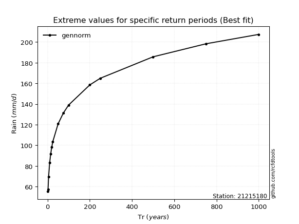</img>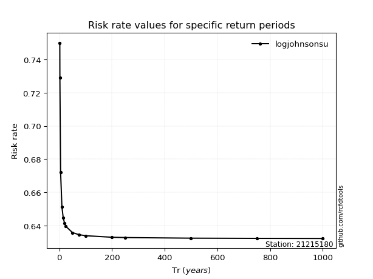</img>

</div>


<sub>**APP DISCLAIMER**: NO WARRANTY - This software is provided by [github.com/rcfdtools](https://github.com/rcfdtools) "as is", without any express or implied warranty, including warranties of merchantability, fitness for a particular purpose, or non-infringement. There is no guarantee that the software will be error-free or operate without interruption. LIMITATION OF LIABILITY - Neither the authors nor copyright holders will be liable for claims or damages arising from the software or its use. You are responsible for determining if the software is appropriate for your use and assume all associated risks, including errors, legal compliance, and data loss. NO PROFESSIONAL ADVICE - The software provides general information and does not offer professional advice. It should not replace consultation with professional advisors.</sub>