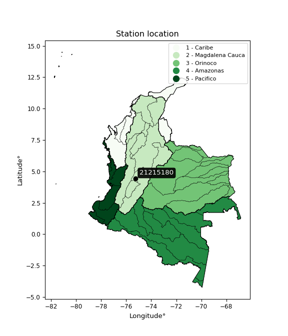

<div align="center">


</div>

# PMax24h Station (Rain, Pmax24h): 21215180

Maximum Precipitation in 24 hours (PMax24h) is the greatest amount of rainfall for a specific duration that is meteorologically possible for a given location, acting as a "worst-case" scenario for extreme storms, crucial for designing safety-critical infrastructure like bridges, river deviations, dams, spillways, and nuclear plants to prevent catastrophic failure. The PMax24h is related with the Probable Maximum Precipitation (PMP) and it is calculated by hydrologists using meteorological data to determine the upper limit of extreme rainfall, often leading to the Probable Maximum Flood (PMF) for flood control design, and is increasingly being studied for climate change impacts. Probable Maximum Precipitation (PMP) is the theoretical upper limit of rainfall, a deterministic estimate for extreme events, while probability distributions (like GEV, Gumbel) describe the likelihood and frequency of various precipitation amounts, including rare ones, showing how often events occur, with PMP representing the extreme end of these distributions, used for critical infrastructure design to ensure safety against the worst conceivable weather, unlike standard statistical forecasts which cover typical probabilities.

The most common probability distributions in hydrology, used for analyzing floods, rainfall, and streamflow, include the Normal, Log-Normal, Gumbel, Gamma (including Log-Pearson Type III), and Generalized Extreme Value (GEV) distributions, often chosen based on the data´s skewness and whether modeling extremes or general conditions, with Gumbel and GEV popular for extreme events like floods, while the Normal distribution serves as a baseline, though often requiring transformations for skewed hydrological data. These distributions help in designing water infrastructure, managing water resources, and forecasting hydrologic events.

> Hydrological data often isn´t perfectly normal (it´s skewed), so different distributions are needed for different applications, such as: **Flood Frequency Analysis**: Using Gumbel, GEV, or Log-Pearson Type III for predicting extreme flood magnitudes and their return periods, **Rainfall Analysis**: Normal for annual totals, but Log-Normal, Weibull, or GEV for intensity or extreme daily rainfall, **Streamflow Modeling**: Gamma and Log-Normal for maximum flows, GEV for minimum flows, and Kappa for daily flows.

<div align="center">

</img>

</div>


## A. General information


### 1. General running parameters

• app_version: _v20260225_. • runtime: _2026-02-27 14:50:08.749431_. • Python version: _3.14.0_. • SciPy version: _1.16.3_. • Pandas version: _2.3.3_. • NumPy version: _2.3.5_. • Stations dataset (station_dataset_file): _dataset/pmax24h_in/automatic_colombia_2003_2025.csv_. • Stations catalog (station_catalog_file): _dataset/CNE.xls_. • Minimum year to eval til year_max (date_min): _1900_. • Maximum year to eval since year_min (date_max): _2025_. • Creates, save and include plots into reports (create_plot): _False_. • Plot only fit distributions with Δo > Δ (plot_only_fit): _True_. • Plot only simple graphs avoiding multiple CDFs and multiple Extreme values plots (plot_only_simple): _False_. • Eval low extreme values, if False, evaluates high extreme values (low_extreme): _False_. • Eval every SciPy distribution as logarithmic (pdist_logarithmic_on): _True_. • Standard deviation normalized (ddof): _1.0_. • Return periods to eval in years (Tr): _[2, 2.33, 5, 10, 15, 20, 25, 50, 75, 100, 200, 250, 500, 750, 1000]_. • Minimum data sample per station, 0 means any (minimum_sample): _5_. • Z-Score maximum threshold to adjust a value, 0 means disable (zscore_max): _3.5_. • Z-Score minimum threshold to adjust a value, 0 means disable (zscore_min): _-2.5_. • Avoid zeros, e.g. rain = 0 (avoid_zeros): _True_. • Avoid null values (avoid_nans): _True_. 

:file_folder:Table: [dataset.csv](../../dataset/pmax24h_in/automatic_colombia_2003_2025.csv)

> Delta Degrees of Freedom (DDOF): is a parameter used in the formulas for calculating variance and standard deviation. When ddof=0, the divisor is $N$ (the total number of observations) and this is used when your data set is the entire population. When ddof=1, the divisor is $N-1$ and this is used when your data set is a sample drawn from a larger population. Using $N-1$ provides an unbiased estimate of the population variance (known as Bessel´s correction).


### 2. Station info and location

|   id |   CODIGO | NOMBRE                           | CATEGORIA               | TECNOLOGIA                | ESTADO           | FECHA_INSTALACION   |   FECHA_SUSPENSION |   ALTITUD |   LATITUD |   LONGITUD | DEPARTAMENTO   | MUNICIPIO   | AREA_OPERATIVA             | ENTIDAD                                                     | AREA_HIDROGRAFICA   | ZONA_HIDROGRAFICA   | SUBZONA_HIDROGRAFICA   |   CORRIENTE | Catalogo   |   Version |
|-----:|---------:|:---------------------------------|:------------------------|:--------------------------|:-----------------|:--------------------|-------------------:|----------:|----------:|-----------:|:---------------|:------------|:---------------------------|:------------------------------------------------------------|:--------------------|:--------------------|:-----------------------|------------:|:-----------|----------:|
|    0 | 21215180 | BATALLON ROOKE  - AUT [21215180] | Climatológica Principal | Automática con Telemetría | En Mantenimiento | 10/12/2005          |                nan |      1285 |   4.41806 |   -75.2481 | Tolima         | Ibagué      | Area Operativa 10 - Tolima | INSTITUTO DE HIDROLOGIA METEOROLOGIA Y ESTUDIOS AMBIENTALES | Magdalena Cauca     | Alto Magdalena      | Río Coello             |         nan | CNE_IDEAM  |  20251226 |

<div align="center">

Dynamic map: [:earth_americas:Google](http://maps.google.com/maps?q=4.4180556,-75.248055556) [:earth_americas:OSM](https://www.openstreetmap.org/#map=18/4.4180556/-75.248055556&layers=P) [:earth_americas:Bing](https://www.bing.com/maps?cp=4.4180556~-75.248055556&lvl=18) [:earth_americas:Apple](https://maps.apple.com/frame?center=4.4180556%2C-75.248055556&span=0.003%2C0.006)

</div>


<div align="center">

```geojson
{
  "type": "Feature",
  "geometry": {
    "type": "Point", 
    "coordinates": [-75.248055556, 4.4180556]
  }, 
  "properties": {
    "Name": "21215180"
  }
}
```

</div>


### 3. Discrete values table and plot

<div align="center">

|               |           0 |           1 |          2 |           3 |           4 |           5 |            6 |           7 |          8 |          9 |         10 |          11 |          12 |          13 |          14 |         15 |         16 |          17 |           18 |
|:--------------|------------:|------------:|-----------:|------------:|------------:|------------:|-------------:|------------:|-----------:|-----------:|-----------:|------------:|------------:|------------:|------------:|-----------:|-----------:|------------:|-------------:|
| Date          | 2006        | 2007        | 2008       | 2009        | 2010        | 2011        | 2012         | 2013        | 2014       | 2015       | 2016       | 2017        | 2018        | 2019        | 2020        | 2021       | 2022       | 2024        | 2025         |
| Value         |   35.4      |   69.9      |  103.1     |   55.7      |   70.8      |   60.8      |   55.3       |   48.7      |  114       |   59.9     |   28.7     |   53.5      |   66        |   47.2      |   44.7      |   29.1     |    0.7     |   73.4      |   54.7       |
| Value_initial |   35.4      |   69.9      |  103.1     |   55.7      |   70.8      |   60.8      |   55.3       |   48.7      |  114       |   59.9     |   28.7     |   53.5      |   66        |   47.2      |   44.7      |   29.1     |    0.7     |   73.4      |   54.7       |
| count         |   19        |   19        |   19       |   19        |   19        |   19        |   19         |   19        |   19       |   19       |   19       |   19        |   19        |   19        |   19        |   19       |   19       |   19        |   19         |
| mean          |   56.4      |   56.4      |   56.4     |   56.4      |   56.4      |   56.4      |   56.4       |   56.4      |   56.4     |   56.4     |   56.4     |   56.4      |   56.4      |   56.4      |   56.4      |   56.4     |   56.4     |   56.4      |   56.4       |
| std           |   25.4416   |   25.4416   |   25.4416  |   25.4416   |   25.4416   |   25.4416   |   25.4416    |   25.4416   |   25.4416  |   25.4416  |   25.4416  |   25.4416   |   25.4416   |   25.4416   |   25.4416   |   25.4416  |   25.4416  |   25.4416   |   25.4416    |
| zscore        |   -0.825421 |    0.530628 |    1.83558 |   -0.027514 |    0.566003 |    0.172945 |   -0.0432363 |   -0.302654 |    2.26401 |    0.13757 |   -1.08877 |   -0.113987 |    0.377335 |   -0.361613 |   -0.459877 |   -1.07305 |   -2.18933 |    0.668198 |   -0.0668198 |


</div>


> The initial value (value_initial) correspond to the initial obtained or null completed value, and value (value) is adjusted only when the initial value is outside the valid range (outlier) definite through the Z-Score value. If Z-Score is active, values out of range or outliers are replaced with the station mean value. A Z-Score (or standard score) measures how many standard deviations a data point is from the mean of a dataset, indicating its relative position; positive scores mean above the mean, negative mean below, and a score of zero is exactly at the mean, allowing for comparison of values from different distributions. It´s calculated using the formula $z=(x–μ)/σ$, where $x$ is the data point, $μ$ is the mean, and $σ$ is the standard deviation, helping identify outliers and understand probability.
>
> <sub>**Note**: In this study, "completing" (filling gaps in) and "extending" (forecasting or lengthening the historical record) rainfall data series are avoided for certain critical analyses because they introduce artificial bias and uncertainty, which can distort the statistics of rare events (extremes), alter day-to-day variability, and compromise the integrity and homogeneity of the original data. Some reasons against Completing/Extending rainfall data are: **Distortion of Extremes and Variability**: The primary issue is that most gap-filling or extension methods rely on averaging or regression with nearby stations, which inherently smooths the data. Rainfall is highly variable in space and time, with a large percentage of zero values and occasional large storms. Infilling methods often underestimate the highest values and overestimate the lowest (zero) values, which severely distorts analyses focused on flood frequency, drought severity, and intensity-duration-frequency (IDF) curves, **Loss of Data Homogeneity**: Infilled or extended data are synthetic estimates, not actual measurements. Combining these estimates with observed data can violate the assumption of data homogeneity, which requires that the data properties do not change over time. Inhomogeneity can lead to incorrect conclusions about long-term trends or changes in climate patterns, **Propagation of Errors**: Errors and biases from the original data (e.g., wind-induced undercatch, instrument errors, site changes) or the data used for imputation can propagate through the analysis, leading to unreliable hydrological models and inaccurate predictions, **Compromised Statistical Integrity**: For statistical analyses, especially those involving the frequency of events, using artificial data can introduce time bias or autocorrelation that doesn´t exist in reality, making it difficult to assess the true probability of events, **Difficulty in Validation**: It is difficult to accurately validate the quality of filled or extended data, especially for past periods where ground-truth measurements are unavailable. The reliability of imputation techniques heavily depends on the density of the surrounding station network and the complexity of the local topography.</sub>


### 4. Active continuous probability distributions from SciPy (80 of 104 available)

A Probability Density Function (PDF) describes the relative likelihood of a continuous random variable falling within a specific range, where the total area under its curve equals 1, and the area over any interval gives the actual probability for that range. Unlike discrete probabilities (like rolling a die), a PDF shows density, not direct probability for a single point (which is zero), with higher points indicating higher likelihood, often visualized as a bell curve for normal distributions.

A log of a probability density function (log-PDF) is simply the logarithm of the PDF´s value, denoted as $log(f(x))$, useful for converting multiplication of probabilities into addition, improving numerical stability with tiny numbers, and connecting to information theory concepts like entropy. Instead of dealing with very small probabilities (e.g., 0.000001), log-PDFs use negative numbers (e.g., $log(0.00001) ≈ -11.51$ that are easier for computers to handle, preventing underflow errors and simplifying complex calculations. In this study, each active probability distribution from SciPy is also evaluated in the $log$ form.

[scipy.stats](https://docs.scipy.org/doc/scipy/reference/stats.html) is a Python´s powerful submodule within the SciPy library for comprehensive statistical analysis, offering over 130 probability distributions (like Normal, Poisson, etc.), functions for descriptive stats (mean, variance), hypothesis testing (t-tests, chi-square), random variable generation, and statistical tests, making it essential for data science, modeling, and research. It provides tools to explore, model, and draw conclusions from data efficiently, working seamlessly with [NumPy](https://numpy.org/).

<div align="center">

|   id | p_dist           |   n_parameter | fit_method   | label                                                                       | active   | ref                                                                                                      |
|-----:|:-----------------|--------------:|:-------------|:----------------------------------------------------------------------------|:---------|:---------------------------------------------------------------------------------------------------------|
|    0 | alpha            |             3 | MLE          | Alpha                                                                       | True     | [:mortar_board:](https://docs.scipy.org/doc/scipy/reference/generated/scipy.stats.alpha.html)            |
|    1 | anglit           |             2 | MM           | Anglit                                                                      | True     | [:mortar_board:](https://docs.scipy.org/doc/scipy/reference/generated/scipy.stats.anglit.html)           |
|    2 | arcsine          |             2 | MM           | Arcsine                                                                     | True     | [:mortar_board:](https://docs.scipy.org/doc/scipy/reference/generated/scipy.stats.arcsine.html)          |
|    3 | argus            |             3 | MLE          | Argus                                                                       | True     | [:mortar_board:](https://docs.scipy.org/doc/scipy/reference/generated/scipy.stats.argus.html)            |
|    4 | beta             |             4 | MLE          | Beta                                                                        | True     | [:mortar_board:](https://docs.scipy.org/doc/scipy/reference/generated/scipy.stats.beta.html)             |
|    5 | betaprime        |             4 | MLE          | Beta prime                                                                  | True     | [:mortar_board:](https://docs.scipy.org/doc/scipy/reference/generated/scipy.stats.betaprime.html)        |
|    6 | bradford         |             3 | MLE          | Bradford                                                                    | True     | [:mortar_board:](https://docs.scipy.org/doc/scipy/reference/generated/scipy.stats.bradford.html)         |
|    7 | burr             |             4 | MLE          | Burr (Type III)                                                             | True     | [:mortar_board:](https://docs.scipy.org/doc/scipy/reference/generated/scipy.stats.burr.html)             |
|    8 | burr12           |             4 | MLE          | Burr (Type III) 12                                                          | True     | [:mortar_board:](https://docs.scipy.org/doc/scipy/reference/generated/scipy.stats.burr12.html)           |
|    9 | cosine           |             2 | MLE          | Cosine                                                                      | True     | [:mortar_board:](https://docs.scipy.org/doc/scipy/reference/generated/scipy.stats.cosine.html)           |
|   10 | crystalball      |             4 | MLE          | Crystalball                                                                 | True     | [:mortar_board:](https://docs.scipy.org/doc/scipy/reference/generated/scipy.stats.crystalball.html)      |
|   11 | dgamma           |             3 | MLE          | Double gamma                                                                | True     | [:mortar_board:](https://docs.scipy.org/doc/scipy/reference/generated/scipy.stats.dgamma.html)           |
|   12 | dweibull         |             3 | MLE          | Double Weibull                                                              | True     | [:mortar_board:](https://docs.scipy.org/doc/scipy/reference/generated/scipy.stats.dweibull.html)         |
|   13 | erlang           |             3 | MLE          | Erlang                                                                      | True     | [:mortar_board:](https://docs.scipy.org/doc/scipy/reference/generated/scipy.stats.erlang.html)           |
|   14 | exponnorm        |             3 | MLE          | Exponentially modified Normal                                               | True     | [:mortar_board:](https://docs.scipy.org/doc/scipy/reference/generated/scipy.stats.exponnorm.html)        |
|   15 | exponpow         |             3 | MLE          | Exponential power                                                           | True     | [:mortar_board:](https://docs.scipy.org/doc/scipy/reference/generated/scipy.stats.exponpow.html)         |
|   16 | exponweib        |             4 | MLE          | Exponentiated Weibull                                                       | True     | [:mortar_board:](https://docs.scipy.org/doc/scipy/reference/generated/scipy.stats.exponweib.html)        |
|   17 | f                |             4 | MLE          | F                                                                           | True     | [:mortar_board:](https://docs.scipy.org/doc/scipy/reference/generated/scipy.stats.f.html)                |
|   18 | fatiguelife      |             3 | MLE          | Fatigue-life (Birnbaum-Saunders)                                            | True     | [:mortar_board:](https://docs.scipy.org/doc/scipy/reference/generated/scipy.stats.fatiguelife.html)      |
|   19 | foldnorm         |             3 | MM           | Fold Normal                                                                 | True     | [:mortar_board:](https://docs.scipy.org/doc/scipy/reference/generated/scipy.stats.foldnorm.html)         |
|   20 | gamma            |             3 | MLE          | Gamma                                                                       | True     | [:mortar_board:](https://docs.scipy.org/doc/scipy/reference/generated/scipy.stats.gamma.html)            |
|   21 | gausshyper       |             6 | MLE          | Gauss hypergeometric                                                        | True     | [:mortar_board:](https://docs.scipy.org/doc/scipy/reference/generated/scipy.stats.gausshyper.html)       |
|   22 | genexpon         |             5 | MLE          | Generalized exponential                                                     | True     | [:mortar_board:](https://docs.scipy.org/doc/scipy/reference/generated/scipy.stats.genexpon.html)         |
|   23 | genextreme       |             3 | MLE          | Generalized exponential                                                     | True     | [:mortar_board:](https://docs.scipy.org/doc/scipy/reference/generated/scipy.stats.genextreme.html)       |
|   24 | gengamma         |             4 | MLE          | Generalized gamma                                                           | True     | [:mortar_board:](https://docs.scipy.org/doc/scipy/reference/generated/scipy.stats.gengamma.html)         |
|   25 | genhalflogistic  |             3 | MLE          | Generalized half-logistic                                                   | True     | [:mortar_board:](https://docs.scipy.org/doc/scipy/reference/generated/scipy.stats.genhalflogistic.html)  |
|   26 | genlogistic      |             3 | MLE          | Generalized logistic                                                        | True     | [:mortar_board:](https://docs.scipy.org/doc/scipy/reference/generated/scipy.stats.genlogistic.html)      |
|   27 | gennorm          |             3 | MLE          | Generalized Normal                                                          | True     | [:mortar_board:](https://docs.scipy.org/doc/scipy/reference/generated/scipy.stats.gennorm.html)          |
|   28 | genpareto        |             3 | MLE          | Generalized Pareto                                                          | True     | [:mortar_board:](https://docs.scipy.org/doc/scipy/reference/generated/scipy.stats.genpareto.html)        |
|   29 | gompertz         |             3 | MLE          | Gompertz (or truncated Gumbel)                                              | True     | [:mortar_board:](https://docs.scipy.org/doc/scipy/reference/generated/scipy.stats.gompertz.html)         |
|   30 | gumbel_l         |             2 | MM           | Gumbel Left Skew                                                            | True     | [:mortar_board:](https://docs.scipy.org/doc/scipy/reference/generated/scipy.stats.gumbel_l.html)         |
|   31 | gumbel_r         |             2 | MM           | Gumbel Right Skew                                                           | True     | [:mortar_board:](https://docs.scipy.org/doc/scipy/reference/generated/scipy.stats.gumbel_r.html)         |
|   32 | halfgennorm      |             3 | MLE          | Upper half of a generalized normal                                          | True     | [:mortar_board:](https://docs.scipy.org/doc/scipy/reference/generated/scipy.stats.halfgennorm.html)      |
|   33 | halflogistic     |             2 | MM           | Half-logistic                                                               | True     | [:mortar_board:](https://docs.scipy.org/doc/scipy/reference/generated/scipy.stats.halflogistic.html)     |
|   34 | halfnorm         |             2 | MM           | Half Normal                                                                 | True     | [:mortar_board:](https://docs.scipy.org/doc/scipy/reference/generated/scipy.stats.halfnorm.html)         |
|   35 | hypsecant        |             2 | MM           | hyperbolic secant                                                           | True     | [:mortar_board:](https://docs.scipy.org/doc/scipy/reference/generated/scipy.stats.hypsecant.html)        |
|   36 | invgamma         |             3 | MLE          | Inverted gamma                                                              | True     | [:mortar_board:](https://docs.scipy.org/doc/scipy/reference/generated/scipy.stats.invgamma.html)         |
|   37 | invgauss         |             3 | MLE          | Inverse Gaussian                                                            | True     | [:mortar_board:](https://docs.scipy.org/doc/scipy/reference/generated/scipy.stats.invgauss.html)         |
|   38 | invweibull       |             3 | MLE          | Inverted Weibull                                                            | True     | [:mortar_board:](https://docs.scipy.org/doc/scipy/reference/generated/scipy.stats.invweibull.html)       |
|   39 | johnsonsb        |             4 | MLE          | Johnson SB                                                                  | True     | [:mortar_board:](https://docs.scipy.org/doc/scipy/reference/generated/scipy.stats.johnsonsb.html)        |
|   40 | johnsonsu        |             4 | MLE          | Johnson Su                                                                  | True     | [:mortar_board:](https://docs.scipy.org/doc/scipy/reference/generated/scipy.stats.johnsonsu.html)        |
|   41 | kappa3           |             3 | MLE          | Kappa 3                                                                     | True     | [:mortar_board:](https://docs.scipy.org/doc/scipy/reference/generated/scipy.stats.kappa3.html)           |
|   42 | kappa4           |             4 | MLE          | Kappa 4                                                                     | True     | [:mortar_board:](https://docs.scipy.org/doc/scipy/reference/generated/scipy.stats.kappa4.html)           |
|   43 | ksone            |             3 | MLE          | Kolmogorov-Smirnov one-sided test statistic distribution                    | True     | [:mortar_board:](https://docs.scipy.org/doc/scipy/reference/generated/scipy.stats.ksone.html)            |
|   44 | kstwobign        |             2 | MLE          | Limiting distribution of scaled Kolmogorov-Smirnov two-sided test statistic | True     | [:mortar_board:](https://docs.scipy.org/doc/scipy/reference/generated/scipy.stats.kstwobign.html)        |
|   45 | laplace          |             2 | MM           | Laplace                                                                     | True     | [:mortar_board:](https://docs.scipy.org/doc/scipy/reference/generated/scipy.stats.laplace.html)          |
|   46 | levy_l           |             2 | MLE          | Left-skewed Levy                                                            | True     | [:mortar_board:](https://docs.scipy.org/doc/scipy/reference/generated/scipy.stats.levy_l.html)           |
|   47 | loggamma         |             3 | MLE          | Log gamma                                                                   | True     | [:mortar_board:](https://docs.scipy.org/doc/scipy/reference/generated/scipy.stats.loggamma.html)         |
|   48 | logistic         |             2 | MM           | Logistic (or Sech-squared)                                                  | True     | [:mortar_board:](https://docs.scipy.org/doc/scipy/reference/generated/scipy.stats.logistic.html)         |
|   49 | loglaplace       |             3 | MLE          | Log-Laplace                                                                 | True     | [:mortar_board:](https://docs.scipy.org/doc/scipy/reference/generated/scipy.stats.loglaplace.html)       |
|   50 | lomax            |             3 | MLE          | Lomax (Pareto of the second kind)                                           | True     | [:mortar_board:](https://docs.scipy.org/doc/scipy/reference/generated/scipy.stats.lomax.html)            |
|   51 | maxwell          |             2 | MM           | Maxwell                                                                     | True     | [:mortar_board:](https://docs.scipy.org/doc/scipy/reference/generated/scipy.stats.maxwell.html)          |
|   52 | mielke           |             4 | MLE          | Mielke Beta-Kappa / Dagum                                                   | True     | [:mortar_board:](https://docs.scipy.org/doc/scipy/reference/generated/scipy.stats.mielke.html)           |
|   53 | moyal            |             2 | MM           | Moyal                                                                       | True     | [:mortar_board:](https://docs.scipy.org/doc/scipy/reference/generated/scipy.stats.moyal.html)            |
|   54 | nakagami         |             3 | MLE          | Nakagami                                                                    | True     | [:mortar_board:](https://docs.scipy.org/doc/scipy/reference/generated/scipy.stats.nakagami.html)         |
|   55 | ncf              |             5 | MLE          | Non-central F distribution                                                  | True     | [:mortar_board:](https://docs.scipy.org/doc/scipy/reference/generated/scipy.stats.ncf.html)              |
|   56 | nct              |             4 | MLE          | Non-central Student’s t                                                     | True     | [:mortar_board:](https://docs.scipy.org/doc/scipy/reference/generated/scipy.stats.nct.html)              |
|   57 | norm             |             2 | MM           | Normal                                                                      | True     | [:mortar_board:](https://docs.scipy.org/doc/scipy/reference/generated/scipy.stats.norm.html)             |
|   58 | pearson3         |             3 | MM           | Pearson type III                                                            | True     | [:mortar_board:](https://docs.scipy.org/doc/scipy/reference/generated/scipy.stats.pearson3.html)         |
|   59 | powerlaw         |             3 | MLE          | Power-function                                                              | True     | [:mortar_board:](https://docs.scipy.org/doc/scipy/reference/generated/scipy.stats.powerlaw.html)         |
|   60 | rayleigh         |             2 | MM           | Rayleigh                                                                    | True     | [:mortar_board:](https://docs.scipy.org/doc/scipy/reference/generated/scipy.stats.rayleigh.html)         |
|   61 | rdist            |             3 | MLE          | R-distributed (symmetric beta)                                              | True     | [:mortar_board:](https://docs.scipy.org/doc/scipy/reference/generated/scipy.stats.rdist.html)            |
|   62 | rice             |             3 | MLE          | Rice                                                                        | True     | [:mortar_board:](https://docs.scipy.org/doc/scipy/reference/generated/scipy.stats.rice.html)             |
|   63 | semicircular     |             2 | MM           | Semicircular                                                                | True     | [:mortar_board:](https://docs.scipy.org/doc/scipy/reference/generated/scipy.stats.semicircular.html)     |
|   64 | skewnorm         |             3 | MLE          | Skew normal                                                                 | True     | [:mortar_board:](https://docs.scipy.org/doc/scipy/reference/generated/scipy.stats.skewnorm.html)         |
|   65 | t                |             3 | MLE          | Student’s t                                                                 | True     | [:mortar_board:](https://docs.scipy.org/doc/scipy/reference/generated/scipy.stats.t.html)                |
|   66 | trapezoid        |             4 | MLE          | Trapezoid                                                                   | True     | [:mortar_board:](https://docs.scipy.org/doc/scipy/reference/generated/scipy.stats.trapezoid.html)        |
|   67 | triang           |             3 | MLE          | Triangular                                                                  | True     | [:mortar_board:](https://docs.scipy.org/doc/scipy/reference/generated/scipy.stats.triang.html)           |
|   68 | truncexpon       |             3 | MLE          | Truncated exponential                                                       | True     | [:mortar_board:](https://docs.scipy.org/doc/scipy/reference/generated/scipy.stats.truncexpon.html)       |
|   69 | truncnorm        |             4 | MLE          | Truncated normal                                                            | True     | [:mortar_board:](https://docs.scipy.org/doc/scipy/reference/generated/scipy.stats.truncnorm.html)        |
|   70 | truncpareto      |             4 | MLE          | Upper truncated Pareto                                                      | True     | [:mortar_board:](https://docs.scipy.org/doc/scipy/reference/generated/scipy.stats.truncpareto.html)      |
|   71 | truncweibull_min |             5 | MLE          | Doubly truncated Weibull minimum                                            | True     | [:mortar_board:](https://docs.scipy.org/doc/scipy/reference/generated/scipy.stats.truncweibull_min.html) |
|   72 | tukeylambda      |             3 | MLE          | Tukey-Lamdba                                                                | True     | [:mortar_board:](https://docs.scipy.org/doc/scipy/reference/generated/scipy.stats.tukeylambda.html)      |
|   73 | uniform          |             2 | MLE          | Uniform                                                                     | True     | [:mortar_board:](https://docs.scipy.org/doc/scipy/reference/generated/scipy.stats.uniform.html)          |
|   74 | vonmises         |             3 | MLE          | Von Mises                                                                   | True     | [:mortar_board:](https://docs.scipy.org/doc/scipy/reference/generated/scipy.stats.vonmises.html)         |
|   75 | vonmises_line    |             3 | MLE          | Von Mises line                                                              | True     | [:mortar_board:](https://docs.scipy.org/doc/scipy/reference/generated/scipy.stats.vonmises_line.html)    |
|   76 | wald             |             2 | MM           | Wald                                                                        | True     | [:mortar_board:](https://docs.scipy.org/doc/scipy/reference/generated/scipy.stats.wald.html)             |
|   77 | weibull_max      |             3 | MLE          | Weibull maximum                                                             | True     | [:mortar_board:](https://docs.scipy.org/doc/scipy/reference/generated/scipy.stats.weibull_max.html)      |
|   78 | weibull_min      |             3 | MLE          | Weibull minimum                                                             | True     | [:mortar_board:](https://docs.scipy.org/doc/scipy/reference/generated/scipy.stats.weibull_min.html)      |
|   79 | wrapcauchy       |             3 | MLE          | Wrapped  Cauchy                                                             | True     | [:mortar_board:](https://docs.scipy.org/doc/scipy/reference/generated/scipy.stats.wrapcauchy.html)       |

</div>

> **n_parameter:** # arguments & localization & scale.
>
> **Fit methods:** (MLE) maximum likelihood, (MM) L-moments.
>
>**Inactive** (With the only purpose of prevent loops, zero divisions, infinite values, over high estimated values or horizontal trending for recurrence intervals estimations, the follow distributions were disabled.)**:** lognorm, norminvgauss, powernorm, powerlognorm, cauchy, halfcauchy, foldcauchy, skewcauchy, chi2, expon, fisk, genhyperbolic, geninvgauss, gibrat, kstwo, laplace_asymmetric, levy, levy_stable, ncx2, pareto, rel_breitwigner, recipinvgauss, studentized_range, loguniform, 


## B. Probability (PDF) vs. Empirical (EDF) distributions functions

A continuous probability distribution (CPD) describes probabilities for variables that can take any value within a range (like rain any time), unlike discrete variables with specific outcomes (like temperature). It uses a Probability Density Function (PDF), a curve where the total area under it equals 1, and the probability of the variable falling within an interval (a to b) is found by calculating the area under the curve between those points. A key feature is that the probability of hitting any single exact value is zero, so probabilities are always expressed for ranges, e.g., $P(a ≤ X ≤ b)$.

<div align="center">

Distributions parameters from station values
|     |   station | p_dist              |   n |              loc |            scale | shape                  | shape1                | shape2                 | shape3             |
|----:|----------:|:--------------------|----:|-----------------:|-----------------:|:-----------------------|:----------------------|:-----------------------|:-------------------|
|   0 |  21215180 | alpha               |  19 |   -210.895       |   3183.69        | 12.035017931388563     |                       |                        |                    |
|   1 |  21215180 | anglit              |  19 |     56.4         |     72.4417      |                        |                       |                        |                    |
|   2 |  21215180 | arcsine             |  19 |     21.3798      |     70.0404      |                        |                       |                        |                    |
|   3 |  21215180 | argus               |  19 |    -12.8415      |    129.14        | 2.8814838249597138e-06 |                       |                        |                    |
|   4 |  21215180 | beta                |  19 |   -223.229       |   5336.89        | 121.00995701292618     | 2188.5851873620713    |                        |                    |
|   5 |  21215180 | betaprime           |  19 |   -236.633       |  16191.5         | 142.99933377570764     | 7902.397103136347     |                        |                    |
|   6 |  21215180 | bradford            |  19 |      0.699909    |    113.3         | 2.136799660335516      |                       |                        |                    |
|   7 |  21215180 | burr                |  19 |    -97.3349      |    158.277       | 13.192026703783236     | 0.7221389637640806    |                        |                    |
|   8 |  21215180 | burr12              |  19 |    -18.5492      |    848.591       | 3.2276099481911436     | 1789.0739639531143    |                        |                    |
|   9 |  21215180 | cosine              |  19 |     57.2572      |     23.3729      |                        |                       |                        |                    |
|  10 |  21215180 | crystalball         |  19 |     56.4         |     24.763       | 32832.96449971981      | 828.6574675741758     |                        |                    |
|  11 |  21215180 | dgamma              |  19 |     55.3         |     20.3277      | 0.7918257838942222     |                       |                        |                    |
|  12 |  21215180 | dweibull            |  19 |     55.7         |     18.0306      | 0.8566249392869818     |                       |                        |                    |
|  13 |  21215180 | erlang              |  19 |   -233.402       |      2.10981     | 137.35935650307027     |                       |                        |                    |
|  14 |  21215180 | exponnorm           |  19 |     41.0309      |     19.5203      | 0.7873414380713388     |                       |                        |                    |
|  15 |  21215180 | exponpow            |  19 |      0.7         |      3.76471     | 0.12506186853928508    |                       |                        |                    |
|  16 |  21215180 | exponweib           |  19 |   -893.167       |    669.256       | 1104.2372772859217     | 5.752636447307584     |                        |                    |
|  17 |  21215180 | f                   |  19 |   -463.826       |    519.06        | 206322.99518548543     | 892.8115177609009     |                        |                    |
|  18 |  21215180 | fatiguelife         |  19 |   -358.17        |    413.835       | 0.05962216467973447    |                       |                        |                    |
|  19 |  21215180 | foldnorm            |  19 |      8.98659     |     26.2223      | 1.7779573015144037     |                       |                        |                    |
|  20 |  21215180 | gamma               |  19 |   -233.403       |      2.10981     | 137.35981489013284     |                       |                        |                    |
|  21 |  21215180 | gausshyper          |  19 |   -117.079       |    556.65        | 33.88830396620892      | 14.389418879796096    | -69.26871242407975     | -0.910372908882696 |
|  22 |  21215180 | genexpon            |  19 |      0.7         |      2.26041     | 0.039216364662027776   | 0.0014744157158712461 | 0.6978567560958779     |                    |
|  23 |  21215180 | genextreme          |  19 |     47.1132      |     24.2184      | 0.22309138999982925    |                       |                        |                    |
|  24 |  21215180 | gengamma            |  19 |   -106.923       |     49.5564      | 10.995776207631081     | 1.991416535221366     |                        |                    |
|  25 |  21215180 | genhalflogistic     |  19 |    -11.0031      |    127.543       | 1.0203222434707107     |                       |                        |                    |
|  26 |  21215180 | genlogistic         |  19 |     52.5702      |     13.8504      | 1.1731680839152085     |                       |                        |                    |
|  27 |  21215180 | gennorm             |  19 |     55.3         |      8.6293      | 0.6916289732931619     |                       |                        |                    |
|  28 |  21215180 | genpareto           |  19 |     -0.255457    |    119.895       | -1.0493597448270495    |                       |                        |                    |
|  29 |  21215180 | gompertz            |  19 |     28.6999      |     44.3248      | 0.7672959447253263     |                       |                        |                    |
|  30 |  21215180 | gumbel_l            |  19 |     67.5447      |     19.3076      |                        |                       |                        |                    |
|  31 |  21215180 | gumbel_r            |  19 |     45.2553      |     19.3076      |                        |                       |                        |                    |
|  32 |  21215180 | halfgennorm         |  19 |      0.7         |      3.81275     | 0.3897689785806312     |                       |                        |                    |
|  33 |  21215180 | halflogistic        |  19 |     27.0501      |     21.1715      |                        |                       |                        |                    |
|  34 |  21215180 | halfnorm            |  19 |     23.6235      |     41.0792      |                        |                       |                        |                    |
|  35 |  21215180 | hypsecant           |  19 |     56.4         |     15.7646      |                        |                       |                        |                    |
|  36 |  21215180 | invgamma            |  19 |   -235.384       |  40102.5         | 138.42528046400787     |                       |                        |                    |
|  37 |  21215180 | invgauss            |  19 |    -85.3981      |   4060.91        | 0.03480376258707725    |                       |                        |                    |
|  38 |  21215180 | invweibull          |  19 |     -1.38505e+09 |      1.38505e+09 | 56702432.80564515      |                       |                        |                    |
|  39 |  21215180 | johnsonsb           |  19 | -94732.5         | 161529           | -555.0380687856693     | 1581.9980799005145    |                        |                    |
|  40 |  21215180 | johnsonsu           |  19 |     54.5132      |     16.6204      | -0.06515700040282013   | 1.01994011499287      |                        |                    |
|  41 |  21215180 | kappa3              |  19 |      0.7         |     69.182       | 7.498306235450396      |                       |                        |                    |
|  42 |  21215180 | kappa4              |  19 |    -11.1186      |    123.206       | 1.1060105946318197     | 0.9840257622132615    |                        |                    |
|  43 |  21215180 | ksone               |  19 |    -10.63        |    135.96        | 1.0                    |                       |                        |                    |
|  44 |  21215180 | kstwobign           |  19 |    -47.7925      |    120.215       |                        |                       |                        |                    |
|  45 |  21215180 | laplace             |  19 |     56.4         |     17.5101      |                        |                       |                        |                    |
|  46 |  21215180 | levy_l              |  19 |    119.672       |     38.2786      |                        |                       |                        |                    |
|  47 |  21215180 | loggamma            |  19 |  -7560.42        |   1026.3         | 1672.1570693562057     |                       |                        |                    |
|  48 |  21215180 | logistic            |  19 |     56.4         |     13.6526      |                        |                       |                        |                    |
|  49 |  21215180 | loglaplace          |  19 |     -0.154829    |     55.4549      | 2.132660293132658      |                       |                        |                    |
|  50 |  21215180 | lomax               |  19 |      0.7         |      3.46329e+08 | 6236598.103597306      |                       |                        |                    |
|  51 |  21215180 | maxwell             |  19 |     -2.27792     |     36.7709      |                        |                       |                        |                    |
|  52 |  21215180 | mielke              |  19 |    -97.3349      |    158.277       | 9.526481445009091      | 13.192029162174157    |                        |                    |
|  53 |  21215180 | moyal               |  19 |     42.2389      |     11.1473      |                        |                       |                        |                    |
|  54 |  21215180 | nakagami            |  19 |   -145.941       |    203.851       | 16.865432005927026     |                       |                        |                    |
|  55 |  21215180 | ncf                 |  19 |     -0.0363086   |      3.88113e-09 | 5.951071561721297e-10  | 3.0813801797104894    | 7.365921637237575      |                    |
|  56 |  21215180 | nct                 |  19 |     53.05        |     15.7398      | 2.6179604757316755     | 0.13867396222807804   |                        |                    |
|  57 |  21215180 | norm                |  19 |     56.4         |     24.763       |                        |                       |                        |                    |
|  58 |  21215180 | pearson3            |  19 |     56.4         |     24.763       | 0.2695962931204952     |                       |                        |                    |
|  59 |  21215180 | powerlaw            |  19 |      0.7         |    113.3         | 0.3490312154467284     |                       |                        |                    |
|  60 |  21215180 | rayleigh            |  19 |      9.0269      |     37.7983      |                        |                       |                        |                    |
|  61 |  21215180 | rdist               |  19 |     -9.93498     |     70.735       | 0.9902213505067572     |                       |                        |                    |
|  62 |  21215180 | rice                |  19 |     28.6295      |     10.8203      | 1.914538096745343e-08  |                       |                        |                    |
|  63 |  21215180 | semicircular        |  19 |     56.4         |     49.526       |                        |                       |                        |                    |
|  64 |  21215180 | skewnorm            |  19 |     36.2668      |     31.9148      | 1.307187441071632      |                       |                        |                    |
|  65 |  21215180 | t                   |  19 |     56.4202      |     24.6913      | 14.232059469348886     |                       |                        |                    |
|  66 |  21215180 | trapezoid           |  19 |    -11.1615      |    135.96        | 0.9999999999999999     | 1.0                   |                        |                    |
|  67 |  21215180 | triang              |  19 |     -7.46315     |    130.856       | 0.4796334161987038     |                       |                        |                    |
|  68 |  21215180 | truncexpon          |  19 |      0.699948    |    171.689       | 0.6599147204480454     |                       |                        |                    |
|  69 |  21215180 | truncnorm           |  19 |     -0.166275    |      5.60137     | -0.2311529257789513    | 20.38185188640481     |                        |                    |
|  70 |  21215180 | truncpareto         |  19 |      0.7         |      3.08825e-07 | 0.055555560174879406   | 366874021.67595166    |                        |                    |
|  71 |  21215180 | truncweibull_min    |  19 |     -1.24163     |    188.482       | 1.3025058897311275     | 0.0011356395589948915 | 0.6114211305610675     |                    |
|  72 |  21215180 | tukeylambda         |  19 |     -8.6821      |    101.448       | 1.2359321576802689     |                       |                        |                    |
|  73 |  21215180 | uniform             |  19 |      0.7         |    113.3         |                        |                       |                        |                    |
|  74 |  21215180 | vonmises            |  19 |     -2.48801     |      1           | 0.6230846327177113     |                       |                        |                    |
|  75 |  21215180 | vonmises_line       |  19 |     57.3498      |     18.0323      | 1.1749819286731933     |                       |                        |                    |
|  76 |  21215180 | wald                |  19 |     31.637       |     24.763       |                        |                       |                        |                    |
|  77 |  21215180 | weibull_max         |  19 |    114           |      1.7634      | 0.21414405178213147    |                       |                        |                    |
|  78 |  21215180 | weibull_min         |  19 |    -18.5619      |     83.3864      | 3.2269619888143186     |                       |                        |                    |
|  79 |  21215180 | wrapcauchy          |  19 |      0.552475    |     18.0558      | 2.3952859234472076e-06 |                       |                        |                    |
|  80 |  21215180 | logalpha            |  19 |    -43.6177      |   1989.46        | 42.01862904101323      |                       |                        |                    |
|  81 |  21215180 | loganglit           |  19 |      3.79245     |      3.03521     |                        |                       |                        |                    |
|  82 |  21215180 | logarcsine          |  19 |      2.32514     |      2.93462     |                        |                       |                        |                    |
|  83 |  21215180 | logargus            |  19 |     -2.5323      |      7.29599     | 3.5891377811719787     |                       |                        |                    |
|  84 |  21215180 | logbeta             |  19 |     -3.52451e+07 |      3.52451e+07 | 45298229.72089882      | 1.2568373254706366    |                        |                    |
|  85 |  21215180 | logbetaprime        |  19 |  -1920.24        |   1324.83        | 8313418.367257843      | 5724365.500728834     |                        |                    |
|  86 |  21215180 | logbradford         |  19 |     -0.356681    |      5.16759     | 1.5749950569664087e-05 |                       |                        |                    |
|  87 |  21215180 | logburr             |  19 |  -3791.74        |   3772.2         | 2265.021953550228      | 787359.0561576963     |                        |                    |
|  88 |  21215180 | logburr12           |  19 |  -9284.91        |   9292.56        | 19209.930459089563     | 1451.9949408147695    |                        |                    |
|  89 |  21215180 | logcosine           |  19 |      3.27089     |      1.30573     |                        |                       |                        |                    |
|  90 |  21215180 | logcrystalball      |  19 |      3.79246     |      1.03754     | 596.292091747146       | 147.33061095385017    |                        |                    |
|  91 |  21215180 | logdgamma           |  19 |      4.01277     |      0.694396    | 0.8202179043114495     |                       |                        |                    |
|  92 |  21215180 | logdweibull         |  19 |      4.01277     |      0.307599    | 0.6848499142792053     |                       |                        |                    |
|  93 |  21215180 | logerlang           |  19 |    -12.4254      |      0.0869158   | 186.42557296921245     |                       |                        |                    |
|  94 |  21215180 | logexponnorm        |  19 |      3.79182     |      1.03753     | 0.0006283883504237768  |                       |                        |                    |
|  95 |  21215180 | logexponpow         |  19 |     -0.356675    |      2.79575     | 0.5878683306485586     |                       |                        |                    |
|  96 |  21215180 | logexponweib        |  19 |     -3.58563e+07 |      3.58563e+07 | 0.3485079484779863     | 146466076.89739367    |                        |                    |
|  97 |  21215180 | logf                |  19 |     -0.356675    |      1.29651     | 1.0730008761621441     | 1.2283434629214853    |                        |                    |
|  98 |  21215180 | logfatiguelife      |  19 |  -1243.96        |   1247.75        | 0.0008278791352712631  |                       |                        |                    |
|  99 |  21215180 | logfoldnorm         |  19 |      1.16653     |      0.792676    | 3.3591777794299165     |                       |                        |                    |
| 100 |  21215180 | loggamma            |  19 |    -16.8388      |      0.0613931   | 335.9035801929215      |                       |                        |                    |
| 101 |  21215180 | loggausshyper       |  19 |     -1.11333     |      5.84953     | 1.8573764482468655     | 0.5056288978592074    | 0.8652172719549112     | 0.4361805410582179 |
| 102 |  21215180 | loggenexpon         |  19 |     -0.720544    |      0.0243989   | 1.4710203869717747e-06 | 1.5310035543061384    | 3.6237791544385225e-05 |                    |
| 103 |  21215180 | loggenextreme       |  19 |      3.77503     |      0.92013     | 0.9547803035173855     |                       |                        |                    |
| 104 |  21215180 | loggengamma         |  19 |     -5.42611e+06 |      5.42611e+06 | 0.07303812196943411    | 82116971.40698639     |                        |                    |
| 105 |  21215180 | loggenhalflogistic  |  19 |     -0.890792    |      6.02589     | 1.0708911907955483     |                       |                        |                    |
| 106 |  21215180 | loggenlogistic      |  19 |      4.38319     |      0.145499    | 0.22744012414614428    |                       |                        |                    |
| 107 |  21215180 | loggennorm          |  19 |      4.01277     |      0.00592485  | 0.31678998950490855    |                       |                        |                    |
| 108 |  21215180 | loggenpareto        |  19 |     -0.395597    |     10.4657      | -2.03938476203778      |                       |                        |                    |
| 109 |  21215180 | loggompertz         |  19 |     -0.404336    |      0.484884    | 8.769404308842246e-05  |                       |                        |                    |
| 110 |  21215180 | loggumbel_l         |  19 |      4.2594      |      0.808963    |                        |                       |                        |                    |
| 111 |  21215180 | loggumbel_r         |  19 |      3.32551     |      0.808963    |                        |                       |                        |                    |
| 112 |  21215180 | loghalfgennorm      |  19 |     -0.358234    |      5.09984     | 3623.833820451801      |                       |                        |                    |
| 113 |  21215180 | loghalflogistic     |  19 |      2.56276     |      0.887038    |                        |                       |                        |                    |
| 114 |  21215180 | loghalfnorm         |  19 |      2.41917     |      1.72116     |                        |                       |                        |                    |
| 115 |  21215180 | loghypsecant        |  19 |      3.79246     |      0.660516    |                        |                       |                        |                    |
| 116 |  21215180 | loginvgamma         |  19 |    -32.2178      |  38415.3         | 1067.6548435133186     |                       |                        |                    |
| 117 |  21215180 | loginvgauss         |  19 |     -9.50038     |   1362.75        | 0.009706632147662875   |                       |                        |                    |
| 118 |  21215180 | loginvweibull       |  19 |     -2.63904e+08 |      2.63904e+08 | 157369005.1834017      |                       |                        |                    |
| 119 |  21215180 | logjohnsonsb        |  19 |   -216.953       |    221.926       | -8.858125628908063     | 1.6257575515524874    |                        |                    |
| 120 |  21215180 | logjohnsonsu        |  19 |      4.10801     |      0.167502    | 0.34240980699609946    | 0.6871251823951683    |                        |                    |
| 121 |  21215180 | logkappa3           |  19 |     -0.356675    |      5.09238     | 25252.518435505874     |                       |                        |                    |
| 122 |  21215180 | logkappa4           |  19 |     -0.520361    |      7.2527      | 1.0105291110591272     | 1.3797430035267508    |                        |                    |
| 123 |  21215180 | logksone            |  19 |     -0.865962    |      6.11145     | 1.0                    |                       |                        |                    |
| 124 |  21215180 | logkstwobign        |  19 |     -3.53043     |      8.49434     |                        |                       |                        |                    |
| 125 |  21215180 | loglaplace          |  19 |      3.79246     |      0.733649    |                        |                       |                        |                    |
| 126 |  21215180 | loglevy_l           |  19 |      4.80811     |      0.472749    |                        |                       |                        |                    |
| 127 |  21215180 | logloggamma         |  19 |      4.49949     |      0.252207    | 0.3690361244788899     |                       |                        |                    |
| 128 |  21215180 | loglogistic         |  19 |      3.79246     |      0.572024    |                        |                       |                        |                    |
| 129 |  21215180 | logloglaplace       |  19 |     -9.88417e+07 |      9.88417e+07 | 215672258.46164882     |                       |                        |                    |
| 130 |  21215180 | loglomax            |  19 |     -0.356675    |      3.08204e+13 | 6249682358494.086      |                       |                        |                    |
| 131 |  21215180 | logmaxwell          |  19 |      1.3339      |      1.54067     |                        |                       |                        |                    |
| 132 |  21215180 | logmielke           |  19 |     -3.7117e+07  |      3.7117e+07  | 55533289.256430015     | 261590331.32961294    |                        |                    |
| 133 |  21215180 | logmoyal            |  19 |      3.19913     |      0.467055    |                        |                       |                        |                    |
| 134 |  21215180 | lognakagami         |  19 |  -2534.88        |   2538.67        | 1495371.357933788      |                       |                        |                    |
| 135 |  21215180 | logncf              |  19 |     -0.356675    |      1.13747     | 1.1835057114149152     | 1.3548181540339028    | 0.9618858649557046     |                    |
| 136 |  21215180 | lognct              |  19 |    -72.9359      |      0.995958    | 27985.613198612562     | 77.03734922754936     |                        |                    |
| 137 |  21215180 | lognorm             |  19 |      3.79246     |      1.03754     |                        |                       |                        |                    |
| 138 |  21215180 | logpearson3         |  19 |      3.79246     |      1.03754     | -3.28327205016826      |                       |                        |                    |
| 139 |  21215180 | logpowerlaw         |  19 |     -1.67656e+07 |      1.67656e+07 | 17765007.780102476     |                       |                        |                    |
| 140 |  21215180 | lograyleigh         |  19 |      1.80759     |      1.5837      |                        |                       |                        |                    |
| 141 |  21215180 | logrdist            |  19 |      0.139652    |      0.496327    | 1.6112833346959852     |                       |                        |                    |
| 142 |  21215180 | logrice             |  19 |  -1097.06        |      1.03761     | 1060.9524702384665     |                       |                        |                    |
| 143 |  21215180 | logsemicircular     |  19 |      3.79245     |      2.07507     |                        |                       |                        |                    |
| 144 |  21215180 | logskewnorm         |  19 |      4.7362      |      1.40247     | -5718206.612349873     |                       |                        |                    |
| 145 |  21215180 | logt                |  19 |      4.03798     |      0.21453     | 1.2682239413576633     |                       |                        |                    |
| 146 |  21215180 | logtrapezoid        |  19 |     -0.90926     |      6.11145     | 0.9999999999999999     | 1.0                   |                        |                    |
| 147 |  21215180 | logtriang           |  19 |     -0.671855    |      5.40847     | 0.9999238765837841     |                       |                        |                    |
| 148 |  21215180 | logtruncexpon       |  19 |     -0.498207    |      9.10499     | 0.5748943742432759     |                       |                        |                    |
| 149 |  21215180 | logtruncnorm        |  19 |      1.63108     |      6.32719     | -0.3141607961789227    | 0.4907583435512865    |                        |                    |
| 150 |  21215180 | logtruncpareto      |  19 |     -0.356675    |      2.44558e-08 | 0.0013866904343391609  | 208247858.30968785    |                        |                    |
| 151 |  21215180 | logtruncweibull_min |  19 |     -0.412719    |      7.46489     | 1.564783160383181      | 7.063363916680286e-09 | 0.68975148452622       |                    |
| 152 |  21215180 | logtukeylambda      |  19 |      0.0416431   |      2.75925e-24 | -0.0013284581406641984 |                       |                        |                    |
| 153 |  21215180 | loguniform          |  19 |     -0.356675    |      5.09287     |                        |                       |                        |                    |
| 154 |  21215180 | logvonmises         |  19 |     -2.2028      |      1           | 4.276972465354899      |                       |                        |                    |
| 155 |  21215180 | logvonmises_line    |  19 |      3.93405     |      1.36578     | 3.938240531940595      |                       |                        |                    |
| 156 |  21215180 | logwald             |  19 |      2.75489     |      1.03756     |                        |                       |                        |                    |
| 157 |  21215180 | logweibull_max      |  19 |      4.73874     |      0.963713    | 1.047356606202756      |                       |                        |                    |
| 158 |  21215180 | logweibull_min      |  19 |     -3.19698e+08 |      3.19698e+08 | 396207566.6241582      |                       |                        |                    |
| 159 |  21215180 | logwrapcauchy       |  19 |     -0.356725    |      0.810564    | 0.4200587617479181     |                       |                        |                    |

</div>

> **loc** (Location parameter): This shifts the distribution along the x-axis. For many common distributions, like the normal (Gaussian) distribution, loc represents the mean $μ$. For others, like the uniform distribution, it might represent the minimum value, or for the beta distribution, the left end of the support interval.
>
> **scale** (Scale parameter): This determines the width or spread of the distribution. For the normal distribution, scale represents the standard deviation $σ$. For a uniform distribution, it defines the length of the interval (from $loc$ to $loc + scale$).
>
> **shape** (Shape parameters): Refers to parameters that define the specific form of a probability distribution, distinct from its location (loc) and scale (scale). These parameters are required arguments for most distribution functions. For example, a normal (Gaussian) distribution is fully defined by its location (mean) and scale (standard deviation), so it has no specific shape parameters beyond loc and scale. However, other distributions have intrinsic properties that need specification, as Gamma distribution that takes a shape parameter, often named $a$ or $alpha$.


### 0. Cumulative distribution values - CDF (160 evaluated)

Cumulative Distribution Function (CDF), denoted as $F$<sub>$X$</sub>$(x)$, is a function that gives the probability that a random variable $X$ will take a value less than or equal to a specific value, $x$ (i.e., $(P(X≥x)$. It essentially "accumulates" probabilities from a given point up to the far right (positive infinity), providing a complete picture of the distribution´s probabilities for both discrete (like rain) and continuous (like temperature) variables, helping to find probabilities over ranges or above certain values. Each station is evaluated separately ordering the $x$ values ascending, calculating the CDF and PDF values for the activated distributions and their logarithmic forms.

<div align="center">

CDF ordered by x ascending and calculating $log(f(x))$ separately
|   id |   Station |   date |     x |   count |   mean |     std |     zscore |   Value_initial |   station |   m |      alpha |   alpha_pdf |      anglit |   anglit_pdf |   arcsine |   arcsine_pdf |     argus |   argus_pdf |       beta |   beta_pdf |   betaprime |   betaprime_pdf |   bradford |   bradford_pdf |      burr |    burr_pdf |     burr12 |   burr12_pdf |     cosine |   cosine_pdf |   crystalball |   crystalball_pdf |    dgamma |   dgamma_pdf |   dweibull |   dweibull_pdf |     erlang |   erlang_pdf |   exponnorm |   exponnorm_pdf |   exponpow |   exponpow_pdf |   exponweib |   exponweib_pdf |          f |      f_pdf |   fatiguelife |   fatiguelife_pdf |   foldnorm |   foldnorm_pdf |      gamma |   gamma_pdf |   gausshyper |   gausshyper_pdf |    genexpon |   genexpon_pdf |   genextreme |   genextreme_pdf |   gengamma |   gengamma_pdf |   genhalflogistic |   genhalflogistic_pdf |   genlogistic |   genlogistic_pdf |   gennorm |   gennorm_pdf |   genpareto |   genpareto_pdf |   gompertz |   gompertz_pdf |   gumbel_l |   gumbel_l_pdf |    gumbel_r |   gumbel_r_pdf |   halfgennorm |   halfgennorm_pdf |   halflogistic |   halflogistic_pdf |   halfnorm |   halfnorm_pdf |   hypsecant |   hypsecant_pdf |   invgamma |   invgamma_pdf |   invgauss |   invgauss_pdf |   invweibull |   invweibull_pdf |   johnsonsb |   johnsonsb_pdf |   johnsonsu |   johnsonsu_pdf |      kappa3 |   kappa3_pdf |      kappa4 |   kappa4_pdf |     ksone |   ksone_pdf |   kstwobign |   kstwobign_pdf |   laplace |   laplace_pdf |   levy_l |   levy_l_pdf |    loggamma |   loggamma_pdf |   logistic |   logistic_pdf |   loglaplace |   loglaplace_pdf |       lomax |   lomax_pdf |    maxwell |   maxwell_pdf |    mielke |   mielke_pdf |       moyal |   moyal_pdf |   nakagami |   nakagami_pdf |       ncf |    ncf_pdf |       nct |     nct_pdf |     norm |   norm_pdf |   pearson3 |   pearson3_pdf |    powerlaw |   powerlaw_pdf |   rayleigh |   rayleigh_pdf |    rdist |       rdist_pdf |        rice |    rice_pdf |   semicircular |   semicircular_pdf |   skewnorm |   skewnorm_pdf |         t |      t_pdf |   trapezoid |   trapezoid_pdf |     triang |   triang_pdf |   truncexpon |   truncexpon_pdf |   truncnorm |   truncnorm_pdf |   truncpareto |   truncpareto_pdf |   truncweibull_min |   truncweibull_min_pdf |   tukeylambda |   tukeylambda_pdf |   uniform |   uniform_pdf |   vonmises |   vonmises_pdf |   vonmises_line |   vonmises_line_pdf |      wald |   wald_pdf |   weibull_max |   weibull_max_pdf |   weibull_min |   weibull_min_pdf |   wrapcauchy |   wrapcauchy_pdf |    logalpha |   logalpha_pdf |   loganglit |   loganglit_pdf |   logarcsine |   logarcsine_pdf |   logargus |   logargus_pdf |    logbeta |   logbeta_pdf |   logbetaprime |   logbetaprime_pdf |   logbradford |   logbradford_pdf |     logburr |   logburr_pdf |   logburr12 |   logburr12_pdf |   logcosine |   logcosine_pdf |   logcrystalball |   logcrystalball_pdf |   logdgamma |   logdgamma_pdf |   logdweibull |   logdweibull_pdf |   logerlang |   logerlang_pdf |   logexponnorm |   logexponnorm_pdf |   logexponpow |   logexponpow_pdf |   logexponweib |   logexponweib_pdf |        logf |    logf_pdf |   logfatiguelife |   logfatiguelife_pdf |   logfoldnorm |   logfoldnorm_pdf |   loggausshyper |   loggausshyper_pdf |   loggenexpon |   loggenexpon_pdf |   loggenextreme |   loggenextreme_pdf |   loggengamma |   loggengamma_pdf |   loggenhalflogistic |   loggenhalflogistic_pdf |   loggenlogistic |   loggenlogistic_pdf |   loggennorm |   loggennorm_pdf |   loggenpareto |   loggenpareto_pdf |   loggompertz |   loggompertz_pdf |   loggumbel_l |   loggumbel_l_pdf |   loggumbel_r |   loggumbel_r_pdf |   loghalfgennorm |   loghalfgennorm_pdf |   loghalflogistic |   loghalflogistic_pdf |   loghalfnorm |   loghalfnorm_pdf |   loghypsecant |   loghypsecant_pdf |   loginvgamma |   loginvgamma_pdf |   loginvgauss |   loginvgauss_pdf |   loginvweibull |   loginvweibull_pdf |   logjohnsonsb |   logjohnsonsb_pdf |   logjohnsonsu |   logjohnsonsu_pdf |   logkappa3 |   logkappa3_pdf |   logkappa4 |   logkappa4_pdf |   logksone |   logksone_pdf |   logkstwobign |   logkstwobign_pdf |   loglevy_l |   loglevy_l_pdf |   logloggamma |   logloggamma_pdf |   loglogistic |   loglogistic_pdf |   logloglaplace |   logloglaplace_pdf |    loglomax |   loglomax_pdf |   logmaxwell |   logmaxwell_pdf |   logmielke |   logmielke_pdf |   logmoyal |   logmoyal_pdf |   lognakagami |   lognakagami_pdf |      logncf |   logncf_pdf |     lognct |   lognct_pdf |    lognorm |   lognorm_pdf |   logpearson3 |   logpearson3_pdf |   logpowerlaw |   logpowerlaw_pdf |   lograyleigh |   lograyleigh_pdf |    logrdist |   logrdist_pdf |     logrice |   logrice_pdf |   logsemicircular |   logsemicircular_pdf |   logskewnorm |   logskewnorm_pdf |       logt |   logt_pdf |   logtrapezoid |   logtrapezoid_pdf |   logtriang |   logtriang_pdf |   logtruncexpon |   logtruncexpon_pdf |   logtruncnorm |   logtruncnorm_pdf |   logtruncpareto |   logtruncpareto_pdf |   logtruncweibull_min |   logtruncweibull_min_pdf |   logtukeylambda |   logtukeylambda_pdf |   loguniform |   loguniform_pdf |   logvonmises |   logvonmises_pdf |   logvonmises_line |   logvonmises_line_pdf |   logwald |   logwald_pdf |   logweibull_max |   logweibull_max_pdf |   logweibull_min |   logweibull_min_pdf |   logwrapcauchy |   logwrapcauchy_pdf |
|-----:|----------:|-------:|------:|--------:|-------:|--------:|-----------:|----------------:|----------:|----:|-----------:|------------:|------------:|-------------:|----------:|--------------:|----------:|------------:|-----------:|-----------:|------------:|----------------:|-----------:|---------------:|----------:|------------:|-----------:|-------------:|-----------:|-------------:|--------------:|------------------:|----------:|-------------:|-----------:|---------------:|-----------:|-------------:|------------:|----------------:|-----------:|---------------:|------------:|----------------:|-----------:|-----------:|--------------:|------------------:|-----------:|---------------:|-----------:|------------:|-------------:|-----------------:|------------:|---------------:|-------------:|-----------------:|-----------:|---------------:|------------------:|----------------------:|--------------:|------------------:|----------:|--------------:|------------:|----------------:|-----------:|---------------:|-----------:|---------------:|------------:|---------------:|--------------:|------------------:|---------------:|-------------------:|-----------:|---------------:|------------:|----------------:|-----------:|---------------:|-----------:|---------------:|-------------:|-----------------:|------------:|----------------:|------------:|----------------:|------------:|-------------:|------------:|-------------:|----------:|------------:|------------:|----------------:|----------:|--------------:|---------:|-------------:|------------:|---------------:|-----------:|---------------:|-------------:|-----------------:|------------:|------------:|-----------:|--------------:|----------:|-------------:|------------:|------------:|-----------:|---------------:|----------:|-----------:|----------:|------------:|---------:|-----------:|-----------:|---------------:|------------:|---------------:|-----------:|---------------:|---------:|----------------:|------------:|------------:|---------------:|-------------------:|-----------:|---------------:|----------:|-----------:|------------:|----------------:|-----------:|-------------:|-------------:|-----------------:|------------:|----------------:|--------------:|------------------:|-------------------:|-----------------------:|--------------:|------------------:|----------:|--------------:|-----------:|---------------:|----------------:|--------------------:|----------:|-----------:|--------------:|------------------:|--------------:|------------------:|-------------:|-----------------:|------------:|---------------:|------------:|----------------:|-------------:|-----------------:|-----------:|---------------:|-----------:|--------------:|---------------:|-------------------:|--------------:|------------------:|------------:|--------------:|------------:|----------------:|------------:|----------------:|-----------------:|---------------------:|------------:|----------------:|--------------:|------------------:|------------:|----------------:|---------------:|-------------------:|--------------:|------------------:|---------------:|-------------------:|------------:|------------:|-----------------:|---------------------:|--------------:|------------------:|----------------:|--------------------:|--------------:|------------------:|----------------:|--------------------:|--------------:|------------------:|---------------------:|-------------------------:|-----------------:|---------------------:|-------------:|-----------------:|---------------:|-------------------:|--------------:|------------------:|--------------:|------------------:|--------------:|------------------:|-----------------:|---------------------:|------------------:|----------------------:|--------------:|------------------:|---------------:|-------------------:|--------------:|------------------:|--------------:|------------------:|----------------:|--------------------:|---------------:|-------------------:|---------------:|-------------------:|------------:|----------------:|------------:|----------------:|-----------:|---------------:|---------------:|-------------------:|------------:|----------------:|--------------:|------------------:|--------------:|------------------:|----------------:|--------------------:|------------:|---------------:|-------------:|-----------------:|------------:|----------------:|-----------:|---------------:|--------------:|------------------:|------------:|-------------:|-----------:|-------------:|-----------:|--------------:|--------------:|------------------:|--------------:|------------------:|--------------:|------------------:|------------:|---------------:|------------:|--------------:|------------------:|----------------------:|--------------:|------------------:|-----------:|-----------:|---------------:|-------------------:|------------:|----------------:|----------------:|--------------------:|---------------:|-------------------:|-----------------:|---------------------:|----------------------:|--------------------------:|-----------------:|---------------------:|-------------:|-----------------:|--------------:|------------------:|-------------------:|-----------------------:|----------:|--------------:|-----------------:|---------------------:|-----------------:|---------------------:|----------------:|--------------------:|
|    0 |  21215180 |   2022 |   0.7 |      19 |   56.4 | 25.4416 | -2.18933   |             0.7 |  21215180 |   1 | 0.00130145 | 0.000304787 | 0.000272347 |  0.000455558 |  0        |    0          | 0.0164478 |  0.00242251 | 0.00858978 | 0.00108673 |  0.00848234 |      0.00107769 | 1.4941e-06 |     0.0164972  | 0.0104131 | 0.00101006  | 0.00878212 |   0.00146606 | 0.00971929 |   0.00169823 |      0.012246 |        0.00128369 | 0.0222958 |  0.0011629   |  0.0371512 |     0.00150421 | 0.00850033 |   0.0010791  |  0.00628782 |     0.000853766 |  0.0085641 |    9.64686e+12 |   0.0036503 |     0.000698571 | 0.00820962 | 0.001056   |    0.00837458 |        0.00106917 |   0        |     0          | 0.00850033 |  0.0010791  |    0.0088896 |       0.00114582 | 7.33291e-10 |     0.0173492  |   0.00721886 |       0.00102961 | 0.00886351 |     0.00112771 |         0.0481336 |            0.00431514 |     0.0120226 |       0.000994841 | 0.0307972 |    0.00125853 |  0.00797069 |      0.00834392 | 0          |     0          |  0.0308775 |    0.00157429  | 4.31506e-05 |    2.24626e-05 |   4.74841e-13 |        0.0733548  |      0         |         0          |  0         |     0          |   0.0185907 |      0.00117859 | 0.00585179 |    0.000888129 | 0.00461303 |    0.000867671 |   0.00262687 |      0.000639007 |   0.0122681 |      0.00128572 |   0.0230794 |     0.000989645 | 3.15014e-11 |   0.0110489  | 3.75535e-15 |   0.2741     | 0.0833333 |   0.0073551 |  0.00316655 |     0.000924897 | 0.0207716 |    0.00118626 | 0.429439 |   0.0016194  | 4.06231e-05 |    0.000175002 |  0.0166293 |     0.00119778 |   0.00174915 |       0.00238419 | 5.11874e-09 |  0.0180077  | 0.00014099 |    0.00014185 | 0.0104131 |  0.00101006  | 1.16172e-10 |  2.2138e-10 | 0.00930493 |     0.00113743 | 0.0305771 | 0.00763868 | 0.02155   | 0.000923417 | 0.012246 | 0.00128369 | 0.00653753 |    0.000945544 | 5.18036e-07 |     1.6286e+09 |   0        |     0          | 0.547715 |      0.00452135 | 0           | 0           |       0        |         0          | 0.00751825 |    0.000975295 | 0.0201279 | 0.00154526 |  0.00761127 |      0.00128336 | 0.00811363 |   0.00198787 |  6.30143e-07 |       0.0120564  |    0.258462 |     0.118998    |      0        |  270249           |         0.00593947 |             0.00421818 |      0.554476 |        0.00581054 |  0        |    0.00882613 |    1.0036  |      0.0776852 |       6.518e-07 |          0.00198076 | 0         | 0          |     0.0872801 |       0.000402289 |    0.00879948 |        0.00146768 |   0.00130039 |       0.00881468 | 3.61348e-05 |    0.000161167 |    0        |        0        |     0        |         0        |  0.0034606 |     0.00408976 | 0.00261239 |    0.00324229 |    3.58014e-05 |         0.00014415 |   1.16035e-06 |          0.193516 | 0.000314712 |     0.0015161 | 9.39487e-05 |     0.000194373 |  0.00126457 |      0.00796004 |       3.1802e-05 |          0.000129493 |  0.00056761 |     0.000837933 |     0.0010611 |        0.00102371 | 6.96995e-05 |     0.000289722 |    3.17994e-05 |        0.000129483 |   2.28202e-10 |       1.20834e+06 |     0.00107117 |          0.0015249 | 1.10822e-09 | 1.07107e+07 |      2.84544e-05 |          0.000117452 |      0        |          0        |       0.0114511 |         0.0283451   |    0.00617132 |         0.0337528 |      0.00327577 |          0.00385227 |    0.00376463 |        0.00416118 |            0.0465315 |                0.0914788 |      0.000605636 |          0.000946714 |   0.00776719 |       0.00349532 |     0.00372619 |        0.0959217   |   9.05763e-06 |       0.000199534 |    0.00331988 |        0.00409705 |   6.76663e-42 |       7.92933e-40 |         0        |             0.196116 |          0        |              0        |      0        |          0        |     0.00119067 |         0.00180263 |   2.39414e-05 |       0.000109688 |   9.77256e-05 |       0.000437931 |     0.000310104 |          0.00149388 |      0.0022896 |         0.00223995 |     0.00842614 |         0.00352835 | 9.73435e-08 |        0.196293 |    0.012956 |        0.145598 |  0.0833333 |       0.163627 |    0.000974163 |         0.00511819 |    0.237763 |        0.022324 |   0.000922473 |        0.00134979 |   0.000707243 |        0.00123551 |     3.61703e-05 |         7.89235e-05 | 1.09637e-14 |      0.202777  |     0        |         0        | 0.000814283 |       0.0012183 |   0        |       0        |   3.16527e-05 |       0.000128929 | 9.62173e-11 |  1.02568e+06 | 3.4544e-05 |  0.000140087 | 3.1802e-05 |   0.000129492 |     0.0111701 |        0.00772936 |    0.00453254 |        0.00480274 |      0        |          0        | 6.63768e-14 |        970.465 | 3.18398e-05 |   0.000129629 |          0        |              0        |   0.000281935 |       0.000779076 | 0.00743526 |  0.0021412 |     0.00817543 |          0.0295897 |  0.00339627 |       0.0215513 |       0.0352769 |            0.247317 |    3.80701e-07 |           0.192667 |      4.95473e-07 |          2.16323e+06 |            0.00110592 |                 0.0308707 |      7.10543e-15 |          2.46606e+09 |     0        |         0.196353 |      0.999033 |        0.00346111 |        3.12075e-14 |            0.000211865 |  0        |      0        |       0.00327602 |            0.0038525 |       0.00420099 |           0.00519541 |     2.39103e-05 |            0.48079  |
|    1 |  21215180 |   2016 |  28.7 |      19 |   56.4 | 25.4416 | -1.08877   |            28.7 |  21215180 |   2 | 0.105146   | 0.0100946   | 0.153821    |  0.00996047  |  0.209575 |    0.0148554  | 0.151128  |  0.00707557 | 0.129634   | 0.00911388 |  0.129341   |      0.00912033 | 0.370893   |     0.0107961  | 0.110259  | 0.00794065  | 0.147883   |   0.00931475 | 0.155983   |   0.00913783 |      0.131655 |        0.00861779 | 0.0984812 |  0.00535513  |  0.121678  |     0.00545572 | 0.12937    |   0.00911782 |  0.120876   |     0.00929897  |  0.92687   |    0.0015178   |   0.134163  |     0.0106217   | 0.128914   | 0.00916035 |    0.129178   |        0.00913626 |   0.146697 |     0.00960644 | 0.12937    |  0.00911782 |    0.13377   |       0.00923759 | 0.394638    |     0.0108973  |   0.132871   |       0.0094677  | 0.131729   |     0.00913693 |         0.185117  |            0.00554805 |     0.109207  |       0.0078494   | 0.10595   |    0.00512272 |  0.243093   |      0.00845608 | 1.7827e-06 |     0.0173108  |  0.12518   |    0.00605956  | 0.0946904   |    0.0115601   |   0.482053    |        0.00833185 |      0.0389459 |         0.0235808  |  0.0983505 |     0.0192753  |   0.108774  |      0.00676639 | 0.128267   |    0.00963049  | 0.144084   |    0.0107717   |   0.151309   |      0.0116978   |   0.131823  |      0.00862661 |   0.0945199 |     0.00559413  | 0.309363    |   0.011047   | 0.28594     |   0.00921106 | 0.289276  |   0.0073551 |  0.187102   |     0.0124607   | 0.102787  |    0.00587018 | 0.483449 |   0.00230492 | 0.358141    |    0.336528    |  0.116199  |     0.00752219 |   0.276143   |       0.376396   | 0.396021    |  0.0108763  | 0.129088   |    0.0107998  | 0.110259  |  0.00794065  | 0.0664429   |  0.0121887  | 0.130341   |     0.00900041 | 0.327895  | 0.00980701 | 0.0942    | 0.00597046  | 0.131655 | 0.00861779 | 0.128227   |    0.00943827  | 0.613922    |     0.00765278 |   0.126675 |     0.0120255  | 0.682777 |      0.00534491 | 2.12485e-05 | 0.000602464 |       0.163488 |         0.0106557  | 0.1256     |    0.00919575  | 0.14008   | 0.00831906 |  0.0859577  |      0.00431282 | 0.159233   |   0.00880636 |  0.311489    |       0.0102421  |    1        |     2.05952e-07 |      0.95944  |       0.00107706  |         0.212227   |             0.00883305 |      0.71829  |        0.00591482 |  0.247132 |    0.00882613 |    5.43881 |      0.265615  |       0.0900138 |          0.00627958 | 0         | 0          |     0.100781  |       0.000580605 |    0.147907   |        0.00931219 |   0.248111   |       0.00881464 | 0.369504    |    0.340263    |    0.358461 |        0.31599  |     0.404067 |         0.227173 |  0.209419  |     0.256612   | 0.237155   |    0.274704   |    0.339924    |         0.350693   |   0.718631    |          0.193513 | 0.415594    |     0.217789  | 0.184333    |     0.343692    |  0.520958   |      0.243515   |       0.337315   |          0.352077    |  0.154297   |     0.247656    |     0.0932251 |        0.163497   | 0.369405    |     0.323581    |    0.337311    |        0.352077    |   0.895616    |       0.0636471   |     0.211309   |          0.299071  | 0.691445    | 0.0402632   |      0.335903    |          0.353174    |      0.275615 |          0.421407 |       0.379414  |         0.202707    |    0.53856    |         0.174846  |      0.232569   |          0.257108   |    0.228239   |        0.252281   |            0.576004  |                0.226196  |      0.200996    |          0.313921    |   0.102091   |       0.135554   |     0.474945   |        0.186658    |   0.185293    |       0.344468    |    0.279426   |        0.291901   |   0.382149    |       0.454416    |         0        |             0.196116 |          0.419951 |              0.464265 |      0.414124 |          0.399634 |     0.303841   |         0.393264   |   0.351237    |       0.341928    |   0.405346    |       0.306437    |     0.413831    |          0.217726   |      0.192721  |         0.277327   |     0.120331   |         0.178958   | 0.728949    |        0.196293 |    0.619914 |        0.200265 |  0.690975  |       0.163627 |    0.473347    |         0.189218   |    0.431835 |        0.133319 |   0.210651    |        0.305812   |   0.318334    |        0.379351   |     0.119521    |         0.260794    | 0.529062    |      0.0954481 |     0.368418 |         0.37706  | 0.210722    |       0.315069  |   0.398337 |       0.504999 |   0.336704    |       0.351689    | 0.610623    |  0.0498423   | 0.339285   |  0.349904    | 0.337315   |   0.352077    |     0.189543  |        0.175608   |    0.231882   |        0.245706   |      0.380301 |          0.382802 | 1           |          0     | 0.337328    |   0.352058    |          0.367361 |              0.29996  |   0.325371    |       0.350763    | 0.0751586  |  0.128946  |     0.487288   |          0.228443  |  0.554915   |       0.275477  |       0.789476  |            0.164483 |    0.740871    |           0.195022 |      0.983725    |          0.0138788   |            0.678377   |                 0.23602   |      1           |          2.46606e+09 |     0.72917  |         0.196353 |      1.07921  |        0.273123   |        0.211672    |            0.394744    |  0.431279 |      0.747423 |       0.232572   |            0.257109  |       0.342807   |           0.341897   |     0.609476    |            0.125735 |
|    2 |  21215180 |   2021 |  29.1 |      19 |   56.4 | 25.4416 | -1.07305   |            29.1 |  21215180 |   3 | 0.109233   | 0.0103415   | 0.157826    |  0.0100654   |  0.215448 |    0.0145118  | 0.15397   |  0.00713572 | 0.133314   | 0.00928225 |  0.133023   |      0.00928931 | 0.375201   |     0.010743   | 0.113473  | 0.00812988  | 0.151636   |   0.0094495  | 0.15966    |   0.009247   |      0.135133 |        0.00877377 | 0.100648  |  0.0054788   |  0.123882  |     0.00556645 | 0.133051   |   0.0092867  |  0.124634   |     0.00949293  |  0.927471  |    0.00149015  |   0.13845   |     0.0108116   | 0.132613   | 0.0093311  |    0.132867   |        0.00930593 |   0.150562 |     0.0097236  | 0.133051   |  0.0092867  |    0.137498  |       0.00940115 | 0.398981    |     0.0108192  |   0.136692   |       0.00963348 | 0.135417   |     0.00930165 |         0.187341  |            0.00556941 |     0.112385  |       0.00804215  | 0.108023  |    0.00524038 |  0.246476   |      0.00845795 | 0.00693329 |     0.0173466  |  0.127625  |    0.00616911  | 0.0993793   |    0.0118838   |   0.485366    |        0.00823198 |      0.0483745 |         0.0235614  |  0.106056  |     0.0192512  |   0.111513  |      0.00692985 | 0.132155   |    0.00981168  | 0.148428   |    0.0109483   |   0.156022   |      0.0118662   |   0.135304  |      0.00878269 |   0.0967896 |     0.00575557  | 0.313781    |   0.0110468  | 0.289621    |   0.00919787 | 0.292218  |   0.0073551 |  0.192109   |     0.0125695   | 0.105163  |    0.00600582 | 0.484373 |   0.00231805 | 0.362809    |    0.337876    |  0.119242  |     0.00769259 |   0.281402   |       0.383565   | 0.400356    |  0.0107982  | 0.133444   |    0.0109787  | 0.113473  |  0.00812988  | 0.0714217   |  0.0127042  | 0.133974   |     0.00916492 | 0.331805  | 0.00974124 | 0.0966241 | 0.00615115  | 0.135133 | 0.00877377 | 0.132038   |    0.00961485  | 0.616969    |     0.00758244 |   0.131521 |     0.012202   | 0.68492  |      0.00536895 | 0.000945086 | 0.00401515  |       0.167764 |         0.010725   | 0.129314   |    0.00937464  | 0.143437  | 0.00846824 |  0.0876915  |      0.0043561  | 0.162775   |   0.00890376 |  0.315581    |       0.0102183  |    1        |     1.42178e-07 |      0.959867 |       0.00106105  |         0.215764   |             0.00885452 |      0.720657 |        0.0059175  |  0.250662 |    0.00882613 |    5.54631 |      0.267457  |       0.0925587 |          0.0064454  | 0         | 0          |     0.101014  |       0.000584101 |    0.151659   |        0.00944684 |   0.251637   |       0.00881464 | 0.374222    |    0.341453    |    0.36284  |        0.316828 |     0.407206 |         0.22649  |  0.213002  |     0.261188   | 0.240987   |    0.278919   |    0.344791    |         0.352581   |   0.721309    |          0.193513 | 0.418607    |     0.217563  | 0.189144    |     0.351584    |  0.524328   |      0.243423   |       0.342202   |          0.354023    |  0.157766   |     0.253613    |     0.0955236 |        0.168658   | 0.373891    |     0.324651    |    0.342197    |        0.354022    |   0.896493    |       0.0631785   |     0.215489   |          0.304884  | 0.692001    | 0.0400711   |      0.340805    |          0.35515     |      0.281478 |          0.42575  |       0.38223   |         0.204125    |    0.540978   |         0.174519  |      0.236155   |          0.260947   |    0.231758   |        0.25617    |            0.579142  |                0.227249  |      0.205388    |          0.320753    |   0.103995   |       0.13967    |     0.477535   |        0.18762     |   0.190115    |       0.352345    |    0.28349    |        0.295264   |   0.388436    |       0.454057    |         0        |             0.196116 |          0.426356 |              0.46121  |      0.419643 |          0.397874 |     0.309317   |         0.397997   |   0.35598     |       0.343392    |   0.409591    |       0.306889    |     0.416843    |          0.217508   |      0.1966    |         0.283116   |     0.122848   |         0.184824   | 0.731666    |        0.196293 |    0.622689 |        0.200812 |  0.69324   |       0.163627 |    0.475963    |         0.188845   |    0.433692 |        0.135037 |   0.214925    |        0.311879   |   0.323608    |        0.382652   |     0.123185    |         0.26879     | 0.530382    |      0.0951836 |     0.373642 |         0.37774  | 0.215128    |       0.321636  |   0.405312 |       0.50278  |   0.341586    |       0.353639    | 0.611311    |  0.049623    | 0.344141   |  0.351785    | 0.342202   |   0.354023    |     0.191994  |        0.1785     |    0.235308   |        0.249336   |      0.3856   |          0.382919 | 1           |          0     | 0.342214    |   0.354004    |          0.371516 |              0.300392 |   0.33025     |       0.354167    | 0.0769806  |  0.134379  |     0.490455   |          0.229185  |  0.558734   |       0.276424  |       0.791751  |            0.164234 |    0.743569    |           0.194905 |      0.983916    |          0.0138272   |            0.681644   |                 0.236042  |      1           |          2.46606e+09 |     0.731888 |         0.196353 |      1.08306  |        0.283951   |        0.21718     |            0.401185    |  0.441515 |      0.731598 |       0.236158   |            0.260948  |       0.347562   |           0.345295   |     0.611226    |            0.127143 |
|    3 |  21215180 |   2006 |  35.4 |      19 |   56.4 | 25.4416 | -0.825421  |            35.4 |  21215180 |   4 | 0.186385   | 0.0140743   | 0.226081    |  0.0115484   |  0.295305 |    0.011358   | 0.201838  |  0.00804976 | 0.200082   | 0.0118871  |  0.199866   |      0.0119034  | 0.440392   |     0.00997152 | 0.174791  | 0.0114241   | 0.217697   |   0.0114899  | 0.223096   |   0.0108521  |      0.198208 |        0.0112445  | 0.142299  |  0.0079095   |  0.165293  |     0.00772063 | 0.199872   |   0.0118993  |  0.194059   |     0.012521    |  0.935694  |    0.00114558  |   0.215352  |     0.0134863   | 0.199798   | 0.0119687  |    0.199845   |        0.011929   |   0.217777 |     0.0116195  | 0.199872   |  0.0118993  |    0.204724  |       0.0119069  | 0.463419    |     0.00965923 |   0.205367   |       0.0121159  | 0.202108   |     0.0118414  |         0.223525  |            0.00592312 |     0.173318  |       0.0113849   | 0.147941  |    0.00761273 |  0.299856   |      0.00848868 | 0.117687   |     0.0177659  |  0.172392  |    0.00811059  | 0.188998    |    0.0163083   |   0.532796    |        0.00689207 |      0.19468   |         0.0227216  |  0.225641  |     0.0186411  |   0.164273  |      0.00996392 | 0.202738   |    0.0125421   | 0.225554   |    0.0134278   |   0.238016   |      0.0139869   |   0.198439  |      0.0112544  |   0.142687  |     0.00907892  | 0.383358    |   0.0110394  | 0.346963    |   0.00901213 | 0.338555  |   0.0073551 |  0.275541   |     0.0137523   | 0.150701  |    0.00860654 | 0.499665 |   0.00254231 | 0.430536    |    0.351605    |  0.176801  |     0.0106604  |   0.367567   |       0.501012   | 0.464668    |  0.00964011 | 0.21083    |    0.0134775  | 0.17479   |  0.0114241   | 0.174145    |  0.0193159  | 0.199838   |     0.0117221  | 0.389898  | 0.00870418 | 0.146017  | 0.00978698  | 0.198208 | 0.0112445  | 0.201212   |    0.0123021   | 0.661657    |     0.0066553  |   0.216055 |     0.0144712  | 0.720122 |      0.00583762 | 0.177794    | 0.0475468   |       0.238383 |         0.0116415  | 0.197186   |    0.0121417   | 0.204344  | 0.0108757  |  0.117282   |      0.00503773 | 0.223701   |   0.0104379  |  0.378789    |       0.00985011 |    1        |     2.11838e-10 |      0.965871 |       0.000858799 |         0.272487   |             0.00913573 |      0.758084 |        0.00596612 |  0.306267 |    0.00882613 |    6.5508  |      0.266955  |       0.142644  |          0.00963376 | 0.0263461 | 0.0255175  |     0.104878  |       0.000644326 |    0.217699   |        0.0114857  |   0.307169   |       0.00881462 | 0.442418    |    0.35277     |    0.425899 |        0.325828 |     0.450833 |         0.219548 |  0.271136  |     0.334976   | 0.301922   |    0.34498    |    0.416111    |         0.373345   |   0.759233    |          0.193513 | 0.460841    |     0.213065  | 0.2698      |     0.474798    |  0.571807   |      0.240665   |       0.413879   |          0.375515    |  0.217085   |     0.359065    |     0.137655  |        0.272606   | 0.438681    |     0.335061    |    0.413875    |        0.375515    |   0.908246    |       0.0568569   |     0.284085   |          0.398905  | 0.699597    | 0.0375033   |      0.412739    |          0.376995    |      0.370237 |          0.476421 |       0.424347  |         0.226461    |    0.574693   |         0.16942   |      0.293027   |          0.321428   |    0.287813   |        0.318129   |            0.625205  |                0.243182  |      0.278837    |          0.434284    |   0.138793   |       0.225885   |     0.515755   |        0.203035    |   0.270888    |       0.475188    |    0.346062   |        0.343348   |   0.476074    |       0.436773    |         0        |             0.196116 |          0.512341 |              0.415713 |      0.495052 |          0.371186 |     0.393269   |         0.455073   |   0.424928    |       0.358452    |   0.470097    |       0.309392    |     0.459078    |          0.213127   |      0.260976  |         0.377998   |     0.169601   |         0.306407   | 0.770134    |        0.196293 |    0.662859 |        0.209422 |  0.725307  |       0.163627 |    0.512416    |         0.182995   |    0.462836 |        0.163933 |   0.285277    |        0.409932   |   0.4026      |        0.42046    |     0.188916    |         0.412215    | 0.548678    |      0.0915561 |     0.448151 |         0.380572 | 0.288296    |       0.430107  |   0.499877 |       0.458983 |   0.413195    |       0.37521     | 0.620742    |  0.0466776   | 0.415296   |  0.372461    | 0.413879   |   0.375515    |     0.231534  |        0.227936   |    0.289615   |        0.30688    |      0.460388 |          0.378472 | 1           |          0     | 0.413887    |   0.375491    |          0.43088  |              0.304973 |   0.404351    |       0.40184     | 0.113872   |  0.260986  |     0.536397   |          0.239679  |  0.614219   |       0.289824  |       0.823593  |            0.160736 |    0.781597    |           0.193159 |      0.986557    |          0.0131356   |            0.727913   |                 0.236073  |      1           |          2.46606e+09 |     0.770368 |         0.196353 |      1.15531  |        0.459132   |        0.30426     |            0.484485    |  0.565036 |      0.539003 |       0.29303    |            0.321428  |       0.419831   |           0.391457   |     0.638368    |            0.151237 |
|    4 |  21215180 |   2020 |  44.7 |      19 |   56.4 | 25.4416 | -0.459877  |            44.7 |  21215180 |   5 | 0.336891   | 0.0177932   | 0.341285    |  0.0130903   |  0.39157  |    0.00964343 | 0.282494  |  0.00926663 | 0.326002   | 0.0149576  |  0.325979   |      0.0149809  | 0.528533   |     0.00901572 | 0.305248  | 0.0165147   | 0.336476   |   0.0138873  | 0.333042   |   0.0126594  |      0.318292 |        0.0144089  | 0.241774  |  0.0142491   |  0.259755  |     0.013247   | 0.325943   |   0.0149763  |  0.328236   |     0.0160264   |  0.944762  |    0.000831905 |   0.353003  |     0.0157151   | 0.326579   | 0.0150519  |    0.326217   |        0.0150082  |   0.337856 |     0.0140627  | 0.325943   |  0.0149763  |    0.329993  |       0.0147992  | 0.546133    |     0.00817027 |   0.331685   |       0.0147854  | 0.327165   |     0.0148244  |         0.281281  |            0.00651183 |     0.303244  |       0.0163966   | 0.245542  |    0.0142852  |  0.37903    |      0.00853911 | 0.283634   |     0.0177918  |  0.263834  |    0.0116786   | 0.3573      |    0.0190456   |   0.589915    |        0.00547967 |      0.394258  |         0.0199457  |  0.392097  |     0.0170277  |   0.282869  |      0.0156731  | 0.334374   |    0.0154629   | 0.361856   |    0.0155228   |   0.37497    |      0.0150578   |   0.318615  |      0.0144182  |   0.262082  |     0.017211    | 0.485861    |   0.010993   | 0.429713    |   0.00879211 | 0.406958  |   0.0073551 |  0.405356   |     0.0138848   | 0.256319  |    0.0146383  | 0.525109 |   0.00294557 | 0.513145    |    0.354143    |  0.29797   |     0.015322   |   0.505096   |       0.674578   | 0.547216    |  0.00815361 | 0.347893   |    0.0156596  | 0.305248  |  0.0165147   | 0.370528    |  0.021462   | 0.324162   |     0.0147967  | 0.464107  | 0.00728733 | 0.271957  | 0.0176107   | 0.318292 | 0.0144089  | 0.330801   |    0.0152894   | 0.71883     |     0.00570214 |   0.359404 |     0.0159949  | 0.779417 |      0.00706817 | 0.668103    | 0.0455566   |       0.351016 |         0.0124904  | 0.326206   |    0.0153332   | 0.321112  | 0.0140861  |  0.168812   |      0.00604394 | 0.331305   |   0.0127026  |  0.467959    |       0.00933075 |    1        |     1.4092e-15  |      0.972901 |       0.000668405 |         0.358774   |             0.00939366 |      0.814001 |        0.00606584 |  0.38835  |    0.00882613 |    8.00498 |      0.0777325 |       0.260042  |          0.0157367  | 0.388663  | 0.0340294  |     0.111363  |       0.000755335 |    0.336433   |        0.013882   |   0.389145   |       0.00881461 | 0.524947    |    0.352301    |    0.502477 |        0.329462 |     0.501631 |         0.216937 |  0.361808  |     0.447067   | 0.39313    |    0.440092   |    0.504541    |         0.381744   |   0.804372    |          0.193513 | 0.509651    |     0.204998  | 0.399112    |     0.63285     |  0.627229   |      0.233909   |       0.50289    |          0.384499    |  0.323076   |     0.573915    |     0.229895  |        0.574867   | 0.517143    |     0.335505    |    0.502886    |        0.3845      |   0.9207      |       0.0500493   |     0.392996   |          0.539828  | 0.708021    | 0.0347808   |      0.502126    |          0.386195    |      0.485261 |          0.502942 |       0.480959  |         0.260648    |    0.613407   |         0.162348  |      0.377981   |          0.410281   |    0.372464   |        0.411698   |            0.684416  |                0.265099  |      0.400212    |          0.61444     |   0.217746   |       0.513705   |     0.5658     |        0.227411    |   0.400202    |       0.632414    |    0.432606   |        0.397475   |   0.573345    |       0.394249    |         0.815491 |             0.196116 |          0.602704 |              0.358918 |      0.577592 |          0.336017 |     0.503622   |         0.48188    |   0.509236    |       0.361687    |   0.541726    |       0.303147    |     0.507916    |          0.20518    |      0.365477  |         0.523763   |     0.274778   |         0.653622   | 0.815922    |        0.196293 |    0.713159 |        0.222474 |  0.763475  |       0.163627 |    0.554176    |         0.174878   |    0.506522 |        0.214348 |   0.397325    |        0.555367   |   0.503285    |        0.437026   |     0.314279    |         0.685755    | 0.569529    |      0.0873366 |     0.535823 |         0.368532 | 0.407675    |       0.601044  |   0.599171 |       0.391025 |   0.50215     |       0.384328    | 0.631256    |  0.0435227   | 0.503516   |  0.38085     | 0.50289    |   0.384499    |     0.294411  |        0.319138   |    0.370821   |        0.392927   |      0.54677  |          0.360037 | 1           |          0     | 0.502892    |   0.384473    |          0.502307 |              0.306792 |   0.504418    |       0.45528     | 0.21728    |  0.717224  |     0.593762   |          0.252169  |  0.683684   |       0.305774  |       0.86061   |            0.156671 |    0.826391    |           0.190863 |      0.989534    |          0.0123975   |            0.78292    |                 0.235444  |      1           |          2.46606e+09 |     0.81617  |         0.196353 |      1.28829  |        0.674688   |        0.42563     |            0.547692    |  0.670979 |      0.380348 |       0.377984   |            0.41028   |       0.516612   |           0.435487   |     0.678204    |            0.193165 |
|    5 |  21215180 |   2019 |  47.2 |      19 |   56.4 | 25.4416 | -0.361613  |            47.2 |  21215180 |   6 | 0.381971   | 0.0182263   | 0.374362    |  0.0133613   |  0.415385 |    0.0094202  | 0.306033  |  0.00956232 | 0.364101   | 0.0154969  |  0.364136   |      0.0155199  | 0.550787   |     0.00878924 | 0.347958  | 0.0176181   | 0.371773   |   0.014334   | 0.365128   |   0.012998   |      0.355124 |        0.0150361  | 0.280735  |  0.0170419   |  0.295751  |     0.0156506  | 0.364089   |   0.0155158  |  0.369046   |     0.0165895   |  0.946764  |    0.000771146 |   0.39255   |     0.0158926   | 0.364906   | 0.015585   |    0.364439   |        0.0155448  |   0.373622 |     0.0145326  | 0.364089   |  0.0155158  |    0.367643  |       0.0152975  | 0.566106    |     0.00781073 |   0.369199   |       0.0152022  | 0.364912   |     0.0153496  |         0.297776  |            0.00668547 |     0.345583  |       0.0174383   | 0.284937  |    0.0173734  |  0.400397   |      0.00855388 | 0.327961   |     0.0176593  |  0.294354  |    0.012742    | 0.404871    |    0.0189603   |   0.603232    |        0.00517872 |      0.442933  |         0.0189833  |  0.433983  |     0.0164737  |   0.323966  |      0.0171816  | 0.37361    |    0.0158978   | 0.400924   |    0.0157038   |   0.412516   |      0.014954    |   0.355469  |      0.0150446  |   0.308327  |     0.0197695   | 0.51331     |   0.0109646  | 0.451628    |   0.00874066 | 0.425346  |   0.0073551 |  0.439812   |     0.0136661   | 0.295656  |    0.0168849  | 0.532629 |   0.00307212 | 0.532378    |    0.352548    |  0.337632  |     0.0163806  |   0.540479   |       0.626351   | 0.567148    |  0.00779468 | 0.387361   |    0.0158888  | 0.347958  |  0.0176181   | 0.423424    |  0.0207948  | 0.361881   |     0.0153549  | 0.481891  | 0.00694274 | 0.318671  | 0.0197191   | 0.355124 | 0.0150361  | 0.369654   |    0.015767    | 0.732829    |     0.00550065 |   0.399484 |     0.0160449  | 0.797747 |      0.00762043 | 0.770712    | 0.0363684   |       0.382425 |         0.0126305  | 0.365236   |    0.015863    | 0.35717   | 0.0147399  |  0.18426    |      0.00631443 | 0.363822   |   0.0133114  |  0.491117    |       0.00919587 |    1        |     3.57381e-17 |      0.974524 |       0.00063053  |         0.382315   |             0.00943759 |      0.829208 |        0.00610048 |  0.410415 |    0.00882613 |    8.34927 |      0.243989  |       0.3014    |          0.0173255  | 0.467293  | 0.0289722  |     0.113295  |       0.000790952 |    0.371717   |        0.0143287  |   0.411181   |       0.0088146  | 0.544061    |    0.350032    |    0.520401 |        0.329192 |     0.513441 |         0.217128 |  0.386951  |     0.477206   | 0.41775    |    0.464892   |    0.5253      |         0.380989   |   0.814903    |          0.193513 | 0.520747    |     0.202766  | 0.43448     |     0.666519    |  0.639902   |      0.23181    |       0.523801   |          0.383825    |  0.356411   |     0.654553    |     0.265048  |        0.727426   | 0.535357    |     0.333749    |    0.523797    |        0.383826    |   0.923383    |       0.0485657   |     0.423363   |          0.576354  | 0.709898    | 0.0341919   |      0.52313     |          0.385534    |      0.512644 |          0.503033 |       0.495404  |         0.270333    |    0.622193   |         0.160561  |      0.400948   |          0.433982   |    0.395557   |        0.437222   |            0.698996  |                0.27078   |      0.434949    |          0.662413    |   0.24982    |       0.678175   |     0.578364   |        0.234458    |   0.435541    |       0.665843    |    0.454545   |        0.408695   |   0.594475    |       0.382184    |         0.826163 |             0.196116 |          0.621876 |              0.345684 |      0.595645 |          0.327437 |     0.529804   |         0.4798     |   0.52888     |       0.36011     |   0.558149    |       0.300345    |     0.519023    |          0.202972   |      0.395022  |         0.562253   |     0.314225   |         0.802249   | 0.826604    |        0.196293 |    0.725364 |        0.226131 |  0.772379  |       0.163627 |    0.563637    |         0.172841   |    0.518601 |        0.229858 |   0.428554    |        0.592423   |   0.527043    |        0.435767   |     0.353904    |         0.772217    | 0.574253    |      0.0863724 |     0.555748 |         0.363587 | 0.441619    |       0.646675  |   0.620002 |       0.374542 |   0.523053    |       0.383689    | 0.633605    |  0.0428358   | 0.524226   |  0.380111    | 0.523801   |   0.383825    |     0.31257   |        0.348946   |    0.392833   |        0.416251   |      0.566202 |          0.354013 | 1           |          0     | 0.523802    |   0.383798    |          0.519    |              0.306658 |   0.529512    |       0.466876    | 0.261712   |  0.923086  |     0.607564   |          0.255083  |  0.700425   |       0.309495  |       0.869111  |            0.155737 |    0.836762    |           0.190295 |      0.990204    |          0.0122371   |            0.795727   |                 0.2352    |      1           |          2.46606e+09 |     0.826855 |         0.196353 |      1.32614  |        0.715191   |        0.455635    |            0.554451    |  0.69089  |      0.351879 |       0.400951   |            0.433981  |       0.540517   |           0.442832   |     0.68905     |            0.205643 |
|    6 |  21215180 |   2013 |  48.7 |      19 |   56.4 | 25.4416 | -0.302654  |            48.7 |  21215180 |   7 | 0.409422   | 0.0183593   | 0.394506    |  0.0134935   |  0.429436 |    0.00931733 | 0.320505  |  0.0097326  | 0.387541   | 0.0157479  |  0.38761    |      0.0157702  | 0.563873   |     0.00865874 | 0.374809  | 0.0181682   | 0.393443   |   0.0145525  | 0.384755   |   0.0131675  |      0.37792  |        0.0153501  | 0.307826  |  0.0191461   |  0.320529  |     0.0174407  | 0.387557   |   0.0157664  |  0.394121   |     0.0168308   |  0.947896  |    0.000738087 |   0.416413  |     0.0159144   | 0.388475   | 0.0158302  |    0.38795    |        0.015793   |   0.395598 |     0.0147622  | 0.387557   |  0.0157664  |    0.390768  |       0.0155272  | 0.577666    |     0.00760264 |   0.392144   |       0.0153826  | 0.388128   |     0.0155949  |         0.307884  |            0.00679309 |     0.372135  |       0.0179482   | 0.312697  |    0.0197144  |  0.413234   |      0.00856302 | 0.35437    |     0.0175493  |  0.313952  |    0.0133889   | 0.433181    |    0.0187697   |   0.610873    |        0.00501058 |      0.470957  |         0.0183785  |  0.458431  |     0.0161213  |   0.350363  |      0.0180011  | 0.397598   |    0.0160766   | 0.42451    |    0.0157343   |   0.434856   |      0.0148249   |   0.378277  |      0.0153581  |   0.339073  |     0.0212024   | 0.529741    |   0.0109421  | 0.464717    |   0.00871102 | 0.436378  |   0.0073551 |  0.460187   |     0.0134956   | 0.3221    |    0.0183951  | 0.537297 |   0.00315239 | 0.543388    |    0.351266    |  0.362623  |     0.0169293  |   0.559662   |       0.600202   | 0.578683    |  0.00758695 | 0.411249   |    0.0159526  | 0.374809  |  0.0181682   | 0.454213    |  0.020242   | 0.385119   |     0.0156204  | 0.492155  | 0.00674396 | 0.349099  | 0.0208252   | 0.37792  | 0.0153501  | 0.393469   |    0.0159751   | 0.740995    |     0.00538813 |   0.42353  |     0.0160077  | 0.80948  |      0.00803614 | 0.820988    | 0.0306872   |       0.401423 |         0.0126979  | 0.389215   |    0.0160989   | 0.379533  | 0.0150696  |  0.193853   |      0.00647672 | 0.384063   |   0.0136767  |  0.50485     |       0.00911587 |    1        |     3.58178e-18 |      0.975454 |       0.00060975  |         0.396488   |             0.00945951 |      0.838376 |        0.00612336 |  0.423654 |    0.00882613 |    8.72942 |      0.210883  |       0.328047  |          0.0181894  | 0.508683  | 0.0262578  |     0.114498  |       0.000813748 |    0.393379   |        0.0145473  |   0.424403   |       0.0088146  | 0.554987    |    0.348373    |    0.530695 |        0.328845 |     0.520237 |         0.217373 |  0.40216   |     0.49519    | 0.432523   |    0.479575   |    0.537206    |         0.380089   |   0.820957    |          0.193513 | 0.52707     |     0.20143   | 0.455616    |     0.684473    |  0.647134   |      0.230517   |       0.535796   |          0.38296     |  0.377765   |     0.712351    |     0.28966   |        0.852065   | 0.545778    |     0.332432    |    0.535793    |        0.382962    |   0.924889    |       0.04773     |     0.441727   |          0.597672  | 0.710963    | 0.0338607   |      0.535178    |          0.384671    |      0.528368 |          0.502013 |       0.503953  |         0.276283    |    0.6272     |         0.159513  |      0.414746   |          0.448151   |    0.409475   |        0.452605   |            0.70752   |                0.274159  |      0.45611     |          0.69038     |   0.273139   |       0.820652   |     0.585767   |        0.238815    |   0.456653    |       0.683655    |    0.467427   |        0.414777   |   0.60632     |       0.375012    |         0.832298 |             0.196116 |          0.632572 |              0.338121 |      0.605811 |          0.322458 |     0.544776   |         0.477151   |   0.540126    |       0.358814    |   0.567518    |       0.29852     |     0.525352    |          0.20165    |      0.412965  |         0.584893   |     0.340901   |         0.905361   | 0.832745    |        0.196293 |    0.732473 |        0.228367 |  0.777498  |       0.163627 |    0.569026    |         0.171649   |    0.525944 |        0.239628 |   0.447423    |        0.61386    |   0.540652    |        0.434156   |     0.378907    |         0.826773    | 0.576945    |      0.0857752 |     0.567074 |         0.360418 | 0.462268    |       0.673376  |   0.631572 |       0.365102 |   0.535044    |       0.382845    | 0.634939    |  0.0424487   | 0.536105   |  0.379224    | 0.535797   |   0.38296     |     0.323784  |        0.368258   |    0.406074   |        0.430281   |      0.57722  |          0.350295 | 1           |          0     | 0.535797    |   0.382934    |          0.528591 |              0.306484 |   0.54422     |       0.473353    | 0.292693   |  1.05909   |     0.615571   |          0.256759  |  0.710141   |       0.311634  |       0.873975  |            0.155203 |    0.84271     |           0.189962 |      0.990585    |          0.0121467   |            0.803083   |                 0.235043  |      1           |          2.46606e+09 |     0.832998 |         0.196353 |      1.34884  |        0.735454   |        0.473021    |            0.5568      |  0.701659 |      0.336696 |       0.414749   |            0.44815   |       0.554428   |           0.446401   |     0.695603    |            0.213355 |
|    7 |  21215180 |   2017 |  53.5 |      19 |   56.4 | 25.4416 | -0.113987  |            53.5 |  21215180 |   8 | 0.497453   | 0.0181688   | 0.460011    |  0.01376     |  0.473611 |    0.00912065 | 0.368461  |  0.0102388  | 0.464361   | 0.0161589  |  0.464528   |      0.0161771  | 0.604477   |     0.00826599 | 0.464969  | 0.0191969   | 0.464491   |   0.0149796  | 0.448942   |   0.013531   |      0.453386 |        0.0160003  | 0.424081  |  0.0317758   |  0.423961  |     0.0272328  | 0.46446    |   0.0161747  |  0.475847   |     0.0170907   |  0.95121   |    0.000646403 |   0.492255  |     0.0155909   | 0.46563    | 0.0162147  |    0.464957   |        0.016191   |   0.467697 |     0.015201   | 0.46446    |  0.0161747  |    0.466403  |       0.0158916  | 0.612626    |     0.0069733  |   0.466727   |       0.0156032  | 0.464196   |     0.0160029  |         0.341351  |            0.00715606 |     0.460953  |       0.018867    | 0.433047  |    0.0322616  |  0.45441    |      0.00859383 | 0.437479   |     0.0170391  |  0.383167  |    0.0154357   | 0.520767    |    0.017598    |   0.633732    |        0.00452663 |      0.554363  |         0.0163588  |  0.532951  |     0.0149093  |   0.441772  |      0.0198545  | 0.475387   |    0.016229    | 0.499599   |    0.0154629   |   0.504506   |      0.0141309   |   0.453777  |      0.0160062  |   0.449353  |     0.0242393   | 0.582027    |   0.0108328  | 0.506312    |   0.00862154 | 0.471683  |   0.0073551 |  0.52336    |     0.01279     | 0.423685  |    0.0241966  | 0.553088 |   0.0034337  | 0.576171    |    0.345853    |  0.447095  |     0.0181066  |   0.612618   |       0.528021   | 0.613571    |  0.0069587  | 0.487669   |    0.0158014  | 0.464969  |  0.0191969   | 0.546214    |  0.0180013  | 0.461462   |     0.0160906  | 0.523071  | 0.00614778 | 0.455163  | 0.0229503   | 0.453386 | 0.0160003  | 0.471014   |    0.0162311   | 0.76606     |     0.00506399 |   0.499518 |     0.0155791  | 0.852536 |      0.0101827  | 0.928749    | 0.0151354   |       0.462744 |         0.0128322  | 0.467527   |    0.0164198   | 0.453753  | 0.0157577  |  0.226188   |      0.00699606 | 0.452517   |   0.0148456  |  0.548       |       0.00886455 |    1        |     1.40575e-21 |      0.978236 |       0.00055139  |         0.442025   |             0.0095093  |      0.867967 |        0.00620987 |  0.466019 |    0.00882613 |    9.35339 |      0.245371  |       0.42075   |          0.020222   | 0.616966  | 0.0192696  |     0.118594  |       0.000894974 |    0.464403   |        0.0149751  |   0.466713   |       0.0088146  | 0.587447    |    0.341881    |    0.561529 |        0.326962 |     0.540727 |         0.218722 |  0.451345  |     0.551889   | 0.47974    |    0.525425   |    0.572737    |         0.375368   |   0.839148    |          0.193513 | 0.545808    |     0.197208  | 0.522198    |     0.729599    |  0.668607   |      0.226258   |       0.571601   |          0.3783      |  0.456972   |     1.03885     |     0.402381  |        1.80883    | 0.576795    |     0.327164    |    0.571597    |        0.378301    |   0.929261    |       0.0452923   |     0.500927   |          0.661642  | 0.7141      | 0.0328963   |      0.571143    |          0.379988    |      0.57525  |          0.494306 |       0.530834  |         0.296158    |    0.642044   |         0.156276  |      0.458961   |          0.493193   |    0.454309   |        0.502158   |            0.733788  |                0.284859  |      0.524908    |          0.772287    |   0.391045   |       2.0524     |     0.608886   |        0.253504    |   0.523138    |       0.728364    |    0.507209   |        0.431087   |   0.640531    |       0.35271     |         0.850734 |             0.196116 |          0.663298 |              0.315677 |      0.635414 |          0.307338 |     0.589041   |         0.463179   |   0.573614    |       0.353256    |   0.59529     |       0.292142    |     0.544114    |          0.197466   |      0.471187  |         0.653903   |     0.443259   |         1.28593    | 0.851197    |        0.196293 |    0.75428  |        0.235776 |  0.79288   |       0.163627 |    0.58499     |         0.167984   |    0.550003 |        0.273482 |   0.508122    |        0.677018   |   0.581103    |        0.425546   |     0.46517     |         1.015       | 0.584933    |      0.0841248 |     0.600459 |         0.349568 | 0.529317    |       0.752386  |   0.664572 |       0.337142 |   0.570841    |       0.378249    | 0.638876    |  0.041319    | 0.571557   |  0.374556    | 0.571601   |   0.3783      |     0.361558  |        0.439026   |    0.448604   |        0.475346   |      0.609587 |          0.33811  | 1           |          0     | 0.571598    |   0.378274    |          0.557362 |              0.305543 |   0.589599    |       0.491884    | 0.411678   |  1.45166   |     0.639943   |          0.261792  |  0.739738   |       0.318062  |       0.888489  |            0.153609 |    0.860519    |           0.188938 |      0.991715    |          0.011883    |            0.825153   |                 0.234504  |      1           |          2.46606e+09 |     0.851456 |         0.196353 |      1.42028  |        0.780266   |        0.52545     |            0.556952    |  0.731331 |      0.295689 |       0.458964   |            0.493191  |       0.596783   |           0.453881   |     0.716837    |            0.239053 |
|    8 |  21215180 |   2025 |  54.7 |      19 |   56.4 | 25.4416 | -0.0668198 |            54.7 |  21215180 |   9 | 0.51915    | 0.0179846   | 0.476541    |  0.013789    |  0.484542 |    0.00910005 | 0.380818  |  0.0103556  | 0.48376    | 0.0161661  |  0.483948   |      0.0161828  | 0.614341   |     0.00817331 | 0.488049  | 0.0192559   | 0.482493   |   0.0150184  | 0.465209   |   0.013578   |      0.472634 |        0.0160725  | 0.46736   |  0.0423701   |  0.459734  |     0.033065   | 0.483877   |   0.0161808  |  0.496327   |     0.0170334   |  0.951974  |    0.000626346 |   0.510868  |     0.0154255   | 0.485091   | 0.0162138  |    0.484392   |        0.0161941  |   0.485962 |     0.0152356  | 0.483877   |  0.0161808  |    0.485477  |       0.0158928  | 0.620904    |     0.00682428 |   0.485437   |       0.0155745  | 0.483409   |     0.0160129  |         0.349995  |            0.00725148 |     0.483627  |       0.0189106   | 0.475255  |    0.038625   |  0.464727   |      0.00860193 | 0.457828   |     0.0168734  |  0.401984  |    0.0159244   | 0.541649    |    0.0172007   |   0.639097    |        0.00441705 |      0.573685  |         0.0158441  |  0.550651  |     0.0145897  |   0.465741  |      0.0200746  | 0.494829   |    0.0161689   | 0.518068   |    0.0153141   |   0.521327   |      0.0139021   |   0.473031  |      0.0160778  |   0.478589  |     0.024445    | 0.595004    |   0.010794   | 0.516645    |   0.0086003  | 0.480509  |   0.0073551 |  0.538585   |     0.0125829   | 0.453739  |    0.025913   | 0.557254 |   0.00351047 | 0.583826    |    0.344244    |  0.46891   |     0.0182408  |   0.624155   |       0.512295   | 0.621832    |  0.00680994 | 0.506564   |    0.0156839  | 0.488049  |  0.0192559   | 0.567443    |  0.017378   | 0.480789   |     0.0161147  | 0.530364  | 0.00600805 | 0.482785  | 0.0230556   | 0.472634 | 0.0160725  | 0.490476   |    0.0161978   | 0.772092    |     0.00499045 |   0.518111 |     0.0154051  | 0.86528  |      0.0110991  | 0.94512     | 0.0122204   |       0.478152 |         0.0128467  | 0.48722    |    0.0163961   | 0.472713  | 0.0158349  |  0.234661   |      0.00712589 | 0.470507   |   0.0151378  |  0.558601    |       0.0088028  |    1        |     1.76413e-22 |      0.97889  |       0.000538465 |         0.453441   |             0.00951725 |      0.875434 |        0.00623542 |  0.476611 |    0.00882613 |    9.66566 |      0.238674  |       0.445198  |          0.0205073  | 0.639243  | 0.0178788  |     0.119681  |       0.000917512 |    0.482399   |        0.0150141  |   0.477291   |       0.0088146  | 0.59501     |    0.340031    |    0.568775 |        0.326335 |     0.545583 |         0.219178 |  0.46374   |     0.565786   | 0.491519   |    0.536587   |    0.581046    |         0.373821   |   0.84344     |          0.193513 | 0.550171    |     0.196169  | 0.538475    |     0.737807    |  0.673614   |      0.225173   |       0.579975   |          0.376757    |  0.482434   |     1.30938     |     0.451702  |        2.88065    | 0.584036    |     0.325643    |    0.579972    |        0.376759    |   0.930259    |       0.0447328   |     0.515767   |          0.676356  | 0.714827    | 0.0326753   |      0.579555    |          0.378434    |      0.586184 |          0.491495 |       0.53746   |         0.301357    |    0.645502   |         0.155494  |      0.470025   |          0.504373   |    0.465586   |        0.51462    |            0.740136  |                0.287514  |      0.542239    |          0.790136    |   0.448607   |       3.42164    |     0.614552   |        0.257379    |   0.539386    |       0.736478    |    0.516809   |        0.434439   |   0.648295    |       0.34733     |         0.855084 |             0.196116 |          0.670242 |              0.310457 |      0.642191 |          0.303742 |     0.599266   |         0.458667   |   0.581431    |       0.351591    |   0.601751    |       0.290451    |     0.548482    |          0.196436   |      0.485871  |         0.670095   |     0.472828   |         1.37913    | 0.855552    |        0.196293 |    0.759531 |        0.237697 |  0.796509  |       0.163627 |    0.588707    |         0.167103   |    0.55617  |        0.282618 |   0.523298    |        0.691215   |   0.590512    |        0.422723   |     0.488239    |         1.06534     | 0.586796    |      0.0837753 |     0.608182 |         0.346737 | 0.546202    |       0.769879  |   0.671979 |       0.330669 |   0.579214    |       0.376722    | 0.63979     |  0.0410595   | 0.579849   |  0.373025    | 0.579975   |   0.376757    |     0.371518  |        0.459324   |    0.459273   |        0.486652   |      0.617053 |          0.335031 | 1           |          0     | 0.579973    |   0.376732    |          0.564136 |              0.305228 |   0.600556    |       0.496036    | 0.444564   |  1.50958   |     0.645764   |          0.26298   |  0.74681    |       0.319579  |       0.891892  |            0.153235 |    0.864708    |           0.188691 |      0.991978    |          0.0118225   |            0.830353   |                 0.234362  |      1           |          2.46606e+09 |     0.855811 |         0.196353 |      1.43766  |        0.786919   |        0.537789    |            0.555475    |  0.737792 |      0.286927 |       0.470027   |            0.504371  |       0.606862   |           0.454869   |     0.722213    |            0.245695 |
|    9 |  21215180 |   2012 |  55.3 |      19 |   56.4 | 25.4416 | -0.0432363 |            55.3 |  21215180 |  10 | 0.529909   | 0.0178738   | 0.484818    |  0.0137978   |  0.49     |    0.00909381 | 0.387048  |  0.0104124  | 0.493457   | 0.0161554  |  0.493655   |      0.0161713  | 0.619231   |     0.00812774 | 0.499603  | 0.019254    | 0.491507   |   0.0150273  | 0.473361   |   0.0135949  |      0.482284 |        0.0160945  | 0.5       | 34.5962      |  0.481213  |     0.0394687  | 0.493583   |   0.0161694  |  0.506533   |     0.0169869   |  0.952347  |    0.000616692 |   0.520095  |     0.0153315   | 0.494816   | 0.0161988  |    0.494105   |        0.0161812  |   0.495106 |     0.0152413  | 0.493583   |  0.0161694  |    0.495009  |       0.01588    | 0.624977    |     0.00675097 |   0.494774   |       0.015548   | 0.493015   |     0.016004   |         0.35436   |            0.00729993 |     0.494972  |       0.0189037   | 0.5       |    0.0452455  |  0.46989    |      0.00860605 | 0.467926   |     0.0167848  |  0.41161   |    0.0161626   | 0.551907    |    0.0169902   |   0.641732    |        0.00436381 |      0.583114  |         0.0155865  |  0.559356  |     0.0144278  |   0.477807  |      0.0201424  | 0.504518   |    0.0161248   | 0.527232   |    0.0152287   |   0.529632   |      0.0137809   |   0.482685  |      0.0160994  |   0.493261  |     0.0244509   | 0.601474    |   0.0107725  | 0.521802    |   0.00858983 | 0.484922  |   0.0073551 |  0.546102   |     0.0124756   | 0.469556  |    0.0268163  | 0.559372 |   0.0035499  | 0.587576    |    0.343407    |  0.479868  |     0.0182819  |   0.629703   |       0.504734   | 0.625896    |  0.00673676 | 0.515953   |    0.015614   | 0.499603  |  0.019254    | 0.577775    |  0.0170621  | 0.490458   |     0.0161126  | 0.533949  | 0.00593955 | 0.496616  | 0.0230391   | 0.482284 | 0.0160945  | 0.500185   |    0.0161669   | 0.775076    |     0.00495468 |   0.527325 |     0.015309   | 0.872105 |      0.0116687  | 0.952057    | 0.0109213   |       0.485862 |         0.0128511  | 0.49705    |    0.016369    | 0.482222  | 0.0158586  |  0.238956   |      0.00719081 | 0.479633   |   0.0152839  |  0.563873    |       0.00877209 |    1        |     6.1428e-23  |      0.979211 |       0.000532221 |         0.459153   |             0.0095206  |      0.879179 |        0.00624891 |  0.481906 |    0.00882613 |    9.79091 |      0.1773    |       0.457535  |          0.0206118  | 0.649774  | 0.0172289  |     0.120235  |       0.000929155 |    0.491411   |        0.0150231  |   0.48258    |       0.0088146  | 0.598714    |    0.339079    |    0.572333 |        0.326001 |     0.547976 |         0.219422 |  0.46995   |     0.572682   | 0.497402   |    0.54212    |    0.58512     |         0.373001   |   0.845551    |          0.193513 | 0.552309    |     0.195653  | 0.546544    |     0.741438    |  0.676068   |      0.224629   |       0.584081   |          0.375937    |  0.5        |   264.844       |     0.5       |    34184.6        | 0.587584    |     0.324857    |    0.584077    |        0.375939    |   0.930746    |       0.0444598   |     0.523185   |          0.683485  | 0.715183    | 0.0325675   |      0.583679    |          0.377609    |      0.591538 |          0.489978 |       0.540762  |         0.303995    |    0.647196   |         0.155107  |      0.475557   |          0.509949   |    0.471234   |        0.520862   |            0.74328   |                0.28884   |      0.550904    |          0.798547    |   0.5        |      11.5075     |     0.617371   |        0.259349    |   0.547441    |       0.740065    |    0.521557   |        0.436011   |   0.65207     |       0.344672    |         0.857224 |             0.196116 |          0.673615 |              0.307903 |      0.645495 |          0.301971 |     0.604257   |         0.456292   |   0.585262    |       0.350725    |   0.604915    |       0.289594    |     0.550623    |          0.195924   |      0.493225  |         0.677999   |     0.488109   |         1.42202    | 0.857693    |        0.196293 |    0.76213  |        0.23867  |  0.798294  |       0.163627 |    0.590527    |         0.166668   |    0.559278 |        0.287295 |   0.530876    |        0.698034   |   0.595115    |        0.421229   |     0.5         |         1.091       | 0.587709    |      0.0836591 |     0.611957 |         0.34531  | 0.554646    |       0.77818   |   0.675569 |       0.327507 |   0.58332     |       0.37591     | 0.640237    |  0.0409328   | 0.583914   |  0.372213    | 0.584081   |   0.375938    |     0.376587  |        0.469942   |    0.464613   |        0.49231    |      0.6207   |          0.33349  | 1           |          0     | 0.584078    |   0.375912    |          0.567465 |              0.30506  |   0.605978    |       0.498045    | 0.461144   |  1.529     |     0.648636   |          0.263564  |  0.7503     |       0.320324  |       0.893563  |            0.153052 |    0.866766    |           0.188569 |      0.992106    |          0.0117929   |            0.832909   |                 0.23429   |      1           |          2.46606e+09 |     0.857953 |         0.196353 |      1.44626  |        0.789604   |        0.543844    |            0.554538    |  0.740899 |      0.282736 |       0.47556    |            0.509948  |       0.611827   |           0.455239   |     0.724911    |            0.249045 |
|   10 |  21215180 |   2009 |  55.7 |      19 |   56.4 | 25.4416 | -0.027514  |            55.7 |  21215180 |  11 | 0.537042   | 0.0177934   | 0.490338    |  0.0138016   |  0.493637 |    0.00909114 | 0.39122   |  0.0104497  | 0.499916   | 0.0161429  |  0.500121   |      0.0161583  | 0.622476   |     0.00809765 | 0.507302  | 0.019241    | 0.497518   |   0.0150293  | 0.478801   |   0.0136036  |      0.488724 |        0.016104   | 0.523779  |  0.0465575   |  0.5       |     3.84026    | 0.500048   |   0.0161566  |  0.513321   |     0.0169494   |  0.952592  |    0.000610389 |   0.526214  |     0.0152648   | 0.501292   | 0.0161835  |    0.500575   |        0.0161673  |   0.501202 |     0.0152407  | 0.500048   |  0.0161566  |    0.501359  |       0.0158665  | 0.627668    |     0.00670253 |   0.500989   |       0.0155259  | 0.499414   |     0.0159931  |         0.357287  |            0.00733251 |     0.502531  |       0.0188884   | 0.516872  |    0.0401486  |  0.473333   |      0.00860882 | 0.474628   |     0.0167236  |  0.418107  |    0.0163188   | 0.558674    |    0.0168459   |   0.64347     |        0.00432886 |      0.589315  |         0.0154148  |  0.565106  |     0.0143192  |   0.485871  |      0.0201715  | 0.510961   |    0.0160902   | 0.533311   |    0.0151678   |   0.535128   |      0.0136977   |   0.489127  |      0.0161087  |   0.503036  |     0.0244189   | 0.60578     |   0.0107573  | 0.525237    |   0.00858291 | 0.487864  |   0.0073551 |  0.551078   |     0.0124028   | 0.480406  |    0.0274359  | 0.560797 |   0.00357659 | 0.590049    |    0.342839    |  0.487185  |     0.0182996  |   0.633322   |       0.4998     | 0.628581    |  0.00668841 | 0.522189   |    0.0155634  | 0.507302  |  0.019241    | 0.584558    |  0.0168504  | 0.496901   |     0.0161059  | 0.536315  | 0.00589438 | 0.505825  | 0.0230025   | 0.488724 | 0.016104   | 0.506647   |    0.0161411   | 0.777053    |     0.00493119 |   0.533436 |     0.0152417  | 0.876858 |      0.0121042  | 0.956262    | 0.0101128   |       0.491002 |         0.012853   | 0.503593   |    0.0163454   | 0.488567  | 0.0158689  |  0.241841   |      0.00723409 | 0.485729   |   0.0151941  |  0.567378    |       0.00875168 |    1        |     3.02103e-23 |      0.979423 |       0.000528136 |         0.462961   |             0.0095226  |      0.881681 |        0.00625819 |  0.485437 |    0.00882613 |    9.85386 |      0.138713  |       0.465791  |          0.0206669  | 0.656582  | 0.0168116  |     0.120608  |       0.000937061 |    0.497421   |        0.0150253  |   0.486106   |       0.0088146  | 0.601156    |    0.338435    |    0.574682 |        0.325771 |     0.549558 |         0.21959  |  0.474094  |     0.577259   | 0.501323   |    0.545789   |    0.587806    |         0.372438   |   0.846946    |          0.193513 | 0.553718    |     0.19531   | 0.551895    |     0.743683    |  0.677685   |      0.224265   |       0.586789   |          0.375374    |  0.512533   |     1.41823     |     0.536814  |        3.36611    | 0.589924    |     0.324324    |    0.586785    |        0.375376    |   0.931065    |       0.0442802   |     0.528128   |          0.688148  | 0.715417    | 0.0324966   |      0.586398    |          0.377041    |      0.595066 |          0.488928 |       0.542959  |         0.305769    |    0.648313   |         0.154851  |      0.479246   |          0.513662   |    0.475003   |        0.525027   |            0.745365  |                0.289724  |      0.556679    |          0.80395     |   0.537779   |       3.97266    |     0.619245   |        0.260676    |   0.552782    |       0.742281    |    0.524703   |        0.43702    |   0.654548    |       0.342913    |         0.858637 |             0.196116 |          0.675828 |              0.306219 |      0.647667 |          0.3008   |     0.60754    |         0.454669   |   0.587788    |       0.350135    |   0.607       |       0.289019    |     0.552033    |          0.195583   |      0.49813   |         0.683193   |     0.498455   |         1.44864    | 0.859108    |        0.196293 |    0.763852 |        0.239323 |  0.799474  |       0.163627 |    0.591728    |         0.166379   |    0.56136  |        0.290454 |   0.535923    |        0.702471   |   0.598147    |        0.420205   |     0.507802    |         1.07398     | 0.588311    |      0.0834273 |     0.614442 |         0.344354 | 0.560274    |       0.783534  |   0.677922 |       0.325426 |   0.586027    |       0.375352    | 0.640532    |  0.0408494   | 0.586595   |  0.371655    | 0.586789   |   0.375374    |     0.38      |        0.477206   |    0.468175   |        0.496084   |      0.6231   |          0.332463 | 1           |          0     | 0.586785    |   0.375349    |          0.569664 |              0.304944 |   0.609573    |       0.499361    | 0.472198   |  1.53821   |     0.650537   |          0.26395   |  0.752611   |       0.320817  |       0.894666  |            0.152931 |    0.868124    |           0.188488 |      0.992191    |          0.0117734   |            0.834598   |                 0.234242  |      1           |          2.46606e+09 |     0.859369 |         0.196353 |      1.45196  |        0.791163   |        0.547838    |            0.553845    |  0.742927 |      0.280009 |       0.479249   |            0.51366   |       0.615108   |           0.45544    |     0.726714    |            0.251288 |
|   11 |  21215180 |   2015 |  59.9 |      19 |   56.4 | 25.4416 |  0.13757   |            59.9 |  21215180 |  12 | 0.609572   | 0.016663    | 0.54824     |  0.0137398   |  0.531866 |    0.00913506 | 0.435889  |  0.0108119  | 0.567079   | 0.0157652  |  0.567335   |      0.0157742  | 0.655842   |     0.00779459 | 0.587021  | 0.0185573   | 0.560409   |   0.0148616  | 0.535954   |   0.0135753  |      0.556199 |        0.0159503  | 0.650453  |  0.0227744   |  0.624764  |     0.0219689  | 0.567258   |   0.0157741  |  0.583243   |     0.0162596   |  0.955026  |    0.000550017 |   0.588599  |     0.0143933   | 0.568559   | 0.0157741  |    0.567806   |        0.0157734  |   0.564896 |     0.0150265  | 0.567258   |  0.0157741  |    0.567359  |       0.0154933  | 0.65478     |     0.00621446 |   0.565408   |       0.0150896  | 0.565992   |     0.0156388  |         0.388822  |            0.00768864 |     0.5808    |       0.0182368   | 0.644097  |    0.0236866  |  0.509552   |      0.00863915 | 0.54337    |     0.0159801  |  0.489848  |    0.0177834   | 0.62602     |    0.0151863   |   0.660918    |        0.00398667 |      0.650293  |         0.0136296  |  0.62281   |     0.0131516  |   0.570096  |      0.0197038  | 0.577431   |    0.0154935   | 0.595417   |    0.0143569   |   0.590683   |      0.0127312   |   0.556616  |      0.0159524  |   0.602523  |     0.0225158   | 0.65056     |   0.0105517  | 0.561136    |   0.00851264 | 0.518756  |   0.0073551 |  0.601487   |     0.0115877   | 0.590587  |    0.0233815  | 0.576438 |   0.00387773 | 0.614746    |    0.336404    |  0.563742  |     0.018014   |   0.667914   |       0.45265    | 0.655636    |  0.0062012  | 0.586173   |    0.0148527  | 0.587021  |  0.0185573   | 0.650649    |  0.0146276  | 0.564038   |     0.0157895  | 0.56011   | 0.00544359 | 0.599935  | 0.0214876   | 0.556199 | 0.0159503  | 0.573516   |    0.0156303   | 0.79727     |     0.00470054 |   0.595757 |     0.0143942  | 0.948092 |      0.0286174  | 0.98464     | 0.0041025   |       0.544952 |         0.0128221  | 0.571344   |    0.0158404   | 0.55505   | 0.0157084  |  0.273178   |      0.00768851 | 0.547565   |   0.0142514  |  0.603689    |       0.00854019 |    1        |     1.28892e-26 |      0.981556 |       0.000488665 |         0.502985   |             0.00953307 |      0.908193 |        0.00637272 |  0.522507 |    0.00882613 |   10.3826  |      0.254116  |       0.552757  |          0.0205265  | 0.718992  | 0.0130973  |     0.124729  |       0.00102772  |    0.560297   |        0.0148588  |   0.523127   |       0.0088146  | 0.625506    |    0.331274    |    0.598269 |        0.323041 |     0.565591 |         0.221623 |  0.517757  |     0.62417    | 0.54236    |    0.583353   |    0.614651    |         0.365833   |   0.861014    |          0.193513 | 0.567788    |     0.191767  | 0.606593    |     0.758751    |  0.693851   |      0.220426   |       0.613846   |          0.368745    |  0.586057   |     0.82879     |     0.663921  |        1.14432    | 0.613291    |     0.318367    |    0.613843    |        0.368746    |   0.934219    |       0.0425032   |     0.579794   |          0.732268  | 0.717754    | 0.0317952   |      0.613575    |          0.370355    |      0.630171 |          0.476251 |       0.565876  |         0.325191    |    0.659475   |         0.152227  |      0.517981   |          0.552382   |    0.514745   |        0.56893    |            0.766759  |                0.298981  |      0.61688     |          0.849006    |   0.68066    |       1.17757    |     0.638712   |        0.275291    |   0.607369    |       0.757087    |    0.556808   |        0.445816   |   0.678829    |       0.325069    |         0.872894 |             0.196116 |          0.697478 |              0.28946  |      0.669104 |          0.288955 |     0.63994    |         0.436085   |   0.613006    |       0.343445    |   0.627791    |       0.28284     |     0.566125    |          0.192067   |      0.549654  |         0.733615   |     0.610102   |         1.56725    | 0.873378    |        0.196293 |    0.781502 |        0.246418 |  0.811369  |       0.163627 |    0.603716    |         0.163439   |    0.583719 |        0.325751 |   0.588522    |        0.743278   |   0.628278    |        0.408278   |     0.579998    |         0.916443    | 0.594335    |      0.0822775 |     0.639111 |         0.334187 | 0.619005    |       0.82943   |   0.700826 |       0.304826 |   0.613085    |       0.368773    | 0.643471    |  0.0400237   | 0.613385   |  0.365113    | 0.613846   |   0.368745    |     0.417684  |        0.564099   |    0.505664   |        0.535807   |      0.646882 |          0.32172  | 1           |          0     | 0.613841    |   0.368721    |          0.591784 |              0.303566 |   0.646342    |       0.512068    | 0.583078   |  1.46258   |     0.669866   |          0.267843  |  0.776114   |       0.325788  |       0.905739  |            0.151714 |    0.881797    |           0.18766  |      0.99304     |          0.0115808   |            0.851608   |                 0.233723  |      1           |          2.46606e+09 |     0.873643 |         0.196353 |      1.5098   |        0.797101   |        0.587762    |            0.543563    |  0.762327 |      0.254236 |       0.517983   |            0.55238   |       0.648241   |           0.455476   |     0.745838    |            0.275252 |
|   12 |  21215180 |   2011 |  60.8 |      19 |   56.4 | 25.4416 |  0.172945  |            60.8 |  21215180 |  13 | 0.624435   | 0.016362    | 0.560589    |  0.0137025   |  0.540099 |    0.00916192 | 0.445652  |  0.0108822  | 0.581207   | 0.0156281  |  0.581471   |      0.0156357  | 0.662829   |     0.00773258 | 0.603605  | 0.018289    | 0.57375    |   0.0147812  | 0.548157   |   0.0135407  |      0.570515 |        0.0158581  | 0.670126  |  0.0209925   |  0.643757  |     0.0202843  | 0.581394   |   0.0156359  |  0.597782   |     0.0160469   |  0.955515  |    0.000538326 |   0.601454  |     0.0141714   | 0.582692   | 0.0156302  |    0.58194    |        0.0156327  |   0.578379 |     0.0149319  | 0.581394   |  0.0156359  |    0.581245  |       0.0153608  | 0.660328    |     0.00611459 |   0.578927   |       0.0149506  | 0.580009   |     0.0155084  |         0.395778  |            0.00776844 |     0.597104  |       0.0179887   | 0.664525  |    0.0217534  |  0.517331   |      0.00864597 | 0.55767    |     0.0157972  |  0.505972  |    0.0180431   | 0.639518    |    0.0148071   |   0.664475    |        0.00391878 |      0.66239   |         0.0132546  |  0.634532  |     0.0128965  |   0.587711  |      0.0194297  | 0.591296   |    0.0153143   | 0.608244   |    0.0141471   |   0.60204    |      0.0125066   |   0.570933  |      0.0158596  |   0.622476  |     0.0218107   | 0.660032    |   0.010495   | 0.568791    |   0.00849811 | 0.525375  |   0.0073551 |  0.611834   |     0.0114035   | 0.611099  |    0.0222101  | 0.579959 |   0.00394762 | 0.619752    |    0.334931    |  0.579881  |     0.0178442  |   0.674596   |       0.443542   | 0.661172    |  0.00610151 | 0.599455   |    0.0146616  | 0.603605  |  0.018289    | 0.663603    |  0.014161   | 0.578194   |     0.0156652  | 0.564968  | 0.00535239 | 0.61903   | 0.0209351   | 0.570515 | 0.0158581  | 0.587512   |    0.0154675   | 0.801479    |     0.0046546  |   0.608617 |     0.0141828  | 1        | 177663          | 0.987964    | 0.00330731  |       0.556484 |         0.0128034  | 0.585527   |    0.0156751   | 0.569145  | 0.0156113  |  0.280142   |      0.00778588 | 0.5603     |   0.0140494  |  0.611355    |       0.00849554 |    1        |     2.27161e-27 |      0.981993 |       0.000480944 |         0.511564   |             0.00953294 |      0.913942 |        0.00640236 |  0.53045  |    0.00882613 |   10.6205  |      0.25327   |       0.571146  |          0.0203281  | 0.73048   | 0.0124378  |     0.125664  |       0.00104917  |    0.573635   |        0.0147787  |   0.53106    |       0.0088146  | 0.630434    |    0.329661    |    0.603082 |        0.322389 |     0.5689   |         0.222117 |  0.527138  |     0.633909   | 0.551117   |    0.591156   |    0.620096    |         0.364275   |   0.8639      |          0.193513 | 0.570642    |     0.191023  | 0.617919    |     0.759973    |  0.697132   |      0.2196     |       0.619334   |          0.367176    |  0.598095   |     0.786604    |     0.680118  |        1.03198    | 0.618028    |     0.317018    |    0.61933     |        0.367178    |   0.934851    |       0.0421463   |     0.590776   |          0.740435  | 0.718227    | 0.0316543   |      0.619087    |          0.368772    |      0.637251 |          0.473199 |       0.570758  |         0.329562    |    0.661741   |         0.15168   |      0.52628    |          0.560612   |    0.5233     |        0.578377   |            0.771233  |                0.300963  |      0.629591    |          0.855461    |   0.697131   |       1.03711    |     0.642842   |        0.2786      |   0.618669    |       0.758264    |    0.563468   |        0.447287   |   0.683649    |       0.321398    |         0.875819 |             0.196116 |          0.701769 |              0.286076 |      0.673395 |          0.28652  |     0.646412   |         0.431825   |   0.618117    |       0.341911    |   0.631999    |       0.28149     |     0.568984    |          0.191328   |      0.560667  |         0.743321   |     0.633325   |         1.54427    | 0.876305    |        0.196293 |    0.785189 |        0.248001 |  0.813809  |       0.163627 |    0.606149    |         0.162829   |    0.588637 |        0.333852 |   0.599661    |        0.75051    |   0.634346    |        0.405492   |     0.593446    |         0.887101    | 0.59556     |      0.0820495 |     0.644079 |         0.33199  | 0.631428    |       0.836397  |   0.705341 |       0.300694 |   0.618573    |       0.367215    | 0.644067    |  0.0398576   | 0.618818   |  0.363569    | 0.619334   |   0.367176    |     0.426256  |        0.58576    |    0.513718   |        0.544342   |      0.651663 |          0.319435 | 1           |          0     | 0.619328    |   0.367153    |          0.596309 |              0.303236 |   0.653998    |       0.514543    | 0.604538   |  1.41403   |     0.673867   |          0.268641  |  0.78098    |       0.326808  |       0.908     |            0.151466 |    0.884594    |           0.187487 |      0.993213    |          0.0115421   |            0.855092   |                 0.233609  |      1           |          2.46606e+09 |     0.876571 |         0.196353 |      1.52168  |        0.796098   |        0.595848    |            0.540735    |  0.766082 |      0.249316 |       0.526282   |            0.56061   |       0.65503    |           0.455017   |     0.749982    |            0.280466 |
|   13 |  21215180 |   2018 |  66   |      19 |   56.4 | 25.4416 |  0.377335  |            66   |  21215180 |  14 | 0.704438   | 0.0143398   | 0.630974    |  0.0133222   |  0.588389 |    0.00945137 | 0.503193  |  0.0112327  | 0.659767   | 0.0144964  |  0.660048   |      0.0144956  | 0.702141   |     0.00739275 | 0.693401  | 0.0160847   | 0.648855   |   0.0140247  | 0.617688   |   0.0131479  |      0.650872 |        0.0149442  | 0.759646  |  0.0141515   |  0.730759  |     0.0138607  | 0.659977   |   0.0144976  |  0.67734    |     0.0144599   |  0.958153  |    0.000477945 |   0.671475  |     0.0127179   | 0.661165   | 0.0144617  |    0.660473   |        0.0144817  |   0.65401  |     0.0140712  | 0.659977   |  0.0144976  |    0.658524  |       0.0142762  | 0.690681    |     0.00556819 |   0.654073   |       0.0138805  | 0.658062   |     0.0144227  |         0.437421  |            0.0082558  |     0.685782  |       0.0159714   | 0.755881  |    0.0141783  |  0.562397   |      0.0086879  | 0.636778   |     0.0145866  |  0.60272   |    0.0189943   | 0.710708    |    0.0125703   |   0.683894    |        0.00355899 |      0.725835  |         0.0111746  |  0.697731  |     0.0114088  |   0.682861  |      0.0169502  | 0.667682   |    0.0139893   | 0.678298   |    0.0127501   |   0.663563   |      0.0111415   |   0.651289  |      0.0149422  |   0.723441  |     0.0168917   | 0.713554    |   0.0100574  | 0.612768    |   0.00841724 | 0.563622  |   0.0073551 |  0.668289   |     0.0103019   | 0.711021  |    0.0165036  | 0.601615 |   0.00439438 | 0.64688     |    0.325953    |  0.668889  |     0.0162223  |   0.709034   |       0.396602   | 0.69146     |  0.0055561  | 0.672414   |    0.0133441  | 0.693401  |  0.0160847   | 0.730501    |  0.0116175  | 0.657123   |     0.0145982  | 0.591496  | 0.00486035 | 0.717799  | 0.0168795   | 0.650872 | 0.0149442  | 0.664903   |    0.0142163   | 0.825032    |     0.00440983 |   0.678889 |     0.0128051  | 1        |      0          | 0.997431    | 0.000820095 |       0.622624 |         0.0126104  | 0.663922   |    0.01439     | 0.648114  | 0.0146536  |  0.322091   |      0.0083485  | 0.630322   |   0.0128822  |  0.65487     |       0.00824209 |    1        |     6.039e-32   |      0.984386 |       0.000440609 |         0.561106   |             0.00951725 |      0.947783 |        0.00663465 |  0.576346 |    0.00882613 |   11.3373  |      0.239759  |       0.671959  |          0.0181892  | 0.786616  | 0.00933591 |     0.131472  |       0.00119007  |    0.648733   |        0.0140241  |   0.576896   |       0.0088146  | 0.657099    |    0.319974    |    0.629375 |        0.318246 |     0.587255 |         0.225348 |  0.581361  |     0.687453   | 0.601401   |    0.63432    |    0.649603    |         0.354524   |   0.87978     |          0.193513 | 0.586148    |     0.186832  | 0.680184    |     0.753686    |  0.71496    |      0.21483    |       0.649076   |          0.357341    |  0.65542    |     0.624807    |     0.747851  |        0.668342   | 0.643718    |     0.308861    |    0.649073    |        0.357343    |   0.93823     |       0.0402274   |     0.65315    |          0.776998  | 0.720794    | 0.0308972   |      0.648956    |          0.358844    |      0.675319 |          0.453868 |       0.598874  |         0.356557    |    0.674064   |         0.14863   |      0.574196   |          0.607632   |    0.57298    |        0.633163   |            0.796396  |                0.312456  |      0.700548    |          0.866059    |   0.762108   |       0.613101   |     0.66652    |        0.299189    |   0.680786    |       0.751802    |    0.60044    |        0.453114   |   0.709197    |       0.301245    |         0.891913 |             0.196116 |          0.724492 |              0.267808 |      0.696358 |          0.273116 |     0.680822   |         0.406223   |   0.645802    |       0.332541    |   0.65478     |       0.273597    |     0.584515    |          0.187163   |      0.62368   |         0.790233   |     0.747072   |         1.17903    | 0.892414    |        0.196293 |    0.805926 |        0.257666 |  0.827237  |       0.163627 |    0.619373    |         0.159438   |    0.618047 |        0.384838 |   0.6626      |        0.78018    |   0.666939    |        0.388326   |     0.6601      |         0.741662    | 0.602235    |      0.0806945 |     0.670809 |         0.319292 | 0.701002    |       0.852046  |   0.729103 |       0.278595 |   0.648321    |       0.357437    | 0.647301    |  0.0389631   | 0.648271   |  0.353907    | 0.649076   |   0.357341    |     0.480237  |        0.742184   |    0.560389   |        0.593795   |      0.677349 |          0.306438 | 1           |          0     | 0.649069    |   0.357319    |          0.621111 |              0.301121 |   0.696758    |       0.527313    | 0.706646   |  1.06188   |     0.696093   |          0.273036  |  0.80803    |       0.332419  |       0.920374  |            0.150107 |    0.899941    |           0.186522 |      0.994151    |          0.0113334   |            0.874237   |                 0.232941  |      1           |          2.46606e+09 |     0.892685 |         0.196353 |      1.58639  |        0.777278   |        0.639463    |            0.521084    |  0.785491 |      0.22425  |       0.574198   |            0.607629  |       0.69218    |           0.449484   |     0.774227    |            0.310861 |
|   14 |  21215180 |   2007 |  69.9 |      19 |   56.4 | 25.4416 |  0.530628  |            69.9 |  21215180 |  15 | 0.757068   | 0.0126357   | 0.682072    |  0.0128564   |  0.625968 |    0.00985067 | 0.5474    |  0.0114277  | 0.714112   | 0.0133359  |  0.714379   |      0.0133296  | 0.730508   |     0.00715686 | 0.752077  | 0.013967    | 0.701943   |   0.0131612  | 0.668042   |   0.0126466  |      0.707181 |        0.0138857  | 0.808244  |  0.0109492   |  0.778677  |     0.0108812  | 0.714318   |   0.0133327  |  0.730907   |     0.0129814   |  0.95994   |    0.000439438 |   0.718735  |     0.0115077   | 0.715331   | 0.0132798  |    0.714737   |        0.0133098  |   0.707104 |     0.0131175  | 0.714318   |  0.0133327  |    0.712108  |       0.0131679  | 0.711653    |     0.00519068 |   0.706227   |       0.0128373  | 0.712194   |     0.0133003  |         0.470384  |            0.00865338 |     0.744355  |       0.0140278   | 0.804043  |    0.0107345  |  0.596346   |      0.0087226  | 0.691631   |     0.0135227  |  0.676884  |    0.0189064   | 0.756514    |    0.0109332   |   0.697302    |        0.00332106 |      0.766576  |         0.00973858 |  0.740053  |     0.0102979  |   0.744317  |      0.0145301  | 0.719876   |    0.0127498   | 0.725733   |    0.0115624   |   0.704964   |      0.0100899   |   0.707586  |      0.0138813  |   0.782086  |     0.0132608   | 0.751901    |   0.00958486 | 0.645482    |   0.00835947 | 0.592307  |   0.0073551 |  0.706823   |     0.00945897  | 0.768721  |    0.0132083  | 0.619498 |   0.00478527 | 0.665392    |    0.318846    |  0.728856  |     0.0144753  |   0.730935   |       0.366749   | 0.712385    |  0.00517928 | 0.722219   |    0.0121777  | 0.752076  |  0.013967    | 0.772445    |  0.00992542 | 0.711936   |     0.0134719  | 0.609793  | 0.00452767 | 0.777181  | 0.0135993   | 0.707181 | 0.0138857  | 0.718044   |    0.013005    | 0.841907    |     0.00424641 |   0.726598 |     0.0116489  | 1        |      0          | 0.999307    | 0.000244422 |       0.671359 |         0.0123675  | 0.717668   |    0.0131402   | 0.703216  | 0.0135579  |  0.355473   |      0.00877046 | 0.678856   |   0.0120069  |  0.686652    |       0.00805697 |    1        |     1.27003e-35 |      0.986052 |       0.000414439 |         0.598174   |             0.00949019 |      0.97422  |        0.00696274 |  0.610768 |    0.00882613 |   12.0102  |      0.078051  |       0.738386  |          0.0158026  | 0.819538  | 0.0076186  |     0.136358  |       0.00131929  |    0.701821   |        0.013162   |   0.611273   |       0.00881461 | 0.675256    |    0.312437    |    0.647549 |        0.314794 |     0.600271 |         0.228161 |  0.621881  |     0.723893   | 0.63868    |    0.664257   |    0.669733    |         0.346586   |   0.89089     |          0.193513 | 0.596788    |     0.183815  | 0.722978    |     0.735057    |  0.727193   |      0.211274   |       0.669365   |          0.349315    |  0.688965   |     0.546881    |     0.781956  |        0.528947   | 0.661269    |     0.302464    |    0.669362    |        0.349318    |   0.940502    |       0.0389296   |     0.698211   |          0.790771  | 0.722553    | 0.0303849   |      0.66933     |          0.350741    |      0.700929 |          0.438015 |       0.619976  |         0.379153    |    0.682535   |         0.146453  |      0.610067   |          0.642224   |    0.610502   |        0.674373   |            0.814581  |                0.321165  |      0.74971     |          0.841682    |   0.792775   |       0.466568   |     0.684183   |        0.316599    |   0.72347     |       0.733137    |    0.62651    |        0.454701   |   0.72609     |       0.287291    |         0.903172 |             0.196116 |          0.73951  |              0.255415 |      0.71177  |          0.263757 |     0.703587   |         0.386657   |   0.664683    |       0.325113    |   0.670319    |       0.267646    |     0.595174    |          0.184163   |      0.669762  |         0.813487   |     0.80563    |         0.868513   | 0.903683    |        0.196293 |    0.820941 |        0.265606 |  0.836631  |       0.163627 |    0.628457    |         0.157034   |    0.641354 |        0.428311 |   0.707661    |        0.78737    |   0.688848    |        0.374699   |     0.70012     |         0.654337    | 0.606838    |      0.0796929 |     0.688872 |         0.309869 | 0.74951     |       0.833059  |   0.744671 |       0.263812 |   0.668617    |       0.34945     | 0.64952     |  0.0383564   | 0.668368   |  0.346038    | 0.669365   |   0.349315    |     0.527457  |        0.915651   |    0.595537   |        0.631039   |      0.694671 |          0.296975 | 1           |          0     | 0.669357    |   0.349295    |          0.638348 |              0.299341 |   0.727265    |       0.535344    | 0.760509   |  0.821088  |     0.711857   |          0.27611   |  0.827227   |       0.336345  |       0.928964  |            0.149163 |    0.910629    |           0.185831 |      0.994798    |          0.0111919   |            0.887595   |                 0.232432  |      1           |          2.46606e+09 |     0.903957 |         0.196353 |      1.63032  |        0.75147    |        0.66889     |            0.503559    |  0.797908 |      0.208545 |       0.610069   |            0.642221  |       0.717796   |           0.442466   |     0.792721    |            0.333612 |
|   15 |  21215180 |   2010 |  70.8 |      19 |   56.4 | 25.4416 |  0.566003  |            70.8 |  21215180 |  16 | 0.768259   | 0.0122341   | 0.693585    |  0.0127276   |  0.634887 |    0.00997129 | 0.557702  |  0.0114637  | 0.725982   | 0.0130394  |  0.726242   |      0.0130321  | 0.736926   |     0.00710454 | 0.764417  | 0.0134548   | 0.713685   |   0.0129307  | 0.679362   |   0.0125073  |      0.719553 |        0.0136043  | 0.817823  |  0.0103454   |  0.788215  |     0.010321   | 0.726184   |   0.0130353  |  0.742428   |     0.0126192   |  0.960332  |    0.000431251 |   0.728964  |     0.0112217   | 0.727148   | 0.0129794  |    0.726582   |        0.0130112  |   0.718797 |     0.0128665  | 0.726184   |  0.0130353  |    0.723833  |       0.0128848  | 0.716287    |     0.00510726 |   0.717663   |       0.0125746  | 0.724035   |     0.0130125  |         0.478215  |            0.00874939 |     0.756767  |       0.0135541   | 0.813415  |    0.0101016  |  0.6042     |      0.00873106 | 0.703684   |     0.0132607  |  0.693841  |    0.018769    | 0.766189    |    0.0105687   |   0.700268    |        0.00326956 |      0.775199  |         0.0094246  |  0.749207  |     0.0100444  |   0.757135  |      0.0139539  | 0.731214   |    0.0124437   | 0.736012   |    0.011279    |   0.713936   |      0.00984867  |   0.719953  |      0.0135994  |   0.793676  |     0.0125011   | 0.76047     |   0.00945623 | 0.653       |   0.00834643 | 0.598926  |   0.0073551 |  0.715249   |     0.00926496  | 0.780308  |    0.0125466  | 0.623848 |   0.00488336 | 0.669461    |    0.317176    |  0.741685  |     0.0140331  |   0.735586   |       0.360409   | 0.717009    |  0.00509602 | 0.733052   |    0.0118942  | 0.764417  |  0.0134548   | 0.781214    |  0.00956369 | 0.723931   |     0.0131812  | 0.613835  | 0.004455   | 0.789094  | 0.0128794   | 0.719553 | 0.0136043  | 0.729613   |    0.0127019   | 0.845713    |     0.00421084 |   0.736958 |     0.0113731  | 1        |      0          | 0.999497    | 0.000181229 |       0.682459 |         0.0122989  | 0.729354   |    0.0128277   | 0.715289  | 0.0132692  |  0.363411   |      0.00886783 | 0.689571   |   0.0118049  |  0.693884    |       0.00801485 |    1        |     1.68013e-36 |      0.986422 |       0.000408825 |         0.606712   |             0.00948224 |      0.980541 |        0.00709082 |  0.618711 |    0.00882613 |   12.0893  |      0.105113  |       0.752339  |          0.0152026  | 0.82624   | 0.00727893 |     0.13756   |       0.00135266  |    0.713564   |        0.0129319  |   0.619206   |       0.00881461 | 0.679242    |    0.310678    |    0.651571 |        0.313964 |     0.603194 |         0.228856 |  0.631193  |     0.731761   | 0.64722    |    0.670831   |    0.674155    |         0.344699   |   0.893366    |          0.193513 | 0.599135    |     0.183134  | 0.732345    |     0.729224    |  0.729891   |      0.210457   |       0.673822   |          0.347407    |  0.695864   |     0.53179     |     0.788564  |        0.504395   | 0.665129    |     0.300966    |    0.673819    |        0.347409    |   0.940998    |       0.0386453   |     0.708337   |          0.792096  | 0.722941    | 0.0302727   |      0.673805    |          0.348813    |      0.706509 |          0.434248 |       0.624862  |         0.384713    |    0.684405   |         0.145964  |      0.618334   |          0.650114   |    0.61919    |        0.683876   |            0.818703  |                0.323192  |      0.760419    |          0.832152    |   0.798583   |       0.441842   |     0.68826    |        0.320905    |   0.732813    |       0.727306    |    0.632328   |        0.454754   |   0.729746    |       0.284207    |         0.905681 |             0.196116 |          0.74276  |              0.252699 |      0.715131 |          0.261676 |     0.708505   |         0.382167   |   0.668831    |       0.323367    |   0.673734    |       0.266276    |     0.597526    |          0.183485   |      0.680194  |         0.817206   |     0.816348   |         0.807582   | 0.906194    |        0.196293 |    0.824351 |        0.267539 |  0.838725  |       0.163627 |    0.630463    |         0.156495   |    0.646902 |        0.439052 |   0.717733    |        0.78705    |   0.693621    |        0.371507   |     0.708376    |         0.636324    | 0.607857    |      0.0794721 |     0.692822 |         0.307716 | 0.760116    |       0.824837  |   0.748025 |       0.260596 |   0.673075    |       0.34755     | 0.65001     |  0.0382232   | 0.672783   |  0.344169    | 0.673822   |   0.347407    |     0.539493  |        0.96702    |    0.603665   |        0.639651   |      0.698457 |          0.294831 | 1           |          0     | 0.673813    |   0.347387    |          0.642175 |              0.29891  |   0.734125    |       0.537027    | 0.770706   |  0.773538  |     0.715393   |          0.276795  |  0.831535   |       0.33722   |       0.930871  |            0.148954 |    0.913006    |           0.185676 |      0.994941    |          0.0111609   |            0.890568   |                 0.232314  |      1           |          2.46606e+09 |     0.906469 |         0.196353 |      1.63989  |        0.744423   |        0.675304    |            0.499273    |  0.800555 |      0.205232 |       0.618336   |            0.650111  |       0.723445   |           0.440539   |     0.797023    |            0.338811 |
|   16 |  21215180 |   2024 |  73.4 |      19 |   56.4 | 25.4416 |  0.668198  |            73.4 |  21215180 |  17 | 0.79856    | 0.0110755   | 0.72615     |  0.0123115   |  0.661338 |    0.0103964  | 0.587623  |  0.0115473  | 0.758725   | 0.0121382  |  0.758963   |      0.0121282  | 0.755205   |     0.00695762 | 0.797468  | 0.0119712   | 0.746383   |   0.0122089  | 0.711312   |   0.0120582  |      0.753804 |        0.0127282  | 0.842667  |  0.00881409  |  0.813145  |     0.008901   | 0.758914   |   0.0121318  |  0.773853   |     0.0115498   |  0.961424  |    0.000408911 |   0.757062  |     0.010392    | 0.759723   | 0.0120691  |    0.759246   |        0.0121049  |   0.751254 |     0.0120879  | 0.758914   |  0.0121318  |    0.756226  |       0.012023   | 0.729259    |     0.00487373 |   0.749336   |       0.0117813  | 0.756741   |     0.0121352  |         0.501334  |            0.00903637 |     0.790212  |       0.0121713   | 0.837555  |    0.00852446 |  0.626934   |      0.00875659 | 0.737148   |     0.0124738  |  0.741865  |    0.0181061   | 0.792334    |    0.00955234  |   0.708582    |        0.00312735 |      0.798562  |         0.00855629 |  0.77438   |     0.00932156 |   0.791269  |      0.0123118  | 0.762389   |    0.0115316   | 0.764264   |    0.0104514   |   0.738645   |      0.00916067  |   0.75419   |      0.0127218  |   0.82352   |     0.0105063   | 0.784531    |   0.00904218 | 0.674652    |   0.00830925 | 0.618049  |   0.0073551 |  0.738613   |     0.00870876  | 0.810623  |    0.0108153  | 0.636931 |   0.00518531 | 0.680813    |    0.312309    |  0.776466  |     0.0127131  |   0.74827    |       0.343121   | 0.729953    |  0.00486292 | 0.762892   |    0.0110557  | 0.797468  |  0.0119712   | 0.804781    |  0.00857951 | 0.75706    |     0.0122917  | 0.625153  | 0.00425321 | 0.820005  | 0.0109334   | 0.753804 | 0.0127282  | 0.761464   |    0.0117917   | 0.856531    |     0.00411219 |   0.765482 |     0.0105666  | 1        |      0          | 0.999808    | 7.32764e-05 |       0.714152 |         0.0120733  | 0.761497   |    0.0118904   | 0.748646  | 0.0123773  |  0.386833   |      0.00914914 | 0.719505   |   0.0112213  |  0.714565    |       0.00789439 |    1        |     4.21264e-39 |      0.987465 |       0.000393407 |         0.631332   |             0.00945592 |      1        |        0.00985275 |  0.641659 |    0.00882613 |   12.629   |      0.250864  |       0.789574  |          0.013436   | 0.843988  | 0.0063965  |     0.141211  |       0.00145798  |    0.746266   |        0.012211   |   0.642124   |       0.00881461 | 0.690355    |    0.305577    |    0.66285  |        0.311502 |     0.611485 |         0.230955 |  0.657974  |     0.753199   | 0.671744   |    0.689049   |    0.686488    |         0.339164   |   0.900345    |          0.193513 | 0.605705    |     0.181199  | 0.758302    |     0.709441    |  0.737439   |      0.208111   |       0.686251   |          0.341803    |  0.714323   |     0.492659    |     0.805633  |        0.444188   | 0.675905    |     0.29661     |    0.686248    |        0.341805    |   0.942378    |       0.0378533   |     0.736916   |          0.791772  | 0.724027    | 0.0299598   |      0.686283    |          0.343154    |      0.721973 |          0.423209 |       0.639036  |         0.401616    |    0.689644   |         0.144576  |      0.642186   |          0.672692   |    0.644345   |        0.711255   |            0.830465  |                0.329096  |      0.789834    |          0.797093    |   0.813409   |       0.382664   |     0.700066   |        0.334043    |   0.758701    |       0.707552    |    0.648723   |        0.454284   |   0.73984     |       0.275575    |         0.912754 |             0.196116 |          0.751737 |              0.245137 |      0.724462 |          0.255821 |     0.722057   |         0.369326   |   0.680403    |       0.318277    |   0.683266    |       0.262331    |     0.604109    |          0.18156    |      0.709809  |         0.824197   |     0.842662   |         0.656884   | 0.913274    |        0.196293 |    0.834103 |        0.273365 |  0.844626  |       0.163627 |    0.636079    |         0.154971   |    0.663314 |        0.471693 |   0.746043    |        0.781815   |   0.706853    |        0.362243   |     0.730445    |         0.588169    | 0.610714    |      0.0789226 |     0.703809 |         0.301554 | 0.789335    |       0.793461  |   0.757262 |       0.25169  |   0.68551     |       0.34197     | 0.651382    |  0.0378518   | 0.685097   |  0.338681    | 0.686251   |   0.341803    |     0.577518  |        1.15393    |    0.627181   |        0.664569   |      0.70898  |          0.288727 | 1           |          0     | 0.686242    |   0.341784    |          0.652932 |              0.297627 |   0.753575    |       0.541559    | 0.796373   |  0.653172  |     0.725411   |          0.278726  |  0.843742   |       0.339686  |       0.936233  |            0.148365 |    0.919694    |           0.185233 |      0.995342    |          0.0110742   |            0.898941   |                 0.231972  |      1           |          2.46606e+09 |     0.913551 |         0.196353 |      1.66635  |        0.72223    |        0.693083    |            0.486506    |  0.807793 |      0.196234 |       0.642187   |            0.67269   |       0.739225   |           0.43439    |     0.809509    |            0.353649 |
|   17 |  21215180 |   2008 | 103.1 |      19 |   56.4 | 25.4416 |  1.83558   |           103.1 |  21215180 |  18 | 0.971002   | 0.00213606  | 0.980322    |  0.00383455  |  1        |    0          | 0.914577  |  0.00918536 | 0.965955   | 0.00277206 |  0.965883   |      0.00276885 | 0.940709   |     0.00562808 | 0.969136  | 0.0019569   | 0.966091   |   0.00304168 | 0.95933    |   0.00421695 |      0.970344 |        0.00272154 | 0.968178  |  0.00167051  |  0.9493    |     0.00209704 | 0.965912   |   0.00276914 |  0.960893   |     0.00249657  |  0.970799  |    0.000244383 |   0.944065  |     0.00309445  | 0.965405   | 0.00276477 |    0.965695   |        0.00276779 |   0.964937 |     0.00295107 | 0.965912   |  0.00276914 |    0.964589  |       0.00286277 | 0.841379    |     0.00285541 |   0.961979   |       0.00317939 | 0.965595   |     0.00282018 |         0.832275  |            0.0138164  |     0.970296  |       0.00208554  | 0.959155  |    0.00172422 |  0.893451   |      0.00931534 | 0.96469    |     0.00327482 |  0.998175  |    0.000596114 | 0.95124     |    0.00246285  |   0.782771    |        0.00199275 |      0.946395  |         0.00246408 |  0.946974  |     0.0029889  |   0.967117  |      0.00208216 | 0.960446   |    0.00281943  | 0.950299   |    0.00296026  |   0.914109   |      0.00336075  |   0.97046   |      0.00271404 |   0.961179  |     0.00167045  | 0.956462    |   0.00265071 | 0.915251    |   0.00787572 | 0.836496  |   0.0073551 |  0.914387   |     0.00357476  | 0.965271  |    0.00198337 | 0.871442 |   0.0115279  | 0.777997    |    0.257462    |  0.968342  |     0.0022454  |   0.841584   |       0.215929   | 0.841815    |  0.00284855 | 0.958187   |    0.00293457 | 0.969136  |  0.00195691  | 0.947992    |  0.00232944 | 0.96715    |     0.00277198 | 0.724482  | 0.00261059 | 0.962172  | 0.00163517  | 0.970344 | 0.00272154 | 0.963299   |    0.00279196  | 0.965311    |     0.00329027 |   0.954821 |     0.00297483 | 1        |      0          | 1           | 3.29337e-11 |       0.991889 |         0.00428004 | 0.963793   |    0.00278191  | 0.960388  | 0.00288191 |  0.706281   |      0.0123625  | 0.953782   |   0.00455495 |  0.92987     |       0.00664035 |    1        |     1.88892e-75 |      0.997169 |       0.000274039 |         0.904744   |             0.00888439 |      1        |        0          |  0.903795 |    0.00882613 |   17.2114  |      0.17868   |       0.976793  |          0.00243924 | 0.948437  | 0.00177451 |     0.228303  |       0.00662515  |    0.966084   |        0.0030441  |   0.903919   |       0.00881467 | 0.785012    |    0.24965     |    0.763744 |        0.279902 |     0.694876 |         0.265079 |  0.92981   |     0.744121   | 0.925904   |    0.750431   |    0.791302    |         0.27466    |   0.966096    |          0.193513 | 0.664073    |     0.162191  | 0.943062    |     0.337094    |  0.804033   |      0.183041   |       0.791815   |          0.276358    |  0.837307   |     0.262108    |     0.901183  |        0.176143   | 0.768752    |     0.24795     |    0.791813    |        0.276361    |   0.95405     |       0.0310434   |     0.95811    |          0.384551  | 0.733735    | 0.0272534   |      0.792203    |          0.277082    |      0.845508 |          0.299961 |       0.826915  |         0.86485     |    0.736488   |         0.131035  |      0.908301   |          0.887965   |    0.923254   |        0.80903    |            0.954435  |                0.413726  |      0.96374     |          0.225806    |   0.893279   |       0.145665   |     0.854642   |        0.709216    |   0.943028    |       0.336661    |    0.796536   |        0.400474   |   0.820386    |       0.200776    |         0.979389 |             0.196116 |          0.823778 |              0.181159 |      0.802187 |          0.202297 |     0.826804   |         0.249465   |   0.779209    |       0.260967    |   0.765523    |       0.220759    |     0.662613    |          0.162619   |      0.954216  |         0.463404   |     0.947797   |         0.132472   | 0.979969    |        0.196293 |    0.943169 |        0.409975 |  0.900222  |       0.163627 |    0.686262    |         0.140361   |    0.90226  |        0.972666 |   0.958184    |        0.360965   |   0.813686    |        0.265026   |     0.87157     |         0.280234    | 0.636632    |      0.0736321 |     0.795843 |         0.239325 | 0.964305    |       0.227035  |   0.829899 |       0.179315 |   0.791164    |       0.27671     | 0.663681    |  0.0346195   | 0.789834   |  0.274701    | 0.791815   |   0.276358    |     1         |        0          |    0.898984   |        0.952574   |      0.796985 |          0.228918 | 1           |          0     | 0.791801    |   0.276351    |          0.751395 |              0.280321 |   0.942873    |       0.567454    | 0.912598   |  0.167056  |     0.823206   |          0.29692   |  0.963106   |       0.362919  |       0.985715  |            0.142931 |    0.981896    |           0.18083  |      0.998973    |          0.0103195   |            0.977138   |                 0.22814   |      1           |          2.46606e+09 |     0.980267 |         0.196353 |      1.86298  |        0.419318   |        0.833808    |            0.335732    |  0.862539 |      0.131303 |       0.908302   |            0.887967  |       0.870994   |           0.327417   |     0.951987    |            0.471744 |
|   18 |  21215180 |   2014 | 114   |      19 |   56.4 | 25.4416 |  2.26401   |           114   |  21215180 |  19 | 0.987321   | 0.000988068 | 1           |  0           |  1        |    0          | 0.993373  |  0.00428589 | 0.986805   | 0.00121968 |  0.986726   |      0.00122107 | 1          |     0.00525924 | 0.984363  | 0.000957921 | 0.988469   |   0.00125153 | 0.990593   |   0.00166265 |      0.989992 |        0.00107703 | 0.98199   |  0.000936271 |  0.967477  |     0.00130586 | 0.986751   |   0.00122034 |  0.980614   |     0.00125531  |  0.973261  |    0.000208804 |   0.970019  |     0.00177069  | 0.986308   | 0.00123316 |    0.986565   |        0.00122602 |   0.987019 |     0.00127499 | 0.986751   |  0.00122034 |    0.986246  |       0.00127496 | 0.86964     |     0.00234667 |   0.986413   |       0.00145149 | 0.9868     |     0.00123801 |         1         |            0.0325947  |     0.986272  |       0.000978533 | 0.973914  |    0.00104706 |  1          |      0.0469537  | 0.988775   |     0.00133125 |  0.999985  |    8.76606e-06 | 0.971975    |    0.00143095  |   0.802975    |        0.00172376 |      0.967617  |         0.00150481 |  0.972197  |     0.00172693 |   0.983519  |      0.00104496 | 0.982497   |    0.00136847  | 0.97465    |    0.00161904  |   0.944142   |      0.00222166  |   0.990044  |      0.00107276 |   0.975102  |     0.000961823 | 0.977552    |   0.0013506  | 0.999378    |   0.00721414 | 0.916667  |   0.0073551 |  0.946578   |     0.00239218  | 0.981364  |    0.00106428 | 0.990618 |   0.00625648 | 0.802962    |    0.239262    |  0.9855    |     0.00104668 |   0.861864   |       0.188287   | 0.870007    |  0.00234088 | 0.981431   |    0.00146225 | 0.984363  |  0.000957921 | 0.96809     |  0.00143053 | 0.987772   |     0.00118531 | 0.750744  | 0.0022222  | 0.975621  | 0.000916051 | 0.989992 | 0.00107703 | 0.984746   |    0.00129557  | 1           |     0.00308059 |   0.978856 |     0.00155353 | 1        |      0          | 1           | 2.21612e-14 |       1        |         0          | 0.985139   |    0.00128656  | 0.982561  | 0.00135013 |  0.84746    |      0.0135419  | 0.990098   |   0.00210839 |  1           |       0.00623188 |    1        |     7.47224e-92 |      1        |       0.000246287 |         1          |             0.00858824 |      1        |        0          |  1        |    0.00882613 |   19.0195  |      0.0791402 |       1         |          0.00198076 | 0.964272  | 0.00117755 |     0.999041  |       1.44404e+10 |    0.988477   |        0.00125205 |   0.999999   |       0.00881468 | 0.809192    |    0.231504    |    0.791276 |        0.267788 |     0.722385 |         0.283308 |  0.992167  |     0.418289   | 0.993633   |    0.509674   |    0.817816    |         0.252878   |   0.985543    |          0.193512 | 0.680084    |     0.156431  | 0.970606    |     0.214121    |  0.822014   |      0.174752   |       0.818483   |          0.254241    |  0.861504   |     0.220774    |     0.917037  |        0.141073   | 0.792864    |     0.231829    |    0.818481    |        0.254244    |   0.957079    |       0.0292408   |     0.986361   |          0.183614  | 0.736437    | 0.0265286   |      0.818934    |          0.25477     |      0.873717 |          0.261551 |       1         |         9.04423e+06 |    0.74945    |         0.126917  |      0.99801    |          0.818764   |    0.986146   |        0.372117   |            1         |                3.77725   |      0.980924    |          0.124503    |   0.906447   |       0.117833   |     1          |        1.29296e+07 |   0.970551    |       0.214101    |    0.835178   |        0.367329   |   0.839582    |       0.181469    |         0.999093 |             0.191964 |          0.841155 |              0.164851 |      0.821762 |          0.187324 |     0.85029    |         0.218392   |   0.804487    |       0.242009    |   0.787047    |       0.207544    |     0.678667    |          0.15687    |      0.988157  |         0.211855   |     0.95897    |         0.092976   | 0.999696    |        0.196201 |    1        |     3393.44     |  0.916667  |       0.163627 |    0.700149    |         0.136007   |    0.989654 |        0.531447 |   0.985084    |        0.180492   |   0.838868    |        0.236299   |     0.896859    |         0.225053    | 0.643963    |      0.0722154 |     0.818948 |         0.220493 | 0.981495    |       0.123683  |   0.847023 |       0.161746 |   0.817869    |       0.25463     | 0.667116    |  0.0337476   | 0.81636    |  0.253079    | 0.818483   |   0.254241    |     1         |        0          |    1          |        1.05961    |      0.8191   |          0.21123  | 1           |          0     | 0.818468    |   0.254237    |          0.779219 |              0.273229 |   0.999999    |       0.568912    | 0.926997   |  0.122632  |     0.853317   |          0.302302  |  0.999924   |       0.369791  |       1         |            0.141362 |    1           |           0.179449 |      1           |          0.0101156   |            1          |                 0.226808  |      1           |          2.46606e+09 |     1        |         0.196353 |      1.90047  |        0.328344   |        0.865164    |            0.288516    |  0.875017 |      0.11733  |       0.998012   |            0.818746  |       0.90168    |           0.282634   |     1           |            0.48079  |


</div>

An Empirical Distribution Function (EDF) is a step-function estimate of a true cumulative distribution function (CDF) based on observed sample data, representing the proportion of data points less than or equal to a given value. It is calculated by ordering your data and jumping up by $1/n$ (where $n$ is sample size) at each unique data point, allowing analysis without assuming an underlying population distribution, and it gets closer to the true CDF as the sample size grows. For the empirical probability calculations, the parameter $m$ correspond to the order number which means the position of the $x$ values in an ascending order list.

The Kolmogorov-Smirnov (K-S) test is a non-parametric statistical test used to determine if a sample data set comes from a specific theoretical distribution (one-sample) or if two different samples come from the same underlying distribution (two-sample), by comparing their cumulative distribution functions (CDFs). It calculates the maximum vertical difference (D statistic) between these functions, with a small p-value indicating a significant difference and rejection of the null hypothesis (that the data/samples match).


### 1. EDF California (1923)

California´s estimates the true probability distribution of water-related data (like rainfall, streamflow) using observed samples, crucial for risk assessment.

<div align="center">


$P=m/n$


</div>


**1.1. Empirical values**

<div align="center">

|                | 0                   | 1                   | 2                   | 3                   | 4                  | 5                  | 6                  | 7                   | 8                   | 9                  | 10                 | 11                | 12                 | 13                 | 14                 | 15                 | 16                 | 17                 | 18             |
|:---------------|:--------------------|:--------------------|:--------------------|:--------------------|:-------------------|:-------------------|:-------------------|:--------------------|:--------------------|:-------------------|:-------------------|:------------------|:-------------------|:-------------------|:-------------------|:-------------------|:-------------------|:-------------------|:---------------|
| date           | 2022                | 2016                | 2021                | 2006                | 2020               | 2019               | 2013               | 2017                | 2025                | 2012               | 2009               | 2015              | 2011               | 2018               | 2007               | 2010               | 2024               | 2008               | 2014           |
| x              | 0.7                 | 28.7                | 29.1                | 35.4                | 44.7               | 47.2               | 48.7               | 53.5                | 54.7                | 55.3               | 55.7               | 59.9              | 60.8               | 66.0               | 69.9               | 70.8               | 73.4               | 103.1              | 114.0          |
| m              | 1                   | 2                   | 3                   | 4                   | 5                  | 6                  | 7                  | 8                   | 9                   | 10                 | 11                 | 12                | 13                 | 14                 | 15                 | 16                 | 17                 | 18                 | 19             |
| empirical_dist | edf_california      | edf_california      | edf_california      | edf_california      | edf_california     | edf_california     | edf_california     | edf_california      | edf_california      | edf_california     | edf_california     | edf_california    | edf_california     | edf_california     | edf_california     | edf_california     | edf_california     | edf_california     | edf_california |
| empirical      | 0.05263157894736842 | 0.10526315789473684 | 0.15789473684210525 | 0.21052631578947367 | 0.2631578947368421 | 0.3157894736842105 | 0.3684210526315789 | 0.42105263157894735 | 0.47368421052631576 | 0.5263157894736842 | 0.5789473684210527 | 0.631578947368421 | 0.6842105263157895 | 0.7368421052631579 | 0.7894736842105263 | 0.8421052631578947 | 0.8947368421052632 | 0.9473684210526315 | 1.0            |
| empirical_tr   | 1.0555555555555556  | 1.1176470588235294  | 1.1875              | 1.2666666666666666  | 1.357142857142857  | 1.4615384615384615 | 1.5833333333333335 | 1.7272727272727273  | 1.8999999999999997  | 2.111111111111111  | 2.375              | 2.714285714285714 | 3.166666666666667  | 3.7999999999999994 | 4.75               | 6.333333333333331  | 9.5                | 18.999999999999982 | inf            |

</div>


**1.2. Kolmogorov-Smirnov fit test (sorted by Δ)**


<div align="center">

|                | 0                   | 1                   | 2                   | 3                   | 4                   | 5                   | 6                   | 7                   | 8                   | 9                   | 10                  | 11                  | 12                  | 13                  | 14                  | 15                  | 16                  | 17                  | 18                  | 19                  | 20                  | 21                  | 22                  | 23                  | 24                  | 25                  | 26                  | 27                  | 28                  | 29                  | 30                  | 31                  | 32                  | 33                  | 34                  | 35                  | 36                  | 37                  | 38                  | 39                  | 40                  | 41                  | 42                  | 43                  | 44                  | 45                  | 46                  | 47                  | 48                  | 49                  | 50                  | 51                  | 52                  | 53                  | 54                  | 55                  | 56                  | 57                  | 58                  | 59                  | 60                  | 61                  | 62                  | 63                  | 64                  | 65                  | 66                  | 67                  | 68                  | 69                  | 70                  | 71                  | 72                  | 73                  | 74                  | 75                  | 76                  | 77                  | 78                  | 79                  | 80                  | 81                  | 82                  | 83                  | 84                  | 85                  | 86                  | 87                  | 88                  | 89                  | 90                  | 91                  | 92                  | 93                  | 94                  | 95                  | 96                  | 97                  | 98                  | 99                  | 100                 | 101                 | 102                 | 103                 | 104                 | 105                 | 106                 | 107                 | 108                 | 109                 | 110                 | 111                 | 112                 | 113                 | 114                 | 115                 | 116                 | 117                 | 118                 | 119                 | 120                 | 121                 | 122                 | 123                 | 124                 | 125                 | 126                 | 127                 | 128                 | 129                 | 130                 | 131                 | 132                 | 133                 | 134                 | 135                 | 136                 | 137                 | 138                 | 139                 | 140                 | 141                 | 142                 | 143                 | 144                 | 145                 | 146                 | 147                 | 148                 | 149                 | 150                 | 151                 | 152                 | 153                 | 154                 | 155                 | 156                 | 157                 | 158                 | 159                 |
|:---------------|:--------------------|:--------------------|:--------------------|:--------------------|:--------------------|:--------------------|:--------------------|:--------------------|:--------------------|:--------------------|:--------------------|:--------------------|:--------------------|:--------------------|:--------------------|:--------------------|:--------------------|:--------------------|:--------------------|:--------------------|:--------------------|:--------------------|:--------------------|:--------------------|:--------------------|:--------------------|:--------------------|:--------------------|:--------------------|:--------------------|:--------------------|:--------------------|:--------------------|:--------------------|:--------------------|:--------------------|:--------------------|:--------------------|:--------------------|:--------------------|:--------------------|:--------------------|:--------------------|:--------------------|:--------------------|:--------------------|:--------------------|:--------------------|:--------------------|:--------------------|:--------------------|:--------------------|:--------------------|:--------------------|:--------------------|:--------------------|:--------------------|:--------------------|:--------------------|:--------------------|:--------------------|:--------------------|:--------------------|:--------------------|:--------------------|:--------------------|:--------------------|:--------------------|:--------------------|:--------------------|:--------------------|:--------------------|:--------------------|:--------------------|:--------------------|:--------------------|:--------------------|:--------------------|:--------------------|:--------------------|:--------------------|:--------------------|:--------------------|:--------------------|:--------------------|:--------------------|:--------------------|:--------------------|:--------------------|:--------------------|:--------------------|:--------------------|:--------------------|:--------------------|:--------------------|:--------------------|:--------------------|:--------------------|:--------------------|:--------------------|:--------------------|:--------------------|:--------------------|:--------------------|:--------------------|:--------------------|:--------------------|:--------------------|:--------------------|:--------------------|:--------------------|:--------------------|:--------------------|:--------------------|:--------------------|:--------------------|:--------------------|:--------------------|:--------------------|:--------------------|:--------------------|:--------------------|:--------------------|:--------------------|:--------------------|:--------------------|:--------------------|:--------------------|:--------------------|:--------------------|:--------------------|:--------------------|:--------------------|:--------------------|:--------------------|:--------------------|:--------------------|:--------------------|:--------------------|:--------------------|:--------------------|:--------------------|:--------------------|:--------------------|:--------------------|:--------------------|:--------------------|:--------------------|:--------------------|:--------------------|:--------------------|:--------------------|:--------------------|:--------------------|:--------------------|:--------------------|:--------------------|:--------------------|:--------------------|:--------------------|
| station        | 21215180            | 21215180            | 21215180            | 21215180            | 21215180            | 21215180            | 21215180            | 21215180            | 21215180            | 21215180            | 21215180            | 21215180            | 21215180            | 21215180            | 21215180            | 21215180            | 21215180            | 21215180            | 21215180            | 21215180            | 21215180            | 21215180            | 21215180            | 21215180            | 21215180            | 21215180            | 21215180            | 21215180            | 21215180            | 21215180            | 21215180            | 21215180            | 21215180            | 21215180            | 21215180            | 21215180            | 21215180            | 21215180            | 21215180            | 21215180            | 21215180            | 21215180            | 21215180            | 21215180            | 21215180            | 21215180            | 21215180            | 21215180            | 21215180            | 21215180            | 21215180            | 21215180            | 21215180            | 21215180            | 21215180            | 21215180            | 21215180            | 21215180            | 21215180            | 21215180            | 21215180            | 21215180            | 21215180            | 21215180            | 21215180            | 21215180            | 21215180            | 21215180            | 21215180            | 21215180            | 21215180            | 21215180            | 21215180            | 21215180            | 21215180            | 21215180            | 21215180            | 21215180            | 21215180            | 21215180            | 21215180            | 21215180            | 21215180            | 21215180            | 21215180            | 21215180            | 21215180            | 21215180            | 21215180            | 21215180            | 21215180            | 21215180            | 21215180            | 21215180            | 21215180            | 21215180            | 21215180            | 21215180            | 21215180            | 21215180            | 21215180            | 21215180            | 21215180            | 21215180            | 21215180            | 21215180            | 21215180            | 21215180            | 21215180            | 21215180            | 21215180            | 21215180            | 21215180            | 21215180            | 21215180            | 21215180            | 21215180            | 21215180            | 21215180            | 21215180            | 21215180            | 21215180            | 21215180            | 21215180            | 21215180            | 21215180            | 21215180            | 21215180            | 21215180            | 21215180            | 21215180            | 21215180            | 21215180            | 21215180            | 21215180            | 21215180            | 21215180            | 21215180            | 21215180            | 21215180            | 21215180            | 21215180            | 21215180            | 21215180            | 21215180            | 21215180            | 21215180            | 21215180            | 21215180            | 21215180            | 21215180            | 21215180            | 21215180            | 21215180            | 21215180            | 21215180            | 21215180            | 21215180            | 21215180            | 21215180            |
| empirical_dist | edf_california      | edf_california      | edf_california      | edf_california      | edf_california      | edf_california      | edf_california      | edf_california      | edf_california      | edf_california      | edf_california      | edf_california      | edf_california      | edf_california      | edf_california      | edf_california      | edf_california      | edf_california      | edf_california      | edf_california      | edf_california      | edf_california      | edf_california      | edf_california      | edf_california      | edf_california      | edf_california      | edf_california      | edf_california      | edf_california      | edf_california      | edf_california      | edf_california      | edf_california      | edf_california      | edf_california      | edf_california      | edf_california      | edf_california      | edf_california      | edf_california      | edf_california      | edf_california      | edf_california      | edf_california      | edf_california      | edf_california      | edf_california      | edf_california      | edf_california      | edf_california      | edf_california      | edf_california      | edf_california      | edf_california      | edf_california      | edf_california      | edf_california      | edf_california      | edf_california      | edf_california      | edf_california      | edf_california      | edf_california      | edf_california      | edf_california      | edf_california      | edf_california      | edf_california      | edf_california      | edf_california      | edf_california      | edf_california      | edf_california      | edf_california      | edf_california      | edf_california      | edf_california      | edf_california      | edf_california      | edf_california      | edf_california      | edf_california      | edf_california      | edf_california      | edf_california      | edf_california      | edf_california      | edf_california      | edf_california      | edf_california      | edf_california      | edf_california      | edf_california      | edf_california      | edf_california      | edf_california      | edf_california      | edf_california      | edf_california      | edf_california      | edf_california      | edf_california      | edf_california      | edf_california      | edf_california      | edf_california      | edf_california      | edf_california      | edf_california      | edf_california      | edf_california      | edf_california      | edf_california      | edf_california      | edf_california      | edf_california      | edf_california      | edf_california      | edf_california      | edf_california      | edf_california      | edf_california      | edf_california      | edf_california      | edf_california      | edf_california      | edf_california      | edf_california      | edf_california      | edf_california      | edf_california      | edf_california      | edf_california      | edf_california      | edf_california      | edf_california      | edf_california      | edf_california      | edf_california      | edf_california      | edf_california      | edf_california      | edf_california      | edf_california      | edf_california      | edf_california      | edf_california      | edf_california      | edf_california      | edf_california      | edf_california      | edf_california      | edf_california      | edf_california      | edf_california      | edf_california      | edf_california      | edf_california      | edf_california      |
| p_dist         | gennorm             | dgamma              | nct                 | johnsonsu           | logjohnsonsu        | dweibull            | logdweibull         | loggennorm          | alpha               | burr                | mielke              | laplace             | gumbel_r            | hypsecant           | genlogistic         | logt                | vonmises_line       | logistic            | exponnorm           | moyal               | halfnorm            | rayleigh            | invgauss            | maxwell             | invgamma            | skewnorm            | pearson3            | halflogistic        | f                   | fatiguelife         | betaprime           | gamma               | erlang              | beta                | logburr12           | loggompertz         | loggenlogistic      | exponweib           | nakagami            | gengamma            | gausshyper          | johnsonsb           | norm                | crystalball         | foldnorm            | logmielke           | genextreme          | t                   | burr12              | weibull_min         | logloggamma         | invweibull          | kstwobign           | gompertz            | logexponweib        | logloglaplace       | anglit              | triang              | gumbel_l            | logdgamma           | semicircular        | cosine              | logjohnsonsb        | wald                | logvonmises_line    | truncexpon          | kappa4              | logfoldnorm         | kappa3              | logbeta             | arcsine             | logargus            | logfatiguelife      | lognakagami         | logexponnorm        | logcrystalball      | lognorm             | logrice             | loglogistic         | lognct              | loghypsecant        | logskewnorm         | logbetaprime        | loglaplace          | loglaplace          | loggumbel_l         | loginvgamma         | loggengamma         | logweibull_max      | loggenextreme       | wrapcauchy          | loggamma            | loggamma            | uniform             | loganglit           | logweibull_min      | logsemicircular     | truncweibull_min    | logerlang           | logalpha            | bradford            | logpowerlaw         | genpareto           | ncf                 | logmaxwell          | loggausshyper       | ksone               | lograyleigh         | genexpon            | lomax               | logarcsine          | loginvgauss         | argus               | loggumbel_r         | loghalfnorm         | logpearson3         | logburr             | loginvweibull       | loglevy_l           | logmoyal            | loghalflogistic     | logkstwobign        | loggenpareto        | halfgennorm         | levy_l              | logtrapezoid        | genhalflogistic     | logwald             | logcosine           | loglomax            | loggenexpon         | logtriang           | loggenhalflogistic  | logwrapcauchy       | logncf              | rice                | trapezoid           | powerlaw            | logkappa4           | loghalfgennorm      | logtruncweibull_min | rdist               | logksone            | logf                | tukeylambda         | logbradford         | logkappa3           | loguniform          | logtruncnorm        | logtruncexpon       | weibull_max         | logexponpow         | exponpow            | truncpareto         | logtruncpareto      | truncnorm           | logtukeylambda      | logrdist            | logvonmises         | vonmises            |
| delta          | 0.06258530453426214 | 0.06822743317264213 | 0.07473227006419869 | 0.07591122719218402 | 0.08049241308635391 | 0.08159222574613312 | 0.08910365238340734 | 0.09528171997681617 | 0.09617729143347464 | 0.09726891565767604 | 0.09726893760846855 | 0.09854157876809516 | 0.10240253421896306 | 0.10346808704121546 | 0.10452521220655964 | 0.10674888704338364 | 0.11315642262212527 | 0.11827110718371525 | 0.12088347496972551 | 0.1251617991134102  | 0.12893903813461838 | 0.12925451583799286 | 0.13047315505717094 | 0.1318449644993558  | 0.13234798308434725 | 0.13323984913329745 | 0.13327237144256454 | 0.1333107970072548  | 0.13501357453100604 | 0.13549115391423827 | 0.13577353249362167 | 0.13582253052269755 | 0.13582253748379658 | 0.13601134883065402 | 0.13643451438752097 | 0.1370445639058973  | 0.13705374253824598 | 0.1376752812708667  | 0.13767702819895966 | 0.13799610583276734 | 0.13851129602599588 | 0.14054720652892005 | 0.14093324815406194 | 0.14093325241901689 | 0.1434831054283764  | 0.14451696689352606 | 0.14540092748758915 | 0.14609053322087717 | 0.14835338188788316 | 0.14847039915024285 | 0.14869382935474929 | 0.15609223594490007 | 0.15612370875864923 | 0.15758870065046937 | 0.15782038448089175 | 0.16429207249765654 | 0.16858662430867033 | 0.17523141592403746 | 0.17823864952046453 | 0.18041385986396785 | 0.18058501900877155 | 0.18342479345193896 | 0.18492792145416181 | 0.19591377401523802 | 0.20165338210693928 | 0.20622592593284605 | 0.22008468864913933 | 0.22210293476023146 | 0.22270342671142007 | 0.22299326452866797 | 0.2333983543747581  | 0.2367629379641809  | 0.23896789093427934 | 0.23899212407225162 | 0.2397281133840639  | 0.23973212582776765 | 0.23973221544673223 | 0.23973459187874374 | 0.24012707322689336 | 0.24035791086912622 | 0.24046427472343895 | 0.24126019448048136 | 0.24138308551874316 | 0.24193858502709314 | 0.24193858502709314 | 0.24601413871780842 | 0.2460776196559487  | 0.250391879334526   | 0.25254935086505925 | 0.25255130600495135 | 0.2526128256060577  | 0.25287827349870684 | 0.25287827349870684 | 0.25307753054303894 | 0.25319735203050897 | 0.25345371965855396 | 0.26209826647582574 | 0.2634044470632114  | 0.2641417931391694  | 0.2642409854480393  | 0.26563033377878514 | 0.267555953108358   | 0.2678028088880683  | 0.26958335855560345 | 0.2726654296032986  | 0.27415133240052525 | 0.2766874158034097  | 0.28361232214156423 | 0.2893749813698834  | 0.2907579165377636  | 0.2988037700689305  | 0.30008328711828863 | 0.3071140051482266  | 0.31018754347647864 | 0.3144336406151677  | 0.31721895683960954 | 0.3199157682313507  | 0.32133287615762407 | 0.32657153482653933 | 0.33601309150746067 | 0.33954598518390994 | 0.36808388837110745 | 0.3696818923414099  | 0.3767896693861232  | 0.3781854218728765  | 0.3820246239336017  | 0.3934031489179398  | 0.4078208648520744  | 0.41569531587221664 | 0.42379860950111636 | 0.4332968584661042  | 0.44965135157285274 | 0.4707405470231426  | 0.5042131592673558  | 0.5053594313817286  | 0.507696156091303   | 0.5079042619912106  | 0.50865851372421    | 0.5146503905096036  | 0.5523329213273542  | 0.5731134566261388  | 0.5775138128609542  | 0.5857120998537819  | 0.5861815019449721  | 0.6130270619864818  | 0.6133676960354868  | 0.6236858581265281  | 0.6239071514034857  | 0.6356076071767305  | 0.6842130046265001  | 0.7535256621874137  | 0.7903525441929112  | 0.8216066372031715  | 0.8541767305336824  | 0.8784615559403237  | 0.8947366258717814  | 0.8947368421052561  | 0.8947368421052632  | 1.025132754237264   | 18.019461564359307  |
| deltao         | 0.31564497164100014 | 0.31564497164100014 | 0.31564497164100014 | 0.31564497164100014 | 0.31564497164100014 | 0.31564497164100014 | 0.31564497164100014 | 0.31564497164100014 | 0.31564497164100014 | 0.31564497164100014 | 0.31564497164100014 | 0.31564497164100014 | 0.31564497164100014 | 0.31564497164100014 | 0.31564497164100014 | 0.31564497164100014 | 0.31564497164100014 | 0.31564497164100014 | 0.31564497164100014 | 0.31564497164100014 | 0.31564497164100014 | 0.31564497164100014 | 0.31564497164100014 | 0.31564497164100014 | 0.31564497164100014 | 0.31564497164100014 | 0.31564497164100014 | 0.31564497164100014 | 0.31564497164100014 | 0.31564497164100014 | 0.31564497164100014 | 0.31564497164100014 | 0.31564497164100014 | 0.31564497164100014 | 0.31564497164100014 | 0.31564497164100014 | 0.31564497164100014 | 0.31564497164100014 | 0.31564497164100014 | 0.31564497164100014 | 0.31564497164100014 | 0.31564497164100014 | 0.31564497164100014 | 0.31564497164100014 | 0.31564497164100014 | 0.31564497164100014 | 0.31564497164100014 | 0.31564497164100014 | 0.31564497164100014 | 0.31564497164100014 | 0.31564497164100014 | 0.31564497164100014 | 0.31564497164100014 | 0.31564497164100014 | 0.31564497164100014 | 0.31564497164100014 | 0.31564497164100014 | 0.31564497164100014 | 0.31564497164100014 | 0.31564497164100014 | 0.31564497164100014 | 0.31564497164100014 | 0.31564497164100014 | 0.31564497164100014 | 0.31564497164100014 | 0.31564497164100014 | 0.31564497164100014 | 0.31564497164100014 | 0.31564497164100014 | 0.31564497164100014 | 0.31564497164100014 | 0.31564497164100014 | 0.31564497164100014 | 0.31564497164100014 | 0.31564497164100014 | 0.31564497164100014 | 0.31564497164100014 | 0.31564497164100014 | 0.31564497164100014 | 0.31564497164100014 | 0.31564497164100014 | 0.31564497164100014 | 0.31564497164100014 | 0.31564497164100014 | 0.31564497164100014 | 0.31564497164100014 | 0.31564497164100014 | 0.31564497164100014 | 0.31564497164100014 | 0.31564497164100014 | 0.31564497164100014 | 0.31564497164100014 | 0.31564497164100014 | 0.31564497164100014 | 0.31564497164100014 | 0.31564497164100014 | 0.31564497164100014 | 0.31564497164100014 | 0.31564497164100014 | 0.31564497164100014 | 0.31564497164100014 | 0.31564497164100014 | 0.31564497164100014 | 0.31564497164100014 | 0.31564497164100014 | 0.31564497164100014 | 0.31564497164100014 | 0.31564497164100014 | 0.31564497164100014 | 0.31564497164100014 | 0.31564497164100014 | 0.31564497164100014 | 0.31564497164100014 | 0.31564497164100014 | 0.31564497164100014 | 0.31564497164100014 | 0.31564497164100014 | 0.31564497164100014 | 0.31564497164100014 | 0.31564497164100014 | 0.31564497164100014 | 0.31564497164100014 | 0.31564497164100014 | 0.31564497164100014 | 0.31564497164100014 | 0.31564497164100014 | 0.31564497164100014 | 0.31564497164100014 | 0.31564497164100014 | 0.31564497164100014 | 0.31564497164100014 | 0.31564497164100014 | 0.31564497164100014 | 0.31564497164100014 | 0.31564497164100014 | 0.31564497164100014 | 0.31564497164100014 | 0.31564497164100014 | 0.31564497164100014 | 0.31564497164100014 | 0.31564497164100014 | 0.31564497164100014 | 0.31564497164100014 | 0.31564497164100014 | 0.31564497164100014 | 0.31564497164100014 | 0.31564497164100014 | 0.31564497164100014 | 0.31564497164100014 | 0.31564497164100014 | 0.31564497164100014 | 0.31564497164100014 | 0.31564497164100014 | 0.31564497164100014 | 0.31564497164100014 | 0.31564497164100014 | 0.31564497164100014 | 0.31564497164100014 | 0.31564497164100014 | 0.31564497164100014 |
| eval           | Δo > Δ              | Δo > Δ              | Δo > Δ              | Δo > Δ              | Δo > Δ              | Δo > Δ              | Δo > Δ              | Δo > Δ              | Δo > Δ              | Δo > Δ              | Δo > Δ              | Δo > Δ              | Δo > Δ              | Δo > Δ              | Δo > Δ              | Δo > Δ              | Δo > Δ              | Δo > Δ              | Δo > Δ              | Δo > Δ              | Δo > Δ              | Δo > Δ              | Δo > Δ              | Δo > Δ              | Δo > Δ              | Δo > Δ              | Δo > Δ              | Δo > Δ              | Δo > Δ              | Δo > Δ              | Δo > Δ              | Δo > Δ              | Δo > Δ              | Δo > Δ              | Δo > Δ              | Δo > Δ              | Δo > Δ              | Δo > Δ              | Δo > Δ              | Δo > Δ              | Δo > Δ              | Δo > Δ              | Δo > Δ              | Δo > Δ              | Δo > Δ              | Δo > Δ              | Δo > Δ              | Δo > Δ              | Δo > Δ              | Δo > Δ              | Δo > Δ              | Δo > Δ              | Δo > Δ              | Δo > Δ              | Δo > Δ              | Δo > Δ              | Δo > Δ              | Δo > Δ              | Δo > Δ              | Δo > Δ              | Δo > Δ              | Δo > Δ              | Δo > Δ              | Δo > Δ              | Δo > Δ              | Δo > Δ              | Δo > Δ              | Δo > Δ              | Δo > Δ              | Δo > Δ              | Δo > Δ              | Δo > Δ              | Δo > Δ              | Δo > Δ              | Δo > Δ              | Δo > Δ              | Δo > Δ              | Δo > Δ              | Δo > Δ              | Δo > Δ              | Δo > Δ              | Δo > Δ              | Δo > Δ              | Δo > Δ              | Δo > Δ              | Δo > Δ              | Δo > Δ              | Δo > Δ              | Δo > Δ              | Δo > Δ              | Δo > Δ              | Δo > Δ              | Δo > Δ              | Δo > Δ              | Δo > Δ              | Δo > Δ              | Δo > Δ              | Δo > Δ              | Δo > Δ              | Δo > Δ              | Δo > Δ              | Δo > Δ              | Δo > Δ              | Δo > Δ              | Δo > Δ              | Δo > Δ              | Δo > Δ              | Δo > Δ              | Δo > Δ              | Δo > Δ              | Δo > Δ              | Δo > Δ              | Δo > Δ              | Δo > Δ              | Δo > Δ              | Δo <= Δ             | Δo <= Δ             | Δo <= Δ             | Δo <= Δ             | Δo <= Δ             | Δo <= Δ             | Δo <= Δ             | Δo <= Δ             | Δo <= Δ             | Δo <= Δ             | Δo <= Δ             | Δo <= Δ             | Δo <= Δ             | Δo <= Δ             | Δo <= Δ             | Δo <= Δ             | Δo <= Δ             | Δo <= Δ             | Δo <= Δ             | Δo <= Δ             | Δo <= Δ             | Δo <= Δ             | Δo <= Δ             | Δo <= Δ             | Δo <= Δ             | Δo <= Δ             | Δo <= Δ             | Δo <= Δ             | Δo <= Δ             | Δo <= Δ             | Δo <= Δ             | Δo <= Δ             | Δo <= Δ             | Δo <= Δ             | Δo <= Δ             | Δo <= Δ             | Δo <= Δ             | Δo <= Δ             | Δo <= Δ             | Δo <= Δ             | Δo <= Δ             | Δo <= Δ             | Δo <= Δ             | Δo <= Δ             | Δo <= Δ             |
| fit            | 1                   | 1                   | 1                   | 1                   | 1                   | 1                   | 1                   | 1                   | 1                   | 1                   | 1                   | 1                   | 1                   | 1                   | 1                   | 1                   | 1                   | 1                   | 1                   | 1                   | 1                   | 1                   | 1                   | 1                   | 1                   | 1                   | 1                   | 1                   | 1                   | 1                   | 1                   | 1                   | 1                   | 1                   | 1                   | 1                   | 1                   | 1                   | 1                   | 1                   | 1                   | 1                   | 1                   | 1                   | 1                   | 1                   | 1                   | 1                   | 1                   | 1                   | 1                   | 1                   | 1                   | 1                   | 1                   | 1                   | 1                   | 1                   | 1                   | 1                   | 1                   | 1                   | 1                   | 1                   | 1                   | 1                   | 1                   | 1                   | 1                   | 1                   | 1                   | 1                   | 1                   | 1                   | 1                   | 1                   | 1                   | 1                   | 1                   | 1                   | 1                   | 1                   | 1                   | 1                   | 1                   | 1                   | 1                   | 1                   | 1                   | 1                   | 1                   | 1                   | 1                   | 1                   | 1                   | 1                   | 1                   | 1                   | 1                   | 1                   | 1                   | 1                   | 1                   | 1                   | 1                   | 1                   | 1                   | 1                   | 1                   | 1                   | 1                   | 1                   | 1                   | 1                   | 1                   | 0                   | 0                   | 0                   | 0                   | 0                   | 0                   | 0                   | 0                   | 0                   | 0                   | 0                   | 0                   | 0                   | 0                   | 0                   | 0                   | 0                   | 0                   | 0                   | 0                   | 0                   | 0                   | 0                   | 0                   | 0                   | 0                   | 0                   | 0                   | 0                   | 0                   | 0                   | 0                   | 0                   | 0                   | 0                   | 0                   | 0                   | 0                   | 0                   | 0                   | 0                   | 0                   | 0                   | 0                   | 0                   |
| n              | 19                  | 19                  | 19                  | 19                  | 19                  | 19                  | 19                  | 19                  | 19                  | 19                  | 19                  | 19                  | 19                  | 19                  | 19                  | 19                  | 19                  | 19                  | 19                  | 19                  | 19                  | 19                  | 19                  | 19                  | 19                  | 19                  | 19                  | 19                  | 19                  | 19                  | 19                  | 19                  | 19                  | 19                  | 19                  | 19                  | 19                  | 19                  | 19                  | 19                  | 19                  | 19                  | 19                  | 19                  | 19                  | 19                  | 19                  | 19                  | 19                  | 19                  | 19                  | 19                  | 19                  | 19                  | 19                  | 19                  | 19                  | 19                  | 19                  | 19                  | 19                  | 19                  | 19                  | 19                  | 19                  | 19                  | 19                  | 19                  | 19                  | 19                  | 19                  | 19                  | 19                  | 19                  | 19                  | 19                  | 19                  | 19                  | 19                  | 19                  | 19                  | 19                  | 19                  | 19                  | 19                  | 19                  | 19                  | 19                  | 19                  | 19                  | 19                  | 19                  | 19                  | 19                  | 19                  | 19                  | 19                  | 19                  | 19                  | 19                  | 19                  | 19                  | 19                  | 19                  | 19                  | 19                  | 19                  | 19                  | 19                  | 19                  | 19                  | 19                  | 19                  | 19                  | 19                  | 19                  | 19                  | 19                  | 19                  | 19                  | 19                  | 19                  | 19                  | 19                  | 19                  | 19                  | 19                  | 19                  | 19                  | 19                  | 19                  | 19                  | 19                  | 19                  | 19                  | 19                  | 19                  | 19                  | 19                  | 19                  | 19                  | 19                  | 19                  | 19                  | 19                  | 19                  | 19                  | 19                  | 19                  | 19                  | 19                  | 19                  | 19                  | 19                  | 19                  | 19                  | 19                  | 19                  | 19                  | 19                  |
| best_fit       | 1                   | 0                   | 0                   | 0                   | 0                   | 0                   | 0                   | 0                   | 0                   | 0                   | 0                   | 0                   | 0                   | 0                   | 0                   | 0                   | 0                   | 0                   | 0                   | 0                   | 0                   | 0                   | 0                   | 0                   | 0                   | 0                   | 0                   | 0                   | 0                   | 0                   | 0                   | 0                   | 0                   | 0                   | 0                   | 0                   | 0                   | 0                   | 0                   | 0                   | 0                   | 0                   | 0                   | 0                   | 0                   | 0                   | 0                   | 0                   | 0                   | 0                   | 0                   | 0                   | 0                   | 0                   | 0                   | 0                   | 0                   | 0                   | 0                   | 0                   | 0                   | 0                   | 0                   | 0                   | 0                   | 0                   | 0                   | 0                   | 0                   | 0                   | 0                   | 0                   | 0                   | 0                   | 0                   | 0                   | 0                   | 0                   | 0                   | 0                   | 0                   | 0                   | 0                   | 0                   | 0                   | 0                   | 0                   | 0                   | 0                   | 0                   | 0                   | 0                   | 0                   | 0                   | 0                   | 0                   | 0                   | 0                   | 0                   | 0                   | 0                   | 0                   | 0                   | 0                   | 0                   | 0                   | 0                   | 0                   | 0                   | 0                   | 0                   | 0                   | 0                   | 0                   | 0                   | 0                   | 0                   | 0                   | 0                   | 0                   | 0                   | 0                   | 0                   | 0                   | 0                   | 0                   | 0                   | 0                   | 0                   | 0                   | 0                   | 0                   | 0                   | 0                   | 0                   | 0                   | 0                   | 0                   | 0                   | 0                   | 0                   | 0                   | 0                   | 0                   | 0                   | 0                   | 0                   | 0                   | 0                   | 0                   | 0                   | 0                   | 0                   | 0                   | 0                   | 0                   | 0                   | 0                   | 0                   | 0                   |
| best_fit_sort  | 1                   | 2                   | 3                   | 4                   | 5                   | 6                   | 7                   | 8                   | 9                   | 10                  | 11                  | 12                  | 13                  | 14                  | 15                  | 16                  | 17                  | 18                  | 19                  | 20                  | 21                  | 22                  | 23                  | 24                  | 25                  | 26                  | 27                  | 28                  | 29                  | 30                  | 31                  | 32                  | 33                  | 34                  | 35                  | 36                  | 37                  | 38                  | 39                  | 40                  | 41                  | 42                  | 43                  | 44                  | 45                  | 46                  | 47                  | 48                  | 49                  | 50                  | 51                  | 52                  | 53                  | 54                  | 55                  | 56                  | 57                  | 58                  | 59                  | 60                  | 61                  | 62                  | 63                  | 64                  | 65                  | 66                  | 67                  | 68                  | 69                  | 70                  | 71                  | 72                  | 73                  | 74                  | 75                  | 76                  | 77                  | 78                  | 79                  | 80                  | 81                  | 82                  | 83                  | 84                  | 85                  | 86                  | 87                  | 88                  | 89                  | 90                  | 91                  | 92                  | 93                  | 94                  | 95                  | 96                  | 97                  | 98                  | 99                  | 100                 | 101                 | 102                 | 103                 | 104                 | 105                 | 106                 | 107                 | 108                 | 109                 | 110                 | 111                 | 112                 | 113                 | 114                 | 115                 | 116                 | 117                 | 118                 | 119                 | 120                 | 121                 | 122                 | 123                 | 124                 | 125                 | 126                 | 127                 | 128                 | 129                 | 130                 | 131                 | 132                 | 133                 | 134                 | 135                 | 136                 | 137                 | 138                 | 139                 | 140                 | 141                 | 142                 | 143                 | 144                 | 145                 | 146                 | 147                 | 148                 | 149                 | 150                 | 151                 | 152                 | 153                 | 154                 | 155                 | 156                 | 157                 | 158                 | 159                 | 160                 |

</div>


**1.3. Best fit**

<div align="center">

|   id |   station | empirical_dist   | p_dist   |     delta |   deltao | eval   |   fit |   n |   best_fit |   best_fit_sort |
|-----:|----------:|:-----------------|:---------|----------:|---------:|:-------|------:|----:|-----------:|----------------:|
|    0 |  21215180 | edf_california   | gennorm  | 0.0625853 | 0.315645 | Δo > Δ |     1 |  19 |          1 |               1 |

</div>


### 2. EDF Hazen (1930)

Hazen method for plotting positions is a formula used to estimate the empirical cumulative probability distribution of flood events or other hydrological data. This formula often results in biased estimations, particularly when extrapolating to extreme events (high return periods).

<div align="center">


$P=(m-0.5)/n$


</div>


**2.1. Empirical values**

<div align="center">

|                | 0                   | 1                   | 2                   | 3                   | 4                   | 5                  | 6                   | 7                   | 8                  | 9         | 10                 | 11                 | 12                 | 13                 | 14                 | 15                 | 16                | 17                 | 18                 |
|:---------------|:--------------------|:--------------------|:--------------------|:--------------------|:--------------------|:-------------------|:--------------------|:--------------------|:-------------------|:----------|:-------------------|:-------------------|:-------------------|:-------------------|:-------------------|:-------------------|:------------------|:-------------------|:-------------------|
| date           | 2022                | 2016                | 2021                | 2006                | 2020                | 2019               | 2013                | 2017                | 2025               | 2012      | 2009               | 2015               | 2011               | 2018               | 2007               | 2010               | 2024              | 2008               | 2014               |
| x              | 0.7                 | 28.7                | 29.1                | 35.4                | 44.7                | 47.2               | 48.7                | 53.5                | 54.7               | 55.3      | 55.7               | 59.9               | 60.8               | 66.0               | 69.9               | 70.8               | 73.4              | 103.1              | 114.0              |
| m              | 1                   | 2                   | 3                   | 4                   | 5                   | 6                  | 7                   | 8                   | 9                  | 10        | 11                 | 12                 | 13                 | 14                 | 15                 | 16                 | 17                | 18                 | 19                 |
| empirical_dist | edf_hazen           | edf_hazen           | edf_hazen           | edf_hazen           | edf_hazen           | edf_hazen          | edf_hazen           | edf_hazen           | edf_hazen          | edf_hazen | edf_hazen          | edf_hazen          | edf_hazen          | edf_hazen          | edf_hazen          | edf_hazen          | edf_hazen         | edf_hazen          | edf_hazen          |
| empirical      | 0.02631578947368421 | 0.07894736842105263 | 0.13157894736842105 | 0.18421052631578946 | 0.23684210526315788 | 0.2894736842105263 | 0.34210526315789475 | 0.39473684210526316 | 0.4473684210526316 | 0.5       | 0.5526315789473685 | 0.6052631578947368 | 0.6578947368421053 | 0.7105263157894737 | 0.7631578947368421 | 0.8157894736842105 | 0.868421052631579 | 0.9210526315789473 | 0.9736842105263158 |
| empirical_tr   | 1.027027027027027   | 1.0857142857142856  | 1.1515151515151514  | 1.2258064516129032  | 1.3103448275862069  | 1.4074074074074074 | 1.5199999999999998  | 1.6521739130434783  | 1.8095238095238098 | 2.0       | 2.235294117647059  | 2.533333333333333  | 2.9230769230769234 | 3.4545454545454546 | 4.222222222222223  | 5.428571428571428  | 7.600000000000002 | 12.666666666666663 | 38.00000000000004  |

</div>


**2.2. Kolmogorov-Smirnov fit test (sorted by Δ)**


<div align="center">

|                | 0                   | 1                   | 2                   | 3                   | 4                   | 5                   | 6                   | 7                   | 8                   | 9                   | 10                  | 11                  | 12                  | 13                  | 14                  | 15                  | 16                  | 17                  | 18                  | 19                  | 20                  | 21                  | 22                  | 23                  | 24                  | 25                  | 26                  | 27                  | 28                  | 29                  | 30                  | 31                  | 32                  | 33                  | 34                  | 35                  | 36                  | 37                  | 38                  | 39                  | 40                  | 41                  | 42                  | 43                  | 44                  | 45                  | 46                  | 47                  | 48                  | 49                  | 50                  | 51                  | 52                  | 53                  | 54                  | 55                  | 56                  | 57                  | 58                  | 59                  | 60                  | 61                  | 62                  | 63                  | 64                  | 65                  | 66                  | 67                  | 68                  | 69                  | 70                  | 71                  | 72                  | 73                  | 74                  | 75                  | 76                  | 77                  | 78                  | 79                  | 80                  | 81                  | 82                  | 83                  | 84                  | 85                  | 86                  | 87                  | 88                  | 89                  | 90                  | 91                  | 92                  | 93                  | 94                  | 95                  | 96                  | 97                  | 98                  | 99                  | 100                 | 101                 | 102                 | 103                 | 104                 | 105                 | 106                 | 107                 | 108                 | 109                 | 110                 | 111                 | 112                 | 113                 | 114                 | 115                 | 116                 | 117                 | 118                 | 119                 | 120                 | 121                 | 122                 | 123                 | 124                 | 125                 | 126                 | 127                 | 128                 | 129                 | 130                 | 131                 | 132                 | 133                 | 134                 | 135                 | 136                 | 137                 | 138                 | 139                 | 140                 | 141                 | 142                 | 143                 | 144                 | 145                 | 146                 | 147                 | 148                 | 149                 | 150                 | 151                 | 152                 | 153                 | 154                 | 155                 | 156                 | 157                 | 158                 | 159                 |
|:---------------|:--------------------|:--------------------|:--------------------|:--------------------|:--------------------|:--------------------|:--------------------|:--------------------|:--------------------|:--------------------|:--------------------|:--------------------|:--------------------|:--------------------|:--------------------|:--------------------|:--------------------|:--------------------|:--------------------|:--------------------|:--------------------|:--------------------|:--------------------|:--------------------|:--------------------|:--------------------|:--------------------|:--------------------|:--------------------|:--------------------|:--------------------|:--------------------|:--------------------|:--------------------|:--------------------|:--------------------|:--------------------|:--------------------|:--------------------|:--------------------|:--------------------|:--------------------|:--------------------|:--------------------|:--------------------|:--------------------|:--------------------|:--------------------|:--------------------|:--------------------|:--------------------|:--------------------|:--------------------|:--------------------|:--------------------|:--------------------|:--------------------|:--------------------|:--------------------|:--------------------|:--------------------|:--------------------|:--------------------|:--------------------|:--------------------|:--------------------|:--------------------|:--------------------|:--------------------|:--------------------|:--------------------|:--------------------|:--------------------|:--------------------|:--------------------|:--------------------|:--------------------|:--------------------|:--------------------|:--------------------|:--------------------|:--------------------|:--------------------|:--------------------|:--------------------|:--------------------|:--------------------|:--------------------|:--------------------|:--------------------|:--------------------|:--------------------|:--------------------|:--------------------|:--------------------|:--------------------|:--------------------|:--------------------|:--------------------|:--------------------|:--------------------|:--------------------|:--------------------|:--------------------|:--------------------|:--------------------|:--------------------|:--------------------|:--------------------|:--------------------|:--------------------|:--------------------|:--------------------|:--------------------|:--------------------|:--------------------|:--------------------|:--------------------|:--------------------|:--------------------|:--------------------|:--------------------|:--------------------|:--------------------|:--------------------|:--------------------|:--------------------|:--------------------|:--------------------|:--------------------|:--------------------|:--------------------|:--------------------|:--------------------|:--------------------|:--------------------|:--------------------|:--------------------|:--------------------|:--------------------|:--------------------|:--------------------|:--------------------|:--------------------|:--------------------|:--------------------|:--------------------|:--------------------|:--------------------|:--------------------|:--------------------|:--------------------|:--------------------|:--------------------|:--------------------|:--------------------|:--------------------|:--------------------|:--------------------|:--------------------|
| station        | 21215180            | 21215180            | 21215180            | 21215180            | 21215180            | 21215180            | 21215180            | 21215180            | 21215180            | 21215180            | 21215180            | 21215180            | 21215180            | 21215180            | 21215180            | 21215180            | 21215180            | 21215180            | 21215180            | 21215180            | 21215180            | 21215180            | 21215180            | 21215180            | 21215180            | 21215180            | 21215180            | 21215180            | 21215180            | 21215180            | 21215180            | 21215180            | 21215180            | 21215180            | 21215180            | 21215180            | 21215180            | 21215180            | 21215180            | 21215180            | 21215180            | 21215180            | 21215180            | 21215180            | 21215180            | 21215180            | 21215180            | 21215180            | 21215180            | 21215180            | 21215180            | 21215180            | 21215180            | 21215180            | 21215180            | 21215180            | 21215180            | 21215180            | 21215180            | 21215180            | 21215180            | 21215180            | 21215180            | 21215180            | 21215180            | 21215180            | 21215180            | 21215180            | 21215180            | 21215180            | 21215180            | 21215180            | 21215180            | 21215180            | 21215180            | 21215180            | 21215180            | 21215180            | 21215180            | 21215180            | 21215180            | 21215180            | 21215180            | 21215180            | 21215180            | 21215180            | 21215180            | 21215180            | 21215180            | 21215180            | 21215180            | 21215180            | 21215180            | 21215180            | 21215180            | 21215180            | 21215180            | 21215180            | 21215180            | 21215180            | 21215180            | 21215180            | 21215180            | 21215180            | 21215180            | 21215180            | 21215180            | 21215180            | 21215180            | 21215180            | 21215180            | 21215180            | 21215180            | 21215180            | 21215180            | 21215180            | 21215180            | 21215180            | 21215180            | 21215180            | 21215180            | 21215180            | 21215180            | 21215180            | 21215180            | 21215180            | 21215180            | 21215180            | 21215180            | 21215180            | 21215180            | 21215180            | 21215180            | 21215180            | 21215180            | 21215180            | 21215180            | 21215180            | 21215180            | 21215180            | 21215180            | 21215180            | 21215180            | 21215180            | 21215180            | 21215180            | 21215180            | 21215180            | 21215180            | 21215180            | 21215180            | 21215180            | 21215180            | 21215180            | 21215180            | 21215180            | 21215180            | 21215180            | 21215180            | 21215180            |
| empirical_dist | edf_hazen           | edf_hazen           | edf_hazen           | edf_hazen           | edf_hazen           | edf_hazen           | edf_hazen           | edf_hazen           | edf_hazen           | edf_hazen           | edf_hazen           | edf_hazen           | edf_hazen           | edf_hazen           | edf_hazen           | edf_hazen           | edf_hazen           | edf_hazen           | edf_hazen           | edf_hazen           | edf_hazen           | edf_hazen           | edf_hazen           | edf_hazen           | edf_hazen           | edf_hazen           | edf_hazen           | edf_hazen           | edf_hazen           | edf_hazen           | edf_hazen           | edf_hazen           | edf_hazen           | edf_hazen           | edf_hazen           | edf_hazen           | edf_hazen           | edf_hazen           | edf_hazen           | edf_hazen           | edf_hazen           | edf_hazen           | edf_hazen           | edf_hazen           | edf_hazen           | edf_hazen           | edf_hazen           | edf_hazen           | edf_hazen           | edf_hazen           | edf_hazen           | edf_hazen           | edf_hazen           | edf_hazen           | edf_hazen           | edf_hazen           | edf_hazen           | edf_hazen           | edf_hazen           | edf_hazen           | edf_hazen           | edf_hazen           | edf_hazen           | edf_hazen           | edf_hazen           | edf_hazen           | edf_hazen           | edf_hazen           | edf_hazen           | edf_hazen           | edf_hazen           | edf_hazen           | edf_hazen           | edf_hazen           | edf_hazen           | edf_hazen           | edf_hazen           | edf_hazen           | edf_hazen           | edf_hazen           | edf_hazen           | edf_hazen           | edf_hazen           | edf_hazen           | edf_hazen           | edf_hazen           | edf_hazen           | edf_hazen           | edf_hazen           | edf_hazen           | edf_hazen           | edf_hazen           | edf_hazen           | edf_hazen           | edf_hazen           | edf_hazen           | edf_hazen           | edf_hazen           | edf_hazen           | edf_hazen           | edf_hazen           | edf_hazen           | edf_hazen           | edf_hazen           | edf_hazen           | edf_hazen           | edf_hazen           | edf_hazen           | edf_hazen           | edf_hazen           | edf_hazen           | edf_hazen           | edf_hazen           | edf_hazen           | edf_hazen           | edf_hazen           | edf_hazen           | edf_hazen           | edf_hazen           | edf_hazen           | edf_hazen           | edf_hazen           | edf_hazen           | edf_hazen           | edf_hazen           | edf_hazen           | edf_hazen           | edf_hazen           | edf_hazen           | edf_hazen           | edf_hazen           | edf_hazen           | edf_hazen           | edf_hazen           | edf_hazen           | edf_hazen           | edf_hazen           | edf_hazen           | edf_hazen           | edf_hazen           | edf_hazen           | edf_hazen           | edf_hazen           | edf_hazen           | edf_hazen           | edf_hazen           | edf_hazen           | edf_hazen           | edf_hazen           | edf_hazen           | edf_hazen           | edf_hazen           | edf_hazen           | edf_hazen           | edf_hazen           | edf_hazen           | edf_hazen           | edf_hazen           | edf_hazen           | edf_hazen           |
| p_dist         | gennorm             | dgamma              | logjohnsonsu        | johnsonsu           | dweibull            | nct                 | logdweibull         | burr                | mielke              | laplace             | loggennorm          | hypsecant           | genlogistic         | logt                | vonmises_line       | logistic            | exponnorm           | alpha               | invgamma            | skewnorm            | pearson3            | f                   | fatiguelife         | betaprime           | gamma               | erlang              | beta                | maxwell             | nakagami            | gengamma            | gausshyper          | johnsonsb           | norm                | crystalball         | exponweib           | foldnorm            | genextreme          | t                   | burr12              | weibull_min         | rayleigh            | invgauss            | gumbel_r            | gompertz            | logloglaplace       | invweibull          | anglit              | triang              | moyal               | gumbel_l            | logdgamma           | semicircular        | halfnorm            | logexponweib        | cosine              | logjohnsonsb        | halflogistic        | logloggamma         | logburr12           | loggompertz         | loggenlogistic      | kstwobign           | logmielke           | logvonmises_line    | logbeta             | kappa4              | arcsine             | logargus            | loggumbel_l         | wald                | loggengamma         | logweibull_max      | loggenextreme       | wrapcauchy          | uniform             | truncexpon          | truncweibull_min    | logpowerlaw         | genpareto           | logfoldnorm         | ncf                 | kappa3              | ksone               | logfatiguelife      | lognakagami         | logexponnorm        | logcrystalball      | lognorm             | logrice             | loglogistic         | lognct              | loghypsecant        | logskewnorm         | logbetaprime        | loglaplace          | loglaplace          | loginvgamma         | loggamma            | loggamma            | loganglit           | logweibull_min      | argus               | logsemicircular     | logerlang           | logalpha            | logpearson3         | bradford            | logmaxwell          | loggausshyper       | lograyleigh         | genexpon            | lomax               | logarcsine          | loginvgauss         | loginvweibull       | loggumbel_r         | logburr             | loghalfnorm         | loglevy_l           | logmoyal            | loghalflogistic     | genhalflogistic     | logkstwobign        | loggenpareto        | halfgennorm         | levy_l              | logtrapezoid        | logwald             | logcosine           | loglomax            | loggenexpon         | logtriang           | trapezoid           | loggenhalflogistic  | logwrapcauchy       | logncf              | rice                | powerlaw            | logkappa4           | loghalfgennorm      | logtruncweibull_min | rdist               | logksone            | logf                | tukeylambda         | logbradford         | logkappa3           | loguniform          | logtruncnorm        | logtruncexpon       | weibull_max         | logexponpow         | exponpow            | truncpareto         | logtruncpareto      | truncnorm           | logtukeylambda      | logrdist            | logvonmises         | vonmises            |
| delta          | 0.04535448549361054 | 0.04911938748801936 | 0.05417662361266973 | 0.05461613956375144 | 0.05527643627244894 | 0.06042655885039344 | 0.06278786290972316 | 0.07095312618399185 | 0.07095314813478437 | 0.07222578929441098 | 0.07539674224842796 | 0.07715229756753128 | 0.07820942273287546 | 0.08043309756969946 | 0.0868406331484411  | 0.09195531771003107 | 0.09456768549604133 | 0.10271650171921337 | 0.10603219361066307 | 0.10692405965961327 | 0.10695658196888036 | 0.10869778505732186 | 0.10917536444055409 | 0.10945774301993749 | 0.10950674104901337 | 0.1095067480101124  | 0.10969555935696984 | 0.1110511091717237  | 0.11136123872527548 | 0.11168031635908315 | 0.1121955065523117  | 0.11423141705523587 | 0.11461745868037776 | 0.1146174629453327  | 0.11616123991427665 | 0.11716731595469221 | 0.11908513801390497 | 0.11977474374719299 | 0.12203759241419898 | 0.12215460967655867 | 0.12256221845518492 | 0.12501417034631454 | 0.12602987020785472 | 0.1312729111767852  | 0.13797628302397236 | 0.13812837304092404 | 0.14227083483498615 | 0.14891562645035328 | 0.15147758858709437 | 0.15192286004678035 | 0.15409807039028367 | 0.15426922953508737 | 0.1552548276083026  | 0.15615347716923375 | 0.15710900397825478 | 0.15861213198047763 | 0.15962658648093897 | 0.160482416836451   | 0.1622698111161984  | 0.16336035337958152 | 0.1633695320119302  | 0.16851347909993078 | 0.17083275636721026 | 0.1887878754699258  | 0.19667747505498379 | 0.2069921514986929  | 0.2070825649010739  | 0.21044714849049673 | 0.21969834924412424 | 0.2222295634889222  | 0.22407608986084182 | 0.22623356139137507 | 0.22623551653126717 | 0.2262970361323735  | 0.22676174106935476 | 0.23254171540653026 | 0.23708865758952724 | 0.24124016363467382 | 0.2414870194143841  | 0.24841872423391567 | 0.2489479470617901  | 0.24901921618510428 | 0.25037162632972554 | 0.2652836804079636  | 0.26530791354593586 | 0.26604390285774815 | 0.2660479153014519  | 0.26604800492041647 | 0.266050381352428   | 0.2664428627005776  | 0.26667370034281046 | 0.2667800641971232  | 0.2675759839541656  | 0.2676988749924274  | 0.2682543745007774  | 0.2682543745007774  | 0.27239340912963295 | 0.279194062972391   | 0.279194062972391   | 0.27951314150419315 | 0.2797695091322382  | 0.28079821567454244 | 0.28841405594951    | 0.2904575826128536  | 0.2905567749217235  | 0.29090316736592536 | 0.2919461232524694  | 0.29898121907698283 | 0.30046712187420943 | 0.30992811161524847 | 0.31569077084356756 | 0.3170737060114478  | 0.32511955954261473 | 0.32639907659197287 | 0.3348834725849279  | 0.3365033329501629  | 0.3366469624393241  | 0.34074943008885195 | 0.3528873243002235  | 0.3623288809811449  | 0.3658617746575942  | 0.36708735944425563 | 0.3943996778447917  | 0.3959976818150941  | 0.4031054588598074  | 0.4045012113465607  | 0.4083404134072859  | 0.43413665432575865 | 0.4420111053459008  | 0.45011439897480054 | 0.4596126479397884  | 0.4759671410465369  | 0.4815884725175264  | 0.4970563364968268  | 0.53052894874104    | 0.5316752208554127  | 0.5340119455649872  | 0.5349743031978942  | 0.5409661799832878  | 0.5786487108010384  | 0.599429246099823   | 0.6038296023346383  | 0.6120278893274661  | 0.6124972914186563  | 0.639342851460166   | 0.639683485509171   | 0.6500016476002123  | 0.6502229408771699  | 0.6619233966504147  | 0.7105287941001843  | 0.7272098727137295  | 0.8166683336665954  | 0.8479224266768557  | 0.8804925200073666  | 0.9047773454140079  | 0.9210524153454656  | 0.9210526315789402  | 0.9210526315789473  | 1.051448543710948   | 18.045777353832992  |
| deltao         | 0.31564497164100014 | 0.31564497164100014 | 0.31564497164100014 | 0.31564497164100014 | 0.31564497164100014 | 0.31564497164100014 | 0.31564497164100014 | 0.31564497164100014 | 0.31564497164100014 | 0.31564497164100014 | 0.31564497164100014 | 0.31564497164100014 | 0.31564497164100014 | 0.31564497164100014 | 0.31564497164100014 | 0.31564497164100014 | 0.31564497164100014 | 0.31564497164100014 | 0.31564497164100014 | 0.31564497164100014 | 0.31564497164100014 | 0.31564497164100014 | 0.31564497164100014 | 0.31564497164100014 | 0.31564497164100014 | 0.31564497164100014 | 0.31564497164100014 | 0.31564497164100014 | 0.31564497164100014 | 0.31564497164100014 | 0.31564497164100014 | 0.31564497164100014 | 0.31564497164100014 | 0.31564497164100014 | 0.31564497164100014 | 0.31564497164100014 | 0.31564497164100014 | 0.31564497164100014 | 0.31564497164100014 | 0.31564497164100014 | 0.31564497164100014 | 0.31564497164100014 | 0.31564497164100014 | 0.31564497164100014 | 0.31564497164100014 | 0.31564497164100014 | 0.31564497164100014 | 0.31564497164100014 | 0.31564497164100014 | 0.31564497164100014 | 0.31564497164100014 | 0.31564497164100014 | 0.31564497164100014 | 0.31564497164100014 | 0.31564497164100014 | 0.31564497164100014 | 0.31564497164100014 | 0.31564497164100014 | 0.31564497164100014 | 0.31564497164100014 | 0.31564497164100014 | 0.31564497164100014 | 0.31564497164100014 | 0.31564497164100014 | 0.31564497164100014 | 0.31564497164100014 | 0.31564497164100014 | 0.31564497164100014 | 0.31564497164100014 | 0.31564497164100014 | 0.31564497164100014 | 0.31564497164100014 | 0.31564497164100014 | 0.31564497164100014 | 0.31564497164100014 | 0.31564497164100014 | 0.31564497164100014 | 0.31564497164100014 | 0.31564497164100014 | 0.31564497164100014 | 0.31564497164100014 | 0.31564497164100014 | 0.31564497164100014 | 0.31564497164100014 | 0.31564497164100014 | 0.31564497164100014 | 0.31564497164100014 | 0.31564497164100014 | 0.31564497164100014 | 0.31564497164100014 | 0.31564497164100014 | 0.31564497164100014 | 0.31564497164100014 | 0.31564497164100014 | 0.31564497164100014 | 0.31564497164100014 | 0.31564497164100014 | 0.31564497164100014 | 0.31564497164100014 | 0.31564497164100014 | 0.31564497164100014 | 0.31564497164100014 | 0.31564497164100014 | 0.31564497164100014 | 0.31564497164100014 | 0.31564497164100014 | 0.31564497164100014 | 0.31564497164100014 | 0.31564497164100014 | 0.31564497164100014 | 0.31564497164100014 | 0.31564497164100014 | 0.31564497164100014 | 0.31564497164100014 | 0.31564497164100014 | 0.31564497164100014 | 0.31564497164100014 | 0.31564497164100014 | 0.31564497164100014 | 0.31564497164100014 | 0.31564497164100014 | 0.31564497164100014 | 0.31564497164100014 | 0.31564497164100014 | 0.31564497164100014 | 0.31564497164100014 | 0.31564497164100014 | 0.31564497164100014 | 0.31564497164100014 | 0.31564497164100014 | 0.31564497164100014 | 0.31564497164100014 | 0.31564497164100014 | 0.31564497164100014 | 0.31564497164100014 | 0.31564497164100014 | 0.31564497164100014 | 0.31564497164100014 | 0.31564497164100014 | 0.31564497164100014 | 0.31564497164100014 | 0.31564497164100014 | 0.31564497164100014 | 0.31564497164100014 | 0.31564497164100014 | 0.31564497164100014 | 0.31564497164100014 | 0.31564497164100014 | 0.31564497164100014 | 0.31564497164100014 | 0.31564497164100014 | 0.31564497164100014 | 0.31564497164100014 | 0.31564497164100014 | 0.31564497164100014 | 0.31564497164100014 | 0.31564497164100014 | 0.31564497164100014 | 0.31564497164100014 | 0.31564497164100014 |
| eval           | Δo > Δ              | Δo > Δ              | Δo > Δ              | Δo > Δ              | Δo > Δ              | Δo > Δ              | Δo > Δ              | Δo > Δ              | Δo > Δ              | Δo > Δ              | Δo > Δ              | Δo > Δ              | Δo > Δ              | Δo > Δ              | Δo > Δ              | Δo > Δ              | Δo > Δ              | Δo > Δ              | Δo > Δ              | Δo > Δ              | Δo > Δ              | Δo > Δ              | Δo > Δ              | Δo > Δ              | Δo > Δ              | Δo > Δ              | Δo > Δ              | Δo > Δ              | Δo > Δ              | Δo > Δ              | Δo > Δ              | Δo > Δ              | Δo > Δ              | Δo > Δ              | Δo > Δ              | Δo > Δ              | Δo > Δ              | Δo > Δ              | Δo > Δ              | Δo > Δ              | Δo > Δ              | Δo > Δ              | Δo > Δ              | Δo > Δ              | Δo > Δ              | Δo > Δ              | Δo > Δ              | Δo > Δ              | Δo > Δ              | Δo > Δ              | Δo > Δ              | Δo > Δ              | Δo > Δ              | Δo > Δ              | Δo > Δ              | Δo > Δ              | Δo > Δ              | Δo > Δ              | Δo > Δ              | Δo > Δ              | Δo > Δ              | Δo > Δ              | Δo > Δ              | Δo > Δ              | Δo > Δ              | Δo > Δ              | Δo > Δ              | Δo > Δ              | Δo > Δ              | Δo > Δ              | Δo > Δ              | Δo > Δ              | Δo > Δ              | Δo > Δ              | Δo > Δ              | Δo > Δ              | Δo > Δ              | Δo > Δ              | Δo > Δ              | Δo > Δ              | Δo > Δ              | Δo > Δ              | Δo > Δ              | Δo > Δ              | Δo > Δ              | Δo > Δ              | Δo > Δ              | Δo > Δ              | Δo > Δ              | Δo > Δ              | Δo > Δ              | Δo > Δ              | Δo > Δ              | Δo > Δ              | Δo > Δ              | Δo > Δ              | Δo > Δ              | Δo > Δ              | Δo > Δ              | Δo > Δ              | Δo > Δ              | Δo > Δ              | Δo > Δ              | Δo > Δ              | Δo > Δ              | Δo > Δ              | Δo > Δ              | Δo > Δ              | Δo > Δ              | Δo > Δ              | Δo <= Δ             | Δo <= Δ             | Δo <= Δ             | Δo <= Δ             | Δo <= Δ             | Δo <= Δ             | Δo <= Δ             | Δo <= Δ             | Δo <= Δ             | Δo <= Δ             | Δo <= Δ             | Δo <= Δ             | Δo <= Δ             | Δo <= Δ             | Δo <= Δ             | Δo <= Δ             | Δo <= Δ             | Δo <= Δ             | Δo <= Δ             | Δo <= Δ             | Δo <= Δ             | Δo <= Δ             | Δo <= Δ             | Δo <= Δ             | Δo <= Δ             | Δo <= Δ             | Δo <= Δ             | Δo <= Δ             | Δo <= Δ             | Δo <= Δ             | Δo <= Δ             | Δo <= Δ             | Δo <= Δ             | Δo <= Δ             | Δo <= Δ             | Δo <= Δ             | Δo <= Δ             | Δo <= Δ             | Δo <= Δ             | Δo <= Δ             | Δo <= Δ             | Δo <= Δ             | Δo <= Δ             | Δo <= Δ             | Δo <= Δ             | Δo <= Δ             | Δo <= Δ             | Δo <= Δ             | Δo <= Δ             | Δo <= Δ             |
| fit            | 1                   | 1                   | 1                   | 1                   | 1                   | 1                   | 1                   | 1                   | 1                   | 1                   | 1                   | 1                   | 1                   | 1                   | 1                   | 1                   | 1                   | 1                   | 1                   | 1                   | 1                   | 1                   | 1                   | 1                   | 1                   | 1                   | 1                   | 1                   | 1                   | 1                   | 1                   | 1                   | 1                   | 1                   | 1                   | 1                   | 1                   | 1                   | 1                   | 1                   | 1                   | 1                   | 1                   | 1                   | 1                   | 1                   | 1                   | 1                   | 1                   | 1                   | 1                   | 1                   | 1                   | 1                   | 1                   | 1                   | 1                   | 1                   | 1                   | 1                   | 1                   | 1                   | 1                   | 1                   | 1                   | 1                   | 1                   | 1                   | 1                   | 1                   | 1                   | 1                   | 1                   | 1                   | 1                   | 1                   | 1                   | 1                   | 1                   | 1                   | 1                   | 1                   | 1                   | 1                   | 1                   | 1                   | 1                   | 1                   | 1                   | 1                   | 1                   | 1                   | 1                   | 1                   | 1                   | 1                   | 1                   | 1                   | 1                   | 1                   | 1                   | 1                   | 1                   | 1                   | 1                   | 1                   | 1                   | 1                   | 1                   | 1                   | 0                   | 0                   | 0                   | 0                   | 0                   | 0                   | 0                   | 0                   | 0                   | 0                   | 0                   | 0                   | 0                   | 0                   | 0                   | 0                   | 0                   | 0                   | 0                   | 0                   | 0                   | 0                   | 0                   | 0                   | 0                   | 0                   | 0                   | 0                   | 0                   | 0                   | 0                   | 0                   | 0                   | 0                   | 0                   | 0                   | 0                   | 0                   | 0                   | 0                   | 0                   | 0                   | 0                   | 0                   | 0                   | 0                   | 0                   | 0                   | 0                   | 0                   |
| n              | 19                  | 19                  | 19                  | 19                  | 19                  | 19                  | 19                  | 19                  | 19                  | 19                  | 19                  | 19                  | 19                  | 19                  | 19                  | 19                  | 19                  | 19                  | 19                  | 19                  | 19                  | 19                  | 19                  | 19                  | 19                  | 19                  | 19                  | 19                  | 19                  | 19                  | 19                  | 19                  | 19                  | 19                  | 19                  | 19                  | 19                  | 19                  | 19                  | 19                  | 19                  | 19                  | 19                  | 19                  | 19                  | 19                  | 19                  | 19                  | 19                  | 19                  | 19                  | 19                  | 19                  | 19                  | 19                  | 19                  | 19                  | 19                  | 19                  | 19                  | 19                  | 19                  | 19                  | 19                  | 19                  | 19                  | 19                  | 19                  | 19                  | 19                  | 19                  | 19                  | 19                  | 19                  | 19                  | 19                  | 19                  | 19                  | 19                  | 19                  | 19                  | 19                  | 19                  | 19                  | 19                  | 19                  | 19                  | 19                  | 19                  | 19                  | 19                  | 19                  | 19                  | 19                  | 19                  | 19                  | 19                  | 19                  | 19                  | 19                  | 19                  | 19                  | 19                  | 19                  | 19                  | 19                  | 19                  | 19                  | 19                  | 19                  | 19                  | 19                  | 19                  | 19                  | 19                  | 19                  | 19                  | 19                  | 19                  | 19                  | 19                  | 19                  | 19                  | 19                  | 19                  | 19                  | 19                  | 19                  | 19                  | 19                  | 19                  | 19                  | 19                  | 19                  | 19                  | 19                  | 19                  | 19                  | 19                  | 19                  | 19                  | 19                  | 19                  | 19                  | 19                  | 19                  | 19                  | 19                  | 19                  | 19                  | 19                  | 19                  | 19                  | 19                  | 19                  | 19                  | 19                  | 19                  | 19                  | 19                  |
| best_fit       | 1                   | 0                   | 0                   | 0                   | 0                   | 0                   | 0                   | 0                   | 0                   | 0                   | 0                   | 0                   | 0                   | 0                   | 0                   | 0                   | 0                   | 0                   | 0                   | 0                   | 0                   | 0                   | 0                   | 0                   | 0                   | 0                   | 0                   | 0                   | 0                   | 0                   | 0                   | 0                   | 0                   | 0                   | 0                   | 0                   | 0                   | 0                   | 0                   | 0                   | 0                   | 0                   | 0                   | 0                   | 0                   | 0                   | 0                   | 0                   | 0                   | 0                   | 0                   | 0                   | 0                   | 0                   | 0                   | 0                   | 0                   | 0                   | 0                   | 0                   | 0                   | 0                   | 0                   | 0                   | 0                   | 0                   | 0                   | 0                   | 0                   | 0                   | 0                   | 0                   | 0                   | 0                   | 0                   | 0                   | 0                   | 0                   | 0                   | 0                   | 0                   | 0                   | 0                   | 0                   | 0                   | 0                   | 0                   | 0                   | 0                   | 0                   | 0                   | 0                   | 0                   | 0                   | 0                   | 0                   | 0                   | 0                   | 0                   | 0                   | 0                   | 0                   | 0                   | 0                   | 0                   | 0                   | 0                   | 0                   | 0                   | 0                   | 0                   | 0                   | 0                   | 0                   | 0                   | 0                   | 0                   | 0                   | 0                   | 0                   | 0                   | 0                   | 0                   | 0                   | 0                   | 0                   | 0                   | 0                   | 0                   | 0                   | 0                   | 0                   | 0                   | 0                   | 0                   | 0                   | 0                   | 0                   | 0                   | 0                   | 0                   | 0                   | 0                   | 0                   | 0                   | 0                   | 0                   | 0                   | 0                   | 0                   | 0                   | 0                   | 0                   | 0                   | 0                   | 0                   | 0                   | 0                   | 0                   | 0                   |
| best_fit_sort  | 1                   | 2                   | 3                   | 4                   | 5                   | 6                   | 7                   | 8                   | 9                   | 10                  | 11                  | 12                  | 13                  | 14                  | 15                  | 16                  | 17                  | 18                  | 19                  | 20                  | 21                  | 22                  | 23                  | 24                  | 25                  | 26                  | 27                  | 28                  | 29                  | 30                  | 31                  | 32                  | 33                  | 34                  | 35                  | 36                  | 37                  | 38                  | 39                  | 40                  | 41                  | 42                  | 43                  | 44                  | 45                  | 46                  | 47                  | 48                  | 49                  | 50                  | 51                  | 52                  | 53                  | 54                  | 55                  | 56                  | 57                  | 58                  | 59                  | 60                  | 61                  | 62                  | 63                  | 64                  | 65                  | 66                  | 67                  | 68                  | 69                  | 70                  | 71                  | 72                  | 73                  | 74                  | 75                  | 76                  | 77                  | 78                  | 79                  | 80                  | 81                  | 82                  | 83                  | 84                  | 85                  | 86                  | 87                  | 88                  | 89                  | 90                  | 91                  | 92                  | 93                  | 94                  | 95                  | 96                  | 97                  | 98                  | 99                  | 100                 | 101                 | 102                 | 103                 | 104                 | 105                 | 106                 | 107                 | 108                 | 109                 | 110                 | 111                 | 112                 | 113                 | 114                 | 115                 | 116                 | 117                 | 118                 | 119                 | 120                 | 121                 | 122                 | 123                 | 124                 | 125                 | 126                 | 127                 | 128                 | 129                 | 130                 | 131                 | 132                 | 133                 | 134                 | 135                 | 136                 | 137                 | 138                 | 139                 | 140                 | 141                 | 142                 | 143                 | 144                 | 145                 | 146                 | 147                 | 148                 | 149                 | 150                 | 151                 | 152                 | 153                 | 154                 | 155                 | 156                 | 157                 | 158                 | 159                 | 160                 |

</div>


**2.3. Best fit**

<div align="center">

|   id |   station | empirical_dist   | p_dist   |     delta |   deltao | eval   |   fit |   n |   best_fit |   best_fit_sort |
|-----:|----------:|:-----------------|:---------|----------:|---------:|:-------|------:|----:|-----------:|----------------:|
|    0 |  21215180 | edf_hazen        | gennorm  | 0.0453545 | 0.315645 | Δo > Δ |     1 |  19 |          1 |               1 |

</div>


### 3. EDF Weibull (1939)

Weibull plotting position formula is an empirical method used to estimate the non-exceedance probability or plotting position for a set of observed data, is often recommended or widely used in practice, particularly in flood frequency analysis.

<div align="center">


$P=m/(n+1)$


</div>


**3.1. Empirical values**

<div align="center">

|                | 0                  | 1                  | 2                  | 3           | 4                  | 5                  | 6                  | 7                  | 8                  | 9           | 10                 | 11          | 12                | 13                | 14          | 15                | 16                | 17                 | 18                 |
|:---------------|:-------------------|:-------------------|:-------------------|:------------|:-------------------|:-------------------|:-------------------|:-------------------|:-------------------|:------------|:-------------------|:------------|:------------------|:------------------|:------------|:------------------|:------------------|:-------------------|:-------------------|
| date           | 2022               | 2016               | 2021               | 2006        | 2020               | 2019               | 2013               | 2017               | 2025               | 2012        | 2009               | 2015        | 2011              | 2018              | 2007        | 2010              | 2024              | 2008               | 2014               |
| x              | 0.7                | 28.7               | 29.1               | 35.4        | 44.7               | 47.2               | 48.7               | 53.5               | 54.7               | 55.3        | 55.7               | 59.9        | 60.8              | 66.0              | 69.9        | 70.8              | 73.4              | 103.1              | 114.0              |
| m              | 1                  | 2                  | 3                  | 4           | 5                  | 6                  | 7                  | 8                  | 9                  | 10          | 11                 | 12          | 13                | 14                | 15          | 16                | 17                | 18                 | 19                 |
| empirical_dist | edf_weibull        | edf_weibull        | edf_weibull        | edf_weibull | edf_weibull        | edf_weibull        | edf_weibull        | edf_weibull        | edf_weibull        | edf_weibull | edf_weibull        | edf_weibull | edf_weibull       | edf_weibull       | edf_weibull | edf_weibull       | edf_weibull       | edf_weibull        | edf_weibull        |
| empirical      | 0.05               | 0.1                | 0.15               | 0.2         | 0.25               | 0.3                | 0.35               | 0.4                | 0.45               | 0.5         | 0.55               | 0.6         | 0.65              | 0.7               | 0.75        | 0.8               | 0.85              | 0.9                | 0.95               |
| empirical_tr   | 1.0526315789473684 | 1.1111111111111112 | 1.1764705882352942 | 1.25        | 1.3333333333333333 | 1.4285714285714286 | 1.5384615384615383 | 1.6666666666666667 | 1.8181818181818181 | 2.0         | 2.2222222222222223 | 2.5         | 2.857142857142857 | 3.333333333333333 | 4.0         | 5.000000000000001 | 6.666666666666666 | 10.000000000000002 | 19.999999999999982 |

</div>


**3.2. Kolmogorov-Smirnov fit test (sorted by Δ)**


<div align="center">

|                | 0                   | 1                   | 2                   | 3                   | 4                   | 5                   | 6                   | 7                   | 8                   | 9                   | 10                  | 11                  | 12                  | 13                  | 14                  | 15                  | 16                  | 17                  | 18                  | 19                  | 20                  | 21                  | 22                  | 23                  | 24                  | 25                  | 26                  | 27                  | 28                  | 29                  | 30                  | 31                  | 32                  | 33                  | 34                  | 35                  | 36                  | 37                  | 38                  | 39                  | 40                  | 41                  | 42                  | 43                  | 44                  | 45                  | 46                  | 47                  | 48                  | 49                  | 50                  | 51                  | 52                  | 53                  | 54                  | 55                  | 56                  | 57                  | 58                  | 59                  | 60                  | 61                  | 62                  | 63                  | 64                  | 65                  | 66                  | 67                  | 68                  | 69                  | 70                  | 71                  | 72                  | 73                  | 74                  | 75                  | 76                  | 77                  | 78                  | 79                  | 80                  | 81                  | 82                  | 83                  | 84                  | 85                  | 86                  | 87                  | 88                  | 89                  | 90                  | 91                  | 92                  | 93                  | 94                  | 95                  | 96                  | 97                  | 98                  | 99                  | 100                 | 101                 | 102                 | 103                 | 104                 | 105                 | 106                 | 107                 | 108                 | 109                 | 110                 | 111                 | 112                 | 113                 | 114                 | 115                 | 116                 | 117                 | 118                 | 119                 | 120                 | 121                 | 122                 | 123                 | 124                 | 125                 | 126                 | 127                 | 128                 | 129                 | 130                 | 131                 | 132                 | 133                 | 134                 | 135                 | 136                 | 137                 | 138                 | 139                 | 140                 | 141                 | 142                 | 143                 | 144                 | 145                 | 146                 | 147                 | 148                 | 149                 | 150                 | 151                 | 152                 | 153                 | 154                 | 155                 | 156                 | 157                 | 158                 | 159                 |
|:---------------|:--------------------|:--------------------|:--------------------|:--------------------|:--------------------|:--------------------|:--------------------|:--------------------|:--------------------|:--------------------|:--------------------|:--------------------|:--------------------|:--------------------|:--------------------|:--------------------|:--------------------|:--------------------|:--------------------|:--------------------|:--------------------|:--------------------|:--------------------|:--------------------|:--------------------|:--------------------|:--------------------|:--------------------|:--------------------|:--------------------|:--------------------|:--------------------|:--------------------|:--------------------|:--------------------|:--------------------|:--------------------|:--------------------|:--------------------|:--------------------|:--------------------|:--------------------|:--------------------|:--------------------|:--------------------|:--------------------|:--------------------|:--------------------|:--------------------|:--------------------|:--------------------|:--------------------|:--------------------|:--------------------|:--------------------|:--------------------|:--------------------|:--------------------|:--------------------|:--------------------|:--------------------|:--------------------|:--------------------|:--------------------|:--------------------|:--------------------|:--------------------|:--------------------|:--------------------|:--------------------|:--------------------|:--------------------|:--------------------|:--------------------|:--------------------|:--------------------|:--------------------|:--------------------|:--------------------|:--------------------|:--------------------|:--------------------|:--------------------|:--------------------|:--------------------|:--------------------|:--------------------|:--------------------|:--------------------|:--------------------|:--------------------|:--------------------|:--------------------|:--------------------|:--------------------|:--------------------|:--------------------|:--------------------|:--------------------|:--------------------|:--------------------|:--------------------|:--------------------|:--------------------|:--------------------|:--------------------|:--------------------|:--------------------|:--------------------|:--------------------|:--------------------|:--------------------|:--------------------|:--------------------|:--------------------|:--------------------|:--------------------|:--------------------|:--------------------|:--------------------|:--------------------|:--------------------|:--------------------|:--------------------|:--------------------|:--------------------|:--------------------|:--------------------|:--------------------|:--------------------|:--------------------|:--------------------|:--------------------|:--------------------|:--------------------|:--------------------|:--------------------|:--------------------|:--------------------|:--------------------|:--------------------|:--------------------|:--------------------|:--------------------|:--------------------|:--------------------|:--------------------|:--------------------|:--------------------|:--------------------|:--------------------|:--------------------|:--------------------|:--------------------|:--------------------|:--------------------|:--------------------|:--------------------|:--------------------|:--------------------|
| station        | 21215180            | 21215180            | 21215180            | 21215180            | 21215180            | 21215180            | 21215180            | 21215180            | 21215180            | 21215180            | 21215180            | 21215180            | 21215180            | 21215180            | 21215180            | 21215180            | 21215180            | 21215180            | 21215180            | 21215180            | 21215180            | 21215180            | 21215180            | 21215180            | 21215180            | 21215180            | 21215180            | 21215180            | 21215180            | 21215180            | 21215180            | 21215180            | 21215180            | 21215180            | 21215180            | 21215180            | 21215180            | 21215180            | 21215180            | 21215180            | 21215180            | 21215180            | 21215180            | 21215180            | 21215180            | 21215180            | 21215180            | 21215180            | 21215180            | 21215180            | 21215180            | 21215180            | 21215180            | 21215180            | 21215180            | 21215180            | 21215180            | 21215180            | 21215180            | 21215180            | 21215180            | 21215180            | 21215180            | 21215180            | 21215180            | 21215180            | 21215180            | 21215180            | 21215180            | 21215180            | 21215180            | 21215180            | 21215180            | 21215180            | 21215180            | 21215180            | 21215180            | 21215180            | 21215180            | 21215180            | 21215180            | 21215180            | 21215180            | 21215180            | 21215180            | 21215180            | 21215180            | 21215180            | 21215180            | 21215180            | 21215180            | 21215180            | 21215180            | 21215180            | 21215180            | 21215180            | 21215180            | 21215180            | 21215180            | 21215180            | 21215180            | 21215180            | 21215180            | 21215180            | 21215180            | 21215180            | 21215180            | 21215180            | 21215180            | 21215180            | 21215180            | 21215180            | 21215180            | 21215180            | 21215180            | 21215180            | 21215180            | 21215180            | 21215180            | 21215180            | 21215180            | 21215180            | 21215180            | 21215180            | 21215180            | 21215180            | 21215180            | 21215180            | 21215180            | 21215180            | 21215180            | 21215180            | 21215180            | 21215180            | 21215180            | 21215180            | 21215180            | 21215180            | 21215180            | 21215180            | 21215180            | 21215180            | 21215180            | 21215180            | 21215180            | 21215180            | 21215180            | 21215180            | 21215180            | 21215180            | 21215180            | 21215180            | 21215180            | 21215180            | 21215180            | 21215180            | 21215180            | 21215180            | 21215180            | 21215180            |
| empirical_dist | edf_weibull         | edf_weibull         | edf_weibull         | edf_weibull         | edf_weibull         | edf_weibull         | edf_weibull         | edf_weibull         | edf_weibull         | edf_weibull         | edf_weibull         | edf_weibull         | edf_weibull         | edf_weibull         | edf_weibull         | edf_weibull         | edf_weibull         | edf_weibull         | edf_weibull         | edf_weibull         | edf_weibull         | edf_weibull         | edf_weibull         | edf_weibull         | edf_weibull         | edf_weibull         | edf_weibull         | edf_weibull         | edf_weibull         | edf_weibull         | edf_weibull         | edf_weibull         | edf_weibull         | edf_weibull         | edf_weibull         | edf_weibull         | edf_weibull         | edf_weibull         | edf_weibull         | edf_weibull         | edf_weibull         | edf_weibull         | edf_weibull         | edf_weibull         | edf_weibull         | edf_weibull         | edf_weibull         | edf_weibull         | edf_weibull         | edf_weibull         | edf_weibull         | edf_weibull         | edf_weibull         | edf_weibull         | edf_weibull         | edf_weibull         | edf_weibull         | edf_weibull         | edf_weibull         | edf_weibull         | edf_weibull         | edf_weibull         | edf_weibull         | edf_weibull         | edf_weibull         | edf_weibull         | edf_weibull         | edf_weibull         | edf_weibull         | edf_weibull         | edf_weibull         | edf_weibull         | edf_weibull         | edf_weibull         | edf_weibull         | edf_weibull         | edf_weibull         | edf_weibull         | edf_weibull         | edf_weibull         | edf_weibull         | edf_weibull         | edf_weibull         | edf_weibull         | edf_weibull         | edf_weibull         | edf_weibull         | edf_weibull         | edf_weibull         | edf_weibull         | edf_weibull         | edf_weibull         | edf_weibull         | edf_weibull         | edf_weibull         | edf_weibull         | edf_weibull         | edf_weibull         | edf_weibull         | edf_weibull         | edf_weibull         | edf_weibull         | edf_weibull         | edf_weibull         | edf_weibull         | edf_weibull         | edf_weibull         | edf_weibull         | edf_weibull         | edf_weibull         | edf_weibull         | edf_weibull         | edf_weibull         | edf_weibull         | edf_weibull         | edf_weibull         | edf_weibull         | edf_weibull         | edf_weibull         | edf_weibull         | edf_weibull         | edf_weibull         | edf_weibull         | edf_weibull         | edf_weibull         | edf_weibull         | edf_weibull         | edf_weibull         | edf_weibull         | edf_weibull         | edf_weibull         | edf_weibull         | edf_weibull         | edf_weibull         | edf_weibull         | edf_weibull         | edf_weibull         | edf_weibull         | edf_weibull         | edf_weibull         | edf_weibull         | edf_weibull         | edf_weibull         | edf_weibull         | edf_weibull         | edf_weibull         | edf_weibull         | edf_weibull         | edf_weibull         | edf_weibull         | edf_weibull         | edf_weibull         | edf_weibull         | edf_weibull         | edf_weibull         | edf_weibull         | edf_weibull         | edf_weibull         | edf_weibull         | edf_weibull         |
| p_dist         | dweibull            | logjohnsonsu        | gennorm             | johnsonsu           | nct                 | logdweibull         | hypsecant           | dgamma              | mielke              | burr                | laplace             | genlogistic         | logistic            | exponnorm           | loggennorm          | vonmises_line       | logt                | invgamma            | skewnorm            | pearson3            | f                   | fatiguelife         | betaprime           | gamma               | erlang              | beta                | nakagami            | gengamma            | gausshyper          | johnsonsb           | norm                | crystalball         | alpha               | maxwell             | foldnorm            | genextreme          | t                   | exponweib           | burr12              | weibull_min         | rayleigh            | invgauss            | logloglaplace       | gumbel_r            | anglit              | invweibull          | triang              | logdgamma           | semicircular        | cosine              | logjohnsonsb        | halfnorm            | logexponweib        | gompertz            | gumbel_l            | moyal               | logloggamma         | logburr12           | loggompertz         | loggenlogistic      | halflogistic        | kstwobign           | logmielke           | logvonmises_line    | logbeta             | kappa4              | arcsine             | logargus            | loggumbel_l         | loggengamma         | logweibull_max      | loggenextreme       | wrapcauchy          | uniform             | wald                | truncexpon          | truncweibull_min    | logpowerlaw         | genpareto           | ncf                 | ksone               | logfoldnorm         | kappa3              | logfatiguelife      | lognakagami         | logexponnorm        | logcrystalball      | lognorm             | logrice             | loglogistic         | lognct              | loghypsecant        | logskewnorm         | logbetaprime        | loglaplace          | loglaplace          | loganglit           | loginvgamma         | argus               | loggamma            | loggamma            | logweibull_min      | logsemicircular     | logerlang           | logpearson3         | logalpha            | bradford            | loggausshyper       | logmaxwell          | genexpon            | lograyleigh         | lomax               | logarcsine          | loginvgauss         | loginvweibull       | logburr             | loggumbel_r         | loghalfnorm         | loglevy_l           | genhalflogistic     | logmoyal            | loghalflogistic     | logkstwobign        | loggenpareto        | halfgennorm         | levy_l              | logtrapezoid        | logcosine           | logwald             | loglomax            | loggenexpon         | logtriang           | trapezoid           | loggenhalflogistic  | logwrapcauchy       | logncf              | powerlaw            | logkappa4           | rice                | loghalfgennorm      | logtruncweibull_min | rdist               | logksone            | logf                | tukeylambda         | logbradford         | logkappa3           | loguniform          | logtruncnorm        | logtruncexpon       | weibull_max         | logexponpow         | exponpow            | truncpareto         | logtruncpareto      | truncnorm           | logtukeylambda      | logrdist            | logvonmises         | vonmises            |
| delta          | 0.05000000000003191 | 0.05563026269273241 | 0.05915518192058755 | 0.06117863214130592 | 0.06217237861434355 | 0.0639206974285621  | 0.06711710472326893 | 0.06817750561281322 | 0.06913616695901958 | 0.06913617209210199 | 0.06959421034704255 | 0.070296032616743   | 0.07353426507845207 | 0.07823585377751541 | 0.08065990014316482 | 0.08420905420107266 | 0.08612810155897752 | 0.08761114097908407 | 0.08850300702803426 | 0.08853552933730136 | 0.09027673242574286 | 0.09075431180897509 | 0.09103669038835849 | 0.09108568841743436 | 0.0910856953785334  | 0.09127450672539084 | 0.09294018609369648 | 0.09325926372750415 | 0.09377445392073269 | 0.09581036442365687 | 0.09619640604879875 | 0.0961964103137537  | 0.09745334382447651 | 0.09789321443488158 | 0.0987462633231132  | 0.10066408538232596 | 0.10135369111561399 | 0.10300334517743454 | 0.10361653978261998 | 0.10373355704497966 | 0.1094043237183428  | 0.11185627560947242 | 0.11955523039239335 | 0.12076671231311786 | 0.12384978220340714 | 0.12497047830408192 | 0.13049457381877427 | 0.13567701775870467 | 0.13584817690350837 | 0.13868795134667578 | 0.14019107934889863 | 0.14209693287146047 | 0.14299558243239163 | 0.14306671013658592 | 0.14402812320467506 | 0.1462144306923575  | 0.1473245220996089  | 0.14911191637935628 | 0.1502024586427394  | 0.15021163727508807 | 0.1543634285862021  | 0.15535558436308866 | 0.15767486163036815 | 0.17562998073308367 | 0.17825642242340478 | 0.18593951991974553 | 0.1886615122694949  | 0.19202609585891772 | 0.20127729661254523 | 0.20565503722926282 | 0.20781250875979607 | 0.20781446389968816 | 0.2078759835007945  | 0.20834068843777576 | 0.21696640559418534 | 0.21795867136514635 | 0.21866760495794824 | 0.22281911100309482 | 0.2230659667828051  | 0.22789531548284273 | 0.23195057369814653 | 0.23526082949707355 | 0.23586132144826216 | 0.2521257856711214  | 0.2521500188090937  | 0.252886008120906   | 0.25289002056460974 | 0.2528901101835743  | 0.25289248661558583 | 0.25328496796373545 | 0.2535158056059683  | 0.25362216946028104 | 0.25441808921732345 | 0.25454098025558525 | 0.25509647976393524 | 0.25509647976393524 | 0.25846050992524583 | 0.2592355143927908  | 0.26237716304296343 | 0.26314480299204457 | 0.26314480299204457 | 0.26661161439539605 | 0.26736142437056254 | 0.26940495103390627 | 0.27248211473434636 | 0.2749467686648407  | 0.27853324112118627 | 0.2794144902952621  | 0.2858233243401407  | 0.29613346775870064 | 0.2967702168784063  | 0.29721567248619163 | 0.3040669279636673  | 0.30534644501302544 | 0.31383084100598047 | 0.3155943308603768  | 0.32334543821332073 | 0.3275915353520098  | 0.3318346927212762  | 0.34866630681267663 | 0.34917098624430276 | 0.35270387992075203 | 0.37334704626584425 | 0.37494505023614677 | 0.38205282728086    | 0.3834485797676134  | 0.38728778182833856 | 0.4209584737669535  | 0.4209787595889165  | 0.4290617673958532  | 0.4385600163608411  | 0.4549145094675896  | 0.4631674198859474  | 0.47600370491787947 | 0.5094763171620926  | 0.5106225892764654  | 0.5139216716189469  | 0.5199135484043405  | 0.5287487876702504  | 0.5654908160641963  | 0.5783766145208756  | 0.582776970755691   | 0.5909752577485188  | 0.591444659839709   | 0.6182902198812187  | 0.6186308539302237  | 0.628949016021265   | 0.6291703092982226  | 0.6408707650714673  | 0.689476162521237   | 0.7087888200821505  | 0.7956157020876481  | 0.8268697950979084  | 0.8594398884284192  | 0.8837247138350606  | 0.8999997837665182  | 0.8999999999999929  | 0.9                 | 1.038290648974106   | 18.069461564359308  |
| deltao         | 0.31564497164100014 | 0.31564497164100014 | 0.31564497164100014 | 0.31564497164100014 | 0.31564497164100014 | 0.31564497164100014 | 0.31564497164100014 | 0.31564497164100014 | 0.31564497164100014 | 0.31564497164100014 | 0.31564497164100014 | 0.31564497164100014 | 0.31564497164100014 | 0.31564497164100014 | 0.31564497164100014 | 0.31564497164100014 | 0.31564497164100014 | 0.31564497164100014 | 0.31564497164100014 | 0.31564497164100014 | 0.31564497164100014 | 0.31564497164100014 | 0.31564497164100014 | 0.31564497164100014 | 0.31564497164100014 | 0.31564497164100014 | 0.31564497164100014 | 0.31564497164100014 | 0.31564497164100014 | 0.31564497164100014 | 0.31564497164100014 | 0.31564497164100014 | 0.31564497164100014 | 0.31564497164100014 | 0.31564497164100014 | 0.31564497164100014 | 0.31564497164100014 | 0.31564497164100014 | 0.31564497164100014 | 0.31564497164100014 | 0.31564497164100014 | 0.31564497164100014 | 0.31564497164100014 | 0.31564497164100014 | 0.31564497164100014 | 0.31564497164100014 | 0.31564497164100014 | 0.31564497164100014 | 0.31564497164100014 | 0.31564497164100014 | 0.31564497164100014 | 0.31564497164100014 | 0.31564497164100014 | 0.31564497164100014 | 0.31564497164100014 | 0.31564497164100014 | 0.31564497164100014 | 0.31564497164100014 | 0.31564497164100014 | 0.31564497164100014 | 0.31564497164100014 | 0.31564497164100014 | 0.31564497164100014 | 0.31564497164100014 | 0.31564497164100014 | 0.31564497164100014 | 0.31564497164100014 | 0.31564497164100014 | 0.31564497164100014 | 0.31564497164100014 | 0.31564497164100014 | 0.31564497164100014 | 0.31564497164100014 | 0.31564497164100014 | 0.31564497164100014 | 0.31564497164100014 | 0.31564497164100014 | 0.31564497164100014 | 0.31564497164100014 | 0.31564497164100014 | 0.31564497164100014 | 0.31564497164100014 | 0.31564497164100014 | 0.31564497164100014 | 0.31564497164100014 | 0.31564497164100014 | 0.31564497164100014 | 0.31564497164100014 | 0.31564497164100014 | 0.31564497164100014 | 0.31564497164100014 | 0.31564497164100014 | 0.31564497164100014 | 0.31564497164100014 | 0.31564497164100014 | 0.31564497164100014 | 0.31564497164100014 | 0.31564497164100014 | 0.31564497164100014 | 0.31564497164100014 | 0.31564497164100014 | 0.31564497164100014 | 0.31564497164100014 | 0.31564497164100014 | 0.31564497164100014 | 0.31564497164100014 | 0.31564497164100014 | 0.31564497164100014 | 0.31564497164100014 | 0.31564497164100014 | 0.31564497164100014 | 0.31564497164100014 | 0.31564497164100014 | 0.31564497164100014 | 0.31564497164100014 | 0.31564497164100014 | 0.31564497164100014 | 0.31564497164100014 | 0.31564497164100014 | 0.31564497164100014 | 0.31564497164100014 | 0.31564497164100014 | 0.31564497164100014 | 0.31564497164100014 | 0.31564497164100014 | 0.31564497164100014 | 0.31564497164100014 | 0.31564497164100014 | 0.31564497164100014 | 0.31564497164100014 | 0.31564497164100014 | 0.31564497164100014 | 0.31564497164100014 | 0.31564497164100014 | 0.31564497164100014 | 0.31564497164100014 | 0.31564497164100014 | 0.31564497164100014 | 0.31564497164100014 | 0.31564497164100014 | 0.31564497164100014 | 0.31564497164100014 | 0.31564497164100014 | 0.31564497164100014 | 0.31564497164100014 | 0.31564497164100014 | 0.31564497164100014 | 0.31564497164100014 | 0.31564497164100014 | 0.31564497164100014 | 0.31564497164100014 | 0.31564497164100014 | 0.31564497164100014 | 0.31564497164100014 | 0.31564497164100014 | 0.31564497164100014 | 0.31564497164100014 | 0.31564497164100014 | 0.31564497164100014 | 0.31564497164100014 |
| eval           | Δo > Δ              | Δo > Δ              | Δo > Δ              | Δo > Δ              | Δo > Δ              | Δo > Δ              | Δo > Δ              | Δo > Δ              | Δo > Δ              | Δo > Δ              | Δo > Δ              | Δo > Δ              | Δo > Δ              | Δo > Δ              | Δo > Δ              | Δo > Δ              | Δo > Δ              | Δo > Δ              | Δo > Δ              | Δo > Δ              | Δo > Δ              | Δo > Δ              | Δo > Δ              | Δo > Δ              | Δo > Δ              | Δo > Δ              | Δo > Δ              | Δo > Δ              | Δo > Δ              | Δo > Δ              | Δo > Δ              | Δo > Δ              | Δo > Δ              | Δo > Δ              | Δo > Δ              | Δo > Δ              | Δo > Δ              | Δo > Δ              | Δo > Δ              | Δo > Δ              | Δo > Δ              | Δo > Δ              | Δo > Δ              | Δo > Δ              | Δo > Δ              | Δo > Δ              | Δo > Δ              | Δo > Δ              | Δo > Δ              | Δo > Δ              | Δo > Δ              | Δo > Δ              | Δo > Δ              | Δo > Δ              | Δo > Δ              | Δo > Δ              | Δo > Δ              | Δo > Δ              | Δo > Δ              | Δo > Δ              | Δo > Δ              | Δo > Δ              | Δo > Δ              | Δo > Δ              | Δo > Δ              | Δo > Δ              | Δo > Δ              | Δo > Δ              | Δo > Δ              | Δo > Δ              | Δo > Δ              | Δo > Δ              | Δo > Δ              | Δo > Δ              | Δo > Δ              | Δo > Δ              | Δo > Δ              | Δo > Δ              | Δo > Δ              | Δo > Δ              | Δo > Δ              | Δo > Δ              | Δo > Δ              | Δo > Δ              | Δo > Δ              | Δo > Δ              | Δo > Δ              | Δo > Δ              | Δo > Δ              | Δo > Δ              | Δo > Δ              | Δo > Δ              | Δo > Δ              | Δo > Δ              | Δo > Δ              | Δo > Δ              | Δo > Δ              | Δo > Δ              | Δo > Δ              | Δo > Δ              | Δo > Δ              | Δo > Δ              | Δo > Δ              | Δo > Δ              | Δo > Δ              | Δo > Δ              | Δo > Δ              | Δo > Δ              | Δo > Δ              | Δo > Δ              | Δo > Δ              | Δo > Δ              | Δo > Δ              | Δo > Δ              | Δo > Δ              | Δo > Δ              | Δo <= Δ             | Δo <= Δ             | Δo <= Δ             | Δo <= Δ             | Δo <= Δ             | Δo <= Δ             | Δo <= Δ             | Δo <= Δ             | Δo <= Δ             | Δo <= Δ             | Δo <= Δ             | Δo <= Δ             | Δo <= Δ             | Δo <= Δ             | Δo <= Δ             | Δo <= Δ             | Δo <= Δ             | Δo <= Δ             | Δo <= Δ             | Δo <= Δ             | Δo <= Δ             | Δo <= Δ             | Δo <= Δ             | Δo <= Δ             | Δo <= Δ             | Δo <= Δ             | Δo <= Δ             | Δo <= Δ             | Δo <= Δ             | Δo <= Δ             | Δo <= Δ             | Δo <= Δ             | Δo <= Δ             | Δo <= Δ             | Δo <= Δ             | Δo <= Δ             | Δo <= Δ             | Δo <= Δ             | Δo <= Δ             | Δo <= Δ             | Δo <= Δ             | Δo <= Δ             | Δo <= Δ             | Δo <= Δ             |
| fit            | 1                   | 1                   | 1                   | 1                   | 1                   | 1                   | 1                   | 1                   | 1                   | 1                   | 1                   | 1                   | 1                   | 1                   | 1                   | 1                   | 1                   | 1                   | 1                   | 1                   | 1                   | 1                   | 1                   | 1                   | 1                   | 1                   | 1                   | 1                   | 1                   | 1                   | 1                   | 1                   | 1                   | 1                   | 1                   | 1                   | 1                   | 1                   | 1                   | 1                   | 1                   | 1                   | 1                   | 1                   | 1                   | 1                   | 1                   | 1                   | 1                   | 1                   | 1                   | 1                   | 1                   | 1                   | 1                   | 1                   | 1                   | 1                   | 1                   | 1                   | 1                   | 1                   | 1                   | 1                   | 1                   | 1                   | 1                   | 1                   | 1                   | 1                   | 1                   | 1                   | 1                   | 1                   | 1                   | 1                   | 1                   | 1                   | 1                   | 1                   | 1                   | 1                   | 1                   | 1                   | 1                   | 1                   | 1                   | 1                   | 1                   | 1                   | 1                   | 1                   | 1                   | 1                   | 1                   | 1                   | 1                   | 1                   | 1                   | 1                   | 1                   | 1                   | 1                   | 1                   | 1                   | 1                   | 1                   | 1                   | 1                   | 1                   | 1                   | 1                   | 1                   | 1                   | 1                   | 1                   | 0                   | 0                   | 0                   | 0                   | 0                   | 0                   | 0                   | 0                   | 0                   | 0                   | 0                   | 0                   | 0                   | 0                   | 0                   | 0                   | 0                   | 0                   | 0                   | 0                   | 0                   | 0                   | 0                   | 0                   | 0                   | 0                   | 0                   | 0                   | 0                   | 0                   | 0                   | 0                   | 0                   | 0                   | 0                   | 0                   | 0                   | 0                   | 0                   | 0                   | 0                   | 0                   | 0                   | 0                   |
| n              | 19                  | 19                  | 19                  | 19                  | 19                  | 19                  | 19                  | 19                  | 19                  | 19                  | 19                  | 19                  | 19                  | 19                  | 19                  | 19                  | 19                  | 19                  | 19                  | 19                  | 19                  | 19                  | 19                  | 19                  | 19                  | 19                  | 19                  | 19                  | 19                  | 19                  | 19                  | 19                  | 19                  | 19                  | 19                  | 19                  | 19                  | 19                  | 19                  | 19                  | 19                  | 19                  | 19                  | 19                  | 19                  | 19                  | 19                  | 19                  | 19                  | 19                  | 19                  | 19                  | 19                  | 19                  | 19                  | 19                  | 19                  | 19                  | 19                  | 19                  | 19                  | 19                  | 19                  | 19                  | 19                  | 19                  | 19                  | 19                  | 19                  | 19                  | 19                  | 19                  | 19                  | 19                  | 19                  | 19                  | 19                  | 19                  | 19                  | 19                  | 19                  | 19                  | 19                  | 19                  | 19                  | 19                  | 19                  | 19                  | 19                  | 19                  | 19                  | 19                  | 19                  | 19                  | 19                  | 19                  | 19                  | 19                  | 19                  | 19                  | 19                  | 19                  | 19                  | 19                  | 19                  | 19                  | 19                  | 19                  | 19                  | 19                  | 19                  | 19                  | 19                  | 19                  | 19                  | 19                  | 19                  | 19                  | 19                  | 19                  | 19                  | 19                  | 19                  | 19                  | 19                  | 19                  | 19                  | 19                  | 19                  | 19                  | 19                  | 19                  | 19                  | 19                  | 19                  | 19                  | 19                  | 19                  | 19                  | 19                  | 19                  | 19                  | 19                  | 19                  | 19                  | 19                  | 19                  | 19                  | 19                  | 19                  | 19                  | 19                  | 19                  | 19                  | 19                  | 19                  | 19                  | 19                  | 19                  | 19                  |
| best_fit       | 1                   | 0                   | 0                   | 0                   | 0                   | 0                   | 0                   | 0                   | 0                   | 0                   | 0                   | 0                   | 0                   | 0                   | 0                   | 0                   | 0                   | 0                   | 0                   | 0                   | 0                   | 0                   | 0                   | 0                   | 0                   | 0                   | 0                   | 0                   | 0                   | 0                   | 0                   | 0                   | 0                   | 0                   | 0                   | 0                   | 0                   | 0                   | 0                   | 0                   | 0                   | 0                   | 0                   | 0                   | 0                   | 0                   | 0                   | 0                   | 0                   | 0                   | 0                   | 0                   | 0                   | 0                   | 0                   | 0                   | 0                   | 0                   | 0                   | 0                   | 0                   | 0                   | 0                   | 0                   | 0                   | 0                   | 0                   | 0                   | 0                   | 0                   | 0                   | 0                   | 0                   | 0                   | 0                   | 0                   | 0                   | 0                   | 0                   | 0                   | 0                   | 0                   | 0                   | 0                   | 0                   | 0                   | 0                   | 0                   | 0                   | 0                   | 0                   | 0                   | 0                   | 0                   | 0                   | 0                   | 0                   | 0                   | 0                   | 0                   | 0                   | 0                   | 0                   | 0                   | 0                   | 0                   | 0                   | 0                   | 0                   | 0                   | 0                   | 0                   | 0                   | 0                   | 0                   | 0                   | 0                   | 0                   | 0                   | 0                   | 0                   | 0                   | 0                   | 0                   | 0                   | 0                   | 0                   | 0                   | 0                   | 0                   | 0                   | 0                   | 0                   | 0                   | 0                   | 0                   | 0                   | 0                   | 0                   | 0                   | 0                   | 0                   | 0                   | 0                   | 0                   | 0                   | 0                   | 0                   | 0                   | 0                   | 0                   | 0                   | 0                   | 0                   | 0                   | 0                   | 0                   | 0                   | 0                   | 0                   |
| best_fit_sort  | 1                   | 2                   | 3                   | 4                   | 5                   | 6                   | 7                   | 8                   | 9                   | 10                  | 11                  | 12                  | 13                  | 14                  | 15                  | 16                  | 17                  | 18                  | 19                  | 20                  | 21                  | 22                  | 23                  | 24                  | 25                  | 26                  | 27                  | 28                  | 29                  | 30                  | 31                  | 32                  | 33                  | 34                  | 35                  | 36                  | 37                  | 38                  | 39                  | 40                  | 41                  | 42                  | 43                  | 44                  | 45                  | 46                  | 47                  | 48                  | 49                  | 50                  | 51                  | 52                  | 53                  | 54                  | 55                  | 56                  | 57                  | 58                  | 59                  | 60                  | 61                  | 62                  | 63                  | 64                  | 65                  | 66                  | 67                  | 68                  | 69                  | 70                  | 71                  | 72                  | 73                  | 74                  | 75                  | 76                  | 77                  | 78                  | 79                  | 80                  | 81                  | 82                  | 83                  | 84                  | 85                  | 86                  | 87                  | 88                  | 89                  | 90                  | 91                  | 92                  | 93                  | 94                  | 95                  | 96                  | 97                  | 98                  | 99                  | 100                 | 101                 | 102                 | 103                 | 104                 | 105                 | 106                 | 107                 | 108                 | 109                 | 110                 | 111                 | 112                 | 113                 | 114                 | 115                 | 116                 | 117                 | 118                 | 119                 | 120                 | 121                 | 122                 | 123                 | 124                 | 125                 | 126                 | 127                 | 128                 | 129                 | 130                 | 131                 | 132                 | 133                 | 134                 | 135                 | 136                 | 137                 | 138                 | 139                 | 140                 | 141                 | 142                 | 143                 | 144                 | 145                 | 146                 | 147                 | 148                 | 149                 | 150                 | 151                 | 152                 | 153                 | 154                 | 155                 | 156                 | 157                 | 158                 | 159                 | 160                 |

</div>


**3.3. Best fit**

<div align="center">

|   id |   station | empirical_dist   | p_dist   |   delta |   deltao | eval   |   fit |   n |   best_fit |   best_fit_sort |
|-----:|----------:|:-----------------|:---------|--------:|---------:|:-------|------:|----:|-----------:|----------------:|
|    0 |  21215180 | edf_weibull      | dweibull |    0.05 | 0.315645 | Δo > Δ |     1 |  19 |          1 |               1 |

</div>


### 4. EDF Beard (1943)

The Beard formula (or Beard´s plotting position formula) in hydrology is used to estimate the empirical non-exceedance probability _(P)_ of a flood event (or other extreme hydrological data point) within a given dataset.

<div align="center">


$P=(m-0.31)/(n+0.38)$


</div>


**4.1. Empirical values**

<div align="center">

|                | 0                   | 1                   | 2                  | 3                   | 4                   | 5                   | 6                  | 7                  | 8                  | 9         | 10                 | 11                 | 12                 | 13                 | 14                 | 15                 | 16                 | 17                 | 18                 |
|:---------------|:--------------------|:--------------------|:-------------------|:--------------------|:--------------------|:--------------------|:-------------------|:-------------------|:-------------------|:----------|:-------------------|:-------------------|:-------------------|:-------------------|:-------------------|:-------------------|:-------------------|:-------------------|:-------------------|
| date           | 2022                | 2016                | 2021               | 2006                | 2020                | 2019                | 2013               | 2017               | 2025               | 2012      | 2009               | 2015               | 2011               | 2018               | 2007               | 2010               | 2024               | 2008               | 2014               |
| x              | 0.7                 | 28.7                | 29.1               | 35.4                | 44.7                | 47.2                | 48.7               | 53.5               | 54.7               | 55.3      | 55.7               | 59.9               | 60.8               | 66.0               | 69.9               | 70.8               | 73.4               | 103.1              | 114.0              |
| m              | 1                   | 2                   | 3                  | 4                   | 5                   | 6                   | 7                  | 8                  | 9                  | 10        | 11                 | 12                 | 13                 | 14                 | 15                 | 16                 | 17                 | 18                 | 19                 |
| empirical_dist | edf_beard           | edf_beard           | edf_beard          | edf_beard           | edf_beard           | edf_beard           | edf_beard          | edf_beard          | edf_beard          | edf_beard | edf_beard          | edf_beard          | edf_beard          | edf_beard          | edf_beard          | edf_beard          | edf_beard          | edf_beard          | edf_beard          |
| empirical      | 0.03560371517027864 | 0.08720330237358101 | 0.1388028895768834 | 0.19040247678018576 | 0.24200206398348817 | 0.29360165118679055 | 0.3452012383900929 | 0.3968008255933953 | 0.4484004127966976 | 0.5       | 0.5515995872033024 | 0.6031991744066048 | 0.6547987616099071 | 0.7063983488132095 | 0.7579979360165119 | 0.8095975232198143 | 0.8611971104231168 | 0.9127966976264191 | 0.9643962848297215 |
| empirical_tr   | 1.0369181380417336  | 1.0955342001130581  | 1.1611743559017376 | 1.2351816443594645  | 1.3192648059904697  | 1.4156318480642804  | 1.5271867612293144 | 1.6578272027373824 | 1.812909260991581  | 2.0       | 2.230149597238205  | 2.5201560468140443 | 2.896860986547085  | 3.40597539543058   | 4.132196162046909  | 5.252032520325204  | 7.204460966542758  | 11.467455621301793 | 28.086956521739243 |

</div>


**4.2. Kolmogorov-Smirnov fit test (sorted by Δ)**


<div align="center">

|                | 0                    | 1                   | 2                    | 3                   | 4                   | 5                    | 6                    | 7                   | 8                   | 9                   | 10                  | 11                  | 12                  | 13                  | 14                  | 15                  | 16                  | 17                  | 18                  | 19                  | 20                  | 21                  | 22                  | 23                  | 24                  | 25                  | 26                  | 27                  | 28                  | 29                  | 30                  | 31                  | 32                  | 33                  | 34                  | 35                  | 36                  | 37                  | 38                  | 39                  | 40                  | 41                  | 42                  | 43                  | 44                  | 45                  | 46                  | 47                  | 48                  | 49                  | 50                  | 51                  | 52                  | 53                  | 54                  | 55                  | 56                  | 57                  | 58                  | 59                  | 60                  | 61                  | 62                  | 63                  | 64                  | 65                  | 66                  | 67                  | 68                  | 69                  | 70                  | 71                  | 72                  | 73                  | 74                  | 75                  | 76                  | 77                  | 78                  | 79                  | 80                  | 81                  | 82                  | 83                  | 84                  | 85                  | 86                  | 87                  | 88                  | 89                  | 90                  | 91                  | 92                  | 93                  | 94                  | 95                  | 96                  | 97                  | 98                  | 99                  | 100                 | 101                 | 102                 | 103                 | 104                 | 105                 | 106                 | 107                 | 108                 | 109                 | 110                 | 111                 | 112                 | 113                 | 114                 | 115                 | 116                 | 117                 | 118                 | 119                 | 120                 | 121                 | 122                 | 123                 | 124                 | 125                 | 126                 | 127                 | 128                 | 129                 | 130                 | 131                 | 132                 | 133                 | 134                 | 135                 | 136                 | 137                 | 138                 | 139                 | 140                 | 141                 | 142                 | 143                 | 144                 | 145                 | 146                 | 147                 | 148                 | 149                 | 150                 | 151                 | 152                 | 153                 | 154                 | 155                 | 156                 | 157                 | 158                 | 159                 |
|:---------------|:---------------------|:--------------------|:---------------------|:--------------------|:--------------------|:---------------------|:---------------------|:--------------------|:--------------------|:--------------------|:--------------------|:--------------------|:--------------------|:--------------------|:--------------------|:--------------------|:--------------------|:--------------------|:--------------------|:--------------------|:--------------------|:--------------------|:--------------------|:--------------------|:--------------------|:--------------------|:--------------------|:--------------------|:--------------------|:--------------------|:--------------------|:--------------------|:--------------------|:--------------------|:--------------------|:--------------------|:--------------------|:--------------------|:--------------------|:--------------------|:--------------------|:--------------------|:--------------------|:--------------------|:--------------------|:--------------------|:--------------------|:--------------------|:--------------------|:--------------------|:--------------------|:--------------------|:--------------------|:--------------------|:--------------------|:--------------------|:--------------------|:--------------------|:--------------------|:--------------------|:--------------------|:--------------------|:--------------------|:--------------------|:--------------------|:--------------------|:--------------------|:--------------------|:--------------------|:--------------------|:--------------------|:--------------------|:--------------------|:--------------------|:--------------------|:--------------------|:--------------------|:--------------------|:--------------------|:--------------------|:--------------------|:--------------------|:--------------------|:--------------------|:--------------------|:--------------------|:--------------------|:--------------------|:--------------------|:--------------------|:--------------------|:--------------------|:--------------------|:--------------------|:--------------------|:--------------------|:--------------------|:--------------------|:--------------------|:--------------------|:--------------------|:--------------------|:--------------------|:--------------------|:--------------------|:--------------------|:--------------------|:--------------------|:--------------------|:--------------------|:--------------------|:--------------------|:--------------------|:--------------------|:--------------------|:--------------------|:--------------------|:--------------------|:--------------------|:--------------------|:--------------------|:--------------------|:--------------------|:--------------------|:--------------------|:--------------------|:--------------------|:--------------------|:--------------------|:--------------------|:--------------------|:--------------------|:--------------------|:--------------------|:--------------------|:--------------------|:--------------------|:--------------------|:--------------------|:--------------------|:--------------------|:--------------------|:--------------------|:--------------------|:--------------------|:--------------------|:--------------------|:--------------------|:--------------------|:--------------------|:--------------------|:--------------------|:--------------------|:--------------------|:--------------------|:--------------------|:--------------------|:--------------------|:--------------------|:--------------------|
| station        | 21215180             | 21215180            | 21215180             | 21215180            | 21215180            | 21215180             | 21215180             | 21215180            | 21215180            | 21215180            | 21215180            | 21215180            | 21215180            | 21215180            | 21215180            | 21215180            | 21215180            | 21215180            | 21215180            | 21215180            | 21215180            | 21215180            | 21215180            | 21215180            | 21215180            | 21215180            | 21215180            | 21215180            | 21215180            | 21215180            | 21215180            | 21215180            | 21215180            | 21215180            | 21215180            | 21215180            | 21215180            | 21215180            | 21215180            | 21215180            | 21215180            | 21215180            | 21215180            | 21215180            | 21215180            | 21215180            | 21215180            | 21215180            | 21215180            | 21215180            | 21215180            | 21215180            | 21215180            | 21215180            | 21215180            | 21215180            | 21215180            | 21215180            | 21215180            | 21215180            | 21215180            | 21215180            | 21215180            | 21215180            | 21215180            | 21215180            | 21215180            | 21215180            | 21215180            | 21215180            | 21215180            | 21215180            | 21215180            | 21215180            | 21215180            | 21215180            | 21215180            | 21215180            | 21215180            | 21215180            | 21215180            | 21215180            | 21215180            | 21215180            | 21215180            | 21215180            | 21215180            | 21215180            | 21215180            | 21215180            | 21215180            | 21215180            | 21215180            | 21215180            | 21215180            | 21215180            | 21215180            | 21215180            | 21215180            | 21215180            | 21215180            | 21215180            | 21215180            | 21215180            | 21215180            | 21215180            | 21215180            | 21215180            | 21215180            | 21215180            | 21215180            | 21215180            | 21215180            | 21215180            | 21215180            | 21215180            | 21215180            | 21215180            | 21215180            | 21215180            | 21215180            | 21215180            | 21215180            | 21215180            | 21215180            | 21215180            | 21215180            | 21215180            | 21215180            | 21215180            | 21215180            | 21215180            | 21215180            | 21215180            | 21215180            | 21215180            | 21215180            | 21215180            | 21215180            | 21215180            | 21215180            | 21215180            | 21215180            | 21215180            | 21215180            | 21215180            | 21215180            | 21215180            | 21215180            | 21215180            | 21215180            | 21215180            | 21215180            | 21215180            | 21215180            | 21215180            | 21215180            | 21215180            | 21215180            | 21215180            |
| empirical_dist | edf_beard            | edf_beard           | edf_beard            | edf_beard           | edf_beard           | edf_beard            | edf_beard            | edf_beard           | edf_beard           | edf_beard           | edf_beard           | edf_beard           | edf_beard           | edf_beard           | edf_beard           | edf_beard           | edf_beard           | edf_beard           | edf_beard           | edf_beard           | edf_beard           | edf_beard           | edf_beard           | edf_beard           | edf_beard           | edf_beard           | edf_beard           | edf_beard           | edf_beard           | edf_beard           | edf_beard           | edf_beard           | edf_beard           | edf_beard           | edf_beard           | edf_beard           | edf_beard           | edf_beard           | edf_beard           | edf_beard           | edf_beard           | edf_beard           | edf_beard           | edf_beard           | edf_beard           | edf_beard           | edf_beard           | edf_beard           | edf_beard           | edf_beard           | edf_beard           | edf_beard           | edf_beard           | edf_beard           | edf_beard           | edf_beard           | edf_beard           | edf_beard           | edf_beard           | edf_beard           | edf_beard           | edf_beard           | edf_beard           | edf_beard           | edf_beard           | edf_beard           | edf_beard           | edf_beard           | edf_beard           | edf_beard           | edf_beard           | edf_beard           | edf_beard           | edf_beard           | edf_beard           | edf_beard           | edf_beard           | edf_beard           | edf_beard           | edf_beard           | edf_beard           | edf_beard           | edf_beard           | edf_beard           | edf_beard           | edf_beard           | edf_beard           | edf_beard           | edf_beard           | edf_beard           | edf_beard           | edf_beard           | edf_beard           | edf_beard           | edf_beard           | edf_beard           | edf_beard           | edf_beard           | edf_beard           | edf_beard           | edf_beard           | edf_beard           | edf_beard           | edf_beard           | edf_beard           | edf_beard           | edf_beard           | edf_beard           | edf_beard           | edf_beard           | edf_beard           | edf_beard           | edf_beard           | edf_beard           | edf_beard           | edf_beard           | edf_beard           | edf_beard           | edf_beard           | edf_beard           | edf_beard           | edf_beard           | edf_beard           | edf_beard           | edf_beard           | edf_beard           | edf_beard           | edf_beard           | edf_beard           | edf_beard           | edf_beard           | edf_beard           | edf_beard           | edf_beard           | edf_beard           | edf_beard           | edf_beard           | edf_beard           | edf_beard           | edf_beard           | edf_beard           | edf_beard           | edf_beard           | edf_beard           | edf_beard           | edf_beard           | edf_beard           | edf_beard           | edf_beard           | edf_beard           | edf_beard           | edf_beard           | edf_beard           | edf_beard           | edf_beard           | edf_beard           | edf_beard           | edf_beard           | edf_beard           | edf_beard           |
| p_dist         | gennorm              | dweibull            | johnsonsu            | logjohnsonsu        | dgamma              | nct                  | logdweibull          | mielke              | burr                | hypsecant           | genlogistic         | laplace             | loggennorm          | logt                | logistic            | vonmises_line       | exponnorm           | invgamma            | skewnorm            | pearson3            | alpha               | f                   | fatiguelife         | betaprime           | gamma               | erlang              | beta                | nakagami            | gengamma            | gausshyper          | maxwell             | johnsonsb           | norm                | crystalball         | foldnorm            | exponweib           | genextreme          | t                   | burr12              | weibull_min         | rayleigh            | invgauss            | gumbel_r            | logloglaplace       | gompertz            | invweibull          | anglit              | triang              | logdgamma           | semicircular        | gumbel_l            | moyal               | cosine              | halfnorm            | logexponweib        | logjohnsonsb        | logloggamma         | logburr12           | halflogistic        | loggompertz         | loggenlogistic      | kstwobign           | logmielke           | logvonmises_line    | logbeta             | kappa4              | arcsine             | logargus            | loggumbel_l         | loggengamma         | logweibull_max      | loggenextreme       | wrapcauchy          | uniform             | wald                | truncexpon          | truncweibull_min    | logpowerlaw         | genpareto           | ncf                 | ksone               | logfoldnorm         | kappa3              | logfatiguelife      | lognakagami         | logexponnorm        | logcrystalball      | lognorm             | logrice             | loglogistic         | lognct              | loghypsecant        | logskewnorm         | logbetaprime        | loglaplace          | loglaplace          | loginvgamma         | loggamma            | loggamma            | loganglit           | argus               | logweibull_min      | logsemicircular     | logerlang           | logalpha            | logpearson3         | bradford            | loggausshyper       | logmaxwell          | lograyleigh         | genexpon            | lomax               | logarcsine          | loginvgauss         | loginvweibull       | logburr             | loggumbel_r         | loghalfnorm         | loglevy_l           | logmoyal            | genhalflogistic     | loghalflogistic     | logkstwobign        | loggenpareto        | halfgennorm         | levy_l              | logtrapezoid        | logwald             | logcosine           | loglomax            | loggenexpon         | logtriang           | trapezoid           | loggenhalflogistic  | logwrapcauchy       | logncf              | powerlaw            | rice                | logkappa4           | loghalfgennorm      | logtruncweibull_min | rdist               | logksone            | logf                | tukeylambda         | logbradford         | logkappa3           | loguniform          | logtruncnorm        | logtruncexpon       | weibull_max         | logexponpow         | exponpow            | truncpareto         | logtruncpareto      | truncnorm           | logtukeylambda      | logrdist            | logvonmises         | vonmises            |
| delta          | 0.049482452469874705 | 0.05159958720333424 | 0.052552156075619305 | 0.05314463186860363 | 0.05538080798639411 | 0.058362575362261304 | 0.060721523021957324 | 0.06816793144135141 | 0.0681679704553319  | 0.06992835535906905 | 0.07098548052441322 | 0.07119379755034488 | 0.07746072573656004 | 0.07940110582563337 | 0.08473137550156884 | 0.085808641404375   | 0.0873437432875791  | 0.09880825140220084 | 0.09970011745115104 | 0.09973263976041813 | 0.10065251823108123 | 0.10147384284885963 | 0.10195142223209186 | 0.10223380081147526 | 0.10228279884055114 | 0.10228280580165017 | 0.10247161714850761 | 0.10413729651681325 | 0.10445637415062092 | 0.10497156434384947 | 0.10589115045139341 | 0.10700747484677364 | 0.10739351647191553 | 0.10739352073687047 | 0.10994337374622998 | 0.11100128119394637 | 0.11186119580544274 | 0.11255080153873076 | 0.11481365020573675 | 0.11493066746809644 | 0.11740225973485463 | 0.11985421162598425 | 0.12396588671972258 | 0.13075234081551013 | 0.13186959971346932 | 0.13296841432059375 | 0.13504689262652392 | 0.14169168424189105 | 0.14687412818182144 | 0.14704528732662514 | 0.14882688481458217 | 0.14941360509896223 | 0.14988506176979255 | 0.1500948688879723  | 0.15099351844890346 | 0.1513881897720154  | 0.15532245811612072 | 0.1571098523958681  | 0.15756260299280683 | 0.15820039465925123 | 0.1582095732915999  | 0.1633535203796005  | 0.16567279764687998 | 0.1836279167495955  | 0.18945353284652156 | 0.19873621754616452 | 0.19985862269261168 | 0.2032232062820345  | 0.212474407035662   | 0.2168521476523796  | 0.21900961918291284 | 0.21901157432280494 | 0.21907309392391128 | 0.21953779886089253 | 0.22016558000079006 | 0.22595660738165818 | 0.229864715381065   | 0.2340162214262116  | 0.23426307720592188 | 0.24069201310926172 | 0.2431476841212633  | 0.24325876551358538 | 0.243859257464774   | 0.26012372168763326 | 0.26014795482560554 | 0.26088394413741783 | 0.26088795658112157 | 0.26088804620008615 | 0.26089042263209766 | 0.2612829039802473  | 0.26151374162248014 | 0.2616201054767929  | 0.2624160252338353  | 0.2625389162720971  | 0.26309441578044707 | 0.26309441578044707 | 0.26723345040930263 | 0.2711427390085564  | 0.2711427390085564  | 0.2712572075516648  | 0.2735742734660802  | 0.2746095504119079  | 0.28015812199698154 | 0.28220164866032527 | 0.2829447046813525  | 0.28367922515746313 | 0.2865311771376981  | 0.2922111879216811  | 0.2938212603566525  | 0.30476815289491815 | 0.30743483689103923 | 0.30881777205891947 | 0.3168636255900863  | 0.31814314263944443 | 0.32662753863239946 | 0.3283910284867958  | 0.33134337422983257 | 0.33558947136852163 | 0.3446313903476952  | 0.3571689222608146  | 0.3598634172357934  | 0.36070181593726386 | 0.38614374389226325 | 0.38774174786256577 | 0.394849524907279   | 0.39624527739403237 | 0.40008447945475756 | 0.42897669560542834 | 0.4337551713933725  | 0.4418584650222722  | 0.45135671398726007 | 0.4677112070940086  | 0.47436453030906417 | 0.48880040254429846 | 0.5222730147885116  | 0.5234192869028844  | 0.5267183692453659  | 0.531947962076855   | 0.5327102460307594  | 0.5734887520807082  | 0.5911733121472946  | 0.59557366838211    | 0.6037719553749378  | 0.604241357466128   | 0.6310869175076377  | 0.6314275515566427  | 0.641745713647684   | 0.6419670069246416  | 0.6536674626978863  | 0.702272860147656   | 0.7199859305052673  | 0.8084123997140671  | 0.8396664927243274  | 0.8722365860548382  | 0.8965214114614796  | 0.9127964813929372  | 0.9127966976264119  | 0.912796697626419   | 1.0462885849906178  | 18.055065279529586  |
| deltao         | 0.31564497164100014  | 0.31564497164100014 | 0.31564497164100014  | 0.31564497164100014 | 0.31564497164100014 | 0.31564497164100014  | 0.31564497164100014  | 0.31564497164100014 | 0.31564497164100014 | 0.31564497164100014 | 0.31564497164100014 | 0.31564497164100014 | 0.31564497164100014 | 0.31564497164100014 | 0.31564497164100014 | 0.31564497164100014 | 0.31564497164100014 | 0.31564497164100014 | 0.31564497164100014 | 0.31564497164100014 | 0.31564497164100014 | 0.31564497164100014 | 0.31564497164100014 | 0.31564497164100014 | 0.31564497164100014 | 0.31564497164100014 | 0.31564497164100014 | 0.31564497164100014 | 0.31564497164100014 | 0.31564497164100014 | 0.31564497164100014 | 0.31564497164100014 | 0.31564497164100014 | 0.31564497164100014 | 0.31564497164100014 | 0.31564497164100014 | 0.31564497164100014 | 0.31564497164100014 | 0.31564497164100014 | 0.31564497164100014 | 0.31564497164100014 | 0.31564497164100014 | 0.31564497164100014 | 0.31564497164100014 | 0.31564497164100014 | 0.31564497164100014 | 0.31564497164100014 | 0.31564497164100014 | 0.31564497164100014 | 0.31564497164100014 | 0.31564497164100014 | 0.31564497164100014 | 0.31564497164100014 | 0.31564497164100014 | 0.31564497164100014 | 0.31564497164100014 | 0.31564497164100014 | 0.31564497164100014 | 0.31564497164100014 | 0.31564497164100014 | 0.31564497164100014 | 0.31564497164100014 | 0.31564497164100014 | 0.31564497164100014 | 0.31564497164100014 | 0.31564497164100014 | 0.31564497164100014 | 0.31564497164100014 | 0.31564497164100014 | 0.31564497164100014 | 0.31564497164100014 | 0.31564497164100014 | 0.31564497164100014 | 0.31564497164100014 | 0.31564497164100014 | 0.31564497164100014 | 0.31564497164100014 | 0.31564497164100014 | 0.31564497164100014 | 0.31564497164100014 | 0.31564497164100014 | 0.31564497164100014 | 0.31564497164100014 | 0.31564497164100014 | 0.31564497164100014 | 0.31564497164100014 | 0.31564497164100014 | 0.31564497164100014 | 0.31564497164100014 | 0.31564497164100014 | 0.31564497164100014 | 0.31564497164100014 | 0.31564497164100014 | 0.31564497164100014 | 0.31564497164100014 | 0.31564497164100014 | 0.31564497164100014 | 0.31564497164100014 | 0.31564497164100014 | 0.31564497164100014 | 0.31564497164100014 | 0.31564497164100014 | 0.31564497164100014 | 0.31564497164100014 | 0.31564497164100014 | 0.31564497164100014 | 0.31564497164100014 | 0.31564497164100014 | 0.31564497164100014 | 0.31564497164100014 | 0.31564497164100014 | 0.31564497164100014 | 0.31564497164100014 | 0.31564497164100014 | 0.31564497164100014 | 0.31564497164100014 | 0.31564497164100014 | 0.31564497164100014 | 0.31564497164100014 | 0.31564497164100014 | 0.31564497164100014 | 0.31564497164100014 | 0.31564497164100014 | 0.31564497164100014 | 0.31564497164100014 | 0.31564497164100014 | 0.31564497164100014 | 0.31564497164100014 | 0.31564497164100014 | 0.31564497164100014 | 0.31564497164100014 | 0.31564497164100014 | 0.31564497164100014 | 0.31564497164100014 | 0.31564497164100014 | 0.31564497164100014 | 0.31564497164100014 | 0.31564497164100014 | 0.31564497164100014 | 0.31564497164100014 | 0.31564497164100014 | 0.31564497164100014 | 0.31564497164100014 | 0.31564497164100014 | 0.31564497164100014 | 0.31564497164100014 | 0.31564497164100014 | 0.31564497164100014 | 0.31564497164100014 | 0.31564497164100014 | 0.31564497164100014 | 0.31564497164100014 | 0.31564497164100014 | 0.31564497164100014 | 0.31564497164100014 | 0.31564497164100014 | 0.31564497164100014 | 0.31564497164100014 | 0.31564497164100014 | 0.31564497164100014 |
| eval           | Δo > Δ               | Δo > Δ              | Δo > Δ               | Δo > Δ              | Δo > Δ              | Δo > Δ               | Δo > Δ               | Δo > Δ              | Δo > Δ              | Δo > Δ              | Δo > Δ              | Δo > Δ              | Δo > Δ              | Δo > Δ              | Δo > Δ              | Δo > Δ              | Δo > Δ              | Δo > Δ              | Δo > Δ              | Δo > Δ              | Δo > Δ              | Δo > Δ              | Δo > Δ              | Δo > Δ              | Δo > Δ              | Δo > Δ              | Δo > Δ              | Δo > Δ              | Δo > Δ              | Δo > Δ              | Δo > Δ              | Δo > Δ              | Δo > Δ              | Δo > Δ              | Δo > Δ              | Δo > Δ              | Δo > Δ              | Δo > Δ              | Δo > Δ              | Δo > Δ              | Δo > Δ              | Δo > Δ              | Δo > Δ              | Δo > Δ              | Δo > Δ              | Δo > Δ              | Δo > Δ              | Δo > Δ              | Δo > Δ              | Δo > Δ              | Δo > Δ              | Δo > Δ              | Δo > Δ              | Δo > Δ              | Δo > Δ              | Δo > Δ              | Δo > Δ              | Δo > Δ              | Δo > Δ              | Δo > Δ              | Δo > Δ              | Δo > Δ              | Δo > Δ              | Δo > Δ              | Δo > Δ              | Δo > Δ              | Δo > Δ              | Δo > Δ              | Δo > Δ              | Δo > Δ              | Δo > Δ              | Δo > Δ              | Δo > Δ              | Δo > Δ              | Δo > Δ              | Δo > Δ              | Δo > Δ              | Δo > Δ              | Δo > Δ              | Δo > Δ              | Δo > Δ              | Δo > Δ              | Δo > Δ              | Δo > Δ              | Δo > Δ              | Δo > Δ              | Δo > Δ              | Δo > Δ              | Δo > Δ              | Δo > Δ              | Δo > Δ              | Δo > Δ              | Δo > Δ              | Δo > Δ              | Δo > Δ              | Δo > Δ              | Δo > Δ              | Δo > Δ              | Δo > Δ              | Δo > Δ              | Δo > Δ              | Δo > Δ              | Δo > Δ              | Δo > Δ              | Δo > Δ              | Δo > Δ              | Δo > Δ              | Δo > Δ              | Δo > Δ              | Δo > Δ              | Δo > Δ              | Δo > Δ              | Δo <= Δ             | Δo <= Δ             | Δo <= Δ             | Δo <= Δ             | Δo <= Δ             | Δo <= Δ             | Δo <= Δ             | Δo <= Δ             | Δo <= Δ             | Δo <= Δ             | Δo <= Δ             | Δo <= Δ             | Δo <= Δ             | Δo <= Δ             | Δo <= Δ             | Δo <= Δ             | Δo <= Δ             | Δo <= Δ             | Δo <= Δ             | Δo <= Δ             | Δo <= Δ             | Δo <= Δ             | Δo <= Δ             | Δo <= Δ             | Δo <= Δ             | Δo <= Δ             | Δo <= Δ             | Δo <= Δ             | Δo <= Δ             | Δo <= Δ             | Δo <= Δ             | Δo <= Δ             | Δo <= Δ             | Δo <= Δ             | Δo <= Δ             | Δo <= Δ             | Δo <= Δ             | Δo <= Δ             | Δo <= Δ             | Δo <= Δ             | Δo <= Δ             | Δo <= Δ             | Δo <= Δ             | Δo <= Δ             | Δo <= Δ             | Δo <= Δ             | Δo <= Δ             | Δo <= Δ             |
| fit            | 1                    | 1                   | 1                    | 1                   | 1                   | 1                    | 1                    | 1                   | 1                   | 1                   | 1                   | 1                   | 1                   | 1                   | 1                   | 1                   | 1                   | 1                   | 1                   | 1                   | 1                   | 1                   | 1                   | 1                   | 1                   | 1                   | 1                   | 1                   | 1                   | 1                   | 1                   | 1                   | 1                   | 1                   | 1                   | 1                   | 1                   | 1                   | 1                   | 1                   | 1                   | 1                   | 1                   | 1                   | 1                   | 1                   | 1                   | 1                   | 1                   | 1                   | 1                   | 1                   | 1                   | 1                   | 1                   | 1                   | 1                   | 1                   | 1                   | 1                   | 1                   | 1                   | 1                   | 1                   | 1                   | 1                   | 1                   | 1                   | 1                   | 1                   | 1                   | 1                   | 1                   | 1                   | 1                   | 1                   | 1                   | 1                   | 1                   | 1                   | 1                   | 1                   | 1                   | 1                   | 1                   | 1                   | 1                   | 1                   | 1                   | 1                   | 1                   | 1                   | 1                   | 1                   | 1                   | 1                   | 1                   | 1                   | 1                   | 1                   | 1                   | 1                   | 1                   | 1                   | 1                   | 1                   | 1                   | 1                   | 1                   | 1                   | 1                   | 1                   | 0                   | 0                   | 0                   | 0                   | 0                   | 0                   | 0                   | 0                   | 0                   | 0                   | 0                   | 0                   | 0                   | 0                   | 0                   | 0                   | 0                   | 0                   | 0                   | 0                   | 0                   | 0                   | 0                   | 0                   | 0                   | 0                   | 0                   | 0                   | 0                   | 0                   | 0                   | 0                   | 0                   | 0                   | 0                   | 0                   | 0                   | 0                   | 0                   | 0                   | 0                   | 0                   | 0                   | 0                   | 0                   | 0                   | 0                   | 0                   |
| n              | 19                   | 19                  | 19                   | 19                  | 19                  | 19                   | 19                   | 19                  | 19                  | 19                  | 19                  | 19                  | 19                  | 19                  | 19                  | 19                  | 19                  | 19                  | 19                  | 19                  | 19                  | 19                  | 19                  | 19                  | 19                  | 19                  | 19                  | 19                  | 19                  | 19                  | 19                  | 19                  | 19                  | 19                  | 19                  | 19                  | 19                  | 19                  | 19                  | 19                  | 19                  | 19                  | 19                  | 19                  | 19                  | 19                  | 19                  | 19                  | 19                  | 19                  | 19                  | 19                  | 19                  | 19                  | 19                  | 19                  | 19                  | 19                  | 19                  | 19                  | 19                  | 19                  | 19                  | 19                  | 19                  | 19                  | 19                  | 19                  | 19                  | 19                  | 19                  | 19                  | 19                  | 19                  | 19                  | 19                  | 19                  | 19                  | 19                  | 19                  | 19                  | 19                  | 19                  | 19                  | 19                  | 19                  | 19                  | 19                  | 19                  | 19                  | 19                  | 19                  | 19                  | 19                  | 19                  | 19                  | 19                  | 19                  | 19                  | 19                  | 19                  | 19                  | 19                  | 19                  | 19                  | 19                  | 19                  | 19                  | 19                  | 19                  | 19                  | 19                  | 19                  | 19                  | 19                  | 19                  | 19                  | 19                  | 19                  | 19                  | 19                  | 19                  | 19                  | 19                  | 19                  | 19                  | 19                  | 19                  | 19                  | 19                  | 19                  | 19                  | 19                  | 19                  | 19                  | 19                  | 19                  | 19                  | 19                  | 19                  | 19                  | 19                  | 19                  | 19                  | 19                  | 19                  | 19                  | 19                  | 19                  | 19                  | 19                  | 19                  | 19                  | 19                  | 19                  | 19                  | 19                  | 19                  | 19                  | 19                  |
| best_fit       | 1                    | 0                   | 0                    | 0                   | 0                   | 0                    | 0                    | 0                   | 0                   | 0                   | 0                   | 0                   | 0                   | 0                   | 0                   | 0                   | 0                   | 0                   | 0                   | 0                   | 0                   | 0                   | 0                   | 0                   | 0                   | 0                   | 0                   | 0                   | 0                   | 0                   | 0                   | 0                   | 0                   | 0                   | 0                   | 0                   | 0                   | 0                   | 0                   | 0                   | 0                   | 0                   | 0                   | 0                   | 0                   | 0                   | 0                   | 0                   | 0                   | 0                   | 0                   | 0                   | 0                   | 0                   | 0                   | 0                   | 0                   | 0                   | 0                   | 0                   | 0                   | 0                   | 0                   | 0                   | 0                   | 0                   | 0                   | 0                   | 0                   | 0                   | 0                   | 0                   | 0                   | 0                   | 0                   | 0                   | 0                   | 0                   | 0                   | 0                   | 0                   | 0                   | 0                   | 0                   | 0                   | 0                   | 0                   | 0                   | 0                   | 0                   | 0                   | 0                   | 0                   | 0                   | 0                   | 0                   | 0                   | 0                   | 0                   | 0                   | 0                   | 0                   | 0                   | 0                   | 0                   | 0                   | 0                   | 0                   | 0                   | 0                   | 0                   | 0                   | 0                   | 0                   | 0                   | 0                   | 0                   | 0                   | 0                   | 0                   | 0                   | 0                   | 0                   | 0                   | 0                   | 0                   | 0                   | 0                   | 0                   | 0                   | 0                   | 0                   | 0                   | 0                   | 0                   | 0                   | 0                   | 0                   | 0                   | 0                   | 0                   | 0                   | 0                   | 0                   | 0                   | 0                   | 0                   | 0                   | 0                   | 0                   | 0                   | 0                   | 0                   | 0                   | 0                   | 0                   | 0                   | 0                   | 0                   | 0                   |
| best_fit_sort  | 1                    | 2                   | 3                    | 4                   | 5                   | 6                    | 7                    | 8                   | 9                   | 10                  | 11                  | 12                  | 13                  | 14                  | 15                  | 16                  | 17                  | 18                  | 19                  | 20                  | 21                  | 22                  | 23                  | 24                  | 25                  | 26                  | 27                  | 28                  | 29                  | 30                  | 31                  | 32                  | 33                  | 34                  | 35                  | 36                  | 37                  | 38                  | 39                  | 40                  | 41                  | 42                  | 43                  | 44                  | 45                  | 46                  | 47                  | 48                  | 49                  | 50                  | 51                  | 52                  | 53                  | 54                  | 55                  | 56                  | 57                  | 58                  | 59                  | 60                  | 61                  | 62                  | 63                  | 64                  | 65                  | 66                  | 67                  | 68                  | 69                  | 70                  | 71                  | 72                  | 73                  | 74                  | 75                  | 76                  | 77                  | 78                  | 79                  | 80                  | 81                  | 82                  | 83                  | 84                  | 85                  | 86                  | 87                  | 88                  | 89                  | 90                  | 91                  | 92                  | 93                  | 94                  | 95                  | 96                  | 97                  | 98                  | 99                  | 100                 | 101                 | 102                 | 103                 | 104                 | 105                 | 106                 | 107                 | 108                 | 109                 | 110                 | 111                 | 112                 | 113                 | 114                 | 115                 | 116                 | 117                 | 118                 | 119                 | 120                 | 121                 | 122                 | 123                 | 124                 | 125                 | 126                 | 127                 | 128                 | 129                 | 130                 | 131                 | 132                 | 133                 | 134                 | 135                 | 136                 | 137                 | 138                 | 139                 | 140                 | 141                 | 142                 | 143                 | 144                 | 145                 | 146                 | 147                 | 148                 | 149                 | 150                 | 151                 | 152                 | 153                 | 154                 | 155                 | 156                 | 157                 | 158                 | 159                 | 160                 |

</div>


**4.3. Best fit**

<div align="center">

|   id |   station | empirical_dist   | p_dist   |     delta |   deltao | eval   |   fit |   n |   best_fit |   best_fit_sort |
|-----:|----------:|:-----------------|:---------|----------:|---------:|:-------|------:|----:|-----------:|----------------:|
|    0 |  21215180 | edf_beard        | gennorm  | 0.0494825 | 0.315645 | Δo > Δ |     1 |  19 |          1 |               1 |

</div>


### 5. EDF Chegodayev (1955)

The Chegodayev formula is an empirical plotting position formula used in hydrological frequency analysis to estimate the exceedance probability or return period of a specific event from a set of observed data. It is primarily used for plotting observed data points on probability paper to fit a theoretical distribution, particularly for analyzing extreme events like maximum flood flows or rainfall intensities. The constant _b_ value in the generalized plotting position formula is 0.3.

<div align="center">


$P=(m-b)/(n+1-2b)$


</div>


**5.1. Empirical values**

<div align="center">

|                | 0                   | 1                   | 2                  | 3                  | 4                   | 5                   | 6                  | 7                  | 8                  | 9              | 10                 | 11                 | 12                 | 13                 | 14                 | 15                 | 16                 | 17                 | 18                 |
|:---------------|:--------------------|:--------------------|:-------------------|:-------------------|:--------------------|:--------------------|:-------------------|:-------------------|:-------------------|:---------------|:-------------------|:-------------------|:-------------------|:-------------------|:-------------------|:-------------------|:-------------------|:-------------------|:-------------------|
| date           | 2022                | 2016                | 2021               | 2006               | 2020                | 2019                | 2013               | 2017               | 2025               | 2012           | 2009               | 2015               | 2011               | 2018               | 2007               | 2010               | 2024               | 2008               | 2014               |
| x              | 0.7                 | 28.7                | 29.1               | 35.4               | 44.7                | 47.2                | 48.7               | 53.5               | 54.7               | 55.3           | 55.7               | 59.9               | 60.8               | 66.0               | 69.9               | 70.8               | 73.4               | 103.1              | 114.0              |
| m              | 1                   | 2                   | 3                  | 4                  | 5                   | 6                   | 7                  | 8                  | 9                  | 10             | 11                 | 12                 | 13                 | 14                 | 15                 | 16                 | 17                 | 18                 | 19                 |
| empirical_dist | edf_chegodayev      | edf_chegodayev      | edf_chegodayev     | edf_chegodayev     | edf_chegodayev      | edf_chegodayev      | edf_chegodayev     | edf_chegodayev     | edf_chegodayev     | edf_chegodayev | edf_chegodayev     | edf_chegodayev     | edf_chegodayev     | edf_chegodayev     | edf_chegodayev     | edf_chegodayev     | edf_chegodayev     | edf_chegodayev     | edf_chegodayev     |
| empirical      | 0.03608247422680413 | 0.08762886597938145 | 0.1391752577319588 | 0.1907216494845361 | 0.24226804123711343 | 0.29381443298969073 | 0.3453608247422681 | 0.3969072164948454 | 0.4484536082474227 | 0.5            | 0.5515463917525774 | 0.6030927835051546 | 0.654639175257732  | 0.7061855670103093 | 0.7577319587628866 | 0.8092783505154639 | 0.8608247422680413 | 0.9123711340206185 | 0.9639175257731959 |
| empirical_tr   | 1.0374331550802138  | 1.096045197740113   | 1.1616766467065869 | 1.2356687898089171 | 1.3197278911564627  | 1.416058394160584   | 1.5275590551181104 | 1.6581196581196582 | 1.8130841121495327 | 2.0            | 2.2298850574712645 | 2.519480519480519  | 2.8955223880597014 | 3.403508771929825  | 4.127659574468085  | 5.243243243243244  | 7.185185185185188  | 11.41176470588235  | 27.714285714285726 |

</div>


**5.2. Kolmogorov-Smirnov fit test (sorted by Δ)**


<div align="center">

|                | 0                   | 1                   | 2                   | 3                   | 4                   | 5                   | 6                   | 7                   | 8                   | 9                   | 10                  | 11                  | 12                  | 13                  | 14                  | 15                  | 16                  | 17                  | 18                  | 19                  | 20                  | 21                  | 22                  | 23                  | 24                  | 25                  | 26                  | 27                  | 28                  | 29                  | 30                  | 31                  | 32                  | 33                  | 34                  | 35                  | 36                  | 37                  | 38                  | 39                  | 40                  | 41                  | 42                  | 43                  | 44                  | 45                  | 46                  | 47                  | 48                  | 49                  | 50                  | 51                  | 52                  | 53                  | 54                  | 55                  | 56                  | 57                  | 58                  | 59                  | 60                  | 61                  | 62                  | 63                  | 64                  | 65                  | 66                  | 67                  | 68                  | 69                  | 70                  | 71                  | 72                  | 73                  | 74                  | 75                  | 76                  | 77                  | 78                  | 79                  | 80                  | 81                  | 82                  | 83                  | 84                  | 85                  | 86                  | 87                  | 88                  | 89                  | 90                  | 91                  | 92                  | 93                  | 94                  | 95                  | 96                  | 97                  | 98                  | 99                  | 100                 | 101                 | 102                 | 103                 | 104                 | 105                 | 106                 | 107                 | 108                 | 109                 | 110                 | 111                 | 112                 | 113                 | 114                 | 115                 | 116                 | 117                 | 118                 | 119                 | 120                 | 121                 | 122                 | 123                 | 124                 | 125                 | 126                 | 127                 | 128                 | 129                 | 130                 | 131                 | 132                 | 133                 | 134                 | 135                 | 136                 | 137                 | 138                 | 139                 | 140                 | 141                 | 142                 | 143                 | 144                 | 145                 | 146                 | 147                 | 148                 | 149                 | 150                 | 151                 | 152                 | 153                 | 154                 | 155                 | 156                 | 157                 | 158                 | 159                 |
|:---------------|:--------------------|:--------------------|:--------------------|:--------------------|:--------------------|:--------------------|:--------------------|:--------------------|:--------------------|:--------------------|:--------------------|:--------------------|:--------------------|:--------------------|:--------------------|:--------------------|:--------------------|:--------------------|:--------------------|:--------------------|:--------------------|:--------------------|:--------------------|:--------------------|:--------------------|:--------------------|:--------------------|:--------------------|:--------------------|:--------------------|:--------------------|:--------------------|:--------------------|:--------------------|:--------------------|:--------------------|:--------------------|:--------------------|:--------------------|:--------------------|:--------------------|:--------------------|:--------------------|:--------------------|:--------------------|:--------------------|:--------------------|:--------------------|:--------------------|:--------------------|:--------------------|:--------------------|:--------------------|:--------------------|:--------------------|:--------------------|:--------------------|:--------------------|:--------------------|:--------------------|:--------------------|:--------------------|:--------------------|:--------------------|:--------------------|:--------------------|:--------------------|:--------------------|:--------------------|:--------------------|:--------------------|:--------------------|:--------------------|:--------------------|:--------------------|:--------------------|:--------------------|:--------------------|:--------------------|:--------------------|:--------------------|:--------------------|:--------------------|:--------------------|:--------------------|:--------------------|:--------------------|:--------------------|:--------------------|:--------------------|:--------------------|:--------------------|:--------------------|:--------------------|:--------------------|:--------------------|:--------------------|:--------------------|:--------------------|:--------------------|:--------------------|:--------------------|:--------------------|:--------------------|:--------------------|:--------------------|:--------------------|:--------------------|:--------------------|:--------------------|:--------------------|:--------------------|:--------------------|:--------------------|:--------------------|:--------------------|:--------------------|:--------------------|:--------------------|:--------------------|:--------------------|:--------------------|:--------------------|:--------------------|:--------------------|:--------------------|:--------------------|:--------------------|:--------------------|:--------------------|:--------------------|:--------------------|:--------------------|:--------------------|:--------------------|:--------------------|:--------------------|:--------------------|:--------------------|:--------------------|:--------------------|:--------------------|:--------------------|:--------------------|:--------------------|:--------------------|:--------------------|:--------------------|:--------------------|:--------------------|:--------------------|:--------------------|:--------------------|:--------------------|:--------------------|:--------------------|:--------------------|:--------------------|:--------------------|:--------------------|
| station        | 21215180            | 21215180            | 21215180            | 21215180            | 21215180            | 21215180            | 21215180            | 21215180            | 21215180            | 21215180            | 21215180            | 21215180            | 21215180            | 21215180            | 21215180            | 21215180            | 21215180            | 21215180            | 21215180            | 21215180            | 21215180            | 21215180            | 21215180            | 21215180            | 21215180            | 21215180            | 21215180            | 21215180            | 21215180            | 21215180            | 21215180            | 21215180            | 21215180            | 21215180            | 21215180            | 21215180            | 21215180            | 21215180            | 21215180            | 21215180            | 21215180            | 21215180            | 21215180            | 21215180            | 21215180            | 21215180            | 21215180            | 21215180            | 21215180            | 21215180            | 21215180            | 21215180            | 21215180            | 21215180            | 21215180            | 21215180            | 21215180            | 21215180            | 21215180            | 21215180            | 21215180            | 21215180            | 21215180            | 21215180            | 21215180            | 21215180            | 21215180            | 21215180            | 21215180            | 21215180            | 21215180            | 21215180            | 21215180            | 21215180            | 21215180            | 21215180            | 21215180            | 21215180            | 21215180            | 21215180            | 21215180            | 21215180            | 21215180            | 21215180            | 21215180            | 21215180            | 21215180            | 21215180            | 21215180            | 21215180            | 21215180            | 21215180            | 21215180            | 21215180            | 21215180            | 21215180            | 21215180            | 21215180            | 21215180            | 21215180            | 21215180            | 21215180            | 21215180            | 21215180            | 21215180            | 21215180            | 21215180            | 21215180            | 21215180            | 21215180            | 21215180            | 21215180            | 21215180            | 21215180            | 21215180            | 21215180            | 21215180            | 21215180            | 21215180            | 21215180            | 21215180            | 21215180            | 21215180            | 21215180            | 21215180            | 21215180            | 21215180            | 21215180            | 21215180            | 21215180            | 21215180            | 21215180            | 21215180            | 21215180            | 21215180            | 21215180            | 21215180            | 21215180            | 21215180            | 21215180            | 21215180            | 21215180            | 21215180            | 21215180            | 21215180            | 21215180            | 21215180            | 21215180            | 21215180            | 21215180            | 21215180            | 21215180            | 21215180            | 21215180            | 21215180            | 21215180            | 21215180            | 21215180            | 21215180            | 21215180            |
| empirical_dist | edf_chegodayev      | edf_chegodayev      | edf_chegodayev      | edf_chegodayev      | edf_chegodayev      | edf_chegodayev      | edf_chegodayev      | edf_chegodayev      | edf_chegodayev      | edf_chegodayev      | edf_chegodayev      | edf_chegodayev      | edf_chegodayev      | edf_chegodayev      | edf_chegodayev      | edf_chegodayev      | edf_chegodayev      | edf_chegodayev      | edf_chegodayev      | edf_chegodayev      | edf_chegodayev      | edf_chegodayev      | edf_chegodayev      | edf_chegodayev      | edf_chegodayev      | edf_chegodayev      | edf_chegodayev      | edf_chegodayev      | edf_chegodayev      | edf_chegodayev      | edf_chegodayev      | edf_chegodayev      | edf_chegodayev      | edf_chegodayev      | edf_chegodayev      | edf_chegodayev      | edf_chegodayev      | edf_chegodayev      | edf_chegodayev      | edf_chegodayev      | edf_chegodayev      | edf_chegodayev      | edf_chegodayev      | edf_chegodayev      | edf_chegodayev      | edf_chegodayev      | edf_chegodayev      | edf_chegodayev      | edf_chegodayev      | edf_chegodayev      | edf_chegodayev      | edf_chegodayev      | edf_chegodayev      | edf_chegodayev      | edf_chegodayev      | edf_chegodayev      | edf_chegodayev      | edf_chegodayev      | edf_chegodayev      | edf_chegodayev      | edf_chegodayev      | edf_chegodayev      | edf_chegodayev      | edf_chegodayev      | edf_chegodayev      | edf_chegodayev      | edf_chegodayev      | edf_chegodayev      | edf_chegodayev      | edf_chegodayev      | edf_chegodayev      | edf_chegodayev      | edf_chegodayev      | edf_chegodayev      | edf_chegodayev      | edf_chegodayev      | edf_chegodayev      | edf_chegodayev      | edf_chegodayev      | edf_chegodayev      | edf_chegodayev      | edf_chegodayev      | edf_chegodayev      | edf_chegodayev      | edf_chegodayev      | edf_chegodayev      | edf_chegodayev      | edf_chegodayev      | edf_chegodayev      | edf_chegodayev      | edf_chegodayev      | edf_chegodayev      | edf_chegodayev      | edf_chegodayev      | edf_chegodayev      | edf_chegodayev      | edf_chegodayev      | edf_chegodayev      | edf_chegodayev      | edf_chegodayev      | edf_chegodayev      | edf_chegodayev      | edf_chegodayev      | edf_chegodayev      | edf_chegodayev      | edf_chegodayev      | edf_chegodayev      | edf_chegodayev      | edf_chegodayev      | edf_chegodayev      | edf_chegodayev      | edf_chegodayev      | edf_chegodayev      | edf_chegodayev      | edf_chegodayev      | edf_chegodayev      | edf_chegodayev      | edf_chegodayev      | edf_chegodayev      | edf_chegodayev      | edf_chegodayev      | edf_chegodayev      | edf_chegodayev      | edf_chegodayev      | edf_chegodayev      | edf_chegodayev      | edf_chegodayev      | edf_chegodayev      | edf_chegodayev      | edf_chegodayev      | edf_chegodayev      | edf_chegodayev      | edf_chegodayev      | edf_chegodayev      | edf_chegodayev      | edf_chegodayev      | edf_chegodayev      | edf_chegodayev      | edf_chegodayev      | edf_chegodayev      | edf_chegodayev      | edf_chegodayev      | edf_chegodayev      | edf_chegodayev      | edf_chegodayev      | edf_chegodayev      | edf_chegodayev      | edf_chegodayev      | edf_chegodayev      | edf_chegodayev      | edf_chegodayev      | edf_chegodayev      | edf_chegodayev      | edf_chegodayev      | edf_chegodayev      | edf_chegodayev      | edf_chegodayev      | edf_chegodayev      | edf_chegodayev      | edf_chegodayev      |
| p_dist         | gennorm             | dweibull            | johnsonsu           | logjohnsonsu        | dgamma              | nct                 | logdweibull         | mielke              | burr                | hypsecant           | genlogistic         | laplace             | loggennorm          | logt                | logistic            | vonmises_line       | exponnorm           | invgamma            | skewnorm            | pearson3            | alpha               | f                   | fatiguelife         | betaprime           | gamma               | erlang              | beta                | nakagami            | gengamma            | gausshyper          | maxwell             | johnsonsb           | norm                | crystalball         | foldnorm            | exponweib           | genextreme          | t                   | burr12              | weibull_min         | rayleigh            | invgauss            | gumbel_r            | logloglaplace       | gompertz            | invweibull          | anglit              | triang              | logdgamma           | semicircular        | gumbel_l            | moyal               | cosine              | halfnorm            | logexponweib        | logjohnsonsb        | logloggamma         | logburr12           | halflogistic        | loggompertz         | loggenlogistic      | kstwobign           | logmielke           | logvonmises_line    | logbeta             | kappa4              | arcsine             | logargus            | loggumbel_l         | loggengamma         | logweibull_max      | loggenextreme       | wrapcauchy          | uniform             | wald                | truncexpon          | truncweibull_min    | logpowerlaw         | genpareto           | ncf                 | ksone               | logfoldnorm         | kappa3              | logfatiguelife      | lognakagami         | logexponnorm        | logcrystalball      | lognorm             | logrice             | loglogistic         | lognct              | loghypsecant        | logskewnorm         | logbetaprime        | loglaplace          | loglaplace          | loginvgamma         | loganglit           | loggamma            | loggamma            | argus               | logweibull_min      | logsemicircular     | logerlang           | logalpha            | logpearson3         | bradford            | loggausshyper       | logmaxwell          | lograyleigh         | genexpon            | lomax               | logarcsine          | loginvgauss         | loginvweibull       | logburr             | loggumbel_r         | loghalfnorm         | loglevy_l           | logmoyal            | genhalflogistic     | loghalflogistic     | logkstwobign        | loggenpareto        | halfgennorm         | levy_l              | logtrapezoid        | logwald             | logcosine           | loglomax            | loggenexpon         | logtriang           | trapezoid           | loggenhalflogistic  | logwrapcauchy       | logncf              | powerlaw            | rice                | logkappa4           | loghalfgennorm      | logtruncweibull_min | rdist               | logksone            | logf                | tukeylambda         | logbradford         | logkappa3           | loguniform          | logtruncnorm        | logtruncexpon       | weibull_max         | logexponpow         | exponpow            | truncpareto         | logtruncpareto      | truncnorm           | logtukeylambda      | logrdist            | logvonmises         | vonmises            |
| delta          | 0.04969523427277489 | 0.05154639175260922 | 0.05244576517416921 | 0.05309143641787861 | 0.0558063715921947  | 0.05825618446081121 | 0.06082791392340747 | 0.06806154053990132 | 0.06806157955388181 | 0.06955598720399359 | 0.07061311236933776 | 0.07114060209961987 | 0.07756711663801019 | 0.07934791037490835 | 0.08435900734649338 | 0.08575544595364998 | 0.08697137513250364 | 0.09843588324712538 | 0.09932774929607557 | 0.09936027160534266 | 0.10054612732963114 | 0.10110147469378417 | 0.1015790540770164  | 0.1018614326563998  | 0.10191043068547567 | 0.1019104376465747  | 0.10209924899343215 | 0.10376492836173778 | 0.10408400599554546 | 0.104599196188774   | 0.10562517319776815 | 0.10663510669169818 | 0.10702114831684006 | 0.10702115258179501 | 0.10957100559115451 | 0.1107353039403211  | 0.11148882765036727 | 0.1121784333836553  | 0.11444128205066129 | 0.11455829931302097 | 0.11713628248122937 | 0.11958823437235899 | 0.12385949581827249 | 0.13037997266043466 | 0.13224196786854472 | 0.1327024370669685  | 0.13467452447144845 | 0.14131931608681558 | 0.14650176002674598 | 0.14667291917154968 | 0.148667298462407   | 0.14930721419751214 | 0.14951269361471708 | 0.14982889163434704 | 0.1507275411952782  | 0.15101582161693994 | 0.15505648086249546 | 0.15684387514224285 | 0.15745621209135674 | 0.15793441740562597 | 0.15794359603797464 | 0.16308754312597523 | 0.16540682039325472 | 0.18336193949597024 | 0.1890811646914461  | 0.19831065394036407 | 0.1994862545375362  | 0.20285083812695903 | 0.21210203888058654 | 0.21647977949730413 | 0.21863725102783738 | 0.21863920616772947 | 0.2187007257688358  | 0.21916543070581707 | 0.22005918909933997 | 0.22569063012803292 | 0.22949234722598955 | 0.23364385327113613 | 0.2338907090508464  | 0.24026644950346127 | 0.24277531596618784 | 0.24299278825996012 | 0.24359328021114873 | 0.259857744434008   | 0.2598819775719803  | 0.2606179668837926  | 0.2606219793274963  | 0.2606220689464609  | 0.2606244453784724  | 0.261016926726622   | 0.2612477643688549  | 0.2613541282231676  | 0.26215004798021    | 0.2622729390184718  | 0.2628284385268218  | 0.2628284385268218  | 0.26696747315567737 | 0.27083164394586434 | 0.27087676175493114 | 0.27087676175493114 | 0.27320190531100474 | 0.2743435731582826  | 0.2797325583911811  | 0.2817760850545248  | 0.28267872742772726 | 0.28330685700238767 | 0.28626519988407284 | 0.2917856243158806  | 0.29355528310302725 | 0.3045021756412929  | 0.30700927328523875 | 0.308392208453119   | 0.31643806198428587 | 0.317717579033644   | 0.32620197502659903 | 0.3279654648809953  | 0.3310773969762073  | 0.33532349411489637 | 0.3442058267418947  | 0.35690294500718933 | 0.35949104908071794 | 0.3604358386836386  | 0.3857181802864628  | 0.3873161842567653  | 0.39442396130147855 | 0.3958197137882319  | 0.3996589158489571  | 0.4287107183518031  | 0.433329607787572   | 0.44143290141647173 | 0.4509311503814596  | 0.4672856434882081  | 0.4739921621539887  | 0.488374838938498   | 0.5218474511827111  | 0.5229937232970839  | 0.5262928056395654  | 0.531841571175405   | 0.532284682424959   | 0.5732227748270828  | 0.5907477485414941  | 0.5951481047763095  | 0.6033463917691373  | 0.6038157938603275  | 0.6306613539018372  | 0.6310019879508422  | 0.6413201500418835  | 0.6415414433188411  | 0.6532418990920859  | 0.7018472965418555  | 0.7196135623501918  | 0.8079868361082666  | 0.8392409291185269  | 0.8718110224490377  | 0.8960958478556791  | 0.9123709177871367  | 0.9123711340206114  | 0.9123711340206185  | 1.0460226077369925  | 18.055544038586113  |
| deltao         | 0.31564497164100014 | 0.31564497164100014 | 0.31564497164100014 | 0.31564497164100014 | 0.31564497164100014 | 0.31564497164100014 | 0.31564497164100014 | 0.31564497164100014 | 0.31564497164100014 | 0.31564497164100014 | 0.31564497164100014 | 0.31564497164100014 | 0.31564497164100014 | 0.31564497164100014 | 0.31564497164100014 | 0.31564497164100014 | 0.31564497164100014 | 0.31564497164100014 | 0.31564497164100014 | 0.31564497164100014 | 0.31564497164100014 | 0.31564497164100014 | 0.31564497164100014 | 0.31564497164100014 | 0.31564497164100014 | 0.31564497164100014 | 0.31564497164100014 | 0.31564497164100014 | 0.31564497164100014 | 0.31564497164100014 | 0.31564497164100014 | 0.31564497164100014 | 0.31564497164100014 | 0.31564497164100014 | 0.31564497164100014 | 0.31564497164100014 | 0.31564497164100014 | 0.31564497164100014 | 0.31564497164100014 | 0.31564497164100014 | 0.31564497164100014 | 0.31564497164100014 | 0.31564497164100014 | 0.31564497164100014 | 0.31564497164100014 | 0.31564497164100014 | 0.31564497164100014 | 0.31564497164100014 | 0.31564497164100014 | 0.31564497164100014 | 0.31564497164100014 | 0.31564497164100014 | 0.31564497164100014 | 0.31564497164100014 | 0.31564497164100014 | 0.31564497164100014 | 0.31564497164100014 | 0.31564497164100014 | 0.31564497164100014 | 0.31564497164100014 | 0.31564497164100014 | 0.31564497164100014 | 0.31564497164100014 | 0.31564497164100014 | 0.31564497164100014 | 0.31564497164100014 | 0.31564497164100014 | 0.31564497164100014 | 0.31564497164100014 | 0.31564497164100014 | 0.31564497164100014 | 0.31564497164100014 | 0.31564497164100014 | 0.31564497164100014 | 0.31564497164100014 | 0.31564497164100014 | 0.31564497164100014 | 0.31564497164100014 | 0.31564497164100014 | 0.31564497164100014 | 0.31564497164100014 | 0.31564497164100014 | 0.31564497164100014 | 0.31564497164100014 | 0.31564497164100014 | 0.31564497164100014 | 0.31564497164100014 | 0.31564497164100014 | 0.31564497164100014 | 0.31564497164100014 | 0.31564497164100014 | 0.31564497164100014 | 0.31564497164100014 | 0.31564497164100014 | 0.31564497164100014 | 0.31564497164100014 | 0.31564497164100014 | 0.31564497164100014 | 0.31564497164100014 | 0.31564497164100014 | 0.31564497164100014 | 0.31564497164100014 | 0.31564497164100014 | 0.31564497164100014 | 0.31564497164100014 | 0.31564497164100014 | 0.31564497164100014 | 0.31564497164100014 | 0.31564497164100014 | 0.31564497164100014 | 0.31564497164100014 | 0.31564497164100014 | 0.31564497164100014 | 0.31564497164100014 | 0.31564497164100014 | 0.31564497164100014 | 0.31564497164100014 | 0.31564497164100014 | 0.31564497164100014 | 0.31564497164100014 | 0.31564497164100014 | 0.31564497164100014 | 0.31564497164100014 | 0.31564497164100014 | 0.31564497164100014 | 0.31564497164100014 | 0.31564497164100014 | 0.31564497164100014 | 0.31564497164100014 | 0.31564497164100014 | 0.31564497164100014 | 0.31564497164100014 | 0.31564497164100014 | 0.31564497164100014 | 0.31564497164100014 | 0.31564497164100014 | 0.31564497164100014 | 0.31564497164100014 | 0.31564497164100014 | 0.31564497164100014 | 0.31564497164100014 | 0.31564497164100014 | 0.31564497164100014 | 0.31564497164100014 | 0.31564497164100014 | 0.31564497164100014 | 0.31564497164100014 | 0.31564497164100014 | 0.31564497164100014 | 0.31564497164100014 | 0.31564497164100014 | 0.31564497164100014 | 0.31564497164100014 | 0.31564497164100014 | 0.31564497164100014 | 0.31564497164100014 | 0.31564497164100014 | 0.31564497164100014 | 0.31564497164100014 | 0.31564497164100014 |
| eval           | Δo > Δ              | Δo > Δ              | Δo > Δ              | Δo > Δ              | Δo > Δ              | Δo > Δ              | Δo > Δ              | Δo > Δ              | Δo > Δ              | Δo > Δ              | Δo > Δ              | Δo > Δ              | Δo > Δ              | Δo > Δ              | Δo > Δ              | Δo > Δ              | Δo > Δ              | Δo > Δ              | Δo > Δ              | Δo > Δ              | Δo > Δ              | Δo > Δ              | Δo > Δ              | Δo > Δ              | Δo > Δ              | Δo > Δ              | Δo > Δ              | Δo > Δ              | Δo > Δ              | Δo > Δ              | Δo > Δ              | Δo > Δ              | Δo > Δ              | Δo > Δ              | Δo > Δ              | Δo > Δ              | Δo > Δ              | Δo > Δ              | Δo > Δ              | Δo > Δ              | Δo > Δ              | Δo > Δ              | Δo > Δ              | Δo > Δ              | Δo > Δ              | Δo > Δ              | Δo > Δ              | Δo > Δ              | Δo > Δ              | Δo > Δ              | Δo > Δ              | Δo > Δ              | Δo > Δ              | Δo > Δ              | Δo > Δ              | Δo > Δ              | Δo > Δ              | Δo > Δ              | Δo > Δ              | Δo > Δ              | Δo > Δ              | Δo > Δ              | Δo > Δ              | Δo > Δ              | Δo > Δ              | Δo > Δ              | Δo > Δ              | Δo > Δ              | Δo > Δ              | Δo > Δ              | Δo > Δ              | Δo > Δ              | Δo > Δ              | Δo > Δ              | Δo > Δ              | Δo > Δ              | Δo > Δ              | Δo > Δ              | Δo > Δ              | Δo > Δ              | Δo > Δ              | Δo > Δ              | Δo > Δ              | Δo > Δ              | Δo > Δ              | Δo > Δ              | Δo > Δ              | Δo > Δ              | Δo > Δ              | Δo > Δ              | Δo > Δ              | Δo > Δ              | Δo > Δ              | Δo > Δ              | Δo > Δ              | Δo > Δ              | Δo > Δ              | Δo > Δ              | Δo > Δ              | Δo > Δ              | Δo > Δ              | Δo > Δ              | Δo > Δ              | Δo > Δ              | Δo > Δ              | Δo > Δ              | Δo > Δ              | Δo > Δ              | Δo > Δ              | Δo > Δ              | Δo > Δ              | Δo > Δ              | Δo <= Δ             | Δo <= Δ             | Δo <= Δ             | Δo <= Δ             | Δo <= Δ             | Δo <= Δ             | Δo <= Δ             | Δo <= Δ             | Δo <= Δ             | Δo <= Δ             | Δo <= Δ             | Δo <= Δ             | Δo <= Δ             | Δo <= Δ             | Δo <= Δ             | Δo <= Δ             | Δo <= Δ             | Δo <= Δ             | Δo <= Δ             | Δo <= Δ             | Δo <= Δ             | Δo <= Δ             | Δo <= Δ             | Δo <= Δ             | Δo <= Δ             | Δo <= Δ             | Δo <= Δ             | Δo <= Δ             | Δo <= Δ             | Δo <= Δ             | Δo <= Δ             | Δo <= Δ             | Δo <= Δ             | Δo <= Δ             | Δo <= Δ             | Δo <= Δ             | Δo <= Δ             | Δo <= Δ             | Δo <= Δ             | Δo <= Δ             | Δo <= Δ             | Δo <= Δ             | Δo <= Δ             | Δo <= Δ             | Δo <= Δ             | Δo <= Δ             | Δo <= Δ             | Δo <= Δ             |
| fit            | 1                   | 1                   | 1                   | 1                   | 1                   | 1                   | 1                   | 1                   | 1                   | 1                   | 1                   | 1                   | 1                   | 1                   | 1                   | 1                   | 1                   | 1                   | 1                   | 1                   | 1                   | 1                   | 1                   | 1                   | 1                   | 1                   | 1                   | 1                   | 1                   | 1                   | 1                   | 1                   | 1                   | 1                   | 1                   | 1                   | 1                   | 1                   | 1                   | 1                   | 1                   | 1                   | 1                   | 1                   | 1                   | 1                   | 1                   | 1                   | 1                   | 1                   | 1                   | 1                   | 1                   | 1                   | 1                   | 1                   | 1                   | 1                   | 1                   | 1                   | 1                   | 1                   | 1                   | 1                   | 1                   | 1                   | 1                   | 1                   | 1                   | 1                   | 1                   | 1                   | 1                   | 1                   | 1                   | 1                   | 1                   | 1                   | 1                   | 1                   | 1                   | 1                   | 1                   | 1                   | 1                   | 1                   | 1                   | 1                   | 1                   | 1                   | 1                   | 1                   | 1                   | 1                   | 1                   | 1                   | 1                   | 1                   | 1                   | 1                   | 1                   | 1                   | 1                   | 1                   | 1                   | 1                   | 1                   | 1                   | 1                   | 1                   | 1                   | 1                   | 0                   | 0                   | 0                   | 0                   | 0                   | 0                   | 0                   | 0                   | 0                   | 0                   | 0                   | 0                   | 0                   | 0                   | 0                   | 0                   | 0                   | 0                   | 0                   | 0                   | 0                   | 0                   | 0                   | 0                   | 0                   | 0                   | 0                   | 0                   | 0                   | 0                   | 0                   | 0                   | 0                   | 0                   | 0                   | 0                   | 0                   | 0                   | 0                   | 0                   | 0                   | 0                   | 0                   | 0                   | 0                   | 0                   | 0                   | 0                   |
| n              | 19                  | 19                  | 19                  | 19                  | 19                  | 19                  | 19                  | 19                  | 19                  | 19                  | 19                  | 19                  | 19                  | 19                  | 19                  | 19                  | 19                  | 19                  | 19                  | 19                  | 19                  | 19                  | 19                  | 19                  | 19                  | 19                  | 19                  | 19                  | 19                  | 19                  | 19                  | 19                  | 19                  | 19                  | 19                  | 19                  | 19                  | 19                  | 19                  | 19                  | 19                  | 19                  | 19                  | 19                  | 19                  | 19                  | 19                  | 19                  | 19                  | 19                  | 19                  | 19                  | 19                  | 19                  | 19                  | 19                  | 19                  | 19                  | 19                  | 19                  | 19                  | 19                  | 19                  | 19                  | 19                  | 19                  | 19                  | 19                  | 19                  | 19                  | 19                  | 19                  | 19                  | 19                  | 19                  | 19                  | 19                  | 19                  | 19                  | 19                  | 19                  | 19                  | 19                  | 19                  | 19                  | 19                  | 19                  | 19                  | 19                  | 19                  | 19                  | 19                  | 19                  | 19                  | 19                  | 19                  | 19                  | 19                  | 19                  | 19                  | 19                  | 19                  | 19                  | 19                  | 19                  | 19                  | 19                  | 19                  | 19                  | 19                  | 19                  | 19                  | 19                  | 19                  | 19                  | 19                  | 19                  | 19                  | 19                  | 19                  | 19                  | 19                  | 19                  | 19                  | 19                  | 19                  | 19                  | 19                  | 19                  | 19                  | 19                  | 19                  | 19                  | 19                  | 19                  | 19                  | 19                  | 19                  | 19                  | 19                  | 19                  | 19                  | 19                  | 19                  | 19                  | 19                  | 19                  | 19                  | 19                  | 19                  | 19                  | 19                  | 19                  | 19                  | 19                  | 19                  | 19                  | 19                  | 19                  | 19                  |
| best_fit       | 1                   | 0                   | 0                   | 0                   | 0                   | 0                   | 0                   | 0                   | 0                   | 0                   | 0                   | 0                   | 0                   | 0                   | 0                   | 0                   | 0                   | 0                   | 0                   | 0                   | 0                   | 0                   | 0                   | 0                   | 0                   | 0                   | 0                   | 0                   | 0                   | 0                   | 0                   | 0                   | 0                   | 0                   | 0                   | 0                   | 0                   | 0                   | 0                   | 0                   | 0                   | 0                   | 0                   | 0                   | 0                   | 0                   | 0                   | 0                   | 0                   | 0                   | 0                   | 0                   | 0                   | 0                   | 0                   | 0                   | 0                   | 0                   | 0                   | 0                   | 0                   | 0                   | 0                   | 0                   | 0                   | 0                   | 0                   | 0                   | 0                   | 0                   | 0                   | 0                   | 0                   | 0                   | 0                   | 0                   | 0                   | 0                   | 0                   | 0                   | 0                   | 0                   | 0                   | 0                   | 0                   | 0                   | 0                   | 0                   | 0                   | 0                   | 0                   | 0                   | 0                   | 0                   | 0                   | 0                   | 0                   | 0                   | 0                   | 0                   | 0                   | 0                   | 0                   | 0                   | 0                   | 0                   | 0                   | 0                   | 0                   | 0                   | 0                   | 0                   | 0                   | 0                   | 0                   | 0                   | 0                   | 0                   | 0                   | 0                   | 0                   | 0                   | 0                   | 0                   | 0                   | 0                   | 0                   | 0                   | 0                   | 0                   | 0                   | 0                   | 0                   | 0                   | 0                   | 0                   | 0                   | 0                   | 0                   | 0                   | 0                   | 0                   | 0                   | 0                   | 0                   | 0                   | 0                   | 0                   | 0                   | 0                   | 0                   | 0                   | 0                   | 0                   | 0                   | 0                   | 0                   | 0                   | 0                   | 0                   |
| best_fit_sort  | 1                   | 2                   | 3                   | 4                   | 5                   | 6                   | 7                   | 8                   | 9                   | 10                  | 11                  | 12                  | 13                  | 14                  | 15                  | 16                  | 17                  | 18                  | 19                  | 20                  | 21                  | 22                  | 23                  | 24                  | 25                  | 26                  | 27                  | 28                  | 29                  | 30                  | 31                  | 32                  | 33                  | 34                  | 35                  | 36                  | 37                  | 38                  | 39                  | 40                  | 41                  | 42                  | 43                  | 44                  | 45                  | 46                  | 47                  | 48                  | 49                  | 50                  | 51                  | 52                  | 53                  | 54                  | 55                  | 56                  | 57                  | 58                  | 59                  | 60                  | 61                  | 62                  | 63                  | 64                  | 65                  | 66                  | 67                  | 68                  | 69                  | 70                  | 71                  | 72                  | 73                  | 74                  | 75                  | 76                  | 77                  | 78                  | 79                  | 80                  | 81                  | 82                  | 83                  | 84                  | 85                  | 86                  | 87                  | 88                  | 89                  | 90                  | 91                  | 92                  | 93                  | 94                  | 95                  | 96                  | 97                  | 98                  | 99                  | 100                 | 101                 | 102                 | 103                 | 104                 | 105                 | 106                 | 107                 | 108                 | 109                 | 110                 | 111                 | 112                 | 113                 | 114                 | 115                 | 116                 | 117                 | 118                 | 119                 | 120                 | 121                 | 122                 | 123                 | 124                 | 125                 | 126                 | 127                 | 128                 | 129                 | 130                 | 131                 | 132                 | 133                 | 134                 | 135                 | 136                 | 137                 | 138                 | 139                 | 140                 | 141                 | 142                 | 143                 | 144                 | 145                 | 146                 | 147                 | 148                 | 149                 | 150                 | 151                 | 152                 | 153                 | 154                 | 155                 | 156                 | 157                 | 158                 | 159                 | 160                 |

</div>


**5.3. Best fit**

<div align="center">

|   id |   station | empirical_dist   | p_dist   |     delta |   deltao | eval   |   fit |   n |   best_fit |   best_fit_sort |
|-----:|----------:|:-----------------|:---------|----------:|---------:|:-------|------:|----:|-----------:|----------------:|
|    0 |  21215180 | edf_chegodayev   | gennorm  | 0.0496952 | 0.315645 | Δo > Δ |     1 |  19 |          1 |               1 |

</div>


### 6. EDF Blom (1958)

The Blom formula is a specific "plotting position" formula used in hydrology and statistical analysis to estimate the empirical cumulative probability (or non-exceedance probability) of a data series. It is particularly recommended for data that are approximately normally distributed. The constant _a_ is set to 0.375 (or 3/8).

<div align="center">


$P=(m-a)/(n+1-2a)$


</div>


**6.1. Empirical values**

<div align="center">

|                | 0                    | 1                   | 2                   | 3                   | 4                   | 5                  | 6                   | 7                  | 8                   | 9        | 10                 | 11                 | 12                 | 13                 | 14                 | 15                 | 16                 | 17                 | 18                 |
|:---------------|:---------------------|:--------------------|:--------------------|:--------------------|:--------------------|:-------------------|:--------------------|:-------------------|:--------------------|:---------|:-------------------|:-------------------|:-------------------|:-------------------|:-------------------|:-------------------|:-------------------|:-------------------|:-------------------|
| date           | 2022                 | 2016                | 2021                | 2006                | 2020                | 2019               | 2013                | 2017               | 2025                | 2012     | 2009               | 2015               | 2011               | 2018               | 2007               | 2010               | 2024               | 2008               | 2014               |
| x              | 0.7                  | 28.7                | 29.1                | 35.4                | 44.7                | 47.2               | 48.7                | 53.5               | 54.7                | 55.3     | 55.7               | 59.9               | 60.8               | 66.0               | 69.9               | 70.8               | 73.4               | 103.1              | 114.0              |
| m              | 1                    | 2                   | 3                   | 4                   | 5                   | 6                  | 7                   | 8                  | 9                   | 10       | 11                 | 12                 | 13                 | 14                 | 15                 | 16                 | 17                 | 18                 | 19                 |
| empirical_dist | edf_blom             | edf_blom            | edf_blom            | edf_blom            | edf_blom            | edf_blom           | edf_blom            | edf_blom           | edf_blom            | edf_blom | edf_blom           | edf_blom           | edf_blom           | edf_blom           | edf_blom           | edf_blom           | edf_blom           | edf_blom           | edf_blom           |
| empirical      | 0.032467532467532464 | 0.08441558441558442 | 0.13636363636363635 | 0.18831168831168832 | 0.24025974025974026 | 0.2922077922077922 | 0.34415584415584416 | 0.3961038961038961 | 0.44805194805194803 | 0.5      | 0.551948051948052  | 0.6038961038961039 | 0.6558441558441559 | 0.7077922077922078 | 0.7597402597402597 | 0.8116883116883117 | 0.8636363636363636 | 0.9155844155844156 | 0.9675324675324676 |
| empirical_tr   | 1.0335570469798658   | 1.0921985815602837  | 1.1578947368421053  | 1.232               | 1.3162393162393162  | 1.4128440366972477 | 1.5247524752475246  | 1.6559139784946235 | 1.811764705882353   | 2.0      | 2.2318840579710146 | 2.5245901639344264 | 2.905660377358491  | 3.4222222222222216 | 4.162162162162161  | 5.310344827586206  | 7.333333333333334  | 11.84615384615385  | 30.800000000000043 |

</div>


**6.2. Kolmogorov-Smirnov fit test (sorted by Δ)**


<div align="center">

|                | 0                   | 1                   | 2                   | 3                   | 4                   | 5                   | 6                   | 7                   | 8                   | 9                   | 10                  | 11                  | 12                  | 13                  | 14                  | 15                  | 16                  | 17                  | 18                  | 19                  | 20                  | 21                  | 22                  | 23                  | 24                  | 25                  | 26                  | 27                  | 28                  | 29                  | 30                  | 31                  | 32                  | 33                  | 34                  | 35                  | 36                  | 37                  | 38                  | 39                  | 40                  | 41                  | 42                  | 43                  | 44                  | 45                  | 46                  | 47                  | 48                  | 49                  | 50                  | 51                  | 52                  | 53                  | 54                  | 55                  | 56                  | 57                  | 58                  | 59                  | 60                  | 61                  | 62                  | 63                  | 64                  | 65                  | 66                  | 67                  | 68                  | 69                  | 70                  | 71                  | 72                  | 73                  | 74                  | 75                  | 76                  | 77                  | 78                  | 79                  | 80                  | 81                  | 82                  | 83                  | 84                  | 85                  | 86                  | 87                  | 88                  | 89                  | 90                  | 91                  | 92                  | 93                  | 94                  | 95                  | 96                  | 97                  | 98                  | 99                  | 100                 | 101                 | 102                 | 103                 | 104                 | 105                 | 106                 | 107                 | 108                 | 109                 | 110                 | 111                 | 112                 | 113                 | 114                 | 115                 | 116                 | 117                 | 118                 | 119                 | 120                 | 121                 | 122                 | 123                 | 124                 | 125                 | 126                 | 127                 | 128                 | 129                 | 130                 | 131                 | 132                 | 133                 | 134                 | 135                 | 136                 | 137                 | 138                 | 139                 | 140                 | 141                 | 142                 | 143                 | 144                 | 145                 | 146                 | 147                 | 148                 | 149                 | 150                 | 151                 | 152                 | 153                 | 154                 | 155                 | 156                 | 157                 | 158                 | 159                 |
|:---------------|:--------------------|:--------------------|:--------------------|:--------------------|:--------------------|:--------------------|:--------------------|:--------------------|:--------------------|:--------------------|:--------------------|:--------------------|:--------------------|:--------------------|:--------------------|:--------------------|:--------------------|:--------------------|:--------------------|:--------------------|:--------------------|:--------------------|:--------------------|:--------------------|:--------------------|:--------------------|:--------------------|:--------------------|:--------------------|:--------------------|:--------------------|:--------------------|:--------------------|:--------------------|:--------------------|:--------------------|:--------------------|:--------------------|:--------------------|:--------------------|:--------------------|:--------------------|:--------------------|:--------------------|:--------------------|:--------------------|:--------------------|:--------------------|:--------------------|:--------------------|:--------------------|:--------------------|:--------------------|:--------------------|:--------------------|:--------------------|:--------------------|:--------------------|:--------------------|:--------------------|:--------------------|:--------------------|:--------------------|:--------------------|:--------------------|:--------------------|:--------------------|:--------------------|:--------------------|:--------------------|:--------------------|:--------------------|:--------------------|:--------------------|:--------------------|:--------------------|:--------------------|:--------------------|:--------------------|:--------------------|:--------------------|:--------------------|:--------------------|:--------------------|:--------------------|:--------------------|:--------------------|:--------------------|:--------------------|:--------------------|:--------------------|:--------------------|:--------------------|:--------------------|:--------------------|:--------------------|:--------------------|:--------------------|:--------------------|:--------------------|:--------------------|:--------------------|:--------------------|:--------------------|:--------------------|:--------------------|:--------------------|:--------------------|:--------------------|:--------------------|:--------------------|:--------------------|:--------------------|:--------------------|:--------------------|:--------------------|:--------------------|:--------------------|:--------------------|:--------------------|:--------------------|:--------------------|:--------------------|:--------------------|:--------------------|:--------------------|:--------------------|:--------------------|:--------------------|:--------------------|:--------------------|:--------------------|:--------------------|:--------------------|:--------------------|:--------------------|:--------------------|:--------------------|:--------------------|:--------------------|:--------------------|:--------------------|:--------------------|:--------------------|:--------------------|:--------------------|:--------------------|:--------------------|:--------------------|:--------------------|:--------------------|:--------------------|:--------------------|:--------------------|:--------------------|:--------------------|:--------------------|:--------------------|:--------------------|:--------------------|
| station        | 21215180            | 21215180            | 21215180            | 21215180            | 21215180            | 21215180            | 21215180            | 21215180            | 21215180            | 21215180            | 21215180            | 21215180            | 21215180            | 21215180            | 21215180            | 21215180            | 21215180            | 21215180            | 21215180            | 21215180            | 21215180            | 21215180            | 21215180            | 21215180            | 21215180            | 21215180            | 21215180            | 21215180            | 21215180            | 21215180            | 21215180            | 21215180            | 21215180            | 21215180            | 21215180            | 21215180            | 21215180            | 21215180            | 21215180            | 21215180            | 21215180            | 21215180            | 21215180            | 21215180            | 21215180            | 21215180            | 21215180            | 21215180            | 21215180            | 21215180            | 21215180            | 21215180            | 21215180            | 21215180            | 21215180            | 21215180            | 21215180            | 21215180            | 21215180            | 21215180            | 21215180            | 21215180            | 21215180            | 21215180            | 21215180            | 21215180            | 21215180            | 21215180            | 21215180            | 21215180            | 21215180            | 21215180            | 21215180            | 21215180            | 21215180            | 21215180            | 21215180            | 21215180            | 21215180            | 21215180            | 21215180            | 21215180            | 21215180            | 21215180            | 21215180            | 21215180            | 21215180            | 21215180            | 21215180            | 21215180            | 21215180            | 21215180            | 21215180            | 21215180            | 21215180            | 21215180            | 21215180            | 21215180            | 21215180            | 21215180            | 21215180            | 21215180            | 21215180            | 21215180            | 21215180            | 21215180            | 21215180            | 21215180            | 21215180            | 21215180            | 21215180            | 21215180            | 21215180            | 21215180            | 21215180            | 21215180            | 21215180            | 21215180            | 21215180            | 21215180            | 21215180            | 21215180            | 21215180            | 21215180            | 21215180            | 21215180            | 21215180            | 21215180            | 21215180            | 21215180            | 21215180            | 21215180            | 21215180            | 21215180            | 21215180            | 21215180            | 21215180            | 21215180            | 21215180            | 21215180            | 21215180            | 21215180            | 21215180            | 21215180            | 21215180            | 21215180            | 21215180            | 21215180            | 21215180            | 21215180            | 21215180            | 21215180            | 21215180            | 21215180            | 21215180            | 21215180            | 21215180            | 21215180            | 21215180            | 21215180            |
| empirical_dist | edf_blom            | edf_blom            | edf_blom            | edf_blom            | edf_blom            | edf_blom            | edf_blom            | edf_blom            | edf_blom            | edf_blom            | edf_blom            | edf_blom            | edf_blom            | edf_blom            | edf_blom            | edf_blom            | edf_blom            | edf_blom            | edf_blom            | edf_blom            | edf_blom            | edf_blom            | edf_blom            | edf_blom            | edf_blom            | edf_blom            | edf_blom            | edf_blom            | edf_blom            | edf_blom            | edf_blom            | edf_blom            | edf_blom            | edf_blom            | edf_blom            | edf_blom            | edf_blom            | edf_blom            | edf_blom            | edf_blom            | edf_blom            | edf_blom            | edf_blom            | edf_blom            | edf_blom            | edf_blom            | edf_blom            | edf_blom            | edf_blom            | edf_blom            | edf_blom            | edf_blom            | edf_blom            | edf_blom            | edf_blom            | edf_blom            | edf_blom            | edf_blom            | edf_blom            | edf_blom            | edf_blom            | edf_blom            | edf_blom            | edf_blom            | edf_blom            | edf_blom            | edf_blom            | edf_blom            | edf_blom            | edf_blom            | edf_blom            | edf_blom            | edf_blom            | edf_blom            | edf_blom            | edf_blom            | edf_blom            | edf_blom            | edf_blom            | edf_blom            | edf_blom            | edf_blom            | edf_blom            | edf_blom            | edf_blom            | edf_blom            | edf_blom            | edf_blom            | edf_blom            | edf_blom            | edf_blom            | edf_blom            | edf_blom            | edf_blom            | edf_blom            | edf_blom            | edf_blom            | edf_blom            | edf_blom            | edf_blom            | edf_blom            | edf_blom            | edf_blom            | edf_blom            | edf_blom            | edf_blom            | edf_blom            | edf_blom            | edf_blom            | edf_blom            | edf_blom            | edf_blom            | edf_blom            | edf_blom            | edf_blom            | edf_blom            | edf_blom            | edf_blom            | edf_blom            | edf_blom            | edf_blom            | edf_blom            | edf_blom            | edf_blom            | edf_blom            | edf_blom            | edf_blom            | edf_blom            | edf_blom            | edf_blom            | edf_blom            | edf_blom            | edf_blom            | edf_blom            | edf_blom            | edf_blom            | edf_blom            | edf_blom            | edf_blom            | edf_blom            | edf_blom            | edf_blom            | edf_blom            | edf_blom            | edf_blom            | edf_blom            | edf_blom            | edf_blom            | edf_blom            | edf_blom            | edf_blom            | edf_blom            | edf_blom            | edf_blom            | edf_blom            | edf_blom            | edf_blom            | edf_blom            | edf_blom            | edf_blom            |
| p_dist         | gennorm             | dweibull            | dgamma              | johnsonsu           | logjohnsonsu        | nct                 | logdweibull         | mielke              | burr                | laplace             | hypsecant           | genlogistic         | loggennorm          | logt                | vonmises_line       | logistic            | exponnorm           | invgamma            | alpha               | skewnorm            | pearson3            | f                   | fatiguelife         | betaprime           | gamma               | erlang              | beta                | nakagami            | gengamma            | gausshyper          | maxwell             | johnsonsb           | norm                | crystalball         | foldnorm            | exponweib           | genextreme          | t                   | burr12              | weibull_min         | rayleigh            | invgauss            | gumbel_r            | gompertz            | logloglaplace       | invweibull          | anglit              | triang              | logdgamma           | semicircular        | gumbel_l            | moyal               | halfnorm            | cosine              | logexponweib        | logjohnsonsb        | logloggamma         | halflogistic        | logburr12           | loggompertz         | loggenlogistic      | kstwobign           | logmielke           | logvonmises_line    | logbeta             | kappa4              | arcsine             | logargus            | loggumbel_l         | loggengamma         | wald                | logweibull_max      | loggenextreme       | wrapcauchy          | uniform             | truncexpon          | truncweibull_min    | logpowerlaw         | genpareto           | ncf                 | logfoldnorm         | ksone               | kappa3              | logfatiguelife      | lognakagami         | logexponnorm        | logcrystalball      | lognorm             | logrice             | loglogistic         | lognct              | loghypsecant        | logskewnorm         | logbetaprime        | loglaplace          | loglaplace          | loginvgamma         | loggamma            | loggamma            | loganglit           | argus               | logweibull_min      | logsemicircular     | logerlang           | logalpha            | logpearson3         | bradford            | loggausshyper       | logmaxwell          | lograyleigh         | genexpon            | lomax               | logarcsine          | loginvgauss         | loginvweibull       | logburr             | loggumbel_r         | loghalfnorm         | loglevy_l           | logmoyal            | genhalflogistic     | loghalflogistic     | logkstwobign        | loggenpareto        | halfgennorm         | levy_l              | logtrapezoid        | logwald             | logcosine           | loglomax            | loggenexpon         | logtriang           | trapezoid           | loggenhalflogistic  | logwrapcauchy       | logncf              | powerlaw            | rice                | logkappa4           | loghalfgennorm      | logtruncweibull_min | rdist               | logksone            | logf                | tukeylambda         | logbradford         | logkappa3           | loguniform          | logtruncnorm        | logtruncexpon       | weibull_max         | logexponpow         | exponpow            | truncpareto         | logtruncpareto      | truncnorm           | logtukeylambda      | logrdist            | logvonmises         | vonmises            |
| delta          | 0.04808859349087646 | 0.05194805194808383 | 0.05259309002839763 | 0.05324908556511848 | 0.05349309661335322 | 0.05905950485176048 | 0.06002459353245815 | 0.06886486093085059 | 0.06886489994483108 | 0.07154226229509447 | 0.07236760857231594 | 0.07342473373766012 | 0.07676379624706087 | 0.07974957057038295 | 0.08615710614912458 | 0.08717062871481573 | 0.089782996500826   | 0.10124750461544774 | 0.10134944772058041 | 0.10213937066439793 | 0.10217189297366502 | 0.10391309606210652 | 0.10439067544533875 | 0.10467305402472216 | 0.10472205205379803 | 0.10472205901489706 | 0.1049108703617545  | 0.10657654973006014 | 0.10689562736386782 | 0.10741081755709636 | 0.10763347417514132 | 0.10944672806002054 | 0.10983276968516242 | 0.10983277395011737 | 0.11238262695947687 | 0.11274360491769428 | 0.11430044901868963 | 0.11499005475197766 | 0.11725290341898364 | 0.11736992068134333 | 0.11914458345860254 | 0.12159653534973217 | 0.12466281620922176 | 0.12943034650022228 | 0.13319159402875702 | 0.13471073804434167 | 0.1374861458397708  | 0.14413093745513794 | 0.14931338139506833 | 0.14948454053987204 | 0.14987227904883094 | 0.1501105345884614  | 0.1518371926117202  | 0.15232431498303944 | 0.15273584217265138 | 0.1538274429852623  | 0.15706478183986863 | 0.158259532482306   | 0.15885217611961602 | 0.15994271838299914 | 0.15995189701534782 | 0.1650958441033484  | 0.1674151213706279  | 0.1853702404733434  | 0.19189278605976845 | 0.20152393550416112 | 0.20229787590585857 | 0.2056624594952814  | 0.2149136602489089  | 0.21929140086562648 | 0.22086250949028924 | 0.22144887239615973 | 0.22145082753605183 | 0.22151234713715817 | 0.22197705207413942 | 0.2276989311054061  | 0.2323039685943119  | 0.23645547463945848 | 0.23670233041916877 | 0.24347973106725831 | 0.2450010892373333  | 0.2455869373345102  | 0.2456015811885219  | 0.26186604541138114 | 0.26189027854935343 | 0.2626262678611657  | 0.26263028030486946 | 0.26263036992383404 | 0.26263274635584555 | 0.26302522770399517 | 0.26325606534622803 | 0.26336242920054076 | 0.26415834895758317 | 0.26428123999584496 | 0.26483673950419495 | 0.26483673950419495 | 0.2689757741330505  | 0.2737258469778593  | 0.2737258469778593  | 0.2740449255096614  | 0.2760135266793271  | 0.27635187413565576 | 0.28294583995497813 | 0.28498936661832186 | 0.28508855892719176 | 0.28611847837071    | 0.288273500861446   | 0.2949989058796777  | 0.2955635840804004  | 0.30651047661866604 | 0.3102225548490358  | 0.31160549001691606 | 0.3196513435480829  | 0.320930860597441   | 0.32941525659039606 | 0.3311787464447924  | 0.33308569795358045 | 0.3373317950922695  | 0.3474191083056918  | 0.3589112459845625  | 0.3623026704490403  | 0.36244413966101174 | 0.38893146185025984 | 0.39052946582056236 | 0.3976372428652756  | 0.39903299535202896 | 0.40287219741275415 | 0.4307190193291762  | 0.4365428893513691  | 0.4446461829802688  | 0.45414443194525667 | 0.4704989250520052  | 0.47680378352231106 | 0.49158812050229506 | 0.5250607327465082  | 0.526207004860881   | 0.5295060872033625  | 0.5326448915663542  | 0.535497963988756   | 0.575231075804456   | 0.5939610301052912  | 0.5983613863401066  | 0.6065596733329344  | 0.6070290754241245  | 0.6338746354656343  | 0.6342152695146392  | 0.6445334316056806  | 0.6447547248826382  | 0.6564551806558829  | 0.7050605781056526  | 0.7224251837185142  | 0.8112001176720637  | 0.842454210682324   | 0.8750243040128348  | 0.8993091294194762  | 0.9155841993509338  | 0.9155844155844085  | 0.9155844155844156  | 1.0480309087143658  | 18.05192909682684   |
| deltao         | 0.31564497164100014 | 0.31564497164100014 | 0.31564497164100014 | 0.31564497164100014 | 0.31564497164100014 | 0.31564497164100014 | 0.31564497164100014 | 0.31564497164100014 | 0.31564497164100014 | 0.31564497164100014 | 0.31564497164100014 | 0.31564497164100014 | 0.31564497164100014 | 0.31564497164100014 | 0.31564497164100014 | 0.31564497164100014 | 0.31564497164100014 | 0.31564497164100014 | 0.31564497164100014 | 0.31564497164100014 | 0.31564497164100014 | 0.31564497164100014 | 0.31564497164100014 | 0.31564497164100014 | 0.31564497164100014 | 0.31564497164100014 | 0.31564497164100014 | 0.31564497164100014 | 0.31564497164100014 | 0.31564497164100014 | 0.31564497164100014 | 0.31564497164100014 | 0.31564497164100014 | 0.31564497164100014 | 0.31564497164100014 | 0.31564497164100014 | 0.31564497164100014 | 0.31564497164100014 | 0.31564497164100014 | 0.31564497164100014 | 0.31564497164100014 | 0.31564497164100014 | 0.31564497164100014 | 0.31564497164100014 | 0.31564497164100014 | 0.31564497164100014 | 0.31564497164100014 | 0.31564497164100014 | 0.31564497164100014 | 0.31564497164100014 | 0.31564497164100014 | 0.31564497164100014 | 0.31564497164100014 | 0.31564497164100014 | 0.31564497164100014 | 0.31564497164100014 | 0.31564497164100014 | 0.31564497164100014 | 0.31564497164100014 | 0.31564497164100014 | 0.31564497164100014 | 0.31564497164100014 | 0.31564497164100014 | 0.31564497164100014 | 0.31564497164100014 | 0.31564497164100014 | 0.31564497164100014 | 0.31564497164100014 | 0.31564497164100014 | 0.31564497164100014 | 0.31564497164100014 | 0.31564497164100014 | 0.31564497164100014 | 0.31564497164100014 | 0.31564497164100014 | 0.31564497164100014 | 0.31564497164100014 | 0.31564497164100014 | 0.31564497164100014 | 0.31564497164100014 | 0.31564497164100014 | 0.31564497164100014 | 0.31564497164100014 | 0.31564497164100014 | 0.31564497164100014 | 0.31564497164100014 | 0.31564497164100014 | 0.31564497164100014 | 0.31564497164100014 | 0.31564497164100014 | 0.31564497164100014 | 0.31564497164100014 | 0.31564497164100014 | 0.31564497164100014 | 0.31564497164100014 | 0.31564497164100014 | 0.31564497164100014 | 0.31564497164100014 | 0.31564497164100014 | 0.31564497164100014 | 0.31564497164100014 | 0.31564497164100014 | 0.31564497164100014 | 0.31564497164100014 | 0.31564497164100014 | 0.31564497164100014 | 0.31564497164100014 | 0.31564497164100014 | 0.31564497164100014 | 0.31564497164100014 | 0.31564497164100014 | 0.31564497164100014 | 0.31564497164100014 | 0.31564497164100014 | 0.31564497164100014 | 0.31564497164100014 | 0.31564497164100014 | 0.31564497164100014 | 0.31564497164100014 | 0.31564497164100014 | 0.31564497164100014 | 0.31564497164100014 | 0.31564497164100014 | 0.31564497164100014 | 0.31564497164100014 | 0.31564497164100014 | 0.31564497164100014 | 0.31564497164100014 | 0.31564497164100014 | 0.31564497164100014 | 0.31564497164100014 | 0.31564497164100014 | 0.31564497164100014 | 0.31564497164100014 | 0.31564497164100014 | 0.31564497164100014 | 0.31564497164100014 | 0.31564497164100014 | 0.31564497164100014 | 0.31564497164100014 | 0.31564497164100014 | 0.31564497164100014 | 0.31564497164100014 | 0.31564497164100014 | 0.31564497164100014 | 0.31564497164100014 | 0.31564497164100014 | 0.31564497164100014 | 0.31564497164100014 | 0.31564497164100014 | 0.31564497164100014 | 0.31564497164100014 | 0.31564497164100014 | 0.31564497164100014 | 0.31564497164100014 | 0.31564497164100014 | 0.31564497164100014 | 0.31564497164100014 | 0.31564497164100014 | 0.31564497164100014 |
| eval           | Δo > Δ              | Δo > Δ              | Δo > Δ              | Δo > Δ              | Δo > Δ              | Δo > Δ              | Δo > Δ              | Δo > Δ              | Δo > Δ              | Δo > Δ              | Δo > Δ              | Δo > Δ              | Δo > Δ              | Δo > Δ              | Δo > Δ              | Δo > Δ              | Δo > Δ              | Δo > Δ              | Δo > Δ              | Δo > Δ              | Δo > Δ              | Δo > Δ              | Δo > Δ              | Δo > Δ              | Δo > Δ              | Δo > Δ              | Δo > Δ              | Δo > Δ              | Δo > Δ              | Δo > Δ              | Δo > Δ              | Δo > Δ              | Δo > Δ              | Δo > Δ              | Δo > Δ              | Δo > Δ              | Δo > Δ              | Δo > Δ              | Δo > Δ              | Δo > Δ              | Δo > Δ              | Δo > Δ              | Δo > Δ              | Δo > Δ              | Δo > Δ              | Δo > Δ              | Δo > Δ              | Δo > Δ              | Δo > Δ              | Δo > Δ              | Δo > Δ              | Δo > Δ              | Δo > Δ              | Δo > Δ              | Δo > Δ              | Δo > Δ              | Δo > Δ              | Δo > Δ              | Δo > Δ              | Δo > Δ              | Δo > Δ              | Δo > Δ              | Δo > Δ              | Δo > Δ              | Δo > Δ              | Δo > Δ              | Δo > Δ              | Δo > Δ              | Δo > Δ              | Δo > Δ              | Δo > Δ              | Δo > Δ              | Δo > Δ              | Δo > Δ              | Δo > Δ              | Δo > Δ              | Δo > Δ              | Δo > Δ              | Δo > Δ              | Δo > Δ              | Δo > Δ              | Δo > Δ              | Δo > Δ              | Δo > Δ              | Δo > Δ              | Δo > Δ              | Δo > Δ              | Δo > Δ              | Δo > Δ              | Δo > Δ              | Δo > Δ              | Δo > Δ              | Δo > Δ              | Δo > Δ              | Δo > Δ              | Δo > Δ              | Δo > Δ              | Δo > Δ              | Δo > Δ              | Δo > Δ              | Δo > Δ              | Δo > Δ              | Δo > Δ              | Δo > Δ              | Δo > Δ              | Δo > Δ              | Δo > Δ              | Δo > Δ              | Δo > Δ              | Δo > Δ              | Δo > Δ              | Δo > Δ              | Δo <= Δ             | Δo <= Δ             | Δo <= Δ             | Δo <= Δ             | Δo <= Δ             | Δo <= Δ             | Δo <= Δ             | Δo <= Δ             | Δo <= Δ             | Δo <= Δ             | Δo <= Δ             | Δo <= Δ             | Δo <= Δ             | Δo <= Δ             | Δo <= Δ             | Δo <= Δ             | Δo <= Δ             | Δo <= Δ             | Δo <= Δ             | Δo <= Δ             | Δo <= Δ             | Δo <= Δ             | Δo <= Δ             | Δo <= Δ             | Δo <= Δ             | Δo <= Δ             | Δo <= Δ             | Δo <= Δ             | Δo <= Δ             | Δo <= Δ             | Δo <= Δ             | Δo <= Δ             | Δo <= Δ             | Δo <= Δ             | Δo <= Δ             | Δo <= Δ             | Δo <= Δ             | Δo <= Δ             | Δo <= Δ             | Δo <= Δ             | Δo <= Δ             | Δo <= Δ             | Δo <= Δ             | Δo <= Δ             | Δo <= Δ             | Δo <= Δ             | Δo <= Δ             | Δo <= Δ             |
| fit            | 1                   | 1                   | 1                   | 1                   | 1                   | 1                   | 1                   | 1                   | 1                   | 1                   | 1                   | 1                   | 1                   | 1                   | 1                   | 1                   | 1                   | 1                   | 1                   | 1                   | 1                   | 1                   | 1                   | 1                   | 1                   | 1                   | 1                   | 1                   | 1                   | 1                   | 1                   | 1                   | 1                   | 1                   | 1                   | 1                   | 1                   | 1                   | 1                   | 1                   | 1                   | 1                   | 1                   | 1                   | 1                   | 1                   | 1                   | 1                   | 1                   | 1                   | 1                   | 1                   | 1                   | 1                   | 1                   | 1                   | 1                   | 1                   | 1                   | 1                   | 1                   | 1                   | 1                   | 1                   | 1                   | 1                   | 1                   | 1                   | 1                   | 1                   | 1                   | 1                   | 1                   | 1                   | 1                   | 1                   | 1                   | 1                   | 1                   | 1                   | 1                   | 1                   | 1                   | 1                   | 1                   | 1                   | 1                   | 1                   | 1                   | 1                   | 1                   | 1                   | 1                   | 1                   | 1                   | 1                   | 1                   | 1                   | 1                   | 1                   | 1                   | 1                   | 1                   | 1                   | 1                   | 1                   | 1                   | 1                   | 1                   | 1                   | 1                   | 1                   | 0                   | 0                   | 0                   | 0                   | 0                   | 0                   | 0                   | 0                   | 0                   | 0                   | 0                   | 0                   | 0                   | 0                   | 0                   | 0                   | 0                   | 0                   | 0                   | 0                   | 0                   | 0                   | 0                   | 0                   | 0                   | 0                   | 0                   | 0                   | 0                   | 0                   | 0                   | 0                   | 0                   | 0                   | 0                   | 0                   | 0                   | 0                   | 0                   | 0                   | 0                   | 0                   | 0                   | 0                   | 0                   | 0                   | 0                   | 0                   |
| n              | 19                  | 19                  | 19                  | 19                  | 19                  | 19                  | 19                  | 19                  | 19                  | 19                  | 19                  | 19                  | 19                  | 19                  | 19                  | 19                  | 19                  | 19                  | 19                  | 19                  | 19                  | 19                  | 19                  | 19                  | 19                  | 19                  | 19                  | 19                  | 19                  | 19                  | 19                  | 19                  | 19                  | 19                  | 19                  | 19                  | 19                  | 19                  | 19                  | 19                  | 19                  | 19                  | 19                  | 19                  | 19                  | 19                  | 19                  | 19                  | 19                  | 19                  | 19                  | 19                  | 19                  | 19                  | 19                  | 19                  | 19                  | 19                  | 19                  | 19                  | 19                  | 19                  | 19                  | 19                  | 19                  | 19                  | 19                  | 19                  | 19                  | 19                  | 19                  | 19                  | 19                  | 19                  | 19                  | 19                  | 19                  | 19                  | 19                  | 19                  | 19                  | 19                  | 19                  | 19                  | 19                  | 19                  | 19                  | 19                  | 19                  | 19                  | 19                  | 19                  | 19                  | 19                  | 19                  | 19                  | 19                  | 19                  | 19                  | 19                  | 19                  | 19                  | 19                  | 19                  | 19                  | 19                  | 19                  | 19                  | 19                  | 19                  | 19                  | 19                  | 19                  | 19                  | 19                  | 19                  | 19                  | 19                  | 19                  | 19                  | 19                  | 19                  | 19                  | 19                  | 19                  | 19                  | 19                  | 19                  | 19                  | 19                  | 19                  | 19                  | 19                  | 19                  | 19                  | 19                  | 19                  | 19                  | 19                  | 19                  | 19                  | 19                  | 19                  | 19                  | 19                  | 19                  | 19                  | 19                  | 19                  | 19                  | 19                  | 19                  | 19                  | 19                  | 19                  | 19                  | 19                  | 19                  | 19                  | 19                  |
| best_fit       | 1                   | 0                   | 0                   | 0                   | 0                   | 0                   | 0                   | 0                   | 0                   | 0                   | 0                   | 0                   | 0                   | 0                   | 0                   | 0                   | 0                   | 0                   | 0                   | 0                   | 0                   | 0                   | 0                   | 0                   | 0                   | 0                   | 0                   | 0                   | 0                   | 0                   | 0                   | 0                   | 0                   | 0                   | 0                   | 0                   | 0                   | 0                   | 0                   | 0                   | 0                   | 0                   | 0                   | 0                   | 0                   | 0                   | 0                   | 0                   | 0                   | 0                   | 0                   | 0                   | 0                   | 0                   | 0                   | 0                   | 0                   | 0                   | 0                   | 0                   | 0                   | 0                   | 0                   | 0                   | 0                   | 0                   | 0                   | 0                   | 0                   | 0                   | 0                   | 0                   | 0                   | 0                   | 0                   | 0                   | 0                   | 0                   | 0                   | 0                   | 0                   | 0                   | 0                   | 0                   | 0                   | 0                   | 0                   | 0                   | 0                   | 0                   | 0                   | 0                   | 0                   | 0                   | 0                   | 0                   | 0                   | 0                   | 0                   | 0                   | 0                   | 0                   | 0                   | 0                   | 0                   | 0                   | 0                   | 0                   | 0                   | 0                   | 0                   | 0                   | 0                   | 0                   | 0                   | 0                   | 0                   | 0                   | 0                   | 0                   | 0                   | 0                   | 0                   | 0                   | 0                   | 0                   | 0                   | 0                   | 0                   | 0                   | 0                   | 0                   | 0                   | 0                   | 0                   | 0                   | 0                   | 0                   | 0                   | 0                   | 0                   | 0                   | 0                   | 0                   | 0                   | 0                   | 0                   | 0                   | 0                   | 0                   | 0                   | 0                   | 0                   | 0                   | 0                   | 0                   | 0                   | 0                   | 0                   | 0                   |
| best_fit_sort  | 1                   | 2                   | 3                   | 4                   | 5                   | 6                   | 7                   | 8                   | 9                   | 10                  | 11                  | 12                  | 13                  | 14                  | 15                  | 16                  | 17                  | 18                  | 19                  | 20                  | 21                  | 22                  | 23                  | 24                  | 25                  | 26                  | 27                  | 28                  | 29                  | 30                  | 31                  | 32                  | 33                  | 34                  | 35                  | 36                  | 37                  | 38                  | 39                  | 40                  | 41                  | 42                  | 43                  | 44                  | 45                  | 46                  | 47                  | 48                  | 49                  | 50                  | 51                  | 52                  | 53                  | 54                  | 55                  | 56                  | 57                  | 58                  | 59                  | 60                  | 61                  | 62                  | 63                  | 64                  | 65                  | 66                  | 67                  | 68                  | 69                  | 70                  | 71                  | 72                  | 73                  | 74                  | 75                  | 76                  | 77                  | 78                  | 79                  | 80                  | 81                  | 82                  | 83                  | 84                  | 85                  | 86                  | 87                  | 88                  | 89                  | 90                  | 91                  | 92                  | 93                  | 94                  | 95                  | 96                  | 97                  | 98                  | 99                  | 100                 | 101                 | 102                 | 103                 | 104                 | 105                 | 106                 | 107                 | 108                 | 109                 | 110                 | 111                 | 112                 | 113                 | 114                 | 115                 | 116                 | 117                 | 118                 | 119                 | 120                 | 121                 | 122                 | 123                 | 124                 | 125                 | 126                 | 127                 | 128                 | 129                 | 130                 | 131                 | 132                 | 133                 | 134                 | 135                 | 136                 | 137                 | 138                 | 139                 | 140                 | 141                 | 142                 | 143                 | 144                 | 145                 | 146                 | 147                 | 148                 | 149                 | 150                 | 151                 | 152                 | 153                 | 154                 | 155                 | 156                 | 157                 | 158                 | 159                 | 160                 |

</div>


**6.3. Best fit**

<div align="center">

|   id |   station | empirical_dist   | p_dist   |     delta |   deltao | eval   |   fit |   n |   best_fit |   best_fit_sort |
|-----:|----------:|:-----------------|:---------|----------:|---------:|:-------|------:|----:|-----------:|----------------:|
|    0 |  21215180 | edf_blom         | gennorm  | 0.0480886 | 0.315645 | Δo > Δ |     1 |  19 |          1 |               1 |

</div>


### 7. EDF Tukey (1962)

In hydrology, the Tukey formula is used as a plotting position formula to estimate the empirical probability or frequency of a flood event (or other hydrological data). The formula parameter is given as _c=0.333_ (or 1/3).

<div align="center">


$P=(m-c)/(n+1-2c)$


</div>


**7.1. Empirical values**

<div align="center">

|                | 0                    | 1                   | 2                   | 3                  | 4                  | 5                   | 6                  | 7                   | 8                  | 9         | 10                 | 11                 | 12                 | 13                 | 14                 | 15                 | 16                 | 17                 | 18                 |
|:---------------|:---------------------|:--------------------|:--------------------|:-------------------|:-------------------|:--------------------|:-------------------|:--------------------|:-------------------|:----------|:-------------------|:-------------------|:-------------------|:-------------------|:-------------------|:-------------------|:-------------------|:-------------------|:-------------------|
| date           | 2022                 | 2016                | 2021                | 2006               | 2020               | 2019                | 2013               | 2017                | 2025               | 2012      | 2009               | 2015               | 2011               | 2018               | 2007               | 2010               | 2024               | 2008               | 2014               |
| x              | 0.7                  | 28.7                | 29.1                | 35.4               | 44.7               | 47.2                | 48.7               | 53.5                | 54.7               | 55.3      | 55.7               | 59.9               | 60.8               | 66.0               | 69.9               | 70.8               | 73.4               | 103.1              | 114.0              |
| m              | 1                    | 2                   | 3                   | 4                  | 5                  | 6                   | 7                  | 8                   | 9                  | 10        | 11                 | 12                 | 13                 | 14                 | 15                 | 16                 | 17                 | 18                 | 19                 |
| empirical_dist | edf_tukey            | edf_tukey           | edf_tukey           | edf_tukey          | edf_tukey          | edf_tukey           | edf_tukey          | edf_tukey           | edf_tukey          | edf_tukey | edf_tukey          | edf_tukey          | edf_tukey          | edf_tukey          | edf_tukey          | edf_tukey          | edf_tukey          | edf_tukey          | edf_tukey          |
| empirical      | 0.034482758620689655 | 0.08620689655172414 | 0.13793103448275862 | 0.1896551724137931 | 0.2413793103448276 | 0.29310344827586204 | 0.3448275862068966 | 0.39655172413793105 | 0.4482758620689655 | 0.5       | 0.5517241379310345 | 0.603448275862069  | 0.6551724137931034 | 0.7068965517241379 | 0.7586206896551724 | 0.8103448275862069 | 0.8620689655172413 | 0.9137931034482759 | 0.9655172413793104 |
| empirical_tr   | 1.0357142857142856   | 1.0943396226415094  | 1.1600000000000001  | 1.2340425531914894 | 1.3181818181818183 | 1.4146341463414636  | 1.5263157894736843 | 1.6571428571428573  | 1.8125             | 2.0       | 2.230769230769231  | 2.5217391304347827 | 2.9                | 3.4117647058823524 | 4.142857142857142  | 5.272727272727272  | 7.249999999999997  | 11.600000000000007 | 29.000000000000036 |

</div>


**7.2. Kolmogorov-Smirnov fit test (sorted by Δ)**


<div align="center">

|                | 0                   | 1                   | 2                    | 3                   | 4                   | 5                    | 6                   | 7                   | 8                   | 9                   | 10                  | 11                  | 12                  | 13                  | 14                  | 15                  | 16                  | 17                  | 18                  | 19                  | 20                  | 21                  | 22                  | 23                  | 24                  | 25                  | 26                  | 27                  | 28                  | 29                  | 30                  | 31                  | 32                  | 33                  | 34                  | 35                  | 36                  | 37                  | 38                  | 39                  | 40                  | 41                  | 42                  | 43                  | 44                  | 45                  | 46                  | 47                  | 48                  | 49                  | 50                  | 51                  | 52                  | 53                  | 54                  | 55                  | 56                  | 57                  | 58                  | 59                  | 60                  | 61                  | 62                  | 63                  | 64                  | 65                  | 66                  | 67                  | 68                  | 69                  | 70                  | 71                  | 72                  | 73                  | 74                  | 75                  | 76                  | 77                  | 78                  | 79                  | 80                  | 81                  | 82                  | 83                  | 84                  | 85                  | 86                  | 87                  | 88                  | 89                  | 90                  | 91                  | 92                  | 93                  | 94                  | 95                  | 96                  | 97                  | 98                  | 99                  | 100                 | 101                 | 102                 | 103                 | 104                 | 105                 | 106                 | 107                 | 108                 | 109                 | 110                 | 111                 | 112                 | 113                 | 114                 | 115                 | 116                 | 117                 | 118                 | 119                 | 120                 | 121                 | 122                 | 123                 | 124                 | 125                 | 126                 | 127                 | 128                 | 129                 | 130                 | 131                 | 132                 | 133                 | 134                 | 135                 | 136                 | 137                 | 138                 | 139                 | 140                 | 141                 | 142                 | 143                 | 144                 | 145                 | 146                 | 147                 | 148                 | 149                 | 150                 | 151                 | 152                 | 153                 | 154                 | 155                 | 156                 | 157                 | 158                 | 159                 |
|:---------------|:--------------------|:--------------------|:---------------------|:--------------------|:--------------------|:---------------------|:--------------------|:--------------------|:--------------------|:--------------------|:--------------------|:--------------------|:--------------------|:--------------------|:--------------------|:--------------------|:--------------------|:--------------------|:--------------------|:--------------------|:--------------------|:--------------------|:--------------------|:--------------------|:--------------------|:--------------------|:--------------------|:--------------------|:--------------------|:--------------------|:--------------------|:--------------------|:--------------------|:--------------------|:--------------------|:--------------------|:--------------------|:--------------------|:--------------------|:--------------------|:--------------------|:--------------------|:--------------------|:--------------------|:--------------------|:--------------------|:--------------------|:--------------------|:--------------------|:--------------------|:--------------------|:--------------------|:--------------------|:--------------------|:--------------------|:--------------------|:--------------------|:--------------------|:--------------------|:--------------------|:--------------------|:--------------------|:--------------------|:--------------------|:--------------------|:--------------------|:--------------------|:--------------------|:--------------------|:--------------------|:--------------------|:--------------------|:--------------------|:--------------------|:--------------------|:--------------------|:--------------------|:--------------------|:--------------------|:--------------------|:--------------------|:--------------------|:--------------------|:--------------------|:--------------------|:--------------------|:--------------------|:--------------------|:--------------------|:--------------------|:--------------------|:--------------------|:--------------------|:--------------------|:--------------------|:--------------------|:--------------------|:--------------------|:--------------------|:--------------------|:--------------------|:--------------------|:--------------------|:--------------------|:--------------------|:--------------------|:--------------------|:--------------------|:--------------------|:--------------------|:--------------------|:--------------------|:--------------------|:--------------------|:--------------------|:--------------------|:--------------------|:--------------------|:--------------------|:--------------------|:--------------------|:--------------------|:--------------------|:--------------------|:--------------------|:--------------------|:--------------------|:--------------------|:--------------------|:--------------------|:--------------------|:--------------------|:--------------------|:--------------------|:--------------------|:--------------------|:--------------------|:--------------------|:--------------------|:--------------------|:--------------------|:--------------------|:--------------------|:--------------------|:--------------------|:--------------------|:--------------------|:--------------------|:--------------------|:--------------------|:--------------------|:--------------------|:--------------------|:--------------------|:--------------------|:--------------------|:--------------------|:--------------------|:--------------------|:--------------------|
| station        | 21215180            | 21215180            | 21215180             | 21215180            | 21215180            | 21215180             | 21215180            | 21215180            | 21215180            | 21215180            | 21215180            | 21215180            | 21215180            | 21215180            | 21215180            | 21215180            | 21215180            | 21215180            | 21215180            | 21215180            | 21215180            | 21215180            | 21215180            | 21215180            | 21215180            | 21215180            | 21215180            | 21215180            | 21215180            | 21215180            | 21215180            | 21215180            | 21215180            | 21215180            | 21215180            | 21215180            | 21215180            | 21215180            | 21215180            | 21215180            | 21215180            | 21215180            | 21215180            | 21215180            | 21215180            | 21215180            | 21215180            | 21215180            | 21215180            | 21215180            | 21215180            | 21215180            | 21215180            | 21215180            | 21215180            | 21215180            | 21215180            | 21215180            | 21215180            | 21215180            | 21215180            | 21215180            | 21215180            | 21215180            | 21215180            | 21215180            | 21215180            | 21215180            | 21215180            | 21215180            | 21215180            | 21215180            | 21215180            | 21215180            | 21215180            | 21215180            | 21215180            | 21215180            | 21215180            | 21215180            | 21215180            | 21215180            | 21215180            | 21215180            | 21215180            | 21215180            | 21215180            | 21215180            | 21215180            | 21215180            | 21215180            | 21215180            | 21215180            | 21215180            | 21215180            | 21215180            | 21215180            | 21215180            | 21215180            | 21215180            | 21215180            | 21215180            | 21215180            | 21215180            | 21215180            | 21215180            | 21215180            | 21215180            | 21215180            | 21215180            | 21215180            | 21215180            | 21215180            | 21215180            | 21215180            | 21215180            | 21215180            | 21215180            | 21215180            | 21215180            | 21215180            | 21215180            | 21215180            | 21215180            | 21215180            | 21215180            | 21215180            | 21215180            | 21215180            | 21215180            | 21215180            | 21215180            | 21215180            | 21215180            | 21215180            | 21215180            | 21215180            | 21215180            | 21215180            | 21215180            | 21215180            | 21215180            | 21215180            | 21215180            | 21215180            | 21215180            | 21215180            | 21215180            | 21215180            | 21215180            | 21215180            | 21215180            | 21215180            | 21215180            | 21215180            | 21215180            | 21215180            | 21215180            | 21215180            | 21215180            |
| empirical_dist | edf_tukey           | edf_tukey           | edf_tukey            | edf_tukey           | edf_tukey           | edf_tukey            | edf_tukey           | edf_tukey           | edf_tukey           | edf_tukey           | edf_tukey           | edf_tukey           | edf_tukey           | edf_tukey           | edf_tukey           | edf_tukey           | edf_tukey           | edf_tukey           | edf_tukey           | edf_tukey           | edf_tukey           | edf_tukey           | edf_tukey           | edf_tukey           | edf_tukey           | edf_tukey           | edf_tukey           | edf_tukey           | edf_tukey           | edf_tukey           | edf_tukey           | edf_tukey           | edf_tukey           | edf_tukey           | edf_tukey           | edf_tukey           | edf_tukey           | edf_tukey           | edf_tukey           | edf_tukey           | edf_tukey           | edf_tukey           | edf_tukey           | edf_tukey           | edf_tukey           | edf_tukey           | edf_tukey           | edf_tukey           | edf_tukey           | edf_tukey           | edf_tukey           | edf_tukey           | edf_tukey           | edf_tukey           | edf_tukey           | edf_tukey           | edf_tukey           | edf_tukey           | edf_tukey           | edf_tukey           | edf_tukey           | edf_tukey           | edf_tukey           | edf_tukey           | edf_tukey           | edf_tukey           | edf_tukey           | edf_tukey           | edf_tukey           | edf_tukey           | edf_tukey           | edf_tukey           | edf_tukey           | edf_tukey           | edf_tukey           | edf_tukey           | edf_tukey           | edf_tukey           | edf_tukey           | edf_tukey           | edf_tukey           | edf_tukey           | edf_tukey           | edf_tukey           | edf_tukey           | edf_tukey           | edf_tukey           | edf_tukey           | edf_tukey           | edf_tukey           | edf_tukey           | edf_tukey           | edf_tukey           | edf_tukey           | edf_tukey           | edf_tukey           | edf_tukey           | edf_tukey           | edf_tukey           | edf_tukey           | edf_tukey           | edf_tukey           | edf_tukey           | edf_tukey           | edf_tukey           | edf_tukey           | edf_tukey           | edf_tukey           | edf_tukey           | edf_tukey           | edf_tukey           | edf_tukey           | edf_tukey           | edf_tukey           | edf_tukey           | edf_tukey           | edf_tukey           | edf_tukey           | edf_tukey           | edf_tukey           | edf_tukey           | edf_tukey           | edf_tukey           | edf_tukey           | edf_tukey           | edf_tukey           | edf_tukey           | edf_tukey           | edf_tukey           | edf_tukey           | edf_tukey           | edf_tukey           | edf_tukey           | edf_tukey           | edf_tukey           | edf_tukey           | edf_tukey           | edf_tukey           | edf_tukey           | edf_tukey           | edf_tukey           | edf_tukey           | edf_tukey           | edf_tukey           | edf_tukey           | edf_tukey           | edf_tukey           | edf_tukey           | edf_tukey           | edf_tukey           | edf_tukey           | edf_tukey           | edf_tukey           | edf_tukey           | edf_tukey           | edf_tukey           | edf_tukey           | edf_tukey           | edf_tukey           | edf_tukey           |
| p_dist         | gennorm             | dweibull            | johnsonsu            | logjohnsonsu        | dgamma              | nct                  | logdweibull         | mielke              | burr                | hypsecant           | laplace             | genlogistic         | loggennorm          | logt                | logistic            | vonmises_line       | exponnorm           | invgamma            | skewnorm            | pearson3            | alpha               | f                   | fatiguelife         | betaprime           | gamma               | erlang              | beta                | nakagami            | gengamma            | gausshyper          | maxwell             | johnsonsb           | norm                | crystalball         | foldnorm            | exponweib           | genextreme          | t                   | burr12              | weibull_min         | rayleigh            | invgauss            | gumbel_r            | gompertz            | logloglaplace       | invweibull          | anglit              | triang              | logdgamma           | semicircular        | gumbel_l            | moyal               | halfnorm            | cosine              | logexponweib        | logjohnsonsb        | logloggamma         | logburr12           | halflogistic        | loggompertz         | loggenlogistic      | kstwobign           | logmielke           | logvonmises_line    | logbeta             | kappa4              | arcsine             | logargus            | loggumbel_l         | loggengamma         | logweibull_max      | loggenextreme       | wrapcauchy          | uniform             | wald                | truncexpon          | truncweibull_min    | logpowerlaw         | genpareto           | ncf                 | logfoldnorm         | ksone               | kappa3              | logfatiguelife      | lognakagami         | logexponnorm        | logcrystalball      | lognorm             | logrice             | loglogistic         | lognct              | loghypsecant        | logskewnorm         | logbetaprime        | loglaplace          | loglaplace          | loginvgamma         | loggamma            | loggamma            | loganglit           | argus               | logweibull_min      | logsemicircular     | logerlang           | logalpha            | logpearson3         | bradford            | loggausshyper       | logmaxwell          | lograyleigh         | genexpon            | lomax               | logarcsine          | loginvgauss         | loginvweibull       | logburr             | loggumbel_r         | loghalfnorm         | loglevy_l           | logmoyal            | genhalflogistic     | loghalflogistic     | logkstwobign        | loggenpareto        | halfgennorm         | levy_l              | logtrapezoid        | logwald             | logcosine           | loglomax            | loggenexpon         | logtriang           | trapezoid           | loggenhalflogistic  | logwrapcauchy       | logncf              | powerlaw            | rice                | logkappa4           | loghalfgennorm      | logtruncweibull_min | rdist               | logksone            | logf                | tukeylambda         | logbradford         | logkappa3           | loguniform          | logtruncnorm        | logtruncexpon       | weibull_max         | logexponpow         | exponpow            | truncpareto         | logtruncpareto      | truncnorm           | logtukeylambda      | logrdist            | logvonmises         | vonmises            |
| delta          | 0.04898424955894631 | 0.05172413793106634 | 0.052801257531083556 | 0.05326918259633573 | 0.05438440216453733 | 0.058611676817725555 | 0.06047242156649313 | 0.06841703289681567 | 0.06841707191079616 | 0.07080021045319362 | 0.07131834827807698 | 0.0718573356185378  | 0.07721162428109585 | 0.07952565655336546 | 0.08560323059569341 | 0.0859331921321071  | 0.08821559838170367 | 0.09968010649632542 | 0.10057197254527561 | 0.1006044948545427  | 0.10090161968654549 | 0.1023456979429842  | 0.10282327732621643 | 0.10310565590559984 | 0.10315465393467571 | 0.10315466089577474 | 0.10334347224263218 | 0.10500915161093782 | 0.1053282292447455  | 0.10584341943797404 | 0.10651390409005398 | 0.10787932994089822 | 0.1082653715660401  | 0.10826537583099505 | 0.11081522884035455 | 0.11162403483260694 | 0.11273305089956731 | 0.11342265663285533 | 0.11568550529986132 | 0.11580252256222101 | 0.1180250133735152  | 0.12047696526464483 | 0.12421498817518684 | 0.13099774461934455 | 0.1316241959096347  | 0.13359116795925433 | 0.1359187477206485  | 0.14256353933601562 | 0.147745983275946   | 0.14791714242074971 | 0.14920053699777847 | 0.14966270655442648 | 0.15071762252663287 | 0.15075691686391712 | 0.15161627208756404 | 0.15226004486613998 | 0.1559452117547813  | 0.15773260603452868 | 0.15781170444827108 | 0.1588231482979118  | 0.15883232693026048 | 0.16397627401826106 | 0.16629555128554055 | 0.18425067038825607 | 0.19032538794064613 | 0.1997326233680214  | 0.20073047778673625 | 0.20409506137615907 | 0.21334626212978658 | 0.21772400274650416 | 0.21988147427703741 | 0.2198834294169295  | 0.21994494901803585 | 0.2204096539550171  | 0.2204146814562543  | 0.22657936102031875 | 0.23073657047518958 | 0.23488807652033616 | 0.23513493230004645 | 0.2416884189311186  | 0.24388151915224596 | 0.24401953921538788 | 0.24448201110343457 | 0.2607464753262938  | 0.2607707084642661  | 0.2615066977760784  | 0.2615107102197821  | 0.2615107998387467  | 0.2615131762707582  | 0.26190565761890783 | 0.2621364952611407  | 0.2622428591154534  | 0.2630387788724958  | 0.2631616699107576  | 0.2637171694191076  | 0.2637171694191076  | 0.2678562040479632  | 0.27193453484171953 | 0.27193453484171953 | 0.27225361337352166 | 0.2744461285602048  | 0.2752323040505684  | 0.28115452781883843 | 0.2831980544821821  | 0.28356745832001307 | 0.2845510802515877  | 0.28715393077635865 | 0.29320759374353794 | 0.29444401399531306 | 0.3053909065335787  | 0.30843124271289607 | 0.3098141778807763  | 0.3178600314119432  | 0.3191395484613013  | 0.32762394445425636 | 0.32938743430865264 | 0.3319661278684931  | 0.3362122250071822  | 0.345627796169552   | 0.35779167589947514 | 0.360735272329918   | 0.3613245695759244  | 0.38714014971412014 | 0.3887381536844226  | 0.3958459307291359  | 0.3972416832158892  | 0.4010808852766144  | 0.4295994492440889  | 0.43475157721522933 | 0.44285487084412906 | 0.4523531198091169  | 0.46870761291586543 | 0.47523638540318874 | 0.4897968083661553  | 0.5232694206103685  | 0.5244156927247412  | 0.5277147750672226  | 0.5321970635323193  | 0.5337066518526163  | 0.5741115057193686  | 0.5921697179691514  | 0.5965700742039668  | 0.6047683611967947  | 0.6052377632879848  | 0.6320833233294945  | 0.6324239573784995  | 0.6427421194695409  | 0.6429634127464985  | 0.6546638685197432  | 0.7032692659695128  | 0.7208577855993918  | 0.8094088055359239  | 0.8406628985461841  | 0.873232991876695   | 0.8975178172833365  | 0.913792887214794   | 0.9137931034482687  | 0.9137931034482758  | 1.0469113386292783  | 18.053944322979998  |
| deltao         | 0.31564497164100014 | 0.31564497164100014 | 0.31564497164100014  | 0.31564497164100014 | 0.31564497164100014 | 0.31564497164100014  | 0.31564497164100014 | 0.31564497164100014 | 0.31564497164100014 | 0.31564497164100014 | 0.31564497164100014 | 0.31564497164100014 | 0.31564497164100014 | 0.31564497164100014 | 0.31564497164100014 | 0.31564497164100014 | 0.31564497164100014 | 0.31564497164100014 | 0.31564497164100014 | 0.31564497164100014 | 0.31564497164100014 | 0.31564497164100014 | 0.31564497164100014 | 0.31564497164100014 | 0.31564497164100014 | 0.31564497164100014 | 0.31564497164100014 | 0.31564497164100014 | 0.31564497164100014 | 0.31564497164100014 | 0.31564497164100014 | 0.31564497164100014 | 0.31564497164100014 | 0.31564497164100014 | 0.31564497164100014 | 0.31564497164100014 | 0.31564497164100014 | 0.31564497164100014 | 0.31564497164100014 | 0.31564497164100014 | 0.31564497164100014 | 0.31564497164100014 | 0.31564497164100014 | 0.31564497164100014 | 0.31564497164100014 | 0.31564497164100014 | 0.31564497164100014 | 0.31564497164100014 | 0.31564497164100014 | 0.31564497164100014 | 0.31564497164100014 | 0.31564497164100014 | 0.31564497164100014 | 0.31564497164100014 | 0.31564497164100014 | 0.31564497164100014 | 0.31564497164100014 | 0.31564497164100014 | 0.31564497164100014 | 0.31564497164100014 | 0.31564497164100014 | 0.31564497164100014 | 0.31564497164100014 | 0.31564497164100014 | 0.31564497164100014 | 0.31564497164100014 | 0.31564497164100014 | 0.31564497164100014 | 0.31564497164100014 | 0.31564497164100014 | 0.31564497164100014 | 0.31564497164100014 | 0.31564497164100014 | 0.31564497164100014 | 0.31564497164100014 | 0.31564497164100014 | 0.31564497164100014 | 0.31564497164100014 | 0.31564497164100014 | 0.31564497164100014 | 0.31564497164100014 | 0.31564497164100014 | 0.31564497164100014 | 0.31564497164100014 | 0.31564497164100014 | 0.31564497164100014 | 0.31564497164100014 | 0.31564497164100014 | 0.31564497164100014 | 0.31564497164100014 | 0.31564497164100014 | 0.31564497164100014 | 0.31564497164100014 | 0.31564497164100014 | 0.31564497164100014 | 0.31564497164100014 | 0.31564497164100014 | 0.31564497164100014 | 0.31564497164100014 | 0.31564497164100014 | 0.31564497164100014 | 0.31564497164100014 | 0.31564497164100014 | 0.31564497164100014 | 0.31564497164100014 | 0.31564497164100014 | 0.31564497164100014 | 0.31564497164100014 | 0.31564497164100014 | 0.31564497164100014 | 0.31564497164100014 | 0.31564497164100014 | 0.31564497164100014 | 0.31564497164100014 | 0.31564497164100014 | 0.31564497164100014 | 0.31564497164100014 | 0.31564497164100014 | 0.31564497164100014 | 0.31564497164100014 | 0.31564497164100014 | 0.31564497164100014 | 0.31564497164100014 | 0.31564497164100014 | 0.31564497164100014 | 0.31564497164100014 | 0.31564497164100014 | 0.31564497164100014 | 0.31564497164100014 | 0.31564497164100014 | 0.31564497164100014 | 0.31564497164100014 | 0.31564497164100014 | 0.31564497164100014 | 0.31564497164100014 | 0.31564497164100014 | 0.31564497164100014 | 0.31564497164100014 | 0.31564497164100014 | 0.31564497164100014 | 0.31564497164100014 | 0.31564497164100014 | 0.31564497164100014 | 0.31564497164100014 | 0.31564497164100014 | 0.31564497164100014 | 0.31564497164100014 | 0.31564497164100014 | 0.31564497164100014 | 0.31564497164100014 | 0.31564497164100014 | 0.31564497164100014 | 0.31564497164100014 | 0.31564497164100014 | 0.31564497164100014 | 0.31564497164100014 | 0.31564497164100014 | 0.31564497164100014 | 0.31564497164100014 | 0.31564497164100014 |
| eval           | Δo > Δ              | Δo > Δ              | Δo > Δ               | Δo > Δ              | Δo > Δ              | Δo > Δ               | Δo > Δ              | Δo > Δ              | Δo > Δ              | Δo > Δ              | Δo > Δ              | Δo > Δ              | Δo > Δ              | Δo > Δ              | Δo > Δ              | Δo > Δ              | Δo > Δ              | Δo > Δ              | Δo > Δ              | Δo > Δ              | Δo > Δ              | Δo > Δ              | Δo > Δ              | Δo > Δ              | Δo > Δ              | Δo > Δ              | Δo > Δ              | Δo > Δ              | Δo > Δ              | Δo > Δ              | Δo > Δ              | Δo > Δ              | Δo > Δ              | Δo > Δ              | Δo > Δ              | Δo > Δ              | Δo > Δ              | Δo > Δ              | Δo > Δ              | Δo > Δ              | Δo > Δ              | Δo > Δ              | Δo > Δ              | Δo > Δ              | Δo > Δ              | Δo > Δ              | Δo > Δ              | Δo > Δ              | Δo > Δ              | Δo > Δ              | Δo > Δ              | Δo > Δ              | Δo > Δ              | Δo > Δ              | Δo > Δ              | Δo > Δ              | Δo > Δ              | Δo > Δ              | Δo > Δ              | Δo > Δ              | Δo > Δ              | Δo > Δ              | Δo > Δ              | Δo > Δ              | Δo > Δ              | Δo > Δ              | Δo > Δ              | Δo > Δ              | Δo > Δ              | Δo > Δ              | Δo > Δ              | Δo > Δ              | Δo > Δ              | Δo > Δ              | Δo > Δ              | Δo > Δ              | Δo > Δ              | Δo > Δ              | Δo > Δ              | Δo > Δ              | Δo > Δ              | Δo > Δ              | Δo > Δ              | Δo > Δ              | Δo > Δ              | Δo > Δ              | Δo > Δ              | Δo > Δ              | Δo > Δ              | Δo > Δ              | Δo > Δ              | Δo > Δ              | Δo > Δ              | Δo > Δ              | Δo > Δ              | Δo > Δ              | Δo > Δ              | Δo > Δ              | Δo > Δ              | Δo > Δ              | Δo > Δ              | Δo > Δ              | Δo > Δ              | Δo > Δ              | Δo > Δ              | Δo > Δ              | Δo > Δ              | Δo > Δ              | Δo > Δ              | Δo > Δ              | Δo > Δ              | Δo > Δ              | Δo <= Δ             | Δo <= Δ             | Δo <= Δ             | Δo <= Δ             | Δo <= Δ             | Δo <= Δ             | Δo <= Δ             | Δo <= Δ             | Δo <= Δ             | Δo <= Δ             | Δo <= Δ             | Δo <= Δ             | Δo <= Δ             | Δo <= Δ             | Δo <= Δ             | Δo <= Δ             | Δo <= Δ             | Δo <= Δ             | Δo <= Δ             | Δo <= Δ             | Δo <= Δ             | Δo <= Δ             | Δo <= Δ             | Δo <= Δ             | Δo <= Δ             | Δo <= Δ             | Δo <= Δ             | Δo <= Δ             | Δo <= Δ             | Δo <= Δ             | Δo <= Δ             | Δo <= Δ             | Δo <= Δ             | Δo <= Δ             | Δo <= Δ             | Δo <= Δ             | Δo <= Δ             | Δo <= Δ             | Δo <= Δ             | Δo <= Δ             | Δo <= Δ             | Δo <= Δ             | Δo <= Δ             | Δo <= Δ             | Δo <= Δ             | Δo <= Δ             | Δo <= Δ             | Δo <= Δ             |
| fit            | 1                   | 1                   | 1                    | 1                   | 1                   | 1                    | 1                   | 1                   | 1                   | 1                   | 1                   | 1                   | 1                   | 1                   | 1                   | 1                   | 1                   | 1                   | 1                   | 1                   | 1                   | 1                   | 1                   | 1                   | 1                   | 1                   | 1                   | 1                   | 1                   | 1                   | 1                   | 1                   | 1                   | 1                   | 1                   | 1                   | 1                   | 1                   | 1                   | 1                   | 1                   | 1                   | 1                   | 1                   | 1                   | 1                   | 1                   | 1                   | 1                   | 1                   | 1                   | 1                   | 1                   | 1                   | 1                   | 1                   | 1                   | 1                   | 1                   | 1                   | 1                   | 1                   | 1                   | 1                   | 1                   | 1                   | 1                   | 1                   | 1                   | 1                   | 1                   | 1                   | 1                   | 1                   | 1                   | 1                   | 1                   | 1                   | 1                   | 1                   | 1                   | 1                   | 1                   | 1                   | 1                   | 1                   | 1                   | 1                   | 1                   | 1                   | 1                   | 1                   | 1                   | 1                   | 1                   | 1                   | 1                   | 1                   | 1                   | 1                   | 1                   | 1                   | 1                   | 1                   | 1                   | 1                   | 1                   | 1                   | 1                   | 1                   | 1                   | 1                   | 0                   | 0                   | 0                   | 0                   | 0                   | 0                   | 0                   | 0                   | 0                   | 0                   | 0                   | 0                   | 0                   | 0                   | 0                   | 0                   | 0                   | 0                   | 0                   | 0                   | 0                   | 0                   | 0                   | 0                   | 0                   | 0                   | 0                   | 0                   | 0                   | 0                   | 0                   | 0                   | 0                   | 0                   | 0                   | 0                   | 0                   | 0                   | 0                   | 0                   | 0                   | 0                   | 0                   | 0                   | 0                   | 0                   | 0                   | 0                   |
| n              | 19                  | 19                  | 19                   | 19                  | 19                  | 19                   | 19                  | 19                  | 19                  | 19                  | 19                  | 19                  | 19                  | 19                  | 19                  | 19                  | 19                  | 19                  | 19                  | 19                  | 19                  | 19                  | 19                  | 19                  | 19                  | 19                  | 19                  | 19                  | 19                  | 19                  | 19                  | 19                  | 19                  | 19                  | 19                  | 19                  | 19                  | 19                  | 19                  | 19                  | 19                  | 19                  | 19                  | 19                  | 19                  | 19                  | 19                  | 19                  | 19                  | 19                  | 19                  | 19                  | 19                  | 19                  | 19                  | 19                  | 19                  | 19                  | 19                  | 19                  | 19                  | 19                  | 19                  | 19                  | 19                  | 19                  | 19                  | 19                  | 19                  | 19                  | 19                  | 19                  | 19                  | 19                  | 19                  | 19                  | 19                  | 19                  | 19                  | 19                  | 19                  | 19                  | 19                  | 19                  | 19                  | 19                  | 19                  | 19                  | 19                  | 19                  | 19                  | 19                  | 19                  | 19                  | 19                  | 19                  | 19                  | 19                  | 19                  | 19                  | 19                  | 19                  | 19                  | 19                  | 19                  | 19                  | 19                  | 19                  | 19                  | 19                  | 19                  | 19                  | 19                  | 19                  | 19                  | 19                  | 19                  | 19                  | 19                  | 19                  | 19                  | 19                  | 19                  | 19                  | 19                  | 19                  | 19                  | 19                  | 19                  | 19                  | 19                  | 19                  | 19                  | 19                  | 19                  | 19                  | 19                  | 19                  | 19                  | 19                  | 19                  | 19                  | 19                  | 19                  | 19                  | 19                  | 19                  | 19                  | 19                  | 19                  | 19                  | 19                  | 19                  | 19                  | 19                  | 19                  | 19                  | 19                  | 19                  | 19                  |
| best_fit       | 1                   | 0                   | 0                    | 0                   | 0                   | 0                    | 0                   | 0                   | 0                   | 0                   | 0                   | 0                   | 0                   | 0                   | 0                   | 0                   | 0                   | 0                   | 0                   | 0                   | 0                   | 0                   | 0                   | 0                   | 0                   | 0                   | 0                   | 0                   | 0                   | 0                   | 0                   | 0                   | 0                   | 0                   | 0                   | 0                   | 0                   | 0                   | 0                   | 0                   | 0                   | 0                   | 0                   | 0                   | 0                   | 0                   | 0                   | 0                   | 0                   | 0                   | 0                   | 0                   | 0                   | 0                   | 0                   | 0                   | 0                   | 0                   | 0                   | 0                   | 0                   | 0                   | 0                   | 0                   | 0                   | 0                   | 0                   | 0                   | 0                   | 0                   | 0                   | 0                   | 0                   | 0                   | 0                   | 0                   | 0                   | 0                   | 0                   | 0                   | 0                   | 0                   | 0                   | 0                   | 0                   | 0                   | 0                   | 0                   | 0                   | 0                   | 0                   | 0                   | 0                   | 0                   | 0                   | 0                   | 0                   | 0                   | 0                   | 0                   | 0                   | 0                   | 0                   | 0                   | 0                   | 0                   | 0                   | 0                   | 0                   | 0                   | 0                   | 0                   | 0                   | 0                   | 0                   | 0                   | 0                   | 0                   | 0                   | 0                   | 0                   | 0                   | 0                   | 0                   | 0                   | 0                   | 0                   | 0                   | 0                   | 0                   | 0                   | 0                   | 0                   | 0                   | 0                   | 0                   | 0                   | 0                   | 0                   | 0                   | 0                   | 0                   | 0                   | 0                   | 0                   | 0                   | 0                   | 0                   | 0                   | 0                   | 0                   | 0                   | 0                   | 0                   | 0                   | 0                   | 0                   | 0                   | 0                   | 0                   |
| best_fit_sort  | 1                   | 2                   | 3                    | 4                   | 5                   | 6                    | 7                   | 8                   | 9                   | 10                  | 11                  | 12                  | 13                  | 14                  | 15                  | 16                  | 17                  | 18                  | 19                  | 20                  | 21                  | 22                  | 23                  | 24                  | 25                  | 26                  | 27                  | 28                  | 29                  | 30                  | 31                  | 32                  | 33                  | 34                  | 35                  | 36                  | 37                  | 38                  | 39                  | 40                  | 41                  | 42                  | 43                  | 44                  | 45                  | 46                  | 47                  | 48                  | 49                  | 50                  | 51                  | 52                  | 53                  | 54                  | 55                  | 56                  | 57                  | 58                  | 59                  | 60                  | 61                  | 62                  | 63                  | 64                  | 65                  | 66                  | 67                  | 68                  | 69                  | 70                  | 71                  | 72                  | 73                  | 74                  | 75                  | 76                  | 77                  | 78                  | 79                  | 80                  | 81                  | 82                  | 83                  | 84                  | 85                  | 86                  | 87                  | 88                  | 89                  | 90                  | 91                  | 92                  | 93                  | 94                  | 95                  | 96                  | 97                  | 98                  | 99                  | 100                 | 101                 | 102                 | 103                 | 104                 | 105                 | 106                 | 107                 | 108                 | 109                 | 110                 | 111                 | 112                 | 113                 | 114                 | 115                 | 116                 | 117                 | 118                 | 119                 | 120                 | 121                 | 122                 | 123                 | 124                 | 125                 | 126                 | 127                 | 128                 | 129                 | 130                 | 131                 | 132                 | 133                 | 134                 | 135                 | 136                 | 137                 | 138                 | 139                 | 140                 | 141                 | 142                 | 143                 | 144                 | 145                 | 146                 | 147                 | 148                 | 149                 | 150                 | 151                 | 152                 | 153                 | 154                 | 155                 | 156                 | 157                 | 158                 | 159                 | 160                 |

</div>


**7.3. Best fit**

<div align="center">

|   id |   station | empirical_dist   | p_dist   |     delta |   deltao | eval   |   fit |   n |   best_fit |   best_fit_sort |
|-----:|----------:|:-----------------|:---------|----------:|---------:|:-------|------:|----:|-----------:|----------------:|
|    0 |  21215180 | edf_tukey        | gennorm  | 0.0489842 | 0.315645 | Δo > Δ |     1 |  19 |          1 |               1 |

</div>


### 8. EDF Gringorten (1963)

Gringorten plotting position formula is essential for estimating the probability and return periods of extreme events like floods and heavy rainfall. The constant _a=0.44_.

<div align="center">


$P=(m-a)/(n+1-2a)$


</div>


**8.1. Empirical values**

<div align="center">

|                | 0                    | 1                   | 2                   | 3                   | 4                   | 5                   | 6                  | 7                  | 8                  | 9              | 10                 | 11                | 12                 | 13                 | 14                 | 15                 | 16                 | 17                 | 18                 |
|:---------------|:---------------------|:--------------------|:--------------------|:--------------------|:--------------------|:--------------------|:-------------------|:-------------------|:-------------------|:---------------|:-------------------|:------------------|:-------------------|:-------------------|:-------------------|:-------------------|:-------------------|:-------------------|:-------------------|
| date           | 2022                 | 2016                | 2021                | 2006                | 2020                | 2019                | 2013               | 2017               | 2025               | 2012           | 2009               | 2015              | 2011               | 2018               | 2007               | 2010               | 2024               | 2008               | 2014               |
| x              | 0.7                  | 28.7                | 29.1                | 35.4                | 44.7                | 47.2                | 48.7               | 53.5               | 54.7               | 55.3           | 55.7               | 59.9              | 60.8               | 66.0               | 69.9               | 70.8               | 73.4               | 103.1              | 114.0              |
| m              | 1                    | 2                   | 3                   | 4                   | 5                   | 6                   | 7                  | 8                  | 9                  | 10             | 11                 | 12                | 13                 | 14                 | 15                 | 16                 | 17                 | 18                 | 19                 |
| empirical_dist | edf_gringorten       | edf_gringorten      | edf_gringorten      | edf_gringorten      | edf_gringorten      | edf_gringorten      | edf_gringorten     | edf_gringorten     | edf_gringorten     | edf_gringorten | edf_gringorten     | edf_gringorten    | edf_gringorten     | edf_gringorten     | edf_gringorten     | edf_gringorten     | edf_gringorten     | edf_gringorten     | edf_gringorten     |
| empirical      | 0.029288702928870293 | 0.08158995815899582 | 0.13389121338912133 | 0.18619246861924685 | 0.23849372384937234 | 0.29079497907949786 | 0.3430962343096234 | 0.3953974895397489 | 0.4476987447698745 | 0.5            | 0.5523012552301255 | 0.604602510460251 | 0.6569037656903766 | 0.7092050209205021 | 0.7615062761506276 | 0.8138075313807531 | 0.8661087866108785 | 0.918410041841004  | 0.9707112970711296 |
| empirical_tr   | 1.0301724137931034   | 1.0888382687927107  | 1.1545893719806763  | 1.2287917737789202  | 1.313186813186813   | 1.4100294985250739  | 1.522292993630573  | 1.6539792387543253 | 1.8106060606060606 | 2.0            | 2.2336448598130842 | 2.529100529100529 | 2.9146341463414633 | 3.4388489208633093 | 4.192982456140351  | 5.370786516853932  | 7.468749999999993  | 12.256410256410238 | 34.14285714285699  |

</div>


**8.2. Kolmogorov-Smirnov fit test (sorted by Δ)**


<div align="center">

|                | 0                   | 1                   | 2                   | 3                    | 4                   | 5                   | 6                   | 7                   | 8                   | 9                   | 10                  | 11                  | 12                  | 13                  | 14                  | 15                  | 16                  | 17                  | 18                  | 19                  | 20                  | 21                  | 22                  | 23                  | 24                  | 25                  | 26                  | 27                  | 28                  | 29                  | 30                  | 31                  | 32                  | 33                  | 34                  | 35                  | 36                  | 37                  | 38                  | 39                  | 40                  | 41                  | 42                  | 43                  | 44                  | 45                  | 46                  | 47                  | 48                  | 49                  | 50                  | 51                  | 52                  | 53                  | 54                  | 55                  | 56                  | 57                  | 58                  | 59                  | 60                  | 61                  | 62                  | 63                  | 64                  | 65                  | 66                  | 67                  | 68                  | 69                  | 70                  | 71                  | 72                  | 73                  | 74                  | 75                  | 76                  | 77                  | 78                  | 79                  | 80                  | 81                  | 82                  | 83                  | 84                  | 85                  | 86                  | 87                  | 88                  | 89                  | 90                  | 91                  | 92                  | 93                  | 94                  | 95                  | 96                  | 97                  | 98                  | 99                  | 100                 | 101                 | 102                 | 103                 | 104                 | 105                 | 106                 | 107                 | 108                 | 109                 | 110                 | 111                 | 112                 | 113                 | 114                 | 115                 | 116                 | 117                 | 118                 | 119                 | 120                 | 121                 | 122                 | 123                 | 124                 | 125                 | 126                 | 127                 | 128                 | 129                 | 130                 | 131                 | 132                 | 133                 | 134                 | 135                 | 136                 | 137                 | 138                 | 139                 | 140                 | 141                 | 142                 | 143                 | 144                 | 145                 | 146                 | 147                 | 148                 | 149                 | 150                 | 151                 | 152                 | 153                 | 154                 | 155                 | 156                 | 157                 | 158                 | 159                 |
|:---------------|:--------------------|:--------------------|:--------------------|:---------------------|:--------------------|:--------------------|:--------------------|:--------------------|:--------------------|:--------------------|:--------------------|:--------------------|:--------------------|:--------------------|:--------------------|:--------------------|:--------------------|:--------------------|:--------------------|:--------------------|:--------------------|:--------------------|:--------------------|:--------------------|:--------------------|:--------------------|:--------------------|:--------------------|:--------------------|:--------------------|:--------------------|:--------------------|:--------------------|:--------------------|:--------------------|:--------------------|:--------------------|:--------------------|:--------------------|:--------------------|:--------------------|:--------------------|:--------------------|:--------------------|:--------------------|:--------------------|:--------------------|:--------------------|:--------------------|:--------------------|:--------------------|:--------------------|:--------------------|:--------------------|:--------------------|:--------------------|:--------------------|:--------------------|:--------------------|:--------------------|:--------------------|:--------------------|:--------------------|:--------------------|:--------------------|:--------------------|:--------------------|:--------------------|:--------------------|:--------------------|:--------------------|:--------------------|:--------------------|:--------------------|:--------------------|:--------------------|:--------------------|:--------------------|:--------------------|:--------------------|:--------------------|:--------------------|:--------------------|:--------------------|:--------------------|:--------------------|:--------------------|:--------------------|:--------------------|:--------------------|:--------------------|:--------------------|:--------------------|:--------------------|:--------------------|:--------------------|:--------------------|:--------------------|:--------------------|:--------------------|:--------------------|:--------------------|:--------------------|:--------------------|:--------------------|:--------------------|:--------------------|:--------------------|:--------------------|:--------------------|:--------------------|:--------------------|:--------------------|:--------------------|:--------------------|:--------------------|:--------------------|:--------------------|:--------------------|:--------------------|:--------------------|:--------------------|:--------------------|:--------------------|:--------------------|:--------------------|:--------------------|:--------------------|:--------------------|:--------------------|:--------------------|:--------------------|:--------------------|:--------------------|:--------------------|:--------------------|:--------------------|:--------------------|:--------------------|:--------------------|:--------------------|:--------------------|:--------------------|:--------------------|:--------------------|:--------------------|:--------------------|:--------------------|:--------------------|:--------------------|:--------------------|:--------------------|:--------------------|:--------------------|:--------------------|:--------------------|:--------------------|:--------------------|:--------------------|:--------------------|
| station        | 21215180            | 21215180            | 21215180            | 21215180             | 21215180            | 21215180            | 21215180            | 21215180            | 21215180            | 21215180            | 21215180            | 21215180            | 21215180            | 21215180            | 21215180            | 21215180            | 21215180            | 21215180            | 21215180            | 21215180            | 21215180            | 21215180            | 21215180            | 21215180            | 21215180            | 21215180            | 21215180            | 21215180            | 21215180            | 21215180            | 21215180            | 21215180            | 21215180            | 21215180            | 21215180            | 21215180            | 21215180            | 21215180            | 21215180            | 21215180            | 21215180            | 21215180            | 21215180            | 21215180            | 21215180            | 21215180            | 21215180            | 21215180            | 21215180            | 21215180            | 21215180            | 21215180            | 21215180            | 21215180            | 21215180            | 21215180            | 21215180            | 21215180            | 21215180            | 21215180            | 21215180            | 21215180            | 21215180            | 21215180            | 21215180            | 21215180            | 21215180            | 21215180            | 21215180            | 21215180            | 21215180            | 21215180            | 21215180            | 21215180            | 21215180            | 21215180            | 21215180            | 21215180            | 21215180            | 21215180            | 21215180            | 21215180            | 21215180            | 21215180            | 21215180            | 21215180            | 21215180            | 21215180            | 21215180            | 21215180            | 21215180            | 21215180            | 21215180            | 21215180            | 21215180            | 21215180            | 21215180            | 21215180            | 21215180            | 21215180            | 21215180            | 21215180            | 21215180            | 21215180            | 21215180            | 21215180            | 21215180            | 21215180            | 21215180            | 21215180            | 21215180            | 21215180            | 21215180            | 21215180            | 21215180            | 21215180            | 21215180            | 21215180            | 21215180            | 21215180            | 21215180            | 21215180            | 21215180            | 21215180            | 21215180            | 21215180            | 21215180            | 21215180            | 21215180            | 21215180            | 21215180            | 21215180            | 21215180            | 21215180            | 21215180            | 21215180            | 21215180            | 21215180            | 21215180            | 21215180            | 21215180            | 21215180            | 21215180            | 21215180            | 21215180            | 21215180            | 21215180            | 21215180            | 21215180            | 21215180            | 21215180            | 21215180            | 21215180            | 21215180            | 21215180            | 21215180            | 21215180            | 21215180            | 21215180            | 21215180            |
| empirical_dist | edf_gringorten      | edf_gringorten      | edf_gringorten      | edf_gringorten       | edf_gringorten      | edf_gringorten      | edf_gringorten      | edf_gringorten      | edf_gringorten      | edf_gringorten      | edf_gringorten      | edf_gringorten      | edf_gringorten      | edf_gringorten      | edf_gringorten      | edf_gringorten      | edf_gringorten      | edf_gringorten      | edf_gringorten      | edf_gringorten      | edf_gringorten      | edf_gringorten      | edf_gringorten      | edf_gringorten      | edf_gringorten      | edf_gringorten      | edf_gringorten      | edf_gringorten      | edf_gringorten      | edf_gringorten      | edf_gringorten      | edf_gringorten      | edf_gringorten      | edf_gringorten      | edf_gringorten      | edf_gringorten      | edf_gringorten      | edf_gringorten      | edf_gringorten      | edf_gringorten      | edf_gringorten      | edf_gringorten      | edf_gringorten      | edf_gringorten      | edf_gringorten      | edf_gringorten      | edf_gringorten      | edf_gringorten      | edf_gringorten      | edf_gringorten      | edf_gringorten      | edf_gringorten      | edf_gringorten      | edf_gringorten      | edf_gringorten      | edf_gringorten      | edf_gringorten      | edf_gringorten      | edf_gringorten      | edf_gringorten      | edf_gringorten      | edf_gringorten      | edf_gringorten      | edf_gringorten      | edf_gringorten      | edf_gringorten      | edf_gringorten      | edf_gringorten      | edf_gringorten      | edf_gringorten      | edf_gringorten      | edf_gringorten      | edf_gringorten      | edf_gringorten      | edf_gringorten      | edf_gringorten      | edf_gringorten      | edf_gringorten      | edf_gringorten      | edf_gringorten      | edf_gringorten      | edf_gringorten      | edf_gringorten      | edf_gringorten      | edf_gringorten      | edf_gringorten      | edf_gringorten      | edf_gringorten      | edf_gringorten      | edf_gringorten      | edf_gringorten      | edf_gringorten      | edf_gringorten      | edf_gringorten      | edf_gringorten      | edf_gringorten      | edf_gringorten      | edf_gringorten      | edf_gringorten      | edf_gringorten      | edf_gringorten      | edf_gringorten      | edf_gringorten      | edf_gringorten      | edf_gringorten      | edf_gringorten      | edf_gringorten      | edf_gringorten      | edf_gringorten      | edf_gringorten      | edf_gringorten      | edf_gringorten      | edf_gringorten      | edf_gringorten      | edf_gringorten      | edf_gringorten      | edf_gringorten      | edf_gringorten      | edf_gringorten      | edf_gringorten      | edf_gringorten      | edf_gringorten      | edf_gringorten      | edf_gringorten      | edf_gringorten      | edf_gringorten      | edf_gringorten      | edf_gringorten      | edf_gringorten      | edf_gringorten      | edf_gringorten      | edf_gringorten      | edf_gringorten      | edf_gringorten      | edf_gringorten      | edf_gringorten      | edf_gringorten      | edf_gringorten      | edf_gringorten      | edf_gringorten      | edf_gringorten      | edf_gringorten      | edf_gringorten      | edf_gringorten      | edf_gringorten      | edf_gringorten      | edf_gringorten      | edf_gringorten      | edf_gringorten      | edf_gringorten      | edf_gringorten      | edf_gringorten      | edf_gringorten      | edf_gringorten      | edf_gringorten      | edf_gringorten      | edf_gringorten      | edf_gringorten      | edf_gringorten      | edf_gringorten      |
| p_dist         | gennorm             | dgamma              | dweibull            | logjohnsonsu         | johnsonsu           | nct                 | logdweibull         | mielke              | burr                | laplace             | hypsecant           | genlogistic         | loggennorm          | logt                | vonmises_line       | logistic            | exponnorm           | alpha               | invgamma            | skewnorm            | pearson3            | f                   | fatiguelife         | betaprime           | gamma               | erlang              | beta                | nakagami            | gengamma            | maxwell             | gausshyper          | johnsonsb           | norm                | crystalball         | exponweib           | foldnorm            | genextreme          | t                   | burr12              | weibull_min         | rayleigh            | invgauss            | gumbel_r            | gompertz            | logloglaplace       | invweibull          | anglit              | triang              | moyal               | gumbel_l            | logdgamma           | semicircular        | halfnorm            | logexponweib        | cosine              | logjohnsonsb        | logloggamma         | halflogistic        | logburr12           | loggompertz         | loggenlogistic      | kstwobign           | logmielke           | logvonmises_line    | logbeta             | kappa4              | arcsine             | logargus            | loggumbel_l         | wald                | loggengamma         | logweibull_max      | loggenextreme       | wrapcauchy          | uniform             | truncexpon          | truncweibull_min    | logpowerlaw         | genpareto           | ncf                 | logfoldnorm         | kappa3              | ksone               | logfatiguelife      | lognakagami         | logexponnorm        | logcrystalball      | lognorm             | logrice             | loglogistic         | lognct              | loghypsecant        | logskewnorm         | logbetaprime        | loglaplace          | loglaplace          | loginvgamma         | loggamma            | loggamma            | loganglit           | logweibull_min      | argus               | logsemicircular     | logerlang           | logalpha            | logpearson3         | bradford            | logmaxwell          | loggausshyper       | lograyleigh         | genexpon            | lomax               | logarcsine          | loginvgauss         | loginvweibull       | logburr             | loggumbel_r         | loghalfnorm         | loglevy_l           | logmoyal            | loghalflogistic     | genhalflogistic     | logkstwobign        | loggenpareto        | halfgennorm         | levy_l              | logtrapezoid        | logwald             | logcosine           | loglomax            | loggenexpon         | logtriang           | trapezoid           | loggenhalflogistic  | logwrapcauchy       | logncf              | powerlaw            | rice                | logkappa4           | loghalfgennorm      | logtruncweibull_min | rdist               | logksone            | logf                | tukeylambda         | logbradford         | logkappa3           | loguniform          | logtruncnorm        | logtruncexpon       | weibull_max         | logexponpow         | exponpow            | truncpareto         | logtruncpareto      | truncnorm           | logtukeylambda      | logrdist            | logvonmises         | vonmises            |
| delta          | 0.04667578036258213 | 0.05044068235699095 | 0.05296417025174849 | 0.053846299895426775 | 0.0539554921292657  | 0.0597659114159077  | 0.06047559688902271 | 0.06957126749499781 | 0.0695713065089783  | 0.07189546557716803 | 0.07484003154683083 | 0.075897156712175   | 0.07605738968291376 | 0.08010277385245651 | 0.08651030943119814 | 0.08964305168933062 | 0.09225541947534088 | 0.10205585428472763 | 0.10371992758996262 | 0.10461179363891282 | 0.10464431594817991 | 0.10638551903662141 | 0.10686309841985364 | 0.10714547699923704 | 0.10719447502831292 | 0.10719448198941195 | 0.10738329333626939 | 0.10904897270457503 | 0.1093680503383827  | 0.10939949058550924 | 0.10988324053161125 | 0.11191915103453542 | 0.11230519265967731 | 0.11230519692463226 | 0.1145096213280622  | 0.11485504993399176 | 0.11677287199320452 | 0.11746247772649254 | 0.11972532639349853 | 0.11984234365585822 | 0.12091059986897046 | 0.12336255176010008 | 0.12536922277336898 | 0.12896064515608474 | 0.1356640170032719  | 0.13647675445470958 | 0.1399585688142857  | 0.14660336042965283 | 0.15081694115260863 | 0.1509318888950516  | 0.15178580436958322 | 0.15195696351438692 | 0.15360320902208813 | 0.1545018585830193  | 0.15479673795755433 | 0.15629986595977718 | 0.15883079825023655 | 0.15896593904645323 | 0.16061819252998394 | 0.16170873479336706 | 0.16171791342571573 | 0.16686186051371632 | 0.1691811377809958  | 0.18713625688371133 | 0.19436520903428334 | 0.2043495617607497  | 0.20477029888037346 | 0.20813488246979628 | 0.2173860832234238  | 0.22156891605443646 | 0.22176382384014137 | 0.22392129537067462 | 0.22392325051056672 | 0.22398477011167306 | 0.2244494750486543  | 0.22989912566858706 | 0.2347763915688268  | 0.23892789761397337 | 0.23917475339368366 | 0.2463053573238469  | 0.2467671056477012  | 0.24736759759888982 | 0.2480593603090251  | 0.2636320618217491  | 0.26365629495972137 | 0.26439228427153366 | 0.2643962967152374  | 0.264396386334202   | 0.2643987627662135  | 0.2647912441143631  | 0.265022081756596   | 0.2651284456109087  | 0.2659243653679511  | 0.2660472564062129  | 0.2666027559145629  | 0.2666027559145629  | 0.27074179054341846 | 0.27655147323444784 | 0.27655147323444784 | 0.27687055176625    | 0.2781178905460237  | 0.278485949653842   | 0.28577146621156674 | 0.2878149928749104  | 0.2879141851837803  | 0.2885909013452249  | 0.29003951727181393 | 0.29732960049076834 | 0.29782453213626625 | 0.308276493029034   | 0.3130481811056244  | 0.3144311162735046  | 0.3224769698046715  | 0.32375648685402963 | 0.33224088284698466 | 0.33400437270138095 | 0.3348517143639484  | 0.33909781150263746 | 0.35024473456228034 | 0.3606772623949304  | 0.3642101560713797  | 0.3647750934235552  | 0.39175708810684845 | 0.3933550920771509  | 0.4004628691218642  | 0.4018586216086175  | 0.4056978236693427  | 0.43248503573954417 | 0.43936851560795764 | 0.44747180923685737 | 0.4569700582018452  | 0.47332455130859374 | 0.47927620649682595 | 0.4944137467588836  | 0.5278863590030968  | 0.5290326311174696  | 0.532331713459951   | 0.5333512981305015  | 0.5383235902453446  | 0.576997092214824   | 0.5967866563618798  | 0.6011870125966952  | 0.6093852995895229  | 0.6098547016807131  | 0.6367002617222228  | 0.6370408957712278  | 0.6473590578622691  | 0.6475803511392267  | 0.6592808069124715  | 0.7078862043622411  | 0.724897606693029   | 0.8140257439286522  | 0.8452798369389125  | 0.8778499302694234  | 0.9021347556760647  | 0.9184098256075224  | 0.9184100418409971  | 0.9184100418410042  | 1.0497969251247337  | 18.048750267288177  |
| deltao         | 0.31564497164100014 | 0.31564497164100014 | 0.31564497164100014 | 0.31564497164100014  | 0.31564497164100014 | 0.31564497164100014 | 0.31564497164100014 | 0.31564497164100014 | 0.31564497164100014 | 0.31564497164100014 | 0.31564497164100014 | 0.31564497164100014 | 0.31564497164100014 | 0.31564497164100014 | 0.31564497164100014 | 0.31564497164100014 | 0.31564497164100014 | 0.31564497164100014 | 0.31564497164100014 | 0.31564497164100014 | 0.31564497164100014 | 0.31564497164100014 | 0.31564497164100014 | 0.31564497164100014 | 0.31564497164100014 | 0.31564497164100014 | 0.31564497164100014 | 0.31564497164100014 | 0.31564497164100014 | 0.31564497164100014 | 0.31564497164100014 | 0.31564497164100014 | 0.31564497164100014 | 0.31564497164100014 | 0.31564497164100014 | 0.31564497164100014 | 0.31564497164100014 | 0.31564497164100014 | 0.31564497164100014 | 0.31564497164100014 | 0.31564497164100014 | 0.31564497164100014 | 0.31564497164100014 | 0.31564497164100014 | 0.31564497164100014 | 0.31564497164100014 | 0.31564497164100014 | 0.31564497164100014 | 0.31564497164100014 | 0.31564497164100014 | 0.31564497164100014 | 0.31564497164100014 | 0.31564497164100014 | 0.31564497164100014 | 0.31564497164100014 | 0.31564497164100014 | 0.31564497164100014 | 0.31564497164100014 | 0.31564497164100014 | 0.31564497164100014 | 0.31564497164100014 | 0.31564497164100014 | 0.31564497164100014 | 0.31564497164100014 | 0.31564497164100014 | 0.31564497164100014 | 0.31564497164100014 | 0.31564497164100014 | 0.31564497164100014 | 0.31564497164100014 | 0.31564497164100014 | 0.31564497164100014 | 0.31564497164100014 | 0.31564497164100014 | 0.31564497164100014 | 0.31564497164100014 | 0.31564497164100014 | 0.31564497164100014 | 0.31564497164100014 | 0.31564497164100014 | 0.31564497164100014 | 0.31564497164100014 | 0.31564497164100014 | 0.31564497164100014 | 0.31564497164100014 | 0.31564497164100014 | 0.31564497164100014 | 0.31564497164100014 | 0.31564497164100014 | 0.31564497164100014 | 0.31564497164100014 | 0.31564497164100014 | 0.31564497164100014 | 0.31564497164100014 | 0.31564497164100014 | 0.31564497164100014 | 0.31564497164100014 | 0.31564497164100014 | 0.31564497164100014 | 0.31564497164100014 | 0.31564497164100014 | 0.31564497164100014 | 0.31564497164100014 | 0.31564497164100014 | 0.31564497164100014 | 0.31564497164100014 | 0.31564497164100014 | 0.31564497164100014 | 0.31564497164100014 | 0.31564497164100014 | 0.31564497164100014 | 0.31564497164100014 | 0.31564497164100014 | 0.31564497164100014 | 0.31564497164100014 | 0.31564497164100014 | 0.31564497164100014 | 0.31564497164100014 | 0.31564497164100014 | 0.31564497164100014 | 0.31564497164100014 | 0.31564497164100014 | 0.31564497164100014 | 0.31564497164100014 | 0.31564497164100014 | 0.31564497164100014 | 0.31564497164100014 | 0.31564497164100014 | 0.31564497164100014 | 0.31564497164100014 | 0.31564497164100014 | 0.31564497164100014 | 0.31564497164100014 | 0.31564497164100014 | 0.31564497164100014 | 0.31564497164100014 | 0.31564497164100014 | 0.31564497164100014 | 0.31564497164100014 | 0.31564497164100014 | 0.31564497164100014 | 0.31564497164100014 | 0.31564497164100014 | 0.31564497164100014 | 0.31564497164100014 | 0.31564497164100014 | 0.31564497164100014 | 0.31564497164100014 | 0.31564497164100014 | 0.31564497164100014 | 0.31564497164100014 | 0.31564497164100014 | 0.31564497164100014 | 0.31564497164100014 | 0.31564497164100014 | 0.31564497164100014 | 0.31564497164100014 | 0.31564497164100014 | 0.31564497164100014 | 0.31564497164100014 |
| eval           | Δo > Δ              | Δo > Δ              | Δo > Δ              | Δo > Δ               | Δo > Δ              | Δo > Δ              | Δo > Δ              | Δo > Δ              | Δo > Δ              | Δo > Δ              | Δo > Δ              | Δo > Δ              | Δo > Δ              | Δo > Δ              | Δo > Δ              | Δo > Δ              | Δo > Δ              | Δo > Δ              | Δo > Δ              | Δo > Δ              | Δo > Δ              | Δo > Δ              | Δo > Δ              | Δo > Δ              | Δo > Δ              | Δo > Δ              | Δo > Δ              | Δo > Δ              | Δo > Δ              | Δo > Δ              | Δo > Δ              | Δo > Δ              | Δo > Δ              | Δo > Δ              | Δo > Δ              | Δo > Δ              | Δo > Δ              | Δo > Δ              | Δo > Δ              | Δo > Δ              | Δo > Δ              | Δo > Δ              | Δo > Δ              | Δo > Δ              | Δo > Δ              | Δo > Δ              | Δo > Δ              | Δo > Δ              | Δo > Δ              | Δo > Δ              | Δo > Δ              | Δo > Δ              | Δo > Δ              | Δo > Δ              | Δo > Δ              | Δo > Δ              | Δo > Δ              | Δo > Δ              | Δo > Δ              | Δo > Δ              | Δo > Δ              | Δo > Δ              | Δo > Δ              | Δo > Δ              | Δo > Δ              | Δo > Δ              | Δo > Δ              | Δo > Δ              | Δo > Δ              | Δo > Δ              | Δo > Δ              | Δo > Δ              | Δo > Δ              | Δo > Δ              | Δo > Δ              | Δo > Δ              | Δo > Δ              | Δo > Δ              | Δo > Δ              | Δo > Δ              | Δo > Δ              | Δo > Δ              | Δo > Δ              | Δo > Δ              | Δo > Δ              | Δo > Δ              | Δo > Δ              | Δo > Δ              | Δo > Δ              | Δo > Δ              | Δo > Δ              | Δo > Δ              | Δo > Δ              | Δo > Δ              | Δo > Δ              | Δo > Δ              | Δo > Δ              | Δo > Δ              | Δo > Δ              | Δo > Δ              | Δo > Δ              | Δo > Δ              | Δo > Δ              | Δo > Δ              | Δo > Δ              | Δo > Δ              | Δo > Δ              | Δo > Δ              | Δo > Δ              | Δo > Δ              | Δo > Δ              | Δo > Δ              | Δo <= Δ             | Δo <= Δ             | Δo <= Δ             | Δo <= Δ             | Δo <= Δ             | Δo <= Δ             | Δo <= Δ             | Δo <= Δ             | Δo <= Δ             | Δo <= Δ             | Δo <= Δ             | Δo <= Δ             | Δo <= Δ             | Δo <= Δ             | Δo <= Δ             | Δo <= Δ             | Δo <= Δ             | Δo <= Δ             | Δo <= Δ             | Δo <= Δ             | Δo <= Δ             | Δo <= Δ             | Δo <= Δ             | Δo <= Δ             | Δo <= Δ             | Δo <= Δ             | Δo <= Δ             | Δo <= Δ             | Δo <= Δ             | Δo <= Δ             | Δo <= Δ             | Δo <= Δ             | Δo <= Δ             | Δo <= Δ             | Δo <= Δ             | Δo <= Δ             | Δo <= Δ             | Δo <= Δ             | Δo <= Δ             | Δo <= Δ             | Δo <= Δ             | Δo <= Δ             | Δo <= Δ             | Δo <= Δ             | Δo <= Δ             | Δo <= Δ             | Δo <= Δ             | Δo <= Δ             |
| fit            | 1                   | 1                   | 1                   | 1                    | 1                   | 1                   | 1                   | 1                   | 1                   | 1                   | 1                   | 1                   | 1                   | 1                   | 1                   | 1                   | 1                   | 1                   | 1                   | 1                   | 1                   | 1                   | 1                   | 1                   | 1                   | 1                   | 1                   | 1                   | 1                   | 1                   | 1                   | 1                   | 1                   | 1                   | 1                   | 1                   | 1                   | 1                   | 1                   | 1                   | 1                   | 1                   | 1                   | 1                   | 1                   | 1                   | 1                   | 1                   | 1                   | 1                   | 1                   | 1                   | 1                   | 1                   | 1                   | 1                   | 1                   | 1                   | 1                   | 1                   | 1                   | 1                   | 1                   | 1                   | 1                   | 1                   | 1                   | 1                   | 1                   | 1                   | 1                   | 1                   | 1                   | 1                   | 1                   | 1                   | 1                   | 1                   | 1                   | 1                   | 1                   | 1                   | 1                   | 1                   | 1                   | 1                   | 1                   | 1                   | 1                   | 1                   | 1                   | 1                   | 1                   | 1                   | 1                   | 1                   | 1                   | 1                   | 1                   | 1                   | 1                   | 1                   | 1                   | 1                   | 1                   | 1                   | 1                   | 1                   | 1                   | 1                   | 1                   | 1                   | 0                   | 0                   | 0                   | 0                   | 0                   | 0                   | 0                   | 0                   | 0                   | 0                   | 0                   | 0                   | 0                   | 0                   | 0                   | 0                   | 0                   | 0                   | 0                   | 0                   | 0                   | 0                   | 0                   | 0                   | 0                   | 0                   | 0                   | 0                   | 0                   | 0                   | 0                   | 0                   | 0                   | 0                   | 0                   | 0                   | 0                   | 0                   | 0                   | 0                   | 0                   | 0                   | 0                   | 0                   | 0                   | 0                   | 0                   | 0                   |
| n              | 19                  | 19                  | 19                  | 19                   | 19                  | 19                  | 19                  | 19                  | 19                  | 19                  | 19                  | 19                  | 19                  | 19                  | 19                  | 19                  | 19                  | 19                  | 19                  | 19                  | 19                  | 19                  | 19                  | 19                  | 19                  | 19                  | 19                  | 19                  | 19                  | 19                  | 19                  | 19                  | 19                  | 19                  | 19                  | 19                  | 19                  | 19                  | 19                  | 19                  | 19                  | 19                  | 19                  | 19                  | 19                  | 19                  | 19                  | 19                  | 19                  | 19                  | 19                  | 19                  | 19                  | 19                  | 19                  | 19                  | 19                  | 19                  | 19                  | 19                  | 19                  | 19                  | 19                  | 19                  | 19                  | 19                  | 19                  | 19                  | 19                  | 19                  | 19                  | 19                  | 19                  | 19                  | 19                  | 19                  | 19                  | 19                  | 19                  | 19                  | 19                  | 19                  | 19                  | 19                  | 19                  | 19                  | 19                  | 19                  | 19                  | 19                  | 19                  | 19                  | 19                  | 19                  | 19                  | 19                  | 19                  | 19                  | 19                  | 19                  | 19                  | 19                  | 19                  | 19                  | 19                  | 19                  | 19                  | 19                  | 19                  | 19                  | 19                  | 19                  | 19                  | 19                  | 19                  | 19                  | 19                  | 19                  | 19                  | 19                  | 19                  | 19                  | 19                  | 19                  | 19                  | 19                  | 19                  | 19                  | 19                  | 19                  | 19                  | 19                  | 19                  | 19                  | 19                  | 19                  | 19                  | 19                  | 19                  | 19                  | 19                  | 19                  | 19                  | 19                  | 19                  | 19                  | 19                  | 19                  | 19                  | 19                  | 19                  | 19                  | 19                  | 19                  | 19                  | 19                  | 19                  | 19                  | 19                  | 19                  |
| best_fit       | 1                   | 0                   | 0                   | 0                    | 0                   | 0                   | 0                   | 0                   | 0                   | 0                   | 0                   | 0                   | 0                   | 0                   | 0                   | 0                   | 0                   | 0                   | 0                   | 0                   | 0                   | 0                   | 0                   | 0                   | 0                   | 0                   | 0                   | 0                   | 0                   | 0                   | 0                   | 0                   | 0                   | 0                   | 0                   | 0                   | 0                   | 0                   | 0                   | 0                   | 0                   | 0                   | 0                   | 0                   | 0                   | 0                   | 0                   | 0                   | 0                   | 0                   | 0                   | 0                   | 0                   | 0                   | 0                   | 0                   | 0                   | 0                   | 0                   | 0                   | 0                   | 0                   | 0                   | 0                   | 0                   | 0                   | 0                   | 0                   | 0                   | 0                   | 0                   | 0                   | 0                   | 0                   | 0                   | 0                   | 0                   | 0                   | 0                   | 0                   | 0                   | 0                   | 0                   | 0                   | 0                   | 0                   | 0                   | 0                   | 0                   | 0                   | 0                   | 0                   | 0                   | 0                   | 0                   | 0                   | 0                   | 0                   | 0                   | 0                   | 0                   | 0                   | 0                   | 0                   | 0                   | 0                   | 0                   | 0                   | 0                   | 0                   | 0                   | 0                   | 0                   | 0                   | 0                   | 0                   | 0                   | 0                   | 0                   | 0                   | 0                   | 0                   | 0                   | 0                   | 0                   | 0                   | 0                   | 0                   | 0                   | 0                   | 0                   | 0                   | 0                   | 0                   | 0                   | 0                   | 0                   | 0                   | 0                   | 0                   | 0                   | 0                   | 0                   | 0                   | 0                   | 0                   | 0                   | 0                   | 0                   | 0                   | 0                   | 0                   | 0                   | 0                   | 0                   | 0                   | 0                   | 0                   | 0                   | 0                   |
| best_fit_sort  | 1                   | 2                   | 3                   | 4                    | 5                   | 6                   | 7                   | 8                   | 9                   | 10                  | 11                  | 12                  | 13                  | 14                  | 15                  | 16                  | 17                  | 18                  | 19                  | 20                  | 21                  | 22                  | 23                  | 24                  | 25                  | 26                  | 27                  | 28                  | 29                  | 30                  | 31                  | 32                  | 33                  | 34                  | 35                  | 36                  | 37                  | 38                  | 39                  | 40                  | 41                  | 42                  | 43                  | 44                  | 45                  | 46                  | 47                  | 48                  | 49                  | 50                  | 51                  | 52                  | 53                  | 54                  | 55                  | 56                  | 57                  | 58                  | 59                  | 60                  | 61                  | 62                  | 63                  | 64                  | 65                  | 66                  | 67                  | 68                  | 69                  | 70                  | 71                  | 72                  | 73                  | 74                  | 75                  | 76                  | 77                  | 78                  | 79                  | 80                  | 81                  | 82                  | 83                  | 84                  | 85                  | 86                  | 87                  | 88                  | 89                  | 90                  | 91                  | 92                  | 93                  | 94                  | 95                  | 96                  | 97                  | 98                  | 99                  | 100                 | 101                 | 102                 | 103                 | 104                 | 105                 | 106                 | 107                 | 108                 | 109                 | 110                 | 111                 | 112                 | 113                 | 114                 | 115                 | 116                 | 117                 | 118                 | 119                 | 120                 | 121                 | 122                 | 123                 | 124                 | 125                 | 126                 | 127                 | 128                 | 129                 | 130                 | 131                 | 132                 | 133                 | 134                 | 135                 | 136                 | 137                 | 138                 | 139                 | 140                 | 141                 | 142                 | 143                 | 144                 | 145                 | 146                 | 147                 | 148                 | 149                 | 150                 | 151                 | 152                 | 153                 | 154                 | 155                 | 156                 | 157                 | 158                 | 159                 | 160                 |

</div>


**8.3. Best fit**

<div align="center">

|   id |   station | empirical_dist   | p_dist   |     delta |   deltao | eval   |   fit |   n |   best_fit |   best_fit_sort |
|-----:|----------:|:-----------------|:---------|----------:|---------:|:-------|------:|----:|-----------:|----------------:|
|    0 |  21215180 | edf_gringorten   | gennorm  | 0.0466758 | 0.315645 | Δo > Δ |     1 |  19 |          1 |               1 |

</div>


### 9. EDF Filliben (1975)

The specific values of the constants (0.3175) (often denoted as $alpha$) and (0.365) are derived from a method proposed by James J. Filliben in a 1975 paper. This particular formula is the mean value of the $i$-th order statistic of the normal distribution and is considered a robust and effective plotting position formula for the normal probability plot correlation coefficient test for normality.

<div align="center">


$P=(m-0.3175)/(n+0.365)$


</div>


**9.1. Empirical values**

<div align="center">

|                | 0                   | 1                   | 2                  | 3                   | 4                   | 5                  | 6                  | 7                  | 8                  | 9            | 10                 | 11                 | 12                 | 13                 | 14                 | 15                 | 16                | 17                 | 18                 |
|:---------------|:--------------------|:--------------------|:-------------------|:--------------------|:--------------------|:-------------------|:-------------------|:-------------------|:-------------------|:-------------|:-------------------|:-------------------|:-------------------|:-------------------|:-------------------|:-------------------|:------------------|:-------------------|:-------------------|
| date           | 2022                | 2016                | 2021               | 2006                | 2020                | 2019               | 2013               | 2017               | 2025               | 2012         | 2009               | 2015               | 2011               | 2018               | 2007               | 2010               | 2024              | 2008               | 2014               |
| x              | 0.7                 | 28.7                | 29.1               | 35.4                | 44.7                | 47.2               | 48.7               | 53.5               | 54.7               | 55.3         | 55.7               | 59.9               | 60.8               | 66.0               | 69.9               | 70.8               | 73.4              | 103.1              | 114.0              |
| m              | 1                   | 2                   | 3                  | 4                   | 5                   | 6                  | 7                  | 8                  | 9                  | 10           | 11                 | 12                 | 13                 | 14                 | 15                 | 16                 | 17                | 18                 | 19                 |
| empirical_dist | edf_filliben        | edf_filliben        | edf_filliben       | edf_filliben        | edf_filliben        | edf_filliben       | edf_filliben       | edf_filliben       | edf_filliben       | edf_filliben | edf_filliben       | edf_filliben       | edf_filliben       | edf_filliben       | edf_filliben       | edf_filliben       | edf_filliben      | edf_filliben       | edf_filliben       |
| empirical      | 0.03524399690162665 | 0.08688355280144593 | 0.1385231087012652 | 0.19016266460108444 | 0.24180222050090372 | 0.293441776400723  | 0.3450813323005423 | 0.3967208882003615 | 0.4483604441001807 | 0.5          | 0.5516395558998193 | 0.6032791117996386 | 0.6549186676994578 | 0.7065582235992771 | 0.7581977794990963 | 0.8098373353989156 | 0.861476891298735 | 0.9131164471985542 | 0.9647560030983735 |
| empirical_tr   | 1.0365315134484143  | 1.0951505726000283  | 1.1607972426195114 | 1.2348158775705405  | 1.3189170781542654  | 1.4153115293257812 | 1.5269071555292728 | 1.6576075326342818 | 1.8127779077931194 | 2.0          | 2.2303484019579614 | 2.5206638464041657 | 2.8978675645342316 | 3.407831060272768  | 4.135611318739989  | 5.258655804480651  | 7.219012115563846 | 11.509658246656779 | 28.373626373626497 |

</div>


**9.2. Kolmogorov-Smirnov fit test (sorted by Δ)**


<div align="center">

|                | 0                   | 1                   | 2                   | 3                   | 4                   | 5                    | 6                   | 7                   | 8                   | 9                   | 10                  | 11                  | 12                  | 13                  | 14                  | 15                  | 16                  | 17                  | 18                  | 19                  | 20                  | 21                  | 22                  | 23                  | 24                  | 25                  | 26                  | 27                  | 28                  | 29                  | 30                  | 31                  | 32                  | 33                  | 34                  | 35                  | 36                  | 37                  | 38                  | 39                  | 40                  | 41                  | 42                  | 43                  | 44                  | 45                  | 46                  | 47                  | 48                  | 49                  | 50                  | 51                  | 52                  | 53                  | 54                  | 55                  | 56                  | 57                  | 58                  | 59                  | 60                  | 61                  | 62                  | 63                  | 64                  | 65                  | 66                  | 67                  | 68                  | 69                  | 70                  | 71                  | 72                  | 73                  | 74                  | 75                  | 76                  | 77                  | 78                  | 79                  | 80                  | 81                  | 82                  | 83                  | 84                  | 85                  | 86                  | 87                  | 88                  | 89                  | 90                  | 91                  | 92                  | 93                  | 94                  | 95                  | 96                  | 97                  | 98                  | 99                  | 100                 | 101                 | 102                 | 103                 | 104                 | 105                 | 106                 | 107                 | 108                 | 109                 | 110                 | 111                 | 112                 | 113                 | 114                 | 115                 | 116                 | 117                 | 118                 | 119                 | 120                 | 121                 | 122                 | 123                 | 124                 | 125                 | 126                 | 127                 | 128                 | 129                 | 130                 | 131                 | 132                 | 133                 | 134                 | 135                 | 136                 | 137                 | 138                 | 139                 | 140                 | 141                 | 142                 | 143                 | 144                 | 145                 | 146                 | 147                 | 148                 | 149                 | 150                 | 151                 | 152                 | 153                 | 154                 | 155                 | 156                 | 157                 | 158                 | 159                 |
|:---------------|:--------------------|:--------------------|:--------------------|:--------------------|:--------------------|:---------------------|:--------------------|:--------------------|:--------------------|:--------------------|:--------------------|:--------------------|:--------------------|:--------------------|:--------------------|:--------------------|:--------------------|:--------------------|:--------------------|:--------------------|:--------------------|:--------------------|:--------------------|:--------------------|:--------------------|:--------------------|:--------------------|:--------------------|:--------------------|:--------------------|:--------------------|:--------------------|:--------------------|:--------------------|:--------------------|:--------------------|:--------------------|:--------------------|:--------------------|:--------------------|:--------------------|:--------------------|:--------------------|:--------------------|:--------------------|:--------------------|:--------------------|:--------------------|:--------------------|:--------------------|:--------------------|:--------------------|:--------------------|:--------------------|:--------------------|:--------------------|:--------------------|:--------------------|:--------------------|:--------------------|:--------------------|:--------------------|:--------------------|:--------------------|:--------------------|:--------------------|:--------------------|:--------------------|:--------------------|:--------------------|:--------------------|:--------------------|:--------------------|:--------------------|:--------------------|:--------------------|:--------------------|:--------------------|:--------------------|:--------------------|:--------------------|:--------------------|:--------------------|:--------------------|:--------------------|:--------------------|:--------------------|:--------------------|:--------------------|:--------------------|:--------------------|:--------------------|:--------------------|:--------------------|:--------------------|:--------------------|:--------------------|:--------------------|:--------------------|:--------------------|:--------------------|:--------------------|:--------------------|:--------------------|:--------------------|:--------------------|:--------------------|:--------------------|:--------------------|:--------------------|:--------------------|:--------------------|:--------------------|:--------------------|:--------------------|:--------------------|:--------------------|:--------------------|:--------------------|:--------------------|:--------------------|:--------------------|:--------------------|:--------------------|:--------------------|:--------------------|:--------------------|:--------------------|:--------------------|:--------------------|:--------------------|:--------------------|:--------------------|:--------------------|:--------------------|:--------------------|:--------------------|:--------------------|:--------------------|:--------------------|:--------------------|:--------------------|:--------------------|:--------------------|:--------------------|:--------------------|:--------------------|:--------------------|:--------------------|:--------------------|:--------------------|:--------------------|:--------------------|:--------------------|:--------------------|:--------------------|:--------------------|:--------------------|:--------------------|:--------------------|
| station        | 21215180            | 21215180            | 21215180            | 21215180            | 21215180            | 21215180             | 21215180            | 21215180            | 21215180            | 21215180            | 21215180            | 21215180            | 21215180            | 21215180            | 21215180            | 21215180            | 21215180            | 21215180            | 21215180            | 21215180            | 21215180            | 21215180            | 21215180            | 21215180            | 21215180            | 21215180            | 21215180            | 21215180            | 21215180            | 21215180            | 21215180            | 21215180            | 21215180            | 21215180            | 21215180            | 21215180            | 21215180            | 21215180            | 21215180            | 21215180            | 21215180            | 21215180            | 21215180            | 21215180            | 21215180            | 21215180            | 21215180            | 21215180            | 21215180            | 21215180            | 21215180            | 21215180            | 21215180            | 21215180            | 21215180            | 21215180            | 21215180            | 21215180            | 21215180            | 21215180            | 21215180            | 21215180            | 21215180            | 21215180            | 21215180            | 21215180            | 21215180            | 21215180            | 21215180            | 21215180            | 21215180            | 21215180            | 21215180            | 21215180            | 21215180            | 21215180            | 21215180            | 21215180            | 21215180            | 21215180            | 21215180            | 21215180            | 21215180            | 21215180            | 21215180            | 21215180            | 21215180            | 21215180            | 21215180            | 21215180            | 21215180            | 21215180            | 21215180            | 21215180            | 21215180            | 21215180            | 21215180            | 21215180            | 21215180            | 21215180            | 21215180            | 21215180            | 21215180            | 21215180            | 21215180            | 21215180            | 21215180            | 21215180            | 21215180            | 21215180            | 21215180            | 21215180            | 21215180            | 21215180            | 21215180            | 21215180            | 21215180            | 21215180            | 21215180            | 21215180            | 21215180            | 21215180            | 21215180            | 21215180            | 21215180            | 21215180            | 21215180            | 21215180            | 21215180            | 21215180            | 21215180            | 21215180            | 21215180            | 21215180            | 21215180            | 21215180            | 21215180            | 21215180            | 21215180            | 21215180            | 21215180            | 21215180            | 21215180            | 21215180            | 21215180            | 21215180            | 21215180            | 21215180            | 21215180            | 21215180            | 21215180            | 21215180            | 21215180            | 21215180            | 21215180            | 21215180            | 21215180            | 21215180            | 21215180            | 21215180            |
| empirical_dist | edf_filliben        | edf_filliben        | edf_filliben        | edf_filliben        | edf_filliben        | edf_filliben         | edf_filliben        | edf_filliben        | edf_filliben        | edf_filliben        | edf_filliben        | edf_filliben        | edf_filliben        | edf_filliben        | edf_filliben        | edf_filliben        | edf_filliben        | edf_filliben        | edf_filliben        | edf_filliben        | edf_filliben        | edf_filliben        | edf_filliben        | edf_filliben        | edf_filliben        | edf_filliben        | edf_filliben        | edf_filliben        | edf_filliben        | edf_filliben        | edf_filliben        | edf_filliben        | edf_filliben        | edf_filliben        | edf_filliben        | edf_filliben        | edf_filliben        | edf_filliben        | edf_filliben        | edf_filliben        | edf_filliben        | edf_filliben        | edf_filliben        | edf_filliben        | edf_filliben        | edf_filliben        | edf_filliben        | edf_filliben        | edf_filliben        | edf_filliben        | edf_filliben        | edf_filliben        | edf_filliben        | edf_filliben        | edf_filliben        | edf_filliben        | edf_filliben        | edf_filliben        | edf_filliben        | edf_filliben        | edf_filliben        | edf_filliben        | edf_filliben        | edf_filliben        | edf_filliben        | edf_filliben        | edf_filliben        | edf_filliben        | edf_filliben        | edf_filliben        | edf_filliben        | edf_filliben        | edf_filliben        | edf_filliben        | edf_filliben        | edf_filliben        | edf_filliben        | edf_filliben        | edf_filliben        | edf_filliben        | edf_filliben        | edf_filliben        | edf_filliben        | edf_filliben        | edf_filliben        | edf_filliben        | edf_filliben        | edf_filliben        | edf_filliben        | edf_filliben        | edf_filliben        | edf_filliben        | edf_filliben        | edf_filliben        | edf_filliben        | edf_filliben        | edf_filliben        | edf_filliben        | edf_filliben        | edf_filliben        | edf_filliben        | edf_filliben        | edf_filliben        | edf_filliben        | edf_filliben        | edf_filliben        | edf_filliben        | edf_filliben        | edf_filliben        | edf_filliben        | edf_filliben        | edf_filliben        | edf_filliben        | edf_filliben        | edf_filliben        | edf_filliben        | edf_filliben        | edf_filliben        | edf_filliben        | edf_filliben        | edf_filliben        | edf_filliben        | edf_filliben        | edf_filliben        | edf_filliben        | edf_filliben        | edf_filliben        | edf_filliben        | edf_filliben        | edf_filliben        | edf_filliben        | edf_filliben        | edf_filliben        | edf_filliben        | edf_filliben        | edf_filliben        | edf_filliben        | edf_filliben        | edf_filliben        | edf_filliben        | edf_filliben        | edf_filliben        | edf_filliben        | edf_filliben        | edf_filliben        | edf_filliben        | edf_filliben        | edf_filliben        | edf_filliben        | edf_filliben        | edf_filliben        | edf_filliben        | edf_filliben        | edf_filliben        | edf_filliben        | edf_filliben        | edf_filliben        | edf_filliben        | edf_filliben        | edf_filliben        |
| p_dist         | gennorm             | dweibull            | johnsonsu           | logjohnsonsu        | dgamma              | nct                  | logdweibull         | mielke              | burr                | hypsecant           | laplace             | genlogistic         | loggennorm          | logt                | logistic            | vonmises_line       | exponnorm           | invgamma            | skewnorm            | pearson3            | alpha               | f                   | fatiguelife         | betaprime           | gamma               | erlang              | beta                | nakagami            | gengamma            | gausshyper          | maxwell             | johnsonsb           | norm                | crystalball         | foldnorm            | exponweib           | genextreme          | t                   | burr12              | weibull_min         | rayleigh            | invgauss            | gumbel_r            | logloglaplace       | gompertz            | invweibull          | anglit              | triang              | logdgamma           | semicircular        | gumbel_l            | moyal               | cosine              | halfnorm            | logexponweib        | logjohnsonsb        | logloggamma         | logburr12           | halflogistic        | loggompertz         | loggenlogistic      | kstwobign           | logmielke           | logvonmises_line    | logbeta             | kappa4              | arcsine             | logargus            | loggumbel_l         | loggengamma         | logweibull_max      | loggenextreme       | wrapcauchy          | uniform             | wald                | truncexpon          | truncweibull_min    | logpowerlaw         | genpareto           | ncf                 | ksone               | logfoldnorm         | kappa3              | logfatiguelife      | lognakagami         | logexponnorm        | logcrystalball      | lognorm             | logrice             | loglogistic         | lognct              | loghypsecant        | logskewnorm         | logbetaprime        | loglaplace          | loglaplace          | loginvgamma         | loggamma            | loggamma            | loganglit           | argus               | logweibull_min      | logsemicircular     | logerlang           | logalpha            | logpearson3         | bradford            | loggausshyper       | logmaxwell          | lograyleigh         | genexpon            | lomax               | logarcsine          | loginvgauss         | loginvweibull       | logburr             | loggumbel_r         | loghalfnorm         | loglevy_l           | logmoyal            | genhalflogistic     | loghalflogistic     | logkstwobign        | loggenpareto        | halfgennorm         | levy_l              | logtrapezoid        | logwald             | logcosine           | loglomax            | loggenexpon         | logtriang           | trapezoid           | loggenhalflogistic  | logwrapcauchy       | logncf              | powerlaw            | rice                | logkappa4           | loghalfgennorm      | logtruncweibull_min | rdist               | logksone            | logf                | tukeylambda         | logbradford         | logkappa3           | loguniform          | logtruncnorm        | logtruncexpon       | weibull_max         | logexponpow         | exponpow            | truncpareto         | logtruncpareto      | truncnorm           | logtukeylambda      | logrdist            | logvonmises         | vonmises            |
| delta          | 0.0493225776838071  | 0.05163955589985114 | 0.05263209346865311 | 0.05318460056512053 | 0.05506105841425901 | 0.058442512755295106 | 0.06064158562892352 | 0.06824786883438522 | 0.06824790784836571 | 0.07020813623468725 | 0.07123376624686178 | 0.07126526140003142 | 0.07738078834352624 | 0.07944107452215027 | 0.08501115637718704 | 0.0858486101008919  | 0.0876235241631973  | 0.09908803227781904 | 0.09997989832676923 | 0.10001242063603633 | 0.10073245562411504 | 0.10175362372447783 | 0.10223120310771006 | 0.10251358168709346 | 0.10256257971616933 | 0.10256258667726836 | 0.1027513980241258  | 0.10441707739243145 | 0.10473615502623912 | 0.10525134521946766 | 0.10609099393397786 | 0.10728725572239184 | 0.10767329734753373 | 0.10767330161248867 | 0.11022315462184817 | 0.11120112467653082 | 0.11214097668106093 | 0.11283058241434896 | 0.11509343108135495 | 0.11521044834371463 | 0.11760210321743908 | 0.1200540551085687  | 0.12404582411275639 | 0.13103212169112832 | 0.13158981883785112 | 0.1331682578031782  | 0.13532667350214211 | 0.14197146511750924 | 0.14715390905743964 | 0.14732506820224334 | 0.14894679090413288 | 0.14949354249199603 | 0.15016484264541075 | 0.15029471237055675 | 0.1511933619314879  | 0.1516679706476336  | 0.15552230159870517 | 0.15730969587845256 | 0.15764254038584063 | 0.15840023814183568 | 0.15840941677418435 | 0.16355336386218494 | 0.16587264112946443 | 0.18382776023217995 | 0.18973331372213975 | 0.1990559671182996  | 0.20013840356822987 | 0.2035029871576527  | 0.2127541879112802  | 0.2171319285279978  | 0.21928940005853104 | 0.21929135519842313 | 0.21935287479952947 | 0.21981757973651073 | 0.22024551739382386 | 0.22615645086424263 | 0.2301444962566832  | 0.2342960023018298  | 0.23454285808154007 | 0.2410117626813968  | 0.2434274649968815  | 0.24345860899616983 | 0.24405910094735844 | 0.2603235651702177  | 0.26034779830819    | 0.2610837876200023  | 0.261087800063706   | 0.2610878896826706  | 0.2610902661146821  | 0.26148274746283173 | 0.2617135851050646  | 0.2618199489593773  | 0.26261586871641973 | 0.26273875975468153 | 0.2632942592630315  | 0.2632942592630315  | 0.2674332938918871  | 0.27134258249114085 | 0.27134258249114085 | 0.27157695712379987 | 0.2738540543416984  | 0.2748093938944923  | 0.28047787156911663 | 0.2825213982324603  | 0.28314454816393697 | 0.28395900603308133 | 0.28673102062028255 | 0.29253093749381615 | 0.29402110383923696 | 0.3049679963775026  | 0.3077545864631743  | 0.3091375216310545  | 0.3171833751622214  | 0.31846289221157953 | 0.32694728820453456 | 0.32871077805893084 | 0.331543217712417   | 0.3357893148511061  | 0.34495113991983023 | 0.35736876574339904 | 0.3601431981114116  | 0.3609016594198483  | 0.38646349346439834 | 0.3880614974347008  | 0.3951692744794141  | 0.3965650269661674  | 0.4004042290268926  | 0.4291765390880128  | 0.43407492096550754 | 0.44217821459440726 | 0.4516764635593951  | 0.46803095666614364 | 0.47464431118468237 | 0.4891201521164335  | 0.5225927643606467  | 0.5237390364750195  | 0.527038118817501   | 0.5320278994698888  | 0.5330299956028945  | 0.5736885955632925  | 0.5914930617194297  | 0.5958934179542451  | 0.6040917049470729  | 0.604561107038263   | 0.6314066670797728  | 0.6317473011287777  | 0.642065463219819   | 0.6422867564967767  | 0.6539872122700214  | 0.7025926097197911  | 0.7202657113808855  | 0.8087321492862022  | 0.8399862422964625  | 0.8725563356269733  | 0.8968411610336147  | 0.9131162309650723  | 0.913116447198547   | 0.9131164471985541  | 1.0464884284732023  | 18.054705561260935  |
| deltao         | 0.31564497164100014 | 0.31564497164100014 | 0.31564497164100014 | 0.31564497164100014 | 0.31564497164100014 | 0.31564497164100014  | 0.31564497164100014 | 0.31564497164100014 | 0.31564497164100014 | 0.31564497164100014 | 0.31564497164100014 | 0.31564497164100014 | 0.31564497164100014 | 0.31564497164100014 | 0.31564497164100014 | 0.31564497164100014 | 0.31564497164100014 | 0.31564497164100014 | 0.31564497164100014 | 0.31564497164100014 | 0.31564497164100014 | 0.31564497164100014 | 0.31564497164100014 | 0.31564497164100014 | 0.31564497164100014 | 0.31564497164100014 | 0.31564497164100014 | 0.31564497164100014 | 0.31564497164100014 | 0.31564497164100014 | 0.31564497164100014 | 0.31564497164100014 | 0.31564497164100014 | 0.31564497164100014 | 0.31564497164100014 | 0.31564497164100014 | 0.31564497164100014 | 0.31564497164100014 | 0.31564497164100014 | 0.31564497164100014 | 0.31564497164100014 | 0.31564497164100014 | 0.31564497164100014 | 0.31564497164100014 | 0.31564497164100014 | 0.31564497164100014 | 0.31564497164100014 | 0.31564497164100014 | 0.31564497164100014 | 0.31564497164100014 | 0.31564497164100014 | 0.31564497164100014 | 0.31564497164100014 | 0.31564497164100014 | 0.31564497164100014 | 0.31564497164100014 | 0.31564497164100014 | 0.31564497164100014 | 0.31564497164100014 | 0.31564497164100014 | 0.31564497164100014 | 0.31564497164100014 | 0.31564497164100014 | 0.31564497164100014 | 0.31564497164100014 | 0.31564497164100014 | 0.31564497164100014 | 0.31564497164100014 | 0.31564497164100014 | 0.31564497164100014 | 0.31564497164100014 | 0.31564497164100014 | 0.31564497164100014 | 0.31564497164100014 | 0.31564497164100014 | 0.31564497164100014 | 0.31564497164100014 | 0.31564497164100014 | 0.31564497164100014 | 0.31564497164100014 | 0.31564497164100014 | 0.31564497164100014 | 0.31564497164100014 | 0.31564497164100014 | 0.31564497164100014 | 0.31564497164100014 | 0.31564497164100014 | 0.31564497164100014 | 0.31564497164100014 | 0.31564497164100014 | 0.31564497164100014 | 0.31564497164100014 | 0.31564497164100014 | 0.31564497164100014 | 0.31564497164100014 | 0.31564497164100014 | 0.31564497164100014 | 0.31564497164100014 | 0.31564497164100014 | 0.31564497164100014 | 0.31564497164100014 | 0.31564497164100014 | 0.31564497164100014 | 0.31564497164100014 | 0.31564497164100014 | 0.31564497164100014 | 0.31564497164100014 | 0.31564497164100014 | 0.31564497164100014 | 0.31564497164100014 | 0.31564497164100014 | 0.31564497164100014 | 0.31564497164100014 | 0.31564497164100014 | 0.31564497164100014 | 0.31564497164100014 | 0.31564497164100014 | 0.31564497164100014 | 0.31564497164100014 | 0.31564497164100014 | 0.31564497164100014 | 0.31564497164100014 | 0.31564497164100014 | 0.31564497164100014 | 0.31564497164100014 | 0.31564497164100014 | 0.31564497164100014 | 0.31564497164100014 | 0.31564497164100014 | 0.31564497164100014 | 0.31564497164100014 | 0.31564497164100014 | 0.31564497164100014 | 0.31564497164100014 | 0.31564497164100014 | 0.31564497164100014 | 0.31564497164100014 | 0.31564497164100014 | 0.31564497164100014 | 0.31564497164100014 | 0.31564497164100014 | 0.31564497164100014 | 0.31564497164100014 | 0.31564497164100014 | 0.31564497164100014 | 0.31564497164100014 | 0.31564497164100014 | 0.31564497164100014 | 0.31564497164100014 | 0.31564497164100014 | 0.31564497164100014 | 0.31564497164100014 | 0.31564497164100014 | 0.31564497164100014 | 0.31564497164100014 | 0.31564497164100014 | 0.31564497164100014 | 0.31564497164100014 | 0.31564497164100014 | 0.31564497164100014 |
| eval           | Δo > Δ              | Δo > Δ              | Δo > Δ              | Δo > Δ              | Δo > Δ              | Δo > Δ               | Δo > Δ              | Δo > Δ              | Δo > Δ              | Δo > Δ              | Δo > Δ              | Δo > Δ              | Δo > Δ              | Δo > Δ              | Δo > Δ              | Δo > Δ              | Δo > Δ              | Δo > Δ              | Δo > Δ              | Δo > Δ              | Δo > Δ              | Δo > Δ              | Δo > Δ              | Δo > Δ              | Δo > Δ              | Δo > Δ              | Δo > Δ              | Δo > Δ              | Δo > Δ              | Δo > Δ              | Δo > Δ              | Δo > Δ              | Δo > Δ              | Δo > Δ              | Δo > Δ              | Δo > Δ              | Δo > Δ              | Δo > Δ              | Δo > Δ              | Δo > Δ              | Δo > Δ              | Δo > Δ              | Δo > Δ              | Δo > Δ              | Δo > Δ              | Δo > Δ              | Δo > Δ              | Δo > Δ              | Δo > Δ              | Δo > Δ              | Δo > Δ              | Δo > Δ              | Δo > Δ              | Δo > Δ              | Δo > Δ              | Δo > Δ              | Δo > Δ              | Δo > Δ              | Δo > Δ              | Δo > Δ              | Δo > Δ              | Δo > Δ              | Δo > Δ              | Δo > Δ              | Δo > Δ              | Δo > Δ              | Δo > Δ              | Δo > Δ              | Δo > Δ              | Δo > Δ              | Δo > Δ              | Δo > Δ              | Δo > Δ              | Δo > Δ              | Δo > Δ              | Δo > Δ              | Δo > Δ              | Δo > Δ              | Δo > Δ              | Δo > Δ              | Δo > Δ              | Δo > Δ              | Δo > Δ              | Δo > Δ              | Δo > Δ              | Δo > Δ              | Δo > Δ              | Δo > Δ              | Δo > Δ              | Δo > Δ              | Δo > Δ              | Δo > Δ              | Δo > Δ              | Δo > Δ              | Δo > Δ              | Δo > Δ              | Δo > Δ              | Δo > Δ              | Δo > Δ              | Δo > Δ              | Δo > Δ              | Δo > Δ              | Δo > Δ              | Δo > Δ              | Δo > Δ              | Δo > Δ              | Δo > Δ              | Δo > Δ              | Δo > Δ              | Δo > Δ              | Δo > Δ              | Δo > Δ              | Δo <= Δ             | Δo <= Δ             | Δo <= Δ             | Δo <= Δ             | Δo <= Δ             | Δo <= Δ             | Δo <= Δ             | Δo <= Δ             | Δo <= Δ             | Δo <= Δ             | Δo <= Δ             | Δo <= Δ             | Δo <= Δ             | Δo <= Δ             | Δo <= Δ             | Δo <= Δ             | Δo <= Δ             | Δo <= Δ             | Δo <= Δ             | Δo <= Δ             | Δo <= Δ             | Δo <= Δ             | Δo <= Δ             | Δo <= Δ             | Δo <= Δ             | Δo <= Δ             | Δo <= Δ             | Δo <= Δ             | Δo <= Δ             | Δo <= Δ             | Δo <= Δ             | Δo <= Δ             | Δo <= Δ             | Δo <= Δ             | Δo <= Δ             | Δo <= Δ             | Δo <= Δ             | Δo <= Δ             | Δo <= Δ             | Δo <= Δ             | Δo <= Δ             | Δo <= Δ             | Δo <= Δ             | Δo <= Δ             | Δo <= Δ             | Δo <= Δ             | Δo <= Δ             | Δo <= Δ             |
| fit            | 1                   | 1                   | 1                   | 1                   | 1                   | 1                    | 1                   | 1                   | 1                   | 1                   | 1                   | 1                   | 1                   | 1                   | 1                   | 1                   | 1                   | 1                   | 1                   | 1                   | 1                   | 1                   | 1                   | 1                   | 1                   | 1                   | 1                   | 1                   | 1                   | 1                   | 1                   | 1                   | 1                   | 1                   | 1                   | 1                   | 1                   | 1                   | 1                   | 1                   | 1                   | 1                   | 1                   | 1                   | 1                   | 1                   | 1                   | 1                   | 1                   | 1                   | 1                   | 1                   | 1                   | 1                   | 1                   | 1                   | 1                   | 1                   | 1                   | 1                   | 1                   | 1                   | 1                   | 1                   | 1                   | 1                   | 1                   | 1                   | 1                   | 1                   | 1                   | 1                   | 1                   | 1                   | 1                   | 1                   | 1                   | 1                   | 1                   | 1                   | 1                   | 1                   | 1                   | 1                   | 1                   | 1                   | 1                   | 1                   | 1                   | 1                   | 1                   | 1                   | 1                   | 1                   | 1                   | 1                   | 1                   | 1                   | 1                   | 1                   | 1                   | 1                   | 1                   | 1                   | 1                   | 1                   | 1                   | 1                   | 1                   | 1                   | 1                   | 1                   | 0                   | 0                   | 0                   | 0                   | 0                   | 0                   | 0                   | 0                   | 0                   | 0                   | 0                   | 0                   | 0                   | 0                   | 0                   | 0                   | 0                   | 0                   | 0                   | 0                   | 0                   | 0                   | 0                   | 0                   | 0                   | 0                   | 0                   | 0                   | 0                   | 0                   | 0                   | 0                   | 0                   | 0                   | 0                   | 0                   | 0                   | 0                   | 0                   | 0                   | 0                   | 0                   | 0                   | 0                   | 0                   | 0                   | 0                   | 0                   |
| n              | 19                  | 19                  | 19                  | 19                  | 19                  | 19                   | 19                  | 19                  | 19                  | 19                  | 19                  | 19                  | 19                  | 19                  | 19                  | 19                  | 19                  | 19                  | 19                  | 19                  | 19                  | 19                  | 19                  | 19                  | 19                  | 19                  | 19                  | 19                  | 19                  | 19                  | 19                  | 19                  | 19                  | 19                  | 19                  | 19                  | 19                  | 19                  | 19                  | 19                  | 19                  | 19                  | 19                  | 19                  | 19                  | 19                  | 19                  | 19                  | 19                  | 19                  | 19                  | 19                  | 19                  | 19                  | 19                  | 19                  | 19                  | 19                  | 19                  | 19                  | 19                  | 19                  | 19                  | 19                  | 19                  | 19                  | 19                  | 19                  | 19                  | 19                  | 19                  | 19                  | 19                  | 19                  | 19                  | 19                  | 19                  | 19                  | 19                  | 19                  | 19                  | 19                  | 19                  | 19                  | 19                  | 19                  | 19                  | 19                  | 19                  | 19                  | 19                  | 19                  | 19                  | 19                  | 19                  | 19                  | 19                  | 19                  | 19                  | 19                  | 19                  | 19                  | 19                  | 19                  | 19                  | 19                  | 19                  | 19                  | 19                  | 19                  | 19                  | 19                  | 19                  | 19                  | 19                  | 19                  | 19                  | 19                  | 19                  | 19                  | 19                  | 19                  | 19                  | 19                  | 19                  | 19                  | 19                  | 19                  | 19                  | 19                  | 19                  | 19                  | 19                  | 19                  | 19                  | 19                  | 19                  | 19                  | 19                  | 19                  | 19                  | 19                  | 19                  | 19                  | 19                  | 19                  | 19                  | 19                  | 19                  | 19                  | 19                  | 19                  | 19                  | 19                  | 19                  | 19                  | 19                  | 19                  | 19                  | 19                  |
| best_fit       | 1                   | 0                   | 0                   | 0                   | 0                   | 0                    | 0                   | 0                   | 0                   | 0                   | 0                   | 0                   | 0                   | 0                   | 0                   | 0                   | 0                   | 0                   | 0                   | 0                   | 0                   | 0                   | 0                   | 0                   | 0                   | 0                   | 0                   | 0                   | 0                   | 0                   | 0                   | 0                   | 0                   | 0                   | 0                   | 0                   | 0                   | 0                   | 0                   | 0                   | 0                   | 0                   | 0                   | 0                   | 0                   | 0                   | 0                   | 0                   | 0                   | 0                   | 0                   | 0                   | 0                   | 0                   | 0                   | 0                   | 0                   | 0                   | 0                   | 0                   | 0                   | 0                   | 0                   | 0                   | 0                   | 0                   | 0                   | 0                   | 0                   | 0                   | 0                   | 0                   | 0                   | 0                   | 0                   | 0                   | 0                   | 0                   | 0                   | 0                   | 0                   | 0                   | 0                   | 0                   | 0                   | 0                   | 0                   | 0                   | 0                   | 0                   | 0                   | 0                   | 0                   | 0                   | 0                   | 0                   | 0                   | 0                   | 0                   | 0                   | 0                   | 0                   | 0                   | 0                   | 0                   | 0                   | 0                   | 0                   | 0                   | 0                   | 0                   | 0                   | 0                   | 0                   | 0                   | 0                   | 0                   | 0                   | 0                   | 0                   | 0                   | 0                   | 0                   | 0                   | 0                   | 0                   | 0                   | 0                   | 0                   | 0                   | 0                   | 0                   | 0                   | 0                   | 0                   | 0                   | 0                   | 0                   | 0                   | 0                   | 0                   | 0                   | 0                   | 0                   | 0                   | 0                   | 0                   | 0                   | 0                   | 0                   | 0                   | 0                   | 0                   | 0                   | 0                   | 0                   | 0                   | 0                   | 0                   | 0                   |
| best_fit_sort  | 1                   | 2                   | 3                   | 4                   | 5                   | 6                    | 7                   | 8                   | 9                   | 10                  | 11                  | 12                  | 13                  | 14                  | 15                  | 16                  | 17                  | 18                  | 19                  | 20                  | 21                  | 22                  | 23                  | 24                  | 25                  | 26                  | 27                  | 28                  | 29                  | 30                  | 31                  | 32                  | 33                  | 34                  | 35                  | 36                  | 37                  | 38                  | 39                  | 40                  | 41                  | 42                  | 43                  | 44                  | 45                  | 46                  | 47                  | 48                  | 49                  | 50                  | 51                  | 52                  | 53                  | 54                  | 55                  | 56                  | 57                  | 58                  | 59                  | 60                  | 61                  | 62                  | 63                  | 64                  | 65                  | 66                  | 67                  | 68                  | 69                  | 70                  | 71                  | 72                  | 73                  | 74                  | 75                  | 76                  | 77                  | 78                  | 79                  | 80                  | 81                  | 82                  | 83                  | 84                  | 85                  | 86                  | 87                  | 88                  | 89                  | 90                  | 91                  | 92                  | 93                  | 94                  | 95                  | 96                  | 97                  | 98                  | 99                  | 100                 | 101                 | 102                 | 103                 | 104                 | 105                 | 106                 | 107                 | 108                 | 109                 | 110                 | 111                 | 112                 | 113                 | 114                 | 115                 | 116                 | 117                 | 118                 | 119                 | 120                 | 121                 | 122                 | 123                 | 124                 | 125                 | 126                 | 127                 | 128                 | 129                 | 130                 | 131                 | 132                 | 133                 | 134                 | 135                 | 136                 | 137                 | 138                 | 139                 | 140                 | 141                 | 142                 | 143                 | 144                 | 145                 | 146                 | 147                 | 148                 | 149                 | 150                 | 151                 | 152                 | 153                 | 154                 | 155                 | 156                 | 157                 | 158                 | 159                 | 160                 |

</div>


**9.3. Best fit**

<div align="center">

|   id |   station | empirical_dist   | p_dist   |     delta |   deltao | eval   |   fit |   n |   best_fit |   best_fit_sort |
|-----:|----------:|:-----------------|:---------|----------:|---------:|:-------|------:|----:|-----------:|----------------:|
|    0 |  21215180 | edf_filliben     | gennorm  | 0.0493226 | 0.315645 | Δo > Δ |     1 |  19 |          1 |               1 |

</div>


### 10. EDF Jenkinson (1977)

The Jenkinson formula in hydrology is an empirical plotting position formula used to estimate the non-exceedance probability _(P)_ or return period _(T)_ of a given ordered observation within a sample. It is a widely used method in the frequency analysis of extreme events such as floods and rainfall, as it provides a distribution-free way to plot data. _a≈0.31_ and _b≈0.38_ are constants derived to approximate the median of the probability distribution for the given rank.

<div align="center">


$P=(m-a)/(n+b)$


</div>


**10.1. Empirical values**

<div align="center">

|                | 0                   | 1                   | 2                  | 3                   | 4                   | 5                   | 6                  | 7                  | 8                  | 9             | 10                 | 11                 | 12                 | 13                 | 14                 | 15                 | 16                 | 17                 | 18                 |
|:---------------|:--------------------|:--------------------|:-------------------|:--------------------|:--------------------|:--------------------|:-------------------|:-------------------|:-------------------|:--------------|:-------------------|:-------------------|:-------------------|:-------------------|:-------------------|:-------------------|:-------------------|:-------------------|:-------------------|
| date           | 2022                | 2016                | 2021               | 2006                | 2020                | 2019                | 2013               | 2017               | 2025               | 2012          | 2009               | 2015               | 2011               | 2018               | 2007               | 2010               | 2024               | 2008               | 2014               |
| x              | 0.7                 | 28.7                | 29.1               | 35.4                | 44.7                | 47.2                | 48.7               | 53.5               | 54.7               | 55.3          | 55.7               | 59.9               | 60.8               | 66.0               | 69.9               | 70.8               | 73.4               | 103.1              | 114.0              |
| m              | 1                   | 2                   | 3                  | 4                   | 5                   | 6                   | 7                  | 8                  | 9                  | 10            | 11                 | 12                 | 13                 | 14                 | 15                 | 16                 | 17                 | 18                 | 19                 |
| empirical_dist | edf_jenkinson       | edf_jenkinson       | edf_jenkinson      | edf_jenkinson       | edf_jenkinson       | edf_jenkinson       | edf_jenkinson      | edf_jenkinson      | edf_jenkinson      | edf_jenkinson | edf_jenkinson      | edf_jenkinson      | edf_jenkinson      | edf_jenkinson      | edf_jenkinson      | edf_jenkinson      | edf_jenkinson      | edf_jenkinson      | edf_jenkinson      |
| empirical      | 0.03560371517027864 | 0.08720330237358101 | 0.1388028895768834 | 0.19040247678018576 | 0.24200206398348817 | 0.29360165118679055 | 0.3452012383900929 | 0.3968008255933953 | 0.4484004127966976 | 0.5           | 0.5515995872033024 | 0.6031991744066048 | 0.6547987616099071 | 0.7063983488132095 | 0.7579979360165119 | 0.8095975232198143 | 0.8611971104231168 | 0.9127966976264191 | 0.9643962848297215 |
| empirical_tr   | 1.0369181380417336  | 1.0955342001130581  | 1.1611743559017376 | 1.2351816443594645  | 1.3192648059904697  | 1.4156318480642804  | 1.5271867612293144 | 1.6578272027373824 | 1.812909260991581  | 2.0           | 2.230149597238205  | 2.5201560468140443 | 2.896860986547085  | 3.40597539543058   | 4.132196162046909  | 5.252032520325204  | 7.204460966542758  | 11.467455621301793 | 28.086956521739243 |

</div>


**10.2. Kolmogorov-Smirnov fit test (sorted by Δ)**


<div align="center">

|                | 0                    | 1                   | 2                    | 3                   | 4                   | 5                    | 6                    | 7                   | 8                   | 9                   | 10                  | 11                  | 12                  | 13                  | 14                  | 15                  | 16                  | 17                  | 18                  | 19                  | 20                  | 21                  | 22                  | 23                  | 24                  | 25                  | 26                  | 27                  | 28                  | 29                  | 30                  | 31                  | 32                  | 33                  | 34                  | 35                  | 36                  | 37                  | 38                  | 39                  | 40                  | 41                  | 42                  | 43                  | 44                  | 45                  | 46                  | 47                  | 48                  | 49                  | 50                  | 51                  | 52                  | 53                  | 54                  | 55                  | 56                  | 57                  | 58                  | 59                  | 60                  | 61                  | 62                  | 63                  | 64                  | 65                  | 66                  | 67                  | 68                  | 69                  | 70                  | 71                  | 72                  | 73                  | 74                  | 75                  | 76                  | 77                  | 78                  | 79                  | 80                  | 81                  | 82                  | 83                  | 84                  | 85                  | 86                  | 87                  | 88                  | 89                  | 90                  | 91                  | 92                  | 93                  | 94                  | 95                  | 96                  | 97                  | 98                  | 99                  | 100                 | 101                 | 102                 | 103                 | 104                 | 105                 | 106                 | 107                 | 108                 | 109                 | 110                 | 111                 | 112                 | 113                 | 114                 | 115                 | 116                 | 117                 | 118                 | 119                 | 120                 | 121                 | 122                 | 123                 | 124                 | 125                 | 126                 | 127                 | 128                 | 129                 | 130                 | 131                 | 132                 | 133                 | 134                 | 135                 | 136                 | 137                 | 138                 | 139                 | 140                 | 141                 | 142                 | 143                 | 144                 | 145                 | 146                 | 147                 | 148                 | 149                 | 150                 | 151                 | 152                 | 153                 | 154                 | 155                 | 156                 | 157                 | 158                 | 159                 |
|:---------------|:---------------------|:--------------------|:---------------------|:--------------------|:--------------------|:---------------------|:---------------------|:--------------------|:--------------------|:--------------------|:--------------------|:--------------------|:--------------------|:--------------------|:--------------------|:--------------------|:--------------------|:--------------------|:--------------------|:--------------------|:--------------------|:--------------------|:--------------------|:--------------------|:--------------------|:--------------------|:--------------------|:--------------------|:--------------------|:--------------------|:--------------------|:--------------------|:--------------------|:--------------------|:--------------------|:--------------------|:--------------------|:--------------------|:--------------------|:--------------------|:--------------------|:--------------------|:--------------------|:--------------------|:--------------------|:--------------------|:--------------------|:--------------------|:--------------------|:--------------------|:--------------------|:--------------------|:--------------------|:--------------------|:--------------------|:--------------------|:--------------------|:--------------------|:--------------------|:--------------------|:--------------------|:--------------------|:--------------------|:--------------------|:--------------------|:--------------------|:--------------------|:--------------------|:--------------------|:--------------------|:--------------------|:--------------------|:--------------------|:--------------------|:--------------------|:--------------------|:--------------------|:--------------------|:--------------------|:--------------------|:--------------------|:--------------------|:--------------------|:--------------------|:--------------------|:--------------------|:--------------------|:--------------------|:--------------------|:--------------------|:--------------------|:--------------------|:--------------------|:--------------------|:--------------------|:--------------------|:--------------------|:--------------------|:--------------------|:--------------------|:--------------------|:--------------------|:--------------------|:--------------------|:--------------------|:--------------------|:--------------------|:--------------------|:--------------------|:--------------------|:--------------------|:--------------------|:--------------------|:--------------------|:--------------------|:--------------------|:--------------------|:--------------------|:--------------------|:--------------------|:--------------------|:--------------------|:--------------------|:--------------------|:--------------------|:--------------------|:--------------------|:--------------------|:--------------------|:--------------------|:--------------------|:--------------------|:--------------------|:--------------------|:--------------------|:--------------------|:--------------------|:--------------------|:--------------------|:--------------------|:--------------------|:--------------------|:--------------------|:--------------------|:--------------------|:--------------------|:--------------------|:--------------------|:--------------------|:--------------------|:--------------------|:--------------------|:--------------------|:--------------------|:--------------------|:--------------------|:--------------------|:--------------------|:--------------------|:--------------------|
| station        | 21215180             | 21215180            | 21215180             | 21215180            | 21215180            | 21215180             | 21215180             | 21215180            | 21215180            | 21215180            | 21215180            | 21215180            | 21215180            | 21215180            | 21215180            | 21215180            | 21215180            | 21215180            | 21215180            | 21215180            | 21215180            | 21215180            | 21215180            | 21215180            | 21215180            | 21215180            | 21215180            | 21215180            | 21215180            | 21215180            | 21215180            | 21215180            | 21215180            | 21215180            | 21215180            | 21215180            | 21215180            | 21215180            | 21215180            | 21215180            | 21215180            | 21215180            | 21215180            | 21215180            | 21215180            | 21215180            | 21215180            | 21215180            | 21215180            | 21215180            | 21215180            | 21215180            | 21215180            | 21215180            | 21215180            | 21215180            | 21215180            | 21215180            | 21215180            | 21215180            | 21215180            | 21215180            | 21215180            | 21215180            | 21215180            | 21215180            | 21215180            | 21215180            | 21215180            | 21215180            | 21215180            | 21215180            | 21215180            | 21215180            | 21215180            | 21215180            | 21215180            | 21215180            | 21215180            | 21215180            | 21215180            | 21215180            | 21215180            | 21215180            | 21215180            | 21215180            | 21215180            | 21215180            | 21215180            | 21215180            | 21215180            | 21215180            | 21215180            | 21215180            | 21215180            | 21215180            | 21215180            | 21215180            | 21215180            | 21215180            | 21215180            | 21215180            | 21215180            | 21215180            | 21215180            | 21215180            | 21215180            | 21215180            | 21215180            | 21215180            | 21215180            | 21215180            | 21215180            | 21215180            | 21215180            | 21215180            | 21215180            | 21215180            | 21215180            | 21215180            | 21215180            | 21215180            | 21215180            | 21215180            | 21215180            | 21215180            | 21215180            | 21215180            | 21215180            | 21215180            | 21215180            | 21215180            | 21215180            | 21215180            | 21215180            | 21215180            | 21215180            | 21215180            | 21215180            | 21215180            | 21215180            | 21215180            | 21215180            | 21215180            | 21215180            | 21215180            | 21215180            | 21215180            | 21215180            | 21215180            | 21215180            | 21215180            | 21215180            | 21215180            | 21215180            | 21215180            | 21215180            | 21215180            | 21215180            | 21215180            |
| empirical_dist | edf_jenkinson        | edf_jenkinson       | edf_jenkinson        | edf_jenkinson       | edf_jenkinson       | edf_jenkinson        | edf_jenkinson        | edf_jenkinson       | edf_jenkinson       | edf_jenkinson       | edf_jenkinson       | edf_jenkinson       | edf_jenkinson       | edf_jenkinson       | edf_jenkinson       | edf_jenkinson       | edf_jenkinson       | edf_jenkinson       | edf_jenkinson       | edf_jenkinson       | edf_jenkinson       | edf_jenkinson       | edf_jenkinson       | edf_jenkinson       | edf_jenkinson       | edf_jenkinson       | edf_jenkinson       | edf_jenkinson       | edf_jenkinson       | edf_jenkinson       | edf_jenkinson       | edf_jenkinson       | edf_jenkinson       | edf_jenkinson       | edf_jenkinson       | edf_jenkinson       | edf_jenkinson       | edf_jenkinson       | edf_jenkinson       | edf_jenkinson       | edf_jenkinson       | edf_jenkinson       | edf_jenkinson       | edf_jenkinson       | edf_jenkinson       | edf_jenkinson       | edf_jenkinson       | edf_jenkinson       | edf_jenkinson       | edf_jenkinson       | edf_jenkinson       | edf_jenkinson       | edf_jenkinson       | edf_jenkinson       | edf_jenkinson       | edf_jenkinson       | edf_jenkinson       | edf_jenkinson       | edf_jenkinson       | edf_jenkinson       | edf_jenkinson       | edf_jenkinson       | edf_jenkinson       | edf_jenkinson       | edf_jenkinson       | edf_jenkinson       | edf_jenkinson       | edf_jenkinson       | edf_jenkinson       | edf_jenkinson       | edf_jenkinson       | edf_jenkinson       | edf_jenkinson       | edf_jenkinson       | edf_jenkinson       | edf_jenkinson       | edf_jenkinson       | edf_jenkinson       | edf_jenkinson       | edf_jenkinson       | edf_jenkinson       | edf_jenkinson       | edf_jenkinson       | edf_jenkinson       | edf_jenkinson       | edf_jenkinson       | edf_jenkinson       | edf_jenkinson       | edf_jenkinson       | edf_jenkinson       | edf_jenkinson       | edf_jenkinson       | edf_jenkinson       | edf_jenkinson       | edf_jenkinson       | edf_jenkinson       | edf_jenkinson       | edf_jenkinson       | edf_jenkinson       | edf_jenkinson       | edf_jenkinson       | edf_jenkinson       | edf_jenkinson       | edf_jenkinson       | edf_jenkinson       | edf_jenkinson       | edf_jenkinson       | edf_jenkinson       | edf_jenkinson       | edf_jenkinson       | edf_jenkinson       | edf_jenkinson       | edf_jenkinson       | edf_jenkinson       | edf_jenkinson       | edf_jenkinson       | edf_jenkinson       | edf_jenkinson       | edf_jenkinson       | edf_jenkinson       | edf_jenkinson       | edf_jenkinson       | edf_jenkinson       | edf_jenkinson       | edf_jenkinson       | edf_jenkinson       | edf_jenkinson       | edf_jenkinson       | edf_jenkinson       | edf_jenkinson       | edf_jenkinson       | edf_jenkinson       | edf_jenkinson       | edf_jenkinson       | edf_jenkinson       | edf_jenkinson       | edf_jenkinson       | edf_jenkinson       | edf_jenkinson       | edf_jenkinson       | edf_jenkinson       | edf_jenkinson       | edf_jenkinson       | edf_jenkinson       | edf_jenkinson       | edf_jenkinson       | edf_jenkinson       | edf_jenkinson       | edf_jenkinson       | edf_jenkinson       | edf_jenkinson       | edf_jenkinson       | edf_jenkinson       | edf_jenkinson       | edf_jenkinson       | edf_jenkinson       | edf_jenkinson       | edf_jenkinson       | edf_jenkinson       | edf_jenkinson       |
| p_dist         | gennorm              | dweibull            | johnsonsu            | logjohnsonsu        | dgamma              | nct                  | logdweibull          | mielke              | burr                | hypsecant           | genlogistic         | laplace             | loggennorm          | logt                | logistic            | vonmises_line       | exponnorm           | invgamma            | skewnorm            | pearson3            | alpha               | f                   | fatiguelife         | betaprime           | gamma               | erlang              | beta                | nakagami            | gengamma            | gausshyper          | maxwell             | johnsonsb           | norm                | crystalball         | foldnorm            | exponweib           | genextreme          | t                   | burr12              | weibull_min         | rayleigh            | invgauss            | gumbel_r            | logloglaplace       | gompertz            | invweibull          | anglit              | triang              | logdgamma           | semicircular        | gumbel_l            | moyal               | cosine              | halfnorm            | logexponweib        | logjohnsonsb        | logloggamma         | logburr12           | halflogistic        | loggompertz         | loggenlogistic      | kstwobign           | logmielke           | logvonmises_line    | logbeta             | kappa4              | arcsine             | logargus            | loggumbel_l         | loggengamma         | logweibull_max      | loggenextreme       | wrapcauchy          | uniform             | wald                | truncexpon          | truncweibull_min    | logpowerlaw         | genpareto           | ncf                 | ksone               | logfoldnorm         | kappa3              | logfatiguelife      | lognakagami         | logexponnorm        | logcrystalball      | lognorm             | logrice             | loglogistic         | lognct              | loghypsecant        | logskewnorm         | logbetaprime        | loglaplace          | loglaplace          | loginvgamma         | loggamma            | loggamma            | loganglit           | argus               | logweibull_min      | logsemicircular     | logerlang           | logalpha            | logpearson3         | bradford            | loggausshyper       | logmaxwell          | lograyleigh         | genexpon            | lomax               | logarcsine          | loginvgauss         | loginvweibull       | logburr             | loggumbel_r         | loghalfnorm         | loglevy_l           | logmoyal            | genhalflogistic     | loghalflogistic     | logkstwobign        | loggenpareto        | halfgennorm         | levy_l              | logtrapezoid        | logwald             | logcosine           | loglomax            | loggenexpon         | logtriang           | trapezoid           | loggenhalflogistic  | logwrapcauchy       | logncf              | powerlaw            | rice                | logkappa4           | loghalfgennorm      | logtruncweibull_min | rdist               | logksone            | logf                | tukeylambda         | logbradford         | logkappa3           | loguniform          | logtruncnorm        | logtruncexpon       | weibull_max         | logexponpow         | exponpow            | truncpareto         | logtruncpareto      | truncnorm           | logtukeylambda      | logrdist            | logvonmises         | vonmises            |
| delta          | 0.049482452469874705 | 0.05159958720333424 | 0.052552156075619305 | 0.05314463186860363 | 0.05538080798639411 | 0.058362575362261304 | 0.060721523021957324 | 0.06816793144135141 | 0.0681679704553319  | 0.06992835535906905 | 0.07098548052441322 | 0.07119379755034488 | 0.07746072573656004 | 0.07940110582563337 | 0.08473137550156884 | 0.085808641404375   | 0.0873437432875791  | 0.09880825140220084 | 0.09970011745115104 | 0.09973263976041813 | 0.10065251823108123 | 0.10147384284885963 | 0.10195142223209186 | 0.10223380081147526 | 0.10228279884055114 | 0.10228280580165017 | 0.10247161714850761 | 0.10413729651681325 | 0.10445637415062092 | 0.10497156434384947 | 0.10589115045139341 | 0.10700747484677364 | 0.10739351647191553 | 0.10739352073687047 | 0.10994337374622998 | 0.11100128119394637 | 0.11186119580544274 | 0.11255080153873076 | 0.11481365020573675 | 0.11493066746809644 | 0.11740225973485463 | 0.11985421162598425 | 0.12396588671972258 | 0.13075234081551013 | 0.13186959971346932 | 0.13296841432059375 | 0.13504689262652392 | 0.14169168424189105 | 0.14687412818182144 | 0.14704528732662514 | 0.14882688481458217 | 0.14941360509896223 | 0.14988506176979255 | 0.1500948688879723  | 0.15099351844890346 | 0.1513881897720154  | 0.15532245811612072 | 0.1571098523958681  | 0.15756260299280683 | 0.15820039465925123 | 0.1582095732915999  | 0.1633535203796005  | 0.16567279764687998 | 0.1836279167495955  | 0.18945353284652156 | 0.19873621754616452 | 0.19985862269261168 | 0.2032232062820345  | 0.212474407035662   | 0.2168521476523796  | 0.21900961918291284 | 0.21901157432280494 | 0.21907309392391128 | 0.21953779886089253 | 0.22016558000079006 | 0.22595660738165818 | 0.229864715381065   | 0.2340162214262116  | 0.23426307720592188 | 0.24069201310926172 | 0.2431476841212633  | 0.24325876551358538 | 0.243859257464774   | 0.26012372168763326 | 0.26014795482560554 | 0.26088394413741783 | 0.26088795658112157 | 0.26088804620008615 | 0.26089042263209766 | 0.2612829039802473  | 0.26151374162248014 | 0.2616201054767929  | 0.2624160252338353  | 0.2625389162720971  | 0.26309441578044707 | 0.26309441578044707 | 0.26723345040930263 | 0.2711427390085564  | 0.2711427390085564  | 0.2712572075516648  | 0.2735742734660802  | 0.2746095504119079  | 0.28015812199698154 | 0.28220164866032527 | 0.2829447046813525  | 0.28367922515746313 | 0.2865311771376981  | 0.2922111879216811  | 0.2938212603566525  | 0.30476815289491815 | 0.30743483689103923 | 0.30881777205891947 | 0.3168636255900863  | 0.31814314263944443 | 0.32662753863239946 | 0.3283910284867958  | 0.33134337422983257 | 0.33558947136852163 | 0.3446313903476952  | 0.3571689222608146  | 0.3598634172357934  | 0.36070181593726386 | 0.38614374389226325 | 0.38774174786256577 | 0.394849524907279   | 0.39624527739403237 | 0.40008447945475756 | 0.42897669560542834 | 0.4337551713933725  | 0.4418584650222722  | 0.45135671398726007 | 0.4677112070940086  | 0.47436453030906417 | 0.48880040254429846 | 0.5222730147885116  | 0.5234192869028844  | 0.5267183692453659  | 0.531947962076855   | 0.5327102460307594  | 0.5734887520807082  | 0.5911733121472946  | 0.59557366838211    | 0.6037719553749378  | 0.604241357466128   | 0.6310869175076377  | 0.6314275515566427  | 0.641745713647684   | 0.6419670069246416  | 0.6536674626978863  | 0.702272860147656   | 0.7199859305052673  | 0.8084123997140671  | 0.8396664927243274  | 0.8722365860548382  | 0.8965214114614796  | 0.9127964813929372  | 0.9127966976264119  | 0.912796697626419   | 1.0462885849906178  | 18.055065279529586  |
| deltao         | 0.31564497164100014  | 0.31564497164100014 | 0.31564497164100014  | 0.31564497164100014 | 0.31564497164100014 | 0.31564497164100014  | 0.31564497164100014  | 0.31564497164100014 | 0.31564497164100014 | 0.31564497164100014 | 0.31564497164100014 | 0.31564497164100014 | 0.31564497164100014 | 0.31564497164100014 | 0.31564497164100014 | 0.31564497164100014 | 0.31564497164100014 | 0.31564497164100014 | 0.31564497164100014 | 0.31564497164100014 | 0.31564497164100014 | 0.31564497164100014 | 0.31564497164100014 | 0.31564497164100014 | 0.31564497164100014 | 0.31564497164100014 | 0.31564497164100014 | 0.31564497164100014 | 0.31564497164100014 | 0.31564497164100014 | 0.31564497164100014 | 0.31564497164100014 | 0.31564497164100014 | 0.31564497164100014 | 0.31564497164100014 | 0.31564497164100014 | 0.31564497164100014 | 0.31564497164100014 | 0.31564497164100014 | 0.31564497164100014 | 0.31564497164100014 | 0.31564497164100014 | 0.31564497164100014 | 0.31564497164100014 | 0.31564497164100014 | 0.31564497164100014 | 0.31564497164100014 | 0.31564497164100014 | 0.31564497164100014 | 0.31564497164100014 | 0.31564497164100014 | 0.31564497164100014 | 0.31564497164100014 | 0.31564497164100014 | 0.31564497164100014 | 0.31564497164100014 | 0.31564497164100014 | 0.31564497164100014 | 0.31564497164100014 | 0.31564497164100014 | 0.31564497164100014 | 0.31564497164100014 | 0.31564497164100014 | 0.31564497164100014 | 0.31564497164100014 | 0.31564497164100014 | 0.31564497164100014 | 0.31564497164100014 | 0.31564497164100014 | 0.31564497164100014 | 0.31564497164100014 | 0.31564497164100014 | 0.31564497164100014 | 0.31564497164100014 | 0.31564497164100014 | 0.31564497164100014 | 0.31564497164100014 | 0.31564497164100014 | 0.31564497164100014 | 0.31564497164100014 | 0.31564497164100014 | 0.31564497164100014 | 0.31564497164100014 | 0.31564497164100014 | 0.31564497164100014 | 0.31564497164100014 | 0.31564497164100014 | 0.31564497164100014 | 0.31564497164100014 | 0.31564497164100014 | 0.31564497164100014 | 0.31564497164100014 | 0.31564497164100014 | 0.31564497164100014 | 0.31564497164100014 | 0.31564497164100014 | 0.31564497164100014 | 0.31564497164100014 | 0.31564497164100014 | 0.31564497164100014 | 0.31564497164100014 | 0.31564497164100014 | 0.31564497164100014 | 0.31564497164100014 | 0.31564497164100014 | 0.31564497164100014 | 0.31564497164100014 | 0.31564497164100014 | 0.31564497164100014 | 0.31564497164100014 | 0.31564497164100014 | 0.31564497164100014 | 0.31564497164100014 | 0.31564497164100014 | 0.31564497164100014 | 0.31564497164100014 | 0.31564497164100014 | 0.31564497164100014 | 0.31564497164100014 | 0.31564497164100014 | 0.31564497164100014 | 0.31564497164100014 | 0.31564497164100014 | 0.31564497164100014 | 0.31564497164100014 | 0.31564497164100014 | 0.31564497164100014 | 0.31564497164100014 | 0.31564497164100014 | 0.31564497164100014 | 0.31564497164100014 | 0.31564497164100014 | 0.31564497164100014 | 0.31564497164100014 | 0.31564497164100014 | 0.31564497164100014 | 0.31564497164100014 | 0.31564497164100014 | 0.31564497164100014 | 0.31564497164100014 | 0.31564497164100014 | 0.31564497164100014 | 0.31564497164100014 | 0.31564497164100014 | 0.31564497164100014 | 0.31564497164100014 | 0.31564497164100014 | 0.31564497164100014 | 0.31564497164100014 | 0.31564497164100014 | 0.31564497164100014 | 0.31564497164100014 | 0.31564497164100014 | 0.31564497164100014 | 0.31564497164100014 | 0.31564497164100014 | 0.31564497164100014 | 0.31564497164100014 | 0.31564497164100014 | 0.31564497164100014 |
| eval           | Δo > Δ               | Δo > Δ              | Δo > Δ               | Δo > Δ              | Δo > Δ              | Δo > Δ               | Δo > Δ               | Δo > Δ              | Δo > Δ              | Δo > Δ              | Δo > Δ              | Δo > Δ              | Δo > Δ              | Δo > Δ              | Δo > Δ              | Δo > Δ              | Δo > Δ              | Δo > Δ              | Δo > Δ              | Δo > Δ              | Δo > Δ              | Δo > Δ              | Δo > Δ              | Δo > Δ              | Δo > Δ              | Δo > Δ              | Δo > Δ              | Δo > Δ              | Δo > Δ              | Δo > Δ              | Δo > Δ              | Δo > Δ              | Δo > Δ              | Δo > Δ              | Δo > Δ              | Δo > Δ              | Δo > Δ              | Δo > Δ              | Δo > Δ              | Δo > Δ              | Δo > Δ              | Δo > Δ              | Δo > Δ              | Δo > Δ              | Δo > Δ              | Δo > Δ              | Δo > Δ              | Δo > Δ              | Δo > Δ              | Δo > Δ              | Δo > Δ              | Δo > Δ              | Δo > Δ              | Δo > Δ              | Δo > Δ              | Δo > Δ              | Δo > Δ              | Δo > Δ              | Δo > Δ              | Δo > Δ              | Δo > Δ              | Δo > Δ              | Δo > Δ              | Δo > Δ              | Δo > Δ              | Δo > Δ              | Δo > Δ              | Δo > Δ              | Δo > Δ              | Δo > Δ              | Δo > Δ              | Δo > Δ              | Δo > Δ              | Δo > Δ              | Δo > Δ              | Δo > Δ              | Δo > Δ              | Δo > Δ              | Δo > Δ              | Δo > Δ              | Δo > Δ              | Δo > Δ              | Δo > Δ              | Δo > Δ              | Δo > Δ              | Δo > Δ              | Δo > Δ              | Δo > Δ              | Δo > Δ              | Δo > Δ              | Δo > Δ              | Δo > Δ              | Δo > Δ              | Δo > Δ              | Δo > Δ              | Δo > Δ              | Δo > Δ              | Δo > Δ              | Δo > Δ              | Δo > Δ              | Δo > Δ              | Δo > Δ              | Δo > Δ              | Δo > Δ              | Δo > Δ              | Δo > Δ              | Δo > Δ              | Δo > Δ              | Δo > Δ              | Δo > Δ              | Δo > Δ              | Δo > Δ              | Δo <= Δ             | Δo <= Δ             | Δo <= Δ             | Δo <= Δ             | Δo <= Δ             | Δo <= Δ             | Δo <= Δ             | Δo <= Δ             | Δo <= Δ             | Δo <= Δ             | Δo <= Δ             | Δo <= Δ             | Δo <= Δ             | Δo <= Δ             | Δo <= Δ             | Δo <= Δ             | Δo <= Δ             | Δo <= Δ             | Δo <= Δ             | Δo <= Δ             | Δo <= Δ             | Δo <= Δ             | Δo <= Δ             | Δo <= Δ             | Δo <= Δ             | Δo <= Δ             | Δo <= Δ             | Δo <= Δ             | Δo <= Δ             | Δo <= Δ             | Δo <= Δ             | Δo <= Δ             | Δo <= Δ             | Δo <= Δ             | Δo <= Δ             | Δo <= Δ             | Δo <= Δ             | Δo <= Δ             | Δo <= Δ             | Δo <= Δ             | Δo <= Δ             | Δo <= Δ             | Δo <= Δ             | Δo <= Δ             | Δo <= Δ             | Δo <= Δ             | Δo <= Δ             | Δo <= Δ             |
| fit            | 1                    | 1                   | 1                    | 1                   | 1                   | 1                    | 1                    | 1                   | 1                   | 1                   | 1                   | 1                   | 1                   | 1                   | 1                   | 1                   | 1                   | 1                   | 1                   | 1                   | 1                   | 1                   | 1                   | 1                   | 1                   | 1                   | 1                   | 1                   | 1                   | 1                   | 1                   | 1                   | 1                   | 1                   | 1                   | 1                   | 1                   | 1                   | 1                   | 1                   | 1                   | 1                   | 1                   | 1                   | 1                   | 1                   | 1                   | 1                   | 1                   | 1                   | 1                   | 1                   | 1                   | 1                   | 1                   | 1                   | 1                   | 1                   | 1                   | 1                   | 1                   | 1                   | 1                   | 1                   | 1                   | 1                   | 1                   | 1                   | 1                   | 1                   | 1                   | 1                   | 1                   | 1                   | 1                   | 1                   | 1                   | 1                   | 1                   | 1                   | 1                   | 1                   | 1                   | 1                   | 1                   | 1                   | 1                   | 1                   | 1                   | 1                   | 1                   | 1                   | 1                   | 1                   | 1                   | 1                   | 1                   | 1                   | 1                   | 1                   | 1                   | 1                   | 1                   | 1                   | 1                   | 1                   | 1                   | 1                   | 1                   | 1                   | 1                   | 1                   | 0                   | 0                   | 0                   | 0                   | 0                   | 0                   | 0                   | 0                   | 0                   | 0                   | 0                   | 0                   | 0                   | 0                   | 0                   | 0                   | 0                   | 0                   | 0                   | 0                   | 0                   | 0                   | 0                   | 0                   | 0                   | 0                   | 0                   | 0                   | 0                   | 0                   | 0                   | 0                   | 0                   | 0                   | 0                   | 0                   | 0                   | 0                   | 0                   | 0                   | 0                   | 0                   | 0                   | 0                   | 0                   | 0                   | 0                   | 0                   |
| n              | 19                   | 19                  | 19                   | 19                  | 19                  | 19                   | 19                   | 19                  | 19                  | 19                  | 19                  | 19                  | 19                  | 19                  | 19                  | 19                  | 19                  | 19                  | 19                  | 19                  | 19                  | 19                  | 19                  | 19                  | 19                  | 19                  | 19                  | 19                  | 19                  | 19                  | 19                  | 19                  | 19                  | 19                  | 19                  | 19                  | 19                  | 19                  | 19                  | 19                  | 19                  | 19                  | 19                  | 19                  | 19                  | 19                  | 19                  | 19                  | 19                  | 19                  | 19                  | 19                  | 19                  | 19                  | 19                  | 19                  | 19                  | 19                  | 19                  | 19                  | 19                  | 19                  | 19                  | 19                  | 19                  | 19                  | 19                  | 19                  | 19                  | 19                  | 19                  | 19                  | 19                  | 19                  | 19                  | 19                  | 19                  | 19                  | 19                  | 19                  | 19                  | 19                  | 19                  | 19                  | 19                  | 19                  | 19                  | 19                  | 19                  | 19                  | 19                  | 19                  | 19                  | 19                  | 19                  | 19                  | 19                  | 19                  | 19                  | 19                  | 19                  | 19                  | 19                  | 19                  | 19                  | 19                  | 19                  | 19                  | 19                  | 19                  | 19                  | 19                  | 19                  | 19                  | 19                  | 19                  | 19                  | 19                  | 19                  | 19                  | 19                  | 19                  | 19                  | 19                  | 19                  | 19                  | 19                  | 19                  | 19                  | 19                  | 19                  | 19                  | 19                  | 19                  | 19                  | 19                  | 19                  | 19                  | 19                  | 19                  | 19                  | 19                  | 19                  | 19                  | 19                  | 19                  | 19                  | 19                  | 19                  | 19                  | 19                  | 19                  | 19                  | 19                  | 19                  | 19                  | 19                  | 19                  | 19                  | 19                  |
| best_fit       | 1                    | 0                   | 0                    | 0                   | 0                   | 0                    | 0                    | 0                   | 0                   | 0                   | 0                   | 0                   | 0                   | 0                   | 0                   | 0                   | 0                   | 0                   | 0                   | 0                   | 0                   | 0                   | 0                   | 0                   | 0                   | 0                   | 0                   | 0                   | 0                   | 0                   | 0                   | 0                   | 0                   | 0                   | 0                   | 0                   | 0                   | 0                   | 0                   | 0                   | 0                   | 0                   | 0                   | 0                   | 0                   | 0                   | 0                   | 0                   | 0                   | 0                   | 0                   | 0                   | 0                   | 0                   | 0                   | 0                   | 0                   | 0                   | 0                   | 0                   | 0                   | 0                   | 0                   | 0                   | 0                   | 0                   | 0                   | 0                   | 0                   | 0                   | 0                   | 0                   | 0                   | 0                   | 0                   | 0                   | 0                   | 0                   | 0                   | 0                   | 0                   | 0                   | 0                   | 0                   | 0                   | 0                   | 0                   | 0                   | 0                   | 0                   | 0                   | 0                   | 0                   | 0                   | 0                   | 0                   | 0                   | 0                   | 0                   | 0                   | 0                   | 0                   | 0                   | 0                   | 0                   | 0                   | 0                   | 0                   | 0                   | 0                   | 0                   | 0                   | 0                   | 0                   | 0                   | 0                   | 0                   | 0                   | 0                   | 0                   | 0                   | 0                   | 0                   | 0                   | 0                   | 0                   | 0                   | 0                   | 0                   | 0                   | 0                   | 0                   | 0                   | 0                   | 0                   | 0                   | 0                   | 0                   | 0                   | 0                   | 0                   | 0                   | 0                   | 0                   | 0                   | 0                   | 0                   | 0                   | 0                   | 0                   | 0                   | 0                   | 0                   | 0                   | 0                   | 0                   | 0                   | 0                   | 0                   | 0                   |
| best_fit_sort  | 1                    | 2                   | 3                    | 4                   | 5                   | 6                    | 7                    | 8                   | 9                   | 10                  | 11                  | 12                  | 13                  | 14                  | 15                  | 16                  | 17                  | 18                  | 19                  | 20                  | 21                  | 22                  | 23                  | 24                  | 25                  | 26                  | 27                  | 28                  | 29                  | 30                  | 31                  | 32                  | 33                  | 34                  | 35                  | 36                  | 37                  | 38                  | 39                  | 40                  | 41                  | 42                  | 43                  | 44                  | 45                  | 46                  | 47                  | 48                  | 49                  | 50                  | 51                  | 52                  | 53                  | 54                  | 55                  | 56                  | 57                  | 58                  | 59                  | 60                  | 61                  | 62                  | 63                  | 64                  | 65                  | 66                  | 67                  | 68                  | 69                  | 70                  | 71                  | 72                  | 73                  | 74                  | 75                  | 76                  | 77                  | 78                  | 79                  | 80                  | 81                  | 82                  | 83                  | 84                  | 85                  | 86                  | 87                  | 88                  | 89                  | 90                  | 91                  | 92                  | 93                  | 94                  | 95                  | 96                  | 97                  | 98                  | 99                  | 100                 | 101                 | 102                 | 103                 | 104                 | 105                 | 106                 | 107                 | 108                 | 109                 | 110                 | 111                 | 112                 | 113                 | 114                 | 115                 | 116                 | 117                 | 118                 | 119                 | 120                 | 121                 | 122                 | 123                 | 124                 | 125                 | 126                 | 127                 | 128                 | 129                 | 130                 | 131                 | 132                 | 133                 | 134                 | 135                 | 136                 | 137                 | 138                 | 139                 | 140                 | 141                 | 142                 | 143                 | 144                 | 145                 | 146                 | 147                 | 148                 | 149                 | 150                 | 151                 | 152                 | 153                 | 154                 | 155                 | 156                 | 157                 | 158                 | 159                 | 160                 |

</div>


**10.3. Best fit**

<div align="center">

|   id |   station | empirical_dist   | p_dist   |     delta |   deltao | eval   |   fit |   n |   best_fit |   best_fit_sort |
|-----:|----------:|:-----------------|:---------|----------:|---------:|:-------|------:|----:|-----------:|----------------:|
|    0 |  21215180 | edf_jenkinson    | gennorm  | 0.0494825 | 0.315645 | Δo > Δ |     1 |  19 |          1 |               1 |

</div>


### 11. EDF Cunnane (1978)

Cunnane´s work in statistical hydrology has focused on the performance and evaluation of different probability distributions (such as GEV, Gumbel, Lognormal) for flood frequency estimation. _b_ is a constant, typically set to 0.4.

<div align="center">


$P=(m-b)/(n+1-2b)$


</div>


**11.1. Empirical values**

<div align="center">

|                | 0                 | 1                   | 2                   | 3                  | 4                   | 5                  | 6                  | 7                  | 8                  | 9           | 10                 | 11                 | 12                | 13                 | 14                 | 15                | 16                 | 17                 | 18                 |
|:---------------|:------------------|:--------------------|:--------------------|:-------------------|:--------------------|:-------------------|:-------------------|:-------------------|:-------------------|:------------|:-------------------|:-------------------|:------------------|:-------------------|:-------------------|:------------------|:-------------------|:-------------------|:-------------------|
| date           | 2022              | 2016                | 2021                | 2006               | 2020                | 2019               | 2013               | 2017               | 2025               | 2012        | 2009               | 2015               | 2011              | 2018               | 2007               | 2010              | 2024               | 2008               | 2014               |
| x              | 0.7               | 28.7                | 29.1                | 35.4               | 44.7                | 47.2               | 48.7               | 53.5               | 54.7               | 55.3        | 55.7               | 59.9               | 60.8              | 66.0               | 69.9               | 70.8              | 73.4               | 103.1              | 114.0              |
| m              | 1                 | 2                   | 3                   | 4                  | 5                   | 6                  | 7                  | 8                  | 9                  | 10          | 11                 | 12                 | 13                | 14                 | 15                 | 16                | 17                 | 18                 | 19                 |
| empirical_dist | edf_cunnane       | edf_cunnane         | edf_cunnane         | edf_cunnane        | edf_cunnane         | edf_cunnane        | edf_cunnane        | edf_cunnane        | edf_cunnane        | edf_cunnane | edf_cunnane        | edf_cunnane        | edf_cunnane       | edf_cunnane        | edf_cunnane        | edf_cunnane       | edf_cunnane        | edf_cunnane        | edf_cunnane        |
| empirical      | 0.03125           | 0.08333333333333334 | 0.13541666666666669 | 0.1875             | 0.23958333333333331 | 0.2916666666666667 | 0.34375            | 0.3958333333333333 | 0.4479166666666667 | 0.5         | 0.5520833333333334 | 0.6041666666666666 | 0.65625           | 0.7083333333333334 | 0.7604166666666666 | 0.8125            | 0.8645833333333335 | 0.9166666666666667 | 0.9687500000000001 |
| empirical_tr   | 1.032258064516129 | 1.090909090909091   | 1.1566265060240966  | 1.2307692307692308 | 1.3150684931506849  | 1.411764705882353  | 1.5238095238095237 | 1.6551724137931032 | 1.8113207547169814 | 2.0         | 2.2325581395348837 | 2.526315789473684  | 2.909090909090909 | 3.428571428571429  | 4.17391304347826   | 5.333333333333333 | 7.384615384615393  | 12.00000000000001  | 32.000000000000114 |

</div>


**11.2. Kolmogorov-Smirnov fit test (sorted by Δ)**


<div align="center">

|                | 0                   | 1                   | 2                    | 3                   | 4                    | 5                   | 6                   | 7                   | 8                   | 9                   | 10                  | 11                  | 12                  | 13                  | 14                  | 15                  | 16                  | 17                  | 18                  | 19                  | 20                  | 21                  | 22                  | 23                  | 24                  | 25                  | 26                  | 27                  | 28                  | 29                  | 30                  | 31                  | 32                  | 33                  | 34                  | 35                  | 36                  | 37                  | 38                  | 39                  | 40                  | 41                  | 42                  | 43                  | 44                  | 45                  | 46                  | 47                  | 48                  | 49                  | 50                  | 51                  | 52                  | 53                  | 54                  | 55                  | 56                  | 57                  | 58                  | 59                  | 60                  | 61                  | 62                  | 63                  | 64                  | 65                  | 66                  | 67                  | 68                  | 69                  | 70                  | 71                  | 72                  | 73                  | 74                  | 75                  | 76                  | 77                  | 78                  | 79                  | 80                  | 81                  | 82                  | 83                  | 84                  | 85                  | 86                  | 87                  | 88                  | 89                  | 90                  | 91                  | 92                  | 93                  | 94                  | 95                  | 96                  | 97                  | 98                  | 99                  | 100                 | 101                 | 102                 | 103                 | 104                 | 105                 | 106                 | 107                 | 108                 | 109                 | 110                 | 111                 | 112                 | 113                 | 114                 | 115                 | 116                 | 117                 | 118                 | 119                 | 120                 | 121                 | 122                 | 123                 | 124                 | 125                 | 126                 | 127                 | 128                 | 129                 | 130                 | 131                 | 132                 | 133                 | 134                 | 135                 | 136                 | 137                 | 138                 | 139                 | 140                 | 141                 | 142                 | 143                 | 144                 | 145                 | 146                 | 147                 | 148                 | 149                 | 150                 | 151                 | 152                 | 153                 | 154                 | 155                 | 156                 | 157                 | 158                 | 159                 |
|:---------------|:--------------------|:--------------------|:---------------------|:--------------------|:---------------------|:--------------------|:--------------------|:--------------------|:--------------------|:--------------------|:--------------------|:--------------------|:--------------------|:--------------------|:--------------------|:--------------------|:--------------------|:--------------------|:--------------------|:--------------------|:--------------------|:--------------------|:--------------------|:--------------------|:--------------------|:--------------------|:--------------------|:--------------------|:--------------------|:--------------------|:--------------------|:--------------------|:--------------------|:--------------------|:--------------------|:--------------------|:--------------------|:--------------------|:--------------------|:--------------------|:--------------------|:--------------------|:--------------------|:--------------------|:--------------------|:--------------------|:--------------------|:--------------------|:--------------------|:--------------------|:--------------------|:--------------------|:--------------------|:--------------------|:--------------------|:--------------------|:--------------------|:--------------------|:--------------------|:--------------------|:--------------------|:--------------------|:--------------------|:--------------------|:--------------------|:--------------------|:--------------------|:--------------------|:--------------------|:--------------------|:--------------------|:--------------------|:--------------------|:--------------------|:--------------------|:--------------------|:--------------------|:--------------------|:--------------------|:--------------------|:--------------------|:--------------------|:--------------------|:--------------------|:--------------------|:--------------------|:--------------------|:--------------------|:--------------------|:--------------------|:--------------------|:--------------------|:--------------------|:--------------------|:--------------------|:--------------------|:--------------------|:--------------------|:--------------------|:--------------------|:--------------------|:--------------------|:--------------------|:--------------------|:--------------------|:--------------------|:--------------------|:--------------------|:--------------------|:--------------------|:--------------------|:--------------------|:--------------------|:--------------------|:--------------------|:--------------------|:--------------------|:--------------------|:--------------------|:--------------------|:--------------------|:--------------------|:--------------------|:--------------------|:--------------------|:--------------------|:--------------------|:--------------------|:--------------------|:--------------------|:--------------------|:--------------------|:--------------------|:--------------------|:--------------------|:--------------------|:--------------------|:--------------------|:--------------------|:--------------------|:--------------------|:--------------------|:--------------------|:--------------------|:--------------------|:--------------------|:--------------------|:--------------------|:--------------------|:--------------------|:--------------------|:--------------------|:--------------------|:--------------------|:--------------------|:--------------------|:--------------------|:--------------------|:--------------------|:--------------------|
| station        | 21215180            | 21215180            | 21215180             | 21215180            | 21215180             | 21215180            | 21215180            | 21215180            | 21215180            | 21215180            | 21215180            | 21215180            | 21215180            | 21215180            | 21215180            | 21215180            | 21215180            | 21215180            | 21215180            | 21215180            | 21215180            | 21215180            | 21215180            | 21215180            | 21215180            | 21215180            | 21215180            | 21215180            | 21215180            | 21215180            | 21215180            | 21215180            | 21215180            | 21215180            | 21215180            | 21215180            | 21215180            | 21215180            | 21215180            | 21215180            | 21215180            | 21215180            | 21215180            | 21215180            | 21215180            | 21215180            | 21215180            | 21215180            | 21215180            | 21215180            | 21215180            | 21215180            | 21215180            | 21215180            | 21215180            | 21215180            | 21215180            | 21215180            | 21215180            | 21215180            | 21215180            | 21215180            | 21215180            | 21215180            | 21215180            | 21215180            | 21215180            | 21215180            | 21215180            | 21215180            | 21215180            | 21215180            | 21215180            | 21215180            | 21215180            | 21215180            | 21215180            | 21215180            | 21215180            | 21215180            | 21215180            | 21215180            | 21215180            | 21215180            | 21215180            | 21215180            | 21215180            | 21215180            | 21215180            | 21215180            | 21215180            | 21215180            | 21215180            | 21215180            | 21215180            | 21215180            | 21215180            | 21215180            | 21215180            | 21215180            | 21215180            | 21215180            | 21215180            | 21215180            | 21215180            | 21215180            | 21215180            | 21215180            | 21215180            | 21215180            | 21215180            | 21215180            | 21215180            | 21215180            | 21215180            | 21215180            | 21215180            | 21215180            | 21215180            | 21215180            | 21215180            | 21215180            | 21215180            | 21215180            | 21215180            | 21215180            | 21215180            | 21215180            | 21215180            | 21215180            | 21215180            | 21215180            | 21215180            | 21215180            | 21215180            | 21215180            | 21215180            | 21215180            | 21215180            | 21215180            | 21215180            | 21215180            | 21215180            | 21215180            | 21215180            | 21215180            | 21215180            | 21215180            | 21215180            | 21215180            | 21215180            | 21215180            | 21215180            | 21215180            | 21215180            | 21215180            | 21215180            | 21215180            | 21215180            | 21215180            |
| empirical_dist | edf_cunnane         | edf_cunnane         | edf_cunnane          | edf_cunnane         | edf_cunnane          | edf_cunnane         | edf_cunnane         | edf_cunnane         | edf_cunnane         | edf_cunnane         | edf_cunnane         | edf_cunnane         | edf_cunnane         | edf_cunnane         | edf_cunnane         | edf_cunnane         | edf_cunnane         | edf_cunnane         | edf_cunnane         | edf_cunnane         | edf_cunnane         | edf_cunnane         | edf_cunnane         | edf_cunnane         | edf_cunnane         | edf_cunnane         | edf_cunnane         | edf_cunnane         | edf_cunnane         | edf_cunnane         | edf_cunnane         | edf_cunnane         | edf_cunnane         | edf_cunnane         | edf_cunnane         | edf_cunnane         | edf_cunnane         | edf_cunnane         | edf_cunnane         | edf_cunnane         | edf_cunnane         | edf_cunnane         | edf_cunnane         | edf_cunnane         | edf_cunnane         | edf_cunnane         | edf_cunnane         | edf_cunnane         | edf_cunnane         | edf_cunnane         | edf_cunnane         | edf_cunnane         | edf_cunnane         | edf_cunnane         | edf_cunnane         | edf_cunnane         | edf_cunnane         | edf_cunnane         | edf_cunnane         | edf_cunnane         | edf_cunnane         | edf_cunnane         | edf_cunnane         | edf_cunnane         | edf_cunnane         | edf_cunnane         | edf_cunnane         | edf_cunnane         | edf_cunnane         | edf_cunnane         | edf_cunnane         | edf_cunnane         | edf_cunnane         | edf_cunnane         | edf_cunnane         | edf_cunnane         | edf_cunnane         | edf_cunnane         | edf_cunnane         | edf_cunnane         | edf_cunnane         | edf_cunnane         | edf_cunnane         | edf_cunnane         | edf_cunnane         | edf_cunnane         | edf_cunnane         | edf_cunnane         | edf_cunnane         | edf_cunnane         | edf_cunnane         | edf_cunnane         | edf_cunnane         | edf_cunnane         | edf_cunnane         | edf_cunnane         | edf_cunnane         | edf_cunnane         | edf_cunnane         | edf_cunnane         | edf_cunnane         | edf_cunnane         | edf_cunnane         | edf_cunnane         | edf_cunnane         | edf_cunnane         | edf_cunnane         | edf_cunnane         | edf_cunnane         | edf_cunnane         | edf_cunnane         | edf_cunnane         | edf_cunnane         | edf_cunnane         | edf_cunnane         | edf_cunnane         | edf_cunnane         | edf_cunnane         | edf_cunnane         | edf_cunnane         | edf_cunnane         | edf_cunnane         | edf_cunnane         | edf_cunnane         | edf_cunnane         | edf_cunnane         | edf_cunnane         | edf_cunnane         | edf_cunnane         | edf_cunnane         | edf_cunnane         | edf_cunnane         | edf_cunnane         | edf_cunnane         | edf_cunnane         | edf_cunnane         | edf_cunnane         | edf_cunnane         | edf_cunnane         | edf_cunnane         | edf_cunnane         | edf_cunnane         | edf_cunnane         | edf_cunnane         | edf_cunnane         | edf_cunnane         | edf_cunnane         | edf_cunnane         | edf_cunnane         | edf_cunnane         | edf_cunnane         | edf_cunnane         | edf_cunnane         | edf_cunnane         | edf_cunnane         | edf_cunnane         | edf_cunnane         | edf_cunnane         | edf_cunnane         | edf_cunnane         |
| p_dist         | gennorm             | dgamma              | dweibull             | johnsonsu           | logjohnsonsu         | nct                 | logdweibull         | mielke              | burr                | laplace             | hypsecant           | genlogistic         | loggennorm          | logt                | vonmises_line       | logistic            | exponnorm           | alpha               | invgamma            | skewnorm            | pearson3            | f                   | fatiguelife         | betaprime           | gamma               | erlang              | beta                | nakagami            | gengamma            | maxwell             | gausshyper          | johnsonsb           | norm                | crystalball         | foldnorm            | exponweib           | genextreme          | t                   | burr12              | weibull_min         | rayleigh            | invgauss            | gumbel_r            | gompertz            | logloglaplace       | invweibull          | anglit              | triang              | logdgamma           | gumbel_l            | moyal               | semicircular        | halfnorm            | cosine              | logexponweib        | logjohnsonsb        | logloggamma         | halflogistic        | logburr12           | loggompertz         | loggenlogistic      | kstwobign           | logmielke           | logvonmises_line    | logbeta             | kappa4              | arcsine             | logargus            | loggumbel_l         | loggengamma         | wald                | logweibull_max      | loggenextreme       | wrapcauchy          | uniform             | truncexpon          | truncweibull_min    | logpowerlaw         | genpareto           | ncf                 | logfoldnorm         | kappa3              | ksone               | logfatiguelife      | lognakagami         | logexponnorm        | logcrystalball      | lognorm             | logrice             | loglogistic         | lognct              | loghypsecant        | logskewnorm         | logbetaprime        | loglaplace          | loglaplace          | loginvgamma         | loggamma            | loggamma            | loganglit           | argus               | logweibull_min      | logsemicircular     | logerlang           | logalpha            | logpearson3         | bradford            | loggausshyper       | logmaxwell          | lograyleigh         | genexpon            | lomax               | logarcsine          | loginvgauss         | loginvweibull       | logburr             | loggumbel_r         | loghalfnorm         | loglevy_l           | logmoyal            | loghalflogistic     | genhalflogistic     | logkstwobign        | loggenpareto        | halfgennorm         | levy_l              | logtrapezoid        | logwald             | logcosine           | loglomax            | loggenexpon         | logtriang           | trapezoid           | loggenhalflogistic  | logwrapcauchy       | logncf              | powerlaw            | rice                | logkappa4           | loghalfgennorm      | logtruncweibull_min | rdist               | logksone            | logf                | tukeylambda         | logbradford         | logkappa3           | loguniform          | logtruncnorm        | logtruncexpon       | weibull_max         | logexponpow         | exponpow            | truncpareto         | logtruncpareto      | truncnorm           | logtukeylambda      | logrdist            | logvonmises         | vonmises            |
| delta          | 0.04754746794975084 | 0.0515108389461465  | 0.052083333333365234 | 0.05351964833568129 | 0.053628377998634624 | 0.05933006762232329 | 0.05975403076189545 | 0.0691354237014134  | 0.06913546271539389 | 0.07167754368037588 | 0.07331457826928578 | 0.07437170343462995 | 0.07649323347649817 | 0.07988485195566436 | 0.08629238753440599 | 0.08811759841178557 | 0.09072996619779583 | 0.10162001049114322 | 0.10219447431241757 | 0.10308634036136777 | 0.10311886267063486 | 0.10486006575907636 | 0.10533764514230859 | 0.10562002372169199 | 0.10566902175076787 | 0.1056690287118669  | 0.10585784005872434 | 0.10752351942702998 | 0.10784259706083765 | 0.10830988110154827 | 0.1083577872540662  | 0.11039369775699037 | 0.11077973938213226 | 0.1107797436470872  | 0.11332959665644671 | 0.11342001184410122 | 0.11524741871565947 | 0.11593702444894749 | 0.11819987311595348 | 0.11831689037831317 | 0.11982099038500948 | 0.12227294227613911 | 0.12493337897978457 | 0.1284833768032526  | 0.13413856372572686 | 0.1353871449707486  | 0.13843311553674065 | 0.14507790715210778 | 0.15026035109203817 | 0.15027812320467504 | 0.15038109735902422 | 0.15043151023684187 | 0.15251359953812715 | 0.15327128468000928 | 0.15341224909905832 | 0.15477441268223213 | 0.15774118876627558 | 0.15853009525286882 | 0.15952858304602296 | 0.16061912530940609 | 0.16062830394175476 | 0.16577225102975535 | 0.16809152829703483 | 0.18604664739975035 | 0.19283975575673828 | 0.2026061865864122  | 0.2032448456028284  | 0.20660942919225123 | 0.21586062994587873 | 0.22023837056259632 | 0.22113307226085205 | 0.22239584209312957 | 0.22239779723302167 | 0.222459316834128   | 0.22292402177110926 | 0.22837533803181304 | 0.23325093829128174 | 0.23740244433642832 | 0.2376493001161386  | 0.2445619821495094  | 0.24567749616374024 | 0.24627798811492885 | 0.24653390703148004 | 0.2625424523377881  | 0.2625666854757604  | 0.2633026747875727  | 0.2633066872312764  | 0.263306776850241   | 0.2633091532822525  | 0.26370163463040214 | 0.263932472272635   | 0.26403883612694773 | 0.26483475588399014 | 0.26495764692225193 | 0.2655131464306019  | 0.2655131464306019  | 0.2696521810594575  | 0.2748080980601103  | 0.2748080980601103  | 0.27512717659191244 | 0.27696049637629694 | 0.27702828106206273 | 0.28402809103722926 | 0.2860716177005729  | 0.2861708100094428  | 0.28706544806767986 | 0.28894990778785296 | 0.2960811569619287  | 0.29623999100680737 | 0.307186883545073   | 0.31130480593128684 | 0.3126877410991671  | 0.320733594630334   | 0.32201311167969215 | 0.3304975076726472  | 0.3322609975270434  | 0.3337621048799874  | 0.3380082020186765  | 0.3485013593879428  | 0.35958765291096945 | 0.3631205465874187  | 0.36324964014601013 | 0.39001371293251097 | 0.3916117169028134  | 0.3987194939475267  | 0.40011524643428    | 0.40395444849500517 | 0.4313954262555832  | 0.4376251404336201  | 0.44572843406251983 | 0.4552266830275077  | 0.4715811761342562  | 0.4777507532192809  | 0.4926703715845461  | 0.5261429838287592  | 0.527289255943132   | 0.5305883382856135  | 0.532915454336917   | 0.5365802150710071  | 0.575907482730863   | 0.5950432811875422  | 0.5994436374223576  | 0.6076419244151854  | 0.6081113265063756  | 0.6349568865478853  | 0.6352975205968903  | 0.6456156826879316  | 0.6458369759648892  | 0.657537431738134   | 0.7061428291879036  | 0.723372153415484   | 0.8122823687543147  | 0.843536461764575   | 0.8761065550950858  | 0.9003913805017272  | 0.9166664504331848  | 0.9166666666666595  | 0.9166666666666666  | 1.0487073156407727  | 18.050711564359307  |
| deltao         | 0.31564497164100014 | 0.31564497164100014 | 0.31564497164100014  | 0.31564497164100014 | 0.31564497164100014  | 0.31564497164100014 | 0.31564497164100014 | 0.31564497164100014 | 0.31564497164100014 | 0.31564497164100014 | 0.31564497164100014 | 0.31564497164100014 | 0.31564497164100014 | 0.31564497164100014 | 0.31564497164100014 | 0.31564497164100014 | 0.31564497164100014 | 0.31564497164100014 | 0.31564497164100014 | 0.31564497164100014 | 0.31564497164100014 | 0.31564497164100014 | 0.31564497164100014 | 0.31564497164100014 | 0.31564497164100014 | 0.31564497164100014 | 0.31564497164100014 | 0.31564497164100014 | 0.31564497164100014 | 0.31564497164100014 | 0.31564497164100014 | 0.31564497164100014 | 0.31564497164100014 | 0.31564497164100014 | 0.31564497164100014 | 0.31564497164100014 | 0.31564497164100014 | 0.31564497164100014 | 0.31564497164100014 | 0.31564497164100014 | 0.31564497164100014 | 0.31564497164100014 | 0.31564497164100014 | 0.31564497164100014 | 0.31564497164100014 | 0.31564497164100014 | 0.31564497164100014 | 0.31564497164100014 | 0.31564497164100014 | 0.31564497164100014 | 0.31564497164100014 | 0.31564497164100014 | 0.31564497164100014 | 0.31564497164100014 | 0.31564497164100014 | 0.31564497164100014 | 0.31564497164100014 | 0.31564497164100014 | 0.31564497164100014 | 0.31564497164100014 | 0.31564497164100014 | 0.31564497164100014 | 0.31564497164100014 | 0.31564497164100014 | 0.31564497164100014 | 0.31564497164100014 | 0.31564497164100014 | 0.31564497164100014 | 0.31564497164100014 | 0.31564497164100014 | 0.31564497164100014 | 0.31564497164100014 | 0.31564497164100014 | 0.31564497164100014 | 0.31564497164100014 | 0.31564497164100014 | 0.31564497164100014 | 0.31564497164100014 | 0.31564497164100014 | 0.31564497164100014 | 0.31564497164100014 | 0.31564497164100014 | 0.31564497164100014 | 0.31564497164100014 | 0.31564497164100014 | 0.31564497164100014 | 0.31564497164100014 | 0.31564497164100014 | 0.31564497164100014 | 0.31564497164100014 | 0.31564497164100014 | 0.31564497164100014 | 0.31564497164100014 | 0.31564497164100014 | 0.31564497164100014 | 0.31564497164100014 | 0.31564497164100014 | 0.31564497164100014 | 0.31564497164100014 | 0.31564497164100014 | 0.31564497164100014 | 0.31564497164100014 | 0.31564497164100014 | 0.31564497164100014 | 0.31564497164100014 | 0.31564497164100014 | 0.31564497164100014 | 0.31564497164100014 | 0.31564497164100014 | 0.31564497164100014 | 0.31564497164100014 | 0.31564497164100014 | 0.31564497164100014 | 0.31564497164100014 | 0.31564497164100014 | 0.31564497164100014 | 0.31564497164100014 | 0.31564497164100014 | 0.31564497164100014 | 0.31564497164100014 | 0.31564497164100014 | 0.31564497164100014 | 0.31564497164100014 | 0.31564497164100014 | 0.31564497164100014 | 0.31564497164100014 | 0.31564497164100014 | 0.31564497164100014 | 0.31564497164100014 | 0.31564497164100014 | 0.31564497164100014 | 0.31564497164100014 | 0.31564497164100014 | 0.31564497164100014 | 0.31564497164100014 | 0.31564497164100014 | 0.31564497164100014 | 0.31564497164100014 | 0.31564497164100014 | 0.31564497164100014 | 0.31564497164100014 | 0.31564497164100014 | 0.31564497164100014 | 0.31564497164100014 | 0.31564497164100014 | 0.31564497164100014 | 0.31564497164100014 | 0.31564497164100014 | 0.31564497164100014 | 0.31564497164100014 | 0.31564497164100014 | 0.31564497164100014 | 0.31564497164100014 | 0.31564497164100014 | 0.31564497164100014 | 0.31564497164100014 | 0.31564497164100014 | 0.31564497164100014 | 0.31564497164100014 | 0.31564497164100014 |
| eval           | Δo > Δ              | Δo > Δ              | Δo > Δ               | Δo > Δ              | Δo > Δ               | Δo > Δ              | Δo > Δ              | Δo > Δ              | Δo > Δ              | Δo > Δ              | Δo > Δ              | Δo > Δ              | Δo > Δ              | Δo > Δ              | Δo > Δ              | Δo > Δ              | Δo > Δ              | Δo > Δ              | Δo > Δ              | Δo > Δ              | Δo > Δ              | Δo > Δ              | Δo > Δ              | Δo > Δ              | Δo > Δ              | Δo > Δ              | Δo > Δ              | Δo > Δ              | Δo > Δ              | Δo > Δ              | Δo > Δ              | Δo > Δ              | Δo > Δ              | Δo > Δ              | Δo > Δ              | Δo > Δ              | Δo > Δ              | Δo > Δ              | Δo > Δ              | Δo > Δ              | Δo > Δ              | Δo > Δ              | Δo > Δ              | Δo > Δ              | Δo > Δ              | Δo > Δ              | Δo > Δ              | Δo > Δ              | Δo > Δ              | Δo > Δ              | Δo > Δ              | Δo > Δ              | Δo > Δ              | Δo > Δ              | Δo > Δ              | Δo > Δ              | Δo > Δ              | Δo > Δ              | Δo > Δ              | Δo > Δ              | Δo > Δ              | Δo > Δ              | Δo > Δ              | Δo > Δ              | Δo > Δ              | Δo > Δ              | Δo > Δ              | Δo > Δ              | Δo > Δ              | Δo > Δ              | Δo > Δ              | Δo > Δ              | Δo > Δ              | Δo > Δ              | Δo > Δ              | Δo > Δ              | Δo > Δ              | Δo > Δ              | Δo > Δ              | Δo > Δ              | Δo > Δ              | Δo > Δ              | Δo > Δ              | Δo > Δ              | Δo > Δ              | Δo > Δ              | Δo > Δ              | Δo > Δ              | Δo > Δ              | Δo > Δ              | Δo > Δ              | Δo > Δ              | Δo > Δ              | Δo > Δ              | Δo > Δ              | Δo > Δ              | Δo > Δ              | Δo > Δ              | Δo > Δ              | Δo > Δ              | Δo > Δ              | Δo > Δ              | Δo > Δ              | Δo > Δ              | Δo > Δ              | Δo > Δ              | Δo > Δ              | Δo > Δ              | Δo > Δ              | Δo > Δ              | Δo > Δ              | Δo > Δ              | Δo <= Δ             | Δo <= Δ             | Δo <= Δ             | Δo <= Δ             | Δo <= Δ             | Δo <= Δ             | Δo <= Δ             | Δo <= Δ             | Δo <= Δ             | Δo <= Δ             | Δo <= Δ             | Δo <= Δ             | Δo <= Δ             | Δo <= Δ             | Δo <= Δ             | Δo <= Δ             | Δo <= Δ             | Δo <= Δ             | Δo <= Δ             | Δo <= Δ             | Δo <= Δ             | Δo <= Δ             | Δo <= Δ             | Δo <= Δ             | Δo <= Δ             | Δo <= Δ             | Δo <= Δ             | Δo <= Δ             | Δo <= Δ             | Δo <= Δ             | Δo <= Δ             | Δo <= Δ             | Δo <= Δ             | Δo <= Δ             | Δo <= Δ             | Δo <= Δ             | Δo <= Δ             | Δo <= Δ             | Δo <= Δ             | Δo <= Δ             | Δo <= Δ             | Δo <= Δ             | Δo <= Δ             | Δo <= Δ             | Δo <= Δ             | Δo <= Δ             | Δo <= Δ             | Δo <= Δ             |
| fit            | 1                   | 1                   | 1                    | 1                   | 1                    | 1                   | 1                   | 1                   | 1                   | 1                   | 1                   | 1                   | 1                   | 1                   | 1                   | 1                   | 1                   | 1                   | 1                   | 1                   | 1                   | 1                   | 1                   | 1                   | 1                   | 1                   | 1                   | 1                   | 1                   | 1                   | 1                   | 1                   | 1                   | 1                   | 1                   | 1                   | 1                   | 1                   | 1                   | 1                   | 1                   | 1                   | 1                   | 1                   | 1                   | 1                   | 1                   | 1                   | 1                   | 1                   | 1                   | 1                   | 1                   | 1                   | 1                   | 1                   | 1                   | 1                   | 1                   | 1                   | 1                   | 1                   | 1                   | 1                   | 1                   | 1                   | 1                   | 1                   | 1                   | 1                   | 1                   | 1                   | 1                   | 1                   | 1                   | 1                   | 1                   | 1                   | 1                   | 1                   | 1                   | 1                   | 1                   | 1                   | 1                   | 1                   | 1                   | 1                   | 1                   | 1                   | 1                   | 1                   | 1                   | 1                   | 1                   | 1                   | 1                   | 1                   | 1                   | 1                   | 1                   | 1                   | 1                   | 1                   | 1                   | 1                   | 1                   | 1                   | 1                   | 1                   | 1                   | 1                   | 0                   | 0                   | 0                   | 0                   | 0                   | 0                   | 0                   | 0                   | 0                   | 0                   | 0                   | 0                   | 0                   | 0                   | 0                   | 0                   | 0                   | 0                   | 0                   | 0                   | 0                   | 0                   | 0                   | 0                   | 0                   | 0                   | 0                   | 0                   | 0                   | 0                   | 0                   | 0                   | 0                   | 0                   | 0                   | 0                   | 0                   | 0                   | 0                   | 0                   | 0                   | 0                   | 0                   | 0                   | 0                   | 0                   | 0                   | 0                   |
| n              | 19                  | 19                  | 19                   | 19                  | 19                   | 19                  | 19                  | 19                  | 19                  | 19                  | 19                  | 19                  | 19                  | 19                  | 19                  | 19                  | 19                  | 19                  | 19                  | 19                  | 19                  | 19                  | 19                  | 19                  | 19                  | 19                  | 19                  | 19                  | 19                  | 19                  | 19                  | 19                  | 19                  | 19                  | 19                  | 19                  | 19                  | 19                  | 19                  | 19                  | 19                  | 19                  | 19                  | 19                  | 19                  | 19                  | 19                  | 19                  | 19                  | 19                  | 19                  | 19                  | 19                  | 19                  | 19                  | 19                  | 19                  | 19                  | 19                  | 19                  | 19                  | 19                  | 19                  | 19                  | 19                  | 19                  | 19                  | 19                  | 19                  | 19                  | 19                  | 19                  | 19                  | 19                  | 19                  | 19                  | 19                  | 19                  | 19                  | 19                  | 19                  | 19                  | 19                  | 19                  | 19                  | 19                  | 19                  | 19                  | 19                  | 19                  | 19                  | 19                  | 19                  | 19                  | 19                  | 19                  | 19                  | 19                  | 19                  | 19                  | 19                  | 19                  | 19                  | 19                  | 19                  | 19                  | 19                  | 19                  | 19                  | 19                  | 19                  | 19                  | 19                  | 19                  | 19                  | 19                  | 19                  | 19                  | 19                  | 19                  | 19                  | 19                  | 19                  | 19                  | 19                  | 19                  | 19                  | 19                  | 19                  | 19                  | 19                  | 19                  | 19                  | 19                  | 19                  | 19                  | 19                  | 19                  | 19                  | 19                  | 19                  | 19                  | 19                  | 19                  | 19                  | 19                  | 19                  | 19                  | 19                  | 19                  | 19                  | 19                  | 19                  | 19                  | 19                  | 19                  | 19                  | 19                  | 19                  | 19                  |
| best_fit       | 1                   | 0                   | 0                    | 0                   | 0                    | 0                   | 0                   | 0                   | 0                   | 0                   | 0                   | 0                   | 0                   | 0                   | 0                   | 0                   | 0                   | 0                   | 0                   | 0                   | 0                   | 0                   | 0                   | 0                   | 0                   | 0                   | 0                   | 0                   | 0                   | 0                   | 0                   | 0                   | 0                   | 0                   | 0                   | 0                   | 0                   | 0                   | 0                   | 0                   | 0                   | 0                   | 0                   | 0                   | 0                   | 0                   | 0                   | 0                   | 0                   | 0                   | 0                   | 0                   | 0                   | 0                   | 0                   | 0                   | 0                   | 0                   | 0                   | 0                   | 0                   | 0                   | 0                   | 0                   | 0                   | 0                   | 0                   | 0                   | 0                   | 0                   | 0                   | 0                   | 0                   | 0                   | 0                   | 0                   | 0                   | 0                   | 0                   | 0                   | 0                   | 0                   | 0                   | 0                   | 0                   | 0                   | 0                   | 0                   | 0                   | 0                   | 0                   | 0                   | 0                   | 0                   | 0                   | 0                   | 0                   | 0                   | 0                   | 0                   | 0                   | 0                   | 0                   | 0                   | 0                   | 0                   | 0                   | 0                   | 0                   | 0                   | 0                   | 0                   | 0                   | 0                   | 0                   | 0                   | 0                   | 0                   | 0                   | 0                   | 0                   | 0                   | 0                   | 0                   | 0                   | 0                   | 0                   | 0                   | 0                   | 0                   | 0                   | 0                   | 0                   | 0                   | 0                   | 0                   | 0                   | 0                   | 0                   | 0                   | 0                   | 0                   | 0                   | 0                   | 0                   | 0                   | 0                   | 0                   | 0                   | 0                   | 0                   | 0                   | 0                   | 0                   | 0                   | 0                   | 0                   | 0                   | 0                   | 0                   |
| best_fit_sort  | 1                   | 2                   | 3                    | 4                   | 5                    | 6                   | 7                   | 8                   | 9                   | 10                  | 11                  | 12                  | 13                  | 14                  | 15                  | 16                  | 17                  | 18                  | 19                  | 20                  | 21                  | 22                  | 23                  | 24                  | 25                  | 26                  | 27                  | 28                  | 29                  | 30                  | 31                  | 32                  | 33                  | 34                  | 35                  | 36                  | 37                  | 38                  | 39                  | 40                  | 41                  | 42                  | 43                  | 44                  | 45                  | 46                  | 47                  | 48                  | 49                  | 50                  | 51                  | 52                  | 53                  | 54                  | 55                  | 56                  | 57                  | 58                  | 59                  | 60                  | 61                  | 62                  | 63                  | 64                  | 65                  | 66                  | 67                  | 68                  | 69                  | 70                  | 71                  | 72                  | 73                  | 74                  | 75                  | 76                  | 77                  | 78                  | 79                  | 80                  | 81                  | 82                  | 83                  | 84                  | 85                  | 86                  | 87                  | 88                  | 89                  | 90                  | 91                  | 92                  | 93                  | 94                  | 95                  | 96                  | 97                  | 98                  | 99                  | 100                 | 101                 | 102                 | 103                 | 104                 | 105                 | 106                 | 107                 | 108                 | 109                 | 110                 | 111                 | 112                 | 113                 | 114                 | 115                 | 116                 | 117                 | 118                 | 119                 | 120                 | 121                 | 122                 | 123                 | 124                 | 125                 | 126                 | 127                 | 128                 | 129                 | 130                 | 131                 | 132                 | 133                 | 134                 | 135                 | 136                 | 137                 | 138                 | 139                 | 140                 | 141                 | 142                 | 143                 | 144                 | 145                 | 146                 | 147                 | 148                 | 149                 | 150                 | 151                 | 152                 | 153                 | 154                 | 155                 | 156                 | 157                 | 158                 | 159                 | 160                 |

</div>


**11.3. Best fit**

<div align="center">

|   id |   station | empirical_dist   | p_dist   |     delta |   deltao | eval   |   fit |   n |   best_fit |   best_fit_sort |
|-----:|----------:|:-----------------|:---------|----------:|---------:|:-------|------:|----:|-----------:|----------------:|
|    0 |  21215180 | edf_cunnane      | gennorm  | 0.0475475 | 0.315645 | Δo > Δ |     1 |  19 |          1 |               1 |

</div>


### 12. EDF Adamowski (1981)

The Adamowski formula in hydrology refers to a specific plotting position formula used for estimating the non-parametric empirical distribution of hydrological events (like flood peaks) to calculate their return periods. This formula provides an alternative to traditional parametric methods (like the Gumbel or Log Pearson Type III distributions). 

<div align="center">


$P=(m-0.25)/(n+0.5)$


</div>


**12.1. Empirical values**

<div align="center">

|                | 0                    | 1                   | 2                   | 3                   | 4                   | 5                  | 6                   | 7                  | 8                   | 9             | 10                 | 11                 | 12                 | 13                 | 14                 | 15                 | 16                 | 17                 | 18                 |
|:---------------|:---------------------|:--------------------|:--------------------|:--------------------|:--------------------|:-------------------|:--------------------|:-------------------|:--------------------|:--------------|:-------------------|:-------------------|:-------------------|:-------------------|:-------------------|:-------------------|:-------------------|:-------------------|:-------------------|
| date           | 2022                 | 2016                | 2021                | 2006                | 2020                | 2019               | 2013                | 2017               | 2025                | 2012          | 2009               | 2015               | 2011               | 2018               | 2007               | 2010               | 2024               | 2008               | 2014               |
| x              | 0.7                  | 28.7                | 29.1                | 35.4                | 44.7                | 47.2               | 48.7                | 53.5               | 54.7                | 55.3          | 55.7               | 59.9               | 60.8               | 66.0               | 69.9               | 70.8               | 73.4               | 103.1              | 114.0              |
| m              | 1                    | 2                   | 3                   | 4                   | 5                   | 6                  | 7                   | 8                  | 9                   | 10            | 11                 | 12                 | 13                 | 14                 | 15                 | 16                 | 17                 | 18                 | 19                 |
| empirical_dist | edf_adamowski        | edf_adamowski       | edf_adamowski       | edf_adamowski       | edf_adamowski       | edf_adamowski      | edf_adamowski       | edf_adamowski      | edf_adamowski       | edf_adamowski | edf_adamowski      | edf_adamowski      | edf_adamowski      | edf_adamowski      | edf_adamowski      | edf_adamowski      | edf_adamowski      | edf_adamowski      | edf_adamowski      |
| empirical      | 0.038461538461538464 | 0.08974358974358974 | 0.14102564102564102 | 0.19230769230769232 | 0.24358974358974358 | 0.2948717948717949 | 0.34615384615384615 | 0.3974358974358974 | 0.44871794871794873 | 0.5           | 0.5512820512820513 | 0.6025641025641025 | 0.6538461538461539 | 0.7051282051282052 | 0.7564102564102564 | 0.8076923076923077 | 0.8589743589743589 | 0.9102564102564102 | 0.9615384615384616 |
| empirical_tr   | 1.04                 | 1.0985915492957747  | 1.164179104477612   | 1.2380952380952381  | 1.3220338983050848  | 1.4181818181818182 | 1.5294117647058822  | 1.6595744680851061 | 1.813953488372093   | 2.0           | 2.2285714285714286 | 2.5161290322580645 | 2.888888888888889  | 3.3913043478260874 | 4.105263157894736  | 5.2                | 7.090909090909088  | 11.14285714285714  | 26.000000000000018 |

</div>


**12.2. Kolmogorov-Smirnov fit test (sorted by Δ)**


<div align="center">

|                | 0                   | 1                    | 2                    | 3                    | 4                    | 5                    | 6                    | 7                   | 8                   | 9                   | 10                  | 11                  | 12                  | 13                  | 14                  | 15                  | 16                  | 17                  | 18                  | 19                  | 20                  | 21                  | 22                  | 23                  | 24                  | 25                  | 26                  | 27                  | 28                  | 29                  | 30                  | 31                  | 32                  | 33                  | 34                  | 35                  | 36                  | 37                  | 38                  | 39                  | 40                  | 41                  | 42                  | 43                  | 44                  | 45                  | 46                  | 47                  | 48                  | 49                  | 50                  | 51                  | 52                  | 53                  | 54                  | 55                  | 56                  | 57                  | 58                  | 59                  | 60                  | 61                  | 62                  | 63                  | 64                  | 65                  | 66                  | 67                  | 68                  | 69                  | 70                  | 71                  | 72                  | 73                  | 74                  | 75                  | 76                  | 77                  | 78                  | 79                  | 80                  | 81                  | 82                  | 83                  | 84                  | 85                  | 86                  | 87                  | 88                  | 89                  | 90                  | 91                  | 92                  | 93                  | 94                  | 95                  | 96                  | 97                  | 98                  | 99                  | 100                 | 101                 | 102                 | 103                 | 104                 | 105                 | 106                 | 107                 | 108                 | 109                 | 110                 | 111                 | 112                 | 113                 | 114                 | 115                 | 116                 | 117                 | 118                 | 119                 | 120                 | 121                 | 122                 | 123                 | 124                 | 125                 | 126                 | 127                 | 128                 | 129                 | 130                 | 131                 | 132                 | 133                 | 134                 | 135                 | 136                 | 137                 | 138                 | 139                 | 140                 | 141                 | 142                 | 143                 | 144                 | 145                 | 146                 | 147                 | 148                 | 149                 | 150                 | 151                 | 152                 | 153                 | 154                 | 155                 | 156                 | 157                 | 158                 | 159                 |
|:---------------|:--------------------|:---------------------|:---------------------|:---------------------|:---------------------|:---------------------|:---------------------|:--------------------|:--------------------|:--------------------|:--------------------|:--------------------|:--------------------|:--------------------|:--------------------|:--------------------|:--------------------|:--------------------|:--------------------|:--------------------|:--------------------|:--------------------|:--------------------|:--------------------|:--------------------|:--------------------|:--------------------|:--------------------|:--------------------|:--------------------|:--------------------|:--------------------|:--------------------|:--------------------|:--------------------|:--------------------|:--------------------|:--------------------|:--------------------|:--------------------|:--------------------|:--------------------|:--------------------|:--------------------|:--------------------|:--------------------|:--------------------|:--------------------|:--------------------|:--------------------|:--------------------|:--------------------|:--------------------|:--------------------|:--------------------|:--------------------|:--------------------|:--------------------|:--------------------|:--------------------|:--------------------|:--------------------|:--------------------|:--------------------|:--------------------|:--------------------|:--------------------|:--------------------|:--------------------|:--------------------|:--------------------|:--------------------|:--------------------|:--------------------|:--------------------|:--------------------|:--------------------|:--------------------|:--------------------|:--------------------|:--------------------|:--------------------|:--------------------|:--------------------|:--------------------|:--------------------|:--------------------|:--------------------|:--------------------|:--------------------|:--------------------|:--------------------|:--------------------|:--------------------|:--------------------|:--------------------|:--------------------|:--------------------|:--------------------|:--------------------|:--------------------|:--------------------|:--------------------|:--------------------|:--------------------|:--------------------|:--------------------|:--------------------|:--------------------|:--------------------|:--------------------|:--------------------|:--------------------|:--------------------|:--------------------|:--------------------|:--------------------|:--------------------|:--------------------|:--------------------|:--------------------|:--------------------|:--------------------|:--------------------|:--------------------|:--------------------|:--------------------|:--------------------|:--------------------|:--------------------|:--------------------|:--------------------|:--------------------|:--------------------|:--------------------|:--------------------|:--------------------|:--------------------|:--------------------|:--------------------|:--------------------|:--------------------|:--------------------|:--------------------|:--------------------|:--------------------|:--------------------|:--------------------|:--------------------|:--------------------|:--------------------|:--------------------|:--------------------|:--------------------|:--------------------|:--------------------|:--------------------|:--------------------|:--------------------|:--------------------|
| station        | 21215180            | 21215180             | 21215180             | 21215180             | 21215180             | 21215180             | 21215180             | 21215180            | 21215180            | 21215180            | 21215180            | 21215180            | 21215180            | 21215180            | 21215180            | 21215180            | 21215180            | 21215180            | 21215180            | 21215180            | 21215180            | 21215180            | 21215180            | 21215180            | 21215180            | 21215180            | 21215180            | 21215180            | 21215180            | 21215180            | 21215180            | 21215180            | 21215180            | 21215180            | 21215180            | 21215180            | 21215180            | 21215180            | 21215180            | 21215180            | 21215180            | 21215180            | 21215180            | 21215180            | 21215180            | 21215180            | 21215180            | 21215180            | 21215180            | 21215180            | 21215180            | 21215180            | 21215180            | 21215180            | 21215180            | 21215180            | 21215180            | 21215180            | 21215180            | 21215180            | 21215180            | 21215180            | 21215180            | 21215180            | 21215180            | 21215180            | 21215180            | 21215180            | 21215180            | 21215180            | 21215180            | 21215180            | 21215180            | 21215180            | 21215180            | 21215180            | 21215180            | 21215180            | 21215180            | 21215180            | 21215180            | 21215180            | 21215180            | 21215180            | 21215180            | 21215180            | 21215180            | 21215180            | 21215180            | 21215180            | 21215180            | 21215180            | 21215180            | 21215180            | 21215180            | 21215180            | 21215180            | 21215180            | 21215180            | 21215180            | 21215180            | 21215180            | 21215180            | 21215180            | 21215180            | 21215180            | 21215180            | 21215180            | 21215180            | 21215180            | 21215180            | 21215180            | 21215180            | 21215180            | 21215180            | 21215180            | 21215180            | 21215180            | 21215180            | 21215180            | 21215180            | 21215180            | 21215180            | 21215180            | 21215180            | 21215180            | 21215180            | 21215180            | 21215180            | 21215180            | 21215180            | 21215180            | 21215180            | 21215180            | 21215180            | 21215180            | 21215180            | 21215180            | 21215180            | 21215180            | 21215180            | 21215180            | 21215180            | 21215180            | 21215180            | 21215180            | 21215180            | 21215180            | 21215180            | 21215180            | 21215180            | 21215180            | 21215180            | 21215180            | 21215180            | 21215180            | 21215180            | 21215180            | 21215180            | 21215180            |
| empirical_dist | edf_adamowski       | edf_adamowski        | edf_adamowski        | edf_adamowski        | edf_adamowski        | edf_adamowski        | edf_adamowski        | edf_adamowski       | edf_adamowski       | edf_adamowski       | edf_adamowski       | edf_adamowski       | edf_adamowski       | edf_adamowski       | edf_adamowski       | edf_adamowski       | edf_adamowski       | edf_adamowski       | edf_adamowski       | edf_adamowski       | edf_adamowski       | edf_adamowski       | edf_adamowski       | edf_adamowski       | edf_adamowski       | edf_adamowski       | edf_adamowski       | edf_adamowski       | edf_adamowski       | edf_adamowski       | edf_adamowski       | edf_adamowski       | edf_adamowski       | edf_adamowski       | edf_adamowski       | edf_adamowski       | edf_adamowski       | edf_adamowski       | edf_adamowski       | edf_adamowski       | edf_adamowski       | edf_adamowski       | edf_adamowski       | edf_adamowski       | edf_adamowski       | edf_adamowski       | edf_adamowski       | edf_adamowski       | edf_adamowski       | edf_adamowski       | edf_adamowski       | edf_adamowski       | edf_adamowski       | edf_adamowski       | edf_adamowski       | edf_adamowski       | edf_adamowski       | edf_adamowski       | edf_adamowski       | edf_adamowski       | edf_adamowski       | edf_adamowski       | edf_adamowski       | edf_adamowski       | edf_adamowski       | edf_adamowski       | edf_adamowski       | edf_adamowski       | edf_adamowski       | edf_adamowski       | edf_adamowski       | edf_adamowski       | edf_adamowski       | edf_adamowski       | edf_adamowski       | edf_adamowski       | edf_adamowski       | edf_adamowski       | edf_adamowski       | edf_adamowski       | edf_adamowski       | edf_adamowski       | edf_adamowski       | edf_adamowski       | edf_adamowski       | edf_adamowski       | edf_adamowski       | edf_adamowski       | edf_adamowski       | edf_adamowski       | edf_adamowski       | edf_adamowski       | edf_adamowski       | edf_adamowski       | edf_adamowski       | edf_adamowski       | edf_adamowski       | edf_adamowski       | edf_adamowski       | edf_adamowski       | edf_adamowski       | edf_adamowski       | edf_adamowski       | edf_adamowski       | edf_adamowski       | edf_adamowski       | edf_adamowski       | edf_adamowski       | edf_adamowski       | edf_adamowski       | edf_adamowski       | edf_adamowski       | edf_adamowski       | edf_adamowski       | edf_adamowski       | edf_adamowski       | edf_adamowski       | edf_adamowski       | edf_adamowski       | edf_adamowski       | edf_adamowski       | edf_adamowski       | edf_adamowski       | edf_adamowski       | edf_adamowski       | edf_adamowski       | edf_adamowski       | edf_adamowski       | edf_adamowski       | edf_adamowski       | edf_adamowski       | edf_adamowski       | edf_adamowski       | edf_adamowski       | edf_adamowski       | edf_adamowski       | edf_adamowski       | edf_adamowski       | edf_adamowski       | edf_adamowski       | edf_adamowski       | edf_adamowski       | edf_adamowski       | edf_adamowski       | edf_adamowski       | edf_adamowski       | edf_adamowski       | edf_adamowski       | edf_adamowski       | edf_adamowski       | edf_adamowski       | edf_adamowski       | edf_adamowski       | edf_adamowski       | edf_adamowski       | edf_adamowski       | edf_adamowski       | edf_adamowski       | edf_adamowski       | edf_adamowski       |
| p_dist         | gennorm             | dweibull             | johnsonsu            | logjohnsonsu         | nct                  | dgamma               | logdweibull          | mielke              | burr                | hypsecant           | genlogistic         | laplace             | loggennorm          | logt                | logistic            | exponnorm           | vonmises_line       | invgamma            | skewnorm            | pearson3            | f                   | fatiguelife         | betaprime           | alpha               | gamma               | erlang              | beta                | nakagami            | gengamma            | gausshyper          | maxwell             | johnsonsb           | norm                | crystalball         | foldnorm            | exponweib           | genextreme          | t                   | burr12              | weibull_min         | rayleigh            | invgauss            | gumbel_r            | logloglaplace       | invweibull          | anglit              | gompertz            | triang              | logdgamma           | semicircular        | cosine              | gumbel_l            | halfnorm            | moyal               | logjohnsonsb        | logexponweib        | logloggamma         | logburr12           | loggompertz         | loggenlogistic      | halflogistic        | kstwobign           | logmielke           | logvonmises_line    | logbeta             | kappa4              | arcsine             | logargus            | loggumbel_l         | loggengamma         | logweibull_max      | loggenextreme       | wrapcauchy          | uniform             | wald                | truncexpon          | truncweibull_min    | logpowerlaw         | genpareto           | ncf                 | ksone               | logfoldnorm         | kappa3              | logfatiguelife      | lognakagami         | logexponnorm        | logcrystalball      | lognorm             | logrice             | loglogistic         | lognct              | loghypsecant        | logskewnorm         | logbetaprime        | loglaplace          | loglaplace          | loginvgamma         | loganglit           | loggamma            | loggamma            | argus               | logweibull_min      | logsemicircular     | logerlang           | logalpha            | logpearson3         | bradford            | loggausshyper       | logmaxwell          | lograyleigh         | genexpon            | lomax               | logarcsine          | loginvgauss         | loginvweibull       | logburr             | loggumbel_r         | loghalfnorm         | loglevy_l           | logmoyal            | genhalflogistic     | loghalflogistic     | logkstwobign        | loggenpareto        | halfgennorm         | levy_l              | logtrapezoid        | logwald             | logcosine           | loglomax            | loggenexpon         | logtriang           | trapezoid           | loggenhalflogistic  | logwrapcauchy       | logncf              | powerlaw            | logkappa4           | rice                | loghalfgennorm      | logtruncweibull_min | rdist               | logksone            | logf                | tukeylambda         | logbradford         | logkappa3           | loguniform          | logtruncnorm        | logtruncexpon       | weibull_max         | logexponpow         | exponpow            | truncpareto         | logtruncpareto      | truncnorm           | logtukeylambda      | logrdist            | logvonmises         | vonmises            |
| delta          | 0.05075259615487904 | 0.051282051282083185 | 0.051917084233117194 | 0.052827095947352576 | 0.057727503519759193 | 0.057921095356402996 | 0.061356594864459546 | 0.0675328595988493  | 0.0675328986128298  | 0.06770560391031122 | 0.0687627290756554  | 0.07087626162909383 | 0.07809579757906226 | 0.07908356990438231 | 0.08250862405281101 | 0.08512099183882127 | 0.08549110548312394 | 0.09658549995344301 | 0.0974773660023932  | 0.0975098883116603  | 0.0992510914001018  | 0.09972867078333403 | 0.10001104936271743 | 0.10001744638857912 | 0.1000600473917933  | 0.10006005435289234 | 0.10024886569974978 | 0.10191454506805542 | 0.10223362270186309 | 0.10274881289509163 | 0.104303470845138   | 0.10478472339801581 | 0.1051707650231577  | 0.10517076928811264 | 0.10772062229747215 | 0.10941360158769095 | 0.1096384443566849  | 0.11032805008997293 | 0.11259089875697892 | 0.1127079160193386  | 0.11581458012859921 | 0.11826653201972884 | 0.12333081487722047 | 0.1285295893667523  | 0.13138073471433834 | 0.1328241411777661  | 0.13409235116222695 | 0.13946893279313322 | 0.1446513767330636  | 0.1448225358778673  | 0.14766231032103472 | 0.1478742770508289  | 0.14850718928171688 | 0.14877853325646012 | 0.14916543832325757 | 0.14940583884264805 | 0.1537347785098653  | 0.1555221727896127  | 0.15661271505299582 | 0.1566218936853445  | 0.15692753115030472 | 0.16176584077334508 | 0.16408511804062456 | 0.18204023714334008 | 0.18723078139776372 | 0.19619593017615578 | 0.19763587124385384 | 0.20100045483327666 | 0.21025165558690417 | 0.21462939620362176 | 0.216786867734155   | 0.2167888228740471  | 0.21685034247515345 | 0.2173150474121347  | 0.21953050815828795 | 0.22436892777540277 | 0.22764196393230718 | 0.23179346997745376 | 0.23204032575716405 | 0.23815172573925297 | 0.24092493267250548 | 0.24167108590732997 | 0.24227157785851858 | 0.2585360420813778  | 0.2585602752193501  | 0.2592962645311624  | 0.25930027697486613 | 0.2593003665938307  | 0.2593027430258422  | 0.25969522437399184 | 0.2599260620162247  | 0.26003242587053743 | 0.26082834562757984 | 0.26095123666584163 | 0.2615067361741916  | 0.2615067361741916  | 0.2656457708030472  | 0.26871692018165605 | 0.26955505940230096 | 0.26955505940230096 | 0.2713515220173224  | 0.27302187080565243 | 0.2776178346269728  | 0.2796613612903165  | 0.2813570250750971  | 0.2814564737087053  | 0.28494349753144266 | 0.28967090055167233 | 0.29223358075039707 | 0.3031804732886627  | 0.30489454952103046 | 0.3062774846889107  | 0.3143233382200776  | 0.3156028552694357  | 0.32408725126239074 | 0.325850741116787   | 0.3297556946235771  | 0.3340017917622662  | 0.3420911029776864  | 0.35558124265455915 | 0.35764066578703557 | 0.3591141363310084  | 0.3836034565222545  | 0.385201460492557   | 0.39230923753727026 | 0.3937049900240236  | 0.3975441920847488  | 0.4273890159991729  | 0.4312148840233637  | 0.43931817765226344 | 0.4488164266172513  | 0.4651709197239998  | 0.47214177886030634 | 0.4862601151742897  | 0.5197327274185028  | 0.5208789995328756  | 0.5241780818753571  | 0.5301699586607507  | 0.5313128902343529  | 0.5719010724744527  | 0.5886330247772859  | 0.5930333810121012  | 0.601231668004929   | 0.6017010700961192  | 0.6285466301376289  | 0.6288872641866339  | 0.6392054262776752  | 0.6394267195546328  | 0.6511271753278776  | 0.6997325727776472  | 0.7177631790565094  | 0.8058721123440583  | 0.8371262053543186  | 0.8696962986848294  | 0.8939811240914708  | 0.9102561940229285  | 0.9102564102564031  | 0.9102564102564102  | 1.0447009053843623  | 18.057923102820848  |
| deltao         | 0.31564497164100014 | 0.31564497164100014  | 0.31564497164100014  | 0.31564497164100014  | 0.31564497164100014  | 0.31564497164100014  | 0.31564497164100014  | 0.31564497164100014 | 0.31564497164100014 | 0.31564497164100014 | 0.31564497164100014 | 0.31564497164100014 | 0.31564497164100014 | 0.31564497164100014 | 0.31564497164100014 | 0.31564497164100014 | 0.31564497164100014 | 0.31564497164100014 | 0.31564497164100014 | 0.31564497164100014 | 0.31564497164100014 | 0.31564497164100014 | 0.31564497164100014 | 0.31564497164100014 | 0.31564497164100014 | 0.31564497164100014 | 0.31564497164100014 | 0.31564497164100014 | 0.31564497164100014 | 0.31564497164100014 | 0.31564497164100014 | 0.31564497164100014 | 0.31564497164100014 | 0.31564497164100014 | 0.31564497164100014 | 0.31564497164100014 | 0.31564497164100014 | 0.31564497164100014 | 0.31564497164100014 | 0.31564497164100014 | 0.31564497164100014 | 0.31564497164100014 | 0.31564497164100014 | 0.31564497164100014 | 0.31564497164100014 | 0.31564497164100014 | 0.31564497164100014 | 0.31564497164100014 | 0.31564497164100014 | 0.31564497164100014 | 0.31564497164100014 | 0.31564497164100014 | 0.31564497164100014 | 0.31564497164100014 | 0.31564497164100014 | 0.31564497164100014 | 0.31564497164100014 | 0.31564497164100014 | 0.31564497164100014 | 0.31564497164100014 | 0.31564497164100014 | 0.31564497164100014 | 0.31564497164100014 | 0.31564497164100014 | 0.31564497164100014 | 0.31564497164100014 | 0.31564497164100014 | 0.31564497164100014 | 0.31564497164100014 | 0.31564497164100014 | 0.31564497164100014 | 0.31564497164100014 | 0.31564497164100014 | 0.31564497164100014 | 0.31564497164100014 | 0.31564497164100014 | 0.31564497164100014 | 0.31564497164100014 | 0.31564497164100014 | 0.31564497164100014 | 0.31564497164100014 | 0.31564497164100014 | 0.31564497164100014 | 0.31564497164100014 | 0.31564497164100014 | 0.31564497164100014 | 0.31564497164100014 | 0.31564497164100014 | 0.31564497164100014 | 0.31564497164100014 | 0.31564497164100014 | 0.31564497164100014 | 0.31564497164100014 | 0.31564497164100014 | 0.31564497164100014 | 0.31564497164100014 | 0.31564497164100014 | 0.31564497164100014 | 0.31564497164100014 | 0.31564497164100014 | 0.31564497164100014 | 0.31564497164100014 | 0.31564497164100014 | 0.31564497164100014 | 0.31564497164100014 | 0.31564497164100014 | 0.31564497164100014 | 0.31564497164100014 | 0.31564497164100014 | 0.31564497164100014 | 0.31564497164100014 | 0.31564497164100014 | 0.31564497164100014 | 0.31564497164100014 | 0.31564497164100014 | 0.31564497164100014 | 0.31564497164100014 | 0.31564497164100014 | 0.31564497164100014 | 0.31564497164100014 | 0.31564497164100014 | 0.31564497164100014 | 0.31564497164100014 | 0.31564497164100014 | 0.31564497164100014 | 0.31564497164100014 | 0.31564497164100014 | 0.31564497164100014 | 0.31564497164100014 | 0.31564497164100014 | 0.31564497164100014 | 0.31564497164100014 | 0.31564497164100014 | 0.31564497164100014 | 0.31564497164100014 | 0.31564497164100014 | 0.31564497164100014 | 0.31564497164100014 | 0.31564497164100014 | 0.31564497164100014 | 0.31564497164100014 | 0.31564497164100014 | 0.31564497164100014 | 0.31564497164100014 | 0.31564497164100014 | 0.31564497164100014 | 0.31564497164100014 | 0.31564497164100014 | 0.31564497164100014 | 0.31564497164100014 | 0.31564497164100014 | 0.31564497164100014 | 0.31564497164100014 | 0.31564497164100014 | 0.31564497164100014 | 0.31564497164100014 | 0.31564497164100014 | 0.31564497164100014 | 0.31564497164100014 | 0.31564497164100014 |
| eval           | Δo > Δ              | Δo > Δ               | Δo > Δ               | Δo > Δ               | Δo > Δ               | Δo > Δ               | Δo > Δ               | Δo > Δ              | Δo > Δ              | Δo > Δ              | Δo > Δ              | Δo > Δ              | Δo > Δ              | Δo > Δ              | Δo > Δ              | Δo > Δ              | Δo > Δ              | Δo > Δ              | Δo > Δ              | Δo > Δ              | Δo > Δ              | Δo > Δ              | Δo > Δ              | Δo > Δ              | Δo > Δ              | Δo > Δ              | Δo > Δ              | Δo > Δ              | Δo > Δ              | Δo > Δ              | Δo > Δ              | Δo > Δ              | Δo > Δ              | Δo > Δ              | Δo > Δ              | Δo > Δ              | Δo > Δ              | Δo > Δ              | Δo > Δ              | Δo > Δ              | Δo > Δ              | Δo > Δ              | Δo > Δ              | Δo > Δ              | Δo > Δ              | Δo > Δ              | Δo > Δ              | Δo > Δ              | Δo > Δ              | Δo > Δ              | Δo > Δ              | Δo > Δ              | Δo > Δ              | Δo > Δ              | Δo > Δ              | Δo > Δ              | Δo > Δ              | Δo > Δ              | Δo > Δ              | Δo > Δ              | Δo > Δ              | Δo > Δ              | Δo > Δ              | Δo > Δ              | Δo > Δ              | Δo > Δ              | Δo > Δ              | Δo > Δ              | Δo > Δ              | Δo > Δ              | Δo > Δ              | Δo > Δ              | Δo > Δ              | Δo > Δ              | Δo > Δ              | Δo > Δ              | Δo > Δ              | Δo > Δ              | Δo > Δ              | Δo > Δ              | Δo > Δ              | Δo > Δ              | Δo > Δ              | Δo > Δ              | Δo > Δ              | Δo > Δ              | Δo > Δ              | Δo > Δ              | Δo > Δ              | Δo > Δ              | Δo > Δ              | Δo > Δ              | Δo > Δ              | Δo > Δ              | Δo > Δ              | Δo > Δ              | Δo > Δ              | Δo > Δ              | Δo > Δ              | Δo > Δ              | Δo > Δ              | Δo > Δ              | Δo > Δ              | Δo > Δ              | Δo > Δ              | Δo > Δ              | Δo > Δ              | Δo > Δ              | Δo > Δ              | Δo > Δ              | Δo > Δ              | Δo > Δ              | Δo > Δ              | Δo > Δ              | Δo <= Δ             | Δo <= Δ             | Δo <= Δ             | Δo <= Δ             | Δo <= Δ             | Δo <= Δ             | Δo <= Δ             | Δo <= Δ             | Δo <= Δ             | Δo <= Δ             | Δo <= Δ             | Δo <= Δ             | Δo <= Δ             | Δo <= Δ             | Δo <= Δ             | Δo <= Δ             | Δo <= Δ             | Δo <= Δ             | Δo <= Δ             | Δo <= Δ             | Δo <= Δ             | Δo <= Δ             | Δo <= Δ             | Δo <= Δ             | Δo <= Δ             | Δo <= Δ             | Δo <= Δ             | Δo <= Δ             | Δo <= Δ             | Δo <= Δ             | Δo <= Δ             | Δo <= Δ             | Δo <= Δ             | Δo <= Δ             | Δo <= Δ             | Δo <= Δ             | Δo <= Δ             | Δo <= Δ             | Δo <= Δ             | Δo <= Δ             | Δo <= Δ             | Δo <= Δ             | Δo <= Δ             | Δo <= Δ             | Δo <= Δ             | Δo <= Δ             |
| fit            | 1                   | 1                    | 1                    | 1                    | 1                    | 1                    | 1                    | 1                   | 1                   | 1                   | 1                   | 1                   | 1                   | 1                   | 1                   | 1                   | 1                   | 1                   | 1                   | 1                   | 1                   | 1                   | 1                   | 1                   | 1                   | 1                   | 1                   | 1                   | 1                   | 1                   | 1                   | 1                   | 1                   | 1                   | 1                   | 1                   | 1                   | 1                   | 1                   | 1                   | 1                   | 1                   | 1                   | 1                   | 1                   | 1                   | 1                   | 1                   | 1                   | 1                   | 1                   | 1                   | 1                   | 1                   | 1                   | 1                   | 1                   | 1                   | 1                   | 1                   | 1                   | 1                   | 1                   | 1                   | 1                   | 1                   | 1                   | 1                   | 1                   | 1                   | 1                   | 1                   | 1                   | 1                   | 1                   | 1                   | 1                   | 1                   | 1                   | 1                   | 1                   | 1                   | 1                   | 1                   | 1                   | 1                   | 1                   | 1                   | 1                   | 1                   | 1                   | 1                   | 1                   | 1                   | 1                   | 1                   | 1                   | 1                   | 1                   | 1                   | 1                   | 1                   | 1                   | 1                   | 1                   | 1                   | 1                   | 1                   | 1                   | 1                   | 1                   | 1                   | 1                   | 1                   | 0                   | 0                   | 0                   | 0                   | 0                   | 0                   | 0                   | 0                   | 0                   | 0                   | 0                   | 0                   | 0                   | 0                   | 0                   | 0                   | 0                   | 0                   | 0                   | 0                   | 0                   | 0                   | 0                   | 0                   | 0                   | 0                   | 0                   | 0                   | 0                   | 0                   | 0                   | 0                   | 0                   | 0                   | 0                   | 0                   | 0                   | 0                   | 0                   | 0                   | 0                   | 0                   | 0                   | 0                   | 0                   | 0                   |
| n              | 19                  | 19                   | 19                   | 19                   | 19                   | 19                   | 19                   | 19                  | 19                  | 19                  | 19                  | 19                  | 19                  | 19                  | 19                  | 19                  | 19                  | 19                  | 19                  | 19                  | 19                  | 19                  | 19                  | 19                  | 19                  | 19                  | 19                  | 19                  | 19                  | 19                  | 19                  | 19                  | 19                  | 19                  | 19                  | 19                  | 19                  | 19                  | 19                  | 19                  | 19                  | 19                  | 19                  | 19                  | 19                  | 19                  | 19                  | 19                  | 19                  | 19                  | 19                  | 19                  | 19                  | 19                  | 19                  | 19                  | 19                  | 19                  | 19                  | 19                  | 19                  | 19                  | 19                  | 19                  | 19                  | 19                  | 19                  | 19                  | 19                  | 19                  | 19                  | 19                  | 19                  | 19                  | 19                  | 19                  | 19                  | 19                  | 19                  | 19                  | 19                  | 19                  | 19                  | 19                  | 19                  | 19                  | 19                  | 19                  | 19                  | 19                  | 19                  | 19                  | 19                  | 19                  | 19                  | 19                  | 19                  | 19                  | 19                  | 19                  | 19                  | 19                  | 19                  | 19                  | 19                  | 19                  | 19                  | 19                  | 19                  | 19                  | 19                  | 19                  | 19                  | 19                  | 19                  | 19                  | 19                  | 19                  | 19                  | 19                  | 19                  | 19                  | 19                  | 19                  | 19                  | 19                  | 19                  | 19                  | 19                  | 19                  | 19                  | 19                  | 19                  | 19                  | 19                  | 19                  | 19                  | 19                  | 19                  | 19                  | 19                  | 19                  | 19                  | 19                  | 19                  | 19                  | 19                  | 19                  | 19                  | 19                  | 19                  | 19                  | 19                  | 19                  | 19                  | 19                  | 19                  | 19                  | 19                  | 19                  |
| best_fit       | 1                   | 0                    | 0                    | 0                    | 0                    | 0                    | 0                    | 0                   | 0                   | 0                   | 0                   | 0                   | 0                   | 0                   | 0                   | 0                   | 0                   | 0                   | 0                   | 0                   | 0                   | 0                   | 0                   | 0                   | 0                   | 0                   | 0                   | 0                   | 0                   | 0                   | 0                   | 0                   | 0                   | 0                   | 0                   | 0                   | 0                   | 0                   | 0                   | 0                   | 0                   | 0                   | 0                   | 0                   | 0                   | 0                   | 0                   | 0                   | 0                   | 0                   | 0                   | 0                   | 0                   | 0                   | 0                   | 0                   | 0                   | 0                   | 0                   | 0                   | 0                   | 0                   | 0                   | 0                   | 0                   | 0                   | 0                   | 0                   | 0                   | 0                   | 0                   | 0                   | 0                   | 0                   | 0                   | 0                   | 0                   | 0                   | 0                   | 0                   | 0                   | 0                   | 0                   | 0                   | 0                   | 0                   | 0                   | 0                   | 0                   | 0                   | 0                   | 0                   | 0                   | 0                   | 0                   | 0                   | 0                   | 0                   | 0                   | 0                   | 0                   | 0                   | 0                   | 0                   | 0                   | 0                   | 0                   | 0                   | 0                   | 0                   | 0                   | 0                   | 0                   | 0                   | 0                   | 0                   | 0                   | 0                   | 0                   | 0                   | 0                   | 0                   | 0                   | 0                   | 0                   | 0                   | 0                   | 0                   | 0                   | 0                   | 0                   | 0                   | 0                   | 0                   | 0                   | 0                   | 0                   | 0                   | 0                   | 0                   | 0                   | 0                   | 0                   | 0                   | 0                   | 0                   | 0                   | 0                   | 0                   | 0                   | 0                   | 0                   | 0                   | 0                   | 0                   | 0                   | 0                   | 0                   | 0                   | 0                   |
| best_fit_sort  | 1                   | 2                    | 3                    | 4                    | 5                    | 6                    | 7                    | 8                   | 9                   | 10                  | 11                  | 12                  | 13                  | 14                  | 15                  | 16                  | 17                  | 18                  | 19                  | 20                  | 21                  | 22                  | 23                  | 24                  | 25                  | 26                  | 27                  | 28                  | 29                  | 30                  | 31                  | 32                  | 33                  | 34                  | 35                  | 36                  | 37                  | 38                  | 39                  | 40                  | 41                  | 42                  | 43                  | 44                  | 45                  | 46                  | 47                  | 48                  | 49                  | 50                  | 51                  | 52                  | 53                  | 54                  | 55                  | 56                  | 57                  | 58                  | 59                  | 60                  | 61                  | 62                  | 63                  | 64                  | 65                  | 66                  | 67                  | 68                  | 69                  | 70                  | 71                  | 72                  | 73                  | 74                  | 75                  | 76                  | 77                  | 78                  | 79                  | 80                  | 81                  | 82                  | 83                  | 84                  | 85                  | 86                  | 87                  | 88                  | 89                  | 90                  | 91                  | 92                  | 93                  | 94                  | 95                  | 96                  | 97                  | 98                  | 99                  | 100                 | 101                 | 102                 | 103                 | 104                 | 105                 | 106                 | 107                 | 108                 | 109                 | 110                 | 111                 | 112                 | 113                 | 114                 | 115                 | 116                 | 117                 | 118                 | 119                 | 120                 | 121                 | 122                 | 123                 | 124                 | 125                 | 126                 | 127                 | 128                 | 129                 | 130                 | 131                 | 132                 | 133                 | 134                 | 135                 | 136                 | 137                 | 138                 | 139                 | 140                 | 141                 | 142                 | 143                 | 144                 | 145                 | 146                 | 147                 | 148                 | 149                 | 150                 | 151                 | 152                 | 153                 | 154                 | 155                 | 156                 | 157                 | 158                 | 159                 | 160                 |

</div>


**12.3. Best fit**

<div align="center">

|   id |   station | empirical_dist   | p_dist   |     delta |   deltao | eval   |   fit |   n |   best_fit |   best_fit_sort |
|-----:|----------:|:-----------------|:---------|----------:|---------:|:-------|------:|----:|-----------:|----------------:|
|    0 |  21215180 | edf_adamowski    | gennorm  | 0.0507526 | 0.315645 | Δo > Δ |     1 |  19 |          1 |               1 |

</div>


## C. Best fit & Estimate extreme values for specific return periods - Tr

Best fit in probability distribution analysis means finding the theoretical distribution (like Normal, Poisson, Exponential, etc.) that most accurately mirrors your real-world data´s patterns (shape, center, spread) for better predictions, using methods like visual checks (Q-Q plots), goodness-of-fit tests (Kolmogorov-Smirnov, Chi-Squared), and information criteria (AIC) to score and select the simplest, most representative model.


### 1. Best fit (ordered by delta Δ)

:file_folder:Table: [bestfit_21215180.csv](table/bestfit_21215180.csv)

<div align="center">

|   id |   station | empirical_dist   | p_dist   |     delta |   deltao | eval   |   fit |   n |   best_fit |   best_fit_sort |
|-----:|----------:|:-----------------|:---------|----------:|---------:|:-------|------:|----:|-----------:|----------------:|
|    0 |  21215180 | edf_hazen        | gennorm  | 0.0453545 | 0.315645 | Δo > Δ |     1 |  19 |          1 |               1 |
|    1 |  21215180 | edf_gringorten   | gennorm  | 0.0466758 | 0.315645 | Δo > Δ |     1 |  19 |          1 |               2 |
|    2 |  21215180 | edf_cunnane      | gennorm  | 0.0475475 | 0.315645 | Δo > Δ |     1 |  19 |          1 |               3 |
|    3 |  21215180 | edf_blom         | gennorm  | 0.0480886 | 0.315645 | Δo > Δ |     1 |  19 |          1 |               4 |
|    4 |  21215180 | edf_tukey        | gennorm  | 0.0489842 | 0.315645 | Δo > Δ |     1 |  19 |          1 |               5 |
|    5 |  21215180 | edf_filliben     | gennorm  | 0.0493226 | 0.315645 | Δo > Δ |     1 |  19 |          1 |               6 |
|    6 |  21215180 | edf_beard        | gennorm  | 0.0494825 | 0.315645 | Δo > Δ |     1 |  19 |          1 |               7 |
|    7 |  21215180 | edf_jenkinson    | gennorm  | 0.0494825 | 0.315645 | Δo > Δ |     1 |  19 |          1 |               8 |
|    8 |  21215180 | edf_chegodayev   | gennorm  | 0.0496952 | 0.315645 | Δo > Δ |     1 |  19 |          1 |               9 |
|    9 |  21215180 | edf_weibull      | dweibull | 0.05      | 0.315645 | Δo > Δ |     1 |  19 |          1 |              10 |
|   10 |  21215180 | edf_adamowski    | gennorm  | 0.0507526 | 0.315645 | Δo > Δ |     1 |  19 |          1 |              11 |
|   11 |  21215180 | edf_california   | gennorm  | 0.0625853 | 0.315645 | Δo > Δ |     1 |  19 |          1 |              12 |

</div>


### 2. Extreme values and % difference analysis

In hydrology, a return period (or recurrence interval $Tr$) is the statistical average time between extreme events like floods or droughts of a specific magnitude, indicating how rare an event is, with a 100-year flood, for example, having a 1% chance of occurring in any given year, not that it happens exactly every century. It is a key tool for infrastructure design (like bridges or dams) and risk assessment, calculated from historical data to determine the probability of future events, although it is important to remember it is statistical average, and events can cluster or be missed.

The extreme value porcentage difference is evaluated as $pdiff = 1 - (ETrBf / ETr) * 100$, where _ETrBf_ correspond to the bestfit extreme value for a specific recurrence interval and _ETr_ correspond to the extreme value for one of the most used PDFsused in hydrology.

> risk_rate: assuming the return period as the project useful life.

:file_folder:Table: [extreme_21215180.csv](table/extreme_21215180.csv), all PDFs.  
:file_folder:Table: [extremepdiff_21215180.csv](table/extremepdiff_21215180.csv), % difference between bestfit and most used PDFs in Hydrology.

<div align="center">

Extreme values table for only best fit PDFs
|   id |      tr |   prob_l |     prob_g |    alpha |   anglit |   arcsine |    argus |     beta |   betaprime |   bradford |     burr |   burr12 |   cosine |   crystalball |   dgamma |   dweibull |   erlang |   exponnorm |    exponpow |   exponweib |        f |   fatiguelife |   foldnorm |    gamma |   gausshyper |   genexpon |   genextreme |   gengamma |   genhalflogistic |   genlogistic |   gennorm |   genpareto |   gompertz |   gumbel_l |   gumbel_r |   halfgennorm |   halflogistic |   halfnorm |   hypsecant |   invgamma |   invgauss |   invweibull |   johnsonsb |   johnsonsu |   kappa3 |   kappa4 |    ksone |   kstwobign |   laplace |   levy_l |   loggamma |   logistic |   loglaplace |    lomax |   maxwell |   mielke |    moyal |   nakagami |       ncf |      nct |     norm |   pearson3 |   powerlaw |   rayleigh |    rdist |    rice |   semicircular |   skewnorm |        t |   trapezoid |   triang |   truncexpon |   truncnorm |   truncpareto |   truncweibull_min |   tukeylambda |   uniform |   vonmises |   vonmises_line |     wald |   weibull_max |   weibull_min |   wrapcauchy |   logalpha |   loganglit |   logarcsine |   logargus |   logbeta |   logbetaprime |   logbradford |          logburr |   logburr12 |   logcosine |   logcrystalball |   logdgamma |   logdweibull |   logerlang |   logexponnorm |   logexponpow |   logexponweib |            logf |   logfatiguelife |   logfoldnorm |   loggausshyper |   loggenexpon |   loggenextreme |   loggengamma |   loggenhalflogistic |   loggenlogistic |       loggennorm |   loggenpareto |   loggompertz |   loggumbel_l |   loggumbel_r |   loghalfgennorm |   loghalflogistic |   loghalfnorm |   loghypsecant |   loginvgamma |   loginvgauss |    loginvweibull |   logjohnsonsb |   logjohnsonsu |   logkappa3 |   logkappa4 |   logksone |   logkstwobign |   loglevy_l |   logloggamma |   loglogistic |   logloglaplace |         loglomax |   logmaxwell |   logmielke |   logmoyal |   lognakagami |            logncf |    lognct |   lognorm |   logpearson3 |   logpowerlaw |   lograyleigh |   logrdist |   logrice |   logsemicircular |   logskewnorm |            logt |   logtrapezoid |   logtriang |   logtruncexpon |   logtruncnorm |   logtruncpareto |   logtruncweibull_min |   logtukeylambda |   loguniform |   logvonmises |   logvonmises_line |    logwald |   logweibull_max |   logweibull_min |   logwrapcauchy |   station |   n |   risk_rate |
|-----:|--------:|---------:|-----------:|---------:|---------:|----------:|---------:|---------:|------------:|-----------:|---------:|---------:|---------:|--------------:|---------:|-----------:|---------:|------------:|------------:|------------:|---------:|--------------:|-----------:|---------:|-------------:|-----------:|-------------:|-----------:|------------------:|--------------:|----------:|------------:|-----------:|-----------:|-----------:|--------------:|---------------:|-----------:|------------:|-----------:|-----------:|-------------:|------------:|------------:|---------:|---------:|---------:|------------:|----------:|---------:|-----------:|-----------:|-------------:|---------:|----------:|---------:|---------:|-----------:|----------:|---------:|---------:|-----------:|-----------:|-----------:|---------:|--------:|---------------:|-----------:|---------:|------------:|---------:|-------------:|------------:|--------------:|-------------------:|--------------:|----------:|-----------:|----------------:|---------:|--------------:|--------------:|-------------:|-----------:|------------:|-------------:|-----------:|----------:|---------------:|--------------:|-----------------:|------------:|------------:|-----------------:|------------:|--------------:|------------:|---------------:|--------------:|---------------:|----------------:|-----------------:|--------------:|----------------:|--------------:|----------------:|--------------:|---------------------:|-----------------:|-----------------:|---------------:|--------------:|--------------:|--------------:|-----------------:|------------------:|--------------:|---------------:|--------------:|--------------:|-----------------:|---------------:|---------------:|------------:|------------:|-----------:|---------------:|------------:|--------------:|--------------:|----------------:|-----------------:|-------------:|------------:|-----------:|--------------:|------------------:|----------:|----------:|--------------:|--------------:|--------------:|-----------:|----------:|------------------:|--------------:|----------------:|---------------:|------------:|----------------:|---------------:|-----------------:|----------------------:|-----------------:|-------------:|--------------:|-------------------:|-----------:|-----------------:|-----------------:|----------------:|----------:|----:|------------:|
|    0 |    2    | 0.5      | 0.5        |  53.6402 |  56.4    |   56.4    |  65.7156 |  55.7052 |     55.6925 |    41.5862 |  55.3206 |  55.8651 |  57.2572 |       56.4    |  55.3    |    55.7    |  55.697  |     54.9158 |    0.722316 |     53.9978 |  55.6202 |       55.6644 |    55.6211 |  55.697  |      55.6144 |    39.3224 |      55.6363 |    55.7366 |           73.2523 |       55.566  |   55.3    |     58.7938 |    57.2284 |    60.4682 |    52.3318 |       30.9263 |        50.3093 |    51.331  |     56.4    |    55.02   |    53.5259 |      53.1818 |     56.3748 |     55.5757 |  45.9869 |  52.7684 |  57.35   |     51.6944 |   56.4    |  35.5315 |    43.0728 |    56.4    |      44.3653 |  39.1917 |   54.2821 |  55.3206 |  51.0185 |    55.8924 |   49.8765 |  55.4469 |  56.4    |    55.2885 |    16.2509 |    53.531  | -9.93498 | 41.3695 |        56.4    |    55.4802 |  56.4202 |     84.9767 |  56.6459 |      48.1688 |     2.84057 |      0.70045  |            59.5869 |      -8.6821  |   57.35   | -2.48801   |         57.3498 |  48.3729 |       113.682 |       55.8717 |      57.2763 |    41.6525 |     44.3651 |      44.3652 |    58.1946 |   55.565  |        44.1715 |       9.27295 |     42.6533      |     51.8829 |     26.3348 |          44.3653 |     55.3    |       55.3    |     42.4769 |        44.3657 |       1.79035 |        53.425  |    2.27138      |          44.4546 |       46.0287 |         48.0046 |       23.0878 |         57.9503 |       58.3454 |              20.1071 |          51.7717 |     55.3         |        32.7139 |       51.8122 |       52.6101 |       37.4126 |         0.698909 |           34.3731 |       35.8763 |        44.3653 |       43.5738 |       38.9991 |     43.0142      |        55.8525 |        55.7594 |       0.7   |     15.2587 |    8.93308 |        33.091  |     43.3347 |       52.8583 |       44.3653 |         55.3    |     21.3615      |      40.5979 |     51.411  |    35.4095 |       44.4506 |      5.62897      |   44.2893 |   44.3653 |       67.7047 |       59.2666 |       39.3403 |    1.14987 |   44.365  |           44.3651 |       44.2673 |    56.7116      |        30.3315 |     23.3912 |         5.74259 |        8.55321 |         0.700232 |               13.3853 |          1.04252 |      8.93308 |      0.110494 |            51.1138 |    31.6937 |          57.9501 |          43.0159 |         8.93286 |  21215180 |  19 |    0.75     |
|    1 |    2.33 | 0.570815 | 0.429185   |  57.6217 |  61.5473 |   64.1269 |  71.9419 |  60.1373 |     60.1209 |    49.505  |  59.032  |  60.6016 |  62.4787 |       60.819  |  56.9415 |    57.7106 |  60.1258 |     59.1396 |    0.775157 |     58.6767 |  60.0432 |       60.091  |    60.2944 |  60.1258 |      60.1233 |    47.8062 |      60.259  |    60.2089 |           80.7349 |       59.3545 |   57.2206 |     66.9685 |    61.6368 |    64.3127 |    56.4265 |       41.3491 |        54.5193 |    56.1003 |     59.9365 |    59.4741 |    58.2082 |      58.3621 |     60.7926 |     58.5208 |  52.4665 |  61.0383 |  66.9781 |     57.3108 |   59.0742 |  58.4291 |    52.6791 |    60.2934 |      49.6253 |  47.6726 |   58.8731 |  59.032  |  54.8946 |    60.33   |   61.9038 |  58.567  |  60.819  |    59.7274 |    23.4286 |    58.1899 |  5.77589 | 42.7031 |        61.9206 |    59.8667 |  60.907  |     91.5594 |  61.553  |      56.0932 |     3.54472 |      0.701683 |            67.0205 |       3.51103 |   65.3734 | -2.22376   |         60.7838 |  51.2704 |       113.882 |       60.6093 |      65.3102 |    50.9731 |     55.0432 |      61.3262 |    64.988  |   62.83   |        53.227  |      13.3704  |     60.8551      |     57.1283 |     35.2545 |          53.3891 |     58.8453 |       56.405  |     52.5327 |        53.3896 |       2.36131 |        59.1665 |    4.10262      |          53.4539 |       53.0227 |         60.8106 |       34.6005 |         65.6329 |       65.7744 |              28.0467 |          56.6803 |     56.2574      |        45.6908 |       57.0635 |       61.8053 |       44.4146 |         0.698909 |           41.0037 |       43.8117 |        51.4511 |       53.0782 |       49.2416 |     61.3857      |        61.6309 |        58.4203 |       0.7   |     22.3315 |   13.7707  |        49.2109 |     57.4976 |       58.4782 |       52.2263 |         59.3092 |     45.3649      |      49.209  |     56.4498 |    41.6534 |       53.4964 |     14.1427       |   53.3942 |   53.3891 |       72.9681 |       67.1583 |       47.8204 |    1.24604 |   53.3894 |           55.9108 |       51.4807 |    59.4039      |        40.7755 |     30.393  |         8.29827 |       12.1618  |         0.700902 |               18.163  |          1.04252 |     12.8124  |      0.120817 |            58.07   |    35.7848 |          65.6326 |          50.5135 |        20.283   |  21215180 |  19 |    0.729209 |
|    2 |    5    | 0.8      | 0.2        |  73.5304 |  79.7082 |   84.7319 |  91.9138 |  76.9943 |     76.9761 |    80.0059 |  73.6126 |  78.065  |  81.2951 |       77.2411 |  69.1646 |    71.9813 |  76.9794 |     75.7644 |    3.39675  |     77.8307 |  76.9259 |       76.9579 |    77.6785 |  76.9794 |      77.2572 |    90.2233 |      77.9863 |    77.1739 |          100.717  |       74.2188 |   69.5281 |     92.894  |    78.814  |    76.7329 |    74.2156 |      112.293  |        73.5686 |    76.2687 |     74.1222 |    76.8468 |    77.0191 |      80.8676 |     77.2094 |     71.3145 |  75.1403 |  88.68   |  98.138  |     81.1682 |   72.4443 |  96.3652 |   112.604  |    75.3265 |      86.8943 |  90.0749 |   76.943  |  73.6126 |  72.8492 |    77.0948 |  140.449  |  71.6696 |  77.2411 |    76.851  |    60.4827 |    76.8416 | 47.4942  | 48.0425 |        80.76   |    76.8214 |  77.8427 |    110.445  |  81.1785 |      84.5783 |     6.46366 |      0.97168  |            91.494  |      42.3862  |   91.34   | -1.19658   |         74.1918 |  67.491  |       113.998 |       78.0747 |      91.3107 |   109.628  |    117.805  |     145.407  |    87.7468 |   87.5255 |       106.46   |      43.7014  |    285.106       |     77.9828 |    100.864  |         106.237  |     90.796  |       72.4944 |    117.604  |       106.238  |       9.46426 |        79.5688 | 3651.89         |         106.076  |       89.6935 |         99.6972 |      174.92   |         90.795  |       89.4208 |              66.7636 |          74.3512 |     71.0289      |        94.0225 |       77.949  |      103.999  |       93.5885 |         0.698909 |           91.0843 |      101.996  |        93.223  |      111.921  |      121.499  |    287.799       |        81.9333 |        69.4564 |       0.7   |     64.491  |   55.8794  |       265.567  |     91.8597 |       78.7368 |       98.0473 |         84.1588 |   1959.21        |     104.919  |     74.4026 |    88.3809 |      106.489  | 206709            |  107.045  |  106.237  |       82.1161 |       92.3521 |      104.474  |    1.59858 |  106.242  |          123.113  |       79.9089 |    73.8142      |        95.2957 |     64.421  |        30.6032  |       38.9472  |         0.778308 |               48.0656 |          1.04252 |     41.1665  |      0.168958 |            93.8142 |    70.6092 |          90.7948 |          84.8849 |        71.4216  |  21215180 |  19 |    0.67232  |
|    3 |   10    | 0.9      | 0.1        |  85.1664 |  89.9874 |   89.7062 | 101.545  |  88.5137 |     88.5073 |    96.0325 |  84.7836 |  89.4095 |  92.6634 |       88.1351 |  81.6187 |    87.125  |  88.5064 |     88.0031 |   16.314    |     92.2043 |  88.5262 |       88.5162 |    89.2141 |  88.5064 |      88.9189 |   128.728  |      89.9615 |    88.7093 |          107.803  |       85.324  |   83.1014 |    103.802  |    90.1572 |    83.6479 |    88.7046 |      204.115  |        89.3883 |    91.1929 |     85.4499 |    89.1287 |    90.7948 |      99.1979 |     88.0992 |     83.4145 |  88.9989 | 101.168  | 111.734  |     99.3326 |   84.5814 | 105.524  |   188.265  |    86.3977 |     144.491  | 128.567  |   89.6596 |  84.7836 |  88.4815 |    88.4418 |  252.253  |  83.4235 |  88.1351 |    88.7638 |    84.4783 |    90.1407 | 57.4363  | 51.8496 |        90.4268 |    88.6668 |  89.604  |    117.821  |  93.543  |      98.6597 |     8.58324 |      5.01397  |           102.566  |      58.6103  |  102.67   | -0.476955  |         84.4865 |  84.7049 |       114     |       89.4178 |     102.655  |   184.723  |    181.222  |     179.101  |    99.1774 |   99.6449 |       168.64   |      73.2693  |   1003.44        |     92.7394 |    190.349  |         167.689  |    140.086  |      102.415  |    203.603  |       167.691  |      30.7867  |        91.8079 |    1.90379e+12  |         167.168  |      127.119  |        110.211  |      555.874  |        102.138  |      100.265  |              89.6429 |          86.5006 |    108.238       |       108.78   |       92.7313 |      138.949  |      171.739  |        68.7785   |          176.725  |      190.611  |       149.846  |      185.679  |      228.556  |   1013.04        |        93.7081 |        82.6975 |       0.7   |     91.57   |  102.96    |       958.481  |    102.86   |       91.2328 |      155.917  |        115.627  |  59788.1         |     178.753  |     86.5178 |   170.141  |      168.134  |      2.03745e+16  |  169.92   |  167.689  |       83.2597 |      103.21   |      182.391  |    1.75873 |  167.703  |          184.589  |       95.58   |    96.3965      |       132.763  |     86.3899 |        57.681   |       66.021   |         1.45689  |               73.736  |          1.04252 |     68.5053  |      0.212583 |           130.463  |   145.244  |         102.138  |         113.328  |        92.0501  |  21215180 |  19 |    0.651322 |
|    4 |   15    | 0.933333 | 0.0666667  |  91.3365 |  94.3769 |   90.6549 | 105.206  |  94.363  |     94.367  |   101.795  |  91.0898 |  94.9774 |  97.8418 |       93.5714 |  89.1358 |    96.5496 |  94.3629 |     94.6441 |   33.4175   |     99.894  |  94.4386 |       94.3963 |    94.9708 |  94.3629 |      94.816  |   151.252  |      95.8839 |    94.5442 |          109.975  |       91.4054 |   91.8464 |    107.336  |    95.6559 |    86.7795 |    96.8792 |      270.244  |        98.3408 |    98.9593 |     91.9146 |    95.4979 |    98.0778 |     109.54   |     93.5333 |     91.3182 |  96.0297 | 105.403  | 116.266  |    108.976  |   91.6811 | 108.291  |   244.043  |    92.4299 |     194.55   | 151.083  |   96.1844 |  91.0898 |  97.5537 |    94.1678 |  344.689  |  91.0224 |  93.5714 |    94.8758 |    93.6786 |    96.993  | 59.3102  | 53.8111 |        94.1965 |    94.7501 |  95.7302 |    120.188  |  99.0206 |     103.622  |     9.67744 |     12.7216   |           106.333  |      63.8024  |  106.447  | -0.149855  |         90.2533 |  95.7589 |       114     |       94.9839 |     106.437  |   240.679  |    217.813  |     186.364  |   103.592  |  104.131  |       212.164  |      87.0425  |   2041.23        |    100.313  |    254.207  |         210.585  |    181.757  |      130.104  |    268.902  |       210.586  |      58.6712  |        97.4879 |    2.16005e+24  |         209.776  |      151.281  |        112.287  |     1008.82   |        106.028  |      104.417  |              97.8435 |          93.1422 |    153.356       |       111.687  |      100.319  |      158.431  |      241.889  |        81.5208   |          257.156  |      263.918  |       196.462  |      239.869  |      316.452  |   2060.53        |        98.9697 |        94.1319 |       0.7   |    100.579  |  126.224   |      1894.53   |    106.436  |       97.1501 |      200.75   |        139.239  | 441583           |     234.953  |     93.0751 |   248.823  |      211.174  |      2.37025e+30  |  214.029  |  210.585  |       83.3987 |      106.814  |      243.046  |    1.80884 |  210.606  |          216.172  |      101.38   |   120.552       |       147.667  |     94.9186 |        71.981   |       79.023   |         2.83258  |               85.1718 |          1.04252 |     81.1804  |      0.239295 |           154.739  |   230.804  |         106.028  |         129.174  |        99.0699  |  21215180 |  19 |    0.644736 |
|    5 |   20    | 0.95     | 0.05       |  95.5185 |  96.959  |   90.989  | 107.216  |  98.2299 |     98.2427 |   104.76   |  95.5535 |  98.5875 | 101.026  |       97.1315 |  94.5355 |   103.436  |  98.2361 |     99.2327 |   51.6728   |    105.114  |  98.3561 |       98.288  |    98.7407 |  98.2361 |      98.7034 |   167.233  |      99.71   |    98.3924 |          111.025  |       95.6166 |   98.3679 |    109.072  |    99.1811 |    88.7288 |   102.603  |      322.856  |       104.613  |   104.137  |     96.4751 |    99.7591 |   102.999  |     116.781  |     97.0918 |     97.3957 | 100.822  | 107.538  | 118.532  |    115.472  |   96.7185 | 109.707  |   289.562  |    96.5991 |     240.266  | 167.058  |  100.515  |  95.5535 | 103.979  |    97.9399 |  426.574  |  96.9092 |  97.1315 |    98.9392 |    98.5152 |   101.547  | 59.9654  | 55.1149 |        96.2875 |    98.7914 |  99.8592 |    121.356  | 102.286  |     106.159  |    10.4043  |     21.2298   |           108.233  |      66.3337  |  108.335  |  0.0345634 |         94.184  | 103.996  |       114     |       98.5924 |     108.328  |   286.664  |    242.699  |     188.992  |   106.03   |  106.53   |       246.591  |      94.8715  |   3356.31        |    105.337  |    303.705  |         244.46   |    219.064  |      156.399  |    323.135  |       244.462  |      90.923   |       101.059  |    1.73401e+39  |         243.409  |      169.542  |        113.027  |     1499.32   |        108.008  |      106.78   |             101.994  |          97.824  |    206.306       |       112.708  |      105.352  |      171.913  |      307.443  |        88.7517   |          334.448  |      327.861  |       237.828  |      284.023  |      393.059  |   3387.49        |       102.187  |       104.885  |       0.7   |    104.791  |  139.758   |      2998.06   |    108.315  |      100.913  |      239.067  |        158.862  |      1.82452e+06 |     281.693  |     97.6767 |   325.69   |      245.169  |      7.92036e+46  |  248.967  |  244.46   |       83.4365 |      108.613  |      294.147  |    1.83243 |  244.487  |          235.965  |      104.403  |   147.839       |       155.624  |     99.431  |        80.5754  |       86.5263  |         4.82667  |               91.5723 |          1.04252 |     88.372   |      0.25905  |           173.554  |   325.94   |         108.008  |         140.137  |       102.666   |  21215180 |  19 |    0.641514 |
|    6 |   25    | 0.96     | 0.04       |  98.6717 |  98.7089 |   91.1441 | 108.512  | 101.095  |    101.115  |   106.566  |  99.0303 | 101.226  | 103.26   |       99.7522 |  98.7537 |   108.88   | 101.106  |    102.746  |   70.0369   |    109.049  | 101.263  |      101.174  |   101.516  | 101.106  |     101.577  |   179.629  |     102.489  |   101.239  |          111.643  |       98.8414 |  103.596  |    110.101  |   101.735  |    90.1159 |   107.011  |      366.972  |       109.446  |   107.99   |    100.005  |   102.942  |   106.7    |     122.358  |     99.7114 |    102.407  | 104.491  | 108.826  | 119.892  |    120.337  |  100.626  | 110.597  |   328.593  |    99.7886 |     283.002  | 179.45   |  103.729  |  99.0303 | 108.959  |   100.728  |  501.445  | 101.819  |  99.7522 |   101.961  |   101.494  |   104.931  | 60.2678  | 56.0836 |        97.6439 |   101.793  | 102.966  |    122.052  | 104.514  |     107.698  |    10.944   |     29.2252   |           109.378  |      67.8251  |  109.468  |  0.151619  |         97.0656 | 110.594  |       114     |      101.23   |     109.462  |   326.3    |    261.162  |     190.223  |   107.608  |  108.044  |       275.457  |      99.903   |   4923.05        |    109.065  |    344.061  |         272.832  |    253.419  |      181.772  |    370.222  |       272.834  |     126.371   |       103.615  |    4.99397e+56  |         271.57   |      184.379  |        113.374  |     2012.67   |        109.211  |      108.368  |             104.486  |         101.479  |    267.492       |       113.178  |      109.086  |      182.2    |      369.817  |        93.3945   |          409.508  |      385.294  |       275.732  |      321.847  |      461.94   |   4967.96        |       104.441  |       115.294  |       0.7   |    107.156  |  148.566   |      4228.18   |    109.511  |      103.627  |      273.248  |        175.968  |      5.48357e+06 |     322.31   |    101.26   |   401.259  |      273.644  |      3.38713e+65  |  278.291  |  272.832  |       83.4511 |      109.692  |      338.953  |    1.84589 |  272.864  |          249.764  |      106.257  |   179.08        |       160.567  |    102.221  |        86.2754  |       91.3916  |         7.29541  |               95.6536 |          1.04252 |     92.9892  |      0.274927 |           189.194  |   429.734  |         109.21   |         148.501  |       104.861   |  21215180 |  19 |    0.639603 |
|    7 |   50    | 0.98     | 0.02       | 108.071  | 103.016  |   91.3511 | 111.45   | 109.386  |    109.432  |   110.24   | 110.011  | 108.694  | 109.108  |      107.257  | 111.985  |   126.281  | 109.416  |    113.518  |  155.507    |    120.728  | 109.699  |      109.535  |   109.463  | 109.416  |     109.86   |   218.134  |     110.213  |   109.45   |          112.85   |      108.706  |  120.71   |    112.116  |   108.841  |    93.8813 |   120.593  |      522.841  |       124.336  |   119.188  |    110.947  |   112.283  |   117.674  |     139.54   |    107.213  |    119.824  | 115.925  | 111.425  | 122.611  |    134.625  |  112.763  | 112.599  |   473.201  |   109.533  |     470.587  | 217.942  |  113.053  | 110.011  | 124.419  |   108.761  |  816.683  | 119.447  | 107.257  |   110.761  |   107.628  |   114.754  | 60.6686  | 58.8956 |       100.743  |   110.506  | 112.223  |    123.432  | 110.044  |     110.82   |    12.5078  |     56.8039   |           111.68   |      70.7236  |  111.734  |  0.397709  |        104.447  | 132.137  |       114     |      108.693  |     111.731  |   474.6    |    312.816  |     191.88   |   111.201  |  111.336  |       378.219  |     110.781   |  16027           |    119.866  |    476.997  |         373.641  |    399.937  |      301.378  |    548.589  |       373.643  |     332.76    |       110.616  |    3.58891e+176 |         371.584  |      234.445  |        113.841  |     4732.37   |        111.666  |      112.328  |             109.417  |         113.176  |    714.647       |       113.8    |      119.905  |      213.337  |      653.3    |       103.422    |          764.185  |      615.968  |       436.119  |      461.806  |      740.117  |  16161           |       110.364  |       165.969  |     103.116 |    111.319  |  167.881   |     11604.1    |    112.253  |      111.152  |      411.031  |        241.766  |      1.67339e+08 |     476.352  |    112.68   |   766.916  |      374.837  |      6.92806e+183 |  382.869  |  373.641  |       83.466  |      111.847  |      511.542  |    1.87055 |  373.693  |          284.391  |      110.062  |   421.625       |       170.846  |    107.991  |        99.0679  |      102.025   |        22.1537   |              104.402  |          1.04252 |    102.96    |      0.328042 |           244.818  |  1059.74   |         111.666  |         173.809  |       109.35    |  21215180 |  19 |    0.63583  |
|    8 |   75    | 0.986667 | 0.0133333  | 113.354  | 104.912  |   91.3895 | 112.615  | 113.887  |    113.951  |   111.484  | 116.614  | 112.647  | 111.9    |      111.284  | 119.795  |   136.766  | 113.931  |    119.771  |  229.083    |    127.234  | 114.294  |      114.083  |   113.727  | 113.931  |     114.335  |   240.658  |     114.176  |   113.893  |          113.242  |      114.409  |  131.292  |    112.769  |   112.524  |    95.7854 |   128.486  |      627.536  |       132.991  |   125.284  |    117.342  |   117.435  |   123.795  |     149.527  |    111.237  |    131.446  | 122.804  | 112.3    | 123.517  |    142.486  |  119.863  | 113.422  |   576.398  |   115.162  |     633.62   | 240.458  |  118.122  | 116.614  | 133.46   |   113.102  | 1078.5    | 131.813  | 111.284  |   115.573  |   109.725  |   120.098  | 60.7421  | 60.4254 |       101.981  |   115.245  | 117.444  |    123.889  | 112.494  |     111.874  |    13.3564  |     71.4001   |           112.451  |      71.6543  |  112.489  |  0.482361  |        107.441  | 145.393  |       114     |      112.642  |     112.487  |   581.64   |    338.676  |     192.189  |   112.633  |  112.566  |       448.366  |     114.664   |  31833.2         |    125.729  |    557.534  |         442.311  |    523.341  |      415.333  |    679.002  |       442.313  |     566.234   |       114.192  |  inf            |         439.681  |      266.7    |        113.929  |     7536.16   |        112.508  |      114.161  |             111.02   |         120.377  |   1448.37        |       113.912  |      125.778  |      231.054  |      909.393  |       106.998    |         1098.23   |      795.206  |       570.123  |      561.587  |      958.416  |  32079.8         |       113.23   |       217.704  |     106.678 |    112.46   |  174.862   |     20223      |    113.399  |      115.045  |      520.341  |        291.137  |      1.23593e+09 |     589.069  |    119.684  |  1120.11   |      443.783  |    inf            |  454.401  |  442.311  |       83.4679 |      112.565  |      639.917  |    1.87777 |  442.378  |          299.531  |      111.359  |   903.642       |       174.392  |    109.972  |       103.789   |      105.859   |        35.6963   |              107.503  |          1.04252 |    106.516   |      0.362399 |           283.478  |  1846.81   |         112.507  |         188.205  |       110.88    |  21215180 |  19 |    0.634587 |
|    9 |  100    | 0.99     | 0.01       | 117.027  | 106.039  |   91.4029 | 113.266  | 116.953  |    117.03   |   112.109  | 121.397  | 115.299  | 113.651  |      114.007  | 125.361  |   144.326  | 117.006  |    124.199  |  293.431    |    131.722  | 117.43   |      117.183  |   116.611  | 117.006  |     117.372  |   256.639  |     116.77   |   116.912  |          113.436  |      118.437  |  139.039  |    113.09   |   114.964  |    97.0309 |   134.073  |      708.016  |       139.117  |   129.437  |    121.878  |   120.978  |   128.03   |     156.595  |    113.959  |    140.397  | 127.826  | 112.741  | 123.97   |    147.873  |  124.9    | 113.903  |   659.09   |   119.135  |     782.511  | 256.433  |  121.574  | 121.397  | 139.875  |   116.05   | 1310.76   | 141.709  | 114.007  |   118.863  |   110.784  |   123.739  | 60.7676  | 61.4676 |       102.674  |   118.472  | 121.089  |    124.117  | 113.954  |     112.403  |    13.9337  |     80.1551   |           112.838  |      72.1098  |  112.867  |  0.524997  |        109.026  | 155.058  |       114     |      115.291  |     112.866  |   668.043  |    355.055  |     192.297  |   113.433  |  113.226  |       503.051  |     116.656   |  51742.3         |    129.719  |    614.807  |         495.777  |    633.812  |      526.885  |    785.073  |       495.78   |     814.109   |       116.544  |  inf            |         492.688  |      290.995  |        113.96   |    10347.7    |        112.935  |      115.307  |             111.806  |         125.69   |   2545.65        |       113.951  |      129.774  |      243.432  |     1149.25   |       108.832    |         1419.59   |      946.332  |       689.463  |      641.512  |     1144.05   |  52116.7         |       115.05   |       272.12   |     108.505 |    112.962  |  178.461   |     29589      |    114.075  |      117.625  |      614.601  |        332.166  |      5.1066e+09  |     680.758  |    124.842  |  1465.46   |      497.47   |    inf            |  510.235  |  495.777  |       83.4684 |      112.924  |      745.371  |    1.88109 |  495.856  |          308.358  |      112.014  |  1834.82        |       176.188  |    110.974  |       106.243   |      107.834   |        46.4216   |              109.089  |          1.04252 |    108.339   |      0.388593 |           314.368  |  2768.82   |         112.935  |         198.26   |       111.653   |  21215180 |  19 |    0.633968 |
|   10 |  200    | 0.995    | 0.005      | 125.676  | 108.169  |   91.4159 | 114.397  | 123.97   |    124.081  |   113.052  | 133.302  | 121.25   | 117.21   |      120.185  | 138.838  |   162.917  | 124.048  |    134.857  |  494.737    |    142.145  | 124.627  |      124.287  |   123.153  | 124.048  |     124.29   |   295.144  |     122.362  |   123.8    |          113.723  |      128.102  |  158.474  |    113.56   |   120.342  |    99.738  |   147.505  |      923.549  |       153.845  |   138.934  |    132.807  |   129.189  |   137.922  |     173.588  |    120.134  |    164.591  | 140.539  | 113.407  | 124.65   |    160.278  |  137.037  | 114.814  |   895.021  |   128.667  |    1301.19   | 294.925  |  129.474  | 133.302  | 155.328  |   122.77   | 2085.38   | 170.202  | 120.185  |   126.432  |   112.384  |   132.07   | 60.792   | 63.8524 |       103.882  |   125.852  | 129.739  |    124.458  | 116.719  |     113.2    |    15.2516  |     95.4973   |           113.418  |      72.7755  |  113.433  |  0.589209  |        111.485  | 179.133  |       114     |      121.235  |     113.433  |   917.252  |    388.193  |     192.402  |   114.827  |  114.313  |       653.122  |     119.709   | 166393           |    138.836  |    750.046  |         642.247  |   1007.45   |      966.089  |   1094.15   |       642.25   |    1869.5     |       121.698  |  inf            |         637.856  |      354.626  |        113.99   |    21378.7    |        113.591  |      117.668  |             112.953  |         139.303  |  12431           |       113.988  |      138.903  |      272.669  |     2017.53   |       111.642    |         2631.21   |     1408.86   |      1089.84   |      869.506  |     1720.97   | 167352           |       118.84   |       526.136  |     111.305 |    113.6    |  183.999   |     71091.9    |    115.366  |      123.322  |      916.307  |        456.369  |      1.55836e+11 |     947.834  |    138.028  |  2800.13   |      644.572  |    inf            |  663.734  |  642.247  |       83.4687 |      113.462  |     1056.71   |    1.88558 |  642.36   |          324.374  |      113.003  | 23154.4         |       178.911  |    112.49   |       110.046   |      110.871   |        71.1773   |              111.516  |          1.04252 |    111.134   |      0.459452 |           404.167  |  7592.29   |         113.591  |         222.008  |       112.821   |  21215180 |  19 |    0.633042 |
|   11 |  250    | 0.996    | 0.004      | 128.411  | 108.711  |   91.4174 | 114.661  | 126.131  |    126.254  |   113.241  | 137.258  | 123.051  | 118.185  |      122.073  | 143.194  |   169.006  | 126.218  |    138.287  |  574.61     |    145.392  | 126.85   |      126.479  |   125.152  | 126.218  |     126.412  |   307.54   |     123.983  |   125.916  |          113.779  |      131.205  |  164.952  |    113.652  |   121.944  |   100.535  |   151.823  |      999.565  |       158.58   |   141.856  |    136.324  |   131.748  |   141.026  |     179.051  |    122.021  |    173.228  | 144.846  | 113.541  | 124.786  |    164.117  |  140.944  | 115.051  |   983.267  |   131.727  |    1532.63   | 307.317  |  131.905  | 137.258  | 160.303  |   124.833  | 2418.56   | 181.019  | 122.073  |   128.775  |   112.706  |   134.634  | 60.7949  | 64.5864 |       104.166  |   128.122  | 132.499  |    124.526  | 117.423  |     113.359  |    15.6564  |     98.9249   |           113.535  |      72.9052  |  113.547  |  0.602077  |        111.986  | 187.097  |       114     |      123.034  |     113.546  |  1011.38   |    397.109  |     192.414  |   115.153  |  114.553  |       707.37   |     120.33    | 242246           |    141.639  |    792.061  |         695.114  |   1170.12   |     1185.45   |   1211.88   |       695.116  |    2413.96    |       123.227  |  inf            |         690.239  |      376.718  |        113.993  |    26730.7    |        113.725  |      118.333  |             113.175  |         143.957  |  22251.4         |       113.992  |      141.71   |      281.923  |     2417.65   |       112.213    |         3208.57   |     1592.33   |      1262.92   |      954.789  |     1953.35   | 243507           |       119.909  |       678.212  |     111.873 |    113.706  |  185.127   |     93247      |    115.704  |      125.023  |     1041.66   |        505.51   |      4.6836e+11  |    1049.49   |    142.526  |  3449.08   |      697.675  |    inf            |  719.309  |  695.113  |       83.4687 |      113.57   |     1176.57   |    1.88637 |  695.24   |          328.25   |      113.201  | 73695.8         |       179.46   |    112.796  |       110.824   |      111.489   |        77.9255   |              112.008  |          1.04252 |    111.701   |      0.485115 |           438.982  | 10599.9    |         113.725  |         229.523  |       113.055   |  21215180 |  19 |    0.632858 |
|   12 |  500    | 0.998    | 0.002      | 136.788  | 110.055  |   91.4195 | 115.27   | 132.59   |    132.751  |   113.62   | 149.959  | 128.344  | 120.782  |      127.672  | 156.769  |   188.214  | 132.705  |    148.94   |  873.764    |    155.175  | 133.507  |      133.034  |   131.081  | 132.705  |     132.722  |   346.045  |     128.529  |   132.221  |          113.891  |      140.831  |  185.723  |    113.832  |   126.578  |   102.818  |   165.225  |     1256.81   |       173.276  |   150.568  |    147.252  |   139.478  |   150.455  |     196.006  |    127.617  |    202.947  | 158.987  | 113.811  | 125.058  |    175.623  |  153.081  | 115.664  |  1301.39   |   141.218  |    2548.52   | 345.808  |  139.161  | 149.959  | 175.757  |   130.976  | 3822.45   | 220.94   | 127.672  |   135.805  |   113.352  |   142.285  | 60.7987  | 66.7767 |       104.819  |   134.891  | 141.044  |    124.662  | 119.172  |     113.679  |    16.862   |    106.179    |           113.767  |      73.1593  |  113.773  |  0.627826  |        112.991  | 212.422  |       114     |      128.319  |     113.773  |  1354.23   |    420.111  |     192.431  |   115.905  |  115.077  |       896.225  |     121.58    | 777407           |    149.992  |    915.697  |         878.885  |   1865.2    |     2300.99   |   1644.29   |       878.888  |    5164.02    |       127.641  |  inf            |         872.292  |      450.661  |        113.998  |    52069.2    |        113.999  |      120.17   |             113.607  |         159.359  | 172058           |       113.998  |      150.073  |      310.226  |     4239.04   |       113.363    |         5939.13   |     2293.8    |      1996.25   |     1262.33   |     2858.73   | 779941           |       122.849  |      1738.87   |     113.019 |    113.887  |  187.403   |    210233      |    116.583  |      129.96   |     1550.32   |        694.529  |      1.42927e+13 |    1422.37   |    157.384  |  6590.23   |      882.296  |    inf            |  913.099  |  878.884  |       83.4688 |      113.785  |     1621.22   |    1.88781 |  879.059  |          337.352  |      113.6    |     1.3597e+07  |       180.562  |    113.408  |       112.4     |      112.737   |        93.9047   |              112.999  |          1.04252 |    112.845   |      0.576708 |           573.578  | 30628.7    |         113.998  |         252.504  |       113.527   |  21215180 |  19 |    0.632489 |
|   13 |  750    | 0.998667 | 0.00133333 | 141.624  | 110.65   |   91.4199 | 115.514  | 136.209  |    136.393  |   113.747  | 157.693  | 131.254  | 122.04   |      130.782  | 164.737  |   199.643  | 136.341  |    155.172  | 1086.69     |    160.699  | 137.249  |      136.711  |   134.374  | 136.341  |     136.239  |   368.569  |     130.878  |   135.742  |          113.928  |      146.456  |  198.31   |    113.89   |   129.08   |   104.038  |   173.06   |     1422.4    |       181.868  |   155.435  |    153.644  |   143.865  |   155.841  |     205.919  |    130.725  |    222.513  | 167.845  | 113.902  | 125.149  |    182.086  |  160.181  | 115.954  |  1522.09   |   146.763  |    3431.45   | 368.324  |  143.22   | 157.693  | 184.796  |   134.404  | 4988.96   | 249.566  | 130.782  |   139.764  |   113.568  |   146.563  | 60.7994  | 68.0015 |       105.081  |   138.672  | 146.045  |    124.708  | 119.947  |     113.786  |    17.5347  |    108.72     |           113.845  |      73.2418  |  113.849  |  0.636413  |        113.327  | 227.606  |       114     |      131.224  |     113.849  |  1594.98   |    430.716  |     192.434  |   116.207  |  115.273  |      1022.15   |     121.999   |      1.53729e+06 |    154.658  |    982.376  |        1001.21   |   2451.93   |     3454.86   |   1950.65   |      1001.21   |    7884.99    |       130.022  |  inf            |         993.447  |      497.837  |        113.999  |    75604.5    |        114.092  |      121.116  |             113.745  |         169.087  | 677664           |       113.999  |      154.743  |      326.5    |     5886.21   |       113.75     |         8512.38   |     2812.64   |      2609.31   |     1475.83   |     3544.31   |      1.5403e+06  |       124.34   |      3409.16   |     113.403 |    113.935  |  188.168   |    331927      |    117.002  |      132.639  |     1955.75   |        836.359  |      1.05563e+14 |    1686.01   |    166.749  |  9624.75   |     1005.21   |    inf            | 1042.55   | 1001.21   |       83.4688 |      113.857  |     1939.52   |    1.88823 | 1001.42   |          341.087  |      113.733  |     1.44752e+09 |       180.93   |    113.613  |       112.93    |      113.156   |       100.092    |              113.332  |          1.04252 |    113.229   |      0.641173 |           678.277  | 57866.8    |         114.092  |         265.715  |       113.684   |  21215180 |  19 |    0.632366 |
|   14 | 1000    | 0.999    | 0.001      | 145.031  | 111.004  |   91.42   | 115.651  | 138.713  |    138.915  |   113.81   | 163.323  | 133.245  | 122.833  |      132.923  | 170.4    |   207.831  | 138.859  |    159.593  | 1255.65     |    164.535  | 139.843  |      139.259  |   136.642  | 138.859  |     138.663  |   384.55   |     132.421  |   138.173  |          113.946  |      150.444  |  207.428  |    113.919  |   130.774  |   104.859  |   178.618  |     1546.79   |       187.962  |   158.796  |    158.179  |   146.925  |   159.612  |     212.95   |    132.865  |    237.447  | 174.415  | 113.948  | 125.194  |    186.564  |  165.218  | 116.137  |  1696.09   |   150.695  |    4237.79   | 384.3    |  146.024  | 163.323  | 191.21   |   136.771  | 6023.9    | 272.696  | 132.923  |   142.512  |   113.676  |   149.52   | 60.7997  | 68.8479 |       105.229  |   141.283  | 149.603  |    124.731  | 120.408  |     113.84   |    17.9989  |    110.015    |           113.884  |      73.2825  |  113.887  |  0.640706  |        113.495  | 238.529  |       114     |      133.212  |     113.887  |  1786.28   |    437.163  |     192.435  |   116.377  |  115.378  |      1118.99   |     122.21    |      2.49362e+06 |    157.88   |   1026.91   |        1095.19   |   2977.94   |     4646.32   |   2195.37   |      1095.19   |   10552.9     |       131.634  |  inf            |        1086.52   |      533.158  |        114      |    97834.4    |        114.14   |      121.738  |             113.813  |         176.338  |      1.94522e+06 |       114      |      157.968  |      337.931  |     7429.6    |       113.945    |        10988.6    |     3237.98   |      3155.37   |     1644.25   |     4115.55   |      2.49601e+06 |       125.312  |      5852.45   |     113.596 |    113.957  |  188.552   |    455463      |    117.266  |      134.457  |     2306.03   |        954.226  |      4.36163e+14 |    1896.27   |    173.72   | 12592      |     1099.65   |    inf            | 1142.23   | 1095.19   |       83.4688 |      113.892  |     2195.3    |    1.88842 | 1095.42   |          343.203  |      113.8    |     1.11397e+11 |       181.115  |    113.715  |       113.197   |      113.367   |       103.368    |              113.499  |          1.04252 |    113.421   |      0.693451 |           769.282  | 91449.2    |         114.14   |         274.994  |       113.763   |  21215180 |  19 |    0.632305 |


</div>


<sub>**APP DISCLAIMER**: NO WARRANTY - This software is provided by [github.com/rcfdtools](https://github.com/rcfdtools) "as is", without any express or implied warranty, including warranties of merchantability, fitness for a particular purpose, or non-infringement. There is no guarantee that the software will be error-free or operate without interruption. LIMITATION OF LIABILITY - Neither the authors nor copyright holders will be liable for claims or damages arising from the software or its use. You are responsible for determining if the software is appropriate for your use and assume all associated risks, including errors, legal compliance, and data loss. NO PROFESSIONAL ADVICE - The software provides general information and does not offer professional advice. It should not replace consultation with professional advisors.</sub>