<div align="center">


</div>

# Station (rain, Pmax24h): 21215190

Probable Maximum Precipitation (PMP) is the greatest amount of rainfall for a specific duration that is meteorologically possible for a given location, acting as a "worst-case" scenario for extreme storms, crucial for designing safety-critical infrastructure like bridges, river deviations, dams, spillways, and nuclear plants to prevent catastrophic failure. PMP is calculated by hydrologists using meteorological data to determine the upper limit of extreme rainfall, often leading to the Probable Maximum Flood (PMF) for flood control design, and is increasingly being studied for climate change impacts.

<div align="center">

</img>

</div>


## A. General information


### 1. General running parameters

• app_version: _v20251225_. • runtime: _2025-12-26 14:29:50.888910_. • Python version: _3.14.0_. • SciPy version: _1.16.3_. • Pandas version: _2.3.3_. • NumPy version: _2.3.5_. • Stations dataset (station_dataset_file): _dataset/pmax24h_in/automatic_colombia.csv_. • Stations catalog (station_catalog_file): _dataset/CNE_IDEAM.xls_. • Plot only fit distributions with Δo > Δ (plot_only_fit): _True_. • Eval low extreme values, if False, evaluates high extreme values (low_extreme): _False_. • Eval every SciPy distribution as logarithmic (pdist_logarithmic_on): _True_. • Standard deviation normalized (ddof): _1.0_. • Return periods to eval in years (Tr): _[2, 2.33, 5, 10, 15, 20, 25, 50, 75, 100, 200, 250, 500, 750, 1000]_. • Minimum data sample per station, 0 means any (minimum_sample): _5_. • Z-Score threshold to adjust a value, 0 means disable (zscore): _3.5_. • Avoid zeros, e.g. rain = 0 (avoid_zeros): _True_. • Avoid null values (avoid_nans): _True_. [:file_folder:Dataset file.](../../dataset/pmax24h_in/automatic_colombia.csv)


### 2. Station info and location

|   id |   CODIGO | NOMBRE                     | CATEGORIA               | TECNOLOGIA                | ESTADO   | FECHA_INSTALACION   |   FECHA_SUSPENSION |   ALTITUD |   LATITUD |   LONGITUD | DEPARTAMENTO   | MUNICIPIO   | AREA_OPERATIVA             | ENTIDAD                                                     | AREA_HIDROGRAFICA   | ZONA_HIDROGRAFICA   | SUBZONA_HIDROGRAFICA   |   CORRIENTE | OBSERVACION                                                                                                   | SUBRED                                                   | Catalogo   |
|-----:|---------:|:---------------------------|:------------------------|:--------------------------|:---------|:--------------------|-------------------:|----------:|----------:|-----------:|:---------------|:------------|:---------------------------|:------------------------------------------------------------|:--------------------|:--------------------|:-----------------------|------------:|:--------------------------------------------------------------------------------------------------------------|:---------------------------------------------------------|:-----------|
|    0 | 21215190 | CAJAMARCA - AUT [21215190] | Climatológica Principal | Automática con Telemetría | Activa   | 10/12/2005          |                nan |      2530 |   4.43567 |   -75.5004 | Tolima         | Cajamarca   | Area Operativa 10 - Tolima | INSTITUTO DE HIDROLOGIA METEOROLOGIA Y ESTUDIOS AMBIENTALES | Magdalena Cauca     | Alto Magdalena      | Río Coello             |         nan | |24/09/2024$mvelez$ACTIVA 24-09-2024 mediante correo electrónico Ing. Padilla coordnador grupo automatización | Radición Global,Radiación Visible,Radiación Ultravioleta | CNE_IDEAM  |

<div align="center">

Map location in: [:earth_americas:Google](http://maps.google.com/maps?q=4.435666667,-75.50036111) [:earth_americas:OSM](https://www.openstreetmap.org/#map=18/4.435666667/-75.50036111&layers=P) [:earth_americas:Bing](https://www.bing.com/maps?cp=4.435666667~-75.50036111&lvl=18) [:earth_americas:Apple](https://maps.apple.com/frame?center=4.435666667%2C-75.50036111&span=0.003%2C0.006)

</div>


<div align="center">

```geojson
{
  "type": "Feature",
  "geometry": {
    "type": "Point", 
    "coordinates": [-75.50036111, 4.435666667]
  }, 
  "properties": {
    "Name": "21215190"
  }
}
```

</div>


### 3. Discrete values table and plot

|               |          0 |          1 |           2 |           3 |           4 |           5 |           6 |           7 |          8 |          9 |          10 |         11 |           12 |         13 |         14 |          15 |          16 |          17 |         18 |          19 |
|:--------------|-----------:|-----------:|------------:|------------:|------------:|------------:|------------:|------------:|-----------:|-----------:|------------:|-----------:|-------------:|-----------:|-----------:|------------:|------------:|------------:|-----------:|------------:|
| Date          | 2006       | 2007       | 2008        | 2009        | 2010        | 2011        | 2012        | 2013        | 2014       | 2015       | 2016        | 2017       | 2018         | 2019       | 2020       | 2021        | 2022        | 2023        | 2024       | 2025        |
| Value         |   13.7     |   19       |   27.3      |   32.2      |   32.4      |   34.7      |   36.8      |   35.7      |   32.1     |   42.5     |   37.2      |   46.3     |   33.5       |   47.1     |   20.2     |   31.6      |   31.1      |   40.5      |   44       |   32.4      |
| Value_initial |   13.7     |   19       |   27.3      |   32.2      |   32.4      |   34.7      |   36.8      |   35.7      |   32.1     |   42.5     |   37.2      |   46.3     |   33.5       |   47.1     |   20.2     |   31.6      |   31.1      |   40.5      |   44       |   32.4      |
| count         |   20       |   20       |   20        |   20        |   20        |   20        |   20        |   20        |   20       |   20       |   20        |   20       |   20         |   20       |   20       |   20        |   20        |   20        |   20       |   20        |
| mean          |   33.515   |   33.515   |   33.515    |   33.515    |   33.515    |   33.515    |   33.515    |   33.515    |   33.515   |   33.515   |   33.515    |   33.515   |   33.515     |   33.515   |   33.515   |   33.515    |   33.515    |   33.515    |   33.515   |   33.515    |
| std           |    8.74482 |    8.74482 |    8.74482  |    8.74482  |    8.74482  |    8.74482  |    8.74482  |    8.74482  |    8.74482 |    8.74482 |    8.74482  |    8.74482 |    8.74482   |    8.74482 |    8.74482 |    8.74482  |    8.74482  |    8.74482  |    8.74482 |    8.74482  |
| zscore        |   -2.26591 |   -1.65984 |   -0.710706 |   -0.150375 |   -0.127504 |    0.135509 |    0.375651 |    0.249862 |   -0.16181 |    1.02747 |    0.421392 |    1.46201 |   -0.0017153 |    1.55349 |   -1.52262 |   -0.218987 |   -0.276164 |    0.798759 |    1.199   |   -0.127504 |

<div align="center">

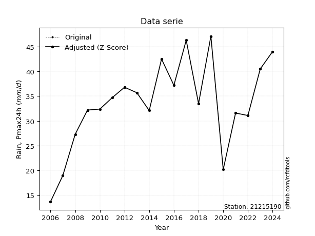</img>

</div>

> If Z-Score is active, values out of range or outliers are replaced with the station mean value.


### 4. Active continuous probability distributions from SciPy (45 of 104 available)

[scipy.stats](https://docs.scipy.org/doc/scipy/reference/stats.html) is a Python´s powerful submodule within the SciPy library for comprehensive statistical analysis, offering over 130 probability distributions (like Normal, Poisson), functions for descriptive stats (mean, variance), hypothesis testing (t-tests, chi-square), random variable generation, and statistical tests, making it essential for data science, modeling, and research. It provides tools to explore, model, and draw conclusions from data efficiently, working seamlessly with NumPy.

<div align="center">

|   id | p_dist             |   n_parameter | fit_method   | label                                                                       | active   | ref                                                                                                        |
|-----:|:-------------------|--------------:|:-------------|:----------------------------------------------------------------------------|:---------|:-----------------------------------------------------------------------------------------------------------|
|    0 | alpha              |             3 | MLE          | Alpha                                                                       | True     | [:mortar_board:](https://docs.scipy.org/doc/scipy/reference/generated/scipy.stats.alpha.html)              |
|    1 | betaprime          |             4 | MLE          | Beta prime                                                                  | True     | [:mortar_board:](https://docs.scipy.org/doc/scipy/reference/generated/scipy.stats.betaprime.html)          |
|    2 | chi2               |             3 | MLE          | Chi²                                                                        | True     | [:mortar_board:](https://docs.scipy.org/doc/scipy/reference/generated/scipy.stats.chi2.html)               |
|    3 | crystalball        |             4 | MLE          | Crystalball                                                                 | True     | [:mortar_board:](https://docs.scipy.org/doc/scipy/reference/generated/scipy.stats.crystalball.html)        |
|    4 | erlang             |             3 | MLE          | Erlang                                                                      | True     | [:mortar_board:](https://docs.scipy.org/doc/scipy/reference/generated/scipy.stats.erlang.html)             |
|    5 | expon              |             2 | MLE          | Exponential                                                                 | True     | [:mortar_board:](https://docs.scipy.org/doc/scipy/reference/generated/scipy.stats.expon.html)              |
|    6 | exponnorm          |             3 | MLE          | Exponentially modified Normal                                               | True     | [:mortar_board:](https://docs.scipy.org/doc/scipy/reference/generated/scipy.stats.exponnorm.html)          |
|    7 | f                  |             4 | MLE          | F                                                                           | True     | [:mortar_board:](https://docs.scipy.org/doc/scipy/reference/generated/scipy.stats.f.html)                  |
|    8 | fatiguelife        |             3 | MLE          | Fatigue-life (Birnbaum-Saunders)                                            | True     | [:mortar_board:](https://docs.scipy.org/doc/scipy/reference/generated/scipy.stats.fatiguelife.html)        |
|    9 | fisk               |             3 | MLE          | Fisk                                                                        | True     | [:mortar_board:](https://docs.scipy.org/doc/scipy/reference/generated/scipy.stats.fisk.html)               |
|   10 | gamma              |             3 | MLE          | Gamma                                                                       | True     | [:mortar_board:](https://docs.scipy.org/doc/scipy/reference/generated/scipy.stats.gamma.html)              |
|   11 | genexpon           |             5 | MLE          | Generalized exponential                                                     | True     | [:mortar_board:](https://docs.scipy.org/doc/scipy/reference/generated/scipy.stats.genexpon.html)           |
|   12 | genlogistic        |             3 | MLE          | Generalized logistic                                                        | True     | [:mortar_board:](https://docs.scipy.org/doc/scipy/reference/generated/scipy.stats.genlogistic.html)        |
|   13 | gibrat             |             2 | MM           | Gibrat                                                                      | True     | [:mortar_board:](https://docs.scipy.org/doc/scipy/reference/generated/scipy.stats.gibrat.html)             |
|   14 | gompertz           |             3 | MLE          | Gompertz (or truncated Gumbel)                                              | True     | [:mortar_board:](https://docs.scipy.org/doc/scipy/reference/generated/scipy.stats.gompertz.html)           |
|   15 | gumbel_l           |             2 | MM           | Gumbel Left Skew                                                            | True     | [:mortar_board:](https://docs.scipy.org/doc/scipy/reference/generated/scipy.stats.gumbel_l.html)           |
|   16 | gumbel_r           |             2 | MM           | Gumbel Right Skew                                                           | True     | [:mortar_board:](https://docs.scipy.org/doc/scipy/reference/generated/scipy.stats.gumbel_r.html)           |
|   17 | halflogistic       |             2 | MM           | Half-logistic                                                               | True     | [:mortar_board:](https://docs.scipy.org/doc/scipy/reference/generated/scipy.stats.halflogistic.html)       |
|   18 | halfnorm           |             2 | MM           | Half Normal                                                                 | True     | [:mortar_board:](https://docs.scipy.org/doc/scipy/reference/generated/scipy.stats.halfnorm.html)           |
|   19 | hypsecant          |             2 | MM           | hyperbolic secant                                                           | True     | [:mortar_board:](https://docs.scipy.org/doc/scipy/reference/generated/scipy.stats.hypsecant.html)          |
|   20 | invgamma           |             3 | MLE          | Inverted gamma                                                              | True     | [:mortar_board:](https://docs.scipy.org/doc/scipy/reference/generated/scipy.stats.invgamma.html)           |
|   21 | invgauss           |             3 | MLE          | Inverse Gaussian                                                            | True     | [:mortar_board:](https://docs.scipy.org/doc/scipy/reference/generated/scipy.stats.invgauss.html)           |
|   22 | invweibull         |             3 | MLE          | Inverted Weibull                                                            | True     | [:mortar_board:](https://docs.scipy.org/doc/scipy/reference/generated/scipy.stats.invweibull.html)         |
|   23 | johnsonsu          |             4 | MLE          | Johnson Su                                                                  | True     | [:mortar_board:](https://docs.scipy.org/doc/scipy/reference/generated/scipy.stats.johnsonsu.html)          |
|   24 | kstwobign          |             2 | MLE          | Limiting distribution of scaled Kolmogorov-Smirnov two-sided test statistic | True     | [:mortar_board:](https://docs.scipy.org/doc/scipy/reference/generated/scipy.stats.kstwobign.html)          |
|   25 | laplace            |             2 | MM           | Laplace                                                                     | True     | [:mortar_board:](https://docs.scipy.org/doc/scipy/reference/generated/scipy.stats.laplace.html)            |
|   26 | laplace_asymmetric |             3 | MLE          | Asymmetric Laplace                                                          | True     | [:mortar_board:](https://docs.scipy.org/doc/scipy/reference/generated/scipy.stats.laplace_asymmetric.html) |
|   27 | loggamma           |             3 | MLE          | Log gamma                                                                   | True     | [:mortar_board:](https://docs.scipy.org/doc/scipy/reference/generated/scipy.stats.loggamma.html)           |
|   28 | logistic           |             2 | MM           | Logistic (or Sech-squared)                                                  | True     | [:mortar_board:](https://docs.scipy.org/doc/scipy/reference/generated/scipy.stats.logistic.html)           |
|   29 | lognorm            |             3 | MLE          | Log Normal                                                                  | True     | [:mortar_board:](https://docs.scipy.org/doc/scipy/reference/generated/scipy.stats.lognorm.html)            |
|   30 | maxwell            |             2 | MM           | Maxwell                                                                     | True     | [:mortar_board:](https://docs.scipy.org/doc/scipy/reference/generated/scipy.stats.maxwell.html)            |
|   31 | mielke             |             4 | MLE          | Mielke Beta-Kappa / Dagum                                                   | True     | [:mortar_board:](https://docs.scipy.org/doc/scipy/reference/generated/scipy.stats.mielke.html)             |
|   32 | moyal              |             2 | MM           | Moyal                                                                       | True     | [:mortar_board:](https://docs.scipy.org/doc/scipy/reference/generated/scipy.stats.moyal.html)              |
|   33 | nakagami           |             3 | MLE          | Nakagami                                                                    | True     | [:mortar_board:](https://docs.scipy.org/doc/scipy/reference/generated/scipy.stats.nakagami.html)           |
|   34 | ncf                |             5 | MLE          | Non-central F distribution                                                  | True     | [:mortar_board:](https://docs.scipy.org/doc/scipy/reference/generated/scipy.stats.ncf.html)                |
|   35 | nct                |             4 | MLE          | Non-central Student’s t                                                     | True     | [:mortar_board:](https://docs.scipy.org/doc/scipy/reference/generated/scipy.stats.nct.html)                |
|   36 | norm               |             2 | MM           | Normal                                                                      | True     | [:mortar_board:](https://docs.scipy.org/doc/scipy/reference/generated/scipy.stats.norm.html)               |
|   37 | pareto             |             3 | MLE          | Pareto                                                                      | True     | [:mortar_board:](https://docs.scipy.org/doc/scipy/reference/generated/scipy.stats.pareto.html)             |
|   38 | pearson3           |             3 | MM           | Pearson type III                                                            | True     | [:mortar_board:](https://docs.scipy.org/doc/scipy/reference/generated/scipy.stats.pearson3.html)           |
|   39 | rayleigh           |             2 | MM           | Rayleigh                                                                    | True     | [:mortar_board:](https://docs.scipy.org/doc/scipy/reference/generated/scipy.stats.rayleigh.html)           |
|   40 | rice               |             3 | MLE          | Rice                                                                        | True     | [:mortar_board:](https://docs.scipy.org/doc/scipy/reference/generated/scipy.stats.rice.html)               |
|   41 | t                  |             3 | MLE          | Student’s t                                                                 | True     | [:mortar_board:](https://docs.scipy.org/doc/scipy/reference/generated/scipy.stats.t.html)                  |
|   42 | truncnorm          |             4 | MLE          | Truncated normal                                                            | True     | [:mortar_board:](https://docs.scipy.org/doc/scipy/reference/generated/scipy.stats.truncnorm.html)          |
|   43 | wald               |             2 | MM           | Wald                                                                        | True     | [:mortar_board:](https://docs.scipy.org/doc/scipy/reference/generated/scipy.stats.wald.html)               |
|   44 | weibull_min        |             3 | MLE          | Weibull minimum                                                             | True     | [:mortar_board:](https://docs.scipy.org/doc/scipy/reference/generated/scipy.stats.weibull_min.html)        |

</div>

> **n_parameter:** # arguments & localization & scale.
>
> **Fit methods:** (MLE) maximum likelihood, (MM) L-moments.
>
>**Inactive:** foldnorm, gennorm, norminvgauss, powernorm, powerlognorm, skewnorm, genextreme, anglit, arcsine, argus, beta, bradford, burr, burr12, cauchy, cosine, halfcauchy, foldcauchy, skewcauchy, wrapcauchy, dgamma, gengamma, exponweib, exponpow, truncexpon, gausshyper, genhalflogistic, genhyperbolic, geninvgauss, halfgennorm, johnsonsb, kappa4, kappa3, ksone, kstwo, loglaplace, levy, levy_l, levy_stable, ncx2, genpareto, truncpareto, lomax, powerlaw, rdist, rel_breitwigner, recipinvgauss, semicircular, studentized_range, trapezoid, triang, truncweibull_min, tukeylambda, uniform, loguniform, vonmises, vonmises_line, weibull_max, dweibull, 


## B. Probability distributions vs. Empirical distributions

A continuous probability distribution (CPD) describes probabilities for variables that can take any value within a range (like rain any time), unlike discrete variables with specific outcomes (like temperature). It uses a Probability Density Function (PDF), a curve where the total area under it equals 1, and the probability of the variable falling within an interval (a to b) is found by calculating the area under the curve between those points. A key feature is that the probability of hitting any single exact value is zero, so probabilities are always expressed for ranges, e.g., $P(a ≤ X ≤ b)$.

<div align="center">

Distributions parameters
|    |   station | p_dist                |   n |               loc |            scale | shape                  | shape1              | shape2               | shape3   |
|---:|----------:|:----------------------|----:|------------------:|-----------------:|:-----------------------|:--------------------|:---------------------|:---------|
|  0 |  21215190 | alpha                 |  20 |    -140.81        |   3343.7         | 19.26789856239133      |                     |                      |          |
|  1 |  21215190 | betaprime             |  20 |    -218.339       |   7560.64        | 873.7510272589197      | 26230.553249439305  |                      |          |
|  2 |  21215190 | chi2                  |  20 |     -83.3667      |      0.326306    | 357.7554849637594      |                     |                      |          |
|  3 |  21215190 | crystalball           |  20 |      33.515       |      8.5234      | 1069.334852622198      | 4581.983582567118   |                      |          |
|  4 |  21215190 | erlang                |  20 |    -103.393       |      0.563778    | 242.74533068767278     |                     |                      |          |
|  5 |  21215190 | expon                 |  20 |      13.7         |     19.815       |                        |                     |                      |          |
|  6 |  21215190 | exponnorm             |  20 |      33.506       |      8.5234      | 0.0010610735659249922  |                     |                      |          |
|  7 |  21215190 | f                     |  20 |   -1919.53        |   1953.03        | 176545.34684482522     | 256260.72696331446  |                      |          |
|  8 |  21215190 | fatiguelife           |  20 |    -947.763       |    981.227       | 0.008638520624819776   |                     |                      |          |
|  9 |  21215190 | fisk                  |  20 |      -1.21194e+09 |      1.21194e+09 | 255629893.43210042     |                     |                      |          |
| 10 |  21215190 | gamma                 |  20 |    -109.438       |      0.534313    | 267.3382844401624      |                     |                      |          |
| 11 |  21215190 | genexpon              |  20 |      13.7         | 616011           | 9026.257047124152      | 25373.996081748977  | 164137.12413441704   |          |
| 12 |  21215190 | genlogistic           |  20 |      37.2613      |      3.78888     | 0.5944391326759704     |                     |                      |          |
| 13 |  21215190 | gibrat                |  20 |      27.0127      |      3.94386     |                        |                     |                      |          |
| 14 |  21215190 | gompertz              |  20 |      13.7         |      8.32148     | 0.06347873572236595    |                     |                      |          |
| 15 |  21215190 | gumbel_l              |  20 |      37.351       |      6.64566     |                        |                     |                      |          |
| 16 |  21215190 | gumbel_r              |  20 |      29.679       |      6.64566     |                        |                     |                      |          |
| 17 |  21215190 | halflogistic          |  20 |      23.4128      |      7.28722     |                        |                     |                      |          |
| 18 |  21215190 | halfnorm              |  20 |      22.2333      |     14.1395      |                        |                     |                      |          |
| 19 |  21215190 | hypsecant             |  20 |      33.515       |      5.42616     |                        |                     |                      |          |
| 20 |  21215190 | invgamma              |  20 |    -104.997       |  33704.1         | 244.5791416693072      |                     |                      |          |
| 21 |  21215190 | invgauss              |  20 |     -35.454       |   3968.42        | 0.01732896295990782    |                     |                      |          |
| 22 |  21215190 | invweibull            |  20 |      -7.53819e+08 |      7.53819e+08 | 82161682.9068186       |                     |                      |          |
| 23 |  21215190 | johnsonsu             |  20 |      70.0043      |      7.73796     | 9.827019597575763      | 4.407249453338306   |                      |          |
| 24 |  21215190 | kstwobign             |  20 |      -4.49303     |     43.613       |                        |                     |                      |          |
| 25 |  21215190 | laplace               |  20 |      33.515       |      6.02695     |                        |                     |                      |          |
| 26 |  21215190 | laplace_asymmetric    |  20 |      32.4         |      6.24011     | 0.9146584640984695     |                     |                      |          |
| 27 |  21215190 | loggamma              |  20 |      24.5313      |     12.3909      | 2.545078020959135      |                     |                      |          |
| 28 |  21215190 | logistic              |  20 |      33.515       |      4.69919     |                        |                     |                      |          |
| 29 |  21215190 | lognorm               |  20 |      -3.35544e+07 |      3.35545e+07 | 2.5401685489325703e-07 |                     |                      |          |
| 30 |  21215190 | maxwell               |  20 |      13.3181      |     12.6565      |                        |                     |                      |          |
| 31 |  21215190 | mielke                |  20 |      -0.501462    |     41.4155      | 3.772221760990782      | 12.954199122873202  |                      |          |
| 32 |  21215190 | moyal                 |  20 |      28.6408      |      3.83688     |                        |                     |                      |          |
| 33 |  21215190 | nakagami              |  20 |   -2592.66        |   2626.18        | 23624.101366150084     |                     |                      |          |
| 34 |  21215190 | ncf                   |  20 |       2.40784     |      0.0308311   | 0.04472648286971694    | 1366.2358076957407  | 44.98338897916476    |          |
| 35 |  21215190 | nct                   |  20 |    -635.788       |      8.47718     | 270332.2245840726      | 78.95319759224472   |                      |          |
| 36 |  21215190 | norm                  |  20 |      33.515       |      8.5234      |                        |                     |                      |          |
| 37 |  21215190 | pareto                |  20 |      13.7         |      3.93779e-08 | 0.05263157364889108    |                     |                      |          |
| 38 |  21215190 | pearson3              |  20 |      33.515       |      8.52338     | -0.5292411043261087    |                     |                      |          |
| 39 |  21215190 | rayleigh              |  20 |      17.2092      |     13.0101      |                        |                     |                      |          |
| 40 |  21215190 | rice                  |  20 |      13.6913      |      2.57664     | 4.288251715001742e-08  |                     |                      |          |
| 41 |  21215190 | t                     |  20 |      33.5154      |      8.52314     | 225373.68811156508     |                     |                      |          |
| 42 |  21215190 | truncnorm             |  20 |      33.515       |      8.5234      | -303.3240438919799     | 704.1069497720134   |                      |          |
| 43 |  21215190 | wald                  |  20 |      24.9916      |      8.5234      |                        |                     |                      |          |
| 44 |  21215190 | weibull_min           |  20 |     -24.8925      |     61.9708      | 8.21950329651928       |                     |                      |          |
| 45 |  21215190 | logalpha              |  20 |      -5.59766     |    259.796       | 28.69344458137632      |                     |                      |          |
| 46 |  21215190 | logbetaprime          |  20 |     -10.8483      |     33.9221      | 3049.0562455557165     | 7224.438642416902   |                      |          |
| 47 |  21215190 | logchi2               |  20 |       2.6174      |      0.893166    | 1.169423094916745      |                     |                      |          |
| 48 |  21215190 | logcrystalball        |  20 |       3.47198     |      0.301248    | 8.134426910036671      | 61.83014248213279   |                      |          |
| 49 |  21215190 | logerlang             |  20 |      -3.53086     |      0.0157969   | 442.8625033580306      |                     |                      |          |
| 50 |  21215190 | logexpon              |  20 |       2.6174      |      0.854582    |                        |                     |                      |          |
| 51 |  21215190 | logexponnorm          |  20 |       3.47181     |      0.301249    | 0.0005571145977007004  |                     |                      |          |
| 52 |  21215190 | logf                  |  20 |    -383.525       |    386.997       | 6734239.123258829      | 6403913.401211154   |                      |          |
| 53 |  21215190 | logfatiguelife        |  20 |    -157.617       |    161.088       | 0.00187711429627185    |                     |                      |          |
| 54 |  21215190 | logfisk               |  20 | -459190           | 459194           | 2953614.180572333      |                     |                      |          |
| 55 |  21215190 | loggamma              |  20 |      -1.61046     |      0.0198392   | 255.7473269729693      |                     |                      |          |
| 56 |  21215190 | loggenexpon           |  20 |       2.6172      |      0.000644801 | 8.944233384323844e-05  | 0.11490179214878188 | 7.81986670527848e-06 |          |
| 57 |  21215190 | loggenlogistic        |  20 |       3.71317     |      0.0777583   | 0.28721601268365415    |                     |                      |          |
| 58 |  21215190 | loggibrat             |  20 |       3.24213     |      0.13941     |                        |                     |                      |          |
| 59 |  21215190 | loggompertz           |  20 |       2.57419     |      0.221292    | 0.00980929043225428    |                     |                      |          |
| 60 |  21215190 | loggumbel_l           |  20 |       3.60756     |      0.234882    |                        |                     |                      |          |
| 61 |  21215190 | loggumbel_r           |  20 |       3.3364      |      0.234882    |                        |                     |                      |          |
| 62 |  21215190 | loghalflogistic       |  20 |       3.11496     |      0.257536    |                        |                     |                      |          |
| 63 |  21215190 | loghalfnorm           |  20 |       3.07329     |      0.499682    |                        |                     |                      |          |
| 64 |  21215190 | loghypsecant          |  20 |       3.47198     |      0.19178     |                        |                     |                      |          |
| 65 |  21215190 | loginvgamma           |  20 |      -3.68174     |   3474.37        | 486.9133668996567      |                     |                      |          |
| 66 |  21215190 | loginvgauss           |  20 |      -0.308945    |    498.409       | 0.007578448938457849   |                     |                      |          |
| 67 |  21215190 | loginvweibull         |  20 |      -4.3773e+07  |      4.3773e+07  | 117357976.56593052     |                     |                      |          |
| 68 |  21215190 | logjohnsonsu          |  20 |       4.0284      |      0.017323    | 7.6955313880222285     | 1.9104590433854582  |                      |          |
| 69 |  21215190 | logkstwobign          |  20 |       1.90772     |      1.80015     |                        |                     |                      |          |
| 70 |  21215190 | loglaplace            |  20 |       3.47198     |      0.213014    |                        |                     |                      |          |
| 71 |  21215190 | loglaplace_asymmetric |  20 |       3.57515     |      0.19507     | 1.2987523341930283     |                     |                      |          |
| 72 |  21215190 | logloggamma           |  20 |       3.74808     |      0.128044    | 0.46338524638529277    |                     |                      |          |
| 73 |  21215190 | loglogistic           |  20 |       3.47198     |      0.166086    |                        |                     |                      |          |
| 74 |  21215190 | loglognorm            |  20 |  -32685.5         |  32688.9         | 9.215631178397727e-06  |                     |                      |          |
| 75 |  21215190 | logmaxwell            |  20 |       2.75815     |      0.447326    |                        |                     |                      |          |
| 76 |  21215190 | logmielke             |  20 |  -57376.6         |  57380.4         | 206589.19190672092     | 756924.7602064786   |                      |          |
| 77 |  21215190 | logmoyal              |  20 |       3.29971     |      0.135609    |                        |                     |                      |          |
| 78 |  21215190 | lognakagami           |  20 |    -250.411       |    253.884       | 177062.37870894943     |                     |                      |          |
| 79 |  21215190 | logncf                |  20 |      -3.72459     |      6.93815     | 1051.1886352789006     | 792.3883332353967   | 37.83258723955224    |          |
| 80 |  21215190 | lognct                |  20 |      -8.6926      |      0.275679    | 3958.674686715128      | 44.113133279031075  |                      |          |
| 81 |  21215190 | lognorm               |  20 |       3.47198     |      0.301247    |                        |                     |                      |          |
| 82 |  21215190 | logpareto             |  20 |      -6.71089e+07 |      6.71089e+07 | 78528269.56119734      |                     |                      |          |
| 83 |  21215190 | logpearson3           |  20 |       3.47198     |      0.301247    | -1.285954170727103     |                     |                      |          |
| 84 |  21215190 | lograyleigh           |  20 |       2.89563     |      0.459856    |                        |                     |                      |          |
| 85 |  21215190 | logrice               |  20 |     -70.7269      |      0.301046    | 246.46805576846452     |                     |                      |          |
| 86 |  21215190 | logt                  |  20 |       3.53559     |      0.155298    | 1.8978866689041884     |                     |                      |          |
| 87 |  21215190 | logtruncnorm          |  20 |      -0.139456    |      1.2927      | 2.665998654454685      | 3.087895366045612   |                      |          |
| 88 |  21215190 | logwald               |  20 |       3.1707      |      0.301279    |                        |                     |                      |          |
| 89 |  21215190 | logweibull_min        |  20 |      -9.11157e+07 |      9.11157e+07 | 431263366.51678884     |                     |                      |          |

</div>

> **loc** (Location parameter): This shifts the distribution along the x-axis. For many common distributions, like the normal (Gaussian) distribution, loc represents the mean $μ$. For others, like the uniform distribution, it might represent the minimum value, or for the beta distribution, the left end of the support interval.
>
> **scale** (Scale parameter): This determines the width or spread of the distribution. For the normal distribution, scale represents the standard deviation $σ$. For a uniform distribution, it defines the length of the interval (from $loc$ to $loc + scale$).
>
> **shape** (Shape parameters): Refers to parameters that define the specific form of a probability distribution, distinct from its location (loc) and scale (scale). These parameters are required arguments for most distribution functions. For example, a normal (Gaussian) distribution is fully defined by its location (mean) and scale (standard deviation), so it has no specific shape parameters beyond loc and scale. However, other distributions have intrinsic properties that need specification, as Gamma distribution that takes a shape parameter, often named $a$ or $alpha$.


### 0. Cumulative distribution values - CDF (90 evaluated)

> Ordered by x ascending and calculating $log(f(x))$ separately. 

|   id |   Station |   date |    x |   count |   mean |     std |     zscore |   Value_initial |   station |   m |      alpha |   alpha_pdf |   betaprime |   betaprime_pdf |       chi2 |   chi2_pdf |   crystalball |   crystalball_pdf |     erlang |   erlang_pdf |    expon |   expon_pdf |   exponnorm |   exponnorm_pdf |          f |      f_pdf |   fatiguelife |   fatiguelife_pdf |      fisk |   fisk_pdf |      gamma |   gamma_pdf |    genexpon |   genexpon_pdf |   genlogistic |   genlogistic_pdf |     gibrat |   gibrat_pdf |    gompertz |   gompertz_pdf |   gumbel_l |   gumbel_l_pdf |    gumbel_r |   gumbel_r_pdf |   halflogistic |   halflogistic_pdf |   halfnorm |   halfnorm_pdf |   hypsecant |   hypsecant_pdf |   invgamma |   invgamma_pdf |   invgauss |   invgauss_pdf |   invweibull |   invweibull_pdf |   johnsonsu |   johnsonsu_pdf |   kstwobign |   kstwobign_pdf |   laplace |   laplace_pdf |   laplace_asymmetric |   laplace_asymmetric_pdf |   loggamma |   loggamma_pdf |   logistic |   logistic_pdf |    lognorm |   lognorm_pdf |     maxwell |   maxwell_pdf |    mielke |   mielke_pdf |       moyal |   moyal_pdf |   nakagami |   nakagami_pdf |       ncf |   ncf_pdf |       nct |    nct_pdf |      norm |   norm_pdf |   pareto |   pareto_pdf |   pearson3 |   pearson3_pdf |   rayleigh |   rayleigh_pdf |        rice |    rice_pdf |         t |      t_pdf |   truncnorm |   truncnorm_pdf |     wald |   wald_pdf |   weibull_min |   weibull_min_pdf |   logalpha |   logalpha_pdf |   logbetaprime |   logbetaprime_pdf |    logchi2 |   logchi2_pdf |   logcrystalball |   logcrystalball_pdf |   logerlang |   logerlang_pdf |   logexpon |   logexpon_pdf |   logexponnorm |   logexponnorm_pdf |       logf |   logf_pdf |   logfatiguelife |   logfatiguelife_pdf |    logfisk |   logfisk_pdf |   loggenexpon |   loggenexpon_pdf |   loggenlogistic |   loggenlogistic_pdf |   loggibrat |   loggibrat_pdf |   loggompertz |   loggompertz_pdf |   loggumbel_l |   loggumbel_l_pdf |   loggumbel_r |   loggumbel_r_pdf |   loghalflogistic |   loghalflogistic_pdf |   loghalfnorm |   loghalfnorm_pdf |   loghypsecant |   loghypsecant_pdf |   loginvgamma |   loginvgamma_pdf |   loginvgauss |   loginvgauss_pdf |   loginvweibull |   loginvweibull_pdf |   logjohnsonsu |   logjohnsonsu_pdf |   logkstwobign |   logkstwobign_pdf |   loglaplace |   loglaplace_pdf |   loglaplace_asymmetric |   loglaplace_asymmetric_pdf |   logloggamma |   logloggamma_pdf |   loglogistic |   loglogistic_pdf |   loglognorm |   loglognorm_pdf |   logmaxwell |   logmaxwell_pdf |   logmielke |   logmielke_pdf |    logmoyal |   logmoyal_pdf |   lognakagami |   lognakagami_pdf |    logncf |   logncf_pdf |     lognct |   lognct_pdf |   logpareto |   logpareto_pdf |   logpearson3 |   logpearson3_pdf |   lograyleigh |   lograyleigh_pdf |    logrice |   logrice_pdf |      logt |   logt_pdf |   logtruncnorm |   logtruncnorm_pdf |   logwald |   logwald_pdf |   logweibull_min |   logweibull_min_pdf |
|-----:|----------:|-------:|-----:|--------:|-------:|--------:|-----------:|----------------:|----------:|----:|-----------:|------------:|------------:|----------------:|-----------:|-----------:|--------------:|------------------:|-----------:|-------------:|---------:|------------:|------------:|----------------:|-----------:|-----------:|--------------:|------------------:|----------:|-----------:|-----------:|------------:|------------:|---------------:|--------------:|------------------:|-----------:|-------------:|------------:|---------------:|-----------:|---------------:|------------:|---------------:|---------------:|-------------------:|-----------:|---------------:|------------:|----------------:|-----------:|---------------:|-----------:|---------------:|-------------:|-----------------:|------------:|----------------:|------------:|----------------:|----------:|--------------:|---------------------:|-------------------------:|-----------:|---------------:|-----------:|---------------:|-----------:|--------------:|------------:|--------------:|----------:|-------------:|------------:|------------:|-----------:|---------------:|----------:|----------:|----------:|-----------:|----------:|-----------:|---------:|-------------:|-----------:|---------------:|-----------:|---------------:|------------:|------------:|----------:|-----------:|------------:|----------------:|---------:|-----------:|--------------:|------------------:|-----------:|---------------:|---------------:|-------------------:|-----------:|--------------:|-----------------:|---------------------:|------------:|----------------:|-----------:|---------------:|---------------:|-------------------:|-----------:|-----------:|-----------------:|---------------------:|-----------:|--------------:|--------------:|------------------:|-----------------:|---------------------:|------------:|----------------:|--------------:|------------------:|--------------:|------------------:|--------------:|------------------:|------------------:|----------------------:|--------------:|------------------:|---------------:|-------------------:|--------------:|------------------:|--------------:|------------------:|----------------:|--------------------:|---------------:|-------------------:|---------------:|-------------------:|-------------:|-----------------:|------------------------:|----------------------------:|--------------:|------------------:|--------------:|------------------:|-------------:|-----------------:|-------------:|-----------------:|------------:|----------------:|------------:|---------------:|--------------:|------------------:|----------:|-------------:|-----------:|-------------:|------------:|----------------:|--------------:|------------------:|--------------:|------------------:|-----------:|--------------:|----------:|-----------:|---------------:|-------------------:|----------:|--------------:|-----------------:|---------------------:|
|    0 |  21215190 |   2006 | 13.7 |      20 | 33.515 | 8.74482 | -2.26591   |            13.7 |  21215190 |   1 | 0.00882631 |  0.00334674 |  0.00960966 |      0.00314473 | 0.00891564 | 0.00312593 |     0.0100419 |        0.00313838 | 0.00947474 |   0.00321346 | 0        |  0.0504668  |   0.010042  |      0.00313838 | 0.00994037 | 0.00313339 |    0.00924773 |        0.00299707 | 0.0136595 | 0.00284179 | 0.00944303 |  0.00320523 | 1.75303e-08 |      0.0146528 |     0.0247798 |        0.00387999 | 0          |   0          | 2.92275e-11 |      0.0076283 |  0.0280698 |     0.00416393 | 1.55401e-05 |    2.58907e-05 |       0        |         0          |   0        |      0         |   0.0165138 |      0.003042   |  0.007868  |     0.00299279 | 0.00615773 |     0.00273308 |   0.00486744 |       0.00282513 |   0.0230059 |      0.00422644 |  0.00500901 |      0.00362867 | 0.0186692 |    0.00309762 |            0.017203  |               0.00301406 | 0.00247901 |       0.027437 |  0.0145332 |     0.00304775 | 0.00227833 |     0.0236862 | 7.30301e-06 |   5.73627e-05 | 0.0176424 |   0.00468621 | 2.42416e-12 | 1.58171e-11 |  0.0101555 |     0.00317003 | 0.0052105 | 0.002662  | 0.0100442 | 0.00314013 | 0.0100419 | 0.00313838 | 0        |  1.33658e+06 |  0.020012  |     0.00414667 | 0          |      0         | 5.65642e-06 | 0.00130536  | 0.0100391 | 0.00313764 |   0.0100419 |      0.00313838 | 0        | 0          |     0.0201818 |        0.00425468 | 0.00168954 |      0.0209365 |     0.00238094 |          0.0253188 | 8.4249e-10 |   1.10927e+06 |       0.00227834 |            0.0236863 |  0.00408986 |       0.0396377 |   0        |       1.17016  |      0.0022784 |          0.0236867 | 0.00232319 |  0.0240953 |       0.00232278 |             0.024142 | 0.00314453 |     0.0201626 |   2.74785e-05 |          0.139137 |        0.0174663 |            0.0645152 |    0        |        0        |    0.00211298 |         0.0537719 |     0.0146555 |         0.0619357 |   5.33374e-10 |       4.84861e-08 |          0        |              0        |      0        |          0        |     0.00738961 |          0.0385282 |    0.00236946 |         0.0270082 |    0.00187102 |          0.02364  |       0.001774  |           0.0301282 |      0.0209335 |          0.0681352 |     0.00226928 |          0.0475686 |   0.00904988 |        0.0424849 |               0.0143225 |                    0.056533 |     0.0188654 |          0.068266 |    0.00579236 |         0.0346736 |   0.00227822 |        0.0236856 |    0         |         0        |   0.0189044 |       0.0680638 | 3.54416e-35 |    2.01426e-32 |    0.00229618 |         0.0238471 | 0.0293908 |     0.159311 | 0.00251605 |    0.0260332 | 1.74368e-08 |        1.17016  |     0.0159967 |         0.0677191 |    0          |          0        | 0.00226467 |     0.0235734 | 0.0154799 |  0.0307658 |    0           |           0        |  0        |      0        |        0.0093488 |            0.0440417 |
|    1 |  21215190 |   2007 | 19   |      20 | 33.515 | 8.74482 | -1.65984   |            19   |  21215190 |   2 | 0.0489498  |  0.0132761  |  0.044678   |      0.0113349  | 0.0451173  | 0.0118823  |     0.0442878 |        0.0109788  | 0.0458371  |   0.0118015  | 0.23469  |  0.0386228  |   0.0442879 |      0.0109788  | 0.044281   | 0.0110293  |    0.0427933  |        0.010899   | 0.0406343 | 0.00822254 | 0.0457868  |  0.0118126  | 0.163928    |      0.0382998 |     0.0567103 |        0.00882609 | 0          |   0          | 0.0549671   |      0.0136295 |  0.0612505 |     0.0089284  | 0.00682337  |    0.00512077  |       0        |         0          |   0        |      0         |   0.0437981 |      0.00804621 |  0.0443849 |     0.0122491  | 0.0431419  |     0.0128974  |   0.0503617  |       0.0164044  |   0.0589017 |      0.0100306  |  0.0662628  |      0.0211637  | 0.0449819 |    0.00746345 |            0.0435396 |               0.0076284  | 0.0470759  |       0.332953 |  0.0435705 |     0.00886792 | 0.0399573  |     0.285808  | 0.0226592   |   0.0114873   | 0.0583599 |   0.0112881  | 0.000443893 | 0.000764618 |  0.0446776 |     0.0110515  | 0.0435426 | 0.0135164 | 0.0443117 | 0.0109856  | 0.0442878 | 0.0109788  | 0.626615 |  0.00370789  |  0.0565865 |     0.0104353  | 0.00942845 |      0.0104801 | 0.88026     | 0.0957452   | 0.0442788 | 0.0109772  |   0.0442878 |      0.0109788  | 0        | 0          |     0.0570241 |        0.0103681  | 0.0426986  |      0.32349   |     0.0427981  |          0.304028  | 0.388922   |   0.618551    |       0.0399575  |            0.285809  |  0.0558568  |       0.356693  |   0.317978 |       0.798076 |      0.0399578 |          0.28581   | 0.0404062  |  0.288014  |       0.040543   |             0.289067 | 0.0252012  |     0.158014  |   0.148667    |          0.71896  |        0.0584551 |            0.215905  |    0        |        0        |    0.0415745  |         0.226395  |     0.0576852 |         0.238369  |   0.00496374  |       0.112123    |          0        |              0        |      0        |          0        |     0.0406121  |          0.21119   |    0.0475103  |         0.337989  |    0.0470097  |          0.347938 |       0.0716605 |           0.506408  |      0.0628671 |          0.21772   |     0.105508   |          0.655352  |   0.0420165  |        0.197248  |               0.0520767 |                    0.205554 |     0.0615796 |          0.222567 |    0.0400677  |         0.23158   |   0.0399574  |        0.285812  |    0.01824   |         0.28365  |   0.0613672 |       0.220938  | 0.000210745 |    0.0113623   |    0.0401242  |         0.286569  | 0.129026  |     0.475785 | 0.0427573  |    0.300402  | 0.317978    |        0.798076 |     0.061502  |         0.244927  |    0.00561644 |          0.229503 | 0.0398551  |     0.285406  | 0.0339651 |  0.099555  |    0           |           0        |  0        |      0        |        0.0432018 |            0.199998  |
|    2 |  21215190 |   2020 | 20.2 |      20 | 33.515 | 8.74482 | -1.52262   |            20.2 |  21215190 |   3 | 0.0669129  |  0.0167257  |  0.060006   |      0.0142791  | 0.0612173  | 0.0150194  |     0.0591239 |        0.0138158  | 0.0617917  |   0.0148556  | 0.279662 |  0.0363532  |   0.0591239 |      0.0138158  | 0.0591888  | 0.013885   |    0.0575649  |        0.0137907  | 0.0517326 | 0.0103472  | 0.0617632  |  0.0148818  | 0.210019    |      0.0383577 |     0.0683372 |        0.010604   | 0          |   0          | 0.0723978   |      0.0154533 |  0.0729197 |     0.0105624  | 0.0155537   |    0.00974425  |       0        |         0          |   0        |      0         |   0.0545908 |      0.0100114  |  0.0610367 |     0.0155735  | 0.0607697  |     0.0165521  |   0.0726479  |       0.0207625  |   0.0720977 |      0.01201    |  0.0943499  |      0.0255888  | 0.0548919 |    0.00910773 |            0.0537272 |               0.00941331 | 0.0711404  |       0.456425 |  0.0555424 |     0.0111631  | 0.0608254  |     0.399683  | 0.0391564   |   0.0160772   | 0.0731029 |   0.0133191  | 0.00266431  | 0.00342815  |  0.0596053 |     0.0138954  | 0.0619829 | 0.0172758 | 0.0591567 | 0.0138239  | 0.0591239 | 0.0138158  | 0.630605 |  0.00299106  |  0.0703631 |     0.0125749  | 0.0260767  |      0.0172087 | 0.958845    | 0.0403463   | 0.0591129 | 0.0138141  |   0.0591239 |      0.0138158  | 0        | 0          |     0.0706662 |        0.0124148  | 0.0663303  |      0.452084  |     0.0648939  |          0.421338  | 0.424836   |   0.55658     |       0.0608256  |            0.399684  |  0.0811832  |       0.473165  |   0.365145 |       0.742884 |      0.0608259 |          0.399684  | 0.0614167  |  0.402093  |       0.0616273  |             0.403446 | 0.0369191  |     0.228703  |   0.194835    |          0.786075 |        0.0732924 |            0.27069   |    0        |        0        |    0.057416   |         0.293645  |     0.0742171 |         0.30395   |   0.0167752   |       0.291954    |          0        |              0        |      0        |          0        |     0.0558237  |          0.289592  |    0.0719111  |         0.462209  |    0.0722001  |          0.47799  |       0.106812  |           0.640517  |      0.0777969 |          0.271859  |     0.149125   |          0.76503   |   0.0560124  |        0.262951  |               0.0663176 |                    0.261765 |     0.0768306 |          0.27747  |    0.0569177  |         0.323194  |   0.0608257  |        0.399688  |    0.0411433 |         0.468642 |   0.0765056 |       0.275428  | 0.00310924  |    0.109921    |    0.0610399  |         0.40046   | 0.160306  |     0.545575 | 0.0645741  |    0.415853  | 0.365145    |        0.742883 |     0.0783418 |         0.30708   |    0.0282296  |          0.505721 | 0.0606989  |     0.399301  | 0.0409752 |  0.131261  |    0           |           0        |  0        |      0        |        0.0573054 |            0.26331   |
|    3 |  21215190 |   2008 | 27.3 |      20 | 33.515 | 8.74482 | -0.710706  |            27.3 |  21215190 |   4 | 0.266938   |  0.0388968  |  0.238135   |      0.0363596  | 0.247316   | 0.0375079  |     0.232949  |        0.0358792  | 0.244849   |   0.036891   | 0.496589 |  0.0254055  |   0.232949  |      0.0358792  | 0.233735   | 0.0359717  |    0.232837   |        0.0362969  | 0.19608   | 0.0332487  | 0.245577   |  0.0370919  | 0.456109    |      0.029775  |     0.201042  |        0.0294192  | 0.00440576 |   0.0449532  | 0.230422    |      0.0300925 |  0.197784  |     0.0266024  | 0.239204    |    0.0514872   |       0.260566 |         0.0639548  |   0.279908 |      0.0529205 |   0.196068  |      0.0338918  |  0.253491  |     0.0383565  | 0.263877   |     0.0396933  |   0.298374   |       0.0393311  |   0.214215  |      0.029609   |  0.337394   |      0.0386613  | 0.178289  |    0.029582   |            0.186397  |               0.0326579  | 0.316521   |       1.14555  |  0.210392  |     0.0353522  | 0.291837   |     1.13965   | 0.251884    |   0.0417948   | 0.221985  |   0.0299485  | 0.233687    | 0.0609309   |  0.233925  |     0.0359078  | 0.267865  | 0.0392953 | 0.233042  | 0.0358841  | 0.232949  | 0.0358792  | 0.644683 |  0.00137507  |  0.219479  |     0.0308087  | 0.259763   |      0.0441298 | 0.999999    | 1.79642e-06 | 0.232927  | 0.0358783  |   0.232949  |      0.0358792  | 0.134556 | 0.124438   |     0.21634   |        0.0300859  | 0.314815   |      1.16364   |     0.300824   |          1.137     | 0.560993   |   0.370455    |       0.291838   |            1.13965   |  0.32156    |       1.09442   |   0.553723 |       0.522216 |      0.291837  |          1.13964   | 0.292852   |  1.13883   |       0.293497   |             1.13953  | 0.210152   |     1.06766   |   0.455683    |          0.883416 |        0.222629  |            0.817924  |    0.221617 |        4.59143  |    0.228248   |         0.937789  |     0.242713  |         0.896348  |   0.321779    |       1.55339     |          0.356287 |              1.69503  |      0.359848 |          1.4315   |     0.254656   |          1.19067   |    0.317184   |         1.13271   |    0.323298   |          1.14231  |       0.368817  |           0.986302  |      0.225517  |          0.794925  |     0.418434   |          0.922406  |   0.230346   |        1.08137   |               0.217751  |                    0.859494 |     0.226456  |          0.801833 |    0.270121   |         1.18707   |   0.291839   |        1.13965   |    0.318838  |         1.26483  |   0.226028  |       0.810284  | 0.330121    |    1.7831      |    0.292102   |         1.13875   | 0.369227  |     0.80732  | 0.298367   |    1.13282   | 0.553723    |        0.522216 |     0.240432  |         0.837433  |    0.329611   |          1.30375  | 0.291707   |     1.14018   | 0.142503  |  0.750034  |    2.88208e-07 |           3.1205   |  0.321315 |      3.12565  |        0.217706  |            0.909107  |
|    4 |  21215190 |   2022 | 31.1 |      20 | 33.515 | 8.74482 | -0.276164  |            31.1 |  21215190 |   5 | 0.427619   |  0.0443924  |  0.394224   |      0.0447272  | 0.406353   | 0.0450207  |     0.388459  |        0.044964   | 0.40169    |   0.0445409  | 0.584438 |  0.0209721  |   0.388459  |      0.0449639  | 0.389408   | 0.0449449  |    0.390019   |        0.0453747  | 0.352182  | 0.0481226  | 0.403315   |  0.0447961  | 0.558945    |      0.024454  |     0.34185   |        0.044818   | 0.514252   |   0.0975423  | 0.362526    |      0.039354  |  0.323207  |     0.0397572  | 0.445975    |    0.0541889   |       0.483427 |         0.0525783  |   0.469398 |      0.0463571 |   0.362789  |      0.0532958  |  0.414198  |     0.0449602  | 0.427157   |     0.0448777  |   0.449654   |       0.0391722  |   0.348873  |      0.0411059  |  0.481832   |      0.0366132  | 0.334925  |    0.0555713  |            0.362731  |               0.0635527  | 0.475395   |       1.25922  |  0.374276  |     0.0498369  | 0.454056   |     1.31551   | 0.42216     |   0.0463793   | 0.357422  |   0.0414186  | 0.467958    | 0.057991    |  0.38938   |     0.0449044  | 0.427692  | 0.0435482 | 0.38855   | 0.0449574  | 0.388459  | 0.044964   | 0.649261 |  0.00106092  |  0.357792  |     0.0416637  | 0.434464   |      0.0464113 | 1           | 3.20814e-10 | 0.388436  | 0.0449645  |   0.388459  |      0.044964   | 0.526239 | 0.0729458  |     0.352335  |        0.0412988  | 0.475516   |      1.2673    |     0.460937   |          1.2865    | 0.605891   |   0.3205      |       0.454056   |            1.31551   |  0.472963   |       1.20041   |   0.616844 |       0.448355 |      0.454055  |          1.3155    | 0.454792   |  1.31228   |       0.455432   |             1.31137  | 0.380893   |     1.51679   |   0.567391    |          0.822844 |        0.357907  |            1.28505   |    0.631561 |        1.93278  |    0.377964   |         1.36208   |     0.383813  |         1.27026   |   0.521503    |       1.44549     |          0.555044 |              1.34336  |      0.533567 |          1.22481  |     0.442603   |          1.63285   |    0.473552   |         1.23474   |    0.479528   |          1.22286  |       0.494941  |           0.933276  |      0.354483  |          1.20193   |     0.534135   |          0.844431  |   0.424698   |        1.99375   |               0.364216  |                    1.43761  |     0.356606  |          1.21461  |    0.447853   |         1.48887   |   0.454058   |        1.3155    |    0.48833   |         1.29861  |   0.359437  |       1.26364   | 0.546967    |    1.47797     |    0.45414    |         1.31373   | 0.476984  |     0.835979 | 0.458461   |    1.29069   | 0.616844    |        0.448355 |     0.371655  |         1.18375   |    0.500175   |          1.28007  | 0.454021   |     1.31638   | 0.2971    |  1.71366   |    0.356039    |           2.37298  |  0.617781 |      1.57962  |        0.365532  |            1.36628   |
|    5 |  21215190 |   2021 | 31.6 |      20 | 33.515 | 8.74482 | -0.218987  |            31.6 |  21215190 |   6 | 0.449853   |  0.044521   |  0.416735   |      0.0452906  | 0.428973   | 0.0454341  |     0.411116  |        0.045639   | 0.424081   |   0.044997   | 0.594793 |  0.0204495  |   0.411116  |      0.0456389  | 0.412051   | 0.0456013  |    0.412875   |        0.0460259  | 0.376601  | 0.0495195  | 0.425833   |  0.045251   | 0.57101     |      0.0238064 |     0.364743  |        0.0467357  | 0.560067   |   0.0859785  | 0.382487    |      0.0404825 |  0.343541  |     0.041576   | 0.472854    |    0.0532908   |       0.509277 |         0.0508175  |   0.492316 |      0.0453121 |   0.389924  |      0.0551893  |  0.436751  |     0.0452275  | 0.449616   |     0.0449359  |   0.469125   |       0.0387009  |   0.369769  |      0.0424673  |  0.500001   |      0.0360555  | 0.363896  |    0.0603782  |            0.395941  |               0.0693712  | 0.49548    |       1.25889  |  0.399508  |     0.0510516  | 0.475092   |     1.32172   | 0.445346    |   0.0463412   | 0.378502  |   0.0428956  | 0.49649     | 0.05611     |  0.412004  |     0.0455679  | 0.449468  | 0.0435357 | 0.411203  | 0.0456307  | 0.411116  | 0.045639   | 0.649783 |  0.00102975  |  0.378928  |     0.0428684  | 0.4576     |      0.0461148 | 1           | 8.72931e-11 | 0.411093  | 0.0456397  |   0.411116  |      0.045639   | 0.561038 | 0.0663643  |     0.373315  |        0.0426099  | 0.495716   |      1.26515   |     0.481488   |          1.29007   | 0.61096    |   0.315119    |       0.475092   |            1.32172   |  0.492118   |       1.20111   |   0.623929 |       0.440065 |      0.475091  |          1.32171   | 0.475743   |  1.31828   |       0.476398   |             1.31717  | 0.405362   |     1.55043   |   0.580432    |          0.812357 |        0.378935  |            1.35195   |    0.660774 |        1.73478  |    0.400087   |         1.41181   |     0.404423  |         1.31404   |   0.544275    |       1.40957     |          0.576101 |              1.29712  |      0.552873 |          1.19606  |     0.468812   |          1.6518    |    0.49324    |         1.2336    |    0.499007   |          1.21927  |       0.509729  |           0.920927  |      0.374098  |          1.25782   |     0.547502   |          0.83177   |   0.457718   |        2.14877   |               0.387882  |                    1.53103  |     0.376433  |          1.27181  |    0.4717     |         1.50042   |   0.475094   |        1.32171   |    0.508959  |         1.28784  |   0.38011   |       1.32899   | 0.570094    |    1.4219      |    0.475147   |         1.31988   | 0.490312  |     0.83518  | 0.479088   |    1.2953    | 0.623929    |        0.440065 |     0.390887  |         1.22794   |    0.520468   |          1.26427  | 0.475071   |     1.3226    | 0.325539  |  1.85155   |    0.393247    |           2.29316  |  0.64197  |      1.45564  |        0.387767  |            1.42178   |
|    6 |  21215190 |   2014 | 32.1 |      20 | 33.515 | 8.74482 | -0.16181   |            32.1 |  21215190 |   7 | 0.472116   |  0.0445078  |  0.43949    |      0.0457063  | 0.451762   | 0.0456973  |     0.434073  |        0.046165   | 0.446663   |   0.0453072  | 0.604889 |  0.01994    |   0.434073  |      0.0461649  | 0.434984   | 0.0461086  |    0.436019   |        0.0465235  | 0.401664  | 0.0506917  | 0.448541   |  0.0455578  | 0.582754    |      0.0231729 |     0.388566  |        0.0485333  | 0.600482   |   0.0759181  | 0.403       |      0.0415614 |  0.364779  |     0.0433745  | 0.499231    |    0.0521857   |       0.53424  |         0.0490302  |   0.514704 |      0.0442353 |   0.417918  |      0.0567225  |  0.459401  |     0.0453454  | 0.472069   |     0.0448501  |   0.488341   |       0.0381494  |   0.391328  |      0.0437521  |  0.51788    |      0.0354507  | 0.395373  |    0.0656008  |            0.432191  |               0.0757224  | 0.51522    |       1.25546  |  0.425285  |     0.0520127  | 0.495866   |     1.32423   | 0.468478    |   0.0461617   | 0.400309  |   0.0443218  | 0.524042    | 0.0540769   |  0.434923  |     0.0460831  | 0.471206  | 0.0433953 | 0.434156  | 0.0461551  | 0.434073  | 0.046165   | 0.650291 |  0.00100031  |  0.400645  |     0.0439823  | 0.480558   |      0.0456973 | 1           | 2.28567e-11 | 0.434051  | 0.0461659  |   0.434073  |      0.046165   | 0.592714 | 0.0604481  |     0.394932  |        0.0438423  | 0.51554    |      1.25989   |     0.501746   |          1.29022   | 0.615866   |   0.309957    |       0.495866   |            1.32423   |  0.510961   |       1.19909   |   0.630774 |       0.432054 |      0.495865  |          1.32422   | 0.496267   |  1.32061   |       0.497098   |             1.31932  | 0.429916   |     1.57645   |   0.593101    |          0.801492 |        0.400682  |            1.41872   |    0.686634 |        1.56331  |    0.422622   |         1.45868   |     0.42538   |         1.35543   |   0.566107    |       1.37132     |          0.596107 |              1.25159  |      0.571424 |          1.16725  |     0.494818   |          1.65954   |    0.512579   |         1.22955   |    0.518102   |          1.21295  |       0.524085  |           0.907838  |      0.39428   |          1.31337   |     0.560459   |          0.818845  |   0.492725   |        2.31311   |               0.412678  |                    1.6289   |     0.396845  |          1.32873  |    0.495301   |         1.50511   |   0.495867   |        1.32422   |    0.529075  |         1.27443  |   0.401486  |       1.39446   | 0.591977    |    1.3658      |    0.495892   |         1.32235   | 0.503411  |     0.833487 | 0.499436   |    1.29645   | 0.630774    |        0.432054 |     0.410504  |         1.27116   |    0.540179   |          1.24644  | 0.495859   |     1.32512   | 0.355615  |  1.97793   |    0.428645    |           2.2169   |  0.663939 |      1.34493  |        0.410505  |            1.47457   |
|    7 |  21215190 |   2009 | 32.2 |      20 | 33.515 | 8.74482 | -0.150375  |            32.2 |  21215190 |   8 | 0.476566   |  0.0444884  |  0.444064   |      0.0457714  | 0.456334   | 0.0457318  |     0.438694  |        0.0462518  | 0.451196   |   0.0453516  | 0.606878 |  0.0198396  |   0.438694  |      0.0462518  | 0.4396     | 0.0461917  |    0.440676   |        0.046604   | 0.406744  | 0.050897   | 0.453099   |  0.0456012  | 0.585065    |      0.0230479 |     0.393436  |        0.0488752  | 0.607981   |   0.0740724  | 0.407167    |      0.0417703 |  0.369135  |     0.0437302  | 0.504437    |    0.0519425   |       0.539125 |         0.0486705  |   0.519117 |      0.0440164 |   0.423604  |      0.0569806  |  0.463935  |     0.0453512  | 0.476552   |     0.044816   |   0.49215    |       0.0380302  |   0.395715  |      0.0439985  |  0.521418   |      0.0353246  | 0.401988  |    0.0666984  |            0.43983   |               0.0770608  | 0.519124   |       1.25442  |  0.430494  |     0.0521725  | 0.499985   |     1.3243    | 0.473091    |   0.0461093   | 0.404755  |   0.0445992  | 0.529429    | 0.0536562   |  0.439535  |     0.0461678  | 0.475543  | 0.0433523 | 0.438776  | 0.0462417  | 0.438694  | 0.0462518  | 0.65039  |  0.000994622 |  0.405054  |     0.0441931  | 0.485123   |      0.0455999 | 1           | 1.74028e-11 | 0.438672  | 0.0462528  |   0.438694  |      0.0462518  | 0.598704 | 0.0593399  |     0.399328  |        0.0440781  | 0.519457   |      1.25848   |     0.505759   |          1.28986   | 0.616829   |   0.30895     |       0.499985   |            1.3243    |  0.51469    |       1.19838   |   0.632116 |       0.430485 |      0.499984  |          1.3243    | 0.500867   |  1.32065   |       0.501202   |             1.31932  | 0.434826   |     1.58072   |   0.59559     |          0.799279 |        0.405115  |            1.432     |    0.691448 |        1.53182  |    0.427173   |         1.46766   |     0.429608  |         1.36339   |   0.57036     |       1.36345     |          0.599986 |              1.24258  |      0.575046 |          1.16149  |     0.499981   |          1.65976   |    0.516401   |         1.22841   |    0.521872   |          1.21138  |       0.526905  |           0.905142  |      0.398382  |          1.3244    |     0.563002   |          0.816234  |   0.499973   |        2.34713   |               0.417776  |                    1.64902  |     0.400996  |          1.34004  |    0.499983   |         1.50524   |   0.499986   |        1.32429   |    0.533035  |         1.27145  |   0.405844  |       1.40751   | 0.596208    |    1.35463     |    0.500005   |         1.32242   | 0.506003  |     0.833046 | 0.503469   |    1.29627   | 0.632116    |        0.430485 |     0.414471  |         1.27966   |    0.54405    |          1.24265  | 0.499981   |     1.32519   | 0.361804  |  2.0013    |    0.435518    |           2.20205  |  0.66809  |      1.32422  |        0.415107  |            1.48476   |
|    8 |  21215190 |   2025 | 32.4 |      20 | 33.515 | 8.74482 | -0.127504  |            32.4 |  21215190 |   9 | 0.485458   |  0.0444329  |  0.45323    |      0.0458832  | 0.465486   | 0.0457825  |     0.44796   |        0.0464068  | 0.460274   |   0.0454225  | 0.610826 |  0.0196404  |   0.44796   |      0.0464067  | 0.448853   | 0.0463392  |    0.450011   |        0.0467461  | 0.416962  | 0.0512769  | 0.462227   |  0.0456699  | 0.58965     |      0.0227995 |     0.403278  |        0.0495387  | 0.622438   |   0.0705364  | 0.415562    |      0.0421804 |  0.377951  |     0.0444364  | 0.514776    |    0.0514356   |       0.548787 |         0.0479492  |   0.527876 |      0.0435754 |   0.435047  |      0.057445   |  0.473005  |     0.0453449  | 0.485507   |     0.0447311  |   0.499732   |       0.0377834  |   0.404563  |      0.04448    |  0.528458   |      0.0350676  | 0.415551  |    0.0689488  |            0.455516  |               0.079809   | 0.526884   |       1.252    |  0.440958  |     0.0524588  | 0.508184   |     1.32402   | 0.482301    |   0.0459884   | 0.41373   |   0.0451448  | 0.540075    | 0.0528035   |  0.448784  |     0.0463187  | 0.484204  | 0.0432515 | 0.44804   | 0.046396   | 0.44796   | 0.0464068  | 0.650588 |  0.000983427 |  0.413934  |     0.0446018  | 0.494223   |      0.0453917 | 1           | 1.00422e-11 | 0.447938  | 0.0464078  |   0.44796   |      0.0464068  | 0.610356 | 0.0571945  |     0.40819   |        0.0445382  | 0.52724    |      1.25533   |     0.513743   |          1.28874   | 0.618735   |   0.306959    |       0.508185   |            1.32402   |  0.522105   |       1.19664   |   0.634771 |       0.427377 |      0.508183  |          1.32402   | 0.508912   |  1.32031   |       0.50937    |             1.31891  | 0.444638   |     1.58833   |   0.600525    |          0.794815 |        0.414064  |            1.45843   |    0.700744 |        1.47142  |    0.436316   |         1.48522   |     0.438099  |         1.37898   |   0.578753    |       1.34752     |          0.607625 |              1.22467  |      0.582202 |          1.14998  |     0.510256   |          1.6589    |    0.524      |         1.22581   |    0.529362   |          1.20794  |       0.532492  |           0.899681  |      0.406651  |          1.34637   |     0.56804    |          0.810991  |   0.514298   |        2.28014   |               0.428112  |                    1.68982  |     0.409363  |          1.36257  |    0.509302   |         1.50472   |   0.508186   |        1.32401   |    0.540889  |         1.26522  |   0.41464   |       1.43353   | 0.604526    |    1.33237     |    0.508193   |         1.32213   | 0.511158  |     0.832065 | 0.511493   |    1.29553   | 0.634771    |        0.427377 |     0.422447  |         1.29653   |    0.55172    |          1.23487  | 0.508186   |     1.32491   | 0.374335  |  2.04575   |    0.449062    |           2.17275  |  0.676165 |      1.28416  |        0.424363  |            1.50472   |
|    9 |  21215190 |   2010 | 32.4 |      20 | 33.515 | 8.74482 | -0.127504  |            32.4 |  21215190 |  10 | 0.485458   |  0.0444329  |  0.45323    |      0.0458832  | 0.465486   | 0.0457825  |     0.44796   |        0.0464068  | 0.460274   |   0.0454225  | 0.610826 |  0.0196404  |   0.44796   |      0.0464067  | 0.448853   | 0.0463392  |    0.450011   |        0.0467461  | 0.416962  | 0.0512769  | 0.462227   |  0.0456699  | 0.58965     |      0.0227995 |     0.403278  |        0.0495387  | 0.622438   |   0.0705364  | 0.415562    |      0.0421804 |  0.377951  |     0.0444364  | 0.514776    |    0.0514356   |       0.548787 |         0.0479492  |   0.527876 |      0.0435754 |   0.435047  |      0.057445   |  0.473005  |     0.0453449  | 0.485507   |     0.0447311  |   0.499732   |       0.0377834  |   0.404563  |      0.04448    |  0.528458   |      0.0350676  | 0.415551  |    0.0689488  |            0.455516  |               0.079809   | 0.526884   |       1.252    |  0.440958  |     0.0524588  | 0.508184   |     1.32402   | 0.482301    |   0.0459884   | 0.41373   |   0.0451448  | 0.540075    | 0.0528035   |  0.448784  |     0.0463187  | 0.484204  | 0.0432515 | 0.44804   | 0.046396   | 0.44796   | 0.0464068  | 0.650588 |  0.000983427 |  0.413934  |     0.0446018  | 0.494223   |      0.0453917 | 1           | 1.00422e-11 | 0.447938  | 0.0464078  |   0.44796   |      0.0464068  | 0.610356 | 0.0571945  |     0.40819   |        0.0445382  | 0.52724    |      1.25533   |     0.513743   |          1.28874   | 0.618735   |   0.306959    |       0.508185   |            1.32402   |  0.522105   |       1.19664   |   0.634771 |       0.427377 |      0.508183  |          1.32402   | 0.508912   |  1.32031   |       0.50937    |             1.31891  | 0.444638   |     1.58833   |   0.600525    |          0.794815 |        0.414064  |            1.45843   |    0.700744 |        1.47142  |    0.436316   |         1.48522   |     0.438099  |         1.37898   |   0.578753    |       1.34752     |          0.607625 |              1.22467  |      0.582202 |          1.14998  |     0.510256   |          1.6589    |    0.524      |         1.22581   |    0.529362   |          1.20794  |       0.532492  |           0.899681  |      0.406651  |          1.34637   |     0.56804    |          0.810991  |   0.514298   |        2.28014   |               0.428112  |                    1.68982  |     0.409363  |          1.36257  |    0.509302   |         1.50472   |   0.508186   |        1.32401   |    0.540889  |         1.26522  |   0.41464   |       1.43353   | 0.604526    |    1.33237     |    0.508193   |         1.32213   | 0.511158  |     0.832065 | 0.511493   |    1.29553   | 0.634771    |        0.427377 |     0.422447  |         1.29653   |    0.55172    |          1.23487  | 0.508186   |     1.32491   | 0.374335  |  2.04575   |    0.449062    |           2.17275  |  0.676165 |      1.28416  |        0.424363  |            1.50472   |
|   10 |  21215190 |   2018 | 33.5 |      20 | 33.515 | 8.74482 | -0.0017153 |            33.5 |  21215190 |  11 | 0.534014   |  0.0437433  |  0.503867   |      0.04606    | 0.515829   | 0.0456297  |     0.499298  |        0.0468055  | 0.510285   |   0.045389   | 0.631842 |  0.0185798  |   0.499298  |      0.0468054  | 0.500095   | 0.0466991  |    0.501679   |        0.0470632  | 0.474213  | 0.0525911  | 0.512501   |  0.0456175  | 0.613994    |      0.0214746 |     0.459557  |        0.052606   | 0.690649   |   0.0543322  | 0.46312     |      0.044224  |  0.428902  |     0.0481405  | 0.569653    |    0.0482359   |       0.599341 |         0.0439667  |   0.574447 |      0.0410803 |   0.49912   |      0.0586618  |  0.522701  |     0.0448955  | 0.534302   |     0.0438822  |   0.540474   |       0.0362468  |   0.454828  |      0.0468159  |  0.566214   |      0.033553   | 0.498757  |    0.0827545  |            0.536594  |               0.0679248  | 0.56837    |       1.231    |  0.499202  |     0.0532005  | 0.552249   |     1.31293   | 0.532376    |   0.0449553   | 0.464934  |   0.0478634  | 0.595505    | 0.0479432   |  0.500014  |     0.0466976  | 0.531343  | 0.0423629 | 0.499364  | 0.0467917  | 0.499298  | 0.0468055  | 0.651638 |  0.000926002 |  0.464101  |     0.0465116  | 0.543403   |      0.0439452 | 1           | 4.37374e-13 | 0.499277  | 0.0468069  |   0.499298  |      0.0468055  | 0.667399 | 0.0469293  |     0.458452  |        0.0467536  | 0.568772   |      1.23045   |     0.556564   |          1.27396   | 0.628809   |   0.296551    |       0.552249   |            1.31293   |  0.561817   |       1.18032   |   0.648765 |       0.411002 |      0.552248  |          1.31292   | 0.552723   |  1.30896   |       0.553254   |             1.30724  | 0.498098   |     1.60802   |   0.626645    |          0.7695   |        0.465113  |            1.59844   |    0.745002 |        1.19186  |    0.487376   |         1.57064   |     0.485456  |         1.45563   |   0.622249    |       1.25682     |          0.64691  |              1.12898  |      0.619548 |          1.08695  |     0.565212   |          1.62506   |    0.564603   |         1.2044    |    0.569299   |          1.18249  |       0.562014  |           0.868256  |      0.45357   |          1.46379   |     0.594633   |          0.781774  |   0.584759   |        1.94936   |               0.488417  |                    1.92785  |     0.456873  |          1.48291  |    0.559278   |         1.48408   |   0.55225    |        1.31292   |    0.58249   |         1.22505  |   0.464834  |       1.57249   | 0.647013    |    1.21304     |    0.552194   |         1.31102   | 0.538822  |     0.824443 | 0.554572   |    1.28258   | 0.648765    |        0.411002 |     0.467225  |         1.38501   |    0.592186   |          1.18779  | 0.55228    |     1.3138    | 0.445914  |  2.222     |    0.519037    |           2.02058  |  0.715725 |      1.09205  |        0.476295  |            1.60333   |
|   11 |  21215190 |   2011 | 34.7 |      20 | 33.515 | 8.74482 |  0.135509  |            34.7 |  21215190 |  12 | 0.585708   |  0.0423014  |  0.558836   |      0.0454115  | 0.570081   | 0.0446542  |     0.555286  |        0.0463554  | 0.564332   |   0.0445526  | 0.653476 |  0.017488   |   0.555286  |      0.0463553  | 0.555933   | 0.0462127  |    0.557915   |        0.0465099  | 0.537397  | 0.0524364  | 0.566803   |  0.0447485  | 0.638936    |      0.0201079 |     0.52399   |        0.0544919  | 0.747746   |   0.0415344  | 0.517276    |      0.0459312 |  0.488831  |     0.051616   | 0.625151    |    0.0441901   |       0.649512 |         0.0396677  |   0.622057 |      0.038256  |   0.568968  |      0.0572905  |  0.575902  |     0.0436472  | 0.586066   |     0.0422819  |   0.582823   |       0.0342949  |   0.512179  |      0.0486249  |  0.605408   |      0.0317498  | 0.589247  |    0.0681526  |            0.611337  |               0.0569691  | 0.611103   |       1.19516  |  0.562711  |     0.0523637  | 0.598      |     1.28414   | 0.585322    |   0.0431855   | 0.523775  |   0.0500371  | 0.649811    | 0.0425843   |  0.555863  |     0.046232   | 0.581302  | 0.0408081 | 0.555335  | 0.046339   | 0.555286  | 0.0463554  | 0.652715 |  0.000870388 |  0.520795  |     0.0478344  | 0.594933   |      0.0418575 | 1           | 1.15972e-14 | 0.555268  | 0.046357   |   0.555286  |      0.0463554  | 0.718241 | 0.0381777  |     0.515649  |        0.0484305  | 0.611418   |      1.1908    |     0.600898   |          1.2429    | 0.639061   |   0.286141    |       0.598      |            1.28414   |  0.602876   |       1.15092   |   0.662936 |       0.394419 |      0.597999  |          1.28414   | 0.598329   |  1.28008   |       0.598797   |             1.27807  | 0.554474   |     1.58896   |   0.653227    |          0.740797 |        0.523773  |            1.73108   |    0.78278  |        0.964943 |    0.543923   |         1.63827   |     0.537858  |         1.51872   |   0.664714    |       1.15577     |          0.684906 |              1.03074  |      0.656615 |          1.0193   |     0.621058   |          1.54117   |    0.606406   |         1.16914   |    0.610271   |          1.14399  |       0.591944  |           0.832151  |      0.507181  |          1.58108   |     0.621584   |          0.7496    |   0.647998   |        1.65248   |               0.561205  |                    2.21516  |     0.5112    |          1.60239  |    0.610672   |         1.43149   |   0.598001   |        1.28413   |    0.6247    |         1.17197  |   0.522603  |       1.70701   | 0.687545    |    1.09126     |    0.597879   |         1.28229   | 0.567636  |     0.812294 | 0.599239   |    1.25305   | 0.662936    |        0.394419 |     0.517511  |         1.471     |    0.632995   |          1.13001  | 0.598061   |     1.28495   | 0.525189  |  2.25392   |    0.587476    |           1.87034  |  0.751147 |      0.926456 |        0.534232  |            1.68442   |
|   12 |  21215190 |   2013 | 35.7 |      20 | 33.515 | 8.74482 |  0.249862  |            35.7 |  21215190 |  13 | 0.627202   |  0.0406201  |  0.603704   |      0.0442315  | 0.614073   | 0.0432453  |     0.601161  |        0.0452926  | 0.608281   |   0.0432593  | 0.67053  |  0.0166273  |   0.601161  |      0.0452926  | 0.601653   | 0.045127   |    0.603899   |        0.0453567  | 0.589233  | 0.0510519  | 0.610931   |  0.0434198  | 0.6585      |      0.0190305 |     0.578661  |        0.0546157  | 0.78515    |   0.0336204  | 0.563695    |      0.0468154 |  0.541605  |     0.0538034  | 0.667553    |    0.0405953   |       0.68743  |         0.0361894  |   0.659114 |      0.0358536 |   0.624847  |      0.0542075  |  0.618797  |     0.0420667  | 0.627483   |     0.0404899  |   0.616238   |       0.0325166  |   0.561255  |      0.0494075  |  0.636372   |      0.0301676  | 0.652046  |    0.057733   |            0.664328  |               0.0492019  | 0.644534   |       1.15692  |  0.614193  |     0.0504256  | 0.634007   |     1.24887   | 0.627583    |   0.0412775   | 0.574341  |   0.0509342  | 0.690224    | 0.0382758   |  0.60161   |     0.045162   | 0.621291  | 0.0391174 | 0.601192  | 0.0452749  | 0.601161  | 0.0452926  | 0.653564 |  0.000828794 |  0.568885  |     0.0482305  | 0.635778   |      0.0397886 | 1           | 4.75946e-16 | 0.601144  | 0.0452944  |   0.601161  |      0.0452926  | 0.753422 | 0.0323796  |     0.564477  |        0.0491074  | 0.644686   |      1.14987   |     0.635723   |          1.20708   | 0.647076   |   0.278126    |       0.634007   |            1.24887   |  0.635135   |       1.11876   |   0.673958 |       0.381522 |      0.634006  |          1.24886   | 0.634221   |  1.24484   |       0.634629   |             1.24267  | 0.599051   |     1.54494   |   0.67393     |          0.716364 |        0.574195  |            1.81355   |    0.808066 |        0.819932 |    0.590979   |         1.67052   |     0.581522  |         1.55205   |   0.696373    |       1.07287     |          0.713096 |              0.954225 |      0.684793 |          0.96428  |     0.663534   |          1.4455    |    0.639114   |         1.13211   |    0.642237   |          1.10519  |       0.615152  |           0.801351  |      0.553327  |          1.66528   |     0.642503   |          0.722902  |   0.69195    |        1.44615   |               0.627804  |                    2.47803  |     0.557957  |          1.68667  |    0.650491   |         1.36888   |   0.634008   |        1.24885   |    0.657306  |         1.12243  |   0.572398  |       1.79399   | 0.71721     |    0.997866    |    0.633834   |         1.24712   | 0.590539  |     0.799575 | 0.634365   |    1.21812   | 0.673958    |        0.381522 |     0.560188  |         1.53168   |    0.664376   |          1.07848  | 0.63409    |     1.24961   | 0.588068  |  2.15522   |    0.638979    |           1.7563   |  0.775842 |      0.814931 |        0.582739  |            1.7262    |
|   13 |  21215190 |   2012 | 36.8 |      20 | 33.515 | 8.74482 |  0.375651  |            36.8 |  21215190 |  14 | 0.670674   |  0.0383552  |  0.651365   |      0.0423247  | 0.660538   | 0.0411464  |     0.650033  |        0.0434552  | 0.654827   |   0.0412802  | 0.688322 |  0.0157294  |   0.650033  |      0.0434552  | 0.650333   | 0.0432742  |    0.652788   |        0.0434224  | 0.64401   | 0.048357   | 0.65763    |  0.0413951  | 0.678811    |      0.0179083 |     0.638062  |        0.0530961  | 0.818306   |   0.026968   | 0.615418    |      0.0470972 |  0.601654  |     0.0551715  | 0.710003    |    0.0365902   |       0.725207 |         0.0325278  |   0.69709  |      0.0331925 |   0.681909  |      0.0493406  |  0.663892  |     0.039848   | 0.670758   |     0.0381319  |   0.650884   |       0.0304643  |   0.615681  |      0.0493868  |  0.668576   |      0.0283798  | 0.710094  |    0.0481016  |            0.714312  |               0.0418753  | 0.678921   |       1.10804  |  0.667978  |     0.047196   | 0.671198   |     1.20041   | 0.671665    |   0.0388148   | 0.630359  |   0.0506785  | 0.729849    | 0.0338273   |  0.650337  |     0.0433231  | 0.663143  | 0.0369253 | 0.650044  | 0.043437   | 0.650033  | 0.0434552  | 0.654453 |  0.000787303 |  0.621808  |     0.0478466  | 0.67817    |      0.037249  | 1           | 1.18985e-17 | 0.650018  | 0.0434572  |   0.650033  |      0.0434552  | 0.786091 | 0.027205   |     0.618514  |        0.0489807  | 0.678821   |      1.09859   |     0.671653   |          1.15931   | 0.655391   |   0.269922    |       0.671198   |            1.20041   |  0.66847    |       1.07697   |   0.685333 |       0.368212 |      0.671197  |          1.2004    | 0.671292   |  1.19654   |       0.671633   |             1.19427  | 0.644903   |     1.47299   |   0.69526     |          0.689253 |        0.630082  |            1.8613    |    0.830969 |        0.693857 |    0.641861   |         1.6777    |     0.628898  |         1.56617   |   0.727595    |       0.985104    |          0.740856 |              0.875865 |      0.713164 |          0.905548 |     0.705613   |          1.32537   |    0.672776   |         1.08519   |    0.675065   |          1.05725  |       0.638956  |           0.76732   |      0.605021  |          1.73794   |     0.664003   |          0.693929  |   0.732854   |        1.25412   |               0.695895  |                    2.02469  |     0.610266  |          1.75642  |    0.690812   |         1.28602   |   0.671198   |        1.2004    |    0.690497  |         1.06421  |   0.627805  |       1.84972   | 0.746052    |    0.904045    |    0.670975   |         1.19882   | 0.614564  |     0.783307 | 0.67064    |    1.17091   | 0.685333    |        0.368212 |     0.607503  |         1.58407   |    0.696222   |          1.01974  | 0.671302   |     1.20106   | 0.650611  |  1.9535    |    0.690515    |           1.64128  |  0.798992 |      0.713519 |        0.635436  |            1.74115   |
|   14 |  21215190 |   2016 | 37.2 |      20 | 33.515 | 8.74482 |  0.421392  |            37.2 |  21215190 |  15 | 0.685835   |  0.0374425  |  0.66813    |      0.04149    | 0.676821   | 0.0402591  |     0.667253  |        0.0426294  | 0.671172   |   0.0404332  | 0.69455  |  0.0154151  |   0.667252  |      0.0426293  | 0.66748    | 0.0424454  |    0.669988   |        0.0425633  | 0.66311   | 0.0471197  | 0.674017   |  0.0405303  | 0.685895    |      0.017516  |     0.659112  |        0.0521224  | 0.828686   |   0.0249628  | 0.634241    |      0.0469978 |  0.623763  |     0.0553421  | 0.72435     |    0.035149    |       0.737961 |         0.0312474  |   0.710174 |      0.0322262 |   0.701245  |      0.0473234  |  0.67965   |     0.038936   | 0.685824   |     0.0371934  |   0.662918   |       0.0297039  |   0.635389  |      0.0491325  |  0.679796   |      0.0277235  | 0.72871   |    0.0450128  |            0.730581  |               0.0394907  | 0.690797   |       1.08885  |  0.68658   |     0.0457925  | 0.68407    |     1.1807    | 0.686998    |   0.0378431   | 0.650545  |   0.050221   | 0.743072    | 0.0322993   |  0.667504  |     0.0424984  | 0.677741  | 0.0360586 | 0.667257  | 0.0426112  | 0.667253  | 0.0426294  | 0.654765 |  0.000773203 |  0.640878  |     0.0474846  | 0.692875   |      0.0362728 | 1           | 2.97201e-18 | 0.667239  | 0.0426313  |   0.667253  |      0.0426294  | 0.796644 | 0.0255795  |     0.638052  |        0.0486917  | 0.690591   |      1.07869   |     0.684084   |          1.14016   | 0.658293   |   0.267084    |       0.68407    |            1.1807    |  0.680024   |       1.06041   |   0.689288 |       0.363583 |      0.684069  |          1.1807    | 0.684123   |  1.17692   |       0.684439   |             1.17463  | 0.660662   |     1.44201   |   0.702658    |          0.679384 |        0.650232  |            1.86512   |    0.838257 |        0.654867 |    0.659975   |         1.6726    |     0.645827  |         1.56513   |   0.738078    |       0.954345    |          0.750178 |              0.848877 |      0.722841 |          0.884712 |     0.719696   |          1.27988   |    0.684409   |         1.06685   |    0.686395   |          1.03877  |       0.647185  |           0.754999  |      0.623921  |          1.75797   |     0.671448   |          0.683537  |   0.746074   |        1.19206   |               0.717015  |                    1.88408  |     0.629355  |          1.77442  |    0.70454    |         1.25334   |   0.68407    |        1.18069   |    0.701885  |         1.04239  |   0.647848  |       1.85707   | 0.755653    |    0.872215    |    0.68383    |         1.17918   | 0.622998  |     0.776882 | 0.683196   |    1.15186   | 0.689288    |        0.363583 |     0.62471   |         1.59883   |    0.70713    |          0.998096 | 0.684181   |     1.18132   | 0.671263  |  1.86597   |    0.708046    |           1.60194  |  0.806529 |      0.681184 |        0.654247  |            1.73801   |
|   15 |  21215190 |   2023 | 40.5 |      20 | 33.515 | 8.74482 |  0.798759  |            40.5 |  21215190 |  16 | 0.795587   |  0.0288506  |  0.791119   |      0.0325519  | 0.795455   | 0.0312475  |     0.793752  |        0.0334551  | 0.790822   |   0.0316571  | 0.74141  |  0.0130502  |   0.793752  |      0.0334551  | 0.793396   | 0.033301   |    0.795903   |        0.0331941  | 0.797903  | 0.0340126  | 0.793734   |  0.0316022  | 0.738714    |      0.0145826 |     0.810026  |        0.0379259  | 0.890575   |   0.0138893  | 0.782639    |      0.041523  |  0.799343  |     0.0484958  | 0.821792    |    0.0242701   |       0.825044 |         0.0219084  |   0.803605 |      0.0244958 |   0.828549  |      0.0300912  |  0.794008  |     0.0300771  | 0.794589   |     0.0285448  |   0.75058    |       0.0234717  |   0.788028  |      0.0418711  |  0.762386   |      0.0223686  | 0.843094  |    0.0260341  |            0.833904  |               0.0243458  | 0.776169   |       0.914092 |  0.815541  |     0.0320127  | 0.776745   |     0.991175  | 0.797522    |   0.028972    | 0.801389  |   0.0392605  | 0.831155    | 0.0216715   |  0.79362   |     0.033361   | 0.783894  | 0.0281166 | 0.793702  | 0.033442   | 0.793752  | 0.0334551  | 0.657144 |  0.000673322 |  0.787434  |     0.0400727  | 0.79859    |      0.0277141 | 1           | 1.25632e-23 | 0.793744  | 0.0334568  |   0.793752  |      0.0334551  | 0.86346  | 0.0158568  |     0.788901  |        0.0412718  | 0.774947   |      0.90119   |     0.773647   |          0.959783  | 0.680088   |   0.246182    |       0.776746   |            0.991174  |  0.763871   |       0.906512  |   0.718704 |       0.329163 |      0.776744  |          0.991174  | 0.776516   |  0.988426  |       0.776642   |             0.98631  | 0.770818   |     1.13629   |   0.757021    |          0.599243 |        0.801038  |            1.59212   |    0.883371 |        0.426964 |    0.795759   |         1.47511   |     0.774744  |         1.42944   |   0.809373    |       0.728786    |          0.813866 |              0.655485 |      0.791181 |          0.724839 |     0.81301    |          0.919905  |    0.768268   |         0.901017  |    0.767927   |          0.875348 |       0.70719   |           0.656886  |      0.77535   |          1.74767   |     0.726064   |          0.601748  |   0.829618   |        0.799861  |               0.839303  |                    1.0699   |     0.780775  |          1.72358  |    0.799111   |         0.966559  |   0.776745   |        0.991164  |    0.782792  |         0.858845 |   0.79923   |       1.61156   | 0.820054    |    0.652107    |    0.776403   |         0.99033   | 0.686572  |     0.716318 | 0.773736   |    0.970564  | 0.718704    |        0.329163 |     0.762602  |         1.61071   |    0.784493   |          0.821061 | 0.776895   |     0.991462  | 0.798611  |  1.1453    |    0.8319      |           1.32052  |  0.855299 |      0.480618 |        0.795663  |            1.53583   |
|   16 |  21215190 |   2015 | 42.5 |      20 | 33.515 | 8.74482 |  1.02747   |            42.5 |  21215190 |  17 | 0.84783    |  0.0234238  |  0.849973   |      0.0262816  | 0.85189    | 0.0251907  |     0.854095  |        0.026853   | 0.848134   |   0.0256463  | 0.766236 |  0.0117973  |   0.854094  |      0.026853   | 0.853481   | 0.0267518  |    0.85568    |        0.0265599  | 0.85755   | 0.0257662  | 0.850856   |  0.0255149  | 0.766314    |      0.0130454 |     0.875396  |        0.0275483  | 0.914323   |   0.0101074  | 0.858872    |      0.0342848 |  0.885839  |     0.0372794  | 0.864797    |    0.0189027   |       0.864184 |         0.017372   |   0.848239 |      0.0202016 |   0.879898  |      0.0216125  |  0.848403  |     0.0243394  | 0.84628    |     0.0231867  |   0.793967   |       0.0199654  |   0.863926  |      0.0336729  |  0.804033   |      0.0193113  | 0.887404  |    0.0186821  |            0.876108  |               0.0181597  | 0.817592   |       0.803996 |  0.871247  |     0.0238713  | 0.821542   |     0.866345  | 0.849943    |   0.0234874   | 0.869787  |   0.0290435  | 0.869494    | 0.0168543   |  0.85381   |     0.0267956  | 0.835158  | 0.0231781 | 0.854024  | 0.0268455  | 0.854095  | 0.026853   | 0.65844  |  0.000624195 |  0.860259  |     0.032471   | 0.848842   |      0.0225855 | 1           | 3.10552e-27 | 0.85409   | 0.0268543  |   0.854095  |      0.026853   | 0.891247 | 0.0121304  |     0.863641  |        0.0331366  | 0.815757   |      0.791704  |     0.817115   |          0.842845  | 0.691691   |   0.235337    |       0.821542   |            0.866344  |  0.805192   |       0.807113  |   0.734131 |       0.31111  |      0.82154   |          0.866346  | 0.821199   |  0.864375  |       0.821229   |             0.862559 | 0.820977   |     0.94536   |   0.784789    |          0.55288  |        0.869571  |            1.23749   |    0.901792 |        0.341348 |    0.861574   |         1.24308   |     0.839594  |         1.24978   |   0.841763    |       0.617328    |          0.843147 |              0.561289 |      0.824035 |          0.639098 |     0.85291    |          0.739968  |    0.809205   |         0.796982  |    0.807709   |          0.774952 |       0.737525  |           0.602013  |      0.855575  |          1.55411   |     0.753967   |          0.556187  |   0.864122   |        0.637881  |               0.883418  |                    0.77619  |     0.858969  |          1.49424  |    0.841706   |         0.802217  |   0.82154    |        0.866337  |    0.821603  |         0.751654 |   0.868814  |       1.25948   | 0.848968    |    0.550168    |    0.821169   |         0.865934  | 0.720131  |     0.675476 | 0.817687   |    0.851968  | 0.734131    |        0.31111  |     0.83802   |         1.50115   |    0.821631   |          0.720227 | 0.821701   |     0.866441  | 0.845825  |  0.829022  |    0.892139    |           1.18122  |  0.876418 |      0.398734 |        0.863978  |            1.28436   |
|   17 |  21215190 |   2024 | 44   |      20 | 33.515 | 8.74482 |  1.199     |            44   |  21215190 |  18 | 0.880047   |  0.0195783  |  0.885907   |      0.0216681  | 0.886356   | 0.0208077  |     0.890678  |        0.0219634  | 0.883281   |   0.021255   | 0.783279 |  0.0109372  |   0.890678  |      0.0219634  | 0.889947   | 0.0219079  |    0.891832   |        0.0216849  | 0.892014  | 0.0203175  | 0.885773   |  0.0210823  | 0.785086    |      0.0119988 |     0.911411  |        0.0206598  | 0.927897   |   0.00808571 | 0.905333    |      0.0275403 |  0.934102  |     0.0269677  | 0.890555    |    0.0155326   |       0.888036 |         0.0145043  |   0.8763   |      0.0172546 |   0.908445  |      0.0166412  |  0.881803  |     0.0202409  | 0.878197   |     0.0194173  |   0.822081   |       0.0175545  |   0.909152  |      0.0265635  |  0.831373   |      0.0171653  | 0.912212  |    0.0145659  |            0.900561  |               0.0145755  | 0.844087   |       0.723772 |  0.903019  |     0.0186362  | 0.849991   |     0.774008  | 0.882236    |   0.0196176   | 0.90777   |   0.0217553  | 0.89251     | 0.0139224   |  0.890329  |     0.0219338  | 0.867266  | 0.0196719 | 0.8906    | 0.0219603  | 0.890678  | 0.0219634  | 0.659352 |  0.000591711 |  0.904161  |     0.0260154  | 0.879993   |      0.0189946 | 1           | 4.10964e-30 | 0.890675  | 0.0219644  |   0.890678  |      0.0219634  | 0.907793 | 0.0100105  |     0.908155  |        0.0261637  | 0.841845   |      0.71272   |     0.844857   |          0.756718  | 0.699724   |   0.227937    |       0.849991   |            0.774007  |  0.831914   |       0.733547  |   0.744706 |       0.298736 |      0.84999   |          0.774009  | 0.84959    |  0.772619  |       0.849562   |             0.771078 | 0.851458   |     0.813522  |   0.803388    |          0.519631 |        0.907658  |            0.959955  |    0.912762 |        0.292705 |    0.901198   |         1.03782   |     0.88012   |         1.08266   |   0.861907    |       0.545322    |          0.861543 |              0.500404 |      0.845177 |          0.580395 |     0.876583   |          0.62753   |    0.835533   |         0.72117   |    0.833329   |          0.70241  |       0.757737  |           0.563587  |      0.905545  |          1.31332   |     0.772701   |          0.524144  |   0.88454    |        0.542029  |               0.907458  |                    0.616135 |     0.906528  |          1.23679  |    0.86759    |         0.691675  |   0.84999    |        0.774001  |    0.846357  |         0.67601  |   0.90759   |       0.977058  | 0.866918    |    0.486107    |    0.84961    |         0.773899  | 0.743018  |     0.643957 | 0.845719   |    0.764313  | 0.744706    |        0.298736 |     0.887676  |         1.35114   |    0.845382   |          0.649683 | 0.850151   |     0.773977  | 0.871458  |  0.656057  |    0.931496    |           1.08922  |  0.889382 |      0.350074 |        0.904714  |            1.06025   |
|   18 |  21215190 |   2017 | 46.3 |      20 | 33.515 | 8.74482 |  1.46201   |            46.3 |  21215190 |  19 | 0.918887   |  0.0143476  |  0.928195   |      0.0152792  | 0.927103   | 0.0147981  |     0.933191  |        0.0151958  | 0.924994   |   0.0151829  | 0.80703  |  0.0097386  |   0.933191  |      0.0151958  | 0.932409   | 0.0152047  |    0.933771   |        0.0149817  | 0.930643  | 0.0136146  | 0.927045   |  0.0149777  | 0.810986    |      0.0105539 |     0.94901   |        0.0125482  | 0.943776   |   0.00586865 | 0.9562      |      0.016799  |  0.978599  |     0.0123799  | 0.921271    |    0.0113676   |       0.917084 |         0.0109065  |   0.911262 |      0.0132558 |   0.93984   |      0.0110212  |  0.921742  |     0.0146516  | 0.916809   |     0.0143093  |   0.85858    |       0.0142686  |   0.957752  |      0.0159214  |  0.867327   |      0.014159   | 0.940062  |    0.00994492 |            0.929019  |               0.0104042  | 0.878006   |       0.608502 |  0.938236  |     0.0123318  | 0.886001   |     0.640331  | 0.921128    |   0.0143529   | 0.9471    |   0.0129973  | 0.920238    | 0.0103594   |  0.932817  |     0.0152018  | 0.906822  | 0.0148511 | 0.933113  | 0.0151984  | 0.933191  | 0.0151958  | 0.660661 |  0.000547851 |  0.952645  |     0.0163179  | 0.917904   |      0.0141095 | 1           | 8.17455e-35 | 0.93319   | 0.0151964  |   0.933191  |      0.0151958  | 0.927831 | 0.00755023 |     0.956174  |        0.015825   | 0.875267   |      0.600152  |     0.88022    |          0.632144  | 0.711073   |   0.217629    |       0.886001   |            0.64033   |  0.866541   |       0.626099  |   0.759482 |       0.281445 |      0.886     |          0.640333  | 0.88555    |  0.639756  |       0.885455   |             0.638663 | 0.888332   |     0.638058  |   0.828634    |          0.471507 |        0.947094  |            0.603189  |    0.926163 |        0.235873 |    0.945875   |         0.715722  |     0.928292  |         0.804497  |   0.887251    |       0.451885    |          0.884967 |              0.420978 |      0.872658 |          0.499416 |     0.904889   |          0.488592  |    0.869479   |         0.612016  |    0.866453   |          0.598568 |       0.785059  |           0.509351  |      0.960748  |          0.835535  |     0.798238   |          0.478533  |   0.909103   |        0.426718  |               0.934081  |                    0.438882 |     0.958044  |          0.777968 |    0.899039   |         0.546508  |   0.885999   |        0.640327  |    0.878066  |         0.569858 |   0.947639  |       0.610213  | 0.88955     |    0.404625    |    0.885625   |         0.640618  | 0.774601  |     0.595372 | 0.881406   |    0.637237  | 0.759482    |        0.281445 |     0.948347  |         1.0043    |    0.875945   |          0.551152 | 0.886156   |     0.640142  | 0.899835  |  0.469563  |    0.98379     |           0.965658 |  0.905655 |      0.29083  |        0.949814  |            0.710714  |
|   19 |  21215190 |   2019 | 47.1 |      20 | 33.515 | 8.74482 |  1.55349   |            47.1 |  21215190 |  20 | 0.929719   |  0.0127538  |  0.939628   |      0.01333    | 0.938201   | 0.0129712  |     0.944515  |        0.0131422  | 0.936388   |   0.0133255  | 0.814665 |  0.00935325 |   0.944515  |      0.0131422  | 0.943748   | 0.013169   |    0.944935   |        0.0129563  | 0.940774  | 0.0117524  | 0.938273   |  0.0131175  | 0.819244    |      0.0100931 |     0.958177  |        0.0104252  | 0.94823    |   0.00527854 | 0.96826     |      0.0134018 |  0.986912  |     0.00853922 | 0.929879    |    0.0101725   |       0.925383 |         0.00985736 |   0.921366 |      0.0120195 |   0.948047  |      0.00953207 |  0.932774  |     0.0129509  | 0.927626   |     0.012754   |   0.869582   |       0.0132447  |   0.969173  |      0.0126866  |  0.878267   |      0.0131987  | 0.947513  |    0.00870872 |            0.936873  |               0.00925303 | 0.88811    |       0.571145 |  0.947396  |     0.0106054  | 0.896598   |     0.596938  | 0.931959    |   0.0127454   | 0.956562  |   0.0107221  | 0.928112    | 0.00934262  |  0.944149  |     0.0131573  | 0.9181    | 0.0133611 | 0.944439  | 0.0131463  | 0.944515  | 0.0131422  | 0.661094 |  0.000534047 |  0.964478  |     0.0133086  | 0.928585   |      0.0126113 | 1           | 1.56884e-36 | 0.944514  | 0.0131426  |   0.944515  |      0.0131422  | 0.933593 | 0.00686613 |     0.967561  |        0.0126975  | 0.885236   |      0.563861  |     0.890701   |          0.591653  | 0.714772   |   0.214305    |       0.896598   |            0.596937  |  0.876964   |       0.590809  |   0.764256 |       0.275859 |      0.896596  |          0.59694   | 0.896139   |  0.596614  |       0.896026   |             0.595673 | 0.898804   |     0.585039  |   0.836575    |          0.455619 |        0.956577  |            0.506017  |    0.930065 |        0.219901 |    0.957233   |         0.611046  |     0.941254  |         0.708943  |   0.894748    |       0.42365     |          0.89197  |              0.396818 |      0.880993 |          0.473702 |     0.912911   |          0.448466  |    0.879658   |         0.576541  |    0.876418   |          0.564921 |       0.793634  |           0.4918    |      0.973565  |          0.661075  |     0.806307   |          0.463643  |   0.916127   |        0.393744  |               0.941186  |                    0.391574 |     0.970041  |          0.623983 |    0.908024   |         0.50285   |   0.896596   |        0.596935  |    0.887537  |         0.535935 |   0.957217  |       0.510162  | 0.896271    |    0.380293    |    0.896227   |         0.59734   | 0.784657  |     0.578616 | 0.891967   |    0.595887  | 0.764256    |        0.275859 |     0.964279  |         0.852951  |    0.885116   |          0.519713 | 0.896749   |     0.596706  | 0.907456  |  0.421197  |    1           |           0.927021 |  0.910488 |      0.273643 |        0.961021  |            0.59863   |

An Empirical Distribution Function (EDF) is a step-function estimate of a true cumulative distribution function (CDF) based on observed sample data, representing the proportion of data points less than or equal to a given value. It is calculated by ordering your data and jumping up by $1/n$ (where $n$ is sample size) at each unique data point, allowing analysis without assuming an underlying population distribution, and it gets closer to the true CDF as the sample size grows.


### 1. Empirical - EDF California (1923)

California´s estimates the true probability distribution of water-related data (like rainfall, streamflow) using observed samples, crucial for risk assessment.

<div align="center">


$P=m/n$


</div>


**1.1. Empirical values**

<div align="center">

|                | 0                  | 1                  | 2                  | 3              | 4                  | 5                  | 6                  | 7                  | 8                  | 9              | 10                 | 11             | 12                | 13                | 14             | 15                | 16                | 17                 | 18                 | 19             |
|:---------------|:-------------------|:-------------------|:-------------------|:---------------|:-------------------|:-------------------|:-------------------|:-------------------|:-------------------|:---------------|:-------------------|:---------------|:------------------|:------------------|:---------------|:------------------|:------------------|:-------------------|:-------------------|:---------------|
| date           | 2006               | 2007               | 2020               | 2008           | 2022               | 2021               | 2014               | 2009               | 2025               | 2010           | 2018               | 2011           | 2013              | 2012              | 2016           | 2023              | 2015              | 2024               | 2017               | 2019           |
| x              | 13.7               | 19.0               | 20.2               | 27.3           | 31.1               | 31.6               | 32.1               | 32.2               | 32.4               | 32.4           | 33.5               | 34.7           | 35.7              | 36.8              | 37.2           | 40.5              | 42.5              | 44.0               | 46.3               | 47.1           |
| m              | 1                  | 2                  | 3                  | 4              | 5                  | 6                  | 7                  | 8                  | 9                  | 10             | 11                 | 12             | 13                | 14                | 15             | 16                | 17                | 18                 | 19                 | 20             |
| empirical_dist | edf_california     | edf_california     | edf_california     | edf_california | edf_california     | edf_california     | edf_california     | edf_california     | edf_california     | edf_california | edf_california     | edf_california | edf_california    | edf_california    | edf_california | edf_california    | edf_california    | edf_california     | edf_california     | edf_california |
| empirical      | 0.05               | 0.1                | 0.15               | 0.2            | 0.25               | 0.3                | 0.35               | 0.4                | 0.45               | 0.5            | 0.55               | 0.6            | 0.65              | 0.7               | 0.75           | 0.8               | 0.85              | 0.9                | 0.95               | 1.0            |
| empirical_tr   | 1.0526315789473684 | 1.1111111111111112 | 1.1764705882352942 | 1.25           | 1.3333333333333333 | 1.4285714285714286 | 1.5384615384615383 | 1.6666666666666667 | 1.8181818181818181 | 2.0            | 2.2222222222222223 | 2.5            | 2.857142857142857 | 3.333333333333333 | 4.0            | 5.000000000000001 | 6.666666666666666 | 10.000000000000002 | 19.999999999999982 | inf            |

</div>


**1.2. Kolmogorov-Smirnov fit test (sorted by Δ)**


<div align="center">

|                | 0                   | 1                   | 2                   | 3                   | 4                   | 5                   | 6                   | 7                   | 8                   | 9                   | 10                    | 11                  | 12                  | 13                  | 14                  | 15                  | 16                  | 17                 | 18                 | 19                  | 20                  | 21                  | 22                 | 23                  | 24                  | 25                  | 26                  | 27                 | 28                  | 29                  | 30                  | 31                  | 32                 | 33                  | 34                  | 35                  | 36                  | 37                  | 38                 | 39                 | 40                  | 41                  | 42                  | 43                 | 44                  | 45                  | 46                  | 47                  | 48                 | 49                 | 50                 | 51                 | 52                 | 53                 | 54                  | 55                  | 56                 | 57                  | 58                 | 59                  | 60                  | 61                 | 62                  | 63                 | 64                 | 65                  | 66                  | 67                  | 68                  | 69                  | 70                  | 71                  | 72                 | 73                  | 74                  | 75                 | 76                 | 77                 | 78                 | 79                  | 80                  | 81                 | 82                 | 83                 | 84                 | 85                 | 86                  | 87                 | 88                 | 89                 |
|:---------------|:--------------------|:--------------------|:--------------------|:--------------------|:--------------------|:--------------------|:--------------------|:--------------------|:--------------------|:--------------------|:----------------------|:--------------------|:--------------------|:--------------------|:--------------------|:--------------------|:--------------------|:-------------------|:-------------------|:--------------------|:--------------------|:--------------------|:-------------------|:--------------------|:--------------------|:--------------------|:--------------------|:-------------------|:--------------------|:--------------------|:--------------------|:--------------------|:-------------------|:--------------------|:--------------------|:--------------------|:--------------------|:--------------------|:-------------------|:-------------------|:--------------------|:--------------------|:--------------------|:-------------------|:--------------------|:--------------------|:--------------------|:--------------------|:-------------------|:-------------------|:-------------------|:-------------------|:-------------------|:-------------------|:--------------------|:--------------------|:-------------------|:--------------------|:-------------------|:--------------------|:--------------------|:-------------------|:--------------------|:-------------------|:-------------------|:--------------------|:--------------------|:--------------------|:--------------------|:--------------------|:--------------------|:--------------------|:-------------------|:--------------------|:--------------------|:-------------------|:-------------------|:-------------------|:-------------------|:--------------------|:--------------------|:-------------------|:-------------------|:-------------------|:-------------------|:-------------------|:--------------------|:-------------------|:-------------------|:-------------------|
| station        | 21215190            | 21215190            | 21215190            | 21215190            | 21215190            | 21215190            | 21215190            | 21215190            | 21215190            | 21215190            | 21215190              | 21215190            | 21215190            | 21215190            | 21215190            | 21215190            | 21215190            | 21215190           | 21215190           | 21215190            | 21215190            | 21215190            | 21215190           | 21215190            | 21215190            | 21215190            | 21215190            | 21215190           | 21215190            | 21215190            | 21215190            | 21215190            | 21215190           | 21215190            | 21215190            | 21215190            | 21215190            | 21215190            | 21215190           | 21215190           | 21215190            | 21215190            | 21215190            | 21215190           | 21215190            | 21215190            | 21215190            | 21215190            | 21215190           | 21215190           | 21215190           | 21215190           | 21215190           | 21215190           | 21215190            | 21215190            | 21215190           | 21215190            | 21215190           | 21215190            | 21215190            | 21215190           | 21215190            | 21215190           | 21215190           | 21215190            | 21215190            | 21215190            | 21215190            | 21215190            | 21215190            | 21215190            | 21215190           | 21215190            | 21215190            | 21215190           | 21215190           | 21215190           | 21215190           | 21215190            | 21215190            | 21215190           | 21215190           | 21215190           | 21215190           | 21215190           | 21215190            | 21215190           | 21215190           | 21215190           |
| empirical_dist | edf_california      | edf_california      | edf_california      | edf_california      | edf_california      | edf_california      | edf_california      | edf_california      | edf_california      | edf_california      | edf_california        | edf_california      | edf_california      | edf_california      | edf_california      | edf_california      | edf_california      | edf_california     | edf_california     | edf_california      | edf_california      | edf_california      | edf_california     | edf_california      | edf_california      | edf_california      | edf_california      | edf_california     | edf_california      | edf_california      | edf_california      | edf_california      | edf_california     | edf_california      | edf_california      | edf_california      | edf_california      | edf_california      | edf_california     | edf_california     | edf_california      | edf_california      | edf_california      | edf_california     | edf_california      | edf_california      | edf_california      | edf_california      | edf_california     | edf_california     | edf_california     | edf_california     | edf_california     | edf_california     | edf_california      | edf_california      | edf_california     | edf_california      | edf_california     | edf_california      | edf_california      | edf_california     | edf_california      | edf_california     | edf_california     | edf_california      | edf_california      | edf_california      | edf_california      | edf_california      | edf_california      | edf_california      | edf_california     | edf_california      | edf_california      | edf_california     | edf_california     | edf_california     | edf_california     | edf_california      | edf_california      | edf_california     | edf_california     | edf_california     | edf_california     | edf_california     | edf_california      | edf_california     | edf_california     | edf_california     |
| p_dist         | laplace             | genlogistic         | fisk                | mielke              | loggenlogistic      | pearson3            | logmielke           | weibull_min         | laplace_asymmetric  | hypsecant           | loglaplace_asymmetric | johnsonsu           | logweibull_min      | gompertz            | logloggamma         | logistic            | logpearson3         | logt               | logjohnsonsu       | gumbel_l            | loggompertz         | logfisk             | loggumbel_l        | t                   | exponnorm           | norm                | crystalball         | truncnorm          | nct                 | nakagami            | f                   | fatiguelife         | betaprime          | erlang              | gamma               | chi2                | invgamma            | maxwell             | loglaplace         | invgauss           | alpha               | ncf                 | rayleigh            | loghypsecant       | gumbel_r            | loglogistic         | invweibull          | logtruncnorm        | logrice            | logexponnorm       | lognorm            | lognorm            | logcrystalball     | loglognorm         | lognakagami         | logf                | logfatiguelife     | lognct              | logbetaprime       | moyal               | halfnorm            | logerlang          | loginvgamma         | loggamma           | loggamma           | logalpha            | logncf              | loginvgauss         | kstwobign           | halflogistic        | logmaxwell          | loginvweibull       | lograyleigh        | gibrat              | loggumbel_r         | wald               | loghalfnorm        | logkstwobign       | logmoyal           | loghalflogistic     | genexpon            | loggenexpon        | expon              | logchi2            | logexpon           | logpareto          | logwald             | loggibrat          | pareto             | rice               |
| delta          | 0.09510814605811994 | 0.09672166284340555 | 0.10218192097931822 | 0.10742194988459225 | 0.10790703478659747 | 0.10912150177828117 | 0.10943652857803327 | 0.11194756822135532 | 0.11273138203870975 | 0.11278909458401526 | 0.1142162592518482    | 0.11461066889767879 | 0.11553160617451036 | 0.11575906390758695 | 0.12064493187307679 | 0.12427553322426854 | 0.12529017426240308 | 0.1256652099745531 | 0.1260791076805412 | 0.12623650982314483 | 0.12796407126546117 | 0.13089250165728378 | 0.1338125927470899 | 0.13843610413868151 | 0.13845871142306238 | 0.13845896079767278 | 0.13845896810393377 | 0.1384590156556369 | 0.13855036742711785 | 0.13937960171132424 | 0.13940808761584095 | 0.14001888273152596 | 0.14422407948192   | 0.15169012368045387 | 0.15331487729753096 | 0.15635322188695494 | 0.16419794141384436 | 0.17216010746654686 | 0.1746979929804866 | 0.1771569698537534 | 0.17761862612077106 | 0.17769162438289543 | 0.18446374634431517 | 0.1926031453576214 | 0.19597470828065683 | 0.19785273447043683 | 0.19965358858237242 | 0.19999971179173276 | 0.2040211521289762 | 0.2040553100170696 | 0.2040557612228604 | 0.2040557612228604 | 0.2040562263995334 | 0.2040578340038035 | 0.20414030484142126 | 0.20479216494146918 | 0.2054317556732072 | 0.20846098796317847 | 0.2109365285526829 | 0.21795760216242477 | 0.21939759628130306 | 0.222962541079322  | 0.22355229104508156 | 0.2253946187902084 | 0.2253946187902084 | 0.22551610633293273 | 0.22698369830829895 | 0.22952758045716942 | 0.23183204059346346 | 0.23342658723901394 | 0.23832953273243235 | 0.24494101663092788 | 0.2501748711511861 | 0.26425224405774883 | 0.27150259777784513 | 0.2762392192029478 | 0.2835667868543472 | 0.2841345935334523 | 0.296967016656129  | 0.30504435518045925 | 0.30894532742449277 | 0.3173911373866185 | 0.3344376577260686 | 0.3609932037269126 | 0.3668440363547132 | 0.3668440428412224 | 0.36778087725475583 | 0.3815608493248427 | 0.5266151204810526 | 0.8088453903580519 |
| deltao         | 0.3096406529800002  | 0.3096406529800002  | 0.3096406529800002  | 0.3096406529800002  | 0.3096406529800002  | 0.3096406529800002  | 0.3096406529800002  | 0.3096406529800002  | 0.3096406529800002  | 0.3096406529800002  | 0.3096406529800002    | 0.3096406529800002  | 0.3096406529800002  | 0.3096406529800002  | 0.3096406529800002  | 0.3096406529800002  | 0.3096406529800002  | 0.3096406529800002 | 0.3096406529800002 | 0.3096406529800002  | 0.3096406529800002  | 0.3096406529800002  | 0.3096406529800002 | 0.3096406529800002  | 0.3096406529800002  | 0.3096406529800002  | 0.3096406529800002  | 0.3096406529800002 | 0.3096406529800002  | 0.3096406529800002  | 0.3096406529800002  | 0.3096406529800002  | 0.3096406529800002 | 0.3096406529800002  | 0.3096406529800002  | 0.3096406529800002  | 0.3096406529800002  | 0.3096406529800002  | 0.3096406529800002 | 0.3096406529800002 | 0.3096406529800002  | 0.3096406529800002  | 0.3096406529800002  | 0.3096406529800002 | 0.3096406529800002  | 0.3096406529800002  | 0.3096406529800002  | 0.3096406529800002  | 0.3096406529800002 | 0.3096406529800002 | 0.3096406529800002 | 0.3096406529800002 | 0.3096406529800002 | 0.3096406529800002 | 0.3096406529800002  | 0.3096406529800002  | 0.3096406529800002 | 0.3096406529800002  | 0.3096406529800002 | 0.3096406529800002  | 0.3096406529800002  | 0.3096406529800002 | 0.3096406529800002  | 0.3096406529800002 | 0.3096406529800002 | 0.3096406529800002  | 0.3096406529800002  | 0.3096406529800002  | 0.3096406529800002  | 0.3096406529800002  | 0.3096406529800002  | 0.3096406529800002  | 0.3096406529800002 | 0.3096406529800002  | 0.3096406529800002  | 0.3096406529800002 | 0.3096406529800002 | 0.3096406529800002 | 0.3096406529800002 | 0.3096406529800002  | 0.3096406529800002  | 0.3096406529800002 | 0.3096406529800002 | 0.3096406529800002 | 0.3096406529800002 | 0.3096406529800002 | 0.3096406529800002  | 0.3096406529800002 | 0.3096406529800002 | 0.3096406529800002 |
| eval           | Δo > Δ              | Δo > Δ              | Δo > Δ              | Δo > Δ              | Δo > Δ              | Δo > Δ              | Δo > Δ              | Δo > Δ              | Δo > Δ              | Δo > Δ              | Δo > Δ                | Δo > Δ              | Δo > Δ              | Δo > Δ              | Δo > Δ              | Δo > Δ              | Δo > Δ              | Δo > Δ             | Δo > Δ             | Δo > Δ              | Δo > Δ              | Δo > Δ              | Δo > Δ             | Δo > Δ              | Δo > Δ              | Δo > Δ              | Δo > Δ              | Δo > Δ             | Δo > Δ              | Δo > Δ              | Δo > Δ              | Δo > Δ              | Δo > Δ             | Δo > Δ              | Δo > Δ              | Δo > Δ              | Δo > Δ              | Δo > Δ              | Δo > Δ             | Δo > Δ             | Δo > Δ              | Δo > Δ              | Δo > Δ              | Δo > Δ             | Δo > Δ              | Δo > Δ              | Δo > Δ              | Δo > Δ              | Δo > Δ             | Δo > Δ             | Δo > Δ             | Δo > Δ             | Δo > Δ             | Δo > Δ             | Δo > Δ              | Δo > Δ              | Δo > Δ             | Δo > Δ              | Δo > Δ             | Δo > Δ              | Δo > Δ              | Δo > Δ             | Δo > Δ              | Δo > Δ             | Δo > Δ             | Δo > Δ              | Δo > Δ              | Δo > Δ              | Δo > Δ              | Δo > Δ              | Δo > Δ              | Δo > Δ              | Δo > Δ             | Δo > Δ              | Δo > Δ              | Δo > Δ             | Δo > Δ             | Δo > Δ             | Δo > Δ             | Δo > Δ              | Δo > Δ              | Δo <= Δ            | Δo <= Δ            | Δo <= Δ            | Δo <= Δ            | Δo <= Δ            | Δo <= Δ             | Δo <= Δ            | Δo <= Δ            | Δo <= Δ            |
| fit            | 1                   | 1                   | 1                   | 1                   | 1                   | 1                   | 1                   | 1                   | 1                   | 1                   | 1                     | 1                   | 1                   | 1                   | 1                   | 1                   | 1                   | 1                  | 1                  | 1                   | 1                   | 1                   | 1                  | 1                   | 1                   | 1                   | 1                   | 1                  | 1                   | 1                   | 1                   | 1                   | 1                  | 1                   | 1                   | 1                   | 1                   | 1                   | 1                  | 1                  | 1                   | 1                   | 1                   | 1                  | 1                   | 1                   | 1                   | 1                   | 1                  | 1                  | 1                  | 1                  | 1                  | 1                  | 1                   | 1                   | 1                  | 1                   | 1                  | 1                   | 1                   | 1                  | 1                   | 1                  | 1                  | 1                   | 1                   | 1                   | 1                   | 1                   | 1                   | 1                   | 1                  | 1                   | 1                   | 1                  | 1                  | 1                  | 1                  | 1                   | 1                   | 0                  | 0                  | 0                  | 0                  | 0                  | 0                   | 0                  | 0                  | 0                  |
| n              | 20                  | 20                  | 20                  | 20                  | 20                  | 20                  | 20                  | 20                  | 20                  | 20                  | 20                    | 20                  | 20                  | 20                  | 20                  | 20                  | 20                  | 20                 | 20                 | 20                  | 20                  | 20                  | 20                 | 20                  | 20                  | 20                  | 20                  | 20                 | 20                  | 20                  | 20                  | 20                  | 20                 | 20                  | 20                  | 20                  | 20                  | 20                  | 20                 | 20                 | 20                  | 20                  | 20                  | 20                 | 20                  | 20                  | 20                  | 20                  | 20                 | 20                 | 20                 | 20                 | 20                 | 20                 | 20                  | 20                  | 20                 | 20                  | 20                 | 20                  | 20                  | 20                 | 20                  | 20                 | 20                 | 20                  | 20                  | 20                  | 20                  | 20                  | 20                  | 20                  | 20                 | 20                  | 20                  | 20                 | 20                 | 20                 | 20                 | 20                  | 20                  | 20                 | 20                 | 20                 | 20                 | 20                 | 20                  | 20                 | 20                 | 20                 |
| best_fit       | 1                   | 0                   | 0                   | 0                   | 0                   | 0                   | 0                   | 0                   | 0                   | 0                   | 0                     | 0                   | 0                   | 0                   | 0                   | 0                   | 0                   | 0                  | 0                  | 0                   | 0                   | 0                   | 0                  | 0                   | 0                   | 0                   | 0                   | 0                  | 0                   | 0                   | 0                   | 0                   | 0                  | 0                   | 0                   | 0                   | 0                   | 0                   | 0                  | 0                  | 0                   | 0                   | 0                   | 0                  | 0                   | 0                   | 0                   | 0                   | 0                  | 0                  | 0                  | 0                  | 0                  | 0                  | 0                   | 0                   | 0                  | 0                   | 0                  | 0                   | 0                   | 0                  | 0                   | 0                  | 0                  | 0                   | 0                   | 0                   | 0                   | 0                   | 0                   | 0                   | 0                  | 0                   | 0                   | 0                  | 0                  | 0                  | 0                  | 0                   | 0                   | 0                  | 0                  | 0                  | 0                  | 0                  | 0                   | 0                  | 0                  | 0                  |
| best_fit_sort  | 1                   | 2                   | 3                   | 4                   | 5                   | 6                   | 7                   | 8                   | 9                   | 10                  | 11                    | 12                  | 13                  | 14                  | 15                  | 16                  | 17                  | 18                 | 19                 | 20                  | 21                  | 22                  | 23                 | 24                  | 25                  | 26                  | 27                  | 28                 | 29                  | 30                  | 31                  | 32                  | 33                 | 34                  | 35                  | 36                  | 37                  | 38                  | 39                 | 40                 | 41                  | 42                  | 43                  | 44                 | 45                  | 46                  | 47                  | 48                  | 49                 | 50                 | 51                 | 52                 | 53                 | 54                 | 55                  | 56                  | 57                 | 58                  | 59                 | 60                  | 61                  | 62                 | 63                  | 64                 | 65                 | 66                  | 67                  | 68                  | 69                  | 70                  | 71                  | 72                  | 73                 | 74                  | 75                  | 76                 | 77                 | 78                 | 79                 | 80                  | 81                  | 82                 | 83                 | 84                 | 85                 | 86                 | 87                  | 88                 | 89                 | 90                 |

</div>


<div align="center">

</img>

</div>


**1.3. Best fit**

<div align="center">

|   id |   station | empirical_dist   | p_dist   |     delta |   deltao | eval   |   fit |   n |   best_fit |   best_fit_sort |
|-----:|----------:|:-----------------|:---------|----------:|---------:|:-------|------:|----:|-----------:|----------------:|
|    0 |  21215190 | edf_california   | laplace  | 0.0951081 | 0.309641 | Δo > Δ |     1 |  20 |          1 |               1 |

</div>


<div align="center">

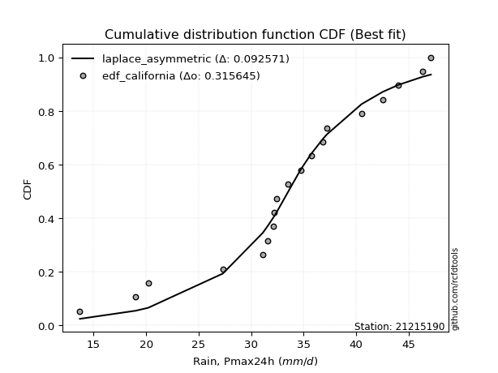</img></img>

</div>


### 2. Empirical - EDF Hazen (1930)

Hazen method for plotting positions is a formula used to estimate the empirical cumulative probability distribution of flood events or other hydrological data. This formula often results in biased estimations, particularly when extrapolating to extreme events (high return periods).

<div align="center">


$P=(m-0.5)/n$


</div>


**2.1. Empirical values**

<div align="center">

|                | 0                  | 1                 | 2                  | 3                  | 4                  | 5                  | 6                  | 7         | 8                  | 9                  | 10                 | 11                | 12                 | 13                 | 14                 | 15                | 16                | 17        | 18                 | 19                 |
|:---------------|:-------------------|:------------------|:-------------------|:-------------------|:-------------------|:-------------------|:-------------------|:----------|:-------------------|:-------------------|:-------------------|:------------------|:-------------------|:-------------------|:-------------------|:------------------|:------------------|:----------|:-------------------|:-------------------|
| date           | 2006               | 2007              | 2020               | 2008               | 2022               | 2021               | 2014               | 2009      | 2025               | 2010               | 2018               | 2011              | 2013               | 2012               | 2016               | 2023              | 2015              | 2024      | 2017               | 2019               |
| x              | 13.7               | 19.0              | 20.2               | 27.3               | 31.1               | 31.6               | 32.1               | 32.2      | 32.4               | 32.4               | 33.5               | 34.7              | 35.7               | 36.8               | 37.2               | 40.5              | 42.5              | 44.0      | 46.3               | 47.1               |
| m              | 1                  | 2                 | 3                  | 4                  | 5                  | 6                  | 7                  | 8         | 9                  | 10                 | 11                 | 12                | 13                 | 14                 | 15                 | 16                | 17                | 18        | 19                 | 20                 |
| empirical_dist | edf_hazen          | edf_hazen         | edf_hazen          | edf_hazen          | edf_hazen          | edf_hazen          | edf_hazen          | edf_hazen | edf_hazen          | edf_hazen          | edf_hazen          | edf_hazen         | edf_hazen          | edf_hazen          | edf_hazen          | edf_hazen         | edf_hazen         | edf_hazen | edf_hazen          | edf_hazen          |
| empirical      | 0.025              | 0.075             | 0.125              | 0.175              | 0.225              | 0.275              | 0.325              | 0.375     | 0.425              | 0.475              | 0.525              | 0.575             | 0.625              | 0.675              | 0.725              | 0.775             | 0.825             | 0.875     | 0.925              | 0.975              |
| empirical_tr   | 1.0256410256410258 | 1.081081081081081 | 1.1428571428571428 | 1.2121212121212122 | 1.2903225806451613 | 1.3793103448275863 | 1.4814814814814814 | 1.6       | 1.7391304347826089 | 1.9047619047619047 | 2.1052631578947367 | 2.352941176470588 | 2.6666666666666665 | 3.0769230769230775 | 3.6363636363636362 | 4.444444444444445 | 5.714285714285713 | 8.0       | 13.333333333333341 | 39.999999999999964 |

</div>


**2.2. Kolmogorov-Smirnov fit test (sorted by Δ)**


<div align="center">

|                | 0                   | 1                  | 2                   | 3                   | 4                   | 5                  | 6                  | 7                  | 8                   | 9                   | 10                 | 11                  | 12                  | 13                 | 14                  | 15                  | 16                    | 17                  | 18                 | 19                  | 20                  | 21                  | 22                 | 23                 | 24                  | 25                  | 26                  | 27                 | 28                  | 29                  | 30                  | 31                  | 32                 | 33                  | 34                  | 35                  | 36                  | 37                  | 38                  | 39                 | 40                 | 41                  | 42                  | 43                  | 44                 | 45                  | 46                  | 47                  | 48                 | 49                 | 50                 | 51                 | 52                 | 53                 | 54                  | 55                  | 56                 | 57                  | 58                 | 59                  | 60                  | 61                 | 62                  | 63                 | 64                 | 65                  | 66                 | 67                 | 68                  | 69                 | 70                 | 71                  | 72                 | 73                  | 74                  | 75                 | 76                  | 77                 | 78                  | 79                  | 80                 | 81                 | 82                 | 83                  | 84                 | 85                  | 86                  | 87                 | 88                 | 89                 |
|:---------------|:--------------------|:-------------------|:--------------------|:--------------------|:--------------------|:-------------------|:-------------------|:-------------------|:--------------------|:--------------------|:-------------------|:--------------------|:--------------------|:-------------------|:--------------------|:--------------------|:----------------------|:--------------------|:-------------------|:--------------------|:--------------------|:--------------------|:-------------------|:-------------------|:--------------------|:--------------------|:--------------------|:-------------------|:--------------------|:--------------------|:--------------------|:--------------------|:-------------------|:--------------------|:--------------------|:--------------------|:--------------------|:--------------------|:--------------------|:-------------------|:-------------------|:--------------------|:--------------------|:--------------------|:-------------------|:--------------------|:--------------------|:--------------------|:-------------------|:-------------------|:-------------------|:-------------------|:-------------------|:-------------------|:--------------------|:--------------------|:-------------------|:--------------------|:-------------------|:--------------------|:--------------------|:-------------------|:--------------------|:-------------------|:-------------------|:--------------------|:-------------------|:-------------------|:--------------------|:-------------------|:-------------------|:--------------------|:-------------------|:--------------------|:--------------------|:-------------------|:--------------------|:-------------------|:--------------------|:--------------------|:-------------------|:-------------------|:-------------------|:--------------------|:-------------------|:--------------------|:--------------------|:-------------------|:-------------------|:-------------------|
| station        | 21215190            | 21215190           | 21215190            | 21215190            | 21215190            | 21215190           | 21215190           | 21215190           | 21215190            | 21215190            | 21215190           | 21215190            | 21215190            | 21215190           | 21215190            | 21215190            | 21215190              | 21215190            | 21215190           | 21215190            | 21215190            | 21215190            | 21215190           | 21215190           | 21215190            | 21215190            | 21215190            | 21215190           | 21215190            | 21215190            | 21215190            | 21215190            | 21215190           | 21215190            | 21215190            | 21215190            | 21215190            | 21215190            | 21215190            | 21215190           | 21215190           | 21215190            | 21215190            | 21215190            | 21215190           | 21215190            | 21215190            | 21215190            | 21215190           | 21215190           | 21215190           | 21215190           | 21215190           | 21215190           | 21215190            | 21215190            | 21215190           | 21215190            | 21215190           | 21215190            | 21215190            | 21215190           | 21215190            | 21215190           | 21215190           | 21215190            | 21215190           | 21215190           | 21215190            | 21215190           | 21215190           | 21215190            | 21215190           | 21215190            | 21215190            | 21215190           | 21215190            | 21215190           | 21215190            | 21215190            | 21215190           | 21215190           | 21215190           | 21215190            | 21215190           | 21215190            | 21215190            | 21215190           | 21215190           | 21215190           |
| empirical_dist | edf_hazen           | edf_hazen          | edf_hazen           | edf_hazen           | edf_hazen           | edf_hazen          | edf_hazen          | edf_hazen          | edf_hazen           | edf_hazen           | edf_hazen          | edf_hazen           | edf_hazen           | edf_hazen          | edf_hazen           | edf_hazen           | edf_hazen             | edf_hazen           | edf_hazen          | edf_hazen           | edf_hazen           | edf_hazen           | edf_hazen          | edf_hazen          | edf_hazen           | edf_hazen           | edf_hazen           | edf_hazen          | edf_hazen           | edf_hazen           | edf_hazen           | edf_hazen           | edf_hazen          | edf_hazen           | edf_hazen           | edf_hazen           | edf_hazen           | edf_hazen           | edf_hazen           | edf_hazen          | edf_hazen          | edf_hazen           | edf_hazen           | edf_hazen           | edf_hazen          | edf_hazen           | edf_hazen           | edf_hazen           | edf_hazen          | edf_hazen          | edf_hazen          | edf_hazen          | edf_hazen          | edf_hazen          | edf_hazen           | edf_hazen           | edf_hazen          | edf_hazen           | edf_hazen          | edf_hazen           | edf_hazen           | edf_hazen          | edf_hazen           | edf_hazen          | edf_hazen          | edf_hazen           | edf_hazen          | edf_hazen          | edf_hazen           | edf_hazen          | edf_hazen          | edf_hazen           | edf_hazen          | edf_hazen           | edf_hazen           | edf_hazen          | edf_hazen           | edf_hazen          | edf_hazen           | edf_hazen           | edf_hazen          | edf_hazen          | edf_hazen          | edf_hazen           | edf_hazen          | edf_hazen           | edf_hazen           | edf_hazen          | edf_hazen          | edf_hazen          |
| p_dist         | logt                | gumbel_l           | laplace             | genlogistic         | johnsonsu           | fisk               | weibull_min        | logjohnsonsu       | logloggamma         | mielke              | pearson3           | loggenlogistic      | logmielke           | gompertz           | laplace_asymmetric  | hypsecant           | loglaplace_asymmetric | logweibull_min      | logpearson3        | logistic            | loggompertz         | logfisk             | loggumbel_l        | t                  | exponnorm           | norm                | crystalball         | truncnorm          | nct                 | nakagami            | f                   | fatiguelife         | betaprime          | logtruncnorm        | erlang              | gamma               | chi2                | invgamma            | maxwell             | loglaplace         | invgauss           | alpha               | ncf                 | rayleigh            | loghypsecant       | gumbel_r            | loglogistic         | invweibull          | logrice            | logexponnorm       | lognorm            | lognorm            | logcrystalball     | loglognorm         | lognakagami         | logf                | logfatiguelife     | lognct              | logbetaprime       | moyal               | halfnorm            | logerlang          | loginvgamma         | loggamma           | loggamma           | logalpha            | logncf             | loginvgauss        | kstwobign           | halflogistic       | logmaxwell         | loginvweibull       | lograyleigh        | gibrat              | loggumbel_r         | wald               | loghalfnorm         | logkstwobign       | logmoyal            | loghalflogistic     | genexpon           | loggenexpon        | expon              | logchi2             | logexpon           | logpareto           | logwald             | loggibrat          | pareto             | rice               |
| delta          | 0.10066520997455308 | 0.1012365098231448 | 0.10992545070870688 | 0.11685028766329705 | 0.12387306605603762 | 0.1271819209793182 | 0.1273348569483395 | 0.1294829807985339 | 0.13160558629040345 | 0.13242194988459224 | 0.1327917534669049 | 0.13290703478659746 | 0.13443652857803326 | 0.1375258072849119 | 0.13773138203870974 | 0.13778909458401525 | 0.1392162592518482    | 0.14053160617451035 | 0.1466547283299702 | 0.14927553322426854 | 0.15296407126546116 | 0.15589250165728377 | 0.1588125927470899 | 0.1634361041386815 | 0.16345871142306237 | 0.16345896079767278 | 0.16345896810393376 | 0.1634590156556369 | 0.16355036742711784 | 0.16437960171132424 | 0.16440808761584094 | 0.16501888273152596 | 0.16922407948192   | 0.17499971179173274 | 0.17669012368045386 | 0.17831487729753095 | 0.18135322188695494 | 0.18919794141384436 | 0.19716010746654686 | 0.1996979929804866 | 0.2021569698537534 | 0.20261862612077106 | 0.20269162438289542 | 0.20946374634431517 | 0.2176031453576214 | 0.22097470828065682 | 0.22285273447043683 | 0.22465358858237242 | 0.2290211521289762 | 0.2290553100170696 | 0.2290557612228604 | 0.2290557612228604 | 0.2290562263995334 | 0.2290578340038035 | 0.22914030484142126 | 0.22979216494146917 | 0.2304317556732072 | 0.23346098796317846 | 0.2359365285526829 | 0.24295760216242476 | 0.24439759628130306 | 0.247962541079322  | 0.24855229104508156 | 0.2503946187902084 | 0.2503946187902084 | 0.25051610633293275 | 0.2519836983082989 | 0.2545275804571694 | 0.25683204059346343 | 0.2584265872390139 | 0.2633295327324323 | 0.26994101663092784 | 0.2751748711511861 | 0.28925224405774885 | 0.29650259777784516 | 0.3012392192029478 | 0.30856678685434724 | 0.3091345935334523 | 0.32196701665612903 | 0.33004435518045927 | 0.3339453274244928 | 0.3423911373866185 | 0.3594376577260686 | 0.38599320372691265 | 0.3918440363547132 | 0.39184404284122243 | 0.39278087725475586 | 0.4065608493248427 | 0.5516151204810527 | 0.8338453903580519 |
| deltao         | 0.3096406529800002  | 0.3096406529800002 | 0.3096406529800002  | 0.3096406529800002  | 0.3096406529800002  | 0.3096406529800002 | 0.3096406529800002 | 0.3096406529800002 | 0.3096406529800002  | 0.3096406529800002  | 0.3096406529800002 | 0.3096406529800002  | 0.3096406529800002  | 0.3096406529800002 | 0.3096406529800002  | 0.3096406529800002  | 0.3096406529800002    | 0.3096406529800002  | 0.3096406529800002 | 0.3096406529800002  | 0.3096406529800002  | 0.3096406529800002  | 0.3096406529800002 | 0.3096406529800002 | 0.3096406529800002  | 0.3096406529800002  | 0.3096406529800002  | 0.3096406529800002 | 0.3096406529800002  | 0.3096406529800002  | 0.3096406529800002  | 0.3096406529800002  | 0.3096406529800002 | 0.3096406529800002  | 0.3096406529800002  | 0.3096406529800002  | 0.3096406529800002  | 0.3096406529800002  | 0.3096406529800002  | 0.3096406529800002 | 0.3096406529800002 | 0.3096406529800002  | 0.3096406529800002  | 0.3096406529800002  | 0.3096406529800002 | 0.3096406529800002  | 0.3096406529800002  | 0.3096406529800002  | 0.3096406529800002 | 0.3096406529800002 | 0.3096406529800002 | 0.3096406529800002 | 0.3096406529800002 | 0.3096406529800002 | 0.3096406529800002  | 0.3096406529800002  | 0.3096406529800002 | 0.3096406529800002  | 0.3096406529800002 | 0.3096406529800002  | 0.3096406529800002  | 0.3096406529800002 | 0.3096406529800002  | 0.3096406529800002 | 0.3096406529800002 | 0.3096406529800002  | 0.3096406529800002 | 0.3096406529800002 | 0.3096406529800002  | 0.3096406529800002 | 0.3096406529800002 | 0.3096406529800002  | 0.3096406529800002 | 0.3096406529800002  | 0.3096406529800002  | 0.3096406529800002 | 0.3096406529800002  | 0.3096406529800002 | 0.3096406529800002  | 0.3096406529800002  | 0.3096406529800002 | 0.3096406529800002 | 0.3096406529800002 | 0.3096406529800002  | 0.3096406529800002 | 0.3096406529800002  | 0.3096406529800002  | 0.3096406529800002 | 0.3096406529800002 | 0.3096406529800002 |
| eval           | Δo > Δ              | Δo > Δ             | Δo > Δ              | Δo > Δ              | Δo > Δ              | Δo > Δ             | Δo > Δ             | Δo > Δ             | Δo > Δ              | Δo > Δ              | Δo > Δ             | Δo > Δ              | Δo > Δ              | Δo > Δ             | Δo > Δ              | Δo > Δ              | Δo > Δ                | Δo > Δ              | Δo > Δ             | Δo > Δ              | Δo > Δ              | Δo > Δ              | Δo > Δ             | Δo > Δ             | Δo > Δ              | Δo > Δ              | Δo > Δ              | Δo > Δ             | Δo > Δ              | Δo > Δ              | Δo > Δ              | Δo > Δ              | Δo > Δ             | Δo > Δ              | Δo > Δ              | Δo > Δ              | Δo > Δ              | Δo > Δ              | Δo > Δ              | Δo > Δ             | Δo > Δ             | Δo > Δ              | Δo > Δ              | Δo > Δ              | Δo > Δ             | Δo > Δ              | Δo > Δ              | Δo > Δ              | Δo > Δ             | Δo > Δ             | Δo > Δ             | Δo > Δ             | Δo > Δ             | Δo > Δ             | Δo > Δ              | Δo > Δ              | Δo > Δ             | Δo > Δ              | Δo > Δ             | Δo > Δ              | Δo > Δ              | Δo > Δ             | Δo > Δ              | Δo > Δ             | Δo > Δ             | Δo > Δ              | Δo > Δ             | Δo > Δ             | Δo > Δ              | Δo > Δ             | Δo > Δ             | Δo > Δ              | Δo > Δ             | Δo > Δ              | Δo > Δ              | Δo > Δ             | Δo > Δ              | Δo > Δ             | Δo <= Δ             | Δo <= Δ             | Δo <= Δ            | Δo <= Δ            | Δo <= Δ            | Δo <= Δ             | Δo <= Δ            | Δo <= Δ             | Δo <= Δ             | Δo <= Δ            | Δo <= Δ            | Δo <= Δ            |
| fit            | 1                   | 1                  | 1                   | 1                   | 1                   | 1                  | 1                  | 1                  | 1                   | 1                   | 1                  | 1                   | 1                   | 1                  | 1                   | 1                   | 1                     | 1                   | 1                  | 1                   | 1                   | 1                   | 1                  | 1                  | 1                   | 1                   | 1                   | 1                  | 1                   | 1                   | 1                   | 1                   | 1                  | 1                   | 1                   | 1                   | 1                   | 1                   | 1                   | 1                  | 1                  | 1                   | 1                   | 1                   | 1                  | 1                   | 1                   | 1                   | 1                  | 1                  | 1                  | 1                  | 1                  | 1                  | 1                   | 1                   | 1                  | 1                   | 1                  | 1                   | 1                   | 1                  | 1                   | 1                  | 1                  | 1                   | 1                  | 1                  | 1                   | 1                  | 1                  | 1                   | 1                  | 1                   | 1                   | 1                  | 1                   | 1                  | 0                   | 0                   | 0                  | 0                  | 0                  | 0                   | 0                  | 0                   | 0                   | 0                  | 0                  | 0                  |
| n              | 20                  | 20                 | 20                  | 20                  | 20                  | 20                 | 20                 | 20                 | 20                  | 20                  | 20                 | 20                  | 20                  | 20                 | 20                  | 20                  | 20                    | 20                  | 20                 | 20                  | 20                  | 20                  | 20                 | 20                 | 20                  | 20                  | 20                  | 20                 | 20                  | 20                  | 20                  | 20                  | 20                 | 20                  | 20                  | 20                  | 20                  | 20                  | 20                  | 20                 | 20                 | 20                  | 20                  | 20                  | 20                 | 20                  | 20                  | 20                  | 20                 | 20                 | 20                 | 20                 | 20                 | 20                 | 20                  | 20                  | 20                 | 20                  | 20                 | 20                  | 20                  | 20                 | 20                  | 20                 | 20                 | 20                  | 20                 | 20                 | 20                  | 20                 | 20                 | 20                  | 20                 | 20                  | 20                  | 20                 | 20                  | 20                 | 20                  | 20                  | 20                 | 20                 | 20                 | 20                  | 20                 | 20                  | 20                  | 20                 | 20                 | 20                 |
| best_fit       | 1                   | 0                  | 0                   | 0                   | 0                   | 0                  | 0                  | 0                  | 0                   | 0                   | 0                  | 0                   | 0                   | 0                  | 0                   | 0                   | 0                     | 0                   | 0                  | 0                   | 0                   | 0                   | 0                  | 0                  | 0                   | 0                   | 0                   | 0                  | 0                   | 0                   | 0                   | 0                   | 0                  | 0                   | 0                   | 0                   | 0                   | 0                   | 0                   | 0                  | 0                  | 0                   | 0                   | 0                   | 0                  | 0                   | 0                   | 0                   | 0                  | 0                  | 0                  | 0                  | 0                  | 0                  | 0                   | 0                   | 0                  | 0                   | 0                  | 0                   | 0                   | 0                  | 0                   | 0                  | 0                  | 0                   | 0                  | 0                  | 0                   | 0                  | 0                  | 0                   | 0                  | 0                   | 0                   | 0                  | 0                   | 0                  | 0                   | 0                   | 0                  | 0                  | 0                  | 0                   | 0                  | 0                   | 0                   | 0                  | 0                  | 0                  |
| best_fit_sort  | 1                   | 2                  | 3                   | 4                   | 5                   | 6                  | 7                  | 8                  | 9                   | 10                  | 11                 | 12                  | 13                  | 14                 | 15                  | 16                  | 17                    | 18                  | 19                 | 20                  | 21                  | 22                  | 23                 | 24                 | 25                  | 26                  | 27                  | 28                 | 29                  | 30                  | 31                  | 32                  | 33                 | 34                  | 35                  | 36                  | 37                  | 38                  | 39                  | 40                 | 41                 | 42                  | 43                  | 44                  | 45                 | 46                  | 47                  | 48                  | 49                 | 50                 | 51                 | 52                 | 53                 | 54                 | 55                  | 56                  | 57                 | 58                  | 59                 | 60                  | 61                  | 62                 | 63                  | 64                 | 65                 | 66                  | 67                 | 68                 | 69                  | 70                 | 71                 | 72                  | 73                 | 74                  | 75                  | 76                 | 77                  | 78                 | 79                  | 80                  | 81                 | 82                 | 83                 | 84                  | 85                 | 86                  | 87                  | 88                 | 89                 | 90                 |

</div>


<div align="center">

</img>

</div>


**2.3. Best fit**

<div align="center">

|   id |   station | empirical_dist   | p_dist   |    delta |   deltao | eval   |   fit |   n |   best_fit |   best_fit_sort |
|-----:|----------:|:-----------------|:---------|---------:|---------:|:-------|------:|----:|-----------:|----------------:|
|    0 |  21215190 | edf_hazen        | logt     | 0.100665 | 0.309641 | Δo > Δ |     1 |  20 |          1 |               1 |

</div>


<div align="center">

</img>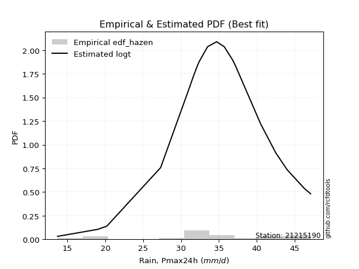</img>

</div>


### 3. Empirical - EDF Weibull (1939)

Weibull plotting position formula is an empirical method used to estimate the non-exceedance probability or plotting position for a set of observed data, is often recommended or widely used in practice, particularly in flood frequency analysis.

<div align="center">


$P=m/(n+1)$


</div>


**3.1. Empirical values**

<div align="center">

|                | 0                    | 1                   | 2                   | 3                   | 4                   | 5                  | 6                  | 7                   | 8                   | 9                   | 10                 | 11                 | 12                 | 13                 | 14                 | 15                 | 16                 | 17                 | 18                 | 19                 |
|:---------------|:---------------------|:--------------------|:--------------------|:--------------------|:--------------------|:-------------------|:-------------------|:--------------------|:--------------------|:--------------------|:-------------------|:-------------------|:-------------------|:-------------------|:-------------------|:-------------------|:-------------------|:-------------------|:-------------------|:-------------------|
| date           | 2006                 | 2007                | 2020                | 2008                | 2022                | 2021               | 2014               | 2009                | 2025                | 2010                | 2018               | 2011               | 2013               | 2012               | 2016               | 2023               | 2015               | 2024               | 2017               | 2019               |
| x              | 13.7                 | 19.0                | 20.2                | 27.3                | 31.1                | 31.6               | 32.1               | 32.2                | 32.4                | 32.4                | 33.5               | 34.7               | 35.7               | 36.8               | 37.2               | 40.5               | 42.5               | 44.0               | 46.3               | 47.1               |
| m              | 1                    | 2                   | 3                   | 4                   | 5                   | 6                  | 7                  | 8                   | 9                   | 10                  | 11                 | 12                 | 13                 | 14                 | 15                 | 16                 | 17                 | 18                 | 19                 | 20                 |
| empirical_dist | edf_weibull          | edf_weibull         | edf_weibull         | edf_weibull         | edf_weibull         | edf_weibull        | edf_weibull        | edf_weibull         | edf_weibull         | edf_weibull         | edf_weibull        | edf_weibull        | edf_weibull        | edf_weibull        | edf_weibull        | edf_weibull        | edf_weibull        | edf_weibull        | edf_weibull        | edf_weibull        |
| empirical      | 0.047619047619047616 | 0.09523809523809523 | 0.14285714285714285 | 0.19047619047619047 | 0.23809523809523808 | 0.2857142857142857 | 0.3333333333333333 | 0.38095238095238093 | 0.42857142857142855 | 0.47619047619047616 | 0.5238095238095238 | 0.5714285714285714 | 0.6190476190476191 | 0.6666666666666666 | 0.7142857142857143 | 0.7619047619047619 | 0.8095238095238095 | 0.8571428571428571 | 0.9047619047619048 | 0.9523809523809523 |
| empirical_tr   | 1.05                 | 1.1052631578947367  | 1.1666666666666665  | 1.2352941176470589  | 1.3125              | 1.4                | 1.4999999999999998 | 1.6153846153846154  | 1.75                | 1.909090909090909   | 2.1                | 2.333333333333333  | 2.625              | 2.9999999999999996 | 3.5                | 4.199999999999999  | 5.25               | 6.999999999999997  | 10.5               | 20.999999999999975 |

</div>


**3.2. Kolmogorov-Smirnov fit test (sorted by Δ)**


<div align="center">

|                | 0                  | 1                   | 2                   | 3                   | 4                   | 5                   | 6                   | 7                   | 8                   | 9                   | 10                  | 11                  | 12                  | 13                  | 14                  | 15                  | 16                    | 17                  | 18                  | 19                  | 20                  | 21                 | 22                  | 23                  | 24                 | 25                 | 26                  | 27                  | 28                  | 29                  | 30                  | 31                  | 32                  | 33                 | 34                  | 35                  | 36                  | 37                  | 38                  | 39                  | 40                  | 41                  | 42                  | 43                 | 44                  | 45                  | 46                  | 47                  | 48                  | 49                  | 50                  | 51                  | 52                  | 53                  | 54                  | 55                 | 56                  | 57                  | 58                  | 59                 | 60                  | 61                  | 62                  | 63                 | 64                 | 65                  | 66                  | 67                  | 68                  | 69                  | 70                  | 71                 | 72                 | 73                  | 74                  | 75                 | 76                  | 77                 | 78                  | 79                  | 80                 | 81                 | 82                 | 83                  | 84                 | 85                 | 86                  | 87                 | 88                 | 89                 |
|:---------------|:-------------------|:--------------------|:--------------------|:--------------------|:--------------------|:--------------------|:--------------------|:--------------------|:--------------------|:--------------------|:--------------------|:--------------------|:--------------------|:--------------------|:--------------------|:--------------------|:----------------------|:--------------------|:--------------------|:--------------------|:--------------------|:-------------------|:--------------------|:--------------------|:-------------------|:-------------------|:--------------------|:--------------------|:--------------------|:--------------------|:--------------------|:--------------------|:--------------------|:-------------------|:--------------------|:--------------------|:--------------------|:--------------------|:--------------------|:--------------------|:--------------------|:--------------------|:--------------------|:-------------------|:--------------------|:--------------------|:--------------------|:--------------------|:--------------------|:--------------------|:--------------------|:--------------------|:--------------------|:--------------------|:--------------------|:-------------------|:--------------------|:--------------------|:--------------------|:-------------------|:--------------------|:--------------------|:--------------------|:-------------------|:-------------------|:--------------------|:--------------------|:--------------------|:--------------------|:--------------------|:--------------------|:-------------------|:-------------------|:--------------------|:--------------------|:-------------------|:--------------------|:-------------------|:--------------------|:--------------------|:-------------------|:-------------------|:-------------------|:--------------------|:-------------------|:-------------------|:--------------------|:-------------------|:-------------------|:-------------------|
| station        | 21215190           | 21215190            | 21215190            | 21215190            | 21215190            | 21215190            | 21215190            | 21215190            | 21215190            | 21215190            | 21215190            | 21215190            | 21215190            | 21215190            | 21215190            | 21215190            | 21215190              | 21215190            | 21215190            | 21215190            | 21215190            | 21215190           | 21215190            | 21215190            | 21215190           | 21215190           | 21215190            | 21215190            | 21215190            | 21215190            | 21215190            | 21215190            | 21215190            | 21215190           | 21215190            | 21215190            | 21215190            | 21215190            | 21215190            | 21215190            | 21215190            | 21215190            | 21215190            | 21215190           | 21215190            | 21215190            | 21215190            | 21215190            | 21215190            | 21215190            | 21215190            | 21215190            | 21215190            | 21215190            | 21215190            | 21215190           | 21215190            | 21215190            | 21215190            | 21215190           | 21215190            | 21215190            | 21215190            | 21215190           | 21215190           | 21215190            | 21215190            | 21215190            | 21215190            | 21215190            | 21215190            | 21215190           | 21215190           | 21215190            | 21215190            | 21215190           | 21215190            | 21215190           | 21215190            | 21215190            | 21215190           | 21215190           | 21215190           | 21215190            | 21215190           | 21215190           | 21215190            | 21215190           | 21215190           | 21215190           |
| empirical_dist | edf_weibull        | edf_weibull         | edf_weibull         | edf_weibull         | edf_weibull         | edf_weibull         | edf_weibull         | edf_weibull         | edf_weibull         | edf_weibull         | edf_weibull         | edf_weibull         | edf_weibull         | edf_weibull         | edf_weibull         | edf_weibull         | edf_weibull           | edf_weibull         | edf_weibull         | edf_weibull         | edf_weibull         | edf_weibull        | edf_weibull         | edf_weibull         | edf_weibull        | edf_weibull        | edf_weibull         | edf_weibull         | edf_weibull         | edf_weibull         | edf_weibull         | edf_weibull         | edf_weibull         | edf_weibull        | edf_weibull         | edf_weibull         | edf_weibull         | edf_weibull         | edf_weibull         | edf_weibull         | edf_weibull         | edf_weibull         | edf_weibull         | edf_weibull        | edf_weibull         | edf_weibull         | edf_weibull         | edf_weibull         | edf_weibull         | edf_weibull         | edf_weibull         | edf_weibull         | edf_weibull         | edf_weibull         | edf_weibull         | edf_weibull        | edf_weibull         | edf_weibull         | edf_weibull         | edf_weibull        | edf_weibull         | edf_weibull         | edf_weibull         | edf_weibull        | edf_weibull        | edf_weibull         | edf_weibull         | edf_weibull         | edf_weibull         | edf_weibull         | edf_weibull         | edf_weibull        | edf_weibull        | edf_weibull         | edf_weibull         | edf_weibull        | edf_weibull         | edf_weibull        | edf_weibull         | edf_weibull         | edf_weibull        | edf_weibull        | edf_weibull        | edf_weibull         | edf_weibull        | edf_weibull        | edf_weibull         | edf_weibull        | edf_weibull        | edf_weibull        |
| p_dist         | laplace            | gumbel_l            | logt                | genlogistic         | johnsonsu           | fisk                | weibull_min         | logjohnsonsu        | logloggamma         | mielke              | pearson3            | loggenlogistic      | logmielke           | gompertz            | laplace_asymmetric  | hypsecant           | loglaplace_asymmetric | logweibull_min      | logpearson3         | logistic            | loggompertz         | logfisk            | loggumbel_l         | t                   | exponnorm          | norm               | crystalball         | truncnorm           | nct                 | nakagami            | f                   | fatiguelife         | betaprime           | erlang             | gamma               | chi2                | invgamma            | maxwell             | loglaplace          | invgauss            | alpha               | ncf                 | logtruncnorm        | rayleigh           | loghypsecant        | gumbel_r            | loglogistic         | invweibull          | logrice             | logexponnorm        | lognorm             | lognorm             | logcrystalball      | loglognorm          | lognakagami         | logf               | logfatiguelife      | lognct              | logbetaprime        | moyal              | halfnorm            | logerlang           | loginvgamma         | loggamma           | loggamma           | logalpha            | logncf              | loginvgauss         | kstwobign           | halflogistic        | logmaxwell          | loginvweibull      | lograyleigh        | gibrat              | loggumbel_r         | wald               | loghalfnorm         | logkstwobign       | logmoyal            | loghalflogistic     | genexpon           | loggenexpon        | expon              | logchi2             | logexpon           | logpareto          | logwald             | loggibrat          | pareto             | rice               |
| delta          | 0.0968302126134688 | 0.09823908394483488 | 0.10188190653676366 | 0.10375504956805898 | 0.11077782796079955 | 0.11408668288408014 | 0.11423961885310141 | 0.11638774270329583 | 0.11851034819516537 | 0.11932671178935417 | 0.11969651537166681 | 0.11981179669135938 | 0.12134129048279518 | 0.12443056918967382 | 0.12463614394347167 | 0.12469385648877718 | 0.1261210211566101    | 0.12743636807927228 | 0.13355949023473213 | 0.13618029512903046 | 0.13986883317022308 | 0.1427972635620457 | 0.14571735465185182 | 0.15034086604344343 | 0.1503634733278243 | 0.1503637227024347 | 0.15036373000869568 | 0.15036377756039881 | 0.15045512933187977 | 0.15128436361608616 | 0.15131284952060287 | 0.15192364463628788 | 0.15612884138668193 | 0.1635948855852158 | 0.16521963920229288 | 0.16825798379171686 | 0.17610270331860628 | 0.18406486937130878 | 0.18660275488524852 | 0.18906173175851532 | 0.18952338802553298 | 0.18959638628765735 | 0.19047590226792321 | 0.1963685082490771 | 0.20450790726238333 | 0.20787947018541875 | 0.20975749637519875 | 0.21155835048713434 | 0.21592591403373812 | 0.21596007192183153 | 0.21596052312762232 | 0.21596052312762232 | 0.21596098830429533 | 0.21596259590856542 | 0.21604506674618318 | 0.2166969268462311 | 0.21733651757796912 | 0.22036574986794039 | 0.22284129045744483 | 0.2298623640671867 | 0.23130235818606498 | 0.23486730298408393 | 0.23545705294984348 | 0.2372993806949703 | 0.2372993806949703 | 0.23742086823769465 | 0.23888846021306087 | 0.24143234236193134 | 0.24373680249822538 | 0.24533134914377586 | 0.25023429463719427 | 0.2568457785356898 | 0.262079633055948  | 0.27615700596251075 | 0.28340735968260705 | 0.2881439811077097 | 0.29547154875910914 | 0.2960393554382142 | 0.30887177856089093 | 0.31694911708522117 | 0.3208500893292547 | 0.3292958992913804 | 0.3463424196308305 | 0.37051701325072217 | 0.3787487982594751 | 0.3787488047459843 | 0.37968563915951775 | 0.3934656112296046 | 0.5313770252429574 | 0.815988247500909  |
| deltao         | 0.3096406529800002 | 0.3096406529800002  | 0.3096406529800002  | 0.3096406529800002  | 0.3096406529800002  | 0.3096406529800002  | 0.3096406529800002  | 0.3096406529800002  | 0.3096406529800002  | 0.3096406529800002  | 0.3096406529800002  | 0.3096406529800002  | 0.3096406529800002  | 0.3096406529800002  | 0.3096406529800002  | 0.3096406529800002  | 0.3096406529800002    | 0.3096406529800002  | 0.3096406529800002  | 0.3096406529800002  | 0.3096406529800002  | 0.3096406529800002 | 0.3096406529800002  | 0.3096406529800002  | 0.3096406529800002 | 0.3096406529800002 | 0.3096406529800002  | 0.3096406529800002  | 0.3096406529800002  | 0.3096406529800002  | 0.3096406529800002  | 0.3096406529800002  | 0.3096406529800002  | 0.3096406529800002 | 0.3096406529800002  | 0.3096406529800002  | 0.3096406529800002  | 0.3096406529800002  | 0.3096406529800002  | 0.3096406529800002  | 0.3096406529800002  | 0.3096406529800002  | 0.3096406529800002  | 0.3096406529800002 | 0.3096406529800002  | 0.3096406529800002  | 0.3096406529800002  | 0.3096406529800002  | 0.3096406529800002  | 0.3096406529800002  | 0.3096406529800002  | 0.3096406529800002  | 0.3096406529800002  | 0.3096406529800002  | 0.3096406529800002  | 0.3096406529800002 | 0.3096406529800002  | 0.3096406529800002  | 0.3096406529800002  | 0.3096406529800002 | 0.3096406529800002  | 0.3096406529800002  | 0.3096406529800002  | 0.3096406529800002 | 0.3096406529800002 | 0.3096406529800002  | 0.3096406529800002  | 0.3096406529800002  | 0.3096406529800002  | 0.3096406529800002  | 0.3096406529800002  | 0.3096406529800002 | 0.3096406529800002 | 0.3096406529800002  | 0.3096406529800002  | 0.3096406529800002 | 0.3096406529800002  | 0.3096406529800002 | 0.3096406529800002  | 0.3096406529800002  | 0.3096406529800002 | 0.3096406529800002 | 0.3096406529800002 | 0.3096406529800002  | 0.3096406529800002 | 0.3096406529800002 | 0.3096406529800002  | 0.3096406529800002 | 0.3096406529800002 | 0.3096406529800002 |
| eval           | Δo > Δ             | Δo > Δ              | Δo > Δ              | Δo > Δ              | Δo > Δ              | Δo > Δ              | Δo > Δ              | Δo > Δ              | Δo > Δ              | Δo > Δ              | Δo > Δ              | Δo > Δ              | Δo > Δ              | Δo > Δ              | Δo > Δ              | Δo > Δ              | Δo > Δ                | Δo > Δ              | Δo > Δ              | Δo > Δ              | Δo > Δ              | Δo > Δ             | Δo > Δ              | Δo > Δ              | Δo > Δ             | Δo > Δ             | Δo > Δ              | Δo > Δ              | Δo > Δ              | Δo > Δ              | Δo > Δ              | Δo > Δ              | Δo > Δ              | Δo > Δ             | Δo > Δ              | Δo > Δ              | Δo > Δ              | Δo > Δ              | Δo > Δ              | Δo > Δ              | Δo > Δ              | Δo > Δ              | Δo > Δ              | Δo > Δ             | Δo > Δ              | Δo > Δ              | Δo > Δ              | Δo > Δ              | Δo > Δ              | Δo > Δ              | Δo > Δ              | Δo > Δ              | Δo > Δ              | Δo > Δ              | Δo > Δ              | Δo > Δ             | Δo > Δ              | Δo > Δ              | Δo > Δ              | Δo > Δ             | Δo > Δ              | Δo > Δ              | Δo > Δ              | Δo > Δ             | Δo > Δ             | Δo > Δ              | Δo > Δ              | Δo > Δ              | Δo > Δ              | Δo > Δ              | Δo > Δ              | Δo > Δ             | Δo > Δ             | Δo > Δ              | Δo > Δ              | Δo > Δ             | Δo > Δ              | Δo > Δ             | Δo > Δ              | Δo <= Δ             | Δo <= Δ            | Δo <= Δ            | Δo <= Δ            | Δo <= Δ             | Δo <= Δ            | Δo <= Δ            | Δo <= Δ             | Δo <= Δ            | Δo <= Δ            | Δo <= Δ            |
| fit            | 1                  | 1                   | 1                   | 1                   | 1                   | 1                   | 1                   | 1                   | 1                   | 1                   | 1                   | 1                   | 1                   | 1                   | 1                   | 1                   | 1                     | 1                   | 1                   | 1                   | 1                   | 1                  | 1                   | 1                   | 1                  | 1                  | 1                   | 1                   | 1                   | 1                   | 1                   | 1                   | 1                   | 1                  | 1                   | 1                   | 1                   | 1                   | 1                   | 1                   | 1                   | 1                   | 1                   | 1                  | 1                   | 1                   | 1                   | 1                   | 1                   | 1                   | 1                   | 1                   | 1                   | 1                   | 1                   | 1                  | 1                   | 1                   | 1                   | 1                  | 1                   | 1                   | 1                   | 1                  | 1                  | 1                   | 1                   | 1                   | 1                   | 1                   | 1                   | 1                  | 1                  | 1                   | 1                   | 1                  | 1                   | 1                  | 1                   | 0                   | 0                  | 0                  | 0                  | 0                   | 0                  | 0                  | 0                   | 0                  | 0                  | 0                  |
| n              | 20                 | 20                  | 20                  | 20                  | 20                  | 20                  | 20                  | 20                  | 20                  | 20                  | 20                  | 20                  | 20                  | 20                  | 20                  | 20                  | 20                    | 20                  | 20                  | 20                  | 20                  | 20                 | 20                  | 20                  | 20                 | 20                 | 20                  | 20                  | 20                  | 20                  | 20                  | 20                  | 20                  | 20                 | 20                  | 20                  | 20                  | 20                  | 20                  | 20                  | 20                  | 20                  | 20                  | 20                 | 20                  | 20                  | 20                  | 20                  | 20                  | 20                  | 20                  | 20                  | 20                  | 20                  | 20                  | 20                 | 20                  | 20                  | 20                  | 20                 | 20                  | 20                  | 20                  | 20                 | 20                 | 20                  | 20                  | 20                  | 20                  | 20                  | 20                  | 20                 | 20                 | 20                  | 20                  | 20                 | 20                  | 20                 | 20                  | 20                  | 20                 | 20                 | 20                 | 20                  | 20                 | 20                 | 20                  | 20                 | 20                 | 20                 |
| best_fit       | 1                  | 0                   | 0                   | 0                   | 0                   | 0                   | 0                   | 0                   | 0                   | 0                   | 0                   | 0                   | 0                   | 0                   | 0                   | 0                   | 0                     | 0                   | 0                   | 0                   | 0                   | 0                  | 0                   | 0                   | 0                  | 0                  | 0                   | 0                   | 0                   | 0                   | 0                   | 0                   | 0                   | 0                  | 0                   | 0                   | 0                   | 0                   | 0                   | 0                   | 0                   | 0                   | 0                   | 0                  | 0                   | 0                   | 0                   | 0                   | 0                   | 0                   | 0                   | 0                   | 0                   | 0                   | 0                   | 0                  | 0                   | 0                   | 0                   | 0                  | 0                   | 0                   | 0                   | 0                  | 0                  | 0                   | 0                   | 0                   | 0                   | 0                   | 0                   | 0                  | 0                  | 0                   | 0                   | 0                  | 0                   | 0                  | 0                   | 0                   | 0                  | 0                  | 0                  | 0                   | 0                  | 0                  | 0                   | 0                  | 0                  | 0                  |
| best_fit_sort  | 1                  | 2                   | 3                   | 4                   | 5                   | 6                   | 7                   | 8                   | 9                   | 10                  | 11                  | 12                  | 13                  | 14                  | 15                  | 16                  | 17                    | 18                  | 19                  | 20                  | 21                  | 22                 | 23                  | 24                  | 25                 | 26                 | 27                  | 28                  | 29                  | 30                  | 31                  | 32                  | 33                  | 34                 | 35                  | 36                  | 37                  | 38                  | 39                  | 40                  | 41                  | 42                  | 43                  | 44                 | 45                  | 46                  | 47                  | 48                  | 49                  | 50                  | 51                  | 52                  | 53                  | 54                  | 55                  | 56                 | 57                  | 58                  | 59                  | 60                 | 61                  | 62                  | 63                  | 64                 | 65                 | 66                  | 67                  | 68                  | 69                  | 70                  | 71                  | 72                 | 73                 | 74                  | 75                  | 76                 | 77                  | 78                 | 79                  | 80                  | 81                 | 82                 | 83                 | 84                  | 85                 | 86                 | 87                  | 88                 | 89                 | 90                 |

</div>


<div align="center">

</img>

</div>


**3.3. Best fit**

<div align="center">

|   id |   station | empirical_dist   | p_dist   |     delta |   deltao | eval   |   fit |   n |   best_fit |   best_fit_sort |
|-----:|----------:|:-----------------|:---------|----------:|---------:|:-------|------:|----:|-----------:|----------------:|
|    0 |  21215190 | edf_weibull      | laplace  | 0.0968302 | 0.309641 | Δo > Δ |     1 |  20 |          1 |               1 |

</div>


<div align="center">

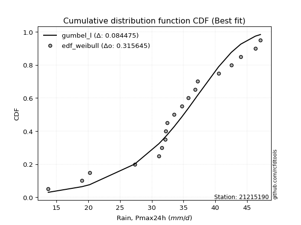</img>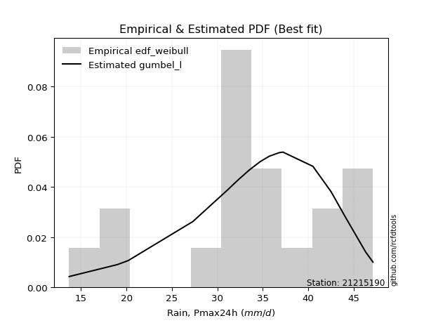</img>

</div>


### 4. Empirical - EDF Beard (1943)

The Beard formula (or Beard´s plotting position formula) in hydrology is used to estimate the empirical non-exceedance probability _(P)_ of a flood event (or other extreme hydrological data point) within a given dataset.

<div align="center">


$P=(m-0.31)/(n+0.38)$


</div>


**4.1. Empirical values**

<div align="center">

|                | 0                    | 1                   | 2                   | 3                   | 4                   | 5                   | 6                   | 7                  | 8                  | 9                   | 10                 | 11                 | 12                 | 13                 | 14                 | 15                 | 16                 | 17                 | 18                 | 19                 |
|:---------------|:---------------------|:--------------------|:--------------------|:--------------------|:--------------------|:--------------------|:--------------------|:-------------------|:-------------------|:--------------------|:-------------------|:-------------------|:-------------------|:-------------------|:-------------------|:-------------------|:-------------------|:-------------------|:-------------------|:-------------------|
| date           | 2006                 | 2007                | 2020                | 2008                | 2022                | 2021                | 2014                | 2009               | 2025               | 2010                | 2018               | 2011               | 2013               | 2012               | 2016               | 2023               | 2015               | 2024               | 2017               | 2019               |
| x              | 13.7                 | 19.0                | 20.2                | 27.3                | 31.1                | 31.6                | 32.1                | 32.2               | 32.4               | 32.4                | 33.5               | 34.7               | 35.7               | 36.8               | 37.2               | 40.5               | 42.5               | 44.0               | 46.3               | 47.1               |
| m              | 1                    | 2                   | 3                   | 4                   | 5                   | 6                   | 7                   | 8                  | 9                  | 10                  | 11                 | 12                 | 13                 | 14                 | 15                 | 16                 | 17                 | 18                 | 19                 | 20                 |
| empirical_dist | edf_beard            | edf_beard           | edf_beard           | edf_beard           | edf_beard           | edf_beard           | edf_beard           | edf_beard          | edf_beard          | edf_beard           | edf_beard          | edf_beard          | edf_beard          | edf_beard          | edf_beard          | edf_beard          | edf_beard          | edf_beard          | edf_beard          | edf_beard          |
| empirical      | 0.033856722276741906 | 0.08292443572129539 | 0.13199214916584887 | 0.18105986261040236 | 0.23012757605495587 | 0.27919528949950934 | 0.32826300294406285 | 0.3773307163886163 | 0.4263984298331698 | 0.47546614327772324 | 0.5245338567222767 | 0.5736015701668302 | 0.6226692836113837 | 0.6717369970559373 | 0.7208047105004907 | 0.7698724239450442 | 0.8189401373895977 | 0.8680078508341512 | 0.9170755642787047 | 0.9661432777232583 |
| empirical_tr   | 1.0350431691213813   | 1.090422685928304   | 1.152063312605992   | 1.2210904733373276  | 1.2989165073295095  | 1.3873383253914227  | 1.4886778670562455  | 1.6059889676910957 | 1.7433704020530367 | 1.9064546304957901  | 2.1031991744066048 | 2.3452243958573074 | 2.6501950585175553 | 3.0463378176382667 | 3.581722319859402  | 4.345415778251599  | 5.523035230352305  | 7.576208178438667  | 12.059171597633155 | 29.536231884058108 |

</div>


**4.2. Kolmogorov-Smirnov fit test (sorted by Δ)**


<div align="center">

|                | 0                   | 1                   | 2                   | 3                   | 4                   | 5                   | 6                   | 7                   | 8                   | 9                   | 10                  | 11                 | 12                 | 13                  | 14                  | 15                  | 16                    | 17                  | 18                  | 19                  | 20                 | 21                 | 22                  | 23                  | 24                 | 25                 | 26                 | 27                  | 28                  | 29                  | 30                  | 31                 | 32                  | 33                 | 34                 | 35                  | 36                 | 37                 | 38                 | 39                  | 40                  | 41                 | 42                  | 43                 | 44                  | 45                  | 46                  | 47                  | 48                  | 49                  | 50                  | 51                  | 52                  | 53                  | 54                 | 55                 | 56                  | 57                 | 58                  | 59                 | 60                 | 61                  | 62                 | 63                  | 64                  | 65                  | 66                  | 67                  | 68                 | 69                  | 70                 | 71                 | 72                 | 73                  | 74                  | 75                  | 76                  | 77                 | 78                  | 79                 | 80                 | 81                  | 82                 | 83                 | 84                 | 85                  | 86                  | 87                 | 88                 | 89                 |
|:---------------|:--------------------|:--------------------|:--------------------|:--------------------|:--------------------|:--------------------|:--------------------|:--------------------|:--------------------|:--------------------|:--------------------|:-------------------|:-------------------|:--------------------|:--------------------|:--------------------|:----------------------|:--------------------|:--------------------|:--------------------|:-------------------|:-------------------|:--------------------|:--------------------|:-------------------|:-------------------|:-------------------|:--------------------|:--------------------|:--------------------|:--------------------|:-------------------|:--------------------|:-------------------|:-------------------|:--------------------|:-------------------|:-------------------|:-------------------|:--------------------|:--------------------|:-------------------|:--------------------|:-------------------|:--------------------|:--------------------|:--------------------|:--------------------|:--------------------|:--------------------|:--------------------|:--------------------|:--------------------|:--------------------|:-------------------|:-------------------|:--------------------|:-------------------|:--------------------|:-------------------|:-------------------|:--------------------|:-------------------|:--------------------|:--------------------|:--------------------|:--------------------|:--------------------|:-------------------|:--------------------|:-------------------|:-------------------|:-------------------|:--------------------|:--------------------|:--------------------|:--------------------|:-------------------|:--------------------|:-------------------|:-------------------|:--------------------|:-------------------|:-------------------|:-------------------|:--------------------|:--------------------|:-------------------|:-------------------|:-------------------|
| station        | 21215190            | 21215190            | 21215190            | 21215190            | 21215190            | 21215190            | 21215190            | 21215190            | 21215190            | 21215190            | 21215190            | 21215190           | 21215190           | 21215190            | 21215190            | 21215190            | 21215190              | 21215190            | 21215190            | 21215190            | 21215190           | 21215190           | 21215190            | 21215190            | 21215190           | 21215190           | 21215190           | 21215190            | 21215190            | 21215190            | 21215190            | 21215190           | 21215190            | 21215190           | 21215190           | 21215190            | 21215190           | 21215190           | 21215190           | 21215190            | 21215190            | 21215190           | 21215190            | 21215190           | 21215190            | 21215190            | 21215190            | 21215190            | 21215190            | 21215190            | 21215190            | 21215190            | 21215190            | 21215190            | 21215190           | 21215190           | 21215190            | 21215190           | 21215190            | 21215190           | 21215190           | 21215190            | 21215190           | 21215190            | 21215190            | 21215190            | 21215190            | 21215190            | 21215190           | 21215190            | 21215190           | 21215190           | 21215190           | 21215190            | 21215190            | 21215190            | 21215190            | 21215190           | 21215190            | 21215190           | 21215190           | 21215190            | 21215190           | 21215190           | 21215190           | 21215190            | 21215190            | 21215190           | 21215190           | 21215190           |
| empirical_dist | edf_beard           | edf_beard           | edf_beard           | edf_beard           | edf_beard           | edf_beard           | edf_beard           | edf_beard           | edf_beard           | edf_beard           | edf_beard           | edf_beard          | edf_beard          | edf_beard           | edf_beard           | edf_beard           | edf_beard             | edf_beard           | edf_beard           | edf_beard           | edf_beard          | edf_beard          | edf_beard           | edf_beard           | edf_beard          | edf_beard          | edf_beard          | edf_beard           | edf_beard           | edf_beard           | edf_beard           | edf_beard          | edf_beard           | edf_beard          | edf_beard          | edf_beard           | edf_beard          | edf_beard          | edf_beard          | edf_beard           | edf_beard           | edf_beard          | edf_beard           | edf_beard          | edf_beard           | edf_beard           | edf_beard           | edf_beard           | edf_beard           | edf_beard           | edf_beard           | edf_beard           | edf_beard           | edf_beard           | edf_beard          | edf_beard          | edf_beard           | edf_beard          | edf_beard           | edf_beard          | edf_beard          | edf_beard           | edf_beard          | edf_beard           | edf_beard           | edf_beard           | edf_beard           | edf_beard           | edf_beard          | edf_beard           | edf_beard          | edf_beard          | edf_beard          | edf_beard           | edf_beard           | edf_beard           | edf_beard           | edf_beard          | edf_beard           | edf_beard          | edf_beard          | edf_beard           | edf_beard          | edf_beard          | edf_beard          | edf_beard           | edf_beard           | edf_beard          | edf_beard          | edf_beard          |
| p_dist         | gumbel_l            | logt                | laplace             | genlogistic         | johnsonsu           | fisk                | weibull_min         | logjohnsonsu        | logloggamma         | mielke              | pearson3            | loggenlogistic     | logmielke          | gompertz            | laplace_asymmetric  | hypsecant           | loglaplace_asymmetric | logweibull_min      | logpearson3         | logistic            | loggompertz        | logfisk            | loggumbel_l         | t                   | exponnorm          | norm               | crystalball        | truncnorm           | nct                 | nakagami            | f                   | fatiguelife        | betaprime           | erlang             | gamma              | chi2                | logtruncnorm       | invgamma           | maxwell            | loglaplace          | invgauss            | alpha              | ncf                 | rayleigh           | loghypsecant        | gumbel_r            | loglogistic         | invweibull          | logrice             | logexponnorm        | lognorm             | lognorm             | logcrystalball      | loglognorm          | lognakagami        | logf               | logfatiguelife      | lognct             | logbetaprime        | moyal              | halfnorm           | logerlang           | loginvgamma        | loggamma            | loggamma            | logalpha            | logncf              | loginvgauss         | kstwobign          | halflogistic        | logmaxwell         | loginvweibull      | lograyleigh        | gibrat              | loggumbel_r         | wald                | loghalfnorm         | logkstwobign       | logmoyal            | loghalflogistic    | genexpon           | loggenexpon         | expon              | logchi2            | logexpon           | logpareto           | logwald             | loggibrat          | pareto             | rice               |
| delta          | 0.09751475103208196 | 0.10113135325227635 | 0.10479787465375101 | 0.11172271160834119 | 0.11874549000108175 | 0.12205434492436235 | 0.12220728089338362 | 0.12435540474357804 | 0.12647801023544758 | 0.12729437382963638 | 0.12766417741194902 | 0.1277794587316416 | 0.1293089525230774 | 0.13239823122995603 | 0.13260380598375388 | 0.13266151852905939 | 0.13408868319689232   | 0.13540403011955449 | 0.14152715227501433 | 0.14414795716931267 | 0.1478364952105053 | 0.1507649256023279 | 0.15368501669213402 | 0.15830852808372564 | 0.1583311353681065 | 0.1583313847427169 | 0.1583313920489779 | 0.15833143960068102 | 0.15842279137216198 | 0.15925202565636837 | 0.15928051156088507 | 0.1598913066765701 | 0.16409650342696414 | 0.171562547625498  | 0.1731873012425751 | 0.17622564583199907 | 0.1810595744021351 | 0.1840703653588885 | 0.192032531411591  | 0.19457041692553073 | 0.19702939379879753 | 0.1974910500658152 | 0.19756404832793956 | 0.2043361702893593 | 0.21247556930266553 | 0.21584713222570096 | 0.21772515841548096 | 0.21952601252741655 | 0.22389357607402033 | 0.22392773396211374 | 0.22392818516790453 | 0.22392818516790453 | 0.22392865034457754 | 0.22393025794884763 | 0.2240127287864654 | 0.2246645888865133 | 0.22530417961825133 | 0.2283334119082226 | 0.23080895249772704 | 0.2378300261074689 | 0.2392700202263472 | 0.24283496502436613 | 0.2434247149901257 | 0.24526704273525252 | 0.24526704273525252 | 0.24538853027797686 | 0.24685612225334308 | 0.24940000440221355 | 0.2517044645385076 | 0.25329901118405806 | 0.2582019566774765 | 0.264813440575972  | 0.2700472950962302 | 0.28412466800279296 | 0.29137502172288926 | 0.29611164314799193 | 0.30343921079939135 | 0.3040070174784964 | 0.31683944060117314 | 0.3249167791255034 | 0.3288177513695369 | 0.33726356133166263 | 0.3543100816711127 | 0.3799333411165103 | 0.3867164602997573 | 0.38671646678626653 | 0.38765330119979996 | 0.4014332732698868 | 0.5436906847597572 | 0.826853241192203  |
| deltao         | 0.3096406529800002  | 0.3096406529800002  | 0.3096406529800002  | 0.3096406529800002  | 0.3096406529800002  | 0.3096406529800002  | 0.3096406529800002  | 0.3096406529800002  | 0.3096406529800002  | 0.3096406529800002  | 0.3096406529800002  | 0.3096406529800002 | 0.3096406529800002 | 0.3096406529800002  | 0.3096406529800002  | 0.3096406529800002  | 0.3096406529800002    | 0.3096406529800002  | 0.3096406529800002  | 0.3096406529800002  | 0.3096406529800002 | 0.3096406529800002 | 0.3096406529800002  | 0.3096406529800002  | 0.3096406529800002 | 0.3096406529800002 | 0.3096406529800002 | 0.3096406529800002  | 0.3096406529800002  | 0.3096406529800002  | 0.3096406529800002  | 0.3096406529800002 | 0.3096406529800002  | 0.3096406529800002 | 0.3096406529800002 | 0.3096406529800002  | 0.3096406529800002 | 0.3096406529800002 | 0.3096406529800002 | 0.3096406529800002  | 0.3096406529800002  | 0.3096406529800002 | 0.3096406529800002  | 0.3096406529800002 | 0.3096406529800002  | 0.3096406529800002  | 0.3096406529800002  | 0.3096406529800002  | 0.3096406529800002  | 0.3096406529800002  | 0.3096406529800002  | 0.3096406529800002  | 0.3096406529800002  | 0.3096406529800002  | 0.3096406529800002 | 0.3096406529800002 | 0.3096406529800002  | 0.3096406529800002 | 0.3096406529800002  | 0.3096406529800002 | 0.3096406529800002 | 0.3096406529800002  | 0.3096406529800002 | 0.3096406529800002  | 0.3096406529800002  | 0.3096406529800002  | 0.3096406529800002  | 0.3096406529800002  | 0.3096406529800002 | 0.3096406529800002  | 0.3096406529800002 | 0.3096406529800002 | 0.3096406529800002 | 0.3096406529800002  | 0.3096406529800002  | 0.3096406529800002  | 0.3096406529800002  | 0.3096406529800002 | 0.3096406529800002  | 0.3096406529800002 | 0.3096406529800002 | 0.3096406529800002  | 0.3096406529800002 | 0.3096406529800002 | 0.3096406529800002 | 0.3096406529800002  | 0.3096406529800002  | 0.3096406529800002 | 0.3096406529800002 | 0.3096406529800002 |
| eval           | Δo > Δ              | Δo > Δ              | Δo > Δ              | Δo > Δ              | Δo > Δ              | Δo > Δ              | Δo > Δ              | Δo > Δ              | Δo > Δ              | Δo > Δ              | Δo > Δ              | Δo > Δ             | Δo > Δ             | Δo > Δ              | Δo > Δ              | Δo > Δ              | Δo > Δ                | Δo > Δ              | Δo > Δ              | Δo > Δ              | Δo > Δ             | Δo > Δ             | Δo > Δ              | Δo > Δ              | Δo > Δ             | Δo > Δ             | Δo > Δ             | Δo > Δ              | Δo > Δ              | Δo > Δ              | Δo > Δ              | Δo > Δ             | Δo > Δ              | Δo > Δ             | Δo > Δ             | Δo > Δ              | Δo > Δ             | Δo > Δ             | Δo > Δ             | Δo > Δ              | Δo > Δ              | Δo > Δ             | Δo > Δ              | Δo > Δ             | Δo > Δ              | Δo > Δ              | Δo > Δ              | Δo > Δ              | Δo > Δ              | Δo > Δ              | Δo > Δ              | Δo > Δ              | Δo > Δ              | Δo > Δ              | Δo > Δ             | Δo > Δ             | Δo > Δ              | Δo > Δ             | Δo > Δ              | Δo > Δ             | Δo > Δ             | Δo > Δ              | Δo > Δ             | Δo > Δ              | Δo > Δ              | Δo > Δ              | Δo > Δ              | Δo > Δ              | Δo > Δ             | Δo > Δ              | Δo > Δ             | Δo > Δ             | Δo > Δ             | Δo > Δ              | Δo > Δ              | Δo > Δ              | Δo > Δ              | Δo > Δ             | Δo <= Δ             | Δo <= Δ            | Δo <= Δ            | Δo <= Δ             | Δo <= Δ            | Δo <= Δ            | Δo <= Δ            | Δo <= Δ             | Δo <= Δ             | Δo <= Δ            | Δo <= Δ            | Δo <= Δ            |
| fit            | 1                   | 1                   | 1                   | 1                   | 1                   | 1                   | 1                   | 1                   | 1                   | 1                   | 1                   | 1                  | 1                  | 1                   | 1                   | 1                   | 1                     | 1                   | 1                   | 1                   | 1                  | 1                  | 1                   | 1                   | 1                  | 1                  | 1                  | 1                   | 1                   | 1                   | 1                   | 1                  | 1                   | 1                  | 1                  | 1                   | 1                  | 1                  | 1                  | 1                   | 1                   | 1                  | 1                   | 1                  | 1                   | 1                   | 1                   | 1                   | 1                   | 1                   | 1                   | 1                   | 1                   | 1                   | 1                  | 1                  | 1                   | 1                  | 1                   | 1                  | 1                  | 1                   | 1                  | 1                   | 1                   | 1                   | 1                   | 1                   | 1                  | 1                   | 1                  | 1                  | 1                  | 1                   | 1                   | 1                   | 1                   | 1                  | 0                   | 0                  | 0                  | 0                   | 0                  | 0                  | 0                  | 0                   | 0                   | 0                  | 0                  | 0                  |
| n              | 20                  | 20                  | 20                  | 20                  | 20                  | 20                  | 20                  | 20                  | 20                  | 20                  | 20                  | 20                 | 20                 | 20                  | 20                  | 20                  | 20                    | 20                  | 20                  | 20                  | 20                 | 20                 | 20                  | 20                  | 20                 | 20                 | 20                 | 20                  | 20                  | 20                  | 20                  | 20                 | 20                  | 20                 | 20                 | 20                  | 20                 | 20                 | 20                 | 20                  | 20                  | 20                 | 20                  | 20                 | 20                  | 20                  | 20                  | 20                  | 20                  | 20                  | 20                  | 20                  | 20                  | 20                  | 20                 | 20                 | 20                  | 20                 | 20                  | 20                 | 20                 | 20                  | 20                 | 20                  | 20                  | 20                  | 20                  | 20                  | 20                 | 20                  | 20                 | 20                 | 20                 | 20                  | 20                  | 20                  | 20                  | 20                 | 20                  | 20                 | 20                 | 20                  | 20                 | 20                 | 20                 | 20                  | 20                  | 20                 | 20                 | 20                 |
| best_fit       | 1                   | 0                   | 0                   | 0                   | 0                   | 0                   | 0                   | 0                   | 0                   | 0                   | 0                   | 0                  | 0                  | 0                   | 0                   | 0                   | 0                     | 0                   | 0                   | 0                   | 0                  | 0                  | 0                   | 0                   | 0                  | 0                  | 0                  | 0                   | 0                   | 0                   | 0                   | 0                  | 0                   | 0                  | 0                  | 0                   | 0                  | 0                  | 0                  | 0                   | 0                   | 0                  | 0                   | 0                  | 0                   | 0                   | 0                   | 0                   | 0                   | 0                   | 0                   | 0                   | 0                   | 0                   | 0                  | 0                  | 0                   | 0                  | 0                   | 0                  | 0                  | 0                   | 0                  | 0                   | 0                   | 0                   | 0                   | 0                   | 0                  | 0                   | 0                  | 0                  | 0                  | 0                   | 0                   | 0                   | 0                   | 0                  | 0                   | 0                  | 0                  | 0                   | 0                  | 0                  | 0                  | 0                   | 0                   | 0                  | 0                  | 0                  |
| best_fit_sort  | 1                   | 2                   | 3                   | 4                   | 5                   | 6                   | 7                   | 8                   | 9                   | 10                  | 11                  | 12                 | 13                 | 14                  | 15                  | 16                  | 17                    | 18                  | 19                  | 20                  | 21                 | 22                 | 23                  | 24                  | 25                 | 26                 | 27                 | 28                  | 29                  | 30                  | 31                  | 32                 | 33                  | 34                 | 35                 | 36                  | 37                 | 38                 | 39                 | 40                  | 41                  | 42                 | 43                  | 44                 | 45                  | 46                  | 47                  | 48                  | 49                  | 50                  | 51                  | 52                  | 53                  | 54                  | 55                 | 56                 | 57                  | 58                 | 59                  | 60                 | 61                 | 62                  | 63                 | 64                  | 65                  | 66                  | 67                  | 68                  | 69                 | 70                  | 71                 | 72                 | 73                 | 74                  | 75                  | 76                  | 77                  | 78                 | 79                  | 80                 | 81                 | 82                  | 83                 | 84                 | 85                 | 86                  | 87                  | 88                 | 89                 | 90                 |

</div>


<div align="center">

</img>

</div>


**4.3. Best fit**

<div align="center">

|   id |   station | empirical_dist   | p_dist   |     delta |   deltao | eval   |   fit |   n |   best_fit |   best_fit_sort |
|-----:|----------:|:-----------------|:---------|----------:|---------:|:-------|------:|----:|-----------:|----------------:|
|    0 |  21215190 | edf_beard        | gumbel_l | 0.0975148 | 0.309641 | Δo > Δ |     1 |  20 |          1 |               1 |

</div>


<div align="center">

</img>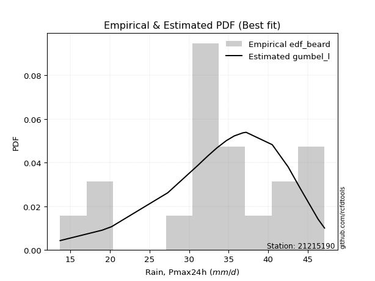</img>

</div>


### 5. Empirical - EDF Chegodayev (1955)

The Chegodayev formula is an empirical plotting position formula used in hydrological frequency analysis to estimate the exceedance probability or return period of a specific event from a set of observed data. It is primarily used for plotting observed data points on probability paper to fit a theoretical distribution, particularly for analyzing extreme events like maximum flood flows or rainfall intensities. The constant _b_ value in the generalized plotting position formula is 0.3.

<div align="center">


$P=(m-b)/(n+1-2b)$


</div>


**5.1. Empirical values**

<div align="center">

|                | 0                   | 1                   | 2                   | 3                   | 4                  | 5                   | 6                   | 7                  | 8                  | 9                   | 10                 | 11                 | 12                 | 13                 | 14                 | 15                 | 16                 | 17                 | 18                 | 19                 |
|:---------------|:--------------------|:--------------------|:--------------------|:--------------------|:-------------------|:--------------------|:--------------------|:-------------------|:-------------------|:--------------------|:-------------------|:-------------------|:-------------------|:-------------------|:-------------------|:-------------------|:-------------------|:-------------------|:-------------------|:-------------------|
| date           | 2006                | 2007                | 2020                | 2008                | 2022               | 2021                | 2014                | 2009               | 2025               | 2010                | 2018               | 2011               | 2013               | 2012               | 2016               | 2023               | 2015               | 2024               | 2017               | 2019               |
| x              | 13.7                | 19.0                | 20.2                | 27.3                | 31.1               | 31.6                | 32.1                | 32.2               | 32.4               | 32.4                | 33.5               | 34.7               | 35.7               | 36.8               | 37.2               | 40.5               | 42.5               | 44.0               | 46.3               | 47.1               |
| m              | 1                   | 2                   | 3                   | 4                   | 5                  | 6                   | 7                   | 8                  | 9                  | 10                  | 11                 | 12                 | 13                 | 14                 | 15                 | 16                 | 17                 | 18                 | 19                 | 20                 |
| empirical_dist | edf_chegodayev      | edf_chegodayev      | edf_chegodayev      | edf_chegodayev      | edf_chegodayev     | edf_chegodayev      | edf_chegodayev      | edf_chegodayev     | edf_chegodayev     | edf_chegodayev      | edf_chegodayev     | edf_chegodayev     | edf_chegodayev     | edf_chegodayev     | edf_chegodayev     | edf_chegodayev     | edf_chegodayev     | edf_chegodayev     | edf_chegodayev     | edf_chegodayev     |
| empirical      | 0.03431372549019608 | 0.08333333333333334 | 0.13235294117647062 | 0.18137254901960786 | 0.2303921568627451 | 0.27941176470588236 | 0.32843137254901966 | 0.3774509803921569 | 0.4264705882352941 | 0.47549019607843135 | 0.5245098039215687 | 0.5735294117647058 | 0.6225490196078431 | 0.6715686274509804 | 0.7205882352941176 | 0.7696078431372549 | 0.8186274509803921 | 0.8676470588235294 | 0.9166666666666667 | 0.9656862745098039 |
| empirical_tr   | 1.0355329949238579  | 1.090909090909091   | 1.152542372881356   | 1.221556886227545   | 1.299363057324841  | 1.3877551020408163  | 1.4890510948905111  | 1.6062992125984252 | 1.7435897435897436 | 1.9065420560747663  | 2.1030927835051547 | 2.3448275862068964 | 2.6493506493506493 | 3.0447761194029854 | 3.5789473684210527 | 4.340425531914894  | 5.513513513513513  | 7.555555555555557  | 12.00000000000001  | 29.142857142857153 |

</div>


**5.2. Kolmogorov-Smirnov fit test (sorted by Δ)**


<div align="center">

|                | 0                   | 1                   | 2                   | 3                   | 4                   | 5                   | 6                   | 7                  | 8                   | 9                   | 10                  | 11                  | 12                  | 13                 | 14                  | 15                  | 16                    | 17                  | 18                 | 19                  | 20                  | 21                  | 22                  | 23                 | 24                  | 25                  | 26                  | 27                  | 28                  | 29                  | 30                  | 31                  | 32                 | 33                  | 34                  | 35                  | 36                 | 37                  | 38                  | 39                 | 40                 | 41                  | 42                  | 43                  | 44                 | 45                  | 46                  | 47                 | 48                 | 49                 | 50                 | 51                 | 52                 | 53                 | 54                  | 55                  | 56                 | 57                  | 58                 | 59                  | 60                  | 61                 | 62                  | 63                  | 64                  | 65                  | 66                  | 67                 | 68                  | 69                 | 70                  | 71                  | 72                 | 73                 | 74                 | 75                 | 76                 | 77                  | 78                 | 79                  | 80                  | 81                 | 82                 | 83                  | 84                 | 85                 | 86                 | 87                 | 88                 | 89                 |
|:---------------|:--------------------|:--------------------|:--------------------|:--------------------|:--------------------|:--------------------|:--------------------|:-------------------|:--------------------|:--------------------|:--------------------|:--------------------|:--------------------|:-------------------|:--------------------|:--------------------|:----------------------|:--------------------|:-------------------|:--------------------|:--------------------|:--------------------|:--------------------|:-------------------|:--------------------|:--------------------|:--------------------|:--------------------|:--------------------|:--------------------|:--------------------|:--------------------|:-------------------|:--------------------|:--------------------|:--------------------|:-------------------|:--------------------|:--------------------|:-------------------|:-------------------|:--------------------|:--------------------|:--------------------|:-------------------|:--------------------|:--------------------|:-------------------|:-------------------|:-------------------|:-------------------|:-------------------|:-------------------|:-------------------|:--------------------|:--------------------|:-------------------|:--------------------|:-------------------|:--------------------|:--------------------|:-------------------|:--------------------|:--------------------|:--------------------|:--------------------|:--------------------|:-------------------|:--------------------|:-------------------|:--------------------|:--------------------|:-------------------|:-------------------|:-------------------|:-------------------|:-------------------|:--------------------|:-------------------|:--------------------|:--------------------|:-------------------|:-------------------|:--------------------|:-------------------|:-------------------|:-------------------|:-------------------|:-------------------|:-------------------|
| station        | 21215190            | 21215190            | 21215190            | 21215190            | 21215190            | 21215190            | 21215190            | 21215190           | 21215190            | 21215190            | 21215190            | 21215190            | 21215190            | 21215190           | 21215190            | 21215190            | 21215190              | 21215190            | 21215190           | 21215190            | 21215190            | 21215190            | 21215190            | 21215190           | 21215190            | 21215190            | 21215190            | 21215190            | 21215190            | 21215190            | 21215190            | 21215190            | 21215190           | 21215190            | 21215190            | 21215190            | 21215190           | 21215190            | 21215190            | 21215190           | 21215190           | 21215190            | 21215190            | 21215190            | 21215190           | 21215190            | 21215190            | 21215190           | 21215190           | 21215190           | 21215190           | 21215190           | 21215190           | 21215190           | 21215190            | 21215190            | 21215190           | 21215190            | 21215190           | 21215190            | 21215190            | 21215190           | 21215190            | 21215190            | 21215190            | 21215190            | 21215190            | 21215190           | 21215190            | 21215190           | 21215190            | 21215190            | 21215190           | 21215190           | 21215190           | 21215190           | 21215190           | 21215190            | 21215190           | 21215190            | 21215190            | 21215190           | 21215190           | 21215190            | 21215190           | 21215190           | 21215190           | 21215190           | 21215190           | 21215190           |
| empirical_dist | edf_chegodayev      | edf_chegodayev      | edf_chegodayev      | edf_chegodayev      | edf_chegodayev      | edf_chegodayev      | edf_chegodayev      | edf_chegodayev     | edf_chegodayev      | edf_chegodayev      | edf_chegodayev      | edf_chegodayev      | edf_chegodayev      | edf_chegodayev     | edf_chegodayev      | edf_chegodayev      | edf_chegodayev        | edf_chegodayev      | edf_chegodayev     | edf_chegodayev      | edf_chegodayev      | edf_chegodayev      | edf_chegodayev      | edf_chegodayev     | edf_chegodayev      | edf_chegodayev      | edf_chegodayev      | edf_chegodayev      | edf_chegodayev      | edf_chegodayev      | edf_chegodayev      | edf_chegodayev      | edf_chegodayev     | edf_chegodayev      | edf_chegodayev      | edf_chegodayev      | edf_chegodayev     | edf_chegodayev      | edf_chegodayev      | edf_chegodayev     | edf_chegodayev     | edf_chegodayev      | edf_chegodayev      | edf_chegodayev      | edf_chegodayev     | edf_chegodayev      | edf_chegodayev      | edf_chegodayev     | edf_chegodayev     | edf_chegodayev     | edf_chegodayev     | edf_chegodayev     | edf_chegodayev     | edf_chegodayev     | edf_chegodayev      | edf_chegodayev      | edf_chegodayev     | edf_chegodayev      | edf_chegodayev     | edf_chegodayev      | edf_chegodayev      | edf_chegodayev     | edf_chegodayev      | edf_chegodayev      | edf_chegodayev      | edf_chegodayev      | edf_chegodayev      | edf_chegodayev     | edf_chegodayev      | edf_chegodayev     | edf_chegodayev      | edf_chegodayev      | edf_chegodayev     | edf_chegodayev     | edf_chegodayev     | edf_chegodayev     | edf_chegodayev     | edf_chegodayev      | edf_chegodayev     | edf_chegodayev      | edf_chegodayev      | edf_chegodayev     | edf_chegodayev     | edf_chegodayev      | edf_chegodayev     | edf_chegodayev     | edf_chegodayev     | edf_chegodayev     | edf_chegodayev     | edf_chegodayev     |
| p_dist         | gumbel_l            | logt                | laplace             | genlogistic         | johnsonsu           | fisk                | weibull_min         | logjohnsonsu       | logloggamma         | mielke              | pearson3            | loggenlogistic      | logmielke           | gompertz           | laplace_asymmetric  | hypsecant           | loglaplace_asymmetric | logweibull_min      | logpearson3        | logistic            | loggompertz         | logfisk             | loggumbel_l         | t                  | exponnorm           | norm                | crystalball         | truncnorm           | nct                 | nakagami            | f                   | fatiguelife         | betaprime          | erlang              | gamma               | chi2                | logtruncnorm       | invgamma            | maxwell             | loglaplace         | invgauss           | alpha               | ncf                 | rayleigh            | loghypsecant       | gumbel_r            | loglogistic         | invweibull         | logrice            | logexponnorm       | lognorm            | lognorm            | logcrystalball     | loglognorm         | lognakagami         | logf                | logfatiguelife     | lognct              | logbetaprime       | moyal               | halfnorm            | logerlang          | loginvgamma         | loggamma            | loggamma            | logalpha            | logncf              | loginvgauss        | kstwobign           | halflogistic       | logmaxwell          | loginvweibull       | lograyleigh        | gibrat             | loggumbel_r        | wald               | loghalfnorm        | logkstwobign        | logmoyal           | loghalflogistic     | genexpon            | loggenexpon        | expon              | logchi2             | logexpon           | logpareto          | logwald            | loggibrat          | pareto             | rice               |
| delta          | 0.09753880383279007 | 0.10115540605298445 | 0.10453329384596177 | 0.11145813080055195 | 0.11848090919329252 | 0.12178976411657311 | 0.12194270008559438 | 0.1240908239357888 | 0.12621342942765834 | 0.12702979302184714 | 0.12739959660415978 | 0.12751487792385235 | 0.12904437171528815 | 0.1321336504221668 | 0.13233922517596464 | 0.13239693772127015 | 0.13382410238910308   | 0.13513944931176525 | 0.1412625714672251 | 0.14388337636152343 | 0.14757191440271605 | 0.15050034479453867 | 0.15342043588434479 | 0.1580439472759364 | 0.15806655456031726 | 0.15806680393492767 | 0.15806681124118865 | 0.15806685879289178 | 0.15815821056437274 | 0.15898744484857913 | 0.15901593075309584 | 0.15962672586878085 | 0.1638319226191749 | 0.17129796681770876 | 0.17292272043478585 | 0.17596106502420983 | 0.1813722608113406 | 0.18380578455109925 | 0.19176795060380175 | 0.1943058361177415 | 0.1967648129910083 | 0.19722646925802595 | 0.19729946752015032 | 0.20407158948157006 | 0.2122109884948763 | 0.21558255141791172 | 0.21746057760769172 | 0.2192614317196273 | 0.2236289952662311 | 0.2236631531543245 | 0.2236636043601153 | 0.2236636043601153 | 0.2236640695367883 | 0.2236656771410584 | 0.22374814797867615 | 0.22440000807872407 | 0.2250395988104621 | 0.22806883110043336 | 0.2305443716899378 | 0.23756544529967966 | 0.23900543941855795 | 0.2425703842165769 | 0.24316013418233645 | 0.24500246192746328 | 0.24500246192746328 | 0.24512394947018762 | 0.24659154144555384 | 0.2491354235944243 | 0.25143988373071835 | 0.2530344303762688 | 0.25793737586968724 | 0.26454885976818276 | 0.269782714288441  | 0.2838600871950037 | 0.2911104409151    | 0.2958470623402027 | 0.3031746299916021 | 0.30374243667070716 | 0.3165748597933839 | 0.32465219831771414 | 0.32855317056174765 | 0.3369989805238734 | 0.3540455008633235 | 0.37962065470730477 | 0.3864518794919681 | 0.3864518859784773 | 0.3873887203920107 | 0.4011686924620976 | 0.5432817871477192 | 0.8264924491815813 |
| deltao         | 0.3096406529800002  | 0.3096406529800002  | 0.3096406529800002  | 0.3096406529800002  | 0.3096406529800002  | 0.3096406529800002  | 0.3096406529800002  | 0.3096406529800002 | 0.3096406529800002  | 0.3096406529800002  | 0.3096406529800002  | 0.3096406529800002  | 0.3096406529800002  | 0.3096406529800002 | 0.3096406529800002  | 0.3096406529800002  | 0.3096406529800002    | 0.3096406529800002  | 0.3096406529800002 | 0.3096406529800002  | 0.3096406529800002  | 0.3096406529800002  | 0.3096406529800002  | 0.3096406529800002 | 0.3096406529800002  | 0.3096406529800002  | 0.3096406529800002  | 0.3096406529800002  | 0.3096406529800002  | 0.3096406529800002  | 0.3096406529800002  | 0.3096406529800002  | 0.3096406529800002 | 0.3096406529800002  | 0.3096406529800002  | 0.3096406529800002  | 0.3096406529800002 | 0.3096406529800002  | 0.3096406529800002  | 0.3096406529800002 | 0.3096406529800002 | 0.3096406529800002  | 0.3096406529800002  | 0.3096406529800002  | 0.3096406529800002 | 0.3096406529800002  | 0.3096406529800002  | 0.3096406529800002 | 0.3096406529800002 | 0.3096406529800002 | 0.3096406529800002 | 0.3096406529800002 | 0.3096406529800002 | 0.3096406529800002 | 0.3096406529800002  | 0.3096406529800002  | 0.3096406529800002 | 0.3096406529800002  | 0.3096406529800002 | 0.3096406529800002  | 0.3096406529800002  | 0.3096406529800002 | 0.3096406529800002  | 0.3096406529800002  | 0.3096406529800002  | 0.3096406529800002  | 0.3096406529800002  | 0.3096406529800002 | 0.3096406529800002  | 0.3096406529800002 | 0.3096406529800002  | 0.3096406529800002  | 0.3096406529800002 | 0.3096406529800002 | 0.3096406529800002 | 0.3096406529800002 | 0.3096406529800002 | 0.3096406529800002  | 0.3096406529800002 | 0.3096406529800002  | 0.3096406529800002  | 0.3096406529800002 | 0.3096406529800002 | 0.3096406529800002  | 0.3096406529800002 | 0.3096406529800002 | 0.3096406529800002 | 0.3096406529800002 | 0.3096406529800002 | 0.3096406529800002 |
| eval           | Δo > Δ              | Δo > Δ              | Δo > Δ              | Δo > Δ              | Δo > Δ              | Δo > Δ              | Δo > Δ              | Δo > Δ             | Δo > Δ              | Δo > Δ              | Δo > Δ              | Δo > Δ              | Δo > Δ              | Δo > Δ             | Δo > Δ              | Δo > Δ              | Δo > Δ                | Δo > Δ              | Δo > Δ             | Δo > Δ              | Δo > Δ              | Δo > Δ              | Δo > Δ              | Δo > Δ             | Δo > Δ              | Δo > Δ              | Δo > Δ              | Δo > Δ              | Δo > Δ              | Δo > Δ              | Δo > Δ              | Δo > Δ              | Δo > Δ             | Δo > Δ              | Δo > Δ              | Δo > Δ              | Δo > Δ             | Δo > Δ              | Δo > Δ              | Δo > Δ             | Δo > Δ             | Δo > Δ              | Δo > Δ              | Δo > Δ              | Δo > Δ             | Δo > Δ              | Δo > Δ              | Δo > Δ             | Δo > Δ             | Δo > Δ             | Δo > Δ             | Δo > Δ             | Δo > Δ             | Δo > Δ             | Δo > Δ              | Δo > Δ              | Δo > Δ             | Δo > Δ              | Δo > Δ             | Δo > Δ              | Δo > Δ              | Δo > Δ             | Δo > Δ              | Δo > Δ              | Δo > Δ              | Δo > Δ              | Δo > Δ              | Δo > Δ             | Δo > Δ              | Δo > Δ             | Δo > Δ              | Δo > Δ              | Δo > Δ             | Δo > Δ             | Δo > Δ             | Δo > Δ             | Δo > Δ             | Δo > Δ              | Δo <= Δ            | Δo <= Δ             | Δo <= Δ             | Δo <= Δ            | Δo <= Δ            | Δo <= Δ             | Δo <= Δ            | Δo <= Δ            | Δo <= Δ            | Δo <= Δ            | Δo <= Δ            | Δo <= Δ            |
| fit            | 1                   | 1                   | 1                   | 1                   | 1                   | 1                   | 1                   | 1                  | 1                   | 1                   | 1                   | 1                   | 1                   | 1                  | 1                   | 1                   | 1                     | 1                   | 1                  | 1                   | 1                   | 1                   | 1                   | 1                  | 1                   | 1                   | 1                   | 1                   | 1                   | 1                   | 1                   | 1                   | 1                  | 1                   | 1                   | 1                   | 1                  | 1                   | 1                   | 1                  | 1                  | 1                   | 1                   | 1                   | 1                  | 1                   | 1                   | 1                  | 1                  | 1                  | 1                  | 1                  | 1                  | 1                  | 1                   | 1                   | 1                  | 1                   | 1                  | 1                   | 1                   | 1                  | 1                   | 1                   | 1                   | 1                   | 1                   | 1                  | 1                   | 1                  | 1                   | 1                   | 1                  | 1                  | 1                  | 1                  | 1                  | 1                   | 0                  | 0                   | 0                   | 0                  | 0                  | 0                   | 0                  | 0                  | 0                  | 0                  | 0                  | 0                  |
| n              | 20                  | 20                  | 20                  | 20                  | 20                  | 20                  | 20                  | 20                 | 20                  | 20                  | 20                  | 20                  | 20                  | 20                 | 20                  | 20                  | 20                    | 20                  | 20                 | 20                  | 20                  | 20                  | 20                  | 20                 | 20                  | 20                  | 20                  | 20                  | 20                  | 20                  | 20                  | 20                  | 20                 | 20                  | 20                  | 20                  | 20                 | 20                  | 20                  | 20                 | 20                 | 20                  | 20                  | 20                  | 20                 | 20                  | 20                  | 20                 | 20                 | 20                 | 20                 | 20                 | 20                 | 20                 | 20                  | 20                  | 20                 | 20                  | 20                 | 20                  | 20                  | 20                 | 20                  | 20                  | 20                  | 20                  | 20                  | 20                 | 20                  | 20                 | 20                  | 20                  | 20                 | 20                 | 20                 | 20                 | 20                 | 20                  | 20                 | 20                  | 20                  | 20                 | 20                 | 20                  | 20                 | 20                 | 20                 | 20                 | 20                 | 20                 |
| best_fit       | 1                   | 0                   | 0                   | 0                   | 0                   | 0                   | 0                   | 0                  | 0                   | 0                   | 0                   | 0                   | 0                   | 0                  | 0                   | 0                   | 0                     | 0                   | 0                  | 0                   | 0                   | 0                   | 0                   | 0                  | 0                   | 0                   | 0                   | 0                   | 0                   | 0                   | 0                   | 0                   | 0                  | 0                   | 0                   | 0                   | 0                  | 0                   | 0                   | 0                  | 0                  | 0                   | 0                   | 0                   | 0                  | 0                   | 0                   | 0                  | 0                  | 0                  | 0                  | 0                  | 0                  | 0                  | 0                   | 0                   | 0                  | 0                   | 0                  | 0                   | 0                   | 0                  | 0                   | 0                   | 0                   | 0                   | 0                   | 0                  | 0                   | 0                  | 0                   | 0                   | 0                  | 0                  | 0                  | 0                  | 0                  | 0                   | 0                  | 0                   | 0                   | 0                  | 0                  | 0                   | 0                  | 0                  | 0                  | 0                  | 0                  | 0                  |
| best_fit_sort  | 1                   | 2                   | 3                   | 4                   | 5                   | 6                   | 7                   | 8                  | 9                   | 10                  | 11                  | 12                  | 13                  | 14                 | 15                  | 16                  | 17                    | 18                  | 19                 | 20                  | 21                  | 22                  | 23                  | 24                 | 25                  | 26                  | 27                  | 28                  | 29                  | 30                  | 31                  | 32                  | 33                 | 34                  | 35                  | 36                  | 37                 | 38                  | 39                  | 40                 | 41                 | 42                  | 43                  | 44                  | 45                 | 46                  | 47                  | 48                 | 49                 | 50                 | 51                 | 52                 | 53                 | 54                 | 55                  | 56                  | 57                 | 58                  | 59                 | 60                  | 61                  | 62                 | 63                  | 64                  | 65                  | 66                  | 67                  | 68                 | 69                  | 70                 | 71                  | 72                  | 73                 | 74                 | 75                 | 76                 | 77                 | 78                  | 79                 | 80                  | 81                  | 82                 | 83                 | 84                  | 85                 | 86                 | 87                 | 88                 | 89                 | 90                 |

</div>


<div align="center">

</img>

</div>


**5.3. Best fit**

<div align="center">

|   id |   station | empirical_dist   | p_dist   |     delta |   deltao | eval   |   fit |   n |   best_fit |   best_fit_sort |
|-----:|----------:|:-----------------|:---------|----------:|---------:|:-------|------:|----:|-----------:|----------------:|
|    0 |  21215190 | edf_chegodayev   | gumbel_l | 0.0975388 | 0.309641 | Δo > Δ |     1 |  20 |          1 |               1 |

</div>


<div align="center">

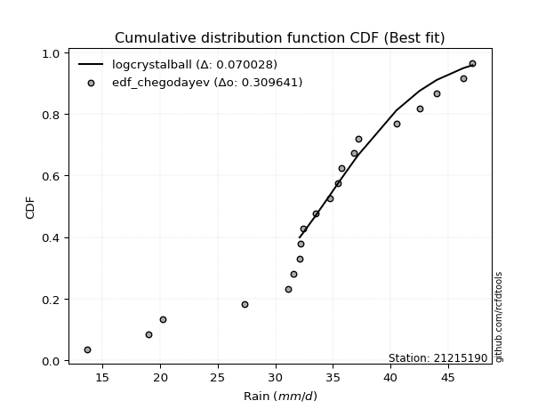</img></img>

</div>


### 6. Empirical - EDF Blom (1958)

The Blom formula is a specific "plotting position" formula used in hydrology and statistical analysis to estimate the empirical cumulative probability (or non-exceedance probability) of a data series. It is particularly recommended for data that are approximately normally distributed. The constant _a_ is set to 0.375 (or 3/8).

<div align="center">


$P=(m-a)/(n+1-2a)$


</div>


**6.1. Empirical values**

<div align="center">

|                | 0                    | 1                   | 2                   | 3                   | 4                   | 5                  | 6                  | 7                  | 8                   | 9                   | 10                 | 11                 | 12                 | 13                 | 14                 | 15                 | 16                 | 17                 | 18                 | 19                 |
|:---------------|:---------------------|:--------------------|:--------------------|:--------------------|:--------------------|:-------------------|:-------------------|:-------------------|:--------------------|:--------------------|:-------------------|:-------------------|:-------------------|:-------------------|:-------------------|:-------------------|:-------------------|:-------------------|:-------------------|:-------------------|
| date           | 2006                 | 2007                | 2020                | 2008                | 2022                | 2021               | 2014               | 2009               | 2025                | 2010                | 2018               | 2011               | 2013               | 2012               | 2016               | 2023               | 2015               | 2024               | 2017               | 2019               |
| x              | 13.7                 | 19.0                | 20.2                | 27.3                | 31.1                | 31.6               | 32.1               | 32.2               | 32.4                | 32.4                | 33.5               | 34.7               | 35.7               | 36.8               | 37.2               | 40.5               | 42.5               | 44.0               | 46.3               | 47.1               |
| m              | 1                    | 2                   | 3                   | 4                   | 5                   | 6                  | 7                  | 8                  | 9                   | 10                  | 11                 | 12                 | 13                 | 14                 | 15                 | 16                 | 17                 | 18                 | 19                 | 20                 |
| empirical_dist | edf_blom             | edf_blom            | edf_blom            | edf_blom            | edf_blom            | edf_blom           | edf_blom           | edf_blom           | edf_blom            | edf_blom            | edf_blom           | edf_blom           | edf_blom           | edf_blom           | edf_blom           | edf_blom           | edf_blom           | edf_blom           | edf_blom           | edf_blom           |
| empirical      | 0.030864197530864196 | 0.08024691358024691 | 0.12962962962962962 | 0.17901234567901234 | 0.22839506172839505 | 0.2777777777777778 | 0.3271604938271605 | 0.3765432098765432 | 0.42592592592592593 | 0.47530864197530864 | 0.5246913580246914 | 0.5740740740740741 | 0.6234567901234568 | 0.6728395061728395 | 0.7222222222222222 | 0.7716049382716049 | 0.8209876543209876 | 0.8703703703703703 | 0.9197530864197531 | 0.9691358024691358 |
| empirical_tr   | 1.0318471337579618   | 1.087248322147651   | 1.148936170212766   | 1.218045112781955   | 1.296               | 1.3846153846153846 | 1.4862385321100917 | 1.603960396039604  | 1.7419354838709677  | 1.9058823529411766  | 2.103896103896104  | 2.3478260869565215 | 2.6557377049180326 | 3.0566037735849054 | 3.5999999999999996 | 4.378378378378378  | 5.586206896551723  | 7.714285714285713  | 12.461538461538458 | 32.39999999999997  |

</div>


**6.2. Kolmogorov-Smirnov fit test (sorted by Δ)**


<div align="center">

|                | 0                   | 1                   | 2                   | 3                   | 4                   | 5                   | 6                   | 7                   | 8                  | 9                  | 10                  | 11                  | 12                  | 13                  | 14                 | 15                 | 16                    | 17                 | 18                  | 19                 | 20                  | 21                  | 22                  | 23                  | 24                  | 25                  | 26                  | 27                  | 28                 | 29                 | 30                 | 31                 | 32                  | 33                  | 34                 | 35                 | 36                  | 37                 | 38                  | 39                  | 40                  | 41                 | 42                  | 43                  | 44                  | 45                  | 46                  | 47                  | 48                  | 49                  | 50                  | 51                  | 52                  | 53                  | 54                 | 55                  | 56                  | 57                  | 58                  | 59                  | 60                  | 61                  | 62                  | 63                  | 64                  | 65                  | 66                 | 67                 | 68                  | 69                 | 70                 | 71                  | 72                 | 73                  | 74                  | 75                  | 76                  | 77                 | 78                  | 79                  | 80                 | 81                  | 82                 | 83                 | 84                 | 85                  | 86                  | 87                 | 88                 | 89                 |
|:---------------|:--------------------|:--------------------|:--------------------|:--------------------|:--------------------|:--------------------|:--------------------|:--------------------|:-------------------|:-------------------|:--------------------|:--------------------|:--------------------|:--------------------|:-------------------|:-------------------|:----------------------|:-------------------|:--------------------|:-------------------|:--------------------|:--------------------|:--------------------|:--------------------|:--------------------|:--------------------|:--------------------|:--------------------|:-------------------|:-------------------|:-------------------|:-------------------|:--------------------|:--------------------|:-------------------|:-------------------|:--------------------|:-------------------|:--------------------|:--------------------|:--------------------|:-------------------|:--------------------|:--------------------|:--------------------|:--------------------|:--------------------|:--------------------|:--------------------|:--------------------|:--------------------|:--------------------|:--------------------|:--------------------|:-------------------|:--------------------|:--------------------|:--------------------|:--------------------|:--------------------|:--------------------|:--------------------|:--------------------|:--------------------|:--------------------|:--------------------|:-------------------|:-------------------|:--------------------|:-------------------|:-------------------|:--------------------|:-------------------|:--------------------|:--------------------|:--------------------|:--------------------|:-------------------|:--------------------|:--------------------|:-------------------|:--------------------|:-------------------|:-------------------|:-------------------|:--------------------|:--------------------|:-------------------|:-------------------|:-------------------|
| station        | 21215190            | 21215190            | 21215190            | 21215190            | 21215190            | 21215190            | 21215190            | 21215190            | 21215190           | 21215190           | 21215190            | 21215190            | 21215190            | 21215190            | 21215190           | 21215190           | 21215190              | 21215190           | 21215190            | 21215190           | 21215190            | 21215190            | 21215190            | 21215190            | 21215190            | 21215190            | 21215190            | 21215190            | 21215190           | 21215190           | 21215190           | 21215190           | 21215190            | 21215190            | 21215190           | 21215190           | 21215190            | 21215190           | 21215190            | 21215190            | 21215190            | 21215190           | 21215190            | 21215190            | 21215190            | 21215190            | 21215190            | 21215190            | 21215190            | 21215190            | 21215190            | 21215190            | 21215190            | 21215190            | 21215190           | 21215190            | 21215190            | 21215190            | 21215190            | 21215190            | 21215190            | 21215190            | 21215190            | 21215190            | 21215190            | 21215190            | 21215190           | 21215190           | 21215190            | 21215190           | 21215190           | 21215190            | 21215190           | 21215190            | 21215190            | 21215190            | 21215190            | 21215190           | 21215190            | 21215190            | 21215190           | 21215190            | 21215190           | 21215190           | 21215190           | 21215190            | 21215190            | 21215190           | 21215190           | 21215190           |
| empirical_dist | edf_blom            | edf_blom            | edf_blom            | edf_blom            | edf_blom            | edf_blom            | edf_blom            | edf_blom            | edf_blom           | edf_blom           | edf_blom            | edf_blom            | edf_blom            | edf_blom            | edf_blom           | edf_blom           | edf_blom              | edf_blom           | edf_blom            | edf_blom           | edf_blom            | edf_blom            | edf_blom            | edf_blom            | edf_blom            | edf_blom            | edf_blom            | edf_blom            | edf_blom           | edf_blom           | edf_blom           | edf_blom           | edf_blom            | edf_blom            | edf_blom           | edf_blom           | edf_blom            | edf_blom           | edf_blom            | edf_blom            | edf_blom            | edf_blom           | edf_blom            | edf_blom            | edf_blom            | edf_blom            | edf_blom            | edf_blom            | edf_blom            | edf_blom            | edf_blom            | edf_blom            | edf_blom            | edf_blom            | edf_blom           | edf_blom            | edf_blom            | edf_blom            | edf_blom            | edf_blom            | edf_blom            | edf_blom            | edf_blom            | edf_blom            | edf_blom            | edf_blom            | edf_blom           | edf_blom           | edf_blom            | edf_blom           | edf_blom           | edf_blom            | edf_blom           | edf_blom            | edf_blom            | edf_blom            | edf_blom            | edf_blom           | edf_blom            | edf_blom            | edf_blom           | edf_blom            | edf_blom           | edf_blom           | edf_blom           | edf_blom            | edf_blom            | edf_blom           | edf_blom           | edf_blom           |
| p_dist         | gumbel_l            | logt                | laplace             | genlogistic         | johnsonsu           | fisk                | weibull_min         | logjohnsonsu        | logloggamma        | mielke             | pearson3            | loggenlogistic      | logmielke           | gompertz            | laplace_asymmetric | hypsecant          | loglaplace_asymmetric | logweibull_min     | logpearson3         | logistic           | loggompertz         | logfisk             | loggumbel_l         | t                   | exponnorm           | norm                | crystalball         | truncnorm           | nct                | nakagami           | f                  | fatiguelife        | betaprime           | erlang              | gamma              | chi2               | logtruncnorm        | invgamma           | maxwell             | loglaplace          | invgauss            | alpha              | ncf                 | rayleigh            | loghypsecant        | gumbel_r            | loglogistic         | invweibull          | logrice             | logexponnorm        | lognorm             | lognorm             | logcrystalball      | loglognorm          | lognakagami        | logf                | logfatiguelife      | lognct              | logbetaprime        | moyal               | halfnorm            | logerlang           | loginvgamma         | loggamma            | loggamma            | logalpha            | logncf             | loginvgauss        | kstwobign           | halflogistic       | logmaxwell         | loginvweibull       | lograyleigh        | gibrat              | loggumbel_r         | wald                | loghalfnorm         | logkstwobign       | logmoyal            | loghalflogistic     | genexpon           | loggenexpon         | expon              | logchi2            | logexpon           | logpareto           | logwald             | loggibrat          | pareto             | rice               |
| delta          | 0.09845873204536704 | 0.10097385194986175 | 0.10653038898031184 | 0.11345522593490201 | 0.12047800432764258 | 0.12378685925092317 | 0.12393979521994444 | 0.12608791907013886 | 0.1282105245620084 | 0.1290268881561972 | 0.12939669173850984 | 0.12951197305820242 | 0.13104146684963822 | 0.13413074555651686 | 0.1343363203103147 | 0.1343940328556202 | 0.13582119752345315   | 0.1371365444461153 | 0.14325966660157516 | 0.1458804714958735 | 0.14956900953706612 | 0.15249743992888873 | 0.15541753101869485 | 0.16004104241028647 | 0.16006364969466733 | 0.16006389906927773 | 0.16006390637553872 | 0.16006395392724185 | 0.1601553056987228 | 0.1609845399829292 | 0.1610130258874459 | 0.1616238210031309 | 0.16582901775352496 | 0.17329506195205882 | 0.1749198155691359 | 0.1779581601585599 | 0.17901205747074508 | 0.1858028796854493 | 0.19376504573815181 | 0.19630293125209156 | 0.19876190812535835 | 0.199223564392376  | 0.19929656265450038 | 0.20606868461592012 | 0.21420808362922636 | 0.21757964655226178 | 0.21945767274204178 | 0.22125852685397737 | 0.22562609040058115 | 0.22566024828867456 | 0.22566069949446535 | 0.22566069949446535 | 0.22566116467113836 | 0.22566277227540846 | 0.2257452431130262 | 0.22639710321307413 | 0.22703669394481216 | 0.23006592623478342 | 0.23254146682428786 | 0.23956254043402972 | 0.24100253455290802 | 0.24456747935092696 | 0.24515722931668651 | 0.24699955706181334 | 0.24699955706181334 | 0.24712104460453768 | 0.2485886365799039 | 0.2511325187287744 | 0.25343697886506844 | 0.2550315255106189 | 0.2599344710040373 | 0.26654595490253286 | 0.271779809422791  | 0.28585718232935375 | 0.29310753604945006 | 0.29784415747455273 | 0.30517172512595214 | 0.3057395318050572 | 0.31857195492773394 | 0.32664929345206417 | 0.3305502656960977 | 0.33899607565822343 | 0.3560425959976735 | 0.3819808580479003 | 0.3884489746263181 | 0.38844898111282733 | 0.38938581552636076 | 0.4031657875964476 | 0.5463682069008057 | 0.8292157607284223 |
| deltao         | 0.3096406529800002  | 0.3096406529800002  | 0.3096406529800002  | 0.3096406529800002  | 0.3096406529800002  | 0.3096406529800002  | 0.3096406529800002  | 0.3096406529800002  | 0.3096406529800002 | 0.3096406529800002 | 0.3096406529800002  | 0.3096406529800002  | 0.3096406529800002  | 0.3096406529800002  | 0.3096406529800002 | 0.3096406529800002 | 0.3096406529800002    | 0.3096406529800002 | 0.3096406529800002  | 0.3096406529800002 | 0.3096406529800002  | 0.3096406529800002  | 0.3096406529800002  | 0.3096406529800002  | 0.3096406529800002  | 0.3096406529800002  | 0.3096406529800002  | 0.3096406529800002  | 0.3096406529800002 | 0.3096406529800002 | 0.3096406529800002 | 0.3096406529800002 | 0.3096406529800002  | 0.3096406529800002  | 0.3096406529800002 | 0.3096406529800002 | 0.3096406529800002  | 0.3096406529800002 | 0.3096406529800002  | 0.3096406529800002  | 0.3096406529800002  | 0.3096406529800002 | 0.3096406529800002  | 0.3096406529800002  | 0.3096406529800002  | 0.3096406529800002  | 0.3096406529800002  | 0.3096406529800002  | 0.3096406529800002  | 0.3096406529800002  | 0.3096406529800002  | 0.3096406529800002  | 0.3096406529800002  | 0.3096406529800002  | 0.3096406529800002 | 0.3096406529800002  | 0.3096406529800002  | 0.3096406529800002  | 0.3096406529800002  | 0.3096406529800002  | 0.3096406529800002  | 0.3096406529800002  | 0.3096406529800002  | 0.3096406529800002  | 0.3096406529800002  | 0.3096406529800002  | 0.3096406529800002 | 0.3096406529800002 | 0.3096406529800002  | 0.3096406529800002 | 0.3096406529800002 | 0.3096406529800002  | 0.3096406529800002 | 0.3096406529800002  | 0.3096406529800002  | 0.3096406529800002  | 0.3096406529800002  | 0.3096406529800002 | 0.3096406529800002  | 0.3096406529800002  | 0.3096406529800002 | 0.3096406529800002  | 0.3096406529800002 | 0.3096406529800002 | 0.3096406529800002 | 0.3096406529800002  | 0.3096406529800002  | 0.3096406529800002 | 0.3096406529800002 | 0.3096406529800002 |
| eval           | Δo > Δ              | Δo > Δ              | Δo > Δ              | Δo > Δ              | Δo > Δ              | Δo > Δ              | Δo > Δ              | Δo > Δ              | Δo > Δ             | Δo > Δ             | Δo > Δ              | Δo > Δ              | Δo > Δ              | Δo > Δ              | Δo > Δ             | Δo > Δ             | Δo > Δ                | Δo > Δ             | Δo > Δ              | Δo > Δ             | Δo > Δ              | Δo > Δ              | Δo > Δ              | Δo > Δ              | Δo > Δ              | Δo > Δ              | Δo > Δ              | Δo > Δ              | Δo > Δ             | Δo > Δ             | Δo > Δ             | Δo > Δ             | Δo > Δ              | Δo > Δ              | Δo > Δ             | Δo > Δ             | Δo > Δ              | Δo > Δ             | Δo > Δ              | Δo > Δ              | Δo > Δ              | Δo > Δ             | Δo > Δ              | Δo > Δ              | Δo > Δ              | Δo > Δ              | Δo > Δ              | Δo > Δ              | Δo > Δ              | Δo > Δ              | Δo > Δ              | Δo > Δ              | Δo > Δ              | Δo > Δ              | Δo > Δ             | Δo > Δ              | Δo > Δ              | Δo > Δ              | Δo > Δ              | Δo > Δ              | Δo > Δ              | Δo > Δ              | Δo > Δ              | Δo > Δ              | Δo > Δ              | Δo > Δ              | Δo > Δ             | Δo > Δ             | Δo > Δ              | Δo > Δ             | Δo > Δ             | Δo > Δ              | Δo > Δ             | Δo > Δ              | Δo > Δ              | Δo > Δ              | Δo > Δ              | Δo > Δ             | Δo <= Δ             | Δo <= Δ             | Δo <= Δ            | Δo <= Δ             | Δo <= Δ            | Δo <= Δ            | Δo <= Δ            | Δo <= Δ             | Δo <= Δ             | Δo <= Δ            | Δo <= Δ            | Δo <= Δ            |
| fit            | 1                   | 1                   | 1                   | 1                   | 1                   | 1                   | 1                   | 1                   | 1                  | 1                  | 1                   | 1                   | 1                   | 1                   | 1                  | 1                  | 1                     | 1                  | 1                   | 1                  | 1                   | 1                   | 1                   | 1                   | 1                   | 1                   | 1                   | 1                   | 1                  | 1                  | 1                  | 1                  | 1                   | 1                   | 1                  | 1                  | 1                   | 1                  | 1                   | 1                   | 1                   | 1                  | 1                   | 1                   | 1                   | 1                   | 1                   | 1                   | 1                   | 1                   | 1                   | 1                   | 1                   | 1                   | 1                  | 1                   | 1                   | 1                   | 1                   | 1                   | 1                   | 1                   | 1                   | 1                   | 1                   | 1                   | 1                  | 1                  | 1                   | 1                  | 1                  | 1                   | 1                  | 1                   | 1                   | 1                   | 1                   | 1                  | 0                   | 0                   | 0                  | 0                   | 0                  | 0                  | 0                  | 0                   | 0                   | 0                  | 0                  | 0                  |
| n              | 20                  | 20                  | 20                  | 20                  | 20                  | 20                  | 20                  | 20                  | 20                 | 20                 | 20                  | 20                  | 20                  | 20                  | 20                 | 20                 | 20                    | 20                 | 20                  | 20                 | 20                  | 20                  | 20                  | 20                  | 20                  | 20                  | 20                  | 20                  | 20                 | 20                 | 20                 | 20                 | 20                  | 20                  | 20                 | 20                 | 20                  | 20                 | 20                  | 20                  | 20                  | 20                 | 20                  | 20                  | 20                  | 20                  | 20                  | 20                  | 20                  | 20                  | 20                  | 20                  | 20                  | 20                  | 20                 | 20                  | 20                  | 20                  | 20                  | 20                  | 20                  | 20                  | 20                  | 20                  | 20                  | 20                  | 20                 | 20                 | 20                  | 20                 | 20                 | 20                  | 20                 | 20                  | 20                  | 20                  | 20                  | 20                 | 20                  | 20                  | 20                 | 20                  | 20                 | 20                 | 20                 | 20                  | 20                  | 20                 | 20                 | 20                 |
| best_fit       | 1                   | 0                   | 0                   | 0                   | 0                   | 0                   | 0                   | 0                   | 0                  | 0                  | 0                   | 0                   | 0                   | 0                   | 0                  | 0                  | 0                     | 0                  | 0                   | 0                  | 0                   | 0                   | 0                   | 0                   | 0                   | 0                   | 0                   | 0                   | 0                  | 0                  | 0                  | 0                  | 0                   | 0                   | 0                  | 0                  | 0                   | 0                  | 0                   | 0                   | 0                   | 0                  | 0                   | 0                   | 0                   | 0                   | 0                   | 0                   | 0                   | 0                   | 0                   | 0                   | 0                   | 0                   | 0                  | 0                   | 0                   | 0                   | 0                   | 0                   | 0                   | 0                   | 0                   | 0                   | 0                   | 0                   | 0                  | 0                  | 0                   | 0                  | 0                  | 0                   | 0                  | 0                   | 0                   | 0                   | 0                   | 0                  | 0                   | 0                   | 0                  | 0                   | 0                  | 0                  | 0                  | 0                   | 0                   | 0                  | 0                  | 0                  |
| best_fit_sort  | 1                   | 2                   | 3                   | 4                   | 5                   | 6                   | 7                   | 8                   | 9                  | 10                 | 11                  | 12                  | 13                  | 14                  | 15                 | 16                 | 17                    | 18                 | 19                  | 20                 | 21                  | 22                  | 23                  | 24                  | 25                  | 26                  | 27                  | 28                  | 29                 | 30                 | 31                 | 32                 | 33                  | 34                  | 35                 | 36                 | 37                  | 38                 | 39                  | 40                  | 41                  | 42                 | 43                  | 44                  | 45                  | 46                  | 47                  | 48                  | 49                  | 50                  | 51                  | 52                  | 53                  | 54                  | 55                 | 56                  | 57                  | 58                  | 59                  | 60                  | 61                  | 62                  | 63                  | 64                  | 65                  | 66                  | 67                 | 68                 | 69                  | 70                 | 71                 | 72                  | 73                 | 74                  | 75                  | 76                  | 77                  | 78                 | 79                  | 80                  | 81                 | 82                  | 83                 | 84                 | 85                 | 86                  | 87                  | 88                 | 89                 | 90                 |

</div>


<div align="center">

</img>

</div>


**6.3. Best fit**

<div align="center">

|   id |   station | empirical_dist   | p_dist   |     delta |   deltao | eval   |   fit |   n |   best_fit |   best_fit_sort |
|-----:|----------:|:-----------------|:---------|----------:|---------:|:-------|------:|----:|-----------:|----------------:|
|    0 |  21215190 | edf_blom         | gumbel_l | 0.0984587 | 0.309641 | Δo > Δ |     1 |  20 |          1 |               1 |

</div>


<div align="center">

</img></img>

</div>


### 7. Empirical - EDF Tukey (1962)

In hydrology, the Tukey formula is used as a plotting position formula to estimate the empirical probability or frequency of a flood event (or other hydrological data). The formula parameter is given as _c=0.333_ (or 1/3).

<div align="center">


$P=(m-c)/(n+1-2c)$


</div>


**7.1. Empirical values**

<div align="center">

|                | 0                   | 1                   | 2                   | 3                   | 4                   | 5                  | 6                   | 7                  | 8                  | 9                   | 10                 | 11                 | 12                 | 13                 | 14                 | 15                 | 16                | 17                 | 18                 | 19                 |
|:---------------|:--------------------|:--------------------|:--------------------|:--------------------|:--------------------|:-------------------|:--------------------|:-------------------|:-------------------|:--------------------|:-------------------|:-------------------|:-------------------|:-------------------|:-------------------|:-------------------|:------------------|:-------------------|:-------------------|:-------------------|
| date           | 2006                | 2007                | 2020                | 2008                | 2022                | 2021               | 2014                | 2009               | 2025               | 2010                | 2018               | 2011               | 2013               | 2012               | 2016               | 2023               | 2015              | 2024               | 2017               | 2019               |
| x              | 13.7                | 19.0                | 20.2                | 27.3                | 31.1                | 31.6               | 32.1                | 32.2               | 32.4               | 32.4                | 33.5               | 34.7               | 35.7               | 36.8               | 37.2               | 40.5               | 42.5              | 44.0               | 46.3               | 47.1               |
| m              | 1                   | 2                   | 3                   | 4                   | 5                   | 6                  | 7                   | 8                  | 9                  | 10                  | 11                 | 12                 | 13                 | 14                 | 15                 | 16                 | 17                | 18                 | 19                 | 20                 |
| empirical_dist | edf_tukey           | edf_tukey           | edf_tukey           | edf_tukey           | edf_tukey           | edf_tukey          | edf_tukey           | edf_tukey          | edf_tukey          | edf_tukey           | edf_tukey          | edf_tukey          | edf_tukey          | edf_tukey          | edf_tukey          | edf_tukey          | edf_tukey         | edf_tukey          | edf_tukey          | edf_tukey          |
| empirical      | 0.03278688524590164 | 0.08196721311475409 | 0.13114754098360656 | 0.18032786885245902 | 0.22950819672131148 | 0.2786885245901639 | 0.32786885245901637 | 0.3770491803278688 | 0.4262295081967213 | 0.47540983606557374 | 0.5245901639344263 | 0.5737704918032787 | 0.6229508196721312 | 0.6721311475409836 | 0.7213114754098361 | 0.7704918032786885 | 0.819672131147541 | 0.8688524590163934 | 0.9180327868852459 | 0.9672131147540983 |
| empirical_tr   | 1.033898305084746   | 1.0892857142857142  | 1.150943396226415   | 1.22                | 1.297872340425532   | 1.3863636363636362 | 1.4878048780487803  | 1.6052631578947367 | 1.7428571428571429 | 1.90625             | 2.103448275862069  | 2.346153846153846  | 2.6521739130434785 | 3.05               | 3.588235294117647  | 4.357142857142857  | 5.545454545454546 | 7.624999999999998  | 12.200000000000003 | 30.499999999999964 |

</div>


**7.2. Kolmogorov-Smirnov fit test (sorted by Δ)**


<div align="center">

|                | 0                   | 1                   | 2                  | 3                   | 4                   | 5                   | 6                   | 7                   | 8                   | 9                   | 10                 | 11                 | 12                  | 13                  | 14                  | 15                  | 16                    | 17                  | 18                  | 19                  | 20                  | 21                 | 22                  | 23                  | 24                 | 25                 | 26                  | 27                  | 28                  | 29                  | 30                  | 31                  | 32                  | 33                 | 34                  | 35                  | 36                  | 37                  | 38                  | 39                  | 40                  | 41                  | 42                  | 43                 | 44                  | 45                  | 46                  | 47                  | 48                  | 49                  | 50                  | 51                  | 52                  | 53                  | 54                  | 55                 | 56                  | 57                 | 58                  | 59                 | 60                  | 61                  | 62                  | 63                 | 64                 | 65                  | 66                  | 67                  | 68                 | 69                 | 70                 | 71                 | 72                 | 73                 | 74                 | 75                 | 76                 | 77                  | 78                 | 79                  | 80                  | 81                 | 82                 | 83                  | 84                 | 85                 | 86                 | 87                 | 88                 | 89                 |
|:---------------|:--------------------|:--------------------|:-------------------|:--------------------|:--------------------|:--------------------|:--------------------|:--------------------|:--------------------|:--------------------|:-------------------|:-------------------|:--------------------|:--------------------|:--------------------|:--------------------|:----------------------|:--------------------|:--------------------|:--------------------|:--------------------|:-------------------|:--------------------|:--------------------|:-------------------|:-------------------|:--------------------|:--------------------|:--------------------|:--------------------|:--------------------|:--------------------|:--------------------|:-------------------|:--------------------|:--------------------|:--------------------|:--------------------|:--------------------|:--------------------|:--------------------|:--------------------|:--------------------|:-------------------|:--------------------|:--------------------|:--------------------|:--------------------|:--------------------|:--------------------|:--------------------|:--------------------|:--------------------|:--------------------|:--------------------|:-------------------|:--------------------|:-------------------|:--------------------|:-------------------|:--------------------|:--------------------|:--------------------|:-------------------|:-------------------|:--------------------|:--------------------|:--------------------|:-------------------|:-------------------|:-------------------|:-------------------|:-------------------|:-------------------|:-------------------|:-------------------|:-------------------|:--------------------|:-------------------|:--------------------|:--------------------|:-------------------|:-------------------|:--------------------|:-------------------|:-------------------|:-------------------|:-------------------|:-------------------|:-------------------|
| station        | 21215190            | 21215190            | 21215190           | 21215190            | 21215190            | 21215190            | 21215190            | 21215190            | 21215190            | 21215190            | 21215190           | 21215190           | 21215190            | 21215190            | 21215190            | 21215190            | 21215190              | 21215190            | 21215190            | 21215190            | 21215190            | 21215190           | 21215190            | 21215190            | 21215190           | 21215190           | 21215190            | 21215190            | 21215190            | 21215190            | 21215190            | 21215190            | 21215190            | 21215190           | 21215190            | 21215190            | 21215190            | 21215190            | 21215190            | 21215190            | 21215190            | 21215190            | 21215190            | 21215190           | 21215190            | 21215190            | 21215190            | 21215190            | 21215190            | 21215190            | 21215190            | 21215190            | 21215190            | 21215190            | 21215190            | 21215190           | 21215190            | 21215190           | 21215190            | 21215190           | 21215190            | 21215190            | 21215190            | 21215190           | 21215190           | 21215190            | 21215190            | 21215190            | 21215190           | 21215190           | 21215190           | 21215190           | 21215190           | 21215190           | 21215190           | 21215190           | 21215190           | 21215190            | 21215190           | 21215190            | 21215190            | 21215190           | 21215190           | 21215190            | 21215190           | 21215190           | 21215190           | 21215190           | 21215190           | 21215190           |
| empirical_dist | edf_tukey           | edf_tukey           | edf_tukey          | edf_tukey           | edf_tukey           | edf_tukey           | edf_tukey           | edf_tukey           | edf_tukey           | edf_tukey           | edf_tukey          | edf_tukey          | edf_tukey           | edf_tukey           | edf_tukey           | edf_tukey           | edf_tukey             | edf_tukey           | edf_tukey           | edf_tukey           | edf_tukey           | edf_tukey          | edf_tukey           | edf_tukey           | edf_tukey          | edf_tukey          | edf_tukey           | edf_tukey           | edf_tukey           | edf_tukey           | edf_tukey           | edf_tukey           | edf_tukey           | edf_tukey          | edf_tukey           | edf_tukey           | edf_tukey           | edf_tukey           | edf_tukey           | edf_tukey           | edf_tukey           | edf_tukey           | edf_tukey           | edf_tukey          | edf_tukey           | edf_tukey           | edf_tukey           | edf_tukey           | edf_tukey           | edf_tukey           | edf_tukey           | edf_tukey           | edf_tukey           | edf_tukey           | edf_tukey           | edf_tukey          | edf_tukey           | edf_tukey          | edf_tukey           | edf_tukey          | edf_tukey           | edf_tukey           | edf_tukey           | edf_tukey          | edf_tukey          | edf_tukey           | edf_tukey           | edf_tukey           | edf_tukey          | edf_tukey          | edf_tukey          | edf_tukey          | edf_tukey          | edf_tukey          | edf_tukey          | edf_tukey          | edf_tukey          | edf_tukey           | edf_tukey          | edf_tukey           | edf_tukey           | edf_tukey          | edf_tukey          | edf_tukey           | edf_tukey          | edf_tukey          | edf_tukey          | edf_tukey          | edf_tukey          | edf_tukey          |
| p_dist         | gumbel_l            | logt                | laplace            | genlogistic         | johnsonsu           | fisk                | weibull_min         | logjohnsonsu        | logloggamma         | mielke              | pearson3           | loggenlogistic     | logmielke           | gompertz            | laplace_asymmetric  | hypsecant           | loglaplace_asymmetric | logweibull_min      | logpearson3         | logistic            | loggompertz         | logfisk            | loggumbel_l         | t                   | exponnorm          | norm               | crystalball         | truncnorm           | nct                 | nakagami            | f                   | fatiguelife         | betaprime           | erlang             | gamma               | chi2                | logtruncnorm        | invgamma            | maxwell             | loglaplace          | invgauss            | alpha               | ncf                 | rayleigh           | loghypsecant        | gumbel_r            | loglogistic         | invweibull          | logrice             | logexponnorm        | lognorm             | lognorm             | logcrystalball      | loglognorm          | lognakagami         | logf               | logfatiguelife      | lognct             | logbetaprime        | moyal              | halfnorm            | logerlang           | loginvgamma         | loggamma           | loggamma           | logalpha            | logncf              | loginvgauss         | kstwobign          | halflogistic       | logmaxwell         | loginvweibull      | lograyleigh        | gibrat             | loggumbel_r        | wald               | loghalfnorm        | logkstwobign        | logmoyal           | loghalflogistic     | genexpon            | loggenexpon        | expon              | logchi2             | logexpon           | logpareto          | logwald            | loggibrat          | pareto             | rice               |
| delta          | 0.09754798523298092 | 0.10107504604012685 | 0.1054172539873954 | 0.11234209094198558 | 0.11936486933472615 | 0.12267372425800674 | 0.12282666022702801 | 0.12497478407722243 | 0.12709738956909197 | 0.12791375316328077 | 0.1282835567455934 | 0.128398838065286  | 0.12992833185672178 | 0.13301761056360042 | 0.13322318531739827 | 0.13328089786270378 | 0.13470806253053672   | 0.13602340945319888 | 0.14214653160865873 | 0.14476733650295706 | 0.14845587454414969 | 0.1513843049359723 | 0.15430439602577842 | 0.15892790741737003 | 0.1589505147017509 | 0.1589507640763613 | 0.15895077138262229 | 0.15895081893432542 | 0.15904217070580637 | 0.15987140499001276 | 0.15989989089452947 | 0.16051068601021448 | 0.16471588276060853 | 0.1721819269591424 | 0.17380668057621948 | 0.17684502516564346 | 0.18032758064419177 | 0.18468974469253288 | 0.19265191074523538 | 0.19518979625917512 | 0.19764877313244192 | 0.19811042939945958 | 0.19818342766158395 | 0.2049555496230037 | 0.21309494863630993 | 0.21646651155934535 | 0.21834453774912535 | 0.22014539186106094 | 0.22451295540766472 | 0.22454711329575813 | 0.22454756450154892 | 0.22454756450154892 | 0.22454802967822193 | 0.22454963728249203 | 0.22463210812010978 | 0.2252839682201577 | 0.22592355895189573 | 0.228952791241867  | 0.23142833183137143 | 0.2384494054411133 | 0.23988939955999158 | 0.24345434435801053 | 0.24404409432377008 | 0.2458864220688969 | 0.2458864220688969 | 0.24600790961162125 | 0.24747550158698747 | 0.25001938373585797 | 0.252323843872152  | 0.2539183905177025 | 0.2588213360111209 | 0.2654328199096164 | 0.2706666744298746 | 0.2847440473364373 | 0.2919944010565336 | 0.2967310224816363 | 0.3040585901330357 | 0.30462639681214077 | 0.3174588199348175 | 0.32553615845914774 | 0.32943713070318126 | 0.337882940665307  | 0.3549294610047571 | 0.38066533487445364 | 0.3873358396334017 | 0.3873358461199109 | 0.3882726805334443 | 0.4020526526035312 | 0.5446479073662985 | 0.8276978493744453 |
| deltao         | 0.3096406529800002  | 0.3096406529800002  | 0.3096406529800002 | 0.3096406529800002  | 0.3096406529800002  | 0.3096406529800002  | 0.3096406529800002  | 0.3096406529800002  | 0.3096406529800002  | 0.3096406529800002  | 0.3096406529800002 | 0.3096406529800002 | 0.3096406529800002  | 0.3096406529800002  | 0.3096406529800002  | 0.3096406529800002  | 0.3096406529800002    | 0.3096406529800002  | 0.3096406529800002  | 0.3096406529800002  | 0.3096406529800002  | 0.3096406529800002 | 0.3096406529800002  | 0.3096406529800002  | 0.3096406529800002 | 0.3096406529800002 | 0.3096406529800002  | 0.3096406529800002  | 0.3096406529800002  | 0.3096406529800002  | 0.3096406529800002  | 0.3096406529800002  | 0.3096406529800002  | 0.3096406529800002 | 0.3096406529800002  | 0.3096406529800002  | 0.3096406529800002  | 0.3096406529800002  | 0.3096406529800002  | 0.3096406529800002  | 0.3096406529800002  | 0.3096406529800002  | 0.3096406529800002  | 0.3096406529800002 | 0.3096406529800002  | 0.3096406529800002  | 0.3096406529800002  | 0.3096406529800002  | 0.3096406529800002  | 0.3096406529800002  | 0.3096406529800002  | 0.3096406529800002  | 0.3096406529800002  | 0.3096406529800002  | 0.3096406529800002  | 0.3096406529800002 | 0.3096406529800002  | 0.3096406529800002 | 0.3096406529800002  | 0.3096406529800002 | 0.3096406529800002  | 0.3096406529800002  | 0.3096406529800002  | 0.3096406529800002 | 0.3096406529800002 | 0.3096406529800002  | 0.3096406529800002  | 0.3096406529800002  | 0.3096406529800002 | 0.3096406529800002 | 0.3096406529800002 | 0.3096406529800002 | 0.3096406529800002 | 0.3096406529800002 | 0.3096406529800002 | 0.3096406529800002 | 0.3096406529800002 | 0.3096406529800002  | 0.3096406529800002 | 0.3096406529800002  | 0.3096406529800002  | 0.3096406529800002 | 0.3096406529800002 | 0.3096406529800002  | 0.3096406529800002 | 0.3096406529800002 | 0.3096406529800002 | 0.3096406529800002 | 0.3096406529800002 | 0.3096406529800002 |
| eval           | Δo > Δ              | Δo > Δ              | Δo > Δ             | Δo > Δ              | Δo > Δ              | Δo > Δ              | Δo > Δ              | Δo > Δ              | Δo > Δ              | Δo > Δ              | Δo > Δ             | Δo > Δ             | Δo > Δ              | Δo > Δ              | Δo > Δ              | Δo > Δ              | Δo > Δ                | Δo > Δ              | Δo > Δ              | Δo > Δ              | Δo > Δ              | Δo > Δ             | Δo > Δ              | Δo > Δ              | Δo > Δ             | Δo > Δ             | Δo > Δ              | Δo > Δ              | Δo > Δ              | Δo > Δ              | Δo > Δ              | Δo > Δ              | Δo > Δ              | Δo > Δ             | Δo > Δ              | Δo > Δ              | Δo > Δ              | Δo > Δ              | Δo > Δ              | Δo > Δ              | Δo > Δ              | Δo > Δ              | Δo > Δ              | Δo > Δ             | Δo > Δ              | Δo > Δ              | Δo > Δ              | Δo > Δ              | Δo > Δ              | Δo > Δ              | Δo > Δ              | Δo > Δ              | Δo > Δ              | Δo > Δ              | Δo > Δ              | Δo > Δ             | Δo > Δ              | Δo > Δ             | Δo > Δ              | Δo > Δ             | Δo > Δ              | Δo > Δ              | Δo > Δ              | Δo > Δ             | Δo > Δ             | Δo > Δ              | Δo > Δ              | Δo > Δ              | Δo > Δ             | Δo > Δ             | Δo > Δ             | Δo > Δ             | Δo > Δ             | Δo > Δ             | Δo > Δ             | Δo > Δ             | Δo > Δ             | Δo > Δ              | Δo <= Δ            | Δo <= Δ             | Δo <= Δ             | Δo <= Δ            | Δo <= Δ            | Δo <= Δ             | Δo <= Δ            | Δo <= Δ            | Δo <= Δ            | Δo <= Δ            | Δo <= Δ            | Δo <= Δ            |
| fit            | 1                   | 1                   | 1                  | 1                   | 1                   | 1                   | 1                   | 1                   | 1                   | 1                   | 1                  | 1                  | 1                   | 1                   | 1                   | 1                   | 1                     | 1                   | 1                   | 1                   | 1                   | 1                  | 1                   | 1                   | 1                  | 1                  | 1                   | 1                   | 1                   | 1                   | 1                   | 1                   | 1                   | 1                  | 1                   | 1                   | 1                   | 1                   | 1                   | 1                   | 1                   | 1                   | 1                   | 1                  | 1                   | 1                   | 1                   | 1                   | 1                   | 1                   | 1                   | 1                   | 1                   | 1                   | 1                   | 1                  | 1                   | 1                  | 1                   | 1                  | 1                   | 1                   | 1                   | 1                  | 1                  | 1                   | 1                   | 1                   | 1                  | 1                  | 1                  | 1                  | 1                  | 1                  | 1                  | 1                  | 1                  | 1                   | 0                  | 0                   | 0                   | 0                  | 0                  | 0                   | 0                  | 0                  | 0                  | 0                  | 0                  | 0                  |
| n              | 20                  | 20                  | 20                 | 20                  | 20                  | 20                  | 20                  | 20                  | 20                  | 20                  | 20                 | 20                 | 20                  | 20                  | 20                  | 20                  | 20                    | 20                  | 20                  | 20                  | 20                  | 20                 | 20                  | 20                  | 20                 | 20                 | 20                  | 20                  | 20                  | 20                  | 20                  | 20                  | 20                  | 20                 | 20                  | 20                  | 20                  | 20                  | 20                  | 20                  | 20                  | 20                  | 20                  | 20                 | 20                  | 20                  | 20                  | 20                  | 20                  | 20                  | 20                  | 20                  | 20                  | 20                  | 20                  | 20                 | 20                  | 20                 | 20                  | 20                 | 20                  | 20                  | 20                  | 20                 | 20                 | 20                  | 20                  | 20                  | 20                 | 20                 | 20                 | 20                 | 20                 | 20                 | 20                 | 20                 | 20                 | 20                  | 20                 | 20                  | 20                  | 20                 | 20                 | 20                  | 20                 | 20                 | 20                 | 20                 | 20                 | 20                 |
| best_fit       | 1                   | 0                   | 0                  | 0                   | 0                   | 0                   | 0                   | 0                   | 0                   | 0                   | 0                  | 0                  | 0                   | 0                   | 0                   | 0                   | 0                     | 0                   | 0                   | 0                   | 0                   | 0                  | 0                   | 0                   | 0                  | 0                  | 0                   | 0                   | 0                   | 0                   | 0                   | 0                   | 0                   | 0                  | 0                   | 0                   | 0                   | 0                   | 0                   | 0                   | 0                   | 0                   | 0                   | 0                  | 0                   | 0                   | 0                   | 0                   | 0                   | 0                   | 0                   | 0                   | 0                   | 0                   | 0                   | 0                  | 0                   | 0                  | 0                   | 0                  | 0                   | 0                   | 0                   | 0                  | 0                  | 0                   | 0                   | 0                   | 0                  | 0                  | 0                  | 0                  | 0                  | 0                  | 0                  | 0                  | 0                  | 0                   | 0                  | 0                   | 0                   | 0                  | 0                  | 0                   | 0                  | 0                  | 0                  | 0                  | 0                  | 0                  |
| best_fit_sort  | 1                   | 2                   | 3                  | 4                   | 5                   | 6                   | 7                   | 8                   | 9                   | 10                  | 11                 | 12                 | 13                  | 14                  | 15                  | 16                  | 17                    | 18                  | 19                  | 20                  | 21                  | 22                 | 23                  | 24                  | 25                 | 26                 | 27                  | 28                  | 29                  | 30                  | 31                  | 32                  | 33                  | 34                 | 35                  | 36                  | 37                  | 38                  | 39                  | 40                  | 41                  | 42                  | 43                  | 44                 | 45                  | 46                  | 47                  | 48                  | 49                  | 50                  | 51                  | 52                  | 53                  | 54                  | 55                  | 56                 | 57                  | 58                 | 59                  | 60                 | 61                  | 62                  | 63                  | 64                 | 65                 | 66                  | 67                  | 68                  | 69                 | 70                 | 71                 | 72                 | 73                 | 74                 | 75                 | 76                 | 77                 | 78                  | 79                 | 80                  | 81                  | 82                 | 83                 | 84                  | 85                 | 86                 | 87                 | 88                 | 89                 | 90                 |

</div>


<div align="center">

</img>

</div>


**7.3. Best fit**

<div align="center">

|   id |   station | empirical_dist   | p_dist   |    delta |   deltao | eval   |   fit |   n |   best_fit |   best_fit_sort |
|-----:|----------:|:-----------------|:---------|---------:|---------:|:-------|------:|----:|-----------:|----------------:|
|    0 |  21215190 | edf_tukey        | gumbel_l | 0.097548 | 0.309641 | Δo > Δ |     1 |  20 |          1 |               1 |

</div>


<div align="center">

</img></img>

</div>


### 8. Empirical - EDF Gringorten (1963)

Gringorten plotting position formula is essential for estimating the probability and return periods of extreme events like floods and heavy rainfall. The constant _a=0.44_.

<div align="center">


$P=(m-a)/(n+1-2a)$


</div>


**8.1. Empirical values**

<div align="center">

|                | 0                    | 1                  | 2                  | 3                  | 4                   | 5                   | 6                   | 7                   | 8                  | 9                   | 10                 | 11                 | 12                 | 13                 | 14                 | 15                 | 16                 | 17                 | 18                 | 19                 |
|:---------------|:---------------------|:-------------------|:-------------------|:-------------------|:--------------------|:--------------------|:--------------------|:--------------------|:-------------------|:--------------------|:-------------------|:-------------------|:-------------------|:-------------------|:-------------------|:-------------------|:-------------------|:-------------------|:-------------------|:-------------------|
| date           | 2006                 | 2007               | 2020               | 2008               | 2022                | 2021                | 2014                | 2009                | 2025               | 2010                | 2018               | 2011               | 2013               | 2012               | 2016               | 2023               | 2015               | 2024               | 2017               | 2019               |
| x              | 13.7                 | 19.0               | 20.2               | 27.3               | 31.1                | 31.6                | 32.1                | 32.2                | 32.4               | 32.4                | 33.5               | 34.7               | 35.7               | 36.8               | 37.2               | 40.5               | 42.5               | 44.0               | 46.3               | 47.1               |
| m              | 1                    | 2                  | 3                  | 4                  | 5                   | 6                   | 7                   | 8                   | 9                  | 10                  | 11                 | 12                 | 13                 | 14                 | 15                 | 16                 | 17                 | 18                 | 19                 | 20                 |
| empirical_dist | edf_gringorten       | edf_gringorten     | edf_gringorten     | edf_gringorten     | edf_gringorten      | edf_gringorten      | edf_gringorten      | edf_gringorten      | edf_gringorten     | edf_gringorten      | edf_gringorten     | edf_gringorten     | edf_gringorten     | edf_gringorten     | edf_gringorten     | edf_gringorten     | edf_gringorten     | edf_gringorten     | edf_gringorten     | edf_gringorten     |
| empirical      | 0.027833001988071572 | 0.0775347912524851 | 0.1272365805168986 | 0.1769383697813121 | 0.22664015904572563 | 0.27634194831013914 | 0.32604373757455263 | 0.37574552683896617 | 0.4254473161033797 | 0.47514910536779326 | 0.5248508946322068 | 0.5745526838966203 | 0.6242544731610338 | 0.6739562624254473 | 0.7236580516898609 | 0.7733598409542743 | 0.8230616302186877 | 0.8727634194831013 | 0.9224652087475148 | 0.9721669980119283 |
| empirical_tr   | 1.0286298568507157   | 1.084051724137931  | 1.1457858769931661 | 1.2149758454106279 | 1.2930591259640103  | 1.3818681318681318  | 1.4837758112094395  | 1.6019108280254777  | 1.740484429065744  | 1.90530303030303    | 2.1046025104602513 | 2.350467289719626  | 2.6613756613756614 | 3.0670731707317067 | 3.618705035971223  | 4.412280701754386  | 5.651685393258422  | 7.859374999999996  | 12.89743589743588  | 35.92857142857125  |

</div>


**8.2. Kolmogorov-Smirnov fit test (sorted by Δ)**


<div align="center">

|                | 0                   | 1                   | 2                   | 3                   | 4                  | 5                  | 6                   | 7                   | 8                   | 9                   | 10                  | 11                  | 12                  | 13                  | 14                  | 15                  | 16                    | 17                  | 18                  | 19                  | 20                  | 21                  | 22                  | 23                 | 24                  | 25                  | 26                  | 27                  | 28                  | 29                  | 30                  | 31                  | 32                  | 33                  | 34                  | 35                  | 36                  | 37                  | 38                  | 39                  | 40                  | 41                  | 42                 | 43                  | 44                  | 45                 | 46                 | 47                 | 48                  | 49                 | 50                  | 51                  | 52                 | 53                  | 54                  | 55                  | 56                  | 57                  | 58                  | 59                  | 60                  | 61                  | 62                  | 63                  | 64                  | 65                 | 66                  | 67                 | 68                  | 69                  | 70                  | 71                 | 72                  | 73                 | 74                 | 75                  | 76                  | 77                 | 78                  | 79                 | 80                 | 81                  | 82                  | 83                 | 84                  | 85                  | 86                 | 87                  | 88                 | 89                 |
|:---------------|:--------------------|:--------------------|:--------------------|:--------------------|:-------------------|:-------------------|:--------------------|:--------------------|:--------------------|:--------------------|:--------------------|:--------------------|:--------------------|:--------------------|:--------------------|:--------------------|:----------------------|:--------------------|:--------------------|:--------------------|:--------------------|:--------------------|:--------------------|:-------------------|:--------------------|:--------------------|:--------------------|:--------------------|:--------------------|:--------------------|:--------------------|:--------------------|:--------------------|:--------------------|:--------------------|:--------------------|:--------------------|:--------------------|:--------------------|:--------------------|:--------------------|:--------------------|:-------------------|:--------------------|:--------------------|:-------------------|:-------------------|:-------------------|:--------------------|:-------------------|:--------------------|:--------------------|:-------------------|:--------------------|:--------------------|:--------------------|:--------------------|:--------------------|:--------------------|:--------------------|:--------------------|:--------------------|:--------------------|:--------------------|:--------------------|:-------------------|:--------------------|:-------------------|:--------------------|:--------------------|:--------------------|:-------------------|:--------------------|:-------------------|:-------------------|:--------------------|:--------------------|:-------------------|:--------------------|:-------------------|:-------------------|:--------------------|:--------------------|:-------------------|:--------------------|:--------------------|:-------------------|:--------------------|:-------------------|:-------------------|
| station        | 21215190            | 21215190            | 21215190            | 21215190            | 21215190           | 21215190           | 21215190            | 21215190            | 21215190            | 21215190            | 21215190            | 21215190            | 21215190            | 21215190            | 21215190            | 21215190            | 21215190              | 21215190            | 21215190            | 21215190            | 21215190            | 21215190            | 21215190            | 21215190           | 21215190            | 21215190            | 21215190            | 21215190            | 21215190            | 21215190            | 21215190            | 21215190            | 21215190            | 21215190            | 21215190            | 21215190            | 21215190            | 21215190            | 21215190            | 21215190            | 21215190            | 21215190            | 21215190           | 21215190            | 21215190            | 21215190           | 21215190           | 21215190           | 21215190            | 21215190           | 21215190            | 21215190            | 21215190           | 21215190            | 21215190            | 21215190            | 21215190            | 21215190            | 21215190            | 21215190            | 21215190            | 21215190            | 21215190            | 21215190            | 21215190            | 21215190           | 21215190            | 21215190           | 21215190            | 21215190            | 21215190            | 21215190           | 21215190            | 21215190           | 21215190           | 21215190            | 21215190            | 21215190           | 21215190            | 21215190           | 21215190           | 21215190            | 21215190            | 21215190           | 21215190            | 21215190            | 21215190           | 21215190            | 21215190           | 21215190           |
| empirical_dist | edf_gringorten      | edf_gringorten      | edf_gringorten      | edf_gringorten      | edf_gringorten     | edf_gringorten     | edf_gringorten      | edf_gringorten      | edf_gringorten      | edf_gringorten      | edf_gringorten      | edf_gringorten      | edf_gringorten      | edf_gringorten      | edf_gringorten      | edf_gringorten      | edf_gringorten        | edf_gringorten      | edf_gringorten      | edf_gringorten      | edf_gringorten      | edf_gringorten      | edf_gringorten      | edf_gringorten     | edf_gringorten      | edf_gringorten      | edf_gringorten      | edf_gringorten      | edf_gringorten      | edf_gringorten      | edf_gringorten      | edf_gringorten      | edf_gringorten      | edf_gringorten      | edf_gringorten      | edf_gringorten      | edf_gringorten      | edf_gringorten      | edf_gringorten      | edf_gringorten      | edf_gringorten      | edf_gringorten      | edf_gringorten     | edf_gringorten      | edf_gringorten      | edf_gringorten     | edf_gringorten     | edf_gringorten     | edf_gringorten      | edf_gringorten     | edf_gringorten      | edf_gringorten      | edf_gringorten     | edf_gringorten      | edf_gringorten      | edf_gringorten      | edf_gringorten      | edf_gringorten      | edf_gringorten      | edf_gringorten      | edf_gringorten      | edf_gringorten      | edf_gringorten      | edf_gringorten      | edf_gringorten      | edf_gringorten     | edf_gringorten      | edf_gringorten     | edf_gringorten      | edf_gringorten      | edf_gringorten      | edf_gringorten     | edf_gringorten      | edf_gringorten     | edf_gringorten     | edf_gringorten      | edf_gringorten      | edf_gringorten     | edf_gringorten      | edf_gringorten     | edf_gringorten     | edf_gringorten      | edf_gringorten      | edf_gringorten     | edf_gringorten      | edf_gringorten      | edf_gringorten     | edf_gringorten      | edf_gringorten     | edf_gringorten     |
| p_dist         | gumbel_l            | logt                | laplace             | genlogistic         | johnsonsu          | fisk               | weibull_min         | logjohnsonsu        | logloggamma         | mielke              | pearson3            | loggenlogistic      | logmielke           | gompertz            | laplace_asymmetric  | hypsecant           | loglaplace_asymmetric | logweibull_min      | logpearson3         | logistic            | loggompertz         | logfisk             | loggumbel_l         | t                  | exponnorm           | norm                | crystalball         | truncnorm           | nct                 | nakagami            | f                   | fatiguelife         | betaprime           | erlang              | gamma               | logtruncnorm        | chi2                | invgamma            | maxwell             | loglaplace          | invgauss            | alpha               | ncf                | rayleigh            | loghypsecant        | gumbel_r           | loglogistic        | invweibull         | logrice             | logexponnorm       | lognorm             | lognorm             | logcrystalball     | loglognorm          | lognakagami         | logf                | logfatiguelife      | lognct              | logbetaprime        | moyal               | halfnorm            | logerlang           | loginvgamma         | loggamma            | loggamma            | logalpha           | logncf              | loginvgauss        | kstwobign           | halflogistic        | logmaxwell          | loginvweibull      | lograyleigh         | gibrat             | loggumbel_r        | wald                | loghalfnorm         | logkstwobign       | logmoyal            | loghalflogistic    | genexpon           | loggenexpon         | expon               | logchi2            | logexpon            | logpareto           | logwald            | loggibrat           | pareto             | rice               |
| delta          | 0.09989456151300569 | 0.10081431534234636 | 0.10828529166298126 | 0.11521012861757143 | 0.122232907010312  | 0.1255417619335926 | 0.12569469790261387 | 0.12784282175280828 | 0.12996542724467783 | 0.13078179083886662 | 0.13115159442117927 | 0.13126687574087184 | 0.13279636953230764 | 0.13588564823918628 | 0.13609122299298412 | 0.13614893553828963 | 0.13757610020612257   | 0.13889144712878473 | 0.14501456928424458 | 0.14763537417854292 | 0.15132391221973554 | 0.15425234261155815 | 0.15717243370136427 | 0.1617959450929559 | 0.16181855237733675 | 0.16181880175194716 | 0.16181880905820814 | 0.16181885660991127 | 0.16191020838139222 | 0.16273944266559862 | 0.16276792857011532 | 0.16337872368580034 | 0.16758392043619438 | 0.17504996463472824 | 0.17667471825180533 | 0.17693808157304486 | 0.17971306284122932 | 0.18755778236811874 | 0.19551994842082124 | 0.19805783393476098 | 0.20051681080802777 | 0.20097846707504544 | 0.2010514653371698 | 0.20782358729858955 | 0.21596298631189578 | 0.2193345492349312 | 0.2212125754247112 | 0.2230134295366468 | 0.22738099308325058 | 0.227415150971344  | 0.22741560217713477 | 0.22741560217713477 | 0.2274160673538078 | 0.22741767495807788 | 0.22750014579569564 | 0.22815200589574355 | 0.22879159662748158 | 0.23182082891745284 | 0.23429636950695729 | 0.24131744311669914 | 0.24275743723557744 | 0.24632238203359638 | 0.24691213199935594 | 0.24875445974448276 | 0.24875445974448276 | 0.2488759472872071 | 0.25034353926257336 | 0.2528874214114438 | 0.25519188154773786 | 0.25678642819328834 | 0.26168937368670675 | 0.2683008575852023 | 0.27353471210546043 | 0.2876120850120232 | 0.2948624387321195 | 0.29959906015722215 | 0.30692662780862157 | 0.3074944344877266 | 0.32032685761040336 | 0.3284041961347336 | 0.3323051683787671 | 0.34075097834089285 | 0.35779749868034294 | 0.3840548339456005 | 0.39020387730898753 | 0.39020388379549675 | 0.3911407182090302 | 0.40492069027911703 | 0.5490803292285675 | 0.8316088098411534 |
| deltao         | 0.3096406529800002  | 0.3096406529800002  | 0.3096406529800002  | 0.3096406529800002  | 0.3096406529800002 | 0.3096406529800002 | 0.3096406529800002  | 0.3096406529800002  | 0.3096406529800002  | 0.3096406529800002  | 0.3096406529800002  | 0.3096406529800002  | 0.3096406529800002  | 0.3096406529800002  | 0.3096406529800002  | 0.3096406529800002  | 0.3096406529800002    | 0.3096406529800002  | 0.3096406529800002  | 0.3096406529800002  | 0.3096406529800002  | 0.3096406529800002  | 0.3096406529800002  | 0.3096406529800002 | 0.3096406529800002  | 0.3096406529800002  | 0.3096406529800002  | 0.3096406529800002  | 0.3096406529800002  | 0.3096406529800002  | 0.3096406529800002  | 0.3096406529800002  | 0.3096406529800002  | 0.3096406529800002  | 0.3096406529800002  | 0.3096406529800002  | 0.3096406529800002  | 0.3096406529800002  | 0.3096406529800002  | 0.3096406529800002  | 0.3096406529800002  | 0.3096406529800002  | 0.3096406529800002 | 0.3096406529800002  | 0.3096406529800002  | 0.3096406529800002 | 0.3096406529800002 | 0.3096406529800002 | 0.3096406529800002  | 0.3096406529800002 | 0.3096406529800002  | 0.3096406529800002  | 0.3096406529800002 | 0.3096406529800002  | 0.3096406529800002  | 0.3096406529800002  | 0.3096406529800002  | 0.3096406529800002  | 0.3096406529800002  | 0.3096406529800002  | 0.3096406529800002  | 0.3096406529800002  | 0.3096406529800002  | 0.3096406529800002  | 0.3096406529800002  | 0.3096406529800002 | 0.3096406529800002  | 0.3096406529800002 | 0.3096406529800002  | 0.3096406529800002  | 0.3096406529800002  | 0.3096406529800002 | 0.3096406529800002  | 0.3096406529800002 | 0.3096406529800002 | 0.3096406529800002  | 0.3096406529800002  | 0.3096406529800002 | 0.3096406529800002  | 0.3096406529800002 | 0.3096406529800002 | 0.3096406529800002  | 0.3096406529800002  | 0.3096406529800002 | 0.3096406529800002  | 0.3096406529800002  | 0.3096406529800002 | 0.3096406529800002  | 0.3096406529800002 | 0.3096406529800002 |
| eval           | Δo > Δ              | Δo > Δ              | Δo > Δ              | Δo > Δ              | Δo > Δ             | Δo > Δ             | Δo > Δ              | Δo > Δ              | Δo > Δ              | Δo > Δ              | Δo > Δ              | Δo > Δ              | Δo > Δ              | Δo > Δ              | Δo > Δ              | Δo > Δ              | Δo > Δ                | Δo > Δ              | Δo > Δ              | Δo > Δ              | Δo > Δ              | Δo > Δ              | Δo > Δ              | Δo > Δ             | Δo > Δ              | Δo > Δ              | Δo > Δ              | Δo > Δ              | Δo > Δ              | Δo > Δ              | Δo > Δ              | Δo > Δ              | Δo > Δ              | Δo > Δ              | Δo > Δ              | Δo > Δ              | Δo > Δ              | Δo > Δ              | Δo > Δ              | Δo > Δ              | Δo > Δ              | Δo > Δ              | Δo > Δ             | Δo > Δ              | Δo > Δ              | Δo > Δ             | Δo > Δ             | Δo > Δ             | Δo > Δ              | Δo > Δ             | Δo > Δ              | Δo > Δ              | Δo > Δ             | Δo > Δ              | Δo > Δ              | Δo > Δ              | Δo > Δ              | Δo > Δ              | Δo > Δ              | Δo > Δ              | Δo > Δ              | Δo > Δ              | Δo > Δ              | Δo > Δ              | Δo > Δ              | Δo > Δ             | Δo > Δ              | Δo > Δ             | Δo > Δ              | Δo > Δ              | Δo > Δ              | Δo > Δ             | Δo > Δ              | Δo > Δ             | Δo > Δ             | Δo > Δ              | Δo > Δ              | Δo > Δ             | Δo <= Δ             | Δo <= Δ            | Δo <= Δ            | Δo <= Δ             | Δo <= Δ             | Δo <= Δ            | Δo <= Δ             | Δo <= Δ             | Δo <= Δ            | Δo <= Δ             | Δo <= Δ            | Δo <= Δ            |
| fit            | 1                   | 1                   | 1                   | 1                   | 1                  | 1                  | 1                   | 1                   | 1                   | 1                   | 1                   | 1                   | 1                   | 1                   | 1                   | 1                   | 1                     | 1                   | 1                   | 1                   | 1                   | 1                   | 1                   | 1                  | 1                   | 1                   | 1                   | 1                   | 1                   | 1                   | 1                   | 1                   | 1                   | 1                   | 1                   | 1                   | 1                   | 1                   | 1                   | 1                   | 1                   | 1                   | 1                  | 1                   | 1                   | 1                  | 1                  | 1                  | 1                   | 1                  | 1                   | 1                   | 1                  | 1                   | 1                   | 1                   | 1                   | 1                   | 1                   | 1                   | 1                   | 1                   | 1                   | 1                   | 1                   | 1                  | 1                   | 1                  | 1                   | 1                   | 1                   | 1                  | 1                   | 1                  | 1                  | 1                   | 1                   | 1                  | 0                   | 0                  | 0                  | 0                   | 0                   | 0                  | 0                   | 0                   | 0                  | 0                   | 0                  | 0                  |
| n              | 20                  | 20                  | 20                  | 20                  | 20                 | 20                 | 20                  | 20                  | 20                  | 20                  | 20                  | 20                  | 20                  | 20                  | 20                  | 20                  | 20                    | 20                  | 20                  | 20                  | 20                  | 20                  | 20                  | 20                 | 20                  | 20                  | 20                  | 20                  | 20                  | 20                  | 20                  | 20                  | 20                  | 20                  | 20                  | 20                  | 20                  | 20                  | 20                  | 20                  | 20                  | 20                  | 20                 | 20                  | 20                  | 20                 | 20                 | 20                 | 20                  | 20                 | 20                  | 20                  | 20                 | 20                  | 20                  | 20                  | 20                  | 20                  | 20                  | 20                  | 20                  | 20                  | 20                  | 20                  | 20                  | 20                 | 20                  | 20                 | 20                  | 20                  | 20                  | 20                 | 20                  | 20                 | 20                 | 20                  | 20                  | 20                 | 20                  | 20                 | 20                 | 20                  | 20                  | 20                 | 20                  | 20                  | 20                 | 20                  | 20                 | 20                 |
| best_fit       | 1                   | 0                   | 0                   | 0                   | 0                  | 0                  | 0                   | 0                   | 0                   | 0                   | 0                   | 0                   | 0                   | 0                   | 0                   | 0                   | 0                     | 0                   | 0                   | 0                   | 0                   | 0                   | 0                   | 0                  | 0                   | 0                   | 0                   | 0                   | 0                   | 0                   | 0                   | 0                   | 0                   | 0                   | 0                   | 0                   | 0                   | 0                   | 0                   | 0                   | 0                   | 0                   | 0                  | 0                   | 0                   | 0                  | 0                  | 0                  | 0                   | 0                  | 0                   | 0                   | 0                  | 0                   | 0                   | 0                   | 0                   | 0                   | 0                   | 0                   | 0                   | 0                   | 0                   | 0                   | 0                   | 0                  | 0                   | 0                  | 0                   | 0                   | 0                   | 0                  | 0                   | 0                  | 0                  | 0                   | 0                   | 0                  | 0                   | 0                  | 0                  | 0                   | 0                   | 0                  | 0                   | 0                   | 0                  | 0                   | 0                  | 0                  |
| best_fit_sort  | 1                   | 2                   | 3                   | 4                   | 5                  | 6                  | 7                   | 8                   | 9                   | 10                  | 11                  | 12                  | 13                  | 14                  | 15                  | 16                  | 17                    | 18                  | 19                  | 20                  | 21                  | 22                  | 23                  | 24                 | 25                  | 26                  | 27                  | 28                  | 29                  | 30                  | 31                  | 32                  | 33                  | 34                  | 35                  | 36                  | 37                  | 38                  | 39                  | 40                  | 41                  | 42                  | 43                 | 44                  | 45                  | 46                 | 47                 | 48                 | 49                  | 50                 | 51                  | 52                  | 53                 | 54                  | 55                  | 56                  | 57                  | 58                  | 59                  | 60                  | 61                  | 62                  | 63                  | 64                  | 65                  | 66                 | 67                  | 68                 | 69                  | 70                  | 71                  | 72                 | 73                  | 74                 | 75                 | 76                  | 77                  | 78                 | 79                  | 80                 | 81                 | 82                  | 83                  | 84                 | 85                  | 86                  | 87                 | 88                  | 89                 | 90                 |

</div>


<div align="center">

</img>

</div>


**8.3. Best fit**

<div align="center">

|   id |   station | empirical_dist   | p_dist   |     delta |   deltao | eval   |   fit |   n |   best_fit |   best_fit_sort |
|-----:|----------:|:-----------------|:---------|----------:|---------:|:-------|------:|----:|-----------:|----------------:|
|    0 |  21215190 | edf_gringorten   | gumbel_l | 0.0998946 | 0.309641 | Δo > Δ |     1 |  20 |          1 |               1 |

</div>


<div align="center">

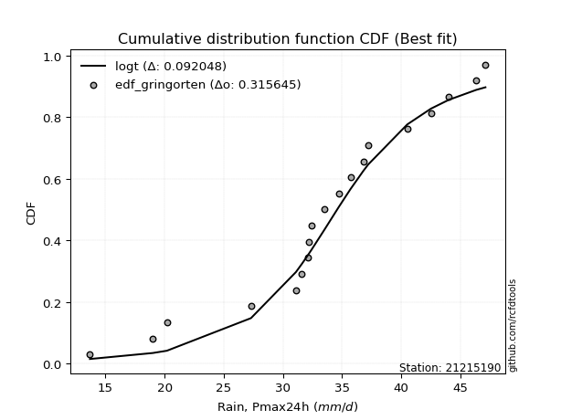</img></img>

</div>


### 9. Empirical - EDF Filliben (1975)

The specific values of the constants (0.3175) (often denoted as $alpha$) and (0.365) are derived from a method proposed by James J. Filliben in a 1975 paper. This particular formula is the mean value of the $i$-th order statistic of the normal distribution and is considered a robust and effective plotting position formula for the normal probability plot correlation coefficient test for normality.

<div align="center">


$P=(m-0.3175)/(n+0.365)$


</div>


**9.1. Empirical values**

<div align="center">

|                | 0                   | 1                   | 2                  | 3                   | 4                   | 5                  | 6                   | 7                   | 8                   | 9                   | 10                 | 11                 | 12                 | 13                 | 14                | 15                 | 16                 | 17                 | 18                 | 19                 |
|:---------------|:--------------------|:--------------------|:-------------------|:--------------------|:--------------------|:-------------------|:--------------------|:--------------------|:--------------------|:--------------------|:-------------------|:-------------------|:-------------------|:-------------------|:------------------|:-------------------|:-------------------|:-------------------|:-------------------|:-------------------|
| date           | 2006                | 2007                | 2020               | 2008                | 2022                | 2021               | 2014                | 2009                | 2025                | 2010                | 2018               | 2011               | 2013               | 2012               | 2016              | 2023               | 2015               | 2024               | 2017               | 2019               |
| x              | 13.7                | 19.0                | 20.2               | 27.3                | 31.1                | 31.6               | 32.1                | 32.2                | 32.4                | 32.4                | 33.5               | 34.7               | 35.7               | 36.8               | 37.2              | 40.5               | 42.5               | 44.0               | 46.3               | 47.1               |
| m              | 1                   | 2                   | 3                  | 4                   | 5                   | 6                  | 7                   | 8                   | 9                   | 10                  | 11                 | 12                 | 13                 | 14                 | 15                | 16                 | 17                 | 18                 | 19                 | 20                 |
| empirical_dist | edf_filliben        | edf_filliben        | edf_filliben       | edf_filliben        | edf_filliben        | edf_filliben       | edf_filliben        | edf_filliben        | edf_filliben        | edf_filliben        | edf_filliben       | edf_filliben       | edf_filliben       | edf_filliben       | edf_filliben      | edf_filliben       | edf_filliben       | edf_filliben       | edf_filliben       | edf_filliben       |
| empirical      | 0.03351338080039283 | 0.08261723545298306 | 0.1317210901055733 | 0.18082494475816355 | 0.22992879941075375 | 0.279032654063344  | 0.32813650871593425 | 0.37724036336852446 | 0.42634421802111466 | 0.47544807267370487 | 0.5245519273262951 | 0.5736557819788853 | 0.6227596366314756 | 0.6718634912840659 | 0.720967345936656 | 0.7700712005892463 | 0.8191750552418366 | 0.8682789098944268 | 0.9173827645470171 | 0.9664866191996073 |
| empirical_tr   | 1.0346754731360346  | 1.090057540479058   | 1.1517036618125265 | 1.2207402967181178  | 1.2985812211063288  | 1.3870253703388389 | 1.4883975881600586  | 1.6057559629410605  | 1.7432056494757115  | 1.90638895389656    | 2.1032791117996386 | 2.345522602936942  | 2.6508298080052066 | 3.0475121586232703 | 3.583809942806863 | 4.349172450613988  | 5.5302104548540445 | 7.591798695246976  | 12.104011887072826 | 29.838827838827974 |

</div>


**9.2. Kolmogorov-Smirnov fit test (sorted by Δ)**


<div align="center">

|                | 0                   | 1                   | 2                   | 3                  | 4                   | 5                   | 6                   | 7                   | 8                  | 9                  | 10                  | 11                 | 12                 | 13                  | 14                 | 15                 | 16                    | 17                 | 18                  | 19                 | 20                 | 21                  | 22                  | 23                  | 24                  | 25                  | 26                 | 27                  | 28                 | 29                 | 30                 | 31                 | 32                  | 33                  | 34                 | 35                 | 36                 | 37                 | 38                 | 39                  | 40                  | 41                 | 42                  | 43                  | 44                  | 45                  | 46                  | 47                  | 48                  | 49                  | 50                  | 51                  | 52                  | 53                  | 54                 | 55                  | 56                  | 57                  | 58                  | 59                  | 60                 | 61                  | 62                 | 63                  | 64                  | 65                  | 66                 | 67                  | 68                 | 69                  | 70                  | 71                 | 72                  | 73                 | 74                 | 75                 | 76                 | 77                  | 78                 | 79                 | 80                  | 81                 | 82                  | 83                  | 84                  | 85                 | 86                 | 87                  | 88                 | 89                 |
|:---------------|:--------------------|:--------------------|:--------------------|:-------------------|:--------------------|:--------------------|:--------------------|:--------------------|:-------------------|:-------------------|:--------------------|:-------------------|:-------------------|:--------------------|:-------------------|:-------------------|:----------------------|:-------------------|:--------------------|:-------------------|:-------------------|:--------------------|:--------------------|:--------------------|:--------------------|:--------------------|:-------------------|:--------------------|:-------------------|:-------------------|:-------------------|:-------------------|:--------------------|:--------------------|:-------------------|:-------------------|:-------------------|:-------------------|:-------------------|:--------------------|:--------------------|:-------------------|:--------------------|:--------------------|:--------------------|:--------------------|:--------------------|:--------------------|:--------------------|:--------------------|:--------------------|:--------------------|:--------------------|:--------------------|:-------------------|:--------------------|:--------------------|:--------------------|:--------------------|:--------------------|:-------------------|:--------------------|:-------------------|:--------------------|:--------------------|:--------------------|:-------------------|:--------------------|:-------------------|:--------------------|:--------------------|:-------------------|:--------------------|:-------------------|:-------------------|:-------------------|:-------------------|:--------------------|:-------------------|:-------------------|:--------------------|:-------------------|:--------------------|:--------------------|:--------------------|:-------------------|:-------------------|:--------------------|:-------------------|:-------------------|
| station        | 21215190            | 21215190            | 21215190            | 21215190           | 21215190            | 21215190            | 21215190            | 21215190            | 21215190           | 21215190           | 21215190            | 21215190           | 21215190           | 21215190            | 21215190           | 21215190           | 21215190              | 21215190           | 21215190            | 21215190           | 21215190           | 21215190            | 21215190            | 21215190            | 21215190            | 21215190            | 21215190           | 21215190            | 21215190           | 21215190           | 21215190           | 21215190           | 21215190            | 21215190            | 21215190           | 21215190           | 21215190           | 21215190           | 21215190           | 21215190            | 21215190            | 21215190           | 21215190            | 21215190            | 21215190            | 21215190            | 21215190            | 21215190            | 21215190            | 21215190            | 21215190            | 21215190            | 21215190            | 21215190            | 21215190           | 21215190            | 21215190            | 21215190            | 21215190            | 21215190            | 21215190           | 21215190            | 21215190           | 21215190            | 21215190            | 21215190            | 21215190           | 21215190            | 21215190           | 21215190            | 21215190            | 21215190           | 21215190            | 21215190           | 21215190           | 21215190           | 21215190           | 21215190            | 21215190           | 21215190           | 21215190            | 21215190           | 21215190            | 21215190            | 21215190            | 21215190           | 21215190           | 21215190            | 21215190           | 21215190           |
| empirical_dist | edf_filliben        | edf_filliben        | edf_filliben        | edf_filliben       | edf_filliben        | edf_filliben        | edf_filliben        | edf_filliben        | edf_filliben       | edf_filliben       | edf_filliben        | edf_filliben       | edf_filliben       | edf_filliben        | edf_filliben       | edf_filliben       | edf_filliben          | edf_filliben       | edf_filliben        | edf_filliben       | edf_filliben       | edf_filliben        | edf_filliben        | edf_filliben        | edf_filliben        | edf_filliben        | edf_filliben       | edf_filliben        | edf_filliben       | edf_filliben       | edf_filliben       | edf_filliben       | edf_filliben        | edf_filliben        | edf_filliben       | edf_filliben       | edf_filliben       | edf_filliben       | edf_filliben       | edf_filliben        | edf_filliben        | edf_filliben       | edf_filliben        | edf_filliben        | edf_filliben        | edf_filliben        | edf_filliben        | edf_filliben        | edf_filliben        | edf_filliben        | edf_filliben        | edf_filliben        | edf_filliben        | edf_filliben        | edf_filliben       | edf_filliben        | edf_filliben        | edf_filliben        | edf_filliben        | edf_filliben        | edf_filliben       | edf_filliben        | edf_filliben       | edf_filliben        | edf_filliben        | edf_filliben        | edf_filliben       | edf_filliben        | edf_filliben       | edf_filliben        | edf_filliben        | edf_filliben       | edf_filliben        | edf_filliben       | edf_filliben       | edf_filliben       | edf_filliben       | edf_filliben        | edf_filliben       | edf_filliben       | edf_filliben        | edf_filliben       | edf_filliben        | edf_filliben        | edf_filliben        | edf_filliben       | edf_filliben       | edf_filliben        | edf_filliben       | edf_filliben       |
| p_dist         | gumbel_l            | logt                | laplace             | genlogistic        | johnsonsu           | fisk                | weibull_min         | logjohnsonsu        | logloggamma        | mielke             | pearson3            | loggenlogistic     | logmielke          | gompertz            | laplace_asymmetric | hypsecant          | loglaplace_asymmetric | logweibull_min     | logpearson3         | logistic           | loggompertz        | logfisk             | loggumbel_l         | t                   | exponnorm           | norm                | crystalball        | truncnorm           | nct                | nakagami           | f                  | fatiguelife        | betaprime           | erlang              | gamma              | chi2               | logtruncnorm       | invgamma           | maxwell            | loglaplace          | invgauss            | alpha              | ncf                 | rayleigh            | loghypsecant        | gumbel_r            | loglogistic         | invweibull          | logrice             | logexponnorm        | lognorm             | lognorm             | logcrystalball      | loglognorm          | lognakagami        | logf                | logfatiguelife      | lognct              | logbetaprime        | moyal               | halfnorm           | logerlang           | loginvgamma        | loggamma            | loggamma            | logalpha            | logncf             | loginvgauss         | kstwobign          | halflogistic        | logmaxwell          | loginvweibull      | lograyleigh         | gibrat             | loggumbel_r        | wald               | loghalfnorm        | logkstwobign        | logmoyal           | loghalflogistic    | genexpon            | loggenexpon        | expon               | logchi2             | logexpon            | logpareto          | logwald            | loggibrat           | pareto             | rice               |
| delta          | 0.09749668042806359 | 0.10111328264825797 | 0.10499665129795313 | 0.1119214882525433 | 0.11894426664528387 | 0.12225312156856447 | 0.12240605753758574 | 0.12455418138778016 | 0.1266767868796497 | 0.1274931504738385 | 0.12786295405615114 | 0.1279782353758437 | 0.1295077291672795 | 0.13259700787415815 | 0.132802582627956  | 0.1328602951732615 | 0.13428745984109444   | 0.1356028067637566 | 0.14172592891921645 | 0.1443467338135148 | 0.1480352718547074 | 0.15096370224653002 | 0.15388379333633614 | 0.15850730472792776 | 0.15852991201230862 | 0.15853016138691903 | 0.15853016869318   | 0.15853021624488314 | 0.1586215680163641 | 0.1594508023005705 | 0.1594792882050872 | 0.1600900833207722 | 0.16429528007116626 | 0.17176132426970012 | 0.1733860778867772 | 0.1764244224762012 | 0.1808246565498963 | 0.1842691420030906 | 0.1922313080557931 | 0.19476919356973285 | 0.19722817044299965 | 0.1976898267100173 | 0.19776282497214168 | 0.20453494693356142 | 0.21267434594686765 | 0.21604590886990307 | 0.21792393505968308 | 0.21972478917161867 | 0.22409235271822245 | 0.22412651060631586 | 0.22412696181210665 | 0.22412696181210665 | 0.22412742698877966 | 0.22412903459304975 | 0.2242115054306675 | 0.22486336553071543 | 0.22550295626245345 | 0.22853218855242471 | 0.23100772914192916 | 0.23802880275167101 | 0.2394687968705493 | 0.24303374166856825 | 0.2436234916343278 | 0.24546581937945464 | 0.24546581937945464 | 0.24558730692217898 | 0.2470548988975452 | 0.24959878104641567 | 0.2519032411827097 | 0.25349778782826016 | 0.25840073332167857 | 0.2650122172201741 | 0.27024607174043236 | 0.2843234446469951 | 0.2915737983670914 | 0.2963104197921941 | 0.3036379874435935 | 0.30420579412269855 | 0.3170382172453753 | 0.3251155557697055 | 0.32901652801373904 | 0.3374623379758648 | 0.35450885831531487 | 0.38016825896874906 | 0.38691523694395946 | 0.3869152434304687 | 0.3878520778440021 | 0.40163204991408896 | 0.5439978850280696 | 0.8271243002524786 |
| deltao         | 0.3096406529800002  | 0.3096406529800002  | 0.3096406529800002  | 0.3096406529800002 | 0.3096406529800002  | 0.3096406529800002  | 0.3096406529800002  | 0.3096406529800002  | 0.3096406529800002 | 0.3096406529800002 | 0.3096406529800002  | 0.3096406529800002 | 0.3096406529800002 | 0.3096406529800002  | 0.3096406529800002 | 0.3096406529800002 | 0.3096406529800002    | 0.3096406529800002 | 0.3096406529800002  | 0.3096406529800002 | 0.3096406529800002 | 0.3096406529800002  | 0.3096406529800002  | 0.3096406529800002  | 0.3096406529800002  | 0.3096406529800002  | 0.3096406529800002 | 0.3096406529800002  | 0.3096406529800002 | 0.3096406529800002 | 0.3096406529800002 | 0.3096406529800002 | 0.3096406529800002  | 0.3096406529800002  | 0.3096406529800002 | 0.3096406529800002 | 0.3096406529800002 | 0.3096406529800002 | 0.3096406529800002 | 0.3096406529800002  | 0.3096406529800002  | 0.3096406529800002 | 0.3096406529800002  | 0.3096406529800002  | 0.3096406529800002  | 0.3096406529800002  | 0.3096406529800002  | 0.3096406529800002  | 0.3096406529800002  | 0.3096406529800002  | 0.3096406529800002  | 0.3096406529800002  | 0.3096406529800002  | 0.3096406529800002  | 0.3096406529800002 | 0.3096406529800002  | 0.3096406529800002  | 0.3096406529800002  | 0.3096406529800002  | 0.3096406529800002  | 0.3096406529800002 | 0.3096406529800002  | 0.3096406529800002 | 0.3096406529800002  | 0.3096406529800002  | 0.3096406529800002  | 0.3096406529800002 | 0.3096406529800002  | 0.3096406529800002 | 0.3096406529800002  | 0.3096406529800002  | 0.3096406529800002 | 0.3096406529800002  | 0.3096406529800002 | 0.3096406529800002 | 0.3096406529800002 | 0.3096406529800002 | 0.3096406529800002  | 0.3096406529800002 | 0.3096406529800002 | 0.3096406529800002  | 0.3096406529800002 | 0.3096406529800002  | 0.3096406529800002  | 0.3096406529800002  | 0.3096406529800002 | 0.3096406529800002 | 0.3096406529800002  | 0.3096406529800002 | 0.3096406529800002 |
| eval           | Δo > Δ              | Δo > Δ              | Δo > Δ              | Δo > Δ             | Δo > Δ              | Δo > Δ              | Δo > Δ              | Δo > Δ              | Δo > Δ             | Δo > Δ             | Δo > Δ              | Δo > Δ             | Δo > Δ             | Δo > Δ              | Δo > Δ             | Δo > Δ             | Δo > Δ                | Δo > Δ             | Δo > Δ              | Δo > Δ             | Δo > Δ             | Δo > Δ              | Δo > Δ              | Δo > Δ              | Δo > Δ              | Δo > Δ              | Δo > Δ             | Δo > Δ              | Δo > Δ             | Δo > Δ             | Δo > Δ             | Δo > Δ             | Δo > Δ              | Δo > Δ              | Δo > Δ             | Δo > Δ             | Δo > Δ             | Δo > Δ             | Δo > Δ             | Δo > Δ              | Δo > Δ              | Δo > Δ             | Δo > Δ              | Δo > Δ              | Δo > Δ              | Δo > Δ              | Δo > Δ              | Δo > Δ              | Δo > Δ              | Δo > Δ              | Δo > Δ              | Δo > Δ              | Δo > Δ              | Δo > Δ              | Δo > Δ             | Δo > Δ              | Δo > Δ              | Δo > Δ              | Δo > Δ              | Δo > Δ              | Δo > Δ             | Δo > Δ              | Δo > Δ             | Δo > Δ              | Δo > Δ              | Δo > Δ              | Δo > Δ             | Δo > Δ              | Δo > Δ             | Δo > Δ              | Δo > Δ              | Δo > Δ             | Δo > Δ              | Δo > Δ             | Δo > Δ             | Δo > Δ             | Δo > Δ             | Δo > Δ              | Δo <= Δ            | Δo <= Δ            | Δo <= Δ             | Δo <= Δ            | Δo <= Δ             | Δo <= Δ             | Δo <= Δ             | Δo <= Δ            | Δo <= Δ            | Δo <= Δ             | Δo <= Δ            | Δo <= Δ            |
| fit            | 1                   | 1                   | 1                   | 1                  | 1                   | 1                   | 1                   | 1                   | 1                  | 1                  | 1                   | 1                  | 1                  | 1                   | 1                  | 1                  | 1                     | 1                  | 1                   | 1                  | 1                  | 1                   | 1                   | 1                   | 1                   | 1                   | 1                  | 1                   | 1                  | 1                  | 1                  | 1                  | 1                   | 1                   | 1                  | 1                  | 1                  | 1                  | 1                  | 1                   | 1                   | 1                  | 1                   | 1                   | 1                   | 1                   | 1                   | 1                   | 1                   | 1                   | 1                   | 1                   | 1                   | 1                   | 1                  | 1                   | 1                   | 1                   | 1                   | 1                   | 1                  | 1                   | 1                  | 1                   | 1                   | 1                   | 1                  | 1                   | 1                  | 1                   | 1                   | 1                  | 1                   | 1                  | 1                  | 1                  | 1                  | 1                   | 0                  | 0                  | 0                   | 0                  | 0                   | 0                   | 0                   | 0                  | 0                  | 0                   | 0                  | 0                  |
| n              | 20                  | 20                  | 20                  | 20                 | 20                  | 20                  | 20                  | 20                  | 20                 | 20                 | 20                  | 20                 | 20                 | 20                  | 20                 | 20                 | 20                    | 20                 | 20                  | 20                 | 20                 | 20                  | 20                  | 20                  | 20                  | 20                  | 20                 | 20                  | 20                 | 20                 | 20                 | 20                 | 20                  | 20                  | 20                 | 20                 | 20                 | 20                 | 20                 | 20                  | 20                  | 20                 | 20                  | 20                  | 20                  | 20                  | 20                  | 20                  | 20                  | 20                  | 20                  | 20                  | 20                  | 20                  | 20                 | 20                  | 20                  | 20                  | 20                  | 20                  | 20                 | 20                  | 20                 | 20                  | 20                  | 20                  | 20                 | 20                  | 20                 | 20                  | 20                  | 20                 | 20                  | 20                 | 20                 | 20                 | 20                 | 20                  | 20                 | 20                 | 20                  | 20                 | 20                  | 20                  | 20                  | 20                 | 20                 | 20                  | 20                 | 20                 |
| best_fit       | 1                   | 0                   | 0                   | 0                  | 0                   | 0                   | 0                   | 0                   | 0                  | 0                  | 0                   | 0                  | 0                  | 0                   | 0                  | 0                  | 0                     | 0                  | 0                   | 0                  | 0                  | 0                   | 0                   | 0                   | 0                   | 0                   | 0                  | 0                   | 0                  | 0                  | 0                  | 0                  | 0                   | 0                   | 0                  | 0                  | 0                  | 0                  | 0                  | 0                   | 0                   | 0                  | 0                   | 0                   | 0                   | 0                   | 0                   | 0                   | 0                   | 0                   | 0                   | 0                   | 0                   | 0                   | 0                  | 0                   | 0                   | 0                   | 0                   | 0                   | 0                  | 0                   | 0                  | 0                   | 0                   | 0                   | 0                  | 0                   | 0                  | 0                   | 0                   | 0                  | 0                   | 0                  | 0                  | 0                  | 0                  | 0                   | 0                  | 0                  | 0                   | 0                  | 0                   | 0                   | 0                   | 0                  | 0                  | 0                   | 0                  | 0                  |
| best_fit_sort  | 1                   | 2                   | 3                   | 4                  | 5                   | 6                   | 7                   | 8                   | 9                  | 10                 | 11                  | 12                 | 13                 | 14                  | 15                 | 16                 | 17                    | 18                 | 19                  | 20                 | 21                 | 22                  | 23                  | 24                  | 25                  | 26                  | 27                 | 28                  | 29                 | 30                 | 31                 | 32                 | 33                  | 34                  | 35                 | 36                 | 37                 | 38                 | 39                 | 40                  | 41                  | 42                 | 43                  | 44                  | 45                  | 46                  | 47                  | 48                  | 49                  | 50                  | 51                  | 52                  | 53                  | 54                  | 55                 | 56                  | 57                  | 58                  | 59                  | 60                  | 61                 | 62                  | 63                 | 64                  | 65                  | 66                  | 67                 | 68                  | 69                 | 70                  | 71                  | 72                 | 73                  | 74                 | 75                 | 76                 | 77                 | 78                  | 79                 | 80                 | 81                  | 82                 | 83                  | 84                  | 85                  | 86                 | 87                 | 88                  | 89                 | 90                 |

</div>


<div align="center">

</img>

</div>


**9.3. Best fit**

<div align="center">

|   id |   station | empirical_dist   | p_dist   |     delta |   deltao | eval   |   fit |   n |   best_fit |   best_fit_sort |
|-----:|----------:|:-----------------|:---------|----------:|---------:|:-------|------:|----:|-----------:|----------------:|
|    0 |  21215190 | edf_filliben     | gumbel_l | 0.0974967 | 0.309641 | Δo > Δ |     1 |  20 |          1 |               1 |

</div>


<div align="center">

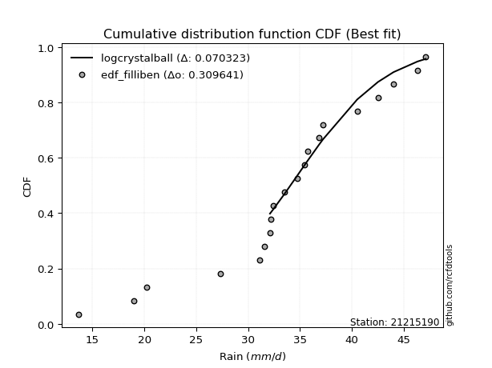</img></img>

</div>


### 10. Empirical - EDF Jenkinson (1977)

The Jenkinson formula in hydrology is an empirical plotting position formula used to estimate the non-exceedance probability _(P)_ or return period _(T)_ of a given ordered observation within a sample. It is a widely used method in the frequency analysis of extreme events such as floods and rainfall, as it provides a distribution-free way to plot data. _a≈0.31_ and _b≈0.38_ are constants derived to approximate the median of the probability distribution for the given rank.

<div align="center">


$P=(m-a)/(n+b)$


</div>


**10.1. Empirical values**

<div align="center">

|                | 0                    | 1                   | 2                   | 3                   | 4                   | 5                   | 6                   | 7                  | 8                  | 9                   | 10                 | 11                 | 12                 | 13                 | 14                 | 15                 | 16                 | 17                 | 18                 | 19                 |
|:---------------|:---------------------|:--------------------|:--------------------|:--------------------|:--------------------|:--------------------|:--------------------|:-------------------|:-------------------|:--------------------|:-------------------|:-------------------|:-------------------|:-------------------|:-------------------|:-------------------|:-------------------|:-------------------|:-------------------|:-------------------|
| date           | 2006                 | 2007                | 2020                | 2008                | 2022                | 2021                | 2014                | 2009               | 2025               | 2010                | 2018               | 2011               | 2013               | 2012               | 2016               | 2023               | 2015               | 2024               | 2017               | 2019               |
| x              | 13.7                 | 19.0                | 20.2                | 27.3                | 31.1                | 31.6                | 32.1                | 32.2               | 32.4               | 32.4                | 33.5               | 34.7               | 35.7               | 36.8               | 37.2               | 40.5               | 42.5               | 44.0               | 46.3               | 47.1               |
| m              | 1                    | 2                   | 3                   | 4                   | 5                   | 6                   | 7                   | 8                  | 9                  | 10                  | 11                 | 12                 | 13                 | 14                 | 15                 | 16                 | 17                 | 18                 | 19                 | 20                 |
| empirical_dist | edf_jenkinson        | edf_jenkinson       | edf_jenkinson       | edf_jenkinson       | edf_jenkinson       | edf_jenkinson       | edf_jenkinson       | edf_jenkinson      | edf_jenkinson      | edf_jenkinson       | edf_jenkinson      | edf_jenkinson      | edf_jenkinson      | edf_jenkinson      | edf_jenkinson      | edf_jenkinson      | edf_jenkinson      | edf_jenkinson      | edf_jenkinson      | edf_jenkinson      |
| empirical      | 0.033856722276741906 | 0.08292443572129539 | 0.13199214916584887 | 0.18105986261040236 | 0.23012757605495587 | 0.27919528949950934 | 0.32826300294406285 | 0.3773307163886163 | 0.4263984298331698 | 0.47546614327772324 | 0.5245338567222767 | 0.5736015701668302 | 0.6226692836113837 | 0.6717369970559373 | 0.7208047105004907 | 0.7698724239450442 | 0.8189401373895977 | 0.8680078508341512 | 0.9170755642787047 | 0.9661432777232583 |
| empirical_tr   | 1.0350431691213813   | 1.090422685928304   | 1.152063312605992   | 1.2210904733373276  | 1.2989165073295095  | 1.3873383253914227  | 1.4886778670562455  | 1.6059889676910957 | 1.7433704020530367 | 1.9064546304957901  | 2.1031991744066048 | 2.3452243958573074 | 2.6501950585175553 | 3.0463378176382667 | 3.581722319859402  | 4.345415778251599  | 5.523035230352305  | 7.576208178438667  | 12.059171597633155 | 29.536231884058108 |

</div>


**10.2. Kolmogorov-Smirnov fit test (sorted by Δ)**


<div align="center">

|                | 0                   | 1                   | 2                   | 3                   | 4                   | 5                   | 6                   | 7                   | 8                   | 9                   | 10                  | 11                 | 12                 | 13                  | 14                  | 15                  | 16                    | 17                  | 18                  | 19                  | 20                 | 21                 | 22                  | 23                  | 24                 | 25                 | 26                 | 27                  | 28                  | 29                  | 30                  | 31                 | 32                  | 33                 | 34                 | 35                  | 36                 | 37                 | 38                 | 39                  | 40                  | 41                 | 42                  | 43                 | 44                  | 45                  | 46                  | 47                  | 48                  | 49                  | 50                  | 51                  | 52                  | 53                  | 54                 | 55                 | 56                  | 57                 | 58                  | 59                 | 60                 | 61                  | 62                 | 63                  | 64                  | 65                  | 66                  | 67                  | 68                 | 69                  | 70                 | 71                 | 72                 | 73                  | 74                  | 75                  | 76                  | 77                 | 78                  | 79                 | 80                 | 81                  | 82                 | 83                 | 84                 | 85                  | 86                  | 87                 | 88                 | 89                 |
|:---------------|:--------------------|:--------------------|:--------------------|:--------------------|:--------------------|:--------------------|:--------------------|:--------------------|:--------------------|:--------------------|:--------------------|:-------------------|:-------------------|:--------------------|:--------------------|:--------------------|:----------------------|:--------------------|:--------------------|:--------------------|:-------------------|:-------------------|:--------------------|:--------------------|:-------------------|:-------------------|:-------------------|:--------------------|:--------------------|:--------------------|:--------------------|:-------------------|:--------------------|:-------------------|:-------------------|:--------------------|:-------------------|:-------------------|:-------------------|:--------------------|:--------------------|:-------------------|:--------------------|:-------------------|:--------------------|:--------------------|:--------------------|:--------------------|:--------------------|:--------------------|:--------------------|:--------------------|:--------------------|:--------------------|:-------------------|:-------------------|:--------------------|:-------------------|:--------------------|:-------------------|:-------------------|:--------------------|:-------------------|:--------------------|:--------------------|:--------------------|:--------------------|:--------------------|:-------------------|:--------------------|:-------------------|:-------------------|:-------------------|:--------------------|:--------------------|:--------------------|:--------------------|:-------------------|:--------------------|:-------------------|:-------------------|:--------------------|:-------------------|:-------------------|:-------------------|:--------------------|:--------------------|:-------------------|:-------------------|:-------------------|
| station        | 21215190            | 21215190            | 21215190            | 21215190            | 21215190            | 21215190            | 21215190            | 21215190            | 21215190            | 21215190            | 21215190            | 21215190           | 21215190           | 21215190            | 21215190            | 21215190            | 21215190              | 21215190            | 21215190            | 21215190            | 21215190           | 21215190           | 21215190            | 21215190            | 21215190           | 21215190           | 21215190           | 21215190            | 21215190            | 21215190            | 21215190            | 21215190           | 21215190            | 21215190           | 21215190           | 21215190            | 21215190           | 21215190           | 21215190           | 21215190            | 21215190            | 21215190           | 21215190            | 21215190           | 21215190            | 21215190            | 21215190            | 21215190            | 21215190            | 21215190            | 21215190            | 21215190            | 21215190            | 21215190            | 21215190           | 21215190           | 21215190            | 21215190           | 21215190            | 21215190           | 21215190           | 21215190            | 21215190           | 21215190            | 21215190            | 21215190            | 21215190            | 21215190            | 21215190           | 21215190            | 21215190           | 21215190           | 21215190           | 21215190            | 21215190            | 21215190            | 21215190            | 21215190           | 21215190            | 21215190           | 21215190           | 21215190            | 21215190           | 21215190           | 21215190           | 21215190            | 21215190            | 21215190           | 21215190           | 21215190           |
| empirical_dist | edf_jenkinson       | edf_jenkinson       | edf_jenkinson       | edf_jenkinson       | edf_jenkinson       | edf_jenkinson       | edf_jenkinson       | edf_jenkinson       | edf_jenkinson       | edf_jenkinson       | edf_jenkinson       | edf_jenkinson      | edf_jenkinson      | edf_jenkinson       | edf_jenkinson       | edf_jenkinson       | edf_jenkinson         | edf_jenkinson       | edf_jenkinson       | edf_jenkinson       | edf_jenkinson      | edf_jenkinson      | edf_jenkinson       | edf_jenkinson       | edf_jenkinson      | edf_jenkinson      | edf_jenkinson      | edf_jenkinson       | edf_jenkinson       | edf_jenkinson       | edf_jenkinson       | edf_jenkinson      | edf_jenkinson       | edf_jenkinson      | edf_jenkinson      | edf_jenkinson       | edf_jenkinson      | edf_jenkinson      | edf_jenkinson      | edf_jenkinson       | edf_jenkinson       | edf_jenkinson      | edf_jenkinson       | edf_jenkinson      | edf_jenkinson       | edf_jenkinson       | edf_jenkinson       | edf_jenkinson       | edf_jenkinson       | edf_jenkinson       | edf_jenkinson       | edf_jenkinson       | edf_jenkinson       | edf_jenkinson       | edf_jenkinson      | edf_jenkinson      | edf_jenkinson       | edf_jenkinson      | edf_jenkinson       | edf_jenkinson      | edf_jenkinson      | edf_jenkinson       | edf_jenkinson      | edf_jenkinson       | edf_jenkinson       | edf_jenkinson       | edf_jenkinson       | edf_jenkinson       | edf_jenkinson      | edf_jenkinson       | edf_jenkinson      | edf_jenkinson      | edf_jenkinson      | edf_jenkinson       | edf_jenkinson       | edf_jenkinson       | edf_jenkinson       | edf_jenkinson      | edf_jenkinson       | edf_jenkinson      | edf_jenkinson      | edf_jenkinson       | edf_jenkinson      | edf_jenkinson      | edf_jenkinson      | edf_jenkinson       | edf_jenkinson       | edf_jenkinson      | edf_jenkinson      | edf_jenkinson      |
| p_dist         | gumbel_l            | logt                | laplace             | genlogistic         | johnsonsu           | fisk                | weibull_min         | logjohnsonsu        | logloggamma         | mielke              | pearson3            | loggenlogistic     | logmielke          | gompertz            | laplace_asymmetric  | hypsecant           | loglaplace_asymmetric | logweibull_min      | logpearson3         | logistic            | loggompertz        | logfisk            | loggumbel_l         | t                   | exponnorm          | norm               | crystalball        | truncnorm           | nct                 | nakagami            | f                   | fatiguelife        | betaprime           | erlang             | gamma              | chi2                | logtruncnorm       | invgamma           | maxwell            | loglaplace          | invgauss            | alpha              | ncf                 | rayleigh           | loghypsecant        | gumbel_r            | loglogistic         | invweibull          | logrice             | logexponnorm        | lognorm             | lognorm             | logcrystalball      | loglognorm          | lognakagami        | logf               | logfatiguelife      | lognct             | logbetaprime        | moyal              | halfnorm           | logerlang           | loginvgamma        | loggamma            | loggamma            | logalpha            | logncf              | loginvgauss         | kstwobign          | halflogistic        | logmaxwell         | loginvweibull      | lograyleigh        | gibrat              | loggumbel_r         | wald                | loghalfnorm         | logkstwobign       | logmoyal            | loghalflogistic    | genexpon           | loggenexpon         | expon              | logchi2            | logexpon           | logpareto           | logwald             | loggibrat          | pareto             | rice               |
| delta          | 0.09751475103208196 | 0.10113135325227635 | 0.10479787465375101 | 0.11172271160834119 | 0.11874549000108175 | 0.12205434492436235 | 0.12220728089338362 | 0.12435540474357804 | 0.12647801023544758 | 0.12729437382963638 | 0.12766417741194902 | 0.1277794587316416 | 0.1293089525230774 | 0.13239823122995603 | 0.13260380598375388 | 0.13266151852905939 | 0.13408868319689232   | 0.13540403011955449 | 0.14152715227501433 | 0.14414795716931267 | 0.1478364952105053 | 0.1507649256023279 | 0.15368501669213402 | 0.15830852808372564 | 0.1583311353681065 | 0.1583313847427169 | 0.1583313920489779 | 0.15833143960068102 | 0.15842279137216198 | 0.15925202565636837 | 0.15928051156088507 | 0.1598913066765701 | 0.16409650342696414 | 0.171562547625498  | 0.1731873012425751 | 0.17622564583199907 | 0.1810595744021351 | 0.1840703653588885 | 0.192032531411591  | 0.19457041692553073 | 0.19702939379879753 | 0.1974910500658152 | 0.19756404832793956 | 0.2043361702893593 | 0.21247556930266553 | 0.21584713222570096 | 0.21772515841548096 | 0.21952601252741655 | 0.22389357607402033 | 0.22392773396211374 | 0.22392818516790453 | 0.22392818516790453 | 0.22392865034457754 | 0.22393025794884763 | 0.2240127287864654 | 0.2246645888865133 | 0.22530417961825133 | 0.2283334119082226 | 0.23080895249772704 | 0.2378300261074689 | 0.2392700202263472 | 0.24283496502436613 | 0.2434247149901257 | 0.24526704273525252 | 0.24526704273525252 | 0.24538853027797686 | 0.24685612225334308 | 0.24940000440221355 | 0.2517044645385076 | 0.25329901118405806 | 0.2582019566774765 | 0.264813440575972  | 0.2700472950962302 | 0.28412466800279296 | 0.29137502172288926 | 0.29611164314799193 | 0.30343921079939135 | 0.3040070174784964 | 0.31683944060117314 | 0.3249167791255034 | 0.3288177513695369 | 0.33726356133166263 | 0.3543100816711127 | 0.3799333411165103 | 0.3867164602997573 | 0.38671646678626653 | 0.38765330119979996 | 0.4014332732698868 | 0.5436906847597572 | 0.826853241192203  |
| deltao         | 0.3096406529800002  | 0.3096406529800002  | 0.3096406529800002  | 0.3096406529800002  | 0.3096406529800002  | 0.3096406529800002  | 0.3096406529800002  | 0.3096406529800002  | 0.3096406529800002  | 0.3096406529800002  | 0.3096406529800002  | 0.3096406529800002 | 0.3096406529800002 | 0.3096406529800002  | 0.3096406529800002  | 0.3096406529800002  | 0.3096406529800002    | 0.3096406529800002  | 0.3096406529800002  | 0.3096406529800002  | 0.3096406529800002 | 0.3096406529800002 | 0.3096406529800002  | 0.3096406529800002  | 0.3096406529800002 | 0.3096406529800002 | 0.3096406529800002 | 0.3096406529800002  | 0.3096406529800002  | 0.3096406529800002  | 0.3096406529800002  | 0.3096406529800002 | 0.3096406529800002  | 0.3096406529800002 | 0.3096406529800002 | 0.3096406529800002  | 0.3096406529800002 | 0.3096406529800002 | 0.3096406529800002 | 0.3096406529800002  | 0.3096406529800002  | 0.3096406529800002 | 0.3096406529800002  | 0.3096406529800002 | 0.3096406529800002  | 0.3096406529800002  | 0.3096406529800002  | 0.3096406529800002  | 0.3096406529800002  | 0.3096406529800002  | 0.3096406529800002  | 0.3096406529800002  | 0.3096406529800002  | 0.3096406529800002  | 0.3096406529800002 | 0.3096406529800002 | 0.3096406529800002  | 0.3096406529800002 | 0.3096406529800002  | 0.3096406529800002 | 0.3096406529800002 | 0.3096406529800002  | 0.3096406529800002 | 0.3096406529800002  | 0.3096406529800002  | 0.3096406529800002  | 0.3096406529800002  | 0.3096406529800002  | 0.3096406529800002 | 0.3096406529800002  | 0.3096406529800002 | 0.3096406529800002 | 0.3096406529800002 | 0.3096406529800002  | 0.3096406529800002  | 0.3096406529800002  | 0.3096406529800002  | 0.3096406529800002 | 0.3096406529800002  | 0.3096406529800002 | 0.3096406529800002 | 0.3096406529800002  | 0.3096406529800002 | 0.3096406529800002 | 0.3096406529800002 | 0.3096406529800002  | 0.3096406529800002  | 0.3096406529800002 | 0.3096406529800002 | 0.3096406529800002 |
| eval           | Δo > Δ              | Δo > Δ              | Δo > Δ              | Δo > Δ              | Δo > Δ              | Δo > Δ              | Δo > Δ              | Δo > Δ              | Δo > Δ              | Δo > Δ              | Δo > Δ              | Δo > Δ             | Δo > Δ             | Δo > Δ              | Δo > Δ              | Δo > Δ              | Δo > Δ                | Δo > Δ              | Δo > Δ              | Δo > Δ              | Δo > Δ             | Δo > Δ             | Δo > Δ              | Δo > Δ              | Δo > Δ             | Δo > Δ             | Δo > Δ             | Δo > Δ              | Δo > Δ              | Δo > Δ              | Δo > Δ              | Δo > Δ             | Δo > Δ              | Δo > Δ             | Δo > Δ             | Δo > Δ              | Δo > Δ             | Δo > Δ             | Δo > Δ             | Δo > Δ              | Δo > Δ              | Δo > Δ             | Δo > Δ              | Δo > Δ             | Δo > Δ              | Δo > Δ              | Δo > Δ              | Δo > Δ              | Δo > Δ              | Δo > Δ              | Δo > Δ              | Δo > Δ              | Δo > Δ              | Δo > Δ              | Δo > Δ             | Δo > Δ             | Δo > Δ              | Δo > Δ             | Δo > Δ              | Δo > Δ             | Δo > Δ             | Δo > Δ              | Δo > Δ             | Δo > Δ              | Δo > Δ              | Δo > Δ              | Δo > Δ              | Δo > Δ              | Δo > Δ             | Δo > Δ              | Δo > Δ             | Δo > Δ             | Δo > Δ             | Δo > Δ              | Δo > Δ              | Δo > Δ              | Δo > Δ              | Δo > Δ             | Δo <= Δ             | Δo <= Δ            | Δo <= Δ            | Δo <= Δ             | Δo <= Δ            | Δo <= Δ            | Δo <= Δ            | Δo <= Δ             | Δo <= Δ             | Δo <= Δ            | Δo <= Δ            | Δo <= Δ            |
| fit            | 1                   | 1                   | 1                   | 1                   | 1                   | 1                   | 1                   | 1                   | 1                   | 1                   | 1                   | 1                  | 1                  | 1                   | 1                   | 1                   | 1                     | 1                   | 1                   | 1                   | 1                  | 1                  | 1                   | 1                   | 1                  | 1                  | 1                  | 1                   | 1                   | 1                   | 1                   | 1                  | 1                   | 1                  | 1                  | 1                   | 1                  | 1                  | 1                  | 1                   | 1                   | 1                  | 1                   | 1                  | 1                   | 1                   | 1                   | 1                   | 1                   | 1                   | 1                   | 1                   | 1                   | 1                   | 1                  | 1                  | 1                   | 1                  | 1                   | 1                  | 1                  | 1                   | 1                  | 1                   | 1                   | 1                   | 1                   | 1                   | 1                  | 1                   | 1                  | 1                  | 1                  | 1                   | 1                   | 1                   | 1                   | 1                  | 0                   | 0                  | 0                  | 0                   | 0                  | 0                  | 0                  | 0                   | 0                   | 0                  | 0                  | 0                  |
| n              | 20                  | 20                  | 20                  | 20                  | 20                  | 20                  | 20                  | 20                  | 20                  | 20                  | 20                  | 20                 | 20                 | 20                  | 20                  | 20                  | 20                    | 20                  | 20                  | 20                  | 20                 | 20                 | 20                  | 20                  | 20                 | 20                 | 20                 | 20                  | 20                  | 20                  | 20                  | 20                 | 20                  | 20                 | 20                 | 20                  | 20                 | 20                 | 20                 | 20                  | 20                  | 20                 | 20                  | 20                 | 20                  | 20                  | 20                  | 20                  | 20                  | 20                  | 20                  | 20                  | 20                  | 20                  | 20                 | 20                 | 20                  | 20                 | 20                  | 20                 | 20                 | 20                  | 20                 | 20                  | 20                  | 20                  | 20                  | 20                  | 20                 | 20                  | 20                 | 20                 | 20                 | 20                  | 20                  | 20                  | 20                  | 20                 | 20                  | 20                 | 20                 | 20                  | 20                 | 20                 | 20                 | 20                  | 20                  | 20                 | 20                 | 20                 |
| best_fit       | 1                   | 0                   | 0                   | 0                   | 0                   | 0                   | 0                   | 0                   | 0                   | 0                   | 0                   | 0                  | 0                  | 0                   | 0                   | 0                   | 0                     | 0                   | 0                   | 0                   | 0                  | 0                  | 0                   | 0                   | 0                  | 0                  | 0                  | 0                   | 0                   | 0                   | 0                   | 0                  | 0                   | 0                  | 0                  | 0                   | 0                  | 0                  | 0                  | 0                   | 0                   | 0                  | 0                   | 0                  | 0                   | 0                   | 0                   | 0                   | 0                   | 0                   | 0                   | 0                   | 0                   | 0                   | 0                  | 0                  | 0                   | 0                  | 0                   | 0                  | 0                  | 0                   | 0                  | 0                   | 0                   | 0                   | 0                   | 0                   | 0                  | 0                   | 0                  | 0                  | 0                  | 0                   | 0                   | 0                   | 0                   | 0                  | 0                   | 0                  | 0                  | 0                   | 0                  | 0                  | 0                  | 0                   | 0                   | 0                  | 0                  | 0                  |
| best_fit_sort  | 1                   | 2                   | 3                   | 4                   | 5                   | 6                   | 7                   | 8                   | 9                   | 10                  | 11                  | 12                 | 13                 | 14                  | 15                  | 16                  | 17                    | 18                  | 19                  | 20                  | 21                 | 22                 | 23                  | 24                  | 25                 | 26                 | 27                 | 28                  | 29                  | 30                  | 31                  | 32                 | 33                  | 34                 | 35                 | 36                  | 37                 | 38                 | 39                 | 40                  | 41                  | 42                 | 43                  | 44                 | 45                  | 46                  | 47                  | 48                  | 49                  | 50                  | 51                  | 52                  | 53                  | 54                  | 55                 | 56                 | 57                  | 58                 | 59                  | 60                 | 61                 | 62                  | 63                 | 64                  | 65                  | 66                  | 67                  | 68                  | 69                 | 70                  | 71                 | 72                 | 73                 | 74                  | 75                  | 76                  | 77                  | 78                 | 79                  | 80                 | 81                 | 82                  | 83                 | 84                 | 85                 | 86                  | 87                  | 88                 | 89                 | 90                 |

</div>


<div align="center">

</img>

</div>


**10.3. Best fit**

<div align="center">

|   id |   station | empirical_dist   | p_dist   |     delta |   deltao | eval   |   fit |   n |   best_fit |   best_fit_sort |
|-----:|----------:|:-----------------|:---------|----------:|---------:|:-------|------:|----:|-----------:|----------------:|
|    0 |  21215190 | edf_jenkinson    | gumbel_l | 0.0975148 | 0.309641 | Δo > Δ |     1 |  20 |          1 |               1 |

</div>


<div align="center">

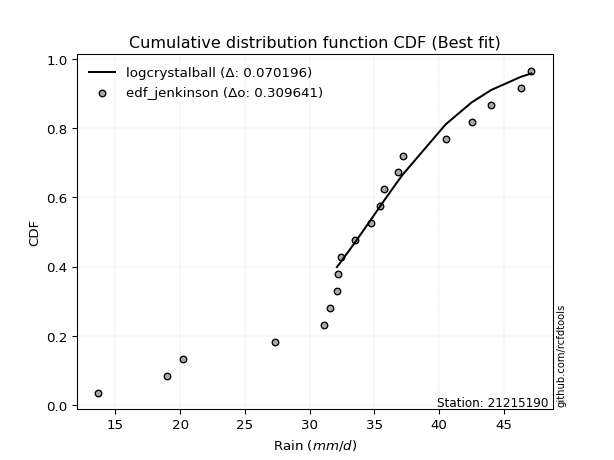</img></img>

</div>


### 11. Empirical - EDF Cunnane (1978)

Cunnane´s work in statistical hydrology has focused on the performance and evaluation of different probability distributions (such as GEV, Gumbel, Lognormal) for flood frequency estimation. _b_ is a constant, typically set to 0.4.

<div align="center">


$P=(m-b)/(n+1-2b)$


</div>


**11.1. Empirical values**

<div align="center">

|                | 0                  | 1                   | 2                   | 3                   | 4                  | 5                  | 6                   | 7                   | 8                   | 9                  | 10                 | 11                 | 12                 | 13                 | 14                 | 15                 | 16                 | 17                 | 18                 | 19                 |
|:---------------|:-------------------|:--------------------|:--------------------|:--------------------|:-------------------|:-------------------|:--------------------|:--------------------|:--------------------|:-------------------|:-------------------|:-------------------|:-------------------|:-------------------|:-------------------|:-------------------|:-------------------|:-------------------|:-------------------|:-------------------|
| date           | 2006               | 2007                | 2020                | 2008                | 2022               | 2021               | 2014                | 2009                | 2025                | 2010               | 2018               | 2011               | 2013               | 2012               | 2016               | 2023               | 2015               | 2024               | 2017               | 2019               |
| x              | 13.7               | 19.0                | 20.2                | 27.3                | 31.1               | 31.6               | 32.1                | 32.2                | 32.4                | 32.4               | 33.5               | 34.7               | 35.7               | 36.8               | 37.2               | 40.5               | 42.5               | 44.0               | 46.3               | 47.1               |
| m              | 1                  | 2                   | 3                   | 4                   | 5                  | 6                  | 7                   | 8                   | 9                   | 10                 | 11                 | 12                 | 13                 | 14                 | 15                 | 16                 | 17                 | 18                 | 19                 | 20                 |
| empirical_dist | edf_cunnane        | edf_cunnane         | edf_cunnane         | edf_cunnane         | edf_cunnane        | edf_cunnane        | edf_cunnane         | edf_cunnane         | edf_cunnane         | edf_cunnane        | edf_cunnane        | edf_cunnane        | edf_cunnane        | edf_cunnane        | edf_cunnane        | edf_cunnane        | edf_cunnane        | edf_cunnane        | edf_cunnane        | edf_cunnane        |
| empirical      | 0.0297029702970297 | 0.07920792079207921 | 0.12871287128712872 | 0.17821782178217824 | 0.2277227722772277 | 0.2772277227722772 | 0.32673267326732675 | 0.37623762376237624 | 0.42574257425742573 | 0.4752475247524752 | 0.5247524752475248 | 0.5742574257425742 | 0.6237623762376238 | 0.6732673267326733 | 0.7227722772277227 | 0.7722772277227723 | 0.8217821782178218 | 0.8712871287128714 | 0.9207920792079209 | 0.9702970297029704 |
| empirical_tr   | 1.030612244897959  | 1.086021505376344   | 1.1477272727272727  | 1.216867469879518   | 1.294871794871795  | 1.3835616438356164 | 1.4852941176470589  | 1.6031746031746033  | 1.7413793103448274  | 1.9056603773584906 | 2.104166666666667  | 2.3488372093023253 | 2.6578947368421053 | 3.060606060606061  | 3.6071428571428568 | 4.391304347826087  | 5.611111111111113  | 7.769230769230775  | 12.625000000000025 | 33.666666666666764 |

</div>


**11.2. Kolmogorov-Smirnov fit test (sorted by Δ)**


<div align="center">

|                | 0                   | 1                   | 2                   | 3                   | 4                   | 5                   | 6                   | 7                  | 8                   | 9                   | 10                 | 11                  | 12                  | 13                 | 14                  | 15                  | 16                    | 17                  | 18                 | 19                  | 20                  | 21                  | 22                 | 23                 | 24                  | 25                  | 26                  | 27                 | 28                  | 29                  | 30                  | 31                  | 32                 | 33                  | 34                  | 35                  | 36                  | 37                  | 38                  | 39                 | 40                 | 41                  | 42                  | 43                  | 44                 | 45                  | 46                  | 47                  | 48                 | 49                 | 50                 | 51                 | 52                 | 53                 | 54                  | 55                  | 56                 | 57                  | 58                 | 59                  | 60                  | 61                 | 62                  | 63                 | 64                 | 65                  | 66                  | 67                 | 68                  | 69                  | 70                  | 71                 | 72                 | 73                 | 74                  | 75                 | 76                 | 77                  | 78                 | 79                  | 80                  | 81                 | 82                 | 83                  | 84                 | 85                 | 86                  | 87                 | 88                 | 89                 |
|:---------------|:--------------------|:--------------------|:--------------------|:--------------------|:--------------------|:--------------------|:--------------------|:-------------------|:--------------------|:--------------------|:-------------------|:--------------------|:--------------------|:-------------------|:--------------------|:--------------------|:----------------------|:--------------------|:-------------------|:--------------------|:--------------------|:--------------------|:-------------------|:-------------------|:--------------------|:--------------------|:--------------------|:-------------------|:--------------------|:--------------------|:--------------------|:--------------------|:-------------------|:--------------------|:--------------------|:--------------------|:--------------------|:--------------------|:--------------------|:-------------------|:-------------------|:--------------------|:--------------------|:--------------------|:-------------------|:--------------------|:--------------------|:--------------------|:-------------------|:-------------------|:-------------------|:-------------------|:-------------------|:-------------------|:--------------------|:--------------------|:-------------------|:--------------------|:-------------------|:--------------------|:--------------------|:-------------------|:--------------------|:-------------------|:-------------------|:--------------------|:--------------------|:-------------------|:--------------------|:--------------------|:--------------------|:-------------------|:-------------------|:-------------------|:--------------------|:-------------------|:-------------------|:--------------------|:-------------------|:--------------------|:--------------------|:-------------------|:-------------------|:--------------------|:-------------------|:-------------------|:--------------------|:-------------------|:-------------------|:-------------------|
| station        | 21215190            | 21215190            | 21215190            | 21215190            | 21215190            | 21215190            | 21215190            | 21215190           | 21215190            | 21215190            | 21215190           | 21215190            | 21215190            | 21215190           | 21215190            | 21215190            | 21215190              | 21215190            | 21215190           | 21215190            | 21215190            | 21215190            | 21215190           | 21215190           | 21215190            | 21215190            | 21215190            | 21215190           | 21215190            | 21215190            | 21215190            | 21215190            | 21215190           | 21215190            | 21215190            | 21215190            | 21215190            | 21215190            | 21215190            | 21215190           | 21215190           | 21215190            | 21215190            | 21215190            | 21215190           | 21215190            | 21215190            | 21215190            | 21215190           | 21215190           | 21215190           | 21215190           | 21215190           | 21215190           | 21215190            | 21215190            | 21215190           | 21215190            | 21215190           | 21215190            | 21215190            | 21215190           | 21215190            | 21215190           | 21215190           | 21215190            | 21215190            | 21215190           | 21215190            | 21215190            | 21215190            | 21215190           | 21215190           | 21215190           | 21215190            | 21215190           | 21215190           | 21215190            | 21215190           | 21215190            | 21215190            | 21215190           | 21215190           | 21215190            | 21215190           | 21215190           | 21215190            | 21215190           | 21215190           | 21215190           |
| empirical_dist | edf_cunnane         | edf_cunnane         | edf_cunnane         | edf_cunnane         | edf_cunnane         | edf_cunnane         | edf_cunnane         | edf_cunnane        | edf_cunnane         | edf_cunnane         | edf_cunnane        | edf_cunnane         | edf_cunnane         | edf_cunnane        | edf_cunnane         | edf_cunnane         | edf_cunnane           | edf_cunnane         | edf_cunnane        | edf_cunnane         | edf_cunnane         | edf_cunnane         | edf_cunnane        | edf_cunnane        | edf_cunnane         | edf_cunnane         | edf_cunnane         | edf_cunnane        | edf_cunnane         | edf_cunnane         | edf_cunnane         | edf_cunnane         | edf_cunnane        | edf_cunnane         | edf_cunnane         | edf_cunnane         | edf_cunnane         | edf_cunnane         | edf_cunnane         | edf_cunnane        | edf_cunnane        | edf_cunnane         | edf_cunnane         | edf_cunnane         | edf_cunnane        | edf_cunnane         | edf_cunnane         | edf_cunnane         | edf_cunnane        | edf_cunnane        | edf_cunnane        | edf_cunnane        | edf_cunnane        | edf_cunnane        | edf_cunnane         | edf_cunnane         | edf_cunnane        | edf_cunnane         | edf_cunnane        | edf_cunnane         | edf_cunnane         | edf_cunnane        | edf_cunnane         | edf_cunnane        | edf_cunnane        | edf_cunnane         | edf_cunnane         | edf_cunnane        | edf_cunnane         | edf_cunnane         | edf_cunnane         | edf_cunnane        | edf_cunnane        | edf_cunnane        | edf_cunnane         | edf_cunnane        | edf_cunnane        | edf_cunnane         | edf_cunnane        | edf_cunnane         | edf_cunnane         | edf_cunnane        | edf_cunnane        | edf_cunnane         | edf_cunnane        | edf_cunnane        | edf_cunnane         | edf_cunnane        | edf_cunnane        | edf_cunnane        |
| p_dist         | gumbel_l            | logt                | laplace             | genlogistic         | johnsonsu           | fisk                | weibull_min         | logjohnsonsu       | logloggamma         | mielke              | pearson3           | loggenlogistic      | logmielke           | gompertz           | laplace_asymmetric  | hypsecant           | loglaplace_asymmetric | logweibull_min      | logpearson3        | logistic            | loggompertz         | logfisk             | loggumbel_l        | t                  | exponnorm           | norm                | crystalball         | truncnorm          | nct                 | nakagami            | f                   | fatiguelife         | betaprime          | erlang              | gamma               | logtruncnorm        | chi2                | invgamma            | maxwell             | loglaplace         | invgauss           | alpha               | ncf                 | rayleigh            | loghypsecant       | gumbel_r            | loglogistic         | invweibull          | logrice            | logexponnorm       | lognorm            | lognorm            | logcrystalball     | loglognorm         | lognakagami         | logf                | logfatiguelife     | lognct              | logbetaprime       | moyal               | halfnorm            | logerlang          | loginvgamma         | loggamma           | loggamma           | logalpha            | logncf              | loginvgauss        | kstwobign           | halflogistic        | logmaxwell          | loginvweibull      | lograyleigh        | gibrat             | loggumbel_r         | wald               | loghalfnorm        | logkstwobign        | logmoyal           | loghalflogistic     | genexpon            | loggenexpon        | expon              | logchi2             | logexpon           | logpareto          | logwald             | loggibrat          | pareto             | rice               |
| delta          | 0.09900878705086757 | 0.10091273472702833 | 0.10720267843147918 | 0.11412751538606936 | 0.12115029377880993 | 0.12445914870209052 | 0.12461208467111179 | 0.1267602085213062 | 0.12888281401317575 | 0.12969917760736455 | 0.1300689811896772 | 0.13018426250936976 | 0.13171375630080556 | 0.1348030350076842 | 0.13500860976148205 | 0.13506632230678756 | 0.1364934869746205    | 0.13780883389728266 | 0.1439319560527425 | 0.14655276094704084 | 0.15024129898823346 | 0.15316972938005607 | 0.1560898204698622 | 0.1607133318614538 | 0.16073593914583467 | 0.16073618852044508 | 0.16073619582670606 | 0.1607362433784092 | 0.16082759514989015 | 0.16165682943409654 | 0.16168531533861324 | 0.16229611045429826 | 0.1665013072046923 | 0.17396735140322617 | 0.17559210502030326 | 0.17821753357391099 | 0.17863044960972724 | 0.18647516913661666 | 0.19443733518931916 | 0.1969752207032589 | 0.1994341975765257 | 0.19989585384354336 | 0.19996885210566773 | 0.20674097406708747 | 0.2148803730803937 | 0.21825193600342913 | 0.22012996219320913 | 0.22193081630514472 | 0.2262983798517485 | 0.2263325377398419 | 0.2263329889456327 | 0.2263329889456327 | 0.2263334541223057 | 0.2263350617265758 | 0.22641753256419356 | 0.22706939266424148 | 0.2277089833959795 | 0.23073821568595076 | 0.2332137562754552 | 0.24023482988519707 | 0.24167482400407536 | 0.2452397688020943 | 0.24582951876785386 | 0.2476718465129807 | 0.2476718465129807 | 0.24779333405570503 | 0.24926092603107125 | 0.2518048081799417 | 0.25410926831623576 | 0.25570381496178624 | 0.26060676045520464 | 0.2672182443537002 | 0.2724520988739584 | 0.2865294717805211 | 0.29377982550061743 | 0.2985164469257201 | 0.3058440145771195 | 0.30641182125622457 | 0.3192442443789013 | 0.32732158290323154 | 0.33122255514726506 | 0.3396683651093908 | 0.3567148854488409 | 0.38277538194473437 | 0.3891212640774855 | 0.3891212705639947 | 0.39005810497752813 | 0.403838077047615  | 0.5474071996889734 | 0.8301325190709232 |
| deltao         | 0.3096406529800002  | 0.3096406529800002  | 0.3096406529800002  | 0.3096406529800002  | 0.3096406529800002  | 0.3096406529800002  | 0.3096406529800002  | 0.3096406529800002 | 0.3096406529800002  | 0.3096406529800002  | 0.3096406529800002 | 0.3096406529800002  | 0.3096406529800002  | 0.3096406529800002 | 0.3096406529800002  | 0.3096406529800002  | 0.3096406529800002    | 0.3096406529800002  | 0.3096406529800002 | 0.3096406529800002  | 0.3096406529800002  | 0.3096406529800002  | 0.3096406529800002 | 0.3096406529800002 | 0.3096406529800002  | 0.3096406529800002  | 0.3096406529800002  | 0.3096406529800002 | 0.3096406529800002  | 0.3096406529800002  | 0.3096406529800002  | 0.3096406529800002  | 0.3096406529800002 | 0.3096406529800002  | 0.3096406529800002  | 0.3096406529800002  | 0.3096406529800002  | 0.3096406529800002  | 0.3096406529800002  | 0.3096406529800002 | 0.3096406529800002 | 0.3096406529800002  | 0.3096406529800002  | 0.3096406529800002  | 0.3096406529800002 | 0.3096406529800002  | 0.3096406529800002  | 0.3096406529800002  | 0.3096406529800002 | 0.3096406529800002 | 0.3096406529800002 | 0.3096406529800002 | 0.3096406529800002 | 0.3096406529800002 | 0.3096406529800002  | 0.3096406529800002  | 0.3096406529800002 | 0.3096406529800002  | 0.3096406529800002 | 0.3096406529800002  | 0.3096406529800002  | 0.3096406529800002 | 0.3096406529800002  | 0.3096406529800002 | 0.3096406529800002 | 0.3096406529800002  | 0.3096406529800002  | 0.3096406529800002 | 0.3096406529800002  | 0.3096406529800002  | 0.3096406529800002  | 0.3096406529800002 | 0.3096406529800002 | 0.3096406529800002 | 0.3096406529800002  | 0.3096406529800002 | 0.3096406529800002 | 0.3096406529800002  | 0.3096406529800002 | 0.3096406529800002  | 0.3096406529800002  | 0.3096406529800002 | 0.3096406529800002 | 0.3096406529800002  | 0.3096406529800002 | 0.3096406529800002 | 0.3096406529800002  | 0.3096406529800002 | 0.3096406529800002 | 0.3096406529800002 |
| eval           | Δo > Δ              | Δo > Δ              | Δo > Δ              | Δo > Δ              | Δo > Δ              | Δo > Δ              | Δo > Δ              | Δo > Δ             | Δo > Δ              | Δo > Δ              | Δo > Δ             | Δo > Δ              | Δo > Δ              | Δo > Δ             | Δo > Δ              | Δo > Δ              | Δo > Δ                | Δo > Δ              | Δo > Δ             | Δo > Δ              | Δo > Δ              | Δo > Δ              | Δo > Δ             | Δo > Δ             | Δo > Δ              | Δo > Δ              | Δo > Δ              | Δo > Δ             | Δo > Δ              | Δo > Δ              | Δo > Δ              | Δo > Δ              | Δo > Δ             | Δo > Δ              | Δo > Δ              | Δo > Δ              | Δo > Δ              | Δo > Δ              | Δo > Δ              | Δo > Δ             | Δo > Δ             | Δo > Δ              | Δo > Δ              | Δo > Δ              | Δo > Δ             | Δo > Δ              | Δo > Δ              | Δo > Δ              | Δo > Δ             | Δo > Δ             | Δo > Δ             | Δo > Δ             | Δo > Δ             | Δo > Δ             | Δo > Δ              | Δo > Δ              | Δo > Δ             | Δo > Δ              | Δo > Δ             | Δo > Δ              | Δo > Δ              | Δo > Δ             | Δo > Δ              | Δo > Δ             | Δo > Δ             | Δo > Δ              | Δo > Δ              | Δo > Δ             | Δo > Δ              | Δo > Δ              | Δo > Δ              | Δo > Δ             | Δo > Δ             | Δo > Δ             | Δo > Δ              | Δo > Δ             | Δo > Δ             | Δo > Δ              | Δo <= Δ            | Δo <= Δ             | Δo <= Δ             | Δo <= Δ            | Δo <= Δ            | Δo <= Δ             | Δo <= Δ            | Δo <= Δ            | Δo <= Δ             | Δo <= Δ            | Δo <= Δ            | Δo <= Δ            |
| fit            | 1                   | 1                   | 1                   | 1                   | 1                   | 1                   | 1                   | 1                  | 1                   | 1                   | 1                  | 1                   | 1                   | 1                  | 1                   | 1                   | 1                     | 1                   | 1                  | 1                   | 1                   | 1                   | 1                  | 1                  | 1                   | 1                   | 1                   | 1                  | 1                   | 1                   | 1                   | 1                   | 1                  | 1                   | 1                   | 1                   | 1                   | 1                   | 1                   | 1                  | 1                  | 1                   | 1                   | 1                   | 1                  | 1                   | 1                   | 1                   | 1                  | 1                  | 1                  | 1                  | 1                  | 1                  | 1                   | 1                   | 1                  | 1                   | 1                  | 1                   | 1                   | 1                  | 1                   | 1                  | 1                  | 1                   | 1                   | 1                  | 1                   | 1                   | 1                   | 1                  | 1                  | 1                  | 1                   | 1                  | 1                  | 1                   | 0                  | 0                   | 0                   | 0                  | 0                  | 0                   | 0                  | 0                  | 0                   | 0                  | 0                  | 0                  |
| n              | 20                  | 20                  | 20                  | 20                  | 20                  | 20                  | 20                  | 20                 | 20                  | 20                  | 20                 | 20                  | 20                  | 20                 | 20                  | 20                  | 20                    | 20                  | 20                 | 20                  | 20                  | 20                  | 20                 | 20                 | 20                  | 20                  | 20                  | 20                 | 20                  | 20                  | 20                  | 20                  | 20                 | 20                  | 20                  | 20                  | 20                  | 20                  | 20                  | 20                 | 20                 | 20                  | 20                  | 20                  | 20                 | 20                  | 20                  | 20                  | 20                 | 20                 | 20                 | 20                 | 20                 | 20                 | 20                  | 20                  | 20                 | 20                  | 20                 | 20                  | 20                  | 20                 | 20                  | 20                 | 20                 | 20                  | 20                  | 20                 | 20                  | 20                  | 20                  | 20                 | 20                 | 20                 | 20                  | 20                 | 20                 | 20                  | 20                 | 20                  | 20                  | 20                 | 20                 | 20                  | 20                 | 20                 | 20                  | 20                 | 20                 | 20                 |
| best_fit       | 1                   | 0                   | 0                   | 0                   | 0                   | 0                   | 0                   | 0                  | 0                   | 0                   | 0                  | 0                   | 0                   | 0                  | 0                   | 0                   | 0                     | 0                   | 0                  | 0                   | 0                   | 0                   | 0                  | 0                  | 0                   | 0                   | 0                   | 0                  | 0                   | 0                   | 0                   | 0                   | 0                  | 0                   | 0                   | 0                   | 0                   | 0                   | 0                   | 0                  | 0                  | 0                   | 0                   | 0                   | 0                  | 0                   | 0                   | 0                   | 0                  | 0                  | 0                  | 0                  | 0                  | 0                  | 0                   | 0                   | 0                  | 0                   | 0                  | 0                   | 0                   | 0                  | 0                   | 0                  | 0                  | 0                   | 0                   | 0                  | 0                   | 0                   | 0                   | 0                  | 0                  | 0                  | 0                   | 0                  | 0                  | 0                   | 0                  | 0                   | 0                   | 0                  | 0                  | 0                   | 0                  | 0                  | 0                   | 0                  | 0                  | 0                  |
| best_fit_sort  | 1                   | 2                   | 3                   | 4                   | 5                   | 6                   | 7                   | 8                  | 9                   | 10                  | 11                 | 12                  | 13                  | 14                 | 15                  | 16                  | 17                    | 18                  | 19                 | 20                  | 21                  | 22                  | 23                 | 24                 | 25                  | 26                  | 27                  | 28                 | 29                  | 30                  | 31                  | 32                  | 33                 | 34                  | 35                  | 36                  | 37                  | 38                  | 39                  | 40                 | 41                 | 42                  | 43                  | 44                  | 45                 | 46                  | 47                  | 48                  | 49                 | 50                 | 51                 | 52                 | 53                 | 54                 | 55                  | 56                  | 57                 | 58                  | 59                 | 60                  | 61                  | 62                 | 63                  | 64                 | 65                 | 66                  | 67                  | 68                 | 69                  | 70                  | 71                  | 72                 | 73                 | 74                 | 75                  | 76                 | 77                 | 78                  | 79                 | 80                  | 81                  | 82                 | 83                 | 84                  | 85                 | 86                 | 87                  | 88                 | 89                 | 90                 |

</div>


<div align="center">

</img>

</div>


**11.3. Best fit**

<div align="center">

|   id |   station | empirical_dist   | p_dist   |     delta |   deltao | eval   |   fit |   n |   best_fit |   best_fit_sort |
|-----:|----------:|:-----------------|:---------|----------:|---------:|:-------|------:|----:|-----------:|----------------:|
|    0 |  21215190 | edf_cunnane      | gumbel_l | 0.0990088 | 0.309641 | Δo > Δ |     1 |  20 |          1 |               1 |

</div>


<div align="center">

</img>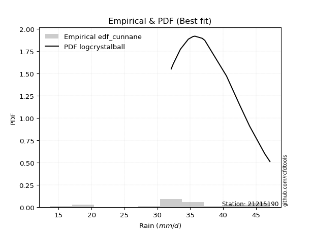</img>

</div>


### 12. Empirical - EDF Adamowski (1981)

The Adamowski formula in hydrology refers to a specific plotting position formula used for estimating the non-parametric empirical distribution of hydrological events (like flood peaks) to calculate their return periods. This formula provides an alternative to traditional parametric methods (like the Gumbel or Log Pearson Type III distributions). 

<div align="center">


$P=(m-0.25)/(n+0.5)$


</div>


**12.1. Empirical values**

<div align="center">

|                | 0                    | 1                   | 2                   | 3                   | 4                   | 5                  | 6                   | 7                  | 8                  | 9                   | 10                 | 11                 | 12                 | 13                 | 14                 | 15                 | 16                 | 17                 | 18                 | 19                 |
|:---------------|:---------------------|:--------------------|:--------------------|:--------------------|:--------------------|:-------------------|:--------------------|:-------------------|:-------------------|:--------------------|:-------------------|:-------------------|:-------------------|:-------------------|:-------------------|:-------------------|:-------------------|:-------------------|:-------------------|:-------------------|
| date           | 2006                 | 2007                | 2020                | 2008                | 2022                | 2021               | 2014                | 2009               | 2025               | 2010                | 2018               | 2011               | 2013               | 2012               | 2016               | 2023               | 2015               | 2024               | 2017               | 2019               |
| x              | 13.7                 | 19.0                | 20.2                | 27.3                | 31.1                | 31.6               | 32.1                | 32.2               | 32.4               | 32.4                | 33.5               | 34.7               | 35.7               | 36.8               | 37.2               | 40.5               | 42.5               | 44.0               | 46.3               | 47.1               |
| m              | 1                    | 2                   | 3                   | 4                   | 5                   | 6                  | 7                   | 8                  | 9                  | 10                  | 11                 | 12                 | 13                 | 14                 | 15                 | 16                 | 17                 | 18                 | 19                 | 20                 |
| empirical_dist | edf_adamowski        | edf_adamowski       | edf_adamowski       | edf_adamowski       | edf_adamowski       | edf_adamowski      | edf_adamowski       | edf_adamowski      | edf_adamowski      | edf_adamowski       | edf_adamowski      | edf_adamowski      | edf_adamowski      | edf_adamowski      | edf_adamowski      | edf_adamowski      | edf_adamowski      | edf_adamowski      | edf_adamowski      | edf_adamowski      |
| empirical      | 0.036585365853658534 | 0.08536585365853659 | 0.13414634146341464 | 0.18292682926829268 | 0.23170731707317074 | 0.2804878048780488 | 0.32926829268292684 | 0.3780487804878049 | 0.4268292682926829 | 0.47560975609756095 | 0.524390243902439  | 0.573170731707317  | 0.6219512195121951 | 0.6707317073170732 | 0.7195121951219512 | 0.7682926829268293 | 0.8170731707317073 | 0.8658536585365854 | 0.9146341463414634 | 0.9634146341463414 |
| empirical_tr   | 1.0379746835443038   | 1.0933333333333333  | 1.1549295774647887  | 1.2238805970149254  | 1.3015873015873016  | 1.3898305084745763 | 1.490909090909091   | 1.607843137254902  | 1.7446808510638296 | 1.9069767441860463  | 2.1025641025641026 | 2.3428571428571425 | 2.6451612903225805 | 3.037037037037037  | 3.5652173913043477 | 4.315789473684211  | 5.466666666666665  | 7.454545454545454  | 11.714285714285719 | 27.33333333333331  |

</div>


**12.2. Kolmogorov-Smirnov fit test (sorted by Δ)**


<div align="center">

|                | 0                   | 1                   | 2                   | 3                   | 4                   | 5                   | 6                   | 7                   | 8                   | 9                  | 10                  | 11                  | 12                  | 13                  | 14                 | 15                  | 16                    | 17                  | 18                  | 19                 | 20                  | 21                  | 22                  | 23                  | 24                  | 25                  | 26                  | 27                  | 28                 | 29                 | 30                 | 31                  | 32                  | 33                  | 34                  | 35                 | 36                  | 37                  | 38                  | 39                  | 40                  | 41                  | 42                 | 43                  | 44                  | 45                  | 46                 | 47                  | 48                  | 49                  | 50                  | 51                  | 52                  | 53                  | 54                  | 55                  | 56                  | 57                  | 58                  | 59                  | 60                  | 61                  | 62                  | 63                  | 64                  | 65                 | 66                 | 67                  | 68                 | 69                  | 70                 | 71                 | 72                  | 73                 | 74                 | 75                 | 76                 | 77                  | 78                 | 79                  | 80                  | 81                 | 82                 | 83                  | 84                 | 85                 | 86                 | 87                 | 88                 | 89                 |
|:---------------|:--------------------|:--------------------|:--------------------|:--------------------|:--------------------|:--------------------|:--------------------|:--------------------|:--------------------|:-------------------|:--------------------|:--------------------|:--------------------|:--------------------|:-------------------|:--------------------|:----------------------|:--------------------|:--------------------|:-------------------|:--------------------|:--------------------|:--------------------|:--------------------|:--------------------|:--------------------|:--------------------|:--------------------|:-------------------|:-------------------|:-------------------|:--------------------|:--------------------|:--------------------|:--------------------|:-------------------|:--------------------|:--------------------|:--------------------|:--------------------|:--------------------|:--------------------|:-------------------|:--------------------|:--------------------|:--------------------|:-------------------|:--------------------|:--------------------|:--------------------|:--------------------|:--------------------|:--------------------|:--------------------|:--------------------|:--------------------|:--------------------|:--------------------|:--------------------|:--------------------|:--------------------|:--------------------|:--------------------|:--------------------|:--------------------|:-------------------|:-------------------|:--------------------|:-------------------|:--------------------|:-------------------|:-------------------|:--------------------|:-------------------|:-------------------|:-------------------|:-------------------|:--------------------|:-------------------|:--------------------|:--------------------|:-------------------|:-------------------|:--------------------|:-------------------|:-------------------|:-------------------|:-------------------|:-------------------|:-------------------|
| station        | 21215190            | 21215190            | 21215190            | 21215190            | 21215190            | 21215190            | 21215190            | 21215190            | 21215190            | 21215190           | 21215190            | 21215190            | 21215190            | 21215190            | 21215190           | 21215190            | 21215190              | 21215190            | 21215190            | 21215190           | 21215190            | 21215190            | 21215190            | 21215190            | 21215190            | 21215190            | 21215190            | 21215190            | 21215190           | 21215190           | 21215190           | 21215190            | 21215190            | 21215190            | 21215190            | 21215190           | 21215190            | 21215190            | 21215190            | 21215190            | 21215190            | 21215190            | 21215190           | 21215190            | 21215190            | 21215190            | 21215190           | 21215190            | 21215190            | 21215190            | 21215190            | 21215190            | 21215190            | 21215190            | 21215190            | 21215190            | 21215190            | 21215190            | 21215190            | 21215190            | 21215190            | 21215190            | 21215190            | 21215190            | 21215190            | 21215190           | 21215190           | 21215190            | 21215190           | 21215190            | 21215190           | 21215190           | 21215190            | 21215190           | 21215190           | 21215190           | 21215190           | 21215190            | 21215190           | 21215190            | 21215190            | 21215190           | 21215190           | 21215190            | 21215190           | 21215190           | 21215190           | 21215190           | 21215190           | 21215190           |
| empirical_dist | edf_adamowski       | edf_adamowski       | edf_adamowski       | edf_adamowski       | edf_adamowski       | edf_adamowski       | edf_adamowski       | edf_adamowski       | edf_adamowski       | edf_adamowski      | edf_adamowski       | edf_adamowski       | edf_adamowski       | edf_adamowski       | edf_adamowski      | edf_adamowski       | edf_adamowski         | edf_adamowski       | edf_adamowski       | edf_adamowski      | edf_adamowski       | edf_adamowski       | edf_adamowski       | edf_adamowski       | edf_adamowski       | edf_adamowski       | edf_adamowski       | edf_adamowski       | edf_adamowski      | edf_adamowski      | edf_adamowski      | edf_adamowski       | edf_adamowski       | edf_adamowski       | edf_adamowski       | edf_adamowski      | edf_adamowski       | edf_adamowski       | edf_adamowski       | edf_adamowski       | edf_adamowski       | edf_adamowski       | edf_adamowski      | edf_adamowski       | edf_adamowski       | edf_adamowski       | edf_adamowski      | edf_adamowski       | edf_adamowski       | edf_adamowski       | edf_adamowski       | edf_adamowski       | edf_adamowski       | edf_adamowski       | edf_adamowski       | edf_adamowski       | edf_adamowski       | edf_adamowski       | edf_adamowski       | edf_adamowski       | edf_adamowski       | edf_adamowski       | edf_adamowski       | edf_adamowski       | edf_adamowski       | edf_adamowski      | edf_adamowski      | edf_adamowski       | edf_adamowski      | edf_adamowski       | edf_adamowski      | edf_adamowski      | edf_adamowski       | edf_adamowski      | edf_adamowski      | edf_adamowski      | edf_adamowski      | edf_adamowski       | edf_adamowski      | edf_adamowski       | edf_adamowski       | edf_adamowski      | edf_adamowski      | edf_adamowski       | edf_adamowski      | edf_adamowski      | edf_adamowski      | edf_adamowski      | edf_adamowski      | edf_adamowski      |
| p_dist         | gumbel_l            | logt                | laplace             | genlogistic         | johnsonsu           | fisk                | weibull_min         | logjohnsonsu        | logloggamma         | mielke             | pearson3            | loggenlogistic      | logmielke           | gompertz            | laplace_asymmetric | hypsecant           | loglaplace_asymmetric | logweibull_min      | logpearson3         | logistic           | loggompertz         | logfisk             | loggumbel_l         | t                   | exponnorm           | norm                | crystalball         | truncnorm           | nct                | nakagami           | f                  | fatiguelife         | betaprime           | erlang              | gamma               | chi2               | invgamma            | logtruncnorm        | maxwell             | loglaplace          | invgauss            | alpha               | ncf                | rayleigh            | loghypsecant        | gumbel_r            | loglogistic        | invweibull          | logrice             | logexponnorm        | lognorm             | lognorm             | logcrystalball      | loglognorm          | lognakagami         | logf                | logfatiguelife      | lognct              | logbetaprime        | moyal               | halfnorm            | logerlang           | loginvgamma         | loggamma            | loggamma            | logalpha           | logncf             | loginvgauss         | kstwobign          | halflogistic        | logmaxwell         | loginvweibull      | lograyleigh         | gibrat             | loggumbel_r        | wald               | loghalfnorm        | logkstwobign        | logmoyal           | loghalflogistic     | genexpon            | loggenexpon        | expon              | logchi2             | logexpon           | logpareto          | logwald            | loggibrat          | pareto             | rice               |
| delta          | 0.09765836385191967 | 0.10127496607211406 | 0.10321813363553614 | 0.11014297059012632 | 0.11716574898286689 | 0.12047460390614748 | 0.12062753987516875 | 0.12277566372536317 | 0.12489826921723271 | 0.1257146328114215 | 0.12608443639373415 | 0.12619971771342672 | 0.12772921150486252 | 0.13081849021174116 | 0.131024064965539  | 0.13108177751084452 | 0.13250894217867745   | 0.13382428910133962 | 0.13994741125679946 | 0.1425682161510978 | 0.14625675419229042 | 0.14918518458411303 | 0.15210527567391915 | 0.15672878706551077 | 0.15675139434989163 | 0.15675164372450204 | 0.15675165103076302 | 0.15675169858246615 | 0.1568430503539471 | 0.1576722846381535 | 0.1577007705426702 | 0.15831156565835522 | 0.16251676240874927 | 0.16998280660728313 | 0.17160756022436022 | 0.1746459048137842 | 0.18249062434067362 | 0.18292654106002543 | 0.19045279039337612 | 0.19299067590731586 | 0.19544965278058266 | 0.19591130904760032 | 0.1959843073097247 | 0.20275642927114443 | 0.21089582828445066 | 0.21426739120748609 | 0.2161454173972661 | 0.21794627150920168 | 0.22231383505580546 | 0.22234799294389887 | 0.22234844414968966 | 0.22234844414968966 | 0.22234890932636267 | 0.22235051693063276 | 0.22243298776825052 | 0.22308484786829844 | 0.22372443860003646 | 0.22675367089000772 | 0.22922921147951217 | 0.23625028508925403 | 0.23769027920813232 | 0.24125522400615126 | 0.24184497397191082 | 0.24368730171703765 | 0.24368730171703765 | 0.243808789259762  | 0.2452763812351282 | 0.24782026338399868 | 0.2501247235202927 | 0.25171927016584317 | 0.2566222156592616 | 0.2632336995577571 | 0.26846755407801537 | 0.2825449269845781 | 0.2897952807046744 | 0.2945319021297771 | 0.3018594697811765 | 0.30242727646028156 | 0.3152596995829583 | 0.32333703810728853 | 0.32723801035132205 | 0.3356838203134478 | 0.3527303406528979 | 0.37806637445861996 | 0.3851367192815425 | 0.3851367257680517 | 0.3860735601815851 | 0.399853532251672  | 0.5412492668225161 | 0.8246990488946373 |
| deltao         | 0.3096406529800002  | 0.3096406529800002  | 0.3096406529800002  | 0.3096406529800002  | 0.3096406529800002  | 0.3096406529800002  | 0.3096406529800002  | 0.3096406529800002  | 0.3096406529800002  | 0.3096406529800002 | 0.3096406529800002  | 0.3096406529800002  | 0.3096406529800002  | 0.3096406529800002  | 0.3096406529800002 | 0.3096406529800002  | 0.3096406529800002    | 0.3096406529800002  | 0.3096406529800002  | 0.3096406529800002 | 0.3096406529800002  | 0.3096406529800002  | 0.3096406529800002  | 0.3096406529800002  | 0.3096406529800002  | 0.3096406529800002  | 0.3096406529800002  | 0.3096406529800002  | 0.3096406529800002 | 0.3096406529800002 | 0.3096406529800002 | 0.3096406529800002  | 0.3096406529800002  | 0.3096406529800002  | 0.3096406529800002  | 0.3096406529800002 | 0.3096406529800002  | 0.3096406529800002  | 0.3096406529800002  | 0.3096406529800002  | 0.3096406529800002  | 0.3096406529800002  | 0.3096406529800002 | 0.3096406529800002  | 0.3096406529800002  | 0.3096406529800002  | 0.3096406529800002 | 0.3096406529800002  | 0.3096406529800002  | 0.3096406529800002  | 0.3096406529800002  | 0.3096406529800002  | 0.3096406529800002  | 0.3096406529800002  | 0.3096406529800002  | 0.3096406529800002  | 0.3096406529800002  | 0.3096406529800002  | 0.3096406529800002  | 0.3096406529800002  | 0.3096406529800002  | 0.3096406529800002  | 0.3096406529800002  | 0.3096406529800002  | 0.3096406529800002  | 0.3096406529800002 | 0.3096406529800002 | 0.3096406529800002  | 0.3096406529800002 | 0.3096406529800002  | 0.3096406529800002 | 0.3096406529800002 | 0.3096406529800002  | 0.3096406529800002 | 0.3096406529800002 | 0.3096406529800002 | 0.3096406529800002 | 0.3096406529800002  | 0.3096406529800002 | 0.3096406529800002  | 0.3096406529800002  | 0.3096406529800002 | 0.3096406529800002 | 0.3096406529800002  | 0.3096406529800002 | 0.3096406529800002 | 0.3096406529800002 | 0.3096406529800002 | 0.3096406529800002 | 0.3096406529800002 |
| eval           | Δo > Δ              | Δo > Δ              | Δo > Δ              | Δo > Δ              | Δo > Δ              | Δo > Δ              | Δo > Δ              | Δo > Δ              | Δo > Δ              | Δo > Δ             | Δo > Δ              | Δo > Δ              | Δo > Δ              | Δo > Δ              | Δo > Δ             | Δo > Δ              | Δo > Δ                | Δo > Δ              | Δo > Δ              | Δo > Δ             | Δo > Δ              | Δo > Δ              | Δo > Δ              | Δo > Δ              | Δo > Δ              | Δo > Δ              | Δo > Δ              | Δo > Δ              | Δo > Δ             | Δo > Δ             | Δo > Δ             | Δo > Δ              | Δo > Δ              | Δo > Δ              | Δo > Δ              | Δo > Δ             | Δo > Δ              | Δo > Δ              | Δo > Δ              | Δo > Δ              | Δo > Δ              | Δo > Δ              | Δo > Δ             | Δo > Δ              | Δo > Δ              | Δo > Δ              | Δo > Δ             | Δo > Δ              | Δo > Δ              | Δo > Δ              | Δo > Δ              | Δo > Δ              | Δo > Δ              | Δo > Δ              | Δo > Δ              | Δo > Δ              | Δo > Δ              | Δo > Δ              | Δo > Δ              | Δo > Δ              | Δo > Δ              | Δo > Δ              | Δo > Δ              | Δo > Δ              | Δo > Δ              | Δo > Δ             | Δo > Δ             | Δo > Δ              | Δo > Δ             | Δo > Δ              | Δo > Δ             | Δo > Δ             | Δo > Δ              | Δo > Δ             | Δo > Δ             | Δo > Δ             | Δo > Δ             | Δo > Δ              | Δo <= Δ            | Δo <= Δ             | Δo <= Δ             | Δo <= Δ            | Δo <= Δ            | Δo <= Δ             | Δo <= Δ            | Δo <= Δ            | Δo <= Δ            | Δo <= Δ            | Δo <= Δ            | Δo <= Δ            |
| fit            | 1                   | 1                   | 1                   | 1                   | 1                   | 1                   | 1                   | 1                   | 1                   | 1                  | 1                   | 1                   | 1                   | 1                   | 1                  | 1                   | 1                     | 1                   | 1                   | 1                  | 1                   | 1                   | 1                   | 1                   | 1                   | 1                   | 1                   | 1                   | 1                  | 1                  | 1                  | 1                   | 1                   | 1                   | 1                   | 1                  | 1                   | 1                   | 1                   | 1                   | 1                   | 1                   | 1                  | 1                   | 1                   | 1                   | 1                  | 1                   | 1                   | 1                   | 1                   | 1                   | 1                   | 1                   | 1                   | 1                   | 1                   | 1                   | 1                   | 1                   | 1                   | 1                   | 1                   | 1                   | 1                   | 1                  | 1                  | 1                   | 1                  | 1                   | 1                  | 1                  | 1                   | 1                  | 1                  | 1                  | 1                  | 1                   | 0                  | 0                   | 0                   | 0                  | 0                  | 0                   | 0                  | 0                  | 0                  | 0                  | 0                  | 0                  |
| n              | 20                  | 20                  | 20                  | 20                  | 20                  | 20                  | 20                  | 20                  | 20                  | 20                 | 20                  | 20                  | 20                  | 20                  | 20                 | 20                  | 20                    | 20                  | 20                  | 20                 | 20                  | 20                  | 20                  | 20                  | 20                  | 20                  | 20                  | 20                  | 20                 | 20                 | 20                 | 20                  | 20                  | 20                  | 20                  | 20                 | 20                  | 20                  | 20                  | 20                  | 20                  | 20                  | 20                 | 20                  | 20                  | 20                  | 20                 | 20                  | 20                  | 20                  | 20                  | 20                  | 20                  | 20                  | 20                  | 20                  | 20                  | 20                  | 20                  | 20                  | 20                  | 20                  | 20                  | 20                  | 20                  | 20                 | 20                 | 20                  | 20                 | 20                  | 20                 | 20                 | 20                  | 20                 | 20                 | 20                 | 20                 | 20                  | 20                 | 20                  | 20                  | 20                 | 20                 | 20                  | 20                 | 20                 | 20                 | 20                 | 20                 | 20                 |
| best_fit       | 1                   | 0                   | 0                   | 0                   | 0                   | 0                   | 0                   | 0                   | 0                   | 0                  | 0                   | 0                   | 0                   | 0                   | 0                  | 0                   | 0                     | 0                   | 0                   | 0                  | 0                   | 0                   | 0                   | 0                   | 0                   | 0                   | 0                   | 0                   | 0                  | 0                  | 0                  | 0                   | 0                   | 0                   | 0                   | 0                  | 0                   | 0                   | 0                   | 0                   | 0                   | 0                   | 0                  | 0                   | 0                   | 0                   | 0                  | 0                   | 0                   | 0                   | 0                   | 0                   | 0                   | 0                   | 0                   | 0                   | 0                   | 0                   | 0                   | 0                   | 0                   | 0                   | 0                   | 0                   | 0                   | 0                  | 0                  | 0                   | 0                  | 0                   | 0                  | 0                  | 0                   | 0                  | 0                  | 0                  | 0                  | 0                   | 0                  | 0                   | 0                   | 0                  | 0                  | 0                   | 0                  | 0                  | 0                  | 0                  | 0                  | 0                  |
| best_fit_sort  | 1                   | 2                   | 3                   | 4                   | 5                   | 6                   | 7                   | 8                   | 9                   | 10                 | 11                  | 12                  | 13                  | 14                  | 15                 | 16                  | 17                    | 18                  | 19                  | 20                 | 21                  | 22                  | 23                  | 24                  | 25                  | 26                  | 27                  | 28                  | 29                 | 30                 | 31                 | 32                  | 33                  | 34                  | 35                  | 36                 | 37                  | 38                  | 39                  | 40                  | 41                  | 42                  | 43                 | 44                  | 45                  | 46                  | 47                 | 48                  | 49                  | 50                  | 51                  | 52                  | 53                  | 54                  | 55                  | 56                  | 57                  | 58                  | 59                  | 60                  | 61                  | 62                  | 63                  | 64                  | 65                  | 66                 | 67                 | 68                  | 69                 | 70                  | 71                 | 72                 | 73                  | 74                 | 75                 | 76                 | 77                 | 78                  | 79                 | 80                  | 81                  | 82                 | 83                 | 84                  | 85                 | 86                 | 87                 | 88                 | 89                 | 90                 |

</div>


<div align="center">

</img>

</div>


**12.3. Best fit**

<div align="center">

|   id |   station | empirical_dist   | p_dist   |     delta |   deltao | eval   |   fit |   n |   best_fit |   best_fit_sort |
|-----:|----------:|:-----------------|:---------|----------:|---------:|:-------|------:|----:|-----------:|----------------:|
|    0 |  21215190 | edf_adamowski    | gumbel_l | 0.0976584 | 0.309641 | Δo > Δ |     1 |  20 |          1 |               1 |

</div>


<div align="center">

</img></img>

</div>


## C. Best fit & Estimate extreme values for specific return periods - Tr


### 1. Best fit (ordered by delta Δ)

<div align="center">

|   id |   station | empirical_dist   | p_dist   |     delta |   deltao | eval   |   fit |   n |   best_fit |   best_fit_sort |
|-----:|----------:|:-----------------|:---------|----------:|---------:|:-------|------:|----:|-----------:|----------------:|
|    0 |  21215190 | edf_california   | laplace  | 0.0951081 | 0.309641 | Δo > Δ |     1 |  20 |          1 |               1 |
|    1 |  21215190 | edf_weibull      | laplace  | 0.0968302 | 0.309641 | Δo > Δ |     1 |  20 |          1 |               2 |
|    2 |  21215190 | edf_filliben     | gumbel_l | 0.0974967 | 0.309641 | Δo > Δ |     1 |  20 |          1 |               3 |
|    3 |  21215190 | edf_jenkinson    | gumbel_l | 0.0975148 | 0.309641 | Δo > Δ |     1 |  20 |          1 |               4 |
|    4 |  21215190 | edf_beard        | gumbel_l | 0.0975148 | 0.309641 | Δo > Δ |     1 |  20 |          1 |               5 |
|    5 |  21215190 | edf_chegodayev   | gumbel_l | 0.0975388 | 0.309641 | Δo > Δ |     1 |  20 |          1 |               6 |
|    6 |  21215190 | edf_tukey        | gumbel_l | 0.097548  | 0.309641 | Δo > Δ |     1 |  20 |          1 |               7 |
|    7 |  21215190 | edf_adamowski    | gumbel_l | 0.0976584 | 0.309641 | Δo > Δ |     1 |  20 |          1 |               8 |
|    8 |  21215190 | edf_blom         | gumbel_l | 0.0984587 | 0.309641 | Δo > Δ |     1 |  20 |          1 |               9 |
|    9 |  21215190 | edf_cunnane      | gumbel_l | 0.0990088 | 0.309641 | Δo > Δ |     1 |  20 |          1 |              10 |
|   10 |  21215190 | edf_gringorten   | gumbel_l | 0.0998946 | 0.309641 | Δo > Δ |     1 |  20 |          1 |              11 |
|   11 |  21215190 | edf_hazen        | logt     | 0.100665  | 0.309641 | Δo > Δ |     1 |  20 |          1 |              12 |

</div>

:file_folder:Tables: [bestfit_21215190.csv](table/bestfit_21215190.csv) | [extreme_21215190.csv](table/extreme_21215190.csv)


### 2. Extreme values

In hydrology, a return period (or recurrence interval $Tr$) is the statistical average time between extreme events like floods or droughts of a specific magnitude, indicating how rare an event is, with a 100-year flood, for example, having a 1% chance of occurring in any given year, not that it happens exactly every century. It is a key tool for infrastructure design (like bridges or dams) and risk assessment, calculated from historical data to determine the probability of future events, although it is important to remember it is statistical average, and events can cluster or be missed.

> risk_rate: assuming the return period as the project useful life.

|   id |      tr |   prob_l |     prob_g |   alpha |   betaprime |    chi2 |   crystalball |   erlang |    expon |   exponnorm |       f |   fatiguelife |    fisk |   gamma |   genexpon |   genlogistic |   gibrat |   gompertz |   gumbel_l |   gumbel_r |   halflogistic |   halfnorm |   hypsecant |   invgamma |   invgauss |   invweibull |   johnsonsu |   kstwobign |   laplace |   laplace_asymmetric |   loggamma |   logistic |   lognorm |   maxwell |   mielke |   moyal |   nakagami |     ncf |     nct |    norm |           pareto |   pearson3 |   rayleigh |    rice |       t |   truncnorm |    wald |   weibull_min |   logalpha |   logbetaprime |     logchi2 |   logcrystalball |   logerlang |   logexpon |   logexponnorm |    logf |   logfatiguelife |   logfisk |   loggenexpon |   loggenlogistic |   loggibrat |   loggompertz |   loggumbel_l |   loggumbel_r |   loghalflogistic |   loghalfnorm |   loghypsecant |   loginvgamma |   loginvgauss |   loginvweibull |   logjohnsonsu |   logkstwobign |   loglaplace |   loglaplace_asymmetric |   logloggamma |   loglogistic |   loglognorm |   logmaxwell |   logmielke |   logmoyal |   lognakagami |   logncf |   lognct |   logpareto |   logpearson3 |   lograyleigh |   logrice |      logt |   logtruncnorm |   logwald |   logweibull_min |   station |   n |   risk_rate |
|-----:|--------:|---------:|-----------:|--------:|------------:|--------:|--------------:|---------:|---------:|------------:|--------:|--------------:|--------:|--------:|-----------:|--------------:|---------:|-----------:|-----------:|-----------:|---------------:|-----------:|------------:|-----------:|-----------:|-------------:|------------:|------------:|----------:|---------------------:|-----------:|-----------:|----------:|----------:|---------:|--------:|-----------:|--------:|--------:|--------:|-----------------:|-----------:|-----------:|--------:|--------:|------------:|--------:|--------------:|-----------:|---------------:|------------:|-----------------:|------------:|-----------:|---------------:|--------:|-----------------:|----------:|--------------:|-----------------:|------------:|--------------:|--------------:|--------------:|------------------:|--------------:|---------------:|--------------:|--------------:|----------------:|---------------:|---------------:|-------------:|------------------------:|--------------:|--------------:|-------------:|-------------:|------------:|-----------:|--------------:|---------:|---------:|------------:|--------------:|--------------:|----------:|----------:|---------------:|----------:|-----------------:|----------:|----:|------------:|
|    0 |    2    | 0.5      | 0.5        | 32.7277 |     33.4161 | 33.1536 |       33.515  |  33.2736 |  27.4347 |     33.515  | 33.498  |       33.4643 | 33.9895 | 33.2262 |    28.8315 |       34.2579 |  30.9565 |    34.322  |    34.9153 |    32.1147 |        31.4186 |    31.7703 |     33.515  |    32.9961 |    32.7246 |      32.4071 |     34.4488 |     31.6    |   33.515  |              32.9815 |    31.7137 |    33.515  |   32.2004 |   32.786  |  34.2214 | 31.6627 |    33.4997 | 32.7662 | 33.5136 | 33.515  |     13.7206      |    34.2636 |    32.5275 | 16.7251 | 33.5154 |     33.515  | 30.7521 |       34.3757 |    31.7072 |        32.0566 |     23.4945 |          32.2004 |     31.8081 |    24.7728 |        32.2004 | 32.1851 |          32.1707 |   33.5397 |       28.7179 |          34.22   |     29.416  |       33.7688 |       33.8341 |       30.6456 |           29.9009 |       30.275  |        32.2004 |       31.7737 |       31.6258 |         31.2694 |        34.542  |        29.8888 |      32.2004 |                 33.6995 |       34.4566 |       32.2004 |      32.2003 |      31.3814 |     34.2371 |    30.1598 |       32.1999 |  31.9689 |  32.114  |     24.7728 |       34.2854 |       31.0958 |   32.2005 |   34.3154 |        33.189  |   29.2042 |          33.9931 |  21215190 |  20 |    0.75     |
|    1 |    2.33 | 0.570815 | 0.429185   | 34.35   |     34.9645 | 34.7164 |       35.036  |  34.8458 |  30.4609 |     35.036  | 35.023  |       34.9781 | 35.3415 | 34.7898 |    31.5918 |       35.5564 |  31.727  |    35.852  |    36.2386 |    33.5241 |        32.8677 |    33.4118 |     34.7323 |    34.5837 |    34.3417 |      34.3529 |     35.8934 |     33.6376 |   34.4354 |              34.0234 |    33.5667 |    34.8551 |   33.9788 |   34.3662 |  35.6308 | 32.9968 |    35.0244 | 34.4442 | 35.0351 | 35.036  |     14.0759      |    35.74   |    34.1311 | 17.0427 | 35.0364 |     35.036  | 31.7494 |       35.829  |    33.5557 |        33.878  |     28.0451 |          33.9788 |     33.7569 |    28.2265 |        33.9788 | 33.9679 |          33.9546 |   35.0601 |       31.2299 |          35.6334 |     30.2281 |       35.2704 |       35.4541 |       32.2108 |           31.4721 |       32.0833 |        33.6159 |       33.6736 |       33.543  |         33.8433 |        36.0738 |        32.5113 |      33.2651 |                 34.8496 |       35.9716 |       33.7622 |      33.9787 |      33.1839 |     35.6685 |    31.616  |       33.9809 |  34.8362 |  33.9284 |     28.2265 |       35.9475 |       32.9092 |   33.9776 |   35.4179 |        34.3952 |   30.2521 |          35.4537 |  21215190 |  20 |    0.729209 |
|    2 |    5    | 0.8      | 0.2        | 40.6541 |     40.7765 | 40.6465 |       40.6885 |  40.794  |  45.591  |     40.6885 | 40.7002 |       40.6242 | 40.5619 | 40.7002 |    45.2881 |       40.2403 |  36.1629 |    40.9247 |    40.5136 |    39.6471 |        39.4244 |    40.3538 |     39.615  |    40.7012 |    40.6913 |      42.8061 |     40.7895 |     42.2928 |   39.0374 |              39.2327 |    41.6071 |    40.0295 |   41.4926 |   40.5859 |  40.4647 | 39.1768 |    40.693  | 41.0882 | 40.6901 | 40.6885 | 751090           |    40.8178 |    40.551  | 18.3141 | 40.6887 |     40.6885 | 37.3325 |       40.7721 |    41.6851 |        41.6694 |     76.6317 |          41.4926 |     42.2297 |    54.2061 |        41.4926 | 41.5056 |          41.5022 |   41.6064 |       43.7157 |          40.4736 |     35.3598 |       40.6171 |       41.2368 |       39.9932 |           39.679  |       41.0036 |        39.9478 |       42.0194 |       42.0848 |         47.7221 |        41.0817 |        46.4714 |      39.1406 |                 39.1907 |       40.9593 |       40.5373 |      41.4926 |      41.3424 |     40.5194 |    39.3339 |       41.5087 |  48.396  |  41.6517 |     54.2061 |       41.4624 |       41.2921 |   41.4856 |   40.5493 |        39.5589 |   36.8522 |          40.615  |  21215190 |  20 |    0.67232  |
|    3 |   10    | 0.9      | 0.1        | 45.0925 |     44.6821 | 44.6874 |       44.4382 |  44.8322 |  59.3257 |     44.4382 | 44.4749 |       44.3875 | 44.4065 | 44.7084 |    57.701  |       43.4762 |  41.2193 |    43.8094 |    42.8937 |    44.6342 |        44.8695 |    45.4907 |     43.514  |    44.9574 |    45.2116 |      49.6911 |     43.6656 |     48.8827 |   43.215  |              43.9616 |    48.1331 |    43.8402 |   47.3725 |   44.9629 |  43.6553 | 44.5574 |    44.4557 | 45.8537 | 44.442  | 44.4382 |      3.93781e+11 |    43.8421 |    45.1285 | 19.2207 | 44.4383 |     44.4382 | 43.2575 |       43.6966 |    48.4166 |        47.8708 |    210.539  |          47.3725 |     49.1195 |    98.0173 |        47.3726 | 47.41   |          47.4198 |   47.1969 |       55.5886 |          43.6611 |     42.28   |       43.9494 |       44.8559 |       47.7019 |           48.0987 |       49.1657 |        45.8501 |       48.9128 |       49.2762 |         63.1362 |        43.8169 |        60.9978 |      45.3682 |                 43.4908 |       43.7723 |       46.3818 |      47.3727 |      48.2593 |     43.6697 |    47.5726 |       47.4025 |  60.7102 |  47.7575 |     98.0173 |       44.4109 |       48.5438 |   47.3604 |   46.3163 |        42.786  |   45.4379 |          43.8075 |  21215190 |  20 |    0.651322 |
|    4 |   15    | 0.933333 | 0.0666667  | 47.3896 |     46.6461 | 46.736  |       46.3093 |  46.875  |  67.36   |     46.3094 | 46.3611 |       46.2708 | 46.5013 | 46.7349 |    64.9618 |       45.1991 |  44.707  |    45.1257 |    43.9716 |    47.4479 |        47.951  |    48.1639 |     45.7391 |    47.1433 |    47.563  |      53.5756 |     45.0009 |     52.3811 |   45.6587 |              46.7278 |    51.8135 |    45.9164 |   50.6114 |   47.2087 |  45.3538 | 47.6801 |    46.3341 | 48.3397 | 46.3145 | 46.3093 |      8.72949e+14 |    45.2523 |    47.4871 | 19.6878 | 46.3094 |     46.3093 | 47.0623 |       45.0635 |    52.2667 |        51.3244 |    389.85   |          50.6114 |     53.0083 |   138.608  |        50.6115 | 50.6644 |          50.6833 |   50.5528 |       62.9222 |          45.3563 |     47.8275 |       45.5491 |       46.5977 |       52.6895 |           53.6325 |       54.0368 |        49.6015 |       52.8467 |       53.4309 |         73.9369 |        45.0176 |        70.4736 |      49.4608 |                 46.2217 |       45.0517 |       49.9134 |      50.6116 |      52.246  |     45.3346 |    53.1237 |       50.65   |  68.1628 |  51.143  |    138.608  |       45.6496 |       52.7642 |   50.5961 |   50.8684 |        44.0744 |   51.9788 |          45.3347 |  21215190 |  20 |    0.644736 |
|    5 |   20    | 0.95     | 0.05       | 48.9249 |     47.9378 | 48.0893 |       47.5347 |  48.2229 |  73.0604 |     47.5348 | 47.5972 |       47.5061 | 47.9491 | 48.0715 |    70.1133 |       46.3796 |  47.4428 |    45.9475 |    44.6425 |    49.4179 |        50.1099 |    49.9462 |     47.3088 |    48.5977 |    49.1381 |      56.2954 |     45.8416 |     54.7378 |   47.3926 |              48.6905 |    54.3941 |    47.3515 |   52.8515 |   48.6992 |  46.5293 | 49.8916 |    47.5644 | 50.007  | 47.5409 | 47.5347 |      2.06455e+17 |    46.1409 |    49.0547 | 19.9983 | 47.5348 |     47.5347 | 49.8976 |       45.9281 |    54.9894 |        53.7283 |    608.459  |          52.8515 |     55.7359 |   177.238  |        52.8516 | 52.9161 |          52.942  |   53.0108 |       68.3273 |          46.5292 |     52.6838 |       46.5747 |       47.7159 |       56.489  |           57.8848 |       57.5498 |        52.4311 |       55.6244 |       56.3857 |         82.5811 |        45.7481 |        77.6732 |      52.5866 |                 48.2626 |       45.8497 |       52.5103 |      52.8518 |      55.072  |     46.4832 |    57.4426 |       52.8965 |  73.6044 |  53.4935 |    177.238  |       46.3768 |       55.7704 |   52.834  |   54.9347 |        44.7695 |   57.4581 |          46.3121 |  21215190 |  20 |    0.641514 |
|    6 |   25    | 0.96     | 0.04       | 50.0712 |     48.8914 | 49.0914 |       48.4368 |  49.2202 |  77.482  |     48.4368 | 48.5077 |       48.4164 | 49.0567 | 49.0602 |    74.1092 |       47.2786 |  49.7236 |    46.5333 |    45.12   |    50.9354 |        51.7733 |    51.2723 |     48.5236 |    49.6802 |    50.3157 |      58.3904 |     46.4439 |     56.503  |   48.7374 |              50.2129 |    56.3857 |    48.4493 |   54.5636 |   49.8057 |  47.4339 | 51.6057 |    48.4702 | 51.2542 | 48.4436 | 48.4368 |      1.43257e+19 |    46.7777 |    50.2195 | 20.229  | 48.4368 |     48.4368 | 52.1686 |       46.5498 |    57.1037 |        55.5739 |    862.682  |          54.5636 |     57.8413 |   214.474  |        54.5638 | 54.6374 |          54.6692 |   54.9715 |       72.6433 |          47.4317 |     57.1071 |       47.3187 |       48.5279 |       59.6013 |           61.3895 |       60.3109 |        54.7314 |       57.7789 |       58.6893 |         89.9225 |        46.2588 |        83.5438 |      55.1465 |                 49.9076 |       46.4184 |       54.5878 |      54.564  |      57.2684 |     47.3655 |    61.0303 |       54.6138 |  77.9251 |  55.2948 |    214.474  |       46.8704 |       58.1143 |   54.5445 |   58.7368 |        45.2046 |   62.2607 |          47.0204 |  21215190 |  20 |    0.639603 |
|    7 |   50    | 0.98     | 0.02       | 53.4318 |     51.635  | 51.989  |       51.0199 |  52.1    |  91.2167 |     51.0199 | 51.117  |       51.0277 | 52.4406 | 51.9142 |    86.5215 |       50.01   |  57.7632 |    48.1276 |    46.416  |    55.61   |        56.8984 |    55.1267 |     52.2901 |    52.8365 |    53.7742 |      64.844  |     48.0948 |     61.6866 |   52.915  |              54.9417 |    62.554  |    51.8034 |   59.7796 |   53.0148 |  50.2496 | 56.9272 |    51.0646 | 54.9197 | 51.029  | 51.0199 |      7.5108e+24  |    48.5211 |    53.6005 | 20.8986 | 51.0199 |     51.0199 | 59.5835 |       48.2652 |    63.7243 |        61.24   |   2595.95   |          59.7796 |     64.3634 |   387.82   |        59.7798 | 59.8838 |          59.9355 |   61.423  |       86.7876 |          50.2408 |     75.8775 |       49.3996 |       50.8026 |       70.3086 |           73.5793 |       69.1118 |        62.5245 |       64.511  |       65.9497 |        116.899  |        47.601  |       103.475  |      63.9208 |                 55.3836 |       47.9658 |       61.4582 |      59.7801 |      64.1466 |     50.1057 |    73.6592 |       59.8464 |  91.9725 |  60.8077 |    387.82   |       48.0952 |       65.4913 |   59.7549 |   76.1622 |        46.1195 |   80.9172 |          48.9983 |  21215190 |  20 |    0.63583  |
|    8 |   75    | 0.986667 | 0.0133333  | 55.2842 |     53.1151 | 53.5607 |       52.4059 |  53.6599 |  99.251  |     52.406  | 52.5184 |       52.4317 | 54.3951 | 53.4594 |    93.7822 |       51.5807 |  63.1932 |    48.9358 |    47.0714 |    58.327  |        59.8776 |    57.2249 |     54.4912 |    54.5654 |    55.6833 |      68.5951 |     48.9374 |     64.5385 |   55.3587 |              57.708  |    66.1715 |    53.7406 |   62.781  |   54.7596 |  51.9244 | 60.0391 |    52.457  | 56.9442 | 52.4163 | 52.4059 |      1.66502e+28 |    49.4085 |    55.4399 | 21.2629 | 52.4059 |     52.4059 | 64.1463 |       49.1482 |    67.6577 |        64.5294 |   4993.5    |          62.7809 |     68.1889 |   548.422  |        62.7812 | 62.9041 |          62.9687 |   65.4885 |       95.6132 |          51.9117 |     91.9334 |       50.4869 |       51.9931 |       77.3952 |           81.7488 |       74.4312 |        67.5828 |       68.4999 |       70.2947 |        136.156  |        48.2521 |       116.401  |      69.687  |                 58.8612 |       48.7507 |       65.8135 |      62.7815 |      68.2267 |     51.7322 |    82.223  |       62.8581 | 100.676  |  63.9968 |    548.422  |       48.6434 |       69.8908 |   62.753  |   92.927  |        46.4386 |   95.079  |          50.03   |  21215190 |  20 |    0.634587 |
|    9 |  100    | 0.99     | 0.01       | 56.5572 |     54.1193 | 54.6306 |       53.3434 |  54.7208 | 104.951  |     53.3434 | 53.4668 |       53.3824 | 55.775  | 54.5101 |    98.9338 |       52.6879 |  67.3996 |    49.4651 |    47.5001 |    60.2501 |        61.9862 |    58.6542 |     56.0526 |    55.7489 |    56.9961 |      71.25   |     49.491  |     66.4926 |   57.0926 |              59.6706 |    68.7502 |    55.1084 |   64.8959 |   55.948  |  53.1328 | 62.2468 |    53.3989 | 58.3364 | 53.3546 | 53.3434 |      3.93783e+30 |    49.9901 |    56.6931 | 21.511  | 53.3434 |     53.3434 | 67.473  |       49.7316 |    70.4843 |        66.8598 |   7971.18   |          64.8959 |     70.9158 |   701.27   |        64.8961 | 65.033  |          65.1073 |   68.52   |      102.137  |          53.1174 |    106.672  |       51.2112 |       52.7868 |       82.8384 |           88.0735 |       78.2875 |        71.4171 |       71.3613 |       73.4304 |        151.674  |        48.6668 |       126.178  |      74.091  |                 61.4604 |       49.265  |       69.0731 |      64.8966 |      71.1534 |     52.9045 |    88.8958 |       64.9807 | 107.089  |  66.2513 |    701.27   |       48.974  |       73.0561 |   64.8655 |  109.949  |        46.601  |  106.943  |          50.7165 |  21215190 |  20 |    0.633968 |
|   10 |  200    | 0.995    | 0.005      | 59.5071 |     56.4066 | 57.0777 |       55.4698 |  57.1446 | 118.686  |     55.4698 | 55.6196 |       55.5422 | 59.0851 | 56.9098 |   111.346  |       55.3398 |  78.8437 |    50.617  |    48.4319 |    64.8732 |        67.0556 |    61.9233 |     59.8141 |    58.4771 |    60.0392 |      77.6325 |     50.6998 |     70.9932 |   61.2701 |              64.3995 |    75.0242 |    58.3893 |   69.9612 |   58.6669 |  56.1298 | 67.566  |    55.5359 | 61.5635 | 55.4832 | 55.4698 |      2.06456e+36 |    51.2547 |    59.5604 | 22.0789 | 55.4698 |     55.4698 | 75.7595 |       51.0154 |    77.4404 |        72.4822 |  24847.9    |          69.9612 |     77.5502 |  1268.06   |        69.9614 | 70.1337 |          70.2333 |   76.3762 |      118.797  |          56.1083 |    159.858  |       52.8218 |       54.5542 |       97.5427 |          105.354  |       87.8751 |        81.5716 |       78.3851 |       81.1913 |        196.607  |        49.5355 |       151.937  |      85.8794 |                 68.2039 |       50.386  |       77.5656 |      69.962  |      78.3303 |     55.8086 |   107.282  |       70.0651 | 123.415  |  71.6744 |   1268.06   |       49.6132 |       80.8485 |   69.9249 |  185.706  |        46.8483 |  143.337  |          52.2413 |  21215190 |  20 |    0.633042 |
|   11 |  250    | 0.996    | 0.004      | 60.4263 |     57.1082 | 57.8312 |       56.1196 |  57.8902 | 123.108  |     56.1197 | 56.278  |       56.2032 | 60.1478 | 57.6477 |   115.342  |       56.1903 |  82.9498 |    50.9563 |    48.706  |    66.3595 |        68.6854 |    62.929  |     61.0249 |    59.323  |    60.9874 |      79.6845 |     51.0567 |     72.386  |   62.615  |              65.9219 |    77.0665 |    59.4426 |   71.5866 |   59.5038 |  57.1236 | 69.2784 |    56.1891 | 62.5689 | 56.1338 | 56.1196 |      1.43258e+38 |    51.6263 |    60.4431 | 22.2537 | 56.1196 |     56.1196 | 78.5009 |       51.3974 |    79.7288 |        74.2985 |  35923.6    |          71.5866 |     79.7096 |  1534.47   |        71.5868 | 71.7711 |          71.8794 |   79.0847 |      124.455  |          57.1003 |    184.83   |       53.3053 |       55.0854 |      102.804  |          111.6    |       91.0544 |        85.1383 |       80.69   |       83.7572 |        213.711  |        49.7821 |       160.927  |      90.0601 |                 70.5285 |       50.7167 |       80.5077 |      71.5875 |      80.682  |     56.7707 |   113.976  |       71.697  | 128.949  |  73.4216 |   1534.47   |       49.7801 |       83.4105 |   71.5483 |  229.8    |        46.8983 |  157.922  |          52.6986 |  21215190 |  20 |    0.632858 |
|   12 |  500    | 0.998    | 0.002      | 63.2022 |     59.1961 | 60.0812 |       58.0467 |  60.1146 | 136.842  |     58.0467 | 58.2315 |       58.1658 | 63.4435 | 59.8487 |   127.754  |       58.8268 |  97.1406 |    51.9298 |    49.492  |    70.9726 |        73.7438 |    65.9276 |     64.7861 |    61.8659 |    63.8501 |      86.0532 |     52.0822 |     76.5601 |   66.7926 |              70.6508 |    83.4951 |    62.7092 |   76.6322 |   62.0013 |  60.3119 | 74.5975 |    58.1264 | 65.6036 | 58.063  | 58.0467 |      7.51083e+43 |    52.6881 |    63.0766 | 22.7753 | 58.0467 |     58.0467 | 87.2177 |       52.5029 |    87.0083 |        79.9735 | 113658      |          76.6322 |     86.5054 |  2774.68   |        76.6325 | 76.8556 |          76.9928 |   88.1107 |      142.999  |          60.2835 |    305.228  |       54.7163 |       56.6369 |      121.009  |          133.445  |      101.233  |        97.2428 |       88.0037 |       91.9586 |        276.866  |        50.4649 |       191.185  |     104.389  |                 78.267  |       51.667  |       90.3605 |      76.6333 |      88.1276 |     59.8548 |   137.549  |       76.7636 | 147.074  |  78.8662 |   2774.68   |       50.2053 |       91.5475 |   76.5877 |  534.946  |        46.9988 |  214.909  |          54.0319 |  21215190 |  20 |    0.632489 |
|   13 |  750    | 0.998667 | 0.00133333 | 64.7777 |     60.3606 | 61.3412 |       59.1172 |  61.3589 | 144.877  |     59.1173 | 59.3175 |       59.2577 | 65.369  | 61.0796 |   135.015  |       60.3664 | 106.525  |    52.4506 |    49.912  |    73.6694 |        76.7009 |    67.6028 |     66.9862 |    63.301  |    65.4737 |      89.7763 |     52.6313 |     78.905  |   69.2363 |              73.417  |    87.3218 |    64.6177 |   79.5872 |   63.3982 |  62.2526 | 77.7089 |    59.2028 | 67.3238 | 59.1348 | 59.1172 |      1.66503e+47 |    53.2525 |    64.5492 | 23.0669 | 59.1172 |     59.1172 | 92.444  |       53.1004 |    91.3963 |        83.3224 | 223872      |          79.5872 |     90.5495 |  3923.71   |        79.5875 | 79.8346 |          79.9899 |   93.8535 |      154.554  |          62.2216 |    425.304  |       55.4858 |       57.484  |      133.11   |          148.146  |      107.407  |       105.106  |       92.3986 |       96.9289 |        322.109  |        50.8147 |       210.614  |     113.806  |                 83.1816 |       52.1764 |       96.6659 |      79.5885 |      92.5876 |     61.7305 |   153.538  |       79.7314 | 158.369  |  82.0694 |   3923.71   |       50.4005 |       96.439  |   79.539  | 1031.74   |        47.0324 |  258.515  |          54.7583 |  21215190 |  20 |    0.632366 |
|   14 | 1000    | 0.999    | 0.001      | 65.8766 |     61.1643 | 62.2129 |       59.8543 |  62.2192 | 150.577  |     59.8543 | 60.0655 |       60.0102 | 66.7345 | 61.9305 |   140.167  |       61.4581 | 113.707  |    52.8013 |    50.1947 |    75.5823 |        78.7986 |    68.7597 |     68.5472 |    64.2986 |    66.6055 |      92.4173 |     53.0011 |     80.5295 |   70.9701 |              75.3797 |    90.0693 |    65.9712 |   81.6876 |   64.3636 |  63.6655 | 79.9165 |    59.944  | 68.5226 | 59.8727 | 59.8543 |      3.93784e+49 |    53.6307 |    65.5669 | 23.2685 | 59.8542 |     59.8543 | 96.2035 |       53.505  |    94.5719 |        85.714  | 362727      |          81.6876 |     93.4526 |  5017.27   |        81.688  | 81.9527 |          82.1213 |   98.1515 |      163.083  |          63.6329 |    548.217  |       56.0098 |       58.0612 |      142.421  |          159.546  |      111.889  |       111.068  |       95.5729 |      100.538  |        358.617  |        51.044  |       225.22   |     120.998  |                 86.8547 |       52.52   |      101.402  |      81.6891 |      95.8015 |     63.0952 |   165.998  |       81.8413 | 166.71   |  84.3527 |   5017.27   |       50.5198 |       99.971  |   81.6368 | 1803.64   |        47.0493 |  295.255  |          55.2526 |  21215190 |  20 |    0.632305 |

<div align="center">

</img>

</div>


<div align="center">

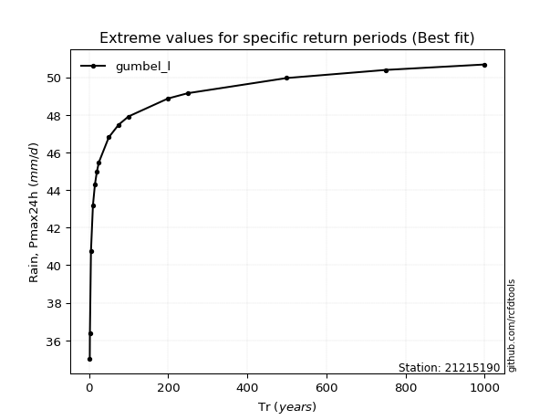</img>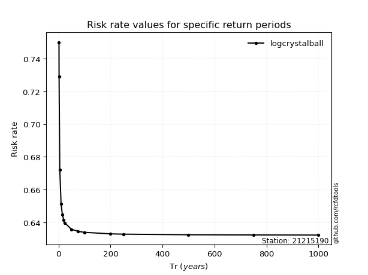</img>

</div>


<sub>**APP DISCLAIMER**: NO WARRANTY - This software is provided by [github.com/rcfdtools](https://github.com/rcfdtools) "as is", without any express or implied warranty, including warranties of merchantability, fitness for a particular purpose, or non-infringement. There is no guarantee that the software will be error-free or operate without interruption. LIMITATION OF LIABILITY - Neither the authors nor copyright holders will be liable for claims or damages arising from the software or its use. You are responsible for determining if the software is appropriate for your use and assume all associated risks, including errors, legal compliance, and data loss. NO PROFESSIONAL ADVICE - The software provides general information and does not offer professional advice. It should not replace consultation with professional advisors.</sub>