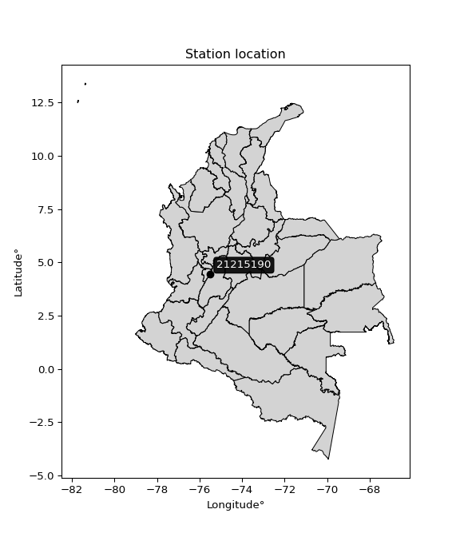

<div align="center">


</div>

# PMP Station (rain, Pmax24h): 21215190

Probable Maximum Precipitation (PMP) is the greatest amount of rainfall for a specific duration that is meteorologically possible for a given location, acting as a "worst-case" scenario for extreme storms, crucial for designing safety-critical infrastructure like bridges, river deviations, dams, spillways, and nuclear plants to prevent catastrophic failure. PMP is calculated by hydrologists using meteorological data to determine the upper limit of extreme rainfall, often leading to the Probable Maximum Flood (PMF) for flood control design, and is increasingly being studied for climate change impacts.

<div align="center">

</img>

</div>


## A. General information


### 1. General running parameters

• app_version: _v20251228_. • runtime: _2025-12-28 08:43:48.795225_. • Python version: _3.14.0_. • SciPy version: _1.16.3_. • Pandas version: _2.3.3_. • NumPy version: _2.3.5_. • Stations dataset (station_dataset_file): _dataset/pmax24h_in/automatic_colombia_2003_2024.csv_. • Stations catalog (station_catalog_file): _dataset/CNE_IDEAM.xls_. • Minimum year to eval til year_max (date_min): _1900_. • Maximum year to eval since year_min (date_max): _2024_. • Creates, save and include plots into reports (create_plot): _False_. • Plot only fit distributions with Δo > Δ (plot_only_fit): _True_. • Eval low extreme values, if False, evaluates high extreme values (low_extreme): _False_. • Eval every SciPy distribution as logarithmic (pdist_logarithmic_on): _True_. • Standard deviation normalized (ddof): _1.0_. • Return periods to eval in years (Tr): _[2, 2.33, 5, 10, 15, 20, 25, 50, 75, 100, 200, 250, 500, 750, 1000]_. • Minimum data sample per station, 0 means any (minimum_sample): _5_. • Z-Score maximum threshold to adjust a value, 0 means disable (zscore_max): _3.5_. • Z-Score minimum threshold to adjust a value, 0 means disable (zscore_min): _-2.5_. • Avoid zeros, e.g. rain = 0 (avoid_zeros): _True_. • Avoid null values (avoid_nans): _True_. [:file_folder:Dataset file.](../../dataset/pmax24h_in/automatic_colombia_2003_2024.csv)

> Delta Degrees of Freedom (DDOF): is a parameter used in the formulas for calculating variance and standard deviation. When ddof=0, the divisor is $N$ (the total number of observations) and this is used when your data set is the entire population. When ddof=1, the divisor is $N-1$ and this is used when your data set is a sample drawn from a larger population. Using $N-1$ provides an unbiased estimate of the population variance (known as Bessel´s correction).


### 2. Station info and location

|   id |   CODIGO | NOMBRE                     | CATEGORIA               | TECNOLOGIA                | ESTADO   | FECHA_INSTALACION   |   FECHA_SUSPENSION |   ALTITUD |   LATITUD |   LONGITUD | DEPARTAMENTO   | MUNICIPIO   | AREA_OPERATIVA             | ENTIDAD                                                     | AREA_HIDROGRAFICA   | ZONA_HIDROGRAFICA   | SUBZONA_HIDROGRAFICA   |   CORRIENTE | Catalogo   |
|-----:|---------:|:---------------------------|:------------------------|:--------------------------|:---------|:--------------------|-------------------:|----------:|----------:|-----------:|:---------------|:------------|:---------------------------|:------------------------------------------------------------|:--------------------|:--------------------|:-----------------------|------------:|:-----------|
|    0 | 21215190 | CAJAMARCA - AUT [21215190] | Climatológica Principal | Automática con Telemetría | Activa   | 10/12/2005          |                nan |      2530 |   4.43567 |   -75.5004 | Tolima         | Cajamarca   | Area Operativa 10 - Tolima | INSTITUTO DE HIDROLOGIA METEOROLOGIA Y ESTUDIOS AMBIENTALES | Magdalena Cauca     | Alto Magdalena      | Río Coello             |         nan | CNE_IDEAM  |

<div align="center">

Map location in: [:earth_americas:Google](http://maps.google.com/maps?q=4.435666667,-75.50036111) [:earth_americas:OSM](https://www.openstreetmap.org/#map=18/4.435666667/-75.50036111&layers=P) [:earth_americas:Bing](https://www.bing.com/maps?cp=4.435666667~-75.50036111&lvl=18) [:earth_americas:Apple](https://maps.apple.com/frame?center=4.435666667%2C-75.50036111&span=0.003%2C0.006)

</div>


<div align="center">

```geojson
{
  "type": "Feature",
  "geometry": {
    "type": "Point", 
    "coordinates": [-75.50036111, 4.435666667]
  }, 
  "properties": {
    "Name": "21215190"
  }
}
```

</div>


### 3. Discrete values table and plot

|               |          0 |          1 |           2 |           3 |           4 |           5 |           6 |           7 |         8 |           9 |          10 |         11 |          12 |        13 |         14 |          15 |          16 |         17 |         18 |
|:--------------|-----------:|-----------:|------------:|------------:|------------:|------------:|------------:|------------:|----------:|------------:|------------:|-----------:|------------:|----------:|-----------:|------------:|------------:|-----------:|-----------:|
| Date          | 2006       | 2007       | 2008        | 2009        | 2010        | 2011        | 2012        | 2013        | 2014      | 2015        | 2016        | 2017       | 2018        | 2019      | 2020       | 2021        | 2022        | 2023       | 2024       |
| Value         |   13.7     |   19       |   27.3      |   32.2      |   32.4      |   34.7      |   36.8      |   35.7      |   32.1    |   42.5      |   37.2      |   46.3     |   33.5      |   47.1    |   20.2     |   31.6      |   31.1      |   40.5     |   44       |
| Value_initial |   13.7     |   19       |   27.3      |   32.2      |   32.4      |   34.7      |   36.8      |   35.7      |   32.1    |   42.5      |   37.2      |   46.3     |   33.5      |   47.1    |   20.2     |   31.6      |   31.1      |   40.5     |   44       |
| count         |   19       |   19       |   19        |   19        |   19        |   19        |   19        |   19        |   19      |   19        |   19        |   19       |   19        |   19      |   19       |   19        |   19        |   19       |   19       |
| mean          |   33.5737  |   33.5737  |   33.5737   |   33.5737   |   33.5737   |   33.5737   |   33.5737   |   33.5737   |   33.5737 |   33.5737   |   33.5737   |   33.5737  |   33.5737   |   33.5737 |   33.5737  |   33.5737   |   33.5737   |   33.5737  |   33.5737  |
| std           |    8.9804  |    8.9804  |    8.9804   |    8.9804   |    8.9804   |    8.9804   |    8.9804   |    8.9804   |    8.9804 |    8.9804   |    8.9804   |    8.9804  |    8.9804   |    8.9804 |    8.9804  |    8.9804   |    8.9804   |    8.9804  |    8.9804  |
| zscore        |   -2.21301 |   -1.62283 |   -0.698597 |   -0.152965 |   -0.130694 |    0.125419 |    0.359262 |    0.236773 |   -0.1641 |    0.993977 |    0.403803 |    1.41712 |   -0.008205 |    1.5062 |   -1.48921 |   -0.219777 |   -0.275454 |    0.77127 |    1.16101 |

> The initial value (value_initial) correspond to the initial obtained or null completed value, and value (value) is adjusted only when the initial value is outside the valid range definite through the Z-Score value. If Z-Score is active, values out of range or outliers are replaced with the station mean value


### 4. Active continuous probability distributions from SciPy (44 of 104 available)

[scipy.stats](https://docs.scipy.org/doc/scipy/reference/stats.html) is a Python´s powerful submodule within the SciPy library for comprehensive statistical analysis, offering over 130 probability distributions (like Normal, Poisson), functions for descriptive stats (mean, variance), hypothesis testing (t-tests, chi-square), random variable generation, and statistical tests, making it essential for data science, modeling, and research. It provides tools to explore, model, and draw conclusions from data efficiently, working seamlessly with NumPy.

<div align="center">

|   id | p_dist             |   n_parameter | fit_method   | label                                                                       | active   | ref                                                                                                        |
|-----:|:-------------------|--------------:|:-------------|:----------------------------------------------------------------------------|:---------|:-----------------------------------------------------------------------------------------------------------|
|    0 | alpha              |             3 | MLE          | Alpha                                                                       | True     | [:mortar_board:](https://docs.scipy.org/doc/scipy/reference/generated/scipy.stats.alpha.html)              |
|    1 | betaprime          |             4 | MLE          | Beta prime                                                                  | True     | [:mortar_board:](https://docs.scipy.org/doc/scipy/reference/generated/scipy.stats.betaprime.html)          |
|    2 | chi2               |             3 | MLE          | Chi²                                                                        | True     | [:mortar_board:](https://docs.scipy.org/doc/scipy/reference/generated/scipy.stats.chi2.html)               |
|    3 | crystalball        |             4 | MLE          | Crystalball                                                                 | True     | [:mortar_board:](https://docs.scipy.org/doc/scipy/reference/generated/scipy.stats.crystalball.html)        |
|    4 | erlang             |             3 | MLE          | Erlang                                                                      | True     | [:mortar_board:](https://docs.scipy.org/doc/scipy/reference/generated/scipy.stats.erlang.html)             |
|    5 | expon              |             2 | MLE          | Exponential                                                                 | True     | [:mortar_board:](https://docs.scipy.org/doc/scipy/reference/generated/scipy.stats.expon.html)              |
|    6 | exponnorm          |             3 | MLE          | Exponentially modified Normal                                               | True     | [:mortar_board:](https://docs.scipy.org/doc/scipy/reference/generated/scipy.stats.exponnorm.html)          |
|    7 | f                  |             4 | MLE          | F                                                                           | True     | [:mortar_board:](https://docs.scipy.org/doc/scipy/reference/generated/scipy.stats.f.html)                  |
|    8 | fatiguelife        |             3 | MLE          | Fatigue-life (Birnbaum-Saunders)                                            | True     | [:mortar_board:](https://docs.scipy.org/doc/scipy/reference/generated/scipy.stats.fatiguelife.html)        |
|    9 | fisk               |             3 | MLE          | Fisk                                                                        | True     | [:mortar_board:](https://docs.scipy.org/doc/scipy/reference/generated/scipy.stats.fisk.html)               |
|   10 | gamma              |             3 | MLE          | Gamma                                                                       | True     | [:mortar_board:](https://docs.scipy.org/doc/scipy/reference/generated/scipy.stats.gamma.html)              |
|   11 | genexpon           |             5 | MLE          | Generalized exponential                                                     | True     | [:mortar_board:](https://docs.scipy.org/doc/scipy/reference/generated/scipy.stats.genexpon.html)           |
|   12 | genlogistic        |             3 | MLE          | Generalized logistic                                                        | True     | [:mortar_board:](https://docs.scipy.org/doc/scipy/reference/generated/scipy.stats.genlogistic.html)        |
|   13 | gibrat             |             2 | MM           | Gibrat                                                                      | True     | [:mortar_board:](https://docs.scipy.org/doc/scipy/reference/generated/scipy.stats.gibrat.html)             |
|   14 | gompertz           |             3 | MLE          | Gompertz (or truncated Gumbel)                                              | True     | [:mortar_board:](https://docs.scipy.org/doc/scipy/reference/generated/scipy.stats.gompertz.html)           |
|   15 | gumbel_l           |             2 | MM           | Gumbel Left Skew                                                            | True     | [:mortar_board:](https://docs.scipy.org/doc/scipy/reference/generated/scipy.stats.gumbel_l.html)           |
|   16 | gumbel_r           |             2 | MM           | Gumbel Right Skew                                                           | True     | [:mortar_board:](https://docs.scipy.org/doc/scipy/reference/generated/scipy.stats.gumbel_r.html)           |
|   17 | halflogistic       |             2 | MM           | Half-logistic                                                               | True     | [:mortar_board:](https://docs.scipy.org/doc/scipy/reference/generated/scipy.stats.halflogistic.html)       |
|   18 | halfnorm           |             2 | MM           | Half Normal                                                                 | True     | [:mortar_board:](https://docs.scipy.org/doc/scipy/reference/generated/scipy.stats.halfnorm.html)           |
|   19 | hypsecant          |             2 | MM           | hyperbolic secant                                                           | True     | [:mortar_board:](https://docs.scipy.org/doc/scipy/reference/generated/scipy.stats.hypsecant.html)          |
|   20 | invgamma           |             3 | MLE          | Inverted gamma                                                              | True     | [:mortar_board:](https://docs.scipy.org/doc/scipy/reference/generated/scipy.stats.invgamma.html)           |
|   21 | invgauss           |             3 | MLE          | Inverse Gaussian                                                            | True     | [:mortar_board:](https://docs.scipy.org/doc/scipy/reference/generated/scipy.stats.invgauss.html)           |
|   22 | invweibull         |             3 | MLE          | Inverted Weibull                                                            | True     | [:mortar_board:](https://docs.scipy.org/doc/scipy/reference/generated/scipy.stats.invweibull.html)         |
|   23 | johnsonsu          |             4 | MLE          | Johnson Su                                                                  | True     | [:mortar_board:](https://docs.scipy.org/doc/scipy/reference/generated/scipy.stats.johnsonsu.html)          |
|   24 | kstwobign          |             2 | MLE          | Limiting distribution of scaled Kolmogorov-Smirnov two-sided test statistic | True     | [:mortar_board:](https://docs.scipy.org/doc/scipy/reference/generated/scipy.stats.kstwobign.html)          |
|   25 | laplace            |             2 | MM           | Laplace                                                                     | True     | [:mortar_board:](https://docs.scipy.org/doc/scipy/reference/generated/scipy.stats.laplace.html)            |
|   26 | laplace_asymmetric |             3 | MLE          | Asymmetric Laplace                                                          | True     | [:mortar_board:](https://docs.scipy.org/doc/scipy/reference/generated/scipy.stats.laplace_asymmetric.html) |
|   27 | loggamma           |             3 | MLE          | Log gamma                                                                   | True     | [:mortar_board:](https://docs.scipy.org/doc/scipy/reference/generated/scipy.stats.loggamma.html)           |
|   28 | logistic           |             2 | MM           | Logistic (or Sech-squared)                                                  | True     | [:mortar_board:](https://docs.scipy.org/doc/scipy/reference/generated/scipy.stats.logistic.html)           |
|   29 | lognorm            |             3 | MLE          | Log Normal                                                                  | True     | [:mortar_board:](https://docs.scipy.org/doc/scipy/reference/generated/scipy.stats.lognorm.html)            |
|   30 | maxwell            |             2 | MM           | Maxwell                                                                     | True     | [:mortar_board:](https://docs.scipy.org/doc/scipy/reference/generated/scipy.stats.maxwell.html)            |
|   31 | mielke             |             4 | MLE          | Mielke Beta-Kappa / Dagum                                                   | True     | [:mortar_board:](https://docs.scipy.org/doc/scipy/reference/generated/scipy.stats.mielke.html)             |
|   32 | moyal              |             2 | MM           | Moyal                                                                       | True     | [:mortar_board:](https://docs.scipy.org/doc/scipy/reference/generated/scipy.stats.moyal.html)              |
|   33 | nakagami           |             3 | MLE          | Nakagami                                                                    | True     | [:mortar_board:](https://docs.scipy.org/doc/scipy/reference/generated/scipy.stats.nakagami.html)           |
|   34 | ncf                |             5 | MLE          | Non-central F distribution                                                  | True     | [:mortar_board:](https://docs.scipy.org/doc/scipy/reference/generated/scipy.stats.ncf.html)                |
|   35 | nct                |             4 | MLE          | Non-central Student’s t                                                     | True     | [:mortar_board:](https://docs.scipy.org/doc/scipy/reference/generated/scipy.stats.nct.html)                |
|   36 | norm               |             2 | MM           | Normal                                                                      | True     | [:mortar_board:](https://docs.scipy.org/doc/scipy/reference/generated/scipy.stats.norm.html)               |
|   37 | pearson3           |             3 | MM           | Pearson type III                                                            | True     | [:mortar_board:](https://docs.scipy.org/doc/scipy/reference/generated/scipy.stats.pearson3.html)           |
|   38 | rayleigh           |             2 | MM           | Rayleigh                                                                    | True     | [:mortar_board:](https://docs.scipy.org/doc/scipy/reference/generated/scipy.stats.rayleigh.html)           |
|   39 | rice               |             3 | MLE          | Rice                                                                        | True     | [:mortar_board:](https://docs.scipy.org/doc/scipy/reference/generated/scipy.stats.rice.html)               |
|   40 | t                  |             3 | MLE          | Student’s t                                                                 | True     | [:mortar_board:](https://docs.scipy.org/doc/scipy/reference/generated/scipy.stats.t.html)                  |
|   41 | truncnorm          |             4 | MLE          | Truncated normal                                                            | True     | [:mortar_board:](https://docs.scipy.org/doc/scipy/reference/generated/scipy.stats.truncnorm.html)          |
|   42 | wald               |             2 | MM           | Wald                                                                        | True     | [:mortar_board:](https://docs.scipy.org/doc/scipy/reference/generated/scipy.stats.wald.html)               |
|   43 | weibull_min        |             3 | MLE          | Weibull minimum                                                             | True     | [:mortar_board:](https://docs.scipy.org/doc/scipy/reference/generated/scipy.stats.weibull_min.html)        |

</div>

> **n_parameter:** # arguments & localization & scale.
>
> **Fit methods:** (MLE) maximum likelihood, (MM) L-moments.
>
>**Inactive:** foldnorm, gennorm, norminvgauss, powernorm, powerlognorm, skewnorm, genextreme, anglit, arcsine, argus, beta, bradford, burr, burr12, cauchy, cosine, halfcauchy, foldcauchy, skewcauchy, wrapcauchy, dgamma, gengamma, exponweib, exponpow, truncexpon, gausshyper, genhalflogistic, genhyperbolic, geninvgauss, halfgennorm, johnsonsb, kappa4, kappa3, ksone, kstwo, loglaplace, levy, levy_l, levy_stable, ncx2, pareto, genpareto, truncpareto, lomax, powerlaw, rdist, rel_breitwigner, recipinvgauss, semicircular, studentized_range, trapezoid, triang, truncweibull_min, tukeylambda, uniform, loguniform, vonmises, vonmises_line, weibull_max, dweibull, 


## B. Probability distributions vs. Empirical distributions

A continuous probability distribution (CPD) describes probabilities for variables that can take any value within a range (like rain any time), unlike discrete variables with specific outcomes (like temperature). It uses a Probability Density Function (PDF), a curve where the total area under it equals 1, and the probability of the variable falling within an interval (a to b) is found by calculating the area under the curve between those points. A key feature is that the probability of hitting any single exact value is zero, so probabilities are always expressed for ranges, e.g., $P(a ≤ X ≤ b)$.

<div align="center">

Distributions parameters from station values
|    |   station | p_dist                |   n |              loc |           scale | shape                  | shape1              | shape2             | shape3   |
|---:|----------:|:----------------------|----:|-----------------:|----------------:|:-----------------------|:--------------------|:-------------------|:---------|
|  0 |  21215190 | alpha                 |  19 |   -155.416       |  3942.08        | 20.89994303045649      |                     |                    |          |
|  1 |  21215190 | betaprime             |  19 |   -203.528       |  5868.81        | 736.361231724838       | 18228.662146440212  |                    |          |
|  2 |  21215190 | chi2                  |  19 |    -83.5611      |     0.348628    | 335.68010524907265     |                     |                    |          |
|  3 |  21215190 | crystalball           |  19 |     33.5737      |     8.74088     | 794.0259208211082      | 6137.379394380754   |                    |          |
|  4 |  21215190 | erlang                |  19 |   -117.432       |     0.546778    | 276.05132137477267     |                     |                    |          |
|  5 |  21215190 | expon                 |  19 |     13.7         |    19.8737      |                        |                     |                    |          |
|  6 |  21215190 | exponnorm             |  19 |     33.5681      |     8.74089     | 0.0006442567206271972  |                     |                    |          |
|  7 |  21215190 | f                     |  19 |  -1821.72        |  1855.27        | 144636.30465641752     | 235978.32510334428  |                    |          |
|  8 |  21215190 | fatiguelife           |  19 |  -1011.85        |  1045.4         | 0.008354365795537558   |                     |                    |          |
|  9 |  21215190 | fisk                  |  19 |     -1.1996e+09  |     1.1996e+09  | 244444493.1718675      |                     |                    |          |
| 10 |  21215190 | gamma                 |  19 |   -112.687       |     0.541709    | 270.0043271783718      |                     |                    |          |
| 11 |  21215190 | genexpon              |  19 |     13.7         |     2.38118     | 0.049501074044837584   | 0.08145298078300009 | 0.7778443197875313 |          |
| 12 |  21215190 | genlogistic           |  19 |     37.9616      |     3.76584     | 0.5507634271520641     |                     |                    |          |
| 13 |  21215190 | gibrat                |  19 |     26.9054      |     4.0445      |                        |                     |                    |          |
| 14 |  21215190 | gompertz              |  19 |     13.7         |     8.47358     | 0.06587596461883505    |                     |                    |          |
| 15 |  21215190 | gumbel_l              |  19 |     37.5075      |     6.81524     |                        |                     |                    |          |
| 16 |  21215190 | gumbel_r              |  19 |     29.6398      |     6.81524     |                        |                     |                    |          |
| 17 |  21215190 | halflogistic          |  19 |     23.2137      |     7.47313     |                        |                     |                    |          |
| 18 |  21215190 | halfnorm              |  19 |     22.0042      |    14.5002      |                        |                     |                    |          |
| 19 |  21215190 | hypsecant             |  19 |     33.5737      |     5.56462     |                        |                     |                    |          |
| 20 |  21215190 | invgamma              |  19 |   -119.099       | 44186.7         | 290.3347086231927      |                     |                    |          |
| 21 |  21215190 | invgauss              |  19 |    -44.5333      |  5348.97        | 0.014582044652130966   |                     |                    |          |
| 22 |  21215190 | invweibull            |  19 |     -3.83948e+07 |     3.83948e+07 | 4101513.2642371003     |                     |                    |          |
| 23 |  21215190 | johnsonsu             |  19 |     67.5164      |     4.41809     | 10.605661258307645     | 3.9221011181646563  |                    |          |
| 24 |  21215190 | kstwobign             |  19 |     -5.01151     |    44.2441      |                        |                     |                    |          |
| 25 |  21215190 | laplace               |  19 |     33.5737      |     6.18074     |                        |                     |                    |          |
| 26 |  21215190 | laplace_asymmetric    |  19 |     33.5         |     6.59002     | 0.9943836785168148     |                     |                    |          |
| 27 |  21215190 | loggamma              |  19 |     28.342       |    11.2463      | 2.0671228975646545     |                     |                    |          |
| 28 |  21215190 | logistic              |  19 |     33.5737      |     4.8191      |                        |                     |                    |          |
| 29 |  21215190 | lognorm               |  19 |     -2.09714e+06 |     2.09717e+06 | 4.167941774790919e-06  |                     |                    |          |
| 30 |  21215190 | maxwell               |  19 |     12.8615      |    12.9795      |                        |                     |                    |          |
| 31 |  21215190 | mielke                |  19 |      0.0156397   |    42.2327      | 3.3970648395139884     | 14.24731604423442   |                    |          |
| 32 |  21215190 | moyal                 |  19 |     28.5751      |     3.93478     |                        |                     |                    |          |
| 33 |  21215190 | nakagami              |  19 |  -3461.62        |  3495.22        | 39946.91792513008      |                     |                    |          |
| 34 |  21215190 | ncf                   |  19 |      1.30961     |     8.90036e-05 | 0.00013697168408245632 | 332.28275346853843  | 49.423401728500785 |          |
| 35 |  21215190 | nct                   |  19 |   -626.926       |     8.69287     | 253093.10185423715     | 75.98127171844922   |                    |          |
| 36 |  21215190 | norm                  |  19 |     33.5737      |     8.74088     |                        |                     |                    |          |
| 37 |  21215190 | pearson3              |  19 |     33.5737      |     8.74087     | -0.5365958906704755    |                     |                    |          |
| 38 |  21215190 | rayleigh              |  19 |     16.8519      |    13.3421      |                        |                     |                    |          |
| 39 |  21215190 | rice                  |  19 |     13.6909      |     2.57659     | 8.449828303098549e-09  |                     |                    |          |
| 40 |  21215190 | t                     |  19 |     33.5726      |     8.7407      | 476182.4254798691      |                     |                    |          |
| 41 |  21215190 | truncnorm             |  19 |     33.5737      |     8.74088     | -308.9065603303029     | 712.5615058391372   |                    |          |
| 42 |  21215190 | wald                  |  19 |     24.8328      |     8.74088     |                        |                     |                    |          |
| 43 |  21215190 | weibull_min           |  19 |    -33.6822      |    70.964       | 9.301733509459329      |                     |                    |          |
| 44 |  21215190 | logalpha              |  19 |     -6.85733     |   321.278       | 31.153491520946837     |                     |                    |          |
| 45 |  21215190 | logbetaprime          |  19 |     -9.61269     |    29.2713      | 2430.9039214339946     | 5439.31549581165    |                    |          |
| 46 |  21215190 | logchi2               |  19 |      2.6174      |     0.893166    | 1.169423094916745      |                     |                    |          |
| 47 |  21215190 | logcrystalball        |  19 |      3.47165     |     0.30907     | 1713.460332045216      | 315.6141079376291   |                    |          |
| 48 |  21215190 | logerlang             |  19 |     -2.06859     |     0.0189614   | 291.9530989746953      |                     |                    |          |
| 49 |  21215190 | logexpon              |  19 |      2.6174      |     0.854257    |                        |                     |                    |          |
| 50 |  21215190 | logexponnorm          |  19 |      3.47146     |     0.30907     | 0.0006183647067470228  |                     |                    |          |
| 51 |  21215190 | logf                  |  19 |   -499.037       |   502.51        | 16281234.988975473     | 7817648.523484886   |                    |          |
| 52 |  21215190 | logfatiguelife        |  19 |   -295.826       |   299.297       | 0.0010355227033202784  |                     |                    |          |
| 53 |  21215190 | logfisk               |  19 |     -3.02962e+07 |     3.02962e+07 | 192576836.65909284     |                     |                    |          |
| 54 |  21215190 | loggamma              |  19 |     -1.60065     |     0.0204065   | 248.33333125629196     |                     |                    |          |
| 55 |  21215190 | loggenexpon           |  19 |      2.6174      |     0.908531    | 0.23082500451377097    | 1.4643614944693215  | 1.566983873779619  |          |
| 56 |  21215190 | loggenlogistic        |  19 |      3.74351     |     0.0701745   | 0.2385295979475529     |                     |                    |          |
| 57 |  21215190 | loggibrat             |  19 |      3.2359      |     0.142993    |                        |                     |                    |          |
| 58 |  21215190 | loggompertz           |  19 |      2.6174      |     0.227891    | 0.013471513227051774   |                     |                    |          |
| 59 |  21215190 | loggumbel_l           |  19 |      3.61075     |     0.240981    |                        |                     |                    |          |
| 60 |  21215190 | loggumbel_r           |  19 |      3.33255     |     0.240981    |                        |                     |                    |          |
| 61 |  21215190 | loghalflogistic       |  19 |      3.10533     |     0.264248    |                        |                     |                    |          |
| 62 |  21215190 | loghalfnorm           |  19 |      3.06252     |     0.512771    |                        |                     |                    |          |
| 63 |  21215190 | loghypsecant          |  19 |      3.47165     |     0.19676     |                        |                     |                    |          |
| 64 |  21215190 | loginvgamma           |  19 |     -5.40669     |  6795.67        | 766.2547353129439      |                     |                    |          |
| 65 |  21215190 | loginvgauss           |  19 |     -0.356537    |   501.581       | 0.007631236299280244   |                     |                    |          |
| 66 |  21215190 | loginvweibull         |  19 |     -3.20105e+07 |     3.20105e+07 | 84457248.53787081      |                     |                    |          |
| 67 |  21215190 | logjohnsonsu          |  19 |      4.00759     |     0.0112687   | 7.7965804407748625     | 1.7722575250681913  |                    |          |
| 68 |  21215190 | logkstwobign          |  19 |      1.89095     |     1.81773     |                        |                     |                    |          |
| 69 |  21215190 | loglaplace            |  19 |      3.47165     |     0.218545    |                        |                     |                    |          |
| 70 |  21215190 | loglaplace_asymmetric |  19 |      3.6055      |     0.196506    | 1.3969171524910542     |                     |                    |          |
| 71 |  21215190 | logloggamma           |  19 |      3.7774      |     0.111017    | 0.37499276764671186    |                     |                    |          |
| 72 |  21215190 | loglogistic           |  19 |      3.47165     |     0.170399    |                        |                     |                    |          |
| 73 |  21215190 | loglognorm            |  19 | -65533.4         | 65536.9         | 4.715986107778736e-06  |                     |                    |          |
| 74 |  21215190 | logmaxwell            |  19 |      2.73925     |     0.458967    |                        |                     |                    |          |
| 75 |  21215190 | logmielke             |  19 |     -4.14402e+06 |     4.14402e+06 | 10791963.403911088     | 612621270.4443684   |                    |          |
| 76 |  21215190 | logmoyal              |  19 |      3.29491     |     0.13913     |                        |                     |                    |          |
| 77 |  21215190 | lognakagami           |  19 |   -176.336       |   179.809       | 84338.48376311228      |                     |                    |          |
| 78 |  21215190 | logncf                |  19 |     -3.69978     |     7.14281     | 1336.8232307979351     | 805.0907357683118   | 3.731270278216055  |          |
| 79 |  21215190 | lognct                |  19 |    -13.3298      |     0.275706    | 6067.320128875554      | 60.92700599769822   |                    |          |
| 80 |  21215190 | lognorm               |  19 |      3.47165     |     0.30907     |                        |                     |                    |          |
| 81 |  21215190 | logpearson3           |  19 |      3.47165     |     0.30907     | -1.2502773260936955    |                     |                    |          |
| 82 |  21215190 | lograyleigh           |  19 |      2.88043     |     0.471726    |                        |                     |                    |          |
| 83 |  21215190 | logrice               |  19 |    -90.7111      |     0.309046    | 304.75114733153225     |                     |                    |          |
| 84 |  21215190 | logt                  |  19 |      3.54317     |     0.169783    | 2.060498638562766      |                     |                    |          |
| 85 |  21215190 | logtruncnorm          |  19 |     -0.118708    |     1.14134     | 3.0013707585360705     | 3.479264669427689   |                    |          |
| 86 |  21215190 | logwald               |  19 |      3.16258     |     0.309071    |                        |                     |                    |          |
| 87 |  21215190 | logweibull_min        |  19 |     -2.57539e+07 |     2.57539e+07 | 117990224.5273408      |                     |                    |          |

</div>

> **loc** (Location parameter): This shifts the distribution along the x-axis. For many common distributions, like the normal (Gaussian) distribution, loc represents the mean $μ$. For others, like the uniform distribution, it might represent the minimum value, or for the beta distribution, the left end of the support interval.
>
> **scale** (Scale parameter): This determines the width or spread of the distribution. For the normal distribution, scale represents the standard deviation $σ$. For a uniform distribution, it defines the length of the interval (from $loc$ to $loc + scale$).
>
> **shape** (Shape parameters): Refers to parameters that define the specific form of a probability distribution, distinct from its location (loc) and scale (scale). These parameters are required arguments for most distribution functions. For example, a normal (Gaussian) distribution is fully defined by its location (mean) and scale (standard deviation), so it has no specific shape parameters beyond loc and scale. However, other distributions have intrinsic properties that need specification, as Gamma distribution that takes a shape parameter, often named $a$ or $alpha$.


### 0. Cumulative distribution values - CDF (88 evaluated)

Cumulative Distribution Function (CDF), denoted as $F$<sub>$X$</sub>$(x)$, is a function that gives the probability that a random variable $X$ will take a value less than or equal to a specific value, $x$ (i.e., $(P(X≥x)$. It essentially "accumulates" probabilities from a given point up to the far right (positive infinity), providing a complete picture of the distribution´s probabilities for both discrete (like rain) and continuous (like temperature) variables, helping to find probabilities over ranges or above certain values.

<div align="center">

CDF ordered by x ascending and calculating $log(f(x))$ separately
|   id |   Station |   date |    x |   count |    mean |    std |    zscore |   Value_initial |   station |   m |      alpha |   alpha_pdf |   betaprime |   betaprime_pdf |      chi2 |   chi2_pdf |   crystalball |   crystalball_pdf |    erlang |   erlang_pdf |    expon |   expon_pdf |   exponnorm |   exponnorm_pdf |         f |      f_pdf |   fatiguelife |   fatiguelife_pdf |      fisk |   fisk_pdf |     gamma |   gamma_pdf |    genexpon |   genexpon_pdf |   genlogistic |   genlogistic_pdf |     gibrat |   gibrat_pdf |    gompertz |   gompertz_pdf |   gumbel_l |   gumbel_l_pdf |    gumbel_r |   gumbel_r_pdf |   halflogistic |   halflogistic_pdf |   halfnorm |   halfnorm_pdf |   hypsecant |   hypsecant_pdf |   invgamma |   invgamma_pdf |   invgauss |   invgauss_pdf |   invweibull |   invweibull_pdf |   johnsonsu |   johnsonsu_pdf |   kstwobign |   kstwobign_pdf |   laplace |   laplace_pdf |   laplace_asymmetric |   laplace_asymmetric_pdf |   loggamma |   loggamma_pdf |   logistic |   logistic_pdf |    lognorm |   lognorm_pdf |     maxwell |   maxwell_pdf |    mielke |   mielke_pdf |       moyal |   moyal_pdf |   nakagami |   nakagami_pdf |       ncf |    ncf_pdf |       nct |    nct_pdf |      norm |   norm_pdf |   pearson3 |   pearson3_pdf |   rayleigh |   rayleigh_pdf |        rice |    rice_pdf |         t |      t_pdf |   truncnorm |   truncnorm_pdf |     wald |   wald_pdf |   weibull_min |   weibull_min_pdf |   logalpha |   logalpha_pdf |   logbetaprime |   logbetaprime_pdf |    logchi2 |   logchi2_pdf |   logcrystalball |   logcrystalball_pdf |   logerlang |   logerlang_pdf |   logexpon |   logexpon_pdf |   logexponnorm |   logexponnorm_pdf |       logf |   logf_pdf |   logfatiguelife |   logfatiguelife_pdf |    logfisk |   logfisk_pdf |   loggenexpon |   loggenexpon_pdf |   loggenlogistic |   loggenlogistic_pdf |   loggibrat |   loggibrat_pdf |   loggompertz |   loggompertz_pdf |   loggumbel_l |   loggumbel_l_pdf |   loggumbel_r |   loggumbel_r_pdf |   loghalflogistic |   loghalflogistic_pdf |   loghalfnorm |   loghalfnorm_pdf |   loghypsecant |   loghypsecant_pdf |   loginvgamma |   loginvgamma_pdf |   loginvgauss |   loginvgauss_pdf |   loginvweibull |   loginvweibull_pdf |   logjohnsonsu |   logjohnsonsu_pdf |   logkstwobign |   logkstwobign_pdf |   loglaplace |   loglaplace_pdf |   loglaplace_asymmetric |   loglaplace_asymmetric_pdf |   logloggamma |   logloggamma_pdf |   loglogistic |   loglogistic_pdf |   loglognorm |   loglognorm_pdf |   logmaxwell |   logmaxwell_pdf |   logmielke |   logmielke_pdf |    logmoyal |   logmoyal_pdf |   lognakagami |   lognakagami_pdf |    logncf |   logncf_pdf |     lognct |   lognct_pdf |   logpearson3 |   logpearson3_pdf |   lograyleigh |   lograyleigh_pdf |    logrice |   logrice_pdf |      logt |   logt_pdf |   logtruncnorm |   logtruncnorm_pdf |   logwald |   logwald_pdf |   logweibull_min |   logweibull_min_pdf |
|-----:|----------:|-------:|-----:|--------:|--------:|-------:|----------:|----------------:|----------:|----:|-----------:|------------:|------------:|----------------:|----------:|-----------:|--------------:|------------------:|----------:|-------------:|---------:|------------:|------------:|----------------:|----------:|-----------:|--------------:|------------------:|----------:|-----------:|----------:|------------:|------------:|---------------:|--------------:|------------------:|-----------:|-------------:|------------:|---------------:|-----------:|---------------:|------------:|---------------:|---------------:|-------------------:|-----------:|---------------:|------------:|----------------:|-----------:|---------------:|-----------:|---------------:|-------------:|-----------------:|------------:|----------------:|------------:|----------------:|----------:|--------------:|---------------------:|-------------------------:|-----------:|---------------:|-----------:|---------------:|-----------:|--------------:|------------:|--------------:|----------:|-------------:|------------:|------------:|-----------:|---------------:|----------:|-----------:|----------:|-----------:|----------:|-----------:|-----------:|---------------:|-----------:|---------------:|------------:|------------:|----------:|-----------:|------------:|----------------:|---------:|-----------:|--------------:|------------------:|-----------:|---------------:|---------------:|-------------------:|-----------:|--------------:|-----------------:|---------------------:|------------:|----------------:|-----------:|---------------:|---------------:|-------------------:|-----------:|-----------:|-----------------:|---------------------:|-----------:|--------------:|--------------:|------------------:|-----------------:|---------------------:|------------:|----------------:|--------------:|------------------:|--------------:|------------------:|--------------:|------------------:|------------------:|----------------------:|--------------:|------------------:|---------------:|-------------------:|--------------:|------------------:|--------------:|------------------:|----------------:|--------------------:|---------------:|-------------------:|---------------:|-------------------:|-------------:|-----------------:|------------------------:|----------------------------:|--------------:|------------------:|--------------:|------------------:|-------------:|-----------------:|-------------:|-----------------:|------------:|----------------:|------------:|---------------:|--------------:|------------------:|----------:|-------------:|-----------:|-------------:|--------------:|------------------:|--------------:|------------------:|-----------:|--------------:|----------:|-----------:|---------------:|-------------------:|----------:|--------------:|-----------------:|---------------------:|
|    0 |  21215190 |   2006 | 13.7 |      19 | 33.5737 | 8.9804 | -2.21301  |            13.7 |  21215190 |   1 | 0.00797728 |  0.00301371 |   0.0112028 |      0.00350822 | 0.010751  | 0.00355811 |     0.0114936 |        0.00344205 | 0.0118054 |   0.00372464 | 0        |  0.0503178  |   0.0114934 |       0.003442  | 0.0113848 | 0.00343945 |     0.0108809 |        0.00334841 | 0.0154074 | 0.00309123 | 0.0101035 |  0.00333185 | 3.18075e-08 |     0.0207885  |     0.0287475 |        0.00419771 | 0          |   0          | 1.22119e-10 |     0.00777428 |  0.0299435 |     0.00432716 | 3.13808e-05 |    4.77455e-05 |       0        |          0         |   0        |      0         |   0.0178941 |      0.003214   | 0.00829014 |     0.00303805 | 0.00882054 |     0.00343901 |   0.00595187 |       0.00325791 |   0.0271601 |      0.00454984 |  0.00598712 |      0.00409412 | 0.0200692 |    0.00324705 |            0.0242265 |               0.003697   | 0.00268126 |      0.0290792 |  0.015923  |     0.00325153 | 0.00285523 |     0.0283115 | 7.16251e-05 |   0.000256038 | 0.0217467 |   0.00539849 | 3.57417e-11 | 2.03439e-10 |  0.0114401 |     0.00343351 | 0.0055239 | 0.00276225 | 0.0114936 | 0.00344377 | 0.0114936 | 0.00344205 |  0.0220246 |     0.00439385 |  0         |      0         | 6.19438e-06 | 0.00136605  | 0.0114961 | 0.00344275 |   0.0114936 |      0.00344205 | 0        | 0          |     0.0230785 |        0.00447791 | 0.00293096 |       0.032064 |     0.00303394 |           0.030703 | 8.4249e-10 |   1.10927e+06 |       0.00285522 |            0.0283114 |  0.00297044 |       0.0312991 |   0        |       1.17061  |      0.0028552 |          0.0283113 | 0.00280617 |  0.0279113 |       0.00288577 |            0.0285868 | 0.00331277 |     0.0209878 |   8.78045e-10 |          0.254064 |        0.0217583 |            0.0739586 |    0        |        0        |   2.86392e-08 |         0.0591139 |     0.0160793 |         0.0661848 |   3.58271e-09 |       2.89125e-07 |          0        |              0        |      0        |          0        |     0.00828543 |          0.0421045 |    0.00233285 |         0.0260078 |    0.00214568 |         0.0262462 |      0.00226857 |           0.0364429 |      0.0246717 |          0.0736832 |      0.0027717 |          0.0551288 |    0.010032  |        0.0459034 |               0.0180728 |                   0.0658385 |     0.0223591 |         0.0755231 |    0.00660522 |         0.0385072 |   0.00285516 |        0.0283112 |    0         |         0        |   0.0395133 |        0.102901 | 3.57605e-30 |    1.68682e-27 |    0.00285195 |         0.0282808 | 0.0224453 |     0.135181 | 0.00313714 |    0.0309151 |     0.0172005 |         0.0717788 |    0          |          0        | 0.00285334 |     0.0282968 | 0.0149948 |  0.0317346 |    0           |           0        |  0        |      0        |        0.0107429 |            0.0489528 |
|    1 |  21215190 |   2007 | 19   |      19 | 33.5737 | 8.9804 | -1.62283  |            19   |  21215190 |   2 | 0.0444121  |  0.0121535  |   0.0487813 |      0.0118567  | 0.0498145 | 0.0124344  |     0.0477272 |        0.0113686  | 0.0514571 |   0.0124272  | 0.234085 |  0.0385391  |   0.0477266 |       0.0113685 | 0.0477399 | 0.0114264  |     0.0467246 |        0.0113442  | 0.0440498 | 0.00858071 | 0.0469758 |  0.0118243  | 0.185597    |     0.0398561  |     0.0622398 |        0.00904391 | 0          |   0          | 0.0556466   |     0.0137225  |  0.064023  |     0.00908675 | 0.00852759  |    0.00596153  |       0        |          0         |   0        |      0         |   0.0463126 |      0.00829337 | 0.0443393  |     0.0119391  | 0.0500174  |     0.0135434  |   0.0545359  |       0.0169466  |   0.0643612 |      0.0101299  |  0.070047   |      0.0215216  | 0.0473084 |    0.00765417 |            0.054393  |               0.00830046 | 0.0481558  |      0.334725  |  0.0463467 |     0.00917156 | 0.044022   |     0.301303  | 0.0263201   |   0.012295    | 0.0661237 |   0.0118321  | 0.000735177 | 0.00114639  |  0.0476294 |     0.011362   | 0.0445943 | 0.0136673  | 0.047752  | 0.0113771  | 0.0477272 | 0.0113686  |  0.0599605 |     0.0106644  |  0.0128774 |      0.0119119 | 0.880307    | 0.0957182   | 0.0477364 | 0.0113706  |   0.0477272 |      0.0113686  | 0        | 0          |     0.0606843 |        0.0103827  | 0.0521867  |       0.356841 |     0.0474551  |           0.321167 | 0.388922   |   0.618551    |       0.0440219  |            0.301302  |  0.0496984  |       0.338521  |   0.318078 |       0.798264 |      0.0440218 |          0.301302  | 0.0435994  |  0.299168  |       0.0443004  |            0.302531  | 0.0258863  |     0.160286  |   0.187256    |          0.771229 |        0.0661315 |            0.224784  |    0        |        0        |   0.042193    |         0.237803  |     0.0610342 |         0.245383  |   0.00669999  |       0.139172    |          0        |              0        |      0        |          0        |     0.0436032  |          0.220914  |    0.045198   |         0.321704  |    0.0490377  |         0.353469  |      0.0766071  |           0.519264  |      0.0680721 |          0.219044  |      0.109866  |          0.661798  |    0.0448011 |        0.204997  |               0.0594903 |                   0.21672   |     0.0674765 |         0.227831  |    0.0433558  |         0.243405  |   0.044022   |        0.301304  |    0.0223901 |         0.31442  |   0.0926039 |        0.241161 | 0.000425665 |    0.0203411   |    0.0439524  |         0.300721  | 0.115143  |     0.46609  | 0.0468586  |    0.315124  |     0.0647103 |         0.252983  |    0.00916281 |          0.284997 | 0.0440097  |     0.301258  | 0.0344009 |  0.105547  |    0           |           0        |  0        |      0        |        0.0471771 |            0.210959  |
|    2 |  21215190 |   2020 | 20.2 |      19 | 33.5737 | 8.9804 | -1.48921  |            20.2 |  21215190 |   3 | 0.0609082  |  0.0154063  |   0.0647155 |      0.0147608  | 0.0665333 | 0.0154899  |     0.0630064 |        0.0141587  | 0.0681148 |   0.0153925  | 0.278964 |  0.036281   |   0.0630056 |       0.0141586 | 0.0630999 | 0.0142356  |     0.0619979 |        0.0141746  | 0.0555741 | 0.0106951  | 0.0629173 |  0.0148076  | 0.23301     |     0.0390421  |     0.0740814 |        0.0107385  | 0          |   0          | 0.073172    |     0.0155168  |  0.0758704 |     0.010699   | 0.0184029   |    0.0107882   |       0        |          0         |   0        |      0         |   0.057404  |      0.0102601  | 0.0605309  |     0.0151133  | 0.0682843  |     0.0169566  |   0.0773885  |       0.0211546  |   0.0776081 |      0.0119907  |  0.0984602  |      0.0257712  | 0.0574456 |    0.0092943  |            0.0653238 |               0.00996853 | 0.0722683  |      0.456053  |  0.0586824 |     0.0114625  | 0.0658217  |     0.414261  | 0.0437129   |   0.0167484   | 0.0814296 |   0.0137044  | 0.00374795  | 0.00440248  |  0.0629016 |     0.0141537  | 0.0632036 | 0.0174036  | 0.0630425 | 0.0141691  | 0.0630064 | 0.0141587  |  0.0739873 |     0.0127594  |  0.0309959 |      0.0182255 | 0.958866    | 0.0403301   | 0.0630181 | 0.014161   |   0.0630064 |      0.0141587  | 0        | 0          |     0.0742898 |        0.0123361  | 0.0777337  |       0.480417 |     0.0705618  |           0.43678  | 0.424836   |   0.55658     |       0.0658216  |            0.414261  |  0.0740021  |       0.45837   |   0.365255 |       0.743038 |      0.0658214 |          0.41426   | 0.0652556  |  0.411715  |       0.066176   |            0.415481  | 0.0377416  |     0.230849  |   0.235336    |          0.795889 |        0.0814357 |            0.2768    |    0        |        0        |   0.0587567   |         0.305741  |     0.0779896 |         0.310672  |   0.0206037   |       0.331932    |          0        |              0        |      0        |          0        |     0.0594446  |          0.300364  |    0.0684816  |         0.442148  |    0.0744958  |         0.480959  |      0.112394   |           0.648167  |      0.0830018 |          0.270363  |      0.153739  |          0.766927  |    0.0592915 |        0.2713    |               0.0743602 |                   0.270891  |     0.0829748 |         0.280078  |    0.0609635  |         0.335958  |   0.0658219  |        0.414264  |    0.0470722 |         0.494994 |   0.108616  |        0.282862 | 0.00469102  |    0.148878    |    0.0657079  |         0.413387  | 0.146076  |     0.544151 | 0.0695472  |    0.429256  |     0.0820544 |         0.315428  |    0.0346345  |          0.543359 | 0.0658068  |     0.414221  | 0.0418428 |  0.139475  |    0           |           0        |  0        |      0        |        0.0619755 |            0.274952  |
|    3 |  21215190 |   2008 | 27.3 |      19 | 33.5737 | 8.9804 | -0.698597 |            27.3 |  21215190 |   4 | 0.249857   |  0.0375113  |   0.243229  |      0.035794   | 0.251699  | 0.0365995  |     0.236459  |        0.035277   | 0.250565  |   0.036014   | 0.495568 |  0.0253819  |   0.236456  |       0.0352767 | 0.237317  | 0.0353728  |     0.236513  |        0.0355231  | 0.200035  | 0.0326077  | 0.243495  |  0.0362424  | 0.475051    |     0.0286585  |     0.203755  |        0.028141   | 0.00997461 |   0.0673966  | 0.230521    |     0.0297779  |  0.200391  |     0.026238   | 0.244235    |    0.0505162   |       0.266784 |          0.0621444 |   0.285056 |      0.0514755 |   0.199393  |      0.0335345  | 0.246652   |     0.0371968  | 0.266582   |     0.0379769  |   0.301625   |       0.0386192  |   0.215658  |      0.0283756  |  0.339622   |      0.0381157  | 0.181194  |    0.029316   |            0.193027  |               0.0294562  | 0.314933   |      1.12837   |  0.213856  |     0.0348865  | 0.296981   |     1.1198    | 0.255967    |   0.0409736   | 0.226596  |   0.0281567  | 0.239638    | 0.0597177   |  0.236348  |     0.0352771  | 0.268536  | 0.0389353  | 0.23659   | 0.0352895  | 0.236459  | 0.035277   |  0.222292  |     0.0302667  |  0.264069  |      0.0431945 | 0.999999    | 1.79424e-06 | 0.236492  | 0.0352804  |   0.236459  |      0.035277   | 0.146723 | 0.122199   |     0.216616  |        0.0291716  | 0.324485   |       1.11854  |     0.305813   |           1.11079  | 0.560993   |   0.370455    |       0.296981   |            1.1198    |  0.315525   |       1.11887   |   0.55386  |       0.522255 |      0.296981  |          1.1198    | 0.295515   |  1.11711   |       0.297357   |            1.11796   | 0.210166   |     1.05515   |   0.470862    |          0.727627 |        0.226596  |            0.768694  |    0.241874 |        4.39781  |   0.232109    |         0.935316  |     0.246771  |         0.885773  |   0.328771    |       1.51764     |          0.363911 |              1.64158  |      0.366326 |          1.38899  |     0.260052   |          1.17948   |    0.307873   |         1.12395   |    0.323116   |         1.12331   |      0.372569   |           0.970542  |      0.226175  |          0.760692  |      0.421274  |          0.912335  |    0.235259  |        1.07648   |               0.222782  |                   0.811584  |     0.22867   |         0.76433   |    0.275491   |         1.17134   |   0.296982   |        1.1198    |    0.324547  |         1.23763  |   0.237989  |        0.619777 | 0.338133    |    1.73604     |    0.296319   |         1.11717   | 0.361423  |     0.848799 | 0.303195   |    1.11357   |     0.245668  |         0.83397   |    0.335442   |          1.27357  | 0.296968   |     1.11986   | 0.147603  |  0.757895  |    6.67673e-07 |           3.53985  |  0.335174 |      2.98425  |        0.22454   |            0.903457  |
|    4 |  21215190 |   2022 | 31.1 |      19 | 33.5737 | 8.9804 | -0.275454 |            31.1 |  21215190 |   5 | 0.406956   |  0.0439716  |   0.395875  |      0.0435444  | 0.405953  | 0.0435132  |     0.388588  |        0.0438494  | 0.402729  |   0.0430572  | 0.583359 |  0.0209645  |   0.388585  |       0.0438493 | 0.389616  | 0.0438313  |     0.38949   |        0.0440179  | 0.351661  | 0.0464591  | 0.397631  |  0.0438269  | 0.573678    |     0.0233962  |     0.337538  |        0.0424948  | 0.514532   |   0.095046   | 0.360843    |     0.0387316  |  0.323321  |     0.0387782  | 0.44613     |    0.0528363   |       0.483576 |          0.0512606 |   0.46953  |      0.045198  |   0.362942  |      0.0519812  | 0.403359   |     0.0441126  | 0.422567   |     0.0429387  |   0.449926   |       0.0383867  |   0.344495  |      0.039371   |  0.481958   |      0.0360873  | 0.335085  |    0.0542144  |            0.344714  |               0.052604   | 0.471481   |      1.24214   |  0.374418  |     0.0486044  | 0.455631   |     1.28279   | 0.422293    |   0.0452255   | 0.351982  |   0.0379843  | 0.468124    | 0.0565382   |  0.388463  |     0.0438409  | 0.426446  | 0.0429291  | 0.388749  | 0.0438511  | 0.388588  | 0.0438494  |  0.35749   |     0.040589   |  0.434596  |      0.0452554 | 1           | 3.20258e-10 | 0.388633  | 0.0438517  |   0.388588  |      0.0438494  | 0.526448 | 0.0710923  |     0.34843   |        0.0400764  | 0.478049   |       1.20759  |     0.461452   |           1.24676  | 0.605891   |   0.3205      |       0.455631   |            1.28279   |  0.470763   |       1.23239   |   0.616984 |       0.448362 |      0.45563   |          1.28279   | 0.453839   |  1.28161   |       0.455653   |            1.27939   | 0.378588   |     1.49542   |   0.56062     |          0.647604 |        0.351989  |            1.18142   |    0.633841 |        1.86914  |   0.380148    |         1.33752   |     0.385335  |         1.24136   |   0.523231    |       1.40639     |          0.556656 |              1.30584  |      0.535045 |          1.19144  |     0.444559   |          1.59328   |    0.464319   |         1.2448    |    0.476702   |         1.20288   |      0.496555   |           0.917164  |      0.349425  |          1.14996   |      0.535672  |          0.834861  |    0.427091  |        1.95424   |               0.358148  |                   1.30472   |     0.352047  |         1.14934   |    0.449636   |         1.45226   |   0.455632   |        1.28279   |    0.489886  |         1.26498  |   0.334157  |        0.870219 | 0.548734    |    1.43651     |    0.45463    |         1.28041   | 0.475155  |     0.884343 | 0.459953   |    1.26083   |     0.375322  |         1.16132   |    0.501695   |          1.24679  | 0.455628   |     1.28289   | 0.2973    |  1.60302   |    0.389801    |           2.49643  |  0.619661 |      1.53033  |        0.36998   |            1.33353   |
|    5 |  21215190 |   2021 | 31.6 |      19 | 33.5737 | 8.9804 | -0.219777 |            31.6 |  21215190 |   6 | 0.429017   |  0.0442517  |   0.417782  |      0.0440631  | 0.427812  | 0.0439003  |     0.410679  |        0.0444922  | 0.42437   |   0.0434855  | 0.59371  |  0.0204436  |   0.410676  |       0.044492  | 0.411694  | 0.0444553  |     0.41166   |        0.0446374  | 0.375227  | 0.0477706  | 0.419669  |  0.0443027  | 0.585219    |     0.0227701  |     0.359252  |        0.0443521  | 0.559243   |   0.0840407  | 0.380484    |     0.0398233  |  0.343143  |     0.0405077  | 0.472343    |    0.0519836   |       0.508789 |          0.0495865 |   0.491882 |      0.0442046 |   0.389396  |      0.0537838  | 0.425508   |     0.0444606  | 0.444069   |     0.0430482  |   0.46901    |       0.0379337  |   0.364521  |      0.040721   |  0.499868   |      0.0355455  | 0.363318  |    0.0587824  |            0.372046  |               0.0567748  | 0.491298   |      1.2424    |  0.399019  |     0.0497609  | 0.47614    |     1.28847   | 0.444902    |   0.0451902   | 0.371305  |   0.0393095  | 0.495953    | 0.0547506   |  0.41055   |     0.0444822  | 0.447908  | 0.042899   | 0.41084   | 0.044492   | 0.410679  | 0.0444922  |  0.378076  |     0.041741   |  0.457158  |      0.0449742 | 1           | 8.71352e-11 | 0.410725  | 0.0444942  |   0.410679  |      0.0444922  | 0.560402 | 0.0648298  |     0.368797  |        0.0413825  | 0.497298   |       1.20565  |     0.481366   |           1.24991  | 0.61096    |   0.315119    |       0.47614    |            1.28847   |  0.490427   |       1.23298   |   0.624069 |       0.440068 |      0.47614   |          1.28847   | 0.474019   |  1.28753   |       0.476107   |            1.28497   | 0.402716   |     1.52896   |   0.570865    |          0.637067 |        0.371315  |            1.2423    |    0.662132 |        1.68244  |   0.401855    |         1.38425   |     0.405467  |         1.28286   |   0.545393    |       1.37208     |          0.577133 |              1.26191  |      0.553831 |          1.1641   |     0.470122   |          1.61064   |    0.484185   |         1.24583   |    0.495866   |         1.19981   |      0.511088   |           0.905107  |      0.368202  |          1.20473   |      0.548888  |          0.82239   |    0.459426  |        2.1022    |               0.379574  |                   1.38277   |     0.370814  |         1.20425   |    0.472891   |         1.46283   |   0.476141   |        1.28847   |    0.509982  |         1.25458  |   0.348329  |        0.907126 | 0.571221    |    1.38316     |    0.475102   |         1.28621   | 0.489256  |     0.883603 | 0.4801     |    1.2651    |     0.394172  |         1.20246   |    0.521463   |          1.23163  | 0.476139   |     1.28858   | 0.323792  |  1.718     |    0.428762    |           2.38984  |  0.64312  |      1.41324  |        0.391663  |            1.38525   |
|    6 |  21215190 |   2014 | 32.1 |      19 | 33.5737 | 8.9804 | -0.1641   |            32.1 |  21215190 |   7 | 0.451184   |  0.0443906  |   0.439915  |      0.0444455  | 0.449831  | 0.0441518  |     0.433057  |        0.0449969  | 0.446193  |   0.0437823  | 0.603804 |  0.0199357  |   0.433054  |       0.0449968 | 0.434048  | 0.044941   |     0.434105  |        0.0451167  | 0.399398  | 0.0488807  | 0.441911  |  0.0446392  | 0.59645     |     0.0221595  |     0.381876  |        0.0461242  | 0.598806   |   0.0744321  | 0.400659    |     0.0408681  |  0.363825  |     0.0422187  | 0.498081    |    0.0509386   |       0.533159 |          0.0478877 |   0.51373  |      0.0431816 |   0.41667   |      0.0552535  | 0.447796   |     0.044666   | 0.465594   |     0.0430301  |   0.487847   |       0.0374051  |   0.385207  |      0.0420124  |  0.517496   |      0.0349584  | 0.393931  |    0.0637353  |            0.401544  |               0.0612764  | 0.510785   |      1.23968   |  0.42414   |     0.0506828  | 0.49639    |     1.29073   | 0.467461    |   0.0450237   | 0.391289  |   0.0406198  | 0.522851    | 0.0528211   |  0.432923  |     0.0449854  | 0.469324  | 0.0427459  | 0.433218  | 0.0449949  | 0.433057  | 0.0449969  |  0.399218  |     0.0428099  |  0.479552  |      0.0445808 | 1           | 2.28136e-11 | 0.433104  | 0.0449987  |   0.433057  |      0.0449969  | 0.591381 | 0.0591853  |     0.389801  |        0.0426214  | 0.516192   |       1.20103  |     0.500993   |           1.24996  | 0.615866   |   0.309957    |       0.49639    |            1.29073   |  0.509769   |       1.23063   |   0.630914 |       0.432055 |      0.496389  |          1.29073   | 0.492448   |  1.29003   |       0.496302   |            1.28716   | 0.426934   |     1.55518   |   0.580784    |          0.626612 |        0.3913    |            1.30403   |    0.687246 |        1.52023  |   0.423935    |         1.42823   |     0.425917  |         1.32212   |   0.56665     |       1.33564     |          0.596604 |              1.21867  |      0.571891 |          1.13673  |     0.495476   |          1.61759   |    0.503731   |         1.24381   |    0.51466    |         1.19414   |      0.525199   |           0.892358  |      0.387544  |          1.25961   |      0.5617    |          0.809671  |    0.493642  |        2.25876   |               0.401915  |                   1.46416   |     0.390152  |         1.25947   |    0.495897   |         1.46704   |   0.496391   |        1.29073   |    0.52958   |         1.24174  |   0.362865  |        0.944981 | 0.592517    |    1.32984     |    0.495317   |         1.28859   | 0.503114  |     0.881801 | 0.499973   |    1.26615   |     0.413365  |         1.24254   |    0.540667   |          1.21461  | 0.496391   |     1.29083   | 0.351604  |  1.82357   |    0.465483    |           2.28893  |  0.664471 |      1.30842  |        0.413798  |            1.43439   |
|    7 |  21215190 |   2009 | 32.2 |      19 | 33.5737 | 8.9804 | -0.152965 |            32.2 |  21215190 |   8 | 0.455624   |  0.0444015  |   0.444363  |      0.0445054  | 0.454248  | 0.0441857  |     0.437561  |        0.0450808  | 0.450573  |   0.0438257  | 0.605793 |  0.0198356  |   0.437558  |       0.0450807 | 0.438547  | 0.0450212  |     0.43862   |        0.0451953  | 0.404296  | 0.0490766  | 0.446377  |  0.0446896  | 0.59866     |     0.0220392  |     0.386505  |        0.0464657  | 0.60616    |   0.0726654  | 0.404756    |     0.0410706  |  0.368064  |     0.0425573  | 0.503164    |    0.0507088   |       0.53793  |          0.0475457 |   0.518037 |      0.0429738 |   0.422208  |      0.0555027  | 0.452264   |     0.04469    | 0.469896   |     0.0430114  |   0.491582   |       0.0372909  |   0.38942   |      0.0422624  |  0.520986   |      0.0348361  | 0.400357  |    0.0647749  |            0.407719  |               0.0622186  | 0.51464    |      1.23879   |  0.429216  |     0.0508372  | 0.500405   |     1.29078   | 0.471961    |   0.0449751   | 0.395364  |   0.0408791  | 0.528113    | 0.052422    |  0.437425  |     0.0450691  | 0.473596  | 0.0427009  | 0.437722  | 0.0450784  | 0.437561  | 0.0450808  |  0.403509  |     0.0430128  |  0.484005  |      0.0444892 | 1           | 1.73697e-11 | 0.437608  | 0.0450825  |   0.437561  |      0.0450808  | 0.597246 | 0.0581262  |     0.394075  |        0.0428599  | 0.519926   |       1.19979  |     0.50488    |           1.24961  | 0.616829   |   0.30895     |       0.500405   |            1.29078   |  0.513596   |       1.22982   |   0.632256 |       0.430485 |      0.500404  |          1.29078   | 0.495552   |  1.29013   |       0.500305   |            1.2872    | 0.431778   |     1.55953   |   0.58273     |          0.624532 |        0.395375  |            1.31645   |    0.691928 |        1.49039  |   0.42839     |         1.43665   |     0.430041  |         1.32967   |   0.570793    |       1.32816     |          0.600382 |              1.21012  |      0.575419 |          1.13126  |     0.500507   |          1.61775   |    0.507598   |         1.24306   |    0.518373   |         1.19271   |      0.52797    |           0.889735  |      0.391479  |          1.27058   |      0.564214  |          0.807103  |    0.500717  |        2.28457   |               0.406495  |                   1.48084   |     0.394086  |         1.27053   |    0.50046    |         1.46714   |   0.500406   |        1.29078   |    0.533438  |         1.2389   |   0.365816  |        0.952666 | 0.596637    |    1.31923     |    0.499325   |         1.28867   | 0.505856  |     0.881319 | 0.503911   |    1.26598   |     0.417242  |         1.25042   |    0.54444    |          1.211    | 0.500406   |     1.29088   | 0.357307  |  1.8432    |    0.472572    |           2.2694   |  0.66851  |      1.2888   |        0.418275  |            1.44386   |
|    8 |  21215190 |   2010 | 32.4 |      19 | 33.5737 | 8.9804 | -0.130694 |            32.4 |  21215190 |   9 | 0.464505   |  0.0444065  |   0.453275  |      0.0446084  | 0.463091  | 0.044237   |     0.446592  |        0.0452314  | 0.459346  |   0.0438964  | 0.60974  |  0.019637   |   0.446589  |       0.0452313 | 0.447566  | 0.0451643  |     0.447674  |        0.0453351  | 0.414149  | 0.0494411  | 0.455324  |  0.0447732  | 0.603044    |     0.0218005  |     0.395865  |        0.0471333  | 0.620351   |   0.0692771  | 0.41301     |     0.0414684  |  0.376643  |     0.0432297  | 0.513258    |    0.0502302   |       0.547371 |          0.0468602 |   0.52659  |      0.0425549 |   0.433355  |      0.0559533  | 0.461205   |     0.0447207  | 0.478493   |     0.0429592  |   0.499017   |       0.0370547  |   0.397922  |      0.0427535  |  0.527928   |      0.0345868  | 0.413523  |    0.0669052  |            0.420354  |               0.0641468  | 0.522304   |      1.23668   |  0.439412  |     0.0511152  | 0.508397   |     1.2905    | 0.480945    |   0.0448628   | 0.403591  |   0.0413941  | 0.538517    | 0.0516131   |  0.446455  |     0.045219   | 0.482127  | 0.0425969  | 0.446753  | 0.0452282  | 0.446592  | 0.0452314  |  0.412151  |     0.0434067  |  0.492884  |      0.0442934 | 1           | 1.00228e-11 | 0.44664   | 0.045233   |   0.446593  |      0.0452314  | 0.608665 | 0.0560742  |     0.402694  |        0.0433269  | 0.527347   |       1.19703  |     0.512615   |           1.24857  | 0.618735   |   0.306959    |       0.508397   |            1.2905    |  0.521205   |       1.22789   |   0.634912 |       0.427375 |      0.508396  |          1.2905    | 0.507067   |  1.28994   |       0.508275   |            1.2869    | 0.441459   |     1.56733   |   0.586584    |          0.620385 |        0.403604  |            1.34131   |    0.700977 |        1.43309  |   0.437337    |         1.45312   |     0.43832   |         1.34446   |   0.57897     |       1.31301     |          0.607822 |              1.19311  |      0.58239  |          1.12033  |     0.510523   |          1.61687   |    0.51529    |         1.24122   |    0.525748   |         1.18957   |      0.533463   |           0.884424  |      0.399414  |          1.29247   |      0.569196  |          0.801947  |    0.514665  |        2.22075   |               0.415768  |                   1.51462   |     0.402022  |         1.29264   |    0.509544   |         1.46661   |   0.508398   |        1.29049   |    0.541091  |         1.23297  |   0.371763  |        0.968153 | 0.60474     |    1.29809     |    0.507304   |         1.28844   | 0.51131   |     0.880236 | 0.511748   |    1.26528   |     0.425033  |         1.266     |    0.551915   |          1.2036   | 0.508398   |     1.2906    | 0.368837  |  1.88073   |    0.486505    |           2.23096  |  0.676372 |      1.25078  |        0.427273  |            1.46243   |
|    9 |  21215190 |   2018 | 33.5 |      19 | 33.5737 | 8.9804 | -0.008205 |            33.5 |  21215190 |  10 | 0.513211   |  0.0440412  |   0.502496  |      0.0447714  | 0.511752  | 0.0441293  |     0.496637  |        0.0456394  | 0.507694  |   0.0439029  | 0.630754 |  0.0185796  |   0.496634  |       0.0456393 | 0.497514  | 0.0455326  |     0.497798  |        0.0456802  | 0.469365  | 0.0507518  | 0.504667  |  0.0448266  | 0.62632     |     0.0205308  |     0.44956   |        0.0503511  | 0.68754    |   0.0536812  | 0.459752    |     0.0434568  |  0.42617   |     0.0467655  | 0.566905    |    0.047211    |       0.596835 |          0.0430735 |   0.572108 |      0.0401865 |   0.495785  |      0.0571975  | 0.510332   |     0.0444871  | 0.525453   |     0.0423275  |   0.538994   |       0.0355861  |   0.44634   |      0.0452017  |  0.56518    |      0.0331183  | 0.494075  |    0.0799378  |            0.497184  |               0.0758711  | 0.563311   |      1.21766   |  0.496178  |     0.0518739  | 0.55135    |     1.28008   | 0.529818    |   0.043903    | 0.450637  |   0.0441029  | 0.592772    | 0.046999    |  0.496484  |     0.0456241  | 0.528541  | 0.0417048  | 0.496792  | 0.0456321  | 0.496637  | 0.0456394  |  0.46097   |     0.0452641  |  0.540902  |      0.0429363 | 1           | 4.36455e-13 | 0.496686  | 0.0456403  |   0.496637  |      0.0456394  | 0.664717 | 0.0462226  |     0.45166   |        0.0456176  | 0.566981   |       1.1753   |     0.55411    |           1.23493  | 0.628809   |   0.296551    |       0.55135    |            1.28008   |  0.561935   |       1.20993   |   0.648905 |       0.410995 |      0.55135   |          1.28008   | 0.549586   |  1.28005   |       0.551107   |            1.27646   | 0.494245   |     1.58891   |   0.606922    |          0.597898 |        0.450655  |            1.47762   |    0.744192 |        1.16686  |   0.487234    |         1.5332    |     0.48446   |         1.4174    |   0.621388    |       1.22689     |          0.646134 |              1.1022   |      0.618799 |          1.06048  |     0.564099   |          1.58507   |    0.556471   |         1.22353   |    0.565101   |         1.166     |      0.56249    |           0.853915  |      0.444547  |          1.41117   |      0.595495  |          0.773237  |    0.583423  |        1.90613   |               0.469541  |                   1.71051   |     0.447187  |         1.41309   |    0.558262   |         1.44722   |   0.551351   |        1.28007   |    0.581649  |         1.19489  |   0.405533  |        1.0561   | 0.646182    |    1.1847      |    0.550195   |         1.27836   | 0.540568  |     0.871641 | 0.553829   |    1.25317   |     0.468674  |         1.34738   |    0.591375   |          1.15891  | 0.551355   |     1.28017   | 0.434475  |  2.03664   |    0.55765     |           2.03362  |  0.714981 |      1.06797  |        0.477674  |            1.55417   |
|   10 |  21215190 |   2011 | 34.7 |      19 | 33.5737 | 8.9804 |  0.125419 |            34.7 |  21215190 |  11 | 0.565462   |  0.0429238  |   0.555945  |      0.0441766  | 0.564272  | 0.0432791  |     0.551264  |        0.0452636  | 0.560021  |   0.0431846  | 0.65239  |  0.017491   |   0.551261  |       0.0452636 | 0.55199   | 0.0451194  |     0.552432  |        0.0452338  | 0.530421  | 0.0507544  | 0.558109  |  0.0441123  | 0.650166    |     0.0192267  |     0.511515  |        0.0526618  | 0.744111   |   0.0412716  | 0.512967    |     0.0451364  |  0.484365  |     0.0501133  | 0.621306    |    0.043388    |       0.646059 |          0.0389801 |   0.618731 |      0.0375058 |   0.563993  |      0.0560504  | 0.56319    |     0.0434861  | 0.575523   |     0.0410216  |   0.580601   |       0.0337211  |   0.501887  |      0.0472533  |  0.603885   |      0.0313702  | 0.583295  |    0.0674199  |            0.580462  |               0.0633051  | 0.605617   |      1.18432   |  0.558165  |     0.0511749  | 0.595976   |     1.25325   | 0.581571    |   0.0422554   | 0.505147  |   0.0466535  | 0.646102    | 0.0418978   |  0.551091  |     0.045246   | 0.577722  | 0.0401739  | 0.551408  | 0.0452524  | 0.551264  | 0.0452636  |  0.516165  |     0.0465951  |  0.591296  |      0.0409784 | 1           | 1.15706e-14 | 0.551314  | 0.0452638  |   0.551264  |      0.0452636  | 0.714907 | 0.0377749  |     0.507579  |        0.0474514  | 0.607768   |       1.14062  |     0.597113   |           1.20648  | 0.639061   |   0.286141    |       0.595976   |            1.25325   |  0.603992   |       1.17792   |   0.663076 |       0.394406 |      0.595975  |          1.25325   | 0.594211   |  1.25378   |       0.595608   |            1.24975   | 0.550005   |     1.57322   |   0.627546    |          0.574091 |        0.505171  |            1.61906   |    0.781268 |        0.949397 |   0.542386    |         1.59679   |     0.535468  |         1.47799   |   0.662889    |       1.13098     |          0.683272 |              1.00878  |      0.654994 |          0.996271 |     0.618627   |          1.50671   |    0.599006   |         1.19141   |    0.605535   |         1.12993   |      0.591935   |           0.818929  |      0.496385  |          1.53365   |      0.622156  |          0.741651  |    0.645385  |        1.62261   |               0.533771  |                   1.9445    |     0.499137  |         1.53824   |    0.608415   |         1.39817   |   0.595976   |        1.25324   |    0.622847  |         1.14477  |   0.444458  |        1.15747  | 0.685822    |    1.06882     |    0.594767   |         1.25197   | 0.571014  |     0.857719 | 0.597491   |    1.22559   |     0.517501  |         1.42573   |    0.631221   |          1.10423  | 0.595984   |     1.25334   | 0.507448  |  2.08869   |    0.625813    |           1.84276  |  0.749689 |      0.909614 |        0.53378   |            1.62995   |
|   11 |  21215190 |   2013 | 35.7 |      19 | 33.5737 | 8.9804 |  0.236773 |            35.7 |  21215190 |  12 | 0.607699   |  0.0414781  |   0.599622  |      0.0430924  | 0.606964  | 0.0420274  |     0.596098  |        0.0443103  | 0.602673  |   0.0420413  | 0.669448 |  0.0166326  |   0.596095  |       0.0443104 | 0.596667  | 0.044142   |     0.597208  |        0.0442249  | 0.58069   | 0.0496163  | 0.601675  |  0.0429363  | 0.668876    |     0.0182017  |     0.564615  |        0.0533267  | 0.781355   |   0.0335484  | 0.558594    |     0.0460319  |  0.535613  |     0.0522655  | 0.663       |    0.039981    |       0.683371 |          0.0356614 |   0.655099 |      0.0352243 |   0.618774  |      0.0532662  | 0.606027   |     0.0421099  | 0.615816   |     0.0395034  |   0.613481   |       0.0320208  |   0.549733  |      0.0483323  |  0.634493   |      0.0298357  | 0.645544  |    0.0573486  |            0.639223  |               0.0544386  | 0.638772   |      1.14834   |  0.608551  |     0.0494318  | 0.631138   |     1.2204    | 0.622964    |   0.0404748   | 0.552642  |   0.0482362  | 0.685926    | 0.0377815   |  0.595907  |     0.0442917  | 0.617096  | 0.0385238  | 0.596229  | 0.0442962  | 0.596098  | 0.0443103  |  0.563043  |     0.0470571  |  0.631324  |      0.0390361 | 1           | 4.74776e-16 | 0.596148  | 0.0443098  |   0.596098  |      0.0443103  | 0.749776 | 0.0321496  |     0.555519  |        0.0483179  | 0.63968    |       1.10471  |     0.630944   |           1.17369  | 0.647076   |   0.278126    |       0.631138   |            1.2204    |  0.636982   |       1.14313   |   0.674097 |       0.381505 |      0.631137  |          1.2204    | 0.629394   |  1.22138   |       0.630673   |            1.2171    | 0.594183   |     1.53273   |   0.643584    |          0.554902 |        0.552672  |            1.72221   |    0.806191 |        0.809671 |   0.588238    |         1.62756   |     0.577964  |         1.51081   |   0.693904    |       1.05223     |          0.710892 |              0.935924 |      0.682557 |          0.944034 |     0.660208   |          1.41714   |    0.632374   |         1.15625   |    0.637133   |         1.09335   |      0.614781   |           0.78911   |      0.541285  |          1.62565   |      0.642856  |          0.715455  |    0.688614  |        1.42481   |               0.591976  |                   2.15654   |     0.5442    |         1.63246   |    0.647344   |         1.33973   |   0.631138   |        1.2204    |    0.65472   |         1.09806  |   0.47859   |        1.24636  | 0.714912    |    0.979776    |    0.629899   |         1.21951   | 0.595181  |     0.843054 | 0.631869   |    1.19292   |     0.558806  |         1.48047   |    0.661909   |          1.05551  | 0.631149   |     1.22049   | 0.566231  |  2.03551   |    0.676125    |           1.70065  |  0.773971 |      0.802504 |        0.580705  |            1.66968   |
|   12 |  21215190 |   2012 | 36.8 |      19 | 33.5737 | 8.9804 |  0.359262 |            36.8 |  21215190 |  13 | 0.652237   |  0.0394272  |   0.646109  |      0.0413373  | 0.652204  | 0.0401449  |     0.643976  |        0.0426354  | 0.647991  |   0.0402696  | 0.687247 |  0.015737   |   0.643973  |       0.0426355 | 0.644349  | 0.0424498  |     0.644961  |        0.0424968  | 0.634079  | 0.0472798  | 0.647942  |  0.0410951  | 0.688306    |     0.0171361  |     0.622986  |        0.0525278  | 0.814507   |   0.027022   | 0.609482    |     0.0463703  |  0.593995  |     0.0536986  | 0.704883    |    0.036171    |       0.720656 |          0.0321589 |   0.692455 |      0.0326945 |   0.675006  |      0.0487726  | 0.651287   |     0.0401026  | 0.658177   |     0.0374581  |   0.64763    |       0.0300555  |   0.603196  |      0.0487246  |  0.666361   |      0.0281007  | 0.703332  |    0.0479988  |            0.694399  |               0.0461128  | 0.672937   |      1.10201   |  0.661388  |     0.0464722  | 0.667513   |     1.17525   | 0.666248    |   0.0381698   | 0.606287  |   0.0491256  | 0.72511     | 0.0335146   |  0.643764  |     0.0426169  | 0.658328  | 0.0363952  | 0.64409   | 0.042619   | 0.643976  | 0.0426354  |  0.614746  |     0.0468108  |  0.672971  |      0.0366473 | 1           | 1.1867e-17  | 0.644024  | 0.0426342  |   0.643976  |      0.0426354  | 0.78227  | 0.0271076  |     0.608827  |        0.0484547  | 0.672536   |       1.05954  |     0.66592    |           1.12994  | 0.655391   |   0.269922    |       0.667513   |            1.17525   |  0.671009   |       1.09812   |   0.685471 |       0.36819  |      0.667513  |          1.17525   | 0.665807   |  1.17669   |       0.666952   |            1.17225   | 0.639728   |     1.46501   |   0.660114    |          0.534521 |        0.606321  |            1.80797   |    0.828848 |        0.687638 |   0.637821    |         1.63549   |     0.624102  |         1.52623   |   0.724565    |       0.96872     |          0.738152 |              0.861182 |      0.710359 |          0.888242 |     0.701535   |          1.30419   |    0.666791   |         1.11066   |    0.669639   |         1.04793   |      0.63823    |           0.756174  |      0.591954  |          1.71077   |      0.664138  |          0.687035  |    0.728985  |        1.24008   |               0.661175  |                   2.40863   |     0.595102  |         1.71901   |    0.68686    |         1.26223   |   0.667514   |        1.17524   |    0.687221  |         1.04316  |   0.517948  |        1.34885  | 0.74327     |    0.890102    |    0.666253   |         1.17479   | 0.620488  |     0.824254 | 0.667423   |    1.14872   |     0.604479  |         1.52722   |    0.693106   |          0.999965 | 0.667527   |     1.17532   | 0.626077  |  1.89635   |    0.725571    |           1.55987  |  0.796802 |      0.704749 |        0.63169   |            1.68542   |
|   13 |  21215190 |   2016 | 37.2 |      19 | 33.5737 | 8.9804 |  0.403803 |            37.2 |  21215190 |  14 | 0.66784    |  0.0385796  |   0.662492  |      0.0405676  | 0.668104  | 0.0393448  |     0.660881  |        0.0418775  | 0.663948  |   0.0395063  | 0.693479 |  0.0154235  |   0.660878  |       0.0418776 | 0.661179  | 0.0416882  |     0.661807  |        0.0417223  | 0.652776  | 0.0461869  | 0.664222  |  0.0402991  | 0.695086    |     0.0167641  |     0.643864  |        0.0518286  | 0.824915   |   0.0250476  | 0.62802     |     0.0463041  |  0.615525  |     0.0539249  | 0.719076    |    0.034796    |       0.733273 |          0.0309315 |   0.705348 |      0.0317749 |   0.694141  |      0.0468888  | 0.667162   |     0.0392621  | 0.672997   |     0.036633   |   0.659506   |       0.0293264  |   0.622673  |      0.0486385  |  0.677474   |      0.0274634  | 0.721924  |    0.0449908  |            0.712299  |               0.0434119  | 0.684753   |      1.08375   |  0.679721  |     0.0451745  | 0.680121   |     1.15687   | 0.681335    |   0.0372582   | 0.625951  |   0.049169   | 0.738221    | 0.0320446   |  0.660662  |     0.0418592  | 0.672719  | 0.0355557  | 0.660988  | 0.0418603  | 0.660881  | 0.0418775  |  0.633415  |     0.0465155  |  0.687447  |      0.0357275 | 1           | 2.96394e-18 | 0.660929  | 0.041876   |   0.660881  |      0.0418775  | 0.792791 | 0.0255191  |     0.628177  |        0.0482733  | 0.683896   |       1.04196  |     0.678042   |           1.11238  | 0.658293   |   0.267084    |       0.680121   |            1.15687   |  0.682785   |       1.08034   |   0.689427 |       0.36356  |      0.68012   |          1.15687   | 0.67843    |  1.15846   |       0.679528   |            1.154     | 0.65541    |     1.43559   |   0.665853    |          0.527305 |        0.625987  |            1.82921   |    0.836075 |        0.649783 |   0.655483    |         1.63132   |     0.640605  |         1.52618   |   0.734879    |       0.939406    |          0.747322 |              0.835407 |      0.719855 |          0.868439 |     0.715403   |          1.26126   |    0.678702   |         1.09263   |    0.680874   |         1.03038   |      0.646341   |           0.744249  |      0.61059   |          1.73634   |      0.67151   |          0.676843  |    0.742066  |        1.18023   |               0.686239  |                   2.23045   |     0.613827  |         1.74459   |    0.700341   |         1.2316    |   0.680121   |        1.15687   |    0.698388  |         1.02258  |   0.532738  |        1.38737  | 0.752727    |    0.859624    |    0.678857   |         1.15657   | 0.629359  |     0.816825 | 0.679746   |    1.13086   |     0.621062  |         1.54025   |    0.703806   |          0.97949  | 0.680135   |     1.15694   | 0.646232  |  1.8311    |    0.742176    |           1.51233  |  0.804251 |      0.673503 |        0.649904  |            1.68342   |
|   14 |  21215190 |   2023 | 40.5 |      19 | 33.5737 | 8.9804 |  0.77127  |            40.5 |  21215190 |  15 | 0.781917   |  0.0302572  |   0.783465  |      0.0322706  | 0.784998  | 0.0311099  |     0.785938  |        0.0333432  | 0.781765  |   0.031476   | 0.740375 |  0.0130638  |   0.785935  |       0.0333434 | 0.785625  | 0.0331777  |     0.786211  |        0.0331258  | 0.786459  | 0.0342217  | 0.78409   |  0.0319057  | 0.745684    |     0.0139848  |     0.797045  |        0.0393529  | 0.887304   |   0.0140735  | 0.774891    |     0.0413645  |  0.788024  |     0.0482499  | 0.816107    |    0.0243339   |       0.819916 |          0.0219277 |   0.797887 |      0.0243926 |   0.82147   |      0.0304273  | 0.783394   |     0.0308364  | 0.781347   |     0.0288114  |   0.746323   |       0.0233275  |   0.776135  |      0.0428457  |  0.759451   |      0.0222529  | 0.836963  |    0.0263783  |            0.825142  |               0.0263848  | 0.770001   |      0.916161  |  0.808031  |     0.032188   | 0.771269   |     0.979415  | 0.790755    |   0.0288785   | 0.780563  |   0.0423244  | 0.826076    | 0.0217475   |  0.785671  |     0.0333341  | 0.777651  | 0.0278904  | 0.785985  | 0.0333255  | 0.785938  | 0.0333432  |  0.778009  |     0.0399175  |  0.792118  |      0.0276164 | 1           | 1.25215e-23 | 0.785978  | 0.0333402  |   0.785938  |      0.0333432  | 0.859738 | 0.0159636  |     0.779238  |        0.0418175  | 0.76594    |       0.883621 |     0.765835   |           0.946271 | 0.680088   |   0.246182    |       0.771269   |            0.979415  |  0.767898   |       0.916302  |   0.718839 |       0.329129 |      0.771269  |          0.979416  | 0.76976    |  0.982035  |       0.770484   |            0.977828  | 0.765516   |     1.14099   |   0.708294    |          0.471778 |        0.7806    |            1.71401   |    0.881021 |        0.427238 |   0.788468    |         1.45437   |     0.766856  |         1.40875   |   0.805337    |       0.723504    |          0.810225 |              0.650025 |      0.787142 |          0.716192 |     0.807902   |          0.918114  |    0.764761   |         0.926213  |    0.762001   |         0.874162  |      0.705564   |           0.649238  |      0.762587  |          1.78693   |      0.725624  |          0.596623  |    0.825172  |        0.79996   |               0.828526  |                   1.21897   |     0.76599   |         1.7755    |    0.793755   |         0.960731  |   0.771269   |        0.979409  |    0.778035  |         0.84899  |   0.664723  |        1.73109  | 0.816442    |    0.6479      |    0.770033   |         0.980355  | 0.695946  |     0.746888 | 0.76894    |    0.960157  |     0.753687  |         1.54936   |    0.77998    |          0.811624 | 0.771288   |     0.979448  | 0.776248  |  1.22045   |    0.856152    |           1.18198  |  0.852644 |      0.478751 |        0.787587  |            1.50764   |
|   15 |  21215190 |   2015 | 42.5 |      19 | 33.5737 | 8.9804 |  0.993977 |            42.5 |  21215190 |  16 | 0.836954   |  0.0247894  |   0.842144  |      0.0263768  | 0.841586  | 0.0254656  |     0.846424  |        0.0270955  | 0.839126  |   0.0258608  | 0.765231 |  0.0118131  |   0.846422  |       0.0270957 | 0.845828  | 0.0269806  |     0.846282  |        0.0269043  | 0.846999  | 0.0264071  | 0.842069  |  0.026053   | 0.772171    |     0.0125289  |     0.865583  |        0.0291877  | 0.911422   |   0.0102906  | 0.851277    |     0.0346034  |  0.875115  |     0.0381213  | 0.859392    |    0.0191077   |       0.859224 |          0.0175116 |   0.842486 |      0.0202637 |   0.873681  |      0.0221092  | 0.839434   |     0.0252055  | 0.833937   |     0.0237945  |   0.789535   |       0.0199309  |   0.854652  |      0.0352462  |  0.800941   |      0.0192681  | 0.882034  |    0.019086   |            0.870693  |               0.0195115  | 0.811611   |      0.809599  |  0.864394  |     0.0243234  | 0.815671   |     0.861704  | 0.843242    |   0.0236375   | 0.856078  |   0.0327786  | 0.864677    | 0.01703     |  0.846148  |     0.0270955  | 0.828643  | 0.02313    | 0.846438  | 0.027081   | 0.846424  | 0.0270955  |  0.851106  |     0.03289    |  0.842403  |      0.0227069 | 1           | 3.094e-27   | 0.846457  | 0.027092   |   0.846424  |      0.0270955  | 0.887778 | 0.0122714  |     0.85555   |        0.0341247  | 0.806157   |       0.784488 |     0.808855   |           0.837702 | 0.691691   |   0.235337    |       0.815671   |            0.861704  |  0.809556   |       0.81141   |   0.734265 |       0.311072 |      0.815671  |          0.861705  | 0.814299   |  0.864715  |       0.81483    |            0.860952  | 0.816012   |     0.954338  |   0.730301    |          0.441532 |        0.856105  |            1.39286   |    0.899491 |        0.342967 |   0.853751    |         1.24237   |     0.831113  |         1.24645   |   0.837574    |       0.616051    |          0.839326 |              0.559193 |      0.819673 |          0.634239 |     0.847868   |          0.744083  |    0.806863   |         0.819901  |    0.801817   |         0.777428  |      0.735571   |           0.596018  |      0.84563   |          1.63033   |      0.753301  |          0.551918  |    0.859776  |        0.641625  |               0.878274  |                   0.865325  |     0.847792  |         1.58875   |    0.83625    |         0.803617  |   0.815671   |        0.861699  |    0.8165    |         0.747076 |   0.753629  |        1.96262  | 0.845233    |    0.549165    |    0.814496   |         0.863256  | 0.730834  |     0.699951 | 0.812538   |    0.847702  |     0.826417  |         1.45358   |    0.816781   |          0.71556  | 0.815691   |     0.861715  | 0.827424  |  0.913813  |    0.909267    |           1.02526  |  0.87372  |      0.398703 |        0.855151  |            1.28216   |
|   16 |  21215190 |   2024 | 44   |      19 | 33.5737 | 8.9804 |  1.16101  |            44   |  21215190 |  17 | 0.871149   |  0.0208419  |   0.878399  |      0.0219909  | 0.87665   | 0.0213179  |     0.88353   |        0.0224074  | 0.874773  |   0.0216948  | 0.782298 |  0.0109543  |   0.883529  |       0.0224077 | 0.882796  | 0.0223381  |     0.883132  |        0.0222581  | 0.882561  | 0.0211203  | 0.877884  |  0.0217314  | 0.79021     |     0.0115371  |     0.903964  |        0.0221445  | 0.925265   |   0.00825842 | 0.898477    |     0.0281957  |  0.92517   |     0.0284655  | 0.885508    |    0.0157988   |       0.883332 |          0.0147009 |   0.870716 |      0.0174138 |   0.903     |      0.017163   | 0.874147   |     0.0211161  | 0.866896   |     0.0201874  |   0.817648   |       0.0175846  |   0.902372  |      0.0282657  |  0.828251   |      0.0171678  | 0.907454  |    0.0149733  |            0.896884  |               0.0155594  | 0.838338   |      0.731515  |  0.896927  |     0.0191838  | 0.844044   |     0.774118  | 0.875869    |   0.0199056   | 0.899335  |   0.0249471  | 0.88799     | 0.0141395   |  0.88326   |     0.0224145  | 0.860771  | 0.0197451  | 0.883526  | 0.0223963  | 0.88353   | 0.0224074  |  0.895917  |     0.0267926  |  0.873834  |      0.0192414 | 1           | 4.09313e-30 | 0.883559  | 0.022404   |   0.883531  |      0.0224074  | 0.904544 | 0.0101614  |     0.901684  |        0.027307   | 0.832113   |       0.712191 |     0.836517   |           0.757193 | 0.699724   |   0.227937    |       0.844044   |            0.774118  |  0.836364   |       0.734298  |   0.744838 |       0.298694 |      0.844044  |          0.774119  | 0.842779   |  0.777314  |       0.843186   |            0.773956  | 0.846841   |     0.824443  |   0.745249    |          0.420445 |        0.899354  |            1.09744   |    0.910527 |        0.294885 |   0.893616    |         1.05229   |     0.871761  |         1.09297   |   0.857714    |       0.546293    |          0.857684 |              0.500244 |      0.840689 |          0.577965 |     0.871735   |          0.634385  |    0.833948   |         0.741837  |    0.827563   |         0.707176  |      0.755595   |           0.5587    |      0.898556  |          1.40507   |      0.771897  |          0.520464  |    0.880355  |        0.547462  |               0.904874  |                   0.67623   |     0.898894  |         1.34292   |    0.862255   |         0.697019  |   0.844043   |        0.774114  |    0.841156  |         0.674842 |   0.824872  |        2.14811  | 0.86318     |    0.486848    |    0.842928   |         0.776037  | 0.754491  |     0.663899 | 0.840494   |    0.764125  |     0.874763  |         1.32503   |    0.840424   |          0.648093 | 0.844063   |     0.774115  | 0.855927  |  0.735736  |    0.943053    |           0.924488 |  0.8867   |      0.350959 |        0.896152  |            1.07755   |
|   17 |  21215190 |   2017 | 46.3 |      19 | 33.5737 | 8.9804 |  1.41712  |            46.3 |  21215190 |  18 | 0.912647   |  0.0153868  |   0.921717  |      0.0158261  | 0.918852  | 0.015523   |     0.927297  |        0.0158142  | 0.917766  |   0.0158276  | 0.80609  |  0.00975713 |   0.927296  |       0.0158144 | 0.926483  | 0.0158116  |     0.926645  |        0.015744   | 0.923125  | 0.0144607  | 0.920744  |  0.0156885  | 0.815136    |     0.0101665  |     0.944499  |        0.0136038  | 0.941517   |   0.00601997 | 0.951264    |     0.0177561  |  0.973569  |     0.0140905  | 0.916892    |    0.011673    |       0.912893 |          0.0111483 |   0.906173 |      0.0135186 |   0.935559  |      0.0115015  | 0.91603    |     0.0154516  | 0.907433   |     0.0151866  |   0.854305   |       0.0143706  |   0.954598  |      0.0172775  |  0.864278   |      0.0142169  | 0.936211  |    0.0103206  |            0.927121  |               0.0109969  | 0.872718   |      0.618663  |  0.933442  |     0.012892   | 0.880217   |     0.646407  | 0.915592    |   0.0147716   | 0.944404  |   0.0147846  | 0.916254    | 0.0106025   |  0.927054  |     0.0158302  | 0.900677  | 0.0150736  | 0.927274  | 0.0158085  | 0.927297  | 0.0158142  |  0.946593  |     0.0173858  |  0.912471  |      0.0144798 | 1           | 8.13772e-35 | 0.927318  | 0.015811   |   0.927297  |      0.0158142  | 0.924933 | 0.00770192 |     0.9523    |        0.0168797  | 0.865727   |       0.607872 |     0.872093   |           0.639765 | 0.711073   |   0.217629    |       0.880217   |            0.646407  |  0.870914   |       0.622491  |   0.759613 |       0.281399 |      0.880217  |          0.646408  | 0.879119   |  0.649723  |       0.879372   |            0.64703   | 0.884312   |     0.650295  |   0.765905    |          0.390596 |        0.944413  |            0.684367  |    0.924053 |        0.238494 |   0.939522    |         0.748094  |     0.920932  |         0.83256   |   0.883173    |       0.455306    |          0.881159 |              0.423008 |      0.868128 |          0.50006  |     0.900456   |          0.497711  |    0.86885    |         0.628804  |    0.861003   |         0.606063  |      0.782706   |           0.505947  |      0.958308  |          0.913917  |      0.797267  |          0.475666  |    0.905236  |        0.433612  |               0.933779  |                   0.470749  |     0.955381  |         0.858813  |    0.894085   |         0.555737  |   0.880216   |        0.646405  |    0.872918  |         0.572941 |   0.941374  |        2.37211  | 0.885901    |    0.407237    |    0.879211   |         0.648729  | 0.78692   |     0.608662 | 0.876307   |    0.642163  |     0.935376  |         1.03324   |    0.871008   |          0.553417 | 0.880236   |     0.646385  | 0.888021  |  0.535208  |    0.986725    |           0.792812 |  0.903043 |      0.292628 |        0.94275   |            0.750234  |
|   18 |  21215190 |   2019 | 47.1 |      19 | 33.5737 | 8.9804 |  1.5062   |            47.1 |  21215190 |  19 | 0.924276   |  0.0137061  |   0.933605  |      0.0139182  | 0.930545  | 0.0137305  |     0.939126  |        0.0137834  | 0.92969   |   0.0140031  | 0.81374  |  0.00937217 |   0.939125  |       0.0137836 | 0.938317  | 0.0138003  |     0.938429  |        0.0137403  | 0.933925  | 0.0125746  | 0.932539  |  0.0138227  | 0.823093    |     0.00972895 |     0.95445   |        0.0113296  | 0.946089   |   0.00542209 | 0.9641      |     0.0143747  |  0.983189  |     0.0100781  | 0.925746    |    0.0104804   |       0.921389 |          0.0101057 |   0.916498 |      0.0123062 |   0.944141  |      0.00998679 | 0.927685   |     0.0137072  | 0.918955   |     0.013635   |   0.865395   |       0.0133647  |   0.967016  |      0.0138173  |  0.875271   |      0.0132719  | 0.943956  |    0.0090676  |            0.935408  |               0.00974641 | 0.883      |      0.581914  |  0.943043  |     0.0111459  | 0.890932   |     0.604684  | 0.926768    |   0.0131879   | 0.955117  |   0.0120719  | 0.924324    | 0.00958744  |  0.938896  |     0.0138016  | 0.912149  | 0.0136232  | 0.939099  | 0.0137795  | 0.939126  | 0.0137834  |  0.959288  |     0.0143897  |  0.923459  |      0.0130061 | 1           | 1.56149e-36 | 0.939144  | 0.0137804  |   0.939126  |      0.0137834  | 0.930815 | 0.00701562 |     0.964491  |        0.013648   | 0.875848   |       0.573885 |     0.882722   |           0.60131  | 0.714772   |   0.214305    |       0.890932   |            0.604684  |  0.881264   |       0.58599   |   0.764385 |       0.275813 |      0.890932  |          0.604685  | 0.889891   |  0.608002  |       0.8901     |            0.605539  | 0.894994   |     0.597377  |   0.772513    |          0.380878 |        0.955124  |            0.568459  |    0.928    |        0.222599 |   0.951469    |         0.647181  |     0.934414  |         0.741477  |   0.890735    |       0.427693    |          0.888202 |              0.399429 |      0.87648  |          0.475245 |     0.908637   |          0.457986  |    0.879305   |         0.591944  |    0.871102   |         0.573153  |      0.791227   |           0.488852  |      0.972341  |          0.723776  |      0.80529   |          0.461033  |    0.912381  |        0.40092   |               0.941372  |                   0.416774  |     0.968617  |         0.687274  |    0.903235   |         0.512922  |   0.890931   |        0.604682  |    0.882452  |         0.540225 |   0.978811  |        1.79329  | 0.892671    |    0.383378    |    0.889966   |         0.607101  | 0.797185  |     0.589714 | 0.886965   |    0.602249  |     0.952017  |         0.907316  |    0.880228   |          0.523083 | 0.890951   |     0.604657  | 0.896723  |  0.481748  |    0.999959    |           0.752558 |  0.907909 |      0.27566  |        0.954673  |            0.642478  |


</div>

An Empirical Distribution Function (EDF) is a step-function estimate of a true cumulative distribution function (CDF) based on observed sample data, representing the proportion of data points less than or equal to a given value. It is calculated by ordering your data and jumping up by $1/n$ (where $n$ is sample size) at each unique data point, allowing analysis without assuming an underlying population distribution, and it gets closer to the true CDF as the sample size grows.


### 1. Empirical - EDF California (1923)

California´s estimates the true probability distribution of water-related data (like rainfall, streamflow) using observed samples, crucial for risk assessment.

<div align="center">


$P=m/n$


</div>


**1.1. Empirical values**

<div align="center">

|                | 0                   | 1                   | 2                   | 3                   | 4                  | 5                  | 6                  | 7                   | 8                   | 9                  | 10                 | 11                | 12                 | 13                 | 14                 | 15                 | 16                 | 17                 | 18             |
|:---------------|:--------------------|:--------------------|:--------------------|:--------------------|:-------------------|:-------------------|:-------------------|:--------------------|:--------------------|:-------------------|:-------------------|:------------------|:-------------------|:-------------------|:-------------------|:-------------------|:-------------------|:-------------------|:---------------|
| date           | 2006                | 2007                | 2020                | 2008                | 2022               | 2021               | 2014               | 2009                | 2010                | 2018               | 2011               | 2013              | 2012               | 2016               | 2023               | 2015               | 2024               | 2017               | 2019           |
| x              | 13.7                | 19.0                | 20.2                | 27.3                | 31.1               | 31.6               | 32.1               | 32.2                | 32.4                | 33.5               | 34.7               | 35.7              | 36.8               | 37.2               | 40.5               | 42.5               | 44.0               | 46.3               | 47.1           |
| m              | 1                   | 2                   | 3                   | 4                   | 5                  | 6                  | 7                  | 8                   | 9                   | 10                 | 11                 | 12                | 13                 | 14                 | 15                 | 16                 | 17                 | 18                 | 19             |
| empirical_dist | edf_california      | edf_california      | edf_california      | edf_california      | edf_california     | edf_california     | edf_california     | edf_california      | edf_california      | edf_california     | edf_california     | edf_california    | edf_california     | edf_california     | edf_california     | edf_california     | edf_california     | edf_california     | edf_california |
| empirical      | 0.05263157894736842 | 0.10526315789473684 | 0.15789473684210525 | 0.21052631578947367 | 0.2631578947368421 | 0.3157894736842105 | 0.3684210526315789 | 0.42105263157894735 | 0.47368421052631576 | 0.5263157894736842 | 0.5789473684210527 | 0.631578947368421 | 0.6842105263157895 | 0.7368421052631579 | 0.7894736842105263 | 0.8421052631578947 | 0.8947368421052632 | 0.9473684210526315 | 1.0            |
| empirical_tr   | 1.0555555555555556  | 1.1176470588235294  | 1.1875              | 1.2666666666666666  | 1.357142857142857  | 1.4615384615384615 | 1.5833333333333335 | 1.7272727272727273  | 1.8999999999999997  | 2.111111111111111  | 2.375              | 2.714285714285714 | 3.166666666666667  | 3.7999999999999994 | 4.75               | 6.333333333333331  | 9.5                | 18.999999999999982 | inf            |

</div>


**1.2. Kolmogorov-Smirnov fit test (sorted by Δ)**


<div align="center">

|                | 0                   | 1                   | 2                     | 3                   | 4                   | 5                   | 6                   | 7                   | 8                   | 9                   | 10                  | 11                  | 12                  | 13                  | 14                  | 15                  | 16                  | 17                  | 18                  | 19                  | 20                  | 21                  | 22                  | 23                  | 24                  | 25                  | 26                  | 27                  | 28                  | 29                  | 30                  | 31                  | 32                  | 33                  | 34                  | 35                  | 36                  | 37                  | 38                  | 39                  | 40                  | 41                  | 42                  | 43                  | 44                  | 45                  | 46                  | 47                  | 48                  | 49                  | 50                  | 51                  | 52                  | 53                  | 54                  | 55                  | 56                  | 57                  | 58                  | 59                  | 60                  | 61                  | 62                  | 63                  | 64                  | 65                  | 66                  | 67                  | 68                  | 69                  | 70                  | 71                  | 72                  | 73                  | 74                  | 75                  | 76                  | 77                  | 78                  | 79                  | 80                  | 81                  | 82                  | 83                  | 84                  | 85                  | 86                  | 87                  |
|:---------------|:--------------------|:--------------------|:----------------------|:--------------------|:--------------------|:--------------------|:--------------------|:--------------------|:--------------------|:--------------------|:--------------------|:--------------------|:--------------------|:--------------------|:--------------------|:--------------------|:--------------------|:--------------------|:--------------------|:--------------------|:--------------------|:--------------------|:--------------------|:--------------------|:--------------------|:--------------------|:--------------------|:--------------------|:--------------------|:--------------------|:--------------------|:--------------------|:--------------------|:--------------------|:--------------------|:--------------------|:--------------------|:--------------------|:--------------------|:--------------------|:--------------------|:--------------------|:--------------------|:--------------------|:--------------------|:--------------------|:--------------------|:--------------------|:--------------------|:--------------------|:--------------------|:--------------------|:--------------------|:--------------------|:--------------------|:--------------------|:--------------------|:--------------------|:--------------------|:--------------------|:--------------------|:--------------------|:--------------------|:--------------------|:--------------------|:--------------------|:--------------------|:--------------------|:--------------------|:--------------------|:--------------------|:--------------------|:--------------------|:--------------------|:--------------------|:--------------------|:--------------------|:--------------------|:--------------------|:--------------------|:--------------------|:--------------------|:--------------------|:--------------------|:--------------------|:--------------------|:--------------------|:--------------------|
| station        | 21215190            | 21215190            | 21215190              | 21215190            | 21215190            | 21215190            | 21215190            | 21215190            | 21215190            | 21215190            | 21215190            | 21215190            | 21215190            | 21215190            | 21215190            | 21215190            | 21215190            | 21215190            | 21215190            | 21215190            | 21215190            | 21215190            | 21215190            | 21215190            | 21215190            | 21215190            | 21215190            | 21215190            | 21215190            | 21215190            | 21215190            | 21215190            | 21215190            | 21215190            | 21215190            | 21215190            | 21215190            | 21215190            | 21215190            | 21215190            | 21215190            | 21215190            | 21215190            | 21215190            | 21215190            | 21215190            | 21215190            | 21215190            | 21215190            | 21215190            | 21215190            | 21215190            | 21215190            | 21215190            | 21215190            | 21215190            | 21215190            | 21215190            | 21215190            | 21215190            | 21215190            | 21215190            | 21215190            | 21215190            | 21215190            | 21215190            | 21215190            | 21215190            | 21215190            | 21215190            | 21215190            | 21215190            | 21215190            | 21215190            | 21215190            | 21215190            | 21215190            | 21215190            | 21215190            | 21215190            | 21215190            | 21215190            | 21215190            | 21215190            | 21215190            | 21215190            | 21215190            | 21215190            |
| empirical_dist | edf_california      | edf_california      | edf_california        | edf_california      | edf_california      | edf_california      | edf_california      | edf_california      | edf_california      | edf_california      | edf_california      | edf_california      | edf_california      | edf_california      | edf_california      | edf_california      | edf_california      | edf_california      | edf_california      | edf_california      | edf_california      | edf_california      | edf_california      | edf_california      | edf_california      | edf_california      | edf_california      | edf_california      | edf_california      | edf_california      | edf_california      | edf_california      | edf_california      | edf_california      | edf_california      | edf_california      | edf_california      | edf_california      | edf_california      | edf_california      | edf_california      | edf_california      | edf_california      | edf_california      | edf_california      | edf_california      | edf_california      | edf_california      | edf_california      | edf_california      | edf_california      | edf_california      | edf_california      | edf_california      | edf_california      | edf_california      | edf_california      | edf_california      | edf_california      | edf_california      | edf_california      | edf_california      | edf_california      | edf_california      | edf_california      | edf_california      | edf_california      | edf_california      | edf_california      | edf_california      | edf_california      | edf_california      | edf_california      | edf_california      | edf_california      | edf_california      | edf_california      | edf_california      | edf_california      | edf_california      | edf_california      | edf_california      | edf_california      | edf_california      | edf_california      | edf_california      | edf_california      | edf_california      |
| p_dist         | laplace_asymmetric  | genlogistic         | loglaplace_asymmetric | laplace             | hypsecant           | fisk                | pearson3            | logweibull_min      | weibull_min         | gompertz            | loggenlogistic      | mielke              | logistic            | johnsonsu           | logpearson3         | logt                | loggompertz         | logfisk             | gumbel_l            | loggumbel_l         | logloggamma         | nakagami            | exponnorm           | crystalball         | norm                | truncnorm           | t                   | nct                 | logjohnsonsu        | fatiguelife         | f                   | betaprime           | gamma               | erlang              | invgamma            | chi2                | alpha               | maxwell             | invgauss            | ncf                 | loglaplace          | rayleigh            | loghypsecant        | gumbel_r            | loglogistic         | invweibull          | logf                | lognakagami         | logrice             | logexponnorm        | logcrystalball      | lognorm             | lognorm             | loglognorm          | logfatiguelife      | lognct              | logbetaprime        | loginvgamma         | logmielke           | moyal               | halfnorm            | logerlang           | loggamma            | loggamma            | logtruncnorm        | logncf              | loginvgauss         | logalpha            | kstwobign           | halflogistic        | logmaxwell          | loginvweibull       | lograyleigh         | gibrat              | loggumbel_r         | wald                | loghalfnorm         | logkstwobign        | logmoyal            | loghalflogistic     | loggenexpon         | genexpon            | expon               | logchi2             | logexpon            | logwald             | loggibrat           | rice                |
| delta          | 0.09257092108981019 | 0.09297761044954966 | 0.09499019959851257   | 0.10044909325452309 | 0.10049072472709708 | 0.10232061436094733 | 0.10342749427266551 | 0.10682180557519017 | 0.10866515761339435 | 0.10882172620457375 | 0.11085490639315887 | 0.11089088335262187 | 0.11126039959424128 | 0.11416951276956466 | 0.11578050387389105 | 0.11605190176388214 | 0.1169898828565234  | 0.12015313548990686 | 0.12131696631739908 | 0.12217729103213443 | 0.12301505274151381 | 0.12530556984884306 | 0.12542687674880365 | 0.12542985599334872 | 0.125429864590755   | 0.12542991603379366 | 0.12547465395000174 | 0.1255910431161399  | 0.1262521377341871  | 0.1263326032095775  | 0.12645834265725697 | 0.13271712545205788 | 0.1344731376931792  | 0.13957112918318215 | 0.1402013163235835  | 0.1427955485569502  | 0.1437979035026597  | 0.15913505939936623 | 0.15940908954779348 | 0.1632876702176671  | 0.1639334929202959  | 0.17143825991432066 | 0.18140098381546188 | 0.18297202295531945 | 0.18647778915204388 | 0.18676834451990354 | 0.1906815816228874  | 0.19147185088216612 | 0.19247051249879427 | 0.19247238187058585 | 0.19247292697117846 | 0.19247298751620168 | 0.19247298751620168 | 0.19247404106024502 | 0.19249503484660413 | 0.19679469651044962 | 0.19829416491268564 | 0.20116060564627108 | 0.20410405821653765 | 0.20496579917362173 | 0.20637211320725485 | 0.2076050137755744  | 0.2083229266611647  | 0.2083229266611647  | 0.21052564811609834 | 0.2119974664692551  | 0.21354362465366333 | 0.21489139902025722 | 0.21880013192838144 | 0.2204185189215736  | 0.22672829132541628 | 0.23339734211768937 | 0.23853747426796507 | 0.2513740828429453  | 0.26007352378129495 | 0.2632899065173105  | 0.27188736276017095 | 0.2725137391900398  | 0.28557587597462514 | 0.29349813126319385 | 0.2974621545275264  | 0.3105198992235007  | 0.3202008226828415  | 0.35046688793743896 | 0.3538260770278145  | 0.3565035292613847  | 0.3706832807126083  | 0.800971128477491   |
| deltao         | 0.31564497164100014 | 0.31564497164100014 | 0.31564497164100014   | 0.31564497164100014 | 0.31564497164100014 | 0.31564497164100014 | 0.31564497164100014 | 0.31564497164100014 | 0.31564497164100014 | 0.31564497164100014 | 0.31564497164100014 | 0.31564497164100014 | 0.31564497164100014 | 0.31564497164100014 | 0.31564497164100014 | 0.31564497164100014 | 0.31564497164100014 | 0.31564497164100014 | 0.31564497164100014 | 0.31564497164100014 | 0.31564497164100014 | 0.31564497164100014 | 0.31564497164100014 | 0.31564497164100014 | 0.31564497164100014 | 0.31564497164100014 | 0.31564497164100014 | 0.31564497164100014 | 0.31564497164100014 | 0.31564497164100014 | 0.31564497164100014 | 0.31564497164100014 | 0.31564497164100014 | 0.31564497164100014 | 0.31564497164100014 | 0.31564497164100014 | 0.31564497164100014 | 0.31564497164100014 | 0.31564497164100014 | 0.31564497164100014 | 0.31564497164100014 | 0.31564497164100014 | 0.31564497164100014 | 0.31564497164100014 | 0.31564497164100014 | 0.31564497164100014 | 0.31564497164100014 | 0.31564497164100014 | 0.31564497164100014 | 0.31564497164100014 | 0.31564497164100014 | 0.31564497164100014 | 0.31564497164100014 | 0.31564497164100014 | 0.31564497164100014 | 0.31564497164100014 | 0.31564497164100014 | 0.31564497164100014 | 0.31564497164100014 | 0.31564497164100014 | 0.31564497164100014 | 0.31564497164100014 | 0.31564497164100014 | 0.31564497164100014 | 0.31564497164100014 | 0.31564497164100014 | 0.31564497164100014 | 0.31564497164100014 | 0.31564497164100014 | 0.31564497164100014 | 0.31564497164100014 | 0.31564497164100014 | 0.31564497164100014 | 0.31564497164100014 | 0.31564497164100014 | 0.31564497164100014 | 0.31564497164100014 | 0.31564497164100014 | 0.31564497164100014 | 0.31564497164100014 | 0.31564497164100014 | 0.31564497164100014 | 0.31564497164100014 | 0.31564497164100014 | 0.31564497164100014 | 0.31564497164100014 | 0.31564497164100014 | 0.31564497164100014 |
| eval           | Δo > Δ              | Δo > Δ              | Δo > Δ                | Δo > Δ              | Δo > Δ              | Δo > Δ              | Δo > Δ              | Δo > Δ              | Δo > Δ              | Δo > Δ              | Δo > Δ              | Δo > Δ              | Δo > Δ              | Δo > Δ              | Δo > Δ              | Δo > Δ              | Δo > Δ              | Δo > Δ              | Δo > Δ              | Δo > Δ              | Δo > Δ              | Δo > Δ              | Δo > Δ              | Δo > Δ              | Δo > Δ              | Δo > Δ              | Δo > Δ              | Δo > Δ              | Δo > Δ              | Δo > Δ              | Δo > Δ              | Δo > Δ              | Δo > Δ              | Δo > Δ              | Δo > Δ              | Δo > Δ              | Δo > Δ              | Δo > Δ              | Δo > Δ              | Δo > Δ              | Δo > Δ              | Δo > Δ              | Δo > Δ              | Δo > Δ              | Δo > Δ              | Δo > Δ              | Δo > Δ              | Δo > Δ              | Δo > Δ              | Δo > Δ              | Δo > Δ              | Δo > Δ              | Δo > Δ              | Δo > Δ              | Δo > Δ              | Δo > Δ              | Δo > Δ              | Δo > Δ              | Δo > Δ              | Δo > Δ              | Δo > Δ              | Δo > Δ              | Δo > Δ              | Δo > Δ              | Δo > Δ              | Δo > Δ              | Δo > Δ              | Δo > Δ              | Δo > Δ              | Δo > Δ              | Δo > Δ              | Δo > Δ              | Δo > Δ              | Δo > Δ              | Δo > Δ              | Δo > Δ              | Δo > Δ              | Δo > Δ              | Δo > Δ              | Δo > Δ              | Δo > Δ              | Δo > Δ              | Δo <= Δ             | Δo <= Δ             | Δo <= Δ             | Δo <= Δ             | Δo <= Δ             | Δo <= Δ             |
| fit            | 1                   | 1                   | 1                     | 1                   | 1                   | 1                   | 1                   | 1                   | 1                   | 1                   | 1                   | 1                   | 1                   | 1                   | 1                   | 1                   | 1                   | 1                   | 1                   | 1                   | 1                   | 1                   | 1                   | 1                   | 1                   | 1                   | 1                   | 1                   | 1                   | 1                   | 1                   | 1                   | 1                   | 1                   | 1                   | 1                   | 1                   | 1                   | 1                   | 1                   | 1                   | 1                   | 1                   | 1                   | 1                   | 1                   | 1                   | 1                   | 1                   | 1                   | 1                   | 1                   | 1                   | 1                   | 1                   | 1                   | 1                   | 1                   | 1                   | 1                   | 1                   | 1                   | 1                   | 1                   | 1                   | 1                   | 1                   | 1                   | 1                   | 1                   | 1                   | 1                   | 1                   | 1                   | 1                   | 1                   | 1                   | 1                   | 1                   | 1                   | 1                   | 1                   | 0                   | 0                   | 0                   | 0                   | 0                   | 0                   |
| n              | 19                  | 19                  | 19                    | 19                  | 19                  | 19                  | 19                  | 19                  | 19                  | 19                  | 19                  | 19                  | 19                  | 19                  | 19                  | 19                  | 19                  | 19                  | 19                  | 19                  | 19                  | 19                  | 19                  | 19                  | 19                  | 19                  | 19                  | 19                  | 19                  | 19                  | 19                  | 19                  | 19                  | 19                  | 19                  | 19                  | 19                  | 19                  | 19                  | 19                  | 19                  | 19                  | 19                  | 19                  | 19                  | 19                  | 19                  | 19                  | 19                  | 19                  | 19                  | 19                  | 19                  | 19                  | 19                  | 19                  | 19                  | 19                  | 19                  | 19                  | 19                  | 19                  | 19                  | 19                  | 19                  | 19                  | 19                  | 19                  | 19                  | 19                  | 19                  | 19                  | 19                  | 19                  | 19                  | 19                  | 19                  | 19                  | 19                  | 19                  | 19                  | 19                  | 19                  | 19                  | 19                  | 19                  | 19                  | 19                  |
| best_fit       | 1                   | 0                   | 0                     | 0                   | 0                   | 0                   | 0                   | 0                   | 0                   | 0                   | 0                   | 0                   | 0                   | 0                   | 0                   | 0                   | 0                   | 0                   | 0                   | 0                   | 0                   | 0                   | 0                   | 0                   | 0                   | 0                   | 0                   | 0                   | 0                   | 0                   | 0                   | 0                   | 0                   | 0                   | 0                   | 0                   | 0                   | 0                   | 0                   | 0                   | 0                   | 0                   | 0                   | 0                   | 0                   | 0                   | 0                   | 0                   | 0                   | 0                   | 0                   | 0                   | 0                   | 0                   | 0                   | 0                   | 0                   | 0                   | 0                   | 0                   | 0                   | 0                   | 0                   | 0                   | 0                   | 0                   | 0                   | 0                   | 0                   | 0                   | 0                   | 0                   | 0                   | 0                   | 0                   | 0                   | 0                   | 0                   | 0                   | 0                   | 0                   | 0                   | 0                   | 0                   | 0                   | 0                   | 0                   | 0                   |
| best_fit_sort  | 1                   | 2                   | 3                     | 4                   | 5                   | 6                   | 7                   | 8                   | 9                   | 10                  | 11                  | 12                  | 13                  | 14                  | 15                  | 16                  | 17                  | 18                  | 19                  | 20                  | 21                  | 22                  | 23                  | 24                  | 25                  | 26                  | 27                  | 28                  | 29                  | 30                  | 31                  | 32                  | 33                  | 34                  | 35                  | 36                  | 37                  | 38                  | 39                  | 40                  | 41                  | 42                  | 43                  | 44                  | 45                  | 46                  | 47                  | 48                  | 49                  | 50                  | 51                  | 52                  | 53                  | 54                  | 55                  | 56                  | 57                  | 58                  | 59                  | 60                  | 61                  | 62                  | 63                  | 64                  | 65                  | 66                  | 67                  | 68                  | 69                  | 70                  | 71                  | 72                  | 73                  | 74                  | 75                  | 76                  | 77                  | 78                  | 79                  | 80                  | 81                  | 82                  | 83                  | 84                  | 85                  | 86                  | 87                  | 88                  |

</div>


**1.3. Best fit**

<div align="center">

|   id |   station | empirical_dist   | p_dist             |     delta |   deltao | eval   |   fit |   n |   best_fit |   best_fit_sort |
|-----:|----------:|:-----------------|:-------------------|----------:|---------:|:-------|------:|----:|-----------:|----------------:|
|    0 |  21215190 | edf_california   | laplace_asymmetric | 0.0925709 | 0.315645 | Δo > Δ |     1 |  19 |          1 |               1 |

</div>


### 2. Empirical - EDF Hazen (1930)

Hazen method for plotting positions is a formula used to estimate the empirical cumulative probability distribution of flood events or other hydrological data. This formula often results in biased estimations, particularly when extrapolating to extreme events (high return periods).

<div align="center">


$P=(m-0.5)/n$


</div>


**2.1. Empirical values**

<div align="center">

|                | 0                   | 1                   | 2                   | 3                   | 4                   | 5                  | 6                   | 7                   | 8                  | 9         | 10                 | 11                 | 12                 | 13                 | 14                 | 15                 | 16                | 17                 | 18                 |
|:---------------|:--------------------|:--------------------|:--------------------|:--------------------|:--------------------|:-------------------|:--------------------|:--------------------|:-------------------|:----------|:-------------------|:-------------------|:-------------------|:-------------------|:-------------------|:-------------------|:------------------|:-------------------|:-------------------|
| date           | 2006                | 2007                | 2020                | 2008                | 2022                | 2021               | 2014                | 2009                | 2010               | 2018      | 2011               | 2013               | 2012               | 2016               | 2023               | 2015               | 2024              | 2017               | 2019               |
| x              | 13.7                | 19.0                | 20.2                | 27.3                | 31.1                | 31.6               | 32.1                | 32.2                | 32.4               | 33.5      | 34.7               | 35.7               | 36.8               | 37.2               | 40.5               | 42.5               | 44.0              | 46.3               | 47.1               |
| m              | 1                   | 2                   | 3                   | 4                   | 5                   | 6                  | 7                   | 8                   | 9                  | 10        | 11                 | 12                 | 13                 | 14                 | 15                 | 16                 | 17                | 18                 | 19                 |
| empirical_dist | edf_hazen           | edf_hazen           | edf_hazen           | edf_hazen           | edf_hazen           | edf_hazen          | edf_hazen           | edf_hazen           | edf_hazen          | edf_hazen | edf_hazen          | edf_hazen          | edf_hazen          | edf_hazen          | edf_hazen          | edf_hazen          | edf_hazen         | edf_hazen          | edf_hazen          |
| empirical      | 0.02631578947368421 | 0.07894736842105263 | 0.13157894736842105 | 0.18421052631578946 | 0.23684210526315788 | 0.2894736842105263 | 0.34210526315789475 | 0.39473684210526316 | 0.4473684210526316 | 0.5       | 0.5526315789473685 | 0.6052631578947368 | 0.6578947368421053 | 0.7105263157894737 | 0.7631578947368421 | 0.8157894736842105 | 0.868421052631579 | 0.9210526315789473 | 0.9736842105263158 |
| empirical_tr   | 1.027027027027027   | 1.0857142857142856  | 1.1515151515151514  | 1.2258064516129032  | 1.3103448275862069  | 1.4074074074074074 | 1.5199999999999998  | 1.6521739130434783  | 1.8095238095238098 | 2.0       | 2.235294117647059  | 2.533333333333333  | 2.9230769230769234 | 3.4545454545454546 | 4.222222222222223  | 5.428571428571428  | 7.600000000000002 | 12.666666666666663 | 38.00000000000004  |

</div>


**2.2. Kolmogorov-Smirnov fit test (sorted by Δ)**


<div align="center">

|                | 0                   | 1                   | 2                   | 3                   | 4                   | 5                   | 6                   | 7                   | 8                   | 9                   | 10                  | 11                  | 12                  | 13                    | 14                  | 15                  | 16                  | 17                  | 18                  | 19                  | 20                  | 21                  | 22                  | 23                  | 24                  | 25                  | 26                  | 27                  | 28                  | 29                  | 30                  | 31                  | 32                  | 33                  | 34                  | 35                  | 36                  | 37                  | 38                  | 39                  | 40                  | 41                  | 42                  | 43                  | 44                  | 45                  | 46                  | 47                  | 48                  | 49                  | 50                  | 51                  | 52                  | 53                  | 54                  | 55                  | 56                  | 57                  | 58                  | 59                  | 60                  | 61                  | 62                  | 63                  | 64                  | 65                  | 66                  | 67                  | 68                  | 69                  | 70                  | 71                  | 72                  | 73                  | 74                  | 75                  | 76                  | 77                  | 78                  | 79                  | 80                  | 81                  | 82                  | 83                  | 84                  | 85                  | 86                  | 87                  |
|:---------------|:--------------------|:--------------------|:--------------------|:--------------------|:--------------------|:--------------------|:--------------------|:--------------------|:--------------------|:--------------------|:--------------------|:--------------------|:--------------------|:----------------------|:--------------------|:--------------------|:--------------------|:--------------------|:--------------------|:--------------------|:--------------------|:--------------------|:--------------------|:--------------------|:--------------------|:--------------------|:--------------------|:--------------------|:--------------------|:--------------------|:--------------------|:--------------------|:--------------------|:--------------------|:--------------------|:--------------------|:--------------------|:--------------------|:--------------------|:--------------------|:--------------------|:--------------------|:--------------------|:--------------------|:--------------------|:--------------------|:--------------------|:--------------------|:--------------------|:--------------------|:--------------------|:--------------------|:--------------------|:--------------------|:--------------------|:--------------------|:--------------------|:--------------------|:--------------------|:--------------------|:--------------------|:--------------------|:--------------------|:--------------------|:--------------------|:--------------------|:--------------------|:--------------------|:--------------------|:--------------------|:--------------------|:--------------------|:--------------------|:--------------------|:--------------------|:--------------------|:--------------------|:--------------------|:--------------------|:--------------------|:--------------------|:--------------------|:--------------------|:--------------------|:--------------------|:--------------------|:--------------------|:--------------------|
| station        | 21215190            | 21215190            | 21215190            | 21215190            | 21215190            | 21215190            | 21215190            | 21215190            | 21215190            | 21215190            | 21215190            | 21215190            | 21215190            | 21215190              | 21215190            | 21215190            | 21215190            | 21215190            | 21215190            | 21215190            | 21215190            | 21215190            | 21215190            | 21215190            | 21215190            | 21215190            | 21215190            | 21215190            | 21215190            | 21215190            | 21215190            | 21215190            | 21215190            | 21215190            | 21215190            | 21215190            | 21215190            | 21215190            | 21215190            | 21215190            | 21215190            | 21215190            | 21215190            | 21215190            | 21215190            | 21215190            | 21215190            | 21215190            | 21215190            | 21215190            | 21215190            | 21215190            | 21215190            | 21215190            | 21215190            | 21215190            | 21215190            | 21215190            | 21215190            | 21215190            | 21215190            | 21215190            | 21215190            | 21215190            | 21215190            | 21215190            | 21215190            | 21215190            | 21215190            | 21215190            | 21215190            | 21215190            | 21215190            | 21215190            | 21215190            | 21215190            | 21215190            | 21215190            | 21215190            | 21215190            | 21215190            | 21215190            | 21215190            | 21215190            | 21215190            | 21215190            | 21215190            | 21215190            |
| empirical_dist | edf_hazen           | edf_hazen           | edf_hazen           | edf_hazen           | edf_hazen           | edf_hazen           | edf_hazen           | edf_hazen           | edf_hazen           | edf_hazen           | edf_hazen           | edf_hazen           | edf_hazen           | edf_hazen             | edf_hazen           | edf_hazen           | edf_hazen           | edf_hazen           | edf_hazen           | edf_hazen           | edf_hazen           | edf_hazen           | edf_hazen           | edf_hazen           | edf_hazen           | edf_hazen           | edf_hazen           | edf_hazen           | edf_hazen           | edf_hazen           | edf_hazen           | edf_hazen           | edf_hazen           | edf_hazen           | edf_hazen           | edf_hazen           | edf_hazen           | edf_hazen           | edf_hazen           | edf_hazen           | edf_hazen           | edf_hazen           | edf_hazen           | edf_hazen           | edf_hazen           | edf_hazen           | edf_hazen           | edf_hazen           | edf_hazen           | edf_hazen           | edf_hazen           | edf_hazen           | edf_hazen           | edf_hazen           | edf_hazen           | edf_hazen           | edf_hazen           | edf_hazen           | edf_hazen           | edf_hazen           | edf_hazen           | edf_hazen           | edf_hazen           | edf_hazen           | edf_hazen           | edf_hazen           | edf_hazen           | edf_hazen           | edf_hazen           | edf_hazen           | edf_hazen           | edf_hazen           | edf_hazen           | edf_hazen           | edf_hazen           | edf_hazen           | edf_hazen           | edf_hazen           | edf_hazen           | edf_hazen           | edf_hazen           | edf_hazen           | edf_hazen           | edf_hazen           | edf_hazen           | edf_hazen           | edf_hazen           | edf_hazen           |
| p_dist         | logt                | gumbel_l            | laplace             | genlogistic         | johnsonsu           | laplace_asymmetric  | weibull_min         | logjohnsonsu        | fisk                | mielke              | loggenlogistic      | logloggamma         | pearson3            | loglaplace_asymmetric | gompertz            | hypsecant           | logweibull_min      | logistic            | logpearson3         | logfisk             | loggompertz         | loggumbel_l         | nakagami            | exponnorm           | crystalball         | norm                | truncnorm           | t                   | nct                 | fatiguelife         | f                   | betaprime           | gamma               | erlang              | invgamma            | chi2                | alpha               | logmielke           | logtruncnorm        | maxwell             | invgauss            | ncf                 | loglaplace          | rayleigh            | loghypsecant        | gumbel_r            | loglogistic         | invweibull          | logf                | lognakagami         | logrice             | logexponnorm        | logcrystalball      | lognorm             | lognorm             | loglognorm          | logfatiguelife      | lognct              | logbetaprime        | loginvgamma         | moyal               | halfnorm            | logerlang           | loggamma            | loggamma            | logncf              | loginvgauss         | logalpha            | kstwobign           | halflogistic        | logmaxwell          | loginvweibull       | lograyleigh         | gibrat              | loggumbel_r         | wald                | loghalfnorm         | logkstwobign        | logmoyal            | loghalflogistic     | loggenexpon         | genexpon            | expon               | logchi2             | logexpon            | logwald             | loggibrat           | rice                |
| delta          | 0.08973611229019793 | 0.0950011768437149  | 0.09824255868166029 | 0.10069553361980174 | 0.10765338282131373 | 0.10787222028882212 | 0.1115874618095096  | 0.11258323012429475 | 0.11481910597231745 | 0.1151394856245275  | 0.11514706913967174 | 0.11520493865268447 | 0.12064834884756745 | 0.12130598907219678   | 0.12400132338097422 | 0.1260996638687871  | 0.13313759504887437 | 0.1375761890679255  | 0.138479566683936   | 0.14174628106004541 | 0.1433056723302076  | 0.14849308050581864 | 0.15162135932252727 | 0.15174266622248786 | 0.15174564546703292 | 0.1517456540644392  | 0.15174570550747787 | 0.15179044342368594 | 0.1519068325898241  | 0.15264839268326172 | 0.15277413213094118 | 0.1590329149257421  | 0.1607889271668634  | 0.16588691865686636 | 0.16651710579726772 | 0.1691113380306344  | 0.1701136929763439  | 0.17778826874285347 | 0.18420985864241413 | 0.18545084887305044 | 0.1857248790214777  | 0.1896034596913513  | 0.19024928239398012 | 0.19775404938800487 | 0.2077167732891461  | 0.20928781242900366 | 0.2127935786257281  | 0.21308413399358775 | 0.2169973710965716  | 0.21778764035585033 | 0.21878630197247848 | 0.21878817134427006 | 0.21878871644486267 | 0.21878877698988589 | 0.21878877698988589 | 0.21878983053392922 | 0.21881082432028834 | 0.22311048598413383 | 0.22460995438636985 | 0.2274763951199553  | 0.23128158864730594 | 0.23268790268093906 | 0.2339208032492586  | 0.2346387161348489  | 0.2346387161348489  | 0.2383132559429393  | 0.23985941412734754 | 0.24120718849394143 | 0.24511592140206565 | 0.2467343083952578  | 0.25304408079910046 | 0.25971313159137355 | 0.2648532637416493  | 0.27768987231662956 | 0.2863893132549792  | 0.2896056959909947  | 0.2982031522338552  | 0.29882952866372403 | 0.3118916654483094  | 0.3198139207368781  | 0.3237779440012106  | 0.33683568869718494 | 0.34651661215652574 | 0.37678267741112315 | 0.3801418665014987  | 0.3828193187350689  | 0.39699907018629255 | 0.8272869179511751  |
| deltao         | 0.31564497164100014 | 0.31564497164100014 | 0.31564497164100014 | 0.31564497164100014 | 0.31564497164100014 | 0.31564497164100014 | 0.31564497164100014 | 0.31564497164100014 | 0.31564497164100014 | 0.31564497164100014 | 0.31564497164100014 | 0.31564497164100014 | 0.31564497164100014 | 0.31564497164100014   | 0.31564497164100014 | 0.31564497164100014 | 0.31564497164100014 | 0.31564497164100014 | 0.31564497164100014 | 0.31564497164100014 | 0.31564497164100014 | 0.31564497164100014 | 0.31564497164100014 | 0.31564497164100014 | 0.31564497164100014 | 0.31564497164100014 | 0.31564497164100014 | 0.31564497164100014 | 0.31564497164100014 | 0.31564497164100014 | 0.31564497164100014 | 0.31564497164100014 | 0.31564497164100014 | 0.31564497164100014 | 0.31564497164100014 | 0.31564497164100014 | 0.31564497164100014 | 0.31564497164100014 | 0.31564497164100014 | 0.31564497164100014 | 0.31564497164100014 | 0.31564497164100014 | 0.31564497164100014 | 0.31564497164100014 | 0.31564497164100014 | 0.31564497164100014 | 0.31564497164100014 | 0.31564497164100014 | 0.31564497164100014 | 0.31564497164100014 | 0.31564497164100014 | 0.31564497164100014 | 0.31564497164100014 | 0.31564497164100014 | 0.31564497164100014 | 0.31564497164100014 | 0.31564497164100014 | 0.31564497164100014 | 0.31564497164100014 | 0.31564497164100014 | 0.31564497164100014 | 0.31564497164100014 | 0.31564497164100014 | 0.31564497164100014 | 0.31564497164100014 | 0.31564497164100014 | 0.31564497164100014 | 0.31564497164100014 | 0.31564497164100014 | 0.31564497164100014 | 0.31564497164100014 | 0.31564497164100014 | 0.31564497164100014 | 0.31564497164100014 | 0.31564497164100014 | 0.31564497164100014 | 0.31564497164100014 | 0.31564497164100014 | 0.31564497164100014 | 0.31564497164100014 | 0.31564497164100014 | 0.31564497164100014 | 0.31564497164100014 | 0.31564497164100014 | 0.31564497164100014 | 0.31564497164100014 | 0.31564497164100014 | 0.31564497164100014 |
| eval           | Δo > Δ              | Δo > Δ              | Δo > Δ              | Δo > Δ              | Δo > Δ              | Δo > Δ              | Δo > Δ              | Δo > Δ              | Δo > Δ              | Δo > Δ              | Δo > Δ              | Δo > Δ              | Δo > Δ              | Δo > Δ                | Δo > Δ              | Δo > Δ              | Δo > Δ              | Δo > Δ              | Δo > Δ              | Δo > Δ              | Δo > Δ              | Δo > Δ              | Δo > Δ              | Δo > Δ              | Δo > Δ              | Δo > Δ              | Δo > Δ              | Δo > Δ              | Δo > Δ              | Δo > Δ              | Δo > Δ              | Δo > Δ              | Δo > Δ              | Δo > Δ              | Δo > Δ              | Δo > Δ              | Δo > Δ              | Δo > Δ              | Δo > Δ              | Δo > Δ              | Δo > Δ              | Δo > Δ              | Δo > Δ              | Δo > Δ              | Δo > Δ              | Δo > Δ              | Δo > Δ              | Δo > Δ              | Δo > Δ              | Δo > Δ              | Δo > Δ              | Δo > Δ              | Δo > Δ              | Δo > Δ              | Δo > Δ              | Δo > Δ              | Δo > Δ              | Δo > Δ              | Δo > Δ              | Δo > Δ              | Δo > Δ              | Δo > Δ              | Δo > Δ              | Δo > Δ              | Δo > Δ              | Δo > Δ              | Δo > Δ              | Δo > Δ              | Δo > Δ              | Δo > Δ              | Δo > Δ              | Δo > Δ              | Δo > Δ              | Δo > Δ              | Δo > Δ              | Δo > Δ              | Δo > Δ              | Δo > Δ              | Δo > Δ              | Δo <= Δ             | Δo <= Δ             | Δo <= Δ             | Δo <= Δ             | Δo <= Δ             | Δo <= Δ             | Δo <= Δ             | Δo <= Δ             | Δo <= Δ             |
| fit            | 1                   | 1                   | 1                   | 1                   | 1                   | 1                   | 1                   | 1                   | 1                   | 1                   | 1                   | 1                   | 1                   | 1                     | 1                   | 1                   | 1                   | 1                   | 1                   | 1                   | 1                   | 1                   | 1                   | 1                   | 1                   | 1                   | 1                   | 1                   | 1                   | 1                   | 1                   | 1                   | 1                   | 1                   | 1                   | 1                   | 1                   | 1                   | 1                   | 1                   | 1                   | 1                   | 1                   | 1                   | 1                   | 1                   | 1                   | 1                   | 1                   | 1                   | 1                   | 1                   | 1                   | 1                   | 1                   | 1                   | 1                   | 1                   | 1                   | 1                   | 1                   | 1                   | 1                   | 1                   | 1                   | 1                   | 1                   | 1                   | 1                   | 1                   | 1                   | 1                   | 1                   | 1                   | 1                   | 1                   | 1                   | 1                   | 1                   | 0                   | 0                   | 0                   | 0                   | 0                   | 0                   | 0                   | 0                   | 0                   |
| n              | 19                  | 19                  | 19                  | 19                  | 19                  | 19                  | 19                  | 19                  | 19                  | 19                  | 19                  | 19                  | 19                  | 19                    | 19                  | 19                  | 19                  | 19                  | 19                  | 19                  | 19                  | 19                  | 19                  | 19                  | 19                  | 19                  | 19                  | 19                  | 19                  | 19                  | 19                  | 19                  | 19                  | 19                  | 19                  | 19                  | 19                  | 19                  | 19                  | 19                  | 19                  | 19                  | 19                  | 19                  | 19                  | 19                  | 19                  | 19                  | 19                  | 19                  | 19                  | 19                  | 19                  | 19                  | 19                  | 19                  | 19                  | 19                  | 19                  | 19                  | 19                  | 19                  | 19                  | 19                  | 19                  | 19                  | 19                  | 19                  | 19                  | 19                  | 19                  | 19                  | 19                  | 19                  | 19                  | 19                  | 19                  | 19                  | 19                  | 19                  | 19                  | 19                  | 19                  | 19                  | 19                  | 19                  | 19                  | 19                  |
| best_fit       | 1                   | 0                   | 0                   | 0                   | 0                   | 0                   | 0                   | 0                   | 0                   | 0                   | 0                   | 0                   | 0                   | 0                     | 0                   | 0                   | 0                   | 0                   | 0                   | 0                   | 0                   | 0                   | 0                   | 0                   | 0                   | 0                   | 0                   | 0                   | 0                   | 0                   | 0                   | 0                   | 0                   | 0                   | 0                   | 0                   | 0                   | 0                   | 0                   | 0                   | 0                   | 0                   | 0                   | 0                   | 0                   | 0                   | 0                   | 0                   | 0                   | 0                   | 0                   | 0                   | 0                   | 0                   | 0                   | 0                   | 0                   | 0                   | 0                   | 0                   | 0                   | 0                   | 0                   | 0                   | 0                   | 0                   | 0                   | 0                   | 0                   | 0                   | 0                   | 0                   | 0                   | 0                   | 0                   | 0                   | 0                   | 0                   | 0                   | 0                   | 0                   | 0                   | 0                   | 0                   | 0                   | 0                   | 0                   | 0                   |
| best_fit_sort  | 1                   | 2                   | 3                   | 4                   | 5                   | 6                   | 7                   | 8                   | 9                   | 10                  | 11                  | 12                  | 13                  | 14                    | 15                  | 16                  | 17                  | 18                  | 19                  | 20                  | 21                  | 22                  | 23                  | 24                  | 25                  | 26                  | 27                  | 28                  | 29                  | 30                  | 31                  | 32                  | 33                  | 34                  | 35                  | 36                  | 37                  | 38                  | 39                  | 40                  | 41                  | 42                  | 43                  | 44                  | 45                  | 46                  | 47                  | 48                  | 49                  | 50                  | 51                  | 52                  | 53                  | 54                  | 55                  | 56                  | 57                  | 58                  | 59                  | 60                  | 61                  | 62                  | 63                  | 64                  | 65                  | 66                  | 67                  | 68                  | 69                  | 70                  | 71                  | 72                  | 73                  | 74                  | 75                  | 76                  | 77                  | 78                  | 79                  | 80                  | 81                  | 82                  | 83                  | 84                  | 85                  | 86                  | 87                  | 88                  |

</div>


**2.3. Best fit**

<div align="center">

|   id |   station | empirical_dist   | p_dist   |     delta |   deltao | eval   |   fit |   n |   best_fit |   best_fit_sort |
|-----:|----------:|:-----------------|:---------|----------:|---------:|:-------|------:|----:|-----------:|----------------:|
|    0 |  21215190 | edf_hazen        | logt     | 0.0897361 | 0.315645 | Δo > Δ |     1 |  19 |          1 |               1 |

</div>


### 3. Empirical - EDF Weibull (1939)

Weibull plotting position formula is an empirical method used to estimate the non-exceedance probability or plotting position for a set of observed data, is often recommended or widely used in practice, particularly in flood frequency analysis.

<div align="center">


$P=m/(n+1)$


</div>


**3.1. Empirical values**

<div align="center">

|                | 0                  | 1                  | 2                  | 3           | 4                  | 5                  | 6                  | 7                  | 8                  | 9           | 10                 | 11          | 12                | 13                | 14          | 15                | 16                | 17                 | 18                 |
|:---------------|:-------------------|:-------------------|:-------------------|:------------|:-------------------|:-------------------|:-------------------|:-------------------|:-------------------|:------------|:-------------------|:------------|:------------------|:------------------|:------------|:------------------|:------------------|:-------------------|:-------------------|
| date           | 2006               | 2007               | 2020               | 2008        | 2022               | 2021               | 2014               | 2009               | 2010               | 2018        | 2011               | 2013        | 2012              | 2016              | 2023        | 2015              | 2024              | 2017               | 2019               |
| x              | 13.7               | 19.0               | 20.2               | 27.3        | 31.1               | 31.6               | 32.1               | 32.2               | 32.4               | 33.5        | 34.7               | 35.7        | 36.8              | 37.2              | 40.5        | 42.5              | 44.0              | 46.3               | 47.1               |
| m              | 1                  | 2                  | 3                  | 4           | 5                  | 6                  | 7                  | 8                  | 9                  | 10          | 11                 | 12          | 13                | 14                | 15          | 16                | 17                | 18                 | 19                 |
| empirical_dist | edf_weibull        | edf_weibull        | edf_weibull        | edf_weibull | edf_weibull        | edf_weibull        | edf_weibull        | edf_weibull        | edf_weibull        | edf_weibull | edf_weibull        | edf_weibull | edf_weibull       | edf_weibull       | edf_weibull | edf_weibull       | edf_weibull       | edf_weibull        | edf_weibull        |
| empirical      | 0.05               | 0.1                | 0.15               | 0.2         | 0.25               | 0.3                | 0.35               | 0.4                | 0.45               | 0.5         | 0.55               | 0.6         | 0.65              | 0.7               | 0.75        | 0.8               | 0.85              | 0.9                | 0.95               |
| empirical_tr   | 1.0526315789473684 | 1.1111111111111112 | 1.1764705882352942 | 1.25        | 1.3333333333333333 | 1.4285714285714286 | 1.5384615384615383 | 1.6666666666666667 | 1.8181818181818181 | 2.0         | 2.2222222222222223 | 2.5         | 2.857142857142857 | 3.333333333333333 | 4.0         | 5.000000000000001 | 6.666666666666666 | 10.000000000000002 | 19.999999999999982 |

</div>


**3.2. Kolmogorov-Smirnov fit test (sorted by Δ)**


<div align="center">

|                | 0                   | 1                   | 2                   | 3                   | 4                   | 5                   | 6                   | 7                   | 8                   | 9                   | 10                  | 11                  | 12                    | 13                  | 14                  | 15                  | 16                  | 17                  | 18                  | 19                  | 20                  | 21                  | 22                  | 23                  | 24                  | 25                  | 26                  | 27                  | 28                  | 29                  | 30                  | 31                  | 32                  | 33                  | 34                  | 35                  | 36                  | 37                  | 38                  | 39                  | 40                  | 41                  | 42                  | 43                  | 44                  | 45                  | 46                  | 47                  | 48                  | 49                  | 50                  | 51                  | 52                  | 53                  | 54                  | 55                  | 56                  | 57                  | 58                  | 59                  | 60                  | 61                  | 62                  | 63                  | 64                  | 65                  | 66                  | 67                  | 68                  | 69                  | 70                  | 71                  | 72                  | 73                  | 74                  | 75                  | 76                  | 77                  | 78                  | 79                  | 80                  | 81                  | 82                  | 83                  | 84                  | 85                  | 86                  | 87                  |
|:---------------|:--------------------|:--------------------|:--------------------|:--------------------|:--------------------|:--------------------|:--------------------|:--------------------|:--------------------|:--------------------|:--------------------|:--------------------|:----------------------|:--------------------|:--------------------|:--------------------|:--------------------|:--------------------|:--------------------|:--------------------|:--------------------|:--------------------|:--------------------|:--------------------|:--------------------|:--------------------|:--------------------|:--------------------|:--------------------|:--------------------|:--------------------|:--------------------|:--------------------|:--------------------|:--------------------|:--------------------|:--------------------|:--------------------|:--------------------|:--------------------|:--------------------|:--------------------|:--------------------|:--------------------|:--------------------|:--------------------|:--------------------|:--------------------|:--------------------|:--------------------|:--------------------|:--------------------|:--------------------|:--------------------|:--------------------|:--------------------|:--------------------|:--------------------|:--------------------|:--------------------|:--------------------|:--------------------|:--------------------|:--------------------|:--------------------|:--------------------|:--------------------|:--------------------|:--------------------|:--------------------|:--------------------|:--------------------|:--------------------|:--------------------|:--------------------|:--------------------|:--------------------|:--------------------|:--------------------|:--------------------|:--------------------|:--------------------|:--------------------|:--------------------|:--------------------|:--------------------|:--------------------|:--------------------|
| station        | 21215190            | 21215190            | 21215190            | 21215190            | 21215190            | 21215190            | 21215190            | 21215190            | 21215190            | 21215190            | 21215190            | 21215190            | 21215190              | 21215190            | 21215190            | 21215190            | 21215190            | 21215190            | 21215190            | 21215190            | 21215190            | 21215190            | 21215190            | 21215190            | 21215190            | 21215190            | 21215190            | 21215190            | 21215190            | 21215190            | 21215190            | 21215190            | 21215190            | 21215190            | 21215190            | 21215190            | 21215190            | 21215190            | 21215190            | 21215190            | 21215190            | 21215190            | 21215190            | 21215190            | 21215190            | 21215190            | 21215190            | 21215190            | 21215190            | 21215190            | 21215190            | 21215190            | 21215190            | 21215190            | 21215190            | 21215190            | 21215190            | 21215190            | 21215190            | 21215190            | 21215190            | 21215190            | 21215190            | 21215190            | 21215190            | 21215190            | 21215190            | 21215190            | 21215190            | 21215190            | 21215190            | 21215190            | 21215190            | 21215190            | 21215190            | 21215190            | 21215190            | 21215190            | 21215190            | 21215190            | 21215190            | 21215190            | 21215190            | 21215190            | 21215190            | 21215190            | 21215190            | 21215190            |
| empirical_dist | edf_weibull         | edf_weibull         | edf_weibull         | edf_weibull         | edf_weibull         | edf_weibull         | edf_weibull         | edf_weibull         | edf_weibull         | edf_weibull         | edf_weibull         | edf_weibull         | edf_weibull           | edf_weibull         | edf_weibull         | edf_weibull         | edf_weibull         | edf_weibull         | edf_weibull         | edf_weibull         | edf_weibull         | edf_weibull         | edf_weibull         | edf_weibull         | edf_weibull         | edf_weibull         | edf_weibull         | edf_weibull         | edf_weibull         | edf_weibull         | edf_weibull         | edf_weibull         | edf_weibull         | edf_weibull         | edf_weibull         | edf_weibull         | edf_weibull         | edf_weibull         | edf_weibull         | edf_weibull         | edf_weibull         | edf_weibull         | edf_weibull         | edf_weibull         | edf_weibull         | edf_weibull         | edf_weibull         | edf_weibull         | edf_weibull         | edf_weibull         | edf_weibull         | edf_weibull         | edf_weibull         | edf_weibull         | edf_weibull         | edf_weibull         | edf_weibull         | edf_weibull         | edf_weibull         | edf_weibull         | edf_weibull         | edf_weibull         | edf_weibull         | edf_weibull         | edf_weibull         | edf_weibull         | edf_weibull         | edf_weibull         | edf_weibull         | edf_weibull         | edf_weibull         | edf_weibull         | edf_weibull         | edf_weibull         | edf_weibull         | edf_weibull         | edf_weibull         | edf_weibull         | edf_weibull         | edf_weibull         | edf_weibull         | edf_weibull         | edf_weibull         | edf_weibull         | edf_weibull         | edf_weibull         | edf_weibull         | edf_weibull         |
| p_dist         | gumbel_l            | genlogistic         | laplace             | johnsonsu           | laplace_asymmetric  | weibull_min         | logjohnsonsu        | fisk                | mielke              | loggenlogistic      | logloggamma         | pearson3            | loglaplace_asymmetric | logt                | gompertz            | hypsecant           | logweibull_min      | logistic            | logpearson3         | logfisk             | loggompertz         | loggumbel_l         | nakagami            | exponnorm           | crystalball         | norm                | truncnorm           | t                   | nct                 | fatiguelife         | f                   | betaprime           | gamma               | erlang              | invgamma            | chi2                | alpha               | logmielke           | maxwell             | invgauss            | ncf                 | loglaplace          | rayleigh            | loghypsecant        | gumbel_r            | loglogistic         | invweibull          | logtruncnorm        | logf                | lognakagami         | logrice             | logexponnorm        | logcrystalball      | lognorm             | lognorm             | loglognorm          | logfatiguelife      | lognct              | logbetaprime        | loginvgamma         | moyal               | halfnorm            | logerlang           | loggamma            | loggamma            | logncf              | loginvgauss         | logalpha            | kstwobign           | halflogistic        | logmaxwell          | loginvweibull       | lograyleigh         | gibrat              | loggumbel_r         | wald                | loghalfnorm         | logkstwobign        | logmoyal            | loghalflogistic     | loggenexpon         | genexpon            | expon               | logchi2             | logexpon            | logwald             | loggibrat           | rice                |
| delta          | 0.08447486105424118 | 0.08753763888295962 | 0.09255435641241783 | 0.09449548808447161 | 0.09471432555198    | 0.09842956707266748 | 0.09942533538745263 | 0.10166121123547534 | 0.10198159088768538 | 0.10198917440282962 | 0.10204704391584235 | 0.10749045411072533 | 0.10814809433535466   | 0.10815716492177688 | 0.1108434286441321  | 0.11294176913194498 | 0.11997970031203226 | 0.12441829433108337 | 0.12532167194709387 | 0.1285883863232033  | 0.1301477775933655  | 0.13533518576897652 | 0.13846346458568515 | 0.13858477148564574 | 0.1385877507301908  | 0.1385877593275971  | 0.13858781077063576 | 0.13863254868684383 | 0.13874893785298198 | 0.1394904979464196  | 0.13961623739409906 | 0.14587502018889997 | 0.1476310324300213  | 0.15272902392002424 | 0.1533592110604256  | 0.1559534432937923  | 0.1569557982395018  | 0.16726195295337976 | 0.17229295413620832 | 0.17256698428463557 | 0.1764455649545092  | 0.177091387657138   | 0.18459615465116275 | 0.19455887855230397 | 0.19612991769216154 | 0.19963568388888597 | 0.19992623925674563 | 0.19999933232662467 | 0.2038394763597295  | 0.2046297456190082  | 0.20562840723563636 | 0.20563027660742794 | 0.20563082170802055 | 0.20563088225304377 | 0.20563088225304377 | 0.2056319357970871  | 0.20565292958344622 | 0.2099525912472917  | 0.21145205964952773 | 0.21431850038311318 | 0.21812369391046382 | 0.21953000794409694 | 0.22076290851241648 | 0.2214808213980068  | 0.2214808213980068  | 0.2251553612060972  | 0.22670151939050542 | 0.22804929375709931 | 0.23195802666522353 | 0.2335764136584157  | 0.23988618606225837 | 0.24655523685453146 | 0.25169536900480716 | 0.2645319775797874  | 0.27323141851813704 | 0.2764478012541526  | 0.28504525749701304 | 0.2856716339268819  | 0.29873377071146723 | 0.30665602600003594 | 0.3106200492643685  | 0.3236777939603428  | 0.3333587174196836  | 0.3609932037269126  | 0.3669839717646566  | 0.36966142399822677 | 0.3838411754494504  | 0.8088658653195961  |
| deltao         | 0.31564497164100014 | 0.31564497164100014 | 0.31564497164100014 | 0.31564497164100014 | 0.31564497164100014 | 0.31564497164100014 | 0.31564497164100014 | 0.31564497164100014 | 0.31564497164100014 | 0.31564497164100014 | 0.31564497164100014 | 0.31564497164100014 | 0.31564497164100014   | 0.31564497164100014 | 0.31564497164100014 | 0.31564497164100014 | 0.31564497164100014 | 0.31564497164100014 | 0.31564497164100014 | 0.31564497164100014 | 0.31564497164100014 | 0.31564497164100014 | 0.31564497164100014 | 0.31564497164100014 | 0.31564497164100014 | 0.31564497164100014 | 0.31564497164100014 | 0.31564497164100014 | 0.31564497164100014 | 0.31564497164100014 | 0.31564497164100014 | 0.31564497164100014 | 0.31564497164100014 | 0.31564497164100014 | 0.31564497164100014 | 0.31564497164100014 | 0.31564497164100014 | 0.31564497164100014 | 0.31564497164100014 | 0.31564497164100014 | 0.31564497164100014 | 0.31564497164100014 | 0.31564497164100014 | 0.31564497164100014 | 0.31564497164100014 | 0.31564497164100014 | 0.31564497164100014 | 0.31564497164100014 | 0.31564497164100014 | 0.31564497164100014 | 0.31564497164100014 | 0.31564497164100014 | 0.31564497164100014 | 0.31564497164100014 | 0.31564497164100014 | 0.31564497164100014 | 0.31564497164100014 | 0.31564497164100014 | 0.31564497164100014 | 0.31564497164100014 | 0.31564497164100014 | 0.31564497164100014 | 0.31564497164100014 | 0.31564497164100014 | 0.31564497164100014 | 0.31564497164100014 | 0.31564497164100014 | 0.31564497164100014 | 0.31564497164100014 | 0.31564497164100014 | 0.31564497164100014 | 0.31564497164100014 | 0.31564497164100014 | 0.31564497164100014 | 0.31564497164100014 | 0.31564497164100014 | 0.31564497164100014 | 0.31564497164100014 | 0.31564497164100014 | 0.31564497164100014 | 0.31564497164100014 | 0.31564497164100014 | 0.31564497164100014 | 0.31564497164100014 | 0.31564497164100014 | 0.31564497164100014 | 0.31564497164100014 | 0.31564497164100014 |
| eval           | Δo > Δ              | Δo > Δ              | Δo > Δ              | Δo > Δ              | Δo > Δ              | Δo > Δ              | Δo > Δ              | Δo > Δ              | Δo > Δ              | Δo > Δ              | Δo > Δ              | Δo > Δ              | Δo > Δ                | Δo > Δ              | Δo > Δ              | Δo > Δ              | Δo > Δ              | Δo > Δ              | Δo > Δ              | Δo > Δ              | Δo > Δ              | Δo > Δ              | Δo > Δ              | Δo > Δ              | Δo > Δ              | Δo > Δ              | Δo > Δ              | Δo > Δ              | Δo > Δ              | Δo > Δ              | Δo > Δ              | Δo > Δ              | Δo > Δ              | Δo > Δ              | Δo > Δ              | Δo > Δ              | Δo > Δ              | Δo > Δ              | Δo > Δ              | Δo > Δ              | Δo > Δ              | Δo > Δ              | Δo > Δ              | Δo > Δ              | Δo > Δ              | Δo > Δ              | Δo > Δ              | Δo > Δ              | Δo > Δ              | Δo > Δ              | Δo > Δ              | Δo > Δ              | Δo > Δ              | Δo > Δ              | Δo > Δ              | Δo > Δ              | Δo > Δ              | Δo > Δ              | Δo > Δ              | Δo > Δ              | Δo > Δ              | Δo > Δ              | Δo > Δ              | Δo > Δ              | Δo > Δ              | Δo > Δ              | Δo > Δ              | Δo > Δ              | Δo > Δ              | Δo > Δ              | Δo > Δ              | Δo > Δ              | Δo > Δ              | Δo > Δ              | Δo > Δ              | Δo > Δ              | Δo > Δ              | Δo > Δ              | Δo > Δ              | Δo > Δ              | Δo > Δ              | Δo <= Δ             | Δo <= Δ             | Δo <= Δ             | Δo <= Δ             | Δo <= Δ             | Δo <= Δ             | Δo <= Δ             |
| fit            | 1                   | 1                   | 1                   | 1                   | 1                   | 1                   | 1                   | 1                   | 1                   | 1                   | 1                   | 1                   | 1                     | 1                   | 1                   | 1                   | 1                   | 1                   | 1                   | 1                   | 1                   | 1                   | 1                   | 1                   | 1                   | 1                   | 1                   | 1                   | 1                   | 1                   | 1                   | 1                   | 1                   | 1                   | 1                   | 1                   | 1                   | 1                   | 1                   | 1                   | 1                   | 1                   | 1                   | 1                   | 1                   | 1                   | 1                   | 1                   | 1                   | 1                   | 1                   | 1                   | 1                   | 1                   | 1                   | 1                   | 1                   | 1                   | 1                   | 1                   | 1                   | 1                   | 1                   | 1                   | 1                   | 1                   | 1                   | 1                   | 1                   | 1                   | 1                   | 1                   | 1                   | 1                   | 1                   | 1                   | 1                   | 1                   | 1                   | 1                   | 1                   | 0                   | 0                   | 0                   | 0                   | 0                   | 0                   | 0                   |
| n              | 19                  | 19                  | 19                  | 19                  | 19                  | 19                  | 19                  | 19                  | 19                  | 19                  | 19                  | 19                  | 19                    | 19                  | 19                  | 19                  | 19                  | 19                  | 19                  | 19                  | 19                  | 19                  | 19                  | 19                  | 19                  | 19                  | 19                  | 19                  | 19                  | 19                  | 19                  | 19                  | 19                  | 19                  | 19                  | 19                  | 19                  | 19                  | 19                  | 19                  | 19                  | 19                  | 19                  | 19                  | 19                  | 19                  | 19                  | 19                  | 19                  | 19                  | 19                  | 19                  | 19                  | 19                  | 19                  | 19                  | 19                  | 19                  | 19                  | 19                  | 19                  | 19                  | 19                  | 19                  | 19                  | 19                  | 19                  | 19                  | 19                  | 19                  | 19                  | 19                  | 19                  | 19                  | 19                  | 19                  | 19                  | 19                  | 19                  | 19                  | 19                  | 19                  | 19                  | 19                  | 19                  | 19                  | 19                  | 19                  |
| best_fit       | 1                   | 0                   | 0                   | 0                   | 0                   | 0                   | 0                   | 0                   | 0                   | 0                   | 0                   | 0                   | 0                     | 0                   | 0                   | 0                   | 0                   | 0                   | 0                   | 0                   | 0                   | 0                   | 0                   | 0                   | 0                   | 0                   | 0                   | 0                   | 0                   | 0                   | 0                   | 0                   | 0                   | 0                   | 0                   | 0                   | 0                   | 0                   | 0                   | 0                   | 0                   | 0                   | 0                   | 0                   | 0                   | 0                   | 0                   | 0                   | 0                   | 0                   | 0                   | 0                   | 0                   | 0                   | 0                   | 0                   | 0                   | 0                   | 0                   | 0                   | 0                   | 0                   | 0                   | 0                   | 0                   | 0                   | 0                   | 0                   | 0                   | 0                   | 0                   | 0                   | 0                   | 0                   | 0                   | 0                   | 0                   | 0                   | 0                   | 0                   | 0                   | 0                   | 0                   | 0                   | 0                   | 0                   | 0                   | 0                   |
| best_fit_sort  | 1                   | 2                   | 3                   | 4                   | 5                   | 6                   | 7                   | 8                   | 9                   | 10                  | 11                  | 12                  | 13                    | 14                  | 15                  | 16                  | 17                  | 18                  | 19                  | 20                  | 21                  | 22                  | 23                  | 24                  | 25                  | 26                  | 27                  | 28                  | 29                  | 30                  | 31                  | 32                  | 33                  | 34                  | 35                  | 36                  | 37                  | 38                  | 39                  | 40                  | 41                  | 42                  | 43                  | 44                  | 45                  | 46                  | 47                  | 48                  | 49                  | 50                  | 51                  | 52                  | 53                  | 54                  | 55                  | 56                  | 57                  | 58                  | 59                  | 60                  | 61                  | 62                  | 63                  | 64                  | 65                  | 66                  | 67                  | 68                  | 69                  | 70                  | 71                  | 72                  | 73                  | 74                  | 75                  | 76                  | 77                  | 78                  | 79                  | 80                  | 81                  | 82                  | 83                  | 84                  | 85                  | 86                  | 87                  | 88                  |

</div>


**3.3. Best fit**

<div align="center">

|   id |   station | empirical_dist   | p_dist   |     delta |   deltao | eval   |   fit |   n |   best_fit |   best_fit_sort |
|-----:|----------:|:-----------------|:---------|----------:|---------:|:-------|------:|----:|-----------:|----------------:|
|    0 |  21215190 | edf_weibull      | gumbel_l | 0.0844749 | 0.315645 | Δo > Δ |     1 |  19 |          1 |               1 |

</div>


### 4. Empirical - EDF Beard (1943)

The Beard formula (or Beard´s plotting position formula) in hydrology is used to estimate the empirical non-exceedance probability _(P)_ of a flood event (or other extreme hydrological data point) within a given dataset.

<div align="center">


$P=(m-0.31)/(n+0.38)$


</div>


**4.1. Empirical values**

<div align="center">

|                | 0                   | 1                   | 2                  | 3                   | 4                   | 5                   | 6                  | 7                  | 8                  | 9         | 10                 | 11                 | 12                 | 13                 | 14                 | 15                 | 16                 | 17                 | 18                 |
|:---------------|:--------------------|:--------------------|:-------------------|:--------------------|:--------------------|:--------------------|:-------------------|:-------------------|:-------------------|:----------|:-------------------|:-------------------|:-------------------|:-------------------|:-------------------|:-------------------|:-------------------|:-------------------|:-------------------|
| date           | 2006                | 2007                | 2020               | 2008                | 2022                | 2021                | 2014               | 2009               | 2010               | 2018      | 2011               | 2013               | 2012               | 2016               | 2023               | 2015               | 2024               | 2017               | 2019               |
| x              | 13.7                | 19.0                | 20.2               | 27.3                | 31.1                | 31.6                | 32.1               | 32.2               | 32.4               | 33.5      | 34.7               | 35.7               | 36.8               | 37.2               | 40.5               | 42.5               | 44.0               | 46.3               | 47.1               |
| m              | 1                   | 2                   | 3                  | 4                   | 5                   | 6                   | 7                  | 8                  | 9                  | 10        | 11                 | 12                 | 13                 | 14                 | 15                 | 16                 | 17                 | 18                 | 19                 |
| empirical_dist | edf_beard           | edf_beard           | edf_beard          | edf_beard           | edf_beard           | edf_beard           | edf_beard          | edf_beard          | edf_beard          | edf_beard | edf_beard          | edf_beard          | edf_beard          | edf_beard          | edf_beard          | edf_beard          | edf_beard          | edf_beard          | edf_beard          |
| empirical      | 0.03560371517027864 | 0.08720330237358101 | 0.1388028895768834 | 0.19040247678018576 | 0.24200206398348817 | 0.29360165118679055 | 0.3452012383900929 | 0.3968008255933953 | 0.4484004127966976 | 0.5       | 0.5515995872033024 | 0.6031991744066048 | 0.6547987616099071 | 0.7063983488132095 | 0.7579979360165119 | 0.8095975232198143 | 0.8611971104231168 | 0.9127966976264191 | 0.9643962848297215 |
| empirical_tr   | 1.0369181380417336  | 1.0955342001130581  | 1.1611743559017376 | 1.2351816443594645  | 1.3192648059904697  | 1.4156318480642804  | 1.5271867612293144 | 1.6578272027373824 | 1.812909260991581  | 2.0       | 2.230149597238205  | 2.5201560468140443 | 2.896860986547085  | 3.40597539543058   | 4.132196162046909  | 5.252032520325204  | 7.204460966542758  | 11.467455621301793 | 28.086956521739243 |

</div>


**4.2. Kolmogorov-Smirnov fit test (sorted by Δ)**


<div align="center">

|                | 0                   | 1                   | 2                   | 3                   | 4                   | 5                   | 6                   | 7                   | 8                   | 9                   | 10                  | 11                  | 12                  | 13                    | 14                  | 15                  | 16                  | 17                  | 18                  | 19                  | 20                  | 21                  | 22                  | 23                  | 24                  | 25                  | 26                  | 27                  | 28                  | 29                  | 30                  | 31                  | 32                  | 33                  | 34                  | 35                  | 36                  | 37                  | 38                  | 39                  | 40                  | 41                  | 42                  | 43                  | 44                  | 45                  | 46                  | 47                  | 48                  | 49                  | 50                  | 51                  | 52                  | 53                  | 54                  | 55                  | 56                  | 57                  | 58                  | 59                  | 60                  | 61                  | 62                  | 63                  | 64                  | 65                  | 66                  | 67                  | 68                  | 69                  | 70                  | 71                  | 72                  | 73                  | 74                  | 75                  | 76                  | 77                  | 78                  | 79                  | 80                  | 81                  | 82                  | 83                  | 84                  | 85                  | 86                  | 87                  |
|:---------------|:--------------------|:--------------------|:--------------------|:--------------------|:--------------------|:--------------------|:--------------------|:--------------------|:--------------------|:--------------------|:--------------------|:--------------------|:--------------------|:----------------------|:--------------------|:--------------------|:--------------------|:--------------------|:--------------------|:--------------------|:--------------------|:--------------------|:--------------------|:--------------------|:--------------------|:--------------------|:--------------------|:--------------------|:--------------------|:--------------------|:--------------------|:--------------------|:--------------------|:--------------------|:--------------------|:--------------------|:--------------------|:--------------------|:--------------------|:--------------------|:--------------------|:--------------------|:--------------------|:--------------------|:--------------------|:--------------------|:--------------------|:--------------------|:--------------------|:--------------------|:--------------------|:--------------------|:--------------------|:--------------------|:--------------------|:--------------------|:--------------------|:--------------------|:--------------------|:--------------------|:--------------------|:--------------------|:--------------------|:--------------------|:--------------------|:--------------------|:--------------------|:--------------------|:--------------------|:--------------------|:--------------------|:--------------------|:--------------------|:--------------------|:--------------------|:--------------------|:--------------------|:--------------------|:--------------------|:--------------------|:--------------------|:--------------------|:--------------------|:--------------------|:--------------------|:--------------------|:--------------------|:--------------------|
| station        | 21215190            | 21215190            | 21215190            | 21215190            | 21215190            | 21215190            | 21215190            | 21215190            | 21215190            | 21215190            | 21215190            | 21215190            | 21215190            | 21215190              | 21215190            | 21215190            | 21215190            | 21215190            | 21215190            | 21215190            | 21215190            | 21215190            | 21215190            | 21215190            | 21215190            | 21215190            | 21215190            | 21215190            | 21215190            | 21215190            | 21215190            | 21215190            | 21215190            | 21215190            | 21215190            | 21215190            | 21215190            | 21215190            | 21215190            | 21215190            | 21215190            | 21215190            | 21215190            | 21215190            | 21215190            | 21215190            | 21215190            | 21215190            | 21215190            | 21215190            | 21215190            | 21215190            | 21215190            | 21215190            | 21215190            | 21215190            | 21215190            | 21215190            | 21215190            | 21215190            | 21215190            | 21215190            | 21215190            | 21215190            | 21215190            | 21215190            | 21215190            | 21215190            | 21215190            | 21215190            | 21215190            | 21215190            | 21215190            | 21215190            | 21215190            | 21215190            | 21215190            | 21215190            | 21215190            | 21215190            | 21215190            | 21215190            | 21215190            | 21215190            | 21215190            | 21215190            | 21215190            | 21215190            |
| empirical_dist | edf_beard           | edf_beard           | edf_beard           | edf_beard           | edf_beard           | edf_beard           | edf_beard           | edf_beard           | edf_beard           | edf_beard           | edf_beard           | edf_beard           | edf_beard           | edf_beard             | edf_beard           | edf_beard           | edf_beard           | edf_beard           | edf_beard           | edf_beard           | edf_beard           | edf_beard           | edf_beard           | edf_beard           | edf_beard           | edf_beard           | edf_beard           | edf_beard           | edf_beard           | edf_beard           | edf_beard           | edf_beard           | edf_beard           | edf_beard           | edf_beard           | edf_beard           | edf_beard           | edf_beard           | edf_beard           | edf_beard           | edf_beard           | edf_beard           | edf_beard           | edf_beard           | edf_beard           | edf_beard           | edf_beard           | edf_beard           | edf_beard           | edf_beard           | edf_beard           | edf_beard           | edf_beard           | edf_beard           | edf_beard           | edf_beard           | edf_beard           | edf_beard           | edf_beard           | edf_beard           | edf_beard           | edf_beard           | edf_beard           | edf_beard           | edf_beard           | edf_beard           | edf_beard           | edf_beard           | edf_beard           | edf_beard           | edf_beard           | edf_beard           | edf_beard           | edf_beard           | edf_beard           | edf_beard           | edf_beard           | edf_beard           | edf_beard           | edf_beard           | edf_beard           | edf_beard           | edf_beard           | edf_beard           | edf_beard           | edf_beard           | edf_beard           | edf_beard           |
| p_dist         | gumbel_l            | laplace             | genlogistic         | logt                | johnsonsu           | laplace_asymmetric  | weibull_min         | logjohnsonsu        | fisk                | mielke              | loggenlogistic      | logloggamma         | pearson3            | loglaplace_asymmetric | gompertz            | hypsecant           | logweibull_min      | logistic            | logpearson3         | logfisk             | loggompertz         | loggumbel_l         | nakagami            | exponnorm           | crystalball         | norm                | truncnorm           | t                   | nct                 | fatiguelife         | f                   | betaprime           | gamma               | erlang              | invgamma            | chi2                | alpha               | logmielke           | maxwell             | invgauss            | ncf                 | loglaplace          | logtruncnorm        | rayleigh            | loghypsecant        | gumbel_r            | loglogistic         | invweibull          | logf                | lognakagami         | logrice             | logexponnorm        | logcrystalball      | lognorm             | lognorm             | loglognorm          | logfatiguelife      | lognct              | logbetaprime        | loginvgamma         | moyal               | halfnorm            | logerlang           | loggamma            | loggamma            | logncf              | loginvgauss         | logalpha            | kstwobign           | halflogistic        | logmaxwell          | loginvweibull       | lograyleigh         | gibrat              | loggumbel_r         | wald                | loghalfnorm         | logkstwobign        | logmoyal            | loghalflogistic     | loggenexpon         | genexpon            | expon               | logchi2             | logexpon            | logwald             | loggibrat           | rice                |
| delta          | 0.09087320986745073 | 0.09308259996133    | 0.09553557489947145 | 0.09696005449866027 | 0.10249342410098344 | 0.10271226156849184 | 0.10642750308917931 | 0.10742327140396446 | 0.10965914725198717 | 0.10997952690419721 | 0.10998711041934145 | 0.11004497993235418 | 0.11548839012723716 | 0.11614603035186649   | 0.11884136466064393 | 0.12093970514845681 | 0.1279776363285441  | 0.1324162303475952  | 0.1333196079636057  | 0.13658632233971513 | 0.13814571360987732 | 0.14333312178548835 | 0.14646140060219698 | 0.14658270750215757 | 0.14658568674670264 | 0.14658569534410892 | 0.14658574678714759 | 0.14663048470335566 | 0.1467468738694938  | 0.14748843396293143 | 0.1476141734106109  | 0.1538729562054118  | 0.15562896844653312 | 0.16072695993653607 | 0.16135714707693743 | 0.16395137931030412 | 0.16495373425601362 | 0.1736603017665893  | 0.18029089015272015 | 0.1805649203011474  | 0.18444350097102102 | 0.18508932367364983 | 0.19040180910681043 | 0.19259409066767458 | 0.2025568145688158  | 0.20412785370867337 | 0.2076336199053978  | 0.20792417527325746 | 0.21183741237624132 | 0.21262768163552004 | 0.2136263432521482  | 0.21362821262393977 | 0.21362875772453238 | 0.2136288182695556  | 0.2136288182695556  | 0.21362987181359894 | 0.21365086559995805 | 0.21795052726380354 | 0.21944999566603957 | 0.222316436399625   | 0.22612162992697565 | 0.22752794396060877 | 0.2287608445289283  | 0.22947875741451862 | 0.22947875741451862 | 0.23315329722260902 | 0.23469945540701725 | 0.23604722977361114 | 0.23995596268173536 | 0.24157434967492752 | 0.2478841220787702  | 0.2545531728710433  | 0.259693305021319   | 0.27252991359629924 | 0.28122935453464887 | 0.2844457372706644  | 0.29304319351352487 | 0.2936695699433937  | 0.30673170672797906 | 0.3146539620165478  | 0.3186179852808803  | 0.3316757299768546  | 0.3413566534361954  | 0.3705907269467269  | 0.3749819077811684  | 0.3776593600147386  | 0.39183911146596223 | 0.8200629757427128  |
| deltao         | 0.31564497164100014 | 0.31564497164100014 | 0.31564497164100014 | 0.31564497164100014 | 0.31564497164100014 | 0.31564497164100014 | 0.31564497164100014 | 0.31564497164100014 | 0.31564497164100014 | 0.31564497164100014 | 0.31564497164100014 | 0.31564497164100014 | 0.31564497164100014 | 0.31564497164100014   | 0.31564497164100014 | 0.31564497164100014 | 0.31564497164100014 | 0.31564497164100014 | 0.31564497164100014 | 0.31564497164100014 | 0.31564497164100014 | 0.31564497164100014 | 0.31564497164100014 | 0.31564497164100014 | 0.31564497164100014 | 0.31564497164100014 | 0.31564497164100014 | 0.31564497164100014 | 0.31564497164100014 | 0.31564497164100014 | 0.31564497164100014 | 0.31564497164100014 | 0.31564497164100014 | 0.31564497164100014 | 0.31564497164100014 | 0.31564497164100014 | 0.31564497164100014 | 0.31564497164100014 | 0.31564497164100014 | 0.31564497164100014 | 0.31564497164100014 | 0.31564497164100014 | 0.31564497164100014 | 0.31564497164100014 | 0.31564497164100014 | 0.31564497164100014 | 0.31564497164100014 | 0.31564497164100014 | 0.31564497164100014 | 0.31564497164100014 | 0.31564497164100014 | 0.31564497164100014 | 0.31564497164100014 | 0.31564497164100014 | 0.31564497164100014 | 0.31564497164100014 | 0.31564497164100014 | 0.31564497164100014 | 0.31564497164100014 | 0.31564497164100014 | 0.31564497164100014 | 0.31564497164100014 | 0.31564497164100014 | 0.31564497164100014 | 0.31564497164100014 | 0.31564497164100014 | 0.31564497164100014 | 0.31564497164100014 | 0.31564497164100014 | 0.31564497164100014 | 0.31564497164100014 | 0.31564497164100014 | 0.31564497164100014 | 0.31564497164100014 | 0.31564497164100014 | 0.31564497164100014 | 0.31564497164100014 | 0.31564497164100014 | 0.31564497164100014 | 0.31564497164100014 | 0.31564497164100014 | 0.31564497164100014 | 0.31564497164100014 | 0.31564497164100014 | 0.31564497164100014 | 0.31564497164100014 | 0.31564497164100014 | 0.31564497164100014 |
| eval           | Δo > Δ              | Δo > Δ              | Δo > Δ              | Δo > Δ              | Δo > Δ              | Δo > Δ              | Δo > Δ              | Δo > Δ              | Δo > Δ              | Δo > Δ              | Δo > Δ              | Δo > Δ              | Δo > Δ              | Δo > Δ                | Δo > Δ              | Δo > Δ              | Δo > Δ              | Δo > Δ              | Δo > Δ              | Δo > Δ              | Δo > Δ              | Δo > Δ              | Δo > Δ              | Δo > Δ              | Δo > Δ              | Δo > Δ              | Δo > Δ              | Δo > Δ              | Δo > Δ              | Δo > Δ              | Δo > Δ              | Δo > Δ              | Δo > Δ              | Δo > Δ              | Δo > Δ              | Δo > Δ              | Δo > Δ              | Δo > Δ              | Δo > Δ              | Δo > Δ              | Δo > Δ              | Δo > Δ              | Δo > Δ              | Δo > Δ              | Δo > Δ              | Δo > Δ              | Δo > Δ              | Δo > Δ              | Δo > Δ              | Δo > Δ              | Δo > Δ              | Δo > Δ              | Δo > Δ              | Δo > Δ              | Δo > Δ              | Δo > Δ              | Δo > Δ              | Δo > Δ              | Δo > Δ              | Δo > Δ              | Δo > Δ              | Δo > Δ              | Δo > Δ              | Δo > Δ              | Δo > Δ              | Δo > Δ              | Δo > Δ              | Δo > Δ              | Δo > Δ              | Δo > Δ              | Δo > Δ              | Δo > Δ              | Δo > Δ              | Δo > Δ              | Δo > Δ              | Δo > Δ              | Δo > Δ              | Δo > Δ              | Δo > Δ              | Δo > Δ              | Δo <= Δ             | Δo <= Δ             | Δo <= Δ             | Δo <= Δ             | Δo <= Δ             | Δo <= Δ             | Δo <= Δ             | Δo <= Δ             |
| fit            | 1                   | 1                   | 1                   | 1                   | 1                   | 1                   | 1                   | 1                   | 1                   | 1                   | 1                   | 1                   | 1                   | 1                     | 1                   | 1                   | 1                   | 1                   | 1                   | 1                   | 1                   | 1                   | 1                   | 1                   | 1                   | 1                   | 1                   | 1                   | 1                   | 1                   | 1                   | 1                   | 1                   | 1                   | 1                   | 1                   | 1                   | 1                   | 1                   | 1                   | 1                   | 1                   | 1                   | 1                   | 1                   | 1                   | 1                   | 1                   | 1                   | 1                   | 1                   | 1                   | 1                   | 1                   | 1                   | 1                   | 1                   | 1                   | 1                   | 1                   | 1                   | 1                   | 1                   | 1                   | 1                   | 1                   | 1                   | 1                   | 1                   | 1                   | 1                   | 1                   | 1                   | 1                   | 1                   | 1                   | 1                   | 1                   | 1                   | 1                   | 0                   | 0                   | 0                   | 0                   | 0                   | 0                   | 0                   | 0                   |
| n              | 19                  | 19                  | 19                  | 19                  | 19                  | 19                  | 19                  | 19                  | 19                  | 19                  | 19                  | 19                  | 19                  | 19                    | 19                  | 19                  | 19                  | 19                  | 19                  | 19                  | 19                  | 19                  | 19                  | 19                  | 19                  | 19                  | 19                  | 19                  | 19                  | 19                  | 19                  | 19                  | 19                  | 19                  | 19                  | 19                  | 19                  | 19                  | 19                  | 19                  | 19                  | 19                  | 19                  | 19                  | 19                  | 19                  | 19                  | 19                  | 19                  | 19                  | 19                  | 19                  | 19                  | 19                  | 19                  | 19                  | 19                  | 19                  | 19                  | 19                  | 19                  | 19                  | 19                  | 19                  | 19                  | 19                  | 19                  | 19                  | 19                  | 19                  | 19                  | 19                  | 19                  | 19                  | 19                  | 19                  | 19                  | 19                  | 19                  | 19                  | 19                  | 19                  | 19                  | 19                  | 19                  | 19                  | 19                  | 19                  |
| best_fit       | 1                   | 0                   | 0                   | 0                   | 0                   | 0                   | 0                   | 0                   | 0                   | 0                   | 0                   | 0                   | 0                   | 0                     | 0                   | 0                   | 0                   | 0                   | 0                   | 0                   | 0                   | 0                   | 0                   | 0                   | 0                   | 0                   | 0                   | 0                   | 0                   | 0                   | 0                   | 0                   | 0                   | 0                   | 0                   | 0                   | 0                   | 0                   | 0                   | 0                   | 0                   | 0                   | 0                   | 0                   | 0                   | 0                   | 0                   | 0                   | 0                   | 0                   | 0                   | 0                   | 0                   | 0                   | 0                   | 0                   | 0                   | 0                   | 0                   | 0                   | 0                   | 0                   | 0                   | 0                   | 0                   | 0                   | 0                   | 0                   | 0                   | 0                   | 0                   | 0                   | 0                   | 0                   | 0                   | 0                   | 0                   | 0                   | 0                   | 0                   | 0                   | 0                   | 0                   | 0                   | 0                   | 0                   | 0                   | 0                   |
| best_fit_sort  | 1                   | 2                   | 3                   | 4                   | 5                   | 6                   | 7                   | 8                   | 9                   | 10                  | 11                  | 12                  | 13                  | 14                    | 15                  | 16                  | 17                  | 18                  | 19                  | 20                  | 21                  | 22                  | 23                  | 24                  | 25                  | 26                  | 27                  | 28                  | 29                  | 30                  | 31                  | 32                  | 33                  | 34                  | 35                  | 36                  | 37                  | 38                  | 39                  | 40                  | 41                  | 42                  | 43                  | 44                  | 45                  | 46                  | 47                  | 48                  | 49                  | 50                  | 51                  | 52                  | 53                  | 54                  | 55                  | 56                  | 57                  | 58                  | 59                  | 60                  | 61                  | 62                  | 63                  | 64                  | 65                  | 66                  | 67                  | 68                  | 69                  | 70                  | 71                  | 72                  | 73                  | 74                  | 75                  | 76                  | 77                  | 78                  | 79                  | 80                  | 81                  | 82                  | 83                  | 84                  | 85                  | 86                  | 87                  | 88                  |

</div>


**4.3. Best fit**

<div align="center">

|   id |   station | empirical_dist   | p_dist   |     delta |   deltao | eval   |   fit |   n |   best_fit |   best_fit_sort |
|-----:|----------:|:-----------------|:---------|----------:|---------:|:-------|------:|----:|-----------:|----------------:|
|    0 |  21215190 | edf_beard        | gumbel_l | 0.0908732 | 0.315645 | Δo > Δ |     1 |  19 |          1 |               1 |

</div>


### 5. Empirical - EDF Chegodayev (1955)

The Chegodayev formula is an empirical plotting position formula used in hydrological frequency analysis to estimate the exceedance probability or return period of a specific event from a set of observed data. It is primarily used for plotting observed data points on probability paper to fit a theoretical distribution, particularly for analyzing extreme events like maximum flood flows or rainfall intensities. The constant _b_ value in the generalized plotting position formula is 0.3.

<div align="center">


$P=(m-b)/(n+1-2b)$


</div>


**5.1. Empirical values**

<div align="center">

|                | 0                   | 1                   | 2                  | 3                  | 4                   | 5                   | 6                  | 7                  | 8                  | 9              | 10                 | 11                 | 12                 | 13                 | 14                 | 15                 | 16                 | 17                 | 18                 |
|:---------------|:--------------------|:--------------------|:-------------------|:-------------------|:--------------------|:--------------------|:-------------------|:-------------------|:-------------------|:---------------|:-------------------|:-------------------|:-------------------|:-------------------|:-------------------|:-------------------|:-------------------|:-------------------|:-------------------|
| date           | 2006                | 2007                | 2020               | 2008               | 2022                | 2021                | 2014               | 2009               | 2010               | 2018           | 2011               | 2013               | 2012               | 2016               | 2023               | 2015               | 2024               | 2017               | 2019               |
| x              | 13.7                | 19.0                | 20.2               | 27.3               | 31.1                | 31.6                | 32.1               | 32.2               | 32.4               | 33.5           | 34.7               | 35.7               | 36.8               | 37.2               | 40.5               | 42.5               | 44.0               | 46.3               | 47.1               |
| m              | 1                   | 2                   | 3                  | 4                  | 5                   | 6                   | 7                  | 8                  | 9                  | 10             | 11                 | 12                 | 13                 | 14                 | 15                 | 16                 | 17                 | 18                 | 19                 |
| empirical_dist | edf_chegodayev      | edf_chegodayev      | edf_chegodayev     | edf_chegodayev     | edf_chegodayev      | edf_chegodayev      | edf_chegodayev     | edf_chegodayev     | edf_chegodayev     | edf_chegodayev | edf_chegodayev     | edf_chegodayev     | edf_chegodayev     | edf_chegodayev     | edf_chegodayev     | edf_chegodayev     | edf_chegodayev     | edf_chegodayev     | edf_chegodayev     |
| empirical      | 0.03608247422680413 | 0.08762886597938145 | 0.1391752577319588 | 0.1907216494845361 | 0.24226804123711343 | 0.29381443298969073 | 0.3453608247422681 | 0.3969072164948454 | 0.4484536082474227 | 0.5            | 0.5515463917525774 | 0.6030927835051546 | 0.654639175257732  | 0.7061855670103093 | 0.7577319587628866 | 0.8092783505154639 | 0.8608247422680413 | 0.9123711340206185 | 0.9639175257731959 |
| empirical_tr   | 1.0374331550802138  | 1.096045197740113   | 1.1616766467065869 | 1.2356687898089171 | 1.3197278911564627  | 1.416058394160584   | 1.5275590551181104 | 1.6581196581196582 | 1.8130841121495327 | 2.0            | 2.2298850574712645 | 2.519480519480519  | 2.8955223880597014 | 3.403508771929825  | 4.127659574468085  | 5.243243243243244  | 7.185185185185188  | 11.41176470588235  | 27.714285714285726 |

</div>


**5.2. Kolmogorov-Smirnov fit test (sorted by Δ)**


<div align="center">

|                | 0                   | 1                   | 2                   | 3                   | 4                   | 5                   | 6                   | 7                   | 8                   | 9                   | 10                  | 11                  | 12                  | 13                    | 14                  | 15                  | 16                  | 17                  | 18                  | 19                  | 20                  | 21                  | 22                  | 23                  | 24                  | 25                  | 26                  | 27                  | 28                  | 29                  | 30                  | 31                  | 32                  | 33                  | 34                  | 35                  | 36                  | 37                  | 38                  | 39                  | 40                  | 41                  | 42                  | 43                  | 44                  | 45                  | 46                  | 47                  | 48                  | 49                  | 50                  | 51                  | 52                  | 53                  | 54                  | 55                  | 56                  | 57                  | 58                  | 59                  | 60                  | 61                  | 62                  | 63                  | 64                  | 65                  | 66                  | 67                  | 68                  | 69                  | 70                  | 71                  | 72                  | 73                  | 74                  | 75                  | 76                  | 77                  | 78                  | 79                  | 80                  | 81                  | 82                  | 83                  | 84                  | 85                  | 86                  | 87                  |
|:---------------|:--------------------|:--------------------|:--------------------|:--------------------|:--------------------|:--------------------|:--------------------|:--------------------|:--------------------|:--------------------|:--------------------|:--------------------|:--------------------|:----------------------|:--------------------|:--------------------|:--------------------|:--------------------|:--------------------|:--------------------|:--------------------|:--------------------|:--------------------|:--------------------|:--------------------|:--------------------|:--------------------|:--------------------|:--------------------|:--------------------|:--------------------|:--------------------|:--------------------|:--------------------|:--------------------|:--------------------|:--------------------|:--------------------|:--------------------|:--------------------|:--------------------|:--------------------|:--------------------|:--------------------|:--------------------|:--------------------|:--------------------|:--------------------|:--------------------|:--------------------|:--------------------|:--------------------|:--------------------|:--------------------|:--------------------|:--------------------|:--------------------|:--------------------|:--------------------|:--------------------|:--------------------|:--------------------|:--------------------|:--------------------|:--------------------|:--------------------|:--------------------|:--------------------|:--------------------|:--------------------|:--------------------|:--------------------|:--------------------|:--------------------|:--------------------|:--------------------|:--------------------|:--------------------|:--------------------|:--------------------|:--------------------|:--------------------|:--------------------|:--------------------|:--------------------|:--------------------|:--------------------|:--------------------|
| station        | 21215190            | 21215190            | 21215190            | 21215190            | 21215190            | 21215190            | 21215190            | 21215190            | 21215190            | 21215190            | 21215190            | 21215190            | 21215190            | 21215190              | 21215190            | 21215190            | 21215190            | 21215190            | 21215190            | 21215190            | 21215190            | 21215190            | 21215190            | 21215190            | 21215190            | 21215190            | 21215190            | 21215190            | 21215190            | 21215190            | 21215190            | 21215190            | 21215190            | 21215190            | 21215190            | 21215190            | 21215190            | 21215190            | 21215190            | 21215190            | 21215190            | 21215190            | 21215190            | 21215190            | 21215190            | 21215190            | 21215190            | 21215190            | 21215190            | 21215190            | 21215190            | 21215190            | 21215190            | 21215190            | 21215190            | 21215190            | 21215190            | 21215190            | 21215190            | 21215190            | 21215190            | 21215190            | 21215190            | 21215190            | 21215190            | 21215190            | 21215190            | 21215190            | 21215190            | 21215190            | 21215190            | 21215190            | 21215190            | 21215190            | 21215190            | 21215190            | 21215190            | 21215190            | 21215190            | 21215190            | 21215190            | 21215190            | 21215190            | 21215190            | 21215190            | 21215190            | 21215190            | 21215190            |
| empirical_dist | edf_chegodayev      | edf_chegodayev      | edf_chegodayev      | edf_chegodayev      | edf_chegodayev      | edf_chegodayev      | edf_chegodayev      | edf_chegodayev      | edf_chegodayev      | edf_chegodayev      | edf_chegodayev      | edf_chegodayev      | edf_chegodayev      | edf_chegodayev        | edf_chegodayev      | edf_chegodayev      | edf_chegodayev      | edf_chegodayev      | edf_chegodayev      | edf_chegodayev      | edf_chegodayev      | edf_chegodayev      | edf_chegodayev      | edf_chegodayev      | edf_chegodayev      | edf_chegodayev      | edf_chegodayev      | edf_chegodayev      | edf_chegodayev      | edf_chegodayev      | edf_chegodayev      | edf_chegodayev      | edf_chegodayev      | edf_chegodayev      | edf_chegodayev      | edf_chegodayev      | edf_chegodayev      | edf_chegodayev      | edf_chegodayev      | edf_chegodayev      | edf_chegodayev      | edf_chegodayev      | edf_chegodayev      | edf_chegodayev      | edf_chegodayev      | edf_chegodayev      | edf_chegodayev      | edf_chegodayev      | edf_chegodayev      | edf_chegodayev      | edf_chegodayev      | edf_chegodayev      | edf_chegodayev      | edf_chegodayev      | edf_chegodayev      | edf_chegodayev      | edf_chegodayev      | edf_chegodayev      | edf_chegodayev      | edf_chegodayev      | edf_chegodayev      | edf_chegodayev      | edf_chegodayev      | edf_chegodayev      | edf_chegodayev      | edf_chegodayev      | edf_chegodayev      | edf_chegodayev      | edf_chegodayev      | edf_chegodayev      | edf_chegodayev      | edf_chegodayev      | edf_chegodayev      | edf_chegodayev      | edf_chegodayev      | edf_chegodayev      | edf_chegodayev      | edf_chegodayev      | edf_chegodayev      | edf_chegodayev      | edf_chegodayev      | edf_chegodayev      | edf_chegodayev      | edf_chegodayev      | edf_chegodayev      | edf_chegodayev      | edf_chegodayev      | edf_chegodayev      |
| p_dist         | gumbel_l            | laplace             | genlogistic         | logt                | johnsonsu           | laplace_asymmetric  | weibull_min         | logjohnsonsu        | fisk                | mielke              | loggenlogistic      | logloggamma         | pearson3            | loglaplace_asymmetric | gompertz            | hypsecant           | logweibull_min      | logistic            | logpearson3         | logfisk             | loggompertz         | loggumbel_l         | nakagami            | exponnorm           | crystalball         | norm                | truncnorm           | t                   | nct                 | fatiguelife         | f                   | betaprime           | gamma               | erlang              | invgamma            | chi2                | alpha               | logmielke           | maxwell             | invgauss            | ncf                 | loglaplace          | logtruncnorm        | rayleigh            | loghypsecant        | gumbel_r            | loglogistic         | invweibull          | logf                | lognakagami         | logrice             | logexponnorm        | logcrystalball      | lognorm             | lognorm             | loglognorm          | logfatiguelife      | lognct              | logbetaprime        | loginvgamma         | moyal               | halfnorm            | logerlang           | loggamma            | loggamma            | logncf              | loginvgauss         | logalpha            | kstwobign           | halflogistic        | logmaxwell          | loginvweibull       | lograyleigh         | gibrat              | loggumbel_r         | wald                | loghalfnorm         | logkstwobign        | logmoyal            | loghalflogistic     | loggenexpon         | genexpon            | expon               | logchi2             | logexpon            | logwald             | loggibrat           | rice                |
| delta          | 0.09066042806455055 | 0.09281662270770474 | 0.0952695976458462  | 0.09733242265373568 | 0.10222744684735818 | 0.10244628431486658 | 0.10616152583555405 | 0.1071572941503392  | 0.1093931699983619  | 0.10971354965057195 | 0.10972113316571619 | 0.10977900267872892 | 0.1152224128736119  | 0.11588005309824123   | 0.11857538740701867 | 0.12067372789483155 | 0.12771165907491883 | 0.13215025309396994 | 0.13305363070998044 | 0.13632034508608987 | 0.13787973635625206 | 0.1430671445318631  | 0.14619542334857172 | 0.1463167302485323  | 0.14631970949307738 | 0.14631971809048366 | 0.14631976953352233 | 0.1463645074497304  | 0.14648089661586855 | 0.14722245670930617 | 0.14734819615698563 | 0.15360697895178654 | 0.15536299119290786 | 0.1604609826829108  | 0.16109116982331217 | 0.16368540205667886 | 0.16468775700238836 | 0.17344751996368912 | 0.1800249128990949  | 0.18029894304752214 | 0.18417752371739576 | 0.18482334642002457 | 0.19072098181116076 | 0.19232811341404932 | 0.20229083731519054 | 0.2038618764550481  | 0.20736764265177254 | 0.2076581980196322  | 0.21157143512261606 | 0.21236170438189478 | 0.21336036599852293 | 0.2133622353703145  | 0.21336278047090712 | 0.21336284101593034 | 0.21336284101593034 | 0.21336389455997368 | 0.2133848883463328  | 0.21768455001017828 | 0.2191840184124143  | 0.22205045914599975 | 0.2258556526733504  | 0.2272619667069835  | 0.22849486727530305 | 0.22921278016089336 | 0.22921278016089336 | 0.23288731996898376 | 0.234433478153392   | 0.23578125251998588 | 0.2396899854281101  | 0.24130837242130226 | 0.24761814482514494 | 0.254287195617418   | 0.2594273277676937  | 0.272263936342674   | 0.2809633772810236  | 0.28417976001703915 | 0.2927772162598996  | 0.29340359268976846 | 0.3064657294743538  | 0.3143879847629225  | 0.31835200802725505 | 0.33140975272322937 | 0.34109067618257016 | 0.37027155424237657 | 0.37471593052754315 | 0.37739338276111334 | 0.39157313421233697 | 0.8196906075876373  |
| deltao         | 0.31564497164100014 | 0.31564497164100014 | 0.31564497164100014 | 0.31564497164100014 | 0.31564497164100014 | 0.31564497164100014 | 0.31564497164100014 | 0.31564497164100014 | 0.31564497164100014 | 0.31564497164100014 | 0.31564497164100014 | 0.31564497164100014 | 0.31564497164100014 | 0.31564497164100014   | 0.31564497164100014 | 0.31564497164100014 | 0.31564497164100014 | 0.31564497164100014 | 0.31564497164100014 | 0.31564497164100014 | 0.31564497164100014 | 0.31564497164100014 | 0.31564497164100014 | 0.31564497164100014 | 0.31564497164100014 | 0.31564497164100014 | 0.31564497164100014 | 0.31564497164100014 | 0.31564497164100014 | 0.31564497164100014 | 0.31564497164100014 | 0.31564497164100014 | 0.31564497164100014 | 0.31564497164100014 | 0.31564497164100014 | 0.31564497164100014 | 0.31564497164100014 | 0.31564497164100014 | 0.31564497164100014 | 0.31564497164100014 | 0.31564497164100014 | 0.31564497164100014 | 0.31564497164100014 | 0.31564497164100014 | 0.31564497164100014 | 0.31564497164100014 | 0.31564497164100014 | 0.31564497164100014 | 0.31564497164100014 | 0.31564497164100014 | 0.31564497164100014 | 0.31564497164100014 | 0.31564497164100014 | 0.31564497164100014 | 0.31564497164100014 | 0.31564497164100014 | 0.31564497164100014 | 0.31564497164100014 | 0.31564497164100014 | 0.31564497164100014 | 0.31564497164100014 | 0.31564497164100014 | 0.31564497164100014 | 0.31564497164100014 | 0.31564497164100014 | 0.31564497164100014 | 0.31564497164100014 | 0.31564497164100014 | 0.31564497164100014 | 0.31564497164100014 | 0.31564497164100014 | 0.31564497164100014 | 0.31564497164100014 | 0.31564497164100014 | 0.31564497164100014 | 0.31564497164100014 | 0.31564497164100014 | 0.31564497164100014 | 0.31564497164100014 | 0.31564497164100014 | 0.31564497164100014 | 0.31564497164100014 | 0.31564497164100014 | 0.31564497164100014 | 0.31564497164100014 | 0.31564497164100014 | 0.31564497164100014 | 0.31564497164100014 |
| eval           | Δo > Δ              | Δo > Δ              | Δo > Δ              | Δo > Δ              | Δo > Δ              | Δo > Δ              | Δo > Δ              | Δo > Δ              | Δo > Δ              | Δo > Δ              | Δo > Δ              | Δo > Δ              | Δo > Δ              | Δo > Δ                | Δo > Δ              | Δo > Δ              | Δo > Δ              | Δo > Δ              | Δo > Δ              | Δo > Δ              | Δo > Δ              | Δo > Δ              | Δo > Δ              | Δo > Δ              | Δo > Δ              | Δo > Δ              | Δo > Δ              | Δo > Δ              | Δo > Δ              | Δo > Δ              | Δo > Δ              | Δo > Δ              | Δo > Δ              | Δo > Δ              | Δo > Δ              | Δo > Δ              | Δo > Δ              | Δo > Δ              | Δo > Δ              | Δo > Δ              | Δo > Δ              | Δo > Δ              | Δo > Δ              | Δo > Δ              | Δo > Δ              | Δo > Δ              | Δo > Δ              | Δo > Δ              | Δo > Δ              | Δo > Δ              | Δo > Δ              | Δo > Δ              | Δo > Δ              | Δo > Δ              | Δo > Δ              | Δo > Δ              | Δo > Δ              | Δo > Δ              | Δo > Δ              | Δo > Δ              | Δo > Δ              | Δo > Δ              | Δo > Δ              | Δo > Δ              | Δo > Δ              | Δo > Δ              | Δo > Δ              | Δo > Δ              | Δo > Δ              | Δo > Δ              | Δo > Δ              | Δo > Δ              | Δo > Δ              | Δo > Δ              | Δo > Δ              | Δo > Δ              | Δo > Δ              | Δo > Δ              | Δo > Δ              | Δo > Δ              | Δo <= Δ             | Δo <= Δ             | Δo <= Δ             | Δo <= Δ             | Δo <= Δ             | Δo <= Δ             | Δo <= Δ             | Δo <= Δ             |
| fit            | 1                   | 1                   | 1                   | 1                   | 1                   | 1                   | 1                   | 1                   | 1                   | 1                   | 1                   | 1                   | 1                   | 1                     | 1                   | 1                   | 1                   | 1                   | 1                   | 1                   | 1                   | 1                   | 1                   | 1                   | 1                   | 1                   | 1                   | 1                   | 1                   | 1                   | 1                   | 1                   | 1                   | 1                   | 1                   | 1                   | 1                   | 1                   | 1                   | 1                   | 1                   | 1                   | 1                   | 1                   | 1                   | 1                   | 1                   | 1                   | 1                   | 1                   | 1                   | 1                   | 1                   | 1                   | 1                   | 1                   | 1                   | 1                   | 1                   | 1                   | 1                   | 1                   | 1                   | 1                   | 1                   | 1                   | 1                   | 1                   | 1                   | 1                   | 1                   | 1                   | 1                   | 1                   | 1                   | 1                   | 1                   | 1                   | 1                   | 1                   | 0                   | 0                   | 0                   | 0                   | 0                   | 0                   | 0                   | 0                   |
| n              | 19                  | 19                  | 19                  | 19                  | 19                  | 19                  | 19                  | 19                  | 19                  | 19                  | 19                  | 19                  | 19                  | 19                    | 19                  | 19                  | 19                  | 19                  | 19                  | 19                  | 19                  | 19                  | 19                  | 19                  | 19                  | 19                  | 19                  | 19                  | 19                  | 19                  | 19                  | 19                  | 19                  | 19                  | 19                  | 19                  | 19                  | 19                  | 19                  | 19                  | 19                  | 19                  | 19                  | 19                  | 19                  | 19                  | 19                  | 19                  | 19                  | 19                  | 19                  | 19                  | 19                  | 19                  | 19                  | 19                  | 19                  | 19                  | 19                  | 19                  | 19                  | 19                  | 19                  | 19                  | 19                  | 19                  | 19                  | 19                  | 19                  | 19                  | 19                  | 19                  | 19                  | 19                  | 19                  | 19                  | 19                  | 19                  | 19                  | 19                  | 19                  | 19                  | 19                  | 19                  | 19                  | 19                  | 19                  | 19                  |
| best_fit       | 1                   | 0                   | 0                   | 0                   | 0                   | 0                   | 0                   | 0                   | 0                   | 0                   | 0                   | 0                   | 0                   | 0                     | 0                   | 0                   | 0                   | 0                   | 0                   | 0                   | 0                   | 0                   | 0                   | 0                   | 0                   | 0                   | 0                   | 0                   | 0                   | 0                   | 0                   | 0                   | 0                   | 0                   | 0                   | 0                   | 0                   | 0                   | 0                   | 0                   | 0                   | 0                   | 0                   | 0                   | 0                   | 0                   | 0                   | 0                   | 0                   | 0                   | 0                   | 0                   | 0                   | 0                   | 0                   | 0                   | 0                   | 0                   | 0                   | 0                   | 0                   | 0                   | 0                   | 0                   | 0                   | 0                   | 0                   | 0                   | 0                   | 0                   | 0                   | 0                   | 0                   | 0                   | 0                   | 0                   | 0                   | 0                   | 0                   | 0                   | 0                   | 0                   | 0                   | 0                   | 0                   | 0                   | 0                   | 0                   |
| best_fit_sort  | 1                   | 2                   | 3                   | 4                   | 5                   | 6                   | 7                   | 8                   | 9                   | 10                  | 11                  | 12                  | 13                  | 14                    | 15                  | 16                  | 17                  | 18                  | 19                  | 20                  | 21                  | 22                  | 23                  | 24                  | 25                  | 26                  | 27                  | 28                  | 29                  | 30                  | 31                  | 32                  | 33                  | 34                  | 35                  | 36                  | 37                  | 38                  | 39                  | 40                  | 41                  | 42                  | 43                  | 44                  | 45                  | 46                  | 47                  | 48                  | 49                  | 50                  | 51                  | 52                  | 53                  | 54                  | 55                  | 56                  | 57                  | 58                  | 59                  | 60                  | 61                  | 62                  | 63                  | 64                  | 65                  | 66                  | 67                  | 68                  | 69                  | 70                  | 71                  | 72                  | 73                  | 74                  | 75                  | 76                  | 77                  | 78                  | 79                  | 80                  | 81                  | 82                  | 83                  | 84                  | 85                  | 86                  | 87                  | 88                  |

</div>


**5.3. Best fit**

<div align="center">

|   id |   station | empirical_dist   | p_dist   |     delta |   deltao | eval   |   fit |   n |   best_fit |   best_fit_sort |
|-----:|----------:|:-----------------|:---------|----------:|---------:|:-------|------:|----:|-----------:|----------------:|
|    0 |  21215190 | edf_chegodayev   | gumbel_l | 0.0906604 | 0.315645 | Δo > Δ |     1 |  19 |          1 |               1 |

</div>


### 6. Empirical - EDF Blom (1958)

The Blom formula is a specific "plotting position" formula used in hydrology and statistical analysis to estimate the empirical cumulative probability (or non-exceedance probability) of a data series. It is particularly recommended for data that are approximately normally distributed. The constant _a_ is set to 0.375 (or 3/8).

<div align="center">


$P=(m-a)/(n+1-2a)$


</div>


**6.1. Empirical values**

<div align="center">

|                | 0                    | 1                   | 2                   | 3                   | 4                   | 5                  | 6                   | 7                  | 8                   | 9        | 10                 | 11                 | 12                 | 13                 | 14                 | 15                 | 16                 | 17                 | 18                 |
|:---------------|:---------------------|:--------------------|:--------------------|:--------------------|:--------------------|:-------------------|:--------------------|:-------------------|:--------------------|:---------|:-------------------|:-------------------|:-------------------|:-------------------|:-------------------|:-------------------|:-------------------|:-------------------|:-------------------|
| date           | 2006                 | 2007                | 2020                | 2008                | 2022                | 2021               | 2014                | 2009               | 2010                | 2018     | 2011               | 2013               | 2012               | 2016               | 2023               | 2015               | 2024               | 2017               | 2019               |
| x              | 13.7                 | 19.0                | 20.2                | 27.3                | 31.1                | 31.6               | 32.1                | 32.2               | 32.4                | 33.5     | 34.7               | 35.7               | 36.8               | 37.2               | 40.5               | 42.5               | 44.0               | 46.3               | 47.1               |
| m              | 1                    | 2                   | 3                   | 4                   | 5                   | 6                  | 7                   | 8                  | 9                   | 10       | 11                 | 12                 | 13                 | 14                 | 15                 | 16                 | 17                 | 18                 | 19                 |
| empirical_dist | edf_blom             | edf_blom            | edf_blom            | edf_blom            | edf_blom            | edf_blom           | edf_blom            | edf_blom           | edf_blom            | edf_blom | edf_blom           | edf_blom           | edf_blom           | edf_blom           | edf_blom           | edf_blom           | edf_blom           | edf_blom           | edf_blom           |
| empirical      | 0.032467532467532464 | 0.08441558441558442 | 0.13636363636363635 | 0.18831168831168832 | 0.24025974025974026 | 0.2922077922077922 | 0.34415584415584416 | 0.3961038961038961 | 0.44805194805194803 | 0.5      | 0.551948051948052  | 0.6038961038961039 | 0.6558441558441559 | 0.7077922077922078 | 0.7597402597402597 | 0.8116883116883117 | 0.8636363636363636 | 0.9155844155844156 | 0.9675324675324676 |
| empirical_tr   | 1.0335570469798658   | 1.0921985815602837  | 1.1578947368421053  | 1.232               | 1.3162393162393162  | 1.4128440366972477 | 1.5247524752475246  | 1.6559139784946235 | 1.811764705882353   | 2.0      | 2.2318840579710146 | 2.5245901639344264 | 2.905660377358491  | 3.4222222222222216 | 4.162162162162161  | 5.310344827586206  | 7.333333333333334  | 11.84615384615385  | 30.800000000000043 |

</div>


**6.2. Kolmogorov-Smirnov fit test (sorted by Δ)**


<div align="center">

|                | 0                   | 1                   | 2                   | 3                   | 4                   | 5                   | 6                   | 7                   | 8                   | 9                   | 10                  | 11                  | 12                  | 13                    | 14                  | 15                  | 16                  | 17                  | 18                  | 19                  | 20                  | 21                  | 22                  | 23                  | 24                  | 25                  | 26                  | 27                  | 28                  | 29                  | 30                  | 31                  | 32                  | 33                  | 34                  | 35                  | 36                  | 37                  | 38                  | 39                  | 40                  | 41                  | 42                  | 43                  | 44                  | 45                  | 46                  | 47                  | 48                  | 49                  | 50                  | 51                  | 52                  | 53                  | 54                  | 55                  | 56                  | 57                  | 58                  | 59                  | 60                  | 61                  | 62                  | 63                  | 64                  | 65                  | 66                  | 67                  | 68                  | 69                  | 70                  | 71                  | 72                  | 73                  | 74                  | 75                  | 76                  | 77                  | 78                  | 79                  | 80                  | 81                  | 82                  | 83                  | 84                  | 85                  | 86                  | 87                  |
|:---------------|:--------------------|:--------------------|:--------------------|:--------------------|:--------------------|:--------------------|:--------------------|:--------------------|:--------------------|:--------------------|:--------------------|:--------------------|:--------------------|:----------------------|:--------------------|:--------------------|:--------------------|:--------------------|:--------------------|:--------------------|:--------------------|:--------------------|:--------------------|:--------------------|:--------------------|:--------------------|:--------------------|:--------------------|:--------------------|:--------------------|:--------------------|:--------------------|:--------------------|:--------------------|:--------------------|:--------------------|:--------------------|:--------------------|:--------------------|:--------------------|:--------------------|:--------------------|:--------------------|:--------------------|:--------------------|:--------------------|:--------------------|:--------------------|:--------------------|:--------------------|:--------------------|:--------------------|:--------------------|:--------------------|:--------------------|:--------------------|:--------------------|:--------------------|:--------------------|:--------------------|:--------------------|:--------------------|:--------------------|:--------------------|:--------------------|:--------------------|:--------------------|:--------------------|:--------------------|:--------------------|:--------------------|:--------------------|:--------------------|:--------------------|:--------------------|:--------------------|:--------------------|:--------------------|:--------------------|:--------------------|:--------------------|:--------------------|:--------------------|:--------------------|:--------------------|:--------------------|:--------------------|:--------------------|
| station        | 21215190            | 21215190            | 21215190            | 21215190            | 21215190            | 21215190            | 21215190            | 21215190            | 21215190            | 21215190            | 21215190            | 21215190            | 21215190            | 21215190              | 21215190            | 21215190            | 21215190            | 21215190            | 21215190            | 21215190            | 21215190            | 21215190            | 21215190            | 21215190            | 21215190            | 21215190            | 21215190            | 21215190            | 21215190            | 21215190            | 21215190            | 21215190            | 21215190            | 21215190            | 21215190            | 21215190            | 21215190            | 21215190            | 21215190            | 21215190            | 21215190            | 21215190            | 21215190            | 21215190            | 21215190            | 21215190            | 21215190            | 21215190            | 21215190            | 21215190            | 21215190            | 21215190            | 21215190            | 21215190            | 21215190            | 21215190            | 21215190            | 21215190            | 21215190            | 21215190            | 21215190            | 21215190            | 21215190            | 21215190            | 21215190            | 21215190            | 21215190            | 21215190            | 21215190            | 21215190            | 21215190            | 21215190            | 21215190            | 21215190            | 21215190            | 21215190            | 21215190            | 21215190            | 21215190            | 21215190            | 21215190            | 21215190            | 21215190            | 21215190            | 21215190            | 21215190            | 21215190            | 21215190            |
| empirical_dist | edf_blom            | edf_blom            | edf_blom            | edf_blom            | edf_blom            | edf_blom            | edf_blom            | edf_blom            | edf_blom            | edf_blom            | edf_blom            | edf_blom            | edf_blom            | edf_blom              | edf_blom            | edf_blom            | edf_blom            | edf_blom            | edf_blom            | edf_blom            | edf_blom            | edf_blom            | edf_blom            | edf_blom            | edf_blom            | edf_blom            | edf_blom            | edf_blom            | edf_blom            | edf_blom            | edf_blom            | edf_blom            | edf_blom            | edf_blom            | edf_blom            | edf_blom            | edf_blom            | edf_blom            | edf_blom            | edf_blom            | edf_blom            | edf_blom            | edf_blom            | edf_blom            | edf_blom            | edf_blom            | edf_blom            | edf_blom            | edf_blom            | edf_blom            | edf_blom            | edf_blom            | edf_blom            | edf_blom            | edf_blom            | edf_blom            | edf_blom            | edf_blom            | edf_blom            | edf_blom            | edf_blom            | edf_blom            | edf_blom            | edf_blom            | edf_blom            | edf_blom            | edf_blom            | edf_blom            | edf_blom            | edf_blom            | edf_blom            | edf_blom            | edf_blom            | edf_blom            | edf_blom            | edf_blom            | edf_blom            | edf_blom            | edf_blom            | edf_blom            | edf_blom            | edf_blom            | edf_blom            | edf_blom            | edf_blom            | edf_blom            | edf_blom            | edf_blom            |
| p_dist         | gumbel_l            | logt                | laplace             | genlogistic         | johnsonsu           | laplace_asymmetric  | weibull_min         | logjohnsonsu        | fisk                | mielke              | loggenlogistic      | logloggamma         | pearson3            | loglaplace_asymmetric | gompertz            | hypsecant           | logweibull_min      | logistic            | logpearson3         | logfisk             | loggompertz         | loggumbel_l         | nakagami            | exponnorm           | crystalball         | norm                | truncnorm           | t                   | nct                 | fatiguelife         | f                   | betaprime           | gamma               | erlang              | invgamma            | chi2                | alpha               | logmielke           | maxwell             | invgauss            | ncf                 | loglaplace          | logtruncnorm        | rayleigh            | loghypsecant        | gumbel_r            | loglogistic         | invweibull          | logf                | lognakagami         | logrice             | logexponnorm        | logcrystalball      | lognorm             | lognorm             | loglognorm          | logfatiguelife      | lognct              | logbetaprime        | loginvgamma         | moyal               | halfnorm            | logerlang           | loggamma            | loggamma            | logncf              | loginvgauss         | logalpha            | kstwobign           | halflogistic        | logmaxwell          | loginvweibull       | lograyleigh         | gibrat              | loggumbel_r         | wald                | loghalfnorm         | logkstwobign        | logmoyal            | loghalflogistic     | loggenexpon         | genexpon            | expon               | logchi2             | logexpon            | logwald             | loggibrat           | rice                |
| delta          | 0.09226706884644897 | 0.09452080128541324 | 0.09482492368507792 | 0.09727789862321937 | 0.10423574782473136 | 0.10445458529223975 | 0.10816982681292722 | 0.10916559512771237 | 0.11140147097573508 | 0.11172185062794512 | 0.11172943414308936 | 0.1117873036561021  | 0.11723071385098507 | 0.1178883540756144    | 0.12058368838439185 | 0.12268202887220472 | 0.129719960052292   | 0.1341585540713431  | 0.13506193168735361 | 0.13832864606346304 | 0.13988803733362523 | 0.14507544550923626 | 0.1482037243259449  | 0.14832503122590548 | 0.14832801047045055 | 0.14832801906785684 | 0.1483280705108955  | 0.14837280842710357 | 0.14848919759324172 | 0.14923075768667934 | 0.1493564971343588  | 0.15561527992915972 | 0.15737129217028104 | 0.162469283660284   | 0.16309947080068535 | 0.16569370303405204 | 0.16669605797976153 | 0.17505416074558755 | 0.18203321387646806 | 0.18230724402489532 | 0.18618582469476894 | 0.18683164739739774 | 0.18831102063831298 | 0.1943364143914225  | 0.20429913829256371 | 0.20587017743242128 | 0.20937594362914572 | 0.20966649899700537 | 0.21357973609998923 | 0.21437000535926795 | 0.2153686669758961  | 0.21537053634768769 | 0.2153710814482803  | 0.2153711419933035  | 0.2153711419933035  | 0.21537219553734685 | 0.21539318932370596 | 0.21969285098755145 | 0.22119231938978748 | 0.22405876012337292 | 0.22786395365072357 | 0.22927026768435668 | 0.23050316825267622 | 0.23122108113826653 | 0.23122108113826653 | 0.23489562094635694 | 0.23644177913076517 | 0.23778955349735906 | 0.24169828640548327 | 0.24331667339867544 | 0.2496264458025181  | 0.25629549659479123 | 0.2614356287450669  | 0.27427223732004713 | 0.28297167825839675 | 0.2861880609944123  | 0.29478551723727275 | 0.2954118936671416  | 0.30847403045172694 | 0.31639628574029566 | 0.3203603090046282  | 0.3334180537006025  | 0.3430989771599433  | 0.3726815154152243  | 0.3767242315049163  | 0.3794016837384865  | 0.3935814351897101  | 0.8225022289559598  |
| deltao         | 0.31564497164100014 | 0.31564497164100014 | 0.31564497164100014 | 0.31564497164100014 | 0.31564497164100014 | 0.31564497164100014 | 0.31564497164100014 | 0.31564497164100014 | 0.31564497164100014 | 0.31564497164100014 | 0.31564497164100014 | 0.31564497164100014 | 0.31564497164100014 | 0.31564497164100014   | 0.31564497164100014 | 0.31564497164100014 | 0.31564497164100014 | 0.31564497164100014 | 0.31564497164100014 | 0.31564497164100014 | 0.31564497164100014 | 0.31564497164100014 | 0.31564497164100014 | 0.31564497164100014 | 0.31564497164100014 | 0.31564497164100014 | 0.31564497164100014 | 0.31564497164100014 | 0.31564497164100014 | 0.31564497164100014 | 0.31564497164100014 | 0.31564497164100014 | 0.31564497164100014 | 0.31564497164100014 | 0.31564497164100014 | 0.31564497164100014 | 0.31564497164100014 | 0.31564497164100014 | 0.31564497164100014 | 0.31564497164100014 | 0.31564497164100014 | 0.31564497164100014 | 0.31564497164100014 | 0.31564497164100014 | 0.31564497164100014 | 0.31564497164100014 | 0.31564497164100014 | 0.31564497164100014 | 0.31564497164100014 | 0.31564497164100014 | 0.31564497164100014 | 0.31564497164100014 | 0.31564497164100014 | 0.31564497164100014 | 0.31564497164100014 | 0.31564497164100014 | 0.31564497164100014 | 0.31564497164100014 | 0.31564497164100014 | 0.31564497164100014 | 0.31564497164100014 | 0.31564497164100014 | 0.31564497164100014 | 0.31564497164100014 | 0.31564497164100014 | 0.31564497164100014 | 0.31564497164100014 | 0.31564497164100014 | 0.31564497164100014 | 0.31564497164100014 | 0.31564497164100014 | 0.31564497164100014 | 0.31564497164100014 | 0.31564497164100014 | 0.31564497164100014 | 0.31564497164100014 | 0.31564497164100014 | 0.31564497164100014 | 0.31564497164100014 | 0.31564497164100014 | 0.31564497164100014 | 0.31564497164100014 | 0.31564497164100014 | 0.31564497164100014 | 0.31564497164100014 | 0.31564497164100014 | 0.31564497164100014 | 0.31564497164100014 |
| eval           | Δo > Δ              | Δo > Δ              | Δo > Δ              | Δo > Δ              | Δo > Δ              | Δo > Δ              | Δo > Δ              | Δo > Δ              | Δo > Δ              | Δo > Δ              | Δo > Δ              | Δo > Δ              | Δo > Δ              | Δo > Δ                | Δo > Δ              | Δo > Δ              | Δo > Δ              | Δo > Δ              | Δo > Δ              | Δo > Δ              | Δo > Δ              | Δo > Δ              | Δo > Δ              | Δo > Δ              | Δo > Δ              | Δo > Δ              | Δo > Δ              | Δo > Δ              | Δo > Δ              | Δo > Δ              | Δo > Δ              | Δo > Δ              | Δo > Δ              | Δo > Δ              | Δo > Δ              | Δo > Δ              | Δo > Δ              | Δo > Δ              | Δo > Δ              | Δo > Δ              | Δo > Δ              | Δo > Δ              | Δo > Δ              | Δo > Δ              | Δo > Δ              | Δo > Δ              | Δo > Δ              | Δo > Δ              | Δo > Δ              | Δo > Δ              | Δo > Δ              | Δo > Δ              | Δo > Δ              | Δo > Δ              | Δo > Δ              | Δo > Δ              | Δo > Δ              | Δo > Δ              | Δo > Δ              | Δo > Δ              | Δo > Δ              | Δo > Δ              | Δo > Δ              | Δo > Δ              | Δo > Δ              | Δo > Δ              | Δo > Δ              | Δo > Δ              | Δo > Δ              | Δo > Δ              | Δo > Δ              | Δo > Δ              | Δo > Δ              | Δo > Δ              | Δo > Δ              | Δo > Δ              | Δo > Δ              | Δo > Δ              | Δo > Δ              | Δo <= Δ             | Δo <= Δ             | Δo <= Δ             | Δo <= Δ             | Δo <= Δ             | Δo <= Δ             | Δo <= Δ             | Δo <= Δ             | Δo <= Δ             |
| fit            | 1                   | 1                   | 1                   | 1                   | 1                   | 1                   | 1                   | 1                   | 1                   | 1                   | 1                   | 1                   | 1                   | 1                     | 1                   | 1                   | 1                   | 1                   | 1                   | 1                   | 1                   | 1                   | 1                   | 1                   | 1                   | 1                   | 1                   | 1                   | 1                   | 1                   | 1                   | 1                   | 1                   | 1                   | 1                   | 1                   | 1                   | 1                   | 1                   | 1                   | 1                   | 1                   | 1                   | 1                   | 1                   | 1                   | 1                   | 1                   | 1                   | 1                   | 1                   | 1                   | 1                   | 1                   | 1                   | 1                   | 1                   | 1                   | 1                   | 1                   | 1                   | 1                   | 1                   | 1                   | 1                   | 1                   | 1                   | 1                   | 1                   | 1                   | 1                   | 1                   | 1                   | 1                   | 1                   | 1                   | 1                   | 1                   | 1                   | 0                   | 0                   | 0                   | 0                   | 0                   | 0                   | 0                   | 0                   | 0                   |
| n              | 19                  | 19                  | 19                  | 19                  | 19                  | 19                  | 19                  | 19                  | 19                  | 19                  | 19                  | 19                  | 19                  | 19                    | 19                  | 19                  | 19                  | 19                  | 19                  | 19                  | 19                  | 19                  | 19                  | 19                  | 19                  | 19                  | 19                  | 19                  | 19                  | 19                  | 19                  | 19                  | 19                  | 19                  | 19                  | 19                  | 19                  | 19                  | 19                  | 19                  | 19                  | 19                  | 19                  | 19                  | 19                  | 19                  | 19                  | 19                  | 19                  | 19                  | 19                  | 19                  | 19                  | 19                  | 19                  | 19                  | 19                  | 19                  | 19                  | 19                  | 19                  | 19                  | 19                  | 19                  | 19                  | 19                  | 19                  | 19                  | 19                  | 19                  | 19                  | 19                  | 19                  | 19                  | 19                  | 19                  | 19                  | 19                  | 19                  | 19                  | 19                  | 19                  | 19                  | 19                  | 19                  | 19                  | 19                  | 19                  |
| best_fit       | 1                   | 0                   | 0                   | 0                   | 0                   | 0                   | 0                   | 0                   | 0                   | 0                   | 0                   | 0                   | 0                   | 0                     | 0                   | 0                   | 0                   | 0                   | 0                   | 0                   | 0                   | 0                   | 0                   | 0                   | 0                   | 0                   | 0                   | 0                   | 0                   | 0                   | 0                   | 0                   | 0                   | 0                   | 0                   | 0                   | 0                   | 0                   | 0                   | 0                   | 0                   | 0                   | 0                   | 0                   | 0                   | 0                   | 0                   | 0                   | 0                   | 0                   | 0                   | 0                   | 0                   | 0                   | 0                   | 0                   | 0                   | 0                   | 0                   | 0                   | 0                   | 0                   | 0                   | 0                   | 0                   | 0                   | 0                   | 0                   | 0                   | 0                   | 0                   | 0                   | 0                   | 0                   | 0                   | 0                   | 0                   | 0                   | 0                   | 0                   | 0                   | 0                   | 0                   | 0                   | 0                   | 0                   | 0                   | 0                   |
| best_fit_sort  | 1                   | 2                   | 3                   | 4                   | 5                   | 6                   | 7                   | 8                   | 9                   | 10                  | 11                  | 12                  | 13                  | 14                    | 15                  | 16                  | 17                  | 18                  | 19                  | 20                  | 21                  | 22                  | 23                  | 24                  | 25                  | 26                  | 27                  | 28                  | 29                  | 30                  | 31                  | 32                  | 33                  | 34                  | 35                  | 36                  | 37                  | 38                  | 39                  | 40                  | 41                  | 42                  | 43                  | 44                  | 45                  | 46                  | 47                  | 48                  | 49                  | 50                  | 51                  | 52                  | 53                  | 54                  | 55                  | 56                  | 57                  | 58                  | 59                  | 60                  | 61                  | 62                  | 63                  | 64                  | 65                  | 66                  | 67                  | 68                  | 69                  | 70                  | 71                  | 72                  | 73                  | 74                  | 75                  | 76                  | 77                  | 78                  | 79                  | 80                  | 81                  | 82                  | 83                  | 84                  | 85                  | 86                  | 87                  | 88                  |

</div>


**6.3. Best fit**

<div align="center">

|   id |   station | empirical_dist   | p_dist   |     delta |   deltao | eval   |   fit |   n |   best_fit |   best_fit_sort |
|-----:|----------:|:-----------------|:---------|----------:|---------:|:-------|------:|----:|-----------:|----------------:|
|    0 |  21215190 | edf_blom         | gumbel_l | 0.0922671 | 0.315645 | Δo > Δ |     1 |  19 |          1 |               1 |

</div>


### 7. Empirical - EDF Tukey (1962)

In hydrology, the Tukey formula is used as a plotting position formula to estimate the empirical probability or frequency of a flood event (or other hydrological data). The formula parameter is given as _c=0.333_ (or 1/3).

<div align="center">


$P=(m-c)/(n+1-2c)$


</div>


**7.1. Empirical values**

<div align="center">

|                | 0                    | 1                   | 2                   | 3                  | 4                  | 5                   | 6                  | 7                   | 8                  | 9         | 10                 | 11                 | 12                 | 13                 | 14                 | 15                 | 16                 | 17                 | 18                 |
|:---------------|:---------------------|:--------------------|:--------------------|:-------------------|:-------------------|:--------------------|:-------------------|:--------------------|:-------------------|:----------|:-------------------|:-------------------|:-------------------|:-------------------|:-------------------|:-------------------|:-------------------|:-------------------|:-------------------|
| date           | 2006                 | 2007                | 2020                | 2008               | 2022               | 2021                | 2014               | 2009                | 2010               | 2018      | 2011               | 2013               | 2012               | 2016               | 2023               | 2015               | 2024               | 2017               | 2019               |
| x              | 13.7                 | 19.0                | 20.2                | 27.3               | 31.1               | 31.6                | 32.1               | 32.2                | 32.4               | 33.5      | 34.7               | 35.7               | 36.8               | 37.2               | 40.5               | 42.5               | 44.0               | 46.3               | 47.1               |
| m              | 1                    | 2                   | 3                   | 4                  | 5                  | 6                   | 7                  | 8                   | 9                  | 10        | 11                 | 12                 | 13                 | 14                 | 15                 | 16                 | 17                 | 18                 | 19                 |
| empirical_dist | edf_tukey            | edf_tukey           | edf_tukey           | edf_tukey          | edf_tukey          | edf_tukey           | edf_tukey          | edf_tukey           | edf_tukey          | edf_tukey | edf_tukey          | edf_tukey          | edf_tukey          | edf_tukey          | edf_tukey          | edf_tukey          | edf_tukey          | edf_tukey          | edf_tukey          |
| empirical      | 0.034482758620689655 | 0.08620689655172414 | 0.13793103448275862 | 0.1896551724137931 | 0.2413793103448276 | 0.29310344827586204 | 0.3448275862068966 | 0.39655172413793105 | 0.4482758620689655 | 0.5       | 0.5517241379310345 | 0.603448275862069  | 0.6551724137931034 | 0.7068965517241379 | 0.7586206896551724 | 0.8103448275862069 | 0.8620689655172413 | 0.9137931034482759 | 0.9655172413793104 |
| empirical_tr   | 1.0357142857142856   | 1.0943396226415094  | 1.1600000000000001  | 1.2340425531914894 | 1.3181818181818183 | 1.4146341463414636  | 1.5263157894736843 | 1.6571428571428573  | 1.8125             | 2.0       | 2.230769230769231  | 2.5217391304347827 | 2.9                | 3.4117647058823524 | 4.142857142857142  | 5.272727272727272  | 7.249999999999997  | 11.600000000000007 | 29.000000000000036 |

</div>


**7.2. Kolmogorov-Smirnov fit test (sorted by Δ)**


<div align="center">

|                | 0                   | 1                   | 2                   | 3                   | 4                   | 5                   | 6                   | 7                   | 8                   | 9                   | 10                  | 11                  | 12                  | 13                    | 14                  | 15                  | 16                  | 17                  | 18                  | 19                  | 20                  | 21                  | 22                  | 23                  | 24                  | 25                  | 26                  | 27                  | 28                  | 29                  | 30                  | 31                  | 32                  | 33                  | 34                  | 35                  | 36                  | 37                  | 38                  | 39                  | 40                  | 41                  | 42                  | 43                  | 44                  | 45                  | 46                  | 47                  | 48                  | 49                  | 50                  | 51                  | 52                  | 53                  | 54                  | 55                  | 56                  | 57                  | 58                  | 59                  | 60                  | 61                  | 62                  | 63                  | 64                  | 65                  | 66                  | 67                  | 68                  | 69                  | 70                  | 71                  | 72                  | 73                  | 74                  | 75                  | 76                  | 77                  | 78                  | 79                  | 80                  | 81                  | 82                  | 83                  | 84                  | 85                  | 86                  | 87                  |
|:---------------|:--------------------|:--------------------|:--------------------|:--------------------|:--------------------|:--------------------|:--------------------|:--------------------|:--------------------|:--------------------|:--------------------|:--------------------|:--------------------|:----------------------|:--------------------|:--------------------|:--------------------|:--------------------|:--------------------|:--------------------|:--------------------|:--------------------|:--------------------|:--------------------|:--------------------|:--------------------|:--------------------|:--------------------|:--------------------|:--------------------|:--------------------|:--------------------|:--------------------|:--------------------|:--------------------|:--------------------|:--------------------|:--------------------|:--------------------|:--------------------|:--------------------|:--------------------|:--------------------|:--------------------|:--------------------|:--------------------|:--------------------|:--------------------|:--------------------|:--------------------|:--------------------|:--------------------|:--------------------|:--------------------|:--------------------|:--------------------|:--------------------|:--------------------|:--------------------|:--------------------|:--------------------|:--------------------|:--------------------|:--------------------|:--------------------|:--------------------|:--------------------|:--------------------|:--------------------|:--------------------|:--------------------|:--------------------|:--------------------|:--------------------|:--------------------|:--------------------|:--------------------|:--------------------|:--------------------|:--------------------|:--------------------|:--------------------|:--------------------|:--------------------|:--------------------|:--------------------|:--------------------|:--------------------|
| station        | 21215190            | 21215190            | 21215190            | 21215190            | 21215190            | 21215190            | 21215190            | 21215190            | 21215190            | 21215190            | 21215190            | 21215190            | 21215190            | 21215190              | 21215190            | 21215190            | 21215190            | 21215190            | 21215190            | 21215190            | 21215190            | 21215190            | 21215190            | 21215190            | 21215190            | 21215190            | 21215190            | 21215190            | 21215190            | 21215190            | 21215190            | 21215190            | 21215190            | 21215190            | 21215190            | 21215190            | 21215190            | 21215190            | 21215190            | 21215190            | 21215190            | 21215190            | 21215190            | 21215190            | 21215190            | 21215190            | 21215190            | 21215190            | 21215190            | 21215190            | 21215190            | 21215190            | 21215190            | 21215190            | 21215190            | 21215190            | 21215190            | 21215190            | 21215190            | 21215190            | 21215190            | 21215190            | 21215190            | 21215190            | 21215190            | 21215190            | 21215190            | 21215190            | 21215190            | 21215190            | 21215190            | 21215190            | 21215190            | 21215190            | 21215190            | 21215190            | 21215190            | 21215190            | 21215190            | 21215190            | 21215190            | 21215190            | 21215190            | 21215190            | 21215190            | 21215190            | 21215190            | 21215190            |
| empirical_dist | edf_tukey           | edf_tukey           | edf_tukey           | edf_tukey           | edf_tukey           | edf_tukey           | edf_tukey           | edf_tukey           | edf_tukey           | edf_tukey           | edf_tukey           | edf_tukey           | edf_tukey           | edf_tukey             | edf_tukey           | edf_tukey           | edf_tukey           | edf_tukey           | edf_tukey           | edf_tukey           | edf_tukey           | edf_tukey           | edf_tukey           | edf_tukey           | edf_tukey           | edf_tukey           | edf_tukey           | edf_tukey           | edf_tukey           | edf_tukey           | edf_tukey           | edf_tukey           | edf_tukey           | edf_tukey           | edf_tukey           | edf_tukey           | edf_tukey           | edf_tukey           | edf_tukey           | edf_tukey           | edf_tukey           | edf_tukey           | edf_tukey           | edf_tukey           | edf_tukey           | edf_tukey           | edf_tukey           | edf_tukey           | edf_tukey           | edf_tukey           | edf_tukey           | edf_tukey           | edf_tukey           | edf_tukey           | edf_tukey           | edf_tukey           | edf_tukey           | edf_tukey           | edf_tukey           | edf_tukey           | edf_tukey           | edf_tukey           | edf_tukey           | edf_tukey           | edf_tukey           | edf_tukey           | edf_tukey           | edf_tukey           | edf_tukey           | edf_tukey           | edf_tukey           | edf_tukey           | edf_tukey           | edf_tukey           | edf_tukey           | edf_tukey           | edf_tukey           | edf_tukey           | edf_tukey           | edf_tukey           | edf_tukey           | edf_tukey           | edf_tukey           | edf_tukey           | edf_tukey           | edf_tukey           | edf_tukey           | edf_tukey           |
| p_dist         | gumbel_l            | laplace             | logt                | genlogistic         | johnsonsu           | laplace_asymmetric  | weibull_min         | logjohnsonsu        | fisk                | mielke              | loggenlogistic      | logloggamma         | pearson3            | loglaplace_asymmetric | gompertz            | hypsecant           | logweibull_min      | logistic            | logpearson3         | logfisk             | loggompertz         | loggumbel_l         | nakagami            | exponnorm           | crystalball         | norm                | truncnorm           | t                   | nct                 | fatiguelife         | f                   | betaprime           | gamma               | erlang              | invgamma            | chi2                | alpha               | logmielke           | maxwell             | invgauss            | ncf                 | loglaplace          | logtruncnorm        | rayleigh            | loghypsecant        | gumbel_r            | loglogistic         | invweibull          | logf                | lognakagami         | logrice             | logexponnorm        | logcrystalball      | lognorm             | lognorm             | loglognorm          | logfatiguelife      | lognct              | logbetaprime        | loginvgamma         | moyal               | halfnorm            | logerlang           | loggamma            | loggamma            | logncf              | loginvgauss         | logalpha            | kstwobign           | halflogistic        | logmaxwell          | loginvweibull       | lograyleigh         | gibrat              | loggumbel_r         | wald                | loghalfnorm         | logkstwobign        | logmoyal            | loghalflogistic     | loggenexpon         | genexpon            | expon               | logchi2             | logexpon            | logwald             | loggibrat           | rice                |
| delta          | 0.09137141277837912 | 0.09370535359999058 | 0.0960881994045355  | 0.09615832853813203 | 0.10311617773964402 | 0.10333501520715241 | 0.10705025672783988 | 0.10804602504262503 | 0.11028190089064774 | 0.11060228054285778 | 0.11060986405800202 | 0.11066773357101475 | 0.11611114376589773 | 0.11676878399052706   | 0.1194641182993045  | 0.12156245878711738 | 0.12860038996720466 | 0.13303898398625577 | 0.13394236160226627 | 0.1372090759783757  | 0.1387684672485379  | 0.14395587542414892 | 0.14708415424085755 | 0.14720546114081814 | 0.1472084403853632  | 0.1472084489827695  | 0.14720850042580816 | 0.14725323834201623 | 0.14736962750815438 | 0.148111187601592   | 0.14823692704927147 | 0.15449570984407238 | 0.1562517220851937  | 0.16134971357519665 | 0.161979900715598   | 0.1645741329489647  | 0.1655764878946742  | 0.1741585046775177  | 0.18091364379138072 | 0.18118767393980797 | 0.1850662546096816  | 0.1857120773123104  | 0.18965450474041776 | 0.19321684430633515 | 0.20317956820747637 | 0.20475060734733394 | 0.20825637354405838 | 0.20854692891191803 | 0.2124601660149019  | 0.2132504352741806  | 0.21424909689080876 | 0.21425096626260035 | 0.21425151136319295 | 0.21425157190821617 | 0.21425157190821617 | 0.2142526254522595  | 0.21427361923861862 | 0.2185732809024641  | 0.22007274930470014 | 0.22293919003828558 | 0.22674438356563623 | 0.22815069759926934 | 0.22938359816758888 | 0.2301015110531792  | 0.2301015110531792  | 0.2337760508612696  | 0.23532220904567783 | 0.23666998341227172 | 0.24057871632039593 | 0.2421971033135881  | 0.24850687571743077 | 0.2551759265097039  | 0.26031605865997953 | 0.2731526672349598  | 0.2818521081733094  | 0.28506849090932496 | 0.2936659471521854  | 0.29429232358205426 | 0.3073544603666396  | 0.3152767156552083  | 0.31924073891954086 | 0.33229848361551517 | 0.34197940707485597 | 0.37133803131311954 | 0.37560466141982896 | 0.37828211365339914 | 0.3924618651046228  | 0.8209348308368376  |
| deltao         | 0.31564497164100014 | 0.31564497164100014 | 0.31564497164100014 | 0.31564497164100014 | 0.31564497164100014 | 0.31564497164100014 | 0.31564497164100014 | 0.31564497164100014 | 0.31564497164100014 | 0.31564497164100014 | 0.31564497164100014 | 0.31564497164100014 | 0.31564497164100014 | 0.31564497164100014   | 0.31564497164100014 | 0.31564497164100014 | 0.31564497164100014 | 0.31564497164100014 | 0.31564497164100014 | 0.31564497164100014 | 0.31564497164100014 | 0.31564497164100014 | 0.31564497164100014 | 0.31564497164100014 | 0.31564497164100014 | 0.31564497164100014 | 0.31564497164100014 | 0.31564497164100014 | 0.31564497164100014 | 0.31564497164100014 | 0.31564497164100014 | 0.31564497164100014 | 0.31564497164100014 | 0.31564497164100014 | 0.31564497164100014 | 0.31564497164100014 | 0.31564497164100014 | 0.31564497164100014 | 0.31564497164100014 | 0.31564497164100014 | 0.31564497164100014 | 0.31564497164100014 | 0.31564497164100014 | 0.31564497164100014 | 0.31564497164100014 | 0.31564497164100014 | 0.31564497164100014 | 0.31564497164100014 | 0.31564497164100014 | 0.31564497164100014 | 0.31564497164100014 | 0.31564497164100014 | 0.31564497164100014 | 0.31564497164100014 | 0.31564497164100014 | 0.31564497164100014 | 0.31564497164100014 | 0.31564497164100014 | 0.31564497164100014 | 0.31564497164100014 | 0.31564497164100014 | 0.31564497164100014 | 0.31564497164100014 | 0.31564497164100014 | 0.31564497164100014 | 0.31564497164100014 | 0.31564497164100014 | 0.31564497164100014 | 0.31564497164100014 | 0.31564497164100014 | 0.31564497164100014 | 0.31564497164100014 | 0.31564497164100014 | 0.31564497164100014 | 0.31564497164100014 | 0.31564497164100014 | 0.31564497164100014 | 0.31564497164100014 | 0.31564497164100014 | 0.31564497164100014 | 0.31564497164100014 | 0.31564497164100014 | 0.31564497164100014 | 0.31564497164100014 | 0.31564497164100014 | 0.31564497164100014 | 0.31564497164100014 | 0.31564497164100014 |
| eval           | Δo > Δ              | Δo > Δ              | Δo > Δ              | Δo > Δ              | Δo > Δ              | Δo > Δ              | Δo > Δ              | Δo > Δ              | Δo > Δ              | Δo > Δ              | Δo > Δ              | Δo > Δ              | Δo > Δ              | Δo > Δ                | Δo > Δ              | Δo > Δ              | Δo > Δ              | Δo > Δ              | Δo > Δ              | Δo > Δ              | Δo > Δ              | Δo > Δ              | Δo > Δ              | Δo > Δ              | Δo > Δ              | Δo > Δ              | Δo > Δ              | Δo > Δ              | Δo > Δ              | Δo > Δ              | Δo > Δ              | Δo > Δ              | Δo > Δ              | Δo > Δ              | Δo > Δ              | Δo > Δ              | Δo > Δ              | Δo > Δ              | Δo > Δ              | Δo > Δ              | Δo > Δ              | Δo > Δ              | Δo > Δ              | Δo > Δ              | Δo > Δ              | Δo > Δ              | Δo > Δ              | Δo > Δ              | Δo > Δ              | Δo > Δ              | Δo > Δ              | Δo > Δ              | Δo > Δ              | Δo > Δ              | Δo > Δ              | Δo > Δ              | Δo > Δ              | Δo > Δ              | Δo > Δ              | Δo > Δ              | Δo > Δ              | Δo > Δ              | Δo > Δ              | Δo > Δ              | Δo > Δ              | Δo > Δ              | Δo > Δ              | Δo > Δ              | Δo > Δ              | Δo > Δ              | Δo > Δ              | Δo > Δ              | Δo > Δ              | Δo > Δ              | Δo > Δ              | Δo > Δ              | Δo > Δ              | Δo > Δ              | Δo > Δ              | Δo > Δ              | Δo <= Δ             | Δo <= Δ             | Δo <= Δ             | Δo <= Δ             | Δo <= Δ             | Δo <= Δ             | Δo <= Δ             | Δo <= Δ             |
| fit            | 1                   | 1                   | 1                   | 1                   | 1                   | 1                   | 1                   | 1                   | 1                   | 1                   | 1                   | 1                   | 1                   | 1                     | 1                   | 1                   | 1                   | 1                   | 1                   | 1                   | 1                   | 1                   | 1                   | 1                   | 1                   | 1                   | 1                   | 1                   | 1                   | 1                   | 1                   | 1                   | 1                   | 1                   | 1                   | 1                   | 1                   | 1                   | 1                   | 1                   | 1                   | 1                   | 1                   | 1                   | 1                   | 1                   | 1                   | 1                   | 1                   | 1                   | 1                   | 1                   | 1                   | 1                   | 1                   | 1                   | 1                   | 1                   | 1                   | 1                   | 1                   | 1                   | 1                   | 1                   | 1                   | 1                   | 1                   | 1                   | 1                   | 1                   | 1                   | 1                   | 1                   | 1                   | 1                   | 1                   | 1                   | 1                   | 1                   | 1                   | 0                   | 0                   | 0                   | 0                   | 0                   | 0                   | 0                   | 0                   |
| n              | 19                  | 19                  | 19                  | 19                  | 19                  | 19                  | 19                  | 19                  | 19                  | 19                  | 19                  | 19                  | 19                  | 19                    | 19                  | 19                  | 19                  | 19                  | 19                  | 19                  | 19                  | 19                  | 19                  | 19                  | 19                  | 19                  | 19                  | 19                  | 19                  | 19                  | 19                  | 19                  | 19                  | 19                  | 19                  | 19                  | 19                  | 19                  | 19                  | 19                  | 19                  | 19                  | 19                  | 19                  | 19                  | 19                  | 19                  | 19                  | 19                  | 19                  | 19                  | 19                  | 19                  | 19                  | 19                  | 19                  | 19                  | 19                  | 19                  | 19                  | 19                  | 19                  | 19                  | 19                  | 19                  | 19                  | 19                  | 19                  | 19                  | 19                  | 19                  | 19                  | 19                  | 19                  | 19                  | 19                  | 19                  | 19                  | 19                  | 19                  | 19                  | 19                  | 19                  | 19                  | 19                  | 19                  | 19                  | 19                  |
| best_fit       | 1                   | 0                   | 0                   | 0                   | 0                   | 0                   | 0                   | 0                   | 0                   | 0                   | 0                   | 0                   | 0                   | 0                     | 0                   | 0                   | 0                   | 0                   | 0                   | 0                   | 0                   | 0                   | 0                   | 0                   | 0                   | 0                   | 0                   | 0                   | 0                   | 0                   | 0                   | 0                   | 0                   | 0                   | 0                   | 0                   | 0                   | 0                   | 0                   | 0                   | 0                   | 0                   | 0                   | 0                   | 0                   | 0                   | 0                   | 0                   | 0                   | 0                   | 0                   | 0                   | 0                   | 0                   | 0                   | 0                   | 0                   | 0                   | 0                   | 0                   | 0                   | 0                   | 0                   | 0                   | 0                   | 0                   | 0                   | 0                   | 0                   | 0                   | 0                   | 0                   | 0                   | 0                   | 0                   | 0                   | 0                   | 0                   | 0                   | 0                   | 0                   | 0                   | 0                   | 0                   | 0                   | 0                   | 0                   | 0                   |
| best_fit_sort  | 1                   | 2                   | 3                   | 4                   | 5                   | 6                   | 7                   | 8                   | 9                   | 10                  | 11                  | 12                  | 13                  | 14                    | 15                  | 16                  | 17                  | 18                  | 19                  | 20                  | 21                  | 22                  | 23                  | 24                  | 25                  | 26                  | 27                  | 28                  | 29                  | 30                  | 31                  | 32                  | 33                  | 34                  | 35                  | 36                  | 37                  | 38                  | 39                  | 40                  | 41                  | 42                  | 43                  | 44                  | 45                  | 46                  | 47                  | 48                  | 49                  | 50                  | 51                  | 52                  | 53                  | 54                  | 55                  | 56                  | 57                  | 58                  | 59                  | 60                  | 61                  | 62                  | 63                  | 64                  | 65                  | 66                  | 67                  | 68                  | 69                  | 70                  | 71                  | 72                  | 73                  | 74                  | 75                  | 76                  | 77                  | 78                  | 79                  | 80                  | 81                  | 82                  | 83                  | 84                  | 85                  | 86                  | 87                  | 88                  |

</div>


**7.3. Best fit**

<div align="center">

|   id |   station | empirical_dist   | p_dist   |     delta |   deltao | eval   |   fit |   n |   best_fit |   best_fit_sort |
|-----:|----------:|:-----------------|:---------|----------:|---------:|:-------|------:|----:|-----------:|----------------:|
|    0 |  21215190 | edf_tukey        | gumbel_l | 0.0913714 | 0.315645 | Δo > Δ |     1 |  19 |          1 |               1 |

</div>


### 8. Empirical - EDF Gringorten (1963)

Gringorten plotting position formula is essential for estimating the probability and return periods of extreme events like floods and heavy rainfall. The constant _a=0.44_.

<div align="center">


$P=(m-a)/(n+1-2a)$


</div>


**8.1. Empirical values**

<div align="center">

|                | 0                    | 1                   | 2                   | 3                   | 4                   | 5                   | 6                  | 7                  | 8                  | 9              | 10                 | 11                | 12                 | 13                 | 14                 | 15                 | 16                 | 17                 | 18                 |
|:---------------|:---------------------|:--------------------|:--------------------|:--------------------|:--------------------|:--------------------|:-------------------|:-------------------|:-------------------|:---------------|:-------------------|:------------------|:-------------------|:-------------------|:-------------------|:-------------------|:-------------------|:-------------------|:-------------------|
| date           | 2006                 | 2007                | 2020                | 2008                | 2022                | 2021                | 2014               | 2009               | 2010               | 2018           | 2011               | 2013              | 2012               | 2016               | 2023               | 2015               | 2024               | 2017               | 2019               |
| x              | 13.7                 | 19.0                | 20.2                | 27.3                | 31.1                | 31.6                | 32.1               | 32.2               | 32.4               | 33.5           | 34.7               | 35.7              | 36.8               | 37.2               | 40.5               | 42.5               | 44.0               | 46.3               | 47.1               |
| m              | 1                    | 2                   | 3                   | 4                   | 5                   | 6                   | 7                  | 8                  | 9                  | 10             | 11                 | 12                | 13                 | 14                 | 15                 | 16                 | 17                 | 18                 | 19                 |
| empirical_dist | edf_gringorten       | edf_gringorten      | edf_gringorten      | edf_gringorten      | edf_gringorten      | edf_gringorten      | edf_gringorten     | edf_gringorten     | edf_gringorten     | edf_gringorten | edf_gringorten     | edf_gringorten    | edf_gringorten     | edf_gringorten     | edf_gringorten     | edf_gringorten     | edf_gringorten     | edf_gringorten     | edf_gringorten     |
| empirical      | 0.029288702928870293 | 0.08158995815899582 | 0.13389121338912133 | 0.18619246861924685 | 0.23849372384937234 | 0.29079497907949786 | 0.3430962343096234 | 0.3953974895397489 | 0.4476987447698745 | 0.5            | 0.5523012552301255 | 0.604602510460251 | 0.6569037656903766 | 0.7092050209205021 | 0.7615062761506276 | 0.8138075313807531 | 0.8661087866108785 | 0.918410041841004  | 0.9707112970711296 |
| empirical_tr   | 1.0301724137931034   | 1.0888382687927107  | 1.1545893719806763  | 1.2287917737789202  | 1.313186813186813   | 1.4100294985250739  | 1.522292993630573  | 1.6539792387543253 | 1.8106060606060606 | 2.0            | 2.2336448598130842 | 2.529100529100529 | 2.9146341463414633 | 3.4388489208633093 | 4.192982456140351  | 5.370786516853932  | 7.468749999999993  | 12.256410256410238 | 34.14285714285699  |

</div>


**8.2. Kolmogorov-Smirnov fit test (sorted by Δ)**


<div align="center">

|                | 0                   | 1                   | 2                   | 3                   | 4                   | 5                   | 6                   | 7                   | 8                   | 9                   | 10                  | 11                  | 12                  | 13                    | 14                  | 15                  | 16                  | 17                  | 18                  | 19                  | 20                  | 21                  | 22                  | 23                  | 24                  | 25                  | 26                  | 27                  | 28                  | 29                  | 30                  | 31                  | 32                  | 33                  | 34                  | 35                  | 36                  | 37                  | 38                  | 39                  | 40                  | 41                  | 42                  | 43                  | 44                  | 45                  | 46                  | 47                  | 48                  | 49                  | 50                  | 51                  | 52                  | 53                  | 54                  | 55                  | 56                  | 57                  | 58                  | 59                  | 60                  | 61                  | 62                  | 63                  | 64                  | 65                  | 66                  | 67                  | 68                  | 69                  | 70                  | 71                  | 72                  | 73                  | 74                  | 75                  | 76                  | 77                  | 78                  | 79                  | 80                  | 81                  | 82                  | 83                  | 84                  | 85                  | 86                  | 87                  |
|:---------------|:--------------------|:--------------------|:--------------------|:--------------------|:--------------------|:--------------------|:--------------------|:--------------------|:--------------------|:--------------------|:--------------------|:--------------------|:--------------------|:----------------------|:--------------------|:--------------------|:--------------------|:--------------------|:--------------------|:--------------------|:--------------------|:--------------------|:--------------------|:--------------------|:--------------------|:--------------------|:--------------------|:--------------------|:--------------------|:--------------------|:--------------------|:--------------------|:--------------------|:--------------------|:--------------------|:--------------------|:--------------------|:--------------------|:--------------------|:--------------------|:--------------------|:--------------------|:--------------------|:--------------------|:--------------------|:--------------------|:--------------------|:--------------------|:--------------------|:--------------------|:--------------------|:--------------------|:--------------------|:--------------------|:--------------------|:--------------------|:--------------------|:--------------------|:--------------------|:--------------------|:--------------------|:--------------------|:--------------------|:--------------------|:--------------------|:--------------------|:--------------------|:--------------------|:--------------------|:--------------------|:--------------------|:--------------------|:--------------------|:--------------------|:--------------------|:--------------------|:--------------------|:--------------------|:--------------------|:--------------------|:--------------------|:--------------------|:--------------------|:--------------------|:--------------------|:--------------------|:--------------------|:--------------------|
| station        | 21215190            | 21215190            | 21215190            | 21215190            | 21215190            | 21215190            | 21215190            | 21215190            | 21215190            | 21215190            | 21215190            | 21215190            | 21215190            | 21215190              | 21215190            | 21215190            | 21215190            | 21215190            | 21215190            | 21215190            | 21215190            | 21215190            | 21215190            | 21215190            | 21215190            | 21215190            | 21215190            | 21215190            | 21215190            | 21215190            | 21215190            | 21215190            | 21215190            | 21215190            | 21215190            | 21215190            | 21215190            | 21215190            | 21215190            | 21215190            | 21215190            | 21215190            | 21215190            | 21215190            | 21215190            | 21215190            | 21215190            | 21215190            | 21215190            | 21215190            | 21215190            | 21215190            | 21215190            | 21215190            | 21215190            | 21215190            | 21215190            | 21215190            | 21215190            | 21215190            | 21215190            | 21215190            | 21215190            | 21215190            | 21215190            | 21215190            | 21215190            | 21215190            | 21215190            | 21215190            | 21215190            | 21215190            | 21215190            | 21215190            | 21215190            | 21215190            | 21215190            | 21215190            | 21215190            | 21215190            | 21215190            | 21215190            | 21215190            | 21215190            | 21215190            | 21215190            | 21215190            | 21215190            |
| empirical_dist | edf_gringorten      | edf_gringorten      | edf_gringorten      | edf_gringorten      | edf_gringorten      | edf_gringorten      | edf_gringorten      | edf_gringorten      | edf_gringorten      | edf_gringorten      | edf_gringorten      | edf_gringorten      | edf_gringorten      | edf_gringorten        | edf_gringorten      | edf_gringorten      | edf_gringorten      | edf_gringorten      | edf_gringorten      | edf_gringorten      | edf_gringorten      | edf_gringorten      | edf_gringorten      | edf_gringorten      | edf_gringorten      | edf_gringorten      | edf_gringorten      | edf_gringorten      | edf_gringorten      | edf_gringorten      | edf_gringorten      | edf_gringorten      | edf_gringorten      | edf_gringorten      | edf_gringorten      | edf_gringorten      | edf_gringorten      | edf_gringorten      | edf_gringorten      | edf_gringorten      | edf_gringorten      | edf_gringorten      | edf_gringorten      | edf_gringorten      | edf_gringorten      | edf_gringorten      | edf_gringorten      | edf_gringorten      | edf_gringorten      | edf_gringorten      | edf_gringorten      | edf_gringorten      | edf_gringorten      | edf_gringorten      | edf_gringorten      | edf_gringorten      | edf_gringorten      | edf_gringorten      | edf_gringorten      | edf_gringorten      | edf_gringorten      | edf_gringorten      | edf_gringorten      | edf_gringorten      | edf_gringorten      | edf_gringorten      | edf_gringorten      | edf_gringorten      | edf_gringorten      | edf_gringorten      | edf_gringorten      | edf_gringorten      | edf_gringorten      | edf_gringorten      | edf_gringorten      | edf_gringorten      | edf_gringorten      | edf_gringorten      | edf_gringorten      | edf_gringorten      | edf_gringorten      | edf_gringorten      | edf_gringorten      | edf_gringorten      | edf_gringorten      | edf_gringorten      | edf_gringorten      | edf_gringorten      |
| p_dist         | logt                | gumbel_l            | laplace             | genlogistic         | johnsonsu           | laplace_asymmetric  | weibull_min         | logjohnsonsu        | fisk                | mielke              | loggenlogistic      | logloggamma         | pearson3            | loglaplace_asymmetric | gompertz            | hypsecant           | logweibull_min      | logistic            | logpearson3         | logfisk             | loggompertz         | loggumbel_l         | nakagami            | exponnorm           | crystalball         | norm                | truncnorm           | t                   | nct                 | fatiguelife         | f                   | betaprime           | gamma               | erlang              | invgamma            | chi2                | alpha               | logmielke           | maxwell             | invgauss            | logtruncnorm        | ncf                 | loglaplace          | rayleigh            | loghypsecant        | gumbel_r            | loglogistic         | invweibull          | logf                | lognakagami         | logrice             | logexponnorm        | logcrystalball      | lognorm             | lognorm             | loglognorm          | logfatiguelife      | lognct              | logbetaprime        | loginvgamma         | moyal               | halfnorm            | logerlang           | loggamma            | loggamma            | logncf              | loginvgauss         | logalpha            | kstwobign           | halflogistic        | logmaxwell          | loginvweibull       | lograyleigh         | gibrat              | loggumbel_r         | wald                | loghalfnorm         | logkstwobign        | logmoyal            | loghalflogistic     | loggenexpon         | genexpon            | expon               | logchi2             | logexpon            | logwald             | loggibrat           | rice                |
| delta          | 0.09204837831089821 | 0.0936798819747433  | 0.09659094009544583 | 0.09904391503358728 | 0.10600176423509927 | 0.10622060170260766 | 0.10993584322329514 | 0.11093161153808029 | 0.113167487386103   | 0.11348786703831304 | 0.11349545055345728 | 0.11355332006647001 | 0.11899673026135299 | 0.11965437048598232   | 0.12234970479475976 | 0.12444804528257264 | 0.13148597646265991 | 0.13592457048171103 | 0.13682794809772153 | 0.14009466247383096 | 0.14165405374399315 | 0.14684146191960418 | 0.1499697407363128  | 0.1500910476362734  | 0.15009402688081847 | 0.15009403547822475 | 0.15009408692126341 | 0.15013882483747149 | 0.15025521400360964 | 0.15099677409704726 | 0.15112251354472672 | 0.15738129633952763 | 0.15913730858064895 | 0.1642353000706519  | 0.16486548721105326 | 0.16745971944441995 | 0.16846207439012945 | 0.17646697387388188 | 0.18379923028683598 | 0.18407326043526323 | 0.1861918009458715  | 0.18795184110513685 | 0.18859766380776566 | 0.1961024308017904  | 0.20606515470293163 | 0.2076361938427892  | 0.21114196003951363 | 0.2114325154073733  | 0.21534575251035715 | 0.21613602176963587 | 0.21713468338626402 | 0.2171365527580556  | 0.2171370978586482  | 0.21713715840367143 | 0.21713715840367143 | 0.21713821194771477 | 0.21715920573407388 | 0.22145886739791937 | 0.2229583358001554  | 0.22582477653374083 | 0.22962997006109148 | 0.2310362840947246  | 0.23226918466304414 | 0.23298709754863445 | 0.23298709754863445 | 0.23666163735672485 | 0.23820779554113308 | 0.23955556990772697 | 0.24346430281585119 | 0.24508268980904335 | 0.251392462212886   | 0.2580615130051591  | 0.2632016451554348  | 0.2760382537304151  | 0.2847376946687647  | 0.28795407740478024 | 0.2965515336476407  | 0.29717791007750954 | 0.3102400468620949  | 0.3181623021506636  | 0.32212632541499614 | 0.33518407011097046 | 0.34486499357031125 | 0.37480073510766576 | 0.37849024791528424 | 0.3811677001488544  | 0.39534745160007806 | 0.8249746519304748  |
| deltao         | 0.31564497164100014 | 0.31564497164100014 | 0.31564497164100014 | 0.31564497164100014 | 0.31564497164100014 | 0.31564497164100014 | 0.31564497164100014 | 0.31564497164100014 | 0.31564497164100014 | 0.31564497164100014 | 0.31564497164100014 | 0.31564497164100014 | 0.31564497164100014 | 0.31564497164100014   | 0.31564497164100014 | 0.31564497164100014 | 0.31564497164100014 | 0.31564497164100014 | 0.31564497164100014 | 0.31564497164100014 | 0.31564497164100014 | 0.31564497164100014 | 0.31564497164100014 | 0.31564497164100014 | 0.31564497164100014 | 0.31564497164100014 | 0.31564497164100014 | 0.31564497164100014 | 0.31564497164100014 | 0.31564497164100014 | 0.31564497164100014 | 0.31564497164100014 | 0.31564497164100014 | 0.31564497164100014 | 0.31564497164100014 | 0.31564497164100014 | 0.31564497164100014 | 0.31564497164100014 | 0.31564497164100014 | 0.31564497164100014 | 0.31564497164100014 | 0.31564497164100014 | 0.31564497164100014 | 0.31564497164100014 | 0.31564497164100014 | 0.31564497164100014 | 0.31564497164100014 | 0.31564497164100014 | 0.31564497164100014 | 0.31564497164100014 | 0.31564497164100014 | 0.31564497164100014 | 0.31564497164100014 | 0.31564497164100014 | 0.31564497164100014 | 0.31564497164100014 | 0.31564497164100014 | 0.31564497164100014 | 0.31564497164100014 | 0.31564497164100014 | 0.31564497164100014 | 0.31564497164100014 | 0.31564497164100014 | 0.31564497164100014 | 0.31564497164100014 | 0.31564497164100014 | 0.31564497164100014 | 0.31564497164100014 | 0.31564497164100014 | 0.31564497164100014 | 0.31564497164100014 | 0.31564497164100014 | 0.31564497164100014 | 0.31564497164100014 | 0.31564497164100014 | 0.31564497164100014 | 0.31564497164100014 | 0.31564497164100014 | 0.31564497164100014 | 0.31564497164100014 | 0.31564497164100014 | 0.31564497164100014 | 0.31564497164100014 | 0.31564497164100014 | 0.31564497164100014 | 0.31564497164100014 | 0.31564497164100014 | 0.31564497164100014 |
| eval           | Δo > Δ              | Δo > Δ              | Δo > Δ              | Δo > Δ              | Δo > Δ              | Δo > Δ              | Δo > Δ              | Δo > Δ              | Δo > Δ              | Δo > Δ              | Δo > Δ              | Δo > Δ              | Δo > Δ              | Δo > Δ                | Δo > Δ              | Δo > Δ              | Δo > Δ              | Δo > Δ              | Δo > Δ              | Δo > Δ              | Δo > Δ              | Δo > Δ              | Δo > Δ              | Δo > Δ              | Δo > Δ              | Δo > Δ              | Δo > Δ              | Δo > Δ              | Δo > Δ              | Δo > Δ              | Δo > Δ              | Δo > Δ              | Δo > Δ              | Δo > Δ              | Δo > Δ              | Δo > Δ              | Δo > Δ              | Δo > Δ              | Δo > Δ              | Δo > Δ              | Δo > Δ              | Δo > Δ              | Δo > Δ              | Δo > Δ              | Δo > Δ              | Δo > Δ              | Δo > Δ              | Δo > Δ              | Δo > Δ              | Δo > Δ              | Δo > Δ              | Δo > Δ              | Δo > Δ              | Δo > Δ              | Δo > Δ              | Δo > Δ              | Δo > Δ              | Δo > Δ              | Δo > Δ              | Δo > Δ              | Δo > Δ              | Δo > Δ              | Δo > Δ              | Δo > Δ              | Δo > Δ              | Δo > Δ              | Δo > Δ              | Δo > Δ              | Δo > Δ              | Δo > Δ              | Δo > Δ              | Δo > Δ              | Δo > Δ              | Δo > Δ              | Δo > Δ              | Δo > Δ              | Δo > Δ              | Δo > Δ              | Δo > Δ              | Δo <= Δ             | Δo <= Δ             | Δo <= Δ             | Δo <= Δ             | Δo <= Δ             | Δo <= Δ             | Δo <= Δ             | Δo <= Δ             | Δo <= Δ             |
| fit            | 1                   | 1                   | 1                   | 1                   | 1                   | 1                   | 1                   | 1                   | 1                   | 1                   | 1                   | 1                   | 1                   | 1                     | 1                   | 1                   | 1                   | 1                   | 1                   | 1                   | 1                   | 1                   | 1                   | 1                   | 1                   | 1                   | 1                   | 1                   | 1                   | 1                   | 1                   | 1                   | 1                   | 1                   | 1                   | 1                   | 1                   | 1                   | 1                   | 1                   | 1                   | 1                   | 1                   | 1                   | 1                   | 1                   | 1                   | 1                   | 1                   | 1                   | 1                   | 1                   | 1                   | 1                   | 1                   | 1                   | 1                   | 1                   | 1                   | 1                   | 1                   | 1                   | 1                   | 1                   | 1                   | 1                   | 1                   | 1                   | 1                   | 1                   | 1                   | 1                   | 1                   | 1                   | 1                   | 1                   | 1                   | 1                   | 1                   | 0                   | 0                   | 0                   | 0                   | 0                   | 0                   | 0                   | 0                   | 0                   |
| n              | 19                  | 19                  | 19                  | 19                  | 19                  | 19                  | 19                  | 19                  | 19                  | 19                  | 19                  | 19                  | 19                  | 19                    | 19                  | 19                  | 19                  | 19                  | 19                  | 19                  | 19                  | 19                  | 19                  | 19                  | 19                  | 19                  | 19                  | 19                  | 19                  | 19                  | 19                  | 19                  | 19                  | 19                  | 19                  | 19                  | 19                  | 19                  | 19                  | 19                  | 19                  | 19                  | 19                  | 19                  | 19                  | 19                  | 19                  | 19                  | 19                  | 19                  | 19                  | 19                  | 19                  | 19                  | 19                  | 19                  | 19                  | 19                  | 19                  | 19                  | 19                  | 19                  | 19                  | 19                  | 19                  | 19                  | 19                  | 19                  | 19                  | 19                  | 19                  | 19                  | 19                  | 19                  | 19                  | 19                  | 19                  | 19                  | 19                  | 19                  | 19                  | 19                  | 19                  | 19                  | 19                  | 19                  | 19                  | 19                  |
| best_fit       | 1                   | 0                   | 0                   | 0                   | 0                   | 0                   | 0                   | 0                   | 0                   | 0                   | 0                   | 0                   | 0                   | 0                     | 0                   | 0                   | 0                   | 0                   | 0                   | 0                   | 0                   | 0                   | 0                   | 0                   | 0                   | 0                   | 0                   | 0                   | 0                   | 0                   | 0                   | 0                   | 0                   | 0                   | 0                   | 0                   | 0                   | 0                   | 0                   | 0                   | 0                   | 0                   | 0                   | 0                   | 0                   | 0                   | 0                   | 0                   | 0                   | 0                   | 0                   | 0                   | 0                   | 0                   | 0                   | 0                   | 0                   | 0                   | 0                   | 0                   | 0                   | 0                   | 0                   | 0                   | 0                   | 0                   | 0                   | 0                   | 0                   | 0                   | 0                   | 0                   | 0                   | 0                   | 0                   | 0                   | 0                   | 0                   | 0                   | 0                   | 0                   | 0                   | 0                   | 0                   | 0                   | 0                   | 0                   | 0                   |
| best_fit_sort  | 1                   | 2                   | 3                   | 4                   | 5                   | 6                   | 7                   | 8                   | 9                   | 10                  | 11                  | 12                  | 13                  | 14                    | 15                  | 16                  | 17                  | 18                  | 19                  | 20                  | 21                  | 22                  | 23                  | 24                  | 25                  | 26                  | 27                  | 28                  | 29                  | 30                  | 31                  | 32                  | 33                  | 34                  | 35                  | 36                  | 37                  | 38                  | 39                  | 40                  | 41                  | 42                  | 43                  | 44                  | 45                  | 46                  | 47                  | 48                  | 49                  | 50                  | 51                  | 52                  | 53                  | 54                  | 55                  | 56                  | 57                  | 58                  | 59                  | 60                  | 61                  | 62                  | 63                  | 64                  | 65                  | 66                  | 67                  | 68                  | 69                  | 70                  | 71                  | 72                  | 73                  | 74                  | 75                  | 76                  | 77                  | 78                  | 79                  | 80                  | 81                  | 82                  | 83                  | 84                  | 85                  | 86                  | 87                  | 88                  |

</div>


**8.3. Best fit**

<div align="center">

|   id |   station | empirical_dist   | p_dist   |     delta |   deltao | eval   |   fit |   n |   best_fit |   best_fit_sort |
|-----:|----------:|:-----------------|:---------|----------:|---------:|:-------|------:|----:|-----------:|----------------:|
|    0 |  21215190 | edf_gringorten   | logt     | 0.0920484 | 0.315645 | Δo > Δ |     1 |  19 |          1 |               1 |

</div>


### 9. Empirical - EDF Filliben (1975)

The specific values of the constants (0.3175) (often denoted as $alpha$) and (0.365) are derived from a method proposed by James J. Filliben in a 1975 paper. This particular formula is the mean value of the $i$-th order statistic of the normal distribution and is considered a robust and effective plotting position formula for the normal probability plot correlation coefficient test for normality.

<div align="center">


$P=(m-0.3175)/(n+0.365)$


</div>


**9.1. Empirical values**

<div align="center">

|                | 0                   | 1                   | 2                  | 3                   | 4                   | 5                  | 6                  | 7                  | 8                  | 9            | 10                 | 11                 | 12                 | 13                 | 14                 | 15                 | 16                | 17                 | 18                 |
|:---------------|:--------------------|:--------------------|:-------------------|:--------------------|:--------------------|:-------------------|:-------------------|:-------------------|:-------------------|:-------------|:-------------------|:-------------------|:-------------------|:-------------------|:-------------------|:-------------------|:------------------|:-------------------|:-------------------|
| date           | 2006                | 2007                | 2020               | 2008                | 2022                | 2021               | 2014               | 2009               | 2010               | 2018         | 2011               | 2013               | 2012               | 2016               | 2023               | 2015               | 2024              | 2017               | 2019               |
| x              | 13.7                | 19.0                | 20.2               | 27.3                | 31.1                | 31.6               | 32.1               | 32.2               | 32.4               | 33.5         | 34.7               | 35.7               | 36.8               | 37.2               | 40.5               | 42.5               | 44.0              | 46.3               | 47.1               |
| m              | 1                   | 2                   | 3                  | 4                   | 5                   | 6                  | 7                  | 8                  | 9                  | 10           | 11                 | 12                 | 13                 | 14                 | 15                 | 16                 | 17                | 18                 | 19                 |
| empirical_dist | edf_filliben        | edf_filliben        | edf_filliben       | edf_filliben        | edf_filliben        | edf_filliben       | edf_filliben       | edf_filliben       | edf_filliben       | edf_filliben | edf_filliben       | edf_filliben       | edf_filliben       | edf_filliben       | edf_filliben       | edf_filliben       | edf_filliben      | edf_filliben       | edf_filliben       |
| empirical      | 0.03524399690162665 | 0.08688355280144593 | 0.1385231087012652 | 0.19016266460108444 | 0.24180222050090372 | 0.293441776400723  | 0.3450813323005423 | 0.3967208882003615 | 0.4483604441001807 | 0.5          | 0.5516395558998193 | 0.6032791117996386 | 0.6549186676994578 | 0.7065582235992771 | 0.7581977794990963 | 0.8098373353989156 | 0.861476891298735 | 0.9131164471985542 | 0.9647560030983735 |
| empirical_tr   | 1.0365315134484143  | 1.0951505726000283  | 1.1607972426195114 | 1.2348158775705405  | 1.3189170781542654  | 1.4153115293257812 | 1.5269071555292728 | 1.6576075326342818 | 1.8127779077931194 | 2.0          | 2.2303484019579614 | 2.5206638464041657 | 2.8978675645342316 | 3.407831060272768  | 4.135611318739989  | 5.258655804480651  | 7.219012115563846 | 11.509658246656779 | 28.373626373626497 |

</div>


**9.2. Kolmogorov-Smirnov fit test (sorted by Δ)**


<div align="center">

|                | 0                   | 1                   | 2                   | 3                   | 4                   | 5                   | 6                   | 7                   | 8                   | 9                   | 10                  | 11                  | 12                  | 13                    | 14                  | 15                  | 16                  | 17                  | 18                  | 19                  | 20                  | 21                  | 22                  | 23                  | 24                  | 25                  | 26                  | 27                  | 28                  | 29                  | 30                  | 31                  | 32                  | 33                  | 34                  | 35                  | 36                  | 37                  | 38                  | 39                  | 40                  | 41                  | 42                  | 43                  | 44                  | 45                  | 46                  | 47                  | 48                  | 49                  | 50                  | 51                  | 52                  | 53                  | 54                  | 55                  | 56                  | 57                  | 58                  | 59                  | 60                  | 61                  | 62                  | 63                  | 64                  | 65                  | 66                  | 67                  | 68                  | 69                  | 70                  | 71                  | 72                  | 73                  | 74                  | 75                  | 76                  | 77                  | 78                  | 79                  | 80                  | 81                  | 82                  | 83                  | 84                  | 85                  | 86                  | 87                  |
|:---------------|:--------------------|:--------------------|:--------------------|:--------------------|:--------------------|:--------------------|:--------------------|:--------------------|:--------------------|:--------------------|:--------------------|:--------------------|:--------------------|:----------------------|:--------------------|:--------------------|:--------------------|:--------------------|:--------------------|:--------------------|:--------------------|:--------------------|:--------------------|:--------------------|:--------------------|:--------------------|:--------------------|:--------------------|:--------------------|:--------------------|:--------------------|:--------------------|:--------------------|:--------------------|:--------------------|:--------------------|:--------------------|:--------------------|:--------------------|:--------------------|:--------------------|:--------------------|:--------------------|:--------------------|:--------------------|:--------------------|:--------------------|:--------------------|:--------------------|:--------------------|:--------------------|:--------------------|:--------------------|:--------------------|:--------------------|:--------------------|:--------------------|:--------------------|:--------------------|:--------------------|:--------------------|:--------------------|:--------------------|:--------------------|:--------------------|:--------------------|:--------------------|:--------------------|:--------------------|:--------------------|:--------------------|:--------------------|:--------------------|:--------------------|:--------------------|:--------------------|:--------------------|:--------------------|:--------------------|:--------------------|:--------------------|:--------------------|:--------------------|:--------------------|:--------------------|:--------------------|:--------------------|:--------------------|
| station        | 21215190            | 21215190            | 21215190            | 21215190            | 21215190            | 21215190            | 21215190            | 21215190            | 21215190            | 21215190            | 21215190            | 21215190            | 21215190            | 21215190              | 21215190            | 21215190            | 21215190            | 21215190            | 21215190            | 21215190            | 21215190            | 21215190            | 21215190            | 21215190            | 21215190            | 21215190            | 21215190            | 21215190            | 21215190            | 21215190            | 21215190            | 21215190            | 21215190            | 21215190            | 21215190            | 21215190            | 21215190            | 21215190            | 21215190            | 21215190            | 21215190            | 21215190            | 21215190            | 21215190            | 21215190            | 21215190            | 21215190            | 21215190            | 21215190            | 21215190            | 21215190            | 21215190            | 21215190            | 21215190            | 21215190            | 21215190            | 21215190            | 21215190            | 21215190            | 21215190            | 21215190            | 21215190            | 21215190            | 21215190            | 21215190            | 21215190            | 21215190            | 21215190            | 21215190            | 21215190            | 21215190            | 21215190            | 21215190            | 21215190            | 21215190            | 21215190            | 21215190            | 21215190            | 21215190            | 21215190            | 21215190            | 21215190            | 21215190            | 21215190            | 21215190            | 21215190            | 21215190            | 21215190            |
| empirical_dist | edf_filliben        | edf_filliben        | edf_filliben        | edf_filliben        | edf_filliben        | edf_filliben        | edf_filliben        | edf_filliben        | edf_filliben        | edf_filliben        | edf_filliben        | edf_filliben        | edf_filliben        | edf_filliben          | edf_filliben        | edf_filliben        | edf_filliben        | edf_filliben        | edf_filliben        | edf_filliben        | edf_filliben        | edf_filliben        | edf_filliben        | edf_filliben        | edf_filliben        | edf_filliben        | edf_filliben        | edf_filliben        | edf_filliben        | edf_filliben        | edf_filliben        | edf_filliben        | edf_filliben        | edf_filliben        | edf_filliben        | edf_filliben        | edf_filliben        | edf_filliben        | edf_filliben        | edf_filliben        | edf_filliben        | edf_filliben        | edf_filliben        | edf_filliben        | edf_filliben        | edf_filliben        | edf_filliben        | edf_filliben        | edf_filliben        | edf_filliben        | edf_filliben        | edf_filliben        | edf_filliben        | edf_filliben        | edf_filliben        | edf_filliben        | edf_filliben        | edf_filliben        | edf_filliben        | edf_filliben        | edf_filliben        | edf_filliben        | edf_filliben        | edf_filliben        | edf_filliben        | edf_filliben        | edf_filliben        | edf_filliben        | edf_filliben        | edf_filliben        | edf_filliben        | edf_filliben        | edf_filliben        | edf_filliben        | edf_filliben        | edf_filliben        | edf_filliben        | edf_filliben        | edf_filliben        | edf_filliben        | edf_filliben        | edf_filliben        | edf_filliben        | edf_filliben        | edf_filliben        | edf_filliben        | edf_filliben        | edf_filliben        |
| p_dist         | gumbel_l            | laplace             | genlogistic         | logt                | johnsonsu           | laplace_asymmetric  | weibull_min         | logjohnsonsu        | fisk                | mielke              | loggenlogistic      | logloggamma         | pearson3            | loglaplace_asymmetric | gompertz            | hypsecant           | logweibull_min      | logistic            | logpearson3         | logfisk             | loggompertz         | loggumbel_l         | nakagami            | exponnorm           | crystalball         | norm                | truncnorm           | t                   | nct                 | fatiguelife         | f                   | betaprime           | gamma               | erlang              | invgamma            | chi2                | alpha               | logmielke           | maxwell             | invgauss            | ncf                 | loglaplace          | logtruncnorm        | rayleigh            | loghypsecant        | gumbel_r            | loglogistic         | invweibull          | logf                | lognakagami         | logrice             | logexponnorm        | logcrystalball      | lognorm             | lognorm             | loglognorm          | logfatiguelife      | lognct              | logbetaprime        | loginvgamma         | moyal               | halfnorm            | logerlang           | loggamma            | loggamma            | logncf              | loginvgauss         | logalpha            | kstwobign           | halflogistic        | logmaxwell          | loginvweibull       | lograyleigh         | gibrat              | loggumbel_r         | wald                | loghalfnorm         | logkstwobign        | logmoyal            | loghalflogistic     | loggenexpon         | genexpon            | expon               | logchi2             | logexpon            | logwald             | loggibrat           | rice                |
| delta          | 0.09103308465351834 | 0.09328244344391445 | 0.0957354183820559  | 0.09668027362304207 | 0.1026932675835679  | 0.10291210505107629 | 0.10662734657176376 | 0.10762311488654891 | 0.10985899073457162 | 0.11017937038678166 | 0.1101869539019259  | 0.11024482341493863 | 0.11568823360982161 | 0.11634587383445094   | 0.11904120814322838 | 0.12113954863104126 | 0.12817747981112854 | 0.13261607383017965 | 0.13351945144619015 | 0.13678616582229958 | 0.13834555709246177 | 0.1435329652680728  | 0.14666124408478143 | 0.14678255098474202 | 0.1467855302292871  | 0.14678553882669337 | 0.14678559026973204 | 0.1468303281859401  | 0.14694671735207826 | 0.14768827744551588 | 0.14781401689319534 | 0.15407279968799625 | 0.15582881192911757 | 0.16092680341912052 | 0.16155699055952188 | 0.16415122279288857 | 0.16515357773859807 | 0.1738201765526569  | 0.1804907336353046  | 0.18076476378373185 | 0.18464334445360547 | 0.18528916715623428 | 0.1901619969277091  | 0.19279393415025903 | 0.20275665805140025 | 0.20432769719125782 | 0.20783346338798225 | 0.2081240187558419  | 0.21203725585882577 | 0.2128275251181045  | 0.21382618673473264 | 0.21382805610652422 | 0.21382860120711683 | 0.21382866175214005 | 0.21382866175214005 | 0.2138297152961834  | 0.2138507090825425  | 0.218150370746388   | 0.21964983914862402 | 0.22251627988220946 | 0.2263214734095601  | 0.22772778744319322 | 0.22896068801151276 | 0.22967860089710307 | 0.22967860089710307 | 0.23335314070519347 | 0.2348992988896017  | 0.2362470732561956  | 0.2401558061643198  | 0.24177419315751197 | 0.24808396556135465 | 0.25475301635362774 | 0.25989314850390344 | 0.2727297570788837  | 0.2814291980172333  | 0.28464558075324886 | 0.2932430369961093  | 0.29386941342597817 | 0.3069315502105635  | 0.3148538054991322  | 0.31881782876346476 | 0.3318755734594391  | 0.3415564969187799  | 0.3708305391258282  | 0.37518175126375286 | 0.37785920349732305 | 0.3920389549485467  | 0.820342756618331   |
| deltao         | 0.31564497164100014 | 0.31564497164100014 | 0.31564497164100014 | 0.31564497164100014 | 0.31564497164100014 | 0.31564497164100014 | 0.31564497164100014 | 0.31564497164100014 | 0.31564497164100014 | 0.31564497164100014 | 0.31564497164100014 | 0.31564497164100014 | 0.31564497164100014 | 0.31564497164100014   | 0.31564497164100014 | 0.31564497164100014 | 0.31564497164100014 | 0.31564497164100014 | 0.31564497164100014 | 0.31564497164100014 | 0.31564497164100014 | 0.31564497164100014 | 0.31564497164100014 | 0.31564497164100014 | 0.31564497164100014 | 0.31564497164100014 | 0.31564497164100014 | 0.31564497164100014 | 0.31564497164100014 | 0.31564497164100014 | 0.31564497164100014 | 0.31564497164100014 | 0.31564497164100014 | 0.31564497164100014 | 0.31564497164100014 | 0.31564497164100014 | 0.31564497164100014 | 0.31564497164100014 | 0.31564497164100014 | 0.31564497164100014 | 0.31564497164100014 | 0.31564497164100014 | 0.31564497164100014 | 0.31564497164100014 | 0.31564497164100014 | 0.31564497164100014 | 0.31564497164100014 | 0.31564497164100014 | 0.31564497164100014 | 0.31564497164100014 | 0.31564497164100014 | 0.31564497164100014 | 0.31564497164100014 | 0.31564497164100014 | 0.31564497164100014 | 0.31564497164100014 | 0.31564497164100014 | 0.31564497164100014 | 0.31564497164100014 | 0.31564497164100014 | 0.31564497164100014 | 0.31564497164100014 | 0.31564497164100014 | 0.31564497164100014 | 0.31564497164100014 | 0.31564497164100014 | 0.31564497164100014 | 0.31564497164100014 | 0.31564497164100014 | 0.31564497164100014 | 0.31564497164100014 | 0.31564497164100014 | 0.31564497164100014 | 0.31564497164100014 | 0.31564497164100014 | 0.31564497164100014 | 0.31564497164100014 | 0.31564497164100014 | 0.31564497164100014 | 0.31564497164100014 | 0.31564497164100014 | 0.31564497164100014 | 0.31564497164100014 | 0.31564497164100014 | 0.31564497164100014 | 0.31564497164100014 | 0.31564497164100014 | 0.31564497164100014 |
| eval           | Δo > Δ              | Δo > Δ              | Δo > Δ              | Δo > Δ              | Δo > Δ              | Δo > Δ              | Δo > Δ              | Δo > Δ              | Δo > Δ              | Δo > Δ              | Δo > Δ              | Δo > Δ              | Δo > Δ              | Δo > Δ                | Δo > Δ              | Δo > Δ              | Δo > Δ              | Δo > Δ              | Δo > Δ              | Δo > Δ              | Δo > Δ              | Δo > Δ              | Δo > Δ              | Δo > Δ              | Δo > Δ              | Δo > Δ              | Δo > Δ              | Δo > Δ              | Δo > Δ              | Δo > Δ              | Δo > Δ              | Δo > Δ              | Δo > Δ              | Δo > Δ              | Δo > Δ              | Δo > Δ              | Δo > Δ              | Δo > Δ              | Δo > Δ              | Δo > Δ              | Δo > Δ              | Δo > Δ              | Δo > Δ              | Δo > Δ              | Δo > Δ              | Δo > Δ              | Δo > Δ              | Δo > Δ              | Δo > Δ              | Δo > Δ              | Δo > Δ              | Δo > Δ              | Δo > Δ              | Δo > Δ              | Δo > Δ              | Δo > Δ              | Δo > Δ              | Δo > Δ              | Δo > Δ              | Δo > Δ              | Δo > Δ              | Δo > Δ              | Δo > Δ              | Δo > Δ              | Δo > Δ              | Δo > Δ              | Δo > Δ              | Δo > Δ              | Δo > Δ              | Δo > Δ              | Δo > Δ              | Δo > Δ              | Δo > Δ              | Δo > Δ              | Δo > Δ              | Δo > Δ              | Δo > Δ              | Δo > Δ              | Δo > Δ              | Δo > Δ              | Δo <= Δ             | Δo <= Δ             | Δo <= Δ             | Δo <= Δ             | Δo <= Δ             | Δo <= Δ             | Δo <= Δ             | Δo <= Δ             |
| fit            | 1                   | 1                   | 1                   | 1                   | 1                   | 1                   | 1                   | 1                   | 1                   | 1                   | 1                   | 1                   | 1                   | 1                     | 1                   | 1                   | 1                   | 1                   | 1                   | 1                   | 1                   | 1                   | 1                   | 1                   | 1                   | 1                   | 1                   | 1                   | 1                   | 1                   | 1                   | 1                   | 1                   | 1                   | 1                   | 1                   | 1                   | 1                   | 1                   | 1                   | 1                   | 1                   | 1                   | 1                   | 1                   | 1                   | 1                   | 1                   | 1                   | 1                   | 1                   | 1                   | 1                   | 1                   | 1                   | 1                   | 1                   | 1                   | 1                   | 1                   | 1                   | 1                   | 1                   | 1                   | 1                   | 1                   | 1                   | 1                   | 1                   | 1                   | 1                   | 1                   | 1                   | 1                   | 1                   | 1                   | 1                   | 1                   | 1                   | 1                   | 0                   | 0                   | 0                   | 0                   | 0                   | 0                   | 0                   | 0                   |
| n              | 19                  | 19                  | 19                  | 19                  | 19                  | 19                  | 19                  | 19                  | 19                  | 19                  | 19                  | 19                  | 19                  | 19                    | 19                  | 19                  | 19                  | 19                  | 19                  | 19                  | 19                  | 19                  | 19                  | 19                  | 19                  | 19                  | 19                  | 19                  | 19                  | 19                  | 19                  | 19                  | 19                  | 19                  | 19                  | 19                  | 19                  | 19                  | 19                  | 19                  | 19                  | 19                  | 19                  | 19                  | 19                  | 19                  | 19                  | 19                  | 19                  | 19                  | 19                  | 19                  | 19                  | 19                  | 19                  | 19                  | 19                  | 19                  | 19                  | 19                  | 19                  | 19                  | 19                  | 19                  | 19                  | 19                  | 19                  | 19                  | 19                  | 19                  | 19                  | 19                  | 19                  | 19                  | 19                  | 19                  | 19                  | 19                  | 19                  | 19                  | 19                  | 19                  | 19                  | 19                  | 19                  | 19                  | 19                  | 19                  |
| best_fit       | 1                   | 0                   | 0                   | 0                   | 0                   | 0                   | 0                   | 0                   | 0                   | 0                   | 0                   | 0                   | 0                   | 0                     | 0                   | 0                   | 0                   | 0                   | 0                   | 0                   | 0                   | 0                   | 0                   | 0                   | 0                   | 0                   | 0                   | 0                   | 0                   | 0                   | 0                   | 0                   | 0                   | 0                   | 0                   | 0                   | 0                   | 0                   | 0                   | 0                   | 0                   | 0                   | 0                   | 0                   | 0                   | 0                   | 0                   | 0                   | 0                   | 0                   | 0                   | 0                   | 0                   | 0                   | 0                   | 0                   | 0                   | 0                   | 0                   | 0                   | 0                   | 0                   | 0                   | 0                   | 0                   | 0                   | 0                   | 0                   | 0                   | 0                   | 0                   | 0                   | 0                   | 0                   | 0                   | 0                   | 0                   | 0                   | 0                   | 0                   | 0                   | 0                   | 0                   | 0                   | 0                   | 0                   | 0                   | 0                   |
| best_fit_sort  | 1                   | 2                   | 3                   | 4                   | 5                   | 6                   | 7                   | 8                   | 9                   | 10                  | 11                  | 12                  | 13                  | 14                    | 15                  | 16                  | 17                  | 18                  | 19                  | 20                  | 21                  | 22                  | 23                  | 24                  | 25                  | 26                  | 27                  | 28                  | 29                  | 30                  | 31                  | 32                  | 33                  | 34                  | 35                  | 36                  | 37                  | 38                  | 39                  | 40                  | 41                  | 42                  | 43                  | 44                  | 45                  | 46                  | 47                  | 48                  | 49                  | 50                  | 51                  | 52                  | 53                  | 54                  | 55                  | 56                  | 57                  | 58                  | 59                  | 60                  | 61                  | 62                  | 63                  | 64                  | 65                  | 66                  | 67                  | 68                  | 69                  | 70                  | 71                  | 72                  | 73                  | 74                  | 75                  | 76                  | 77                  | 78                  | 79                  | 80                  | 81                  | 82                  | 83                  | 84                  | 85                  | 86                  | 87                  | 88                  |

</div>


**9.3. Best fit**

<div align="center">

|   id |   station | empirical_dist   | p_dist   |     delta |   deltao | eval   |   fit |   n |   best_fit |   best_fit_sort |
|-----:|----------:|:-----------------|:---------|----------:|---------:|:-------|------:|----:|-----------:|----------------:|
|    0 |  21215190 | edf_filliben     | gumbel_l | 0.0910331 | 0.315645 | Δo > Δ |     1 |  19 |          1 |               1 |

</div>


### 10. Empirical - EDF Jenkinson (1977)

The Jenkinson formula in hydrology is an empirical plotting position formula used to estimate the non-exceedance probability _(P)_ or return period _(T)_ of a given ordered observation within a sample. It is a widely used method in the frequency analysis of extreme events such as floods and rainfall, as it provides a distribution-free way to plot data. _a≈0.31_ and _b≈0.38_ are constants derived to approximate the median of the probability distribution for the given rank.

<div align="center">


$P=(m-a)/(n+b)$


</div>


**10.1. Empirical values**

<div align="center">

|                | 0                   | 1                   | 2                  | 3                   | 4                   | 5                   | 6                  | 7                  | 8                  | 9             | 10                 | 11                 | 12                 | 13                 | 14                 | 15                 | 16                 | 17                 | 18                 |
|:---------------|:--------------------|:--------------------|:-------------------|:--------------------|:--------------------|:--------------------|:-------------------|:-------------------|:-------------------|:--------------|:-------------------|:-------------------|:-------------------|:-------------------|:-------------------|:-------------------|:-------------------|:-------------------|:-------------------|
| date           | 2006                | 2007                | 2020               | 2008                | 2022                | 2021                | 2014               | 2009               | 2010               | 2018          | 2011               | 2013               | 2012               | 2016               | 2023               | 2015               | 2024               | 2017               | 2019               |
| x              | 13.7                | 19.0                | 20.2               | 27.3                | 31.1                | 31.6                | 32.1               | 32.2               | 32.4               | 33.5          | 34.7               | 35.7               | 36.8               | 37.2               | 40.5               | 42.5               | 44.0               | 46.3               | 47.1               |
| m              | 1                   | 2                   | 3                  | 4                   | 5                   | 6                   | 7                  | 8                  | 9                  | 10            | 11                 | 12                 | 13                 | 14                 | 15                 | 16                 | 17                 | 18                 | 19                 |
| empirical_dist | edf_jenkinson       | edf_jenkinson       | edf_jenkinson      | edf_jenkinson       | edf_jenkinson       | edf_jenkinson       | edf_jenkinson      | edf_jenkinson      | edf_jenkinson      | edf_jenkinson | edf_jenkinson      | edf_jenkinson      | edf_jenkinson      | edf_jenkinson      | edf_jenkinson      | edf_jenkinson      | edf_jenkinson      | edf_jenkinson      | edf_jenkinson      |
| empirical      | 0.03560371517027864 | 0.08720330237358101 | 0.1388028895768834 | 0.19040247678018576 | 0.24200206398348817 | 0.29360165118679055 | 0.3452012383900929 | 0.3968008255933953 | 0.4484004127966976 | 0.5           | 0.5515995872033024 | 0.6031991744066048 | 0.6547987616099071 | 0.7063983488132095 | 0.7579979360165119 | 0.8095975232198143 | 0.8611971104231168 | 0.9127966976264191 | 0.9643962848297215 |
| empirical_tr   | 1.0369181380417336  | 1.0955342001130581  | 1.1611743559017376 | 1.2351816443594645  | 1.3192648059904697  | 1.4156318480642804  | 1.5271867612293144 | 1.6578272027373824 | 1.812909260991581  | 2.0           | 2.230149597238205  | 2.5201560468140443 | 2.896860986547085  | 3.40597539543058   | 4.132196162046909  | 5.252032520325204  | 7.204460966542758  | 11.467455621301793 | 28.086956521739243 |

</div>


**10.2. Kolmogorov-Smirnov fit test (sorted by Δ)**


<div align="center">

|                | 0                   | 1                   | 2                   | 3                   | 4                   | 5                   | 6                   | 7                   | 8                   | 9                   | 10                  | 11                  | 12                  | 13                    | 14                  | 15                  | 16                  | 17                  | 18                  | 19                  | 20                  | 21                  | 22                  | 23                  | 24                  | 25                  | 26                  | 27                  | 28                  | 29                  | 30                  | 31                  | 32                  | 33                  | 34                  | 35                  | 36                  | 37                  | 38                  | 39                  | 40                  | 41                  | 42                  | 43                  | 44                  | 45                  | 46                  | 47                  | 48                  | 49                  | 50                  | 51                  | 52                  | 53                  | 54                  | 55                  | 56                  | 57                  | 58                  | 59                  | 60                  | 61                  | 62                  | 63                  | 64                  | 65                  | 66                  | 67                  | 68                  | 69                  | 70                  | 71                  | 72                  | 73                  | 74                  | 75                  | 76                  | 77                  | 78                  | 79                  | 80                  | 81                  | 82                  | 83                  | 84                  | 85                  | 86                  | 87                  |
|:---------------|:--------------------|:--------------------|:--------------------|:--------------------|:--------------------|:--------------------|:--------------------|:--------------------|:--------------------|:--------------------|:--------------------|:--------------------|:--------------------|:----------------------|:--------------------|:--------------------|:--------------------|:--------------------|:--------------------|:--------------------|:--------------------|:--------------------|:--------------------|:--------------------|:--------------------|:--------------------|:--------------------|:--------------------|:--------------------|:--------------------|:--------------------|:--------------------|:--------------------|:--------------------|:--------------------|:--------------------|:--------------------|:--------------------|:--------------------|:--------------------|:--------------------|:--------------------|:--------------------|:--------------------|:--------------------|:--------------------|:--------------------|:--------------------|:--------------------|:--------------------|:--------------------|:--------------------|:--------------------|:--------------------|:--------------------|:--------------------|:--------------------|:--------------------|:--------------------|:--------------------|:--------------------|:--------------------|:--------------------|:--------------------|:--------------------|:--------------------|:--------------------|:--------------------|:--------------------|:--------------------|:--------------------|:--------------------|:--------------------|:--------------------|:--------------------|:--------------------|:--------------------|:--------------------|:--------------------|:--------------------|:--------------------|:--------------------|:--------------------|:--------------------|:--------------------|:--------------------|:--------------------|:--------------------|
| station        | 21215190            | 21215190            | 21215190            | 21215190            | 21215190            | 21215190            | 21215190            | 21215190            | 21215190            | 21215190            | 21215190            | 21215190            | 21215190            | 21215190              | 21215190            | 21215190            | 21215190            | 21215190            | 21215190            | 21215190            | 21215190            | 21215190            | 21215190            | 21215190            | 21215190            | 21215190            | 21215190            | 21215190            | 21215190            | 21215190            | 21215190            | 21215190            | 21215190            | 21215190            | 21215190            | 21215190            | 21215190            | 21215190            | 21215190            | 21215190            | 21215190            | 21215190            | 21215190            | 21215190            | 21215190            | 21215190            | 21215190            | 21215190            | 21215190            | 21215190            | 21215190            | 21215190            | 21215190            | 21215190            | 21215190            | 21215190            | 21215190            | 21215190            | 21215190            | 21215190            | 21215190            | 21215190            | 21215190            | 21215190            | 21215190            | 21215190            | 21215190            | 21215190            | 21215190            | 21215190            | 21215190            | 21215190            | 21215190            | 21215190            | 21215190            | 21215190            | 21215190            | 21215190            | 21215190            | 21215190            | 21215190            | 21215190            | 21215190            | 21215190            | 21215190            | 21215190            | 21215190            | 21215190            |
| empirical_dist | edf_jenkinson       | edf_jenkinson       | edf_jenkinson       | edf_jenkinson       | edf_jenkinson       | edf_jenkinson       | edf_jenkinson       | edf_jenkinson       | edf_jenkinson       | edf_jenkinson       | edf_jenkinson       | edf_jenkinson       | edf_jenkinson       | edf_jenkinson         | edf_jenkinson       | edf_jenkinson       | edf_jenkinson       | edf_jenkinson       | edf_jenkinson       | edf_jenkinson       | edf_jenkinson       | edf_jenkinson       | edf_jenkinson       | edf_jenkinson       | edf_jenkinson       | edf_jenkinson       | edf_jenkinson       | edf_jenkinson       | edf_jenkinson       | edf_jenkinson       | edf_jenkinson       | edf_jenkinson       | edf_jenkinson       | edf_jenkinson       | edf_jenkinson       | edf_jenkinson       | edf_jenkinson       | edf_jenkinson       | edf_jenkinson       | edf_jenkinson       | edf_jenkinson       | edf_jenkinson       | edf_jenkinson       | edf_jenkinson       | edf_jenkinson       | edf_jenkinson       | edf_jenkinson       | edf_jenkinson       | edf_jenkinson       | edf_jenkinson       | edf_jenkinson       | edf_jenkinson       | edf_jenkinson       | edf_jenkinson       | edf_jenkinson       | edf_jenkinson       | edf_jenkinson       | edf_jenkinson       | edf_jenkinson       | edf_jenkinson       | edf_jenkinson       | edf_jenkinson       | edf_jenkinson       | edf_jenkinson       | edf_jenkinson       | edf_jenkinson       | edf_jenkinson       | edf_jenkinson       | edf_jenkinson       | edf_jenkinson       | edf_jenkinson       | edf_jenkinson       | edf_jenkinson       | edf_jenkinson       | edf_jenkinson       | edf_jenkinson       | edf_jenkinson       | edf_jenkinson       | edf_jenkinson       | edf_jenkinson       | edf_jenkinson       | edf_jenkinson       | edf_jenkinson       | edf_jenkinson       | edf_jenkinson       | edf_jenkinson       | edf_jenkinson       | edf_jenkinson       |
| p_dist         | gumbel_l            | laplace             | genlogistic         | logt                | johnsonsu           | laplace_asymmetric  | weibull_min         | logjohnsonsu        | fisk                | mielke              | loggenlogistic      | logloggamma         | pearson3            | loglaplace_asymmetric | gompertz            | hypsecant           | logweibull_min      | logistic            | logpearson3         | logfisk             | loggompertz         | loggumbel_l         | nakagami            | exponnorm           | crystalball         | norm                | truncnorm           | t                   | nct                 | fatiguelife         | f                   | betaprime           | gamma               | erlang              | invgamma            | chi2                | alpha               | logmielke           | maxwell             | invgauss            | ncf                 | loglaplace          | logtruncnorm        | rayleigh            | loghypsecant        | gumbel_r            | loglogistic         | invweibull          | logf                | lognakagami         | logrice             | logexponnorm        | logcrystalball      | lognorm             | lognorm             | loglognorm          | logfatiguelife      | lognct              | logbetaprime        | loginvgamma         | moyal               | halfnorm            | logerlang           | loggamma            | loggamma            | logncf              | loginvgauss         | logalpha            | kstwobign           | halflogistic        | logmaxwell          | loginvweibull       | lograyleigh         | gibrat              | loggumbel_r         | wald                | loghalfnorm         | logkstwobign        | logmoyal            | loghalflogistic     | loggenexpon         | genexpon            | expon               | logchi2             | logexpon            | logwald             | loggibrat           | rice                |
| delta          | 0.09087320986745073 | 0.09308259996133    | 0.09553557489947145 | 0.09696005449866027 | 0.10249342410098344 | 0.10271226156849184 | 0.10642750308917931 | 0.10742327140396446 | 0.10965914725198717 | 0.10997952690419721 | 0.10998711041934145 | 0.11004497993235418 | 0.11548839012723716 | 0.11614603035186649   | 0.11884136466064393 | 0.12093970514845681 | 0.1279776363285441  | 0.1324162303475952  | 0.1333196079636057  | 0.13658632233971513 | 0.13814571360987732 | 0.14333312178548835 | 0.14646140060219698 | 0.14658270750215757 | 0.14658568674670264 | 0.14658569534410892 | 0.14658574678714759 | 0.14663048470335566 | 0.1467468738694938  | 0.14748843396293143 | 0.1476141734106109  | 0.1538729562054118  | 0.15562896844653312 | 0.16072695993653607 | 0.16135714707693743 | 0.16395137931030412 | 0.16495373425601362 | 0.1736603017665893  | 0.18029089015272015 | 0.1805649203011474  | 0.18444350097102102 | 0.18508932367364983 | 0.19040180910681043 | 0.19259409066767458 | 0.2025568145688158  | 0.20412785370867337 | 0.2076336199053978  | 0.20792417527325746 | 0.21183741237624132 | 0.21262768163552004 | 0.2136263432521482  | 0.21362821262393977 | 0.21362875772453238 | 0.2136288182695556  | 0.2136288182695556  | 0.21362987181359894 | 0.21365086559995805 | 0.21795052726380354 | 0.21944999566603957 | 0.222316436399625   | 0.22612162992697565 | 0.22752794396060877 | 0.2287608445289283  | 0.22947875741451862 | 0.22947875741451862 | 0.23315329722260902 | 0.23469945540701725 | 0.23604722977361114 | 0.23995596268173536 | 0.24157434967492752 | 0.2478841220787702  | 0.2545531728710433  | 0.259693305021319   | 0.27252991359629924 | 0.28122935453464887 | 0.2844457372706644  | 0.29304319351352487 | 0.2936695699433937  | 0.30673170672797906 | 0.3146539620165478  | 0.3186179852808803  | 0.3316757299768546  | 0.3413566534361954  | 0.3705907269467269  | 0.3749819077811684  | 0.3776593600147386  | 0.39183911146596223 | 0.8200629757427128  |
| deltao         | 0.31564497164100014 | 0.31564497164100014 | 0.31564497164100014 | 0.31564497164100014 | 0.31564497164100014 | 0.31564497164100014 | 0.31564497164100014 | 0.31564497164100014 | 0.31564497164100014 | 0.31564497164100014 | 0.31564497164100014 | 0.31564497164100014 | 0.31564497164100014 | 0.31564497164100014   | 0.31564497164100014 | 0.31564497164100014 | 0.31564497164100014 | 0.31564497164100014 | 0.31564497164100014 | 0.31564497164100014 | 0.31564497164100014 | 0.31564497164100014 | 0.31564497164100014 | 0.31564497164100014 | 0.31564497164100014 | 0.31564497164100014 | 0.31564497164100014 | 0.31564497164100014 | 0.31564497164100014 | 0.31564497164100014 | 0.31564497164100014 | 0.31564497164100014 | 0.31564497164100014 | 0.31564497164100014 | 0.31564497164100014 | 0.31564497164100014 | 0.31564497164100014 | 0.31564497164100014 | 0.31564497164100014 | 0.31564497164100014 | 0.31564497164100014 | 0.31564497164100014 | 0.31564497164100014 | 0.31564497164100014 | 0.31564497164100014 | 0.31564497164100014 | 0.31564497164100014 | 0.31564497164100014 | 0.31564497164100014 | 0.31564497164100014 | 0.31564497164100014 | 0.31564497164100014 | 0.31564497164100014 | 0.31564497164100014 | 0.31564497164100014 | 0.31564497164100014 | 0.31564497164100014 | 0.31564497164100014 | 0.31564497164100014 | 0.31564497164100014 | 0.31564497164100014 | 0.31564497164100014 | 0.31564497164100014 | 0.31564497164100014 | 0.31564497164100014 | 0.31564497164100014 | 0.31564497164100014 | 0.31564497164100014 | 0.31564497164100014 | 0.31564497164100014 | 0.31564497164100014 | 0.31564497164100014 | 0.31564497164100014 | 0.31564497164100014 | 0.31564497164100014 | 0.31564497164100014 | 0.31564497164100014 | 0.31564497164100014 | 0.31564497164100014 | 0.31564497164100014 | 0.31564497164100014 | 0.31564497164100014 | 0.31564497164100014 | 0.31564497164100014 | 0.31564497164100014 | 0.31564497164100014 | 0.31564497164100014 | 0.31564497164100014 |
| eval           | Δo > Δ              | Δo > Δ              | Δo > Δ              | Δo > Δ              | Δo > Δ              | Δo > Δ              | Δo > Δ              | Δo > Δ              | Δo > Δ              | Δo > Δ              | Δo > Δ              | Δo > Δ              | Δo > Δ              | Δo > Δ                | Δo > Δ              | Δo > Δ              | Δo > Δ              | Δo > Δ              | Δo > Δ              | Δo > Δ              | Δo > Δ              | Δo > Δ              | Δo > Δ              | Δo > Δ              | Δo > Δ              | Δo > Δ              | Δo > Δ              | Δo > Δ              | Δo > Δ              | Δo > Δ              | Δo > Δ              | Δo > Δ              | Δo > Δ              | Δo > Δ              | Δo > Δ              | Δo > Δ              | Δo > Δ              | Δo > Δ              | Δo > Δ              | Δo > Δ              | Δo > Δ              | Δo > Δ              | Δo > Δ              | Δo > Δ              | Δo > Δ              | Δo > Δ              | Δo > Δ              | Δo > Δ              | Δo > Δ              | Δo > Δ              | Δo > Δ              | Δo > Δ              | Δo > Δ              | Δo > Δ              | Δo > Δ              | Δo > Δ              | Δo > Δ              | Δo > Δ              | Δo > Δ              | Δo > Δ              | Δo > Δ              | Δo > Δ              | Δo > Δ              | Δo > Δ              | Δo > Δ              | Δo > Δ              | Δo > Δ              | Δo > Δ              | Δo > Δ              | Δo > Δ              | Δo > Δ              | Δo > Δ              | Δo > Δ              | Δo > Δ              | Δo > Δ              | Δo > Δ              | Δo > Δ              | Δo > Δ              | Δo > Δ              | Δo > Δ              | Δo <= Δ             | Δo <= Δ             | Δo <= Δ             | Δo <= Δ             | Δo <= Δ             | Δo <= Δ             | Δo <= Δ             | Δo <= Δ             |
| fit            | 1                   | 1                   | 1                   | 1                   | 1                   | 1                   | 1                   | 1                   | 1                   | 1                   | 1                   | 1                   | 1                   | 1                     | 1                   | 1                   | 1                   | 1                   | 1                   | 1                   | 1                   | 1                   | 1                   | 1                   | 1                   | 1                   | 1                   | 1                   | 1                   | 1                   | 1                   | 1                   | 1                   | 1                   | 1                   | 1                   | 1                   | 1                   | 1                   | 1                   | 1                   | 1                   | 1                   | 1                   | 1                   | 1                   | 1                   | 1                   | 1                   | 1                   | 1                   | 1                   | 1                   | 1                   | 1                   | 1                   | 1                   | 1                   | 1                   | 1                   | 1                   | 1                   | 1                   | 1                   | 1                   | 1                   | 1                   | 1                   | 1                   | 1                   | 1                   | 1                   | 1                   | 1                   | 1                   | 1                   | 1                   | 1                   | 1                   | 1                   | 0                   | 0                   | 0                   | 0                   | 0                   | 0                   | 0                   | 0                   |
| n              | 19                  | 19                  | 19                  | 19                  | 19                  | 19                  | 19                  | 19                  | 19                  | 19                  | 19                  | 19                  | 19                  | 19                    | 19                  | 19                  | 19                  | 19                  | 19                  | 19                  | 19                  | 19                  | 19                  | 19                  | 19                  | 19                  | 19                  | 19                  | 19                  | 19                  | 19                  | 19                  | 19                  | 19                  | 19                  | 19                  | 19                  | 19                  | 19                  | 19                  | 19                  | 19                  | 19                  | 19                  | 19                  | 19                  | 19                  | 19                  | 19                  | 19                  | 19                  | 19                  | 19                  | 19                  | 19                  | 19                  | 19                  | 19                  | 19                  | 19                  | 19                  | 19                  | 19                  | 19                  | 19                  | 19                  | 19                  | 19                  | 19                  | 19                  | 19                  | 19                  | 19                  | 19                  | 19                  | 19                  | 19                  | 19                  | 19                  | 19                  | 19                  | 19                  | 19                  | 19                  | 19                  | 19                  | 19                  | 19                  |
| best_fit       | 1                   | 0                   | 0                   | 0                   | 0                   | 0                   | 0                   | 0                   | 0                   | 0                   | 0                   | 0                   | 0                   | 0                     | 0                   | 0                   | 0                   | 0                   | 0                   | 0                   | 0                   | 0                   | 0                   | 0                   | 0                   | 0                   | 0                   | 0                   | 0                   | 0                   | 0                   | 0                   | 0                   | 0                   | 0                   | 0                   | 0                   | 0                   | 0                   | 0                   | 0                   | 0                   | 0                   | 0                   | 0                   | 0                   | 0                   | 0                   | 0                   | 0                   | 0                   | 0                   | 0                   | 0                   | 0                   | 0                   | 0                   | 0                   | 0                   | 0                   | 0                   | 0                   | 0                   | 0                   | 0                   | 0                   | 0                   | 0                   | 0                   | 0                   | 0                   | 0                   | 0                   | 0                   | 0                   | 0                   | 0                   | 0                   | 0                   | 0                   | 0                   | 0                   | 0                   | 0                   | 0                   | 0                   | 0                   | 0                   |
| best_fit_sort  | 1                   | 2                   | 3                   | 4                   | 5                   | 6                   | 7                   | 8                   | 9                   | 10                  | 11                  | 12                  | 13                  | 14                    | 15                  | 16                  | 17                  | 18                  | 19                  | 20                  | 21                  | 22                  | 23                  | 24                  | 25                  | 26                  | 27                  | 28                  | 29                  | 30                  | 31                  | 32                  | 33                  | 34                  | 35                  | 36                  | 37                  | 38                  | 39                  | 40                  | 41                  | 42                  | 43                  | 44                  | 45                  | 46                  | 47                  | 48                  | 49                  | 50                  | 51                  | 52                  | 53                  | 54                  | 55                  | 56                  | 57                  | 58                  | 59                  | 60                  | 61                  | 62                  | 63                  | 64                  | 65                  | 66                  | 67                  | 68                  | 69                  | 70                  | 71                  | 72                  | 73                  | 74                  | 75                  | 76                  | 77                  | 78                  | 79                  | 80                  | 81                  | 82                  | 83                  | 84                  | 85                  | 86                  | 87                  | 88                  |

</div>


**10.3. Best fit**

<div align="center">

|   id |   station | empirical_dist   | p_dist   |     delta |   deltao | eval   |   fit |   n |   best_fit |   best_fit_sort |
|-----:|----------:|:-----------------|:---------|----------:|---------:|:-------|------:|----:|-----------:|----------------:|
|    0 |  21215190 | edf_jenkinson    | gumbel_l | 0.0908732 | 0.315645 | Δo > Δ |     1 |  19 |          1 |               1 |

</div>


### 11. Empirical - EDF Cunnane (1978)

Cunnane´s work in statistical hydrology has focused on the performance and evaluation of different probability distributions (such as GEV, Gumbel, Lognormal) for flood frequency estimation. _b_ is a constant, typically set to 0.4.

<div align="center">


$P=(m-b)/(n+1-2b)$


</div>


**11.1. Empirical values**

<div align="center">

|                | 0                 | 1                   | 2                   | 3                  | 4                   | 5                  | 6                  | 7                  | 8                  | 9           | 10                 | 11                 | 12                | 13                 | 14                 | 15                | 16                 | 17                 | 18                 |
|:---------------|:------------------|:--------------------|:--------------------|:-------------------|:--------------------|:-------------------|:-------------------|:-------------------|:-------------------|:------------|:-------------------|:-------------------|:------------------|:-------------------|:-------------------|:------------------|:-------------------|:-------------------|:-------------------|
| date           | 2006              | 2007                | 2020                | 2008               | 2022                | 2021               | 2014               | 2009               | 2010               | 2018        | 2011               | 2013               | 2012              | 2016               | 2023               | 2015              | 2024               | 2017               | 2019               |
| x              | 13.7              | 19.0                | 20.2                | 27.3               | 31.1                | 31.6               | 32.1               | 32.2               | 32.4               | 33.5        | 34.7               | 35.7               | 36.8              | 37.2               | 40.5               | 42.5              | 44.0               | 46.3               | 47.1               |
| m              | 1                 | 2                   | 3                   | 4                  | 5                   | 6                  | 7                  | 8                  | 9                  | 10          | 11                 | 12                 | 13                | 14                 | 15                 | 16                | 17                 | 18                 | 19                 |
| empirical_dist | edf_cunnane       | edf_cunnane         | edf_cunnane         | edf_cunnane        | edf_cunnane         | edf_cunnane        | edf_cunnane        | edf_cunnane        | edf_cunnane        | edf_cunnane | edf_cunnane        | edf_cunnane        | edf_cunnane       | edf_cunnane        | edf_cunnane        | edf_cunnane       | edf_cunnane        | edf_cunnane        | edf_cunnane        |
| empirical      | 0.03125           | 0.08333333333333334 | 0.13541666666666669 | 0.1875             | 0.23958333333333331 | 0.2916666666666667 | 0.34375            | 0.3958333333333333 | 0.4479166666666667 | 0.5         | 0.5520833333333334 | 0.6041666666666666 | 0.65625           | 0.7083333333333334 | 0.7604166666666666 | 0.8125            | 0.8645833333333335 | 0.9166666666666667 | 0.9687500000000001 |
| empirical_tr   | 1.032258064516129 | 1.090909090909091   | 1.1566265060240966  | 1.2307692307692308 | 1.3150684931506849  | 1.411764705882353  | 1.5238095238095237 | 1.6551724137931032 | 1.8113207547169814 | 2.0         | 2.2325581395348837 | 2.526315789473684  | 2.909090909090909 | 3.428571428571429  | 4.17391304347826   | 5.333333333333333 | 7.384615384615393  | 12.00000000000001  | 32.000000000000114 |

</div>


**11.2. Kolmogorov-Smirnov fit test (sorted by Δ)**


<div align="center">

|                | 0                   | 1                   | 2                   | 3                   | 4                   | 5                   | 6                   | 7                   | 8                   | 9                   | 10                  | 11                  | 12                  | 13                    | 14                  | 15                  | 16                  | 17                  | 18                  | 19                  | 20                  | 21                  | 22                  | 23                  | 24                  | 25                  | 26                  | 27                  | 28                  | 29                  | 30                  | 31                  | 32                  | 33                  | 34                  | 35                  | 36                  | 37                  | 38                  | 39                  | 40                  | 41                  | 42                  | 43                  | 44                  | 45                  | 46                  | 47                  | 48                  | 49                  | 50                  | 51                  | 52                  | 53                  | 54                  | 55                  | 56                  | 57                  | 58                  | 59                  | 60                  | 61                  | 62                  | 63                  | 64                  | 65                  | 66                  | 67                  | 68                  | 69                  | 70                  | 71                  | 72                  | 73                  | 74                  | 75                  | 76                  | 77                  | 78                  | 79                  | 80                  | 81                  | 82                  | 83                  | 84                  | 85                  | 86                  | 87                  |
|:---------------|:--------------------|:--------------------|:--------------------|:--------------------|:--------------------|:--------------------|:--------------------|:--------------------|:--------------------|:--------------------|:--------------------|:--------------------|:--------------------|:----------------------|:--------------------|:--------------------|:--------------------|:--------------------|:--------------------|:--------------------|:--------------------|:--------------------|:--------------------|:--------------------|:--------------------|:--------------------|:--------------------|:--------------------|:--------------------|:--------------------|:--------------------|:--------------------|:--------------------|:--------------------|:--------------------|:--------------------|:--------------------|:--------------------|:--------------------|:--------------------|:--------------------|:--------------------|:--------------------|:--------------------|:--------------------|:--------------------|:--------------------|:--------------------|:--------------------|:--------------------|:--------------------|:--------------------|:--------------------|:--------------------|:--------------------|:--------------------|:--------------------|:--------------------|:--------------------|:--------------------|:--------------------|:--------------------|:--------------------|:--------------------|:--------------------|:--------------------|:--------------------|:--------------------|:--------------------|:--------------------|:--------------------|:--------------------|:--------------------|:--------------------|:--------------------|:--------------------|:--------------------|:--------------------|:--------------------|:--------------------|:--------------------|:--------------------|:--------------------|:--------------------|:--------------------|:--------------------|:--------------------|:--------------------|
| station        | 21215190            | 21215190            | 21215190            | 21215190            | 21215190            | 21215190            | 21215190            | 21215190            | 21215190            | 21215190            | 21215190            | 21215190            | 21215190            | 21215190              | 21215190            | 21215190            | 21215190            | 21215190            | 21215190            | 21215190            | 21215190            | 21215190            | 21215190            | 21215190            | 21215190            | 21215190            | 21215190            | 21215190            | 21215190            | 21215190            | 21215190            | 21215190            | 21215190            | 21215190            | 21215190            | 21215190            | 21215190            | 21215190            | 21215190            | 21215190            | 21215190            | 21215190            | 21215190            | 21215190            | 21215190            | 21215190            | 21215190            | 21215190            | 21215190            | 21215190            | 21215190            | 21215190            | 21215190            | 21215190            | 21215190            | 21215190            | 21215190            | 21215190            | 21215190            | 21215190            | 21215190            | 21215190            | 21215190            | 21215190            | 21215190            | 21215190            | 21215190            | 21215190            | 21215190            | 21215190            | 21215190            | 21215190            | 21215190            | 21215190            | 21215190            | 21215190            | 21215190            | 21215190            | 21215190            | 21215190            | 21215190            | 21215190            | 21215190            | 21215190            | 21215190            | 21215190            | 21215190            | 21215190            |
| empirical_dist | edf_cunnane         | edf_cunnane         | edf_cunnane         | edf_cunnane         | edf_cunnane         | edf_cunnane         | edf_cunnane         | edf_cunnane         | edf_cunnane         | edf_cunnane         | edf_cunnane         | edf_cunnane         | edf_cunnane         | edf_cunnane           | edf_cunnane         | edf_cunnane         | edf_cunnane         | edf_cunnane         | edf_cunnane         | edf_cunnane         | edf_cunnane         | edf_cunnane         | edf_cunnane         | edf_cunnane         | edf_cunnane         | edf_cunnane         | edf_cunnane         | edf_cunnane         | edf_cunnane         | edf_cunnane         | edf_cunnane         | edf_cunnane         | edf_cunnane         | edf_cunnane         | edf_cunnane         | edf_cunnane         | edf_cunnane         | edf_cunnane         | edf_cunnane         | edf_cunnane         | edf_cunnane         | edf_cunnane         | edf_cunnane         | edf_cunnane         | edf_cunnane         | edf_cunnane         | edf_cunnane         | edf_cunnane         | edf_cunnane         | edf_cunnane         | edf_cunnane         | edf_cunnane         | edf_cunnane         | edf_cunnane         | edf_cunnane         | edf_cunnane         | edf_cunnane         | edf_cunnane         | edf_cunnane         | edf_cunnane         | edf_cunnane         | edf_cunnane         | edf_cunnane         | edf_cunnane         | edf_cunnane         | edf_cunnane         | edf_cunnane         | edf_cunnane         | edf_cunnane         | edf_cunnane         | edf_cunnane         | edf_cunnane         | edf_cunnane         | edf_cunnane         | edf_cunnane         | edf_cunnane         | edf_cunnane         | edf_cunnane         | edf_cunnane         | edf_cunnane         | edf_cunnane         | edf_cunnane         | edf_cunnane         | edf_cunnane         | edf_cunnane         | edf_cunnane         | edf_cunnane         | edf_cunnane         |
| p_dist         | gumbel_l            | logt                | laplace             | genlogistic         | johnsonsu           | laplace_asymmetric  | weibull_min         | logjohnsonsu        | fisk                | mielke              | loggenlogistic      | logloggamma         | pearson3            | loglaplace_asymmetric | gompertz            | hypsecant           | logweibull_min      | logistic            | logpearson3         | logfisk             | loggompertz         | loggumbel_l         | nakagami            | exponnorm           | crystalball         | norm                | truncnorm           | t                   | nct                 | fatiguelife         | f                   | betaprime           | gamma               | erlang              | invgamma            | chi2                | alpha               | logmielke           | maxwell             | invgauss            | ncf                 | logtruncnorm        | loglaplace          | rayleigh            | loghypsecant        | gumbel_r            | loglogistic         | invweibull          | logf                | lognakagami         | logrice             | logexponnorm        | logcrystalball      | lognorm             | lognorm             | loglognorm          | logfatiguelife      | lognct              | logbetaprime        | loginvgamma         | moyal               | halfnorm            | logerlang           | loggamma            | loggamma            | logncf              | loginvgauss         | logalpha            | kstwobign           | halflogistic        | logmaxwell          | loginvweibull       | lograyleigh         | gibrat              | loggumbel_r         | wald                | loghalfnorm         | logkstwobign        | logmoyal            | loghalflogistic     | loggenexpon         | genexpon            | expon               | logchi2             | logexpon            | logwald             | loggibrat           | rice                |
| delta          | 0.0928081943875746  | 0.09357383158844357 | 0.09550133061148486 | 0.09795430554962631 | 0.1049121547511383  | 0.10513099221864669 | 0.10884623373933416 | 0.10984200205411931 | 0.11207787790214202 | 0.11239825755435207 | 0.1124058410694963  | 0.11246371058250904 | 0.11790712077739202 | 0.11856476100202135   | 0.12126009531079879 | 0.12335843579861167 | 0.13039636697869894 | 0.13483496099775005 | 0.13573833861376056 | 0.13900505298986998 | 0.14056444426003217 | 0.1457518524356432  | 0.14888013125235183 | 0.14900143815231243 | 0.1490044173968575  | 0.14900442599426378 | 0.14900447743730244 | 0.1490492153535105  | 0.14916560451964866 | 0.14990716461308629 | 0.15003290406076575 | 0.15629168685556666 | 0.15804769909668798 | 0.16314569058669093 | 0.1637758777270923  | 0.16637010996045898 | 0.16737246490616847 | 0.17559528628671317 | 0.182709620802875   | 0.18298365095130226 | 0.18686223162117588 | 0.18749933232662466 | 0.18750805432380468 | 0.19501282131782943 | 0.20497554521897066 | 0.20654658435882822 | 0.21005235055555266 | 0.21034290592341232 | 0.21425614302639617 | 0.2150464122856749  | 0.21604507390230304 | 0.21604694327409463 | 0.21604748837468724 | 0.21604754891971045 | 0.21604754891971045 | 0.2160486024637538  | 0.2160695962501129  | 0.2203692579139584  | 0.22186872631619442 | 0.22473516704977986 | 0.2285403605771305  | 0.22994667461076362 | 0.23117957517908316 | 0.23189748806467347 | 0.23189748806467347 | 0.23557202787276388 | 0.2371181860571721  | 0.238465960423766   | 0.2423746933318902  | 0.24399308032508238 | 0.25030285272892505 | 0.25697190352119814 | 0.26211203567147384 | 0.2749486442464541  | 0.2836480851848037  | 0.28686446792081927 | 0.2954619241636797  | 0.29608830059354857 | 0.3091504373781339  | 0.3170726926667026  | 0.32103671593103517 | 0.3340944606270095  | 0.3437753840863503  | 0.37349320372691264 | 0.37740063843132327 | 0.38007809066489345 | 0.3942578421161171  | 0.8234491986529295  |
| deltao         | 0.31564497164100014 | 0.31564497164100014 | 0.31564497164100014 | 0.31564497164100014 | 0.31564497164100014 | 0.31564497164100014 | 0.31564497164100014 | 0.31564497164100014 | 0.31564497164100014 | 0.31564497164100014 | 0.31564497164100014 | 0.31564497164100014 | 0.31564497164100014 | 0.31564497164100014   | 0.31564497164100014 | 0.31564497164100014 | 0.31564497164100014 | 0.31564497164100014 | 0.31564497164100014 | 0.31564497164100014 | 0.31564497164100014 | 0.31564497164100014 | 0.31564497164100014 | 0.31564497164100014 | 0.31564497164100014 | 0.31564497164100014 | 0.31564497164100014 | 0.31564497164100014 | 0.31564497164100014 | 0.31564497164100014 | 0.31564497164100014 | 0.31564497164100014 | 0.31564497164100014 | 0.31564497164100014 | 0.31564497164100014 | 0.31564497164100014 | 0.31564497164100014 | 0.31564497164100014 | 0.31564497164100014 | 0.31564497164100014 | 0.31564497164100014 | 0.31564497164100014 | 0.31564497164100014 | 0.31564497164100014 | 0.31564497164100014 | 0.31564497164100014 | 0.31564497164100014 | 0.31564497164100014 | 0.31564497164100014 | 0.31564497164100014 | 0.31564497164100014 | 0.31564497164100014 | 0.31564497164100014 | 0.31564497164100014 | 0.31564497164100014 | 0.31564497164100014 | 0.31564497164100014 | 0.31564497164100014 | 0.31564497164100014 | 0.31564497164100014 | 0.31564497164100014 | 0.31564497164100014 | 0.31564497164100014 | 0.31564497164100014 | 0.31564497164100014 | 0.31564497164100014 | 0.31564497164100014 | 0.31564497164100014 | 0.31564497164100014 | 0.31564497164100014 | 0.31564497164100014 | 0.31564497164100014 | 0.31564497164100014 | 0.31564497164100014 | 0.31564497164100014 | 0.31564497164100014 | 0.31564497164100014 | 0.31564497164100014 | 0.31564497164100014 | 0.31564497164100014 | 0.31564497164100014 | 0.31564497164100014 | 0.31564497164100014 | 0.31564497164100014 | 0.31564497164100014 | 0.31564497164100014 | 0.31564497164100014 | 0.31564497164100014 |
| eval           | Δo > Δ              | Δo > Δ              | Δo > Δ              | Δo > Δ              | Δo > Δ              | Δo > Δ              | Δo > Δ              | Δo > Δ              | Δo > Δ              | Δo > Δ              | Δo > Δ              | Δo > Δ              | Δo > Δ              | Δo > Δ                | Δo > Δ              | Δo > Δ              | Δo > Δ              | Δo > Δ              | Δo > Δ              | Δo > Δ              | Δo > Δ              | Δo > Δ              | Δo > Δ              | Δo > Δ              | Δo > Δ              | Δo > Δ              | Δo > Δ              | Δo > Δ              | Δo > Δ              | Δo > Δ              | Δo > Δ              | Δo > Δ              | Δo > Δ              | Δo > Δ              | Δo > Δ              | Δo > Δ              | Δo > Δ              | Δo > Δ              | Δo > Δ              | Δo > Δ              | Δo > Δ              | Δo > Δ              | Δo > Δ              | Δo > Δ              | Δo > Δ              | Δo > Δ              | Δo > Δ              | Δo > Δ              | Δo > Δ              | Δo > Δ              | Δo > Δ              | Δo > Δ              | Δo > Δ              | Δo > Δ              | Δo > Δ              | Δo > Δ              | Δo > Δ              | Δo > Δ              | Δo > Δ              | Δo > Δ              | Δo > Δ              | Δo > Δ              | Δo > Δ              | Δo > Δ              | Δo > Δ              | Δo > Δ              | Δo > Δ              | Δo > Δ              | Δo > Δ              | Δo > Δ              | Δo > Δ              | Δo > Δ              | Δo > Δ              | Δo > Δ              | Δo > Δ              | Δo > Δ              | Δo > Δ              | Δo > Δ              | Δo > Δ              | Δo <= Δ             | Δo <= Δ             | Δo <= Δ             | Δo <= Δ             | Δo <= Δ             | Δo <= Δ             | Δo <= Δ             | Δo <= Δ             | Δo <= Δ             |
| fit            | 1                   | 1                   | 1                   | 1                   | 1                   | 1                   | 1                   | 1                   | 1                   | 1                   | 1                   | 1                   | 1                   | 1                     | 1                   | 1                   | 1                   | 1                   | 1                   | 1                   | 1                   | 1                   | 1                   | 1                   | 1                   | 1                   | 1                   | 1                   | 1                   | 1                   | 1                   | 1                   | 1                   | 1                   | 1                   | 1                   | 1                   | 1                   | 1                   | 1                   | 1                   | 1                   | 1                   | 1                   | 1                   | 1                   | 1                   | 1                   | 1                   | 1                   | 1                   | 1                   | 1                   | 1                   | 1                   | 1                   | 1                   | 1                   | 1                   | 1                   | 1                   | 1                   | 1                   | 1                   | 1                   | 1                   | 1                   | 1                   | 1                   | 1                   | 1                   | 1                   | 1                   | 1                   | 1                   | 1                   | 1                   | 1                   | 1                   | 0                   | 0                   | 0                   | 0                   | 0                   | 0                   | 0                   | 0                   | 0                   |
| n              | 19                  | 19                  | 19                  | 19                  | 19                  | 19                  | 19                  | 19                  | 19                  | 19                  | 19                  | 19                  | 19                  | 19                    | 19                  | 19                  | 19                  | 19                  | 19                  | 19                  | 19                  | 19                  | 19                  | 19                  | 19                  | 19                  | 19                  | 19                  | 19                  | 19                  | 19                  | 19                  | 19                  | 19                  | 19                  | 19                  | 19                  | 19                  | 19                  | 19                  | 19                  | 19                  | 19                  | 19                  | 19                  | 19                  | 19                  | 19                  | 19                  | 19                  | 19                  | 19                  | 19                  | 19                  | 19                  | 19                  | 19                  | 19                  | 19                  | 19                  | 19                  | 19                  | 19                  | 19                  | 19                  | 19                  | 19                  | 19                  | 19                  | 19                  | 19                  | 19                  | 19                  | 19                  | 19                  | 19                  | 19                  | 19                  | 19                  | 19                  | 19                  | 19                  | 19                  | 19                  | 19                  | 19                  | 19                  | 19                  |
| best_fit       | 1                   | 0                   | 0                   | 0                   | 0                   | 0                   | 0                   | 0                   | 0                   | 0                   | 0                   | 0                   | 0                   | 0                     | 0                   | 0                   | 0                   | 0                   | 0                   | 0                   | 0                   | 0                   | 0                   | 0                   | 0                   | 0                   | 0                   | 0                   | 0                   | 0                   | 0                   | 0                   | 0                   | 0                   | 0                   | 0                   | 0                   | 0                   | 0                   | 0                   | 0                   | 0                   | 0                   | 0                   | 0                   | 0                   | 0                   | 0                   | 0                   | 0                   | 0                   | 0                   | 0                   | 0                   | 0                   | 0                   | 0                   | 0                   | 0                   | 0                   | 0                   | 0                   | 0                   | 0                   | 0                   | 0                   | 0                   | 0                   | 0                   | 0                   | 0                   | 0                   | 0                   | 0                   | 0                   | 0                   | 0                   | 0                   | 0                   | 0                   | 0                   | 0                   | 0                   | 0                   | 0                   | 0                   | 0                   | 0                   |
| best_fit_sort  | 1                   | 2                   | 3                   | 4                   | 5                   | 6                   | 7                   | 8                   | 9                   | 10                  | 11                  | 12                  | 13                  | 14                    | 15                  | 16                  | 17                  | 18                  | 19                  | 20                  | 21                  | 22                  | 23                  | 24                  | 25                  | 26                  | 27                  | 28                  | 29                  | 30                  | 31                  | 32                  | 33                  | 34                  | 35                  | 36                  | 37                  | 38                  | 39                  | 40                  | 41                  | 42                  | 43                  | 44                  | 45                  | 46                  | 47                  | 48                  | 49                  | 50                  | 51                  | 52                  | 53                  | 54                  | 55                  | 56                  | 57                  | 58                  | 59                  | 60                  | 61                  | 62                  | 63                  | 64                  | 65                  | 66                  | 67                  | 68                  | 69                  | 70                  | 71                  | 72                  | 73                  | 74                  | 75                  | 76                  | 77                  | 78                  | 79                  | 80                  | 81                  | 82                  | 83                  | 84                  | 85                  | 86                  | 87                  | 88                  |

</div>


**11.3. Best fit**

<div align="center">

|   id |   station | empirical_dist   | p_dist   |     delta |   deltao | eval   |   fit |   n |   best_fit |   best_fit_sort |
|-----:|----------:|:-----------------|:---------|----------:|---------:|:-------|------:|----:|-----------:|----------------:|
|    0 |  21215190 | edf_cunnane      | gumbel_l | 0.0928082 | 0.315645 | Δo > Δ |     1 |  19 |          1 |               1 |

</div>


### 12. Empirical - EDF Adamowski (1981)

The Adamowski formula in hydrology refers to a specific plotting position formula used for estimating the non-parametric empirical distribution of hydrological events (like flood peaks) to calculate their return periods. This formula provides an alternative to traditional parametric methods (like the Gumbel or Log Pearson Type III distributions). 

<div align="center">


$P=(m-0.25)/(n+0.5)$


</div>


**12.1. Empirical values**

<div align="center">

|                | 0                    | 1                   | 2                   | 3                   | 4                   | 5                  | 6                   | 7                  | 8                   | 9             | 10                 | 11                 | 12                 | 13                 | 14                 | 15                 | 16                 | 17                 | 18                 |
|:---------------|:---------------------|:--------------------|:--------------------|:--------------------|:--------------------|:-------------------|:--------------------|:-------------------|:--------------------|:--------------|:-------------------|:-------------------|:-------------------|:-------------------|:-------------------|:-------------------|:-------------------|:-------------------|:-------------------|
| date           | 2006                 | 2007                | 2020                | 2008                | 2022                | 2021               | 2014                | 2009               | 2010                | 2018          | 2011               | 2013               | 2012               | 2016               | 2023               | 2015               | 2024               | 2017               | 2019               |
| x              | 13.7                 | 19.0                | 20.2                | 27.3                | 31.1                | 31.6               | 32.1                | 32.2               | 32.4                | 33.5          | 34.7               | 35.7               | 36.8               | 37.2               | 40.5               | 42.5               | 44.0               | 46.3               | 47.1               |
| m              | 1                    | 2                   | 3                   | 4                   | 5                   | 6                  | 7                   | 8                  | 9                   | 10            | 11                 | 12                 | 13                 | 14                 | 15                 | 16                 | 17                 | 18                 | 19                 |
| empirical_dist | edf_adamowski        | edf_adamowski       | edf_adamowski       | edf_adamowski       | edf_adamowski       | edf_adamowski      | edf_adamowski       | edf_adamowski      | edf_adamowski       | edf_adamowski | edf_adamowski      | edf_adamowski      | edf_adamowski      | edf_adamowski      | edf_adamowski      | edf_adamowski      | edf_adamowski      | edf_adamowski      | edf_adamowski      |
| empirical      | 0.038461538461538464 | 0.08974358974358974 | 0.14102564102564102 | 0.19230769230769232 | 0.24358974358974358 | 0.2948717948717949 | 0.34615384615384615 | 0.3974358974358974 | 0.44871794871794873 | 0.5           | 0.5512820512820513 | 0.6025641025641025 | 0.6538461538461539 | 0.7051282051282052 | 0.7564102564102564 | 0.8076923076923077 | 0.8589743589743589 | 0.9102564102564102 | 0.9615384615384616 |
| empirical_tr   | 1.04                 | 1.0985915492957747  | 1.164179104477612   | 1.2380952380952381  | 1.3220338983050848  | 1.4181818181818182 | 1.5294117647058822  | 1.6595744680851061 | 1.813953488372093   | 2.0           | 2.2285714285714286 | 2.5161290322580645 | 2.888888888888889  | 3.3913043478260874 | 4.105263157894736  | 5.2                | 7.090909090909088  | 11.14285714285714  | 26.000000000000018 |

</div>


**12.2. Kolmogorov-Smirnov fit test (sorted by Δ)**


<div align="center">

|                | 0                   | 1                   | 2                   | 3                   | 4                   | 5                   | 6                   | 7                   | 8                   | 9                   | 10                  | 11                  | 12                  | 13                    | 14                  | 15                  | 16                  | 17                  | 18                  | 19                  | 20                  | 21                  | 22                  | 23                  | 24                  | 25                  | 26                  | 27                  | 28                  | 29                  | 30                  | 31                  | 32                  | 33                  | 34                  | 35                  | 36                  | 37                  | 38                  | 39                  | 40                  | 41                  | 42                  | 43                  | 44                  | 45                  | 46                  | 47                  | 48                  | 49                  | 50                  | 51                  | 52                  | 53                  | 54                  | 55                  | 56                  | 57                  | 58                  | 59                  | 60                  | 61                  | 62                  | 63                  | 64                  | 65                  | 66                  | 67                  | 68                  | 69                  | 70                  | 71                  | 72                  | 73                  | 74                  | 75                  | 76                  | 77                  | 78                  | 79                  | 80                  | 81                  | 82                  | 83                  | 84                  | 85                  | 86                  | 87                  |
|:---------------|:--------------------|:--------------------|:--------------------|:--------------------|:--------------------|:--------------------|:--------------------|:--------------------|:--------------------|:--------------------|:--------------------|:--------------------|:--------------------|:----------------------|:--------------------|:--------------------|:--------------------|:--------------------|:--------------------|:--------------------|:--------------------|:--------------------|:--------------------|:--------------------|:--------------------|:--------------------|:--------------------|:--------------------|:--------------------|:--------------------|:--------------------|:--------------------|:--------------------|:--------------------|:--------------------|:--------------------|:--------------------|:--------------------|:--------------------|:--------------------|:--------------------|:--------------------|:--------------------|:--------------------|:--------------------|:--------------------|:--------------------|:--------------------|:--------------------|:--------------------|:--------------------|:--------------------|:--------------------|:--------------------|:--------------------|:--------------------|:--------------------|:--------------------|:--------------------|:--------------------|:--------------------|:--------------------|:--------------------|:--------------------|:--------------------|:--------------------|:--------------------|:--------------------|:--------------------|:--------------------|:--------------------|:--------------------|:--------------------|:--------------------|:--------------------|:--------------------|:--------------------|:--------------------|:--------------------|:--------------------|:--------------------|:--------------------|:--------------------|:--------------------|:--------------------|:--------------------|:--------------------|:--------------------|
| station        | 21215190            | 21215190            | 21215190            | 21215190            | 21215190            | 21215190            | 21215190            | 21215190            | 21215190            | 21215190            | 21215190            | 21215190            | 21215190            | 21215190              | 21215190            | 21215190            | 21215190            | 21215190            | 21215190            | 21215190            | 21215190            | 21215190            | 21215190            | 21215190            | 21215190            | 21215190            | 21215190            | 21215190            | 21215190            | 21215190            | 21215190            | 21215190            | 21215190            | 21215190            | 21215190            | 21215190            | 21215190            | 21215190            | 21215190            | 21215190            | 21215190            | 21215190            | 21215190            | 21215190            | 21215190            | 21215190            | 21215190            | 21215190            | 21215190            | 21215190            | 21215190            | 21215190            | 21215190            | 21215190            | 21215190            | 21215190            | 21215190            | 21215190            | 21215190            | 21215190            | 21215190            | 21215190            | 21215190            | 21215190            | 21215190            | 21215190            | 21215190            | 21215190            | 21215190            | 21215190            | 21215190            | 21215190            | 21215190            | 21215190            | 21215190            | 21215190            | 21215190            | 21215190            | 21215190            | 21215190            | 21215190            | 21215190            | 21215190            | 21215190            | 21215190            | 21215190            | 21215190            | 21215190            |
| empirical_dist | edf_adamowski       | edf_adamowski       | edf_adamowski       | edf_adamowski       | edf_adamowski       | edf_adamowski       | edf_adamowski       | edf_adamowski       | edf_adamowski       | edf_adamowski       | edf_adamowski       | edf_adamowski       | edf_adamowski       | edf_adamowski         | edf_adamowski       | edf_adamowski       | edf_adamowski       | edf_adamowski       | edf_adamowski       | edf_adamowski       | edf_adamowski       | edf_adamowski       | edf_adamowski       | edf_adamowski       | edf_adamowski       | edf_adamowski       | edf_adamowski       | edf_adamowski       | edf_adamowski       | edf_adamowski       | edf_adamowski       | edf_adamowski       | edf_adamowski       | edf_adamowski       | edf_adamowski       | edf_adamowski       | edf_adamowski       | edf_adamowski       | edf_adamowski       | edf_adamowski       | edf_adamowski       | edf_adamowski       | edf_adamowski       | edf_adamowski       | edf_adamowski       | edf_adamowski       | edf_adamowski       | edf_adamowski       | edf_adamowski       | edf_adamowski       | edf_adamowski       | edf_adamowski       | edf_adamowski       | edf_adamowski       | edf_adamowski       | edf_adamowski       | edf_adamowski       | edf_adamowski       | edf_adamowski       | edf_adamowski       | edf_adamowski       | edf_adamowski       | edf_adamowski       | edf_adamowski       | edf_adamowski       | edf_adamowski       | edf_adamowski       | edf_adamowski       | edf_adamowski       | edf_adamowski       | edf_adamowski       | edf_adamowski       | edf_adamowski       | edf_adamowski       | edf_adamowski       | edf_adamowski       | edf_adamowski       | edf_adamowski       | edf_adamowski       | edf_adamowski       | edf_adamowski       | edf_adamowski       | edf_adamowski       | edf_adamowski       | edf_adamowski       | edf_adamowski       | edf_adamowski       | edf_adamowski       |
| p_dist         | gumbel_l            | laplace             | genlogistic         | logt                | johnsonsu           | laplace_asymmetric  | weibull_min         | logjohnsonsu        | fisk                | mielke              | loggenlogistic      | logloggamma         | pearson3            | loglaplace_asymmetric | gompertz            | hypsecant           | logweibull_min      | logistic            | logpearson3         | logfisk             | loggompertz         | loggumbel_l         | nakagami            | exponnorm           | crystalball         | norm                | truncnorm           | t                   | nct                 | fatiguelife         | f                   | betaprime           | gamma               | erlang              | invgamma            | chi2                | alpha               | logmielke           | maxwell             | invgauss            | ncf                 | loglaplace          | rayleigh            | logtruncnorm        | loghypsecant        | gumbel_r            | loglogistic         | invweibull          | logf                | lognakagami         | logrice             | logexponnorm        | logcrystalball      | lognorm             | lognorm             | loglognorm          | logfatiguelife      | lognct              | logbetaprime        | loginvgamma         | moyal               | halfnorm            | logerlang           | loggamma            | loggamma            | logncf              | loginvgauss         | logalpha            | kstwobign           | halflogistic        | logmaxwell          | loginvweibull       | lograyleigh         | gibrat              | loggumbel_r         | wald                | loghalfnorm         | logkstwobign        | logmoyal            | loghalflogistic     | loggenexpon         | genexpon            | expon               | logchi2             | logexpon            | logwald             | loggibrat           | rice                |
| delta          | 0.0896030661824464  | 0.09149492035507459 | 0.09394789529321604 | 0.0991828059474179  | 0.10090574449472803 | 0.10112458196223642 | 0.1048398234829239  | 0.10583559179770904 | 0.10807146764573175 | 0.1083918472979418  | 0.10839943081308603 | 0.10845730032609877 | 0.11390071052098175 | 0.11455835074561108   | 0.11725368505438852 | 0.1193520255422014  | 0.12638995672228867 | 0.13082855074133978 | 0.1317319283573503  | 0.1349986427334597  | 0.1365580340036219  | 0.14174544217923293 | 0.14487372099594156 | 0.14499502789590216 | 0.14499800714044722 | 0.1449980157378535  | 0.14499806718089217 | 0.14504280509710024 | 0.1451591942632384  | 0.14590075435667602 | 0.14602649380435548 | 0.1522852765991564  | 0.1540412888402777  | 0.15913928033028066 | 0.15976946747068202 | 0.1623636997040487  | 0.1633660546497582  | 0.17239015808158498 | 0.17870321054646474 | 0.178977240694892   | 0.1828558213647656  | 0.18350164406739441 | 0.19100641106141916 | 0.19230702463431698 | 0.2009691349625604  | 0.20254017410241795 | 0.2060459402991424  | 0.20633649566700205 | 0.2102497327699859  | 0.21104000202926462 | 0.21203866364589277 | 0.21204053301768436 | 0.21204107811827697 | 0.21204113866330018 | 0.21204113866330018 | 0.21204219220734352 | 0.21206318599370264 | 0.21636284765754812 | 0.21786231605978415 | 0.2207287567933696  | 0.22453395032072024 | 0.22594026435435335 | 0.2271731649226729  | 0.2278910778082632  | 0.2278910778082632  | 0.2315656176163536  | 0.23311177580076184 | 0.23445955016735573 | 0.23836828307547994 | 0.2399866700686721  | 0.24629644247251478 | 0.2529654932647879  | 0.25810562541506354 | 0.2709422339900438  | 0.2796416749283934  | 0.28285805766440897 | 0.2914555139072694  | 0.2920818903371383  | 0.3051440271217236  | 0.31306628241029233 | 0.31703030567462487 | 0.3300880503705992  | 0.33976897382994    | 0.36868551141922035 | 0.37339422817491297 | 0.37607168040848316 | 0.3902514318597068  | 0.8178402242939551  |
| deltao         | 0.31564497164100014 | 0.31564497164100014 | 0.31564497164100014 | 0.31564497164100014 | 0.31564497164100014 | 0.31564497164100014 | 0.31564497164100014 | 0.31564497164100014 | 0.31564497164100014 | 0.31564497164100014 | 0.31564497164100014 | 0.31564497164100014 | 0.31564497164100014 | 0.31564497164100014   | 0.31564497164100014 | 0.31564497164100014 | 0.31564497164100014 | 0.31564497164100014 | 0.31564497164100014 | 0.31564497164100014 | 0.31564497164100014 | 0.31564497164100014 | 0.31564497164100014 | 0.31564497164100014 | 0.31564497164100014 | 0.31564497164100014 | 0.31564497164100014 | 0.31564497164100014 | 0.31564497164100014 | 0.31564497164100014 | 0.31564497164100014 | 0.31564497164100014 | 0.31564497164100014 | 0.31564497164100014 | 0.31564497164100014 | 0.31564497164100014 | 0.31564497164100014 | 0.31564497164100014 | 0.31564497164100014 | 0.31564497164100014 | 0.31564497164100014 | 0.31564497164100014 | 0.31564497164100014 | 0.31564497164100014 | 0.31564497164100014 | 0.31564497164100014 | 0.31564497164100014 | 0.31564497164100014 | 0.31564497164100014 | 0.31564497164100014 | 0.31564497164100014 | 0.31564497164100014 | 0.31564497164100014 | 0.31564497164100014 | 0.31564497164100014 | 0.31564497164100014 | 0.31564497164100014 | 0.31564497164100014 | 0.31564497164100014 | 0.31564497164100014 | 0.31564497164100014 | 0.31564497164100014 | 0.31564497164100014 | 0.31564497164100014 | 0.31564497164100014 | 0.31564497164100014 | 0.31564497164100014 | 0.31564497164100014 | 0.31564497164100014 | 0.31564497164100014 | 0.31564497164100014 | 0.31564497164100014 | 0.31564497164100014 | 0.31564497164100014 | 0.31564497164100014 | 0.31564497164100014 | 0.31564497164100014 | 0.31564497164100014 | 0.31564497164100014 | 0.31564497164100014 | 0.31564497164100014 | 0.31564497164100014 | 0.31564497164100014 | 0.31564497164100014 | 0.31564497164100014 | 0.31564497164100014 | 0.31564497164100014 | 0.31564497164100014 |
| eval           | Δo > Δ              | Δo > Δ              | Δo > Δ              | Δo > Δ              | Δo > Δ              | Δo > Δ              | Δo > Δ              | Δo > Δ              | Δo > Δ              | Δo > Δ              | Δo > Δ              | Δo > Δ              | Δo > Δ              | Δo > Δ                | Δo > Δ              | Δo > Δ              | Δo > Δ              | Δo > Δ              | Δo > Δ              | Δo > Δ              | Δo > Δ              | Δo > Δ              | Δo > Δ              | Δo > Δ              | Δo > Δ              | Δo > Δ              | Δo > Δ              | Δo > Δ              | Δo > Δ              | Δo > Δ              | Δo > Δ              | Δo > Δ              | Δo > Δ              | Δo > Δ              | Δo > Δ              | Δo > Δ              | Δo > Δ              | Δo > Δ              | Δo > Δ              | Δo > Δ              | Δo > Δ              | Δo > Δ              | Δo > Δ              | Δo > Δ              | Δo > Δ              | Δo > Δ              | Δo > Δ              | Δo > Δ              | Δo > Δ              | Δo > Δ              | Δo > Δ              | Δo > Δ              | Δo > Δ              | Δo > Δ              | Δo > Δ              | Δo > Δ              | Δo > Δ              | Δo > Δ              | Δo > Δ              | Δo > Δ              | Δo > Δ              | Δo > Δ              | Δo > Δ              | Δo > Δ              | Δo > Δ              | Δo > Δ              | Δo > Δ              | Δo > Δ              | Δo > Δ              | Δo > Δ              | Δo > Δ              | Δo > Δ              | Δo > Δ              | Δo > Δ              | Δo > Δ              | Δo > Δ              | Δo > Δ              | Δo > Δ              | Δo > Δ              | Δo > Δ              | Δo <= Δ             | Δo <= Δ             | Δo <= Δ             | Δo <= Δ             | Δo <= Δ             | Δo <= Δ             | Δo <= Δ             | Δo <= Δ             |
| fit            | 1                   | 1                   | 1                   | 1                   | 1                   | 1                   | 1                   | 1                   | 1                   | 1                   | 1                   | 1                   | 1                   | 1                     | 1                   | 1                   | 1                   | 1                   | 1                   | 1                   | 1                   | 1                   | 1                   | 1                   | 1                   | 1                   | 1                   | 1                   | 1                   | 1                   | 1                   | 1                   | 1                   | 1                   | 1                   | 1                   | 1                   | 1                   | 1                   | 1                   | 1                   | 1                   | 1                   | 1                   | 1                   | 1                   | 1                   | 1                   | 1                   | 1                   | 1                   | 1                   | 1                   | 1                   | 1                   | 1                   | 1                   | 1                   | 1                   | 1                   | 1                   | 1                   | 1                   | 1                   | 1                   | 1                   | 1                   | 1                   | 1                   | 1                   | 1                   | 1                   | 1                   | 1                   | 1                   | 1                   | 1                   | 1                   | 1                   | 1                   | 0                   | 0                   | 0                   | 0                   | 0                   | 0                   | 0                   | 0                   |
| n              | 19                  | 19                  | 19                  | 19                  | 19                  | 19                  | 19                  | 19                  | 19                  | 19                  | 19                  | 19                  | 19                  | 19                    | 19                  | 19                  | 19                  | 19                  | 19                  | 19                  | 19                  | 19                  | 19                  | 19                  | 19                  | 19                  | 19                  | 19                  | 19                  | 19                  | 19                  | 19                  | 19                  | 19                  | 19                  | 19                  | 19                  | 19                  | 19                  | 19                  | 19                  | 19                  | 19                  | 19                  | 19                  | 19                  | 19                  | 19                  | 19                  | 19                  | 19                  | 19                  | 19                  | 19                  | 19                  | 19                  | 19                  | 19                  | 19                  | 19                  | 19                  | 19                  | 19                  | 19                  | 19                  | 19                  | 19                  | 19                  | 19                  | 19                  | 19                  | 19                  | 19                  | 19                  | 19                  | 19                  | 19                  | 19                  | 19                  | 19                  | 19                  | 19                  | 19                  | 19                  | 19                  | 19                  | 19                  | 19                  |
| best_fit       | 1                   | 0                   | 0                   | 0                   | 0                   | 0                   | 0                   | 0                   | 0                   | 0                   | 0                   | 0                   | 0                   | 0                     | 0                   | 0                   | 0                   | 0                   | 0                   | 0                   | 0                   | 0                   | 0                   | 0                   | 0                   | 0                   | 0                   | 0                   | 0                   | 0                   | 0                   | 0                   | 0                   | 0                   | 0                   | 0                   | 0                   | 0                   | 0                   | 0                   | 0                   | 0                   | 0                   | 0                   | 0                   | 0                   | 0                   | 0                   | 0                   | 0                   | 0                   | 0                   | 0                   | 0                   | 0                   | 0                   | 0                   | 0                   | 0                   | 0                   | 0                   | 0                   | 0                   | 0                   | 0                   | 0                   | 0                   | 0                   | 0                   | 0                   | 0                   | 0                   | 0                   | 0                   | 0                   | 0                   | 0                   | 0                   | 0                   | 0                   | 0                   | 0                   | 0                   | 0                   | 0                   | 0                   | 0                   | 0                   |
| best_fit_sort  | 1                   | 2                   | 3                   | 4                   | 5                   | 6                   | 7                   | 8                   | 9                   | 10                  | 11                  | 12                  | 13                  | 14                    | 15                  | 16                  | 17                  | 18                  | 19                  | 20                  | 21                  | 22                  | 23                  | 24                  | 25                  | 26                  | 27                  | 28                  | 29                  | 30                  | 31                  | 32                  | 33                  | 34                  | 35                  | 36                  | 37                  | 38                  | 39                  | 40                  | 41                  | 42                  | 43                  | 44                  | 45                  | 46                  | 47                  | 48                  | 49                  | 50                  | 51                  | 52                  | 53                  | 54                  | 55                  | 56                  | 57                  | 58                  | 59                  | 60                  | 61                  | 62                  | 63                  | 64                  | 65                  | 66                  | 67                  | 68                  | 69                  | 70                  | 71                  | 72                  | 73                  | 74                  | 75                  | 76                  | 77                  | 78                  | 79                  | 80                  | 81                  | 82                  | 83                  | 84                  | 85                  | 86                  | 87                  | 88                  |

</div>


**12.3. Best fit**

<div align="center">

|   id |   station | empirical_dist   | p_dist   |     delta |   deltao | eval   |   fit |   n |   best_fit |   best_fit_sort |
|-----:|----------:|:-----------------|:---------|----------:|---------:|:-------|------:|----:|-----------:|----------------:|
|    0 |  21215190 | edf_adamowski    | gumbel_l | 0.0896031 | 0.315645 | Δo > Δ |     1 |  19 |          1 |               1 |

</div>


## C. Best fit & Estimate extreme values for specific return periods - Tr


### 1. Best fit (ordered by delta Δ)

<div align="center">

|   id |   station | empirical_dist   | p_dist             |     delta |   deltao | eval   |   fit |   n |   best_fit |   best_fit_sort |
|-----:|----------:|:-----------------|:-------------------|----------:|---------:|:-------|------:|----:|-----------:|----------------:|
|    0 |  21215190 | edf_weibull      | gumbel_l           | 0.0844749 | 0.315645 | Δo > Δ |     1 |  19 |          1 |               1 |
|    1 |  21215190 | edf_adamowski    | gumbel_l           | 0.0896031 | 0.315645 | Δo > Δ |     1 |  19 |          1 |               2 |
|    2 |  21215190 | edf_hazen        | logt               | 0.0897361 | 0.315645 | Δo > Δ |     1 |  19 |          1 |               3 |
|    3 |  21215190 | edf_chegodayev   | gumbel_l           | 0.0906604 | 0.315645 | Δo > Δ |     1 |  19 |          1 |               4 |
|    4 |  21215190 | edf_jenkinson    | gumbel_l           | 0.0908732 | 0.315645 | Δo > Δ |     1 |  19 |          1 |               5 |
|    5 |  21215190 | edf_beard        | gumbel_l           | 0.0908732 | 0.315645 | Δo > Δ |     1 |  19 |          1 |               6 |
|    6 |  21215190 | edf_filliben     | gumbel_l           | 0.0910331 | 0.315645 | Δo > Δ |     1 |  19 |          1 |               7 |
|    7 |  21215190 | edf_tukey        | gumbel_l           | 0.0913714 | 0.315645 | Δo > Δ |     1 |  19 |          1 |               8 |
|    8 |  21215190 | edf_gringorten   | logt               | 0.0920484 | 0.315645 | Δo > Δ |     1 |  19 |          1 |               9 |
|    9 |  21215190 | edf_blom         | gumbel_l           | 0.0922671 | 0.315645 | Δo > Δ |     1 |  19 |          1 |              10 |
|   10 |  21215190 | edf_california   | laplace_asymmetric | 0.0925709 | 0.315645 | Δo > Δ |     1 |  19 |          1 |              11 |
|   11 |  21215190 | edf_cunnane      | gumbel_l           | 0.0928082 | 0.315645 | Δo > Δ |     1 |  19 |          1 |              12 |

</div>

:file_folder:Tables: [bestfit_21215190.csv](table/bestfit_21215190.csv) | [extreme_21215190.csv](table/extreme_21215190.csv)


### 2. Extreme values

In hydrology, a return period (or recurrence interval $Tr$) is the statistical average time between extreme events like floods or droughts of a specific magnitude, indicating how rare an event is, with a 100-year flood, for example, having a 1% chance of occurring in any given year, not that it happens exactly every century. It is a key tool for infrastructure design (like bridges or dams) and risk assessment, calculated from historical data to determine the probability of future events, although it is important to remember it is statistical average, and events can cluster or be missed.

> risk_rate: assuming the return period as the project useful life.

|   id |      tr |   prob_l |     prob_g |   alpha |   betaprime |    chi2 |   crystalball |   erlang |    expon |   exponnorm |       f |   fatiguelife |    fisk |   gamma |   genexpon |   genlogistic |   gibrat |   gompertz |   gumbel_l |   gumbel_r |   halflogistic |   halfnorm |   hypsecant |   invgamma |   invgauss |   invweibull |   johnsonsu |   kstwobign |   laplace |   laplace_asymmetric |   loggamma |   logistic |   lognorm |   maxwell |   mielke |   moyal |   nakagami |     ncf |     nct |    norm |   pearson3 |   rayleigh |    rice |       t |   truncnorm |    wald |   weibull_min |   logalpha |   logbetaprime |     logchi2 |   logcrystalball |   logerlang |   logexpon |   logexponnorm |    logf |   logfatiguelife |   logfisk |   loggenexpon |   loggenlogistic |   loggibrat |   loggompertz |   loggumbel_l |   loggumbel_r |   loghalflogistic |   loghalfnorm |   loghypsecant |   loginvgamma |   loginvgauss |   loginvweibull |   logjohnsonsu |   logkstwobign |   loglaplace |   loglaplace_asymmetric |   logloggamma |   loglogistic |   loglognorm |   logmaxwell |   logmielke |   logmoyal |   lognakagami |   logncf |   lognct |   logpearson3 |   lograyleigh |   logrice |      logt |   logtruncnorm |   logwald |   logweibull_min |   station |   n |   risk_rate |
|-----:|--------:|---------:|-----------:|--------:|------------:|--------:|--------------:|---------:|---------:|------------:|--------:|--------------:|--------:|--------:|-----------:|--------------:|---------:|-----------:|-----------:|-----------:|---------------:|-----------:|------------:|-----------:|-----------:|-------------:|------------:|------------:|----------:|---------------------:|-----------:|-----------:|----------:|----------:|---------:|--------:|-----------:|--------:|--------:|--------:|-----------:|-----------:|--------:|--------:|------------:|--------:|--------------:|-----------:|---------------:|------------:|-----------------:|------------:|-----------:|---------------:|--------:|-----------------:|----------:|--------------:|-----------------:|------------:|--------------:|--------------:|--------------:|------------------:|--------------:|---------------:|--------------:|--------------:|----------------:|---------------:|---------------:|-------------:|------------------------:|--------------:|--------------:|-------------:|-------------:|------------:|-----------:|--------------:|---------:|---------:|--------------:|--------------:|----------:|----------:|---------------:|----------:|-----------------:|----------:|----:|------------:|
|    0 |    2    | 0.5      | 0.5        | 33.2006 |     33.4442 | 33.234  |       33.5737 |  33.3248 |  27.4754 |     33.5738 | 33.5546 |       33.5482 | 34.1021 | 33.3959 |    28.1911 |       34.4807 |  30.9499 |    34.4116 |    35.0097 |    32.1377 |        31.4238 |    31.7844 |     33.5737 |    33.268  |    32.9018 |      32.4265 |     34.66   |     31.6037 |   33.5737 |              33.5372 |    31.8222 |    33.5737 |   32.1899 |   32.8261 |  34.5894 | 31.6741 |    33.5771 | 32.8209 | 33.5703 | 33.5737 |    34.352  |    32.561  | 16.7246 | 33.5726 |     33.5737 | 30.7403 |       34.5399 |    31.6709 |        32.0745 |     23.4945 |          32.1899 |     31.8464 |    24.7672 |        32.1899 | 32.2331 |          32.1924 |   33.6215 |       28.4338 |          34.5889 |     29.3382 |       33.7785 |       33.8666 |       30.5963 |           29.8335 |       30.2162 |        32.1899 |       32.0039 |       31.7091 |         31.2172 |        34.7817 |        29.8223 |      32.1899 |                 34.083  |       34.7195 |       32.1899 |      32.1899 |      31.3501 |     36.305  |    30.0988 |       32.2169 |  31.9869 |  32.1007 |       34.2728 |       31.0578 |   32.1899 |   34.5765 |        32.5983 |   29.1211 |          33.9794 |  21215190 |  19 |    0.75     |
|    1 |    2.33 | 0.570815 | 0.429185   | 34.825  |     35.0378 | 34.8515 |       35.1335 |  34.9506 |  30.5105 |     35.1336 | 35.1187 |       35.1079 | 35.5016 | 34.989  |    30.9781 |       35.8163 |  31.7401 |    35.9651 |    36.3667 |    33.583  |        32.9098 |    33.4679 |     34.822  |    34.8758 |    34.5854 |      34.4118 |     36.1349 |     33.6708 |   34.5176 |              34.5493 |    33.7075 |    34.948  |   34.0152 |   34.4466 |  36.0751 | 33.0423 |    35.1375 | 34.5286 | 35.1304 | 35.1335 |    35.8651 |    34.2055 | 17.0422 | 35.1324 |     35.1335 | 31.763  |       36.0161 |    33.6096 |        33.9579 |     28.0451 |          34.0152 |     33.7473 |    28.2187 |        34.0152 | 34.0626 |          34.0232 |   35.1643 |       31.5975 |          36.0744 |     30.1694 |       35.3189 |       35.5312 |       32.2006 |           31.443  |       32.0697 |        33.6426 |       33.8965 |       33.6649 |         33.83   |        36.3438 |        32.4656 |      33.2824 |                 35.3451 |       36.2781 |       33.7928 |      34.0151 |      33.1991 |     38.1993 |    31.5907 |       34.0468 |  34.692  |  33.9587 |       35.9894 |       32.9171 |   34.015  |   35.7807 |        33.7196 |   30.1935 |          35.4888 |  21215190 |  19 |    0.729209 |
|    2 |    5    | 0.8      | 0.2        | 41.1147 |     41.0247 | 40.9931 |       40.9302 |  41.0949 |  45.6855 |     40.9303 | 40.9422 |       40.9245 | 40.9053 | 41.0104 |    44.869  |       40.5754 |  36.2892 |    41.1204 |    40.7508 |    39.8623 |        39.6339 |    40.587  |     39.8293 |    41.0524 |    41.1669 |      43.0367 |     41.0693 |     42.4513 |   39.237  |              39.6097 |    41.9063 |    40.2544 |   41.7531 |   40.825  |  40.9701 | 39.3799 |    40.9386 | 41.3311 | 40.929  | 40.9302 |    41.0634 |    40.7892 | 18.3137 | 40.929  |     40.9302 | 37.4886 |       41.0068 |    42.1711 |        42.0594 |     76.6317 |          41.7531 |     42.0101 |    54.1777 |        41.7531 | 41.8187 |          41.7912 |   41.8152 |       50.8376 |          40.9693 |     35.4336 |       40.8258 |       41.4891 |       40.2058 |           39.8825 |       41.2505 |        40.159  |       42.1497 |       42.4011 |         47.969  |        41.3674 |        46.5682 |      39.3267 |                 39.6327 |       41.2944 |       40.7671 |      41.7531 |      41.5986 |     43.4857 |    39.5259 |       41.8085 |  47.3264 |  41.8884 |       41.7469 |       41.5446 |   41.7522 |   41.3453 |        38.7378 |   36.969  |          40.8385 |  21215190 |  19 |    0.67232  |
|    3 |   10    | 0.9      | 0.1        | 45.5218 |     45.0532 | 45.1818 |       44.7756 |  45.2602 |  59.4608 |     44.7757 | 44.8146 |       44.8009 | 44.8849 | 45.0936 |    57.4728 |       43.8241 |  41.4746 |    44.0543 |    43.1917 |    44.9766 |        45.2179 |    45.8549 |     43.8278 |    45.3328 |    45.8256 |      50.0616 |     43.9167 |     49.1365 |   43.5212 |              44.2033 |    48.5796 |    44.1623 |   47.8343 |   45.3137 |  44.0267 | 44.8978 |    44.7887 | 46.2552 | 44.7762 | 44.7756 |    44.1542 |    45.4835 | 19.2202 | 44.7743 |     44.7756 | 43.5648 |       43.9386 |    49.2954 |        48.5548 |    210.539  |          47.8342 |     48.73   |    97.9439 |        47.8343 | 47.9175 |          47.9032 |   47.505  |       75.6422 |          44.026  |     42.5633 |       44.2724 |       45.2289 |       48.1755 |           48.5886 |       49.6974 |        46.2577 |       48.8966 |       49.7813 |         63.7506 |        44.0454 |        61.2874 |      45.759  |                 43.6918 |       44.0364 |       46.8082 |      47.8343 |      48.7543 |     45.4984 |    48.0415 |       47.9124 |  58.6192 |  48.1772 |       44.8779 |       49.0452 |   47.8327 |   47.4283 |        42.1226 |   45.8295 |          44.1591 |  21215190 |  19 |    0.651322 |
|    4 |   15    | 0.933333 | 0.0666667  | 47.7958 |     47.0805 | 47.3064 |       46.6945 |  47.3657 |  67.5189 |     46.6946 | 46.7497 |       46.7406 | 47.0531 | 47.1577 |    64.8455 |       45.5461 |  45.0513 |    45.3933 |    44.2971 |    47.8621 |        48.378  |    48.5964 |     46.1097 |    47.5258 |    48.241  |      54.0249 |     45.2243 |     52.6855 |   46.0273 |              46.8905 |    52.3497 |    46.2916 |   51.1925 |   47.6168 |  45.6124 | 48.1002 |    46.7105 | 48.8401 | 46.6962 | 46.6945 |    45.5938 |    47.9022 | 19.6873 | 46.6932 |     46.6945 | 47.4667 |       45.304  |    53.3811 |        52.1885 |    389.85   |          51.1925 |     52.5242 |   138.486  |        51.1925 | 51.2867 |          51.2811 |   50.9245 |       94.8033 |          45.6117 |     48.3007 |       45.9304 |       47.0317 |       53.3502 |           54.3328 |       54.7566 |        50.1448 |       52.7205 |       54.0541 |         74.8471 |        45.203  |        70.908  |      49.9989 |                 46.2563 |       45.2624 |       50.4683 |      51.1926 |      52.891  |     46.1437 |    53.8013 |       51.2846 |  65.3865 |  51.6705 |       46.2092 |       53.424  |   51.1906 |   52.1078 |        43.5469 |   52.6095 |          45.7504 |  21215190 |  19 |    0.644736 |
|    5 |   20    | 0.95     | 0.05       | 49.3131 |     48.4143 | 48.7102 |       47.9512 |  48.7542 |  73.2362 |     47.9512 | 48.018  |       48.0128 | 48.5518 | 48.5192 |    70.0765 |       46.7241 |  47.857  |    46.2294 |    44.9851 |    49.8824 |        50.592  |    50.4241 |     47.7194 |    48.983  |    49.8562 |      56.8    |     46.0426 |     55.0763 |   47.8054 |              48.797  |    54.9958 |    47.7632 |   53.5185 |   49.1453 |  46.6976 | 50.3681 |    47.9692 | 50.5802 | 47.9537 | 47.9512 |    46.5004 |    49.5099 | 19.9978 | 47.9498 |     47.9512 | 50.3743 |       46.166  |    56.2747 |        54.7243 |    608.459  |          53.5185 |     55.1862 |   177.066  |        53.5185 | 53.6208 |          53.6216 |   53.4307 |      111.08   |          46.697  |     53.3375 |       46.9943 |       48.19   |       57.3008 |           58.7573 |       58.4127 |        53.0818 |       55.4096 |       57.0967 |         83.7473 |        45.9014 |        78.2263 |      53.2433 |                 48.1666 |       46.0207 |       53.1641 |      53.5187 |      55.8284 |     46.4697 |    58.2935 |       53.6209 |  70.3001 |  54.0983 |       46.9964 |       56.5486 |   53.5163 |   56.2132 |        44.3357 |   58.3062 |          46.7698 |  21215190 |  19 |    0.641514 |
|    6 |   25    | 0.96     | 0.04       | 50.4445 |     49.3993 | 49.75   |       48.8762 |  49.7813 |  77.6709 |     48.8763 | 48.9522 |       48.9503 | 49.6982 | 49.5262 |    74.134  |       47.6202 |  50.1959 |    46.8255 |    45.4748 |    51.4386 |        52.2978 |    51.784  |     48.9653 |    50.0665 |    51.0623 |      58.9375 |     46.6264 |     56.8671 |   49.1845 |              50.2758 |    57.0393 |    48.889  |   55.298  |   50.2801 |  47.5273 | 52.126  |    48.8959 | 51.8853 | 48.8794 | 48.8762 |    47.1498 |    50.7043 | 20.2285 | 48.8749 |     48.8762 | 52.7033 |       46.7851 |    58.5238 |        56.6746 |    862.682  |          55.298  |     57.2414 |   214.25   |        55.298  | 55.4067 |          55.4128 |   55.431  |      125.514  |          47.5268 |     57.9356 |       47.7666 |       49.0316 |       60.5422 |           62.4104 |       61.2904 |        55.4724 |       57.4894 |       59.4706 |         91.3179 |        46.3868 |        84.1985 |      55.9042 |                 49.7026 |       46.5581 |       55.3231 |      55.2982 |      58.1141 |     46.672  |    62.0319 |       55.4085 |  74.1861 |  55.9601 |       47.5335 |       58.9879 |   55.2956 |   59.9978 |        44.8375 |   63.311  |          47.509  |  21215190 |  19 |    0.639603 |
|    7 |   50    | 0.98     | 0.02       | 53.755  |     52.2347 | 52.7572 |       51.5253 |  52.7457 |  91.4463 |     51.5253 | 51.6296 |       51.6395 | 53.201  | 52.4331 |    86.7377 |       50.3403 |  58.4407 |    48.4479 |    46.8039 |    56.2325 |        57.5537 |    55.7368 |     52.8279 |    53.2211 |    54.5974 |      65.5221 |     48.2155 |     62.1256 |   53.4687 |              54.8695 |    63.3757 |    52.3288 |   60.728  |   53.5711 |  50.0869 | 57.5833 |    51.5501 | 55.7387 | 51.5304 | 51.5253 |    48.9262 |    54.1716 | 20.8981 | 51.5239 |     51.5253 | 60.3074 |       48.49   |    65.5775 |        62.6801 |   2595.95   |          60.728  |     63.611  |   387.327  |        60.728  | 60.8577 |          60.8811 |   62.0182 |      182.939  |          50.0866 |     77.5426 |       49.9291 |       51.3909 |       71.7256 |           75.1569 |       70.4853 |        63.5905 |       63.9551 |       66.9637 |        119.217  |        47.6504 |       104.504  |      65.0479 |                 54.793  |       48.0086 |       62.4781 |      60.7283 |      65.2862 |     47.1317 |    75.2346 |       60.8649 |  86.7361 |  61.6644 |       48.8787 |       66.6812 |   60.7249 |   76.8195 |        45.9139 |   82.842  |          49.575  |  21215190 |  19 |    0.63583  |
|    8 |   75    | 0.986667 | 0.0133333  | 55.5755 |     53.765  | 54.389  |       52.9466 |  54.3504 |  99.5044 |     52.9467 | 53.0676 |       53.0852 | 55.2241 | 54.0068 |    94.1104 |       51.9032 |  64.0093 |    49.2704 |    47.476  |    59.0188 |        60.6089 |    57.8885 |     55.0852 |    54.9459 |    56.5447 |      69.3494 |     49.0201 |     65.0189 |   55.9748 |              57.5566 |    67.0966 |    54.3154 |   63.8581 |   55.3603 |  51.5966 | 60.7746 |    52.9745 | 57.8784 | 52.9529 | 52.9466 |    49.8296 |    56.058  | 21.2623 | 52.9452 |     52.9466 | 64.9866 |       49.3658 |    69.7749 |        66.1784 |   4993.5    |          63.8581 |     67.3492 |   547.652  |        63.8581 | 64.0009 |          64.0353 |   66.1737 |      227.753  |          51.5964 |     94.4154 |       51.0601 |       52.6269 |       79.1521 |           83.731  |       76.0579 |        68.8741 |       67.7638 |       71.4551 |        139.199  |        48.2564 |       117.694  |      71.075  |                 58.0091 |       48.7378 |       67.0248 |      63.8584 |      69.5503 |     47.3334 |    84.2217 |       64.0113 |  94.4536 |  64.9682 |       49.4877 |       71.2801 |   63.8546 |   92.3859 |        46.2966 |   97.7476 |          50.6537 |  21215190 |  19 |    0.634587 |
|    9 |  100    | 0.99     | 0.01       | 56.8249 |     54.8037 | 55.4999 |       53.908  |  55.4415 | 105.222  |     53.9081 | 54.0409 |       54.0641 | 56.6524 | 55.0769 |    99.3415 |       53.0045 |  68.323  |    49.809  |    47.9156 |    60.9909 |        62.7713 |    59.3543 |     56.6864 |    56.1255 |    57.882  |      72.0582 |     49.5462 |     67.0012 |   57.7529 |              59.4631 |    69.751  |    55.718  |   66.0662 |   56.5791 |  52.6813 | 63.0387 |    53.938  | 59.3548 | 53.9151 | 53.908  |    50.4213 |    57.3431 | 21.5105 | 53.9066 |     53.908  | 68.3982 |       49.9438 |    72.7941 |        68.6619 |   7971.18   |          66.0662 |     70.015  |   700.22   |        66.0662 | 66.2185 |          66.261  |   69.2741 |      265.966  |          52.6812 |    109.971  |       51.814  |       53.4513 |       84.8685 |           90.3844 |       80.1044 |        72.886  |       70.4862 |       74.6997 |        155.334  |        48.64   |       127.68   |      75.6871 |                 60.4048 |       49.2134 |       70.4327 |      66.0665 |      72.6132 |     47.4603 |    91.2414 |       66.2313 | 100.114  |  67.3053 |       49.8577 |       74.5936 |   66.0624 |  107.72   |        46.4929 |  110.28   |          51.372  |  21215190 |  19 |    0.633968 |
|   10 |  200    | 0.995    | 0.005      | 59.7145 |     57.1704 | 58.0416 |       56.0887 |  57.9332 | 118.997  |     56.0888 | 56.2502 |       56.288  | 60.0787 | 57.5208 |   111.945  |       55.6415 |  80.0591 |    50.9815 |    48.8712 |    65.732  |        67.97   |    62.7068 |     60.5438 |    58.8408 |    60.9768 |      78.5704 |     50.6877 |     71.5669 |   62.037  |              64.0568 |    76.2161 |    59.0826 |   71.3619 |   59.3673 |  55.3579 | 68.4936 |    56.1238 | 62.7924 | 56.0978 | 56.0887 |    51.7069 |    60.2836 | 22.0784 | 56.0873 |     56.0887 | 76.8961 |       51.2139 |    80.2326 |        74.67   |  24847.9    |          71.3619 |     76.5045 |  1265.88   |        71.3619 | 71.5386 |          71.6018 |   77.3167 |      386.173  |          55.358  |    166.525  |       53.4917 |       55.2882 |      100.358  |          108.625  |       90.187  |        83.5372 |       77.1352 |       82.7407 |        202.198  |        49.4365 |       154.024  |      88.0665 |                 66.5913 |       50.244  |       79.3309 |      71.3624 |      80.1374 |     47.7336 |   110.652  |       71.5571 | 114.437  |  72.9325 |       50.5799 |       82.7662 |   71.3574 |  171.973  |        46.7937 |  148.933  |          52.9685 |  21215190 |  19 |    0.633042 |
|   11 |  250    | 0.996    | 0.004      | 60.6134 |     57.8967 | 58.8244 |       56.7551 |  58.6994 | 123.432  |     56.7552 | 56.9258 |       56.9685 | 61.1787 | 58.2723 |   116.003  |       56.4872 |  84.27   |    51.3268 |    49.1523 |    67.2562 |        69.6414 |    63.7382 |     61.7855 |    59.6817 |    61.9398 |      80.664  |     51.0228 |     72.9799 |   63.4162 |              65.5356 |    78.3226 |    60.1628 |   73.0634 |   60.2257 |  56.2418 | 70.2496 |    56.7919 | 63.8678 | 56.7648 | 56.7551 |    52.0844 |    61.1888 | 22.2532 | 56.7537 |     56.7551 | 79.7074 |       51.5912 |    82.6821 |        76.6158 |  35923.6    |          73.0634 |     78.6179 |  1531.71   |        73.0634 | 73.2483 |          73.3185 |   80.0918 |      435.36   |          56.242  |    193.257  |       53.9957 |       55.8406 |      105.915  |          115.238  |       93.5371 |        87.2868 |       79.3073 |       85.4025 |        220.085  |        49.6608 |       163.23   |      92.4677 |                 68.7147 |       50.5465 |       82.4195 |      73.0639 |      82.6069 |     47.8155 |   117.74   |       73.2687 | 119.266  |  74.7469 |       50.7704 |       85.4577 |   73.0586 |  207.231  |        46.8548 |  164.499  |          53.4476 |  21215190 |  19 |    0.632858 |
|   12 |  500    | 0.998    | 0.002      | 63.3236 |     60.0585 | 61.1624 |       58.7314 |  60.9844 | 137.207  |     58.7314 | 58.9307 |       58.9891 | 64.5901 | 60.5137 |   128.606  |       59.1081 |  98.8229 |    52.3177 |    49.9583 |    71.987  |        74.8288 |    66.8133 |     65.6427 |    62.2065 |    64.8432 |      87.162  |     51.9802 |     77.2144 |   67.7004 |              70.1292 |    84.9592 |    63.5129 |   78.3516 |   62.7869 |  59.0665 | 75.7044 |    58.7734 | 67.1271 | 58.7431 | 58.7314 |    53.1623 |    63.8895 | 22.7747 | 58.7299 |     58.7313 | 88.6466 |       52.6823 |    90.4808 |        82.7093 | 113658      |          78.3516 |     85.2731 |  2769.07   |        78.3516 | 78.563  |          78.6562 |   89.3476 |      631.611  |          59.0669 |    323.287  |       55.4672 |       57.4548 |      125.2    |          138.438  |      104.282  |       100.042  |       86.1683 |       93.9198 |        286.318  |        50.2775 |       194.246  |     107.592  |                 75.7524 |       51.4123 |       92.7842 |      78.3522 |      90.4377 |     48.0595 |   142.788  |       78.5894 | 134.996  |  80.4052 |       51.26   |       94.0201 |   78.346  |  427.71   |        46.978  |  225.651  |          54.8451 |  21215190 |  19 |    0.632489 |
|   13 |  750    | 0.998667 | 0.00133333 | 64.8587 |     61.2648 | 62.472  |       59.8292 |  62.2621 | 145.265  |     59.8293 | 60.0453 |       60.1132 | 66.5832 | 61.7672 |   135.979  |       60.6385 | 108.447  |    52.8479 |    50.3891 |    74.7526 |        77.8614 |    68.5312 |     67.899  |    63.6295 |    66.4874 |      90.9607 |     52.4896 |     79.5932 |   70.2064 |              72.8164 |    88.9137 |    65.47   |   81.4529 |   64.2194 |  60.7786 | 78.8953 |    59.8742 | 68.9836 | 59.8421 | 59.8292 |    53.7348 |    65.3997 | 23.0664 | 59.8277 |     59.8292 | 94.0063 |       53.2711 |    95.1861 |        86.3152 | 223872      |          81.4528 |     89.2365 |  3915.27   |        81.4529 | 81.6807 |          81.788  |   95.2426 |      785.086  |          60.7791 |    454.324  |       56.2702 |       58.3366 |      138.062  |          154.108  |      110.814  |       108.35   |       90.2694 |       99.0884 |        333.922  |        50.5906 |       214.189  |     117.561  |                 80.1987 |       51.8742 |       99.4327 |      81.4536 |      95.1368 |     48.1979 |   159.842  |       81.7106 | 144.739  |  83.7368 |       51.4876 |       99.1768 |   81.4468 |  741.724  |        47.0194 |  272.736  |          55.607  |  21215190 |  19 |    0.632366 |
|   14 | 1000    | 0.999    | 0.001      | 65.9282 |     62.0975 | 63.3781 |       60.585  |  63.1453 | 150.983  |     60.5851 | 60.8131 |       60.8879 | 67.9966 | 62.6336 |   141.21   |       61.7237 | 115.812  |    53.2048 |    50.679  |    76.7144 |        80.0125 |    69.7176 |     69.4998 |    64.6178 |    67.6325 |      93.6553 |     52.8313 |     81.2412 |   71.9845 |              74.7229 |    91.7549 |    66.858  |   83.6592 |   65.2095 |  62.0217 | 81.1592 |    60.6323 | 70.2812 | 60.5988 | 60.585  |    54.1182 |    66.4433 | 23.2679 | 60.5836 |     60.585  | 97.8617 |       53.6697 |    98.5932 |        88.8946 | 362727      |          83.6591 |     92.0829 |  5006.01   |        83.6591 | 83.899  |          84.0168 |   99.6574 |      916.062  |          62.0223 |    589.457  |       56.8173 |       58.9377 |      147.979  |          166.288  |      115.562  |       114.66   |       93.2218 |      102.844  |        372.415  |        50.7949 |       229.193  |     125.189  |                 83.5108 |       52.1849 |      104.434  |      83.6599 |      98.5266 |     48.295  |   173.163  |       83.9315 | 151.907  |  86.1128 |       51.6275 |      102.905  |   83.6528 | 1176.6    |        47.0401 |  312.57   |          56.1257 |  21215190 |  19 |    0.632305 |

<sub>**APP DISCLAIMER**: NO WARRANTY - This software is provided by [github.com/rcfdtools](https://github.com/rcfdtools) "as is", without any express or implied warranty, including warranties of merchantability, fitness for a particular purpose, or non-infringement. There is no guarantee that the software will be error-free or operate without interruption. LIMITATION OF LIABILITY - Neither the authors nor copyright holders will be liable for claims or damages arising from the software or its use. You are responsible for determining if the software is appropriate for your use and assume all associated risks, including errors, legal compliance, and data loss. NO PROFESSIONAL ADVICE - The software provides general information and does not offer professional advice. It should not replace consultation with professional advisors.</sub>