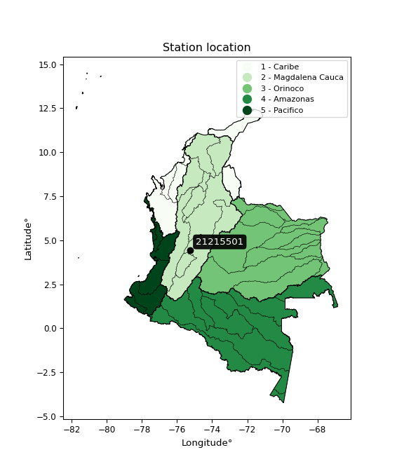

<div align="center">


</div>

# PMax24h Station (Rain, Pmax24h): 21215501

Maximum Precipitation in 24 hours (PMax24h) is the greatest amount of rainfall for a specific duration that is meteorologically possible for a given location, acting as a "worst-case" scenario for extreme storms, crucial for designing safety-critical infrastructure like bridges, river deviations, dams, spillways, and nuclear plants to prevent catastrophic failure. The PMax24h is related with the Probable Maximum Precipitation (PMP) and it is calculated by hydrologists using meteorological data to determine the upper limit of extreme rainfall, often leading to the Probable Maximum Flood (PMF) for flood control design, and is increasingly being studied for climate change impacts. Probable Maximum Precipitation (PMP) is the theoretical upper limit of rainfall, a deterministic estimate for extreme events, while probability distributions (like GEV, Gumbel) describe the likelihood and frequency of various precipitation amounts, including rare ones, showing how often events occur, with PMP representing the extreme end of these distributions, used for critical infrastructure design to ensure safety against the worst conceivable weather, unlike standard statistical forecasts which cover typical probabilities.

The most common probability distributions in hydrology, used for analyzing floods, rainfall, and streamflow, include the Normal, Log-Normal, Gumbel, Gamma (including Log-Pearson Type III), and Generalized Extreme Value (GEV) distributions, often chosen based on the data´s skewness and whether modeling extremes or general conditions, with Gumbel and GEV popular for extreme events like floods, while the Normal distribution serves as a baseline, though often requiring transformations for skewed hydrological data. These distributions help in designing water infrastructure, managing water resources, and forecasting hydrologic events.

> Hydrological data often isn´t perfectly normal (it´s skewed), so different distributions are needed for different applications, such as: **Flood Frequency Analysis**: Using Gumbel, GEV, or Log-Pearson Type III for predicting extreme flood magnitudes and their return periods, **Rainfall Analysis**: Normal for annual totals, but Log-Normal, Weibull, or GEV for intensity or extreme daily rainfall, **Streamflow Modeling**: Gamma and Log-Normal for maximum flows, GEV for minimum flows, and Kappa for daily flows.

<div align="center">

</img>

</div>


## A. General information


### 1. General running parameters

• app_version: _v20260225_. • runtime: _2026-02-27 14:50:08.749431_. • Python version: _3.14.0_. • SciPy version: _1.16.3_. • Pandas version: _2.3.3_. • NumPy version: _2.3.5_. • Stations dataset (station_dataset_file): _dataset/pmax24h_in/automatic_colombia_2003_2025.csv_. • Stations catalog (station_catalog_file): _dataset/CNE.xls_. • Minimum year to eval til year_max (date_min): _1900_. • Maximum year to eval since year_min (date_max): _2025_. • Creates, save and include plots into reports (create_plot): _False_. • Plot only fit distributions with Δo > Δ (plot_only_fit): _True_. • Plot only simple graphs avoiding multiple CDFs and multiple Extreme values plots (plot_only_simple): _False_. • Eval low extreme values, if False, evaluates high extreme values (low_extreme): _False_. • Eval every SciPy distribution as logarithmic (pdist_logarithmic_on): _True_. • Standard deviation normalized (ddof): _1.0_. • Return periods to eval in years (Tr): _[2, 2.33, 5, 10, 15, 20, 25, 50, 75, 100, 200, 250, 500, 750, 1000]_. • Minimum data sample per station, 0 means any (minimum_sample): _5_. • Z-Score maximum threshold to adjust a value, 0 means disable (zscore_max): _3.5_. • Z-Score minimum threshold to adjust a value, 0 means disable (zscore_min): _-2.5_. • Avoid zeros, e.g. rain = 0 (avoid_zeros): _True_. • Avoid null values (avoid_nans): _True_. 

:file_folder:Table: [dataset.csv](../../dataset/pmax24h_in/automatic_colombia_2003_2025.csv)

> Delta Degrees of Freedom (DDOF): is a parameter used in the formulas for calculating variance and standard deviation. When ddof=0, the divisor is $N$ (the total number of observations) and this is used when your data set is the entire population. When ddof=1, the divisor is $N-1$ and this is used when your data set is a sample drawn from a larger population. Using $N-1$ provides an unbiased estimate of the population variance (known as Bessel´s correction).


### 2. Station info and location

|   id |   CODIGO | NOMBRE                          | CATEGORIA               | TECNOLOGIA                | ESTADO   | FECHA_INSTALACION   |   FECHA_SUSPENSION |   ALTITUD |   LATITUD |   LONGITUD | DEPARTAMENTO   | MUNICIPIO   | AREA_OPERATIVA             | ENTIDAD                                    | AREA_HIDROGRAFICA   | ZONA_HIDROGRAFICA   | SUBZONA_HIDROGRAFICA   |   CORRIENTE | Catalogo   |   Version |
|-----:|---------:|:--------------------------------|:------------------------|:--------------------------|:---------|:--------------------|-------------------:|----------:|----------:|-----------:|:---------------|:------------|:---------------------------|:-------------------------------------------|:--------------------|:--------------------|:-----------------------|------------:|:-----------|----------:|
|    0 | 21215501 | ESPERANZA LA  - AUT  [21215501] | Climatológica Principal | Automática con Telemetría | Activa   | 17/10/2013          |                nan |      1446 |      4.45 |     -75.25 | Tolima         | Ibagué      | Area Operativa 10 - Tolima | CENTRO NACIONAL DE INVESTIGACIONES DE CAFE | Magdalena Cauca     | Alto Magdalena      | Río Coello             |         nan | CNE_OE     |  20251226 |

<div align="center">

Dynamic map: [:earth_americas:Google](http://maps.google.com/maps?q=4.45,-75.25) [:earth_americas:OSM](https://www.openstreetmap.org/#map=18/4.45/-75.25&layers=P) [:earth_americas:Bing](https://www.bing.com/maps?cp=4.45~-75.25&lvl=18) [:earth_americas:Apple](https://maps.apple.com/frame?center=4.45%2C-75.25&span=0.003%2C0.006)

</div>


<div align="center">

```geojson
{
  "type": "Feature",
  "geometry": {
    "type": "Point", 
    "coordinates": [-75.25, 4.45]
  }, 
  "properties": {
    "Name": "21215501"
  }
}
```

</div>


### 3. Discrete values table and plot

<div align="center">

|               |           0 |          1 |          2 |           3 |           4 |          5 |          6 |          7 |
|:--------------|------------:|-----------:|-----------:|------------:|------------:|-----------:|-----------:|-----------:|
| Date          | 2016        | 2017       | 2018       | 2019        | 2020        | 2021       | 2022       | 2023       |
| Value         |   76.1      |   86       |   76.3     |   80.8      |   60.4      |   54       |   51.5     |   57.9     |
| Value_initial |   76.1      |   86       |   76.3     |   80.8      |   60.4      |   54       |   51.5     |   57.9     |
| count         |    8        |    8       |    8       |    8        |    8        |    8       |    8       |    8       |
| mean          |   67.875    |   67.875   |   67.875   |   67.875    |   67.875    |   67.875   |   67.875   |   67.875   |
| std           |   13.3643   |   13.3643  |   13.3643  |   13.3643   |   13.3643   |   13.3643  |   13.3643  |   13.3643  |
| zscore        |    0.615445 |    1.35622 |    0.63041 |    0.967128 |   -0.559325 |   -1.03821 |   -1.22528 |   -0.74639 |


</div>


> The initial value (value_initial) correspond to the initial obtained or null completed value, and value (value) is adjusted only when the initial value is outside the valid range (outlier) definite through the Z-Score value. If Z-Score is active, values out of range or outliers are replaced with the station mean value. A Z-Score (or standard score) measures how many standard deviations a data point is from the mean of a dataset, indicating its relative position; positive scores mean above the mean, negative mean below, and a score of zero is exactly at the mean, allowing for comparison of values from different distributions. It´s calculated using the formula $z=(x–μ)/σ$, where $x$ is the data point, $μ$ is the mean, and $σ$ is the standard deviation, helping identify outliers and understand probability.
>
> <sub>**Note**: In this study, "completing" (filling gaps in) and "extending" (forecasting or lengthening the historical record) rainfall data series are avoided for certain critical analyses because they introduce artificial bias and uncertainty, which can distort the statistics of rare events (extremes), alter day-to-day variability, and compromise the integrity and homogeneity of the original data. Some reasons against Completing/Extending rainfall data are: **Distortion of Extremes and Variability**: The primary issue is that most gap-filling or extension methods rely on averaging or regression with nearby stations, which inherently smooths the data. Rainfall is highly variable in space and time, with a large percentage of zero values and occasional large storms. Infilling methods often underestimate the highest values and overestimate the lowest (zero) values, which severely distorts analyses focused on flood frequency, drought severity, and intensity-duration-frequency (IDF) curves, **Loss of Data Homogeneity**: Infilled or extended data are synthetic estimates, not actual measurements. Combining these estimates with observed data can violate the assumption of data homogeneity, which requires that the data properties do not change over time. Inhomogeneity can lead to incorrect conclusions about long-term trends or changes in climate patterns, **Propagation of Errors**: Errors and biases from the original data (e.g., wind-induced undercatch, instrument errors, site changes) or the data used for imputation can propagate through the analysis, leading to unreliable hydrological models and inaccurate predictions, **Compromised Statistical Integrity**: For statistical analyses, especially those involving the frequency of events, using artificial data can introduce time bias or autocorrelation that doesn´t exist in reality, making it difficult to assess the true probability of events, **Difficulty in Validation**: It is difficult to accurately validate the quality of filled or extended data, especially for past periods where ground-truth measurements are unavailable. The reliability of imputation techniques heavily depends on the density of the surrounding station network and the complexity of the local topography.</sub>


### 4. Active continuous probability distributions from SciPy (80 of 104 available)

A Probability Density Function (PDF) describes the relative likelihood of a continuous random variable falling within a specific range, where the total area under its curve equals 1, and the area over any interval gives the actual probability for that range. Unlike discrete probabilities (like rolling a die), a PDF shows density, not direct probability for a single point (which is zero), with higher points indicating higher likelihood, often visualized as a bell curve for normal distributions.

A log of a probability density function (log-PDF) is simply the logarithm of the PDF´s value, denoted as $log(f(x))$, useful for converting multiplication of probabilities into addition, improving numerical stability with tiny numbers, and connecting to information theory concepts like entropy. Instead of dealing with very small probabilities (e.g., 0.000001), log-PDFs use negative numbers (e.g., $log(0.00001) ≈ -11.51$ that are easier for computers to handle, preventing underflow errors and simplifying complex calculations. In this study, each active probability distribution from SciPy is also evaluated in the $log$ form.

[scipy.stats](https://docs.scipy.org/doc/scipy/reference/stats.html) is a Python´s powerful submodule within the SciPy library for comprehensive statistical analysis, offering over 130 probability distributions (like Normal, Poisson, etc.), functions for descriptive stats (mean, variance), hypothesis testing (t-tests, chi-square), random variable generation, and statistical tests, making it essential for data science, modeling, and research. It provides tools to explore, model, and draw conclusions from data efficiently, working seamlessly with [NumPy](https://numpy.org/).

<div align="center">

|   id | p_dist           |   n_parameter | fit_method   | label                                                                       | active   | ref                                                                                                      |
|-----:|:-----------------|--------------:|:-------------|:----------------------------------------------------------------------------|:---------|:---------------------------------------------------------------------------------------------------------|
|    0 | alpha            |             3 | MLE          | Alpha                                                                       | True     | [:mortar_board:](https://docs.scipy.org/doc/scipy/reference/generated/scipy.stats.alpha.html)            |
|    1 | anglit           |             2 | MM           | Anglit                                                                      | True     | [:mortar_board:](https://docs.scipy.org/doc/scipy/reference/generated/scipy.stats.anglit.html)           |
|    2 | arcsine          |             2 | MM           | Arcsine                                                                     | True     | [:mortar_board:](https://docs.scipy.org/doc/scipy/reference/generated/scipy.stats.arcsine.html)          |
|    3 | argus            |             3 | MLE          | Argus                                                                       | True     | [:mortar_board:](https://docs.scipy.org/doc/scipy/reference/generated/scipy.stats.argus.html)            |
|    4 | beta             |             4 | MLE          | Beta                                                                        | True     | [:mortar_board:](https://docs.scipy.org/doc/scipy/reference/generated/scipy.stats.beta.html)             |
|    5 | betaprime        |             4 | MLE          | Beta prime                                                                  | True     | [:mortar_board:](https://docs.scipy.org/doc/scipy/reference/generated/scipy.stats.betaprime.html)        |
|    6 | bradford         |             3 | MLE          | Bradford                                                                    | True     | [:mortar_board:](https://docs.scipy.org/doc/scipy/reference/generated/scipy.stats.bradford.html)         |
|    7 | burr             |             4 | MLE          | Burr (Type III)                                                             | True     | [:mortar_board:](https://docs.scipy.org/doc/scipy/reference/generated/scipy.stats.burr.html)             |
|    8 | burr12           |             4 | MLE          | Burr (Type III) 12                                                          | True     | [:mortar_board:](https://docs.scipy.org/doc/scipy/reference/generated/scipy.stats.burr12.html)           |
|    9 | cosine           |             2 | MLE          | Cosine                                                                      | True     | [:mortar_board:](https://docs.scipy.org/doc/scipy/reference/generated/scipy.stats.cosine.html)           |
|   10 | crystalball      |             4 | MLE          | Crystalball                                                                 | True     | [:mortar_board:](https://docs.scipy.org/doc/scipy/reference/generated/scipy.stats.crystalball.html)      |
|   11 | dgamma           |             3 | MLE          | Double gamma                                                                | True     | [:mortar_board:](https://docs.scipy.org/doc/scipy/reference/generated/scipy.stats.dgamma.html)           |
|   12 | dweibull         |             3 | MLE          | Double Weibull                                                              | True     | [:mortar_board:](https://docs.scipy.org/doc/scipy/reference/generated/scipy.stats.dweibull.html)         |
|   13 | erlang           |             3 | MLE          | Erlang                                                                      | True     | [:mortar_board:](https://docs.scipy.org/doc/scipy/reference/generated/scipy.stats.erlang.html)           |
|   14 | exponnorm        |             3 | MLE          | Exponentially modified Normal                                               | True     | [:mortar_board:](https://docs.scipy.org/doc/scipy/reference/generated/scipy.stats.exponnorm.html)        |
|   15 | exponpow         |             3 | MLE          | Exponential power                                                           | True     | [:mortar_board:](https://docs.scipy.org/doc/scipy/reference/generated/scipy.stats.exponpow.html)         |
|   16 | exponweib        |             4 | MLE          | Exponentiated Weibull                                                       | True     | [:mortar_board:](https://docs.scipy.org/doc/scipy/reference/generated/scipy.stats.exponweib.html)        |
|   17 | f                |             4 | MLE          | F                                                                           | True     | [:mortar_board:](https://docs.scipy.org/doc/scipy/reference/generated/scipy.stats.f.html)                |
|   18 | fatiguelife      |             3 | MLE          | Fatigue-life (Birnbaum-Saunders)                                            | True     | [:mortar_board:](https://docs.scipy.org/doc/scipy/reference/generated/scipy.stats.fatiguelife.html)      |
|   19 | foldnorm         |             3 | MM           | Fold Normal                                                                 | True     | [:mortar_board:](https://docs.scipy.org/doc/scipy/reference/generated/scipy.stats.foldnorm.html)         |
|   20 | gamma            |             3 | MLE          | Gamma                                                                       | True     | [:mortar_board:](https://docs.scipy.org/doc/scipy/reference/generated/scipy.stats.gamma.html)            |
|   21 | gausshyper       |             6 | MLE          | Gauss hypergeometric                                                        | True     | [:mortar_board:](https://docs.scipy.org/doc/scipy/reference/generated/scipy.stats.gausshyper.html)       |
|   22 | genexpon         |             5 | MLE          | Generalized exponential                                                     | True     | [:mortar_board:](https://docs.scipy.org/doc/scipy/reference/generated/scipy.stats.genexpon.html)         |
|   23 | genextreme       |             3 | MLE          | Generalized exponential                                                     | True     | [:mortar_board:](https://docs.scipy.org/doc/scipy/reference/generated/scipy.stats.genextreme.html)       |
|   24 | gengamma         |             4 | MLE          | Generalized gamma                                                           | True     | [:mortar_board:](https://docs.scipy.org/doc/scipy/reference/generated/scipy.stats.gengamma.html)         |
|   25 | genhalflogistic  |             3 | MLE          | Generalized half-logistic                                                   | True     | [:mortar_board:](https://docs.scipy.org/doc/scipy/reference/generated/scipy.stats.genhalflogistic.html)  |
|   26 | genlogistic      |             3 | MLE          | Generalized logistic                                                        | True     | [:mortar_board:](https://docs.scipy.org/doc/scipy/reference/generated/scipy.stats.genlogistic.html)      |
|   27 | gennorm          |             3 | MLE          | Generalized Normal                                                          | True     | [:mortar_board:](https://docs.scipy.org/doc/scipy/reference/generated/scipy.stats.gennorm.html)          |
|   28 | genpareto        |             3 | MLE          | Generalized Pareto                                                          | True     | [:mortar_board:](https://docs.scipy.org/doc/scipy/reference/generated/scipy.stats.genpareto.html)        |
|   29 | gompertz         |             3 | MLE          | Gompertz (or truncated Gumbel)                                              | True     | [:mortar_board:](https://docs.scipy.org/doc/scipy/reference/generated/scipy.stats.gompertz.html)         |
|   30 | gumbel_l         |             2 | MM           | Gumbel Left Skew                                                            | True     | [:mortar_board:](https://docs.scipy.org/doc/scipy/reference/generated/scipy.stats.gumbel_l.html)         |
|   31 | gumbel_r         |             2 | MM           | Gumbel Right Skew                                                           | True     | [:mortar_board:](https://docs.scipy.org/doc/scipy/reference/generated/scipy.stats.gumbel_r.html)         |
|   32 | halfgennorm      |             3 | MLE          | Upper half of a generalized normal                                          | True     | [:mortar_board:](https://docs.scipy.org/doc/scipy/reference/generated/scipy.stats.halfgennorm.html)      |
|   33 | halflogistic     |             2 | MM           | Half-logistic                                                               | True     | [:mortar_board:](https://docs.scipy.org/doc/scipy/reference/generated/scipy.stats.halflogistic.html)     |
|   34 | halfnorm         |             2 | MM           | Half Normal                                                                 | True     | [:mortar_board:](https://docs.scipy.org/doc/scipy/reference/generated/scipy.stats.halfnorm.html)         |
|   35 | hypsecant        |             2 | MM           | hyperbolic secant                                                           | True     | [:mortar_board:](https://docs.scipy.org/doc/scipy/reference/generated/scipy.stats.hypsecant.html)        |
|   36 | invgamma         |             3 | MLE          | Inverted gamma                                                              | True     | [:mortar_board:](https://docs.scipy.org/doc/scipy/reference/generated/scipy.stats.invgamma.html)         |
|   37 | invgauss         |             3 | MLE          | Inverse Gaussian                                                            | True     | [:mortar_board:](https://docs.scipy.org/doc/scipy/reference/generated/scipy.stats.invgauss.html)         |
|   38 | invweibull       |             3 | MLE          | Inverted Weibull                                                            | True     | [:mortar_board:](https://docs.scipy.org/doc/scipy/reference/generated/scipy.stats.invweibull.html)       |
|   39 | johnsonsb        |             4 | MLE          | Johnson SB                                                                  | True     | [:mortar_board:](https://docs.scipy.org/doc/scipy/reference/generated/scipy.stats.johnsonsb.html)        |
|   40 | johnsonsu        |             4 | MLE          | Johnson Su                                                                  | True     | [:mortar_board:](https://docs.scipy.org/doc/scipy/reference/generated/scipy.stats.johnsonsu.html)        |
|   41 | kappa3           |             3 | MLE          | Kappa 3                                                                     | True     | [:mortar_board:](https://docs.scipy.org/doc/scipy/reference/generated/scipy.stats.kappa3.html)           |
|   42 | kappa4           |             4 | MLE          | Kappa 4                                                                     | True     | [:mortar_board:](https://docs.scipy.org/doc/scipy/reference/generated/scipy.stats.kappa4.html)           |
|   43 | ksone            |             3 | MLE          | Kolmogorov-Smirnov one-sided test statistic distribution                    | True     | [:mortar_board:](https://docs.scipy.org/doc/scipy/reference/generated/scipy.stats.ksone.html)            |
|   44 | kstwobign        |             2 | MLE          | Limiting distribution of scaled Kolmogorov-Smirnov two-sided test statistic | True     | [:mortar_board:](https://docs.scipy.org/doc/scipy/reference/generated/scipy.stats.kstwobign.html)        |
|   45 | laplace          |             2 | MM           | Laplace                                                                     | True     | [:mortar_board:](https://docs.scipy.org/doc/scipy/reference/generated/scipy.stats.laplace.html)          |
|   46 | levy_l           |             2 | MLE          | Left-skewed Levy                                                            | True     | [:mortar_board:](https://docs.scipy.org/doc/scipy/reference/generated/scipy.stats.levy_l.html)           |
|   47 | loggamma         |             3 | MLE          | Log gamma                                                                   | True     | [:mortar_board:](https://docs.scipy.org/doc/scipy/reference/generated/scipy.stats.loggamma.html)         |
|   48 | logistic         |             2 | MM           | Logistic (or Sech-squared)                                                  | True     | [:mortar_board:](https://docs.scipy.org/doc/scipy/reference/generated/scipy.stats.logistic.html)         |
|   49 | loglaplace       |             3 | MLE          | Log-Laplace                                                                 | True     | [:mortar_board:](https://docs.scipy.org/doc/scipy/reference/generated/scipy.stats.loglaplace.html)       |
|   50 | lomax            |             3 | MLE          | Lomax (Pareto of the second kind)                                           | True     | [:mortar_board:](https://docs.scipy.org/doc/scipy/reference/generated/scipy.stats.lomax.html)            |
|   51 | maxwell          |             2 | MM           | Maxwell                                                                     | True     | [:mortar_board:](https://docs.scipy.org/doc/scipy/reference/generated/scipy.stats.maxwell.html)          |
|   52 | mielke           |             4 | MLE          | Mielke Beta-Kappa / Dagum                                                   | True     | [:mortar_board:](https://docs.scipy.org/doc/scipy/reference/generated/scipy.stats.mielke.html)           |
|   53 | moyal            |             2 | MM           | Moyal                                                                       | True     | [:mortar_board:](https://docs.scipy.org/doc/scipy/reference/generated/scipy.stats.moyal.html)            |
|   54 | nakagami         |             3 | MLE          | Nakagami                                                                    | True     | [:mortar_board:](https://docs.scipy.org/doc/scipy/reference/generated/scipy.stats.nakagami.html)         |
|   55 | ncf              |             5 | MLE          | Non-central F distribution                                                  | True     | [:mortar_board:](https://docs.scipy.org/doc/scipy/reference/generated/scipy.stats.ncf.html)              |
|   56 | nct              |             4 | MLE          | Non-central Student’s t                                                     | True     | [:mortar_board:](https://docs.scipy.org/doc/scipy/reference/generated/scipy.stats.nct.html)              |
|   57 | norm             |             2 | MM           | Normal                                                                      | True     | [:mortar_board:](https://docs.scipy.org/doc/scipy/reference/generated/scipy.stats.norm.html)             |
|   58 | pearson3         |             3 | MM           | Pearson type III                                                            | True     | [:mortar_board:](https://docs.scipy.org/doc/scipy/reference/generated/scipy.stats.pearson3.html)         |
|   59 | powerlaw         |             3 | MLE          | Power-function                                                              | True     | [:mortar_board:](https://docs.scipy.org/doc/scipy/reference/generated/scipy.stats.powerlaw.html)         |
|   60 | rayleigh         |             2 | MM           | Rayleigh                                                                    | True     | [:mortar_board:](https://docs.scipy.org/doc/scipy/reference/generated/scipy.stats.rayleigh.html)         |
|   61 | rdist            |             3 | MLE          | R-distributed (symmetric beta)                                              | True     | [:mortar_board:](https://docs.scipy.org/doc/scipy/reference/generated/scipy.stats.rdist.html)            |
|   62 | rice             |             3 | MLE          | Rice                                                                        | True     | [:mortar_board:](https://docs.scipy.org/doc/scipy/reference/generated/scipy.stats.rice.html)             |
|   63 | semicircular     |             2 | MM           | Semicircular                                                                | True     | [:mortar_board:](https://docs.scipy.org/doc/scipy/reference/generated/scipy.stats.semicircular.html)     |
|   64 | skewnorm         |             3 | MLE          | Skew normal                                                                 | True     | [:mortar_board:](https://docs.scipy.org/doc/scipy/reference/generated/scipy.stats.skewnorm.html)         |
|   65 | t                |             3 | MLE          | Student’s t                                                                 | True     | [:mortar_board:](https://docs.scipy.org/doc/scipy/reference/generated/scipy.stats.t.html)                |
|   66 | trapezoid        |             4 | MLE          | Trapezoid                                                                   | True     | [:mortar_board:](https://docs.scipy.org/doc/scipy/reference/generated/scipy.stats.trapezoid.html)        |
|   67 | triang           |             3 | MLE          | Triangular                                                                  | True     | [:mortar_board:](https://docs.scipy.org/doc/scipy/reference/generated/scipy.stats.triang.html)           |
|   68 | truncexpon       |             3 | MLE          | Truncated exponential                                                       | True     | [:mortar_board:](https://docs.scipy.org/doc/scipy/reference/generated/scipy.stats.truncexpon.html)       |
|   69 | truncnorm        |             4 | MLE          | Truncated normal                                                            | True     | [:mortar_board:](https://docs.scipy.org/doc/scipy/reference/generated/scipy.stats.truncnorm.html)        |
|   70 | truncpareto      |             4 | MLE          | Upper truncated Pareto                                                      | True     | [:mortar_board:](https://docs.scipy.org/doc/scipy/reference/generated/scipy.stats.truncpareto.html)      |
|   71 | truncweibull_min |             5 | MLE          | Doubly truncated Weibull minimum                                            | True     | [:mortar_board:](https://docs.scipy.org/doc/scipy/reference/generated/scipy.stats.truncweibull_min.html) |
|   72 | tukeylambda      |             3 | MLE          | Tukey-Lamdba                                                                | True     | [:mortar_board:](https://docs.scipy.org/doc/scipy/reference/generated/scipy.stats.tukeylambda.html)      |
|   73 | uniform          |             2 | MLE          | Uniform                                                                     | True     | [:mortar_board:](https://docs.scipy.org/doc/scipy/reference/generated/scipy.stats.uniform.html)          |
|   74 | vonmises         |             3 | MLE          | Von Mises                                                                   | True     | [:mortar_board:](https://docs.scipy.org/doc/scipy/reference/generated/scipy.stats.vonmises.html)         |
|   75 | vonmises_line    |             3 | MLE          | Von Mises line                                                              | True     | [:mortar_board:](https://docs.scipy.org/doc/scipy/reference/generated/scipy.stats.vonmises_line.html)    |
|   76 | wald             |             2 | MM           | Wald                                                                        | True     | [:mortar_board:](https://docs.scipy.org/doc/scipy/reference/generated/scipy.stats.wald.html)             |
|   77 | weibull_max      |             3 | MLE          | Weibull maximum                                                             | True     | [:mortar_board:](https://docs.scipy.org/doc/scipy/reference/generated/scipy.stats.weibull_max.html)      |
|   78 | weibull_min      |             3 | MLE          | Weibull minimum                                                             | True     | [:mortar_board:](https://docs.scipy.org/doc/scipy/reference/generated/scipy.stats.weibull_min.html)      |
|   79 | wrapcauchy       |             3 | MLE          | Wrapped  Cauchy                                                             | True     | [:mortar_board:](https://docs.scipy.org/doc/scipy/reference/generated/scipy.stats.wrapcauchy.html)       |

</div>

> **n_parameter:** # arguments & localization & scale.
>
> **Fit methods:** (MLE) maximum likelihood, (MM) L-moments.
>
>**Inactive** (With the only purpose of prevent loops, zero divisions, infinite values, over high estimated values or horizontal trending for recurrence intervals estimations, the follow distributions were disabled.)**:** lognorm, norminvgauss, powernorm, powerlognorm, cauchy, halfcauchy, foldcauchy, skewcauchy, chi2, expon, fisk, genhyperbolic, geninvgauss, gibrat, kstwo, laplace_asymmetric, levy, levy_stable, ncx2, pareto, rel_breitwigner, recipinvgauss, studentized_range, loguniform, 


## B. Probability (PDF) vs. Empirical (EDF) distributions functions

A continuous probability distribution (CPD) describes probabilities for variables that can take any value within a range (like rain any time), unlike discrete variables with specific outcomes (like temperature). It uses a Probability Density Function (PDF), a curve where the total area under it equals 1, and the probability of the variable falling within an interval (a to b) is found by calculating the area under the curve between those points. A key feature is that the probability of hitting any single exact value is zero, so probabilities are always expressed for ranges, e.g., $P(a ≤ X ≤ b)$.

<div align="center">

Distributions parameters from station values
|     |   station | p_dist              |   n |             loc |          scale | shape                  | shape1                 | shape2                | shape3             |
|----:|----------:|:--------------------|----:|----------------:|---------------:|:-----------------------|:-----------------------|:----------------------|:-------------------|
|   0 |  21215501 | alpha               |   8 |   -94.1655      | 2081.68        | 12.929902231714028     |                        |                       |                    |
|   1 |  21215501 | anglit              |   8 |    67.875       |   36.5709      |                        |                        |                       |                    |
|   2 |  21215501 | arcsine             |   8 |    50.1957      |   35.3586      |                        |                        |                       |                    |
|   3 |  21215501 | argus               |   8 |    41.6716      |   46.3753      | 4.262893639962758e-05  |                        |                       |                    |
|   4 |  21215501 | beta                |   8 |    51.4572      |   34.5428      | 0.3553108771192114     | 0.339794495983969      |                       |                    |
|   5 |  21215501 | betaprime           |   8 |    -3.44195     |    1.85994     | 1224.113109098154      | 32.912020087739236     |                       |                    |
|   6 |  21215501 | bradford            |   8 |    51.4999      |   34.5002      | 1.1017909531189698     |                        |                       |                    |
|   7 |  21215501 | burr                |   8 |   -72.3907      |   58.3059      | 12.978844338170617     | 46719.93425163263      |                       |                    |
|   8 |  21215501 | burr12              |   8 |    -0.83706     |   52.1953      | 1394.354538908446      | 0.0027786307710674866  |                       |                    |
|   9 |  21215501 | cosine              |   8 |    67.9994      |    9.8817      |                        |                        |                       |                    |
|  10 |  21215501 | crystalball         |   8 |    67.875       |   12.5012      | 5381.306417325658      | 5.398182642266664      |                       |                    |
|  11 |  21215501 | dgamma              |   8 |    67.7995      |    1.16334     | 10.250690619235598     |                        |                       |                    |
|  12 |  21215501 | dweibull            |   8 |    67.9489      |   13.293       | 3.511482588558679      |                        |                       |                    |
|  13 |  21215501 | erlang              |   8 |  -351           |    0.372875    | 1123.3323093967201     |                        |                       |                    |
|  14 |  21215501 | exponnorm           |   8 |    67.4834      |   12.495       | 0.03134054475528673    |                        |                       |                    |
|  15 |  21215501 | exponpow            |   8 |    51.5         |   37.8653      | 0.7895507589677766     |                        |                       |                    |
|  16 |  21215501 | exponweib           |   8 |    51.5         |    1.45172     | 1.066519597940594      | 0.27305756879797133    |                       |                    |
|  17 |  21215501 | f                   |   8 |    -4.74206     |   72.372       | 75.18907967861486      | 586.6067270396788      |                       |                    |
|  18 |  21215501 | fatiguelife         |   8 |    51.5         |    6.47515e-06 | 1526.57467312561       |                        |                       |                    |
|  19 |  21215501 | foldnorm            |   8 |    34.856       |   12.5923      | 2.6193972504628        |                        |                       |                    |
|  20 |  21215501 | gamma               |   8 |  -349.147       |    0.374164    | 1114.5461744168151     |                        |                       |                    |
|  21 |  21215501 | gausshyper          |   8 |    51.5         |   35.9479      | 0.9353272003882158     | 0.9763605282984484     | 1.0622114547182315    | 1.112354400137229  |
|  22 |  21215501 | genexpon            |   8 |    51.5         |    2.46997     | 0.10948534468899272    | 0.5360055185398244     | 0.015330375035768189  |                    |
|  23 |  21215501 | genextreme          |   8 |    64.3845      |   24.2572      | 1.1222133254921784     |                        |                       |                    |
|  24 |  21215501 | gengamma            |   8 |    51.5         |    1.45423     | 1.0652686605260404     | 0.2693953358490389     |                       |                    |
|  25 |  21215501 | genhalflogistic     |   8 |    51.238       |   36.4509      | 1.0485843258493035     |                        |                       |                    |
|  26 |  21215501 | genlogistic         |   8 |    -9.17325     |   10.6828      | 761.9608518160114      |                        |                       |                    |
|  27 |  21215501 | gennorm             |   8 |    68.75        |   17.25        | 12775907.92227837      |                        |                       |                    |
|  28 |  21215501 | genpareto           |   8 |    -1.21534     |  193.563       | -2.2193642922241326    |                        |                       |                    |
|  29 |  21215501 | gompertz            |   8 |    51.5         |   24.3704      | 0.8180530481596453     |                        |                       |                    |
|  30 |  21215501 | gumbel_l            |   8 |    73.5012      |    9.74713     |                        |                        |                       |                    |
|  31 |  21215501 | gumbel_r            |   8 |    62.2488      |    9.74713     |                        |                        |                       |                    |
|  32 |  21215501 | halfgennorm         |   8 |    51.5         |    1.43899     | 0.41916430654968706    |                        |                       |                    |
|  33 |  21215501 | halflogistic        |   8 |    53.0582      |   10.688       |                        |                        |                       |                    |
|  34 |  21215501 | halfnorm            |   8 |    51.3283      |   20.7382      |                        |                        |                       |                    |
|  35 |  21215501 | hypsecant           |   8 |    67.875       |    7.9585      |                        |                        |                       |                    |
|  36 |  21215501 | invgamma            |   8 |    -5.89838     | 2461.38        | 34.35220146808506      |                        |                       |                    |
|  37 |  21215501 | invgauss            |   8 |    44.3637      |   51.8938      | 0.4530644447224994     |                        |                       |                    |
|  38 |  21215501 | invweibull          |   8 |    -3.98506e+08 |    3.98506e+08 | 37297380.23861476      |                        |                       |                    |
|  39 |  21215501 | johnsonsb           |   8 |    51.4999      |   34.5001      | 0.8636608388287956     | 0.09343647892608489    |                       |                    |
|  40 |  21215501 | johnsonsu           |   8 |     1.28354e+08 |    1.6463e+06  | 51658919.59263264      | 10230607.724714428     |                       |                    |
|  41 |  21215501 | kappa3              |   8 |    51.4685      |   34.5565      | 89674.64211029791      |                        |                       |                    |
|  42 |  21215501 | kappa4              |   8 |    49.6121      |   41.0333      | 1.0457672619262581     | 1.1276636600475647     |                       |                    |
|  43 |  21215501 | ksone               |   8 |    46.2223      |   43.3053      | 1.0                    |                        |                       |                    |
|  44 |  21215501 | kstwobign           |   8 |    25.4452      |   48.3361      |                        |                        |                       |                    |
|  45 |  21215501 | laplace             |   8 |    67.875       |    8.83967     |                        |                        |                       |                    |
|  46 |  21215501 | levy_l              |   8 |    87.5874      |    7.40146     |                        |                        |                       |                    |
|  47 |  21215501 | loggamma            |   8 | -2159.34        |  338.082       | 726.6679896942464      |                        |                       |                    |
|  48 |  21215501 | logistic            |   8 |    67.875       |    6.89226     |                        |                        |                       |                    |
|  49 |  21215501 | loglaplace          |   8 |    -0.179968    |   60.58        | 5.638091707170815      |                        |                       |                    |
|  50 |  21215501 | lomax               |   8 |    51.5         | 2860.21        | 175.17076228601326     |                        |                       |                    |
|  51 |  21215501 | maxwell             |   8 |    38.2525      |   18.5632      |                        |                        |                       |                    |
|  52 |  21215501 | mielke              |   8 |    -5.99754     |   25.2111      | 4316.490806344834      | 6.642323552317292      |                       |                    |
|  53 |  21215501 | moyal               |   8 |    60.726       |    5.62751     |                        |                        |                       |                    |
|  54 |  21215501 | nakagami            |   8 |    51.5         |   28.5217      | 0.2158937430567071     |                        |                       |                    |
|  55 |  21215501 | ncf                 |   8 |    -1.3185      |   59.7348      | 67.90195847819342      | 420.42598642608436     | 10.409588501968848    |                    |
|  56 |  21215501 | nct                 |   8 |    -0.162613    |    3.64638     | 16.42301088288761      | 17.802280043254243     |                       |                    |
|  57 |  21215501 | norm                |   8 |    67.875       |   12.5012      |                        |                        |                       |                    |
|  58 |  21215501 | pearson3            |   8 |    67.875       |   12.5011      | 0.0510102560710365     |                        |                       |                    |
|  59 |  21215501 | powerlaw            |   8 |    51.5         |   34.5         | 0.1877281403912449     |                        |                       |                    |
|  60 |  21215501 | rayleigh            |   8 |    43.9595      |   19.0818      |                        |                        |                       |                    |
|  61 |  21215501 | rdist               |   8 |    55.95        |    4.45004     | 1.5178336609038472     |                        |                       |                    |
|  62 |  21215501 | rice                |   8 |    45.1166      |   15.7057      | 0.8563356299502491     |                        |                       |                    |
|  63 |  21215501 | semicircular        |   8 |    67.875       |   25.0023      |                        |                        |                       |                    |
|  64 |  21215501 | skewnorm            |   8 |    66.0628      |   12.6318      | 0.18278402234403393    |                        |                       |                    |
|  65 |  21215501 | t                   |   8 |    67.8751      |   12.5016      | 72299326.70020515      |                        |                       |                    |
|  66 |  21215501 | trapezoid           |   8 |    48.05        |   41.4         | 0.9999999999999999     | 1.0                    |                       |                    |
|  67 |  21215501 | triang              |   8 |    38.5477      |   47.4523      | 0.9999997525009807     |                        |                       |                    |
|  68 |  21215501 | truncexpon          |   8 |    51.5         |   36.5262      | 0.944528233147522      |                        |                       |                    |
|  69 |  21215501 | truncnorm           |   8 |    20.534       |   78.0371      | -2945.626828211509     | 0.8389081930562394     |                       |                    |
|  70 |  21215501 | truncpareto         |   8 |    51.4952      |    0.00474139  | 2.046389938689153e-10  | 7461.080618210743      |                       |                    |
|  71 |  21215501 | truncweibull_min    |   8 |    51.4709      |   33.0694      | 0.9344185428977222     | 0.0008787228280982364  | 1.0441391706122491    |                    |
|  72 |  21215501 | tukeylambda         |   8 |    68.7501      |   20.0409      | 1.1617852166487017     |                        |                       |                    |
|  73 |  21215501 | uniform             |   8 |    51.5         |   34.5         |                        |                        |                       |                    |
|  74 |  21215501 | vonmises            |   8 |     0.640701    |    1           | 0.18670734483532042    |                        |                       |                    |
|  75 |  21215501 | vonmises_line       |   8 |    68.7513      |    5.49127     | 9.317750112103866e-06  |                        |                       |                    |
|  76 |  21215501 | wald                |   8 |    55.3738      |   12.5012      |                        |                        |                       |                    |
|  77 |  21215501 | weibull_max         |   8 |    86           |    1.39839     | 0.2589959463264899     |                        |                       |                    |
|  78 |  21215501 | weibull_min         |   8 |    51.5         |   10.2475      | 0.5766737991412083     |                        |                       |                    |
|  79 |  21215501 | wrapcauchy          |   8 |    51.5         |    5.49085     | 0.5                    |                        |                       |                    |
|  80 |  21215501 | logalpha            |   8 |    -2.71355     |  255.276       | 36.94830383476048      |                        |                       |                    |
|  81 |  21215501 | loganglit           |   8 |     4.20041     |    0.545522    |                        |                        |                       |                    |
|  82 |  21215501 | logarcsine          |   8 |     3.9367      |    0.527439    |                        |                        |                       |                    |
|  83 |  21215501 | logargus            |   8 |     3.79974     |    0.683534    | 0.7214462597919076     |                        |                       |                    |
|  84 |  21215501 | logbeta             |   8 |     3.94158     |    0.539809    | 0.3270052377162386     | 0.34641077885356264    |                       |                    |
|  85 |  21215501 | logbetaprime        |   8 |     0.677207    |    1.42351     | 861.4443732766031      | 349.03908335516695     |                       |                    |
|  86 |  21215501 | logbradford         |   8 |     3.94158     |    0.512772    | 1.1586356747047843     |                        |                       |                    |
|  87 |  21215501 | logburr             |   8 |    -8.06282     |   10.9943      | 74.61664327044997      | 1943.1779308559785     |                       |                    |
|  88 |  21215501 | logburr12           |   8 |    -0.732654    |    5.94554     | 31.08336836767114      | 190.65180755295614     |                       |                    |
|  89 |  21215501 | logcosine           |   8 |     4.19911     |    0.147194    |                        |                        |                       |                    |
|  90 |  21215501 | logcrystalball      |   8 |     4.20041     |    0.186478    | 7.566650739356234      | 277.4392349350179      |                       |                    |
|  91 |  21215501 | logdgamma           |   8 |     4.20481     |    0.0178776   | 9.94801818328867       |                        |                       |                    |
|  92 |  21215501 | logdweibull         |   8 |     4.2003      |    0.198216    | 3.54416749975558       |                        |                       |                    |
|  93 |  21215501 | logerlang           |   8 |    -4.49793     |    0.00400459  | 2172.0962218522272     |                        |                       |                    |
|  94 |  21215501 | logexponnorm        |   8 |     4.20021     |    0.186478    | 0.0011059914734439895  |                        |                       |                    |
|  95 |  21215501 | logexponpow         |   8 |     3.94158     |    0.496348    | 0.551617859325749      |                        |                       |                    |
|  96 |  21215501 | logexponweib        |   8 |     3.94158     |    0.285049    | 0.7421959320027924     | 1.2787693805180806     |                       |                    |
|  97 |  21215501 | logf                |   8 |   -12.3512      |   16.5501      | 33742.618382466826     | 29526.971290572263     |                       |                    |
|  98 |  21215501 | logfatiguelife      |   8 |     3.76916     |    0.383555    | 0.49750473147487106    |                        |                       |                    |
|  99 |  21215501 | logfoldnorm         |   8 |     3.93058     |    0.231579    | 0.9981955888202585     |                        |                       |                    |
| 100 |  21215501 | loggamma            |   8 |    -4.44972     |    0.00402543  | 2148.8675340346053     |                        |                       |                    |
| 101 |  21215501 | loggausshyper       |   8 |     3.93961     |    0.514737    | 1.032261642725068      | 0.929058701761257      | 0.9932397767024985    | 1.1141388818562246 |
| 102 |  21215501 | loggenexpon         |   8 |     3.94135     |    0.0222901   | 0.05406183568374559    | 4.258132165128421      | 0.0008421258457983636 |                    |
| 103 |  21215501 | loggenextreme       |   8 |     4.21922     |    0.25976     | 1.1047664000265796     |                        |                       |                    |
| 104 |  21215501 | loggengamma         |   8 |     3.94158     |    1.09816     | 0.36611680823820114    | 1.2720936380734953     |                       |                    |
| 105 |  21215501 | loggenhalflogistic  |   8 |     3.78699     |    0.669047    | 1.0025252901173496     |                        |                       |                    |
| 106 |  21215501 | loggenlogistic      |   8 |     3.10554     |    0.163822    | 453.7728691324735      |                        |                       |                    |
| 107 |  21215501 | loggennorm          |   8 |     4.19796     |    0.256383    | 13860824.250013135     |                        |                       |                    |
| 108 |  21215501 | loggenpareto        |   8 |    -0.0153013   |   17.0179      | -3.8074435138667333    |                        |                       |                    |
| 109 |  21215501 | loggompertz         |   8 |     3.94158     |    0.302119    | 0.5497636736498439     |                        |                       |                    |
| 110 |  21215501 | loggumbel_l         |   8 |     4.28434     |    0.145396    |                        |                        |                       |                    |
| 111 |  21215501 | loggumbel_r         |   8 |     4.11649     |    0.145396    |                        |                        |                       |                    |
| 112 |  21215501 | loghalfgennorm      |   8 |     3.94158     |    0.354215    | 1.3607672539986415     |                        |                       |                    |
| 113 |  21215501 | loghalflogistic     |   8 |     3.97941     |    0.159423    |                        |                        |                       |                    |
| 114 |  21215501 | loghalfnorm         |   8 |     3.95358     |    0.309357    |                        |                        |                       |                    |
| 115 |  21215501 | loghypsecant        |   8 |     4.20041     |    0.118715    |                        |                        |                       |                    |
| 116 |  21215501 | loginvgamma         |   8 |     1.68529     |  448.883       | 179.54490394628795     |                        |                       |                    |
| 117 |  21215501 | loginvgauss         |   8 |     3.53888     |    7.2972      | 0.09064742407910731    |                        |                       |                    |
| 118 |  21215501 | loginvweibull       |   8 |    -6.9051e+06  |    6.90511e+06 | 42155086.10143693      |                        |                       |                    |
| 119 |  21215501 | logjohnsonsb        |   8 |     3.94034     |    0.514008    | 0.17557298527481663    | 0.16050023583098286    |                       |                    |
| 120 |  21215501 | logjohnsonsu        |   8 |     4.65273     |    0.00722238  | 10.529879553272252     | 2.2239598499186144     |                       |                    |
| 121 |  21215501 | logkappa3           |   8 |     3.94158     |    0.512598    | 6339.124448727747      |                        |                       |                    |
| 122 |  21215501 | logkappa4           |   8 |     3.86257     |    0.647271    | 1.1399844273451003     | 1.0927177056894273     |                       |                    |
| 123 |  21215501 | logksone            |   8 |     3.87743     |    0.645978    | 1.0                    |                        |                       |                    |
| 124 |  21215501 | logkstwobign        |   8 |     3.54996     |    0.740815    |                        |                        |                       |                    |
| 125 |  21215501 | loglaplace          |   8 |     4.20041     |    0.13186     |                        |                        |                       |                    |
| 126 |  21215501 | loglevy_l           |   8 |     4.47485     |    0.0952581   |                        |                        |                       |                    |
| 127 |  21215501 | logloggamma         |   8 |     2.63473     |    0.638873    | 12.092857285493553     |                        |                       |                    |
| 128 |  21215501 | loglogistic         |   8 |     4.20041     |    0.102811    |                        |                        |                       |                    |
| 129 |  21215501 | logloglaplace       |   8 |    -0.0134029   |    4.2872      | 23.66497249020494      |                        |                       |                    |
| 130 |  21215501 | loglomax            |   8 |     3.94158     |  149.674       | 578.8454499115344      |                        |                       |                    |
| 131 |  21215501 | logmaxwell          |   8 |     3.75854     |    0.276903    |                        |                        |                       |                    |
| 132 |  21215501 | logmielke           |   8 |    -6.62431e+06 |    6.62431e+06 | 1453885646.3729284     | 40780782.887931824     |                       |                    |
| 133 |  21215501 | logmoyal            |   8 |     4.09377     |    0.0839445   |                        |                        |                       |                    |
| 134 |  21215501 | lognakagami         |   8 |     3.94158     |    0.369022    | 0.3616560122854445     |                        |                       |                    |
| 135 |  21215501 | logncf              |   8 |    -0.252655    |    7.37282e-07 | 5.278406333467301e-05  | 938.3461038199664      | 317.96705320734594    |                    |
| 136 |  21215501 | lognct              |   8 |    -4.87576     |    0.122087    | 2042.2757237080386     | 74.31309562359823      |                       |                    |
| 137 |  21215501 | lognorm             |   8 |     4.20041     |    0.186478    |                        |                        |                       |                    |
| 138 |  21215501 | logpearson3         |   8 |     4.20041     |    0.186478    | -0.04839551529575896   |                        |                       |                    |
| 139 |  21215501 | logpowerlaw         |   8 |     3.94158     |    0.512765    | 0.1981350133623683     |                        |                       |                    |
| 140 |  21215501 | lograyleigh         |   8 |     3.84367     |    0.28464     |                        |                        |                       |                    |
| 141 |  21215501 | logrdist            |   8 |     4.20122     |    0.259642    | 1.047838530149435      |                        |                       |                    |
| 142 |  21215501 | logrice             |   8 |     3.84952     |    0.229412    | 1.000069528032925      |                        |                       |                    |
| 143 |  21215501 | logsemicircular     |   8 |     4.20041     |    0.372955    |                        |                        |                       |                    |
| 144 |  21215501 | logskewnorm         |   8 |     4.2259      |    0.188211    | -0.17222578862617355   |                        |                       |                    |
| 145 |  21215501 | logt                |   8 |     4.20042     |    0.18648     | 168514833.36573052     |                        |                       |                    |
| 146 |  21215501 | logtrapezoid        |   8 |     3.67298     |    0.791158    | 1.0                    | 1.0                    |                       |                    |
| 147 |  21215501 | logtriang           |   8 |     3.67855     |    0.775803    | 0.9999941712857099     |                        |                       |                    |
| 148 |  21215501 | logtruncexpon       |   8 |     3.94157     |    0.494923    | 1.036104573223101      |                        |                       |                    |
| 149 |  21215501 | logtruncnorm        |   8 |    -0.0591121   |    1.04238     | 3.8380495198010642     | 4.329976338812951      |                       |                    |
| 150 |  21215501 | logtruncpareto      |   8 |     3.9415      |    7.88128e-05 | 9.46428962349161e-09   | 6527.014682450366      |                       |                    |
| 151 |  21215501 | logtruncweibull_min |   8 |     3.94158     |    0.537341    | 0.6923978723298378     | 1.6255697260349212e-15 | 0.9573308895427975    |                    |
| 152 |  21215501 | logtukeylambda      |   8 |     4.19709     |    0.280937    | 1.0920633758038596     |                        |                       |                    |
| 153 |  21215501 | loguniform          |   8 |     3.94158     |    0.512765    |                        |                        |                       |                    |
| 154 |  21215501 | logvonmises         |   8 |    -2.08272     |    1           | 29.127197204615776     |                        |                       |                    |
| 155 |  21215501 | logvonmises_line    |   8 |     4.19661     |    0.0820411   | 0.00015315791368300746 |                        |                       |                    |
| 156 |  21215501 | logwald             |   8 |     4.01394     |    0.186476    |                        |                        |                       |                    |
| 157 |  21215501 | logweibull_max      |   8 |     4.45435     |    0.237229    | 0.701242516498968      |                        |                       |                    |
| 158 |  21215501 | logweibull_min      |   8 |     3.94158     |    0.218888    | 0.8806148038426116     |                        |                       |                    |
| 159 |  21215501 | logwrapcauchy       |   8 |     3.94158     |    0.0816092   | 0.3642402517291082     |                        |                       |                    |

</div>

> **loc** (Location parameter): This shifts the distribution along the x-axis. For many common distributions, like the normal (Gaussian) distribution, loc represents the mean $μ$. For others, like the uniform distribution, it might represent the minimum value, or for the beta distribution, the left end of the support interval.
>
> **scale** (Scale parameter): This determines the width or spread of the distribution. For the normal distribution, scale represents the standard deviation $σ$. For a uniform distribution, it defines the length of the interval (from $loc$ to $loc + scale$).
>
> **shape** (Shape parameters): Refers to parameters that define the specific form of a probability distribution, distinct from its location (loc) and scale (scale). These parameters are required arguments for most distribution functions. For example, a normal (Gaussian) distribution is fully defined by its location (mean) and scale (standard deviation), so it has no specific shape parameters beyond loc and scale. However, other distributions have intrinsic properties that need specification, as Gamma distribution that takes a shape parameter, often named $a$ or $alpha$.


### 0. Cumulative distribution values - CDF (160 evaluated)

Cumulative Distribution Function (CDF), denoted as $F$<sub>$X$</sub>$(x)$, is a function that gives the probability that a random variable $X$ will take a value less than or equal to a specific value, $x$ (i.e., $(P(X≥x)$. It essentially "accumulates" probabilities from a given point up to the far right (positive infinity), providing a complete picture of the distribution´s probabilities for both discrete (like rain) and continuous (like temperature) variables, helping to find probabilities over ranges or above certain values. Each station is evaluated separately ordering the $x$ values ascending, calculating the CDF and PDF values for the activated distributions and their logarithmic forms.

<div align="center">

CDF ordered by x ascending and calculating $log(f(x))$ separately
|   id |   Station |   date |    x |   count |   mean |     std |    zscore |   Value_initial |   station |   m |     alpha |   alpha_pdf |   anglit |   anglit_pdf |   arcsine |   arcsine_pdf |     argus |   argus_pdf |      beta |    beta_pdf |   betaprime |   betaprime_pdf |    bradford |   bradford_pdf |      burr |   burr_pdf |    burr12 |   burr12_pdf |    cosine |   cosine_pdf |   crystalball |   crystalball_pdf |    dgamma |   dgamma_pdf |   dweibull |   dweibull_pdf |    erlang |   erlang_pdf |   exponnorm |   exponnorm_pdf |    exponpow |   exponpow_pdf |   exponweib |   exponweib_pdf |         f |     f_pdf |   fatiguelife |   fatiguelife_pdf |   foldnorm |   foldnorm_pdf |     gamma |   gamma_pdf |   gausshyper |   gausshyper_pdf |    genexpon |   genexpon_pdf |   genextreme |   genextreme_pdf |    gengamma |   gengamma_pdf |   genhalflogistic |   genhalflogistic_pdf |   genlogistic |   genlogistic_pdf |     gennorm |   gennorm_pdf |   genpareto |   genpareto_pdf |    gompertz |   gompertz_pdf |   gumbel_l |   gumbel_l_pdf |   gumbel_r |   gumbel_r_pdf |   halfgennorm |   halfgennorm_pdf |   halflogistic |   halflogistic_pdf |   halfnorm |   halfnorm_pdf |   hypsecant |   hypsecant_pdf |   invgamma |   invgamma_pdf |   invgauss |   invgauss_pdf |   invweibull |   invweibull_pdf |   johnsonsb |   johnsonsb_pdf |   johnsonsu |   johnsonsu_pdf |      kappa3 |   kappa3_pdf |     kappa4 |   kappa4_pdf |    ksone |   ksone_pdf |   kstwobign |   kstwobign_pdf |   laplace |   laplace_pdf |   levy_l |   levy_l_pdf |   loggamma |   loggamma_pdf |   logistic |   logistic_pdf |   loglaplace |   loglaplace_pdf |       lomax |   lomax_pdf |   maxwell |   maxwell_pdf |   mielke |   mielke_pdf |     moyal |   moyal_pdf |    nakagami |   nakagami_pdf |      ncf |   ncf_pdf |       nct |    nct_pdf |      norm |   norm_pdf |   pearson3 |   pearson3_pdf |   powerlaw |   powerlaw_pdf |   rayleigh |   rayleigh_pdf |       rdist |   rdist_pdf |      rice |   rice_pdf |   semicircular |   semicircular_pdf |   skewnorm |   skewnorm_pdf |         t |     t_pdf |   trapezoid |   trapezoid_pdf |    triang |   triang_pdf |   truncexpon |   truncexpon_pdf |   truncnorm |   truncnorm_pdf |   truncpareto |   truncpareto_pdf |   truncweibull_min |   truncweibull_min_pdf |   tukeylambda |   tukeylambda_pdf |   uniform |   uniform_pdf |   vonmises |   vonmises_pdf |   vonmises_line |   vonmises_line_pdf |      wald |   wald_pdf |   weibull_max |   weibull_max_pdf |   weibull_min |   weibull_min_pdf |   wrapcauchy |   wrapcauchy_pdf |   logalpha |   logalpha_pdf |   loganglit |   loganglit_pdf |   logarcsine |   logarcsine_pdf |   logargus |   logargus_pdf |     logbeta |   logbeta_pdf |   logbetaprime |   logbetaprime_pdf |   logbradford |   logbradford_pdf |   logburr |   logburr_pdf |   logburr12 |   logburr12_pdf |   logcosine |   logcosine_pdf |   logcrystalball |   logcrystalball_pdf |   logdgamma |   logdgamma_pdf |   logdweibull |   logdweibull_pdf |   logerlang |   logerlang_pdf |   logexponnorm |   logexponnorm_pdf |   logexponpow |   logexponpow_pdf |   logexponweib |   logexponweib_pdf |      logf |   logf_pdf |   logfatiguelife |   logfatiguelife_pdf |   logfoldnorm |   logfoldnorm_pdf |   loggausshyper |   loggausshyper_pdf |   loggenexpon |   loggenexpon_pdf |   loggenextreme |   loggenextreme_pdf |   loggengamma |   loggengamma_pdf |   loggenhalflogistic |   loggenhalflogistic_pdf |   loggenlogistic |   loggenlogistic_pdf |   loggennorm |   loggennorm_pdf |   loggenpareto |   loggenpareto_pdf |   loggompertz |   loggompertz_pdf |   loggumbel_l |   loggumbel_l_pdf |   loggumbel_r |   loggumbel_r_pdf |   loghalfgennorm |   loghalfgennorm_pdf |   loghalflogistic |   loghalflogistic_pdf |   loghalfnorm |   loghalfnorm_pdf |   loghypsecant |   loghypsecant_pdf |   loginvgamma |   loginvgamma_pdf |   loginvgauss |   loginvgauss_pdf |   loginvweibull |   loginvweibull_pdf |   logjohnsonsb |   logjohnsonsb_pdf |   logjohnsonsu |   logjohnsonsu_pdf |   logkappa3 |   logkappa3_pdf |   logkappa4 |   logkappa4_pdf |   logksone |   logksone_pdf |   logkstwobign |   logkstwobign_pdf |   loglevy_l |   loglevy_l_pdf |   logloggamma |   logloggamma_pdf |   loglogistic |   loglogistic_pdf |   logloglaplace |   logloglaplace_pdf |    loglomax |   loglomax_pdf |   logmaxwell |   logmaxwell_pdf |   logmielke |   logmielke_pdf |   logmoyal |   logmoyal_pdf |   lognakagami |   lognakagami_pdf |   logncf |   logncf_pdf |    lognct |   lognct_pdf |   lognorm |   lognorm_pdf |   logpearson3 |   logpearson3_pdf |   logpowerlaw |   logpowerlaw_pdf |   lograyleigh |   lograyleigh_pdf |    logrdist |   logrdist_pdf |   logrice |   logrice_pdf |   logsemicircular |   logsemicircular_pdf |   logskewnorm |   logskewnorm_pdf |      logt |   logt_pdf |   logtrapezoid |   logtrapezoid_pdf |   logtriang |   logtriang_pdf |   logtruncexpon |   logtruncexpon_pdf |   logtruncnorm |   logtruncnorm_pdf |   logtruncpareto |   logtruncpareto_pdf |   logtruncweibull_min |   logtruncweibull_min_pdf |   logtukeylambda |   logtukeylambda_pdf |   loguniform |   loguniform_pdf |   logvonmises |   logvonmises_pdf |   logvonmises_line |   logvonmises_line_pdf |   logwald |   logwald_pdf |   logweibull_max |   logweibull_max_pdf |   logweibull_min |   logweibull_min_pdf |   logwrapcauchy |   logwrapcauchy_pdf |
|-----:|----------:|-------:|-----:|--------:|-------:|--------:|----------:|----------------:|----------:|----:|----------:|------------:|---------:|-------------:|----------:|--------------:|----------:|------------:|----------:|------------:|------------:|----------------:|------------:|---------------:|----------:|-----------:|----------:|-------------:|----------:|-------------:|--------------:|------------------:|----------:|-------------:|-----------:|---------------:|----------:|-------------:|------------:|----------------:|------------:|---------------:|------------:|----------------:|----------:|----------:|--------------:|------------------:|-----------:|---------------:|----------:|------------:|-------------:|-----------------:|------------:|---------------:|-------------:|-----------------:|------------:|---------------:|------------------:|----------------------:|--------------:|------------------:|------------:|--------------:|------------:|----------------:|------------:|---------------:|-----------:|---------------:|-----------:|---------------:|--------------:|------------------:|---------------:|-------------------:|-----------:|---------------:|------------:|----------------:|-----------:|---------------:|-----------:|---------------:|-------------:|-----------------:|------------:|----------------:|------------:|----------------:|------------:|-------------:|-----------:|-------------:|---------:|------------:|------------:|----------------:|----------:|--------------:|---------:|-------------:|-----------:|---------------:|-----------:|---------------:|-------------:|-----------------:|------------:|------------:|----------:|--------------:|---------:|-------------:|----------:|------------:|------------:|---------------:|---------:|----------:|----------:|-----------:|----------:|-----------:|-----------:|---------------:|-----------:|---------------:|-----------:|---------------:|------------:|------------:|----------:|-----------:|---------------:|-------------------:|-----------:|---------------:|----------:|----------:|------------:|----------------:|----------:|-------------:|-------------:|-----------------:|------------:|----------------:|--------------:|------------------:|-------------------:|-----------------------:|--------------:|------------------:|----------:|--------------:|-----------:|---------------:|----------------:|--------------------:|----------:|-----------:|--------------:|------------------:|--------------:|------------------:|-------------:|-----------------:|-----------:|---------------:|------------:|----------------:|-------------:|-----------------:|-----------:|---------------:|------------:|--------------:|---------------:|-------------------:|--------------:|------------------:|----------:|--------------:|------------:|----------------:|------------:|----------------:|-----------------:|---------------------:|------------:|----------------:|--------------:|------------------:|------------:|----------------:|---------------:|-------------------:|--------------:|------------------:|---------------:|-------------------:|----------:|-----------:|-----------------:|---------------------:|--------------:|------------------:|----------------:|--------------------:|--------------:|------------------:|----------------:|--------------------:|--------------:|------------------:|---------------------:|-------------------------:|-----------------:|---------------------:|-------------:|-----------------:|---------------:|-------------------:|--------------:|------------------:|--------------:|------------------:|--------------:|------------------:|-----------------:|---------------------:|------------------:|----------------------:|--------------:|------------------:|---------------:|-------------------:|--------------:|------------------:|--------------:|------------------:|----------------:|--------------------:|---------------:|-------------------:|---------------:|-------------------:|------------:|----------------:|------------:|----------------:|-----------:|---------------:|---------------:|-------------------:|------------:|----------------:|--------------:|------------------:|--------------:|------------------:|----------------:|--------------------:|------------:|---------------:|-------------:|-----------------:|------------:|----------------:|-----------:|---------------:|--------------:|------------------:|---------:|-------------:|----------:|-------------:|----------:|--------------:|--------------:|------------------:|--------------:|------------------:|--------------:|------------------:|------------:|---------------:|----------:|--------------:|------------------:|----------------------:|--------------:|------------------:|----------:|-----------:|---------------:|-------------------:|------------:|----------------:|----------------:|--------------------:|---------------:|-------------------:|-----------------:|---------------------:|----------------------:|--------------------------:|-----------------:|---------------------:|-------------:|-----------------:|--------------:|------------------:|-------------------:|-----------------------:|----------:|--------------:|-----------------:|---------------------:|-----------------:|---------------------:|----------------:|--------------------:|
|    0 |  21215501 |   2022 | 51.5 |       8 | 67.875 | 13.3643 | -1.22528  |            51.5 |  21215501 |   1 | 0.0867687 |  0.0155035  | 0.109733 |    0.0170932 |  0.123036 |     0.0477608 | 0.0666102 |   0.0133983 | 0.0517607 | 0.430451    |   0.0795741 |      0.0164081  | 4.68369e-06 |      0.0429942 | 0.0715488 | 0.0197679  | 0.0105127 |   0.0716165  | 0.0758833 |    0.0145158 |     0.0951188 |         0.0135327 | 0.0618235 |    0.0222669 |  0.0604475 |      0.0272645 | 0.0939642 |    0.0137769 |   0.0951174 |       0.0135329 | 3.82834e-13 |     42.5403    | 6.80002e-05 |     2.78687e+09 | 0.0864846 | 0.015138  |     0.0496867 |       8.26379e+10 |  0.0971644 |      0.0136641 | 0.0936555 |   0.013752  |  5.77132e-15 |        0.379874  | 5.09254e-08 |     0.0443266  |     0.219403 |       0.00859586 | 7.59339e-05 |    3.06666e+09 |        0.00360702 |             0.0138211 |     0.0744371 |        0.0180705  | 5.54318e-07 |     0.0289855 |    0.341557 |     0.00859945  | 8.43855e-13 |      0.0335676 |  0.0993543 |     0.00966916 |  0.0491691 |     0.0151964  |   3.83495e-11 |        0.236673   |      0         |         0          | 0.00660427 |     0.0384729  |   0.0809005 |      0.0100562  |  0.0799103 |     0.0163406  |  0.0483403 |     0.0258401  |    0.0743176 |       0.0180804  |    0.385493 |   241.264       |    0.095934 |       0.0135681 | 0.000911889 |    0.0289345 | 0.00323754 |    0.0318738 | 0.121871 |   0.0230918 |   0.0665987 |      0.0191503  | 0.0784265 |    0.00887212 | 0.349363 |   0.00451854 |  0.0816762 |       0.825838 |  0.0850326 |     0.0112883  |    0.0702223 |         0.532553 | 1.00088e-14 |  0.0612441  | 0.0831544 |     0.0169692 |      nan |          nan | 0.023215  |   0.0122399 | 1.43826e-07 |    8.74011e+06 | 0.087698 | 0.0153518 | 0.0767707 | 0.0170913  | 0.0951187 |  0.0135327 |  0.0940476 |      0.0137279 | 0.00113567 |    3.00049e+10 |  0.0751078 |      0.0191537 | 6.18367e-13 | 474.937     | 0.0557678 |  0.017017  |       0.115155 |          0.0192415 |  0.0950911 |      0.0135373 | 0.0951256 | 0.0135329 |  0.00694444 |      0.00402576 | 0.0745041 |    0.0115044 |  2.88119e-09 |        0.0447979 |    0.818586 |      0.00591208 |   0.000885753 |       23.4652     |        2.27879e-08 |              0.0693413 |   7.10543e-15 |         0.0496427 | 0         |     0.0289855 |    8.61172 |       0.184183 |     7.38814e-07 |           0.028983  | 0         | 0          |      0.100874 |        0.00173709 |   1.81212e-09 |   147071          |     0        |        0.0869565 |  0.0793572 |       0.851643 |   0.0936016 |         1.06787 |    0.0613707 |          6.29928 |  0.0577634 |       0.810014 | 6.81191e-06 |   5.01595e+09 |       0.120442 |           0.977929 |   4.97345e-06 |           2.93647 | 0.0636874 |      1.08935  |    0.102167 |        0.643273 |   0.0649308 |        0.889003 |         0.082567 |             0.816457 |   0.0385165 |        0.987802 |     0.0382433 |           1.34672 |   0.0816998 |        0.825773 |      0.0825675 |           0.81646  |   5.00127e-09 |       6.21224e+06 |    8.83664e-15 |          18.8855   | 0.0820644 |   0.825652 |        0.0494399 |             1.28809  |     0.0230406 |          2.0935   |      0.00448337 |             2.34252 |   0.000561428 |          2.42568  |        0.131945 |            0.471745 |   7.61445e-08 |       7.98559e+07 |             0.130673 |                  0.95604 |        0.0640003 |             1.07066  |  4.66274e-07 |          1.9502  |       0.433732 |         0.290048   |   2.44099e-09 |           1.81969 |     0.0903227 |          0.592278 |     0.0357926 |          0.81976  |       1.0665e-07 |             3.08301  |         0         |              0        |     0         |          0        |      0.0716403 |           0.598381 |     0.0772874 |          0.89015  |     0.0621897 |          1.05391  |       0.0637567 |            1.07142  |       0.214442 |       37.7853      |       0.111419 |           0.593432 | 3.00052e-09 |         1.94816 | 1.01054e-14 |       142.342   |   0.099316 |        1.54804 |      0.0573694 |           1.14692  |    0.327446 |        0.289167 |     0.0888831 |          0.757086 |     0.0746355 |          0.67177  |       0.0741332 |            0.443582 | 2.28353e-11 |       3.86736  |    0.0674937 |         1.01197  |   0.0654311 |        1.05741  |  0.0132987 |       0.5492   |     1.257e-11 |      20473.5      | 0.328084 |     0.694817 | 0.0821575 |     0.83419  |  0.082567 |      0.816457 |     0.0836683 |          0.806682 |    0.00103658 |        4.6248e+11 |     0.0574446 |          1.13905  | 2.83841e-09 |    2.57944e+07 | 0.0478575 |      1.01863  |         0.0967969 |               1.22896 |     0.0825915 |          0.816217 | 0.0825677 |   0.816454 |       0.115267 |            0.85826 |    0.114952 |        0.874056 |     2.46697e-05 |             3.13173 |    3.00065e-05 |           4.43971  |       2.9381e-08 |          1444.53     |           1.07694e-12 |              73097.3      |       0.00399854 |              2.22315 |    0         |          1.95021 |       1.08269 |          0.812116 |         0.00526101 |                1.93964 |  0        |      0        |         0.179624 |             0.421751 |       2.1205e-13 |           210.244    |     9.63304e-07 |             4.18484 |
|    1 |  21215501 |   2021 | 54   |       8 | 67.875 | 13.3643 | -1.03821  |            54   |  21215501 |   2 | 0.1314    |  0.0202088  | 0.155975 |    0.0198426 |  0.212758 |     0.0290524 | 0.10411   |   0.0165782 | 0.223901  | 0.0324776   |   0.12736   |      0.0217896  | 0.103415    |      0.0398154 | 0.13068   | 0.0273078  | 0.174108  |   0.0583517  | 0.117257  |    0.0185782 |     0.133522  |         0.017237  | 0.140119  |    0.0409285 |  0.152983  |      0.0456088 | 0.133128  |    0.0175979 |   0.133521  |       0.0172374 | 0.116701    |      0.036681  | 0.66955     |     0.0413136   | 0.129977  | 0.0196686 |     0.658007  |       0.0298946   |  0.135843  |      0.0173234 | 0.132759  |   0.0175748 |  0.117212    |        0.0421426 | 0.108637    |     0.0424894  |     0.242077 |       0.00956219 | 0.659661    |    0.0409562   |        0.0394556  |             0.0148778 |     0.127902  |        0.0245886  | 0.5         |     0.0289855 |    0.3635   |     0.00896231  | 0.0845818   |      0.0340479 |  0.126493  |     0.0121197  |  0.0972022 |     0.0232453  |   0.253363    |        0.0671029  |      0.0440285 |         0.0466906  | 0.102506   |     0.0381563  |   0.110243  |      0.013577   |  0.127467  |     0.0216774  |  0.129583  |     0.0376133  |    0.127823  |       0.0246099  |    0.734164 |     0.0132186   |    0.134401 |       0.0172516 | 0.073248    |    0.0289345 | 0.0752639  |    0.0278354 | 0.179601 |   0.0230918 |   0.123717  |      0.0262995  | 0.104061  |    0.0117721  | 0.361237 |   0.00499404 |  0.128157  |       1.14118  |  0.117831  |     0.0150817  |    0.1006    |         0.762935 | 0.141907    |  0.0525072  | 0.131427  |     0.0215843 |      nan |          nan | 0.0691015 |   0.0246958 | 0.274562    |    0.0473564   | 0.131724 | 0.0198746 | 0.126923  | 0.0229707  | 0.133522  |  0.017237  |  0.133063  |      0.0175288 | 0.61096    |    0.0458777   |  0.129279  |      0.0240102 | 0.312664    |   0.0994775 | 0.105401  |  0.0225354 |       0.16579  |          0.0211818 |  0.133509  |      0.0172442 | 0.133529  | 0.017237  |  0.0206554  |      0.00694299 | 0.106041  |    0.0137249 |  0.108248    |        0.0418343 |    0.83327  |      0.0058344  |   0.703073    |        0.0447703  |        0.131902    |              0.0473236 |   0.0797049   |         0.0302261 | 0.0724638 |     0.0289855 |    8.99375 |       0.130933 |     0.0724583   |           0.028983  | 0         | 0          |      0.105438 |        0.00191978 |   0.358077    |        0.0656384  |     0.19333  |        0.0617813 |  0.127533  |       1.18621  |   0.150088  |         1.30942 |    0.203915  |          2.01944 |  0.102374  |       1.0709   | 0.267283    |   1.92953     |       0.172704 |           1.22618  |   0.132239    |           2.65238 | 0.128405  |      1.63092  |    0.137102 |        0.83733  |   0.11528   |        1.23565  |         0.128437 |             1.12495  |   0.115591  |        2.36926  |     0.142584  |           3.00039 |   0.128175  |        1.14097  |      0.128437  |           1.12495  |   0.27013     |       3.05725     |    0.175558    |           3.34079  | 0.128511  |   1.13994  |        0.128514  |             1.99384  |     0.122265  |          2.09258  |      0.118939   |             2.37593 |   0.116366    |          2.44664  |        0.156433 |            0.564469 |   0.258815    |       2.50893     |             0.17789  |                  1.03781 |        0.127483  |             1.59924  |  0.5         |          1.95021 |       0.447976 |         0.311553   |   0.0891641   |           1.939   |     0.122917  |          0.791167 |     0.0903947 |          1.49433  |       0.142213   |             2.88964  |         0.0300246 |              3.13348  |     0.0911052 |          2.56234  |      0.106255  |           0.878507 |     0.127927  |          1.25049  |     0.124346  |          1.55971  |       0.127327  |            1.60206  |       0.425877 |        1.42872     |       0.143299 |           0.75758  | 0.0923469   |         1.94816 | 0.114869    |         2.1346  |   0.172697 |        1.54804 |      0.126103  |           1.73076  |    0.342077 |        0.329616 |     0.130925  |          1.02362  |     0.113396  |          0.977893 |       0.0982792 |            0.581097 | 0.167476    |       3.21866  |    0.125053  |         1.41153  |   0.127954  |        1.57378  |  0.0619448 |       1.55358  |     0.175998  |          2.6738   | 0.361529 |     0.715399 | 0.129086  |     1.15143  |  0.128437 |      1.12495  |     0.12889   |          1.10754  |    0.623885   |        2.60776    |     0.122178  |          1.57441  | 0.187948    |    2.14082     | 0.106976  |      1.46232  |         0.159487  |               1.40616 |     0.128446  |          1.12454  | 0.128437  |   1.12494  |       0.15954  |            1.00972 |    0.160118 |        1.03157  |     0.141588    |             2.8457  |    0.193076    |           3.72482  |       0.728737   |             2.39774  |           0.273527    |                  3.635    |       0.100737   |              1.97773 |    0.0924443 |          1.95021 |       1.12834 |          1.12029  |         0.0972054  |                1.9397  |  0        |      0        |         0.201093 |             0.486042 |       0.228915   |             3.72383  |     0.18152     |             3.23008 |
|    2 |  21215501 |   2023 | 57.9 |       8 | 67.875 | 13.3643 | -0.74639  |            57.9 |  21215501 |   3 | 0.223787  |  0.0269163  | 0.240571 |    0.0233754 |  0.309178 |     0.0218073 | 0.177939  |   0.0212059 | 0.31841   | 0.0194332   |   0.22697   |      0.0288717  | 0.250374    |      0.035698  | 0.253667  | 0.0346617  | 0.367123  |   0.0417456  | 0.201553  |    0.0245075 |     0.212457  |         0.0232116 | 0.340803  |    0.0541439 |  0.343848  |      0.0449866 | 0.213715  |    0.0236755 |   0.212458  |       0.023212  | 0.243101    |      0.0293336 | 0.763801    |     0.0149787   | 0.219929  | 0.0262484 |     0.742557  |       0.0164191   |  0.214936  |      0.0232017 | 0.213269  |   0.0236602 |  0.267445    |        0.0355314 | 0.267223    |     0.0386744  |     0.282698 |       0.0113259  | 0.753565    |    0.015011    |        0.101102   |             0.0167957 |     0.239766  |        0.0320222  | 0.5         |     0.0289855 |    0.399703 |     0.00962567  | 0.217829    |      0.0341408 |  0.182722  |     0.0169186  |  0.209652  |     0.0336038  |   0.444088    |        0.0365064  |      0.222708  |         0.044461   | 0.248671   |     0.0365902  |   0.177068  |      0.0211191  |  0.226579  |     0.0287406  |  0.287095  |     0.0408671  |    0.239783  |       0.0320476  |    0.765905 |     0.00549641  |    0.213308 |       0.0231807 | 0.186092    |    0.0289345 | 0.182097   |    0.0271285 | 0.269659 |   0.0230918 |   0.241899  |      0.0333392  | 0.161769  |    0.0183004  | 0.382441 |   0.00592341 |  0.224743  |       1.62396  |  0.190421  |     0.0223673  |    0.170716  |         1.29468  | 0.323974    |  0.0413101  | 0.22781   |     0.0275006 |      nan |          nan | 0.198643  |   0.0398882 | 0.411344    |    0.027505    | 0.222311 | 0.0263505 | 0.231854  | 0.0302858  | 0.212457  |  0.0232116 |  0.213339  |      0.0235888 | 0.728871   |    0.0213796   |  0.234221  |      0.0293186 | 0.687328    |   0.099477  | 0.206855  |  0.0290177 |       0.252921 |          0.0233482 |  0.212478  |      0.0232211 | 0.212463  | 0.0232112 |  0.0566072  |      0.0114939  | 0.166323  |    0.0171889 |  0.262993    |        0.0375977 |    0.855773 |      0.00570356 |   0.808355    |        0.0175087  |        0.299329    |              0.0392475 |   0.194289    |         0.028796  | 0.185507  |     0.0289855 |    9.63309 |       0.181762 |     0.185492    |           0.0289832 | 0.0656321 | 0.0726975  |      0.113589 |        0.00227728 |   0.533392    |        0.0320486  |     0.35097  |        0.0254027 |  0.227846  |       1.6812   |   0.25178   |         1.59127 |    0.319443  |          1.43113 |  0.189944  |       1.4362   | 0.367906    |   1.1598      |       0.269948 |           1.5488   |   0.305165    |           2.32192 | 0.263212  |      2.16197  |    0.207476 |        1.19481  |   0.218397  |        1.7069   |         0.223669 |             1.60289  |   0.344519  |        3.56561  |     0.369121  |           2.80412 |   0.224739  |        1.62354  |      0.223669  |           1.60289  |   0.43432     |       1.8855      |    0.382933    |           2.63176  | 0.224975  |   1.6219   |        0.285366  |             2.38154  |     0.267824  |          2.07739  |      0.277702   |             2.17786 |   0.284157    |          2.34121  |        0.201572 |            0.738631 |   0.390311    |       1.48716     |             0.255014 |                  1.17864 |        0.260076  |             2.13492  |  0.5         |          1.95021 |       0.471018 |         0.35117    |   0.229235    |           2.06681 |     0.190931  |          1.17898  |     0.225853  |          2.31121  |       0.329459   |             2.46962  |         0.243732  |              2.94999  |     0.266028  |          2.43445  |      0.187375  |           1.48876  |     0.233412  |          1.75848  |     0.253509  |          2.08415  |       0.260162  |            2.13852  |       0.492785 |        0.702627    |       0.206457 |           1.06815  | 0.228198    |         1.94816 | 0.255457    |         1.93508 |   0.280647 |        1.54804 |      0.266842  |           2.21948  |    0.367667 |        0.409072 |     0.217569  |          1.46623  |     0.201292  |          1.56379  |       0.147906  |            0.859548 | 0.364173    |       2.45705  |    0.241032  |         1.88159  |   0.258764  |        2.11317  |  0.217869  |       2.74093  |     0.33589   |          2.01924  | 0.412191 |     0.735569 | 0.226376  |     1.63291  |  0.223669 |      1.60289  |     0.22264   |          1.57938  |    0.746363   |        1.26247    |     0.24828   |          1.99524  | 0.309533    |    1.50174     | 0.22695   |      1.93899  |         0.26408   |               1.57896 |     0.223643  |          1.60235  | 0.223668  |   1.60287  |       0.23772  |            1.23254 |    0.240132 |        1.2633   |     0.326682    |             2.47171 |    0.421661    |           2.86617  |       0.831618   |             0.971273 |           0.473585    |                  2.34014  |       0.236384   |              1.92288 |    0.228439  |          1.95021 |       1.22332 |          1.60062  |         0.232474   |                1.93991 |  0.102534 |      5.46347  |         0.238974 |             0.606305 |       0.438202   |             2.43535  |     0.343914    |             1.6354  |
|    3 |  21215501 |   2020 | 60.4 |       8 | 67.875 | 13.3643 | -0.559325 |            60.4 |  21215501 |   4 | 0.295272  |  0.0300771  | 0.301248 |    0.025091  |  0.361044 |     0.0198679 | 0.234371  |   0.0238994 | 0.363247  | 0.0167285   |   0.303059  |      0.0317413  | 0.336785    |      0.0334787 | 0.342369  | 0.0358673  | 0.461502  |   0.0340701  | 0.266921  |    0.0276795 |     0.274939  |         0.0266883 | 0.452233  |    0.0314378 |  0.435933  |      0.027805  | 0.277349  |    0.0271339 |   0.274941  |       0.0266888 | 0.313018    |      0.026722  | 0.794687    |     0.0102586   | 0.289799  | 0.0294736 |     0.778751  |       0.0128165   |  0.277304  |      0.0266075 | 0.276874  |   0.0271261 |  0.352493    |        0.0326132 | 0.360381    |     0.0358116  |     0.312636 |       0.0126531  | 0.784592    |    0.0103314   |        0.144852   |             0.0182355 |     0.322925  |        0.034143   | 0.5         |     0.0289855 |    0.424384 |     0.0101313   | 0.30274     |      0.0337223 |  0.229544  |     0.0206126  |  0.298538  |     0.0370253  |   0.52345     |        0.0276716  |      0.33056   |         0.0416695  | 0.338206   |     0.0349638  |   0.23724   |      0.0271255  |  0.302367  |     0.0316351  |  0.386115  |     0.038      |    0.323001  |       0.0341636  |    0.777847 |     0.00421259  |    0.275673 |       0.0266256 | 0.258429    |    0.0289345 | 0.249754   |    0.0270226 | 0.327388 |   0.0230918 |   0.327586  |      0.0348453  | 0.214646  |    0.0242821  | 0.398166 |   0.00668191 |  0.298885  |       1.87451  |  0.252646  |     0.0273954  |    0.235234  |         1.78397  | 0.419709    |  0.0354291  | 0.299956  |     0.0300285 |      nan |          nan | 0.303296  |   0.0429611 | 0.473438    |    0.022575    | 0.292302 | 0.0294644 | 0.311212  | 0.0328953  | 0.274939  |  0.0266883 |  0.276758  |      0.0270504 | 0.775417   |    0.0163559   |  0.310066  |      0.0311518 | 0.999886    |   1.12568   | 0.282887  |  0.0315933 |       0.312543 |          0.0242978 |  0.274983  |      0.0266977 | 0.274944  | 0.0266876 |  0.0889884  |      0.0144111  | 0.21207   |    0.0194094 |  0.353843    |        0.0351105 |    0.869921 |      0.00561386 |   0.84531     |        0.0125932  |        0.392665    |              0.0355373 |   0.265714    |         0.028379  | 0.257971  |     0.0289855 |   10.009   |       0.130964 |     0.25795     |           0.0289833 | 0.27268   | 0.0802463  |      0.119636 |        0.00256996 |   0.602244    |        0.0237601  |     0.402273 |        0.0167216 |  0.304278  |       1.9235   |   0.321752  |         1.71267 |    0.376951  |          1.30317 |  0.255054  |       1.64195  | 0.413419    |   1.0098      |       0.338581 |           1.68968  |   0.399787    |           2.15887 | 0.357177  |      2.25513  |    0.263227 |        1.44616  |   0.295505  |        1.93107  |         0.296956 |             1.85589  |   0.463099  |        1.78494  |     0.458633  |           1.41341 |   0.298861  |        1.87402  |      0.296956  |           1.85589  |   0.506628    |       1.55707     |    0.486207    |           2.26083  | 0.299033  |   1.87274  |        0.385349  |             2.32218  |     0.355083  |          2.04748  |      0.367394   |             2.06766 |   0.380574    |          2.21386  |        0.235536 |            0.872383 |   0.447266    |       1.22679     |             0.306904 |                  1.27849 |        0.353161  |             2.24122  |  0.5         |          1.95021 |       0.486487 |         0.381683   |   0.31753     |           2.10488 |     0.24675   |          1.46799  |     0.328736  |          2.51533  |       0.428153   |             2.20011  |         0.363849  |              2.7211   |     0.366275  |          2.30239  |      0.260025  |           1.95472  |     0.31288   |          1.98712  |     0.344774  |          2.20875  |       0.353386  |            2.24411  |       0.519563 |        0.579079    |       0.256359 |           1.29781  | 0.31055     |         1.94816 | 0.336005    |         1.88016 |   0.346085 |        1.54804 |      0.362414  |           2.27548  |    0.38628  |        0.4742   |     0.285181  |          1.72871  |     0.275464  |          1.94127  |       0.188853  |            1.08624  | 0.459985    |       2.08621  |    0.324508  |         2.05131  |   0.351133  |        2.22948  |  0.338093  |       2.87734  |     0.416358  |          1.79754  | 0.44343  |     0.741687 | 0.300824  |     1.87972  |  0.296956 |      1.85589  |     0.294958  |          1.83439  |    0.793349   |        0.986092   |     0.335432  |          2.11066  | 0.36987     |    1.36725     | 0.312746  |      2.10365  |         0.332317  |               1.64519 |     0.296908  |          1.85541  | 0.296954  |   1.85587  |       0.292676 |            1.3676  |    0.296503 |        1.40377  |     0.426828    |             2.26936 |    0.533583    |           2.43989  |       0.866677   |             0.713838 |           0.563941    |                  1.95933  |       0.317334   |              1.9084  |    0.310878  |          1.95021 |       1.29656 |          1.85619  |         0.31448    |                1.94006 |  0.335079 |      4.94693  |         0.266507 |             0.699374 |       0.530628   |             1.96121  |     0.402914    |             1.20426 |
|    4 |  21215501 |   2016 | 76.1 |       8 | 67.875 | 13.3643 |  0.615445 |            76.1 |  21215501 |   5 | 0.759227  |  0.0223617  | 0.717398 |    0.0246242 |  0.654029 |     0.0203399 | 0.699274  |   0.0321752 | 0.597279  | 0.0162951   |   0.76322   |      0.021003   | 0.780527    |      0.0240781 | 0.777759  | 0.017086   | 0.777593  |   0.0112     | 0.746809  |    0.0270967 |     0.744711  |         0.0257016 | 0.580938  |    0.0419494 |  0.582169  |      0.0323158 | 0.746915  |    0.0252623 |   0.744713  |       0.0257011 | 0.645425    |      0.01649   | 0.878189    |     0.00291616  | 0.755507  | 0.0230392 |     0.899164  |       0.00458215  |  0.744065  |      0.0255493 | 0.74666   |   0.0252869 |  0.770061    |        0.0221243 | 0.771909    |     0.0171194  |     0.607345 |       0.0272601  | 0.869432    |    0.00299508  |        0.536265   |             0.0343137 |     0.77095   |        0.0187698  | 0.5         |     0.0289855 |    0.624836 |     0.0170749   | 0.7599      |      0.0221156 |  0.728976  |     0.0363015  |  0.785481  |     0.0194582  |   0.768693    |        0.0088455  |      0.792428  |         0.0174054  | 0.767716   |     0.0188512  |   0.782403  |      0.0252612  |  0.762901  |     0.0210965  |  0.782481  |     0.0145439  |    0.771057  |       0.0187625  |    0.828616 |     0.00336691  |    0.74394  |       0.0256479 | 0.7127      |    0.0289345 | 0.682142   |    0.0287387 | 0.68993  |   0.0230918 |   0.777918  |      0.0191802  | 0.802815  |    0.0223069  | 0.577845 |   0.0201987  |  0.760876  |       1.64597  |  0.767343  |     0.0259027  |    0.815745  |         1.39736  | 0.776906    |  0.0135467  | 0.754989  |     0.0223561 |      nan |          nan | 0.79862   |   0.0175076 | 0.716982    |    0.0110184   | 0.753994 | 0.0227727 | 0.767247  | 0.0199607  | 0.744711  |  0.0257016 |  0.746266  |      0.0253366 | 0.938482   |    0.00716176  |  0.757929  |      0.0213677 | 1           |   0         | 0.756367  |  0.0230233 |       0.705587 |          0.0240452 |  0.744754  |      0.0256922 | 0.744701  | 0.0257012 |  0.459055   |      0.0327312  | 0.626266  |    0.0333543 |  0.801905    |        0.0228436 |    0.953133 |      0.00496405 |   0.959283    |        0.00455764 |        0.821929    |              0.0208835 |   0.70596     |         0.0282616 | 0.713043  |     0.0289855 |   12.5116  |       0.190098 |     0.712991    |           0.0289833 | 0.839383  | 0.0131193  |      0.19011  |        0.00825677 |   0.809287    |        0.00740788 |     0.582071 |        0.0146874 |  0.763119  |       1.58725  |   0.732041  |         1.62375 |    0.666352  |          1.39293 |  0.729145  |       2.25722  | 0.627411    |   1.01808     |       0.729629 |           1.41845  |   0.821969    |           1.56006 | 0.776553  |      1.18214  |    0.727672 |        2.1666   |   0.76873   |        1.75069  |         0.759873 |             1.66756  |   0.593143  |        2.97303  |     0.604754  |           2.49977 |   0.760787  |        1.6461   |      0.759874  |           1.66756  |   0.753736    |       0.731865    |    0.828306    |           0.869872 | 0.761242  |   1.64845  |        0.781056  |             1.07387  |     0.765812  |          1.35578  |      0.793087   |             1.67732 |   0.775913    |          1.17072  |        0.57499  |            2.35509  |   0.648131    |       0.633342    |             0.689129 |                  2.14139 |        0.775519  |             1.20313  |  0.5         |          1.95021 |       0.611378 |         0.834586   |   0.765959    |           1.55089 |     0.750518  |          2.38227  |     0.796876  |          1.24443  |       0.784767   |             0.98425  |         0.802639  |              1.1158   |     0.778818  |          1.22033  |      0.797108  |           1.59566  |     0.767784  |          1.51631  |     0.775823  |          1.27133  |       0.775843  |            1.20214  |       0.641475 |        0.643354    |       0.709518 |           2.37514  | 0.760689    |         1.94816 | 0.758551    |         1.83518 |   0.703774 |        1.54804 |      0.78501   |           1.22091  |    0.585917 |        1.63454  |     0.752218  |          1.81552  |     0.782509  |          1.65536  |       0.6367    |            1.9785   | 0.778672    |       0.853729 |    0.768162  |         1.44727  |   0.774776  |        1.21279  |  0.808858  |       1.11647  |     0.732345  |          1.00112  | 0.611984 |     0.696032 | 0.760902  |     1.63139  |  0.759873 |      1.66756  |     0.758622  |          1.69159  |    0.947444   |        0.480763   |     0.770519  |          1.38328  | 0.673202    |    1.45558     | 0.76801   |      1.49294  |         0.719937  |               1.59711 |     0.759847  |          1.6681   | 0.759868  |   1.66756  |       0.693968 |            2.10589 |    0.709561 |        2.17158  |     0.845802    |             1.42282 |    0.905348    |           0.982868 |       0.968637   |             0.291508 |           0.887924    |                  1.02684  |       0.757039   |              1.92139 |    0.761491  |          1.95021 |       1.76007 |          1.66654  |         0.762768   |                1.93992 |  0.847023 |      0.829724 |         0.533456 |             1.92205  |       0.810765   |             0.710488 |     0.647823    |             1.56601 |
|    5 |  21215501 |   2018 | 76.3 |       8 | 67.875 | 13.3643 |  0.63041  |            76.3 |  21215501 |   6 | 0.763671  |  0.0220829  | 0.722309 |    0.0244927 |  0.658111 |     0.0204796 | 0.705705  |   0.0321298 | 0.600551  | 0.0164303   |   0.767393  |      0.0207292  | 0.785334    |      0.0239922 | 0.781151  | 0.0168407  | 0.779819  |   0.0110592  | 0.752204  |    0.0268562 |     0.749824  |         0.0254292 | 0.589537  |    0.0440267 |  0.588781  |      0.0338008 | 0.75194   |    0.0249876 |   0.749826  |       0.0254288 | 0.648712    |      0.0163839 | 0.878769    |     0.0028853   | 0.760088  | 0.0227623 |     0.900076  |       0.0045335   |  0.749148  |      0.0252813 | 0.75169   |   0.025012  |  0.774477    |        0.0220397 | 0.775312    |     0.0169159  |     0.612828 |       0.0275674  | 0.870028    |    0.00296394  |        0.543161   |             0.0346553 |     0.774678  |        0.0185109  | 0.5         |     0.0289855 |    0.62827  |     0.0172674   | 0.7643      |      0.0218892 |  0.736213  |     0.0360646  |  0.789342  |     0.0191567  |   0.770453    |        0.0087472  |      0.795883  |         0.0171486  | 0.771465   |     0.0186344  |   0.787406  |      0.0247707  |  0.767093  |     0.0208223  |  0.78537   |     0.0143461  |    0.774784  |       0.0185036  |    0.829292 |     0.00340001  |    0.749043 |       0.0253781 | 0.718486    |    0.0289345 | 0.687895   |    0.0287941 | 0.694549 |   0.0230918 |   0.781729  |      0.0189295  | 0.807226  |    0.0218078  | 0.581927 |   0.0206199  |  0.765175  |       1.62932  |  0.772483  |     0.0255     |    0.819376  |         1.36982  | 0.779599    |  0.0133822  | 0.759434  |     0.0221009 |      nan |          nan | 0.802092  |   0.0172188 | 0.719178    |    0.0109391   | 0.758521 | 0.0225014 | 0.771212  | 0.0196906  | 0.749824  |  0.0254292 |  0.751306  |      0.0250625 | 0.939909   |    0.00711481  |  0.762178  |      0.0211232 | 1           |   0         | 0.760944  |  0.0227537 |       0.710389 |          0.0239733 |  0.749865  |      0.0254198 | 0.749814  | 0.0254288 |  0.465625   |      0.0329646  | 0.632954  |    0.0335319 |  0.806462    |        0.0227189 |    0.954125 |      0.00495499 |   0.960191    |        0.00452089 |        0.826093    |              0.0207526 |   0.711614    |         0.0282833 | 0.718841  |     0.0289855 |   12.5495  |       0.188965 |     0.718788    |           0.0289833 | 0.841982  | 0.0128656  |      0.191781 |        0.00845628 |   0.810761    |        0.0073255  |     0.585044 |        0.0150493 |  0.767264  |       1.57067  |   0.736292  |         1.61549 |    0.67002   |          1.40233 |  0.735066  |       2.25452  | 0.630093    |   1.02532     |       0.733337 |           1.40748  |   0.826057    |           1.55516 | 0.779637  |      1.16799  |    0.733343 |        2.15457  |   0.773305  |        1.73544  |         0.764228 |             1.65091  |   0.60109   |        3.08166  |     0.611426  |           2.58406 |   0.765086  |        1.62945  |      0.764229  |           1.65091  |   0.75565     |       0.726352    |    0.830576    |           0.85954  | 0.765547  |   1.63177  |        0.783858  |             1.06144  |     0.769355  |          1.34353  |      0.797486   |             1.67515 |   0.778971    |          1.15887  |        0.581211 |            2.38548  |   0.649788    |       0.629631    |             0.694768 |                  2.15583 |        0.778658  |             1.18881  |  0.5         |          1.95021 |       0.613586 |         0.848044   |   0.770012    |           1.53734 |     0.756748  |          2.36509  |     0.80012   |          1.22714  |       0.787337   |             0.974012 |         0.805549  |              1.10113  |     0.782005  |          1.20769  |      0.801259  |           1.56743  |     0.771742  |          1.49982  |     0.779141  |          1.25658  |       0.778979  |            1.18781  |       0.643174 |        0.652004    |       0.715746 |           2.3703   | 0.765803    |         1.94816 | 0.76337     |         1.83691 |   0.707837 |        1.54804 |      0.788196  |           1.20706  |    0.590254 |        1.6702   |     0.756962  |          1.79928  |     0.786823  |          1.63147  |       0.641855  |            1.94925  | 0.780901    |       0.845114 |    0.77194   |         1.43209  |   0.77794   |        1.19836  |  0.811767  |       1.10014  |     0.734963  |          0.993818 | 0.613809 |     0.694824 | 0.765162  |     1.61487  |  0.764228 |      1.65091  |     0.76304   |          1.67498  |    0.948703   |        0.478187   |     0.774131  |          1.36883  | 0.677035    |    1.46523     | 0.771908  |      1.47731  |         0.724123  |               1.59252 |     0.764203  |          1.65145  | 0.764223  |   1.65091  |       0.699506 |            2.11428 |    0.715272 |        2.1803   |     0.849527    |             1.4153  |    0.907914    |           0.972494 |       0.9694     |             0.289562 |           0.890612    |                  1.02091  |       0.762083   |              1.92253 |    0.76661   |          1.95021 |       1.76442 |          1.64974  |         0.76786    |                1.93991 |  0.849182 |      0.815767 |         0.538541 |             1.95299  |       0.81262    |             0.702961 |     0.651978    |             1.60059 |
|    6 |  21215501 |   2019 | 80.8 |       8 | 67.875 | 13.3643 |  0.967128 |            80.8 |  21215501 |   7 | 0.84902   |  0.0159237  | 0.824719 |    0.0207929 |  0.760983 |     0.0263885 | 0.845351  |   0.0292969 | 0.685023  | 0.0222739   |   0.84726   |      0.0148987  | 0.889188    |      0.022211  | 0.845581  | 0.0120164  | 0.823243  |   0.00838867 | 0.859324  |    0.0204859 |     0.849409  |         0.0186999 | 0.824773  |    0.0468469 |  0.794274  |      0.049921  | 0.849592  |    0.0183153 |   0.849409  |       0.0186995 | 0.717204    |      0.0140845 | 0.890384    |     0.00231203  | 0.848386  | 0.0165184 |     0.918258  |       0.0035931   |  0.8483    |      0.0186553 | 0.849443  |   0.0183349 |  0.869721    |        0.0203632 | 0.841724    |     0.0127271  |     0.755069 |       0.0363523  | 0.881983    |    0.00238448  |        0.719168   |             0.0442719 |     0.845733  |        0.0132632  | 0.5         |     0.0289855 |    0.719311 |     0.0243217   | 0.851055    |      0.0166375 |  0.879306  |     0.0261828  |  0.861497  |     0.0131767  |   0.805401    |        0.00688936 |      0.861154  |         0.0120889  | 0.844722   |     0.0140157  |   0.876111  |      0.0151768  |  0.847336  |     0.0149693  |  0.840917  |     0.0105367  |    0.845807  |       0.0132567  |    0.847367 |     0.00499048  |    0.848525 |       0.0187041 | 0.848691    |    0.0289345 | 0.821105   |    0.0306506 | 0.798462 |   0.0230918 |   0.854885  |      0.0137368  | 0.884132  |    0.0131077  | 0.703632 |   0.035581   |  0.847635  |       1.24426  |  0.867069  |     0.0167231  |    0.88304   |         0.887006 | 0.832257    |  0.0101691  | 0.845848  |     0.016329  |      nan |          nan | 0.866553  |   0.0117455 | 0.764663    |    0.00932766  | 0.845963 | 0.0164019 | 0.846824  | 0.0140836  | 0.849409  |  0.0186999 |  0.849301  |      0.0183871 | 0.969796   |    0.00621358  |  0.844906  |      0.0156921 | 1           |   0         | 0.849567  |  0.0166602 |       0.813791 |          0.0217962 |  0.849408  |      0.0186915 | 0.849399  | 0.0187001 |  0.62578    |      0.0382156  | 0.792841  |    0.0375289 |  0.90265     |        0.0200855 |    0.975957 |      0.00474705 |   0.978886    |        0.00382667 |        0.913224    |              0.0180456 |   0.840426    |         0.0290886 | 0.849275  |     0.0289855 |   13.2281  |       0.159217 |     0.849212    |           0.0289831 | 0.88913   | 0.00845937 |      0.245328 |        0.0171697  |   0.84003     |        0.00577044 |     0.683586 |        0.032646  |  0.846599  |       1.19657  |   0.822991  |         1.39931 |    0.758802  |          1.75619 |  0.86036   |       2.07526  | 0.695283    |   1.29317     |       0.806815 |           1.15356  |   0.912252    |           1.45536 | 0.838235  |      0.886101 |    0.846204 |        1.73786  |   0.862331  |        1.35973  |         0.847852 |             1.26221  |   0.802826  |        3.28959  |     0.794232  |           3.37811 |   0.847558  |        1.24455  |      0.847853  |           1.26221  |   0.794041    |       0.616856    |    0.873854    |           0.658521 | 0.84812   |   1.24561  |        0.837431  |             0.816873 |     0.838548  |          1.0706   |      0.89256    |             1.65239 |   0.838229    |          0.914023 |        0.7402   |            3.23169  |   0.683701    |       0.556282    |             0.828124 |                  2.51257 |        0.838323  |             0.902267 |  0.5         |          1.95021 |       0.674374 |         1.37122    |   0.849156    |           1.21889 |     0.877123  |          1.77185  |     0.8604    |          0.889763 |       0.83714    |             0.770485 |         0.860155  |              0.815855 |     0.84355   |          0.944938 |      0.874846  |           1.02728  |     0.847278  |          1.13766  |     0.842307  |          0.955257 |       0.838585  |            0.901231 |       0.68911  |        1.03452     |       0.84421  |           2.03838  | 0.87744     |         1.94816 | 0.870251    |         1.90535 |   0.796546 |        1.54804 |      0.849086  |           0.924975 |    0.716324 |        2.90485  |     0.848755  |          1.39006  |     0.865676  |          1.13102  |       0.737279  |            1.41129  | 0.824344    |       0.677288 |    0.844489  |         1.10162  |   0.838077  |        0.909126 |  0.865575  |       0.793062 |     0.787491  |          0.841793 | 0.652808 |     0.665329 | 0.846911  |     1.23435  |  0.847852 |      1.26221  |     0.847983  |          1.28284  |    0.974631   |        0.428753   |     0.843601  |          1.05844  | 0.769696    |    1.832       | 0.846701  |      1.13381  |         0.811981  |               1.46459 |     0.847857  |          1.26266  | 0.847848  |   1.26223  |       0.825909 |            2.29738 |    0.845668 |        2.37072  |     0.92611     |             1.26056 |    0.957633    |           0.770182 |       0.98489    |             0.252728 |           0.94566     |                  0.904171 |       0.873216   |              1.96177 |    0.878365  |          1.95021 |       1.8479  |          1.25864  |         0.879019   |                1.93973 |  0.888425 |      0.571331 |         0.675789 |             2.97747  |       0.848598   |             0.558834 |     0.773479    |             2.78761 |
|    7 |  21215501 |   2017 | 86   |       8 | 67.875 | 13.3643 |  1.35622  |            86   |  21215501 |   8 | 0.915533  |  0.00993249 | 0.918349 |    0.0149754 |  1        |     0         | 0.974635  |   0.018168  | 0.999997  | 1.24096e+08 |   0.909943  |      0.00948501 | 0.999998    |      0.0204561 | 0.896948  | 0.00799339 | 0.860853  |   0.0062083  | 0.944094  |    0.0121086 |     0.926452  |         0.0111556 | 0.970111  |    0.012055  |  0.973255  |      0.0152348 | 0.925179  |    0.0109914 |   0.92645   |       0.0111554 | 0.783972    |      0.0116326 | 0.901139    |     0.0018524   | 0.917325  | 0.010258  |     0.93474   |       0.00278718  |  0.925366  |      0.0111995 | 0.925111  |   0.0110031 |  0.971941    |        0.0191659 | 0.897364    |     0.00884276 |     1        |       2.25255    | 0.893098    |    0.00191832  |        1          |             0.300989  |     0.902142  |        0.00869617 | 0.999999    |     0.0289855 |    1        |     3.01271e+06 | 0.922048    |      0.0107786 |  0.972811  |     0.0100557  |  0.916269  |     0.00822024 |   0.837026    |        0.00536178 |      0.912298  |         0.00784581 | 0.905451   |     0.00951055 |   0.934944  |      0.00811757 |  0.91029   |     0.00951852 |  0.887021  |     0.00738614 |    0.902187  |       0.00869153 |    0.999988 |     6.29654e+08 |    0.92571  |       0.0112003 | 0.999151    |    0.0289345 | 1          |    1.55989   | 0.91854  |   0.0230918 |   0.91335   |      0.00898107 | 0.935659  |    0.00727863 | 0.969172 |   0.0527317  |  0.912286  |       0.837434 |  0.932753  |     0.00910081 |    0.927119  |         0.552717 | 0.877578    |  0.00740828 | 0.914803  |     0.0104048 |      nan |          nan | 0.915688  |   0.0074631 | 0.80903     |    0.00778429  | 0.914706 | 0.0102899 | 0.906279  | 0.00906052 | 0.926452  |  0.0111556 |  0.925186  |      0.0110318 | 1          |    0.0054414   |  0.911697  |      0.0101954 | 1           |   0         | 0.919378  |  0.0104192 |       0.917076 |          0.017539  |  0.926419  |      0.0111521 | 0.926443  | 0.0111562 |  0.840278   |      0.0442834  | 1         |    0.0421476 |  1           |        0.0174202 |    1        |      0.00449895 |   0.997204    |        0.00324997 |        1           |              0.0154085 |   0.999989    |         0.0430629 | 1         |     0.0289855 |   14.0708  |       0.134382 |     0.999924    |           0.028983  | 0.924521  | 0.00541905 |      0.999762 |        4.3295e+09 |   0.866524    |        0.00449302 |     1        |        0.0869565 |  0.90899   |       0.813549 |   0.9011    |         1.09447 |    0.913011  |          4.47211 |  0.972548  |       1.38086  | 0.802993    |   2.5893      |       0.869953 |           0.873535 |   0.999994    |           1.36035 | 0.885543  |      0.641647 |    0.934168 |        1.06568  |   0.933022  |        0.905522 |         0.913359 |             0.846495 |   0.945784  |        1.3172   |     0.955078  |           1.51016 |   0.91223   |        0.83777  |      0.913359  |           0.846493 |   0.82932     |       0.517438    |    0.909347    |           0.487125 | 0.912804  |   0.83714  |        0.881526  |             0.606198 |     0.896245  |          0.783887 |      1          |            17.2551  |   0.887833    |          0.683338 |        1        |          125.436    |   0.716265    |       0.489928    |             1        |                  3.27915 |        0.886459  |             0.652064 |  0.999999    |          1.95021 |       0.999935 |         3.4144e+10 |   0.913818    |           0.85608 |     0.960031  |          0.885074 |     0.90673   |          0.610595 |       0.879346   |             0.589562 |         0.903243  |              0.577559 |     0.894494  |          0.695818 |      0.925368  |           0.622922 |     0.906751  |          0.779821 |     0.893087  |          0.683639 |       0.886659  |            0.651151 |       1        |        1.08153e+07 |       0.947338 |           1.20409  | 0.998947    |         1.94571 | 0.998257    |         2.78483 |   0.893098 |        1.54804 |      0.8985    |           0.668793 |    0.968861 |        4.10977  |     0.920329  |          0.909279 |     0.922005  |          0.699458 |       0.811632  |            0.997756 | 0.861884    |       0.532321 |    0.902716  |         0.774131 |   0.88655   |        0.656106 |  0.907055  |       0.5511   |     0.835246  |          0.692363 | 0.693147 |     0.627295 | 0.911149  |     0.834122 |  0.913359 |      0.846495 |     0.914484  |          0.857205 |    1          |        0.386405   |     0.899886  |          0.754598 | 0.934421    |    5.29215     | 0.906387  |      0.788634 |         0.897128  |               1.25019 |     0.913384  |          0.846721 | 0.913355  |   0.846513 |       0.975413 |            2.49667 |    0.999994 |        2.57797  |     0.999979    |             1.1113  |    1           |           0.595459 |       0.999652   |             0.221992 |           0.998685    |                  0.799493 |       1          |              3.39058 |    1         |          1.95021 |       1.91316 |          0.842709 |         0.999997   |                1.93964 |  0.91827  |      0.398059 |         1        |         60363.7      |       0.879514   |             0.43789  |     1           |             4.18484 |


</div>

An Empirical Distribution Function (EDF) is a step-function estimate of a true cumulative distribution function (CDF) based on observed sample data, representing the proportion of data points less than or equal to a given value. It is calculated by ordering your data and jumping up by $1/n$ (where $n$ is sample size) at each unique data point, allowing analysis without assuming an underlying population distribution, and it gets closer to the true CDF as the sample size grows. For the empirical probability calculations, the parameter $m$ correspond to the order number which means the position of the $x$ values in an ascending order list.

The Kolmogorov-Smirnov (K-S) test is a non-parametric statistical test used to determine if a sample data set comes from a specific theoretical distribution (one-sample) or if two different samples come from the same underlying distribution (two-sample), by comparing their cumulative distribution functions (CDFs). It calculates the maximum vertical difference (D statistic) between these functions, with a small p-value indicating a significant difference and rejection of the null hypothesis (that the data/samples match).


### 1. EDF California (1923)

California´s estimates the true probability distribution of water-related data (like rainfall, streamflow) using observed samples, crucial for risk assessment.

<div align="center">


$P=m/n$


</div>


**1.1. Empirical values**

<div align="center">

|                | 0                  | 1                  | 2              | 3              | 4                  | 5              | 6              | 7              |
|:---------------|:-------------------|:-------------------|:---------------|:---------------|:-------------------|:---------------|:---------------|:---------------|
| date           | 2022               | 2021               | 2023           | 2020           | 2016               | 2018           | 2019           | 2017           |
| x              | 51.5               | 54.0               | 57.9           | 60.4           | 76.1               | 76.3           | 80.8           | 86.0           |
| m              | 1                  | 2                  | 3              | 4              | 5                  | 6              | 7              | 8              |
| empirical_dist | edf_california     | edf_california     | edf_california | edf_california | edf_california     | edf_california | edf_california | edf_california |
| empirical      | 0.125              | 0.25               | 0.375          | 0.5            | 0.625              | 0.75           | 0.875          | 1.0            |
| empirical_tr   | 1.1428571428571428 | 1.3333333333333333 | 1.6            | 2.0            | 2.6666666666666665 | 4.0            | 8.0            | inf            |

</div>


**1.2. Kolmogorov-Smirnov fit test (sorted by Δ)**


<div align="center">

|                | 0                   | 1                  | 2                   | 3                  | 4                   | 5                  | 6                   | 7                   | 8                  | 9                   | 10                  | 11                  | 12                  | 13                  | 14                 | 15                  | 16                  | 17                  | 18                 | 19                  | 20                  | 21                  | 22                  | 23                 | 24                  | 25                  | 26                  | 27                  | 28                  | 29                 | 30                  | 31                  | 32                 | 33                  | 34                  | 35                  | 36                  | 37                 | 38                  | 39                 | 40                 | 41                  | 42                 | 43                 | 44                  | 45                  | 46                  | 47                  | 48                  | 49                 | 50                  | 51                  | 52                  | 53                  | 54                  | 55                  | 56                 | 57                  | 58                  | 59                  | 60                  | 61                 | 62                  | 63                  | 64                  | 65                  | 66                  | 67                  | 68                 | 69                  | 70                  | 71                  | 72                 | 73                 | 74                 | 75                  | 76                 | 77                 | 78                 | 79                  | 80                 | 81                  | 82                 | 83                  | 84                  | 85                  | 86                  | 87                  | 88                  | 89                  | 90                  | 91                  | 92                 | 93                  | 94                  | 95                  | 96                 | 97                 | 98                  | 99                  | 100                 | 101                 | 102                | 103                 | 104                | 105                 | 106                | 107                 | 108                 | 109                 | 110                 | 111                 | 112                 | 113                | 114                 | 115                | 116                 | 117                 | 118                 | 119                 | 120                 | 121                | 122                 | 123                 | 124                | 125                 | 126                | 127                 | 128                 | 129                | 130                | 131                 | 132                | 133                 | 134                 | 135                 | 136                 | 137                | 138                | 139                | 140                | 141                | 142                | 143                | 144                | 145                | 146                | 147                | 148                | 149                | 150                 | 151                | 152                | 153                | 154                | 155                | 156                | 157                | 158                | 159                |
|:---------------|:--------------------|:-------------------|:--------------------|:-------------------|:--------------------|:-------------------|:--------------------|:--------------------|:-------------------|:--------------------|:--------------------|:--------------------|:--------------------|:--------------------|:-------------------|:--------------------|:--------------------|:--------------------|:-------------------|:--------------------|:--------------------|:--------------------|:--------------------|:-------------------|:--------------------|:--------------------|:--------------------|:--------------------|:--------------------|:-------------------|:--------------------|:--------------------|:-------------------|:--------------------|:--------------------|:--------------------|:--------------------|:-------------------|:--------------------|:-------------------|:-------------------|:--------------------|:-------------------|:-------------------|:--------------------|:--------------------|:--------------------|:--------------------|:--------------------|:-------------------|:--------------------|:--------------------|:--------------------|:--------------------|:--------------------|:--------------------|:-------------------|:--------------------|:--------------------|:--------------------|:--------------------|:-------------------|:--------------------|:--------------------|:--------------------|:--------------------|:--------------------|:--------------------|:-------------------|:--------------------|:--------------------|:--------------------|:-------------------|:-------------------|:-------------------|:--------------------|:-------------------|:-------------------|:-------------------|:--------------------|:-------------------|:--------------------|:-------------------|:--------------------|:--------------------|:--------------------|:--------------------|:--------------------|:--------------------|:--------------------|:--------------------|:--------------------|:-------------------|:--------------------|:--------------------|:--------------------|:-------------------|:-------------------|:--------------------|:--------------------|:--------------------|:--------------------|:-------------------|:--------------------|:-------------------|:--------------------|:-------------------|:--------------------|:--------------------|:--------------------|:--------------------|:--------------------|:--------------------|:-------------------|:--------------------|:-------------------|:--------------------|:--------------------|:--------------------|:--------------------|:--------------------|:-------------------|:--------------------|:--------------------|:-------------------|:--------------------|:-------------------|:--------------------|:--------------------|:-------------------|:-------------------|:--------------------|:-------------------|:--------------------|:--------------------|:--------------------|:--------------------|:-------------------|:-------------------|:-------------------|:-------------------|:-------------------|:-------------------|:-------------------|:-------------------|:-------------------|:-------------------|:-------------------|:-------------------|:-------------------|:--------------------|:-------------------|:-------------------|:-------------------|:-------------------|:-------------------|:-------------------|:-------------------|:-------------------|:-------------------|
| station        | 21215501            | 21215501           | 21215501            | 21215501           | 21215501            | 21215501           | 21215501            | 21215501            | 21215501           | 21215501            | 21215501            | 21215501            | 21215501            | 21215501            | 21215501           | 21215501            | 21215501            | 21215501            | 21215501           | 21215501            | 21215501            | 21215501            | 21215501            | 21215501           | 21215501            | 21215501            | 21215501            | 21215501            | 21215501            | 21215501           | 21215501            | 21215501            | 21215501           | 21215501            | 21215501            | 21215501            | 21215501            | 21215501           | 21215501            | 21215501           | 21215501           | 21215501            | 21215501           | 21215501           | 21215501            | 21215501            | 21215501            | 21215501            | 21215501            | 21215501           | 21215501            | 21215501            | 21215501            | 21215501            | 21215501            | 21215501            | 21215501           | 21215501            | 21215501            | 21215501            | 21215501            | 21215501           | 21215501            | 21215501            | 21215501            | 21215501            | 21215501            | 21215501            | 21215501           | 21215501            | 21215501            | 21215501            | 21215501           | 21215501           | 21215501           | 21215501            | 21215501           | 21215501           | 21215501           | 21215501            | 21215501           | 21215501            | 21215501           | 21215501            | 21215501            | 21215501            | 21215501            | 21215501            | 21215501            | 21215501            | 21215501            | 21215501            | 21215501           | 21215501            | 21215501            | 21215501            | 21215501           | 21215501           | 21215501            | 21215501            | 21215501            | 21215501            | 21215501           | 21215501            | 21215501           | 21215501            | 21215501           | 21215501            | 21215501            | 21215501            | 21215501            | 21215501            | 21215501            | 21215501           | 21215501            | 21215501           | 21215501            | 21215501            | 21215501            | 21215501            | 21215501            | 21215501           | 21215501            | 21215501            | 21215501           | 21215501            | 21215501           | 21215501            | 21215501            | 21215501           | 21215501           | 21215501            | 21215501           | 21215501            | 21215501            | 21215501            | 21215501            | 21215501           | 21215501           | 21215501           | 21215501           | 21215501           | 21215501           | 21215501           | 21215501           | 21215501           | 21215501           | 21215501           | 21215501           | 21215501           | 21215501            | 21215501           | 21215501           | 21215501           | 21215501           | 21215501           | 21215501           | 21215501           | 21215501           | 21215501           |
| empirical_dist | edf_california      | edf_california     | edf_california      | edf_california     | edf_california      | edf_california     | edf_california      | edf_california      | edf_california     | edf_california      | edf_california      | edf_california      | edf_california      | edf_california      | edf_california     | edf_california      | edf_california      | edf_california      | edf_california     | edf_california      | edf_california      | edf_california      | edf_california      | edf_california     | edf_california      | edf_california      | edf_california      | edf_california      | edf_california      | edf_california     | edf_california      | edf_california      | edf_california     | edf_california      | edf_california      | edf_california      | edf_california      | edf_california     | edf_california      | edf_california     | edf_california     | edf_california      | edf_california     | edf_california     | edf_california      | edf_california      | edf_california      | edf_california      | edf_california      | edf_california     | edf_california      | edf_california      | edf_california      | edf_california      | edf_california      | edf_california      | edf_california     | edf_california      | edf_california      | edf_california      | edf_california      | edf_california     | edf_california      | edf_california      | edf_california      | edf_california      | edf_california      | edf_california      | edf_california     | edf_california      | edf_california      | edf_california      | edf_california     | edf_california     | edf_california     | edf_california      | edf_california     | edf_california     | edf_california     | edf_california      | edf_california     | edf_california      | edf_california     | edf_california      | edf_california      | edf_california      | edf_california      | edf_california      | edf_california      | edf_california      | edf_california      | edf_california      | edf_california     | edf_california      | edf_california      | edf_california      | edf_california     | edf_california     | edf_california      | edf_california      | edf_california      | edf_california      | edf_california     | edf_california      | edf_california     | edf_california      | edf_california     | edf_california      | edf_california      | edf_california      | edf_california      | edf_california      | edf_california      | edf_california     | edf_california      | edf_california     | edf_california      | edf_california      | edf_california      | edf_california      | edf_california      | edf_california     | edf_california      | edf_california      | edf_california     | edf_california      | edf_california     | edf_california      | edf_california      | edf_california     | edf_california     | edf_california      | edf_california     | edf_california      | edf_california      | edf_california      | edf_california      | edf_california     | edf_california     | edf_california     | edf_california     | edf_california     | edf_california     | edf_california     | edf_california     | edf_california     | edf_california     | edf_california     | edf_california     | edf_california     | edf_california      | edf_california     | edf_california     | edf_california     | edf_california     | edf_california     | edf_california     | edf_california     | edf_california     | edf_california     |
| p_dist         | logarcsine          | logwrapcauchy      | logrdist            | logdweibull        | arcsine             | logfoldnorm        | genexpon            | gausshyper          | logdgamma          | logmielke           | loggenlogistic      | loginvweibull       | loggenexpon         | logburr             | lomax              | burr12              | loglomax            | logksone            | loginvgauss        | logfatiguelife      | invgauss            | burr                | loghalfnorm         | loghalfgennorm     | logkstwobign        | dgamma              | dweibull            | logbetaprime        | halfnorm            | halfgennorm        | bradford            | logkappa4           | lograyleigh        | lognakagami         | logsemicircular     | loggausshyper       | logexponpow         | loggumbel_r        | kstwobign           | ksone              | logmaxwell         | truncexpon          | invweibull         | genlogistic        | loganglit           | loggompertz         | logtukeylambda      | weibull_min         | logvonmises_line    | logweibull_min     | logjohnsonsb        | loginvgamma         | logrice             | genextreme          | semicircular        | logmoyal            | nct                | loguniform          | logkappa3           | rayleigh            | beta                | nakagami           | wrapcauchy          | loggenhalflogistic  | logalpha            | moyal               | truncweibull_min    | betaprime           | logbradford        | logbeta             | gompertz            | invgamma            | anglit             | lognct             | maxwell            | logf                | loggamma           | loggamma           | logerlang          | gumbel_r            | loglevy_l          | logexponnorm        | logcrystalball     | lognorm             | logt                | logskewnorm         | logexponweib        | logtriang           | logcosine           | alpha               | logpearson3         | halflogistic        | logtrapezoid       | ncf                 | f                   | logloggamma         | exponpow           | genpareto          | rice                | loghalflogistic     | logtruncexpon       | erlang              | foldnorm           | gamma               | pearson3           | johnsonsu           | levy_l             | loglogistic         | skewnorm            | t                   | exponnorm           | crystalball         | norm                | cosine             | logweibull_max      | tukeylambda        | logburr12           | loghypsecant        | kappa3              | uniform             | vonmises_line       | logjohnsonsu       | logargus            | logistic            | kappa4             | loggumbel_l         | hypsecant          | logtruncweibull_min | loggenextreme       | loglaplace         | loglaplace         | argus               | gumbel_l           | logwald             | logtruncnorm        | loggengamma         | laplace             | triang             | logncf             | loggenpareto       | wald               | logloglaplace      | genhalflogistic    | powerlaw           | logpowerlaw        | loggennorm         | gennorm            | fatiguelife        | gengamma           | trapezoid          | exponweib           | truncpareto        | logtruncpareto     | johnsonsb          | rdist              | weibull_max        | truncnorm          | logvonmises        | vonmises           | mielke             |
| delta          | 0.12304881227385811 | 0.1249990366963937 | 0.13012976301581225 | 0.1385739352977522 | 0.13895634767143306 | 0.1449166461200025 | 0.14690850085383778 | 0.14750704833803846 | 0.1489100897065383 | 0.14977621116139928 | 0.15051920760472182 | 0.15084292141032007 | 0.15091339090112088 | 0.15155317011931202 | 0.1519059822633888 | 0.15259264718969667 | 0.15367203043986744 | 0.15391493201872763 | 0.1552257369851171 | 0.15605566193151477 | 0.15748060209775083 | 0.15763065629066997 | 0.15889477416272807 | 0.1597672013826501 | 0.16001006620185065 | 0.16046253980489367 | 0.16121922397209854 | 0.16141920980975755 | 0.16179380556114875 | 0.1629742002836625 | 0.16321464033843858 | 0.16399483132087728 | 0.1645683791126264 | 0.16475446894998547 | 0.16768324149563035 | 0.16808662321017842 | 0.17067977953922697 | 0.1718764405385863 | 0.17241387282465415 | 0.1726115057686819 | 0.1754916939435507 | 0.17690530153457262 | 0.1769991574359006 | 0.177074972273619  | 0.17824843004397928 | 0.18246963790350823 | 0.18266631598071825 | 0.18428718749302408 | 0.18551968601707103 | 0.1857654017592465 | 0.18588980634199248 | 0.18711983497737855 | 0.18725438602688232 | 0.18736372038193821 | 0.18745669910513746 | 0.18805519451825903 | 0.1887876356093423 | 0.18912241400774005 | 0.18944977618833403 | 0.18993386387161137 | 0.18997660515726966 | 0.1909702920284092 | 0.19141368749030763 | 0.19309582203171016 | 0.19572210068828633 | 0.19670391907474416 | 0.19692948341917826 | 0.19694122222101557 | 0.1969691904582359 | 0.19700696240775717 | 0.19725993542841364 | 0.19763341697988607 | 0.1987518047381    | 0.1991761065795744 | 0.200043985968601  | 0.20096677178020494 | 0.201114738510434  | 0.201114738510434  | 0.2011389677875009 | 0.20146232280442183 | 0.2024463661724336 | 0.20304351759840406 | 0.2030444569152987 | 0.20304445713094743 | 0.20304590180962895 | 0.20309222420581752 | 0.20330631785012543 | 0.20349685719635918 | 0.20449530203702948 | 0.20472816507632452 | 0.20504237949490728 | 0.20597145782478832 | 0.2073237056860215 | 0.20769784260436047 | 0.21020141286853455 | 0.21481882044590556 | 0.2160278545527774 | 0.2165566771812209 | 0.21711278825200403 | 0.21997542632780517 | 0.22080235145474914 | 0.22265077038192904 | 0.222695790615148  | 0.22312607560518627 | 0.2232424895418283 | 0.22432737273846148 | 0.2243630339125593 | 0.22453630695879123 | 0.22501687620868416 | 0.22505646896374992 | 0.22505917998976077 | 0.22506127095025175 | 0.22506128211324383 | 0.2330786854168283 | 0.23349349496000277 | 0.2342855910479571 | 0.23677275460492453 | 0.23997472704829664 | 0.24157144881818687 | 0.24202898550724644 | 0.24204955157047875 | 0.2436414762711609 | 0.24494602464076765 | 0.24735407701190387 | 0.2502457584555974 | 0.25324954825568213 | 0.2627599064872037 | 0.26292448004963864 | 0.26446405207702145 | 0.2647657081826372 | 0.2647657081826372 | 0.26562872756980227 | 0.2704564757183284 | 0.27246591176040874 | 0.28034838828350606 | 0.28373549408533416 | 0.28535449085642917 | 0.287929516736211  | 0.3068527331312467 | 0.3087319609686581 | 0.3093679404730566 | 0.3111469900533315 | 0.35514769265198   | 0.3609597766647811 | 0.3738851281787533 | 0.375              | 0.375              | 0.4080068110381483 | 0.4096611330832124 | 0.4110116338771032 | 0.41954978902216344 | 0.4530734561993859 | 0.4787369191502231 | 0.484163826479284  | 0.4998864190836252 | 0.6296716402409459 | 0.6935862068175741 | 1.1350685154371212 | 13.070828487744214 | nan                |
| deltao         | 0.4472608134160001  | 0.4472608134160001 | 0.4472608134160001  | 0.4472608134160001 | 0.4472608134160001  | 0.4472608134160001 | 0.4472608134160001  | 0.4472608134160001  | 0.4472608134160001 | 0.4472608134160001  | 0.4472608134160001  | 0.4472608134160001  | 0.4472608134160001  | 0.4472608134160001  | 0.4472608134160001 | 0.4472608134160001  | 0.4472608134160001  | 0.4472608134160001  | 0.4472608134160001 | 0.4472608134160001  | 0.4472608134160001  | 0.4472608134160001  | 0.4472608134160001  | 0.4472608134160001 | 0.4472608134160001  | 0.4472608134160001  | 0.4472608134160001  | 0.4472608134160001  | 0.4472608134160001  | 0.4472608134160001 | 0.4472608134160001  | 0.4472608134160001  | 0.4472608134160001 | 0.4472608134160001  | 0.4472608134160001  | 0.4472608134160001  | 0.4472608134160001  | 0.4472608134160001 | 0.4472608134160001  | 0.4472608134160001 | 0.4472608134160001 | 0.4472608134160001  | 0.4472608134160001 | 0.4472608134160001 | 0.4472608134160001  | 0.4472608134160001  | 0.4472608134160001  | 0.4472608134160001  | 0.4472608134160001  | 0.4472608134160001 | 0.4472608134160001  | 0.4472608134160001  | 0.4472608134160001  | 0.4472608134160001  | 0.4472608134160001  | 0.4472608134160001  | 0.4472608134160001 | 0.4472608134160001  | 0.4472608134160001  | 0.4472608134160001  | 0.4472608134160001  | 0.4472608134160001 | 0.4472608134160001  | 0.4472608134160001  | 0.4472608134160001  | 0.4472608134160001  | 0.4472608134160001  | 0.4472608134160001  | 0.4472608134160001 | 0.4472608134160001  | 0.4472608134160001  | 0.4472608134160001  | 0.4472608134160001 | 0.4472608134160001 | 0.4472608134160001 | 0.4472608134160001  | 0.4472608134160001 | 0.4472608134160001 | 0.4472608134160001 | 0.4472608134160001  | 0.4472608134160001 | 0.4472608134160001  | 0.4472608134160001 | 0.4472608134160001  | 0.4472608134160001  | 0.4472608134160001  | 0.4472608134160001  | 0.4472608134160001  | 0.4472608134160001  | 0.4472608134160001  | 0.4472608134160001  | 0.4472608134160001  | 0.4472608134160001 | 0.4472608134160001  | 0.4472608134160001  | 0.4472608134160001  | 0.4472608134160001 | 0.4472608134160001 | 0.4472608134160001  | 0.4472608134160001  | 0.4472608134160001  | 0.4472608134160001  | 0.4472608134160001 | 0.4472608134160001  | 0.4472608134160001 | 0.4472608134160001  | 0.4472608134160001 | 0.4472608134160001  | 0.4472608134160001  | 0.4472608134160001  | 0.4472608134160001  | 0.4472608134160001  | 0.4472608134160001  | 0.4472608134160001 | 0.4472608134160001  | 0.4472608134160001 | 0.4472608134160001  | 0.4472608134160001  | 0.4472608134160001  | 0.4472608134160001  | 0.4472608134160001  | 0.4472608134160001 | 0.4472608134160001  | 0.4472608134160001  | 0.4472608134160001 | 0.4472608134160001  | 0.4472608134160001 | 0.4472608134160001  | 0.4472608134160001  | 0.4472608134160001 | 0.4472608134160001 | 0.4472608134160001  | 0.4472608134160001 | 0.4472608134160001  | 0.4472608134160001  | 0.4472608134160001  | 0.4472608134160001  | 0.4472608134160001 | 0.4472608134160001 | 0.4472608134160001 | 0.4472608134160001 | 0.4472608134160001 | 0.4472608134160001 | 0.4472608134160001 | 0.4472608134160001 | 0.4472608134160001 | 0.4472608134160001 | 0.4472608134160001 | 0.4472608134160001 | 0.4472608134160001 | 0.4472608134160001  | 0.4472608134160001 | 0.4472608134160001 | 0.4472608134160001 | 0.4472608134160001 | 0.4472608134160001 | 0.4472608134160001 | 0.4472608134160001 | 0.4472608134160001 | 0.4472608134160001 |
| eval           | Δo > Δ              | Δo > Δ             | Δo > Δ              | Δo > Δ             | Δo > Δ              | Δo > Δ             | Δo > Δ              | Δo > Δ              | Δo > Δ             | Δo > Δ              | Δo > Δ              | Δo > Δ              | Δo > Δ              | Δo > Δ              | Δo > Δ             | Δo > Δ              | Δo > Δ              | Δo > Δ              | Δo > Δ             | Δo > Δ              | Δo > Δ              | Δo > Δ              | Δo > Δ              | Δo > Δ             | Δo > Δ              | Δo > Δ              | Δo > Δ              | Δo > Δ              | Δo > Δ              | Δo > Δ             | Δo > Δ              | Δo > Δ              | Δo > Δ             | Δo > Δ              | Δo > Δ              | Δo > Δ              | Δo > Δ              | Δo > Δ             | Δo > Δ              | Δo > Δ             | Δo > Δ             | Δo > Δ              | Δo > Δ             | Δo > Δ             | Δo > Δ              | Δo > Δ              | Δo > Δ              | Δo > Δ              | Δo > Δ              | Δo > Δ             | Δo > Δ              | Δo > Δ              | Δo > Δ              | Δo > Δ              | Δo > Δ              | Δo > Δ              | Δo > Δ             | Δo > Δ              | Δo > Δ              | Δo > Δ              | Δo > Δ              | Δo > Δ             | Δo > Δ              | Δo > Δ              | Δo > Δ              | Δo > Δ              | Δo > Δ              | Δo > Δ              | Δo > Δ             | Δo > Δ              | Δo > Δ              | Δo > Δ              | Δo > Δ             | Δo > Δ             | Δo > Δ             | Δo > Δ              | Δo > Δ             | Δo > Δ             | Δo > Δ             | Δo > Δ              | Δo > Δ             | Δo > Δ              | Δo > Δ             | Δo > Δ              | Δo > Δ              | Δo > Δ              | Δo > Δ              | Δo > Δ              | Δo > Δ              | Δo > Δ              | Δo > Δ              | Δo > Δ              | Δo > Δ             | Δo > Δ              | Δo > Δ              | Δo > Δ              | Δo > Δ             | Δo > Δ             | Δo > Δ              | Δo > Δ              | Δo > Δ              | Δo > Δ              | Δo > Δ             | Δo > Δ              | Δo > Δ             | Δo > Δ              | Δo > Δ             | Δo > Δ              | Δo > Δ              | Δo > Δ              | Δo > Δ              | Δo > Δ              | Δo > Δ              | Δo > Δ             | Δo > Δ              | Δo > Δ             | Δo > Δ              | Δo > Δ              | Δo > Δ              | Δo > Δ              | Δo > Δ              | Δo > Δ             | Δo > Δ              | Δo > Δ              | Δo > Δ             | Δo > Δ              | Δo > Δ             | Δo > Δ              | Δo > Δ              | Δo > Δ             | Δo > Δ             | Δo > Δ              | Δo > Δ             | Δo > Δ              | Δo > Δ              | Δo > Δ              | Δo > Δ              | Δo > Δ             | Δo > Δ             | Δo > Δ             | Δo > Δ             | Δo > Δ             | Δo > Δ             | Δo > Δ             | Δo > Δ             | Δo > Δ             | Δo > Δ             | Δo > Δ             | Δo > Δ             | Δo > Δ             | Δo > Δ              | Δo <= Δ            | Δo <= Δ            | Δo <= Δ            | Δo <= Δ            | Δo <= Δ            | Δo <= Δ            | Δo <= Δ            | Δo <= Δ            | Δo <= Δ            |
| fit            | 1                   | 1                  | 1                   | 1                  | 1                   | 1                  | 1                   | 1                   | 1                  | 1                   | 1                   | 1                   | 1                   | 1                   | 1                  | 1                   | 1                   | 1                   | 1                  | 1                   | 1                   | 1                   | 1                   | 1                  | 1                   | 1                   | 1                   | 1                   | 1                   | 1                  | 1                   | 1                   | 1                  | 1                   | 1                   | 1                   | 1                   | 1                  | 1                   | 1                  | 1                  | 1                   | 1                  | 1                  | 1                   | 1                   | 1                   | 1                   | 1                   | 1                  | 1                   | 1                   | 1                   | 1                   | 1                   | 1                   | 1                  | 1                   | 1                   | 1                   | 1                   | 1                  | 1                   | 1                   | 1                   | 1                   | 1                   | 1                   | 1                  | 1                   | 1                   | 1                   | 1                  | 1                  | 1                  | 1                   | 1                  | 1                  | 1                  | 1                   | 1                  | 1                   | 1                  | 1                   | 1                   | 1                   | 1                   | 1                   | 1                   | 1                   | 1                   | 1                   | 1                  | 1                   | 1                   | 1                   | 1                  | 1                  | 1                   | 1                   | 1                   | 1                   | 1                  | 1                   | 1                  | 1                   | 1                  | 1                   | 1                   | 1                   | 1                   | 1                   | 1                   | 1                  | 1                   | 1                  | 1                   | 1                   | 1                   | 1                   | 1                   | 1                  | 1                   | 1                   | 1                  | 1                   | 1                  | 1                   | 1                   | 1                  | 1                  | 1                   | 1                  | 1                   | 1                   | 1                   | 1                   | 1                  | 1                  | 1                  | 1                  | 1                  | 1                  | 1                  | 1                  | 1                  | 1                  | 1                  | 1                  | 1                  | 1                   | 0                  | 0                  | 0                  | 0                  | 0                  | 0                  | 0                  | 0                  | 0                  |
| n              | 8                   | 8                  | 8                   | 8                  | 8                   | 8                  | 8                   | 8                   | 8                  | 8                   | 8                   | 8                   | 8                   | 8                   | 8                  | 8                   | 8                   | 8                   | 8                  | 8                   | 8                   | 8                   | 8                   | 8                  | 8                   | 8                   | 8                   | 8                   | 8                   | 8                  | 8                   | 8                   | 8                  | 8                   | 8                   | 8                   | 8                   | 8                  | 8                   | 8                  | 8                  | 8                   | 8                  | 8                  | 8                   | 8                   | 8                   | 8                   | 8                   | 8                  | 8                   | 8                   | 8                   | 8                   | 8                   | 8                   | 8                  | 8                   | 8                   | 8                   | 8                   | 8                  | 8                   | 8                   | 8                   | 8                   | 8                   | 8                   | 8                  | 8                   | 8                   | 8                   | 8                  | 8                  | 8                  | 8                   | 8                  | 8                  | 8                  | 8                   | 8                  | 8                   | 8                  | 8                   | 8                   | 8                   | 8                   | 8                   | 8                   | 8                   | 8                   | 8                   | 8                  | 8                   | 8                   | 8                   | 8                  | 8                  | 8                   | 8                   | 8                   | 8                   | 8                  | 8                   | 8                  | 8                   | 8                  | 8                   | 8                   | 8                   | 8                   | 8                   | 8                   | 8                  | 8                   | 8                  | 8                   | 8                   | 8                   | 8                   | 8                   | 8                  | 8                   | 8                   | 8                  | 8                   | 8                  | 8                   | 8                   | 8                  | 8                  | 8                   | 8                  | 8                   | 8                   | 8                   | 8                   | 8                  | 8                  | 8                  | 8                  | 8                  | 8                  | 8                  | 8                  | 8                  | 8                  | 8                  | 8                  | 8                  | 8                   | 8                  | 8                  | 8                  | 8                  | 8                  | 8                  | 8                  | 8                  | 8                  |
| best_fit       | 1                   | 0                  | 0                   | 0                  | 0                   | 0                  | 0                   | 0                   | 0                  | 0                   | 0                   | 0                   | 0                   | 0                   | 0                  | 0                   | 0                   | 0                   | 0                  | 0                   | 0                   | 0                   | 0                   | 0                  | 0                   | 0                   | 0                   | 0                   | 0                   | 0                  | 0                   | 0                   | 0                  | 0                   | 0                   | 0                   | 0                   | 0                  | 0                   | 0                  | 0                  | 0                   | 0                  | 0                  | 0                   | 0                   | 0                   | 0                   | 0                   | 0                  | 0                   | 0                   | 0                   | 0                   | 0                   | 0                   | 0                  | 0                   | 0                   | 0                   | 0                   | 0                  | 0                   | 0                   | 0                   | 0                   | 0                   | 0                   | 0                  | 0                   | 0                   | 0                   | 0                  | 0                  | 0                  | 0                   | 0                  | 0                  | 0                  | 0                   | 0                  | 0                   | 0                  | 0                   | 0                   | 0                   | 0                   | 0                   | 0                   | 0                   | 0                   | 0                   | 0                  | 0                   | 0                   | 0                   | 0                  | 0                  | 0                   | 0                   | 0                   | 0                   | 0                  | 0                   | 0                  | 0                   | 0                  | 0                   | 0                   | 0                   | 0                   | 0                   | 0                   | 0                  | 0                   | 0                  | 0                   | 0                   | 0                   | 0                   | 0                   | 0                  | 0                   | 0                   | 0                  | 0                   | 0                  | 0                   | 0                   | 0                  | 0                  | 0                   | 0                  | 0                   | 0                   | 0                   | 0                   | 0                  | 0                  | 0                  | 0                  | 0                  | 0                  | 0                  | 0                  | 0                  | 0                  | 0                  | 0                  | 0                  | 0                   | 0                  | 0                  | 0                  | 0                  | 0                  | 0                  | 0                  | 0                  | 0                  |
| best_fit_sort  | 1                   | 2                  | 3                   | 4                  | 5                   | 6                  | 7                   | 8                   | 9                  | 10                  | 11                  | 12                  | 13                  | 14                  | 15                 | 16                  | 17                  | 18                  | 19                 | 20                  | 21                  | 22                  | 23                  | 24                 | 25                  | 26                  | 27                  | 28                  | 29                  | 30                 | 31                  | 32                  | 33                 | 34                  | 35                  | 36                  | 37                  | 38                 | 39                  | 40                 | 41                 | 42                  | 43                 | 44                 | 45                  | 46                  | 47                  | 48                  | 49                  | 50                 | 51                  | 52                  | 53                  | 54                  | 55                  | 56                  | 57                 | 58                  | 59                  | 60                  | 61                  | 62                 | 63                  | 64                  | 65                  | 66                  | 67                  | 68                  | 69                 | 70                  | 71                  | 72                  | 73                 | 74                 | 75                 | 76                  | 77                 | 78                 | 79                 | 80                  | 81                 | 82                  | 83                 | 84                  | 85                  | 86                  | 87                  | 88                  | 89                  | 90                  | 91                  | 92                  | 93                 | 94                  | 95                  | 96                  | 97                 | 98                 | 99                  | 100                 | 101                 | 102                 | 103                | 104                 | 105                | 106                 | 107                | 108                 | 109                 | 110                 | 111                 | 112                 | 113                 | 114                | 115                 | 116                | 117                 | 118                 | 119                 | 120                 | 121                 | 122                | 123                 | 124                 | 125                | 126                 | 127                | 128                 | 129                 | 130                | 131                | 132                 | 133                | 134                 | 135                 | 136                 | 137                 | 138                | 139                | 140                | 141                | 142                | 143                | 144                | 145                | 146                | 147                | 148                | 149                | 150                | 151                 | 152                | 153                | 154                | 155                | 156                | 157                | 158                | 159                | 160                |

</div>


**1.3. Best fit**

<div align="center">

|   id |   station | empirical_dist   | p_dist     |    delta |   deltao | eval   |   fit |   n |   best_fit |   best_fit_sort |
|-----:|----------:|:-----------------|:-----------|---------:|---------:|:-------|------:|----:|-----------:|----------------:|
|    0 |  21215501 | edf_california   | logarcsine | 0.123049 | 0.447261 | Δo > Δ |     1 |   8 |          1 |               1 |

</div>


### 2. EDF Hazen (1930)

Hazen method for plotting positions is a formula used to estimate the empirical cumulative probability distribution of flood events or other hydrological data. This formula often results in biased estimations, particularly when extrapolating to extreme events (high return periods).

<div align="center">


$P=(m-0.5)/n$


</div>


**2.1. Empirical values**

<div align="center">

|                | 0                  | 1                  | 2                  | 3                  | 4                  | 5         | 6                 | 7         |
|:---------------|:-------------------|:-------------------|:-------------------|:-------------------|:-------------------|:----------|:------------------|:----------|
| date           | 2022               | 2021               | 2023               | 2020               | 2016               | 2018      | 2019              | 2017      |
| x              | 51.5               | 54.0               | 57.9               | 60.4               | 76.1               | 76.3      | 80.8              | 86.0      |
| m              | 1                  | 2                  | 3                  | 4                  | 5                  | 6         | 7                 | 8         |
| empirical_dist | edf_hazen          | edf_hazen          | edf_hazen          | edf_hazen          | edf_hazen          | edf_hazen | edf_hazen         | edf_hazen |
| empirical      | 0.0625             | 0.1875             | 0.3125             | 0.4375             | 0.5625             | 0.6875    | 0.8125            | 0.9375    |
| empirical_tr   | 1.0666666666666667 | 1.2307692307692308 | 1.4545454545454546 | 1.7777777777777777 | 2.2857142857142856 | 3.2       | 5.333333333333333 | 16.0      |

</div>


**2.2. Kolmogorov-Smirnov fit test (sorted by Δ)**


<div align="center">

|                | 0                  | 1                   | 2                  | 3                   | 4                   | 5                   | 6                   | 7                   | 8                   | 9                   | 10                  | 11                  | 12                  | 13                  | 14                  | 15                 | 16                  | 17                 | 18                  | 19                  | 20                  | 21                 | 22                  | 23                  | 24                  | 25                  | 26                 | 27                  | 28                  | 29                  | 30                  | 31                 | 32                  | 33                 | 34                  | 35                  | 36                  | 37                  | 38                 | 39                  | 40                  | 41                 | 42                  | 43                 | 44                  | 45                  | 46                  | 47                  | 48                 | 49                  | 50                  | 51                  | 52                 | 53                  | 54                  | 55                  | 56                  | 57                  | 58                 | 59                  | 60                  | 61                  | 62                  | 63                  | 64                  | 65                  | 66                  | 67                 | 68                  | 69                  | 70                  | 71                  | 72                 | 73                  | 74                  | 75                  | 76                  | 77                 | 78                  | 79                  | 80                 | 81                  | 82                  | 83                  | 84                  | 85                  | 86                  | 87                 | 88                  | 89                  | 90                  | 91                  | 92                  | 93                  | 94                  | 95                  | 96                  | 97                  | 98                 | 99                  | 100                 | 101                 | 102                 | 103                 | 104                 | 105                 | 106                 | 107                 | 108                 | 109                 | 110                | 111                 | 112                | 113                 | 114                | 115                 | 116                | 117                 | 118                 | 119                 | 120                 | 121                 | 122                 | 123                 | 124                 | 125                | 126                 | 127                | 128                | 129                 | 130                | 131                | 132                | 133                 | 134                 | 135                | 136                 | 137                | 138                | 139                | 140                | 141                | 142                 | 143                 | 144                | 145                | 146                | 147                | 148                | 149                | 150                 | 151                | 152                | 153                | 154                | 155                | 156                | 157                | 158                | 159                |
|:---------------|:-------------------|:--------------------|:-------------------|:--------------------|:--------------------|:--------------------|:--------------------|:--------------------|:--------------------|:--------------------|:--------------------|:--------------------|:--------------------|:--------------------|:--------------------|:-------------------|:--------------------|:-------------------|:--------------------|:--------------------|:--------------------|:-------------------|:--------------------|:--------------------|:--------------------|:--------------------|:-------------------|:--------------------|:--------------------|:--------------------|:--------------------|:-------------------|:--------------------|:-------------------|:--------------------|:--------------------|:--------------------|:--------------------|:-------------------|:--------------------|:--------------------|:-------------------|:--------------------|:-------------------|:--------------------|:--------------------|:--------------------|:--------------------|:-------------------|:--------------------|:--------------------|:--------------------|:-------------------|:--------------------|:--------------------|:--------------------|:--------------------|:--------------------|:-------------------|:--------------------|:--------------------|:--------------------|:--------------------|:--------------------|:--------------------|:--------------------|:--------------------|:-------------------|:--------------------|:--------------------|:--------------------|:--------------------|:-------------------|:--------------------|:--------------------|:--------------------|:--------------------|:-------------------|:--------------------|:--------------------|:-------------------|:--------------------|:--------------------|:--------------------|:--------------------|:--------------------|:--------------------|:-------------------|:--------------------|:--------------------|:--------------------|:--------------------|:--------------------|:--------------------|:--------------------|:--------------------|:--------------------|:--------------------|:-------------------|:--------------------|:--------------------|:--------------------|:--------------------|:--------------------|:--------------------|:--------------------|:--------------------|:--------------------|:--------------------|:--------------------|:-------------------|:--------------------|:-------------------|:--------------------|:-------------------|:--------------------|:-------------------|:--------------------|:--------------------|:--------------------|:--------------------|:--------------------|:--------------------|:--------------------|:--------------------|:-------------------|:--------------------|:-------------------|:-------------------|:--------------------|:-------------------|:-------------------|:-------------------|:--------------------|:--------------------|:-------------------|:--------------------|:-------------------|:-------------------|:-------------------|:-------------------|:-------------------|:--------------------|:--------------------|:-------------------|:-------------------|:-------------------|:-------------------|:-------------------|:-------------------|:--------------------|:-------------------|:-------------------|:-------------------|:-------------------|:-------------------|:-------------------|:-------------------|:-------------------|:-------------------|
| station        | 21215501           | 21215501            | 21215501           | 21215501            | 21215501            | 21215501            | 21215501            | 21215501            | 21215501            | 21215501            | 21215501            | 21215501            | 21215501            | 21215501            | 21215501            | 21215501           | 21215501            | 21215501           | 21215501            | 21215501            | 21215501            | 21215501           | 21215501            | 21215501            | 21215501            | 21215501            | 21215501           | 21215501            | 21215501            | 21215501            | 21215501            | 21215501           | 21215501            | 21215501           | 21215501            | 21215501            | 21215501            | 21215501            | 21215501           | 21215501            | 21215501            | 21215501           | 21215501            | 21215501           | 21215501            | 21215501            | 21215501            | 21215501            | 21215501           | 21215501            | 21215501            | 21215501            | 21215501           | 21215501            | 21215501            | 21215501            | 21215501            | 21215501            | 21215501           | 21215501            | 21215501            | 21215501            | 21215501            | 21215501            | 21215501            | 21215501            | 21215501            | 21215501           | 21215501            | 21215501            | 21215501            | 21215501            | 21215501           | 21215501            | 21215501            | 21215501            | 21215501            | 21215501           | 21215501            | 21215501            | 21215501           | 21215501            | 21215501            | 21215501            | 21215501            | 21215501            | 21215501            | 21215501           | 21215501            | 21215501            | 21215501            | 21215501            | 21215501            | 21215501            | 21215501            | 21215501            | 21215501            | 21215501            | 21215501           | 21215501            | 21215501            | 21215501            | 21215501            | 21215501            | 21215501            | 21215501            | 21215501            | 21215501            | 21215501            | 21215501            | 21215501           | 21215501            | 21215501           | 21215501            | 21215501           | 21215501            | 21215501           | 21215501            | 21215501            | 21215501            | 21215501            | 21215501            | 21215501            | 21215501            | 21215501            | 21215501           | 21215501            | 21215501           | 21215501           | 21215501            | 21215501           | 21215501           | 21215501           | 21215501            | 21215501            | 21215501           | 21215501            | 21215501           | 21215501           | 21215501           | 21215501           | 21215501           | 21215501            | 21215501            | 21215501           | 21215501           | 21215501           | 21215501           | 21215501           | 21215501           | 21215501            | 21215501           | 21215501           | 21215501           | 21215501           | 21215501           | 21215501           | 21215501           | 21215501           | 21215501           |
| empirical_dist | edf_hazen          | edf_hazen           | edf_hazen          | edf_hazen           | edf_hazen           | edf_hazen           | edf_hazen           | edf_hazen           | edf_hazen           | edf_hazen           | edf_hazen           | edf_hazen           | edf_hazen           | edf_hazen           | edf_hazen           | edf_hazen          | edf_hazen           | edf_hazen          | edf_hazen           | edf_hazen           | edf_hazen           | edf_hazen          | edf_hazen           | edf_hazen           | edf_hazen           | edf_hazen           | edf_hazen          | edf_hazen           | edf_hazen           | edf_hazen           | edf_hazen           | edf_hazen          | edf_hazen           | edf_hazen          | edf_hazen           | edf_hazen           | edf_hazen           | edf_hazen           | edf_hazen          | edf_hazen           | edf_hazen           | edf_hazen          | edf_hazen           | edf_hazen          | edf_hazen           | edf_hazen           | edf_hazen           | edf_hazen           | edf_hazen          | edf_hazen           | edf_hazen           | edf_hazen           | edf_hazen          | edf_hazen           | edf_hazen           | edf_hazen           | edf_hazen           | edf_hazen           | edf_hazen          | edf_hazen           | edf_hazen           | edf_hazen           | edf_hazen           | edf_hazen           | edf_hazen           | edf_hazen           | edf_hazen           | edf_hazen          | edf_hazen           | edf_hazen           | edf_hazen           | edf_hazen           | edf_hazen          | edf_hazen           | edf_hazen           | edf_hazen           | edf_hazen           | edf_hazen          | edf_hazen           | edf_hazen           | edf_hazen          | edf_hazen           | edf_hazen           | edf_hazen           | edf_hazen           | edf_hazen           | edf_hazen           | edf_hazen          | edf_hazen           | edf_hazen           | edf_hazen           | edf_hazen           | edf_hazen           | edf_hazen           | edf_hazen           | edf_hazen           | edf_hazen           | edf_hazen           | edf_hazen          | edf_hazen           | edf_hazen           | edf_hazen           | edf_hazen           | edf_hazen           | edf_hazen           | edf_hazen           | edf_hazen           | edf_hazen           | edf_hazen           | edf_hazen           | edf_hazen          | edf_hazen           | edf_hazen          | edf_hazen           | edf_hazen          | edf_hazen           | edf_hazen          | edf_hazen           | edf_hazen           | edf_hazen           | edf_hazen           | edf_hazen           | edf_hazen           | edf_hazen           | edf_hazen           | edf_hazen          | edf_hazen           | edf_hazen          | edf_hazen          | edf_hazen           | edf_hazen          | edf_hazen          | edf_hazen          | edf_hazen           | edf_hazen           | edf_hazen          | edf_hazen           | edf_hazen          | edf_hazen          | edf_hazen          | edf_hazen          | edf_hazen          | edf_hazen           | edf_hazen           | edf_hazen          | edf_hazen          | edf_hazen          | edf_hazen          | edf_hazen          | edf_hazen          | edf_hazen           | edf_hazen          | edf_hazen          | edf_hazen          | edf_hazen          | edf_hazen          | edf_hazen          | edf_hazen          | edf_hazen          | edf_hazen          |
| p_dist         | logdweibull        | logwrapcauchy       | logdgamma          | arcsine             | dgamma              | dweibull            | logarcsine          | logrdist            | ksone               | beta                | wrapcauchy          | loggenhalflogistic  | logbeta             | logksone            | semicircular        | logtrapezoid       | logtriang           | exponpow           | nakagami            | anglit              | genextreme          | logsemicircular    | logbetaprime        | loganglit           | lognakagami         | logweibull_max      | tukeylambda        | logburr12           | kappa3              | uniform             | vonmises_line       | logjohnsonsu       | johnsonsu           | foldnorm           | t                   | norm                | crystalball         | exponnorm           | skewnorm           | logargus            | pearson3            | gamma              | cosine              | erlang             | kappa4              | logloggamma         | loggumbel_l         | logexponpow         | ncf                | maxwell             | f                   | rice                | logtukeylambda     | rayleigh            | logkappa4           | logpearson3         | alpha               | logskewnorm         | logt               | logcrystalball      | lognorm             | logexponnorm        | gompertz            | logkappa3           | logerlang           | loggamma            | loggamma            | lognct             | logf                | loguniform          | logvonmises_line    | invgamma            | logalpha           | betaprime           | loggenextreme       | argus               | logfoldnorm         | loggompertz        | nct                 | logistic            | halfnorm           | loginvgamma         | logrice             | logmaxwell          | halfgennorm         | logcosine           | gausshyper          | gumbel_l           | lograyleigh         | genlogistic         | invweibull          | genexpon            | logmielke           | loggenlogistic      | loginvgauss         | loginvweibull       | loggenexpon         | logburr             | lomax              | burr12              | burr                | kstwobign           | loglomax            | loghalfnorm         | bradford            | logfatiguelife      | hypsecant           | invgauss            | loglogistic         | loggengamma         | loghalfgennorm     | logkstwobign        | gumbel_r           | triang              | halflogistic       | loggausshyper       | loggumbel_r        | loghypsecant        | moyal               | logjohnsonsb        | truncexpon          | loghalflogistic     | laplace             | logmoyal            | weibull_min         | logweibull_min     | logloglaplace       | loglaplace         | loglaplace         | truncweibull_min    | logbradford        | loglevy_l          | logncf             | logexponweib        | wald                | genpareto          | logtruncexpon       | logwald            | levy_l             | genhalflogistic    | loggennorm         | gennorm            | logtruncweibull_min | logtruncnorm        | trapezoid          | loggenpareto       | powerlaw           | logpowerlaw        | fatiguelife        | gengamma           | exponweib           | truncpareto        | logtruncpareto     | johnsonsb          | rdist              | weibull_max        | truncnorm          | logvonmises        | vonmises           | mielke             |
| delta          | 0.0760739352977522 | 0.08532316572480769 | 0.0864100897065383 | 0.09152936815908896 | 0.09796253980489367 | 0.09871922397209854 | 0.10385161160173484 | 0.11070224763439518 | 0.12743038594614142 | 0.12747660515726966 | 0.12891368749030763 | 0.13059582203171016 | 0.13450696240775717 | 0.14127410711042576 | 0.14308698790413943 | 0.1448237056860215 | 0.14706081847542696 | 0.1535278545527774 | 0.15448214233218371 | 0.15489760898451643 | 0.15690342132225307 | 0.1574367397325609 | 0.16712855190273035 | 0.16954050640946983 | 0.16984530054793345 | 0.17099349496000277 | 0.1717855910479571 | 0.17427275460492453 | 0.17907144881818687 | 0.17952898550724644 | 0.17954955157047875 | 0.1811414762711609 | 0.18144013443425255 | 0.1815646665802526 | 0.18220099865015849 | 0.18221106457765157 | 0.18221107653546564 | 0.18221312396975187 | 0.1822539304904579 | 0.18244602464076765 | 0.18376601242506507 | 0.1841599623395992 | 0.18430852363129957 | 0.1844148822616255 | 0.18774575845559738 | 0.18971773950862392 | 0.19074954825568213 | 0.19123649435619028 | 0.1914939743054186 | 0.19248866183632352 | 0.19300742917549651 | 0.19386673557880718 | 0.1945387297304748 | 0.19542873610000644 | 0.19605124565603804 | 0.19612198417487425 | 0.19672662461869228 | 0.19734660184920338 | 0.1973678994013529 | 0.19737303539610151 | 0.19737303685185648 | 0.19737354196801915 | 0.19739987621836552 | 0.19818942298335362 | 0.19828705556447512 | 0.19837634520376135 | 0.19837634520376135 | 0.1984020847820781 | 0.19874243080535825 | 0.19899129746691968 | 0.20026835837579304 | 0.20040085439050614 | 0.2006193566368828 | 0.20071982509627972 | 0.20196405207702145 | 0.20312872756980227 | 0.20331211878125166 | 0.2034594159010381 | 0.20474664956156674 | 0.20484285325758977 | 0.205216168319716  | 0.20528355562854028 | 0.20551013921097183 | 0.20566159814059748 | 0.20619332481235564 | 0.20623021543633024 | 0.20756055007256258 | 0.2079564757183284 | 0.20801905014717081 | 0.20844988030173917 | 0.20855734898651745 | 0.20940850085383778 | 0.21227621116139928 | 0.21301920760472182 | 0.21332329444389753 | 0.21334292141032007 | 0.21341339090112088 | 0.21405317011931202 | 0.2144059822633888 | 0.21509264718969667 | 0.21525872589553285 | 0.21541807659397916 | 0.21617203043986744 | 0.21631846770172813 | 0.21802711683287868 | 0.21855566193151477 | 0.21990285432529777 | 0.21998060209775083 | 0.22000942924894995 | 0.22123549408533416 | 0.2222672013826501 | 0.22251006620185065 | 0.2229807316081086 | 0.22542951673621098 | 0.2299275763801224 | 0.23058662321017842 | 0.2343764405385863 | 0.23460806346434004 | 0.23611972169753526 | 0.23837681069629496 | 0.23940530153457262 | 0.24013924306377432 | 0.24031486993286366 | 0.24635800641725458 | 0.24678718749302408 | 0.2482654017592465 | 0.24864699005333152 | 0.2532445835361876 | 0.2532445835361876 | 0.25942948341917826 | 0.2594691904582359 | 0.2649463661724336 | 0.2655836395148784 | 0.26580631785012543 | 0.27688328373293125 | 0.2790566771812209 | 0.28330235145474914 | 0.284522562666913  | 0.2868630339125593 | 0.29264769265198   | 0.3125             | 0.3125             | 0.32542448004963864 | 0.34284838828350606 | 0.3485116338771032 | 0.3712319609686581 | 0.4234597766647811 | 0.4363851281787533 | 0.4705068110381483 | 0.4721611330832124 | 0.48204978902216344 | 0.5155734561993859 | 0.5412369191502231 | 0.546663826479284  | 0.5623864190836252 | 0.5671716402409459 | 0.7560862068175741 | 1.1975685154371212 | 13.133328487744214 | nan                |
| deltao         | 0.4472608134160001 | 0.4472608134160001  | 0.4472608134160001 | 0.4472608134160001  | 0.4472608134160001  | 0.4472608134160001  | 0.4472608134160001  | 0.4472608134160001  | 0.4472608134160001  | 0.4472608134160001  | 0.4472608134160001  | 0.4472608134160001  | 0.4472608134160001  | 0.4472608134160001  | 0.4472608134160001  | 0.4472608134160001 | 0.4472608134160001  | 0.4472608134160001 | 0.4472608134160001  | 0.4472608134160001  | 0.4472608134160001  | 0.4472608134160001 | 0.4472608134160001  | 0.4472608134160001  | 0.4472608134160001  | 0.4472608134160001  | 0.4472608134160001 | 0.4472608134160001  | 0.4472608134160001  | 0.4472608134160001  | 0.4472608134160001  | 0.4472608134160001 | 0.4472608134160001  | 0.4472608134160001 | 0.4472608134160001  | 0.4472608134160001  | 0.4472608134160001  | 0.4472608134160001  | 0.4472608134160001 | 0.4472608134160001  | 0.4472608134160001  | 0.4472608134160001 | 0.4472608134160001  | 0.4472608134160001 | 0.4472608134160001  | 0.4472608134160001  | 0.4472608134160001  | 0.4472608134160001  | 0.4472608134160001 | 0.4472608134160001  | 0.4472608134160001  | 0.4472608134160001  | 0.4472608134160001 | 0.4472608134160001  | 0.4472608134160001  | 0.4472608134160001  | 0.4472608134160001  | 0.4472608134160001  | 0.4472608134160001 | 0.4472608134160001  | 0.4472608134160001  | 0.4472608134160001  | 0.4472608134160001  | 0.4472608134160001  | 0.4472608134160001  | 0.4472608134160001  | 0.4472608134160001  | 0.4472608134160001 | 0.4472608134160001  | 0.4472608134160001  | 0.4472608134160001  | 0.4472608134160001  | 0.4472608134160001 | 0.4472608134160001  | 0.4472608134160001  | 0.4472608134160001  | 0.4472608134160001  | 0.4472608134160001 | 0.4472608134160001  | 0.4472608134160001  | 0.4472608134160001 | 0.4472608134160001  | 0.4472608134160001  | 0.4472608134160001  | 0.4472608134160001  | 0.4472608134160001  | 0.4472608134160001  | 0.4472608134160001 | 0.4472608134160001  | 0.4472608134160001  | 0.4472608134160001  | 0.4472608134160001  | 0.4472608134160001  | 0.4472608134160001  | 0.4472608134160001  | 0.4472608134160001  | 0.4472608134160001  | 0.4472608134160001  | 0.4472608134160001 | 0.4472608134160001  | 0.4472608134160001  | 0.4472608134160001  | 0.4472608134160001  | 0.4472608134160001  | 0.4472608134160001  | 0.4472608134160001  | 0.4472608134160001  | 0.4472608134160001  | 0.4472608134160001  | 0.4472608134160001  | 0.4472608134160001 | 0.4472608134160001  | 0.4472608134160001 | 0.4472608134160001  | 0.4472608134160001 | 0.4472608134160001  | 0.4472608134160001 | 0.4472608134160001  | 0.4472608134160001  | 0.4472608134160001  | 0.4472608134160001  | 0.4472608134160001  | 0.4472608134160001  | 0.4472608134160001  | 0.4472608134160001  | 0.4472608134160001 | 0.4472608134160001  | 0.4472608134160001 | 0.4472608134160001 | 0.4472608134160001  | 0.4472608134160001 | 0.4472608134160001 | 0.4472608134160001 | 0.4472608134160001  | 0.4472608134160001  | 0.4472608134160001 | 0.4472608134160001  | 0.4472608134160001 | 0.4472608134160001 | 0.4472608134160001 | 0.4472608134160001 | 0.4472608134160001 | 0.4472608134160001  | 0.4472608134160001  | 0.4472608134160001 | 0.4472608134160001 | 0.4472608134160001 | 0.4472608134160001 | 0.4472608134160001 | 0.4472608134160001 | 0.4472608134160001  | 0.4472608134160001 | 0.4472608134160001 | 0.4472608134160001 | 0.4472608134160001 | 0.4472608134160001 | 0.4472608134160001 | 0.4472608134160001 | 0.4472608134160001 | 0.4472608134160001 |
| eval           | Δo > Δ             | Δo > Δ              | Δo > Δ             | Δo > Δ              | Δo > Δ              | Δo > Δ              | Δo > Δ              | Δo > Δ              | Δo > Δ              | Δo > Δ              | Δo > Δ              | Δo > Δ              | Δo > Δ              | Δo > Δ              | Δo > Δ              | Δo > Δ             | Δo > Δ              | Δo > Δ             | Δo > Δ              | Δo > Δ              | Δo > Δ              | Δo > Δ             | Δo > Δ              | Δo > Δ              | Δo > Δ              | Δo > Δ              | Δo > Δ             | Δo > Δ              | Δo > Δ              | Δo > Δ              | Δo > Δ              | Δo > Δ             | Δo > Δ              | Δo > Δ             | Δo > Δ              | Δo > Δ              | Δo > Δ              | Δo > Δ              | Δo > Δ             | Δo > Δ              | Δo > Δ              | Δo > Δ             | Δo > Δ              | Δo > Δ             | Δo > Δ              | Δo > Δ              | Δo > Δ              | Δo > Δ              | Δo > Δ             | Δo > Δ              | Δo > Δ              | Δo > Δ              | Δo > Δ             | Δo > Δ              | Δo > Δ              | Δo > Δ              | Δo > Δ              | Δo > Δ              | Δo > Δ             | Δo > Δ              | Δo > Δ              | Δo > Δ              | Δo > Δ              | Δo > Δ              | Δo > Δ              | Δo > Δ              | Δo > Δ              | Δo > Δ             | Δo > Δ              | Δo > Δ              | Δo > Δ              | Δo > Δ              | Δo > Δ             | Δo > Δ              | Δo > Δ              | Δo > Δ              | Δo > Δ              | Δo > Δ             | Δo > Δ              | Δo > Δ              | Δo > Δ             | Δo > Δ              | Δo > Δ              | Δo > Δ              | Δo > Δ              | Δo > Δ              | Δo > Δ              | Δo > Δ             | Δo > Δ              | Δo > Δ              | Δo > Δ              | Δo > Δ              | Δo > Δ              | Δo > Δ              | Δo > Δ              | Δo > Δ              | Δo > Δ              | Δo > Δ              | Δo > Δ             | Δo > Δ              | Δo > Δ              | Δo > Δ              | Δo > Δ              | Δo > Δ              | Δo > Δ              | Δo > Δ              | Δo > Δ              | Δo > Δ              | Δo > Δ              | Δo > Δ              | Δo > Δ             | Δo > Δ              | Δo > Δ             | Δo > Δ              | Δo > Δ             | Δo > Δ              | Δo > Δ             | Δo > Δ              | Δo > Δ              | Δo > Δ              | Δo > Δ              | Δo > Δ              | Δo > Δ              | Δo > Δ              | Δo > Δ              | Δo > Δ             | Δo > Δ              | Δo > Δ             | Δo > Δ             | Δo > Δ              | Δo > Δ             | Δo > Δ             | Δo > Δ             | Δo > Δ              | Δo > Δ              | Δo > Δ             | Δo > Δ              | Δo > Δ             | Δo > Δ             | Δo > Δ             | Δo > Δ             | Δo > Δ             | Δo > Δ              | Δo > Δ              | Δo > Δ             | Δo > Δ             | Δo > Δ             | Δo > Δ             | Δo <= Δ            | Δo <= Δ            | Δo <= Δ             | Δo <= Δ            | Δo <= Δ            | Δo <= Δ            | Δo <= Δ            | Δo <= Δ            | Δo <= Δ            | Δo <= Δ            | Δo <= Δ            | Δo <= Δ            |
| fit            | 1                  | 1                   | 1                  | 1                   | 1                   | 1                   | 1                   | 1                   | 1                   | 1                   | 1                   | 1                   | 1                   | 1                   | 1                   | 1                  | 1                   | 1                  | 1                   | 1                   | 1                   | 1                  | 1                   | 1                   | 1                   | 1                   | 1                  | 1                   | 1                   | 1                   | 1                   | 1                  | 1                   | 1                  | 1                   | 1                   | 1                   | 1                   | 1                  | 1                   | 1                   | 1                  | 1                   | 1                  | 1                   | 1                   | 1                   | 1                   | 1                  | 1                   | 1                   | 1                   | 1                  | 1                   | 1                   | 1                   | 1                   | 1                   | 1                  | 1                   | 1                   | 1                   | 1                   | 1                   | 1                   | 1                   | 1                   | 1                  | 1                   | 1                   | 1                   | 1                   | 1                  | 1                   | 1                   | 1                   | 1                   | 1                  | 1                   | 1                   | 1                  | 1                   | 1                   | 1                   | 1                   | 1                   | 1                   | 1                  | 1                   | 1                   | 1                   | 1                   | 1                   | 1                   | 1                   | 1                   | 1                   | 1                   | 1                  | 1                   | 1                   | 1                   | 1                   | 1                   | 1                   | 1                   | 1                   | 1                   | 1                   | 1                   | 1                  | 1                   | 1                  | 1                   | 1                  | 1                   | 1                  | 1                   | 1                   | 1                   | 1                   | 1                   | 1                   | 1                   | 1                   | 1                  | 1                   | 1                  | 1                  | 1                   | 1                  | 1                  | 1                  | 1                   | 1                   | 1                  | 1                   | 1                  | 1                  | 1                  | 1                  | 1                  | 1                   | 1                   | 1                  | 1                  | 1                  | 1                  | 0                  | 0                  | 0                   | 0                  | 0                  | 0                  | 0                  | 0                  | 0                  | 0                  | 0                  | 0                  |
| n              | 8                  | 8                   | 8                  | 8                   | 8                   | 8                   | 8                   | 8                   | 8                   | 8                   | 8                   | 8                   | 8                   | 8                   | 8                   | 8                  | 8                   | 8                  | 8                   | 8                   | 8                   | 8                  | 8                   | 8                   | 8                   | 8                   | 8                  | 8                   | 8                   | 8                   | 8                   | 8                  | 8                   | 8                  | 8                   | 8                   | 8                   | 8                   | 8                  | 8                   | 8                   | 8                  | 8                   | 8                  | 8                   | 8                   | 8                   | 8                   | 8                  | 8                   | 8                   | 8                   | 8                  | 8                   | 8                   | 8                   | 8                   | 8                   | 8                  | 8                   | 8                   | 8                   | 8                   | 8                   | 8                   | 8                   | 8                   | 8                  | 8                   | 8                   | 8                   | 8                   | 8                  | 8                   | 8                   | 8                   | 8                   | 8                  | 8                   | 8                   | 8                  | 8                   | 8                   | 8                   | 8                   | 8                   | 8                   | 8                  | 8                   | 8                   | 8                   | 8                   | 8                   | 8                   | 8                   | 8                   | 8                   | 8                   | 8                  | 8                   | 8                   | 8                   | 8                   | 8                   | 8                   | 8                   | 8                   | 8                   | 8                   | 8                   | 8                  | 8                   | 8                  | 8                   | 8                  | 8                   | 8                  | 8                   | 8                   | 8                   | 8                   | 8                   | 8                   | 8                   | 8                   | 8                  | 8                   | 8                  | 8                  | 8                   | 8                  | 8                  | 8                  | 8                   | 8                   | 8                  | 8                   | 8                  | 8                  | 8                  | 8                  | 8                  | 8                   | 8                   | 8                  | 8                  | 8                  | 8                  | 8                  | 8                  | 8                   | 8                  | 8                  | 8                  | 8                  | 8                  | 8                  | 8                  | 8                  | 8                  |
| best_fit       | 1                  | 0                   | 0                  | 0                   | 0                   | 0                   | 0                   | 0                   | 0                   | 0                   | 0                   | 0                   | 0                   | 0                   | 0                   | 0                  | 0                   | 0                  | 0                   | 0                   | 0                   | 0                  | 0                   | 0                   | 0                   | 0                   | 0                  | 0                   | 0                   | 0                   | 0                   | 0                  | 0                   | 0                  | 0                   | 0                   | 0                   | 0                   | 0                  | 0                   | 0                   | 0                  | 0                   | 0                  | 0                   | 0                   | 0                   | 0                   | 0                  | 0                   | 0                   | 0                   | 0                  | 0                   | 0                   | 0                   | 0                   | 0                   | 0                  | 0                   | 0                   | 0                   | 0                   | 0                   | 0                   | 0                   | 0                   | 0                  | 0                   | 0                   | 0                   | 0                   | 0                  | 0                   | 0                   | 0                   | 0                   | 0                  | 0                   | 0                   | 0                  | 0                   | 0                   | 0                   | 0                   | 0                   | 0                   | 0                  | 0                   | 0                   | 0                   | 0                   | 0                   | 0                   | 0                   | 0                   | 0                   | 0                   | 0                  | 0                   | 0                   | 0                   | 0                   | 0                   | 0                   | 0                   | 0                   | 0                   | 0                   | 0                   | 0                  | 0                   | 0                  | 0                   | 0                  | 0                   | 0                  | 0                   | 0                   | 0                   | 0                   | 0                   | 0                   | 0                   | 0                   | 0                  | 0                   | 0                  | 0                  | 0                   | 0                  | 0                  | 0                  | 0                   | 0                   | 0                  | 0                   | 0                  | 0                  | 0                  | 0                  | 0                  | 0                   | 0                   | 0                  | 0                  | 0                  | 0                  | 0                  | 0                  | 0                   | 0                  | 0                  | 0                  | 0                  | 0                  | 0                  | 0                  | 0                  | 0                  |
| best_fit_sort  | 1                  | 2                   | 3                  | 4                   | 5                   | 6                   | 7                   | 8                   | 9                   | 10                  | 11                  | 12                  | 13                  | 14                  | 15                  | 16                 | 17                  | 18                 | 19                  | 20                  | 21                  | 22                 | 23                  | 24                  | 25                  | 26                  | 27                 | 28                  | 29                  | 30                  | 31                  | 32                 | 33                  | 34                 | 35                  | 36                  | 37                  | 38                  | 39                 | 40                  | 41                  | 42                 | 43                  | 44                 | 45                  | 46                  | 47                  | 48                  | 49                 | 50                  | 51                  | 52                  | 53                 | 54                  | 55                  | 56                  | 57                  | 58                  | 59                 | 60                  | 61                  | 62                  | 63                  | 64                  | 65                  | 66                  | 67                  | 68                 | 69                  | 70                  | 71                  | 72                  | 73                 | 74                  | 75                  | 76                  | 77                  | 78                 | 79                  | 80                  | 81                 | 82                  | 83                  | 84                  | 85                  | 86                  | 87                  | 88                 | 89                  | 90                  | 91                  | 92                  | 93                  | 94                  | 95                  | 96                  | 97                  | 98                  | 99                 | 100                 | 101                 | 102                 | 103                 | 104                 | 105                 | 106                 | 107                 | 108                 | 109                 | 110                 | 111                | 112                 | 113                | 114                 | 115                | 116                 | 117                | 118                 | 119                 | 120                 | 121                 | 122                 | 123                 | 124                 | 125                 | 126                | 127                 | 128                | 129                | 130                 | 131                | 132                | 133                | 134                 | 135                 | 136                | 137                 | 138                | 139                | 140                | 141                | 142                | 143                 | 144                 | 145                | 146                | 147                | 148                | 149                | 150                | 151                 | 152                | 153                | 154                | 155                | 156                | 157                | 158                | 159                | 160                |

</div>


**2.3. Best fit**

<div align="center">

|   id |   station | empirical_dist   | p_dist      |     delta |   deltao | eval   |   fit |   n |   best_fit |   best_fit_sort |
|-----:|----------:|:-----------------|:------------|----------:|---------:|:-------|------:|----:|-----------:|----------------:|
|    0 |  21215501 | edf_hazen        | logdweibull | 0.0760739 | 0.447261 | Δo > Δ |     1 |   8 |          1 |               1 |

</div>


### 3. EDF Weibull (1939)

Weibull plotting position formula is an empirical method used to estimate the non-exceedance probability or plotting position for a set of observed data, is often recommended or widely used in practice, particularly in flood frequency analysis.

<div align="center">


$P=m/(n+1)$


</div>


**3.1. Empirical values**

<div align="center">

|                | 0                  | 1                  | 2                  | 3                  | 4                  | 5                  | 6                  | 7                  |
|:---------------|:-------------------|:-------------------|:-------------------|:-------------------|:-------------------|:-------------------|:-------------------|:-------------------|
| date           | 2022               | 2021               | 2023               | 2020               | 2016               | 2018               | 2019               | 2017               |
| x              | 51.5               | 54.0               | 57.9               | 60.4               | 76.1               | 76.3               | 80.8               | 86.0               |
| m              | 1                  | 2                  | 3                  | 4                  | 5                  | 6                  | 7                  | 8                  |
| empirical_dist | edf_weibull        | edf_weibull        | edf_weibull        | edf_weibull        | edf_weibull        | edf_weibull        | edf_weibull        | edf_weibull        |
| empirical      | 0.1111111111111111 | 0.2222222222222222 | 0.3333333333333333 | 0.4444444444444444 | 0.5555555555555556 | 0.6666666666666666 | 0.7777777777777778 | 0.8888888888888888 |
| empirical_tr   | 1.125              | 1.2857142857142856 | 1.4999999999999998 | 1.7999999999999998 | 2.25               | 2.9999999999999996 | 4.5                | 8.999999999999996  |

</div>


**3.2. Kolmogorov-Smirnov fit test (sorted by Δ)**


<div align="center">

|                | 0                   | 1                   | 2                   | 3                   | 4                   | 5                   | 6                   | 7                   | 8                   | 9                   | 10                 | 11                  | 12                  | 13                  | 14                  | 15                  | 16                  | 17                 | 18                  | 19                  | 20                  | 21                 | 22                 | 23                  | 24                  | 25                  | 26                 | 27                  | 28                  | 29                 | 30                  | 31                  | 32                  | 33                  | 34                  | 35                 | 36                 | 37                  | 38                 | 39                  | 40                  | 41                 | 42                 | 43                 | 44                  | 45                 | 46                  | 47                  | 48                 | 49                 | 50                  | 51                  | 52                 | 53                  | 54                  | 55                  | 56                  | 57                  | 58                 | 59                 | 60                  | 61                  | 62                 | 63                  | 64                  | 65                  | 66                  | 67                  | 68                  | 69                  | 70                  | 71                 | 72                  | 73                  | 74                  | 75                  | 76                  | 77                 | 78                  | 79                  | 80                  | 81                 | 82                  | 83                 | 84                  | 85                 | 86                  | 87                  | 88                 | 89                  | 90                  | 91                  | 92                  | 93                 | 94                 | 95                 | 96                 | 97                  | 98                  | 99                 | 100                | 101                 | 102                 | 103                | 104                 | 105                 | 106                 | 107                 | 108                | 109                | 110                | 111                 | 112                 | 113                 | 114                 | 115                 | 116                | 117                | 118                 | 119                 | 120                | 121                 | 122                 | 123                 | 124                 | 125                 | 126                 | 127                | 128                | 129                | 130                 | 131                 | 132                 | 133                | 134                 | 135                 | 136                | 137                | 138                 | 139                 | 140                | 141                | 142                | 143                 | 144                | 145                 | 146                | 147                 | 148                | 149                | 150                 | 151                | 152                | 153                | 154                | 155                | 156                | 157                | 158                | 159                |
|:---------------|:--------------------|:--------------------|:--------------------|:--------------------|:--------------------|:--------------------|:--------------------|:--------------------|:--------------------|:--------------------|:-------------------|:--------------------|:--------------------|:--------------------|:--------------------|:--------------------|:--------------------|:-------------------|:--------------------|:--------------------|:--------------------|:-------------------|:-------------------|:--------------------|:--------------------|:--------------------|:-------------------|:--------------------|:--------------------|:-------------------|:--------------------|:--------------------|:--------------------|:--------------------|:--------------------|:-------------------|:-------------------|:--------------------|:-------------------|:--------------------|:--------------------|:-------------------|:-------------------|:-------------------|:--------------------|:-------------------|:--------------------|:--------------------|:-------------------|:-------------------|:--------------------|:--------------------|:-------------------|:--------------------|:--------------------|:--------------------|:--------------------|:--------------------|:-------------------|:-------------------|:--------------------|:--------------------|:-------------------|:--------------------|:--------------------|:--------------------|:--------------------|:--------------------|:--------------------|:--------------------|:--------------------|:-------------------|:--------------------|:--------------------|:--------------------|:--------------------|:--------------------|:-------------------|:--------------------|:--------------------|:--------------------|:-------------------|:--------------------|:-------------------|:--------------------|:-------------------|:--------------------|:--------------------|:-------------------|:--------------------|:--------------------|:--------------------|:--------------------|:-------------------|:-------------------|:-------------------|:-------------------|:--------------------|:--------------------|:-------------------|:-------------------|:--------------------|:--------------------|:-------------------|:--------------------|:--------------------|:--------------------|:--------------------|:-------------------|:-------------------|:-------------------|:--------------------|:--------------------|:--------------------|:--------------------|:--------------------|:-------------------|:-------------------|:--------------------|:--------------------|:-------------------|:--------------------|:--------------------|:--------------------|:--------------------|:--------------------|:--------------------|:-------------------|:-------------------|:-------------------|:--------------------|:--------------------|:--------------------|:-------------------|:--------------------|:--------------------|:-------------------|:-------------------|:--------------------|:--------------------|:-------------------|:-------------------|:-------------------|:--------------------|:-------------------|:--------------------|:-------------------|:--------------------|:-------------------|:-------------------|:--------------------|:-------------------|:-------------------|:-------------------|:-------------------|:-------------------|:-------------------|:-------------------|:-------------------|:-------------------|
| station        | 21215501            | 21215501            | 21215501            | 21215501            | 21215501            | 21215501            | 21215501            | 21215501            | 21215501            | 21215501            | 21215501           | 21215501            | 21215501            | 21215501            | 21215501            | 21215501            | 21215501            | 21215501           | 21215501            | 21215501            | 21215501            | 21215501           | 21215501           | 21215501            | 21215501            | 21215501            | 21215501           | 21215501            | 21215501            | 21215501           | 21215501            | 21215501            | 21215501            | 21215501            | 21215501            | 21215501           | 21215501           | 21215501            | 21215501           | 21215501            | 21215501            | 21215501           | 21215501           | 21215501           | 21215501            | 21215501           | 21215501            | 21215501            | 21215501           | 21215501           | 21215501            | 21215501            | 21215501           | 21215501            | 21215501            | 21215501            | 21215501            | 21215501            | 21215501           | 21215501           | 21215501            | 21215501            | 21215501           | 21215501            | 21215501            | 21215501            | 21215501            | 21215501            | 21215501            | 21215501            | 21215501            | 21215501           | 21215501            | 21215501            | 21215501            | 21215501            | 21215501            | 21215501           | 21215501            | 21215501            | 21215501            | 21215501           | 21215501            | 21215501           | 21215501            | 21215501           | 21215501            | 21215501            | 21215501           | 21215501            | 21215501            | 21215501            | 21215501            | 21215501           | 21215501           | 21215501           | 21215501           | 21215501            | 21215501            | 21215501           | 21215501           | 21215501            | 21215501            | 21215501           | 21215501            | 21215501            | 21215501            | 21215501            | 21215501           | 21215501           | 21215501           | 21215501            | 21215501            | 21215501            | 21215501            | 21215501            | 21215501           | 21215501           | 21215501            | 21215501            | 21215501           | 21215501            | 21215501            | 21215501            | 21215501            | 21215501            | 21215501            | 21215501           | 21215501           | 21215501           | 21215501            | 21215501            | 21215501            | 21215501           | 21215501            | 21215501            | 21215501           | 21215501           | 21215501            | 21215501            | 21215501           | 21215501           | 21215501           | 21215501            | 21215501           | 21215501            | 21215501           | 21215501            | 21215501           | 21215501           | 21215501            | 21215501           | 21215501           | 21215501           | 21215501           | 21215501           | 21215501           | 21215501           | 21215501           | 21215501           |
| empirical_dist | edf_weibull         | edf_weibull         | edf_weibull         | edf_weibull         | edf_weibull         | edf_weibull         | edf_weibull         | edf_weibull         | edf_weibull         | edf_weibull         | edf_weibull        | edf_weibull         | edf_weibull         | edf_weibull         | edf_weibull         | edf_weibull         | edf_weibull         | edf_weibull        | edf_weibull         | edf_weibull         | edf_weibull         | edf_weibull        | edf_weibull        | edf_weibull         | edf_weibull         | edf_weibull         | edf_weibull        | edf_weibull         | edf_weibull         | edf_weibull        | edf_weibull         | edf_weibull         | edf_weibull         | edf_weibull         | edf_weibull         | edf_weibull        | edf_weibull        | edf_weibull         | edf_weibull        | edf_weibull         | edf_weibull         | edf_weibull        | edf_weibull        | edf_weibull        | edf_weibull         | edf_weibull        | edf_weibull         | edf_weibull         | edf_weibull        | edf_weibull        | edf_weibull         | edf_weibull         | edf_weibull        | edf_weibull         | edf_weibull         | edf_weibull         | edf_weibull         | edf_weibull         | edf_weibull        | edf_weibull        | edf_weibull         | edf_weibull         | edf_weibull        | edf_weibull         | edf_weibull         | edf_weibull         | edf_weibull         | edf_weibull         | edf_weibull         | edf_weibull         | edf_weibull         | edf_weibull        | edf_weibull         | edf_weibull         | edf_weibull         | edf_weibull         | edf_weibull         | edf_weibull        | edf_weibull         | edf_weibull         | edf_weibull         | edf_weibull        | edf_weibull         | edf_weibull        | edf_weibull         | edf_weibull        | edf_weibull         | edf_weibull         | edf_weibull        | edf_weibull         | edf_weibull         | edf_weibull         | edf_weibull         | edf_weibull        | edf_weibull        | edf_weibull        | edf_weibull        | edf_weibull         | edf_weibull         | edf_weibull        | edf_weibull        | edf_weibull         | edf_weibull         | edf_weibull        | edf_weibull         | edf_weibull         | edf_weibull         | edf_weibull         | edf_weibull        | edf_weibull        | edf_weibull        | edf_weibull         | edf_weibull         | edf_weibull         | edf_weibull         | edf_weibull         | edf_weibull        | edf_weibull        | edf_weibull         | edf_weibull         | edf_weibull        | edf_weibull         | edf_weibull         | edf_weibull         | edf_weibull         | edf_weibull         | edf_weibull         | edf_weibull        | edf_weibull        | edf_weibull        | edf_weibull         | edf_weibull         | edf_weibull         | edf_weibull        | edf_weibull         | edf_weibull         | edf_weibull        | edf_weibull        | edf_weibull         | edf_weibull         | edf_weibull        | edf_weibull        | edf_weibull        | edf_weibull         | edf_weibull        | edf_weibull         | edf_weibull        | edf_weibull         | edf_weibull        | edf_weibull        | edf_weibull         | edf_weibull        | edf_weibull        | edf_weibull        | edf_weibull        | edf_weibull        | edf_weibull        | edf_weibull        | edf_weibull        | edf_weibull        |
| p_dist         | logdweibull         | dgamma              | dweibull            | logdgamma           | logarcsine          | logbeta             | beta                | logwrapcauchy       | wrapcauchy          | arcsine             | logrdist           | exponpow            | genextreme          | ksone               | loggenhalflogistic  | logksone            | semicircular        | logtrapezoid       | logtriang           | nakagami            | anglit              | logsemicircular    | loggengamma        | logbetaprime        | loganglit           | lognakagami         | logweibull_max     | tukeylambda         | logburr12           | kappa3             | uniform             | vonmises_line       | logjohnsonsu        | johnsonsu           | foldnorm            | t                  | norm               | crystalball         | exponnorm          | skewnorm            | logargus            | pearson3           | gamma              | cosine             | erlang              | kappa4             | logloggamma         | loggumbel_l         | logexponpow        | ncf                | maxwell             | f                   | rice               | logtukeylambda      | rayleigh            | logkappa4           | logpearson3         | logjohnsonsb        | alpha              | logskewnorm        | logt                | logcrystalball      | lognorm            | logexponnorm        | gompertz            | logkappa3           | logerlang           | loggamma            | loggamma            | lognct              | logf                | loguniform         | logvonmises_line    | invgamma            | logalpha            | betaprime           | loggenextreme       | argus              | logfoldnorm         | loggompertz         | nct                 | logistic           | halfnorm            | loginvgamma        | logrice             | logmaxwell         | halfgennorm         | logcosine           | gausshyper         | gumbel_l            | lograyleigh         | genlogistic         | invweibull          | loglevy_l          | genexpon           | logncf             | logmielke          | loggenlogistic      | loginvgauss         | loginvweibull      | loggenexpon        | logburr             | lomax               | burr12             | burr                | kstwobign           | loglomax            | loghalfnorm         | bradford           | logfatiguelife     | hypsecant          | invgauss            | loglogistic         | loghalfgennorm      | logkstwobign        | gumbel_r            | genpareto          | triang             | halflogistic        | loggausshyper       | levy_l             | loggumbel_r         | loghypsecant        | moyal               | truncexpon          | loghalflogistic     | laplace             | logmoyal           | weibull_min        | logweibull_min     | logloglaplace       | loglaplace          | loglaplace          | truncweibull_min   | logbradford         | logexponweib        | gennorm            | loggennorm         | wald                | logtruncexpon       | logwald            | genhalflogistic    | loggenpareto       | logtruncweibull_min | logtruncnorm       | trapezoid           | powerlaw           | logpowerlaw         | fatiguelife        | gengamma           | exponweib           | truncpareto        | logtruncpareto     | johnsonsb          | weibull_max        | rdist              | truncnorm          | logvonmises        | vonmises           | mielke             |
| delta          | 0.07963830492177332 | 0.08210287391498419 | 0.08436630560151037 | 0.10663098035574571 | 0.11079605604617926 | 0.11110429919741165 | 0.11110830993618503 | 0.11111108755713806 | 0.11111111111111116 | 0.11111111111111116 | 0.1176466920788396 | 0.13142632258183495 | 0.13180816482638263 | 0.13437483039058584 | 0.13754026647615458 | 0.14821855155487018 | 0.15003143234858385 | 0.1517681501304659 | 0.15400526291987138 | 0.16142658677662813 | 0.16184205342896085 | 0.1643811841770053 | 0.172624382974223  | 0.17407299634717477 | 0.17648495085391425 | 0.17678974499237787 | 0.1779379394044472 | 0.17873003549240152 | 0.18121719904936895 | 0.1860158932626313 | 0.18647342995169086 | 0.18649399601492317 | 0.18808592071560531 | 0.18838457887869697 | 0.18850911102469703 | 0.1891454430946029 | 0.189155509022096  | 0.18915552097991006 | 0.1891575684141963 | 0.18919837493490232 | 0.18939046908521207 | 0.1907104568695095 | 0.1911044067840436 | 0.191252968075744  | 0.19135932670606992 | 0.1946902029000418 | 0.19666218395306834 | 0.19769399270012655 | 0.1981809388006347 | 0.198438418749863  | 0.19943310628076794 | 0.19995187361994093 | 0.2008111800232516 | 0.20148317417491923 | 0.20237318054445086 | 0.20299569010048246 | 0.20306642861931867 | 0.20365458847407275 | 0.2036710690631367 | 0.2042910462936478 | 0.20431234384579733 | 0.20431747984054593 | 0.2043174812963009 | 0.20431798641246357 | 0.20434432066280994 | 0.20513386742779804 | 0.20523150000891954 | 0.20532078964820577 | 0.20532078964820577 | 0.20534652922652252 | 0.20568687524980267 | 0.2059357419113641 | 0.20721280282023746 | 0.20734529883495056 | 0.20756380108132721 | 0.20766426954072414 | 0.20890849652146587 | 0.2100731720142467 | 0.21025656322569608 | 0.21040386034548253 | 0.21169109400601116 | 0.2117872977020342 | 0.21216061276416043 | 0.2122280000729847 | 0.21245458365541625 | 0.2126060425850419 | 0.21313776925680006 | 0.21317465988077466 | 0.214504994517007  | 0.21490092016277282 | 0.21496349459161523 | 0.21539432474618359 | 0.21550179343096187 | 0.2163352550613225 | 0.2163529452982822 | 0.2169725284037673 | 0.2192206556058437 | 0.21996365204916624 | 0.22026773888834195 | 0.2202873658547645 | 0.2203578353455653 | 0.22099761456375644 | 0.22135042670783323 | 0.2220370916341411 | 0.22220317033997727 | 0.22236252103842358 | 0.22311647488431186 | 0.22326291214617255 | 0.2249715612773231 | 0.2255001063759592 | 0.2268472987697422 | 0.22692504654219525 | 0.22695387369339437 | 0.22921164582709452 | 0.22945451064629507 | 0.22992517605255303 | 0.2304455660701098 | 0.2323739611806554 | 0.23687202082456682 | 0.23753106765462284 | 0.2382519228014482 | 0.24132088498303073 | 0.24155250790878446 | 0.24306416614197968 | 0.24634974597901704 | 0.24708368750821874 | 0.24725931437730808 | 0.253302450861699  | 0.2537316319374685 | 0.2552098462036909 | 0.25559143449777594 | 0.26018902798063204 | 0.26018902798063204 | 0.2663739278636227 | 0.26641363490268033 | 0.27275076229456985 | 0.2777777777777778 | 0.2777777777777778 | 0.28382772817737567 | 0.29024679589919355 | 0.2914670071113574 | 0.2995921370964244 | 0.322620849857547  | 0.33236892449408306 | 0.3497928327279505 | 0.35545607832154763 | 0.3955377964094369 | 0.41302930630206786 | 0.4357845888159261 | 0.4374389108609902 | 0.44732756679994123 | 0.4808512339771637 | 0.5065146969280009 | 0.5119416042570618 | 0.5324494180187237 | 0.5554419746391808 | 0.707475095706463  | 1.2045129598815656 | 13.181939598855324 | nan                |
| deltao         | 0.4472608134160001  | 0.4472608134160001  | 0.4472608134160001  | 0.4472608134160001  | 0.4472608134160001  | 0.4472608134160001  | 0.4472608134160001  | 0.4472608134160001  | 0.4472608134160001  | 0.4472608134160001  | 0.4472608134160001 | 0.4472608134160001  | 0.4472608134160001  | 0.4472608134160001  | 0.4472608134160001  | 0.4472608134160001  | 0.4472608134160001  | 0.4472608134160001 | 0.4472608134160001  | 0.4472608134160001  | 0.4472608134160001  | 0.4472608134160001 | 0.4472608134160001 | 0.4472608134160001  | 0.4472608134160001  | 0.4472608134160001  | 0.4472608134160001 | 0.4472608134160001  | 0.4472608134160001  | 0.4472608134160001 | 0.4472608134160001  | 0.4472608134160001  | 0.4472608134160001  | 0.4472608134160001  | 0.4472608134160001  | 0.4472608134160001 | 0.4472608134160001 | 0.4472608134160001  | 0.4472608134160001 | 0.4472608134160001  | 0.4472608134160001  | 0.4472608134160001 | 0.4472608134160001 | 0.4472608134160001 | 0.4472608134160001  | 0.4472608134160001 | 0.4472608134160001  | 0.4472608134160001  | 0.4472608134160001 | 0.4472608134160001 | 0.4472608134160001  | 0.4472608134160001  | 0.4472608134160001 | 0.4472608134160001  | 0.4472608134160001  | 0.4472608134160001  | 0.4472608134160001  | 0.4472608134160001  | 0.4472608134160001 | 0.4472608134160001 | 0.4472608134160001  | 0.4472608134160001  | 0.4472608134160001 | 0.4472608134160001  | 0.4472608134160001  | 0.4472608134160001  | 0.4472608134160001  | 0.4472608134160001  | 0.4472608134160001  | 0.4472608134160001  | 0.4472608134160001  | 0.4472608134160001 | 0.4472608134160001  | 0.4472608134160001  | 0.4472608134160001  | 0.4472608134160001  | 0.4472608134160001  | 0.4472608134160001 | 0.4472608134160001  | 0.4472608134160001  | 0.4472608134160001  | 0.4472608134160001 | 0.4472608134160001  | 0.4472608134160001 | 0.4472608134160001  | 0.4472608134160001 | 0.4472608134160001  | 0.4472608134160001  | 0.4472608134160001 | 0.4472608134160001  | 0.4472608134160001  | 0.4472608134160001  | 0.4472608134160001  | 0.4472608134160001 | 0.4472608134160001 | 0.4472608134160001 | 0.4472608134160001 | 0.4472608134160001  | 0.4472608134160001  | 0.4472608134160001 | 0.4472608134160001 | 0.4472608134160001  | 0.4472608134160001  | 0.4472608134160001 | 0.4472608134160001  | 0.4472608134160001  | 0.4472608134160001  | 0.4472608134160001  | 0.4472608134160001 | 0.4472608134160001 | 0.4472608134160001 | 0.4472608134160001  | 0.4472608134160001  | 0.4472608134160001  | 0.4472608134160001  | 0.4472608134160001  | 0.4472608134160001 | 0.4472608134160001 | 0.4472608134160001  | 0.4472608134160001  | 0.4472608134160001 | 0.4472608134160001  | 0.4472608134160001  | 0.4472608134160001  | 0.4472608134160001  | 0.4472608134160001  | 0.4472608134160001  | 0.4472608134160001 | 0.4472608134160001 | 0.4472608134160001 | 0.4472608134160001  | 0.4472608134160001  | 0.4472608134160001  | 0.4472608134160001 | 0.4472608134160001  | 0.4472608134160001  | 0.4472608134160001 | 0.4472608134160001 | 0.4472608134160001  | 0.4472608134160001  | 0.4472608134160001 | 0.4472608134160001 | 0.4472608134160001 | 0.4472608134160001  | 0.4472608134160001 | 0.4472608134160001  | 0.4472608134160001 | 0.4472608134160001  | 0.4472608134160001 | 0.4472608134160001 | 0.4472608134160001  | 0.4472608134160001 | 0.4472608134160001 | 0.4472608134160001 | 0.4472608134160001 | 0.4472608134160001 | 0.4472608134160001 | 0.4472608134160001 | 0.4472608134160001 | 0.4472608134160001 |
| eval           | Δo > Δ              | Δo > Δ              | Δo > Δ              | Δo > Δ              | Δo > Δ              | Δo > Δ              | Δo > Δ              | Δo > Δ              | Δo > Δ              | Δo > Δ              | Δo > Δ             | Δo > Δ              | Δo > Δ              | Δo > Δ              | Δo > Δ              | Δo > Δ              | Δo > Δ              | Δo > Δ             | Δo > Δ              | Δo > Δ              | Δo > Δ              | Δo > Δ             | Δo > Δ             | Δo > Δ              | Δo > Δ              | Δo > Δ              | Δo > Δ             | Δo > Δ              | Δo > Δ              | Δo > Δ             | Δo > Δ              | Δo > Δ              | Δo > Δ              | Δo > Δ              | Δo > Δ              | Δo > Δ             | Δo > Δ             | Δo > Δ              | Δo > Δ             | Δo > Δ              | Δo > Δ              | Δo > Δ             | Δo > Δ             | Δo > Δ             | Δo > Δ              | Δo > Δ             | Δo > Δ              | Δo > Δ              | Δo > Δ             | Δo > Δ             | Δo > Δ              | Δo > Δ              | Δo > Δ             | Δo > Δ              | Δo > Δ              | Δo > Δ              | Δo > Δ              | Δo > Δ              | Δo > Δ             | Δo > Δ             | Δo > Δ              | Δo > Δ              | Δo > Δ             | Δo > Δ              | Δo > Δ              | Δo > Δ              | Δo > Δ              | Δo > Δ              | Δo > Δ              | Δo > Δ              | Δo > Δ              | Δo > Δ             | Δo > Δ              | Δo > Δ              | Δo > Δ              | Δo > Δ              | Δo > Δ              | Δo > Δ             | Δo > Δ              | Δo > Δ              | Δo > Δ              | Δo > Δ             | Δo > Δ              | Δo > Δ             | Δo > Δ              | Δo > Δ             | Δo > Δ              | Δo > Δ              | Δo > Δ             | Δo > Δ              | Δo > Δ              | Δo > Δ              | Δo > Δ              | Δo > Δ             | Δo > Δ             | Δo > Δ             | Δo > Δ             | Δo > Δ              | Δo > Δ              | Δo > Δ             | Δo > Δ             | Δo > Δ              | Δo > Δ              | Δo > Δ             | Δo > Δ              | Δo > Δ              | Δo > Δ              | Δo > Δ              | Δo > Δ             | Δo > Δ             | Δo > Δ             | Δo > Δ              | Δo > Δ              | Δo > Δ              | Δo > Δ              | Δo > Δ              | Δo > Δ             | Δo > Δ             | Δo > Δ              | Δo > Δ              | Δo > Δ             | Δo > Δ              | Δo > Δ              | Δo > Δ              | Δo > Δ              | Δo > Δ              | Δo > Δ              | Δo > Δ             | Δo > Δ             | Δo > Δ             | Δo > Δ              | Δo > Δ              | Δo > Δ              | Δo > Δ             | Δo > Δ              | Δo > Δ              | Δo > Δ             | Δo > Δ             | Δo > Δ              | Δo > Δ              | Δo > Δ             | Δo > Δ             | Δo > Δ             | Δo > Δ              | Δo > Δ             | Δo > Δ              | Δo > Δ             | Δo > Δ              | Δo > Δ             | Δo > Δ             | Δo <= Δ             | Δo <= Δ            | Δo <= Δ            | Δo <= Δ            | Δo <= Δ            | Δo <= Δ            | Δo <= Δ            | Δo <= Δ            | Δo <= Δ            | Δo <= Δ            |
| fit            | 1                   | 1                   | 1                   | 1                   | 1                   | 1                   | 1                   | 1                   | 1                   | 1                   | 1                  | 1                   | 1                   | 1                   | 1                   | 1                   | 1                   | 1                  | 1                   | 1                   | 1                   | 1                  | 1                  | 1                   | 1                   | 1                   | 1                  | 1                   | 1                   | 1                  | 1                   | 1                   | 1                   | 1                   | 1                   | 1                  | 1                  | 1                   | 1                  | 1                   | 1                   | 1                  | 1                  | 1                  | 1                   | 1                  | 1                   | 1                   | 1                  | 1                  | 1                   | 1                   | 1                  | 1                   | 1                   | 1                   | 1                   | 1                   | 1                  | 1                  | 1                   | 1                   | 1                  | 1                   | 1                   | 1                   | 1                   | 1                   | 1                   | 1                   | 1                   | 1                  | 1                   | 1                   | 1                   | 1                   | 1                   | 1                  | 1                   | 1                   | 1                   | 1                  | 1                   | 1                  | 1                   | 1                  | 1                   | 1                   | 1                  | 1                   | 1                   | 1                   | 1                   | 1                  | 1                  | 1                  | 1                  | 1                   | 1                   | 1                  | 1                  | 1                   | 1                   | 1                  | 1                   | 1                   | 1                   | 1                   | 1                  | 1                  | 1                  | 1                   | 1                   | 1                   | 1                   | 1                   | 1                  | 1                  | 1                   | 1                   | 1                  | 1                   | 1                   | 1                   | 1                   | 1                   | 1                   | 1                  | 1                  | 1                  | 1                   | 1                   | 1                   | 1                  | 1                   | 1                   | 1                  | 1                  | 1                   | 1                   | 1                  | 1                  | 1                  | 1                   | 1                  | 1                   | 1                  | 1                   | 1                  | 1                  | 0                   | 0                  | 0                  | 0                  | 0                  | 0                  | 0                  | 0                  | 0                  | 0                  |
| n              | 8                   | 8                   | 8                   | 8                   | 8                   | 8                   | 8                   | 8                   | 8                   | 8                   | 8                  | 8                   | 8                   | 8                   | 8                   | 8                   | 8                   | 8                  | 8                   | 8                   | 8                   | 8                  | 8                  | 8                   | 8                   | 8                   | 8                  | 8                   | 8                   | 8                  | 8                   | 8                   | 8                   | 8                   | 8                   | 8                  | 8                  | 8                   | 8                  | 8                   | 8                   | 8                  | 8                  | 8                  | 8                   | 8                  | 8                   | 8                   | 8                  | 8                  | 8                   | 8                   | 8                  | 8                   | 8                   | 8                   | 8                   | 8                   | 8                  | 8                  | 8                   | 8                   | 8                  | 8                   | 8                   | 8                   | 8                   | 8                   | 8                   | 8                   | 8                   | 8                  | 8                   | 8                   | 8                   | 8                   | 8                   | 8                  | 8                   | 8                   | 8                   | 8                  | 8                   | 8                  | 8                   | 8                  | 8                   | 8                   | 8                  | 8                   | 8                   | 8                   | 8                   | 8                  | 8                  | 8                  | 8                  | 8                   | 8                   | 8                  | 8                  | 8                   | 8                   | 8                  | 8                   | 8                   | 8                   | 8                   | 8                  | 8                  | 8                  | 8                   | 8                   | 8                   | 8                   | 8                   | 8                  | 8                  | 8                   | 8                   | 8                  | 8                   | 8                   | 8                   | 8                   | 8                   | 8                   | 8                  | 8                  | 8                  | 8                   | 8                   | 8                   | 8                  | 8                   | 8                   | 8                  | 8                  | 8                   | 8                   | 8                  | 8                  | 8                  | 8                   | 8                  | 8                   | 8                  | 8                   | 8                  | 8                  | 8                   | 8                  | 8                  | 8                  | 8                  | 8                  | 8                  | 8                  | 8                  | 8                  |
| best_fit       | 1                   | 0                   | 0                   | 0                   | 0                   | 0                   | 0                   | 0                   | 0                   | 0                   | 0                  | 0                   | 0                   | 0                   | 0                   | 0                   | 0                   | 0                  | 0                   | 0                   | 0                   | 0                  | 0                  | 0                   | 0                   | 0                   | 0                  | 0                   | 0                   | 0                  | 0                   | 0                   | 0                   | 0                   | 0                   | 0                  | 0                  | 0                   | 0                  | 0                   | 0                   | 0                  | 0                  | 0                  | 0                   | 0                  | 0                   | 0                   | 0                  | 0                  | 0                   | 0                   | 0                  | 0                   | 0                   | 0                   | 0                   | 0                   | 0                  | 0                  | 0                   | 0                   | 0                  | 0                   | 0                   | 0                   | 0                   | 0                   | 0                   | 0                   | 0                   | 0                  | 0                   | 0                   | 0                   | 0                   | 0                   | 0                  | 0                   | 0                   | 0                   | 0                  | 0                   | 0                  | 0                   | 0                  | 0                   | 0                   | 0                  | 0                   | 0                   | 0                   | 0                   | 0                  | 0                  | 0                  | 0                  | 0                   | 0                   | 0                  | 0                  | 0                   | 0                   | 0                  | 0                   | 0                   | 0                   | 0                   | 0                  | 0                  | 0                  | 0                   | 0                   | 0                   | 0                   | 0                   | 0                  | 0                  | 0                   | 0                   | 0                  | 0                   | 0                   | 0                   | 0                   | 0                   | 0                   | 0                  | 0                  | 0                  | 0                   | 0                   | 0                   | 0                  | 0                   | 0                   | 0                  | 0                  | 0                   | 0                   | 0                  | 0                  | 0                  | 0                   | 0                  | 0                   | 0                  | 0                   | 0                  | 0                  | 0                   | 0                  | 0                  | 0                  | 0                  | 0                  | 0                  | 0                  | 0                  | 0                  |
| best_fit_sort  | 1                   | 2                   | 3                   | 4                   | 5                   | 6                   | 7                   | 8                   | 9                   | 10                  | 11                 | 12                  | 13                  | 14                  | 15                  | 16                  | 17                  | 18                 | 19                  | 20                  | 21                  | 22                 | 23                 | 24                  | 25                  | 26                  | 27                 | 28                  | 29                  | 30                 | 31                  | 32                  | 33                  | 34                  | 35                  | 36                 | 37                 | 38                  | 39                 | 40                  | 41                  | 42                 | 43                 | 44                 | 45                  | 46                 | 47                  | 48                  | 49                 | 50                 | 51                  | 52                  | 53                 | 54                  | 55                  | 56                  | 57                  | 58                  | 59                 | 60                 | 61                  | 62                  | 63                 | 64                  | 65                  | 66                  | 67                  | 68                  | 69                  | 70                  | 71                  | 72                 | 73                  | 74                  | 75                  | 76                  | 77                  | 78                 | 79                  | 80                  | 81                  | 82                 | 83                  | 84                 | 85                  | 86                 | 87                  | 88                  | 89                 | 90                  | 91                  | 92                  | 93                  | 94                 | 95                 | 96                 | 97                 | 98                  | 99                  | 100                | 101                | 102                 | 103                 | 104                | 105                 | 106                 | 107                 | 108                 | 109                | 110                | 111                | 112                 | 113                 | 114                 | 115                 | 116                 | 117                | 118                | 119                 | 120                 | 121                | 122                 | 123                 | 124                 | 125                 | 126                 | 127                 | 128                | 129                | 130                | 131                 | 132                 | 133                 | 134                | 135                 | 136                 | 137                | 138                | 139                 | 140                 | 141                | 142                | 143                | 144                 | 145                | 146                 | 147                | 148                 | 149                | 150                | 151                 | 152                | 153                | 154                | 155                | 156                | 157                | 158                | 159                | 160                |

</div>


**3.3. Best fit**

<div align="center">

|   id |   station | empirical_dist   | p_dist      |     delta |   deltao | eval   |   fit |   n |   best_fit |   best_fit_sort |
|-----:|----------:|:-----------------|:------------|----------:|---------:|:-------|------:|----:|-----------:|----------------:|
|    0 |  21215501 | edf_weibull      | logdweibull | 0.0796383 | 0.447261 | Δo > Δ |     1 |   8 |          1 |               1 |

</div>


### 4. EDF Beard (1943)

The Beard formula (or Beard´s plotting position formula) in hydrology is used to estimate the empirical non-exceedance probability _(P)_ of a flood event (or other extreme hydrological data point) within a given dataset.

<div align="center">


$P=(m-0.31)/(n+0.38)$


</div>


**4.1. Empirical values**

<div align="center">

|                | 0                   | 1                   | 2                  | 3                   | 4                  | 5                  | 6                  | 7                  |
|:---------------|:--------------------|:--------------------|:-------------------|:--------------------|:-------------------|:-------------------|:-------------------|:-------------------|
| date           | 2022                | 2021                | 2023               | 2020                | 2016               | 2018               | 2019               | 2017               |
| x              | 51.5                | 54.0                | 57.9               | 60.4                | 76.1               | 76.3               | 80.8               | 86.0               |
| m              | 1                   | 2                   | 3                  | 4                   | 5                  | 6                  | 7                  | 8                  |
| empirical_dist | edf_beard           | edf_beard           | edf_beard          | edf_beard           | edf_beard          | edf_beard          | edf_beard          | edf_beard          |
| empirical      | 0.08233890214797135 | 0.20167064439140808 | 0.3210023866348448 | 0.44033412887828155 | 0.5596658711217184 | 0.6789976133651551 | 0.7983293556085919 | 0.9176610978520287 |
| empirical_tr   | 1.0897269180754225  | 1.2526158445440956  | 1.4727592267135323 | 1.7867803837953091  | 2.2710027100271004 | 3.115241635687732  | 4.958579881656804  | 12.144927536231886 |

</div>


**4.2. Kolmogorov-Smirnov fit test (sorted by Δ)**


<div align="center">

|                | 0                   | 1                   | 2                  | 3                   | 4                   | 5                   | 6                   | 7                   | 8                   | 9                   | 10                  | 11                  | 12                 | 13                  | 14                  | 15                  | 16                  | 17                  | 18                  | 19                  | 20                  | 21                 | 22                  | 23                  | 24                  | 25                  | 26                  | 27                  | 28                  | 29                 | 30                 | 31                  | 32                  | 33                  | 34                 | 35                  | 36                  | 37                  | 38                 | 39                 | 40                  | 41                 | 42                  | 43                 | 44                  | 45                  | 46                  | 47                  | 48                 | 49                  | 50                  | 51                 | 52                  | 53                  | 54                  | 55                  | 56                  | 57                 | 58                  | 59                  | 60                  | 61                  | 62                  | 63                  | 64                  | 65                  | 66                  | 67                 | 68                 | 69                  | 70                 | 71                  | 72                  | 73                 | 74                  | 75                 | 76                  | 77                  | 78                  | 79                  | 80                  | 81                 | 82                 | 83                  | 84                  | 85                  | 86                  | 87                  | 88                  | 89                  | 90                  | 91                  | 92                  | 93                  | 94                  | 95                  | 96                  | 97                 | 98                  | 99                 | 100                 | 101                 | 102                 | 103                 | 104                 | 105                 | 106                 | 107                 | 108                 | 109                 | 110                 | 111                | 112                 | 113                | 114                 | 115                | 116                 | 117                | 118                 | 119                 | 120                 | 121                 | 122                 | 123                 | 124                 | 125                | 126                | 127                | 128                 | 129                | 130                | 131                 | 132                 | 133                | 134                 | 135                 | 136                 | 137                 | 138                | 139                | 140                | 141                | 142                 | 143                 | 144                 | 145                | 146                | 147                 | 148                | 149                | 150                 | 151                | 152                | 153                | 154                | 155                | 156                | 157                | 158                | 159                |
|:---------------|:--------------------|:--------------------|:-------------------|:--------------------|:--------------------|:--------------------|:--------------------|:--------------------|:--------------------|:--------------------|:--------------------|:--------------------|:-------------------|:--------------------|:--------------------|:--------------------|:--------------------|:--------------------|:--------------------|:--------------------|:--------------------|:-------------------|:--------------------|:--------------------|:--------------------|:--------------------|:--------------------|:--------------------|:--------------------|:-------------------|:-------------------|:--------------------|:--------------------|:--------------------|:-------------------|:--------------------|:--------------------|:--------------------|:-------------------|:-------------------|:--------------------|:-------------------|:--------------------|:-------------------|:--------------------|:--------------------|:--------------------|:--------------------|:-------------------|:--------------------|:--------------------|:-------------------|:--------------------|:--------------------|:--------------------|:--------------------|:--------------------|:-------------------|:--------------------|:--------------------|:--------------------|:--------------------|:--------------------|:--------------------|:--------------------|:--------------------|:--------------------|:-------------------|:-------------------|:--------------------|:-------------------|:--------------------|:--------------------|:-------------------|:--------------------|:-------------------|:--------------------|:--------------------|:--------------------|:--------------------|:--------------------|:-------------------|:-------------------|:--------------------|:--------------------|:--------------------|:--------------------|:--------------------|:--------------------|:--------------------|:--------------------|:--------------------|:--------------------|:--------------------|:--------------------|:--------------------|:--------------------|:-------------------|:--------------------|:-------------------|:--------------------|:--------------------|:--------------------|:--------------------|:--------------------|:--------------------|:--------------------|:--------------------|:--------------------|:--------------------|:--------------------|:-------------------|:--------------------|:-------------------|:--------------------|:-------------------|:--------------------|:-------------------|:--------------------|:--------------------|:--------------------|:--------------------|:--------------------|:--------------------|:--------------------|:-------------------|:-------------------|:-------------------|:--------------------|:-------------------|:-------------------|:--------------------|:--------------------|:-------------------|:--------------------|:--------------------|:--------------------|:--------------------|:-------------------|:-------------------|:-------------------|:-------------------|:--------------------|:--------------------|:--------------------|:-------------------|:-------------------|:--------------------|:-------------------|:-------------------|:--------------------|:-------------------|:-------------------|:-------------------|:-------------------|:-------------------|:-------------------|:-------------------|:-------------------|:-------------------|
| station        | 21215501            | 21215501            | 21215501           | 21215501            | 21215501            | 21215501            | 21215501            | 21215501            | 21215501            | 21215501            | 21215501            | 21215501            | 21215501           | 21215501            | 21215501            | 21215501            | 21215501            | 21215501            | 21215501            | 21215501            | 21215501            | 21215501           | 21215501            | 21215501            | 21215501            | 21215501            | 21215501            | 21215501            | 21215501            | 21215501           | 21215501           | 21215501            | 21215501            | 21215501            | 21215501           | 21215501            | 21215501            | 21215501            | 21215501           | 21215501           | 21215501            | 21215501           | 21215501            | 21215501           | 21215501            | 21215501            | 21215501            | 21215501            | 21215501           | 21215501            | 21215501            | 21215501           | 21215501            | 21215501            | 21215501            | 21215501            | 21215501            | 21215501           | 21215501            | 21215501            | 21215501            | 21215501            | 21215501            | 21215501            | 21215501            | 21215501            | 21215501            | 21215501           | 21215501           | 21215501            | 21215501           | 21215501            | 21215501            | 21215501           | 21215501            | 21215501           | 21215501            | 21215501            | 21215501            | 21215501            | 21215501            | 21215501           | 21215501           | 21215501            | 21215501            | 21215501            | 21215501            | 21215501            | 21215501            | 21215501            | 21215501            | 21215501            | 21215501            | 21215501            | 21215501            | 21215501            | 21215501            | 21215501           | 21215501            | 21215501           | 21215501            | 21215501            | 21215501            | 21215501            | 21215501            | 21215501            | 21215501            | 21215501            | 21215501            | 21215501            | 21215501            | 21215501           | 21215501            | 21215501           | 21215501            | 21215501           | 21215501            | 21215501           | 21215501            | 21215501            | 21215501            | 21215501            | 21215501            | 21215501            | 21215501            | 21215501           | 21215501           | 21215501           | 21215501            | 21215501           | 21215501           | 21215501            | 21215501            | 21215501           | 21215501            | 21215501            | 21215501            | 21215501            | 21215501           | 21215501           | 21215501           | 21215501           | 21215501            | 21215501            | 21215501            | 21215501           | 21215501           | 21215501            | 21215501           | 21215501           | 21215501            | 21215501           | 21215501           | 21215501           | 21215501           | 21215501           | 21215501           | 21215501           | 21215501           | 21215501           |
| empirical_dist | edf_beard           | edf_beard           | edf_beard          | edf_beard           | edf_beard           | edf_beard           | edf_beard           | edf_beard           | edf_beard           | edf_beard           | edf_beard           | edf_beard           | edf_beard          | edf_beard           | edf_beard           | edf_beard           | edf_beard           | edf_beard           | edf_beard           | edf_beard           | edf_beard           | edf_beard          | edf_beard           | edf_beard           | edf_beard           | edf_beard           | edf_beard           | edf_beard           | edf_beard           | edf_beard          | edf_beard          | edf_beard           | edf_beard           | edf_beard           | edf_beard          | edf_beard           | edf_beard           | edf_beard           | edf_beard          | edf_beard          | edf_beard           | edf_beard          | edf_beard           | edf_beard          | edf_beard           | edf_beard           | edf_beard           | edf_beard           | edf_beard          | edf_beard           | edf_beard           | edf_beard          | edf_beard           | edf_beard           | edf_beard           | edf_beard           | edf_beard           | edf_beard          | edf_beard           | edf_beard           | edf_beard           | edf_beard           | edf_beard           | edf_beard           | edf_beard           | edf_beard           | edf_beard           | edf_beard          | edf_beard          | edf_beard           | edf_beard          | edf_beard           | edf_beard           | edf_beard          | edf_beard           | edf_beard          | edf_beard           | edf_beard           | edf_beard           | edf_beard           | edf_beard           | edf_beard          | edf_beard          | edf_beard           | edf_beard           | edf_beard           | edf_beard           | edf_beard           | edf_beard           | edf_beard           | edf_beard           | edf_beard           | edf_beard           | edf_beard           | edf_beard           | edf_beard           | edf_beard           | edf_beard          | edf_beard           | edf_beard          | edf_beard           | edf_beard           | edf_beard           | edf_beard           | edf_beard           | edf_beard           | edf_beard           | edf_beard           | edf_beard           | edf_beard           | edf_beard           | edf_beard          | edf_beard           | edf_beard          | edf_beard           | edf_beard          | edf_beard           | edf_beard          | edf_beard           | edf_beard           | edf_beard           | edf_beard           | edf_beard           | edf_beard           | edf_beard           | edf_beard          | edf_beard          | edf_beard          | edf_beard           | edf_beard          | edf_beard          | edf_beard           | edf_beard           | edf_beard          | edf_beard           | edf_beard           | edf_beard           | edf_beard           | edf_beard          | edf_beard          | edf_beard          | edf_beard          | edf_beard           | edf_beard           | edf_beard           | edf_beard          | edf_beard          | edf_beard           | edf_beard          | edf_beard          | edf_beard           | edf_beard          | edf_beard          | edf_beard          | edf_beard          | edf_beard          | edf_beard          | edf_beard          | edf_beard          | edf_beard          |
| p_dist         | logdweibull         | logdgamma           | logwrapcauchy      | dgamma              | dweibull            | arcsine             | logarcsine          | beta                | logrdist            | logbeta             | wrapcauchy          | ksone               | loggenhalflogistic | exponpow            | genextreme          | logksone            | semicircular        | logtrapezoid        | logtriang           | nakagami            | anglit              | logsemicircular    | logbetaprime        | loganglit           | lognakagami         | logweibull_max      | tukeylambda         | logburr12           | kappa3              | uniform            | vonmises_line      | logjohnsonsu        | johnsonsu           | foldnorm            | t                  | norm                | crystalball         | exponnorm           | skewnorm           | logargus           | pearson3            | gamma              | cosine              | erlang             | kappa4              | logloggamma         | loggumbel_l         | logexponpow         | ncf                | maxwell             | f                   | rice               | logtukeylambda      | rayleigh            | logkappa4           | logpearson3         | alpha               | logskewnorm        | logt                | logcrystalball      | lognorm             | logexponnorm        | gompertz            | logkappa3           | logerlang           | loggamma            | loggamma            | lognct             | loggengamma        | logf                | loguniform         | logvonmises_line    | invgamma            | logalpha           | betaprime           | loggenextreme      | argus               | logfoldnorm         | loggompertz         | nct                 | logistic            | halfnorm           | loginvgamma        | logrice             | logmaxwell          | halfgennorm         | logcosine           | gausshyper          | gumbel_l            | lograyleigh         | genlogistic         | invweibull          | genexpon            | logmielke           | loggenlogistic      | loginvgauss         | loginvweibull       | loggenexpon        | logburr             | lomax              | burr12              | burr                | kstwobign           | loglomax            | loghalfnorm         | bradford            | logfatiguelife      | hypsecant           | invgauss            | loglogistic         | logjohnsonsb        | loghalfgennorm     | logkstwobign        | gumbel_r           | triang              | halflogistic       | loggausshyper       | loggumbel_r        | loghypsecant        | moyal               | truncexpon          | loghalflogistic     | laplace             | loglevy_l           | logncf              | logmoyal           | weibull_min        | logweibull_min     | logloglaplace       | loglaplace         | loglaplace         | genpareto           | truncweibull_min    | logbradford        | levy_l              | logexponweib        | wald                | logtruncexpon       | logwald            | genhalflogistic    | loggennorm         | gennorm            | logtruncweibull_min | logtruncnorm        | trapezoid           | loggenpareto       | powerlaw           | logpowerlaw         | fatiguelife        | gengamma           | exponweib           | truncpareto        | logtruncpareto     | johnsonsb          | weibull_max        | rdist              | truncnorm          | logvonmises        | vonmises           | mielke             |
| delta          | 0.06757154866290727 | 0.08607940252493158 | 0.0881572946030893 | 0.08946015317004874 | 0.09021683733725361 | 0.09436349703737057 | 0.10668574048001644 | 0.11330596076586152 | 0.11353637651267678 | 0.11466806025978582 | 0.11474304309889949 | 0.13026451482442303 | 0.1334299509099917 | 0.13368895240480605 | 0.13706451917428172 | 0.14410823598870737 | 0.14592111678242103 | 0.14765783456430304 | 0.14989494735370856 | 0.15731627121046532 | 0.15773173786279804 | 0.1602708686108425 | 0.16996268078101195 | 0.17237463528775143 | 0.17267942942621506 | 0.17382762383828432 | 0.17461971992623865 | 0.17710688348320608 | 0.18190557769646842 | 0.182363114385528  | 0.1823836804487603 | 0.18397560514944244 | 0.18427426331253416 | 0.18439879545853421 | 0.1850351275284401 | 0.18504519345593318 | 0.18504520541374725 | 0.18504725284803347 | 0.1850880593687395 | 0.1852801535190492 | 0.18660014130334668 | 0.1869940912178808 | 0.18714265250958118 | 0.1872490111399071 | 0.19057988733387893 | 0.19255186838690552 | 0.19358367713396368 | 0.19407062323447188 | 0.1943281031837002 | 0.19532279071460512 | 0.19584155805377812 | 0.1967008644570888 | 0.19737285860875642 | 0.19826286497828804 | 0.19888537453431965 | 0.19895611305315586 | 0.19956075349697389 | 0.200180730727485  | 0.20020202827963451 | 0.20020716427438312 | 0.20020716573013808 | 0.20020767084630076 | 0.20023400509664713 | 0.20102355186163523 | 0.20112118444275673 | 0.20121047408204296 | 0.20121047408204296 | 0.2012362136603597 | 0.2013965919373628 | 0.20157655968363986 | 0.2018254263452013 | 0.20310248725407465 | 0.20323498326878775 | 0.2034534855151644 | 0.20355395397456133 | 0.204798180955303  | 0.20596285644808382 | 0.20614624765953327 | 0.20629354477931972 | 0.20758077843984835 | 0.20767698213587138 | 0.2080502971979976 | 0.2081176845068219 | 0.20834426808925344 | 0.20849572701887908 | 0.20902745369063724 | 0.20906434431461185 | 0.21039467895084418 | 0.21079060459660995 | 0.21085317902545242 | 0.21128400918002077 | 0.21139147786479906 | 0.21224262973211938 | 0.21511034003968088 | 0.21585333648300342 | 0.21615742332217913 | 0.21617705028860168 | 0.2162475197794025 | 0.21688729899759362 | 0.2172401111416704 | 0.21792677606797828 | 0.21809285477381446 | 0.21825220547226076 | 0.21900615931814904 | 0.21915259658000974 | 0.22086124571116028 | 0.22138979080979637 | 0.22273698320357938 | 0.22281473097603244 | 0.22284355812723156 | 0.22420616630488688 | 0.2251013302609317 | 0.22534419508013226 | 0.2258148604863902 | 0.22826364561449253 | 0.232761705258404  | 0.23342075208846003 | 0.2372105694168679 | 0.23744219234262165 | 0.23895385057581686 | 0.24223943041285423 | 0.24297337194205593 | 0.24314899881114527 | 0.24510746402446226 | 0.24574473736690705 | 0.2491921352955362 | 0.2496213163713057 | 0.2510995306375281 | 0.25148111893161307 | 0.2560787124144692 | 0.2560787124144692 | 0.25921777503324955 | 0.26226361229745987 | 0.2623033193365175 | 0.26702413176458795 | 0.26864044672840703 | 0.27971741261121286 | 0.28613648033303074 | 0.2873566915451946 | 0.2954818215302615 | 0.2983293556085919 | 0.2983293556085919 | 0.32825860892792025 | 0.34568251716178766 | 0.35134576275538476 | 0.3513930588206868 | 0.409289132273373  | 0.42536025300055635 | 0.4563361666467402 | 0.4579904886918043 | 0.46787914463075536 | 0.5014028118079779 | 0.5270662747588151 | 0.532493182087876  | 0.5530009958495378 | 0.5595522902053436 | 0.7362473046696028 | 1.2004026443154028 | 13.153167389892184 | nan                |
| deltao         | 0.4472608134160001  | 0.4472608134160001  | 0.4472608134160001 | 0.4472608134160001  | 0.4472608134160001  | 0.4472608134160001  | 0.4472608134160001  | 0.4472608134160001  | 0.4472608134160001  | 0.4472608134160001  | 0.4472608134160001  | 0.4472608134160001  | 0.4472608134160001 | 0.4472608134160001  | 0.4472608134160001  | 0.4472608134160001  | 0.4472608134160001  | 0.4472608134160001  | 0.4472608134160001  | 0.4472608134160001  | 0.4472608134160001  | 0.4472608134160001 | 0.4472608134160001  | 0.4472608134160001  | 0.4472608134160001  | 0.4472608134160001  | 0.4472608134160001  | 0.4472608134160001  | 0.4472608134160001  | 0.4472608134160001 | 0.4472608134160001 | 0.4472608134160001  | 0.4472608134160001  | 0.4472608134160001  | 0.4472608134160001 | 0.4472608134160001  | 0.4472608134160001  | 0.4472608134160001  | 0.4472608134160001 | 0.4472608134160001 | 0.4472608134160001  | 0.4472608134160001 | 0.4472608134160001  | 0.4472608134160001 | 0.4472608134160001  | 0.4472608134160001  | 0.4472608134160001  | 0.4472608134160001  | 0.4472608134160001 | 0.4472608134160001  | 0.4472608134160001  | 0.4472608134160001 | 0.4472608134160001  | 0.4472608134160001  | 0.4472608134160001  | 0.4472608134160001  | 0.4472608134160001  | 0.4472608134160001 | 0.4472608134160001  | 0.4472608134160001  | 0.4472608134160001  | 0.4472608134160001  | 0.4472608134160001  | 0.4472608134160001  | 0.4472608134160001  | 0.4472608134160001  | 0.4472608134160001  | 0.4472608134160001 | 0.4472608134160001 | 0.4472608134160001  | 0.4472608134160001 | 0.4472608134160001  | 0.4472608134160001  | 0.4472608134160001 | 0.4472608134160001  | 0.4472608134160001 | 0.4472608134160001  | 0.4472608134160001  | 0.4472608134160001  | 0.4472608134160001  | 0.4472608134160001  | 0.4472608134160001 | 0.4472608134160001 | 0.4472608134160001  | 0.4472608134160001  | 0.4472608134160001  | 0.4472608134160001  | 0.4472608134160001  | 0.4472608134160001  | 0.4472608134160001  | 0.4472608134160001  | 0.4472608134160001  | 0.4472608134160001  | 0.4472608134160001  | 0.4472608134160001  | 0.4472608134160001  | 0.4472608134160001  | 0.4472608134160001 | 0.4472608134160001  | 0.4472608134160001 | 0.4472608134160001  | 0.4472608134160001  | 0.4472608134160001  | 0.4472608134160001  | 0.4472608134160001  | 0.4472608134160001  | 0.4472608134160001  | 0.4472608134160001  | 0.4472608134160001  | 0.4472608134160001  | 0.4472608134160001  | 0.4472608134160001 | 0.4472608134160001  | 0.4472608134160001 | 0.4472608134160001  | 0.4472608134160001 | 0.4472608134160001  | 0.4472608134160001 | 0.4472608134160001  | 0.4472608134160001  | 0.4472608134160001  | 0.4472608134160001  | 0.4472608134160001  | 0.4472608134160001  | 0.4472608134160001  | 0.4472608134160001 | 0.4472608134160001 | 0.4472608134160001 | 0.4472608134160001  | 0.4472608134160001 | 0.4472608134160001 | 0.4472608134160001  | 0.4472608134160001  | 0.4472608134160001 | 0.4472608134160001  | 0.4472608134160001  | 0.4472608134160001  | 0.4472608134160001  | 0.4472608134160001 | 0.4472608134160001 | 0.4472608134160001 | 0.4472608134160001 | 0.4472608134160001  | 0.4472608134160001  | 0.4472608134160001  | 0.4472608134160001 | 0.4472608134160001 | 0.4472608134160001  | 0.4472608134160001 | 0.4472608134160001 | 0.4472608134160001  | 0.4472608134160001 | 0.4472608134160001 | 0.4472608134160001 | 0.4472608134160001 | 0.4472608134160001 | 0.4472608134160001 | 0.4472608134160001 | 0.4472608134160001 | 0.4472608134160001 |
| eval           | Δo > Δ              | Δo > Δ              | Δo > Δ             | Δo > Δ              | Δo > Δ              | Δo > Δ              | Δo > Δ              | Δo > Δ              | Δo > Δ              | Δo > Δ              | Δo > Δ              | Δo > Δ              | Δo > Δ             | Δo > Δ              | Δo > Δ              | Δo > Δ              | Δo > Δ              | Δo > Δ              | Δo > Δ              | Δo > Δ              | Δo > Δ              | Δo > Δ             | Δo > Δ              | Δo > Δ              | Δo > Δ              | Δo > Δ              | Δo > Δ              | Δo > Δ              | Δo > Δ              | Δo > Δ             | Δo > Δ             | Δo > Δ              | Δo > Δ              | Δo > Δ              | Δo > Δ             | Δo > Δ              | Δo > Δ              | Δo > Δ              | Δo > Δ             | Δo > Δ             | Δo > Δ              | Δo > Δ             | Δo > Δ              | Δo > Δ             | Δo > Δ              | Δo > Δ              | Δo > Δ              | Δo > Δ              | Δo > Δ             | Δo > Δ              | Δo > Δ              | Δo > Δ             | Δo > Δ              | Δo > Δ              | Δo > Δ              | Δo > Δ              | Δo > Δ              | Δo > Δ             | Δo > Δ              | Δo > Δ              | Δo > Δ              | Δo > Δ              | Δo > Δ              | Δo > Δ              | Δo > Δ              | Δo > Δ              | Δo > Δ              | Δo > Δ             | Δo > Δ             | Δo > Δ              | Δo > Δ             | Δo > Δ              | Δo > Δ              | Δo > Δ             | Δo > Δ              | Δo > Δ             | Δo > Δ              | Δo > Δ              | Δo > Δ              | Δo > Δ              | Δo > Δ              | Δo > Δ             | Δo > Δ             | Δo > Δ              | Δo > Δ              | Δo > Δ              | Δo > Δ              | Δo > Δ              | Δo > Δ              | Δo > Δ              | Δo > Δ              | Δo > Δ              | Δo > Δ              | Δo > Δ              | Δo > Δ              | Δo > Δ              | Δo > Δ              | Δo > Δ             | Δo > Δ              | Δo > Δ             | Δo > Δ              | Δo > Δ              | Δo > Δ              | Δo > Δ              | Δo > Δ              | Δo > Δ              | Δo > Δ              | Δo > Δ              | Δo > Δ              | Δo > Δ              | Δo > Δ              | Δo > Δ             | Δo > Δ              | Δo > Δ             | Δo > Δ              | Δo > Δ             | Δo > Δ              | Δo > Δ             | Δo > Δ              | Δo > Δ              | Δo > Δ              | Δo > Δ              | Δo > Δ              | Δo > Δ              | Δo > Δ              | Δo > Δ             | Δo > Δ             | Δo > Δ             | Δo > Δ              | Δo > Δ             | Δo > Δ             | Δo > Δ              | Δo > Δ              | Δo > Δ             | Δo > Δ              | Δo > Δ              | Δo > Δ              | Δo > Δ              | Δo > Δ             | Δo > Δ             | Δo > Δ             | Δo > Δ             | Δo > Δ              | Δo > Δ              | Δo > Δ              | Δo > Δ             | Δo > Δ             | Δo > Δ              | Δo <= Δ            | Δo <= Δ            | Δo <= Δ             | Δo <= Δ            | Δo <= Δ            | Δo <= Δ            | Δo <= Δ            | Δo <= Δ            | Δo <= Δ            | Δo <= Δ            | Δo <= Δ            | Δo <= Δ            |
| fit            | 1                   | 1                   | 1                  | 1                   | 1                   | 1                   | 1                   | 1                   | 1                   | 1                   | 1                   | 1                   | 1                  | 1                   | 1                   | 1                   | 1                   | 1                   | 1                   | 1                   | 1                   | 1                  | 1                   | 1                   | 1                   | 1                   | 1                   | 1                   | 1                   | 1                  | 1                  | 1                   | 1                   | 1                   | 1                  | 1                   | 1                   | 1                   | 1                  | 1                  | 1                   | 1                  | 1                   | 1                  | 1                   | 1                   | 1                   | 1                   | 1                  | 1                   | 1                   | 1                  | 1                   | 1                   | 1                   | 1                   | 1                   | 1                  | 1                   | 1                   | 1                   | 1                   | 1                   | 1                   | 1                   | 1                   | 1                   | 1                  | 1                  | 1                   | 1                  | 1                   | 1                   | 1                  | 1                   | 1                  | 1                   | 1                   | 1                   | 1                   | 1                   | 1                  | 1                  | 1                   | 1                   | 1                   | 1                   | 1                   | 1                   | 1                   | 1                   | 1                   | 1                   | 1                   | 1                   | 1                   | 1                   | 1                  | 1                   | 1                  | 1                   | 1                   | 1                   | 1                   | 1                   | 1                   | 1                   | 1                   | 1                   | 1                   | 1                   | 1                  | 1                   | 1                  | 1                   | 1                  | 1                   | 1                  | 1                   | 1                   | 1                   | 1                   | 1                   | 1                   | 1                   | 1                  | 1                  | 1                  | 1                   | 1                  | 1                  | 1                   | 1                   | 1                  | 1                   | 1                   | 1                   | 1                   | 1                  | 1                  | 1                  | 1                  | 1                   | 1                   | 1                   | 1                  | 1                  | 1                   | 0                  | 0                  | 0                   | 0                  | 0                  | 0                  | 0                  | 0                  | 0                  | 0                  | 0                  | 0                  |
| n              | 8                   | 8                   | 8                  | 8                   | 8                   | 8                   | 8                   | 8                   | 8                   | 8                   | 8                   | 8                   | 8                  | 8                   | 8                   | 8                   | 8                   | 8                   | 8                   | 8                   | 8                   | 8                  | 8                   | 8                   | 8                   | 8                   | 8                   | 8                   | 8                   | 8                  | 8                  | 8                   | 8                   | 8                   | 8                  | 8                   | 8                   | 8                   | 8                  | 8                  | 8                   | 8                  | 8                   | 8                  | 8                   | 8                   | 8                   | 8                   | 8                  | 8                   | 8                   | 8                  | 8                   | 8                   | 8                   | 8                   | 8                   | 8                  | 8                   | 8                   | 8                   | 8                   | 8                   | 8                   | 8                   | 8                   | 8                   | 8                  | 8                  | 8                   | 8                  | 8                   | 8                   | 8                  | 8                   | 8                  | 8                   | 8                   | 8                   | 8                   | 8                   | 8                  | 8                  | 8                   | 8                   | 8                   | 8                   | 8                   | 8                   | 8                   | 8                   | 8                   | 8                   | 8                   | 8                   | 8                   | 8                   | 8                  | 8                   | 8                  | 8                   | 8                   | 8                   | 8                   | 8                   | 8                   | 8                   | 8                   | 8                   | 8                   | 8                   | 8                  | 8                   | 8                  | 8                   | 8                  | 8                   | 8                  | 8                   | 8                   | 8                   | 8                   | 8                   | 8                   | 8                   | 8                  | 8                  | 8                  | 8                   | 8                  | 8                  | 8                   | 8                   | 8                  | 8                   | 8                   | 8                   | 8                   | 8                  | 8                  | 8                  | 8                  | 8                   | 8                   | 8                   | 8                  | 8                  | 8                   | 8                  | 8                  | 8                   | 8                  | 8                  | 8                  | 8                  | 8                  | 8                  | 8                  | 8                  | 8                  |
| best_fit       | 1                   | 0                   | 0                  | 0                   | 0                   | 0                   | 0                   | 0                   | 0                   | 0                   | 0                   | 0                   | 0                  | 0                   | 0                   | 0                   | 0                   | 0                   | 0                   | 0                   | 0                   | 0                  | 0                   | 0                   | 0                   | 0                   | 0                   | 0                   | 0                   | 0                  | 0                  | 0                   | 0                   | 0                   | 0                  | 0                   | 0                   | 0                   | 0                  | 0                  | 0                   | 0                  | 0                   | 0                  | 0                   | 0                   | 0                   | 0                   | 0                  | 0                   | 0                   | 0                  | 0                   | 0                   | 0                   | 0                   | 0                   | 0                  | 0                   | 0                   | 0                   | 0                   | 0                   | 0                   | 0                   | 0                   | 0                   | 0                  | 0                  | 0                   | 0                  | 0                   | 0                   | 0                  | 0                   | 0                  | 0                   | 0                   | 0                   | 0                   | 0                   | 0                  | 0                  | 0                   | 0                   | 0                   | 0                   | 0                   | 0                   | 0                   | 0                   | 0                   | 0                   | 0                   | 0                   | 0                   | 0                   | 0                  | 0                   | 0                  | 0                   | 0                   | 0                   | 0                   | 0                   | 0                   | 0                   | 0                   | 0                   | 0                   | 0                   | 0                  | 0                   | 0                  | 0                   | 0                  | 0                   | 0                  | 0                   | 0                   | 0                   | 0                   | 0                   | 0                   | 0                   | 0                  | 0                  | 0                  | 0                   | 0                  | 0                  | 0                   | 0                   | 0                  | 0                   | 0                   | 0                   | 0                   | 0                  | 0                  | 0                  | 0                  | 0                   | 0                   | 0                   | 0                  | 0                  | 0                   | 0                  | 0                  | 0                   | 0                  | 0                  | 0                  | 0                  | 0                  | 0                  | 0                  | 0                  | 0                  |
| best_fit_sort  | 1                   | 2                   | 3                  | 4                   | 5                   | 6                   | 7                   | 8                   | 9                   | 10                  | 11                  | 12                  | 13                 | 14                  | 15                  | 16                  | 17                  | 18                  | 19                  | 20                  | 21                  | 22                 | 23                  | 24                  | 25                  | 26                  | 27                  | 28                  | 29                  | 30                 | 31                 | 32                  | 33                  | 34                  | 35                 | 36                  | 37                  | 38                  | 39                 | 40                 | 41                  | 42                 | 43                  | 44                 | 45                  | 46                  | 47                  | 48                  | 49                 | 50                  | 51                  | 52                 | 53                  | 54                  | 55                  | 56                  | 57                  | 58                 | 59                  | 60                  | 61                  | 62                  | 63                  | 64                  | 65                  | 66                  | 67                  | 68                 | 69                 | 70                  | 71                 | 72                  | 73                  | 74                 | 75                  | 76                 | 77                  | 78                  | 79                  | 80                  | 81                  | 82                 | 83                 | 84                  | 85                  | 86                  | 87                  | 88                  | 89                  | 90                  | 91                  | 92                  | 93                  | 94                  | 95                  | 96                  | 97                  | 98                 | 99                  | 100                | 101                 | 102                 | 103                 | 104                 | 105                 | 106                 | 107                 | 108                 | 109                 | 110                 | 111                 | 112                | 113                 | 114                | 115                 | 116                | 117                 | 118                | 119                 | 120                 | 121                 | 122                 | 123                 | 124                 | 125                 | 126                | 127                | 128                | 129                 | 130                | 131                | 132                 | 133                 | 134                | 135                 | 136                 | 137                 | 138                 | 139                | 140                | 141                | 142                | 143                 | 144                 | 145                 | 146                | 147                | 148                 | 149                | 150                | 151                 | 152                | 153                | 154                | 155                | 156                | 157                | 158                | 159                | 160                |

</div>


**4.3. Best fit**

<div align="center">

|   id |   station | empirical_dist   | p_dist      |     delta |   deltao | eval   |   fit |   n |   best_fit |   best_fit_sort |
|-----:|----------:|:-----------------|:------------|----------:|---------:|:-------|------:|----:|-----------:|----------------:|
|    0 |  21215501 | edf_beard        | logdweibull | 0.0675715 | 0.447261 | Δo > Δ |     1 |   8 |          1 |               1 |

</div>


### 5. EDF Chegodayev (1955)

The Chegodayev formula is an empirical plotting position formula used in hydrological frequency analysis to estimate the exceedance probability or return period of a specific event from a set of observed data. It is primarily used for plotting observed data points on probability paper to fit a theoretical distribution, particularly for analyzing extreme events like maximum flood flows or rainfall intensities. The constant _b_ value in the generalized plotting position formula is 0.3.

<div align="center">


$P=(m-b)/(n+1-2b)$


</div>


**5.1. Empirical values**

<div align="center">

|                | 0                   | 1                   | 2                   | 3                   | 4                  | 5                  | 6                  | 7                  |
|:---------------|:--------------------|:--------------------|:--------------------|:--------------------|:-------------------|:-------------------|:-------------------|:-------------------|
| date           | 2022                | 2021                | 2023                | 2020                | 2016               | 2018               | 2019               | 2017               |
| x              | 51.5                | 54.0                | 57.9                | 60.4                | 76.1               | 76.3               | 80.8               | 86.0               |
| m              | 1                   | 2                   | 3                   | 4                   | 5                  | 6                  | 7                  | 8                  |
| empirical_dist | edf_chegodayev      | edf_chegodayev      | edf_chegodayev      | edf_chegodayev      | edf_chegodayev     | edf_chegodayev     | edf_chegodayev     | edf_chegodayev     |
| empirical      | 0.08333333333333333 | 0.20238095238095236 | 0.32142857142857145 | 0.44047619047619047 | 0.5595238095238095 | 0.6785714285714286 | 0.7976190476190476 | 0.9166666666666666 |
| empirical_tr   | 1.090909090909091   | 1.253731343283582   | 1.4736842105263157  | 1.7872340425531914  | 2.27027027027027   | 3.1111111111111116 | 4.941176470588234  | 11.999999999999995 |

</div>


**5.2. Kolmogorov-Smirnov fit test (sorted by Δ)**


<div align="center">

|                | 0                  | 1                   | 2                   | 3                   | 4                   | 5                   | 6                  | 7                   | 8                  | 9                   | 10                  | 11                 | 12                  | 13                  | 14                  | 15                  | 16                 | 17                  | 18                  | 19                  | 20                 | 21                  | 22                  | 23                 | 24                  | 25                  | 26                  | 27                 | 28                  | 29                 | 30                  | 31                  | 32                  | 33                  | 34                  | 35                  | 36                 | 37                  | 38                  | 39                 | 40                  | 41                  | 42                  | 43                  | 44                  | 45                  | 46                 | 47                  | 48                  | 49                  | 50                  | 51                  | 52                  | 53                 | 54                 | 55                  | 56                  | 57                  | 58                  | 59                  | 60                  | 61                  | 62                 | 63                 | 64                 | 65                 | 66                  | 67                  | 68                  | 69                  | 70                  | 71                 | 72                 | 73                  | 74                 | 75                  | 76                  | 77                  | 78                  | 79                 | 80                  | 81                  | 82                  | 83                 | 84                  | 85                 | 86                 | 87                  | 88                  | 89                  | 90                  | 91                  | 92                  | 93                  | 94                  | 95                 | 96                  | 97                  | 98                  | 99                  | 100                 | 101                 | 102                 | 103                | 104                | 105                 | 106                 | 107                 | 108                | 109                 | 110                | 111                 | 112                 | 113                 | 114                 | 115                 | 116                | 117                 | 118                | 119                 | 120                | 121                | 122                 | 123                | 124                 | 125                 | 126                 | 127                 | 128                | 129                | 130                | 131                | 132                 | 133                | 134                | 135                | 136                | 137                | 138                 | 139                 | 140                 | 141                 | 142                 | 143                | 144                | 145                | 146                 | 147                | 148                 | 149                 | 150                | 151                | 152                | 153                | 154                | 155                | 156                | 157                | 158                | 159                |
|:---------------|:-------------------|:--------------------|:--------------------|:--------------------|:--------------------|:--------------------|:-------------------|:--------------------|:-------------------|:--------------------|:--------------------|:-------------------|:--------------------|:--------------------|:--------------------|:--------------------|:-------------------|:--------------------|:--------------------|:--------------------|:-------------------|:--------------------|:--------------------|:-------------------|:--------------------|:--------------------|:--------------------|:-------------------|:--------------------|:-------------------|:--------------------|:--------------------|:--------------------|:--------------------|:--------------------|:--------------------|:-------------------|:--------------------|:--------------------|:-------------------|:--------------------|:--------------------|:--------------------|:--------------------|:--------------------|:--------------------|:-------------------|:--------------------|:--------------------|:--------------------|:--------------------|:--------------------|:--------------------|:-------------------|:-------------------|:--------------------|:--------------------|:--------------------|:--------------------|:--------------------|:--------------------|:--------------------|:-------------------|:-------------------|:-------------------|:-------------------|:--------------------|:--------------------|:--------------------|:--------------------|:--------------------|:-------------------|:-------------------|:--------------------|:-------------------|:--------------------|:--------------------|:--------------------|:--------------------|:-------------------|:--------------------|:--------------------|:--------------------|:-------------------|:--------------------|:-------------------|:-------------------|:--------------------|:--------------------|:--------------------|:--------------------|:--------------------|:--------------------|:--------------------|:--------------------|:-------------------|:--------------------|:--------------------|:--------------------|:--------------------|:--------------------|:--------------------|:--------------------|:-------------------|:-------------------|:--------------------|:--------------------|:--------------------|:-------------------|:--------------------|:-------------------|:--------------------|:--------------------|:--------------------|:--------------------|:--------------------|:-------------------|:--------------------|:-------------------|:--------------------|:-------------------|:-------------------|:--------------------|:-------------------|:--------------------|:--------------------|:--------------------|:--------------------|:-------------------|:-------------------|:-------------------|:-------------------|:--------------------|:-------------------|:-------------------|:-------------------|:-------------------|:-------------------|:--------------------|:--------------------|:--------------------|:--------------------|:--------------------|:-------------------|:-------------------|:-------------------|:--------------------|:-------------------|:--------------------|:--------------------|:-------------------|:-------------------|:-------------------|:-------------------|:-------------------|:-------------------|:-------------------|:-------------------|:-------------------|:-------------------|
| station        | 21215501           | 21215501            | 21215501            | 21215501            | 21215501            | 21215501            | 21215501           | 21215501            | 21215501           | 21215501            | 21215501            | 21215501           | 21215501            | 21215501            | 21215501            | 21215501            | 21215501           | 21215501            | 21215501            | 21215501            | 21215501           | 21215501            | 21215501            | 21215501           | 21215501            | 21215501            | 21215501            | 21215501           | 21215501            | 21215501           | 21215501            | 21215501            | 21215501            | 21215501            | 21215501            | 21215501            | 21215501           | 21215501            | 21215501            | 21215501           | 21215501            | 21215501            | 21215501            | 21215501            | 21215501            | 21215501            | 21215501           | 21215501            | 21215501            | 21215501            | 21215501            | 21215501            | 21215501            | 21215501           | 21215501           | 21215501            | 21215501            | 21215501            | 21215501            | 21215501            | 21215501            | 21215501            | 21215501           | 21215501           | 21215501           | 21215501           | 21215501            | 21215501            | 21215501            | 21215501            | 21215501            | 21215501           | 21215501           | 21215501            | 21215501           | 21215501            | 21215501            | 21215501            | 21215501            | 21215501           | 21215501            | 21215501            | 21215501            | 21215501           | 21215501            | 21215501           | 21215501           | 21215501            | 21215501            | 21215501            | 21215501            | 21215501            | 21215501            | 21215501            | 21215501            | 21215501           | 21215501            | 21215501            | 21215501            | 21215501            | 21215501            | 21215501            | 21215501            | 21215501           | 21215501           | 21215501            | 21215501            | 21215501            | 21215501           | 21215501            | 21215501           | 21215501            | 21215501            | 21215501            | 21215501            | 21215501            | 21215501           | 21215501            | 21215501           | 21215501            | 21215501           | 21215501           | 21215501            | 21215501           | 21215501            | 21215501            | 21215501            | 21215501            | 21215501           | 21215501           | 21215501           | 21215501           | 21215501            | 21215501           | 21215501           | 21215501           | 21215501           | 21215501           | 21215501            | 21215501            | 21215501            | 21215501            | 21215501            | 21215501           | 21215501           | 21215501           | 21215501            | 21215501           | 21215501            | 21215501            | 21215501           | 21215501           | 21215501           | 21215501           | 21215501           | 21215501           | 21215501           | 21215501           | 21215501           | 21215501           |
| empirical_dist | edf_chegodayev     | edf_chegodayev      | edf_chegodayev      | edf_chegodayev      | edf_chegodayev      | edf_chegodayev      | edf_chegodayev     | edf_chegodayev      | edf_chegodayev     | edf_chegodayev      | edf_chegodayev      | edf_chegodayev     | edf_chegodayev      | edf_chegodayev      | edf_chegodayev      | edf_chegodayev      | edf_chegodayev     | edf_chegodayev      | edf_chegodayev      | edf_chegodayev      | edf_chegodayev     | edf_chegodayev      | edf_chegodayev      | edf_chegodayev     | edf_chegodayev      | edf_chegodayev      | edf_chegodayev      | edf_chegodayev     | edf_chegodayev      | edf_chegodayev     | edf_chegodayev      | edf_chegodayev      | edf_chegodayev      | edf_chegodayev      | edf_chegodayev      | edf_chegodayev      | edf_chegodayev     | edf_chegodayev      | edf_chegodayev      | edf_chegodayev     | edf_chegodayev      | edf_chegodayev      | edf_chegodayev      | edf_chegodayev      | edf_chegodayev      | edf_chegodayev      | edf_chegodayev     | edf_chegodayev      | edf_chegodayev      | edf_chegodayev      | edf_chegodayev      | edf_chegodayev      | edf_chegodayev      | edf_chegodayev     | edf_chegodayev     | edf_chegodayev      | edf_chegodayev      | edf_chegodayev      | edf_chegodayev      | edf_chegodayev      | edf_chegodayev      | edf_chegodayev      | edf_chegodayev     | edf_chegodayev     | edf_chegodayev     | edf_chegodayev     | edf_chegodayev      | edf_chegodayev      | edf_chegodayev      | edf_chegodayev      | edf_chegodayev      | edf_chegodayev     | edf_chegodayev     | edf_chegodayev      | edf_chegodayev     | edf_chegodayev      | edf_chegodayev      | edf_chegodayev      | edf_chegodayev      | edf_chegodayev     | edf_chegodayev      | edf_chegodayev      | edf_chegodayev      | edf_chegodayev     | edf_chegodayev      | edf_chegodayev     | edf_chegodayev     | edf_chegodayev      | edf_chegodayev      | edf_chegodayev      | edf_chegodayev      | edf_chegodayev      | edf_chegodayev      | edf_chegodayev      | edf_chegodayev      | edf_chegodayev     | edf_chegodayev      | edf_chegodayev      | edf_chegodayev      | edf_chegodayev      | edf_chegodayev      | edf_chegodayev      | edf_chegodayev      | edf_chegodayev     | edf_chegodayev     | edf_chegodayev      | edf_chegodayev      | edf_chegodayev      | edf_chegodayev     | edf_chegodayev      | edf_chegodayev     | edf_chegodayev      | edf_chegodayev      | edf_chegodayev      | edf_chegodayev      | edf_chegodayev      | edf_chegodayev     | edf_chegodayev      | edf_chegodayev     | edf_chegodayev      | edf_chegodayev     | edf_chegodayev     | edf_chegodayev      | edf_chegodayev     | edf_chegodayev      | edf_chegodayev      | edf_chegodayev      | edf_chegodayev      | edf_chegodayev     | edf_chegodayev     | edf_chegodayev     | edf_chegodayev     | edf_chegodayev      | edf_chegodayev     | edf_chegodayev     | edf_chegodayev     | edf_chegodayev     | edf_chegodayev     | edf_chegodayev      | edf_chegodayev      | edf_chegodayev      | edf_chegodayev      | edf_chegodayev      | edf_chegodayev     | edf_chegodayev     | edf_chegodayev     | edf_chegodayev      | edf_chegodayev     | edf_chegodayev      | edf_chegodayev      | edf_chegodayev     | edf_chegodayev     | edf_chegodayev     | edf_chegodayev     | edf_chegodayev     | edf_chegodayev     | edf_chegodayev     | edf_chegodayev     | edf_chegodayev     | edf_chegodayev     |
| p_dist         | logdweibull        | logdgamma           | logwrapcauchy       | dgamma              | dweibull            | arcsine             | logarcsine         | beta                | logbeta            | logrdist            | wrapcauchy          | ksone              | exponpow            | loggenhalflogistic  | genextreme          | logksone            | semicircular       | logtrapezoid        | logtriang           | nakagami            | anglit             | logsemicircular     | logbetaprime        | loganglit          | lognakagami         | logweibull_max      | tukeylambda         | logburr12          | kappa3              | uniform            | vonmises_line       | logjohnsonsu        | johnsonsu           | foldnorm            | t                   | norm                | crystalball        | exponnorm           | skewnorm            | logargus           | pearson3            | gamma               | cosine              | erlang              | kappa4              | logloggamma         | loggumbel_l        | logexponpow         | ncf                 | maxwell             | f                   | rice                | logtukeylambda      | rayleigh           | logkappa4          | logpearson3         | alpha               | logskewnorm         | logt                | logcrystalball      | lognorm             | logexponnorm        | gompertz           | loggengamma        | logkappa3          | logerlang          | loggamma            | loggamma            | lognct              | logf                | loguniform          | logvonmises_line   | invgamma           | logalpha            | betaprime          | loggenextreme       | argus               | logfoldnorm         | loggompertz         | nct                | logistic            | halfnorm            | loginvgamma         | logrice            | logmaxwell          | halfgennorm        | logcosine          | gausshyper          | gumbel_l            | lograyleigh         | genlogistic         | invweibull          | genexpon            | logmielke           | loggenlogistic      | loginvgauss        | loginvweibull       | loggenexpon         | logburr             | lomax               | burr12              | burr                | kstwobign           | loglomax           | loghalfnorm        | bradford            | logfatiguelife      | hypsecant           | invgauss           | loglogistic         | logjohnsonsb       | loghalfgennorm      | logkstwobign        | gumbel_r            | triang              | halflogistic        | loggausshyper      | loggumbel_r         | loghypsecant       | moyal               | truncexpon         | loghalflogistic    | laplace             | loglevy_l          | logncf              | logmoyal            | weibull_min         | logweibull_min      | logloglaplace      | loglaplace         | loglaplace         | genpareto          | truncweibull_min    | logbradford        | levy_l             | logexponweib       | wald               | logtruncexpon      | logwald             | genhalflogistic     | loggennorm          | gennorm             | logtruncweibull_min | logtruncnorm       | loggenpareto       | trapezoid          | powerlaw            | logpowerlaw        | fatiguelife         | gengamma            | exponweib          | truncpareto        | logtruncpareto     | johnsonsb          | weibull_max        | rdist              | truncnorm          | logvonmises        | vonmises           | mielke             |
| delta          | 0.0671453638691808 | 0.08678971051447586 | 0.08829935620099816 | 0.08903396837632227 | 0.08979065254352714 | 0.09450555863527943 | 0.1068278020779253 | 0.11259565277631722 | 0.1136736290744238 | 0.11367843811058564 | 0.11403273510935519 | 0.1304065764223319 | 0.13269452121944403 | 0.13357201250790063 | 0.13607008798891973 | 0.14425029758661623 | 0.1460631783803299 | 0.14779989616221195 | 0.15003700895161742 | 0.15745833280837418 | 0.1578737994607069 | 0.16041293020875136 | 0.17010474237892081 | 0.1725166968856603 | 0.17282149102412392 | 0.17396968543619323 | 0.17476178152414756 | 0.177248945081115  | 0.18204763929437734 | 0.1825051759834369 | 0.18252574204666921 | 0.18411766674735136 | 0.18441632491044302 | 0.18454085705644308 | 0.18517718912634895 | 0.18518725505384204 | 0.1851872670116561 | 0.18518931444594233 | 0.18523012096664837 | 0.1854222151169581 | 0.18674220290125554 | 0.18713615281578966 | 0.18728471410749004 | 0.18739107273781597 | 0.19072194893178784 | 0.19269392998481438 | 0.1937257387318726 | 0.19421268483238074 | 0.19447016478160906 | 0.19546485231251398 | 0.19598361965168698 | 0.19684292605499765 | 0.19751492020666528 | 0.1984049265761969 | 0.1990274361322285 | 0.19909817465106472 | 0.19970281509488275 | 0.20032279232539385 | 0.20034408987754337 | 0.20034922587229198 | 0.20034922732804694 | 0.20034973244420962 | 0.200376066694556  | 0.2004021607520008 | 0.2011656134595441 | 0.2012632460406656 | 0.20135253567995182 | 0.20135253567995182 | 0.20137827525826857 | 0.20171862128154872 | 0.20196748794311015 | 0.2032445488519835 | 0.2033770448666966 | 0.20359554711307326 | 0.2036960155724702 | 0.20494024255321192 | 0.20610491804599274 | 0.20628830925744213 | 0.20643560637722858 | 0.2077228400377572 | 0.20781904373378024 | 0.20819235879590647 | 0.20825974610473075 | 0.2084863296871623 | 0.20863778861678794 | 0.2091695152885461 | 0.2092064059125207 | 0.21053674054875304 | 0.21093266619451886 | 0.21099524062336128 | 0.21142607077792963 | 0.21153353946270792 | 0.21238469133002824 | 0.21525240163758974 | 0.21599539808091228 | 0.216299484920088  | 0.21631911188651054 | 0.21638958137731135 | 0.21702936059550249 | 0.21738217273957927 | 0.21806883766588714 | 0.21823491637172332 | 0.21839426707016962 | 0.2191482209160579 | 0.2192946581779186 | 0.22100330730906914 | 0.22153185240770523 | 0.22287904480148824 | 0.2229567925739413 | 0.22298561972514042 | 0.2234958583153426 | 0.22524339185884057 | 0.22548625667804112 | 0.22595692208429907 | 0.22840570721240144 | 0.23290376685631287 | 0.2335628136863689 | 0.23735263101477677 | 0.2375842539405305 | 0.23909591217372572 | 0.2423814920107631 | 0.2431154335399648 | 0.24329106040905413 | 0.2441130328391003 | 0.24475030618154509 | 0.24933419689344505 | 0.24976337796921455 | 0.25124159223543696 | 0.251623180529522  | 0.2562207740123781 | 0.2562207740123781 | 0.2582233438478876 | 0.26240567389536873 | 0.2624453809344264 | 0.266029700579226  | 0.2687825083263159 | 0.2798594742091217 | 0.2862785419309396 | 0.28749875314310347 | 0.29562388312817045 | 0.29761904761904767 | 0.29761904761904767 | 0.3284006705258291  | 0.3458245787596965 | 0.3503986276353248 | 0.3514878243532937 | 0.40857882428382875 | 0.4249340682068297 | 0.45562585865719596 | 0.45728018070226006 | 0.4671688366412111 | 0.5006925038184336 | 0.5263559667692708 | 0.5317828740983317 | 0.5522906878599935 | 0.5594102286074347 | 0.7352528734842407 | 1.2005447059133116 | 13.154161821077548 | nan                |
| deltao         | 0.4472608134160001 | 0.4472608134160001  | 0.4472608134160001  | 0.4472608134160001  | 0.4472608134160001  | 0.4472608134160001  | 0.4472608134160001 | 0.4472608134160001  | 0.4472608134160001 | 0.4472608134160001  | 0.4472608134160001  | 0.4472608134160001 | 0.4472608134160001  | 0.4472608134160001  | 0.4472608134160001  | 0.4472608134160001  | 0.4472608134160001 | 0.4472608134160001  | 0.4472608134160001  | 0.4472608134160001  | 0.4472608134160001 | 0.4472608134160001  | 0.4472608134160001  | 0.4472608134160001 | 0.4472608134160001  | 0.4472608134160001  | 0.4472608134160001  | 0.4472608134160001 | 0.4472608134160001  | 0.4472608134160001 | 0.4472608134160001  | 0.4472608134160001  | 0.4472608134160001  | 0.4472608134160001  | 0.4472608134160001  | 0.4472608134160001  | 0.4472608134160001 | 0.4472608134160001  | 0.4472608134160001  | 0.4472608134160001 | 0.4472608134160001  | 0.4472608134160001  | 0.4472608134160001  | 0.4472608134160001  | 0.4472608134160001  | 0.4472608134160001  | 0.4472608134160001 | 0.4472608134160001  | 0.4472608134160001  | 0.4472608134160001  | 0.4472608134160001  | 0.4472608134160001  | 0.4472608134160001  | 0.4472608134160001 | 0.4472608134160001 | 0.4472608134160001  | 0.4472608134160001  | 0.4472608134160001  | 0.4472608134160001  | 0.4472608134160001  | 0.4472608134160001  | 0.4472608134160001  | 0.4472608134160001 | 0.4472608134160001 | 0.4472608134160001 | 0.4472608134160001 | 0.4472608134160001  | 0.4472608134160001  | 0.4472608134160001  | 0.4472608134160001  | 0.4472608134160001  | 0.4472608134160001 | 0.4472608134160001 | 0.4472608134160001  | 0.4472608134160001 | 0.4472608134160001  | 0.4472608134160001  | 0.4472608134160001  | 0.4472608134160001  | 0.4472608134160001 | 0.4472608134160001  | 0.4472608134160001  | 0.4472608134160001  | 0.4472608134160001 | 0.4472608134160001  | 0.4472608134160001 | 0.4472608134160001 | 0.4472608134160001  | 0.4472608134160001  | 0.4472608134160001  | 0.4472608134160001  | 0.4472608134160001  | 0.4472608134160001  | 0.4472608134160001  | 0.4472608134160001  | 0.4472608134160001 | 0.4472608134160001  | 0.4472608134160001  | 0.4472608134160001  | 0.4472608134160001  | 0.4472608134160001  | 0.4472608134160001  | 0.4472608134160001  | 0.4472608134160001 | 0.4472608134160001 | 0.4472608134160001  | 0.4472608134160001  | 0.4472608134160001  | 0.4472608134160001 | 0.4472608134160001  | 0.4472608134160001 | 0.4472608134160001  | 0.4472608134160001  | 0.4472608134160001  | 0.4472608134160001  | 0.4472608134160001  | 0.4472608134160001 | 0.4472608134160001  | 0.4472608134160001 | 0.4472608134160001  | 0.4472608134160001 | 0.4472608134160001 | 0.4472608134160001  | 0.4472608134160001 | 0.4472608134160001  | 0.4472608134160001  | 0.4472608134160001  | 0.4472608134160001  | 0.4472608134160001 | 0.4472608134160001 | 0.4472608134160001 | 0.4472608134160001 | 0.4472608134160001  | 0.4472608134160001 | 0.4472608134160001 | 0.4472608134160001 | 0.4472608134160001 | 0.4472608134160001 | 0.4472608134160001  | 0.4472608134160001  | 0.4472608134160001  | 0.4472608134160001  | 0.4472608134160001  | 0.4472608134160001 | 0.4472608134160001 | 0.4472608134160001 | 0.4472608134160001  | 0.4472608134160001 | 0.4472608134160001  | 0.4472608134160001  | 0.4472608134160001 | 0.4472608134160001 | 0.4472608134160001 | 0.4472608134160001 | 0.4472608134160001 | 0.4472608134160001 | 0.4472608134160001 | 0.4472608134160001 | 0.4472608134160001 | 0.4472608134160001 |
| eval           | Δo > Δ             | Δo > Δ              | Δo > Δ              | Δo > Δ              | Δo > Δ              | Δo > Δ              | Δo > Δ             | Δo > Δ              | Δo > Δ             | Δo > Δ              | Δo > Δ              | Δo > Δ             | Δo > Δ              | Δo > Δ              | Δo > Δ              | Δo > Δ              | Δo > Δ             | Δo > Δ              | Δo > Δ              | Δo > Δ              | Δo > Δ             | Δo > Δ              | Δo > Δ              | Δo > Δ             | Δo > Δ              | Δo > Δ              | Δo > Δ              | Δo > Δ             | Δo > Δ              | Δo > Δ             | Δo > Δ              | Δo > Δ              | Δo > Δ              | Δo > Δ              | Δo > Δ              | Δo > Δ              | Δo > Δ             | Δo > Δ              | Δo > Δ              | Δo > Δ             | Δo > Δ              | Δo > Δ              | Δo > Δ              | Δo > Δ              | Δo > Δ              | Δo > Δ              | Δo > Δ             | Δo > Δ              | Δo > Δ              | Δo > Δ              | Δo > Δ              | Δo > Δ              | Δo > Δ              | Δo > Δ             | Δo > Δ             | Δo > Δ              | Δo > Δ              | Δo > Δ              | Δo > Δ              | Δo > Δ              | Δo > Δ              | Δo > Δ              | Δo > Δ             | Δo > Δ             | Δo > Δ             | Δo > Δ             | Δo > Δ              | Δo > Δ              | Δo > Δ              | Δo > Δ              | Δo > Δ              | Δo > Δ             | Δo > Δ             | Δo > Δ              | Δo > Δ             | Δo > Δ              | Δo > Δ              | Δo > Δ              | Δo > Δ              | Δo > Δ             | Δo > Δ              | Δo > Δ              | Δo > Δ              | Δo > Δ             | Δo > Δ              | Δo > Δ             | Δo > Δ             | Δo > Δ              | Δo > Δ              | Δo > Δ              | Δo > Δ              | Δo > Δ              | Δo > Δ              | Δo > Δ              | Δo > Δ              | Δo > Δ             | Δo > Δ              | Δo > Δ              | Δo > Δ              | Δo > Δ              | Δo > Δ              | Δo > Δ              | Δo > Δ              | Δo > Δ             | Δo > Δ             | Δo > Δ              | Δo > Δ              | Δo > Δ              | Δo > Δ             | Δo > Δ              | Δo > Δ             | Δo > Δ              | Δo > Δ              | Δo > Δ              | Δo > Δ              | Δo > Δ              | Δo > Δ             | Δo > Δ              | Δo > Δ             | Δo > Δ              | Δo > Δ             | Δo > Δ             | Δo > Δ              | Δo > Δ             | Δo > Δ              | Δo > Δ              | Δo > Δ              | Δo > Δ              | Δo > Δ             | Δo > Δ             | Δo > Δ             | Δo > Δ             | Δo > Δ              | Δo > Δ             | Δo > Δ             | Δo > Δ             | Δo > Δ             | Δo > Δ             | Δo > Δ              | Δo > Δ              | Δo > Δ              | Δo > Δ              | Δo > Δ              | Δo > Δ             | Δo > Δ             | Δo > Δ             | Δo > Δ              | Δo > Δ             | Δo <= Δ             | Δo <= Δ             | Δo <= Δ            | Δo <= Δ            | Δo <= Δ            | Δo <= Δ            | Δo <= Δ            | Δo <= Δ            | Δo <= Δ            | Δo <= Δ            | Δo <= Δ            | Δo <= Δ            |
| fit            | 1                  | 1                   | 1                   | 1                   | 1                   | 1                   | 1                  | 1                   | 1                  | 1                   | 1                   | 1                  | 1                   | 1                   | 1                   | 1                   | 1                  | 1                   | 1                   | 1                   | 1                  | 1                   | 1                   | 1                  | 1                   | 1                   | 1                   | 1                  | 1                   | 1                  | 1                   | 1                   | 1                   | 1                   | 1                   | 1                   | 1                  | 1                   | 1                   | 1                  | 1                   | 1                   | 1                   | 1                   | 1                   | 1                   | 1                  | 1                   | 1                   | 1                   | 1                   | 1                   | 1                   | 1                  | 1                  | 1                   | 1                   | 1                   | 1                   | 1                   | 1                   | 1                   | 1                  | 1                  | 1                  | 1                  | 1                   | 1                   | 1                   | 1                   | 1                   | 1                  | 1                  | 1                   | 1                  | 1                   | 1                   | 1                   | 1                   | 1                  | 1                   | 1                   | 1                   | 1                  | 1                   | 1                  | 1                  | 1                   | 1                   | 1                   | 1                   | 1                   | 1                   | 1                   | 1                   | 1                  | 1                   | 1                   | 1                   | 1                   | 1                   | 1                   | 1                   | 1                  | 1                  | 1                   | 1                   | 1                   | 1                  | 1                   | 1                  | 1                   | 1                   | 1                   | 1                   | 1                   | 1                  | 1                   | 1                  | 1                   | 1                  | 1                  | 1                   | 1                  | 1                   | 1                   | 1                   | 1                   | 1                  | 1                  | 1                  | 1                  | 1                   | 1                  | 1                  | 1                  | 1                  | 1                  | 1                   | 1                   | 1                   | 1                   | 1                   | 1                  | 1                  | 1                  | 1                   | 1                  | 0                   | 0                   | 0                  | 0                  | 0                  | 0                  | 0                  | 0                  | 0                  | 0                  | 0                  | 0                  |
| n              | 8                  | 8                   | 8                   | 8                   | 8                   | 8                   | 8                  | 8                   | 8                  | 8                   | 8                   | 8                  | 8                   | 8                   | 8                   | 8                   | 8                  | 8                   | 8                   | 8                   | 8                  | 8                   | 8                   | 8                  | 8                   | 8                   | 8                   | 8                  | 8                   | 8                  | 8                   | 8                   | 8                   | 8                   | 8                   | 8                   | 8                  | 8                   | 8                   | 8                  | 8                   | 8                   | 8                   | 8                   | 8                   | 8                   | 8                  | 8                   | 8                   | 8                   | 8                   | 8                   | 8                   | 8                  | 8                  | 8                   | 8                   | 8                   | 8                   | 8                   | 8                   | 8                   | 8                  | 8                  | 8                  | 8                  | 8                   | 8                   | 8                   | 8                   | 8                   | 8                  | 8                  | 8                   | 8                  | 8                   | 8                   | 8                   | 8                   | 8                  | 8                   | 8                   | 8                   | 8                  | 8                   | 8                  | 8                  | 8                   | 8                   | 8                   | 8                   | 8                   | 8                   | 8                   | 8                   | 8                  | 8                   | 8                   | 8                   | 8                   | 8                   | 8                   | 8                   | 8                  | 8                  | 8                   | 8                   | 8                   | 8                  | 8                   | 8                  | 8                   | 8                   | 8                   | 8                   | 8                   | 8                  | 8                   | 8                  | 8                   | 8                  | 8                  | 8                   | 8                  | 8                   | 8                   | 8                   | 8                   | 8                  | 8                  | 8                  | 8                  | 8                   | 8                  | 8                  | 8                  | 8                  | 8                  | 8                   | 8                   | 8                   | 8                   | 8                   | 8                  | 8                  | 8                  | 8                   | 8                  | 8                   | 8                   | 8                  | 8                  | 8                  | 8                  | 8                  | 8                  | 8                  | 8                  | 8                  | 8                  |
| best_fit       | 1                  | 0                   | 0                   | 0                   | 0                   | 0                   | 0                  | 0                   | 0                  | 0                   | 0                   | 0                  | 0                   | 0                   | 0                   | 0                   | 0                  | 0                   | 0                   | 0                   | 0                  | 0                   | 0                   | 0                  | 0                   | 0                   | 0                   | 0                  | 0                   | 0                  | 0                   | 0                   | 0                   | 0                   | 0                   | 0                   | 0                  | 0                   | 0                   | 0                  | 0                   | 0                   | 0                   | 0                   | 0                   | 0                   | 0                  | 0                   | 0                   | 0                   | 0                   | 0                   | 0                   | 0                  | 0                  | 0                   | 0                   | 0                   | 0                   | 0                   | 0                   | 0                   | 0                  | 0                  | 0                  | 0                  | 0                   | 0                   | 0                   | 0                   | 0                   | 0                  | 0                  | 0                   | 0                  | 0                   | 0                   | 0                   | 0                   | 0                  | 0                   | 0                   | 0                   | 0                  | 0                   | 0                  | 0                  | 0                   | 0                   | 0                   | 0                   | 0                   | 0                   | 0                   | 0                   | 0                  | 0                   | 0                   | 0                   | 0                   | 0                   | 0                   | 0                   | 0                  | 0                  | 0                   | 0                   | 0                   | 0                  | 0                   | 0                  | 0                   | 0                   | 0                   | 0                   | 0                   | 0                  | 0                   | 0                  | 0                   | 0                  | 0                  | 0                   | 0                  | 0                   | 0                   | 0                   | 0                   | 0                  | 0                  | 0                  | 0                  | 0                   | 0                  | 0                  | 0                  | 0                  | 0                  | 0                   | 0                   | 0                   | 0                   | 0                   | 0                  | 0                  | 0                  | 0                   | 0                  | 0                   | 0                   | 0                  | 0                  | 0                  | 0                  | 0                  | 0                  | 0                  | 0                  | 0                  | 0                  |
| best_fit_sort  | 1                  | 2                   | 3                   | 4                   | 5                   | 6                   | 7                  | 8                   | 9                  | 10                  | 11                  | 12                 | 13                  | 14                  | 15                  | 16                  | 17                 | 18                  | 19                  | 20                  | 21                 | 22                  | 23                  | 24                 | 25                  | 26                  | 27                  | 28                 | 29                  | 30                 | 31                  | 32                  | 33                  | 34                  | 35                  | 36                  | 37                 | 38                  | 39                  | 40                 | 41                  | 42                  | 43                  | 44                  | 45                  | 46                  | 47                 | 48                  | 49                  | 50                  | 51                  | 52                  | 53                  | 54                 | 55                 | 56                  | 57                  | 58                  | 59                  | 60                  | 61                  | 62                  | 63                 | 64                 | 65                 | 66                 | 67                  | 68                  | 69                  | 70                  | 71                  | 72                 | 73                 | 74                  | 75                 | 76                  | 77                  | 78                  | 79                  | 80                 | 81                  | 82                  | 83                  | 84                 | 85                  | 86                 | 87                 | 88                  | 89                  | 90                  | 91                  | 92                  | 93                  | 94                  | 95                  | 96                 | 97                  | 98                  | 99                  | 100                 | 101                 | 102                 | 103                 | 104                | 105                | 106                 | 107                 | 108                 | 109                | 110                 | 111                | 112                 | 113                 | 114                 | 115                 | 116                 | 117                | 118                 | 119                | 120                 | 121                | 122                | 123                 | 124                | 125                 | 126                 | 127                 | 128                 | 129                | 130                | 131                | 132                | 133                 | 134                | 135                | 136                | 137                | 138                | 139                 | 140                 | 141                 | 142                 | 143                 | 144                | 145                | 146                | 147                 | 148                | 149                 | 150                 | 151                | 152                | 153                | 154                | 155                | 156                | 157                | 158                | 159                | 160                |

</div>


**5.3. Best fit**

<div align="center">

|   id |   station | empirical_dist   | p_dist      |     delta |   deltao | eval   |   fit |   n |   best_fit |   best_fit_sort |
|-----:|----------:|:-----------------|:------------|----------:|---------:|:-------|------:|----:|-----------:|----------------:|
|    0 |  21215501 | edf_chegodayev   | logdweibull | 0.0671454 | 0.447261 | Δo > Δ |     1 |   8 |          1 |               1 |

</div>


### 6. EDF Blom (1958)

The Blom formula is a specific "plotting position" formula used in hydrology and statistical analysis to estimate the empirical cumulative probability (or non-exceedance probability) of a data series. It is particularly recommended for data that are approximately normally distributed. The constant _a_ is set to 0.375 (or 3/8).

<div align="center">


$P=(m-a)/(n+1-2a)$


</div>


**6.1. Empirical values**

<div align="center">

|                | 0                   | 1                   | 2                  | 3                  | 4                  | 5                  | 6                 | 7                  |
|:---------------|:--------------------|:--------------------|:-------------------|:-------------------|:-------------------|:-------------------|:------------------|:-------------------|
| date           | 2022                | 2021                | 2023               | 2020               | 2016               | 2018               | 2019              | 2017               |
| x              | 51.5                | 54.0                | 57.9               | 60.4               | 76.1               | 76.3               | 80.8              | 86.0               |
| m              | 1                   | 2                   | 3                  | 4                  | 5                  | 6                  | 7                 | 8                  |
| empirical_dist | edf_blom            | edf_blom            | edf_blom           | edf_blom           | edf_blom           | edf_blom           | edf_blom          | edf_blom           |
| empirical      | 0.07575757575757576 | 0.19696969696969696 | 0.3181818181818182 | 0.4393939393939394 | 0.5606060606060606 | 0.6818181818181818 | 0.803030303030303 | 0.9242424242424242 |
| empirical_tr   | 1.0819672131147542  | 1.2452830188679247  | 1.4666666666666666 | 1.783783783783784  | 2.275862068965517  | 3.1428571428571423 | 5.076923076923076 | 13.199999999999992 |

</div>


**6.2. Kolmogorov-Smirnov fit test (sorted by Δ)**


<div align="center">

|                | 0                   | 1                   | 2                   | 3                   | 4                  | 5                   | 6                   | 7                   | 8                   | 9                   | 10                  | 11                  | 12                  | 13                 | 14                 | 15                 | 16                  | 17                  | 18                 | 19                  | 20                  | 21                  | 22                 | 23                  | 24                 | 25                  | 26                 | 27                  | 28                  | 29                  | 30                  | 31                 | 32                 | 33                  | 34                  | 35                  | 36                 | 37                  | 38                  | 39                  | 40                  | 41                  | 42                  | 43                  | 44                  | 45                  | 46                  | 47                  | 48                  | 49                  | 50                  | 51                  | 52                  | 53                 | 54                 | 55                 | 56                  | 57                  | 58                  | 59                  | 60                  | 61                 | 62                  | 63                  | 64                  | 65                 | 66                 | 67                  | 68                 | 69                  | 70                 | 71                 | 72                  | 73                  | 74                  | 75                  | 76                 | 77                  | 78                 | 79                  | 80                  | 81                  | 82                  | 83                  | 84                  | 85                 | 86                 | 87                  | 88                 | 89                  | 90                 | 91                 | 92                  | 93                  | 94                  | 95                  | 96                  | 97                  | 98                  | 99                  | 100                 | 101                | 102                | 103                 | 104                 | 105                 | 106                 | 107                 | 108                 | 109                | 110                 | 111                | 112                 | 113                 | 114                | 115                 | 116                 | 117                 | 118                | 119                | 120                 | 121                 | 122                | 123                 | 124                 | 125                 | 126                | 127                 | 128                 | 129                 | 130                 | 131                | 132                 | 133                 | 134                | 135                 | 136                | 137                | 138                 | 139                | 140                 | 141                 | 142                 | 143                | 144                | 145                | 146                | 147                | 148                | 149                 | 150                | 151                | 152                | 153                | 154                | 155                | 156                | 157                | 158                | 159                |
|:---------------|:--------------------|:--------------------|:--------------------|:--------------------|:-------------------|:--------------------|:--------------------|:--------------------|:--------------------|:--------------------|:--------------------|:--------------------|:--------------------|:-------------------|:-------------------|:-------------------|:--------------------|:--------------------|:-------------------|:--------------------|:--------------------|:--------------------|:-------------------|:--------------------|:-------------------|:--------------------|:-------------------|:--------------------|:--------------------|:--------------------|:--------------------|:-------------------|:-------------------|:--------------------|:--------------------|:--------------------|:-------------------|:--------------------|:--------------------|:--------------------|:--------------------|:--------------------|:--------------------|:--------------------|:--------------------|:--------------------|:--------------------|:--------------------|:--------------------|:--------------------|:--------------------|:--------------------|:--------------------|:-------------------|:-------------------|:-------------------|:--------------------|:--------------------|:--------------------|:--------------------|:--------------------|:-------------------|:--------------------|:--------------------|:--------------------|:-------------------|:-------------------|:--------------------|:-------------------|:--------------------|:-------------------|:-------------------|:--------------------|:--------------------|:--------------------|:--------------------|:-------------------|:--------------------|:-------------------|:--------------------|:--------------------|:--------------------|:--------------------|:--------------------|:--------------------|:-------------------|:-------------------|:--------------------|:-------------------|:--------------------|:-------------------|:-------------------|:--------------------|:--------------------|:--------------------|:--------------------|:--------------------|:--------------------|:--------------------|:--------------------|:--------------------|:-------------------|:-------------------|:--------------------|:--------------------|:--------------------|:--------------------|:--------------------|:--------------------|:-------------------|:--------------------|:-------------------|:--------------------|:--------------------|:-------------------|:--------------------|:--------------------|:--------------------|:-------------------|:-------------------|:--------------------|:--------------------|:-------------------|:--------------------|:--------------------|:--------------------|:-------------------|:--------------------|:--------------------|:--------------------|:--------------------|:-------------------|:--------------------|:--------------------|:-------------------|:--------------------|:-------------------|:-------------------|:--------------------|:-------------------|:--------------------|:--------------------|:--------------------|:-------------------|:-------------------|:-------------------|:-------------------|:-------------------|:-------------------|:--------------------|:-------------------|:-------------------|:-------------------|:-------------------|:-------------------|:-------------------|:-------------------|:-------------------|:-------------------|:-------------------|
| station        | 21215501            | 21215501            | 21215501            | 21215501            | 21215501           | 21215501            | 21215501            | 21215501            | 21215501            | 21215501            | 21215501            | 21215501            | 21215501            | 21215501           | 21215501           | 21215501           | 21215501            | 21215501            | 21215501           | 21215501            | 21215501            | 21215501            | 21215501           | 21215501            | 21215501           | 21215501            | 21215501           | 21215501            | 21215501            | 21215501            | 21215501            | 21215501           | 21215501           | 21215501            | 21215501            | 21215501            | 21215501           | 21215501            | 21215501            | 21215501            | 21215501            | 21215501            | 21215501            | 21215501            | 21215501            | 21215501            | 21215501            | 21215501            | 21215501            | 21215501            | 21215501            | 21215501            | 21215501            | 21215501           | 21215501           | 21215501           | 21215501            | 21215501            | 21215501            | 21215501            | 21215501            | 21215501           | 21215501            | 21215501            | 21215501            | 21215501           | 21215501           | 21215501            | 21215501           | 21215501            | 21215501           | 21215501           | 21215501            | 21215501            | 21215501            | 21215501            | 21215501           | 21215501            | 21215501           | 21215501            | 21215501            | 21215501            | 21215501            | 21215501            | 21215501            | 21215501           | 21215501           | 21215501            | 21215501           | 21215501            | 21215501           | 21215501           | 21215501            | 21215501            | 21215501            | 21215501            | 21215501            | 21215501            | 21215501            | 21215501            | 21215501            | 21215501           | 21215501           | 21215501            | 21215501            | 21215501            | 21215501            | 21215501            | 21215501            | 21215501           | 21215501            | 21215501           | 21215501            | 21215501            | 21215501           | 21215501            | 21215501            | 21215501            | 21215501           | 21215501           | 21215501            | 21215501            | 21215501           | 21215501            | 21215501            | 21215501            | 21215501           | 21215501            | 21215501            | 21215501            | 21215501            | 21215501           | 21215501            | 21215501            | 21215501           | 21215501            | 21215501           | 21215501           | 21215501            | 21215501           | 21215501            | 21215501            | 21215501            | 21215501           | 21215501           | 21215501           | 21215501           | 21215501           | 21215501           | 21215501            | 21215501           | 21215501           | 21215501           | 21215501           | 21215501           | 21215501           | 21215501           | 21215501           | 21215501           | 21215501           |
| empirical_dist | edf_blom            | edf_blom            | edf_blom            | edf_blom            | edf_blom           | edf_blom            | edf_blom            | edf_blom            | edf_blom            | edf_blom            | edf_blom            | edf_blom            | edf_blom            | edf_blom           | edf_blom           | edf_blom           | edf_blom            | edf_blom            | edf_blom           | edf_blom            | edf_blom            | edf_blom            | edf_blom           | edf_blom            | edf_blom           | edf_blom            | edf_blom           | edf_blom            | edf_blom            | edf_blom            | edf_blom            | edf_blom           | edf_blom           | edf_blom            | edf_blom            | edf_blom            | edf_blom           | edf_blom            | edf_blom            | edf_blom            | edf_blom            | edf_blom            | edf_blom            | edf_blom            | edf_blom            | edf_blom            | edf_blom            | edf_blom            | edf_blom            | edf_blom            | edf_blom            | edf_blom            | edf_blom            | edf_blom           | edf_blom           | edf_blom           | edf_blom            | edf_blom            | edf_blom            | edf_blom            | edf_blom            | edf_blom           | edf_blom            | edf_blom            | edf_blom            | edf_blom           | edf_blom           | edf_blom            | edf_blom           | edf_blom            | edf_blom           | edf_blom           | edf_blom            | edf_blom            | edf_blom            | edf_blom            | edf_blom           | edf_blom            | edf_blom           | edf_blom            | edf_blom            | edf_blom            | edf_blom            | edf_blom            | edf_blom            | edf_blom           | edf_blom           | edf_blom            | edf_blom           | edf_blom            | edf_blom           | edf_blom           | edf_blom            | edf_blom            | edf_blom            | edf_blom            | edf_blom            | edf_blom            | edf_blom            | edf_blom            | edf_blom            | edf_blom           | edf_blom           | edf_blom            | edf_blom            | edf_blom            | edf_blom            | edf_blom            | edf_blom            | edf_blom           | edf_blom            | edf_blom           | edf_blom            | edf_blom            | edf_blom           | edf_blom            | edf_blom            | edf_blom            | edf_blom           | edf_blom           | edf_blom            | edf_blom            | edf_blom           | edf_blom            | edf_blom            | edf_blom            | edf_blom           | edf_blom            | edf_blom            | edf_blom            | edf_blom            | edf_blom           | edf_blom            | edf_blom            | edf_blom           | edf_blom            | edf_blom           | edf_blom           | edf_blom            | edf_blom           | edf_blom            | edf_blom            | edf_blom            | edf_blom           | edf_blom           | edf_blom           | edf_blom           | edf_blom           | edf_blom           | edf_blom            | edf_blom           | edf_blom           | edf_blom           | edf_blom           | edf_blom           | edf_blom           | edf_blom           | edf_blom           | edf_blom           | edf_blom           |
| p_dist         | logdweibull         | logdgamma           | logwrapcauchy       | dgamma              | dweibull           | arcsine             | logarcsine          | logrdist            | beta                | wrapcauchy          | logbeta             | ksone               | loggenhalflogistic  | exponpow           | logksone           | genextreme         | semicircular        | logtrapezoid        | logtriang          | nakagami            | anglit              | logsemicircular     | logbetaprime       | loganglit           | lognakagami        | logweibull_max      | tukeylambda        | logburr12           | kappa3              | uniform             | vonmises_line       | logjohnsonsu       | johnsonsu          | foldnorm            | t                   | norm                | crystalball        | exponnorm           | skewnorm            | logargus            | pearson3            | gamma               | cosine              | erlang              | kappa4              | logloggamma         | loggumbel_l         | logexponpow         | ncf                 | maxwell             | f                   | rice                | logtukeylambda      | rayleigh           | logkappa4          | logpearson3        | alpha               | logskewnorm         | logt                | logcrystalball      | lognorm             | logexponnorm       | gompertz            | logkappa3           | logerlang           | loggamma           | loggamma           | lognct              | logf               | loguniform          | logvonmises_line   | invgamma           | logalpha            | betaprime           | loggenextreme       | argus               | logfoldnorm        | loggompertz         | nct                | logistic            | halfnorm            | loginvgamma         | logrice             | logmaxwell          | loggengamma         | halfgennorm        | logcosine          | gausshyper          | gumbel_l           | lograyleigh         | genlogistic        | invweibull         | genexpon            | logmielke           | loggenlogistic      | loginvgauss         | loginvweibull       | loggenexpon         | logburr             | lomax               | burr12              | burr               | kstwobign          | loglomax            | loghalfnorm         | bradford            | logfatiguelife      | hypsecant           | invgauss            | loglogistic        | loghalfgennorm      | logkstwobign       | gumbel_r            | triang              | logjohnsonsb       | halflogistic        | loggausshyper       | loggumbel_r         | loghypsecant       | moyal              | truncexpon          | loghalflogistic     | laplace            | logmoyal            | weibull_min         | logweibull_min      | logloglaplace      | loglevy_l           | logncf              | loglaplace          | loglaplace          | truncweibull_min   | logbradford         | genpareto           | logexponweib       | levy_l              | wald               | logtruncexpon      | logwald             | genhalflogistic    | loggennorm          | gennorm             | logtruncweibull_min | logtruncnorm       | trapezoid          | loggenpareto       | powerlaw           | logpowerlaw        | fatiguelife        | gengamma            | exponweib          | truncpareto        | logtruncpareto     | johnsonsb          | weibull_max        | rdist              | truncnorm          | logvonmises        | vonmises           | mielke             |
| delta          | 0.07039211711593396 | 0.08137845510322046 | 0.08721710511874714 | 0.09228072162307543 | 0.0930374057902803 | 0.09342330755302841 | 0.10574555099567429 | 0.11259618702833463 | 0.11800690818757265 | 0.11944399052061061 | 0.12124938665018137 | 0.12932432534008087 | 0.13248976142564955 | 0.1402702787952016 | 0.1431680465043652 | 0.1436458455646773 | 0.14498092729807888 | 0.14671764507996088 | 0.1489547578693664 | 0.15637608172612316 | 0.15679154837845588 | 0.15933067912650034 | 0.1690224912966698 | 0.17143444580340927 | 0.1717392399418729 | 0.17288743435394216 | 0.1736795304418965 | 0.17616669399886392 | 0.18096538821212627 | 0.18142292490118583 | 0.18144349096441814 | 0.1830354156651003 | 0.183334073828192  | 0.18345860597419206 | 0.18409493804409793 | 0.18410500397159102 | 0.1841050159294051 | 0.18410706336369131 | 0.18414786988439735 | 0.18433996403470704 | 0.18565995181900452 | 0.18605390173353864 | 0.18620246302523902 | 0.18630882165556495 | 0.18963969784953677 | 0.19161167890256336 | 0.19264348764962153 | 0.19313043375012973 | 0.19338791369935804 | 0.19438260123026296 | 0.19490136856943596 | 0.19576067497274663 | 0.19643266912441426 | 0.1973226754939459 | 0.1979451850499775 | 0.1980159235688137 | 0.19862056401263173 | 0.19924054124314283 | 0.19926183879529236 | 0.19926697479004096 | 0.19926697624579592 | 0.1992674813619586 | 0.19929381561230497 | 0.20008336237729307 | 0.20018099495841457 | 0.2002702845977008 | 0.2002702845977008 | 0.20029602417601755 | 0.2006363701992977 | 0.20088523686085913 | 0.2021622977697325 | 0.2022947937844456 | 0.20251329603082224 | 0.20261376449021917 | 0.20385799147096084 | 0.20502266696374166 | 0.2052060581751911 | 0.20535335529497756 | 0.2066405889555062 | 0.20673679265152922 | 0.20711010771365546 | 0.20717749502247973 | 0.20740407860491128 | 0.20755553753453693 | 0.20797791832775836 | 0.2080872642062951 | 0.2081241548302697 | 0.20945448946650203 | 0.2098504151122678 | 0.20991298954111026 | 0.2103438196956786 | 0.2104512883804569 | 0.21130244024777722 | 0.21417015055533872 | 0.21491314699866126 | 0.21521723383783697 | 0.21523686080425952 | 0.21530733029506033 | 0.21594710951325147 | 0.21629992165732825 | 0.21698658658363612 | 0.2171526652894723 | 0.2173120159879186 | 0.21806596983380688 | 0.21821240709566758 | 0.21992105622681812 | 0.22044960132545421 | 0.22179679371923722 | 0.22187454149169028 | 0.2219033686428894 | 0.22416114077658955 | 0.2244040055957901 | 0.22487467100204805 | 0.22732345613015037 | 0.228907113726598  | 0.23182151577406185 | 0.23248056260411787 | 0.23627037993252575 | 0.2365020028582795 | 0.2380136610914747 | 0.24129924092851207 | 0.24203318245771377 | 0.2422088093268031 | 0.24825194581119403 | 0.24868112688696353 | 0.25015934115318594 | 0.2505409294472709 | 0.25168879041485787 | 0.25232606375730265 | 0.25513852293012707 | 0.25513852293012707 | 0.2613234228131177 | 0.26136312985217536 | 0.26579910142364516 | 0.2677002572440649 | 0.27360545815498355 | 0.2787772231268707 | 0.2851962908486886 | 0.28641650206085245 | 0.2945416320459193 | 0.30303030303030304 | 0.30303030303030304 | 0.3273184194435781  | 0.3447423276774455 | 0.3504055732710426 | 0.3579743852110824 | 0.4139900796950841 | 0.428180821453583  | 0.4610371140684513 | 0.46269143611351543 | 0.4725800920524665 | 0.5061037592296889 | 0.5317672221805261 | 0.537194129509587  | 0.5577019432712489 | 0.5604924796896857 | 0.7428286310599983 | 1.1994624548310606 | 13.14658606350179  | nan                |
| deltao         | 0.4472608134160001  | 0.4472608134160001  | 0.4472608134160001  | 0.4472608134160001  | 0.4472608134160001 | 0.4472608134160001  | 0.4472608134160001  | 0.4472608134160001  | 0.4472608134160001  | 0.4472608134160001  | 0.4472608134160001  | 0.4472608134160001  | 0.4472608134160001  | 0.4472608134160001 | 0.4472608134160001 | 0.4472608134160001 | 0.4472608134160001  | 0.4472608134160001  | 0.4472608134160001 | 0.4472608134160001  | 0.4472608134160001  | 0.4472608134160001  | 0.4472608134160001 | 0.4472608134160001  | 0.4472608134160001 | 0.4472608134160001  | 0.4472608134160001 | 0.4472608134160001  | 0.4472608134160001  | 0.4472608134160001  | 0.4472608134160001  | 0.4472608134160001 | 0.4472608134160001 | 0.4472608134160001  | 0.4472608134160001  | 0.4472608134160001  | 0.4472608134160001 | 0.4472608134160001  | 0.4472608134160001  | 0.4472608134160001  | 0.4472608134160001  | 0.4472608134160001  | 0.4472608134160001  | 0.4472608134160001  | 0.4472608134160001  | 0.4472608134160001  | 0.4472608134160001  | 0.4472608134160001  | 0.4472608134160001  | 0.4472608134160001  | 0.4472608134160001  | 0.4472608134160001  | 0.4472608134160001  | 0.4472608134160001 | 0.4472608134160001 | 0.4472608134160001 | 0.4472608134160001  | 0.4472608134160001  | 0.4472608134160001  | 0.4472608134160001  | 0.4472608134160001  | 0.4472608134160001 | 0.4472608134160001  | 0.4472608134160001  | 0.4472608134160001  | 0.4472608134160001 | 0.4472608134160001 | 0.4472608134160001  | 0.4472608134160001 | 0.4472608134160001  | 0.4472608134160001 | 0.4472608134160001 | 0.4472608134160001  | 0.4472608134160001  | 0.4472608134160001  | 0.4472608134160001  | 0.4472608134160001 | 0.4472608134160001  | 0.4472608134160001 | 0.4472608134160001  | 0.4472608134160001  | 0.4472608134160001  | 0.4472608134160001  | 0.4472608134160001  | 0.4472608134160001  | 0.4472608134160001 | 0.4472608134160001 | 0.4472608134160001  | 0.4472608134160001 | 0.4472608134160001  | 0.4472608134160001 | 0.4472608134160001 | 0.4472608134160001  | 0.4472608134160001  | 0.4472608134160001  | 0.4472608134160001  | 0.4472608134160001  | 0.4472608134160001  | 0.4472608134160001  | 0.4472608134160001  | 0.4472608134160001  | 0.4472608134160001 | 0.4472608134160001 | 0.4472608134160001  | 0.4472608134160001  | 0.4472608134160001  | 0.4472608134160001  | 0.4472608134160001  | 0.4472608134160001  | 0.4472608134160001 | 0.4472608134160001  | 0.4472608134160001 | 0.4472608134160001  | 0.4472608134160001  | 0.4472608134160001 | 0.4472608134160001  | 0.4472608134160001  | 0.4472608134160001  | 0.4472608134160001 | 0.4472608134160001 | 0.4472608134160001  | 0.4472608134160001  | 0.4472608134160001 | 0.4472608134160001  | 0.4472608134160001  | 0.4472608134160001  | 0.4472608134160001 | 0.4472608134160001  | 0.4472608134160001  | 0.4472608134160001  | 0.4472608134160001  | 0.4472608134160001 | 0.4472608134160001  | 0.4472608134160001  | 0.4472608134160001 | 0.4472608134160001  | 0.4472608134160001 | 0.4472608134160001 | 0.4472608134160001  | 0.4472608134160001 | 0.4472608134160001  | 0.4472608134160001  | 0.4472608134160001  | 0.4472608134160001 | 0.4472608134160001 | 0.4472608134160001 | 0.4472608134160001 | 0.4472608134160001 | 0.4472608134160001 | 0.4472608134160001  | 0.4472608134160001 | 0.4472608134160001 | 0.4472608134160001 | 0.4472608134160001 | 0.4472608134160001 | 0.4472608134160001 | 0.4472608134160001 | 0.4472608134160001 | 0.4472608134160001 | 0.4472608134160001 |
| eval           | Δo > Δ              | Δo > Δ              | Δo > Δ              | Δo > Δ              | Δo > Δ             | Δo > Δ              | Δo > Δ              | Δo > Δ              | Δo > Δ              | Δo > Δ              | Δo > Δ              | Δo > Δ              | Δo > Δ              | Δo > Δ             | Δo > Δ             | Δo > Δ             | Δo > Δ              | Δo > Δ              | Δo > Δ             | Δo > Δ              | Δo > Δ              | Δo > Δ              | Δo > Δ             | Δo > Δ              | Δo > Δ             | Δo > Δ              | Δo > Δ             | Δo > Δ              | Δo > Δ              | Δo > Δ              | Δo > Δ              | Δo > Δ             | Δo > Δ             | Δo > Δ              | Δo > Δ              | Δo > Δ              | Δo > Δ             | Δo > Δ              | Δo > Δ              | Δo > Δ              | Δo > Δ              | Δo > Δ              | Δo > Δ              | Δo > Δ              | Δo > Δ              | Δo > Δ              | Δo > Δ              | Δo > Δ              | Δo > Δ              | Δo > Δ              | Δo > Δ              | Δo > Δ              | Δo > Δ              | Δo > Δ             | Δo > Δ             | Δo > Δ             | Δo > Δ              | Δo > Δ              | Δo > Δ              | Δo > Δ              | Δo > Δ              | Δo > Δ             | Δo > Δ              | Δo > Δ              | Δo > Δ              | Δo > Δ             | Δo > Δ             | Δo > Δ              | Δo > Δ             | Δo > Δ              | Δo > Δ             | Δo > Δ             | Δo > Δ              | Δo > Δ              | Δo > Δ              | Δo > Δ              | Δo > Δ             | Δo > Δ              | Δo > Δ             | Δo > Δ              | Δo > Δ              | Δo > Δ              | Δo > Δ              | Δo > Δ              | Δo > Δ              | Δo > Δ             | Δo > Δ             | Δo > Δ              | Δo > Δ             | Δo > Δ              | Δo > Δ             | Δo > Δ             | Δo > Δ              | Δo > Δ              | Δo > Δ              | Δo > Δ              | Δo > Δ              | Δo > Δ              | Δo > Δ              | Δo > Δ              | Δo > Δ              | Δo > Δ             | Δo > Δ             | Δo > Δ              | Δo > Δ              | Δo > Δ              | Δo > Δ              | Δo > Δ              | Δo > Δ              | Δo > Δ             | Δo > Δ              | Δo > Δ             | Δo > Δ              | Δo > Δ              | Δo > Δ             | Δo > Δ              | Δo > Δ              | Δo > Δ              | Δo > Δ             | Δo > Δ             | Δo > Δ              | Δo > Δ              | Δo > Δ             | Δo > Δ              | Δo > Δ              | Δo > Δ              | Δo > Δ             | Δo > Δ              | Δo > Δ              | Δo > Δ              | Δo > Δ              | Δo > Δ             | Δo > Δ              | Δo > Δ              | Δo > Δ             | Δo > Δ              | Δo > Δ             | Δo > Δ             | Δo > Δ              | Δo > Δ             | Δo > Δ              | Δo > Δ              | Δo > Δ              | Δo > Δ             | Δo > Δ             | Δo > Δ             | Δo > Δ             | Δo > Δ             | Δo <= Δ            | Δo <= Δ             | Δo <= Δ            | Δo <= Δ            | Δo <= Δ            | Δo <= Δ            | Δo <= Δ            | Δo <= Δ            | Δo <= Δ            | Δo <= Δ            | Δo <= Δ            | Δo <= Δ            |
| fit            | 1                   | 1                   | 1                   | 1                   | 1                  | 1                   | 1                   | 1                   | 1                   | 1                   | 1                   | 1                   | 1                   | 1                  | 1                  | 1                  | 1                   | 1                   | 1                  | 1                   | 1                   | 1                   | 1                  | 1                   | 1                  | 1                   | 1                  | 1                   | 1                   | 1                   | 1                   | 1                  | 1                  | 1                   | 1                   | 1                   | 1                  | 1                   | 1                   | 1                   | 1                   | 1                   | 1                   | 1                   | 1                   | 1                   | 1                   | 1                   | 1                   | 1                   | 1                   | 1                   | 1                   | 1                  | 1                  | 1                  | 1                   | 1                   | 1                   | 1                   | 1                   | 1                  | 1                   | 1                   | 1                   | 1                  | 1                  | 1                   | 1                  | 1                   | 1                  | 1                  | 1                   | 1                   | 1                   | 1                   | 1                  | 1                   | 1                  | 1                   | 1                   | 1                   | 1                   | 1                   | 1                   | 1                  | 1                  | 1                   | 1                  | 1                   | 1                  | 1                  | 1                   | 1                   | 1                   | 1                   | 1                   | 1                   | 1                   | 1                   | 1                   | 1                  | 1                  | 1                   | 1                   | 1                   | 1                   | 1                   | 1                   | 1                  | 1                   | 1                  | 1                   | 1                   | 1                  | 1                   | 1                   | 1                   | 1                  | 1                  | 1                   | 1                   | 1                  | 1                   | 1                   | 1                   | 1                  | 1                   | 1                   | 1                   | 1                   | 1                  | 1                   | 1                   | 1                  | 1                   | 1                  | 1                  | 1                   | 1                  | 1                   | 1                   | 1                   | 1                  | 1                  | 1                  | 1                  | 1                  | 0                  | 0                   | 0                  | 0                  | 0                  | 0                  | 0                  | 0                  | 0                  | 0                  | 0                  | 0                  |
| n              | 8                   | 8                   | 8                   | 8                   | 8                  | 8                   | 8                   | 8                   | 8                   | 8                   | 8                   | 8                   | 8                   | 8                  | 8                  | 8                  | 8                   | 8                   | 8                  | 8                   | 8                   | 8                   | 8                  | 8                   | 8                  | 8                   | 8                  | 8                   | 8                   | 8                   | 8                   | 8                  | 8                  | 8                   | 8                   | 8                   | 8                  | 8                   | 8                   | 8                   | 8                   | 8                   | 8                   | 8                   | 8                   | 8                   | 8                   | 8                   | 8                   | 8                   | 8                   | 8                   | 8                   | 8                  | 8                  | 8                  | 8                   | 8                   | 8                   | 8                   | 8                   | 8                  | 8                   | 8                   | 8                   | 8                  | 8                  | 8                   | 8                  | 8                   | 8                  | 8                  | 8                   | 8                   | 8                   | 8                   | 8                  | 8                   | 8                  | 8                   | 8                   | 8                   | 8                   | 8                   | 8                   | 8                  | 8                  | 8                   | 8                  | 8                   | 8                  | 8                  | 8                   | 8                   | 8                   | 8                   | 8                   | 8                   | 8                   | 8                   | 8                   | 8                  | 8                  | 8                   | 8                   | 8                   | 8                   | 8                   | 8                   | 8                  | 8                   | 8                  | 8                   | 8                   | 8                  | 8                   | 8                   | 8                   | 8                  | 8                  | 8                   | 8                   | 8                  | 8                   | 8                   | 8                   | 8                  | 8                   | 8                   | 8                   | 8                   | 8                  | 8                   | 8                   | 8                  | 8                   | 8                  | 8                  | 8                   | 8                  | 8                   | 8                   | 8                   | 8                  | 8                  | 8                  | 8                  | 8                  | 8                  | 8                   | 8                  | 8                  | 8                  | 8                  | 8                  | 8                  | 8                  | 8                  | 8                  | 8                  |
| best_fit       | 1                   | 0                   | 0                   | 0                   | 0                  | 0                   | 0                   | 0                   | 0                   | 0                   | 0                   | 0                   | 0                   | 0                  | 0                  | 0                  | 0                   | 0                   | 0                  | 0                   | 0                   | 0                   | 0                  | 0                   | 0                  | 0                   | 0                  | 0                   | 0                   | 0                   | 0                   | 0                  | 0                  | 0                   | 0                   | 0                   | 0                  | 0                   | 0                   | 0                   | 0                   | 0                   | 0                   | 0                   | 0                   | 0                   | 0                   | 0                   | 0                   | 0                   | 0                   | 0                   | 0                   | 0                  | 0                  | 0                  | 0                   | 0                   | 0                   | 0                   | 0                   | 0                  | 0                   | 0                   | 0                   | 0                  | 0                  | 0                   | 0                  | 0                   | 0                  | 0                  | 0                   | 0                   | 0                   | 0                   | 0                  | 0                   | 0                  | 0                   | 0                   | 0                   | 0                   | 0                   | 0                   | 0                  | 0                  | 0                   | 0                  | 0                   | 0                  | 0                  | 0                   | 0                   | 0                   | 0                   | 0                   | 0                   | 0                   | 0                   | 0                   | 0                  | 0                  | 0                   | 0                   | 0                   | 0                   | 0                   | 0                   | 0                  | 0                   | 0                  | 0                   | 0                   | 0                  | 0                   | 0                   | 0                   | 0                  | 0                  | 0                   | 0                   | 0                  | 0                   | 0                   | 0                   | 0                  | 0                   | 0                   | 0                   | 0                   | 0                  | 0                   | 0                   | 0                  | 0                   | 0                  | 0                  | 0                   | 0                  | 0                   | 0                   | 0                   | 0                  | 0                  | 0                  | 0                  | 0                  | 0                  | 0                   | 0                  | 0                  | 0                  | 0                  | 0                  | 0                  | 0                  | 0                  | 0                  | 0                  |
| best_fit_sort  | 1                   | 2                   | 3                   | 4                   | 5                  | 6                   | 7                   | 8                   | 9                   | 10                  | 11                  | 12                  | 13                  | 14                 | 15                 | 16                 | 17                  | 18                  | 19                 | 20                  | 21                  | 22                  | 23                 | 24                  | 25                 | 26                  | 27                 | 28                  | 29                  | 30                  | 31                  | 32                 | 33                 | 34                  | 35                  | 36                  | 37                 | 38                  | 39                  | 40                  | 41                  | 42                  | 43                  | 44                  | 45                  | 46                  | 47                  | 48                  | 49                  | 50                  | 51                  | 52                  | 53                  | 54                 | 55                 | 56                 | 57                  | 58                  | 59                  | 60                  | 61                  | 62                 | 63                  | 64                  | 65                  | 66                 | 67                 | 68                  | 69                 | 70                  | 71                 | 72                 | 73                  | 74                  | 75                  | 76                  | 77                 | 78                  | 79                 | 80                  | 81                  | 82                  | 83                  | 84                  | 85                  | 86                 | 87                 | 88                  | 89                 | 90                  | 91                 | 92                 | 93                  | 94                  | 95                  | 96                  | 97                  | 98                  | 99                  | 100                 | 101                 | 102                | 103                | 104                 | 105                 | 106                 | 107                 | 108                 | 109                 | 110                | 111                 | 112                | 113                 | 114                 | 115                | 116                 | 117                 | 118                 | 119                | 120                | 121                 | 122                 | 123                | 124                 | 125                 | 126                 | 127                | 128                 | 129                 | 130                 | 131                 | 132                | 133                 | 134                 | 135                | 136                 | 137                | 138                | 139                 | 140                | 141                 | 142                 | 143                 | 144                | 145                | 146                | 147                | 148                | 149                | 150                 | 151                | 152                | 153                | 154                | 155                | 156                | 157                | 158                | 159                | 160                |

</div>


**6.3. Best fit**

<div align="center">

|   id |   station | empirical_dist   | p_dist      |     delta |   deltao | eval   |   fit |   n |   best_fit |   best_fit_sort |
|-----:|----------:|:-----------------|:------------|----------:|---------:|:-------|------:|----:|-----------:|----------------:|
|    0 |  21215501 | edf_blom         | logdweibull | 0.0703921 | 0.447261 | Δo > Δ |     1 |   8 |          1 |               1 |

</div>


### 7. EDF Tukey (1962)

In hydrology, the Tukey formula is used as a plotting position formula to estimate the empirical probability or frequency of a flood event (or other hydrological data). The formula parameter is given as _c=0.333_ (or 1/3).

<div align="center">


$P=(m-c)/(n+1-2c)$


</div>


**7.1. Empirical values**

<div align="center">

|                | 0                  | 1         | 2                  | 3                  | 4                 | 5                  | 6                 | 7                  |
|:---------------|:-------------------|:----------|:-------------------|:-------------------|:------------------|:-------------------|:------------------|:-------------------|
| date           | 2022               | 2021      | 2023               | 2020               | 2016              | 2018               | 2019              | 2017               |
| x              | 51.5               | 54.0      | 57.9               | 60.4               | 76.1              | 76.3               | 80.8              | 86.0               |
| m              | 1                  | 2         | 3                  | 4                  | 5                 | 6                  | 7                 | 8                  |
| empirical_dist | edf_tukey          | edf_tukey | edf_tukey          | edf_tukey          | edf_tukey         | edf_tukey          | edf_tukey         | edf_tukey          |
| empirical      | 0.08               | 0.2       | 0.32               | 0.44               | 0.56              | 0.68               | 0.8               | 0.92               |
| empirical_tr   | 1.0869565217391304 | 1.25      | 1.4705882352941178 | 1.7857142857142856 | 2.272727272727273 | 3.1250000000000004 | 5.000000000000001 | 12.500000000000007 |

</div>


**7.2. Kolmogorov-Smirnov fit test (sorted by Δ)**


<div align="center">

|                | 0                   | 1                   | 2                   | 3                   | 4                   | 5                   | 6                   | 7                   | 8                  | 9                   | 10                  | 11                  | 12                  | 13                  | 14                  | 15                 | 16                  | 17                 | 18                 | 19                  | 20                  | 21                  | 22                 | 23                  | 24                 | 25                  | 26                 | 27                  | 28                  | 29                  | 30                  | 31                 | 32                 | 33                  | 34                  | 35                  | 36                 | 37                 | 38                  | 39                  | 40                  | 41                  | 42                  | 43                  | 44                  | 45                  | 46                  | 47                  | 48                  | 49                  | 50                  | 51                  | 52                  | 53                  | 54                 | 55                 | 56                  | 57                  | 58                  | 59                  | 60                  | 61                 | 62                  | 63                  | 64                  | 65                 | 66                 | 67                  | 68                 | 69                  | 70                 | 71                 | 72                  | 73                  | 74                 | 75                  | 76                  | 77                 | 78                  | 79                 | 80                  | 81                  | 82                  | 83                  | 84                  | 85                  | 86                 | 87                  | 88                 | 89                  | 90                 | 91                 | 92                  | 93                  | 94                  | 95                  | 96                  | 97                  | 98                  | 99                  | 100                 | 101                | 102                | 103                 | 104                 | 105                 | 106                | 107                 | 108                 | 109                | 110                 | 111                | 112                 | 113                 | 114                 | 115                 | 116                 | 117                 | 118                | 119                | 120                 | 121                 | 122                | 123                | 124                 | 125                 | 126                 | 127                 | 128                | 129                 | 130                 | 131                | 132                | 133                 | 134                | 135                | 136                | 137                | 138                 | 139                 | 140                 | 141                 | 142                 | 143                | 144                | 145                | 146                 | 147                 | 148                | 149                | 150                 | 151                | 152                | 153                | 154                | 155                | 156                | 157                | 158                | 159                |
|:---------------|:--------------------|:--------------------|:--------------------|:--------------------|:--------------------|:--------------------|:--------------------|:--------------------|:-------------------|:--------------------|:--------------------|:--------------------|:--------------------|:--------------------|:--------------------|:-------------------|:--------------------|:-------------------|:-------------------|:--------------------|:--------------------|:--------------------|:-------------------|:--------------------|:-------------------|:--------------------|:-------------------|:--------------------|:--------------------|:--------------------|:--------------------|:-------------------|:-------------------|:--------------------|:--------------------|:--------------------|:-------------------|:-------------------|:--------------------|:--------------------|:--------------------|:--------------------|:--------------------|:--------------------|:--------------------|:--------------------|:--------------------|:--------------------|:--------------------|:--------------------|:--------------------|:--------------------|:--------------------|:--------------------|:-------------------|:-------------------|:--------------------|:--------------------|:--------------------|:--------------------|:--------------------|:-------------------|:--------------------|:--------------------|:--------------------|:-------------------|:-------------------|:--------------------|:-------------------|:--------------------|:-------------------|:-------------------|:--------------------|:--------------------|:-------------------|:--------------------|:--------------------|:-------------------|:--------------------|:-------------------|:--------------------|:--------------------|:--------------------|:--------------------|:--------------------|:--------------------|:-------------------|:--------------------|:-------------------|:--------------------|:-------------------|:-------------------|:--------------------|:--------------------|:--------------------|:--------------------|:--------------------|:--------------------|:--------------------|:--------------------|:--------------------|:-------------------|:-------------------|:--------------------|:--------------------|:--------------------|:-------------------|:--------------------|:--------------------|:-------------------|:--------------------|:-------------------|:--------------------|:--------------------|:--------------------|:--------------------|:--------------------|:--------------------|:-------------------|:-------------------|:--------------------|:--------------------|:-------------------|:-------------------|:--------------------|:--------------------|:--------------------|:--------------------|:-------------------|:--------------------|:--------------------|:-------------------|:-------------------|:--------------------|:-------------------|:-------------------|:-------------------|:-------------------|:--------------------|:--------------------|:--------------------|:--------------------|:--------------------|:-------------------|:-------------------|:-------------------|:--------------------|:--------------------|:-------------------|:-------------------|:--------------------|:-------------------|:-------------------|:-------------------|:-------------------|:-------------------|:-------------------|:-------------------|:-------------------|:-------------------|
| station        | 21215501            | 21215501            | 21215501            | 21215501            | 21215501            | 21215501            | 21215501            | 21215501            | 21215501           | 21215501            | 21215501            | 21215501            | 21215501            | 21215501            | 21215501            | 21215501           | 21215501            | 21215501           | 21215501           | 21215501            | 21215501            | 21215501            | 21215501           | 21215501            | 21215501           | 21215501            | 21215501           | 21215501            | 21215501            | 21215501            | 21215501            | 21215501           | 21215501           | 21215501            | 21215501            | 21215501            | 21215501           | 21215501           | 21215501            | 21215501            | 21215501            | 21215501            | 21215501            | 21215501            | 21215501            | 21215501            | 21215501            | 21215501            | 21215501            | 21215501            | 21215501            | 21215501            | 21215501            | 21215501            | 21215501           | 21215501           | 21215501            | 21215501            | 21215501            | 21215501            | 21215501            | 21215501           | 21215501            | 21215501            | 21215501            | 21215501           | 21215501           | 21215501            | 21215501           | 21215501            | 21215501           | 21215501           | 21215501            | 21215501            | 21215501           | 21215501            | 21215501            | 21215501           | 21215501            | 21215501           | 21215501            | 21215501            | 21215501            | 21215501            | 21215501            | 21215501            | 21215501           | 21215501            | 21215501           | 21215501            | 21215501           | 21215501           | 21215501            | 21215501            | 21215501            | 21215501            | 21215501            | 21215501            | 21215501            | 21215501            | 21215501            | 21215501           | 21215501           | 21215501            | 21215501            | 21215501            | 21215501           | 21215501            | 21215501            | 21215501           | 21215501            | 21215501           | 21215501            | 21215501            | 21215501            | 21215501            | 21215501            | 21215501            | 21215501           | 21215501           | 21215501            | 21215501            | 21215501           | 21215501           | 21215501            | 21215501            | 21215501            | 21215501            | 21215501           | 21215501            | 21215501            | 21215501           | 21215501           | 21215501            | 21215501           | 21215501           | 21215501           | 21215501           | 21215501            | 21215501            | 21215501            | 21215501            | 21215501            | 21215501           | 21215501           | 21215501           | 21215501            | 21215501            | 21215501           | 21215501           | 21215501            | 21215501           | 21215501           | 21215501           | 21215501           | 21215501           | 21215501           | 21215501           | 21215501           | 21215501           |
| empirical_dist | edf_tukey           | edf_tukey           | edf_tukey           | edf_tukey           | edf_tukey           | edf_tukey           | edf_tukey           | edf_tukey           | edf_tukey          | edf_tukey           | edf_tukey           | edf_tukey           | edf_tukey           | edf_tukey           | edf_tukey           | edf_tukey          | edf_tukey           | edf_tukey          | edf_tukey          | edf_tukey           | edf_tukey           | edf_tukey           | edf_tukey          | edf_tukey           | edf_tukey          | edf_tukey           | edf_tukey          | edf_tukey           | edf_tukey           | edf_tukey           | edf_tukey           | edf_tukey          | edf_tukey          | edf_tukey           | edf_tukey           | edf_tukey           | edf_tukey          | edf_tukey          | edf_tukey           | edf_tukey           | edf_tukey           | edf_tukey           | edf_tukey           | edf_tukey           | edf_tukey           | edf_tukey           | edf_tukey           | edf_tukey           | edf_tukey           | edf_tukey           | edf_tukey           | edf_tukey           | edf_tukey           | edf_tukey           | edf_tukey          | edf_tukey          | edf_tukey           | edf_tukey           | edf_tukey           | edf_tukey           | edf_tukey           | edf_tukey          | edf_tukey           | edf_tukey           | edf_tukey           | edf_tukey          | edf_tukey          | edf_tukey           | edf_tukey          | edf_tukey           | edf_tukey          | edf_tukey          | edf_tukey           | edf_tukey           | edf_tukey          | edf_tukey           | edf_tukey           | edf_tukey          | edf_tukey           | edf_tukey          | edf_tukey           | edf_tukey           | edf_tukey           | edf_tukey           | edf_tukey           | edf_tukey           | edf_tukey          | edf_tukey           | edf_tukey          | edf_tukey           | edf_tukey          | edf_tukey          | edf_tukey           | edf_tukey           | edf_tukey           | edf_tukey           | edf_tukey           | edf_tukey           | edf_tukey           | edf_tukey           | edf_tukey           | edf_tukey          | edf_tukey          | edf_tukey           | edf_tukey           | edf_tukey           | edf_tukey          | edf_tukey           | edf_tukey           | edf_tukey          | edf_tukey           | edf_tukey          | edf_tukey           | edf_tukey           | edf_tukey           | edf_tukey           | edf_tukey           | edf_tukey           | edf_tukey          | edf_tukey          | edf_tukey           | edf_tukey           | edf_tukey          | edf_tukey          | edf_tukey           | edf_tukey           | edf_tukey           | edf_tukey           | edf_tukey          | edf_tukey           | edf_tukey           | edf_tukey          | edf_tukey          | edf_tukey           | edf_tukey          | edf_tukey          | edf_tukey          | edf_tukey          | edf_tukey           | edf_tukey           | edf_tukey           | edf_tukey           | edf_tukey           | edf_tukey          | edf_tukey          | edf_tukey          | edf_tukey           | edf_tukey           | edf_tukey          | edf_tukey          | edf_tukey           | edf_tukey          | edf_tukey          | edf_tukey          | edf_tukey          | edf_tukey          | edf_tukey          | edf_tukey          | edf_tukey          | edf_tukey          |
| p_dist         | logdweibull         | logdgamma           | logwrapcauchy       | dgamma              | dweibull            | arcsine             | logarcsine          | logrdist            | beta               | wrapcauchy          | logbeta             | ksone               | loggenhalflogistic  | exponpow            | genextreme          | logksone           | semicircular        | logtrapezoid       | logtriang          | nakagami            | anglit              | logsemicircular     | logbetaprime       | loganglit           | lognakagami        | logweibull_max      | tukeylambda        | logburr12           | kappa3              | uniform             | vonmises_line       | logjohnsonsu       | johnsonsu          | foldnorm            | t                   | norm                | crystalball        | exponnorm          | skewnorm            | logargus            | pearson3            | gamma               | cosine              | erlang              | kappa4              | logloggamma         | loggumbel_l         | logexponpow         | ncf                 | maxwell             | f                   | rice                | logtukeylambda      | rayleigh            | logkappa4          | logpearson3        | alpha               | logskewnorm         | logt                | logcrystalball      | lognorm             | logexponnorm       | gompertz            | logkappa3           | logerlang           | loggamma           | loggamma           | lognct              | logf               | loguniform          | logvonmises_line   | invgamma           | logalpha            | betaprime           | loggengamma        | loggenextreme       | argus               | logfoldnorm        | loggompertz         | nct                | logistic            | halfnorm            | loginvgamma         | logrice             | logmaxwell          | halfgennorm         | logcosine          | gausshyper          | gumbel_l           | lograyleigh         | genlogistic        | invweibull         | genexpon            | logmielke           | loggenlogistic      | loginvgauss         | loginvweibull       | loggenexpon         | logburr             | lomax               | burr12              | burr               | kstwobign          | loglomax            | loghalfnorm         | bradford            | logfatiguelife     | hypsecant           | invgauss            | loglogistic        | loghalfgennorm      | logkstwobign       | gumbel_r            | logjohnsonsb        | triang              | halflogistic        | loggausshyper       | loggumbel_r         | loghypsecant       | moyal              | truncexpon          | loghalflogistic     | laplace            | loglevy_l          | logncf              | logmoyal            | weibull_min         | logweibull_min      | logloglaplace      | loglaplace          | loglaplace          | genpareto          | truncweibull_min   | logbradford         | logexponweib       | levy_l             | wald               | logtruncexpon      | logwald             | genhalflogistic     | loggennorm          | gennorm             | logtruncweibull_min | logtruncnorm       | trapezoid          | loggenpareto       | powerlaw            | logpowerlaw         | fatiguelife        | gengamma           | exponweib           | truncpareto        | logtruncpareto     | johnsonsb          | weibull_max        | rdist              | truncnorm          | logvonmises        | vonmises           | mielke             |
| delta          | 0.06857393529775224 | 0.08440875813352351 | 0.08782316572480764 | 0.09046253980489372 | 0.09121922397209858 | 0.09402936815908891 | 0.10635161160173479 | 0.11320224763439513 | 0.1149766051572697 | 0.11641368749030767 | 0.11700696240775721 | 0.12993038594614137 | 0.13309582203171016 | 0.13602785455277744 | 0.13940342132225308 | 0.1437741071104257 | 0.14558698790413938 | 0.1473237056860215 | 0.1495608184754269 | 0.15698214233218366 | 0.15739760898451638 | 0.15993673973256084 | 0.1696285519027303 | 0.17204050640946977 | 0.1723453005479334 | 0.17349349496000277 | 0.1742855910479571 | 0.17677275460492453 | 0.18157144881818688 | 0.18202898550724644 | 0.18204955157047875 | 0.1836414762711609 | 0.1839401344342525 | 0.18406466658025256 | 0.18470099865015843 | 0.18471106457765152 | 0.1847110765354656 | 0.1847131239697518 | 0.18475393049045785 | 0.18494602464076765 | 0.18626601242506502 | 0.18665996233959914 | 0.18680852363129952 | 0.18691488226162545 | 0.19024575845559738 | 0.19221773950862386 | 0.19324954825568214 | 0.19373649435619023 | 0.19399397430541854 | 0.19498866183632346 | 0.19550742917549646 | 0.19636673557880713 | 0.19703872973047476 | 0.19792873610000639 | 0.198551245656038  | 0.1986219841748742 | 0.19922662461869223 | 0.19984660184920333 | 0.19986789940135286 | 0.19987303539610146 | 0.19987303685185642 | 0.1998735419680191 | 0.19989987621836547 | 0.20068942298335357 | 0.20078705556447507 | 0.2008763452037613 | 0.2008763452037613 | 0.20090208478207805 | 0.2012424308053582 | 0.20149129746691963 | 0.202768358375793  | 0.2029008543905061 | 0.20311935663688274 | 0.20321982509627967 | 0.2037354940853342 | 0.20446405207702145 | 0.20562872756980227 | 0.2058121187812516 | 0.20595941590103806 | 0.2072466495615667 | 0.20734285325758972 | 0.20771616831971595 | 0.20778355562854023 | 0.20801013921097178 | 0.20816159814059743 | 0.20869332481235559 | 0.2087302154363302 | 0.21006055007256252 | 0.2104564757183284 | 0.21051905014717076 | 0.2109498803017391 | 0.2110573489865174 | 0.21190850085383772 | 0.21477621116139922 | 0.21551920760472176 | 0.21582329444389747 | 0.21584292141032002 | 0.21591339090112083 | 0.21655317011931197 | 0.21690598226338875 | 0.21759264718969662 | 0.2177587258955328 | 0.2179180765939791 | 0.21867203043986738 | 0.21881846770172808 | 0.22052711683287862 | 0.2210556619315147 | 0.22240285432529772 | 0.22248060209775078 | 0.2225094292489499 | 0.22476720138265005 | 0.2250100662018506 | 0.22548073160810855 | 0.22587681069629495 | 0.22792951673621098 | 0.23242757638012235 | 0.23308662321017837 | 0.23687644053858625 | 0.23710806346434   | 0.2386197216975352 | 0.24190530153457257 | 0.24263924306377427 | 0.2428148699328636 | 0.2474463661724336 | 0.24808363951487838 | 0.24885800641725453 | 0.24928718749302403 | 0.25076540175924644 | 0.2511469900533315 | 0.25574458353618756 | 0.25574458353618756 | 0.2615566771812209 | 0.2619294834191782 | 0.26196919045823586 | 0.2683063178501254 | 0.2693630339125593 | 0.2793832837329312 | 0.2858023514547491 | 0.28702256266691295 | 0.29514769265197993 | 0.30000000000000004 | 0.30000000000000004 | 0.3279244800496386  | 0.345348388283506  | 0.3510116338771032 | 0.3537319609686581 | 0.41095977666478106 | 0.42636263963540116 | 0.4580068110381483 | 0.4596611330832124 | 0.46954978902216343 | 0.5030734561993859 | 0.5287369191502231 | 0.5341638264792841 | 0.554671640240946  | 0.5598864190836252 | 0.7385862068175741 | 1.2000685154371211 | 13.150828487744214 | nan                |
| deltao         | 0.4472608134160001  | 0.4472608134160001  | 0.4472608134160001  | 0.4472608134160001  | 0.4472608134160001  | 0.4472608134160001  | 0.4472608134160001  | 0.4472608134160001  | 0.4472608134160001 | 0.4472608134160001  | 0.4472608134160001  | 0.4472608134160001  | 0.4472608134160001  | 0.4472608134160001  | 0.4472608134160001  | 0.4472608134160001 | 0.4472608134160001  | 0.4472608134160001 | 0.4472608134160001 | 0.4472608134160001  | 0.4472608134160001  | 0.4472608134160001  | 0.4472608134160001 | 0.4472608134160001  | 0.4472608134160001 | 0.4472608134160001  | 0.4472608134160001 | 0.4472608134160001  | 0.4472608134160001  | 0.4472608134160001  | 0.4472608134160001  | 0.4472608134160001 | 0.4472608134160001 | 0.4472608134160001  | 0.4472608134160001  | 0.4472608134160001  | 0.4472608134160001 | 0.4472608134160001 | 0.4472608134160001  | 0.4472608134160001  | 0.4472608134160001  | 0.4472608134160001  | 0.4472608134160001  | 0.4472608134160001  | 0.4472608134160001  | 0.4472608134160001  | 0.4472608134160001  | 0.4472608134160001  | 0.4472608134160001  | 0.4472608134160001  | 0.4472608134160001  | 0.4472608134160001  | 0.4472608134160001  | 0.4472608134160001  | 0.4472608134160001 | 0.4472608134160001 | 0.4472608134160001  | 0.4472608134160001  | 0.4472608134160001  | 0.4472608134160001  | 0.4472608134160001  | 0.4472608134160001 | 0.4472608134160001  | 0.4472608134160001  | 0.4472608134160001  | 0.4472608134160001 | 0.4472608134160001 | 0.4472608134160001  | 0.4472608134160001 | 0.4472608134160001  | 0.4472608134160001 | 0.4472608134160001 | 0.4472608134160001  | 0.4472608134160001  | 0.4472608134160001 | 0.4472608134160001  | 0.4472608134160001  | 0.4472608134160001 | 0.4472608134160001  | 0.4472608134160001 | 0.4472608134160001  | 0.4472608134160001  | 0.4472608134160001  | 0.4472608134160001  | 0.4472608134160001  | 0.4472608134160001  | 0.4472608134160001 | 0.4472608134160001  | 0.4472608134160001 | 0.4472608134160001  | 0.4472608134160001 | 0.4472608134160001 | 0.4472608134160001  | 0.4472608134160001  | 0.4472608134160001  | 0.4472608134160001  | 0.4472608134160001  | 0.4472608134160001  | 0.4472608134160001  | 0.4472608134160001  | 0.4472608134160001  | 0.4472608134160001 | 0.4472608134160001 | 0.4472608134160001  | 0.4472608134160001  | 0.4472608134160001  | 0.4472608134160001 | 0.4472608134160001  | 0.4472608134160001  | 0.4472608134160001 | 0.4472608134160001  | 0.4472608134160001 | 0.4472608134160001  | 0.4472608134160001  | 0.4472608134160001  | 0.4472608134160001  | 0.4472608134160001  | 0.4472608134160001  | 0.4472608134160001 | 0.4472608134160001 | 0.4472608134160001  | 0.4472608134160001  | 0.4472608134160001 | 0.4472608134160001 | 0.4472608134160001  | 0.4472608134160001  | 0.4472608134160001  | 0.4472608134160001  | 0.4472608134160001 | 0.4472608134160001  | 0.4472608134160001  | 0.4472608134160001 | 0.4472608134160001 | 0.4472608134160001  | 0.4472608134160001 | 0.4472608134160001 | 0.4472608134160001 | 0.4472608134160001 | 0.4472608134160001  | 0.4472608134160001  | 0.4472608134160001  | 0.4472608134160001  | 0.4472608134160001  | 0.4472608134160001 | 0.4472608134160001 | 0.4472608134160001 | 0.4472608134160001  | 0.4472608134160001  | 0.4472608134160001 | 0.4472608134160001 | 0.4472608134160001  | 0.4472608134160001 | 0.4472608134160001 | 0.4472608134160001 | 0.4472608134160001 | 0.4472608134160001 | 0.4472608134160001 | 0.4472608134160001 | 0.4472608134160001 | 0.4472608134160001 |
| eval           | Δo > Δ              | Δo > Δ              | Δo > Δ              | Δo > Δ              | Δo > Δ              | Δo > Δ              | Δo > Δ              | Δo > Δ              | Δo > Δ             | Δo > Δ              | Δo > Δ              | Δo > Δ              | Δo > Δ              | Δo > Δ              | Δo > Δ              | Δo > Δ             | Δo > Δ              | Δo > Δ             | Δo > Δ             | Δo > Δ              | Δo > Δ              | Δo > Δ              | Δo > Δ             | Δo > Δ              | Δo > Δ             | Δo > Δ              | Δo > Δ             | Δo > Δ              | Δo > Δ              | Δo > Δ              | Δo > Δ              | Δo > Δ             | Δo > Δ             | Δo > Δ              | Δo > Δ              | Δo > Δ              | Δo > Δ             | Δo > Δ             | Δo > Δ              | Δo > Δ              | Δo > Δ              | Δo > Δ              | Δo > Δ              | Δo > Δ              | Δo > Δ              | Δo > Δ              | Δo > Δ              | Δo > Δ              | Δo > Δ              | Δo > Δ              | Δo > Δ              | Δo > Δ              | Δo > Δ              | Δo > Δ              | Δo > Δ             | Δo > Δ             | Δo > Δ              | Δo > Δ              | Δo > Δ              | Δo > Δ              | Δo > Δ              | Δo > Δ             | Δo > Δ              | Δo > Δ              | Δo > Δ              | Δo > Δ             | Δo > Δ             | Δo > Δ              | Δo > Δ             | Δo > Δ              | Δo > Δ             | Δo > Δ             | Δo > Δ              | Δo > Δ              | Δo > Δ             | Δo > Δ              | Δo > Δ              | Δo > Δ             | Δo > Δ              | Δo > Δ             | Δo > Δ              | Δo > Δ              | Δo > Δ              | Δo > Δ              | Δo > Δ              | Δo > Δ              | Δo > Δ             | Δo > Δ              | Δo > Δ             | Δo > Δ              | Δo > Δ             | Δo > Δ             | Δo > Δ              | Δo > Δ              | Δo > Δ              | Δo > Δ              | Δo > Δ              | Δo > Δ              | Δo > Δ              | Δo > Δ              | Δo > Δ              | Δo > Δ             | Δo > Δ             | Δo > Δ              | Δo > Δ              | Δo > Δ              | Δo > Δ             | Δo > Δ              | Δo > Δ              | Δo > Δ             | Δo > Δ              | Δo > Δ             | Δo > Δ              | Δo > Δ              | Δo > Δ              | Δo > Δ              | Δo > Δ              | Δo > Δ              | Δo > Δ             | Δo > Δ             | Δo > Δ              | Δo > Δ              | Δo > Δ             | Δo > Δ             | Δo > Δ              | Δo > Δ              | Δo > Δ              | Δo > Δ              | Δo > Δ             | Δo > Δ              | Δo > Δ              | Δo > Δ             | Δo > Δ             | Δo > Δ              | Δo > Δ             | Δo > Δ             | Δo > Δ             | Δo > Δ             | Δo > Δ              | Δo > Δ              | Δo > Δ              | Δo > Δ              | Δo > Δ              | Δo > Δ             | Δo > Δ             | Δo > Δ             | Δo > Δ              | Δo > Δ              | Δo <= Δ            | Δo <= Δ            | Δo <= Δ             | Δo <= Δ            | Δo <= Δ            | Δo <= Δ            | Δo <= Δ            | Δo <= Δ            | Δo <= Δ            | Δo <= Δ            | Δo <= Δ            | Δo <= Δ            |
| fit            | 1                   | 1                   | 1                   | 1                   | 1                   | 1                   | 1                   | 1                   | 1                  | 1                   | 1                   | 1                   | 1                   | 1                   | 1                   | 1                  | 1                   | 1                  | 1                  | 1                   | 1                   | 1                   | 1                  | 1                   | 1                  | 1                   | 1                  | 1                   | 1                   | 1                   | 1                   | 1                  | 1                  | 1                   | 1                   | 1                   | 1                  | 1                  | 1                   | 1                   | 1                   | 1                   | 1                   | 1                   | 1                   | 1                   | 1                   | 1                   | 1                   | 1                   | 1                   | 1                   | 1                   | 1                   | 1                  | 1                  | 1                   | 1                   | 1                   | 1                   | 1                   | 1                  | 1                   | 1                   | 1                   | 1                  | 1                  | 1                   | 1                  | 1                   | 1                  | 1                  | 1                   | 1                   | 1                  | 1                   | 1                   | 1                  | 1                   | 1                  | 1                   | 1                   | 1                   | 1                   | 1                   | 1                   | 1                  | 1                   | 1                  | 1                   | 1                  | 1                  | 1                   | 1                   | 1                   | 1                   | 1                   | 1                   | 1                   | 1                   | 1                   | 1                  | 1                  | 1                   | 1                   | 1                   | 1                  | 1                   | 1                   | 1                  | 1                   | 1                  | 1                   | 1                   | 1                   | 1                   | 1                   | 1                   | 1                  | 1                  | 1                   | 1                   | 1                  | 1                  | 1                   | 1                   | 1                   | 1                   | 1                  | 1                   | 1                   | 1                  | 1                  | 1                   | 1                  | 1                  | 1                  | 1                  | 1                   | 1                   | 1                   | 1                   | 1                   | 1                  | 1                  | 1                  | 1                   | 1                   | 0                  | 0                  | 0                   | 0                  | 0                  | 0                  | 0                  | 0                  | 0                  | 0                  | 0                  | 0                  |
| n              | 8                   | 8                   | 8                   | 8                   | 8                   | 8                   | 8                   | 8                   | 8                  | 8                   | 8                   | 8                   | 8                   | 8                   | 8                   | 8                  | 8                   | 8                  | 8                  | 8                   | 8                   | 8                   | 8                  | 8                   | 8                  | 8                   | 8                  | 8                   | 8                   | 8                   | 8                   | 8                  | 8                  | 8                   | 8                   | 8                   | 8                  | 8                  | 8                   | 8                   | 8                   | 8                   | 8                   | 8                   | 8                   | 8                   | 8                   | 8                   | 8                   | 8                   | 8                   | 8                   | 8                   | 8                   | 8                  | 8                  | 8                   | 8                   | 8                   | 8                   | 8                   | 8                  | 8                   | 8                   | 8                   | 8                  | 8                  | 8                   | 8                  | 8                   | 8                  | 8                  | 8                   | 8                   | 8                  | 8                   | 8                   | 8                  | 8                   | 8                  | 8                   | 8                   | 8                   | 8                   | 8                   | 8                   | 8                  | 8                   | 8                  | 8                   | 8                  | 8                  | 8                   | 8                   | 8                   | 8                   | 8                   | 8                   | 8                   | 8                   | 8                   | 8                  | 8                  | 8                   | 8                   | 8                   | 8                  | 8                   | 8                   | 8                  | 8                   | 8                  | 8                   | 8                   | 8                   | 8                   | 8                   | 8                   | 8                  | 8                  | 8                   | 8                   | 8                  | 8                  | 8                   | 8                   | 8                   | 8                   | 8                  | 8                   | 8                   | 8                  | 8                  | 8                   | 8                  | 8                  | 8                  | 8                  | 8                   | 8                   | 8                   | 8                   | 8                   | 8                  | 8                  | 8                  | 8                   | 8                   | 8                  | 8                  | 8                   | 8                  | 8                  | 8                  | 8                  | 8                  | 8                  | 8                  | 8                  | 8                  |
| best_fit       | 1                   | 0                   | 0                   | 0                   | 0                   | 0                   | 0                   | 0                   | 0                  | 0                   | 0                   | 0                   | 0                   | 0                   | 0                   | 0                  | 0                   | 0                  | 0                  | 0                   | 0                   | 0                   | 0                  | 0                   | 0                  | 0                   | 0                  | 0                   | 0                   | 0                   | 0                   | 0                  | 0                  | 0                   | 0                   | 0                   | 0                  | 0                  | 0                   | 0                   | 0                   | 0                   | 0                   | 0                   | 0                   | 0                   | 0                   | 0                   | 0                   | 0                   | 0                   | 0                   | 0                   | 0                   | 0                  | 0                  | 0                   | 0                   | 0                   | 0                   | 0                   | 0                  | 0                   | 0                   | 0                   | 0                  | 0                  | 0                   | 0                  | 0                   | 0                  | 0                  | 0                   | 0                   | 0                  | 0                   | 0                   | 0                  | 0                   | 0                  | 0                   | 0                   | 0                   | 0                   | 0                   | 0                   | 0                  | 0                   | 0                  | 0                   | 0                  | 0                  | 0                   | 0                   | 0                   | 0                   | 0                   | 0                   | 0                   | 0                   | 0                   | 0                  | 0                  | 0                   | 0                   | 0                   | 0                  | 0                   | 0                   | 0                  | 0                   | 0                  | 0                   | 0                   | 0                   | 0                   | 0                   | 0                   | 0                  | 0                  | 0                   | 0                   | 0                  | 0                  | 0                   | 0                   | 0                   | 0                   | 0                  | 0                   | 0                   | 0                  | 0                  | 0                   | 0                  | 0                  | 0                  | 0                  | 0                   | 0                   | 0                   | 0                   | 0                   | 0                  | 0                  | 0                  | 0                   | 0                   | 0                  | 0                  | 0                   | 0                  | 0                  | 0                  | 0                  | 0                  | 0                  | 0                  | 0                  | 0                  |
| best_fit_sort  | 1                   | 2                   | 3                   | 4                   | 5                   | 6                   | 7                   | 8                   | 9                  | 10                  | 11                  | 12                  | 13                  | 14                  | 15                  | 16                 | 17                  | 18                 | 19                 | 20                  | 21                  | 22                  | 23                 | 24                  | 25                 | 26                  | 27                 | 28                  | 29                  | 30                  | 31                  | 32                 | 33                 | 34                  | 35                  | 36                  | 37                 | 38                 | 39                  | 40                  | 41                  | 42                  | 43                  | 44                  | 45                  | 46                  | 47                  | 48                  | 49                  | 50                  | 51                  | 52                  | 53                  | 54                  | 55                 | 56                 | 57                  | 58                  | 59                  | 60                  | 61                  | 62                 | 63                  | 64                  | 65                  | 66                 | 67                 | 68                  | 69                 | 70                  | 71                 | 72                 | 73                  | 74                  | 75                 | 76                  | 77                  | 78                 | 79                  | 80                 | 81                  | 82                  | 83                  | 84                  | 85                  | 86                  | 87                 | 88                  | 89                 | 90                  | 91                 | 92                 | 93                  | 94                  | 95                  | 96                  | 97                  | 98                  | 99                  | 100                 | 101                 | 102                | 103                | 104                 | 105                 | 106                 | 107                | 108                 | 109                 | 110                | 111                 | 112                | 113                 | 114                 | 115                 | 116                 | 117                 | 118                 | 119                | 120                | 121                 | 122                 | 123                | 124                | 125                 | 126                 | 127                 | 128                 | 129                | 130                 | 131                 | 132                | 133                | 134                 | 135                | 136                | 137                | 138                | 139                 | 140                 | 141                 | 142                 | 143                 | 144                | 145                | 146                | 147                 | 148                 | 149                | 150                | 151                 | 152                | 153                | 154                | 155                | 156                | 157                | 158                | 159                | 160                |

</div>


**7.3. Best fit**

<div align="center">

|   id |   station | empirical_dist   | p_dist      |     delta |   deltao | eval   |   fit |   n |   best_fit |   best_fit_sort |
|-----:|----------:|:-----------------|:------------|----------:|---------:|:-------|------:|----:|-----------:|----------------:|
|    0 |  21215501 | edf_tukey        | logdweibull | 0.0685739 | 0.447261 | Δo > Δ |     1 |   8 |          1 |               1 |

</div>


### 8. EDF Gringorten (1963)

Gringorten plotting position formula is essential for estimating the probability and return periods of extreme events like floods and heavy rainfall. The constant _a=0.44_.

<div align="center">


$P=(m-a)/(n+1-2a)$


</div>


**8.1. Empirical values**

<div align="center">

|                | 0                   | 1                   | 2                  | 3                  | 4                  | 5                  | 6                  | 7                  |
|:---------------|:--------------------|:--------------------|:-------------------|:-------------------|:-------------------|:-------------------|:-------------------|:-------------------|
| date           | 2022                | 2021                | 2023               | 2020               | 2016               | 2018               | 2019               | 2017               |
| x              | 51.5                | 54.0                | 57.9               | 60.4               | 76.1               | 76.3               | 80.8               | 86.0               |
| m              | 1                   | 2                   | 3                  | 4                  | 5                  | 6                  | 7                  | 8                  |
| empirical_dist | edf_gringorten      | edf_gringorten      | edf_gringorten     | edf_gringorten     | edf_gringorten     | edf_gringorten     | edf_gringorten     | edf_gringorten     |
| empirical      | 0.06896551724137932 | 0.19211822660098524 | 0.3152709359605912 | 0.4384236453201971 | 0.5615763546798029 | 0.6847290640394089 | 0.8078817733990148 | 0.9310344827586208 |
| empirical_tr   | 1.0740740740740742  | 1.2378048780487805  | 1.460431654676259  | 1.780701754385965  | 2.2808988764044944 | 3.1718750000000004 | 5.205128205128205  | 14.500000000000018 |

</div>


**8.2. Kolmogorov-Smirnov fit test (sorted by Δ)**


<div align="center">

|                | 0                   | 1                   | 2                   | 3                   | 4                   | 5                   | 6                  | 7                   | 8                   | 9                   | 10                  | 11                 | 12                  | 13                  | 14                 | 15                 | 16                  | 17                  | 18                  | 19                  | 20                 | 21                  | 22                 | 23                 | 24                  | 25                 | 26                  | 27                  | 28                 | 29                  | 30                  | 31                  | 32                  | 33                  | 34                  | 35                  | 36                 | 37                  | 38                  | 39                  | 40                  | 41                  | 42                  | 43                  | 44                 | 45                  | 46                  | 47                  | 48                  | 49                  | 50                  | 51                  | 52                  | 53                 | 54                 | 55                  | 56                  | 57                  | 58                  | 59                  | 60                  | 61                  | 62                  | 63                 | 64                 | 65                  | 66                  | 67                  | 68                  | 69                  | 70                 | 71                 | 72                  | 73                 | 74                  | 75                 | 76                  | 77                  | 78                 | 79                  | 80                  | 81                  | 82                 | 83                  | 84                 | 85                 | 86                  | 87                  | 88                  | 89                  | 90                  | 91                  | 92                  | 93                  | 94                 | 95                  | 96                  | 97                  | 98                  | 99                  | 100                 | 101                 | 102                 | 103                | 104                | 105                 | 106                 | 107                 | 108                | 109                 | 110                 | 111                 | 112                 | 113                | 114                 | 115                 | 116                 | 117                 | 118                | 119                 | 120                | 121                 | 122                 | 123                 | 124                 | 125                 | 126                 | 127                | 128                | 129                | 130                 | 131                 | 132                | 133                | 134                 | 135                | 136                 | 137                | 138                 | 139                 | 140                | 141                | 142                 | 143                | 144                 | 145                | 146                 | 147                | 148                | 149                | 150                 | 151                | 152                | 153                | 154                | 155                | 156                | 157                | 158                | 159                |
|:---------------|:--------------------|:--------------------|:--------------------|:--------------------|:--------------------|:--------------------|:-------------------|:--------------------|:--------------------|:--------------------|:--------------------|:-------------------|:--------------------|:--------------------|:-------------------|:-------------------|:--------------------|:--------------------|:--------------------|:--------------------|:-------------------|:--------------------|:-------------------|:-------------------|:--------------------|:-------------------|:--------------------|:--------------------|:-------------------|:--------------------|:--------------------|:--------------------|:--------------------|:--------------------|:--------------------|:--------------------|:-------------------|:--------------------|:--------------------|:--------------------|:--------------------|:--------------------|:--------------------|:--------------------|:-------------------|:--------------------|:--------------------|:--------------------|:--------------------|:--------------------|:--------------------|:--------------------|:--------------------|:-------------------|:-------------------|:--------------------|:--------------------|:--------------------|:--------------------|:--------------------|:--------------------|:--------------------|:--------------------|:-------------------|:-------------------|:--------------------|:--------------------|:--------------------|:--------------------|:--------------------|:-------------------|:-------------------|:--------------------|:-------------------|:--------------------|:-------------------|:--------------------|:--------------------|:-------------------|:--------------------|:--------------------|:--------------------|:-------------------|:--------------------|:-------------------|:-------------------|:--------------------|:--------------------|:--------------------|:--------------------|:--------------------|:--------------------|:--------------------|:--------------------|:-------------------|:--------------------|:--------------------|:--------------------|:--------------------|:--------------------|:--------------------|:--------------------|:--------------------|:-------------------|:-------------------|:--------------------|:--------------------|:--------------------|:-------------------|:--------------------|:--------------------|:--------------------|:--------------------|:-------------------|:--------------------|:--------------------|:--------------------|:--------------------|:-------------------|:--------------------|:-------------------|:--------------------|:--------------------|:--------------------|:--------------------|:--------------------|:--------------------|:-------------------|:-------------------|:-------------------|:--------------------|:--------------------|:-------------------|:-------------------|:--------------------|:-------------------|:--------------------|:-------------------|:--------------------|:--------------------|:-------------------|:-------------------|:--------------------|:-------------------|:--------------------|:-------------------|:--------------------|:-------------------|:-------------------|:-------------------|:--------------------|:-------------------|:-------------------|:-------------------|:-------------------|:-------------------|:-------------------|:-------------------|:-------------------|:-------------------|
| station        | 21215501            | 21215501            | 21215501            | 21215501            | 21215501            | 21215501            | 21215501           | 21215501            | 21215501            | 21215501            | 21215501            | 21215501           | 21215501            | 21215501            | 21215501           | 21215501           | 21215501            | 21215501            | 21215501            | 21215501            | 21215501           | 21215501            | 21215501           | 21215501           | 21215501            | 21215501           | 21215501            | 21215501            | 21215501           | 21215501            | 21215501            | 21215501            | 21215501            | 21215501            | 21215501            | 21215501            | 21215501           | 21215501            | 21215501            | 21215501            | 21215501            | 21215501            | 21215501            | 21215501            | 21215501           | 21215501            | 21215501            | 21215501            | 21215501            | 21215501            | 21215501            | 21215501            | 21215501            | 21215501           | 21215501           | 21215501            | 21215501            | 21215501            | 21215501            | 21215501            | 21215501            | 21215501            | 21215501            | 21215501           | 21215501           | 21215501            | 21215501            | 21215501            | 21215501            | 21215501            | 21215501           | 21215501           | 21215501            | 21215501           | 21215501            | 21215501           | 21215501            | 21215501            | 21215501           | 21215501            | 21215501            | 21215501            | 21215501           | 21215501            | 21215501           | 21215501           | 21215501            | 21215501            | 21215501            | 21215501            | 21215501            | 21215501            | 21215501            | 21215501            | 21215501           | 21215501            | 21215501            | 21215501            | 21215501            | 21215501            | 21215501            | 21215501            | 21215501            | 21215501           | 21215501           | 21215501            | 21215501            | 21215501            | 21215501           | 21215501            | 21215501            | 21215501            | 21215501            | 21215501           | 21215501            | 21215501            | 21215501            | 21215501            | 21215501           | 21215501            | 21215501           | 21215501            | 21215501            | 21215501            | 21215501            | 21215501            | 21215501            | 21215501           | 21215501           | 21215501           | 21215501            | 21215501            | 21215501           | 21215501           | 21215501            | 21215501           | 21215501            | 21215501           | 21215501            | 21215501            | 21215501           | 21215501           | 21215501            | 21215501           | 21215501            | 21215501           | 21215501            | 21215501           | 21215501           | 21215501           | 21215501            | 21215501           | 21215501           | 21215501           | 21215501           | 21215501           | 21215501           | 21215501           | 21215501           | 21215501           |
| empirical_dist | edf_gringorten      | edf_gringorten      | edf_gringorten      | edf_gringorten      | edf_gringorten      | edf_gringorten      | edf_gringorten     | edf_gringorten      | edf_gringorten      | edf_gringorten      | edf_gringorten      | edf_gringorten     | edf_gringorten      | edf_gringorten      | edf_gringorten     | edf_gringorten     | edf_gringorten      | edf_gringorten      | edf_gringorten      | edf_gringorten      | edf_gringorten     | edf_gringorten      | edf_gringorten     | edf_gringorten     | edf_gringorten      | edf_gringorten     | edf_gringorten      | edf_gringorten      | edf_gringorten     | edf_gringorten      | edf_gringorten      | edf_gringorten      | edf_gringorten      | edf_gringorten      | edf_gringorten      | edf_gringorten      | edf_gringorten     | edf_gringorten      | edf_gringorten      | edf_gringorten      | edf_gringorten      | edf_gringorten      | edf_gringorten      | edf_gringorten      | edf_gringorten     | edf_gringorten      | edf_gringorten      | edf_gringorten      | edf_gringorten      | edf_gringorten      | edf_gringorten      | edf_gringorten      | edf_gringorten      | edf_gringorten     | edf_gringorten     | edf_gringorten      | edf_gringorten      | edf_gringorten      | edf_gringorten      | edf_gringorten      | edf_gringorten      | edf_gringorten      | edf_gringorten      | edf_gringorten     | edf_gringorten     | edf_gringorten      | edf_gringorten      | edf_gringorten      | edf_gringorten      | edf_gringorten      | edf_gringorten     | edf_gringorten     | edf_gringorten      | edf_gringorten     | edf_gringorten      | edf_gringorten     | edf_gringorten      | edf_gringorten      | edf_gringorten     | edf_gringorten      | edf_gringorten      | edf_gringorten      | edf_gringorten     | edf_gringorten      | edf_gringorten     | edf_gringorten     | edf_gringorten      | edf_gringorten      | edf_gringorten      | edf_gringorten      | edf_gringorten      | edf_gringorten      | edf_gringorten      | edf_gringorten      | edf_gringorten     | edf_gringorten      | edf_gringorten      | edf_gringorten      | edf_gringorten      | edf_gringorten      | edf_gringorten      | edf_gringorten      | edf_gringorten      | edf_gringorten     | edf_gringorten     | edf_gringorten      | edf_gringorten      | edf_gringorten      | edf_gringorten     | edf_gringorten      | edf_gringorten      | edf_gringorten      | edf_gringorten      | edf_gringorten     | edf_gringorten      | edf_gringorten      | edf_gringorten      | edf_gringorten      | edf_gringorten     | edf_gringorten      | edf_gringorten     | edf_gringorten      | edf_gringorten      | edf_gringorten      | edf_gringorten      | edf_gringorten      | edf_gringorten      | edf_gringorten     | edf_gringorten     | edf_gringorten     | edf_gringorten      | edf_gringorten      | edf_gringorten     | edf_gringorten     | edf_gringorten      | edf_gringorten     | edf_gringorten      | edf_gringorten     | edf_gringorten      | edf_gringorten      | edf_gringorten     | edf_gringorten     | edf_gringorten      | edf_gringorten     | edf_gringorten      | edf_gringorten     | edf_gringorten      | edf_gringorten     | edf_gringorten     | edf_gringorten     | edf_gringorten      | edf_gringorten     | edf_gringorten     | edf_gringorten     | edf_gringorten     | edf_gringorten     | edf_gringorten     | edf_gringorten     | edf_gringorten     | edf_gringorten     |
| p_dist         | logdweibull         | logdgamma           | logwrapcauchy       | arcsine             | dgamma              | dweibull            | logarcsine         | logrdist            | beta                | wrapcauchy          | logbeta             | ksone              | loggenhalflogistic  | logksone            | semicircular       | logtrapezoid       | exponpow            | logtriang           | genextreme          | nakagami            | anglit             | logsemicircular     | logbetaprime       | loganglit          | lognakagami         | logweibull_max     | tukeylambda         | logburr12           | kappa3             | uniform             | vonmises_line       | logjohnsonsu        | johnsonsu           | foldnorm            | t                   | norm                | crystalball        | exponnorm           | skewnorm            | logargus            | pearson3            | gamma               | cosine              | erlang              | kappa4             | logloggamma         | loggumbel_l         | logexponpow         | ncf                 | maxwell             | f                   | rice                | logtukeylambda      | rayleigh           | logkappa4          | logpearson3         | alpha               | logskewnorm         | logt                | logcrystalball      | lognorm             | logexponnorm        | gompertz            | logkappa3          | logerlang          | loggamma            | loggamma            | lognct              | logf                | loguniform          | logvonmises_line   | invgamma           | logalpha            | betaprime          | loggenextreme       | argus              | logfoldnorm         | loggompertz         | nct                | logistic            | halfnorm            | loginvgamma         | logrice            | logmaxwell          | halfgennorm        | logcosine          | gausshyper          | gumbel_l            | lograyleigh         | genlogistic         | invweibull          | genexpon            | logmielke           | loggenlogistic      | loginvgauss        | loginvweibull       | loggenexpon         | loggengamma         | logburr             | lomax               | burr12              | burr                | kstwobign           | loglomax           | loghalfnorm        | bradford            | logfatiguelife      | hypsecant           | invgauss           | loglogistic         | loghalfgennorm      | logkstwobign        | gumbel_r            | triang             | halflogistic        | loggausshyper       | logjohnsonsb        | loggumbel_r         | loghypsecant       | moyal               | truncexpon         | loghalflogistic     | laplace             | logmoyal            | weibull_min         | logweibull_min      | logloglaplace       | loglaplace         | loglaplace         | loglevy_l          | logncf              | truncweibull_min    | logbradford        | logexponweib       | genpareto           | wald               | levy_l              | logtruncexpon      | logwald             | genhalflogistic     | loggennorm         | gennorm            | logtruncweibull_min | logtruncnorm       | trapezoid           | loggenpareto       | powerlaw            | logpowerlaw        | fatiguelife        | gengamma           | exponweib           | truncpareto        | logtruncpareto     | johnsonsb          | rdist              | weibull_max        | truncnorm          | logvonmises        | vonmises           | mielke             |
| delta          | 0.07330299933716111 | 0.08363915374594721 | 0.08624681104500476 | 0.09245301347928603 | 0.09519160384430259 | 0.09594828801150745 | 0.1047752569219319 | 0.11162589295459224 | 0.12285837855628445 | 0.12429546088932242 | 0.12804144516637794 | 0.1283540312663385 | 0.13151946735190728 | 0.14219775243062283 | 0.1440106332243365 | 0.1457473510062186 | 0.14706233731139817 | 0.14798446379562402 | 0.15043790408087376 | 0.15540578765238078 | 0.1558212543047135 | 0.15836038505275796 | 0.1680521972229274 | 0.1704641517296669 | 0.17076894586813052 | 0.1719171402801999 | 0.17270923636815422 | 0.17519639992512165 | 0.179995094138384  | 0.18045263082744356 | 0.18047319689067587 | 0.18206512159135801 | 0.18236377975444962 | 0.18248831190044967 | 0.18312464397035555 | 0.18313470989784864 | 0.1831347218556627 | 0.18313676928994893 | 0.18317757581065497 | 0.18336966996096477 | 0.18468965774526214 | 0.18508360765979626 | 0.18523216895149663 | 0.18533852758182257 | 0.1886694037757945 | 0.19064138482882098 | 0.19167319357587925 | 0.19216013967638734 | 0.19241761962561565 | 0.19341230715652058 | 0.19393107449569358 | 0.19479038089900425 | 0.19546237505067188 | 0.1963523814202035 | 0.1969748909762351 | 0.19704562949507132 | 0.19765026993888934 | 0.19827024716940045 | 0.19829154472154997 | 0.19829668071629858 | 0.19829668217205354 | 0.19829718728821621 | 0.19832352153856259 | 0.1991130683035507 | 0.1992107008846722 | 0.19929999052395841 | 0.19929999052395841 | 0.19932573010227517 | 0.19966607612555531 | 0.19991494278711675 | 0.2011920036959901 | 0.2013244997107032 | 0.20154300195707986 | 0.2016434704164768 | 0.20288769739721857 | 0.2040523728899994 | 0.20423576410144872 | 0.20438306122123517 | 0.2056702948817638 | 0.20576649857778684 | 0.20613981363991307 | 0.20620720094873735 | 0.2064337845311689 | 0.20658524346079454 | 0.2071169701325527 | 0.2071538607565273 | 0.20848419539275964 | 0.20888012103852552 | 0.20894269546736788 | 0.20937352562193623 | 0.20948099430671452 | 0.21033214617403484 | 0.21319985648159634 | 0.21394285292491888 | 0.2142469397640946 | 0.21426656673051714 | 0.21433703622131794 | 0.21476997684395494 | 0.21497681543950908 | 0.21532962758358587 | 0.21601629250989374 | 0.21618237121572992 | 0.21634172191417622 | 0.2170956757600645 | 0.2172421130219252 | 0.21895076215307574 | 0.21947930725171183 | 0.22082649964549483 | 0.2209042474179479 | 0.22093307456914701 | 0.22319084670284717 | 0.22343371152204772 | 0.22390437692830567 | 0.2263531620564081 | 0.23085122170031946 | 0.23151026853037548 | 0.23375858409530972 | 0.23530008585878337 | 0.2355317087845371 | 0.23704336701773232 | 0.2403289468547697 | 0.24106288838397139 | 0.24123851525306073 | 0.24728165173745165 | 0.24771083281322115 | 0.24918904707944356 | 0.24957063537352864 | 0.2541682288563847 | 0.2541682288563847 | 0.2584808489310543 | 0.25911812227349906 | 0.26035312873937533 | 0.260392835778433  | 0.2667299631703225 | 0.27259115993984157 | 0.2778069290531283 | 0.28039751667117996 | 0.2842259967749462 | 0.28544620798711007 | 0.29357133797217705 | 0.3078817733990148 | 0.3078817733990148 | 0.3263481253698357  | 0.3437720336037031 | 0.34943527919730033 | 0.3647664437272788 | 0.41884155006379586 | 0.4317669015777681 | 0.4658885844371631 | 0.4675429064822272 | 0.47743156242117823 | 0.5109552295984007 | 0.5366186925492379 | 0.5420455998782988 | 0.5614627737634281 | 0.5625534136399607 | 0.7496206895761948 | 1.1984921607573182 | 13.139794004985593 | nan                |
| deltao         | 0.4472608134160001  | 0.4472608134160001  | 0.4472608134160001  | 0.4472608134160001  | 0.4472608134160001  | 0.4472608134160001  | 0.4472608134160001 | 0.4472608134160001  | 0.4472608134160001  | 0.4472608134160001  | 0.4472608134160001  | 0.4472608134160001 | 0.4472608134160001  | 0.4472608134160001  | 0.4472608134160001 | 0.4472608134160001 | 0.4472608134160001  | 0.4472608134160001  | 0.4472608134160001  | 0.4472608134160001  | 0.4472608134160001 | 0.4472608134160001  | 0.4472608134160001 | 0.4472608134160001 | 0.4472608134160001  | 0.4472608134160001 | 0.4472608134160001  | 0.4472608134160001  | 0.4472608134160001 | 0.4472608134160001  | 0.4472608134160001  | 0.4472608134160001  | 0.4472608134160001  | 0.4472608134160001  | 0.4472608134160001  | 0.4472608134160001  | 0.4472608134160001 | 0.4472608134160001  | 0.4472608134160001  | 0.4472608134160001  | 0.4472608134160001  | 0.4472608134160001  | 0.4472608134160001  | 0.4472608134160001  | 0.4472608134160001 | 0.4472608134160001  | 0.4472608134160001  | 0.4472608134160001  | 0.4472608134160001  | 0.4472608134160001  | 0.4472608134160001  | 0.4472608134160001  | 0.4472608134160001  | 0.4472608134160001 | 0.4472608134160001 | 0.4472608134160001  | 0.4472608134160001  | 0.4472608134160001  | 0.4472608134160001  | 0.4472608134160001  | 0.4472608134160001  | 0.4472608134160001  | 0.4472608134160001  | 0.4472608134160001 | 0.4472608134160001 | 0.4472608134160001  | 0.4472608134160001  | 0.4472608134160001  | 0.4472608134160001  | 0.4472608134160001  | 0.4472608134160001 | 0.4472608134160001 | 0.4472608134160001  | 0.4472608134160001 | 0.4472608134160001  | 0.4472608134160001 | 0.4472608134160001  | 0.4472608134160001  | 0.4472608134160001 | 0.4472608134160001  | 0.4472608134160001  | 0.4472608134160001  | 0.4472608134160001 | 0.4472608134160001  | 0.4472608134160001 | 0.4472608134160001 | 0.4472608134160001  | 0.4472608134160001  | 0.4472608134160001  | 0.4472608134160001  | 0.4472608134160001  | 0.4472608134160001  | 0.4472608134160001  | 0.4472608134160001  | 0.4472608134160001 | 0.4472608134160001  | 0.4472608134160001  | 0.4472608134160001  | 0.4472608134160001  | 0.4472608134160001  | 0.4472608134160001  | 0.4472608134160001  | 0.4472608134160001  | 0.4472608134160001 | 0.4472608134160001 | 0.4472608134160001  | 0.4472608134160001  | 0.4472608134160001  | 0.4472608134160001 | 0.4472608134160001  | 0.4472608134160001  | 0.4472608134160001  | 0.4472608134160001  | 0.4472608134160001 | 0.4472608134160001  | 0.4472608134160001  | 0.4472608134160001  | 0.4472608134160001  | 0.4472608134160001 | 0.4472608134160001  | 0.4472608134160001 | 0.4472608134160001  | 0.4472608134160001  | 0.4472608134160001  | 0.4472608134160001  | 0.4472608134160001  | 0.4472608134160001  | 0.4472608134160001 | 0.4472608134160001 | 0.4472608134160001 | 0.4472608134160001  | 0.4472608134160001  | 0.4472608134160001 | 0.4472608134160001 | 0.4472608134160001  | 0.4472608134160001 | 0.4472608134160001  | 0.4472608134160001 | 0.4472608134160001  | 0.4472608134160001  | 0.4472608134160001 | 0.4472608134160001 | 0.4472608134160001  | 0.4472608134160001 | 0.4472608134160001  | 0.4472608134160001 | 0.4472608134160001  | 0.4472608134160001 | 0.4472608134160001 | 0.4472608134160001 | 0.4472608134160001  | 0.4472608134160001 | 0.4472608134160001 | 0.4472608134160001 | 0.4472608134160001 | 0.4472608134160001 | 0.4472608134160001 | 0.4472608134160001 | 0.4472608134160001 | 0.4472608134160001 |
| eval           | Δo > Δ              | Δo > Δ              | Δo > Δ              | Δo > Δ              | Δo > Δ              | Δo > Δ              | Δo > Δ             | Δo > Δ              | Δo > Δ              | Δo > Δ              | Δo > Δ              | Δo > Δ             | Δo > Δ              | Δo > Δ              | Δo > Δ             | Δo > Δ             | Δo > Δ              | Δo > Δ              | Δo > Δ              | Δo > Δ              | Δo > Δ             | Δo > Δ              | Δo > Δ             | Δo > Δ             | Δo > Δ              | Δo > Δ             | Δo > Δ              | Δo > Δ              | Δo > Δ             | Δo > Δ              | Δo > Δ              | Δo > Δ              | Δo > Δ              | Δo > Δ              | Δo > Δ              | Δo > Δ              | Δo > Δ             | Δo > Δ              | Δo > Δ              | Δo > Δ              | Δo > Δ              | Δo > Δ              | Δo > Δ              | Δo > Δ              | Δo > Δ             | Δo > Δ              | Δo > Δ              | Δo > Δ              | Δo > Δ              | Δo > Δ              | Δo > Δ              | Δo > Δ              | Δo > Δ              | Δo > Δ             | Δo > Δ             | Δo > Δ              | Δo > Δ              | Δo > Δ              | Δo > Δ              | Δo > Δ              | Δo > Δ              | Δo > Δ              | Δo > Δ              | Δo > Δ             | Δo > Δ             | Δo > Δ              | Δo > Δ              | Δo > Δ              | Δo > Δ              | Δo > Δ              | Δo > Δ             | Δo > Δ             | Δo > Δ              | Δo > Δ             | Δo > Δ              | Δo > Δ             | Δo > Δ              | Δo > Δ              | Δo > Δ             | Δo > Δ              | Δo > Δ              | Δo > Δ              | Δo > Δ             | Δo > Δ              | Δo > Δ             | Δo > Δ             | Δo > Δ              | Δo > Δ              | Δo > Δ              | Δo > Δ              | Δo > Δ              | Δo > Δ              | Δo > Δ              | Δo > Δ              | Δo > Δ             | Δo > Δ              | Δo > Δ              | Δo > Δ              | Δo > Δ              | Δo > Δ              | Δo > Δ              | Δo > Δ              | Δo > Δ              | Δo > Δ             | Δo > Δ             | Δo > Δ              | Δo > Δ              | Δo > Δ              | Δo > Δ             | Δo > Δ              | Δo > Δ              | Δo > Δ              | Δo > Δ              | Δo > Δ             | Δo > Δ              | Δo > Δ              | Δo > Δ              | Δo > Δ              | Δo > Δ             | Δo > Δ              | Δo > Δ             | Δo > Δ              | Δo > Δ              | Δo > Δ              | Δo > Δ              | Δo > Δ              | Δo > Δ              | Δo > Δ             | Δo > Δ             | Δo > Δ             | Δo > Δ              | Δo > Δ              | Δo > Δ             | Δo > Δ             | Δo > Δ              | Δo > Δ             | Δo > Δ              | Δo > Δ             | Δo > Δ              | Δo > Δ              | Δo > Δ             | Δo > Δ             | Δo > Δ              | Δo > Δ             | Δo > Δ              | Δo > Δ             | Δo > Δ              | Δo > Δ             | Δo <= Δ            | Δo <= Δ            | Δo <= Δ             | Δo <= Δ            | Δo <= Δ            | Δo <= Δ            | Δo <= Δ            | Δo <= Δ            | Δo <= Δ            | Δo <= Δ            | Δo <= Δ            | Δo <= Δ            |
| fit            | 1                   | 1                   | 1                   | 1                   | 1                   | 1                   | 1                  | 1                   | 1                   | 1                   | 1                   | 1                  | 1                   | 1                   | 1                  | 1                  | 1                   | 1                   | 1                   | 1                   | 1                  | 1                   | 1                  | 1                  | 1                   | 1                  | 1                   | 1                   | 1                  | 1                   | 1                   | 1                   | 1                   | 1                   | 1                   | 1                   | 1                  | 1                   | 1                   | 1                   | 1                   | 1                   | 1                   | 1                   | 1                  | 1                   | 1                   | 1                   | 1                   | 1                   | 1                   | 1                   | 1                   | 1                  | 1                  | 1                   | 1                   | 1                   | 1                   | 1                   | 1                   | 1                   | 1                   | 1                  | 1                  | 1                   | 1                   | 1                   | 1                   | 1                   | 1                  | 1                  | 1                   | 1                  | 1                   | 1                  | 1                   | 1                   | 1                  | 1                   | 1                   | 1                   | 1                  | 1                   | 1                  | 1                  | 1                   | 1                   | 1                   | 1                   | 1                   | 1                   | 1                   | 1                   | 1                  | 1                   | 1                   | 1                   | 1                   | 1                   | 1                   | 1                   | 1                   | 1                  | 1                  | 1                   | 1                   | 1                   | 1                  | 1                   | 1                   | 1                   | 1                   | 1                  | 1                   | 1                   | 1                   | 1                   | 1                  | 1                   | 1                  | 1                   | 1                   | 1                   | 1                   | 1                   | 1                   | 1                  | 1                  | 1                  | 1                   | 1                   | 1                  | 1                  | 1                   | 1                  | 1                   | 1                  | 1                   | 1                   | 1                  | 1                  | 1                   | 1                  | 1                   | 1                  | 1                   | 1                  | 0                  | 0                  | 0                   | 0                  | 0                  | 0                  | 0                  | 0                  | 0                  | 0                  | 0                  | 0                  |
| n              | 8                   | 8                   | 8                   | 8                   | 8                   | 8                   | 8                  | 8                   | 8                   | 8                   | 8                   | 8                  | 8                   | 8                   | 8                  | 8                  | 8                   | 8                   | 8                   | 8                   | 8                  | 8                   | 8                  | 8                  | 8                   | 8                  | 8                   | 8                   | 8                  | 8                   | 8                   | 8                   | 8                   | 8                   | 8                   | 8                   | 8                  | 8                   | 8                   | 8                   | 8                   | 8                   | 8                   | 8                   | 8                  | 8                   | 8                   | 8                   | 8                   | 8                   | 8                   | 8                   | 8                   | 8                  | 8                  | 8                   | 8                   | 8                   | 8                   | 8                   | 8                   | 8                   | 8                   | 8                  | 8                  | 8                   | 8                   | 8                   | 8                   | 8                   | 8                  | 8                  | 8                   | 8                  | 8                   | 8                  | 8                   | 8                   | 8                  | 8                   | 8                   | 8                   | 8                  | 8                   | 8                  | 8                  | 8                   | 8                   | 8                   | 8                   | 8                   | 8                   | 8                   | 8                   | 8                  | 8                   | 8                   | 8                   | 8                   | 8                   | 8                   | 8                   | 8                   | 8                  | 8                  | 8                   | 8                   | 8                   | 8                  | 8                   | 8                   | 8                   | 8                   | 8                  | 8                   | 8                   | 8                   | 8                   | 8                  | 8                   | 8                  | 8                   | 8                   | 8                   | 8                   | 8                   | 8                   | 8                  | 8                  | 8                  | 8                   | 8                   | 8                  | 8                  | 8                   | 8                  | 8                   | 8                  | 8                   | 8                   | 8                  | 8                  | 8                   | 8                  | 8                   | 8                  | 8                   | 8                  | 8                  | 8                  | 8                   | 8                  | 8                  | 8                  | 8                  | 8                  | 8                  | 8                  | 8                  | 8                  |
| best_fit       | 1                   | 0                   | 0                   | 0                   | 0                   | 0                   | 0                  | 0                   | 0                   | 0                   | 0                   | 0                  | 0                   | 0                   | 0                  | 0                  | 0                   | 0                   | 0                   | 0                   | 0                  | 0                   | 0                  | 0                  | 0                   | 0                  | 0                   | 0                   | 0                  | 0                   | 0                   | 0                   | 0                   | 0                   | 0                   | 0                   | 0                  | 0                   | 0                   | 0                   | 0                   | 0                   | 0                   | 0                   | 0                  | 0                   | 0                   | 0                   | 0                   | 0                   | 0                   | 0                   | 0                   | 0                  | 0                  | 0                   | 0                   | 0                   | 0                   | 0                   | 0                   | 0                   | 0                   | 0                  | 0                  | 0                   | 0                   | 0                   | 0                   | 0                   | 0                  | 0                  | 0                   | 0                  | 0                   | 0                  | 0                   | 0                   | 0                  | 0                   | 0                   | 0                   | 0                  | 0                   | 0                  | 0                  | 0                   | 0                   | 0                   | 0                   | 0                   | 0                   | 0                   | 0                   | 0                  | 0                   | 0                   | 0                   | 0                   | 0                   | 0                   | 0                   | 0                   | 0                  | 0                  | 0                   | 0                   | 0                   | 0                  | 0                   | 0                   | 0                   | 0                   | 0                  | 0                   | 0                   | 0                   | 0                   | 0                  | 0                   | 0                  | 0                   | 0                   | 0                   | 0                   | 0                   | 0                   | 0                  | 0                  | 0                  | 0                   | 0                   | 0                  | 0                  | 0                   | 0                  | 0                   | 0                  | 0                   | 0                   | 0                  | 0                  | 0                   | 0                  | 0                   | 0                  | 0                   | 0                  | 0                  | 0                  | 0                   | 0                  | 0                  | 0                  | 0                  | 0                  | 0                  | 0                  | 0                  | 0                  |
| best_fit_sort  | 1                   | 2                   | 3                   | 4                   | 5                   | 6                   | 7                  | 8                   | 9                   | 10                  | 11                  | 12                 | 13                  | 14                  | 15                 | 16                 | 17                  | 18                  | 19                  | 20                  | 21                 | 22                  | 23                 | 24                 | 25                  | 26                 | 27                  | 28                  | 29                 | 30                  | 31                  | 32                  | 33                  | 34                  | 35                  | 36                  | 37                 | 38                  | 39                  | 40                  | 41                  | 42                  | 43                  | 44                  | 45                 | 46                  | 47                  | 48                  | 49                  | 50                  | 51                  | 52                  | 53                  | 54                 | 55                 | 56                  | 57                  | 58                  | 59                  | 60                  | 61                  | 62                  | 63                  | 64                 | 65                 | 66                  | 67                  | 68                  | 69                  | 70                  | 71                 | 72                 | 73                  | 74                 | 75                  | 76                 | 77                  | 78                  | 79                 | 80                  | 81                  | 82                  | 83                 | 84                  | 85                 | 86                 | 87                  | 88                  | 89                  | 90                  | 91                  | 92                  | 93                  | 94                  | 95                 | 96                  | 97                  | 98                  | 99                  | 100                 | 101                 | 102                 | 103                 | 104                | 105                | 106                 | 107                 | 108                 | 109                | 110                 | 111                 | 112                 | 113                 | 114                | 115                 | 116                 | 117                 | 118                 | 119                | 120                 | 121                | 122                 | 123                 | 124                 | 125                 | 126                 | 127                 | 128                | 129                | 130                | 131                 | 132                 | 133                | 134                | 135                 | 136                | 137                 | 138                | 139                 | 140                 | 141                | 142                | 143                 | 144                | 145                 | 146                | 147                 | 148                | 149                | 150                | 151                 | 152                | 153                | 154                | 155                | 156                | 157                | 158                | 159                | 160                |

</div>


**8.3. Best fit**

<div align="center">

|   id |   station | empirical_dist   | p_dist      |    delta |   deltao | eval   |   fit |   n |   best_fit |   best_fit_sort |
|-----:|----------:|:-----------------|:------------|---------:|---------:|:-------|------:|----:|-----------:|----------------:|
|    0 |  21215501 | edf_gringorten   | logdweibull | 0.073303 | 0.447261 | Δo > Δ |     1 |   8 |          1 |               1 |

</div>


### 9. EDF Filliben (1975)

The specific values of the constants (0.3175) (often denoted as $alpha$) and (0.365) are derived from a method proposed by James J. Filliben in a 1975 paper. This particular formula is the mean value of the $i$-th order statistic of the normal distribution and is considered a robust and effective plotting position formula for the normal probability plot correlation coefficient test for normality.

<div align="center">


$P=(m-0.3175)/(n+0.365)$


</div>


**9.1. Empirical values**

<div align="center">

|                | 0                  | 1                   | 2                  | 3                   | 4                  | 5                  | 6                  | 7                  |
|:---------------|:-------------------|:--------------------|:-------------------|:--------------------|:-------------------|:-------------------|:-------------------|:-------------------|
| date           | 2022               | 2021                | 2023               | 2020                | 2016               | 2018               | 2019               | 2017               |
| x              | 51.5               | 54.0                | 57.9               | 60.4                | 76.1               | 76.3               | 80.8               | 86.0               |
| m              | 1                  | 2                   | 3                  | 4                   | 5                  | 6                  | 7                  | 8                  |
| empirical_dist | edf_filliben       | edf_filliben        | edf_filliben       | edf_filliben        | edf_filliben       | edf_filliben       | edf_filliben       | edf_filliben       |
| empirical      | 0.0815899581589958 | 0.20113568439928273 | 0.3206814106395696 | 0.44022713687985654 | 0.5597728631201434 | 0.6793185893604303 | 0.7988643156007172 | 0.9184100418410042 |
| empirical_tr   | 1.0888382687927107 | 1.2517770295548074  | 1.4720633523977125 | 1.7864388681260008  | 2.271554650373387  | 3.118359739049394  | 4.971768202080237  | 12.256410256410254 |

</div>


**9.2. Kolmogorov-Smirnov fit test (sorted by Δ)**


<div align="center">

|                | 0                   | 1                   | 2                   | 3                   | 4                   | 5                   | 6                   | 7                   | 8                   | 9                   | 10                  | 11                  | 12                 | 13                  | 14                  | 15                  | 16                  | 17                  | 18                  | 19                 | 20                  | 21                 | 22                  | 23                  | 24                  | 25                 | 26                  | 27                  | 28                 | 29                  | 30                 | 31                  | 32                  | 33                 | 34                  | 35                  | 36                  | 37                  | 38                 | 39                  | 40                  | 41                 | 42                  | 43                 | 44                  | 45                 | 46                  | 47                  | 48                  | 49                 | 50                 | 51                  | 52                 | 53                  | 54                  | 55                  | 56                  | 57                  | 58                 | 59                 | 60                  | 61                  | 62                  | 63                  | 64                  | 65                  | 66                  | 67                 | 68                  | 69                  | 70                  | 71                  | 72                  | 73                 | 74                  | 75                 | 76                 | 77                  | 78                 | 79                  | 80                  | 81                 | 82                  | 83                  | 84                  | 85                  | 86                  | 87                  | 88                  | 89                 | 90                  | 91                  | 92                  | 93                  | 94                 | 95                  | 96                  | 97                  | 98                  | 99                 | 100                 | 101                 | 102                 | 103                 | 104                 | 105                 | 106                 | 107                 | 108                 | 109                 | 110                 | 111                | 112                 | 113                | 114                 | 115                | 116                 | 117                | 118                 | 119                 | 120                 | 121                 | 122                 | 123                | 124                | 125                 | 126                 | 127                | 128                 | 129                | 130                | 131                | 132                 | 133                | 134                 | 135                | 136                 | 137                 | 138                | 139                 | 140                 | 141                 | 142                 | 143                 | 144                 | 145                 | 146                | 147                 | 148                 | 149                 | 150                | 151                | 152                | 153                | 154                | 155                | 156                | 157                | 158                | 159                |
|:---------------|:--------------------|:--------------------|:--------------------|:--------------------|:--------------------|:--------------------|:--------------------|:--------------------|:--------------------|:--------------------|:--------------------|:--------------------|:-------------------|:--------------------|:--------------------|:--------------------|:--------------------|:--------------------|:--------------------|:-------------------|:--------------------|:-------------------|:--------------------|:--------------------|:--------------------|:-------------------|:--------------------|:--------------------|:-------------------|:--------------------|:-------------------|:--------------------|:--------------------|:-------------------|:--------------------|:--------------------|:--------------------|:--------------------|:-------------------|:--------------------|:--------------------|:-------------------|:--------------------|:-------------------|:--------------------|:-------------------|:--------------------|:--------------------|:--------------------|:-------------------|:-------------------|:--------------------|:-------------------|:--------------------|:--------------------|:--------------------|:--------------------|:--------------------|:-------------------|:-------------------|:--------------------|:--------------------|:--------------------|:--------------------|:--------------------|:--------------------|:--------------------|:-------------------|:--------------------|:--------------------|:--------------------|:--------------------|:--------------------|:-------------------|:--------------------|:-------------------|:-------------------|:--------------------|:-------------------|:--------------------|:--------------------|:-------------------|:--------------------|:--------------------|:--------------------|:--------------------|:--------------------|:--------------------|:--------------------|:-------------------|:--------------------|:--------------------|:--------------------|:--------------------|:-------------------|:--------------------|:--------------------|:--------------------|:--------------------|:-------------------|:--------------------|:--------------------|:--------------------|:--------------------|:--------------------|:--------------------|:--------------------|:--------------------|:--------------------|:--------------------|:--------------------|:-------------------|:--------------------|:-------------------|:--------------------|:-------------------|:--------------------|:-------------------|:--------------------|:--------------------|:--------------------|:--------------------|:--------------------|:-------------------|:-------------------|:--------------------|:--------------------|:-------------------|:--------------------|:-------------------|:-------------------|:-------------------|:--------------------|:-------------------|:--------------------|:-------------------|:--------------------|:--------------------|:-------------------|:--------------------|:--------------------|:--------------------|:--------------------|:--------------------|:--------------------|:--------------------|:-------------------|:--------------------|:--------------------|:--------------------|:-------------------|:-------------------|:-------------------|:-------------------|:-------------------|:-------------------|:-------------------|:-------------------|:-------------------|:-------------------|
| station        | 21215501            | 21215501            | 21215501            | 21215501            | 21215501            | 21215501            | 21215501            | 21215501            | 21215501            | 21215501            | 21215501            | 21215501            | 21215501           | 21215501            | 21215501            | 21215501            | 21215501            | 21215501            | 21215501            | 21215501           | 21215501            | 21215501           | 21215501            | 21215501            | 21215501            | 21215501           | 21215501            | 21215501            | 21215501           | 21215501            | 21215501           | 21215501            | 21215501            | 21215501           | 21215501            | 21215501            | 21215501            | 21215501            | 21215501           | 21215501            | 21215501            | 21215501           | 21215501            | 21215501           | 21215501            | 21215501           | 21215501            | 21215501            | 21215501            | 21215501           | 21215501           | 21215501            | 21215501           | 21215501            | 21215501            | 21215501            | 21215501            | 21215501            | 21215501           | 21215501           | 21215501            | 21215501            | 21215501            | 21215501            | 21215501            | 21215501            | 21215501            | 21215501           | 21215501            | 21215501            | 21215501            | 21215501            | 21215501            | 21215501           | 21215501            | 21215501           | 21215501           | 21215501            | 21215501           | 21215501            | 21215501            | 21215501           | 21215501            | 21215501            | 21215501            | 21215501            | 21215501            | 21215501            | 21215501            | 21215501           | 21215501            | 21215501            | 21215501            | 21215501            | 21215501           | 21215501            | 21215501            | 21215501            | 21215501            | 21215501           | 21215501            | 21215501            | 21215501            | 21215501            | 21215501            | 21215501            | 21215501            | 21215501            | 21215501            | 21215501            | 21215501            | 21215501           | 21215501            | 21215501           | 21215501            | 21215501           | 21215501            | 21215501           | 21215501            | 21215501            | 21215501            | 21215501            | 21215501            | 21215501           | 21215501           | 21215501            | 21215501            | 21215501           | 21215501            | 21215501           | 21215501           | 21215501           | 21215501            | 21215501           | 21215501            | 21215501           | 21215501            | 21215501            | 21215501           | 21215501            | 21215501            | 21215501            | 21215501            | 21215501            | 21215501            | 21215501            | 21215501           | 21215501            | 21215501            | 21215501            | 21215501           | 21215501           | 21215501           | 21215501           | 21215501           | 21215501           | 21215501           | 21215501           | 21215501           | 21215501           |
| empirical_dist | edf_filliben        | edf_filliben        | edf_filliben        | edf_filliben        | edf_filliben        | edf_filliben        | edf_filliben        | edf_filliben        | edf_filliben        | edf_filliben        | edf_filliben        | edf_filliben        | edf_filliben       | edf_filliben        | edf_filliben        | edf_filliben        | edf_filliben        | edf_filliben        | edf_filliben        | edf_filliben       | edf_filliben        | edf_filliben       | edf_filliben        | edf_filliben        | edf_filliben        | edf_filliben       | edf_filliben        | edf_filliben        | edf_filliben       | edf_filliben        | edf_filliben       | edf_filliben        | edf_filliben        | edf_filliben       | edf_filliben        | edf_filliben        | edf_filliben        | edf_filliben        | edf_filliben       | edf_filliben        | edf_filliben        | edf_filliben       | edf_filliben        | edf_filliben       | edf_filliben        | edf_filliben       | edf_filliben        | edf_filliben        | edf_filliben        | edf_filliben       | edf_filliben       | edf_filliben        | edf_filliben       | edf_filliben        | edf_filliben        | edf_filliben        | edf_filliben        | edf_filliben        | edf_filliben       | edf_filliben       | edf_filliben        | edf_filliben        | edf_filliben        | edf_filliben        | edf_filliben        | edf_filliben        | edf_filliben        | edf_filliben       | edf_filliben        | edf_filliben        | edf_filliben        | edf_filliben        | edf_filliben        | edf_filliben       | edf_filliben        | edf_filliben       | edf_filliben       | edf_filliben        | edf_filliben       | edf_filliben        | edf_filliben        | edf_filliben       | edf_filliben        | edf_filliben        | edf_filliben        | edf_filliben        | edf_filliben        | edf_filliben        | edf_filliben        | edf_filliben       | edf_filliben        | edf_filliben        | edf_filliben        | edf_filliben        | edf_filliben       | edf_filliben        | edf_filliben        | edf_filliben        | edf_filliben        | edf_filliben       | edf_filliben        | edf_filliben        | edf_filliben        | edf_filliben        | edf_filliben        | edf_filliben        | edf_filliben        | edf_filliben        | edf_filliben        | edf_filliben        | edf_filliben        | edf_filliben       | edf_filliben        | edf_filliben       | edf_filliben        | edf_filliben       | edf_filliben        | edf_filliben       | edf_filliben        | edf_filliben        | edf_filliben        | edf_filliben        | edf_filliben        | edf_filliben       | edf_filliben       | edf_filliben        | edf_filliben        | edf_filliben       | edf_filliben        | edf_filliben       | edf_filliben       | edf_filliben       | edf_filliben        | edf_filliben       | edf_filliben        | edf_filliben       | edf_filliben        | edf_filliben        | edf_filliben       | edf_filliben        | edf_filliben        | edf_filliben        | edf_filliben        | edf_filliben        | edf_filliben        | edf_filliben        | edf_filliben       | edf_filliben        | edf_filliben        | edf_filliben        | edf_filliben       | edf_filliben       | edf_filliben       | edf_filliben       | edf_filliben       | edf_filliben       | edf_filliben       | edf_filliben       | edf_filliben       | edf_filliben       |
| p_dist         | logdweibull         | logdgamma           | logwrapcauchy       | dgamma              | dweibull            | arcsine             | logarcsine          | logrdist            | beta                | wrapcauchy          | logbeta             | ksone               | loggenhalflogistic | exponpow            | genextreme          | logksone            | semicircular        | logtrapezoid        | logtriang           | nakagami           | anglit              | logsemicircular    | logbetaprime        | loganglit           | lognakagami         | logweibull_max     | tukeylambda         | logburr12           | kappa3             | uniform             | vonmises_line      | logjohnsonsu        | johnsonsu           | foldnorm           | t                   | norm                | crystalball         | exponnorm           | skewnorm           | logargus            | pearson3            | gamma              | cosine              | erlang             | kappa4              | logloggamma        | loggumbel_l         | logexponpow         | ncf                 | maxwell            | f                  | rice                | logtukeylambda     | rayleigh            | logkappa4           | logpearson3         | alpha               | logskewnorm         | logt               | logcrystalball     | lognorm             | logexponnorm        | gompertz            | logkappa3           | logerlang           | loggamma            | loggamma            | lognct             | logf                | loguniform          | loggengamma         | logvonmises_line    | invgamma            | logalpha           | betaprime           | loggenextreme      | argus              | logfoldnorm         | loggompertz        | nct                 | logistic            | halfnorm           | loginvgamma         | logrice             | logmaxwell          | halfgennorm         | logcosine           | gausshyper          | gumbel_l            | lograyleigh        | genlogistic         | invweibull          | genexpon            | logmielke           | loggenlogistic     | loginvgauss         | loginvweibull       | loggenexpon         | logburr             | lomax              | burr12              | burr                | kstwobign           | loglomax            | loghalfnorm         | bradford            | logfatiguelife      | hypsecant           | invgauss            | loglogistic         | logjohnsonsb        | loghalfgennorm     | logkstwobign        | gumbel_r           | triang              | halflogistic       | loggausshyper       | loggumbel_r        | loghypsecant        | moyal               | truncexpon          | loghalflogistic     | laplace             | loglevy_l          | logncf             | logmoyal            | weibull_min         | logweibull_min     | logloglaplace       | loglaplace         | loglaplace         | genpareto          | truncweibull_min    | logbradford        | levy_l              | logexponweib       | wald                | logtruncexpon       | logwald            | genhalflogistic     | loggennorm          | gennorm             | logtruncweibull_min | logtruncnorm        | trapezoid           | loggenpareto        | powerlaw           | logpowerlaw         | fatiguelife         | gengamma            | exponweib          | truncpareto        | logtruncpareto     | johnsonsb          | weibull_max        | rdist              | truncnorm          | logvonmises        | vonmises           | mielke             |
| delta          | 0.06789252465818252 | 0.08554444253280623 | 0.08805030260466429 | 0.08978112916532399 | 0.09053781333252886 | 0.09425650503894556 | 0.10657874848159143 | 0.11342938451425177 | 0.11384092075798691 | 0.11527800309102487 | 0.11541700424876133 | 0.13015752282599802 | 0.1333229589115667 | 0.13443789639378156 | 0.13781346316325727 | 0.14400124399028236 | 0.14581412478399602 | 0.14755084256587803 | 0.14978795535528355 | 0.1572092792120403 | 0.15762474586437303 | 0.1601638766124175 | 0.16985568878258694 | 0.17226764328932642 | 0.17257243742779005 | 0.1737206318398593 | 0.17451272792781364 | 0.17699989148478107 | 0.1817985856980434 | 0.18225612238710298 | 0.1822766884503353 | 0.18386861315101743 | 0.18416727131410915 | 0.1842918034601092 | 0.18492813553001508 | 0.18493820145750817 | 0.18493821341532224 | 0.18494026084960846 | 0.1849810673703145 | 0.18517316152062419 | 0.18649314930492167 | 0.1868870992194558 | 0.18703566051115617 | 0.1871420191414821 | 0.19047289533545392 | 0.1924448763884805 | 0.19347668513553867 | 0.19396363123604687 | 0.19422111118527519 | 0.1952157987161801 | 0.1957345660553531 | 0.19659387245866378 | 0.1972658666103314 | 0.19815587297986303 | 0.19877838253589464 | 0.19884912105473085 | 0.19945376149854888 | 0.20007373872905998 | 0.2000950362812095 | 0.2001001722759581 | 0.20010017373171307 | 0.20010067884787575 | 0.20012701309822212 | 0.20091655986321022 | 0.20101419244433172 | 0.20110348208361795 | 0.20110348208361795 | 0.2011292216619347 | 0.20146956768521485 | 0.20171843434677628 | 0.20214553592633833 | 0.20299549525564964 | 0.20312799127036274 | 0.2033464935167394 | 0.20344696197613632 | 0.204691188956878  | 0.2058558644496588 | 0.20603925566110826 | 0.2061865527808947 | 0.20747378644142334 | 0.20756999013744637 | 0.2079433051995726 | 0.20801069250839688 | 0.20823727609082843 | 0.20838873502045407 | 0.20892046169221223 | 0.20895735231618684 | 0.21028768695241917 | 0.21068361259818494 | 0.2107461870270274 | 0.21117701718159576 | 0.21128448586637405 | 0.21213563773369437 | 0.21500334804125587 | 0.2157463444845784 | 0.21605043132375412 | 0.21607005829017667 | 0.21614052778097748 | 0.21678030699916861 | 0.2171331191432454 | 0.21781978406955327 | 0.21798586277538945 | 0.21814521347383575 | 0.21889916731972403 | 0.21904560458158473 | 0.22075425371273527 | 0.22128279881137136 | 0.22262999120515437 | 0.22270773897760743 | 0.22273656612880655 | 0.22474112629701223 | 0.2249943382625067 | 0.22523720308170725 | 0.2257078684879652 | 0.22815665361606752 | 0.232654713259979  | 0.23331376009003502 | 0.2371035774184429 | 0.23733520034419664 | 0.23884685857739185 | 0.24213243841442922 | 0.24286637994363092 | 0.24304200681272026 | 0.2458564080134378 | 0.2464936813558826 | 0.24908514329711118 | 0.24951432437288068 | 0.2509925386391031 | 0.25137412693318806 | 0.2559717204160442 | 0.2559717204160442 | 0.2599667190222251 | 0.26215662029903486 | 0.2621963273380925 | 0.26777307575356346 | 0.268533454729982  | 0.27961042061278785 | 0.28602948833460573 | 0.2872496995467696 | 0.29537482953183647 | 0.29886431560071725 | 0.29886431560071725 | 0.32815161692949524 | 0.34557552516336265 | 0.35123877075695975 | 0.35214200280966235 | 0.4098240922654983 | 0.42568122899583155 | 0.45687112663886553 | 0.45852544868392964 | 0.4684141046228807 | 0.5019377718001031 | 0.5276012347509403 | 0.5330281420800013 | 0.5535359558416632 | 0.5596592822037687 | 0.7369962486585783 | 1.2002956523169779 | 13.152418445903209 | nan                |
| deltao         | 0.4472608134160001  | 0.4472608134160001  | 0.4472608134160001  | 0.4472608134160001  | 0.4472608134160001  | 0.4472608134160001  | 0.4472608134160001  | 0.4472608134160001  | 0.4472608134160001  | 0.4472608134160001  | 0.4472608134160001  | 0.4472608134160001  | 0.4472608134160001 | 0.4472608134160001  | 0.4472608134160001  | 0.4472608134160001  | 0.4472608134160001  | 0.4472608134160001  | 0.4472608134160001  | 0.4472608134160001 | 0.4472608134160001  | 0.4472608134160001 | 0.4472608134160001  | 0.4472608134160001  | 0.4472608134160001  | 0.4472608134160001 | 0.4472608134160001  | 0.4472608134160001  | 0.4472608134160001 | 0.4472608134160001  | 0.4472608134160001 | 0.4472608134160001  | 0.4472608134160001  | 0.4472608134160001 | 0.4472608134160001  | 0.4472608134160001  | 0.4472608134160001  | 0.4472608134160001  | 0.4472608134160001 | 0.4472608134160001  | 0.4472608134160001  | 0.4472608134160001 | 0.4472608134160001  | 0.4472608134160001 | 0.4472608134160001  | 0.4472608134160001 | 0.4472608134160001  | 0.4472608134160001  | 0.4472608134160001  | 0.4472608134160001 | 0.4472608134160001 | 0.4472608134160001  | 0.4472608134160001 | 0.4472608134160001  | 0.4472608134160001  | 0.4472608134160001  | 0.4472608134160001  | 0.4472608134160001  | 0.4472608134160001 | 0.4472608134160001 | 0.4472608134160001  | 0.4472608134160001  | 0.4472608134160001  | 0.4472608134160001  | 0.4472608134160001  | 0.4472608134160001  | 0.4472608134160001  | 0.4472608134160001 | 0.4472608134160001  | 0.4472608134160001  | 0.4472608134160001  | 0.4472608134160001  | 0.4472608134160001  | 0.4472608134160001 | 0.4472608134160001  | 0.4472608134160001 | 0.4472608134160001 | 0.4472608134160001  | 0.4472608134160001 | 0.4472608134160001  | 0.4472608134160001  | 0.4472608134160001 | 0.4472608134160001  | 0.4472608134160001  | 0.4472608134160001  | 0.4472608134160001  | 0.4472608134160001  | 0.4472608134160001  | 0.4472608134160001  | 0.4472608134160001 | 0.4472608134160001  | 0.4472608134160001  | 0.4472608134160001  | 0.4472608134160001  | 0.4472608134160001 | 0.4472608134160001  | 0.4472608134160001  | 0.4472608134160001  | 0.4472608134160001  | 0.4472608134160001 | 0.4472608134160001  | 0.4472608134160001  | 0.4472608134160001  | 0.4472608134160001  | 0.4472608134160001  | 0.4472608134160001  | 0.4472608134160001  | 0.4472608134160001  | 0.4472608134160001  | 0.4472608134160001  | 0.4472608134160001  | 0.4472608134160001 | 0.4472608134160001  | 0.4472608134160001 | 0.4472608134160001  | 0.4472608134160001 | 0.4472608134160001  | 0.4472608134160001 | 0.4472608134160001  | 0.4472608134160001  | 0.4472608134160001  | 0.4472608134160001  | 0.4472608134160001  | 0.4472608134160001 | 0.4472608134160001 | 0.4472608134160001  | 0.4472608134160001  | 0.4472608134160001 | 0.4472608134160001  | 0.4472608134160001 | 0.4472608134160001 | 0.4472608134160001 | 0.4472608134160001  | 0.4472608134160001 | 0.4472608134160001  | 0.4472608134160001 | 0.4472608134160001  | 0.4472608134160001  | 0.4472608134160001 | 0.4472608134160001  | 0.4472608134160001  | 0.4472608134160001  | 0.4472608134160001  | 0.4472608134160001  | 0.4472608134160001  | 0.4472608134160001  | 0.4472608134160001 | 0.4472608134160001  | 0.4472608134160001  | 0.4472608134160001  | 0.4472608134160001 | 0.4472608134160001 | 0.4472608134160001 | 0.4472608134160001 | 0.4472608134160001 | 0.4472608134160001 | 0.4472608134160001 | 0.4472608134160001 | 0.4472608134160001 | 0.4472608134160001 |
| eval           | Δo > Δ              | Δo > Δ              | Δo > Δ              | Δo > Δ              | Δo > Δ              | Δo > Δ              | Δo > Δ              | Δo > Δ              | Δo > Δ              | Δo > Δ              | Δo > Δ              | Δo > Δ              | Δo > Δ             | Δo > Δ              | Δo > Δ              | Δo > Δ              | Δo > Δ              | Δo > Δ              | Δo > Δ              | Δo > Δ             | Δo > Δ              | Δo > Δ             | Δo > Δ              | Δo > Δ              | Δo > Δ              | Δo > Δ             | Δo > Δ              | Δo > Δ              | Δo > Δ             | Δo > Δ              | Δo > Δ             | Δo > Δ              | Δo > Δ              | Δo > Δ             | Δo > Δ              | Δo > Δ              | Δo > Δ              | Δo > Δ              | Δo > Δ             | Δo > Δ              | Δo > Δ              | Δo > Δ             | Δo > Δ              | Δo > Δ             | Δo > Δ              | Δo > Δ             | Δo > Δ              | Δo > Δ              | Δo > Δ              | Δo > Δ             | Δo > Δ             | Δo > Δ              | Δo > Δ             | Δo > Δ              | Δo > Δ              | Δo > Δ              | Δo > Δ              | Δo > Δ              | Δo > Δ             | Δo > Δ             | Δo > Δ              | Δo > Δ              | Δo > Δ              | Δo > Δ              | Δo > Δ              | Δo > Δ              | Δo > Δ              | Δo > Δ             | Δo > Δ              | Δo > Δ              | Δo > Δ              | Δo > Δ              | Δo > Δ              | Δo > Δ             | Δo > Δ              | Δo > Δ             | Δo > Δ             | Δo > Δ              | Δo > Δ             | Δo > Δ              | Δo > Δ              | Δo > Δ             | Δo > Δ              | Δo > Δ              | Δo > Δ              | Δo > Δ              | Δo > Δ              | Δo > Δ              | Δo > Δ              | Δo > Δ             | Δo > Δ              | Δo > Δ              | Δo > Δ              | Δo > Δ              | Δo > Δ             | Δo > Δ              | Δo > Δ              | Δo > Δ              | Δo > Δ              | Δo > Δ             | Δo > Δ              | Δo > Δ              | Δo > Δ              | Δo > Δ              | Δo > Δ              | Δo > Δ              | Δo > Δ              | Δo > Δ              | Δo > Δ              | Δo > Δ              | Δo > Δ              | Δo > Δ             | Δo > Δ              | Δo > Δ             | Δo > Δ              | Δo > Δ             | Δo > Δ              | Δo > Δ             | Δo > Δ              | Δo > Δ              | Δo > Δ              | Δo > Δ              | Δo > Δ              | Δo > Δ             | Δo > Δ             | Δo > Δ              | Δo > Δ              | Δo > Δ             | Δo > Δ              | Δo > Δ             | Δo > Δ             | Δo > Δ             | Δo > Δ              | Δo > Δ             | Δo > Δ              | Δo > Δ             | Δo > Δ              | Δo > Δ              | Δo > Δ             | Δo > Δ              | Δo > Δ              | Δo > Δ              | Δo > Δ              | Δo > Δ              | Δo > Δ              | Δo > Δ              | Δo > Δ             | Δo > Δ              | Δo <= Δ             | Δo <= Δ             | Δo <= Δ            | Δo <= Δ            | Δo <= Δ            | Δo <= Δ            | Δo <= Δ            | Δo <= Δ            | Δo <= Δ            | Δo <= Δ            | Δo <= Δ            | Δo <= Δ            |
| fit            | 1                   | 1                   | 1                   | 1                   | 1                   | 1                   | 1                   | 1                   | 1                   | 1                   | 1                   | 1                   | 1                  | 1                   | 1                   | 1                   | 1                   | 1                   | 1                   | 1                  | 1                   | 1                  | 1                   | 1                   | 1                   | 1                  | 1                   | 1                   | 1                  | 1                   | 1                  | 1                   | 1                   | 1                  | 1                   | 1                   | 1                   | 1                   | 1                  | 1                   | 1                   | 1                  | 1                   | 1                  | 1                   | 1                  | 1                   | 1                   | 1                   | 1                  | 1                  | 1                   | 1                  | 1                   | 1                   | 1                   | 1                   | 1                   | 1                  | 1                  | 1                   | 1                   | 1                   | 1                   | 1                   | 1                   | 1                   | 1                  | 1                   | 1                   | 1                   | 1                   | 1                   | 1                  | 1                   | 1                  | 1                  | 1                   | 1                  | 1                   | 1                   | 1                  | 1                   | 1                   | 1                   | 1                   | 1                   | 1                   | 1                   | 1                  | 1                   | 1                   | 1                   | 1                   | 1                  | 1                   | 1                   | 1                   | 1                   | 1                  | 1                   | 1                   | 1                   | 1                   | 1                   | 1                   | 1                   | 1                   | 1                   | 1                   | 1                   | 1                  | 1                   | 1                  | 1                   | 1                  | 1                   | 1                  | 1                   | 1                   | 1                   | 1                   | 1                   | 1                  | 1                  | 1                   | 1                   | 1                  | 1                   | 1                  | 1                  | 1                  | 1                   | 1                  | 1                   | 1                  | 1                   | 1                   | 1                  | 1                   | 1                   | 1                   | 1                   | 1                   | 1                   | 1                   | 1                  | 1                   | 0                   | 0                   | 0                  | 0                  | 0                  | 0                  | 0                  | 0                  | 0                  | 0                  | 0                  | 0                  |
| n              | 8                   | 8                   | 8                   | 8                   | 8                   | 8                   | 8                   | 8                   | 8                   | 8                   | 8                   | 8                   | 8                  | 8                   | 8                   | 8                   | 8                   | 8                   | 8                   | 8                  | 8                   | 8                  | 8                   | 8                   | 8                   | 8                  | 8                   | 8                   | 8                  | 8                   | 8                  | 8                   | 8                   | 8                  | 8                   | 8                   | 8                   | 8                   | 8                  | 8                   | 8                   | 8                  | 8                   | 8                  | 8                   | 8                  | 8                   | 8                   | 8                   | 8                  | 8                  | 8                   | 8                  | 8                   | 8                   | 8                   | 8                   | 8                   | 8                  | 8                  | 8                   | 8                   | 8                   | 8                   | 8                   | 8                   | 8                   | 8                  | 8                   | 8                   | 8                   | 8                   | 8                   | 8                  | 8                   | 8                  | 8                  | 8                   | 8                  | 8                   | 8                   | 8                  | 8                   | 8                   | 8                   | 8                   | 8                   | 8                   | 8                   | 8                  | 8                   | 8                   | 8                   | 8                   | 8                  | 8                   | 8                   | 8                   | 8                   | 8                  | 8                   | 8                   | 8                   | 8                   | 8                   | 8                   | 8                   | 8                   | 8                   | 8                   | 8                   | 8                  | 8                   | 8                  | 8                   | 8                  | 8                   | 8                  | 8                   | 8                   | 8                   | 8                   | 8                   | 8                  | 8                  | 8                   | 8                   | 8                  | 8                   | 8                  | 8                  | 8                  | 8                   | 8                  | 8                   | 8                  | 8                   | 8                   | 8                  | 8                   | 8                   | 8                   | 8                   | 8                   | 8                   | 8                   | 8                  | 8                   | 8                   | 8                   | 8                  | 8                  | 8                  | 8                  | 8                  | 8                  | 8                  | 8                  | 8                  | 8                  |
| best_fit       | 1                   | 0                   | 0                   | 0                   | 0                   | 0                   | 0                   | 0                   | 0                   | 0                   | 0                   | 0                   | 0                  | 0                   | 0                   | 0                   | 0                   | 0                   | 0                   | 0                  | 0                   | 0                  | 0                   | 0                   | 0                   | 0                  | 0                   | 0                   | 0                  | 0                   | 0                  | 0                   | 0                   | 0                  | 0                   | 0                   | 0                   | 0                   | 0                  | 0                   | 0                   | 0                  | 0                   | 0                  | 0                   | 0                  | 0                   | 0                   | 0                   | 0                  | 0                  | 0                   | 0                  | 0                   | 0                   | 0                   | 0                   | 0                   | 0                  | 0                  | 0                   | 0                   | 0                   | 0                   | 0                   | 0                   | 0                   | 0                  | 0                   | 0                   | 0                   | 0                   | 0                   | 0                  | 0                   | 0                  | 0                  | 0                   | 0                  | 0                   | 0                   | 0                  | 0                   | 0                   | 0                   | 0                   | 0                   | 0                   | 0                   | 0                  | 0                   | 0                   | 0                   | 0                   | 0                  | 0                   | 0                   | 0                   | 0                   | 0                  | 0                   | 0                   | 0                   | 0                   | 0                   | 0                   | 0                   | 0                   | 0                   | 0                   | 0                   | 0                  | 0                   | 0                  | 0                   | 0                  | 0                   | 0                  | 0                   | 0                   | 0                   | 0                   | 0                   | 0                  | 0                  | 0                   | 0                   | 0                  | 0                   | 0                  | 0                  | 0                  | 0                   | 0                  | 0                   | 0                  | 0                   | 0                   | 0                  | 0                   | 0                   | 0                   | 0                   | 0                   | 0                   | 0                   | 0                  | 0                   | 0                   | 0                   | 0                  | 0                  | 0                  | 0                  | 0                  | 0                  | 0                  | 0                  | 0                  | 0                  |
| best_fit_sort  | 1                   | 2                   | 3                   | 4                   | 5                   | 6                   | 7                   | 8                   | 9                   | 10                  | 11                  | 12                  | 13                 | 14                  | 15                  | 16                  | 17                  | 18                  | 19                  | 20                 | 21                  | 22                 | 23                  | 24                  | 25                  | 26                 | 27                  | 28                  | 29                 | 30                  | 31                 | 32                  | 33                  | 34                 | 35                  | 36                  | 37                  | 38                  | 39                 | 40                  | 41                  | 42                 | 43                  | 44                 | 45                  | 46                 | 47                  | 48                  | 49                  | 50                 | 51                 | 52                  | 53                 | 54                  | 55                  | 56                  | 57                  | 58                  | 59                 | 60                 | 61                  | 62                  | 63                  | 64                  | 65                  | 66                  | 67                  | 68                 | 69                  | 70                  | 71                  | 72                  | 73                  | 74                 | 75                  | 76                 | 77                 | 78                  | 79                 | 80                  | 81                  | 82                 | 83                  | 84                  | 85                  | 86                  | 87                  | 88                  | 89                  | 90                 | 91                  | 92                  | 93                  | 94                  | 95                 | 96                  | 97                  | 98                  | 99                  | 100                | 101                 | 102                 | 103                 | 104                 | 105                 | 106                 | 107                 | 108                 | 109                 | 110                 | 111                 | 112                | 113                 | 114                | 115                 | 116                | 117                 | 118                | 119                 | 120                 | 121                 | 122                 | 123                 | 124                | 125                | 126                 | 127                 | 128                | 129                 | 130                | 131                | 132                | 133                 | 134                | 135                 | 136                | 137                 | 138                 | 139                | 140                 | 141                 | 142                 | 143                 | 144                 | 145                 | 146                 | 147                | 148                 | 149                 | 150                 | 151                | 152                | 153                | 154                | 155                | 156                | 157                | 158                | 159                | 160                |

</div>


**9.3. Best fit**

<div align="center">

|   id |   station | empirical_dist   | p_dist      |     delta |   deltao | eval   |   fit |   n |   best_fit |   best_fit_sort |
|-----:|----------:|:-----------------|:------------|----------:|---------:|:-------|------:|----:|-----------:|----------------:|
|    0 |  21215501 | edf_filliben     | logdweibull | 0.0678925 | 0.447261 | Δo > Δ |     1 |   8 |          1 |               1 |

</div>


### 10. EDF Jenkinson (1977)

The Jenkinson formula in hydrology is an empirical plotting position formula used to estimate the non-exceedance probability _(P)_ or return period _(T)_ of a given ordered observation within a sample. It is a widely used method in the frequency analysis of extreme events such as floods and rainfall, as it provides a distribution-free way to plot data. _a≈0.31_ and _b≈0.38_ are constants derived to approximate the median of the probability distribution for the given rank.

<div align="center">


$P=(m-a)/(n+b)$


</div>


**10.1. Empirical values**

<div align="center">

|                | 0                   | 1                   | 2                  | 3                   | 4                  | 5                  | 6                  | 7                  |
|:---------------|:--------------------|:--------------------|:-------------------|:--------------------|:-------------------|:-------------------|:-------------------|:-------------------|
| date           | 2022                | 2021                | 2023               | 2020                | 2016               | 2018               | 2019               | 2017               |
| x              | 51.5                | 54.0                | 57.9               | 60.4                | 76.1               | 76.3               | 80.8               | 86.0               |
| m              | 1                   | 2                   | 3                  | 4                   | 5                  | 6                  | 7                  | 8                  |
| empirical_dist | edf_jenkinson       | edf_jenkinson       | edf_jenkinson      | edf_jenkinson       | edf_jenkinson      | edf_jenkinson      | edf_jenkinson      | edf_jenkinson      |
| empirical      | 0.08233890214797135 | 0.20167064439140808 | 0.3210023866348448 | 0.44033412887828155 | 0.5596658711217184 | 0.6789976133651551 | 0.7983293556085919 | 0.9176610978520287 |
| empirical_tr   | 1.0897269180754225  | 1.2526158445440956  | 1.4727592267135323 | 1.7867803837953091  | 2.2710027100271004 | 3.115241635687732  | 4.958579881656804  | 12.144927536231886 |

</div>


**10.2. Kolmogorov-Smirnov fit test (sorted by Δ)**


<div align="center">

|                | 0                   | 1                   | 2                  | 3                   | 4                   | 5                   | 6                   | 7                   | 8                   | 9                   | 10                  | 11                  | 12                 | 13                  | 14                  | 15                  | 16                  | 17                  | 18                  | 19                  | 20                  | 21                 | 22                  | 23                  | 24                  | 25                  | 26                  | 27                  | 28                  | 29                 | 30                 | 31                  | 32                  | 33                  | 34                 | 35                  | 36                  | 37                  | 38                 | 39                 | 40                  | 41                 | 42                  | 43                 | 44                  | 45                  | 46                  | 47                  | 48                 | 49                  | 50                  | 51                 | 52                  | 53                  | 54                  | 55                  | 56                  | 57                 | 58                  | 59                  | 60                  | 61                  | 62                  | 63                  | 64                  | 65                  | 66                  | 67                 | 68                 | 69                  | 70                 | 71                  | 72                  | 73                 | 74                  | 75                 | 76                  | 77                  | 78                  | 79                  | 80                  | 81                 | 82                 | 83                  | 84                  | 85                  | 86                  | 87                  | 88                  | 89                  | 90                  | 91                  | 92                  | 93                  | 94                  | 95                  | 96                  | 97                 | 98                  | 99                 | 100                 | 101                 | 102                 | 103                 | 104                 | 105                 | 106                 | 107                 | 108                 | 109                 | 110                 | 111                | 112                 | 113                | 114                 | 115                | 116                 | 117                | 118                 | 119                 | 120                 | 121                 | 122                 | 123                 | 124                 | 125                | 126                | 127                | 128                 | 129                | 130                | 131                 | 132                 | 133                | 134                 | 135                 | 136                 | 137                 | 138                | 139                | 140                | 141                | 142                 | 143                 | 144                 | 145                | 146                | 147                 | 148                | 149                | 150                 | 151                | 152                | 153                | 154                | 155                | 156                | 157                | 158                | 159                |
|:---------------|:--------------------|:--------------------|:-------------------|:--------------------|:--------------------|:--------------------|:--------------------|:--------------------|:--------------------|:--------------------|:--------------------|:--------------------|:-------------------|:--------------------|:--------------------|:--------------------|:--------------------|:--------------------|:--------------------|:--------------------|:--------------------|:-------------------|:--------------------|:--------------------|:--------------------|:--------------------|:--------------------|:--------------------|:--------------------|:-------------------|:-------------------|:--------------------|:--------------------|:--------------------|:-------------------|:--------------------|:--------------------|:--------------------|:-------------------|:-------------------|:--------------------|:-------------------|:--------------------|:-------------------|:--------------------|:--------------------|:--------------------|:--------------------|:-------------------|:--------------------|:--------------------|:-------------------|:--------------------|:--------------------|:--------------------|:--------------------|:--------------------|:-------------------|:--------------------|:--------------------|:--------------------|:--------------------|:--------------------|:--------------------|:--------------------|:--------------------|:--------------------|:-------------------|:-------------------|:--------------------|:-------------------|:--------------------|:--------------------|:-------------------|:--------------------|:-------------------|:--------------------|:--------------------|:--------------------|:--------------------|:--------------------|:-------------------|:-------------------|:--------------------|:--------------------|:--------------------|:--------------------|:--------------------|:--------------------|:--------------------|:--------------------|:--------------------|:--------------------|:--------------------|:--------------------|:--------------------|:--------------------|:-------------------|:--------------------|:-------------------|:--------------------|:--------------------|:--------------------|:--------------------|:--------------------|:--------------------|:--------------------|:--------------------|:--------------------|:--------------------|:--------------------|:-------------------|:--------------------|:-------------------|:--------------------|:-------------------|:--------------------|:-------------------|:--------------------|:--------------------|:--------------------|:--------------------|:--------------------|:--------------------|:--------------------|:-------------------|:-------------------|:-------------------|:--------------------|:-------------------|:-------------------|:--------------------|:--------------------|:-------------------|:--------------------|:--------------------|:--------------------|:--------------------|:-------------------|:-------------------|:-------------------|:-------------------|:--------------------|:--------------------|:--------------------|:-------------------|:-------------------|:--------------------|:-------------------|:-------------------|:--------------------|:-------------------|:-------------------|:-------------------|:-------------------|:-------------------|:-------------------|:-------------------|:-------------------|:-------------------|
| station        | 21215501            | 21215501            | 21215501           | 21215501            | 21215501            | 21215501            | 21215501            | 21215501            | 21215501            | 21215501            | 21215501            | 21215501            | 21215501           | 21215501            | 21215501            | 21215501            | 21215501            | 21215501            | 21215501            | 21215501            | 21215501            | 21215501           | 21215501            | 21215501            | 21215501            | 21215501            | 21215501            | 21215501            | 21215501            | 21215501           | 21215501           | 21215501            | 21215501            | 21215501            | 21215501           | 21215501            | 21215501            | 21215501            | 21215501           | 21215501           | 21215501            | 21215501           | 21215501            | 21215501           | 21215501            | 21215501            | 21215501            | 21215501            | 21215501           | 21215501            | 21215501            | 21215501           | 21215501            | 21215501            | 21215501            | 21215501            | 21215501            | 21215501           | 21215501            | 21215501            | 21215501            | 21215501            | 21215501            | 21215501            | 21215501            | 21215501            | 21215501            | 21215501           | 21215501           | 21215501            | 21215501           | 21215501            | 21215501            | 21215501           | 21215501            | 21215501           | 21215501            | 21215501            | 21215501            | 21215501            | 21215501            | 21215501           | 21215501           | 21215501            | 21215501            | 21215501            | 21215501            | 21215501            | 21215501            | 21215501            | 21215501            | 21215501            | 21215501            | 21215501            | 21215501            | 21215501            | 21215501            | 21215501           | 21215501            | 21215501           | 21215501            | 21215501            | 21215501            | 21215501            | 21215501            | 21215501            | 21215501            | 21215501            | 21215501            | 21215501            | 21215501            | 21215501           | 21215501            | 21215501           | 21215501            | 21215501           | 21215501            | 21215501           | 21215501            | 21215501            | 21215501            | 21215501            | 21215501            | 21215501            | 21215501            | 21215501           | 21215501           | 21215501           | 21215501            | 21215501           | 21215501           | 21215501            | 21215501            | 21215501           | 21215501            | 21215501            | 21215501            | 21215501            | 21215501           | 21215501           | 21215501           | 21215501           | 21215501            | 21215501            | 21215501            | 21215501           | 21215501           | 21215501            | 21215501           | 21215501           | 21215501            | 21215501           | 21215501           | 21215501           | 21215501           | 21215501           | 21215501           | 21215501           | 21215501           | 21215501           |
| empirical_dist | edf_jenkinson       | edf_jenkinson       | edf_jenkinson      | edf_jenkinson       | edf_jenkinson       | edf_jenkinson       | edf_jenkinson       | edf_jenkinson       | edf_jenkinson       | edf_jenkinson       | edf_jenkinson       | edf_jenkinson       | edf_jenkinson      | edf_jenkinson       | edf_jenkinson       | edf_jenkinson       | edf_jenkinson       | edf_jenkinson       | edf_jenkinson       | edf_jenkinson       | edf_jenkinson       | edf_jenkinson      | edf_jenkinson       | edf_jenkinson       | edf_jenkinson       | edf_jenkinson       | edf_jenkinson       | edf_jenkinson       | edf_jenkinson       | edf_jenkinson      | edf_jenkinson      | edf_jenkinson       | edf_jenkinson       | edf_jenkinson       | edf_jenkinson      | edf_jenkinson       | edf_jenkinson       | edf_jenkinson       | edf_jenkinson      | edf_jenkinson      | edf_jenkinson       | edf_jenkinson      | edf_jenkinson       | edf_jenkinson      | edf_jenkinson       | edf_jenkinson       | edf_jenkinson       | edf_jenkinson       | edf_jenkinson      | edf_jenkinson       | edf_jenkinson       | edf_jenkinson      | edf_jenkinson       | edf_jenkinson       | edf_jenkinson       | edf_jenkinson       | edf_jenkinson       | edf_jenkinson      | edf_jenkinson       | edf_jenkinson       | edf_jenkinson       | edf_jenkinson       | edf_jenkinson       | edf_jenkinson       | edf_jenkinson       | edf_jenkinson       | edf_jenkinson       | edf_jenkinson      | edf_jenkinson      | edf_jenkinson       | edf_jenkinson      | edf_jenkinson       | edf_jenkinson       | edf_jenkinson      | edf_jenkinson       | edf_jenkinson      | edf_jenkinson       | edf_jenkinson       | edf_jenkinson       | edf_jenkinson       | edf_jenkinson       | edf_jenkinson      | edf_jenkinson      | edf_jenkinson       | edf_jenkinson       | edf_jenkinson       | edf_jenkinson       | edf_jenkinson       | edf_jenkinson       | edf_jenkinson       | edf_jenkinson       | edf_jenkinson       | edf_jenkinson       | edf_jenkinson       | edf_jenkinson       | edf_jenkinson       | edf_jenkinson       | edf_jenkinson      | edf_jenkinson       | edf_jenkinson      | edf_jenkinson       | edf_jenkinson       | edf_jenkinson       | edf_jenkinson       | edf_jenkinson       | edf_jenkinson       | edf_jenkinson       | edf_jenkinson       | edf_jenkinson       | edf_jenkinson       | edf_jenkinson       | edf_jenkinson      | edf_jenkinson       | edf_jenkinson      | edf_jenkinson       | edf_jenkinson      | edf_jenkinson       | edf_jenkinson      | edf_jenkinson       | edf_jenkinson       | edf_jenkinson       | edf_jenkinson       | edf_jenkinson       | edf_jenkinson       | edf_jenkinson       | edf_jenkinson      | edf_jenkinson      | edf_jenkinson      | edf_jenkinson       | edf_jenkinson      | edf_jenkinson      | edf_jenkinson       | edf_jenkinson       | edf_jenkinson      | edf_jenkinson       | edf_jenkinson       | edf_jenkinson       | edf_jenkinson       | edf_jenkinson      | edf_jenkinson      | edf_jenkinson      | edf_jenkinson      | edf_jenkinson       | edf_jenkinson       | edf_jenkinson       | edf_jenkinson      | edf_jenkinson      | edf_jenkinson       | edf_jenkinson      | edf_jenkinson      | edf_jenkinson       | edf_jenkinson      | edf_jenkinson      | edf_jenkinson      | edf_jenkinson      | edf_jenkinson      | edf_jenkinson      | edf_jenkinson      | edf_jenkinson      | edf_jenkinson      |
| p_dist         | logdweibull         | logdgamma           | logwrapcauchy      | dgamma              | dweibull            | arcsine             | logarcsine          | beta                | logrdist            | logbeta             | wrapcauchy          | ksone               | loggenhalflogistic | exponpow            | genextreme          | logksone            | semicircular        | logtrapezoid        | logtriang           | nakagami            | anglit              | logsemicircular    | logbetaprime        | loganglit           | lognakagami         | logweibull_max      | tukeylambda         | logburr12           | kappa3              | uniform            | vonmises_line      | logjohnsonsu        | johnsonsu           | foldnorm            | t                  | norm                | crystalball         | exponnorm           | skewnorm           | logargus           | pearson3            | gamma              | cosine              | erlang             | kappa4              | logloggamma         | loggumbel_l         | logexponpow         | ncf                | maxwell             | f                   | rice               | logtukeylambda      | rayleigh            | logkappa4           | logpearson3         | alpha               | logskewnorm        | logt                | logcrystalball      | lognorm             | logexponnorm        | gompertz            | logkappa3           | logerlang           | loggamma            | loggamma            | lognct             | loggengamma        | logf                | loguniform         | logvonmises_line    | invgamma            | logalpha           | betaprime           | loggenextreme      | argus               | logfoldnorm         | loggompertz         | nct                 | logistic            | halfnorm           | loginvgamma        | logrice             | logmaxwell          | halfgennorm         | logcosine           | gausshyper          | gumbel_l            | lograyleigh         | genlogistic         | invweibull          | genexpon            | logmielke           | loggenlogistic      | loginvgauss         | loginvweibull       | loggenexpon        | logburr             | lomax              | burr12              | burr                | kstwobign           | loglomax            | loghalfnorm         | bradford            | logfatiguelife      | hypsecant           | invgauss            | loglogistic         | logjohnsonsb        | loghalfgennorm     | logkstwobign        | gumbel_r           | triang              | halflogistic       | loggausshyper       | loggumbel_r        | loghypsecant        | moyal               | truncexpon          | loghalflogistic     | laplace             | loglevy_l           | logncf              | logmoyal           | weibull_min        | logweibull_min     | logloglaplace       | loglaplace         | loglaplace         | genpareto           | truncweibull_min    | logbradford        | levy_l              | logexponweib        | wald                | logtruncexpon       | logwald            | genhalflogistic    | loggennorm         | gennorm            | logtruncweibull_min | logtruncnorm        | trapezoid           | loggenpareto       | powerlaw           | logpowerlaw         | fatiguelife        | gengamma           | exponweib           | truncpareto        | logtruncpareto     | johnsonsb          | weibull_max        | rdist              | truncnorm          | logvonmises        | vonmises           | mielke             |
| delta          | 0.06757154866290727 | 0.08607940252493158 | 0.0881572946030893 | 0.08946015317004874 | 0.09021683733725361 | 0.09436349703737057 | 0.10668574048001644 | 0.11330596076586152 | 0.11353637651267678 | 0.11466806025978582 | 0.11474304309889949 | 0.13026451482442303 | 0.1334299509099917 | 0.13368895240480605 | 0.13706451917428172 | 0.14410823598870737 | 0.14592111678242103 | 0.14765783456430304 | 0.14989494735370856 | 0.15731627121046532 | 0.15773173786279804 | 0.1602708686108425 | 0.16996268078101195 | 0.17237463528775143 | 0.17267942942621506 | 0.17382762383828432 | 0.17461971992623865 | 0.17710688348320608 | 0.18190557769646842 | 0.182363114385528  | 0.1823836804487603 | 0.18397560514944244 | 0.18427426331253416 | 0.18439879545853421 | 0.1850351275284401 | 0.18504519345593318 | 0.18504520541374725 | 0.18504725284803347 | 0.1850880593687395 | 0.1852801535190492 | 0.18660014130334668 | 0.1869940912178808 | 0.18714265250958118 | 0.1872490111399071 | 0.19057988733387893 | 0.19255186838690552 | 0.19358367713396368 | 0.19407062323447188 | 0.1943281031837002 | 0.19532279071460512 | 0.19584155805377812 | 0.1967008644570888 | 0.19737285860875642 | 0.19826286497828804 | 0.19888537453431965 | 0.19895611305315586 | 0.19956075349697389 | 0.200180730727485  | 0.20020202827963451 | 0.20020716427438312 | 0.20020716573013808 | 0.20020767084630076 | 0.20023400509664713 | 0.20102355186163523 | 0.20112118444275673 | 0.20121047408204296 | 0.20121047408204296 | 0.2012362136603597 | 0.2013965919373628 | 0.20157655968363986 | 0.2018254263452013 | 0.20310248725407465 | 0.20323498326878775 | 0.2034534855151644 | 0.20355395397456133 | 0.204798180955303  | 0.20596285644808382 | 0.20614624765953327 | 0.20629354477931972 | 0.20758077843984835 | 0.20767698213587138 | 0.2080502971979976 | 0.2081176845068219 | 0.20834426808925344 | 0.20849572701887908 | 0.20902745369063724 | 0.20906434431461185 | 0.21039467895084418 | 0.21079060459660995 | 0.21085317902545242 | 0.21128400918002077 | 0.21139147786479906 | 0.21224262973211938 | 0.21511034003968088 | 0.21585333648300342 | 0.21615742332217913 | 0.21617705028860168 | 0.2162475197794025 | 0.21688729899759362 | 0.2172401111416704 | 0.21792677606797828 | 0.21809285477381446 | 0.21825220547226076 | 0.21900615931814904 | 0.21915259658000974 | 0.22086124571116028 | 0.22138979080979637 | 0.22273698320357938 | 0.22281473097603244 | 0.22284355812723156 | 0.22420616630488688 | 0.2251013302609317 | 0.22534419508013226 | 0.2258148604863902 | 0.22826364561449253 | 0.232761705258404  | 0.23342075208846003 | 0.2372105694168679 | 0.23744219234262165 | 0.23895385057581686 | 0.24223943041285423 | 0.24297337194205593 | 0.24314899881114527 | 0.24510746402446226 | 0.24574473736690705 | 0.2491921352955362 | 0.2496213163713057 | 0.2510995306375281 | 0.25148111893161307 | 0.2560787124144692 | 0.2560787124144692 | 0.25921777503324955 | 0.26226361229745987 | 0.2623033193365175 | 0.26702413176458795 | 0.26864044672840703 | 0.27971741261121286 | 0.28613648033303074 | 0.2873566915451946 | 0.2954818215302615 | 0.2983293556085919 | 0.2983293556085919 | 0.32825860892792025 | 0.34568251716178766 | 0.35134576275538476 | 0.3513930588206868 | 0.409289132273373  | 0.42536025300055635 | 0.4563361666467402 | 0.4579904886918043 | 0.46787914463075536 | 0.5014028118079779 | 0.5270662747588151 | 0.532493182087876  | 0.5530009958495378 | 0.5595522902053436 | 0.7362473046696028 | 1.2004026443154028 | 13.153167389892184 | nan                |
| deltao         | 0.4472608134160001  | 0.4472608134160001  | 0.4472608134160001 | 0.4472608134160001  | 0.4472608134160001  | 0.4472608134160001  | 0.4472608134160001  | 0.4472608134160001  | 0.4472608134160001  | 0.4472608134160001  | 0.4472608134160001  | 0.4472608134160001  | 0.4472608134160001 | 0.4472608134160001  | 0.4472608134160001  | 0.4472608134160001  | 0.4472608134160001  | 0.4472608134160001  | 0.4472608134160001  | 0.4472608134160001  | 0.4472608134160001  | 0.4472608134160001 | 0.4472608134160001  | 0.4472608134160001  | 0.4472608134160001  | 0.4472608134160001  | 0.4472608134160001  | 0.4472608134160001  | 0.4472608134160001  | 0.4472608134160001 | 0.4472608134160001 | 0.4472608134160001  | 0.4472608134160001  | 0.4472608134160001  | 0.4472608134160001 | 0.4472608134160001  | 0.4472608134160001  | 0.4472608134160001  | 0.4472608134160001 | 0.4472608134160001 | 0.4472608134160001  | 0.4472608134160001 | 0.4472608134160001  | 0.4472608134160001 | 0.4472608134160001  | 0.4472608134160001  | 0.4472608134160001  | 0.4472608134160001  | 0.4472608134160001 | 0.4472608134160001  | 0.4472608134160001  | 0.4472608134160001 | 0.4472608134160001  | 0.4472608134160001  | 0.4472608134160001  | 0.4472608134160001  | 0.4472608134160001  | 0.4472608134160001 | 0.4472608134160001  | 0.4472608134160001  | 0.4472608134160001  | 0.4472608134160001  | 0.4472608134160001  | 0.4472608134160001  | 0.4472608134160001  | 0.4472608134160001  | 0.4472608134160001  | 0.4472608134160001 | 0.4472608134160001 | 0.4472608134160001  | 0.4472608134160001 | 0.4472608134160001  | 0.4472608134160001  | 0.4472608134160001 | 0.4472608134160001  | 0.4472608134160001 | 0.4472608134160001  | 0.4472608134160001  | 0.4472608134160001  | 0.4472608134160001  | 0.4472608134160001  | 0.4472608134160001 | 0.4472608134160001 | 0.4472608134160001  | 0.4472608134160001  | 0.4472608134160001  | 0.4472608134160001  | 0.4472608134160001  | 0.4472608134160001  | 0.4472608134160001  | 0.4472608134160001  | 0.4472608134160001  | 0.4472608134160001  | 0.4472608134160001  | 0.4472608134160001  | 0.4472608134160001  | 0.4472608134160001  | 0.4472608134160001 | 0.4472608134160001  | 0.4472608134160001 | 0.4472608134160001  | 0.4472608134160001  | 0.4472608134160001  | 0.4472608134160001  | 0.4472608134160001  | 0.4472608134160001  | 0.4472608134160001  | 0.4472608134160001  | 0.4472608134160001  | 0.4472608134160001  | 0.4472608134160001  | 0.4472608134160001 | 0.4472608134160001  | 0.4472608134160001 | 0.4472608134160001  | 0.4472608134160001 | 0.4472608134160001  | 0.4472608134160001 | 0.4472608134160001  | 0.4472608134160001  | 0.4472608134160001  | 0.4472608134160001  | 0.4472608134160001  | 0.4472608134160001  | 0.4472608134160001  | 0.4472608134160001 | 0.4472608134160001 | 0.4472608134160001 | 0.4472608134160001  | 0.4472608134160001 | 0.4472608134160001 | 0.4472608134160001  | 0.4472608134160001  | 0.4472608134160001 | 0.4472608134160001  | 0.4472608134160001  | 0.4472608134160001  | 0.4472608134160001  | 0.4472608134160001 | 0.4472608134160001 | 0.4472608134160001 | 0.4472608134160001 | 0.4472608134160001  | 0.4472608134160001  | 0.4472608134160001  | 0.4472608134160001 | 0.4472608134160001 | 0.4472608134160001  | 0.4472608134160001 | 0.4472608134160001 | 0.4472608134160001  | 0.4472608134160001 | 0.4472608134160001 | 0.4472608134160001 | 0.4472608134160001 | 0.4472608134160001 | 0.4472608134160001 | 0.4472608134160001 | 0.4472608134160001 | 0.4472608134160001 |
| eval           | Δo > Δ              | Δo > Δ              | Δo > Δ             | Δo > Δ              | Δo > Δ              | Δo > Δ              | Δo > Δ              | Δo > Δ              | Δo > Δ              | Δo > Δ              | Δo > Δ              | Δo > Δ              | Δo > Δ             | Δo > Δ              | Δo > Δ              | Δo > Δ              | Δo > Δ              | Δo > Δ              | Δo > Δ              | Δo > Δ              | Δo > Δ              | Δo > Δ             | Δo > Δ              | Δo > Δ              | Δo > Δ              | Δo > Δ              | Δo > Δ              | Δo > Δ              | Δo > Δ              | Δo > Δ             | Δo > Δ             | Δo > Δ              | Δo > Δ              | Δo > Δ              | Δo > Δ             | Δo > Δ              | Δo > Δ              | Δo > Δ              | Δo > Δ             | Δo > Δ             | Δo > Δ              | Δo > Δ             | Δo > Δ              | Δo > Δ             | Δo > Δ              | Δo > Δ              | Δo > Δ              | Δo > Δ              | Δo > Δ             | Δo > Δ              | Δo > Δ              | Δo > Δ             | Δo > Δ              | Δo > Δ              | Δo > Δ              | Δo > Δ              | Δo > Δ              | Δo > Δ             | Δo > Δ              | Δo > Δ              | Δo > Δ              | Δo > Δ              | Δo > Δ              | Δo > Δ              | Δo > Δ              | Δo > Δ              | Δo > Δ              | Δo > Δ             | Δo > Δ             | Δo > Δ              | Δo > Δ             | Δo > Δ              | Δo > Δ              | Δo > Δ             | Δo > Δ              | Δo > Δ             | Δo > Δ              | Δo > Δ              | Δo > Δ              | Δo > Δ              | Δo > Δ              | Δo > Δ             | Δo > Δ             | Δo > Δ              | Δo > Δ              | Δo > Δ              | Δo > Δ              | Δo > Δ              | Δo > Δ              | Δo > Δ              | Δo > Δ              | Δo > Δ              | Δo > Δ              | Δo > Δ              | Δo > Δ              | Δo > Δ              | Δo > Δ              | Δo > Δ             | Δo > Δ              | Δo > Δ             | Δo > Δ              | Δo > Δ              | Δo > Δ              | Δo > Δ              | Δo > Δ              | Δo > Δ              | Δo > Δ              | Δo > Δ              | Δo > Δ              | Δo > Δ              | Δo > Δ              | Δo > Δ             | Δo > Δ              | Δo > Δ             | Δo > Δ              | Δo > Δ             | Δo > Δ              | Δo > Δ             | Δo > Δ              | Δo > Δ              | Δo > Δ              | Δo > Δ              | Δo > Δ              | Δo > Δ              | Δo > Δ              | Δo > Δ             | Δo > Δ             | Δo > Δ             | Δo > Δ              | Δo > Δ             | Δo > Δ             | Δo > Δ              | Δo > Δ              | Δo > Δ             | Δo > Δ              | Δo > Δ              | Δo > Δ              | Δo > Δ              | Δo > Δ             | Δo > Δ             | Δo > Δ             | Δo > Δ             | Δo > Δ              | Δo > Δ              | Δo > Δ              | Δo > Δ             | Δo > Δ             | Δo > Δ              | Δo <= Δ            | Δo <= Δ            | Δo <= Δ             | Δo <= Δ            | Δo <= Δ            | Δo <= Δ            | Δo <= Δ            | Δo <= Δ            | Δo <= Δ            | Δo <= Δ            | Δo <= Δ            | Δo <= Δ            |
| fit            | 1                   | 1                   | 1                  | 1                   | 1                   | 1                   | 1                   | 1                   | 1                   | 1                   | 1                   | 1                   | 1                  | 1                   | 1                   | 1                   | 1                   | 1                   | 1                   | 1                   | 1                   | 1                  | 1                   | 1                   | 1                   | 1                   | 1                   | 1                   | 1                   | 1                  | 1                  | 1                   | 1                   | 1                   | 1                  | 1                   | 1                   | 1                   | 1                  | 1                  | 1                   | 1                  | 1                   | 1                  | 1                   | 1                   | 1                   | 1                   | 1                  | 1                   | 1                   | 1                  | 1                   | 1                   | 1                   | 1                   | 1                   | 1                  | 1                   | 1                   | 1                   | 1                   | 1                   | 1                   | 1                   | 1                   | 1                   | 1                  | 1                  | 1                   | 1                  | 1                   | 1                   | 1                  | 1                   | 1                  | 1                   | 1                   | 1                   | 1                   | 1                   | 1                  | 1                  | 1                   | 1                   | 1                   | 1                   | 1                   | 1                   | 1                   | 1                   | 1                   | 1                   | 1                   | 1                   | 1                   | 1                   | 1                  | 1                   | 1                  | 1                   | 1                   | 1                   | 1                   | 1                   | 1                   | 1                   | 1                   | 1                   | 1                   | 1                   | 1                  | 1                   | 1                  | 1                   | 1                  | 1                   | 1                  | 1                   | 1                   | 1                   | 1                   | 1                   | 1                   | 1                   | 1                  | 1                  | 1                  | 1                   | 1                  | 1                  | 1                   | 1                   | 1                  | 1                   | 1                   | 1                   | 1                   | 1                  | 1                  | 1                  | 1                  | 1                   | 1                   | 1                   | 1                  | 1                  | 1                   | 0                  | 0                  | 0                   | 0                  | 0                  | 0                  | 0                  | 0                  | 0                  | 0                  | 0                  | 0                  |
| n              | 8                   | 8                   | 8                  | 8                   | 8                   | 8                   | 8                   | 8                   | 8                   | 8                   | 8                   | 8                   | 8                  | 8                   | 8                   | 8                   | 8                   | 8                   | 8                   | 8                   | 8                   | 8                  | 8                   | 8                   | 8                   | 8                   | 8                   | 8                   | 8                   | 8                  | 8                  | 8                   | 8                   | 8                   | 8                  | 8                   | 8                   | 8                   | 8                  | 8                  | 8                   | 8                  | 8                   | 8                  | 8                   | 8                   | 8                   | 8                   | 8                  | 8                   | 8                   | 8                  | 8                   | 8                   | 8                   | 8                   | 8                   | 8                  | 8                   | 8                   | 8                   | 8                   | 8                   | 8                   | 8                   | 8                   | 8                   | 8                  | 8                  | 8                   | 8                  | 8                   | 8                   | 8                  | 8                   | 8                  | 8                   | 8                   | 8                   | 8                   | 8                   | 8                  | 8                  | 8                   | 8                   | 8                   | 8                   | 8                   | 8                   | 8                   | 8                   | 8                   | 8                   | 8                   | 8                   | 8                   | 8                   | 8                  | 8                   | 8                  | 8                   | 8                   | 8                   | 8                   | 8                   | 8                   | 8                   | 8                   | 8                   | 8                   | 8                   | 8                  | 8                   | 8                  | 8                   | 8                  | 8                   | 8                  | 8                   | 8                   | 8                   | 8                   | 8                   | 8                   | 8                   | 8                  | 8                  | 8                  | 8                   | 8                  | 8                  | 8                   | 8                   | 8                  | 8                   | 8                   | 8                   | 8                   | 8                  | 8                  | 8                  | 8                  | 8                   | 8                   | 8                   | 8                  | 8                  | 8                   | 8                  | 8                  | 8                   | 8                  | 8                  | 8                  | 8                  | 8                  | 8                  | 8                  | 8                  | 8                  |
| best_fit       | 1                   | 0                   | 0                  | 0                   | 0                   | 0                   | 0                   | 0                   | 0                   | 0                   | 0                   | 0                   | 0                  | 0                   | 0                   | 0                   | 0                   | 0                   | 0                   | 0                   | 0                   | 0                  | 0                   | 0                   | 0                   | 0                   | 0                   | 0                   | 0                   | 0                  | 0                  | 0                   | 0                   | 0                   | 0                  | 0                   | 0                   | 0                   | 0                  | 0                  | 0                   | 0                  | 0                   | 0                  | 0                   | 0                   | 0                   | 0                   | 0                  | 0                   | 0                   | 0                  | 0                   | 0                   | 0                   | 0                   | 0                   | 0                  | 0                   | 0                   | 0                   | 0                   | 0                   | 0                   | 0                   | 0                   | 0                   | 0                  | 0                  | 0                   | 0                  | 0                   | 0                   | 0                  | 0                   | 0                  | 0                   | 0                   | 0                   | 0                   | 0                   | 0                  | 0                  | 0                   | 0                   | 0                   | 0                   | 0                   | 0                   | 0                   | 0                   | 0                   | 0                   | 0                   | 0                   | 0                   | 0                   | 0                  | 0                   | 0                  | 0                   | 0                   | 0                   | 0                   | 0                   | 0                   | 0                   | 0                   | 0                   | 0                   | 0                   | 0                  | 0                   | 0                  | 0                   | 0                  | 0                   | 0                  | 0                   | 0                   | 0                   | 0                   | 0                   | 0                   | 0                   | 0                  | 0                  | 0                  | 0                   | 0                  | 0                  | 0                   | 0                   | 0                  | 0                   | 0                   | 0                   | 0                   | 0                  | 0                  | 0                  | 0                  | 0                   | 0                   | 0                   | 0                  | 0                  | 0                   | 0                  | 0                  | 0                   | 0                  | 0                  | 0                  | 0                  | 0                  | 0                  | 0                  | 0                  | 0                  |
| best_fit_sort  | 1                   | 2                   | 3                  | 4                   | 5                   | 6                   | 7                   | 8                   | 9                   | 10                  | 11                  | 12                  | 13                 | 14                  | 15                  | 16                  | 17                  | 18                  | 19                  | 20                  | 21                  | 22                 | 23                  | 24                  | 25                  | 26                  | 27                  | 28                  | 29                  | 30                 | 31                 | 32                  | 33                  | 34                  | 35                 | 36                  | 37                  | 38                  | 39                 | 40                 | 41                  | 42                 | 43                  | 44                 | 45                  | 46                  | 47                  | 48                  | 49                 | 50                  | 51                  | 52                 | 53                  | 54                  | 55                  | 56                  | 57                  | 58                 | 59                  | 60                  | 61                  | 62                  | 63                  | 64                  | 65                  | 66                  | 67                  | 68                 | 69                 | 70                  | 71                 | 72                  | 73                  | 74                 | 75                  | 76                 | 77                  | 78                  | 79                  | 80                  | 81                  | 82                 | 83                 | 84                  | 85                  | 86                  | 87                  | 88                  | 89                  | 90                  | 91                  | 92                  | 93                  | 94                  | 95                  | 96                  | 97                  | 98                 | 99                  | 100                | 101                 | 102                 | 103                 | 104                 | 105                 | 106                 | 107                 | 108                 | 109                 | 110                 | 111                 | 112                | 113                 | 114                | 115                 | 116                | 117                 | 118                | 119                 | 120                 | 121                 | 122                 | 123                 | 124                 | 125                 | 126                | 127                | 128                | 129                 | 130                | 131                | 132                 | 133                 | 134                | 135                 | 136                 | 137                 | 138                 | 139                | 140                | 141                | 142                | 143                 | 144                 | 145                 | 146                | 147                | 148                 | 149                | 150                | 151                 | 152                | 153                | 154                | 155                | 156                | 157                | 158                | 159                | 160                |

</div>


**10.3. Best fit**

<div align="center">

|   id |   station | empirical_dist   | p_dist      |     delta |   deltao | eval   |   fit |   n |   best_fit |   best_fit_sort |
|-----:|----------:|:-----------------|:------------|----------:|---------:|:-------|------:|----:|-----------:|----------------:|
|    0 |  21215501 | edf_jenkinson    | logdweibull | 0.0675715 | 0.447261 | Δo > Δ |     1 |   8 |          1 |               1 |

</div>


### 11. EDF Cunnane (1978)

Cunnane´s work in statistical hydrology has focused on the performance and evaluation of different probability distributions (such as GEV, Gumbel, Lognormal) for flood frequency estimation. _b_ is a constant, typically set to 0.4.

<div align="center">


$P=(m-b)/(n+1-2b)$


</div>


**11.1. Empirical values**

<div align="center">

|                | 0                   | 1                   | 2                  | 3                  | 4                  | 5                  | 6                  | 7                  |
|:---------------|:--------------------|:--------------------|:-------------------|:-------------------|:-------------------|:-------------------|:-------------------|:-------------------|
| date           | 2022                | 2021                | 2023               | 2020               | 2016               | 2018               | 2019               | 2017               |
| x              | 51.5                | 54.0                | 57.9               | 60.4               | 76.1               | 76.3               | 80.8               | 86.0               |
| m              | 1                   | 2                   | 3                  | 4                  | 5                  | 6                  | 7                  | 8                  |
| empirical_dist | edf_cunnane         | edf_cunnane         | edf_cunnane        | edf_cunnane        | edf_cunnane        | edf_cunnane        | edf_cunnane        | edf_cunnane        |
| empirical      | 0.07317073170731708 | 0.19512195121951223 | 0.3170731707317074 | 0.4390243902439025 | 0.5609756097560976 | 0.6829268292682927 | 0.8048780487804879 | 0.926829268292683  |
| empirical_tr   | 1.0789473684210527  | 1.2424242424242424  | 1.4642857142857144 | 1.782608695652174  | 2.277777777777778  | 3.153846153846154  | 5.125000000000001  | 13.666666666666675 |

</div>


**11.2. Kolmogorov-Smirnov fit test (sorted by Δ)**


<div align="center">

|                | 0                   | 1                   | 2                   | 3                   | 4                  | 5                   | 6                   | 7                   | 8                   | 9                   | 10                  | 11                 | 12                  | 13                  | 14                  | 15                 | 16                 | 17                  | 18                  | 19                 | 20                  | 21                  | 22                  | 23                 | 24                  | 25                  | 26                 | 27                  | 28                  | 29                  | 30                  | 31                 | 32                  | 33                 | 34                  | 35                  | 36                  | 37                  | 38                 | 39                  | 40                  | 41                  | 42                  | 43                  | 44                  | 45                 | 46                  | 47                  | 48                  | 49                 | 50                 | 51                  | 52                 | 53                  | 54                  | 55                  | 56                  | 57                  | 58                 | 59                 | 60                  | 61                  | 62                 | 63                 | 64                 | 65                  | 66                  | 67                 | 68                  | 69                  | 70                  | 71                  | 72                  | 73                 | 74                  | 75                  | 76                  | 77                 | 78                  | 79                  | 80                 | 81                  | 82                  | 83                  | 84                  | 85                  | 86                  | 87                 | 88                 | 89                  | 90                  | 91                  | 92                  | 93                  | 94                 | 95                 | 96                  | 97                  | 98                 | 99                 | 100                 | 101                 | 102                 | 103                 | 104                 | 105                 | 106                 | 107                 | 108                 | 109                 | 110                | 111                 | 112                | 113                 | 114                 | 115                 | 116                | 117                | 118                 | 119                 | 120                | 121                | 122                 | 123                 | 124                 | 125                 | 126                | 127                 | 128                | 129                | 130                | 131                 | 132                | 133                | 134                | 135                | 136                 | 137                | 138                | 139                | 140                 | 141                 | 142                 | 143                 | 144                | 145                 | 146                | 147                | 148                 | 149                 | 150                | 151                | 152                | 153                | 154                | 155                | 156                | 157                | 158                | 159                |
|:---------------|:--------------------|:--------------------|:--------------------|:--------------------|:-------------------|:--------------------|:--------------------|:--------------------|:--------------------|:--------------------|:--------------------|:-------------------|:--------------------|:--------------------|:--------------------|:-------------------|:-------------------|:--------------------|:--------------------|:-------------------|:--------------------|:--------------------|:--------------------|:-------------------|:--------------------|:--------------------|:-------------------|:--------------------|:--------------------|:--------------------|:--------------------|:-------------------|:--------------------|:-------------------|:--------------------|:--------------------|:--------------------|:--------------------|:-------------------|:--------------------|:--------------------|:--------------------|:--------------------|:--------------------|:--------------------|:-------------------|:--------------------|:--------------------|:--------------------|:-------------------|:-------------------|:--------------------|:-------------------|:--------------------|:--------------------|:--------------------|:--------------------|:--------------------|:-------------------|:-------------------|:--------------------|:--------------------|:-------------------|:-------------------|:-------------------|:--------------------|:--------------------|:-------------------|:--------------------|:--------------------|:--------------------|:--------------------|:--------------------|:-------------------|:--------------------|:--------------------|:--------------------|:-------------------|:--------------------|:--------------------|:-------------------|:--------------------|:--------------------|:--------------------|:--------------------|:--------------------|:--------------------|:-------------------|:-------------------|:--------------------|:--------------------|:--------------------|:--------------------|:--------------------|:-------------------|:-------------------|:--------------------|:--------------------|:-------------------|:-------------------|:--------------------|:--------------------|:--------------------|:--------------------|:--------------------|:--------------------|:--------------------|:--------------------|:--------------------|:--------------------|:-------------------|:--------------------|:-------------------|:--------------------|:--------------------|:--------------------|:-------------------|:-------------------|:--------------------|:--------------------|:-------------------|:-------------------|:--------------------|:--------------------|:--------------------|:--------------------|:-------------------|:--------------------|:-------------------|:-------------------|:-------------------|:--------------------|:-------------------|:-------------------|:-------------------|:-------------------|:--------------------|:-------------------|:-------------------|:-------------------|:--------------------|:--------------------|:--------------------|:--------------------|:-------------------|:--------------------|:-------------------|:-------------------|:--------------------|:--------------------|:-------------------|:-------------------|:-------------------|:-------------------|:-------------------|:-------------------|:-------------------|:-------------------|:-------------------|:-------------------|
| station        | 21215501            | 21215501            | 21215501            | 21215501            | 21215501           | 21215501            | 21215501            | 21215501            | 21215501            | 21215501            | 21215501            | 21215501           | 21215501            | 21215501            | 21215501            | 21215501           | 21215501           | 21215501            | 21215501            | 21215501           | 21215501            | 21215501            | 21215501            | 21215501           | 21215501            | 21215501            | 21215501           | 21215501            | 21215501            | 21215501            | 21215501            | 21215501           | 21215501            | 21215501           | 21215501            | 21215501            | 21215501            | 21215501            | 21215501           | 21215501            | 21215501            | 21215501            | 21215501            | 21215501            | 21215501            | 21215501           | 21215501            | 21215501            | 21215501            | 21215501           | 21215501           | 21215501            | 21215501           | 21215501            | 21215501            | 21215501            | 21215501            | 21215501            | 21215501           | 21215501           | 21215501            | 21215501            | 21215501           | 21215501           | 21215501           | 21215501            | 21215501            | 21215501           | 21215501            | 21215501            | 21215501            | 21215501            | 21215501            | 21215501           | 21215501            | 21215501            | 21215501            | 21215501           | 21215501            | 21215501            | 21215501           | 21215501            | 21215501            | 21215501            | 21215501            | 21215501            | 21215501            | 21215501           | 21215501           | 21215501            | 21215501            | 21215501            | 21215501            | 21215501            | 21215501           | 21215501           | 21215501            | 21215501            | 21215501           | 21215501           | 21215501            | 21215501            | 21215501            | 21215501            | 21215501            | 21215501            | 21215501            | 21215501            | 21215501            | 21215501            | 21215501           | 21215501            | 21215501           | 21215501            | 21215501            | 21215501            | 21215501           | 21215501           | 21215501            | 21215501            | 21215501           | 21215501           | 21215501            | 21215501            | 21215501            | 21215501            | 21215501           | 21215501            | 21215501           | 21215501           | 21215501           | 21215501            | 21215501           | 21215501           | 21215501           | 21215501           | 21215501            | 21215501           | 21215501           | 21215501           | 21215501            | 21215501            | 21215501            | 21215501            | 21215501           | 21215501            | 21215501           | 21215501           | 21215501            | 21215501            | 21215501           | 21215501           | 21215501           | 21215501           | 21215501           | 21215501           | 21215501           | 21215501           | 21215501           | 21215501           |
| empirical_dist | edf_cunnane         | edf_cunnane         | edf_cunnane         | edf_cunnane         | edf_cunnane        | edf_cunnane         | edf_cunnane         | edf_cunnane         | edf_cunnane         | edf_cunnane         | edf_cunnane         | edf_cunnane        | edf_cunnane         | edf_cunnane         | edf_cunnane         | edf_cunnane        | edf_cunnane        | edf_cunnane         | edf_cunnane         | edf_cunnane        | edf_cunnane         | edf_cunnane         | edf_cunnane         | edf_cunnane        | edf_cunnane         | edf_cunnane         | edf_cunnane        | edf_cunnane         | edf_cunnane         | edf_cunnane         | edf_cunnane         | edf_cunnane        | edf_cunnane         | edf_cunnane        | edf_cunnane         | edf_cunnane         | edf_cunnane         | edf_cunnane         | edf_cunnane        | edf_cunnane         | edf_cunnane         | edf_cunnane         | edf_cunnane         | edf_cunnane         | edf_cunnane         | edf_cunnane        | edf_cunnane         | edf_cunnane         | edf_cunnane         | edf_cunnane        | edf_cunnane        | edf_cunnane         | edf_cunnane        | edf_cunnane         | edf_cunnane         | edf_cunnane         | edf_cunnane         | edf_cunnane         | edf_cunnane        | edf_cunnane        | edf_cunnane         | edf_cunnane         | edf_cunnane        | edf_cunnane        | edf_cunnane        | edf_cunnane         | edf_cunnane         | edf_cunnane        | edf_cunnane         | edf_cunnane         | edf_cunnane         | edf_cunnane         | edf_cunnane         | edf_cunnane        | edf_cunnane         | edf_cunnane         | edf_cunnane         | edf_cunnane        | edf_cunnane         | edf_cunnane         | edf_cunnane        | edf_cunnane         | edf_cunnane         | edf_cunnane         | edf_cunnane         | edf_cunnane         | edf_cunnane         | edf_cunnane        | edf_cunnane        | edf_cunnane         | edf_cunnane         | edf_cunnane         | edf_cunnane         | edf_cunnane         | edf_cunnane        | edf_cunnane        | edf_cunnane         | edf_cunnane         | edf_cunnane        | edf_cunnane        | edf_cunnane         | edf_cunnane         | edf_cunnane         | edf_cunnane         | edf_cunnane         | edf_cunnane         | edf_cunnane         | edf_cunnane         | edf_cunnane         | edf_cunnane         | edf_cunnane        | edf_cunnane         | edf_cunnane        | edf_cunnane         | edf_cunnane         | edf_cunnane         | edf_cunnane        | edf_cunnane        | edf_cunnane         | edf_cunnane         | edf_cunnane        | edf_cunnane        | edf_cunnane         | edf_cunnane         | edf_cunnane         | edf_cunnane         | edf_cunnane        | edf_cunnane         | edf_cunnane        | edf_cunnane        | edf_cunnane        | edf_cunnane         | edf_cunnane        | edf_cunnane        | edf_cunnane        | edf_cunnane        | edf_cunnane         | edf_cunnane        | edf_cunnane        | edf_cunnane        | edf_cunnane         | edf_cunnane         | edf_cunnane         | edf_cunnane         | edf_cunnane        | edf_cunnane         | edf_cunnane        | edf_cunnane        | edf_cunnane         | edf_cunnane         | edf_cunnane        | edf_cunnane        | edf_cunnane        | edf_cunnane        | edf_cunnane        | edf_cunnane        | edf_cunnane        | edf_cunnane        | edf_cunnane        | edf_cunnane        |
| p_dist         | logdweibull         | logdgamma           | logwrapcauchy       | arcsine             | dgamma             | dweibull            | logarcsine          | logrdist            | beta                | wrapcauchy          | logbeta             | ksone              | loggenhalflogistic  | logksone            | exponpow            | semicircular       | genextreme         | logtrapezoid        | logtriang           | nakagami           | anglit              | logsemicircular     | logbetaprime        | loganglit          | lognakagami         | logweibull_max      | tukeylambda        | logburr12           | kappa3              | uniform             | vonmises_line       | logjohnsonsu       | johnsonsu           | foldnorm           | t                   | norm                | crystalball         | exponnorm           | skewnorm           | logargus            | pearson3            | gamma               | cosine              | erlang              | kappa4              | logloggamma        | loggumbel_l         | logexponpow         | ncf                 | maxwell            | f                  | rice                | logtukeylambda     | rayleigh            | logkappa4           | logpearson3         | alpha               | logskewnorm         | logt               | logcrystalball     | lognorm             | logexponnorm        | gompertz           | logkappa3          | logerlang          | loggamma            | loggamma            | lognct             | logf                | loguniform          | logvonmises_line    | invgamma            | logalpha            | betaprime          | loggenextreme       | argus               | logfoldnorm         | loggompertz        | nct                 | logistic            | halfnorm           | loginvgamma         | logrice             | logmaxwell          | halfgennorm         | logcosine           | gausshyper          | gumbel_l           | lograyleigh        | genlogistic         | invweibull          | loggengamma         | genexpon            | logmielke           | loggenlogistic     | loginvgauss        | loginvweibull       | loggenexpon         | logburr            | lomax              | burr12              | burr                | kstwobign           | loglomax            | loghalfnorm         | bradford            | logfatiguelife      | hypsecant           | invgauss            | loglogistic         | loghalfgennorm     | logkstwobign        | gumbel_r           | triang              | logjohnsonsb        | halflogistic        | loggausshyper      | loggumbel_r        | loghypsecant        | moyal               | truncexpon         | loghalflogistic    | laplace             | logmoyal            | weibull_min         | logweibull_min      | logloglaplace      | loglevy_l           | loglaplace         | loglaplace         | logncf             | truncweibull_min    | logbradford        | logexponweib       | genpareto          | levy_l             | wald                | logtruncexpon      | logwald            | genhalflogistic    | loggennorm          | gennorm             | logtruncweibull_min | logtruncnorm        | trapezoid          | loggenpareto        | powerlaw           | logpowerlaw        | fatiguelife         | gengamma            | exponweib          | truncpareto        | logtruncpareto     | johnsonsb          | weibull_max        | rdist              | truncnorm          | logvonmises        | vonmises           | mielke             |
| delta          | 0.07150076456604493 | 0.08183691897483103 | 0.08684755596871008 | 0.09305375840299135 | 0.0933893690731864 | 0.09414605324039127 | 0.10537600184563722 | 0.11222663787829756 | 0.11985465393775752 | 0.12129173627079548 | 0.12383623070044014 | 0.1289547761900438 | 0.13212021227561266 | 0.14279849735432815 | 0.14285712284546037 | 0.1446113781480418 | 0.146232689614936  | 0.14634809592992398 | 0.14858520871932934 | 0.1560065325760861 | 0.15642199922841882 | 0.15896112997646328 | 0.16865294214663273 | 0.1710648966533722 | 0.17136969079183584 | 0.17251788520390526 | 0.1733099812918596 | 0.17579714484882702 | 0.18059583906208937 | 0.18105337575114894 | 0.18107394181438125 | 0.1826658665150634 | 0.18296452467815494 | 0.183089056824155  | 0.18372538889406087 | 0.18373545482155396 | 0.18373546677936803 | 0.18373751421365425 | 0.1837783207343603 | 0.18397041488467014 | 0.18529040266896746 | 0.18568435258350158 | 0.18583291387520195 | 0.18593927250552789 | 0.18927014869949987 | 0.1912421297525263 | 0.19227393849958463 | 0.19276088460009266 | 0.19301836454932098 | 0.1940130520802259 | 0.1945318194193989 | 0.19539112582270957 | 0.1960631199743772 | 0.19695312634390882 | 0.19757563589994043 | 0.19764637441877664 | 0.19825101486259467 | 0.19887099209310577 | 0.1988922896452553 | 0.1988974256400039 | 0.19889742709575886 | 0.19889793221192154 | 0.1989242664622679 | 0.199713813227256  | 0.1998114458083775 | 0.19990073544766374 | 0.19990073544766374 | 0.1999264750259805 | 0.20026682104926063 | 0.20051568771082207 | 0.20179274861969543 | 0.20192524463440853 | 0.20214374688078518 | 0.2022442153401821 | 0.20348844232092395 | 0.20465311781370477 | 0.20483650902515405 | 0.2049838061449405 | 0.20627103980546913 | 0.20636724350149216 | 0.2067405585636184 | 0.20680794587244267 | 0.20703452945487422 | 0.20718598838449986 | 0.20771771505625802 | 0.20775460568023263 | 0.20908494031646496 | 0.2094808659622309 | 0.2095434403910732 | 0.20997427054564155 | 0.21008173923041984 | 0.21056476237801713 | 0.21093289109774016 | 0.21380060140530166 | 0.2145435978486242 | 0.2148476846877999 | 0.21486731165422246 | 0.21493778114502327 | 0.2155775603632144 | 0.2159303725072912 | 0.21661703743359906 | 0.21678311613943524 | 0.21694246683788154 | 0.21769642068376982 | 0.21784285794563052 | 0.21955150707678106 | 0.22008005217541715 | 0.22142724456920015 | 0.22150499234165322 | 0.22153381949285234 | 0.2237915916265525 | 0.22403445644575304 | 0.224505121852011  | 0.22695390698011347 | 0.23075485947678273 | 0.23145196662402479 | 0.2321110134540808 | 0.2359008307824887 | 0.23613245370824243 | 0.23764411194143764 | 0.240929691778475  | 0.2416636333076767 | 0.24183926017676605 | 0.24788239666115697 | 0.24831157773692647 | 0.24978979200314888 | 0.250171380297234  | 0.25427563446511653 | 0.25476897378009   | 0.25476897378009   | 0.2549129078075613 | 0.26095387366308065 | 0.2609935807021383 | 0.2673307080940278 | 0.2683859454739038 | 0.2761923022052422 | 0.27840767397683364 | 0.2848267416986515 | 0.2860469529108154 | 0.2941720828958825 | 0.30487804878048785 | 0.30487804878048785 | 0.326948870293541   | 0.34437277852740844 | 0.3500360241210057 | 0.36056122926134104 | 0.4158378254452688 | 0.4292894689036938 | 0.46288485981863603 | 0.46453918186370013 | 0.4744278378026512 | 0.5079515049798736 | 0.5336149679307108 | 0.5390418752597718 | 0.5595496890214338 | 0.5608620288397227 | 0.7454154751102571 | 1.1990929056810236 | 13.14399921945153  | nan                |
| deltao         | 0.4472608134160001  | 0.4472608134160001  | 0.4472608134160001  | 0.4472608134160001  | 0.4472608134160001 | 0.4472608134160001  | 0.4472608134160001  | 0.4472608134160001  | 0.4472608134160001  | 0.4472608134160001  | 0.4472608134160001  | 0.4472608134160001 | 0.4472608134160001  | 0.4472608134160001  | 0.4472608134160001  | 0.4472608134160001 | 0.4472608134160001 | 0.4472608134160001  | 0.4472608134160001  | 0.4472608134160001 | 0.4472608134160001  | 0.4472608134160001  | 0.4472608134160001  | 0.4472608134160001 | 0.4472608134160001  | 0.4472608134160001  | 0.4472608134160001 | 0.4472608134160001  | 0.4472608134160001  | 0.4472608134160001  | 0.4472608134160001  | 0.4472608134160001 | 0.4472608134160001  | 0.4472608134160001 | 0.4472608134160001  | 0.4472608134160001  | 0.4472608134160001  | 0.4472608134160001  | 0.4472608134160001 | 0.4472608134160001  | 0.4472608134160001  | 0.4472608134160001  | 0.4472608134160001  | 0.4472608134160001  | 0.4472608134160001  | 0.4472608134160001 | 0.4472608134160001  | 0.4472608134160001  | 0.4472608134160001  | 0.4472608134160001 | 0.4472608134160001 | 0.4472608134160001  | 0.4472608134160001 | 0.4472608134160001  | 0.4472608134160001  | 0.4472608134160001  | 0.4472608134160001  | 0.4472608134160001  | 0.4472608134160001 | 0.4472608134160001 | 0.4472608134160001  | 0.4472608134160001  | 0.4472608134160001 | 0.4472608134160001 | 0.4472608134160001 | 0.4472608134160001  | 0.4472608134160001  | 0.4472608134160001 | 0.4472608134160001  | 0.4472608134160001  | 0.4472608134160001  | 0.4472608134160001  | 0.4472608134160001  | 0.4472608134160001 | 0.4472608134160001  | 0.4472608134160001  | 0.4472608134160001  | 0.4472608134160001 | 0.4472608134160001  | 0.4472608134160001  | 0.4472608134160001 | 0.4472608134160001  | 0.4472608134160001  | 0.4472608134160001  | 0.4472608134160001  | 0.4472608134160001  | 0.4472608134160001  | 0.4472608134160001 | 0.4472608134160001 | 0.4472608134160001  | 0.4472608134160001  | 0.4472608134160001  | 0.4472608134160001  | 0.4472608134160001  | 0.4472608134160001 | 0.4472608134160001 | 0.4472608134160001  | 0.4472608134160001  | 0.4472608134160001 | 0.4472608134160001 | 0.4472608134160001  | 0.4472608134160001  | 0.4472608134160001  | 0.4472608134160001  | 0.4472608134160001  | 0.4472608134160001  | 0.4472608134160001  | 0.4472608134160001  | 0.4472608134160001  | 0.4472608134160001  | 0.4472608134160001 | 0.4472608134160001  | 0.4472608134160001 | 0.4472608134160001  | 0.4472608134160001  | 0.4472608134160001  | 0.4472608134160001 | 0.4472608134160001 | 0.4472608134160001  | 0.4472608134160001  | 0.4472608134160001 | 0.4472608134160001 | 0.4472608134160001  | 0.4472608134160001  | 0.4472608134160001  | 0.4472608134160001  | 0.4472608134160001 | 0.4472608134160001  | 0.4472608134160001 | 0.4472608134160001 | 0.4472608134160001 | 0.4472608134160001  | 0.4472608134160001 | 0.4472608134160001 | 0.4472608134160001 | 0.4472608134160001 | 0.4472608134160001  | 0.4472608134160001 | 0.4472608134160001 | 0.4472608134160001 | 0.4472608134160001  | 0.4472608134160001  | 0.4472608134160001  | 0.4472608134160001  | 0.4472608134160001 | 0.4472608134160001  | 0.4472608134160001 | 0.4472608134160001 | 0.4472608134160001  | 0.4472608134160001  | 0.4472608134160001 | 0.4472608134160001 | 0.4472608134160001 | 0.4472608134160001 | 0.4472608134160001 | 0.4472608134160001 | 0.4472608134160001 | 0.4472608134160001 | 0.4472608134160001 | 0.4472608134160001 |
| eval           | Δo > Δ              | Δo > Δ              | Δo > Δ              | Δo > Δ              | Δo > Δ             | Δo > Δ              | Δo > Δ              | Δo > Δ              | Δo > Δ              | Δo > Δ              | Δo > Δ              | Δo > Δ             | Δo > Δ              | Δo > Δ              | Δo > Δ              | Δo > Δ             | Δo > Δ             | Δo > Δ              | Δo > Δ              | Δo > Δ             | Δo > Δ              | Δo > Δ              | Δo > Δ              | Δo > Δ             | Δo > Δ              | Δo > Δ              | Δo > Δ             | Δo > Δ              | Δo > Δ              | Δo > Δ              | Δo > Δ              | Δo > Δ             | Δo > Δ              | Δo > Δ             | Δo > Δ              | Δo > Δ              | Δo > Δ              | Δo > Δ              | Δo > Δ             | Δo > Δ              | Δo > Δ              | Δo > Δ              | Δo > Δ              | Δo > Δ              | Δo > Δ              | Δo > Δ             | Δo > Δ              | Δo > Δ              | Δo > Δ              | Δo > Δ             | Δo > Δ             | Δo > Δ              | Δo > Δ             | Δo > Δ              | Δo > Δ              | Δo > Δ              | Δo > Δ              | Δo > Δ              | Δo > Δ             | Δo > Δ             | Δo > Δ              | Δo > Δ              | Δo > Δ             | Δo > Δ             | Δo > Δ             | Δo > Δ              | Δo > Δ              | Δo > Δ             | Δo > Δ              | Δo > Δ              | Δo > Δ              | Δo > Δ              | Δo > Δ              | Δo > Δ             | Δo > Δ              | Δo > Δ              | Δo > Δ              | Δo > Δ             | Δo > Δ              | Δo > Δ              | Δo > Δ             | Δo > Δ              | Δo > Δ              | Δo > Δ              | Δo > Δ              | Δo > Δ              | Δo > Δ              | Δo > Δ             | Δo > Δ             | Δo > Δ              | Δo > Δ              | Δo > Δ              | Δo > Δ              | Δo > Δ              | Δo > Δ             | Δo > Δ             | Δo > Δ              | Δo > Δ              | Δo > Δ             | Δo > Δ             | Δo > Δ              | Δo > Δ              | Δo > Δ              | Δo > Δ              | Δo > Δ              | Δo > Δ              | Δo > Δ              | Δo > Δ              | Δo > Δ              | Δo > Δ              | Δo > Δ             | Δo > Δ              | Δo > Δ             | Δo > Δ              | Δo > Δ              | Δo > Δ              | Δo > Δ             | Δo > Δ             | Δo > Δ              | Δo > Δ              | Δo > Δ             | Δo > Δ             | Δo > Δ              | Δo > Δ              | Δo > Δ              | Δo > Δ              | Δo > Δ             | Δo > Δ              | Δo > Δ             | Δo > Δ             | Δo > Δ             | Δo > Δ              | Δo > Δ             | Δo > Δ             | Δo > Δ             | Δo > Δ             | Δo > Δ              | Δo > Δ             | Δo > Δ             | Δo > Δ             | Δo > Δ              | Δo > Δ              | Δo > Δ              | Δo > Δ              | Δo > Δ             | Δo > Δ              | Δo > Δ             | Δo > Δ             | Δo <= Δ             | Δo <= Δ             | Δo <= Δ            | Δo <= Δ            | Δo <= Δ            | Δo <= Δ            | Δo <= Δ            | Δo <= Δ            | Δo <= Δ            | Δo <= Δ            | Δo <= Δ            | Δo <= Δ            |
| fit            | 1                   | 1                   | 1                   | 1                   | 1                  | 1                   | 1                   | 1                   | 1                   | 1                   | 1                   | 1                  | 1                   | 1                   | 1                   | 1                  | 1                  | 1                   | 1                   | 1                  | 1                   | 1                   | 1                   | 1                  | 1                   | 1                   | 1                  | 1                   | 1                   | 1                   | 1                   | 1                  | 1                   | 1                  | 1                   | 1                   | 1                   | 1                   | 1                  | 1                   | 1                   | 1                   | 1                   | 1                   | 1                   | 1                  | 1                   | 1                   | 1                   | 1                  | 1                  | 1                   | 1                  | 1                   | 1                   | 1                   | 1                   | 1                   | 1                  | 1                  | 1                   | 1                   | 1                  | 1                  | 1                  | 1                   | 1                   | 1                  | 1                   | 1                   | 1                   | 1                   | 1                   | 1                  | 1                   | 1                   | 1                   | 1                  | 1                   | 1                   | 1                  | 1                   | 1                   | 1                   | 1                   | 1                   | 1                   | 1                  | 1                  | 1                   | 1                   | 1                   | 1                   | 1                   | 1                  | 1                  | 1                   | 1                   | 1                  | 1                  | 1                   | 1                   | 1                   | 1                   | 1                   | 1                   | 1                   | 1                   | 1                   | 1                   | 1                  | 1                   | 1                  | 1                   | 1                   | 1                   | 1                  | 1                  | 1                   | 1                   | 1                  | 1                  | 1                   | 1                   | 1                   | 1                   | 1                  | 1                   | 1                  | 1                  | 1                  | 1                   | 1                  | 1                  | 1                  | 1                  | 1                   | 1                  | 1                  | 1                  | 1                   | 1                   | 1                   | 1                   | 1                  | 1                   | 1                  | 1                  | 0                   | 0                   | 0                  | 0                  | 0                  | 0                  | 0                  | 0                  | 0                  | 0                  | 0                  | 0                  |
| n              | 8                   | 8                   | 8                   | 8                   | 8                  | 8                   | 8                   | 8                   | 8                   | 8                   | 8                   | 8                  | 8                   | 8                   | 8                   | 8                  | 8                  | 8                   | 8                   | 8                  | 8                   | 8                   | 8                   | 8                  | 8                   | 8                   | 8                  | 8                   | 8                   | 8                   | 8                   | 8                  | 8                   | 8                  | 8                   | 8                   | 8                   | 8                   | 8                  | 8                   | 8                   | 8                   | 8                   | 8                   | 8                   | 8                  | 8                   | 8                   | 8                   | 8                  | 8                  | 8                   | 8                  | 8                   | 8                   | 8                   | 8                   | 8                   | 8                  | 8                  | 8                   | 8                   | 8                  | 8                  | 8                  | 8                   | 8                   | 8                  | 8                   | 8                   | 8                   | 8                   | 8                   | 8                  | 8                   | 8                   | 8                   | 8                  | 8                   | 8                   | 8                  | 8                   | 8                   | 8                   | 8                   | 8                   | 8                   | 8                  | 8                  | 8                   | 8                   | 8                   | 8                   | 8                   | 8                  | 8                  | 8                   | 8                   | 8                  | 8                  | 8                   | 8                   | 8                   | 8                   | 8                   | 8                   | 8                   | 8                   | 8                   | 8                   | 8                  | 8                   | 8                  | 8                   | 8                   | 8                   | 8                  | 8                  | 8                   | 8                   | 8                  | 8                  | 8                   | 8                   | 8                   | 8                   | 8                  | 8                   | 8                  | 8                  | 8                  | 8                   | 8                  | 8                  | 8                  | 8                  | 8                   | 8                  | 8                  | 8                  | 8                   | 8                   | 8                   | 8                   | 8                  | 8                   | 8                  | 8                  | 8                   | 8                   | 8                  | 8                  | 8                  | 8                  | 8                  | 8                  | 8                  | 8                  | 8                  | 8                  |
| best_fit       | 1                   | 0                   | 0                   | 0                   | 0                  | 0                   | 0                   | 0                   | 0                   | 0                   | 0                   | 0                  | 0                   | 0                   | 0                   | 0                  | 0                  | 0                   | 0                   | 0                  | 0                   | 0                   | 0                   | 0                  | 0                   | 0                   | 0                  | 0                   | 0                   | 0                   | 0                   | 0                  | 0                   | 0                  | 0                   | 0                   | 0                   | 0                   | 0                  | 0                   | 0                   | 0                   | 0                   | 0                   | 0                   | 0                  | 0                   | 0                   | 0                   | 0                  | 0                  | 0                   | 0                  | 0                   | 0                   | 0                   | 0                   | 0                   | 0                  | 0                  | 0                   | 0                   | 0                  | 0                  | 0                  | 0                   | 0                   | 0                  | 0                   | 0                   | 0                   | 0                   | 0                   | 0                  | 0                   | 0                   | 0                   | 0                  | 0                   | 0                   | 0                  | 0                   | 0                   | 0                   | 0                   | 0                   | 0                   | 0                  | 0                  | 0                   | 0                   | 0                   | 0                   | 0                   | 0                  | 0                  | 0                   | 0                   | 0                  | 0                  | 0                   | 0                   | 0                   | 0                   | 0                   | 0                   | 0                   | 0                   | 0                   | 0                   | 0                  | 0                   | 0                  | 0                   | 0                   | 0                   | 0                  | 0                  | 0                   | 0                   | 0                  | 0                  | 0                   | 0                   | 0                   | 0                   | 0                  | 0                   | 0                  | 0                  | 0                  | 0                   | 0                  | 0                  | 0                  | 0                  | 0                   | 0                  | 0                  | 0                  | 0                   | 0                   | 0                   | 0                   | 0                  | 0                   | 0                  | 0                  | 0                   | 0                   | 0                  | 0                  | 0                  | 0                  | 0                  | 0                  | 0                  | 0                  | 0                  | 0                  |
| best_fit_sort  | 1                   | 2                   | 3                   | 4                   | 5                  | 6                   | 7                   | 8                   | 9                   | 10                  | 11                  | 12                 | 13                  | 14                  | 15                  | 16                 | 17                 | 18                  | 19                  | 20                 | 21                  | 22                  | 23                  | 24                 | 25                  | 26                  | 27                 | 28                  | 29                  | 30                  | 31                  | 32                 | 33                  | 34                 | 35                  | 36                  | 37                  | 38                  | 39                 | 40                  | 41                  | 42                  | 43                  | 44                  | 45                  | 46                 | 47                  | 48                  | 49                  | 50                 | 51                 | 52                  | 53                 | 54                  | 55                  | 56                  | 57                  | 58                  | 59                 | 60                 | 61                  | 62                  | 63                 | 64                 | 65                 | 66                  | 67                  | 68                 | 69                  | 70                  | 71                  | 72                  | 73                  | 74                 | 75                  | 76                  | 77                  | 78                 | 79                  | 80                  | 81                 | 82                  | 83                  | 84                  | 85                  | 86                  | 87                  | 88                 | 89                 | 90                  | 91                  | 92                  | 93                  | 94                  | 95                 | 96                 | 97                  | 98                  | 99                 | 100                | 101                 | 102                 | 103                 | 104                 | 105                 | 106                 | 107                 | 108                 | 109                 | 110                 | 111                | 112                 | 113                | 114                 | 115                 | 116                 | 117                | 118                | 119                 | 120                 | 121                | 122                | 123                 | 124                 | 125                 | 126                 | 127                | 128                 | 129                | 130                | 131                | 132                 | 133                | 134                | 135                | 136                | 137                 | 138                | 139                | 140                | 141                 | 142                 | 143                 | 144                 | 145                | 146                 | 147                | 148                | 149                 | 150                 | 151                | 152                | 153                | 154                | 155                | 156                | 157                | 158                | 159                | 160                |

</div>


**11.3. Best fit**

<div align="center">

|   id |   station | empirical_dist   | p_dist      |     delta |   deltao | eval   |   fit |   n |   best_fit |   best_fit_sort |
|-----:|----------:|:-----------------|:------------|----------:|---------:|:-------|------:|----:|-----------:|----------------:|
|    0 |  21215501 | edf_cunnane      | logdweibull | 0.0715008 | 0.447261 | Δo > Δ |     1 |   8 |          1 |               1 |

</div>


### 12. EDF Adamowski (1981)

The Adamowski formula in hydrology refers to a specific plotting position formula used for estimating the non-parametric empirical distribution of hydrological events (like flood peaks) to calculate their return periods. This formula provides an alternative to traditional parametric methods (like the Gumbel or Log Pearson Type III distributions). 

<div align="center">


$P=(m-0.25)/(n+0.5)$


</div>


**12.1. Empirical values**

<div align="center">

|                | 0                   | 1                   | 2                  | 3                  | 4                  | 5                  | 6                  | 7                  |
|:---------------|:--------------------|:--------------------|:-------------------|:-------------------|:-------------------|:-------------------|:-------------------|:-------------------|
| date           | 2022                | 2021                | 2023               | 2020               | 2016               | 2018               | 2019               | 2017               |
| x              | 51.5                | 54.0                | 57.9               | 60.4               | 76.1               | 76.3               | 80.8               | 86.0               |
| m              | 1                   | 2                   | 3                  | 4                  | 5                  | 6                  | 7                  | 8                  |
| empirical_dist | edf_adamowski       | edf_adamowski       | edf_adamowski      | edf_adamowski      | edf_adamowski      | edf_adamowski      | edf_adamowski      | edf_adamowski      |
| empirical      | 0.08823529411764706 | 0.20588235294117646 | 0.3235294117647059 | 0.4411764705882353 | 0.5588235294117647 | 0.6764705882352942 | 0.7941176470588235 | 0.9117647058823529 |
| empirical_tr   | 1.096774193548387   | 1.259259259259259   | 1.4782608695652173 | 1.7894736842105263 | 2.2666666666666666 | 3.0909090909090913 | 4.857142857142856  | 11.33333333333333  |

</div>


**12.2. Kolmogorov-Smirnov fit test (sorted by Δ)**


<div align="center">

|                | 0                   | 1                   | 2                   | 3                   | 4                   | 5                   | 6                   | 7                   | 8                   | 9                   | 10                  | 11                  | 12                 | 13                  | 14                  | 15                  | 16                 | 17                  | 18                  | 19                 | 20                 | 21                  | 22                  | 23                 | 24                  | 25                  | 26                  | 27                 | 28                  | 29                  | 30                  | 31                  | 32                  | 33                 | 34                  | 35                  | 36                  | 37                  | 38                  | 39                  | 40                  | 41                  | 42                  | 43                  | 44                  | 45                 | 46                  | 47                  | 48                  | 49                  | 50                 | 51                 | 52                  | 53                 | 54                  | 55                  | 56                  | 57                  | 58                  | 59                 | 60                 | 61                  | 62                  | 63                 | 64                 | 65                 | 66                  | 67                  | 68                  | 69                  | 70                  | 71                  | 72                  | 73                  | 74                 | 75                  | 76                  | 77                  | 78                 | 79                  | 80                  | 81                 | 82                  | 83                 | 84                  | 85                  | 86                  | 87                  | 88                  | 89                 | 90                  | 91                  | 92                  | 93                  | 94                 | 95                 | 96                  | 97                  | 98                 | 99                 | 100                 | 101                 | 102                 | 103                 | 104                | 105                 | 106                 | 107                 | 108                 | 109                | 110                 | 111                 | 112                 | 113                | 114                 | 115                 | 116                | 117                | 118                 | 119                 | 120                 | 121                 | 122                | 123                | 124                 | 125                 | 126                 | 127                | 128                | 129                | 130                | 131                | 132                | 133                 | 134                | 135                | 136                 | 137                | 138                | 139                 | 140                 | 141                 | 142                 | 143                 | 144                 | 145                | 146                 | 147                 | 148                | 149                 | 150                | 151                | 152                | 153                | 154                | 155                | 156                | 157                | 158                | 159                |
|:---------------|:--------------------|:--------------------|:--------------------|:--------------------|:--------------------|:--------------------|:--------------------|:--------------------|:--------------------|:--------------------|:--------------------|:--------------------|:-------------------|:--------------------|:--------------------|:--------------------|:-------------------|:--------------------|:--------------------|:-------------------|:-------------------|:--------------------|:--------------------|:-------------------|:--------------------|:--------------------|:--------------------|:-------------------|:--------------------|:--------------------|:--------------------|:--------------------|:--------------------|:-------------------|:--------------------|:--------------------|:--------------------|:--------------------|:--------------------|:--------------------|:--------------------|:--------------------|:--------------------|:--------------------|:--------------------|:-------------------|:--------------------|:--------------------|:--------------------|:--------------------|:-------------------|:-------------------|:--------------------|:-------------------|:--------------------|:--------------------|:--------------------|:--------------------|:--------------------|:-------------------|:-------------------|:--------------------|:--------------------|:-------------------|:-------------------|:-------------------|:--------------------|:--------------------|:--------------------|:--------------------|:--------------------|:--------------------|:--------------------|:--------------------|:-------------------|:--------------------|:--------------------|:--------------------|:-------------------|:--------------------|:--------------------|:-------------------|:--------------------|:-------------------|:--------------------|:--------------------|:--------------------|:--------------------|:--------------------|:-------------------|:--------------------|:--------------------|:--------------------|:--------------------|:-------------------|:-------------------|:--------------------|:--------------------|:-------------------|:-------------------|:--------------------|:--------------------|:--------------------|:--------------------|:-------------------|:--------------------|:--------------------|:--------------------|:--------------------|:-------------------|:--------------------|:--------------------|:--------------------|:-------------------|:--------------------|:--------------------|:-------------------|:-------------------|:--------------------|:--------------------|:--------------------|:--------------------|:-------------------|:-------------------|:--------------------|:--------------------|:--------------------|:-------------------|:-------------------|:-------------------|:-------------------|:-------------------|:-------------------|:--------------------|:-------------------|:-------------------|:--------------------|:-------------------|:-------------------|:--------------------|:--------------------|:--------------------|:--------------------|:--------------------|:--------------------|:-------------------|:--------------------|:--------------------|:-------------------|:--------------------|:-------------------|:-------------------|:-------------------|:-------------------|:-------------------|:-------------------|:-------------------|:-------------------|:-------------------|:-------------------|
| station        | 21215501            | 21215501            | 21215501            | 21215501            | 21215501            | 21215501            | 21215501            | 21215501            | 21215501            | 21215501            | 21215501            | 21215501            | 21215501           | 21215501            | 21215501            | 21215501            | 21215501           | 21215501            | 21215501            | 21215501           | 21215501           | 21215501            | 21215501            | 21215501           | 21215501            | 21215501            | 21215501            | 21215501           | 21215501            | 21215501            | 21215501            | 21215501            | 21215501            | 21215501           | 21215501            | 21215501            | 21215501            | 21215501            | 21215501            | 21215501            | 21215501            | 21215501            | 21215501            | 21215501            | 21215501            | 21215501           | 21215501            | 21215501            | 21215501            | 21215501            | 21215501           | 21215501           | 21215501            | 21215501           | 21215501            | 21215501            | 21215501            | 21215501            | 21215501            | 21215501           | 21215501           | 21215501            | 21215501            | 21215501           | 21215501           | 21215501           | 21215501            | 21215501            | 21215501            | 21215501            | 21215501            | 21215501            | 21215501            | 21215501            | 21215501           | 21215501            | 21215501            | 21215501            | 21215501           | 21215501            | 21215501            | 21215501           | 21215501            | 21215501           | 21215501            | 21215501            | 21215501            | 21215501            | 21215501            | 21215501           | 21215501            | 21215501            | 21215501            | 21215501            | 21215501           | 21215501           | 21215501            | 21215501            | 21215501           | 21215501           | 21215501            | 21215501            | 21215501            | 21215501            | 21215501           | 21215501            | 21215501            | 21215501            | 21215501            | 21215501           | 21215501            | 21215501            | 21215501            | 21215501           | 21215501            | 21215501            | 21215501           | 21215501           | 21215501            | 21215501            | 21215501            | 21215501            | 21215501           | 21215501           | 21215501            | 21215501            | 21215501            | 21215501           | 21215501           | 21215501           | 21215501           | 21215501           | 21215501           | 21215501            | 21215501           | 21215501           | 21215501            | 21215501           | 21215501           | 21215501            | 21215501            | 21215501            | 21215501            | 21215501            | 21215501            | 21215501           | 21215501            | 21215501            | 21215501           | 21215501            | 21215501           | 21215501           | 21215501           | 21215501           | 21215501           | 21215501           | 21215501           | 21215501           | 21215501           | 21215501           |
| empirical_dist | edf_adamowski       | edf_adamowski       | edf_adamowski       | edf_adamowski       | edf_adamowski       | edf_adamowski       | edf_adamowski       | edf_adamowski       | edf_adamowski       | edf_adamowski       | edf_adamowski       | edf_adamowski       | edf_adamowski      | edf_adamowski       | edf_adamowski       | edf_adamowski       | edf_adamowski      | edf_adamowski       | edf_adamowski       | edf_adamowski      | edf_adamowski      | edf_adamowski       | edf_adamowski       | edf_adamowski      | edf_adamowski       | edf_adamowski       | edf_adamowski       | edf_adamowski      | edf_adamowski       | edf_adamowski       | edf_adamowski       | edf_adamowski       | edf_adamowski       | edf_adamowski      | edf_adamowski       | edf_adamowski       | edf_adamowski       | edf_adamowski       | edf_adamowski       | edf_adamowski       | edf_adamowski       | edf_adamowski       | edf_adamowski       | edf_adamowski       | edf_adamowski       | edf_adamowski      | edf_adamowski       | edf_adamowski       | edf_adamowski       | edf_adamowski       | edf_adamowski      | edf_adamowski      | edf_adamowski       | edf_adamowski      | edf_adamowski       | edf_adamowski       | edf_adamowski       | edf_adamowski       | edf_adamowski       | edf_adamowski      | edf_adamowski      | edf_adamowski       | edf_adamowski       | edf_adamowski      | edf_adamowski      | edf_adamowski      | edf_adamowski       | edf_adamowski       | edf_adamowski       | edf_adamowski       | edf_adamowski       | edf_adamowski       | edf_adamowski       | edf_adamowski       | edf_adamowski      | edf_adamowski       | edf_adamowski       | edf_adamowski       | edf_adamowski      | edf_adamowski       | edf_adamowski       | edf_adamowski      | edf_adamowski       | edf_adamowski      | edf_adamowski       | edf_adamowski       | edf_adamowski       | edf_adamowski       | edf_adamowski       | edf_adamowski      | edf_adamowski       | edf_adamowski       | edf_adamowski       | edf_adamowski       | edf_adamowski      | edf_adamowski      | edf_adamowski       | edf_adamowski       | edf_adamowski      | edf_adamowski      | edf_adamowski       | edf_adamowski       | edf_adamowski       | edf_adamowski       | edf_adamowski      | edf_adamowski       | edf_adamowski       | edf_adamowski       | edf_adamowski       | edf_adamowski      | edf_adamowski       | edf_adamowski       | edf_adamowski       | edf_adamowski      | edf_adamowski       | edf_adamowski       | edf_adamowski      | edf_adamowski      | edf_adamowski       | edf_adamowski       | edf_adamowski       | edf_adamowski       | edf_adamowski      | edf_adamowski      | edf_adamowski       | edf_adamowski       | edf_adamowski       | edf_adamowski      | edf_adamowski      | edf_adamowski      | edf_adamowski      | edf_adamowski      | edf_adamowski      | edf_adamowski       | edf_adamowski      | edf_adamowski      | edf_adamowski       | edf_adamowski      | edf_adamowski      | edf_adamowski       | edf_adamowski       | edf_adamowski       | edf_adamowski       | edf_adamowski       | edf_adamowski       | edf_adamowski      | edf_adamowski       | edf_adamowski       | edf_adamowski      | edf_adamowski       | edf_adamowski      | edf_adamowski      | edf_adamowski      | edf_adamowski      | edf_adamowski      | edf_adamowski      | edf_adamowski      | edf_adamowski      | edf_adamowski      | edf_adamowski      |
| p_dist         | logdweibull         | dgamma              | dweibull            | logwrapcauchy       | logdgamma           | arcsine             | logarcsine          | logbeta             | beta                | wrapcauchy          | logrdist            | exponpow            | ksone              | genextreme          | loggenhalflogistic  | logksone            | semicircular       | logtrapezoid        | logtriang           | nakagami           | anglit             | logsemicircular     | logbetaprime        | loganglit          | lognakagami         | logweibull_max      | tukeylambda         | logburr12          | kappa3              | uniform             | vonmises_line       | logjohnsonsu        | johnsonsu           | foldnorm           | t                   | norm                | crystalball         | exponnorm           | skewnorm            | logargus            | pearson3            | gamma               | cosine              | erlang              | kappa4              | logloggamma        | loggumbel_l         | logexponpow         | ncf                 | loggengamma         | maxwell            | f                  | rice                | logtukeylambda     | rayleigh            | logkappa4           | logpearson3         | alpha               | logskewnorm         | logt               | logcrystalball     | lognorm             | logexponnorm        | gompertz           | logkappa3          | logerlang          | loggamma            | loggamma            | lognct              | logf                | loguniform          | logvonmises_line    | invgamma            | logalpha            | betaprime          | loggenextreme       | argus               | logfoldnorm         | loggompertz        | nct                 | logistic            | halfnorm           | loginvgamma         | logrice            | logmaxwell          | halfgennorm         | logcosine           | gausshyper          | gumbel_l            | lograyleigh        | genlogistic         | invweibull          | genexpon            | logmielke           | loggenlogistic     | loginvgauss        | loginvweibull       | loggenexpon         | logburr            | lomax              | burr12              | burr                | kstwobign           | loglomax            | logjohnsonsb       | loghalfnorm         | bradford            | logfatiguelife      | hypsecant           | invgauss           | loglogistic         | loghalfgennorm      | logkstwobign        | gumbel_r           | triang              | halflogistic        | loggausshyper      | loggumbel_r        | loghypsecant        | loglevy_l           | moyal               | logncf              | truncexpon         | loghalflogistic    | laplace             | logmoyal            | weibull_min         | logweibull_min     | logloglaplace      | genpareto          | loglaplace         | loglaplace         | levy_l             | truncweibull_min    | logbradford        | logexponweib       | wald                | logtruncexpon      | logwald            | loggennorm          | gennorm             | genhalflogistic     | logtruncweibull_min | loggenpareto        | logtruncnorm        | trapezoid          | powerlaw            | logpowerlaw         | fatiguelife        | gengamma            | exponweib          | truncpareto        | logtruncpareto     | johnsonsb          | weibull_max        | rdist              | truncnorm          | logvonmises        | vonmises           | mielke             |
| delta          | 0.06504452353304635 | 0.08693312804018782 | 0.08768981220739269 | 0.08899963631304297 | 0.09029111107469996 | 0.09520583874732425 | 0.10752808218997012 | 0.10877166829011009 | 0.10909425221609315 | 0.11053133454913111 | 0.11437871822263046 | 0.12815834872562581 | 0.1311068565343767 | 0.13116812720460602 | 0.13427229261994544 | 0.14495057769866104 | 0.1467634584923747 | 0.14850017627425677 | 0.15073728906366224 | 0.158158612920419  | 0.1585740795727517 | 0.16111321032079617 | 0.17080502249096563 | 0.1732169769977051 | 0.17352177113616873 | 0.17466996554823805 | 0.17546206163619238 | 0.1779492251931598 | 0.18274791940642215 | 0.18320545609548172 | 0.18322602215871403 | 0.18481794685939618 | 0.18511660502248783 | 0.1852411371684879 | 0.18587746923839377 | 0.18588753516588685 | 0.18588754712370092 | 0.18588959455798715 | 0.18593040107869319 | 0.18612249522900293 | 0.18744248301330035 | 0.18783643292783447 | 0.18798499421953485 | 0.18809135284986078 | 0.19142222904383266 | 0.1933942100968592 | 0.19442601884391741 | 0.19491296494442556 | 0.19517044489365387 | 0.19550019996768708 | 0.1961651324245588 | 0.1966838997637318 | 0.19754320616704246 | 0.1982152003187101 | 0.19910520668824172 | 0.19972771624427332 | 0.19979845476310953 | 0.20040309520692756 | 0.20102307243743867 | 0.2010443699895882 | 0.2010495059843368 | 0.20104950744009176 | 0.20105001255625443 | 0.2010763468066008 | 0.2018658935715889 | 0.2019635261527104 | 0.20205281579199663 | 0.20205281579199663 | 0.20207855537031338 | 0.20241890139359353 | 0.20266776805515496 | 0.20394482896402832 | 0.20407732497874143 | 0.20429582722511808 | 0.204396295684515  | 0.20564052266525673 | 0.20680519815803755 | 0.20698858936948694 | 0.2071358864892734 | 0.20842312014980202 | 0.20851932384582506 | 0.2088926389079513 | 0.20896002621677556 | 0.2091866097992071 | 0.20933806872883276 | 0.20986979540059092 | 0.20990668602456553 | 0.21123702066079786 | 0.21163294630656368 | 0.2116955207354061 | 0.21212635088997445 | 0.21223381957475274 | 0.21308497144207306 | 0.21595268174963456 | 0.2166956781929571 | 0.2169997650321328 | 0.21701939199855536 | 0.21708986148935616 | 0.2177296407075473 | 0.2180824528516241 | 0.21876911777793195 | 0.21893519648376814 | 0.21909454718221444 | 0.21984850102810272 | 0.2199944577551185 | 0.21999493828996342 | 0.22170358742111396 | 0.22223213251975005 | 0.22357932491353305 | 0.2236570726859861 | 0.22368589983718523 | 0.22594367197088538 | 0.22618653679008593 | 0.2266572021963439 | 0.22910598732444626 | 0.23360404696835768 | 0.2342630937984137 | 0.2380529111268216 | 0.23828453405257533 | 0.23921107205478653 | 0.23979619228577054 | 0.23984834539723132 | 0.2430817721228079 | 0.2438157136520096 | 0.24399134052109894 | 0.25003447700548986 | 0.25046365808125937 | 0.2519418723474818 | 0.2523234606415668 | 0.2533213830635738 | 0.2569210541244229 | 0.2569210541244229 | 0.2611277397949122 | 0.26310595400741354 | 0.2631456610464712 | 0.2694827884383607 | 0.28055975432116653 | 0.2869788220429844 | 0.2881990332551483 | 0.29411764705882354 | 0.29411764705882354 | 0.29632416324021527 | 0.3291009506378739  | 0.34549666685101105 | 0.34652485887174134 | 0.3521881044653385 | 0.40534171797806434 | 0.42283322787069527 | 0.4521244580969718 | 0.45377878014203593 | 0.463667436080987  | 0.4971911032582094 | 0.5228545662090467 | 0.5282814735381076 | 0.5487892872997694 | 0.5587099484953899 | 0.730350912699927  | 1.2012449860253565 | 13.15906378186186  | nan                |
| deltao         | 0.4472608134160001  | 0.4472608134160001  | 0.4472608134160001  | 0.4472608134160001  | 0.4472608134160001  | 0.4472608134160001  | 0.4472608134160001  | 0.4472608134160001  | 0.4472608134160001  | 0.4472608134160001  | 0.4472608134160001  | 0.4472608134160001  | 0.4472608134160001 | 0.4472608134160001  | 0.4472608134160001  | 0.4472608134160001  | 0.4472608134160001 | 0.4472608134160001  | 0.4472608134160001  | 0.4472608134160001 | 0.4472608134160001 | 0.4472608134160001  | 0.4472608134160001  | 0.4472608134160001 | 0.4472608134160001  | 0.4472608134160001  | 0.4472608134160001  | 0.4472608134160001 | 0.4472608134160001  | 0.4472608134160001  | 0.4472608134160001  | 0.4472608134160001  | 0.4472608134160001  | 0.4472608134160001 | 0.4472608134160001  | 0.4472608134160001  | 0.4472608134160001  | 0.4472608134160001  | 0.4472608134160001  | 0.4472608134160001  | 0.4472608134160001  | 0.4472608134160001  | 0.4472608134160001  | 0.4472608134160001  | 0.4472608134160001  | 0.4472608134160001 | 0.4472608134160001  | 0.4472608134160001  | 0.4472608134160001  | 0.4472608134160001  | 0.4472608134160001 | 0.4472608134160001 | 0.4472608134160001  | 0.4472608134160001 | 0.4472608134160001  | 0.4472608134160001  | 0.4472608134160001  | 0.4472608134160001  | 0.4472608134160001  | 0.4472608134160001 | 0.4472608134160001 | 0.4472608134160001  | 0.4472608134160001  | 0.4472608134160001 | 0.4472608134160001 | 0.4472608134160001 | 0.4472608134160001  | 0.4472608134160001  | 0.4472608134160001  | 0.4472608134160001  | 0.4472608134160001  | 0.4472608134160001  | 0.4472608134160001  | 0.4472608134160001  | 0.4472608134160001 | 0.4472608134160001  | 0.4472608134160001  | 0.4472608134160001  | 0.4472608134160001 | 0.4472608134160001  | 0.4472608134160001  | 0.4472608134160001 | 0.4472608134160001  | 0.4472608134160001 | 0.4472608134160001  | 0.4472608134160001  | 0.4472608134160001  | 0.4472608134160001  | 0.4472608134160001  | 0.4472608134160001 | 0.4472608134160001  | 0.4472608134160001  | 0.4472608134160001  | 0.4472608134160001  | 0.4472608134160001 | 0.4472608134160001 | 0.4472608134160001  | 0.4472608134160001  | 0.4472608134160001 | 0.4472608134160001 | 0.4472608134160001  | 0.4472608134160001  | 0.4472608134160001  | 0.4472608134160001  | 0.4472608134160001 | 0.4472608134160001  | 0.4472608134160001  | 0.4472608134160001  | 0.4472608134160001  | 0.4472608134160001 | 0.4472608134160001  | 0.4472608134160001  | 0.4472608134160001  | 0.4472608134160001 | 0.4472608134160001  | 0.4472608134160001  | 0.4472608134160001 | 0.4472608134160001 | 0.4472608134160001  | 0.4472608134160001  | 0.4472608134160001  | 0.4472608134160001  | 0.4472608134160001 | 0.4472608134160001 | 0.4472608134160001  | 0.4472608134160001  | 0.4472608134160001  | 0.4472608134160001 | 0.4472608134160001 | 0.4472608134160001 | 0.4472608134160001 | 0.4472608134160001 | 0.4472608134160001 | 0.4472608134160001  | 0.4472608134160001 | 0.4472608134160001 | 0.4472608134160001  | 0.4472608134160001 | 0.4472608134160001 | 0.4472608134160001  | 0.4472608134160001  | 0.4472608134160001  | 0.4472608134160001  | 0.4472608134160001  | 0.4472608134160001  | 0.4472608134160001 | 0.4472608134160001  | 0.4472608134160001  | 0.4472608134160001 | 0.4472608134160001  | 0.4472608134160001 | 0.4472608134160001 | 0.4472608134160001 | 0.4472608134160001 | 0.4472608134160001 | 0.4472608134160001 | 0.4472608134160001 | 0.4472608134160001 | 0.4472608134160001 | 0.4472608134160001 |
| eval           | Δo > Δ              | Δo > Δ              | Δo > Δ              | Δo > Δ              | Δo > Δ              | Δo > Δ              | Δo > Δ              | Δo > Δ              | Δo > Δ              | Δo > Δ              | Δo > Δ              | Δo > Δ              | Δo > Δ             | Δo > Δ              | Δo > Δ              | Δo > Δ              | Δo > Δ             | Δo > Δ              | Δo > Δ              | Δo > Δ             | Δo > Δ             | Δo > Δ              | Δo > Δ              | Δo > Δ             | Δo > Δ              | Δo > Δ              | Δo > Δ              | Δo > Δ             | Δo > Δ              | Δo > Δ              | Δo > Δ              | Δo > Δ              | Δo > Δ              | Δo > Δ             | Δo > Δ              | Δo > Δ              | Δo > Δ              | Δo > Δ              | Δo > Δ              | Δo > Δ              | Δo > Δ              | Δo > Δ              | Δo > Δ              | Δo > Δ              | Δo > Δ              | Δo > Δ             | Δo > Δ              | Δo > Δ              | Δo > Δ              | Δo > Δ              | Δo > Δ             | Δo > Δ             | Δo > Δ              | Δo > Δ             | Δo > Δ              | Δo > Δ              | Δo > Δ              | Δo > Δ              | Δo > Δ              | Δo > Δ             | Δo > Δ             | Δo > Δ              | Δo > Δ              | Δo > Δ             | Δo > Δ             | Δo > Δ             | Δo > Δ              | Δo > Δ              | Δo > Δ              | Δo > Δ              | Δo > Δ              | Δo > Δ              | Δo > Δ              | Δo > Δ              | Δo > Δ             | Δo > Δ              | Δo > Δ              | Δo > Δ              | Δo > Δ             | Δo > Δ              | Δo > Δ              | Δo > Δ             | Δo > Δ              | Δo > Δ             | Δo > Δ              | Δo > Δ              | Δo > Δ              | Δo > Δ              | Δo > Δ              | Δo > Δ             | Δo > Δ              | Δo > Δ              | Δo > Δ              | Δo > Δ              | Δo > Δ             | Δo > Δ             | Δo > Δ              | Δo > Δ              | Δo > Δ             | Δo > Δ             | Δo > Δ              | Δo > Δ              | Δo > Δ              | Δo > Δ              | Δo > Δ             | Δo > Δ              | Δo > Δ              | Δo > Δ              | Δo > Δ              | Δo > Δ             | Δo > Δ              | Δo > Δ              | Δo > Δ              | Δo > Δ             | Δo > Δ              | Δo > Δ              | Δo > Δ             | Δo > Δ             | Δo > Δ              | Δo > Δ              | Δo > Δ              | Δo > Δ              | Δo > Δ             | Δo > Δ             | Δo > Δ              | Δo > Δ              | Δo > Δ              | Δo > Δ             | Δo > Δ             | Δo > Δ             | Δo > Δ             | Δo > Δ             | Δo > Δ             | Δo > Δ              | Δo > Δ             | Δo > Δ             | Δo > Δ              | Δo > Δ             | Δo > Δ             | Δo > Δ              | Δo > Δ              | Δo > Δ              | Δo > Δ              | Δo > Δ              | Δo > Δ              | Δo > Δ             | Δo > Δ              | Δo > Δ              | Δo <= Δ            | Δo <= Δ             | Δo <= Δ            | Δo <= Δ            | Δo <= Δ            | Δo <= Δ            | Δo <= Δ            | Δo <= Δ            | Δo <= Δ            | Δo <= Δ            | Δo <= Δ            | Δo <= Δ            |
| fit            | 1                   | 1                   | 1                   | 1                   | 1                   | 1                   | 1                   | 1                   | 1                   | 1                   | 1                   | 1                   | 1                  | 1                   | 1                   | 1                   | 1                  | 1                   | 1                   | 1                  | 1                  | 1                   | 1                   | 1                  | 1                   | 1                   | 1                   | 1                  | 1                   | 1                   | 1                   | 1                   | 1                   | 1                  | 1                   | 1                   | 1                   | 1                   | 1                   | 1                   | 1                   | 1                   | 1                   | 1                   | 1                   | 1                  | 1                   | 1                   | 1                   | 1                   | 1                  | 1                  | 1                   | 1                  | 1                   | 1                   | 1                   | 1                   | 1                   | 1                  | 1                  | 1                   | 1                   | 1                  | 1                  | 1                  | 1                   | 1                   | 1                   | 1                   | 1                   | 1                   | 1                   | 1                   | 1                  | 1                   | 1                   | 1                   | 1                  | 1                   | 1                   | 1                  | 1                   | 1                  | 1                   | 1                   | 1                   | 1                   | 1                   | 1                  | 1                   | 1                   | 1                   | 1                   | 1                  | 1                  | 1                   | 1                   | 1                  | 1                  | 1                   | 1                   | 1                   | 1                   | 1                  | 1                   | 1                   | 1                   | 1                   | 1                  | 1                   | 1                   | 1                   | 1                  | 1                   | 1                   | 1                  | 1                  | 1                   | 1                   | 1                   | 1                   | 1                  | 1                  | 1                   | 1                   | 1                   | 1                  | 1                  | 1                  | 1                  | 1                  | 1                  | 1                   | 1                  | 1                  | 1                   | 1                  | 1                  | 1                   | 1                   | 1                   | 1                   | 1                   | 1                   | 1                  | 1                   | 1                   | 0                  | 0                   | 0                  | 0                  | 0                  | 0                  | 0                  | 0                  | 0                  | 0                  | 0                  | 0                  |
| n              | 8                   | 8                   | 8                   | 8                   | 8                   | 8                   | 8                   | 8                   | 8                   | 8                   | 8                   | 8                   | 8                  | 8                   | 8                   | 8                   | 8                  | 8                   | 8                   | 8                  | 8                  | 8                   | 8                   | 8                  | 8                   | 8                   | 8                   | 8                  | 8                   | 8                   | 8                   | 8                   | 8                   | 8                  | 8                   | 8                   | 8                   | 8                   | 8                   | 8                   | 8                   | 8                   | 8                   | 8                   | 8                   | 8                  | 8                   | 8                   | 8                   | 8                   | 8                  | 8                  | 8                   | 8                  | 8                   | 8                   | 8                   | 8                   | 8                   | 8                  | 8                  | 8                   | 8                   | 8                  | 8                  | 8                  | 8                   | 8                   | 8                   | 8                   | 8                   | 8                   | 8                   | 8                   | 8                  | 8                   | 8                   | 8                   | 8                  | 8                   | 8                   | 8                  | 8                   | 8                  | 8                   | 8                   | 8                   | 8                   | 8                   | 8                  | 8                   | 8                   | 8                   | 8                   | 8                  | 8                  | 8                   | 8                   | 8                  | 8                  | 8                   | 8                   | 8                   | 8                   | 8                  | 8                   | 8                   | 8                   | 8                   | 8                  | 8                   | 8                   | 8                   | 8                  | 8                   | 8                   | 8                  | 8                  | 8                   | 8                   | 8                   | 8                   | 8                  | 8                  | 8                   | 8                   | 8                   | 8                  | 8                  | 8                  | 8                  | 8                  | 8                  | 8                   | 8                  | 8                  | 8                   | 8                  | 8                  | 8                   | 8                   | 8                   | 8                   | 8                   | 8                   | 8                  | 8                   | 8                   | 8                  | 8                   | 8                  | 8                  | 8                  | 8                  | 8                  | 8                  | 8                  | 8                  | 8                  | 8                  |
| best_fit       | 1                   | 0                   | 0                   | 0                   | 0                   | 0                   | 0                   | 0                   | 0                   | 0                   | 0                   | 0                   | 0                  | 0                   | 0                   | 0                   | 0                  | 0                   | 0                   | 0                  | 0                  | 0                   | 0                   | 0                  | 0                   | 0                   | 0                   | 0                  | 0                   | 0                   | 0                   | 0                   | 0                   | 0                  | 0                   | 0                   | 0                   | 0                   | 0                   | 0                   | 0                   | 0                   | 0                   | 0                   | 0                   | 0                  | 0                   | 0                   | 0                   | 0                   | 0                  | 0                  | 0                   | 0                  | 0                   | 0                   | 0                   | 0                   | 0                   | 0                  | 0                  | 0                   | 0                   | 0                  | 0                  | 0                  | 0                   | 0                   | 0                   | 0                   | 0                   | 0                   | 0                   | 0                   | 0                  | 0                   | 0                   | 0                   | 0                  | 0                   | 0                   | 0                  | 0                   | 0                  | 0                   | 0                   | 0                   | 0                   | 0                   | 0                  | 0                   | 0                   | 0                   | 0                   | 0                  | 0                  | 0                   | 0                   | 0                  | 0                  | 0                   | 0                   | 0                   | 0                   | 0                  | 0                   | 0                   | 0                   | 0                   | 0                  | 0                   | 0                   | 0                   | 0                  | 0                   | 0                   | 0                  | 0                  | 0                   | 0                   | 0                   | 0                   | 0                  | 0                  | 0                   | 0                   | 0                   | 0                  | 0                  | 0                  | 0                  | 0                  | 0                  | 0                   | 0                  | 0                  | 0                   | 0                  | 0                  | 0                   | 0                   | 0                   | 0                   | 0                   | 0                   | 0                  | 0                   | 0                   | 0                  | 0                   | 0                  | 0                  | 0                  | 0                  | 0                  | 0                  | 0                  | 0                  | 0                  | 0                  |
| best_fit_sort  | 1                   | 2                   | 3                   | 4                   | 5                   | 6                   | 7                   | 8                   | 9                   | 10                  | 11                  | 12                  | 13                 | 14                  | 15                  | 16                  | 17                 | 18                  | 19                  | 20                 | 21                 | 22                  | 23                  | 24                 | 25                  | 26                  | 27                  | 28                 | 29                  | 30                  | 31                  | 32                  | 33                  | 34                 | 35                  | 36                  | 37                  | 38                  | 39                  | 40                  | 41                  | 42                  | 43                  | 44                  | 45                  | 46                 | 47                  | 48                  | 49                  | 50                  | 51                 | 52                 | 53                  | 54                 | 55                  | 56                  | 57                  | 58                  | 59                  | 60                 | 61                 | 62                  | 63                  | 64                 | 65                 | 66                 | 67                  | 68                  | 69                  | 70                  | 71                  | 72                  | 73                  | 74                  | 75                 | 76                  | 77                  | 78                  | 79                 | 80                  | 81                  | 82                 | 83                  | 84                 | 85                  | 86                  | 87                  | 88                  | 89                  | 90                 | 91                  | 92                  | 93                  | 94                  | 95                 | 96                 | 97                  | 98                  | 99                 | 100                | 101                 | 102                 | 103                 | 104                 | 105                | 106                 | 107                 | 108                 | 109                 | 110                | 111                 | 112                 | 113                 | 114                | 115                 | 116                 | 117                | 118                | 119                 | 120                 | 121                 | 122                 | 123                | 124                | 125                 | 126                 | 127                 | 128                | 129                | 130                | 131                | 132                | 133                | 134                 | 135                | 136                | 137                 | 138                | 139                | 140                 | 141                 | 142                 | 143                 | 144                 | 145                 | 146                | 147                 | 148                 | 149                | 150                 | 151                | 152                | 153                | 154                | 155                | 156                | 157                | 158                | 159                | 160                |

</div>


**12.3. Best fit**

<div align="center">

|   id |   station | empirical_dist   | p_dist      |     delta |   deltao | eval   |   fit |   n |   best_fit |   best_fit_sort |
|-----:|----------:|:-----------------|:------------|----------:|---------:|:-------|------:|----:|-----------:|----------------:|
|    0 |  21215501 | edf_adamowski    | logdweibull | 0.0650445 | 0.447261 | Δo > Δ |     1 |   8 |          1 |               1 |

</div>


## C. Best fit & Estimate extreme values for specific return periods - Tr

Best fit in probability distribution analysis means finding the theoretical distribution (like Normal, Poisson, Exponential, etc.) that most accurately mirrors your real-world data´s patterns (shape, center, spread) for better predictions, using methods like visual checks (Q-Q plots), goodness-of-fit tests (Kolmogorov-Smirnov, Chi-Squared), and information criteria (AIC) to score and select the simplest, most representative model.


### 1. Best fit (ordered by delta Δ)

:file_folder:Table: [bestfit_21215501.csv](table/bestfit_21215501.csv)

<div align="center">

|   id |   station | empirical_dist   | p_dist      |     delta |   deltao | eval   |   fit |   n |   best_fit |   best_fit_sort |
|-----:|----------:|:-----------------|:------------|----------:|---------:|:-------|------:|----:|-----------:|----------------:|
|    0 |  21215501 | edf_adamowski    | logdweibull | 0.0650445 | 0.447261 | Δo > Δ |     1 |   8 |          1 |               1 |
|    1 |  21215501 | edf_chegodayev   | logdweibull | 0.0671454 | 0.447261 | Δo > Δ |     1 |   8 |          1 |               2 |
|    2 |  21215501 | edf_jenkinson    | logdweibull | 0.0675715 | 0.447261 | Δo > Δ |     1 |   8 |          1 |               3 |
|    3 |  21215501 | edf_beard        | logdweibull | 0.0675715 | 0.447261 | Δo > Δ |     1 |   8 |          1 |               4 |
|    4 |  21215501 | edf_filliben     | logdweibull | 0.0678925 | 0.447261 | Δo > Δ |     1 |   8 |          1 |               5 |
|    5 |  21215501 | edf_tukey        | logdweibull | 0.0685739 | 0.447261 | Δo > Δ |     1 |   8 |          1 |               6 |
|    6 |  21215501 | edf_blom         | logdweibull | 0.0703921 | 0.447261 | Δo > Δ |     1 |   8 |          1 |               7 |
|    7 |  21215501 | edf_cunnane      | logdweibull | 0.0715008 | 0.447261 | Δo > Δ |     1 |   8 |          1 |               8 |
|    8 |  21215501 | edf_gringorten   | logdweibull | 0.073303  | 0.447261 | Δo > Δ |     1 |   8 |          1 |               9 |
|    9 |  21215501 | edf_hazen        | logdweibull | 0.0760739 | 0.447261 | Δo > Δ |     1 |   8 |          1 |              10 |
|   10 |  21215501 | edf_weibull      | logdweibull | 0.0796383 | 0.447261 | Δo > Δ |     1 |   8 |          1 |              11 |
|   11 |  21215501 | edf_california   | logarcsine  | 0.123049  | 0.447261 | Δo > Δ |     1 |   8 |          1 |              12 |

</div>


### 2. Extreme values and % difference analysis

In hydrology, a return period (or recurrence interval $Tr$) is the statistical average time between extreme events like floods or droughts of a specific magnitude, indicating how rare an event is, with a 100-year flood, for example, having a 1% chance of occurring in any given year, not that it happens exactly every century. It is a key tool for infrastructure design (like bridges or dams) and risk assessment, calculated from historical data to determine the probability of future events, although it is important to remember it is statistical average, and events can cluster or be missed.

The extreme value porcentage difference is evaluated as $pdiff = 1 - (ETrBf / ETr) * 100$, where _ETrBf_ correspond to the bestfit extreme value for a specific recurrence interval and _ETr_ correspond to the extreme value for one of the most used PDFsused in hydrology.

> risk_rate: assuming the return period as the project useful life.

:file_folder:Table: [extreme_21215501.csv](table/extreme_21215501.csv), all PDFs.  
:file_folder:Table: [extremepdiff_21215501.csv](table/extremepdiff_21215501.csv), % difference between bestfit and most used PDFs in Hydrology.

<div align="center">

Extreme values table for only best fit PDFs
|   id |      tr |   prob_l |     prob_g |    alpha |   anglit |   arcsine |   argus |    beta |   betaprime |   bradford |     burr |   burr12 |   cosine |   crystalball |   dgamma |   dweibull |   erlang |   exponnorm |   exponpow |   exponweib |        f |   fatiguelife |   foldnorm |    gamma |   gausshyper |   genexpon |   genextreme |   gengamma |   genhalflogistic |   genlogistic |   gennorm |   genpareto |   gompertz |   gumbel_l |   gumbel_r |   halfgennorm |   halflogistic |   halfnorm |   hypsecant |   invgamma |   invgauss |   invweibull |   johnsonsb |   johnsonsu |   kappa3 |   kappa4 |   ksone |   kstwobign |   laplace |   levy_l |   loggamma |   logistic |   loglaplace |    lomax |   maxwell |   mielke |    moyal |   nakagami |      ncf |      nct |     norm |   pearson3 |   powerlaw |   rayleigh |   rdist |     rice |   semicircular |   skewnorm |        t |   trapezoid |   triang |   truncexpon |   truncnorm |   truncpareto |   truncweibull_min |   tukeylambda |   uniform |   vonmises |   vonmises_line |     wald |   weibull_max |   weibull_min |   wrapcauchy |   logalpha |   loganglit |   logarcsine |   logargus |   logbeta |   logbetaprime |   logbradford |   logburr |   logburr12 |   logcosine |   logcrystalball |   logdgamma |   logdweibull |   logerlang |   logexponnorm |   logexponpow |   logexponweib |     logf |   logfatiguelife |   logfoldnorm |   loggausshyper |   loggenexpon |   loggenextreme |   loggengamma |   loggenhalflogistic |   loggenlogistic |   loggennorm |   loggenpareto |   loggompertz |   loggumbel_l |   loggumbel_r |   loghalfgennorm |   loghalflogistic |   loghalfnorm |   loghypsecant |   loginvgamma |   loginvgauss |   loginvweibull |   logjohnsonsb |   logjohnsonsu |   logkappa3 |   logkappa4 |   logksone |   logkstwobign |   loglevy_l |   logloggamma |   loglogistic |   logloglaplace |   loglomax |   logmaxwell |   logmielke |   logmoyal |   lognakagami |   logncf |   lognct |   lognorm |   logpearson3 |   logpowerlaw |   lograyleigh |   logrdist |   logrice |   logsemicircular |   logskewnorm |     logt |   logtrapezoid |   logtriang |   logtruncexpon |   logtruncnorm |   logtruncpareto |   logtruncweibull_min |   logtukeylambda |   loguniform |   logvonmises |   logvonmises_line |   logwald |   logweibull_max |   logweibull_min |   logwrapcauchy |   station |   n |   risk_rate |
|-----:|--------:|---------:|-----------:|---------:|---------:|----------:|--------:|--------:|------------:|-----------:|---------:|---------:|---------:|--------------:|---------:|-----------:|---------:|------------:|-----------:|------------:|---------:|--------------:|-----------:|---------:|-------------:|-----------:|-------------:|-----------:|------------------:|--------------:|----------:|------------:|-----------:|-----------:|-----------:|--------------:|---------------:|-----------:|------------:|-----------:|-----------:|-------------:|------------:|------------:|---------:|---------:|--------:|------------:|----------:|---------:|-----------:|-----------:|-------------:|---------:|----------:|---------:|---------:|-----------:|---------:|---------:|---------:|-----------:|-----------:|-----------:|--------:|---------:|---------------:|-----------:|---------:|------------:|---------:|-------------:|------------:|--------------:|-------------------:|--------------:|----------:|-----------:|----------------:|---------:|--------------:|--------------:|-------------:|-----------:|------------:|-------------:|-----------:|----------:|---------------:|--------------:|----------:|------------:|------------:|-----------------:|------------:|--------------:|------------:|---------------:|--------------:|---------------:|---------:|-----------------:|--------------:|----------------:|--------------:|----------------:|--------------:|---------------------:|-----------------:|-------------:|---------------:|--------------:|--------------:|--------------:|-----------------:|------------------:|--------------:|---------------:|--------------:|--------------:|----------------:|---------------:|---------------:|------------:|------------:|-----------:|---------------:|------------:|--------------:|--------------:|----------------:|-----------:|-------------:|------------:|-----------:|--------------:|---------:|---------:|----------:|--------------:|--------------:|--------------:|-----------:|----------:|------------------:|--------------:|---------:|---------------:|------------:|----------------:|---------------:|-----------------:|----------------------:|-----------------:|-------------:|--------------:|-------------------:|----------:|-----------------:|-----------------:|----------------:|----------:|----:|------------:|
|    0 |    2    | 0.5      | 0.5        |  66.8319 |  67.875  |   67.875  | 69.8821 | 69.5929 |     66.423  |    65.583  |  64.9358 |  61.5837 |  67.9994 |       67.875  |  67.7995 |    67.9489 |  67.738  |     67.8749 |    68.3064 |     51.978  |  67.0709 |       51.5    |    67.8403 |  67.7519 |      65.2622 |    64.5995 |      71.6736 |    52.0161 |           75.0149 |       65.6272 |     68.75 |     67.2717 |    66.4569 |    69.9287 |    65.8213 |       59.5875 |        64.8002 |    65.316  |     67.875  |    66.4539 |    63.6224 |      65.6228 |     51.5032 |     67.8749 |  51.4685 |  69.6078 | 67.875  |     65.4469 |   67.875  |  71.3182 |    66.6237 |    67.875  |      66.714  |  62.8402 |   66.8058 |  64.6325 |  65.1582 |    61.6248 |  67.0263 |  66.0675 |  67.875  |    67.7687 |    52.3596 |    66.4266 | 55.95   |  67.0461 |        67.875  |    67.8723 |  67.8751 |     77.3242 |  72.1015 |      64.8197 |    0.686756 |       51.9048 |            63.6038 |       68.7501 |   68.75   |   0.640701 |         68.7513 |  63.8226 |       85.6603 |       56.9275 |      68.75   |    66.3832 |     66.714  |      66.714  |    68.6642 |   66.2684 |        66.1878 |       63.3861 |   64.4356 |     68.7353 |     66.6267 |          66.714  |     67.0077 |       66.7066 |     66.6259 |        66.714  |       60.1457 |        60.7739 |  66.621  |          63.6068 |       64.9446 |         64.5607 |       63.9238 |         73.5164 |       63.3001 |              68.8899 |          64.5636 |      66.5507 |        62.4962 |       65.8927 |       68.7894 |       64.7012 |          62.5101 |           63.7234 |       64.2153 |        66.714  |       66.0263 |       64.8362 |         64.5526 |        58.5157 |        69.5251 |     51.5    |     66.0099 |    66.714  |        64.2665 |     71.1981 |       67.318  |       66.714  |         71.7937 |    61.6158 |      65.6584 |     64.6333 |    64.0644 |       63.4642 |  65.1811 |  66.5671 |   66.714  |       66.8144 |       52.305  |       65.2881 |    66.768  |   65.8923 |           66.714  |       66.7163 |  66.7141 |        68.883  |     68.5198 |         62.4478 |        59.5952 |          51.8249 |               58.575  |          66.4928 |      66.5507 |      0.124591 |            66.4606 |   62.8009 |          74.7153 |          59.4983 |         66.5507 |  21215501 |   8 |    0.75     |
|    1 |    2.33 | 0.570815 | 0.429185   |  69.085  |  70.4735 |   71.7758 | 72.118  | 74.4259 |     68.6811 |    68.0348 |  67.1981 |  64.0933 |  70.2069 |       70.1058 |  75.8506 |    75.7331 |  69.9718 |     70.1057 |    71.8707 |     52.4645 |  69.3238 |       51.9805 |    70.0875 |  69.9846 |      67.8498 |    67.0323 |      74.7078 |    52.5505 |           77.0824 |       67.8937 |     68.75 |     72.6557 |    68.8031 |    71.8696 |    67.8884 |       62.2724 |        66.9256 |    67.7237 |     69.6603 |    68.7115 |    65.9463 |      67.8888 |     51.5224 |     70.1139 |  51.4685 |  72.1638 | 70.9417 |     67.7052 |   69.225  |  75.7457 |    68.8823 |    69.8405 |      68.0711 |  65.3448 |   69.1235 |  66.925  |  67.115  |    65.3946 |  69.3011 |  68.3245 |  70.1058 |    70.0027 |    53.2406 |    68.7786 | 56.6977 |  69.2843 |        70.662  |    70.1032 |  70.106  |     79.3287 |  74.399  |      67.1701 |   11.9526   |       52.2653 |            65.9386 |       71.2863 |   71.1931 |   1.0147   |         71.1946 |  65.2854 |       85.8502 |       59.1658 |      75.2979 |    68.6468 |     69.3507 |      70.7111 |    70.9336 |   71.7346 |        68.894  |       65.7368 |   66.7181 |     70.9675 |     68.854  |          68.9714 |     75.4938 |       74.9596 |     68.885  |        68.9714 |       63.1778 |        62.8847 |  68.8781 |          65.9118 |       67.4302 |         67.0361 |       66.3419 |         75.9646 |       68.3621 |              71.7082 |          66.8477 |      66.5507 |        71.9426 |       68.2406 |       70.8101 |       66.7273 |          64.9207 |           65.7759 |       66.5636 |        68.5146 |       68.2882 |       67.115  |         66.8344 |        66.6628 |        71.7642 |     51.5    |     68.633  |    69.8367 |        66.5298 |     75.3729 |       69.5683 |       68.699  |         73.8144 |    64.1011 |      67.9681 |     66.9189 |    65.962  |       66.5289 |  71.8024 |  68.8337 |   68.9714 |       69.0716 |       53.0825 |       67.6193 |    70.5797 |   68.1628 |           69.5459 |       68.9736 |  68.9715 |        71.5727 |     71.1425 |         64.6436 |        61.3573 |          52.1103 |               60.6137 |          69.0211 |      69.0117 |      0.128798 |            68.9311 |   64.1863 |          77.5091 |          61.7181 |         71.6452 |  21215501 |   8 |    0.729209 |
|    2 |    5    | 0.8      | 0.2        |  78.041  |  79.6417 |   82.1779 | 79.2901 | 84.5542 |     77.9635 |    76.9146 |  77.4676 |  78.2379 |  78.1622 |       78.3963 |  80.2897 |    80.915  |  78.3425 |     78.3962 |    87.4163 |     60.936  |  78.1596 |       62.1886 |    78.4383 |  78.3516 |      77.4709 |    77.8282 |      81.9845 |    62.0475 |           82.5286 |       77.7387 |     68.75 |     83.5491 |    78.0073 |    78.1397 |    76.8689 |       80.0312 |        76.5423 |    77.9054 |     76.8218 |    77.9716 |    77.3572 |      77.733  |     66.7249 |     78.4348 |  51.4685 |  80.1068 | 80.8666 |     77.2978 |   75.9747 |  83.0809 |    78.0263 |    77.4297 |      75.2817 |  77.9002 |   78.2458 |  77.7785 |  76.1791 |    84.8628 |  78.2601 |  77.8423 |  78.3963 |    78.364  |    62.0098 |    78.1946 | 58.9848 |  78.1148 |        80.1727 |    78.3953 |  78.3967 |     85.0793 |  80.9903 |      76.0167 |   48.3803   |       57.4402 |            75.0669 |       79.4018 |   79.1    |   2.34256  |         79.102  |  73.4741 |       85.9957 |       74.8888 |      83.3907 |    77.9828 |     79.5143 |      82.5801 |    78.5546 |   85.8993 |        80.3295 |       75.0447 |   77.6999 |     78.8067 |     77.5162 |          78.0507 |     80.7309 |       80.9385 |     78.0308 |        78.0507 |       81.5953 |        73.8242 |  78.0041 |          77.5112 |       78.1381 |         76.4146 |       77.7502 |         82.2292 |      105.745  |              79.8865 |          77.7435 |      66.5507 |        85.1656 |       77.8577 |       77.7526 |       76.2925 |          77.3255 |           75.9213 |       77.4816 |        76.2389 |       77.8146 |       77.6282 |         77.722  |        85.3166 |        79.14   |     51.5    |     77.8304 |    80.9805 |        77.0665 |     82.8352 |       78.2366 |       76.9334 |         85.0338 |    78.1258 |      77.8757 |     77.7823 |    75.5115 |       82.0379 | 104.106  |  78.0434 |   78.0507 |       78.0837 |       60.8158 |       77.8162 |    82.0798 |   77.8267 |           80.1466 |       78.0513 |  78.0509 |        79.8867 |     79.2372 |         73.7633 |        69.6092 |          56.2775 |               70.3786 |          77.816  |      77.6176 |      0.14574  |            77.5747 |   72.5254 |          83.6304 |          74.9893 |         81.5374 |  21215501 |   8 |    0.67232  |
|    3 |   10    | 0.9      | 0.1        |  84.5448 |  84.831  |   84.689  | 82.7486 | 85.8086 |     84.9993 |    81.2887 |  86.3877 | inf      |  82.9686 |       83.8959 |  82.6939 |    83.1712 |  83.956  |     83.896  |    98.9347 |     85.3924 |  84.4391 |       76.2833 |    83.9781 |  83.9629 |      82.3042 |    86.3014 |      84.2702 |    89.8675 |           84.4143 |       85.7562 |     68.75 |     85.4737 |    84.1286 |    81.6306 |    84.1834 |      102.293  |        84.5285 |    85.4396 |     82.5404 |    84.9697 |    87.8712 |      85.751  |     85.6105 |     83.9546 |  51.4685 |  83.2952 | 85.1971 |     84.6013 |   82.1019 |  84.8518 |    84.8079 |    83.0188 |      82.4865 |  89.3451 |   84.6655 |  87.7998 |  84.0708 |   101.086  |  84.6621 |  85.3274 |  83.8959 |    83.9626 |    71.1823 |    84.9084 | 59.8243 |  84.2928 |        85.0528 |    83.8975 |  83.8966 |     87.3255 |  83.5649 |      80.6683 |   65.8587   |       65.9972 |            80.0753 |       82.8243 |   82.55   |   3.03139  |         82.5523 |  82.1643 |       85.9998 |       95.0241 |      84.8152 |    85.0886 |     85.9138 |      85.732  |    82.4082 |   88.0132 |        89.3179 |       80.1258 |   88.0897 |     83.6297 |     83.2694 |          84.7237 |     83.7267 |       83.6803 |     84.8135 |        84.7237 |      102.19   |        84.4373 |  84.7602 |          88.8856 |       86.4186 |         81.1645 |       87.6185 |         84.3333 |      161.172  |              83.0534 |          87.9152 |      66.5507 |        85.9401 |       84.6897 |       81.9087 |       85.0879 |          89.337  |           85.526  |       86.6979 |        83.0278 |       85.279  |       86.9001 |         87.8877 |        85.9551 |        83.2429 |     81.7411 |     82.0599 |    86.3843 |        86.1943 |     84.7449 |       84.2456 |       83.6225 |         97.0775 |    93.5182 |      85.702  |     87.8894 |    84.945  |       96.2612 | 134.627  |  84.9081 |   84.7237 |       84.6401 |       69.6071 |       86.013  |    85.3152 |   85.3236 |           86.1985 |       84.7217 |  84.7241 |        83.3905 |     82.6437 |         79.177  |        75.6915 |          63.766  |               77.0121 |          81.9063 |      81.7014 |      0.15824  |            81.6787 |   82.5633 |          85.1799 |          90.552  |         83.9163 |  21215501 |   8 |    0.651322 |
|    4 |   15    | 0.933333 | 0.0666667  |  87.9776 |  87.047  |   85.168  | 84.0635 | 85.9419 |     88.8084 |    82.8205 |  91.6526 | inf      |  85.1579 |       86.6403 |  83.888  |    84.177  |  86.7755 |     86.6405 |   104.831  |    112.108  |  87.7023 |       85.5014 |    86.7425 |  86.7813 |      83.9982 |    90.8605 |      84.9244 |   120.471  |           84.9822 |       90.2794 |     68.75 |     85.786  |    87.1056 |    83.2116 |    88.3102 |      118.025  |        89.048  |    89.3604 |     85.8039 |    88.7515 |    94.1561 |      90.2747 |     85.9625 |     86.7091 |  51.4685 |  84.2862 | 86.6406 |     88.4786 |   85.6861 |  85.3868 |    88.4266 |    86.0641 |      87.0166 |  96.0609 |   87.9595 |  93.9736 |  88.6508 |   109.759  |  87.9999 |  89.4821 |  86.6403 |    86.7719 |    75.3896 |    88.3677 | 60.0613 |  87.4417 |        86.9559 |    86.6437 |  86.6411 |     88.0462 |  84.391  |      82.3605 |   72.1806   |       71.017  |            81.9339 |       83.9295 |   83.7    |   3.27701  |         83.7024 |  87.7447 |       86      |      109.161  |      85.2232 |    88.9452 |     88.8011 |      86.3467 |    83.9024 |   88.2503 |        94.2952 |       81.9886 |   94.6059 |     85.933  |     86.0296 |          88.2641 |     85.2576 |       84.9311 |     88.4327 |        88.2641 |      115.811  |        90.998  |  88.3615 |          96.1039 |       90.9015 |         82.8106 |       93.3066 |         84.9522 |      206.505  |              84.0599 |          94.23   |      66.5507 |        85.9872 |       88.1596 |       83.8632 |       90.4903 |          96.776  |           91.4904 |       91.9199 |        87.1697 |       89.4073 |       92.4199 |         94.1992 |        85.9886 |        85.0709 |     83.1518 |     83.4592 |    88.2645 |        91.4716 |     85.3304 |       87.3193 |       87.5087 |        105.089  |   103.903  |      90.0181 |     94.1544 |    90.9512 |      104.676  | 153.558  |  88.5832 |   88.2641 |       88.096  |       73.9633 |       90.5679 |    85.9822 |   89.402  |           88.6806 |       88.2603 |  88.2645 |        84.547  |     83.7674 |         81.2671 |        78.4374 |          68.5744 |               79.7208 |          83.2885 |      83.1098 |      0.164897 |            83.0945 |   89.7301 |          85.5506 |         101.5    |         84.6252 |  21215501 |   8 |    0.644736 |
|    5 |   20    | 0.95     | 0.05       |  90.2981 |  88.3505 |   85.3367 | 84.7852 | 85.9751 |     91.4196 |    83.6007 |  95.4426 | inf      |  86.5043 |       88.4376 |  84.6771 |    84.8057 |  88.6284 |     88.4378 |   108.712  |    138.587  |  89.8872 |       92.3264 |    88.5529 |  88.6336 |      84.8583 |    93.9544 |      85.2288 |   150.911  |           85.254  |       93.4464 |     68.75 |     85.887  |    89.0169 |    84.1956 |    91.1997 |      130.409  |        92.2145 |    91.9744 |     88.1062 |    91.3411 |    98.6789 |      93.442  |     85.9919 |     88.513  |  51.4685 |  84.7605 | 87.3624 |     91.0904 |   88.2291 |  85.6607 |    90.8861 |    88.1688 |      90.3809 | 100.835  |   90.1455 |  98.5365 |  91.8944 |   115.584  |  90.2389 |  92.3724 |  88.4376 |    88.6172 |    77.7516 |    90.6669 | 60.1678 |  89.5229 |        88.0115 |    88.4422 |  88.4384 |     88.4017 |  84.7985 |      83.237  |   75.4707   |       74.1452 |            82.9043 |       84.4711 |   84.275  |   3.40204  |         84.2775 |  91.9032 |       86      |      120.193  |      85.4208 |    91.5923 |     90.5447 |      86.5643 |    84.7293 |   88.3107 |        97.7511 |       82.9547 |   99.4772 |     87.4062 |     87.7724 |          90.6625 |     86.285  |       85.722  |     90.8926 |        90.6624 |      126.173  |        95.8253 |  90.8075 |         101.522  |       93.9681 |         83.6364 |       97.3283 |         85.2435 |      246.057  |              84.5542 |          98.9195 |      66.5507 |        85.9957 |       90.4426 |       85.1034 |       94.4759 |         102.259  |           95.9153 |       95.575  |        90.2154 |       92.2723 |       96.4153 |         98.8862 |        85.9953 |        86.1932 |     83.8662 |     84.1476 |    89.22   |        95.2076 |     85.6318 |       89.3587 |       90.2997 |        111.264  |   111.967  |      93.0019 |     98.8031 |    95.46   |      110.704  | 167.577  |  91.0859 |   90.6624 |       90.4282 |       76.5078 |       93.728  |    86.2263 |   92.1991 |           90.088  |       90.6571 |  90.6629 |        85.1234 |     84.3273 |         82.3766 |        80.0188 |          71.7418 |               81.1907 |          83.9793 |      83.8231 |      0.169418 |            83.8116 |   95.4724 |          85.7053 |         110.22   |         84.972  |  21215501 |   8 |    0.641514 |
|    6 |   25    | 0.96     | 0.04       |  92.0444 |  89.2339 |   85.4149 | 85.2506 | 85.9871 |     93.4035 |    84.0735 |  98.4214 | inf      |  87.4485 |       89.7606 |  85.2631 |    85.2556 |  89.9957 |     89.7609 |   111.569  |    164.248  |  91.5202 |       97.7491 |    89.8856 |  90.0005 |      85.3776 |    96.2838 |      85.4031 |   180.478  |           85.4128 |       95.8857 |     68.75 |     85.9311 |    90.4027 |    84.8959 |    93.4253 |      140.719  |        94.6542 |    93.9193 |     89.888  |    93.3073 |   102.223  |      95.8818 |     85.9974 |     89.8409 |  51.4685 |  85.036  | 87.7955 |     93.0468 |   90.2016 |  85.8327 |    92.7436 |    89.779  |      93.0797 | 104.544  |   91.7684 | 102.193  |  94.4085 |   119.93   |  91.9143 |  94.592  |  89.7606 |    89.9784 |    79.2575 |    92.3752 | 60.2268 |  91.0635 |        88.6963 |    89.7663 |  89.7615 |     88.6136 |  85.0413 |      83.7731 |   77.4922   |       76.2577 |            83.5007 |       84.7913 |   84.62   |   3.47761  |         84.6225 |  95.2341 |       86      |      129.307  |      85.5378 |    93.6055 |     91.7458 |      86.6654 |    85.2649 |   88.3329 |       100.4    |       83.5458 |  103.414  |     88.4737 |     89.0156 |          92.4695 |     87.0564 |       86.2924 |     92.7503 |        92.4695 |      134.611  |        99.6734 |  92.654  |         105.908  |       96.2934 |         84.1301 |      100.446  |         85.4116 |      281.717  |              84.848  |         102.69   |      66.5507 |        85.9982 |       92.1258 |       85.997  |       97.6651 |         106.637  |           99.4699 |       98.3886 |        92.6453 |       94.4683 |       99.5693 |        102.655  |        85.9976 |        86.983  |     84.2978 |     84.5543 |    89.7982 |        98.1055 |     85.8215 |       90.8733 |       92.4948 |        116.358  |   118.655  |      95.2808 |    102.539  |    99.108  |      115.417  | 178.817  |  92.9785 |   92.4695 |       92.1808 |       78.1691 |       96.1472 |    86.3425 |   94.3234 |           91.0129 |       92.463  |  92.4699 |        85.4686 |     84.6627 |         83.0647 |        81.0503 |          73.9593 |               82.1131 |          84.3926 |      84.2541 |      0.172832 |            84.2448 |  100.336  |          85.7871 |         117.584  |         85.1785 |  21215501 |   8 |    0.639603 |
|    7 |   50    | 0.98     | 0.02       |  97.2331 |  91.4084 |   85.5194 | 86.3058 | 85.9983 |     99.3918 |    85.0296 | 107.934  | inf      |  89.9209 |       93.5493 |  86.9722 |    86.493  |  93.9269 |     93.5497 |   119.719  |    279.068  |  96.3134 |      115.147  |    93.7018 |  93.9303 |      86.4205 |   103.184  |      85.7289 |   313.266  |           85.7191 |      103.4    |     68.75 |     85.9852 |    94.2643 |    86.7968 |   100.281  |      176.706  |       102.171  |    99.5725 |     95.4123 |    99.2347 |   113.425  |     103.397  |     85.9999 |     93.6434 |  51.4685 |  85.5586 | 88.6616 |     98.7917 |   96.3288 |  86.2198 |    98.2918 |    94.6984 |     101.988  | 116.095  |   96.4752 | 114.279  | 102.213  |   132.589  |  96.8427 | 101.416  |  93.5493 |    93.8899 |    82.48   |    97.3341 | 60.3305 |  95.5098 |        90.2606 |    93.5582 |  93.5503 |     89.0339 |  85.5231 |      84.8696 |   81.6553   |       81.0925 |            84.7267 |       85.4169 |   85.31   |   3.62962  |         85.3126 | 106.109  |       86      |      160.617  |      85.7697 |    99.6914 |     94.7705 |      86.8006 |    86.4866 |   88.3542 |       108.518  |       84.7548 |  116.634  |     91.4542 |     92.3549 |          97.8458 |     89.3468 |       87.88   |     98.2992 |        97.8458 |      163.09   |       112.243  |  98.1653 |         120.664  |      103.282  |         85.103  |      110.155  |         85.729  |      427.181  |              85.4289 |         115.232  |      66.5507 |        85.9999 |       96.9469 |       88.4704 |      108.182  |         120.975  |          111.272  |      107.046  |       100.603  |      101.196  |      109.729  |        115.191  |        85.9996 |        89.082  |     85.1677 |     85.344  |    90.9658 |       107.135  |     86.2502 |       95.2723 |       99.5375 |        134.082  |   142.103  |     102.211  |    114.956  |   111.345  |      130.297  | 215.982  |  98.6449 |   97.8458 |       97.3717 |       81.8297 |      103.529  |    86.5037 |  100.723  |           93.1617 |       97.8353 |  97.8464 |        86.158  |     85.3323 |         84.4946 |        83.3377 |          79.2842 |               84.0562 |          85.2122 |      85.1226 |      0.183028 |            85.1179 |  118.007  |          85.9219 |         144.288  |         85.5896 |  21215501 |   8 |    0.63583  |
|    8 |   75    | 0.986667 | 0.0133333  | 100.138  |  92.3655 |   85.5388 | 86.7243 | 85.9995 |    102.804  |    85.3515 | 113.705  | inf      |  91.1016 |       95.5821 |  87.9112 |    87.1303 |  96.0457 |     95.5826 |   124.052  |    376.32   |  98.958  |      125.626  |    95.7495 |  96.0485 |      86.7675 |   107.018  |      85.8287 |   426.12   |           85.817  |      107.768  |     68.75 |     85.994  |    96.2687 |    87.7581 |   104.267  |      200.567  |       106.541  |   102.65   |     98.6406 |   102.607  |   120.104  |     107.766  |     86      |     95.6838 |  51.4685 |  85.7205 | 88.9503 |    101.953  |   99.913  |  86.3789 |   101.415  |    97.5397 |     107.589  | 122.872  |   99.0342 | 121.914  | 106.778  |   139.483  |  99.5684 | 105.389  |  95.5821 |    95.9968 |    83.6193 |   100.032  | 60.3593 |  97.9139 |        90.8856 |    95.5931 |  95.5832 |     89.1731 |  85.6826 |      85.2425 |   83.0819   |       82.9054 |            85.1458 |       85.619  |   85.54   |   3.68047  |         85.5426 | 112.802  |       86      |      180.968  |      85.8466 |   103.165  |     96.1332 |      86.8257 |    86.9739 |   88.3565 |       113.224  |       85.1659 |  125.147  |     93.0091 |     93.9936 |         100.858  |     90.6314 |       88.7086 |    101.422  |       100.858  |      181.369  |       120.057  | 101.265  |         130.169  |      107.242  |         85.4181 |      115.872  |         85.8274 |      543.219  |              85.6205 |         123.215  |      66.5507 |        86      |       99.5283 |       89.7481 |      114.808  |         129.917  |          118.766  |      112.074  |       105.566  |      105.097  |      115.965  |        123.17   |        85.9999 |        90.1139 |     85.4596 |     85.5955 |    91.3584 |       112.453  |     86.427  |       97.6699 |      103.847  |        145.961  |   157.929  |     106.188  |    122.852  |   119.19   |      139.188  | 239.444  | 101.843  |  100.858  |      100.265  |       83.1594 |      107.78   |    86.5353 |  104.357  |           94.0342 |      100.845  | 100.859  |        86.3874 |     85.5551 |         84.9881 |        84.1781 |          81.3746 |               84.7349 |          85.4814 |      85.414  |      0.188769 |            85.411  |  130.395  |          85.9564 |         163.024  |         85.7263 |  21215501 |   8 |    0.634587 |
|    9 |  100    | 0.99     | 0.01       | 102.154  |  92.9345 |   85.5456 | 86.9579 | 85.9998 |    105.196  |    85.5131 | 117.901  | inf      |  91.8416 |       96.9571 |  88.556  |    87.5521 |  97.4826 |     96.9577 |   126.962  |    461.537  | 100.776  |      133.165  |    97.1345 |  97.485  |      86.9404 |   109.662  |      85.8762 |   525.197  |           85.8649 |      110.859  |     68.75 |     85.9968 |    97.597  |    88.3868 |   107.087  |      218.771  |       109.633  |   104.746  |    100.931  |   104.969  |   124.896  |     110.857  |     86      |     97.0638 |  51.4685 |  85.7979 | 89.0946 |    104.118  |  102.456  |  86.4719 |   103.587  |    99.5458 |     111.749  | 127.691  |  100.777  | 127.61   | 110.016  |   144.176  | 101.445  | 108.211  |  96.9571 |    97.425  |    84.2016 |   101.87   | 60.3721 |  99.5463 |        91.2355 |    96.9694 |  96.9582 |     89.2425 |  85.7621 |      85.4304 |   83.8031   |       83.853  |            85.3573 |       85.7181 |   85.655  |   3.70592  |         85.6576 | 117.681  |       86      |      196.291  |      85.885  |   105.602  |     96.9527 |      86.8345 |    87.2465 |   88.3571 |       116.556  |       85.3729 |  131.576  |     94.0441 |     95.0354 |         102.948  |     91.5245 |       89.2612 |    103.595  |       102.948  |      195.081  |       125.821  | 103.42   |         137.344  |      110.006  |         85.5723 |      119.953  |         85.8746 |      643.234  |              85.7159 |         129.197  |      66.5507 |        86      |      101.27   |       90.5938 |      119.741  |         136.526  |          124.373  |      115.634  |       109.235  |      107.859  |      120.535  |        129.148  |        85.9999 |        90.7765 |     85.6059 |     85.7176 |    91.5554 |       116.248  |     86.5305 |       99.306  |      107.001  |        155.159  |   170.223  |     108.985  |    128.765  |   125.088  |      145.589  | 256.926  | 104.071  |  102.948  |      102.266  |       83.8464 |      110.776  |    86.5467 |  106.896  |           94.5264 |      102.933  | 102.949  |        86.5021 |     85.6664 |         85.2381 |        84.6151 |          82.4885 |               85.0803 |          85.6146 |      85.5602 |      0.192766 |            85.5579 |  140.24   |          85.9711 |         177.945  |         85.7947 |  21215501 |   8 |    0.633968 |
|   10 |  200    | 0.995    | 0.005      | 106.884  |  94.0096 |   85.5521 | 87.3639 | 86      |    110.885  |    85.7561 | 128.379  | inf      |  93.3463 |      100.076  |  90.0496 |    88.4842 | 100.753  |    100.077  |   133.484  |    732.289  | 104.989  |      151.62   |   100.276  | 100.755  |      87.1978 |   115.799  |      85.9433 |   840.782  |           85.9349 |      118.291  |     68.75 |     85.9993 |   100.528  |    89.7534 |   113.868  |      267.031  |       117.068  |   109.541  |    106.448  |   110.582  |   136.61   |     118.29   |     86      |    100.194  |  85.8566 |  85.9075 | 89.3111 |    109.106  |  108.583  |  86.6481 |   108.703  |   104.358  |     122.444  | 139.333  |  104.765  | 142.362  | 117.817  |   154.893  | 105.801  | 115.05   | 100.076  |   100.674  |    85.091  |   106.075  | 60.3889 | 103.266  |        91.8456 |   100.092  | 100.077  |     89.3464 |  85.8812 |      85.7141 |   84.8952   |       85.3284 |            85.6771 |       85.8635 |   85.8275 |   3.7441   |         85.8301 | 129.835  |       86      |      236.143  |      85.9425 |   111.408  |     98.52   |      86.843  |    87.7216 |   88.3574 |       124.594  |       85.6855 |  148.534  |     96.3445 |     97.1896 |         107.851  |     93.6281 |       90.4942 |    108.711  |       107.851  |      230.72   |       140.505  | 108.491  |         156.244  |      116.546  |         85.7966 |      129.888  |         85.9418 |      961.586  |              85.8584 |         144.792  |      66.5507 |        86      |      105.205  |       92.4596 |      132.486  |         153.409  |          138.96   |      124.208  |       118.604  |      114.526  |      132.093  |        144.736  |        86      |        92.1794 |     85.8259 |     85.8936 |    91.8516 |       125.484  |     86.7269 |      103.06   |      114.964  |        180.33   |   203.951  |     115.665  |    144.171  |   140.526  |      161.35   | 302.121  | 109.33   |  107.851  |      106.94   |       84.9054 |      117.948  |    86.5582 |  112.911  |           95.3906 |      107.831  | 107.852  |        86.674  |     85.8334 |         85.6173 |        85.2931 |          84.252  |               85.6063 |          85.8115 |      85.7798 |      0.202184 |            85.7787 |  168.115  |          85.9893 |         220.405  |         85.8973 |  21215501 |   8 |    0.633042 |
|   11 |  250    | 0.996    | 0.004      | 108.375  |  94.2832 |   85.5529 | 87.4589 | 86      |    112.7    |    85.8049 | 131.868  | inf      |  93.7588 |      101.029  |  90.5151 |    88.7628 | 101.756  |    101.03   |   135.453  |    841.931  | 106.301  |      157.634  |   101.236  | 101.757  |      87.2488 |   117.713  |      85.9559 |   968.834  |           85.9485 |      120.68   |     68.75 |     85.9996 |   101.401  |    90.1555 |   116.048  |      283.906  |       119.459  |   111.016  |    108.223  |   112.371  |   140.428  |     120.68   |     86      |    101.151  |  85.8911 |  85.9281 | 89.3544 |    110.65   |  110.556  |  86.694  |   110.319  |   105.903  |     126.1    | 143.091  |  105.993  | 147.442  | 120.329  |   158.184  | 107.161  | 117.269  | 101.029  |   101.67   |    85.2712 |   107.37   | 60.3917 | 104.406  |        91.9888 |   101.046  | 101.03   |     89.3671 |  85.905  |      85.7711 |   85.1151   |       85.6315 |            85.7414 |       85.8919 |   85.862  |   3.75174  |         85.8646 | 133.855  |       86      |      249.836  |      85.954  |   113.262  |     98.923  |      86.844  |    87.8329 |   88.3575 |       127.191  |       85.7483 |  154.474  |     97.0348 |     97.7886 |         109.395  |     94.2937 |       90.8659 |    110.328  |       109.395  |      242.993  |       145.484  | 110.093  |         162.853  |      118.621  |         85.84   |      133.122  |         85.9546 |     1092.82   |              85.8868 |         150.196  |      66.5507 |        86      |      106.401  |       93.0158 |      136.865  |         159.146  |          144.004  |      126.971  |       121.788  |      116.681  |      135.991  |        150.137  |        86      |        92.5817 |     85.87   |     85.9272 |    91.9109 |       128.488  |     86.7781 |      104.22   |      117.644  |        189.451  |   216.182  |     117.802  |    149.505  |   145.891  |      166.531  | 317.652  | 110.996  |  109.395  |      108.407  |       85.1214 |      120.248  |    86.5597 |  114.822  |           95.5945 |      109.374  | 109.396  |        86.7083 |     85.8667 |         85.6937 |        85.4321 |          84.6187 |               85.7126 |          85.8503 |      85.8238 |      0.205165 |            85.823  |  178.506  |          85.9922 |         236.323  |         85.9178 |  21215501 |   8 |    0.632858 |
|   12 |  500    | 0.998    | 0.002      | 112.931  |  94.9617 |   85.554  | 87.6774 | 86      |    118.308  |    85.9024 | 143.09   | inf      |  94.8565 |      103.855  |  91.9213 |    89.5733 | 104.738  |    103.856  |   141.222  |   1264.69   | 110.263  |      176.502  |   104.083  | 104.738  |      87.35   |   123.489  |      85.9797 |  1463.54   |           85.9751 |      128.095  |     68.75 |     85.9999 |   103.93   |    91.3082 |   122.814  |      340.54   |       126.878  |   115.414  |    113.74   |   117.891  |   152.42   |     128.097  |     86      |    103.987  |  85.9602 |  85.9671 | 89.4411 |    115.276  |  116.683  |  86.8124 |   115.268  |   110.694  |     138.168  | 154.794  |  109.656  | 164.345  | 128.13   |   167.979  | 111.271  | 124.24   | 103.855  |   104.63   |    85.634  |   111.233  | 60.3967 | 107.8    |        92.3183 |   103.876  | 103.857  |     89.4086 |  85.9525 |      85.8854 |   85.5565   |       86.2457 |            85.8705 |       85.9476 |   85.931  |   3.76702  |         85.9336 | 146.64   |       86      |      294.98   |      85.977  |   118.997  |     99.9292 |      86.8453 |    88.0893 |   88.3575 |       135.31   |       85.8741 |  174.598  |     99.0491 |     99.4006 |         114.106  |     96.3341 |       91.9558 |    115.276  |       114.106  |      283.68   |       161.788  | 114.992  |         185.191  |      124.996  |         85.924  |      143.291  |         85.9789 |     1618.7    |              85.9436 |         168.285  |      66.5507 |        86      |      109.934  |       94.629  |      151.4    |         177.974  |          160.855  |      135.581  |       132.234  |      123.424  |      148.697  |        168.216  |        86      |        93.7059 |     85.9582 |     85.992  |    92.0297 |       137.928  |     86.9105 |      107.689  |      126.36   |        221.495  |   259.09   |     124.418  |    167.351  |   163.896  |      182.976  | 369.193  | 116.103  |  114.106  |      112.864  |       85.5578 |      127.38   |    86.5617 |  120.694  |           96.0656 |      114.079  | 114.107  |        86.7771 |     85.9335 |         85.8473 |        85.7136 |          85.3668 |               85.9264 |          85.9267 |      85.9118 |      0.2143   |            85.9115 |  216.011  |          85.9971 |         294.178  |         85.9589 |  21215501 |   8 |    0.632489 |
|   13 |  750    | 0.998667 | 0.00133333 | 115.551  |  95.2621 |   85.5542 | 87.7652 | 86      |    121.574  |    85.935  | 149.934  | inf      |  95.3884 |      105.426  |  92.7198 |    90.0141 | 106.4    |    105.427  |   144.378  |   1577.17   | 112.51   |      187.65   |   105.665  | 106.4    |      87.3832 |   126.761  |      85.9872 |  1829.95   |           85.9837 |      132.431  |     68.75 |     86      |   105.296  |    91.9243 |   126.769  |      376.661  |       131.215  |   117.871  |    116.967  |   121.103  |   159.521  |     132.432  |     86      |    105.563  |  85.9833 |  85.9792 | 89.4699 |    117.875  |  120.267  |  86.8686 |   118.119  |   113.493  |     145.756  | 161.662  |  111.704  | 175.077  | 132.694  |   173.438  | 113.606  | 128.381  | 105.426  |   106.279  |    85.7557 |   113.392  | 60.3981 | 109.691  |        92.451  |   105.449  | 105.427  |     89.4224 |  85.9684 |      85.9235 |   85.7041   |       86.453  |            85.9136 |       85.9657 |   85.954  |   3.77211  |         85.9566 | 154.306  |       86      |      323.183  |      85.9847 |   122.342  |    100.378  |      86.8456 |    88.1925 |   88.3575 |       140.106  |       85.9162 |  187.656  |    100.148  |    100.191  |         116.81   |     97.5126 |       92.5538 |    118.127  |       116.81   |      309.325  |       171.944  | 117.813  |         199.637  |      128.684  |         85.9509 |      149.335  |         85.9865 |     2030.71   |              85.9624 |         179.852  |      66.5507 |        86      |      111.885  |       95.5026 |      160.601  |         189.729  |          171.606  |      140.642  |       138.755  |      127.412  |      156.578  |        179.777  |        86      |        94.2881 |     85.9876 |     86.0125 |    92.0694 |       143.533  |     86.9733 |      109.637  |      131.748  |        243.217  |   288.065  |     128.279  |    178.754  |   175.441  |      192.852  | 401.802  | 119.053  |  116.81   |      115.411  |       85.7046 |      131.55   |    86.562  |  124.094  |           96.2558 |      116.78   | 116.811  |        86.8    |     85.9557 |         85.8986 |        85.8085 |          85.6206 |               85.998  |          85.9518 |      85.9412 |      0.219575 |            85.941  |  242.177  |          85.9984 |         334.907  |         85.9726 |  21215501 |   8 |    0.632366 |
|   14 | 1000    | 0.999    | 0.001      | 117.394  |  95.4411 |   85.5542 | 87.8145 | 86      |    123.889  |    85.9512 | 154.919  | inf      |  95.724  |      106.507  |  93.2769 |    90.314  | 107.547  |    106.508  |   146.529  |   1831.75   | 114.076  |      195.601  |   106.754  | 107.547  |      87.3998 |   129.039  |      85.9907 |  2128.85   |           85.988  |      135.506  |     68.75 |     86      |   106.221  |    92.3389 |   129.575  |      403.646  |       134.292  |   119.568  |    119.256  |   123.378  |   164.596  |     135.508  |     86      |    106.648  |  85.9948 |  85.9849 | 89.4844 |    119.675  |  122.81   |  86.9039 |   120.126  |   115.478  |     151.392  | 166.544  |  113.12   | 183.096  | 135.932  |   177.203  | 115.236  | 131.353  | 106.507  |   107.417  |    85.8166 |   114.885  | 60.3987 | 110.995  |        92.5255 |   106.531  | 106.508  |     89.4293 |  85.9763 |      85.9426 |   85.778    |       86.557  |            85.9352 |       85.9746 |   85.9655 |   3.77465  |         85.9681 | 159.82   |       86      |      343.981  |      85.9885 |   124.715  |    100.646  |      86.8457 |    88.2504 |   88.3575 |       143.535  |       85.9372 |  197.553  |    100.896  |    100.693  |         118.709  |     98.3435 |       92.9628 |    120.134  |       118.709  |      328.37   |       179.442  | 119.798  |         210.561  |      131.287  |         85.964  |      153.668  |         85.9902 |     2382.05   |              85.9718 |         188.536  |      66.5507 |        86      |      113.222  |       96.0951 |      167.466  |         198.419  |          179.664  |      144.247  |       143.576  |      130.264  |      162.384  |        188.457  |        86      |        94.6723 |     86.0024 |     86.0224 |    92.0892 |       147.549  |     87.0129 |      110.986  |      135.708  |        260.165  |   310.582  |     131.018  |    187.311  |   184.123  |      199.979  | 426.111  | 121.133  |  118.709  |      117.195  |       85.7782 |      134.512  |    86.5622 |  126.494  |           96.3629 |      118.676  | 118.71   |        86.8114 |     85.9669 |         85.9243 |        85.8562 |          85.7484 |               86.0339 |          85.9641 |      85.9559 |      0.223293 |            85.9558 |  262.939  |          85.9989 |         367.422  |         85.9795 |  21215501 |   8 |    0.632305 |


</div>


<sub>**APP DISCLAIMER**: NO WARRANTY - This software is provided by [github.com/rcfdtools](https://github.com/rcfdtools) "as is", without any express or implied warranty, including warranties of merchantability, fitness for a particular purpose, or non-infringement. There is no guarantee that the software will be error-free or operate without interruption. LIMITATION OF LIABILITY - Neither the authors nor copyright holders will be liable for claims or damages arising from the software or its use. You are responsible for determining if the software is appropriate for your use and assume all associated risks, including errors, legal compliance, and data loss. NO PROFESSIONAL ADVICE - The software provides general information and does not offer professional advice. It should not replace consultation with professional advisors.</sub>