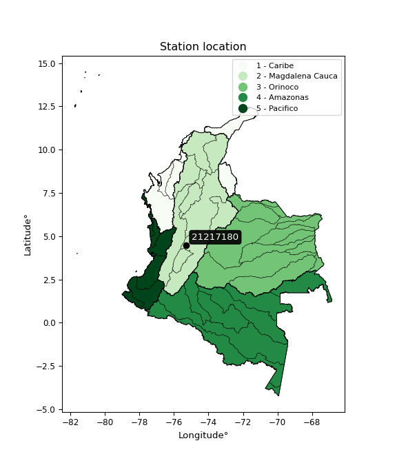

<div align="center">


</div>

# PMP Station (Rain, Pmax24h): 21217180

Probable Maximum Precipitation (PMP) is the greatest amount of rainfall for a specific duration that is meteorologically possible for a given location, acting as a "worst-case" scenario for extreme storms, crucial for designing safety-critical infrastructure like bridges, river deviations, dams, spillways, and nuclear plants to prevent catastrophic failure. PMP is calculated by hydrologists using meteorological data to determine the upper limit of extreme rainfall, often leading to the Probable Maximum Flood (PMF) for flood control design, and is increasingly being studied for climate change impacts. Probable Maximum Precipitation (PMP) is the theoretical upper limit of rainfall, a deterministic estimate for extreme events, while probability distributions (like GEV, Gumbel) describe the likelihood and frequency of various precipitation amounts, including rare ones, showing how often events occur, with PMP representing the extreme end of these distributions, used for critical infrastructure design to ensure safety against the worst conceivable weather, unlike standard statistical forecasts which cover typical probabilities.

The most common probability distributions in hydrology, used for analyzing floods, rainfall, and streamflow, include the Normal, Log-Normal, Gumbel, Gamma (including Log-Pearson Type III), and Generalized Extreme Value (GEV) distributions, often chosen based on the data´s skewness and whether modeling extremes or general conditions, with Gumbel and GEV popular for extreme events like floods, while the Normal distribution serves as a baseline, though often requiring transformations for skewed hydrological data. These distributions help in designing water infrastructure, managing water resources, and forecasting hydrologic events.

> Hydrological data often isn´t perfectly normal (it´s skewed), so different distributions are needed for different applications, such as: **Flood Frequency Analysis**: Using Gumbel, GEV, or Log-Pearson Type III for predicting extreme flood magnitudes and their return periods, **Rainfall Analysis**: Normal for annual totals, but Log-Normal, Weibull, or GEV for intensity or extreme daily rainfall, **Streamflow Modeling**: Gamma and Log-Normal for maximum flows, GEV for minimum flows, and Kappa for daily flows.

<div align="center">

</img>

</div>


## A. General information


### 1. General running parameters

• app_version: _v20260108_. • runtime: _2026-01-08 18:05:13.093906_. • Python version: _3.14.0_. • SciPy version: _1.16.3_. • Pandas version: _2.3.3_. • NumPy version: _2.3.5_. • Stations dataset (station_dataset_file): _dataset/pmax24h_in/automatic_colombia_2003_2024.csv_. • Stations catalog (station_catalog_file): _dataset/CNE.xls_. • Minimum year to eval til year_max (date_min): _1900_. • Maximum year to eval since year_min (date_max): _2024_. • Creates, save and include plots into reports (create_plot): _False_. • Plot only fit distributions with Δo > Δ (plot_only_fit): _True_. • Plot only simple graphs avoiding multiple CDFs and multiple Extreme values plots (plot_only_simple): _False_. • Eval low extreme values, if False, evaluates high extreme values (low_extreme): _False_. • Eval every SciPy distribution as logarithmic (pdist_logarithmic_on): _True_. • Standard deviation normalized (ddof): _1.0_. • Return periods to eval in years (Tr): _[2, 2.33, 5, 10, 15, 20, 25, 50, 75, 100, 200, 250, 500, 750, 1000]_. • Minimum data sample per station, 0 means any (minimum_sample): _5_. • Z-Score maximum threshold to adjust a value, 0 means disable (zscore_max): _3.5_. • Z-Score minimum threshold to adjust a value, 0 means disable (zscore_min): _-2.5_. • Avoid zeros, e.g. rain = 0 (avoid_zeros): _True_. • Avoid null values (avoid_nans): _True_. 

:file_folder:Table: [dataset.csv](../../dataset/pmax24h_in/automatic_colombia_2003_2024.csv)

> Delta Degrees of Freedom (DDOF): is a parameter used in the formulas for calculating variance and standard deviation. When ddof=0, the divisor is $N$ (the total number of observations) and this is used when your data set is the entire population. When ddof=1, the divisor is $N-1$ and this is used when your data set is a sample drawn from a larger population. Using $N-1$ provides an unbiased estimate of the population variance (known as Bessel´s correction).


### 2. Station info and location

|   id |   CODIGO | NOMBRE                   | CATEGORIA    | TECNOLOGIA                              | ESTADO   | FECHA_INSTALACION   |   FECHA_SUSPENSION |   ALTITUD |   LATITUD |   LONGITUD | DEPARTAMENTO   | MUNICIPIO   | AREA_OPERATIVA             | ENTIDAD                                                     | AREA_HIDROGRAFICA   | ZONA_HIDROGRAFICA   | SUBZONA_HIDROGRAFICA   | CORRIENTE   | Catalogo   |   Version |
|-----:|---------:|:-------------------------|:-------------|:----------------------------------------|:---------|:--------------------|-------------------:|----------:|----------:|-----------:|:---------------|:------------|:---------------------------|:------------------------------------------------------------|:--------------------|:--------------------|:-----------------------|:------------|:-----------|----------:|
|    0 | 21217180 | MONTEZUMA AUT [21217180] | Limnigráfica | Automática con Telemetría, Convencional | Activa   | 15/12/1973          |                nan |      1447 |   4.48194 |   -75.2861 | Tolima         | Ibagué      | Area Operativa 10 - Tolima | INSTITUTO DE HIDROLOGIA METEOROLOGIA Y ESTUDIOS AMBIENTALES | Magdalena Cauca     | Alto Magdalena      | Río Coello             | Combeima    | CNE_IDEAM  |  20251226 |

<div align="center">

Dynamic map: [:earth_americas:Google](http://maps.google.com/maps?q=4.4819444,-75.28611111) [:earth_americas:OSM](https://www.openstreetmap.org/#map=18/4.4819444/-75.28611111&layers=P) [:earth_americas:Bing](https://www.bing.com/maps?cp=4.4819444~-75.28611111&lvl=18) [:earth_americas:Apple](https://maps.apple.com/frame?center=4.4819444%2C-75.28611111&span=0.003%2C0.006)

</div>


<div align="center">

```geojson
{
  "type": "Feature",
  "geometry": {
    "type": "Point", 
    "coordinates": [-75.28611111, 4.4819444]
  }, 
  "properties": {
    "Name": "21217180"
  }
}
```

</div>


### 3. Discrete values table and plot

<div align="center">

|               |          0 |            1 |           2 |           3 |          4 |          5 |           6 |          7 |          8 |
|:--------------|-----------:|-------------:|------------:|------------:|-----------:|-----------:|------------:|-----------:|-----------:|
| Date          | 2013       | 2014         | 2015        | 2016        | 2017       | 2018       | 2019        | 2020       | 2024       |
| Value         |  183.5     |   93.5       |   70.5      |   66        |  249.8     |    9.4     |   68        |    2.5     |  148       |
| Value_initial |  183.5     |   93.5       |   70.5      |   66        |  249.8     |    9.4     |   68        |    2.5     |  148       |
| count         |    9       |    9         |    9        |    9        |    9       |    9       |    9        |    9       |    9       |
| mean          |   99.0222  |   99.0222    |   99.0222   |   99.0222   |   99.0222  |   99.0222  |   99.0222   |   99.0222  |   99.0222  |
| std           |   81.0207  |   81.0207    |   81.0207   |   81.0207   |   81.0207  |   81.0207  |   81.0207   |   81.0207  |   81.0207  |
| zscore        |    1.04267 |   -0.0681582 |   -0.352036 |   -0.407578 |    1.86098 |   -1.10616 |   -0.382893 |   -1.19133 |    0.60451 |


</div>


> The initial value (value_initial) correspond to the initial obtained or null completed value, and value (value) is adjusted only when the initial value is outside the valid range (outlier) definite through the Z-Score value. If Z-Score is active, values out of range or outliers are replaced with the station mean value. A Z-Score (or standard score) measures how many standard deviations a data point is from the mean of a dataset, indicating its relative position; positive scores mean above the mean, negative mean below, and a score of zero is exactly at the mean, allowing for comparison of values from different distributions. It´s calculated using the formula $z=(x–μ)/σ$, where $x$ is the data point, $μ$ is the mean, and $σ$ is the standard deviation, helping identify outliers and understand probability.
>
> <sub>**Note**: In this study, "completing" (filling gaps in) and "extending" (forecasting or lengthening the historical record) rainfall data series are avoided for certain critical analyses because they introduce artificial bias and uncertainty, which can distort the statistics of rare events (extremes), alter day-to-day variability, and compromise the integrity and homogeneity of the original data. Some reasons against Completing/Extending rainfall data are: **Distortion of Extremes and Variability**: The primary issue is that most gap-filling or extension methods rely on averaging or regression with nearby stations, which inherently smooths the data. Rainfall is highly variable in space and time, with a large percentage of zero values and occasional large storms. Infilling methods often underestimate the highest values and overestimate the lowest (zero) values, which severely distorts analyses focused on flood frequency, drought severity, and intensity-duration-frequency (IDF) curves, **Loss of Data Homogeneity**: Infilled or extended data are synthetic estimates, not actual measurements. Combining these estimates with observed data can violate the assumption of data homogeneity, which requires that the data properties do not change over time. Inhomogeneity can lead to incorrect conclusions about long-term trends or changes in climate patterns, **Propagation of Errors**: Errors and biases from the original data (e.g., wind-induced undercatch, instrument errors, site changes) or the data used for imputation can propagate through the analysis, leading to unreliable hydrological models and inaccurate predictions, **Compromised Statistical Integrity**: For statistical analyses, especially those involving the frequency of events, using artificial data can introduce time bias or autocorrelation that doesn´t exist in reality, making it difficult to assess the true probability of events, **Difficulty in Validation**: It is difficult to accurately validate the quality of filled or extended data, especially for past periods where ground-truth measurements are unavailable. The reliability of imputation techniques heavily depends on the density of the surrounding station network and the complexity of the local topography.</sub>


### 4. Active continuous probability distributions from SciPy (43 of 104 available)

A Probability Density Function (PDF) describes the relative likelihood of a continuous random variable falling within a specific range, where the total area under its curve equals 1, and the area over any interval gives the actual probability for that range. Unlike discrete probabilities (like rolling a die), a PDF shows density, not direct probability for a single point (which is zero), with higher points indicating higher likelihood, often visualized as a bell curve for normal distributions.

A log of a probability density function (log-PDF) is simply the logarithm of the PDF´s value, denoted as $log(f(x))$, useful for converting multiplication of probabilities into addition, improving numerical stability with tiny numbers, and connecting to information theory concepts like entropy. Instead of dealing with very small probabilities (e.g., 0.000001), log-PDFs use negative numbers (e.g., $log(0.00001) ≈ -11.51$ that are easier for computers to handle, preventing underflow errors and simplifying complex calculations. In this study, each active probability distribution from SciPy is also evaluated in the $log$ form.

[scipy.stats](https://docs.scipy.org/doc/scipy/reference/stats.html) is a Python´s powerful submodule within the SciPy library for comprehensive statistical analysis, offering over 130 probability distributions (like Normal, Poisson), functions for descriptive stats (mean, variance), hypothesis testing (t-tests, chi-square), random variable generation, and statistical tests, making it essential for data science, modeling, and research. It provides tools to explore, model, and draw conclusions from data efficiently, working seamlessly with NumPy.

<div align="center">

|   id | p_dist             |   n_parameter | fit_method   | label                                                                       | active   | ref                                                                                                        |
|-----:|:-------------------|--------------:|:-------------|:----------------------------------------------------------------------------|:---------|:-----------------------------------------------------------------------------------------------------------|
|    0 | alpha              |             3 | MLE          | Alpha                                                                       | True     | [:mortar_board:](https://docs.scipy.org/doc/scipy/reference/generated/scipy.stats.alpha.html)              |
|    1 | betaprime          |             4 | MLE          | Beta prime                                                                  | True     | [:mortar_board:](https://docs.scipy.org/doc/scipy/reference/generated/scipy.stats.betaprime.html)          |
|    2 | chi2               |             3 | MLE          | Chi²                                                                        | True     | [:mortar_board:](https://docs.scipy.org/doc/scipy/reference/generated/scipy.stats.chi2.html)               |
|    3 | crystalball        |             4 | MLE          | Crystalball                                                                 | True     | [:mortar_board:](https://docs.scipy.org/doc/scipy/reference/generated/scipy.stats.crystalball.html)        |
|    4 | erlang             |             3 | MLE          | Erlang                                                                      | True     | [:mortar_board:](https://docs.scipy.org/doc/scipy/reference/generated/scipy.stats.erlang.html)             |
|    5 | expon              |             2 | MLE          | Exponential                                                                 | True     | [:mortar_board:](https://docs.scipy.org/doc/scipy/reference/generated/scipy.stats.expon.html)              |
|    6 | exponnorm          |             3 | MLE          | Exponentially modified Normal                                               | True     | [:mortar_board:](https://docs.scipy.org/doc/scipy/reference/generated/scipy.stats.exponnorm.html)          |
|    7 | f                  |             4 | MLE          | F                                                                           | True     | [:mortar_board:](https://docs.scipy.org/doc/scipy/reference/generated/scipy.stats.f.html)                  |
|    8 | fatiguelife        |             3 | MLE          | Fatigue-life (Birnbaum-Saunders)                                            | True     | [:mortar_board:](https://docs.scipy.org/doc/scipy/reference/generated/scipy.stats.fatiguelife.html)        |
|    9 | fisk               |             3 | MLE          | Fisk                                                                        | True     | [:mortar_board:](https://docs.scipy.org/doc/scipy/reference/generated/scipy.stats.fisk.html)               |
|   10 | gamma              |             3 | MLE          | Gamma                                                                       | True     | [:mortar_board:](https://docs.scipy.org/doc/scipy/reference/generated/scipy.stats.gamma.html)              |
|   11 | genexpon           |             5 | MLE          | Generalized exponential                                                     | True     | [:mortar_board:](https://docs.scipy.org/doc/scipy/reference/generated/scipy.stats.genexpon.html)           |
|   12 | genlogistic        |             3 | MLE          | Generalized logistic                                                        | True     | [:mortar_board:](https://docs.scipy.org/doc/scipy/reference/generated/scipy.stats.genlogistic.html)        |
|   13 | gibrat             |             2 | MM           | Gibrat                                                                      | True     | [:mortar_board:](https://docs.scipy.org/doc/scipy/reference/generated/scipy.stats.gibrat.html)             |
|   14 | gompertz           |             3 | MLE          | Gompertz (or truncated Gumbel)                                              | True     | [:mortar_board:](https://docs.scipy.org/doc/scipy/reference/generated/scipy.stats.gompertz.html)           |
|   15 | gumbel_l           |             2 | MM           | Gumbel Left Skew                                                            | True     | [:mortar_board:](https://docs.scipy.org/doc/scipy/reference/generated/scipy.stats.gumbel_l.html)           |
|   16 | gumbel_r           |             2 | MM           | Gumbel Right Skew                                                           | True     | [:mortar_board:](https://docs.scipy.org/doc/scipy/reference/generated/scipy.stats.gumbel_r.html)           |
|   17 | halflogistic       |             2 | MM           | Half-logistic                                                               | True     | [:mortar_board:](https://docs.scipy.org/doc/scipy/reference/generated/scipy.stats.halflogistic.html)       |
|   18 | halfnorm           |             2 | MM           | Half Normal                                                                 | True     | [:mortar_board:](https://docs.scipy.org/doc/scipy/reference/generated/scipy.stats.halfnorm.html)           |
|   19 | hypsecant          |             2 | MM           | hyperbolic secant                                                           | True     | [:mortar_board:](https://docs.scipy.org/doc/scipy/reference/generated/scipy.stats.hypsecant.html)          |
|   20 | invgamma           |             3 | MLE          | Inverted gamma                                                              | True     | [:mortar_board:](https://docs.scipy.org/doc/scipy/reference/generated/scipy.stats.invgamma.html)           |
|   21 | invgauss           |             3 | MLE          | Inverse Gaussian                                                            | True     | [:mortar_board:](https://docs.scipy.org/doc/scipy/reference/generated/scipy.stats.invgauss.html)           |
|   22 | invweibull         |             3 | MLE          | Inverted Weibull                                                            | True     | [:mortar_board:](https://docs.scipy.org/doc/scipy/reference/generated/scipy.stats.invweibull.html)         |
|   23 | kstwobign          |             2 | MLE          | Limiting distribution of scaled Kolmogorov-Smirnov two-sided test statistic | True     | [:mortar_board:](https://docs.scipy.org/doc/scipy/reference/generated/scipy.stats.kstwobign.html)          |
|   24 | laplace            |             2 | MM           | Laplace                                                                     | True     | [:mortar_board:](https://docs.scipy.org/doc/scipy/reference/generated/scipy.stats.laplace.html)            |
|   25 | laplace_asymmetric |             3 | MLE          | Asymmetric Laplace                                                          | True     | [:mortar_board:](https://docs.scipy.org/doc/scipy/reference/generated/scipy.stats.laplace_asymmetric.html) |
|   26 | loggamma           |             3 | MLE          | Log gamma                                                                   | True     | [:mortar_board:](https://docs.scipy.org/doc/scipy/reference/generated/scipy.stats.loggamma.html)           |
|   27 | logistic           |             2 | MM           | Logistic (or Sech-squared)                                                  | True     | [:mortar_board:](https://docs.scipy.org/doc/scipy/reference/generated/scipy.stats.logistic.html)           |
|   28 | lognorm            |             3 | MLE          | Log Normal                                                                  | True     | [:mortar_board:](https://docs.scipy.org/doc/scipy/reference/generated/scipy.stats.lognorm.html)            |
|   29 | maxwell            |             2 | MM           | Maxwell                                                                     | True     | [:mortar_board:](https://docs.scipy.org/doc/scipy/reference/generated/scipy.stats.maxwell.html)            |
|   30 | mielke             |             4 | MLE          | Mielke Beta-Kappa / Dagum                                                   | True     | [:mortar_board:](https://docs.scipy.org/doc/scipy/reference/generated/scipy.stats.mielke.html)             |
|   31 | moyal              |             2 | MM           | Moyal                                                                       | True     | [:mortar_board:](https://docs.scipy.org/doc/scipy/reference/generated/scipy.stats.moyal.html)              |
|   32 | nakagami           |             3 | MLE          | Nakagami                                                                    | True     | [:mortar_board:](https://docs.scipy.org/doc/scipy/reference/generated/scipy.stats.nakagami.html)           |
|   33 | ncf                |             5 | MLE          | Non-central F distribution                                                  | True     | [:mortar_board:](https://docs.scipy.org/doc/scipy/reference/generated/scipy.stats.ncf.html)                |
|   34 | nct                |             4 | MLE          | Non-central Student’s t                                                     | True     | [:mortar_board:](https://docs.scipy.org/doc/scipy/reference/generated/scipy.stats.nct.html)                |
|   35 | norm               |             2 | MM           | Normal                                                                      | True     | [:mortar_board:](https://docs.scipy.org/doc/scipy/reference/generated/scipy.stats.norm.html)               |
|   36 | pearson3           |             3 | MM           | Pearson type III                                                            | True     | [:mortar_board:](https://docs.scipy.org/doc/scipy/reference/generated/scipy.stats.pearson3.html)           |
|   37 | rayleigh           |             2 | MM           | Rayleigh                                                                    | True     | [:mortar_board:](https://docs.scipy.org/doc/scipy/reference/generated/scipy.stats.rayleigh.html)           |
|   38 | rice               |             3 | MLE          | Rice                                                                        | True     | [:mortar_board:](https://docs.scipy.org/doc/scipy/reference/generated/scipy.stats.rice.html)               |
|   39 | t                  |             3 | MLE          | Student’s t                                                                 | True     | [:mortar_board:](https://docs.scipy.org/doc/scipy/reference/generated/scipy.stats.t.html)                  |
|   40 | truncnorm          |             4 | MLE          | Truncated normal                                                            | True     | [:mortar_board:](https://docs.scipy.org/doc/scipy/reference/generated/scipy.stats.truncnorm.html)          |
|   41 | wald               |             2 | MM           | Wald                                                                        | True     | [:mortar_board:](https://docs.scipy.org/doc/scipy/reference/generated/scipy.stats.wald.html)               |
|   42 | weibull_min        |             3 | MLE          | Weibull minimum                                                             | True     | [:mortar_board:](https://docs.scipy.org/doc/scipy/reference/generated/scipy.stats.weibull_min.html)        |

</div>

> **n_parameter:** # arguments & localization & scale.
>
> **Fit methods:** (MLE) maximum likelihood, (MM) L-moments.
>
>**Inactive** (With the only purpose of prevent loops, zero divisions, infinite values, over high estimated values or horizontal trending for recurrence intervals estimations, the follow distributions were disabled.)**:** foldnorm, gennorm, norminvgauss, powernorm, powerlognorm, skewnorm, genextreme, anglit, arcsine, argus, beta, bradford, burr, burr12, cauchy, cosine, halfcauchy, foldcauchy, skewcauchy, wrapcauchy, dgamma, gengamma, exponweib, exponpow, truncexpon, gausshyper, genhalflogistic, genhyperbolic, geninvgauss, halfgennorm, johnsonsb, johnsonsu, kappa4, kappa3, ksone, kstwo, loglaplace, levy, levy_l, levy_stable, ncx2, pareto, genpareto, truncpareto, lomax, powerlaw, rdist, rel_breitwigner, recipinvgauss, semicircular, studentized_range, trapezoid, triang, truncweibull_min, tukeylambda, uniform, loguniform, vonmises, vonmises_line, weibull_max, dweibull, 


## B. Probability (PDF) vs. Empirical (EDF) distributions functions

A continuous probability distribution (CPD) describes probabilities for variables that can take any value within a range (like rain any time), unlike discrete variables with specific outcomes (like temperature). It uses a Probability Density Function (PDF), a curve where the total area under it equals 1, and the probability of the variable falling within an interval (a to b) is found by calculating the area under the curve between those points. A key feature is that the probability of hitting any single exact value is zero, so probabilities are always expressed for ranges, e.g., $P(a ≤ X ≤ b)$.

<div align="center">

Distributions parameters from station values
|    |   station | p_dist                |   n |              loc |           scale | shape                  | shape1                 | shape2               | shape3   |
|---:|----------:|:----------------------|----:|-----------------:|----------------:|:-----------------------|:-----------------------|:---------------------|:---------|
|  0 |  21217180 | alpha                 |   9 |     -8.49618     |    36.5984      | 0.8892473251035353     |                        |                      |          |
|  1 |  21217180 | betaprime             |   9 |      2.5         |   427.114       | 0.8831516820624411     | 4.868782408184802      |                      |          |
|  2 |  21217180 | chi2                  |   9 |      2.5         |    57.7161      | 1.1141400426122794     |                        |                      |          |
|  3 |  21217180 | crystalball           |   9 |     99.0222      |    76.387       | 8687.478343182787      | 1032.162302085354      |                      |          |
|  4 |  21217180 | erlang                |   9 |      2.5         |    94.3267      | 0.6264843898002088     |                        |                      |          |
|  5 |  21217180 | expon                 |   9 |      2.5         |    96.5222      |                        |                        |                      |          |
|  6 |  21217180 | exponnorm             |   9 |     19.8506      |    31.5181      | 2.5119396254083313     |                        |                      |          |
|  7 |  21217180 | f                     |   9 |     -0.30799     |   101.155       | 2.1338108700082534     | 545.9283227995711      |                      |          |
|  8 |  21217180 | fatiguelife           |   9 |    -45.134       |   122.742       | 0.5890164618286755     |                        |                      |          |
|  9 |  21217180 | fisk                  |   9 |    -46.8655      |   128.64        | 3.019359051639066      |                        |                      |          |
| 10 |  21217180 | gamma                 |   9 |      2.5         |    91.0079      | 0.7211117051666716     |                        |                      |          |
| 11 |  21217180 | genexpon              |   9 |      2.49992     |     2.48277     | 0.025718270911402538   | 3.8831203745375967e-07 | 2.3947809349803943   |          |
| 12 |  21217180 | genlogistic           |   9 |   -341.762       |    60.1786      | 840.39248208754        |                        |                      |          |
| 13 |  21217180 | gibrat                |   9 |     40.7485      |    35.3448      |                        |                        |                      |          |
| 14 |  21217180 | gompertz              |   9 |      2.5         |   212.428       | 1.4661511834843113     |                        |                      |          |
| 15 |  21217180 | gumbel_l              |   9 |    133.4         |    59.5587      |                        |                        |                      |          |
| 16 |  21217180 | gumbel_r              |   9 |     64.644       |    59.5587      |                        |                        |                      |          |
| 17 |  21217180 | halflogistic          |   9 |      8.4859      |    65.3082      |                        |                        |                      |          |
| 18 |  21217180 | halfnorm              |   9 |     -2.08426     |   126.718       |                        |                        |                      |          |
| 19 |  21217180 | hypsecant             |   9 |     99.0222      |    48.6295      |                        |                        |                      |          |
| 20 |  21217180 | invgamma              |   9 |   -126.8         |  1877.51        | 9.287604873608661      |                        |                      |          |
| 21 |  21217180 | invgauss              |   9 |    -58.9616      |   552.565       | 0.28590988048189747    |                        |                      |          |
| 22 |  21217180 | invweibull            |   9 |  -1553.17        |  1615.38        | 27.20602669063979      |                        |                      |          |
| 23 |  21217180 | kstwobign             |   9 |   -148.864       |   284.479       |                        |                        |                      |          |
| 24 |  21217180 | laplace               |   9 |     99.0222      |    54.0138      |                        |                        |                      |          |
| 25 |  21217180 | laplace_asymmetric    |   9 |     68           |    52.3934      | 0.7468521300604493     |                        |                      |          |
| 26 |  21217180 | loggamma              |   9 | -16617.6         |  2422.51        | 993.1153981458001      |                        |                      |          |
| 27 |  21217180 | logistic              |   9 |     99.0222      |    42.1144      |                        |                        |                      |          |
| 28 |  21217180 | lognorm               |   9 |      2.5         |     0.928646    | 12.509577570124424     |                        |                      |          |
| 29 |  21217180 | maxwell               |   9 |    -81.9829      |   113.428       |                        |                        |                      |          |
| 30 |  21217180 | mielke                |   9 |      2.49993     |   248.749       | 0.4604455581630764     | 53.3024842252798       |                      |          |
| 31 |  21217180 | moyal                 |   9 |     55.3392      |    34.3862      |                        |                        |                      |          |
| 32 |  21217180 | nakagami              |   9 |      2.5         |   173.027       | 0.22125784975819937    |                        |                      |          |
| 33 |  21217180 | ncf                   |   9 |      0.0193469   |     1.73936e-05 | 1.632331685228256e-06  | 7.874095443982824      | 7.745087496515447    |          |
| 34 |  21217180 | nct                   |   9 |   -154.346       |    29.7881      | 7.928037684052242      | 7.701141740094828      |                      |          |
| 35 |  21217180 | norm                  |   9 |     99.0222      |    76.387       |                        |                        |                      |          |
| 36 |  21217180 | pearson3              |   9 |     99.0222      |    76.3871      | 0.6082022096196086     |                        |                      |          |
| 37 |  21217180 | rayleigh              |   9 |    -47.1106      |   116.597       |                        |                        |                      |          |
| 38 |  21217180 | rice                  |   9 |    -33.6303      |   108.24        | 0.0013751643850307667  |                        |                      |          |
| 39 |  21217180 | t                     |   9 |     99.0173      |    76.3921      | 3713789.184360981      |                        |                      |          |
| 40 |  21217180 | truncnorm             |   9 |     -1.36103     |    19.7352      | -31.30994450694483     | 12.726580752109307     |                      |          |
| 41 |  21217180 | wald                  |   9 |     22.6352      |    76.387       |                        |                        |                      |          |
| 42 |  21217180 | weibull_min           |   9 |      2.5         |    76.3387      | 0.8734263024332924     |                        |                      |          |
| 43 |  21217180 | logalpha              |   9 |     -0.000355826 |     2.29052     | 4.788803700323286e-07  |                        |                      |          |
| 44 |  21217180 | logbetaprime          |   9 |     -1.57406     |     7.04177e+10 | 9.29351271444201       | 115856922944.43631     |                      |          |
| 45 |  21217180 | logchi2               |   9 |    -16.1409      |     0.0555531   | 362.4985353484732      |                        |                      |          |
| 46 |  21217180 | logcrystalball        |   9 |      4.00998     |     1.40707     | 285.814689320894       | 8.698695500079005      |                      |          |
| 47 |  21217180 | logerlang             |   9 |    -22.7721      |     0.0817      | 327.57293882379406     |                        |                      |          |
| 48 |  21217180 | logexpon              |   9 |      0.916291    |     3.09369     |                        |                        |                      |          |
| 49 |  21217180 | logexponnorm          |   9 |      4.00901     |     1.40707     | 0.000688780031313233   |                        |                      |          |
| 50 |  21217180 | logf                  |   9 |  -3326.87        |  3330.88        | 27614335.58392921      | 18767357.079176486     |                      |          |
| 51 |  21217180 | logfatiguelife        |   9 |   -660.929       |   664.938       | 0.002119780717693258   |                        |                      |          |
| 52 |  21217180 | logfisk               |   9 |     -1.63038e+08 |     1.63038e+08 | 215997100.2310573      |                        |                      |          |
| 53 |  21217180 | loggamma              |   9 |    -20.1345      |     0.088923    | 271.3383933719367      |                        |                      |          |
| 54 |  21217180 | loggenexpon           |   9 |      0.915926    |     0.316502    | 0.026998011468131716   | 8.815784184371587      | 0.001418668374772893 |          |
| 55 |  21217180 | loggenlogistic        |   9 |      5.52073     |     1.918e-06   | 1.26940934794705e-06   |                        |                      |          |
| 56 |  21217180 | loggibrat             |   9 |      2.93657     |     0.651059    |                        |                        |                      |          |
| 57 |  21217180 | loggompertz           |   9 |      0.91629     |     1.01663     | 0.02770596441927496    |                        |                      |          |
| 58 |  21217180 | loggumbel_l           |   9 |      4.64324     |     1.09709     |                        |                        |                      |          |
| 59 |  21217180 | loggumbel_r           |   9 |      3.37672     |     1.09709     |                        |                        |                      |          |
| 60 |  21217180 | loghalflogistic       |   9 |      2.34231     |     1.20297     |                        |                        |                      |          |
| 61 |  21217180 | loghalfnorm           |   9 |      2.1476      |     2.33415     |                        |                        |                      |          |
| 62 |  21217180 | loghypsecant          |   9 |      4.00998     |     0.89577     |                        |                        |                      |          |
| 63 |  21217180 | loginvgamma           |   9 |    -27.9744      | 15163.7         | 475.11064586497446     |                        |                      |          |
| 64 |  21217180 | loginvgauss           |   9 |    -10.6316      |  1320.93        | 0.011088619415758071   |                        |                      |          |
| 65 |  21217180 | loginvweibull         |   9 |     -2.0317e+08  |     2.0317e+08  | 125389323.19563356     |                        |                      |          |
| 66 |  21217180 | logkstwobign          |   9 |     -2.56625     |     7.51814     |                        |                        |                      |          |
| 67 |  21217180 | loglaplace            |   9 |      4.00998     |     0.99495     |                        |                        |                      |          |
| 68 |  21217180 | loglaplace_asymmetric |   9 |      4.53796     |     0.884127    | 1.342198716694277      |                        |                      |          |
| 69 |  21217180 | logloggamma           |   9 |      5.52069     |     2.92865e-06 | 1.9438092357422495e-06 |                        |                      |          |
| 70 |  21217180 | loglogistic           |   9 |      4.00998     |     0.77576     |                        |                        |                      |          |
| 71 |  21217180 | loglognorm            |   9 |      0.916291    |     0.0487394   | 11.925217059476383     |                        |                      |          |
| 72 |  21217180 | logmaxwell            |   9 |      0.67581     |     2.08938     |                        |                        |                      |          |
| 73 |  21217180 | logmielke             |   9 |     -6.59135     |    12.1121      | 6.980775099677258      | 899028.3742914605      |                      |          |
| 74 |  21217180 | logmoyal              |   9 |      3.20533     |     0.633405    |                        |                        |                      |          |
| 75 |  21217180 | lognakagami           |   9 |  -1198.71        |  1202.72        | 181590.8117494167      |                        |                      |          |
| 76 |  21217180 | logncf                |   9 |     -0.335776    |     1.51662e-07 | 1.19811220008961e-06   | 53.28737061479952      | 33.61801857937776    |          |
| 77 |  21217180 | lognct                |   9 |   -108.179       |     1.376       | 67479.79544582052      | 81.5311750215885       |                      |          |
| 78 |  21217180 | lognorm               |   9 |      4.00998     |     1.40707     |                        |                        |                      |          |
| 79 |  21217180 | logpearson3           |   9 |      4.00998     |     1.40708     | -1.1496481080450884    |                        |                      |          |
| 80 |  21217180 | lograyleigh           |   9 |      1.3182      |     2.14774     |                        |                        |                      |          |
| 81 |  21217180 | logrice               |   9 |   -377.134       |     1.40708     | 270.8747592290596      |                        |                      |          |
| 82 |  21217180 | logt                  |   9 |      4.5036      |     0.624541    | 1.483842504978992      |                        |                      |          |
| 83 |  21217180 | logtruncnorm          |   9 |      0.869559    |     3.41989     | 0.013664754457963797   | 23.489181079629468     |                      |          |
| 84 |  21217180 | logwald               |   9 |      2.60289     |     1.40709     |                        |                        |                      |          |
| 85 |  21217180 | logweibull_min        |   9 |      0.916291    |     1.28418     | 0.4452967452936224     |                        |                      |          |

</div>

> **loc** (Location parameter): This shifts the distribution along the x-axis. For many common distributions, like the normal (Gaussian) distribution, loc represents the mean $μ$. For others, like the uniform distribution, it might represent the minimum value, or for the beta distribution, the left end of the support interval.
>
> **scale** (Scale parameter): This determines the width or spread of the distribution. For the normal distribution, scale represents the standard deviation $σ$. For a uniform distribution, it defines the length of the interval (from $loc$ to $loc + scale$).
>
> **shape** (Shape parameters): Refers to parameters that define the specific form of a probability distribution, distinct from its location (loc) and scale (scale). These parameters are required arguments for most distribution functions. For example, a normal (Gaussian) distribution is fully defined by its location (mean) and scale (standard deviation), so it has no specific shape parameters beyond loc and scale. However, other distributions have intrinsic properties that need specification, as Gamma distribution that takes a shape parameter, often named $a$ or $alpha$.


### 0. Cumulative distribution values - CDF (86 evaluated)

Cumulative Distribution Function (CDF), denoted as $F$<sub>$X$</sub>$(x)$, is a function that gives the probability that a random variable $X$ will take a value less than or equal to a specific value, $x$ (i.e., $(P(X≥x)$. It essentially "accumulates" probabilities from a given point up to the far right (positive infinity), providing a complete picture of the distribution´s probabilities for both discrete (like rain) and continuous (like temperature) variables, helping to find probabilities over ranges or above certain values. Each station is evaluated separately ordering the $x$ values ascending, calculating the CDF and PDF values for the activated distributions and their logarithmic forms.

<div align="center">

CDF ordered by x ascending and calculating $log(f(x))$ separately
|   id |   Station |   date |     x |   count |    mean |     std |     zscore |   Value_initial |   station |   m |      alpha |   alpha_pdf |   betaprime |   betaprime_pdf |        chi2 |       chi2_pdf |   crystalball |   crystalball_pdf |     erlang |      erlang_pdf |     expon |   expon_pdf |   exponnorm |   exponnorm_pdf |         f |       f_pdf |   fatiguelife |   fatiguelife_pdf |      fisk |   fisk_pdf |       gamma |     gamma_pdf |    genexpon |   genexpon_pdf |   genlogistic |   genlogistic_pdf |   gibrat |   gibrat_pdf |    gompertz |   gompertz_pdf |   gumbel_l |   gumbel_l_pdf |   gumbel_r |   gumbel_r_pdf |   halflogistic |   halflogistic_pdf |   halfnorm |   halfnorm_pdf |   hypsecant |   hypsecant_pdf |   invgamma |   invgamma_pdf |   invgauss |   invgauss_pdf |   invweibull |   invweibull_pdf |   kstwobign |   kstwobign_pdf |   laplace |   laplace_pdf |   laplace_asymmetric |   laplace_asymmetric_pdf |   loggamma |   loggamma_pdf |   logistic |   logistic_pdf |   lognorm |   lognorm_pdf |   maxwell |   maxwell_pdf |      mielke |   mielke_pdf |     moyal |   moyal_pdf |    nakagami |   nakagami_pdf |       ncf |     ncf_pdf |       nct |     nct_pdf |     norm |    norm_pdf |   pearson3 |   pearson3_pdf |   rayleigh |   rayleigh_pdf |      rice |    rice_pdf |        t |       t_pdf |   truncnorm |   truncnorm_pdf |     wald |    wald_pdf |   weibull_min |   weibull_min_pdf |   logalpha |   logalpha_pdf |   logbetaprime |   logbetaprime_pdf |   logchi2 |   logchi2_pdf |   logcrystalball |   logcrystalball_pdf |   logerlang |   logerlang_pdf |   logexpon |   logexpon_pdf |   logexponnorm |   logexponnorm_pdf |      logf |   logf_pdf |   logfatiguelife |   logfatiguelife_pdf |   logfisk |   logfisk_pdf |   loggenexpon |   loggenexpon_pdf |   loggenlogistic |   loggenlogistic_pdf |   loggibrat |   loggibrat_pdf |   loggompertz |   loggompertz_pdf |   loggumbel_l |   loggumbel_l_pdf |   loggumbel_r |   loggumbel_r_pdf |   loghalflogistic |   loghalflogistic_pdf |   loghalfnorm |   loghalfnorm_pdf |   loghypsecant |   loghypsecant_pdf |   loginvgamma |   loginvgamma_pdf |   loginvgauss |   loginvgauss_pdf |   loginvweibull |   loginvweibull_pdf |   logkstwobign |   logkstwobign_pdf |   loglaplace |   loglaplace_pdf |   loglaplace_asymmetric |   loglaplace_asymmetric_pdf |   logloggamma |   logloggamma_pdf |   loglogistic |   loglogistic_pdf |   loglognorm |   loglognorm_pdf |   logmaxwell |   logmaxwell_pdf |   logmielke |   logmielke_pdf |   logmoyal |   logmoyal_pdf |   lognakagami |   lognakagami_pdf |     logncf |   logncf_pdf |    lognct |   lognct_pdf |   logpearson3 |   logpearson3_pdf |   lograyleigh |   lograyleigh_pdf |   logrice |   logrice_pdf |      logt |   logt_pdf |   logtruncnorm |   logtruncnorm_pdf |   logwald |   logwald_pdf |   logweibull_min |   logweibull_min_pdf |
|-----:|----------:|-------:|------:|--------:|--------:|--------:|-----------:|----------------:|----------:|----:|-----------:|------------:|------------:|----------------:|------------:|---------------:|--------------:|------------------:|-----------:|----------------:|----------:|------------:|------------:|----------------:|----------:|------------:|--------------:|------------------:|----------:|-----------:|------------:|--------------:|------------:|---------------:|--------------:|------------------:|---------:|-------------:|------------:|---------------:|-----------:|---------------:|-----------:|---------------:|---------------:|-------------------:|-----------:|---------------:|------------:|----------------:|-----------:|---------------:|-----------:|---------------:|-------------:|-----------------:|------------:|----------------:|----------:|--------------:|---------------------:|-------------------------:|-----------:|---------------:|-----------:|---------------:|----------:|--------------:|----------:|--------------:|------------:|-------------:|----------:|------------:|------------:|---------------:|----------:|------------:|----------:|------------:|---------:|------------:|-----------:|---------------:|-----------:|---------------:|----------:|------------:|---------:|------------:|------------:|----------------:|---------:|------------:|--------------:|------------------:|-----------:|---------------:|---------------:|-------------------:|----------:|--------------:|-----------------:|---------------------:|------------:|----------------:|-----------:|---------------:|---------------:|-------------------:|----------:|-----------:|-----------------:|---------------------:|----------:|--------------:|--------------:|------------------:|-----------------:|---------------------:|------------:|----------------:|--------------:|------------------:|--------------:|------------------:|--------------:|------------------:|------------------:|----------------------:|--------------:|------------------:|---------------:|-------------------:|--------------:|------------------:|--------------:|------------------:|----------------:|--------------------:|---------------:|-------------------:|-------------:|-----------------:|------------------------:|----------------------------:|--------------:|------------------:|--------------:|------------------:|-------------:|-----------------:|-------------:|-----------------:|------------:|----------------:|-----------:|---------------:|--------------:|------------------:|-----------:|-------------:|----------:|-------------:|--------------:|------------------:|--------------:|------------------:|----------:|--------------:|----------:|-----------:|---------------:|-------------------:|----------:|--------------:|-----------------:|---------------------:|
|    0 |  21217180 |   2020 |   2.5 |       9 | 99.0222 | 81.0207 | -1.19133   |             2.5 |  21217180 |   1 | 0.00905622 | 0.00758541  | 4.26745e-14 |     0.61497     | 1.24413e-07 | 1841.93        |      0.103188 |       0.00235059  | 1.5564e-11 | 21956.4         | 0         | 0.0103603   |   0.0599771 |     0.00291786  | 0.0223757 | 0.00838001  |     0.0476926 |       0.00394358  | 0.052559  | 0.00304573 | 3.59763e-13 | 584.183       | 8.28842e-07 |    0.0103587   |     0.0639365 |       0.00291681  | 0        |  0           | 4.37198e-14 |    0.00690187  |   0.1051   |    0.00166848  |  0.0584915 |    0.00278801  |     0          |        0           |  0.0288586 |     0.00629241 |   0.0869281 |     0.00176542  |  0.057439  |    0.00315692  |  0.0504807 |    0.00363472  |    0.0616488 |      0.00300401  |   0.0603342 |     0.00307544  | 0.0837315 |   0.00155019  |            0.0671421 |              0.00171587  |  0.0147357 |      0.0278982 |  0.0917954 |    0.00197959  | 0.0139506 |     0.0252854 | 0.0932912 |    0.00295701 | 0.000940278 |   6.51904    | 0.0310728 | 0.00244736  | 1.28985e-08 |    1.28528e+07 | 0.0308091 | 0.00427839  | 0.0602935 | 0.00296179  | 0.103188 | 0.00235059  |   0.0853   |    0.00283384  |  0.0865437 |    0.00333339  | 0.0541874 | 0.00291678  | 0.103215 | 0.00235088  |    0.577555 |     0.0198316   | 0        | 0           |   8.83605e-16 |       1.73786     |  0.0124615 |      0.0958526 |      0.0186741 |          0.0432525 | 0.0157787 |     0.0295552 |        0.0139507 |            0.0252854 |    0.015941 |       0.0292807 |   0        |      0.323239  |      0.0139508 |          0.0252857 | 0.0140039 |   0.025355 |        0.0139416 |            0.0253452 | 0.0119526 |     0.0156458 |   3.11348e-05 |          0.085344 |         0        |            0.0314256 |    0        |       0         |   6.75217e-09 |         0.0272527 |     0.0329156 |         0.0295033 |   8.11965e-05 |       0.000697081 |          0        |              0        |     0         |          0        |      0.0201292 |          0.0224565 |     0.0131214 |         0.0263247 |     0.0134193 |         0.0285358 |       0.0151548 |           0.0391838 |      0.0172297 |          0.0519446 |    0.0223141 |        0.0224273 |               0.0303947 |                   0.0256134 |      0.047074 |         0.031244  |     0.0182003 |         0.0230343 |   0.00234751 |      5.53739e+12 |  0.000403905 |       0.00502539 |    0.035479 |       0.0329892 | 1.1171e-09 |    3.35632e-08 |     0.0141783 |         0.0255877 | 0.00729905 |    0.0254533 | 0.0140293 |    0.0254286 |     0.0341693 |         0.0315211 |     0         |          0        | 0.0139506 |     0.0252854 | 0.0273228 |  0.0109533 |      8.888e-11 |          0.235857  |  0        |     0         |      9.57526e-08 |          1.92026e+08 |
|    1 |  21217180 |   2018 |   9.4 |       9 | 99.0222 | 81.0207 | -1.10616   |             9.4 |  21217180 |   2 | 0.152366   | 0.0287508   | 0.10498     |     0.0127917   | 0.22915     |    0.0178007   |      0.120345 |       0.00262408  | 0.210685   |     0.0182835   | 0.0689908 | 0.00964554  |   0.0825545 |     0.00363199  | 0.0809748 | 0.00846382  |     0.0784756 |       0.00494177  | 0.0760824 | 0.00377216 | 0.165244    |   0.016521    | 0.068982    |    0.00964427  |     0.0860861 |       0.00350308  | 0        |  0           | 0.0472519   |    0.00679284  |   0.117223 |    0.00184804  |  0.0797929 |    0.00338728  |     0.00699823 |        0.00765564  |  0.0722121 |     0.00627072 |   0.0999773 |     0.00202226  |  0.0816605 |    0.00385887  |  0.0786863 |    0.00451893  |    0.0845652 |      0.00363711  |   0.0836816 |     0.0036865   | 0.0951411 |   0.00176142  |            0.0800895 |              0.00204675  |  0.113774  |      0.138296  |  0.106399  |    0.00225761  | 0.104302  |     0.128607  | 0.114886  |    0.00330039 | 0.191924    |   0.0128072  | 0.0511392 | 0.00337803  | 0.188561    |    0.0120895   | 0.0645424 | 0.00544329  | 0.0829209 | 0.00359592  | 0.120345 | 0.00262408  |   0.106228 |    0.00323137  |  0.110815  |    0.00369612  | 0.0759799 | 0.00339377  | 0.120374 | 0.00262434  |    0.707217 |     0.0174224   | 0        | 0           |   0.115319    |       0.0137214   |  0.30675   |      0.215838  |      0.156168  |          0.168147  | 0.117977  |     0.140437  |        0.104302  |            0.128607  |    0.116688 |       0.138754  |   0.348256 |      0.210669  |      0.104303  |          0.128608  | 0.104445  |   0.128612 |        0.104584  |            0.128978  | 0.0653656 |     0.0809375 |   0.199363    |          0.200327 |         0        |            0.0755033 |    0        |       0         |   0.0715472   |         0.0930997 |     0.10589   |         0.0912184 |   0.0598176   |       0.153564    |          0        |              0        |     0.0318193 |          0.341558 |      0.0877656 |          0.0967411 |     0.111229  |         0.139255  |     0.119636  |         0.147782  |       0.157238  |           0.179527  |      0.191742  |          0.200862  |    0.0844667 |        0.0848954 |               0.0927906 |                   0.0781938 |      0.113382 |         0.0752542 |     0.0927345 |         0.108455  |   0.609076   |      0.024309    |  0.094693    |       0.161826   |    0.110287 |       0.0871699 | 0.0322429  |    0.136203    |     0.105071  |         0.128979  | 0.133513   |    0.177578  | 0.104748  |    0.128971  |     0.110464  |         0.0931921 |     0.0881204 |          0.182368 | 0.104302  |     0.128607  | 0.0523409 |  0.0318087 |      0.303943  |          0.217662  |  0        |     0         |      0.637175    |          0.123677    |
|    2 |  21217180 |   2016 |  66   |       9 | 99.0222 | 81.0207 | -0.407578  |            66   |  21217180 |   3 | 0.805192   | 0.00298942  | 0.545275    |     0.00487621  | 0.670744    |    0.00407886  |      0.332761 |       0.00475674  | 0.684904   |     0.00437949  | 0.482052  | 0.00536611  |   0.410648  |     0.00654004  | 0.470872  | 0.00529054  |     0.433     |       0.00601573  | 0.402518  | 0.00643374 | 0.644427    |   0.0047765   | 0.482004    |    0.00536584  |     0.383537  |       0.00610419  | 0.368335 |  0.0149303   | 0.399996    |    0.00558396  |   0.275661 |    0.00392212  |  0.376254  |    0.00617516  |     0.413917   |        0.00634433  |  0.408932  |     0.00545023 |   0.29877   |     0.00528061  |  0.399473  |    0.00618391  |  0.420616  |    0.00609516  |    0.391308  |      0.00616901  |   0.381732  |     0.00590772  | 0.271304  |   0.00502287  |            0.340223  |              0.00869465  |  0.561048  |      0.267689  |  0.313435  |    0.00510974  | 0.550804  |     0.281224  | 0.36353   |    0.00511208 | 0.533288    |   0.00386693 | 0.391775  | 0.0068856   | 0.500841    |    0.003406    | 0.439344  | 0.00600307  | 0.38844   | 0.00616782  | 0.332761 | 0.00475674  |   0.363125 |    0.0053855   |  0.375338  |    0.00519724  | 0.345329  | 0.00556725  | 0.332795 | 0.00475661  |    0.999679 |     5.9682e-05  | 0.421478 | 0.0103569   |   0.573198    |       0.00499839  |  0.584612  |      0.0896502 |      0.567946  |          0.208727  | 0.560858  |     0.26189   |        0.550804  |            0.281224  |    0.560681 |       0.265332  |   0.652878 |      0.112203  |      0.550805  |          0.281224  | 0.550536  |   0.280815 |        0.551122  |            0.28063   | 0.480474  |     0.330702  |   0.611328    |          0.190854 |         0        |            0.274257  |    0.74369  |       0.256943  |   0.486032    |         0.350505  |     0.483856  |         0.311152  |   0.620865    |       0.269741    |          0.645662 |              0.242366 |     0.618349  |          0.233137 |      0.563423  |          0.348317  |     0.560863  |         0.2665    |     0.56544   |         0.25252   |       0.573707  |           0.196735  |      0.605352  |          0.184198  |    0.58261   |        0.419509  |               0.479481  |                   0.404055  |      0.413361 |         0.274356  |     0.557645  |         0.317981  |   0.637877   |      0.00960336  |  0.581142    |       0.262596   |    0.44365  |       0.287267  | 0.645676   |    0.260539    |     0.551     |         0.280371  | 0.581302   |    0.21893   | 0.551196  |    0.280664  |     0.474855  |         0.295161  |     0.590879  |          0.254679 | 0.550804  |     0.281224  | 0.339819  |  0.448082  |      0.664707  |          0.147241  |  0.714522 |     0.235052  |      0.780608    |          0.0452722   |
|    3 |  21217180 |   2019 |  68   |       9 | 99.0222 | 81.0207 | -0.382893  |            68   |  21217180 |   4 | 0.811      | 0.00282046  | 0.554897    |     0.0047462   | 0.678776    |    0.00395411  |      0.342328 |       0.00480923  | 0.69352    |     0.00423823  | 0.492673  | 0.00525606  |   0.423669  |     0.00648003  | 0.481352  | 0.00519028  |     0.444951  |       0.00593457  | 0.415336  | 0.00638309 | 0.653835    |   0.00463244  | 0.492625    |    0.00525582  |     0.395735  |       0.00609267  | 0.397415 |  0.0141526   | 0.411112    |    0.00553234  |   0.283595 |    0.00401164  |  0.388598  |    0.00616714  |     0.426525   |        0.00626321  |  0.419786  |     0.00540354 |   0.309459  |     0.00540749  |  0.411803  |    0.00614576  |  0.43274   |    0.00602771  |    0.403624  |      0.00614542  |   0.393531  |     0.00589005  | 0.281538  |   0.00521234  |            0.358064  |              0.0091506   |  0.569023  |      0.266584  |  0.323744  |    0.00519855  | 0.559188  |     0.2804    | 0.373773  |    0.00513097 | 0.540957    |   0.00380276 | 0.405491  | 0.00682827  | 0.507588    |    0.00334125  | 0.451245  | 0.0058973   | 0.400754  | 0.00614517  | 0.342328 | 0.00480923  |   0.373916 |    0.00540414  |  0.385737  |    0.00520109  | 0.35648   | 0.00558229  | 0.342361 | 0.00480909  |    0.99978  |     4.20134e-05 | 0.441764 | 0.00993196  |   0.583059    |       0.00486378  |  0.587272  |      0.0885726 |      0.574157  |          0.207422  | 0.56866   |     0.26079   |        0.559188  |            0.2804    |    0.568586 |       0.264271  |   0.656211 |      0.111126  |      0.559189  |          0.2804    | 0.558848  |   0.279996 |        0.559487  |            0.279792  | 0.490352  |     0.331083  |   0.617005    |          0.189473 |         0        |            0.27973   |    0.751211 |       0.247056  |   0.496542    |         0.353569  |     0.493187  |         0.313955  |   0.62886     |       0.265881    |          0.65284  |              0.238492 |     0.62527   |          0.230524 |      0.573785  |          0.345844  |     0.568801  |         0.265296  |     0.572959  |         0.251174  |       0.579556  |           0.195113  |      0.610828  |          0.182633  |    0.594947  |        0.407109  |               0.491696  |                   0.414348  |      0.421633 |         0.279847  |     0.567116  |         0.316458  |   0.638162   |      0.00951401  |  0.588953    |       0.260709   |    0.452297 |       0.292057  | 0.653382   |    0.255712    |     0.559358  |         0.279547  | 0.587811   |    0.217096  | 0.559563  |    0.279831  |     0.483711  |         0.298146  |     0.59845   |          0.252564 | 0.559188  |     0.2804    | 0.353422  |  0.463196  |      0.669084  |          0.145993  |  0.721433 |     0.228018  |      0.781952    |          0.0447689   |
|    4 |  21217180 |   2015 |  70.5 |       9 | 99.0222 | 81.0207 | -0.352036  |            70.5 |  21217180 |   5 | 0.817806   | 0.00262806  | 0.566565    |     0.00458987  | 0.688475    |    0.00380573  |      0.354429 |       0.00487097  | 0.703904   |     0.00407003  | 0.505645  | 0.00512167  |   0.439764  |     0.00639381  | 0.494173  | 0.00506722  |     0.459657  |       0.00582992  | 0.431205  | 0.00630977 | 0.665199    |   0.00446008  | 0.505596    |    0.00512146  |     0.41094   |       0.00606959  | 0.431612 |  0.0132117   | 0.424862    |    0.00546714  |   0.293765 |    0.00412422  |  0.403994  |    0.00614792  |     0.442054   |        0.00615994  |  0.43322   |     0.00534386 |   0.323171  |     0.00556131  |  0.4271    |    0.00609031  |  0.447699  |    0.00593856  |    0.418942  |      0.00610735  |   0.408221  |     0.00586123  | 0.294876  |   0.00545927  |            0.380538  |              0.00883024  |  0.578622  |      0.26511   |  0.336874  |    0.00530436  | 0.569291  |     0.279239  | 0.386626  |    0.00514987 | 0.550368    |   0.00372668 | 0.422461  | 0.00674622  | 0.515844    |    0.00326414  | 0.465821  | 0.00576344  | 0.416072  | 0.00610815  | 0.354429 | 0.00487097  |   0.387449 |    0.00542136  |  0.398741  |    0.00520154  | 0.370453  | 0.00559541  | 0.354462 | 0.00487081  |    0.999864 |     2.67022e-05 | 0.46595  | 0.00942063  |   0.595015    |       0.00470196  |  0.590447  |      0.0872932 |      0.581617  |          0.205794  | 0.57805   |     0.259331  |        0.569291  |            0.279239  |    0.578102 |       0.262854  |   0.6602   |      0.109837  |      0.569292  |          0.279239  | 0.568905  |   0.278843 |        0.569568  |            0.278616  | 0.502309  |     0.3312    |   0.623815    |          0.187775 |         0        |            0.286495  |    0.759925 |       0.235722  |   0.509371    |         0.357016  |     0.504581  |         0.317165  |   0.638374    |       0.261165    |          0.661367 |              0.233835 |     0.633536  |          0.227353 |      0.586211  |          0.342394  |     0.578352  |         0.263706  |     0.581997  |         0.249439  |       0.586564  |           0.193121  |      0.617387  |          0.180725  |    0.609382  |        0.3926    |               0.506886  |                   0.427149  |      0.431859 |         0.286634  |     0.578504  |         0.314321  |   0.638504   |      0.00940811  |  0.598324    |       0.258326   |    0.462948 |       0.297939  | 0.66251    |    0.249919    |     0.569431  |         0.278387  | 0.595608   |    0.21483   | 0.569645  |    0.278659  |     0.49454   |         0.30165   |     0.607522  |          0.24993  | 0.569291  |     0.279239  | 0.370462  |  0.480518  |      0.674328  |          0.144483  |  0.729517 |     0.219856  |      0.783557    |          0.044172    |
|    5 |  21217180 |   2014 |  93.5 |       9 | 99.0222 | 81.0207 | -0.0681582 |            93.5 |  21217180 |   6 | 0.863513   | 0.00149963  | 0.65781     |     0.00341654  | 0.762856    |    0.00274068  |      0.471184 |       0.00520902  | 0.782581   |     0.00286049  | 0.61046   | 0.00403576  |   0.574508  |     0.00525145  | 0.598636  | 0.00405053  |     0.581928  |       0.00479102  | 0.565471  | 0.00528547 | 0.752236    |   0.00319372  | 0.610408    |    0.00403572  |     0.545021  |       0.00549483  | 0.655584 |  0.00698     | 0.543448    |    0.00483615  |   0.40055  |    0.00515061  |  0.540097  |    0.00558614  |     0.572255   |        0.00514886  |  0.549334  |     0.0047375  |   0.463931  |     0.00650364  |  0.558787  |    0.0052901   |  0.573505  |    0.00497049  |    0.552456  |      0.00541616  |   0.537651  |     0.00532283  | 0.451408  |   0.00835727  |            0.553699  |              0.00636188  |  0.65136   |      0.248763  |  0.467266  |    0.00591077  | 0.646257  |     0.264253  | 0.505149  |    0.00508759 | 0.629382    |   0.00318457 | 0.565874  | 0.00564889  | 0.584011    |    0.00270079  | 0.584144  | 0.0045387   | 0.549671  | 0.00542113  | 0.471184 | 0.00520902  |   0.511543 |    0.00528502  |  0.516721  |    0.00499851  | 0.498301  | 0.00544401  | 0.471212 | 0.00520869  |    0.999999 |     1.94363e-07 | 0.637626 | 0.00582842  |   0.68834     |       0.00348743  |  0.613766  |      0.0781214 |      0.637759  |          0.191443  | 0.649209  |     0.243454  |        0.646257  |            0.264253  |    0.650276 |       0.247045  |   0.689839 |      0.100256  |      0.646258  |          0.264252  | 0.645747  |   0.263941 |        0.646346  |            0.26356   | 0.594669  |     0.319333  |   0.674864    |          0.173577 |         0        |            0.345361  |    0.815947 |       0.166155  |   0.612829    |         0.371924  |     0.596872  |         0.333831  |   0.706815    |       0.22355     |          0.722375 |              0.198747 |     0.694203  |          0.202339 |      0.677611  |          0.301451  |     0.650582  |         0.246635  |     0.650135  |         0.232197  |       0.638802  |           0.176686  |      0.666265  |          0.165404  |    0.705892  |        0.295601  |               0.643048  |                   0.541891  |      0.52087  |         0.345712  |     0.663872  |         0.287648  |   0.641051   |      0.00865354  |  0.668289    |       0.236369   |    0.553909 |       0.347435  | 0.7269     |    0.206957    |     0.646163  |         0.263467  | 0.653615   |    0.195696  | 0.64644   |    0.263634  |     0.58309   |         0.32386   |     0.67493   |          0.226902 | 0.646257  |     0.264253  | 0.518699  |  0.543347  |      0.713456  |          0.132689  |  0.783714 |     0.16703   |      0.795412    |          0.0399146   |
|    6 |  21217180 |   2024 | 148   |       9 | 99.0222 | 81.0207 |  0.60451   |           148   |  21217180 |   7 | 0.914921   | 0.000591518 | 0.794997    |     0.00181939  | 0.870355    |    0.00138846  |      0.739297 |       0.00425225  | 0.891361   |     0.00134705  | 0.77852   | 0.0022946   |   0.78549   |     0.00270913  | 0.769102  | 0.00235163  |     0.781181  |       0.0026617   | 0.777979  | 0.00267634 | 0.875152    |   0.00153949  | 0.778473    |    0.00229476  |     0.782372  |       0.00319027  | 0.866506 |  0.00200885  | 0.763587    |    0.0032367   |   0.721346 |    0.0059783   |  0.781371  |    0.00323661  |     0.788752   |        0.00289297  |  0.763743  |     0.00312241 |   0.777056  |     0.00421879  |  0.781688  |    0.00295046  |  0.781252  |    0.00277042  |    0.78295   |      0.00306381  |   0.77378   |     0.00330483  | 0.798086  |   0.0037382   |            0.794774  |              0.00292544  |  0.756778  |      0.208034  |  0.761872  |    0.00430786  | 0.758542  |     0.221666  | 0.750277  |    0.00370231 | 0.781202    |   0.00247217 | 0.79492   | 0.00291546  | 0.706992    |    0.00189014  | 0.767335  | 0.00239096  | 0.780239  | 0.00306063  | 0.739297 | 0.00425225  |   0.759199 |    0.00361448  |  0.753425  |    0.00353878  | 0.755345  | 0.00379289  | 0.739304 | 0.00425191  |    1        |     7.37473e-15 | 0.836606 | 0.0021916   |   0.827362    |       0.00182038  |  0.646718  |      0.0658781 |      0.719511  |          0.163998  | 0.752568  |     0.204543  |        0.758542  |            0.221665  |    0.755142 |       0.207354  |   0.732627 |      0.0864252 |      0.758543  |          0.221665  | 0.757935  |   0.22156  |        0.758324  |            0.22106   | 0.729429  |     0.261471  |   0.748832    |          0.148244 |         0        |            0.468034  |    0.875375 |       0.0996884 |   0.77833     |         0.334538  |     0.748618  |         0.316386  |   0.795883    |       0.165622    |          0.801744 |              0.148468 |     0.777851  |          0.162243 |      0.795833  |          0.212613  |     0.754912  |         0.205614  |     0.748378  |         0.194115  |       0.713515  |           0.148643  |      0.736406  |          0.140112  |    0.814628  |        0.186313  |               0.822244  |                   0.269852  |      0.706494 |         0.468915  |     0.781188  |         0.220343  |   0.644785   |      0.0076516   |  0.767007    |       0.192415   |    0.734564 |       0.442491  | 0.807966   |    0.148627    |     0.758144  |         0.221155  | 0.73579    |    0.161963  | 0.758457  |    0.221145  |     0.734754  |         0.328353  |     0.769416  |          0.183907 | 0.758542  |     0.221666  | 0.73208   |  0.352109  |      0.770044  |          0.113857  |  0.846359 |     0.11053   |      0.812391    |          0.0342565   |
|    7 |  21217180 |   2013 | 183.5 |       9 | 99.0222 | 81.0207 |  1.04267   |           183.5 |  21217180 |   8 | 0.931792   | 0.00038166  | 0.848827    |     0.00125484  | 0.910828    |    0.000926774 |      0.865619 |       0.0028334   | 0.929672   |     0.00085216  | 0.846678  | 0.00158846  |   0.863001  |     0.00173041  | 0.839253  | 0.00164209  |     0.858402  |       0.00174675  | 0.853114  | 0.00164242 | 0.919094    |   0.000980678 | 0.846638    |    0.00158866  |     0.872784  |       0.00197325  | 0.918636 |  0.00105482  | 0.860707    |    0.00225392  |   0.901638 |    0.00383003  |  0.872903  |    0.00199222  |     0.871651   |        0.00183917  |  0.856954  |     0.00215449 |   0.88908   |     0.00223504  |  0.865591  |    0.00184726  |  0.861165  |    0.00179324  |    0.869791  |      0.00190084  |   0.869594  |     0.00214047  | 0.895352  |   0.00193743  |            0.876274  |              0.00176368  |  0.799101  |      0.185447  |  0.881417  |    0.00248185  | 0.803565  |     0.196819  | 0.860047  |    0.00249053 | 0.863814    |   0.00219746 | 0.876726  | 0.00177816  | 0.767551    |    0.00153615  | 0.836688  | 0.00157716  | 0.866922  | 0.00189619  | 0.865619 | 0.0028334   |   0.864496 |    0.00234823  |  0.858567  |    0.00239914  | 0.866285  | 0.00247815  | 0.865617 | 0.00283324  |    1        |     1.78913e-21 | 0.896449 | 0.00127825  |   0.880636    |       0.00122433  |  0.660356  |      0.0610717 |      0.753309  |          0.150374  | 0.794256  |     0.183053  |        0.803565  |            0.196819  |    0.797368 |       0.185221  |   0.750578 |      0.0806229 |      0.803565  |          0.196819  | 0.802946  |   0.196819 |        0.803228  |            0.196326  | 0.781865  |     0.225952  |   0.779391    |          0.136019 |         0        |            0.539605  |    0.894609 |       0.0801204 |   0.845553    |         0.287982  |     0.813573  |         0.285432  |   0.828886    |       0.141793    |          0.831457 |              0.128299 |     0.810798  |          0.144373 |      0.837295  |          0.17383   |     0.796736  |         0.183268  |     0.787972  |         0.174085  |       0.744081  |           0.135748  |      0.765284  |          0.128573  |    0.850653  |        0.150105  |               0.871746  |                   0.194703  |      0.81486  |         0.54084   |     0.824878  |         0.18621   |   0.646387   |      0.00725697  |  0.806021    |       0.170483   |    0.835145 |       0.493915  | 0.837486   |    0.126497    |     0.803075  |         0.196475  | 0.768914   |    0.146227  | 0.803378  |    0.196397  |     0.803676  |         0.310208  |     0.806723  |          0.163161 | 0.803565  |     0.196819  | 0.796431  |  0.250768  |      0.793603  |          0.105329  |  0.868082 |     0.0922138 |      0.819513    |          0.0320308   |
|    8 |  21217180 |   2017 | 249.8 |       9 | 99.0222 | 81.0207 |  1.86098   |           249.8 |  21217180 |   9 | 0.950276   | 0.000203545 | 0.910133    |     0.000667189 | 0.954615    |    0.000454458 |      0.975802 |       0.000744479 | 0.96812    |     0.000375524 | 0.922858  | 0.000799217 |   0.940703  |     0.000748964 | 0.918432  | 0.000835604 |     0.937789  |       0.000774242 | 0.925735  | 0.00069971 | 0.963448    |   0.000433848 | 0.92283     |    0.000799393 |     0.95579   |       0.000718148 | 0.962251 |  0.000393218 | 0.960453    |    0.000874319 |   0.999141 |    0.000101847 |  0.956328  |    0.000717014 |     0.95151    |        0.000724474 |  0.953161  |     0.00087321 |   0.971356  |     0.000588237 |  0.945611  |    0.000731086 |  0.941397  |    0.000765066 |    0.950907  |      0.000722307 |   0.960625  |     0.000775855 | 0.969334  |   0.000567735 |            0.951914  |              0.000685447 |  0.851146  |      0.152017  |  0.972885  |    0.000626373 | 0.858507  |     0.159327  | 0.964183  |    0.00083482 | 0.992591    |   0.00106676 | 0.952829  | 0.000685104 | 0.852203    |    0.00104647  | 0.910561  | 0.000762606 | 0.947951  | 0.000725274 | 0.975802 | 0.000744479 |   0.962022 |    0.000793259 |  0.960924  |    0.000853417 | 0.967561  | 0.000784775 | 0.975798 | 0.000744528 |    1        |     1.36531e-37 | 0.952145 | 0.000528954 |   0.938682    |       0.000604582 |  0.678236  |      0.0550123 |      0.796675  |          0.13088   | 0.845811  |     0.151217  |        0.858507  |            0.159327  |    0.84943  |       0.152327  |   0.774246 |      0.0729724 |      0.858507  |          0.159327  | 0.857909  |   0.159462 |        0.858048  |            0.159038  | 0.843593  |     0.174803  |   0.818656    |          0.118655 |         0.999955 |            0.66181   |    0.91598  |       0.0596965 |   0.921119    |         0.199216  |     0.891936  |         0.219166  |   0.867901    |       0.11208     |          0.867042 |              0.103177 |     0.851567  |          0.120322 |      0.883435  |          0.127239  |     0.848203  |         0.150495  |     0.837178  |         0.145057  |       0.783201  |           0.118118  |      0.802473  |          0.112716  |    0.890463  |        0.110093  |               0.919701  |                   0.121903  |      0.999983 |         0.663652  |     0.875158  |         0.140838  |   0.648547   |      0.00675594  |  0.853805    |       0.1396     |    0.999926 |       0.576268  | 0.872263   |    0.0999677   |     0.857947  |         0.15922   | 0.810652   |    0.12466   | 0.858215  |    0.159074  |     0.891792  |         0.255195  |     0.852559  |          0.134326 | 0.858507  |     0.159327  | 0.857275  |  0.152513  |      0.824259  |          0.0935501 |  0.893238 |     0.0719101 |      0.828947    |          0.029211    |


</div>

An Empirical Distribution Function (EDF) is a step-function estimate of a true cumulative distribution function (CDF) based on observed sample data, representing the proportion of data points less than or equal to a given value. It is calculated by ordering your data and jumping up by $1/n$ (where $n$ is sample size) at each unique data point, allowing analysis without assuming an underlying population distribution, and it gets closer to the true CDF as the sample size grows. For the empirical probability calculations, the parameter $m$ correspond to the order number which means the position of the $x$ values in an ascending order list.

The Kolmogorov-Smirnov (K-S) test is a non-parametric statistical test used to determine if a sample data set comes from a specific theoretical distribution (one-sample) or if two different samples come from the same underlying distribution (two-sample), by comparing their cumulative distribution functions (CDFs). It calculates the maximum vertical difference (D statistic) between these functions, with a small p-value indicating a significant difference and rejection of the null hypothesis (that the data/samples match).


### 1. EDF California (1923)

California´s estimates the true probability distribution of water-related data (like rainfall, streamflow) using observed samples, crucial for risk assessment.

<div align="center">


$P=m/n$


</div>


**1.1. Empirical values**

<div align="center">

|                | 0                  | 1                  | 2                  | 3                  | 4                  | 5                  | 6                  | 7                  | 8              |
|:---------------|:-------------------|:-------------------|:-------------------|:-------------------|:-------------------|:-------------------|:-------------------|:-------------------|:---------------|
| date           | 2020               | 2018               | 2016               | 2019               | 2015               | 2014               | 2024               | 2013               | 2017           |
| x              | 2.5                | 9.4                | 66.0               | 68.0               | 70.5               | 93.5               | 148.0              | 183.5              | 249.8          |
| m              | 1                  | 2                  | 3                  | 4                  | 5                  | 6                  | 7                  | 8                  | 9              |
| empirical_dist | edf_california     | edf_california     | edf_california     | edf_california     | edf_california     | edf_california     | edf_california     | edf_california     | edf_california |
| empirical      | 0.1111111111111111 | 0.2222222222222222 | 0.3333333333333333 | 0.4444444444444444 | 0.5555555555555556 | 0.6666666666666666 | 0.7777777777777778 | 0.8888888888888888 | 1.0            |
| empirical_tr   | 1.125              | 1.2857142857142856 | 1.4999999999999998 | 1.7999999999999998 | 2.25               | 2.9999999999999996 | 4.5                | 8.999999999999996  | inf            |

</div>


**1.2. Kolmogorov-Smirnov fit test (sorted by Δ)**


<div align="center">

|                | 0                   | 1                   | 2                   | 3                   | 4                   | 5                   | 6                   | 7                   | 8                   | 9                   | 10                  | 11                  | 12                    | 13                  | 14                  | 15                  | 16                  | 17                  | 18                  | 19                  | 20                  | 21                  | 22                  | 23                  | 24                  | 25                  | 26                  | 27                  | 28                  | 29                  | 30                  | 31                  | 32                  | 33                  | 34                  | 35                  | 36                  | 37                  | 38                  | 39                  | 40                  | 41                  | 42                  | 43                  | 44                  | 45                  | 46                  | 47                  | 48                  | 49                  | 50                  | 51                  | 52                  | 53                  | 54                  | 55                  | 56                  | 57                  | 58                  | 59                  | 60                  | 61                  | 62                  | 63                  | 64                  | 65                  | 66                  | 67                  | 68                  | 69                  | 70                  | 71                  | 72                  | 73                  | 74                  | 75                  | 76                  | 77                  | 78                  | 79                  | 80                  | 81                  | 82                  | 83                  | 84                  | 85                  |
|:---------------|:--------------------|:--------------------|:--------------------|:--------------------|:--------------------|:--------------------|:--------------------|:--------------------|:--------------------|:--------------------|:--------------------|:--------------------|:----------------------|:--------------------|:--------------------|:--------------------|:--------------------|:--------------------|:--------------------|:--------------------|:--------------------|:--------------------|:--------------------|:--------------------|:--------------------|:--------------------|:--------------------|:--------------------|:--------------------|:--------------------|:--------------------|:--------------------|:--------------------|:--------------------|:--------------------|:--------------------|:--------------------|:--------------------|:--------------------|:--------------------|:--------------------|:--------------------|:--------------------|:--------------------|:--------------------|:--------------------|:--------------------|:--------------------|:--------------------|:--------------------|:--------------------|:--------------------|:--------------------|:--------------------|:--------------------|:--------------------|:--------------------|:--------------------|:--------------------|:--------------------|:--------------------|:--------------------|:--------------------|:--------------------|:--------------------|:--------------------|:--------------------|:--------------------|:--------------------|:--------------------|:--------------------|:--------------------|:--------------------|:--------------------|:--------------------|:--------------------|:--------------------|:--------------------|:--------------------|:--------------------|:--------------------|:--------------------|:--------------------|:--------------------|:--------------------|:--------------------|
| station        | 21217180            | 21217180            | 21217180            | 21217180            | 21217180            | 21217180            | 21217180            | 21217180            | 21217180            | 21217180            | 21217180            | 21217180            | 21217180              | 21217180            | 21217180            | 21217180            | 21217180            | 21217180            | 21217180            | 21217180            | 21217180            | 21217180            | 21217180            | 21217180            | 21217180            | 21217180            | 21217180            | 21217180            | 21217180            | 21217180            | 21217180            | 21217180            | 21217180            | 21217180            | 21217180            | 21217180            | 21217180            | 21217180            | 21217180            | 21217180            | 21217180            | 21217180            | 21217180            | 21217180            | 21217180            | 21217180            | 21217180            | 21217180            | 21217180            | 21217180            | 21217180            | 21217180            | 21217180            | 21217180            | 21217180            | 21217180            | 21217180            | 21217180            | 21217180            | 21217180            | 21217180            | 21217180            | 21217180            | 21217180            | 21217180            | 21217180            | 21217180            | 21217180            | 21217180            | 21217180            | 21217180            | 21217180            | 21217180            | 21217180            | 21217180            | 21217180            | 21217180            | 21217180            | 21217180            | 21217180            | 21217180            | 21217180            | 21217180            | 21217180            | 21217180            | 21217180            |
| empirical_dist | edf_california      | edf_california      | edf_california      | edf_california      | edf_california      | edf_california      | edf_california      | edf_california      | edf_california      | edf_california      | edf_california      | edf_california      | edf_california        | edf_california      | edf_california      | edf_california      | edf_california      | edf_california      | edf_california      | edf_california      | edf_california      | edf_california      | edf_california      | edf_california      | edf_california      | edf_california      | edf_california      | edf_california      | edf_california      | edf_california      | edf_california      | edf_california      | edf_california      | edf_california      | edf_california      | edf_california      | edf_california      | edf_california      | edf_california      | edf_california      | edf_california      | edf_california      | edf_california      | edf_california      | edf_california      | edf_california      | edf_california      | edf_california      | edf_california      | edf_california      | edf_california      | edf_california      | edf_california      | edf_california      | edf_california      | edf_california      | edf_california      | edf_california      | edf_california      | edf_california      | edf_california      | edf_california      | edf_california      | edf_california      | edf_california      | edf_california      | edf_california      | edf_california      | edf_california      | edf_california      | edf_california      | edf_california      | edf_california      | edf_california      | edf_california      | edf_california      | edf_california      | edf_california      | edf_california      | edf_california      | edf_california      | edf_california      | edf_california      | edf_california      | edf_california      | edf_california      |
| p_dist         | logmielke           | invweibull          | nct                 | exponnorm           | invgamma            | f                   | logpearson3         | invgauss            | fatiguelife         | genlogistic         | logloggamma         | fisk                | loglaplace_asymmetric | kstwobign           | halfnorm            | loggumbel_l         | gumbel_r            | loggompertz         | expon               | genexpon            | rayleigh            | logfisk             | ncf                 | nakagami            | pearson3            | maxwell             | moyal               | gompertz            | laplace_asymmetric  | logt                | rice                | mielke              | t                   | crystalball         | norm                | betaprime           | halflogistic        | logf                | logrice             | lognorm             | lognorm             | logcrystalball      | logexponnorm        | lognakagami         | logfatiguelife      | lognct              | logistic            | gibrat              | wald                | loglogistic         | logerlang           | logchi2             | loginvgamma         | loggamma            | loggamma            | loghypsecant        | loginvgauss         | hypsecant           | logbetaprime        | weibull_min         | loginvweibull       | logmaxwell          | logncf              | loglaplace          | lograyleigh         | laplace             | gumbel_l            | logkstwobign        | loggenexpon         | loghalfnorm         | loggumbel_r         | gamma               | loghalflogistic     | logmoyal            | logexpon            | logalpha            | logtruncnorm        | chi2                | erlang              | logwald             | loglognorm          | loggibrat           | logweibull_min      | alpha               | truncnorm           | loggenlogistic      |
| delta          | 0.11275751522835187 | 0.13765706152388757 | 0.1394832345361458  | 0.13966770376750348 | 0.14056176731649367 | 0.1412474132539925  | 0.1415218288007553  | 0.14353594051936763 | 0.14374657246277717 | 0.14461569970956623 | 0.14579689394005302 | 0.14613979903204555 | 0.1461476966589223    | 0.14733407742706534 | 0.15001012655532264 | 0.15052283135473327 | 0.15156183339929602 | 0.1526986391563145  | 0.15323141403712892 | 0.15324020348137923 | 0.15681429206776165 | 0.1568566667434169  | 0.15767982600374997 | 0.1675077323990523  | 0.1681064893804588  | 0.16892992068500906 | 0.17108304767927704 | 0.17497030894235438 | 0.1750177119010463  | 0.1850931593470148  | 0.18510252914552905 | 0.1999545269704272  | 0.20109331200657166 | 0.20112679985671367 | 0.20112680427678775 | 0.21194159792022554 | 0.21522399539930873 | 0.21720258021076383 | 0.21747094324121546 | 0.21747097686812605 | 0.21747097686812605 | 0.21747101009704223 | 0.21747211691717533 | 0.21766665102139554 | 0.2177883339428986  | 0.21786290872076058 | 0.21868160089761263 | 0.2222222222222222  | 0.2222222222222222  | 0.22431189149916891 | 0.2273473389917276  | 0.22752507689427232 | 0.2275298434894028  | 0.22771440557149786 | 0.22771440557149786 | 0.23008964944395965 | 0.2321069389739993  | 0.23238447534287204 | 0.23461221826243867 | 0.23986454627778236 | 0.24037324576472913 | 0.24780870214011946 | 0.24796905627128635 | 0.24927628849033717 | 0.2575452934948463  | 0.26067995661248433 | 0.2661170730306238  | 0.2720189053232402  | 0.2779943622411793  | 0.2850157694891739  | 0.28753130687237355 | 0.3110932759065678  | 0.31232911403795854 | 0.3123428839455023  | 0.31954420691726565 | 0.32176428972213644 | 0.3313734556607872  | 0.3374110139400596  | 0.35157026188541846 | 0.3811882109610603  | 0.3868541403592367  | 0.4103562537381737  | 0.44727435078041794 | 0.4718587200649112  | 0.6663457024665158  | 0.8888888888888888  |
| deltao         | 0.41761268023100007 | 0.41761268023100007 | 0.41761268023100007 | 0.41761268023100007 | 0.41761268023100007 | 0.41761268023100007 | 0.41761268023100007 | 0.41761268023100007 | 0.41761268023100007 | 0.41761268023100007 | 0.41761268023100007 | 0.41761268023100007 | 0.41761268023100007   | 0.41761268023100007 | 0.41761268023100007 | 0.41761268023100007 | 0.41761268023100007 | 0.41761268023100007 | 0.41761268023100007 | 0.41761268023100007 | 0.41761268023100007 | 0.41761268023100007 | 0.41761268023100007 | 0.41761268023100007 | 0.41761268023100007 | 0.41761268023100007 | 0.41761268023100007 | 0.41761268023100007 | 0.41761268023100007 | 0.41761268023100007 | 0.41761268023100007 | 0.41761268023100007 | 0.41761268023100007 | 0.41761268023100007 | 0.41761268023100007 | 0.41761268023100007 | 0.41761268023100007 | 0.41761268023100007 | 0.41761268023100007 | 0.41761268023100007 | 0.41761268023100007 | 0.41761268023100007 | 0.41761268023100007 | 0.41761268023100007 | 0.41761268023100007 | 0.41761268023100007 | 0.41761268023100007 | 0.41761268023100007 | 0.41761268023100007 | 0.41761268023100007 | 0.41761268023100007 | 0.41761268023100007 | 0.41761268023100007 | 0.41761268023100007 | 0.41761268023100007 | 0.41761268023100007 | 0.41761268023100007 | 0.41761268023100007 | 0.41761268023100007 | 0.41761268023100007 | 0.41761268023100007 | 0.41761268023100007 | 0.41761268023100007 | 0.41761268023100007 | 0.41761268023100007 | 0.41761268023100007 | 0.41761268023100007 | 0.41761268023100007 | 0.41761268023100007 | 0.41761268023100007 | 0.41761268023100007 | 0.41761268023100007 | 0.41761268023100007 | 0.41761268023100007 | 0.41761268023100007 | 0.41761268023100007 | 0.41761268023100007 | 0.41761268023100007 | 0.41761268023100007 | 0.41761268023100007 | 0.41761268023100007 | 0.41761268023100007 | 0.41761268023100007 | 0.41761268023100007 | 0.41761268023100007 | 0.41761268023100007 |
| eval           | Δo > Δ              | Δo > Δ              | Δo > Δ              | Δo > Δ              | Δo > Δ              | Δo > Δ              | Δo > Δ              | Δo > Δ              | Δo > Δ              | Δo > Δ              | Δo > Δ              | Δo > Δ              | Δo > Δ                | Δo > Δ              | Δo > Δ              | Δo > Δ              | Δo > Δ              | Δo > Δ              | Δo > Δ              | Δo > Δ              | Δo > Δ              | Δo > Δ              | Δo > Δ              | Δo > Δ              | Δo > Δ              | Δo > Δ              | Δo > Δ              | Δo > Δ              | Δo > Δ              | Δo > Δ              | Δo > Δ              | Δo > Δ              | Δo > Δ              | Δo > Δ              | Δo > Δ              | Δo > Δ              | Δo > Δ              | Δo > Δ              | Δo > Δ              | Δo > Δ              | Δo > Δ              | Δo > Δ              | Δo > Δ              | Δo > Δ              | Δo > Δ              | Δo > Δ              | Δo > Δ              | Δo > Δ              | Δo > Δ              | Δo > Δ              | Δo > Δ              | Δo > Δ              | Δo > Δ              | Δo > Δ              | Δo > Δ              | Δo > Δ              | Δo > Δ              | Δo > Δ              | Δo > Δ              | Δo > Δ              | Δo > Δ              | Δo > Δ              | Δo > Δ              | Δo > Δ              | Δo > Δ              | Δo > Δ              | Δo > Δ              | Δo > Δ              | Δo > Δ              | Δo > Δ              | Δo > Δ              | Δo > Δ              | Δo > Δ              | Δo > Δ              | Δo > Δ              | Δo > Δ              | Δo > Δ              | Δo > Δ              | Δo > Δ              | Δo > Δ              | Δo > Δ              | Δo > Δ              | Δo <= Δ             | Δo <= Δ             | Δo <= Δ             | Δo <= Δ             |
| fit            | 1                   | 1                   | 1                   | 1                   | 1                   | 1                   | 1                   | 1                   | 1                   | 1                   | 1                   | 1                   | 1                     | 1                   | 1                   | 1                   | 1                   | 1                   | 1                   | 1                   | 1                   | 1                   | 1                   | 1                   | 1                   | 1                   | 1                   | 1                   | 1                   | 1                   | 1                   | 1                   | 1                   | 1                   | 1                   | 1                   | 1                   | 1                   | 1                   | 1                   | 1                   | 1                   | 1                   | 1                   | 1                   | 1                   | 1                   | 1                   | 1                   | 1                   | 1                   | 1                   | 1                   | 1                   | 1                   | 1                   | 1                   | 1                   | 1                   | 1                   | 1                   | 1                   | 1                   | 1                   | 1                   | 1                   | 1                   | 1                   | 1                   | 1                   | 1                   | 1                   | 1                   | 1                   | 1                   | 1                   | 1                   | 1                   | 1                   | 1                   | 1                   | 1                   | 0                   | 0                   | 0                   | 0                   |
| n              | 9                   | 9                   | 9                   | 9                   | 9                   | 9                   | 9                   | 9                   | 9                   | 9                   | 9                   | 9                   | 9                     | 9                   | 9                   | 9                   | 9                   | 9                   | 9                   | 9                   | 9                   | 9                   | 9                   | 9                   | 9                   | 9                   | 9                   | 9                   | 9                   | 9                   | 9                   | 9                   | 9                   | 9                   | 9                   | 9                   | 9                   | 9                   | 9                   | 9                   | 9                   | 9                   | 9                   | 9                   | 9                   | 9                   | 9                   | 9                   | 9                   | 9                   | 9                   | 9                   | 9                   | 9                   | 9                   | 9                   | 9                   | 9                   | 9                   | 9                   | 9                   | 9                   | 9                   | 9                   | 9                   | 9                   | 9                   | 9                   | 9                   | 9                   | 9                   | 9                   | 9                   | 9                   | 9                   | 9                   | 9                   | 9                   | 9                   | 9                   | 9                   | 9                   | 9                   | 9                   | 9                   | 9                   |
| best_fit       | 1                   | 0                   | 0                   | 0                   | 0                   | 0                   | 0                   | 0                   | 0                   | 0                   | 0                   | 0                   | 0                     | 0                   | 0                   | 0                   | 0                   | 0                   | 0                   | 0                   | 0                   | 0                   | 0                   | 0                   | 0                   | 0                   | 0                   | 0                   | 0                   | 0                   | 0                   | 0                   | 0                   | 0                   | 0                   | 0                   | 0                   | 0                   | 0                   | 0                   | 0                   | 0                   | 0                   | 0                   | 0                   | 0                   | 0                   | 0                   | 0                   | 0                   | 0                   | 0                   | 0                   | 0                   | 0                   | 0                   | 0                   | 0                   | 0                   | 0                   | 0                   | 0                   | 0                   | 0                   | 0                   | 0                   | 0                   | 0                   | 0                   | 0                   | 0                   | 0                   | 0                   | 0                   | 0                   | 0                   | 0                   | 0                   | 0                   | 0                   | 0                   | 0                   | 0                   | 0                   | 0                   | 0                   |
| best_fit_sort  | 1                   | 2                   | 3                   | 4                   | 5                   | 6                   | 7                   | 8                   | 9                   | 10                  | 11                  | 12                  | 13                    | 14                  | 15                  | 16                  | 17                  | 18                  | 19                  | 20                  | 21                  | 22                  | 23                  | 24                  | 25                  | 26                  | 27                  | 28                  | 29                  | 30                  | 31                  | 32                  | 33                  | 34                  | 35                  | 36                  | 37                  | 38                  | 39                  | 40                  | 41                  | 42                  | 43                  | 44                  | 45                  | 46                  | 47                  | 48                  | 49                  | 50                  | 51                  | 52                  | 53                  | 54                  | 55                  | 56                  | 57                  | 58                  | 59                  | 60                  | 61                  | 62                  | 63                  | 64                  | 65                  | 66                  | 67                  | 68                  | 69                  | 70                  | 71                  | 72                  | 73                  | 74                  | 75                  | 76                  | 77                  | 78                  | 79                  | 80                  | 81                  | 82                  | 83                  | 84                  | 85                  | 86                  |

</div>


**1.3. Best fit**

<div align="center">

|   id |   station | empirical_dist   | p_dist    |    delta |   deltao | eval   |   fit |   n |   best_fit |   best_fit_sort |
|-----:|----------:|:-----------------|:----------|---------:|---------:|:-------|------:|----:|-----------:|----------------:|
|    0 |  21217180 | edf_california   | logmielke | 0.112758 | 0.417613 | Δo > Δ |     1 |   9 |          1 |               1 |

</div>


### 2. EDF Hazen (1930)

Hazen method for plotting positions is a formula used to estimate the empirical cumulative probability distribution of flood events or other hydrological data. This formula often results in biased estimations, particularly when extrapolating to extreme events (high return periods).

<div align="center">


$P=(m-0.5)/n$


</div>


**2.1. Empirical values**

<div align="center">

|                | 0                   | 1                   | 2                  | 3                  | 4         | 5                  | 6                  | 7                  | 8                  |
|:---------------|:--------------------|:--------------------|:-------------------|:-------------------|:----------|:-------------------|:-------------------|:-------------------|:-------------------|
| date           | 2020                | 2018                | 2016               | 2019               | 2015      | 2014               | 2024               | 2013               | 2017               |
| x              | 2.5                 | 9.4                 | 66.0               | 68.0               | 70.5      | 93.5               | 148.0              | 183.5              | 249.8              |
| m              | 1                   | 2                   | 3                  | 4                  | 5         | 6                  | 7                  | 8                  | 9                  |
| empirical_dist | edf_hazen           | edf_hazen           | edf_hazen          | edf_hazen          | edf_hazen | edf_hazen          | edf_hazen          | edf_hazen          | edf_hazen          |
| empirical      | 0.05555555555555555 | 0.16666666666666666 | 0.2777777777777778 | 0.3888888888888889 | 0.5       | 0.6111111111111112 | 0.7222222222222222 | 0.8333333333333334 | 0.9444444444444444 |
| empirical_tr   | 1.0588235294117647  | 1.2                 | 1.3846153846153846 | 1.6363636363636362 | 2.0       | 2.5714285714285716 | 3.5999999999999996 | 6.000000000000002  | 17.999999999999993 |

</div>


**2.2. Kolmogorov-Smirnov fit test (sorted by Δ)**


<div align="center">

|                | 0                   | 1                   | 2                   | 3                   | 4                   | 5                   | 6                   | 7                   | 8                   | 9                   | 10                  | 11                  | 12                  | 13                  | 14                  | 15                  | 16                  | 17                  | 18                  | 19                  | 20                  | 21                  | 22                  | 23                  | 24                  | 25                  | 26                  | 27                  | 28                  | 29                  | 30                  | 31                  | 32                    | 33                  | 34                  | 35                  | 36                  | 37                  | 38                  | 39                  | 40                  | 41                  | 42                  | 43                  | 44                  | 45                  | 46                  | 47                  | 48                  | 49                  | 50                  | 51                  | 52                  | 53                  | 54                  | 55                  | 56                  | 57                  | 58                  | 59                  | 60                  | 61                  | 62                  | 63                  | 64                  | 65                  | 66                  | 67                  | 68                  | 69                  | 70                  | 71                  | 72                  | 73                  | 74                  | 75                  | 76                  | 77                  | 78                  | 79                  | 80                  | 81                  | 82                  | 83                  | 84                  | 85                  |
|:---------------|:--------------------|:--------------------|:--------------------|:--------------------|:--------------------|:--------------------|:--------------------|:--------------------|:--------------------|:--------------------|:--------------------|:--------------------|:--------------------|:--------------------|:--------------------|:--------------------|:--------------------|:--------------------|:--------------------|:--------------------|:--------------------|:--------------------|:--------------------|:--------------------|:--------------------|:--------------------|:--------------------|:--------------------|:--------------------|:--------------------|:--------------------|:--------------------|:----------------------|:--------------------|:--------------------|:--------------------|:--------------------|:--------------------|:--------------------|:--------------------|:--------------------|:--------------------|:--------------------|:--------------------|:--------------------|:--------------------|:--------------------|:--------------------|:--------------------|:--------------------|:--------------------|:--------------------|:--------------------|:--------------------|:--------------------|:--------------------|:--------------------|:--------------------|:--------------------|:--------------------|:--------------------|:--------------------|:--------------------|:--------------------|:--------------------|:--------------------|:--------------------|:--------------------|:--------------------|:--------------------|:--------------------|:--------------------|:--------------------|:--------------------|:--------------------|:--------------------|:--------------------|:--------------------|:--------------------|:--------------------|:--------------------|:--------------------|:--------------------|:--------------------|:--------------------|:--------------------|
| station        | 21217180            | 21217180            | 21217180            | 21217180            | 21217180            | 21217180            | 21217180            | 21217180            | 21217180            | 21217180            | 21217180            | 21217180            | 21217180            | 21217180            | 21217180            | 21217180            | 21217180            | 21217180            | 21217180            | 21217180            | 21217180            | 21217180            | 21217180            | 21217180            | 21217180            | 21217180            | 21217180            | 21217180            | 21217180            | 21217180            | 21217180            | 21217180            | 21217180              | 21217180            | 21217180            | 21217180            | 21217180            | 21217180            | 21217180            | 21217180            | 21217180            | 21217180            | 21217180            | 21217180            | 21217180            | 21217180            | 21217180            | 21217180            | 21217180            | 21217180            | 21217180            | 21217180            | 21217180            | 21217180            | 21217180            | 21217180            | 21217180            | 21217180            | 21217180            | 21217180            | 21217180            | 21217180            | 21217180            | 21217180            | 21217180            | 21217180            | 21217180            | 21217180            | 21217180            | 21217180            | 21217180            | 21217180            | 21217180            | 21217180            | 21217180            | 21217180            | 21217180            | 21217180            | 21217180            | 21217180            | 21217180            | 21217180            | 21217180            | 21217180            | 21217180            | 21217180            |
| empirical_dist | edf_hazen           | edf_hazen           | edf_hazen           | edf_hazen           | edf_hazen           | edf_hazen           | edf_hazen           | edf_hazen           | edf_hazen           | edf_hazen           | edf_hazen           | edf_hazen           | edf_hazen           | edf_hazen           | edf_hazen           | edf_hazen           | edf_hazen           | edf_hazen           | edf_hazen           | edf_hazen           | edf_hazen           | edf_hazen           | edf_hazen           | edf_hazen           | edf_hazen           | edf_hazen           | edf_hazen           | edf_hazen           | edf_hazen           | edf_hazen           | edf_hazen           | edf_hazen           | edf_hazen             | edf_hazen           | edf_hazen           | edf_hazen           | edf_hazen           | edf_hazen           | edf_hazen           | edf_hazen           | edf_hazen           | edf_hazen           | edf_hazen           | edf_hazen           | edf_hazen           | edf_hazen           | edf_hazen           | edf_hazen           | edf_hazen           | edf_hazen           | edf_hazen           | edf_hazen           | edf_hazen           | edf_hazen           | edf_hazen           | edf_hazen           | edf_hazen           | edf_hazen           | edf_hazen           | edf_hazen           | edf_hazen           | edf_hazen           | edf_hazen           | edf_hazen           | edf_hazen           | edf_hazen           | edf_hazen           | edf_hazen           | edf_hazen           | edf_hazen           | edf_hazen           | edf_hazen           | edf_hazen           | edf_hazen           | edf_hazen           | edf_hazen           | edf_hazen           | edf_hazen           | edf_hazen           | edf_hazen           | edf_hazen           | edf_hazen           | edf_hazen           | edf_hazen           | edf_hazen           | edf_hazen           |
| p_dist         | gumbel_r            | rayleigh            | kstwobign           | genlogistic         | nct                 | pearson3            | maxwell             | invweibull          | moyal               | laplace_asymmetric  | invgamma            | gompertz            | fisk                | logt                | rice                | halfnorm            | exponnorm           | logloggamma         | invgauss            | t                   | crystalball         | norm                | fatiguelife         | halflogistic        | ncf                 | logistic            | logmielke           | wald                | gibrat              | hypsecant           | f                   | logpearson3         | loglaplace_asymmetric | logfisk             | genexpon            | expon               | laplace             | loggumbel_l         | loggompertz         | gumbel_l            | nakagami            | mielke              | betaprime           | logf                | logrice             | lognorm             | lognorm             | logcrystalball      | logexponnorm        | lognakagami         | logfatiguelife      | lognct              | loglogistic         | logerlang           | logchi2             | loginvgamma         | loggamma            | loggamma            | loghypsecant        | loginvgauss         | logbetaprime        | weibull_min         | loginvweibull       | logmaxwell          | logncf              | loglaplace          | logalpha            | lograyleigh         | logkstwobign        | loggenexpon         | loghalfnorm         | loggumbel_r         | gamma               | loghalflogistic     | logmoyal            | logexpon            | logtruncnorm        | chi2                | erlang              | logwald             | loglognorm          | loggibrat           | logweibull_min      | alpha               | truncnorm           | loggenlogistic      |
| delta          | 0.09847663539715729 | 0.10125873651220607 | 0.10395447954376391 | 0.1057593771179074  | 0.11066189498997075 | 0.11255093382490322 | 0.11337436512945348 | 0.11353044483765634 | 0.11552749212372149 | 0.11946215634549073 | 0.12169478920213    | 0.12221792832635325 | 0.1247403753506155  | 0.12953760379145923 | 0.12954697358997347 | 0.13115407722765204 | 0.1328698807664188  | 0.13558332582524907 | 0.1428387196113049  | 0.14553775645101608 | 0.1455712443011581  | 0.14557124872123217 | 0.155222479256637   | 0.15966843984375317 | 0.16156629729922795 | 0.16312604534205705 | 0.16587231859593554 | 0.16666666666666666 | 0.16666666666666666 | 0.17682891978731646 | 0.1930937982010446  | 0.19707738435631084 | 0.20170325221447782   | 0.20269585986959293 | 0.20422595211337913 | 0.2042737883526322  | 0.20512440105692875 | 0.2060783869102888  | 0.20825419471187    | 0.21056151747506835 | 0.22306328795460784 | 0.25551008252598273 | 0.26749715347578107 | 0.27275813576631935 | 0.273026498796771   | 0.2730265324236816  | 0.2730265324236816  | 0.27302656565259775 | 0.27302767247273085 | 0.27322220657695107 | 0.2733438894984541  | 0.2734184642763161  | 0.27986744705472444 | 0.2829028945472831  | 0.28308063244982784 | 0.28308539904495833 | 0.2832699611270534  | 0.2832699611270534  | 0.2856452049995152  | 0.28766249452955484 | 0.2901677738179942  | 0.2954201018333379  | 0.29592880132028465 | 0.303364257695675   | 0.3035246118268419  | 0.3048318440458927  | 0.3068340331599272  | 0.3131008490504018  | 0.3275744608787957  | 0.3335499177967348  | 0.3405713250447294  | 0.3430868624279291  | 0.36664883146212335 | 0.36788466959351407 | 0.36789843950105783 | 0.3750997624728212  | 0.3869290112163427  | 0.39296656949561515 | 0.407125817440974   | 0.43674376651661584 | 0.4424096959147923  | 0.4659118092937292  | 0.5028299063359735  | 0.5274142756204667  | 0.7219012580220713  | 0.8333333333333334  |
| deltao         | 0.41761268023100007 | 0.41761268023100007 | 0.41761268023100007 | 0.41761268023100007 | 0.41761268023100007 | 0.41761268023100007 | 0.41761268023100007 | 0.41761268023100007 | 0.41761268023100007 | 0.41761268023100007 | 0.41761268023100007 | 0.41761268023100007 | 0.41761268023100007 | 0.41761268023100007 | 0.41761268023100007 | 0.41761268023100007 | 0.41761268023100007 | 0.41761268023100007 | 0.41761268023100007 | 0.41761268023100007 | 0.41761268023100007 | 0.41761268023100007 | 0.41761268023100007 | 0.41761268023100007 | 0.41761268023100007 | 0.41761268023100007 | 0.41761268023100007 | 0.41761268023100007 | 0.41761268023100007 | 0.41761268023100007 | 0.41761268023100007 | 0.41761268023100007 | 0.41761268023100007   | 0.41761268023100007 | 0.41761268023100007 | 0.41761268023100007 | 0.41761268023100007 | 0.41761268023100007 | 0.41761268023100007 | 0.41761268023100007 | 0.41761268023100007 | 0.41761268023100007 | 0.41761268023100007 | 0.41761268023100007 | 0.41761268023100007 | 0.41761268023100007 | 0.41761268023100007 | 0.41761268023100007 | 0.41761268023100007 | 0.41761268023100007 | 0.41761268023100007 | 0.41761268023100007 | 0.41761268023100007 | 0.41761268023100007 | 0.41761268023100007 | 0.41761268023100007 | 0.41761268023100007 | 0.41761268023100007 | 0.41761268023100007 | 0.41761268023100007 | 0.41761268023100007 | 0.41761268023100007 | 0.41761268023100007 | 0.41761268023100007 | 0.41761268023100007 | 0.41761268023100007 | 0.41761268023100007 | 0.41761268023100007 | 0.41761268023100007 | 0.41761268023100007 | 0.41761268023100007 | 0.41761268023100007 | 0.41761268023100007 | 0.41761268023100007 | 0.41761268023100007 | 0.41761268023100007 | 0.41761268023100007 | 0.41761268023100007 | 0.41761268023100007 | 0.41761268023100007 | 0.41761268023100007 | 0.41761268023100007 | 0.41761268023100007 | 0.41761268023100007 | 0.41761268023100007 | 0.41761268023100007 |
| eval           | Δo > Δ              | Δo > Δ              | Δo > Δ              | Δo > Δ              | Δo > Δ              | Δo > Δ              | Δo > Δ              | Δo > Δ              | Δo > Δ              | Δo > Δ              | Δo > Δ              | Δo > Δ              | Δo > Δ              | Δo > Δ              | Δo > Δ              | Δo > Δ              | Δo > Δ              | Δo > Δ              | Δo > Δ              | Δo > Δ              | Δo > Δ              | Δo > Δ              | Δo > Δ              | Δo > Δ              | Δo > Δ              | Δo > Δ              | Δo > Δ              | Δo > Δ              | Δo > Δ              | Δo > Δ              | Δo > Δ              | Δo > Δ              | Δo > Δ                | Δo > Δ              | Δo > Δ              | Δo > Δ              | Δo > Δ              | Δo > Δ              | Δo > Δ              | Δo > Δ              | Δo > Δ              | Δo > Δ              | Δo > Δ              | Δo > Δ              | Δo > Δ              | Δo > Δ              | Δo > Δ              | Δo > Δ              | Δo > Δ              | Δo > Δ              | Δo > Δ              | Δo > Δ              | Δo > Δ              | Δo > Δ              | Δo > Δ              | Δo > Δ              | Δo > Δ              | Δo > Δ              | Δo > Δ              | Δo > Δ              | Δo > Δ              | Δo > Δ              | Δo > Δ              | Δo > Δ              | Δo > Δ              | Δo > Δ              | Δo > Δ              | Δo > Δ              | Δo > Δ              | Δo > Δ              | Δo > Δ              | Δo > Δ              | Δo > Δ              | Δo > Δ              | Δo > Δ              | Δo > Δ              | Δo > Δ              | Δo > Δ              | Δo > Δ              | Δo <= Δ             | Δo <= Δ             | Δo <= Δ             | Δo <= Δ             | Δo <= Δ             | Δo <= Δ             | Δo <= Δ             |
| fit            | 1                   | 1                   | 1                   | 1                   | 1                   | 1                   | 1                   | 1                   | 1                   | 1                   | 1                   | 1                   | 1                   | 1                   | 1                   | 1                   | 1                   | 1                   | 1                   | 1                   | 1                   | 1                   | 1                   | 1                   | 1                   | 1                   | 1                   | 1                   | 1                   | 1                   | 1                   | 1                   | 1                     | 1                   | 1                   | 1                   | 1                   | 1                   | 1                   | 1                   | 1                   | 1                   | 1                   | 1                   | 1                   | 1                   | 1                   | 1                   | 1                   | 1                   | 1                   | 1                   | 1                   | 1                   | 1                   | 1                   | 1                   | 1                   | 1                   | 1                   | 1                   | 1                   | 1                   | 1                   | 1                   | 1                   | 1                   | 1                   | 1                   | 1                   | 1                   | 1                   | 1                   | 1                   | 1                   | 1                   | 1                   | 1                   | 1                   | 0                   | 0                   | 0                   | 0                   | 0                   | 0                   | 0                   |
| n              | 9                   | 9                   | 9                   | 9                   | 9                   | 9                   | 9                   | 9                   | 9                   | 9                   | 9                   | 9                   | 9                   | 9                   | 9                   | 9                   | 9                   | 9                   | 9                   | 9                   | 9                   | 9                   | 9                   | 9                   | 9                   | 9                   | 9                   | 9                   | 9                   | 9                   | 9                   | 9                   | 9                     | 9                   | 9                   | 9                   | 9                   | 9                   | 9                   | 9                   | 9                   | 9                   | 9                   | 9                   | 9                   | 9                   | 9                   | 9                   | 9                   | 9                   | 9                   | 9                   | 9                   | 9                   | 9                   | 9                   | 9                   | 9                   | 9                   | 9                   | 9                   | 9                   | 9                   | 9                   | 9                   | 9                   | 9                   | 9                   | 9                   | 9                   | 9                   | 9                   | 9                   | 9                   | 9                   | 9                   | 9                   | 9                   | 9                   | 9                   | 9                   | 9                   | 9                   | 9                   | 9                   | 9                   |
| best_fit       | 1                   | 0                   | 0                   | 0                   | 0                   | 0                   | 0                   | 0                   | 0                   | 0                   | 0                   | 0                   | 0                   | 0                   | 0                   | 0                   | 0                   | 0                   | 0                   | 0                   | 0                   | 0                   | 0                   | 0                   | 0                   | 0                   | 0                   | 0                   | 0                   | 0                   | 0                   | 0                   | 0                     | 0                   | 0                   | 0                   | 0                   | 0                   | 0                   | 0                   | 0                   | 0                   | 0                   | 0                   | 0                   | 0                   | 0                   | 0                   | 0                   | 0                   | 0                   | 0                   | 0                   | 0                   | 0                   | 0                   | 0                   | 0                   | 0                   | 0                   | 0                   | 0                   | 0                   | 0                   | 0                   | 0                   | 0                   | 0                   | 0                   | 0                   | 0                   | 0                   | 0                   | 0                   | 0                   | 0                   | 0                   | 0                   | 0                   | 0                   | 0                   | 0                   | 0                   | 0                   | 0                   | 0                   |
| best_fit_sort  | 1                   | 2                   | 3                   | 4                   | 5                   | 6                   | 7                   | 8                   | 9                   | 10                  | 11                  | 12                  | 13                  | 14                  | 15                  | 16                  | 17                  | 18                  | 19                  | 20                  | 21                  | 22                  | 23                  | 24                  | 25                  | 26                  | 27                  | 28                  | 29                  | 30                  | 31                  | 32                  | 33                    | 34                  | 35                  | 36                  | 37                  | 38                  | 39                  | 40                  | 41                  | 42                  | 43                  | 44                  | 45                  | 46                  | 47                  | 48                  | 49                  | 50                  | 51                  | 52                  | 53                  | 54                  | 55                  | 56                  | 57                  | 58                  | 59                  | 60                  | 61                  | 62                  | 63                  | 64                  | 65                  | 66                  | 67                  | 68                  | 69                  | 70                  | 71                  | 72                  | 73                  | 74                  | 75                  | 76                  | 77                  | 78                  | 79                  | 80                  | 81                  | 82                  | 83                  | 84                  | 85                  | 86                  |

</div>


**2.3. Best fit**

<div align="center">

|   id |   station | empirical_dist   | p_dist   |     delta |   deltao | eval   |   fit |   n |   best_fit |   best_fit_sort |
|-----:|----------:|:-----------------|:---------|----------:|---------:|:-------|------:|----:|-----------:|----------------:|
|    0 |  21217180 | edf_hazen        | gumbel_r | 0.0984766 | 0.417613 | Δo > Δ |     1 |   9 |          1 |               1 |

</div>


### 3. EDF Weibull (1939)

Weibull plotting position formula is an empirical method used to estimate the non-exceedance probability or plotting position for a set of observed data, is often recommended or widely used in practice, particularly in flood frequency analysis.

<div align="center">


$P=m/(n+1)$


</div>


**3.1. Empirical values**

<div align="center">

|                | 0                  | 1           | 2                  | 3                  | 4           | 5           | 6                 | 7                 | 8                  |
|:---------------|:-------------------|:------------|:-------------------|:-------------------|:------------|:------------|:------------------|:------------------|:-------------------|
| date           | 2020               | 2018        | 2016               | 2019               | 2015        | 2014        | 2024              | 2013              | 2017               |
| x              | 2.5                | 9.4         | 66.0               | 68.0               | 70.5        | 93.5        | 148.0             | 183.5             | 249.8              |
| m              | 1                  | 2           | 3                  | 4                  | 5           | 6           | 7                 | 8                 | 9                  |
| empirical_dist | edf_weibull        | edf_weibull | edf_weibull        | edf_weibull        | edf_weibull | edf_weibull | edf_weibull       | edf_weibull       | edf_weibull        |
| empirical      | 0.1                | 0.2         | 0.3                | 0.4                | 0.5         | 0.6         | 0.7               | 0.8               | 0.9                |
| empirical_tr   | 1.1111111111111112 | 1.25        | 1.4285714285714286 | 1.6666666666666667 | 2.0         | 2.5         | 3.333333333333333 | 5.000000000000001 | 10.000000000000002 |

</div>


**3.2. Kolmogorov-Smirnov fit test (sorted by Δ)**


<div align="center">

|                | 0                   | 1                   | 2                   | 3                   | 4                   | 5                   | 6                   | 7                   | 8                   | 9                   | 10                  | 11                  | 12                  | 13                  | 14                  | 15                  | 16                  | 17                  | 18                  | 19                  | 20                  | 21                  | 22                  | 23                  | 24                  | 25                  | 26                  | 27                  | 28                  | 29                    | 30                  | 31                  | 32                  | 33                  | 34                  | 35                  | 36                  | 37                  | 38                  | 39                  | 40                  | 41                  | 42                  | 43                  | 44                  | 45                  | 46                  | 47                  | 48                  | 49                  | 50                  | 51                  | 52                  | 53                  | 54                  | 55                  | 56                  | 57                  | 58                  | 59                  | 60                  | 61                  | 62                  | 63                  | 64                  | 65                  | 66                  | 67                  | 68                  | 69                  | 70                  | 71                  | 72                  | 73                  | 74                  | 75                  | 76                  | 77                  | 78                  | 79                  | 80                  | 81                  | 82                  | 83                  | 84                  | 85                  |
|:---------------|:--------------------|:--------------------|:--------------------|:--------------------|:--------------------|:--------------------|:--------------------|:--------------------|:--------------------|:--------------------|:--------------------|:--------------------|:--------------------|:--------------------|:--------------------|:--------------------|:--------------------|:--------------------|:--------------------|:--------------------|:--------------------|:--------------------|:--------------------|:--------------------|:--------------------|:--------------------|:--------------------|:--------------------|:--------------------|:----------------------|:--------------------|:--------------------|:--------------------|:--------------------|:--------------------|:--------------------|:--------------------|:--------------------|:--------------------|:--------------------|:--------------------|:--------------------|:--------------------|:--------------------|:--------------------|:--------------------|:--------------------|:--------------------|:--------------------|:--------------------|:--------------------|:--------------------|:--------------------|:--------------------|:--------------------|:--------------------|:--------------------|:--------------------|:--------------------|:--------------------|:--------------------|:--------------------|:--------------------|:--------------------|:--------------------|:--------------------|:--------------------|:--------------------|:--------------------|:--------------------|:--------------------|:--------------------|:--------------------|:--------------------|:--------------------|:--------------------|:--------------------|:--------------------|:--------------------|:--------------------|:--------------------|:--------------------|:--------------------|:--------------------|:--------------------|:--------------------|
| station        | 21217180            | 21217180            | 21217180            | 21217180            | 21217180            | 21217180            | 21217180            | 21217180            | 21217180            | 21217180            | 21217180            | 21217180            | 21217180            | 21217180            | 21217180            | 21217180            | 21217180            | 21217180            | 21217180            | 21217180            | 21217180            | 21217180            | 21217180            | 21217180            | 21217180            | 21217180            | 21217180            | 21217180            | 21217180            | 21217180              | 21217180            | 21217180            | 21217180            | 21217180            | 21217180            | 21217180            | 21217180            | 21217180            | 21217180            | 21217180            | 21217180            | 21217180            | 21217180            | 21217180            | 21217180            | 21217180            | 21217180            | 21217180            | 21217180            | 21217180            | 21217180            | 21217180            | 21217180            | 21217180            | 21217180            | 21217180            | 21217180            | 21217180            | 21217180            | 21217180            | 21217180            | 21217180            | 21217180            | 21217180            | 21217180            | 21217180            | 21217180            | 21217180            | 21217180            | 21217180            | 21217180            | 21217180            | 21217180            | 21217180            | 21217180            | 21217180            | 21217180            | 21217180            | 21217180            | 21217180            | 21217180            | 21217180            | 21217180            | 21217180            | 21217180            | 21217180            |
| empirical_dist | edf_weibull         | edf_weibull         | edf_weibull         | edf_weibull         | edf_weibull         | edf_weibull         | edf_weibull         | edf_weibull         | edf_weibull         | edf_weibull         | edf_weibull         | edf_weibull         | edf_weibull         | edf_weibull         | edf_weibull         | edf_weibull         | edf_weibull         | edf_weibull         | edf_weibull         | edf_weibull         | edf_weibull         | edf_weibull         | edf_weibull         | edf_weibull         | edf_weibull         | edf_weibull         | edf_weibull         | edf_weibull         | edf_weibull         | edf_weibull           | edf_weibull         | edf_weibull         | edf_weibull         | edf_weibull         | edf_weibull         | edf_weibull         | edf_weibull         | edf_weibull         | edf_weibull         | edf_weibull         | edf_weibull         | edf_weibull         | edf_weibull         | edf_weibull         | edf_weibull         | edf_weibull         | edf_weibull         | edf_weibull         | edf_weibull         | edf_weibull         | edf_weibull         | edf_weibull         | edf_weibull         | edf_weibull         | edf_weibull         | edf_weibull         | edf_weibull         | edf_weibull         | edf_weibull         | edf_weibull         | edf_weibull         | edf_weibull         | edf_weibull         | edf_weibull         | edf_weibull         | edf_weibull         | edf_weibull         | edf_weibull         | edf_weibull         | edf_weibull         | edf_weibull         | edf_weibull         | edf_weibull         | edf_weibull         | edf_weibull         | edf_weibull         | edf_weibull         | edf_weibull         | edf_weibull         | edf_weibull         | edf_weibull         | edf_weibull         | edf_weibull         | edf_weibull         | edf_weibull         | edf_weibull         |
| p_dist         | rayleigh            | pearson3            | logloggamma         | maxwell             | genlogistic         | invweibull          | kstwobign           | nct                 | exponnorm           | invgamma            | laplace_asymmetric  | gumbel_r            | invgauss            | fisk                | halfnorm            | rice                | fatiguelife         | ncf                 | logmielke           | t                   | crystalball         | norm                | logt                | moyal               | gompertz            | logistic            | f                   | logpearson3         | hypsecant           | loglaplace_asymmetric | logfisk             | genexpon            | expon               | loggumbel_l         | loggompertz         | halflogistic        | wald                | gibrat              | nakagami            | laplace             | gumbel_l            | mielke              | betaprime           | logf                | logrice             | lognorm             | lognorm             | logcrystalball      | logexponnorm        | lognakagami         | logfatiguelife      | lognct              | loglogistic         | logerlang           | logchi2             | loginvgamma         | loggamma            | loggamma            | loghypsecant        | loginvgauss         | logbetaprime        | weibull_min         | loginvweibull       | logmaxwell          | logncf              | loglaplace          | logalpha            | lograyleigh         | logkstwobign        | loggenexpon         | loghalfnorm         | loggumbel_r         | gamma               | loghalflogistic     | logmoyal            | logexpon            | logtruncnorm        | chi2                | erlang              | loglognorm          | logwald             | loggibrat           | logweibull_min      | alpha               | truncnorm           | loggenlogistic      |
| delta          | 0.10125873651220607 | 0.11255093382490322 | 0.11336110360302687 | 0.11337436512945348 | 0.1139138969028866  | 0.11543483930166538 | 0.11631839608606456 | 0.11707912865103429 | 0.11744548154528128 | 0.11833954509427148 | 0.1199104616796426  | 0.12020706814985344 | 0.12131371829714542 | 0.12391757680982333 | 0.12778790433310044 | 0.12954697358997347 | 0.13300025703441481 | 0.13934407507700575 | 0.14365009637371334 | 0.14553775645101608 | 0.1455712443011581  | 0.14557124872123217 | 0.14765910167580337 | 0.14886082545705484 | 0.15274808672013218 | 0.16312604534205705 | 0.1708715759788224  | 0.17485516213408864 | 0.17682891978731646 | 0.17948102999225563   | 0.18047363764737073 | 0.18200372989115693 | 0.18205156613041001 | 0.1838561646880666  | 0.1860319724896478  | 0.19300177317708653 | 0.2                 | 0.2                 | 0.20084106573238564 | 0.20512440105692875 | 0.2062353136102979  | 0.23328786030376053 | 0.24527493125355887 | 0.25053591354409716 | 0.2508042765745488  | 0.2508043102014594  | 0.2508043102014594  | 0.25080434343037555 | 0.25080545025050865 | 0.25099998435472887 | 0.2511216672762319  | 0.2511962420540939  | 0.25764522483250224 | 0.2606806723250609  | 0.26085841022760564 | 0.26086317682273613 | 0.2610477389048312  | 0.2610477389048312  | 0.263422982777293   | 0.26544027230733264 | 0.267945551595772   | 0.2731978796111157  | 0.27370657909806245 | 0.2811420354734528  | 0.2813023896046197  | 0.2826096218236705  | 0.284611810937705   | 0.2908786268281796  | 0.3053522386565735  | 0.3113276955745126  | 0.3183491028225072  | 0.3208646402057069  | 0.34442660923990115 | 0.34566244737129187 | 0.34567621727883563 | 0.352877540250599   | 0.3647067889941205  | 0.37074434727339295 | 0.3849035952187518  | 0.4090763625814589  | 0.41452154429439364 | 0.443689587071507   | 0.48060768411375127 | 0.5051920533982446  | 0.699679035799849   | 0.8                 |
| deltao         | 0.41761268023100007 | 0.41761268023100007 | 0.41761268023100007 | 0.41761268023100007 | 0.41761268023100007 | 0.41761268023100007 | 0.41761268023100007 | 0.41761268023100007 | 0.41761268023100007 | 0.41761268023100007 | 0.41761268023100007 | 0.41761268023100007 | 0.41761268023100007 | 0.41761268023100007 | 0.41761268023100007 | 0.41761268023100007 | 0.41761268023100007 | 0.41761268023100007 | 0.41761268023100007 | 0.41761268023100007 | 0.41761268023100007 | 0.41761268023100007 | 0.41761268023100007 | 0.41761268023100007 | 0.41761268023100007 | 0.41761268023100007 | 0.41761268023100007 | 0.41761268023100007 | 0.41761268023100007 | 0.41761268023100007   | 0.41761268023100007 | 0.41761268023100007 | 0.41761268023100007 | 0.41761268023100007 | 0.41761268023100007 | 0.41761268023100007 | 0.41761268023100007 | 0.41761268023100007 | 0.41761268023100007 | 0.41761268023100007 | 0.41761268023100007 | 0.41761268023100007 | 0.41761268023100007 | 0.41761268023100007 | 0.41761268023100007 | 0.41761268023100007 | 0.41761268023100007 | 0.41761268023100007 | 0.41761268023100007 | 0.41761268023100007 | 0.41761268023100007 | 0.41761268023100007 | 0.41761268023100007 | 0.41761268023100007 | 0.41761268023100007 | 0.41761268023100007 | 0.41761268023100007 | 0.41761268023100007 | 0.41761268023100007 | 0.41761268023100007 | 0.41761268023100007 | 0.41761268023100007 | 0.41761268023100007 | 0.41761268023100007 | 0.41761268023100007 | 0.41761268023100007 | 0.41761268023100007 | 0.41761268023100007 | 0.41761268023100007 | 0.41761268023100007 | 0.41761268023100007 | 0.41761268023100007 | 0.41761268023100007 | 0.41761268023100007 | 0.41761268023100007 | 0.41761268023100007 | 0.41761268023100007 | 0.41761268023100007 | 0.41761268023100007 | 0.41761268023100007 | 0.41761268023100007 | 0.41761268023100007 | 0.41761268023100007 | 0.41761268023100007 | 0.41761268023100007 | 0.41761268023100007 |
| eval           | Δo > Δ              | Δo > Δ              | Δo > Δ              | Δo > Δ              | Δo > Δ              | Δo > Δ              | Δo > Δ              | Δo > Δ              | Δo > Δ              | Δo > Δ              | Δo > Δ              | Δo > Δ              | Δo > Δ              | Δo > Δ              | Δo > Δ              | Δo > Δ              | Δo > Δ              | Δo > Δ              | Δo > Δ              | Δo > Δ              | Δo > Δ              | Δo > Δ              | Δo > Δ              | Δo > Δ              | Δo > Δ              | Δo > Δ              | Δo > Δ              | Δo > Δ              | Δo > Δ              | Δo > Δ                | Δo > Δ              | Δo > Δ              | Δo > Δ              | Δo > Δ              | Δo > Δ              | Δo > Δ              | Δo > Δ              | Δo > Δ              | Δo > Δ              | Δo > Δ              | Δo > Δ              | Δo > Δ              | Δo > Δ              | Δo > Δ              | Δo > Δ              | Δo > Δ              | Δo > Δ              | Δo > Δ              | Δo > Δ              | Δo > Δ              | Δo > Δ              | Δo > Δ              | Δo > Δ              | Δo > Δ              | Δo > Δ              | Δo > Δ              | Δo > Δ              | Δo > Δ              | Δo > Δ              | Δo > Δ              | Δo > Δ              | Δo > Δ              | Δo > Δ              | Δo > Δ              | Δo > Δ              | Δo > Δ              | Δo > Δ              | Δo > Δ              | Δo > Δ              | Δo > Δ              | Δo > Δ              | Δo > Δ              | Δo > Δ              | Δo > Δ              | Δo > Δ              | Δo > Δ              | Δo > Δ              | Δo > Δ              | Δo > Δ              | Δo > Δ              | Δo > Δ              | Δo <= Δ             | Δo <= Δ             | Δo <= Δ             | Δo <= Δ             | Δo <= Δ             |
| fit            | 1                   | 1                   | 1                   | 1                   | 1                   | 1                   | 1                   | 1                   | 1                   | 1                   | 1                   | 1                   | 1                   | 1                   | 1                   | 1                   | 1                   | 1                   | 1                   | 1                   | 1                   | 1                   | 1                   | 1                   | 1                   | 1                   | 1                   | 1                   | 1                   | 1                     | 1                   | 1                   | 1                   | 1                   | 1                   | 1                   | 1                   | 1                   | 1                   | 1                   | 1                   | 1                   | 1                   | 1                   | 1                   | 1                   | 1                   | 1                   | 1                   | 1                   | 1                   | 1                   | 1                   | 1                   | 1                   | 1                   | 1                   | 1                   | 1                   | 1                   | 1                   | 1                   | 1                   | 1                   | 1                   | 1                   | 1                   | 1                   | 1                   | 1                   | 1                   | 1                   | 1                   | 1                   | 1                   | 1                   | 1                   | 1                   | 1                   | 1                   | 1                   | 0                   | 0                   | 0                   | 0                   | 0                   |
| n              | 9                   | 9                   | 9                   | 9                   | 9                   | 9                   | 9                   | 9                   | 9                   | 9                   | 9                   | 9                   | 9                   | 9                   | 9                   | 9                   | 9                   | 9                   | 9                   | 9                   | 9                   | 9                   | 9                   | 9                   | 9                   | 9                   | 9                   | 9                   | 9                   | 9                     | 9                   | 9                   | 9                   | 9                   | 9                   | 9                   | 9                   | 9                   | 9                   | 9                   | 9                   | 9                   | 9                   | 9                   | 9                   | 9                   | 9                   | 9                   | 9                   | 9                   | 9                   | 9                   | 9                   | 9                   | 9                   | 9                   | 9                   | 9                   | 9                   | 9                   | 9                   | 9                   | 9                   | 9                   | 9                   | 9                   | 9                   | 9                   | 9                   | 9                   | 9                   | 9                   | 9                   | 9                   | 9                   | 9                   | 9                   | 9                   | 9                   | 9                   | 9                   | 9                   | 9                   | 9                   | 9                   | 9                   |
| best_fit       | 1                   | 0                   | 0                   | 0                   | 0                   | 0                   | 0                   | 0                   | 0                   | 0                   | 0                   | 0                   | 0                   | 0                   | 0                   | 0                   | 0                   | 0                   | 0                   | 0                   | 0                   | 0                   | 0                   | 0                   | 0                   | 0                   | 0                   | 0                   | 0                   | 0                     | 0                   | 0                   | 0                   | 0                   | 0                   | 0                   | 0                   | 0                   | 0                   | 0                   | 0                   | 0                   | 0                   | 0                   | 0                   | 0                   | 0                   | 0                   | 0                   | 0                   | 0                   | 0                   | 0                   | 0                   | 0                   | 0                   | 0                   | 0                   | 0                   | 0                   | 0                   | 0                   | 0                   | 0                   | 0                   | 0                   | 0                   | 0                   | 0                   | 0                   | 0                   | 0                   | 0                   | 0                   | 0                   | 0                   | 0                   | 0                   | 0                   | 0                   | 0                   | 0                   | 0                   | 0                   | 0                   | 0                   |
| best_fit_sort  | 1                   | 2                   | 3                   | 4                   | 5                   | 6                   | 7                   | 8                   | 9                   | 10                  | 11                  | 12                  | 13                  | 14                  | 15                  | 16                  | 17                  | 18                  | 19                  | 20                  | 21                  | 22                  | 23                  | 24                  | 25                  | 26                  | 27                  | 28                  | 29                  | 30                    | 31                  | 32                  | 33                  | 34                  | 35                  | 36                  | 37                  | 38                  | 39                  | 40                  | 41                  | 42                  | 43                  | 44                  | 45                  | 46                  | 47                  | 48                  | 49                  | 50                  | 51                  | 52                  | 53                  | 54                  | 55                  | 56                  | 57                  | 58                  | 59                  | 60                  | 61                  | 62                  | 63                  | 64                  | 65                  | 66                  | 67                  | 68                  | 69                  | 70                  | 71                  | 72                  | 73                  | 74                  | 75                  | 76                  | 77                  | 78                  | 79                  | 80                  | 81                  | 82                  | 83                  | 84                  | 85                  | 86                  |

</div>


**3.3. Best fit**

<div align="center">

|   id |   station | empirical_dist   | p_dist   |    delta |   deltao | eval   |   fit |   n |   best_fit |   best_fit_sort |
|-----:|----------:|:-----------------|:---------|---------:|---------:|:-------|------:|----:|-----------:|----------------:|
|    0 |  21217180 | edf_weibull      | rayleigh | 0.101259 | 0.417613 | Δo > Δ |     1 |   9 |          1 |               1 |

</div>


### 4. EDF Beard (1943)

The Beard formula (or Beard´s plotting position formula) in hydrology is used to estimate the empirical non-exceedance probability _(P)_ of a flood event (or other extreme hydrological data point) within a given dataset.

<div align="center">


$P=(m-0.31)/(n+0.38)$


</div>


**4.1. Empirical values**

<div align="center">

|                | 0                   | 1                   | 2                  | 3                   | 4         | 5                  | 6                  | 7                  | 8                  |
|:---------------|:--------------------|:--------------------|:-------------------|:--------------------|:----------|:-------------------|:-------------------|:-------------------|:-------------------|
| date           | 2020                | 2018                | 2016               | 2019                | 2015      | 2014               | 2024               | 2013               | 2017               |
| x              | 2.5                 | 9.4                 | 66.0               | 68.0                | 70.5      | 93.5               | 148.0              | 183.5              | 249.8              |
| m              | 1                   | 2                   | 3                  | 4                   | 5         | 6                  | 7                  | 8                  | 9                  |
| empirical_dist | edf_beard           | edf_beard           | edf_beard          | edf_beard           | edf_beard | edf_beard          | edf_beard          | edf_beard          | edf_beard          |
| empirical      | 0.07356076759061833 | 0.18017057569296374 | 0.2867803837953091 | 0.39339019189765456 | 0.5       | 0.6066098081023454 | 0.7132196162046908 | 0.8198294243070362 | 0.9264392324093815 |
| empirical_tr   | 1.0794016110471807  | 1.2197659297789336  | 1.4020926756352765 | 1.6485061511423549  | 2.0       | 2.542005420054201  | 3.486988847583642  | 5.550295857988164  | 13.5942028985507   |

</div>


**4.2. Kolmogorov-Smirnov fit test (sorted by Δ)**


<div align="center">

|                | 0                   | 1                   | 2                   | 3                   | 4                   | 5                   | 6                   | 7                   | 8                   | 9                   | 10                  | 11                  | 12                  | 13                  | 14                  | 15                  | 16                  | 17                  | 18                  | 19                  | 20                  | 21                  | 22                  | 23                  | 24                  | 25                  | 26                  | 27                  | 28                  | 29                  | 30                  | 31                  | 32                    | 33                  | 34                  | 35                  | 36                  | 37                  | 38                  | 39                  | 40                  | 41                  | 42                  | 43                  | 44                  | 45                  | 46                  | 47                  | 48                  | 49                  | 50                  | 51                  | 52                  | 53                  | 54                  | 55                  | 56                  | 57                  | 58                  | 59                  | 60                  | 61                  | 62                  | 63                  | 64                  | 65                  | 66                  | 67                  | 68                  | 69                  | 70                  | 71                  | 72                  | 73                  | 74                  | 75                  | 76                  | 77                  | 78                  | 79                  | 80                  | 81                  | 82                  | 83                  | 84                  | 85                  |
|:---------------|:--------------------|:--------------------|:--------------------|:--------------------|:--------------------|:--------------------|:--------------------|:--------------------|:--------------------|:--------------------|:--------------------|:--------------------|:--------------------|:--------------------|:--------------------|:--------------------|:--------------------|:--------------------|:--------------------|:--------------------|:--------------------|:--------------------|:--------------------|:--------------------|:--------------------|:--------------------|:--------------------|:--------------------|:--------------------|:--------------------|:--------------------|:--------------------|:----------------------|:--------------------|:--------------------|:--------------------|:--------------------|:--------------------|:--------------------|:--------------------|:--------------------|:--------------------|:--------------------|:--------------------|:--------------------|:--------------------|:--------------------|:--------------------|:--------------------|:--------------------|:--------------------|:--------------------|:--------------------|:--------------------|:--------------------|:--------------------|:--------------------|:--------------------|:--------------------|:--------------------|:--------------------|:--------------------|:--------------------|:--------------------|:--------------------|:--------------------|:--------------------|:--------------------|:--------------------|:--------------------|:--------------------|:--------------------|:--------------------|:--------------------|:--------------------|:--------------------|:--------------------|:--------------------|:--------------------|:--------------------|:--------------------|:--------------------|:--------------------|:--------------------|:--------------------|:--------------------|
| station        | 21217180            | 21217180            | 21217180            | 21217180            | 21217180            | 21217180            | 21217180            | 21217180            | 21217180            | 21217180            | 21217180            | 21217180            | 21217180            | 21217180            | 21217180            | 21217180            | 21217180            | 21217180            | 21217180            | 21217180            | 21217180            | 21217180            | 21217180            | 21217180            | 21217180            | 21217180            | 21217180            | 21217180            | 21217180            | 21217180            | 21217180            | 21217180            | 21217180              | 21217180            | 21217180            | 21217180            | 21217180            | 21217180            | 21217180            | 21217180            | 21217180            | 21217180            | 21217180            | 21217180            | 21217180            | 21217180            | 21217180            | 21217180            | 21217180            | 21217180            | 21217180            | 21217180            | 21217180            | 21217180            | 21217180            | 21217180            | 21217180            | 21217180            | 21217180            | 21217180            | 21217180            | 21217180            | 21217180            | 21217180            | 21217180            | 21217180            | 21217180            | 21217180            | 21217180            | 21217180            | 21217180            | 21217180            | 21217180            | 21217180            | 21217180            | 21217180            | 21217180            | 21217180            | 21217180            | 21217180            | 21217180            | 21217180            | 21217180            | 21217180            | 21217180            | 21217180            |
| empirical_dist | edf_beard           | edf_beard           | edf_beard           | edf_beard           | edf_beard           | edf_beard           | edf_beard           | edf_beard           | edf_beard           | edf_beard           | edf_beard           | edf_beard           | edf_beard           | edf_beard           | edf_beard           | edf_beard           | edf_beard           | edf_beard           | edf_beard           | edf_beard           | edf_beard           | edf_beard           | edf_beard           | edf_beard           | edf_beard           | edf_beard           | edf_beard           | edf_beard           | edf_beard           | edf_beard           | edf_beard           | edf_beard           | edf_beard             | edf_beard           | edf_beard           | edf_beard           | edf_beard           | edf_beard           | edf_beard           | edf_beard           | edf_beard           | edf_beard           | edf_beard           | edf_beard           | edf_beard           | edf_beard           | edf_beard           | edf_beard           | edf_beard           | edf_beard           | edf_beard           | edf_beard           | edf_beard           | edf_beard           | edf_beard           | edf_beard           | edf_beard           | edf_beard           | edf_beard           | edf_beard           | edf_beard           | edf_beard           | edf_beard           | edf_beard           | edf_beard           | edf_beard           | edf_beard           | edf_beard           | edf_beard           | edf_beard           | edf_beard           | edf_beard           | edf_beard           | edf_beard           | edf_beard           | edf_beard           | edf_beard           | edf_beard           | edf_beard           | edf_beard           | edf_beard           | edf_beard           | edf_beard           | edf_beard           | edf_beard           | edf_beard           |
| p_dist         | kstwobign           | genlogistic         | gumbel_r            | rayleigh            | nct                 | invweibull          | pearson3            | invgamma            | maxwell             | fisk                | laplace_asymmetric  | halfnorm            | exponnorm           | logloggamma         | moyal               | logt                | rice                | gompertz            | invgauss            | t                   | crystalball         | norm                | fatiguelife         | ncf                 | logmielke           | logistic            | halflogistic        | hypsecant           | gibrat              | wald                | f                   | logpearson3         | loglaplace_asymmetric | logfisk             | genexpon            | expon               | loggumbel_l         | loggompertz         | laplace             | gumbel_l            | nakagami            | mielke              | betaprime           | logf                | logrice             | lognorm             | lognorm             | logcrystalball      | logexponnorm        | lognakagami         | logfatiguelife      | lognct              | loglogistic         | logerlang           | logchi2             | loginvgamma         | loggamma            | loggamma            | loghypsecant        | loginvgauss         | logbetaprime        | weibull_min         | loginvweibull       | logmaxwell          | logncf              | loglaplace          | logalpha            | lograyleigh         | logkstwobign        | loggenexpon         | loghalfnorm         | loggumbel_r         | gamma               | loghalflogistic     | logmoyal            | logexpon            | logtruncnorm        | chi2                | erlang              | logwald             | loglognorm          | loggibrat           | logweibull_min      | alpha               | truncnorm           | loggenlogistic      |
| delta          | 0.09648897177902829 | 0.09675677110037606 | 0.10037764384281717 | 0.10125873651220607 | 0.10165928897243942 | 0.10452783882012501 | 0.11255093382490322 | 0.11269218318459867 | 0.11337436512945348 | 0.11573776933308416 | 0.11946215634549073 | 0.12215147121012071 | 0.12386727474888748 | 0.12658071980771773 | 0.12903140115001857 | 0.12953760379145923 | 0.12954697358997347 | 0.1329186624130959  | 0.13383611359377356 | 0.14553775645101608 | 0.1455712443011581  | 0.14557124872123217 | 0.14621987323910568 | 0.1525636912816966  | 0.1568697125784042  | 0.16312604534205705 | 0.17317234887005026 | 0.17682891978731646 | 0.18017057569296374 | 0.18017057569296374 | 0.18409119218351327 | 0.1880747783387795  | 0.1927006461969465    | 0.1936932538520616  | 0.1952233460958478  | 0.19527118233510088 | 0.19707578089275746 | 0.19925158869433868 | 0.20512440105692875 | 0.2062353136102979  | 0.2140606819370765  | 0.2465074765084514  | 0.25849454745824973 | 0.263755529748788   | 0.26402389277923966 | 0.26402392640615024 | 0.26402392640615024 | 0.2640239596350664  | 0.2640250664551995  | 0.26421960055941973 | 0.2643412834809228  | 0.2644158582587848  | 0.2708648410371931  | 0.2739002885297518  | 0.2740780264322965  | 0.274082793027427   | 0.27426735510952205 | 0.27426735510952205 | 0.27664259898198384 | 0.2786598885120235  | 0.28116516780046286 | 0.28641749581580656 | 0.2869261953027533  | 0.29436165167814365 | 0.29452200580931054 | 0.29582923802836136 | 0.29783142714239585 | 0.3040982430328705  | 0.3185718548612644  | 0.3245473117792035  | 0.3315687190271981  | 0.33408425641039774 | 0.357646225444592   | 0.35888206357598273 | 0.3588958334835265  | 0.36609715645528984 | 0.3779264051988114  | 0.3839639634780838  | 0.39812321142344265 | 0.4277411604990845  | 0.4289057868884952  | 0.4569092032761979  | 0.49382730031844213 | 0.5184116696029354  | 0.71289865200454    | 0.8198294243070362  |
| deltao         | 0.41761268023100007 | 0.41761268023100007 | 0.41761268023100007 | 0.41761268023100007 | 0.41761268023100007 | 0.41761268023100007 | 0.41761268023100007 | 0.41761268023100007 | 0.41761268023100007 | 0.41761268023100007 | 0.41761268023100007 | 0.41761268023100007 | 0.41761268023100007 | 0.41761268023100007 | 0.41761268023100007 | 0.41761268023100007 | 0.41761268023100007 | 0.41761268023100007 | 0.41761268023100007 | 0.41761268023100007 | 0.41761268023100007 | 0.41761268023100007 | 0.41761268023100007 | 0.41761268023100007 | 0.41761268023100007 | 0.41761268023100007 | 0.41761268023100007 | 0.41761268023100007 | 0.41761268023100007 | 0.41761268023100007 | 0.41761268023100007 | 0.41761268023100007 | 0.41761268023100007   | 0.41761268023100007 | 0.41761268023100007 | 0.41761268023100007 | 0.41761268023100007 | 0.41761268023100007 | 0.41761268023100007 | 0.41761268023100007 | 0.41761268023100007 | 0.41761268023100007 | 0.41761268023100007 | 0.41761268023100007 | 0.41761268023100007 | 0.41761268023100007 | 0.41761268023100007 | 0.41761268023100007 | 0.41761268023100007 | 0.41761268023100007 | 0.41761268023100007 | 0.41761268023100007 | 0.41761268023100007 | 0.41761268023100007 | 0.41761268023100007 | 0.41761268023100007 | 0.41761268023100007 | 0.41761268023100007 | 0.41761268023100007 | 0.41761268023100007 | 0.41761268023100007 | 0.41761268023100007 | 0.41761268023100007 | 0.41761268023100007 | 0.41761268023100007 | 0.41761268023100007 | 0.41761268023100007 | 0.41761268023100007 | 0.41761268023100007 | 0.41761268023100007 | 0.41761268023100007 | 0.41761268023100007 | 0.41761268023100007 | 0.41761268023100007 | 0.41761268023100007 | 0.41761268023100007 | 0.41761268023100007 | 0.41761268023100007 | 0.41761268023100007 | 0.41761268023100007 | 0.41761268023100007 | 0.41761268023100007 | 0.41761268023100007 | 0.41761268023100007 | 0.41761268023100007 | 0.41761268023100007 |
| eval           | Δo > Δ              | Δo > Δ              | Δo > Δ              | Δo > Δ              | Δo > Δ              | Δo > Δ              | Δo > Δ              | Δo > Δ              | Δo > Δ              | Δo > Δ              | Δo > Δ              | Δo > Δ              | Δo > Δ              | Δo > Δ              | Δo > Δ              | Δo > Δ              | Δo > Δ              | Δo > Δ              | Δo > Δ              | Δo > Δ              | Δo > Δ              | Δo > Δ              | Δo > Δ              | Δo > Δ              | Δo > Δ              | Δo > Δ              | Δo > Δ              | Δo > Δ              | Δo > Δ              | Δo > Δ              | Δo > Δ              | Δo > Δ              | Δo > Δ                | Δo > Δ              | Δo > Δ              | Δo > Δ              | Δo > Δ              | Δo > Δ              | Δo > Δ              | Δo > Δ              | Δo > Δ              | Δo > Δ              | Δo > Δ              | Δo > Δ              | Δo > Δ              | Δo > Δ              | Δo > Δ              | Δo > Δ              | Δo > Δ              | Δo > Δ              | Δo > Δ              | Δo > Δ              | Δo > Δ              | Δo > Δ              | Δo > Δ              | Δo > Δ              | Δo > Δ              | Δo > Δ              | Δo > Δ              | Δo > Δ              | Δo > Δ              | Δo > Δ              | Δo > Δ              | Δo > Δ              | Δo > Δ              | Δo > Δ              | Δo > Δ              | Δo > Δ              | Δo > Δ              | Δo > Δ              | Δo > Δ              | Δo > Δ              | Δo > Δ              | Δo > Δ              | Δo > Δ              | Δo > Δ              | Δo > Δ              | Δo > Δ              | Δo > Δ              | Δo <= Δ             | Δo <= Δ             | Δo <= Δ             | Δo <= Δ             | Δo <= Δ             | Δo <= Δ             | Δo <= Δ             |
| fit            | 1                   | 1                   | 1                   | 1                   | 1                   | 1                   | 1                   | 1                   | 1                   | 1                   | 1                   | 1                   | 1                   | 1                   | 1                   | 1                   | 1                   | 1                   | 1                   | 1                   | 1                   | 1                   | 1                   | 1                   | 1                   | 1                   | 1                   | 1                   | 1                   | 1                   | 1                   | 1                   | 1                     | 1                   | 1                   | 1                   | 1                   | 1                   | 1                   | 1                   | 1                   | 1                   | 1                   | 1                   | 1                   | 1                   | 1                   | 1                   | 1                   | 1                   | 1                   | 1                   | 1                   | 1                   | 1                   | 1                   | 1                   | 1                   | 1                   | 1                   | 1                   | 1                   | 1                   | 1                   | 1                   | 1                   | 1                   | 1                   | 1                   | 1                   | 1                   | 1                   | 1                   | 1                   | 1                   | 1                   | 1                   | 1                   | 1                   | 0                   | 0                   | 0                   | 0                   | 0                   | 0                   | 0                   |
| n              | 9                   | 9                   | 9                   | 9                   | 9                   | 9                   | 9                   | 9                   | 9                   | 9                   | 9                   | 9                   | 9                   | 9                   | 9                   | 9                   | 9                   | 9                   | 9                   | 9                   | 9                   | 9                   | 9                   | 9                   | 9                   | 9                   | 9                   | 9                   | 9                   | 9                   | 9                   | 9                   | 9                     | 9                   | 9                   | 9                   | 9                   | 9                   | 9                   | 9                   | 9                   | 9                   | 9                   | 9                   | 9                   | 9                   | 9                   | 9                   | 9                   | 9                   | 9                   | 9                   | 9                   | 9                   | 9                   | 9                   | 9                   | 9                   | 9                   | 9                   | 9                   | 9                   | 9                   | 9                   | 9                   | 9                   | 9                   | 9                   | 9                   | 9                   | 9                   | 9                   | 9                   | 9                   | 9                   | 9                   | 9                   | 9                   | 9                   | 9                   | 9                   | 9                   | 9                   | 9                   | 9                   | 9                   |
| best_fit       | 1                   | 0                   | 0                   | 0                   | 0                   | 0                   | 0                   | 0                   | 0                   | 0                   | 0                   | 0                   | 0                   | 0                   | 0                   | 0                   | 0                   | 0                   | 0                   | 0                   | 0                   | 0                   | 0                   | 0                   | 0                   | 0                   | 0                   | 0                   | 0                   | 0                   | 0                   | 0                   | 0                     | 0                   | 0                   | 0                   | 0                   | 0                   | 0                   | 0                   | 0                   | 0                   | 0                   | 0                   | 0                   | 0                   | 0                   | 0                   | 0                   | 0                   | 0                   | 0                   | 0                   | 0                   | 0                   | 0                   | 0                   | 0                   | 0                   | 0                   | 0                   | 0                   | 0                   | 0                   | 0                   | 0                   | 0                   | 0                   | 0                   | 0                   | 0                   | 0                   | 0                   | 0                   | 0                   | 0                   | 0                   | 0                   | 0                   | 0                   | 0                   | 0                   | 0                   | 0                   | 0                   | 0                   |
| best_fit_sort  | 1                   | 2                   | 3                   | 4                   | 5                   | 6                   | 7                   | 8                   | 9                   | 10                  | 11                  | 12                  | 13                  | 14                  | 15                  | 16                  | 17                  | 18                  | 19                  | 20                  | 21                  | 22                  | 23                  | 24                  | 25                  | 26                  | 27                  | 28                  | 29                  | 30                  | 31                  | 32                  | 33                    | 34                  | 35                  | 36                  | 37                  | 38                  | 39                  | 40                  | 41                  | 42                  | 43                  | 44                  | 45                  | 46                  | 47                  | 48                  | 49                  | 50                  | 51                  | 52                  | 53                  | 54                  | 55                  | 56                  | 57                  | 58                  | 59                  | 60                  | 61                  | 62                  | 63                  | 64                  | 65                  | 66                  | 67                  | 68                  | 69                  | 70                  | 71                  | 72                  | 73                  | 74                  | 75                  | 76                  | 77                  | 78                  | 79                  | 80                  | 81                  | 82                  | 83                  | 84                  | 85                  | 86                  |

</div>


**4.3. Best fit**

<div align="center">

|   id |   station | empirical_dist   | p_dist    |    delta |   deltao | eval   |   fit |   n |   best_fit |   best_fit_sort |
|-----:|----------:|:-----------------|:----------|---------:|---------:|:-------|------:|----:|-----------:|----------------:|
|    0 |  21217180 | edf_beard        | kstwobign | 0.096489 | 0.417613 | Δo > Δ |     1 |   9 |          1 |               1 |

</div>


### 5. EDF Chegodayev (1955)

The Chegodayev formula is an empirical plotting position formula used in hydrological frequency analysis to estimate the exceedance probability or return period of a specific event from a set of observed data. It is primarily used for plotting observed data points on probability paper to fit a theoretical distribution, particularly for analyzing extreme events like maximum flood flows or rainfall intensities. The constant _b_ value in the generalized plotting position formula is 0.3.

<div align="center">


$P=(m-b)/(n+1-2b)$


</div>


**5.1. Empirical values**

<div align="center">

|                | 0                   | 1                   | 2                  | 3                   | 4              | 5                  | 6                  | 7                  | 8                  |
|:---------------|:--------------------|:--------------------|:-------------------|:--------------------|:---------------|:-------------------|:-------------------|:-------------------|:-------------------|
| date           | 2020                | 2018                | 2016               | 2019                | 2015           | 2014               | 2024               | 2013               | 2017               |
| x              | 2.5                 | 9.4                 | 66.0               | 68.0                | 70.5           | 93.5               | 148.0              | 183.5              | 249.8              |
| m              | 1                   | 2                   | 3                  | 4                   | 5              | 6                  | 7                  | 8                  | 9                  |
| empirical_dist | edf_chegodayev      | edf_chegodayev      | edf_chegodayev     | edf_chegodayev      | edf_chegodayev | edf_chegodayev     | edf_chegodayev     | edf_chegodayev     | edf_chegodayev     |
| empirical      | 0.07446808510638298 | 0.18085106382978722 | 0.2872340425531915 | 0.39361702127659576 | 0.5            | 0.6063829787234043 | 0.7127659574468085 | 0.8191489361702128 | 0.9255319148936169 |
| empirical_tr   | 1.0804597701149425  | 1.2207792207792207  | 1.4029850746268657 | 1.6491228070175437  | 2.0            | 2.540540540540541  | 3.481481481481481  | 5.529411764705883  | 13.428571428571399 |

</div>


**5.2. Kolmogorov-Smirnov fit test (sorted by Δ)**


<div align="center">

|                | 0                   | 1                   | 2                   | 3                   | 4                   | 5                   | 6                   | 7                   | 8                   | 9                   | 10                  | 11                  | 12                  | 13                  | 14                  | 15                  | 16                  | 17                  | 18                  | 19                  | 20                  | 21                  | 22                  | 23                  | 24                  | 25                  | 26                  | 27                  | 28                  | 29                  | 30                  | 31                  | 32                    | 33                  | 34                  | 35                  | 36                  | 37                  | 38                  | 39                  | 40                  | 41                  | 42                  | 43                  | 44                  | 45                  | 46                  | 47                  | 48                  | 49                  | 50                  | 51                  | 52                  | 53                  | 54                  | 55                  | 56                  | 57                  | 58                  | 59                  | 60                  | 61                  | 62                  | 63                  | 64                  | 65                  | 66                  | 67                  | 68                  | 69                  | 70                  | 71                  | 72                  | 73                  | 74                  | 75                  | 76                  | 77                  | 78                  | 79                  | 80                  | 81                  | 82                  | 83                  | 84                  | 85                  |
|:---------------|:--------------------|:--------------------|:--------------------|:--------------------|:--------------------|:--------------------|:--------------------|:--------------------|:--------------------|:--------------------|:--------------------|:--------------------|:--------------------|:--------------------|:--------------------|:--------------------|:--------------------|:--------------------|:--------------------|:--------------------|:--------------------|:--------------------|:--------------------|:--------------------|:--------------------|:--------------------|:--------------------|:--------------------|:--------------------|:--------------------|:--------------------|:--------------------|:----------------------|:--------------------|:--------------------|:--------------------|:--------------------|:--------------------|:--------------------|:--------------------|:--------------------|:--------------------|:--------------------|:--------------------|:--------------------|:--------------------|:--------------------|:--------------------|:--------------------|:--------------------|:--------------------|:--------------------|:--------------------|:--------------------|:--------------------|:--------------------|:--------------------|:--------------------|:--------------------|:--------------------|:--------------------|:--------------------|:--------------------|:--------------------|:--------------------|:--------------------|:--------------------|:--------------------|:--------------------|:--------------------|:--------------------|:--------------------|:--------------------|:--------------------|:--------------------|:--------------------|:--------------------|:--------------------|:--------------------|:--------------------|:--------------------|:--------------------|:--------------------|:--------------------|:--------------------|:--------------------|
| station        | 21217180            | 21217180            | 21217180            | 21217180            | 21217180            | 21217180            | 21217180            | 21217180            | 21217180            | 21217180            | 21217180            | 21217180            | 21217180            | 21217180            | 21217180            | 21217180            | 21217180            | 21217180            | 21217180            | 21217180            | 21217180            | 21217180            | 21217180            | 21217180            | 21217180            | 21217180            | 21217180            | 21217180            | 21217180            | 21217180            | 21217180            | 21217180            | 21217180              | 21217180            | 21217180            | 21217180            | 21217180            | 21217180            | 21217180            | 21217180            | 21217180            | 21217180            | 21217180            | 21217180            | 21217180            | 21217180            | 21217180            | 21217180            | 21217180            | 21217180            | 21217180            | 21217180            | 21217180            | 21217180            | 21217180            | 21217180            | 21217180            | 21217180            | 21217180            | 21217180            | 21217180            | 21217180            | 21217180            | 21217180            | 21217180            | 21217180            | 21217180            | 21217180            | 21217180            | 21217180            | 21217180            | 21217180            | 21217180            | 21217180            | 21217180            | 21217180            | 21217180            | 21217180            | 21217180            | 21217180            | 21217180            | 21217180            | 21217180            | 21217180            | 21217180            | 21217180            |
| empirical_dist | edf_chegodayev      | edf_chegodayev      | edf_chegodayev      | edf_chegodayev      | edf_chegodayev      | edf_chegodayev      | edf_chegodayev      | edf_chegodayev      | edf_chegodayev      | edf_chegodayev      | edf_chegodayev      | edf_chegodayev      | edf_chegodayev      | edf_chegodayev      | edf_chegodayev      | edf_chegodayev      | edf_chegodayev      | edf_chegodayev      | edf_chegodayev      | edf_chegodayev      | edf_chegodayev      | edf_chegodayev      | edf_chegodayev      | edf_chegodayev      | edf_chegodayev      | edf_chegodayev      | edf_chegodayev      | edf_chegodayev      | edf_chegodayev      | edf_chegodayev      | edf_chegodayev      | edf_chegodayev      | edf_chegodayev        | edf_chegodayev      | edf_chegodayev      | edf_chegodayev      | edf_chegodayev      | edf_chegodayev      | edf_chegodayev      | edf_chegodayev      | edf_chegodayev      | edf_chegodayev      | edf_chegodayev      | edf_chegodayev      | edf_chegodayev      | edf_chegodayev      | edf_chegodayev      | edf_chegodayev      | edf_chegodayev      | edf_chegodayev      | edf_chegodayev      | edf_chegodayev      | edf_chegodayev      | edf_chegodayev      | edf_chegodayev      | edf_chegodayev      | edf_chegodayev      | edf_chegodayev      | edf_chegodayev      | edf_chegodayev      | edf_chegodayev      | edf_chegodayev      | edf_chegodayev      | edf_chegodayev      | edf_chegodayev      | edf_chegodayev      | edf_chegodayev      | edf_chegodayev      | edf_chegodayev      | edf_chegodayev      | edf_chegodayev      | edf_chegodayev      | edf_chegodayev      | edf_chegodayev      | edf_chegodayev      | edf_chegodayev      | edf_chegodayev      | edf_chegodayev      | edf_chegodayev      | edf_chegodayev      | edf_chegodayev      | edf_chegodayev      | edf_chegodayev      | edf_chegodayev      | edf_chegodayev      | edf_chegodayev      |
| p_dist         | genlogistic         | kstwobign           | gumbel_r            | nct                 | rayleigh            | invweibull          | invgamma            | pearson3            | maxwell             | fisk                | laplace_asymmetric  | halfnorm            | exponnorm           | logloggamma         | logt                | rice                | moyal               | invgauss            | gompertz            | t                   | crystalball         | norm                | fatiguelife         | ncf                 | logmielke           | logistic            | halflogistic        | hypsecant           | gibrat              | wald                | f                   | logpearson3         | loglaplace_asymmetric | logfisk             | genexpon            | expon               | loggumbel_l         | loggompertz         | laplace             | gumbel_l            | nakagami            | mielke              | betaprime           | logf                | logrice             | lognorm             | lognorm             | logcrystalball      | logexponnorm        | lognakagami         | logfatiguelife      | lognct              | loglogistic         | logerlang           | logchi2             | loginvgamma         | loggamma            | loggamma            | loghypsecant        | loginvgauss         | logbetaprime        | weibull_min         | loginvweibull       | logmaxwell          | logncf              | loglaplace          | logalpha            | lograyleigh         | logkstwobign        | loggenexpon         | loghalfnorm         | loggumbel_r         | gamma               | loghalflogistic     | logmoyal            | logexpon            | logtruncnorm        | chi2                | erlang              | logwald             | loglognorm          | loggibrat           | logweibull_min      | alpha               | truncnorm           | loggenlogistic      |
| delta          | 0.09630311234249367 | 0.09716945991585177 | 0.10105813197964064 | 0.10120563021455703 | 0.10125873651220607 | 0.10407418006224262 | 0.11223852442671628 | 0.11255093382490322 | 0.11337436512945348 | 0.11528411057520177 | 0.11946215634549073 | 0.12169781245223832 | 0.12341361599100509 | 0.12612706104983534 | 0.12953760379145923 | 0.12954697358997347 | 0.12971188928684205 | 0.13338245483589117 | 0.1335991505499194  | 0.14553775645101608 | 0.1455712443011581  | 0.14557124872123217 | 0.1457662144812233  | 0.15211003252381422 | 0.15641605382052182 | 0.16312604534205705 | 0.17385283700687373 | 0.17682891978731646 | 0.18085106382978722 | 0.18085106382978722 | 0.18363753342563088 | 0.1876211195808971  | 0.1922469874390641    | 0.1932395950941792  | 0.1947696873379654  | 0.1948175235772185  | 0.19662212213487507 | 0.19879792993645629 | 0.20512440105692875 | 0.2062353136102979  | 0.2136070231791941  | 0.246053817750569   | 0.25804088870036734 | 0.26330187099090563 | 0.26357023402135726 | 0.26357026764826785 | 0.26357026764826785 | 0.263570300877184   | 0.26357140769731713 | 0.26376594180153734 | 0.2638876247230404  | 0.2639621995009024  | 0.2704111822793107  | 0.2734466297718694  | 0.2736243676744141  | 0.2736291342695446  | 0.27381369635163966 | 0.27381369635163966 | 0.27618894022410145 | 0.2782062297541411  | 0.28071150904258046 | 0.28596383705792416 | 0.2864725365448709  | 0.29390799292026126 | 0.29406834705142815 | 0.29537557927047897 | 0.29737776838451346 | 0.3036445842749881  | 0.318118196103382   | 0.3240936530213211  | 0.3311150602693157  | 0.33363059765251535 | 0.3571925666867096  | 0.35842840481810034 | 0.3584421747256441  | 0.36564349769740745 | 0.377472746440929   | 0.3835103047202014  | 0.39766955266556026 | 0.4272875017412021  | 0.4282252987516717  | 0.4564555445183155  | 0.49337364156055974 | 0.517958010845053   | 0.7124449932466576  | 0.8191489361702128  |
| deltao         | 0.41761268023100007 | 0.41761268023100007 | 0.41761268023100007 | 0.41761268023100007 | 0.41761268023100007 | 0.41761268023100007 | 0.41761268023100007 | 0.41761268023100007 | 0.41761268023100007 | 0.41761268023100007 | 0.41761268023100007 | 0.41761268023100007 | 0.41761268023100007 | 0.41761268023100007 | 0.41761268023100007 | 0.41761268023100007 | 0.41761268023100007 | 0.41761268023100007 | 0.41761268023100007 | 0.41761268023100007 | 0.41761268023100007 | 0.41761268023100007 | 0.41761268023100007 | 0.41761268023100007 | 0.41761268023100007 | 0.41761268023100007 | 0.41761268023100007 | 0.41761268023100007 | 0.41761268023100007 | 0.41761268023100007 | 0.41761268023100007 | 0.41761268023100007 | 0.41761268023100007   | 0.41761268023100007 | 0.41761268023100007 | 0.41761268023100007 | 0.41761268023100007 | 0.41761268023100007 | 0.41761268023100007 | 0.41761268023100007 | 0.41761268023100007 | 0.41761268023100007 | 0.41761268023100007 | 0.41761268023100007 | 0.41761268023100007 | 0.41761268023100007 | 0.41761268023100007 | 0.41761268023100007 | 0.41761268023100007 | 0.41761268023100007 | 0.41761268023100007 | 0.41761268023100007 | 0.41761268023100007 | 0.41761268023100007 | 0.41761268023100007 | 0.41761268023100007 | 0.41761268023100007 | 0.41761268023100007 | 0.41761268023100007 | 0.41761268023100007 | 0.41761268023100007 | 0.41761268023100007 | 0.41761268023100007 | 0.41761268023100007 | 0.41761268023100007 | 0.41761268023100007 | 0.41761268023100007 | 0.41761268023100007 | 0.41761268023100007 | 0.41761268023100007 | 0.41761268023100007 | 0.41761268023100007 | 0.41761268023100007 | 0.41761268023100007 | 0.41761268023100007 | 0.41761268023100007 | 0.41761268023100007 | 0.41761268023100007 | 0.41761268023100007 | 0.41761268023100007 | 0.41761268023100007 | 0.41761268023100007 | 0.41761268023100007 | 0.41761268023100007 | 0.41761268023100007 | 0.41761268023100007 |
| eval           | Δo > Δ              | Δo > Δ              | Δo > Δ              | Δo > Δ              | Δo > Δ              | Δo > Δ              | Δo > Δ              | Δo > Δ              | Δo > Δ              | Δo > Δ              | Δo > Δ              | Δo > Δ              | Δo > Δ              | Δo > Δ              | Δo > Δ              | Δo > Δ              | Δo > Δ              | Δo > Δ              | Δo > Δ              | Δo > Δ              | Δo > Δ              | Δo > Δ              | Δo > Δ              | Δo > Δ              | Δo > Δ              | Δo > Δ              | Δo > Δ              | Δo > Δ              | Δo > Δ              | Δo > Δ              | Δo > Δ              | Δo > Δ              | Δo > Δ                | Δo > Δ              | Δo > Δ              | Δo > Δ              | Δo > Δ              | Δo > Δ              | Δo > Δ              | Δo > Δ              | Δo > Δ              | Δo > Δ              | Δo > Δ              | Δo > Δ              | Δo > Δ              | Δo > Δ              | Δo > Δ              | Δo > Δ              | Δo > Δ              | Δo > Δ              | Δo > Δ              | Δo > Δ              | Δo > Δ              | Δo > Δ              | Δo > Δ              | Δo > Δ              | Δo > Δ              | Δo > Δ              | Δo > Δ              | Δo > Δ              | Δo > Δ              | Δo > Δ              | Δo > Δ              | Δo > Δ              | Δo > Δ              | Δo > Δ              | Δo > Δ              | Δo > Δ              | Δo > Δ              | Δo > Δ              | Δo > Δ              | Δo > Δ              | Δo > Δ              | Δo > Δ              | Δo > Δ              | Δo > Δ              | Δo > Δ              | Δo > Δ              | Δo > Δ              | Δo <= Δ             | Δo <= Δ             | Δo <= Δ             | Δo <= Δ             | Δo <= Δ             | Δo <= Δ             | Δo <= Δ             |
| fit            | 1                   | 1                   | 1                   | 1                   | 1                   | 1                   | 1                   | 1                   | 1                   | 1                   | 1                   | 1                   | 1                   | 1                   | 1                   | 1                   | 1                   | 1                   | 1                   | 1                   | 1                   | 1                   | 1                   | 1                   | 1                   | 1                   | 1                   | 1                   | 1                   | 1                   | 1                   | 1                   | 1                     | 1                   | 1                   | 1                   | 1                   | 1                   | 1                   | 1                   | 1                   | 1                   | 1                   | 1                   | 1                   | 1                   | 1                   | 1                   | 1                   | 1                   | 1                   | 1                   | 1                   | 1                   | 1                   | 1                   | 1                   | 1                   | 1                   | 1                   | 1                   | 1                   | 1                   | 1                   | 1                   | 1                   | 1                   | 1                   | 1                   | 1                   | 1                   | 1                   | 1                   | 1                   | 1                   | 1                   | 1                   | 1                   | 1                   | 0                   | 0                   | 0                   | 0                   | 0                   | 0                   | 0                   |
| n              | 9                   | 9                   | 9                   | 9                   | 9                   | 9                   | 9                   | 9                   | 9                   | 9                   | 9                   | 9                   | 9                   | 9                   | 9                   | 9                   | 9                   | 9                   | 9                   | 9                   | 9                   | 9                   | 9                   | 9                   | 9                   | 9                   | 9                   | 9                   | 9                   | 9                   | 9                   | 9                   | 9                     | 9                   | 9                   | 9                   | 9                   | 9                   | 9                   | 9                   | 9                   | 9                   | 9                   | 9                   | 9                   | 9                   | 9                   | 9                   | 9                   | 9                   | 9                   | 9                   | 9                   | 9                   | 9                   | 9                   | 9                   | 9                   | 9                   | 9                   | 9                   | 9                   | 9                   | 9                   | 9                   | 9                   | 9                   | 9                   | 9                   | 9                   | 9                   | 9                   | 9                   | 9                   | 9                   | 9                   | 9                   | 9                   | 9                   | 9                   | 9                   | 9                   | 9                   | 9                   | 9                   | 9                   |
| best_fit       | 1                   | 0                   | 0                   | 0                   | 0                   | 0                   | 0                   | 0                   | 0                   | 0                   | 0                   | 0                   | 0                   | 0                   | 0                   | 0                   | 0                   | 0                   | 0                   | 0                   | 0                   | 0                   | 0                   | 0                   | 0                   | 0                   | 0                   | 0                   | 0                   | 0                   | 0                   | 0                   | 0                     | 0                   | 0                   | 0                   | 0                   | 0                   | 0                   | 0                   | 0                   | 0                   | 0                   | 0                   | 0                   | 0                   | 0                   | 0                   | 0                   | 0                   | 0                   | 0                   | 0                   | 0                   | 0                   | 0                   | 0                   | 0                   | 0                   | 0                   | 0                   | 0                   | 0                   | 0                   | 0                   | 0                   | 0                   | 0                   | 0                   | 0                   | 0                   | 0                   | 0                   | 0                   | 0                   | 0                   | 0                   | 0                   | 0                   | 0                   | 0                   | 0                   | 0                   | 0                   | 0                   | 0                   |
| best_fit_sort  | 1                   | 2                   | 3                   | 4                   | 5                   | 6                   | 7                   | 8                   | 9                   | 10                  | 11                  | 12                  | 13                  | 14                  | 15                  | 16                  | 17                  | 18                  | 19                  | 20                  | 21                  | 22                  | 23                  | 24                  | 25                  | 26                  | 27                  | 28                  | 29                  | 30                  | 31                  | 32                  | 33                    | 34                  | 35                  | 36                  | 37                  | 38                  | 39                  | 40                  | 41                  | 42                  | 43                  | 44                  | 45                  | 46                  | 47                  | 48                  | 49                  | 50                  | 51                  | 52                  | 53                  | 54                  | 55                  | 56                  | 57                  | 58                  | 59                  | 60                  | 61                  | 62                  | 63                  | 64                  | 65                  | 66                  | 67                  | 68                  | 69                  | 70                  | 71                  | 72                  | 73                  | 74                  | 75                  | 76                  | 77                  | 78                  | 79                  | 80                  | 81                  | 82                  | 83                  | 84                  | 85                  | 86                  |

</div>


**5.3. Best fit**

<div align="center">

|   id |   station | empirical_dist   | p_dist      |     delta |   deltao | eval   |   fit |   n |   best_fit |   best_fit_sort |
|-----:|----------:|:-----------------|:------------|----------:|---------:|:-------|------:|----:|-----------:|----------------:|
|    0 |  21217180 | edf_chegodayev   | genlogistic | 0.0963031 | 0.417613 | Δo > Δ |     1 |   9 |          1 |               1 |

</div>


### 6. EDF Blom (1958)

The Blom formula is a specific "plotting position" formula used in hydrology and statistical analysis to estimate the empirical cumulative probability (or non-exceedance probability) of a data series. It is particularly recommended for data that are approximately normally distributed. The constant _a_ is set to 0.375 (or 3/8).

<div align="center">


$P=(m-a)/(n+1-2a)$


</div>


**6.1. Empirical values**

<div align="center">

|                | 0                   | 1                   | 2                   | 3                  | 4        | 5                  | 6                  | 7                  | 8                  |
|:---------------|:--------------------|:--------------------|:--------------------|:-------------------|:---------|:-------------------|:-------------------|:-------------------|:-------------------|
| date           | 2020                | 2018                | 2016                | 2019               | 2015     | 2014               | 2024               | 2013               | 2017               |
| x              | 2.5                 | 9.4                 | 66.0                | 68.0               | 70.5     | 93.5               | 148.0              | 183.5              | 249.8              |
| m              | 1                   | 2                   | 3                   | 4                  | 5        | 6                  | 7                  | 8                  | 9                  |
| empirical_dist | edf_blom            | edf_blom            | edf_blom            | edf_blom           | edf_blom | edf_blom           | edf_blom           | edf_blom           | edf_blom           |
| empirical      | 0.06756756756756757 | 0.17567567567567569 | 0.28378378378378377 | 0.3918918918918919 | 0.5      | 0.6081081081081081 | 0.7162162162162162 | 0.8243243243243243 | 0.9324324324324325 |
| empirical_tr   | 1.072463768115942   | 1.2131147540983607  | 1.3962264150943395  | 1.6444444444444444 | 2.0      | 2.5517241379310347 | 3.523809523809524  | 5.6923076923076925 | 14.800000000000006 |

</div>


**6.2. Kolmogorov-Smirnov fit test (sorted by Δ)**


<div align="center">

|                | 0                   | 1                   | 2                   | 3                   | 4                   | 5                   | 6                   | 7                   | 8                   | 9                   | 10                  | 11                  | 12                  | 13                  | 14                  | 15                  | 16                  | 17                  | 18                  | 19                  | 20                  | 21                  | 22                  | 23                  | 24                  | 25                  | 26                  | 27                  | 28                  | 29                  | 30                  | 31                  | 32                    | 33                  | 34                  | 35                  | 36                  | 37                  | 38                  | 39                  | 40                  | 41                  | 42                  | 43                  | 44                  | 45                  | 46                  | 47                  | 48                  | 49                  | 50                  | 51                  | 52                  | 53                  | 54                  | 55                  | 56                  | 57                  | 58                  | 59                  | 60                  | 61                  | 62                  | 63                  | 64                  | 65                  | 66                  | 67                  | 68                  | 69                  | 70                  | 71                  | 72                  | 73                  | 74                  | 75                  | 76                  | 77                  | 78                  | 79                  | 80                  | 81                  | 82                  | 83                  | 84                  | 85                  |
|:---------------|:--------------------|:--------------------|:--------------------|:--------------------|:--------------------|:--------------------|:--------------------|:--------------------|:--------------------|:--------------------|:--------------------|:--------------------|:--------------------|:--------------------|:--------------------|:--------------------|:--------------------|:--------------------|:--------------------|:--------------------|:--------------------|:--------------------|:--------------------|:--------------------|:--------------------|:--------------------|:--------------------|:--------------------|:--------------------|:--------------------|:--------------------|:--------------------|:----------------------|:--------------------|:--------------------|:--------------------|:--------------------|:--------------------|:--------------------|:--------------------|:--------------------|:--------------------|:--------------------|:--------------------|:--------------------|:--------------------|:--------------------|:--------------------|:--------------------|:--------------------|:--------------------|:--------------------|:--------------------|:--------------------|:--------------------|:--------------------|:--------------------|:--------------------|:--------------------|:--------------------|:--------------------|:--------------------|:--------------------|:--------------------|:--------------------|:--------------------|:--------------------|:--------------------|:--------------------|:--------------------|:--------------------|:--------------------|:--------------------|:--------------------|:--------------------|:--------------------|:--------------------|:--------------------|:--------------------|:--------------------|:--------------------|:--------------------|:--------------------|:--------------------|:--------------------|:--------------------|
| station        | 21217180            | 21217180            | 21217180            | 21217180            | 21217180            | 21217180            | 21217180            | 21217180            | 21217180            | 21217180            | 21217180            | 21217180            | 21217180            | 21217180            | 21217180            | 21217180            | 21217180            | 21217180            | 21217180            | 21217180            | 21217180            | 21217180            | 21217180            | 21217180            | 21217180            | 21217180            | 21217180            | 21217180            | 21217180            | 21217180            | 21217180            | 21217180            | 21217180              | 21217180            | 21217180            | 21217180            | 21217180            | 21217180            | 21217180            | 21217180            | 21217180            | 21217180            | 21217180            | 21217180            | 21217180            | 21217180            | 21217180            | 21217180            | 21217180            | 21217180            | 21217180            | 21217180            | 21217180            | 21217180            | 21217180            | 21217180            | 21217180            | 21217180            | 21217180            | 21217180            | 21217180            | 21217180            | 21217180            | 21217180            | 21217180            | 21217180            | 21217180            | 21217180            | 21217180            | 21217180            | 21217180            | 21217180            | 21217180            | 21217180            | 21217180            | 21217180            | 21217180            | 21217180            | 21217180            | 21217180            | 21217180            | 21217180            | 21217180            | 21217180            | 21217180            | 21217180            |
| empirical_dist | edf_blom            | edf_blom            | edf_blom            | edf_blom            | edf_blom            | edf_blom            | edf_blom            | edf_blom            | edf_blom            | edf_blom            | edf_blom            | edf_blom            | edf_blom            | edf_blom            | edf_blom            | edf_blom            | edf_blom            | edf_blom            | edf_blom            | edf_blom            | edf_blom            | edf_blom            | edf_blom            | edf_blom            | edf_blom            | edf_blom            | edf_blom            | edf_blom            | edf_blom            | edf_blom            | edf_blom            | edf_blom            | edf_blom              | edf_blom            | edf_blom            | edf_blom            | edf_blom            | edf_blom            | edf_blom            | edf_blom            | edf_blom            | edf_blom            | edf_blom            | edf_blom            | edf_blom            | edf_blom            | edf_blom            | edf_blom            | edf_blom            | edf_blom            | edf_blom            | edf_blom            | edf_blom            | edf_blom            | edf_blom            | edf_blom            | edf_blom            | edf_blom            | edf_blom            | edf_blom            | edf_blom            | edf_blom            | edf_blom            | edf_blom            | edf_blom            | edf_blom            | edf_blom            | edf_blom            | edf_blom            | edf_blom            | edf_blom            | edf_blom            | edf_blom            | edf_blom            | edf_blom            | edf_blom            | edf_blom            | edf_blom            | edf_blom            | edf_blom            | edf_blom            | edf_blom            | edf_blom            | edf_blom            | edf_blom            | edf_blom            |
| p_dist         | gumbel_r            | kstwobign           | genlogistic         | rayleigh            | nct                 | invweibull          | pearson3            | maxwell             | invgamma            | fisk                | laplace_asymmetric  | moyal               | halfnorm            | exponnorm           | gompertz            | logt                | rice                | logloggamma         | invgauss            | t                   | crystalball         | norm                | fatiguelife         | ncf                 | logmielke           | logistic            | halflogistic        | wald                | gibrat              | hypsecant           | f                   | logpearson3         | loglaplace_asymmetric | logfisk             | genexpon            | expon               | loggumbel_l         | loggompertz         | laplace             | gumbel_l            | nakagami            | mielke              | betaprime           | logf                | logrice             | lognorm             | lognorm             | logcrystalball      | logexponnorm        | lognakagami         | logfatiguelife      | lognct              | loglogistic         | logerlang           | logchi2             | loginvgamma         | loggamma            | loggamma            | loghypsecant        | loginvgauss         | logbetaprime        | weibull_min         | loginvweibull       | logmaxwell          | logncf              | loglaplace          | logalpha            | lograyleigh         | logkstwobign        | loggenexpon         | loghalfnorm         | loggumbel_r         | gamma               | loghalflogistic     | logmoyal            | logexpon            | logtruncnorm        | chi2                | erlang              | logwald             | loglognorm          | loggibrat           | logweibull_min      | alpha               | truncnorm           | loggenlogistic      |
| delta          | 0.09600627784374044 | 0.09794847353775793 | 0.09975337111190141 | 0.10125873651220607 | 0.10465588898396477 | 0.10752443883165036 | 0.11255093382490322 | 0.11337436512945348 | 0.11568878319612402 | 0.11873436934460951 | 0.11946215634549073 | 0.12453650113273051 | 0.12514807122164606 | 0.12686387476041283 | 0.12842376239580786 | 0.12953760379145923 | 0.12954697358997347 | 0.1295773198192431  | 0.13683271360529892 | 0.14553775645101608 | 0.1455712443011581  | 0.14557124872123217 | 0.14921647325063103 | 0.15556029129322196 | 0.15986631258992956 | 0.16312604534205705 | 0.1686774488527622  | 0.17567567567567569 | 0.17567567567567569 | 0.17682891978731646 | 0.18708779219503863 | 0.19107137835030485 | 0.19569724620847184   | 0.19668985386358695 | 0.19821994610737315 | 0.19826778234662623 | 0.2000723809042828  | 0.20224818870586403 | 0.20512440105692875 | 0.2075585144720653  | 0.21705728194860185 | 0.24950407651997675 | 0.2614911474697751  | 0.2667521297603134  | 0.267020492790765   | 0.2670205264176756  | 0.2670205264176756  | 0.26702055964659177 | 0.26702166646672487 | 0.2672162005709451  | 0.26733788349244814 | 0.2674124582703101  | 0.27386144104871846 | 0.27689688854127714 | 0.27707462644382186 | 0.27707939303895235 | 0.2772639551210474  | 0.2772639551210474  | 0.2796391989935092  | 0.28165648852354885 | 0.2841617678119882  | 0.2894140958273319  | 0.28992279531427867 | 0.297358251689669   | 0.2975186058208359  | 0.2988258380398867  | 0.3008280271539212  | 0.3070948430443958  | 0.32156845487278973 | 0.32754391179072884 | 0.33456531903872344 | 0.3370808564219231  | 0.36064282545611737 | 0.3618786635875081  | 0.36189243349505185 | 0.3690937564668152  | 0.38092300521033673 | 0.38696056348960917 | 0.401119811434968   | 0.43073776051060986 | 0.43340068690578326 | 0.45990580328772324 | 0.4968239003299675  | 0.5214082696144607  | 0.7158952520160653  | 0.8243243243243243  |
| deltao         | 0.41761268023100007 | 0.41761268023100007 | 0.41761268023100007 | 0.41761268023100007 | 0.41761268023100007 | 0.41761268023100007 | 0.41761268023100007 | 0.41761268023100007 | 0.41761268023100007 | 0.41761268023100007 | 0.41761268023100007 | 0.41761268023100007 | 0.41761268023100007 | 0.41761268023100007 | 0.41761268023100007 | 0.41761268023100007 | 0.41761268023100007 | 0.41761268023100007 | 0.41761268023100007 | 0.41761268023100007 | 0.41761268023100007 | 0.41761268023100007 | 0.41761268023100007 | 0.41761268023100007 | 0.41761268023100007 | 0.41761268023100007 | 0.41761268023100007 | 0.41761268023100007 | 0.41761268023100007 | 0.41761268023100007 | 0.41761268023100007 | 0.41761268023100007 | 0.41761268023100007   | 0.41761268023100007 | 0.41761268023100007 | 0.41761268023100007 | 0.41761268023100007 | 0.41761268023100007 | 0.41761268023100007 | 0.41761268023100007 | 0.41761268023100007 | 0.41761268023100007 | 0.41761268023100007 | 0.41761268023100007 | 0.41761268023100007 | 0.41761268023100007 | 0.41761268023100007 | 0.41761268023100007 | 0.41761268023100007 | 0.41761268023100007 | 0.41761268023100007 | 0.41761268023100007 | 0.41761268023100007 | 0.41761268023100007 | 0.41761268023100007 | 0.41761268023100007 | 0.41761268023100007 | 0.41761268023100007 | 0.41761268023100007 | 0.41761268023100007 | 0.41761268023100007 | 0.41761268023100007 | 0.41761268023100007 | 0.41761268023100007 | 0.41761268023100007 | 0.41761268023100007 | 0.41761268023100007 | 0.41761268023100007 | 0.41761268023100007 | 0.41761268023100007 | 0.41761268023100007 | 0.41761268023100007 | 0.41761268023100007 | 0.41761268023100007 | 0.41761268023100007 | 0.41761268023100007 | 0.41761268023100007 | 0.41761268023100007 | 0.41761268023100007 | 0.41761268023100007 | 0.41761268023100007 | 0.41761268023100007 | 0.41761268023100007 | 0.41761268023100007 | 0.41761268023100007 | 0.41761268023100007 |
| eval           | Δo > Δ              | Δo > Δ              | Δo > Δ              | Δo > Δ              | Δo > Δ              | Δo > Δ              | Δo > Δ              | Δo > Δ              | Δo > Δ              | Δo > Δ              | Δo > Δ              | Δo > Δ              | Δo > Δ              | Δo > Δ              | Δo > Δ              | Δo > Δ              | Δo > Δ              | Δo > Δ              | Δo > Δ              | Δo > Δ              | Δo > Δ              | Δo > Δ              | Δo > Δ              | Δo > Δ              | Δo > Δ              | Δo > Δ              | Δo > Δ              | Δo > Δ              | Δo > Δ              | Δo > Δ              | Δo > Δ              | Δo > Δ              | Δo > Δ                | Δo > Δ              | Δo > Δ              | Δo > Δ              | Δo > Δ              | Δo > Δ              | Δo > Δ              | Δo > Δ              | Δo > Δ              | Δo > Δ              | Δo > Δ              | Δo > Δ              | Δo > Δ              | Δo > Δ              | Δo > Δ              | Δo > Δ              | Δo > Δ              | Δo > Δ              | Δo > Δ              | Δo > Δ              | Δo > Δ              | Δo > Δ              | Δo > Δ              | Δo > Δ              | Δo > Δ              | Δo > Δ              | Δo > Δ              | Δo > Δ              | Δo > Δ              | Δo > Δ              | Δo > Δ              | Δo > Δ              | Δo > Δ              | Δo > Δ              | Δo > Δ              | Δo > Δ              | Δo > Δ              | Δo > Δ              | Δo > Δ              | Δo > Δ              | Δo > Δ              | Δo > Δ              | Δo > Δ              | Δo > Δ              | Δo > Δ              | Δo > Δ              | Δo > Δ              | Δo <= Δ             | Δo <= Δ             | Δo <= Δ             | Δo <= Δ             | Δo <= Δ             | Δo <= Δ             | Δo <= Δ             |
| fit            | 1                   | 1                   | 1                   | 1                   | 1                   | 1                   | 1                   | 1                   | 1                   | 1                   | 1                   | 1                   | 1                   | 1                   | 1                   | 1                   | 1                   | 1                   | 1                   | 1                   | 1                   | 1                   | 1                   | 1                   | 1                   | 1                   | 1                   | 1                   | 1                   | 1                   | 1                   | 1                   | 1                     | 1                   | 1                   | 1                   | 1                   | 1                   | 1                   | 1                   | 1                   | 1                   | 1                   | 1                   | 1                   | 1                   | 1                   | 1                   | 1                   | 1                   | 1                   | 1                   | 1                   | 1                   | 1                   | 1                   | 1                   | 1                   | 1                   | 1                   | 1                   | 1                   | 1                   | 1                   | 1                   | 1                   | 1                   | 1                   | 1                   | 1                   | 1                   | 1                   | 1                   | 1                   | 1                   | 1                   | 1                   | 1                   | 1                   | 0                   | 0                   | 0                   | 0                   | 0                   | 0                   | 0                   |
| n              | 9                   | 9                   | 9                   | 9                   | 9                   | 9                   | 9                   | 9                   | 9                   | 9                   | 9                   | 9                   | 9                   | 9                   | 9                   | 9                   | 9                   | 9                   | 9                   | 9                   | 9                   | 9                   | 9                   | 9                   | 9                   | 9                   | 9                   | 9                   | 9                   | 9                   | 9                   | 9                   | 9                     | 9                   | 9                   | 9                   | 9                   | 9                   | 9                   | 9                   | 9                   | 9                   | 9                   | 9                   | 9                   | 9                   | 9                   | 9                   | 9                   | 9                   | 9                   | 9                   | 9                   | 9                   | 9                   | 9                   | 9                   | 9                   | 9                   | 9                   | 9                   | 9                   | 9                   | 9                   | 9                   | 9                   | 9                   | 9                   | 9                   | 9                   | 9                   | 9                   | 9                   | 9                   | 9                   | 9                   | 9                   | 9                   | 9                   | 9                   | 9                   | 9                   | 9                   | 9                   | 9                   | 9                   |
| best_fit       | 1                   | 0                   | 0                   | 0                   | 0                   | 0                   | 0                   | 0                   | 0                   | 0                   | 0                   | 0                   | 0                   | 0                   | 0                   | 0                   | 0                   | 0                   | 0                   | 0                   | 0                   | 0                   | 0                   | 0                   | 0                   | 0                   | 0                   | 0                   | 0                   | 0                   | 0                   | 0                   | 0                     | 0                   | 0                   | 0                   | 0                   | 0                   | 0                   | 0                   | 0                   | 0                   | 0                   | 0                   | 0                   | 0                   | 0                   | 0                   | 0                   | 0                   | 0                   | 0                   | 0                   | 0                   | 0                   | 0                   | 0                   | 0                   | 0                   | 0                   | 0                   | 0                   | 0                   | 0                   | 0                   | 0                   | 0                   | 0                   | 0                   | 0                   | 0                   | 0                   | 0                   | 0                   | 0                   | 0                   | 0                   | 0                   | 0                   | 0                   | 0                   | 0                   | 0                   | 0                   | 0                   | 0                   |
| best_fit_sort  | 1                   | 2                   | 3                   | 4                   | 5                   | 6                   | 7                   | 8                   | 9                   | 10                  | 11                  | 12                  | 13                  | 14                  | 15                  | 16                  | 17                  | 18                  | 19                  | 20                  | 21                  | 22                  | 23                  | 24                  | 25                  | 26                  | 27                  | 28                  | 29                  | 30                  | 31                  | 32                  | 33                    | 34                  | 35                  | 36                  | 37                  | 38                  | 39                  | 40                  | 41                  | 42                  | 43                  | 44                  | 45                  | 46                  | 47                  | 48                  | 49                  | 50                  | 51                  | 52                  | 53                  | 54                  | 55                  | 56                  | 57                  | 58                  | 59                  | 60                  | 61                  | 62                  | 63                  | 64                  | 65                  | 66                  | 67                  | 68                  | 69                  | 70                  | 71                  | 72                  | 73                  | 74                  | 75                  | 76                  | 77                  | 78                  | 79                  | 80                  | 81                  | 82                  | 83                  | 84                  | 85                  | 86                  |

</div>


**6.3. Best fit**

<div align="center">

|   id |   station | empirical_dist   | p_dist   |     delta |   deltao | eval   |   fit |   n |   best_fit |   best_fit_sort |
|-----:|----------:|:-----------------|:---------|----------:|---------:|:-------|------:|----:|-----------:|----------------:|
|    0 |  21217180 | edf_blom         | gumbel_r | 0.0960063 | 0.417613 | Δo > Δ |     1 |   9 |          1 |               1 |

</div>


### 7. EDF Tukey (1962)

In hydrology, the Tukey formula is used as a plotting position formula to estimate the empirical probability or frequency of a flood event (or other hydrological data). The formula parameter is given as _c=0.333_ (or 1/3).

<div align="center">


$P=(m-c)/(n+1-2c)$


</div>


**7.1. Empirical values**

<div align="center">

|                | 0                   | 1                   | 2                  | 3                   | 4         | 5                  | 6                  | 7                  | 8                  |
|:---------------|:--------------------|:--------------------|:-------------------|:--------------------|:----------|:-------------------|:-------------------|:-------------------|:-------------------|
| date           | 2020                | 2018                | 2016               | 2019                | 2015      | 2014               | 2024               | 2013               | 2017               |
| x              | 2.5                 | 9.4                 | 66.0               | 68.0                | 70.5      | 93.5               | 148.0              | 183.5              | 249.8              |
| m              | 1                   | 2                   | 3                  | 4                   | 5         | 6                  | 7                  | 8                  | 9                  |
| empirical_dist | edf_tukey           | edf_tukey           | edf_tukey          | edf_tukey           | edf_tukey | edf_tukey          | edf_tukey          | edf_tukey          | edf_tukey          |
| empirical      | 0.07142857142857142 | 0.17857142857142858 | 0.2857142857142857 | 0.39285714285714285 | 0.5       | 0.6071428571428571 | 0.7142857142857143 | 0.8214285714285714 | 0.9285714285714286 |
| empirical_tr   | 1.0769230769230769  | 1.2173913043478262  | 1.4                | 1.6470588235294117  | 2.0       | 2.545454545454545  | 3.5                | 5.599999999999999  | 14.000000000000007 |

</div>


**7.2. Kolmogorov-Smirnov fit test (sorted by Δ)**


<div align="center">

|                | 0                   | 1                   | 2                   | 3                   | 4                   | 5                   | 6                   | 7                   | 8                   | 9                   | 10                  | 11                  | 12                  | 13                  | 14                  | 15                  | 16                  | 17                  | 18                  | 19                  | 20                  | 21                  | 22                  | 23                  | 24                  | 25                  | 26                  | 27                  | 28                  | 29                  | 30                  | 31                  | 32                    | 33                  | 34                  | 35                  | 36                  | 37                  | 38                  | 39                  | 40                  | 41                  | 42                  | 43                  | 44                  | 45                  | 46                  | 47                  | 48                  | 49                  | 50                  | 51                  | 52                  | 53                  | 54                  | 55                  | 56                  | 57                  | 58                  | 59                  | 60                  | 61                  | 62                  | 63                  | 64                  | 65                  | 66                  | 67                  | 68                  | 69                  | 70                  | 71                  | 72                  | 73                  | 74                  | 75                  | 76                  | 77                  | 78                  | 79                  | 80                  | 81                  | 82                  | 83                  | 84                  | 85                  |
|:---------------|:--------------------|:--------------------|:--------------------|:--------------------|:--------------------|:--------------------|:--------------------|:--------------------|:--------------------|:--------------------|:--------------------|:--------------------|:--------------------|:--------------------|:--------------------|:--------------------|:--------------------|:--------------------|:--------------------|:--------------------|:--------------------|:--------------------|:--------------------|:--------------------|:--------------------|:--------------------|:--------------------|:--------------------|:--------------------|:--------------------|:--------------------|:--------------------|:----------------------|:--------------------|:--------------------|:--------------------|:--------------------|:--------------------|:--------------------|:--------------------|:--------------------|:--------------------|:--------------------|:--------------------|:--------------------|:--------------------|:--------------------|:--------------------|:--------------------|:--------------------|:--------------------|:--------------------|:--------------------|:--------------------|:--------------------|:--------------------|:--------------------|:--------------------|:--------------------|:--------------------|:--------------------|:--------------------|:--------------------|:--------------------|:--------------------|:--------------------|:--------------------|:--------------------|:--------------------|:--------------------|:--------------------|:--------------------|:--------------------|:--------------------|:--------------------|:--------------------|:--------------------|:--------------------|:--------------------|:--------------------|:--------------------|:--------------------|:--------------------|:--------------------|:--------------------|:--------------------|
| station        | 21217180            | 21217180            | 21217180            | 21217180            | 21217180            | 21217180            | 21217180            | 21217180            | 21217180            | 21217180            | 21217180            | 21217180            | 21217180            | 21217180            | 21217180            | 21217180            | 21217180            | 21217180            | 21217180            | 21217180            | 21217180            | 21217180            | 21217180            | 21217180            | 21217180            | 21217180            | 21217180            | 21217180            | 21217180            | 21217180            | 21217180            | 21217180            | 21217180              | 21217180            | 21217180            | 21217180            | 21217180            | 21217180            | 21217180            | 21217180            | 21217180            | 21217180            | 21217180            | 21217180            | 21217180            | 21217180            | 21217180            | 21217180            | 21217180            | 21217180            | 21217180            | 21217180            | 21217180            | 21217180            | 21217180            | 21217180            | 21217180            | 21217180            | 21217180            | 21217180            | 21217180            | 21217180            | 21217180            | 21217180            | 21217180            | 21217180            | 21217180            | 21217180            | 21217180            | 21217180            | 21217180            | 21217180            | 21217180            | 21217180            | 21217180            | 21217180            | 21217180            | 21217180            | 21217180            | 21217180            | 21217180            | 21217180            | 21217180            | 21217180            | 21217180            | 21217180            |
| empirical_dist | edf_tukey           | edf_tukey           | edf_tukey           | edf_tukey           | edf_tukey           | edf_tukey           | edf_tukey           | edf_tukey           | edf_tukey           | edf_tukey           | edf_tukey           | edf_tukey           | edf_tukey           | edf_tukey           | edf_tukey           | edf_tukey           | edf_tukey           | edf_tukey           | edf_tukey           | edf_tukey           | edf_tukey           | edf_tukey           | edf_tukey           | edf_tukey           | edf_tukey           | edf_tukey           | edf_tukey           | edf_tukey           | edf_tukey           | edf_tukey           | edf_tukey           | edf_tukey           | edf_tukey             | edf_tukey           | edf_tukey           | edf_tukey           | edf_tukey           | edf_tukey           | edf_tukey           | edf_tukey           | edf_tukey           | edf_tukey           | edf_tukey           | edf_tukey           | edf_tukey           | edf_tukey           | edf_tukey           | edf_tukey           | edf_tukey           | edf_tukey           | edf_tukey           | edf_tukey           | edf_tukey           | edf_tukey           | edf_tukey           | edf_tukey           | edf_tukey           | edf_tukey           | edf_tukey           | edf_tukey           | edf_tukey           | edf_tukey           | edf_tukey           | edf_tukey           | edf_tukey           | edf_tukey           | edf_tukey           | edf_tukey           | edf_tukey           | edf_tukey           | edf_tukey           | edf_tukey           | edf_tukey           | edf_tukey           | edf_tukey           | edf_tukey           | edf_tukey           | edf_tukey           | edf_tukey           | edf_tukey           | edf_tukey           | edf_tukey           | edf_tukey           | edf_tukey           | edf_tukey           | edf_tukey           |
| p_dist         | kstwobign           | genlogistic         | gumbel_r            | rayleigh            | nct                 | invweibull          | pearson3            | maxwell             | invgamma            | fisk                | laplace_asymmetric  | halfnorm            | exponnorm           | moyal               | logloggamma         | logt                | rice                | gompertz            | invgauss            | t                   | crystalball         | norm                | fatiguelife         | ncf                 | logmielke           | logistic            | halflogistic        | hypsecant           | gibrat              | wald                | f                   | logpearson3         | loglaplace_asymmetric | logfisk             | genexpon            | expon               | loggumbel_l         | loggompertz         | laplace             | gumbel_l            | nakagami            | mielke              | betaprime           | logf                | logrice             | lognorm             | lognorm             | logcrystalball      | logexponnorm        | lognakagami         | logfatiguelife      | lognct              | loglogistic         | logerlang           | logchi2             | loginvgamma         | loggamma            | loggamma            | loghypsecant        | loginvgauss         | logbetaprime        | weibull_min         | loginvweibull       | logmaxwell          | logncf              | loglaplace          | logalpha            | lograyleigh         | logkstwobign        | loggenexpon         | loghalfnorm         | loggumbel_r         | gamma               | loghalflogistic     | logmoyal            | logexpon            | logtruncnorm        | chi2                | erlang              | logwald             | loglognorm          | loggibrat           | logweibull_min      | alpha               | truncnorm           | loggenlogistic      |
| delta          | 0.096017971607256   | 0.09782286918139949 | 0.098778496721282   | 0.10125873651220607 | 0.10272538705346285 | 0.10559393690114843 | 0.11255093382490322 | 0.11337436512945348 | 0.1137582812656221  | 0.11680386741410759 | 0.11946215634549073 | 0.12321756929114414 | 0.1249333728299109  | 0.1274322540284834  | 0.12764681788874116 | 0.12953760379145923 | 0.12954697358997347 | 0.13131951529156075 | 0.134902211674797   | 0.14553775645101608 | 0.1455712443011581  | 0.14557124872123217 | 0.1472859713201291  | 0.15362978936272004 | 0.15793581065942763 | 0.16312604534205705 | 0.1715732017485151  | 0.17682891978731646 | 0.17857142857142858 | 0.17857142857142858 | 0.1851572902645367  | 0.18914087641980293 | 0.19376674427796992   | 0.19475935193308502 | 0.19628944417687122 | 0.1963372804161243  | 0.19814187897378088 | 0.2003176867753621  | 0.20512440105692875 | 0.20659326350681428 | 0.21512678001809993 | 0.24757357458947482 | 0.25956064553927316 | 0.26482162782981145 | 0.2650899908602631  | 0.26509002448717367 | 0.26509002448717367 | 0.26509005771608984 | 0.26509116453622295 | 0.26528569864044316 | 0.2654073815619462  | 0.2654819563398082  | 0.27193093911821653 | 0.2749663866107752  | 0.27514412451331993 | 0.2751488911084504  | 0.2753334531905455  | 0.2753334531905455  | 0.27770869706300727 | 0.2797259865930469  | 0.2822312658814863  | 0.28748359389683    | 0.28799229338377674 | 0.2954277497591671  | 0.29558810389033396 | 0.2968953361093848  | 0.2988975252234193  | 0.3051643411138939  | 0.3196379529422878  | 0.3256134098602269  | 0.3326348171082215  | 0.33515035449142117 | 0.35871232352561544 | 0.35994816165700616 | 0.3599619315645499  | 0.36716325453631327 | 0.3789925032798348  | 0.38503006155910724 | 0.39918930950446607 | 0.42880725858010793 | 0.4305049340100303  | 0.4579753013572213  | 0.49489339839946556 | 0.5194777676839588  | 0.7139647500855634  | 0.8214285714285714  |
| deltao         | 0.41761268023100007 | 0.41761268023100007 | 0.41761268023100007 | 0.41761268023100007 | 0.41761268023100007 | 0.41761268023100007 | 0.41761268023100007 | 0.41761268023100007 | 0.41761268023100007 | 0.41761268023100007 | 0.41761268023100007 | 0.41761268023100007 | 0.41761268023100007 | 0.41761268023100007 | 0.41761268023100007 | 0.41761268023100007 | 0.41761268023100007 | 0.41761268023100007 | 0.41761268023100007 | 0.41761268023100007 | 0.41761268023100007 | 0.41761268023100007 | 0.41761268023100007 | 0.41761268023100007 | 0.41761268023100007 | 0.41761268023100007 | 0.41761268023100007 | 0.41761268023100007 | 0.41761268023100007 | 0.41761268023100007 | 0.41761268023100007 | 0.41761268023100007 | 0.41761268023100007   | 0.41761268023100007 | 0.41761268023100007 | 0.41761268023100007 | 0.41761268023100007 | 0.41761268023100007 | 0.41761268023100007 | 0.41761268023100007 | 0.41761268023100007 | 0.41761268023100007 | 0.41761268023100007 | 0.41761268023100007 | 0.41761268023100007 | 0.41761268023100007 | 0.41761268023100007 | 0.41761268023100007 | 0.41761268023100007 | 0.41761268023100007 | 0.41761268023100007 | 0.41761268023100007 | 0.41761268023100007 | 0.41761268023100007 | 0.41761268023100007 | 0.41761268023100007 | 0.41761268023100007 | 0.41761268023100007 | 0.41761268023100007 | 0.41761268023100007 | 0.41761268023100007 | 0.41761268023100007 | 0.41761268023100007 | 0.41761268023100007 | 0.41761268023100007 | 0.41761268023100007 | 0.41761268023100007 | 0.41761268023100007 | 0.41761268023100007 | 0.41761268023100007 | 0.41761268023100007 | 0.41761268023100007 | 0.41761268023100007 | 0.41761268023100007 | 0.41761268023100007 | 0.41761268023100007 | 0.41761268023100007 | 0.41761268023100007 | 0.41761268023100007 | 0.41761268023100007 | 0.41761268023100007 | 0.41761268023100007 | 0.41761268023100007 | 0.41761268023100007 | 0.41761268023100007 | 0.41761268023100007 |
| eval           | Δo > Δ              | Δo > Δ              | Δo > Δ              | Δo > Δ              | Δo > Δ              | Δo > Δ              | Δo > Δ              | Δo > Δ              | Δo > Δ              | Δo > Δ              | Δo > Δ              | Δo > Δ              | Δo > Δ              | Δo > Δ              | Δo > Δ              | Δo > Δ              | Δo > Δ              | Δo > Δ              | Δo > Δ              | Δo > Δ              | Δo > Δ              | Δo > Δ              | Δo > Δ              | Δo > Δ              | Δo > Δ              | Δo > Δ              | Δo > Δ              | Δo > Δ              | Δo > Δ              | Δo > Δ              | Δo > Δ              | Δo > Δ              | Δo > Δ                | Δo > Δ              | Δo > Δ              | Δo > Δ              | Δo > Δ              | Δo > Δ              | Δo > Δ              | Δo > Δ              | Δo > Δ              | Δo > Δ              | Δo > Δ              | Δo > Δ              | Δo > Δ              | Δo > Δ              | Δo > Δ              | Δo > Δ              | Δo > Δ              | Δo > Δ              | Δo > Δ              | Δo > Δ              | Δo > Δ              | Δo > Δ              | Δo > Δ              | Δo > Δ              | Δo > Δ              | Δo > Δ              | Δo > Δ              | Δo > Δ              | Δo > Δ              | Δo > Δ              | Δo > Δ              | Δo > Δ              | Δo > Δ              | Δo > Δ              | Δo > Δ              | Δo > Δ              | Δo > Δ              | Δo > Δ              | Δo > Δ              | Δo > Δ              | Δo > Δ              | Δo > Δ              | Δo > Δ              | Δo > Δ              | Δo > Δ              | Δo > Δ              | Δo > Δ              | Δo <= Δ             | Δo <= Δ             | Δo <= Δ             | Δo <= Δ             | Δo <= Δ             | Δo <= Δ             | Δo <= Δ             |
| fit            | 1                   | 1                   | 1                   | 1                   | 1                   | 1                   | 1                   | 1                   | 1                   | 1                   | 1                   | 1                   | 1                   | 1                   | 1                   | 1                   | 1                   | 1                   | 1                   | 1                   | 1                   | 1                   | 1                   | 1                   | 1                   | 1                   | 1                   | 1                   | 1                   | 1                   | 1                   | 1                   | 1                     | 1                   | 1                   | 1                   | 1                   | 1                   | 1                   | 1                   | 1                   | 1                   | 1                   | 1                   | 1                   | 1                   | 1                   | 1                   | 1                   | 1                   | 1                   | 1                   | 1                   | 1                   | 1                   | 1                   | 1                   | 1                   | 1                   | 1                   | 1                   | 1                   | 1                   | 1                   | 1                   | 1                   | 1                   | 1                   | 1                   | 1                   | 1                   | 1                   | 1                   | 1                   | 1                   | 1                   | 1                   | 1                   | 1                   | 0                   | 0                   | 0                   | 0                   | 0                   | 0                   | 0                   |
| n              | 9                   | 9                   | 9                   | 9                   | 9                   | 9                   | 9                   | 9                   | 9                   | 9                   | 9                   | 9                   | 9                   | 9                   | 9                   | 9                   | 9                   | 9                   | 9                   | 9                   | 9                   | 9                   | 9                   | 9                   | 9                   | 9                   | 9                   | 9                   | 9                   | 9                   | 9                   | 9                   | 9                     | 9                   | 9                   | 9                   | 9                   | 9                   | 9                   | 9                   | 9                   | 9                   | 9                   | 9                   | 9                   | 9                   | 9                   | 9                   | 9                   | 9                   | 9                   | 9                   | 9                   | 9                   | 9                   | 9                   | 9                   | 9                   | 9                   | 9                   | 9                   | 9                   | 9                   | 9                   | 9                   | 9                   | 9                   | 9                   | 9                   | 9                   | 9                   | 9                   | 9                   | 9                   | 9                   | 9                   | 9                   | 9                   | 9                   | 9                   | 9                   | 9                   | 9                   | 9                   | 9                   | 9                   |
| best_fit       | 1                   | 0                   | 0                   | 0                   | 0                   | 0                   | 0                   | 0                   | 0                   | 0                   | 0                   | 0                   | 0                   | 0                   | 0                   | 0                   | 0                   | 0                   | 0                   | 0                   | 0                   | 0                   | 0                   | 0                   | 0                   | 0                   | 0                   | 0                   | 0                   | 0                   | 0                   | 0                   | 0                     | 0                   | 0                   | 0                   | 0                   | 0                   | 0                   | 0                   | 0                   | 0                   | 0                   | 0                   | 0                   | 0                   | 0                   | 0                   | 0                   | 0                   | 0                   | 0                   | 0                   | 0                   | 0                   | 0                   | 0                   | 0                   | 0                   | 0                   | 0                   | 0                   | 0                   | 0                   | 0                   | 0                   | 0                   | 0                   | 0                   | 0                   | 0                   | 0                   | 0                   | 0                   | 0                   | 0                   | 0                   | 0                   | 0                   | 0                   | 0                   | 0                   | 0                   | 0                   | 0                   | 0                   |
| best_fit_sort  | 1                   | 2                   | 3                   | 4                   | 5                   | 6                   | 7                   | 8                   | 9                   | 10                  | 11                  | 12                  | 13                  | 14                  | 15                  | 16                  | 17                  | 18                  | 19                  | 20                  | 21                  | 22                  | 23                  | 24                  | 25                  | 26                  | 27                  | 28                  | 29                  | 30                  | 31                  | 32                  | 33                    | 34                  | 35                  | 36                  | 37                  | 38                  | 39                  | 40                  | 41                  | 42                  | 43                  | 44                  | 45                  | 46                  | 47                  | 48                  | 49                  | 50                  | 51                  | 52                  | 53                  | 54                  | 55                  | 56                  | 57                  | 58                  | 59                  | 60                  | 61                  | 62                  | 63                  | 64                  | 65                  | 66                  | 67                  | 68                  | 69                  | 70                  | 71                  | 72                  | 73                  | 74                  | 75                  | 76                  | 77                  | 78                  | 79                  | 80                  | 81                  | 82                  | 83                  | 84                  | 85                  | 86                  |

</div>


**7.3. Best fit**

<div align="center">

|   id |   station | empirical_dist   | p_dist    |    delta |   deltao | eval   |   fit |   n |   best_fit |   best_fit_sort |
|-----:|----------:|:-----------------|:----------|---------:|---------:|:-------|------:|----:|-----------:|----------------:|
|    0 |  21217180 | edf_tukey        | kstwobign | 0.096018 | 0.417613 | Δo > Δ |     1 |   9 |          1 |               1 |

</div>


### 8. EDF Gringorten (1963)

Gringorten plotting position formula is essential for estimating the probability and return periods of extreme events like floods and heavy rainfall. The constant _a=0.44_.

<div align="center">


$P=(m-a)/(n+1-2a)$


</div>


**8.1. Empirical values**

<div align="center">

|                | 0                    | 1                  | 2                   | 3                  | 4              | 5                  | 6                  | 7                  | 8                  |
|:---------------|:---------------------|:-------------------|:--------------------|:-------------------|:---------------|:-------------------|:-------------------|:-------------------|:-------------------|
| date           | 2020                 | 2018               | 2016                | 2019               | 2015           | 2014               | 2024               | 2013               | 2017               |
| x              | 2.5                  | 9.4                | 66.0                | 68.0               | 70.5           | 93.5               | 148.0              | 183.5              | 249.8              |
| m              | 1                    | 2                  | 3                   | 4                  | 5              | 6                  | 7                  | 8                  | 9                  |
| empirical_dist | edf_gringorten       | edf_gringorten     | edf_gringorten      | edf_gringorten     | edf_gringorten | edf_gringorten     | edf_gringorten     | edf_gringorten     | edf_gringorten     |
| empirical      | 0.061403508771929835 | 0.1710526315789474 | 0.28070175438596495 | 0.3903508771929825 | 0.5            | 0.6096491228070176 | 0.7192982456140351 | 0.8289473684210527 | 0.9385964912280703 |
| empirical_tr   | 1.0654205607476634   | 1.2063492063492063 | 1.3902439024390243  | 1.6402877697841727 | 2.0            | 2.561797752808989  | 3.5625             | 5.846153846153847  | 16.285714285714324 |

</div>


**8.2. Kolmogorov-Smirnov fit test (sorted by Δ)**


<div align="center">

|                | 0                   | 1                   | 2                   | 3                   | 4                   | 5                   | 6                   | 7                   | 8                   | 9                   | 10                  | 11                  | 12                  | 13                  | 14                  | 15                  | 16                  | 17                  | 18                  | 19                  | 20                  | 21                  | 22                  | 23                  | 24                  | 25                  | 26                  | 27                  | 28                  | 29                  | 30                  | 31                  | 32                    | 33                  | 34                  | 35                  | 36                  | 37                  | 38                  | 39                  | 40                  | 41                  | 42                  | 43                  | 44                  | 45                  | 46                  | 47                  | 48                  | 49                  | 50                  | 51                  | 52                  | 53                  | 54                  | 55                  | 56                  | 57                  | 58                  | 59                  | 60                  | 61                  | 62                  | 63                  | 64                  | 65                  | 66                  | 67                  | 68                  | 69                  | 70                  | 71                  | 72                  | 73                  | 74                  | 75                  | 76                  | 77                  | 78                  | 79                  | 80                  | 81                  | 82                  | 83                  | 84                  | 85                  |
|:---------------|:--------------------|:--------------------|:--------------------|:--------------------|:--------------------|:--------------------|:--------------------|:--------------------|:--------------------|:--------------------|:--------------------|:--------------------|:--------------------|:--------------------|:--------------------|:--------------------|:--------------------|:--------------------|:--------------------|:--------------------|:--------------------|:--------------------|:--------------------|:--------------------|:--------------------|:--------------------|:--------------------|:--------------------|:--------------------|:--------------------|:--------------------|:--------------------|:----------------------|:--------------------|:--------------------|:--------------------|:--------------------|:--------------------|:--------------------|:--------------------|:--------------------|:--------------------|:--------------------|:--------------------|:--------------------|:--------------------|:--------------------|:--------------------|:--------------------|:--------------------|:--------------------|:--------------------|:--------------------|:--------------------|:--------------------|:--------------------|:--------------------|:--------------------|:--------------------|:--------------------|:--------------------|:--------------------|:--------------------|:--------------------|:--------------------|:--------------------|:--------------------|:--------------------|:--------------------|:--------------------|:--------------------|:--------------------|:--------------------|:--------------------|:--------------------|:--------------------|:--------------------|:--------------------|:--------------------|:--------------------|:--------------------|:--------------------|:--------------------|:--------------------|:--------------------|:--------------------|
| station        | 21217180            | 21217180            | 21217180            | 21217180            | 21217180            | 21217180            | 21217180            | 21217180            | 21217180            | 21217180            | 21217180            | 21217180            | 21217180            | 21217180            | 21217180            | 21217180            | 21217180            | 21217180            | 21217180            | 21217180            | 21217180            | 21217180            | 21217180            | 21217180            | 21217180            | 21217180            | 21217180            | 21217180            | 21217180            | 21217180            | 21217180            | 21217180            | 21217180              | 21217180            | 21217180            | 21217180            | 21217180            | 21217180            | 21217180            | 21217180            | 21217180            | 21217180            | 21217180            | 21217180            | 21217180            | 21217180            | 21217180            | 21217180            | 21217180            | 21217180            | 21217180            | 21217180            | 21217180            | 21217180            | 21217180            | 21217180            | 21217180            | 21217180            | 21217180            | 21217180            | 21217180            | 21217180            | 21217180            | 21217180            | 21217180            | 21217180            | 21217180            | 21217180            | 21217180            | 21217180            | 21217180            | 21217180            | 21217180            | 21217180            | 21217180            | 21217180            | 21217180            | 21217180            | 21217180            | 21217180            | 21217180            | 21217180            | 21217180            | 21217180            | 21217180            | 21217180            |
| empirical_dist | edf_gringorten      | edf_gringorten      | edf_gringorten      | edf_gringorten      | edf_gringorten      | edf_gringorten      | edf_gringorten      | edf_gringorten      | edf_gringorten      | edf_gringorten      | edf_gringorten      | edf_gringorten      | edf_gringorten      | edf_gringorten      | edf_gringorten      | edf_gringorten      | edf_gringorten      | edf_gringorten      | edf_gringorten      | edf_gringorten      | edf_gringorten      | edf_gringorten      | edf_gringorten      | edf_gringorten      | edf_gringorten      | edf_gringorten      | edf_gringorten      | edf_gringorten      | edf_gringorten      | edf_gringorten      | edf_gringorten      | edf_gringorten      | edf_gringorten        | edf_gringorten      | edf_gringorten      | edf_gringorten      | edf_gringorten      | edf_gringorten      | edf_gringorten      | edf_gringorten      | edf_gringorten      | edf_gringorten      | edf_gringorten      | edf_gringorten      | edf_gringorten      | edf_gringorten      | edf_gringorten      | edf_gringorten      | edf_gringorten      | edf_gringorten      | edf_gringorten      | edf_gringorten      | edf_gringorten      | edf_gringorten      | edf_gringorten      | edf_gringorten      | edf_gringorten      | edf_gringorten      | edf_gringorten      | edf_gringorten      | edf_gringorten      | edf_gringorten      | edf_gringorten      | edf_gringorten      | edf_gringorten      | edf_gringorten      | edf_gringorten      | edf_gringorten      | edf_gringorten      | edf_gringorten      | edf_gringorten      | edf_gringorten      | edf_gringorten      | edf_gringorten      | edf_gringorten      | edf_gringorten      | edf_gringorten      | edf_gringorten      | edf_gringorten      | edf_gringorten      | edf_gringorten      | edf_gringorten      | edf_gringorten      | edf_gringorten      | edf_gringorten      | edf_gringorten      |
| p_dist         | gumbel_r            | kstwobign           | rayleigh            | genlogistic         | nct                 | invweibull          | pearson3            | maxwell             | invgamma            | laplace_asymmetric  | moyal               | fisk                | gompertz            | halfnorm            | logt                | rice                | exponnorm           | logloggamma         | invgauss            | t                   | crystalball         | norm                | fatiguelife         | ncf                 | logmielke           | logistic            | halflogistic        | wald                | gibrat              | hypsecant           | f                   | logpearson3         | loglaplace_asymmetric | logfisk             | genexpon            | expon               | loggumbel_l         | laplace             | loggompertz         | gumbel_l            | nakagami            | mielke              | betaprime           | logf                | logrice             | lognorm             | lognorm             | logcrystalball      | logexponnorm        | lognakagami         | logfatiguelife      | lognct              | loglogistic         | logerlang           | logchi2             | loginvgamma         | loggamma            | loggamma            | loghypsecant        | loginvgauss         | logbetaprime        | weibull_min         | loginvweibull       | logmaxwell          | logncf              | loglaplace          | logalpha            | lograyleigh         | logkstwobign        | loggenexpon         | loghalfnorm         | loggumbel_r         | gamma               | loghalflogistic     | logmoyal            | logexpon            | logtruncnorm        | chi2                | erlang              | logwald             | loglognorm          | loggibrat           | logweibull_min      | alpha               | truncnorm           | loggenlogistic      |
| delta          | 0.09600627784374044 | 0.10103050293557675 | 0.10125873651220607 | 0.10283540050972023 | 0.10773791838178359 | 0.11060646822946918 | 0.11255093382490322 | 0.11337436512945348 | 0.11877081259394284 | 0.11946215634549073 | 0.11991345703600223 | 0.12181639874242833 | 0.12380071829907957 | 0.12823010061946488 | 0.12953760379145923 | 0.12954697358997347 | 0.12994590415823165 | 0.1326593492170619  | 0.13991474300311774 | 0.14553775645101608 | 0.1455712443011581  | 0.14557124872123217 | 0.15229850264844985 | 0.15864232069104078 | 0.16294834198774838 | 0.16312604534205705 | 0.16405440475603392 | 0.1710526315789474  | 0.1710526315789474  | 0.17682891978731646 | 0.19016982159285745 | 0.19415340774812367 | 0.19877927560629066   | 0.19977188326140577 | 0.20130197550519197 | 0.20134981174444505 | 0.20315441030210163 | 0.20512440105692875 | 0.20533021810368285 | 0.20909952917097474 | 0.22013931134642067 | 0.25258610591779557 | 0.2645731768675939  | 0.2698341591581322  | 0.2701025221885838  | 0.2701025558154944  | 0.2701025558154944  | 0.2701025890444106  | 0.2701036958645437  | 0.2702982299687639  | 0.27041991289026696 | 0.27049448766812895 | 0.2769434704465373  | 0.27997891793909596 | 0.2801566558416407  | 0.28016142243677117 | 0.2803459845188662  | 0.2803459845188662  | 0.282721228391328   | 0.2847385179213677  | 0.28724379720980703 | 0.2924961252251507  | 0.2930048247120975  | 0.3004402810874878  | 0.3006006352186547  | 0.30190786743770553 | 0.30391005655174    | 0.31017687244221465 | 0.32465048427060855 | 0.33062594118854766 | 0.33764734843654226 | 0.3401628858197419  | 0.3637248548539362  | 0.3649606929853269  | 0.36497446289287067 | 0.372175785864634   | 0.38400503460815555 | 0.390042592887428   | 0.4042018408327868  | 0.4338197899084287  | 0.4380237310025115  | 0.46298783268554206 | 0.4999059297277863  | 0.5244902990122795  | 0.7189772814138842  | 0.8289473684210527  |
| deltao         | 0.41761268023100007 | 0.41761268023100007 | 0.41761268023100007 | 0.41761268023100007 | 0.41761268023100007 | 0.41761268023100007 | 0.41761268023100007 | 0.41761268023100007 | 0.41761268023100007 | 0.41761268023100007 | 0.41761268023100007 | 0.41761268023100007 | 0.41761268023100007 | 0.41761268023100007 | 0.41761268023100007 | 0.41761268023100007 | 0.41761268023100007 | 0.41761268023100007 | 0.41761268023100007 | 0.41761268023100007 | 0.41761268023100007 | 0.41761268023100007 | 0.41761268023100007 | 0.41761268023100007 | 0.41761268023100007 | 0.41761268023100007 | 0.41761268023100007 | 0.41761268023100007 | 0.41761268023100007 | 0.41761268023100007 | 0.41761268023100007 | 0.41761268023100007 | 0.41761268023100007   | 0.41761268023100007 | 0.41761268023100007 | 0.41761268023100007 | 0.41761268023100007 | 0.41761268023100007 | 0.41761268023100007 | 0.41761268023100007 | 0.41761268023100007 | 0.41761268023100007 | 0.41761268023100007 | 0.41761268023100007 | 0.41761268023100007 | 0.41761268023100007 | 0.41761268023100007 | 0.41761268023100007 | 0.41761268023100007 | 0.41761268023100007 | 0.41761268023100007 | 0.41761268023100007 | 0.41761268023100007 | 0.41761268023100007 | 0.41761268023100007 | 0.41761268023100007 | 0.41761268023100007 | 0.41761268023100007 | 0.41761268023100007 | 0.41761268023100007 | 0.41761268023100007 | 0.41761268023100007 | 0.41761268023100007 | 0.41761268023100007 | 0.41761268023100007 | 0.41761268023100007 | 0.41761268023100007 | 0.41761268023100007 | 0.41761268023100007 | 0.41761268023100007 | 0.41761268023100007 | 0.41761268023100007 | 0.41761268023100007 | 0.41761268023100007 | 0.41761268023100007 | 0.41761268023100007 | 0.41761268023100007 | 0.41761268023100007 | 0.41761268023100007 | 0.41761268023100007 | 0.41761268023100007 | 0.41761268023100007 | 0.41761268023100007 | 0.41761268023100007 | 0.41761268023100007 | 0.41761268023100007 |
| eval           | Δo > Δ              | Δo > Δ              | Δo > Δ              | Δo > Δ              | Δo > Δ              | Δo > Δ              | Δo > Δ              | Δo > Δ              | Δo > Δ              | Δo > Δ              | Δo > Δ              | Δo > Δ              | Δo > Δ              | Δo > Δ              | Δo > Δ              | Δo > Δ              | Δo > Δ              | Δo > Δ              | Δo > Δ              | Δo > Δ              | Δo > Δ              | Δo > Δ              | Δo > Δ              | Δo > Δ              | Δo > Δ              | Δo > Δ              | Δo > Δ              | Δo > Δ              | Δo > Δ              | Δo > Δ              | Δo > Δ              | Δo > Δ              | Δo > Δ                | Δo > Δ              | Δo > Δ              | Δo > Δ              | Δo > Δ              | Δo > Δ              | Δo > Δ              | Δo > Δ              | Δo > Δ              | Δo > Δ              | Δo > Δ              | Δo > Δ              | Δo > Δ              | Δo > Δ              | Δo > Δ              | Δo > Δ              | Δo > Δ              | Δo > Δ              | Δo > Δ              | Δo > Δ              | Δo > Δ              | Δo > Δ              | Δo > Δ              | Δo > Δ              | Δo > Δ              | Δo > Δ              | Δo > Δ              | Δo > Δ              | Δo > Δ              | Δo > Δ              | Δo > Δ              | Δo > Δ              | Δo > Δ              | Δo > Δ              | Δo > Δ              | Δo > Δ              | Δo > Δ              | Δo > Δ              | Δo > Δ              | Δo > Δ              | Δo > Δ              | Δo > Δ              | Δo > Δ              | Δo > Δ              | Δo > Δ              | Δo > Δ              | Δo > Δ              | Δo <= Δ             | Δo <= Δ             | Δo <= Δ             | Δo <= Δ             | Δo <= Δ             | Δo <= Δ             | Δo <= Δ             |
| fit            | 1                   | 1                   | 1                   | 1                   | 1                   | 1                   | 1                   | 1                   | 1                   | 1                   | 1                   | 1                   | 1                   | 1                   | 1                   | 1                   | 1                   | 1                   | 1                   | 1                   | 1                   | 1                   | 1                   | 1                   | 1                   | 1                   | 1                   | 1                   | 1                   | 1                   | 1                   | 1                   | 1                     | 1                   | 1                   | 1                   | 1                   | 1                   | 1                   | 1                   | 1                   | 1                   | 1                   | 1                   | 1                   | 1                   | 1                   | 1                   | 1                   | 1                   | 1                   | 1                   | 1                   | 1                   | 1                   | 1                   | 1                   | 1                   | 1                   | 1                   | 1                   | 1                   | 1                   | 1                   | 1                   | 1                   | 1                   | 1                   | 1                   | 1                   | 1                   | 1                   | 1                   | 1                   | 1                   | 1                   | 1                   | 1                   | 1                   | 0                   | 0                   | 0                   | 0                   | 0                   | 0                   | 0                   |
| n              | 9                   | 9                   | 9                   | 9                   | 9                   | 9                   | 9                   | 9                   | 9                   | 9                   | 9                   | 9                   | 9                   | 9                   | 9                   | 9                   | 9                   | 9                   | 9                   | 9                   | 9                   | 9                   | 9                   | 9                   | 9                   | 9                   | 9                   | 9                   | 9                   | 9                   | 9                   | 9                   | 9                     | 9                   | 9                   | 9                   | 9                   | 9                   | 9                   | 9                   | 9                   | 9                   | 9                   | 9                   | 9                   | 9                   | 9                   | 9                   | 9                   | 9                   | 9                   | 9                   | 9                   | 9                   | 9                   | 9                   | 9                   | 9                   | 9                   | 9                   | 9                   | 9                   | 9                   | 9                   | 9                   | 9                   | 9                   | 9                   | 9                   | 9                   | 9                   | 9                   | 9                   | 9                   | 9                   | 9                   | 9                   | 9                   | 9                   | 9                   | 9                   | 9                   | 9                   | 9                   | 9                   | 9                   |
| best_fit       | 1                   | 0                   | 0                   | 0                   | 0                   | 0                   | 0                   | 0                   | 0                   | 0                   | 0                   | 0                   | 0                   | 0                   | 0                   | 0                   | 0                   | 0                   | 0                   | 0                   | 0                   | 0                   | 0                   | 0                   | 0                   | 0                   | 0                   | 0                   | 0                   | 0                   | 0                   | 0                   | 0                     | 0                   | 0                   | 0                   | 0                   | 0                   | 0                   | 0                   | 0                   | 0                   | 0                   | 0                   | 0                   | 0                   | 0                   | 0                   | 0                   | 0                   | 0                   | 0                   | 0                   | 0                   | 0                   | 0                   | 0                   | 0                   | 0                   | 0                   | 0                   | 0                   | 0                   | 0                   | 0                   | 0                   | 0                   | 0                   | 0                   | 0                   | 0                   | 0                   | 0                   | 0                   | 0                   | 0                   | 0                   | 0                   | 0                   | 0                   | 0                   | 0                   | 0                   | 0                   | 0                   | 0                   |
| best_fit_sort  | 1                   | 2                   | 3                   | 4                   | 5                   | 6                   | 7                   | 8                   | 9                   | 10                  | 11                  | 12                  | 13                  | 14                  | 15                  | 16                  | 17                  | 18                  | 19                  | 20                  | 21                  | 22                  | 23                  | 24                  | 25                  | 26                  | 27                  | 28                  | 29                  | 30                  | 31                  | 32                  | 33                    | 34                  | 35                  | 36                  | 37                  | 38                  | 39                  | 40                  | 41                  | 42                  | 43                  | 44                  | 45                  | 46                  | 47                  | 48                  | 49                  | 50                  | 51                  | 52                  | 53                  | 54                  | 55                  | 56                  | 57                  | 58                  | 59                  | 60                  | 61                  | 62                  | 63                  | 64                  | 65                  | 66                  | 67                  | 68                  | 69                  | 70                  | 71                  | 72                  | 73                  | 74                  | 75                  | 76                  | 77                  | 78                  | 79                  | 80                  | 81                  | 82                  | 83                  | 84                  | 85                  | 86                  |

</div>


**8.3. Best fit**

<div align="center">

|   id |   station | empirical_dist   | p_dist   |     delta |   deltao | eval   |   fit |   n |   best_fit |   best_fit_sort |
|-----:|----------:|:-----------------|:---------|----------:|---------:|:-------|------:|----:|-----------:|----------------:|
|    0 |  21217180 | edf_gringorten   | gumbel_r | 0.0960063 | 0.417613 | Δo > Δ |     1 |   9 |          1 |               1 |

</div>


### 9. EDF Filliben (1975)

The specific values of the constants (0.3175) (often denoted as $alpha$) and (0.365) are derived from a method proposed by James J. Filliben in a 1975 paper. This particular formula is the mean value of the $i$-th order statistic of the normal distribution and is considered a robust and effective plotting position formula for the normal probability plot correlation coefficient test for normality.

<div align="center">


$P=(m-0.3175)/(n+0.365)$


</div>


**9.1. Empirical values**

<div align="center">

|                | 0                   | 1                  | 2                   | 3                   | 4            | 5                  | 6                  | 7                  | 8                  |
|:---------------|:--------------------|:-------------------|:--------------------|:--------------------|:-------------|:-------------------|:-------------------|:-------------------|:-------------------|
| date           | 2020                | 2018               | 2016                | 2019                | 2015         | 2014               | 2024               | 2013               | 2017               |
| x              | 2.5                 | 9.4                | 66.0                | 68.0                | 70.5         | 93.5               | 148.0              | 183.5              | 249.8              |
| m              | 1                   | 2                  | 3                   | 4                   | 5            | 6                  | 7                  | 8                  | 9                  |
| empirical_dist | edf_filliben        | edf_filliben       | edf_filliben        | edf_filliben        | edf_filliben | edf_filliben       | edf_filliben       | edf_filliben       | edf_filliben       |
| empirical      | 0.07287773625200214 | 0.1796583021890016 | 0.28643886812600106 | 0.39321943406300053 | 0.5          | 0.6067805659369995 | 0.7135611318739989 | 0.8203416978109984 | 0.9271222637479978 |
| empirical_tr   | 1.0786063921681543  | 1.219004230393752  | 1.401421623643846   | 1.6480422349318082  | 2.0          | 2.5431093007467753 | 3.491146318732526  | 5.566121842496286  | 13.721611721611705 |

</div>


**9.2. Kolmogorov-Smirnov fit test (sorted by Δ)**


<div align="center">

|                | 0                   | 1                   | 2                   | 3                   | 4                   | 5                   | 6                   | 7                   | 8                   | 9                   | 10                  | 11                  | 12                  | 13                  | 14                  | 15                  | 16                  | 17                  | 18                  | 19                  | 20                  | 21                  | 22                  | 23                  | 24                  | 25                  | 26                  | 27                  | 28                  | 29                  | 30                  | 31                  | 32                    | 33                  | 34                  | 35                  | 36                  | 37                  | 38                  | 39                  | 40                  | 41                  | 42                  | 43                  | 44                  | 45                  | 46                  | 47                  | 48                  | 49                  | 50                  | 51                  | 52                  | 53                  | 54                  | 55                  | 56                  | 57                  | 58                  | 59                  | 60                  | 61                  | 62                  | 63                  | 64                  | 65                  | 66                  | 67                  | 68                  | 69                  | 70                  | 71                  | 72                  | 73                  | 74                  | 75                  | 76                  | 77                  | 78                  | 79                  | 80                  | 81                  | 82                  | 83                  | 84                  | 85                  |
|:---------------|:--------------------|:--------------------|:--------------------|:--------------------|:--------------------|:--------------------|:--------------------|:--------------------|:--------------------|:--------------------|:--------------------|:--------------------|:--------------------|:--------------------|:--------------------|:--------------------|:--------------------|:--------------------|:--------------------|:--------------------|:--------------------|:--------------------|:--------------------|:--------------------|:--------------------|:--------------------|:--------------------|:--------------------|:--------------------|:--------------------|:--------------------|:--------------------|:----------------------|:--------------------|:--------------------|:--------------------|:--------------------|:--------------------|:--------------------|:--------------------|:--------------------|:--------------------|:--------------------|:--------------------|:--------------------|:--------------------|:--------------------|:--------------------|:--------------------|:--------------------|:--------------------|:--------------------|:--------------------|:--------------------|:--------------------|:--------------------|:--------------------|:--------------------|:--------------------|:--------------------|:--------------------|:--------------------|:--------------------|:--------------------|:--------------------|:--------------------|:--------------------|:--------------------|:--------------------|:--------------------|:--------------------|:--------------------|:--------------------|:--------------------|:--------------------|:--------------------|:--------------------|:--------------------|:--------------------|:--------------------|:--------------------|:--------------------|:--------------------|:--------------------|:--------------------|:--------------------|
| station        | 21217180            | 21217180            | 21217180            | 21217180            | 21217180            | 21217180            | 21217180            | 21217180            | 21217180            | 21217180            | 21217180            | 21217180            | 21217180            | 21217180            | 21217180            | 21217180            | 21217180            | 21217180            | 21217180            | 21217180            | 21217180            | 21217180            | 21217180            | 21217180            | 21217180            | 21217180            | 21217180            | 21217180            | 21217180            | 21217180            | 21217180            | 21217180            | 21217180              | 21217180            | 21217180            | 21217180            | 21217180            | 21217180            | 21217180            | 21217180            | 21217180            | 21217180            | 21217180            | 21217180            | 21217180            | 21217180            | 21217180            | 21217180            | 21217180            | 21217180            | 21217180            | 21217180            | 21217180            | 21217180            | 21217180            | 21217180            | 21217180            | 21217180            | 21217180            | 21217180            | 21217180            | 21217180            | 21217180            | 21217180            | 21217180            | 21217180            | 21217180            | 21217180            | 21217180            | 21217180            | 21217180            | 21217180            | 21217180            | 21217180            | 21217180            | 21217180            | 21217180            | 21217180            | 21217180            | 21217180            | 21217180            | 21217180            | 21217180            | 21217180            | 21217180            | 21217180            |
| empirical_dist | edf_filliben        | edf_filliben        | edf_filliben        | edf_filliben        | edf_filliben        | edf_filliben        | edf_filliben        | edf_filliben        | edf_filliben        | edf_filliben        | edf_filliben        | edf_filliben        | edf_filliben        | edf_filliben        | edf_filliben        | edf_filliben        | edf_filliben        | edf_filliben        | edf_filliben        | edf_filliben        | edf_filliben        | edf_filliben        | edf_filliben        | edf_filliben        | edf_filliben        | edf_filliben        | edf_filliben        | edf_filliben        | edf_filliben        | edf_filliben        | edf_filliben        | edf_filliben        | edf_filliben          | edf_filliben        | edf_filliben        | edf_filliben        | edf_filliben        | edf_filliben        | edf_filliben        | edf_filliben        | edf_filliben        | edf_filliben        | edf_filliben        | edf_filliben        | edf_filliben        | edf_filliben        | edf_filliben        | edf_filliben        | edf_filliben        | edf_filliben        | edf_filliben        | edf_filliben        | edf_filliben        | edf_filliben        | edf_filliben        | edf_filliben        | edf_filliben        | edf_filliben        | edf_filliben        | edf_filliben        | edf_filliben        | edf_filliben        | edf_filliben        | edf_filliben        | edf_filliben        | edf_filliben        | edf_filliben        | edf_filliben        | edf_filliben        | edf_filliben        | edf_filliben        | edf_filliben        | edf_filliben        | edf_filliben        | edf_filliben        | edf_filliben        | edf_filliben        | edf_filliben        | edf_filliben        | edf_filliben        | edf_filliben        | edf_filliben        | edf_filliben        | edf_filliben        | edf_filliben        | edf_filliben        |
| p_dist         | kstwobign           | genlogistic         | gumbel_r            | rayleigh            | nct                 | invweibull          | pearson3            | invgamma            | maxwell             | fisk                | laplace_asymmetric  | halfnorm            | exponnorm           | logloggamma         | moyal               | logt                | rice                | gompertz            | invgauss            | t                   | crystalball         | norm                | fatiguelife         | ncf                 | logmielke           | logistic            | halflogistic        | hypsecant           | gibrat              | wald                | f                   | logpearson3         | loglaplace_asymmetric | logfisk             | genexpon            | expon               | loggumbel_l         | loggompertz         | laplace             | gumbel_l            | nakagami            | mielke              | betaprime           | logf                | logrice             | lognorm             | lognorm             | logcrystalball      | logexponnorm        | lognakagami         | logfatiguelife      | lognct              | loglogistic         | logerlang           | logchi2             | loginvgamma         | loggamma            | loggamma            | loghypsecant        | loginvgauss         | logbetaprime        | weibull_min         | loginvweibull       | logmaxwell          | logncf              | loglaplace          | logalpha            | lograyleigh         | logkstwobign        | loggenexpon         | loghalfnorm         | loggumbel_r         | gamma               | loghalflogistic     | logmoyal            | logexpon            | logtruncnorm        | chi2                | erlang              | logwald             | loglognorm          | loggibrat           | logweibull_min      | alpha               | truncnorm           | loggenlogistic      |
| delta          | 0.09597669827506616 | 0.09709828676968413 | 0.09986537033885504 | 0.10125873651220607 | 0.10200080464174749 | 0.10486935448943308 | 0.11255093382490322 | 0.11303369885390674 | 0.11337436512945348 | 0.11607928500239223 | 0.11946215634549073 | 0.12249298687942878 | 0.12420879041819555 | 0.1269222354770258  | 0.12851912764605644 | 0.12953760379145923 | 0.12954697358997347 | 0.13240638890913378 | 0.13417762926308163 | 0.14553775645101608 | 0.1455712443011581  | 0.14557124872123217 | 0.14656138890841375 | 0.15290520695100468 | 0.15721122824771228 | 0.16312604534205705 | 0.17266007536608813 | 0.17682891978731646 | 0.1796583021890016  | 0.1796583021890016  | 0.18443270785282134 | 0.18841629400808757 | 0.19304216186625456   | 0.19403476952136967 | 0.19556486176515586 | 0.19561269800440895 | 0.19741729656206553 | 0.19959310436364675 | 0.20512440105692875 | 0.2062353136102979  | 0.21440219760638457 | 0.24684899217775946 | 0.2588360631275578  | 0.2640970454180961  | 0.2643654084485477  | 0.2643654420754583  | 0.2643654420754583  | 0.2643654753043745  | 0.2643665821245076  | 0.2645611162287278  | 0.26468279915023085 | 0.26475737392809284 | 0.2712063567065012  | 0.27424180419905986 | 0.2744195421016046  | 0.27442430869673506 | 0.2746088707788301  | 0.2746088707788301  | 0.2769841146512919  | 0.27900140418133157 | 0.2815066834697709  | 0.2867590114851146  | 0.2872677109720614  | 0.2947031673474517  | 0.2948635214786186  | 0.29617075369766943 | 0.2981729428117039  | 0.30443975870217854 | 0.31891337053057245 | 0.32488882744851155 | 0.33191023469650616 | 0.3344257720797058  | 0.3579877411139001  | 0.3592235792452908  | 0.35923734915283456 | 0.3664386721245979  | 0.37826792086811944 | 0.3843054791473919  | 0.3984647270927507  | 0.4280826761683926  | 0.42941806039245733 | 0.45725071894550595 | 0.4941688159877502  | 0.5187531852722435  | 0.713240167673848   | 0.8203416978109984  |
| deltao         | 0.41761268023100007 | 0.41761268023100007 | 0.41761268023100007 | 0.41761268023100007 | 0.41761268023100007 | 0.41761268023100007 | 0.41761268023100007 | 0.41761268023100007 | 0.41761268023100007 | 0.41761268023100007 | 0.41761268023100007 | 0.41761268023100007 | 0.41761268023100007 | 0.41761268023100007 | 0.41761268023100007 | 0.41761268023100007 | 0.41761268023100007 | 0.41761268023100007 | 0.41761268023100007 | 0.41761268023100007 | 0.41761268023100007 | 0.41761268023100007 | 0.41761268023100007 | 0.41761268023100007 | 0.41761268023100007 | 0.41761268023100007 | 0.41761268023100007 | 0.41761268023100007 | 0.41761268023100007 | 0.41761268023100007 | 0.41761268023100007 | 0.41761268023100007 | 0.41761268023100007   | 0.41761268023100007 | 0.41761268023100007 | 0.41761268023100007 | 0.41761268023100007 | 0.41761268023100007 | 0.41761268023100007 | 0.41761268023100007 | 0.41761268023100007 | 0.41761268023100007 | 0.41761268023100007 | 0.41761268023100007 | 0.41761268023100007 | 0.41761268023100007 | 0.41761268023100007 | 0.41761268023100007 | 0.41761268023100007 | 0.41761268023100007 | 0.41761268023100007 | 0.41761268023100007 | 0.41761268023100007 | 0.41761268023100007 | 0.41761268023100007 | 0.41761268023100007 | 0.41761268023100007 | 0.41761268023100007 | 0.41761268023100007 | 0.41761268023100007 | 0.41761268023100007 | 0.41761268023100007 | 0.41761268023100007 | 0.41761268023100007 | 0.41761268023100007 | 0.41761268023100007 | 0.41761268023100007 | 0.41761268023100007 | 0.41761268023100007 | 0.41761268023100007 | 0.41761268023100007 | 0.41761268023100007 | 0.41761268023100007 | 0.41761268023100007 | 0.41761268023100007 | 0.41761268023100007 | 0.41761268023100007 | 0.41761268023100007 | 0.41761268023100007 | 0.41761268023100007 | 0.41761268023100007 | 0.41761268023100007 | 0.41761268023100007 | 0.41761268023100007 | 0.41761268023100007 | 0.41761268023100007 |
| eval           | Δo > Δ              | Δo > Δ              | Δo > Δ              | Δo > Δ              | Δo > Δ              | Δo > Δ              | Δo > Δ              | Δo > Δ              | Δo > Δ              | Δo > Δ              | Δo > Δ              | Δo > Δ              | Δo > Δ              | Δo > Δ              | Δo > Δ              | Δo > Δ              | Δo > Δ              | Δo > Δ              | Δo > Δ              | Δo > Δ              | Δo > Δ              | Δo > Δ              | Δo > Δ              | Δo > Δ              | Δo > Δ              | Δo > Δ              | Δo > Δ              | Δo > Δ              | Δo > Δ              | Δo > Δ              | Δo > Δ              | Δo > Δ              | Δo > Δ                | Δo > Δ              | Δo > Δ              | Δo > Δ              | Δo > Δ              | Δo > Δ              | Δo > Δ              | Δo > Δ              | Δo > Δ              | Δo > Δ              | Δo > Δ              | Δo > Δ              | Δo > Δ              | Δo > Δ              | Δo > Δ              | Δo > Δ              | Δo > Δ              | Δo > Δ              | Δo > Δ              | Δo > Δ              | Δo > Δ              | Δo > Δ              | Δo > Δ              | Δo > Δ              | Δo > Δ              | Δo > Δ              | Δo > Δ              | Δo > Δ              | Δo > Δ              | Δo > Δ              | Δo > Δ              | Δo > Δ              | Δo > Δ              | Δo > Δ              | Δo > Δ              | Δo > Δ              | Δo > Δ              | Δo > Δ              | Δo > Δ              | Δo > Δ              | Δo > Δ              | Δo > Δ              | Δo > Δ              | Δo > Δ              | Δo > Δ              | Δo > Δ              | Δo > Δ              | Δo <= Δ             | Δo <= Δ             | Δo <= Δ             | Δo <= Δ             | Δo <= Δ             | Δo <= Δ             | Δo <= Δ             |
| fit            | 1                   | 1                   | 1                   | 1                   | 1                   | 1                   | 1                   | 1                   | 1                   | 1                   | 1                   | 1                   | 1                   | 1                   | 1                   | 1                   | 1                   | 1                   | 1                   | 1                   | 1                   | 1                   | 1                   | 1                   | 1                   | 1                   | 1                   | 1                   | 1                   | 1                   | 1                   | 1                   | 1                     | 1                   | 1                   | 1                   | 1                   | 1                   | 1                   | 1                   | 1                   | 1                   | 1                   | 1                   | 1                   | 1                   | 1                   | 1                   | 1                   | 1                   | 1                   | 1                   | 1                   | 1                   | 1                   | 1                   | 1                   | 1                   | 1                   | 1                   | 1                   | 1                   | 1                   | 1                   | 1                   | 1                   | 1                   | 1                   | 1                   | 1                   | 1                   | 1                   | 1                   | 1                   | 1                   | 1                   | 1                   | 1                   | 1                   | 0                   | 0                   | 0                   | 0                   | 0                   | 0                   | 0                   |
| n              | 9                   | 9                   | 9                   | 9                   | 9                   | 9                   | 9                   | 9                   | 9                   | 9                   | 9                   | 9                   | 9                   | 9                   | 9                   | 9                   | 9                   | 9                   | 9                   | 9                   | 9                   | 9                   | 9                   | 9                   | 9                   | 9                   | 9                   | 9                   | 9                   | 9                   | 9                   | 9                   | 9                     | 9                   | 9                   | 9                   | 9                   | 9                   | 9                   | 9                   | 9                   | 9                   | 9                   | 9                   | 9                   | 9                   | 9                   | 9                   | 9                   | 9                   | 9                   | 9                   | 9                   | 9                   | 9                   | 9                   | 9                   | 9                   | 9                   | 9                   | 9                   | 9                   | 9                   | 9                   | 9                   | 9                   | 9                   | 9                   | 9                   | 9                   | 9                   | 9                   | 9                   | 9                   | 9                   | 9                   | 9                   | 9                   | 9                   | 9                   | 9                   | 9                   | 9                   | 9                   | 9                   | 9                   |
| best_fit       | 1                   | 0                   | 0                   | 0                   | 0                   | 0                   | 0                   | 0                   | 0                   | 0                   | 0                   | 0                   | 0                   | 0                   | 0                   | 0                   | 0                   | 0                   | 0                   | 0                   | 0                   | 0                   | 0                   | 0                   | 0                   | 0                   | 0                   | 0                   | 0                   | 0                   | 0                   | 0                   | 0                     | 0                   | 0                   | 0                   | 0                   | 0                   | 0                   | 0                   | 0                   | 0                   | 0                   | 0                   | 0                   | 0                   | 0                   | 0                   | 0                   | 0                   | 0                   | 0                   | 0                   | 0                   | 0                   | 0                   | 0                   | 0                   | 0                   | 0                   | 0                   | 0                   | 0                   | 0                   | 0                   | 0                   | 0                   | 0                   | 0                   | 0                   | 0                   | 0                   | 0                   | 0                   | 0                   | 0                   | 0                   | 0                   | 0                   | 0                   | 0                   | 0                   | 0                   | 0                   | 0                   | 0                   |
| best_fit_sort  | 1                   | 2                   | 3                   | 4                   | 5                   | 6                   | 7                   | 8                   | 9                   | 10                  | 11                  | 12                  | 13                  | 14                  | 15                  | 16                  | 17                  | 18                  | 19                  | 20                  | 21                  | 22                  | 23                  | 24                  | 25                  | 26                  | 27                  | 28                  | 29                  | 30                  | 31                  | 32                  | 33                    | 34                  | 35                  | 36                  | 37                  | 38                  | 39                  | 40                  | 41                  | 42                  | 43                  | 44                  | 45                  | 46                  | 47                  | 48                  | 49                  | 50                  | 51                  | 52                  | 53                  | 54                  | 55                  | 56                  | 57                  | 58                  | 59                  | 60                  | 61                  | 62                  | 63                  | 64                  | 65                  | 66                  | 67                  | 68                  | 69                  | 70                  | 71                  | 72                  | 73                  | 74                  | 75                  | 76                  | 77                  | 78                  | 79                  | 80                  | 81                  | 82                  | 83                  | 84                  | 85                  | 86                  |

</div>


**9.3. Best fit**

<div align="center">

|   id |   station | empirical_dist   | p_dist    |     delta |   deltao | eval   |   fit |   n |   best_fit |   best_fit_sort |
|-----:|----------:|:-----------------|:----------|----------:|---------:|:-------|------:|----:|-----------:|----------------:|
|    0 |  21217180 | edf_filliben     | kstwobign | 0.0959767 | 0.417613 | Δo > Δ |     1 |   9 |          1 |               1 |

</div>


### 10. EDF Jenkinson (1977)

The Jenkinson formula in hydrology is an empirical plotting position formula used to estimate the non-exceedance probability _(P)_ or return period _(T)_ of a given ordered observation within a sample. It is a widely used method in the frequency analysis of extreme events such as floods and rainfall, as it provides a distribution-free way to plot data. _a≈0.31_ and _b≈0.38_ are constants derived to approximate the median of the probability distribution for the given rank.

<div align="center">


$P=(m-a)/(n+b)$


</div>


**10.1. Empirical values**

<div align="center">

|                | 0                   | 1                   | 2                  | 3                   | 4             | 5                  | 6                  | 7                  | 8                  |
|:---------------|:--------------------|:--------------------|:-------------------|:--------------------|:--------------|:-------------------|:-------------------|:-------------------|:-------------------|
| date           | 2020                | 2018                | 2016               | 2019                | 2015          | 2014               | 2024               | 2013               | 2017               |
| x              | 2.5                 | 9.4                 | 66.0               | 68.0                | 70.5          | 93.5               | 148.0              | 183.5              | 249.8              |
| m              | 1                   | 2                   | 3                  | 4                   | 5             | 6                  | 7                  | 8                  | 9                  |
| empirical_dist | edf_jenkinson       | edf_jenkinson       | edf_jenkinson      | edf_jenkinson       | edf_jenkinson | edf_jenkinson      | edf_jenkinson      | edf_jenkinson      | edf_jenkinson      |
| empirical      | 0.07356076759061833 | 0.18017057569296374 | 0.2867803837953091 | 0.39339019189765456 | 0.5           | 0.6066098081023454 | 0.7132196162046908 | 0.8198294243070362 | 0.9264392324093815 |
| empirical_tr   | 1.0794016110471807  | 1.2197659297789336  | 1.4020926756352765 | 1.6485061511423549  | 2.0           | 2.542005420054201  | 3.486988847583642  | 5.550295857988164  | 13.5942028985507   |

</div>


**10.2. Kolmogorov-Smirnov fit test (sorted by Δ)**


<div align="center">

|                | 0                   | 1                   | 2                   | 3                   | 4                   | 5                   | 6                   | 7                   | 8                   | 9                   | 10                  | 11                  | 12                  | 13                  | 14                  | 15                  | 16                  | 17                  | 18                  | 19                  | 20                  | 21                  | 22                  | 23                  | 24                  | 25                  | 26                  | 27                  | 28                  | 29                  | 30                  | 31                  | 32                    | 33                  | 34                  | 35                  | 36                  | 37                  | 38                  | 39                  | 40                  | 41                  | 42                  | 43                  | 44                  | 45                  | 46                  | 47                  | 48                  | 49                  | 50                  | 51                  | 52                  | 53                  | 54                  | 55                  | 56                  | 57                  | 58                  | 59                  | 60                  | 61                  | 62                  | 63                  | 64                  | 65                  | 66                  | 67                  | 68                  | 69                  | 70                  | 71                  | 72                  | 73                  | 74                  | 75                  | 76                  | 77                  | 78                  | 79                  | 80                  | 81                  | 82                  | 83                  | 84                  | 85                  |
|:---------------|:--------------------|:--------------------|:--------------------|:--------------------|:--------------------|:--------------------|:--------------------|:--------------------|:--------------------|:--------------------|:--------------------|:--------------------|:--------------------|:--------------------|:--------------------|:--------------------|:--------------------|:--------------------|:--------------------|:--------------------|:--------------------|:--------------------|:--------------------|:--------------------|:--------------------|:--------------------|:--------------------|:--------------------|:--------------------|:--------------------|:--------------------|:--------------------|:----------------------|:--------------------|:--------------------|:--------------------|:--------------------|:--------------------|:--------------------|:--------------------|:--------------------|:--------------------|:--------------------|:--------------------|:--------------------|:--------------------|:--------------------|:--------------------|:--------------------|:--------------------|:--------------------|:--------------------|:--------------------|:--------------------|:--------------------|:--------------------|:--------------------|:--------------------|:--------------------|:--------------------|:--------------------|:--------------------|:--------------------|:--------------------|:--------------------|:--------------------|:--------------------|:--------------------|:--------------------|:--------------------|:--------------------|:--------------------|:--------------------|:--------------------|:--------------------|:--------------------|:--------------------|:--------------------|:--------------------|:--------------------|:--------------------|:--------------------|:--------------------|:--------------------|:--------------------|:--------------------|
| station        | 21217180            | 21217180            | 21217180            | 21217180            | 21217180            | 21217180            | 21217180            | 21217180            | 21217180            | 21217180            | 21217180            | 21217180            | 21217180            | 21217180            | 21217180            | 21217180            | 21217180            | 21217180            | 21217180            | 21217180            | 21217180            | 21217180            | 21217180            | 21217180            | 21217180            | 21217180            | 21217180            | 21217180            | 21217180            | 21217180            | 21217180            | 21217180            | 21217180              | 21217180            | 21217180            | 21217180            | 21217180            | 21217180            | 21217180            | 21217180            | 21217180            | 21217180            | 21217180            | 21217180            | 21217180            | 21217180            | 21217180            | 21217180            | 21217180            | 21217180            | 21217180            | 21217180            | 21217180            | 21217180            | 21217180            | 21217180            | 21217180            | 21217180            | 21217180            | 21217180            | 21217180            | 21217180            | 21217180            | 21217180            | 21217180            | 21217180            | 21217180            | 21217180            | 21217180            | 21217180            | 21217180            | 21217180            | 21217180            | 21217180            | 21217180            | 21217180            | 21217180            | 21217180            | 21217180            | 21217180            | 21217180            | 21217180            | 21217180            | 21217180            | 21217180            | 21217180            |
| empirical_dist | edf_jenkinson       | edf_jenkinson       | edf_jenkinson       | edf_jenkinson       | edf_jenkinson       | edf_jenkinson       | edf_jenkinson       | edf_jenkinson       | edf_jenkinson       | edf_jenkinson       | edf_jenkinson       | edf_jenkinson       | edf_jenkinson       | edf_jenkinson       | edf_jenkinson       | edf_jenkinson       | edf_jenkinson       | edf_jenkinson       | edf_jenkinson       | edf_jenkinson       | edf_jenkinson       | edf_jenkinson       | edf_jenkinson       | edf_jenkinson       | edf_jenkinson       | edf_jenkinson       | edf_jenkinson       | edf_jenkinson       | edf_jenkinson       | edf_jenkinson       | edf_jenkinson       | edf_jenkinson       | edf_jenkinson         | edf_jenkinson       | edf_jenkinson       | edf_jenkinson       | edf_jenkinson       | edf_jenkinson       | edf_jenkinson       | edf_jenkinson       | edf_jenkinson       | edf_jenkinson       | edf_jenkinson       | edf_jenkinson       | edf_jenkinson       | edf_jenkinson       | edf_jenkinson       | edf_jenkinson       | edf_jenkinson       | edf_jenkinson       | edf_jenkinson       | edf_jenkinson       | edf_jenkinson       | edf_jenkinson       | edf_jenkinson       | edf_jenkinson       | edf_jenkinson       | edf_jenkinson       | edf_jenkinson       | edf_jenkinson       | edf_jenkinson       | edf_jenkinson       | edf_jenkinson       | edf_jenkinson       | edf_jenkinson       | edf_jenkinson       | edf_jenkinson       | edf_jenkinson       | edf_jenkinson       | edf_jenkinson       | edf_jenkinson       | edf_jenkinson       | edf_jenkinson       | edf_jenkinson       | edf_jenkinson       | edf_jenkinson       | edf_jenkinson       | edf_jenkinson       | edf_jenkinson       | edf_jenkinson       | edf_jenkinson       | edf_jenkinson       | edf_jenkinson       | edf_jenkinson       | edf_jenkinson       | edf_jenkinson       |
| p_dist         | kstwobign           | genlogistic         | gumbel_r            | rayleigh            | nct                 | invweibull          | pearson3            | invgamma            | maxwell             | fisk                | laplace_asymmetric  | halfnorm            | exponnorm           | logloggamma         | moyal               | logt                | rice                | gompertz            | invgauss            | t                   | crystalball         | norm                | fatiguelife         | ncf                 | logmielke           | logistic            | halflogistic        | hypsecant           | gibrat              | wald                | f                   | logpearson3         | loglaplace_asymmetric | logfisk             | genexpon            | expon               | loggumbel_l         | loggompertz         | laplace             | gumbel_l            | nakagami            | mielke              | betaprime           | logf                | logrice             | lognorm             | lognorm             | logcrystalball      | logexponnorm        | lognakagami         | logfatiguelife      | lognct              | loglogistic         | logerlang           | logchi2             | loginvgamma         | loggamma            | loggamma            | loghypsecant        | loginvgauss         | logbetaprime        | weibull_min         | loginvweibull       | logmaxwell          | logncf              | loglaplace          | logalpha            | lograyleigh         | logkstwobign        | loggenexpon         | loghalfnorm         | loggumbel_r         | gamma               | loghalflogistic     | logmoyal            | logexpon            | logtruncnorm        | chi2                | erlang              | logwald             | loglognorm          | loggibrat           | logweibull_min      | alpha               | truncnorm           | loggenlogistic      |
| delta          | 0.09648897177902829 | 0.09675677110037606 | 0.10037764384281717 | 0.10125873651220607 | 0.10165928897243942 | 0.10452783882012501 | 0.11255093382490322 | 0.11269218318459867 | 0.11337436512945348 | 0.11573776933308416 | 0.11946215634549073 | 0.12215147121012071 | 0.12386727474888748 | 0.12658071980771773 | 0.12903140115001857 | 0.12953760379145923 | 0.12954697358997347 | 0.1329186624130959  | 0.13383611359377356 | 0.14553775645101608 | 0.1455712443011581  | 0.14557124872123217 | 0.14621987323910568 | 0.1525636912816966  | 0.1568697125784042  | 0.16312604534205705 | 0.17317234887005026 | 0.17682891978731646 | 0.18017057569296374 | 0.18017057569296374 | 0.18409119218351327 | 0.1880747783387795  | 0.1927006461969465    | 0.1936932538520616  | 0.1952233460958478  | 0.19527118233510088 | 0.19707578089275746 | 0.19925158869433868 | 0.20512440105692875 | 0.2062353136102979  | 0.2140606819370765  | 0.2465074765084514  | 0.25849454745824973 | 0.263755529748788   | 0.26402389277923966 | 0.26402392640615024 | 0.26402392640615024 | 0.2640239596350664  | 0.2640250664551995  | 0.26421960055941973 | 0.2643412834809228  | 0.2644158582587848  | 0.2708648410371931  | 0.2739002885297518  | 0.2740780264322965  | 0.274082793027427   | 0.27426735510952205 | 0.27426735510952205 | 0.27664259898198384 | 0.2786598885120235  | 0.28116516780046286 | 0.28641749581580656 | 0.2869261953027533  | 0.29436165167814365 | 0.29452200580931054 | 0.29582923802836136 | 0.29783142714239585 | 0.3040982430328705  | 0.3185718548612644  | 0.3245473117792035  | 0.3315687190271981  | 0.33408425641039774 | 0.357646225444592   | 0.35888206357598273 | 0.3588958334835265  | 0.36609715645528984 | 0.3779264051988114  | 0.3839639634780838  | 0.39812321142344265 | 0.4277411604990845  | 0.4289057868884952  | 0.4569092032761979  | 0.49382730031844213 | 0.5184116696029354  | 0.71289865200454    | 0.8198294243070362  |
| deltao         | 0.41761268023100007 | 0.41761268023100007 | 0.41761268023100007 | 0.41761268023100007 | 0.41761268023100007 | 0.41761268023100007 | 0.41761268023100007 | 0.41761268023100007 | 0.41761268023100007 | 0.41761268023100007 | 0.41761268023100007 | 0.41761268023100007 | 0.41761268023100007 | 0.41761268023100007 | 0.41761268023100007 | 0.41761268023100007 | 0.41761268023100007 | 0.41761268023100007 | 0.41761268023100007 | 0.41761268023100007 | 0.41761268023100007 | 0.41761268023100007 | 0.41761268023100007 | 0.41761268023100007 | 0.41761268023100007 | 0.41761268023100007 | 0.41761268023100007 | 0.41761268023100007 | 0.41761268023100007 | 0.41761268023100007 | 0.41761268023100007 | 0.41761268023100007 | 0.41761268023100007   | 0.41761268023100007 | 0.41761268023100007 | 0.41761268023100007 | 0.41761268023100007 | 0.41761268023100007 | 0.41761268023100007 | 0.41761268023100007 | 0.41761268023100007 | 0.41761268023100007 | 0.41761268023100007 | 0.41761268023100007 | 0.41761268023100007 | 0.41761268023100007 | 0.41761268023100007 | 0.41761268023100007 | 0.41761268023100007 | 0.41761268023100007 | 0.41761268023100007 | 0.41761268023100007 | 0.41761268023100007 | 0.41761268023100007 | 0.41761268023100007 | 0.41761268023100007 | 0.41761268023100007 | 0.41761268023100007 | 0.41761268023100007 | 0.41761268023100007 | 0.41761268023100007 | 0.41761268023100007 | 0.41761268023100007 | 0.41761268023100007 | 0.41761268023100007 | 0.41761268023100007 | 0.41761268023100007 | 0.41761268023100007 | 0.41761268023100007 | 0.41761268023100007 | 0.41761268023100007 | 0.41761268023100007 | 0.41761268023100007 | 0.41761268023100007 | 0.41761268023100007 | 0.41761268023100007 | 0.41761268023100007 | 0.41761268023100007 | 0.41761268023100007 | 0.41761268023100007 | 0.41761268023100007 | 0.41761268023100007 | 0.41761268023100007 | 0.41761268023100007 | 0.41761268023100007 | 0.41761268023100007 |
| eval           | Δo > Δ              | Δo > Δ              | Δo > Δ              | Δo > Δ              | Δo > Δ              | Δo > Δ              | Δo > Δ              | Δo > Δ              | Δo > Δ              | Δo > Δ              | Δo > Δ              | Δo > Δ              | Δo > Δ              | Δo > Δ              | Δo > Δ              | Δo > Δ              | Δo > Δ              | Δo > Δ              | Δo > Δ              | Δo > Δ              | Δo > Δ              | Δo > Δ              | Δo > Δ              | Δo > Δ              | Δo > Δ              | Δo > Δ              | Δo > Δ              | Δo > Δ              | Δo > Δ              | Δo > Δ              | Δo > Δ              | Δo > Δ              | Δo > Δ                | Δo > Δ              | Δo > Δ              | Δo > Δ              | Δo > Δ              | Δo > Δ              | Δo > Δ              | Δo > Δ              | Δo > Δ              | Δo > Δ              | Δo > Δ              | Δo > Δ              | Δo > Δ              | Δo > Δ              | Δo > Δ              | Δo > Δ              | Δo > Δ              | Δo > Δ              | Δo > Δ              | Δo > Δ              | Δo > Δ              | Δo > Δ              | Δo > Δ              | Δo > Δ              | Δo > Δ              | Δo > Δ              | Δo > Δ              | Δo > Δ              | Δo > Δ              | Δo > Δ              | Δo > Δ              | Δo > Δ              | Δo > Δ              | Δo > Δ              | Δo > Δ              | Δo > Δ              | Δo > Δ              | Δo > Δ              | Δo > Δ              | Δo > Δ              | Δo > Δ              | Δo > Δ              | Δo > Δ              | Δo > Δ              | Δo > Δ              | Δo > Δ              | Δo > Δ              | Δo <= Δ             | Δo <= Δ             | Δo <= Δ             | Δo <= Δ             | Δo <= Δ             | Δo <= Δ             | Δo <= Δ             |
| fit            | 1                   | 1                   | 1                   | 1                   | 1                   | 1                   | 1                   | 1                   | 1                   | 1                   | 1                   | 1                   | 1                   | 1                   | 1                   | 1                   | 1                   | 1                   | 1                   | 1                   | 1                   | 1                   | 1                   | 1                   | 1                   | 1                   | 1                   | 1                   | 1                   | 1                   | 1                   | 1                   | 1                     | 1                   | 1                   | 1                   | 1                   | 1                   | 1                   | 1                   | 1                   | 1                   | 1                   | 1                   | 1                   | 1                   | 1                   | 1                   | 1                   | 1                   | 1                   | 1                   | 1                   | 1                   | 1                   | 1                   | 1                   | 1                   | 1                   | 1                   | 1                   | 1                   | 1                   | 1                   | 1                   | 1                   | 1                   | 1                   | 1                   | 1                   | 1                   | 1                   | 1                   | 1                   | 1                   | 1                   | 1                   | 1                   | 1                   | 0                   | 0                   | 0                   | 0                   | 0                   | 0                   | 0                   |
| n              | 9                   | 9                   | 9                   | 9                   | 9                   | 9                   | 9                   | 9                   | 9                   | 9                   | 9                   | 9                   | 9                   | 9                   | 9                   | 9                   | 9                   | 9                   | 9                   | 9                   | 9                   | 9                   | 9                   | 9                   | 9                   | 9                   | 9                   | 9                   | 9                   | 9                   | 9                   | 9                   | 9                     | 9                   | 9                   | 9                   | 9                   | 9                   | 9                   | 9                   | 9                   | 9                   | 9                   | 9                   | 9                   | 9                   | 9                   | 9                   | 9                   | 9                   | 9                   | 9                   | 9                   | 9                   | 9                   | 9                   | 9                   | 9                   | 9                   | 9                   | 9                   | 9                   | 9                   | 9                   | 9                   | 9                   | 9                   | 9                   | 9                   | 9                   | 9                   | 9                   | 9                   | 9                   | 9                   | 9                   | 9                   | 9                   | 9                   | 9                   | 9                   | 9                   | 9                   | 9                   | 9                   | 9                   |
| best_fit       | 1                   | 0                   | 0                   | 0                   | 0                   | 0                   | 0                   | 0                   | 0                   | 0                   | 0                   | 0                   | 0                   | 0                   | 0                   | 0                   | 0                   | 0                   | 0                   | 0                   | 0                   | 0                   | 0                   | 0                   | 0                   | 0                   | 0                   | 0                   | 0                   | 0                   | 0                   | 0                   | 0                     | 0                   | 0                   | 0                   | 0                   | 0                   | 0                   | 0                   | 0                   | 0                   | 0                   | 0                   | 0                   | 0                   | 0                   | 0                   | 0                   | 0                   | 0                   | 0                   | 0                   | 0                   | 0                   | 0                   | 0                   | 0                   | 0                   | 0                   | 0                   | 0                   | 0                   | 0                   | 0                   | 0                   | 0                   | 0                   | 0                   | 0                   | 0                   | 0                   | 0                   | 0                   | 0                   | 0                   | 0                   | 0                   | 0                   | 0                   | 0                   | 0                   | 0                   | 0                   | 0                   | 0                   |
| best_fit_sort  | 1                   | 2                   | 3                   | 4                   | 5                   | 6                   | 7                   | 8                   | 9                   | 10                  | 11                  | 12                  | 13                  | 14                  | 15                  | 16                  | 17                  | 18                  | 19                  | 20                  | 21                  | 22                  | 23                  | 24                  | 25                  | 26                  | 27                  | 28                  | 29                  | 30                  | 31                  | 32                  | 33                    | 34                  | 35                  | 36                  | 37                  | 38                  | 39                  | 40                  | 41                  | 42                  | 43                  | 44                  | 45                  | 46                  | 47                  | 48                  | 49                  | 50                  | 51                  | 52                  | 53                  | 54                  | 55                  | 56                  | 57                  | 58                  | 59                  | 60                  | 61                  | 62                  | 63                  | 64                  | 65                  | 66                  | 67                  | 68                  | 69                  | 70                  | 71                  | 72                  | 73                  | 74                  | 75                  | 76                  | 77                  | 78                  | 79                  | 80                  | 81                  | 82                  | 83                  | 84                  | 85                  | 86                  |

</div>


**10.3. Best fit**

<div align="center">

|   id |   station | empirical_dist   | p_dist    |    delta |   deltao | eval   |   fit |   n |   best_fit |   best_fit_sort |
|-----:|----------:|:-----------------|:----------|---------:|---------:|:-------|------:|----:|-----------:|----------------:|
|    0 |  21217180 | edf_jenkinson    | kstwobign | 0.096489 | 0.417613 | Δo > Δ |     1 |   9 |          1 |               1 |

</div>


### 11. EDF Cunnane (1978)

Cunnane´s work in statistical hydrology has focused on the performance and evaluation of different probability distributions (such as GEV, Gumbel, Lognormal) for flood frequency estimation. _b_ is a constant, typically set to 0.4.

<div align="center">


$P=(m-b)/(n+1-2b)$


</div>


**11.1. Empirical values**

<div align="center">

|                | 0                   | 1                  | 2                   | 3                  | 4           | 5                  | 6                 | 7                  | 8                  |
|:---------------|:--------------------|:-------------------|:--------------------|:-------------------|:------------|:-------------------|:------------------|:-------------------|:-------------------|
| date           | 2020                | 2018               | 2016                | 2019               | 2015        | 2014               | 2024              | 2013               | 2017               |
| x              | 2.5                 | 9.4                | 66.0                | 68.0               | 70.5        | 93.5               | 148.0             | 183.5              | 249.8              |
| m              | 1                   | 2                  | 3                   | 4                  | 5           | 6                  | 7                 | 8                  | 9                  |
| empirical_dist | edf_cunnane         | edf_cunnane        | edf_cunnane         | edf_cunnane        | edf_cunnane | edf_cunnane        | edf_cunnane       | edf_cunnane        | edf_cunnane        |
| empirical      | 0.06521739130434782 | 0.1739130434782609 | 0.28260869565217395 | 0.391304347826087  | 0.5         | 0.6086956521739131 | 0.717391304347826 | 0.8260869565217391 | 0.9347826086956522 |
| empirical_tr   | 1.069767441860465   | 1.2105263157894737 | 1.393939393939394   | 1.6428571428571428 | 2.0         | 2.555555555555556  | 3.538461538461538 | 5.75               | 15.333333333333343 |

</div>


**11.2. Kolmogorov-Smirnov fit test (sorted by Δ)**


<div align="center">

|                | 0                   | 1                   | 2                   | 3                   | 4                   | 5                   | 6                   | 7                   | 8                   | 9                   | 10                  | 11                  | 12                  | 13                  | 14                  | 15                  | 16                  | 17                  | 18                  | 19                  | 20                  | 21                  | 22                  | 23                  | 24                  | 25                  | 26                  | 27                  | 28                  | 29                  | 30                  | 31                  | 32                    | 33                  | 34                  | 35                  | 36                  | 37                  | 38                  | 39                  | 40                  | 41                  | 42                  | 43                  | 44                  | 45                  | 46                  | 47                  | 48                  | 49                  | 50                  | 51                  | 52                  | 53                  | 54                  | 55                  | 56                  | 57                  | 58                  | 59                  | 60                  | 61                  | 62                  | 63                  | 64                  | 65                  | 66                  | 67                  | 68                  | 69                  | 70                  | 71                  | 72                  | 73                  | 74                  | 75                  | 76                  | 77                  | 78                  | 79                  | 80                  | 81                  | 82                  | 83                  | 84                  | 85                  |
|:---------------|:--------------------|:--------------------|:--------------------|:--------------------|:--------------------|:--------------------|:--------------------|:--------------------|:--------------------|:--------------------|:--------------------|:--------------------|:--------------------|:--------------------|:--------------------|:--------------------|:--------------------|:--------------------|:--------------------|:--------------------|:--------------------|:--------------------|:--------------------|:--------------------|:--------------------|:--------------------|:--------------------|:--------------------|:--------------------|:--------------------|:--------------------|:--------------------|:----------------------|:--------------------|:--------------------|:--------------------|:--------------------|:--------------------|:--------------------|:--------------------|:--------------------|:--------------------|:--------------------|:--------------------|:--------------------|:--------------------|:--------------------|:--------------------|:--------------------|:--------------------|:--------------------|:--------------------|:--------------------|:--------------------|:--------------------|:--------------------|:--------------------|:--------------------|:--------------------|:--------------------|:--------------------|:--------------------|:--------------------|:--------------------|:--------------------|:--------------------|:--------------------|:--------------------|:--------------------|:--------------------|:--------------------|:--------------------|:--------------------|:--------------------|:--------------------|:--------------------|:--------------------|:--------------------|:--------------------|:--------------------|:--------------------|:--------------------|:--------------------|:--------------------|:--------------------|:--------------------|
| station        | 21217180            | 21217180            | 21217180            | 21217180            | 21217180            | 21217180            | 21217180            | 21217180            | 21217180            | 21217180            | 21217180            | 21217180            | 21217180            | 21217180            | 21217180            | 21217180            | 21217180            | 21217180            | 21217180            | 21217180            | 21217180            | 21217180            | 21217180            | 21217180            | 21217180            | 21217180            | 21217180            | 21217180            | 21217180            | 21217180            | 21217180            | 21217180            | 21217180              | 21217180            | 21217180            | 21217180            | 21217180            | 21217180            | 21217180            | 21217180            | 21217180            | 21217180            | 21217180            | 21217180            | 21217180            | 21217180            | 21217180            | 21217180            | 21217180            | 21217180            | 21217180            | 21217180            | 21217180            | 21217180            | 21217180            | 21217180            | 21217180            | 21217180            | 21217180            | 21217180            | 21217180            | 21217180            | 21217180            | 21217180            | 21217180            | 21217180            | 21217180            | 21217180            | 21217180            | 21217180            | 21217180            | 21217180            | 21217180            | 21217180            | 21217180            | 21217180            | 21217180            | 21217180            | 21217180            | 21217180            | 21217180            | 21217180            | 21217180            | 21217180            | 21217180            | 21217180            |
| empirical_dist | edf_cunnane         | edf_cunnane         | edf_cunnane         | edf_cunnane         | edf_cunnane         | edf_cunnane         | edf_cunnane         | edf_cunnane         | edf_cunnane         | edf_cunnane         | edf_cunnane         | edf_cunnane         | edf_cunnane         | edf_cunnane         | edf_cunnane         | edf_cunnane         | edf_cunnane         | edf_cunnane         | edf_cunnane         | edf_cunnane         | edf_cunnane         | edf_cunnane         | edf_cunnane         | edf_cunnane         | edf_cunnane         | edf_cunnane         | edf_cunnane         | edf_cunnane         | edf_cunnane         | edf_cunnane         | edf_cunnane         | edf_cunnane         | edf_cunnane           | edf_cunnane         | edf_cunnane         | edf_cunnane         | edf_cunnane         | edf_cunnane         | edf_cunnane         | edf_cunnane         | edf_cunnane         | edf_cunnane         | edf_cunnane         | edf_cunnane         | edf_cunnane         | edf_cunnane         | edf_cunnane         | edf_cunnane         | edf_cunnane         | edf_cunnane         | edf_cunnane         | edf_cunnane         | edf_cunnane         | edf_cunnane         | edf_cunnane         | edf_cunnane         | edf_cunnane         | edf_cunnane         | edf_cunnane         | edf_cunnane         | edf_cunnane         | edf_cunnane         | edf_cunnane         | edf_cunnane         | edf_cunnane         | edf_cunnane         | edf_cunnane         | edf_cunnane         | edf_cunnane         | edf_cunnane         | edf_cunnane         | edf_cunnane         | edf_cunnane         | edf_cunnane         | edf_cunnane         | edf_cunnane         | edf_cunnane         | edf_cunnane         | edf_cunnane         | edf_cunnane         | edf_cunnane         | edf_cunnane         | edf_cunnane         | edf_cunnane         | edf_cunnane         | edf_cunnane         |
| p_dist         | gumbel_r            | kstwobign           | genlogistic         | rayleigh            | nct                 | invweibull          | pearson3            | maxwell             | invgamma            | laplace_asymmetric  | fisk                | moyal               | halfnorm            | gompertz            | exponnorm           | logt                | rice                | logloggamma         | invgauss            | t                   | crystalball         | norm                | fatiguelife         | ncf                 | logmielke           | logistic            | halflogistic        | wald                | gibrat              | hypsecant           | f                   | logpearson3         | loglaplace_asymmetric | logfisk             | genexpon            | expon               | loggumbel_l         | loggompertz         | laplace             | gumbel_l            | nakagami            | mielke              | betaprime           | logf                | logrice             | lognorm             | lognorm             | logcrystalball      | logexponnorm        | lognakagami         | logfatiguelife      | lognct              | loglogistic         | logerlang           | logchi2             | loginvgamma         | loggamma            | loggamma            | loghypsecant        | loginvgauss         | logbetaprime        | weibull_min         | loginvweibull       | logmaxwell          | logncf              | loglaplace          | logalpha            | lograyleigh         | logkstwobign        | loggenexpon         | loghalfnorm         | loggumbel_r         | gamma               | loghalflogistic     | logmoyal            | logexpon            | logtruncnorm        | chi2                | erlang              | logwald             | loglognorm          | loggibrat           | logweibull_min      | alpha               | truncnorm           | loggenlogistic      |
| delta          | 0.09600627784374044 | 0.09912356166936775 | 0.10092845924351124 | 0.10125873651220607 | 0.1058309771155746  | 0.10869952696326018 | 0.11255093382490322 | 0.11337436512945348 | 0.11686387132773385 | 0.11946215634549073 | 0.11990945747621934 | 0.12277386893531572 | 0.1263231593532559  | 0.12666113019839306 | 0.12803896289202266 | 0.12953760379145923 | 0.12954697358997347 | 0.1307524079508529  | 0.13800780173690874 | 0.14553775645101608 | 0.1455712443011581  | 0.14557124872123217 | 0.15039156138224086 | 0.1567353794248318  | 0.16104140072153939 | 0.16312604534205705 | 0.1669148166553474  | 0.1739130434782609  | 0.1739130434782609  | 0.17682891978731646 | 0.18826288032664845 | 0.19224646648191468 | 0.19687233434008167   | 0.19786494199519677 | 0.19939503423898297 | 0.19944287047823606 | 0.20124746903589263 | 0.20342327683747385 | 0.20512440105692875 | 0.20814605853787027 | 0.21823237008021168 | 0.2506791646515866  | 0.2626662356013849  | 0.2679272178919232  | 0.26819558092237483 | 0.2681956145492854  | 0.2681956145492854  | 0.2681956477782016  | 0.2681967545983347  | 0.2683912887025549  | 0.26851297162405796 | 0.26858754640191995 | 0.2750365291803283  | 0.27807197667288697 | 0.2782497145754317  | 0.2782544811705622  | 0.2784390432526572  | 0.2784390432526572  | 0.280814287125119   | 0.2828315766551587  | 0.28533685594359803 | 0.29058918395894173 | 0.2910978834458885  | 0.29853333982127883 | 0.2986936939524457  | 0.30000092617149654 | 0.30200311528553103 | 0.30826993117600565 | 0.32274354300439956 | 0.32871899992233866 | 0.33574040717033327 | 0.3382559445535329  | 0.3618179135877272  | 0.3630537517191179  | 0.36306752162666167 | 0.370268844598425   | 0.38209809334194655 | 0.388135651621219   | 0.4022948995665778  | 0.4319128486422197  | 0.43516331910319805 | 0.46108089141933306 | 0.4979989884615773  | 0.5225833577460706  | 0.7170703401476751  | 0.8260869565217391  |
| deltao         | 0.41761268023100007 | 0.41761268023100007 | 0.41761268023100007 | 0.41761268023100007 | 0.41761268023100007 | 0.41761268023100007 | 0.41761268023100007 | 0.41761268023100007 | 0.41761268023100007 | 0.41761268023100007 | 0.41761268023100007 | 0.41761268023100007 | 0.41761268023100007 | 0.41761268023100007 | 0.41761268023100007 | 0.41761268023100007 | 0.41761268023100007 | 0.41761268023100007 | 0.41761268023100007 | 0.41761268023100007 | 0.41761268023100007 | 0.41761268023100007 | 0.41761268023100007 | 0.41761268023100007 | 0.41761268023100007 | 0.41761268023100007 | 0.41761268023100007 | 0.41761268023100007 | 0.41761268023100007 | 0.41761268023100007 | 0.41761268023100007 | 0.41761268023100007 | 0.41761268023100007   | 0.41761268023100007 | 0.41761268023100007 | 0.41761268023100007 | 0.41761268023100007 | 0.41761268023100007 | 0.41761268023100007 | 0.41761268023100007 | 0.41761268023100007 | 0.41761268023100007 | 0.41761268023100007 | 0.41761268023100007 | 0.41761268023100007 | 0.41761268023100007 | 0.41761268023100007 | 0.41761268023100007 | 0.41761268023100007 | 0.41761268023100007 | 0.41761268023100007 | 0.41761268023100007 | 0.41761268023100007 | 0.41761268023100007 | 0.41761268023100007 | 0.41761268023100007 | 0.41761268023100007 | 0.41761268023100007 | 0.41761268023100007 | 0.41761268023100007 | 0.41761268023100007 | 0.41761268023100007 | 0.41761268023100007 | 0.41761268023100007 | 0.41761268023100007 | 0.41761268023100007 | 0.41761268023100007 | 0.41761268023100007 | 0.41761268023100007 | 0.41761268023100007 | 0.41761268023100007 | 0.41761268023100007 | 0.41761268023100007 | 0.41761268023100007 | 0.41761268023100007 | 0.41761268023100007 | 0.41761268023100007 | 0.41761268023100007 | 0.41761268023100007 | 0.41761268023100007 | 0.41761268023100007 | 0.41761268023100007 | 0.41761268023100007 | 0.41761268023100007 | 0.41761268023100007 | 0.41761268023100007 |
| eval           | Δo > Δ              | Δo > Δ              | Δo > Δ              | Δo > Δ              | Δo > Δ              | Δo > Δ              | Δo > Δ              | Δo > Δ              | Δo > Δ              | Δo > Δ              | Δo > Δ              | Δo > Δ              | Δo > Δ              | Δo > Δ              | Δo > Δ              | Δo > Δ              | Δo > Δ              | Δo > Δ              | Δo > Δ              | Δo > Δ              | Δo > Δ              | Δo > Δ              | Δo > Δ              | Δo > Δ              | Δo > Δ              | Δo > Δ              | Δo > Δ              | Δo > Δ              | Δo > Δ              | Δo > Δ              | Δo > Δ              | Δo > Δ              | Δo > Δ                | Δo > Δ              | Δo > Δ              | Δo > Δ              | Δo > Δ              | Δo > Δ              | Δo > Δ              | Δo > Δ              | Δo > Δ              | Δo > Δ              | Δo > Δ              | Δo > Δ              | Δo > Δ              | Δo > Δ              | Δo > Δ              | Δo > Δ              | Δo > Δ              | Δo > Δ              | Δo > Δ              | Δo > Δ              | Δo > Δ              | Δo > Δ              | Δo > Δ              | Δo > Δ              | Δo > Δ              | Δo > Δ              | Δo > Δ              | Δo > Δ              | Δo > Δ              | Δo > Δ              | Δo > Δ              | Δo > Δ              | Δo > Δ              | Δo > Δ              | Δo > Δ              | Δo > Δ              | Δo > Δ              | Δo > Δ              | Δo > Δ              | Δo > Δ              | Δo > Δ              | Δo > Δ              | Δo > Δ              | Δo > Δ              | Δo > Δ              | Δo > Δ              | Δo > Δ              | Δo <= Δ             | Δo <= Δ             | Δo <= Δ             | Δo <= Δ             | Δo <= Δ             | Δo <= Δ             | Δo <= Δ             |
| fit            | 1                   | 1                   | 1                   | 1                   | 1                   | 1                   | 1                   | 1                   | 1                   | 1                   | 1                   | 1                   | 1                   | 1                   | 1                   | 1                   | 1                   | 1                   | 1                   | 1                   | 1                   | 1                   | 1                   | 1                   | 1                   | 1                   | 1                   | 1                   | 1                   | 1                   | 1                   | 1                   | 1                     | 1                   | 1                   | 1                   | 1                   | 1                   | 1                   | 1                   | 1                   | 1                   | 1                   | 1                   | 1                   | 1                   | 1                   | 1                   | 1                   | 1                   | 1                   | 1                   | 1                   | 1                   | 1                   | 1                   | 1                   | 1                   | 1                   | 1                   | 1                   | 1                   | 1                   | 1                   | 1                   | 1                   | 1                   | 1                   | 1                   | 1                   | 1                   | 1                   | 1                   | 1                   | 1                   | 1                   | 1                   | 1                   | 1                   | 0                   | 0                   | 0                   | 0                   | 0                   | 0                   | 0                   |
| n              | 9                   | 9                   | 9                   | 9                   | 9                   | 9                   | 9                   | 9                   | 9                   | 9                   | 9                   | 9                   | 9                   | 9                   | 9                   | 9                   | 9                   | 9                   | 9                   | 9                   | 9                   | 9                   | 9                   | 9                   | 9                   | 9                   | 9                   | 9                   | 9                   | 9                   | 9                   | 9                   | 9                     | 9                   | 9                   | 9                   | 9                   | 9                   | 9                   | 9                   | 9                   | 9                   | 9                   | 9                   | 9                   | 9                   | 9                   | 9                   | 9                   | 9                   | 9                   | 9                   | 9                   | 9                   | 9                   | 9                   | 9                   | 9                   | 9                   | 9                   | 9                   | 9                   | 9                   | 9                   | 9                   | 9                   | 9                   | 9                   | 9                   | 9                   | 9                   | 9                   | 9                   | 9                   | 9                   | 9                   | 9                   | 9                   | 9                   | 9                   | 9                   | 9                   | 9                   | 9                   | 9                   | 9                   |
| best_fit       | 1                   | 0                   | 0                   | 0                   | 0                   | 0                   | 0                   | 0                   | 0                   | 0                   | 0                   | 0                   | 0                   | 0                   | 0                   | 0                   | 0                   | 0                   | 0                   | 0                   | 0                   | 0                   | 0                   | 0                   | 0                   | 0                   | 0                   | 0                   | 0                   | 0                   | 0                   | 0                   | 0                     | 0                   | 0                   | 0                   | 0                   | 0                   | 0                   | 0                   | 0                   | 0                   | 0                   | 0                   | 0                   | 0                   | 0                   | 0                   | 0                   | 0                   | 0                   | 0                   | 0                   | 0                   | 0                   | 0                   | 0                   | 0                   | 0                   | 0                   | 0                   | 0                   | 0                   | 0                   | 0                   | 0                   | 0                   | 0                   | 0                   | 0                   | 0                   | 0                   | 0                   | 0                   | 0                   | 0                   | 0                   | 0                   | 0                   | 0                   | 0                   | 0                   | 0                   | 0                   | 0                   | 0                   |
| best_fit_sort  | 1                   | 2                   | 3                   | 4                   | 5                   | 6                   | 7                   | 8                   | 9                   | 10                  | 11                  | 12                  | 13                  | 14                  | 15                  | 16                  | 17                  | 18                  | 19                  | 20                  | 21                  | 22                  | 23                  | 24                  | 25                  | 26                  | 27                  | 28                  | 29                  | 30                  | 31                  | 32                  | 33                    | 34                  | 35                  | 36                  | 37                  | 38                  | 39                  | 40                  | 41                  | 42                  | 43                  | 44                  | 45                  | 46                  | 47                  | 48                  | 49                  | 50                  | 51                  | 52                  | 53                  | 54                  | 55                  | 56                  | 57                  | 58                  | 59                  | 60                  | 61                  | 62                  | 63                  | 64                  | 65                  | 66                  | 67                  | 68                  | 69                  | 70                  | 71                  | 72                  | 73                  | 74                  | 75                  | 76                  | 77                  | 78                  | 79                  | 80                  | 81                  | 82                  | 83                  | 84                  | 85                  | 86                  |

</div>


**11.3. Best fit**

<div align="center">

|   id |   station | empirical_dist   | p_dist   |     delta |   deltao | eval   |   fit |   n |   best_fit |   best_fit_sort |
|-----:|----------:|:-----------------|:---------|----------:|---------:|:-------|------:|----:|-----------:|----------------:|
|    0 |  21217180 | edf_cunnane      | gumbel_r | 0.0960063 | 0.417613 | Δo > Δ |     1 |   9 |          1 |               1 |

</div>


### 12. EDF Adamowski (1981)

The Adamowski formula in hydrology refers to a specific plotting position formula used for estimating the non-parametric empirical distribution of hydrological events (like flood peaks) to calculate their return periods. This formula provides an alternative to traditional parametric methods (like the Gumbel or Log Pearson Type III distributions). 

<div align="center">


$P=(m-0.25)/(n+0.5)$


</div>


**12.1. Empirical values**

<div align="center">

|                | 0                   | 1                   | 2                  | 3                   | 4             | 5                  | 6                  | 7                  | 8                  |
|:---------------|:--------------------|:--------------------|:-------------------|:--------------------|:--------------|:-------------------|:-------------------|:-------------------|:-------------------|
| date           | 2020                | 2018                | 2016               | 2019                | 2015          | 2014               | 2024               | 2013               | 2017               |
| x              | 2.5                 | 9.4                 | 66.0               | 68.0                | 70.5          | 93.5               | 148.0              | 183.5              | 249.8              |
| m              | 1                   | 2                   | 3                  | 4                   | 5             | 6                  | 7                  | 8                  | 9                  |
| empirical_dist | edf_adamowski       | edf_adamowski       | edf_adamowski      | edf_adamowski       | edf_adamowski | edf_adamowski      | edf_adamowski      | edf_adamowski      | edf_adamowski      |
| empirical      | 0.07894736842105263 | 0.18421052631578946 | 0.2894736842105263 | 0.39473684210526316 | 0.5           | 0.6052631578947368 | 0.7105263157894737 | 0.8157894736842105 | 0.9210526315789473 |
| empirical_tr   | 1.0857142857142856  | 1.2258064516129032  | 1.4074074074074074 | 1.6521739130434783  | 2.0           | 2.533333333333333  | 3.4545454545454546 | 5.428571428571428  | 12.666666666666663 |

</div>


**12.2. Kolmogorov-Smirnov fit test (sorted by Δ)**


<div align="center">

|                | 0                   | 1                   | 2                   | 3                   | 4                   | 5                   | 6                   | 7                   | 8                   | 9                   | 10                  | 11                  | 12                  | 13                  | 14                  | 15                  | 16                  | 17                  | 18                  | 19                  | 20                  | 21                  | 22                  | 23                  | 24                  | 25                  | 26                  | 27                  | 28                  | 29                  | 30                  | 31                  | 32                    | 33                  | 34                  | 35                  | 36                  | 37                  | 38                  | 39                  | 40                  | 41                  | 42                  | 43                  | 44                  | 45                  | 46                  | 47                  | 48                  | 49                  | 50                  | 51                  | 52                  | 53                  | 54                  | 55                  | 56                  | 57                  | 58                  | 59                  | 60                  | 61                  | 62                  | 63                  | 64                  | 65                  | 66                  | 67                  | 68                  | 69                  | 70                  | 71                  | 72                  | 73                  | 74                  | 75                  | 76                  | 77                  | 78                  | 79                  | 80                  | 81                  | 82                  | 83                  | 84                  | 85                  |
|:---------------|:--------------------|:--------------------|:--------------------|:--------------------|:--------------------|:--------------------|:--------------------|:--------------------|:--------------------|:--------------------|:--------------------|:--------------------|:--------------------|:--------------------|:--------------------|:--------------------|:--------------------|:--------------------|:--------------------|:--------------------|:--------------------|:--------------------|:--------------------|:--------------------|:--------------------|:--------------------|:--------------------|:--------------------|:--------------------|:--------------------|:--------------------|:--------------------|:----------------------|:--------------------|:--------------------|:--------------------|:--------------------|:--------------------|:--------------------|:--------------------|:--------------------|:--------------------|:--------------------|:--------------------|:--------------------|:--------------------|:--------------------|:--------------------|:--------------------|:--------------------|:--------------------|:--------------------|:--------------------|:--------------------|:--------------------|:--------------------|:--------------------|:--------------------|:--------------------|:--------------------|:--------------------|:--------------------|:--------------------|:--------------------|:--------------------|:--------------------|:--------------------|:--------------------|:--------------------|:--------------------|:--------------------|:--------------------|:--------------------|:--------------------|:--------------------|:--------------------|:--------------------|:--------------------|:--------------------|:--------------------|:--------------------|:--------------------|:--------------------|:--------------------|:--------------------|:--------------------|
| station        | 21217180            | 21217180            | 21217180            | 21217180            | 21217180            | 21217180            | 21217180            | 21217180            | 21217180            | 21217180            | 21217180            | 21217180            | 21217180            | 21217180            | 21217180            | 21217180            | 21217180            | 21217180            | 21217180            | 21217180            | 21217180            | 21217180            | 21217180            | 21217180            | 21217180            | 21217180            | 21217180            | 21217180            | 21217180            | 21217180            | 21217180            | 21217180            | 21217180              | 21217180            | 21217180            | 21217180            | 21217180            | 21217180            | 21217180            | 21217180            | 21217180            | 21217180            | 21217180            | 21217180            | 21217180            | 21217180            | 21217180            | 21217180            | 21217180            | 21217180            | 21217180            | 21217180            | 21217180            | 21217180            | 21217180            | 21217180            | 21217180            | 21217180            | 21217180            | 21217180            | 21217180            | 21217180            | 21217180            | 21217180            | 21217180            | 21217180            | 21217180            | 21217180            | 21217180            | 21217180            | 21217180            | 21217180            | 21217180            | 21217180            | 21217180            | 21217180            | 21217180            | 21217180            | 21217180            | 21217180            | 21217180            | 21217180            | 21217180            | 21217180            | 21217180            | 21217180            |
| empirical_dist | edf_adamowski       | edf_adamowski       | edf_adamowski       | edf_adamowski       | edf_adamowski       | edf_adamowski       | edf_adamowski       | edf_adamowski       | edf_adamowski       | edf_adamowski       | edf_adamowski       | edf_adamowski       | edf_adamowski       | edf_adamowski       | edf_adamowski       | edf_adamowski       | edf_adamowski       | edf_adamowski       | edf_adamowski       | edf_adamowski       | edf_adamowski       | edf_adamowski       | edf_adamowski       | edf_adamowski       | edf_adamowski       | edf_adamowski       | edf_adamowski       | edf_adamowski       | edf_adamowski       | edf_adamowski       | edf_adamowski       | edf_adamowski       | edf_adamowski         | edf_adamowski       | edf_adamowski       | edf_adamowski       | edf_adamowski       | edf_adamowski       | edf_adamowski       | edf_adamowski       | edf_adamowski       | edf_adamowski       | edf_adamowski       | edf_adamowski       | edf_adamowski       | edf_adamowski       | edf_adamowski       | edf_adamowski       | edf_adamowski       | edf_adamowski       | edf_adamowski       | edf_adamowski       | edf_adamowski       | edf_adamowski       | edf_adamowski       | edf_adamowski       | edf_adamowski       | edf_adamowski       | edf_adamowski       | edf_adamowski       | edf_adamowski       | edf_adamowski       | edf_adamowski       | edf_adamowski       | edf_adamowski       | edf_adamowski       | edf_adamowski       | edf_adamowski       | edf_adamowski       | edf_adamowski       | edf_adamowski       | edf_adamowski       | edf_adamowski       | edf_adamowski       | edf_adamowski       | edf_adamowski       | edf_adamowski       | edf_adamowski       | edf_adamowski       | edf_adamowski       | edf_adamowski       | edf_adamowski       | edf_adamowski       | edf_adamowski       | edf_adamowski       | edf_adamowski       |
| p_dist         | genlogistic         | kstwobign           | rayleigh            | nct                 | invweibull          | gumbel_r            | invgamma            | pearson3            | fisk                | maxwell             | halfnorm            | laplace_asymmetric  | exponnorm           | logloggamma         | rice                | invgauss            | logt                | moyal               | gompertz            | fatiguelife         | t                   | crystalball         | norm                | ncf                 | logmielke           | logistic            | hypsecant           | halflogistic        | f                   | wald                | gibrat              | logpearson3         | loglaplace_asymmetric | logfisk             | genexpon            | expon               | loggumbel_l         | loggompertz         | laplace             | gumbel_l            | nakagami            | mielke              | betaprime           | logf                | logrice             | lognorm             | lognorm             | logcrystalball      | logexponnorm        | lognakagami         | logfatiguelife      | lognct              | loglogistic         | logerlang           | logchi2             | loginvgamma         | loggamma            | loggamma            | loghypsecant        | loginvgauss         | logbetaprime        | weibull_min         | loginvweibull       | logmaxwell          | logncf              | loglaplace          | logalpha            | lograyleigh         | logkstwobign        | loggenexpon         | loghalfnorm         | loggumbel_r         | gamma               | loghalflogistic     | logmoyal            | logexpon            | logtruncnorm        | chi2                | erlang              | loglognorm          | logwald             | loggibrat           | logweibull_min      | alpha               | truncnorm           | loggenlogistic      |
| delta          | 0.09812442321867605 | 0.10052892240185402 | 0.10125873651220607 | 0.10128965496682374 | 0.1018345384049078  | 0.10441759446564289 | 0.10999888276938147 | 0.11255093382490322 | 0.11304446891786696 | 0.11337436512945348 | 0.1194581707949035  | 0.11946215634549073 | 0.12117397433367028 | 0.12388741939250053 | 0.12954697358997347 | 0.13114281317855636 | 0.1318696279915928  | 0.1330713517728443  | 0.13695861303592163 | 0.14352657282388848 | 0.14553775645101608 | 0.1455712443011581  | 0.14557124872123217 | 0.1498703908664794  | 0.154176412163187   | 0.16312604534205705 | 0.17682891978731646 | 0.17721229949287598 | 0.18139789176829607 | 0.18421052631578946 | 0.18421052631578946 | 0.1853814779235623  | 0.1900073457817293    | 0.1909999534368444  | 0.1925300456806306  | 0.19257788191988368 | 0.19438248047754025 | 0.19655828827912147 | 0.20512440105692875 | 0.2062353136102979  | 0.2113673815218593  | 0.2438141760932342  | 0.25580124704303253 | 0.2610622293335708  | 0.26133059236402245 | 0.26133062599093304 | 0.26133062599093304 | 0.2613306592198492  | 0.2613317660399823  | 0.26152630014420253 | 0.2616479830657056  | 0.26172255784356757 | 0.2681715406219759  | 0.2712069881145346  | 0.2713847260170793  | 0.2713894926122098  | 0.27157405469430485 | 0.27157405469430485 | 0.27394929856676664 | 0.2759665880968063  | 0.27847186738524565 | 0.28372419540058935 | 0.2842328948875361  | 0.29166835126292645 | 0.29182870539409334 | 0.29313593761314416 | 0.29513812672717865 | 0.30140494261765327 | 0.3158785544460472  | 0.3218540113639863  | 0.3288754186119809  | 0.33139095599518054 | 0.3549529250293748  | 0.35618876316076553 | 0.3562025330683093  | 0.36340385604007264 | 0.3752331047835942  | 0.3812706630628666  | 0.39542991100822544 | 0.4248658362656694  | 0.4250478600838673  | 0.4542159028609807  | 0.4911339999032249  | 0.5157183691877182  | 0.7102053515893227  | 0.8157894736842105  |
| deltao         | 0.41761268023100007 | 0.41761268023100007 | 0.41761268023100007 | 0.41761268023100007 | 0.41761268023100007 | 0.41761268023100007 | 0.41761268023100007 | 0.41761268023100007 | 0.41761268023100007 | 0.41761268023100007 | 0.41761268023100007 | 0.41761268023100007 | 0.41761268023100007 | 0.41761268023100007 | 0.41761268023100007 | 0.41761268023100007 | 0.41761268023100007 | 0.41761268023100007 | 0.41761268023100007 | 0.41761268023100007 | 0.41761268023100007 | 0.41761268023100007 | 0.41761268023100007 | 0.41761268023100007 | 0.41761268023100007 | 0.41761268023100007 | 0.41761268023100007 | 0.41761268023100007 | 0.41761268023100007 | 0.41761268023100007 | 0.41761268023100007 | 0.41761268023100007 | 0.41761268023100007   | 0.41761268023100007 | 0.41761268023100007 | 0.41761268023100007 | 0.41761268023100007 | 0.41761268023100007 | 0.41761268023100007 | 0.41761268023100007 | 0.41761268023100007 | 0.41761268023100007 | 0.41761268023100007 | 0.41761268023100007 | 0.41761268023100007 | 0.41761268023100007 | 0.41761268023100007 | 0.41761268023100007 | 0.41761268023100007 | 0.41761268023100007 | 0.41761268023100007 | 0.41761268023100007 | 0.41761268023100007 | 0.41761268023100007 | 0.41761268023100007 | 0.41761268023100007 | 0.41761268023100007 | 0.41761268023100007 | 0.41761268023100007 | 0.41761268023100007 | 0.41761268023100007 | 0.41761268023100007 | 0.41761268023100007 | 0.41761268023100007 | 0.41761268023100007 | 0.41761268023100007 | 0.41761268023100007 | 0.41761268023100007 | 0.41761268023100007 | 0.41761268023100007 | 0.41761268023100007 | 0.41761268023100007 | 0.41761268023100007 | 0.41761268023100007 | 0.41761268023100007 | 0.41761268023100007 | 0.41761268023100007 | 0.41761268023100007 | 0.41761268023100007 | 0.41761268023100007 | 0.41761268023100007 | 0.41761268023100007 | 0.41761268023100007 | 0.41761268023100007 | 0.41761268023100007 | 0.41761268023100007 |
| eval           | Δo > Δ              | Δo > Δ              | Δo > Δ              | Δo > Δ              | Δo > Δ              | Δo > Δ              | Δo > Δ              | Δo > Δ              | Δo > Δ              | Δo > Δ              | Δo > Δ              | Δo > Δ              | Δo > Δ              | Δo > Δ              | Δo > Δ              | Δo > Δ              | Δo > Δ              | Δo > Δ              | Δo > Δ              | Δo > Δ              | Δo > Δ              | Δo > Δ              | Δo > Δ              | Δo > Δ              | Δo > Δ              | Δo > Δ              | Δo > Δ              | Δo > Δ              | Δo > Δ              | Δo > Δ              | Δo > Δ              | Δo > Δ              | Δo > Δ                | Δo > Δ              | Δo > Δ              | Δo > Δ              | Δo > Δ              | Δo > Δ              | Δo > Δ              | Δo > Δ              | Δo > Δ              | Δo > Δ              | Δo > Δ              | Δo > Δ              | Δo > Δ              | Δo > Δ              | Δo > Δ              | Δo > Δ              | Δo > Δ              | Δo > Δ              | Δo > Δ              | Δo > Δ              | Δo > Δ              | Δo > Δ              | Δo > Δ              | Δo > Δ              | Δo > Δ              | Δo > Δ              | Δo > Δ              | Δo > Δ              | Δo > Δ              | Δo > Δ              | Δo > Δ              | Δo > Δ              | Δo > Δ              | Δo > Δ              | Δo > Δ              | Δo > Δ              | Δo > Δ              | Δo > Δ              | Δo > Δ              | Δo > Δ              | Δo > Δ              | Δo > Δ              | Δo > Δ              | Δo > Δ              | Δo > Δ              | Δo > Δ              | Δo > Δ              | Δo <= Δ             | Δo <= Δ             | Δo <= Δ             | Δo <= Δ             | Δo <= Δ             | Δo <= Δ             | Δo <= Δ             |
| fit            | 1                   | 1                   | 1                   | 1                   | 1                   | 1                   | 1                   | 1                   | 1                   | 1                   | 1                   | 1                   | 1                   | 1                   | 1                   | 1                   | 1                   | 1                   | 1                   | 1                   | 1                   | 1                   | 1                   | 1                   | 1                   | 1                   | 1                   | 1                   | 1                   | 1                   | 1                   | 1                   | 1                     | 1                   | 1                   | 1                   | 1                   | 1                   | 1                   | 1                   | 1                   | 1                   | 1                   | 1                   | 1                   | 1                   | 1                   | 1                   | 1                   | 1                   | 1                   | 1                   | 1                   | 1                   | 1                   | 1                   | 1                   | 1                   | 1                   | 1                   | 1                   | 1                   | 1                   | 1                   | 1                   | 1                   | 1                   | 1                   | 1                   | 1                   | 1                   | 1                   | 1                   | 1                   | 1                   | 1                   | 1                   | 1                   | 1                   | 0                   | 0                   | 0                   | 0                   | 0                   | 0                   | 0                   |
| n              | 9                   | 9                   | 9                   | 9                   | 9                   | 9                   | 9                   | 9                   | 9                   | 9                   | 9                   | 9                   | 9                   | 9                   | 9                   | 9                   | 9                   | 9                   | 9                   | 9                   | 9                   | 9                   | 9                   | 9                   | 9                   | 9                   | 9                   | 9                   | 9                   | 9                   | 9                   | 9                   | 9                     | 9                   | 9                   | 9                   | 9                   | 9                   | 9                   | 9                   | 9                   | 9                   | 9                   | 9                   | 9                   | 9                   | 9                   | 9                   | 9                   | 9                   | 9                   | 9                   | 9                   | 9                   | 9                   | 9                   | 9                   | 9                   | 9                   | 9                   | 9                   | 9                   | 9                   | 9                   | 9                   | 9                   | 9                   | 9                   | 9                   | 9                   | 9                   | 9                   | 9                   | 9                   | 9                   | 9                   | 9                   | 9                   | 9                   | 9                   | 9                   | 9                   | 9                   | 9                   | 9                   | 9                   |
| best_fit       | 1                   | 0                   | 0                   | 0                   | 0                   | 0                   | 0                   | 0                   | 0                   | 0                   | 0                   | 0                   | 0                   | 0                   | 0                   | 0                   | 0                   | 0                   | 0                   | 0                   | 0                   | 0                   | 0                   | 0                   | 0                   | 0                   | 0                   | 0                   | 0                   | 0                   | 0                   | 0                   | 0                     | 0                   | 0                   | 0                   | 0                   | 0                   | 0                   | 0                   | 0                   | 0                   | 0                   | 0                   | 0                   | 0                   | 0                   | 0                   | 0                   | 0                   | 0                   | 0                   | 0                   | 0                   | 0                   | 0                   | 0                   | 0                   | 0                   | 0                   | 0                   | 0                   | 0                   | 0                   | 0                   | 0                   | 0                   | 0                   | 0                   | 0                   | 0                   | 0                   | 0                   | 0                   | 0                   | 0                   | 0                   | 0                   | 0                   | 0                   | 0                   | 0                   | 0                   | 0                   | 0                   | 0                   |
| best_fit_sort  | 1                   | 2                   | 3                   | 4                   | 5                   | 6                   | 7                   | 8                   | 9                   | 10                  | 11                  | 12                  | 13                  | 14                  | 15                  | 16                  | 17                  | 18                  | 19                  | 20                  | 21                  | 22                  | 23                  | 24                  | 25                  | 26                  | 27                  | 28                  | 29                  | 30                  | 31                  | 32                  | 33                    | 34                  | 35                  | 36                  | 37                  | 38                  | 39                  | 40                  | 41                  | 42                  | 43                  | 44                  | 45                  | 46                  | 47                  | 48                  | 49                  | 50                  | 51                  | 52                  | 53                  | 54                  | 55                  | 56                  | 57                  | 58                  | 59                  | 60                  | 61                  | 62                  | 63                  | 64                  | 65                  | 66                  | 67                  | 68                  | 69                  | 70                  | 71                  | 72                  | 73                  | 74                  | 75                  | 76                  | 77                  | 78                  | 79                  | 80                  | 81                  | 82                  | 83                  | 84                  | 85                  | 86                  |

</div>


**12.3. Best fit**

<div align="center">

|   id |   station | empirical_dist   | p_dist      |     delta |   deltao | eval   |   fit |   n |   best_fit |   best_fit_sort |
|-----:|----------:|:-----------------|:------------|----------:|---------:|:-------|------:|----:|-----------:|----------------:|
|    0 |  21217180 | edf_adamowski    | genlogistic | 0.0981244 | 0.417613 | Δo > Δ |     1 |   9 |          1 |               1 |

</div>


## C. Best fit & Estimate extreme values for specific return periods - Tr

Best fit in probability distribution analysis means finding the theoretical distribution (like Normal, Poisson, Exponential) that most accurately mirrors your real-world data´s patterns (shape, center, spread) for better predictions, using methods like visual checks (Q-Q plots), goodness-of-fit tests (Kolmogorov-Smirnov, Chi-Squared), and information criteria (AIC) to score and select the simplest, most representative model.


### 1. Best fit (ordered by delta Δ)

:file_folder:Table: [bestfit_21217180.csv](table/bestfit_21217180.csv)

<div align="center">

|   id |   station | empirical_dist   | p_dist      |     delta |   deltao | eval   |   fit |   n |   best_fit |   best_fit_sort |
|-----:|----------:|:-----------------|:------------|----------:|---------:|:-------|------:|----:|-----------:|----------------:|
|    0 |  21217180 | edf_filliben     | kstwobign   | 0.0959767 | 0.417613 | Δo > Δ |     1 |   9 |          1 |               1 |
|    1 |  21217180 | edf_cunnane      | gumbel_r    | 0.0960063 | 0.417613 | Δo > Δ |     1 |   9 |          1 |               2 |
|    2 |  21217180 | edf_blom         | gumbel_r    | 0.0960063 | 0.417613 | Δo > Δ |     1 |   9 |          1 |               3 |
|    3 |  21217180 | edf_gringorten   | gumbel_r    | 0.0960063 | 0.417613 | Δo > Δ |     1 |   9 |          1 |               4 |
|    4 |  21217180 | edf_tukey        | kstwobign   | 0.096018  | 0.417613 | Δo > Δ |     1 |   9 |          1 |               5 |
|    5 |  21217180 | edf_chegodayev   | genlogistic | 0.0963031 | 0.417613 | Δo > Δ |     1 |   9 |          1 |               6 |
|    6 |  21217180 | edf_jenkinson    | kstwobign   | 0.096489  | 0.417613 | Δo > Δ |     1 |   9 |          1 |               7 |
|    7 |  21217180 | edf_beard        | kstwobign   | 0.096489  | 0.417613 | Δo > Δ |     1 |   9 |          1 |               8 |
|    8 |  21217180 | edf_adamowski    | genlogistic | 0.0981244 | 0.417613 | Δo > Δ |     1 |   9 |          1 |               9 |
|    9 |  21217180 | edf_hazen        | gumbel_r    | 0.0984766 | 0.417613 | Δo > Δ |     1 |   9 |          1 |              10 |
|   10 |  21217180 | edf_weibull      | rayleigh    | 0.101259  | 0.417613 | Δo > Δ |     1 |   9 |          1 |              11 |
|   11 |  21217180 | edf_california   | logmielke   | 0.112758  | 0.417613 | Δo > Δ |     1 |   9 |          1 |              12 |

</div>


### 2. Extreme values and % difference analysis

In hydrology, a return period (or recurrence interval $Tr$) is the statistical average time between extreme events like floods or droughts of a specific magnitude, indicating how rare an event is, with a 100-year flood, for example, having a 1% chance of occurring in any given year, not that it happens exactly every century. It is a key tool for infrastructure design (like bridges or dams) and risk assessment, calculated from historical data to determine the probability of future events, although it is important to remember it is statistical average, and events can cluster or be missed.

> risk_rate: assuming the return period as the project useful life.

:file_folder:Table: [extreme_21217180.csv](table/extreme_21217180.csv), all PDFs.  
:file_folder:Table: [extremepdiff_21217180.csv](table/extremepdiff_21217180.csv), % difference between bestfit and most used PDFs in Hydrology.

<div align="center">

Extreme values table for only best fit PDFs
|   id |      tr |   prob_l |     prob_g |      alpha |   betaprime |     chi2 |   crystalball |   erlang |    expon |   exponnorm |        f |   fatiguelife |      fisk |    gamma |   genexpon |   genlogistic |   gibrat |   gompertz |   gumbel_l |   gumbel_r |   halflogistic |   halfnorm |   hypsecant |   invgamma |   invgauss |   invweibull |   kstwobign |   laplace |   laplace_asymmetric |   loggamma |   logistic |   lognorm |   maxwell |   mielke |    moyal |   nakagami |       ncf |      nct |     norm |   pearson3 |   rayleigh |     rice |        t |   truncnorm |     wald |   weibull_min |        logalpha |   logbetaprime |   logchi2 |   logcrystalball |   logerlang |         logexpon |   logexponnorm |      logf |   logfatiguelife |    logfisk |   loggenexpon |   loggenlogistic |        loggibrat |   loggompertz |   loggumbel_l |   loggumbel_r |   loghalflogistic |   loghalfnorm |   loghypsecant |   loginvgamma |   loginvgauss |    loginvweibull |   logkstwobign |   loglaplace |   loglaplace_asymmetric |   logloggamma |   loglogistic |   loglognorm |   logmaxwell |    logmielke |    logmoyal |   lognakagami |      logncf |    lognct |   logpearson3 |   lograyleigh |   logrice |             logt |   logtruncnorm |          logwald |   logweibull_min |   station |   n |   risk_rate |
|-----:|--------:|---------:|-----------:|-----------:|------------:|---------:|--------------:|---------:|---------:|------------:|---------:|--------------:|----------:|---------:|-----------:|--------------:|---------:|-----------:|-----------:|-----------:|---------------:|-----------:|------------:|-----------:|-----------:|-------------:|------------:|----------:|---------------------:|-----------:|-----------:|----------:|----------:|---------:|---------:|-----------:|----------:|---------:|---------:|-----------:|-----------:|---------:|---------:|------------:|---------:|--------------:|----------------:|---------------:|----------:|-----------------:|------------:|-----------------:|---------------:|----------:|-----------------:|-----------:|--------------:|-----------------:|-----------------:|--------------:|--------------:|--------------:|------------------:|--------------:|---------------:|--------------:|--------------:|-----------------:|---------------:|-------------:|------------------------:|--------------:|--------------:|-------------:|-------------:|-------------:|------------:|--------------:|------------:|----------:|--------------:|--------------:|----------:|-----------------:|---------------:|-----------------:|-----------------:|----------:|----:|------------:|
|    0 |    2    | 0.5      | 0.5        |    24.0149 |     57.2609 |  34.5084 |       99.0222 |  34.5447 |  69.4041 |     80.2309 |  71.6563 |       77.6083 |   81.774  |  41.3695 |    69.4135 |       85.5036 |  76.0933 |     84.74  |    111.571 |     86.473 |        80.2342 |    83.3859 |     99.0222 |    82.8253 |    79.575  |      84.1209 |     86.563  |   99.0222 |              85.5297 |    52.6723 |    99.0222 |   55.1458 |   92.4891 |  57.7053 |  82.4217 |    65.7534 |   76.6052 |  84.6126 |  99.0222 |     91.323 |     90.172 |  93.8122 |  99.0173 |    -1.36103 |  74.2607 |       52.6768 |   29.8315       |        48.0994 |   52.4549 |          55.1458 |     52.6342 |     21.3419      |        55.1456 |   55.2034 |          55.0649 |    70.0101 |       38.0407 |              inf |     36.1483      |       68.6674 |       69.487  |       43.7644 |           39.0137 |       41.3455 |        55.1458 |       52.6737 |       51.1648 |     46.1252      |        38.6894 |      55.1458 |                 69.3649 |       87.9133 |       55.1458 |      2.62487 |      48.8932 |   0.00137219 |     40.6173 |       55.0781 |     46.2556 |   55.0511 |       71.7841 |       46.8506 |   55.1458 |     90.3422      |        24.6717 |     34.948       |      4.39358     |  21217180 |   9 |    0.75     |
|    1 |    2.33 | 0.570815 | 0.429185   |    28.8746 |     71.4317 |  45.4383 |      112.654  |  44.499  |  84.1451 |     92.7995 |  86.8534 |       91.2056 |   94.5163 |  52.2023 |    84.1566 |       98.2708 |  82.9984 |     99.257 |    123.431 |     99.104 |        93.2208 |    98.0976 |    109.931  |    95.7949 |    92.9602 |      96.9337 |     99.8538 |  107.271  |              96.2434 |    68.459  |   111.032  |   70.886  |  106.651  |  76.1065 |  94.3785 |    88.7021 |   90.6104 |  97.4589 | 112.654  |    104.955 |    104.544 | 107.154  | 112.649  |     2.16072 |  83.1989 |       65.5249 |   56.8499       |        66.9151 |   68.5646 |          70.886  |     68.5764 |     34.2314      |        70.8857 |   70.9858 |          70.8164 |    86.8252 |       53.643  |              inf |     41.0514      |       83.4818 |       86.4524 |       55.2289 |           49.557  |       54.2148 |        67.4192 |       68.5185 |       67.4226 |     65.0391      |        54.9713 |      64.1953 |                 81.1716 |      107.331  |       68.8005 |      3.76456 |      63.4662 |   0.00137219 |     50.6248 |       70.8517 |     62.9327 |   70.7967 |       90.0105 |       61.0497 |   70.886  |    103.049       |        36.6268 |     41.2029      |      6.03809     |  21217180 |   9 |    0.729209 |
|    2 |    5    | 0.8      | 0.2        |    64.3065 |    150.792  | 108.443  |      163.311  |  99.8778 | 157.847  |    153.546  | 162.095  |      155.378  |  156.733  | 110.263  |   157.868  |      153.728  | 122.753  |    159.879 |    161.744 |    153.978 |       151.983  |   160.312  |    153.69   |   154.464  |   155.056  |     153.772  |    156.31   |  148.515  |             149.81   |   184.393  |   157.405  |  180.224  |  162.392  | 155.711  | 149.763  |   206.02   |  162.905  | 154.74   | 163.311  |    160.036 |    162.079 | 160.565  | 163.311  |    15.2485  | 133.235  |      134.134  | 8439.32         |       256.268  |  189.402  |         180.224  |    186.137  |    363.359       |       180.224  |  180.786  |         180.522  |   199.345  |      214.615  |              inf |     85.3798      |      158.094  |      175.095  |      151.759  |          146.279  |      170.535  |       150.955  |      186.815  |      196.892  |    289.416       |       244.406  |     137.228  |                136.94   |      178.482  |      161.646  |    inf       |     177.197  |   0.00137219 |    140.422  |      180.664  |    229.777  |  180.387  |      181.343  |      176.179  |  180.224  |    186.161       |       195.127  |    103.565       |    105.136       |  21217180 |   9 |    0.67232  |
|    3 |   10    | 0.9      | 0.1        |   126.5    |    235.572  | 172.518  |      196.916  | 154.699  | 224.751  |    208.424  | 229.907  |      211.61   |  219.462  | 166.085  |   224.782  |      198.892  | 168.068  |    203.053 |    183.074 |    198.673 |       200.782  |   206.349  |    188.633  |   205.023  |   208.808  |     201.511  |    199.295  |  185.954  |             198.436  |   361.013  |   191.557  |  334.694  |  201.619  | 200.372  | 197.985  |   303.214  |  236.869  | 203.545  | 196.916  |    200.533 |    203.103 | 198.648  | 196.918  |    23.9306  | 186.335  |      200.859  |    8.24184e+07  |       692.93   |  378.474  |         334.694  |    365.855  |   3101.91        |       334.693  |  336.153  |         336.078  |   367.653  |      580.551  |              inf |    196.73        |      226.354  |      259.368  |      345.702  |          359.385  |      398.195  |       287.333  |      371.869  |      417.847  |    976.321       |       761.135  |     273.497  |                216.184  |      213.139  |      303.232  |    inf       |     364.98   |   0.00137219 |    341.347  |      336.206  |    629.998  |  335.613  |      258.095  |      375.091  |  334.694  |    359.547       |       673.795  |    275.431       |  10649.6         |  21217180 |   9 |    0.651322 |
|    4 |   15    | 0.933333 | 0.0666667  |   187.631  |    291.323  | 211.749  |      213.686  | 187.917  | 263.887  |    240.525  | 269.488  |      244.241  |  261.43   | 199.521  |   263.924  |      224.372  | 199.325  |    224.76  |    192.735 |    223.889 |       228.398  |   230.306  |    208.575  |   234.727  |   239.923  |     229.031  |    222.114  |  207.855  |             226.88   |   507.017  |   210.164  |  455.829  |  221.746  | 216.636  | 225.97   |   355.109  |  285.415  | 232.14   | 213.686  |    221.956 |    224.24  | 218.271  | 213.688  |    28.2631  | 220.434  |      241.336  |    7.78936e+11  |      1175.24   |  537.585  |         455.829  |    514.637  |  10874.3         |       455.828  |  458.121  |         458.379  |   513.188  |      970.847  |              inf |    349.878       |      266.449  |      309.882  |      550.083  |          597.694  |      619.083  |       414.873  |      528.048  |      616.098  |   1938.76        |      1391.14   |     409.407  |                282.37   |      225.143  |      427.201  |    inf       |     528.789  |   0.00137219 |    571.577  |      458.38   |   1096.85   |  457.557  |      298.751  |      553.644  |  455.829  |    599.852       |      1284.54   |    516.177       | 418967           |  21217180 |   9 |    0.644736 |
|    5 |   20    | 0.95     | 0.05       |   248.452  |    333.874  | 240.15   |      224.668  | 211.857  | 291.655  |    263.301  | 297.554  |      267.352  |  294.243  | 223.496  |   291.696  |      242.212  | 223.843  |    238.918 |    198.748 |    241.545 |       247.746  |   246.279  |    222.643  |   256.073  |   261.96   |     248.556  |    237.486  |  223.394  |             247.061  |   634.313  |   223.025  |  558.027  |  235.104  | 225.037  | 245.79   |   389.945  |  322.662  | 252.685  | 224.668  |    236.429 |    238.29  | 231.313  | 224.671  |    31.1004  | 245.844  |      270.602  |    7.30271e+15  |      1680.59   |  677.828  |         558.028  |    644.433  |  26480.3         |       558.027  |  561.087  |         561.727  |   646.225  |     1367.03   |              inf |    549.616       |      294.958  |      346.178  |      761.503  |          853.614  |      830.858  |       537.597  |      666.097  |      798.229  |   3134.22        |      2088.34   |     545.083  |                341.285  |      231.228  |      541.399  |    inf       |     676.303  |   0.00137219 |    823.435  |      561.554  |   1609.09   |  560.55   |      325.536  |      717.17   |  558.028  |    937.179       |      1975.22   |    824.287       |      8.94682e+06 |  21217180 |   9 |    0.641514 |
|    6 |   25    | 0.96     | 0.04       |   309.139  |    368.693  | 262.448  |      232.752  | 230.602  | 313.193  |    280.968  | 319.318  |      285.269  |  321.683  | 242.212  |   313.237  |      255.954  | 244.283  |    249.284 |    203.027 |    255.145 |       262.654  |   258.163  |    233.53   |   272.841  |   279.053  |     263.742  |    249      |  235.446  |             262.715  |   748.625  |   232.864  |  647.632  |  245.02   | 230.183  | 261.152  |   415.936  |  353.321  | 268.832  | 232.752  |    247.31  |    248.728 | 241.003  | 232.756  |    33.189   | 266.197  |      293.587  |    6.82456e+19  |      2199.9    |  804.758  |         647.632  |    761.027  |  52812           |       647.631  |  651.405  |         652.445  |   770.843  |     1763.2    |              inf |    800.892       |      317.103  |      374.567  |      978.286  |         1123.35   |     1034.18   |       656.983  |      791.349  |      968.214  |   4537.43        |      2831.1    |     680.586  |                395.324  |      234.905  |      648.97   |    inf       |     811.845  |   0.00137219 |   1092.76   |      652.074  |   2156.51   |  650.922  |      345.126  |      869.216  |  647.632  |   1406.08        |      2720.63   |   1199.23        |      1.25636e+08 |  21217180 |   9 |    0.639603 |
|    7 |   50    | 0.98     | 0.02       |   611.93   |    487.79   | 332.921  |      255.902  | 289.625  | 380.097  |    335.845  | 386.921  |      340.944  |  419.967  | 300.892  |   380.15   |      298.285  | 316.334  |    278.595 |    214.642 |    297.038 |       308.585  |   292.706  |    267.286  |   326.419  |   332.246  |     311.33   |    282.811  |  272.886  |             311.341  |  1207.73   |   262.924  |  992.03   |  273.78   | 241.024  | 308.843  |   491.64   |  459.66   | 320.519  | 255.902  |    279.543 |    279.029 | 269.132  | 255.908  |    39.17    | 332.649  |      366.41   |    4.79489e+39  |      4892.91   | 1321.88   |         992.031  |   1229.47   | 450844           |       992.029  |  998.824  |        1001.87   |  1321.14   |     3694.47   |              inf |   3019.74        |      386.045  |      463.927  |     2116.46   |         2617.88   |     1954.04   |      1223.47   |     1304.44   |     1702.28   |  14183.7         |      6918.67   |    1356.42   |                624.089  |      242.317  |     1129.01   |    inf       |    1378.95   |   0.00137219 |   2630.55   |     1000.4    |   5261.82   |  998.767  |      399.536  |     1518.9    |  992.03   |   7742.41        |      6901.27   |   4078.66        |      2.1441e+12  |  21217180 |   9 |    0.63583  |
|    8 |   75    | 0.986667 | 0.0133333  |   914.418  |    565.832  | 374.831  |      268.324  | 324.602  | 419.234  |    367.947  | 426.481  |      373.552  |  488.261  | 335.524  |   419.292  |      322.889  | 364.998  |    294.035 |    220.515 |    321.389 |       335.284  |   311.51   |    287.012  |   359.006  |   363.479  |     339.561  |    301.414  |  294.787  |             339.786  |  1564.66   |   280.285  | 1247.08   |  289.417  | 245.181  | 336.732  |   532.862  |  530.685  | 352.063  | 268.324  |    297.501 |    295.514 | 284.436  | 268.33   |    42.3792  | 373.541  |      409.909  |    3.34741e+59  |      7645.91   | 1730.21   |        1247.08   |   1593.73   |      1.58051e+06 |      1247.08   | 1256.34   |        1261.27   |  1803.38   |     5528.04   |              inf |   7400.62        |      426.47   |      516.938  |     3314.43   |         4280.93   |     2762.87   |      1759.55   |     1712.39   |     2320.58   |  27510.1         |     11311.9    |    2030.46   |                815.155  |      244.805  |     1554.49   |    inf       |    1839.24   |   0.00137219 |   4396.96   |     1258.69   |   8792.85   | 1256.78   |      427.086  |     2057.8    | 1247.08   |  32162.8         |     11456      |   8662.65        |      1.94807e+15 |  21217180 |   9 |    0.634587 |
|    9 |  100    | 0.99     | 0.01       |  1216.83   |    625.316  | 404.815  |      276.725  | 349.582  | 447.001  |    390.723  | 454.561  |      396.715  |  542.414  | 360.208  |   447.064  |      340.302  | 402.696  |    304.347 |    224.357 |    338.623 |       354.182  |   324.32   |    301.005  |   382.766  |   385.704  |     359.799  |    314.16   |  310.325  |             359.967  |  1865.84   |   292.543  | 1455.81   |  300.067  | 247.594  | 356.518  |   560.925  |  585.553  | 375.125  | 276.725  |    309.911 |    306.745 | 294.861  | 276.732  |    44.5498  | 403.355  |      441.137  |    2.33317e+79  |     10413.1    | 2078.12   |        1455.81   |   1901.1    |      3.84875e+06 |      1455.81   | 1467.2    |        1473.87   |  2246.45   |     7276.13   |              inf |  14819.8         |      455.19   |      554.846  |     4552.81   |         6063.35   |     3498.13   |      2276.89   |     2061.69   |     2869.74   |  43965.9         |     15842.5    |    2703.35   |                985.234  |      246.052  |     1948.25   |    inf       |    2237.9    |   0.00137219 |   6330.5    |     1470.23   |  12628.5    | 1468.14   |      444.86   |     2530.74   | 1455.81   | 114594           |     16180.4    |  15002.4         |      4.08216e+17 |  21217180 |   9 |    0.633968 |
|   10 |  200    | 0.995    | 0.005      |  2426.25   |    784.034  | 477.765  |      295.782  | 410.236  | 513.905  |    445.6    | 522.27   |      452.626  |  695.718  | 420      |   513.978  |      382.166  | 505.257  |    327.312 |    232.708 |    380.056 |       399.614  |   353.618  |    334.715  |   442.435  |   439.498  |     409.345  |    343.517  |  347.765  |             408.593  |  2789.29   |   321.946  | 2068.04   |  324.434  | 252.372  | 404.189  |   625.014  |  735.013  | 433.308  | 295.782  |    338.86  |    332.442 | 318.717  | 295.79   |    49.4734  | 477.619  |      517.517  |    5.48483e+158 |     21430.1    | 3159.87   |        2068.04   |   2843.32   |      3.28559e+07 |      2068.04   | 2086.14   |        2098.81   |  3805.14   |    13652.4    |              inf |  98019.4         |      524.508  |      647.108  |     9766.4    |        14000.9    |     6000.81   |      4236.62   |     3156.38   |     4686.14   | 135721           |     34416.3    |    5387.82   |               1555.37   |      247.927  |     3348.65   |    inf       |    3505.69   | 247.67       |  15233.4    |     2091.38   |  30082.5    | 2088.97   |      482.181  |     4062.74   | 2068.04   |      8.29828e+06 |     35645.1    |  58920.4         |      9.57259e+23 |  21217180 |   9 |    0.633042 |
|   11 |  250    | 0.996    | 0.004      |  3030.93   |    840.154  | 501.433  |      301.606  | 429.883  | 535.444  |    463.267  | 544.086  |      470.657  |  752.943  | 439.331  |   535.519  |      395.625  | 542.056  |    334.206 |    235.165 |    393.376 |       414.22   |   362.631  |    345.567  |   462.432  |   456.892  |     425.544  |    352.602  |  359.818  |             424.247  |  3156.38   |   331.386  | 2302.23   |  331.935  | 253.72   | 419.535  |   644.698  |  788.895  | 452.899  | 301.606  |    347.929 |    340.352 | 326.06   | 301.615  |    50.978   | 502.187  |      542.426  |    2.65742e+198 |     26875.7    | 3595.04   |        2302.23   |   3217.76   |      6.55273e+07 |      2302.23   | 2323.05   |        2338.32   |  4506.61   |    16573.4    |              inf | 193063           |      546.856  |      677.068  |    12482.2    |        18323      |     7084.57   |      5174.06   |     3599.98   |     5456.84   | 194996           |     43756.1    |    6727.19   |               1801.64   |      248.302  |     3984.62   |    inf       |    4025.11   | 248.101      |  20209.9    |     2329.2    |  39759.3    | 2326.74   |      492.685  |     4700.01   | 2302.23   |      5.33036e+07 |     45449.9    |  92642.9         |      1.86301e+26 |  21217180 |   9 |    0.632858 |
|   12 |  500    | 0.998    | 0.002      |  6054.24   |   1031.89   | 575.426  |      318.876  | 491.225  | 602.348  |    518.145  | 611.921  |      526.767  |  960.008  | 499.595  |   602.433  |      437.398  | 669.234  |    354.298 |    242.208 |    434.718 |       459.553  |   389.504  |    379.275  |   527.227  |   511.163  |     476.679  |    379.828  |  397.257  |             472.873  |  4563.88   |   360.662  | 3164.54   |  354.318  | 257.601  | 467.205  |   703.28   |  976.863  | 516.719  | 318.876  |    375.44  |    363.954 | 347.97   | 318.886  |    55.4399  | 580.307  |      620.711  |  inf            |     53462.5    | 5284.78   |        3164.54   |   4652.89   |      5.59392e+08 |      3164.54   | 3195.97   |        3221.94   |  7616.04   |    29569.4    |              inf |      2.00952e+06 |      616.37   |      770.865  |    26731.7    |        42232.9    |    11622.3    |      9626.96   |     5336.95   |     8628.56   | 600473           |     89852.2    |   13407.4    |               2844.21   |      249.054  |     6832.66   |    inf       |    6079.05   | 248.966      |  48631.1    |     3205.7    |  94633      | 3203.36   |      521.202  |     7259.49   | 3164.54   |      1.47675e+11 |     93801.1    | 390631           |      1.3807e+34  |  21217180 |   9 |    0.632489 |
|   13 |  750    | 0.998667 | 0.00133333 |  9077.51   |   1157.41   | 618.998  |      328.47   | 527.3    | 641.484  |    550.246  | 651.653  |      559.659  | 1104.97   | 534.978  |   641.574  |      461.819  | 753.341  |    365.226 |    245.973 |    458.887 |       486.055  |   404.517  |    398.993  |   567.143  |   543.076  |     507.183  |    395.123  |  419.158  |             501.317  |  5609.05   |   377.766  | 3776.25   |  366.837  | 259.743  | 495.09   |   735.935  | 1103.01   | 556.299  | 328.47   |    391.125 |    377.152 | 360.222  | 328.481  |    57.9186  | 627.146  |      667.105  |  inf            |     79172.5    | 6557.27   |        3776.25   |   5717.95   |      1.96105e+09 |      3776.25   | 3815.68   |        3850.19   | 10348.2    |    40885.2    |              inf |      9.4609e+06  |      657.093  |      826.214  |    41722.9    |        68811.1    |    15324.6    |     13842.9    |     6658.09   |    11178.3    |      1.15891e+06 |    134610      |   20069.9    |               3714.97   |      249.305  |     9363.09   |    inf       |    7655.67   | 249.255      |  81280.9    |     3828.13   | 157432      | 3826.13   |      535.312  |     9257.33   | 3776.25   |      1.16629e+14 |    140610      | 925708           |      1.93146e+39 |  21217180 |   9 |    0.632366 |
|   14 | 1000    | 0.999    | 0.001      | 12100.8    |   1253.04   | 650.025  |      335.076  | 552.969  | 669.252  |    573.022  | 679.868  |      583.026  | 1220.26   | 560.134  |   669.346  |      479.141  | 817.704  |    372.652 |    248.506 |    476.031 |       504.854  |   414.885  |    412.983  |   596.425  |   565.792  |     529.098  |    405.72   |  434.697  |             521.499  |  6468.36   |   389.896  | 4264.84   |  375.489  | 261.231  | 514.874  |   758.457  | 1200.66   | 585.468  | 335.076  |    402.09  |    386.272 | 368.688  | 335.087  |    59.6252  | 660.839  |      700.274  |  inf            |    104208      | 7612.78   |        4264.85   |   6593.24   |      4.7754e+09  |      4264.84   | 4310.9    |        4352.71   | 12861.1    |    51152.2    |              inf |      3.09617e+07 |      686.012  |      865.686  |    57216.7    |        97284.5    |    18549.5    |     17912      |     7761.27   |    13383.9    |      1.8476e+06  |    178113      |   26721      |               4490.09   |      249.43   |    11707.2    |    inf       |    8978.45   | 249.399      | 117021      |     4325.61   | 226188      | 4324.01   |      544.311  |    10950.8    | 4264.84   |      4.56188e+16 |    185968      |      1.72192e+06 |      1.52756e+43 |  21217180 |   9 |    0.632305 |


</div>


<sub>**APP DISCLAIMER**: NO WARRANTY - This software is provided by [github.com/rcfdtools](https://github.com/rcfdtools) "as is", without any express or implied warranty, including warranties of merchantability, fitness for a particular purpose, or non-infringement. There is no guarantee that the software will be error-free or operate without interruption. LIMITATION OF LIABILITY - Neither the authors nor copyright holders will be liable for claims or damages arising from the software or its use. You are responsible for determining if the software is appropriate for your use and assume all associated risks, including errors, legal compliance, and data loss. NO PROFESSIONAL ADVICE - The software provides general information and does not offer professional advice. It should not replace consultation with professional advisors.</sub>