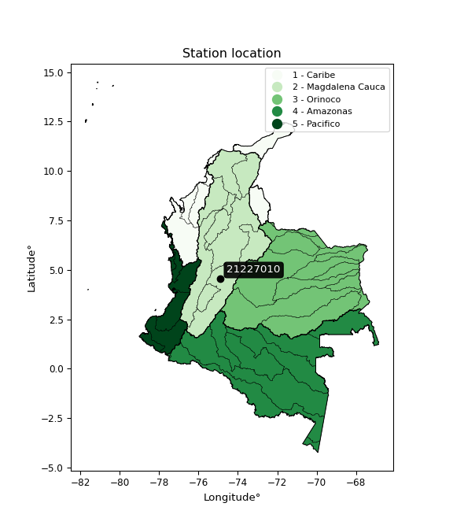

<div align="center">


</div>

# PMax24h Station (Rain): 21227010

Maximum Precipitation in 24 hours (PMax24h) is the greatest amount of rainfall for a specific duration that is meteorologically possible for a given location, acting as a "worst-case" scenario for extreme storms, crucial for designing safety-critical infrastructure like bridges, river deviations, dams, spillways, and nuclear plants to prevent catastrophic failure. The PMax24h is related with the Probable Maximum Precipitation (PMP) and it is calculated by hydrologists using meteorological data to determine the upper limit of extreme rainfall, often leading to the Probable Maximum Flood (PMF) for flood control design, and is increasingly being studied for climate change impacts. Probable Maximum Precipitation (PMP) is the theoretical upper limit of rainfall, a deterministic estimate for extreme events, while probability distributions (like GEV, Gumbel) describe the likelihood and frequency of various precipitation amounts, including rare ones, showing how often events occur, with PMP representing the extreme end of these distributions, used for critical infrastructure design to ensure safety against the worst conceivable weather, unlike standard statistical forecasts which cover typical probabilities.

The most common probability distributions in hydrology, used for analyzing floods, rainfall, and streamflow, include the Normal, Log-Normal, Gumbel, Gamma (including Log-Pearson Type III), and Generalized Extreme Value (GEV) distributions, often chosen based on the data´s skewness and whether modeling extremes or general conditions, with Gumbel and GEV popular for extreme events like floods, while the Normal distribution serves as a baseline, though often requiring transformations for skewed hydrological data. These distributions help in designing water infrastructure, managing water resources, and forecasting hydrologic events.

> Hydrological data often isn´t perfectly normal (it´s skewed), so different distributions are needed for different applications, such as: **Flood Frequency Analysis**: Using Gumbel, GEV, or Log-Pearson Type III for predicting extreme flood magnitudes and their return periods, **Rainfall Analysis**: Normal for annual totals, but Log-Normal, Weibull, or GEV for intensity or extreme daily rainfall, **Streamflow Modeling**: Gamma and Log-Normal for maximum flows, GEV for minimum flows, and Kappa for daily flows.

<div align="center">

</img>

</div>


## A. General information


### 1. General running parameters

• app_version: _v20260225_. • runtime: _2026-02-28 16:54:07.457399_. • Python version: _3.14.0_. • SciPy version: _1.16.3_. • Pandas version: _2.3.3_. • NumPy version: _2.3.5_. • Stations dataset (station_dataset_file): _dataset/pmax24h_in/automatic_colombia_2003_2025.csv_. • Stations catalog (station_catalog_file): _dataset/CNE.xls_. • Minimum year to eval til year_max (date_min): _1900_. • Maximum year to eval since year_min (date_max): _2025_. • Creates, save and include plots into reports (create_plot): _False_. • Plot only fit distributions with Δo > Δ (plot_only_fit): _True_. • Plot only simple graphs avoiding multiple CDFs and multiple Extreme values plots (plot_only_simple): _False_. • Eval low extreme values, if False, evaluates high extreme values (low_extreme): _False_. • Eval every SciPy distribution as logarithmic (pdist_logarithmic_on): _True_. • Standard deviation normalized (ddof): _1.0_. • Return periods to eval in years (Tr): _[2, 2.33, 5, 10, 15, 20, 25, 50, 75, 100, 200, 250, 500, 750, 1000]_. • Minimum data sample per station, 0 means any (minimum_sample): _5_. • Z-Score maximum threshold to adjust a value, 0 means disable (zscore_max): _3.5_. • Z-Score minimum threshold to adjust a value, 0 means disable (zscore_min): _-2.5_. • Avoid zeros, e.g. rain = 0 (avoid_zeros): _True_. • Avoid null values (avoid_nans): _True_. 

:file_folder:Table: [dataset.csv](../../dataset/pmax24h_in/automatic_colombia_2003_2025.csv)

> Delta Degrees of Freedom (DDOF): is a parameter used in the formulas for calculating variance and standard deviation. When ddof=0, the divisor is $N$ (the total number of observations) and this is used when your data set is the entire population. When ddof=1, the divisor is $N-1$ and this is used when your data set is a sample drawn from a larger population. Using $N-1$ provides an unbiased estimate of the population variance (known as Bessel´s correction).


### 2. Station info and location

|   id |   CODIGO | NOMBRE                    | CATEGORIA    | TECNOLOGIA                              | ESTADO   | FECHA_INSTALACION   |   FECHA_SUSPENSION |   ALTITUD |   LATITUD |   LONGITUD | DEPARTAMENTO   | MUNICIPIO   | AREA_OPERATIVA             | ENTIDAD                                                     | AREA_HIDROGRAFICA   | ZONA_HIDROGRAFICA   | SUBZONA_HIDROGRAFICA   | CORRIENTE   | Catalogo   |   Version |
|-----:|---------:|:--------------------------|:-------------|:----------------------------------------|:---------|:--------------------|-------------------:|----------:|----------:|-----------:|:---------------|:------------|:---------------------------|:------------------------------------------------------------|:--------------------|:--------------------|:-----------------------|:------------|:-----------|----------:|
|    0 | 21227010 | PIEDRAS  - AUT [21227010] | Limnigráfica | Automática con Telemetría, Convencional | Activa   | 15/03/1972          |                nan |       384 |   4.53522 |   -74.8805 | Tolima         | Piedras     | Area Operativa 10 - Tolima | INSTITUTO DE HIDROLOGIA METEOROLOGIA Y ESTUDIOS AMBIENTALES | Magdalena Cauca     | Alto Magdalena      | Río Opía               | Opia        | CNE_IDEAM  |  20251226 |

<div align="center">

Dynamic map: [:earth_americas:Google](http://maps.google.com/maps?q=4.535225,-74.880530556) [:earth_americas:OSM](https://www.openstreetmap.org/#map=18/4.535225/-74.880530556&layers=P) [:earth_americas:Bing](https://www.bing.com/maps?cp=4.535225~-74.880530556&lvl=18) [:earth_americas:Apple](https://maps.apple.com/frame?center=4.535225%2C-74.880530556&span=0.003%2C0.006)

</div>


<div align="center">

```geojson
{
  "type": "Feature",
  "geometry": {
    "type": "Point", 
    "coordinates": [-74.880530556, 4.535225]
  }, 
  "properties": {
    "Name": "21227010"
  }
}
```

</div>


### 3. Discrete values table and plot

<div align="center">

|               |           0 |            1 |          2 |           3 |          4 |
|:--------------|------------:|-------------:|-----------:|------------:|-----------:|
| Date          | 2018        | 2019         | 2023       | 2024        | 2025       |
| Value         |   45.4      |   53.4       |    8.6     |   37.2      |  109.4     |
| Value_initial |   45.4      |   53.4       |    8.6     |   37.2      |  109.4     |
| count         |    5        |    5         |    5       |    5        |    5       |
| mean          |   50.8      |   50.8       |   50.8     |   50.8      |   50.8     |
| std           |   36.8635   |   36.8635    |   36.8635  |   36.8635   |   36.8635  |
| zscore        |   -0.146486 |    0.0705304 |   -1.14476 |   -0.368928 |    1.58965 |


</div>


> The initial value (value_initial) correspond to the initial obtained or null completed value, and value (value) is adjusted only when the initial value is outside the valid range (outlier) definite through the Z-Score value. If Z-Score is active, values out of range or outliers are replaced with the station mean value. A Z-Score (or standard score) measures how many standard deviations a data point is from the mean of a dataset, indicating its relative position; positive scores mean above the mean, negative mean below, and a score of zero is exactly at the mean, allowing for comparison of values from different distributions. It´s calculated using the formula $z=(x–μ)/σ$, where $x$ is the data point, $μ$ is the mean, and $σ$ is the standard deviation, helping identify outliers and understand probability.
>
> <sub>**Note**: In this study, "completing" (filling gaps in) and "extending" (forecasting or lengthening the historical record) rainfall data series are avoided for certain critical analyses because they introduce artificial bias and uncertainty, which can distort the statistics of rare events (extremes), alter day-to-day variability, and compromise the integrity and homogeneity of the original data. Some reasons against Completing/Extending rainfall data are: **Distortion of Extremes and Variability**: The primary issue is that most gap-filling or extension methods rely on averaging or regression with nearby stations, which inherently smooths the data. Rainfall is highly variable in space and time, with a large percentage of zero values and occasional large storms. Infilling methods often underestimate the highest values and overestimate the lowest (zero) values, which severely distorts analyses focused on flood frequency, drought severity, and intensity-duration-frequency (IDF) curves, **Loss of Data Homogeneity**: Infilled or extended data are synthetic estimates, not actual measurements. Combining these estimates with observed data can violate the assumption of data homogeneity, which requires that the data properties do not change over time. Inhomogeneity can lead to incorrect conclusions about long-term trends or changes in climate patterns, **Propagation of Errors**: Errors and biases from the original data (e.g., wind-induced undercatch, instrument errors, site changes) or the data used for imputation can propagate through the analysis, leading to unreliable hydrological models and inaccurate predictions, **Compromised Statistical Integrity**: For statistical analyses, especially those involving the frequency of events, using artificial data can introduce time bias or autocorrelation that doesn´t exist in reality, making it difficult to assess the true probability of events, **Difficulty in Validation**: It is difficult to accurately validate the quality of filled or extended data, especially for past periods where ground-truth measurements are unavailable. The reliability of imputation techniques heavily depends on the density of the surrounding station network and the complexity of the local topography.</sub>


### 4. Active continuous probability distributions from SciPy (80 of 104 available)

A Probability Density Function (PDF) describes the relative likelihood of a continuous random variable falling within a specific range, where the total area under its curve equals 1, and the area over any interval gives the actual probability for that range. Unlike discrete probabilities (like rolling a die), a PDF shows density, not direct probability for a single point (which is zero), with higher points indicating higher likelihood, often visualized as a bell curve for normal distributions.

A log of a probability density function (log-PDF) is simply the logarithm of the PDF´s value, denoted as $log(f(x))$, useful for converting multiplication of probabilities into addition, improving numerical stability with tiny numbers, and connecting to information theory concepts like entropy. Instead of dealing with very small probabilities (e.g., 0.000001), log-PDFs use negative numbers (e.g., $log(0.00001) ≈ -11.51$ that are easier for computers to handle, preventing underflow errors and simplifying complex calculations. In this study, each active probability distribution from SciPy is also evaluated in the $log$ form.

[scipy.stats](https://docs.scipy.org/doc/scipy/reference/stats.html) is a Python´s powerful submodule within the SciPy library for comprehensive statistical analysis, offering over 130 probability distributions (like Normal, Poisson, etc.), functions for descriptive stats (mean, variance), hypothesis testing (t-tests, chi-square), random variable generation, and statistical tests, making it essential for data science, modeling, and research. It provides tools to explore, model, and draw conclusions from data efficiently, working seamlessly with [NumPy](https://numpy.org/).

<div align="center">

|   id | p_dist           |   n_parameter | fit_method   | label                                                                       | active   | ref                                                                                                      |
|-----:|:-----------------|--------------:|:-------------|:----------------------------------------------------------------------------|:---------|:---------------------------------------------------------------------------------------------------------|
|    0 | alpha            |             3 | MLE          | Alpha                                                                       | True     | [:mortar_board:](https://docs.scipy.org/doc/scipy/reference/generated/scipy.stats.alpha.html)            |
|    1 | anglit           |             2 | MM           | Anglit                                                                      | True     | [:mortar_board:](https://docs.scipy.org/doc/scipy/reference/generated/scipy.stats.anglit.html)           |
|    2 | arcsine          |             2 | MM           | Arcsine                                                                     | True     | [:mortar_board:](https://docs.scipy.org/doc/scipy/reference/generated/scipy.stats.arcsine.html)          |
|    3 | argus            |             3 | MLE          | Argus                                                                       | True     | [:mortar_board:](https://docs.scipy.org/doc/scipy/reference/generated/scipy.stats.argus.html)            |
|    4 | beta             |             4 | MLE          | Beta                                                                        | True     | [:mortar_board:](https://docs.scipy.org/doc/scipy/reference/generated/scipy.stats.beta.html)             |
|    5 | betaprime        |             4 | MLE          | Beta prime                                                                  | True     | [:mortar_board:](https://docs.scipy.org/doc/scipy/reference/generated/scipy.stats.betaprime.html)        |
|    6 | bradford         |             3 | MLE          | Bradford                                                                    | True     | [:mortar_board:](https://docs.scipy.org/doc/scipy/reference/generated/scipy.stats.bradford.html)         |
|    7 | burr             |             4 | MLE          | Burr (Type III)                                                             | True     | [:mortar_board:](https://docs.scipy.org/doc/scipy/reference/generated/scipy.stats.burr.html)             |
|    8 | burr12           |             4 | MLE          | Burr (Type III) 12                                                          | True     | [:mortar_board:](https://docs.scipy.org/doc/scipy/reference/generated/scipy.stats.burr12.html)           |
|    9 | cosine           |             2 | MLE          | Cosine                                                                      | True     | [:mortar_board:](https://docs.scipy.org/doc/scipy/reference/generated/scipy.stats.cosine.html)           |
|   10 | crystalball      |             4 | MLE          | Crystalball                                                                 | True     | [:mortar_board:](https://docs.scipy.org/doc/scipy/reference/generated/scipy.stats.crystalball.html)      |
|   11 | dgamma           |             3 | MLE          | Double gamma                                                                | True     | [:mortar_board:](https://docs.scipy.org/doc/scipy/reference/generated/scipy.stats.dgamma.html)           |
|   12 | dweibull         |             3 | MLE          | Double Weibull                                                              | True     | [:mortar_board:](https://docs.scipy.org/doc/scipy/reference/generated/scipy.stats.dweibull.html)         |
|   13 | erlang           |             3 | MLE          | Erlang                                                                      | True     | [:mortar_board:](https://docs.scipy.org/doc/scipy/reference/generated/scipy.stats.erlang.html)           |
|   14 | exponnorm        |             3 | MLE          | Exponentially modified Normal                                               | True     | [:mortar_board:](https://docs.scipy.org/doc/scipy/reference/generated/scipy.stats.exponnorm.html)        |
|   15 | exponpow         |             3 | MLE          | Exponential power                                                           | True     | [:mortar_board:](https://docs.scipy.org/doc/scipy/reference/generated/scipy.stats.exponpow.html)         |
|   16 | exponweib        |             4 | MLE          | Exponentiated Weibull                                                       | True     | [:mortar_board:](https://docs.scipy.org/doc/scipy/reference/generated/scipy.stats.exponweib.html)        |
|   17 | f                |             4 | MLE          | F                                                                           | True     | [:mortar_board:](https://docs.scipy.org/doc/scipy/reference/generated/scipy.stats.f.html)                |
|   18 | fatiguelife      |             3 | MLE          | Fatigue-life (Birnbaum-Saunders)                                            | True     | [:mortar_board:](https://docs.scipy.org/doc/scipy/reference/generated/scipy.stats.fatiguelife.html)      |
|   19 | foldnorm         |             3 | MM           | Fold Normal                                                                 | True     | [:mortar_board:](https://docs.scipy.org/doc/scipy/reference/generated/scipy.stats.foldnorm.html)         |
|   20 | gamma            |             3 | MLE          | Gamma                                                                       | True     | [:mortar_board:](https://docs.scipy.org/doc/scipy/reference/generated/scipy.stats.gamma.html)            |
|   21 | gausshyper       |             6 | MLE          | Gauss hypergeometric                                                        | True     | [:mortar_board:](https://docs.scipy.org/doc/scipy/reference/generated/scipy.stats.gausshyper.html)       |
|   22 | genexpon         |             5 | MLE          | Generalized exponential                                                     | True     | [:mortar_board:](https://docs.scipy.org/doc/scipy/reference/generated/scipy.stats.genexpon.html)         |
|   23 | genextreme       |             3 | MLE          | Generalized exponential                                                     | True     | [:mortar_board:](https://docs.scipy.org/doc/scipy/reference/generated/scipy.stats.genextreme.html)       |
|   24 | gengamma         |             4 | MLE          | Generalized gamma                                                           | True     | [:mortar_board:](https://docs.scipy.org/doc/scipy/reference/generated/scipy.stats.gengamma.html)         |
|   25 | genhalflogistic  |             3 | MLE          | Generalized half-logistic                                                   | True     | [:mortar_board:](https://docs.scipy.org/doc/scipy/reference/generated/scipy.stats.genhalflogistic.html)  |
|   26 | genlogistic      |             3 | MLE          | Generalized logistic                                                        | True     | [:mortar_board:](https://docs.scipy.org/doc/scipy/reference/generated/scipy.stats.genlogistic.html)      |
|   27 | gennorm          |             3 | MLE          | Generalized Normal                                                          | True     | [:mortar_board:](https://docs.scipy.org/doc/scipy/reference/generated/scipy.stats.gennorm.html)          |
|   28 | genpareto        |             3 | MLE          | Generalized Pareto                                                          | True     | [:mortar_board:](https://docs.scipy.org/doc/scipy/reference/generated/scipy.stats.genpareto.html)        |
|   29 | gompertz         |             3 | MLE          | Gompertz (or truncated Gumbel)                                              | True     | [:mortar_board:](https://docs.scipy.org/doc/scipy/reference/generated/scipy.stats.gompertz.html)         |
|   30 | gumbel_l         |             2 | MM           | Gumbel Left Skew                                                            | True     | [:mortar_board:](https://docs.scipy.org/doc/scipy/reference/generated/scipy.stats.gumbel_l.html)         |
|   31 | gumbel_r         |             2 | MM           | Gumbel Right Skew                                                           | True     | [:mortar_board:](https://docs.scipy.org/doc/scipy/reference/generated/scipy.stats.gumbel_r.html)         |
|   32 | halfgennorm      |             3 | MLE          | Upper half of a generalized normal                                          | True     | [:mortar_board:](https://docs.scipy.org/doc/scipy/reference/generated/scipy.stats.halfgennorm.html)      |
|   33 | halflogistic     |             2 | MM           | Half-logistic                                                               | True     | [:mortar_board:](https://docs.scipy.org/doc/scipy/reference/generated/scipy.stats.halflogistic.html)     |
|   34 | halfnorm         |             2 | MM           | Half Normal                                                                 | True     | [:mortar_board:](https://docs.scipy.org/doc/scipy/reference/generated/scipy.stats.halfnorm.html)         |
|   35 | hypsecant        |             2 | MM           | hyperbolic secant                                                           | True     | [:mortar_board:](https://docs.scipy.org/doc/scipy/reference/generated/scipy.stats.hypsecant.html)        |
|   36 | invgamma         |             3 | MLE          | Inverted gamma                                                              | True     | [:mortar_board:](https://docs.scipy.org/doc/scipy/reference/generated/scipy.stats.invgamma.html)         |
|   37 | invgauss         |             3 | MLE          | Inverse Gaussian                                                            | True     | [:mortar_board:](https://docs.scipy.org/doc/scipy/reference/generated/scipy.stats.invgauss.html)         |
|   38 | invweibull       |             3 | MLE          | Inverted Weibull                                                            | True     | [:mortar_board:](https://docs.scipy.org/doc/scipy/reference/generated/scipy.stats.invweibull.html)       |
|   39 | johnsonsb        |             4 | MLE          | Johnson SB                                                                  | True     | [:mortar_board:](https://docs.scipy.org/doc/scipy/reference/generated/scipy.stats.johnsonsb.html)        |
|   40 | johnsonsu        |             4 | MLE          | Johnson Su                                                                  | True     | [:mortar_board:](https://docs.scipy.org/doc/scipy/reference/generated/scipy.stats.johnsonsu.html)        |
|   41 | kappa3           |             3 | MLE          | Kappa 3                                                                     | True     | [:mortar_board:](https://docs.scipy.org/doc/scipy/reference/generated/scipy.stats.kappa3.html)           |
|   42 | kappa4           |             4 | MLE          | Kappa 4                                                                     | True     | [:mortar_board:](https://docs.scipy.org/doc/scipy/reference/generated/scipy.stats.kappa4.html)           |
|   43 | ksone            |             3 | MLE          | Kolmogorov-Smirnov one-sided test statistic distribution                    | True     | [:mortar_board:](https://docs.scipy.org/doc/scipy/reference/generated/scipy.stats.ksone.html)            |
|   44 | kstwobign        |             2 | MLE          | Limiting distribution of scaled Kolmogorov-Smirnov two-sided test statistic | True     | [:mortar_board:](https://docs.scipy.org/doc/scipy/reference/generated/scipy.stats.kstwobign.html)        |
|   45 | laplace          |             2 | MM           | Laplace                                                                     | True     | [:mortar_board:](https://docs.scipy.org/doc/scipy/reference/generated/scipy.stats.laplace.html)          |
|   46 | levy_l           |             2 | MLE          | Left-skewed Levy                                                            | True     | [:mortar_board:](https://docs.scipy.org/doc/scipy/reference/generated/scipy.stats.levy_l.html)           |
|   47 | loggamma         |             3 | MLE          | Log gamma                                                                   | True     | [:mortar_board:](https://docs.scipy.org/doc/scipy/reference/generated/scipy.stats.loggamma.html)         |
|   48 | logistic         |             2 | MM           | Logistic (or Sech-squared)                                                  | True     | [:mortar_board:](https://docs.scipy.org/doc/scipy/reference/generated/scipy.stats.logistic.html)         |
|   49 | loglaplace       |             3 | MLE          | Log-Laplace                                                                 | True     | [:mortar_board:](https://docs.scipy.org/doc/scipy/reference/generated/scipy.stats.loglaplace.html)       |
|   50 | lomax            |             3 | MLE          | Lomax (Pareto of the second kind)                                           | True     | [:mortar_board:](https://docs.scipy.org/doc/scipy/reference/generated/scipy.stats.lomax.html)            |
|   51 | maxwell          |             2 | MM           | Maxwell                                                                     | True     | [:mortar_board:](https://docs.scipy.org/doc/scipy/reference/generated/scipy.stats.maxwell.html)          |
|   52 | mielke           |             4 | MLE          | Mielke Beta-Kappa / Dagum                                                   | True     | [:mortar_board:](https://docs.scipy.org/doc/scipy/reference/generated/scipy.stats.mielke.html)           |
|   53 | moyal            |             2 | MM           | Moyal                                                                       | True     | [:mortar_board:](https://docs.scipy.org/doc/scipy/reference/generated/scipy.stats.moyal.html)            |
|   54 | nakagami         |             3 | MLE          | Nakagami                                                                    | True     | [:mortar_board:](https://docs.scipy.org/doc/scipy/reference/generated/scipy.stats.nakagami.html)         |
|   55 | ncf              |             5 | MLE          | Non-central F distribution                                                  | True     | [:mortar_board:](https://docs.scipy.org/doc/scipy/reference/generated/scipy.stats.ncf.html)              |
|   56 | nct              |             4 | MLE          | Non-central Student’s t                                                     | True     | [:mortar_board:](https://docs.scipy.org/doc/scipy/reference/generated/scipy.stats.nct.html)              |
|   57 | norm             |             2 | MM           | Normal                                                                      | True     | [:mortar_board:](https://docs.scipy.org/doc/scipy/reference/generated/scipy.stats.norm.html)             |
|   58 | pearson3         |             3 | MM           | Pearson type III                                                            | True     | [:mortar_board:](https://docs.scipy.org/doc/scipy/reference/generated/scipy.stats.pearson3.html)         |
|   59 | powerlaw         |             3 | MLE          | Power-function                                                              | True     | [:mortar_board:](https://docs.scipy.org/doc/scipy/reference/generated/scipy.stats.powerlaw.html)         |
|   60 | rayleigh         |             2 | MM           | Rayleigh                                                                    | True     | [:mortar_board:](https://docs.scipy.org/doc/scipy/reference/generated/scipy.stats.rayleigh.html)         |
|   61 | rdist            |             3 | MLE          | R-distributed (symmetric beta)                                              | True     | [:mortar_board:](https://docs.scipy.org/doc/scipy/reference/generated/scipy.stats.rdist.html)            |
|   62 | rice             |             3 | MLE          | Rice                                                                        | True     | [:mortar_board:](https://docs.scipy.org/doc/scipy/reference/generated/scipy.stats.rice.html)             |
|   63 | semicircular     |             2 | MM           | Semicircular                                                                | True     | [:mortar_board:](https://docs.scipy.org/doc/scipy/reference/generated/scipy.stats.semicircular.html)     |
|   64 | skewnorm         |             3 | MLE          | Skew normal                                                                 | True     | [:mortar_board:](https://docs.scipy.org/doc/scipy/reference/generated/scipy.stats.skewnorm.html)         |
|   65 | t                |             3 | MLE          | Student’s t                                                                 | True     | [:mortar_board:](https://docs.scipy.org/doc/scipy/reference/generated/scipy.stats.t.html)                |
|   66 | trapezoid        |             4 | MLE          | Trapezoid                                                                   | True     | [:mortar_board:](https://docs.scipy.org/doc/scipy/reference/generated/scipy.stats.trapezoid.html)        |
|   67 | triang           |             3 | MLE          | Triangular                                                                  | True     | [:mortar_board:](https://docs.scipy.org/doc/scipy/reference/generated/scipy.stats.triang.html)           |
|   68 | truncexpon       |             3 | MLE          | Truncated exponential                                                       | True     | [:mortar_board:](https://docs.scipy.org/doc/scipy/reference/generated/scipy.stats.truncexpon.html)       |
|   69 | truncnorm        |             4 | MLE          | Truncated normal                                                            | True     | [:mortar_board:](https://docs.scipy.org/doc/scipy/reference/generated/scipy.stats.truncnorm.html)        |
|   70 | truncpareto      |             4 | MLE          | Upper truncated Pareto                                                      | True     | [:mortar_board:](https://docs.scipy.org/doc/scipy/reference/generated/scipy.stats.truncpareto.html)      |
|   71 | truncweibull_min |             5 | MLE          | Doubly truncated Weibull minimum                                            | True     | [:mortar_board:](https://docs.scipy.org/doc/scipy/reference/generated/scipy.stats.truncweibull_min.html) |
|   72 | tukeylambda      |             3 | MLE          | Tukey-Lamdba                                                                | True     | [:mortar_board:](https://docs.scipy.org/doc/scipy/reference/generated/scipy.stats.tukeylambda.html)      |
|   73 | uniform          |             2 | MLE          | Uniform                                                                     | True     | [:mortar_board:](https://docs.scipy.org/doc/scipy/reference/generated/scipy.stats.uniform.html)          |
|   74 | vonmises         |             3 | MLE          | Von Mises                                                                   | True     | [:mortar_board:](https://docs.scipy.org/doc/scipy/reference/generated/scipy.stats.vonmises.html)         |
|   75 | vonmises_line    |             3 | MLE          | Von Mises line                                                              | True     | [:mortar_board:](https://docs.scipy.org/doc/scipy/reference/generated/scipy.stats.vonmises_line.html)    |
|   76 | wald             |             2 | MM           | Wald                                                                        | True     | [:mortar_board:](https://docs.scipy.org/doc/scipy/reference/generated/scipy.stats.wald.html)             |
|   77 | weibull_max      |             3 | MLE          | Weibull maximum                                                             | True     | [:mortar_board:](https://docs.scipy.org/doc/scipy/reference/generated/scipy.stats.weibull_max.html)      |
|   78 | weibull_min      |             3 | MLE          | Weibull minimum                                                             | True     | [:mortar_board:](https://docs.scipy.org/doc/scipy/reference/generated/scipy.stats.weibull_min.html)      |
|   79 | wrapcauchy       |             3 | MLE          | Wrapped  Cauchy                                                             | True     | [:mortar_board:](https://docs.scipy.org/doc/scipy/reference/generated/scipy.stats.wrapcauchy.html)       |

</div>

> **n_parameter:** # arguments & localization & scale.
>
> **Fit methods:** (MLE) maximum likelihood, (MM) L-moments.
>
>**Inactive** (With the only purpose of prevent loops, zero divisions, infinite values, over high estimated values or horizontal trending for recurrence intervals estimations, the follow distributions were disabled.)**:** lognorm, norminvgauss, powernorm, powerlognorm, cauchy, halfcauchy, foldcauchy, skewcauchy, chi2, expon, fisk, genhyperbolic, geninvgauss, gibrat, kstwo, laplace_asymmetric, levy, levy_stable, ncx2, pareto, rel_breitwigner, recipinvgauss, studentized_range, loguniform, 


## B. Probability (PDF) vs. Empirical (EDF) distributions functions

A continuous probability distribution (CPD) describes probabilities for variables that can take any value within a range (like rain any time), unlike discrete variables with specific outcomes (like temperature). It uses a Probability Density Function (PDF), a curve where the total area under it equals 1, and the probability of the variable falling within an interval (a to b) is found by calculating the area under the curve between those points. A key feature is that the probability of hitting any single exact value is zero, so probabilities are always expressed for ranges, e.g., $P(a ≤ X ≤ b)$.

<div align="center">

Distributions parameters from station values
|     |   station | p_dist              |   n |              loc |          scale | shape                  | shape1                | shape2                | shape3             |
|----:|----------:|:--------------------|----:|-----------------:|---------------:|:-----------------------|:----------------------|:----------------------|:-------------------|
|   0 |  21227010 | alpha               |   5 |     -0.0459746   |   18.2591      | 1.739294058008413e-10  |                       |                       |                    |
|   1 |  21227010 | anglit              |   5 |     50.8         |   96.4555      |                        |                       |                       |                    |
|   2 |  21227010 | arcsine             |   5 |      4.17092     |   93.2582      |                        |                       |                       |                    |
|   3 |  21227010 | argus               |   5 |    -23.0151      |  139.598       | 1.6277817154337306e-06 |                       |                       |                    |
|   4 |  21227010 | beta                |   5 |      8.6         |  178.232       | 0.1304922616940558     | 2.396356166831278     |                       |                    |
|   5 |  21227010 | betaprime           |   5 |      8.59995     |  998.491       | 0.7704929459298784     | 18.110222962241664    |                       |                    |
|   6 |  21227010 | bradford            |   5 |      0.0534819   |  109.347       | 0.5489163052472603     |                       |                       |                    |
|   7 |  21227010 | burr                |   5 |     -0.256768    |   71.0597      | 3.773742419933223      | 0.36395845770211255   |                       |                    |
|   8 |  21227010 | burr12              |   5 |      0.204848    |    8.26138     | 274.9449397291912      | 0.0023745189810965308 |                       |                    |
|   9 |  21227010 | cosine              |   5 |     53.9889      |   27.903       |                        |                       |                       |                    |
|  10 |  21227010 | crystalball         |   5 |     50.8         |   32.9717      | 13818.835200017604     | 44.798303088490556    |                       |                    |
|  11 |  21227010 | dgamma              |   5 |     45.4         |   29.5889      | 0.6983492119496542     |                       |                       |                    |
|  12 |  21227010 | dweibull            |   5 |     45.4         |   39.8464      | 0.45098264440704994    |                       |                       |                    |
|  13 |  21227010 | erlang              |   5 |      8.6         |   54.9797      | 0.44973405829583823    |                       |                       |                    |
|  14 |  21227010 | exponnorm           |   5 |     20.4413      |   16.3228      | 1.8598885545779402     |                       |                       |                    |
|  15 |  21227010 | exponpow            |   5 |      8.6         |   13.6101      | 0.12021799935747805    |                       |                       |                    |
|  16 |  21227010 | exponweib           |   5 |      8.6         |   63.3551      | 0.3909469551952146     | 1.2592765291500987    |                       |                    |
|  17 |  21227010 | f                   |   5 |      2.09192     |   49.5327      | 3.4218362708272396     | 702.9996398248666     |                       |                    |
|  18 |  21227010 | fatiguelife         |   5 |      8.59973     |    0.16703     | 14.294359071125108     |                       |                       |                    |
|  19 |  21227010 | foldnorm            |   5 |      2.40343     |   40.9731      | 1.021151013646353      |                       |                       |                    |
|  20 |  21227010 | gamma               |   5 |      8.6         |   55.3438      | 0.44842539570534745    |                       |                       |                    |
|  21 |  21227010 | gausshyper          |   5 |      0.0418273   |  109.358       | 1.170254414755567      | 0.8324054355893673    | 0.9991777905514455    | 1.0407838217581251 |
|  22 |  21227010 | genexpon            |   5 |     -2.02973     |    2.08305     | 0.0018662408392208915  | 0.09241125198834257   | 0.03539553523079692   |                    |
|  23 |  21227010 | genextreme          |   5 |     35.5091      |   26.0409      | -0.00356009037488159   |                       |                       |                    |
|  24 |  21227010 | gengamma            |   5 |      8.6         |   19.0703      | 1.3580147074608804     | 0.5594346058563311    |                       |                    |
|  25 |  21227010 | genhalflogistic     |   5 |     -1.52957     |  115.754       | 1.0434943098797396     |                       |                       |                    |
|  26 |  21227010 | genlogistic         |   5 |   -128.349       |   26.0521      | 540.3307144619007      |                       |                       |                    |
|  27 |  21227010 | gennorm             |   5 |     45.4         |    2.0079      | 0.4416616326352155     |                       |                       |                    |
|  28 |  21227010 | genpareto           |   5 |     -0.0166681   |  152.359       | -1.3924698991789644    |                       |                       |                    |
|  29 |  21227010 | gompertz            |   5 |      8.6         |   97.8751      | 1.573796087422764      |                       |                       |                    |
|  30 |  21227010 | gumbel_l            |   5 |     65.639       |   25.708       |                        |                       |                       |                    |
|  31 |  21227010 | gumbel_r            |   5 |     35.961       |   25.708       |                        |                       |                       |                    |
|  32 |  21227010 | halfgennorm         |   5 |      8.6         |  107.893       | 22.433104069017293     |                       |                       |                    |
|  33 |  21227010 | halflogistic        |   5 |     11.7209      |   28.1896      |                        |                       |                       |                    |
|  34 |  21227010 | halfnorm            |   5 |      7.15833     |   54.6967      |                        |                       |                       |                    |
|  35 |  21227010 | hypsecant           |   5 |     50.8         |   20.9905      |                        |                       |                       |                    |
|  36 |  21227010 | invgamma            |   5 |    -60.1436      | 1254.11        | 12.290225559692619     |                       |                       |                    |
|  37 |  21227010 | invgauss            |   5 |    -30.0316      |  441.797       | 0.18296084753712866    |                       |                       |                    |
|  38 |  21227010 | invweibull          |   5 |  -7280.16        | 7315.67        | 280.930523928405       |                       |                       |                    |
|  39 |  21227010 | johnsonsb           |   5 |      8.6         |  100.8         | 0.27133504519637075    | 0.12513491424560136   |                       |                    |
|  40 |  21227010 | johnsonsu           |   5 |    -30.1849      |    4.02586     | -8.799566664969351     | 2.4359654258924293    |                       |                    |
|  41 |  21227010 | kappa3              |   5 |      8.6         |   76.7598      | 8.284599900315948      |                       |                       |                    |
|  42 |  21227010 | kappa4              |   5 |     -1.47597     |  111.35        | 1.0994721616655716     | 0.9961600236188621    |                       |                    |
|  43 |  21227010 | ksone               |   5 |     -1.48        |  120.96        | 1.0                    |                       |                       |                    |
|  44 |  21227010 | kstwobign           |   5 |    -57.3399      |  124.352       |                        |                       |                       |                    |
|  45 |  21227010 | laplace             |   5 |     50.8         |   23.3145      |                        |                       |                       |                    |
|  46 |  21227010 | levy_l              |   5 |    115.219       |   22.2658      |                        |                       |                       |                    |
|  47 |  21227010 | loggamma            |   5 | -10968.6         | 1460.63        | 1890.3851387591994     |                       |                       |                    |
|  48 |  21227010 | logistic            |   5 |     50.8         |   18.1783      |                        |                       |                       |                    |
|  49 |  21227010 | loglaplace          |   5 |     -0.103871    |   45.5039      | 1.7281898472608166     |                       |                       |                    |
|  50 |  21227010 | lomax               |   5 |      8.6         |    6.68679e+07 | 1632457.345569335      |                       |                       |                    |
|  51 |  21227010 | maxwell             |   5 |    -27.3292      |   48.9602      |                        |                       |                       |                    |
|  52 |  21227010 | mielke              |   5 |     -0.409078    |   70.9057      | 1.3862829373631222     | 3.7722496720292638    |                       |                    |
|  53 |  21227010 | moyal               |   5 |     31.9446      |   14.8425      |                        |                       |                       |                    |
|  54 |  21227010 | nakagami            |   5 |     37.2         |   23.2149      | 0.17062887939701082    |                       |                       |                    |
|  55 |  21227010 | ncf                 |   5 |     -0.0450954   |    5.09949e-05 | 1.2908008512657626e-05 | 5.495821687562039     | 10.18000676775934     |                    |
|  56 |  21227010 | nct                 |   5 |     -0.00888925  |   22.707       | 5.231367371770422      | 1.8963809168251622    |                       |                    |
|  57 |  21227010 | norm                |   5 |     50.8         |   32.9717      |                        |                       |                       |                    |
|  58 |  21227010 | pearson3            |   5 |     50.8         |   32.9718      | 0.6886479937391023     |                       |                       |                    |
|  59 |  21227010 | powerlaw            |   5 |      8.6         |  100.8         | 0.12003172899260395    |                       |                       |                    |
|  60 |  21227010 | rayleigh            |   5 |    -12.2769      |   50.3281      |                        |                       |                       |                    |
|  61 |  21227010 | rdist               |   5 |     -0.504459    |   53.9045      | 1.069963310169776      |                       |                       |                    |
|  62 |  21227010 | rice                |   5 |     -7.10221     |   47.1158      | 0.0010672512819470646  |                       |                       |                    |
|  63 |  21227010 | semicircular        |   5 |     50.8         |   65.9435      |                        |                       |                       |                    |
|  64 |  21227010 | skewnorm            |   5 |     11.3977      |   51.3778      | 3.741972011743985      |                       |                       |                    |
|  65 |  21227010 | t                   |   5 |     50.8         |   32.9717      | 477007.97436630493     |                       |                       |                    |
|  66 |  21227010 | trapezoid           |   5 |     -1.554       |  120.96        | 0.9999999999999999     | 1.0                   |                       |                    |
|  67 |  21227010 | triang              |   5 |    -31.5762      |  141.297       | 0.9977332185808212     |                       |                       |                    |
|  68 |  21227010 | truncexpon          |   5 |      1.97661     |  113.374       | 0.947513459961721      |                       |                       |                    |
|  69 |  21227010 | truncnorm           |   5 |     50.8         |   32.9717      | -480.34788212569515    | 5.657541583066594     |                       |                    |
|  70 |  21227010 | truncpareto         |   5 |      8.20294     |    0.397056    | 0.26169463170551344    | 254.8685343280491     |                       |                    |
|  71 |  21227010 | truncweibull_min    |   5 |      2.01246     |  118.542       | 1.0798573935938105     | 5.259504691188298e-11 | 0.9059003443660076    |                    |
|  72 |  21227010 | tukeylambda         |   5 |     -0.472196    |   58.2062      | 1.080450345463109      |                       |                       |                    |
|  73 |  21227010 | uniform             |   5 |      8.6         |  100.8         |                        |                       |                       |                    |
|  74 |  21227010 | vonmises            |   5 |      2.27064     |    1           | 1.0535826627179539     |                       |                       |                    |
|  75 |  21227010 | vonmises_line       |   5 |     59.0203      |   16.0493      | 7.114153142457008e-05  |                       |                       |                    |
|  76 |  21227010 | wald                |   5 |     17.8282      |   32.9718      |                        |                       |                       |                    |
|  77 |  21227010 | weibull_max         |   5 |    109.4         |    1.76146     | 0.19245492877303083    |                       |                       |                    |
|  78 |  21227010 | weibull_min         |   5 |      8.6         |    7.23259     | 0.13229498830295894    |                       |                       |                    |
|  79 |  21227010 | wrapcauchy          |   5 |      8.6         |   16.0526      | 0.0640378104206969     |                       |                       |                    |
|  80 |  21227010 | logalpha            |   5 |    -16.8871      |  477.342       | 23.27162202717348      |                       |                       |                    |
|  81 |  21227010 | loganglit           |   5 |      3.65128     |    2.43802     |                        |                       |                       |                    |
|  82 |  21227010 | logarcsine          |   5 |      2.47269     |    2.35718     |                        |                       |                       |                    |
|  83 |  21227010 | logargus            |   5 |      1.35502     |    3.45948     | 1.664563885008936      |                       |                       |                    |
|  84 |  21227010 | logbeta             |   5 |      1.68878     |    3.00623     | 1.7286129436162265     | 0.7831340774286198    |                       |                    |
|  85 |  21227010 | logbetaprime        |   5 |    -12.5827      |  113.421       | 402.01401407639196     | 2810.866552115731     |                       |                    |
|  86 |  21227010 | logbradford         |   5 |      2.15175     |    2.5433      | 1.1230083356722158     |                       |                       |                    |
|  87 |  21227010 | logburr             |   5 |      2.15176     |    2.78543     | 26.661234970796386     | 0.017809559288298582  |                       |                    |
|  88 |  21227010 | logburr12           |   5 |   -547.362       |  559.402       | 850.7001628321382      | 212307.32598151662    |                       |                    |
|  89 |  21227010 | logcosine           |   5 |      3.56293     |    0.706517    |                        |                       |                       |                    |
|  90 |  21227010 | logcrystalball      |   5 |      3.93932     |    0.512492    | 0.6874142439877597     | 137.10348687486396    |                       |                    |
|  91 |  21227010 | logdgamma           |   5 |      3.81551     |    0.621769    | 0.9315962134755758     |                       |                       |                    |
|  92 |  21227010 | logdweibull         |   5 |      3.81551     |    0.625619    | 0.9289450272217202     |                       |                       |                    |
|  93 |  21227010 | logerlang           |   5 |    -10.4112      |    0.0525669   | 267.5437280451106      |                       |                       |                    |
|  94 |  21227010 | logexponnorm        |   5 |      3.65066     |    0.833395    | 0.000737420242803761   |                       |                       |                    |
|  95 |  21227010 | logexponpow         |   5 |      2.15176     |    1.21345     | 0.48361389525027165    |                       |                       |                    |
|  96 |  21227010 | logexponweib        |   5 |      2.15176     |    1.73982     | 0.12360165220647323    | 1.0573964801224784    |                       |                    |
|  97 |  21227010 | logf                |   5 |    -19.0269      |   22.684       | 1474.8832054470004     | 94982.9917495762      |                       |                    |
|  98 |  21227010 | logfatiguelife      |   5 |   -358.199       |  361.85        | 0.002295450850244865   |                       |                       |                    |
|  99 |  21227010 | logfoldnorm         |   5 |     -1.57676     |    0.799132    | 6.548214839413541      |                       |                       |                    |
| 100 |  21227010 | loggamma            |   5 |    -10.1906      |    0.0534219   | 258.8876083230962      |                       |                       |                    |
| 101 |  21227010 | loggausshyper       |   5 |      2.09265     |    2.60236     | 1.184966719996433      | 0.8624159458124694    | 0.9396853971699951    | 1.15257613228472   |
| 102 |  21227010 | loggenexpon         |   5 |      2.15176     |    1.02037e+11 | 36182663048.438675     | 90509816255.1659      | 45094575231.29559     |                    |
| 103 |  21227010 | loggenextreme       |   5 |      3.82549     |    1.11295     | 1.2799648169367157     |                       |                       |                    |
| 104 |  21227010 | loggengamma         |   5 |      2.15176     |    1.99626     | 1.5380731590345809     | 0.09565842427785937   |                       |                    |
| 105 |  21227010 | loggenhalflogistic  |   5 |      1.91249     |    2.94368     | 1.057919902486768      |                       |                       |                    |
| 106 |  21227010 | loggenlogistic      |   5 |      4.26754     |    0.264614    | 0.3576755902229234     |                       |                       |                    |
| 107 |  21227010 | loggennorm          |   5 |      3.81551     |    0.00654773  | 0.3182394059412318     |                       |                       |                    |
| 108 |  21227010 | loggenpareto        |   5 |     -0.00274539  |    8.50493     | -1.8104236266938014    |                       |                       |                    |
| 109 |  21227010 | loggompertz         |   5 |      2.15176     |    1.39781     | 0.41976996881491246    |                       |                       |                    |
| 110 |  21227010 | loggumbel_l         |   5 |      4.02635     |    0.649796    |                        |                       |                       |                    |
| 111 |  21227010 | loggumbel_r         |   5 |      3.27621     |    0.649796    |                        |                       |                       |                    |
| 112 |  21227010 | loghalfgennorm      |   5 |      2.15176     |    1.09619     | 0.838814529918843      |                       |                       |                    |
| 113 |  21227010 | loghalflogistic     |   5 |      2.66347     |    0.712547    |                        |                       |                       |                    |
| 114 |  21227010 | loghalfnorm         |   5 |      2.5482      |    1.38251     |                        |                       |                       |                    |
| 115 |  21227010 | loghypsecant        |   5 |      3.65128     |    0.530556    |                        |                       |                       |                    |
| 116 |  21227010 | loginvgamma         |   5 |    -13.9033      | 7016.27        | 400.8132748679021      |                       |                       |                    |
| 117 |  21227010 | loginvgauss         |   5 |     -3.8213      |  505.592       | 0.014771883319448002   |                       |                       |                    |
| 118 |  21227010 | loginvweibull       |   5 |     -5.72391e+07 |    5.72391e+07 | 65295792.09487649      |                       |                       |                    |
| 119 |  21227010 | logjohnsonsb        |   5 |      2.15176     |    2.54325     | -0.35503237967271417   | 0.10323299008082927   |                       |                    |
| 120 |  21227010 | logjohnsonsu        |   5 |      3.87028     |    0.19772     | 0.1864934423545042     | 0.6032026892031688    |                       |                    |
| 121 |  21227010 | logkappa3           |   5 |      2.15176     |    2.54279     | 4708.4345163963735     |                       |                       |                    |
| 122 |  21227010 | logkappa4           |   5 |      1.96946     |    2.92079     | 1.0667286953818313     | 1.0697885279283812    |                       |                    |
| 123 |  21227010 | logksone            |   5 |      1.89744     |    3.0519      | 1.0                    |                       |                       |                    |
| 124 |  21227010 | logkstwobign        |   5 |      0.0693415   |    4.08666     |                        |                       |                       |                    |
| 125 |  21227010 | loglaplace          |   5 |      3.65128     |    0.5893      |                        |                       |                       |                    |
| 126 |  21227010 | loglevy_l           |   5 |      4.78275     |    0.335343    |                        |                       |                       |                    |
| 127 |  21227010 | logloggamma         |   5 |      4.33786     |    0.477874    | 0.629716834892107      |                       |                       |                    |
| 128 |  21227010 | loglogistic         |   5 |      3.65128     |    0.459475    |                        |                       |                       |                    |
| 129 |  21227010 | logloglaplace       |   5 |     -0.0378962   |    3.85341     | 5.776078007522978      |                       |                       |                    |
| 130 |  21227010 | loglomax            |   5 |      2.15176     |    1.41182e+09 | 1018752713.4776604     |                       |                       |                    |
| 131 |  21227010 | logmaxwell          |   5 |      1.67648     |    1.23752     |                        |                       |                       |                    |
| 132 |  21227010 | logmielke           |   5 |      2.15176     |    2.5326      | 0.8807143012562859     | 15.479748423033243    |                       |                    |
| 133 |  21227010 | logmoyal            |   5 |      3.17469     |    0.37516     |                        |                       |                       |                    |
| 134 |  21227010 | lognakagami         |   5 |      3.61631     |    0.578754    | 0.25603126478279636    |                       |                       |                    |
| 135 |  21227010 | logncf              |   5 |    -17.9602      |   21.597       | 2200.3839683326423     | 2929.7925278032235    | 2.133636553488442e-05 |                    |
| 136 |  21227010 | lognct              |   5 |    -44.2408      |    0.786657    | 14340.65216511465      | 60.876495450728925    |                       |                    |
| 137 |  21227010 | lognorm             |   5 |      3.65128     |    0.833396    |                        |                       |                       |                    |
| 138 |  21227010 | logpearson3         |   5 |      3.65128     |    0.833398    | -0.7586248340847128    |                       |                       |                    |
| 139 |  21227010 | logpowerlaw         |   5 |      2.15176     |    2.54325     | 0.13300878752808074    |                       |                       |                    |
| 140 |  21227010 | lograyleigh         |   5 |      2.05695     |    1.2721      |                        |                       |                       |                    |
| 141 |  21227010 | logrdist            |   5 |      3.06491     |    0.913152    | 1.254451847343931      |                       |                       |                    |
| 142 |  21227010 | logrice             |   5 |      1.5689      |    0.908652    | 2.023167366069967      |                       |                       |                    |
| 143 |  21227010 | logsemicircular     |   5 |      3.65128     |    1.66679     |                        |                       |                       |                    |
| 144 |  21227010 | logskewnorm         |   5 |      4.69501     |    1.336       | -2983146.200059616     |                       |                       |                    |
| 145 |  21227010 | logt                |   5 |      3.65132     |    0.833422    | 12316286.668865934     |                       |                       |                    |
| 146 |  21227010 | logtrapezoid        |   5 |      1.29408     |    3.5358      | 1.0                    | 1.0                   |                       |                    |
| 147 |  21227010 | logtriang           |   5 |      1.41409     |    3.28094     | 0.9999927217318487     |                       |                       |                    |
| 148 |  21227010 | logtruncexpon       |   5 |      2.15129     |    3.05793     | 0.8318442740089058     |                       |                       |                    |
| 149 |  21227010 | logtruncnorm        |   5 |     -0.231028    |    1.48111     | 2.59761163908301       | 3.3259208086999217    |                       |                    |
| 150 |  21227010 | logtruncpareto      |   5 |      2.13648     |    0.0152793   | 0.26061915752164166    | 167.45051334403922    |                       |                    |
| 151 |  21227010 | logtruncweibull_min |   5 |      2.14866     |    3.56038     | 0.7525730271495754     | 0.0008719183011256815 | 0.7151906089466074    |                    |
| 152 |  21227010 | logtukeylambda      |   5 |      3.06593     |    1.04342     | 1.141394365495986      |                       |                       |                    |
| 153 |  21227010 | loguniform          |   5 |      2.15176     |    2.54325     |                        |                       |                       |                    |
| 154 |  21227010 | logvonmises         |   5 |     -2.54202     |    1           | 2.0404426453831825     |                       |                       |                    |
| 155 |  21227010 | logvonmises_line    |   5 |      3.41576     |    0.407197    | 2.097045628637157e-06  |                       |                       |                    |
| 156 |  21227010 | logwald             |   5 |      2.81792     |    0.833371    |                        |                       |                       |                    |
| 157 |  21227010 | logweibull_max      |   5 |      4.69501     |    0.969657    | 0.883619577067378      |                       |                       |                    |
| 158 |  21227010 | logweibull_min      |   5 |     -1.39917e+07 |    1.39917e+07 | 21558940.204907924     |                       |                       |                    |
| 159 |  21227010 | logwrapcauchy       |   5 |      2.15176     |    0.405275    | 0.08866680646125166    |                       |                       |                    |

</div>

> **loc** (Location parameter): This shifts the distribution along the x-axis. For many common distributions, like the normal (Gaussian) distribution, loc represents the mean $μ$. For others, like the uniform distribution, it might represent the minimum value, or for the beta distribution, the left end of the support interval.
>
> **scale** (Scale parameter): This determines the width or spread of the distribution. For the normal distribution, scale represents the standard deviation $σ$. For a uniform distribution, it defines the length of the interval (from $loc$ to $loc + scale$).
>
> **shape** (Shape parameters): Refers to parameters that define the specific form of a probability distribution, distinct from its location (loc) and scale (scale). These parameters are required arguments for most distribution functions. For example, a normal (Gaussian) distribution is fully defined by its location (mean) and scale (standard deviation), so it has no specific shape parameters beyond loc and scale. However, other distributions have intrinsic properties that need specification, as Gamma distribution that takes a shape parameter, often named $a$ or $alpha$.


### 0. Cumulative distribution values - CDF (160 evaluated)

Cumulative Distribution Function (CDF), denoted as $F$<sub>$X$</sub>$(x)$, is a function that gives the probability that a random variable $X$ will take a value less than or equal to a specific value, $x$ (i.e., $(P(X≥x)$. It essentially "accumulates" probabilities from a given point up to the far right (positive infinity), providing a complete picture of the distribution´s probabilities for both discrete (like rain) and continuous (like temperature) variables, helping to find probabilities over ranges or above certain values. Each station is evaluated separately ordering the $x$ values ascending, calculating the CDF and PDF values for the activated distributions and their logarithmic forms.

<div align="center">

CDF ordered by x ascending and calculating $log(f(x))$ separately
|   id |   Station |   date |     x |   count |   mean |     std |     zscore |   Value_initial |   station |   m |    alpha |   alpha_pdf |   anglit |   anglit_pdf |   arcsine |   arcsine_pdf |    argus |   argus_pdf |       beta |    beta_pdf |   betaprime |   betaprime_pdf |   bradford |   bradford_pdf |      burr |   burr_pdf |   burr12 |   burr12_pdf |   cosine |   cosine_pdf |   crystalball |   crystalball_pdf |    dgamma |   dgamma_pdf |   dweibull |   dweibull_pdf |      erlang |   erlang_pdf |   exponnorm |   exponnorm_pdf |   exponpow |   exponpow_pdf |   exponweib |   exponweib_pdf |         f |      f_pdf |   fatiguelife |   fatiguelife_pdf |   foldnorm |   foldnorm_pdf |       gamma |   gamma_pdf |   gausshyper |   gausshyper_pdf |   genexpon |   genexpon_pdf |   genextreme |   genextreme_pdf |    gengamma |   gengamma_pdf |   genhalflogistic |   genhalflogistic_pdf |   genlogistic |   genlogistic_pdf |   gennorm |   gennorm_pdf |   genpareto |   genpareto_pdf |    gompertz |   gompertz_pdf |   gumbel_l |   gumbel_l_pdf |   gumbel_r |   gumbel_r_pdf |   halfgennorm |   halfgennorm_pdf |   halflogistic |   halflogistic_pdf |   halfnorm |   halfnorm_pdf |   hypsecant |   hypsecant_pdf |   invgamma |   invgamma_pdf |   invgauss |   invgauss_pdf |   invweibull |   invweibull_pdf |   johnsonsb |   johnsonsb_pdf |   johnsonsu |   johnsonsu_pdf |      kappa3 |   kappa3_pdf |      kappa4 |   kappa4_pdf |     ksone |   ksone_pdf |   kstwobign |   kstwobign_pdf |   laplace |   laplace_pdf |   levy_l |   levy_l_pdf |   loggamma |   loggamma_pdf |   logistic |   logistic_pdf |   loglaplace |   loglaplace_pdf |       lomax |   lomax_pdf |   maxwell |   maxwell_pdf |    mielke |   mielke_pdf |     moyal |   moyal_pdf |    nakagami |   nakagami_pdf |      ncf |    ncf_pdf |       nct |    nct_pdf |     norm |   norm_pdf |   pearson3 |   pearson3_pdf |   powerlaw |   powerlaw_pdf |   rayleigh |   rayleigh_pdf |    rdist |      rdist_pdf |     rice |   rice_pdf |   semicircular |   semicircular_pdf |   skewnorm |   skewnorm_pdf |        t |      t_pdf |   trapezoid |   trapezoid_pdf |    triang |   triang_pdf |   truncexpon |   truncexpon_pdf |   truncnorm |   truncnorm_pdf |   truncpareto |   truncpareto_pdf |   truncweibull_min |   truncweibull_min_pdf |   tukeylambda |   tukeylambda_pdf |   uniform |   uniform_pdf |   vonmises |   vonmises_pdf |   vonmises_line |   vonmises_line_pdf |     wald |   wald_pdf |   weibull_max |   weibull_max_pdf |   weibull_min |   weibull_min_pdf |   wrapcauchy |   wrapcauchy_pdf |   logalpha |   logalpha_pdf |   loganglit |   loganglit_pdf |   logarcsine |   logarcsine_pdf |   logargus |   logargus_pdf |   logbeta |   logbeta_pdf |   logbetaprime |   logbetaprime_pdf |   logbradford |   logbradford_pdf |     logburr |   logburr_pdf |   logburr12 |   logburr12_pdf |   logcosine |   logcosine_pdf |   logcrystalball |   logcrystalball_pdf |   logdgamma |   logdgamma_pdf |   logdweibull |   logdweibull_pdf |   logerlang |   logerlang_pdf |   logexponnorm |   logexponnorm_pdf |   logexponpow |   logexponpow_pdf |   logexponweib |   logexponweib_pdf |      logf |   logf_pdf |   logfatiguelife |   logfatiguelife_pdf |   logfoldnorm |   logfoldnorm_pdf |   loggausshyper |   loggausshyper_pdf |   loggenexpon |   loggenexpon_pdf |   loggenextreme |   loggenextreme_pdf |   loggengamma |   loggengamma_pdf |   loggenhalflogistic |   loggenhalflogistic_pdf |   loggenlogistic |   loggenlogistic_pdf |   loggennorm |   loggennorm_pdf |   loggenpareto |   loggenpareto_pdf |   loggompertz |   loggompertz_pdf |   loggumbel_l |   loggumbel_l_pdf |   loggumbel_r |   loggumbel_r_pdf |   loghalfgennorm |   loghalfgennorm_pdf |   loghalflogistic |   loghalflogistic_pdf |   loghalfnorm |   loghalfnorm_pdf |   loghypsecant |   loghypsecant_pdf |   loginvgamma |   loginvgamma_pdf |   loginvgauss |   loginvgauss_pdf |   loginvweibull |   loginvweibull_pdf |   logjohnsonsb |   logjohnsonsb_pdf |   logjohnsonsu |   logjohnsonsu_pdf |   logkappa3 |   logkappa3_pdf |   logkappa4 |   logkappa4_pdf |   logksone |   logksone_pdf |   logkstwobign |   logkstwobign_pdf |   loglevy_l |   loglevy_l_pdf |   logloggamma |   logloggamma_pdf |   loglogistic |   loglogistic_pdf |   logloglaplace |   logloglaplace_pdf |    loglomax |   loglomax_pdf |   logmaxwell |   logmaxwell_pdf |   logmielke |   logmielke_pdf |    logmoyal |   logmoyal_pdf |   lognakagami |   lognakagami_pdf |   logncf |   logncf_pdf |    lognct |   lognct_pdf |   lognorm |   lognorm_pdf |   logpearson3 |   logpearson3_pdf |   logpowerlaw |   logpowerlaw_pdf |   lograyleigh |   lograyleigh_pdf |    logrdist |   logrdist_pdf |   logrice |   logrice_pdf |   logsemicircular |   logsemicircular_pdf |   logskewnorm |   logskewnorm_pdf |      logt |   logt_pdf |   logtrapezoid |   logtrapezoid_pdf |   logtriang |   logtriang_pdf |   logtruncexpon |   logtruncexpon_pdf |   logtruncnorm |   logtruncnorm_pdf |   logtruncpareto |   logtruncpareto_pdf |   logtruncweibull_min |   logtruncweibull_min_pdf |   logtukeylambda |   logtukeylambda_pdf |   loguniform |   loguniform_pdf |   logvonmises |   logvonmises_pdf |   logvonmises_line |   logvonmises_line_pdf |   logwald |   logwald_pdf |   logweibull_max |   logweibull_max_pdf |   logweibull_min |   logweibull_min_pdf |   logwrapcauchy |   logwrapcauchy_pdf |
|-----:|----------:|-------:|------:|--------:|-------:|--------:|-----------:|----------------:|----------:|----:|---------:|------------:|---------:|-------------:|----------:|--------------:|---------:|------------:|-----------:|------------:|------------:|----------------:|-----------:|---------------:|----------:|-----------:|---------:|-------------:|---------:|-------------:|--------------:|------------------:|----------:|-------------:|-----------:|---------------:|------------:|-------------:|------------:|----------------:|-----------:|---------------:|------------:|----------------:|----------:|-----------:|--------------:|------------------:|-----------:|---------------:|------------:|------------:|-------------:|-----------------:|-----------:|---------------:|-------------:|-----------------:|------------:|---------------:|------------------:|----------------------:|--------------:|------------------:|----------:|--------------:|------------:|----------------:|------------:|---------------:|-----------:|---------------:|-----------:|---------------:|--------------:|------------------:|---------------:|-------------------:|-----------:|---------------:|------------:|----------------:|-----------:|---------------:|-----------:|---------------:|-------------:|-----------------:|------------:|----------------:|------------:|----------------:|------------:|-------------:|------------:|-------------:|----------:|------------:|------------:|----------------:|----------:|--------------:|---------:|-------------:|-----------:|---------------:|-----------:|---------------:|-------------:|-----------------:|------------:|------------:|----------:|--------------:|----------:|-------------:|----------:|------------:|------------:|---------------:|---------:|-----------:|----------:|-----------:|---------:|-----------:|-----------:|---------------:|-----------:|---------------:|-----------:|---------------:|---------:|---------------:|---------:|-----------:|---------------:|-------------------:|-----------:|---------------:|---------:|-----------:|------------:|----------------:|----------:|-------------:|-------------:|-----------------:|------------:|----------------:|--------------:|------------------:|-------------------:|-----------------------:|--------------:|------------------:|----------:|--------------:|-----------:|---------------:|----------------:|--------------------:|---------:|-----------:|--------------:|------------------:|--------------:|------------------:|-------------:|-----------------:|-----------:|---------------:|------------:|----------------:|-------------:|-----------------:|-----------:|---------------:|----------:|--------------:|---------------:|-------------------:|--------------:|------------------:|------------:|--------------:|------------:|----------------:|------------:|----------------:|-----------------:|---------------------:|------------:|----------------:|--------------:|------------------:|------------:|----------------:|---------------:|-------------------:|--------------:|------------------:|---------------:|-------------------:|----------:|-----------:|-----------------:|---------------------:|--------------:|------------------:|----------------:|--------------------:|--------------:|------------------:|----------------:|--------------------:|--------------:|------------------:|---------------------:|-------------------------:|-----------------:|---------------------:|-------------:|-----------------:|---------------:|-------------------:|--------------:|------------------:|--------------:|------------------:|--------------:|------------------:|-----------------:|---------------------:|------------------:|----------------------:|--------------:|------------------:|---------------:|-------------------:|--------------:|------------------:|--------------:|------------------:|----------------:|--------------------:|---------------:|-------------------:|---------------:|-------------------:|------------:|----------------:|------------:|----------------:|-----------:|---------------:|---------------:|-------------------:|------------:|----------------:|--------------:|------------------:|--------------:|------------------:|----------------:|--------------------:|------------:|---------------:|-------------:|-----------------:|------------:|----------------:|------------:|---------------:|--------------:|------------------:|---------:|-------------:|----------:|-------------:|----------:|--------------:|--------------:|------------------:|--------------:|------------------:|--------------:|------------------:|------------:|---------------:|----------:|--------------:|------------------:|----------------------:|--------------:|------------------:|----------:|-----------:|---------------:|-------------------:|------------:|----------------:|----------------:|--------------------:|---------------:|-------------------:|-----------------:|---------------------:|----------------------:|--------------------------:|-----------------:|---------------------:|-------------:|-----------------:|--------------:|------------------:|-------------------:|-----------------------:|----------:|--------------:|-----------------:|---------------------:|-----------------:|---------------------:|----------------:|--------------------:|
|    0 |  21227010 |   2023 |   8.6 |       5 |   50.8 | 36.8635 | -1.14476   |             8.6 |  21227010 |   1 | 0.034698 |  0.0209566  | 0.116224 |   0.0066454  |  0.13986  |    0.0160478  | 0.075939 |  0.00474047 | 0.00703379 | 5.16707e+11 | 2.32816e-05 |      0.369202   |  0.0960071 |     0.0110008  | 0.0572572 | 0.00887587 | 0.01046  |   0.0760347  | 0.082201 |   0.00538535 |      0.100293 |        0.00533407 | 0.0894517 |   0.00350722 |   0.190536 |    0.00225274  | 4.32827e-08 |  1.09582e+07 |   0.0578257 |      0.00580603 |  0.0123142 |    8.33343e+11 | 7.09832e-09 |     1.96727e+06 | 0.0434397 | 0.0104904  |     0.0419654 |     284.766       |  0.0716521 |     0.0115665  | 4.53526e-08 | 1.14489e+07 |    0.0619394 |       0.00822506 |  0.0484462 |     0.00782837 |    0.0598568 |       0.00649621 | 6.26032e-07 |     2.84246    |         0.0458507 |            0.00474357 |     0.0602641 |        0.00648101 | 0.0821521 |   0.00259681  |   0.0572046 |      0.00671693 | 2.72807e-13 |     0.0160796  |   0.103043 |    0.00379421  |  0.0550889 |     0.00621178 |    1.3155e-11 |        0.00949484 |       0        |         0          |  0.0210278 |     0.0145824  |   0.0847582 |      0.00399039 |  0.0577252 |     0.00673655 |   0.054932 |     0.00734936 |    0.0598567 |       0.00649621 |   0.0231003 |  4924.73        |   0.0563274 |      0.00708146 | 2.80404e-12 |   0.0100931  | 5.78974e-15 |   0.234083   | 0.0833333 |   0.0082672 |   0.0587661 |      0.00692913 | 0.0818247 |    0.0035096  | 0.352319 |   0.00154039 |  0.0378303 |       0.103381 |  0.0893618 |     0.00447657 |    0.0392532 |        0.0666098 | 2.82385e-08 |  0.0244132  |  0.089651 |    0.00670448 | 0.0572562 |   0.0088067  | 0.0281274 |  0.00529951 | 0           |     0          | 0.077993 | 0.0119817  | 0.0636507 | 0.00549248 | 0.100293 | 0.00533407 |  0.0779725 |     0.00655629 | 0.00974982 |    6.58814e+11 |  0.0824389 |     0.00756276 | 0.556578 |     0.00627046 | 0.05402  | 0.00669128 |       0.122431 |         0.00741837 |  0.0631679 |     0.00650151 | 0.100293 | 0.00533407 |  0.00704678 |      0.00138798 | 0.0810323 |   0.00403384 |    0.0926789 |       0.0135879  |    0.100293 |      0.00533407 |   1.45046e-16 |       0.861073    |           0.072789 |             0.0116706  |      0.582429 |        0.00909203 |  0        |    0.00992063 |    1.51624 |      0.351427  |     2.61544e-07 |          0.00991592 | 0        | 0          |      0.113155 |       0.000470759 |    0.00857114 |       6.35596e+11 |  3.22317e-08 |       0.0112713  |   0.035897 |       0.10389  |   0.0287366 |        0.13705  |     0        |         0        |   0.043727 |       0.112307 | 0.0288747 |      0.109302 |      0.0385138 |           0.103806 |   8.51714e-06 |          0.58652  | 4.34046e-06 |    inf        |   0.0532406 |       0.0801873 |   0.0372169 |        0.132064 |       inf        |           inf        |   0.0302182 |       0.0495592 |     0.0418372 |         0.0579509 |   0.0366193 |        0.100573 |      0.0359869 |          0.0948554 |   3.42507e-08 |       3.72991e+07 |     0.00916334 |        2.69678e+12 | 0.0345324 |   0.09511  |        0.0353058 |            0.0940845 |     0.0298843 |         0.0848723 |       0.0147092 |            0.29205  |   2.17474e-13 |          0.354604 |       0.0989726 |           0.0703214 |    0.00357471 |       1.16953e+12 |            0.0424697 |                 0.1855   |        0.0572697 |            0.0773847 |    0.0404998 |        0.0313118 |       0.287482 |        0.154749    |   6.60507e-09 |          0.300306 |     0.0543293 |         0.0812963 |    0.00354135 |         0.0307554 |       3.8227e-09 |             0.831491 |          0        |              0        |      0        |          0        |      0.0376635 |          0.0708232 |     0.0381161 |          0.106354 |     0.0371189 |          0.112603 |       0.0370736 |            0.139345 |      0.0370785 |     3431.22        |      0.0620311 |          0.0426335 | 1.90352e-07 |        0.392563 |  1.1052e-15 |        3.42365  |  0.0833333 |       0.327665 |      0.0425046 |           0.173547 |    0.278918 |       0.0507923 |     0.0622729 |          0.081542 |     0.0368432 |         0.0772311 |        0.019104 |           0.0503941 | 6.24532e-10 |       0.721589 |    0.0144169 |        0.0883388 | 6.37104e-13 |       15.5988   | 9.26155e-05 |     0.00199722 |   0           |       0           | 0.037504 |     0.101524 | 0.0361485 |    0.0955697 | 0.0359866 |     0.0948547 |     0.0523435 |          0.091045 |    0.00801786 |       2.40142e+12 |    0.00277394 |         0.0584304 | 4.49682e-11 |  278212        | 0.0292521 |      0.108937 |         0.0187921 |              0.166766 |     0.0569574 |         0.0975504 | 0.0359877 |   0.094854 |      0.0588405 |           0.137208 |    0.050551 |        0.137056 |     0.000271779 |            0.578958 |    0           |           0        |      1.50697e-16 |           23.1525    |           2.72382e-08 |                  2.24558  |      7.10543e-15 |             0.948908 |     0        |         0.393198 |       1.0346  |         0.0653373 |         0.00595867 |               0.390854 |  0        |     0         |        0.0959036 |             0.078117 |        0.0537257 |            0.0805181 |     8.35461e-09 |            0.469125 |
|    1 |  21227010 |   2024 |  37.2 |       5 |   50.8 | 36.8635 | -0.368928  |            37.2 |  21227010 |   2 | 0.62397  |  0.00931269 | 0.360864 |   0.00995798 |  0.405791 |    0.00713672 | 0.265672 |  0.008363   | 0.893048   | 0.00327496  | 0.520909    |      0.0102678  |  0.390776  |     0.00966962 | 0.402284  | 0.0135426  | 0.624226 |   0.00663137 | 0.314151 |   0.010406   |      0.339996 |        0.0111128  | 0.29885   |   0.0145021  |   0.306254 |    0.00825647  | 0.724315    |  0.00786599  |   0.390248  |      0.0150689  |  0.862529  |    0.00188553  | 0.630551    |     0.00898246  | 0.435246  | 0.0129096  |     0.81861   |       0.00424435  |  0.401045  |     0.0112872  | 0.72367     | 0.00785332  |    0.312929  |       0.00892435 |  0.39663   |     0.0135642  |    0.391747  |       0.0140946  | 0.579151    |     0.0085254  |         0.202921  |            0.00636328 |     0.391127  |        0.0140811  | 0.261692  |   0.0149642   |   0.258108  |      0.00737935 | 0.413815    |     0.0126245  |   0.281653 |    0.00924347  |  0.385603  |     0.0142936  |    0.271553   |        0.00949484 |       0.423479 |         0.0145562  |  0.41716   |     0.0125451  |   0.306841  |      0.0124571  |  0.396885  |     0.014074   |   0.407422 |     0.0138601  |    0.391747  |       0.0140946  |   0.561769  |     0.00240768  |   0.403176  |      0.01397    | 0.288662    |   0.0100927  | 0.316344    |   0.0100535  | 0.319775  |   0.0082672 |   0.390079  |      0.0134876  | 0.279019  |    0.0119676  | 0.406811 |   0.00236843 |  0.497402  |       0.46459  |  0.321225  |     0.0119945  |    0.471191  |        0.799577  | 0.502528    |  0.0121449  |  0.371284 |    0.0118772  | 0.402039  |   0.0135776  | 0.402172  |  0.0158532  | 4.05306e-06 |     1.9466e+08 | 0.467771 | 0.0113959  | 0.380608  | 0.0147889  | 0.339996 | 0.0111128  |  0.375503  |     0.0127099  | 0.859669   |    0.00360796  |  0.383212  |     0.0120481  | 0.75642  |     0.00845562 | 0.357293 | 0.0128264  |       0.369642 |         0.00944648 |  0.386556  |     0.0132777  | 0.339996 | 0.0111128  |  0.102648   |      0.0052974  | 0.237463  |   0.00690539 |    0.436152  |       0.0105584  |    0.339996 |      0.0111128  |   0.881424    |       0.00383592  |           0.39829  |             0.0106504  |      0.844535 |        0.00929958 |  0.28373  |    0.00992063 |    6.0163  |      0.0459688 |     0.283605    |          0.00991677 | 0.436918 | 0.0232459  |      0.12958  |       0.000705822 |    0.698646   |       0.00167203  |  0.303201    |       0.00957793 |   0.496195 |       0.45297  |   0.485657  |        0.410001 |     0.490553 |         0.270196 |   0.409367 |       0.416307 | 0.375588  |      0.372165 |      0.494889  |           0.461611 |   0.662515    |          0.356185 | 0.736944    |      0.238927 |   0.409344  |       0.480166  |   0.524038  |        0.449891 |         0.394792 |             0.52498  |   0.346844  |       0.60414   |     0.353974  |         0.570121  |   0.491234  |        0.464623 |      0.483266  |          0.478274  |   0.863284    |       0.147831    |     0.931961   |        0.0532678   | 0.48544   |   0.474166 |        0.483648  |            0.479943  |     0.480131  |         0.4986    |       0.560225  |            0.378287 |   0.577689    |          0.328257 |       0.306224  |           0.262473  |    0.401281   |       0.0266179   |            0.420137  |                 0.360804 |        0.402706  |            0.501529  |    0.232445  |        0.547295  |       0.55634  |        0.227179    |   0.540256    |          0.39365  |     0.412595  |         0.480956  |    0.55294    |         0.504189  |       0.648633   |             0.232325 |          0.584066 |              0.462332 |      0.560233 |          0.428211 |      0.479033  |          0.598654  |     0.499966  |          0.45573  |     0.510519  |          0.441984 |       0.538042  |            0.380429 |      0.373172  |        0.0629205   |      0.323366  |          0.673121  | 0.574926    |        0.392563 |  0.571346   |        0.377492 |  0.563214  |       0.327665 |      0.561514  |           0.360221 |    0.408167 |       0.158829  |     0.396319  |          0.455046 |     0.480981  |         0.543312  |        0.367975 |           0.581646  | 0.652434    |       0.2508   |    0.516903  |        0.463723  | 0.617312    |        0.371147 | 0.578813    |     0.506016   |   1.41884e-08 |       1.63601e+07 | 0.491272 |     0.463285 | 0.484417  |    0.476939  | 0.483264  |     0.478273  |     0.433125  |          0.465176 |    0.929222   |       0.0843911   |    0.528257   |         0.454583  | 0.736279    |       0.481458 | 0.494506  |      0.465729 |         0.486644  |              0.381859 |     0.419427  |         0.431094  | 0.483248  |   0.478258 |      0.431354  |           0.371501 |    0.450532 |        0.409162 |     0.674014    |            0.358631 |    6.06623e-07 |           2.1697   |      0.94519     |            0.0725895 |           0.740757    |                  0.294305 |      0.793158    |             0.542064 |     0.575857 |         0.393198 |       1.43515 |         0.513932  |         0.578384   |               0.390855 |  0.650815 |     0.510043  |        0.333289  |             0.299973 |        0.409879  |            0.479581  |     0.56325     |            0.334211 |
|    2 |  21227010 |   2018 |  45.4 |       5 |   50.8 | 36.8635 | -0.146486  |            45.4 |  21227010 |   3 | 0.687848 |  0.00650694 | 0.444133 |   0.0103026  |  0.463054 |    0.00687266 | 0.337687 |  0.0091805  | 0.916174   | 0.00243126  | 0.596825    |      0.00833958 |  0.468723  |     0.00934539 | 0.511505  | 0.0129485  | 0.670267 |   0.00476312 | 0.40279  |   0.0111397  |      0.434954 |        0.0119383  | 0.5       | 668.834      |   0.5      |    2.50671e+06 | 0.7802      |  0.00589842  |   0.510667  |      0.0140391  |  0.875873  |    0.00141052  | 0.696326    |     0.00716223  | 0.534562  | 0.0112872  |     0.849358  |       0.00331388  |  0.492061  |     0.0108743  | 0.779482    | 0.00589276  |    0.386048  |       0.00890785 |  0.504405  |     0.0126097  |    0.504514  |       0.013237   | 0.640802    |     0.00663579 |         0.257607  |            0.00699003 |     0.503889  |        0.0132483  | 0.5       |   0.0962795   |   0.319637  |      0.0076344  | 0.512434    |     0.0114182  |   0.365607 |    0.0112301   |  0.500226  |     0.0134785  |    0.34941    |        0.00949484 |       0.535173 |         0.0126569  |  0.515547  |     0.0114244  |   0.419     |      0.0146762  |  0.508826  |     0.013071   |   0.516533 |     0.0126333  |    0.504515  |       0.013237   |   0.580076  |     0.0020934   |   0.513623  |      0.0128315  | 0.371415    |   0.01009    | 0.397793    |   0.00982248 | 0.387566  |   0.0082672 |   0.497844  |      0.0126698  | 0.396626  |    0.0170119  | 0.427736 |   0.0027512  |  0.588765  |       0.448747 |  0.426277  |     0.0134537  |    0.621612  |        0.642097  | 0.592781    |  0.0099415  |  0.469358 |    0.0119306  | 0.511553  |   0.0129824  | 0.525073  |  0.0139585  | 0.557882    |     0.0227985  | 0.553025 | 0.00942982 | 0.500439  | 0.0141763  | 0.434954 | 0.0119383  |  0.479529  |     0.0125209  | 0.886079   |    0.00289015  |  0.481429  |     0.0118084  | 0.835231 |     0.0112804  | 0.462516 | 0.0127119  |       0.447927 |         0.0096216  |  0.492255  |     0.0123927  | 0.434954 | 0.0119383  |  0.150682   |      0.00641829 | 0.297463  |   0.0077287  |    0.519673  |       0.00982168 |    0.434953 |      0.0119383  |   0.908241    |       0.00280163  |           0.483439 |             0.0101142  |      0.921505 |        0.0095007  |  0.365079 |    0.00992063 |    7.23317 |      0.24532   |     0.364924    |          0.00991709 | 0.593865 | 0.0155711  |      0.135798 |       0.000815324 |    0.710659   |       0.00128997  |  0.379528    |       0.00906937 |   0.584913 |       0.434212 |   0.567159  |        0.406453 |     0.5445   |         0.272738 |   0.497567 |       0.469154 | 0.45418   |      0.417912 |      0.585758  |           0.446825 |   0.731638    |          0.338124 | 0.782947    |      0.223448 |   0.511339  |       0.540079  |   0.612593  |        0.436291 |         0.510197 |             0.621913 |   0.5       |       7.9786    |     0.5       |         8.85219   |   0.582773  |        0.450443 |      0.578113  |          0.46949   |   0.889815    |       0.1196      |     0.941633   |        0.0442176   | 0.579149  |   0.462364 |        0.578785  |            0.47069   |     0.579044  |         0.489388  |       0.635644  |            0.379263 |   0.639696    |          0.29416  |       0.364599  |           0.32678   |    0.406269   |       0.0235919   |            0.496274  |                 0.40503  |        0.511425  |            0.585248  |    0.5       |       10.6078    |       0.603654 |        0.24892     |   0.617261    |          0.37791  |     0.514661  |         0.539947  |    0.646574   |         0.433905  |       0.691725   |             0.201175 |          0.668704 |              0.387929 |      0.640687 |          0.379144 |      0.596994  |          0.572316  |     0.589308  |          0.437617 |     0.596477  |          0.417969 |       0.610286  |            0.343796 |      0.386205  |        0.0686482   |      0.508566  |          1.17265   | 0.653126    |        0.392563 |  0.646709   |        0.37938  |  0.628486  |       0.327665 |      0.629887  |           0.325606 |    0.444013 |       0.204205  |     0.494417  |          0.527759 |     0.588419  |         0.527084  |        0.499999 |           0.749475  | 0.69897     |       0.21722  |    0.606465  |        0.432472  | 0.690639    |        0.365047 | 0.67034     |     0.413457   |   0.448655    |       1.12574     | 0.582579 |     0.449479 | 0.578927  |    0.467494  | 0.578111  |     0.46949   |     0.529718  |          0.50086  |    0.945119   |       0.0755577   |    0.615395   |         0.41796   | 0.843093    |       0.618616 | 0.586237  |      0.451365 |         0.562625  |              0.380085 |     0.510338  |         0.480872  | 0.578092  |   0.46948  |      0.508533  |           0.403368 |    0.535725 |        0.446173 |     0.743177    |            0.336014 |    0.363784    |           1.51615  |      0.958536    |            0.0619059 |           0.796988    |                  0.270841 |      0.902819    |             0.562153 |     0.654183 |         0.393198 |       1.53875 |         0.519226  |         0.656244   |               0.390855 |  0.736366 |     0.359629  |        0.399564  |             0.36827  |        0.511742  |            0.539353  |     0.631341    |            0.351316 |
|    3 |  21227010 |   2019 |  53.4 |       5 |   50.8 | 36.8635 |  0.0705304 |            53.4 |  21227010 |   4 | 0.732624 |  0.00481111 | 0.526942 |   0.0103524  |  0.517758 |    0.00683706 | 0.413884 |  0.00984466 | 0.933323   | 0.00188903  | 0.657522    |      0.00689316 |  0.542289  |     0.00904936 | 0.610126  | 0.0115994  | 0.703549 |   0.00363833 | 0.493282 |   0.0114065  |      0.531426 |        0.012062   | 0.698229  |   0.0147096  |   0.692079 |    0.00841472  | 0.821802    |  0.0045765   |   0.615083  |      0.0119631  |  0.885917  |    0.00112018  | 0.748134    |     0.00584859  | 0.618314  | 0.00965803 |     0.873159  |       0.00266914  |  0.576688  |     0.0102441  | 0.821058    | 0.0045753   |    0.457242  |       0.00889238 |  0.599822  |     0.0111898  |    0.604418  |       0.0116577  | 0.688468    |     0.00535042 |         0.316296  |            0.0077004  |     0.603953  |        0.0116846  | 0.735284  |   0.0152694   |   0.38185   |      0.0079272  | 0.598903    |     0.0101933  |   0.462708 |    0.0129833   |  0.602027  |     0.0118835  |    0.425369   |        0.00949484 |       0.6287   |         0.0107262  |  0.602123  |     0.0102041  |   0.539327  |      0.0150489  |  0.60712   |     0.0114338  |   0.611129 |     0.0109733  |    0.604418  |       0.0116577  |   0.596157  |     0.00194723  |   0.609845  |      0.0111701  | 0.452096    |   0.0100774  | 0.475637    |   0.00964451 | 0.453704  |   0.0082672 |   0.594073  |      0.0113265  | 0.552763  |    0.0191828  | 0.451594 |   0.00323474 |  0.659415  |       0.419707 |  0.535696  |     0.0136826  |    0.712705  |        0.487519  | 0.665028    |  0.00817771 |  0.562955 |    0.0113788  | 0.610402  |   0.0116214  | 0.627388  |  0.011597   | 0.697621    |     0.013686   | 0.621589 | 0.00775811 | 0.607334  | 0.0124171  | 0.531426 | 0.012062   |  0.576514  |     0.0116284  | 0.90725    |    0.00243078  |  0.573217  |     0.0110662  | 1        | 85243.8        | 0.561536 | 0.0119501  |       0.525094 |         0.00964651 |  0.586412  |     0.0111059  | 0.531427 | 0.012062   |  0.206403   |      0.00751183 | 0.362506  |   0.00853193 |    0.595539  |       0.00915252 |    0.531426 |      0.012062   |   0.928033    |       0.00219114  |           0.56222  |             0.00958053 |      1        |        0.0160154  |  0.444444 |    0.00992063 |    8.76951 |      0.243188  |     0.444261    |          0.00991729 | 0.697786 | 0.0107664  |      0.142854 |       0.000955346 |    0.719966   |       0.00105257  |  0.45078     |       0.00878169 |   0.653146 |       0.404789 |   0.632337  |        0.395542 |     0.589357 |         0.28108  |   0.577103 |       0.510397 | 0.525405  |      0.46086  |      0.656178  |           0.418811 |   0.785412    |          0.324709 | 0.818327    |      0.212786 |   0.601439  |       0.565703  |   0.681639  |        0.412798 |         0.613334 |             0.638524 |   0.630027  |       0.650133  |     0.62419   |         0.614167  |   0.653793  |        0.422537 |      0.652401  |          0.443326  |   0.907655    |       0.100795    |     0.948315   |        0.0383086   | 0.652155  |   0.434854 |        0.653228  |            0.444021  |     0.656358  |         0.460368  |       0.69739   |            0.381991 |   0.685172    |          0.266298 |       0.42303   |           0.39645   |    0.409932   |       0.0216008   |            0.56542   |                 0.448309 |        0.609664  |            0.617481  |    0.745392  |        0.659937  |       0.64589  |        0.272721    |   0.677073    |          0.35811  |     0.604663  |         0.564607  |    0.711992   |         0.372202  |       0.72256    |             0.179279 |          0.726975 |              0.330861 |      0.698896 |          0.338124 |      0.684592  |          0.501869  |     0.658101  |          0.408193 |     0.661882  |          0.386514 |       0.663409  |            0.310558 |      0.397989  |        0.0773478   |      0.691537  |          0.943462  | 0.716838    |        0.392563 |  0.708485   |        0.382099 |  0.681665  |       0.327665 |      0.680304  |           0.295545 |    0.481364 |       0.259742  |     0.583856  |          0.570749 |     0.670547  |         0.480796  |        0.606014 |           0.566698  | 0.732238    |       0.193214 |    0.673778  |        0.395638  | 0.749436    |        0.359186 | 0.731687    |     0.343802   |   0.600376    |       0.785132    | 0.653472 |     0.421931 | 0.652866  |    0.441068  | 0.652399  |     0.443327  |     0.612039  |          0.510121 |    0.956893   |       0.0696997   |    0.680197   |         0.379612  | 0.997299    |       6.62834  | 0.657416  |      0.423583 |         0.623913  |              0.374542 |     0.591385  |         0.517078  | 0.652379  |   0.443323 |      0.576106  |           0.429332 |    0.610585 |        0.476328 |     0.79629     |            0.318645 |    0.576041    |           1.11716  |      0.968012    |            0.0551081 |           0.839559    |                  0.254075 |      0.998386    |             0.683257 |     0.717998 |         0.393198 |       1.62126 |         0.493296  |         0.719679   |               0.390855 |  0.787569 |     0.2759    |        0.464839  |             0.438725 |        0.601721  |            0.56496   |     0.690042    |            0.37311  |
|    4 |  21227010 |   2025 | 109.4 |       5 |   50.8 | 36.8635 |  1.58965   |           109.4 |  21227010 |   5 | 0.867502 |  0.00119944 | 0.968697 |   0.00361071 |  1        |    0          | 0.968251 |  0.00645469 | 0.988018   | 0.000436514 | 0.880977    |      0.00213237 |  1         |     0.00740696 | 0.937354  | 0.00191195 | 0.814628 |   0.00110831 | 0.9617   |   0.00340385 |      0.962239 |        0.00249379 | 0.96829   |   0.00118368 |   0.855054 |    0.00126472  | 0.952369    |  0.00105776  |   0.938315  |      0.00203188 |  0.923353  |    0.000414987 | 0.93141     |     0.00162718  | 0.918136  | 0.0023718  |     0.956894  |       0.000781778 |  0.943968  |     0.00276295 | 0.951862    | 0.00106346  |    1         |       3.13276    |  0.94072   |     0.00228703 |    0.942318  |       0.00212839 | 0.861565    |     0.00174478 |         1         |            0.0798918  |     0.942905  |        0.00212766 | 0.961368  |   0.000955014 |   1         |    206.043      | 0.941223    |     0.00264703 |   0.995856 |    0.000884264 |  0.94416   |     0.0021103  |    0.948666   |        0.00763864 |       0.939355 |         0.00208609 |  0.938412  |     0.00254243 |   0.961015  |      0.00185263 |  0.938516  |     0.00213064 |   0.935966 |     0.00221494 |    0.942319  |       0.00212838 |   0.999999  |     3.18244e+07 |   0.936644  |      0.00216822 | 0.927413    |   0.00427236 | 0.992062    |   0.00882241 | 0.916667  |   0.0082672 |   0.945128  |      0.00236657 | 0.959506  |    0.00173686 | 0.949557 |   0.0197948  |  0.888467  |       0.210378 |  0.961714  |     0.00202551 |    0.91493   |        0.144358  | 0.914637    |  0.00208397 |  0.949645 |    0.00257403 | 0.937478  |   0.00190683 | 0.941336  |  0.00197264 | 0.98296     |     0.00106673 | 0.861086 | 0.00214302 | 0.9432    | 0.00190088 | 0.962239 | 0.00249379 |  0.947008  |     0.00239003 | 1          |    0.00119079  |  0.946205  |     0.00258422 | 1        |     0          | 0.952974 | 0.00246794 |       0.978071 |         0.00442739 |  0.943542  |     0.00251812 | 0.962239 | 0.00249378 |  0.8414     |      0.0151666  | 0.997727  |   0.0141545  |    1         |       0.00558503 |    0.962239 |      0.00249379 |   1           |       0.000792508 |           1        |             0.00620475 |      1        |        0          |  1        |    0.00992063 |   17.609   |      0.334025  |     0.999596    |          0.00991592 | 0.943406 | 0.00148036 |      0.998062 |       2.6215e+10  |    0.757558   |       0.000450877 |  0.999309    |       0.0112713  |   0.875768 |       0.210054 |   0.877683  |        0.268785 |     0.846236 |         0.581444 |   0.964118 |       0.426058 | 1         |   1188.09     |      0.885977  |           0.212703 |   0.999989    |          0.276272 | 0.956285    |      0.164027 |   0.937952  |       0.265789  |   0.914096  |        0.218162 |         0.942282 |             0.215904 |   0.889922  |       0.182746  |     0.873225  |         0.18374   |   0.885663  |        0.214364 |      0.894786  |          0.218509  |   0.958407    |       0.047283    |     0.969067   |        0.0215351   | 0.88996   |   0.216771 |        0.89542   |            0.217656  |     0.903203  |         0.214439  |       1         |           41.6357   |   0.83519     |          0.157124 |       1         |        2774.9       |    0.423111   |       0.0157724   |            1         |                 5.07733  |        0.937205  |            0.210076  |    0.917202  |        0.0912612 |       1        |        1.63039e+06 |   0.885775    |          0.211595 |     0.939089  |         0.262313  |    0.893462   |         0.154894  |       0.823919   |             0.109667 |          0.89075  |              0.144948 |      0.879537 |          0.172848 |      0.911547  |          0.16458   |     0.88178   |          0.208824 |     0.873577  |          0.201238 |       0.834376  |            0.172347 |      0.997876  |        9.03457e+09 |      0.929838  |          0.0956669 | 0.998384    |        0.392369 |  0.997393   |        0.518686 |  0.916667  |       0.327665 |      0.845827  |           0.170572 |    0.949412 |       1.315     |     0.943049  |          0.28467  |     0.906495  |         0.184475  |        0.847502 |           0.18611   | 0.840415    |       0.115155 |    0.88591   |        0.195858  | 0.963079    |        0.161343 | 0.895117    |     0.138976   |   0.917433    |       0.209115    | 0.885346 |     0.214733 | 0.894027  |    0.217892  | 0.894785  |     0.21851   |     0.919518  |          0.277594 |    1          |       0.0522988   |    0.883552   |         0.189835  | 1           |       0        | 0.889785  |      0.213861 |         0.870793  |              0.29779  |     0.999999  |         0.597221  | 0.89477   |   0.218526 |      0.925167  |           0.544067 |    0.999992 |        0.60958  |     1           |            0.252028 |    1           |           0.250952 |      1           |            0.0364019 |           1           |                  0.197261 |      1           |             0        |     1        |         0.393198 |       1.88254 |         0.220972  |         1          |               0.390854 |  0.90967  |     0.0999733 |        1         |            51.2613   |        0.937947  |            0.265785  |     0.998514    |            0.469122 |


</div>

An Empirical Distribution Function (EDF) is a step-function estimate of a true cumulative distribution function (CDF) based on observed sample data, representing the proportion of data points less than or equal to a given value. It is calculated by ordering your data and jumping up by $1/n$ (where $n$ is sample size) at each unique data point, allowing analysis without assuming an underlying population distribution, and it gets closer to the true CDF as the sample size grows. For the empirical probability calculations, the parameter $m$ correspond to the order number which means the position of the $x$ values in an ascending order list.

The Kolmogorov-Smirnov (K-S) test is a non-parametric statistical test used to determine if a sample data set comes from a specific theoretical distribution (one-sample) or if two different samples come from the same underlying distribution (two-sample), by comparing their cumulative distribution functions (CDFs). It calculates the maximum vertical difference (D statistic) between these functions, with a small p-value indicating a significant difference and rejection of the null hypothesis (that the data/samples match).


### 1. EDF California (1923)

California´s estimates the true probability distribution of water-related data (like rainfall, streamflow) using observed samples, crucial for risk assessment.

<div align="center">


$P=m/n$


</div>


**1.1. Empirical values**

<div align="center">

|                | 0              | 1                  | 2              | 3                 | 4              |
|:---------------|:---------------|:-------------------|:---------------|:------------------|:---------------|
| date           | 2023           | 2024               | 2018           | 2019              | 2025           |
| x              | 8.6            | 37.2               | 45.4           | 53.4              | 109.4          |
| m              | 1              | 2                  | 3              | 4                 | 5              |
| empirical_dist | edf_california | edf_california     | edf_california | edf_california    | edf_california |
| empirical      | 0.2            | 0.4                | 0.6            | 0.8               | 1.0            |
| empirical_tr   | 1.25           | 1.6666666666666667 | 2.5            | 5.000000000000001 | inf            |

</div>


**1.2. Kolmogorov-Smirnov fit test (sorted by Δ)**


<div align="center">

|                | 0                   | 1                  | 2                   | 3                   | 4                  | 5                   | 6                   | 7                  | 8                   | 9                  | 10                  | 11                  | 12                  | 13                  | 14                  | 15                  | 16                  | 17                  | 18                  | 19                  | 20                  | 21                  | 22                 | 23                  | 24                  | 25                  | 26                  | 27                  | 28                 | 29                  | 30                  | 31                  | 32                 | 33                 | 34                  | 35                  | 36                  | 37                  | 38                 | 39                  | 40                 | 41                  | 42                 | 43                  | 44                  | 45                 | 46                  | 47                 | 48                  | 49                 | 50                 | 51                 | 52                 | 53                  | 54                  | 55                  | 56                 | 57                  | 58                  | 59                  | 60                  | 61                 | 62                  | 63                  | 64                 | 65                  | 66                  | 67                  | 68                  | 69                 | 70                 | 71                 | 72                 | 73                 | 74                 | 75                  | 76                  | 77                  | 78                  | 79                  | 80                  | 81                  | 82                 | 83                  | 84                 | 85                  | 86                 | 87                  | 88                  | 89                  | 90                  | 91                  | 92                  | 93                  | 94                  | 95                 | 96                  | 97                  | 98                  | 99                  | 100                 | 101                 | 102                 | 103                | 104                | 105                 | 106                | 107                 | 108                | 109                | 110                 | 111                 | 112                 | 113                 | 114                | 115                | 116                | 117                | 118                 | 119                | 120                | 121                 | 122                 | 123                | 124                 | 125                | 126                | 127                | 128                 | 129                 | 130                | 131                | 132                 | 133                 | 134                | 135                | 136                | 137                | 138                | 139                 | 140                | 141                | 142                | 143                | 144                | 145                 | 146                | 147                 | 148                | 149                | 150                 | 151                | 152                | 153                | 154                | 155                | 156                | 157                | 158                | 159                |
|:---------------|:--------------------|:-------------------|:--------------------|:--------------------|:-------------------|:--------------------|:--------------------|:-------------------|:--------------------|:-------------------|:--------------------|:--------------------|:--------------------|:--------------------|:--------------------|:--------------------|:--------------------|:--------------------|:--------------------|:--------------------|:--------------------|:--------------------|:-------------------|:--------------------|:--------------------|:--------------------|:--------------------|:--------------------|:-------------------|:--------------------|:--------------------|:--------------------|:-------------------|:-------------------|:--------------------|:--------------------|:--------------------|:--------------------|:-------------------|:--------------------|:-------------------|:--------------------|:-------------------|:--------------------|:--------------------|:-------------------|:--------------------|:-------------------|:--------------------|:-------------------|:-------------------|:-------------------|:-------------------|:--------------------|:--------------------|:--------------------|:-------------------|:--------------------|:--------------------|:--------------------|:--------------------|:-------------------|:--------------------|:--------------------|:-------------------|:--------------------|:--------------------|:--------------------|:--------------------|:-------------------|:-------------------|:-------------------|:-------------------|:-------------------|:-------------------|:--------------------|:--------------------|:--------------------|:--------------------|:--------------------|:--------------------|:--------------------|:-------------------|:--------------------|:-------------------|:--------------------|:-------------------|:--------------------|:--------------------|:--------------------|:--------------------|:--------------------|:--------------------|:--------------------|:--------------------|:-------------------|:--------------------|:--------------------|:--------------------|:--------------------|:--------------------|:--------------------|:--------------------|:-------------------|:-------------------|:--------------------|:-------------------|:--------------------|:-------------------|:-------------------|:--------------------|:--------------------|:--------------------|:--------------------|:-------------------|:-------------------|:-------------------|:-------------------|:--------------------|:-------------------|:-------------------|:--------------------|:--------------------|:-------------------|:--------------------|:-------------------|:-------------------|:-------------------|:--------------------|:--------------------|:-------------------|:-------------------|:--------------------|:--------------------|:-------------------|:-------------------|:-------------------|:-------------------|:-------------------|:--------------------|:-------------------|:-------------------|:-------------------|:-------------------|:-------------------|:--------------------|:-------------------|:--------------------|:-------------------|:-------------------|:--------------------|:-------------------|:-------------------|:-------------------|:-------------------|:-------------------|:-------------------|:-------------------|:-------------------|:-------------------|
| station        | 21227010            | 21227010           | 21227010            | 21227010            | 21227010           | 21227010            | 21227010            | 21227010           | 21227010            | 21227010           | 21227010            | 21227010            | 21227010            | 21227010            | 21227010            | 21227010            | 21227010            | 21227010            | 21227010            | 21227010            | 21227010            | 21227010            | 21227010           | 21227010            | 21227010            | 21227010            | 21227010            | 21227010            | 21227010           | 21227010            | 21227010            | 21227010            | 21227010           | 21227010           | 21227010            | 21227010            | 21227010            | 21227010            | 21227010           | 21227010            | 21227010           | 21227010            | 21227010           | 21227010            | 21227010            | 21227010           | 21227010            | 21227010           | 21227010            | 21227010           | 21227010           | 21227010           | 21227010           | 21227010            | 21227010            | 21227010            | 21227010           | 21227010            | 21227010            | 21227010            | 21227010            | 21227010           | 21227010            | 21227010            | 21227010           | 21227010            | 21227010            | 21227010            | 21227010            | 21227010           | 21227010           | 21227010           | 21227010           | 21227010           | 21227010           | 21227010            | 21227010            | 21227010            | 21227010            | 21227010            | 21227010            | 21227010            | 21227010           | 21227010            | 21227010           | 21227010            | 21227010           | 21227010            | 21227010            | 21227010            | 21227010            | 21227010            | 21227010            | 21227010            | 21227010            | 21227010           | 21227010            | 21227010            | 21227010            | 21227010            | 21227010            | 21227010            | 21227010            | 21227010           | 21227010           | 21227010            | 21227010           | 21227010            | 21227010           | 21227010           | 21227010            | 21227010            | 21227010            | 21227010            | 21227010           | 21227010           | 21227010           | 21227010           | 21227010            | 21227010           | 21227010           | 21227010            | 21227010            | 21227010           | 21227010            | 21227010           | 21227010           | 21227010           | 21227010            | 21227010            | 21227010           | 21227010           | 21227010            | 21227010            | 21227010           | 21227010           | 21227010           | 21227010           | 21227010           | 21227010            | 21227010           | 21227010           | 21227010           | 21227010           | 21227010           | 21227010            | 21227010           | 21227010            | 21227010           | 21227010           | 21227010            | 21227010           | 21227010           | 21227010           | 21227010           | 21227010           | 21227010           | 21227010           | 21227010           | 21227010           |
| empirical_dist | edf_california      | edf_california     | edf_california      | edf_california      | edf_california     | edf_california      | edf_california      | edf_california     | edf_california      | edf_california     | edf_california      | edf_california      | edf_california      | edf_california      | edf_california      | edf_california      | edf_california      | edf_california      | edf_california      | edf_california      | edf_california      | edf_california      | edf_california     | edf_california      | edf_california      | edf_california      | edf_california      | edf_california      | edf_california     | edf_california      | edf_california      | edf_california      | edf_california     | edf_california     | edf_california      | edf_california      | edf_california      | edf_california      | edf_california     | edf_california      | edf_california     | edf_california      | edf_california     | edf_california      | edf_california      | edf_california     | edf_california      | edf_california     | edf_california      | edf_california     | edf_california     | edf_california     | edf_california     | edf_california      | edf_california      | edf_california      | edf_california     | edf_california      | edf_california      | edf_california      | edf_california      | edf_california     | edf_california      | edf_california      | edf_california     | edf_california      | edf_california      | edf_california      | edf_california      | edf_california     | edf_california     | edf_california     | edf_california     | edf_california     | edf_california     | edf_california      | edf_california      | edf_california      | edf_california      | edf_california      | edf_california      | edf_california      | edf_california     | edf_california      | edf_california     | edf_california      | edf_california     | edf_california      | edf_california      | edf_california      | edf_california      | edf_california      | edf_california      | edf_california      | edf_california      | edf_california     | edf_california      | edf_california      | edf_california      | edf_california      | edf_california      | edf_california      | edf_california      | edf_california     | edf_california     | edf_california      | edf_california     | edf_california      | edf_california     | edf_california     | edf_california      | edf_california      | edf_california      | edf_california      | edf_california     | edf_california     | edf_california     | edf_california     | edf_california      | edf_california     | edf_california     | edf_california      | edf_california      | edf_california     | edf_california      | edf_california     | edf_california     | edf_california     | edf_california      | edf_california      | edf_california     | edf_california     | edf_california      | edf_california      | edf_california     | edf_california     | edf_california     | edf_california     | edf_california     | edf_california      | edf_california     | edf_california     | edf_california     | edf_california     | edf_california     | edf_california      | edf_california     | edf_california      | edf_california     | edf_california     | edf_california      | edf_california     | edf_california     | edf_california     | edf_california     | edf_california     | edf_california     | edf_california     | edf_california     | edf_california     |
| p_dist         | dgamma              | logjohnsonsu       | gennorm             | dweibull            | loggenpareto       | loglaplace          | loglaplace          | logbetaprime       | logkstwobign        | loginvgamma        | loggamma            | loggamma            | loghypsecant        | logncf              | logcosine           | loginvgauss         | loglogistic         | logksone            | logerlang           | lognct              | logt                | logexponnorm        | lognorm            | logalpha            | logfatiguelife      | logf                | loginvweibull       | loggennorm          | logdgamma          | logfoldnorm         | logrice             | loganglit           | moyal              | logdweibull        | ncf                 | logsemicircular     | f                   | exponnorm           | loggausshyper      | logmaxwell          | logpearson3        | invgauss            | logtriang          | mielke              | burr                | johnsonsu          | loggenlogistic      | nct                | invgamma            | logloglaplace      | logvonmises_line   | loggumbel_l        | invweibull         | genextreme          | genlogistic         | loggumbel_r         | lograyleigh        | halfnorm            | gumbel_r            | logweibull_min      | logburr12           | logmoyal           | betaprime           | gengamma            | logkappa3          | lomax               | logwrapcauchy       | loggompertz         | loggenexpon         | logkappa4          | wald               | halflogistic       | loghalflogistic    | loghalfnorm        | loguniform         | genexpon            | gompertz            | johnsonsb           | truncexpon          | kstwobign           | logskewnorm         | logarcsine          | skewnorm           | logloggamma         | logmielke          | logargus            | foldnorm           | pearson3            | logtrapezoid        | alpha               | burr12              | rayleigh            | exponweib           | loggenhalflogistic  | maxwell             | truncweibull_min   | rice                | laplace             | loghalfgennorm      | logwald             | loglomax            | bradford            | hypsecant           | logbradford        | logistic           | t                   | crystalball        | norm                | truncnorm          | anglit             | logtruncexpon       | logbeta             | semicircular        | arcsine             | weibull_min        | cosine             | loglevy_l          | gamma              | erlang              | kappa4             | logweibull_max     | logrdist            | logburr             | gumbel_l           | logtruncweibull_min | gausshyper         | ksone              | kappa3             | levy_l              | wrapcauchy          | uniform            | vonmises_line      | rdist               | halfgennorm         | loggenextreme      | argus              | logtukeylambda     | nakagami           | logtruncnorm       | lognakagami         | logjohnsonsb       | genpareto          | fatiguelife        | triang             | tukeylambda        | powerlaw            | exponpow           | logexponpow         | truncpareto        | genhalflogistic    | beta                | logpowerlaw        | logexponweib       | logtruncpareto     | loggengamma        | trapezoid          | weibull_max        | logvonmises        | vonmises           | logcrystalball     |
| delta          | 0.11054827245096555 | 0.1379688924309499 | 0.13830750125861369 | 0.14494569697657134 | 0.1563402394745218 | 0.16074683526888936 | 0.16074683526888936 | 0.1614861735180761 | 0.16151389458644394 | 0.1618839293890133 | 0.16216969334987036 | 0.16216969334987036 | 0.16233649593210991 | 0.16249600908999565 | 0.16278312991748262 | 0.16288108194862827 | 0.16315681413701164 | 0.16321383868270756 | 0.16338070019250298 | 0.16385147872633715 | 0.16401234045789004 | 0.16401307160611378 | 0.1640133504600971 | 0.16410297470834434 | 0.16469420526613004 | 0.16546762978622487 | 0.16562446052954805 | 0.16755476751562337 | 0.1699725251729275 | 0.17011573927747214 | 0.17074786232628936 | 0.17126341985474638 | 0.1726122702118944 | 0.1758100369663852 | 0.17841139654110083 | 0.18120794744892565 | 0.18168566859689284 | 0.18491741905986037 | 0.1852908196255951 | 0.18558306834513327 | 0.1879614779486367 | 0.18887101489075986 | 0.1894150133689737 | 0.18959814656458773 | 0.18987376939577205 | 0.1901553375585111 | 0.19033583869833204 | 0.192665535473593  | 0.19288042668412553 | 0.193985933201134  | 0.1940413341449423 | 0.1953366633673852 | 0.1955820034637017 | 0.19558247730131828 | 0.19604729951031186 | 0.19645864737714747 | 0.1972260622458538 | 0.19787671502860638 | 0.19797287063026514 | 0.19827918403895484 | 0.19856119239878267 | 0.1999073844874153 | 0.19997671840329154 | 0.19999937396770223 | 0.1999998096483056 | 0.19999997176145168 | 0.19999999164538665 | 0.19999999339492583 | 0.19999999999978255 | 0.1999999999999989 | 0.2                | 0.2                | 0.2                | 0.2                | 0.2                | 0.20017772029277203 | 0.20109728087230927 | 0.20384312436325092 | 0.20446129986269812 | 0.20592745067441798 | 0.20861496441274063 | 0.21064273365625397 | 0.2135876602786797 | 0.21614369118505616 | 0.2173117824348746 | 0.22289734667947236 | 0.2233120162456852 | 0.22348643326742623 | 0.22389427658841854 | 0.22397039359793003 | 0.22422600219980915 | 0.22678278154261122 | 0.23055082914529712 | 0.23457986413254284 | 0.23704463133506604 | 0.2377801415439167 | 0.23846400142264124 | 0.24723748054941064 | 0.24863304150637688 | 0.25081543916919047 | 0.25243405859909596 | 0.25771111540800107 | 0.26067273910641664 | 0.2625151711896163 | 0.2643038660162337 | 0.26857327228450445 | 0.2685737868072511 | 0.26857382133588215 | 0.2685738715379222 | 0.2730576243227659 | 0.27401379324479413 | 0.27459488957896583 | 0.27490605313169436 | 0.28224211601795923 | 0.2986463209327589 | 0.3067176353267546 | 0.3186362574590207 | 0.323670300992994  | 0.32431499144515075 | 0.3243632814106621 | 0.3351611581166758 | 0.33627865389010936 | 0.33694351898748165 | 0.3372917829926728 | 0.3407573091681061  | 0.3427577115276552 | 0.3462962962962963 | 0.3479043046242808 | 0.34840646688249666 | 0.34921991633794863 | 0.3555555555555557 | 0.3557387700891884 | 0.35657822655661914 | 0.37463094504973116 | 0.3769701967236689 | 0.3861162019790516 | 0.3931583368900661 | 0.3999959469369107 | 0.3999993933772339 | 0.39999998581163404 | 0.4020108372660209 | 0.4181500346854752 | 0.4186100079301115 | 0.4374943164332346 | 0.444534997571138  | 0.45966906962379495 | 0.4625291433931725 | 0.46328415249205324 | 0.4814235928691665 | 0.4837036519884231 | 0.49304806641534604 | 0.5292224692093433 | 0.5319611741013536 | 0.5451902146294827 | 0.5768892271336299 | 0.5935974480938209 | 0.6571462146727293 | 1.0351473748553843 | 16.609002934323854 | inf                |
| deltao         | 0.5865427407550001  | 0.5865427407550001 | 0.5865427407550001  | 0.5865427407550001  | 0.5865427407550001 | 0.5865427407550001  | 0.5865427407550001  | 0.5865427407550001 | 0.5865427407550001  | 0.5865427407550001 | 0.5865427407550001  | 0.5865427407550001  | 0.5865427407550001  | 0.5865427407550001  | 0.5865427407550001  | 0.5865427407550001  | 0.5865427407550001  | 0.5865427407550001  | 0.5865427407550001  | 0.5865427407550001  | 0.5865427407550001  | 0.5865427407550001  | 0.5865427407550001 | 0.5865427407550001  | 0.5865427407550001  | 0.5865427407550001  | 0.5865427407550001  | 0.5865427407550001  | 0.5865427407550001 | 0.5865427407550001  | 0.5865427407550001  | 0.5865427407550001  | 0.5865427407550001 | 0.5865427407550001 | 0.5865427407550001  | 0.5865427407550001  | 0.5865427407550001  | 0.5865427407550001  | 0.5865427407550001 | 0.5865427407550001  | 0.5865427407550001 | 0.5865427407550001  | 0.5865427407550001 | 0.5865427407550001  | 0.5865427407550001  | 0.5865427407550001 | 0.5865427407550001  | 0.5865427407550001 | 0.5865427407550001  | 0.5865427407550001 | 0.5865427407550001 | 0.5865427407550001 | 0.5865427407550001 | 0.5865427407550001  | 0.5865427407550001  | 0.5865427407550001  | 0.5865427407550001 | 0.5865427407550001  | 0.5865427407550001  | 0.5865427407550001  | 0.5865427407550001  | 0.5865427407550001 | 0.5865427407550001  | 0.5865427407550001  | 0.5865427407550001 | 0.5865427407550001  | 0.5865427407550001  | 0.5865427407550001  | 0.5865427407550001  | 0.5865427407550001 | 0.5865427407550001 | 0.5865427407550001 | 0.5865427407550001 | 0.5865427407550001 | 0.5865427407550001 | 0.5865427407550001  | 0.5865427407550001  | 0.5865427407550001  | 0.5865427407550001  | 0.5865427407550001  | 0.5865427407550001  | 0.5865427407550001  | 0.5865427407550001 | 0.5865427407550001  | 0.5865427407550001 | 0.5865427407550001  | 0.5865427407550001 | 0.5865427407550001  | 0.5865427407550001  | 0.5865427407550001  | 0.5865427407550001  | 0.5865427407550001  | 0.5865427407550001  | 0.5865427407550001  | 0.5865427407550001  | 0.5865427407550001 | 0.5865427407550001  | 0.5865427407550001  | 0.5865427407550001  | 0.5865427407550001  | 0.5865427407550001  | 0.5865427407550001  | 0.5865427407550001  | 0.5865427407550001 | 0.5865427407550001 | 0.5865427407550001  | 0.5865427407550001 | 0.5865427407550001  | 0.5865427407550001 | 0.5865427407550001 | 0.5865427407550001  | 0.5865427407550001  | 0.5865427407550001  | 0.5865427407550001  | 0.5865427407550001 | 0.5865427407550001 | 0.5865427407550001 | 0.5865427407550001 | 0.5865427407550001  | 0.5865427407550001 | 0.5865427407550001 | 0.5865427407550001  | 0.5865427407550001  | 0.5865427407550001 | 0.5865427407550001  | 0.5865427407550001 | 0.5865427407550001 | 0.5865427407550001 | 0.5865427407550001  | 0.5865427407550001  | 0.5865427407550001 | 0.5865427407550001 | 0.5865427407550001  | 0.5865427407550001  | 0.5865427407550001 | 0.5865427407550001 | 0.5865427407550001 | 0.5865427407550001 | 0.5865427407550001 | 0.5865427407550001  | 0.5865427407550001 | 0.5865427407550001 | 0.5865427407550001 | 0.5865427407550001 | 0.5865427407550001 | 0.5865427407550001  | 0.5865427407550001 | 0.5865427407550001  | 0.5865427407550001 | 0.5865427407550001 | 0.5865427407550001  | 0.5865427407550001 | 0.5865427407550001 | 0.5865427407550001 | 0.5865427407550001 | 0.5865427407550001 | 0.5865427407550001 | 0.5865427407550001 | 0.5865427407550001 | 0.5865427407550001 |
| eval           | Δo > Δ              | Δo > Δ             | Δo > Δ              | Δo > Δ              | Δo > Δ             | Δo > Δ              | Δo > Δ              | Δo > Δ             | Δo > Δ              | Δo > Δ             | Δo > Δ              | Δo > Δ              | Δo > Δ              | Δo > Δ              | Δo > Δ              | Δo > Δ              | Δo > Δ              | Δo > Δ              | Δo > Δ              | Δo > Δ              | Δo > Δ              | Δo > Δ              | Δo > Δ             | Δo > Δ              | Δo > Δ              | Δo > Δ              | Δo > Δ              | Δo > Δ              | Δo > Δ             | Δo > Δ              | Δo > Δ              | Δo > Δ              | Δo > Δ             | Δo > Δ             | Δo > Δ              | Δo > Δ              | Δo > Δ              | Δo > Δ              | Δo > Δ             | Δo > Δ              | Δo > Δ             | Δo > Δ              | Δo > Δ             | Δo > Δ              | Δo > Δ              | Δo > Δ             | Δo > Δ              | Δo > Δ             | Δo > Δ              | Δo > Δ             | Δo > Δ             | Δo > Δ             | Δo > Δ             | Δo > Δ              | Δo > Δ              | Δo > Δ              | Δo > Δ             | Δo > Δ              | Δo > Δ              | Δo > Δ              | Δo > Δ              | Δo > Δ             | Δo > Δ              | Δo > Δ              | Δo > Δ             | Δo > Δ              | Δo > Δ              | Δo > Δ              | Δo > Δ              | Δo > Δ             | Δo > Δ             | Δo > Δ             | Δo > Δ             | Δo > Δ             | Δo > Δ             | Δo > Δ              | Δo > Δ              | Δo > Δ              | Δo > Δ              | Δo > Δ              | Δo > Δ              | Δo > Δ              | Δo > Δ             | Δo > Δ              | Δo > Δ             | Δo > Δ              | Δo > Δ             | Δo > Δ              | Δo > Δ              | Δo > Δ              | Δo > Δ              | Δo > Δ              | Δo > Δ              | Δo > Δ              | Δo > Δ              | Δo > Δ             | Δo > Δ              | Δo > Δ              | Δo > Δ              | Δo > Δ              | Δo > Δ              | Δo > Δ              | Δo > Δ              | Δo > Δ             | Δo > Δ             | Δo > Δ              | Δo > Δ             | Δo > Δ              | Δo > Δ             | Δo > Δ             | Δo > Δ              | Δo > Δ              | Δo > Δ              | Δo > Δ              | Δo > Δ             | Δo > Δ             | Δo > Δ             | Δo > Δ             | Δo > Δ              | Δo > Δ             | Δo > Δ             | Δo > Δ              | Δo > Δ              | Δo > Δ             | Δo > Δ              | Δo > Δ             | Δo > Δ             | Δo > Δ             | Δo > Δ              | Δo > Δ              | Δo > Δ             | Δo > Δ             | Δo > Δ              | Δo > Δ              | Δo > Δ             | Δo > Δ             | Δo > Δ             | Δo > Δ             | Δo > Δ             | Δo > Δ              | Δo > Δ             | Δo > Δ             | Δo > Δ             | Δo > Δ             | Δo > Δ             | Δo > Δ              | Δo > Δ             | Δo > Δ              | Δo > Δ             | Δo > Δ             | Δo > Δ              | Δo > Δ             | Δo > Δ             | Δo > Δ             | Δo > Δ             | Δo <= Δ            | Δo <= Δ            | Δo <= Δ            | Δo <= Δ            | Δo <= Δ            |
| fit            | 1                   | 1                  | 1                   | 1                   | 1                  | 1                   | 1                   | 1                  | 1                   | 1                  | 1                   | 1                   | 1                   | 1                   | 1                   | 1                   | 1                   | 1                   | 1                   | 1                   | 1                   | 1                   | 1                  | 1                   | 1                   | 1                   | 1                   | 1                   | 1                  | 1                   | 1                   | 1                   | 1                  | 1                  | 1                   | 1                   | 1                   | 1                   | 1                  | 1                   | 1                  | 1                   | 1                  | 1                   | 1                   | 1                  | 1                   | 1                  | 1                   | 1                  | 1                  | 1                  | 1                  | 1                   | 1                   | 1                   | 1                  | 1                   | 1                   | 1                   | 1                   | 1                  | 1                   | 1                   | 1                  | 1                   | 1                   | 1                   | 1                   | 1                  | 1                  | 1                  | 1                  | 1                  | 1                  | 1                   | 1                   | 1                   | 1                   | 1                   | 1                   | 1                   | 1                  | 1                   | 1                  | 1                   | 1                  | 1                   | 1                   | 1                   | 1                   | 1                   | 1                   | 1                   | 1                   | 1                  | 1                   | 1                   | 1                   | 1                   | 1                   | 1                   | 1                   | 1                  | 1                  | 1                   | 1                  | 1                   | 1                  | 1                  | 1                   | 1                   | 1                   | 1                   | 1                  | 1                  | 1                  | 1                  | 1                   | 1                  | 1                  | 1                   | 1                   | 1                  | 1                   | 1                  | 1                  | 1                  | 1                   | 1                   | 1                  | 1                  | 1                   | 1                   | 1                  | 1                  | 1                  | 1                  | 1                  | 1                   | 1                  | 1                  | 1                  | 1                  | 1                  | 1                   | 1                  | 1                   | 1                  | 1                  | 1                   | 1                  | 1                  | 1                  | 1                  | 0                  | 0                  | 0                  | 0                  | 0                  |
| n              | 5                   | 5                  | 5                   | 5                   | 5                  | 5                   | 5                   | 5                  | 5                   | 5                  | 5                   | 5                   | 5                   | 5                   | 5                   | 5                   | 5                   | 5                   | 5                   | 5                   | 5                   | 5                   | 5                  | 5                   | 5                   | 5                   | 5                   | 5                   | 5                  | 5                   | 5                   | 5                   | 5                  | 5                  | 5                   | 5                   | 5                   | 5                   | 5                  | 5                   | 5                  | 5                   | 5                  | 5                   | 5                   | 5                  | 5                   | 5                  | 5                   | 5                  | 5                  | 5                  | 5                  | 5                   | 5                   | 5                   | 5                  | 5                   | 5                   | 5                   | 5                   | 5                  | 5                   | 5                   | 5                  | 5                   | 5                   | 5                   | 5                   | 5                  | 5                  | 5                  | 5                  | 5                  | 5                  | 5                   | 5                   | 5                   | 5                   | 5                   | 5                   | 5                   | 5                  | 5                   | 5                  | 5                   | 5                  | 5                   | 5                   | 5                   | 5                   | 5                   | 5                   | 5                   | 5                   | 5                  | 5                   | 5                   | 5                   | 5                   | 5                   | 5                   | 5                   | 5                  | 5                  | 5                   | 5                  | 5                   | 5                  | 5                  | 5                   | 5                   | 5                   | 5                   | 5                  | 5                  | 5                  | 5                  | 5                   | 5                  | 5                  | 5                   | 5                   | 5                  | 5                   | 5                  | 5                  | 5                  | 5                   | 5                   | 5                  | 5                  | 5                   | 5                   | 5                  | 5                  | 5                  | 5                  | 5                  | 5                   | 5                  | 5                  | 5                  | 5                  | 5                  | 5                   | 5                  | 5                   | 5                  | 5                  | 5                   | 5                  | 5                  | 5                  | 5                  | 5                  | 5                  | 5                  | 5                  | 5                  |
| best_fit       | 1                   | 0                  | 0                   | 0                   | 0                  | 0                   | 0                   | 0                  | 0                   | 0                  | 0                   | 0                   | 0                   | 0                   | 0                   | 0                   | 0                   | 0                   | 0                   | 0                   | 0                   | 0                   | 0                  | 0                   | 0                   | 0                   | 0                   | 0                   | 0                  | 0                   | 0                   | 0                   | 0                  | 0                  | 0                   | 0                   | 0                   | 0                   | 0                  | 0                   | 0                  | 0                   | 0                  | 0                   | 0                   | 0                  | 0                   | 0                  | 0                   | 0                  | 0                  | 0                  | 0                  | 0                   | 0                   | 0                   | 0                  | 0                   | 0                   | 0                   | 0                   | 0                  | 0                   | 0                   | 0                  | 0                   | 0                   | 0                   | 0                   | 0                  | 0                  | 0                  | 0                  | 0                  | 0                  | 0                   | 0                   | 0                   | 0                   | 0                   | 0                   | 0                   | 0                  | 0                   | 0                  | 0                   | 0                  | 0                   | 0                   | 0                   | 0                   | 0                   | 0                   | 0                   | 0                   | 0                  | 0                   | 0                   | 0                   | 0                   | 0                   | 0                   | 0                   | 0                  | 0                  | 0                   | 0                  | 0                   | 0                  | 0                  | 0                   | 0                   | 0                   | 0                   | 0                  | 0                  | 0                  | 0                  | 0                   | 0                  | 0                  | 0                   | 0                   | 0                  | 0                   | 0                  | 0                  | 0                  | 0                   | 0                   | 0                  | 0                  | 0                   | 0                   | 0                  | 0                  | 0                  | 0                  | 0                  | 0                   | 0                  | 0                  | 0                  | 0                  | 0                  | 0                   | 0                  | 0                   | 0                  | 0                  | 0                   | 0                  | 0                  | 0                  | 0                  | 0                  | 0                  | 0                  | 0                  | 0                  |
| best_fit_sort  | 1                   | 2                  | 3                   | 4                   | 5                  | 6                   | 7                   | 8                  | 9                   | 10                 | 11                  | 12                  | 13                  | 14                  | 15                  | 16                  | 17                  | 18                  | 19                  | 20                  | 21                  | 22                  | 23                 | 24                  | 25                  | 26                  | 27                  | 28                  | 29                 | 30                  | 31                  | 32                  | 33                 | 34                 | 35                  | 36                  | 37                  | 38                  | 39                 | 40                  | 41                 | 42                  | 43                 | 44                  | 45                  | 46                 | 47                  | 48                 | 49                  | 50                 | 51                 | 52                 | 53                 | 54                  | 55                  | 56                  | 57                 | 58                  | 59                  | 60                  | 61                  | 62                 | 63                  | 64                  | 65                 | 66                  | 67                  | 68                  | 69                  | 70                 | 71                 | 72                 | 73                 | 74                 | 75                 | 76                  | 77                  | 78                  | 79                  | 80                  | 81                  | 82                  | 83                 | 84                  | 85                 | 86                  | 87                 | 88                  | 89                  | 90                  | 91                  | 92                  | 93                  | 94                  | 95                  | 96                 | 97                  | 98                  | 99                  | 100                 | 101                 | 102                 | 103                 | 104                | 105                | 106                 | 107                | 108                 | 109                | 110                | 111                 | 112                 | 113                 | 114                 | 115                | 116                | 117                | 118                | 119                 | 120                | 121                | 122                 | 123                 | 124                | 125                 | 126                | 127                | 128                | 129                 | 130                 | 131                | 132                | 133                 | 134                 | 135                | 136                | 137                | 138                | 139                | 140                 | 141                | 142                | 143                | 144                | 145                | 146                 | 147                | 148                 | 149                | 150                | 151                 | 152                | 153                | 154                | 155                | 156                | 157                | 158                | 159                | 160                |

</div>


**1.3. Best fit**

<div align="center">

|   id |   station | empirical_dist   | p_dist   |    delta |   deltao | eval   |   fit |   n |   best_fit |   best_fit_sort |
|-----:|----------:|:-----------------|:---------|---------:|---------:|:-------|------:|----:|-----------:|----------------:|
|    0 |  21227010 | edf_california   | dgamma   | 0.110548 | 0.586543 | Δo > Δ |     1 |   5 |          1 |               1 |

</div>


### 2. EDF Hazen (1930)

Hazen method for plotting positions is a formula used to estimate the empirical cumulative probability distribution of flood events or other hydrological data. This formula often results in biased estimations, particularly when extrapolating to extreme events (high return periods).

<div align="center">


$P=(m-0.5)/n$


</div>


**2.1. Empirical values**

<div align="center">

|                | 0                  | 1                  | 2         | 3                 | 4                  |
|:---------------|:-------------------|:-------------------|:----------|:------------------|:-------------------|
| date           | 2023               | 2024               | 2018      | 2019              | 2025               |
| x              | 8.6                | 37.2               | 45.4      | 53.4              | 109.4              |
| m              | 1                  | 2                  | 3         | 4                 | 5                  |
| empirical_dist | edf_hazen          | edf_hazen          | edf_hazen | edf_hazen         | edf_hazen          |
| empirical      | 0.1                | 0.3                | 0.5       | 0.7               | 0.9                |
| empirical_tr   | 1.1111111111111112 | 1.4285714285714286 | 2.0       | 3.333333333333333 | 10.000000000000002 |

</div>


**2.2. Kolmogorov-Smirnov fit test (sorted by Δ)**


<div align="center">

|                | 0                    | 1                   | 2                   | 3                   | 4                  | 5                   | 6                   | 7                   | 8                   | 9                   | 10                 | 11                  | 12                  | 13                  | 14                  | 15                  | 16                  | 17                  | 18                  | 19                  | 20                  | 21                  | 22                  | 23                  | 24                  | 25                  | 26                  | 27                  | 28                  | 29                  | 30                  | 31                  | 32                  | 33                 | 34                  | 35                  | 36                  | 37                 | 38                  | 39                 | 40                  | 41                  | 42                  | 43                 | 44                  | 45                  | 46                  | 47                  | 48                  | 49                 | 50                  | 51                  | 52                 | 53                  | 54                  | 55                  | 56                  | 57                  | 58                  | 59                  | 60                  | 61                  | 62                  | 63                  | 64                  | 65                 | 66                  | 67                  | 68                  | 69                  | 70                  | 71                  | 72                  | 73                 | 74                  | 75                 | 76                  | 77                  | 78                  | 79                  | 80                  | 81                  | 82                  | 83                  | 84                  | 85                 | 86                  | 87                  | 88                  | 89                  | 90                 | 91                  | 92                  | 93                  | 94                  | 95                  | 96                 | 97                  | 98                 | 99                 | 100                | 101                | 102                 | 103                | 104                 | 105                | 106                 | 107                | 108                | 109                | 110                 | 111                 | 112                | 113                | 114                 | 115                 | 116                | 117                | 118                 | 119                | 120                | 121                 | 122                | 123                | 124                | 125                | 126                 | 127                | 128                 | 129                | 130                | 131                | 132                | 133                 | 134                 | 135                | 136                | 137                | 138                | 139                | 140                | 141                 | 142                 | 143                | 144                | 145                | 146                | 147                | 148                | 149                | 150                | 151                | 152                | 153                | 154                | 155                | 156                | 157                | 158                | 159                |
|:---------------|:---------------------|:--------------------|:--------------------|:--------------------|:-------------------|:--------------------|:--------------------|:--------------------|:--------------------|:--------------------|:-------------------|:--------------------|:--------------------|:--------------------|:--------------------|:--------------------|:--------------------|:--------------------|:--------------------|:--------------------|:--------------------|:--------------------|:--------------------|:--------------------|:--------------------|:--------------------|:--------------------|:--------------------|:--------------------|:--------------------|:--------------------|:--------------------|:--------------------|:-------------------|:--------------------|:--------------------|:--------------------|:-------------------|:--------------------|:-------------------|:--------------------|:--------------------|:--------------------|:-------------------|:--------------------|:--------------------|:--------------------|:--------------------|:--------------------|:-------------------|:--------------------|:--------------------|:-------------------|:--------------------|:--------------------|:--------------------|:--------------------|:--------------------|:--------------------|:--------------------|:--------------------|:--------------------|:--------------------|:--------------------|:--------------------|:-------------------|:--------------------|:--------------------|:--------------------|:--------------------|:--------------------|:--------------------|:--------------------|:-------------------|:--------------------|:-------------------|:--------------------|:--------------------|:--------------------|:--------------------|:--------------------|:--------------------|:--------------------|:--------------------|:--------------------|:-------------------|:--------------------|:--------------------|:--------------------|:--------------------|:-------------------|:--------------------|:--------------------|:--------------------|:--------------------|:--------------------|:-------------------|:--------------------|:-------------------|:-------------------|:-------------------|:-------------------|:--------------------|:-------------------|:--------------------|:-------------------|:--------------------|:-------------------|:-------------------|:-------------------|:--------------------|:--------------------|:-------------------|:-------------------|:--------------------|:--------------------|:-------------------|:-------------------|:--------------------|:-------------------|:-------------------|:--------------------|:-------------------|:-------------------|:-------------------|:-------------------|:--------------------|:-------------------|:--------------------|:-------------------|:-------------------|:-------------------|:-------------------|:--------------------|:--------------------|:-------------------|:-------------------|:-------------------|:-------------------|:-------------------|:-------------------|:--------------------|:--------------------|:-------------------|:-------------------|:-------------------|:-------------------|:-------------------|:-------------------|:-------------------|:-------------------|:-------------------|:-------------------|:-------------------|:-------------------|:-------------------|:-------------------|:-------------------|:-------------------|:-------------------|
| station        | 21227010             | 21227010            | 21227010            | 21227010            | 21227010           | 21227010            | 21227010            | 21227010            | 21227010            | 21227010            | 21227010           | 21227010            | 21227010            | 21227010            | 21227010            | 21227010            | 21227010            | 21227010            | 21227010            | 21227010            | 21227010            | 21227010            | 21227010            | 21227010            | 21227010            | 21227010            | 21227010            | 21227010            | 21227010            | 21227010            | 21227010            | 21227010            | 21227010            | 21227010           | 21227010            | 21227010            | 21227010            | 21227010           | 21227010            | 21227010           | 21227010            | 21227010            | 21227010            | 21227010           | 21227010            | 21227010            | 21227010            | 21227010            | 21227010            | 21227010           | 21227010            | 21227010            | 21227010           | 21227010            | 21227010            | 21227010            | 21227010            | 21227010            | 21227010            | 21227010            | 21227010            | 21227010            | 21227010            | 21227010            | 21227010            | 21227010           | 21227010            | 21227010            | 21227010            | 21227010            | 21227010            | 21227010            | 21227010            | 21227010           | 21227010            | 21227010           | 21227010            | 21227010            | 21227010            | 21227010            | 21227010            | 21227010            | 21227010            | 21227010            | 21227010            | 21227010           | 21227010            | 21227010            | 21227010            | 21227010            | 21227010           | 21227010            | 21227010            | 21227010            | 21227010            | 21227010            | 21227010           | 21227010            | 21227010           | 21227010           | 21227010           | 21227010           | 21227010            | 21227010           | 21227010            | 21227010           | 21227010            | 21227010           | 21227010           | 21227010           | 21227010            | 21227010            | 21227010           | 21227010           | 21227010            | 21227010            | 21227010           | 21227010           | 21227010            | 21227010           | 21227010           | 21227010            | 21227010           | 21227010           | 21227010           | 21227010           | 21227010            | 21227010           | 21227010            | 21227010           | 21227010           | 21227010           | 21227010           | 21227010            | 21227010            | 21227010           | 21227010           | 21227010           | 21227010           | 21227010           | 21227010           | 21227010            | 21227010            | 21227010           | 21227010           | 21227010           | 21227010           | 21227010           | 21227010           | 21227010           | 21227010           | 21227010           | 21227010           | 21227010           | 21227010           | 21227010           | 21227010           | 21227010           | 21227010           | 21227010           |
| empirical_dist | edf_hazen            | edf_hazen           | edf_hazen           | edf_hazen           | edf_hazen          | edf_hazen           | edf_hazen           | edf_hazen           | edf_hazen           | edf_hazen           | edf_hazen          | edf_hazen           | edf_hazen           | edf_hazen           | edf_hazen           | edf_hazen           | edf_hazen           | edf_hazen           | edf_hazen           | edf_hazen           | edf_hazen           | edf_hazen           | edf_hazen           | edf_hazen           | edf_hazen           | edf_hazen           | edf_hazen           | edf_hazen           | edf_hazen           | edf_hazen           | edf_hazen           | edf_hazen           | edf_hazen           | edf_hazen          | edf_hazen           | edf_hazen           | edf_hazen           | edf_hazen          | edf_hazen           | edf_hazen          | edf_hazen           | edf_hazen           | edf_hazen           | edf_hazen          | edf_hazen           | edf_hazen           | edf_hazen           | edf_hazen           | edf_hazen           | edf_hazen          | edf_hazen           | edf_hazen           | edf_hazen          | edf_hazen           | edf_hazen           | edf_hazen           | edf_hazen           | edf_hazen           | edf_hazen           | edf_hazen           | edf_hazen           | edf_hazen           | edf_hazen           | edf_hazen           | edf_hazen           | edf_hazen          | edf_hazen           | edf_hazen           | edf_hazen           | edf_hazen           | edf_hazen           | edf_hazen           | edf_hazen           | edf_hazen          | edf_hazen           | edf_hazen          | edf_hazen           | edf_hazen           | edf_hazen           | edf_hazen           | edf_hazen           | edf_hazen           | edf_hazen           | edf_hazen           | edf_hazen           | edf_hazen          | edf_hazen           | edf_hazen           | edf_hazen           | edf_hazen           | edf_hazen          | edf_hazen           | edf_hazen           | edf_hazen           | edf_hazen           | edf_hazen           | edf_hazen          | edf_hazen           | edf_hazen          | edf_hazen          | edf_hazen          | edf_hazen          | edf_hazen           | edf_hazen          | edf_hazen           | edf_hazen          | edf_hazen           | edf_hazen          | edf_hazen          | edf_hazen          | edf_hazen           | edf_hazen           | edf_hazen          | edf_hazen          | edf_hazen           | edf_hazen           | edf_hazen          | edf_hazen          | edf_hazen           | edf_hazen          | edf_hazen          | edf_hazen           | edf_hazen          | edf_hazen          | edf_hazen          | edf_hazen          | edf_hazen           | edf_hazen          | edf_hazen           | edf_hazen          | edf_hazen          | edf_hazen          | edf_hazen          | edf_hazen           | edf_hazen           | edf_hazen          | edf_hazen          | edf_hazen          | edf_hazen          | edf_hazen          | edf_hazen          | edf_hazen           | edf_hazen           | edf_hazen          | edf_hazen          | edf_hazen          | edf_hazen          | edf_hazen          | edf_hazen          | edf_hazen          | edf_hazen          | edf_hazen          | edf_hazen          | edf_hazen          | edf_hazen          | edf_hazen          | edf_hazen          | edf_hazen          | edf_hazen          | edf_hazen          |
| p_dist         | logjohnsonsu         | gennorm             | loggennorm          | dgamma              | logdgamma          | logdweibull         | exponnorm           | dweibull            | nct                 | logloglaplace       | invweibull         | genextreme          | genlogistic         | invgamma            | gumbel_r            | genexpon            | mielke              | moyal               | burr                | loggenlogistic      | johnsonsu           | kstwobign           | invgauss            | logburr12           | logweibull_min      | loggumbel_l         | skewnorm            | gompertz            | logloggamma         | halfnorm            | logskewnorm         | logargus            | foldnorm            | halflogistic       | pearson3            | rayleigh            | logtrapezoid        | logpearson3        | loggenhalflogistic  | f                  | truncexpon          | wald                | maxwell             | truncweibull_min   | rice                | laplace             | logtriang           | bradford            | hypsecant           | logistic           | ncf                 | t                   | crystalball        | norm                | truncnorm           | loglaplace          | loglaplace          | anglit              | logbeta             | semicircular        | loghypsecant        | logfoldnorm         | loglogistic         | arcsine             | logt                | lognorm            | logexponnorm        | logfatiguelife      | lognct              | logf                | loganglit           | logsemicircular     | logarcsine          | logerlang          | logncf              | logrice            | logbetaprime        | logalpha            | loggamma            | loggamma            | loginvgamma         | lomax               | cosine              | loginvgauss         | logmaxwell          | loglevy_l          | betaprime           | logcosine           | kappa4              | lograyleigh         | logweibull_max     | gumbel_l            | loginvweibull       | loggompertz         | gausshyper          | ksone               | kappa3             | wrapcauchy          | levy_l             | loggumbel_r        | uniform            | vonmises_line      | loggenpareto        | loggausshyper      | loghalfnorm         | logkstwobign       | johnsonsb           | logksone           | logwrapcauchy      | logkappa4          | halfgennorm         | logkappa3           | loguniform         | loggenextreme      | loggenexpon         | logvonmises_line    | logmoyal           | gengamma           | loghalflogistic     | argus              | nakagami           | logtruncnorm        | lognakagami        | logjohnsonsb       | logmielke          | genpareto          | alpha               | burr12             | exponweib           | triang             | loghalfgennorm     | logwald            | loglomax           | logbradford         | logtruncexpon       | genhalflogistic    | weibull_min        | gamma              | erlang             | logrdist           | logburr            | logtruncweibull_min | rdist               | loggengamma        | logtukeylambda     | trapezoid          | fatiguelife        | tukeylambda        | weibull_max        | powerlaw           | exponpow           | logexponpow        | truncpareto        | beta               | logpowerlaw        | logexponweib       | logtruncpareto     | logvonmises        | vonmises           | logcrystalball     |
| delta          | 0.037968892430949905 | 0.06136776619336626 | 0.06755476751562334 | 0.06828951647430626 | 0.0699725251729274 | 0.07581003696638511 | 0.09024755581189137 | 0.09053603597179474 | 0.09266553547359291 | 0.09398593320113391 | 0.0955820034637016 | 0.09558247730131819 | 0.09604729951031177 | 0.09688467946178908 | 0.09797287063026505 | 0.10017772029277194 | 0.10203854833086862 | 0.10217208238421066 | 0.10228357614585026 | 0.10270625714083498 | 0.10317581464000042 | 0.10592745067441789 | 0.10742204753008011 | 0.10934358633604407 | 0.10987860085155393 | 0.11259478470934675 | 0.11358766027867961 | 0.11381500716016185 | 0.11614369118505607 | 0.11715977215723733 | 0.11942667803039414 | 0.12289734667947227 | 0.12331201624568511 | 0.1234788387254584 | 0.12348643326742614 | 0.12678278154261113 | 0.13135443233777588 | 0.1331252792854552 | 0.13457986413254275 | 0.1352463157522535 | 0.13615153497326044 | 0.13691792713291145 | 0.13704463133506595 | 0.1377801415439166 | 0.13846400142264115 | 0.14723748054941055 | 0.15053183092809447 | 0.15771111540800098 | 0.16067273910641655 | 0.1643038660162336 | 0.16777145055821213 | 0.16857327228450436 | 0.168573786807251  | 0.16857382133588206 | 0.16857387153792214 | 0.17119066030220037 | 0.17119066030220037 | 0.17305762432276584 | 0.17459488957896574 | 0.17490605313169427 | 0.17903344995425835 | 0.18013087807538203 | 0.18098085891280824 | 0.18224211601795914 | 0.18324754881985544 | 0.1832639155101341 | 0.18326606942754597 | 0.18364812470621106 | 0.18441689533369615 | 0.18544011729207888 | 0.18565744473148132 | 0.18664359749765663 | 0.19055335989447048 | 0.1912343783356789 | 0.19127210650320015 | 0.1945063293663768 | 0.19488865191762678 | 0.19619529503934358 | 0.19740224501655546 | 0.19740224501655546 | 0.19996627835717967 | 0.20252828637614645 | 0.20671763532675452 | 0.21051923440434323 | 0.21690332507009064 | 0.2186362574590206 | 0.22090876913229746 | 0.22403767851133632 | 0.22436328141066203 | 0.22825666284477802 | 0.2351611581166757 | 0.23729178299267273 | 0.23804177844783153 | 0.24025579838663808 | 0.24275771152765513 | 0.24629629629629624 | 0.2479043046242807 | 0.24921991633794854 | 0.2523186900863855 | 0.2529402607936195 | 0.2555555555555556 | 0.2557387700891883 | 0.25634023947452184 | 0.260225019411045  | 0.26023273896303917 | 0.261513894586444  | 0.26176906081891854 | 0.2632138386827076 | 0.26324992265396   | 0.2713462801112974 | 0.27463094504973107 | 0.27492629217385406 | 0.2758566064192492 | 0.2769701967236688 | 0.27768908494425376 | 0.27838383200918476 | 0.2788128763000424 | 0.2791513256471562 | 0.28406604182128464 | 0.2861162019790515 | 0.2999959469369107 | 0.29999939337723386 | 0.299999985811634  | 0.3020108372660208 | 0.3173117824348746 | 0.3181500346854751 | 0.32397039359793006 | 0.3242260021998092 | 0.33055082914529715 | 0.3374943164332345 | 0.3486330415063769 | 0.3508154391691905 | 0.352434058599096  | 0.36251517118961635 | 0.37401379324479417 | 0.383703651988423  | 0.3986463209327589 | 0.423670300992994  | 0.4243149914451508 | 0.4362786538901094 | 0.4369435189874817 | 0.4407573091681061  | 0.45657822655661917 | 0.4768892271336299 | 0.4931583368900661 | 0.4935974480938208 | 0.5186100079301115 | 0.544534997571138  | 0.5571462146727292 | 0.5596690696237949 | 0.5625291433931725 | 0.5632841524920533 | 0.5814235928691665 | 0.5930480664153461 | 0.6292224692093433 | 0.6319611741013536 | 0.6451902146294828 | 1.1351473748553844 | 16.709002934323856 | inf                |
| deltao         | 0.5865427407550001   | 0.5865427407550001  | 0.5865427407550001  | 0.5865427407550001  | 0.5865427407550001 | 0.5865427407550001  | 0.5865427407550001  | 0.5865427407550001  | 0.5865427407550001  | 0.5865427407550001  | 0.5865427407550001 | 0.5865427407550001  | 0.5865427407550001  | 0.5865427407550001  | 0.5865427407550001  | 0.5865427407550001  | 0.5865427407550001  | 0.5865427407550001  | 0.5865427407550001  | 0.5865427407550001  | 0.5865427407550001  | 0.5865427407550001  | 0.5865427407550001  | 0.5865427407550001  | 0.5865427407550001  | 0.5865427407550001  | 0.5865427407550001  | 0.5865427407550001  | 0.5865427407550001  | 0.5865427407550001  | 0.5865427407550001  | 0.5865427407550001  | 0.5865427407550001  | 0.5865427407550001 | 0.5865427407550001  | 0.5865427407550001  | 0.5865427407550001  | 0.5865427407550001 | 0.5865427407550001  | 0.5865427407550001 | 0.5865427407550001  | 0.5865427407550001  | 0.5865427407550001  | 0.5865427407550001 | 0.5865427407550001  | 0.5865427407550001  | 0.5865427407550001  | 0.5865427407550001  | 0.5865427407550001  | 0.5865427407550001 | 0.5865427407550001  | 0.5865427407550001  | 0.5865427407550001 | 0.5865427407550001  | 0.5865427407550001  | 0.5865427407550001  | 0.5865427407550001  | 0.5865427407550001  | 0.5865427407550001  | 0.5865427407550001  | 0.5865427407550001  | 0.5865427407550001  | 0.5865427407550001  | 0.5865427407550001  | 0.5865427407550001  | 0.5865427407550001 | 0.5865427407550001  | 0.5865427407550001  | 0.5865427407550001  | 0.5865427407550001  | 0.5865427407550001  | 0.5865427407550001  | 0.5865427407550001  | 0.5865427407550001 | 0.5865427407550001  | 0.5865427407550001 | 0.5865427407550001  | 0.5865427407550001  | 0.5865427407550001  | 0.5865427407550001  | 0.5865427407550001  | 0.5865427407550001  | 0.5865427407550001  | 0.5865427407550001  | 0.5865427407550001  | 0.5865427407550001 | 0.5865427407550001  | 0.5865427407550001  | 0.5865427407550001  | 0.5865427407550001  | 0.5865427407550001 | 0.5865427407550001  | 0.5865427407550001  | 0.5865427407550001  | 0.5865427407550001  | 0.5865427407550001  | 0.5865427407550001 | 0.5865427407550001  | 0.5865427407550001 | 0.5865427407550001 | 0.5865427407550001 | 0.5865427407550001 | 0.5865427407550001  | 0.5865427407550001 | 0.5865427407550001  | 0.5865427407550001 | 0.5865427407550001  | 0.5865427407550001 | 0.5865427407550001 | 0.5865427407550001 | 0.5865427407550001  | 0.5865427407550001  | 0.5865427407550001 | 0.5865427407550001 | 0.5865427407550001  | 0.5865427407550001  | 0.5865427407550001 | 0.5865427407550001 | 0.5865427407550001  | 0.5865427407550001 | 0.5865427407550001 | 0.5865427407550001  | 0.5865427407550001 | 0.5865427407550001 | 0.5865427407550001 | 0.5865427407550001 | 0.5865427407550001  | 0.5865427407550001 | 0.5865427407550001  | 0.5865427407550001 | 0.5865427407550001 | 0.5865427407550001 | 0.5865427407550001 | 0.5865427407550001  | 0.5865427407550001  | 0.5865427407550001 | 0.5865427407550001 | 0.5865427407550001 | 0.5865427407550001 | 0.5865427407550001 | 0.5865427407550001 | 0.5865427407550001  | 0.5865427407550001  | 0.5865427407550001 | 0.5865427407550001 | 0.5865427407550001 | 0.5865427407550001 | 0.5865427407550001 | 0.5865427407550001 | 0.5865427407550001 | 0.5865427407550001 | 0.5865427407550001 | 0.5865427407550001 | 0.5865427407550001 | 0.5865427407550001 | 0.5865427407550001 | 0.5865427407550001 | 0.5865427407550001 | 0.5865427407550001 | 0.5865427407550001 |
| eval           | Δo > Δ               | Δo > Δ              | Δo > Δ              | Δo > Δ              | Δo > Δ             | Δo > Δ              | Δo > Δ              | Δo > Δ              | Δo > Δ              | Δo > Δ              | Δo > Δ             | Δo > Δ              | Δo > Δ              | Δo > Δ              | Δo > Δ              | Δo > Δ              | Δo > Δ              | Δo > Δ              | Δo > Δ              | Δo > Δ              | Δo > Δ              | Δo > Δ              | Δo > Δ              | Δo > Δ              | Δo > Δ              | Δo > Δ              | Δo > Δ              | Δo > Δ              | Δo > Δ              | Δo > Δ              | Δo > Δ              | Δo > Δ              | Δo > Δ              | Δo > Δ             | Δo > Δ              | Δo > Δ              | Δo > Δ              | Δo > Δ             | Δo > Δ              | Δo > Δ             | Δo > Δ              | Δo > Δ              | Δo > Δ              | Δo > Δ             | Δo > Δ              | Δo > Δ              | Δo > Δ              | Δo > Δ              | Δo > Δ              | Δo > Δ             | Δo > Δ              | Δo > Δ              | Δo > Δ             | Δo > Δ              | Δo > Δ              | Δo > Δ              | Δo > Δ              | Δo > Δ              | Δo > Δ              | Δo > Δ              | Δo > Δ              | Δo > Δ              | Δo > Δ              | Δo > Δ              | Δo > Δ              | Δo > Δ             | Δo > Δ              | Δo > Δ              | Δo > Δ              | Δo > Δ              | Δo > Δ              | Δo > Δ              | Δo > Δ              | Δo > Δ             | Δo > Δ              | Δo > Δ             | Δo > Δ              | Δo > Δ              | Δo > Δ              | Δo > Δ              | Δo > Δ              | Δo > Δ              | Δo > Δ              | Δo > Δ              | Δo > Δ              | Δo > Δ             | Δo > Δ              | Δo > Δ              | Δo > Δ              | Δo > Δ              | Δo > Δ             | Δo > Δ              | Δo > Δ              | Δo > Δ              | Δo > Δ              | Δo > Δ              | Δo > Δ             | Δo > Δ              | Δo > Δ             | Δo > Δ             | Δo > Δ             | Δo > Δ             | Δo > Δ              | Δo > Δ             | Δo > Δ              | Δo > Δ             | Δo > Δ              | Δo > Δ             | Δo > Δ             | Δo > Δ             | Δo > Δ              | Δo > Δ              | Δo > Δ             | Δo > Δ             | Δo > Δ              | Δo > Δ              | Δo > Δ             | Δo > Δ             | Δo > Δ              | Δo > Δ             | Δo > Δ             | Δo > Δ              | Δo > Δ             | Δo > Δ             | Δo > Δ             | Δo > Δ             | Δo > Δ              | Δo > Δ             | Δo > Δ              | Δo > Δ             | Δo > Δ             | Δo > Δ             | Δo > Δ             | Δo > Δ              | Δo > Δ              | Δo > Δ             | Δo > Δ             | Δo > Δ             | Δo > Δ             | Δo > Δ             | Δo > Δ             | Δo > Δ              | Δo > Δ              | Δo > Δ             | Δo > Δ             | Δo > Δ             | Δo > Δ             | Δo > Δ             | Δo > Δ             | Δo > Δ             | Δo > Δ             | Δo > Δ             | Δo > Δ             | Δo <= Δ            | Δo <= Δ            | Δo <= Δ            | Δo <= Δ            | Δo <= Δ            | Δo <= Δ            | Δo <= Δ            |
| fit            | 1                    | 1                   | 1                   | 1                   | 1                  | 1                   | 1                   | 1                   | 1                   | 1                   | 1                  | 1                   | 1                   | 1                   | 1                   | 1                   | 1                   | 1                   | 1                   | 1                   | 1                   | 1                   | 1                   | 1                   | 1                   | 1                   | 1                   | 1                   | 1                   | 1                   | 1                   | 1                   | 1                   | 1                  | 1                   | 1                   | 1                   | 1                  | 1                   | 1                  | 1                   | 1                   | 1                   | 1                  | 1                   | 1                   | 1                   | 1                   | 1                   | 1                  | 1                   | 1                   | 1                  | 1                   | 1                   | 1                   | 1                   | 1                   | 1                   | 1                   | 1                   | 1                   | 1                   | 1                   | 1                   | 1                  | 1                   | 1                   | 1                   | 1                   | 1                   | 1                   | 1                   | 1                  | 1                   | 1                  | 1                   | 1                   | 1                   | 1                   | 1                   | 1                   | 1                   | 1                   | 1                   | 1                  | 1                   | 1                   | 1                   | 1                   | 1                  | 1                   | 1                   | 1                   | 1                   | 1                   | 1                  | 1                   | 1                  | 1                  | 1                  | 1                  | 1                   | 1                  | 1                   | 1                  | 1                   | 1                  | 1                  | 1                  | 1                   | 1                   | 1                  | 1                  | 1                   | 1                   | 1                  | 1                  | 1                   | 1                  | 1                  | 1                   | 1                  | 1                  | 1                  | 1                  | 1                   | 1                  | 1                   | 1                  | 1                  | 1                  | 1                  | 1                   | 1                   | 1                  | 1                  | 1                  | 1                  | 1                  | 1                  | 1                   | 1                   | 1                  | 1                  | 1                  | 1                  | 1                  | 1                  | 1                  | 1                  | 1                  | 1                  | 0                  | 0                  | 0                  | 0                  | 0                  | 0                  | 0                  |
| n              | 5                    | 5                   | 5                   | 5                   | 5                  | 5                   | 5                   | 5                   | 5                   | 5                   | 5                  | 5                   | 5                   | 5                   | 5                   | 5                   | 5                   | 5                   | 5                   | 5                   | 5                   | 5                   | 5                   | 5                   | 5                   | 5                   | 5                   | 5                   | 5                   | 5                   | 5                   | 5                   | 5                   | 5                  | 5                   | 5                   | 5                   | 5                  | 5                   | 5                  | 5                   | 5                   | 5                   | 5                  | 5                   | 5                   | 5                   | 5                   | 5                   | 5                  | 5                   | 5                   | 5                  | 5                   | 5                   | 5                   | 5                   | 5                   | 5                   | 5                   | 5                   | 5                   | 5                   | 5                   | 5                   | 5                  | 5                   | 5                   | 5                   | 5                   | 5                   | 5                   | 5                   | 5                  | 5                   | 5                  | 5                   | 5                   | 5                   | 5                   | 5                   | 5                   | 5                   | 5                   | 5                   | 5                  | 5                   | 5                   | 5                   | 5                   | 5                  | 5                   | 5                   | 5                   | 5                   | 5                   | 5                  | 5                   | 5                  | 5                  | 5                  | 5                  | 5                   | 5                  | 5                   | 5                  | 5                   | 5                  | 5                  | 5                  | 5                   | 5                   | 5                  | 5                  | 5                   | 5                   | 5                  | 5                  | 5                   | 5                  | 5                  | 5                   | 5                  | 5                  | 5                  | 5                  | 5                   | 5                  | 5                   | 5                  | 5                  | 5                  | 5                  | 5                   | 5                   | 5                  | 5                  | 5                  | 5                  | 5                  | 5                  | 5                   | 5                   | 5                  | 5                  | 5                  | 5                  | 5                  | 5                  | 5                  | 5                  | 5                  | 5                  | 5                  | 5                  | 5                  | 5                  | 5                  | 5                  | 5                  |
| best_fit       | 1                    | 0                   | 0                   | 0                   | 0                  | 0                   | 0                   | 0                   | 0                   | 0                   | 0                  | 0                   | 0                   | 0                   | 0                   | 0                   | 0                   | 0                   | 0                   | 0                   | 0                   | 0                   | 0                   | 0                   | 0                   | 0                   | 0                   | 0                   | 0                   | 0                   | 0                   | 0                   | 0                   | 0                  | 0                   | 0                   | 0                   | 0                  | 0                   | 0                  | 0                   | 0                   | 0                   | 0                  | 0                   | 0                   | 0                   | 0                   | 0                   | 0                  | 0                   | 0                   | 0                  | 0                   | 0                   | 0                   | 0                   | 0                   | 0                   | 0                   | 0                   | 0                   | 0                   | 0                   | 0                   | 0                  | 0                   | 0                   | 0                   | 0                   | 0                   | 0                   | 0                   | 0                  | 0                   | 0                  | 0                   | 0                   | 0                   | 0                   | 0                   | 0                   | 0                   | 0                   | 0                   | 0                  | 0                   | 0                   | 0                   | 0                   | 0                  | 0                   | 0                   | 0                   | 0                   | 0                   | 0                  | 0                   | 0                  | 0                  | 0                  | 0                  | 0                   | 0                  | 0                   | 0                  | 0                   | 0                  | 0                  | 0                  | 0                   | 0                   | 0                  | 0                  | 0                   | 0                   | 0                  | 0                  | 0                   | 0                  | 0                  | 0                   | 0                  | 0                  | 0                  | 0                  | 0                   | 0                  | 0                   | 0                  | 0                  | 0                  | 0                  | 0                   | 0                   | 0                  | 0                  | 0                  | 0                  | 0                  | 0                  | 0                   | 0                   | 0                  | 0                  | 0                  | 0                  | 0                  | 0                  | 0                  | 0                  | 0                  | 0                  | 0                  | 0                  | 0                  | 0                  | 0                  | 0                  | 0                  |
| best_fit_sort  | 1                    | 2                   | 3                   | 4                   | 5                  | 6                   | 7                   | 8                   | 9                   | 10                  | 11                 | 12                  | 13                  | 14                  | 15                  | 16                  | 17                  | 18                  | 19                  | 20                  | 21                  | 22                  | 23                  | 24                  | 25                  | 26                  | 27                  | 28                  | 29                  | 30                  | 31                  | 32                  | 33                  | 34                 | 35                  | 36                  | 37                  | 38                 | 39                  | 40                 | 41                  | 42                  | 43                  | 44                 | 45                  | 46                  | 47                  | 48                  | 49                  | 50                 | 51                  | 52                  | 53                 | 54                  | 55                  | 56                  | 57                  | 58                  | 59                  | 60                  | 61                  | 62                  | 63                  | 64                  | 65                  | 66                 | 67                  | 68                  | 69                  | 70                  | 71                  | 72                  | 73                  | 74                 | 75                  | 76                 | 77                  | 78                  | 79                  | 80                  | 81                  | 82                  | 83                  | 84                  | 85                  | 86                 | 87                  | 88                  | 89                  | 90                  | 91                 | 92                  | 93                  | 94                  | 95                  | 96                  | 97                 | 98                  | 99                 | 100                | 101                | 102                | 103                 | 104                | 105                 | 106                | 107                 | 108                | 109                | 110                | 111                 | 112                 | 113                | 114                | 115                 | 116                 | 117                | 118                | 119                 | 120                | 121                | 122                 | 123                | 124                | 125                | 126                | 127                 | 128                | 129                 | 130                | 131                | 132                | 133                | 134                 | 135                 | 136                | 137                | 138                | 139                | 140                | 141                | 142                 | 143                 | 144                | 145                | 146                | 147                | 148                | 149                | 150                | 151                | 152                | 153                | 154                | 155                | 156                | 157                | 158                | 159                | 160                |

</div>


**2.3. Best fit**

<div align="center">

|   id |   station | empirical_dist   | p_dist       |     delta |   deltao | eval   |   fit |   n |   best_fit |   best_fit_sort |
|-----:|----------:|:-----------------|:-------------|----------:|---------:|:-------|------:|----:|-----------:|----------------:|
|    0 |  21227010 | edf_hazen        | logjohnsonsu | 0.0379689 | 0.586543 | Δo > Δ |     1 |   5 |          1 |               1 |

</div>


### 3. EDF Weibull (1939)

Weibull plotting position formula is an empirical method used to estimate the non-exceedance probability or plotting position for a set of observed data, is often recommended or widely used in practice, particularly in flood frequency analysis.

<div align="center">


$P=m/(n+1)$


</div>


**3.1. Empirical values**

<div align="center">

|                | 0                   | 1                  | 2           | 3                  | 4                  |
|:---------------|:--------------------|:-------------------|:------------|:-------------------|:-------------------|
| date           | 2023                | 2024               | 2018        | 2019               | 2025               |
| x              | 8.6                 | 37.2               | 45.4        | 53.4               | 109.4              |
| m              | 1                   | 2                  | 3           | 4                  | 5                  |
| empirical_dist | edf_weibull         | edf_weibull        | edf_weibull | edf_weibull        | edf_weibull        |
| empirical      | 0.16666666666666666 | 0.3333333333333333 | 0.5         | 0.6666666666666666 | 0.8333333333333334 |
| empirical_tr   | 1.2                 | 1.4999999999999998 | 2.0         | 2.9999999999999996 | 6.000000000000002  |

</div>


**3.2. Kolmogorov-Smirnov fit test (sorted by Δ)**


<div align="center">

|                | 0                   | 1                   | 2                   | 3                   | 4                   | 5                   | 6                   | 7                   | 8                   | 9                   | 10                  | 11                  | 12                  | 13                  | 14                  | 15                  | 16                 | 17                  | 18                  | 19                  | 20                  | 21                 | 22                  | 23                  | 24                  | 25                  | 26                  | 27                  | 28                  | 29                  | 30                  | 31                  | 32                  | 33                 | 34                 | 35                  | 36                 | 37                 | 38                  | 39                  | 40                  | 41                 | 42                  | 43                  | 44                  | 45                  | 46                 | 47                 | 48                  | 49                  | 50                 | 51                  | 52                  | 53                  | 54                  | 55                  | 56                  | 57                  | 58                  | 59                 | 60                 | 61                  | 62                  | 63                  | 64                  | 65                  | 66                  | 67                  | 68                  | 69                 | 70                  | 71                  | 72                  | 73                  | 74                  | 75                  | 76                  | 77                  | 78                  | 79                  | 80                  | 81                  | 82                 | 83                 | 84                 | 85                  | 86                  | 87                 | 88                 | 89                 | 90                  | 91                 | 92                 | 93                  | 94                 | 95                 | 96                  | 97                  | 98                  | 99                  | 100                 | 101                | 102                | 103                 | 104                 | 105                 | 106                 | 107                 | 108                | 109                 | 110                 | 111                 | 112                 | 113                 | 114                 | 115                 | 116                | 117                | 118                | 119                | 120                 | 121                | 122                 | 123                 | 124                 | 125                | 126                | 127                | 128                | 129                 | 130                | 131                | 132                | 133                 | 134                 | 135                 | 136                | 137                | 138                 | 139                 | 140                 | 141                 | 142                 | 143                | 144                | 145                 | 146                | 147                | 148                | 149                | 150                | 151                | 152                | 153                | 154                | 155                | 156                | 157                | 158                | 159                |
|:---------------|:--------------------|:--------------------|:--------------------|:--------------------|:--------------------|:--------------------|:--------------------|:--------------------|:--------------------|:--------------------|:--------------------|:--------------------|:--------------------|:--------------------|:--------------------|:--------------------|:-------------------|:--------------------|:--------------------|:--------------------|:--------------------|:-------------------|:--------------------|:--------------------|:--------------------|:--------------------|:--------------------|:--------------------|:--------------------|:--------------------|:--------------------|:--------------------|:--------------------|:-------------------|:-------------------|:--------------------|:-------------------|:-------------------|:--------------------|:--------------------|:--------------------|:-------------------|:--------------------|:--------------------|:--------------------|:--------------------|:-------------------|:-------------------|:--------------------|:--------------------|:-------------------|:--------------------|:--------------------|:--------------------|:--------------------|:--------------------|:--------------------|:--------------------|:--------------------|:-------------------|:-------------------|:--------------------|:--------------------|:--------------------|:--------------------|:--------------------|:--------------------|:--------------------|:--------------------|:-------------------|:--------------------|:--------------------|:--------------------|:--------------------|:--------------------|:--------------------|:--------------------|:--------------------|:--------------------|:--------------------|:--------------------|:--------------------|:-------------------|:-------------------|:-------------------|:--------------------|:--------------------|:-------------------|:-------------------|:-------------------|:--------------------|:-------------------|:-------------------|:--------------------|:-------------------|:-------------------|:--------------------|:--------------------|:--------------------|:--------------------|:--------------------|:-------------------|:-------------------|:--------------------|:--------------------|:--------------------|:--------------------|:--------------------|:-------------------|:--------------------|:--------------------|:--------------------|:--------------------|:--------------------|:--------------------|:--------------------|:-------------------|:-------------------|:-------------------|:-------------------|:--------------------|:-------------------|:--------------------|:--------------------|:--------------------|:-------------------|:-------------------|:-------------------|:-------------------|:--------------------|:-------------------|:-------------------|:-------------------|:--------------------|:--------------------|:--------------------|:-------------------|:-------------------|:--------------------|:--------------------|:--------------------|:--------------------|:--------------------|:-------------------|:-------------------|:--------------------|:-------------------|:-------------------|:-------------------|:-------------------|:-------------------|:-------------------|:-------------------|:-------------------|:-------------------|:-------------------|:-------------------|:-------------------|:-------------------|:-------------------|
| station        | 21227010            | 21227010            | 21227010            | 21227010            | 21227010            | 21227010            | 21227010            | 21227010            | 21227010            | 21227010            | 21227010            | 21227010            | 21227010            | 21227010            | 21227010            | 21227010            | 21227010           | 21227010            | 21227010            | 21227010            | 21227010            | 21227010           | 21227010            | 21227010            | 21227010            | 21227010            | 21227010            | 21227010            | 21227010            | 21227010            | 21227010            | 21227010            | 21227010            | 21227010           | 21227010           | 21227010            | 21227010           | 21227010           | 21227010            | 21227010            | 21227010            | 21227010           | 21227010            | 21227010            | 21227010            | 21227010            | 21227010           | 21227010           | 21227010            | 21227010            | 21227010           | 21227010            | 21227010            | 21227010            | 21227010            | 21227010            | 21227010            | 21227010            | 21227010            | 21227010           | 21227010           | 21227010            | 21227010            | 21227010            | 21227010            | 21227010            | 21227010            | 21227010            | 21227010            | 21227010           | 21227010            | 21227010            | 21227010            | 21227010            | 21227010            | 21227010            | 21227010            | 21227010            | 21227010            | 21227010            | 21227010            | 21227010            | 21227010           | 21227010           | 21227010           | 21227010            | 21227010            | 21227010           | 21227010           | 21227010           | 21227010            | 21227010           | 21227010           | 21227010            | 21227010           | 21227010           | 21227010            | 21227010            | 21227010            | 21227010            | 21227010            | 21227010           | 21227010           | 21227010            | 21227010            | 21227010            | 21227010            | 21227010            | 21227010           | 21227010            | 21227010            | 21227010            | 21227010            | 21227010            | 21227010            | 21227010            | 21227010           | 21227010           | 21227010           | 21227010           | 21227010            | 21227010           | 21227010            | 21227010            | 21227010            | 21227010           | 21227010           | 21227010           | 21227010           | 21227010            | 21227010           | 21227010           | 21227010           | 21227010            | 21227010            | 21227010            | 21227010           | 21227010           | 21227010            | 21227010            | 21227010            | 21227010            | 21227010            | 21227010           | 21227010           | 21227010            | 21227010           | 21227010           | 21227010           | 21227010           | 21227010           | 21227010           | 21227010           | 21227010           | 21227010           | 21227010           | 21227010           | 21227010           | 21227010           | 21227010           |
| empirical_dist | edf_weibull         | edf_weibull         | edf_weibull         | edf_weibull         | edf_weibull         | edf_weibull         | edf_weibull         | edf_weibull         | edf_weibull         | edf_weibull         | edf_weibull         | edf_weibull         | edf_weibull         | edf_weibull         | edf_weibull         | edf_weibull         | edf_weibull        | edf_weibull         | edf_weibull         | edf_weibull         | edf_weibull         | edf_weibull        | edf_weibull         | edf_weibull         | edf_weibull         | edf_weibull         | edf_weibull         | edf_weibull         | edf_weibull         | edf_weibull         | edf_weibull         | edf_weibull         | edf_weibull         | edf_weibull        | edf_weibull        | edf_weibull         | edf_weibull        | edf_weibull        | edf_weibull         | edf_weibull         | edf_weibull         | edf_weibull        | edf_weibull         | edf_weibull         | edf_weibull         | edf_weibull         | edf_weibull        | edf_weibull        | edf_weibull         | edf_weibull         | edf_weibull        | edf_weibull         | edf_weibull         | edf_weibull         | edf_weibull         | edf_weibull         | edf_weibull         | edf_weibull         | edf_weibull         | edf_weibull        | edf_weibull        | edf_weibull         | edf_weibull         | edf_weibull         | edf_weibull         | edf_weibull         | edf_weibull         | edf_weibull         | edf_weibull         | edf_weibull        | edf_weibull         | edf_weibull         | edf_weibull         | edf_weibull         | edf_weibull         | edf_weibull         | edf_weibull         | edf_weibull         | edf_weibull         | edf_weibull         | edf_weibull         | edf_weibull         | edf_weibull        | edf_weibull        | edf_weibull        | edf_weibull         | edf_weibull         | edf_weibull        | edf_weibull        | edf_weibull        | edf_weibull         | edf_weibull        | edf_weibull        | edf_weibull         | edf_weibull        | edf_weibull        | edf_weibull         | edf_weibull         | edf_weibull         | edf_weibull         | edf_weibull         | edf_weibull        | edf_weibull        | edf_weibull         | edf_weibull         | edf_weibull         | edf_weibull         | edf_weibull         | edf_weibull        | edf_weibull         | edf_weibull         | edf_weibull         | edf_weibull         | edf_weibull         | edf_weibull         | edf_weibull         | edf_weibull        | edf_weibull        | edf_weibull        | edf_weibull        | edf_weibull         | edf_weibull        | edf_weibull         | edf_weibull         | edf_weibull         | edf_weibull        | edf_weibull        | edf_weibull        | edf_weibull        | edf_weibull         | edf_weibull        | edf_weibull        | edf_weibull        | edf_weibull         | edf_weibull         | edf_weibull         | edf_weibull        | edf_weibull        | edf_weibull         | edf_weibull         | edf_weibull         | edf_weibull         | edf_weibull         | edf_weibull        | edf_weibull        | edf_weibull         | edf_weibull        | edf_weibull        | edf_weibull        | edf_weibull        | edf_weibull        | edf_weibull        | edf_weibull        | edf_weibull        | edf_weibull        | edf_weibull        | edf_weibull        | edf_weibull        | edf_weibull        | edf_weibull        |
| p_dist         | dweibull            | logjohnsonsu        | logtrapezoid        | exponnorm           | invgamma            | genextreme          | invweibull          | loggenlogistic      | burr                | mielke              | genlogistic         | logloggamma         | nct                 | skewnorm            | johnsonsu           | foldnorm            | gumbel_r           | invgauss            | kstwobign           | loggumbel_l         | rayleigh            | logweibull_min     | logburr12           | pearson3            | logpearson3         | maxwell             | genexpon            | rice                | f                   | logdweibull         | loggennorm          | laplace             | hypsecant           | gennorm            | logargus           | logistic            | ncf                | dgamma             | t                   | crystalball         | norm                | truncnorm          | logdgamma           | loglaplace          | loglaplace          | moyal               | anglit             | semicircular       | halfnorm            | loghypsecant        | logfoldnorm        | logloglaplace       | loglogistic         | logt                | lognorm             | logexponnorm        | logfatiguelife      | lognct              | logf                | loganglit          | logsemicircular    | logerlang           | logncf              | logrice             | logbetaprime        | logalpha            | loggamma            | loggamma            | loginvgamma         | logtriang          | logskewnorm         | bradford            | truncweibull_min    | truncexpon          | logbeta             | gompertz            | loggenhalflogistic  | arcsine             | halflogistic        | logarcsine          | wald                | lomax               | cosine             | loginvgauss        | logmaxwell         | loglevy_l           | betaprime           | logcosine          | kappa4             | lograyleigh        | logweibull_max      | gumbel_l           | loginvweibull      | loggompertz         | gausshyper         | ksone              | kappa3              | levy_l              | wrapcauchy          | loggumbel_r         | uniform             | vonmises_line      | loggenpareto       | loggausshyper       | loghalfnorm         | logkstwobign        | johnsonsb           | logksone            | logwrapcauchy      | logkappa4           | halfgennorm         | logkappa3           | loguniform          | loggenextreme       | loggenexpon         | logvonmises_line    | logmoyal           | gengamma           | loghalflogistic    | argus              | logjohnsonsb        | logmielke          | genpareto           | alpha               | burr12              | exponweib          | triang             | loghalfgennorm     | logwald            | loglomax            | logbradford        | nakagami           | logtruncnorm       | lognakagami         | logtruncexpon       | genhalflogistic     | weibull_min        | gamma              | erlang              | logrdist            | logburr             | logtruncweibull_min | loggengamma         | rdist              | logtukeylambda     | trapezoid           | fatiguelife        | tukeylambda        | weibull_max        | powerlaw           | exponpow           | logexponpow        | truncpareto        | beta               | logpowerlaw        | logexponweib       | logtruncpareto     | logvonmises        | vonmises           | logcrystalball     |
| delta          | 0.02707898032373257 | 0.10463555909761656 | 0.10782614055117053 | 0.10884092755823893 | 0.10894142972887905 | 0.10898508818491359 | 0.10898543233884095 | 0.10939692432436025 | 0.10940945843136844 | 0.10941046845700672 | 0.10957201038761066 | 0.10971541731956103 | 0.10986626353513296 | 0.11020858709804482 | 0.11033929162854601 | 0.11063509291717144 | 0.1115777167753818 | 0.11173465439464833 | 0.11179482683033393 | 0.11233734931778816 | 0.11287167253183217 | 0.1129409735116636 | 0.11342611402439229 | 0.11367420861885003 | 0.11432316886191313 | 0.11631180259636109 | 0.11822049277408989 | 0.11964116173955641 | 0.12322699437245668 | 0.12482950041934233 | 0.12616685191710392 | 0.12617259278894222 | 0.12768163749177852 | 0.1280344328600329 | 0.1307847053363177 | 0.13097053268290026 | 0.1344381172248788 | 0.1349561831409729 | 0.13523993895117103 | 0.13524045347391767 | 0.13524048800254873 | 0.1352405382045888 | 0.13644850537717304 | 0.13785732696886704 | 0.13785732696886704 | 0.13853925291302652 | 0.1397242909894325 | 0.1447381599521368 | 0.14563885245804983 | 0.14570011662092502 | 0.1467975447420487 | 0.14756271295909693 | 0.14764752557947491 | 0.14991421548652212 | 0.14993058217680078 | 0.14993273609421265 | 0.15031479137287773 | 0.15108356200036283 | 0.15210678395874555 | 0.152324111398148  | 0.1533102641643233 | 0.15790104500234559 | 0.15793877316986682 | 0.16117299603304347 | 0.16155531858429345 | 0.16286196170601025 | 0.16406891168322213 | 0.16406891168322213 | 0.16663294502384635 | 0.1666582992380956 | 0.16666535611311017 | 0.16666666634837257 | 0.16666666653403317 | 0.16666666666473717 | 0.16666666666616026 | 0.16666666666639385 | 0.16666666666666496 | 0.16666666666666663 | 0.16666666666666666 | 0.16666666666666666 | 0.16666666666666666 | 0.16919495304281312 | 0.1733843019934212 | 0.1771859010710099 | 0.1835699917367573 | 0.18530292412568727 | 0.18757543579896413 | 0.190704345178003  | 0.1910299480773287 | 0.1949233295114447 | 0.20182782478334238 | 0.2039584496593394 | 0.2047084451144982 | 0.20692246505330475 | 0.2094243781943218 | 0.2129629629629629 | 0.21457097129094738 | 0.21507313354916324 | 0.21588658300461522 | 0.21960692746028615 | 0.22222222222222227 | 0.222405436755855  | 0.2230069061411885 | 0.22689168607771165 | 0.22689940562970584 | 0.22818056125311065 | 0.22843572748558522 | 0.22988050534937426 | 0.2299165893206267 | 0.23801294677796409 | 0.24129761171639774 | 0.24159295884052073 | 0.24252327308591587 | 0.24363686339033547 | 0.24435575161092044 | 0.24505049867585144 | 0.2454795429667091 | 0.2458179923138229 | 0.2507327084879513 | 0.2527828686457182 | 0.26867750393268747 | 0.2839784491015413 | 0.28481670135214177 | 0.29063706026459674 | 0.29089266886647586 | 0.2972174958119638 | 0.3041609830999012 | 0.3152997081730436 | 0.3174821058358572 | 0.31910072526576266 | 0.329181837856283  | 0.333329280270244  | 0.3333327267105672 | 0.33333331914496733 | 0.34068045991146084 | 0.35037031865508966 | 0.3653129875994256 | 0.3903369676596607 | 0.39098165811181745 | 0.40294532055677607 | 0.40361018565414836 | 0.4074239758347728  | 0.41022256046696326 | 0.4230863115475038 | 0.4598250035567328 | 0.46026411476048745 | 0.4852766745967782 | 0.5112016642378048 | 0.5238128813393959 | 0.5263357362904617 | 0.5291958100598393 | 0.5299508191587199 | 0.5480902595358332 | 0.5597147330820127 | 0.5958891358760101 | 0.5986278407680203 | 0.6118568812961493 | 1.1018140415220512 | 16.775669600990522 | inf                |
| deltao         | 0.5865427407550001  | 0.5865427407550001  | 0.5865427407550001  | 0.5865427407550001  | 0.5865427407550001  | 0.5865427407550001  | 0.5865427407550001  | 0.5865427407550001  | 0.5865427407550001  | 0.5865427407550001  | 0.5865427407550001  | 0.5865427407550001  | 0.5865427407550001  | 0.5865427407550001  | 0.5865427407550001  | 0.5865427407550001  | 0.5865427407550001 | 0.5865427407550001  | 0.5865427407550001  | 0.5865427407550001  | 0.5865427407550001  | 0.5865427407550001 | 0.5865427407550001  | 0.5865427407550001  | 0.5865427407550001  | 0.5865427407550001  | 0.5865427407550001  | 0.5865427407550001  | 0.5865427407550001  | 0.5865427407550001  | 0.5865427407550001  | 0.5865427407550001  | 0.5865427407550001  | 0.5865427407550001 | 0.5865427407550001 | 0.5865427407550001  | 0.5865427407550001 | 0.5865427407550001 | 0.5865427407550001  | 0.5865427407550001  | 0.5865427407550001  | 0.5865427407550001 | 0.5865427407550001  | 0.5865427407550001  | 0.5865427407550001  | 0.5865427407550001  | 0.5865427407550001 | 0.5865427407550001 | 0.5865427407550001  | 0.5865427407550001  | 0.5865427407550001 | 0.5865427407550001  | 0.5865427407550001  | 0.5865427407550001  | 0.5865427407550001  | 0.5865427407550001  | 0.5865427407550001  | 0.5865427407550001  | 0.5865427407550001  | 0.5865427407550001 | 0.5865427407550001 | 0.5865427407550001  | 0.5865427407550001  | 0.5865427407550001  | 0.5865427407550001  | 0.5865427407550001  | 0.5865427407550001  | 0.5865427407550001  | 0.5865427407550001  | 0.5865427407550001 | 0.5865427407550001  | 0.5865427407550001  | 0.5865427407550001  | 0.5865427407550001  | 0.5865427407550001  | 0.5865427407550001  | 0.5865427407550001  | 0.5865427407550001  | 0.5865427407550001  | 0.5865427407550001  | 0.5865427407550001  | 0.5865427407550001  | 0.5865427407550001 | 0.5865427407550001 | 0.5865427407550001 | 0.5865427407550001  | 0.5865427407550001  | 0.5865427407550001 | 0.5865427407550001 | 0.5865427407550001 | 0.5865427407550001  | 0.5865427407550001 | 0.5865427407550001 | 0.5865427407550001  | 0.5865427407550001 | 0.5865427407550001 | 0.5865427407550001  | 0.5865427407550001  | 0.5865427407550001  | 0.5865427407550001  | 0.5865427407550001  | 0.5865427407550001 | 0.5865427407550001 | 0.5865427407550001  | 0.5865427407550001  | 0.5865427407550001  | 0.5865427407550001  | 0.5865427407550001  | 0.5865427407550001 | 0.5865427407550001  | 0.5865427407550001  | 0.5865427407550001  | 0.5865427407550001  | 0.5865427407550001  | 0.5865427407550001  | 0.5865427407550001  | 0.5865427407550001 | 0.5865427407550001 | 0.5865427407550001 | 0.5865427407550001 | 0.5865427407550001  | 0.5865427407550001 | 0.5865427407550001  | 0.5865427407550001  | 0.5865427407550001  | 0.5865427407550001 | 0.5865427407550001 | 0.5865427407550001 | 0.5865427407550001 | 0.5865427407550001  | 0.5865427407550001 | 0.5865427407550001 | 0.5865427407550001 | 0.5865427407550001  | 0.5865427407550001  | 0.5865427407550001  | 0.5865427407550001 | 0.5865427407550001 | 0.5865427407550001  | 0.5865427407550001  | 0.5865427407550001  | 0.5865427407550001  | 0.5865427407550001  | 0.5865427407550001 | 0.5865427407550001 | 0.5865427407550001  | 0.5865427407550001 | 0.5865427407550001 | 0.5865427407550001 | 0.5865427407550001 | 0.5865427407550001 | 0.5865427407550001 | 0.5865427407550001 | 0.5865427407550001 | 0.5865427407550001 | 0.5865427407550001 | 0.5865427407550001 | 0.5865427407550001 | 0.5865427407550001 | 0.5865427407550001 |
| eval           | Δo > Δ              | Δo > Δ              | Δo > Δ              | Δo > Δ              | Δo > Δ              | Δo > Δ              | Δo > Δ              | Δo > Δ              | Δo > Δ              | Δo > Δ              | Δo > Δ              | Δo > Δ              | Δo > Δ              | Δo > Δ              | Δo > Δ              | Δo > Δ              | Δo > Δ             | Δo > Δ              | Δo > Δ              | Δo > Δ              | Δo > Δ              | Δo > Δ             | Δo > Δ              | Δo > Δ              | Δo > Δ              | Δo > Δ              | Δo > Δ              | Δo > Δ              | Δo > Δ              | Δo > Δ              | Δo > Δ              | Δo > Δ              | Δo > Δ              | Δo > Δ             | Δo > Δ             | Δo > Δ              | Δo > Δ             | Δo > Δ             | Δo > Δ              | Δo > Δ              | Δo > Δ              | Δo > Δ             | Δo > Δ              | Δo > Δ              | Δo > Δ              | Δo > Δ              | Δo > Δ             | Δo > Δ             | Δo > Δ              | Δo > Δ              | Δo > Δ             | Δo > Δ              | Δo > Δ              | Δo > Δ              | Δo > Δ              | Δo > Δ              | Δo > Δ              | Δo > Δ              | Δo > Δ              | Δo > Δ             | Δo > Δ             | Δo > Δ              | Δo > Δ              | Δo > Δ              | Δo > Δ              | Δo > Δ              | Δo > Δ              | Δo > Δ              | Δo > Δ              | Δo > Δ             | Δo > Δ              | Δo > Δ              | Δo > Δ              | Δo > Δ              | Δo > Δ              | Δo > Δ              | Δo > Δ              | Δo > Δ              | Δo > Δ              | Δo > Δ              | Δo > Δ              | Δo > Δ              | Δo > Δ             | Δo > Δ             | Δo > Δ             | Δo > Δ              | Δo > Δ              | Δo > Δ             | Δo > Δ             | Δo > Δ             | Δo > Δ              | Δo > Δ             | Δo > Δ             | Δo > Δ              | Δo > Δ             | Δo > Δ             | Δo > Δ              | Δo > Δ              | Δo > Δ              | Δo > Δ              | Δo > Δ              | Δo > Δ             | Δo > Δ             | Δo > Δ              | Δo > Δ              | Δo > Δ              | Δo > Δ              | Δo > Δ              | Δo > Δ             | Δo > Δ              | Δo > Δ              | Δo > Δ              | Δo > Δ              | Δo > Δ              | Δo > Δ              | Δo > Δ              | Δo > Δ             | Δo > Δ             | Δo > Δ             | Δo > Δ             | Δo > Δ              | Δo > Δ             | Δo > Δ              | Δo > Δ              | Δo > Δ              | Δo > Δ             | Δo > Δ             | Δo > Δ             | Δo > Δ             | Δo > Δ              | Δo > Δ             | Δo > Δ             | Δo > Δ             | Δo > Δ              | Δo > Δ              | Δo > Δ              | Δo > Δ             | Δo > Δ             | Δo > Δ              | Δo > Δ              | Δo > Δ              | Δo > Δ              | Δo > Δ              | Δo > Δ             | Δo > Δ             | Δo > Δ              | Δo > Δ             | Δo > Δ             | Δo > Δ             | Δo > Δ             | Δo > Δ             | Δo > Δ             | Δo > Δ             | Δo > Δ             | Δo <= Δ            | Δo <= Δ            | Δo <= Δ            | Δo <= Δ            | Δo <= Δ            | Δo <= Δ            |
| fit            | 1                   | 1                   | 1                   | 1                   | 1                   | 1                   | 1                   | 1                   | 1                   | 1                   | 1                   | 1                   | 1                   | 1                   | 1                   | 1                   | 1                  | 1                   | 1                   | 1                   | 1                   | 1                  | 1                   | 1                   | 1                   | 1                   | 1                   | 1                   | 1                   | 1                   | 1                   | 1                   | 1                   | 1                  | 1                  | 1                   | 1                  | 1                  | 1                   | 1                   | 1                   | 1                  | 1                   | 1                   | 1                   | 1                   | 1                  | 1                  | 1                   | 1                   | 1                  | 1                   | 1                   | 1                   | 1                   | 1                   | 1                   | 1                   | 1                   | 1                  | 1                  | 1                   | 1                   | 1                   | 1                   | 1                   | 1                   | 1                   | 1                   | 1                  | 1                   | 1                   | 1                   | 1                   | 1                   | 1                   | 1                   | 1                   | 1                   | 1                   | 1                   | 1                   | 1                  | 1                  | 1                  | 1                   | 1                   | 1                  | 1                  | 1                  | 1                   | 1                  | 1                  | 1                   | 1                  | 1                  | 1                   | 1                   | 1                   | 1                   | 1                   | 1                  | 1                  | 1                   | 1                   | 1                   | 1                   | 1                   | 1                  | 1                   | 1                   | 1                   | 1                   | 1                   | 1                   | 1                   | 1                  | 1                  | 1                  | 1                  | 1                   | 1                  | 1                   | 1                   | 1                   | 1                  | 1                  | 1                  | 1                  | 1                   | 1                  | 1                  | 1                  | 1                   | 1                   | 1                   | 1                  | 1                  | 1                   | 1                   | 1                   | 1                   | 1                   | 1                  | 1                  | 1                   | 1                  | 1                  | 1                  | 1                  | 1                  | 1                  | 1                  | 1                  | 0                  | 0                  | 0                  | 0                  | 0                  | 0                  |
| n              | 5                   | 5                   | 5                   | 5                   | 5                   | 5                   | 5                   | 5                   | 5                   | 5                   | 5                   | 5                   | 5                   | 5                   | 5                   | 5                   | 5                  | 5                   | 5                   | 5                   | 5                   | 5                  | 5                   | 5                   | 5                   | 5                   | 5                   | 5                   | 5                   | 5                   | 5                   | 5                   | 5                   | 5                  | 5                  | 5                   | 5                  | 5                  | 5                   | 5                   | 5                   | 5                  | 5                   | 5                   | 5                   | 5                   | 5                  | 5                  | 5                   | 5                   | 5                  | 5                   | 5                   | 5                   | 5                   | 5                   | 5                   | 5                   | 5                   | 5                  | 5                  | 5                   | 5                   | 5                   | 5                   | 5                   | 5                   | 5                   | 5                   | 5                  | 5                   | 5                   | 5                   | 5                   | 5                   | 5                   | 5                   | 5                   | 5                   | 5                   | 5                   | 5                   | 5                  | 5                  | 5                  | 5                   | 5                   | 5                  | 5                  | 5                  | 5                   | 5                  | 5                  | 5                   | 5                  | 5                  | 5                   | 5                   | 5                   | 5                   | 5                   | 5                  | 5                  | 5                   | 5                   | 5                   | 5                   | 5                   | 5                  | 5                   | 5                   | 5                   | 5                   | 5                   | 5                   | 5                   | 5                  | 5                  | 5                  | 5                  | 5                   | 5                  | 5                   | 5                   | 5                   | 5                  | 5                  | 5                  | 5                  | 5                   | 5                  | 5                  | 5                  | 5                   | 5                   | 5                   | 5                  | 5                  | 5                   | 5                   | 5                   | 5                   | 5                   | 5                  | 5                  | 5                   | 5                  | 5                  | 5                  | 5                  | 5                  | 5                  | 5                  | 5                  | 5                  | 5                  | 5                  | 5                  | 5                  | 5                  |
| best_fit       | 1                   | 0                   | 0                   | 0                   | 0                   | 0                   | 0                   | 0                   | 0                   | 0                   | 0                   | 0                   | 0                   | 0                   | 0                   | 0                   | 0                  | 0                   | 0                   | 0                   | 0                   | 0                  | 0                   | 0                   | 0                   | 0                   | 0                   | 0                   | 0                   | 0                   | 0                   | 0                   | 0                   | 0                  | 0                  | 0                   | 0                  | 0                  | 0                   | 0                   | 0                   | 0                  | 0                   | 0                   | 0                   | 0                   | 0                  | 0                  | 0                   | 0                   | 0                  | 0                   | 0                   | 0                   | 0                   | 0                   | 0                   | 0                   | 0                   | 0                  | 0                  | 0                   | 0                   | 0                   | 0                   | 0                   | 0                   | 0                   | 0                   | 0                  | 0                   | 0                   | 0                   | 0                   | 0                   | 0                   | 0                   | 0                   | 0                   | 0                   | 0                   | 0                   | 0                  | 0                  | 0                  | 0                   | 0                   | 0                  | 0                  | 0                  | 0                   | 0                  | 0                  | 0                   | 0                  | 0                  | 0                   | 0                   | 0                   | 0                   | 0                   | 0                  | 0                  | 0                   | 0                   | 0                   | 0                   | 0                   | 0                  | 0                   | 0                   | 0                   | 0                   | 0                   | 0                   | 0                   | 0                  | 0                  | 0                  | 0                  | 0                   | 0                  | 0                   | 0                   | 0                   | 0                  | 0                  | 0                  | 0                  | 0                   | 0                  | 0                  | 0                  | 0                   | 0                   | 0                   | 0                  | 0                  | 0                   | 0                   | 0                   | 0                   | 0                   | 0                  | 0                  | 0                   | 0                  | 0                  | 0                  | 0                  | 0                  | 0                  | 0                  | 0                  | 0                  | 0                  | 0                  | 0                  | 0                  | 0                  |
| best_fit_sort  | 1                   | 2                   | 3                   | 4                   | 5                   | 6                   | 7                   | 8                   | 9                   | 10                  | 11                  | 12                  | 13                  | 14                  | 15                  | 16                  | 17                 | 18                  | 19                  | 20                  | 21                  | 22                 | 23                  | 24                  | 25                  | 26                  | 27                  | 28                  | 29                  | 30                  | 31                  | 32                  | 33                  | 34                 | 35                 | 36                  | 37                 | 38                 | 39                  | 40                  | 41                  | 42                 | 43                  | 44                  | 45                  | 46                  | 47                 | 48                 | 49                  | 50                  | 51                 | 52                  | 53                  | 54                  | 55                  | 56                  | 57                  | 58                  | 59                  | 60                 | 61                 | 62                  | 63                  | 64                  | 65                  | 66                  | 67                  | 68                  | 69                  | 70                 | 71                  | 72                  | 73                  | 74                  | 75                  | 76                  | 77                  | 78                  | 79                  | 80                  | 81                  | 82                  | 83                 | 84                 | 85                 | 86                  | 87                  | 88                 | 89                 | 90                 | 91                  | 92                 | 93                 | 94                  | 95                 | 96                 | 97                  | 98                  | 99                  | 100                 | 101                 | 102                | 103                | 104                 | 105                 | 106                 | 107                 | 108                 | 109                | 110                 | 111                 | 112                 | 113                 | 114                 | 115                 | 116                 | 117                | 118                | 119                | 120                | 121                 | 122                | 123                 | 124                 | 125                 | 126                | 127                | 128                | 129                | 130                 | 131                | 132                | 133                | 134                 | 135                 | 136                 | 137                | 138                | 139                 | 140                 | 141                 | 142                 | 143                 | 144                | 145                | 146                 | 147                | 148                | 149                | 150                | 151                | 152                | 153                | 154                | 155                | 156                | 157                | 158                | 159                | 160                |

</div>


**3.3. Best fit**

<div align="center">

|   id |   station | empirical_dist   | p_dist   |    delta |   deltao | eval   |   fit |   n |   best_fit |   best_fit_sort |
|-----:|----------:|:-----------------|:---------|---------:|---------:|:-------|------:|----:|-----------:|----------------:|
|    0 |  21227010 | edf_weibull      | dweibull | 0.027079 | 0.586543 | Δo > Δ |     1 |   5 |          1 |               1 |

</div>


### 4. EDF Beard (1943)

The Beard formula (or Beard´s plotting position formula) in hydrology is used to estimate the empirical non-exceedance probability _(P)_ of a flood event (or other extreme hydrological data point) within a given dataset.

<div align="center">


$P=(m-0.31)/(n+0.38)$


</div>


**4.1. Empirical values**

<div align="center">

|                | 0                   | 1                  | 2         | 3                  | 4                  |
|:---------------|:--------------------|:-------------------|:----------|:-------------------|:-------------------|
| date           | 2023                | 2024               | 2018      | 2019               | 2025               |
| x              | 8.6                 | 37.2               | 45.4      | 53.4               | 109.4              |
| m              | 1                   | 2                  | 3         | 4                  | 5                  |
| empirical_dist | edf_beard           | edf_beard          | edf_beard | edf_beard          | edf_beard          |
| empirical      | 0.12825278810408922 | 0.3141263940520446 | 0.5       | 0.6858736059479554 | 0.8717472118959109 |
| empirical_tr   | 1.1471215351812367  | 1.4579945799457996 | 2.0       | 3.183431952662722  | 7.797101449275368  |

</div>


**4.2. Kolmogorov-Smirnov fit test (sorted by Δ)**


<div align="center">

|                | 0                   | 1                   | 2                   | 3                   | 4                   | 5                   | 6                   | 7                   | 8                   | 9                   | 10                 | 11                  | 12                  | 13                  | 14                  | 15                  | 16                  | 17                  | 18                  | 19                  | 20                 | 21                  | 22                  | 23                  | 24                  | 25                  | 26                  | 27                  | 28                  | 29                  | 30                  | 31                  | 32                  | 33                  | 34                  | 35                  | 36                  | 37                  | 38                  | 39                  | 40                  | 41                 | 42                  | 43                  | 44                  | 45                  | 46                  | 47                  | 48                  | 49                  | 50                 | 51                  | 52                  | 53                  | 54                  | 55                  | 56                  | 57                 | 58                  | 59                  | 60                  | 61                 | 62                 | 63                  | 64                 | 65                  | 66                  | 67                  | 68                  | 69                  | 70                 | 71                 | 72                  | 73                  | 74                 | 75                  | 76                  | 77                  | 78                  | 79                  | 80                  | 81                  | 82                 | 83                 | 84                 | 85                  | 86                  | 87                 | 88                 | 89                 | 90                  | 91                 | 92                 | 93                  | 94                 | 95                 | 96                  | 97                  | 98                  | 99                  | 100                 | 101                | 102                | 103                 | 104                 | 105                 | 106                | 107                 | 108                | 109                | 110                 | 111                | 112                 | 113                 | 114                 | 115                 | 116                | 117                | 118                | 119                | 120                 | 121                | 122                 | 123                 | 124                 | 125                | 126                | 127                 | 128                | 129                | 130                | 131                 | 132                 | 133                | 134                 | 135                 | 136                | 137                | 138                 | 139                 | 140                 | 141                 | 142                | 143                 | 144                | 145                 | 146                | 147                | 148                | 149                | 150                | 151                | 152                | 153                | 154                | 155                | 156                | 157                | 158                | 159                |
|:---------------|:--------------------|:--------------------|:--------------------|:--------------------|:--------------------|:--------------------|:--------------------|:--------------------|:--------------------|:--------------------|:-------------------|:--------------------|:--------------------|:--------------------|:--------------------|:--------------------|:--------------------|:--------------------|:--------------------|:--------------------|:-------------------|:--------------------|:--------------------|:--------------------|:--------------------|:--------------------|:--------------------|:--------------------|:--------------------|:--------------------|:--------------------|:--------------------|:--------------------|:--------------------|:--------------------|:--------------------|:--------------------|:--------------------|:--------------------|:--------------------|:--------------------|:-------------------|:--------------------|:--------------------|:--------------------|:--------------------|:--------------------|:--------------------|:--------------------|:--------------------|:-------------------|:--------------------|:--------------------|:--------------------|:--------------------|:--------------------|:--------------------|:-------------------|:--------------------|:--------------------|:--------------------|:-------------------|:-------------------|:--------------------|:-------------------|:--------------------|:--------------------|:--------------------|:--------------------|:--------------------|:-------------------|:-------------------|:--------------------|:--------------------|:-------------------|:--------------------|:--------------------|:--------------------|:--------------------|:--------------------|:--------------------|:--------------------|:-------------------|:-------------------|:-------------------|:--------------------|:--------------------|:-------------------|:-------------------|:-------------------|:--------------------|:-------------------|:-------------------|:--------------------|:-------------------|:-------------------|:--------------------|:--------------------|:--------------------|:--------------------|:--------------------|:-------------------|:-------------------|:--------------------|:--------------------|:--------------------|:-------------------|:--------------------|:-------------------|:-------------------|:--------------------|:-------------------|:--------------------|:--------------------|:--------------------|:--------------------|:-------------------|:-------------------|:-------------------|:-------------------|:--------------------|:-------------------|:--------------------|:--------------------|:--------------------|:-------------------|:-------------------|:--------------------|:-------------------|:-------------------|:-------------------|:--------------------|:--------------------|:-------------------|:--------------------|:--------------------|:-------------------|:-------------------|:--------------------|:--------------------|:--------------------|:--------------------|:-------------------|:--------------------|:-------------------|:--------------------|:-------------------|:-------------------|:-------------------|:-------------------|:-------------------|:-------------------|:-------------------|:-------------------|:-------------------|:-------------------|:-------------------|:-------------------|:-------------------|:-------------------|
| station        | 21227010            | 21227010            | 21227010            | 21227010            | 21227010            | 21227010            | 21227010            | 21227010            | 21227010            | 21227010            | 21227010           | 21227010            | 21227010            | 21227010            | 21227010            | 21227010            | 21227010            | 21227010            | 21227010            | 21227010            | 21227010           | 21227010            | 21227010            | 21227010            | 21227010            | 21227010            | 21227010            | 21227010            | 21227010            | 21227010            | 21227010            | 21227010            | 21227010            | 21227010            | 21227010            | 21227010            | 21227010            | 21227010            | 21227010            | 21227010            | 21227010            | 21227010           | 21227010            | 21227010            | 21227010            | 21227010            | 21227010            | 21227010            | 21227010            | 21227010            | 21227010           | 21227010            | 21227010            | 21227010            | 21227010            | 21227010            | 21227010            | 21227010           | 21227010            | 21227010            | 21227010            | 21227010           | 21227010           | 21227010            | 21227010           | 21227010            | 21227010            | 21227010            | 21227010            | 21227010            | 21227010           | 21227010           | 21227010            | 21227010            | 21227010           | 21227010            | 21227010            | 21227010            | 21227010            | 21227010            | 21227010            | 21227010            | 21227010           | 21227010           | 21227010           | 21227010            | 21227010            | 21227010           | 21227010           | 21227010           | 21227010            | 21227010           | 21227010           | 21227010            | 21227010           | 21227010           | 21227010            | 21227010            | 21227010            | 21227010            | 21227010            | 21227010           | 21227010           | 21227010            | 21227010            | 21227010            | 21227010           | 21227010            | 21227010           | 21227010           | 21227010            | 21227010           | 21227010            | 21227010            | 21227010            | 21227010            | 21227010           | 21227010           | 21227010           | 21227010           | 21227010            | 21227010           | 21227010            | 21227010            | 21227010            | 21227010           | 21227010           | 21227010            | 21227010           | 21227010           | 21227010           | 21227010            | 21227010            | 21227010           | 21227010            | 21227010            | 21227010           | 21227010           | 21227010            | 21227010            | 21227010            | 21227010            | 21227010           | 21227010            | 21227010           | 21227010            | 21227010           | 21227010           | 21227010           | 21227010           | 21227010           | 21227010           | 21227010           | 21227010           | 21227010           | 21227010           | 21227010           | 21227010           | 21227010           | 21227010           |
| empirical_dist | edf_beard           | edf_beard           | edf_beard           | edf_beard           | edf_beard           | edf_beard           | edf_beard           | edf_beard           | edf_beard           | edf_beard           | edf_beard          | edf_beard           | edf_beard           | edf_beard           | edf_beard           | edf_beard           | edf_beard           | edf_beard           | edf_beard           | edf_beard           | edf_beard          | edf_beard           | edf_beard           | edf_beard           | edf_beard           | edf_beard           | edf_beard           | edf_beard           | edf_beard           | edf_beard           | edf_beard           | edf_beard           | edf_beard           | edf_beard           | edf_beard           | edf_beard           | edf_beard           | edf_beard           | edf_beard           | edf_beard           | edf_beard           | edf_beard          | edf_beard           | edf_beard           | edf_beard           | edf_beard           | edf_beard           | edf_beard           | edf_beard           | edf_beard           | edf_beard          | edf_beard           | edf_beard           | edf_beard           | edf_beard           | edf_beard           | edf_beard           | edf_beard          | edf_beard           | edf_beard           | edf_beard           | edf_beard          | edf_beard          | edf_beard           | edf_beard          | edf_beard           | edf_beard           | edf_beard           | edf_beard           | edf_beard           | edf_beard          | edf_beard          | edf_beard           | edf_beard           | edf_beard          | edf_beard           | edf_beard           | edf_beard           | edf_beard           | edf_beard           | edf_beard           | edf_beard           | edf_beard          | edf_beard          | edf_beard          | edf_beard           | edf_beard           | edf_beard          | edf_beard          | edf_beard          | edf_beard           | edf_beard          | edf_beard          | edf_beard           | edf_beard          | edf_beard          | edf_beard           | edf_beard           | edf_beard           | edf_beard           | edf_beard           | edf_beard          | edf_beard          | edf_beard           | edf_beard           | edf_beard           | edf_beard          | edf_beard           | edf_beard          | edf_beard          | edf_beard           | edf_beard          | edf_beard           | edf_beard           | edf_beard           | edf_beard           | edf_beard          | edf_beard          | edf_beard          | edf_beard          | edf_beard           | edf_beard          | edf_beard           | edf_beard           | edf_beard           | edf_beard          | edf_beard          | edf_beard           | edf_beard          | edf_beard          | edf_beard          | edf_beard           | edf_beard           | edf_beard          | edf_beard           | edf_beard           | edf_beard          | edf_beard          | edf_beard           | edf_beard           | edf_beard           | edf_beard           | edf_beard          | edf_beard           | edf_beard          | edf_beard           | edf_beard          | edf_beard          | edf_beard          | edf_beard          | edf_beard          | edf_beard          | edf_beard          | edf_beard          | edf_beard          | edf_beard          | edf_beard          | edf_beard          | edf_beard          | edf_beard          |
| p_dist         | dweibull            | logjohnsonsu        | exponnorm           | nct                 | invweibull          | genextreme          | genlogistic         | invgamma            | gumbel_r            | genexpon            | logdweibull        | loggennorm          | mielke              | burr                | loggenlogistic      | johnsonsu           | gennorm             | kstwobign           | invgauss            | logburr12           | logweibull_min     | dgamma              | logdgamma           | loggumbel_l         | skewnorm            | moyal               | logloggamma         | halfnorm            | logargus            | logloglaplace       | foldnorm            | pearson3            | rayleigh            | logtrapezoid        | logpearson3         | f                   | maxwell             | rice                | logskewnorm         | truncweibull_min    | truncexpon          | gompertz           | loggenhalflogistic  | wald                | halflogistic        | laplace             | logtriang           | bradford            | hypsecant           | logistic            | ncf                | t                   | crystalball         | norm                | truncnorm           | loglaplace          | loglaplace          | anglit             | logbeta             | semicircular        | loghypsecant        | logfoldnorm        | loglogistic        | arcsine             | logt               | lognorm             | logexponnorm        | logfatiguelife      | lognct              | logf                | loganglit          | logsemicircular    | logarcsine          | logerlang           | logncf             | logrice             | logbetaprime        | logalpha            | loggamma            | loggamma            | loginvgamma         | lomax               | cosine             | loginvgauss        | logmaxwell         | loglevy_l           | betaprime           | logcosine          | kappa4             | lograyleigh        | logweibull_max      | gumbel_l           | loginvweibull      | loggompertz         | gausshyper         | ksone              | kappa3              | levy_l              | wrapcauchy          | loggumbel_r         | uniform             | vonmises_line      | loggenpareto       | loggausshyper       | loghalfnorm         | logkstwobign        | johnsonsb          | logksone            | logwrapcauchy      | logkappa4          | halfgennorm         | logkappa3          | loguniform          | loggenextreme       | loggenexpon         | logvonmises_line    | logmoyal           | gengamma           | loghalflogistic    | argus              | logjohnsonsb        | logmielke          | genpareto           | alpha               | burr12              | nakagami           | logtruncnorm       | lognakagami         | exponweib          | triang             | loghalfgennorm     | logwald             | loglomax            | logbradford        | logtruncexpon       | genhalflogistic     | weibull_min        | gamma              | erlang              | logrdist            | logburr             | logtruncweibull_min | rdist              | loggengamma         | logtukeylambda     | trapezoid           | fatiguelife        | tukeylambda        | weibull_max        | powerlaw           | exponpow           | logexponpow        | truncpareto        | beta               | logpowerlaw        | logexponweib       | logtruncpareto     | logvonmises        | vonmises           | logcrystalball     |
| delta          | 0.06228324786770553 | 0.06622168053503912 | 0.07612116175984673 | 0.07853914142154839 | 0.08145560941165708 | 0.08145608324927367 | 0.08192090545826725 | 0.08275828540974445 | 0.08384647657822053 | 0.08605132624072742 | 0.0864156218567649 | 0.08775297335452648 | 0.08791215427882398 | 0.08815718209380563 | 0.08857986308879034 | 0.08904942058795579 | 0.08962055429745541 | 0.09180105662237337 | 0.09329565347803548 | 0.09521719228399944 | 0.0957522067995093 | 0.09654230457839541 | 0.09803462681459561 | 0.09846839065730212 | 0.09946126622663509 | 0.10012537435044908 | 0.10201729713301155 | 0.10722497389547238 | 0.10877095262742775 | 0.10914883439651948 | 0.10918562219364059 | 0.10936003921538162 | 0.11265638749056661 | 0.11722803828573125 | 0.11899888523341057 | 0.12111992170020885 | 0.12291823728302143 | 0.12433760737059663 | 0.12825147755053268 | 0.12825278797145567 | 0.12825278810215968 | 0.1282527881038164 | 0.12825278810408747 | 0.12825278810408922 | 0.12825278810408922 | 0.13311108649736603 | 0.13640543687604983 | 0.14358472135595646 | 0.14654634505437203 | 0.15017747196418907 | 0.1536450565061675 | 0.15444687823245984 | 0.15444739275520647 | 0.15444742728383754 | 0.15444747748587762 | 0.15706426625015574 | 0.15706426625015574 | 0.1589312302707213 | 0.16046849552692122 | 0.16077965907964975 | 0.16490705590221372 | 0.1660044840233374 | 0.1668544648607636 | 0.16811572196591462 | 0.1691211547678108 | 0.16913752145808947 | 0.16913967537550134 | 0.16952173065416642 | 0.17029050128165152 | 0.17131372324003424 | 0.1715310506794367 | 0.172517203445612  | 0.17642696584242584 | 0.17710798428363428 | 0.1771457124511555 | 0.18037993531433216 | 0.18076225786558214 | 0.18206890098729894 | 0.18327585096451082 | 0.18327585096451082 | 0.18583988430513504 | 0.18840189232410182 | 0.19259124127471   | 0.1963928403522986 | 0.202776931018046  | 0.20450986340697608 | 0.20678237508025282 | 0.2099112844592917 | 0.2102368873586175 | 0.2141302687927334 | 0.22103476406463118 | 0.2231653889406282 | 0.2239153843957869 | 0.22612940433459344 | 0.2286313174756106 | 0.2321699022442517 | 0.23377791057223618 | 0.23428007283045205 | 0.23509352228590402 | 0.23881386674157484 | 0.24142916150351107 | 0.2416123760371438 | 0.2422138454224772 | 0.24609862535900034 | 0.24610634491099453 | 0.24738750053439934 | 0.2476426667668739 | 0.24908744463066296 | 0.2491235286019154 | 0.2572198860592528 | 0.26050455099768655 | 0.2607998981218094 | 0.26173021236720456 | 0.26284380267162427 | 0.26356269089220913 | 0.26425743795714013 | 0.2646864822479978 | 0.2650249315951116 | 0.26993964776924   | 0.271989807927007  | 0.28788444321397627 | 0.30318538838283   | 0.30402364063343057 | 0.30984399954588543 | 0.31009960814776455 | 0.3141223409889553 | 0.3141257874292785 | 0.31412637986367864 | 0.3164244350932525 | 0.32336792238119   | 0.3345066474543323 | 0.33668904511714587 | 0.33830766454705136 | 0.3483887771375717 | 0.35988739919274954 | 0.36957725793637847 | 0.3845199268807143 | 0.4095439069409494 | 0.41018859739310615 | 0.42215225983806476 | 0.42281712493543705 | 0.4266309151160615  | 0.4422932508287925 | 0.44863643902954076 | 0.4790319428380215 | 0.47947105404177626 | 0.5044836138780668 | 0.5304086035190934 | 0.5430198206206847 | 0.5455426755717503 | 0.5484027493411279 | 0.5491577584400087 | 0.5672971988171218 | 0.5789216723633015 | 0.6150960751572987 | 0.6178347800493089 | 0.6310638205774382 | 1.1210209808033398 | 16.737255722427943 | inf                |
| deltao         | 0.5865427407550001  | 0.5865427407550001  | 0.5865427407550001  | 0.5865427407550001  | 0.5865427407550001  | 0.5865427407550001  | 0.5865427407550001  | 0.5865427407550001  | 0.5865427407550001  | 0.5865427407550001  | 0.5865427407550001 | 0.5865427407550001  | 0.5865427407550001  | 0.5865427407550001  | 0.5865427407550001  | 0.5865427407550001  | 0.5865427407550001  | 0.5865427407550001  | 0.5865427407550001  | 0.5865427407550001  | 0.5865427407550001 | 0.5865427407550001  | 0.5865427407550001  | 0.5865427407550001  | 0.5865427407550001  | 0.5865427407550001  | 0.5865427407550001  | 0.5865427407550001  | 0.5865427407550001  | 0.5865427407550001  | 0.5865427407550001  | 0.5865427407550001  | 0.5865427407550001  | 0.5865427407550001  | 0.5865427407550001  | 0.5865427407550001  | 0.5865427407550001  | 0.5865427407550001  | 0.5865427407550001  | 0.5865427407550001  | 0.5865427407550001  | 0.5865427407550001 | 0.5865427407550001  | 0.5865427407550001  | 0.5865427407550001  | 0.5865427407550001  | 0.5865427407550001  | 0.5865427407550001  | 0.5865427407550001  | 0.5865427407550001  | 0.5865427407550001 | 0.5865427407550001  | 0.5865427407550001  | 0.5865427407550001  | 0.5865427407550001  | 0.5865427407550001  | 0.5865427407550001  | 0.5865427407550001 | 0.5865427407550001  | 0.5865427407550001  | 0.5865427407550001  | 0.5865427407550001 | 0.5865427407550001 | 0.5865427407550001  | 0.5865427407550001 | 0.5865427407550001  | 0.5865427407550001  | 0.5865427407550001  | 0.5865427407550001  | 0.5865427407550001  | 0.5865427407550001 | 0.5865427407550001 | 0.5865427407550001  | 0.5865427407550001  | 0.5865427407550001 | 0.5865427407550001  | 0.5865427407550001  | 0.5865427407550001  | 0.5865427407550001  | 0.5865427407550001  | 0.5865427407550001  | 0.5865427407550001  | 0.5865427407550001 | 0.5865427407550001 | 0.5865427407550001 | 0.5865427407550001  | 0.5865427407550001  | 0.5865427407550001 | 0.5865427407550001 | 0.5865427407550001 | 0.5865427407550001  | 0.5865427407550001 | 0.5865427407550001 | 0.5865427407550001  | 0.5865427407550001 | 0.5865427407550001 | 0.5865427407550001  | 0.5865427407550001  | 0.5865427407550001  | 0.5865427407550001  | 0.5865427407550001  | 0.5865427407550001 | 0.5865427407550001 | 0.5865427407550001  | 0.5865427407550001  | 0.5865427407550001  | 0.5865427407550001 | 0.5865427407550001  | 0.5865427407550001 | 0.5865427407550001 | 0.5865427407550001  | 0.5865427407550001 | 0.5865427407550001  | 0.5865427407550001  | 0.5865427407550001  | 0.5865427407550001  | 0.5865427407550001 | 0.5865427407550001 | 0.5865427407550001 | 0.5865427407550001 | 0.5865427407550001  | 0.5865427407550001 | 0.5865427407550001  | 0.5865427407550001  | 0.5865427407550001  | 0.5865427407550001 | 0.5865427407550001 | 0.5865427407550001  | 0.5865427407550001 | 0.5865427407550001 | 0.5865427407550001 | 0.5865427407550001  | 0.5865427407550001  | 0.5865427407550001 | 0.5865427407550001  | 0.5865427407550001  | 0.5865427407550001 | 0.5865427407550001 | 0.5865427407550001  | 0.5865427407550001  | 0.5865427407550001  | 0.5865427407550001  | 0.5865427407550001 | 0.5865427407550001  | 0.5865427407550001 | 0.5865427407550001  | 0.5865427407550001 | 0.5865427407550001 | 0.5865427407550001 | 0.5865427407550001 | 0.5865427407550001 | 0.5865427407550001 | 0.5865427407550001 | 0.5865427407550001 | 0.5865427407550001 | 0.5865427407550001 | 0.5865427407550001 | 0.5865427407550001 | 0.5865427407550001 | 0.5865427407550001 |
| eval           | Δo > Δ              | Δo > Δ              | Δo > Δ              | Δo > Δ              | Δo > Δ              | Δo > Δ              | Δo > Δ              | Δo > Δ              | Δo > Δ              | Δo > Δ              | Δo > Δ             | Δo > Δ              | Δo > Δ              | Δo > Δ              | Δo > Δ              | Δo > Δ              | Δo > Δ              | Δo > Δ              | Δo > Δ              | Δo > Δ              | Δo > Δ             | Δo > Δ              | Δo > Δ              | Δo > Δ              | Δo > Δ              | Δo > Δ              | Δo > Δ              | Δo > Δ              | Δo > Δ              | Δo > Δ              | Δo > Δ              | Δo > Δ              | Δo > Δ              | Δo > Δ              | Δo > Δ              | Δo > Δ              | Δo > Δ              | Δo > Δ              | Δo > Δ              | Δo > Δ              | Δo > Δ              | Δo > Δ             | Δo > Δ              | Δo > Δ              | Δo > Δ              | Δo > Δ              | Δo > Δ              | Δo > Δ              | Δo > Δ              | Δo > Δ              | Δo > Δ             | Δo > Δ              | Δo > Δ              | Δo > Δ              | Δo > Δ              | Δo > Δ              | Δo > Δ              | Δo > Δ             | Δo > Δ              | Δo > Δ              | Δo > Δ              | Δo > Δ             | Δo > Δ             | Δo > Δ              | Δo > Δ             | Δo > Δ              | Δo > Δ              | Δo > Δ              | Δo > Δ              | Δo > Δ              | Δo > Δ             | Δo > Δ             | Δo > Δ              | Δo > Δ              | Δo > Δ             | Δo > Δ              | Δo > Δ              | Δo > Δ              | Δo > Δ              | Δo > Δ              | Δo > Δ              | Δo > Δ              | Δo > Δ             | Δo > Δ             | Δo > Δ             | Δo > Δ              | Δo > Δ              | Δo > Δ             | Δo > Δ             | Δo > Δ             | Δo > Δ              | Δo > Δ             | Δo > Δ             | Δo > Δ              | Δo > Δ             | Δo > Δ             | Δo > Δ              | Δo > Δ              | Δo > Δ              | Δo > Δ              | Δo > Δ              | Δo > Δ             | Δo > Δ             | Δo > Δ              | Δo > Δ              | Δo > Δ              | Δo > Δ             | Δo > Δ              | Δo > Δ             | Δo > Δ             | Δo > Δ              | Δo > Δ             | Δo > Δ              | Δo > Δ              | Δo > Δ              | Δo > Δ              | Δo > Δ             | Δo > Δ             | Δo > Δ             | Δo > Δ             | Δo > Δ              | Δo > Δ             | Δo > Δ              | Δo > Δ              | Δo > Δ              | Δo > Δ             | Δo > Δ             | Δo > Δ              | Δo > Δ             | Δo > Δ             | Δo > Δ             | Δo > Δ              | Δo > Δ              | Δo > Δ             | Δo > Δ              | Δo > Δ              | Δo > Δ             | Δo > Δ             | Δo > Δ              | Δo > Δ              | Δo > Δ              | Δo > Δ              | Δo > Δ             | Δo > Δ              | Δo > Δ             | Δo > Δ              | Δo > Δ             | Δo > Δ             | Δo > Δ             | Δo > Δ             | Δo > Δ             | Δo > Δ             | Δo > Δ             | Δo > Δ             | Δo <= Δ            | Δo <= Δ            | Δo <= Δ            | Δo <= Δ            | Δo <= Δ            | Δo <= Δ            |
| fit            | 1                   | 1                   | 1                   | 1                   | 1                   | 1                   | 1                   | 1                   | 1                   | 1                   | 1                  | 1                   | 1                   | 1                   | 1                   | 1                   | 1                   | 1                   | 1                   | 1                   | 1                  | 1                   | 1                   | 1                   | 1                   | 1                   | 1                   | 1                   | 1                   | 1                   | 1                   | 1                   | 1                   | 1                   | 1                   | 1                   | 1                   | 1                   | 1                   | 1                   | 1                   | 1                  | 1                   | 1                   | 1                   | 1                   | 1                   | 1                   | 1                   | 1                   | 1                  | 1                   | 1                   | 1                   | 1                   | 1                   | 1                   | 1                  | 1                   | 1                   | 1                   | 1                  | 1                  | 1                   | 1                  | 1                   | 1                   | 1                   | 1                   | 1                   | 1                  | 1                  | 1                   | 1                   | 1                  | 1                   | 1                   | 1                   | 1                   | 1                   | 1                   | 1                   | 1                  | 1                  | 1                  | 1                   | 1                   | 1                  | 1                  | 1                  | 1                   | 1                  | 1                  | 1                   | 1                  | 1                  | 1                   | 1                   | 1                   | 1                   | 1                   | 1                  | 1                  | 1                   | 1                   | 1                   | 1                  | 1                   | 1                  | 1                  | 1                   | 1                  | 1                   | 1                   | 1                   | 1                   | 1                  | 1                  | 1                  | 1                  | 1                   | 1                  | 1                   | 1                   | 1                   | 1                  | 1                  | 1                   | 1                  | 1                  | 1                  | 1                   | 1                   | 1                  | 1                   | 1                   | 1                  | 1                  | 1                   | 1                   | 1                   | 1                   | 1                  | 1                   | 1                  | 1                   | 1                  | 1                  | 1                  | 1                  | 1                  | 1                  | 1                  | 1                  | 0                  | 0                  | 0                  | 0                  | 0                  | 0                  |
| n              | 5                   | 5                   | 5                   | 5                   | 5                   | 5                   | 5                   | 5                   | 5                   | 5                   | 5                  | 5                   | 5                   | 5                   | 5                   | 5                   | 5                   | 5                   | 5                   | 5                   | 5                  | 5                   | 5                   | 5                   | 5                   | 5                   | 5                   | 5                   | 5                   | 5                   | 5                   | 5                   | 5                   | 5                   | 5                   | 5                   | 5                   | 5                   | 5                   | 5                   | 5                   | 5                  | 5                   | 5                   | 5                   | 5                   | 5                   | 5                   | 5                   | 5                   | 5                  | 5                   | 5                   | 5                   | 5                   | 5                   | 5                   | 5                  | 5                   | 5                   | 5                   | 5                  | 5                  | 5                   | 5                  | 5                   | 5                   | 5                   | 5                   | 5                   | 5                  | 5                  | 5                   | 5                   | 5                  | 5                   | 5                   | 5                   | 5                   | 5                   | 5                   | 5                   | 5                  | 5                  | 5                  | 5                   | 5                   | 5                  | 5                  | 5                  | 5                   | 5                  | 5                  | 5                   | 5                  | 5                  | 5                   | 5                   | 5                   | 5                   | 5                   | 5                  | 5                  | 5                   | 5                   | 5                   | 5                  | 5                   | 5                  | 5                  | 5                   | 5                  | 5                   | 5                   | 5                   | 5                   | 5                  | 5                  | 5                  | 5                  | 5                   | 5                  | 5                   | 5                   | 5                   | 5                  | 5                  | 5                   | 5                  | 5                  | 5                  | 5                   | 5                   | 5                  | 5                   | 5                   | 5                  | 5                  | 5                   | 5                   | 5                   | 5                   | 5                  | 5                   | 5                  | 5                   | 5                  | 5                  | 5                  | 5                  | 5                  | 5                  | 5                  | 5                  | 5                  | 5                  | 5                  | 5                  | 5                  | 5                  |
| best_fit       | 1                   | 0                   | 0                   | 0                   | 0                   | 0                   | 0                   | 0                   | 0                   | 0                   | 0                  | 0                   | 0                   | 0                   | 0                   | 0                   | 0                   | 0                   | 0                   | 0                   | 0                  | 0                   | 0                   | 0                   | 0                   | 0                   | 0                   | 0                   | 0                   | 0                   | 0                   | 0                   | 0                   | 0                   | 0                   | 0                   | 0                   | 0                   | 0                   | 0                   | 0                   | 0                  | 0                   | 0                   | 0                   | 0                   | 0                   | 0                   | 0                   | 0                   | 0                  | 0                   | 0                   | 0                   | 0                   | 0                   | 0                   | 0                  | 0                   | 0                   | 0                   | 0                  | 0                  | 0                   | 0                  | 0                   | 0                   | 0                   | 0                   | 0                   | 0                  | 0                  | 0                   | 0                   | 0                  | 0                   | 0                   | 0                   | 0                   | 0                   | 0                   | 0                   | 0                  | 0                  | 0                  | 0                   | 0                   | 0                  | 0                  | 0                  | 0                   | 0                  | 0                  | 0                   | 0                  | 0                  | 0                   | 0                   | 0                   | 0                   | 0                   | 0                  | 0                  | 0                   | 0                   | 0                   | 0                  | 0                   | 0                  | 0                  | 0                   | 0                  | 0                   | 0                   | 0                   | 0                   | 0                  | 0                  | 0                  | 0                  | 0                   | 0                  | 0                   | 0                   | 0                   | 0                  | 0                  | 0                   | 0                  | 0                  | 0                  | 0                   | 0                   | 0                  | 0                   | 0                   | 0                  | 0                  | 0                   | 0                   | 0                   | 0                   | 0                  | 0                   | 0                  | 0                   | 0                  | 0                  | 0                  | 0                  | 0                  | 0                  | 0                  | 0                  | 0                  | 0                  | 0                  | 0                  | 0                  | 0                  |
| best_fit_sort  | 1                   | 2                   | 3                   | 4                   | 5                   | 6                   | 7                   | 8                   | 9                   | 10                  | 11                 | 12                  | 13                  | 14                  | 15                  | 16                  | 17                  | 18                  | 19                  | 20                  | 21                 | 22                  | 23                  | 24                  | 25                  | 26                  | 27                  | 28                  | 29                  | 30                  | 31                  | 32                  | 33                  | 34                  | 35                  | 36                  | 37                  | 38                  | 39                  | 40                  | 41                  | 42                 | 43                  | 44                  | 45                  | 46                  | 47                  | 48                  | 49                  | 50                  | 51                 | 52                  | 53                  | 54                  | 55                  | 56                  | 57                  | 58                 | 59                  | 60                  | 61                  | 62                 | 63                 | 64                  | 65                 | 66                  | 67                  | 68                  | 69                  | 70                  | 71                 | 72                 | 73                  | 74                  | 75                 | 76                  | 77                  | 78                  | 79                  | 80                  | 81                  | 82                  | 83                 | 84                 | 85                 | 86                  | 87                  | 88                 | 89                 | 90                 | 91                  | 92                 | 93                 | 94                  | 95                 | 96                 | 97                  | 98                  | 99                  | 100                 | 101                 | 102                | 103                | 104                 | 105                 | 106                 | 107                | 108                 | 109                | 110                | 111                 | 112                | 113                 | 114                 | 115                 | 116                 | 117                | 118                | 119                | 120                | 121                 | 122                | 123                 | 124                 | 125                 | 126                | 127                | 128                 | 129                | 130                | 131                | 132                 | 133                 | 134                | 135                 | 136                 | 137                | 138                | 139                 | 140                 | 141                 | 142                 | 143                | 144                 | 145                | 146                 | 147                | 148                | 149                | 150                | 151                | 152                | 153                | 154                | 155                | 156                | 157                | 158                | 159                | 160                |

</div>


**4.3. Best fit**

<div align="center">

|   id |   station | empirical_dist   | p_dist   |     delta |   deltao | eval   |   fit |   n |   best_fit |   best_fit_sort |
|-----:|----------:|:-----------------|:---------|----------:|---------:|:-------|------:|----:|-----------:|----------------:|
|    0 |  21227010 | edf_beard        | dweibull | 0.0622832 | 0.586543 | Δo > Δ |     1 |   5 |          1 |               1 |

</div>


### 5. EDF Chegodayev (1955)

The Chegodayev formula is an empirical plotting position formula used in hydrological frequency analysis to estimate the exceedance probability or return period of a specific event from a set of observed data. It is primarily used for plotting observed data points on probability paper to fit a theoretical distribution, particularly for analyzing extreme events like maximum flood flows or rainfall intensities. The constant _b_ value in the generalized plotting position formula is 0.3.

<div align="center">


$P=(m-b)/(n+1-2b)$


</div>


**5.1. Empirical values**

<div align="center">

|                | 0                   | 1                   | 2              | 3                  | 4                  |
|:---------------|:--------------------|:--------------------|:---------------|:-------------------|:-------------------|
| date           | 2023                | 2024                | 2018           | 2019               | 2025               |
| x              | 8.6                 | 37.2                | 45.4           | 53.4               | 109.4              |
| m              | 1                   | 2                   | 3              | 4                  | 5                  |
| empirical_dist | edf_chegodayev      | edf_chegodayev      | edf_chegodayev | edf_chegodayev     | edf_chegodayev     |
| empirical      | 0.12962962962962962 | 0.31481481481481477 | 0.5            | 0.6851851851851851 | 0.8703703703703703 |
| empirical_tr   | 1.148936170212766   | 1.4594594594594594  | 2.0            | 3.1764705882352935 | 7.714285714285713  |

</div>


**5.2. Kolmogorov-Smirnov fit test (sorted by Δ)**


<div align="center">

|                | 0                    | 1                   | 2                   | 3                   | 4                   | 5                   | 6                   | 7                  | 8                   | 9                   | 10                  | 11                  | 12                 | 13                 | 14                  | 15                  | 16                  | 17                  | 18                  | 19                 | 20                  | 21                  | 22                  | 23                  | 24                  | 25                  | 26                  | 27                  | 28                  | 29                  | 30                  | 31                  | 32                 | 33                 | 34                  | 35                 | 36                  | 37                  | 38                 | 39                 | 40                 | 41                 | 42                  | 43                  | 44                  | 45                 | 46                 | 47                  | 48                  | 49                  | 50                  | 51                  | 52                  | 53                  | 54                 | 55                 | 56                 | 57                 | 58                 | 59                  | 60                  | 61                  | 62                  | 63                 | 64                  | 65                  | 66                 | 67                  | 68                  | 69                 | 70                  | 71                  | 72                 | 73                  | 74                  | 75                  | 76                 | 77                 | 78                  | 79                  | 80                 | 81                  | 82                 | 83                  | 84                  | 85                  | 86                  | 87                  | 88                 | 89                  | 90                  | 91                 | 92                  | 93                 | 94                 | 95                 | 96                  | 97                  | 98                 | 99                 | 100                 | 101                | 102                 | 103                | 104                | 105                | 106                 | 107                | 108                 | 109                 | 110                 | 111                | 112                | 113                 | 114                | 115                | 116                 | 117                 | 118                 | 119                | 120                 | 121                 | 122                 | 123                | 124                | 125                 | 126                 | 127                | 128                | 129                | 130                 | 131                | 132                | 133                 | 134                | 135                 | 136                 | 137                 | 138                | 139                | 140                | 141                 | 142                 | 143                 | 144                | 145                 | 146                | 147                | 148                | 149                | 150                | 151                | 152                | 153                | 154                | 155                | 156                | 157                | 158                | 159                |
|:---------------|:---------------------|:--------------------|:--------------------|:--------------------|:--------------------|:--------------------|:--------------------|:-------------------|:--------------------|:--------------------|:--------------------|:--------------------|:-------------------|:-------------------|:--------------------|:--------------------|:--------------------|:--------------------|:--------------------|:-------------------|:--------------------|:--------------------|:--------------------|:--------------------|:--------------------|:--------------------|:--------------------|:--------------------|:--------------------|:--------------------|:--------------------|:--------------------|:-------------------|:-------------------|:--------------------|:-------------------|:--------------------|:--------------------|:-------------------|:-------------------|:-------------------|:-------------------|:--------------------|:--------------------|:--------------------|:-------------------|:-------------------|:--------------------|:--------------------|:--------------------|:--------------------|:--------------------|:--------------------|:--------------------|:-------------------|:-------------------|:-------------------|:-------------------|:-------------------|:--------------------|:--------------------|:--------------------|:--------------------|:-------------------|:--------------------|:--------------------|:-------------------|:--------------------|:--------------------|:-------------------|:--------------------|:--------------------|:-------------------|:--------------------|:--------------------|:--------------------|:-------------------|:-------------------|:--------------------|:--------------------|:-------------------|:--------------------|:-------------------|:--------------------|:--------------------|:--------------------|:--------------------|:--------------------|:-------------------|:--------------------|:--------------------|:-------------------|:--------------------|:-------------------|:-------------------|:-------------------|:--------------------|:--------------------|:-------------------|:-------------------|:--------------------|:-------------------|:--------------------|:-------------------|:-------------------|:-------------------|:--------------------|:-------------------|:--------------------|:--------------------|:--------------------|:-------------------|:-------------------|:--------------------|:-------------------|:-------------------|:--------------------|:--------------------|:--------------------|:-------------------|:--------------------|:--------------------|:--------------------|:-------------------|:-------------------|:--------------------|:--------------------|:-------------------|:-------------------|:-------------------|:--------------------|:-------------------|:-------------------|:--------------------|:-------------------|:--------------------|:--------------------|:--------------------|:-------------------|:-------------------|:-------------------|:--------------------|:--------------------|:--------------------|:-------------------|:--------------------|:-------------------|:-------------------|:-------------------|:-------------------|:-------------------|:-------------------|:-------------------|:-------------------|:-------------------|:-------------------|:-------------------|:-------------------|:-------------------|:-------------------|
| station        | 21227010             | 21227010            | 21227010            | 21227010            | 21227010            | 21227010            | 21227010            | 21227010           | 21227010            | 21227010            | 21227010            | 21227010            | 21227010           | 21227010           | 21227010            | 21227010            | 21227010            | 21227010            | 21227010            | 21227010           | 21227010            | 21227010            | 21227010            | 21227010            | 21227010            | 21227010            | 21227010            | 21227010            | 21227010            | 21227010            | 21227010            | 21227010            | 21227010           | 21227010           | 21227010            | 21227010           | 21227010            | 21227010            | 21227010           | 21227010           | 21227010           | 21227010           | 21227010            | 21227010            | 21227010            | 21227010           | 21227010           | 21227010            | 21227010            | 21227010            | 21227010            | 21227010            | 21227010            | 21227010            | 21227010           | 21227010           | 21227010           | 21227010           | 21227010           | 21227010            | 21227010            | 21227010            | 21227010            | 21227010           | 21227010            | 21227010            | 21227010           | 21227010            | 21227010            | 21227010           | 21227010            | 21227010            | 21227010           | 21227010            | 21227010            | 21227010            | 21227010           | 21227010           | 21227010            | 21227010            | 21227010           | 21227010            | 21227010           | 21227010            | 21227010            | 21227010            | 21227010            | 21227010            | 21227010           | 21227010            | 21227010            | 21227010           | 21227010            | 21227010           | 21227010           | 21227010           | 21227010            | 21227010            | 21227010           | 21227010           | 21227010            | 21227010           | 21227010            | 21227010           | 21227010           | 21227010           | 21227010            | 21227010           | 21227010            | 21227010            | 21227010            | 21227010           | 21227010           | 21227010            | 21227010           | 21227010           | 21227010            | 21227010            | 21227010            | 21227010           | 21227010            | 21227010            | 21227010            | 21227010           | 21227010           | 21227010            | 21227010            | 21227010           | 21227010           | 21227010           | 21227010            | 21227010           | 21227010           | 21227010            | 21227010           | 21227010            | 21227010            | 21227010            | 21227010           | 21227010           | 21227010           | 21227010            | 21227010            | 21227010            | 21227010           | 21227010            | 21227010           | 21227010           | 21227010           | 21227010           | 21227010           | 21227010           | 21227010           | 21227010           | 21227010           | 21227010           | 21227010           | 21227010           | 21227010           | 21227010           |
| empirical_dist | edf_chegodayev       | edf_chegodayev      | edf_chegodayev      | edf_chegodayev      | edf_chegodayev      | edf_chegodayev      | edf_chegodayev      | edf_chegodayev     | edf_chegodayev      | edf_chegodayev      | edf_chegodayev      | edf_chegodayev      | edf_chegodayev     | edf_chegodayev     | edf_chegodayev      | edf_chegodayev      | edf_chegodayev      | edf_chegodayev      | edf_chegodayev      | edf_chegodayev     | edf_chegodayev      | edf_chegodayev      | edf_chegodayev      | edf_chegodayev      | edf_chegodayev      | edf_chegodayev      | edf_chegodayev      | edf_chegodayev      | edf_chegodayev      | edf_chegodayev      | edf_chegodayev      | edf_chegodayev      | edf_chegodayev     | edf_chegodayev     | edf_chegodayev      | edf_chegodayev     | edf_chegodayev      | edf_chegodayev      | edf_chegodayev     | edf_chegodayev     | edf_chegodayev     | edf_chegodayev     | edf_chegodayev      | edf_chegodayev      | edf_chegodayev      | edf_chegodayev     | edf_chegodayev     | edf_chegodayev      | edf_chegodayev      | edf_chegodayev      | edf_chegodayev      | edf_chegodayev      | edf_chegodayev      | edf_chegodayev      | edf_chegodayev     | edf_chegodayev     | edf_chegodayev     | edf_chegodayev     | edf_chegodayev     | edf_chegodayev      | edf_chegodayev      | edf_chegodayev      | edf_chegodayev      | edf_chegodayev     | edf_chegodayev      | edf_chegodayev      | edf_chegodayev     | edf_chegodayev      | edf_chegodayev      | edf_chegodayev     | edf_chegodayev      | edf_chegodayev      | edf_chegodayev     | edf_chegodayev      | edf_chegodayev      | edf_chegodayev      | edf_chegodayev     | edf_chegodayev     | edf_chegodayev      | edf_chegodayev      | edf_chegodayev     | edf_chegodayev      | edf_chegodayev     | edf_chegodayev      | edf_chegodayev      | edf_chegodayev      | edf_chegodayev      | edf_chegodayev      | edf_chegodayev     | edf_chegodayev      | edf_chegodayev      | edf_chegodayev     | edf_chegodayev      | edf_chegodayev     | edf_chegodayev     | edf_chegodayev     | edf_chegodayev      | edf_chegodayev      | edf_chegodayev     | edf_chegodayev     | edf_chegodayev      | edf_chegodayev     | edf_chegodayev      | edf_chegodayev     | edf_chegodayev     | edf_chegodayev     | edf_chegodayev      | edf_chegodayev     | edf_chegodayev      | edf_chegodayev      | edf_chegodayev      | edf_chegodayev     | edf_chegodayev     | edf_chegodayev      | edf_chegodayev     | edf_chegodayev     | edf_chegodayev      | edf_chegodayev      | edf_chegodayev      | edf_chegodayev     | edf_chegodayev      | edf_chegodayev      | edf_chegodayev      | edf_chegodayev     | edf_chegodayev     | edf_chegodayev      | edf_chegodayev      | edf_chegodayev     | edf_chegodayev     | edf_chegodayev     | edf_chegodayev      | edf_chegodayev     | edf_chegodayev     | edf_chegodayev      | edf_chegodayev     | edf_chegodayev      | edf_chegodayev      | edf_chegodayev      | edf_chegodayev     | edf_chegodayev     | edf_chegodayev     | edf_chegodayev      | edf_chegodayev      | edf_chegodayev      | edf_chegodayev     | edf_chegodayev      | edf_chegodayev     | edf_chegodayev     | edf_chegodayev     | edf_chegodayev     | edf_chegodayev     | edf_chegodayev     | edf_chegodayev     | edf_chegodayev     | edf_chegodayev     | edf_chegodayev     | edf_chegodayev     | edf_chegodayev     | edf_chegodayev     | edf_chegodayev     |
| p_dist         | dweibull             | logjohnsonsu        | exponnorm           | nct                 | invweibull          | genextreme          | genlogistic         | invgamma           | gumbel_r            | genexpon            | mielke              | burr                | logdweibull        | loggenlogistic     | johnsonsu           | loggennorm          | gennorm             | kstwobign           | invgauss            | logburr12          | logweibull_min      | loggumbel_l         | dgamma              | skewnorm            | logdgamma           | logloggamma         | moyal               | logargus            | foldnorm            | halfnorm            | pearson3            | logloglaplace       | rayleigh           | logtrapezoid       | logpearson3         | f                  | maxwell             | rice                | logskewnorm        | truncweibull_min   | truncexpon         | gompertz           | loggenhalflogistic  | wald                | halflogistic        | laplace            | logtriang          | bradford            | hypsecant           | logistic            | ncf                 | t                   | crystalball         | norm                | truncnorm          | loglaplace         | loglaplace         | anglit             | logbeta            | semicircular        | loghypsecant        | logfoldnorm         | loglogistic         | arcsine            | logt                | lognorm             | logexponnorm       | logfatiguelife      | lognct              | logf               | loganglit           | logsemicircular     | logarcsine         | logerlang           | logncf              | logrice             | logbetaprime       | logalpha           | loggamma            | loggamma            | loginvgamma        | lomax               | cosine             | loginvgauss         | logmaxwell          | loglevy_l           | betaprime           | logcosine           | kappa4             | lograyleigh         | logweibull_max      | gumbel_l           | loginvweibull       | loggompertz        | gausshyper         | ksone              | kappa3              | levy_l              | wrapcauchy         | loggumbel_r        | uniform             | vonmises_line      | loggenpareto        | loggausshyper      | loghalfnorm        | logkstwobign       | johnsonsb           | logksone           | logwrapcauchy       | logkappa4           | halfgennorm         | logkappa3          | loguniform         | loggenextreme       | loggenexpon        | logvonmises_line   | logmoyal            | gengamma            | loghalflogistic     | argus              | logjohnsonsb        | logmielke           | genpareto           | alpha              | burr12             | nakagami            | logtruncnorm        | lognakagami        | exponweib          | triang             | loghalfgennorm      | logwald            | loglomax           | logbradford         | logtruncexpon      | genhalflogistic     | weibull_min         | gamma               | erlang             | logrdist           | logburr            | logtruncweibull_min | rdist               | loggengamma         | logtukeylambda     | trapezoid           | fatiguelife        | tukeylambda        | weibull_max        | powerlaw           | exponpow           | logexponpow        | truncpareto        | beta               | logpowerlaw        | logexponweib       | logtruncpareto     | logvonmises        | vonmises           | logcrystalball     |
| delta          | 0.060906406342165126 | 0.06759852206057952 | 0.07543274099707659 | 0.07785072065877807 | 0.08076718864888677 | 0.08076766248650336 | 0.08123248469549693 | 0.0820698646469743 | 0.08315805581545022 | 0.08536290547795711 | 0.08722373351605384 | 0.08746876133103548 | 0.0877924633823053 | 0.0878914423260202 | 0.08836099982518564 | 0.08912981488006688 | 0.09099739582299593 | 0.09111263585960305 | 0.09260723271526533 | 0.0945287715212293 | 0.09506378603673915 | 0.09777996989453197 | 0.09791914610393593 | 0.09877284546386478 | 0.09941146834013602 | 0.10132887637024124 | 0.10150221587598948 | 0.10808253186465744 | 0.10849720143087027 | 0.10860181542101278 | 0.10867161845261131 | 0.11052567592205989 | 0.1119679667277963 | 0.1165396175229611 | 0.11831046447064042 | 0.1204315009374387 | 0.12222981652025111 | 0.12364918660782631 | 0.1296283190760732 | 0.1296296294969962 | 0.1296296296277002 | 0.1296296296293568 | 0.12962962962962798 | 0.12962962962962962 | 0.12962962962962962 | 0.1324226657345957 | 0.1357170161132797 | 0.14289630059318614 | 0.14585792429160171 | 0.14948905120141875 | 0.15295663574339735 | 0.15375845746968952 | 0.15375897199243616 | 0.15375900652106722 | 0.1537590567231073 | 0.1563758454873856 | 0.1563758454873856 | 0.158242809507951  | 0.1597800747641509 | 0.16009123831687944 | 0.16421863513944357 | 0.16531606326056725 | 0.16616604409799346 | 0.1674273012031443 | 0.16843273400504066 | 0.16844910069531932 | 0.1684512546127312 | 0.16883330989139628 | 0.16960208051888137 | 0.1706253024772641 | 0.17084262991666654 | 0.17182878268284185 | 0.1757385450796557 | 0.17641956352086413 | 0.17645729168838536 | 0.17969151455156201 | 0.180073837102812  | 0.1813804802245288 | 0.18258743020174067 | 0.18258743020174067 | 0.1851514635423649 | 0.18771347156133167 | 0.1919028205119397 | 0.19570441958952844 | 0.20208851025527585 | 0.20382144264420576 | 0.20609395431748267 | 0.20922286369652154 | 0.2095484665958472 | 0.21344184802996324 | 0.22034634330186087 | 0.2224769681778579 | 0.22322696363301675 | 0.2254409835718233 | 0.2279428967128403 | 0.2314814814814814 | 0.23308948980946587 | 0.23359165206768173 | 0.2344051015231337 | 0.2381254459788047 | 0.24074074074074076 | 0.2409239552743735 | 0.24152542465970706 | 0.2454102045962302 | 0.2454179241482244 | 0.2466990797716292 | 0.24695424600410376 | 0.2483990238678928 | 0.24843510783914524 | 0.25653146529648263 | 0.25981613023491623 | 0.2601114773590393 | 0.2610417916044344 | 0.26215538190885396 | 0.262874270129439  | 0.26356901719437   | 0.26399806148522764 | 0.26433651083234144 | 0.26925122700646986 | 0.2713013871642367 | 0.28719602245120596 | 0.30249696762005984 | 0.30333521987066026 | 0.3091555787831153 | 0.3094111873849944 | 0.31481076175172545 | 0.31481420819204864 | 0.3148148006264488 | 0.3157360143304824 | 0.3226795016184197 | 0.33381822669156214 | 0.3360006243543757 | 0.3376192437842812 | 0.34770035637480157 | 0.3591989784299794 | 0.36888883717360815 | 0.38383150611794414 | 0.40885548617817924 | 0.409500176630336  | 0.4214638390752946 | 0.4221287041726669 | 0.42594249435329135 | 0.44160483006602236 | 0.44725959750400024 | 0.4783435220752513 | 0.47878263327900594 | 0.5037951931152967 | 0.5297201827563233 | 0.5423313998579143 | 0.5448542548089802 | 0.5477143285783578 | 0.5484693376772385 | 0.5666087780543517 | 0.5782332516005313 | 0.6144076543945286 | 0.6171463592865388 | 0.630375399814668  | 1.1203325600405698 | 16.738632563953484 | inf                |
| deltao         | 0.5865427407550001   | 0.5865427407550001  | 0.5865427407550001  | 0.5865427407550001  | 0.5865427407550001  | 0.5865427407550001  | 0.5865427407550001  | 0.5865427407550001 | 0.5865427407550001  | 0.5865427407550001  | 0.5865427407550001  | 0.5865427407550001  | 0.5865427407550001 | 0.5865427407550001 | 0.5865427407550001  | 0.5865427407550001  | 0.5865427407550001  | 0.5865427407550001  | 0.5865427407550001  | 0.5865427407550001 | 0.5865427407550001  | 0.5865427407550001  | 0.5865427407550001  | 0.5865427407550001  | 0.5865427407550001  | 0.5865427407550001  | 0.5865427407550001  | 0.5865427407550001  | 0.5865427407550001  | 0.5865427407550001  | 0.5865427407550001  | 0.5865427407550001  | 0.5865427407550001 | 0.5865427407550001 | 0.5865427407550001  | 0.5865427407550001 | 0.5865427407550001  | 0.5865427407550001  | 0.5865427407550001 | 0.5865427407550001 | 0.5865427407550001 | 0.5865427407550001 | 0.5865427407550001  | 0.5865427407550001  | 0.5865427407550001  | 0.5865427407550001 | 0.5865427407550001 | 0.5865427407550001  | 0.5865427407550001  | 0.5865427407550001  | 0.5865427407550001  | 0.5865427407550001  | 0.5865427407550001  | 0.5865427407550001  | 0.5865427407550001 | 0.5865427407550001 | 0.5865427407550001 | 0.5865427407550001 | 0.5865427407550001 | 0.5865427407550001  | 0.5865427407550001  | 0.5865427407550001  | 0.5865427407550001  | 0.5865427407550001 | 0.5865427407550001  | 0.5865427407550001  | 0.5865427407550001 | 0.5865427407550001  | 0.5865427407550001  | 0.5865427407550001 | 0.5865427407550001  | 0.5865427407550001  | 0.5865427407550001 | 0.5865427407550001  | 0.5865427407550001  | 0.5865427407550001  | 0.5865427407550001 | 0.5865427407550001 | 0.5865427407550001  | 0.5865427407550001  | 0.5865427407550001 | 0.5865427407550001  | 0.5865427407550001 | 0.5865427407550001  | 0.5865427407550001  | 0.5865427407550001  | 0.5865427407550001  | 0.5865427407550001  | 0.5865427407550001 | 0.5865427407550001  | 0.5865427407550001  | 0.5865427407550001 | 0.5865427407550001  | 0.5865427407550001 | 0.5865427407550001 | 0.5865427407550001 | 0.5865427407550001  | 0.5865427407550001  | 0.5865427407550001 | 0.5865427407550001 | 0.5865427407550001  | 0.5865427407550001 | 0.5865427407550001  | 0.5865427407550001 | 0.5865427407550001 | 0.5865427407550001 | 0.5865427407550001  | 0.5865427407550001 | 0.5865427407550001  | 0.5865427407550001  | 0.5865427407550001  | 0.5865427407550001 | 0.5865427407550001 | 0.5865427407550001  | 0.5865427407550001 | 0.5865427407550001 | 0.5865427407550001  | 0.5865427407550001  | 0.5865427407550001  | 0.5865427407550001 | 0.5865427407550001  | 0.5865427407550001  | 0.5865427407550001  | 0.5865427407550001 | 0.5865427407550001 | 0.5865427407550001  | 0.5865427407550001  | 0.5865427407550001 | 0.5865427407550001 | 0.5865427407550001 | 0.5865427407550001  | 0.5865427407550001 | 0.5865427407550001 | 0.5865427407550001  | 0.5865427407550001 | 0.5865427407550001  | 0.5865427407550001  | 0.5865427407550001  | 0.5865427407550001 | 0.5865427407550001 | 0.5865427407550001 | 0.5865427407550001  | 0.5865427407550001  | 0.5865427407550001  | 0.5865427407550001 | 0.5865427407550001  | 0.5865427407550001 | 0.5865427407550001 | 0.5865427407550001 | 0.5865427407550001 | 0.5865427407550001 | 0.5865427407550001 | 0.5865427407550001 | 0.5865427407550001 | 0.5865427407550001 | 0.5865427407550001 | 0.5865427407550001 | 0.5865427407550001 | 0.5865427407550001 | 0.5865427407550001 |
| eval           | Δo > Δ               | Δo > Δ              | Δo > Δ              | Δo > Δ              | Δo > Δ              | Δo > Δ              | Δo > Δ              | Δo > Δ             | Δo > Δ              | Δo > Δ              | Δo > Δ              | Δo > Δ              | Δo > Δ             | Δo > Δ             | Δo > Δ              | Δo > Δ              | Δo > Δ              | Δo > Δ              | Δo > Δ              | Δo > Δ             | Δo > Δ              | Δo > Δ              | Δo > Δ              | Δo > Δ              | Δo > Δ              | Δo > Δ              | Δo > Δ              | Δo > Δ              | Δo > Δ              | Δo > Δ              | Δo > Δ              | Δo > Δ              | Δo > Δ             | Δo > Δ             | Δo > Δ              | Δo > Δ             | Δo > Δ              | Δo > Δ              | Δo > Δ             | Δo > Δ             | Δo > Δ             | Δo > Δ             | Δo > Δ              | Δo > Δ              | Δo > Δ              | Δo > Δ             | Δo > Δ             | Δo > Δ              | Δo > Δ              | Δo > Δ              | Δo > Δ              | Δo > Δ              | Δo > Δ              | Δo > Δ              | Δo > Δ             | Δo > Δ             | Δo > Δ             | Δo > Δ             | Δo > Δ             | Δo > Δ              | Δo > Δ              | Δo > Δ              | Δo > Δ              | Δo > Δ             | Δo > Δ              | Δo > Δ              | Δo > Δ             | Δo > Δ              | Δo > Δ              | Δo > Δ             | Δo > Δ              | Δo > Δ              | Δo > Δ             | Δo > Δ              | Δo > Δ              | Δo > Δ              | Δo > Δ             | Δo > Δ             | Δo > Δ              | Δo > Δ              | Δo > Δ             | Δo > Δ              | Δo > Δ             | Δo > Δ              | Δo > Δ              | Δo > Δ              | Δo > Δ              | Δo > Δ              | Δo > Δ             | Δo > Δ              | Δo > Δ              | Δo > Δ             | Δo > Δ              | Δo > Δ             | Δo > Δ             | Δo > Δ             | Δo > Δ              | Δo > Δ              | Δo > Δ             | Δo > Δ             | Δo > Δ              | Δo > Δ             | Δo > Δ              | Δo > Δ             | Δo > Δ             | Δo > Δ             | Δo > Δ              | Δo > Δ             | Δo > Δ              | Δo > Δ              | Δo > Δ              | Δo > Δ             | Δo > Δ             | Δo > Δ              | Δo > Δ             | Δo > Δ             | Δo > Δ              | Δo > Δ              | Δo > Δ              | Δo > Δ             | Δo > Δ              | Δo > Δ              | Δo > Δ              | Δo > Δ             | Δo > Δ             | Δo > Δ              | Δo > Δ              | Δo > Δ             | Δo > Δ             | Δo > Δ             | Δo > Δ              | Δo > Δ             | Δo > Δ             | Δo > Δ              | Δo > Δ             | Δo > Δ              | Δo > Δ              | Δo > Δ              | Δo > Δ             | Δo > Δ             | Δo > Δ             | Δo > Δ              | Δo > Δ              | Δo > Δ              | Δo > Δ             | Δo > Δ              | Δo > Δ             | Δo > Δ             | Δo > Δ             | Δo > Δ             | Δo > Δ             | Δo > Δ             | Δo > Δ             | Δo > Δ             | Δo <= Δ            | Δo <= Δ            | Δo <= Δ            | Δo <= Δ            | Δo <= Δ            | Δo <= Δ            |
| fit            | 1                    | 1                   | 1                   | 1                   | 1                   | 1                   | 1                   | 1                  | 1                   | 1                   | 1                   | 1                   | 1                  | 1                  | 1                   | 1                   | 1                   | 1                   | 1                   | 1                  | 1                   | 1                   | 1                   | 1                   | 1                   | 1                   | 1                   | 1                   | 1                   | 1                   | 1                   | 1                   | 1                  | 1                  | 1                   | 1                  | 1                   | 1                   | 1                  | 1                  | 1                  | 1                  | 1                   | 1                   | 1                   | 1                  | 1                  | 1                   | 1                   | 1                   | 1                   | 1                   | 1                   | 1                   | 1                  | 1                  | 1                  | 1                  | 1                  | 1                   | 1                   | 1                   | 1                   | 1                  | 1                   | 1                   | 1                  | 1                   | 1                   | 1                  | 1                   | 1                   | 1                  | 1                   | 1                   | 1                   | 1                  | 1                  | 1                   | 1                   | 1                  | 1                   | 1                  | 1                   | 1                   | 1                   | 1                   | 1                   | 1                  | 1                   | 1                   | 1                  | 1                   | 1                  | 1                  | 1                  | 1                   | 1                   | 1                  | 1                  | 1                   | 1                  | 1                   | 1                  | 1                  | 1                  | 1                   | 1                  | 1                   | 1                   | 1                   | 1                  | 1                  | 1                   | 1                  | 1                  | 1                   | 1                   | 1                   | 1                  | 1                   | 1                   | 1                   | 1                  | 1                  | 1                   | 1                   | 1                  | 1                  | 1                  | 1                   | 1                  | 1                  | 1                   | 1                  | 1                   | 1                   | 1                   | 1                  | 1                  | 1                  | 1                   | 1                   | 1                   | 1                  | 1                   | 1                  | 1                  | 1                  | 1                  | 1                  | 1                  | 1                  | 1                  | 0                  | 0                  | 0                  | 0                  | 0                  | 0                  |
| n              | 5                    | 5                   | 5                   | 5                   | 5                   | 5                   | 5                   | 5                  | 5                   | 5                   | 5                   | 5                   | 5                  | 5                  | 5                   | 5                   | 5                   | 5                   | 5                   | 5                  | 5                   | 5                   | 5                   | 5                   | 5                   | 5                   | 5                   | 5                   | 5                   | 5                   | 5                   | 5                   | 5                  | 5                  | 5                   | 5                  | 5                   | 5                   | 5                  | 5                  | 5                  | 5                  | 5                   | 5                   | 5                   | 5                  | 5                  | 5                   | 5                   | 5                   | 5                   | 5                   | 5                   | 5                   | 5                  | 5                  | 5                  | 5                  | 5                  | 5                   | 5                   | 5                   | 5                   | 5                  | 5                   | 5                   | 5                  | 5                   | 5                   | 5                  | 5                   | 5                   | 5                  | 5                   | 5                   | 5                   | 5                  | 5                  | 5                   | 5                   | 5                  | 5                   | 5                  | 5                   | 5                   | 5                   | 5                   | 5                   | 5                  | 5                   | 5                   | 5                  | 5                   | 5                  | 5                  | 5                  | 5                   | 5                   | 5                  | 5                  | 5                   | 5                  | 5                   | 5                  | 5                  | 5                  | 5                   | 5                  | 5                   | 5                   | 5                   | 5                  | 5                  | 5                   | 5                  | 5                  | 5                   | 5                   | 5                   | 5                  | 5                   | 5                   | 5                   | 5                  | 5                  | 5                   | 5                   | 5                  | 5                  | 5                  | 5                   | 5                  | 5                  | 5                   | 5                  | 5                   | 5                   | 5                   | 5                  | 5                  | 5                  | 5                   | 5                   | 5                   | 5                  | 5                   | 5                  | 5                  | 5                  | 5                  | 5                  | 5                  | 5                  | 5                  | 5                  | 5                  | 5                  | 5                  | 5                  | 5                  |
| best_fit       | 1                    | 0                   | 0                   | 0                   | 0                   | 0                   | 0                   | 0                  | 0                   | 0                   | 0                   | 0                   | 0                  | 0                  | 0                   | 0                   | 0                   | 0                   | 0                   | 0                  | 0                   | 0                   | 0                   | 0                   | 0                   | 0                   | 0                   | 0                   | 0                   | 0                   | 0                   | 0                   | 0                  | 0                  | 0                   | 0                  | 0                   | 0                   | 0                  | 0                  | 0                  | 0                  | 0                   | 0                   | 0                   | 0                  | 0                  | 0                   | 0                   | 0                   | 0                   | 0                   | 0                   | 0                   | 0                  | 0                  | 0                  | 0                  | 0                  | 0                   | 0                   | 0                   | 0                   | 0                  | 0                   | 0                   | 0                  | 0                   | 0                   | 0                  | 0                   | 0                   | 0                  | 0                   | 0                   | 0                   | 0                  | 0                  | 0                   | 0                   | 0                  | 0                   | 0                  | 0                   | 0                   | 0                   | 0                   | 0                   | 0                  | 0                   | 0                   | 0                  | 0                   | 0                  | 0                  | 0                  | 0                   | 0                   | 0                  | 0                  | 0                   | 0                  | 0                   | 0                  | 0                  | 0                  | 0                   | 0                  | 0                   | 0                   | 0                   | 0                  | 0                  | 0                   | 0                  | 0                  | 0                   | 0                   | 0                   | 0                  | 0                   | 0                   | 0                   | 0                  | 0                  | 0                   | 0                   | 0                  | 0                  | 0                  | 0                   | 0                  | 0                  | 0                   | 0                  | 0                   | 0                   | 0                   | 0                  | 0                  | 0                  | 0                   | 0                   | 0                   | 0                  | 0                   | 0                  | 0                  | 0                  | 0                  | 0                  | 0                  | 0                  | 0                  | 0                  | 0                  | 0                  | 0                  | 0                  | 0                  |
| best_fit_sort  | 1                    | 2                   | 3                   | 4                   | 5                   | 6                   | 7                   | 8                  | 9                   | 10                  | 11                  | 12                  | 13                 | 14                 | 15                  | 16                  | 17                  | 18                  | 19                  | 20                 | 21                  | 22                  | 23                  | 24                  | 25                  | 26                  | 27                  | 28                  | 29                  | 30                  | 31                  | 32                  | 33                 | 34                 | 35                  | 36                 | 37                  | 38                  | 39                 | 40                 | 41                 | 42                 | 43                  | 44                  | 45                  | 46                 | 47                 | 48                  | 49                  | 50                  | 51                  | 52                  | 53                  | 54                  | 55                 | 56                 | 57                 | 58                 | 59                 | 60                  | 61                  | 62                  | 63                  | 64                 | 65                  | 66                  | 67                 | 68                  | 69                  | 70                 | 71                  | 72                  | 73                 | 74                  | 75                  | 76                  | 77                 | 78                 | 79                  | 80                  | 81                 | 82                  | 83                 | 84                  | 85                  | 86                  | 87                  | 88                  | 89                 | 90                  | 91                  | 92                 | 93                  | 94                 | 95                 | 96                 | 97                  | 98                  | 99                 | 100                | 101                 | 102                | 103                 | 104                | 105                | 106                | 107                 | 108                | 109                 | 110                 | 111                 | 112                | 113                | 114                 | 115                | 116                | 117                 | 118                 | 119                 | 120                | 121                 | 122                 | 123                 | 124                | 125                | 126                 | 127                 | 128                | 129                | 130                | 131                 | 132                | 133                | 134                 | 135                | 136                 | 137                 | 138                 | 139                | 140                | 141                | 142                 | 143                 | 144                 | 145                | 146                 | 147                | 148                | 149                | 150                | 151                | 152                | 153                | 154                | 155                | 156                | 157                | 158                | 159                | 160                |

</div>


**5.3. Best fit**

<div align="center">

|   id |   station | empirical_dist   | p_dist   |     delta |   deltao | eval   |   fit |   n |   best_fit |   best_fit_sort |
|-----:|----------:|:-----------------|:---------|----------:|---------:|:-------|------:|----:|-----------:|----------------:|
|    0 |  21227010 | edf_chegodayev   | dweibull | 0.0609064 | 0.586543 | Δo > Δ |     1 |   5 |          1 |               1 |

</div>


### 6. EDF Blom (1958)

The Blom formula is a specific "plotting position" formula used in hydrology and statistical analysis to estimate the empirical cumulative probability (or non-exceedance probability) of a data series. It is particularly recommended for data that are approximately normally distributed. The constant _a_ is set to 0.375 (or 3/8).

<div align="center">


$P=(m-a)/(n+1-2a)$


</div>


**6.1. Empirical values**

<div align="center">

|                | 0                   | 1                   | 2        | 3                  | 4                  |
|:---------------|:--------------------|:--------------------|:---------|:-------------------|:-------------------|
| date           | 2023                | 2024                | 2018     | 2019               | 2025               |
| x              | 8.6                 | 37.2                | 45.4     | 53.4               | 109.4              |
| m              | 1                   | 2                   | 3        | 4                  | 5                  |
| empirical_dist | edf_blom            | edf_blom            | edf_blom | edf_blom           | edf_blom           |
| empirical      | 0.11904761904761904 | 0.30952380952380953 | 0.5      | 0.6904761904761905 | 0.8809523809523809 |
| empirical_tr   | 1.135135135135135   | 1.4482758620689655  | 2.0      | 3.230769230769231  | 8.399999999999999  |

</div>


**6.2. Kolmogorov-Smirnov fit test (sorted by Δ)**


<div align="center">

|                | 0                   | 1                   | 2                   | 3                  | 4                   | 5                   | 6                   | 7                   | 8                  | 9                   | 10                  | 11                  | 12                  | 13                  | 14                  | 15                  | 16                  | 17                  | 18                  | 19                  | 20                 | 21                  | 22                  | 23                  | 24                  | 25                 | 26                  | 27                  | 28                  | 29                  | 30                  | 31                  | 32                  | 33                  | 34                  | 35                  | 36                  | 37                  | 38                  | 39                  | 40                 | 41                 | 42                  | 43                 | 44                  | 45                  | 46                  | 47                 | 48                  | 49                 | 50                 | 51                  | 52                 | 53                  | 54                  | 55                  | 56                  | 57                  | 58                  | 59                  | 60                 | 61                  | 62                 | 63                  | 64                 | 65                  | 66                  | 67                 | 68                 | 69                  | 70                  | 71                 | 72                  | 73                  | 74                 | 75                  | 76                  | 77                  | 78                 | 79                 | 80                  | 81                 | 82                  | 83                  | 84                 | 85                 | 86                 | 87                  | 88                  | 89                  | 90                  | 91                  | 92                  | 93                  | 94                  | 95                  | 96                 | 97                  | 98                  | 99                  | 100                | 101                 | 102                | 103                 | 104                | 105                 | 106                | 107                 | 108                | 109                 | 110                | 111                | 112                 | 113                | 114                | 115                | 116                | 117                | 118                | 119                 | 120                | 121                | 122                | 123                | 124                | 125                 | 126                | 127                 | 128                | 129                 | 130                 | 131                 | 132                 | 133                | 134                | 135                | 136                | 137                | 138                 | 139                 | 140                 | 141                 | 142                | 143                | 144                 | 145                | 146                | 147                | 148                | 149                | 150                | 151                | 152                | 153                | 154                | 155                | 156                | 157                | 158                | 159                |
|:---------------|:--------------------|:--------------------|:--------------------|:-------------------|:--------------------|:--------------------|:--------------------|:--------------------|:-------------------|:--------------------|:--------------------|:--------------------|:--------------------|:--------------------|:--------------------|:--------------------|:--------------------|:--------------------|:--------------------|:--------------------|:-------------------|:--------------------|:--------------------|:--------------------|:--------------------|:-------------------|:--------------------|:--------------------|:--------------------|:--------------------|:--------------------|:--------------------|:--------------------|:--------------------|:--------------------|:--------------------|:--------------------|:--------------------|:--------------------|:--------------------|:-------------------|:-------------------|:--------------------|:-------------------|:--------------------|:--------------------|:--------------------|:-------------------|:--------------------|:-------------------|:-------------------|:--------------------|:-------------------|:--------------------|:--------------------|:--------------------|:--------------------|:--------------------|:--------------------|:--------------------|:-------------------|:--------------------|:-------------------|:--------------------|:-------------------|:--------------------|:--------------------|:-------------------|:-------------------|:--------------------|:--------------------|:-------------------|:--------------------|:--------------------|:-------------------|:--------------------|:--------------------|:--------------------|:-------------------|:-------------------|:--------------------|:-------------------|:--------------------|:--------------------|:-------------------|:-------------------|:-------------------|:--------------------|:--------------------|:--------------------|:--------------------|:--------------------|:--------------------|:--------------------|:--------------------|:--------------------|:-------------------|:--------------------|:--------------------|:--------------------|:-------------------|:--------------------|:-------------------|:--------------------|:-------------------|:--------------------|:-------------------|:--------------------|:-------------------|:--------------------|:-------------------|:-------------------|:--------------------|:-------------------|:-------------------|:-------------------|:-------------------|:-------------------|:-------------------|:--------------------|:-------------------|:-------------------|:-------------------|:-------------------|:-------------------|:--------------------|:-------------------|:--------------------|:-------------------|:--------------------|:--------------------|:--------------------|:--------------------|:-------------------|:-------------------|:-------------------|:-------------------|:-------------------|:--------------------|:--------------------|:--------------------|:--------------------|:-------------------|:-------------------|:--------------------|:-------------------|:-------------------|:-------------------|:-------------------|:-------------------|:-------------------|:-------------------|:-------------------|:-------------------|:-------------------|:-------------------|:-------------------|:-------------------|:-------------------|:-------------------|
| station        | 21227010            | 21227010            | 21227010            | 21227010           | 21227010            | 21227010            | 21227010            | 21227010            | 21227010           | 21227010            | 21227010            | 21227010            | 21227010            | 21227010            | 21227010            | 21227010            | 21227010            | 21227010            | 21227010            | 21227010            | 21227010           | 21227010            | 21227010            | 21227010            | 21227010            | 21227010           | 21227010            | 21227010            | 21227010            | 21227010            | 21227010            | 21227010            | 21227010            | 21227010            | 21227010            | 21227010            | 21227010            | 21227010            | 21227010            | 21227010            | 21227010           | 21227010           | 21227010            | 21227010           | 21227010            | 21227010            | 21227010            | 21227010           | 21227010            | 21227010           | 21227010           | 21227010            | 21227010           | 21227010            | 21227010            | 21227010            | 21227010            | 21227010            | 21227010            | 21227010            | 21227010           | 21227010            | 21227010           | 21227010            | 21227010           | 21227010            | 21227010            | 21227010           | 21227010           | 21227010            | 21227010            | 21227010           | 21227010            | 21227010            | 21227010           | 21227010            | 21227010            | 21227010            | 21227010           | 21227010           | 21227010            | 21227010           | 21227010            | 21227010            | 21227010           | 21227010           | 21227010           | 21227010            | 21227010            | 21227010            | 21227010            | 21227010            | 21227010            | 21227010            | 21227010            | 21227010            | 21227010           | 21227010            | 21227010            | 21227010            | 21227010           | 21227010            | 21227010           | 21227010            | 21227010           | 21227010            | 21227010           | 21227010            | 21227010           | 21227010            | 21227010           | 21227010           | 21227010            | 21227010           | 21227010           | 21227010           | 21227010           | 21227010           | 21227010           | 21227010            | 21227010           | 21227010           | 21227010           | 21227010           | 21227010           | 21227010            | 21227010           | 21227010            | 21227010           | 21227010            | 21227010            | 21227010            | 21227010            | 21227010           | 21227010           | 21227010           | 21227010           | 21227010           | 21227010            | 21227010            | 21227010            | 21227010            | 21227010           | 21227010           | 21227010            | 21227010           | 21227010           | 21227010           | 21227010           | 21227010           | 21227010           | 21227010           | 21227010           | 21227010           | 21227010           | 21227010           | 21227010           | 21227010           | 21227010           | 21227010           |
| empirical_dist | edf_blom            | edf_blom            | edf_blom            | edf_blom           | edf_blom            | edf_blom            | edf_blom            | edf_blom            | edf_blom           | edf_blom            | edf_blom            | edf_blom            | edf_blom            | edf_blom            | edf_blom            | edf_blom            | edf_blom            | edf_blom            | edf_blom            | edf_blom            | edf_blom           | edf_blom            | edf_blom            | edf_blom            | edf_blom            | edf_blom           | edf_blom            | edf_blom            | edf_blom            | edf_blom            | edf_blom            | edf_blom            | edf_blom            | edf_blom            | edf_blom            | edf_blom            | edf_blom            | edf_blom            | edf_blom            | edf_blom            | edf_blom           | edf_blom           | edf_blom            | edf_blom           | edf_blom            | edf_blom            | edf_blom            | edf_blom           | edf_blom            | edf_blom           | edf_blom           | edf_blom            | edf_blom           | edf_blom            | edf_blom            | edf_blom            | edf_blom            | edf_blom            | edf_blom            | edf_blom            | edf_blom           | edf_blom            | edf_blom           | edf_blom            | edf_blom           | edf_blom            | edf_blom            | edf_blom           | edf_blom           | edf_blom            | edf_blom            | edf_blom           | edf_blom            | edf_blom            | edf_blom           | edf_blom            | edf_blom            | edf_blom            | edf_blom           | edf_blom           | edf_blom            | edf_blom           | edf_blom            | edf_blom            | edf_blom           | edf_blom           | edf_blom           | edf_blom            | edf_blom            | edf_blom            | edf_blom            | edf_blom            | edf_blom            | edf_blom            | edf_blom            | edf_blom            | edf_blom           | edf_blom            | edf_blom            | edf_blom            | edf_blom           | edf_blom            | edf_blom           | edf_blom            | edf_blom           | edf_blom            | edf_blom           | edf_blom            | edf_blom           | edf_blom            | edf_blom           | edf_blom           | edf_blom            | edf_blom           | edf_blom           | edf_blom           | edf_blom           | edf_blom           | edf_blom           | edf_blom            | edf_blom           | edf_blom           | edf_blom           | edf_blom           | edf_blom           | edf_blom            | edf_blom           | edf_blom            | edf_blom           | edf_blom            | edf_blom            | edf_blom            | edf_blom            | edf_blom           | edf_blom           | edf_blom           | edf_blom           | edf_blom           | edf_blom            | edf_blom            | edf_blom            | edf_blom            | edf_blom           | edf_blom           | edf_blom            | edf_blom           | edf_blom           | edf_blom           | edf_blom           | edf_blom           | edf_blom           | edf_blom           | edf_blom           | edf_blom           | edf_blom           | edf_blom           | edf_blom           | edf_blom           | edf_blom           | edf_blom           |
| p_dist         | logjohnsonsu        | dweibull            | logdweibull         | loggennorm         | gennorm             | exponnorm           | nct                 | invweibull          | genextreme         | genlogistic         | dgamma              | invgamma            | gumbel_r            | logdgamma           | genexpon            | mielke              | moyal               | burr                | loggenlogistic      | johnsonsu           | kstwobign          | invgauss            | logburr12           | logloglaplace       | logweibull_min      | loggumbel_l        | skewnorm            | logloggamma         | halfnorm            | logargus            | foldnorm            | pearson3            | rayleigh            | logskewnorm         | gompertz            | halflogistic        | logtrapezoid        | logpearson3         | loggenhalflogistic  | f                   | truncexpon         | wald               | maxwell             | truncweibull_min   | rice                | laplace             | logtriang           | bradford           | hypsecant           | logistic           | ncf                | t                   | crystalball        | norm                | truncnorm           | loglaplace          | loglaplace          | anglit              | logbeta             | semicircular        | loghypsecant       | logfoldnorm         | loglogistic        | arcsine             | logt               | lognorm             | logexponnorm        | logfatiguelife     | lognct             | logf                | loganglit           | logsemicircular    | logarcsine          | logerlang           | logncf             | logrice             | logbetaprime        | logalpha            | loggamma           | loggamma           | loginvgamma         | lomax              | cosine              | loginvgauss         | logmaxwell         | loglevy_l          | betaprime          | logcosine           | kappa4              | lograyleigh         | logweibull_max      | gumbel_l            | loginvweibull       | loggompertz         | gausshyper          | ksone               | kappa3             | levy_l              | wrapcauchy          | loggumbel_r         | uniform            | vonmises_line       | loggenpareto       | loggausshyper       | loghalfnorm        | logkstwobign        | johnsonsb          | logksone            | logwrapcauchy      | logkappa4           | halfgennorm        | logkappa3          | loguniform          | loggenextreme      | loggenexpon        | logvonmises_line   | logmoyal           | gengamma           | loghalflogistic    | argus               | logjohnsonsb       | logmielke          | genpareto          | nakagami           | logtruncnorm       | lognakagami         | alpha              | burr12              | exponweib          | triang              | loghalfgennorm      | logwald             | loglomax            | logbradford        | logtruncexpon      | genhalflogistic    | weibull_min        | gamma              | erlang              | logrdist            | logburr             | logtruncweibull_min | rdist              | loggengamma        | logtukeylambda      | trapezoid          | fatiguelife        | tukeylambda        | weibull_max        | powerlaw           | exponpow           | logexponpow        | truncpareto        | beta               | logpowerlaw        | logexponweib       | logtruncpareto     | logvonmises        | vonmises           | logcrystalball     |
| delta          | 0.05701651147856894 | 0.07148841692417571 | 0.07721045280029472 | 0.0785478042980563 | 0.08041538524098535 | 0.08072374628808182 | 0.08314172594978342 | 0.08605819393989211 | 0.0860586677775087 | 0.08652348998650228 | 0.08733713552192535 | 0.08736086993797954 | 0.08844906110645556 | 0.08882945775812544 | 0.09065391076896245 | 0.09251473880705907 | 0.09264827286040112 | 0.09275976662204072 | 0.09318244761702543 | 0.09365200511619087 | 0.0964036411506084 | 0.09789823800627057 | 0.09981977681223453 | 0.09994366534004931 | 0.10035479132774439 | 0.1030709751855372 | 0.10406385075487012 | 0.10661988166124658 | 0.10763596263342778 | 0.11337353715566278 | 0.11378820672187562 | 0.11396262374361665 | 0.11725897201880164 | 0.11904630849406261 | 0.11904761904734623 | 0.11904761904761904 | 0.12183062281396634 | 0.12360146976164565 | 0.12505605460873326 | 0.12572250622844394 | 0.1266277254494509 | 0.1273941176091019 | 0.12752082181125646 | 0.1282563320201071 | 0.12894019189883166 | 0.13771367102560106 | 0.14100802140428492 | 0.1481873058841915 | 0.15114892958260706 | 0.1547800564924241 | 0.1582476410344026 | 0.15904946276069487 | 0.1590499772834415 | 0.15905001181207257 | 0.15905006201411265 | 0.16166685077839082 | 0.16166685077839082 | 0.16353381479895635 | 0.16507108005515625 | 0.16538224360788478 | 0.1695096404304488 | 0.17060706855157248 | 0.1714570493889987 | 0.17271830649414965 | 0.1737237392960459 | 0.17374010598632456 | 0.17374225990373643 | 0.1741243151824015 | 0.1748930858098866 | 0.17591630776826933 | 0.17613363520767178 | 0.1771197879738471 | 0.18102955037066093 | 0.18171056881186937 | 0.1817482969793906 | 0.18498251984256725 | 0.18536484239381723 | 0.18667148551553403 | 0.1878784354927459 | 0.1878784354927459 | 0.19044246883337013 | 0.1930044768523369 | 0.19719382580294503 | 0.20099542488053368 | 0.2073795155462811 | 0.2091124479352111 | 0.2113849596084879 | 0.21451386898752678 | 0.21483947188685254 | 0.21873285332096848 | 0.22563734859286622 | 0.22776797346886324 | 0.22851796892402199 | 0.23073198886282853 | 0.23323390200384564 | 0.23677248677248675 | 0.2383804951004712 | 0.23888265735868708 | 0.23969610681413905 | 0.24341645126980993 | 0.2460317460317461 | 0.24621496056537884 | 0.2468164299507123 | 0.25070120988723543 | 0.2507089294392296 | 0.25199008506263443 | 0.252245251295109  | 0.25369002915889804 | 0.2537261131301505 | 0.26182247058748787 | 0.2651071355259216 | 0.2654024826500445 | 0.26633279689543965 | 0.2674463871998593 | 0.2681652754204442 | 0.2688600224853752 | 0.2692890667762329 | 0.2696275161233467 | 0.2745422322974751 | 0.27659239245524203 | 0.2924870277422113 | 0.3077879729110651 | 0.3086262251616656 | 0.3095197564607202 | 0.3095232029010434 | 0.30952379533544355 | 0.3144465840741205 | 0.31470219267599964 | 0.3210270196214876 | 0.32797050690942503 | 0.33910923198256737 | 0.34129162964538096 | 0.34291024907528644 | 0.3529913616658068 | 0.3644899837209846 | 0.3741798424646135 | 0.3891225114089494 | 0.4141464914691845 | 0.41479118192134123 | 0.42675484436629985 | 0.42741970946367214 | 0.4312334996442966  | 0.4468958353570276 | 0.4578416080860108 | 0.48363452736625656 | 0.4840736385700113 | 0.509086198406302  | 0.5350111880473285 | 0.5476224051489197 | 0.5501452600999854 | 0.553005333869363  | 0.5537603429682437 | 0.571899783345357  | 0.5835242568915365 | 0.6196986596855338 | 0.6224373645775441 | 0.6356664051056732 | 1.125623565331575  | 16.728050553371475 | inf                |
| deltao         | 0.5865427407550001  | 0.5865427407550001  | 0.5865427407550001  | 0.5865427407550001 | 0.5865427407550001  | 0.5865427407550001  | 0.5865427407550001  | 0.5865427407550001  | 0.5865427407550001 | 0.5865427407550001  | 0.5865427407550001  | 0.5865427407550001  | 0.5865427407550001  | 0.5865427407550001  | 0.5865427407550001  | 0.5865427407550001  | 0.5865427407550001  | 0.5865427407550001  | 0.5865427407550001  | 0.5865427407550001  | 0.5865427407550001 | 0.5865427407550001  | 0.5865427407550001  | 0.5865427407550001  | 0.5865427407550001  | 0.5865427407550001 | 0.5865427407550001  | 0.5865427407550001  | 0.5865427407550001  | 0.5865427407550001  | 0.5865427407550001  | 0.5865427407550001  | 0.5865427407550001  | 0.5865427407550001  | 0.5865427407550001  | 0.5865427407550001  | 0.5865427407550001  | 0.5865427407550001  | 0.5865427407550001  | 0.5865427407550001  | 0.5865427407550001 | 0.5865427407550001 | 0.5865427407550001  | 0.5865427407550001 | 0.5865427407550001  | 0.5865427407550001  | 0.5865427407550001  | 0.5865427407550001 | 0.5865427407550001  | 0.5865427407550001 | 0.5865427407550001 | 0.5865427407550001  | 0.5865427407550001 | 0.5865427407550001  | 0.5865427407550001  | 0.5865427407550001  | 0.5865427407550001  | 0.5865427407550001  | 0.5865427407550001  | 0.5865427407550001  | 0.5865427407550001 | 0.5865427407550001  | 0.5865427407550001 | 0.5865427407550001  | 0.5865427407550001 | 0.5865427407550001  | 0.5865427407550001  | 0.5865427407550001 | 0.5865427407550001 | 0.5865427407550001  | 0.5865427407550001  | 0.5865427407550001 | 0.5865427407550001  | 0.5865427407550001  | 0.5865427407550001 | 0.5865427407550001  | 0.5865427407550001  | 0.5865427407550001  | 0.5865427407550001 | 0.5865427407550001 | 0.5865427407550001  | 0.5865427407550001 | 0.5865427407550001  | 0.5865427407550001  | 0.5865427407550001 | 0.5865427407550001 | 0.5865427407550001 | 0.5865427407550001  | 0.5865427407550001  | 0.5865427407550001  | 0.5865427407550001  | 0.5865427407550001  | 0.5865427407550001  | 0.5865427407550001  | 0.5865427407550001  | 0.5865427407550001  | 0.5865427407550001 | 0.5865427407550001  | 0.5865427407550001  | 0.5865427407550001  | 0.5865427407550001 | 0.5865427407550001  | 0.5865427407550001 | 0.5865427407550001  | 0.5865427407550001 | 0.5865427407550001  | 0.5865427407550001 | 0.5865427407550001  | 0.5865427407550001 | 0.5865427407550001  | 0.5865427407550001 | 0.5865427407550001 | 0.5865427407550001  | 0.5865427407550001 | 0.5865427407550001 | 0.5865427407550001 | 0.5865427407550001 | 0.5865427407550001 | 0.5865427407550001 | 0.5865427407550001  | 0.5865427407550001 | 0.5865427407550001 | 0.5865427407550001 | 0.5865427407550001 | 0.5865427407550001 | 0.5865427407550001  | 0.5865427407550001 | 0.5865427407550001  | 0.5865427407550001 | 0.5865427407550001  | 0.5865427407550001  | 0.5865427407550001  | 0.5865427407550001  | 0.5865427407550001 | 0.5865427407550001 | 0.5865427407550001 | 0.5865427407550001 | 0.5865427407550001 | 0.5865427407550001  | 0.5865427407550001  | 0.5865427407550001  | 0.5865427407550001  | 0.5865427407550001 | 0.5865427407550001 | 0.5865427407550001  | 0.5865427407550001 | 0.5865427407550001 | 0.5865427407550001 | 0.5865427407550001 | 0.5865427407550001 | 0.5865427407550001 | 0.5865427407550001 | 0.5865427407550001 | 0.5865427407550001 | 0.5865427407550001 | 0.5865427407550001 | 0.5865427407550001 | 0.5865427407550001 | 0.5865427407550001 | 0.5865427407550001 |
| eval           | Δo > Δ              | Δo > Δ              | Δo > Δ              | Δo > Δ             | Δo > Δ              | Δo > Δ              | Δo > Δ              | Δo > Δ              | Δo > Δ             | Δo > Δ              | Δo > Δ              | Δo > Δ              | Δo > Δ              | Δo > Δ              | Δo > Δ              | Δo > Δ              | Δo > Δ              | Δo > Δ              | Δo > Δ              | Δo > Δ              | Δo > Δ             | Δo > Δ              | Δo > Δ              | Δo > Δ              | Δo > Δ              | Δo > Δ             | Δo > Δ              | Δo > Δ              | Δo > Δ              | Δo > Δ              | Δo > Δ              | Δo > Δ              | Δo > Δ              | Δo > Δ              | Δo > Δ              | Δo > Δ              | Δo > Δ              | Δo > Δ              | Δo > Δ              | Δo > Δ              | Δo > Δ             | Δo > Δ             | Δo > Δ              | Δo > Δ             | Δo > Δ              | Δo > Δ              | Δo > Δ              | Δo > Δ             | Δo > Δ              | Δo > Δ             | Δo > Δ             | Δo > Δ              | Δo > Δ             | Δo > Δ              | Δo > Δ              | Δo > Δ              | Δo > Δ              | Δo > Δ              | Δo > Δ              | Δo > Δ              | Δo > Δ             | Δo > Δ              | Δo > Δ             | Δo > Δ              | Δo > Δ             | Δo > Δ              | Δo > Δ              | Δo > Δ             | Δo > Δ             | Δo > Δ              | Δo > Δ              | Δo > Δ             | Δo > Δ              | Δo > Δ              | Δo > Δ             | Δo > Δ              | Δo > Δ              | Δo > Δ              | Δo > Δ             | Δo > Δ             | Δo > Δ              | Δo > Δ             | Δo > Δ              | Δo > Δ              | Δo > Δ             | Δo > Δ             | Δo > Δ             | Δo > Δ              | Δo > Δ              | Δo > Δ              | Δo > Δ              | Δo > Δ              | Δo > Δ              | Δo > Δ              | Δo > Δ              | Δo > Δ              | Δo > Δ             | Δo > Δ              | Δo > Δ              | Δo > Δ              | Δo > Δ             | Δo > Δ              | Δo > Δ             | Δo > Δ              | Δo > Δ             | Δo > Δ              | Δo > Δ             | Δo > Δ              | Δo > Δ             | Δo > Δ              | Δo > Δ             | Δo > Δ             | Δo > Δ              | Δo > Δ             | Δo > Δ             | Δo > Δ             | Δo > Δ             | Δo > Δ             | Δo > Δ             | Δo > Δ              | Δo > Δ             | Δo > Δ             | Δo > Δ             | Δo > Δ             | Δo > Δ             | Δo > Δ              | Δo > Δ             | Δo > Δ              | Δo > Δ             | Δo > Δ              | Δo > Δ              | Δo > Δ              | Δo > Δ              | Δo > Δ             | Δo > Δ             | Δo > Δ             | Δo > Δ             | Δo > Δ             | Δo > Δ              | Δo > Δ              | Δo > Δ              | Δo > Δ              | Δo > Δ             | Δo > Δ             | Δo > Δ              | Δo > Δ             | Δo > Δ             | Δo > Δ             | Δo > Δ             | Δo > Δ             | Δo > Δ             | Δo > Δ             | Δo > Δ             | Δo > Δ             | Δo <= Δ            | Δo <= Δ            | Δo <= Δ            | Δo <= Δ            | Δo <= Δ            | Δo <= Δ            |
| fit            | 1                   | 1                   | 1                   | 1                  | 1                   | 1                   | 1                   | 1                   | 1                  | 1                   | 1                   | 1                   | 1                   | 1                   | 1                   | 1                   | 1                   | 1                   | 1                   | 1                   | 1                  | 1                   | 1                   | 1                   | 1                   | 1                  | 1                   | 1                   | 1                   | 1                   | 1                   | 1                   | 1                   | 1                   | 1                   | 1                   | 1                   | 1                   | 1                   | 1                   | 1                  | 1                  | 1                   | 1                  | 1                   | 1                   | 1                   | 1                  | 1                   | 1                  | 1                  | 1                   | 1                  | 1                   | 1                   | 1                   | 1                   | 1                   | 1                   | 1                   | 1                  | 1                   | 1                  | 1                   | 1                  | 1                   | 1                   | 1                  | 1                  | 1                   | 1                   | 1                  | 1                   | 1                   | 1                  | 1                   | 1                   | 1                   | 1                  | 1                  | 1                   | 1                  | 1                   | 1                   | 1                  | 1                  | 1                  | 1                   | 1                   | 1                   | 1                   | 1                   | 1                   | 1                   | 1                   | 1                   | 1                  | 1                   | 1                   | 1                   | 1                  | 1                   | 1                  | 1                   | 1                  | 1                   | 1                  | 1                   | 1                  | 1                   | 1                  | 1                  | 1                   | 1                  | 1                  | 1                  | 1                  | 1                  | 1                  | 1                   | 1                  | 1                  | 1                  | 1                  | 1                  | 1                   | 1                  | 1                   | 1                  | 1                   | 1                   | 1                   | 1                   | 1                  | 1                  | 1                  | 1                  | 1                  | 1                   | 1                   | 1                   | 1                   | 1                  | 1                  | 1                   | 1                  | 1                  | 1                  | 1                  | 1                  | 1                  | 1                  | 1                  | 1                  | 0                  | 0                  | 0                  | 0                  | 0                  | 0                  |
| n              | 5                   | 5                   | 5                   | 5                  | 5                   | 5                   | 5                   | 5                   | 5                  | 5                   | 5                   | 5                   | 5                   | 5                   | 5                   | 5                   | 5                   | 5                   | 5                   | 5                   | 5                  | 5                   | 5                   | 5                   | 5                   | 5                  | 5                   | 5                   | 5                   | 5                   | 5                   | 5                   | 5                   | 5                   | 5                   | 5                   | 5                   | 5                   | 5                   | 5                   | 5                  | 5                  | 5                   | 5                  | 5                   | 5                   | 5                   | 5                  | 5                   | 5                  | 5                  | 5                   | 5                  | 5                   | 5                   | 5                   | 5                   | 5                   | 5                   | 5                   | 5                  | 5                   | 5                  | 5                   | 5                  | 5                   | 5                   | 5                  | 5                  | 5                   | 5                   | 5                  | 5                   | 5                   | 5                  | 5                   | 5                   | 5                   | 5                  | 5                  | 5                   | 5                  | 5                   | 5                   | 5                  | 5                  | 5                  | 5                   | 5                   | 5                   | 5                   | 5                   | 5                   | 5                   | 5                   | 5                   | 5                  | 5                   | 5                   | 5                   | 5                  | 5                   | 5                  | 5                   | 5                  | 5                   | 5                  | 5                   | 5                  | 5                   | 5                  | 5                  | 5                   | 5                  | 5                  | 5                  | 5                  | 5                  | 5                  | 5                   | 5                  | 5                  | 5                  | 5                  | 5                  | 5                   | 5                  | 5                   | 5                  | 5                   | 5                   | 5                   | 5                   | 5                  | 5                  | 5                  | 5                  | 5                  | 5                   | 5                   | 5                   | 5                   | 5                  | 5                  | 5                   | 5                  | 5                  | 5                  | 5                  | 5                  | 5                  | 5                  | 5                  | 5                  | 5                  | 5                  | 5                  | 5                  | 5                  | 5                  |
| best_fit       | 1                   | 0                   | 0                   | 0                  | 0                   | 0                   | 0                   | 0                   | 0                  | 0                   | 0                   | 0                   | 0                   | 0                   | 0                   | 0                   | 0                   | 0                   | 0                   | 0                   | 0                  | 0                   | 0                   | 0                   | 0                   | 0                  | 0                   | 0                   | 0                   | 0                   | 0                   | 0                   | 0                   | 0                   | 0                   | 0                   | 0                   | 0                   | 0                   | 0                   | 0                  | 0                  | 0                   | 0                  | 0                   | 0                   | 0                   | 0                  | 0                   | 0                  | 0                  | 0                   | 0                  | 0                   | 0                   | 0                   | 0                   | 0                   | 0                   | 0                   | 0                  | 0                   | 0                  | 0                   | 0                  | 0                   | 0                   | 0                  | 0                  | 0                   | 0                   | 0                  | 0                   | 0                   | 0                  | 0                   | 0                   | 0                   | 0                  | 0                  | 0                   | 0                  | 0                   | 0                   | 0                  | 0                  | 0                  | 0                   | 0                   | 0                   | 0                   | 0                   | 0                   | 0                   | 0                   | 0                   | 0                  | 0                   | 0                   | 0                   | 0                  | 0                   | 0                  | 0                   | 0                  | 0                   | 0                  | 0                   | 0                  | 0                   | 0                  | 0                  | 0                   | 0                  | 0                  | 0                  | 0                  | 0                  | 0                  | 0                   | 0                  | 0                  | 0                  | 0                  | 0                  | 0                   | 0                  | 0                   | 0                  | 0                   | 0                   | 0                   | 0                   | 0                  | 0                  | 0                  | 0                  | 0                  | 0                   | 0                   | 0                   | 0                   | 0                  | 0                  | 0                   | 0                  | 0                  | 0                  | 0                  | 0                  | 0                  | 0                  | 0                  | 0                  | 0                  | 0                  | 0                  | 0                  | 0                  | 0                  |
| best_fit_sort  | 1                   | 2                   | 3                   | 4                  | 5                   | 6                   | 7                   | 8                   | 9                  | 10                  | 11                  | 12                  | 13                  | 14                  | 15                  | 16                  | 17                  | 18                  | 19                  | 20                  | 21                 | 22                  | 23                  | 24                  | 25                  | 26                 | 27                  | 28                  | 29                  | 30                  | 31                  | 32                  | 33                  | 34                  | 35                  | 36                  | 37                  | 38                  | 39                  | 40                  | 41                 | 42                 | 43                  | 44                 | 45                  | 46                  | 47                  | 48                 | 49                  | 50                 | 51                 | 52                  | 53                 | 54                  | 55                  | 56                  | 57                  | 58                  | 59                  | 60                  | 61                 | 62                  | 63                 | 64                  | 65                 | 66                  | 67                  | 68                 | 69                 | 70                  | 71                  | 72                 | 73                  | 74                  | 75                 | 76                  | 77                  | 78                  | 79                 | 80                 | 81                  | 82                 | 83                  | 84                  | 85                 | 86                 | 87                 | 88                  | 89                  | 90                  | 91                  | 92                  | 93                  | 94                  | 95                  | 96                  | 97                 | 98                  | 99                  | 100                 | 101                | 102                 | 103                | 104                 | 105                | 106                 | 107                | 108                 | 109                | 110                 | 111                | 112                | 113                 | 114                | 115                | 116                | 117                | 118                | 119                | 120                 | 121                | 122                | 123                | 124                | 125                | 126                 | 127                | 128                 | 129                | 130                 | 131                 | 132                 | 133                 | 134                | 135                | 136                | 137                | 138                | 139                 | 140                 | 141                 | 142                 | 143                | 144                | 145                 | 146                | 147                | 148                | 149                | 150                | 151                | 152                | 153                | 154                | 155                | 156                | 157                | 158                | 159                | 160                |

</div>


**6.3. Best fit**

<div align="center">

|   id |   station | empirical_dist   | p_dist       |     delta |   deltao | eval   |   fit |   n |   best_fit |   best_fit_sort |
|-----:|----------:|:-----------------|:-------------|----------:|---------:|:-------|------:|----:|-----------:|----------------:|
|    0 |  21227010 | edf_blom         | logjohnsonsu | 0.0570165 | 0.586543 | Δo > Δ |     1 |   5 |          1 |               1 |

</div>


### 7. EDF Tukey (1962)

In hydrology, the Tukey formula is used as a plotting position formula to estimate the empirical probability or frequency of a flood event (or other hydrological data). The formula parameter is given as _c=0.333_ (or 1/3).

<div align="center">


$P=(m-c)/(n+1-2c)$


</div>


**7.1. Empirical values**

<div align="center">

|                | 0                  | 1                  | 2         | 3         | 4         |
|:---------------|:-------------------|:-------------------|:----------|:----------|:----------|
| date           | 2023               | 2024               | 2018      | 2019      | 2025      |
| x              | 8.6                | 37.2               | 45.4      | 53.4      | 109.4     |
| m              | 1                  | 2                  | 3         | 4         | 5         |
| empirical_dist | edf_tukey          | edf_tukey          | edf_tukey | edf_tukey | edf_tukey |
| empirical      | 0.125              | 0.3125             | 0.5       | 0.6875    | 0.875     |
| empirical_tr   | 1.1428571428571428 | 1.4545454545454546 | 2.0       | 3.2       | 8.0       |

</div>


**7.2. Kolmogorov-Smirnov fit test (sorted by Δ)**


<div align="center">

|                | 0                  | 1                   | 2                   | 3                   | 4                   | 5                   | 6                   | 7                   | 8                   | 9                   | 10                 | 11                  | 12                  | 13                 | 14                  | 15                  | 16                  | 17                  | 18                  | 19                 | 20                 | 21                  | 22                  | 23                  | 24                  | 25                  | 26                  | 27                  | 28                  | 29                  | 30                  | 31                  | 32                  | 33                  | 34                  | 35                  | 36                  | 37                  | 38                  | 39                  | 40                  | 41                 | 42                 | 43                  | 44                 | 45                 | 46                  | 47                  | 48                 | 49                  | 50                  | 51                 | 52                  | 53                 | 54                  | 55                  | 56                  | 57                  | 58                  | 59                  | 60                  | 61                  | 62                  | 63                 | 64                  | 65                 | 66                  | 67                  | 68                  | 69                  | 70                 | 71                  | 72                  | 73                 | 74                  | 75                  | 76                  | 77                  | 78                  | 79                  | 80                  | 81                  | 82                  | 83                  | 84                  | 85                  | 86                  | 87                 | 88                  | 89                 | 90                  | 91                  | 92                  | 93                  | 94                  | 95                  | 96                  | 97                 | 98                 | 99                  | 100                 | 101                 | 102                 | 103                 | 104                 | 105                 | 106                 | 107                | 108                | 109                | 110                | 111                 | 112                | 113                 | 114                 | 115                 | 116                | 117                | 118                 | 119                 | 120                 | 121                | 122                 | 123                 | 124                 | 125                | 126                 | 127                | 128                 | 129                 | 130                | 131                | 132                | 133                 | 134                 | 135                 | 136                | 137                | 138                 | 139                | 140                 | 141                 | 142                | 143                | 144                | 145                | 146                | 147                | 148                | 149                | 150                | 151                | 152                | 153                | 154                | 155                | 156                | 157                | 158                | 159                |
|:---------------|:-------------------|:--------------------|:--------------------|:--------------------|:--------------------|:--------------------|:--------------------|:--------------------|:--------------------|:--------------------|:-------------------|:--------------------|:--------------------|:-------------------|:--------------------|:--------------------|:--------------------|:--------------------|:--------------------|:-------------------|:-------------------|:--------------------|:--------------------|:--------------------|:--------------------|:--------------------|:--------------------|:--------------------|:--------------------|:--------------------|:--------------------|:--------------------|:--------------------|:--------------------|:--------------------|:--------------------|:--------------------|:--------------------|:--------------------|:--------------------|:--------------------|:-------------------|:-------------------|:--------------------|:-------------------|:-------------------|:--------------------|:--------------------|:-------------------|:--------------------|:--------------------|:-------------------|:--------------------|:-------------------|:--------------------|:--------------------|:--------------------|:--------------------|:--------------------|:--------------------|:--------------------|:--------------------|:--------------------|:-------------------|:--------------------|:-------------------|:--------------------|:--------------------|:--------------------|:--------------------|:-------------------|:--------------------|:--------------------|:-------------------|:--------------------|:--------------------|:--------------------|:--------------------|:--------------------|:--------------------|:--------------------|:--------------------|:--------------------|:--------------------|:--------------------|:--------------------|:--------------------|:-------------------|:--------------------|:-------------------|:--------------------|:--------------------|:--------------------|:--------------------|:--------------------|:--------------------|:--------------------|:-------------------|:-------------------|:--------------------|:--------------------|:--------------------|:--------------------|:--------------------|:--------------------|:--------------------|:--------------------|:-------------------|:-------------------|:-------------------|:-------------------|:--------------------|:-------------------|:--------------------|:--------------------|:--------------------|:-------------------|:-------------------|:--------------------|:--------------------|:--------------------|:-------------------|:--------------------|:--------------------|:--------------------|:-------------------|:--------------------|:-------------------|:--------------------|:--------------------|:-------------------|:-------------------|:-------------------|:--------------------|:--------------------|:--------------------|:-------------------|:-------------------|:--------------------|:-------------------|:--------------------|:--------------------|:-------------------|:-------------------|:-------------------|:-------------------|:-------------------|:-------------------|:-------------------|:-------------------|:-------------------|:-------------------|:-------------------|:-------------------|:-------------------|:-------------------|:-------------------|:-------------------|:-------------------|:-------------------|
| station        | 21227010           | 21227010            | 21227010            | 21227010            | 21227010            | 21227010            | 21227010            | 21227010            | 21227010            | 21227010            | 21227010           | 21227010            | 21227010            | 21227010           | 21227010            | 21227010            | 21227010            | 21227010            | 21227010            | 21227010           | 21227010           | 21227010            | 21227010            | 21227010            | 21227010            | 21227010            | 21227010            | 21227010            | 21227010            | 21227010            | 21227010            | 21227010            | 21227010            | 21227010            | 21227010            | 21227010            | 21227010            | 21227010            | 21227010            | 21227010            | 21227010            | 21227010           | 21227010           | 21227010            | 21227010           | 21227010           | 21227010            | 21227010            | 21227010           | 21227010            | 21227010            | 21227010           | 21227010            | 21227010           | 21227010            | 21227010            | 21227010            | 21227010            | 21227010            | 21227010            | 21227010            | 21227010            | 21227010            | 21227010           | 21227010            | 21227010           | 21227010            | 21227010            | 21227010            | 21227010            | 21227010           | 21227010            | 21227010            | 21227010           | 21227010            | 21227010            | 21227010            | 21227010            | 21227010            | 21227010            | 21227010            | 21227010            | 21227010            | 21227010            | 21227010            | 21227010            | 21227010            | 21227010           | 21227010            | 21227010           | 21227010            | 21227010            | 21227010            | 21227010            | 21227010            | 21227010            | 21227010            | 21227010           | 21227010           | 21227010            | 21227010            | 21227010            | 21227010            | 21227010            | 21227010            | 21227010            | 21227010            | 21227010           | 21227010           | 21227010           | 21227010           | 21227010            | 21227010           | 21227010            | 21227010            | 21227010            | 21227010           | 21227010           | 21227010            | 21227010            | 21227010            | 21227010           | 21227010            | 21227010            | 21227010            | 21227010           | 21227010            | 21227010           | 21227010            | 21227010            | 21227010           | 21227010           | 21227010           | 21227010            | 21227010            | 21227010            | 21227010           | 21227010           | 21227010            | 21227010           | 21227010            | 21227010            | 21227010           | 21227010           | 21227010           | 21227010           | 21227010           | 21227010           | 21227010           | 21227010           | 21227010           | 21227010           | 21227010           | 21227010           | 21227010           | 21227010           | 21227010           | 21227010           | 21227010           | 21227010           |
| empirical_dist | edf_tukey          | edf_tukey           | edf_tukey           | edf_tukey           | edf_tukey           | edf_tukey           | edf_tukey           | edf_tukey           | edf_tukey           | edf_tukey           | edf_tukey          | edf_tukey           | edf_tukey           | edf_tukey          | edf_tukey           | edf_tukey           | edf_tukey           | edf_tukey           | edf_tukey           | edf_tukey          | edf_tukey          | edf_tukey           | edf_tukey           | edf_tukey           | edf_tukey           | edf_tukey           | edf_tukey           | edf_tukey           | edf_tukey           | edf_tukey           | edf_tukey           | edf_tukey           | edf_tukey           | edf_tukey           | edf_tukey           | edf_tukey           | edf_tukey           | edf_tukey           | edf_tukey           | edf_tukey           | edf_tukey           | edf_tukey          | edf_tukey          | edf_tukey           | edf_tukey          | edf_tukey          | edf_tukey           | edf_tukey           | edf_tukey          | edf_tukey           | edf_tukey           | edf_tukey          | edf_tukey           | edf_tukey          | edf_tukey           | edf_tukey           | edf_tukey           | edf_tukey           | edf_tukey           | edf_tukey           | edf_tukey           | edf_tukey           | edf_tukey           | edf_tukey          | edf_tukey           | edf_tukey          | edf_tukey           | edf_tukey           | edf_tukey           | edf_tukey           | edf_tukey          | edf_tukey           | edf_tukey           | edf_tukey          | edf_tukey           | edf_tukey           | edf_tukey           | edf_tukey           | edf_tukey           | edf_tukey           | edf_tukey           | edf_tukey           | edf_tukey           | edf_tukey           | edf_tukey           | edf_tukey           | edf_tukey           | edf_tukey          | edf_tukey           | edf_tukey          | edf_tukey           | edf_tukey           | edf_tukey           | edf_tukey           | edf_tukey           | edf_tukey           | edf_tukey           | edf_tukey          | edf_tukey          | edf_tukey           | edf_tukey           | edf_tukey           | edf_tukey           | edf_tukey           | edf_tukey           | edf_tukey           | edf_tukey           | edf_tukey          | edf_tukey          | edf_tukey          | edf_tukey          | edf_tukey           | edf_tukey          | edf_tukey           | edf_tukey           | edf_tukey           | edf_tukey          | edf_tukey          | edf_tukey           | edf_tukey           | edf_tukey           | edf_tukey          | edf_tukey           | edf_tukey           | edf_tukey           | edf_tukey          | edf_tukey           | edf_tukey          | edf_tukey           | edf_tukey           | edf_tukey          | edf_tukey          | edf_tukey          | edf_tukey           | edf_tukey           | edf_tukey           | edf_tukey          | edf_tukey          | edf_tukey           | edf_tukey          | edf_tukey           | edf_tukey           | edf_tukey          | edf_tukey          | edf_tukey          | edf_tukey          | edf_tukey          | edf_tukey          | edf_tukey          | edf_tukey          | edf_tukey          | edf_tukey          | edf_tukey          | edf_tukey          | edf_tukey          | edf_tukey          | edf_tukey          | edf_tukey          | edf_tukey          | edf_tukey          |
| p_dist         | logjohnsonsu       | dweibull            | exponnorm           | nct                 | invweibull          | genextreme          | logdweibull         | genlogistic         | invgamma            | loggennorm          | gumbel_r           | gennorm             | genexpon            | mielke             | burr                | loggenlogistic      | johnsonsu           | dgamma              | kstwobign           | logdgamma          | invgauss           | logburr12           | moyal               | logweibull_min      | loggumbel_l         | skewnorm            | logloggamma         | halfnorm            | logloglaplace       | logargus            | foldnorm            | pearson3            | rayleigh            | logtrapezoid        | logpearson3         | f                   | maxwell             | logskewnorm         | truncexpon          | gompertz            | loggenhalflogistic  | halflogistic       | wald               | truncweibull_min    | rice               | laplace            | logtriang           | bradford            | hypsecant          | logistic            | ncf                 | t                  | crystalball         | norm               | truncnorm           | loglaplace          | loglaplace          | anglit              | logbeta             | semicircular        | loghypsecant        | logfoldnorm         | loglogistic         | arcsine            | logt                | lognorm            | logexponnorm        | logfatiguelife      | lognct              | logf                | loganglit          | logsemicircular     | logarcsine          | logerlang          | logncf              | logrice             | logbetaprime        | logalpha            | loggamma            | loggamma            | loginvgamma         | lomax               | cosine              | loginvgauss         | logmaxwell          | loglevy_l           | betaprime           | logcosine          | kappa4              | lograyleigh        | logweibull_max      | gumbel_l            | loginvweibull       | loggompertz         | gausshyper          | ksone               | kappa3              | levy_l             | wrapcauchy         | loggumbel_r         | uniform             | vonmises_line       | loggenpareto        | loggausshyper       | loghalfnorm         | logkstwobign        | johnsonsb           | logksone           | logwrapcauchy      | logkappa4          | halfgennorm        | logkappa3           | loguniform         | loggenextreme       | loggenexpon         | logvonmises_line    | logmoyal           | gengamma           | loghalflogistic     | argus               | logjohnsonsb        | logmielke          | genpareto           | alpha               | burr12              | nakagami           | logtruncnorm        | lognakagami        | exponweib           | triang              | loghalfgennorm     | logwald            | loglomax           | logbradford         | logtruncexpon       | genhalflogistic     | weibull_min        | gamma              | erlang              | logrdist           | logburr             | logtruncweibull_min | rdist              | loggengamma        | logtukeylambda     | trapezoid          | fatiguelife        | tukeylambda        | weibull_max        | powerlaw           | exponpow           | logexponpow        | truncpareto        | beta               | logpowerlaw        | logexponweib       | logtruncpareto     | logvonmises        | vonmises           | logcrystalball     |
| delta          | 0.0629688924309499 | 0.06553603597179475 | 0.07774755581189136 | 0.08016553547359295 | 0.08308200346370165 | 0.08308247730131824 | 0.08316283375267568 | 0.08354729951031181 | 0.08438467946178907 | 0.08450018525043726 | 0.0854728706302651 | 0.08636776619336628 | 0.08767772029277199 | 0.0895385483308686 | 0.08978357614585025 | 0.09020625714083497 | 0.09067581464000041 | 0.09328951647430628 | 0.09342745067441793 | 0.0947818387105064 | 0.0949220475300801 | 0.09684358633604406 | 0.09687258624635986 | 0.09737860085155392 | 0.10009478470934674 | 0.10108766027867966 | 0.10364369118505612 | 0.10465977215723732 | 0.10589604629243027 | 0.11039734667947232 | 0.11081201624568515 | 0.11098643326742619 | 0.11428278154261118 | 0.11885443233777587 | 0.12062527928545519 | 0.12274631575225348 | 0.12454463133506599 | 0.12499868944644354 | 0.12499999999807054 | 0.12499999999972719 | 0.12499999999999833 | 0.125              | 0.125              | 0.12528014154391665 | 0.1259640014226412 | 0.1347374805494106 | 0.13803183092809446 | 0.14521111540800102 | 0.1481727391064166 | 0.15180386601623364 | 0.15527145055821212 | 0.1560732722845044 | 0.15607378680725104 | 0.1560738213358821 | 0.15607387153792218 | 0.15869066030220036 | 0.15869066030220036 | 0.16055762432276588 | 0.16209488957896578 | 0.16240605313169432 | 0.16653344995425834 | 0.16763087807538202 | 0.16848085891280823 | 0.1697421160179592 | 0.17074754881985543 | 0.1707639155101341 | 0.17076606942754596 | 0.17114812470621105 | 0.17191689533369614 | 0.17294011729207887 | 0.1731574447314813 | 0.17414359749765662 | 0.17805335989447046 | 0.1787343783356789 | 0.17877210650320013 | 0.18200632936637678 | 0.18238865191762677 | 0.18369529503934356 | 0.18490224501655544 | 0.18490224501655544 | 0.18746627835717966 | 0.19002828637614644 | 0.19421763532675457 | 0.19801923440434321 | 0.20440332507009062 | 0.20613625745902064 | 0.20840876913229744 | 0.2115376785113363 | 0.21186328141066207 | 0.215756662844778  | 0.22266115811667575 | 0.22479178299267277 | 0.22554177844783152 | 0.22775579838663806 | 0.23025771152765517 | 0.23379629629629628 | 0.23540430462428075 | 0.2359064668824966 | 0.2367199163379486 | 0.24044026079361946 | 0.24305555555555564 | 0.24323877008918837 | 0.24384023947452182 | 0.24772501941104497 | 0.24773273896303916 | 0.24901389458644396 | 0.24926906081891853 | 0.2507138386827076 | 0.25074992265396   | 0.2588462801112974 | 0.2621309450497311 | 0.26242629217385405 | 0.2633566064192492 | 0.26447019672366884 | 0.26518908494425375 | 0.26588383200918475 | 0.2663128763000424 | 0.2666513256471562 | 0.27156604182128463 | 0.27361620197905157 | 0.28951083726602084 | 0.3048117824348746 | 0.30565003468547514 | 0.31147039359793005 | 0.31172600219980917 | 0.3124959469369107 | 0.31249939337723387 | 0.312499985811634  | 0.31805082914529714 | 0.32499431643323456 | 0.3361330415063769 | 0.3383154391691905 | 0.339934058599096  | 0.35001517118961634 | 0.36151379324479416 | 0.37120365198842303 | 0.3861463209327589 | 0.411170300992994  | 0.41181499144515077 | 0.4237786538901094 | 0.42444351898748167 | 0.4282573091681061  | 0.4439196448808371 | 0.4518892271336299 | 0.4806583368900661 | 0.4810974480938208 | 0.5061100079301115 | 0.532034997571138  | 0.5446462146727292 | 0.547169069623795  | 0.5500291433931725 | 0.5507841524920533 | 0.5689235928691665 | 0.5805480664153461 | 0.6167224692093434 | 0.6194611741013536 | 0.6326902146294827 | 1.1226473748553845 | 16.734002934323854 | inf                |
| deltao         | 0.5865427407550001 | 0.5865427407550001  | 0.5865427407550001  | 0.5865427407550001  | 0.5865427407550001  | 0.5865427407550001  | 0.5865427407550001  | 0.5865427407550001  | 0.5865427407550001  | 0.5865427407550001  | 0.5865427407550001 | 0.5865427407550001  | 0.5865427407550001  | 0.5865427407550001 | 0.5865427407550001  | 0.5865427407550001  | 0.5865427407550001  | 0.5865427407550001  | 0.5865427407550001  | 0.5865427407550001 | 0.5865427407550001 | 0.5865427407550001  | 0.5865427407550001  | 0.5865427407550001  | 0.5865427407550001  | 0.5865427407550001  | 0.5865427407550001  | 0.5865427407550001  | 0.5865427407550001  | 0.5865427407550001  | 0.5865427407550001  | 0.5865427407550001  | 0.5865427407550001  | 0.5865427407550001  | 0.5865427407550001  | 0.5865427407550001  | 0.5865427407550001  | 0.5865427407550001  | 0.5865427407550001  | 0.5865427407550001  | 0.5865427407550001  | 0.5865427407550001 | 0.5865427407550001 | 0.5865427407550001  | 0.5865427407550001 | 0.5865427407550001 | 0.5865427407550001  | 0.5865427407550001  | 0.5865427407550001 | 0.5865427407550001  | 0.5865427407550001  | 0.5865427407550001 | 0.5865427407550001  | 0.5865427407550001 | 0.5865427407550001  | 0.5865427407550001  | 0.5865427407550001  | 0.5865427407550001  | 0.5865427407550001  | 0.5865427407550001  | 0.5865427407550001  | 0.5865427407550001  | 0.5865427407550001  | 0.5865427407550001 | 0.5865427407550001  | 0.5865427407550001 | 0.5865427407550001  | 0.5865427407550001  | 0.5865427407550001  | 0.5865427407550001  | 0.5865427407550001 | 0.5865427407550001  | 0.5865427407550001  | 0.5865427407550001 | 0.5865427407550001  | 0.5865427407550001  | 0.5865427407550001  | 0.5865427407550001  | 0.5865427407550001  | 0.5865427407550001  | 0.5865427407550001  | 0.5865427407550001  | 0.5865427407550001  | 0.5865427407550001  | 0.5865427407550001  | 0.5865427407550001  | 0.5865427407550001  | 0.5865427407550001 | 0.5865427407550001  | 0.5865427407550001 | 0.5865427407550001  | 0.5865427407550001  | 0.5865427407550001  | 0.5865427407550001  | 0.5865427407550001  | 0.5865427407550001  | 0.5865427407550001  | 0.5865427407550001 | 0.5865427407550001 | 0.5865427407550001  | 0.5865427407550001  | 0.5865427407550001  | 0.5865427407550001  | 0.5865427407550001  | 0.5865427407550001  | 0.5865427407550001  | 0.5865427407550001  | 0.5865427407550001 | 0.5865427407550001 | 0.5865427407550001 | 0.5865427407550001 | 0.5865427407550001  | 0.5865427407550001 | 0.5865427407550001  | 0.5865427407550001  | 0.5865427407550001  | 0.5865427407550001 | 0.5865427407550001 | 0.5865427407550001  | 0.5865427407550001  | 0.5865427407550001  | 0.5865427407550001 | 0.5865427407550001  | 0.5865427407550001  | 0.5865427407550001  | 0.5865427407550001 | 0.5865427407550001  | 0.5865427407550001 | 0.5865427407550001  | 0.5865427407550001  | 0.5865427407550001 | 0.5865427407550001 | 0.5865427407550001 | 0.5865427407550001  | 0.5865427407550001  | 0.5865427407550001  | 0.5865427407550001 | 0.5865427407550001 | 0.5865427407550001  | 0.5865427407550001 | 0.5865427407550001  | 0.5865427407550001  | 0.5865427407550001 | 0.5865427407550001 | 0.5865427407550001 | 0.5865427407550001 | 0.5865427407550001 | 0.5865427407550001 | 0.5865427407550001 | 0.5865427407550001 | 0.5865427407550001 | 0.5865427407550001 | 0.5865427407550001 | 0.5865427407550001 | 0.5865427407550001 | 0.5865427407550001 | 0.5865427407550001 | 0.5865427407550001 | 0.5865427407550001 | 0.5865427407550001 |
| eval           | Δo > Δ             | Δo > Δ              | Δo > Δ              | Δo > Δ              | Δo > Δ              | Δo > Δ              | Δo > Δ              | Δo > Δ              | Δo > Δ              | Δo > Δ              | Δo > Δ             | Δo > Δ              | Δo > Δ              | Δo > Δ             | Δo > Δ              | Δo > Δ              | Δo > Δ              | Δo > Δ              | Δo > Δ              | Δo > Δ             | Δo > Δ             | Δo > Δ              | Δo > Δ              | Δo > Δ              | Δo > Δ              | Δo > Δ              | Δo > Δ              | Δo > Δ              | Δo > Δ              | Δo > Δ              | Δo > Δ              | Δo > Δ              | Δo > Δ              | Δo > Δ              | Δo > Δ              | Δo > Δ              | Δo > Δ              | Δo > Δ              | Δo > Δ              | Δo > Δ              | Δo > Δ              | Δo > Δ             | Δo > Δ             | Δo > Δ              | Δo > Δ             | Δo > Δ             | Δo > Δ              | Δo > Δ              | Δo > Δ             | Δo > Δ              | Δo > Δ              | Δo > Δ             | Δo > Δ              | Δo > Δ             | Δo > Δ              | Δo > Δ              | Δo > Δ              | Δo > Δ              | Δo > Δ              | Δo > Δ              | Δo > Δ              | Δo > Δ              | Δo > Δ              | Δo > Δ             | Δo > Δ              | Δo > Δ             | Δo > Δ              | Δo > Δ              | Δo > Δ              | Δo > Δ              | Δo > Δ             | Δo > Δ              | Δo > Δ              | Δo > Δ             | Δo > Δ              | Δo > Δ              | Δo > Δ              | Δo > Δ              | Δo > Δ              | Δo > Δ              | Δo > Δ              | Δo > Δ              | Δo > Δ              | Δo > Δ              | Δo > Δ              | Δo > Δ              | Δo > Δ              | Δo > Δ             | Δo > Δ              | Δo > Δ             | Δo > Δ              | Δo > Δ              | Δo > Δ              | Δo > Δ              | Δo > Δ              | Δo > Δ              | Δo > Δ              | Δo > Δ             | Δo > Δ             | Δo > Δ              | Δo > Δ              | Δo > Δ              | Δo > Δ              | Δo > Δ              | Δo > Δ              | Δo > Δ              | Δo > Δ              | Δo > Δ             | Δo > Δ             | Δo > Δ             | Δo > Δ             | Δo > Δ              | Δo > Δ             | Δo > Δ              | Δo > Δ              | Δo > Δ              | Δo > Δ             | Δo > Δ             | Δo > Δ              | Δo > Δ              | Δo > Δ              | Δo > Δ             | Δo > Δ              | Δo > Δ              | Δo > Δ              | Δo > Δ             | Δo > Δ              | Δo > Δ             | Δo > Δ              | Δo > Δ              | Δo > Δ             | Δo > Δ             | Δo > Δ             | Δo > Δ              | Δo > Δ              | Δo > Δ              | Δo > Δ             | Δo > Δ             | Δo > Δ              | Δo > Δ             | Δo > Δ              | Δo > Δ              | Δo > Δ             | Δo > Δ             | Δo > Δ             | Δo > Δ             | Δo > Δ             | Δo > Δ             | Δo > Δ             | Δo > Δ             | Δo > Δ             | Δo > Δ             | Δo > Δ             | Δo > Δ             | Δo <= Δ            | Δo <= Δ            | Δo <= Δ            | Δo <= Δ            | Δo <= Δ            | Δo <= Δ            |
| fit            | 1                  | 1                   | 1                   | 1                   | 1                   | 1                   | 1                   | 1                   | 1                   | 1                   | 1                  | 1                   | 1                   | 1                  | 1                   | 1                   | 1                   | 1                   | 1                   | 1                  | 1                  | 1                   | 1                   | 1                   | 1                   | 1                   | 1                   | 1                   | 1                   | 1                   | 1                   | 1                   | 1                   | 1                   | 1                   | 1                   | 1                   | 1                   | 1                   | 1                   | 1                   | 1                  | 1                  | 1                   | 1                  | 1                  | 1                   | 1                   | 1                  | 1                   | 1                   | 1                  | 1                   | 1                  | 1                   | 1                   | 1                   | 1                   | 1                   | 1                   | 1                   | 1                   | 1                   | 1                  | 1                   | 1                  | 1                   | 1                   | 1                   | 1                   | 1                  | 1                   | 1                   | 1                  | 1                   | 1                   | 1                   | 1                   | 1                   | 1                   | 1                   | 1                   | 1                   | 1                   | 1                   | 1                   | 1                   | 1                  | 1                   | 1                  | 1                   | 1                   | 1                   | 1                   | 1                   | 1                   | 1                   | 1                  | 1                  | 1                   | 1                   | 1                   | 1                   | 1                   | 1                   | 1                   | 1                   | 1                  | 1                  | 1                  | 1                  | 1                   | 1                  | 1                   | 1                   | 1                   | 1                  | 1                  | 1                   | 1                   | 1                   | 1                  | 1                   | 1                   | 1                   | 1                  | 1                   | 1                  | 1                   | 1                   | 1                  | 1                  | 1                  | 1                   | 1                   | 1                   | 1                  | 1                  | 1                   | 1                  | 1                   | 1                   | 1                  | 1                  | 1                  | 1                  | 1                  | 1                  | 1                  | 1                  | 1                  | 1                  | 1                  | 1                  | 0                  | 0                  | 0                  | 0                  | 0                  | 0                  |
| n              | 5                  | 5                   | 5                   | 5                   | 5                   | 5                   | 5                   | 5                   | 5                   | 5                   | 5                  | 5                   | 5                   | 5                  | 5                   | 5                   | 5                   | 5                   | 5                   | 5                  | 5                  | 5                   | 5                   | 5                   | 5                   | 5                   | 5                   | 5                   | 5                   | 5                   | 5                   | 5                   | 5                   | 5                   | 5                   | 5                   | 5                   | 5                   | 5                   | 5                   | 5                   | 5                  | 5                  | 5                   | 5                  | 5                  | 5                   | 5                   | 5                  | 5                   | 5                   | 5                  | 5                   | 5                  | 5                   | 5                   | 5                   | 5                   | 5                   | 5                   | 5                   | 5                   | 5                   | 5                  | 5                   | 5                  | 5                   | 5                   | 5                   | 5                   | 5                  | 5                   | 5                   | 5                  | 5                   | 5                   | 5                   | 5                   | 5                   | 5                   | 5                   | 5                   | 5                   | 5                   | 5                   | 5                   | 5                   | 5                  | 5                   | 5                  | 5                   | 5                   | 5                   | 5                   | 5                   | 5                   | 5                   | 5                  | 5                  | 5                   | 5                   | 5                   | 5                   | 5                   | 5                   | 5                   | 5                   | 5                  | 5                  | 5                  | 5                  | 5                   | 5                  | 5                   | 5                   | 5                   | 5                  | 5                  | 5                   | 5                   | 5                   | 5                  | 5                   | 5                   | 5                   | 5                  | 5                   | 5                  | 5                   | 5                   | 5                  | 5                  | 5                  | 5                   | 5                   | 5                   | 5                  | 5                  | 5                   | 5                  | 5                   | 5                   | 5                  | 5                  | 5                  | 5                  | 5                  | 5                  | 5                  | 5                  | 5                  | 5                  | 5                  | 5                  | 5                  | 5                  | 5                  | 5                  | 5                  | 5                  |
| best_fit       | 1                  | 0                   | 0                   | 0                   | 0                   | 0                   | 0                   | 0                   | 0                   | 0                   | 0                  | 0                   | 0                   | 0                  | 0                   | 0                   | 0                   | 0                   | 0                   | 0                  | 0                  | 0                   | 0                   | 0                   | 0                   | 0                   | 0                   | 0                   | 0                   | 0                   | 0                   | 0                   | 0                   | 0                   | 0                   | 0                   | 0                   | 0                   | 0                   | 0                   | 0                   | 0                  | 0                  | 0                   | 0                  | 0                  | 0                   | 0                   | 0                  | 0                   | 0                   | 0                  | 0                   | 0                  | 0                   | 0                   | 0                   | 0                   | 0                   | 0                   | 0                   | 0                   | 0                   | 0                  | 0                   | 0                  | 0                   | 0                   | 0                   | 0                   | 0                  | 0                   | 0                   | 0                  | 0                   | 0                   | 0                   | 0                   | 0                   | 0                   | 0                   | 0                   | 0                   | 0                   | 0                   | 0                   | 0                   | 0                  | 0                   | 0                  | 0                   | 0                   | 0                   | 0                   | 0                   | 0                   | 0                   | 0                  | 0                  | 0                   | 0                   | 0                   | 0                   | 0                   | 0                   | 0                   | 0                   | 0                  | 0                  | 0                  | 0                  | 0                   | 0                  | 0                   | 0                   | 0                   | 0                  | 0                  | 0                   | 0                   | 0                   | 0                  | 0                   | 0                   | 0                   | 0                  | 0                   | 0                  | 0                   | 0                   | 0                  | 0                  | 0                  | 0                   | 0                   | 0                   | 0                  | 0                  | 0                   | 0                  | 0                   | 0                   | 0                  | 0                  | 0                  | 0                  | 0                  | 0                  | 0                  | 0                  | 0                  | 0                  | 0                  | 0                  | 0                  | 0                  | 0                  | 0                  | 0                  | 0                  |
| best_fit_sort  | 1                  | 2                   | 3                   | 4                   | 5                   | 6                   | 7                   | 8                   | 9                   | 10                  | 11                 | 12                  | 13                  | 14                 | 15                  | 16                  | 17                  | 18                  | 19                  | 20                 | 21                 | 22                  | 23                  | 24                  | 25                  | 26                  | 27                  | 28                  | 29                  | 30                  | 31                  | 32                  | 33                  | 34                  | 35                  | 36                  | 37                  | 38                  | 39                  | 40                  | 41                  | 42                 | 43                 | 44                  | 45                 | 46                 | 47                  | 48                  | 49                 | 50                  | 51                  | 52                 | 53                  | 54                 | 55                  | 56                  | 57                  | 58                  | 59                  | 60                  | 61                  | 62                  | 63                  | 64                 | 65                  | 66                 | 67                  | 68                  | 69                  | 70                  | 71                 | 72                  | 73                  | 74                 | 75                  | 76                  | 77                  | 78                  | 79                  | 80                  | 81                  | 82                  | 83                  | 84                  | 85                  | 86                  | 87                  | 88                 | 89                  | 90                 | 91                  | 92                  | 93                  | 94                  | 95                  | 96                  | 97                  | 98                 | 99                 | 100                 | 101                 | 102                 | 103                 | 104                 | 105                 | 106                 | 107                 | 108                | 109                | 110                | 111                | 112                 | 113                | 114                 | 115                 | 116                 | 117                | 118                | 119                 | 120                 | 121                 | 122                | 123                 | 124                 | 125                 | 126                | 127                 | 128                | 129                 | 130                 | 131                | 132                | 133                | 134                 | 135                 | 136                 | 137                | 138                | 139                 | 140                | 141                 | 142                 | 143                | 144                | 145                | 146                | 147                | 148                | 149                | 150                | 151                | 152                | 153                | 154                | 155                | 156                | 157                | 158                | 159                | 160                |

</div>


**7.3. Best fit**

<div align="center">

|   id |   station | empirical_dist   | p_dist       |     delta |   deltao | eval   |   fit |   n |   best_fit |   best_fit_sort |
|-----:|----------:|:-----------------|:-------------|----------:|---------:|:-------|------:|----:|-----------:|----------------:|
|    0 |  21227010 | edf_tukey        | logjohnsonsu | 0.0629689 | 0.586543 | Δo > Δ |     1 |   5 |          1 |               1 |

</div>


### 8. EDF Gringorten (1963)

Gringorten plotting position formula is essential for estimating the probability and return periods of extreme events like floods and heavy rainfall. The constant _a=0.44_.

<div align="center">


$P=(m-a)/(n+1-2a)$


</div>


**8.1. Empirical values**

<div align="center">

|                | 0                   | 1                  | 2              | 3                 | 4                  |
|:---------------|:--------------------|:-------------------|:---------------|:------------------|:-------------------|
| date           | 2023                | 2024               | 2018           | 2019              | 2025               |
| x              | 8.6                 | 37.2               | 45.4           | 53.4              | 109.4              |
| m              | 1                   | 2                  | 3              | 4                 | 5                  |
| empirical_dist | edf_gringorten      | edf_gringorten     | edf_gringorten | edf_gringorten    | edf_gringorten     |
| empirical      | 0.10937500000000001 | 0.3046875          | 0.5            | 0.6953125         | 0.8906249999999999 |
| empirical_tr   | 1.1228070175438596  | 1.4382022471910112 | 2.0            | 3.282051282051282 | 9.142857142857133  |

</div>


**8.2. Kolmogorov-Smirnov fit test (sorted by Δ)**


<div align="center">

|                | 0                   | 1                   | 2                   | 3                   | 4                   | 5                   | 6                   | 7                   | 8                   | 9                  | 10                  | 11                  | 12                  | 13                  | 14                 | 15                  | 16                 | 17                  | 18                  | 19                  | 20                  | 21                  | 22                 | 23                  | 24                  | 25                  | 26                  | 27                 | 28                  | 29                  | 30                  | 31                  | 32                  | 33                  | 34                  | 35                  | 36                  | 37                 | 38                 | 39                  | 40                  | 41                  | 42                 | 43                  | 44                 | 45                 | 46                  | 47                  | 48                 | 49                  | 50                  | 51                 | 52                  | 53                 | 54                  | 55                  | 56                  | 57                  | 58                  | 59                  | 60                  | 61                  | 62                  | 63                 | 64                  | 65                 | 66                  | 67                  | 68                  | 69                  | 70                 | 71                  | 72                  | 73                 | 74                  | 75                  | 76                  | 77                  | 78                  | 79                  | 80                  | 81                  | 82                  | 83                  | 84                  | 85                  | 86                  | 87                 | 88                  | 89                 | 90                  | 91                  | 92                  | 93                  | 94                  | 95                  | 96                  | 97                 | 98                 | 99                  | 100                 | 101                 | 102                | 103                 | 104                 | 105                 | 106                 | 107                | 108                | 109                | 110                | 111                 | 112                | 113                 | 114                 | 115                 | 116                | 117                | 118                 | 119                 | 120                 | 121                | 122                 | 123                | 124                | 125                 | 126                 | 127                 | 128                 | 129                 | 130                | 131                | 132                | 133                 | 134                 | 135                 | 136                | 137                | 138                 | 139                | 140                 | 141                 | 142                | 143                | 144                | 145                | 146                | 147                | 148                | 149                | 150                | 151                | 152                | 153                | 154                | 155                | 156                | 157                | 158                | 159                |
|:---------------|:--------------------|:--------------------|:--------------------|:--------------------|:--------------------|:--------------------|:--------------------|:--------------------|:--------------------|:-------------------|:--------------------|:--------------------|:--------------------|:--------------------|:-------------------|:--------------------|:-------------------|:--------------------|:--------------------|:--------------------|:--------------------|:--------------------|:-------------------|:--------------------|:--------------------|:--------------------|:--------------------|:-------------------|:--------------------|:--------------------|:--------------------|:--------------------|:--------------------|:--------------------|:--------------------|:--------------------|:--------------------|:-------------------|:-------------------|:--------------------|:--------------------|:--------------------|:-------------------|:--------------------|:-------------------|:-------------------|:--------------------|:--------------------|:-------------------|:--------------------|:--------------------|:-------------------|:--------------------|:-------------------|:--------------------|:--------------------|:--------------------|:--------------------|:--------------------|:--------------------|:--------------------|:--------------------|:--------------------|:-------------------|:--------------------|:-------------------|:--------------------|:--------------------|:--------------------|:--------------------|:-------------------|:--------------------|:--------------------|:-------------------|:--------------------|:--------------------|:--------------------|:--------------------|:--------------------|:--------------------|:--------------------|:--------------------|:--------------------|:--------------------|:--------------------|:--------------------|:--------------------|:-------------------|:--------------------|:-------------------|:--------------------|:--------------------|:--------------------|:--------------------|:--------------------|:--------------------|:--------------------|:-------------------|:-------------------|:--------------------|:--------------------|:--------------------|:-------------------|:--------------------|:--------------------|:--------------------|:--------------------|:-------------------|:-------------------|:-------------------|:-------------------|:--------------------|:-------------------|:--------------------|:--------------------|:--------------------|:-------------------|:-------------------|:--------------------|:--------------------|:--------------------|:-------------------|:--------------------|:-------------------|:-------------------|:--------------------|:--------------------|:--------------------|:--------------------|:--------------------|:-------------------|:-------------------|:-------------------|:--------------------|:--------------------|:--------------------|:-------------------|:-------------------|:--------------------|:-------------------|:--------------------|:--------------------|:-------------------|:-------------------|:-------------------|:-------------------|:-------------------|:-------------------|:-------------------|:-------------------|:-------------------|:-------------------|:-------------------|:-------------------|:-------------------|:-------------------|:-------------------|:-------------------|:-------------------|:-------------------|
| station        | 21227010            | 21227010            | 21227010            | 21227010            | 21227010            | 21227010            | 21227010            | 21227010            | 21227010            | 21227010           | 21227010            | 21227010            | 21227010            | 21227010            | 21227010           | 21227010            | 21227010           | 21227010            | 21227010            | 21227010            | 21227010            | 21227010            | 21227010           | 21227010            | 21227010            | 21227010            | 21227010            | 21227010           | 21227010            | 21227010            | 21227010            | 21227010            | 21227010            | 21227010            | 21227010            | 21227010            | 21227010            | 21227010           | 21227010           | 21227010            | 21227010            | 21227010            | 21227010           | 21227010            | 21227010           | 21227010           | 21227010            | 21227010            | 21227010           | 21227010            | 21227010            | 21227010           | 21227010            | 21227010           | 21227010            | 21227010            | 21227010            | 21227010            | 21227010            | 21227010            | 21227010            | 21227010            | 21227010            | 21227010           | 21227010            | 21227010           | 21227010            | 21227010            | 21227010            | 21227010            | 21227010           | 21227010            | 21227010            | 21227010           | 21227010            | 21227010            | 21227010            | 21227010            | 21227010            | 21227010            | 21227010            | 21227010            | 21227010            | 21227010            | 21227010            | 21227010            | 21227010            | 21227010           | 21227010            | 21227010           | 21227010            | 21227010            | 21227010            | 21227010            | 21227010            | 21227010            | 21227010            | 21227010           | 21227010           | 21227010            | 21227010            | 21227010            | 21227010           | 21227010            | 21227010            | 21227010            | 21227010            | 21227010           | 21227010           | 21227010           | 21227010           | 21227010            | 21227010           | 21227010            | 21227010            | 21227010            | 21227010           | 21227010           | 21227010            | 21227010            | 21227010            | 21227010           | 21227010            | 21227010           | 21227010           | 21227010            | 21227010            | 21227010            | 21227010            | 21227010            | 21227010           | 21227010           | 21227010           | 21227010            | 21227010            | 21227010            | 21227010           | 21227010           | 21227010            | 21227010           | 21227010            | 21227010            | 21227010           | 21227010           | 21227010           | 21227010           | 21227010           | 21227010           | 21227010           | 21227010           | 21227010           | 21227010           | 21227010           | 21227010           | 21227010           | 21227010           | 21227010           | 21227010           | 21227010           | 21227010           |
| empirical_dist | edf_gringorten      | edf_gringorten      | edf_gringorten      | edf_gringorten      | edf_gringorten      | edf_gringorten      | edf_gringorten      | edf_gringorten      | edf_gringorten      | edf_gringorten     | edf_gringorten      | edf_gringorten      | edf_gringorten      | edf_gringorten      | edf_gringorten     | edf_gringorten      | edf_gringorten     | edf_gringorten      | edf_gringorten      | edf_gringorten      | edf_gringorten      | edf_gringorten      | edf_gringorten     | edf_gringorten      | edf_gringorten      | edf_gringorten      | edf_gringorten      | edf_gringorten     | edf_gringorten      | edf_gringorten      | edf_gringorten      | edf_gringorten      | edf_gringorten      | edf_gringorten      | edf_gringorten      | edf_gringorten      | edf_gringorten      | edf_gringorten     | edf_gringorten     | edf_gringorten      | edf_gringorten      | edf_gringorten      | edf_gringorten     | edf_gringorten      | edf_gringorten     | edf_gringorten     | edf_gringorten      | edf_gringorten      | edf_gringorten     | edf_gringorten      | edf_gringorten      | edf_gringorten     | edf_gringorten      | edf_gringorten     | edf_gringorten      | edf_gringorten      | edf_gringorten      | edf_gringorten      | edf_gringorten      | edf_gringorten      | edf_gringorten      | edf_gringorten      | edf_gringorten      | edf_gringorten     | edf_gringorten      | edf_gringorten     | edf_gringorten      | edf_gringorten      | edf_gringorten      | edf_gringorten      | edf_gringorten     | edf_gringorten      | edf_gringorten      | edf_gringorten     | edf_gringorten      | edf_gringorten      | edf_gringorten      | edf_gringorten      | edf_gringorten      | edf_gringorten      | edf_gringorten      | edf_gringorten      | edf_gringorten      | edf_gringorten      | edf_gringorten      | edf_gringorten      | edf_gringorten      | edf_gringorten     | edf_gringorten      | edf_gringorten     | edf_gringorten      | edf_gringorten      | edf_gringorten      | edf_gringorten      | edf_gringorten      | edf_gringorten      | edf_gringorten      | edf_gringorten     | edf_gringorten     | edf_gringorten      | edf_gringorten      | edf_gringorten      | edf_gringorten     | edf_gringorten      | edf_gringorten      | edf_gringorten      | edf_gringorten      | edf_gringorten     | edf_gringorten     | edf_gringorten     | edf_gringorten     | edf_gringorten      | edf_gringorten     | edf_gringorten      | edf_gringorten      | edf_gringorten      | edf_gringorten     | edf_gringorten     | edf_gringorten      | edf_gringorten      | edf_gringorten      | edf_gringorten     | edf_gringorten      | edf_gringorten     | edf_gringorten     | edf_gringorten      | edf_gringorten      | edf_gringorten      | edf_gringorten      | edf_gringorten      | edf_gringorten     | edf_gringorten     | edf_gringorten     | edf_gringorten      | edf_gringorten      | edf_gringorten      | edf_gringorten     | edf_gringorten     | edf_gringorten      | edf_gringorten     | edf_gringorten      | edf_gringorten      | edf_gringorten     | edf_gringorten     | edf_gringorten     | edf_gringorten     | edf_gringorten     | edf_gringorten     | edf_gringorten     | edf_gringorten     | edf_gringorten     | edf_gringorten     | edf_gringorten     | edf_gringorten     | edf_gringorten     | edf_gringorten     | edf_gringorten     | edf_gringorten     | edf_gringorten     | edf_gringorten     |
| p_dist         | logjohnsonsu        | gennorm             | logdweibull         | loggennorm          | dgamma              | logdgamma           | dweibull            | exponnorm           | nct                 | logloglaplace      | invweibull          | genextreme          | genlogistic         | invgamma            | gumbel_r           | genexpon            | mielke             | moyal               | burr                | loggenlogistic      | johnsonsu           | kstwobign           | invgauss           | logburr12           | logweibull_min      | loggumbel_l         | skewnorm            | gompertz           | logloggamma         | halfnorm            | logskewnorm         | logargus            | foldnorm            | halflogistic        | pearson3            | rayleigh            | logtrapezoid        | logpearson3        | loggenhalflogistic | f                   | truncexpon          | wald                | maxwell            | truncweibull_min    | rice               | laplace            | logtriang           | bradford            | hypsecant          | logistic            | ncf                 | t                  | crystalball         | norm               | truncnorm           | loglaplace          | loglaplace          | anglit              | logbeta             | semicircular        | loghypsecant        | logfoldnorm         | loglogistic         | arcsine            | logt                | lognorm            | logexponnorm        | logfatiguelife      | lognct              | logf                | loganglit          | logsemicircular     | logarcsine          | logerlang          | logncf              | logrice             | logbetaprime        | logalpha            | loggamma            | loggamma            | loginvgamma         | lomax               | cosine              | loginvgauss         | logmaxwell          | loglevy_l           | betaprime           | logcosine          | kappa4              | lograyleigh        | logweibull_max      | gumbel_l            | loginvweibull       | loggompertz         | gausshyper          | ksone               | kappa3              | levy_l             | wrapcauchy         | loggumbel_r         | uniform             | vonmises_line       | loggenpareto       | loggausshyper       | loghalfnorm         | logkstwobign        | johnsonsb           | logksone           | logwrapcauchy      | logkappa4          | halfgennorm        | logkappa3           | loguniform         | loggenextreme       | loggenexpon         | logvonmises_line    | logmoyal           | gengamma           | loghalflogistic     | argus               | logjohnsonsb        | nakagami           | logtruncnorm        | lognakagami        | logmielke          | genpareto           | alpha               | burr12              | exponweib           | triang              | loghalfgennorm     | logwald            | loglomax           | logbradford         | logtruncexpon       | genhalflogistic     | weibull_min        | gamma              | erlang              | logrdist           | logburr             | logtruncweibull_min | rdist              | loggengamma        | logtukeylambda     | trapezoid          | fatiguelife        | tukeylambda        | weibull_max        | powerlaw           | exponpow           | logexponpow        | truncpareto        | beta               | logpowerlaw        | logexponweib       | logtruncpareto     | logvonmises        | vonmises           | logcrystalball     |
| delta          | 0.04734389243094991 | 0.07074276619336639 | 0.07112253696638515 | 0.07224226751562335 | 0.07766451647430639 | 0.07915683871050641 | 0.08116103597179473 | 0.08556005581189136 | 0.08797803547359295 | 0.0902710462924303 | 0.09089450346370165 | 0.09089497730131824 | 0.09135979951031181 | 0.09219717946178907 | 0.0932853706302651 | 0.09549022029277199 | 0.0973510483308686 | 0.09748458238421065 | 0.09759607614585025 | 0.09801875714083497 | 0.09848831464000041 | 0.10123995067441793 | 0.1027345475300801 | 0.10465608633604406 | 0.10519110085155392 | 0.10790728470934674 | 0.10890016027867966 | 0.1093749999997272 | 0.11145619118505612 | 0.11247227215723732 | 0.11473917803039413 | 0.11820984667947232 | 0.11862451624568515 | 0.11879133872545838 | 0.11879893326742619 | 0.12209528154261118 | 0.12666693233777587 | 0.1284377792854552 | 0.1298923641325428 | 0.13055881575225348 | 0.13146403497326042 | 0.13223042713291144 | 0.132357131335066  | 0.13309264154391665 | 0.1337765014226412 | 0.1425499805494106 | 0.14584433092809446 | 0.15302361540800102 | 0.1559852391064166 | 0.15961636601623364 | 0.16308395055821212 | 0.1638857722845044 | 0.16388628680725104 | 0.1638863213358821 | 0.16388637153792218 | 0.16650316030220036 | 0.16650316030220036 | 0.16837012432276588 | 0.16990738957896578 | 0.17021855313169432 | 0.17434594995425834 | 0.17544337807538202 | 0.17629335891280823 | 0.1775546160179592 | 0.17856004881985543 | 0.1785764155101341 | 0.17857856942754596 | 0.17896062470621105 | 0.17972939533369614 | 0.18075261729207887 | 0.1809699447314813 | 0.18195609749765662 | 0.18586585989447046 | 0.1865468783356789 | 0.18658460650320013 | 0.18981882936637678 | 0.19020115191762677 | 0.19150779503934356 | 0.19271474501655544 | 0.19271474501655544 | 0.19527877835717966 | 0.19784078637614644 | 0.20203013532675457 | 0.20583173440434321 | 0.21221582507009062 | 0.21394875745902064 | 0.21622126913229744 | 0.2193501785113363 | 0.21967578141066207 | 0.223569162844778  | 0.23047365811667575 | 0.23260428299267277 | 0.23335427844783152 | 0.23556829838663806 | 0.23807021152765517 | 0.24160879629629628 | 0.24321680462428075 | 0.2437189668824966 | 0.2445324163379486 | 0.24825276079361946 | 0.25086805555555564 | 0.25105127008918837 | 0.2516527394745218 | 0.25553751941104497 | 0.25554523896303916 | 0.25682639458644396 | 0.25708156081891853 | 0.2585263386827076 | 0.25856242265396   | 0.2666587801112974 | 0.2699434450497311 | 0.27023879217385405 | 0.2711691064192492 | 0.27228269672366884 | 0.27300158494425375 | 0.27369633200918475 | 0.2741253763000424 | 0.2744638256471562 | 0.27937854182128463 | 0.28142870197905157 | 0.29732333726602084 | 0.3046834469369107 | 0.30468689337723387 | 0.304687485811634  | 0.3126242824348746 | 0.31346253468547514 | 0.31928289359793005 | 0.31953850219980917 | 0.32586332914529714 | 0.33280681643323456 | 0.3439455415063769 | 0.3461279391691905 | 0.347746558599096  | 0.35782767118961634 | 0.36932629324479416 | 0.37901615198842303 | 0.3939588209327589 | 0.418982800992994  | 0.41962749144515077 | 0.4315911538901094 | 0.43225601898748167 | 0.4360698091681061  | 0.4517321448808371 | 0.4675142271336298 | 0.4884708368900661 | 0.4889099480938208 | 0.5139225079301115 | 0.539847497571138  | 0.5524587146727292 | 0.554981569623795  | 0.5578416433931725 | 0.5585966524920533 | 0.5767360928691665 | 0.5883605664153461 | 0.6245349692093434 | 0.6272736741013536 | 0.6405027146294827 | 1.1304598748553845 | 16.718377934323854 | inf                |
| deltao         | 0.5865427407550001  | 0.5865427407550001  | 0.5865427407550001  | 0.5865427407550001  | 0.5865427407550001  | 0.5865427407550001  | 0.5865427407550001  | 0.5865427407550001  | 0.5865427407550001  | 0.5865427407550001 | 0.5865427407550001  | 0.5865427407550001  | 0.5865427407550001  | 0.5865427407550001  | 0.5865427407550001 | 0.5865427407550001  | 0.5865427407550001 | 0.5865427407550001  | 0.5865427407550001  | 0.5865427407550001  | 0.5865427407550001  | 0.5865427407550001  | 0.5865427407550001 | 0.5865427407550001  | 0.5865427407550001  | 0.5865427407550001  | 0.5865427407550001  | 0.5865427407550001 | 0.5865427407550001  | 0.5865427407550001  | 0.5865427407550001  | 0.5865427407550001  | 0.5865427407550001  | 0.5865427407550001  | 0.5865427407550001  | 0.5865427407550001  | 0.5865427407550001  | 0.5865427407550001 | 0.5865427407550001 | 0.5865427407550001  | 0.5865427407550001  | 0.5865427407550001  | 0.5865427407550001 | 0.5865427407550001  | 0.5865427407550001 | 0.5865427407550001 | 0.5865427407550001  | 0.5865427407550001  | 0.5865427407550001 | 0.5865427407550001  | 0.5865427407550001  | 0.5865427407550001 | 0.5865427407550001  | 0.5865427407550001 | 0.5865427407550001  | 0.5865427407550001  | 0.5865427407550001  | 0.5865427407550001  | 0.5865427407550001  | 0.5865427407550001  | 0.5865427407550001  | 0.5865427407550001  | 0.5865427407550001  | 0.5865427407550001 | 0.5865427407550001  | 0.5865427407550001 | 0.5865427407550001  | 0.5865427407550001  | 0.5865427407550001  | 0.5865427407550001  | 0.5865427407550001 | 0.5865427407550001  | 0.5865427407550001  | 0.5865427407550001 | 0.5865427407550001  | 0.5865427407550001  | 0.5865427407550001  | 0.5865427407550001  | 0.5865427407550001  | 0.5865427407550001  | 0.5865427407550001  | 0.5865427407550001  | 0.5865427407550001  | 0.5865427407550001  | 0.5865427407550001  | 0.5865427407550001  | 0.5865427407550001  | 0.5865427407550001 | 0.5865427407550001  | 0.5865427407550001 | 0.5865427407550001  | 0.5865427407550001  | 0.5865427407550001  | 0.5865427407550001  | 0.5865427407550001  | 0.5865427407550001  | 0.5865427407550001  | 0.5865427407550001 | 0.5865427407550001 | 0.5865427407550001  | 0.5865427407550001  | 0.5865427407550001  | 0.5865427407550001 | 0.5865427407550001  | 0.5865427407550001  | 0.5865427407550001  | 0.5865427407550001  | 0.5865427407550001 | 0.5865427407550001 | 0.5865427407550001 | 0.5865427407550001 | 0.5865427407550001  | 0.5865427407550001 | 0.5865427407550001  | 0.5865427407550001  | 0.5865427407550001  | 0.5865427407550001 | 0.5865427407550001 | 0.5865427407550001  | 0.5865427407550001  | 0.5865427407550001  | 0.5865427407550001 | 0.5865427407550001  | 0.5865427407550001 | 0.5865427407550001 | 0.5865427407550001  | 0.5865427407550001  | 0.5865427407550001  | 0.5865427407550001  | 0.5865427407550001  | 0.5865427407550001 | 0.5865427407550001 | 0.5865427407550001 | 0.5865427407550001  | 0.5865427407550001  | 0.5865427407550001  | 0.5865427407550001 | 0.5865427407550001 | 0.5865427407550001  | 0.5865427407550001 | 0.5865427407550001  | 0.5865427407550001  | 0.5865427407550001 | 0.5865427407550001 | 0.5865427407550001 | 0.5865427407550001 | 0.5865427407550001 | 0.5865427407550001 | 0.5865427407550001 | 0.5865427407550001 | 0.5865427407550001 | 0.5865427407550001 | 0.5865427407550001 | 0.5865427407550001 | 0.5865427407550001 | 0.5865427407550001 | 0.5865427407550001 | 0.5865427407550001 | 0.5865427407550001 | 0.5865427407550001 |
| eval           | Δo > Δ              | Δo > Δ              | Δo > Δ              | Δo > Δ              | Δo > Δ              | Δo > Δ              | Δo > Δ              | Δo > Δ              | Δo > Δ              | Δo > Δ             | Δo > Δ              | Δo > Δ              | Δo > Δ              | Δo > Δ              | Δo > Δ             | Δo > Δ              | Δo > Δ             | Δo > Δ              | Δo > Δ              | Δo > Δ              | Δo > Δ              | Δo > Δ              | Δo > Δ             | Δo > Δ              | Δo > Δ              | Δo > Δ              | Δo > Δ              | Δo > Δ             | Δo > Δ              | Δo > Δ              | Δo > Δ              | Δo > Δ              | Δo > Δ              | Δo > Δ              | Δo > Δ              | Δo > Δ              | Δo > Δ              | Δo > Δ             | Δo > Δ             | Δo > Δ              | Δo > Δ              | Δo > Δ              | Δo > Δ             | Δo > Δ              | Δo > Δ             | Δo > Δ             | Δo > Δ              | Δo > Δ              | Δo > Δ             | Δo > Δ              | Δo > Δ              | Δo > Δ             | Δo > Δ              | Δo > Δ             | Δo > Δ              | Δo > Δ              | Δo > Δ              | Δo > Δ              | Δo > Δ              | Δo > Δ              | Δo > Δ              | Δo > Δ              | Δo > Δ              | Δo > Δ             | Δo > Δ              | Δo > Δ             | Δo > Δ              | Δo > Δ              | Δo > Δ              | Δo > Δ              | Δo > Δ             | Δo > Δ              | Δo > Δ              | Δo > Δ             | Δo > Δ              | Δo > Δ              | Δo > Δ              | Δo > Δ              | Δo > Δ              | Δo > Δ              | Δo > Δ              | Δo > Δ              | Δo > Δ              | Δo > Δ              | Δo > Δ              | Δo > Δ              | Δo > Δ              | Δo > Δ             | Δo > Δ              | Δo > Δ             | Δo > Δ              | Δo > Δ              | Δo > Δ              | Δo > Δ              | Δo > Δ              | Δo > Δ              | Δo > Δ              | Δo > Δ             | Δo > Δ             | Δo > Δ              | Δo > Δ              | Δo > Δ              | Δo > Δ             | Δo > Δ              | Δo > Δ              | Δo > Δ              | Δo > Δ              | Δo > Δ             | Δo > Δ             | Δo > Δ             | Δo > Δ             | Δo > Δ              | Δo > Δ             | Δo > Δ              | Δo > Δ              | Δo > Δ              | Δo > Δ             | Δo > Δ             | Δo > Δ              | Δo > Δ              | Δo > Δ              | Δo > Δ             | Δo > Δ              | Δo > Δ             | Δo > Δ             | Δo > Δ              | Δo > Δ              | Δo > Δ              | Δo > Δ              | Δo > Δ              | Δo > Δ             | Δo > Δ             | Δo > Δ             | Δo > Δ              | Δo > Δ              | Δo > Δ              | Δo > Δ             | Δo > Δ             | Δo > Δ              | Δo > Δ             | Δo > Δ              | Δo > Δ              | Δo > Δ             | Δo > Δ             | Δo > Δ             | Δo > Δ             | Δo > Δ             | Δo > Δ             | Δo > Δ             | Δo > Δ             | Δo > Δ             | Δo > Δ             | Δo > Δ             | Δo <= Δ            | Δo <= Δ            | Δo <= Δ            | Δo <= Δ            | Δo <= Δ            | Δo <= Δ            | Δo <= Δ            |
| fit            | 1                   | 1                   | 1                   | 1                   | 1                   | 1                   | 1                   | 1                   | 1                   | 1                  | 1                   | 1                   | 1                   | 1                   | 1                  | 1                   | 1                  | 1                   | 1                   | 1                   | 1                   | 1                   | 1                  | 1                   | 1                   | 1                   | 1                   | 1                  | 1                   | 1                   | 1                   | 1                   | 1                   | 1                   | 1                   | 1                   | 1                   | 1                  | 1                  | 1                   | 1                   | 1                   | 1                  | 1                   | 1                  | 1                  | 1                   | 1                   | 1                  | 1                   | 1                   | 1                  | 1                   | 1                  | 1                   | 1                   | 1                   | 1                   | 1                   | 1                   | 1                   | 1                   | 1                   | 1                  | 1                   | 1                  | 1                   | 1                   | 1                   | 1                   | 1                  | 1                   | 1                   | 1                  | 1                   | 1                   | 1                   | 1                   | 1                   | 1                   | 1                   | 1                   | 1                   | 1                   | 1                   | 1                   | 1                   | 1                  | 1                   | 1                  | 1                   | 1                   | 1                   | 1                   | 1                   | 1                   | 1                   | 1                  | 1                  | 1                   | 1                   | 1                   | 1                  | 1                   | 1                   | 1                   | 1                   | 1                  | 1                  | 1                  | 1                  | 1                   | 1                  | 1                   | 1                   | 1                   | 1                  | 1                  | 1                   | 1                   | 1                   | 1                  | 1                   | 1                  | 1                  | 1                   | 1                   | 1                   | 1                   | 1                   | 1                  | 1                  | 1                  | 1                   | 1                   | 1                   | 1                  | 1                  | 1                   | 1                  | 1                   | 1                   | 1                  | 1                  | 1                  | 1                  | 1                  | 1                  | 1                  | 1                  | 1                  | 1                  | 1                  | 0                  | 0                  | 0                  | 0                  | 0                  | 0                  | 0                  |
| n              | 5                   | 5                   | 5                   | 5                   | 5                   | 5                   | 5                   | 5                   | 5                   | 5                  | 5                   | 5                   | 5                   | 5                   | 5                  | 5                   | 5                  | 5                   | 5                   | 5                   | 5                   | 5                   | 5                  | 5                   | 5                   | 5                   | 5                   | 5                  | 5                   | 5                   | 5                   | 5                   | 5                   | 5                   | 5                   | 5                   | 5                   | 5                  | 5                  | 5                   | 5                   | 5                   | 5                  | 5                   | 5                  | 5                  | 5                   | 5                   | 5                  | 5                   | 5                   | 5                  | 5                   | 5                  | 5                   | 5                   | 5                   | 5                   | 5                   | 5                   | 5                   | 5                   | 5                   | 5                  | 5                   | 5                  | 5                   | 5                   | 5                   | 5                   | 5                  | 5                   | 5                   | 5                  | 5                   | 5                   | 5                   | 5                   | 5                   | 5                   | 5                   | 5                   | 5                   | 5                   | 5                   | 5                   | 5                   | 5                  | 5                   | 5                  | 5                   | 5                   | 5                   | 5                   | 5                   | 5                   | 5                   | 5                  | 5                  | 5                   | 5                   | 5                   | 5                  | 5                   | 5                   | 5                   | 5                   | 5                  | 5                  | 5                  | 5                  | 5                   | 5                  | 5                   | 5                   | 5                   | 5                  | 5                  | 5                   | 5                   | 5                   | 5                  | 5                   | 5                  | 5                  | 5                   | 5                   | 5                   | 5                   | 5                   | 5                  | 5                  | 5                  | 5                   | 5                   | 5                   | 5                  | 5                  | 5                   | 5                  | 5                   | 5                   | 5                  | 5                  | 5                  | 5                  | 5                  | 5                  | 5                  | 5                  | 5                  | 5                  | 5                  | 5                  | 5                  | 5                  | 5                  | 5                  | 5                  | 5                  |
| best_fit       | 1                   | 0                   | 0                   | 0                   | 0                   | 0                   | 0                   | 0                   | 0                   | 0                  | 0                   | 0                   | 0                   | 0                   | 0                  | 0                   | 0                  | 0                   | 0                   | 0                   | 0                   | 0                   | 0                  | 0                   | 0                   | 0                   | 0                   | 0                  | 0                   | 0                   | 0                   | 0                   | 0                   | 0                   | 0                   | 0                   | 0                   | 0                  | 0                  | 0                   | 0                   | 0                   | 0                  | 0                   | 0                  | 0                  | 0                   | 0                   | 0                  | 0                   | 0                   | 0                  | 0                   | 0                  | 0                   | 0                   | 0                   | 0                   | 0                   | 0                   | 0                   | 0                   | 0                   | 0                  | 0                   | 0                  | 0                   | 0                   | 0                   | 0                   | 0                  | 0                   | 0                   | 0                  | 0                   | 0                   | 0                   | 0                   | 0                   | 0                   | 0                   | 0                   | 0                   | 0                   | 0                   | 0                   | 0                   | 0                  | 0                   | 0                  | 0                   | 0                   | 0                   | 0                   | 0                   | 0                   | 0                   | 0                  | 0                  | 0                   | 0                   | 0                   | 0                  | 0                   | 0                   | 0                   | 0                   | 0                  | 0                  | 0                  | 0                  | 0                   | 0                  | 0                   | 0                   | 0                   | 0                  | 0                  | 0                   | 0                   | 0                   | 0                  | 0                   | 0                  | 0                  | 0                   | 0                   | 0                   | 0                   | 0                   | 0                  | 0                  | 0                  | 0                   | 0                   | 0                   | 0                  | 0                  | 0                   | 0                  | 0                   | 0                   | 0                  | 0                  | 0                  | 0                  | 0                  | 0                  | 0                  | 0                  | 0                  | 0                  | 0                  | 0                  | 0                  | 0                  | 0                  | 0                  | 0                  | 0                  |
| best_fit_sort  | 1                   | 2                   | 3                   | 4                   | 5                   | 6                   | 7                   | 8                   | 9                   | 10                 | 11                  | 12                  | 13                  | 14                  | 15                 | 16                  | 17                 | 18                  | 19                  | 20                  | 21                  | 22                  | 23                 | 24                  | 25                  | 26                  | 27                  | 28                 | 29                  | 30                  | 31                  | 32                  | 33                  | 34                  | 35                  | 36                  | 37                  | 38                 | 39                 | 40                  | 41                  | 42                  | 43                 | 44                  | 45                 | 46                 | 47                  | 48                  | 49                 | 50                  | 51                  | 52                 | 53                  | 54                 | 55                  | 56                  | 57                  | 58                  | 59                  | 60                  | 61                  | 62                  | 63                  | 64                 | 65                  | 66                 | 67                  | 68                  | 69                  | 70                  | 71                 | 72                  | 73                  | 74                 | 75                  | 76                  | 77                  | 78                  | 79                  | 80                  | 81                  | 82                  | 83                  | 84                  | 85                  | 86                  | 87                  | 88                 | 89                  | 90                 | 91                  | 92                  | 93                  | 94                  | 95                  | 96                  | 97                  | 98                 | 99                 | 100                 | 101                 | 102                 | 103                | 104                 | 105                 | 106                 | 107                 | 108                | 109                | 110                | 111                | 112                 | 113                | 114                 | 115                 | 116                 | 117                | 118                | 119                 | 120                 | 121                 | 122                | 123                 | 124                | 125                | 126                 | 127                 | 128                 | 129                 | 130                 | 131                | 132                | 133                | 134                 | 135                 | 136                 | 137                | 138                | 139                 | 140                | 141                 | 142                 | 143                | 144                | 145                | 146                | 147                | 148                | 149                | 150                | 151                | 152                | 153                | 154                | 155                | 156                | 157                | 158                | 159                | 160                |

</div>


**8.3. Best fit**

<div align="center">

|   id |   station | empirical_dist   | p_dist       |     delta |   deltao | eval   |   fit |   n |   best_fit |   best_fit_sort |
|-----:|----------:|:-----------------|:-------------|----------:|---------:|:-------|------:|----:|-----------:|----------------:|
|    0 |  21227010 | edf_gringorten   | logjohnsonsu | 0.0473439 | 0.586543 | Δo > Δ |     1 |   5 |          1 |               1 |

</div>


### 9. EDF Filliben (1975)

The specific values of the constants (0.3175) (often denoted as $alpha$) and (0.365) are derived from a method proposed by James J. Filliben in a 1975 paper. This particular formula is the mean value of the $i$-th order statistic of the normal distribution and is considered a robust and effective plotting position formula for the normal probability plot correlation coefficient test for normality.

<div align="center">


$P=(m-0.3175)/(n+0.365)$


</div>


**9.1. Empirical values**

<div align="center">

|                | 0                   | 1                  | 2            | 3                  | 4                  |
|:---------------|:--------------------|:-------------------|:-------------|:-------------------|:-------------------|
| date           | 2023                | 2024               | 2018         | 2019               | 2025               |
| x              | 8.6                 | 37.2               | 45.4         | 53.4               | 109.4              |
| m              | 1                   | 2                  | 3            | 4                  | 5                  |
| empirical_dist | edf_filliben        | edf_filliben       | edf_filliben | edf_filliben       | edf_filliben       |
| empirical      | 0.12721342031686858 | 0.3136067101584343 | 0.5          | 0.6863932898415657 | 0.8727865796831314 |
| empirical_tr   | 1.1457554725040042  | 1.456890699253225  | 2.0          | 3.188707280832095  | 7.860805860805863  |

</div>


**9.2. Kolmogorov-Smirnov fit test (sorted by Δ)**


<div align="center">

|                | 0                   | 1                   | 2                   | 3                   | 4                   | 5                  | 6                   | 7                   | 8                   | 9                   | 10                  | 11                  | 12                  | 13                  | 14                  | 15                  | 16                  | 17                 | 18                  | 19                  | 20                  | 21                  | 22                  | 23                  | 24                  | 25                  | 26                  | 27                  | 28                  | 29                  | 30                  | 31                  | 32                  | 33                 | 34                  | 35                 | 36                  | 37                  | 38                 | 39                 | 40                 | 41                  | 42                 | 43                  | 44                  | 45                  | 46                  | 47                 | 48                  | 49                 | 50                  | 51                  | 52                 | 53                  | 54                  | 55                  | 56                  | 57                  | 58                  | 59                  | 60                  | 61                  | 62                  | 63                  | 64                  | 65                 | 66                 | 67                  | 68                  | 69                 | 70                  | 71                  | 72                 | 73                  | 74                  | 75                 | 76                 | 77                 | 78                  | 79                  | 80                  | 81                  | 82                  | 83                  | 84                  | 85                 | 86                  | 87                  | 88                  | 89                  | 90                  | 91                  | 92                  | 93                 | 94                  | 95                  | 96                  | 97                  | 98                  | 99                 | 100                | 101                 | 102                 | 103                | 104                 | 105                 | 106                 | 107                | 108                 | 109                | 110                | 111                 | 112                | 113                | 114                | 115                | 116                 | 117                 | 118                 | 119                 | 120                | 121                 | 122                | 123                | 124                | 125                 | 126                 | 127                | 128                 | 129                 | 130                 | 131                | 132                | 133                 | 134                | 135                | 136                 | 137                 | 138                | 139                | 140                | 141                 | 142                 | 143                 | 144                | 145                | 146                | 147                | 148                | 149                | 150                | 151                | 152                | 153                | 154                | 155                | 156                | 157                | 158                | 159                |
|:---------------|:--------------------|:--------------------|:--------------------|:--------------------|:--------------------|:-------------------|:--------------------|:--------------------|:--------------------|:--------------------|:--------------------|:--------------------|:--------------------|:--------------------|:--------------------|:--------------------|:--------------------|:-------------------|:--------------------|:--------------------|:--------------------|:--------------------|:--------------------|:--------------------|:--------------------|:--------------------|:--------------------|:--------------------|:--------------------|:--------------------|:--------------------|:--------------------|:--------------------|:-------------------|:--------------------|:-------------------|:--------------------|:--------------------|:-------------------|:-------------------|:-------------------|:--------------------|:-------------------|:--------------------|:--------------------|:--------------------|:--------------------|:-------------------|:--------------------|:-------------------|:--------------------|:--------------------|:-------------------|:--------------------|:--------------------|:--------------------|:--------------------|:--------------------|:--------------------|:--------------------|:--------------------|:--------------------|:--------------------|:--------------------|:--------------------|:-------------------|:-------------------|:--------------------|:--------------------|:-------------------|:--------------------|:--------------------|:-------------------|:--------------------|:--------------------|:-------------------|:-------------------|:-------------------|:--------------------|:--------------------|:--------------------|:--------------------|:--------------------|:--------------------|:--------------------|:-------------------|:--------------------|:--------------------|:--------------------|:--------------------|:--------------------|:--------------------|:--------------------|:-------------------|:--------------------|:--------------------|:--------------------|:--------------------|:--------------------|:-------------------|:-------------------|:--------------------|:--------------------|:-------------------|:--------------------|:--------------------|:--------------------|:-------------------|:--------------------|:-------------------|:-------------------|:--------------------|:-------------------|:-------------------|:-------------------|:-------------------|:--------------------|:--------------------|:--------------------|:--------------------|:-------------------|:--------------------|:-------------------|:-------------------|:-------------------|:--------------------|:--------------------|:-------------------|:--------------------|:--------------------|:--------------------|:-------------------|:-------------------|:--------------------|:-------------------|:-------------------|:--------------------|:--------------------|:-------------------|:-------------------|:-------------------|:--------------------|:--------------------|:--------------------|:-------------------|:-------------------|:-------------------|:-------------------|:-------------------|:-------------------|:-------------------|:-------------------|:-------------------|:-------------------|:-------------------|:-------------------|:-------------------|:-------------------|:-------------------|:-------------------|
| station        | 21227010            | 21227010            | 21227010            | 21227010            | 21227010            | 21227010           | 21227010            | 21227010            | 21227010            | 21227010            | 21227010            | 21227010            | 21227010            | 21227010            | 21227010            | 21227010            | 21227010            | 21227010           | 21227010            | 21227010            | 21227010            | 21227010            | 21227010            | 21227010            | 21227010            | 21227010            | 21227010            | 21227010            | 21227010            | 21227010            | 21227010            | 21227010            | 21227010            | 21227010           | 21227010            | 21227010           | 21227010            | 21227010            | 21227010           | 21227010           | 21227010           | 21227010            | 21227010           | 21227010            | 21227010            | 21227010            | 21227010            | 21227010           | 21227010            | 21227010           | 21227010            | 21227010            | 21227010           | 21227010            | 21227010            | 21227010            | 21227010            | 21227010            | 21227010            | 21227010            | 21227010            | 21227010            | 21227010            | 21227010            | 21227010            | 21227010           | 21227010           | 21227010            | 21227010            | 21227010           | 21227010            | 21227010            | 21227010           | 21227010            | 21227010            | 21227010           | 21227010           | 21227010           | 21227010            | 21227010            | 21227010            | 21227010            | 21227010            | 21227010            | 21227010            | 21227010           | 21227010            | 21227010            | 21227010            | 21227010            | 21227010            | 21227010            | 21227010            | 21227010           | 21227010            | 21227010            | 21227010            | 21227010            | 21227010            | 21227010           | 21227010           | 21227010            | 21227010            | 21227010           | 21227010            | 21227010            | 21227010            | 21227010           | 21227010            | 21227010           | 21227010           | 21227010            | 21227010           | 21227010           | 21227010           | 21227010           | 21227010            | 21227010            | 21227010            | 21227010            | 21227010           | 21227010            | 21227010           | 21227010           | 21227010           | 21227010            | 21227010            | 21227010           | 21227010            | 21227010            | 21227010            | 21227010           | 21227010           | 21227010            | 21227010           | 21227010           | 21227010            | 21227010            | 21227010           | 21227010           | 21227010           | 21227010            | 21227010            | 21227010            | 21227010           | 21227010           | 21227010           | 21227010           | 21227010           | 21227010           | 21227010           | 21227010           | 21227010           | 21227010           | 21227010           | 21227010           | 21227010           | 21227010           | 21227010           | 21227010           |
| empirical_dist | edf_filliben        | edf_filliben        | edf_filliben        | edf_filliben        | edf_filliben        | edf_filliben       | edf_filliben        | edf_filliben        | edf_filliben        | edf_filliben        | edf_filliben        | edf_filliben        | edf_filliben        | edf_filliben        | edf_filliben        | edf_filliben        | edf_filliben        | edf_filliben       | edf_filliben        | edf_filliben        | edf_filliben        | edf_filliben        | edf_filliben        | edf_filliben        | edf_filliben        | edf_filliben        | edf_filliben        | edf_filliben        | edf_filliben        | edf_filliben        | edf_filliben        | edf_filliben        | edf_filliben        | edf_filliben       | edf_filliben        | edf_filliben       | edf_filliben        | edf_filliben        | edf_filliben       | edf_filliben       | edf_filliben       | edf_filliben        | edf_filliben       | edf_filliben        | edf_filliben        | edf_filliben        | edf_filliben        | edf_filliben       | edf_filliben        | edf_filliben       | edf_filliben        | edf_filliben        | edf_filliben       | edf_filliben        | edf_filliben        | edf_filliben        | edf_filliben        | edf_filliben        | edf_filliben        | edf_filliben        | edf_filliben        | edf_filliben        | edf_filliben        | edf_filliben        | edf_filliben        | edf_filliben       | edf_filliben       | edf_filliben        | edf_filliben        | edf_filliben       | edf_filliben        | edf_filliben        | edf_filliben       | edf_filliben        | edf_filliben        | edf_filliben       | edf_filliben       | edf_filliben       | edf_filliben        | edf_filliben        | edf_filliben        | edf_filliben        | edf_filliben        | edf_filliben        | edf_filliben        | edf_filliben       | edf_filliben        | edf_filliben        | edf_filliben        | edf_filliben        | edf_filliben        | edf_filliben        | edf_filliben        | edf_filliben       | edf_filliben        | edf_filliben        | edf_filliben        | edf_filliben        | edf_filliben        | edf_filliben       | edf_filliben       | edf_filliben        | edf_filliben        | edf_filliben       | edf_filliben        | edf_filliben        | edf_filliben        | edf_filliben       | edf_filliben        | edf_filliben       | edf_filliben       | edf_filliben        | edf_filliben       | edf_filliben       | edf_filliben       | edf_filliben       | edf_filliben        | edf_filliben        | edf_filliben        | edf_filliben        | edf_filliben       | edf_filliben        | edf_filliben       | edf_filliben       | edf_filliben       | edf_filliben        | edf_filliben        | edf_filliben       | edf_filliben        | edf_filliben        | edf_filliben        | edf_filliben       | edf_filliben       | edf_filliben        | edf_filliben       | edf_filliben       | edf_filliben        | edf_filliben        | edf_filliben       | edf_filliben       | edf_filliben       | edf_filliben        | edf_filliben        | edf_filliben        | edf_filliben       | edf_filliben       | edf_filliben       | edf_filliben       | edf_filliben       | edf_filliben       | edf_filliben       | edf_filliben       | edf_filliben       | edf_filliben       | edf_filliben       | edf_filliben       | edf_filliben       | edf_filliben       | edf_filliben       | edf_filliben       |
| p_dist         | dweibull            | logjohnsonsu        | exponnorm           | nct                 | invweibull          | genextreme         | genlogistic         | invgamma            | gumbel_r            | logdweibull         | genexpon            | loggennorm          | mielke              | gennorm             | burr                | loggenlogistic      | johnsonsu           | kstwobign          | invgauss            | dgamma              | logburr12           | logweibull_min      | logdgamma           | loggumbel_l         | moyal               | skewnorm            | logloggamma         | halfnorm            | logloglaplace       | logargus            | foldnorm            | pearson3            | rayleigh            | logtrapezoid       | logpearson3         | f                  | maxwell             | rice                | logskewnorm        | truncweibull_min   | truncexpon         | gompertz            | loggenhalflogistic | wald                | halflogistic        | laplace             | logtriang           | bradford           | hypsecant           | logistic           | ncf                 | t                   | crystalball        | norm                | truncnorm           | loglaplace          | loglaplace          | anglit              | logbeta             | semicircular        | loghypsecant        | logfoldnorm         | loglogistic         | arcsine             | logt                | lognorm            | logexponnorm       | logfatiguelife      | lognct              | logf               | loganglit           | logsemicircular     | logarcsine         | logerlang           | logncf              | logrice            | logbetaprime       | logalpha           | loggamma            | loggamma            | loginvgamma         | lomax               | cosine              | loginvgauss         | logmaxwell          | loglevy_l          | betaprime           | logcosine           | kappa4              | lograyleigh         | logweibull_max      | gumbel_l            | loginvweibull       | loggompertz        | gausshyper          | ksone               | kappa3              | levy_l              | wrapcauchy          | loggumbel_r        | uniform            | vonmises_line       | loggenpareto        | loggausshyper      | loghalfnorm         | logkstwobign        | johnsonsb           | logksone           | logwrapcauchy       | logkappa4          | halfgennorm        | logkappa3           | loguniform         | loggenextreme      | loggenexpon        | logvonmises_line   | logmoyal            | gengamma            | loghalflogistic     | argus               | logjohnsonsb       | logmielke           | genpareto          | alpha              | burr12             | nakagami            | logtruncnorm        | lognakagami        | exponweib           | triang              | loghalfgennorm      | logwald            | loglomax           | logbradford         | logtruncexpon      | genhalflogistic    | weibull_min         | gamma               | erlang             | logrdist           | logburr            | logtruncweibull_min | rdist               | loggengamma         | logtukeylambda     | trapezoid          | fatiguelife        | tukeylambda        | weibull_max        | powerlaw           | exponpow           | logexponpow        | truncpareto        | beta               | logpowerlaw        | logexponweib       | logtruncpareto     | logvonmises        | vonmises           | logcrystalball     |
| delta          | 0.06332261565492617 | 0.06518231274781848 | 0.07664084565345708 | 0.07905882531515862 | 0.08197529330526732 | 0.0819757671428839 | 0.08244058935187748 | 0.08327796930335479 | 0.08436616047183076 | 0.08537625406954426 | 0.08657101013433766 | 0.08671360556730584 | 0.08843183817243433 | 0.08858118651023483 | 0.08867686598741598 | 0.08909954698240069 | 0.08956910448156613 | 0.0923207405159836 | 0.09381533737164582 | 0.09550293679117483 | 0.09573687617760979 | 0.09627189069311964 | 0.09699525902737498 | 0.09898807455091246 | 0.09908600656322844 | 0.09998095012024533 | 0.10253698102662179 | 0.10618560610825174 | 0.10810946660929885 | 0.10929063652103799 | 0.10970530608725082 | 0.10987972310899186 | 0.11317607138417685 | 0.1177477221793416 | 0.11951856912702091 | 0.1216396055938192 | 0.12343792117663166 | 0.12485729126420686 | 0.1272121097633121 | 0.1272134201842351 | 0.1272134203149391 | 0.12721342031659577 | 0.1272134203168669 | 0.12721342031686858 | 0.12721342031686858 | 0.13363077039097626 | 0.13692512076966018 | 0.1441044052495667 | 0.14706602894798226 | 0.1506971558577993 | 0.15416474039977784 | 0.15496656212607007 | 0.1549670766488167 | 0.15496711117744777 | 0.15496716137948785 | 0.15758395014376608 | 0.15758395014376608 | 0.15945091416433155 | 0.16098817942053145 | 0.16129934297325998 | 0.16542673979582406 | 0.16652416791694774 | 0.16737414875437395 | 0.16863540585952486 | 0.16964083866142116 | 0.1696572053516998 | 0.1696593592691117 | 0.17004141454777677 | 0.17081018517526186 | 0.1718334071336446 | 0.17205073457304704 | 0.17303688733922234 | 0.1769466497360362 | 0.17762766817724462 | 0.17766539634476586 | 0.1808996192079425 | 0.1812819417591925 | 0.1825885848809093 | 0.18379553485812117 | 0.18379553485812117 | 0.18635956819874538 | 0.18892157621771216 | 0.19311092516832024 | 0.19691252424590894 | 0.20329661491165635 | 0.2050295473005863 | 0.20730205897386317 | 0.21043096835290204 | 0.21075657125222774 | 0.21464995268634374 | 0.22155444795824142 | 0.22368507283423844 | 0.22443506828939724 | 0.2266490882282038 | 0.22915100136922084 | 0.23268958613786195 | 0.23429759446584641 | 0.23479975672406228 | 0.23561320617951426 | 0.2393335506351852 | 0.2419488453971213 | 0.24213205993075404 | 0.24273352931608755 | 0.2466183092526107 | 0.24662602880460488 | 0.24790718442800969 | 0.24816235066048425 | 0.2496071285242733 | 0.24964321249552573 | 0.2577395699528631 | 0.2610242348912968 | 0.26131958201541977 | 0.2622498962608149 | 0.2633634865652345 | 0.2640823747858195 | 0.2647771218507505 | 0.26520616614160814 | 0.26554461548872194 | 0.27045933166285036 | 0.27250949182061723 | 0.2884041271075865 | 0.30370507227644034 | 0.3045433245270408 | 0.3103636834394958 | 0.3106192920413749 | 0.31360265709534496 | 0.31360610353566815 | 0.3136066959700683 | 0.31694411898686287 | 0.32388760627480023 | 0.33502633134794263 | 0.3372087290107562 | 0.3388273484406617 | 0.34890846103118206 | 0.3604070830863599 | 0.3700969418299887 | 0.38503961077432464 | 0.41006359083455973 | 0.4107082812867165 | 0.4226719437316751 | 0.4233368088290474 | 0.42715059900967184 | 0.44281293472240285 | 0.44967580681676134 | 0.4795516267316318 | 0.4799907379353865 | 0.5050032977716772 | 0.5309282874127037 | 0.5435395045142949 | 0.5460623594653606 | 0.5489224332347382 | 0.549677442333619  | 0.5678168827107322 | 0.5794413562569118 | 0.615615759050909  | 0.6183544639429193 | 0.6315835044710485 | 1.1215406646969501 | 16.73621635464072  | inf                |
| deltao         | 0.5865427407550001  | 0.5865427407550001  | 0.5865427407550001  | 0.5865427407550001  | 0.5865427407550001  | 0.5865427407550001 | 0.5865427407550001  | 0.5865427407550001  | 0.5865427407550001  | 0.5865427407550001  | 0.5865427407550001  | 0.5865427407550001  | 0.5865427407550001  | 0.5865427407550001  | 0.5865427407550001  | 0.5865427407550001  | 0.5865427407550001  | 0.5865427407550001 | 0.5865427407550001  | 0.5865427407550001  | 0.5865427407550001  | 0.5865427407550001  | 0.5865427407550001  | 0.5865427407550001  | 0.5865427407550001  | 0.5865427407550001  | 0.5865427407550001  | 0.5865427407550001  | 0.5865427407550001  | 0.5865427407550001  | 0.5865427407550001  | 0.5865427407550001  | 0.5865427407550001  | 0.5865427407550001 | 0.5865427407550001  | 0.5865427407550001 | 0.5865427407550001  | 0.5865427407550001  | 0.5865427407550001 | 0.5865427407550001 | 0.5865427407550001 | 0.5865427407550001  | 0.5865427407550001 | 0.5865427407550001  | 0.5865427407550001  | 0.5865427407550001  | 0.5865427407550001  | 0.5865427407550001 | 0.5865427407550001  | 0.5865427407550001 | 0.5865427407550001  | 0.5865427407550001  | 0.5865427407550001 | 0.5865427407550001  | 0.5865427407550001  | 0.5865427407550001  | 0.5865427407550001  | 0.5865427407550001  | 0.5865427407550001  | 0.5865427407550001  | 0.5865427407550001  | 0.5865427407550001  | 0.5865427407550001  | 0.5865427407550001  | 0.5865427407550001  | 0.5865427407550001 | 0.5865427407550001 | 0.5865427407550001  | 0.5865427407550001  | 0.5865427407550001 | 0.5865427407550001  | 0.5865427407550001  | 0.5865427407550001 | 0.5865427407550001  | 0.5865427407550001  | 0.5865427407550001 | 0.5865427407550001 | 0.5865427407550001 | 0.5865427407550001  | 0.5865427407550001  | 0.5865427407550001  | 0.5865427407550001  | 0.5865427407550001  | 0.5865427407550001  | 0.5865427407550001  | 0.5865427407550001 | 0.5865427407550001  | 0.5865427407550001  | 0.5865427407550001  | 0.5865427407550001  | 0.5865427407550001  | 0.5865427407550001  | 0.5865427407550001  | 0.5865427407550001 | 0.5865427407550001  | 0.5865427407550001  | 0.5865427407550001  | 0.5865427407550001  | 0.5865427407550001  | 0.5865427407550001 | 0.5865427407550001 | 0.5865427407550001  | 0.5865427407550001  | 0.5865427407550001 | 0.5865427407550001  | 0.5865427407550001  | 0.5865427407550001  | 0.5865427407550001 | 0.5865427407550001  | 0.5865427407550001 | 0.5865427407550001 | 0.5865427407550001  | 0.5865427407550001 | 0.5865427407550001 | 0.5865427407550001 | 0.5865427407550001 | 0.5865427407550001  | 0.5865427407550001  | 0.5865427407550001  | 0.5865427407550001  | 0.5865427407550001 | 0.5865427407550001  | 0.5865427407550001 | 0.5865427407550001 | 0.5865427407550001 | 0.5865427407550001  | 0.5865427407550001  | 0.5865427407550001 | 0.5865427407550001  | 0.5865427407550001  | 0.5865427407550001  | 0.5865427407550001 | 0.5865427407550001 | 0.5865427407550001  | 0.5865427407550001 | 0.5865427407550001 | 0.5865427407550001  | 0.5865427407550001  | 0.5865427407550001 | 0.5865427407550001 | 0.5865427407550001 | 0.5865427407550001  | 0.5865427407550001  | 0.5865427407550001  | 0.5865427407550001 | 0.5865427407550001 | 0.5865427407550001 | 0.5865427407550001 | 0.5865427407550001 | 0.5865427407550001 | 0.5865427407550001 | 0.5865427407550001 | 0.5865427407550001 | 0.5865427407550001 | 0.5865427407550001 | 0.5865427407550001 | 0.5865427407550001 | 0.5865427407550001 | 0.5865427407550001 | 0.5865427407550001 |
| eval           | Δo > Δ              | Δo > Δ              | Δo > Δ              | Δo > Δ              | Δo > Δ              | Δo > Δ             | Δo > Δ              | Δo > Δ              | Δo > Δ              | Δo > Δ              | Δo > Δ              | Δo > Δ              | Δo > Δ              | Δo > Δ              | Δo > Δ              | Δo > Δ              | Δo > Δ              | Δo > Δ             | Δo > Δ              | Δo > Δ              | Δo > Δ              | Δo > Δ              | Δo > Δ              | Δo > Δ              | Δo > Δ              | Δo > Δ              | Δo > Δ              | Δo > Δ              | Δo > Δ              | Δo > Δ              | Δo > Δ              | Δo > Δ              | Δo > Δ              | Δo > Δ             | Δo > Δ              | Δo > Δ             | Δo > Δ              | Δo > Δ              | Δo > Δ             | Δo > Δ             | Δo > Δ             | Δo > Δ              | Δo > Δ             | Δo > Δ              | Δo > Δ              | Δo > Δ              | Δo > Δ              | Δo > Δ             | Δo > Δ              | Δo > Δ             | Δo > Δ              | Δo > Δ              | Δo > Δ             | Δo > Δ              | Δo > Δ              | Δo > Δ              | Δo > Δ              | Δo > Δ              | Δo > Δ              | Δo > Δ              | Δo > Δ              | Δo > Δ              | Δo > Δ              | Δo > Δ              | Δo > Δ              | Δo > Δ             | Δo > Δ             | Δo > Δ              | Δo > Δ              | Δo > Δ             | Δo > Δ              | Δo > Δ              | Δo > Δ             | Δo > Δ              | Δo > Δ              | Δo > Δ             | Δo > Δ             | Δo > Δ             | Δo > Δ              | Δo > Δ              | Δo > Δ              | Δo > Δ              | Δo > Δ              | Δo > Δ              | Δo > Δ              | Δo > Δ             | Δo > Δ              | Δo > Δ              | Δo > Δ              | Δo > Δ              | Δo > Δ              | Δo > Δ              | Δo > Δ              | Δo > Δ             | Δo > Δ              | Δo > Δ              | Δo > Δ              | Δo > Δ              | Δo > Δ              | Δo > Δ             | Δo > Δ             | Δo > Δ              | Δo > Δ              | Δo > Δ             | Δo > Δ              | Δo > Δ              | Δo > Δ              | Δo > Δ             | Δo > Δ              | Δo > Δ             | Δo > Δ             | Δo > Δ              | Δo > Δ             | Δo > Δ             | Δo > Δ             | Δo > Δ             | Δo > Δ              | Δo > Δ              | Δo > Δ              | Δo > Δ              | Δo > Δ             | Δo > Δ              | Δo > Δ             | Δo > Δ             | Δo > Δ             | Δo > Δ              | Δo > Δ              | Δo > Δ             | Δo > Δ              | Δo > Δ              | Δo > Δ              | Δo > Δ             | Δo > Δ             | Δo > Δ              | Δo > Δ             | Δo > Δ             | Δo > Δ              | Δo > Δ              | Δo > Δ             | Δo > Δ             | Δo > Δ             | Δo > Δ              | Δo > Δ              | Δo > Δ              | Δo > Δ             | Δo > Δ             | Δo > Δ             | Δo > Δ             | Δo > Δ             | Δo > Δ             | Δo > Δ             | Δo > Δ             | Δo > Δ             | Δo > Δ             | Δo <= Δ            | Δo <= Δ            | Δo <= Δ            | Δo <= Δ            | Δo <= Δ            | Δo <= Δ            |
| fit            | 1                   | 1                   | 1                   | 1                   | 1                   | 1                  | 1                   | 1                   | 1                   | 1                   | 1                   | 1                   | 1                   | 1                   | 1                   | 1                   | 1                   | 1                  | 1                   | 1                   | 1                   | 1                   | 1                   | 1                   | 1                   | 1                   | 1                   | 1                   | 1                   | 1                   | 1                   | 1                   | 1                   | 1                  | 1                   | 1                  | 1                   | 1                   | 1                  | 1                  | 1                  | 1                   | 1                  | 1                   | 1                   | 1                   | 1                   | 1                  | 1                   | 1                  | 1                   | 1                   | 1                  | 1                   | 1                   | 1                   | 1                   | 1                   | 1                   | 1                   | 1                   | 1                   | 1                   | 1                   | 1                   | 1                  | 1                  | 1                   | 1                   | 1                  | 1                   | 1                   | 1                  | 1                   | 1                   | 1                  | 1                  | 1                  | 1                   | 1                   | 1                   | 1                   | 1                   | 1                   | 1                   | 1                  | 1                   | 1                   | 1                   | 1                   | 1                   | 1                   | 1                   | 1                  | 1                   | 1                   | 1                   | 1                   | 1                   | 1                  | 1                  | 1                   | 1                   | 1                  | 1                   | 1                   | 1                   | 1                  | 1                   | 1                  | 1                  | 1                   | 1                  | 1                  | 1                  | 1                  | 1                   | 1                   | 1                   | 1                   | 1                  | 1                   | 1                  | 1                  | 1                  | 1                   | 1                   | 1                  | 1                   | 1                   | 1                   | 1                  | 1                  | 1                   | 1                  | 1                  | 1                   | 1                   | 1                  | 1                  | 1                  | 1                   | 1                   | 1                   | 1                  | 1                  | 1                  | 1                  | 1                  | 1                  | 1                  | 1                  | 1                  | 1                  | 0                  | 0                  | 0                  | 0                  | 0                  | 0                  |
| n              | 5                   | 5                   | 5                   | 5                   | 5                   | 5                  | 5                   | 5                   | 5                   | 5                   | 5                   | 5                   | 5                   | 5                   | 5                   | 5                   | 5                   | 5                  | 5                   | 5                   | 5                   | 5                   | 5                   | 5                   | 5                   | 5                   | 5                   | 5                   | 5                   | 5                   | 5                   | 5                   | 5                   | 5                  | 5                   | 5                  | 5                   | 5                   | 5                  | 5                  | 5                  | 5                   | 5                  | 5                   | 5                   | 5                   | 5                   | 5                  | 5                   | 5                  | 5                   | 5                   | 5                  | 5                   | 5                   | 5                   | 5                   | 5                   | 5                   | 5                   | 5                   | 5                   | 5                   | 5                   | 5                   | 5                  | 5                  | 5                   | 5                   | 5                  | 5                   | 5                   | 5                  | 5                   | 5                   | 5                  | 5                  | 5                  | 5                   | 5                   | 5                   | 5                   | 5                   | 5                   | 5                   | 5                  | 5                   | 5                   | 5                   | 5                   | 5                   | 5                   | 5                   | 5                  | 5                   | 5                   | 5                   | 5                   | 5                   | 5                  | 5                  | 5                   | 5                   | 5                  | 5                   | 5                   | 5                   | 5                  | 5                   | 5                  | 5                  | 5                   | 5                  | 5                  | 5                  | 5                  | 5                   | 5                   | 5                   | 5                   | 5                  | 5                   | 5                  | 5                  | 5                  | 5                   | 5                   | 5                  | 5                   | 5                   | 5                   | 5                  | 5                  | 5                   | 5                  | 5                  | 5                   | 5                   | 5                  | 5                  | 5                  | 5                   | 5                   | 5                   | 5                  | 5                  | 5                  | 5                  | 5                  | 5                  | 5                  | 5                  | 5                  | 5                  | 5                  | 5                  | 5                  | 5                  | 5                  | 5                  |
| best_fit       | 1                   | 0                   | 0                   | 0                   | 0                   | 0                  | 0                   | 0                   | 0                   | 0                   | 0                   | 0                   | 0                   | 0                   | 0                   | 0                   | 0                   | 0                  | 0                   | 0                   | 0                   | 0                   | 0                   | 0                   | 0                   | 0                   | 0                   | 0                   | 0                   | 0                   | 0                   | 0                   | 0                   | 0                  | 0                   | 0                  | 0                   | 0                   | 0                  | 0                  | 0                  | 0                   | 0                  | 0                   | 0                   | 0                   | 0                   | 0                  | 0                   | 0                  | 0                   | 0                   | 0                  | 0                   | 0                   | 0                   | 0                   | 0                   | 0                   | 0                   | 0                   | 0                   | 0                   | 0                   | 0                   | 0                  | 0                  | 0                   | 0                   | 0                  | 0                   | 0                   | 0                  | 0                   | 0                   | 0                  | 0                  | 0                  | 0                   | 0                   | 0                   | 0                   | 0                   | 0                   | 0                   | 0                  | 0                   | 0                   | 0                   | 0                   | 0                   | 0                   | 0                   | 0                  | 0                   | 0                   | 0                   | 0                   | 0                   | 0                  | 0                  | 0                   | 0                   | 0                  | 0                   | 0                   | 0                   | 0                  | 0                   | 0                  | 0                  | 0                   | 0                  | 0                  | 0                  | 0                  | 0                   | 0                   | 0                   | 0                   | 0                  | 0                   | 0                  | 0                  | 0                  | 0                   | 0                   | 0                  | 0                   | 0                   | 0                   | 0                  | 0                  | 0                   | 0                  | 0                  | 0                   | 0                   | 0                  | 0                  | 0                  | 0                   | 0                   | 0                   | 0                  | 0                  | 0                  | 0                  | 0                  | 0                  | 0                  | 0                  | 0                  | 0                  | 0                  | 0                  | 0                  | 0                  | 0                  | 0                  |
| best_fit_sort  | 1                   | 2                   | 3                   | 4                   | 5                   | 6                  | 7                   | 8                   | 9                   | 10                  | 11                  | 12                  | 13                  | 14                  | 15                  | 16                  | 17                  | 18                 | 19                  | 20                  | 21                  | 22                  | 23                  | 24                  | 25                  | 26                  | 27                  | 28                  | 29                  | 30                  | 31                  | 32                  | 33                  | 34                 | 35                  | 36                 | 37                  | 38                  | 39                 | 40                 | 41                 | 42                  | 43                 | 44                  | 45                  | 46                  | 47                  | 48                 | 49                  | 50                 | 51                  | 52                  | 53                 | 54                  | 55                  | 56                  | 57                  | 58                  | 59                  | 60                  | 61                  | 62                  | 63                  | 64                  | 65                  | 66                 | 67                 | 68                  | 69                  | 70                 | 71                  | 72                  | 73                 | 74                  | 75                  | 76                 | 77                 | 78                 | 79                  | 80                  | 81                  | 82                  | 83                  | 84                  | 85                  | 86                 | 87                  | 88                  | 89                  | 90                  | 91                  | 92                  | 93                  | 94                 | 95                  | 96                  | 97                  | 98                  | 99                  | 100                | 101                | 102                 | 103                 | 104                | 105                 | 106                 | 107                 | 108                | 109                 | 110                | 111                | 112                 | 113                | 114                | 115                | 116                | 117                 | 118                 | 119                 | 120                 | 121                | 122                 | 123                | 124                | 125                | 126                 | 127                 | 128                | 129                 | 130                 | 131                 | 132                | 133                | 134                 | 135                | 136                | 137                 | 138                 | 139                | 140                | 141                | 142                 | 143                 | 144                 | 145                | 146                | 147                | 148                | 149                | 150                | 151                | 152                | 153                | 154                | 155                | 156                | 157                | 158                | 159                | 160                |

</div>


**9.3. Best fit**

<div align="center">

|   id |   station | empirical_dist   | p_dist   |     delta |   deltao | eval   |   fit |   n |   best_fit |   best_fit_sort |
|-----:|----------:|:-----------------|:---------|----------:|---------:|:-------|------:|----:|-----------:|----------------:|
|    0 |  21227010 | edf_filliben     | dweibull | 0.0633226 | 0.586543 | Δo > Δ |     1 |   5 |          1 |               1 |

</div>


### 10. EDF Jenkinson (1977)

The Jenkinson formula in hydrology is an empirical plotting position formula used to estimate the non-exceedance probability _(P)_ or return period _(T)_ of a given ordered observation within a sample. It is a widely used method in the frequency analysis of extreme events such as floods and rainfall, as it provides a distribution-free way to plot data. _a≈0.31_ and _b≈0.38_ are constants derived to approximate the median of the probability distribution for the given rank.

<div align="center">


$P=(m-a)/(n+b)$


</div>


**10.1. Empirical values**

<div align="center">

|                | 0                   | 1                  | 2             | 3                  | 4                  |
|:---------------|:--------------------|:-------------------|:--------------|:-------------------|:-------------------|
| date           | 2023                | 2024               | 2018          | 2019               | 2025               |
| x              | 8.6                 | 37.2               | 45.4          | 53.4               | 109.4              |
| m              | 1                   | 2                  | 3             | 4                  | 5                  |
| empirical_dist | edf_jenkinson       | edf_jenkinson      | edf_jenkinson | edf_jenkinson      | edf_jenkinson      |
| empirical      | 0.12825278810408922 | 0.3141263940520446 | 0.5           | 0.6858736059479554 | 0.8717472118959109 |
| empirical_tr   | 1.1471215351812367  | 1.4579945799457996 | 2.0           | 3.183431952662722  | 7.797101449275368  |

</div>


**10.2. Kolmogorov-Smirnov fit test (sorted by Δ)**


<div align="center">

|                | 0                   | 1                   | 2                   | 3                   | 4                   | 5                   | 6                   | 7                   | 8                   | 9                   | 10                 | 11                  | 12                  | 13                  | 14                  | 15                  | 16                  | 17                  | 18                  | 19                  | 20                 | 21                  | 22                  | 23                  | 24                  | 25                  | 26                  | 27                  | 28                  | 29                  | 30                  | 31                  | 32                  | 33                  | 34                  | 35                  | 36                  | 37                  | 38                  | 39                  | 40                  | 41                 | 42                  | 43                  | 44                  | 45                  | 46                  | 47                  | 48                  | 49                  | 50                 | 51                  | 52                  | 53                  | 54                  | 55                  | 56                  | 57                 | 58                  | 59                  | 60                  | 61                 | 62                 | 63                  | 64                 | 65                  | 66                  | 67                  | 68                  | 69                  | 70                 | 71                 | 72                  | 73                  | 74                 | 75                  | 76                  | 77                  | 78                  | 79                  | 80                  | 81                  | 82                 | 83                 | 84                 | 85                  | 86                  | 87                 | 88                 | 89                 | 90                  | 91                 | 92                 | 93                  | 94                 | 95                 | 96                  | 97                  | 98                  | 99                  | 100                 | 101                | 102                | 103                 | 104                 | 105                 | 106                | 107                 | 108                | 109                | 110                 | 111                | 112                 | 113                 | 114                 | 115                 | 116                | 117                | 118                | 119                | 120                 | 121                | 122                 | 123                 | 124                 | 125                | 126                | 127                 | 128                | 129                | 130                | 131                 | 132                 | 133                | 134                 | 135                 | 136                | 137                | 138                 | 139                 | 140                 | 141                 | 142                | 143                 | 144                | 145                 | 146                | 147                | 148                | 149                | 150                | 151                | 152                | 153                | 154                | 155                | 156                | 157                | 158                | 159                |
|:---------------|:--------------------|:--------------------|:--------------------|:--------------------|:--------------------|:--------------------|:--------------------|:--------------------|:--------------------|:--------------------|:-------------------|:--------------------|:--------------------|:--------------------|:--------------------|:--------------------|:--------------------|:--------------------|:--------------------|:--------------------|:-------------------|:--------------------|:--------------------|:--------------------|:--------------------|:--------------------|:--------------------|:--------------------|:--------------------|:--------------------|:--------------------|:--------------------|:--------------------|:--------------------|:--------------------|:--------------------|:--------------------|:--------------------|:--------------------|:--------------------|:--------------------|:-------------------|:--------------------|:--------------------|:--------------------|:--------------------|:--------------------|:--------------------|:--------------------|:--------------------|:-------------------|:--------------------|:--------------------|:--------------------|:--------------------|:--------------------|:--------------------|:-------------------|:--------------------|:--------------------|:--------------------|:-------------------|:-------------------|:--------------------|:-------------------|:--------------------|:--------------------|:--------------------|:--------------------|:--------------------|:-------------------|:-------------------|:--------------------|:--------------------|:-------------------|:--------------------|:--------------------|:--------------------|:--------------------|:--------------------|:--------------------|:--------------------|:-------------------|:-------------------|:-------------------|:--------------------|:--------------------|:-------------------|:-------------------|:-------------------|:--------------------|:-------------------|:-------------------|:--------------------|:-------------------|:-------------------|:--------------------|:--------------------|:--------------------|:--------------------|:--------------------|:-------------------|:-------------------|:--------------------|:--------------------|:--------------------|:-------------------|:--------------------|:-------------------|:-------------------|:--------------------|:-------------------|:--------------------|:--------------------|:--------------------|:--------------------|:-------------------|:-------------------|:-------------------|:-------------------|:--------------------|:-------------------|:--------------------|:--------------------|:--------------------|:-------------------|:-------------------|:--------------------|:-------------------|:-------------------|:-------------------|:--------------------|:--------------------|:-------------------|:--------------------|:--------------------|:-------------------|:-------------------|:--------------------|:--------------------|:--------------------|:--------------------|:-------------------|:--------------------|:-------------------|:--------------------|:-------------------|:-------------------|:-------------------|:-------------------|:-------------------|:-------------------|:-------------------|:-------------------|:-------------------|:-------------------|:-------------------|:-------------------|:-------------------|:-------------------|
| station        | 21227010            | 21227010            | 21227010            | 21227010            | 21227010            | 21227010            | 21227010            | 21227010            | 21227010            | 21227010            | 21227010           | 21227010            | 21227010            | 21227010            | 21227010            | 21227010            | 21227010            | 21227010            | 21227010            | 21227010            | 21227010           | 21227010            | 21227010            | 21227010            | 21227010            | 21227010            | 21227010            | 21227010            | 21227010            | 21227010            | 21227010            | 21227010            | 21227010            | 21227010            | 21227010            | 21227010            | 21227010            | 21227010            | 21227010            | 21227010            | 21227010            | 21227010           | 21227010            | 21227010            | 21227010            | 21227010            | 21227010            | 21227010            | 21227010            | 21227010            | 21227010           | 21227010            | 21227010            | 21227010            | 21227010            | 21227010            | 21227010            | 21227010           | 21227010            | 21227010            | 21227010            | 21227010           | 21227010           | 21227010            | 21227010           | 21227010            | 21227010            | 21227010            | 21227010            | 21227010            | 21227010           | 21227010           | 21227010            | 21227010            | 21227010           | 21227010            | 21227010            | 21227010            | 21227010            | 21227010            | 21227010            | 21227010            | 21227010           | 21227010           | 21227010           | 21227010            | 21227010            | 21227010           | 21227010           | 21227010           | 21227010            | 21227010           | 21227010           | 21227010            | 21227010           | 21227010           | 21227010            | 21227010            | 21227010            | 21227010            | 21227010            | 21227010           | 21227010           | 21227010            | 21227010            | 21227010            | 21227010           | 21227010            | 21227010           | 21227010           | 21227010            | 21227010           | 21227010            | 21227010            | 21227010            | 21227010            | 21227010           | 21227010           | 21227010           | 21227010           | 21227010            | 21227010           | 21227010            | 21227010            | 21227010            | 21227010           | 21227010           | 21227010            | 21227010           | 21227010           | 21227010           | 21227010            | 21227010            | 21227010           | 21227010            | 21227010            | 21227010           | 21227010           | 21227010            | 21227010            | 21227010            | 21227010            | 21227010           | 21227010            | 21227010           | 21227010            | 21227010           | 21227010           | 21227010           | 21227010           | 21227010           | 21227010           | 21227010           | 21227010           | 21227010           | 21227010           | 21227010           | 21227010           | 21227010           | 21227010           |
| empirical_dist | edf_jenkinson       | edf_jenkinson       | edf_jenkinson       | edf_jenkinson       | edf_jenkinson       | edf_jenkinson       | edf_jenkinson       | edf_jenkinson       | edf_jenkinson       | edf_jenkinson       | edf_jenkinson      | edf_jenkinson       | edf_jenkinson       | edf_jenkinson       | edf_jenkinson       | edf_jenkinson       | edf_jenkinson       | edf_jenkinson       | edf_jenkinson       | edf_jenkinson       | edf_jenkinson      | edf_jenkinson       | edf_jenkinson       | edf_jenkinson       | edf_jenkinson       | edf_jenkinson       | edf_jenkinson       | edf_jenkinson       | edf_jenkinson       | edf_jenkinson       | edf_jenkinson       | edf_jenkinson       | edf_jenkinson       | edf_jenkinson       | edf_jenkinson       | edf_jenkinson       | edf_jenkinson       | edf_jenkinson       | edf_jenkinson       | edf_jenkinson       | edf_jenkinson       | edf_jenkinson      | edf_jenkinson       | edf_jenkinson       | edf_jenkinson       | edf_jenkinson       | edf_jenkinson       | edf_jenkinson       | edf_jenkinson       | edf_jenkinson       | edf_jenkinson      | edf_jenkinson       | edf_jenkinson       | edf_jenkinson       | edf_jenkinson       | edf_jenkinson       | edf_jenkinson       | edf_jenkinson      | edf_jenkinson       | edf_jenkinson       | edf_jenkinson       | edf_jenkinson      | edf_jenkinson      | edf_jenkinson       | edf_jenkinson      | edf_jenkinson       | edf_jenkinson       | edf_jenkinson       | edf_jenkinson       | edf_jenkinson       | edf_jenkinson      | edf_jenkinson      | edf_jenkinson       | edf_jenkinson       | edf_jenkinson      | edf_jenkinson       | edf_jenkinson       | edf_jenkinson       | edf_jenkinson       | edf_jenkinson       | edf_jenkinson       | edf_jenkinson       | edf_jenkinson      | edf_jenkinson      | edf_jenkinson      | edf_jenkinson       | edf_jenkinson       | edf_jenkinson      | edf_jenkinson      | edf_jenkinson      | edf_jenkinson       | edf_jenkinson      | edf_jenkinson      | edf_jenkinson       | edf_jenkinson      | edf_jenkinson      | edf_jenkinson       | edf_jenkinson       | edf_jenkinson       | edf_jenkinson       | edf_jenkinson       | edf_jenkinson      | edf_jenkinson      | edf_jenkinson       | edf_jenkinson       | edf_jenkinson       | edf_jenkinson      | edf_jenkinson       | edf_jenkinson      | edf_jenkinson      | edf_jenkinson       | edf_jenkinson      | edf_jenkinson       | edf_jenkinson       | edf_jenkinson       | edf_jenkinson       | edf_jenkinson      | edf_jenkinson      | edf_jenkinson      | edf_jenkinson      | edf_jenkinson       | edf_jenkinson      | edf_jenkinson       | edf_jenkinson       | edf_jenkinson       | edf_jenkinson      | edf_jenkinson      | edf_jenkinson       | edf_jenkinson      | edf_jenkinson      | edf_jenkinson      | edf_jenkinson       | edf_jenkinson       | edf_jenkinson      | edf_jenkinson       | edf_jenkinson       | edf_jenkinson      | edf_jenkinson      | edf_jenkinson       | edf_jenkinson       | edf_jenkinson       | edf_jenkinson       | edf_jenkinson      | edf_jenkinson       | edf_jenkinson      | edf_jenkinson       | edf_jenkinson      | edf_jenkinson      | edf_jenkinson      | edf_jenkinson      | edf_jenkinson      | edf_jenkinson      | edf_jenkinson      | edf_jenkinson      | edf_jenkinson      | edf_jenkinson      | edf_jenkinson      | edf_jenkinson      | edf_jenkinson      | edf_jenkinson      |
| p_dist         | dweibull            | logjohnsonsu        | exponnorm           | nct                 | invweibull          | genextreme          | genlogistic         | invgamma            | gumbel_r            | genexpon            | logdweibull        | loggennorm          | mielke              | burr                | loggenlogistic      | johnsonsu           | gennorm             | kstwobign           | invgauss            | logburr12           | logweibull_min     | dgamma              | logdgamma           | loggumbel_l         | skewnorm            | moyal               | logloggamma         | halfnorm            | logargus            | logloglaplace       | foldnorm            | pearson3            | rayleigh            | logtrapezoid        | logpearson3         | f                   | maxwell             | rice                | logskewnorm         | truncweibull_min    | truncexpon          | gompertz           | loggenhalflogistic  | wald                | halflogistic        | laplace             | logtriang           | bradford            | hypsecant           | logistic            | ncf                | t                   | crystalball         | norm                | truncnorm           | loglaplace          | loglaplace          | anglit             | logbeta             | semicircular        | loghypsecant        | logfoldnorm        | loglogistic        | arcsine             | logt               | lognorm             | logexponnorm        | logfatiguelife      | lognct              | logf                | loganglit          | logsemicircular    | logarcsine          | logerlang           | logncf             | logrice             | logbetaprime        | logalpha            | loggamma            | loggamma            | loginvgamma         | lomax               | cosine             | loginvgauss        | logmaxwell         | loglevy_l           | betaprime           | logcosine          | kappa4             | lograyleigh        | logweibull_max      | gumbel_l           | loginvweibull      | loggompertz         | gausshyper         | ksone              | kappa3              | levy_l              | wrapcauchy          | loggumbel_r         | uniform             | vonmises_line      | loggenpareto       | loggausshyper       | loghalfnorm         | logkstwobign        | johnsonsb          | logksone            | logwrapcauchy      | logkappa4          | halfgennorm         | logkappa3          | loguniform          | loggenextreme       | loggenexpon         | logvonmises_line    | logmoyal           | gengamma           | loghalflogistic    | argus              | logjohnsonsb        | logmielke          | genpareto           | alpha               | burr12              | nakagami           | logtruncnorm       | lognakagami         | exponweib          | triang             | loghalfgennorm     | logwald             | loglomax            | logbradford        | logtruncexpon       | genhalflogistic     | weibull_min        | gamma              | erlang              | logrdist            | logburr             | logtruncweibull_min | rdist              | loggengamma         | logtukeylambda     | trapezoid           | fatiguelife        | tukeylambda        | weibull_max        | powerlaw           | exponpow           | logexponpow        | truncpareto        | beta               | logpowerlaw        | logexponweib       | logtruncpareto     | logvonmises        | vonmises           | logcrystalball     |
| delta          | 0.06228324786770553 | 0.06622168053503912 | 0.07612116175984673 | 0.07853914142154839 | 0.08145560941165708 | 0.08145608324927367 | 0.08192090545826725 | 0.08275828540974445 | 0.08384647657822053 | 0.08605132624072742 | 0.0864156218567649 | 0.08775297335452648 | 0.08791215427882398 | 0.08815718209380563 | 0.08857986308879034 | 0.08904942058795579 | 0.08962055429745541 | 0.09180105662237337 | 0.09329565347803548 | 0.09521719228399944 | 0.0957522067995093 | 0.09654230457839541 | 0.09803462681459561 | 0.09846839065730212 | 0.09946126622663509 | 0.10012537435044908 | 0.10201729713301155 | 0.10722497389547238 | 0.10877095262742775 | 0.10914883439651948 | 0.10918562219364059 | 0.10936003921538162 | 0.11265638749056661 | 0.11722803828573125 | 0.11899888523341057 | 0.12111992170020885 | 0.12291823728302143 | 0.12433760737059663 | 0.12825147755053268 | 0.12825278797145567 | 0.12825278810215968 | 0.1282527881038164 | 0.12825278810408747 | 0.12825278810408922 | 0.12825278810408922 | 0.13311108649736603 | 0.13640543687604983 | 0.14358472135595646 | 0.14654634505437203 | 0.15017747196418907 | 0.1536450565061675 | 0.15444687823245984 | 0.15444739275520647 | 0.15444742728383754 | 0.15444747748587762 | 0.15706426625015574 | 0.15706426625015574 | 0.1589312302707213 | 0.16046849552692122 | 0.16077965907964975 | 0.16490705590221372 | 0.1660044840233374 | 0.1668544648607636 | 0.16811572196591462 | 0.1691211547678108 | 0.16913752145808947 | 0.16913967537550134 | 0.16952173065416642 | 0.17029050128165152 | 0.17131372324003424 | 0.1715310506794367 | 0.172517203445612  | 0.17642696584242584 | 0.17710798428363428 | 0.1771457124511555 | 0.18037993531433216 | 0.18076225786558214 | 0.18206890098729894 | 0.18327585096451082 | 0.18327585096451082 | 0.18583988430513504 | 0.18840189232410182 | 0.19259124127471   | 0.1963928403522986 | 0.202776931018046  | 0.20450986340697608 | 0.20678237508025282 | 0.2099112844592917 | 0.2102368873586175 | 0.2141302687927334 | 0.22103476406463118 | 0.2231653889406282 | 0.2239153843957869 | 0.22612940433459344 | 0.2286313174756106 | 0.2321699022442517 | 0.23377791057223618 | 0.23428007283045205 | 0.23509352228590402 | 0.23881386674157484 | 0.24142916150351107 | 0.2416123760371438 | 0.2422138454224772 | 0.24609862535900034 | 0.24610634491099453 | 0.24738750053439934 | 0.2476426667668739 | 0.24908744463066296 | 0.2491235286019154 | 0.2572198860592528 | 0.26050455099768655 | 0.2607998981218094 | 0.26173021236720456 | 0.26284380267162427 | 0.26356269089220913 | 0.26425743795714013 | 0.2646864822479978 | 0.2650249315951116 | 0.26993964776924   | 0.271989807927007  | 0.28788444321397627 | 0.30318538838283   | 0.30402364063343057 | 0.30984399954588543 | 0.31009960814776455 | 0.3141223409889553 | 0.3141257874292785 | 0.31412637986367864 | 0.3164244350932525 | 0.32336792238119   | 0.3345066474543323 | 0.33668904511714587 | 0.33830766454705136 | 0.3483887771375717 | 0.35988739919274954 | 0.36957725793637847 | 0.3845199268807143 | 0.4095439069409494 | 0.41018859739310615 | 0.42215225983806476 | 0.42281712493543705 | 0.4266309151160615  | 0.4422932508287925 | 0.44863643902954076 | 0.4790319428380215 | 0.47947105404177626 | 0.5044836138780668 | 0.5304086035190934 | 0.5430198206206847 | 0.5455426755717503 | 0.5484027493411279 | 0.5491577584400087 | 0.5672971988171218 | 0.5789216723633015 | 0.6150960751572987 | 0.6178347800493089 | 0.6310638205774382 | 1.1210209808033398 | 16.737255722427943 | inf                |
| deltao         | 0.5865427407550001  | 0.5865427407550001  | 0.5865427407550001  | 0.5865427407550001  | 0.5865427407550001  | 0.5865427407550001  | 0.5865427407550001  | 0.5865427407550001  | 0.5865427407550001  | 0.5865427407550001  | 0.5865427407550001 | 0.5865427407550001  | 0.5865427407550001  | 0.5865427407550001  | 0.5865427407550001  | 0.5865427407550001  | 0.5865427407550001  | 0.5865427407550001  | 0.5865427407550001  | 0.5865427407550001  | 0.5865427407550001 | 0.5865427407550001  | 0.5865427407550001  | 0.5865427407550001  | 0.5865427407550001  | 0.5865427407550001  | 0.5865427407550001  | 0.5865427407550001  | 0.5865427407550001  | 0.5865427407550001  | 0.5865427407550001  | 0.5865427407550001  | 0.5865427407550001  | 0.5865427407550001  | 0.5865427407550001  | 0.5865427407550001  | 0.5865427407550001  | 0.5865427407550001  | 0.5865427407550001  | 0.5865427407550001  | 0.5865427407550001  | 0.5865427407550001 | 0.5865427407550001  | 0.5865427407550001  | 0.5865427407550001  | 0.5865427407550001  | 0.5865427407550001  | 0.5865427407550001  | 0.5865427407550001  | 0.5865427407550001  | 0.5865427407550001 | 0.5865427407550001  | 0.5865427407550001  | 0.5865427407550001  | 0.5865427407550001  | 0.5865427407550001  | 0.5865427407550001  | 0.5865427407550001 | 0.5865427407550001  | 0.5865427407550001  | 0.5865427407550001  | 0.5865427407550001 | 0.5865427407550001 | 0.5865427407550001  | 0.5865427407550001 | 0.5865427407550001  | 0.5865427407550001  | 0.5865427407550001  | 0.5865427407550001  | 0.5865427407550001  | 0.5865427407550001 | 0.5865427407550001 | 0.5865427407550001  | 0.5865427407550001  | 0.5865427407550001 | 0.5865427407550001  | 0.5865427407550001  | 0.5865427407550001  | 0.5865427407550001  | 0.5865427407550001  | 0.5865427407550001  | 0.5865427407550001  | 0.5865427407550001 | 0.5865427407550001 | 0.5865427407550001 | 0.5865427407550001  | 0.5865427407550001  | 0.5865427407550001 | 0.5865427407550001 | 0.5865427407550001 | 0.5865427407550001  | 0.5865427407550001 | 0.5865427407550001 | 0.5865427407550001  | 0.5865427407550001 | 0.5865427407550001 | 0.5865427407550001  | 0.5865427407550001  | 0.5865427407550001  | 0.5865427407550001  | 0.5865427407550001  | 0.5865427407550001 | 0.5865427407550001 | 0.5865427407550001  | 0.5865427407550001  | 0.5865427407550001  | 0.5865427407550001 | 0.5865427407550001  | 0.5865427407550001 | 0.5865427407550001 | 0.5865427407550001  | 0.5865427407550001 | 0.5865427407550001  | 0.5865427407550001  | 0.5865427407550001  | 0.5865427407550001  | 0.5865427407550001 | 0.5865427407550001 | 0.5865427407550001 | 0.5865427407550001 | 0.5865427407550001  | 0.5865427407550001 | 0.5865427407550001  | 0.5865427407550001  | 0.5865427407550001  | 0.5865427407550001 | 0.5865427407550001 | 0.5865427407550001  | 0.5865427407550001 | 0.5865427407550001 | 0.5865427407550001 | 0.5865427407550001  | 0.5865427407550001  | 0.5865427407550001 | 0.5865427407550001  | 0.5865427407550001  | 0.5865427407550001 | 0.5865427407550001 | 0.5865427407550001  | 0.5865427407550001  | 0.5865427407550001  | 0.5865427407550001  | 0.5865427407550001 | 0.5865427407550001  | 0.5865427407550001 | 0.5865427407550001  | 0.5865427407550001 | 0.5865427407550001 | 0.5865427407550001 | 0.5865427407550001 | 0.5865427407550001 | 0.5865427407550001 | 0.5865427407550001 | 0.5865427407550001 | 0.5865427407550001 | 0.5865427407550001 | 0.5865427407550001 | 0.5865427407550001 | 0.5865427407550001 | 0.5865427407550001 |
| eval           | Δo > Δ              | Δo > Δ              | Δo > Δ              | Δo > Δ              | Δo > Δ              | Δo > Δ              | Δo > Δ              | Δo > Δ              | Δo > Δ              | Δo > Δ              | Δo > Δ             | Δo > Δ              | Δo > Δ              | Δo > Δ              | Δo > Δ              | Δo > Δ              | Δo > Δ              | Δo > Δ              | Δo > Δ              | Δo > Δ              | Δo > Δ             | Δo > Δ              | Δo > Δ              | Δo > Δ              | Δo > Δ              | Δo > Δ              | Δo > Δ              | Δo > Δ              | Δo > Δ              | Δo > Δ              | Δo > Δ              | Δo > Δ              | Δo > Δ              | Δo > Δ              | Δo > Δ              | Δo > Δ              | Δo > Δ              | Δo > Δ              | Δo > Δ              | Δo > Δ              | Δo > Δ              | Δo > Δ             | Δo > Δ              | Δo > Δ              | Δo > Δ              | Δo > Δ              | Δo > Δ              | Δo > Δ              | Δo > Δ              | Δo > Δ              | Δo > Δ             | Δo > Δ              | Δo > Δ              | Δo > Δ              | Δo > Δ              | Δo > Δ              | Δo > Δ              | Δo > Δ             | Δo > Δ              | Δo > Δ              | Δo > Δ              | Δo > Δ             | Δo > Δ             | Δo > Δ              | Δo > Δ             | Δo > Δ              | Δo > Δ              | Δo > Δ              | Δo > Δ              | Δo > Δ              | Δo > Δ             | Δo > Δ             | Δo > Δ              | Δo > Δ              | Δo > Δ             | Δo > Δ              | Δo > Δ              | Δo > Δ              | Δo > Δ              | Δo > Δ              | Δo > Δ              | Δo > Δ              | Δo > Δ             | Δo > Δ             | Δo > Δ             | Δo > Δ              | Δo > Δ              | Δo > Δ             | Δo > Δ             | Δo > Δ             | Δo > Δ              | Δo > Δ             | Δo > Δ             | Δo > Δ              | Δo > Δ             | Δo > Δ             | Δo > Δ              | Δo > Δ              | Δo > Δ              | Δo > Δ              | Δo > Δ              | Δo > Δ             | Δo > Δ             | Δo > Δ              | Δo > Δ              | Δo > Δ              | Δo > Δ             | Δo > Δ              | Δo > Δ             | Δo > Δ             | Δo > Δ              | Δo > Δ             | Δo > Δ              | Δo > Δ              | Δo > Δ              | Δo > Δ              | Δo > Δ             | Δo > Δ             | Δo > Δ             | Δo > Δ             | Δo > Δ              | Δo > Δ             | Δo > Δ              | Δo > Δ              | Δo > Δ              | Δo > Δ             | Δo > Δ             | Δo > Δ              | Δo > Δ             | Δo > Δ             | Δo > Δ             | Δo > Δ              | Δo > Δ              | Δo > Δ             | Δo > Δ              | Δo > Δ              | Δo > Δ             | Δo > Δ             | Δo > Δ              | Δo > Δ              | Δo > Δ              | Δo > Δ              | Δo > Δ             | Δo > Δ              | Δo > Δ             | Δo > Δ              | Δo > Δ             | Δo > Δ             | Δo > Δ             | Δo > Δ             | Δo > Δ             | Δo > Δ             | Δo > Δ             | Δo > Δ             | Δo <= Δ            | Δo <= Δ            | Δo <= Δ            | Δo <= Δ            | Δo <= Δ            | Δo <= Δ            |
| fit            | 1                   | 1                   | 1                   | 1                   | 1                   | 1                   | 1                   | 1                   | 1                   | 1                   | 1                  | 1                   | 1                   | 1                   | 1                   | 1                   | 1                   | 1                   | 1                   | 1                   | 1                  | 1                   | 1                   | 1                   | 1                   | 1                   | 1                   | 1                   | 1                   | 1                   | 1                   | 1                   | 1                   | 1                   | 1                   | 1                   | 1                   | 1                   | 1                   | 1                   | 1                   | 1                  | 1                   | 1                   | 1                   | 1                   | 1                   | 1                   | 1                   | 1                   | 1                  | 1                   | 1                   | 1                   | 1                   | 1                   | 1                   | 1                  | 1                   | 1                   | 1                   | 1                  | 1                  | 1                   | 1                  | 1                   | 1                   | 1                   | 1                   | 1                   | 1                  | 1                  | 1                   | 1                   | 1                  | 1                   | 1                   | 1                   | 1                   | 1                   | 1                   | 1                   | 1                  | 1                  | 1                  | 1                   | 1                   | 1                  | 1                  | 1                  | 1                   | 1                  | 1                  | 1                   | 1                  | 1                  | 1                   | 1                   | 1                   | 1                   | 1                   | 1                  | 1                  | 1                   | 1                   | 1                   | 1                  | 1                   | 1                  | 1                  | 1                   | 1                  | 1                   | 1                   | 1                   | 1                   | 1                  | 1                  | 1                  | 1                  | 1                   | 1                  | 1                   | 1                   | 1                   | 1                  | 1                  | 1                   | 1                  | 1                  | 1                  | 1                   | 1                   | 1                  | 1                   | 1                   | 1                  | 1                  | 1                   | 1                   | 1                   | 1                   | 1                  | 1                   | 1                  | 1                   | 1                  | 1                  | 1                  | 1                  | 1                  | 1                  | 1                  | 1                  | 0                  | 0                  | 0                  | 0                  | 0                  | 0                  |
| n              | 5                   | 5                   | 5                   | 5                   | 5                   | 5                   | 5                   | 5                   | 5                   | 5                   | 5                  | 5                   | 5                   | 5                   | 5                   | 5                   | 5                   | 5                   | 5                   | 5                   | 5                  | 5                   | 5                   | 5                   | 5                   | 5                   | 5                   | 5                   | 5                   | 5                   | 5                   | 5                   | 5                   | 5                   | 5                   | 5                   | 5                   | 5                   | 5                   | 5                   | 5                   | 5                  | 5                   | 5                   | 5                   | 5                   | 5                   | 5                   | 5                   | 5                   | 5                  | 5                   | 5                   | 5                   | 5                   | 5                   | 5                   | 5                  | 5                   | 5                   | 5                   | 5                  | 5                  | 5                   | 5                  | 5                   | 5                   | 5                   | 5                   | 5                   | 5                  | 5                  | 5                   | 5                   | 5                  | 5                   | 5                   | 5                   | 5                   | 5                   | 5                   | 5                   | 5                  | 5                  | 5                  | 5                   | 5                   | 5                  | 5                  | 5                  | 5                   | 5                  | 5                  | 5                   | 5                  | 5                  | 5                   | 5                   | 5                   | 5                   | 5                   | 5                  | 5                  | 5                   | 5                   | 5                   | 5                  | 5                   | 5                  | 5                  | 5                   | 5                  | 5                   | 5                   | 5                   | 5                   | 5                  | 5                  | 5                  | 5                  | 5                   | 5                  | 5                   | 5                   | 5                   | 5                  | 5                  | 5                   | 5                  | 5                  | 5                  | 5                   | 5                   | 5                  | 5                   | 5                   | 5                  | 5                  | 5                   | 5                   | 5                   | 5                   | 5                  | 5                   | 5                  | 5                   | 5                  | 5                  | 5                  | 5                  | 5                  | 5                  | 5                  | 5                  | 5                  | 5                  | 5                  | 5                  | 5                  | 5                  |
| best_fit       | 1                   | 0                   | 0                   | 0                   | 0                   | 0                   | 0                   | 0                   | 0                   | 0                   | 0                  | 0                   | 0                   | 0                   | 0                   | 0                   | 0                   | 0                   | 0                   | 0                   | 0                  | 0                   | 0                   | 0                   | 0                   | 0                   | 0                   | 0                   | 0                   | 0                   | 0                   | 0                   | 0                   | 0                   | 0                   | 0                   | 0                   | 0                   | 0                   | 0                   | 0                   | 0                  | 0                   | 0                   | 0                   | 0                   | 0                   | 0                   | 0                   | 0                   | 0                  | 0                   | 0                   | 0                   | 0                   | 0                   | 0                   | 0                  | 0                   | 0                   | 0                   | 0                  | 0                  | 0                   | 0                  | 0                   | 0                   | 0                   | 0                   | 0                   | 0                  | 0                  | 0                   | 0                   | 0                  | 0                   | 0                   | 0                   | 0                   | 0                   | 0                   | 0                   | 0                  | 0                  | 0                  | 0                   | 0                   | 0                  | 0                  | 0                  | 0                   | 0                  | 0                  | 0                   | 0                  | 0                  | 0                   | 0                   | 0                   | 0                   | 0                   | 0                  | 0                  | 0                   | 0                   | 0                   | 0                  | 0                   | 0                  | 0                  | 0                   | 0                  | 0                   | 0                   | 0                   | 0                   | 0                  | 0                  | 0                  | 0                  | 0                   | 0                  | 0                   | 0                   | 0                   | 0                  | 0                  | 0                   | 0                  | 0                  | 0                  | 0                   | 0                   | 0                  | 0                   | 0                   | 0                  | 0                  | 0                   | 0                   | 0                   | 0                   | 0                  | 0                   | 0                  | 0                   | 0                  | 0                  | 0                  | 0                  | 0                  | 0                  | 0                  | 0                  | 0                  | 0                  | 0                  | 0                  | 0                  | 0                  |
| best_fit_sort  | 1                   | 2                   | 3                   | 4                   | 5                   | 6                   | 7                   | 8                   | 9                   | 10                  | 11                 | 12                  | 13                  | 14                  | 15                  | 16                  | 17                  | 18                  | 19                  | 20                  | 21                 | 22                  | 23                  | 24                  | 25                  | 26                  | 27                  | 28                  | 29                  | 30                  | 31                  | 32                  | 33                  | 34                  | 35                  | 36                  | 37                  | 38                  | 39                  | 40                  | 41                  | 42                 | 43                  | 44                  | 45                  | 46                  | 47                  | 48                  | 49                  | 50                  | 51                 | 52                  | 53                  | 54                  | 55                  | 56                  | 57                  | 58                 | 59                  | 60                  | 61                  | 62                 | 63                 | 64                  | 65                 | 66                  | 67                  | 68                  | 69                  | 70                  | 71                 | 72                 | 73                  | 74                  | 75                 | 76                  | 77                  | 78                  | 79                  | 80                  | 81                  | 82                  | 83                 | 84                 | 85                 | 86                  | 87                  | 88                 | 89                 | 90                 | 91                  | 92                 | 93                 | 94                  | 95                 | 96                 | 97                  | 98                  | 99                  | 100                 | 101                 | 102                | 103                | 104                 | 105                 | 106                 | 107                | 108                 | 109                | 110                | 111                 | 112                | 113                 | 114                 | 115                 | 116                 | 117                | 118                | 119                | 120                | 121                 | 122                | 123                 | 124                 | 125                 | 126                | 127                | 128                 | 129                | 130                | 131                | 132                 | 133                 | 134                | 135                 | 136                 | 137                | 138                | 139                 | 140                 | 141                 | 142                 | 143                | 144                 | 145                | 146                 | 147                | 148                | 149                | 150                | 151                | 152                | 153                | 154                | 155                | 156                | 157                | 158                | 159                | 160                |

</div>


**10.3. Best fit**

<div align="center">

|   id |   station | empirical_dist   | p_dist   |     delta |   deltao | eval   |   fit |   n |   best_fit |   best_fit_sort |
|-----:|----------:|:-----------------|:---------|----------:|---------:|:-------|------:|----:|-----------:|----------------:|
|    0 |  21227010 | edf_jenkinson    | dweibull | 0.0622832 | 0.586543 | Δo > Δ |     1 |   5 |          1 |               1 |

</div>


### 11. EDF Cunnane (1978)

Cunnane´s work in statistical hydrology has focused on the performance and evaluation of different probability distributions (such as GEV, Gumbel, Lognormal) for flood frequency estimation. _b_ is a constant, typically set to 0.4.

<div align="center">


$P=(m-b)/(n+1-2b)$


</div>


**11.1. Empirical values**

<div align="center">

|                | 0                   | 1                  | 2           | 3                  | 4                  |
|:---------------|:--------------------|:-------------------|:------------|:-------------------|:-------------------|
| date           | 2023                | 2024               | 2018        | 2019               | 2025               |
| x              | 8.6                 | 37.2               | 45.4        | 53.4               | 109.4              |
| m              | 1                   | 2                  | 3           | 4                  | 5                  |
| empirical_dist | edf_cunnane         | edf_cunnane        | edf_cunnane | edf_cunnane        | edf_cunnane        |
| empirical      | 0.11538461538461538 | 0.3076923076923077 | 0.5         | 0.6923076923076923 | 0.8846153846153845 |
| empirical_tr   | 1.1304347826086958  | 1.4444444444444444 | 2.0         | 3.25               | 8.666666666666655  |

</div>


**11.2. Kolmogorov-Smirnov fit test (sorted by Δ)**


<div align="center">

|                | 0                    | 1                   | 2                   | 3                   | 4                   | 5                   | 6                   | 7                   | 8                   | 9                   | 10                  | 11                 | 12                  | 13                  | 14                  | 15                 | 16                  | 17                  | 18                  | 19                 | 20                  | 21                  | 22                  | 23                  | 24                  | 25                  | 26                  | 27                  | 28                  | 29                  | 30                  | 31                  | 32                  | 33                  | 34                  | 35                  | 36                  | 37                  | 38                  | 39                  | 40                  | 41                  | 42                  | 43                  | 44                  | 45                  | 46                  | 47                  | 48                 | 49                  | 50                 | 51                 | 52                  | 53                 | 54                  | 55                  | 56                  | 57                  | 58                  | 59                 | 60                  | 61                 | 62                  | 63                  | 64                  | 65                  | 66                  | 67                  | 68                  | 69                  | 70                 | 71                 | 72                  | 73                 | 74                  | 75                  | 76                  | 77                  | 78                  | 79                  | 80                  | 81                  | 82                  | 83                 | 84                  | 85                  | 86                  | 87                 | 88                  | 89                 | 90                  | 91                  | 92                 | 93                  | 94                  | 95                  | 96                  | 97                 | 98                  | 99                  | 100                 | 101                 | 102                 | 103                 | 104                 | 105                 | 106                | 107                 | 108                | 109                | 110                | 111                 | 112                | 113                 | 114                 | 115                 | 116                | 117                | 118                | 119                 | 120                 | 121                | 122                | 123                | 124                | 125                | 126                 | 127                 | 128                 | 129                 | 130                | 131                | 132                 | 133                | 134                 | 135                | 136                | 137                | 138                 | 139                 | 140                 | 141                 | 142                | 143                 | 144                | 145                | 146                | 147                | 148                | 149                | 150                | 151                | 152                | 153                | 154                | 155                | 156                | 157                | 158                | 159                |
|:---------------|:---------------------|:--------------------|:--------------------|:--------------------|:--------------------|:--------------------|:--------------------|:--------------------|:--------------------|:--------------------|:--------------------|:-------------------|:--------------------|:--------------------|:--------------------|:-------------------|:--------------------|:--------------------|:--------------------|:-------------------|:--------------------|:--------------------|:--------------------|:--------------------|:--------------------|:--------------------|:--------------------|:--------------------|:--------------------|:--------------------|:--------------------|:--------------------|:--------------------|:--------------------|:--------------------|:--------------------|:--------------------|:--------------------|:--------------------|:--------------------|:--------------------|:--------------------|:--------------------|:--------------------|:--------------------|:--------------------|:--------------------|:--------------------|:-------------------|:--------------------|:-------------------|:-------------------|:--------------------|:-------------------|:--------------------|:--------------------|:--------------------|:--------------------|:--------------------|:-------------------|:--------------------|:-------------------|:--------------------|:--------------------|:--------------------|:--------------------|:--------------------|:--------------------|:--------------------|:--------------------|:-------------------|:-------------------|:--------------------|:-------------------|:--------------------|:--------------------|:--------------------|:--------------------|:--------------------|:--------------------|:--------------------|:--------------------|:--------------------|:-------------------|:--------------------|:--------------------|:--------------------|:-------------------|:--------------------|:-------------------|:--------------------|:--------------------|:-------------------|:--------------------|:--------------------|:--------------------|:--------------------|:-------------------|:--------------------|:--------------------|:--------------------|:--------------------|:--------------------|:--------------------|:--------------------|:--------------------|:-------------------|:--------------------|:-------------------|:-------------------|:-------------------|:--------------------|:-------------------|:--------------------|:--------------------|:--------------------|:-------------------|:-------------------|:-------------------|:--------------------|:--------------------|:-------------------|:-------------------|:-------------------|:-------------------|:-------------------|:--------------------|:--------------------|:--------------------|:--------------------|:-------------------|:-------------------|:--------------------|:-------------------|:--------------------|:-------------------|:-------------------|:-------------------|:--------------------|:--------------------|:--------------------|:--------------------|:-------------------|:--------------------|:-------------------|:-------------------|:-------------------|:-------------------|:-------------------|:-------------------|:-------------------|:-------------------|:-------------------|:-------------------|:-------------------|:-------------------|:-------------------|:-------------------|:-------------------|:-------------------|
| station        | 21227010             | 21227010            | 21227010            | 21227010            | 21227010            | 21227010            | 21227010            | 21227010            | 21227010            | 21227010            | 21227010            | 21227010           | 21227010            | 21227010            | 21227010            | 21227010           | 21227010            | 21227010            | 21227010            | 21227010           | 21227010            | 21227010            | 21227010            | 21227010            | 21227010            | 21227010            | 21227010            | 21227010            | 21227010            | 21227010            | 21227010            | 21227010            | 21227010            | 21227010            | 21227010            | 21227010            | 21227010            | 21227010            | 21227010            | 21227010            | 21227010            | 21227010            | 21227010            | 21227010            | 21227010            | 21227010            | 21227010            | 21227010            | 21227010           | 21227010            | 21227010           | 21227010           | 21227010            | 21227010           | 21227010            | 21227010            | 21227010            | 21227010            | 21227010            | 21227010           | 21227010            | 21227010           | 21227010            | 21227010            | 21227010            | 21227010            | 21227010            | 21227010            | 21227010            | 21227010            | 21227010           | 21227010           | 21227010            | 21227010           | 21227010            | 21227010            | 21227010            | 21227010            | 21227010            | 21227010            | 21227010            | 21227010            | 21227010            | 21227010           | 21227010            | 21227010            | 21227010            | 21227010           | 21227010            | 21227010           | 21227010            | 21227010            | 21227010           | 21227010            | 21227010            | 21227010            | 21227010            | 21227010           | 21227010            | 21227010            | 21227010            | 21227010            | 21227010            | 21227010            | 21227010            | 21227010            | 21227010           | 21227010            | 21227010           | 21227010           | 21227010           | 21227010            | 21227010           | 21227010            | 21227010            | 21227010            | 21227010           | 21227010           | 21227010           | 21227010            | 21227010            | 21227010           | 21227010           | 21227010           | 21227010           | 21227010           | 21227010            | 21227010            | 21227010            | 21227010            | 21227010           | 21227010           | 21227010            | 21227010           | 21227010            | 21227010           | 21227010           | 21227010           | 21227010            | 21227010            | 21227010            | 21227010            | 21227010           | 21227010            | 21227010           | 21227010           | 21227010           | 21227010           | 21227010           | 21227010           | 21227010           | 21227010           | 21227010           | 21227010           | 21227010           | 21227010           | 21227010           | 21227010           | 21227010           | 21227010           |
| empirical_dist | edf_cunnane          | edf_cunnane         | edf_cunnane         | edf_cunnane         | edf_cunnane         | edf_cunnane         | edf_cunnane         | edf_cunnane         | edf_cunnane         | edf_cunnane         | edf_cunnane         | edf_cunnane        | edf_cunnane         | edf_cunnane         | edf_cunnane         | edf_cunnane        | edf_cunnane         | edf_cunnane         | edf_cunnane         | edf_cunnane        | edf_cunnane         | edf_cunnane         | edf_cunnane         | edf_cunnane         | edf_cunnane         | edf_cunnane         | edf_cunnane         | edf_cunnane         | edf_cunnane         | edf_cunnane         | edf_cunnane         | edf_cunnane         | edf_cunnane         | edf_cunnane         | edf_cunnane         | edf_cunnane         | edf_cunnane         | edf_cunnane         | edf_cunnane         | edf_cunnane         | edf_cunnane         | edf_cunnane         | edf_cunnane         | edf_cunnane         | edf_cunnane         | edf_cunnane         | edf_cunnane         | edf_cunnane         | edf_cunnane        | edf_cunnane         | edf_cunnane        | edf_cunnane        | edf_cunnane         | edf_cunnane        | edf_cunnane         | edf_cunnane         | edf_cunnane         | edf_cunnane         | edf_cunnane         | edf_cunnane        | edf_cunnane         | edf_cunnane        | edf_cunnane         | edf_cunnane         | edf_cunnane         | edf_cunnane         | edf_cunnane         | edf_cunnane         | edf_cunnane         | edf_cunnane         | edf_cunnane        | edf_cunnane        | edf_cunnane         | edf_cunnane        | edf_cunnane         | edf_cunnane         | edf_cunnane         | edf_cunnane         | edf_cunnane         | edf_cunnane         | edf_cunnane         | edf_cunnane         | edf_cunnane         | edf_cunnane        | edf_cunnane         | edf_cunnane         | edf_cunnane         | edf_cunnane        | edf_cunnane         | edf_cunnane        | edf_cunnane         | edf_cunnane         | edf_cunnane        | edf_cunnane         | edf_cunnane         | edf_cunnane         | edf_cunnane         | edf_cunnane        | edf_cunnane         | edf_cunnane         | edf_cunnane         | edf_cunnane         | edf_cunnane         | edf_cunnane         | edf_cunnane         | edf_cunnane         | edf_cunnane        | edf_cunnane         | edf_cunnane        | edf_cunnane        | edf_cunnane        | edf_cunnane         | edf_cunnane        | edf_cunnane         | edf_cunnane         | edf_cunnane         | edf_cunnane        | edf_cunnane        | edf_cunnane        | edf_cunnane         | edf_cunnane         | edf_cunnane        | edf_cunnane        | edf_cunnane        | edf_cunnane        | edf_cunnane        | edf_cunnane         | edf_cunnane         | edf_cunnane         | edf_cunnane         | edf_cunnane        | edf_cunnane        | edf_cunnane         | edf_cunnane        | edf_cunnane         | edf_cunnane        | edf_cunnane        | edf_cunnane        | edf_cunnane         | edf_cunnane         | edf_cunnane         | edf_cunnane         | edf_cunnane        | edf_cunnane         | edf_cunnane        | edf_cunnane        | edf_cunnane        | edf_cunnane        | edf_cunnane        | edf_cunnane        | edf_cunnane        | edf_cunnane        | edf_cunnane        | edf_cunnane        | edf_cunnane        | edf_cunnane        | edf_cunnane        | edf_cunnane        | edf_cunnane        | edf_cunnane        |
| p_dist         | logjohnsonsu         | logdweibull         | dweibull            | loggennorm          | gennorm             | exponnorm           | dgamma              | nct                 | logdgamma           | invweibull          | genextreme          | genlogistic        | invgamma            | gumbel_r            | genexpon            | mielke             | moyal               | burr                | loggenlogistic      | johnsonsu          | logloglaplace       | kstwobign           | invgauss            | logburr12           | logweibull_min      | loggumbel_l         | skewnorm            | logloggamma         | halfnorm            | logargus            | logskewnorm         | gompertz            | foldnorm            | halflogistic        | pearson3            | rayleigh            | logtrapezoid        | logpearson3         | loggenhalflogistic  | f                   | truncexpon          | wald                | maxwell             | truncweibull_min    | rice                | laplace             | logtriang           | bradford            | hypsecant          | logistic            | ncf                | t                  | crystalball         | norm               | truncnorm           | loglaplace          | loglaplace          | anglit              | logbeta             | semicircular       | loghypsecant        | logfoldnorm        | loglogistic         | arcsine             | logt                | lognorm             | logexponnorm        | logfatiguelife      | lognct              | logf                | loganglit          | logsemicircular    | logarcsine          | logerlang          | logncf              | logrice             | logbetaprime        | logalpha            | loggamma            | loggamma            | loginvgamma         | lomax               | cosine              | loginvgauss        | logmaxwell          | loglevy_l           | betaprime           | logcosine          | kappa4              | lograyleigh        | logweibull_max      | gumbel_l            | loginvweibull      | loggompertz         | gausshyper          | ksone               | kappa3              | levy_l             | wrapcauchy          | loggumbel_r         | uniform             | vonmises_line       | loggenpareto        | loggausshyper       | loghalfnorm         | logkstwobign        | johnsonsb          | logksone            | logwrapcauchy      | logkappa4          | halfgennorm        | logkappa3           | loguniform         | loggenextreme       | loggenexpon         | logvonmises_line    | logmoyal           | gengamma           | loghalflogistic    | argus               | logjohnsonsb        | nakagami           | logtruncnorm       | lognakagami        | logmielke          | genpareto          | alpha               | burr12              | exponweib           | triang              | loghalfgennorm     | logwald            | loglomax            | logbradford        | logtruncexpon       | genhalflogistic    | weibull_min        | gamma              | erlang              | logrdist            | logburr             | logtruncweibull_min | rdist              | loggengamma         | logtukeylambda     | trapezoid          | fatiguelife        | tukeylambda        | weibull_max        | powerlaw           | exponpow           | logexponpow        | truncpareto        | beta               | logpowerlaw        | logexponweib       | logtruncpareto     | logvonmises        | vonmises           | logcrystalball     |
| delta          | 0.053353507815565276 | 0.07354744913729105 | 0.07515142058717937 | 0.07524707520793106 | 0.07675238157798181 | 0.08255524811958365 | 0.08367413185892181 | 0.08497322778128524 | 0.08516645409512177 | 0.08788969577139394 | 0.08789016960901053 | 0.0883549918180041 | 0.08919237176948136 | 0.09028056293795739 | 0.09248541260046428 | 0.0943462406385609 | 0.09447977469190294 | 0.09459126845354254 | 0.09501394944852726 | 0.0954835069476927 | 0.09628066167704566 | 0.09823514298211022 | 0.09972973983777239 | 0.10165127864373635 | 0.10218629315924621 | 0.10490247701703903 | 0.10589535258637195 | 0.10845138349274841 | 0.10946746446492961 | 0.11520503898716461 | 0.11538330483105907 | 0.11538461538434257 | 0.11561970855337744 | 0.11578653103315067 | 0.11579412557511848 | 0.11909047385030347 | 0.12366212464546816 | 0.12543297159314748 | 0.12688755644023508 | 0.12755400805994577 | 0.12845922728095271 | 0.12922561944060373 | 0.12935232364275828 | 0.13008783385160894 | 0.13077169373033348 | 0.13954517285710288 | 0.14283952323578675 | 0.15001880771569331 | 0.1529804314141089 | 0.15661155832392593 | 0.1600791428659044 | 0.1608809645921967 | 0.16088147911494333 | 0.1608815136435744 | 0.16088156384561447 | 0.16349835260989265 | 0.16349835260989265 | 0.16536531663045817 | 0.16690258188665807 | 0.1672137454393866 | 0.17134114226195063 | 0.1724385703830743 | 0.17328855122050052 | 0.17454980832565148 | 0.17555524112754772 | 0.17557160781782638 | 0.17557376173523825 | 0.17595581701390334 | 0.17672458764138843 | 0.17774780959977116 | 0.1779651370391736 | 0.1789512898053489 | 0.18286105220216275 | 0.1835420706433712 | 0.18357979881089243 | 0.18681402167406908 | 0.18719634422531906 | 0.18850298734703586 | 0.18970993732424773 | 0.18970993732424773 | 0.19227397066487195 | 0.19483597868383873 | 0.19902532763444686 | 0.2028269267120355 | 0.20921101737778292 | 0.21094394976671293 | 0.21321646143998974 | 0.2163453708190286 | 0.21667097371835436 | 0.2205643551524703 | 0.22746885042436804 | 0.22959947530036506 | 0.2303494707555238 | 0.23256349069433035 | 0.23506540383534746 | 0.23860398860398857 | 0.24021199693197304 | 0.2407141591901889 | 0.24152760864564088 | 0.24524795310131176 | 0.24786324786324793 | 0.24804646239688066 | 0.24864793178221412 | 0.25253271171873726 | 0.25254043127073145 | 0.25382158689413625 | 0.2540767531266108 | 0.25552153099039987 | 0.2555576149616523 | 0.2636539724189897 | 0.2669386373574234 | 0.26723398448154634 | 0.2681642987269415 | 0.26927788903136113 | 0.26999677725194604 | 0.27069152431687704 | 0.2711205686077347 | 0.2714590179548485 | 0.2763737341289769 | 0.27842389428674386 | 0.29431852957371313 | 0.3076882546292184 | 0.3076917010695416 | 0.3076922935039417 | 0.3096194747425669 | 0.3104577269931674 | 0.31627808590562234 | 0.31653369450750146 | 0.32285852145298943 | 0.32980200874092686 | 0.3409407338140692 | 0.3431231314768828 | 0.34474175090678827 | 0.3548228634973086 | 0.36632148555248645 | 0.3760113442961153 | 0.3909540132404512 | 0.4159779933006863 | 0.41662268375284306 | 0.42858634619780167 | 0.42925121129517396 | 0.4330650014757984  | 0.4487273371885294 | 0.46150461174901436 | 0.4854660291977584 | 0.4859051404015131 | 0.5109177002378038 | 0.5368426898788303 | 0.5494539069804215 | 0.5519767619314873 | 0.5548368357008648 | 0.5555918447997455 | 0.5737312851768588 | 0.5853557587230384 | 0.6215301615170357 | 0.6242688664090459 | 0.637497906937175  | 1.1274550671630768 | 16.72438754970847  | inf                |
| deltao         | 0.5865427407550001   | 0.5865427407550001  | 0.5865427407550001  | 0.5865427407550001  | 0.5865427407550001  | 0.5865427407550001  | 0.5865427407550001  | 0.5865427407550001  | 0.5865427407550001  | 0.5865427407550001  | 0.5865427407550001  | 0.5865427407550001 | 0.5865427407550001  | 0.5865427407550001  | 0.5865427407550001  | 0.5865427407550001 | 0.5865427407550001  | 0.5865427407550001  | 0.5865427407550001  | 0.5865427407550001 | 0.5865427407550001  | 0.5865427407550001  | 0.5865427407550001  | 0.5865427407550001  | 0.5865427407550001  | 0.5865427407550001  | 0.5865427407550001  | 0.5865427407550001  | 0.5865427407550001  | 0.5865427407550001  | 0.5865427407550001  | 0.5865427407550001  | 0.5865427407550001  | 0.5865427407550001  | 0.5865427407550001  | 0.5865427407550001  | 0.5865427407550001  | 0.5865427407550001  | 0.5865427407550001  | 0.5865427407550001  | 0.5865427407550001  | 0.5865427407550001  | 0.5865427407550001  | 0.5865427407550001  | 0.5865427407550001  | 0.5865427407550001  | 0.5865427407550001  | 0.5865427407550001  | 0.5865427407550001 | 0.5865427407550001  | 0.5865427407550001 | 0.5865427407550001 | 0.5865427407550001  | 0.5865427407550001 | 0.5865427407550001  | 0.5865427407550001  | 0.5865427407550001  | 0.5865427407550001  | 0.5865427407550001  | 0.5865427407550001 | 0.5865427407550001  | 0.5865427407550001 | 0.5865427407550001  | 0.5865427407550001  | 0.5865427407550001  | 0.5865427407550001  | 0.5865427407550001  | 0.5865427407550001  | 0.5865427407550001  | 0.5865427407550001  | 0.5865427407550001 | 0.5865427407550001 | 0.5865427407550001  | 0.5865427407550001 | 0.5865427407550001  | 0.5865427407550001  | 0.5865427407550001  | 0.5865427407550001  | 0.5865427407550001  | 0.5865427407550001  | 0.5865427407550001  | 0.5865427407550001  | 0.5865427407550001  | 0.5865427407550001 | 0.5865427407550001  | 0.5865427407550001  | 0.5865427407550001  | 0.5865427407550001 | 0.5865427407550001  | 0.5865427407550001 | 0.5865427407550001  | 0.5865427407550001  | 0.5865427407550001 | 0.5865427407550001  | 0.5865427407550001  | 0.5865427407550001  | 0.5865427407550001  | 0.5865427407550001 | 0.5865427407550001  | 0.5865427407550001  | 0.5865427407550001  | 0.5865427407550001  | 0.5865427407550001  | 0.5865427407550001  | 0.5865427407550001  | 0.5865427407550001  | 0.5865427407550001 | 0.5865427407550001  | 0.5865427407550001 | 0.5865427407550001 | 0.5865427407550001 | 0.5865427407550001  | 0.5865427407550001 | 0.5865427407550001  | 0.5865427407550001  | 0.5865427407550001  | 0.5865427407550001 | 0.5865427407550001 | 0.5865427407550001 | 0.5865427407550001  | 0.5865427407550001  | 0.5865427407550001 | 0.5865427407550001 | 0.5865427407550001 | 0.5865427407550001 | 0.5865427407550001 | 0.5865427407550001  | 0.5865427407550001  | 0.5865427407550001  | 0.5865427407550001  | 0.5865427407550001 | 0.5865427407550001 | 0.5865427407550001  | 0.5865427407550001 | 0.5865427407550001  | 0.5865427407550001 | 0.5865427407550001 | 0.5865427407550001 | 0.5865427407550001  | 0.5865427407550001  | 0.5865427407550001  | 0.5865427407550001  | 0.5865427407550001 | 0.5865427407550001  | 0.5865427407550001 | 0.5865427407550001 | 0.5865427407550001 | 0.5865427407550001 | 0.5865427407550001 | 0.5865427407550001 | 0.5865427407550001 | 0.5865427407550001 | 0.5865427407550001 | 0.5865427407550001 | 0.5865427407550001 | 0.5865427407550001 | 0.5865427407550001 | 0.5865427407550001 | 0.5865427407550001 | 0.5865427407550001 |
| eval           | Δo > Δ               | Δo > Δ              | Δo > Δ              | Δo > Δ              | Δo > Δ              | Δo > Δ              | Δo > Δ              | Δo > Δ              | Δo > Δ              | Δo > Δ              | Δo > Δ              | Δo > Δ             | Δo > Δ              | Δo > Δ              | Δo > Δ              | Δo > Δ             | Δo > Δ              | Δo > Δ              | Δo > Δ              | Δo > Δ             | Δo > Δ              | Δo > Δ              | Δo > Δ              | Δo > Δ              | Δo > Δ              | Δo > Δ              | Δo > Δ              | Δo > Δ              | Δo > Δ              | Δo > Δ              | Δo > Δ              | Δo > Δ              | Δo > Δ              | Δo > Δ              | Δo > Δ              | Δo > Δ              | Δo > Δ              | Δo > Δ              | Δo > Δ              | Δo > Δ              | Δo > Δ              | Δo > Δ              | Δo > Δ              | Δo > Δ              | Δo > Δ              | Δo > Δ              | Δo > Δ              | Δo > Δ              | Δo > Δ             | Δo > Δ              | Δo > Δ             | Δo > Δ             | Δo > Δ              | Δo > Δ             | Δo > Δ              | Δo > Δ              | Δo > Δ              | Δo > Δ              | Δo > Δ              | Δo > Δ             | Δo > Δ              | Δo > Δ             | Δo > Δ              | Δo > Δ              | Δo > Δ              | Δo > Δ              | Δo > Δ              | Δo > Δ              | Δo > Δ              | Δo > Δ              | Δo > Δ             | Δo > Δ             | Δo > Δ              | Δo > Δ             | Δo > Δ              | Δo > Δ              | Δo > Δ              | Δo > Δ              | Δo > Δ              | Δo > Δ              | Δo > Δ              | Δo > Δ              | Δo > Δ              | Δo > Δ             | Δo > Δ              | Δo > Δ              | Δo > Δ              | Δo > Δ             | Δo > Δ              | Δo > Δ             | Δo > Δ              | Δo > Δ              | Δo > Δ             | Δo > Δ              | Δo > Δ              | Δo > Δ              | Δo > Δ              | Δo > Δ             | Δo > Δ              | Δo > Δ              | Δo > Δ              | Δo > Δ              | Δo > Δ              | Δo > Δ              | Δo > Δ              | Δo > Δ              | Δo > Δ             | Δo > Δ              | Δo > Δ             | Δo > Δ             | Δo > Δ             | Δo > Δ              | Δo > Δ             | Δo > Δ              | Δo > Δ              | Δo > Δ              | Δo > Δ             | Δo > Δ             | Δo > Δ             | Δo > Δ              | Δo > Δ              | Δo > Δ             | Δo > Δ             | Δo > Δ             | Δo > Δ             | Δo > Δ             | Δo > Δ              | Δo > Δ              | Δo > Δ              | Δo > Δ              | Δo > Δ             | Δo > Δ             | Δo > Δ              | Δo > Δ             | Δo > Δ              | Δo > Δ             | Δo > Δ             | Δo > Δ             | Δo > Δ              | Δo > Δ              | Δo > Δ              | Δo > Δ              | Δo > Δ             | Δo > Δ              | Δo > Δ             | Δo > Δ             | Δo > Δ             | Δo > Δ             | Δo > Δ             | Δo > Δ             | Δo > Δ             | Δo > Δ             | Δo > Δ             | Δo > Δ             | Δo <= Δ            | Δo <= Δ            | Δo <= Δ            | Δo <= Δ            | Δo <= Δ            | Δo <= Δ            |
| fit            | 1                    | 1                   | 1                   | 1                   | 1                   | 1                   | 1                   | 1                   | 1                   | 1                   | 1                   | 1                  | 1                   | 1                   | 1                   | 1                  | 1                   | 1                   | 1                   | 1                  | 1                   | 1                   | 1                   | 1                   | 1                   | 1                   | 1                   | 1                   | 1                   | 1                   | 1                   | 1                   | 1                   | 1                   | 1                   | 1                   | 1                   | 1                   | 1                   | 1                   | 1                   | 1                   | 1                   | 1                   | 1                   | 1                   | 1                   | 1                   | 1                  | 1                   | 1                  | 1                  | 1                   | 1                  | 1                   | 1                   | 1                   | 1                   | 1                   | 1                  | 1                   | 1                  | 1                   | 1                   | 1                   | 1                   | 1                   | 1                   | 1                   | 1                   | 1                  | 1                  | 1                   | 1                  | 1                   | 1                   | 1                   | 1                   | 1                   | 1                   | 1                   | 1                   | 1                   | 1                  | 1                   | 1                   | 1                   | 1                  | 1                   | 1                  | 1                   | 1                   | 1                  | 1                   | 1                   | 1                   | 1                   | 1                  | 1                   | 1                   | 1                   | 1                   | 1                   | 1                   | 1                   | 1                   | 1                  | 1                   | 1                  | 1                  | 1                  | 1                   | 1                  | 1                   | 1                   | 1                   | 1                  | 1                  | 1                  | 1                   | 1                   | 1                  | 1                  | 1                  | 1                  | 1                  | 1                   | 1                   | 1                   | 1                   | 1                  | 1                  | 1                   | 1                  | 1                   | 1                  | 1                  | 1                  | 1                   | 1                   | 1                   | 1                   | 1                  | 1                   | 1                  | 1                  | 1                  | 1                  | 1                  | 1                  | 1                  | 1                  | 1                  | 1                  | 0                  | 0                  | 0                  | 0                  | 0                  | 0                  |
| n              | 5                    | 5                   | 5                   | 5                   | 5                   | 5                   | 5                   | 5                   | 5                   | 5                   | 5                   | 5                  | 5                   | 5                   | 5                   | 5                  | 5                   | 5                   | 5                   | 5                  | 5                   | 5                   | 5                   | 5                   | 5                   | 5                   | 5                   | 5                   | 5                   | 5                   | 5                   | 5                   | 5                   | 5                   | 5                   | 5                   | 5                   | 5                   | 5                   | 5                   | 5                   | 5                   | 5                   | 5                   | 5                   | 5                   | 5                   | 5                   | 5                  | 5                   | 5                  | 5                  | 5                   | 5                  | 5                   | 5                   | 5                   | 5                   | 5                   | 5                  | 5                   | 5                  | 5                   | 5                   | 5                   | 5                   | 5                   | 5                   | 5                   | 5                   | 5                  | 5                  | 5                   | 5                  | 5                   | 5                   | 5                   | 5                   | 5                   | 5                   | 5                   | 5                   | 5                   | 5                  | 5                   | 5                   | 5                   | 5                  | 5                   | 5                  | 5                   | 5                   | 5                  | 5                   | 5                   | 5                   | 5                   | 5                  | 5                   | 5                   | 5                   | 5                   | 5                   | 5                   | 5                   | 5                   | 5                  | 5                   | 5                  | 5                  | 5                  | 5                   | 5                  | 5                   | 5                   | 5                   | 5                  | 5                  | 5                  | 5                   | 5                   | 5                  | 5                  | 5                  | 5                  | 5                  | 5                   | 5                   | 5                   | 5                   | 5                  | 5                  | 5                   | 5                  | 5                   | 5                  | 5                  | 5                  | 5                   | 5                   | 5                   | 5                   | 5                  | 5                   | 5                  | 5                  | 5                  | 5                  | 5                  | 5                  | 5                  | 5                  | 5                  | 5                  | 5                  | 5                  | 5                  | 5                  | 5                  | 5                  |
| best_fit       | 1                    | 0                   | 0                   | 0                   | 0                   | 0                   | 0                   | 0                   | 0                   | 0                   | 0                   | 0                  | 0                   | 0                   | 0                   | 0                  | 0                   | 0                   | 0                   | 0                  | 0                   | 0                   | 0                   | 0                   | 0                   | 0                   | 0                   | 0                   | 0                   | 0                   | 0                   | 0                   | 0                   | 0                   | 0                   | 0                   | 0                   | 0                   | 0                   | 0                   | 0                   | 0                   | 0                   | 0                   | 0                   | 0                   | 0                   | 0                   | 0                  | 0                   | 0                  | 0                  | 0                   | 0                  | 0                   | 0                   | 0                   | 0                   | 0                   | 0                  | 0                   | 0                  | 0                   | 0                   | 0                   | 0                   | 0                   | 0                   | 0                   | 0                   | 0                  | 0                  | 0                   | 0                  | 0                   | 0                   | 0                   | 0                   | 0                   | 0                   | 0                   | 0                   | 0                   | 0                  | 0                   | 0                   | 0                   | 0                  | 0                   | 0                  | 0                   | 0                   | 0                  | 0                   | 0                   | 0                   | 0                   | 0                  | 0                   | 0                   | 0                   | 0                   | 0                   | 0                   | 0                   | 0                   | 0                  | 0                   | 0                  | 0                  | 0                  | 0                   | 0                  | 0                   | 0                   | 0                   | 0                  | 0                  | 0                  | 0                   | 0                   | 0                  | 0                  | 0                  | 0                  | 0                  | 0                   | 0                   | 0                   | 0                   | 0                  | 0                  | 0                   | 0                  | 0                   | 0                  | 0                  | 0                  | 0                   | 0                   | 0                   | 0                   | 0                  | 0                   | 0                  | 0                  | 0                  | 0                  | 0                  | 0                  | 0                  | 0                  | 0                  | 0                  | 0                  | 0                  | 0                  | 0                  | 0                  | 0                  |
| best_fit_sort  | 1                    | 2                   | 3                   | 4                   | 5                   | 6                   | 7                   | 8                   | 9                   | 10                  | 11                  | 12                 | 13                  | 14                  | 15                  | 16                 | 17                  | 18                  | 19                  | 20                 | 21                  | 22                  | 23                  | 24                  | 25                  | 26                  | 27                  | 28                  | 29                  | 30                  | 31                  | 32                  | 33                  | 34                  | 35                  | 36                  | 37                  | 38                  | 39                  | 40                  | 41                  | 42                  | 43                  | 44                  | 45                  | 46                  | 47                  | 48                  | 49                 | 50                  | 51                 | 52                 | 53                  | 54                 | 55                  | 56                  | 57                  | 58                  | 59                  | 60                 | 61                  | 62                 | 63                  | 64                  | 65                  | 66                  | 67                  | 68                  | 69                  | 70                  | 71                 | 72                 | 73                  | 74                 | 75                  | 76                  | 77                  | 78                  | 79                  | 80                  | 81                  | 82                  | 83                  | 84                 | 85                  | 86                  | 87                  | 88                 | 89                  | 90                 | 91                  | 92                  | 93                 | 94                  | 95                  | 96                  | 97                  | 98                 | 99                  | 100                 | 101                 | 102                 | 103                 | 104                 | 105                 | 106                 | 107                | 108                 | 109                | 110                | 111                | 112                 | 113                | 114                 | 115                 | 116                 | 117                | 118                | 119                | 120                 | 121                 | 122                | 123                | 124                | 125                | 126                | 127                 | 128                 | 129                 | 130                 | 131                | 132                | 133                 | 134                | 135                 | 136                | 137                | 138                | 139                 | 140                 | 141                 | 142                 | 143                | 144                 | 145                | 146                | 147                | 148                | 149                | 150                | 151                | 152                | 153                | 154                | 155                | 156                | 157                | 158                | 159                | 160                |

</div>


**11.3. Best fit**

<div align="center">

|   id |   station | empirical_dist   | p_dist       |     delta |   deltao | eval   |   fit |   n |   best_fit |   best_fit_sort |
|-----:|----------:|:-----------------|:-------------|----------:|---------:|:-------|------:|----:|-----------:|----------------:|
|    0 |  21227010 | edf_cunnane      | logjohnsonsu | 0.0533535 | 0.586543 | Δo > Δ |     1 |   5 |          1 |               1 |

</div>


### 12. EDF Adamowski (1981)

The Adamowski formula in hydrology refers to a specific plotting position formula used for estimating the non-parametric empirical distribution of hydrological events (like flood peaks) to calculate their return periods. This formula provides an alternative to traditional parametric methods (like the Gumbel or Log Pearson Type III distributions). 

<div align="center">


$P=(m-0.25)/(n+0.5)$


</div>


**12.1. Empirical values**

<div align="center">

|                | 0                   | 1                  | 2             | 3                  | 4                  |
|:---------------|:--------------------|:-------------------|:--------------|:-------------------|:-------------------|
| date           | 2023                | 2024               | 2018          | 2019               | 2025               |
| x              | 8.6                 | 37.2               | 45.4          | 53.4               | 109.4              |
| m              | 1                   | 2                  | 3             | 4                  | 5                  |
| empirical_dist | edf_adamowski       | edf_adamowski      | edf_adamowski | edf_adamowski      | edf_adamowski      |
| empirical      | 0.13636363636363635 | 0.3181818181818182 | 0.5           | 0.6818181818181818 | 0.8636363636363636 |
| empirical_tr   | 1.1578947368421053  | 1.4666666666666666 | 2.0           | 3.1428571428571423 | 7.333333333333334  |

</div>


**12.2. Kolmogorov-Smirnov fit test (sorted by Δ)**


<div align="center">

|                | 0                    | 1                   | 2                   | 3                   | 4                   | 5                   | 6                   | 7                   | 8                   | 9                   | 10                  | 11                  | 12                  | 13                 | 14                  | 15                  | 16                  | 17                  | 18                  | 19                  | 20                  | 21                  | 22                  | 23                  | 24                  | 25                  | 26                  | 27                  | 28                  | 29                  | 30                  | 31                 | 32                  | 33                  | 34                 | 35                  | 36                  | 37                  | 38                  | 39                  | 40                 | 41                 | 42                 | 43                  | 44                 | 45                  | 46                  | 47                 | 48                  | 49                 | 50                  | 51                  | 52                 | 53                  | 54                  | 55                  | 56                  | 57                  | 58                  | 59                  | 60                  | 61                  | 62                  | 63                  | 64                  | 65                 | 66                 | 67                  | 68                  | 69                 | 70                  | 71                  | 72                 | 73                  | 74                  | 75                 | 76                 | 77                 | 78                  | 79                  | 80                  | 81                  | 82                  | 83                  | 84                  | 85                 | 86                  | 87                  | 88                  | 89                  | 90                  | 91                  | 92                  | 93                 | 94                  | 95                  | 96                  | 97                  | 98                  | 99                 | 100                | 101                 | 102                 | 103                | 104                 | 105                 | 106                 | 107                | 108                 | 109                | 110                | 111                 | 112                | 113                | 114                | 115                | 116                 | 117                 | 118                 | 119                 | 120                | 121                 | 122                | 123                | 124                | 125                 | 126                 | 127                 | 128                | 129                 | 130                 | 131                | 132                | 133                 | 134                | 135                | 136                 | 137                 | 138                | 139                | 140                | 141                 | 142                 | 143                 | 144                | 145                | 146                | 147                | 148                | 149                | 150                | 151                | 152                | 153                | 154                | 155                | 156                | 157                | 158                | 159                |
|:---------------|:---------------------|:--------------------|:--------------------|:--------------------|:--------------------|:--------------------|:--------------------|:--------------------|:--------------------|:--------------------|:--------------------|:--------------------|:--------------------|:-------------------|:--------------------|:--------------------|:--------------------|:--------------------|:--------------------|:--------------------|:--------------------|:--------------------|:--------------------|:--------------------|:--------------------|:--------------------|:--------------------|:--------------------|:--------------------|:--------------------|:--------------------|:-------------------|:--------------------|:--------------------|:-------------------|:--------------------|:--------------------|:--------------------|:--------------------|:--------------------|:-------------------|:-------------------|:-------------------|:--------------------|:-------------------|:--------------------|:--------------------|:-------------------|:--------------------|:-------------------|:--------------------|:--------------------|:-------------------|:--------------------|:--------------------|:--------------------|:--------------------|:--------------------|:--------------------|:--------------------|:--------------------|:--------------------|:--------------------|:--------------------|:--------------------|:-------------------|:-------------------|:--------------------|:--------------------|:-------------------|:--------------------|:--------------------|:-------------------|:--------------------|:--------------------|:-------------------|:-------------------|:-------------------|:--------------------|:--------------------|:--------------------|:--------------------|:--------------------|:--------------------|:--------------------|:-------------------|:--------------------|:--------------------|:--------------------|:--------------------|:--------------------|:--------------------|:--------------------|:-------------------|:--------------------|:--------------------|:--------------------|:--------------------|:--------------------|:-------------------|:-------------------|:--------------------|:--------------------|:-------------------|:--------------------|:--------------------|:--------------------|:-------------------|:--------------------|:-------------------|:-------------------|:--------------------|:-------------------|:-------------------|:-------------------|:-------------------|:--------------------|:--------------------|:--------------------|:--------------------|:-------------------|:--------------------|:-------------------|:-------------------|:-------------------|:--------------------|:--------------------|:--------------------|:-------------------|:--------------------|:--------------------|:-------------------|:-------------------|:--------------------|:-------------------|:-------------------|:--------------------|:--------------------|:-------------------|:-------------------|:-------------------|:--------------------|:--------------------|:--------------------|:-------------------|:-------------------|:-------------------|:-------------------|:-------------------|:-------------------|:-------------------|:-------------------|:-------------------|:-------------------|:-------------------|:-------------------|:-------------------|:-------------------|:-------------------|:-------------------|
| station        | 21227010             | 21227010            | 21227010            | 21227010            | 21227010            | 21227010            | 21227010            | 21227010            | 21227010            | 21227010            | 21227010            | 21227010            | 21227010            | 21227010           | 21227010            | 21227010            | 21227010            | 21227010            | 21227010            | 21227010            | 21227010            | 21227010            | 21227010            | 21227010            | 21227010            | 21227010            | 21227010            | 21227010            | 21227010            | 21227010            | 21227010            | 21227010           | 21227010            | 21227010            | 21227010           | 21227010            | 21227010            | 21227010            | 21227010            | 21227010            | 21227010           | 21227010           | 21227010           | 21227010            | 21227010           | 21227010            | 21227010            | 21227010           | 21227010            | 21227010           | 21227010            | 21227010            | 21227010           | 21227010            | 21227010            | 21227010            | 21227010            | 21227010            | 21227010            | 21227010            | 21227010            | 21227010            | 21227010            | 21227010            | 21227010            | 21227010           | 21227010           | 21227010            | 21227010            | 21227010           | 21227010            | 21227010            | 21227010           | 21227010            | 21227010            | 21227010           | 21227010           | 21227010           | 21227010            | 21227010            | 21227010            | 21227010            | 21227010            | 21227010            | 21227010            | 21227010           | 21227010            | 21227010            | 21227010            | 21227010            | 21227010            | 21227010            | 21227010            | 21227010           | 21227010            | 21227010            | 21227010            | 21227010            | 21227010            | 21227010           | 21227010           | 21227010            | 21227010            | 21227010           | 21227010            | 21227010            | 21227010            | 21227010           | 21227010            | 21227010           | 21227010           | 21227010            | 21227010           | 21227010           | 21227010           | 21227010           | 21227010            | 21227010            | 21227010            | 21227010            | 21227010           | 21227010            | 21227010           | 21227010           | 21227010           | 21227010            | 21227010            | 21227010            | 21227010           | 21227010            | 21227010            | 21227010           | 21227010           | 21227010            | 21227010           | 21227010           | 21227010            | 21227010            | 21227010           | 21227010           | 21227010           | 21227010            | 21227010            | 21227010            | 21227010           | 21227010           | 21227010           | 21227010           | 21227010           | 21227010           | 21227010           | 21227010           | 21227010           | 21227010           | 21227010           | 21227010           | 21227010           | 21227010           | 21227010           | 21227010           |
| empirical_dist | edf_adamowski        | edf_adamowski       | edf_adamowski       | edf_adamowski       | edf_adamowski       | edf_adamowski       | edf_adamowski       | edf_adamowski       | edf_adamowski       | edf_adamowski       | edf_adamowski       | edf_adamowski       | edf_adamowski       | edf_adamowski      | edf_adamowski       | edf_adamowski       | edf_adamowski       | edf_adamowski       | edf_adamowski       | edf_adamowski       | edf_adamowski       | edf_adamowski       | edf_adamowski       | edf_adamowski       | edf_adamowski       | edf_adamowski       | edf_adamowski       | edf_adamowski       | edf_adamowski       | edf_adamowski       | edf_adamowski       | edf_adamowski      | edf_adamowski       | edf_adamowski       | edf_adamowski      | edf_adamowski       | edf_adamowski       | edf_adamowski       | edf_adamowski       | edf_adamowski       | edf_adamowski      | edf_adamowski      | edf_adamowski      | edf_adamowski       | edf_adamowski      | edf_adamowski       | edf_adamowski       | edf_adamowski      | edf_adamowski       | edf_adamowski      | edf_adamowski       | edf_adamowski       | edf_adamowski      | edf_adamowski       | edf_adamowski       | edf_adamowski       | edf_adamowski       | edf_adamowski       | edf_adamowski       | edf_adamowski       | edf_adamowski       | edf_adamowski       | edf_adamowski       | edf_adamowski       | edf_adamowski       | edf_adamowski      | edf_adamowski      | edf_adamowski       | edf_adamowski       | edf_adamowski      | edf_adamowski       | edf_adamowski       | edf_adamowski      | edf_adamowski       | edf_adamowski       | edf_adamowski      | edf_adamowski      | edf_adamowski      | edf_adamowski       | edf_adamowski       | edf_adamowski       | edf_adamowski       | edf_adamowski       | edf_adamowski       | edf_adamowski       | edf_adamowski      | edf_adamowski       | edf_adamowski       | edf_adamowski       | edf_adamowski       | edf_adamowski       | edf_adamowski       | edf_adamowski       | edf_adamowski      | edf_adamowski       | edf_adamowski       | edf_adamowski       | edf_adamowski       | edf_adamowski       | edf_adamowski      | edf_adamowski      | edf_adamowski       | edf_adamowski       | edf_adamowski      | edf_adamowski       | edf_adamowski       | edf_adamowski       | edf_adamowski      | edf_adamowski       | edf_adamowski      | edf_adamowski      | edf_adamowski       | edf_adamowski      | edf_adamowski      | edf_adamowski      | edf_adamowski      | edf_adamowski       | edf_adamowski       | edf_adamowski       | edf_adamowski       | edf_adamowski      | edf_adamowski       | edf_adamowski      | edf_adamowski      | edf_adamowski      | edf_adamowski       | edf_adamowski       | edf_adamowski       | edf_adamowski      | edf_adamowski       | edf_adamowski       | edf_adamowski      | edf_adamowski      | edf_adamowski       | edf_adamowski      | edf_adamowski      | edf_adamowski       | edf_adamowski       | edf_adamowski      | edf_adamowski      | edf_adamowski      | edf_adamowski       | edf_adamowski       | edf_adamowski       | edf_adamowski      | edf_adamowski      | edf_adamowski      | edf_adamowski      | edf_adamowski      | edf_adamowski      | edf_adamowski      | edf_adamowski      | edf_adamowski      | edf_adamowski      | edf_adamowski      | edf_adamowski      | edf_adamowski      | edf_adamowski      | edf_adamowski      | edf_adamowski      |
| p_dist         | dweibull             | logjohnsonsu        | exponnorm           | genextreme          | invweibull          | invgamma            | genlogistic         | nct                 | gumbel_r            | mielke              | burr                | loggenlogistic      | johnsonsu           | kstwobign          | genexpon            | invgauss            | logburr12           | logweibull_min      | loggumbel_l         | logdweibull         | skewnorm            | loggennorm          | gennorm             | logloggamma         | dgamma              | logargus            | foldnorm            | pearson3            | logdgamma           | moyal               | rayleigh            | logtrapezoid       | logpearson3         | halfnorm            | f                  | logloglaplace       | maxwell             | rice                | laplace             | logtriang           | logskewnorm        | truncweibull_min   | truncexpon         | gompertz            | loggenhalflogistic | wald                | halflogistic        | bradford           | hypsecant           | logistic           | ncf                 | t                   | crystalball        | norm                | truncnorm           | loglaplace          | loglaplace          | anglit              | logbeta             | semicircular        | loghypsecant        | logfoldnorm         | loglogistic         | arcsine             | logt                | lognorm            | logexponnorm       | logfatiguelife      | lognct              | logf               | loganglit           | logsemicircular     | logarcsine         | logerlang           | logncf              | logrice            | logbetaprime       | logalpha           | loggamma            | loggamma            | loginvgamma         | lomax               | cosine              | loginvgauss         | logmaxwell          | loglevy_l          | betaprime           | logcosine           | kappa4              | lograyleigh         | logweibull_max      | gumbel_l            | loginvweibull       | loggompertz        | gausshyper          | ksone               | kappa3              | levy_l              | wrapcauchy          | loggumbel_r        | uniform            | vonmises_line       | loggenpareto        | loggausshyper      | loghalfnorm         | logkstwobign        | johnsonsb           | logksone           | logwrapcauchy       | logkappa4          | halfgennorm        | logkappa3           | loguniform         | loggenextreme      | loggenexpon        | logvonmises_line   | logmoyal            | gengamma            | loghalflogistic     | argus               | logjohnsonsb       | logmielke           | genpareto          | alpha              | burr12             | exponweib           | nakagami            | logtruncnorm        | lognakagami        | triang              | loghalfgennorm      | logwald            | loglomax           | logbradford         | logtruncexpon      | genhalflogistic    | weibull_min         | gamma               | erlang             | logrdist           | logburr            | logtruncweibull_min | rdist               | loggengamma         | logtukeylambda     | trapezoid          | fatiguelife        | tukeylambda        | weibull_max        | powerlaw           | exponpow           | logexponpow        | truncpareto        | beta               | logpowerlaw        | logexponweib       | logtruncpareto     | logvonmises        | vonmises           | logcrystalball     |
| delta          | 0.054172399608158395 | 0.07433252879458625 | 0.07853789725520863 | 0.07868205788188332 | 0.07868240203581067 | 0.07870286127997089 | 0.07926898008458039 | 0.07956323323210268 | 0.08127468647235149 | 0.08385673014905043 | 0.08410175796403208 | 0.08452443895901679 | 0.08499399645818223 | 0.0877456324925997 | 0.08791746247105958 | 0.08924022934826192 | 0.09116176815422589 | 0.09169678266973574 | 0.09441296652752856 | 0.09452647011631203 | 0.09540584209686143 | 0.09586382161407361 | 0.09773140255700263 | 0.09796187300323789 | 0.10465315283794263 | 0.10471552849765409 | 0.10513019806386692 | 0.10530461508560796 | 0.10614547507414275 | 0.10823622260999621 | 0.10860096336079295 | 0.1131726141559577 | 0.11494346110363701 | 0.11533582215501952 | 0.1170644975704353 | 0.11725968265606662 | 0.11886281315324776 | 0.12028218324082296 | 0.12905566236759236 | 0.13635526893506533 | 0.1363623258100799 | 0.1363636362310029 | 0.1363636363617069 | 0.13636363636336354 | 0.1363636363636347 | 0.13636363636363635 | 0.13636363636363635 | 0.1395292972261828 | 0.14249092092459836 | 0.1461220478344154 | 0.14958963237639394 | 0.15039145410268617 | 0.1503919686254328 | 0.15039200315406387 | 0.15039205335610395 | 0.15300884212038218 | 0.15300884212038218 | 0.15487580614094765 | 0.15641307139714755 | 0.15672423494987608 | 0.16085163177244016 | 0.16194905989356384 | 0.16279904073099005 | 0.16406029783614096 | 0.16506573063803726 | 0.1650820973283159 | 0.1650842512457278 | 0.16546630652439287 | 0.16623507715187796 | 0.1672582991102607 | 0.16747562654966314 | 0.16846177931583844 | 0.1723715417126523 | 0.17305256015386072 | 0.17309028832138196 | 0.1763245111845586 | 0.1767068337358086 | 0.1780134768575254 | 0.17922042683473727 | 0.17922042683473727 | 0.18178446017536148 | 0.18434646819432826 | 0.18853581714493634 | 0.19233741622252504 | 0.19872150688827245 | 0.2004544392772024 | 0.20272695095047927 | 0.20585586032951814 | 0.20618146322884384 | 0.21007484466295984 | 0.21697933993485752 | 0.21910996481085454 | 0.21985996026601334 | 0.2220739802048199 | 0.22457589334583694 | 0.22811447811447805 | 0.22972248644246251 | 0.23022464870067838 | 0.23103809815613036 | 0.2347584426118013 | 0.2373737373737374 | 0.23755695190737014 | 0.23815842129270365 | 0.2420432012292268 | 0.24205092078122098 | 0.24333207640462579 | 0.24358724263710035 | 0.2450320205008894 | 0.24506810447214183 | 0.2531644619294792 | 0.2564491268679129 | 0.25674447399203587 | 0.257674788237431  | 0.2587883785418506 | 0.2595072667624356 | 0.2602020138273666 | 0.26063105811822423 | 0.26096950746533804 | 0.26588422363946645 | 0.26793438379723333 | 0.2838290190842026 | 0.29912996425305644 | 0.2999682165036569 | 0.3057885754161119 | 0.306044184017991  | 0.31236901096347897 | 0.31817776511872886 | 0.31818121155905205 | 0.3181818039934522 | 0.31931249825141633 | 0.33045122332455873 | 0.3326336209873723 | 0.3342522404172778 | 0.34433335300779816 | 0.355831975062976  | 0.3655218338066048 | 0.38046450275094074 | 0.40548848281117583 | 0.4061331732633326 | 0.4180968357082912 | 0.4187617008056635 | 0.42257549098628794 | 0.43823782669901895 | 0.44052559076999354 | 0.4749765187082479 | 0.4754156299120026 | 0.5004281897482934 | 0.5263531793893199 | 0.538964396490911  | 0.5414872514419768 | 0.5443473252113544 | 0.545102334310235  | 0.5632417746873484 | 0.5748662482335278 | 0.6110406510275253 | 0.6137793559195355 | 0.6270083964476645 | 1.1169655566735663 | 16.74536657068749  | inf                |
| deltao         | 0.5865427407550001   | 0.5865427407550001  | 0.5865427407550001  | 0.5865427407550001  | 0.5865427407550001  | 0.5865427407550001  | 0.5865427407550001  | 0.5865427407550001  | 0.5865427407550001  | 0.5865427407550001  | 0.5865427407550001  | 0.5865427407550001  | 0.5865427407550001  | 0.5865427407550001 | 0.5865427407550001  | 0.5865427407550001  | 0.5865427407550001  | 0.5865427407550001  | 0.5865427407550001  | 0.5865427407550001  | 0.5865427407550001  | 0.5865427407550001  | 0.5865427407550001  | 0.5865427407550001  | 0.5865427407550001  | 0.5865427407550001  | 0.5865427407550001  | 0.5865427407550001  | 0.5865427407550001  | 0.5865427407550001  | 0.5865427407550001  | 0.5865427407550001 | 0.5865427407550001  | 0.5865427407550001  | 0.5865427407550001 | 0.5865427407550001  | 0.5865427407550001  | 0.5865427407550001  | 0.5865427407550001  | 0.5865427407550001  | 0.5865427407550001 | 0.5865427407550001 | 0.5865427407550001 | 0.5865427407550001  | 0.5865427407550001 | 0.5865427407550001  | 0.5865427407550001  | 0.5865427407550001 | 0.5865427407550001  | 0.5865427407550001 | 0.5865427407550001  | 0.5865427407550001  | 0.5865427407550001 | 0.5865427407550001  | 0.5865427407550001  | 0.5865427407550001  | 0.5865427407550001  | 0.5865427407550001  | 0.5865427407550001  | 0.5865427407550001  | 0.5865427407550001  | 0.5865427407550001  | 0.5865427407550001  | 0.5865427407550001  | 0.5865427407550001  | 0.5865427407550001 | 0.5865427407550001 | 0.5865427407550001  | 0.5865427407550001  | 0.5865427407550001 | 0.5865427407550001  | 0.5865427407550001  | 0.5865427407550001 | 0.5865427407550001  | 0.5865427407550001  | 0.5865427407550001 | 0.5865427407550001 | 0.5865427407550001 | 0.5865427407550001  | 0.5865427407550001  | 0.5865427407550001  | 0.5865427407550001  | 0.5865427407550001  | 0.5865427407550001  | 0.5865427407550001  | 0.5865427407550001 | 0.5865427407550001  | 0.5865427407550001  | 0.5865427407550001  | 0.5865427407550001  | 0.5865427407550001  | 0.5865427407550001  | 0.5865427407550001  | 0.5865427407550001 | 0.5865427407550001  | 0.5865427407550001  | 0.5865427407550001  | 0.5865427407550001  | 0.5865427407550001  | 0.5865427407550001 | 0.5865427407550001 | 0.5865427407550001  | 0.5865427407550001  | 0.5865427407550001 | 0.5865427407550001  | 0.5865427407550001  | 0.5865427407550001  | 0.5865427407550001 | 0.5865427407550001  | 0.5865427407550001 | 0.5865427407550001 | 0.5865427407550001  | 0.5865427407550001 | 0.5865427407550001 | 0.5865427407550001 | 0.5865427407550001 | 0.5865427407550001  | 0.5865427407550001  | 0.5865427407550001  | 0.5865427407550001  | 0.5865427407550001 | 0.5865427407550001  | 0.5865427407550001 | 0.5865427407550001 | 0.5865427407550001 | 0.5865427407550001  | 0.5865427407550001  | 0.5865427407550001  | 0.5865427407550001 | 0.5865427407550001  | 0.5865427407550001  | 0.5865427407550001 | 0.5865427407550001 | 0.5865427407550001  | 0.5865427407550001 | 0.5865427407550001 | 0.5865427407550001  | 0.5865427407550001  | 0.5865427407550001 | 0.5865427407550001 | 0.5865427407550001 | 0.5865427407550001  | 0.5865427407550001  | 0.5865427407550001  | 0.5865427407550001 | 0.5865427407550001 | 0.5865427407550001 | 0.5865427407550001 | 0.5865427407550001 | 0.5865427407550001 | 0.5865427407550001 | 0.5865427407550001 | 0.5865427407550001 | 0.5865427407550001 | 0.5865427407550001 | 0.5865427407550001 | 0.5865427407550001 | 0.5865427407550001 | 0.5865427407550001 | 0.5865427407550001 |
| eval           | Δo > Δ               | Δo > Δ              | Δo > Δ              | Δo > Δ              | Δo > Δ              | Δo > Δ              | Δo > Δ              | Δo > Δ              | Δo > Δ              | Δo > Δ              | Δo > Δ              | Δo > Δ              | Δo > Δ              | Δo > Δ             | Δo > Δ              | Δo > Δ              | Δo > Δ              | Δo > Δ              | Δo > Δ              | Δo > Δ              | Δo > Δ              | Δo > Δ              | Δo > Δ              | Δo > Δ              | Δo > Δ              | Δo > Δ              | Δo > Δ              | Δo > Δ              | Δo > Δ              | Δo > Δ              | Δo > Δ              | Δo > Δ             | Δo > Δ              | Δo > Δ              | Δo > Δ             | Δo > Δ              | Δo > Δ              | Δo > Δ              | Δo > Δ              | Δo > Δ              | Δo > Δ             | Δo > Δ             | Δo > Δ             | Δo > Δ              | Δo > Δ             | Δo > Δ              | Δo > Δ              | Δo > Δ             | Δo > Δ              | Δo > Δ             | Δo > Δ              | Δo > Δ              | Δo > Δ             | Δo > Δ              | Δo > Δ              | Δo > Δ              | Δo > Δ              | Δo > Δ              | Δo > Δ              | Δo > Δ              | Δo > Δ              | Δo > Δ              | Δo > Δ              | Δo > Δ              | Δo > Δ              | Δo > Δ             | Δo > Δ             | Δo > Δ              | Δo > Δ              | Δo > Δ             | Δo > Δ              | Δo > Δ              | Δo > Δ             | Δo > Δ              | Δo > Δ              | Δo > Δ             | Δo > Δ             | Δo > Δ             | Δo > Δ              | Δo > Δ              | Δo > Δ              | Δo > Δ              | Δo > Δ              | Δo > Δ              | Δo > Δ              | Δo > Δ             | Δo > Δ              | Δo > Δ              | Δo > Δ              | Δo > Δ              | Δo > Δ              | Δo > Δ              | Δo > Δ              | Δo > Δ             | Δo > Δ              | Δo > Δ              | Δo > Δ              | Δo > Δ              | Δo > Δ              | Δo > Δ             | Δo > Δ             | Δo > Δ              | Δo > Δ              | Δo > Δ             | Δo > Δ              | Δo > Δ              | Δo > Δ              | Δo > Δ             | Δo > Δ              | Δo > Δ             | Δo > Δ             | Δo > Δ              | Δo > Δ             | Δo > Δ             | Δo > Δ             | Δo > Δ             | Δo > Δ              | Δo > Δ              | Δo > Δ              | Δo > Δ              | Δo > Δ             | Δo > Δ              | Δo > Δ             | Δo > Δ             | Δo > Δ             | Δo > Δ              | Δo > Δ              | Δo > Δ              | Δo > Δ             | Δo > Δ              | Δo > Δ              | Δo > Δ             | Δo > Δ             | Δo > Δ              | Δo > Δ             | Δo > Δ             | Δo > Δ              | Δo > Δ              | Δo > Δ             | Δo > Δ             | Δo > Δ             | Δo > Δ              | Δo > Δ              | Δo > Δ              | Δo > Δ             | Δo > Δ             | Δo > Δ             | Δo > Δ             | Δo > Δ             | Δo > Δ             | Δo > Δ             | Δo > Δ             | Δo > Δ             | Δo > Δ             | Δo <= Δ            | Δo <= Δ            | Δo <= Δ            | Δo <= Δ            | Δo <= Δ            | Δo <= Δ            |
| fit            | 1                    | 1                   | 1                   | 1                   | 1                   | 1                   | 1                   | 1                   | 1                   | 1                   | 1                   | 1                   | 1                   | 1                  | 1                   | 1                   | 1                   | 1                   | 1                   | 1                   | 1                   | 1                   | 1                   | 1                   | 1                   | 1                   | 1                   | 1                   | 1                   | 1                   | 1                   | 1                  | 1                   | 1                   | 1                  | 1                   | 1                   | 1                   | 1                   | 1                   | 1                  | 1                  | 1                  | 1                   | 1                  | 1                   | 1                   | 1                  | 1                   | 1                  | 1                   | 1                   | 1                  | 1                   | 1                   | 1                   | 1                   | 1                   | 1                   | 1                   | 1                   | 1                   | 1                   | 1                   | 1                   | 1                  | 1                  | 1                   | 1                   | 1                  | 1                   | 1                   | 1                  | 1                   | 1                   | 1                  | 1                  | 1                  | 1                   | 1                   | 1                   | 1                   | 1                   | 1                   | 1                   | 1                  | 1                   | 1                   | 1                   | 1                   | 1                   | 1                   | 1                   | 1                  | 1                   | 1                   | 1                   | 1                   | 1                   | 1                  | 1                  | 1                   | 1                   | 1                  | 1                   | 1                   | 1                   | 1                  | 1                   | 1                  | 1                  | 1                   | 1                  | 1                  | 1                  | 1                  | 1                   | 1                   | 1                   | 1                   | 1                  | 1                   | 1                  | 1                  | 1                  | 1                   | 1                   | 1                   | 1                  | 1                   | 1                   | 1                  | 1                  | 1                   | 1                  | 1                  | 1                   | 1                   | 1                  | 1                  | 1                  | 1                   | 1                   | 1                   | 1                  | 1                  | 1                  | 1                  | 1                  | 1                  | 1                  | 1                  | 1                  | 1                  | 0                  | 0                  | 0                  | 0                  | 0                  | 0                  |
| n              | 5                    | 5                   | 5                   | 5                   | 5                   | 5                   | 5                   | 5                   | 5                   | 5                   | 5                   | 5                   | 5                   | 5                  | 5                   | 5                   | 5                   | 5                   | 5                   | 5                   | 5                   | 5                   | 5                   | 5                   | 5                   | 5                   | 5                   | 5                   | 5                   | 5                   | 5                   | 5                  | 5                   | 5                   | 5                  | 5                   | 5                   | 5                   | 5                   | 5                   | 5                  | 5                  | 5                  | 5                   | 5                  | 5                   | 5                   | 5                  | 5                   | 5                  | 5                   | 5                   | 5                  | 5                   | 5                   | 5                   | 5                   | 5                   | 5                   | 5                   | 5                   | 5                   | 5                   | 5                   | 5                   | 5                  | 5                  | 5                   | 5                   | 5                  | 5                   | 5                   | 5                  | 5                   | 5                   | 5                  | 5                  | 5                  | 5                   | 5                   | 5                   | 5                   | 5                   | 5                   | 5                   | 5                  | 5                   | 5                   | 5                   | 5                   | 5                   | 5                   | 5                   | 5                  | 5                   | 5                   | 5                   | 5                   | 5                   | 5                  | 5                  | 5                   | 5                   | 5                  | 5                   | 5                   | 5                   | 5                  | 5                   | 5                  | 5                  | 5                   | 5                  | 5                  | 5                  | 5                  | 5                   | 5                   | 5                   | 5                   | 5                  | 5                   | 5                  | 5                  | 5                  | 5                   | 5                   | 5                   | 5                  | 5                   | 5                   | 5                  | 5                  | 5                   | 5                  | 5                  | 5                   | 5                   | 5                  | 5                  | 5                  | 5                   | 5                   | 5                   | 5                  | 5                  | 5                  | 5                  | 5                  | 5                  | 5                  | 5                  | 5                  | 5                  | 5                  | 5                  | 5                  | 5                  | 5                  | 5                  |
| best_fit       | 1                    | 0                   | 0                   | 0                   | 0                   | 0                   | 0                   | 0                   | 0                   | 0                   | 0                   | 0                   | 0                   | 0                  | 0                   | 0                   | 0                   | 0                   | 0                   | 0                   | 0                   | 0                   | 0                   | 0                   | 0                   | 0                   | 0                   | 0                   | 0                   | 0                   | 0                   | 0                  | 0                   | 0                   | 0                  | 0                   | 0                   | 0                   | 0                   | 0                   | 0                  | 0                  | 0                  | 0                   | 0                  | 0                   | 0                   | 0                  | 0                   | 0                  | 0                   | 0                   | 0                  | 0                   | 0                   | 0                   | 0                   | 0                   | 0                   | 0                   | 0                   | 0                   | 0                   | 0                   | 0                   | 0                  | 0                  | 0                   | 0                   | 0                  | 0                   | 0                   | 0                  | 0                   | 0                   | 0                  | 0                  | 0                  | 0                   | 0                   | 0                   | 0                   | 0                   | 0                   | 0                   | 0                  | 0                   | 0                   | 0                   | 0                   | 0                   | 0                   | 0                   | 0                  | 0                   | 0                   | 0                   | 0                   | 0                   | 0                  | 0                  | 0                   | 0                   | 0                  | 0                   | 0                   | 0                   | 0                  | 0                   | 0                  | 0                  | 0                   | 0                  | 0                  | 0                  | 0                  | 0                   | 0                   | 0                   | 0                   | 0                  | 0                   | 0                  | 0                  | 0                  | 0                   | 0                   | 0                   | 0                  | 0                   | 0                   | 0                  | 0                  | 0                   | 0                  | 0                  | 0                   | 0                   | 0                  | 0                  | 0                  | 0                   | 0                   | 0                   | 0                  | 0                  | 0                  | 0                  | 0                  | 0                  | 0                  | 0                  | 0                  | 0                  | 0                  | 0                  | 0                  | 0                  | 0                  | 0                  |
| best_fit_sort  | 1                    | 2                   | 3                   | 4                   | 5                   | 6                   | 7                   | 8                   | 9                   | 10                  | 11                  | 12                  | 13                  | 14                 | 15                  | 16                  | 17                  | 18                  | 19                  | 20                  | 21                  | 22                  | 23                  | 24                  | 25                  | 26                  | 27                  | 28                  | 29                  | 30                  | 31                  | 32                 | 33                  | 34                  | 35                 | 36                  | 37                  | 38                  | 39                  | 40                  | 41                 | 42                 | 43                 | 44                  | 45                 | 46                  | 47                  | 48                 | 49                  | 50                 | 51                  | 52                  | 53                 | 54                  | 55                  | 56                  | 57                  | 58                  | 59                  | 60                  | 61                  | 62                  | 63                  | 64                  | 65                  | 66                 | 67                 | 68                  | 69                  | 70                 | 71                  | 72                  | 73                 | 74                  | 75                  | 76                 | 77                 | 78                 | 79                  | 80                  | 81                  | 82                  | 83                  | 84                  | 85                  | 86                 | 87                  | 88                  | 89                  | 90                  | 91                  | 92                  | 93                  | 94                 | 95                  | 96                  | 97                  | 98                  | 99                  | 100                | 101                | 102                 | 103                 | 104                | 105                 | 106                 | 107                 | 108                | 109                 | 110                | 111                | 112                 | 113                | 114                | 115                | 116                | 117                 | 118                 | 119                 | 120                 | 121                | 122                 | 123                | 124                | 125                | 126                 | 127                 | 128                 | 129                | 130                 | 131                 | 132                | 133                | 134                 | 135                | 136                | 137                 | 138                 | 139                | 140                | 141                | 142                 | 143                 | 144                 | 145                | 146                | 147                | 148                | 149                | 150                | 151                | 152                | 153                | 154                | 155                | 156                | 157                | 158                | 159                | 160                |

</div>


**12.3. Best fit**

<div align="center">

|   id |   station | empirical_dist   | p_dist   |     delta |   deltao | eval   |   fit |   n |   best_fit |   best_fit_sort |
|-----:|----------:|:-----------------|:---------|----------:|---------:|:-------|------:|----:|-----------:|----------------:|
|    0 |  21227010 | edf_adamowski    | dweibull | 0.0541724 | 0.586543 | Δo > Δ |     1 |   5 |          1 |               1 |

</div>


## C. Best fit & Estimate extreme values for specific return periods - Tr

Best fit in probability distribution analysis means finding the theoretical distribution (like Normal, Poisson, Exponential, etc.) that most accurately mirrors your real-world data´s patterns (shape, center, spread) for better predictions, using methods like visual checks (Q-Q plots), goodness-of-fit tests (Kolmogorov-Smirnov, Chi-Squared), and information criteria (AIC) to score and select the simplest, most representative model.


### 1. Best fit (ordered by delta Δ)

:file_folder:Table: [bestfit_21227010.csv](table/bestfit_21227010.csv)

<div align="center">

|   id |   station | empirical_dist   | p_dist       |     delta |   deltao | eval   |   fit |   n |   best_fit |   best_fit_sort |
|-----:|----------:|:-----------------|:-------------|----------:|---------:|:-------|------:|----:|-----------:|----------------:|
|    0 |  21227010 | edf_weibull      | dweibull     | 0.027079  | 0.586543 | Δo > Δ |     1 |   5 |          1 |               1 |
|    1 |  21227010 | edf_hazen        | logjohnsonsu | 0.0379689 | 0.586543 | Δo > Δ |     1 |   5 |          1 |               2 |
|    2 |  21227010 | edf_gringorten   | logjohnsonsu | 0.0473439 | 0.586543 | Δo > Δ |     1 |   5 |          1 |               3 |
|    3 |  21227010 | edf_cunnane      | logjohnsonsu | 0.0533535 | 0.586543 | Δo > Δ |     1 |   5 |          1 |               4 |
|    4 |  21227010 | edf_adamowski    | dweibull     | 0.0541724 | 0.586543 | Δo > Δ |     1 |   5 |          1 |               5 |
|    5 |  21227010 | edf_blom         | logjohnsonsu | 0.0570165 | 0.586543 | Δo > Δ |     1 |   5 |          1 |               6 |
|    6 |  21227010 | edf_chegodayev   | dweibull     | 0.0609064 | 0.586543 | Δo > Δ |     1 |   5 |          1 |               7 |
|    7 |  21227010 | edf_jenkinson    | dweibull     | 0.0622832 | 0.586543 | Δo > Δ |     1 |   5 |          1 |               8 |
|    8 |  21227010 | edf_beard        | dweibull     | 0.0622832 | 0.586543 | Δo > Δ |     1 |   5 |          1 |               9 |
|    9 |  21227010 | edf_tukey        | logjohnsonsu | 0.0629689 | 0.586543 | Δo > Δ |     1 |   5 |          1 |              10 |
|   10 |  21227010 | edf_filliben     | dweibull     | 0.0633226 | 0.586543 | Δo > Δ |     1 |   5 |          1 |              11 |
|   11 |  21227010 | edf_california   | dgamma       | 0.110548  | 0.586543 | Δo > Δ |     1 |   5 |          1 |              12 |

</div>


### 2. Extreme values and % difference analysis

In hydrology, a return period (or recurrence interval $Tr$) is the statistical average time between extreme events like floods or droughts of a specific magnitude, indicating how rare an event is, with a 100-year flood, for example, having a 1% chance of occurring in any given year, not that it happens exactly every century. It is a key tool for infrastructure design (like bridges or dams) and risk assessment, calculated from historical data to determine the probability of future events, although it is important to remember it is statistical average, and events can cluster or be missed.

The extreme value porcentage difference is evaluated as $pdiff = 1 - (ETrBf / ETr) * 100$, where _ETrBf_ correspond to the bestfit extreme value for a specific recurrence interval and _ETr_ correspond to the extreme value for one of the most used PDFsused in hydrology.

> risk_rate: assuming the return period as the project useful life.

:file_folder:Table: [extreme_21227010.csv](table/extreme_21227010.csv), all PDFs.  
:file_folder:Table: [extremepdiff_21227010.csv](table/extremepdiff_21227010.csv), % difference between bestfit and most used PDFs in Hydrology.

<div align="center">

Extreme values table for only best fit PDFs
|   id |      tr |   prob_l |     prob_g |      alpha |   anglit |   arcsine |    argus |      beta |   betaprime |   bradford |     burr |   burr12 |   cosine |   crystalball |   dgamma |   dweibull |   erlang |   exponnorm |   exponpow |   exponweib |        f |   fatiguelife |   foldnorm |    gamma |   gausshyper |   genexpon |   genextreme |   gengamma |   genhalflogistic |   genlogistic |   gennorm |   genpareto |   gompertz |   gumbel_l |   gumbel_r |   halfgennorm |   halflogistic |   halfnorm |   hypsecant |   invgamma |   invgauss |   invweibull |   johnsonsb |   johnsonsu |   kappa3 |   kappa4 |    ksone |   kstwobign |   laplace |   levy_l |   loggamma |   logistic |   loglaplace |    lomax |   maxwell |   mielke |    moyal |   nakagami |      ncf |      nct |     norm |   pearson3 |   powerlaw |   rayleigh |     rdist |     rice |   semicircular |   skewnorm |        t |   trapezoid |   triang |   truncexpon |   truncnorm |   truncpareto |   truncweibull_min |   tukeylambda |   uniform |   vonmises |   vonmises_line |     wald |   weibull_max |      weibull_min |   wrapcauchy |   logalpha |   loganglit |   logarcsine |   logargus |   logbeta |   logbetaprime |   logbradford |   logburr |   logburr12 |   logcosine |   logcrystalball |   logdgamma |   logdweibull |   logerlang |   logexponnorm |   logexponpow |   logexponweib |     logf |   logfatiguelife |   logfoldnorm |   loggausshyper |   loggenexpon |   loggenextreme |   loggengamma |   loggenhalflogistic |   loggenlogistic |       loggennorm |   loggenpareto |   loggompertz |   loggumbel_l |   loggumbel_r |   loghalfgennorm |   loghalflogistic |   loghalfnorm |   loghypsecant |   loginvgamma |   loginvgauss |   loginvweibull |   logjohnsonsb |     logjohnsonsu |   logkappa3 |   logkappa4 |   logksone |   logkstwobign |   loglevy_l |   logloggamma |   loglogistic |   logloglaplace |    loglomax |   logmaxwell |   logmielke |   logmoyal |   lognakagami |   logncf |   lognct |   lognorm |   logpearson3 |   logpowerlaw |   lograyleigh |   logrdist |   logrice |   logsemicircular |   logskewnorm |     logt |   logtrapezoid |   logtriang |   logtruncexpon |   logtruncnorm |   logtruncpareto |   logtruncweibull_min |   logtukeylambda |   loguniform |   logvonmises |   logvonmises_line |    logwald |   logweibull_max |   logweibull_min |   logwrapcauchy |   station |   n |   risk_rate |
|-----:|--------:|---------:|-----------:|-----------:|---------:|----------:|---------:|----------:|------------:|-----------:|---------:|---------:|---------:|--------------:|---------:|-----------:|---------:|------------:|-----------:|------------:|---------:|--------------:|-----------:|---------:|-------------:|-----------:|-------------:|-----------:|------------------:|--------------:|----------:|------------:|-----------:|-----------:|-----------:|--------------:|---------------:|-----------:|------------:|-----------:|-----------:|-------------:|------------:|------------:|---------:|---------:|---------:|------------:|----------:|---------:|-----------:|-----------:|-------------:|---------:|----------:|---------:|---------:|-----------:|---------:|---------:|---------:|-----------:|-----------:|-----------:|----------:|---------:|---------------:|-----------:|---------:|------------:|---------:|-------------:|------------:|--------------:|-------------------:|--------------:|----------:|-----------:|----------------:|---------:|--------------:|-----------------:|-------------:|-----------:|------------:|-------------:|-----------:|----------:|---------------:|--------------:|----------:|------------:|------------:|-----------------:|------------:|--------------:|------------:|---------------:|--------------:|---------------:|---------:|-----------------:|--------------:|----------------:|--------------:|----------------:|--------------:|---------------------:|-----------------:|-----------------:|---------------:|--------------:|--------------:|--------------:|-----------------:|------------------:|--------------:|---------------:|--------------:|--------------:|----------------:|---------------:|-----------------:|------------:|------------:|-----------:|---------------:|------------:|--------------:|--------------:|----------------:|------------:|-------------:|------------:|-----------:|--------------:|---------:|---------:|----------:|--------------:|--------------:|--------------:|-----------:|----------:|------------------:|--------------:|---------:|---------------:|------------:|----------------:|---------------:|-----------------:|----------------------:|-----------------:|-------------:|--------------:|-------------------:|-----------:|-----------------:|-----------------:|----------------:|----------:|----:|------------:|
|    0 |    2    | 0.5      | 0.5        |    27.0251 |  50.8    |   50.8    |  61.9039 |   8.87612 |     35.2169 |    48.7698 |  44.5151 |  24.091  |  53.9889 |       50.8    |  45.4    |    45.4    |  18.7772 |     44.6445 |    8.66561 |     25.2692 |  42.4184 |       8.76676 |    46.1317 |  18.7849 |      58.2091 |    45.0514 |      45.0597 |    29.1621 |           74.1488 |       45.1069 |   45.4    |     67.7219 |    44.3187 |    56.2167 |    45.3833 |       61.2602 |        42.6904 |    44.0507 |     50.8    |    44.7277 |    44.1036 |      45.0596 |     18.9451 |     44.3461 |  58.1579 |  55.9327 |  59      |     45.5703 |   50.8    |  66.2759 |    37.4086 |    50.8    |      38.524  |  36.9923 |   47.98   |  44.5138 |  43.6346 |    43.1229 |  40.1209 |  45.3691 |  50.8    |    47.0434 |    8.913   |    46.9799 | -0.504459 |  48.3724 |        50.8    |    46.0272 |  50.8    |     83.9776 |  68.2225 |      43.4144 |     50.8    |       10.7117 |            47.0463 |     -0.472196 |   59      |    2.27064 |         59.0203 |  40.1119 |       109.138 |      9.05302     |      59.0307 |    37.5139 |     38.524  |      38.524  |    45.6357 |   50.4876 |        37.6143 |       24.212  |   16.4245 |     44.4523 |     35.2664 |          44.6587 |     45.4    |       45.4    |     37.9087 |        38.5238 |       11.8691 |        8.67488 |  38.36   |          38.4886 |       38.7111 |         31.7268 |       29.7314 |         63.5028 |   7.9499e+07  |              45.8184 |          44.5173 |     45.4         |        28.6641 |       33.6049 |       44.1766 |       33.5947 |     22.0505      |           31.3836 |       32.4821 |        38.524  |       37.2028 |       36.3267 |         33.7267 |        101.082 |     45.068       |      8.6    |     30.7876 |    30.6731 |        31.5431 |     57.1474 |       45.8813 |       38.524  |         45.4    |     22.4737 |      35.8737 |     27.2374 |    32.1421 |       47.6586 |  37.9076 |  38.435  |   38.524  |       42.7644 |       8.72013 |       34.9782 |    21.4326 |   37.6415 |           38.524  |       44.4292 |  38.5253 |        44.4457 |     41.8487 |         23.7112 |        50.0898 |          9.25856 |               18.6607 |          21.4543 |      30.6731 |     0.0787074 |            30.4402 |    29.4044 |          57.6604 |          44.4176 |         30.7217 |  21227010 |   5 |    0.75     |
|    1 |    2.33 | 0.570815 | 0.429185   |    32.1656 |  57.6536 |   61.0884 |  68.6344 |   9.36454 |     42.3953 |    56.5721 |  50.1031 |  30.3862 |  60.2224 |       56.6838 |  47.0209 |    46.0177 |  22.9513 |     49.8492 |    8.83207 |     31.1446 |  48.7116 |      10.0007  |    52.8282 |  22.9729 |      66.1663 |    50.8631 |      50.5916 |    36.2377 |           80.7544 |       50.6351 |   46.6752 |     75.7061 |    50.6998 |    61.3357 |    50.8353 |       68.7185 |        48.2959 |    50.4009 |     55.5088 |    50.3172 |    49.8511 |      50.5916 |     41.1087 |     50.0189 |  65.2209 |  63.3651 |  67.5658 |     51.38   |   54.3606 |  79.595  |    43.6299 |    55.9841 |      42.1519 |  43.248  |   54.0929 |  50.0873 |  48.7956 |    45.9812 |  47.3308 |  50.5425 |  56.6838 |    52.9115 |    9.54361 |    53.1832 | 10.8621   |  54.1798 |        58.1506 |    52.0106 |  56.6838 |     89.8341 |  75.0559 |      50.7304 |     56.6838 |       11.7673 |            54.3    |      7.32254  |   66.1382 |    2.47337 |         66.1609 |  43.97   |       109.313 |     10.6407      |      67.1121 |    43.9571 |     45.8105 |      49.9653 |    52.7443 |   58.7566 |        43.9137 |       29.0072 |   20.2257 |     50.5742 |     41.296  |          49.9668 |     49.135  |       49.3168 |     44.215  |        44.701  |       13.367  |        8.80859 |  44.5909 |          44.6393 |       44.6445 |         38.2561 |       36.4332 |         72.2686 |   5.25141e+35 |              54.044  |          50.1299 |     46.2461      |        39.614  |       40.2221 |       50.2788 |       38.5584 |     27.5784      |           36.1609 |       38.1374 |        43.3931 |       43.5335 |       42.7259 |         40.6175 |        107.835 |     47.8296      |      8.6    |     37.1477 |    38.0731 |        38.1789 |     69.8417 |       52.1889 |       43.9175 |         50.3378 |     27.771  |      41.8677 |     32.8416 |    36.6208 |       51.494  |  44.2313 |  44.6206 |   44.7012 |       49.2501 |       8.9291  |       40.9159 |    25.4904 |   43.882  |           46.3896 |       51.3006 |  44.703  |        52.7445 |     49.0536 |         28.2558 |        53.1519 |          9.58757 |               22.3053 |          24.529  |      36.7261 |     0.0902169 |            36.4866 |    32.4162 |          66.1038 |          50.545  |         38.05   |  21227010 |   5 |    0.729209 |
|    2 |    5    | 0.8      | 0.2        |    72.0256 |  81.8346 |   88.5237 |  90.2237 |  19.4951  |     81.1049 |    83.5461 |  74.0193 |  97.4073 |  82.6858 |       78.5497 |  62.4621 |    78.2249 |  48.9558 |     73.676  |   18.219   |     63.3776 |  77.8124 |      33.1071  |    79.0091 |  49.0958 |      91.3267 |    75.8607 |      74.6734 |    81.8855 |           98.1979 |       74.6464 |   58.7684 |     97.7644 |    77.5439 |    77.8731 |    74.5214 |       92.8703 |        73.6598 |    77.255  |     74.397  |    74.9167 |    75.3642 |      74.6733 |    108.354  |     75.1429 |  89.5181 |  88.0468 |  95.288  |     76.0583 |   72.1629 | 101.661  |    78.0575 |    76.0004 |      66.1054 |  74.525  |   78.1528 |  73.9617 |  72.702  |    62.6138 |  87.1043 |  73.2974 |  78.5497 |    76.885  |   24.3069  |    78.0178 | 42.0241   |  77.4294 |        83.2351 |    77.241  |  78.5497 |    106.636  |  94.6603 |      78.2801 |     78.5497 |       23.0447 |            80.7785 |     32.3929   |   89.24   |    3.26692 |         89.2715 |  65.5677 |       109.399 |    272.547       |      91.2042 |    80.9925 |     84.4124 |      99.9609 |    80.1582 |   87.6964 |        78.839  |       55.8676 |   49.0456 |     76.7434 |     72.9336 |          73.4158 |     76.5129 |       80.2334 |     79.104  |        77.6863 |       26.1777 |       12.1194  |  78.4771 |          77.4858 |       75.845  |         69.6256 |       89.0414 |         96.3047 | inf           |              83.3282 |          74.111  |     59.3502      |        84.7799 |       77.8107 |       76.3694 |       70.166  |     89.2522      |           68.6554 |       75.1856 |        69.9458 |       79.3818 |       80.5803 |         91.0917 |        109.397 |     62.1654      |      8.6    |     67.721  |    76.6275 |        85.9105 |     97.3753 |       77.906  |       72.8388 |         88.0544 |     80.0115 |      76.9113 |     61.5635 |    67.0124 |       74.939  |  79.2058 |  77.7651 |   77.6868 |       78.6605 |      13.8304  |       76.6493 |    42.1457 |   78.1042 |           87.454  |       77.987  |  77.6912 |        86.1937 |     77.3737 |         54.0266 |        68.8746 |         13.482   |               45.9088 |          37.6721 |      65.783  |     0.152047  |            65.5827 |    55.9549 |          91.5995 |          76.7342 |         70.4762 |  21227010 |   5 |    0.67232  |
|    3 |   10    | 0.9      | 0.1        |   145.258  |  95.5214 |   95.1469 | 100.634  |  39.4159  |    119.192  |    96.1903 |  94.6347 | inf      |  96.2574 |       93.055  |  79.3686 |   159.863  |  76.9374 |     94.7328 |   68.3769  |     93.3685 | 102.462  |      64.9858  |    96.8553 |  77.2286 |     101.401  |    95.5403 |      94.3461 |   136.474  |          104.263  |       94.1994 |   76.2082 |    104.968  |    96.8257 |    87.0803 |    93.8133 |      103.619  |        94.7235 |    97.1264 |     89.4798 |    95.3458 |    96.3812 |      94.3459 |    109.369  |     96.0047 | 103.785  |  99.084  | 107.384  |     94.8477 |   88.3233 | 106.989  |   115.824  |    90.7418 |      99.4567 | 102.917  |   95.0849 |  94.5675 |  93.5162 |    77.4489 | 131.91   |  92.9058 |  93.055  |    94.7344 |   50.5034  |    95.7254 | 50.2099   |  94.0068 |        96.1064 |    95.9067 |  93.0549 |    113.199  | 102.318  |      92.7756 |     93.055  |       42.5997 |            94.2652 |     43.1273   |   99.32   |    3.87534 |         99.356  |  88.4879 |       109.4   |   3964.39        |     100.524  |   123.979  |    119.302  |     118.177  |    95.9237 |  100.025  |       117.235  |       77.1981 |   80.0874 |     96.8134 |    102.842  |          93.4558 |    115.919  |      128.99   |    117.36   |       112.091  |       49.6375 |       23.3376  | 114.774  |         111.765  |      107.797  |         89.0621 |      181.826  |        104.19   | inf           |              96.6914 |          94.7297 |     93.0124      |       101.73   |      117.334  |       96.3806 |      114.261  |    276.165       |          116.924  |      124.242  |       102.407  |      120.043  |      126.285  |        175.862  |        109.4   |     86.6211      |     85.1479 |     87.1884 |   103.975  |       159.301  |    105.51   |       96.3884 |      105.726  |        156.605  |    209.088  |     117.994  |     83.4068 |   113.407  |      101.303  | 117.536  | 112.506  |  112.092  |      102.413  |      27.2089  |      119.919  |    49.3006 |  114.948  |          121.08   |       92.4927 | 112.1    |       104.421  |     92.4491 |         75.3347 |        82.1769 |         22.8568  |               68.5128 |          45.1727 |      84.8331 |     0.222383  |            84.7039 |    99.8691 |         101.398  |          96.8133 |         88.4928 |  21227010 |   5 |    0.651322 |
|    4 |   15    | 0.933333 | 0.0666667  |   218.23   | 101.366  |   96.4101 | 104.592  |  53.4057  |    142.528  |   100.529  | 107.373  | inf      | 102.439  |      100.293  |  89.7704 |   233.781  |  94.4364 |    107.042  |  137.646   |    110.598  | 116.458  |      85.8348  |   105.81   |  94.8275 |     104.46   |   106.342  |     105.468  |   173.684  |          106.096  |      105.23   |   89.0638 |    106.88   |   106.563  |    91.2501 |   104.698  |      107.473  |       106.644  |   107.467  |     98.0874 |   107.065  |   108.234  |     105.468  |    109.395  |    107.911  | 110.836  | 102.799  | 111.416  |    104.823  |   97.7765 | 108.598  |   141.405  |    98.7735 |     126.3    | 119.526  |  103.773  | 107.307  | 105.596  |    85.5003 | 163.371  | 104.651  | 100.293  |   104.24   |   65.3326  |   104.849  | 51.8977   | 102.548  |       101.126  |   105.62   | 100.293  |    115.304  | 104.775  |      98.0508 |    100.293  |       55.9031 |            99.1051 |     46.6418   |  102.68   |    4.20854 |        102.718  | 103.206  |       109.4   |  13488.5         |     103.527  |   154.316  |    138.295  |     122.011  |   102.353  |  103.74   |       143.275  |       86.4611 |   95.8123 |    107.558  |    120.268  |         105.195  |    148.132  |      171.651  |    143.264  |       134.596  |       71.8305 |       38.1831  | 138.966  |         134.199  |      128.469  |         96.1419 |      269.512  |        106.339  | inf           |             101.095  |         107.454  |    134.791       |       105.649  |      142.465  |      107.093  |      150.446  |    546.891       |          158.037  |      161.355  |       127.297  |      148.25   |      159.419  |        254.893  |        109.4   |    113.645       |     92.6939 |     94.5759 |   115.109  |       221.098  |    108.099  |      105.903  |      129.524  |        226.782  |    366.742  |     146.969  |     94.4011 |   153.9    |      118.863  | 143.48   | 135.307  |  134.596  |      115.3    |      39.0846  |      151.023  |    51.2072 |  139.515  |          137.458  |       97.8323 | 134.606  |       111.051  |     97.8831 |         84.8861 |        88.7704 |         31.9357  |               79.4228 |          47.9091 |      92.3385 |     0.274323  |            92.2448 |   144.875  |         104.373  |         107.56   |         95.1494 |  21227010 |   5 |    0.644736 |
|    5 |   20    | 0.95     | 0.05       |   291.137  | 104.804  |   96.855  | 106.765  |  63.5897  |    159.524  |   102.723  | 116.942  | inf      | 106.241  |      105.034  |  97.2976 |   298.656  | 107.218  |    115.776  |  213.274   |    122.621  | 126.255  |     101.271   |   111.683  | 107.684  |     105.895  |   113.785  |     113.266  |   202.332  |          106.975  |      112.954  |   99.3535 |    107.712  |   112.927  |    93.8455 |   112.319  |      109.575  |       114.995  |   114.362  |    104.16   |   115.37   |   116.519  |     113.266  |    109.398  |    116.31   | 115.581  | 104.664  | 113.432  |    111.542  |  104.484  | 109.422  |   161.299  |   104.325  |     149.634  | 131.31   |  109.538  | 116.88   | 114.151  |    90.9279 | 188.534  | 113.235  | 105.034  |   110.685  |   74.3466  |   110.913  | 52.521    | 108.225  |       103.91   |   112.096  | 105.034  |    116.343  | 105.987  |     100.783  |    105.034  |       65.0037 |           101.598  |     48.3789   |  104.36   |    4.42831 |        104.398  | 114.174  |       109.4   |  28923.1         |     105.017  |   178.531  |    150.85   |     123.391  |   105.983  |  105.457  |       163.542  |       91.6    |  105.362  |    114.841  |    132.421  |         113.61   |    176.391  |      210.808  |    163.405  |       151.728  |       92.9608 |       55.8495  | 157.597  |         151.286  |      144.11   |         99.7078 |      353.611  |        107.296  | inf           |             103.266  |         117.007  |    184.794       |       107.156  |      161.11   |      114.354  |      182.405  |    895.976       |          195.182  |      192.073  |       148.414  |      170.516  |      186.3    |        330.535  |        109.4   |    144.125       |     96.714  |     98.4109 |   121.115  |       275.733  |    109.449  |      112.216  |      149.035  |        299.739  |    546.393  |     170.026  |    101.782  |   191.051  |      132.302  | 163.649  | 152.702  |  151.729  |      124.04   |      48.483   |      176.04   |    52.0054 |  158.423  |          147.479  |      100.609  | 151.741  |       114.475  |    100.68   |         90.2686 |        92.7614 |         39.8245  |               85.7676 |          49.3126 |      96.3366 |     0.318191  |            96.2633 |   191.156  |         105.782  |         114.844  |         98.6259 |  21227010 |   5 |    0.641514 |
|    6 |   25    | 0.96     | 0.04       |   364.018  | 107.134  |   97.0614 | 108.166  |  71.423   |    172.951  |   104.047  | 124.738  | inf      | 108.907  |      108.523  | 103.203  |   356.309  | 117.306  |    122.55   |  290.485   |    131.823  | 133.791  |     113.535   |   116.01   | 117.831  |     106.715  |   119.456  |     119.278  |   225.802  |          107.489  |      118.903  |  108      |    108.163  |   117.593  |    95.6925 |   118.189  |      110.947  |       121.43   |   119.492  |    108.859  |   121.83   |   122.891  |     119.278  |    109.399  |    122.818  | 119.184  | 105.786  | 114.642  |    116.575  |  109.686  | 109.94   |   177.797  |   108.572  |     170.663  | 140.45   |  113.819  | 124.681  | 120.782  |    94.9844 | 209.882  | 120.074  | 108.523  |   115.541  |   80.3398  |   115.419  | 52.8203   | 112.443  |       105.716  |   116.915  | 108.523  |    116.962  | 106.709  |     102.455  |    108.523  |       71.528  |           103.119  |     49.4123   |  105.368  |    4.58425 |        105.407  | 122.959  |       109.4   |  49777.9         |     105.908  |   199      |    160.001  |     124.036  |   108.362  |  106.425  |       180.358  |       94.8619 |  111.939  |    120.323  |    141.669  |         120.204  |    202.03   |      247.573  |    180.105  |       165.718  |      113.218  |       75.9681  | 172.939  |         165.244  |      156.829  |        101.829  |      434.967  |        107.825  | inf           |             104.552  |         124.787  |    243.561       |       107.897  |      176.012  |      119.819  |      211.58   |   1320.22        |          229.655  |      218.663  |       167.133  |      189.183  |      209.291  |        403.782  |        109.4   |    178.542       |     99.2093 |    100.746  |   124.868  |       325.33   |    110.305  |      116.901  |      165.922  |        375.791  |    744.399  |     189.454  |    107.394  |   225.913  |      143.302  | 180.37   | 166.927  |  165.719  |      130.599  |      55.8612  |      197.275  |    52.422  |  173.981  |          154.368  |      102.31   | 165.733  |       116.564  |    102.385  |         93.717  |        95.448  |         46.4966  |               89.9045 |          50.1628 |      98.8181 |     0.35738   |            98.758  |   238.684  |         106.595  |         120.325  |        100.764  |  21227010 |   5 |    0.639603 |
|    7 |   50    | 0.98     | 0.02       |   728.312  | 112.869  |   97.3371 | 111.342  |  94.3886  |    215.984  |   106.712  | 151.499  | inf      | 115.889  |      118.516  | 121.83   |   577.708  | 149.423  |    143.593  |  658.661   |    159.726  | 156.923  |     152.886   |   128.409  | 150.142  |     108.229  |   136.623  |     137.828  |   305.454  |          108.482  |      137.228  |  138.555  |    108.929  |   130.814  |   100.706  |   136.272  |      114.223  |       141.256  |   134.402  |    123.429  |   142.123  |   142.46   |     137.828  |    109.4    |    143.094  | 130.284  | 108.036  | 117.061  |    131.355  |  125.847  | 111.104  |   235.515  |   121.547  |     256.766  | 168.843  |  126.233  | 151.463  | 141.367  |   106.815  | 288.102  | 142.552  | 118.516  |   129.978  |   93.7851  |   128.498  | 53.2411   | 124.688  |       109.842  |   130.92   | 118.516  |    118.19   | 108.142  |     105.874  |    118.516  |       87.6818 |           106.219  |     51.4503   |  107.384  |    4.96114 |        107.424  | 151.643  |       109.4   | 217367           |     107.686  |   273.176  |    184.961  |     124.904  |   113.867  |  108.165  |       239.239  |      101.819  |  129.063  |    136.561  |    169.061  |         141.157  |    308.334  |      410.62   |    238.512  |       213.334  |      205.276  |      206.705   | 225.946  |         212.778  |      199.805  |        105.935  |      814.556  |        108.757  | inf           |             107.069  |         151.484  |    691.629       |       108.969  |      224.592  |      136.008  |      334.178  |   4509.53        |          379.067  |      318.749  |       241.547  |      255.801  |      294.376  |        748.065  |        109.4   |    424.367       |    104.395  |    105.444  |   132.727  |       528.77   |    112.257  |      130.464  |      230.322  |        804.175  |   1945.28   |     259.284  |    124.932  |   380.112  |      180.811  | 238.836  | 215.474  |  213.336  |      149.827  |      76.449   |      274.565  |    53.0827 |  227.625  |          171.336  |      105.797  | 213.354  |       120.825  |    105.853  |        101.156  |       101.663  |         67.5298  |               99.0155 |          51.8697 |     103.975  |     0.519343  |           103.943  |   492.812  |         108.126  |         136.56   |        105.165  |  21227010 |   5 |    0.63583  |
|    8 |   75    | 0.986667 | 0.0133333  |  1092.55   | 115.393  |   97.3882 | 112.602  | 106.425   |    242.076  |   107.605  | 169.285  | inf      | 119.223  |      123.877  | 132.882  |   737.889  | 168.652  |    155.903  |  982.759   |    175.588  | 170.299  |     176.584   |   135.067  | 169.489  |     108.68   |   146.421  |     148.632  |   356.641  |          108.801  |      147.88   |  159.024  |    109.132  |   137.794  |   103.241  |   146.782  |      115.672  |       152.78   |   142.518  |    131.944  |   154.226  |   153.797  |     148.631  |    109.4    |    155.059  | 136.884  | 108.789  | 117.867  |    139.486  |  135.3    | 111.583  |   274.242  |   129.04   |     326.068  | 185.451  |  132.982  | 169.266  | 153.405  |   113.26   | 343.716  | 156.728  | 123.877  |   138.052  |   98.7351  |   135.614  | 53.3255   | 131.349  |       111.49   |   138.544  | 123.877  |    118.597  | 108.616  |     107.037  |    123.877  |       94.2017 |           107.27   |     52.1168   |  108.056  |    5.10564 |        108.096  | 169.294  |       109.4   | 458067           |     108.278  |   325.013  |    197.147  |     125.065  |   116.093  |  108.663  |       278.786  |      104.275  |  137.679  |    145.591  |    183.953  |         153.799  |    395.102  |      554.278  |    277.688  |       244.296  |      287.138  |      378.192   | 261.013  |         243.71   |      227.532  |        107.22   |     1165.46   |        109.019  | inf           |             107.882  |         169.219  |   1463.39        |       109.193  |      254.515  |      145.009  |      435.868  |   9397.35        |          507.259  |      391.333  |       299.551  |      301.533  |      355.241  |       1070.51   |        109.4   |    835.203       |    106.183  |    106.996  |   135.456  |       690.759  |    113.069  |      137.819  |      278.354  |       1311.67   |   3412.05   |     307.514  |    135.708  |   515.295  |      205.211  | 278.044  | 247.139  |  244.298  |      160.314  |      85.702   |      328.665  |    53.2399 |  263.006  |          178.625  |      106.985  | 244.321  |       122.27   |    107.027  |        103.81   |       104.043  |         78.2201  |              102.325  |          52.4348 |     105.752  |     0.652226  |           105.731  |   769.893  |         108.596  |         145.586  |        106.671  |  21227010 |   5 |    0.634587 |
|    9 |  100    | 0.99     | 0.01       |  1456.78   | 116.894  |   97.4061 | 113.305  | 114.243   |    260.998  |   108.053  | 183.023  | inf      | 121.312  |      127.504  | 140.777  |   865.692  | 182.455  |    164.636  | 1269.78    |    186.65   | 179.734  |     193.636   |   139.571  | 183.377  |     108.89   |   153.287  |     156.287  |   394.958  |          108.957  |      155.418  |  174.712  |    109.22   |   142.46   |   104.9    |   154.221  |      116.556  |       160.937  |   148.048  |    137.984  |   162.947  |   161.806  |     156.287  |    109.4    |    163.617  | 141.671  | 109.166  | 118.27   |    145.058  |  142.007  | 111.863  |   304.152  |   134.331  |     386.308  | 197.235  |  137.579  | 183.018  | 161.946  |   117.646  | 388.402  | 167.319  | 127.504  |   143.644  |  101.304   |   140.461  | 53.3565   | 135.887  |       112.413  |   143.738  | 127.504  |    118.8    | 108.853  |     107.623  |    127.504  |       97.7149 |           107.799  |     52.4462   |  108.392  |    5.18064 |        108.432  | 182.163  |       109.4   | 745905           |     108.574  |   366.102  |    204.769  |     125.122  |   117.346  |  108.889  |       309.347  |      105.529  |  143.488  |    151.819  |    193.948  |         162.962  |    471.21   |      686.839  |    307.938  |       267.747  |      362.326  |      583.037   | 287.861  |         267.15   |      248.436  |        107.833  |     1498.12   |        109.137  | inf           |             108.28   |         182.914  |   2661.03        |       109.277  |      276.377  |      151.216  |      526.035  |  15924.5         |          623.409  |      450.031  |       348.957  |      337.368  |      404.186  |       1379.6    |        109.4   |   1480.97        |    107.088  |    107.761  |   136.841  |       829.556  |    113.546  |      142.819  |      318.183  |       1896.19   |   5083.45   |     345.406  |    143.758  |   639.45   |      223.683  | 308.316  | 271.167  |  267.749  |      167.434  |      90.9146  |      371.508  |    53.3037 |  290.032  |          182.842  |      107.584  | 267.774  |       122.997  |    107.617  |        105.171  |       105.303  |         84.5993  |              104.036  |          52.7147 |     106.653  |     0.766348  |           106.637  |  1065.84   |         108.82   |         151.811  |        107.432  |  21227010 |   5 |    0.633968 |
|   10 |  200    | 0.995    | 0.005      |  2913.67   | 119.73   |   97.4233 | 114.527  | 130.597   |    307.992  |   108.726  | 220.53   | inf      | 125.561  |      135.73   | 159.951  |  1223.16   | 216.166  |    185.679  | 2182.44    |    212.7    | 202.313  |     235.376   |   149.788  | 217.297  |     109.178  |   169.599  |     174.725  |   493.938  |          109.186  |      173.542  |  216.502  |    109.332  |   152.866  |   108.504  |   172.106  |      118.333  |       180.548  |   160.694  |    152.535  |   184.489  |   181.021  |     174.725  |    109.4    |    184.522  | 153.697  | 109.733  | 118.875  |    157.89   |  158.167  | 112.393  |   385.288  |   147.023  |     581.208  | 225.627  |  148.097  | 220.568  | 182.522  |   127.656  | 517.227  | 194.896  | 135.73   |   156.725  |  105.277   |   151.553  | 53.3881   | 146.271  |       114.022  |   155.617  | 135.73   |    119.103  | 109.207  |     108.508  |    135.73   |      103.331  |           108.597  |     52.9331   |  108.896  |    5.29562 |        108.936  | 214.218  |       109.4   |      2.15257e+06 |     109.018  |   481.852  |    219.984  |     125.176  |   119.541  |  109.189  |       392.318  |      107.446  |  157.135  |    166.291  |    215.977  |         185.754  |    720.822  |     1157      |    389.971  |       329.627  |      623.083  |     1665.13    | 359.793  |         329.047  |      303.248  |        108.695  |     2720.35   |        109.292  | inf           |             108.862  |         220.295  |  14279.1         |       109.365  |      331.09   |      165.64   |      826.671  |  57931.6         |         1023.41   |      619.53   |       504.081  |      436.626  |      544.912  |       2538.62   |        109.4   |   8603.81        |    108.461  |    108.884  |   138.945  |      1264.73   |    114.457  |      154.227  |      438.528  |       4987.83   |  13284.2    |     450.595  |    165.044  |  1075.68   |      272.362  | 390.397  | 334.742  |  329.629  |      183.551  |      99.5789  |      491.731  |    53.3772 |  362.176  |          190.432  |      108.488  | 329.662  |       124.093  |    108.507  |        107.258  |       107.288  |         95.7921  |              106.673  |          53.1284 |     108.018  |     1.08649   |           108.01   |  2396.4    |         109.136  |         166.273  |        108.584  |  21227010 |   5 |    0.633042 |
|   11 |  250    | 0.996    | 0.004      |  3642.11   | 120.452  |   97.4254 | 114.813  | 135.145   |    323.547  |   108.86   | 234.096  | inf      | 126.726  |      138.243  | 166.162  |  1353.45   | 227.135  |    192.454  | 2549.19    |    220.917  | 209.543  |     248.979   |   152.911  | 228.335  |     109.23   |   174.793  |     180.662  |   527.766  |          109.23   |      179.368  |  231.161  |    109.35   |   155.994  |   109.565  |   177.855  |      118.822  |       186.852  |   164.584  |    157.219  |   191.601  |   187.188  |     180.662  |    109.4    |    191.349  | 157.743  | 109.847  | 118.996  |    161.862  |  163.37   | 112.531  |   414.35   |   151.098  |     662.888  | 234.768  |  151.335  | 234.15   | 189.146  |   130.728  | 566.068  | 204.459  | 138.243  |   160.832  |  106.09    |   154.968  | 53.3922   | 149.468  |       114.4    |   159.271  | 138.244  |    119.164  | 109.278  |     108.686  |    138.243  |      104.508  |           108.757  |     53.029    |  108.997  |    5.31886 |        109.037  | 224.823  |       109.4   |      2.94023e+06 |     109.106  |   524.748  |    224.034  |     125.183  |   120.058  |  109.241  |       422.06   |      107.834  |  161.549  |    170.806  |    222.441  |         193.318  |    826.667  |     1370.32   |    419.347  |       351.25   |      737.982  |     2335.85    | 385.277  |         350.692  |      322.299  |        108.856  |     3289.39   |        109.319  | inf           |             108.975  |         233.813  |  26448.7         |       109.377  |      349.29   |      170.14   |      955.975  |  88310.5         |         1200.21   |      683.547  |       567.437  |      472.852  |      597.999  |       3088.46   |        109.4   |  17320.3         |    108.738  |    109.102  |   139.369  |      1441.05   |    114.695  |      157.73   |      486.1    |       6985.77   |  18098.2    |     489.02   |    172.594  |  1271.73   |      289.347  | 419.787  | 357.012  |  351.253  |      188.442  |     101.445   |      536.053  |    53.3881 |  387.642  |          192.257  |      108.67   | 351.289  |       124.313  |    108.685  |        107.682  |       107.7    |         98.3013  |              107.211  |          53.2097 |     108.293  |     1.18961   |           108.286  |  3133.05   |         109.195  |         170.784  |        108.815  |  21227010 |   5 |    0.632858 |
|   12 |  500    | 0.998    | 0.002      |  7284.29   | 122.241  |   97.4282 | 115.471  | 147.258   |    373.204  |   109.13   | 281.628  | inf      | 129.825  |      145.698  | 185.551  |  1806.59   | 261.511  |    213.497  | 3939.38    |    245.974  | 231.904  |     291.652   |   162.173  | 262.927  |     109.326  |   190.789  |     199.12   |   638.808  |          109.318  |      197.452  |  280.466  |    109.381  |   165.117  |   112.605  |   195.7    |      120.153  |       206.42   |   176.184  |    171.769  |   214.312  |   206.309  |     199.119  |    109.4    |    212.898  | 170.941  | 110.075  | 119.238  |    173.763  |  179.53   | 112.887  |   514.725  |   163.734  |     997.326  | 263.16   |  160.996  | 281.743  | 209.723  |   139.865  | 745.639  | 236.579  | 145.698  |   173.319  |  107.733   |   165.155  | 53.3979   | 159.005  |       115.269  |   170.167  | 145.698  |    119.285  | 109.42   |     109.042  |    145.698  |      106.916  |           109.078  |     53.2182   |  109.198  |    5.36549 |        109.239  | 258.542  |       109.4   |      7.1879e+06  |     109.284  |   678.287  |    234.399  |     125.192  |   121.252  |  109.334  |       524.856  |      108.616  |  175.69   |    184.444  |    240.603  |         217.563  |   1265.74   |     2326.52   |    520.772  |       424.08   |     1229.2    |     6676.35    | 472.314  |         423.645  |      386.123  |        109.156  |     5903.49   |        109.367  | inf           |             109.196  |         281.166  | 230295           |       109.393  |      407.544  |      183.73   |     1500.85   | 332761           |         1968.18   |      916.431  |       819.66   |      600.427  |      791.495  |       5675.58   |        109.4   | 252448           |    109.293  |    109.527  |   140.223  |      2130.79   |    115.312  |      168.156  |      669.024  |      21699.6    |  47294.7    |     624.282  |    198.76   |  2139.27   |      346.453  | 521.26   | 432.203  |  424.083  |      202.764  |     105.321   |      693.486  |    53.4052 |  474.265  |          196.528  |      109.034  | 424.129  |       124.754  |    109.043  |        108.536  |       108.539  |        103.628   |              108.298  |          53.3697 |     108.845  |     1.45739   |           108.842  |  7346.92   |         109.306  |         184.408  |        109.28   |  21227010 |   5 |    0.632489 |
|   13 |  750    | 0.998667 | 0.00133333 | 10926.5    | 123.033  |   97.4287 | 115.735  | 153.079   |    403.206  |   109.22   | 313.706  | inf      | 131.327  |      149.839  | 196.951  |  2106.25   | 281.803  |    225.806  | 4941.23    |    260.328  | 244.926  |     316.864   |   167.319  | 283.348  |     109.355  |   200.065  |     209.931  |   707.873  |          109.346  |      208.024  |  311.966  |    109.389  |   170.084  |   114.23   |   206.132  |      120.825  |       217.859  |   182.664  |    180.279  |   228.064  |   217.478  |     209.931  |    109.4    |    225.762  | 179.148  | 110.151  | 119.319  |    180.449  |  188.984  | 113.056  |   581.118  |   171.117  |    1266.51   | 279.769  |  166.4    | 313.864  | 221.759  |   144.953  | 873.645  | 257.236  | 149.839  |   180.455  |  108.286   |   170.852  | 53.399    | 164.338  |       115.619  |   176.254  | 149.839  |    119.325  | 109.475  |     109.162  |    149.839  |      107.735  |           109.185  |     53.2802   |  109.266  |    5.38106 |        109.306  | 278.76   |       109.4   |      1.15901e+07 |     109.343  |   784.164  |    239.14   |     125.193  |   121.733  |  109.361  |       592.91   |      108.878  |  184.414  |    192.174  |    249.93   |         232.294  |   1624.34   |     3178.55   |    587.838  |       470.876  |     1639.64   |    12318.5     | 529.151  |         470.56   |      426.889  |        109.247  |     8286.66   |        109.38   | inf           |             109.267  |         313.116  | 981138           |       109.397  |      442.778  |      191.433  |     1953.69   | 731215           |         2628.09   |     1079.53   |      1016.39   |      686.743  |      927.679  |       8100.3    |        109.4   |      1.83567e+06 |    109.479  |    109.663  |   140.508  |      2654.38   |    115.606  |      173.969  |      806.278  |      44977.4    |  82955.5    |     715.644  |    216.315  |  2899.95   |      383.063  | 588.356  | 480.654  |  470.879  |      210.563  |     106.658   |      800.888  |    53.4092 |  530.547  |          198.273  |      109.156  | 470.932  |       124.901  |    109.162  |        108.823  |       108.824  |        105.5     |              108.664  |          53.4218 |     109.03   |     1.56764   |           109.028  | 12247.1    |         109.341  |         192.13   |        109.436  |  21227010 |   5 |    0.632366 |
|   14 | 1000    | 0.999    | 0.001      | 14568.6    | 123.505  |   97.4289 | 115.884  | 156.712   |    424.928  |   109.265  | 338.633  | inf      | 132.275  |      152.69   | 205.062  |  2334.63   | 296.273  |    234.54   | 5741.93    |    270.389  | 254.144  |     334.849   |   170.861  | 297.909  |     109.368  |   206.617  |     217.61   |   758.684  |          109.36   |      215.523  |  335.515  |    109.393  |   173.461  |   115.323  |   213.532  |      121.264  |       225.973  |   187.139  |    186.318  |   238.046  |   225.398  |     217.609  |    109.4    |    235.012  | 185.207  | 110.189  | 119.359  |    185.081  |  195.691  | 113.162  |   631.959  |   176.353  |    1500.49   | 291.553  |  170.134  | 338.825  | 230.299  |   148.46   | 976.609  | 272.814  | 152.69   |   185.451  |  108.563   |   174.789  | 53.3994   | 168.024  |       115.815  |   180.458  | 152.691  |    119.346  | 109.508  |     109.221  |    152.69   |      108.148  |           109.239  |     53.3109   |  109.299  |    5.38885 |        109.34   | 293.303  |       109.4   |      1.59856e+07 |     109.373  |   867.429  |    242.011  |     125.194  |   122.004  |  109.373  |       645.05   |      109.009  |  190.864  |    197.558  |    255.998  |         243.002  |   1939.02   |     3970.25   |    639.183  |       506.063  |     2002.75   |    19003.9     | 572.325  |         505.857  |      457.432  |        109.291  |    10529      |        109.386  | inf           |             109.302  |         337.939  |      2.99029e+06 |       109.398  |      468.273  |      196.798  |     2355.52   |      1.28446e+06 |         3226.39   |     1208.82   |      1183.99   |      753.797  |     1036.15   |      10425.3    |        109.4   |      9.33978e+06 |    109.572  |    109.73   |   140.651  |      3090.81   |    115.791  |      177.98   |      920.36   |      77884.1    | 123592      |     786.492  |    229.957  |  3598.61   |      410.55   | 639.725  | 517.151  |  506.067  |      215.85   |     107.335   |      884.68   |    53.4109 |  573.156  |          199.261  |      109.217  | 506.125  |       124.975  |    109.222  |        108.967  |       108.967  |        106.455   |              108.847  |          53.4476 |     109.122  |     1.62693   |           109.121  | 17687.6    |         109.357  |         197.508  |        109.513  |  21227010 |   5 |    0.632305 |


</div>


<sub>**APP DISCLAIMER**: NO WARRANTY - This software is provided by [github.com/rcfdtools](https://github.com/rcfdtools) "as is", without any express or implied warranty, including warranties of merchantability, fitness for a particular purpose, or non-infringement. There is no guarantee that the software will be error-free or operate without interruption. LIMITATION OF LIABILITY - Neither the authors nor copyright holders will be liable for claims or damages arising from the software or its use. You are responsible for determining if the software is appropriate for your use and assume all associated risks, including errors, legal compliance, and data loss. NO PROFESSIONAL ADVICE - The software provides general information and does not offer professional advice. It should not replace consultation with professional advisors.</sub>