<div align="center">


</div>

# Station (rain, Pmax24h): 21227010

Probable Maximum Precipitation (PMP) is the greatest amount of rainfall for a specific duration that is meteorologically possible for a given location, acting as a "worst-case" scenario for extreme storms, crucial for designing safety-critical infrastructure like bridges, river deviations, dams, spillways, and nuclear plants to prevent catastrophic failure. PMP is calculated by hydrologists using meteorological data to determine the upper limit of extreme rainfall, often leading to the Probable Maximum Flood (PMF) for flood control design, and is increasingly being studied for climate change impacts.

<div align="center">

</img>

</div>


## A. General information


### 1. General running parameters

• app_version: _v20251225_. • runtime: _2025-12-26 14:29:50.888910_. • Python version: _3.14.0_. • SciPy version: _1.16.3_. • Pandas version: _2.3.3_. • NumPy version: _2.3.5_. • Stations dataset (station_dataset_file): _dataset/pmax24h_in/automatic_colombia.csv_. • Stations catalog (station_catalog_file): _dataset/CNE_IDEAM.xls_. • Plot only fit distributions with Δo > Δ (plot_only_fit): _True_. • Eval low extreme values, if False, evaluates high extreme values (low_extreme): _False_. • Eval every SciPy distribution as logarithmic (pdist_logarithmic_on): _True_. • Standard deviation normalized (ddof): _1.0_. • Return periods to eval in years (Tr): _[2, 2.33, 5, 10, 15, 20, 25, 50, 75, 100, 200, 250, 500, 750, 1000]_. • Minimum data sample per station, 0 means any (minimum_sample): _5_. • Z-Score threshold to adjust a value, 0 means disable (zscore): _3.5_. • Avoid zeros, e.g. rain = 0 (avoid_zeros): _True_. • Avoid null values (avoid_nans): _True_. [:file_folder:Dataset file.](../../dataset/pmax24h_in/automatic_colombia.csv)


### 2. Station info and location

|   id |   CODIGO | NOMBRE                    | CATEGORIA    | TECNOLOGIA                              | ESTADO   | FECHA_INSTALACION   |   FECHA_SUSPENSION |   ALTITUD |   LATITUD |   LONGITUD | DEPARTAMENTO   | MUNICIPIO   | AREA_OPERATIVA             | ENTIDAD                                                     | AREA_HIDROGRAFICA   | ZONA_HIDROGRAFICA   | SUBZONA_HIDROGRAFICA   | CORRIENTE   | OBSERVACION                                                                                                                                                                                                                                                                                                                                                                                                                                                                                                                                                                                                                                                                                                                                                                          |   SUBRED | Catalogo   |
|-----:|---------:|:--------------------------|:-------------|:----------------------------------------|:---------|:--------------------|-------------------:|----------:|----------:|-----------:|:---------------|:------------|:---------------------------|:------------------------------------------------------------|:--------------------|:--------------------|:-----------------------|:------------|:-------------------------------------------------------------------------------------------------------------------------------------------------------------------------------------------------------------------------------------------------------------------------------------------------------------------------------------------------------------------------------------------------------------------------------------------------------------------------------------------------------------------------------------------------------------------------------------------------------------------------------------------------------------------------------------------------------------------------------------------------------------------------------------|---------:|:-----------|
|    0 | 21227010 | PIEDRAS  - AUT [21227010] | Limnigráfica | Automática con Telemetría, Convencional | Activa   | 15/03/1972          |                nan |       384 |   4.53522 |   -74.8805 | Tolima         | Piedras     | Area Operativa 10 - Tolima | INSTITUTO DE HIDROLOGIA METEOROLOGIA Y ESTUDIOS AMBIENTALES | Magdalena Cauca     | Alto Magdalena      | Río Opía               | Opia        | Cambio de tecnología por instalación o repotenciación de estaciones proyecto Fondo de Adaptación|06/04/2022$Migracion$Solicitud del Coordinador del AO REQ 2020-005052 Con el fin terminar de realizar el cargue de los Itinerarios de la Zona 15. Nororiente del Tolima, solicito se des homologue la Estación Piedras PM código 21220040 de la Estación Piedras Automática 21227010 para que la misma aparezca en el catalogo de estaciones y poderla escoger para ser agregada al recorrido del mismo. Las dos estaciones se encuentran en diferente ubicación geográfica y cada una cuenta con un observador voluntario diferente.|26/08/2022$Migracion$Se Cambia Estado por orden de la Coordinación de Planeacion Operativa Decisión tomada en la Reunión de la RED 19/08/2022 |      nan | CNE_IDEAM  |
|      |          |                           |              |                                         |          |                     |                    |           |           |            |                |             |                            |                                                             |                     |                     |                        |             | Actualizada Tecnologia. Tipo de Transmision                                                                                                                                                                                                                                                                                                                                                                                                                                                                                                                                                                                                                                                                                                                                          |          |            |

<div align="center">

Map location in: [:earth_americas:Google](http://maps.google.com/maps?q=4.535225,-74.880530556) [:earth_americas:OSM](https://www.openstreetmap.org/#map=18/4.535225/-74.880530556&layers=P) [:earth_americas:Bing](https://www.bing.com/maps?cp=4.535225~-74.880530556&lvl=18) [:earth_americas:Apple](https://maps.apple.com/frame?center=4.535225%2C-74.880530556&span=0.003%2C0.006)

</div>


<div align="center">

```geojson
{
  "type": "Feature",
  "geometry": {
    "type": "Point", 
    "coordinates": [-74.880530556, 4.535225]
  }, 
  "properties": {
    "Name": "21227010"
  }
}
```

</div>


### 3. Discrete values table and plot

|               |           0 |          1 |          2 |           3 |           4 |
|:--------------|------------:|-----------:|-----------:|------------:|------------:|
| Date          | 2018        | 2019       | 2023       | 2024        | 2025        |
| Value         |   45.4      |   53.4     |    8.6     |   37.2      |   13.27     |
| Value_initial |   45.4      |   53.4     |    8.6     |   37.2      |   13.27     |
| count         |    5        |    5       |    5       |    5        |    5        |
| mean          |   31.574    |   31.574   |   31.574   |   31.574    |   31.574    |
| std           |   19.7612   |   19.7612  |   19.7612  |   19.7612   |   19.7612   |
| zscore        |    0.699653 |    1.10449 |   -1.16258 |    0.284699 |   -0.926258 |

<div align="center">

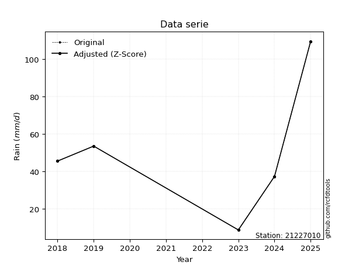</img>

</div>

> If Z-Score is active, values out of range or outliers are replaced with the station mean value.


### 4. Active continuous probability distributions from SciPy (45 of 104 available)

[scipy.stats](https://docs.scipy.org/doc/scipy/reference/stats.html) is a Python´s powerful submodule within the SciPy library for comprehensive statistical analysis, offering over 130 probability distributions (like Normal, Poisson), functions for descriptive stats (mean, variance), hypothesis testing (t-tests, chi-square), random variable generation, and statistical tests, making it essential for data science, modeling, and research. It provides tools to explore, model, and draw conclusions from data efficiently, working seamlessly with NumPy.

<div align="center">

|   id | p_dist             |   n_parameter | fit_method   | label                                                                       | active   | ref                                                                                                        |
|-----:|:-------------------|--------------:|:-------------|:----------------------------------------------------------------------------|:---------|:-----------------------------------------------------------------------------------------------------------|
|    0 | alpha              |             3 | MLE          | Alpha                                                                       | True     | [:mortar_board:](https://docs.scipy.org/doc/scipy/reference/generated/scipy.stats.alpha.html)              |
|    1 | betaprime          |             4 | MLE          | Beta prime                                                                  | True     | [:mortar_board:](https://docs.scipy.org/doc/scipy/reference/generated/scipy.stats.betaprime.html)          |
|    2 | chi2               |             3 | MLE          | Chi²                                                                        | True     | [:mortar_board:](https://docs.scipy.org/doc/scipy/reference/generated/scipy.stats.chi2.html)               |
|    3 | crystalball        |             4 | MLE          | Crystalball                                                                 | True     | [:mortar_board:](https://docs.scipy.org/doc/scipy/reference/generated/scipy.stats.crystalball.html)        |
|    4 | erlang             |             3 | MLE          | Erlang                                                                      | True     | [:mortar_board:](https://docs.scipy.org/doc/scipy/reference/generated/scipy.stats.erlang.html)             |
|    5 | expon              |             2 | MLE          | Exponential                                                                 | True     | [:mortar_board:](https://docs.scipy.org/doc/scipy/reference/generated/scipy.stats.expon.html)              |
|    6 | exponnorm          |             3 | MLE          | Exponentially modified Normal                                               | True     | [:mortar_board:](https://docs.scipy.org/doc/scipy/reference/generated/scipy.stats.exponnorm.html)          |
|    7 | f                  |             4 | MLE          | F                                                                           | True     | [:mortar_board:](https://docs.scipy.org/doc/scipy/reference/generated/scipy.stats.f.html)                  |
|    8 | fatiguelife        |             3 | MLE          | Fatigue-life (Birnbaum-Saunders)                                            | True     | [:mortar_board:](https://docs.scipy.org/doc/scipy/reference/generated/scipy.stats.fatiguelife.html)        |
|    9 | fisk               |             3 | MLE          | Fisk                                                                        | True     | [:mortar_board:](https://docs.scipy.org/doc/scipy/reference/generated/scipy.stats.fisk.html)               |
|   10 | gamma              |             3 | MLE          | Gamma                                                                       | True     | [:mortar_board:](https://docs.scipy.org/doc/scipy/reference/generated/scipy.stats.gamma.html)              |
|   11 | genexpon           |             5 | MLE          | Generalized exponential                                                     | True     | [:mortar_board:](https://docs.scipy.org/doc/scipy/reference/generated/scipy.stats.genexpon.html)           |
|   12 | genlogistic        |             3 | MLE          | Generalized logistic                                                        | True     | [:mortar_board:](https://docs.scipy.org/doc/scipy/reference/generated/scipy.stats.genlogistic.html)        |
|   13 | gibrat             |             2 | MM           | Gibrat                                                                      | True     | [:mortar_board:](https://docs.scipy.org/doc/scipy/reference/generated/scipy.stats.gibrat.html)             |
|   14 | gompertz           |             3 | MLE          | Gompertz (or truncated Gumbel)                                              | True     | [:mortar_board:](https://docs.scipy.org/doc/scipy/reference/generated/scipy.stats.gompertz.html)           |
|   15 | gumbel_l           |             2 | MM           | Gumbel Left Skew                                                            | True     | [:mortar_board:](https://docs.scipy.org/doc/scipy/reference/generated/scipy.stats.gumbel_l.html)           |
|   16 | gumbel_r           |             2 | MM           | Gumbel Right Skew                                                           | True     | [:mortar_board:](https://docs.scipy.org/doc/scipy/reference/generated/scipy.stats.gumbel_r.html)           |
|   17 | halflogistic       |             2 | MM           | Half-logistic                                                               | True     | [:mortar_board:](https://docs.scipy.org/doc/scipy/reference/generated/scipy.stats.halflogistic.html)       |
|   18 | halfnorm           |             2 | MM           | Half Normal                                                                 | True     | [:mortar_board:](https://docs.scipy.org/doc/scipy/reference/generated/scipy.stats.halfnorm.html)           |
|   19 | hypsecant          |             2 | MM           | hyperbolic secant                                                           | True     | [:mortar_board:](https://docs.scipy.org/doc/scipy/reference/generated/scipy.stats.hypsecant.html)          |
|   20 | invgamma           |             3 | MLE          | Inverted gamma                                                              | True     | [:mortar_board:](https://docs.scipy.org/doc/scipy/reference/generated/scipy.stats.invgamma.html)           |
|   21 | invgauss           |             3 | MLE          | Inverse Gaussian                                                            | True     | [:mortar_board:](https://docs.scipy.org/doc/scipy/reference/generated/scipy.stats.invgauss.html)           |
|   22 | invweibull         |             3 | MLE          | Inverted Weibull                                                            | True     | [:mortar_board:](https://docs.scipy.org/doc/scipy/reference/generated/scipy.stats.invweibull.html)         |
|   23 | johnsonsu          |             4 | MLE          | Johnson Su                                                                  | True     | [:mortar_board:](https://docs.scipy.org/doc/scipy/reference/generated/scipy.stats.johnsonsu.html)          |
|   24 | kstwobign          |             2 | MLE          | Limiting distribution of scaled Kolmogorov-Smirnov two-sided test statistic | True     | [:mortar_board:](https://docs.scipy.org/doc/scipy/reference/generated/scipy.stats.kstwobign.html)          |
|   25 | laplace            |             2 | MM           | Laplace                                                                     | True     | [:mortar_board:](https://docs.scipy.org/doc/scipy/reference/generated/scipy.stats.laplace.html)            |
|   26 | laplace_asymmetric |             3 | MLE          | Asymmetric Laplace                                                          | True     | [:mortar_board:](https://docs.scipy.org/doc/scipy/reference/generated/scipy.stats.laplace_asymmetric.html) |
|   27 | loggamma           |             3 | MLE          | Log gamma                                                                   | True     | [:mortar_board:](https://docs.scipy.org/doc/scipy/reference/generated/scipy.stats.loggamma.html)           |
|   28 | logistic           |             2 | MM           | Logistic (or Sech-squared)                                                  | True     | [:mortar_board:](https://docs.scipy.org/doc/scipy/reference/generated/scipy.stats.logistic.html)           |
|   29 | lognorm            |             3 | MLE          | Log Normal                                                                  | True     | [:mortar_board:](https://docs.scipy.org/doc/scipy/reference/generated/scipy.stats.lognorm.html)            |
|   30 | maxwell            |             2 | MM           | Maxwell                                                                     | True     | [:mortar_board:](https://docs.scipy.org/doc/scipy/reference/generated/scipy.stats.maxwell.html)            |
|   31 | mielke             |             4 | MLE          | Mielke Beta-Kappa / Dagum                                                   | True     | [:mortar_board:](https://docs.scipy.org/doc/scipy/reference/generated/scipy.stats.mielke.html)             |
|   32 | moyal              |             2 | MM           | Moyal                                                                       | True     | [:mortar_board:](https://docs.scipy.org/doc/scipy/reference/generated/scipy.stats.moyal.html)              |
|   33 | nakagami           |             3 | MLE          | Nakagami                                                                    | True     | [:mortar_board:](https://docs.scipy.org/doc/scipy/reference/generated/scipy.stats.nakagami.html)           |
|   34 | ncf                |             5 | MLE          | Non-central F distribution                                                  | True     | [:mortar_board:](https://docs.scipy.org/doc/scipy/reference/generated/scipy.stats.ncf.html)                |
|   35 | nct                |             4 | MLE          | Non-central Student’s t                                                     | True     | [:mortar_board:](https://docs.scipy.org/doc/scipy/reference/generated/scipy.stats.nct.html)                |
|   36 | norm               |             2 | MM           | Normal                                                                      | True     | [:mortar_board:](https://docs.scipy.org/doc/scipy/reference/generated/scipy.stats.norm.html)               |
|   37 | pareto             |             3 | MLE          | Pareto                                                                      | True     | [:mortar_board:](https://docs.scipy.org/doc/scipy/reference/generated/scipy.stats.pareto.html)             |
|   38 | pearson3           |             3 | MM           | Pearson type III                                                            | True     | [:mortar_board:](https://docs.scipy.org/doc/scipy/reference/generated/scipy.stats.pearson3.html)           |
|   39 | rayleigh           |             2 | MM           | Rayleigh                                                                    | True     | [:mortar_board:](https://docs.scipy.org/doc/scipy/reference/generated/scipy.stats.rayleigh.html)           |
|   40 | rice               |             3 | MLE          | Rice                                                                        | True     | [:mortar_board:](https://docs.scipy.org/doc/scipy/reference/generated/scipy.stats.rice.html)               |
|   41 | t                  |             3 | MLE          | Student’s t                                                                 | True     | [:mortar_board:](https://docs.scipy.org/doc/scipy/reference/generated/scipy.stats.t.html)                  |
|   42 | truncnorm          |             4 | MLE          | Truncated normal                                                            | True     | [:mortar_board:](https://docs.scipy.org/doc/scipy/reference/generated/scipy.stats.truncnorm.html)          |
|   43 | wald               |             2 | MM           | Wald                                                                        | True     | [:mortar_board:](https://docs.scipy.org/doc/scipy/reference/generated/scipy.stats.wald.html)               |
|   44 | weibull_min        |             3 | MLE          | Weibull minimum                                                             | True     | [:mortar_board:](https://docs.scipy.org/doc/scipy/reference/generated/scipy.stats.weibull_min.html)        |

</div>

> **n_parameter:** # arguments & localization & scale.
>
> **Fit methods:** (MLE) maximum likelihood, (MM) L-moments.
>
>**Inactive:** foldnorm, gennorm, norminvgauss, powernorm, powerlognorm, skewnorm, genextreme, anglit, arcsine, argus, beta, bradford, burr, burr12, cauchy, cosine, halfcauchy, foldcauchy, skewcauchy, wrapcauchy, dgamma, gengamma, exponweib, exponpow, truncexpon, gausshyper, genhalflogistic, genhyperbolic, geninvgauss, halfgennorm, johnsonsb, kappa4, kappa3, ksone, kstwo, loglaplace, levy, levy_l, levy_stable, ncx2, genpareto, truncpareto, lomax, powerlaw, rdist, rel_breitwigner, recipinvgauss, semicircular, studentized_range, trapezoid, triang, truncweibull_min, tukeylambda, uniform, loguniform, vonmises, vonmises_line, weibull_max, dweibull, 


## B. Probability distributions vs. Empirical distributions

A continuous probability distribution (CPD) describes probabilities for variables that can take any value within a range (like rain any time), unlike discrete variables with specific outcomes (like temperature). It uses a Probability Density Function (PDF), a curve where the total area under it equals 1, and the probability of the variable falling within an interval (a to b) is found by calculating the area under the curve between those points. A key feature is that the probability of hitting any single exact value is zero, so probabilities are always expressed for ranges, e.g., $P(a ≤ X ≤ b)$.

<div align="center">

Distributions parameters
|    |   station | p_dist                |   n |            loc |           scale | shape                  | shape1                | shape2                | shape3   |
|---:|----------:|:----------------------|----:|---------------:|----------------:|:-----------------------|:----------------------|:----------------------|:---------|
|  0 |  21227010 | alpha                 |   5 |    1.22115     |    13.6318      | 1.465197251255208e-09  |                       |                       |          |
|  1 |  21227010 | betaprime             |   5 |   -3.78254     |  1339.58        | 3.4246602682712215     | 132.97003501797678    |                       |          |
|  2 |  21227010 | chi2                  |   5 |    8.6         |     9.12089     | 1.4537449240027294     |                       |                       |          |
|  3 |  21227010 | crystalball           |   5 |   31.574       |    17.675       | 2831.2786788767526     | 2102.154976896612     |                       |          |
|  4 |  21227010 | erlang                |   5 | -311.682       |     0.915087    | 375.10063063218854     |                       |                       |          |
|  5 |  21227010 | expon                 |   5 |    8.6         |    22.974       |                        |                       |                       |          |
|  6 |  21227010 | exponnorm             |   5 |   31.5581      |    17.675       | 0.0009037367254424123  |                       |                       |          |
|  7 |  21227010 | f                     |   5 |    8.6         |    25.5658      | 1.4614196202842478     | 2735.3915553152533    |                       |          |
|  8 |  21227010 | fatiguelife           |   5 |    8.6         |     8.57434e-06 | 1371.872091830542      |                       |                       |          |
|  9 |  21227010 | fisk                  |   5 |    8.6         |    10.8454      | 0.518775254601618      |                       |                       |          |
| 10 |  21227010 | gamma                 |   5 | -304.531       |     0.943297    | 356.32995056569507     |                       |                       |          |
| 11 |  21227010 | genexpon              |   5 |    8.6         |     2.29535     | 0.09991257328028597    | 4.030826742128451e-08 | 1.90754973190245      |          |
| 12 |  21227010 | genlogistic           |   5 |   53.4001      |     2.39305e-06 | 1.0946219536979822e-07 |                       |                       |          |
| 13 |  21227010 | gibrat                |   5 |   18.0902      |     8.17834     |                        |                       |                       |          |
| 14 |  21227010 | gompertz              |   5 |    8.6         |    30.5702      | 0.6778716164184941     |                       |                       |          |
| 15 |  21227010 | gumbel_l              |   5 |   39.5287      |    13.7811      |                        |                       |                       |          |
| 16 |  21227010 | gumbel_r              |   5 |   23.6193      |    13.7811      |                        |                       |                       |          |
| 17 |  21227010 | halflogistic          |   5 |   10.6251      |    15.1114      |                        |                       |                       |          |
| 18 |  21227010 | halfnorm              |   5 |    8.17925     |    29.321       |                        |                       |                       |          |
| 19 |  21227010 | hypsecant             |   5 |   31.574       |    11.2522      |                        |                       |                       |          |
| 20 |  21227010 | invgamma              |   5 | -133.533       | 13886.6         | 85.05556717760584      |                       |                       |          |
| 21 |  21227010 | invgauss              |   5 |   -1.69717     |    63.5017      | 0.5239411560360963     |                       |                       |          |
| 22 |  21227010 | invweibull            |   5 |    8.6         |     0.926672    | 0.04335274195198793    |                       |                       |          |
| 23 |  21227010 | johnsonsu             |   5 |   -6.26968e+07 |     3.1187e+08  | -3587523.8625494298    | 17964106.09428499     |                       |          |
| 24 |  21227010 | kstwobign             |   5 |  -31.0079      |    71.1442      |                        |                       |                       |          |
| 25 |  21227010 | laplace               |   5 |   31.574       |    12.4981      |                        |                       |                       |          |
| 26 |  21227010 | laplace_asymmetric    |   5 |   45.4         |    11.5738      | 1.7621181731594195     |                       |                       |          |
| 27 |  21227010 | loggamma              |   5 |   53.4004      |     1.44906e-05 | 6.648242358172895e-07  |                       |                       |          |
| 28 |  21227010 | logistic              |   5 |   31.574       |     9.74473     |                        |                       |                       |          |
| 29 |  21227010 | lognorm               |   5 |    8.6         |     0.0131361   | 14.83776712457689      |                       |                       |          |
| 30 |  21227010 | maxwell               |   5 |  -10.3083      |    26.2458      |                        |                       |                       |          |
| 31 |  21227010 | mielke                |   5 |   -5.84426     |     0.483482    | 2516.4546088691054     | 1.8402388981169566    |                       |          |
| 32 |  21227010 | moyal                 |   5 |   21.4663      |     7.95654     |                        |                       |                       |          |
| 33 |  21227010 | nakagami              |   5 |    8.6         |    24.5221      | 0.0559786486121511     |                       |                       |          |
| 34 |  21227010 | ncf                   |   5 |    8.6         |     1.0464      | 0.2642085351438126     | 2548.4645046697133    | 6.404800640408979     |          |
| 35 |  21227010 | nct                   |   5 |    0.0580895   |     0.657702    | 1.2595012803582786     | 23.506275535627537    |                       |          |
| 36 |  21227010 | norm                  |   5 |   31.574       |    17.675       |                        |                       |                       |          |
| 37 |  21227010 | pareto                |   5 |    8.38707     |     0.212925    | 0.2695120908415655     |                       |                       |          |
| 38 |  21227010 | pearson3              |   5 |   31.574       |    17.675       | -0.18254747939588745   |                       |                       |          |
| 39 |  21227010 | rayleigh              |   5 |   -2.23928     |    26.9791      |                        |                       |                       |          |
| 40 |  21227010 | rice                  |   5 |   -2.06969     |    21.2209      | 1.09875075853447       |                       |                       |          |
| 41 |  21227010 | t                     |   5 |   31.5707      |    17.6745      | 1494103.3097499656     |                       |                       |          |
| 42 |  21227010 | truncnorm             |   5 |   31.574       |    17.675       | -83.47015017474986     | 110.1595683351677     |                       |          |
| 43 |  21227010 | wald                  |   5 |   13.899       |    17.675       |                        |                       |                       |          |
| 44 |  21227010 | weibull_min           |   5 |    8.6         |    14.0749      | 0.13521301514400078    |                       |                       |          |
| 45 |  21227010 | logalpha              |   5 |  -12.5645      |   331.752       | 21.048508136885197     |                       |                       |          |
| 46 |  21227010 | logbetaprime          |   5 |  -14.857       |    13.0373      | 1402.343973630138      | 1012.0046286037432    |                       |          |
| 47 |  21227010 | logchi2               |   5 |    2.15176     |     0.947009    | 1.0772950857516062     |                       |                       |          |
| 48 |  21227010 | logcrystalball        |   5 |    3.22938     |     0.725155    | 36.83360986676442      | 454.51363253216056    |                       |          |
| 49 |  21227010 | logerlang             |   5 |   -6.4357      |     0.056094    | 172.14265141149855     |                       |                       |          |
| 50 |  21227010 | logexpon              |   5 |    2.15176     |     1.07762     |                        |                       |                       |          |
| 51 |  21227010 | logexponnorm          |   5 |    3.22887     |     0.725153    | 0.0007149017144241121  |                       |                       |          |
| 52 |  21227010 | logf                  |   5 | -343.827       |   347.053       | 1588106.3871483365     | 634073.9760145458     |                       |          |
| 53 |  21227010 | logfatiguelife        |   5 | -162.118       |   165.344       | 0.004387334420369498   |                       |                       |          |
| 54 |  21227010 | logfisk               |   5 |   -5.00119e+07 |     5.00119e+07 | 109831495.73064408     |                       |                       |          |
| 55 |  21227010 | loggamma              |   5 |   -7.09066     |     0.0523258   | 197.27029618456106     |                       |                       |          |
| 56 |  21227010 | loggenexpon           |   5 |    2.14272     |     0.315892    | 0.16825238845388624    | 14.102233762496567    | 0.0034855672494423333 |          |
| 57 |  21227010 | loggenlogistic        |   5 |    3.97786     |     1.59051e-06 | 2.1303686961648097e-06 |                       |                       |          |
| 58 |  21227010 | loggibrat             |   5 |    2.67624     |     0.335507    |                        |                       |                       |          |
| 59 |  21227010 | loggompertz           |   5 |    2.15176     |     0.831581    | 0.25141781008398334    |                       |                       |          |
| 60 |  21227010 | loggumbel_l           |   5 |    3.55574     |     0.565401    |                        |                       |                       |          |
| 61 |  21227010 | loggumbel_r           |   5 |    2.90302     |     0.565401    |                        |                       |                       |          |
| 62 |  21227010 | loghalflogistic       |   5 |    2.36993     |     0.619963    |                        |                       |                       |          |
| 63 |  21227010 | loghalfnorm           |   5 |    2.26958     |     1.20294     |                        |                       |                       |          |
| 64 |  21227010 | loghypsecant          |   5 |    3.22938     |     0.461648    |                        |                       |                       |          |
| 65 |  21227010 | loginvgamma           |   5 |   -9.90267     |  4161.53        | 317.80270702030975     |                       |                       |          |
| 66 |  21227010 | loginvgauss           |   5 |   -2.10397     |   259.541       | 0.020524181913083944   |                       |                       |          |
| 67 |  21227010 | loginvweibull         |   5 |   -8.71469e+07 |     8.71469e+07 | 124433417.52800904     |                       |                       |          |
| 68 |  21227010 | logjohnsonsu          |   5 |    3.97781     |     7.2685e-16  | 2.4704067995829        | 0.12305901800146055   |                       |          |
| 69 |  21227010 | logkstwobign          |   5 |    0.490619    |     3.11329     |                        |                       |                       |          |
| 70 |  21227010 | loglaplace            |   5 |    3.22938     |     0.512762    |                        |                       |                       |          |
| 71 |  21227010 | loglaplace_asymmetric |   5 |    3.97781     |     0.0107514   | 69.41671355197593      |                       |                       |          |
| 72 |  21227010 | logloggamma           |   5 |    3.97785     |     3.27313e-06 | 4.372810971513113e-06  |                       |                       |          |
| 73 |  21227010 | loglogistic           |   5 |    3.22938     |     0.399799    |                        |                       |                       |          |
| 74 |  21227010 | loglognorm            |   5 |    2.15176     |     0.00096962  | 14.21549874898346      |                       |                       |          |
| 75 |  21227010 | logmaxwell            |   5 |    1.51107     |     1.07679     |                        |                       |                       |          |
| 76 |  21227010 | logmielke             |   5 |    2.15176     |     1.82711     | 0.8428255039471286     | 3912.720177250898     |                       |          |
| 77 |  21227010 | logmoyal              |   5 |    2.81469     |     0.326434    |                        |                       |                       |          |
| 78 |  21227010 | lognakagami           |   5 |    2.58551     |     1.02147     | 0.10993010889548685    |                       |                       |          |
| 79 |  21227010 | logncf                |   5 |  -10.5933      |    13.8023      | 1497.0296700892236     | 1259.6202442968051    | 0.0011466380182807503 |          |
| 80 |  21227010 | lognct                |   5 |  -23.8565      |     0.642481    | 2987.1309211142734     | 42.14760994399769     |                       |          |
| 81 |  21227010 | lognorm               |   5 |    3.22938     |     0.725155    |                        |                       |                       |          |
| 82 |  21227010 | logpareto             |   5 |    2.14143     |     0.0103292   | 0.26328296889896824    |                       |                       |          |
| 83 |  21227010 | logpearson3           |   5 |    3.22938     |     0.725156    | -0.44048800513367103   |                       |                       |          |
| 84 |  21227010 | lograyleigh           |   5 |    1.84212     |     1.10688     |                        |                       |                       |          |
| 85 |  21227010 | logrice               |   5 |    1.72575     |     0.839498    | 1.3979213107103614     |                       |                       |          |
| 86 |  21227010 | logt                  |   5 |    3.22939     |     0.725156    | 1394307036.384543      |                       |                       |          |
| 87 |  21227010 | logtruncnorm          |   5 |   -0.124747    |     1.7864      | 1.5171566243675283     | 4.236465528529766     |                       |          |
| 88 |  21227010 | logwald               |   5 |    2.50419     |     0.725182    |                        |                       |                       |          |
| 89 |  21227010 | logweibull_min        |   5 |   -2.0574e+07  |     2.0574e+07  | 37669556.15736535      |                       |                       |          |

</div>

> **loc** (Location parameter): This shifts the distribution along the x-axis. For many common distributions, like the normal (Gaussian) distribution, loc represents the mean $μ$. For others, like the uniform distribution, it might represent the minimum value, or for the beta distribution, the left end of the support interval.
>
> **scale** (Scale parameter): This determines the width or spread of the distribution. For the normal distribution, scale represents the standard deviation $σ$. For a uniform distribution, it defines the length of the interval (from $loc$ to $loc + scale$).
>
> **shape** (Shape parameters): Refers to parameters that define the specific form of a probability distribution, distinct from its location (loc) and scale (scale). These parameters are required arguments for most distribution functions. For example, a normal (Gaussian) distribution is fully defined by its location (mean) and scale (standard deviation), so it has no specific shape parameters beyond loc and scale. However, other distributions have intrinsic properties that need specification, as Gamma distribution that takes a shape parameter, often named $a$ or $alpha$.


### 0. Cumulative distribution values - CDF (90 evaluated)

> Ordered by x ascending and calculating $log(f(x))$ separately. 

|   id |   Station |   date |     x |   count |   mean |     std |    zscore |   Value_initial |   station |   m |     alpha |   alpha_pdf |   betaprime |   betaprime_pdf |        chi2 |      chi2_pdf |   crystalball |   crystalball_pdf |   erlang |   erlang_pdf |    expon |   expon_pdf |   exponnorm |   exponnorm_pdf |           f |        f_pdf |   fatiguelife |   fatiguelife_pdf |        fisk |   fisk_pdf |     gamma |   gamma_pdf |    genexpon |   genexpon_pdf |   genlogistic |   genlogistic_pdf |   gibrat |   gibrat_pdf |   gompertz |   gompertz_pdf |   gumbel_l |   gumbel_l_pdf |   gumbel_r |   gumbel_r_pdf |   halflogistic |   halflogistic_pdf |   halfnorm |   halfnorm_pdf |   hypsecant |   hypsecant_pdf |   invgamma |   invgamma_pdf |   invgauss |   invgauss_pdf |   invweibull |   invweibull_pdf |   johnsonsu |   johnsonsu_pdf |   kstwobign |   kstwobign_pdf |   laplace |   laplace_pdf |   laplace_asymmetric |   laplace_asymmetric_pdf |   loggamma |   loggamma_pdf |   logistic |   logistic_pdf |   lognorm |   lognorm_pdf |   maxwell |   maxwell_pdf |   mielke |   mielke_pdf |     moyal |   moyal_pdf |   nakagami |   nakagami_pdf |        ncf |        ncf_pdf |       nct |    nct_pdf |      norm |   norm_pdf |      pareto |   pareto_pdf |   pearson3 |   pearson3_pdf |   rayleigh |   rayleigh_pdf |      rice |   rice_pdf |         t |      t_pdf |   truncnorm |   truncnorm_pdf |     wald |   wald_pdf |   weibull_min |   weibull_min_pdf |   logalpha |   logalpha_pdf |   logbetaprime |   logbetaprime_pdf |    logchi2 |   logchi2_pdf |   logcrystalball |   logcrystalball_pdf |   logerlang |   logerlang_pdf |   logexpon |   logexpon_pdf |   logexponnorm |   logexponnorm_pdf |      logf |   logf_pdf |   logfatiguelife |   logfatiguelife_pdf |   logfisk |   logfisk_pdf |   loggenexpon |   loggenexpon_pdf |   loggenlogistic |   loggenlogistic_pdf |   loggibrat |   loggibrat_pdf |   loggompertz |   loggompertz_pdf |   loggumbel_l |   loggumbel_l_pdf |   loggumbel_r |   loggumbel_r_pdf |   loghalflogistic |   loghalflogistic_pdf |   loghalfnorm |   loghalfnorm_pdf |   loghypsecant |   loghypsecant_pdf |   loginvgamma |   loginvgamma_pdf |   loginvgauss |   loginvgauss_pdf |   loginvweibull |   loginvweibull_pdf |   logjohnsonsu |   logjohnsonsu_pdf |   logkstwobign |   logkstwobign_pdf |   loglaplace |   loglaplace_pdf |   loglaplace_asymmetric |   loglaplace_asymmetric_pdf |   logloggamma |   logloggamma_pdf |   loglogistic |   loglogistic_pdf |   loglognorm |   loglognorm_pdf |   logmaxwell |   logmaxwell_pdf |   logmielke |   logmielke_pdf |   logmoyal |   logmoyal_pdf |   lognakagami |   lognakagami_pdf |    logncf |   logncf_pdf |    lognct |   lognct_pdf |   logpareto |   logpareto_pdf |   logpearson3 |   logpearson3_pdf |   lograyleigh |   lograyleigh_pdf |   logrice |   logrice_pdf |     logt |   logt_pdf |   logtruncnorm |   logtruncnorm_pdf |    logwald |   logwald_pdf |   logweibull_min |   logweibull_min_pdf |
|-----:|----------:|-------:|------:|--------:|-------:|--------:|----------:|----------------:|----------:|----:|----------:|------------:|------------:|----------------:|------------:|--------------:|--------------:|------------------:|---------:|-------------:|---------:|------------:|------------:|----------------:|------------:|-------------:|--------------:|------------------:|------------:|-----------:|----------:|------------:|------------:|---------------:|--------------:|------------------:|---------:|-------------:|-----------:|---------------:|-----------:|---------------:|-----------:|---------------:|---------------:|-------------------:|-----------:|---------------:|------------:|----------------:|-----------:|---------------:|-----------:|---------------:|-------------:|-----------------:|------------:|----------------:|------------:|----------------:|----------:|--------------:|---------------------:|-------------------------:|-----------:|---------------:|-----------:|---------------:|----------:|--------------:|----------:|--------------:|---------:|-------------:|----------:|------------:|-----------:|---------------:|-----------:|---------------:|----------:|-----------:|----------:|-----------:|------------:|-------------:|-----------:|---------------:|-----------:|---------------:|----------:|-----------:|----------:|-----------:|------------:|----------------:|---------:|-----------:|--------------:|------------------:|-----------:|---------------:|---------------:|-------------------:|-----------:|--------------:|-----------------:|---------------------:|------------:|----------------:|-----------:|---------------:|---------------:|-------------------:|----------:|-----------:|-----------------:|---------------------:|----------:|--------------:|--------------:|------------------:|-----------------:|---------------------:|------------:|----------------:|--------------:|------------------:|--------------:|------------------:|--------------:|------------------:|------------------:|----------------------:|--------------:|------------------:|---------------:|-------------------:|--------------:|------------------:|--------------:|------------------:|----------------:|--------------------:|---------------:|-------------------:|---------------:|-------------------:|-------------:|-----------------:|------------------------:|----------------------------:|--------------:|------------------:|--------------:|------------------:|-------------:|-----------------:|-------------:|-----------------:|------------:|----------------:|-----------:|---------------:|--------------:|------------------:|----------:|-------------:|----------:|-------------:|------------:|----------------:|--------------:|------------------:|--------------:|------------------:|----------:|--------------:|---------:|-----------:|---------------:|-------------------:|-----------:|--------------:|-----------------:|---------------------:|
|    0 |  21227010 |   2023 |  8.6  |       5 | 31.574 | 19.7612 | -1.16258  |            8.6  |  21227010 |   1 | 0.0646861 |  0.0362578  |   0.0775116 |       0.015724  | 2.51597e-12 | 1029.52       |     0.0968342 |        0.00969803 | 0.095311 |    0.010012  | 0        |  0.0435275  |   0.0968339 |       0.009698  | 1.35571e-12 | 557.677      |     0.0157134 |       4.30849e+10 | 6.46786e-09 | 1.8889e+06 | 0.0960744 |   0.0100345 | 3.03808e-08 |     0.0435283  |      0        |        0.00589308 | 0        |   0          | 3.1222e-12 |      0.0221743 |   0.100579 |     0.00691832 |  0.0511078 |     0.0110285  |      0         |         0          |  0.0114492 |     0.0272093  |   0.0821766 |      0.00722228 |   0.089427 |     0.0109852  |  0.0692622 |     0.0221171  |    0.0129651 |      1.37499e+12 |    0.097251 |      0.00971047 |   0.0840983 |      0.0147796  | 0.0795518 |    0.00636511 |             0.124481 |               0.00610369 |  0.0668005 |       0.189727 |   0.086465 |     0.0081058  | 0.0686327 |      0.182365 | 0.0853066 |    0.0121719  |      nan |          nan | 0.0247925 |  0.00906297 |   0.013673 |    8.61762e+11 | 0.00200687 | 418976         | 0.0611588 | 0.0330341  | 0.0968342 | 0.00969803 | 1.11022e-16 |   1.26576    |  0.0999516 |     0.00921193 |  0.0775369 |     0.0137371  | 0.0673844 |  0.0123056 | 0.0968609 | 0.00970022 |   0.0968342 |      0.00969803 | 0        | 0          |    0.00705866 |       5.35392e+11 |  0.0674945 |       0.199979 |      0.0713004 |           0.194685 | 4.2907e-09 |    5.2043e+06 |        0.0686326 |             0.182365 |   0.0689347 |        0.195002 |   0        |       0.927973 |      0.0686313 |           0.182363 | 0.0699293 |   0.184664 |        0.0685726 |             0.183368 | 0.0756375 |      0.153544 |    0.00482543 |          0.53449  |         0        |             0.116057 |    0        |        0        |   9.67906e-09 |          0.302337 |     0.0800903 |          0.135822 |     0.0229094 |          0.153008 |          0        |              0        |      0        |          0        |      0.0614837 |           0.132356 |     0.0649046 |          0.192559 |     0.0664066 |          0.213351 |       0.0649298 |            0.253512 |      0.0239328 |        0.00379704  |      0.0616451 |           0.284521 |    0.0611306 |         0.119218 |               0.0865592 |                    0.115981 |     0.0871959 |          0.116491 |     0.0632453 |          0.148188 |    0.0228228 |      8.57542e+12 |    0.0504335 |         0.219771 | 6.91631e-14 |      131.263    | 0.00577151 |      0.0747093 |   0           |       0           | 0.0698858 |     0.19492  | 0.0695549 |     0.18573  | 1.11022e-16 |      25.4891    |     0.0776721 |          0.166135 |     0.0383736 |          0.243038 | 0.0483331 |      0.226011 | 0.068632 |   0.182363 |    0           |           0        | 0          |      0        |        0.0717357 |             0.126515 |
|    1 |  21227010 |   2025 | 13.27 |       5 | 31.574 | 19.7612 | -0.926258 |           13.27 |  21227010 |   2 | 0.257895  |  0.0395048  |   0.165174  |       0.0213441 | 0.365921    |    0.0489648  |     0.150197  |        0.013203   | 0.150542 |    0.0136781 | 0.183945 |  0.0355208  |   0.150197  |       0.013203  | 0.237364    |   0.034355   |     0.704695  |       0.0198823   | 0.392429    | 0.0264863  | 0.151354  |   0.0136745 | 0.183948    |     0.0355214  |      0        |        0.00729649 | 0        |   0          | 0.10585    |      0.0230996 |   0.138226 |     0.00930251 |  0.120143  |     0.018474   |      0.0872902 |         0.0328354  |  0.137837  |     0.026805   |   0.12357   |      0.010708   |   0.15064  |     0.0152188  |  0.192757  |     0.0288903  |    0.393653  |      0.00340692  |    0.150649 |      0.0132047  |   0.166647  |      0.0202111  | 0.115592  |    0.00924875 |             0.156513 |               0.0076743  |  0.190954  |       0.386677 |   0.132579 |     0.0118014  | 0.187294  |      0.370922 | 0.152222  |    0.0163883  |      nan |          nan | 0.0941795 |  0.02068    |   0.728075 |    0.0174211   | 0.112383   |      0.0198346 | 0.249374  | 0.0407605  | 0.150197  | 0.013203   | 0.570126    |   0.0237268  |  0.150371  |     0.012441   |  0.152304  |     0.0180625  | 0.135456  |  0.016697  | 0.150235  | 0.0132055  |   0.150197  |      0.013203   | 0        | 0          |    0.577439   |       0.0105392   |  0.197856  |       0.402037 |      0.196488  |           0.385663 | 0.470887   |    0.502738   |        0.187294  |             0.370922 |   0.195757  |        0.392909 |   0.331355 |       0.620484 |      0.187291  |           0.37092  | 0.189501  |   0.372374 |        0.187953  |             0.373039 | 0.174999  |      0.317062 |    0.247272   |          0.564703 |         0        |             0.207482 |    0        |        0        |   0.158144    |          0.428797 |     0.164548  |          0.265652 |     0.173178  |          0.537064 |          0.172129 |              0.782604 |      0.207163 |          0.640796 |      0.154699  |           0.322066 |     0.191926  |          0.395982 |     0.205782  |          0.425854 |       0.229472  |            0.482297 |      0.0258762 |        0.00531689  |      0.24423   |           0.518743 |    0.142438  |         0.277787 |               0.154779  |                    0.207389 |     0.155653  |          0.207948 |     0.16652   |          0.347152 |    0.666163  |      0.0590048   |    0.197691  |         0.448444 | 0.297597    |        0.578274 | 0.155449   |      0.632961  |   0.000347222 |       1.71903e+11 | 0.195757  |     0.38821  | 0.189906  |     0.374514 | 0.628501    |       0.220255  |     0.181879  |          0.323179 |     0.201907  |          0.484252 | 0.192599  |      0.429951 | 0.187292 |   0.370919 |    8.48424e-09 |           1.09361  | 0.00731762 |      0.435742 |        0.151852  |             0.255763 |
|    2 |  21227010 |   2024 | 37.2  |       5 | 31.574 | 19.7612 |  0.284699 |           37.2  |  21227010 |   3 | 0.704773  |  0.00782038 |   0.689637  |       0.0164758 | 0.869234    |    0.00803899 |     0.624872  |        0.0214561  | 0.63052  |    0.021063  | 0.712026 |  0.0125348  |   0.624871  |       0.0214561 | 0.687591    |   0.0106402  |     0.908451  |       0.00382765  | 0.623173    | 0.00425955 | 0.62958   |   0.0209779 | 0.712033    |     0.0125347  |      0        |        0.0218018  | 0.801979 |   0.0145626  | 0.649981   |      0.019781  |   0.57024  |     0.0263363  |  0.68848   |     0.0186478  |      0.706067  |         0.0165924  |  0.677709  |     0.0166739  |   0.652907  |      0.025087   |   0.645486 |     0.0197977  |  0.712414  |     0.0128023  |    0.422382  |      0.000551804 |    0.624647 |      0.02142    |   0.683111  |      0.0168743  | 0.681233  |    0.0255052  |             0.50598  |               0.0248097  |  0.705636  |       0.457663 |   0.640455 |     0.0236305  | 0.703184  |      0.477151 | 0.649082  |    0.0193554  |      nan |          nan | 0.709856  |  0.0174072  |   0.888415 |    0.00323561  | 0.618258   |      0.0173827 | 0.735063  | 0.00839451 | 0.624872  | 0.0214561  | 0.733576    |   0.00249209 |  0.614449  |     0.0220606  |  0.656475  |     0.0186137  | 0.643167  |  0.0200793 | 0.624946  | 0.0214553  |   0.624872  |      0.0214561  | 0.769814 | 0.0143496  |    0.667333   |       0.001731    |  0.707365  |       0.435571 |      0.704758  |           0.452397 | 0.767203   |    0.166406   |        0.703184  |             0.477151 |   0.710892  |        0.452106 |   0.743098 |       0.238398 |      0.703182  |           0.477153 | 0.703551  |   0.473688 |        0.704226  |             0.475088 | 0.671097  |      0.484738 |    0.732011   |          0.335692 |         0        |             0.825288 |    0.848569 |        0.249595 |   0.702287    |          0.523781 |     0.671454  |          0.646793 |     0.75336   |          0.377362 |          0.76377  |              0.336032 |      0.737088 |          0.354433 |      0.740122  |           0.502449 |     0.707703  |          0.448235 |     0.715683  |          0.415092 |       0.713322  |            0.34408  |      0.0375995 |        0.0278923   |      0.734243  |           0.340371 |    0.7649    |         0.458497 |               0.615954  |                    0.825315 |     0.616927  |          0.824197 |     0.724683  |          0.499045 |    0.696703  |      0.0167828   |    0.718712  |         0.418907 | 0.829921    |        0.477608 | 0.76958    |      0.342955  |   0.820752    |       0.158222    | 0.703992  |     0.449289 | 0.702994  |     0.46989  | 0.729163    |       0.0483476 |     0.685027  |          0.531959 |     0.723243  |          0.400775 | 0.711386  |      0.440423 | 0.703181 |   0.477152 |    0.719662    |           0.385799 | 0.817333   |      0.263996 |        0.662875  |             0.671138 |
|    3 |  21227010 |   2018 | 45.4  |       5 | 31.574 | 19.7612 |  0.699653 |           45.4  |  21227010 |   4 | 0.757656  |  0.00531363 |   0.803519  |       0.0114318 | 0.9206      |    0.00478714 |     0.782962  |        0.0166219  | 0.784462 |    0.0160808 | 0.798469 |  0.00877215 |   0.782961  |       0.0166219 | 0.762782    |   0.00786502 |     0.934493  |       0.00261728  | 0.653354    | 0.00319276 | 0.783063  |   0.0160575 | 0.798475    |     0.00877204 |      0        |        0.031724   | 0.886044 |   0.00706142 | 0.794289   |      0.0152022 |   0.78372  |     0.0240302  |  0.813932  |     0.0121594  |      0.817958  |         0.0109502  |  0.79571   |     0.0121574  |   0.818746  |      0.0152517  |   0.786984 |     0.0145271  |  0.799746  |     0.0087549  |    0.426358  |      0.000428179 |    0.782532 |      0.0166098  |   0.801056  |      0.0119773  | 0.834601  |    0.0132339  |             0.756398 |               0.0370884  |  0.789173  |       0.378875 |   0.805153 |     0.0160991  | 0.790537  |      0.396836 | 0.788178  |    0.0143978  |      nan |          nan | 0.824132  |  0.010871   |   0.91154  |    0.00246065  | 0.742812   |      0.0130208 | 0.791092  | 0.00554524 | 0.782962  | 0.0166219  | 0.750966    |   0.00181336 |  0.779662  |     0.0176143  |  0.789653  |     0.0137672  | 0.788114  |  0.0150442 | 0.783023  | 0.0166196  |   0.782962  |      0.0166219  | 0.85831  | 0.00799007 |    0.679789   |       0.00133982  |  0.786706  |       0.359615 |      0.787492  |           0.376085 | 0.797757   |    0.141235   |        0.790537  |             0.396836 |   0.793253  |        0.372816 |   0.786457 |       0.198163 |      0.790535  |           0.396839 | 0.790287  |   0.394198 |        0.791141  |             0.394612 | 0.759625  |      0.400998 |    0.793188   |          0.279004 |         0        |             1.07766  |    0.889242 |        0.165863 |   0.799639    |          0.44792  |     0.794684  |          0.574915 |     0.819457  |          0.288582 |          0.82294  |              0.260314 |      0.801254 |          0.290446 |      0.825649  |           0.359068 |     0.789318  |          0.369453 |     0.790982  |          0.34021  |       0.775543  |            0.281483 |      0.0464107 |        0.0736754   |      0.795875  |           0.27919  |    0.840584  |         0.310898 |               0.80439   |                    1.0778   |     0.805031  |          1.0755   |     0.812459  |          0.381115 |    0.69983   |      0.0147047   |    0.794738  |         0.343665 | 0.924095    |        0.46813  | 0.829069   |      0.257772  |   0.849485    |       0.131462    | 0.786125  |     0.373316 | 0.789022  |     0.391053 | 0.738048    |       0.0411973 |     0.784446  |          0.459762 |     0.795927  |          0.328701 | 0.791811  |      0.365364 | 0.790534 |   0.396839 |    0.788067    |           0.303559 | 0.86193    |      0.188851 |        0.791088  |             0.598938 |
|    4 |  21227010 |   2019 | 53.4  |       5 | 31.574 | 19.7612 |  1.10449  |           53.4  |  21227010 |   5 | 0.793898  |  0.00386087 |   0.87858   |       0.007526  | 0.950818    |    0.00292605 |     0.891557  |        0.0105301  | 0.88948  |    0.0102172 | 0.85773  |  0.00619264 |   0.891557  |       0.0105301 | 0.817573    |   0.00593504 |     0.952162  |       0.00185133  | 0.676091    | 0.00253589 | 0.888135  |   0.0102497 | 0.857736    |     0.00619253 |      0.999997 |        0.0457416  | 0.928221 |   0.00387658 | 0.895342   |      0.0100478 |   0.935179 |     0.0128696  |  0.891177  |     0.00745039 |      0.888617  |         0.00696026 |  0.876991  |     0.00828435 |   0.909111  |      0.00796814 |   0.881877 |     0.00933107 |  0.858344  |     0.00606607 |    0.429455  |      0.000351265 |    0.891127 |      0.0105404  |   0.880246  |      0.00798313 | 0.912795  |    0.00697747 |             0.927938 |               0.0109715  |  0.845038  |       0.309439 |   0.903765 |     0.00892523 | 0.848987  |      0.322975 | 0.883021  |    0.00941227 |      nan |          nan | 0.893067  |  0.00667941 |   0.929047 |    0.00194443  | 0.831365   |      0.0092365 | 0.828425  | 0.00392053 | 0.891557  | 0.0105301  | 0.763759    |   0.00141448 |  0.895048  |     0.0111397  |  0.880754  |     0.00911532 | 0.886932  |  0.0097376 | 0.891598  | 0.0105275  |   0.891557  |      0.0105301  | 0.908194 | 0.00480304 |    0.689469   |       0.00109606  |  0.839828  |       0.295181 |      0.843059  |           0.308501 | 0.819259   |    0.124187   |        0.848987  |             0.322975 |   0.848154  |        0.303713 |   0.816313 |       0.170456 |      0.848986  |           0.322977 | 0.848383  |   0.321282 |        0.849249  |             0.321026 | 0.818623  |      0.326076 |    0.83491    |          0.235664 |         0.999941 |             1.33935  |    0.912401 |        0.122278 |   0.865782    |          0.364719 |     0.878714  |          0.452537 |     0.861199  |          0.227605 |          0.860885 |              0.208784 |      0.844407 |          0.241997 |      0.875768  |           0.262325 |     0.843776  |          0.301715 |     0.841208  |          0.279156 |       0.817412  |            0.235312 |      0.991786  |        3.24122e+12 |      0.837426  |           0.233584 |    0.883836  |         0.226545 |               0.999792  |                    1.33962  |     0.999952  |          1.33589  |     0.866692  |          0.288988 |    0.702104  |      0.0133516   |    0.84548   |         0.281987 | 0.999489    |        0.418297 | 0.866287   |      0.20288   |   0.869369    |       0.114112    | 0.841306  |     0.306574 | 0.846694  |     0.319252 | 0.744353    |       0.0366524 |     0.852603  |          0.377605 |     0.844552  |          0.270973 | 0.845829  |      0.300247 | 0.848985 |   0.322977 |    0.832653    |           0.247412 | 0.888935   |      0.146128 |        0.878479  |             0.468948 |

An Empirical Distribution Function (EDF) is a step-function estimate of a true cumulative distribution function (CDF) based on observed sample data, representing the proportion of data points less than or equal to a given value. It is calculated by ordering your data and jumping up by $1/n$ (where $n$ is sample size) at each unique data point, allowing analysis without assuming an underlying population distribution, and it gets closer to the true CDF as the sample size grows.


### 1. Empirical - EDF California (1923)

California´s estimates the true probability distribution of water-related data (like rainfall, streamflow) using observed samples, crucial for risk assessment.

<div align="center">


$P=m/n$


</div>


**1.1. Empirical values**

<div align="center">

|                | 0              | 1                  | 2              | 3                 | 4              |
|:---------------|:---------------|:-------------------|:---------------|:------------------|:---------------|
| date           | 2023           | 2025               | 2024           | 2018              | 2019           |
| x              | 8.6            | 13.27              | 37.2           | 45.4              | 53.4           |
| m              | 1              | 2                  | 3              | 4                 | 5              |
| empirical_dist | edf_california | edf_california     | edf_california | edf_california    | edf_california |
| empirical      | 0.2            | 0.4                | 0.6            | 0.8               | 1.0            |
| empirical_tr   | 1.25           | 1.6666666666666667 | 2.5            | 5.000000000000001 | inf            |

</div>


**1.2. Kolmogorov-Smirnov fit test (sorted by Δ)**


<div align="center">

|                | 0                   | 1                   | 2                   | 3                   | 4                   | 5                  | 6                   | 7                  | 8                  | 9                  | 10                 | 11                  | 12                  | 13                  | 14                 | 15                  | 16                  | 17                  | 18                  | 19                 | 20                 | 21                  | 22                  | 23                  | 24                  | 25                  | 26                 | 27                 | 28                  | 29                  | 30                  | 31                  | 32                  | 33                  | 34                  | 35                 | 36                  | 37                  | 38                 | 39                 | 40                  | 41                  | 42                  | 43                  | 44                 | 45                    | 46                  | 47                 | 48                 | 49                  | 50                  | 51                  | 52                  | 53                  | 54                 | 55                  | 56                  | 57                  | 58                  | 59                  | 60                 | 61                 | 62                  | 63                 | 64                 | 65                 | 66                  | 67                  | 68                 | 69                  | 70                  | 71                  | 72                 | 73                 | 74                  | 75                 | 76                 | 77                  | 78                  | 79                 | 80                 | 81                 | 82                 | 83                 | 84                 | 85                 | 86                 | 87                 | 88                 | 89                 |
|:---------------|:--------------------|:--------------------|:--------------------|:--------------------|:--------------------|:-------------------|:--------------------|:-------------------|:-------------------|:-------------------|:-------------------|:--------------------|:--------------------|:--------------------|:-------------------|:--------------------|:--------------------|:--------------------|:--------------------|:-------------------|:-------------------|:--------------------|:--------------------|:--------------------|:--------------------|:--------------------|:-------------------|:-------------------|:--------------------|:--------------------|:--------------------|:--------------------|:--------------------|:--------------------|:--------------------|:-------------------|:--------------------|:--------------------|:-------------------|:-------------------|:--------------------|:--------------------|:--------------------|:--------------------|:-------------------|:----------------------|:--------------------|:-------------------|:-------------------|:--------------------|:--------------------|:--------------------|:--------------------|:--------------------|:-------------------|:--------------------|:--------------------|:--------------------|:--------------------|:--------------------|:-------------------|:-------------------|:--------------------|:-------------------|:-------------------|:-------------------|:--------------------|:--------------------|:-------------------|:--------------------|:--------------------|:--------------------|:-------------------|:-------------------|:--------------------|:-------------------|:-------------------|:--------------------|:--------------------|:-------------------|:-------------------|:-------------------|:-------------------|:-------------------|:-------------------|:-------------------|:-------------------|:-------------------|:-------------------|:-------------------|
| station        | 21227010            | 21227010            | 21227010            | 21227010            | 21227010            | 21227010           | 21227010            | 21227010           | 21227010           | 21227010           | 21227010           | 21227010            | 21227010            | 21227010            | 21227010           | 21227010            | 21227010            | 21227010            | 21227010            | 21227010           | 21227010           | 21227010            | 21227010            | 21227010            | 21227010            | 21227010            | 21227010           | 21227010           | 21227010            | 21227010            | 21227010            | 21227010            | 21227010            | 21227010            | 21227010            | 21227010           | 21227010            | 21227010            | 21227010           | 21227010           | 21227010            | 21227010            | 21227010            | 21227010            | 21227010           | 21227010              | 21227010            | 21227010           | 21227010           | 21227010            | 21227010            | 21227010            | 21227010            | 21227010            | 21227010           | 21227010            | 21227010            | 21227010            | 21227010            | 21227010            | 21227010           | 21227010           | 21227010            | 21227010           | 21227010           | 21227010           | 21227010            | 21227010            | 21227010           | 21227010            | 21227010            | 21227010            | 21227010           | 21227010           | 21227010            | 21227010           | 21227010           | 21227010            | 21227010            | 21227010           | 21227010           | 21227010           | 21227010           | 21227010           | 21227010           | 21227010           | 21227010           | 21227010           | 21227010           | 21227010           |
| empirical_dist | edf_california      | edf_california      | edf_california      | edf_california      | edf_california      | edf_california     | edf_california      | edf_california     | edf_california     | edf_california     | edf_california     | edf_california      | edf_california      | edf_california      | edf_california     | edf_california      | edf_california      | edf_california      | edf_california      | edf_california     | edf_california     | edf_california      | edf_california      | edf_california      | edf_california      | edf_california      | edf_california     | edf_california     | edf_california      | edf_california      | edf_california      | edf_california      | edf_california      | edf_california      | edf_california      | edf_california     | edf_california      | edf_california      | edf_california     | edf_california     | edf_california      | edf_california      | edf_california      | edf_california      | edf_california     | edf_california        | edf_california      | edf_california     | edf_california     | edf_california      | edf_california      | edf_california      | edf_california      | edf_california      | edf_california     | edf_california      | edf_california      | edf_california      | edf_california      | edf_california      | edf_california     | edf_california     | edf_california      | edf_california     | edf_california     | edf_california     | edf_california      | edf_california      | edf_california     | edf_california      | edf_california      | edf_california      | edf_california     | edf_california     | edf_california      | edf_california     | edf_california     | edf_california      | edf_california      | edf_california     | edf_california     | edf_california     | edf_california     | edf_california     | edf_california     | edf_california     | edf_california     | edf_california     | edf_california     | edf_california     |
| p_dist         | logkstwobign        | nct                 | loginvweibull       | loginvgauss         | loggenexpon         | lograyleigh        | logchi2             | f                  | logexpon           | loghalfnorm        | logalpha           | logmaxwell          | logbetaprime        | logncf              | logerlang          | alpha               | invgauss            | logrice             | loginvgamma         | loggamma           | loggamma           | lognct              | logf                | logfatiguelife      | lognorm             | lognorm             | logcrystalball     | logt               | logexponnorm        | genexpon            | expon               | logpearson3         | logfisk             | loggumbel_r         | loghalflogistic     | logmielke          | kstwobign           | loglogistic         | betaprime          | loggumbel_l        | pareto              | loggompertz         | laplace_asymmetric  | logloggamma         | logmoyal           | loglaplace_asymmetric | loghypsecant        | rayleigh           | maxwell            | logweibull_min      | gamma               | johnsonsu           | invgamma            | erlang              | pearson3           | t                   | truncnorm           | norm                | crystalball         | exponnorm           | logpareto          | loglaplace         | gumbel_l            | halfnorm           | rice               | logistic           | chi2                | hypsecant           | gumbel_r           | laplace             | ncf                 | gompertz            | loglognorm         | moyal              | fatiguelife         | weibull_min        | halflogistic       | fisk                | nakagami            | logwald            | lognakagami        | logtruncnorm       | wald               | gibrat             | loggibrat          | invweibull         | logjohnsonsu       | genlogistic        | loggenlogistic     | mielke             |
| delta          | 0.16257365143834157 | 0.17157463443989807 | 0.18258838426225266 | 0.19421768696239558 | 0.19517457121034262 | 0.1980929689348674 | 0.19999999570930102 | 0.1999999999986443 | 0.2                | 0.2                | 0.2021438917705422 | 0.20230889074825345 | 0.20351217466123117 | 0.20424263249569363 | 0.2042429328055276 | 0.20610203934489524 | 0.20724274275099822 | 0.20740089617685065 | 0.20807435218378847 | 0.2090461089095253 | 0.2090461089095253 | 0.21009407524556992 | 0.21049854935760778 | 0.21204699317190684 | 0.21270612097430996 | 0.21270612097430996 | 0.2127061646518087 | 0.2127078899538693 | 0.21270863413264496 | 0.21605195927640664 | 0.21605521127517285 | 0.21812059847460133 | 0.22500095010130491 | 0.22682188175983384 | 0.22787133237926502 | 0.2299211730190056 | 0.23335316920116317 | 0.23348014621504154 | 0.2348260304385075 | 0.2354519546088322 | 0.23624067706586616 | 0.24185592966358127 | 0.24348680237736225 | 0.24434733050976307 | 0.2445513064436769 | 0.24522057378553555   | 0.24530062514879508 | 0.2476956115608088 | 0.2477784745206146 | 0.24814755754219592 | 0.24864556959003342 | 0.24935102699076017 | 0.24935989801906636 | 0.24945780157711345 | 0.2496290636706267 | 0.24976500246206657 | 0.24980276235651738 | 0.24980276884800195 | 0.24980277816929405 | 0.24980326412910833 | 0.2556473262894021 | 0.2575615416657895 | 0.26177433652930376 | 0.2621628840329275 | 0.2645436760045701 | 0.2674213263934342 | 0.26923406640352054 | 0.27643037360667333 | 0.279856701368989  | 0.28440811962558016 | 0.28761739137877257 | 0.29414959333392365 | 0.2978963312716969 | 0.3058205395428764 | 0.30845130933879994 | 0.3105311983501917 | 0.3127098187876708 | 0.32390923709987307 | 0.32807486870724967 | 0.3926823809776431 | 0.3996527780737744 | 0.3999999915157641 | 0.4                | 0.4                | 0.4                | 0.570544622729888  | 0.7535892904540668 | 0.8                | 0.8                | nan                |
| deltao         | 0.5865427407550001  | 0.5865427407550001  | 0.5865427407550001  | 0.5865427407550001  | 0.5865427407550001  | 0.5865427407550001 | 0.5865427407550001  | 0.5865427407550001 | 0.5865427407550001 | 0.5865427407550001 | 0.5865427407550001 | 0.5865427407550001  | 0.5865427407550001  | 0.5865427407550001  | 0.5865427407550001 | 0.5865427407550001  | 0.5865427407550001  | 0.5865427407550001  | 0.5865427407550001  | 0.5865427407550001 | 0.5865427407550001 | 0.5865427407550001  | 0.5865427407550001  | 0.5865427407550001  | 0.5865427407550001  | 0.5865427407550001  | 0.5865427407550001 | 0.5865427407550001 | 0.5865427407550001  | 0.5865427407550001  | 0.5865427407550001  | 0.5865427407550001  | 0.5865427407550001  | 0.5865427407550001  | 0.5865427407550001  | 0.5865427407550001 | 0.5865427407550001  | 0.5865427407550001  | 0.5865427407550001 | 0.5865427407550001 | 0.5865427407550001  | 0.5865427407550001  | 0.5865427407550001  | 0.5865427407550001  | 0.5865427407550001 | 0.5865427407550001    | 0.5865427407550001  | 0.5865427407550001 | 0.5865427407550001 | 0.5865427407550001  | 0.5865427407550001  | 0.5865427407550001  | 0.5865427407550001  | 0.5865427407550001  | 0.5865427407550001 | 0.5865427407550001  | 0.5865427407550001  | 0.5865427407550001  | 0.5865427407550001  | 0.5865427407550001  | 0.5865427407550001 | 0.5865427407550001 | 0.5865427407550001  | 0.5865427407550001 | 0.5865427407550001 | 0.5865427407550001 | 0.5865427407550001  | 0.5865427407550001  | 0.5865427407550001 | 0.5865427407550001  | 0.5865427407550001  | 0.5865427407550001  | 0.5865427407550001 | 0.5865427407550001 | 0.5865427407550001  | 0.5865427407550001 | 0.5865427407550001 | 0.5865427407550001  | 0.5865427407550001  | 0.5865427407550001 | 0.5865427407550001 | 0.5865427407550001 | 0.5865427407550001 | 0.5865427407550001 | 0.5865427407550001 | 0.5865427407550001 | 0.5865427407550001 | 0.5865427407550001 | 0.5865427407550001 | 0.5865427407550001 |
| eval           | Δo > Δ              | Δo > Δ              | Δo > Δ              | Δo > Δ              | Δo > Δ              | Δo > Δ             | Δo > Δ              | Δo > Δ             | Δo > Δ             | Δo > Δ             | Δo > Δ             | Δo > Δ              | Δo > Δ              | Δo > Δ              | Δo > Δ             | Δo > Δ              | Δo > Δ              | Δo > Δ              | Δo > Δ              | Δo > Δ             | Δo > Δ             | Δo > Δ              | Δo > Δ              | Δo > Δ              | Δo > Δ              | Δo > Δ              | Δo > Δ             | Δo > Δ             | Δo > Δ              | Δo > Δ              | Δo > Δ              | Δo > Δ              | Δo > Δ              | Δo > Δ              | Δo > Δ              | Δo > Δ             | Δo > Δ              | Δo > Δ              | Δo > Δ             | Δo > Δ             | Δo > Δ              | Δo > Δ              | Δo > Δ              | Δo > Δ              | Δo > Δ             | Δo > Δ                | Δo > Δ              | Δo > Δ             | Δo > Δ             | Δo > Δ              | Δo > Δ              | Δo > Δ              | Δo > Δ              | Δo > Δ              | Δo > Δ             | Δo > Δ              | Δo > Δ              | Δo > Δ              | Δo > Δ              | Δo > Δ              | Δo > Δ             | Δo > Δ             | Δo > Δ              | Δo > Δ             | Δo > Δ             | Δo > Δ             | Δo > Δ              | Δo > Δ              | Δo > Δ             | Δo > Δ              | Δo > Δ              | Δo > Δ              | Δo > Δ             | Δo > Δ             | Δo > Δ              | Δo > Δ             | Δo > Δ             | Δo > Δ              | Δo > Δ              | Δo > Δ             | Δo > Δ             | Δo > Δ             | Δo > Δ             | Δo > Δ             | Δo > Δ             | Δo > Δ             | Δo <= Δ            | Δo <= Δ            | Δo <= Δ            | Δo <= Δ            |
| fit            | 1                   | 1                   | 1                   | 1                   | 1                   | 1                  | 1                   | 1                  | 1                  | 1                  | 1                  | 1                   | 1                   | 1                   | 1                  | 1                   | 1                   | 1                   | 1                   | 1                  | 1                  | 1                   | 1                   | 1                   | 1                   | 1                   | 1                  | 1                  | 1                   | 1                   | 1                   | 1                   | 1                   | 1                   | 1                   | 1                  | 1                   | 1                   | 1                  | 1                  | 1                   | 1                   | 1                   | 1                   | 1                  | 1                     | 1                   | 1                  | 1                  | 1                   | 1                   | 1                   | 1                   | 1                   | 1                  | 1                   | 1                   | 1                   | 1                   | 1                   | 1                  | 1                  | 1                   | 1                  | 1                  | 1                  | 1                   | 1                   | 1                  | 1                   | 1                   | 1                   | 1                  | 1                  | 1                   | 1                  | 1                  | 1                   | 1                   | 1                  | 1                  | 1                  | 1                  | 1                  | 1                  | 1                  | 0                  | 0                  | 0                  | 0                  |
| n              | 5                   | 5                   | 5                   | 5                   | 5                   | 5                  | 5                   | 5                  | 5                  | 5                  | 5                  | 5                   | 5                   | 5                   | 5                  | 5                   | 5                   | 5                   | 5                   | 5                  | 5                  | 5                   | 5                   | 5                   | 5                   | 5                   | 5                  | 5                  | 5                   | 5                   | 5                   | 5                   | 5                   | 5                   | 5                   | 5                  | 5                   | 5                   | 5                  | 5                  | 5                   | 5                   | 5                   | 5                   | 5                  | 5                     | 5                   | 5                  | 5                  | 5                   | 5                   | 5                   | 5                   | 5                   | 5                  | 5                   | 5                   | 5                   | 5                   | 5                   | 5                  | 5                  | 5                   | 5                  | 5                  | 5                  | 5                   | 5                   | 5                  | 5                   | 5                   | 5                   | 5                  | 5                  | 5                   | 5                  | 5                  | 5                   | 5                   | 5                  | 5                  | 5                  | 5                  | 5                  | 5                  | 5                  | 5                  | 5                  | 5                  | 5                  |
| best_fit       | 1                   | 0                   | 0                   | 0                   | 0                   | 0                  | 0                   | 0                  | 0                  | 0                  | 0                  | 0                   | 0                   | 0                   | 0                  | 0                   | 0                   | 0                   | 0                   | 0                  | 0                  | 0                   | 0                   | 0                   | 0                   | 0                   | 0                  | 0                  | 0                   | 0                   | 0                   | 0                   | 0                   | 0                   | 0                   | 0                  | 0                   | 0                   | 0                  | 0                  | 0                   | 0                   | 0                   | 0                   | 0                  | 0                     | 0                   | 0                  | 0                  | 0                   | 0                   | 0                   | 0                   | 0                   | 0                  | 0                   | 0                   | 0                   | 0                   | 0                   | 0                  | 0                  | 0                   | 0                  | 0                  | 0                  | 0                   | 0                   | 0                  | 0                   | 0                   | 0                   | 0                  | 0                  | 0                   | 0                  | 0                  | 0                   | 0                   | 0                  | 0                  | 0                  | 0                  | 0                  | 0                  | 0                  | 0                  | 0                  | 0                  | 0                  |
| best_fit_sort  | 1                   | 2                   | 3                   | 4                   | 5                   | 6                  | 7                   | 8                  | 9                  | 10                 | 11                 | 12                  | 13                  | 14                  | 15                 | 16                  | 17                  | 18                  | 19                  | 20                 | 21                 | 22                  | 23                  | 24                  | 25                  | 26                  | 27                 | 28                 | 29                  | 30                  | 31                  | 32                  | 33                  | 34                  | 35                  | 36                 | 37                  | 38                  | 39                 | 40                 | 41                  | 42                  | 43                  | 44                  | 45                 | 46                    | 47                  | 48                 | 49                 | 50                  | 51                  | 52                  | 53                  | 54                  | 55                 | 56                  | 57                  | 58                  | 59                  | 60                  | 61                 | 62                 | 63                  | 64                 | 65                 | 66                 | 67                  | 68                  | 69                 | 70                  | 71                  | 72                  | 73                 | 74                 | 75                  | 76                 | 77                 | 78                  | 79                  | 80                 | 81                 | 82                 | 83                 | 84                 | 85                 | 86                 | 87                 | 88                 | 89                 | 90                 |

</div>


<div align="center">

</img>

</div>


**1.3. Best fit**

<div align="center">

|   id |   station | empirical_dist   | p_dist       |    delta |   deltao | eval   |   fit |   n |   best_fit |   best_fit_sort |
|-----:|----------:|:-----------------|:-------------|---------:|---------:|:-------|------:|----:|-----------:|----------------:|
|    0 |  21227010 | edf_california   | logkstwobign | 0.162574 | 0.586543 | Δo > Δ |     1 |   5 |          1 |               1 |

</div>


<div align="center">

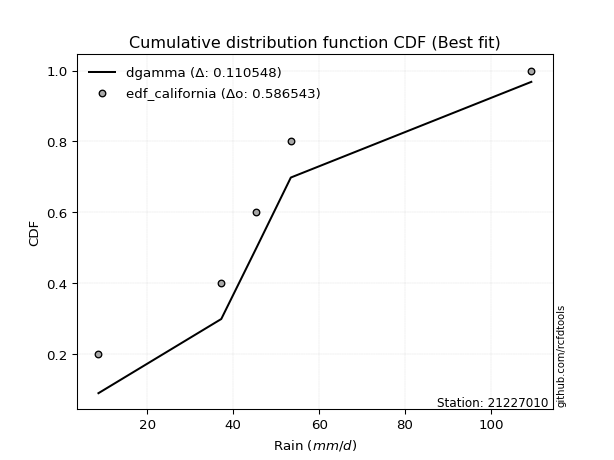</img>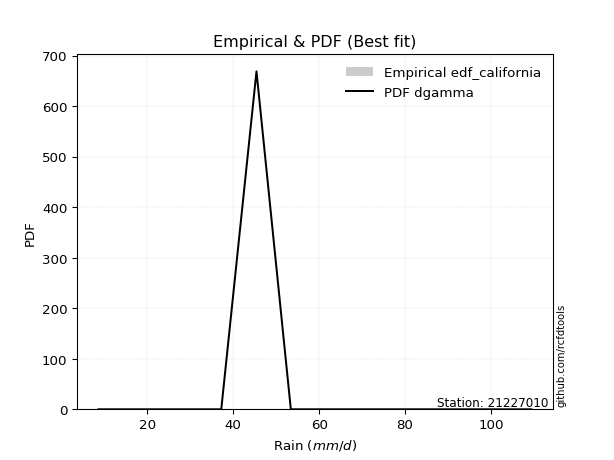</img>

</div>


### 2. Empirical - EDF Hazen (1930)

Hazen method for plotting positions is a formula used to estimate the empirical cumulative probability distribution of flood events or other hydrological data. This formula often results in biased estimations, particularly when extrapolating to extreme events (high return periods).

<div align="center">


$P=(m-0.5)/n$


</div>


**2.1. Empirical values**

<div align="center">

|                | 0                  | 1                  | 2         | 3                 | 4                  |
|:---------------|:-------------------|:-------------------|:----------|:------------------|:-------------------|
| date           | 2023               | 2025               | 2024      | 2018              | 2019               |
| x              | 8.6                | 13.27              | 37.2      | 45.4              | 53.4               |
| m              | 1                  | 2                  | 3         | 4                 | 5                  |
| empirical_dist | edf_hazen          | edf_hazen          | edf_hazen | edf_hazen         | edf_hazen          |
| empirical      | 0.1                | 0.3                | 0.5       | 0.7               | 0.9                |
| empirical_tr   | 1.1111111111111112 | 1.4285714285714286 | 2.0       | 3.333333333333333 | 10.000000000000002 |

</div>


**2.2. Kolmogorov-Smirnov fit test (sorted by Δ)**


<div align="center">

|                | 0                   | 1                   | 2                     | 3                  | 4                   | 5                   | 6                   | 7                  | 8                   | 9                   | 10                  | 11                  | 12                  | 13                 | 14                  | 15                  | 16                 | 17                 | 18                  | 19                  | 20                  | 21                  | 22                  | 23                 | 24                  | 25                  | 26                  | 27                  | 28                  | 29                  | 30                  | 31                  | 32                  | 33                  | 34                  | 35                  | 36                  | 37                 | 38                  | 39                  | 40                  | 41                 | 42                 | 43                  | 44                  | 45                 | 46                  | 47                  | 48                 | 49                 | 50                  | 51                  | 52                  | 53                  | 54                  | 55                  | 56                  | 57                  | 58                 | 59                  | 60                 | 61                 | 62                  | 63                  | 64                  | 65                  | 66                 | 67                  | 68                 | 69                  | 70                  | 71                 | 72                 | 73                  | 74                 | 75                 | 76                 | 77                 | 78                  | 79                 | 80                  | 81                 | 82                 | 83                 | 84                 | 85                 | 86                 | 87                 | 88                 | 89                 |
|:---------------|:--------------------|:--------------------|:----------------------|:-------------------|:--------------------|:--------------------|:--------------------|:-------------------|:--------------------|:--------------------|:--------------------|:--------------------|:--------------------|:-------------------|:--------------------|:--------------------|:-------------------|:-------------------|:--------------------|:--------------------|:--------------------|:--------------------|:--------------------|:-------------------|:--------------------|:--------------------|:--------------------|:--------------------|:--------------------|:--------------------|:--------------------|:--------------------|:--------------------|:--------------------|:--------------------|:--------------------|:--------------------|:-------------------|:--------------------|:--------------------|:--------------------|:-------------------|:-------------------|:--------------------|:--------------------|:-------------------|:--------------------|:--------------------|:-------------------|:-------------------|:--------------------|:--------------------|:--------------------|:--------------------|:--------------------|:--------------------|:--------------------|:--------------------|:-------------------|:--------------------|:-------------------|:-------------------|:--------------------|:--------------------|:--------------------|:--------------------|:-------------------|:--------------------|:-------------------|:--------------------|:--------------------|:-------------------|:-------------------|:--------------------|:-------------------|:-------------------|:-------------------|:-------------------|:--------------------|:-------------------|:--------------------|:-------------------|:-------------------|:-------------------|:-------------------|:-------------------|:-------------------|:-------------------|:-------------------|:-------------------|
| station        | 21227010            | 21227010            | 21227010              | 21227010           | 21227010            | 21227010            | 21227010            | 21227010           | 21227010            | 21227010            | 21227010            | 21227010            | 21227010            | 21227010           | 21227010            | 21227010            | 21227010           | 21227010           | 21227010            | 21227010            | 21227010            | 21227010            | 21227010            | 21227010           | 21227010            | 21227010            | 21227010            | 21227010            | 21227010            | 21227010            | 21227010            | 21227010            | 21227010            | 21227010            | 21227010            | 21227010            | 21227010            | 21227010           | 21227010            | 21227010            | 21227010            | 21227010           | 21227010           | 21227010            | 21227010            | 21227010           | 21227010            | 21227010            | 21227010           | 21227010           | 21227010            | 21227010            | 21227010            | 21227010            | 21227010            | 21227010            | 21227010            | 21227010            | 21227010           | 21227010            | 21227010           | 21227010           | 21227010            | 21227010            | 21227010            | 21227010            | 21227010           | 21227010            | 21227010           | 21227010            | 21227010            | 21227010           | 21227010           | 21227010            | 21227010           | 21227010           | 21227010           | 21227010           | 21227010            | 21227010           | 21227010            | 21227010           | 21227010           | 21227010           | 21227010           | 21227010           | 21227010           | 21227010           | 21227010           | 21227010           |
| empirical_dist | edf_hazen           | edf_hazen           | edf_hazen             | edf_hazen          | edf_hazen           | edf_hazen           | edf_hazen           | edf_hazen          | edf_hazen           | edf_hazen           | edf_hazen           | edf_hazen           | edf_hazen           | edf_hazen          | edf_hazen           | edf_hazen           | edf_hazen          | edf_hazen          | edf_hazen           | edf_hazen           | edf_hazen           | edf_hazen           | edf_hazen           | edf_hazen          | edf_hazen           | edf_hazen           | edf_hazen           | edf_hazen           | edf_hazen           | edf_hazen           | edf_hazen           | edf_hazen           | edf_hazen           | edf_hazen           | edf_hazen           | edf_hazen           | edf_hazen           | edf_hazen          | edf_hazen           | edf_hazen           | edf_hazen           | edf_hazen          | edf_hazen          | edf_hazen           | edf_hazen           | edf_hazen          | edf_hazen           | edf_hazen           | edf_hazen          | edf_hazen          | edf_hazen           | edf_hazen           | edf_hazen           | edf_hazen           | edf_hazen           | edf_hazen           | edf_hazen           | edf_hazen           | edf_hazen          | edf_hazen           | edf_hazen          | edf_hazen          | edf_hazen           | edf_hazen           | edf_hazen           | edf_hazen           | edf_hazen          | edf_hazen           | edf_hazen          | edf_hazen           | edf_hazen           | edf_hazen          | edf_hazen          | edf_hazen           | edf_hazen          | edf_hazen          | edf_hazen          | edf_hazen          | edf_hazen           | edf_hazen          | edf_hazen           | edf_hazen          | edf_hazen          | edf_hazen          | edf_hazen          | edf_hazen          | edf_hazen          | edf_hazen          | edf_hazen          | edf_hazen          |
| p_dist         | laplace_asymmetric  | logloggamma         | loglaplace_asymmetric | gamma              | maxwell             | johnsonsu           | invgamma            | erlang             | pearson3            | t                   | truncnorm           | norm                | crystalball         | exponnorm          | rayleigh            | gumbel_l            | logweibull_min     | rice               | logistic            | logfisk             | loggumbel_l         | hypsecant           | halfnorm            | kstwobign          | laplace             | logpearson3         | f                   | ncf                 | gumbel_r            | betaprime           | gompertz            | loggompertz         | lognct              | logt                | logexponnorm        | lognorm             | lognorm             | logcrystalball     | logf                | logncf              | logfatiguelife      | logbetaprime       | alpha              | loggamma            | loggamma            | logalpha           | loginvgamma         | moyal               | logerlang          | logrice            | expon               | genexpon            | invgauss            | halflogistic        | loginvweibull       | loginvgauss         | logmaxwell          | lograyleigh         | fisk               | loglogistic         | loggenexpon        | logkstwobign       | nct                 | loghalfnorm         | loghypsecant        | logexpon            | loggumbel_r        | loghalflogistic     | loglaplace         | logchi2             | logmoyal            | pareto             | weibull_min        | logtruncnorm        | wald               | gibrat             | logwald            | lognakagami        | logpareto           | logmielke          | loggibrat           | loglognorm         | chi2               | fatiguelife        | nakagami           | invweibull         | logjohnsonsu       | genlogistic        | loggenlogistic     | mielke             |
| delta          | 0.14348680237736222 | 0.14434733050976303 | 0.14522057378553552   | 0.1486455695900334 | 0.14908153127875812 | 0.14935102699076014 | 0.14935989801906632 | 0.1494578015771134 | 0.14962906367062667 | 0.14976500246206653 | 0.14980276235651735 | 0.14980276884800192 | 0.14980277816929402 | 0.1498032641291083 | 0.15647549674547223 | 0.16177433652930373 | 0.1628749002366705 | 0.1645436760045701 | 0.16742132639343418 | 0.17109710830212743 | 0.17145365194786022 | 0.17643037360667327 | 0.17770897588504242 | 0.1831106418221924 | 0.18440811962558012 | 0.18502700798501404 | 0.18759060556618434 | 0.18761739137877254 | 0.18847978152254363 | 0.18963674454713075 | 0.19414959333392365 | 0.20228727044559247 | 0.20299416992217334 | 0.20318109950456087 | 0.20318224527639317 | 0.20318427731608135 | 0.20318427731608135 | 0.2031843065188157 | 0.20355068188773107 | 0.20399235653837355 | 0.20422605705663288 | 0.2047582075217277 | 0.2047733205911716 | 0.20563649811006368 | 0.20563649811006368 | 0.2073645199936579 | 0.20770305286937973 | 0.20985564664184575 | 0.2108921402062599 | 0.2113855528027775 | 0.21202612730337433 | 0.21203314083495328 | 0.21241372994786656 | 0.21270981878767078 | 0.21332182212814932 | 0.21568330376443823 | 0.21871215805652233 | 0.22324319215897193 | 0.2239092370998731 | 0.22468255127495895 | 0.2320109081576054 | 0.23424345857299   | 0.23506336452041543 | 0.23708791953343433 | 0.24012197646510614 | 0.24309770700763478 | 0.2533601356804669 | 0.26376988940893764 | 0.2649000862113934 | 0.26720259508758115 | 0.26957998211593903 | 0.2701257324137883 | 0.2774388383245157 | 0.29999999151576406 | 0.3                | 0.3019793131581553 | 0.317333363355948  | 0.3207522999577892 | 0.32850133871896253 | 0.3299211730190056 | 0.34856890166132004 | 0.3661626808308633 | 0.3692340664035205 | 0.4084513093387999 | 0.4280748687072497 | 0.470544622729888  | 0.6535892904540667 | 0.7                | 0.7                | nan                |
| deltao         | 0.5865427407550001  | 0.5865427407550001  | 0.5865427407550001    | 0.5865427407550001 | 0.5865427407550001  | 0.5865427407550001  | 0.5865427407550001  | 0.5865427407550001 | 0.5865427407550001  | 0.5865427407550001  | 0.5865427407550001  | 0.5865427407550001  | 0.5865427407550001  | 0.5865427407550001 | 0.5865427407550001  | 0.5865427407550001  | 0.5865427407550001 | 0.5865427407550001 | 0.5865427407550001  | 0.5865427407550001  | 0.5865427407550001  | 0.5865427407550001  | 0.5865427407550001  | 0.5865427407550001 | 0.5865427407550001  | 0.5865427407550001  | 0.5865427407550001  | 0.5865427407550001  | 0.5865427407550001  | 0.5865427407550001  | 0.5865427407550001  | 0.5865427407550001  | 0.5865427407550001  | 0.5865427407550001  | 0.5865427407550001  | 0.5865427407550001  | 0.5865427407550001  | 0.5865427407550001 | 0.5865427407550001  | 0.5865427407550001  | 0.5865427407550001  | 0.5865427407550001 | 0.5865427407550001 | 0.5865427407550001  | 0.5865427407550001  | 0.5865427407550001 | 0.5865427407550001  | 0.5865427407550001  | 0.5865427407550001 | 0.5865427407550001 | 0.5865427407550001  | 0.5865427407550001  | 0.5865427407550001  | 0.5865427407550001  | 0.5865427407550001  | 0.5865427407550001  | 0.5865427407550001  | 0.5865427407550001  | 0.5865427407550001 | 0.5865427407550001  | 0.5865427407550001 | 0.5865427407550001 | 0.5865427407550001  | 0.5865427407550001  | 0.5865427407550001  | 0.5865427407550001  | 0.5865427407550001 | 0.5865427407550001  | 0.5865427407550001 | 0.5865427407550001  | 0.5865427407550001  | 0.5865427407550001 | 0.5865427407550001 | 0.5865427407550001  | 0.5865427407550001 | 0.5865427407550001 | 0.5865427407550001 | 0.5865427407550001 | 0.5865427407550001  | 0.5865427407550001 | 0.5865427407550001  | 0.5865427407550001 | 0.5865427407550001 | 0.5865427407550001 | 0.5865427407550001 | 0.5865427407550001 | 0.5865427407550001 | 0.5865427407550001 | 0.5865427407550001 | 0.5865427407550001 |
| eval           | Δo > Δ              | Δo > Δ              | Δo > Δ                | Δo > Δ             | Δo > Δ              | Δo > Δ              | Δo > Δ              | Δo > Δ             | Δo > Δ              | Δo > Δ              | Δo > Δ              | Δo > Δ              | Δo > Δ              | Δo > Δ             | Δo > Δ              | Δo > Δ              | Δo > Δ             | Δo > Δ             | Δo > Δ              | Δo > Δ              | Δo > Δ              | Δo > Δ              | Δo > Δ              | Δo > Δ             | Δo > Δ              | Δo > Δ              | Δo > Δ              | Δo > Δ              | Δo > Δ              | Δo > Δ              | Δo > Δ              | Δo > Δ              | Δo > Δ              | Δo > Δ              | Δo > Δ              | Δo > Δ              | Δo > Δ              | Δo > Δ             | Δo > Δ              | Δo > Δ              | Δo > Δ              | Δo > Δ             | Δo > Δ             | Δo > Δ              | Δo > Δ              | Δo > Δ             | Δo > Δ              | Δo > Δ              | Δo > Δ             | Δo > Δ             | Δo > Δ              | Δo > Δ              | Δo > Δ              | Δo > Δ              | Δo > Δ              | Δo > Δ              | Δo > Δ              | Δo > Δ              | Δo > Δ             | Δo > Δ              | Δo > Δ             | Δo > Δ             | Δo > Δ              | Δo > Δ              | Δo > Δ              | Δo > Δ              | Δo > Δ             | Δo > Δ              | Δo > Δ             | Δo > Δ              | Δo > Δ              | Δo > Δ             | Δo > Δ             | Δo > Δ              | Δo > Δ             | Δo > Δ             | Δo > Δ             | Δo > Δ             | Δo > Δ              | Δo > Δ             | Δo > Δ              | Δo > Δ             | Δo > Δ             | Δo > Δ             | Δo > Δ             | Δo > Δ             | Δo <= Δ            | Δo <= Δ            | Δo <= Δ            | Δo <= Δ            |
| fit            | 1                   | 1                   | 1                     | 1                  | 1                   | 1                   | 1                   | 1                  | 1                   | 1                   | 1                   | 1                   | 1                   | 1                  | 1                   | 1                   | 1                  | 1                  | 1                   | 1                   | 1                   | 1                   | 1                   | 1                  | 1                   | 1                   | 1                   | 1                   | 1                   | 1                   | 1                   | 1                   | 1                   | 1                   | 1                   | 1                   | 1                   | 1                  | 1                   | 1                   | 1                   | 1                  | 1                  | 1                   | 1                   | 1                  | 1                   | 1                   | 1                  | 1                  | 1                   | 1                   | 1                   | 1                   | 1                   | 1                   | 1                   | 1                   | 1                  | 1                   | 1                  | 1                  | 1                   | 1                   | 1                   | 1                   | 1                  | 1                   | 1                  | 1                   | 1                   | 1                  | 1                  | 1                   | 1                  | 1                  | 1                  | 1                  | 1                   | 1                  | 1                   | 1                  | 1                  | 1                  | 1                  | 1                  | 0                  | 0                  | 0                  | 0                  |
| n              | 5                   | 5                   | 5                     | 5                  | 5                   | 5                   | 5                   | 5                  | 5                   | 5                   | 5                   | 5                   | 5                   | 5                  | 5                   | 5                   | 5                  | 5                  | 5                   | 5                   | 5                   | 5                   | 5                   | 5                  | 5                   | 5                   | 5                   | 5                   | 5                   | 5                   | 5                   | 5                   | 5                   | 5                   | 5                   | 5                   | 5                   | 5                  | 5                   | 5                   | 5                   | 5                  | 5                  | 5                   | 5                   | 5                  | 5                   | 5                   | 5                  | 5                  | 5                   | 5                   | 5                   | 5                   | 5                   | 5                   | 5                   | 5                   | 5                  | 5                   | 5                  | 5                  | 5                   | 5                   | 5                   | 5                   | 5                  | 5                   | 5                  | 5                   | 5                   | 5                  | 5                  | 5                   | 5                  | 5                  | 5                  | 5                  | 5                   | 5                  | 5                   | 5                  | 5                  | 5                  | 5                  | 5                  | 5                  | 5                  | 5                  | 5                  |
| best_fit       | 1                   | 0                   | 0                     | 0                  | 0                   | 0                   | 0                   | 0                  | 0                   | 0                   | 0                   | 0                   | 0                   | 0                  | 0                   | 0                   | 0                  | 0                  | 0                   | 0                   | 0                   | 0                   | 0                   | 0                  | 0                   | 0                   | 0                   | 0                   | 0                   | 0                   | 0                   | 0                   | 0                   | 0                   | 0                   | 0                   | 0                   | 0                  | 0                   | 0                   | 0                   | 0                  | 0                  | 0                   | 0                   | 0                  | 0                   | 0                   | 0                  | 0                  | 0                   | 0                   | 0                   | 0                   | 0                   | 0                   | 0                   | 0                   | 0                  | 0                   | 0                  | 0                  | 0                   | 0                   | 0                   | 0                   | 0                  | 0                   | 0                  | 0                   | 0                   | 0                  | 0                  | 0                   | 0                  | 0                  | 0                  | 0                  | 0                   | 0                  | 0                   | 0                  | 0                  | 0                  | 0                  | 0                  | 0                  | 0                  | 0                  | 0                  |
| best_fit_sort  | 1                   | 2                   | 3                     | 4                  | 5                   | 6                   | 7                   | 8                  | 9                   | 10                  | 11                  | 12                  | 13                  | 14                 | 15                  | 16                  | 17                 | 18                 | 19                  | 20                  | 21                  | 22                  | 23                  | 24                 | 25                  | 26                  | 27                  | 28                  | 29                  | 30                  | 31                  | 32                  | 33                  | 34                  | 35                  | 36                  | 37                  | 38                 | 39                  | 40                  | 41                  | 42                 | 43                 | 44                  | 45                  | 46                 | 47                  | 48                  | 49                 | 50                 | 51                  | 52                  | 53                  | 54                  | 55                  | 56                  | 57                  | 58                  | 59                 | 60                  | 61                 | 62                 | 63                  | 64                  | 65                  | 66                  | 67                 | 68                  | 69                 | 70                  | 71                  | 72                 | 73                 | 74                  | 75                 | 76                 | 77                 | 78                 | 79                  | 80                 | 81                  | 82                 | 83                 | 84                 | 85                 | 86                 | 87                 | 88                 | 89                 | 90                 |

</div>


<div align="center">

</img>

</div>


**2.3. Best fit**

<div align="center">

|   id |   station | empirical_dist   | p_dist             |    delta |   deltao | eval   |   fit |   n |   best_fit |   best_fit_sort |
|-----:|----------:|:-----------------|:-------------------|---------:|---------:|:-------|------:|----:|-----------:|----------------:|
|    0 |  21227010 | edf_hazen        | laplace_asymmetric | 0.143487 | 0.586543 | Δo > Δ |     1 |   5 |          1 |               1 |

</div>


<div align="center">

</img></img>

</div>


### 3. Empirical - EDF Weibull (1939)

Weibull plotting position formula is an empirical method used to estimate the non-exceedance probability or plotting position for a set of observed data, is often recommended or widely used in practice, particularly in flood frequency analysis.

<div align="center">


$P=m/(n+1)$


</div>


**3.1. Empirical values**

<div align="center">

|                | 0                   | 1                  | 2           | 3                  | 4                  |
|:---------------|:--------------------|:-------------------|:------------|:-------------------|:-------------------|
| date           | 2023                | 2025               | 2024        | 2018               | 2019               |
| x              | 8.6                 | 13.27              | 37.2        | 45.4               | 53.4               |
| m              | 1                   | 2                  | 3           | 4                  | 5                  |
| empirical_dist | edf_weibull         | edf_weibull        | edf_weibull | edf_weibull        | edf_weibull        |
| empirical      | 0.16666666666666666 | 0.3333333333333333 | 0.5         | 0.6666666666666666 | 0.8333333333333334 |
| empirical_tr   | 1.2                 | 1.4999999999999998 | 2.0         | 2.9999999999999996 | 6.000000000000002  |

</div>


**3.2. Kolmogorov-Smirnov fit test (sorted by Δ)**


<div align="center">

|                | 0                   | 1                   | 2                   | 3                   | 4                   | 5                     | 6                  | 7                  | 8                  | 9                   | 10                  | 11                  | 12                  | 13                 | 14                  | 15                 | 16                  | 17                  | 18                  | 19                  | 20                  | 21                  | 22                  | 23                  | 24                  | 25                  | 26                 | 27                  | 28                  | 29                  | 30                  | 31                  | 32                  | 33                 | 34                  | 35                  | 36                  | 37                 | 38                 | 39                  | 40                  | 41                 | 42                  | 43                 | 44                 | 45                 | 46                  | 47                  | 48                  | 49                  | 50                  | 51                  | 52                  | 53                  | 54                  | 55                  | 56                  | 57                  | 58                 | 59                 | 60                  | 61                  | 62                  | 63                 | 64                  | 65                  | 66                 | 67                 | 68                 | 69                  | 70                 | 71                  | 72                  | 73                 | 74                  | 75                 | 76                  | 77                 | 78                 | 79                 | 80                 | 81                  | 82                 | 83                 | 84                  | 85                 | 86                 | 87                 | 88                 | 89                 |
|:---------------|:--------------------|:--------------------|:--------------------|:--------------------|:--------------------|:----------------------|:-------------------|:-------------------|:-------------------|:--------------------|:--------------------|:--------------------|:--------------------|:-------------------|:--------------------|:-------------------|:--------------------|:--------------------|:--------------------|:--------------------|:--------------------|:--------------------|:--------------------|:--------------------|:--------------------|:--------------------|:-------------------|:--------------------|:--------------------|:--------------------|:--------------------|:--------------------|:--------------------|:-------------------|:--------------------|:--------------------|:--------------------|:-------------------|:-------------------|:--------------------|:--------------------|:-------------------|:--------------------|:-------------------|:-------------------|:-------------------|:--------------------|:--------------------|:--------------------|:--------------------|:--------------------|:--------------------|:--------------------|:--------------------|:--------------------|:--------------------|:--------------------|:--------------------|:-------------------|:-------------------|:--------------------|:--------------------|:--------------------|:-------------------|:--------------------|:--------------------|:-------------------|:-------------------|:-------------------|:--------------------|:-------------------|:--------------------|:--------------------|:-------------------|:--------------------|:-------------------|:--------------------|:-------------------|:-------------------|:-------------------|:-------------------|:--------------------|:-------------------|:-------------------|:--------------------|:-------------------|:-------------------|:-------------------|:-------------------|:-------------------|
| station        | 21227010            | 21227010            | 21227010            | 21227010            | 21227010            | 21227010              | 21227010           | 21227010           | 21227010           | 21227010            | 21227010            | 21227010            | 21227010            | 21227010           | 21227010            | 21227010           | 21227010            | 21227010            | 21227010            | 21227010            | 21227010            | 21227010            | 21227010            | 21227010            | 21227010            | 21227010            | 21227010           | 21227010            | 21227010            | 21227010            | 21227010            | 21227010            | 21227010            | 21227010           | 21227010            | 21227010            | 21227010            | 21227010           | 21227010           | 21227010            | 21227010            | 21227010           | 21227010            | 21227010           | 21227010           | 21227010           | 21227010            | 21227010            | 21227010            | 21227010            | 21227010            | 21227010            | 21227010            | 21227010            | 21227010            | 21227010            | 21227010            | 21227010            | 21227010           | 21227010           | 21227010            | 21227010            | 21227010            | 21227010           | 21227010            | 21227010            | 21227010           | 21227010           | 21227010           | 21227010            | 21227010           | 21227010            | 21227010            | 21227010           | 21227010            | 21227010           | 21227010            | 21227010           | 21227010           | 21227010           | 21227010           | 21227010            | 21227010           | 21227010           | 21227010            | 21227010           | 21227010           | 21227010           | 21227010           | 21227010           |
| empirical_dist | edf_weibull         | edf_weibull         | edf_weibull         | edf_weibull         | edf_weibull         | edf_weibull           | edf_weibull        | edf_weibull        | edf_weibull        | edf_weibull         | edf_weibull         | edf_weibull         | edf_weibull         | edf_weibull        | edf_weibull         | edf_weibull        | edf_weibull         | edf_weibull         | edf_weibull         | edf_weibull         | edf_weibull         | edf_weibull         | edf_weibull         | edf_weibull         | edf_weibull         | edf_weibull         | edf_weibull        | edf_weibull         | edf_weibull         | edf_weibull         | edf_weibull         | edf_weibull         | edf_weibull         | edf_weibull        | edf_weibull         | edf_weibull         | edf_weibull         | edf_weibull        | edf_weibull        | edf_weibull         | edf_weibull         | edf_weibull        | edf_weibull         | edf_weibull        | edf_weibull        | edf_weibull        | edf_weibull         | edf_weibull         | edf_weibull         | edf_weibull         | edf_weibull         | edf_weibull         | edf_weibull         | edf_weibull         | edf_weibull         | edf_weibull         | edf_weibull         | edf_weibull         | edf_weibull        | edf_weibull        | edf_weibull         | edf_weibull         | edf_weibull         | edf_weibull        | edf_weibull         | edf_weibull         | edf_weibull        | edf_weibull        | edf_weibull        | edf_weibull         | edf_weibull        | edf_weibull         | edf_weibull         | edf_weibull        | edf_weibull         | edf_weibull        | edf_weibull         | edf_weibull        | edf_weibull        | edf_weibull        | edf_weibull        | edf_weibull         | edf_weibull        | edf_weibull        | edf_weibull         | edf_weibull        | edf_weibull        | edf_weibull        | edf_weibull        | edf_weibull        |
| p_dist         | fisk                | logfisk             | loggumbel_l         | laplace_asymmetric  | logloggamma         | loglaplace_asymmetric | rayleigh           | maxwell            | logweibull_min     | gamma               | johnsonsu           | invgamma            | erlang              | pearson3           | t                   | kstwobign          | truncnorm           | norm                | crystalball         | exponnorm           | logpearson3         | f                   | betaprime           | gumbel_l            | halfnorm            | rice                | logistic           | loggompertz         | lognct              | logt                | logexponnorm        | lognorm             | lognorm             | logcrystalball     | logf                | logncf              | logfatiguelife      | logbetaprime       | alpha              | loggamma            | loggamma            | logalpha           | loginvgamma         | hypsecant          | logerlang          | logrice            | expon               | genexpon            | invgauss            | gumbel_r            | loginvweibull       | loginvgauss         | laplace             | logmaxwell          | ncf                 | lograyleigh         | loglogistic         | gompertz            | loggenexpon        | logkstwobign       | nct                 | pareto              | loghalfnorm         | moyal              | loghypsecant        | logexpon            | weibull_min        | halflogistic       | loggumbel_r        | loghalflogistic     | loglaplace         | logchi2             | logmoyal            | logpareto          | logwald             | logmielke          | loglognorm          | lognakagami        | logtruncnorm       | gibrat             | wald               | loggibrat           | chi2               | nakagami           | invweibull          | fatiguelife        | logjohnsonsu       | genlogistic        | loggenlogistic     | mielke             |
| delta          | 0.16666666019880422 | 0.17109710830212743 | 0.17145365194786022 | 0.17682013571069555 | 0.17768066384309636 | 0.17855390711886884   | 0.1810289448941421 | 0.1811118078539479 | 0.1814808908755292 | 0.18197890292336671 | 0.18268436032409346 | 0.18269323135239965 | 0.18279113491044674 | 0.18296239700396   | 0.18309833579539986 | 0.1831106418221924 | 0.18313609568985068 | 0.18313610218133525 | 0.18313611150262735 | 0.18313659746244162 | 0.18502700798501404 | 0.18759060556618434 | 0.18963674454713075 | 0.19510766986263706 | 0.19549621736626077 | 0.19787700933790342 | 0.2007546597267675 | 0.20228727044559247 | 0.20299416992217334 | 0.20318109950456087 | 0.20318224527639317 | 0.20318427731608135 | 0.20318427731608135 | 0.2031843065188157 | 0.20355068188773107 | 0.20399235653837355 | 0.20422605705663288 | 0.2047582075217277 | 0.2047733205911716 | 0.20563649811006368 | 0.20563649811006368 | 0.2073645199936579 | 0.20770305286937973 | 0.2097637069400066 | 0.2108921402062599 | 0.2113855528027775 | 0.21202612730337433 | 0.21203314083495328 | 0.21241372994786656 | 0.21319003470232228 | 0.21332182212814932 | 0.21568330376443823 | 0.21774145295891345 | 0.21871215805652233 | 0.22095072471210586 | 0.22324319215897193 | 0.22468255127495895 | 0.22748292666725697 | 0.2320109081576054 | 0.23424345857299   | 0.23506336452041543 | 0.23679239908045496 | 0.23708791953343433 | 0.2391538728762097 | 0.24012197646510614 | 0.24309770700763478 | 0.2441055049911824 | 0.2460431521210041 | 0.2533601356804669 | 0.26376988940893764 | 0.2649000862113934 | 0.26720259508758115 | 0.26957998211593903 | 0.2951680053856292 | 0.32601571431097637 | 0.3299211730190056 | 0.33282934749752996 | 0.3329861114071077 | 0.3333333248490974 | 0.3333333333333333 | 0.3333333333333333 | 0.34856890166132004 | 0.3692340664035205 | 0.3947415353739164 | 0.40387795606322135 | 0.4084513093387999 | 0.6202559571207333 | 0.6666666666666666 | 0.6666666666666666 | nan                |
| deltao         | 0.5865427407550001  | 0.5865427407550001  | 0.5865427407550001  | 0.5865427407550001  | 0.5865427407550001  | 0.5865427407550001    | 0.5865427407550001 | 0.5865427407550001 | 0.5865427407550001 | 0.5865427407550001  | 0.5865427407550001  | 0.5865427407550001  | 0.5865427407550001  | 0.5865427407550001 | 0.5865427407550001  | 0.5865427407550001 | 0.5865427407550001  | 0.5865427407550001  | 0.5865427407550001  | 0.5865427407550001  | 0.5865427407550001  | 0.5865427407550001  | 0.5865427407550001  | 0.5865427407550001  | 0.5865427407550001  | 0.5865427407550001  | 0.5865427407550001 | 0.5865427407550001  | 0.5865427407550001  | 0.5865427407550001  | 0.5865427407550001  | 0.5865427407550001  | 0.5865427407550001  | 0.5865427407550001 | 0.5865427407550001  | 0.5865427407550001  | 0.5865427407550001  | 0.5865427407550001 | 0.5865427407550001 | 0.5865427407550001  | 0.5865427407550001  | 0.5865427407550001 | 0.5865427407550001  | 0.5865427407550001 | 0.5865427407550001 | 0.5865427407550001 | 0.5865427407550001  | 0.5865427407550001  | 0.5865427407550001  | 0.5865427407550001  | 0.5865427407550001  | 0.5865427407550001  | 0.5865427407550001  | 0.5865427407550001  | 0.5865427407550001  | 0.5865427407550001  | 0.5865427407550001  | 0.5865427407550001  | 0.5865427407550001 | 0.5865427407550001 | 0.5865427407550001  | 0.5865427407550001  | 0.5865427407550001  | 0.5865427407550001 | 0.5865427407550001  | 0.5865427407550001  | 0.5865427407550001 | 0.5865427407550001 | 0.5865427407550001 | 0.5865427407550001  | 0.5865427407550001 | 0.5865427407550001  | 0.5865427407550001  | 0.5865427407550001 | 0.5865427407550001  | 0.5865427407550001 | 0.5865427407550001  | 0.5865427407550001 | 0.5865427407550001 | 0.5865427407550001 | 0.5865427407550001 | 0.5865427407550001  | 0.5865427407550001 | 0.5865427407550001 | 0.5865427407550001  | 0.5865427407550001 | 0.5865427407550001 | 0.5865427407550001 | 0.5865427407550001 | 0.5865427407550001 |
| eval           | Δo > Δ              | Δo > Δ              | Δo > Δ              | Δo > Δ              | Δo > Δ              | Δo > Δ                | Δo > Δ             | Δo > Δ             | Δo > Δ             | Δo > Δ              | Δo > Δ              | Δo > Δ              | Δo > Δ              | Δo > Δ             | Δo > Δ              | Δo > Δ             | Δo > Δ              | Δo > Δ              | Δo > Δ              | Δo > Δ              | Δo > Δ              | Δo > Δ              | Δo > Δ              | Δo > Δ              | Δo > Δ              | Δo > Δ              | Δo > Δ             | Δo > Δ              | Δo > Δ              | Δo > Δ              | Δo > Δ              | Δo > Δ              | Δo > Δ              | Δo > Δ             | Δo > Δ              | Δo > Δ              | Δo > Δ              | Δo > Δ             | Δo > Δ             | Δo > Δ              | Δo > Δ              | Δo > Δ             | Δo > Δ              | Δo > Δ             | Δo > Δ             | Δo > Δ             | Δo > Δ              | Δo > Δ              | Δo > Δ              | Δo > Δ              | Δo > Δ              | Δo > Δ              | Δo > Δ              | Δo > Δ              | Δo > Δ              | Δo > Δ              | Δo > Δ              | Δo > Δ              | Δo > Δ             | Δo > Δ             | Δo > Δ              | Δo > Δ              | Δo > Δ              | Δo > Δ             | Δo > Δ              | Δo > Δ              | Δo > Δ             | Δo > Δ             | Δo > Δ             | Δo > Δ              | Δo > Δ             | Δo > Δ              | Δo > Δ              | Δo > Δ             | Δo > Δ              | Δo > Δ             | Δo > Δ              | Δo > Δ             | Δo > Δ             | Δo > Δ             | Δo > Δ             | Δo > Δ              | Δo > Δ             | Δo > Δ             | Δo > Δ              | Δo > Δ             | Δo <= Δ            | Δo <= Δ            | Δo <= Δ            | Δo <= Δ            |
| fit            | 1                   | 1                   | 1                   | 1                   | 1                   | 1                     | 1                  | 1                  | 1                  | 1                   | 1                   | 1                   | 1                   | 1                  | 1                   | 1                  | 1                   | 1                   | 1                   | 1                   | 1                   | 1                   | 1                   | 1                   | 1                   | 1                   | 1                  | 1                   | 1                   | 1                   | 1                   | 1                   | 1                   | 1                  | 1                   | 1                   | 1                   | 1                  | 1                  | 1                   | 1                   | 1                  | 1                   | 1                  | 1                  | 1                  | 1                   | 1                   | 1                   | 1                   | 1                   | 1                   | 1                   | 1                   | 1                   | 1                   | 1                   | 1                   | 1                  | 1                  | 1                   | 1                   | 1                   | 1                  | 1                   | 1                   | 1                  | 1                  | 1                  | 1                   | 1                  | 1                   | 1                   | 1                  | 1                   | 1                  | 1                   | 1                  | 1                  | 1                  | 1                  | 1                   | 1                  | 1                  | 1                   | 1                  | 0                  | 0                  | 0                  | 0                  |
| n              | 5                   | 5                   | 5                   | 5                   | 5                   | 5                     | 5                  | 5                  | 5                  | 5                   | 5                   | 5                   | 5                   | 5                  | 5                   | 5                  | 5                   | 5                   | 5                   | 5                   | 5                   | 5                   | 5                   | 5                   | 5                   | 5                   | 5                  | 5                   | 5                   | 5                   | 5                   | 5                   | 5                   | 5                  | 5                   | 5                   | 5                   | 5                  | 5                  | 5                   | 5                   | 5                  | 5                   | 5                  | 5                  | 5                  | 5                   | 5                   | 5                   | 5                   | 5                   | 5                   | 5                   | 5                   | 5                   | 5                   | 5                   | 5                   | 5                  | 5                  | 5                   | 5                   | 5                   | 5                  | 5                   | 5                   | 5                  | 5                  | 5                  | 5                   | 5                  | 5                   | 5                   | 5                  | 5                   | 5                  | 5                   | 5                  | 5                  | 5                  | 5                  | 5                   | 5                  | 5                  | 5                   | 5                  | 5                  | 5                  | 5                  | 5                  |
| best_fit       | 1                   | 0                   | 0                   | 0                   | 0                   | 0                     | 0                  | 0                  | 0                  | 0                   | 0                   | 0                   | 0                   | 0                  | 0                   | 0                  | 0                   | 0                   | 0                   | 0                   | 0                   | 0                   | 0                   | 0                   | 0                   | 0                   | 0                  | 0                   | 0                   | 0                   | 0                   | 0                   | 0                   | 0                  | 0                   | 0                   | 0                   | 0                  | 0                  | 0                   | 0                   | 0                  | 0                   | 0                  | 0                  | 0                  | 0                   | 0                   | 0                   | 0                   | 0                   | 0                   | 0                   | 0                   | 0                   | 0                   | 0                   | 0                   | 0                  | 0                  | 0                   | 0                   | 0                   | 0                  | 0                   | 0                   | 0                  | 0                  | 0                  | 0                   | 0                  | 0                   | 0                   | 0                  | 0                   | 0                  | 0                   | 0                  | 0                  | 0                  | 0                  | 0                   | 0                  | 0                  | 0                   | 0                  | 0                  | 0                  | 0                  | 0                  |
| best_fit_sort  | 1                   | 2                   | 3                   | 4                   | 5                   | 6                     | 7                  | 8                  | 9                  | 10                  | 11                  | 12                  | 13                  | 14                 | 15                  | 16                 | 17                  | 18                  | 19                  | 20                  | 21                  | 22                  | 23                  | 24                  | 25                  | 26                  | 27                 | 28                  | 29                  | 30                  | 31                  | 32                  | 33                  | 34                 | 35                  | 36                  | 37                  | 38                 | 39                 | 40                  | 41                  | 42                 | 43                  | 44                 | 45                 | 46                 | 47                  | 48                  | 49                  | 50                  | 51                  | 52                  | 53                  | 54                  | 55                  | 56                  | 57                  | 58                  | 59                 | 60                 | 61                  | 62                  | 63                  | 64                 | 65                  | 66                  | 67                 | 68                 | 69                 | 70                  | 71                 | 72                  | 73                  | 74                 | 75                  | 76                 | 77                  | 78                 | 79                 | 80                 | 81                 | 82                  | 83                 | 84                 | 85                  | 86                 | 87                 | 88                 | 89                 | 90                 |

</div>


<div align="center">

</img>

</div>


**3.3. Best fit**

<div align="center">

|   id |   station | empirical_dist   | p_dist   |    delta |   deltao | eval   |   fit |   n |   best_fit |   best_fit_sort |
|-----:|----------:|:-----------------|:---------|---------:|---------:|:-------|------:|----:|-----------:|----------------:|
|    0 |  21227010 | edf_weibull      | fisk     | 0.166667 | 0.586543 | Δo > Δ |     1 |   5 |          1 |               1 |

</div>


<div align="center">

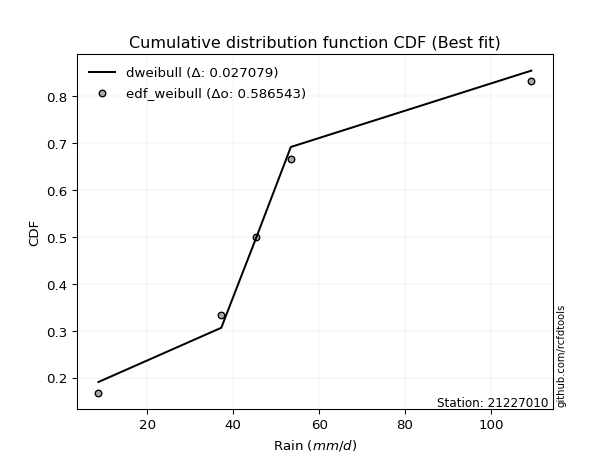</img>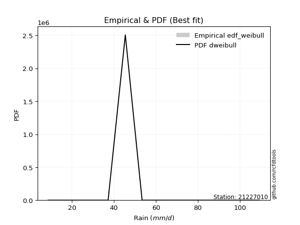</img>

</div>


### 4. Empirical - EDF Beard (1943)

The Beard formula (or Beard´s plotting position formula) in hydrology is used to estimate the empirical non-exceedance probability _(P)_ of a flood event (or other extreme hydrological data point) within a given dataset.

<div align="center">


$P=(m-0.31)/(n+0.38)$


</div>


**4.1. Empirical values**

<div align="center">

|                | 0                   | 1                  | 2         | 3                  | 4                  |
|:---------------|:--------------------|:-------------------|:----------|:-------------------|:-------------------|
| date           | 2023                | 2025               | 2024      | 2018               | 2019               |
| x              | 8.6                 | 13.27              | 37.2      | 45.4               | 53.4               |
| m              | 1                   | 2                  | 3         | 4                  | 5                  |
| empirical_dist | edf_beard           | edf_beard          | edf_beard | edf_beard          | edf_beard          |
| empirical      | 0.12825278810408922 | 0.3141263940520446 | 0.5       | 0.6858736059479554 | 0.8717472118959109 |
| empirical_tr   | 1.1471215351812367  | 1.4579945799457996 | 2.0       | 3.183431952662722  | 7.797101449275368  |

</div>


**4.2. Kolmogorov-Smirnov fit test (sorted by Δ)**


<div align="center">

|                | 0                   | 1                   | 2                     | 3                  | 4                  | 5                   | 6                  | 7                   | 8                   | 9                   | 10                 | 11                  | 12                  | 13                  | 14                  | 15                  | 16                  | 17                  | 18                  | 19                  | 20                  | 21                  | 22                 | 23                  | 24                  | 25                  | 26                 | 27                 | 28                  | 29                  | 30                  | 31                  | 32                  | 33                  | 34                  | 35                  | 36                  | 37                 | 38                  | 39                  | 40                  | 41                 | 42                 | 43                  | 44                  | 45                 | 46                  | 47                  | 48                 | 49                 | 50                  | 51                  | 52                  | 53                  | 54                  | 55                  | 56                 | 57                  | 58                  | 59                  | 60                 | 61                 | 62                  | 63                  | 64                  | 65                  | 66                 | 67                  | 68                 | 69                  | 70                 | 71                  | 72                  | 73                 | 74                 | 75                 | 76                 | 77                 | 78                 | 79                 | 80                  | 81                  | 82                 | 83                 | 84                  | 85                  | 86                 | 87                 | 88                 | 89                 |
|:---------------|:--------------------|:--------------------|:----------------------|:-------------------|:-------------------|:--------------------|:-------------------|:--------------------|:--------------------|:--------------------|:-------------------|:--------------------|:--------------------|:--------------------|:--------------------|:--------------------|:--------------------|:--------------------|:--------------------|:--------------------|:--------------------|:--------------------|:-------------------|:--------------------|:--------------------|:--------------------|:-------------------|:-------------------|:--------------------|:--------------------|:--------------------|:--------------------|:--------------------|:--------------------|:--------------------|:--------------------|:--------------------|:-------------------|:--------------------|:--------------------|:--------------------|:-------------------|:-------------------|:--------------------|:--------------------|:-------------------|:--------------------|:--------------------|:-------------------|:-------------------|:--------------------|:--------------------|:--------------------|:--------------------|:--------------------|:--------------------|:-------------------|:--------------------|:--------------------|:--------------------|:-------------------|:-------------------|:--------------------|:--------------------|:--------------------|:--------------------|:-------------------|:--------------------|:-------------------|:--------------------|:-------------------|:--------------------|:--------------------|:-------------------|:-------------------|:-------------------|:-------------------|:-------------------|:-------------------|:-------------------|:--------------------|:--------------------|:-------------------|:-------------------|:--------------------|:--------------------|:-------------------|:-------------------|:-------------------|:-------------------|
| station        | 21227010            | 21227010            | 21227010              | 21227010           | 21227010           | 21227010            | 21227010           | 21227010            | 21227010            | 21227010            | 21227010           | 21227010            | 21227010            | 21227010            | 21227010            | 21227010            | 21227010            | 21227010            | 21227010            | 21227010            | 21227010            | 21227010            | 21227010           | 21227010            | 21227010            | 21227010            | 21227010           | 21227010           | 21227010            | 21227010            | 21227010            | 21227010            | 21227010            | 21227010            | 21227010            | 21227010            | 21227010            | 21227010           | 21227010            | 21227010            | 21227010            | 21227010           | 21227010           | 21227010            | 21227010            | 21227010           | 21227010            | 21227010            | 21227010           | 21227010           | 21227010            | 21227010            | 21227010            | 21227010            | 21227010            | 21227010            | 21227010           | 21227010            | 21227010            | 21227010            | 21227010           | 21227010           | 21227010            | 21227010            | 21227010            | 21227010            | 21227010           | 21227010            | 21227010           | 21227010            | 21227010           | 21227010            | 21227010            | 21227010           | 21227010           | 21227010           | 21227010           | 21227010           | 21227010           | 21227010           | 21227010            | 21227010            | 21227010           | 21227010           | 21227010            | 21227010            | 21227010           | 21227010           | 21227010           | 21227010           |
| empirical_dist | edf_beard           | edf_beard           | edf_beard             | edf_beard          | edf_beard          | edf_beard           | edf_beard          | edf_beard           | edf_beard           | edf_beard           | edf_beard          | edf_beard           | edf_beard           | edf_beard           | edf_beard           | edf_beard           | edf_beard           | edf_beard           | edf_beard           | edf_beard           | edf_beard           | edf_beard           | edf_beard          | edf_beard           | edf_beard           | edf_beard           | edf_beard          | edf_beard          | edf_beard           | edf_beard           | edf_beard           | edf_beard           | edf_beard           | edf_beard           | edf_beard           | edf_beard           | edf_beard           | edf_beard          | edf_beard           | edf_beard           | edf_beard           | edf_beard          | edf_beard          | edf_beard           | edf_beard           | edf_beard          | edf_beard           | edf_beard           | edf_beard          | edf_beard          | edf_beard           | edf_beard           | edf_beard           | edf_beard           | edf_beard           | edf_beard           | edf_beard          | edf_beard           | edf_beard           | edf_beard           | edf_beard          | edf_beard          | edf_beard           | edf_beard           | edf_beard           | edf_beard           | edf_beard          | edf_beard           | edf_beard          | edf_beard           | edf_beard          | edf_beard           | edf_beard           | edf_beard          | edf_beard          | edf_beard          | edf_beard          | edf_beard          | edf_beard          | edf_beard          | edf_beard           | edf_beard           | edf_beard          | edf_beard          | edf_beard           | edf_beard           | edf_beard          | edf_beard          | edf_beard          | edf_beard          |
| p_dist         | laplace_asymmetric  | logloggamma         | loglaplace_asymmetric | rayleigh           | maxwell            | gamma               | logweibull_min     | johnsonsu           | invgamma            | erlang              | pearson3           | t                   | truncnorm           | norm                | crystalball         | exponnorm           | logfisk             | loggumbel_l         | gumbel_l            | halfnorm            | rice                | logistic            | kstwobign          | logpearson3         | f                   | betaprime           | hypsecant          | gumbel_r           | fisk                | laplace             | ncf                 | loggompertz         | lognct              | logt                | logexponnorm        | lognorm             | lognorm             | logcrystalball     | logf                | logncf              | logfatiguelife      | logbetaprime       | alpha              | loggamma            | loggamma            | logalpha           | loginvgamma         | gompertz            | logerlang          | logrice            | expon               | genexpon            | invgauss            | loginvweibull       | loginvgauss         | logmaxwell          | moyal              | lograyleigh         | loglogistic         | halflogistic        | loggenexpon        | logkstwobign       | nct                 | loghalfnorm         | loghypsecant        | logexpon            | loggumbel_r        | pareto              | weibull_min        | loghalflogistic     | loglaplace         | logchi2             | logmoyal            | logtruncnorm       | gibrat             | wald               | logpareto          | logwald            | lognakagami        | logmielke          | loggibrat           | loglognorm          | chi2               | fatiguelife        | nakagami            | invweibull          | logjohnsonsu       | genlogistic        | loggenlogistic     | mielke             |
| delta          | 0.15761319642940685 | 0.15847372456180767 | 0.15934696783758015   | 0.1618220056128534 | 0.1619048685726592 | 0.16277196364207802 | 0.1628749002366705 | 0.16347742104280477 | 0.16348629207111096 | 0.16358419562915805 | 0.1637554577226713 | 0.16389139651411117 | 0.16392915640856198 | 0.16392916290004655 | 0.16392917222133865 | 0.16392965818115293 | 0.17109710830212743 | 0.17145365194786022 | 0.17590073058134836 | 0.17770897588504242 | 0.17867007005661473 | 0.18154772044547882 | 0.1831106418221924 | 0.18502700798501404 | 0.18759060556618434 | 0.18963674454713075 | 0.1905567676587179 | 0.1939830954210336 | 0.19565644899578394 | 0.19853451367762476 | 0.20174378543081717 | 0.20228727044559247 | 0.20299416992217334 | 0.20318109950456087 | 0.20318224527639317 | 0.20318427731608135 | 0.20318427731608135 | 0.2031843065188157 | 0.20355068188773107 | 0.20399235653837355 | 0.20422605705663288 | 0.2047582075217277 | 0.2047733205911716 | 0.20563649811006368 | 0.20563649811006368 | 0.2073645199936579 | 0.20770305286937973 | 0.20827598738596828 | 0.2108921402062599 | 0.2113855528027775 | 0.21202612730337433 | 0.21203314083495328 | 0.21241372994786656 | 0.21332182212814932 | 0.21568330376443823 | 0.21871215805652233 | 0.219946933594921  | 0.22324319215897193 | 0.22468255127495895 | 0.22683621283971542 | 0.2320109081576054 | 0.23424345857299   | 0.23506336452041543 | 0.23708791953343433 | 0.24012197646510614 | 0.24309770700763478 | 0.2533601356804669 | 0.25599933836174366 | 0.2633124442724711 | 0.26376988940893764 | 0.2649000862113934 | 0.26720259508758115 | 0.26957998211593903 | 0.3141263855678087 | 0.3141263940520446 | 0.3141263940520446 | 0.3143749446669179 | 0.317333363355948  | 0.3207522999577892 | 0.3299211730190056 | 0.34856890166132004 | 0.35203628677881865 | 0.3692340664035205 | 0.4084513093387999 | 0.41394847465520507 | 0.44229183462579885 | 0.6394628964020221 | 0.6858736059479554 | 0.6858736059479554 | nan                |
| deltao         | 0.5865427407550001  | 0.5865427407550001  | 0.5865427407550001    | 0.5865427407550001 | 0.5865427407550001 | 0.5865427407550001  | 0.5865427407550001 | 0.5865427407550001  | 0.5865427407550001  | 0.5865427407550001  | 0.5865427407550001 | 0.5865427407550001  | 0.5865427407550001  | 0.5865427407550001  | 0.5865427407550001  | 0.5865427407550001  | 0.5865427407550001  | 0.5865427407550001  | 0.5865427407550001  | 0.5865427407550001  | 0.5865427407550001  | 0.5865427407550001  | 0.5865427407550001 | 0.5865427407550001  | 0.5865427407550001  | 0.5865427407550001  | 0.5865427407550001 | 0.5865427407550001 | 0.5865427407550001  | 0.5865427407550001  | 0.5865427407550001  | 0.5865427407550001  | 0.5865427407550001  | 0.5865427407550001  | 0.5865427407550001  | 0.5865427407550001  | 0.5865427407550001  | 0.5865427407550001 | 0.5865427407550001  | 0.5865427407550001  | 0.5865427407550001  | 0.5865427407550001 | 0.5865427407550001 | 0.5865427407550001  | 0.5865427407550001  | 0.5865427407550001 | 0.5865427407550001  | 0.5865427407550001  | 0.5865427407550001 | 0.5865427407550001 | 0.5865427407550001  | 0.5865427407550001  | 0.5865427407550001  | 0.5865427407550001  | 0.5865427407550001  | 0.5865427407550001  | 0.5865427407550001 | 0.5865427407550001  | 0.5865427407550001  | 0.5865427407550001  | 0.5865427407550001 | 0.5865427407550001 | 0.5865427407550001  | 0.5865427407550001  | 0.5865427407550001  | 0.5865427407550001  | 0.5865427407550001 | 0.5865427407550001  | 0.5865427407550001 | 0.5865427407550001  | 0.5865427407550001 | 0.5865427407550001  | 0.5865427407550001  | 0.5865427407550001 | 0.5865427407550001 | 0.5865427407550001 | 0.5865427407550001 | 0.5865427407550001 | 0.5865427407550001 | 0.5865427407550001 | 0.5865427407550001  | 0.5865427407550001  | 0.5865427407550001 | 0.5865427407550001 | 0.5865427407550001  | 0.5865427407550001  | 0.5865427407550001 | 0.5865427407550001 | 0.5865427407550001 | 0.5865427407550001 |
| eval           | Δo > Δ              | Δo > Δ              | Δo > Δ                | Δo > Δ             | Δo > Δ             | Δo > Δ              | Δo > Δ             | Δo > Δ              | Δo > Δ              | Δo > Δ              | Δo > Δ             | Δo > Δ              | Δo > Δ              | Δo > Δ              | Δo > Δ              | Δo > Δ              | Δo > Δ              | Δo > Δ              | Δo > Δ              | Δo > Δ              | Δo > Δ              | Δo > Δ              | Δo > Δ             | Δo > Δ              | Δo > Δ              | Δo > Δ              | Δo > Δ             | Δo > Δ             | Δo > Δ              | Δo > Δ              | Δo > Δ              | Δo > Δ              | Δo > Δ              | Δo > Δ              | Δo > Δ              | Δo > Δ              | Δo > Δ              | Δo > Δ             | Δo > Δ              | Δo > Δ              | Δo > Δ              | Δo > Δ             | Δo > Δ             | Δo > Δ              | Δo > Δ              | Δo > Δ             | Δo > Δ              | Δo > Δ              | Δo > Δ             | Δo > Δ             | Δo > Δ              | Δo > Δ              | Δo > Δ              | Δo > Δ              | Δo > Δ              | Δo > Δ              | Δo > Δ             | Δo > Δ              | Δo > Δ              | Δo > Δ              | Δo > Δ             | Δo > Δ             | Δo > Δ              | Δo > Δ              | Δo > Δ              | Δo > Δ              | Δo > Δ             | Δo > Δ              | Δo > Δ             | Δo > Δ              | Δo > Δ             | Δo > Δ              | Δo > Δ              | Δo > Δ             | Δo > Δ             | Δo > Δ             | Δo > Δ             | Δo > Δ             | Δo > Δ             | Δo > Δ             | Δo > Δ              | Δo > Δ              | Δo > Δ             | Δo > Δ             | Δo > Δ              | Δo > Δ              | Δo <= Δ            | Δo <= Δ            | Δo <= Δ            | Δo <= Δ            |
| fit            | 1                   | 1                   | 1                     | 1                  | 1                  | 1                   | 1                  | 1                   | 1                   | 1                   | 1                  | 1                   | 1                   | 1                   | 1                   | 1                   | 1                   | 1                   | 1                   | 1                   | 1                   | 1                   | 1                  | 1                   | 1                   | 1                   | 1                  | 1                  | 1                   | 1                   | 1                   | 1                   | 1                   | 1                   | 1                   | 1                   | 1                   | 1                  | 1                   | 1                   | 1                   | 1                  | 1                  | 1                   | 1                   | 1                  | 1                   | 1                   | 1                  | 1                  | 1                   | 1                   | 1                   | 1                   | 1                   | 1                   | 1                  | 1                   | 1                   | 1                   | 1                  | 1                  | 1                   | 1                   | 1                   | 1                   | 1                  | 1                   | 1                  | 1                   | 1                  | 1                   | 1                   | 1                  | 1                  | 1                  | 1                  | 1                  | 1                  | 1                  | 1                   | 1                   | 1                  | 1                  | 1                   | 1                   | 0                  | 0                  | 0                  | 0                  |
| n              | 5                   | 5                   | 5                     | 5                  | 5                  | 5                   | 5                  | 5                   | 5                   | 5                   | 5                  | 5                   | 5                   | 5                   | 5                   | 5                   | 5                   | 5                   | 5                   | 5                   | 5                   | 5                   | 5                  | 5                   | 5                   | 5                   | 5                  | 5                  | 5                   | 5                   | 5                   | 5                   | 5                   | 5                   | 5                   | 5                   | 5                   | 5                  | 5                   | 5                   | 5                   | 5                  | 5                  | 5                   | 5                   | 5                  | 5                   | 5                   | 5                  | 5                  | 5                   | 5                   | 5                   | 5                   | 5                   | 5                   | 5                  | 5                   | 5                   | 5                   | 5                  | 5                  | 5                   | 5                   | 5                   | 5                   | 5                  | 5                   | 5                  | 5                   | 5                  | 5                   | 5                   | 5                  | 5                  | 5                  | 5                  | 5                  | 5                  | 5                  | 5                   | 5                   | 5                  | 5                  | 5                   | 5                   | 5                  | 5                  | 5                  | 5                  |
| best_fit       | 1                   | 0                   | 0                     | 0                  | 0                  | 0                   | 0                  | 0                   | 0                   | 0                   | 0                  | 0                   | 0                   | 0                   | 0                   | 0                   | 0                   | 0                   | 0                   | 0                   | 0                   | 0                   | 0                  | 0                   | 0                   | 0                   | 0                  | 0                  | 0                   | 0                   | 0                   | 0                   | 0                   | 0                   | 0                   | 0                   | 0                   | 0                  | 0                   | 0                   | 0                   | 0                  | 0                  | 0                   | 0                   | 0                  | 0                   | 0                   | 0                  | 0                  | 0                   | 0                   | 0                   | 0                   | 0                   | 0                   | 0                  | 0                   | 0                   | 0                   | 0                  | 0                  | 0                   | 0                   | 0                   | 0                   | 0                  | 0                   | 0                  | 0                   | 0                  | 0                   | 0                   | 0                  | 0                  | 0                  | 0                  | 0                  | 0                  | 0                  | 0                   | 0                   | 0                  | 0                  | 0                   | 0                   | 0                  | 0                  | 0                  | 0                  |
| best_fit_sort  | 1                   | 2                   | 3                     | 4                  | 5                  | 6                   | 7                  | 8                   | 9                   | 10                  | 11                 | 12                  | 13                  | 14                  | 15                  | 16                  | 17                  | 18                  | 19                  | 20                  | 21                  | 22                  | 23                 | 24                  | 25                  | 26                  | 27                 | 28                 | 29                  | 30                  | 31                  | 32                  | 33                  | 34                  | 35                  | 36                  | 37                  | 38                 | 39                  | 40                  | 41                  | 42                 | 43                 | 44                  | 45                  | 46                 | 47                  | 48                  | 49                 | 50                 | 51                  | 52                  | 53                  | 54                  | 55                  | 56                  | 57                 | 58                  | 59                  | 60                  | 61                 | 62                 | 63                  | 64                  | 65                  | 66                  | 67                 | 68                  | 69                 | 70                  | 71                 | 72                  | 73                  | 74                 | 75                 | 76                 | 77                 | 78                 | 79                 | 80                 | 81                  | 82                  | 83                 | 84                 | 85                  | 86                  | 87                 | 88                 | 89                 | 90                 |

</div>


<div align="center">

</img>

</div>


**4.3. Best fit**

<div align="center">

|   id |   station | empirical_dist   | p_dist             |    delta |   deltao | eval   |   fit |   n |   best_fit |   best_fit_sort |
|-----:|----------:|:-----------------|:-------------------|---------:|---------:|:-------|------:|----:|-----------:|----------------:|
|    0 |  21227010 | edf_beard        | laplace_asymmetric | 0.157613 | 0.586543 | Δo > Δ |     1 |   5 |          1 |               1 |

</div>


<div align="center">

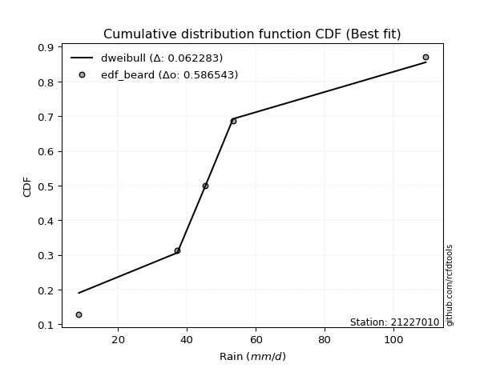</img>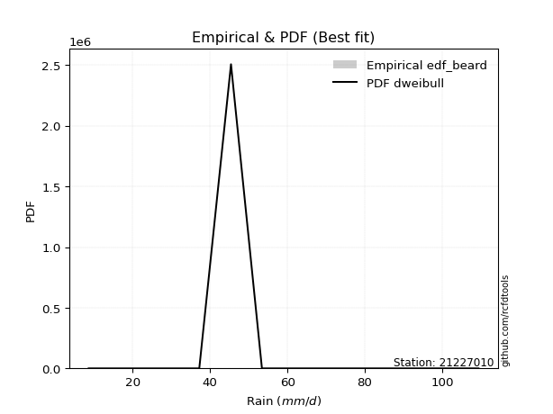</img>

</div>


### 5. Empirical - EDF Chegodayev (1955)

The Chegodayev formula is an empirical plotting position formula used in hydrological frequency analysis to estimate the exceedance probability or return period of a specific event from a set of observed data. It is primarily used for plotting observed data points on probability paper to fit a theoretical distribution, particularly for analyzing extreme events like maximum flood flows or rainfall intensities. The constant _b_ value in the generalized plotting position formula is 0.3.

<div align="center">


$P=(m-b)/(n+1-2b)$


</div>


**5.1. Empirical values**

<div align="center">

|                | 0                   | 1                   | 2              | 3                  | 4                  |
|:---------------|:--------------------|:--------------------|:---------------|:-------------------|:-------------------|
| date           | 2023                | 2025                | 2024           | 2018               | 2019               |
| x              | 8.6                 | 13.27               | 37.2           | 45.4               | 53.4               |
| m              | 1                   | 2                   | 3              | 4                  | 5                  |
| empirical_dist | edf_chegodayev      | edf_chegodayev      | edf_chegodayev | edf_chegodayev     | edf_chegodayev     |
| empirical      | 0.12962962962962962 | 0.31481481481481477 | 0.5            | 0.6851851851851851 | 0.8703703703703703 |
| empirical_tr   | 1.148936170212766   | 1.4594594594594594  | 2.0            | 3.1764705882352935 | 7.714285714285713  |

</div>


**5.2. Kolmogorov-Smirnov fit test (sorted by Δ)**


<div align="center">

|                | 0                  | 1                   | 2                     | 3                   | 4                   | 5                   | 6                   | 7                   | 8                  | 9                  | 10                  | 11                 | 12                  | 13                 | 14                 | 15                  | 16                  | 17                  | 18                 | 19                  | 20                  | 21                  | 22                 | 23                  | 24                  | 25                  | 26                  | 27                  | 28                  | 29                 | 30                  | 31                  | 32                  | 33                  | 34                  | 35                  | 36                  | 37                 | 38                  | 39                  | 40                  | 41                 | 42                 | 43                  | 44                  | 45                 | 46                  | 47                  | 48                 | 49                 | 50                  | 51                  | 52                  | 53                  | 54                  | 55                  | 56                  | 57                  | 58                  | 59                  | 60                 | 61                 | 62                  | 63                  | 64                  | 65                  | 66                 | 67                 | 68                  | 69                  | 70                 | 71                  | 72                  | 73                  | 74                  | 75                  | 76                  | 77                 | 78                 | 79                 | 80                  | 81                 | 82                 | 83                 | 84                 | 85                  | 86                 | 87                 | 88                 | 89                 |
|:---------------|:-------------------|:--------------------|:----------------------|:--------------------|:--------------------|:--------------------|:--------------------|:--------------------|:-------------------|:-------------------|:--------------------|:-------------------|:--------------------|:-------------------|:-------------------|:--------------------|:--------------------|:--------------------|:-------------------|:--------------------|:--------------------|:--------------------|:-------------------|:--------------------|:--------------------|:--------------------|:--------------------|:--------------------|:--------------------|:-------------------|:--------------------|:--------------------|:--------------------|:--------------------|:--------------------|:--------------------|:--------------------|:-------------------|:--------------------|:--------------------|:--------------------|:-------------------|:-------------------|:--------------------|:--------------------|:-------------------|:--------------------|:--------------------|:-------------------|:-------------------|:--------------------|:--------------------|:--------------------|:--------------------|:--------------------|:--------------------|:--------------------|:--------------------|:--------------------|:--------------------|:-------------------|:-------------------|:--------------------|:--------------------|:--------------------|:--------------------|:-------------------|:-------------------|:--------------------|:--------------------|:-------------------|:--------------------|:--------------------|:--------------------|:--------------------|:--------------------|:--------------------|:-------------------|:-------------------|:-------------------|:--------------------|:-------------------|:-------------------|:-------------------|:-------------------|:--------------------|:-------------------|:-------------------|:-------------------|:-------------------|
| station        | 21227010           | 21227010            | 21227010              | 21227010            | 21227010            | 21227010            | 21227010            | 21227010            | 21227010           | 21227010           | 21227010            | 21227010           | 21227010            | 21227010           | 21227010           | 21227010            | 21227010            | 21227010            | 21227010           | 21227010            | 21227010            | 21227010            | 21227010           | 21227010            | 21227010            | 21227010            | 21227010            | 21227010            | 21227010            | 21227010           | 21227010            | 21227010            | 21227010            | 21227010            | 21227010            | 21227010            | 21227010            | 21227010           | 21227010            | 21227010            | 21227010            | 21227010           | 21227010           | 21227010            | 21227010            | 21227010           | 21227010            | 21227010            | 21227010           | 21227010           | 21227010            | 21227010            | 21227010            | 21227010            | 21227010            | 21227010            | 21227010            | 21227010            | 21227010            | 21227010            | 21227010           | 21227010           | 21227010            | 21227010            | 21227010            | 21227010            | 21227010           | 21227010           | 21227010            | 21227010            | 21227010           | 21227010            | 21227010            | 21227010            | 21227010            | 21227010            | 21227010            | 21227010           | 21227010           | 21227010           | 21227010            | 21227010           | 21227010           | 21227010           | 21227010           | 21227010            | 21227010           | 21227010           | 21227010           | 21227010           |
| empirical_dist | edf_chegodayev     | edf_chegodayev      | edf_chegodayev        | edf_chegodayev      | edf_chegodayev      | edf_chegodayev      | edf_chegodayev      | edf_chegodayev      | edf_chegodayev     | edf_chegodayev     | edf_chegodayev      | edf_chegodayev     | edf_chegodayev      | edf_chegodayev     | edf_chegodayev     | edf_chegodayev      | edf_chegodayev      | edf_chegodayev      | edf_chegodayev     | edf_chegodayev      | edf_chegodayev      | edf_chegodayev      | edf_chegodayev     | edf_chegodayev      | edf_chegodayev      | edf_chegodayev      | edf_chegodayev      | edf_chegodayev      | edf_chegodayev      | edf_chegodayev     | edf_chegodayev      | edf_chegodayev      | edf_chegodayev      | edf_chegodayev      | edf_chegodayev      | edf_chegodayev      | edf_chegodayev      | edf_chegodayev     | edf_chegodayev      | edf_chegodayev      | edf_chegodayev      | edf_chegodayev     | edf_chegodayev     | edf_chegodayev      | edf_chegodayev      | edf_chegodayev     | edf_chegodayev      | edf_chegodayev      | edf_chegodayev     | edf_chegodayev     | edf_chegodayev      | edf_chegodayev      | edf_chegodayev      | edf_chegodayev      | edf_chegodayev      | edf_chegodayev      | edf_chegodayev      | edf_chegodayev      | edf_chegodayev      | edf_chegodayev      | edf_chegodayev     | edf_chegodayev     | edf_chegodayev      | edf_chegodayev      | edf_chegodayev      | edf_chegodayev      | edf_chegodayev     | edf_chegodayev     | edf_chegodayev      | edf_chegodayev      | edf_chegodayev     | edf_chegodayev      | edf_chegodayev      | edf_chegodayev      | edf_chegodayev      | edf_chegodayev      | edf_chegodayev      | edf_chegodayev     | edf_chegodayev     | edf_chegodayev     | edf_chegodayev      | edf_chegodayev     | edf_chegodayev     | edf_chegodayev     | edf_chegodayev     | edf_chegodayev      | edf_chegodayev     | edf_chegodayev     | edf_chegodayev     | edf_chegodayev     |
| p_dist         | laplace_asymmetric | logloggamma         | loglaplace_asymmetric | rayleigh            | maxwell             | logweibull_min      | gamma               | johnsonsu           | invgamma           | erlang             | pearson3            | t                  | truncnorm           | norm               | crystalball        | exponnorm           | logfisk             | loggumbel_l         | gumbel_l           | halfnorm            | rice                | logistic            | kstwobign          | logpearson3         | f                   | betaprime           | hypsecant           | fisk                | gumbel_r            | laplace            | loggompertz         | ncf                 | lognct              | logt                | logexponnorm        | lognorm             | lognorm             | logcrystalball     | logf                | logncf              | logfatiguelife      | logbetaprime       | alpha              | loggamma            | loggamma            | logalpha           | loginvgamma         | gompertz            | logerlang          | logrice            | expon               | genexpon            | invgauss            | loginvweibull       | loginvgauss         | logmaxwell          | moyal               | lograyleigh         | loglogistic         | halflogistic        | loggenexpon        | logkstwobign       | nct                 | loghalfnorm         | loghypsecant        | logexpon            | loggumbel_r        | pareto             | weibull_min         | loghalflogistic     | loglaplace         | logchi2             | logmoyal            | logpareto           | logtruncnorm        | gibrat              | wald                | logwald            | lognakagami        | logmielke          | loggibrat           | loglognorm         | chi2               | fatiguelife        | nakagami           | invweibull          | logjohnsonsu       | genlogistic        | loggenlogistic     | mielke             |
| delta          | 0.158301617192177  | 0.15916214532457781 | 0.1600353886003503    | 0.16251042637562355 | 0.16259328933542935 | 0.16296237235701067 | 0.16346038440484817 | 0.16416584180557492 | 0.1641747128338811 | 0.1642726163919282 | 0.16444387848544145 | 0.1645798172768813 | 0.16461757717133213 | 0.1646175836628167 | 0.1646175929841088 | 0.16461807894392308 | 0.17109710830212743 | 0.17145365194786022 | 0.1765891513441185 | 0.17770897588504242 | 0.17935849081938487 | 0.18223614120824896 | 0.1831106418221924 | 0.18502700798501404 | 0.18759060556618434 | 0.18963674454713075 | 0.19124518842148805 | 0.19427960747024342 | 0.19467151618380374 | 0.1992229344403949 | 0.20228727044559247 | 0.20243220619358732 | 0.20299416992217334 | 0.20318109950456087 | 0.20318224527639317 | 0.20318427731608135 | 0.20318427731608135 | 0.2031843065188157 | 0.20355068188773107 | 0.20399235653837355 | 0.20422605705663288 | 0.2047582075217277 | 0.2047733205911716 | 0.20563649811006368 | 0.20563649811006368 | 0.2073645199936579 | 0.20770305286937973 | 0.20896440814873843 | 0.2108921402062599 | 0.2113855528027775 | 0.21202612730337433 | 0.21203314083495328 | 0.21241372994786656 | 0.21332182212814932 | 0.21568330376443823 | 0.21871215805652233 | 0.22063535435769116 | 0.22324319215897193 | 0.22468255127495895 | 0.22752463360248557 | 0.2320109081576054 | 0.23424345857299   | 0.23506336452041543 | 0.23708791953343433 | 0.24012197646510614 | 0.24309770700763478 | 0.2533601356804669 | 0.2553109175989735 | 0.26262402350970093 | 0.26376988940893764 | 0.2649000862113934 | 0.26720259508758115 | 0.26957998211593903 | 0.31368652390414775 | 0.31481480633057884 | 0.31481481481481477 | 0.31481481481481477 | 0.317333363355948  | 0.3207522999577892 | 0.3299211730190056 | 0.34856890166132004 | 0.3513478660160485 | 0.3692340664035205 | 0.4084513093387999 | 0.4132600538924349 | 0.44091499310025833 | 0.6387744756392518 | 0.6851851851851851 | 0.6851851851851851 | nan                |
| deltao         | 0.5865427407550001 | 0.5865427407550001  | 0.5865427407550001    | 0.5865427407550001  | 0.5865427407550001  | 0.5865427407550001  | 0.5865427407550001  | 0.5865427407550001  | 0.5865427407550001 | 0.5865427407550001 | 0.5865427407550001  | 0.5865427407550001 | 0.5865427407550001  | 0.5865427407550001 | 0.5865427407550001 | 0.5865427407550001  | 0.5865427407550001  | 0.5865427407550001  | 0.5865427407550001 | 0.5865427407550001  | 0.5865427407550001  | 0.5865427407550001  | 0.5865427407550001 | 0.5865427407550001  | 0.5865427407550001  | 0.5865427407550001  | 0.5865427407550001  | 0.5865427407550001  | 0.5865427407550001  | 0.5865427407550001 | 0.5865427407550001  | 0.5865427407550001  | 0.5865427407550001  | 0.5865427407550001  | 0.5865427407550001  | 0.5865427407550001  | 0.5865427407550001  | 0.5865427407550001 | 0.5865427407550001  | 0.5865427407550001  | 0.5865427407550001  | 0.5865427407550001 | 0.5865427407550001 | 0.5865427407550001  | 0.5865427407550001  | 0.5865427407550001 | 0.5865427407550001  | 0.5865427407550001  | 0.5865427407550001 | 0.5865427407550001 | 0.5865427407550001  | 0.5865427407550001  | 0.5865427407550001  | 0.5865427407550001  | 0.5865427407550001  | 0.5865427407550001  | 0.5865427407550001  | 0.5865427407550001  | 0.5865427407550001  | 0.5865427407550001  | 0.5865427407550001 | 0.5865427407550001 | 0.5865427407550001  | 0.5865427407550001  | 0.5865427407550001  | 0.5865427407550001  | 0.5865427407550001 | 0.5865427407550001 | 0.5865427407550001  | 0.5865427407550001  | 0.5865427407550001 | 0.5865427407550001  | 0.5865427407550001  | 0.5865427407550001  | 0.5865427407550001  | 0.5865427407550001  | 0.5865427407550001  | 0.5865427407550001 | 0.5865427407550001 | 0.5865427407550001 | 0.5865427407550001  | 0.5865427407550001 | 0.5865427407550001 | 0.5865427407550001 | 0.5865427407550001 | 0.5865427407550001  | 0.5865427407550001 | 0.5865427407550001 | 0.5865427407550001 | 0.5865427407550001 |
| eval           | Δo > Δ             | Δo > Δ              | Δo > Δ                | Δo > Δ              | Δo > Δ              | Δo > Δ              | Δo > Δ              | Δo > Δ              | Δo > Δ             | Δo > Δ             | Δo > Δ              | Δo > Δ             | Δo > Δ              | Δo > Δ             | Δo > Δ             | Δo > Δ              | Δo > Δ              | Δo > Δ              | Δo > Δ             | Δo > Δ              | Δo > Δ              | Δo > Δ              | Δo > Δ             | Δo > Δ              | Δo > Δ              | Δo > Δ              | Δo > Δ              | Δo > Δ              | Δo > Δ              | Δo > Δ             | Δo > Δ              | Δo > Δ              | Δo > Δ              | Δo > Δ              | Δo > Δ              | Δo > Δ              | Δo > Δ              | Δo > Δ             | Δo > Δ              | Δo > Δ              | Δo > Δ              | Δo > Δ             | Δo > Δ             | Δo > Δ              | Δo > Δ              | Δo > Δ             | Δo > Δ              | Δo > Δ              | Δo > Δ             | Δo > Δ             | Δo > Δ              | Δo > Δ              | Δo > Δ              | Δo > Δ              | Δo > Δ              | Δo > Δ              | Δo > Δ              | Δo > Δ              | Δo > Δ              | Δo > Δ              | Δo > Δ             | Δo > Δ             | Δo > Δ              | Δo > Δ              | Δo > Δ              | Δo > Δ              | Δo > Δ             | Δo > Δ             | Δo > Δ              | Δo > Δ              | Δo > Δ             | Δo > Δ              | Δo > Δ              | Δo > Δ              | Δo > Δ              | Δo > Δ              | Δo > Δ              | Δo > Δ             | Δo > Δ             | Δo > Δ             | Δo > Δ              | Δo > Δ             | Δo > Δ             | Δo > Δ             | Δo > Δ             | Δo > Δ              | Δo <= Δ            | Δo <= Δ            | Δo <= Δ            | Δo <= Δ            |
| fit            | 1                  | 1                   | 1                     | 1                   | 1                   | 1                   | 1                   | 1                   | 1                  | 1                  | 1                   | 1                  | 1                   | 1                  | 1                  | 1                   | 1                   | 1                   | 1                  | 1                   | 1                   | 1                   | 1                  | 1                   | 1                   | 1                   | 1                   | 1                   | 1                   | 1                  | 1                   | 1                   | 1                   | 1                   | 1                   | 1                   | 1                   | 1                  | 1                   | 1                   | 1                   | 1                  | 1                  | 1                   | 1                   | 1                  | 1                   | 1                   | 1                  | 1                  | 1                   | 1                   | 1                   | 1                   | 1                   | 1                   | 1                   | 1                   | 1                   | 1                   | 1                  | 1                  | 1                   | 1                   | 1                   | 1                   | 1                  | 1                  | 1                   | 1                   | 1                  | 1                   | 1                   | 1                   | 1                   | 1                   | 1                   | 1                  | 1                  | 1                  | 1                   | 1                  | 1                  | 1                  | 1                  | 1                   | 0                  | 0                  | 0                  | 0                  |
| n              | 5                  | 5                   | 5                     | 5                   | 5                   | 5                   | 5                   | 5                   | 5                  | 5                  | 5                   | 5                  | 5                   | 5                  | 5                  | 5                   | 5                   | 5                   | 5                  | 5                   | 5                   | 5                   | 5                  | 5                   | 5                   | 5                   | 5                   | 5                   | 5                   | 5                  | 5                   | 5                   | 5                   | 5                   | 5                   | 5                   | 5                   | 5                  | 5                   | 5                   | 5                   | 5                  | 5                  | 5                   | 5                   | 5                  | 5                   | 5                   | 5                  | 5                  | 5                   | 5                   | 5                   | 5                   | 5                   | 5                   | 5                   | 5                   | 5                   | 5                   | 5                  | 5                  | 5                   | 5                   | 5                   | 5                   | 5                  | 5                  | 5                   | 5                   | 5                  | 5                   | 5                   | 5                   | 5                   | 5                   | 5                   | 5                  | 5                  | 5                  | 5                   | 5                  | 5                  | 5                  | 5                  | 5                   | 5                  | 5                  | 5                  | 5                  |
| best_fit       | 1                  | 0                   | 0                     | 0                   | 0                   | 0                   | 0                   | 0                   | 0                  | 0                  | 0                   | 0                  | 0                   | 0                  | 0                  | 0                   | 0                   | 0                   | 0                  | 0                   | 0                   | 0                   | 0                  | 0                   | 0                   | 0                   | 0                   | 0                   | 0                   | 0                  | 0                   | 0                   | 0                   | 0                   | 0                   | 0                   | 0                   | 0                  | 0                   | 0                   | 0                   | 0                  | 0                  | 0                   | 0                   | 0                  | 0                   | 0                   | 0                  | 0                  | 0                   | 0                   | 0                   | 0                   | 0                   | 0                   | 0                   | 0                   | 0                   | 0                   | 0                  | 0                  | 0                   | 0                   | 0                   | 0                   | 0                  | 0                  | 0                   | 0                   | 0                  | 0                   | 0                   | 0                   | 0                   | 0                   | 0                   | 0                  | 0                  | 0                  | 0                   | 0                  | 0                  | 0                  | 0                  | 0                   | 0                  | 0                  | 0                  | 0                  |
| best_fit_sort  | 1                  | 2                   | 3                     | 4                   | 5                   | 6                   | 7                   | 8                   | 9                  | 10                 | 11                  | 12                 | 13                  | 14                 | 15                 | 16                  | 17                  | 18                  | 19                 | 20                  | 21                  | 22                  | 23                 | 24                  | 25                  | 26                  | 27                  | 28                  | 29                  | 30                 | 31                  | 32                  | 33                  | 34                  | 35                  | 36                  | 37                  | 38                 | 39                  | 40                  | 41                  | 42                 | 43                 | 44                  | 45                  | 46                 | 47                  | 48                  | 49                 | 50                 | 51                  | 52                  | 53                  | 54                  | 55                  | 56                  | 57                  | 58                  | 59                  | 60                  | 61                 | 62                 | 63                  | 64                  | 65                  | 66                  | 67                 | 68                 | 69                  | 70                  | 71                 | 72                  | 73                  | 74                  | 75                  | 76                  | 77                  | 78                 | 79                 | 80                 | 81                  | 82                 | 83                 | 84                 | 85                 | 86                  | 87                 | 88                 | 89                 | 90                 |

</div>


<div align="center">

</img>

</div>


**5.3. Best fit**

<div align="center">

|   id |   station | empirical_dist   | p_dist             |    delta |   deltao | eval   |   fit |   n |   best_fit |   best_fit_sort |
|-----:|----------:|:-----------------|:-------------------|---------:|---------:|:-------|------:|----:|-----------:|----------------:|
|    0 |  21227010 | edf_chegodayev   | laplace_asymmetric | 0.158302 | 0.586543 | Δo > Δ |     1 |   5 |          1 |               1 |

</div>


<div align="center">

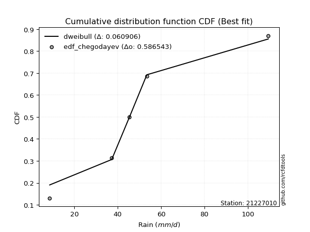</img>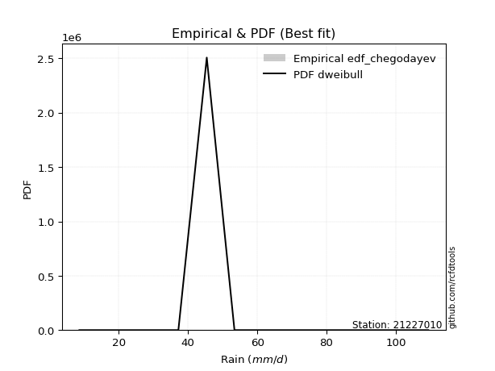</img>

</div>


### 6. Empirical - EDF Blom (1958)

The Blom formula is a specific "plotting position" formula used in hydrology and statistical analysis to estimate the empirical cumulative probability (or non-exceedance probability) of a data series. It is particularly recommended for data that are approximately normally distributed. The constant _a_ is set to 0.375 (or 3/8).

<div align="center">


$P=(m-a)/(n+1-2a)$


</div>


**6.1. Empirical values**

<div align="center">

|                | 0                   | 1                   | 2        | 3                  | 4                  |
|:---------------|:--------------------|:--------------------|:---------|:-------------------|:-------------------|
| date           | 2023                | 2025                | 2024     | 2018               | 2019               |
| x              | 8.6                 | 13.27               | 37.2     | 45.4               | 53.4               |
| m              | 1                   | 2                   | 3        | 4                  | 5                  |
| empirical_dist | edf_blom            | edf_blom            | edf_blom | edf_blom           | edf_blom           |
| empirical      | 0.11904761904761904 | 0.30952380952380953 | 0.5      | 0.6904761904761905 | 0.8809523809523809 |
| empirical_tr   | 1.135135135135135   | 1.4482758620689655  | 2.0      | 3.230769230769231  | 8.399999999999999  |

</div>


**6.2. Kolmogorov-Smirnov fit test (sorted by Δ)**


<div align="center">

|                | 0                   | 1                   | 2                     | 3                  | 4                   | 5                   | 6                   | 7                   | 8                   | 9                   | 10                  | 11                 | 12                  | 13                  | 14                  | 15                 | 16                  | 17                  | 18                  | 19                  | 20                  | 21                  | 22                 | 23                  | 24                  | 25                  | 26                 | 27                  | 28                  | 29                  | 30                  | 31                  | 32                  | 33                  | 34                  | 35                  | 36                 | 37                  | 38                 | 39                  | 40                  | 41                 | 42                 | 43                 | 44                  | 45                  | 46                 | 47                  | 48                 | 49                 | 50                  | 51                  | 52                  | 53                  | 54                  | 55                  | 56                  | 57                  | 58                  | 59                  | 60                 | 61                 | 62                  | 63                  | 64                  | 65                  | 66                 | 67                  | 68                  | 69                 | 70                  | 71                  | 72                  | 73                 | 74                  | 75                  | 76                 | 77                 | 78                 | 79                 | 80                  | 81                  | 82                 | 83                 | 84                  | 85                 | 86                 | 87                 | 88                 | 89                 |
|:---------------|:--------------------|:--------------------|:----------------------|:-------------------|:--------------------|:--------------------|:--------------------|:--------------------|:--------------------|:--------------------|:--------------------|:-------------------|:--------------------|:--------------------|:--------------------|:-------------------|:--------------------|:--------------------|:--------------------|:--------------------|:--------------------|:--------------------|:-------------------|:--------------------|:--------------------|:--------------------|:-------------------|:--------------------|:--------------------|:--------------------|:--------------------|:--------------------|:--------------------|:--------------------|:--------------------|:--------------------|:-------------------|:--------------------|:-------------------|:--------------------|:--------------------|:-------------------|:-------------------|:-------------------|:--------------------|:--------------------|:-------------------|:--------------------|:-------------------|:-------------------|:--------------------|:--------------------|:--------------------|:--------------------|:--------------------|:--------------------|:--------------------|:--------------------|:--------------------|:--------------------|:-------------------|:-------------------|:--------------------|:--------------------|:--------------------|:--------------------|:-------------------|:--------------------|:--------------------|:-------------------|:--------------------|:--------------------|:--------------------|:-------------------|:--------------------|:--------------------|:-------------------|:-------------------|:-------------------|:-------------------|:--------------------|:--------------------|:-------------------|:-------------------|:--------------------|:-------------------|:-------------------|:-------------------|:-------------------|:-------------------|
| station        | 21227010            | 21227010            | 21227010              | 21227010           | 21227010            | 21227010            | 21227010            | 21227010            | 21227010            | 21227010            | 21227010            | 21227010           | 21227010            | 21227010            | 21227010            | 21227010           | 21227010            | 21227010            | 21227010            | 21227010            | 21227010            | 21227010            | 21227010           | 21227010            | 21227010            | 21227010            | 21227010           | 21227010            | 21227010            | 21227010            | 21227010            | 21227010            | 21227010            | 21227010            | 21227010            | 21227010            | 21227010           | 21227010            | 21227010           | 21227010            | 21227010            | 21227010           | 21227010           | 21227010           | 21227010            | 21227010            | 21227010           | 21227010            | 21227010           | 21227010           | 21227010            | 21227010            | 21227010            | 21227010            | 21227010            | 21227010            | 21227010            | 21227010            | 21227010            | 21227010            | 21227010           | 21227010           | 21227010            | 21227010            | 21227010            | 21227010            | 21227010           | 21227010            | 21227010            | 21227010           | 21227010            | 21227010            | 21227010            | 21227010           | 21227010            | 21227010            | 21227010           | 21227010           | 21227010           | 21227010           | 21227010            | 21227010            | 21227010           | 21227010           | 21227010            | 21227010           | 21227010           | 21227010           | 21227010           | 21227010           |
| empirical_dist | edf_blom            | edf_blom            | edf_blom              | edf_blom           | edf_blom            | edf_blom            | edf_blom            | edf_blom            | edf_blom            | edf_blom            | edf_blom            | edf_blom           | edf_blom            | edf_blom            | edf_blom            | edf_blom           | edf_blom            | edf_blom            | edf_blom            | edf_blom            | edf_blom            | edf_blom            | edf_blom           | edf_blom            | edf_blom            | edf_blom            | edf_blom           | edf_blom            | edf_blom            | edf_blom            | edf_blom            | edf_blom            | edf_blom            | edf_blom            | edf_blom            | edf_blom            | edf_blom           | edf_blom            | edf_blom           | edf_blom            | edf_blom            | edf_blom           | edf_blom           | edf_blom           | edf_blom            | edf_blom            | edf_blom           | edf_blom            | edf_blom           | edf_blom           | edf_blom            | edf_blom            | edf_blom            | edf_blom            | edf_blom            | edf_blom            | edf_blom            | edf_blom            | edf_blom            | edf_blom            | edf_blom           | edf_blom           | edf_blom            | edf_blom            | edf_blom            | edf_blom            | edf_blom           | edf_blom            | edf_blom            | edf_blom           | edf_blom            | edf_blom            | edf_blom            | edf_blom           | edf_blom            | edf_blom            | edf_blom           | edf_blom           | edf_blom           | edf_blom           | edf_blom            | edf_blom            | edf_blom           | edf_blom           | edf_blom            | edf_blom           | edf_blom           | edf_blom           | edf_blom           | edf_blom           |
| p_dist         | laplace_asymmetric  | logloggamma         | loglaplace_asymmetric | rayleigh           | maxwell             | gamma               | johnsonsu           | invgamma            | erlang              | pearson3            | t                   | truncnorm          | norm                | crystalball         | exponnorm           | logweibull_min     | logfisk             | gumbel_l            | loggumbel_l         | rice                | logistic            | halfnorm            | kstwobign          | logpearson3         | hypsecant           | f                   | gumbel_r           | betaprime           | laplace             | ncf                 | loggompertz         | lognct              | logt                | logexponnorm        | lognorm             | lognorm             | logcrystalball     | logf                | gompertz           | logncf              | logfatiguelife      | logbetaprime       | alpha              | fisk               | loggamma            | loggamma            | logalpha           | loginvgamma         | logerlang          | logrice            | expon               | genexpon            | invgauss            | loginvweibull       | moyal               | loginvgauss         | logmaxwell          | halflogistic        | lograyleigh         | loglogistic         | loggenexpon        | logkstwobign       | nct                 | loghalfnorm         | loghypsecant        | logexpon            | loggumbel_r        | pareto              | loghalflogistic     | loglaplace         | logchi2             | weibull_min         | logmoyal            | logtruncnorm       | gibrat              | wald                | logwald            | logpareto          | lognakagami        | logmielke          | loggibrat           | loglognorm          | chi2               | fatiguelife        | nakagami            | invweibull         | logjohnsonsu       | genlogistic        | loggenlogistic     | mielke             |
| delta          | 0.15301061190117177 | 0.15387114003357258 | 0.15474438330934506   | 0.1572194210846183 | 0.15730228404442412 | 0.15816937911384293 | 0.15887483651456968 | 0.15888370754287587 | 0.15898161110092296 | 0.15915287319443622 | 0.15928881198587608 | 0.1593265718803269 | 0.15932657837181147 | 0.15932658769310357 | 0.15932707365291784 | 0.1628749002366705 | 0.17109710830212743 | 0.17129814605311328 | 0.17145365194786022 | 0.17406748552837964 | 0.17694513591724373 | 0.17770897588504242 | 0.1831106418221924 | 0.18502700798501404 | 0.18595418313048281 | 0.18759060556618434 | 0.1893805108927985 | 0.18963674454713075 | 0.19393192914938967 | 0.19714120090258208 | 0.20228727044559247 | 0.20299416992217334 | 0.20318109950456087 | 0.20318224527639317 | 0.20318427731608135 | 0.20318427731608135 | 0.2031843065188157 | 0.20355068188773107 | 0.2036734028577332 | 0.20399235653837355 | 0.20422605705663288 | 0.2047582075217277 | 0.2047733205911716 | 0.204861618052254  | 0.20563649811006368 | 0.20563649811006368 | 0.2073645199936579 | 0.20770305286937973 | 0.2108921402062599 | 0.2113855528027775 | 0.21202612730337433 | 0.21203314083495328 | 0.21241372994786656 | 0.21332182212814932 | 0.21534434906668593 | 0.21568330376443823 | 0.21871215805652233 | 0.22223362831148033 | 0.22324319215897193 | 0.22468255127495895 | 0.2320109081576054 | 0.23424345857299   | 0.23506336452041543 | 0.23708791953343433 | 0.24012197646510614 | 0.24309770700763478 | 0.2533601356804669 | 0.26060192288997874 | 0.26376988940893764 | 0.2649000862113934 | 0.26720259508758115 | 0.26791502880070617 | 0.26957998211593903 | 0.3095238010395736 | 0.30952380952380953 | 0.30952380952380953 | 0.317333363355948  | 0.318977529195153  | 0.3207522999577892 | 0.3299211730190056 | 0.34856890166132004 | 0.35663887130705374 | 0.3692340664035205 | 0.4084513093387999 | 0.41855105918344016 | 0.4514970036822689 | 0.6440654809302572 | 0.6904761904761905 | 0.6904761904761905 | nan                |
| deltao         | 0.5865427407550001  | 0.5865427407550001  | 0.5865427407550001    | 0.5865427407550001 | 0.5865427407550001  | 0.5865427407550001  | 0.5865427407550001  | 0.5865427407550001  | 0.5865427407550001  | 0.5865427407550001  | 0.5865427407550001  | 0.5865427407550001 | 0.5865427407550001  | 0.5865427407550001  | 0.5865427407550001  | 0.5865427407550001 | 0.5865427407550001  | 0.5865427407550001  | 0.5865427407550001  | 0.5865427407550001  | 0.5865427407550001  | 0.5865427407550001  | 0.5865427407550001 | 0.5865427407550001  | 0.5865427407550001  | 0.5865427407550001  | 0.5865427407550001 | 0.5865427407550001  | 0.5865427407550001  | 0.5865427407550001  | 0.5865427407550001  | 0.5865427407550001  | 0.5865427407550001  | 0.5865427407550001  | 0.5865427407550001  | 0.5865427407550001  | 0.5865427407550001 | 0.5865427407550001  | 0.5865427407550001 | 0.5865427407550001  | 0.5865427407550001  | 0.5865427407550001 | 0.5865427407550001 | 0.5865427407550001 | 0.5865427407550001  | 0.5865427407550001  | 0.5865427407550001 | 0.5865427407550001  | 0.5865427407550001 | 0.5865427407550001 | 0.5865427407550001  | 0.5865427407550001  | 0.5865427407550001  | 0.5865427407550001  | 0.5865427407550001  | 0.5865427407550001  | 0.5865427407550001  | 0.5865427407550001  | 0.5865427407550001  | 0.5865427407550001  | 0.5865427407550001 | 0.5865427407550001 | 0.5865427407550001  | 0.5865427407550001  | 0.5865427407550001  | 0.5865427407550001  | 0.5865427407550001 | 0.5865427407550001  | 0.5865427407550001  | 0.5865427407550001 | 0.5865427407550001  | 0.5865427407550001  | 0.5865427407550001  | 0.5865427407550001 | 0.5865427407550001  | 0.5865427407550001  | 0.5865427407550001 | 0.5865427407550001 | 0.5865427407550001 | 0.5865427407550001 | 0.5865427407550001  | 0.5865427407550001  | 0.5865427407550001 | 0.5865427407550001 | 0.5865427407550001  | 0.5865427407550001 | 0.5865427407550001 | 0.5865427407550001 | 0.5865427407550001 | 0.5865427407550001 |
| eval           | Δo > Δ              | Δo > Δ              | Δo > Δ                | Δo > Δ             | Δo > Δ              | Δo > Δ              | Δo > Δ              | Δo > Δ              | Δo > Δ              | Δo > Δ              | Δo > Δ              | Δo > Δ             | Δo > Δ              | Δo > Δ              | Δo > Δ              | Δo > Δ             | Δo > Δ              | Δo > Δ              | Δo > Δ              | Δo > Δ              | Δo > Δ              | Δo > Δ              | Δo > Δ             | Δo > Δ              | Δo > Δ              | Δo > Δ              | Δo > Δ             | Δo > Δ              | Δo > Δ              | Δo > Δ              | Δo > Δ              | Δo > Δ              | Δo > Δ              | Δo > Δ              | Δo > Δ              | Δo > Δ              | Δo > Δ             | Δo > Δ              | Δo > Δ             | Δo > Δ              | Δo > Δ              | Δo > Δ             | Δo > Δ             | Δo > Δ             | Δo > Δ              | Δo > Δ              | Δo > Δ             | Δo > Δ              | Δo > Δ             | Δo > Δ             | Δo > Δ              | Δo > Δ              | Δo > Δ              | Δo > Δ              | Δo > Δ              | Δo > Δ              | Δo > Δ              | Δo > Δ              | Δo > Δ              | Δo > Δ              | Δo > Δ             | Δo > Δ             | Δo > Δ              | Δo > Δ              | Δo > Δ              | Δo > Δ              | Δo > Δ             | Δo > Δ              | Δo > Δ              | Δo > Δ             | Δo > Δ              | Δo > Δ              | Δo > Δ              | Δo > Δ             | Δo > Δ              | Δo > Δ              | Δo > Δ             | Δo > Δ             | Δo > Δ             | Δo > Δ             | Δo > Δ              | Δo > Δ              | Δo > Δ             | Δo > Δ             | Δo > Δ              | Δo > Δ             | Δo <= Δ            | Δo <= Δ            | Δo <= Δ            | Δo <= Δ            |
| fit            | 1                   | 1                   | 1                     | 1                  | 1                   | 1                   | 1                   | 1                   | 1                   | 1                   | 1                   | 1                  | 1                   | 1                   | 1                   | 1                  | 1                   | 1                   | 1                   | 1                   | 1                   | 1                   | 1                  | 1                   | 1                   | 1                   | 1                  | 1                   | 1                   | 1                   | 1                   | 1                   | 1                   | 1                   | 1                   | 1                   | 1                  | 1                   | 1                  | 1                   | 1                   | 1                  | 1                  | 1                  | 1                   | 1                   | 1                  | 1                   | 1                  | 1                  | 1                   | 1                   | 1                   | 1                   | 1                   | 1                   | 1                   | 1                   | 1                   | 1                   | 1                  | 1                  | 1                   | 1                   | 1                   | 1                   | 1                  | 1                   | 1                   | 1                  | 1                   | 1                   | 1                   | 1                  | 1                   | 1                   | 1                  | 1                  | 1                  | 1                  | 1                   | 1                   | 1                  | 1                  | 1                   | 1                  | 0                  | 0                  | 0                  | 0                  |
| n              | 5                   | 5                   | 5                     | 5                  | 5                   | 5                   | 5                   | 5                   | 5                   | 5                   | 5                   | 5                  | 5                   | 5                   | 5                   | 5                  | 5                   | 5                   | 5                   | 5                   | 5                   | 5                   | 5                  | 5                   | 5                   | 5                   | 5                  | 5                   | 5                   | 5                   | 5                   | 5                   | 5                   | 5                   | 5                   | 5                   | 5                  | 5                   | 5                  | 5                   | 5                   | 5                  | 5                  | 5                  | 5                   | 5                   | 5                  | 5                   | 5                  | 5                  | 5                   | 5                   | 5                   | 5                   | 5                   | 5                   | 5                   | 5                   | 5                   | 5                   | 5                  | 5                  | 5                   | 5                   | 5                   | 5                   | 5                  | 5                   | 5                   | 5                  | 5                   | 5                   | 5                   | 5                  | 5                   | 5                   | 5                  | 5                  | 5                  | 5                  | 5                   | 5                   | 5                  | 5                  | 5                   | 5                  | 5                  | 5                  | 5                  | 5                  |
| best_fit       | 1                   | 0                   | 0                     | 0                  | 0                   | 0                   | 0                   | 0                   | 0                   | 0                   | 0                   | 0                  | 0                   | 0                   | 0                   | 0                  | 0                   | 0                   | 0                   | 0                   | 0                   | 0                   | 0                  | 0                   | 0                   | 0                   | 0                  | 0                   | 0                   | 0                   | 0                   | 0                   | 0                   | 0                   | 0                   | 0                   | 0                  | 0                   | 0                  | 0                   | 0                   | 0                  | 0                  | 0                  | 0                   | 0                   | 0                  | 0                   | 0                  | 0                  | 0                   | 0                   | 0                   | 0                   | 0                   | 0                   | 0                   | 0                   | 0                   | 0                   | 0                  | 0                  | 0                   | 0                   | 0                   | 0                   | 0                  | 0                   | 0                   | 0                  | 0                   | 0                   | 0                   | 0                  | 0                   | 0                   | 0                  | 0                  | 0                  | 0                  | 0                   | 0                   | 0                  | 0                  | 0                   | 0                  | 0                  | 0                  | 0                  | 0                  |
| best_fit_sort  | 1                   | 2                   | 3                     | 4                  | 5                   | 6                   | 7                   | 8                   | 9                   | 10                  | 11                  | 12                 | 13                  | 14                  | 15                  | 16                 | 17                  | 18                  | 19                  | 20                  | 21                  | 22                  | 23                 | 24                  | 25                  | 26                  | 27                 | 28                  | 29                  | 30                  | 31                  | 32                  | 33                  | 34                  | 35                  | 36                  | 37                 | 38                  | 39                 | 40                  | 41                  | 42                 | 43                 | 44                 | 45                  | 46                  | 47                 | 48                  | 49                 | 50                 | 51                  | 52                  | 53                  | 54                  | 55                  | 56                  | 57                  | 58                  | 59                  | 60                  | 61                 | 62                 | 63                  | 64                  | 65                  | 66                  | 67                 | 68                  | 69                  | 70                 | 71                  | 72                  | 73                  | 74                 | 75                  | 76                  | 77                 | 78                 | 79                 | 80                 | 81                  | 82                  | 83                 | 84                 | 85                  | 86                 | 87                 | 88                 | 89                 | 90                 |

</div>


<div align="center">

</img>

</div>


**6.3. Best fit**

<div align="center">

|   id |   station | empirical_dist   | p_dist             |    delta |   deltao | eval   |   fit |   n |   best_fit |   best_fit_sort |
|-----:|----------:|:-----------------|:-------------------|---------:|---------:|:-------|------:|----:|-----------:|----------------:|
|    0 |  21227010 | edf_blom         | laplace_asymmetric | 0.153011 | 0.586543 | Δo > Δ |     1 |   5 |          1 |               1 |

</div>


<div align="center">

</img>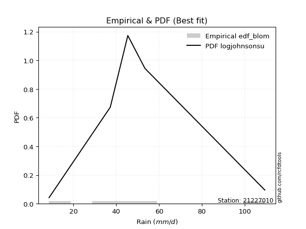</img>

</div>


### 7. Empirical - EDF Tukey (1962)

In hydrology, the Tukey formula is used as a plotting position formula to estimate the empirical probability or frequency of a flood event (or other hydrological data). The formula parameter is given as _c=0.333_ (or 1/3).

<div align="center">


$P=(m-c)/(n+1-2c)$


</div>


**7.1. Empirical values**

<div align="center">

|                | 0                  | 1                  | 2         | 3         | 4         |
|:---------------|:-------------------|:-------------------|:----------|:----------|:----------|
| date           | 2023               | 2025               | 2024      | 2018      | 2019      |
| x              | 8.6                | 13.27              | 37.2      | 45.4      | 53.4      |
| m              | 1                  | 2                  | 3         | 4         | 5         |
| empirical_dist | edf_tukey          | edf_tukey          | edf_tukey | edf_tukey | edf_tukey |
| empirical      | 0.125              | 0.3125             | 0.5       | 0.6875    | 0.875     |
| empirical_tr   | 1.1428571428571428 | 1.4545454545454546 | 2.0       | 3.2       | 8.0       |

</div>


**7.2. Kolmogorov-Smirnov fit test (sorted by Δ)**


<div align="center">

|                | 0                   | 1                   | 2                     | 3                   | 4                   | 5                  | 6                   | 7                   | 8                   | 9                   | 10                  | 11                  | 12                  | 13                  | 14                 | 15                 | 16                  | 17                  | 18                  | 19                 | 20                  | 21                 | 22                 | 23                  | 24                  | 25                  | 26                  | 27                  | 28                  | 29                  | 30                  | 31                  | 32                  | 33                  | 34                  | 35                  | 36                  | 37                 | 38                  | 39                  | 40                  | 41                 | 42                 | 43                  | 44                  | 45                  | 46                 | 47                  | 48                 | 49                 | 50                  | 51                  | 52                  | 53                  | 54                  | 55                 | 56                  | 57                  | 58                  | 59                 | 60                 | 61                 | 62                  | 63                  | 64                  | 65                  | 66                 | 67                 | 68                  | 69                 | 70                 | 71                  | 72                  | 73                 | 74                 | 75                 | 76                 | 77                 | 78                 | 79                 | 80                  | 81                 | 82                 | 83                 | 84                 | 85                 | 86                 | 87                 | 88                 | 89                 |
|:---------------|:--------------------|:--------------------|:----------------------|:--------------------|:--------------------|:-------------------|:--------------------|:--------------------|:--------------------|:--------------------|:--------------------|:--------------------|:--------------------|:--------------------|:-------------------|:-------------------|:--------------------|:--------------------|:--------------------|:-------------------|:--------------------|:-------------------|:-------------------|:--------------------|:--------------------|:--------------------|:--------------------|:--------------------|:--------------------|:--------------------|:--------------------|:--------------------|:--------------------|:--------------------|:--------------------|:--------------------|:--------------------|:-------------------|:--------------------|:--------------------|:--------------------|:-------------------|:-------------------|:--------------------|:--------------------|:--------------------|:-------------------|:--------------------|:-------------------|:-------------------|:--------------------|:--------------------|:--------------------|:--------------------|:--------------------|:-------------------|:--------------------|:--------------------|:--------------------|:-------------------|:-------------------|:-------------------|:--------------------|:--------------------|:--------------------|:--------------------|:-------------------|:-------------------|:--------------------|:-------------------|:-------------------|:--------------------|:--------------------|:-------------------|:-------------------|:-------------------|:-------------------|:-------------------|:-------------------|:-------------------|:--------------------|:-------------------|:-------------------|:-------------------|:-------------------|:-------------------|:-------------------|:-------------------|:-------------------|:-------------------|
| station        | 21227010            | 21227010            | 21227010              | 21227010            | 21227010            | 21227010           | 21227010            | 21227010            | 21227010            | 21227010            | 21227010            | 21227010            | 21227010            | 21227010            | 21227010           | 21227010           | 21227010            | 21227010            | 21227010            | 21227010           | 21227010            | 21227010           | 21227010           | 21227010            | 21227010            | 21227010            | 21227010            | 21227010            | 21227010            | 21227010            | 21227010            | 21227010            | 21227010            | 21227010            | 21227010            | 21227010            | 21227010            | 21227010           | 21227010            | 21227010            | 21227010            | 21227010           | 21227010           | 21227010            | 21227010            | 21227010            | 21227010           | 21227010            | 21227010           | 21227010           | 21227010            | 21227010            | 21227010            | 21227010            | 21227010            | 21227010           | 21227010            | 21227010            | 21227010            | 21227010           | 21227010           | 21227010           | 21227010            | 21227010            | 21227010            | 21227010            | 21227010           | 21227010           | 21227010            | 21227010           | 21227010           | 21227010            | 21227010            | 21227010           | 21227010           | 21227010           | 21227010           | 21227010           | 21227010           | 21227010           | 21227010            | 21227010           | 21227010           | 21227010           | 21227010           | 21227010           | 21227010           | 21227010           | 21227010           | 21227010           |
| empirical_dist | edf_tukey           | edf_tukey           | edf_tukey             | edf_tukey           | edf_tukey           | edf_tukey          | edf_tukey           | edf_tukey           | edf_tukey           | edf_tukey           | edf_tukey           | edf_tukey           | edf_tukey           | edf_tukey           | edf_tukey          | edf_tukey          | edf_tukey           | edf_tukey           | edf_tukey           | edf_tukey          | edf_tukey           | edf_tukey          | edf_tukey          | edf_tukey           | edf_tukey           | edf_tukey           | edf_tukey           | edf_tukey           | edf_tukey           | edf_tukey           | edf_tukey           | edf_tukey           | edf_tukey           | edf_tukey           | edf_tukey           | edf_tukey           | edf_tukey           | edf_tukey          | edf_tukey           | edf_tukey           | edf_tukey           | edf_tukey          | edf_tukey          | edf_tukey           | edf_tukey           | edf_tukey           | edf_tukey          | edf_tukey           | edf_tukey          | edf_tukey          | edf_tukey           | edf_tukey           | edf_tukey           | edf_tukey           | edf_tukey           | edf_tukey          | edf_tukey           | edf_tukey           | edf_tukey           | edf_tukey          | edf_tukey          | edf_tukey          | edf_tukey           | edf_tukey           | edf_tukey           | edf_tukey           | edf_tukey          | edf_tukey          | edf_tukey           | edf_tukey          | edf_tukey          | edf_tukey           | edf_tukey           | edf_tukey          | edf_tukey          | edf_tukey          | edf_tukey          | edf_tukey          | edf_tukey          | edf_tukey          | edf_tukey           | edf_tukey          | edf_tukey          | edf_tukey          | edf_tukey          | edf_tukey          | edf_tukey          | edf_tukey          | edf_tukey          | edf_tukey          |
| p_dist         | laplace_asymmetric  | logloggamma         | loglaplace_asymmetric | rayleigh            | maxwell             | gamma              | johnsonsu           | invgamma            | erlang              | pearson3            | t                   | truncnorm           | norm                | crystalball         | exponnorm          | logweibull_min     | logfisk             | loggumbel_l         | gumbel_l            | rice               | halfnorm            | logistic           | kstwobign          | logpearson3         | f                   | hypsecant           | betaprime           | gumbel_r            | laplace             | fisk                | ncf                 | loggompertz         | lognct              | logt                | logexponnorm        | lognorm             | lognorm             | logcrystalball     | logf                | logncf              | logfatiguelife      | logbetaprime       | alpha              | loggamma            | loggamma            | gompertz            | logalpha           | loginvgamma         | logerlang          | logrice            | expon               | genexpon            | invgauss            | loginvweibull       | loginvgauss         | moyal              | logmaxwell          | lograyleigh         | loglogistic         | halflogistic       | loggenexpon        | logkstwobign       | nct                 | loghalfnorm         | loghypsecant        | logexpon            | loggumbel_r        | pareto             | loghalflogistic     | loglaplace         | weibull_min        | logchi2             | logmoyal            | logtruncnorm       | gibrat             | wald               | logpareto          | logwald            | lognakagami        | logmielke          | loggibrat           | loglognorm         | chi2               | fatiguelife        | nakagami           | invweibull         | logjohnsonsu       | genlogistic        | loggenlogistic     | mielke             |
| delta          | 0.15598680237736223 | 0.15684733050976304 | 0.15772057378553553   | 0.16019561156080878 | 0.16027847452061458 | 0.1611455695900334 | 0.16185102699076015 | 0.16185989801906633 | 0.16195780157711342 | 0.16212906367062668 | 0.16226500246206654 | 0.16230276235651736 | 0.16230276884800193 | 0.16230277816929403 | 0.1623032641291083 | 0.1628749002366705 | 0.17109710830212743 | 0.17145365194786022 | 0.17427433652930374 | 0.1770436760045701 | 0.17770897588504242 | 0.1799213263934342 | 0.1831106418221924 | 0.18502700798501404 | 0.18759060556618434 | 0.18893037360667328 | 0.18963674454713075 | 0.19235670136898897 | 0.19690811962558014 | 0.19890923709987307 | 0.20011739137877255 | 0.20228727044559247 | 0.20299416992217334 | 0.20318109950456087 | 0.20318224527639317 | 0.20318427731608135 | 0.20318427731608135 | 0.2031843065188157 | 0.20355068188773107 | 0.20399235653837355 | 0.20422605705663288 | 0.2047582075217277 | 0.2047733205911716 | 0.20563649811006368 | 0.20563649811006368 | 0.20664959333392366 | 0.2073645199936579 | 0.20770305286937973 | 0.2108921402062599 | 0.2113855528027775 | 0.21202612730337433 | 0.21203314083495328 | 0.21241372994786656 | 0.21332182212814932 | 0.21568330376443823 | 0.2183205395428764 | 0.21871215805652233 | 0.22324319215897193 | 0.22468255127495895 | 0.2252098187876708 | 0.2320109081576054 | 0.23424345857299   | 0.23506336452041543 | 0.23708791953343433 | 0.24012197646510614 | 0.24309770700763478 | 0.2533601356804669 | 0.2576257324137883 | 0.26376988940893764 | 0.2649000862113934 | 0.2649388383245157 | 0.26720259508758115 | 0.26957998211593903 | 0.3124999915157641 | 0.3125             | 0.3125             | 0.3160013387189625 | 0.317333363355948  | 0.3207522999577892 | 0.3299211730190056 | 0.34856890166132004 | 0.3536626808308633 | 0.3692340664035205 | 0.4084513093387999 | 0.4155748687072497 | 0.445544622729888  | 0.6410892904540667 | 0.6875             | 0.6875             | nan                |
| deltao         | 0.5865427407550001  | 0.5865427407550001  | 0.5865427407550001    | 0.5865427407550001  | 0.5865427407550001  | 0.5865427407550001 | 0.5865427407550001  | 0.5865427407550001  | 0.5865427407550001  | 0.5865427407550001  | 0.5865427407550001  | 0.5865427407550001  | 0.5865427407550001  | 0.5865427407550001  | 0.5865427407550001 | 0.5865427407550001 | 0.5865427407550001  | 0.5865427407550001  | 0.5865427407550001  | 0.5865427407550001 | 0.5865427407550001  | 0.5865427407550001 | 0.5865427407550001 | 0.5865427407550001  | 0.5865427407550001  | 0.5865427407550001  | 0.5865427407550001  | 0.5865427407550001  | 0.5865427407550001  | 0.5865427407550001  | 0.5865427407550001  | 0.5865427407550001  | 0.5865427407550001  | 0.5865427407550001  | 0.5865427407550001  | 0.5865427407550001  | 0.5865427407550001  | 0.5865427407550001 | 0.5865427407550001  | 0.5865427407550001  | 0.5865427407550001  | 0.5865427407550001 | 0.5865427407550001 | 0.5865427407550001  | 0.5865427407550001  | 0.5865427407550001  | 0.5865427407550001 | 0.5865427407550001  | 0.5865427407550001 | 0.5865427407550001 | 0.5865427407550001  | 0.5865427407550001  | 0.5865427407550001  | 0.5865427407550001  | 0.5865427407550001  | 0.5865427407550001 | 0.5865427407550001  | 0.5865427407550001  | 0.5865427407550001  | 0.5865427407550001 | 0.5865427407550001 | 0.5865427407550001 | 0.5865427407550001  | 0.5865427407550001  | 0.5865427407550001  | 0.5865427407550001  | 0.5865427407550001 | 0.5865427407550001 | 0.5865427407550001  | 0.5865427407550001 | 0.5865427407550001 | 0.5865427407550001  | 0.5865427407550001  | 0.5865427407550001 | 0.5865427407550001 | 0.5865427407550001 | 0.5865427407550001 | 0.5865427407550001 | 0.5865427407550001 | 0.5865427407550001 | 0.5865427407550001  | 0.5865427407550001 | 0.5865427407550001 | 0.5865427407550001 | 0.5865427407550001 | 0.5865427407550001 | 0.5865427407550001 | 0.5865427407550001 | 0.5865427407550001 | 0.5865427407550001 |
| eval           | Δo > Δ              | Δo > Δ              | Δo > Δ                | Δo > Δ              | Δo > Δ              | Δo > Δ             | Δo > Δ              | Δo > Δ              | Δo > Δ              | Δo > Δ              | Δo > Δ              | Δo > Δ              | Δo > Δ              | Δo > Δ              | Δo > Δ             | Δo > Δ             | Δo > Δ              | Δo > Δ              | Δo > Δ              | Δo > Δ             | Δo > Δ              | Δo > Δ             | Δo > Δ             | Δo > Δ              | Δo > Δ              | Δo > Δ              | Δo > Δ              | Δo > Δ              | Δo > Δ              | Δo > Δ              | Δo > Δ              | Δo > Δ              | Δo > Δ              | Δo > Δ              | Δo > Δ              | Δo > Δ              | Δo > Δ              | Δo > Δ             | Δo > Δ              | Δo > Δ              | Δo > Δ              | Δo > Δ             | Δo > Δ             | Δo > Δ              | Δo > Δ              | Δo > Δ              | Δo > Δ             | Δo > Δ              | Δo > Δ             | Δo > Δ             | Δo > Δ              | Δo > Δ              | Δo > Δ              | Δo > Δ              | Δo > Δ              | Δo > Δ             | Δo > Δ              | Δo > Δ              | Δo > Δ              | Δo > Δ             | Δo > Δ             | Δo > Δ             | Δo > Δ              | Δo > Δ              | Δo > Δ              | Δo > Δ              | Δo > Δ             | Δo > Δ             | Δo > Δ              | Δo > Δ             | Δo > Δ             | Δo > Δ              | Δo > Δ              | Δo > Δ             | Δo > Δ             | Δo > Δ             | Δo > Δ             | Δo > Δ             | Δo > Δ             | Δo > Δ             | Δo > Δ              | Δo > Δ             | Δo > Δ             | Δo > Δ             | Δo > Δ             | Δo > Δ             | Δo <= Δ            | Δo <= Δ            | Δo <= Δ            | Δo <= Δ            |
| fit            | 1                   | 1                   | 1                     | 1                   | 1                   | 1                  | 1                   | 1                   | 1                   | 1                   | 1                   | 1                   | 1                   | 1                   | 1                  | 1                  | 1                   | 1                   | 1                   | 1                  | 1                   | 1                  | 1                  | 1                   | 1                   | 1                   | 1                   | 1                   | 1                   | 1                   | 1                   | 1                   | 1                   | 1                   | 1                   | 1                   | 1                   | 1                  | 1                   | 1                   | 1                   | 1                  | 1                  | 1                   | 1                   | 1                   | 1                  | 1                   | 1                  | 1                  | 1                   | 1                   | 1                   | 1                   | 1                   | 1                  | 1                   | 1                   | 1                   | 1                  | 1                  | 1                  | 1                   | 1                   | 1                   | 1                   | 1                  | 1                  | 1                   | 1                  | 1                  | 1                   | 1                   | 1                  | 1                  | 1                  | 1                  | 1                  | 1                  | 1                  | 1                   | 1                  | 1                  | 1                  | 1                  | 1                  | 0                  | 0                  | 0                  | 0                  |
| n              | 5                   | 5                   | 5                     | 5                   | 5                   | 5                  | 5                   | 5                   | 5                   | 5                   | 5                   | 5                   | 5                   | 5                   | 5                  | 5                  | 5                   | 5                   | 5                   | 5                  | 5                   | 5                  | 5                  | 5                   | 5                   | 5                   | 5                   | 5                   | 5                   | 5                   | 5                   | 5                   | 5                   | 5                   | 5                   | 5                   | 5                   | 5                  | 5                   | 5                   | 5                   | 5                  | 5                  | 5                   | 5                   | 5                   | 5                  | 5                   | 5                  | 5                  | 5                   | 5                   | 5                   | 5                   | 5                   | 5                  | 5                   | 5                   | 5                   | 5                  | 5                  | 5                  | 5                   | 5                   | 5                   | 5                   | 5                  | 5                  | 5                   | 5                  | 5                  | 5                   | 5                   | 5                  | 5                  | 5                  | 5                  | 5                  | 5                  | 5                  | 5                   | 5                  | 5                  | 5                  | 5                  | 5                  | 5                  | 5                  | 5                  | 5                  |
| best_fit       | 1                   | 0                   | 0                     | 0                   | 0                   | 0                  | 0                   | 0                   | 0                   | 0                   | 0                   | 0                   | 0                   | 0                   | 0                  | 0                  | 0                   | 0                   | 0                   | 0                  | 0                   | 0                  | 0                  | 0                   | 0                   | 0                   | 0                   | 0                   | 0                   | 0                   | 0                   | 0                   | 0                   | 0                   | 0                   | 0                   | 0                   | 0                  | 0                   | 0                   | 0                   | 0                  | 0                  | 0                   | 0                   | 0                   | 0                  | 0                   | 0                  | 0                  | 0                   | 0                   | 0                   | 0                   | 0                   | 0                  | 0                   | 0                   | 0                   | 0                  | 0                  | 0                  | 0                   | 0                   | 0                   | 0                   | 0                  | 0                  | 0                   | 0                  | 0                  | 0                   | 0                   | 0                  | 0                  | 0                  | 0                  | 0                  | 0                  | 0                  | 0                   | 0                  | 0                  | 0                  | 0                  | 0                  | 0                  | 0                  | 0                  | 0                  |
| best_fit_sort  | 1                   | 2                   | 3                     | 4                   | 5                   | 6                  | 7                   | 8                   | 9                   | 10                  | 11                  | 12                  | 13                  | 14                  | 15                 | 16                 | 17                  | 18                  | 19                  | 20                 | 21                  | 22                 | 23                 | 24                  | 25                  | 26                  | 27                  | 28                  | 29                  | 30                  | 31                  | 32                  | 33                  | 34                  | 35                  | 36                  | 37                  | 38                 | 39                  | 40                  | 41                  | 42                 | 43                 | 44                  | 45                  | 46                  | 47                 | 48                  | 49                 | 50                 | 51                  | 52                  | 53                  | 54                  | 55                  | 56                 | 57                  | 58                  | 59                  | 60                 | 61                 | 62                 | 63                  | 64                  | 65                  | 66                  | 67                 | 68                 | 69                  | 70                 | 71                 | 72                  | 73                  | 74                 | 75                 | 76                 | 77                 | 78                 | 79                 | 80                 | 81                  | 82                 | 83                 | 84                 | 85                 | 86                 | 87                 | 88                 | 89                 | 90                 |

</div>


<div align="center">

</img>

</div>


**7.3. Best fit**

<div align="center">

|   id |   station | empirical_dist   | p_dist             |    delta |   deltao | eval   |   fit |   n |   best_fit |   best_fit_sort |
|-----:|----------:|:-----------------|:-------------------|---------:|---------:|:-------|------:|----:|-----------:|----------------:|
|    0 |  21227010 | edf_tukey        | laplace_asymmetric | 0.155987 | 0.586543 | Δo > Δ |     1 |   5 |          1 |               1 |

</div>


<div align="center">

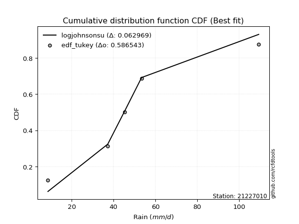</img></img>

</div>


### 8. Empirical - EDF Gringorten (1963)

Gringorten plotting position formula is essential for estimating the probability and return periods of extreme events like floods and heavy rainfall. The constant _a=0.44_.

<div align="center">


$P=(m-a)/(n+1-2a)$


</div>


**8.1. Empirical values**

<div align="center">

|                | 0                   | 1                  | 2              | 3                 | 4                  |
|:---------------|:--------------------|:-------------------|:---------------|:------------------|:-------------------|
| date           | 2023                | 2025               | 2024           | 2018              | 2019               |
| x              | 8.6                 | 13.27              | 37.2           | 45.4              | 53.4               |
| m              | 1                   | 2                  | 3              | 4                 | 5                  |
| empirical_dist | edf_gringorten      | edf_gringorten     | edf_gringorten | edf_gringorten    | edf_gringorten     |
| empirical      | 0.10937500000000001 | 0.3046875          | 0.5            | 0.6953125         | 0.8906249999999999 |
| empirical_tr   | 1.1228070175438596  | 1.4382022471910112 | 2.0            | 3.282051282051282 | 9.142857142857133  |

</div>


**8.2. Kolmogorov-Smirnov fit test (sorted by Δ)**


<div align="center">

|                | 0                   | 1                   | 2                     | 3                   | 4                  | 5                   | 6                   | 7                   | 8                   | 9                   | 10                  | 11                  | 12                  | 13                 | 14                  | 15                 | 16                  | 17                 | 18                  | 19                  | 20                 | 21                  | 22                  | 23                 | 24                  | 25                  | 26                  | 27                  | 28                  | 29                  | 30                  | 31                  | 32                  | 33                  | 34                  | 35                  | 36                  | 37                 | 38                  | 39                  | 40                  | 41                 | 42                 | 43                  | 44                  | 45                 | 46                  | 47                 | 48                 | 49                 | 50                  | 51                  | 52                  | 53                  | 54                  | 55                  | 56                 | 57                  | 58                  | 59                  | 60                 | 61                 | 62                  | 63                  | 64                  | 65                  | 66                 | 67                  | 68                 | 69                 | 70                  | 71                  | 72                 | 73                 | 74                 | 75                 | 76                 | 77                 | 78                 | 79                 | 80                  | 81                 | 82                 | 83                 | 84                 | 85                 | 86                 | 87                 | 88                 | 89                 |
|:---------------|:--------------------|:--------------------|:----------------------|:--------------------|:-------------------|:--------------------|:--------------------|:--------------------|:--------------------|:--------------------|:--------------------|:--------------------|:--------------------|:-------------------|:--------------------|:-------------------|:--------------------|:-------------------|:--------------------|:--------------------|:-------------------|:--------------------|:--------------------|:-------------------|:--------------------|:--------------------|:--------------------|:--------------------|:--------------------|:--------------------|:--------------------|:--------------------|:--------------------|:--------------------|:--------------------|:--------------------|:--------------------|:-------------------|:--------------------|:--------------------|:--------------------|:-------------------|:-------------------|:--------------------|:--------------------|:-------------------|:--------------------|:-------------------|:-------------------|:-------------------|:--------------------|:--------------------|:--------------------|:--------------------|:--------------------|:--------------------|:-------------------|:--------------------|:--------------------|:--------------------|:-------------------|:-------------------|:--------------------|:--------------------|:--------------------|:--------------------|:-------------------|:--------------------|:-------------------|:-------------------|:--------------------|:--------------------|:-------------------|:-------------------|:-------------------|:-------------------|:-------------------|:-------------------|:-------------------|:-------------------|:--------------------|:-------------------|:-------------------|:-------------------|:-------------------|:-------------------|:-------------------|:-------------------|:-------------------|:-------------------|
| station        | 21227010            | 21227010            | 21227010              | 21227010            | 21227010           | 21227010            | 21227010            | 21227010            | 21227010            | 21227010            | 21227010            | 21227010            | 21227010            | 21227010           | 21227010            | 21227010           | 21227010            | 21227010           | 21227010            | 21227010            | 21227010           | 21227010            | 21227010            | 21227010           | 21227010            | 21227010            | 21227010            | 21227010            | 21227010            | 21227010            | 21227010            | 21227010            | 21227010            | 21227010            | 21227010            | 21227010            | 21227010            | 21227010           | 21227010            | 21227010            | 21227010            | 21227010           | 21227010           | 21227010            | 21227010            | 21227010           | 21227010            | 21227010           | 21227010           | 21227010           | 21227010            | 21227010            | 21227010            | 21227010            | 21227010            | 21227010            | 21227010           | 21227010            | 21227010            | 21227010            | 21227010           | 21227010           | 21227010            | 21227010            | 21227010            | 21227010            | 21227010           | 21227010            | 21227010           | 21227010           | 21227010            | 21227010            | 21227010           | 21227010           | 21227010           | 21227010           | 21227010           | 21227010           | 21227010           | 21227010           | 21227010            | 21227010           | 21227010           | 21227010           | 21227010           | 21227010           | 21227010           | 21227010           | 21227010           | 21227010           |
| empirical_dist | edf_gringorten      | edf_gringorten      | edf_gringorten        | edf_gringorten      | edf_gringorten     | edf_gringorten      | edf_gringorten      | edf_gringorten      | edf_gringorten      | edf_gringorten      | edf_gringorten      | edf_gringorten      | edf_gringorten      | edf_gringorten     | edf_gringorten      | edf_gringorten     | edf_gringorten      | edf_gringorten     | edf_gringorten      | edf_gringorten      | edf_gringorten     | edf_gringorten      | edf_gringorten      | edf_gringorten     | edf_gringorten      | edf_gringorten      | edf_gringorten      | edf_gringorten      | edf_gringorten      | edf_gringorten      | edf_gringorten      | edf_gringorten      | edf_gringorten      | edf_gringorten      | edf_gringorten      | edf_gringorten      | edf_gringorten      | edf_gringorten     | edf_gringorten      | edf_gringorten      | edf_gringorten      | edf_gringorten     | edf_gringorten     | edf_gringorten      | edf_gringorten      | edf_gringorten     | edf_gringorten      | edf_gringorten     | edf_gringorten     | edf_gringorten     | edf_gringorten      | edf_gringorten      | edf_gringorten      | edf_gringorten      | edf_gringorten      | edf_gringorten      | edf_gringorten     | edf_gringorten      | edf_gringorten      | edf_gringorten      | edf_gringorten     | edf_gringorten     | edf_gringorten      | edf_gringorten      | edf_gringorten      | edf_gringorten      | edf_gringorten     | edf_gringorten      | edf_gringorten     | edf_gringorten     | edf_gringorten      | edf_gringorten      | edf_gringorten     | edf_gringorten     | edf_gringorten     | edf_gringorten     | edf_gringorten     | edf_gringorten     | edf_gringorten     | edf_gringorten     | edf_gringorten      | edf_gringorten     | edf_gringorten     | edf_gringorten     | edf_gringorten     | edf_gringorten     | edf_gringorten     | edf_gringorten     | edf_gringorten     | edf_gringorten     |
| p_dist         | laplace_asymmetric  | logloggamma         | loglaplace_asymmetric | maxwell             | gamma              | johnsonsu           | invgamma            | erlang              | pearson3            | t                   | truncnorm           | norm                | crystalball         | exponnorm          | rayleigh            | logweibull_min     | gumbel_l            | rice               | logfisk             | loggumbel_l         | logistic           | halfnorm            | hypsecant           | kstwobign          | logpearson3         | f                   | gumbel_r            | laplace             | betaprime           | ncf                 | gompertz            | loggompertz         | lognct              | logt                | logexponnorm        | lognorm             | lognorm             | logcrystalball     | logf                | logncf              | logfatiguelife      | logbetaprime       | alpha              | loggamma            | loggamma            | logalpha           | loginvgamma         | moyal              | logerlang          | logrice            | expon               | genexpon            | invgauss            | loginvweibull       | fisk                | loginvgauss         | halflogistic       | logmaxwell          | lograyleigh         | loglogistic         | loggenexpon        | logkstwobign       | nct                 | loghalfnorm         | loghypsecant        | logexpon            | loggumbel_r        | loghalflogistic     | loglaplace         | pareto             | logchi2             | logmoyal            | weibull_min        | logtruncnorm       | gibrat             | wald               | logwald            | lognakagami        | logpareto          | logmielke          | loggibrat           | loglognorm         | chi2               | fatiguelife        | nakagami           | invweibull         | logjohnsonsu       | genlogistic        | loggenlogistic     | mielke             |
| delta          | 0.14817430237736223 | 0.14903483050976304 | 0.14990807378553553   | 0.15246597452061458 | 0.1533330695900334 | 0.15403852699076015 | 0.15404739801906633 | 0.15414530157711342 | 0.15431656367062668 | 0.15445250246206654 | 0.15449026235651736 | 0.15449026884800193 | 0.15449027816929403 | 0.1544907641291083 | 0.15647549674547223 | 0.1628749002366705 | 0.16646183652930374 | 0.1692311760045701 | 0.17109710830212743 | 0.17145365194786022 | 0.1721088263934342 | 0.17770897588504242 | 0.18111787360667328 | 0.1831106418221924 | 0.18502700798501404 | 0.18759060556618434 | 0.18847978152254363 | 0.18909561962558014 | 0.18963674454713075 | 0.19230489137877255 | 0.19883709333392366 | 0.20228727044559247 | 0.20299416992217334 | 0.20318109950456087 | 0.20318224527639317 | 0.20318427731608135 | 0.20318427731608135 | 0.2031843065188157 | 0.20355068188773107 | 0.20399235653837355 | 0.20422605705663288 | 0.2047582075217277 | 0.2047733205911716 | 0.20563649811006368 | 0.20563649811006368 | 0.2073645199936579 | 0.20770305286937973 | 0.2105080395428764 | 0.2108921402062599 | 0.2113855528027775 | 0.21202612730337433 | 0.21203314083495328 | 0.21241372994786656 | 0.21332182212814932 | 0.21453423709987296 | 0.21568330376443823 | 0.2173973187876708 | 0.21871215805652233 | 0.22324319215897193 | 0.22468255127495895 | 0.2320109081576054 | 0.23424345857299   | 0.23506336452041543 | 0.23708791953343433 | 0.24012197646510614 | 0.24309770700763478 | 0.2533601356804669 | 0.26376988940893764 | 0.2649000862113934 | 0.2654382324137883 | 0.26720259508758115 | 0.26957998211593903 | 0.2727513383245157 | 0.3046874915157641 | 0.3046875          | 0.3046875          | 0.317333363355948  | 0.3207522999577892 | 0.3238138387189625 | 0.3299211730190056 | 0.34856890166132004 | 0.3614751808308633 | 0.3692340664035205 | 0.4084513093387999 | 0.4233873687072497 | 0.4611696227298879 | 0.6489017904540667 | 0.6953125          | 0.6953125          | nan                |
| deltao         | 0.5865427407550001  | 0.5865427407550001  | 0.5865427407550001    | 0.5865427407550001  | 0.5865427407550001 | 0.5865427407550001  | 0.5865427407550001  | 0.5865427407550001  | 0.5865427407550001  | 0.5865427407550001  | 0.5865427407550001  | 0.5865427407550001  | 0.5865427407550001  | 0.5865427407550001 | 0.5865427407550001  | 0.5865427407550001 | 0.5865427407550001  | 0.5865427407550001 | 0.5865427407550001  | 0.5865427407550001  | 0.5865427407550001 | 0.5865427407550001  | 0.5865427407550001  | 0.5865427407550001 | 0.5865427407550001  | 0.5865427407550001  | 0.5865427407550001  | 0.5865427407550001  | 0.5865427407550001  | 0.5865427407550001  | 0.5865427407550001  | 0.5865427407550001  | 0.5865427407550001  | 0.5865427407550001  | 0.5865427407550001  | 0.5865427407550001  | 0.5865427407550001  | 0.5865427407550001 | 0.5865427407550001  | 0.5865427407550001  | 0.5865427407550001  | 0.5865427407550001 | 0.5865427407550001 | 0.5865427407550001  | 0.5865427407550001  | 0.5865427407550001 | 0.5865427407550001  | 0.5865427407550001 | 0.5865427407550001 | 0.5865427407550001 | 0.5865427407550001  | 0.5865427407550001  | 0.5865427407550001  | 0.5865427407550001  | 0.5865427407550001  | 0.5865427407550001  | 0.5865427407550001 | 0.5865427407550001  | 0.5865427407550001  | 0.5865427407550001  | 0.5865427407550001 | 0.5865427407550001 | 0.5865427407550001  | 0.5865427407550001  | 0.5865427407550001  | 0.5865427407550001  | 0.5865427407550001 | 0.5865427407550001  | 0.5865427407550001 | 0.5865427407550001 | 0.5865427407550001  | 0.5865427407550001  | 0.5865427407550001 | 0.5865427407550001 | 0.5865427407550001 | 0.5865427407550001 | 0.5865427407550001 | 0.5865427407550001 | 0.5865427407550001 | 0.5865427407550001 | 0.5865427407550001  | 0.5865427407550001 | 0.5865427407550001 | 0.5865427407550001 | 0.5865427407550001 | 0.5865427407550001 | 0.5865427407550001 | 0.5865427407550001 | 0.5865427407550001 | 0.5865427407550001 |
| eval           | Δo > Δ              | Δo > Δ              | Δo > Δ                | Δo > Δ              | Δo > Δ             | Δo > Δ              | Δo > Δ              | Δo > Δ              | Δo > Δ              | Δo > Δ              | Δo > Δ              | Δo > Δ              | Δo > Δ              | Δo > Δ             | Δo > Δ              | Δo > Δ             | Δo > Δ              | Δo > Δ             | Δo > Δ              | Δo > Δ              | Δo > Δ             | Δo > Δ              | Δo > Δ              | Δo > Δ             | Δo > Δ              | Δo > Δ              | Δo > Δ              | Δo > Δ              | Δo > Δ              | Δo > Δ              | Δo > Δ              | Δo > Δ              | Δo > Δ              | Δo > Δ              | Δo > Δ              | Δo > Δ              | Δo > Δ              | Δo > Δ             | Δo > Δ              | Δo > Δ              | Δo > Δ              | Δo > Δ             | Δo > Δ             | Δo > Δ              | Δo > Δ              | Δo > Δ             | Δo > Δ              | Δo > Δ             | Δo > Δ             | Δo > Δ             | Δo > Δ              | Δo > Δ              | Δo > Δ              | Δo > Δ              | Δo > Δ              | Δo > Δ              | Δo > Δ             | Δo > Δ              | Δo > Δ              | Δo > Δ              | Δo > Δ             | Δo > Δ             | Δo > Δ              | Δo > Δ              | Δo > Δ              | Δo > Δ              | Δo > Δ             | Δo > Δ              | Δo > Δ             | Δo > Δ             | Δo > Δ              | Δo > Δ              | Δo > Δ             | Δo > Δ             | Δo > Δ             | Δo > Δ             | Δo > Δ             | Δo > Δ             | Δo > Δ             | Δo > Δ             | Δo > Δ              | Δo > Δ             | Δo > Δ             | Δo > Δ             | Δo > Δ             | Δo > Δ             | Δo <= Δ            | Δo <= Δ            | Δo <= Δ            | Δo <= Δ            |
| fit            | 1                   | 1                   | 1                     | 1                   | 1                  | 1                   | 1                   | 1                   | 1                   | 1                   | 1                   | 1                   | 1                   | 1                  | 1                   | 1                  | 1                   | 1                  | 1                   | 1                   | 1                  | 1                   | 1                   | 1                  | 1                   | 1                   | 1                   | 1                   | 1                   | 1                   | 1                   | 1                   | 1                   | 1                   | 1                   | 1                   | 1                   | 1                  | 1                   | 1                   | 1                   | 1                  | 1                  | 1                   | 1                   | 1                  | 1                   | 1                  | 1                  | 1                  | 1                   | 1                   | 1                   | 1                   | 1                   | 1                   | 1                  | 1                   | 1                   | 1                   | 1                  | 1                  | 1                   | 1                   | 1                   | 1                   | 1                  | 1                   | 1                  | 1                  | 1                   | 1                   | 1                  | 1                  | 1                  | 1                  | 1                  | 1                  | 1                  | 1                  | 1                   | 1                  | 1                  | 1                  | 1                  | 1                  | 0                  | 0                  | 0                  | 0                  |
| n              | 5                   | 5                   | 5                     | 5                   | 5                  | 5                   | 5                   | 5                   | 5                   | 5                   | 5                   | 5                   | 5                   | 5                  | 5                   | 5                  | 5                   | 5                  | 5                   | 5                   | 5                  | 5                   | 5                   | 5                  | 5                   | 5                   | 5                   | 5                   | 5                   | 5                   | 5                   | 5                   | 5                   | 5                   | 5                   | 5                   | 5                   | 5                  | 5                   | 5                   | 5                   | 5                  | 5                  | 5                   | 5                   | 5                  | 5                   | 5                  | 5                  | 5                  | 5                   | 5                   | 5                   | 5                   | 5                   | 5                   | 5                  | 5                   | 5                   | 5                   | 5                  | 5                  | 5                   | 5                   | 5                   | 5                   | 5                  | 5                   | 5                  | 5                  | 5                   | 5                   | 5                  | 5                  | 5                  | 5                  | 5                  | 5                  | 5                  | 5                  | 5                   | 5                  | 5                  | 5                  | 5                  | 5                  | 5                  | 5                  | 5                  | 5                  |
| best_fit       | 1                   | 0                   | 0                     | 0                   | 0                  | 0                   | 0                   | 0                   | 0                   | 0                   | 0                   | 0                   | 0                   | 0                  | 0                   | 0                  | 0                   | 0                  | 0                   | 0                   | 0                  | 0                   | 0                   | 0                  | 0                   | 0                   | 0                   | 0                   | 0                   | 0                   | 0                   | 0                   | 0                   | 0                   | 0                   | 0                   | 0                   | 0                  | 0                   | 0                   | 0                   | 0                  | 0                  | 0                   | 0                   | 0                  | 0                   | 0                  | 0                  | 0                  | 0                   | 0                   | 0                   | 0                   | 0                   | 0                   | 0                  | 0                   | 0                   | 0                   | 0                  | 0                  | 0                   | 0                   | 0                   | 0                   | 0                  | 0                   | 0                  | 0                  | 0                   | 0                   | 0                  | 0                  | 0                  | 0                  | 0                  | 0                  | 0                  | 0                  | 0                   | 0                  | 0                  | 0                  | 0                  | 0                  | 0                  | 0                  | 0                  | 0                  |
| best_fit_sort  | 1                   | 2                   | 3                     | 4                   | 5                  | 6                   | 7                   | 8                   | 9                   | 10                  | 11                  | 12                  | 13                  | 14                 | 15                  | 16                 | 17                  | 18                 | 19                  | 20                  | 21                 | 22                  | 23                  | 24                 | 25                  | 26                  | 27                  | 28                  | 29                  | 30                  | 31                  | 32                  | 33                  | 34                  | 35                  | 36                  | 37                  | 38                 | 39                  | 40                  | 41                  | 42                 | 43                 | 44                  | 45                  | 46                 | 47                  | 48                 | 49                 | 50                 | 51                  | 52                  | 53                  | 54                  | 55                  | 56                  | 57                 | 58                  | 59                  | 60                  | 61                 | 62                 | 63                  | 64                  | 65                  | 66                  | 67                 | 68                  | 69                 | 70                 | 71                  | 72                  | 73                 | 74                 | 75                 | 76                 | 77                 | 78                 | 79                 | 80                 | 81                  | 82                 | 83                 | 84                 | 85                 | 86                 | 87                 | 88                 | 89                 | 90                 |

</div>


<div align="center">

</img>

</div>


**8.3. Best fit**

<div align="center">

|   id |   station | empirical_dist   | p_dist             |    delta |   deltao | eval   |   fit |   n |   best_fit |   best_fit_sort |
|-----:|----------:|:-----------------|:-------------------|---------:|---------:|:-------|------:|----:|-----------:|----------------:|
|    0 |  21227010 | edf_gringorten   | laplace_asymmetric | 0.148174 | 0.586543 | Δo > Δ |     1 |   5 |          1 |               1 |

</div>


<div align="center">

</img></img>

</div>


### 9. Empirical - EDF Filliben (1975)

The specific values of the constants (0.3175) (often denoted as $alpha$) and (0.365) are derived from a method proposed by James J. Filliben in a 1975 paper. This particular formula is the mean value of the $i$-th order statistic of the normal distribution and is considered a robust and effective plotting position formula for the normal probability plot correlation coefficient test for normality.

<div align="center">


$P=(m-0.3175)/(n+0.365)$


</div>


**9.1. Empirical values**

<div align="center">

|                | 0                   | 1                  | 2            | 3                  | 4                  |
|:---------------|:--------------------|:-------------------|:-------------|:-------------------|:-------------------|
| date           | 2023                | 2025               | 2024         | 2018               | 2019               |
| x              | 8.6                 | 13.27              | 37.2         | 45.4               | 53.4               |
| m              | 1                   | 2                  | 3            | 4                  | 5                  |
| empirical_dist | edf_filliben        | edf_filliben       | edf_filliben | edf_filliben       | edf_filliben       |
| empirical      | 0.12721342031686858 | 0.3136067101584343 | 0.5          | 0.6863932898415657 | 0.8727865796831314 |
| empirical_tr   | 1.1457554725040042  | 1.456890699253225  | 2.0          | 3.188707280832095  | 7.860805860805863  |

</div>


**9.2. Kolmogorov-Smirnov fit test (sorted by Δ)**


<div align="center">

|                | 0                  | 1                   | 2                     | 3                   | 4                   | 5                   | 6                  | 7                   | 8                  | 9                  | 10                  | 11                  | 12                  | 13                 | 14                 | 15                 | 16                  | 17                  | 18                  | 19                  | 20                  | 21                  | 22                 | 23                  | 24                  | 25                  | 26                  | 27                  | 28                  | 29                 | 30                  | 31                  | 32                  | 33                  | 34                  | 35                  | 36                  | 37                 | 38                  | 39                  | 40                  | 41                 | 42                 | 43                  | 44                  | 45                 | 46                  | 47                  | 48                 | 49                 | 50                  | 51                  | 52                  | 53                  | 54                  | 55                  | 56                  | 57                  | 58                  | 59                  | 60                 | 61                 | 62                  | 63                  | 64                  | 65                  | 66                 | 67                 | 68                  | 69                 | 70                 | 71                  | 72                  | 73                  | 74                 | 75                 | 76                  | 77                 | 78                 | 79                 | 80                  | 81                 | 82                 | 83                 | 84                 | 85                  | 86                 | 87                 | 88                 | 89                 |
|:---------------|:-------------------|:--------------------|:----------------------|:--------------------|:--------------------|:--------------------|:-------------------|:--------------------|:-------------------|:-------------------|:--------------------|:--------------------|:--------------------|:-------------------|:-------------------|:-------------------|:--------------------|:--------------------|:--------------------|:--------------------|:--------------------|:--------------------|:-------------------|:--------------------|:--------------------|:--------------------|:--------------------|:--------------------|:--------------------|:-------------------|:--------------------|:--------------------|:--------------------|:--------------------|:--------------------|:--------------------|:--------------------|:-------------------|:--------------------|:--------------------|:--------------------|:-------------------|:-------------------|:--------------------|:--------------------|:-------------------|:--------------------|:--------------------|:-------------------|:-------------------|:--------------------|:--------------------|:--------------------|:--------------------|:--------------------|:--------------------|:--------------------|:--------------------|:--------------------|:--------------------|:-------------------|:-------------------|:--------------------|:--------------------|:--------------------|:--------------------|:-------------------|:-------------------|:--------------------|:-------------------|:-------------------|:--------------------|:--------------------|:--------------------|:-------------------|:-------------------|:--------------------|:-------------------|:-------------------|:-------------------|:--------------------|:-------------------|:-------------------|:-------------------|:-------------------|:--------------------|:-------------------|:-------------------|:-------------------|:-------------------|
| station        | 21227010           | 21227010            | 21227010              | 21227010            | 21227010            | 21227010            | 21227010           | 21227010            | 21227010           | 21227010           | 21227010            | 21227010            | 21227010            | 21227010           | 21227010           | 21227010           | 21227010            | 21227010            | 21227010            | 21227010            | 21227010            | 21227010            | 21227010           | 21227010            | 21227010            | 21227010            | 21227010            | 21227010            | 21227010            | 21227010           | 21227010            | 21227010            | 21227010            | 21227010            | 21227010            | 21227010            | 21227010            | 21227010           | 21227010            | 21227010            | 21227010            | 21227010           | 21227010           | 21227010            | 21227010            | 21227010           | 21227010            | 21227010            | 21227010           | 21227010           | 21227010            | 21227010            | 21227010            | 21227010            | 21227010            | 21227010            | 21227010            | 21227010            | 21227010            | 21227010            | 21227010           | 21227010           | 21227010            | 21227010            | 21227010            | 21227010            | 21227010           | 21227010           | 21227010            | 21227010           | 21227010           | 21227010            | 21227010            | 21227010            | 21227010           | 21227010           | 21227010            | 21227010           | 21227010           | 21227010           | 21227010            | 21227010           | 21227010           | 21227010           | 21227010           | 21227010            | 21227010           | 21227010           | 21227010           | 21227010           |
| empirical_dist | edf_filliben       | edf_filliben        | edf_filliben          | edf_filliben        | edf_filliben        | edf_filliben        | edf_filliben       | edf_filliben        | edf_filliben       | edf_filliben       | edf_filliben        | edf_filliben        | edf_filliben        | edf_filliben       | edf_filliben       | edf_filliben       | edf_filliben        | edf_filliben        | edf_filliben        | edf_filliben        | edf_filliben        | edf_filliben        | edf_filliben       | edf_filliben        | edf_filliben        | edf_filliben        | edf_filliben        | edf_filliben        | edf_filliben        | edf_filliben       | edf_filliben        | edf_filliben        | edf_filliben        | edf_filliben        | edf_filliben        | edf_filliben        | edf_filliben        | edf_filliben       | edf_filliben        | edf_filliben        | edf_filliben        | edf_filliben       | edf_filliben       | edf_filliben        | edf_filliben        | edf_filliben       | edf_filliben        | edf_filliben        | edf_filliben       | edf_filliben       | edf_filliben        | edf_filliben        | edf_filliben        | edf_filliben        | edf_filliben        | edf_filliben        | edf_filliben        | edf_filliben        | edf_filliben        | edf_filliben        | edf_filliben       | edf_filliben       | edf_filliben        | edf_filliben        | edf_filliben        | edf_filliben        | edf_filliben       | edf_filliben       | edf_filliben        | edf_filliben       | edf_filliben       | edf_filliben        | edf_filliben        | edf_filliben        | edf_filliben       | edf_filliben       | edf_filliben        | edf_filliben       | edf_filliben       | edf_filliben       | edf_filliben        | edf_filliben       | edf_filliben       | edf_filliben       | edf_filliben       | edf_filliben        | edf_filliben       | edf_filliben       | edf_filliben       | edf_filliben       |
| p_dist         | laplace_asymmetric | logloggamma         | loglaplace_asymmetric | rayleigh            | maxwell             | gamma               | logweibull_min     | johnsonsu           | invgamma           | erlang             | pearson3            | t                   | truncnorm           | norm               | crystalball        | exponnorm          | logfisk             | loggumbel_l         | gumbel_l            | halfnorm            | rice                | logistic            | kstwobign          | logpearson3         | f                   | betaprime           | hypsecant           | gumbel_r            | fisk                | laplace            | ncf                 | loggompertz         | lognct              | logt                | logexponnorm        | lognorm             | lognorm             | logcrystalball     | logf                | logncf              | logfatiguelife      | logbetaprime       | alpha              | loggamma            | loggamma            | logalpha           | loginvgamma         | gompertz            | logerlang          | logrice            | expon               | genexpon            | invgauss            | loginvweibull       | loginvgauss         | logmaxwell          | moyal               | lograyleigh         | loglogistic         | halflogistic        | loggenexpon        | logkstwobign       | nct                 | loghalfnorm         | loghypsecant        | logexpon            | loggumbel_r        | pareto             | loghalflogistic     | weibull_min        | loglaplace         | logchi2             | logmoyal            | logtruncnorm        | gibrat             | wald               | logpareto           | logwald            | lognakagami        | logmielke          | loggibrat           | loglognorm         | chi2               | fatiguelife        | nakagami           | invweibull          | logjohnsonsu       | genlogistic        | loggenlogistic     | mielke             |
| delta          | 0.1570935125357965 | 0.15795404066819732 | 0.1588272839439698    | 0.16130232171924305 | 0.16138518467904886 | 0.16225227974846768 | 0.1628749002366705 | 0.16295773714919443 | 0.1629666081775006 | 0.1630645117355477 | 0.16323577382906096 | 0.16337171262050082 | 0.16340947251495164 | 0.1634094790064362 | 0.1634094883277283 | 0.1634099742875426 | 0.17109710830212743 | 0.17145365194786022 | 0.17538104668773802 | 0.17770897588504242 | 0.17815038616300438 | 0.18102803655186847 | 0.1831106418221924 | 0.18502700798501404 | 0.18759060556618434 | 0.18963674454713075 | 0.19003708376510756 | 0.19346341152742325 | 0.19669581678300452 | 0.1980148297840144 | 0.20122410153720682 | 0.20228727044559247 | 0.20299416992217334 | 0.20318109950456087 | 0.20318224527639317 | 0.20318427731608135 | 0.20318427731608135 | 0.2031843065188157 | 0.20355068188773107 | 0.20399235653837355 | 0.20422605705663288 | 0.2047582075217277 | 0.2047733205911716 | 0.20563649811006368 | 0.20563649811006368 | 0.2073645199936579 | 0.20770305286937973 | 0.20775630349235794 | 0.2108921402062599 | 0.2113855528027775 | 0.21202612730337433 | 0.21203314083495328 | 0.21241372994786656 | 0.21332182212814932 | 0.21568330376443823 | 0.21871215805652233 | 0.21942724970131067 | 0.22324319215897193 | 0.22468255127495895 | 0.22631652894610507 | 0.2320109081576054 | 0.23424345857299   | 0.23506336452041543 | 0.23708791953343433 | 0.24012197646510614 | 0.24309770700763478 | 0.2533601356804669 | 0.256519022255354  | 0.26376988940893764 | 0.2638321281660814 | 0.2649000862113934 | 0.26720259508758115 | 0.26957998211593903 | 0.31360670167419835 | 0.3136067101584343 | 0.3136067101584343 | 0.31489462856052824 | 0.317333363355948  | 0.3207522999577892 | 0.3299211730190056 | 0.34856890166132004 | 0.352555970672429  | 0.3692340664035205 | 0.4084513093387999 | 0.4144681585488154 | 0.44333120241301943 | 0.6399825802956324 | 0.6863932898415657 | 0.6863932898415657 | nan                |
| deltao         | 0.5865427407550001 | 0.5865427407550001  | 0.5865427407550001    | 0.5865427407550001  | 0.5865427407550001  | 0.5865427407550001  | 0.5865427407550001 | 0.5865427407550001  | 0.5865427407550001 | 0.5865427407550001 | 0.5865427407550001  | 0.5865427407550001  | 0.5865427407550001  | 0.5865427407550001 | 0.5865427407550001 | 0.5865427407550001 | 0.5865427407550001  | 0.5865427407550001  | 0.5865427407550001  | 0.5865427407550001  | 0.5865427407550001  | 0.5865427407550001  | 0.5865427407550001 | 0.5865427407550001  | 0.5865427407550001  | 0.5865427407550001  | 0.5865427407550001  | 0.5865427407550001  | 0.5865427407550001  | 0.5865427407550001 | 0.5865427407550001  | 0.5865427407550001  | 0.5865427407550001  | 0.5865427407550001  | 0.5865427407550001  | 0.5865427407550001  | 0.5865427407550001  | 0.5865427407550001 | 0.5865427407550001  | 0.5865427407550001  | 0.5865427407550001  | 0.5865427407550001 | 0.5865427407550001 | 0.5865427407550001  | 0.5865427407550001  | 0.5865427407550001 | 0.5865427407550001  | 0.5865427407550001  | 0.5865427407550001 | 0.5865427407550001 | 0.5865427407550001  | 0.5865427407550001  | 0.5865427407550001  | 0.5865427407550001  | 0.5865427407550001  | 0.5865427407550001  | 0.5865427407550001  | 0.5865427407550001  | 0.5865427407550001  | 0.5865427407550001  | 0.5865427407550001 | 0.5865427407550001 | 0.5865427407550001  | 0.5865427407550001  | 0.5865427407550001  | 0.5865427407550001  | 0.5865427407550001 | 0.5865427407550001 | 0.5865427407550001  | 0.5865427407550001 | 0.5865427407550001 | 0.5865427407550001  | 0.5865427407550001  | 0.5865427407550001  | 0.5865427407550001 | 0.5865427407550001 | 0.5865427407550001  | 0.5865427407550001 | 0.5865427407550001 | 0.5865427407550001 | 0.5865427407550001  | 0.5865427407550001 | 0.5865427407550001 | 0.5865427407550001 | 0.5865427407550001 | 0.5865427407550001  | 0.5865427407550001 | 0.5865427407550001 | 0.5865427407550001 | 0.5865427407550001 |
| eval           | Δo > Δ             | Δo > Δ              | Δo > Δ                | Δo > Δ              | Δo > Δ              | Δo > Δ              | Δo > Δ             | Δo > Δ              | Δo > Δ             | Δo > Δ             | Δo > Δ              | Δo > Δ              | Δo > Δ              | Δo > Δ             | Δo > Δ             | Δo > Δ             | Δo > Δ              | Δo > Δ              | Δo > Δ              | Δo > Δ              | Δo > Δ              | Δo > Δ              | Δo > Δ             | Δo > Δ              | Δo > Δ              | Δo > Δ              | Δo > Δ              | Δo > Δ              | Δo > Δ              | Δo > Δ             | Δo > Δ              | Δo > Δ              | Δo > Δ              | Δo > Δ              | Δo > Δ              | Δo > Δ              | Δo > Δ              | Δo > Δ             | Δo > Δ              | Δo > Δ              | Δo > Δ              | Δo > Δ             | Δo > Δ             | Δo > Δ              | Δo > Δ              | Δo > Δ             | Δo > Δ              | Δo > Δ              | Δo > Δ             | Δo > Δ             | Δo > Δ              | Δo > Δ              | Δo > Δ              | Δo > Δ              | Δo > Δ              | Δo > Δ              | Δo > Δ              | Δo > Δ              | Δo > Δ              | Δo > Δ              | Δo > Δ             | Δo > Δ             | Δo > Δ              | Δo > Δ              | Δo > Δ              | Δo > Δ              | Δo > Δ             | Δo > Δ             | Δo > Δ              | Δo > Δ             | Δo > Δ             | Δo > Δ              | Δo > Δ              | Δo > Δ              | Δo > Δ             | Δo > Δ             | Δo > Δ              | Δo > Δ             | Δo > Δ             | Δo > Δ             | Δo > Δ              | Δo > Δ             | Δo > Δ             | Δo > Δ             | Δo > Δ             | Δo > Δ              | Δo <= Δ            | Δo <= Δ            | Δo <= Δ            | Δo <= Δ            |
| fit            | 1                  | 1                   | 1                     | 1                   | 1                   | 1                   | 1                  | 1                   | 1                  | 1                  | 1                   | 1                   | 1                   | 1                  | 1                  | 1                  | 1                   | 1                   | 1                   | 1                   | 1                   | 1                   | 1                  | 1                   | 1                   | 1                   | 1                   | 1                   | 1                   | 1                  | 1                   | 1                   | 1                   | 1                   | 1                   | 1                   | 1                   | 1                  | 1                   | 1                   | 1                   | 1                  | 1                  | 1                   | 1                   | 1                  | 1                   | 1                   | 1                  | 1                  | 1                   | 1                   | 1                   | 1                   | 1                   | 1                   | 1                   | 1                   | 1                   | 1                   | 1                  | 1                  | 1                   | 1                   | 1                   | 1                   | 1                  | 1                  | 1                   | 1                  | 1                  | 1                   | 1                   | 1                   | 1                  | 1                  | 1                   | 1                  | 1                  | 1                  | 1                   | 1                  | 1                  | 1                  | 1                  | 1                   | 0                  | 0                  | 0                  | 0                  |
| n              | 5                  | 5                   | 5                     | 5                   | 5                   | 5                   | 5                  | 5                   | 5                  | 5                  | 5                   | 5                   | 5                   | 5                  | 5                  | 5                  | 5                   | 5                   | 5                   | 5                   | 5                   | 5                   | 5                  | 5                   | 5                   | 5                   | 5                   | 5                   | 5                   | 5                  | 5                   | 5                   | 5                   | 5                   | 5                   | 5                   | 5                   | 5                  | 5                   | 5                   | 5                   | 5                  | 5                  | 5                   | 5                   | 5                  | 5                   | 5                   | 5                  | 5                  | 5                   | 5                   | 5                   | 5                   | 5                   | 5                   | 5                   | 5                   | 5                   | 5                   | 5                  | 5                  | 5                   | 5                   | 5                   | 5                   | 5                  | 5                  | 5                   | 5                  | 5                  | 5                   | 5                   | 5                   | 5                  | 5                  | 5                   | 5                  | 5                  | 5                  | 5                   | 5                  | 5                  | 5                  | 5                  | 5                   | 5                  | 5                  | 5                  | 5                  |
| best_fit       | 1                  | 0                   | 0                     | 0                   | 0                   | 0                   | 0                  | 0                   | 0                  | 0                  | 0                   | 0                   | 0                   | 0                  | 0                  | 0                  | 0                   | 0                   | 0                   | 0                   | 0                   | 0                   | 0                  | 0                   | 0                   | 0                   | 0                   | 0                   | 0                   | 0                  | 0                   | 0                   | 0                   | 0                   | 0                   | 0                   | 0                   | 0                  | 0                   | 0                   | 0                   | 0                  | 0                  | 0                   | 0                   | 0                  | 0                   | 0                   | 0                  | 0                  | 0                   | 0                   | 0                   | 0                   | 0                   | 0                   | 0                   | 0                   | 0                   | 0                   | 0                  | 0                  | 0                   | 0                   | 0                   | 0                   | 0                  | 0                  | 0                   | 0                  | 0                  | 0                   | 0                   | 0                   | 0                  | 0                  | 0                   | 0                  | 0                  | 0                  | 0                   | 0                  | 0                  | 0                  | 0                  | 0                   | 0                  | 0                  | 0                  | 0                  |
| best_fit_sort  | 1                  | 2                   | 3                     | 4                   | 5                   | 6                   | 7                  | 8                   | 9                  | 10                 | 11                  | 12                  | 13                  | 14                 | 15                 | 16                 | 17                  | 18                  | 19                  | 20                  | 21                  | 22                  | 23                 | 24                  | 25                  | 26                  | 27                  | 28                  | 29                  | 30                 | 31                  | 32                  | 33                  | 34                  | 35                  | 36                  | 37                  | 38                 | 39                  | 40                  | 41                  | 42                 | 43                 | 44                  | 45                  | 46                 | 47                  | 48                  | 49                 | 50                 | 51                  | 52                  | 53                  | 54                  | 55                  | 56                  | 57                  | 58                  | 59                  | 60                  | 61                 | 62                 | 63                  | 64                  | 65                  | 66                  | 67                 | 68                 | 69                  | 70                 | 71                 | 72                  | 73                  | 74                  | 75                 | 76                 | 77                  | 78                 | 79                 | 80                 | 81                  | 82                 | 83                 | 84                 | 85                 | 86                  | 87                 | 88                 | 89                 | 90                 |

</div>


<div align="center">

</img>

</div>


**9.3. Best fit**

<div align="center">

|   id |   station | empirical_dist   | p_dist             |    delta |   deltao | eval   |   fit |   n |   best_fit |   best_fit_sort |
|-----:|----------:|:-----------------|:-------------------|---------:|---------:|:-------|------:|----:|-----------:|----------------:|
|    0 |  21227010 | edf_filliben     | laplace_asymmetric | 0.157094 | 0.586543 | Δo > Δ |     1 |   5 |          1 |               1 |

</div>


<div align="center">

</img>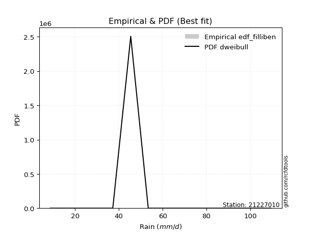</img>

</div>


### 10. Empirical - EDF Jenkinson (1977)

The Jenkinson formula in hydrology is an empirical plotting position formula used to estimate the non-exceedance probability _(P)_ or return period _(T)_ of a given ordered observation within a sample. It is a widely used method in the frequency analysis of extreme events such as floods and rainfall, as it provides a distribution-free way to plot data. _a≈0.31_ and _b≈0.38_ are constants derived to approximate the median of the probability distribution for the given rank.

<div align="center">


$P=(m-a)/(n+b)$


</div>


**10.1. Empirical values**

<div align="center">

|                | 0                   | 1                  | 2             | 3                  | 4                  |
|:---------------|:--------------------|:-------------------|:--------------|:-------------------|:-------------------|
| date           | 2023                | 2025               | 2024          | 2018               | 2019               |
| x              | 8.6                 | 13.27              | 37.2          | 45.4               | 53.4               |
| m              | 1                   | 2                  | 3             | 4                  | 5                  |
| empirical_dist | edf_jenkinson       | edf_jenkinson      | edf_jenkinson | edf_jenkinson      | edf_jenkinson      |
| empirical      | 0.12825278810408922 | 0.3141263940520446 | 0.5           | 0.6858736059479554 | 0.8717472118959109 |
| empirical_tr   | 1.1471215351812367  | 1.4579945799457996 | 2.0           | 3.183431952662722  | 7.797101449275368  |

</div>


**10.2. Kolmogorov-Smirnov fit test (sorted by Δ)**


<div align="center">

|                | 0                   | 1                   | 2                     | 3                  | 4                  | 5                   | 6                  | 7                   | 8                   | 9                   | 10                 | 11                  | 12                  | 13                  | 14                  | 15                  | 16                  | 17                  | 18                  | 19                  | 20                  | 21                  | 22                 | 23                  | 24                  | 25                  | 26                 | 27                 | 28                  | 29                  | 30                  | 31                  | 32                  | 33                  | 34                  | 35                  | 36                  | 37                 | 38                  | 39                  | 40                  | 41                 | 42                 | 43                  | 44                  | 45                 | 46                  | 47                  | 48                 | 49                 | 50                  | 51                  | 52                  | 53                  | 54                  | 55                  | 56                 | 57                  | 58                  | 59                  | 60                 | 61                 | 62                  | 63                  | 64                  | 65                  | 66                 | 67                  | 68                 | 69                  | 70                 | 71                  | 72                  | 73                 | 74                 | 75                 | 76                 | 77                 | 78                 | 79                 | 80                  | 81                  | 82                 | 83                 | 84                  | 85                  | 86                 | 87                 | 88                 | 89                 |
|:---------------|:--------------------|:--------------------|:----------------------|:-------------------|:-------------------|:--------------------|:-------------------|:--------------------|:--------------------|:--------------------|:-------------------|:--------------------|:--------------------|:--------------------|:--------------------|:--------------------|:--------------------|:--------------------|:--------------------|:--------------------|:--------------------|:--------------------|:-------------------|:--------------------|:--------------------|:--------------------|:-------------------|:-------------------|:--------------------|:--------------------|:--------------------|:--------------------|:--------------------|:--------------------|:--------------------|:--------------------|:--------------------|:-------------------|:--------------------|:--------------------|:--------------------|:-------------------|:-------------------|:--------------------|:--------------------|:-------------------|:--------------------|:--------------------|:-------------------|:-------------------|:--------------------|:--------------------|:--------------------|:--------------------|:--------------------|:--------------------|:-------------------|:--------------------|:--------------------|:--------------------|:-------------------|:-------------------|:--------------------|:--------------------|:--------------------|:--------------------|:-------------------|:--------------------|:-------------------|:--------------------|:-------------------|:--------------------|:--------------------|:-------------------|:-------------------|:-------------------|:-------------------|:-------------------|:-------------------|:-------------------|:--------------------|:--------------------|:-------------------|:-------------------|:--------------------|:--------------------|:-------------------|:-------------------|:-------------------|:-------------------|
| station        | 21227010            | 21227010            | 21227010              | 21227010           | 21227010           | 21227010            | 21227010           | 21227010            | 21227010            | 21227010            | 21227010           | 21227010            | 21227010            | 21227010            | 21227010            | 21227010            | 21227010            | 21227010            | 21227010            | 21227010            | 21227010            | 21227010            | 21227010           | 21227010            | 21227010            | 21227010            | 21227010           | 21227010           | 21227010            | 21227010            | 21227010            | 21227010            | 21227010            | 21227010            | 21227010            | 21227010            | 21227010            | 21227010           | 21227010            | 21227010            | 21227010            | 21227010           | 21227010           | 21227010            | 21227010            | 21227010           | 21227010            | 21227010            | 21227010           | 21227010           | 21227010            | 21227010            | 21227010            | 21227010            | 21227010            | 21227010            | 21227010           | 21227010            | 21227010            | 21227010            | 21227010           | 21227010           | 21227010            | 21227010            | 21227010            | 21227010            | 21227010           | 21227010            | 21227010           | 21227010            | 21227010           | 21227010            | 21227010            | 21227010           | 21227010           | 21227010           | 21227010           | 21227010           | 21227010           | 21227010           | 21227010            | 21227010            | 21227010           | 21227010           | 21227010            | 21227010            | 21227010           | 21227010           | 21227010           | 21227010           |
| empirical_dist | edf_jenkinson       | edf_jenkinson       | edf_jenkinson         | edf_jenkinson      | edf_jenkinson      | edf_jenkinson       | edf_jenkinson      | edf_jenkinson       | edf_jenkinson       | edf_jenkinson       | edf_jenkinson      | edf_jenkinson       | edf_jenkinson       | edf_jenkinson       | edf_jenkinson       | edf_jenkinson       | edf_jenkinson       | edf_jenkinson       | edf_jenkinson       | edf_jenkinson       | edf_jenkinson       | edf_jenkinson       | edf_jenkinson      | edf_jenkinson       | edf_jenkinson       | edf_jenkinson       | edf_jenkinson      | edf_jenkinson      | edf_jenkinson       | edf_jenkinson       | edf_jenkinson       | edf_jenkinson       | edf_jenkinson       | edf_jenkinson       | edf_jenkinson       | edf_jenkinson       | edf_jenkinson       | edf_jenkinson      | edf_jenkinson       | edf_jenkinson       | edf_jenkinson       | edf_jenkinson      | edf_jenkinson      | edf_jenkinson       | edf_jenkinson       | edf_jenkinson      | edf_jenkinson       | edf_jenkinson       | edf_jenkinson      | edf_jenkinson      | edf_jenkinson       | edf_jenkinson       | edf_jenkinson       | edf_jenkinson       | edf_jenkinson       | edf_jenkinson       | edf_jenkinson      | edf_jenkinson       | edf_jenkinson       | edf_jenkinson       | edf_jenkinson      | edf_jenkinson      | edf_jenkinson       | edf_jenkinson       | edf_jenkinson       | edf_jenkinson       | edf_jenkinson      | edf_jenkinson       | edf_jenkinson      | edf_jenkinson       | edf_jenkinson      | edf_jenkinson       | edf_jenkinson       | edf_jenkinson      | edf_jenkinson      | edf_jenkinson      | edf_jenkinson      | edf_jenkinson      | edf_jenkinson      | edf_jenkinson      | edf_jenkinson       | edf_jenkinson       | edf_jenkinson      | edf_jenkinson      | edf_jenkinson       | edf_jenkinson       | edf_jenkinson      | edf_jenkinson      | edf_jenkinson      | edf_jenkinson      |
| p_dist         | laplace_asymmetric  | logloggamma         | loglaplace_asymmetric | rayleigh           | maxwell            | gamma               | logweibull_min     | johnsonsu           | invgamma            | erlang              | pearson3           | t                   | truncnorm           | norm                | crystalball         | exponnorm           | logfisk             | loggumbel_l         | gumbel_l            | halfnorm            | rice                | logistic            | kstwobign          | logpearson3         | f                   | betaprime           | hypsecant          | gumbel_r           | fisk                | laplace             | ncf                 | loggompertz         | lognct              | logt                | logexponnorm        | lognorm             | lognorm             | logcrystalball     | logf                | logncf              | logfatiguelife      | logbetaprime       | alpha              | loggamma            | loggamma            | logalpha           | loginvgamma         | gompertz            | logerlang          | logrice            | expon               | genexpon            | invgauss            | loginvweibull       | loginvgauss         | logmaxwell          | moyal              | lograyleigh         | loglogistic         | halflogistic        | loggenexpon        | logkstwobign       | nct                 | loghalfnorm         | loghypsecant        | logexpon            | loggumbel_r        | pareto              | weibull_min        | loghalflogistic     | loglaplace         | logchi2             | logmoyal            | logtruncnorm       | gibrat             | wald               | logpareto          | logwald            | lognakagami        | logmielke          | loggibrat           | loglognorm          | chi2               | fatiguelife        | nakagami            | invweibull          | logjohnsonsu       | genlogistic        | loggenlogistic     | mielke             |
| delta          | 0.15761319642940685 | 0.15847372456180767 | 0.15934696783758015   | 0.1618220056128534 | 0.1619048685726592 | 0.16277196364207802 | 0.1628749002366705 | 0.16347742104280477 | 0.16348629207111096 | 0.16358419562915805 | 0.1637554577226713 | 0.16389139651411117 | 0.16392915640856198 | 0.16392916290004655 | 0.16392917222133865 | 0.16392965818115293 | 0.17109710830212743 | 0.17145365194786022 | 0.17590073058134836 | 0.17770897588504242 | 0.17867007005661473 | 0.18154772044547882 | 0.1831106418221924 | 0.18502700798501404 | 0.18759060556618434 | 0.18963674454713075 | 0.1905567676587179 | 0.1939830954210336 | 0.19565644899578394 | 0.19853451367762476 | 0.20174378543081717 | 0.20228727044559247 | 0.20299416992217334 | 0.20318109950456087 | 0.20318224527639317 | 0.20318427731608135 | 0.20318427731608135 | 0.2031843065188157 | 0.20355068188773107 | 0.20399235653837355 | 0.20422605705663288 | 0.2047582075217277 | 0.2047733205911716 | 0.20563649811006368 | 0.20563649811006368 | 0.2073645199936579 | 0.20770305286937973 | 0.20827598738596828 | 0.2108921402062599 | 0.2113855528027775 | 0.21202612730337433 | 0.21203314083495328 | 0.21241372994786656 | 0.21332182212814932 | 0.21568330376443823 | 0.21871215805652233 | 0.219946933594921  | 0.22324319215897193 | 0.22468255127495895 | 0.22683621283971542 | 0.2320109081576054 | 0.23424345857299   | 0.23506336452041543 | 0.23708791953343433 | 0.24012197646510614 | 0.24309770700763478 | 0.2533601356804669 | 0.25599933836174366 | 0.2633124442724711 | 0.26376988940893764 | 0.2649000862113934 | 0.26720259508758115 | 0.26957998211593903 | 0.3141263855678087 | 0.3141263940520446 | 0.3141263940520446 | 0.3143749446669179 | 0.317333363355948  | 0.3207522999577892 | 0.3299211730190056 | 0.34856890166132004 | 0.35203628677881865 | 0.3692340664035205 | 0.4084513093387999 | 0.41394847465520507 | 0.44229183462579885 | 0.6394628964020221 | 0.6858736059479554 | 0.6858736059479554 | nan                |
| deltao         | 0.5865427407550001  | 0.5865427407550001  | 0.5865427407550001    | 0.5865427407550001 | 0.5865427407550001 | 0.5865427407550001  | 0.5865427407550001 | 0.5865427407550001  | 0.5865427407550001  | 0.5865427407550001  | 0.5865427407550001 | 0.5865427407550001  | 0.5865427407550001  | 0.5865427407550001  | 0.5865427407550001  | 0.5865427407550001  | 0.5865427407550001  | 0.5865427407550001  | 0.5865427407550001  | 0.5865427407550001  | 0.5865427407550001  | 0.5865427407550001  | 0.5865427407550001 | 0.5865427407550001  | 0.5865427407550001  | 0.5865427407550001  | 0.5865427407550001 | 0.5865427407550001 | 0.5865427407550001  | 0.5865427407550001  | 0.5865427407550001  | 0.5865427407550001  | 0.5865427407550001  | 0.5865427407550001  | 0.5865427407550001  | 0.5865427407550001  | 0.5865427407550001  | 0.5865427407550001 | 0.5865427407550001  | 0.5865427407550001  | 0.5865427407550001  | 0.5865427407550001 | 0.5865427407550001 | 0.5865427407550001  | 0.5865427407550001  | 0.5865427407550001 | 0.5865427407550001  | 0.5865427407550001  | 0.5865427407550001 | 0.5865427407550001 | 0.5865427407550001  | 0.5865427407550001  | 0.5865427407550001  | 0.5865427407550001  | 0.5865427407550001  | 0.5865427407550001  | 0.5865427407550001 | 0.5865427407550001  | 0.5865427407550001  | 0.5865427407550001  | 0.5865427407550001 | 0.5865427407550001 | 0.5865427407550001  | 0.5865427407550001  | 0.5865427407550001  | 0.5865427407550001  | 0.5865427407550001 | 0.5865427407550001  | 0.5865427407550001 | 0.5865427407550001  | 0.5865427407550001 | 0.5865427407550001  | 0.5865427407550001  | 0.5865427407550001 | 0.5865427407550001 | 0.5865427407550001 | 0.5865427407550001 | 0.5865427407550001 | 0.5865427407550001 | 0.5865427407550001 | 0.5865427407550001  | 0.5865427407550001  | 0.5865427407550001 | 0.5865427407550001 | 0.5865427407550001  | 0.5865427407550001  | 0.5865427407550001 | 0.5865427407550001 | 0.5865427407550001 | 0.5865427407550001 |
| eval           | Δo > Δ              | Δo > Δ              | Δo > Δ                | Δo > Δ             | Δo > Δ             | Δo > Δ              | Δo > Δ             | Δo > Δ              | Δo > Δ              | Δo > Δ              | Δo > Δ             | Δo > Δ              | Δo > Δ              | Δo > Δ              | Δo > Δ              | Δo > Δ              | Δo > Δ              | Δo > Δ              | Δo > Δ              | Δo > Δ              | Δo > Δ              | Δo > Δ              | Δo > Δ             | Δo > Δ              | Δo > Δ              | Δo > Δ              | Δo > Δ             | Δo > Δ             | Δo > Δ              | Δo > Δ              | Δo > Δ              | Δo > Δ              | Δo > Δ              | Δo > Δ              | Δo > Δ              | Δo > Δ              | Δo > Δ              | Δo > Δ             | Δo > Δ              | Δo > Δ              | Δo > Δ              | Δo > Δ             | Δo > Δ             | Δo > Δ              | Δo > Δ              | Δo > Δ             | Δo > Δ              | Δo > Δ              | Δo > Δ             | Δo > Δ             | Δo > Δ              | Δo > Δ              | Δo > Δ              | Δo > Δ              | Δo > Δ              | Δo > Δ              | Δo > Δ             | Δo > Δ              | Δo > Δ              | Δo > Δ              | Δo > Δ             | Δo > Δ             | Δo > Δ              | Δo > Δ              | Δo > Δ              | Δo > Δ              | Δo > Δ             | Δo > Δ              | Δo > Δ             | Δo > Δ              | Δo > Δ             | Δo > Δ              | Δo > Δ              | Δo > Δ             | Δo > Δ             | Δo > Δ             | Δo > Δ             | Δo > Δ             | Δo > Δ             | Δo > Δ             | Δo > Δ              | Δo > Δ              | Δo > Δ             | Δo > Δ             | Δo > Δ              | Δo > Δ              | Δo <= Δ            | Δo <= Δ            | Δo <= Δ            | Δo <= Δ            |
| fit            | 1                   | 1                   | 1                     | 1                  | 1                  | 1                   | 1                  | 1                   | 1                   | 1                   | 1                  | 1                   | 1                   | 1                   | 1                   | 1                   | 1                   | 1                   | 1                   | 1                   | 1                   | 1                   | 1                  | 1                   | 1                   | 1                   | 1                  | 1                  | 1                   | 1                   | 1                   | 1                   | 1                   | 1                   | 1                   | 1                   | 1                   | 1                  | 1                   | 1                   | 1                   | 1                  | 1                  | 1                   | 1                   | 1                  | 1                   | 1                   | 1                  | 1                  | 1                   | 1                   | 1                   | 1                   | 1                   | 1                   | 1                  | 1                   | 1                   | 1                   | 1                  | 1                  | 1                   | 1                   | 1                   | 1                   | 1                  | 1                   | 1                  | 1                   | 1                  | 1                   | 1                   | 1                  | 1                  | 1                  | 1                  | 1                  | 1                  | 1                  | 1                   | 1                   | 1                  | 1                  | 1                   | 1                   | 0                  | 0                  | 0                  | 0                  |
| n              | 5                   | 5                   | 5                     | 5                  | 5                  | 5                   | 5                  | 5                   | 5                   | 5                   | 5                  | 5                   | 5                   | 5                   | 5                   | 5                   | 5                   | 5                   | 5                   | 5                   | 5                   | 5                   | 5                  | 5                   | 5                   | 5                   | 5                  | 5                  | 5                   | 5                   | 5                   | 5                   | 5                   | 5                   | 5                   | 5                   | 5                   | 5                  | 5                   | 5                   | 5                   | 5                  | 5                  | 5                   | 5                   | 5                  | 5                   | 5                   | 5                  | 5                  | 5                   | 5                   | 5                   | 5                   | 5                   | 5                   | 5                  | 5                   | 5                   | 5                   | 5                  | 5                  | 5                   | 5                   | 5                   | 5                   | 5                  | 5                   | 5                  | 5                   | 5                  | 5                   | 5                   | 5                  | 5                  | 5                  | 5                  | 5                  | 5                  | 5                  | 5                   | 5                   | 5                  | 5                  | 5                   | 5                   | 5                  | 5                  | 5                  | 5                  |
| best_fit       | 1                   | 0                   | 0                     | 0                  | 0                  | 0                   | 0                  | 0                   | 0                   | 0                   | 0                  | 0                   | 0                   | 0                   | 0                   | 0                   | 0                   | 0                   | 0                   | 0                   | 0                   | 0                   | 0                  | 0                   | 0                   | 0                   | 0                  | 0                  | 0                   | 0                   | 0                   | 0                   | 0                   | 0                   | 0                   | 0                   | 0                   | 0                  | 0                   | 0                   | 0                   | 0                  | 0                  | 0                   | 0                   | 0                  | 0                   | 0                   | 0                  | 0                  | 0                   | 0                   | 0                   | 0                   | 0                   | 0                   | 0                  | 0                   | 0                   | 0                   | 0                  | 0                  | 0                   | 0                   | 0                   | 0                   | 0                  | 0                   | 0                  | 0                   | 0                  | 0                   | 0                   | 0                  | 0                  | 0                  | 0                  | 0                  | 0                  | 0                  | 0                   | 0                   | 0                  | 0                  | 0                   | 0                   | 0                  | 0                  | 0                  | 0                  |
| best_fit_sort  | 1                   | 2                   | 3                     | 4                  | 5                  | 6                   | 7                  | 8                   | 9                   | 10                  | 11                 | 12                  | 13                  | 14                  | 15                  | 16                  | 17                  | 18                  | 19                  | 20                  | 21                  | 22                  | 23                 | 24                  | 25                  | 26                  | 27                 | 28                 | 29                  | 30                  | 31                  | 32                  | 33                  | 34                  | 35                  | 36                  | 37                  | 38                 | 39                  | 40                  | 41                  | 42                 | 43                 | 44                  | 45                  | 46                 | 47                  | 48                  | 49                 | 50                 | 51                  | 52                  | 53                  | 54                  | 55                  | 56                  | 57                 | 58                  | 59                  | 60                  | 61                 | 62                 | 63                  | 64                  | 65                  | 66                  | 67                 | 68                  | 69                 | 70                  | 71                 | 72                  | 73                  | 74                 | 75                 | 76                 | 77                 | 78                 | 79                 | 80                 | 81                  | 82                  | 83                 | 84                 | 85                  | 86                  | 87                 | 88                 | 89                 | 90                 |

</div>


<div align="center">

</img>

</div>


**10.3. Best fit**

<div align="center">

|   id |   station | empirical_dist   | p_dist             |    delta |   deltao | eval   |   fit |   n |   best_fit |   best_fit_sort |
|-----:|----------:|:-----------------|:-------------------|---------:|---------:|:-------|------:|----:|-----------:|----------------:|
|    0 |  21227010 | edf_jenkinson    | laplace_asymmetric | 0.157613 | 0.586543 | Δo > Δ |     1 |   5 |          1 |               1 |

</div>


<div align="center">

</img></img>

</div>


### 11. Empirical - EDF Cunnane (1978)

Cunnane´s work in statistical hydrology has focused on the performance and evaluation of different probability distributions (such as GEV, Gumbel, Lognormal) for flood frequency estimation. _b_ is a constant, typically set to 0.4.

<div align="center">


$P=(m-b)/(n+1-2b)$


</div>


**11.1. Empirical values**

<div align="center">

|                | 0                   | 1                  | 2           | 3                  | 4                  |
|:---------------|:--------------------|:-------------------|:------------|:-------------------|:-------------------|
| date           | 2023                | 2025               | 2024        | 2018               | 2019               |
| x              | 8.6                 | 13.27              | 37.2        | 45.4               | 53.4               |
| m              | 1                   | 2                  | 3           | 4                  | 5                  |
| empirical_dist | edf_cunnane         | edf_cunnane        | edf_cunnane | edf_cunnane        | edf_cunnane        |
| empirical      | 0.11538461538461538 | 0.3076923076923077 | 0.5         | 0.6923076923076923 | 0.8846153846153845 |
| empirical_tr   | 1.1304347826086958  | 1.4444444444444444 | 2.0         | 3.25               | 8.666666666666655  |

</div>


**11.2. Kolmogorov-Smirnov fit test (sorted by Δ)**


<div align="center">

|                | 0                   | 1                   | 2                     | 3                  | 4                  | 5                   | 6                   | 7                   | 8                   | 9                  | 10                  | 11                  | 12                  | 13                  | 14                  | 15                 | 16                  | 17                  | 18                  | 19                  | 20                 | 21                  | 22                 | 23                 | 24                  | 25                  | 26                  | 27                  | 28                  | 29                  | 30                  | 31                  | 32                  | 33                  | 34                  | 35                  | 36                  | 37                 | 38                  | 39                  | 40                  | 41                 | 42                 | 43                  | 44                  | 45                 | 46                  | 47                  | 48                 | 49                 | 50                  | 51                  | 52                  | 53                  | 54                 | 55                  | 56                  | 57                 | 58                  | 59                  | 60                 | 61                 | 62                  | 63                  | 64                  | 65                  | 66                 | 67                  | 68                  | 69                 | 70                  | 71                  | 72                 | 73                 | 74                 | 75                 | 76                 | 77                 | 78                 | 79                 | 80                  | 81                  | 82                 | 83                 | 84                 | 85                  | 86                 | 87                 | 88                 | 89                 |
|:---------------|:--------------------|:--------------------|:----------------------|:-------------------|:-------------------|:--------------------|:--------------------|:--------------------|:--------------------|:-------------------|:--------------------|:--------------------|:--------------------|:--------------------|:--------------------|:-------------------|:--------------------|:--------------------|:--------------------|:--------------------|:-------------------|:--------------------|:-------------------|:-------------------|:--------------------|:--------------------|:--------------------|:--------------------|:--------------------|:--------------------|:--------------------|:--------------------|:--------------------|:--------------------|:--------------------|:--------------------|:--------------------|:-------------------|:--------------------|:--------------------|:--------------------|:-------------------|:-------------------|:--------------------|:--------------------|:-------------------|:--------------------|:--------------------|:-------------------|:-------------------|:--------------------|:--------------------|:--------------------|:--------------------|:-------------------|:--------------------|:--------------------|:-------------------|:--------------------|:--------------------|:-------------------|:-------------------|:--------------------|:--------------------|:--------------------|:--------------------|:-------------------|:--------------------|:--------------------|:-------------------|:--------------------|:--------------------|:-------------------|:-------------------|:-------------------|:-------------------|:-------------------|:-------------------|:-------------------|:-------------------|:--------------------|:--------------------|:-------------------|:-------------------|:-------------------|:--------------------|:-------------------|:-------------------|:-------------------|:-------------------|
| station        | 21227010            | 21227010            | 21227010              | 21227010           | 21227010           | 21227010            | 21227010            | 21227010            | 21227010            | 21227010           | 21227010            | 21227010            | 21227010            | 21227010            | 21227010            | 21227010           | 21227010            | 21227010            | 21227010            | 21227010            | 21227010           | 21227010            | 21227010           | 21227010           | 21227010            | 21227010            | 21227010            | 21227010            | 21227010            | 21227010            | 21227010            | 21227010            | 21227010            | 21227010            | 21227010            | 21227010            | 21227010            | 21227010           | 21227010            | 21227010            | 21227010            | 21227010           | 21227010           | 21227010            | 21227010            | 21227010           | 21227010            | 21227010            | 21227010           | 21227010           | 21227010            | 21227010            | 21227010            | 21227010            | 21227010           | 21227010            | 21227010            | 21227010           | 21227010            | 21227010            | 21227010           | 21227010           | 21227010            | 21227010            | 21227010            | 21227010            | 21227010           | 21227010            | 21227010            | 21227010           | 21227010            | 21227010            | 21227010           | 21227010           | 21227010           | 21227010           | 21227010           | 21227010           | 21227010           | 21227010           | 21227010            | 21227010            | 21227010           | 21227010           | 21227010           | 21227010            | 21227010           | 21227010           | 21227010           | 21227010           |
| empirical_dist | edf_cunnane         | edf_cunnane         | edf_cunnane           | edf_cunnane        | edf_cunnane        | edf_cunnane         | edf_cunnane         | edf_cunnane         | edf_cunnane         | edf_cunnane        | edf_cunnane         | edf_cunnane         | edf_cunnane         | edf_cunnane         | edf_cunnane         | edf_cunnane        | edf_cunnane         | edf_cunnane         | edf_cunnane         | edf_cunnane         | edf_cunnane        | edf_cunnane         | edf_cunnane        | edf_cunnane        | edf_cunnane         | edf_cunnane         | edf_cunnane         | edf_cunnane         | edf_cunnane         | edf_cunnane         | edf_cunnane         | edf_cunnane         | edf_cunnane         | edf_cunnane         | edf_cunnane         | edf_cunnane         | edf_cunnane         | edf_cunnane        | edf_cunnane         | edf_cunnane         | edf_cunnane         | edf_cunnane        | edf_cunnane        | edf_cunnane         | edf_cunnane         | edf_cunnane        | edf_cunnane         | edf_cunnane         | edf_cunnane        | edf_cunnane        | edf_cunnane         | edf_cunnane         | edf_cunnane         | edf_cunnane         | edf_cunnane        | edf_cunnane         | edf_cunnane         | edf_cunnane        | edf_cunnane         | edf_cunnane         | edf_cunnane        | edf_cunnane        | edf_cunnane         | edf_cunnane         | edf_cunnane         | edf_cunnane         | edf_cunnane        | edf_cunnane         | edf_cunnane         | edf_cunnane        | edf_cunnane         | edf_cunnane         | edf_cunnane        | edf_cunnane        | edf_cunnane        | edf_cunnane        | edf_cunnane        | edf_cunnane        | edf_cunnane        | edf_cunnane        | edf_cunnane         | edf_cunnane         | edf_cunnane        | edf_cunnane        | edf_cunnane        | edf_cunnane         | edf_cunnane        | edf_cunnane        | edf_cunnane        | edf_cunnane        |
| p_dist         | laplace_asymmetric  | logloggamma         | loglaplace_asymmetric | maxwell            | gamma              | rayleigh            | johnsonsu           | invgamma            | erlang              | pearson3           | t                   | truncnorm           | norm                | crystalball         | exponnorm           | logweibull_min     | gumbel_l            | logfisk             | loggumbel_l         | rice                | logistic           | halfnorm            | kstwobign          | hypsecant          | logpearson3         | f                   | gumbel_r            | betaprime           | laplace             | ncf                 | gompertz            | loggompertz         | lognct              | logt                | logexponnorm        | lognorm             | lognorm             | logcrystalball     | logf                | logncf              | logfatiguelife      | logbetaprime       | alpha              | loggamma            | loggamma            | logalpha           | loginvgamma         | fisk                | logerlang          | logrice            | expon               | genexpon            | invgauss            | loginvweibull       | moyal              | loginvgauss         | logmaxwell          | halflogistic       | lograyleigh         | loglogistic         | loggenexpon        | logkstwobign       | nct                 | loghalfnorm         | loghypsecant        | logexpon            | loggumbel_r        | pareto              | loghalflogistic     | loglaplace         | logchi2             | logmoyal            | weibull_min        | logtruncnorm       | gibrat             | wald               | logwald            | lognakagami        | logpareto          | logmielke          | loggibrat           | loglognorm          | chi2               | fatiguelife        | nakagami           | invweibull          | logjohnsonsu       | genlogistic        | loggenlogistic     | mielke             |
| delta          | 0.15117911006966994 | 0.15203963820207075 | 0.15291288147784324   | 0.1554707822129223 | 0.1563378772823411 | 0.15647549674547223 | 0.15704333468306786 | 0.15705220571137404 | 0.15715010926942113 | 0.1573213713629344 | 0.15745731015437425 | 0.15749507004882507 | 0.15749507654030964 | 0.15749508586160174 | 0.15749557182141602 | 0.1628749002366705 | 0.16946664422161145 | 0.17109710830212743 | 0.17145365194786022 | 0.17223598369687781 | 0.1751136340857419 | 0.17770897588504242 | 0.1831106418221924 | 0.184122681298981  | 0.18502700798501404 | 0.18759060556618434 | 0.18847978152254363 | 0.18963674454713075 | 0.19210042731788785 | 0.19530969907108026 | 0.20184190102623137 | 0.20228727044559247 | 0.20299416992217334 | 0.20318109950456087 | 0.20318224527639317 | 0.20318427731608135 | 0.20318427731608135 | 0.2031843065188157 | 0.20355068188773107 | 0.20399235653837355 | 0.20422605705663288 | 0.2047582075217277 | 0.2047733205911716 | 0.20563649811006368 | 0.20563649811006368 | 0.2073645199936579 | 0.20770305286937973 | 0.20852462171525754 | 0.2108921402062599 | 0.2113855528027775 | 0.21202612730337433 | 0.21203314083495328 | 0.21241372994786656 | 0.21332182212814932 | 0.2135128472351841 | 0.21568330376443823 | 0.21871215805652233 | 0.2204021264799785 | 0.22324319215897193 | 0.22468255127495895 | 0.2320109081576054 | 0.23424345857299   | 0.23506336452041543 | 0.23708791953343433 | 0.24012197646510614 | 0.24309770700763478 | 0.2533601356804669 | 0.26243342472148057 | 0.26376988940893764 | 0.2649000862113934 | 0.26720259508758115 | 0.26957998211593903 | 0.269746530632208  | 0.3076922992080718 | 0.3076923076923077 | 0.3076923076923077 | 0.317333363355948  | 0.3207522999577892 | 0.3208090310266548 | 0.3299211730190056 | 0.34856890166132004 | 0.35847037313855556 | 0.3692340664035205 | 0.4084513093387999 | 0.420382561014942  | 0.45516000734527245 | 0.645896982761759  | 0.6923076923076923 | 0.6923076923076923 | nan                |
| deltao         | 0.5865427407550001  | 0.5865427407550001  | 0.5865427407550001    | 0.5865427407550001 | 0.5865427407550001 | 0.5865427407550001  | 0.5865427407550001  | 0.5865427407550001  | 0.5865427407550001  | 0.5865427407550001 | 0.5865427407550001  | 0.5865427407550001  | 0.5865427407550001  | 0.5865427407550001  | 0.5865427407550001  | 0.5865427407550001 | 0.5865427407550001  | 0.5865427407550001  | 0.5865427407550001  | 0.5865427407550001  | 0.5865427407550001 | 0.5865427407550001  | 0.5865427407550001 | 0.5865427407550001 | 0.5865427407550001  | 0.5865427407550001  | 0.5865427407550001  | 0.5865427407550001  | 0.5865427407550001  | 0.5865427407550001  | 0.5865427407550001  | 0.5865427407550001  | 0.5865427407550001  | 0.5865427407550001  | 0.5865427407550001  | 0.5865427407550001  | 0.5865427407550001  | 0.5865427407550001 | 0.5865427407550001  | 0.5865427407550001  | 0.5865427407550001  | 0.5865427407550001 | 0.5865427407550001 | 0.5865427407550001  | 0.5865427407550001  | 0.5865427407550001 | 0.5865427407550001  | 0.5865427407550001  | 0.5865427407550001 | 0.5865427407550001 | 0.5865427407550001  | 0.5865427407550001  | 0.5865427407550001  | 0.5865427407550001  | 0.5865427407550001 | 0.5865427407550001  | 0.5865427407550001  | 0.5865427407550001 | 0.5865427407550001  | 0.5865427407550001  | 0.5865427407550001 | 0.5865427407550001 | 0.5865427407550001  | 0.5865427407550001  | 0.5865427407550001  | 0.5865427407550001  | 0.5865427407550001 | 0.5865427407550001  | 0.5865427407550001  | 0.5865427407550001 | 0.5865427407550001  | 0.5865427407550001  | 0.5865427407550001 | 0.5865427407550001 | 0.5865427407550001 | 0.5865427407550001 | 0.5865427407550001 | 0.5865427407550001 | 0.5865427407550001 | 0.5865427407550001 | 0.5865427407550001  | 0.5865427407550001  | 0.5865427407550001 | 0.5865427407550001 | 0.5865427407550001 | 0.5865427407550001  | 0.5865427407550001 | 0.5865427407550001 | 0.5865427407550001 | 0.5865427407550001 |
| eval           | Δo > Δ              | Δo > Δ              | Δo > Δ                | Δo > Δ             | Δo > Δ             | Δo > Δ              | Δo > Δ              | Δo > Δ              | Δo > Δ              | Δo > Δ             | Δo > Δ              | Δo > Δ              | Δo > Δ              | Δo > Δ              | Δo > Δ              | Δo > Δ             | Δo > Δ              | Δo > Δ              | Δo > Δ              | Δo > Δ              | Δo > Δ             | Δo > Δ              | Δo > Δ             | Δo > Δ             | Δo > Δ              | Δo > Δ              | Δo > Δ              | Δo > Δ              | Δo > Δ              | Δo > Δ              | Δo > Δ              | Δo > Δ              | Δo > Δ              | Δo > Δ              | Δo > Δ              | Δo > Δ              | Δo > Δ              | Δo > Δ             | Δo > Δ              | Δo > Δ              | Δo > Δ              | Δo > Δ             | Δo > Δ             | Δo > Δ              | Δo > Δ              | Δo > Δ             | Δo > Δ              | Δo > Δ              | Δo > Δ             | Δo > Δ             | Δo > Δ              | Δo > Δ              | Δo > Δ              | Δo > Δ              | Δo > Δ             | Δo > Δ              | Δo > Δ              | Δo > Δ             | Δo > Δ              | Δo > Δ              | Δo > Δ             | Δo > Δ             | Δo > Δ              | Δo > Δ              | Δo > Δ              | Δo > Δ              | Δo > Δ             | Δo > Δ              | Δo > Δ              | Δo > Δ             | Δo > Δ              | Δo > Δ              | Δo > Δ             | Δo > Δ             | Δo > Δ             | Δo > Δ             | Δo > Δ             | Δo > Δ             | Δo > Δ             | Δo > Δ             | Δo > Δ              | Δo > Δ              | Δo > Δ             | Δo > Δ             | Δo > Δ             | Δo > Δ              | Δo <= Δ            | Δo <= Δ            | Δo <= Δ            | Δo <= Δ            |
| fit            | 1                   | 1                   | 1                     | 1                  | 1                  | 1                   | 1                   | 1                   | 1                   | 1                  | 1                   | 1                   | 1                   | 1                   | 1                   | 1                  | 1                   | 1                   | 1                   | 1                   | 1                  | 1                   | 1                  | 1                  | 1                   | 1                   | 1                   | 1                   | 1                   | 1                   | 1                   | 1                   | 1                   | 1                   | 1                   | 1                   | 1                   | 1                  | 1                   | 1                   | 1                   | 1                  | 1                  | 1                   | 1                   | 1                  | 1                   | 1                   | 1                  | 1                  | 1                   | 1                   | 1                   | 1                   | 1                  | 1                   | 1                   | 1                  | 1                   | 1                   | 1                  | 1                  | 1                   | 1                   | 1                   | 1                   | 1                  | 1                   | 1                   | 1                  | 1                   | 1                   | 1                  | 1                  | 1                  | 1                  | 1                  | 1                  | 1                  | 1                  | 1                   | 1                   | 1                  | 1                  | 1                  | 1                   | 0                  | 0                  | 0                  | 0                  |
| n              | 5                   | 5                   | 5                     | 5                  | 5                  | 5                   | 5                   | 5                   | 5                   | 5                  | 5                   | 5                   | 5                   | 5                   | 5                   | 5                  | 5                   | 5                   | 5                   | 5                   | 5                  | 5                   | 5                  | 5                  | 5                   | 5                   | 5                   | 5                   | 5                   | 5                   | 5                   | 5                   | 5                   | 5                   | 5                   | 5                   | 5                   | 5                  | 5                   | 5                   | 5                   | 5                  | 5                  | 5                   | 5                   | 5                  | 5                   | 5                   | 5                  | 5                  | 5                   | 5                   | 5                   | 5                   | 5                  | 5                   | 5                   | 5                  | 5                   | 5                   | 5                  | 5                  | 5                   | 5                   | 5                   | 5                   | 5                  | 5                   | 5                   | 5                  | 5                   | 5                   | 5                  | 5                  | 5                  | 5                  | 5                  | 5                  | 5                  | 5                  | 5                   | 5                   | 5                  | 5                  | 5                  | 5                   | 5                  | 5                  | 5                  | 5                  |
| best_fit       | 1                   | 0                   | 0                     | 0                  | 0                  | 0                   | 0                   | 0                   | 0                   | 0                  | 0                   | 0                   | 0                   | 0                   | 0                   | 0                  | 0                   | 0                   | 0                   | 0                   | 0                  | 0                   | 0                  | 0                  | 0                   | 0                   | 0                   | 0                   | 0                   | 0                   | 0                   | 0                   | 0                   | 0                   | 0                   | 0                   | 0                   | 0                  | 0                   | 0                   | 0                   | 0                  | 0                  | 0                   | 0                   | 0                  | 0                   | 0                   | 0                  | 0                  | 0                   | 0                   | 0                   | 0                   | 0                  | 0                   | 0                   | 0                  | 0                   | 0                   | 0                  | 0                  | 0                   | 0                   | 0                   | 0                   | 0                  | 0                   | 0                   | 0                  | 0                   | 0                   | 0                  | 0                  | 0                  | 0                  | 0                  | 0                  | 0                  | 0                  | 0                   | 0                   | 0                  | 0                  | 0                  | 0                   | 0                  | 0                  | 0                  | 0                  |
| best_fit_sort  | 1                   | 2                   | 3                     | 4                  | 5                  | 6                   | 7                   | 8                   | 9                   | 10                 | 11                  | 12                  | 13                  | 14                  | 15                  | 16                 | 17                  | 18                  | 19                  | 20                  | 21                 | 22                  | 23                 | 24                 | 25                  | 26                  | 27                  | 28                  | 29                  | 30                  | 31                  | 32                  | 33                  | 34                  | 35                  | 36                  | 37                  | 38                 | 39                  | 40                  | 41                  | 42                 | 43                 | 44                  | 45                  | 46                 | 47                  | 48                  | 49                 | 50                 | 51                  | 52                  | 53                  | 54                  | 55                 | 56                  | 57                  | 58                 | 59                  | 60                  | 61                 | 62                 | 63                  | 64                  | 65                  | 66                  | 67                 | 68                  | 69                  | 70                 | 71                  | 72                  | 73                 | 74                 | 75                 | 76                 | 77                 | 78                 | 79                 | 80                 | 81                  | 82                  | 83                 | 84                 | 85                 | 86                  | 87                 | 88                 | 89                 | 90                 |

</div>


<div align="center">

</img>

</div>


**11.3. Best fit**

<div align="center">

|   id |   station | empirical_dist   | p_dist             |    delta |   deltao | eval   |   fit |   n |   best_fit |   best_fit_sort |
|-----:|----------:|:-----------------|:-------------------|---------:|---------:|:-------|------:|----:|-----------:|----------------:|
|    0 |  21227010 | edf_cunnane      | laplace_asymmetric | 0.151179 | 0.586543 | Δo > Δ |     1 |   5 |          1 |               1 |

</div>


<div align="center">

</img>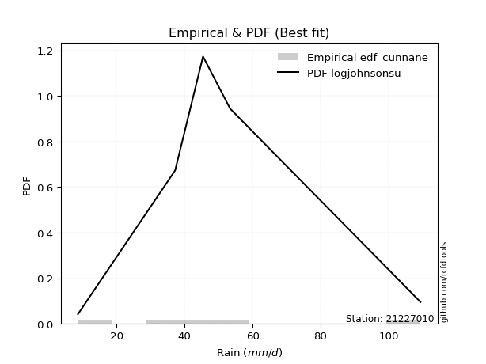</img>

</div>


### 12. Empirical - EDF Adamowski (1981)

The Adamowski formula in hydrology refers to a specific plotting position formula used for estimating the non-parametric empirical distribution of hydrological events (like flood peaks) to calculate their return periods. This formula provides an alternative to traditional parametric methods (like the Gumbel or Log Pearson Type III distributions). 

<div align="center">


$P=(m-0.25)/(n+0.5)$


</div>


**12.1. Empirical values**

<div align="center">

|                | 0                   | 1                  | 2             | 3                  | 4                  |
|:---------------|:--------------------|:-------------------|:--------------|:-------------------|:-------------------|
| date           | 2023                | 2025               | 2024          | 2018               | 2019               |
| x              | 8.6                 | 13.27              | 37.2          | 45.4               | 53.4               |
| m              | 1                   | 2                  | 3             | 4                  | 5                  |
| empirical_dist | edf_adamowski       | edf_adamowski      | edf_adamowski | edf_adamowski      | edf_adamowski      |
| empirical      | 0.13636363636363635 | 0.3181818181818182 | 0.5           | 0.6818181818181818 | 0.8636363636363636 |
| empirical_tr   | 1.1578947368421053  | 1.4666666666666666 | 2.0           | 3.1428571428571423 | 7.333333333333334  |

</div>


**12.2. Kolmogorov-Smirnov fit test (sorted by Δ)**


<div align="center">

|                | 0                  | 1                   | 2                     | 3                   | 4                   | 5                   | 6                   | 7                   | 8                  | 9                  | 10                  | 11                  | 12                  | 13                 | 14                 | 15                 | 16                  | 17                  | 18                  | 19                  | 20                  | 21                 | 22                  | 23                  | 24                  | 25                  | 26                  | 27                  | 28                  | 29                  | 30                 | 31                  | 32                  | 33                  | 34                  | 35                  | 36                 | 37                  | 38                  | 39                  | 40                 | 41                 | 42                  | 43                  | 44                  | 45                 | 46                  | 47                 | 48                 | 49                  | 50                  | 51                  | 52                  | 53                  | 54                  | 55                  | 56                  | 57                  | 58                  | 59                  | 60                 | 61                 | 62                  | 63                  | 64                  | 65                  | 66                 | 67                 | 68                 | 69                  | 70                 | 71                  | 72                  | 73                  | 74                 | 75                  | 76                 | 77                 | 78                 | 79                 | 80                 | 81                  | 82                 | 83                 | 84                 | 85                  | 86                 | 87                 | 88                 | 89                 |
|:---------------|:-------------------|:--------------------|:----------------------|:--------------------|:--------------------|:--------------------|:--------------------|:--------------------|:-------------------|:-------------------|:--------------------|:--------------------|:--------------------|:-------------------|:-------------------|:-------------------|:--------------------|:--------------------|:--------------------|:--------------------|:--------------------|:-------------------|:--------------------|:--------------------|:--------------------|:--------------------|:--------------------|:--------------------|:--------------------|:--------------------|:-------------------|:--------------------|:--------------------|:--------------------|:--------------------|:--------------------|:-------------------|:--------------------|:--------------------|:--------------------|:-------------------|:-------------------|:--------------------|:--------------------|:--------------------|:-------------------|:--------------------|:-------------------|:-------------------|:--------------------|:--------------------|:--------------------|:--------------------|:--------------------|:--------------------|:--------------------|:--------------------|:--------------------|:--------------------|:--------------------|:-------------------|:-------------------|:--------------------|:--------------------|:--------------------|:--------------------|:-------------------|:-------------------|:-------------------|:--------------------|:-------------------|:--------------------|:--------------------|:--------------------|:-------------------|:--------------------|:-------------------|:-------------------|:-------------------|:-------------------|:-------------------|:--------------------|:-------------------|:-------------------|:-------------------|:--------------------|:-------------------|:-------------------|:-------------------|:-------------------|
| station        | 21227010           | 21227010            | 21227010              | 21227010            | 21227010            | 21227010            | 21227010            | 21227010            | 21227010           | 21227010           | 21227010            | 21227010            | 21227010            | 21227010           | 21227010           | 21227010           | 21227010            | 21227010            | 21227010            | 21227010            | 21227010            | 21227010           | 21227010            | 21227010            | 21227010            | 21227010            | 21227010            | 21227010            | 21227010            | 21227010            | 21227010           | 21227010            | 21227010            | 21227010            | 21227010            | 21227010            | 21227010           | 21227010            | 21227010            | 21227010            | 21227010           | 21227010           | 21227010            | 21227010            | 21227010            | 21227010           | 21227010            | 21227010           | 21227010           | 21227010            | 21227010            | 21227010            | 21227010            | 21227010            | 21227010            | 21227010            | 21227010            | 21227010            | 21227010            | 21227010            | 21227010           | 21227010           | 21227010            | 21227010            | 21227010            | 21227010            | 21227010           | 21227010           | 21227010           | 21227010            | 21227010           | 21227010            | 21227010            | 21227010            | 21227010           | 21227010            | 21227010           | 21227010           | 21227010           | 21227010           | 21227010           | 21227010            | 21227010           | 21227010           | 21227010           | 21227010            | 21227010           | 21227010           | 21227010           | 21227010           |
| empirical_dist | edf_adamowski      | edf_adamowski       | edf_adamowski         | edf_adamowski       | edf_adamowski       | edf_adamowski       | edf_adamowski       | edf_adamowski       | edf_adamowski      | edf_adamowski      | edf_adamowski       | edf_adamowski       | edf_adamowski       | edf_adamowski      | edf_adamowski      | edf_adamowski      | edf_adamowski       | edf_adamowski       | edf_adamowski       | edf_adamowski       | edf_adamowski       | edf_adamowski      | edf_adamowski       | edf_adamowski       | edf_adamowski       | edf_adamowski       | edf_adamowski       | edf_adamowski       | edf_adamowski       | edf_adamowski       | edf_adamowski      | edf_adamowski       | edf_adamowski       | edf_adamowski       | edf_adamowski       | edf_adamowski       | edf_adamowski      | edf_adamowski       | edf_adamowski       | edf_adamowski       | edf_adamowski      | edf_adamowski      | edf_adamowski       | edf_adamowski       | edf_adamowski       | edf_adamowski      | edf_adamowski       | edf_adamowski      | edf_adamowski      | edf_adamowski       | edf_adamowski       | edf_adamowski       | edf_adamowski       | edf_adamowski       | edf_adamowski       | edf_adamowski       | edf_adamowski       | edf_adamowski       | edf_adamowski       | edf_adamowski       | edf_adamowski      | edf_adamowski      | edf_adamowski       | edf_adamowski       | edf_adamowski       | edf_adamowski       | edf_adamowski      | edf_adamowski      | edf_adamowski      | edf_adamowski       | edf_adamowski      | edf_adamowski       | edf_adamowski       | edf_adamowski       | edf_adamowski      | edf_adamowski       | edf_adamowski      | edf_adamowski      | edf_adamowski      | edf_adamowski      | edf_adamowski      | edf_adamowski       | edf_adamowski      | edf_adamowski      | edf_adamowski      | edf_adamowski       | edf_adamowski      | edf_adamowski      | edf_adamowski      | edf_adamowski      |
| p_dist         | laplace_asymmetric | logloggamma         | loglaplace_asymmetric | rayleigh            | maxwell             | logweibull_min      | gamma               | johnsonsu           | invgamma           | erlang             | pearson3            | t                   | truncnorm           | norm               | crystalball        | exponnorm          | logfisk             | loggumbel_l         | gumbel_l            | halfnorm            | rice                | kstwobign          | logpearson3         | logistic            | fisk                | f                   | betaprime           | hypsecant           | gumbel_r            | loggompertz         | laplace            | lognct              | logt                | logexponnorm        | lognorm             | lognorm             | logcrystalball     | logf                | logncf              | logfatiguelife      | logbetaprime       | alpha              | loggamma            | loggamma            | ncf                 | logalpha           | loginvgamma         | logerlang          | logrice            | expon               | genexpon            | gompertz            | invgauss            | loginvweibull       | loginvgauss         | logmaxwell          | lograyleigh         | moyal               | loglogistic         | halflogistic        | loggenexpon        | logkstwobign       | nct                 | loghalfnorm         | loghypsecant        | logexpon            | pareto             | loggumbel_r        | weibull_min        | loghalflogistic     | loglaplace         | logchi2             | logmoyal            | logpareto           | logwald            | logtruncnorm        | gibrat             | wald               | lognakagami        | logmielke          | loglognorm         | loggibrat           | chi2               | fatiguelife        | nakagami           | invweibull          | logjohnsonsu       | genlogistic        | loggenlogistic     | mielke             |
| delta          | 0.1616686205591804 | 0.16252914869158122 | 0.1634023919673537    | 0.16587742974262695 | 0.16596029270243276 | 0.16632937572401407 | 0.16682738777185158 | 0.16753284517257833 | 0.1675417162008845 | 0.1676396197589316 | 0.16781088185244486 | 0.16794682064388472 | 0.16798458053833554 | 0.1679845870298201 | 0.1679845963511122 | 0.1679850823109265 | 0.17109710830212743 | 0.17145365194786022 | 0.17995615471112192 | 0.18034470221474563 | 0.18272549418638828 | 0.1831106418221924 | 0.18502700798501404 | 0.18560314457525237 | 0.18754560073623672 | 0.18759060556618434 | 0.18963674454713075 | 0.19461219178849146 | 0.19803851955080715 | 0.20228727044559247 | 0.2025899378073983 | 0.20299416992217334 | 0.20318109950456087 | 0.20318224527639317 | 0.20318427731608135 | 0.20318427731608135 | 0.2031843065188157 | 0.20355068188773107 | 0.20399235653837355 | 0.20422605705663288 | 0.2047582075217277 | 0.2047733205911716 | 0.20563649811006368 | 0.20563649811006368 | 0.20579920956059072 | 0.2073645199936579 | 0.20770305286937973 | 0.2108921402062599 | 0.2113855528027775 | 0.21202612730337433 | 0.21203314083495328 | 0.21233141151574184 | 0.21241372994786656 | 0.21332182212814932 | 0.21568330376443823 | 0.21871215805652233 | 0.22324319215897193 | 0.22400235772469457 | 0.22468255127495895 | 0.23089163696948897 | 0.2320109081576054 | 0.23424345857299   | 0.23506336452041543 | 0.23708791953343433 | 0.24012197646510614 | 0.24309770700763478 | 0.2519439142319701 | 0.2533601356804669 | 0.2592570201426975 | 0.26376988940893764 | 0.2649000862113934 | 0.26720259508758115 | 0.26957998211593903 | 0.31031952053714434 | 0.317333363355948  | 0.31818180969758225 | 0.3181818181818182 | 0.3181818181818182 | 0.3207522999577892 | 0.3299211730190056 | 0.3479808626490451 | 0.34856890166132004 | 0.3692340664035205 | 0.4084513093387999 | 0.4098930505254315 | 0.43418098636625163 | 0.6354074722722485 | 0.6818181818181818 | 0.6818181818181818 | nan                |
| deltao         | 0.5865427407550001 | 0.5865427407550001  | 0.5865427407550001    | 0.5865427407550001  | 0.5865427407550001  | 0.5865427407550001  | 0.5865427407550001  | 0.5865427407550001  | 0.5865427407550001 | 0.5865427407550001 | 0.5865427407550001  | 0.5865427407550001  | 0.5865427407550001  | 0.5865427407550001 | 0.5865427407550001 | 0.5865427407550001 | 0.5865427407550001  | 0.5865427407550001  | 0.5865427407550001  | 0.5865427407550001  | 0.5865427407550001  | 0.5865427407550001 | 0.5865427407550001  | 0.5865427407550001  | 0.5865427407550001  | 0.5865427407550001  | 0.5865427407550001  | 0.5865427407550001  | 0.5865427407550001  | 0.5865427407550001  | 0.5865427407550001 | 0.5865427407550001  | 0.5865427407550001  | 0.5865427407550001  | 0.5865427407550001  | 0.5865427407550001  | 0.5865427407550001 | 0.5865427407550001  | 0.5865427407550001  | 0.5865427407550001  | 0.5865427407550001 | 0.5865427407550001 | 0.5865427407550001  | 0.5865427407550001  | 0.5865427407550001  | 0.5865427407550001 | 0.5865427407550001  | 0.5865427407550001 | 0.5865427407550001 | 0.5865427407550001  | 0.5865427407550001  | 0.5865427407550001  | 0.5865427407550001  | 0.5865427407550001  | 0.5865427407550001  | 0.5865427407550001  | 0.5865427407550001  | 0.5865427407550001  | 0.5865427407550001  | 0.5865427407550001  | 0.5865427407550001 | 0.5865427407550001 | 0.5865427407550001  | 0.5865427407550001  | 0.5865427407550001  | 0.5865427407550001  | 0.5865427407550001 | 0.5865427407550001 | 0.5865427407550001 | 0.5865427407550001  | 0.5865427407550001 | 0.5865427407550001  | 0.5865427407550001  | 0.5865427407550001  | 0.5865427407550001 | 0.5865427407550001  | 0.5865427407550001 | 0.5865427407550001 | 0.5865427407550001 | 0.5865427407550001 | 0.5865427407550001 | 0.5865427407550001  | 0.5865427407550001 | 0.5865427407550001 | 0.5865427407550001 | 0.5865427407550001  | 0.5865427407550001 | 0.5865427407550001 | 0.5865427407550001 | 0.5865427407550001 |
| eval           | Δo > Δ             | Δo > Δ              | Δo > Δ                | Δo > Δ              | Δo > Δ              | Δo > Δ              | Δo > Δ              | Δo > Δ              | Δo > Δ             | Δo > Δ             | Δo > Δ              | Δo > Δ              | Δo > Δ              | Δo > Δ             | Δo > Δ             | Δo > Δ             | Δo > Δ              | Δo > Δ              | Δo > Δ              | Δo > Δ              | Δo > Δ              | Δo > Δ             | Δo > Δ              | Δo > Δ              | Δo > Δ              | Δo > Δ              | Δo > Δ              | Δo > Δ              | Δo > Δ              | Δo > Δ              | Δo > Δ             | Δo > Δ              | Δo > Δ              | Δo > Δ              | Δo > Δ              | Δo > Δ              | Δo > Δ             | Δo > Δ              | Δo > Δ              | Δo > Δ              | Δo > Δ             | Δo > Δ             | Δo > Δ              | Δo > Δ              | Δo > Δ              | Δo > Δ             | Δo > Δ              | Δo > Δ             | Δo > Δ             | Δo > Δ              | Δo > Δ              | Δo > Δ              | Δo > Δ              | Δo > Δ              | Δo > Δ              | Δo > Δ              | Δo > Δ              | Δo > Δ              | Δo > Δ              | Δo > Δ              | Δo > Δ             | Δo > Δ             | Δo > Δ              | Δo > Δ              | Δo > Δ              | Δo > Δ              | Δo > Δ             | Δo > Δ             | Δo > Δ             | Δo > Δ              | Δo > Δ             | Δo > Δ              | Δo > Δ              | Δo > Δ              | Δo > Δ             | Δo > Δ              | Δo > Δ             | Δo > Δ             | Δo > Δ             | Δo > Δ             | Δo > Δ             | Δo > Δ              | Δo > Δ             | Δo > Δ             | Δo > Δ             | Δo > Δ              | Δo <= Δ            | Δo <= Δ            | Δo <= Δ            | Δo <= Δ            |
| fit            | 1                  | 1                   | 1                     | 1                   | 1                   | 1                   | 1                   | 1                   | 1                  | 1                  | 1                   | 1                   | 1                   | 1                  | 1                  | 1                  | 1                   | 1                   | 1                   | 1                   | 1                   | 1                  | 1                   | 1                   | 1                   | 1                   | 1                   | 1                   | 1                   | 1                   | 1                  | 1                   | 1                   | 1                   | 1                   | 1                   | 1                  | 1                   | 1                   | 1                   | 1                  | 1                  | 1                   | 1                   | 1                   | 1                  | 1                   | 1                  | 1                  | 1                   | 1                   | 1                   | 1                   | 1                   | 1                   | 1                   | 1                   | 1                   | 1                   | 1                   | 1                  | 1                  | 1                   | 1                   | 1                   | 1                   | 1                  | 1                  | 1                  | 1                   | 1                  | 1                   | 1                   | 1                   | 1                  | 1                   | 1                  | 1                  | 1                  | 1                  | 1                  | 1                   | 1                  | 1                  | 1                  | 1                   | 0                  | 0                  | 0                  | 0                  |
| n              | 5                  | 5                   | 5                     | 5                   | 5                   | 5                   | 5                   | 5                   | 5                  | 5                  | 5                   | 5                   | 5                   | 5                  | 5                  | 5                  | 5                   | 5                   | 5                   | 5                   | 5                   | 5                  | 5                   | 5                   | 5                   | 5                   | 5                   | 5                   | 5                   | 5                   | 5                  | 5                   | 5                   | 5                   | 5                   | 5                   | 5                  | 5                   | 5                   | 5                   | 5                  | 5                  | 5                   | 5                   | 5                   | 5                  | 5                   | 5                  | 5                  | 5                   | 5                   | 5                   | 5                   | 5                   | 5                   | 5                   | 5                   | 5                   | 5                   | 5                   | 5                  | 5                  | 5                   | 5                   | 5                   | 5                   | 5                  | 5                  | 5                  | 5                   | 5                  | 5                   | 5                   | 5                   | 5                  | 5                   | 5                  | 5                  | 5                  | 5                  | 5                  | 5                   | 5                  | 5                  | 5                  | 5                   | 5                  | 5                  | 5                  | 5                  |
| best_fit       | 1                  | 0                   | 0                     | 0                   | 0                   | 0                   | 0                   | 0                   | 0                  | 0                  | 0                   | 0                   | 0                   | 0                  | 0                  | 0                  | 0                   | 0                   | 0                   | 0                   | 0                   | 0                  | 0                   | 0                   | 0                   | 0                   | 0                   | 0                   | 0                   | 0                   | 0                  | 0                   | 0                   | 0                   | 0                   | 0                   | 0                  | 0                   | 0                   | 0                   | 0                  | 0                  | 0                   | 0                   | 0                   | 0                  | 0                   | 0                  | 0                  | 0                   | 0                   | 0                   | 0                   | 0                   | 0                   | 0                   | 0                   | 0                   | 0                   | 0                   | 0                  | 0                  | 0                   | 0                   | 0                   | 0                   | 0                  | 0                  | 0                  | 0                   | 0                  | 0                   | 0                   | 0                   | 0                  | 0                   | 0                  | 0                  | 0                  | 0                  | 0                  | 0                   | 0                  | 0                  | 0                  | 0                   | 0                  | 0                  | 0                  | 0                  |
| best_fit_sort  | 1                  | 2                   | 3                     | 4                   | 5                   | 6                   | 7                   | 8                   | 9                  | 10                 | 11                  | 12                  | 13                  | 14                 | 15                 | 16                 | 17                  | 18                  | 19                  | 20                  | 21                  | 22                 | 23                  | 24                  | 25                  | 26                  | 27                  | 28                  | 29                  | 30                  | 31                 | 32                  | 33                  | 34                  | 35                  | 36                  | 37                 | 38                  | 39                  | 40                  | 41                 | 42                 | 43                  | 44                  | 45                  | 46                 | 47                  | 48                 | 49                 | 50                  | 51                  | 52                  | 53                  | 54                  | 55                  | 56                  | 57                  | 58                  | 59                  | 60                  | 61                 | 62                 | 63                  | 64                  | 65                  | 66                  | 67                 | 68                 | 69                 | 70                  | 71                 | 72                  | 73                  | 74                  | 75                 | 76                  | 77                 | 78                 | 79                 | 80                 | 81                 | 82                  | 83                 | 84                 | 85                 | 86                  | 87                 | 88                 | 89                 | 90                 |

</div>


<div align="center">

</img>

</div>


**12.3. Best fit**

<div align="center">

|   id |   station | empirical_dist   | p_dist             |    delta |   deltao | eval   |   fit |   n |   best_fit |   best_fit_sort |
|-----:|----------:|:-----------------|:-------------------|---------:|---------:|:-------|------:|----:|-----------:|----------------:|
|    0 |  21227010 | edf_adamowski    | laplace_asymmetric | 0.161669 | 0.586543 | Δo > Δ |     1 |   5 |          1 |               1 |

</div>


<div align="center">

</img>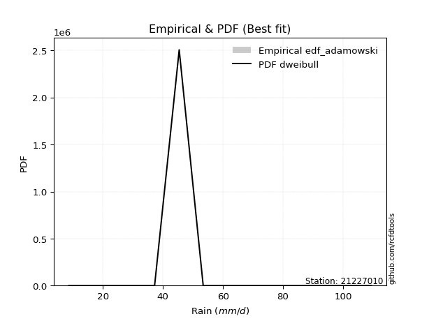</img>

</div>


## C. Best fit & Estimate extreme values for specific return periods - Tr


### 1. Best fit (ordered by delta Δ)

<div align="center">

|   id |   station | empirical_dist   | p_dist             |    delta |   deltao | eval   |   fit |   n |   best_fit |   best_fit_sort |
|-----:|----------:|:-----------------|:-------------------|---------:|---------:|:-------|------:|----:|-----------:|----------------:|
|    0 |  21227010 | edf_hazen        | laplace_asymmetric | 0.143487 | 0.586543 | Δo > Δ |     1 |   5 |          1 |               1 |
|    1 |  21227010 | edf_gringorten   | laplace_asymmetric | 0.148174 | 0.586543 | Δo > Δ |     1 |   5 |          1 |               2 |
|    2 |  21227010 | edf_cunnane      | laplace_asymmetric | 0.151179 | 0.586543 | Δo > Δ |     1 |   5 |          1 |               3 |
|    3 |  21227010 | edf_blom         | laplace_asymmetric | 0.153011 | 0.586543 | Δo > Δ |     1 |   5 |          1 |               4 |
|    4 |  21227010 | edf_tukey        | laplace_asymmetric | 0.155987 | 0.586543 | Δo > Δ |     1 |   5 |          1 |               5 |
|    5 |  21227010 | edf_filliben     | laplace_asymmetric | 0.157094 | 0.586543 | Δo > Δ |     1 |   5 |          1 |               6 |
|    6 |  21227010 | edf_beard        | laplace_asymmetric | 0.157613 | 0.586543 | Δo > Δ |     1 |   5 |          1 |               7 |
|    7 |  21227010 | edf_jenkinson    | laplace_asymmetric | 0.157613 | 0.586543 | Δo > Δ |     1 |   5 |          1 |               8 |
|    8 |  21227010 | edf_chegodayev   | laplace_asymmetric | 0.158302 | 0.586543 | Δo > Δ |     1 |   5 |          1 |               9 |
|    9 |  21227010 | edf_adamowski    | laplace_asymmetric | 0.161669 | 0.586543 | Δo > Δ |     1 |   5 |          1 |              10 |
|   10 |  21227010 | edf_california   | logkstwobign       | 0.162574 | 0.586543 | Δo > Δ |     1 |   5 |          1 |              11 |
|   11 |  21227010 | edf_weibull      | fisk               | 0.166667 | 0.586543 | Δo > Δ |     1 |   5 |          1 |              12 |

</div>

:file_folder:Tables: [bestfit_21227010.csv](table/bestfit_21227010.csv) | [extreme_21227010.csv](table/extreme_21227010.csv)


### 2. Extreme values

In hydrology, a return period (or recurrence interval $Tr$) is the statistical average time between extreme events like floods or droughts of a specific magnitude, indicating how rare an event is, with a 100-year flood, for example, having a 1% chance of occurring in any given year, not that it happens exactly every century. It is a key tool for infrastructure design (like bridges or dams) and risk assessment, calculated from historical data to determine the probability of future events, although it is important to remember it is statistical average, and events can cluster or be missed.

> risk_rate: assuming the return period as the project useful life.

|   id |      tr |   prob_l |     prob_g |      alpha |   betaprime |     chi2 |   crystalball |   erlang |    expon |   exponnorm |        f |   fatiguelife |             fisk |   gamma |   genexpon |   genlogistic |   gibrat |   gompertz |   gumbel_l |   gumbel_r |   halflogistic |   halfnorm |   hypsecant |   invgamma |   invgauss |       invweibull |   johnsonsu |   kstwobign |   laplace |   laplace_asymmetric |   loggamma |   logistic |   lognorm |   maxwell |    mielke |    moyal |   nakagami |      ncf |       nct |    norm |           pareto |   pearson3 |   rayleigh |    rice |       t |   truncnorm |     wald |      weibull_min |   logalpha |   logbetaprime |     logchi2 |   logcrystalball |   logerlang |   logexpon |   logexponnorm |     logf |   logfatiguelife |   logfisk |   loggenexpon |   loggenlogistic |   loggibrat |   loggompertz |   loggumbel_l |   loggumbel_r |   loghalflogistic |   loghalfnorm |   loghypsecant |   loginvgamma |   loginvgauss |   loginvweibull |   logjohnsonsu |   logkstwobign |   loglaplace |   loglaplace_asymmetric |   logloggamma |   loglogistic |    loglognorm |   logmaxwell |   logmielke |   logmoyal |   lognakagami |   logncf |   lognct |      logpareto |   logpearson3 |   lograyleigh |   logrice |     logt |   logtruncnorm |   logwald |   logweibull_min |   station |   n |   risk_rate |
|-----:|--------:|---------:|-----------:|-----------:|------------:|---------:|--------------:|---------:|---------:|------------:|---------:|--------------:|-----------------:|--------:|-----------:|--------------:|---------:|-----------:|-----------:|-----------:|---------------:|-----------:|------------:|-----------:|-----------:|-----------------:|------------:|------------:|----------:|---------------------:|-----------:|-----------:|----------:|----------:|----------:|---------:|-----------:|---------:|----------:|--------:|-----------------:|-----------:|-----------:|--------:|--------:|------------:|---------:|-----------------:|-----------:|---------------:|------------:|-----------------:|------------:|-----------:|---------------:|---------:|-----------------:|----------:|--------------:|-----------------:|------------:|--------------:|--------------:|--------------:|------------------:|--------------:|---------------:|--------------:|--------------:|----------------:|---------------:|---------------:|-------------:|------------------------:|--------------:|--------------:|--------------:|-------------:|------------:|-----------:|--------------:|---------:|---------:|---------------:|--------------:|--------------:|----------:|---------:|---------------:|----------:|-----------------:|----------:|----:|------------:|
|    0 |    2    | 0.5      | 0.5        |    21.4318 |     27.5038 |  16.4893 |       31.574  |  31.2633 |  24.5244 |     31.574  |  23.8612 |       8.60001 |     19.4454      | 31.2795 |    24.5241 |           inf |  26.2685 |    30.1321 |    34.4777 |    28.6703 |        27.2267 |    27.9559 |     31.574  |    30.3737 |    24.8204 |   4359.11        |     31.574  |     27.8692 |   31.574  |              36.9575 |    24.8839 |    31.574  |   25.264  |   30.0623 |   24.0025 |  27.7329 |    8.76261 |  30.9656 |   21.0076 | 31.574  |     11.1743      |    32.1115 |    29.5262 | 30.53   | 31.5707 |     31.574  |  25.8445 |      9.53591     |    24.4543 |        24.7916 |     14.1    |          25.264  |     24.5762 |    18.1507 |        25.2641 |  25.185  |          25.1937 |   26.8852 |       21.2851 |         inf      |     20.3228 |       25.8536 |       28.4603 |       22.4266 |           21.1372 |       21.779  |        25.264  |       24.6748 |       23.7806 |         22.4873 |           53.4 |        21.4795 |      25.264  |                 31.8377 |       31.7856 |       25.264  |   8.60834     |      23.7447 |      8.6    |    21.5805 |       14.7103 |  24.7841 |  25.1523 |   9.82693      |       26.6413 |       23.2281 |   24.3347 |  25.2641 |        23.9567 |   19.9714 |          29.0906 |  21227010 |   5 |    0.75     |
|    1 |    2.33 | 0.570815 | 0.429185   |    25.2695 |     30.7956 |  18.6749 |       34.7281 |  34.4341 |  28.033  |     34.7282 |  28.0732 |       9.1139  |     27.3925      | 34.4653 |    28.0326 |           inf |  27.8663 |    33.3608 |    37.2218 |    31.5929 |        30.2316 |    31.3601 |     34.0982 |    33.5919 |    28.2478 | 579499           |     34.734  |     31.193  |   33.4827 |              39.6589 |    28.3832 |    34.353  |   28.7542 |   33.3392 |   27.6491 |  30.4995 |    9.13085 |  34.5745 |   24.3063 | 34.7281 |     13.2992      |    35.2434 |    32.8516 | 33.7352 | 34.7247 |     34.7281 |  27.9127 |     12.6813      |    27.9824 |        28.3328 |     16.7729 |          28.7542 |     28.038  |    21.3977 |        28.7544 |  28.6853 |          28.677  |   30.6132 |       24.731  |         inf      |     21.6995 |       29.2851 |       31.8518 |       25.2836 |           23.9104 |       25.0433 |        28.0207 |       28.161  |       27.2501 |         26.0881 |           53.4 |        24.8424 |      27.3219 |                 35.1459 |       35.0986 |       28.3151 |   8.70604     |      27.1615 |      8.6    |    24.1745 |       16.0217 |  28.3346 |  28.6654 |  11.0022       |       30.2336 |       26.6235 |   27.8216 |  28.7544 |        27.0167 |   21.74   |          32.4328 |  21227010 |   5 |    0.729209 |
|    2 |    5    | 0.8      | 0.2        |    55.0281 |     45.0945 |  30.3661 |       46.4496 |  46.3884 |  45.5752 |     46.4497 |  50.5816 |      20.0304  |    165.56        | 46.481  |    45.5745 |           inf |  37.065  |    45.7786 |    46.0869 |    44.2902 |        43.8283 |    45.7556 |     44.2235 |    46.3158 |    45.429  |      9.83706e+14 |     46.4775 |     45.312  |   43.0259 |              46.6954 |    46.7381 |    45.0831 |   46.5108 |   46.2369 |   49.4177 |  43.3149 |   19.4793  |  50.2413 |   47.069  | 46.4496 |     91.888       |    46.5847 |    46.1645 | 46.2047 | 46.446  |     46.4496 |  39.4904 |    483.885       |    47.1469 |        46.9649 |     46.1316 |          46.5108 |     46.2378 |    48.7215 |        46.511  |  46.5488 |          46.4442 |   50.543  |       46.5361 |         inf      |     31.6473 |       45.4366 |       45.8238 |       42.5674 |           41.768  |       45.2049 |        42.4511 |       46.7546 |       46.6385 |         49.7369 |           53.4 |        46.0811 |      40.4157 |                 45.215  |       45.1875 |       43.9749 |   1.12598e+67 |      46.1066 |      8.6    |    40.8978 |       32.8861 |  47.1562 |  46.7136 | 904.037        |       46.9902 |       45.9699 |   46.4421 |  46.5112 |        47.267  |   34.959  |          46.086  |  21227010 |   5 |    0.67232  |
|    3 |   10    | 0.9      | 0.1        |   109.702  |     56.4999 |  41.589  |       54.2254 |  54.4681 |  61.4996 |     54.2255 |  72.176  |      35.1033  |    757.909       | 54.6061 |    61.4986 |           inf |  47.5504 |    53.8706 |    51.0226 |    54.6319 |        55.1198 |    56.408  |     52.3088 |    55.4743 |    61.6194 |      3.23904e+22 |     54.2678 |     56.0618 |   51.6889 |              51.248  |    65.6281 |    52.9854 |   63.9885 |   55.3136 |   77.2434 |  54.4727 |   41.028   |  62.5947 |   82.7225 | 54.2254 |   1101.43        |    53.852  |    55.6569 | 54.804  | 54.2215 |     54.2254 |  51.7771 |   6727.5         |    67.9424 |        66.2098 |    130.178  |          63.9885 |     65.0299 |   102.829  |        63.9887 |  64.2046 |          63.9995 |   73.1186 |       74.4651 |         inf      |     48.6575 |       59.1229 |       56.1093 |       65.0646 |           66.3788 |       69.9817 |        59.1497 |       66.3908 |       68.5316 |         84.1255 |           53.4 |        73.7602 |      57.6643 |                 49.3695 |       49.3522 |       60.8145 | inf           |      66.91   |     43.1278 |    64.6409 |       72.379  |  66.8173 |  64.7269 |   1.3089e+29   |       61.4261 |       67.8592 |   65.7942 |  63.989  |        74.8176 |   57.8748 |          56.043  |  21227010 |   5 |    0.651322 |
|    4 |   15    | 0.933333 | 0.0666667  |   164.181  |     62.8016 |  48.307  |       58.1057 |  58.5449 |  70.8147 |     58.1057 |  85.1016 |      44.9613  |   1764.67        | 58.7068 |    70.8135 |           inf |  54.7828 |    57.7698 |    53.2578 |    60.4666 |        61.5098 |    61.9514 |     56.9231 |    60.2764 |    71.4089 |      5.64618e+26 |     58.1553 |     61.7686 |   56.7565 |              53.9112 |    77.9424 |    57.2909 |   75.0309 |   59.9707 |   98.7379 |  60.9481 |   55.6755  |  69.3446 |  114.487  | 58.1057 |   4928.85        |    57.4029 |    60.5479 | 59.1596 | 58.1017 |     58.1057 |  59.6671 |  22306.4         |    82.0353 |        78.7832 |    246.182  |          75.0309 |     77.3086 |   159.175  |        75.0311 |  75.39   |          75.1213 |   89.4135 |       95.253  |         inf      |     65.4644 |       66.8298 |       61.4981 |       82.6623 |           86.2744 |       87.8527 |        71.4774 |       79.4392 |       83.78   |        113.163  |           53.4 |        94.6847 |      70.9905 |                 50.7278 |       50.7141 |       72.5642 | inf           |      80.9974 |     46.3057 |    84.3115 |      113.409  |  79.7676 |  76.2176 |   2.60009e+132 |       69.7125 |       82.9382 |   78.4144 |  75.0315 |        96.2134 |   79.9976 |          61.2343 |  21227010 |   5 |    0.644736 |
|    5 |   20    | 0.95     | 0.05       |   218.611  |     67.1568 |  53.1228 |       60.6468 |  61.2309 |  77.424  |     60.6468 |  94.3678 |      52.2599  |   3172.29        | 61.4091 |    77.4226 |           inf |  60.4561 |    60.2627 |    54.6492 |    64.552  |        65.9868 |    65.6473 |     60.1782 |    63.5091 |    78.4937 |      5.2654e+29  |     60.7012 |     65.613  |   60.3519 |              55.8007 |    87.315  |    60.2668 |   83.2754 |   63.0615 |  117.018  |  65.5342 |   66.1643  |  73.9762 |  144.037  | 60.6468 |  14316.4         |    59.7012 |    63.7987 | 62.0303 | 60.6428 |     60.6468 |  65.5467 |  47056.2         |    93.0277 |        88.365  |    390.704  |          83.2754 |     86.6671 |   217.026  |        83.2756 |  83.7548 |          83.4391 |  102.753  |      112.32   |         inf      |     82.6195 |       72.1895 |       65.1107 |       97.746  |          103.669  |      102.237  |        81.6899 |       89.4916 |       95.8733 |        139.274  |           53.4 |       112.032  |      82.2742 |                 51.4024 |       51.3905 |       81.9872 | inf           |      91.948  |     47.99   |   101.765  |      154.086  |  89.6869 |  84.8472 | inf            |       75.5446 |       94.7715 |   88.0055 |  83.2761 |       114.249  |  101.822  |          64.7056 |  21227010 |   5 |    0.641514 |
|    6 |   25    | 0.96     | 0.04       |   273.023  |     70.4806 |  56.8817 |       62.5174 |  63.2163 |  82.5505 |     62.5174 | 101.601  |      58.0589  |   4971.84        | 63.4068 |    82.549  |           inf |  65.1856 |    62.0654 |    55.6393 |    67.6987 |        69.4361 |    68.3972 |     62.6974 |    65.9344 |    84.0652 |      1.02062e+32 |     62.5753 |     68.4925 |   63.1408 |              57.2664 |    94.9722 |    62.5433 |   89.918  |   65.3561 |  133.25   |  69.0888 |   74.2047  |  77.4928 |  172.06   | 62.5174 |  32754.2         |    61.3794 |    66.214  | 64.1517 | 62.5133 |     62.5174 |  70.2561 |  80046.1         |   102.173  |        96.2003 |    561.643  |          89.918  |     94.3207 |   276.022  |        89.9182 |  90.502  |          90.149  |  114.286  |      127.02   |         inf      |    100.31   |       76.2916 |       67.81   |      111.216  |          119.429  |      114.447  |        90.5848 |       97.7783 |      106.055  |        163.426  |           53.4 |       127.077  |      92.2477 |                 51.8056 |       51.7948 |       90.0137 | inf           |     101.025  |     49.0326 |   117.743  |      193.981  |  97.8284 |  91.8294 | inf            |       80.0461 |      104.644  |   95.8283 |  89.9188 |       130.08   |  123.526  |          67.2951 |  21227010 |   5 |    0.639603 |
|    7 |   50    | 0.98     | 0.02       |   544.996  |     80.5649 |  68.6636 |       67.874  |  68.9407 |  98.4748 |     67.874  | 124.276  |      76.6648  |  19655.7         | 69.1673 |    98.4731 |           inf |  81.8574 |    67.0702 |    58.3269 |    77.3924 |        80.064  |    76.39   |     70.508  |    73.1016 |   101.769  |      1.13593e+39 |     67.9419 |     76.9483 |   71.8038 |              61.819  |   121.09   |    69.4987 |  112.019  |   72.0108 |  198.007  |  80.1239 |   98.179   |  88.065  |  298.594  | 67.874  | 428656           |    66.1214 |    73.2253 | 70.2596 | 67.8698 |     67.874  |  85.6324 | 338612           |   134.417  |       122.967  |   1770.72   |         112.019  |    120.474  |   582.557  |       112.019  | 112.996  |         112.522  |  158.178  |      181.92   |         inf      |    198.782  |       88.7653 |       75.715  |      165.535  |          184.701  |      158.861  |       124.803  |      126.511  |      142.736  |        267.465  |           53.4 |       183.978  |     131.617  |                 52.609  |       52.6004 |      119.74   | inf           |     132.74   |     51.1927 |   185.165  |      380.745  | 125.829  | 115.235  | inf            |       93.9253 |      139.521  |  122.401  | 112.02   |       191.236  |  232.135  |          74.8587 |  21227010 |   5 |    0.63583  |
|    8 |   75    | 0.986667 | 0.0133333  |   816.931  |     86.3303 |  75.6157 |       70.7482 |  72.0358 | 107.79   |     70.7482 | 137.659  |      87.8702  |  43500.6         | 72.2826 |   107.788  |           inf |  93.1175 |    69.658  |    59.686  |    83.0268 |        86.242  |    80.741  |     75.0725 |    77.0879 |   112.381  |      1.41592e+43 |     70.8215 |     81.6006 |   76.8714 |              64.4822 |   138.139  |    73.516  |  126.038  |   75.6289 |  248.722  |  86.5771 |  111.379   |  94.0451 |  412.074  | 70.7482 |      1.92962e+06 |    68.627  |    77.0397 | 73.5544 | 70.7439 |     70.7482 |  95.0942 | 702190           |   156.298  |       140.469  |   3507.67   |         126.038  |    137.581  |   901.774  |       126.038  | 127.297  |         126.751  |  190.84   |      221.452  |         inf      |    315.495  |       95.8971 |       80.0567 |      208.584  |          237.982  |      189.907  |       150.505  |      145.631  |      168.232  |        356.139  |           53.4 |       225.519  |     162.034  |                 52.8759 |       52.868  |      141.195  | inf           |     153.981  |     51.9356 |   241.29   |      550.079  | 144.283  | 130.211  | inf            |      101.98   |      163.156  |  139.644  | 126.039  |       236.864  |  342.245  |          79.0014 |  21227010 |   5 |    0.634587 |
|    9 |  100    | 0.99     | 0.01       |  1088.86   |     90.3736 |  80.5702 |       72.6922 |  74.1386 | 114.399  |     72.6922 | 147.197  |      95.9328  |  76228.3         | 74.3994 |   114.397  |           inf | 101.84   |    71.3697 |    60.5749 |    87.0146 |        90.6146 |    83.7051 |     78.3103 |    79.8416 |   120.016  |      1.12153e+46 |     72.7691 |     84.7881 |   80.4669 |              66.3717 |   151.094  |    76.3522 |  136.502  |   78.0933 |  292.07   |  91.1553 |  120.373   |  98.2115 |  517.849  | 72.6922 |      5.61106e+06 |    70.3065 |    79.6383 | 75.789  | 72.6879 |     72.6922 | 101.993  |      1.13146e+06 |   173.339  |       153.783  |   5721.66   |         136.502  |    150.597  |  1229.52   |       136.503  | 137.986  |         137.388  |  217.885  |      253.306  |         inf      |    451.233  |      100.892  |       83.0304 |      245.66   |          284.743  |      214.463  |       171.887  |      160.338  |      188.387  |        436.147  |           53.4 |       259.276  |     187.788  |                 53.0092 |       53.0017 |      158.619  | inf           |     170.364  |     52.3114 |   291.148  |      706.574  | 158.389  | 141.449  | inf            |      107.668  |      181.512  |  152.688  | 136.504  |       274.377  |  454.214  |          81.8343 |  21227010 |   5 |    0.633968 |
|   10 |  200    | 0.995    | 0.005      |  2176.53   |     99.9843 |  92.5699 |       77.1017 |  78.9367 | 130.324  |     77.1018 | 170.306  |     115.669   | 292798           | 79.2299 |   130.321  |           inf | 125.572  |    75.1384 |    62.5072 |    96.6016 |       101.127  |    90.4842 |     86.1104 |    86.2663 |   138.738  |      1.04412e+53 |     77.187  |     92.1298 |   89.1299 |              70.9244 |   185.462  |    83.1558 |  163.572  |   83.7315 |  428.933  | 102.186  |  140.863   | 108.027  |  897.925  | 77.1017 |      7.34495e+07 |    74.0706 |    85.5843 | 80.8737 | 77.0974 |     77.1017 | 119.176  |      3.1914e+06  |   220.206  |       189.157  |  18829.6    |         163.572  |    185.192  |  2594.95   |       163.572  | 165.691  |         164.966  |  299.431  |      344.9    |         inf      |   1194.56   |      112.73   |       89.8805 |      364.045  |          438.285  |      283.231  |       236.715  |      200.054  |      244.997  |        709.944  |           53.4 |       357.511  |     267.933  |                 53.2088 |       53.2019 |      209.691  | inf           |     214.703  |     52.8807 |   457.776  |     1250.4    | 196.135  | 170.74   | inf            |      121.282  |      231.66   |  187.057  | 163.574  |       384.812  |  919.279  |          88.3473 |  21227010 |   5 |    0.633042 |
|   11 |  250    | 0.996    | 0.004      |  2720.37   |    103.045  |  96.4492 |       78.4493 |  80.4108 | 135.45   |     78.4494 | 177.779  |     122.101   | 451035           | 80.7142 |   135.448  |           inf | 134.087  |    76.2591 |    63.0757 |    99.6837 |       104.507  |    92.5698 |     88.6214 |    88.2804 |   144.856  |      1.81619e+55 |     78.5371 |     94.4019 |   91.9188 |              72.3901 |   197.539  |    85.3401 |  172.87   |   85.4671 |  485.117  | 105.737  |  147.132   | 111.128  | 1071.98   | 78.4493 |      1.68099e+08 |    75.2084 |    87.4147 | 82.4316 | 78.4449 |     78.4493 | 124.861  |      4.32996e+06 |   237.221  |       201.604  |  27717.7    |         172.87   |    197.368  |  3300.36   |       172.87   | 175.224  |         174.458  |  331.607  |      379.389  |         inf      |   1694      |      116.487  |       92.0016 |      413.116  |          503.469  |      308.532  |       262.401  |      214.236  |      265.932  |        830.325  |           53.4 |       394.885  |     300.412  |                 53.2488 |       53.2419 |      229.35   | inf           |     230.549  |     52.9954 |   529.569  |     1489.46   | 209.502  | 180.87   | inf            |      125.637  |      249.726  |  199.052  | 172.872  |       427.001  | 1160.76   |          90.3605 |  21227010 |   5 |    0.632858 |
|   12 |  500    | 0.998    | 0.002      |  5439.53   |    112.471  | 108.541  |       82.4455 |  84.8037 | 151.374  |     82.4455 | 201.077  |     142.278   |      1.72248e+06 | 85.138  |   151.372  |           inf | 163.514  |    79.4992 |    64.7055 |   109.25   |       114.996  |    98.7879 |     96.4209 |    94.3979 |   164.115  |      1.63282e+62 |     82.5407 |    101.211  |  100.582  |              76.9427 |   238.473  |    92.1142 |  203.668  |   90.6462 |  710.078  | 116.767  |  165.701   | 120.603  | 1858.64   | 82.4455 |      2.20044e+09 |    78.5481 |    92.8758 | 87.0615 | 82.441  |     82.4455 | 142.937  |      1.03831e+07 |   296.895  |       243.851  |  92875.7    |         203.668  |    238.71   |  6965.57   |       203.668  | 206.853  |         205.963  |  455.088  |      504.557  |         inf      |   5665.03   |      128.006  |       98.3636 |      611.675  |          774.229  |      398.191  |       361.357  |      263.121  |      340.748  |       1350.14   |           53.4 |       531.954  |     428.622  |                 53.3285 |       53.3219 |      302.83   | inf           |     285.13   |     53.2255 |   832.639  |     2504.09   | 255.172  | 214.655  | inf            |      139.077  |      312.442  |  239.406  | 203.67   |       580.367  | 2436.85   |          96.3895 |  21227010 |   5 |    0.632489 |
|   13 |  750    | 0.998667 | 0.00133333 |  8158.7    |    117.936  | 115.64   |       84.6654 |  87.258  | 160.69   |     84.6655 | 214.76   |     154.199   |      3.76832e+06 | 87.6099 |   160.687  |           inf | 182.975  |    81.2466 |    65.5765 |   114.842  |       121.128  |   102.262  |    100.983  |    97.8922 |   175.546  |      1.89718e+66 |     84.7648 |    105.036  |  105.649  |              79.6059 |   264.987  |    96.0718 |  223.089  |   93.5428 |  886.709  | 123.219  |  175.99    | 126.046  | 2564.51   | 84.6654 |      9.90557e+09 |    80.3812 |    95.9296 | 89.6394 | 84.6609 |     84.6654 | 153.775  |      1.65704e+07 |   337.127  |       271.259  | 189349      |         223.089  |    265.539  | 10782.4    |       223.089  | 226.836  |         225.876  |  547.533  |      592.038  |          53.3492 |  12587.3    |      134.646  |      101.942  |      769.422  |          995.703  |      459.183  |       435.742  |      295.413  |      392.273  |       1793.93   |           53.4 |       628.883  |     527.676  |                 53.3551 |       53.3486 |      356.218  | inf           |     321.111  |     53.3025 |  1084.98   |     3342.5    | 285.028  | 236.13   | inf            |      146.874  |      354.145  |  265.302  | 223.091  |       685.659  | 3801.41   |          99.775  |  21227010 |   5 |    0.632366 |
|   14 | 1000    | 0.999    | 0.001      | 10877.9    |    121.796  | 120.687  |       86.1938 |  88.9536 | 167.299  |     86.1939 | 224.49   |     162.703   |      6.5654e+06  | 89.3178 |   167.296  |           inf | 197.868  |    82.4285 |    66.1627 |   118.809  |       125.478  |   104.661  |    104.22   |   100.339  |   183.723  |      1.45108e+69 |     86.2961 |    107.686  |  109.245  |              81.4954 |   285.032  |    98.8785 |  237.526  |   95.5449 | 1037.83   | 127.797  |  183.06    | 129.869  | 3222.56   | 86.1938 |      2.8804e+10  |    81.6342 |    98.0399 | 91.4165 | 86.1892 |     86.1938 | 161.571  |      2.26967e+07 |   368.333  |       292.001  | 314488      |         237.526  |    285.848  | 14701.2    |       237.526  | 241.711  |         240.702  |  624.263  |      661.32   |          53.3625 |  23188.4    |      139.318  |      104.424  |      905.412  |         1190.23   |      506.677  |       497.631  |      320.135  |      432.772  |       2194.61   |           53.4 |       706.207  |     611.548  |                 53.3684 |       53.3619 |      399.691  | inf           |     348.6    |     53.3412 |  1309.15   |     4077.79   | 307.733  | 252.175  | inf            |      152.375  |      386.174  |  284.761  | 237.528  |       766.636  | 5234.3    |         102.12   |  21227010 |   5 |    0.632305 |

<div align="center">

</img>

</div>


<div align="center">

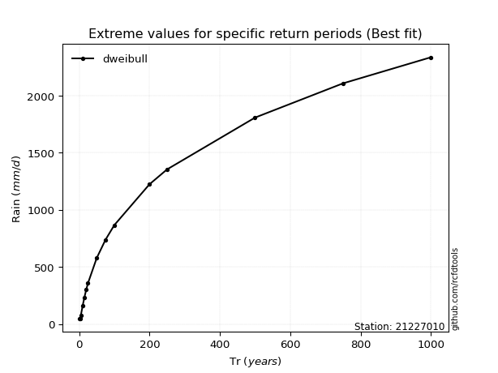</img>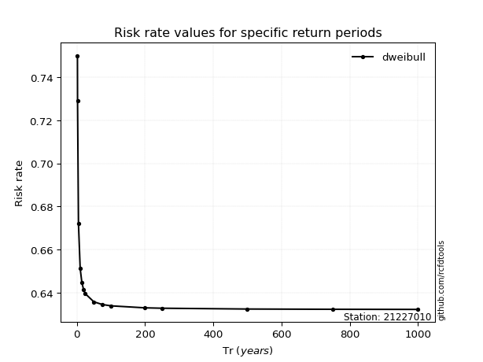</img>

</div>


<sub>**APP DISCLAIMER**: NO WARRANTY - This software is provided by [github.com/rcfdtools](https://github.com/rcfdtools) "as is", without any express or implied warranty, including warranties of merchantability, fitness for a particular purpose, or non-infringement. There is no guarantee that the software will be error-free or operate without interruption. LIMITATION OF LIABILITY - Neither the authors nor copyright holders will be liable for claims or damages arising from the software or its use. You are responsible for determining if the software is appropriate for your use and assume all associated risks, including errors, legal compliance, and data loss. NO PROFESSIONAL ADVICE - The software provides general information and does not offer professional advice. It should not replace consultation with professional advisors.</sub>