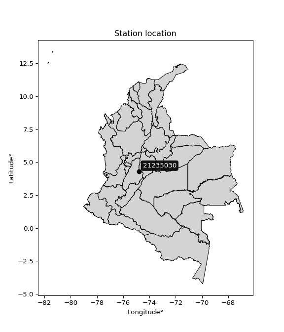

<div align="center">


</div>

# PMP Station (Rain, Pmax24h): 21235030

Probable Maximum Precipitation (PMP) is the greatest amount of rainfall for a specific duration that is meteorologically possible for a given location, acting as a "worst-case" scenario for extreme storms, crucial for designing safety-critical infrastructure like bridges, river deviations, dams, spillways, and nuclear plants to prevent catastrophic failure. PMP is calculated by hydrologists using meteorological data to determine the upper limit of extreme rainfall, often leading to the Probable Maximum Flood (PMF) for flood control design, and is increasingly being studied for climate change impacts. Probable Maximum Precipitation (PMP) is the theoretical upper limit of rainfall, a deterministic estimate for extreme events, while probability distributions (like GEV, Gumbel) describe the likelihood and frequency of various precipitation amounts, including rare ones, showing how often events occur, with PMP representing the extreme end of these distributions, used for critical infrastructure design to ensure safety against the worst conceivable weather, unlike standard statistical forecasts which cover typical probabilities.

The most common probability distributions in hydrology, used for analyzing floods, rainfall, and streamflow, include the Normal, Log-Normal, Gumbel, Gamma (including Log-Pearson Type III), and Generalized Extreme Value (GEV) distributions, often chosen based on the data´s skewness and whether modeling extremes or general conditions, with Gumbel and GEV popular for extreme events like floods, while the Normal distribution serves as a baseline, though often requiring transformations for skewed hydrological data. These distributions help in designing water infrastructure, managing water resources, and forecasting hydrologic events.

> Hydrological data often isn´t perfectly normal (it´s skewed), so different distributions are needed for different applications, such as: **Flood Frequency Analysis**: Using Gumbel, GEV, or Log-Pearson Type III for predicting extreme flood magnitudes and their return periods, **Rainfall Analysis**: Normal for annual totals, but Log-Normal, Weibull, or GEV for intensity or extreme daily rainfall, **Streamflow Modeling**: Gamma and Log-Normal for maximum flows, GEV for minimum flows, and Kappa for daily flows.

<div align="center">

</img>

</div>


## A. General information


### 1. General running parameters

• app_version: _v20260108_. • runtime: _2026-01-08 13:24:42.400241_. • Python version: _3.14.0_. • SciPy version: _1.16.3_. • Pandas version: _2.3.3_. • NumPy version: _2.3.5_. • Stations dataset (station_dataset_file): _dataset/pmax24h_in/automatic_colombia_2003_2024.csv_. • Stations catalog (station_catalog_file): _dataset/CNE.xls_. • Minimum year to eval til year_max (date_min): _1900_. • Maximum year to eval since year_min (date_max): _2024_. • Creates, save and include plots into reports (create_plot): _False_. • Plot only fit distributions with Δo > Δ (plot_only_fit): _True_. • Plot only simple graphs avoiding multiple CDFs and multiple Extreme values plots (plot_only_simple): _True_. • Eval low extreme values, if False, evaluates high extreme values (low_extreme): _False_. • Eval every SciPy distribution as logarithmic (pdist_logarithmic_on): _True_. • Standard deviation normalized (ddof): _1.0_. • Return periods to eval in years (Tr): _[2, 2.33, 5, 10, 15, 20, 25, 50, 75, 100, 200, 250, 500, 750, 1000]_. • Minimum data sample per station, 0 means any (minimum_sample): _5_. • Z-Score maximum threshold to adjust a value, 0 means disable (zscore_max): _3.5_. • Z-Score minimum threshold to adjust a value, 0 means disable (zscore_min): _-2.5_. • Avoid zeros, e.g. rain = 0 (avoid_zeros): _True_. • Avoid null values (avoid_nans): _True_. 

:file_folder:Table: [dataset.csv](../../dataset/pmax24h_in/automatic_colombia_2003_2024.csv)

> Delta Degrees of Freedom (DDOF): is a parameter used in the formulas for calculating variance and standard deviation. When ddof=0, the divisor is $N$ (the total number of observations) and this is used when your data set is the entire population. When ddof=1, the divisor is $N-1$ and this is used when your data set is a sample drawn from a larger population. Using $N-1$ provides an unbiased estimate of the population variance (known as Bessel´s correction).


### 2. Station info and location

|   id |   CODIGO | NOMBRE                                 | CATEGORIA               | TECNOLOGIA                | ESTADO   | FECHA_INSTALACION   |   FECHA_SUSPENSION |   ALTITUD |   LATITUD |   LONGITUD | DEPARTAMENTO   | MUNICIPIO   | AREA_OPERATIVA                            | ENTIDAD                                                     | AREA_HIDROGRAFICA   | ZONA_HIDROGRAFICA   | SUBZONA_HIDROGRAFICA                   |   CORRIENTE | Catalogo   |   Version |
|-----:|---------:|:---------------------------------------|:------------------------|:--------------------------|:---------|:--------------------|-------------------:|----------:|----------:|-----------:|:---------------|:------------|:------------------------------------------|:------------------------------------------------------------|:--------------------|:--------------------|:---------------------------------------|------------:|:-----------|----------:|
|    0 | 21235030 | UNIVERSIDAD DE CUNDINAMARCA [21235030] | Climatológica Principal | Automática con Telemetría | Activa   | 30/09/2004          |                nan |       289 |   4.30678 |   -74.8068 | Cundinamarca   | Girardot    | Area Operativa 11 - Cundinamarca-Amazonas | INSTITUTO DE HIDROLOGIA METEOROLOGIA Y ESTUDIOS AMBIENTALES | Magdalena Cauca     | Alto Magdalena      | Río Seco y otros Directos al Magdalena |         nan | CNE_IDEAM  |  20251226 |

<div align="center">

Dynamic map: [:earth_americas:Google](http://maps.google.com/maps?q=4.306785,-74.806777) [:earth_americas:OSM](https://www.openstreetmap.org/#map=18/4.306785/-74.806777&layers=P) [:earth_americas:Bing](https://www.bing.com/maps?cp=4.306785~-74.806777&lvl=18) [:earth_americas:Apple](https://maps.apple.com/frame?center=4.306785%2C-74.806777&span=0.003%2C0.006)

</div>


<div align="center">

```geojson
{
  "type": "Feature",
  "geometry": {
    "type": "Point", 
    "coordinates": [-74.806777, 4.306785]
  }, 
  "properties": {
    "Name": "21235030"
  }
}
```

</div>


### 3. Discrete values table and plot

<div align="center">

|               |           0 |           1 |          2 |           3 |           4 |           5 |          6 |          7 |           8 |           9 |          10 |          11 |          12 |          13 |         14 |          15 |         16 |        17 |          18 |         19 |
|:--------------|------------:|------------:|-----------:|------------:|------------:|------------:|-----------:|-----------:|------------:|------------:|------------:|------------:|------------:|------------:|-----------:|------------:|-----------:|----------:|------------:|-----------:|
| Date          | 2005        | 2006        | 2007       | 2008        | 2009        | 2010        | 2011       | 2012       | 2013        | 2014        | 2015        | 2016        | 2017        | 2018        | 2019       | 2020        | 2021       | 2022      | 2023        | 2024       |
| Value         |   39.3      |   39        |   38.2     |   42.3      |   47.4      |   45.6      |  108       |   89.2     |   62.1      |   59.7      |   54.2      |   34.6      |   35.5      |   43.7      |  112.7     |   24.2      |   18.4     |   10.7    |   25.3      |   79.2     |
| Value_initial |   39.3      |   39        |   38.2     |   42.3      |   47.4      |   45.6      |  108       |   89.2     |   62.1      |   59.7      |   54.2      |   34.6      |   35.5      |   43.7      |  112.7     |   24.2      |   18.4     |   10.7    |   25.3      |   79.2     |
| count         |   20        |   20        |   20       |   20        |   20        |   20        |   20       |   20       |   20        |   20        |   20        |   20        |   20        |   20        |   20       |   20        |   20       |   20      |   20        |   20       |
| mean          |   50.465    |   50.465    |   50.465   |   50.465    |   50.465    |   50.465    |   50.465   |   50.465   |   50.465    |   50.465    |   50.465    |   50.465    |   50.465    |   50.465    |   50.465   |   50.465    |   50.465   |   50.465  |   50.465    |   50.465   |
| std           |   27.8193   |   27.8193   |   27.8193  |   27.8193   |   27.8193   |   27.8193   |   27.8193  |   27.8193  |   27.8193   |   27.8193   |   27.8193   |   27.8193   |   27.8193   |   27.8193   |   27.8193  |   27.8193   |   27.8193  |   27.8193 |   27.8193   |   27.8193  |
| zscore        |   -0.401339 |   -0.412123 |   -0.44088 |   -0.293501 |   -0.110175 |   -0.174878 |    2.06816 |    1.39238 |    0.418234 |    0.331963 |    0.134259 |   -0.570287 |   -0.537935 |   -0.243176 |    2.23711 |   -0.944127 |   -1.15262 |   -1.4294 |   -0.904586 |    1.03291 |


</div>


> The initial value (value_initial) correspond to the initial obtained or null completed value, and value (value) is adjusted only when the initial value is outside the valid range (outlier) definite through the Z-Score value. If Z-Score is active, values out of range or outliers are replaced with the station mean value. A Z-Score (or standard score) measures how many standard deviations a data point is from the mean of a dataset, indicating its relative position; positive scores mean above the mean, negative mean below, and a score of zero is exactly at the mean, allowing for comparison of values from different distributions. It´s calculated using the formula $z=(x–μ)/σ$, where $x$ is the data point, $μ$ is the mean, and $σ$ is the standard deviation, helping identify outliers and understand probability.
>
> <sub>**Note**: In this study, "completing" (filling gaps in) and "extending" (forecasting or lengthening the historical record) rainfall data series are avoided for certain critical analyses because they introduce artificial bias and uncertainty, which can distort the statistics of rare events (extremes), alter day-to-day variability, and compromise the integrity and homogeneity of the original data. Some reasons against Completing/Extending rainfall data are: **Distortion of Extremes and Variability**: The primary issue is that most gap-filling or extension methods rely on averaging or regression with nearby stations, which inherently smooths the data. Rainfall is highly variable in space and time, with a large percentage of zero values and occasional large storms. Infilling methods often underestimate the highest values and overestimate the lowest (zero) values, which severely distorts analyses focused on flood frequency, drought severity, and intensity-duration-frequency (IDF) curves, **Loss of Data Homogeneity**: Infilled or extended data are synthetic estimates, not actual measurements. Combining these estimates with observed data can violate the assumption of data homogeneity, which requires that the data properties do not change over time. Inhomogeneity can lead to incorrect conclusions about long-term trends or changes in climate patterns, **Propagation of Errors**: Errors and biases from the original data (e.g., wind-induced undercatch, instrument errors, site changes) or the data used for imputation can propagate through the analysis, leading to unreliable hydrological models and inaccurate predictions, **Compromised Statistical Integrity**: For statistical analyses, especially those involving the frequency of events, using artificial data can introduce time bias or autocorrelation that doesn´t exist in reality, making it difficult to assess the true probability of events, **Difficulty in Validation**: It is difficult to accurately validate the quality of filled or extended data, especially for past periods where ground-truth measurements are unavailable. The reliability of imputation techniques heavily depends on the density of the surrounding station network and the complexity of the local topography.</sub>


### 4. Active continuous probability distributions from SciPy (43 of 104 available)

A Probability Density Function (PDF) describes the relative likelihood of a continuous random variable falling within a specific range, where the total area under its curve equals 1, and the area over any interval gives the actual probability for that range. Unlike discrete probabilities (like rolling a die), a PDF shows density, not direct probability for a single point (which is zero), with higher points indicating higher likelihood, often visualized as a bell curve for normal distributions.

A log of a probability density function (log-PDF) is simply the logarithm of the PDF´s value, denoted as $log(f(x))$, useful for converting multiplication of probabilities into addition, improving numerical stability with tiny numbers, and connecting to information theory concepts like entropy. Instead of dealing with very small probabilities (e.g., 0.000001), log-PDFs use negative numbers (e.g., $log(0.00001) ≈ -11.51$ that are easier for computers to handle, preventing underflow errors and simplifying complex calculations. In this study, each active probability distribution from SciPy is also evaluated in the $log$ form.

[scipy.stats](https://docs.scipy.org/doc/scipy/reference/stats.html) is a Python´s powerful submodule within the SciPy library for comprehensive statistical analysis, offering over 130 probability distributions (like Normal, Poisson), functions for descriptive stats (mean, variance), hypothesis testing (t-tests, chi-square), random variable generation, and statistical tests, making it essential for data science, modeling, and research. It provides tools to explore, model, and draw conclusions from data efficiently, working seamlessly with NumPy.

<div align="center">

|   id | p_dist             |   n_parameter | fit_method   | label                                                                       | active   | ref                                                                                                        |
|-----:|:-------------------|--------------:|:-------------|:----------------------------------------------------------------------------|:---------|:-----------------------------------------------------------------------------------------------------------|
|    0 | alpha              |             3 | MLE          | Alpha                                                                       | True     | [:mortar_board:](https://docs.scipy.org/doc/scipy/reference/generated/scipy.stats.alpha.html)              |
|    1 | betaprime          |             4 | MLE          | Beta prime                                                                  | True     | [:mortar_board:](https://docs.scipy.org/doc/scipy/reference/generated/scipy.stats.betaprime.html)          |
|    2 | chi2               |             3 | MLE          | Chi²                                                                        | True     | [:mortar_board:](https://docs.scipy.org/doc/scipy/reference/generated/scipy.stats.chi2.html)               |
|    3 | crystalball        |             4 | MLE          | Crystalball                                                                 | True     | [:mortar_board:](https://docs.scipy.org/doc/scipy/reference/generated/scipy.stats.crystalball.html)        |
|    4 | erlang             |             3 | MLE          | Erlang                                                                      | True     | [:mortar_board:](https://docs.scipy.org/doc/scipy/reference/generated/scipy.stats.erlang.html)             |
|    5 | expon              |             2 | MLE          | Exponential                                                                 | True     | [:mortar_board:](https://docs.scipy.org/doc/scipy/reference/generated/scipy.stats.expon.html)              |
|    6 | exponnorm          |             3 | MLE          | Exponentially modified Normal                                               | True     | [:mortar_board:](https://docs.scipy.org/doc/scipy/reference/generated/scipy.stats.exponnorm.html)          |
|    7 | f                  |             4 | MLE          | F                                                                           | True     | [:mortar_board:](https://docs.scipy.org/doc/scipy/reference/generated/scipy.stats.f.html)                  |
|    8 | fatiguelife        |             3 | MLE          | Fatigue-life (Birnbaum-Saunders)                                            | True     | [:mortar_board:](https://docs.scipy.org/doc/scipy/reference/generated/scipy.stats.fatiguelife.html)        |
|    9 | fisk               |             3 | MLE          | Fisk                                                                        | True     | [:mortar_board:](https://docs.scipy.org/doc/scipy/reference/generated/scipy.stats.fisk.html)               |
|   10 | gamma              |             3 | MLE          | Gamma                                                                       | True     | [:mortar_board:](https://docs.scipy.org/doc/scipy/reference/generated/scipy.stats.gamma.html)              |
|   11 | genexpon           |             5 | MLE          | Generalized exponential                                                     | True     | [:mortar_board:](https://docs.scipy.org/doc/scipy/reference/generated/scipy.stats.genexpon.html)           |
|   12 | genlogistic        |             3 | MLE          | Generalized logistic                                                        | True     | [:mortar_board:](https://docs.scipy.org/doc/scipy/reference/generated/scipy.stats.genlogistic.html)        |
|   13 | gibrat             |             2 | MM           | Gibrat                                                                      | True     | [:mortar_board:](https://docs.scipy.org/doc/scipy/reference/generated/scipy.stats.gibrat.html)             |
|   14 | gompertz           |             3 | MLE          | Gompertz (or truncated Gumbel)                                              | True     | [:mortar_board:](https://docs.scipy.org/doc/scipy/reference/generated/scipy.stats.gompertz.html)           |
|   15 | gumbel_l           |             2 | MM           | Gumbel Left Skew                                                            | True     | [:mortar_board:](https://docs.scipy.org/doc/scipy/reference/generated/scipy.stats.gumbel_l.html)           |
|   16 | gumbel_r           |             2 | MM           | Gumbel Right Skew                                                           | True     | [:mortar_board:](https://docs.scipy.org/doc/scipy/reference/generated/scipy.stats.gumbel_r.html)           |
|   17 | halflogistic       |             2 | MM           | Half-logistic                                                               | True     | [:mortar_board:](https://docs.scipy.org/doc/scipy/reference/generated/scipy.stats.halflogistic.html)       |
|   18 | halfnorm           |             2 | MM           | Half Normal                                                                 | True     | [:mortar_board:](https://docs.scipy.org/doc/scipy/reference/generated/scipy.stats.halfnorm.html)           |
|   19 | hypsecant          |             2 | MM           | hyperbolic secant                                                           | True     | [:mortar_board:](https://docs.scipy.org/doc/scipy/reference/generated/scipy.stats.hypsecant.html)          |
|   20 | invgamma           |             3 | MLE          | Inverted gamma                                                              | True     | [:mortar_board:](https://docs.scipy.org/doc/scipy/reference/generated/scipy.stats.invgamma.html)           |
|   21 | invgauss           |             3 | MLE          | Inverse Gaussian                                                            | True     | [:mortar_board:](https://docs.scipy.org/doc/scipy/reference/generated/scipy.stats.invgauss.html)           |
|   22 | invweibull         |             3 | MLE          | Inverted Weibull                                                            | True     | [:mortar_board:](https://docs.scipy.org/doc/scipy/reference/generated/scipy.stats.invweibull.html)         |
|   23 | kstwobign          |             2 | MLE          | Limiting distribution of scaled Kolmogorov-Smirnov two-sided test statistic | True     | [:mortar_board:](https://docs.scipy.org/doc/scipy/reference/generated/scipy.stats.kstwobign.html)          |
|   24 | laplace            |             2 | MM           | Laplace                                                                     | True     | [:mortar_board:](https://docs.scipy.org/doc/scipy/reference/generated/scipy.stats.laplace.html)            |
|   25 | laplace_asymmetric |             3 | MLE          | Asymmetric Laplace                                                          | True     | [:mortar_board:](https://docs.scipy.org/doc/scipy/reference/generated/scipy.stats.laplace_asymmetric.html) |
|   26 | loggamma           |             3 | MLE          | Log gamma                                                                   | True     | [:mortar_board:](https://docs.scipy.org/doc/scipy/reference/generated/scipy.stats.loggamma.html)           |
|   27 | logistic           |             2 | MM           | Logistic (or Sech-squared)                                                  | True     | [:mortar_board:](https://docs.scipy.org/doc/scipy/reference/generated/scipy.stats.logistic.html)           |
|   28 | lognorm            |             3 | MLE          | Log Normal                                                                  | True     | [:mortar_board:](https://docs.scipy.org/doc/scipy/reference/generated/scipy.stats.lognorm.html)            |
|   29 | maxwell            |             2 | MM           | Maxwell                                                                     | True     | [:mortar_board:](https://docs.scipy.org/doc/scipy/reference/generated/scipy.stats.maxwell.html)            |
|   30 | mielke             |             4 | MLE          | Mielke Beta-Kappa / Dagum                                                   | True     | [:mortar_board:](https://docs.scipy.org/doc/scipy/reference/generated/scipy.stats.mielke.html)             |
|   31 | moyal              |             2 | MM           | Moyal                                                                       | True     | [:mortar_board:](https://docs.scipy.org/doc/scipy/reference/generated/scipy.stats.moyal.html)              |
|   32 | nakagami           |             3 | MLE          | Nakagami                                                                    | True     | [:mortar_board:](https://docs.scipy.org/doc/scipy/reference/generated/scipy.stats.nakagami.html)           |
|   33 | ncf                |             5 | MLE          | Non-central F distribution                                                  | True     | [:mortar_board:](https://docs.scipy.org/doc/scipy/reference/generated/scipy.stats.ncf.html)                |
|   34 | nct                |             4 | MLE          | Non-central Student’s t                                                     | True     | [:mortar_board:](https://docs.scipy.org/doc/scipy/reference/generated/scipy.stats.nct.html)                |
|   35 | norm               |             2 | MM           | Normal                                                                      | True     | [:mortar_board:](https://docs.scipy.org/doc/scipy/reference/generated/scipy.stats.norm.html)               |
|   36 | pearson3           |             3 | MM           | Pearson type III                                                            | True     | [:mortar_board:](https://docs.scipy.org/doc/scipy/reference/generated/scipy.stats.pearson3.html)           |
|   37 | rayleigh           |             2 | MM           | Rayleigh                                                                    | True     | [:mortar_board:](https://docs.scipy.org/doc/scipy/reference/generated/scipy.stats.rayleigh.html)           |
|   38 | rice               |             3 | MLE          | Rice                                                                        | True     | [:mortar_board:](https://docs.scipy.org/doc/scipy/reference/generated/scipy.stats.rice.html)               |
|   39 | t                  |             3 | MLE          | Student’s t                                                                 | True     | [:mortar_board:](https://docs.scipy.org/doc/scipy/reference/generated/scipy.stats.t.html)                  |
|   40 | truncnorm          |             4 | MLE          | Truncated normal                                                            | True     | [:mortar_board:](https://docs.scipy.org/doc/scipy/reference/generated/scipy.stats.truncnorm.html)          |
|   41 | wald               |             2 | MM           | Wald                                                                        | True     | [:mortar_board:](https://docs.scipy.org/doc/scipy/reference/generated/scipy.stats.wald.html)               |
|   42 | weibull_min        |             3 | MLE          | Weibull minimum                                                             | True     | [:mortar_board:](https://docs.scipy.org/doc/scipy/reference/generated/scipy.stats.weibull_min.html)        |

</div>

> **n_parameter:** # arguments & localization & scale.
>
> **Fit methods:** (MLE) maximum likelihood, (MM) L-moments.
>
>**Inactive** (With the only purpose of prevent loops, zero divisions, infinite values, over high estimated values or horizontal trending for recurrence intervals estimations, the follow distributions were disabled.)**:** foldnorm, gennorm, norminvgauss, powernorm, powerlognorm, skewnorm, genextreme, anglit, arcsine, argus, beta, bradford, burr, burr12, cauchy, cosine, halfcauchy, foldcauchy, skewcauchy, wrapcauchy, dgamma, gengamma, exponweib, exponpow, truncexpon, gausshyper, genhalflogistic, genhyperbolic, geninvgauss, halfgennorm, johnsonsb, johnsonsu, kappa4, kappa3, ksone, kstwo, loglaplace, levy, levy_l, levy_stable, ncx2, pareto, genpareto, truncpareto, lomax, powerlaw, rdist, rel_breitwigner, recipinvgauss, semicircular, studentized_range, trapezoid, triang, truncweibull_min, tukeylambda, uniform, loguniform, vonmises, vonmises_line, weibull_max, dweibull, 


## B. Probability (PDF) vs. Empirical (EDF) distributions functions

A continuous probability distribution (CPD) describes probabilities for variables that can take any value within a range (like rain any time), unlike discrete variables with specific outcomes (like temperature). It uses a Probability Density Function (PDF), a curve where the total area under it equals 1, and the probability of the variable falling within an interval (a to b) is found by calculating the area under the curve between those points. A key feature is that the probability of hitting any single exact value is zero, so probabilities are always expressed for ranges, e.g., $P(a ≤ X ≤ b)$.

<div align="center">

Distributions parameters from station values
|    |   station | p_dist                |   n |               loc |            scale | shape                  | shape1             | shape2                 | shape3   |
|---:|----------:|:----------------------|----:|------------------:|-----------------:|:-----------------------|:-------------------|:-----------------------|:---------|
|  0 |  21235030 | alpha                 |  20 |     -67.5126      |    544.085       | 4.83396778539424       |                    |                        |          |
|  1 |  21235030 | betaprime             |  20 |      -1.75748     |    218.962       | 4.704287851133001      | 20.796272195515378 |                        |          |
|  2 |  21235030 | chi2                  |  20 |       3.69291     |      8.02617     | 5.827449442206141      |                    |                        |          |
|  3 |  21235030 | crystalball           |  20 |      50.465       |     27.1149      | 13189.316319724248     | 50944.04173195045  |                        |          |
|  4 |  21235030 | erlang                |  20 |       3.69285     |     16.0523      | 2.9137323480393986     |                    |                        |          |
|  5 |  21235030 | expon                 |  20 |      10.7         |     39.765       |                        |                    |                        |          |
|  6 |  21235030 | exponnorm             |  20 |      24.5859      |     10.9056      | 2.3729981966965252     |                    |                        |          |
|  7 |  21235030 | f                     |  20 |       3.69728     |     46.7463      | 5.8318563805624475     | 8722.345575708503  |                        |          |
|  8 |  21235030 | fatiguelife           |  20 |     -12.2612      |     57.3855      | 0.4314196913297357     |                    |                        |          |
|  9 |  21235030 | fisk                  |  20 |      -5.31093     |     49.8357      | 3.6337450204877424     |                    |                        |          |
| 10 |  21235030 | gamma                 |  20 |       3.69289     |     16.0523      | 2.9137217575496486     |                    |                        |          |
| 11 |  21235030 | genexpon              |  20 |       0.777109    |      2.68806     | 2.3625981871918592e-07 | 0.2519381345812044 | 0.02175449005704097    |          |
| 12 |  21235030 | genlogistic           |  20 |     -89.0274      |     20.3777      | 518.1763020368796      |                    |                        |          |
| 13 |  21235030 | gibrat                |  20 |      29.7797      |     12.5463      |                        |                    |                        |          |
| 14 |  21235030 | gompertz              |  20 |      10.7         |     68.3007      | 0.8105968528956569     |                    |                        |          |
| 15 |  21235030 | gumbel_l              |  20 |      62.6682      |     21.1414      |                        |                    |                        |          |
| 16 |  21235030 | gumbel_r              |  20 |      38.2618      |     21.1414      |                        |                    |                        |          |
| 17 |  21235030 | halflogistic          |  20 |      18.3275      |     23.1823      |                        |                    |                        |          |
| 18 |  21235030 | halfnorm              |  20 |      14.5754      |     44.9809      |                        |                    |                        |          |
| 19 |  21235030 | hypsecant             |  20 |      50.465       |     17.2619      |                        |                    |                        |          |
| 20 |  21235030 | invgamma              |  20 |     -28.9239      |    708.601       | 9.916360955506807      |                    |                        |          |
| 21 |  21235030 | invgauss              |  20 |     -13.4634      |    344.67        | 0.1854769964898958     |                    |                        |          |
| 22 |  21235030 | invweibull            |  20 |    -279.215       |    316.828       | 15.91489729931838      |                    |                        |          |
| 23 |  21235030 | kstwobign             |  20 |     -35.6237      |     99.2973      |                        |                    |                        |          |
| 24 |  21235030 | laplace               |  20 |      50.465       |     19.1732      |                        |                    |                        |          |
| 25 |  21235030 | laplace_asymmetric    |  20 |      38.2         |     17.1945      | 0.7050395608972666     |                    |                        |          |
| 26 |  21235030 | loggamma              |  20 |   -7185.5         |   1008.61        | 1305.9002548624676     |                    |                        |          |
| 27 |  21235030 | logistic              |  20 |      50.465       |     14.9493      |                        |                    |                        |          |
| 28 |  21235030 | lognorm               |  20 |     -11.3802      |     56.4298      | 0.4298484715966563     |                    |                        |          |
| 29 |  21235030 | maxwell               |  20 |     -13.786       |     40.2634      |                        |                    |                        |          |
| 30 |  21235030 | mielke                |  20 |      -0.238888    |     50.0147      | 2.7260028439382644     | 3.558093540252755  |                        |          |
| 31 |  21235030 | moyal                 |  20 |      34.9589      |     12.206       |                        |                    |                        |          |
| 32 |  21235030 | nakagami              |  20 |      18.4         |     43.0168      | 0.32118246549349133    |                    |                        |          |
| 33 |  21235030 | ncf                   |  20 |      -0.139607    |     25.8212      | 7.166296781421106      | 35.99834640789373  | 6.099578074190809      |          |
| 34 |  21235030 | nct                   |  20 |      -0.0479078   |     14.8406      | 4.6048119160158505     | 2.8266859310967325 |                        |          |
| 35 |  21235030 | norm                  |  20 |      50.465       |     27.1149      |                        |                    |                        |          |
| 36 |  21235030 | pearson3              |  20 |      50.465       |     27.1149      | 0.9349709659714809     |                    |                        |          |
| 37 |  21235030 | rayleigh              |  20 |      -1.40747     |     41.3882      |                        |                    |                        |          |
| 38 |  21235030 | rice                  |  20 |       3.32481     |     38.454       | 0.0013391331551585294  |                    |                        |          |
| 39 |  21235030 | t                     |  20 |      50.4339      |     27.0475      | 82.45180836156061      |                    |                        |          |
| 40 |  21235030 | truncnorm             |  20 |      50.465       |     27.1149      | -165.4745399970736     | 523.8576279374072  |                        |          |
| 41 |  21235030 | wald                  |  20 |      23.3501      |     27.1149      |                        |                    |                        |          |
| 42 |  21235030 | weibull_min           |  20 |       8.3427      |     46.8663      | 1.580393967124586      |                    |                        |          |
| 43 |  21235030 | logalpha              |  20 |      -9.58996     |    307.932       | 23.108086038147746     |                    |                        |          |
| 44 |  21235030 | logbetaprime          |  20 |      -0.606901    |    112.209       | 56.31713628011525      | 1443.220992534958  |                        |          |
| 45 |  21235030 | logchi2               |  20 |       2.37024     |      0.863115    | 1.1602548867074107     |                    |                        |          |
| 46 |  21235030 | logcrystalball        |  20 |       3.7736      |      0.564421    | 150.4454721714925      | 130.89855798239952 |                        |          |
| 47 |  21235030 | logerlang             |  20 |      -5.71573     |      0.0349894   | 271.19539256542885     |                    |                        |          |
| 48 |  21235030 | logexpon              |  20 |       2.37024     |      1.40335     |                        |                    |                        |          |
| 49 |  21235030 | logexponnorm          |  20 |       3.77318     |      0.564421    | 0.0007401310830840696  |                    |                        |          |
| 50 |  21235030 | logf                  |  20 |    -475.283       |    479.057       | 6947043.559814248      | 1811230.6952418452 |                        |          |
| 51 |  21235030 | logfatiguelife        |  20 |    -149.447       |    153.221       | 0.0036840412380920815  |                    |                        |          |
| 52 |  21235030 | logfisk               |  20 |      -3.52071e+07 |      3.52071e+07 | 112973522.0652157      |                    |                        |          |
| 53 |  21235030 | loggamma              |  20 |      -6.67976     |      0.0321155   | 325.3453954048632      |                    |                        |          |
| 54 |  21235030 | loggenexpon           |  20 |       2.12886     |      0.00469718  | 3.532746542728553e-07  | 0.5633290006178668 | 2.6031278987732908e-05 |          |
| 55 |  21235030 | loggenlogistic        |  20 |       3.91211     |      0.281498    | 0.7574632146776219     |                    |                        |          |
| 56 |  21235030 | loggibrat             |  20 |       3.34296     |      0.26119     |                        |                    |                        |          |
| 57 |  21235030 | loggompertz           |  20 |       2.37024     |      0.567938    | 0.05795218477473334    |                    |                        |          |
| 58 |  21235030 | loggumbel_l           |  20 |       4.02761     |      0.440077    |                        |                    |                        |          |
| 59 |  21235030 | loggumbel_r           |  20 |       3.51958     |      0.440077    |                        |                    |                        |          |
| 60 |  21235030 | loghalflogistic       |  20 |       3.1046      |      0.482576    |                        |                    |                        |          |
| 61 |  21235030 | loghalfnorm           |  20 |       3.02651     |      0.93633     |                        |                    |                        |          |
| 62 |  21235030 | loghypsecant          |  20 |       3.7736      |      0.359321    |                        |                    |                        |          |
| 63 |  21235030 | loginvgamma           |  20 |     -10.1447      |   8180.25        | 588.7924226729906      |                    |                        |          |
| 64 |  21235030 | loginvgauss           |  20 |      -1.90439     |    532.475       | 0.010653766291722589   |                    |                        |          |
| 65 |  21235030 | loginvweibull         |  20 |      -1.13564e+08 |      1.13564e+08 | 185386426.7623881      |                    |                        |          |
| 66 |  21235030 | logkstwobign          |  20 |       1.18297     |      2.98253     |                        |                    |                        |          |
| 67 |  21235030 | loglaplace            |  20 |       3.7736      |      0.399106    |                        |                    |                        |          |
| 68 |  21235030 | loglaplace_asymmetric |  20 |       3.74479     |      0.419302    | 0.9662763898153457     |                    |                        |          |
| 69 |  21235030 | logloggamma           |  20 |       1.70003     |      1.27489     | 5.577751423444456      |                    |                        |          |
| 70 |  21235030 | loglogistic           |  20 |       3.7736      |      0.311181    |                        |                    |                        |          |
| 71 |  21235030 | loglognorm            |  20 |  -32765.6         |  32769.4         | 1.722407507132428e-05  |                    |                        |          |
| 72 |  21235030 | logmaxwell            |  20 |       2.43615     |      0.83812     |                        |                    |                        |          |
| 73 |  21235030 | logmielke             |  20 | -735868           | 735872           | 1956531.16521902       | 2626313.2301731072 |                        |          |
| 74 |  21235030 | logmoyal              |  20 |       3.45082     |      0.254079    |                        |                    |                        |          |
| 75 |  21235030 | lognakagami           |  20 |       2.67199     |      1.25726     | 1.5256724878130583     |                    |                        |          |
| 76 |  21235030 | logncf                |  20 |      -6.56794     |     10.3283      | 931.8193037966059      | 1786.6390619814706 | 0.22624739286827233    |          |
| 77 |  21235030 | lognct                |  20 |     -21.9047      |      0.527481    | 7883.039470698008      | 48.67560503483638  |                        |          |
| 78 |  21235030 | lognorm               |  20 |       3.7736      |      0.564421    |                        |                    |                        |          |
| 79 |  21235030 | logpearson3           |  20 |       3.77359     |      0.564421    | -0.4196428585541938    |                    |                        |          |
| 80 |  21235030 | lograyleigh           |  20 |       2.69384     |      0.861524    |                        |                    |                        |          |
| 81 |  21235030 | logrice               |  20 |    -159.117       |      0.564422    | 288.59590447004297     |                    |                        |          |
| 82 |  21235030 | logt                  |  20 |       3.78844     |      0.513118    | 11.013366434013864     |                    |                        |          |
| 83 |  21235030 | logtruncnorm          |  20 |      -0.396568    |      2.03645     | 1.624614439105402      | 2.5148117726610337 |                        |          |
| 84 |  21235030 | logwald               |  20 |       3.20914     |      0.564455    |                        |                    |                        |          |
| 85 |  21235030 | logweibull_min        |  20 |       0.80273     |      3.198       | 6.131159232390972      |                    |                        |          |

</div>

> **loc** (Location parameter): This shifts the distribution along the x-axis. For many common distributions, like the normal (Gaussian) distribution, loc represents the mean $μ$. For others, like the uniform distribution, it might represent the minimum value, or for the beta distribution, the left end of the support interval.
>
> **scale** (Scale parameter): This determines the width or spread of the distribution. For the normal distribution, scale represents the standard deviation $σ$. For a uniform distribution, it defines the length of the interval (from $loc$ to $loc + scale$).
>
> **shape** (Shape parameters): Refers to parameters that define the specific form of a probability distribution, distinct from its location (loc) and scale (scale). These parameters are required arguments for most distribution functions. For example, a normal (Gaussian) distribution is fully defined by its location (mean) and scale (standard deviation), so it has no specific shape parameters beyond loc and scale. However, other distributions have intrinsic properties that need specification, as Gamma distribution that takes a shape parameter, often named $a$ or $alpha$.


### 0. Cumulative distribution values - CDF (86 evaluated)

Cumulative Distribution Function (CDF), denoted as $F$<sub>$X$</sub>$(x)$, is a function that gives the probability that a random variable $X$ will take a value less than or equal to a specific value, $x$ (i.e., $(P(X≥x)$. It essentially "accumulates" probabilities from a given point up to the far right (positive infinity), providing a complete picture of the distribution´s probabilities for both discrete (like rain) and continuous (like temperature) variables, helping to find probabilities over ranges or above certain values. Each station is evaluated separately ordering the $x$ values ascending, calculating the CDF and PDF values for the activated distributions and their logarithmic forms.

<div align="center">

CDF ordered by x ascending and calculating $log(f(x))$ separately
|   id |   Station |   date |     x |   count |   mean |     std |    zscore |   Value_initial |   station |   m |     alpha |   alpha_pdf |   betaprime |   betaprime_pdf |      chi2 |   chi2_pdf |   crystalball |   crystalball_pdf |    erlang |   erlang_pdf |    expon |   expon_pdf |   exponnorm |   exponnorm_pdf |         f |      f_pdf |   fatiguelife |   fatiguelife_pdf |      fisk |   fisk_pdf |     gamma |   gamma_pdf |   genexpon |   genexpon_pdf |   genlogistic |   genlogistic_pdf |   gibrat |   gibrat_pdf |    gompertz |   gompertz_pdf |   gumbel_l |   gumbel_l_pdf |   gumbel_r |   gumbel_r_pdf |   halflogistic |   halflogistic_pdf |   halfnorm |   halfnorm_pdf |   hypsecant |   hypsecant_pdf |   invgamma |   invgamma_pdf |   invgauss |   invgauss_pdf |   invweibull |   invweibull_pdf |   kstwobign |   kstwobign_pdf |   laplace |   laplace_pdf |   laplace_asymmetric |   laplace_asymmetric_pdf |   loggamma |   loggamma_pdf |   logistic |   logistic_pdf |    lognorm |   lognorm_pdf |   maxwell |   maxwell_pdf |    mielke |   mielke_pdf |      moyal |   moyal_pdf |    nakagami |   nakagami_pdf |       ncf |    ncf_pdf |       nct |    nct_pdf |      norm |   norm_pdf |   pearson3 |   pearson3_pdf |   rayleigh |   rayleigh_pdf |      rice |   rice_pdf |         t |      t_pdf |   truncnorm |   truncnorm_pdf |        wald |    wald_pdf |   weibull_min |   weibull_min_pdf |   logalpha |   logalpha_pdf |   logbetaprime |   logbetaprime_pdf |     logchi2 |   logchi2_pdf |   logcrystalball |   logcrystalball_pdf |   logerlang |   logerlang_pdf |   logexpon |   logexpon_pdf |   logexponnorm |   logexponnorm_pdf |       logf |   logf_pdf |   logfatiguelife |   logfatiguelife_pdf |   logfisk |   logfisk_pdf |   loggenexpon |   loggenexpon_pdf |   loggenlogistic |   loggenlogistic_pdf |   loggibrat |   loggibrat_pdf |   loggompertz |   loggompertz_pdf |   loggumbel_l |   loggumbel_l_pdf |   loggumbel_r |   loggumbel_r_pdf |   loghalflogistic |   loghalflogistic_pdf |   loghalfnorm |   loghalfnorm_pdf |   loghypsecant |   loghypsecant_pdf |   loginvgamma |   loginvgamma_pdf |   loginvgauss |   loginvgauss_pdf |   loginvweibull |   loginvweibull_pdf |   logkstwobign |   logkstwobign_pdf |   loglaplace |   loglaplace_pdf |   loglaplace_asymmetric |   loglaplace_asymmetric_pdf |   logloggamma |   logloggamma_pdf |   loglogistic |   loglogistic_pdf |   loglognorm |   loglognorm_pdf |   logmaxwell |   logmaxwell_pdf |   logmielke |   logmielke_pdf |    logmoyal |   logmoyal_pdf |   lognakagami |   lognakagami_pdf |     logncf |   logncf_pdf |    lognct |   lognct_pdf |   logpearson3 |   logpearson3_pdf |   lograyleigh |   lograyleigh_pdf |    logrice |   logrice_pdf |       logt |   logt_pdf |   logtruncnorm |   logtruncnorm_pdf |     logwald |   logwald_pdf |   logweibull_min |   logweibull_min_pdf |
|-----:|----------:|-------:|------:|--------:|-------:|--------:|----------:|----------------:|----------:|----:|----------:|------------:|------------:|----------------:|----------:|-----------:|--------------:|------------------:|----------:|-------------:|---------:|------------:|------------:|----------------:|----------:|-----------:|--------------:|------------------:|----------:|-----------:|----------:|------------:|-----------:|---------------:|--------------:|------------------:|---------:|-------------:|------------:|---------------:|-----------:|---------------:|-----------:|---------------:|---------------:|-------------------:|-----------:|---------------:|------------:|----------------:|-----------:|---------------:|-----------:|---------------:|-------------:|-----------------:|------------:|----------------:|----------:|--------------:|---------------------:|-------------------------:|-----------:|---------------:|-----------:|---------------:|-----------:|--------------:|----------:|--------------:|----------:|-------------:|-----------:|------------:|------------:|---------------:|----------:|-----------:|----------:|-----------:|----------:|-----------:|-----------:|---------------:|-----------:|---------------:|----------:|-----------:|----------:|-----------:|------------:|----------------:|------------:|------------:|--------------:|------------------:|-----------:|---------------:|---------------:|-------------------:|------------:|--------------:|-----------------:|---------------------:|------------:|----------------:|-----------:|---------------:|---------------:|-------------------:|-----------:|-----------:|-----------------:|---------------------:|----------:|--------------:|--------------:|------------------:|-----------------:|---------------------:|------------:|----------------:|--------------:|------------------:|--------------:|------------------:|--------------:|------------------:|------------------:|----------------------:|--------------:|------------------:|---------------:|-------------------:|--------------:|------------------:|--------------:|------------------:|----------------:|--------------------:|---------------:|-------------------:|-------------:|-----------------:|------------------------:|----------------------------:|--------------:|------------------:|--------------:|------------------:|-------------:|-----------------:|-------------:|-----------------:|------------:|----------------:|------------:|---------------:|--------------:|------------------:|-----------:|-------------:|----------:|-------------:|--------------:|------------------:|--------------:|------------------:|-----------:|--------------:|-----------:|-----------:|---------------:|-------------------:|------------:|--------------:|-----------------:|---------------------:|
|    0 |  21235030 |   2022 |  10.7 |      20 | 50.465 | 27.8193 | -1.4294   |            10.7 |  21235030 |   1 | 0.0168969 |  0.00373038 |   0.0142309 |      0.00412192 | 0.012023  | 0.00445495 |     0.0712514 |        0.0050197  | 0.0120231 |   0.00445497 | 0        |  0.0251477  |   0.0172319 |      0.00325465 | 0.0119943 | 0.00445007 |     0.0139676 |        0.00397911 | 0.0158911 | 0.00354925 | 0.0120231 |  0.004455   |  0.0357108 |     0.00697418 |     0.020908  |        0.00395349 | 0        |  0           | 3.98237e-14 |     0.0118681  |  0.0820348 |    0.00371659  |  0.0251511 |     0.00438134 |     0          |         0          |  0         |     0          |   0.0633854 |      0.00364776 |  0.0154169 |     0.00377605 |  0.0140973 |     0.00394857 |    0.0164515 |       0.00370936 |   0.0185512 |      0.00413974 | 0.0628415 |    0.00327757 |            0.0343562 |               0.00283402 | 0.00598986 |      0.0322704 |  0.0653754 |     0.00408726 | 0.00645292 |     0.0321299 | 0.0536006 |    0.00609167 | 0.0158129 |   0.00392305 | 0.00690715 |  0.00229823 | 0           |     0          | 0.0143235 | 0.00418069 | 0.0186292 | 0.0033042  | 0.0712514 | 0.0050197  |  0.0281105 |     0.0053139  |  0.0418856 |     0.006772   | 0.0182241 | 0.00489669 | 0.0728131 | 0.00500335 |   0.0712514 |      0.0050197  | 0           | 0           |     0.0088312 |        0.00589444 |  0.0041657 |      0.0264464 |     0.00419089 |          0.0271703 | 1.01377e-09 |   1.32432e+06 |       0.00645295 |             0.03213  |  0.00544935 |       0.0301596 |   0        |       0.71258  |     0.00645302 |          0.0321303 | 0.00641096 |  0.0320113 |       0.00621566 |            0.0313668 | 0.0104053 |     0.0330415 |     0.0191858 |          0.157322 |        0.0157321 |            0.0421561 |    0        |       0         |    2.3148e-08 |          0.10204  |     0.0228766 |         0.0513839 |   1.21391e-06 |       3.75741e-05 |         0         |              0        |      0        |          0        |      0.0128132 |          0.0356498 |    0.00474679 |         0.0277225 |    0.00343373 |         0.0236833 |       0.0021931 |            0.021919 |     0.00261824 |          0.0321318 |    0.0148555 |        0.0372219 |               0.0162344 |                   0.0400689 |     0.0138709 |         0.0456877 |     0.0108815 |         0.0345877 |   0.00645227 |        0.0321283 |    0         |         0        |   0.0162187 |       0.0429518 | 5.06434e-17 |    7.10432e-15 |    0          |          0        | 0.00608242 |    0.0331423 | 0.006316  |    0.0318807 |     0.0132567 |         0.0457596 |      0        |          0        | 0.00645291 |     0.0321299 | 0.00920442 |  0.0320946 |    0           |           0        | 0           |    0          |        0.01255   |            0.0487788 |
|    1 |  21235030 |   2021 |  18.4 |      20 | 50.465 | 27.8193 | -1.15262  |            18.4 |  21235030 |   2 | 0.0669315 |  0.00956107 |   0.0708367 |      0.0106372  | 0.0739395 | 0.0113951  |     0.118492  |        0.00731195 | 0.0739396 |   0.0113951  | 0.176044 |  0.0207206  |   0.0612365 |      0.0086574  | 0.0739024 | 0.0113984  |     0.0698699 |        0.0106377  | 0.0630246 | 0.00904991 | 0.07394   |  0.0113952  |  0.106296  |     0.0111336  |     0.0703913 |        0.00914326 | 0        |  0           | 0.0922029   |     0.0120595  |  0.115918  |    0.00515213  |  0.0774103 |     0.00936856 |     0.00156289 |         0.0215681  |  0.0677602 |     0.0176743  |   0.0985517 |      0.00561843 |  0.0673908 |     0.00997284 |  0.0695029 |     0.0105618  |    0.0667804 |       0.00966454 |   0.0713434 |      0.00968757 | 0.0938989 |    0.00489741 |            0.0648417 |               0.00534874 | 0.0664927  |      0.235869  |  0.104807  |     0.00627604 | 0.0635185  |     0.220655  | 0.112556  |    0.0091999  | 0.0663196 |   0.00941847 | 0.0487759  |  0.00924122 | 3.62075e-11 |  6546.67       | 0.0710079 | 0.0105767  | 0.0632415 | 0.00875933 | 0.118492  | 0.00731195 |  0.0879519 |     0.0101995  |  0.108204  |     0.0103119  | 0.0739662 | 0.00944076 | 0.119837  | 0.00727397 |   0.118492  |      0.00731195 | 0           | 0           |     0.0840936 |        0.0126425  |  0.0640099 |      0.246828  |     0.0651274  |          0.248389  | 0.512772    |   0.44787     |       0.0635186  |             0.220655 |  0.0640802  |       0.231908  |   0.32043  |       0.484248 |     0.0635191  |          0.220656  | 0.063397   |  0.220485  |       0.0627466  |            0.219781  | 0.0564949 |     0.171041  |     0.184341  |          0.423882 |        0.0664308 |            0.17377   |    0        |       0         |    0.0884182  |          0.241606 |     0.076257  |         0.1665    |   0.0187949   |       0.16973     |         0         |              0        |      0        |          0        |      0.0577751 |          0.159908  |    0.0623103  |         0.232791  |    0.0620967  |         0.247288  |       0.0799044 |            0.32961  |     0.110199   |          0.40392   |    0.0577817 |        0.144778  |               0.061876  |                   0.15272   |     0.0722696 |         0.199766  |     0.059097  |         0.178688  |   0.0635178  |        0.220658  |    0.0443205 |         0.261519 |   0.0673745 |       0.174342  | 0.00390938  |    0.0705181   |    0.00873416 |          0.108444 | 0.0680785  |    0.240258  | 0.0636066 |    0.222234  |     0.0726525 |         0.203583  |      0.031654 |          0.285086 | 0.0635185  |     0.220655  | 0.057875   |  0.185463  |    0.000529139 |           1.13346  | 0           |    0          |        0.0750632 |            0.209755  |
|    2 |  21235030 |   2020 |  24.2 |      20 | 50.465 | 27.8193 | -0.944127 |            24.2 |  21235030 |   3 | 0.135985  |  0.0141147  |   0.145119  |      0.0147311  | 0.151354  | 0.0150003  |     0.166359  |        0.00920352 | 0.151354  |   0.0150003  | 0.28787  |  0.0179085  |   0.126582  |      0.013884   | 0.151353  | 0.0150087  |     0.144501  |        0.0148293  | 0.129659  | 0.0138951  | 0.151355  |  0.0150003  |  0.177599  |     0.01331    |     0.135657  |        0.0132728  | 0        |  0           | 0.162346    |     0.0121139  |  0.149641  |    0.00651991  |  0.143024  |     0.0131564  |     0.125985   |         0.0212259  |  0.16943   |     0.0173368  |   0.136871  |      0.00768698 |  0.138851  |     0.0144774  |  0.143811  |     0.0148013  |    0.136615  |       0.0142642  |   0.139006  |      0.0134717  | 0.127068  |    0.0066274  |            0.104625  |               0.00863047 | 0.157127   |      0.431248  |  0.147173  |     0.00839597 | 0.149069   |     0.411381  | 0.172178  |    0.0113026  | 0.134001  |   0.0138625  | 0.120225   |  0.0151867  | 0.213991    |     0.0235955  | 0.144647  | 0.0145802  | 0.128916  | 0.0138519  | 0.166359  | 0.00920352 |  0.15648   |     0.0132821  |  0.174201  |     0.0123449  | 0.137008  | 0.012183   | 0.167461  | 0.00915965 |   0.166359  |      0.00920352 | 4.34036e-08 | 8.38038e-07 |     0.165057  |        0.015011   |  0.160175  |      0.459323  |     0.160819   |          0.453181  | 0.616662    |   0.321826    |       0.149069   |             0.411381 |  0.15387    |       0.429451  |   0.440965 |       0.398357 |     0.14907    |          0.411382  | 0.148885   |  0.411057  |       0.148151   |            0.411227  | 0.126063  |     0.353519  |     0.309943  |          0.483637 |        0.134216  |            0.335671  |    0        |       0         |    0.169649   |          0.356532 |     0.137431  |         0.289773  |   0.118566    |       0.574484    |         0.0845015 |              1.02871  |      0.13555  |          0.839814 |      0.122656  |          0.332969  |    0.153163   |         0.436288  |    0.158802   |         0.462087  |       0.19877   |            0.524232 |     0.24233    |          0.54053   |    0.114802  |        0.287649  |               0.121682  |                   0.30033   |     0.147205  |         0.356165  |     0.131571  |         0.367182  |   0.14907    |        0.411389  |    0.150823  |         0.510976 |   0.135156  |       0.334871  | 0.0924167   |    0.641299    |    0.0790584  |          0.422949 | 0.159714   |    0.433205  | 0.149769  |    0.414076  |     0.148722  |         0.360025  |      0.150756 |          0.563532 | 0.149069   |     0.411381  | 0.132696   |  0.37459   |    0.2787      |           0.902667 | 0           |    0          |        0.152084  |            0.35981   |
|    3 |  21235030 |   2023 |  25.3 |      20 | 50.465 | 27.8193 | -0.904586 |            25.3 |  21235030 |   4 | 0.151922  |  0.014852   |   0.161656  |      0.0153241  | 0.168124  | 0.0154798  |     0.176682  |        0.00956452 | 0.168124  |   0.0154798  | 0.307299 |  0.0174199  |   0.142377  |      0.0148277  | 0.168132  | 0.0154888  |     0.161148  |        0.0154252  | 0.145418  | 0.014752   | 0.168125  |  0.0154798  |  0.192416  |     0.0136252  |     0.150643  |        0.0139674  | 0        |  0           | 0.175672    |     0.0121148  |  0.156971  |    0.00680893  |  0.157844  |     0.0137835  |     0.14926    |         0.0210877  |  0.188449  |     0.0172412  |   0.145575  |      0.0081424  |  0.155164  |     0.015172   |  0.160433  |     0.0154096  |    0.152715  |       0.0149984  |   0.154149  |      0.0140541  | 0.134572  |    0.00701875 |            0.114563  |               0.00945021 | 0.177034   |      0.464339  |  0.156651  |     0.00883732 | 0.168106   |     0.445127  | 0.184808  |    0.0116579  | 0.149679  |   0.0146374  | 0.137446   |  0.0161092  | 0.239105    |     0.0221209  | 0.161012  | 0.0151642  | 0.144647  | 0.014742   | 0.176681  | 0.00956452 |  0.171355  |     0.013756   |  0.187956  |     0.0126607  | 0.150653  | 0.0126222  | 0.177736  | 0.00952073 |   0.176682  |      0.00956451 | 0.000506022 | 0.00191243  |     0.18173   |        0.0152952  |  0.181365  |      0.493912  |     0.181698   |          0.486023  | 0.630628    |   0.306737    |       0.168106   |             0.445127 |  0.17371    |       0.463086  |   0.458395 |       0.385937 |     0.168107   |          0.445128  | 0.167906   |  0.444754  |       0.167183   |            0.445091  | 0.142633  |     0.392404  |     0.331547  |          0.488127 |        0.149901  |            0.370428  |    0        |       0         |    0.185971   |          0.37798  |     0.150879  |         0.315574  |   0.145523    |       0.637352    |         0.13002   |              1.01859  |      0.172716 |          0.832097 |      0.138332  |          0.372978  |    0.173324   |         0.470707  |    0.180113   |         0.496543  |       0.222568  |            0.54591  |     0.266607   |          0.551198  |    0.128328  |        0.321539  |               0.135792  |                   0.335156  |     0.163698  |         0.386072  |     0.148769  |         0.406954  |   0.168107   |        0.445135  |    0.174324  |         0.545973 |   0.150798  |       0.369302  | 0.123113    |    0.737505    |    0.0991044  |          0.478779 | 0.179687   |    0.465342  | 0.168926  |    0.447851  |     0.165379  |         0.389545  |      0.176537 |          0.595741 | 0.168106   |     0.445127  | 0.150178   |  0.412201  |    0.318062    |           0.868451 | 8.88477e-07 |    0.00055253 |        0.168699  |            0.387841  |
|    4 |  21235030 |   2016 |  34.6 |      20 | 50.465 | 27.8193 | -0.570287 |            34.6 |  21235030 |   5 | 0.31054   |  0.0184229  |   0.319001  |      0.0177719  | 0.3231    | 0.0172054  |     0.27924   |        0.0123983  | 0.323099  |   0.0172054  | 0.451754 |  0.0137872  |   0.308393  |      0.0197984  | 0.323199  | 0.0172151  |     0.319028  |        0.0177569  | 0.308532  | 0.0194238  | 0.3231    |  0.0172054  |  0.327564  |     0.0150919  |     0.301178  |        0.017716   | 0.169387 |  0.0523762   | 0.287949    |     0.0119911  |  0.232873  |    0.00961938  |  0.304492  |     0.0171263  |     0.337233   |         0.0191153  |  0.34381   |     0.0160648  |   0.241627  |      0.0126916  |  0.314521  |     0.0182587  |  0.318602  |     0.0178232  |    0.312162  |       0.0184311  |   0.300793  |      0.0168482  | 0.218579  |    0.0114003  |            0.246725  |               0.0203521  | 0.354669   |      0.651816  |  0.257069  |     0.0127755  | 0.34199    |     0.650624  | 0.304787  |    0.0139012  | 0.309579  |   0.0189805  | 0.310196   |  0.0198196  | 0.410004    |     0.0157053  | 0.316844  | 0.0176307  | 0.307672  | 0.0193214  | 0.27924   | 0.0123983  |  0.312537  |     0.0161109  |  0.315073  |     0.0143974  | 0.281608  | 0.0151942  | 0.279935  | 0.0123681  |   0.27924   |      0.0123983  | 0.285465    | 0.0364431   |     0.329863  |        0.0161449  |  0.367798  |      0.6727    |     0.363881   |          0.654756  | 0.712853    |   0.224612    |       0.34199    |             0.650623 |  0.351578   |       0.654408  |   0.566685 |       0.308771 |     0.341991   |          0.650624  | 0.341603   |  0.649788  |       0.341136   |            0.650926  | 0.312368  |     0.689237  |     0.485077  |          0.482406 |        0.309704  |            0.656031  |    0.396481 |       1.91859   |    0.329464   |          0.540301 |     0.283313  |         0.542496  |   0.388164    |       0.834695    |         0.426092  |              0.847996 |      0.41941  |          0.73151  |      0.309079  |          0.731237  |    0.353909   |         0.662464  |    0.36675    |         0.670505  |       0.406031  |            0.597418 |     0.442086   |          0.550125  |    0.281172  |        0.704506  |               0.294059  |                   0.725782  |     0.318821  |         0.602393  |     0.323379  |         0.703143  |   0.341993   |        0.650628  |    0.373414  |         0.694326 |   0.309898  |       0.652973  | 0.40501     |    0.924409    |    0.301216   |          0.773881 | 0.356236   |    0.643468  | 0.343482  |    0.651632  |     0.320777  |         0.599888  |      0.385369 |          0.703895 | 0.34199    |     0.650624  | 0.321459   |  0.672323  |    0.555016    |           0.652677 | 0.44109     |    1.346      |        0.322007  |            0.589335  |
|    5 |  21235030 |   2017 |  35.5 |      20 | 50.465 | 27.8193 | -0.537935 |            35.5 |  21235030 |   6 | 0.327161  |  0.0185037  |   0.335005  |      0.0177869  | 0.338578  | 0.0171859  |     0.290505  |        0.0126345  | 0.338578  |   0.0171859  | 0.464023 |  0.0134786  |   0.326268  |      0.0199106  | 0.338686  | 0.0171953  |     0.335011  |        0.0177555  | 0.326082  | 0.0195665  | 0.338579  |  0.0171859  |  0.341164  |     0.0151274  |     0.317187  |        0.0178534  | 0.216108 |  0.0512323   | 0.29873     |     0.0119662  |  0.241666  |    0.00992266  |  0.319962  |     0.0172464  |     0.354323   |         0.0188604  |  0.358203  |     0.0159192  |   0.253266  |      0.0131721  |  0.330975  |     0.0182999  |  0.334647  |     0.0178255  |    0.328782  |       0.0184944  |   0.315993  |      0.0169244  | 0.229084  |    0.0119482  |            0.265739  |               0.0219206  | 0.371528   |      0.661048  |  0.268734  |     0.0131456  | 0.358847   |     0.662099  | 0.31736   |    0.0140373  | 0.326735  |   0.0191344  | 0.328035   |  0.0198143  | 0.423966    |     0.0153246  | 0.332725  | 0.0176537  | 0.325118  | 0.0194367  | 0.290505  | 0.0126345  |  0.327072  |     0.0161847  |  0.328068  |     0.0144772  | 0.295347  | 0.0153325  | 0.291174  | 0.0126063  |   0.290505  |      0.0126345  | 0.317585    | 0.0349173   |     0.344378  |        0.0161072  |  0.385167  |      0.679798  |     0.380784   |          0.661521  | 0.718553    |   0.219294    |       0.358847   |             0.662099 |  0.368507   |       0.66388   |   0.574542 |       0.303173 |     0.358848   |          0.662099  | 0.358438   |  0.661228  |       0.358001   |            0.66238   | 0.330335  |     0.709836  |     0.497426  |          0.479346 |        0.326841  |            0.678541  |    0.44347  |       1.74305   |    0.343507   |          0.553451 |     0.297516  |         0.563697  |   0.409554    |       0.830771    |         0.447619  |              0.828509 |      0.43805  |          0.720238 |      0.328229  |          0.759979  |    0.371039   |         0.671521  |    0.384055   |         0.67707   |       0.421336  |            0.594488 |     0.456153   |          0.545414  |    0.299858  |        0.751325  |               0.313299  |                   0.773271  |     0.334494  |         0.618219  |     0.341691  |         0.722853  |   0.35885    |        0.662103  |    0.39129   |         0.697717 |   0.326956  |       0.675463  | 0.428552    |    0.908639    |    0.32125    |          0.786119 | 0.37287    |    0.651935  | 0.360361  |    0.662832  |     0.336378  |         0.615081  |      0.403446 |          0.703831 | 0.358847   |     0.662099  | 0.338938   |  0.688795  |    0.571573    |           0.636894 | 0.474415    |    1.25056    |        0.337333  |            0.604242  |
|    6 |  21235030 |   2007 |  38.2 |      20 | 50.465 | 27.8193 | -0.44088  |            38.2 |  21235030 |   7 | 0.377191  |  0.0184956  |   0.382895  |      0.0176426  | 0.384745  | 0.0169762  |     0.325514  |        0.0132823  | 0.384745  |   0.0169762  | 0.499207 |  0.0125938  |   0.380084  |      0.0198604  | 0.384877  | 0.0169845  |     0.382752  |        0.0175643  | 0.379147  | 0.0196586  | 0.384746  |  0.0169762  |  0.38205   |     0.0151338  |     0.365712  |        0.0180352  | 0.345028 |  0.0437574   | 0.330924    |     0.0118772  |  0.269712  |    0.0108574   |  0.366804  |     0.0174008  |     0.404162   |         0.0180451  |  0.400565  |     0.015453   |   0.290765  |      0.0145976  |  0.380317  |     0.018195   |  0.382587  |     0.0176406  |    0.378719  |       0.0184372  |   0.361817  |      0.0169773  | 0.263726  |    0.013755   |            0.332033  |               0.0273892  | 0.420761   |      0.680488  |  0.30567   |     0.0141971  | 0.408397   |     0.688102  | 0.35572   |    0.0143544  | 0.378715  |   0.0192952  | 0.381209   |  0.019506   | 0.463916    |     0.0142925  | 0.380291  | 0.0175359  | 0.37773   | 0.0194576  | 0.325514  | 0.0132823  |  0.370919  |     0.0162589  |  0.367389  |     0.0146272  | 0.337188  | 0.0156324  | 0.326116  | 0.0132604  |   0.325514  |      0.0132823  | 0.405375    | 0.0301164   |     0.387614  |        0.0158958  |  0.435529  |      0.692375  |     0.429788   |          0.673757  | 0.734096    |   0.205006    |       0.408397   |             0.688101 |  0.41797    |       0.683886  |   0.596195 |       0.287743 |     0.408398   |          0.688101  | 0.407921   |  0.687147  |       0.407569   |            0.688288  | 0.384272  |     0.75923   |     0.532193  |          0.468792 |        0.378765  |            0.7363    |    0.554929 |       1.31772   |    0.385414   |          0.589503 |     0.341068  |         0.624581  |   0.469673    |       0.806542    |         0.506245  |              0.770568 |      0.489613 |          0.686162 |      0.38664   |          0.830279  |    0.42101    |         0.690024  |    0.434164   |         0.688212  |       0.464476  |            0.581445 |     0.495566   |          0.529303  |    0.360314  |        0.902804  |               0.375434  |                   0.926628  |     0.381356  |         0.65923   |     0.396468  |         0.768944  |   0.4084     |        0.688103  |    0.442584  |         0.699984 |   0.378659  |       0.733373  | 0.493138    |    0.850847    |    0.379827   |          0.809131 | 0.421361   |    0.669409  | 0.409935  |    0.687987  |     0.382945  |         0.654349  |      0.454848 |          0.697026 | 0.408397   |     0.688102  | 0.390928   |  0.72752   |    0.61665     |           0.593391 | 0.557071    |    1.01339    |        0.383092  |            0.64329   |
|    7 |  21235030 |   2006 |  39   |      20 | 50.465 | 27.8193 | -0.412123 |            39   |  21235030 |   8 | 0.391962  |  0.0184267  |   0.396974  |      0.0175504  | 0.398286  | 0.016875   |     0.33621   |        0.0134548  | 0.398286  |   0.016875   | 0.509182 |  0.012343   |   0.395928  |      0.0197434  | 0.398425  | 0.016883   |     0.396763  |        0.0174597  | 0.394851  | 0.0195947  | 0.398287  |  0.016875   |  0.394147  |     0.0151082  |     0.380138  |        0.0180263  | 0.379035 |  0.0412634   | 0.340414    |     0.0118467  |  0.278511  |    0.0111403   |  0.380722  |     0.0173904  |     0.418496   |         0.0177908  |  0.41287   |     0.0153069  |   0.302608  |      0.0150066  |  0.394839  |     0.0181043  |  0.39666   |     0.0175365  |    0.393438  |       0.0183554  |   0.375388  |      0.0169464  | 0.274963  |    0.014341   |            0.353589  |               0.0265053  | 0.434904   |      0.684048  |  0.317144  |     0.0144866  | 0.422716   |     0.693513  | 0.367231  |    0.0144219  | 0.394139  |   0.0192592  | 0.39675    |  0.0193419  | 0.475238    |     0.0140127  | 0.394288  | 0.017452   | 0.393267  | 0.0193778  | 0.33621   | 0.0134548  |  0.38392   |     0.0162409  |  0.379099  |     0.0146464  | 0.349717  | 0.0156887  | 0.336794  | 0.0134349  |   0.33621   |      0.0134548  | 0.428914    | 0.0287397   |     0.400296  |        0.0158074  |  0.449896  |      0.693841  |     0.44377    |          0.675295  | 0.738305    |   0.20119     |       0.422716   |             0.693512 |  0.432184   |       0.687574  |   0.602115 |       0.283525 |     0.422717   |          0.693512  | 0.422221   |  0.69254   |       0.421892   |            0.693664  | 0.400124  |     0.770197  |     0.541873  |          0.465349 |        0.394174  |            0.75034   |    0.581196 |       1.21849   |    0.397733   |          0.599158 |     0.354191  |         0.641662  |   0.486289    |       0.796658    |         0.522042  |              0.753738 |      0.50373  |          0.676072 |      0.404014  |          0.845892  |    0.435346   |         0.693212  |    0.448441   |         0.689309  |       0.476478  |            0.576626 |     0.506483   |          0.524119  |    0.37952   |        0.950927  |               0.395139  |                   0.975263  |     0.395127  |         0.669492  |     0.41251   |         0.778792  |   0.42272    |        0.693514  |    0.45708   |         0.69869  |   0.394007  |       0.747515  | 0.510579    |    0.832007    |    0.396633   |          0.812435 | 0.435269   |    0.672489  | 0.424249  |    0.693149  |     0.39661   |         0.664153  |      0.469258 |          0.693422 | 0.422716   |     0.693513  | 0.406096   |  0.735964  |    0.628825    |           0.581502 | 0.57747     |    0.955612   |        0.396528  |            0.653201  |
|    8 |  21235030 |   2005 |  39.3 |      20 | 50.465 | 27.8193 | -0.401339 |            39.3 |  21235030 |   9 | 0.397485  |  0.0183937  |   0.402233  |      0.0175106  | 0.403343  | 0.016833   |     0.340256  |        0.0135171  | 0.403343  |   0.016833   | 0.512871 |  0.0122502  |   0.401843  |      0.0196887  | 0.403484  | 0.0168408  |     0.401995  |        0.0174154  | 0.400724  | 0.0195607  | 0.403343  |  0.016833   |  0.398678  |     0.0150956  |     0.385545  |        0.0180159  | 0.391275 |  0.0403385   | 0.343966    |     0.0118348  |  0.281869  |    0.0112469   |  0.385937  |     0.0173802  |     0.423819   |         0.0176941  |  0.417453  |     0.0152512  |   0.307132  |      0.0151574  |  0.400264  |     0.0180639  |  0.401914  |     0.0174923  |    0.398939  |       0.0183177  |   0.380469  |      0.0169297  | 0.279299  |    0.0145672  |            0.361492  |               0.0261812  | 0.44015    |      0.685143  |  0.321506  |     0.014592   | 0.428037   |     0.695287  | 0.371561  |    0.0144441  | 0.399913  |   0.0192364  | 0.402543   |  0.019273   | 0.479426    |     0.0139103  | 0.399518  | 0.0174153  | 0.399075  | 0.0193387  | 0.340256  | 0.0135171  |  0.388791  |     0.0162297  |  0.383494  |     0.0146507  | 0.354427  | 0.015706   | 0.340834  | 0.0134978  |   0.340256  |      0.0135171  | 0.43746     | 0.0282349   |     0.405033  |        0.0157714  |  0.455214  |      0.694149  |     0.448946   |          0.675649  | 0.739842    |   0.199802    |       0.428037   |             0.695286 |  0.437457   |       0.688712  |   0.604282 |       0.281981 |     0.428038   |          0.695286  | 0.427534   |  0.694308  |       0.427214   |            0.695424  | 0.40604   |     0.773877  |     0.545434  |          0.464027 |        0.399942  |            0.755223  |    0.590401 |       1.18397   |    0.402337   |          0.602654 |     0.359132  |         0.647938  |   0.492379    |       0.792711    |         0.527794  |              0.747482 |      0.508896 |          0.672295 |      0.410516  |          0.851089  |    0.440662   |         0.694159  |    0.453724   |         0.689487  |       0.480889  |            0.57473  |     0.510492   |          0.522141  |    0.386878  |        0.969361  |               0.402683  |                   0.993884  |     0.400271  |         0.673116  |     0.41849   |         0.78204   |   0.428041   |        0.695287  |    0.462432  |         0.698003 |   0.399754  |       0.752442  | 0.516927    |    0.824842    |    0.402862   |          0.813302 | 0.440426   |    0.673416  | 0.429567  |    0.69483   |     0.401713  |         0.667614  |      0.474566 |          0.691912 | 0.428037   |     0.695287  | 0.411747   |  0.738783  |    0.633265    |           0.577151 | 0.584714    |    0.935218   |        0.401547  |            0.656721  |
|    9 |  21235030 |   2008 |  42.3 |      20 | 50.465 | 27.8193 | -0.293501 |            42.3 |  21235030 |  10 | 0.451963  |  0.0178694  |   0.454016  |      0.016971   | 0.453092  | 0.0163014  |     0.381659  |        0.0140608  | 0.453092  |   0.0163014  | 0.548269 |  0.01136    |   0.459785  |      0.0188594  | 0.453254  | 0.0163078  |     0.453432  |        0.0168381  | 0.458607  | 0.0189496  | 0.453093  |  0.0163014  |  0.443682  |     0.0148815  |     0.439233  |        0.0177194  | 0.499173 |  0.0318636   | 0.379276    |     0.0117006  |  0.317221  |    0.0123236   |  0.437742  |     0.0171053  |     0.475414   |         0.0166934  |  0.462345  |     0.0146695  |   0.354757  |      0.0165534  |  0.453668  |     0.01749    |  0.453579  |     0.016912   |    0.453128  |       0.0177549  |   0.430861  |      0.0166243  | 0.326605  |    0.0170345  |            0.435397  |               0.0231509  | 0.490779   |      0.689506  |  0.366751  |     0.0155355  | 0.479647   |     0.705897  | 0.41513   |    0.0145737  | 0.457003  |   0.0187476  | 0.459125   |  0.0183965  | 0.519693    |     0.0129531  | 0.451062  | 0.0169071  | 0.456241  | 0.018702   | 0.381659  | 0.0140608  |  0.43718   |     0.0159933  |  0.427422  |     0.0146095  | 0.40169   | 0.01577    | 0.382189  | 0.0140476  |   0.381659  |      0.0140608  | 0.515019    | 0.0236009   |     0.451726  |        0.0153352  |  0.506223  |      0.690785  |     0.498624   |          0.67324   | 0.754066    |   0.187096    |       0.479647   |             0.705897 |  0.488362   |       0.693382  |   0.624491 |       0.26758  |     0.479648   |          0.705896  | 0.479062   |  0.704886  |       0.478828   |            0.705893  | 0.463985  |     0.798044  |     0.57907   |          0.450092 |        0.456978  |            0.792353  |    0.666685 |       0.904844  |    0.447844   |          0.633762 |     0.408967  |         0.706273  |   0.549117    |       0.747971    |         0.580556  |              0.686891 |      0.55699  |          0.63493  |      0.474507  |          0.883025  |    0.491896   |         0.696841  |    0.504348   |         0.685055  |       0.522425  |            0.553719 |     0.548163   |          0.50164   |    0.465181  |        1.16556   |               0.482854  |                   1.19176   |     0.450937  |         0.702732  |     0.476872  |         0.801671  |   0.47965    |        0.705896  |    0.513393  |         0.685905 |   0.456606  |       0.790165  | 0.574972    |    0.752365    |    0.462753   |          0.812163 | 0.490141   |    0.676469  | 0.48111   |    0.704553  |     0.451921  |         0.695866  |      0.524813 |          0.672841 | 0.479647   |     0.705897  | 0.466866   |  0.757067  |    0.674217    |           0.536624 | 0.64694     |    0.763494   |        0.450988  |            0.686057  |
|   10 |  21235030 |   2018 |  43.7 |      20 | 50.465 | 27.8193 | -0.243176 |            43.7 |  21235030 |  11 | 0.476743  |  0.0175199  |   0.477551  |      0.0166434  | 0.475703  | 0.0159939  |     0.40149   |        0.0142621  | 0.475702  |   0.0159939  | 0.563896 |  0.010967   |   0.485825  |      0.0183294  | 0.475874  | 0.0159996  |     0.476772  |        0.0164976  | 0.484844  | 0.0185184  | 0.475703  |  0.0159939  |  0.464415  |     0.014731   |     0.463874  |        0.0174729  | 0.541385 |  0.0285047   | 0.395607    |     0.0116287  |  0.334827  |    0.0128277   |  0.461538  |     0.0168795  |     0.498447   |         0.0162096  |  0.482684  |     0.0143838  |   0.378329  |      0.0171092  |  0.477909  |     0.0171316  |  0.47702   |     0.0165681  |    0.477738  |       0.0173928  |   0.453986  |      0.0164051  | 0.351346  |    0.0183249  |            0.466896  |               0.0218593  | 0.51321    |      0.687881  |  0.388759  |     0.0158955  | 0.502653   |     0.706802  | 0.43554   |    0.0145776  | 0.482999  |   0.0183753  | 0.484534   |  0.0178947  | 0.537537    |     0.0125412  | 0.474518  | 0.0165935  | 0.482133  | 0.0182753  | 0.40149   | 0.0142621  |  0.459449  |     0.0158123  |  0.44783   |     0.0145401  | 0.423747  | 0.0157342  | 0.402003  | 0.0142511  |   0.40149   |      0.0142621  | 0.546716    | 0.02171     |     0.473026  |        0.0150892  |  0.52864   |      0.685735  |     0.52048    |          0.668898  | 0.760071    |   0.181804    |       0.502653   |             0.706801 |  0.51092    |       0.69183   |   0.633103 |       0.261443 |     0.502654   |          0.706801  | 0.502044   |  0.705791  |       0.501833   |            0.706731  | 0.490045  |     0.801888  |     0.593615  |          0.443254 |        0.482953  |            0.802399  |    0.694516 |       0.806938  |    0.468679   |          0.645833 |     0.43236   |         0.730409  |   0.573102    |       0.724967    |         0.602484  |              0.660013 |      0.577386 |          0.617843 |      0.503325  |          0.885816  |    0.514551   |         0.69435   |    0.526572   |         0.679655  |       0.540282  |            0.543002 |     0.564338   |          0.491818  |    0.50468   |        1.24108   |               0.520239  |                   1.10561   |     0.473984  |         0.712517  |     0.503015  |         0.803361  |   0.502656   |        0.706799  |    0.535596  |         0.677547 |   0.482515  |       0.800558  | 0.598929    |    0.719139    |    0.489112   |          0.806402 | 0.512141   |    0.674457  | 0.504066  |    0.705079  |     0.474737  |         0.705197  |      0.546548 |          0.661958 | 0.502653   |     0.706802  | 0.491571   |  0.759867  |    0.691408    |           0.519389 | 0.670744    |    0.69976    |        0.473496  |            0.696157  |
|   11 |  21235030 |   2010 |  45.6 |      20 | 50.465 | 27.8193 | -0.174878 |            45.6 |  21235030 |  12 | 0.509513  |  0.0169602  |   0.508703  |      0.016137   | 0.505656  | 0.0155279  |     0.428803  |        0.0144781  | 0.505656  |   0.0155279  | 0.584244 |  0.0104553  |   0.519888  |      0.0175091  | 0.505837  | 0.0155326  |     0.507634  |        0.0159789  | 0.519381  | 0.0178168  | 0.505657  |  0.0155279  |  0.492174  |     0.0144807  |     0.496682  |        0.0170454  | 0.591681 |  0.0245483   | 0.417601    |     0.0115216  |  0.359846  |    0.0135061   |  0.493252  |     0.0164889  |     0.528613   |         0.0155414  |  0.509635  |     0.0139833  |   0.411454  |      0.0177311  |  0.50994   |     0.0165727  |  0.50801   |     0.0160434  |    0.510255  |       0.0168217  |   0.484823  |      0.0160426  | 0.387947  |    0.0202338  |            0.506852  |               0.020221   | 0.542384   |      0.68252   |  0.419352  |     0.0162882  | 0.532698   |     0.704442  | 0.463199  |    0.0145273  | 0.517338  |   0.0177498  | 0.517835   |  0.0171482  | 0.560856    |     0.0120108  | 0.505592  | 0.0161051  | 0.516227  | 0.0175954  | 0.428803  | 0.0144781  |  0.48921   |     0.015504   |  0.47533   |     0.0143979  | 0.453548  | 0.0156227  | 0.429298  | 0.0144693  |   0.428803  |      0.0144781  | 0.585733    | 0.019409    |     0.501349  |        0.0147186  |  0.55763   |      0.67601   |     0.548777   |          0.660341  | 0.767666    |   0.175171    |       0.532698   |             0.704441 |  0.540264   |       0.686512  |   0.644063 |       0.253634 |     0.532699   |          0.704441  | 0.532046   |  0.703447  |       0.531873   |            0.704286  | 0.524166  |     0.800332  |     0.61228   |          0.433762 |        0.517269  |            0.808905  |    0.726467 |       0.697752  |    0.496469   |          0.659682 |     0.464078  |         0.759618  |   0.603279    |       0.692794    |         0.629829  |              0.625098 |      0.603199 |          0.595113 |      0.540914  |          0.878557  |    0.543975   |         0.687782  |    0.555296   |         0.669601  |       0.563075  |            0.527928 |     0.584987   |          0.478427  |    0.554781  |        1.11554   |               0.565059  |                   1.00232   |     0.504521  |         0.721873  |     0.537139  |         0.798958  |   0.532701   |        0.704438  |    0.564155  |         0.664083 |   0.516763  |       0.807573  | 0.628609    |    0.675621    |    0.523194   |          0.794348 | 0.540737   |    0.668785  | 0.534028  |    0.702251  |     0.504953  |         0.714129  |      0.574383 |          0.645729 | 0.532698   |     0.704442  | 0.523902   |  0.758503  |    0.713045    |           0.497503 | 0.69892     |    0.625972   |        0.503354  |            0.706335  |
|   12 |  21235030 |   2009 |  47.4 |      20 | 50.465 | 27.8193 | -0.110175 |            47.4 |  21235030 |  13 | 0.539508  |  0.0163571  |   0.537276  |      0.015604   | 0.533177  | 0.0150441  |     0.455001  |        0.0146193  | 0.533177  |   0.0150441  | 0.602644 |  0.00999261 |   0.550647  |      0.0166595  | 0.533365  | 0.0150479  |     0.535916  |        0.0154396  | 0.550779  | 0.0170565  | 0.533177  |  0.0150441  |  0.517992  |     0.014199   |     0.526935  |        0.0165566  | 0.632932 |  0.0213722   | 0.438241    |     0.0114101  |  0.384725  |    0.0141348   |  0.52254   |     0.0160423  |     0.556011   |         0.0149004  |  0.534454  |     0.0135917  |   0.443776  |      0.0181531  |  0.539247  |     0.0159821  |  0.536403  |     0.0154971  |    0.539995  |       0.0162135  |   0.513345  |      0.0156402  | 0.426132  |    0.0222254  |            0.541939  |               0.0187823  | 0.568663   |      0.674549  |  0.448922  |     0.0165487  | 0.559872   |     0.698842  | 0.489263  |    0.0144229  | 0.548674  |   0.017054   | 0.548027   |  0.0163926  | 0.582043    |     0.0115344  | 0.534123  | 0.0155878  | 0.547255  | 0.0168692  | 0.455     | 0.0146193  |  0.516809  |     0.0151533  |  0.501088  |     0.0142153  | 0.481525  | 0.0154539  | 0.45548   | 0.0146117  |   0.455     |      0.0146193  | 0.618903    | 0.017487    |     0.527501  |        0.0143339  |  0.583582  |      0.664261  |     0.574147   |          0.649872  | 0.774335    |   0.169401    |       0.559872   |             0.698842 |  0.566697   |       0.678529  |   0.653748 |       0.246732 |     0.559873   |          0.698841  | 0.559182   |  0.697878  |       0.55904    |            0.698614  | 0.555018  |     0.792493  |     0.628898  |          0.42463  |        0.548589  |            0.807988  |    0.751813 |       0.613866  |    0.522217   |          0.670106 |     0.493954  |         0.783231  |   0.629508    |       0.662036    |         0.653421  |              0.593731 |      0.625833 |          0.574133 |      0.574629  |          0.861628  |    0.570436   |         0.678668  |    0.580997   |         0.657687  |       0.583234  |            0.513338 |     0.603266   |          0.465799  |    0.59594   |        1.01241   |               0.602182  |                   0.916767  |     0.532575  |         0.726773  |     0.567888  |         0.788579  |   0.559875   |        0.698837  |    0.58959   |         0.649539 |   0.548041  |       0.80715   | 0.654006    |    0.636497    |    0.553666   |          0.779247 | 0.566481   |    0.66073   | 0.561109  |    0.696262  |     0.532702  |         0.718833  |      0.599067 |          0.629192 | 0.559872   |     0.698842  | 0.553163   |  0.752351  |    0.73193     |           0.478214 | 0.721989    |    0.567005   |        0.530826  |            0.712376  |
|   13 |  21235030 |   2015 |  54.2 |      20 | 50.465 | 27.8193 |  0.134259 |            54.2 |  21235030 |  14 | 0.641967  |  0.0137145  |   0.635769  |      0.0133136  | 0.628636  | 0.012989   |     0.55478   |        0.0145741  | 0.628636  |   0.012989   | 0.665101 |  0.00842195 |   0.652477  |      0.0133009  | 0.628839  | 0.0129896  |     0.633313  |        0.0131648  | 0.655821  | 0.0137825  | 0.628637  |  0.012989   |  0.61012   |     0.0128268  |     0.631929  |        0.014227   | 0.747292 |  0.0130871   | 0.514176    |     0.0109007  |  0.488267  |    0.0162163   |  0.624667  |     0.013903   |     0.649078   |         0.0124815  |  0.621639  |     0.0120338  |   0.568342  |      0.0180166  |  0.639502  |     0.0134542  |  0.634089  |     0.0131918  |    0.641522  |       0.0135934  |   0.613581  |      0.0137674  | 0.588502  |    0.0214622  |            0.653398  |               0.014212   | 0.656192   |      0.626249  |  0.562138  |     0.016465   | 0.651051   |     0.655526  | 0.58485   |    0.013581   | 0.654296  |   0.01393    | 0.649345   |  0.0134012  | 0.654814    |     0.00990969 | 0.632671  | 0.0133424  | 0.651634  | 0.0137822  | 0.55478   | 0.0145741  |  0.614344  |     0.0134509  |  0.594475  |     0.0131643  | 0.583215  | 0.0143396  | 0.5552    | 0.0145615  |   0.55478   |      0.0145741  | 0.717824    | 0.012023    |     0.61947   |        0.0126709  |  0.668965  |      0.605227  |     0.657961   |          0.596472  | 0.795794    |   0.151169    |       0.651051   |             0.655526 |  0.65474    |       0.629871  |   0.685294 |       0.224253 |     0.651052   |          0.655525  | 0.650245   |  0.654783  |       0.650176   |            0.655132  | 0.657267  |     0.722843  |     0.683549  |          0.390012 |        0.654189  |            0.755044  |    0.818931 |       0.405368  |    0.613516   |          0.686368 |     0.602948  |         0.833382  |   0.71086     |       0.551273    |         0.725966  |              0.490051 |      0.697867 |          0.500383 |      0.683065  |          0.743355  |    0.65825    |         0.626456  |    0.665509   |         0.599071  |       0.648435  |            0.458549 |     0.662665   |          0.419947  |    0.71122   |        0.723569  |               0.707912  |                   0.673115  |     0.629727  |         0.715019  |     0.669084  |         0.711516  |   0.651054   |        0.655518  |    0.672575  |         0.5853   |   0.653641  |       0.755814  | 0.730641    |    0.509458    |    0.653323   |          0.701672 | 0.652211   |    0.613602  | 0.651871  |    0.651978  |     0.628821  |         0.707943  |      0.679043 |          0.561655 | 0.651051   |     0.655526  | 0.650897   |  0.69757   |    0.791784    |           0.415857 | 0.786724    |    0.409319   |        0.626439  |            0.706989  |
|   14 |  21235030 |   2014 |  59.7 |      20 | 50.465 | 27.8193 |  0.331963 |            59.7 |  21235030 |  15 | 0.711234  |  0.0114855  |   0.703635  |      0.0113697  | 0.695257  | 0.0112378  |     0.633293  |        0.0138839  | 0.695257  |   0.0112378  | 0.708361 |  0.00733406 |   0.718706  |      0.0108448  | 0.695457  | 0.0112364  |     0.700469  |        0.0112633  | 0.724308  | 0.0111613  | 0.695258  |  0.0112378  |  0.677031  |     0.0114807  |     0.704374  |        0.0121094  | 0.807608 |  0.00913945  | 0.572765    |     0.01039    |  0.580635  |    0.0172379   |  0.695759  |     0.0119381  |     0.712542   |         0.0106177  |  0.684233  |     0.0107245  |   0.662707  |      0.016083   |  0.707671  |     0.0113467  |  0.701329  |     0.0112674  |    0.710245  |       0.0114112  |   0.684616  |      0.0120505  | 0.691122  |    0.0161099  |            0.723377  |               0.0113426  | 0.714335   |      0.574994  |  0.649708  |     0.015224   | 0.712056   |     0.604443  | 0.656664  |    0.0124818  | 0.723692  |   0.0113331  | 0.716639   |  0.0111066  | 0.70607     |     0.00874777 | 0.700757  | 0.0114185  | 0.720524  | 0.0113007  | 0.633293  | 0.0138839  |  0.68391   |     0.0118261  |  0.663765  |     0.0119945  | 0.65858   | 0.0130165  | 0.633609  | 0.0138577  |   0.633293  |      0.0138839  | 0.775382    | 0.00907757  |     0.685132  |        0.011197   |  0.724826  |      0.549267  |     0.713201   |          0.545182  | 0.809832    |   0.139507    |       0.712055   |             0.604443 |  0.713211   |       0.578143  |   0.706239 |       0.209328 |     0.712056   |          0.604442  | 0.711189   |  0.603959  |       0.711141   |            0.60405   | 0.723377  |     0.642095  |     0.719947  |          0.362953 |        0.723599  |            0.676818  |    0.853136 |       0.308006  |    0.67947    |          0.674841 |     0.683538  |         0.827369  |   0.760342    |       0.473381    |         0.769983  |              0.421826 |      0.743664 |          0.447436 |      0.749398  |          0.627583  |    0.716294   |         0.572832  |    0.720826   |         0.544255  |       0.690759  |            0.41718  |     0.701615   |          0.386022  |    0.77333   |        0.567946  |               0.766233  |                   0.538714  |     0.697244  |         0.67824   |     0.733927  |         0.627538  |   0.712057   |        0.604434  |    0.726491  |         0.529425 |   0.723164  |       0.678313  | 0.775917    |    0.42919     |    0.717678   |          0.628243 | 0.709226   |    0.56445   | 0.712517  |    0.600651  |     0.695744  |         0.673211  |      0.730685 |          0.506354 | 0.712056   |     0.604443  | 0.715285   |  0.631894  |    0.829975    |           0.374998 | 0.822194    |    0.32831    |        0.693463  |            0.676159  |
|   15 |  21235030 |   2013 |  62.1 |      20 | 50.465 | 27.8193 |  0.418234 |            62.1 |  21235030 |  16 | 0.737673  |  0.0105535  |   0.729927  |      0.0105438  | 0.721323  | 0.0104863  |     0.666074  |        0.013419   | 0.721323  |   0.0104863  | 0.725442 |  0.00690451 |   0.74358   |      0.00989717 | 0.721519  | 0.0104842  |     0.726532  |        0.0104595  | 0.749822  | 0.0101119  | 0.721324  |  0.0104863  |  0.703841  |     0.0108591  |     0.732332  |        0.011192   | 0.827995 |  0.0078885   | 0.597405    |     0.0101409  |  0.622235  |    0.0173946   |  0.723378  |     0.01108    |     0.737097   |         0.00984993 |  0.709283  |     0.010151   |   0.699936  |      0.0149205  |  0.733838  |     0.0104652  |  0.727391  |     0.0104553  |    0.736534  |       0.0105022  |   0.712624  |      0.0112903  | 0.727464  |    0.0142144  |            0.749302  |               0.0102796  | 0.736533   |      0.551152  |  0.685314  |     0.0144261  | 0.735401   |     0.579871  | 0.685952  |    0.0119171  | 0.749611  |   0.0102769  | 0.742179   |  0.0101857  | 0.726493    |     0.00827459 | 0.727172  | 0.0105974  | 0.746428  | 0.0102958  | 0.666074  | 0.013419   |  0.711415  |     0.0110937  |  0.691873  |     0.0114236  | 0.689039  | 0.01236    | 0.666319  | 0.0133852  |   0.666074  |      0.013419   | 0.795936    | 0.00807478  |     0.711222  |        0.010545   |  0.745986  |      0.524325  |     0.734238   |          0.522156  | 0.815242    |   0.135066    |       0.735401   |             0.579871 |  0.735529   |       0.55408   |   0.714374 |       0.203531 |     0.735401   |          0.57987   | 0.734518   |  0.57951   |       0.734472   |            0.579512  | 0.747957  |     0.604919  |     0.734029  |          0.351594 |        0.749529  |            0.63847   |    0.864647 |       0.276802  |    0.705863   |          0.663777 |     0.715879  |         0.812415  |   0.7784      |       0.443106    |         0.786093  |              0.395852 |      0.760879 |          0.426182 |      0.773178  |          0.579169  |    0.738391   |         0.548207  |    0.741801   |         0.519934  |       0.706869  |            0.400307 |     0.716557   |          0.372211  |    0.794645  |        0.514538  |               0.78653   |                   0.491939  |     0.723565  |         0.656796  |     0.757918  |         0.589618  |   0.735402   |        0.579862  |    0.746884  |         0.505248 |   0.749156  |       0.640116  | 0.792242    |    0.399478    |    0.741803   |          0.59577  | 0.731029   |    0.541704  | 0.735713  |    0.576095  |     0.721888  |         0.652869  |      0.750183 |          0.482961 | 0.735401   |     0.579872  | 0.739584   |  0.600744  |    0.844444    |           0.359279 | 0.834586    |    0.300991   |        0.719751  |            0.657167  |
|   16 |  21235030 |   2024 |  79.2 |      20 | 50.465 | 27.8193 |  1.03291  |            79.2 |  21235030 |  17 | 0.869803  |  0.00535294 |   0.865769  |      0.00568278 | 0.859209  | 0.00590756 |     0.85537   |        0.00839133 | 0.859209  |   0.00590756 | 0.821402 |  0.00449132 |   0.867553  |      0.00511793 | 0.859345  | 0.00590347 |     0.862198  |        0.00573261 | 0.872044  | 0.00479777 | 0.859209  |  0.00590754 |  0.851676  |     0.00653228 |     0.874044  |        0.00577357 | 0.914803 |  0.00315415  | 0.753223    |     0.00798445 |  0.887608  |    0.01162     |  0.865695  |     0.00590561 |     0.86501    |         0.00542997 |  0.8492    |     0.0063196  |   0.880923  |      0.00673846 |  0.866646  |     0.00547352 |  0.862686  |     0.00570247 |    0.868959  |       0.00541962 |   0.862142  |      0.00641537 | 0.888291  |    0.00582633 |            0.875652  |               0.00509873 | 0.850865   |      0.386226  |  0.87238   |     0.0074474  | 0.855466   |     0.402942  | 0.851059  |    0.00734315 | 0.873665  |   0.00484543 | 0.870295   |  0.00526611 | 0.842187    |     0.00539202 | 0.863975  | 0.00573408 | 0.872724  | 0.0050263  | 0.85537   | 0.00839133 |  0.858515  |     0.00631257 |  0.849916  |     0.00706246 | 0.857248  | 0.00732487 | 0.854679  | 0.00832834 |   0.85537   |      0.00839133 | 0.891824    | 0.0037895   |     0.853664  |        0.00627266 |  0.853817  |      0.362013  |     0.842841   |          0.369807  | 0.845068    |   0.111104    |       0.855466   |             0.402942 |  0.850402   |       0.387776  |   0.759827 |       0.171143 |     0.855466   |          0.402941  | 0.854595   |  0.403395  |       0.854506   |            0.403132  | 0.866253  |     0.371769  |     0.810873  |          0.280229 |        0.87365   |            0.383965  |    0.91483  |       0.151447  |    0.851754   |          0.513392 |     0.88774   |         0.557869  |   0.865762    |       0.283576    |         0.865066  |              0.260746 |      0.84927  |          0.303484 |      0.881     |          0.323518  |    0.851661   |         0.381227  |    0.849115   |         0.362245  |       0.791975  |            0.301526 |     0.796971   |          0.290224  |    0.888357  |        0.279732  |               0.878128  |                   0.280854  |     0.861521  |         0.463608  |     0.872465  |         0.357572  |   0.855465   |        0.402935  |    0.851142  |         0.352622 |   0.87366   |       0.38517   | 0.870355    |    0.25287     |    0.861505   |          0.389752 | 0.844029   |    0.384885  | 0.854982  |    0.400471  |     0.859813  |         0.467052  |      0.849998 |          0.339149 | 0.855466   |     0.402942  | 0.860212   |  0.390123  |    0.921026    |           0.27357  | 0.891861    |    0.181964   |        0.859263  |            0.474047  |
|   17 |  21235030 |   2012 |  89.2 |      20 | 50.465 | 27.8193 |  1.39238  |            89.2 |  21235030 |  18 | 0.913418  |  0.00349536 |   0.912588  |      0.00379048 | 0.908364  | 0.00402001 |     0.923433  |        0.00530345 | 0.908364  |   0.00402001 | 0.861113 |  0.00349268 |   0.910004  |      0.00347758 | 0.90846   | 0.00401632 |     0.909698  |        0.00387113 | 0.91097   | 0.00311826 | 0.908364  |  0.00402001 |  0.906364  |     0.00448548 |     0.920887  |        0.00372425 | 0.940052 |  0.00200338  | 0.825827    |     0.0065239  |  0.970035  |    0.0049717   |  0.914051  |     0.0038855  |     0.910183   |         0.00370038 |  0.90289   |     0.00447962 |   0.932745  |      0.0038672  |  0.911579  |     0.00362955 |  0.909896  |     0.00384452 |    0.913341  |       0.00357643 |   0.915193  |      0.00429351 | 0.93369   |    0.00345846 |            0.91748   |               0.00338365 | 0.891989   |      0.306427  |  0.930287  |     0.00433824 | 0.898106   |     0.315217  | 0.911994  |    0.00492158 | 0.912827  |   0.00312263 | 0.913676   |  0.0035223  | 0.889255    |     0.0040635  | 0.911249  | 0.00383018 | 0.91358   | 0.0032733  | 0.923433  | 0.00530345 |  0.910759  |     0.00423682 |  0.908947  |     0.00481619 | 0.917386  | 0.00479776 | 0.922218  | 0.00526645 |   0.923433  |      0.00530345 | 0.923061    | 0.00255393  |     0.906306  |        0.00433599 |  0.892362  |      0.287514  |     0.8825     |          0.298209  | 0.857681    |   0.101226    |       0.898106   |             0.315217 |  0.891678   |       0.307451  |   0.779338 |       0.157239 |     0.898106   |          0.315216  | 0.897309   |  0.31599   |       0.897191   |            0.315769  | 0.904631  |     0.276837  |     0.842157  |          0.246191 |        0.91283   |            0.278645  |    0.930625 |       0.116161  |    0.906233   |          0.400352 |     0.943037  |         0.370886  |   0.895819    |       0.223949    |         0.892957  |              0.209944 |      0.88217  |          0.250833 |      0.914043  |          0.236323  |    0.892214   |         0.301953  |    0.887814   |         0.289787  |       0.825243  |            0.25876  |     0.829269   |          0.25348   |    0.917122  |        0.20766   |               0.907338  |                   0.213539  |     0.91002   |         0.352234  |     0.909294  |         0.26505   |   0.898105   |        0.315213  |    0.888891  |         0.283404 |   0.912952  |       0.27932   | 0.897233    |    0.201112    |    0.902337   |          0.298971 | 0.88522    |    0.308778  | 0.897391  |    0.313794  |     0.908858  |         0.357658  |      0.886445 |          0.274935 | 0.898106   |     0.315217  | 0.90086    |  0.295741  |    0.951412    |           0.238205 | 0.911185    |    0.144743   |        0.909029  |            0.36253   |
|   18 |  21235030 |   2011 | 108   |      20 | 50.465 | 27.8193 |  2.06816  |           108   |  21235030 |  19 | 0.958541  |  0.00156697 |   0.961689  |      0.00169329 | 0.960922  | 0.00182294 |     0.983077  |        0.00154886 | 0.960922  |   0.00182294 | 0.913436 |  0.00217688 |   0.956476  |      0.00168182 | 0.960963  | 0.00182078 |     0.960316  |        0.00176448 | 0.951881  | 0.00146885 | 0.960922  |  0.00182294 |  0.964252  |     0.00194365 |     0.967769  |        0.00155588 | 0.966383 |  0.000955655 | 0.922567    |     0.00381939 |  0.999804  |    7.92919e-05 |  0.963741  |     0.00168361 |     0.959061   |         0.0017298  |  0.962197  |     0.00205196 |   0.977293  |      0.00131434 |  0.958803  |     0.00164956 |  0.960156  |     0.00175324 |    0.959778  |       0.00161948 |   0.96953   |      0.00177534 | 0.975127  |    0.0012973  |            0.961825  |               0.00156531 | 0.939571   |      0.195576  |  0.979137  |     0.00136648 | 0.946266   |     0.193492  | 0.972626  |    0.00186947 | 0.953499  |   0.00144708 | 0.959974   |  0.00163823 | 0.946995    |     0.00221315 | 0.960918  | 0.00171542 | 0.956196  | 0.00150607 | 0.983077  | 0.00154886 |  0.964962  |     0.00181433 |  0.969618  |     0.0019405  | 0.975397  | 0.0017416  | 0.981853  | 0.00157866 |   0.983077  |      0.00154886 | 0.957728    | 0.00129689  |     0.96292   |        0.00193734 |  0.937268  |      0.186458  |     0.929665   |          0.19881   | 0.87568     |   0.0873838   |       0.946266   |             0.193493 |  0.939398   |       0.196058  |   0.807451 |       0.137207 |     0.946266   |          0.193492  | 0.945647   |  0.194533  |       0.945503   |            0.194494  | 0.94601   |     0.16389   |     0.884264  |          0.195028 |        0.95351   |            0.156288  |    0.948929 |       0.0783254 |    0.964486   |          0.212343 |     0.988026  |         0.120398  |   0.931239    |       0.150748    |         0.926698  |              0.14633  |      0.922973 |          0.178481 |      0.949318  |          0.140455  |    0.93911    |         0.192995  |    0.933384   |         0.190859  |       0.868864  |            0.199378 |     0.872547   |          0.200387  |    0.948675  |        0.1286    |               0.940366  |                   0.137426  |     0.961407  |         0.191745  |     0.948809  |         0.156085  |   0.946264   |        0.193492  |    0.933661  |         0.188557 |   0.953696  |       0.156344  | 0.929362    |    0.138645    |    0.947639   |          0.181023 | 0.933683   |    0.201991  | 0.945433  |    0.193609  |     0.96128   |         0.196405  |      0.930272 |          0.186789 | 0.946266   |     0.193493  | 0.945309   |  0.176274  |    0.992143    |           0.1893   | 0.934507    |    0.102057   |        0.961929  |            0.19665   |
|   19 |  21235030 |   2019 | 112.7 |      20 | 50.465 | 27.8193 |  2.23711  |           112.7 |  21235030 |  20 | 0.965226  |  0.00128767 |   0.968879  |      0.00137709 | 0.968658  | 0.00147994 |     0.98914   |        0.00105622 | 0.968658  |   0.00147994 | 0.923086 |  0.00193421 |   0.963704  |      0.00140251 | 0.96869   | 0.00147814 |     0.967822  |        0.00144001 | 0.958212  | 0.00123296 | 0.968658  |  0.00147994 |  0.972409  |     0.00154066 |     0.974321  |        0.00124379 | 0.970518 |  0.000808804 | 0.939088    |     0.0032185  |  0.999977  |    1.18281e-05 |  0.970862  |     0.00135797 |     0.966448   |         0.00142303 |  0.970851  |     0.00164266 |   0.982702  |      0.0010016  |  0.965841  |     0.00135504 |  0.967617  |     0.00143216 |    0.966686  |       0.00133003 |   0.976933  |      0.00138801 | 0.980534  |    0.00101527 |            0.968517  |               0.00129093 | 0.947453   |      0.174742  |  0.984679  |     0.00100917 | 0.95402    |     0.17087   | 0.980285  |    0.00140705 | 0.959724  |   0.00121022 | 0.966979   |  0.00135187 | 0.956574    |     0.00187032 | 0.968205  | 0.00139619 | 0.962656  | 0.00125142 | 0.98914   | 0.00105622 |  0.97259   |     0.00144414 |  0.977641  |     0.0014894  | 0.982491  | 0.00129506 | 0.988074  | 0.00109296 |   0.98914   |      0.00105622 | 0.963361    | 0.00110591  |     0.971091  |        0.0015514  |  0.944805  |      0.167638  |     0.937728   |          0.179926  | 0.879343    |   0.0846027   |       0.95402    |             0.17087  |  0.947299   |       0.175148  |   0.813208 |       0.133104 |     0.95402    |          0.17087   | 0.953446   |  0.171926  |       0.953302   |            0.17193   | 0.952581  |     0.144944  |     0.892345  |          0.184416 |        0.959736  |            0.136384  |    0.952131 |       0.0720877 |    0.97274    |          0.175688 |     0.992363  |         0.0845933 |   0.93738     |       0.137743    |         0.932683  |              0.1348   |      0.930276 |          0.164515 |      0.954964  |          0.12492   |    0.946892   |         0.172633  |    0.941114   |         0.172293  |       0.877107  |            0.187749 |     0.880852   |          0.189636  |    0.953871  |        0.115581  |               0.945942  |                   0.124576  |     0.96894   |         0.162409  |     0.955063  |         0.137917  |   0.954018   |        0.170871  |    0.941307  |         0.170628 |   0.959921  |       0.136356  | 0.935029    |    0.127573    |    0.954894   |          0.159907 | 0.94185    |    0.181686  | 0.953198  |    0.17125   |     0.968998  |         0.166391  |      0.937868 |          0.170007 | 0.95402    |     0.17087   | 0.952368   |  0.155516  |    1           |           0.179638 | 0.938694    |    0.0946717  |        0.96964   |            0.165858  |


</div>

An Empirical Distribution Function (EDF) is a step-function estimate of a true cumulative distribution function (CDF) based on observed sample data, representing the proportion of data points less than or equal to a given value. It is calculated by ordering your data and jumping up by $1/n$ (where $n$ is sample size) at each unique data point, allowing analysis without assuming an underlying population distribution, and it gets closer to the true CDF as the sample size grows. For the empirical probability calculations, the parameter $m$ correspond to the order number which means the position of the $x$ values in an ascending order list.

The Kolmogorov-Smirnov (K-S) test is a non-parametric statistical test used to determine if a sample data set comes from a specific theoretical distribution (one-sample) or if two different samples come from the same underlying distribution (two-sample), by comparing their cumulative distribution functions (CDFs). It calculates the maximum vertical difference (D statistic) between these functions, with a small p-value indicating a significant difference and rejection of the null hypothesis (that the data/samples match).


### 1. EDF California (1923)

California´s estimates the true probability distribution of water-related data (like rainfall, streamflow) using observed samples, crucial for risk assessment.

<div align="center">


$P=m/n$


</div>


**1.1. Empirical values**

<div align="center">

|                | 0                  | 1                  | 2                  | 3              | 4                  | 5                  | 6                  | 7                  | 8                  | 9              | 10                 | 11             | 12                | 13                | 14             | 15                | 16                | 17                 | 18                 | 19             |
|:---------------|:-------------------|:-------------------|:-------------------|:---------------|:-------------------|:-------------------|:-------------------|:-------------------|:-------------------|:---------------|:-------------------|:---------------|:------------------|:------------------|:---------------|:------------------|:------------------|:-------------------|:-------------------|:---------------|
| date           | 2022               | 2021               | 2020               | 2023           | 2016               | 2017               | 2007               | 2006               | 2005               | 2008           | 2018               | 2010           | 2009              | 2015              | 2014           | 2013              | 2024              | 2012               | 2011               | 2019           |
| x              | 10.7               | 18.4               | 24.2               | 25.3           | 34.6               | 35.5               | 38.2               | 39.0               | 39.3               | 42.3           | 43.7               | 45.6           | 47.4              | 54.2              | 59.7           | 62.1              | 79.2              | 89.2               | 108.0              | 112.7          |
| m              | 1                  | 2                  | 3                  | 4              | 5                  | 6                  | 7                  | 8                  | 9                  | 10             | 11                 | 12             | 13                | 14                | 15             | 16                | 17                | 18                 | 19                 | 20             |
| empirical_dist | edf_california     | edf_california     | edf_california     | edf_california | edf_california     | edf_california     | edf_california     | edf_california     | edf_california     | edf_california | edf_california     | edf_california | edf_california    | edf_california    | edf_california | edf_california    | edf_california    | edf_california     | edf_california     | edf_california |
| empirical      | 0.05               | 0.1                | 0.15               | 0.2            | 0.25               | 0.3                | 0.35               | 0.4                | 0.45               | 0.5            | 0.55               | 0.6            | 0.65              | 0.7               | 0.75           | 0.8               | 0.85              | 0.9                | 0.95               | 1.0            |
| empirical_tr   | 1.0526315789473684 | 1.1111111111111112 | 1.1764705882352942 | 1.25           | 1.3333333333333333 | 1.4285714285714286 | 1.5384615384615383 | 1.6666666666666667 | 1.8181818181818181 | 2.0            | 2.2222222222222223 | 2.5            | 2.857142857142857 | 3.333333333333333 | 4.0            | 5.000000000000001 | 6.666666666666666 | 10.000000000000002 | 19.999999999999982 | inf            |

</div>


**1.2. Kolmogorov-Smirnov fit test (sorted by Δ)**


<div align="center">

|                | 0                     | 1                   | 2                   | 3                   | 4                   | 5                   | 6                   | 7                   | 8                   | 9                   | 10                  | 11                  | 12                  | 13                  | 14                  | 15                  | 16                 | 17                  | 18                  | 19                  | 20                  | 21                  | 22                 | 23                  | 24                  | 25                  | 26                  | 27                  | 28                  | 29                  | 30                  | 31                  | 32                  | 33                  | 34                  | 35                  | 36                  | 37                  | 38                  | 39                  | 40                 | 41                  | 42                 | 43                  | 44                  | 45                  | 46                 | 47                  | 48                  | 49                  | 50                  | 51                  | 52                  | 53                 | 54                 | 55                  | 56                  | 57                  | 58                  | 59                 | 60                  | 61                  | 62                  | 63                  | 64                  | 65                 | 66                 | 67                 | 68                  | 69                  | 70                  | 71                  | 72                  | 73                 | 74                 | 75                  | 76                 | 77                  | 78                  | 79                  | 80                  | 81                 | 82                  | 83                 | 84                 | 85                 |
|:---------------|:----------------------|:--------------------|:--------------------|:--------------------|:--------------------|:--------------------|:--------------------|:--------------------|:--------------------|:--------------------|:--------------------|:--------------------|:--------------------|:--------------------|:--------------------|:--------------------|:-------------------|:--------------------|:--------------------|:--------------------|:--------------------|:--------------------|:-------------------|:--------------------|:--------------------|:--------------------|:--------------------|:--------------------|:--------------------|:--------------------|:--------------------|:--------------------|:--------------------|:--------------------|:--------------------|:--------------------|:--------------------|:--------------------|:--------------------|:--------------------|:-------------------|:--------------------|:-------------------|:--------------------|:--------------------|:--------------------|:-------------------|:--------------------|:--------------------|:--------------------|:--------------------|:--------------------|:--------------------|:-------------------|:-------------------|:--------------------|:--------------------|:--------------------|:--------------------|:-------------------|:--------------------|:--------------------|:--------------------|:--------------------|:--------------------|:-------------------|:-------------------|:-------------------|:--------------------|:--------------------|:--------------------|:--------------------|:--------------------|:-------------------|:-------------------|:--------------------|:-------------------|:--------------------|:--------------------|:--------------------|:--------------------|:-------------------|:--------------------|:-------------------|:-------------------|:-------------------|
| station        | 21235030              | 21235030            | 21235030            | 21235030            | 21235030            | 21235030            | 21235030            | 21235030            | 21235030            | 21235030            | 21235030            | 21235030            | 21235030            | 21235030            | 21235030            | 21235030            | 21235030           | 21235030            | 21235030            | 21235030            | 21235030            | 21235030            | 21235030           | 21235030            | 21235030            | 21235030            | 21235030            | 21235030            | 21235030            | 21235030            | 21235030            | 21235030            | 21235030            | 21235030            | 21235030            | 21235030            | 21235030            | 21235030            | 21235030            | 21235030            | 21235030           | 21235030            | 21235030           | 21235030            | 21235030            | 21235030            | 21235030           | 21235030            | 21235030            | 21235030            | 21235030            | 21235030            | 21235030            | 21235030           | 21235030           | 21235030            | 21235030            | 21235030            | 21235030            | 21235030           | 21235030            | 21235030            | 21235030            | 21235030            | 21235030            | 21235030           | 21235030           | 21235030           | 21235030            | 21235030            | 21235030            | 21235030            | 21235030            | 21235030           | 21235030           | 21235030            | 21235030           | 21235030            | 21235030            | 21235030            | 21235030            | 21235030           | 21235030            | 21235030           | 21235030           | 21235030           |
| empirical_dist | edf_california        | edf_california      | edf_california      | edf_california      | edf_california      | edf_california      | edf_california      | edf_california      | edf_california      | edf_california      | edf_california      | edf_california      | edf_california      | edf_california      | edf_california      | edf_california      | edf_california     | edf_california      | edf_california      | edf_california      | edf_california      | edf_california      | edf_california     | edf_california      | edf_california      | edf_california      | edf_california      | edf_california      | edf_california      | edf_california      | edf_california      | edf_california      | edf_california      | edf_california      | edf_california      | edf_california      | edf_california      | edf_california      | edf_california      | edf_california      | edf_california     | edf_california      | edf_california     | edf_california      | edf_california      | edf_california      | edf_california     | edf_california      | edf_california      | edf_california      | edf_california      | edf_california      | edf_california      | edf_california     | edf_california     | edf_california      | edf_california      | edf_california      | edf_california      | edf_california     | edf_california      | edf_california      | edf_california      | edf_california      | edf_california      | edf_california     | edf_california     | edf_california     | edf_california      | edf_california      | edf_california      | edf_california      | edf_california      | edf_california     | edf_california     | edf_california      | edf_california     | edf_california      | edf_california      | edf_california      | edf_california      | edf_california     | edf_california      | edf_california     | edf_california     | edf_california     |
| p_dist         | loglaplace_asymmetric | loglaplace          | loghypsecant        | loglogistic         | logfatiguelife      | logf                | logrice             | lognorm             | lognorm             | logcrystalball      | logexponnorm        | loglognorm          | lognct              | logfisk             | logt                | halflogistic        | fisk               | exponnorm           | lognakagami         | mielke              | loggenlogistic      | logerlang           | logmielke          | moyal               | nct                 | loginvgamma         | loggamma            | loggamma            | logncf              | laplace_asymmetric  | invweibull          | alpha               | invgamma            | betaprime           | invgauss            | logbetaprime        | fatiguelife         | halfnorm            | ncf                 | f                   | loginvgauss        | gamma               | chi2               | erlang              | logpearson3         | logloggamma         | logalpha           | logweibull_min      | weibull_min         | genlogistic         | logmaxwell          | gumbel_r            | loggompertz         | genexpon           | pearson3           | lograyleigh         | kstwobign           | loggumbel_r         | rayleigh            | logmoyal           | loginvweibull       | loggumbel_l         | nakagami            | maxwell             | rice                | loghalfnorm        | loghalflogistic    | logkstwobign       | t                   | crystalball         | norm                | truncnorm           | wald                | gibrat             | logistic           | expon               | loggibrat          | hypsecant           | logwald             | gompertz            | laplace             | loggenexpon        | gumbel_l            | logtruncnorm       | logexpon           | logchi2            |
| delta          | 0.06420780547038987   | 0.07167186121755506 | 0.07537075775586821 | 0.08211189536078389 | 0.09113648046200118 | 0.09160305396682389 | 0.09198951494247665 | 0.09198954959132766 | 0.09198954959132766 | 0.09198960810922324 | 0.09199055639654075 | 0.09199272845342249 | 0.09348170152419383 | 0.09498187208147713 | 0.09683708659551116 | 0.09843711119783197 | 0.0992208599045562 | 0.09935279391275009 | 0.10089562226298575 | 0.10132589981133022 | 0.10141115854754257 | 0.10157833926315335 | 0.1019591425018802 | 0.10197261726286988 | 0.10274524236426641 | 0.10390894656276412 | 0.10466885241941348 | 0.10466885241941348 | 0.10623556870160483 | 0.10806146042428766 | 0.11000517751130678 | 0.11049232996293279 | 0.11075330291438579 | 0.11272351750333165 | 0.11359687082838144 | 0.11388056847715983 | 0.11408355564742567 | 0.11554618269949879 | 0.11587749577488538 | 0.11663488024466107 | 0.1167500159087268 | 0.11682262333416504 | 0.1168233531119568 | 0.11682344465302053 | 0.11729784916135899 | 0.11742527990313001 | 0.1177983761114868 | 0.11917372177440944 | 0.12249896118954295 | 0.12306466910699376 | 0.12341432646756245 | 0.12746001707085952 | 0.12778315151996977 | 0.1320084638967387 | 0.1331905350792707 | 0.13536888799361468 | 0.13665500131036612 | 0.13816425739693378 | 0.14891165477014012 | 0.1550104445199626 | 0.15603085028052527 | 0.15604615994502902 | 0.16000449076286505 | 0.16073742430733123 | 0.16847452487519338 | 0.1694097328498601 | 0.1760922794694162 | 0.192086150014673  | 0.19451966183272262 | 0.19499949507399755 | 0.19499950469053373 | 0.19499951367660195 | 0.19949397802652763 | 0.2                | 0.201077940658148  | 0.20175392862396102 | 0.2049286479265825 | 0.20622398742026188 | 0.20707144683918877 | 0.21175853831502345 | 0.22386796981972507 | 0.2350768378693363 | 0.26527457558895295 | 0.3050156490639868 | 0.3166852425477088 | 0.4666616941947057 |
| deltao         | 0.3096406529800002    | 0.3096406529800002  | 0.3096406529800002  | 0.3096406529800002  | 0.3096406529800002  | 0.3096406529800002  | 0.3096406529800002  | 0.3096406529800002  | 0.3096406529800002  | 0.3096406529800002  | 0.3096406529800002  | 0.3096406529800002  | 0.3096406529800002  | 0.3096406529800002  | 0.3096406529800002  | 0.3096406529800002  | 0.3096406529800002 | 0.3096406529800002  | 0.3096406529800002  | 0.3096406529800002  | 0.3096406529800002  | 0.3096406529800002  | 0.3096406529800002 | 0.3096406529800002  | 0.3096406529800002  | 0.3096406529800002  | 0.3096406529800002  | 0.3096406529800002  | 0.3096406529800002  | 0.3096406529800002  | 0.3096406529800002  | 0.3096406529800002  | 0.3096406529800002  | 0.3096406529800002  | 0.3096406529800002  | 0.3096406529800002  | 0.3096406529800002  | 0.3096406529800002  | 0.3096406529800002  | 0.3096406529800002  | 0.3096406529800002 | 0.3096406529800002  | 0.3096406529800002 | 0.3096406529800002  | 0.3096406529800002  | 0.3096406529800002  | 0.3096406529800002 | 0.3096406529800002  | 0.3096406529800002  | 0.3096406529800002  | 0.3096406529800002  | 0.3096406529800002  | 0.3096406529800002  | 0.3096406529800002 | 0.3096406529800002 | 0.3096406529800002  | 0.3096406529800002  | 0.3096406529800002  | 0.3096406529800002  | 0.3096406529800002 | 0.3096406529800002  | 0.3096406529800002  | 0.3096406529800002  | 0.3096406529800002  | 0.3096406529800002  | 0.3096406529800002 | 0.3096406529800002 | 0.3096406529800002 | 0.3096406529800002  | 0.3096406529800002  | 0.3096406529800002  | 0.3096406529800002  | 0.3096406529800002  | 0.3096406529800002 | 0.3096406529800002 | 0.3096406529800002  | 0.3096406529800002 | 0.3096406529800002  | 0.3096406529800002  | 0.3096406529800002  | 0.3096406529800002  | 0.3096406529800002 | 0.3096406529800002  | 0.3096406529800002 | 0.3096406529800002 | 0.3096406529800002 |
| eval           | Δo > Δ                | Δo > Δ              | Δo > Δ              | Δo > Δ              | Δo > Δ              | Δo > Δ              | Δo > Δ              | Δo > Δ              | Δo > Δ              | Δo > Δ              | Δo > Δ              | Δo > Δ              | Δo > Δ              | Δo > Δ              | Δo > Δ              | Δo > Δ              | Δo > Δ             | Δo > Δ              | Δo > Δ              | Δo > Δ              | Δo > Δ              | Δo > Δ              | Δo > Δ             | Δo > Δ              | Δo > Δ              | Δo > Δ              | Δo > Δ              | Δo > Δ              | Δo > Δ              | Δo > Δ              | Δo > Δ              | Δo > Δ              | Δo > Δ              | Δo > Δ              | Δo > Δ              | Δo > Δ              | Δo > Δ              | Δo > Δ              | Δo > Δ              | Δo > Δ              | Δo > Δ             | Δo > Δ              | Δo > Δ             | Δo > Δ              | Δo > Δ              | Δo > Δ              | Δo > Δ             | Δo > Δ              | Δo > Δ              | Δo > Δ              | Δo > Δ              | Δo > Δ              | Δo > Δ              | Δo > Δ             | Δo > Δ             | Δo > Δ              | Δo > Δ              | Δo > Δ              | Δo > Δ              | Δo > Δ             | Δo > Δ              | Δo > Δ              | Δo > Δ              | Δo > Δ              | Δo > Δ              | Δo > Δ             | Δo > Δ             | Δo > Δ             | Δo > Δ              | Δo > Δ              | Δo > Δ              | Δo > Δ              | Δo > Δ              | Δo > Δ             | Δo > Δ             | Δo > Δ              | Δo > Δ             | Δo > Δ              | Δo > Δ              | Δo > Δ              | Δo > Δ              | Δo > Δ             | Δo > Δ              | Δo > Δ             | Δo <= Δ            | Δo <= Δ            |
| fit            | 1                     | 1                   | 1                   | 1                   | 1                   | 1                   | 1                   | 1                   | 1                   | 1                   | 1                   | 1                   | 1                   | 1                   | 1                   | 1                   | 1                  | 1                   | 1                   | 1                   | 1                   | 1                   | 1                  | 1                   | 1                   | 1                   | 1                   | 1                   | 1                   | 1                   | 1                   | 1                   | 1                   | 1                   | 1                   | 1                   | 1                   | 1                   | 1                   | 1                   | 1                  | 1                   | 1                  | 1                   | 1                   | 1                   | 1                  | 1                   | 1                   | 1                   | 1                   | 1                   | 1                   | 1                  | 1                  | 1                   | 1                   | 1                   | 1                   | 1                  | 1                   | 1                   | 1                   | 1                   | 1                   | 1                  | 1                  | 1                  | 1                   | 1                   | 1                   | 1                   | 1                   | 1                  | 1                  | 1                   | 1                  | 1                   | 1                   | 1                   | 1                   | 1                  | 1                   | 1                  | 0                  | 0                  |
| n              | 20                    | 20                  | 20                  | 20                  | 20                  | 20                  | 20                  | 20                  | 20                  | 20                  | 20                  | 20                  | 20                  | 20                  | 20                  | 20                  | 20                 | 20                  | 20                  | 20                  | 20                  | 20                  | 20                 | 20                  | 20                  | 20                  | 20                  | 20                  | 20                  | 20                  | 20                  | 20                  | 20                  | 20                  | 20                  | 20                  | 20                  | 20                  | 20                  | 20                  | 20                 | 20                  | 20                 | 20                  | 20                  | 20                  | 20                 | 20                  | 20                  | 20                  | 20                  | 20                  | 20                  | 20                 | 20                 | 20                  | 20                  | 20                  | 20                  | 20                 | 20                  | 20                  | 20                  | 20                  | 20                  | 20                 | 20                 | 20                 | 20                  | 20                  | 20                  | 20                  | 20                  | 20                 | 20                 | 20                  | 20                 | 20                  | 20                  | 20                  | 20                  | 20                 | 20                  | 20                 | 20                 | 20                 |
| best_fit       | 1                     | 0                   | 0                   | 0                   | 0                   | 0                   | 0                   | 0                   | 0                   | 0                   | 0                   | 0                   | 0                   | 0                   | 0                   | 0                   | 0                  | 0                   | 0                   | 0                   | 0                   | 0                   | 0                  | 0                   | 0                   | 0                   | 0                   | 0                   | 0                   | 0                   | 0                   | 0                   | 0                   | 0                   | 0                   | 0                   | 0                   | 0                   | 0                   | 0                   | 0                  | 0                   | 0                  | 0                   | 0                   | 0                   | 0                  | 0                   | 0                   | 0                   | 0                   | 0                   | 0                   | 0                  | 0                  | 0                   | 0                   | 0                   | 0                   | 0                  | 0                   | 0                   | 0                   | 0                   | 0                   | 0                  | 0                  | 0                  | 0                   | 0                   | 0                   | 0                   | 0                   | 0                  | 0                  | 0                   | 0                  | 0                   | 0                   | 0                   | 0                   | 0                  | 0                   | 0                  | 0                  | 0                  |
| best_fit_sort  | 1                     | 2                   | 3                   | 4                   | 5                   | 6                   | 7                   | 8                   | 9                   | 10                  | 11                  | 12                  | 13                  | 14                  | 15                  | 16                  | 17                 | 18                  | 19                  | 20                  | 21                  | 22                  | 23                 | 24                  | 25                  | 26                  | 27                  | 28                  | 29                  | 30                  | 31                  | 32                  | 33                  | 34                  | 35                  | 36                  | 37                  | 38                  | 39                  | 40                  | 41                 | 42                  | 43                 | 44                  | 45                  | 46                  | 47                 | 48                  | 49                  | 50                  | 51                  | 52                  | 53                  | 54                 | 55                 | 56                  | 57                  | 58                  | 59                  | 60                 | 61                  | 62                  | 63                  | 64                  | 65                  | 66                 | 67                 | 68                 | 69                  | 70                  | 71                  | 72                  | 73                  | 74                 | 75                 | 76                  | 77                 | 78                  | 79                  | 80                  | 81                  | 82                 | 83                  | 84                 | 85                 | 86                 |

</div>


<div align="center">

</img>

</div>


**1.3. Best fit**

<div align="center">

|   id |   station | empirical_dist   | p_dist                |     delta |   deltao | eval   |   fit |   n |   best_fit |   best_fit_sort |
|-----:|----------:|:-----------------|:----------------------|----------:|---------:|:-------|------:|----:|-----------:|----------------:|
|    0 |  21235030 | edf_california   | loglaplace_asymmetric | 0.0642078 | 0.309641 | Δo > Δ |     1 |  20 |          1 |               1 |

</div>


### 2. EDF Hazen (1930)

Hazen method for plotting positions is a formula used to estimate the empirical cumulative probability distribution of flood events or other hydrological data. This formula often results in biased estimations, particularly when extrapolating to extreme events (high return periods).

<div align="center">


$P=(m-0.5)/n$


</div>


**2.1. Empirical values**

<div align="center">

|                | 0                  | 1                 | 2                  | 3                  | 4                  | 5                  | 6                  | 7         | 8                  | 9                  | 10                 | 11                | 12                 | 13                 | 14                 | 15                | 16                | 17        | 18                 | 19                 |
|:---------------|:-------------------|:------------------|:-------------------|:-------------------|:-------------------|:-------------------|:-------------------|:----------|:-------------------|:-------------------|:-------------------|:------------------|:-------------------|:-------------------|:-------------------|:------------------|:------------------|:----------|:-------------------|:-------------------|
| date           | 2022               | 2021              | 2020               | 2023               | 2016               | 2017               | 2007               | 2006      | 2005               | 2008               | 2018               | 2010              | 2009               | 2015               | 2014               | 2013              | 2024              | 2012      | 2011               | 2019               |
| x              | 10.7               | 18.4              | 24.2               | 25.3               | 34.6               | 35.5               | 38.2               | 39.0      | 39.3               | 42.3               | 43.7               | 45.6              | 47.4               | 54.2               | 59.7               | 62.1              | 79.2              | 89.2      | 108.0              | 112.7              |
| m              | 1                  | 2                 | 3                  | 4                  | 5                  | 6                  | 7                  | 8         | 9                  | 10                 | 11                 | 12                | 13                 | 14                 | 15                 | 16                | 17                | 18        | 19                 | 20                 |
| empirical_dist | edf_hazen          | edf_hazen         | edf_hazen          | edf_hazen          | edf_hazen          | edf_hazen          | edf_hazen          | edf_hazen | edf_hazen          | edf_hazen          | edf_hazen          | edf_hazen         | edf_hazen          | edf_hazen          | edf_hazen          | edf_hazen         | edf_hazen         | edf_hazen | edf_hazen          | edf_hazen          |
| empirical      | 0.025              | 0.075             | 0.125              | 0.175              | 0.225              | 0.275              | 0.325              | 0.375     | 0.425              | 0.475              | 0.525              | 0.575             | 0.625              | 0.675              | 0.725              | 0.775             | 0.825             | 0.875     | 0.925              | 0.975              |
| empirical_tr   | 1.0256410256410258 | 1.081081081081081 | 1.1428571428571428 | 1.2121212121212122 | 1.2903225806451613 | 1.3793103448275863 | 1.4814814814814814 | 1.6       | 1.7391304347826089 | 1.9047619047619047 | 2.1052631578947367 | 2.352941176470588 | 2.6666666666666665 | 3.0769230769230775 | 3.6363636363636362 | 4.444444444444445 | 5.714285714285713 | 8.0       | 13.333333333333341 | 39.999999999999964 |

</div>


**2.2. Kolmogorov-Smirnov fit test (sorted by Δ)**


<div align="center">

|                | 0                   | 1                     | 2                   | 3                   | 4                   | 5                   | 6                   | 7                   | 8                   | 9                   | 10                  | 11                  | 12                  | 13                  | 14                  | 15                  | 16                  | 17                  | 18                  | 19                  | 20                  | 21                  | 22                  | 23                  | 24                  | 25                  | 26                  | 27                  | 28                  | 29                  | 30                 | 31                  | 32                  | 33                  | 34                  | 35                 | 36                 | 37                  | 38                  | 39                  | 40                  | 41                  | 42                  | 43                  | 44                  | 45                  | 46                  | 47                 | 48                  | 49                 | 50                  | 51                  | 52                 | 53                  | 54                 | 55                  | 56                 | 57                 | 58                  | 59                  | 60                  | 61                  | 62                 | 63                  | 64                 | 65                  | 66                 | 67                 | 68                  | 69                 | 70                  | 71                  | 72                  | 73                  | 74                 | 75                  | 76                  | 77                 | 78                  | 79                  | 80                  | 81                  | 82                  | 83                  | 84                 | 85                  |
|:---------------|:--------------------|:----------------------|:--------------------|:--------------------|:--------------------|:--------------------|:--------------------|:--------------------|:--------------------|:--------------------|:--------------------|:--------------------|:--------------------|:--------------------|:--------------------|:--------------------|:--------------------|:--------------------|:--------------------|:--------------------|:--------------------|:--------------------|:--------------------|:--------------------|:--------------------|:--------------------|:--------------------|:--------------------|:--------------------|:--------------------|:-------------------|:--------------------|:--------------------|:--------------------|:--------------------|:-------------------|:-------------------|:--------------------|:--------------------|:--------------------|:--------------------|:--------------------|:--------------------|:--------------------|:--------------------|:--------------------|:--------------------|:-------------------|:--------------------|:-------------------|:--------------------|:--------------------|:-------------------|:--------------------|:-------------------|:--------------------|:-------------------|:-------------------|:--------------------|:--------------------|:--------------------|:--------------------|:-------------------|:--------------------|:-------------------|:--------------------|:-------------------|:-------------------|:--------------------|:-------------------|:--------------------|:--------------------|:--------------------|:--------------------|:-------------------|:--------------------|:--------------------|:-------------------|:--------------------|:--------------------|:--------------------|:--------------------|:--------------------|:--------------------|:-------------------|:--------------------|
| station        | 21235030            | 21235030              | 21235030            | 21235030            | 21235030            | 21235030            | 21235030            | 21235030            | 21235030            | 21235030            | 21235030            | 21235030            | 21235030            | 21235030            | 21235030            | 21235030            | 21235030            | 21235030            | 21235030            | 21235030            | 21235030            | 21235030            | 21235030            | 21235030            | 21235030            | 21235030            | 21235030            | 21235030            | 21235030            | 21235030            | 21235030           | 21235030            | 21235030            | 21235030            | 21235030            | 21235030           | 21235030           | 21235030            | 21235030            | 21235030            | 21235030            | 21235030            | 21235030            | 21235030            | 21235030            | 21235030            | 21235030            | 21235030           | 21235030            | 21235030           | 21235030            | 21235030            | 21235030           | 21235030            | 21235030           | 21235030            | 21235030           | 21235030           | 21235030            | 21235030            | 21235030            | 21235030            | 21235030           | 21235030            | 21235030           | 21235030            | 21235030           | 21235030           | 21235030            | 21235030           | 21235030            | 21235030            | 21235030            | 21235030            | 21235030           | 21235030            | 21235030            | 21235030           | 21235030            | 21235030            | 21235030            | 21235030            | 21235030            | 21235030            | 21235030           | 21235030            |
| empirical_dist | edf_hazen           | edf_hazen             | edf_hazen           | edf_hazen           | edf_hazen           | edf_hazen           | edf_hazen           | edf_hazen           | edf_hazen           | edf_hazen           | edf_hazen           | edf_hazen           | edf_hazen           | edf_hazen           | edf_hazen           | edf_hazen           | edf_hazen           | edf_hazen           | edf_hazen           | edf_hazen           | edf_hazen           | edf_hazen           | edf_hazen           | edf_hazen           | edf_hazen           | edf_hazen           | edf_hazen           | edf_hazen           | edf_hazen           | edf_hazen           | edf_hazen          | edf_hazen           | edf_hazen           | edf_hazen           | edf_hazen           | edf_hazen          | edf_hazen          | edf_hazen           | edf_hazen           | edf_hazen           | edf_hazen           | edf_hazen           | edf_hazen           | edf_hazen           | edf_hazen           | edf_hazen           | edf_hazen           | edf_hazen          | edf_hazen           | edf_hazen          | edf_hazen           | edf_hazen           | edf_hazen          | edf_hazen           | edf_hazen          | edf_hazen           | edf_hazen          | edf_hazen          | edf_hazen           | edf_hazen           | edf_hazen           | edf_hazen           | edf_hazen          | edf_hazen           | edf_hazen          | edf_hazen           | edf_hazen          | edf_hazen          | edf_hazen           | edf_hazen          | edf_hazen           | edf_hazen           | edf_hazen           | edf_hazen           | edf_hazen          | edf_hazen           | edf_hazen           | edf_hazen          | edf_hazen           | edf_hazen           | edf_hazen           | edf_hazen           | edf_hazen           | edf_hazen           | edf_hazen          | edf_hazen           |
| p_dist         | loglaplace          | loglaplace_asymmetric | lognakagami         | nct                 | laplace_asymmetric  | exponnorm           | fisk                | loghypsecant        | mielke              | loggenlogistic      | logmielke           | moyal               | alpha               | invweibull          | logfisk             | invgamma            | ncf                 | invgauss            | logloggamma         | betaprime           | fatiguelife         | logpearson3         | logt                | logweibull_min      | genlogistic         | erlang              | chi2                | gamma               | f                   | loglogistic         | gumbel_r           | loggompertz         | weibull_min         | genexpon            | pearson3            | kstwobign          | halflogistic       | logfatiguelife      | logf                | logrice             | lognorm             | lognorm             | logcrystalball      | logexponnorm        | loglognorm          | lognct              | halfnorm            | rayleigh           | logerlang           | loginvgamma        | loggamma            | loggamma            | loggumbel_l        | logncf              | maxwell            | logbetaprime        | loginvgauss        | logalpha           | rice                | logmaxwell          | lograyleigh         | loggumbel_r         | t                  | crystalball         | norm               | truncnorm           | wald               | gibrat             | logistic            | logmoyal           | loginvweibull       | hypsecant           | nakagami            | gompertz            | loghalfnorm        | laplace             | loghalflogistic     | logkstwobign       | expon               | loggibrat           | logwald             | gumbel_l            | loggenexpon         | logtruncnorm        | logexpon           | logchi2             |
| delta          | 0.06335739030675236 | 0.0690587120479649    | 0.07621592939666685 | 0.08267237284460952 | 0.08306146042428764 | 0.08339345949395113 | 0.08353245749508012 | 0.08407886436046522 | 0.08457922082133215 | 0.08470400192850183 | 0.08489811812544026 | 0.08519556749785082 | 0.08554033535492248 | 0.08716187487306817 | 0.08736848502640401 | 0.08952106153333741 | 0.09184434959635399 | 0.09360238119233058 | 0.09382104160940272 | 0.09400061440232368 | 0.09402800820305382 | 0.09577733704356137 | 0.09645906282693736 | 0.09700657822648531 | 0.09806466910699374 | 0.09809948636473051 | 0.09809953689721815 | 0.09810037174098415 | 0.09819932347630758 | 0.09837869334525248 | 0.1024600170708595 | 0.10446358706862055 | 0.10486311274699442 | 0.10700846389673868 | 0.10819053507927068 | 0.1116550013103661 | 0.1122334124159349 | 0.11613648046200117 | 0.11660305396682388 | 0.11698951494247664 | 0.11698954959132765 | 0.11698954959132765 | 0.11698960810922324 | 0.11699055639654074 | 0.11699272845342248 | 0.11848170152419382 | 0.11881015568773043 | 0.1239116547701401 | 0.12657833926315334 | 0.1289089465627641 | 0.12966885241941348 | 0.12966885241941348 | 0.131046159945029  | 0.13123556870160483 | 0.1357374243073312 | 0.13888056847715982 | 0.1417500159087268 | 0.1427983761114868 | 0.14347452487519335 | 0.14841432646756245 | 0.16036888799361468 | 0.16316425739693377 | 0.1695196618327226 | 0.16999949507399753 | 0.1699995046905337 | 0.16999951367660193 | 0.1744939780265276 | 0.175              | 0.17607794065814797 | 0.1800104445199626 | 0.18103085028052526 | 0.18122398742026186 | 0.18500449076286504 | 0.18675853831502343 | 0.1944097328498601 | 0.19886796981972504 | 0.20109227946941619 | 0.217086150014673  | 0.22675392862396102 | 0.22992864792658246 | 0.23207144683918873 | 0.24027457558895293 | 0.26007683786933633 | 0.33001564906398684 | 0.3416852425477088 | 0.49166169419470573 |
| deltao         | 0.3096406529800002  | 0.3096406529800002    | 0.3096406529800002  | 0.3096406529800002  | 0.3096406529800002  | 0.3096406529800002  | 0.3096406529800002  | 0.3096406529800002  | 0.3096406529800002  | 0.3096406529800002  | 0.3096406529800002  | 0.3096406529800002  | 0.3096406529800002  | 0.3096406529800002  | 0.3096406529800002  | 0.3096406529800002  | 0.3096406529800002  | 0.3096406529800002  | 0.3096406529800002  | 0.3096406529800002  | 0.3096406529800002  | 0.3096406529800002  | 0.3096406529800002  | 0.3096406529800002  | 0.3096406529800002  | 0.3096406529800002  | 0.3096406529800002  | 0.3096406529800002  | 0.3096406529800002  | 0.3096406529800002  | 0.3096406529800002 | 0.3096406529800002  | 0.3096406529800002  | 0.3096406529800002  | 0.3096406529800002  | 0.3096406529800002 | 0.3096406529800002 | 0.3096406529800002  | 0.3096406529800002  | 0.3096406529800002  | 0.3096406529800002  | 0.3096406529800002  | 0.3096406529800002  | 0.3096406529800002  | 0.3096406529800002  | 0.3096406529800002  | 0.3096406529800002  | 0.3096406529800002 | 0.3096406529800002  | 0.3096406529800002 | 0.3096406529800002  | 0.3096406529800002  | 0.3096406529800002 | 0.3096406529800002  | 0.3096406529800002 | 0.3096406529800002  | 0.3096406529800002 | 0.3096406529800002 | 0.3096406529800002  | 0.3096406529800002  | 0.3096406529800002  | 0.3096406529800002  | 0.3096406529800002 | 0.3096406529800002  | 0.3096406529800002 | 0.3096406529800002  | 0.3096406529800002 | 0.3096406529800002 | 0.3096406529800002  | 0.3096406529800002 | 0.3096406529800002  | 0.3096406529800002  | 0.3096406529800002  | 0.3096406529800002  | 0.3096406529800002 | 0.3096406529800002  | 0.3096406529800002  | 0.3096406529800002 | 0.3096406529800002  | 0.3096406529800002  | 0.3096406529800002  | 0.3096406529800002  | 0.3096406529800002  | 0.3096406529800002  | 0.3096406529800002 | 0.3096406529800002  |
| eval           | Δo > Δ              | Δo > Δ                | Δo > Δ              | Δo > Δ              | Δo > Δ              | Δo > Δ              | Δo > Δ              | Δo > Δ              | Δo > Δ              | Δo > Δ              | Δo > Δ              | Δo > Δ              | Δo > Δ              | Δo > Δ              | Δo > Δ              | Δo > Δ              | Δo > Δ              | Δo > Δ              | Δo > Δ              | Δo > Δ              | Δo > Δ              | Δo > Δ              | Δo > Δ              | Δo > Δ              | Δo > Δ              | Δo > Δ              | Δo > Δ              | Δo > Δ              | Δo > Δ              | Δo > Δ              | Δo > Δ             | Δo > Δ              | Δo > Δ              | Δo > Δ              | Δo > Δ              | Δo > Δ             | Δo > Δ             | Δo > Δ              | Δo > Δ              | Δo > Δ              | Δo > Δ              | Δo > Δ              | Δo > Δ              | Δo > Δ              | Δo > Δ              | Δo > Δ              | Δo > Δ              | Δo > Δ             | Δo > Δ              | Δo > Δ             | Δo > Δ              | Δo > Δ              | Δo > Δ             | Δo > Δ              | Δo > Δ             | Δo > Δ              | Δo > Δ             | Δo > Δ             | Δo > Δ              | Δo > Δ              | Δo > Δ              | Δo > Δ              | Δo > Δ             | Δo > Δ              | Δo > Δ             | Δo > Δ              | Δo > Δ             | Δo > Δ             | Δo > Δ              | Δo > Δ             | Δo > Δ              | Δo > Δ              | Δo > Δ              | Δo > Δ              | Δo > Δ             | Δo > Δ              | Δo > Δ              | Δo > Δ             | Δo > Δ              | Δo > Δ              | Δo > Δ              | Δo > Δ              | Δo > Δ              | Δo <= Δ             | Δo <= Δ            | Δo <= Δ             |
| fit            | 1                   | 1                     | 1                   | 1                   | 1                   | 1                   | 1                   | 1                   | 1                   | 1                   | 1                   | 1                   | 1                   | 1                   | 1                   | 1                   | 1                   | 1                   | 1                   | 1                   | 1                   | 1                   | 1                   | 1                   | 1                   | 1                   | 1                   | 1                   | 1                   | 1                   | 1                  | 1                   | 1                   | 1                   | 1                   | 1                  | 1                  | 1                   | 1                   | 1                   | 1                   | 1                   | 1                   | 1                   | 1                   | 1                   | 1                   | 1                  | 1                   | 1                  | 1                   | 1                   | 1                  | 1                   | 1                  | 1                   | 1                  | 1                  | 1                   | 1                   | 1                   | 1                   | 1                  | 1                   | 1                  | 1                   | 1                  | 1                  | 1                   | 1                  | 1                   | 1                   | 1                   | 1                   | 1                  | 1                   | 1                   | 1                  | 1                   | 1                   | 1                   | 1                   | 1                   | 0                   | 0                  | 0                   |
| n              | 20                  | 20                    | 20                  | 20                  | 20                  | 20                  | 20                  | 20                  | 20                  | 20                  | 20                  | 20                  | 20                  | 20                  | 20                  | 20                  | 20                  | 20                  | 20                  | 20                  | 20                  | 20                  | 20                  | 20                  | 20                  | 20                  | 20                  | 20                  | 20                  | 20                  | 20                 | 20                  | 20                  | 20                  | 20                  | 20                 | 20                 | 20                  | 20                  | 20                  | 20                  | 20                  | 20                  | 20                  | 20                  | 20                  | 20                  | 20                 | 20                  | 20                 | 20                  | 20                  | 20                 | 20                  | 20                 | 20                  | 20                 | 20                 | 20                  | 20                  | 20                  | 20                  | 20                 | 20                  | 20                 | 20                  | 20                 | 20                 | 20                  | 20                 | 20                  | 20                  | 20                  | 20                  | 20                 | 20                  | 20                  | 20                 | 20                  | 20                  | 20                  | 20                  | 20                  | 20                  | 20                 | 20                  |
| best_fit       | 1                   | 0                     | 0                   | 0                   | 0                   | 0                   | 0                   | 0                   | 0                   | 0                   | 0                   | 0                   | 0                   | 0                   | 0                   | 0                   | 0                   | 0                   | 0                   | 0                   | 0                   | 0                   | 0                   | 0                   | 0                   | 0                   | 0                   | 0                   | 0                   | 0                   | 0                  | 0                   | 0                   | 0                   | 0                   | 0                  | 0                  | 0                   | 0                   | 0                   | 0                   | 0                   | 0                   | 0                   | 0                   | 0                   | 0                   | 0                  | 0                   | 0                  | 0                   | 0                   | 0                  | 0                   | 0                  | 0                   | 0                  | 0                  | 0                   | 0                   | 0                   | 0                   | 0                  | 0                   | 0                  | 0                   | 0                  | 0                  | 0                   | 0                  | 0                   | 0                   | 0                   | 0                   | 0                  | 0                   | 0                   | 0                  | 0                   | 0                   | 0                   | 0                   | 0                   | 0                   | 0                  | 0                   |
| best_fit_sort  | 1                   | 2                     | 3                   | 4                   | 5                   | 6                   | 7                   | 8                   | 9                   | 10                  | 11                  | 12                  | 13                  | 14                  | 15                  | 16                  | 17                  | 18                  | 19                  | 20                  | 21                  | 22                  | 23                  | 24                  | 25                  | 26                  | 27                  | 28                  | 29                  | 30                  | 31                 | 32                  | 33                  | 34                  | 35                  | 36                 | 37                 | 38                  | 39                  | 40                  | 41                  | 42                  | 43                  | 44                  | 45                  | 46                  | 47                  | 48                 | 49                  | 50                 | 51                  | 52                  | 53                 | 54                  | 55                 | 56                  | 57                 | 58                 | 59                  | 60                  | 61                  | 62                  | 63                 | 64                  | 65                 | 66                  | 67                 | 68                 | 69                  | 70                 | 71                  | 72                  | 73                  | 74                  | 75                 | 76                  | 77                  | 78                 | 79                  | 80                  | 81                  | 82                  | 83                  | 84                  | 85                 | 86                  |

</div>


<div align="center">

</img>

</div>


**2.3. Best fit**

<div align="center">

|   id |   station | empirical_dist   | p_dist     |     delta |   deltao | eval   |   fit |   n |   best_fit |   best_fit_sort |
|-----:|----------:|:-----------------|:-----------|----------:|---------:|:-------|------:|----:|-----------:|----------------:|
|    0 |  21235030 | edf_hazen        | loglaplace | 0.0633574 | 0.309641 | Δo > Δ |     1 |  20 |          1 |               1 |

</div>


### 3. EDF Weibull (1939)

Weibull plotting position formula is an empirical method used to estimate the non-exceedance probability or plotting position for a set of observed data, is often recommended or widely used in practice, particularly in flood frequency analysis.

<div align="center">


$P=m/(n+1)$


</div>


**3.1. Empirical values**

<div align="center">

|                | 0                    | 1                   | 2                   | 3                   | 4                   | 5                  | 6                  | 7                   | 8                   | 9                   | 10                 | 11                 | 12                 | 13                 | 14                 | 15                 | 16                 | 17                 | 18                 | 19                 |
|:---------------|:---------------------|:--------------------|:--------------------|:--------------------|:--------------------|:-------------------|:-------------------|:--------------------|:--------------------|:--------------------|:-------------------|:-------------------|:-------------------|:-------------------|:-------------------|:-------------------|:-------------------|:-------------------|:-------------------|:-------------------|
| date           | 2022                 | 2021                | 2020                | 2023                | 2016                | 2017               | 2007               | 2006                | 2005                | 2008                | 2018               | 2010               | 2009               | 2015               | 2014               | 2013               | 2024               | 2012               | 2011               | 2019               |
| x              | 10.7                 | 18.4                | 24.2                | 25.3                | 34.6                | 35.5               | 38.2               | 39.0                | 39.3                | 42.3                | 43.7               | 45.6               | 47.4               | 54.2               | 59.7               | 62.1               | 79.2               | 89.2               | 108.0              | 112.7              |
| m              | 1                    | 2                   | 3                   | 4                   | 5                   | 6                  | 7                  | 8                   | 9                   | 10                  | 11                 | 12                 | 13                 | 14                 | 15                 | 16                 | 17                 | 18                 | 19                 | 20                 |
| empirical_dist | edf_weibull          | edf_weibull         | edf_weibull         | edf_weibull         | edf_weibull         | edf_weibull        | edf_weibull        | edf_weibull         | edf_weibull         | edf_weibull         | edf_weibull        | edf_weibull        | edf_weibull        | edf_weibull        | edf_weibull        | edf_weibull        | edf_weibull        | edf_weibull        | edf_weibull        | edf_weibull        |
| empirical      | 0.047619047619047616 | 0.09523809523809523 | 0.14285714285714285 | 0.19047619047619047 | 0.23809523809523808 | 0.2857142857142857 | 0.3333333333333333 | 0.38095238095238093 | 0.42857142857142855 | 0.47619047619047616 | 0.5238095238095238 | 0.5714285714285714 | 0.6190476190476191 | 0.6666666666666666 | 0.7142857142857143 | 0.7619047619047619 | 0.8095238095238095 | 0.8571428571428571 | 0.9047619047619048 | 0.9523809523809523 |
| empirical_tr   | 1.05                 | 1.1052631578947367  | 1.1666666666666665  | 1.2352941176470589  | 1.3125              | 1.4                | 1.4999999999999998 | 1.6153846153846154  | 1.75                | 1.909090909090909   | 2.1                | 2.333333333333333  | 2.625              | 2.9999999999999996 | 3.5                | 4.199999999999999  | 5.25               | 6.999999999999997  | 10.5               | 20.999999999999975 |

</div>


**3.2. Kolmogorov-Smirnov fit test (sorted by Δ)**


<div align="center">

|                | 0                     | 1                   | 2                   | 3                   | 4                   | 5                   | 6                   | 7                   | 8                   | 9                   | 10                 | 11                  | 12                  | 13                  | 14                  | 15                 | 16                  | 17                  | 18                  | 19                  | 20                 | 21                  | 22                  | 23                  | 24                  | 25                  | 26                  | 27                  | 28                 | 29                  | 30                  | 31                  | 32                  | 33                  | 34                  | 35                  | 36                 | 37                 | 38                  | 39                  | 40                  | 41                  | 42                  | 43                  | 44                  | 45                  | 46                  | 47                  | 48                  | 49                 | 50                 | 51                  | 52                  | 53                  | 54                  | 55                  | 56                  | 57                  | 58                  | 59                  | 60                 | 61                 | 62                  | 63                 | 64                  | 65                 | 66                  | 67                 | 68                  | 69                  | 70                  | 71                 | 72                  | 73                 | 74                  | 75                  | 76                 | 77                  | 78                  | 79                  | 80                  | 81                 | 82                  | 83                  | 84                 | 85                  |
|:---------------|:----------------------|:--------------------|:--------------------|:--------------------|:--------------------|:--------------------|:--------------------|:--------------------|:--------------------|:--------------------|:-------------------|:--------------------|:--------------------|:--------------------|:--------------------|:-------------------|:--------------------|:--------------------|:--------------------|:--------------------|:-------------------|:--------------------|:--------------------|:--------------------|:--------------------|:--------------------|:--------------------|:--------------------|:-------------------|:--------------------|:--------------------|:--------------------|:--------------------|:--------------------|:--------------------|:--------------------|:-------------------|:-------------------|:--------------------|:--------------------|:--------------------|:--------------------|:--------------------|:--------------------|:--------------------|:--------------------|:--------------------|:--------------------|:--------------------|:-------------------|:-------------------|:--------------------|:--------------------|:--------------------|:--------------------|:--------------------|:--------------------|:--------------------|:--------------------|:--------------------|:-------------------|:-------------------|:--------------------|:-------------------|:--------------------|:-------------------|:--------------------|:-------------------|:--------------------|:--------------------|:--------------------|:-------------------|:--------------------|:-------------------|:--------------------|:--------------------|:-------------------|:--------------------|:--------------------|:--------------------|:--------------------|:-------------------|:--------------------|:--------------------|:-------------------|:--------------------|
| station        | 21235030              | 21235030            | 21235030            | 21235030            | 21235030            | 21235030            | 21235030            | 21235030            | 21235030            | 21235030            | 21235030           | 21235030            | 21235030            | 21235030            | 21235030            | 21235030           | 21235030            | 21235030            | 21235030            | 21235030            | 21235030           | 21235030            | 21235030            | 21235030            | 21235030            | 21235030            | 21235030            | 21235030            | 21235030           | 21235030            | 21235030            | 21235030            | 21235030            | 21235030            | 21235030            | 21235030            | 21235030           | 21235030           | 21235030            | 21235030            | 21235030            | 21235030            | 21235030            | 21235030            | 21235030            | 21235030            | 21235030            | 21235030            | 21235030            | 21235030           | 21235030           | 21235030            | 21235030            | 21235030            | 21235030            | 21235030            | 21235030            | 21235030            | 21235030            | 21235030            | 21235030           | 21235030           | 21235030            | 21235030           | 21235030            | 21235030           | 21235030            | 21235030           | 21235030            | 21235030            | 21235030            | 21235030           | 21235030            | 21235030           | 21235030            | 21235030            | 21235030           | 21235030            | 21235030            | 21235030            | 21235030            | 21235030           | 21235030            | 21235030            | 21235030           | 21235030            |
| empirical_dist | edf_weibull           | edf_weibull         | edf_weibull         | edf_weibull         | edf_weibull         | edf_weibull         | edf_weibull         | edf_weibull         | edf_weibull         | edf_weibull         | edf_weibull        | edf_weibull         | edf_weibull         | edf_weibull         | edf_weibull         | edf_weibull        | edf_weibull         | edf_weibull         | edf_weibull         | edf_weibull         | edf_weibull        | edf_weibull         | edf_weibull         | edf_weibull         | edf_weibull         | edf_weibull         | edf_weibull         | edf_weibull         | edf_weibull        | edf_weibull         | edf_weibull         | edf_weibull         | edf_weibull         | edf_weibull         | edf_weibull         | edf_weibull         | edf_weibull        | edf_weibull        | edf_weibull         | edf_weibull         | edf_weibull         | edf_weibull         | edf_weibull         | edf_weibull         | edf_weibull         | edf_weibull         | edf_weibull         | edf_weibull         | edf_weibull         | edf_weibull        | edf_weibull        | edf_weibull         | edf_weibull         | edf_weibull         | edf_weibull         | edf_weibull         | edf_weibull         | edf_weibull         | edf_weibull         | edf_weibull         | edf_weibull        | edf_weibull        | edf_weibull         | edf_weibull        | edf_weibull         | edf_weibull        | edf_weibull         | edf_weibull        | edf_weibull         | edf_weibull         | edf_weibull         | edf_weibull        | edf_weibull         | edf_weibull        | edf_weibull         | edf_weibull         | edf_weibull        | edf_weibull         | edf_weibull         | edf_weibull         | edf_weibull         | edf_weibull        | edf_weibull         | edf_weibull         | edf_weibull        | edf_weibull         |
| p_dist         | loglaplace_asymmetric | exponnorm           | fisk                | loghypsecant        | mielke              | loggenlogistic      | nct                 | logmielke           | moyal               | logfisk             | laplace_asymmetric | loglaplace          | invweibull          | alpha               | invgamma            | betaprime          | invgauss            | fatiguelife         | logt                | ncf                 | loglogistic        | f                   | gamma               | chi2                | erlang              | logpearson3         | logloggamma         | logweibull_min      | lognakagami        | weibull_min         | genlogistic         | gumbel_r            | loggompertz         | halflogistic        | genexpon            | pearson3            | logfatiguelife     | logf               | logrice             | lognorm             | lognorm             | logcrystalball      | logexponnorm        | loglognorm          | lognct              | kstwobign           | halfnorm            | logerlang           | loginvgamma         | loggamma           | loggamma           | rayleigh            | logncf              | loggumbel_l         | logbetaprime        | loginvgauss         | logalpha            | maxwell             | logmaxwell          | rice                | lograyleigh        | loggumbel_r        | t                   | crystalball        | norm                | truncnorm          | logmoyal            | loginvweibull      | logistic            | nakagami            | hypsecant           | gompertz           | loghalfnorm         | loghalflogistic    | wald                | gibrat              | laplace            | logkstwobign        | expon               | loggibrat           | logwald             | gumbel_l           | loggenexpon         | logtruncnorm        | logexpon           | logchi2             |
| delta          | 0.06860385846559991   | 0.07029822139871306 | 0.07043721939984204 | 0.07147657106382366 | 0.07148398272609408 | 0.07160876383326376 | 0.07179286141188546 | 0.07180288003020219 | 0.07210032940261274 | 0.07427324693116594 | 0.0771090794719067 | 0.07883358078294278 | 0.07905279655892583 | 0.07953994901055184 | 0.07980092196200483 | 0.0817711365509507 | 0.08264448987600048 | 0.08313117469504472 | 0.08336382473169929 | 0.08492511482250442 | 0.0852834552500144 | 0.08568249929228011 | 0.08587024238178409 | 0.08587097215957584 | 0.08587106370063957 | 0.08634546820897804 | 0.08647289895074906 | 0.08822134082202848 | 0.0913718127391762 | 0.09176787465175634 | 0.09211228815461281 | 0.09650763611847857 | 0.09683077056758882 | 0.09913817432069683 | 0.10105608294435775 | 0.10223815412688975 | 0.1030412423667631 | 0.1035078158715858 | 0.10389427684723856 | 0.10389431149608958 | 0.10389431149608958 | 0.10389437001398516 | 0.10389531830130266 | 0.10389749035818441 | 0.10538646342895575 | 0.10570262035798517 | 0.10571491759249235 | 0.11348310116791527 | 0.11581370846752603 | 0.1165736143241754 | 0.1165736143241754 | 0.11795927381775917 | 0.11814033060636675 | 0.12509377899264806 | 0.12578533038192174 | 0.12865477781348872 | 0.12970313801624872 | 0.12978504335495028 | 0.13531908837232437 | 0.13752214392281242 | 0.1472736498983766 | 0.1500690193016957 | 0.16356728088034167 | 0.1640471141216166 | 0.16404712373815278 | 0.164047132724221  | 0.16691520642472452 | 0.1679356121852872 | 0.17012555970576704 | 0.17190925266762697 | 0.17527160646788092 | 0.1808061573626425 | 0.18131449475462202 | 0.1879970413741781 | 0.18997016850271808 | 0.19047619047619047 | 0.1929155888673441 | 0.20399091191943491 | 0.21365869052872294 | 0.22159531459324916 | 0.22373811350585543 | 0.234322194636572  | 0.24698159977409823 | 0.31692041096874873 | 0.3285900044524707 | 0.47475822378971405 |
| deltao         | 0.3096406529800002    | 0.3096406529800002  | 0.3096406529800002  | 0.3096406529800002  | 0.3096406529800002  | 0.3096406529800002  | 0.3096406529800002  | 0.3096406529800002  | 0.3096406529800002  | 0.3096406529800002  | 0.3096406529800002 | 0.3096406529800002  | 0.3096406529800002  | 0.3096406529800002  | 0.3096406529800002  | 0.3096406529800002 | 0.3096406529800002  | 0.3096406529800002  | 0.3096406529800002  | 0.3096406529800002  | 0.3096406529800002 | 0.3096406529800002  | 0.3096406529800002  | 0.3096406529800002  | 0.3096406529800002  | 0.3096406529800002  | 0.3096406529800002  | 0.3096406529800002  | 0.3096406529800002 | 0.3096406529800002  | 0.3096406529800002  | 0.3096406529800002  | 0.3096406529800002  | 0.3096406529800002  | 0.3096406529800002  | 0.3096406529800002  | 0.3096406529800002 | 0.3096406529800002 | 0.3096406529800002  | 0.3096406529800002  | 0.3096406529800002  | 0.3096406529800002  | 0.3096406529800002  | 0.3096406529800002  | 0.3096406529800002  | 0.3096406529800002  | 0.3096406529800002  | 0.3096406529800002  | 0.3096406529800002  | 0.3096406529800002 | 0.3096406529800002 | 0.3096406529800002  | 0.3096406529800002  | 0.3096406529800002  | 0.3096406529800002  | 0.3096406529800002  | 0.3096406529800002  | 0.3096406529800002  | 0.3096406529800002  | 0.3096406529800002  | 0.3096406529800002 | 0.3096406529800002 | 0.3096406529800002  | 0.3096406529800002 | 0.3096406529800002  | 0.3096406529800002 | 0.3096406529800002  | 0.3096406529800002 | 0.3096406529800002  | 0.3096406529800002  | 0.3096406529800002  | 0.3096406529800002 | 0.3096406529800002  | 0.3096406529800002 | 0.3096406529800002  | 0.3096406529800002  | 0.3096406529800002 | 0.3096406529800002  | 0.3096406529800002  | 0.3096406529800002  | 0.3096406529800002  | 0.3096406529800002 | 0.3096406529800002  | 0.3096406529800002  | 0.3096406529800002 | 0.3096406529800002  |
| eval           | Δo > Δ                | Δo > Δ              | Δo > Δ              | Δo > Δ              | Δo > Δ              | Δo > Δ              | Δo > Δ              | Δo > Δ              | Δo > Δ              | Δo > Δ              | Δo > Δ             | Δo > Δ              | Δo > Δ              | Δo > Δ              | Δo > Δ              | Δo > Δ             | Δo > Δ              | Δo > Δ              | Δo > Δ              | Δo > Δ              | Δo > Δ             | Δo > Δ              | Δo > Δ              | Δo > Δ              | Δo > Δ              | Δo > Δ              | Δo > Δ              | Δo > Δ              | Δo > Δ             | Δo > Δ              | Δo > Δ              | Δo > Δ              | Δo > Δ              | Δo > Δ              | Δo > Δ              | Δo > Δ              | Δo > Δ             | Δo > Δ             | Δo > Δ              | Δo > Δ              | Δo > Δ              | Δo > Δ              | Δo > Δ              | Δo > Δ              | Δo > Δ              | Δo > Δ              | Δo > Δ              | Δo > Δ              | Δo > Δ              | Δo > Δ             | Δo > Δ             | Δo > Δ              | Δo > Δ              | Δo > Δ              | Δo > Δ              | Δo > Δ              | Δo > Δ              | Δo > Δ              | Δo > Δ              | Δo > Δ              | Δo > Δ             | Δo > Δ             | Δo > Δ              | Δo > Δ             | Δo > Δ              | Δo > Δ             | Δo > Δ              | Δo > Δ             | Δo > Δ              | Δo > Δ              | Δo > Δ              | Δo > Δ             | Δo > Δ              | Δo > Δ             | Δo > Δ              | Δo > Δ              | Δo > Δ             | Δo > Δ              | Δo > Δ              | Δo > Δ              | Δo > Δ              | Δo > Δ             | Δo > Δ              | Δo <= Δ             | Δo <= Δ            | Δo <= Δ             |
| fit            | 1                     | 1                   | 1                   | 1                   | 1                   | 1                   | 1                   | 1                   | 1                   | 1                   | 1                  | 1                   | 1                   | 1                   | 1                   | 1                  | 1                   | 1                   | 1                   | 1                   | 1                  | 1                   | 1                   | 1                   | 1                   | 1                   | 1                   | 1                   | 1                  | 1                   | 1                   | 1                   | 1                   | 1                   | 1                   | 1                   | 1                  | 1                  | 1                   | 1                   | 1                   | 1                   | 1                   | 1                   | 1                   | 1                   | 1                   | 1                   | 1                   | 1                  | 1                  | 1                   | 1                   | 1                   | 1                   | 1                   | 1                   | 1                   | 1                   | 1                   | 1                  | 1                  | 1                   | 1                  | 1                   | 1                  | 1                   | 1                  | 1                   | 1                   | 1                   | 1                  | 1                   | 1                  | 1                   | 1                   | 1                  | 1                   | 1                   | 1                   | 1                   | 1                  | 1                   | 0                   | 0                  | 0                   |
| n              | 20                    | 20                  | 20                  | 20                  | 20                  | 20                  | 20                  | 20                  | 20                  | 20                  | 20                 | 20                  | 20                  | 20                  | 20                  | 20                 | 20                  | 20                  | 20                  | 20                  | 20                 | 20                  | 20                  | 20                  | 20                  | 20                  | 20                  | 20                  | 20                 | 20                  | 20                  | 20                  | 20                  | 20                  | 20                  | 20                  | 20                 | 20                 | 20                  | 20                  | 20                  | 20                  | 20                  | 20                  | 20                  | 20                  | 20                  | 20                  | 20                  | 20                 | 20                 | 20                  | 20                  | 20                  | 20                  | 20                  | 20                  | 20                  | 20                  | 20                  | 20                 | 20                 | 20                  | 20                 | 20                  | 20                 | 20                  | 20                 | 20                  | 20                  | 20                  | 20                 | 20                  | 20                 | 20                  | 20                  | 20                 | 20                  | 20                  | 20                  | 20                  | 20                 | 20                  | 20                  | 20                 | 20                  |
| best_fit       | 1                     | 0                   | 0                   | 0                   | 0                   | 0                   | 0                   | 0                   | 0                   | 0                   | 0                  | 0                   | 0                   | 0                   | 0                   | 0                  | 0                   | 0                   | 0                   | 0                   | 0                  | 0                   | 0                   | 0                   | 0                   | 0                   | 0                   | 0                   | 0                  | 0                   | 0                   | 0                   | 0                   | 0                   | 0                   | 0                   | 0                  | 0                  | 0                   | 0                   | 0                   | 0                   | 0                   | 0                   | 0                   | 0                   | 0                   | 0                   | 0                   | 0                  | 0                  | 0                   | 0                   | 0                   | 0                   | 0                   | 0                   | 0                   | 0                   | 0                   | 0                  | 0                  | 0                   | 0                  | 0                   | 0                  | 0                   | 0                  | 0                   | 0                   | 0                   | 0                  | 0                   | 0                  | 0                   | 0                   | 0                  | 0                   | 0                   | 0                   | 0                   | 0                  | 0                   | 0                   | 0                  | 0                   |
| best_fit_sort  | 1                     | 2                   | 3                   | 4                   | 5                   | 6                   | 7                   | 8                   | 9                   | 10                  | 11                 | 12                  | 13                  | 14                  | 15                  | 16                 | 17                  | 18                  | 19                  | 20                  | 21                 | 22                  | 23                  | 24                  | 25                  | 26                  | 27                  | 28                  | 29                 | 30                  | 31                  | 32                  | 33                  | 34                  | 35                  | 36                  | 37                 | 38                 | 39                  | 40                  | 41                  | 42                  | 43                  | 44                  | 45                  | 46                  | 47                  | 48                  | 49                  | 50                 | 51                 | 52                  | 53                  | 54                  | 55                  | 56                  | 57                  | 58                  | 59                  | 60                  | 61                 | 62                 | 63                  | 64                 | 65                  | 66                 | 67                  | 68                 | 69                  | 70                  | 71                  | 72                 | 73                  | 74                 | 75                  | 76                  | 77                 | 78                  | 79                  | 80                  | 81                  | 82                 | 83                  | 84                  | 85                 | 86                  |

</div>


<div align="center">

</img>

</div>


**3.3. Best fit**

<div align="center">

|   id |   station | empirical_dist   | p_dist                |     delta |   deltao | eval   |   fit |   n |   best_fit |   best_fit_sort |
|-----:|----------:|:-----------------|:----------------------|----------:|---------:|:-------|------:|----:|-----------:|----------------:|
|    0 |  21235030 | edf_weibull      | loglaplace_asymmetric | 0.0686039 | 0.309641 | Δo > Δ |     1 |  20 |          1 |               1 |

</div>


### 4. EDF Beard (1943)

The Beard formula (or Beard´s plotting position formula) in hydrology is used to estimate the empirical non-exceedance probability _(P)_ of a flood event (or other extreme hydrological data point) within a given dataset.

<div align="center">


$P=(m-0.31)/(n+0.38)$


</div>


**4.1. Empirical values**

<div align="center">

|                | 0                    | 1                   | 2                   | 3                   | 4                   | 5                   | 6                   | 7                  | 8                  | 9                   | 10                 | 11                 | 12                 | 13                 | 14                 | 15                 | 16                 | 17                 | 18                 | 19                 |
|:---------------|:---------------------|:--------------------|:--------------------|:--------------------|:--------------------|:--------------------|:--------------------|:-------------------|:-------------------|:--------------------|:-------------------|:-------------------|:-------------------|:-------------------|:-------------------|:-------------------|:-------------------|:-------------------|:-------------------|:-------------------|
| date           | 2022                 | 2021                | 2020                | 2023                | 2016                | 2017                | 2007                | 2006               | 2005               | 2008                | 2018               | 2010               | 2009               | 2015               | 2014               | 2013               | 2024               | 2012               | 2011               | 2019               |
| x              | 10.7                 | 18.4                | 24.2                | 25.3                | 34.6                | 35.5                | 38.2                | 39.0               | 39.3               | 42.3                | 43.7               | 45.6               | 47.4               | 54.2               | 59.7               | 62.1               | 79.2               | 89.2               | 108.0              | 112.7              |
| m              | 1                    | 2                   | 3                   | 4                   | 5                   | 6                   | 7                   | 8                  | 9                  | 10                  | 11                 | 12                 | 13                 | 14                 | 15                 | 16                 | 17                 | 18                 | 19                 | 20                 |
| empirical_dist | edf_beard            | edf_beard           | edf_beard           | edf_beard           | edf_beard           | edf_beard           | edf_beard           | edf_beard          | edf_beard          | edf_beard           | edf_beard          | edf_beard          | edf_beard          | edf_beard          | edf_beard          | edf_beard          | edf_beard          | edf_beard          | edf_beard          | edf_beard          |
| empirical      | 0.033856722276741906 | 0.08292443572129539 | 0.13199214916584887 | 0.18105986261040236 | 0.23012757605495587 | 0.27919528949950934 | 0.32826300294406285 | 0.3773307163886163 | 0.4263984298331698 | 0.47546614327772324 | 0.5245338567222767 | 0.5736015701668302 | 0.6226692836113837 | 0.6717369970559373 | 0.7208047105004907 | 0.7698724239450442 | 0.8189401373895977 | 0.8680078508341512 | 0.9170755642787047 | 0.9661432777232583 |
| empirical_tr   | 1.0350431691213813   | 1.090422685928304   | 1.152063312605992   | 1.2210904733373276  | 1.2989165073295095  | 1.3873383253914227  | 1.4886778670562455  | 1.6059889676910957 | 1.7433704020530367 | 1.9064546304957901  | 2.1031991744066048 | 2.3452243958573074 | 2.6501950585175553 | 3.0463378176382667 | 3.581722319859402  | 4.345415778251599  | 5.523035230352305  | 7.576208178438667  | 12.059171597633155 | 29.536231884058108 |

</div>


**4.2. Kolmogorov-Smirnov fit test (sorted by Δ)**


<div align="center">

|                | 0                     | 1                   | 2                   | 3                   | 4                   | 5                   | 6                   | 7                   | 8                  | 9                   | 10                  | 11                 | 12                  | 13                 | 14                 | 15                  | 16                  | 17                  | 18                  | 19                  | 20                  | 21                 | 22                 | 23                  | 24                  | 25                  | 26                  | 27                  | 28                  | 29                  | 30                  | 31                  | 32                  | 33                  | 34                  | 35                  | 36                  | 37                 | 38                  | 39                  | 40                  | 41                  | 42                  | 43                  | 44                  | 45                  | 46                  | 47                  | 48                  | 49                  | 50                  | 51                  | 52                  | 53                  | 54                  | 55                  | 56                  | 57                  | 58                 | 59                  | 60                 | 61                 | 62                  | 63                  | 64                  | 65                  | 66                 | 67                  | 68                 | 69                 | 70                  | 71                  | 72                  | 73                  | 74                  | 75                  | 76                  | 77                  | 78                  | 79                  | 80                 | 81                  | 82                  | 83                  | 84                 | 85                  |
|:---------------|:----------------------|:--------------------|:--------------------|:--------------------|:--------------------|:--------------------|:--------------------|:--------------------|:-------------------|:--------------------|:--------------------|:-------------------|:--------------------|:-------------------|:-------------------|:--------------------|:--------------------|:--------------------|:--------------------|:--------------------|:--------------------|:-------------------|:-------------------|:--------------------|:--------------------|:--------------------|:--------------------|:--------------------|:--------------------|:--------------------|:--------------------|:--------------------|:--------------------|:--------------------|:--------------------|:--------------------|:--------------------|:-------------------|:--------------------|:--------------------|:--------------------|:--------------------|:--------------------|:--------------------|:--------------------|:--------------------|:--------------------|:--------------------|:--------------------|:--------------------|:--------------------|:--------------------|:--------------------|:--------------------|:--------------------|:--------------------|:--------------------|:--------------------|:-------------------|:--------------------|:-------------------|:-------------------|:--------------------|:--------------------|:--------------------|:--------------------|:-------------------|:--------------------|:-------------------|:-------------------|:--------------------|:--------------------|:--------------------|:--------------------|:--------------------|:--------------------|:--------------------|:--------------------|:--------------------|:--------------------|:-------------------|:--------------------|:--------------------|:--------------------|:-------------------|:--------------------|
| station        | 21235030              | 21235030            | 21235030            | 21235030            | 21235030            | 21235030            | 21235030            | 21235030            | 21235030           | 21235030            | 21235030            | 21235030           | 21235030            | 21235030           | 21235030           | 21235030            | 21235030            | 21235030            | 21235030            | 21235030            | 21235030            | 21235030           | 21235030           | 21235030            | 21235030            | 21235030            | 21235030            | 21235030            | 21235030            | 21235030            | 21235030            | 21235030            | 21235030            | 21235030            | 21235030            | 21235030            | 21235030            | 21235030           | 21235030            | 21235030            | 21235030            | 21235030            | 21235030            | 21235030            | 21235030            | 21235030            | 21235030            | 21235030            | 21235030            | 21235030            | 21235030            | 21235030            | 21235030            | 21235030            | 21235030            | 21235030            | 21235030            | 21235030            | 21235030           | 21235030            | 21235030           | 21235030           | 21235030            | 21235030            | 21235030            | 21235030            | 21235030           | 21235030            | 21235030           | 21235030           | 21235030            | 21235030            | 21235030            | 21235030            | 21235030            | 21235030            | 21235030            | 21235030            | 21235030            | 21235030            | 21235030           | 21235030            | 21235030            | 21235030            | 21235030           | 21235030            |
| empirical_dist | edf_beard             | edf_beard           | edf_beard           | edf_beard           | edf_beard           | edf_beard           | edf_beard           | edf_beard           | edf_beard          | edf_beard           | edf_beard           | edf_beard          | edf_beard           | edf_beard          | edf_beard          | edf_beard           | edf_beard           | edf_beard           | edf_beard           | edf_beard           | edf_beard           | edf_beard          | edf_beard          | edf_beard           | edf_beard           | edf_beard           | edf_beard           | edf_beard           | edf_beard           | edf_beard           | edf_beard           | edf_beard           | edf_beard           | edf_beard           | edf_beard           | edf_beard           | edf_beard           | edf_beard          | edf_beard           | edf_beard           | edf_beard           | edf_beard           | edf_beard           | edf_beard           | edf_beard           | edf_beard           | edf_beard           | edf_beard           | edf_beard           | edf_beard           | edf_beard           | edf_beard           | edf_beard           | edf_beard           | edf_beard           | edf_beard           | edf_beard           | edf_beard           | edf_beard          | edf_beard           | edf_beard          | edf_beard          | edf_beard           | edf_beard           | edf_beard           | edf_beard           | edf_beard          | edf_beard           | edf_beard          | edf_beard          | edf_beard           | edf_beard           | edf_beard           | edf_beard           | edf_beard           | edf_beard           | edf_beard           | edf_beard           | edf_beard           | edf_beard           | edf_beard          | edf_beard           | edf_beard           | edf_beard           | edf_beard          | edf_beard           |
| p_dist         | loglaplace_asymmetric | loglaplace          | nct                 | exponnorm           | fisk                | loghypsecant        | mielke              | loggenlogistic      | logmielke          | moyal               | laplace_asymmetric  | lognakagami        | logfisk             | invweibull         | alpha              | invgamma            | invgauss            | ncf                 | betaprime           | fatiguelife         | logloggamma         | logpearson3        | logt               | logweibull_min      | erlang              | chi2                | gamma               | f                   | loglogistic         | genlogistic         | weibull_min         | gumbel_r            | loggompertz         | genexpon            | pearson3            | halflogistic        | kstwobign           | logfatiguelife     | logf                | logrice             | lognorm             | lognorm             | logcrystalball      | logexponnorm        | loglognorm          | lognct              | halfnorm            | logerlang           | rayleigh            | loginvgamma         | loggamma            | loggamma            | logncf              | loggumbel_l         | maxwell             | logbetaprime        | loginvgauss         | logalpha            | rice               | logmaxwell          | lograyleigh        | loggumbel_r        | t                   | crystalball         | norm                | truncnorm           | logistic           | logmoyal            | loginvweibull      | hypsecant          | nakagami            | wald                | gibrat              | gompertz            | loghalfnorm         | loghalflogistic     | laplace             | logkstwobign        | expon               | loggibrat           | logwald            | gumbel_l            | loggenexpon         | logtruncnorm        | logexpon           | logchi2             |
| delta          | 0.06393113599300904   | 0.06941725291715461 | 0.07754479678965365 | 0.07826588343899527 | 0.07840488144012425 | 0.07895128830550935 | 0.07945164476637628 | 0.07957642587354596 | 0.0797705420704844 | 0.08006799144289495 | 0.08073074403567138 | 0.0819554848733881 | 0.08224090897144815 | 0.0826744611226905 | 0.0831616135743165 | 0.08439348547838155 | 0.08847480513737471 | 0.08854677938626909 | 0.08887303834736782 | 0.08890043214809795 | 0.09009456351451373 | 0.0906497609886055 | 0.0913314867719815 | 0.09187900217152944 | 0.09297191030977464 | 0.09297196084226228 | 0.09297279568602829 | 0.09307174742135171 | 0.09325111729029661 | 0.09573395271837748 | 0.09973553669203855 | 0.10012930068224324 | 0.10045243513135349 | 0.10467774750812242 | 0.10585981869065442 | 0.10710583636097903 | 0.10932428492174984 | 0.1110089044070453 | 0.11147547791186802 | 0.11186193888752077 | 0.11186197353637178 | 0.11186197353637178 | 0.11186203205426737 | 0.11186298034158487 | 0.11186515239846662 | 0.11335412546923795 | 0.11368257963277456 | 0.12145076320819748 | 0.12158093838152384 | 0.12378137050780824 | 0.12454127636445761 | 0.12454127636445761 | 0.12610799264664896 | 0.12871544355641273 | 0.13340670791871495 | 0.13375299242220395 | 0.13662243985377093 | 0.13767080005653093 | 0.1411438084865771 | 0.14328675041260658 | 0.1552413119386588 | 0.1580366813419779 | 0.16718894544410634 | 0.16766877868538127 | 0.16766878830191745 | 0.16766879728798567 | 0.1737472242695317 | 0.17488286846500672 | 0.1759032742255694 | 0.1788932710316456 | 0.17987691470790917 | 0.18055384063692997 | 0.18105986261040236 | 0.18442782192640716 | 0.18928215679490423 | 0.19596470341446032 | 0.19653725343110878 | 0.21195857395971712 | 0.22162635256900515 | 0.22666564498251962 | 0.2288084438951259 | 0.23794385920033667 | 0.25494926181438043 | 0.32488807300903094 | 0.3365576664927529 | 0.48466954502885684 |
| deltao         | 0.3096406529800002    | 0.3096406529800002  | 0.3096406529800002  | 0.3096406529800002  | 0.3096406529800002  | 0.3096406529800002  | 0.3096406529800002  | 0.3096406529800002  | 0.3096406529800002 | 0.3096406529800002  | 0.3096406529800002  | 0.3096406529800002 | 0.3096406529800002  | 0.3096406529800002 | 0.3096406529800002 | 0.3096406529800002  | 0.3096406529800002  | 0.3096406529800002  | 0.3096406529800002  | 0.3096406529800002  | 0.3096406529800002  | 0.3096406529800002 | 0.3096406529800002 | 0.3096406529800002  | 0.3096406529800002  | 0.3096406529800002  | 0.3096406529800002  | 0.3096406529800002  | 0.3096406529800002  | 0.3096406529800002  | 0.3096406529800002  | 0.3096406529800002  | 0.3096406529800002  | 0.3096406529800002  | 0.3096406529800002  | 0.3096406529800002  | 0.3096406529800002  | 0.3096406529800002 | 0.3096406529800002  | 0.3096406529800002  | 0.3096406529800002  | 0.3096406529800002  | 0.3096406529800002  | 0.3096406529800002  | 0.3096406529800002  | 0.3096406529800002  | 0.3096406529800002  | 0.3096406529800002  | 0.3096406529800002  | 0.3096406529800002  | 0.3096406529800002  | 0.3096406529800002  | 0.3096406529800002  | 0.3096406529800002  | 0.3096406529800002  | 0.3096406529800002  | 0.3096406529800002  | 0.3096406529800002  | 0.3096406529800002 | 0.3096406529800002  | 0.3096406529800002 | 0.3096406529800002 | 0.3096406529800002  | 0.3096406529800002  | 0.3096406529800002  | 0.3096406529800002  | 0.3096406529800002 | 0.3096406529800002  | 0.3096406529800002 | 0.3096406529800002 | 0.3096406529800002  | 0.3096406529800002  | 0.3096406529800002  | 0.3096406529800002  | 0.3096406529800002  | 0.3096406529800002  | 0.3096406529800002  | 0.3096406529800002  | 0.3096406529800002  | 0.3096406529800002  | 0.3096406529800002 | 0.3096406529800002  | 0.3096406529800002  | 0.3096406529800002  | 0.3096406529800002 | 0.3096406529800002  |
| eval           | Δo > Δ                | Δo > Δ              | Δo > Δ              | Δo > Δ              | Δo > Δ              | Δo > Δ              | Δo > Δ              | Δo > Δ              | Δo > Δ             | Δo > Δ              | Δo > Δ              | Δo > Δ             | Δo > Δ              | Δo > Δ             | Δo > Δ             | Δo > Δ              | Δo > Δ              | Δo > Δ              | Δo > Δ              | Δo > Δ              | Δo > Δ              | Δo > Δ             | Δo > Δ             | Δo > Δ              | Δo > Δ              | Δo > Δ              | Δo > Δ              | Δo > Δ              | Δo > Δ              | Δo > Δ              | Δo > Δ              | Δo > Δ              | Δo > Δ              | Δo > Δ              | Δo > Δ              | Δo > Δ              | Δo > Δ              | Δo > Δ             | Δo > Δ              | Δo > Δ              | Δo > Δ              | Δo > Δ              | Δo > Δ              | Δo > Δ              | Δo > Δ              | Δo > Δ              | Δo > Δ              | Δo > Δ              | Δo > Δ              | Δo > Δ              | Δo > Δ              | Δo > Δ              | Δo > Δ              | Δo > Δ              | Δo > Δ              | Δo > Δ              | Δo > Δ              | Δo > Δ              | Δo > Δ             | Δo > Δ              | Δo > Δ             | Δo > Δ             | Δo > Δ              | Δo > Δ              | Δo > Δ              | Δo > Δ              | Δo > Δ             | Δo > Δ              | Δo > Δ             | Δo > Δ             | Δo > Δ              | Δo > Δ              | Δo > Δ              | Δo > Δ              | Δo > Δ              | Δo > Δ              | Δo > Δ              | Δo > Δ              | Δo > Δ              | Δo > Δ              | Δo > Δ             | Δo > Δ              | Δo > Δ              | Δo <= Δ             | Δo <= Δ            | Δo <= Δ             |
| fit            | 1                     | 1                   | 1                   | 1                   | 1                   | 1                   | 1                   | 1                   | 1                  | 1                   | 1                   | 1                  | 1                   | 1                  | 1                  | 1                   | 1                   | 1                   | 1                   | 1                   | 1                   | 1                  | 1                  | 1                   | 1                   | 1                   | 1                   | 1                   | 1                   | 1                   | 1                   | 1                   | 1                   | 1                   | 1                   | 1                   | 1                   | 1                  | 1                   | 1                   | 1                   | 1                   | 1                   | 1                   | 1                   | 1                   | 1                   | 1                   | 1                   | 1                   | 1                   | 1                   | 1                   | 1                   | 1                   | 1                   | 1                   | 1                   | 1                  | 1                   | 1                  | 1                  | 1                   | 1                   | 1                   | 1                   | 1                  | 1                   | 1                  | 1                  | 1                   | 1                   | 1                   | 1                   | 1                   | 1                   | 1                   | 1                   | 1                   | 1                   | 1                  | 1                   | 1                   | 0                   | 0                  | 0                   |
| n              | 20                    | 20                  | 20                  | 20                  | 20                  | 20                  | 20                  | 20                  | 20                 | 20                  | 20                  | 20                 | 20                  | 20                 | 20                 | 20                  | 20                  | 20                  | 20                  | 20                  | 20                  | 20                 | 20                 | 20                  | 20                  | 20                  | 20                  | 20                  | 20                  | 20                  | 20                  | 20                  | 20                  | 20                  | 20                  | 20                  | 20                  | 20                 | 20                  | 20                  | 20                  | 20                  | 20                  | 20                  | 20                  | 20                  | 20                  | 20                  | 20                  | 20                  | 20                  | 20                  | 20                  | 20                  | 20                  | 20                  | 20                  | 20                  | 20                 | 20                  | 20                 | 20                 | 20                  | 20                  | 20                  | 20                  | 20                 | 20                  | 20                 | 20                 | 20                  | 20                  | 20                  | 20                  | 20                  | 20                  | 20                  | 20                  | 20                  | 20                  | 20                 | 20                  | 20                  | 20                  | 20                 | 20                  |
| best_fit       | 1                     | 0                   | 0                   | 0                   | 0                   | 0                   | 0                   | 0                   | 0                  | 0                   | 0                   | 0                  | 0                   | 0                  | 0                  | 0                   | 0                   | 0                   | 0                   | 0                   | 0                   | 0                  | 0                  | 0                   | 0                   | 0                   | 0                   | 0                   | 0                   | 0                   | 0                   | 0                   | 0                   | 0                   | 0                   | 0                   | 0                   | 0                  | 0                   | 0                   | 0                   | 0                   | 0                   | 0                   | 0                   | 0                   | 0                   | 0                   | 0                   | 0                   | 0                   | 0                   | 0                   | 0                   | 0                   | 0                   | 0                   | 0                   | 0                  | 0                   | 0                  | 0                  | 0                   | 0                   | 0                   | 0                   | 0                  | 0                   | 0                  | 0                  | 0                   | 0                   | 0                   | 0                   | 0                   | 0                   | 0                   | 0                   | 0                   | 0                   | 0                  | 0                   | 0                   | 0                   | 0                  | 0                   |
| best_fit_sort  | 1                     | 2                   | 3                   | 4                   | 5                   | 6                   | 7                   | 8                   | 9                  | 10                  | 11                  | 12                 | 13                  | 14                 | 15                 | 16                  | 17                  | 18                  | 19                  | 20                  | 21                  | 22                 | 23                 | 24                  | 25                  | 26                  | 27                  | 28                  | 29                  | 30                  | 31                  | 32                  | 33                  | 34                  | 35                  | 36                  | 37                  | 38                 | 39                  | 40                  | 41                  | 42                  | 43                  | 44                  | 45                  | 46                  | 47                  | 48                  | 49                  | 50                  | 51                  | 52                  | 53                  | 54                  | 55                  | 56                  | 57                  | 58                  | 59                 | 60                  | 61                 | 62                 | 63                  | 64                  | 65                  | 66                  | 67                 | 68                  | 69                 | 70                 | 71                  | 72                  | 73                  | 74                  | 75                  | 76                  | 77                  | 78                  | 79                  | 80                  | 81                 | 82                  | 83                  | 84                  | 85                 | 86                  |

</div>


<div align="center">

</img>

</div>


**4.3. Best fit**

<div align="center">

|   id |   station | empirical_dist   | p_dist                |     delta |   deltao | eval   |   fit |   n |   best_fit |   best_fit_sort |
|-----:|----------:|:-----------------|:----------------------|----------:|---------:|:-------|------:|----:|-----------:|----------------:|
|    0 |  21235030 | edf_beard        | loglaplace_asymmetric | 0.0639311 | 0.309641 | Δo > Δ |     1 |  20 |          1 |               1 |

</div>


### 5. EDF Chegodayev (1955)

The Chegodayev formula is an empirical plotting position formula used in hydrological frequency analysis to estimate the exceedance probability or return period of a specific event from a set of observed data. It is primarily used for plotting observed data points on probability paper to fit a theoretical distribution, particularly for analyzing extreme events like maximum flood flows or rainfall intensities. The constant _b_ value in the generalized plotting position formula is 0.3.

<div align="center">


$P=(m-b)/(n+1-2b)$


</div>


**5.1. Empirical values**

<div align="center">

|                | 0                   | 1                   | 2                   | 3                   | 4                  | 5                   | 6                   | 7                  | 8                  | 9                   | 10                 | 11                 | 12                 | 13                 | 14                 | 15                 | 16                 | 17                 | 18                 | 19                 |
|:---------------|:--------------------|:--------------------|:--------------------|:--------------------|:-------------------|:--------------------|:--------------------|:-------------------|:-------------------|:--------------------|:-------------------|:-------------------|:-------------------|:-------------------|:-------------------|:-------------------|:-------------------|:-------------------|:-------------------|:-------------------|
| date           | 2022                | 2021                | 2020                | 2023                | 2016               | 2017                | 2007                | 2006               | 2005               | 2008                | 2018               | 2010               | 2009               | 2015               | 2014               | 2013               | 2024               | 2012               | 2011               | 2019               |
| x              | 10.7                | 18.4                | 24.2                | 25.3                | 34.6               | 35.5                | 38.2                | 39.0               | 39.3               | 42.3                | 43.7               | 45.6               | 47.4               | 54.2               | 59.7               | 62.1               | 79.2               | 89.2               | 108.0              | 112.7              |
| m              | 1                   | 2                   | 3                   | 4                   | 5                  | 6                   | 7                   | 8                  | 9                  | 10                  | 11                 | 12                 | 13                 | 14                 | 15                 | 16                 | 17                 | 18                 | 19                 | 20                 |
| empirical_dist | edf_chegodayev      | edf_chegodayev      | edf_chegodayev      | edf_chegodayev      | edf_chegodayev     | edf_chegodayev      | edf_chegodayev      | edf_chegodayev     | edf_chegodayev     | edf_chegodayev      | edf_chegodayev     | edf_chegodayev     | edf_chegodayev     | edf_chegodayev     | edf_chegodayev     | edf_chegodayev     | edf_chegodayev     | edf_chegodayev     | edf_chegodayev     | edf_chegodayev     |
| empirical      | 0.03431372549019608 | 0.08333333333333334 | 0.13235294117647062 | 0.18137254901960786 | 0.2303921568627451 | 0.27941176470588236 | 0.32843137254901966 | 0.3774509803921569 | 0.4264705882352941 | 0.47549019607843135 | 0.5245098039215687 | 0.5735294117647058 | 0.6225490196078431 | 0.6715686274509804 | 0.7205882352941176 | 0.7696078431372549 | 0.8186274509803921 | 0.8676470588235294 | 0.9166666666666667 | 0.9656862745098039 |
| empirical_tr   | 1.0355329949238579  | 1.090909090909091   | 1.152542372881356   | 1.221556886227545   | 1.299363057324841  | 1.3877551020408163  | 1.4890510948905111  | 1.6062992125984252 | 1.7435897435897436 | 1.9065420560747663  | 2.1030927835051547 | 2.3448275862068964 | 2.6493506493506493 | 3.0447761194029854 | 3.5789473684210527 | 4.340425531914894  | 5.513513513513513  | 7.555555555555557  | 12.00000000000001  | 29.142857142857153 |

</div>


**5.2. Kolmogorov-Smirnov fit test (sorted by Δ)**


<div align="center">

|                | 0                     | 1                   | 2                   | 3                   | 4                   | 5                   | 6                   | 7                   | 8                   | 9                   | 10                  | 11                  | 12                 | 13                  | 14                  | 15                  | 16                  | 17                 | 18                  | 19                  | 20                  | 21                  | 22                  | 23                  | 24                 | 25                  | 26                  | 27                  | 28                  | 29                  | 30                  | 31                  | 32                 | 33                  | 34                  | 35                 | 36                  | 37                  | 38                  | 39                  | 40                  | 41                  | 42                  | 43                  | 44                  | 45                  | 46                  | 47                  | 48                  | 49                 | 50                  | 51                  | 52                  | 53                  | 54                  | 55                  | 56                 | 57                 | 58                 | 59                  | 60                  | 61                  | 62                  | 63                  | 64                  | 65                  | 66                  | 67                  | 68                  | 69                 | 70                  | 71                  | 72                  | 73                  | 74                 | 75                  | 76                 | 77                  | 78                 | 79                 | 80                  | 81                  | 82                 | 83                 | 84                 | 85                 |
|:---------------|:----------------------|:--------------------|:--------------------|:--------------------|:--------------------|:--------------------|:--------------------|:--------------------|:--------------------|:--------------------|:--------------------|:--------------------|:-------------------|:--------------------|:--------------------|:--------------------|:--------------------|:-------------------|:--------------------|:--------------------|:--------------------|:--------------------|:--------------------|:--------------------|:-------------------|:--------------------|:--------------------|:--------------------|:--------------------|:--------------------|:--------------------|:--------------------|:-------------------|:--------------------|:--------------------|:-------------------|:--------------------|:--------------------|:--------------------|:--------------------|:--------------------|:--------------------|:--------------------|:--------------------|:--------------------|:--------------------|:--------------------|:--------------------|:--------------------|:-------------------|:--------------------|:--------------------|:--------------------|:--------------------|:--------------------|:--------------------|:-------------------|:-------------------|:-------------------|:--------------------|:--------------------|:--------------------|:--------------------|:--------------------|:--------------------|:--------------------|:--------------------|:--------------------|:--------------------|:-------------------|:--------------------|:--------------------|:--------------------|:--------------------|:-------------------|:--------------------|:-------------------|:--------------------|:-------------------|:-------------------|:--------------------|:--------------------|:-------------------|:-------------------|:-------------------|:-------------------|
| station        | 21235030              | 21235030            | 21235030            | 21235030            | 21235030            | 21235030            | 21235030            | 21235030            | 21235030            | 21235030            | 21235030            | 21235030            | 21235030           | 21235030            | 21235030            | 21235030            | 21235030            | 21235030           | 21235030            | 21235030            | 21235030            | 21235030            | 21235030            | 21235030            | 21235030           | 21235030            | 21235030            | 21235030            | 21235030            | 21235030            | 21235030            | 21235030            | 21235030           | 21235030            | 21235030            | 21235030           | 21235030            | 21235030            | 21235030            | 21235030            | 21235030            | 21235030            | 21235030            | 21235030            | 21235030            | 21235030            | 21235030            | 21235030            | 21235030            | 21235030           | 21235030            | 21235030            | 21235030            | 21235030            | 21235030            | 21235030            | 21235030           | 21235030           | 21235030           | 21235030            | 21235030            | 21235030            | 21235030            | 21235030            | 21235030            | 21235030            | 21235030            | 21235030            | 21235030            | 21235030           | 21235030            | 21235030            | 21235030            | 21235030            | 21235030           | 21235030            | 21235030           | 21235030            | 21235030           | 21235030           | 21235030            | 21235030            | 21235030           | 21235030           | 21235030           | 21235030           |
| empirical_dist | edf_chegodayev        | edf_chegodayev      | edf_chegodayev      | edf_chegodayev      | edf_chegodayev      | edf_chegodayev      | edf_chegodayev      | edf_chegodayev      | edf_chegodayev      | edf_chegodayev      | edf_chegodayev      | edf_chegodayev      | edf_chegodayev     | edf_chegodayev      | edf_chegodayev      | edf_chegodayev      | edf_chegodayev      | edf_chegodayev     | edf_chegodayev      | edf_chegodayev      | edf_chegodayev      | edf_chegodayev      | edf_chegodayev      | edf_chegodayev      | edf_chegodayev     | edf_chegodayev      | edf_chegodayev      | edf_chegodayev      | edf_chegodayev      | edf_chegodayev      | edf_chegodayev      | edf_chegodayev      | edf_chegodayev     | edf_chegodayev      | edf_chegodayev      | edf_chegodayev     | edf_chegodayev      | edf_chegodayev      | edf_chegodayev      | edf_chegodayev      | edf_chegodayev      | edf_chegodayev      | edf_chegodayev      | edf_chegodayev      | edf_chegodayev      | edf_chegodayev      | edf_chegodayev      | edf_chegodayev      | edf_chegodayev      | edf_chegodayev     | edf_chegodayev      | edf_chegodayev      | edf_chegodayev      | edf_chegodayev      | edf_chegodayev      | edf_chegodayev      | edf_chegodayev     | edf_chegodayev     | edf_chegodayev     | edf_chegodayev      | edf_chegodayev      | edf_chegodayev      | edf_chegodayev      | edf_chegodayev      | edf_chegodayev      | edf_chegodayev      | edf_chegodayev      | edf_chegodayev      | edf_chegodayev      | edf_chegodayev     | edf_chegodayev      | edf_chegodayev      | edf_chegodayev      | edf_chegodayev      | edf_chegodayev     | edf_chegodayev      | edf_chegodayev     | edf_chegodayev      | edf_chegodayev     | edf_chegodayev     | edf_chegodayev      | edf_chegodayev      | edf_chegodayev     | edf_chegodayev     | edf_chegodayev     | edf_chegodayev     |
| p_dist         | loglaplace_asymmetric | loglaplace          | nct                 | exponnorm           | fisk                | loghypsecant        | mielke              | loggenlogistic      | logmielke           | moyal               | laplace_asymmetric  | logfisk             | lognakagami        | invweibull          | alpha               | invgamma            | invgauss            | ncf                | betaprime           | fatiguelife         | logloggamma         | logpearson3         | logt                | logweibull_min      | erlang             | chi2                | gamma               | f                   | loglogistic         | genlogistic         | weibull_min         | gumbel_r            | loggompertz        | genexpon            | pearson3            | halflogistic       | kstwobign           | logfatiguelife      | logf                | logrice             | lognorm             | lognorm             | logcrystalball      | logexponnorm        | loglognorm          | lognct              | halfnorm            | logerlang           | rayleigh            | loginvgamma        | loggamma            | loggamma            | logncf              | loggumbel_l         | maxwell             | logbetaprime        | loginvgauss        | logalpha           | rice               | logmaxwell          | lograyleigh         | loggumbel_r         | t                   | crystalball         | norm                | truncnorm           | logistic            | logmoyal            | loginvweibull       | hypsecant          | nakagami            | wald                | gibrat              | gompertz            | loghalfnorm        | loghalflogistic     | laplace            | logkstwobign        | expon              | loggibrat          | logwald             | gumbel_l            | loggenexpon        | logtruncnorm       | logexpon           | logchi2            |
| delta          | 0.0636665551852198    | 0.06972993932636018 | 0.07728021598186441 | 0.07800130263120603 | 0.07814030063233501 | 0.07868670749772011 | 0.07918706395858705 | 0.07931184506575673 | 0.07950596126269516 | 0.07980341063510571 | 0.08061048003213078 | 0.08197632816365891 | 0.0822681712825936 | 0.08255419711914991 | 0.08304134957077591 | 0.08412890467059231 | 0.08821022432958547 | 0.0884265153827285 | 0.08860845753957858 | 0.08863585134030871 | 0.08997429951097313 | 0.09038518018081626 | 0.09106690596419226 | 0.09172274138225256 | 0.0927073295019854 | 0.09270738003447304 | 0.09270821487823905 | 0.09280716661356248 | 0.09298653648250738 | 0.09561368871483689 | 0.09947095588424931 | 0.10000903667870265 | 0.1003321711278129 | 0.10455748350458183 | 0.10573955468711382 | 0.1068412555531898 | 0.10920402091820924 | 0.11074432359925607 | 0.11121089710407878 | 0.11159735807973153 | 0.11159739272858255 | 0.11159739272858255 | 0.11159745124647813 | 0.11159839953379563 | 0.11160057159067738 | 0.11308954466144872 | 0.11341799882498532 | 0.12118618240040824 | 0.12146067437798325 | 0.123516789700019  | 0.12427669555666837 | 0.12427669555666837 | 0.12584341183885972 | 0.12859517955287214 | 0.13328644391517436 | 0.13348841161441471 | 0.1363578590459817 | 0.1374062192487417 | 0.1410235444830365 | 0.14302216960481734 | 0.15497673113086957 | 0.15777210053418866 | 0.16706868144056575 | 0.16754851468184068 | 0.16754852429837686 | 0.16754853328444508 | 0.17362696026599111 | 0.17461828765721749 | 0.17563869341778016 | 0.178773007028105  | 0.17961233390011994 | 0.18086652704613548 | 0.18137254901960786 | 0.18430755792286657 | 0.189017575987115  | 0.19570012260667108 | 0.1964169894275682 | 0.21169399315192788 | 0.2213617717612159 | 0.2264972753775628 | 0.22864007429016908 | 0.23782359519679608 | 0.2546846810065912 | 0.3246234922012417 | 0.3362930856849637 | 0.4843087530182351 |
| deltao         | 0.3096406529800002    | 0.3096406529800002  | 0.3096406529800002  | 0.3096406529800002  | 0.3096406529800002  | 0.3096406529800002  | 0.3096406529800002  | 0.3096406529800002  | 0.3096406529800002  | 0.3096406529800002  | 0.3096406529800002  | 0.3096406529800002  | 0.3096406529800002 | 0.3096406529800002  | 0.3096406529800002  | 0.3096406529800002  | 0.3096406529800002  | 0.3096406529800002 | 0.3096406529800002  | 0.3096406529800002  | 0.3096406529800002  | 0.3096406529800002  | 0.3096406529800002  | 0.3096406529800002  | 0.3096406529800002 | 0.3096406529800002  | 0.3096406529800002  | 0.3096406529800002  | 0.3096406529800002  | 0.3096406529800002  | 0.3096406529800002  | 0.3096406529800002  | 0.3096406529800002 | 0.3096406529800002  | 0.3096406529800002  | 0.3096406529800002 | 0.3096406529800002  | 0.3096406529800002  | 0.3096406529800002  | 0.3096406529800002  | 0.3096406529800002  | 0.3096406529800002  | 0.3096406529800002  | 0.3096406529800002  | 0.3096406529800002  | 0.3096406529800002  | 0.3096406529800002  | 0.3096406529800002  | 0.3096406529800002  | 0.3096406529800002 | 0.3096406529800002  | 0.3096406529800002  | 0.3096406529800002  | 0.3096406529800002  | 0.3096406529800002  | 0.3096406529800002  | 0.3096406529800002 | 0.3096406529800002 | 0.3096406529800002 | 0.3096406529800002  | 0.3096406529800002  | 0.3096406529800002  | 0.3096406529800002  | 0.3096406529800002  | 0.3096406529800002  | 0.3096406529800002  | 0.3096406529800002  | 0.3096406529800002  | 0.3096406529800002  | 0.3096406529800002 | 0.3096406529800002  | 0.3096406529800002  | 0.3096406529800002  | 0.3096406529800002  | 0.3096406529800002 | 0.3096406529800002  | 0.3096406529800002 | 0.3096406529800002  | 0.3096406529800002 | 0.3096406529800002 | 0.3096406529800002  | 0.3096406529800002  | 0.3096406529800002 | 0.3096406529800002 | 0.3096406529800002 | 0.3096406529800002 |
| eval           | Δo > Δ                | Δo > Δ              | Δo > Δ              | Δo > Δ              | Δo > Δ              | Δo > Δ              | Δo > Δ              | Δo > Δ              | Δo > Δ              | Δo > Δ              | Δo > Δ              | Δo > Δ              | Δo > Δ             | Δo > Δ              | Δo > Δ              | Δo > Δ              | Δo > Δ              | Δo > Δ             | Δo > Δ              | Δo > Δ              | Δo > Δ              | Δo > Δ              | Δo > Δ              | Δo > Δ              | Δo > Δ             | Δo > Δ              | Δo > Δ              | Δo > Δ              | Δo > Δ              | Δo > Δ              | Δo > Δ              | Δo > Δ              | Δo > Δ             | Δo > Δ              | Δo > Δ              | Δo > Δ             | Δo > Δ              | Δo > Δ              | Δo > Δ              | Δo > Δ              | Δo > Δ              | Δo > Δ              | Δo > Δ              | Δo > Δ              | Δo > Δ              | Δo > Δ              | Δo > Δ              | Δo > Δ              | Δo > Δ              | Δo > Δ             | Δo > Δ              | Δo > Δ              | Δo > Δ              | Δo > Δ              | Δo > Δ              | Δo > Δ              | Δo > Δ             | Δo > Δ             | Δo > Δ             | Δo > Δ              | Δo > Δ              | Δo > Δ              | Δo > Δ              | Δo > Δ              | Δo > Δ              | Δo > Δ              | Δo > Δ              | Δo > Δ              | Δo > Δ              | Δo > Δ             | Δo > Δ              | Δo > Δ              | Δo > Δ              | Δo > Δ              | Δo > Δ             | Δo > Δ              | Δo > Δ             | Δo > Δ              | Δo > Δ             | Δo > Δ             | Δo > Δ              | Δo > Δ              | Δo > Δ             | Δo <= Δ            | Δo <= Δ            | Δo <= Δ            |
| fit            | 1                     | 1                   | 1                   | 1                   | 1                   | 1                   | 1                   | 1                   | 1                   | 1                   | 1                   | 1                   | 1                  | 1                   | 1                   | 1                   | 1                   | 1                  | 1                   | 1                   | 1                   | 1                   | 1                   | 1                   | 1                  | 1                   | 1                   | 1                   | 1                   | 1                   | 1                   | 1                   | 1                  | 1                   | 1                   | 1                  | 1                   | 1                   | 1                   | 1                   | 1                   | 1                   | 1                   | 1                   | 1                   | 1                   | 1                   | 1                   | 1                   | 1                  | 1                   | 1                   | 1                   | 1                   | 1                   | 1                   | 1                  | 1                  | 1                  | 1                   | 1                   | 1                   | 1                   | 1                   | 1                   | 1                   | 1                   | 1                   | 1                   | 1                  | 1                   | 1                   | 1                   | 1                   | 1                  | 1                   | 1                  | 1                   | 1                  | 1                  | 1                   | 1                   | 1                  | 0                  | 0                  | 0                  |
| n              | 20                    | 20                  | 20                  | 20                  | 20                  | 20                  | 20                  | 20                  | 20                  | 20                  | 20                  | 20                  | 20                 | 20                  | 20                  | 20                  | 20                  | 20                 | 20                  | 20                  | 20                  | 20                  | 20                  | 20                  | 20                 | 20                  | 20                  | 20                  | 20                  | 20                  | 20                  | 20                  | 20                 | 20                  | 20                  | 20                 | 20                  | 20                  | 20                  | 20                  | 20                  | 20                  | 20                  | 20                  | 20                  | 20                  | 20                  | 20                  | 20                  | 20                 | 20                  | 20                  | 20                  | 20                  | 20                  | 20                  | 20                 | 20                 | 20                 | 20                  | 20                  | 20                  | 20                  | 20                  | 20                  | 20                  | 20                  | 20                  | 20                  | 20                 | 20                  | 20                  | 20                  | 20                  | 20                 | 20                  | 20                 | 20                  | 20                 | 20                 | 20                  | 20                  | 20                 | 20                 | 20                 | 20                 |
| best_fit       | 1                     | 0                   | 0                   | 0                   | 0                   | 0                   | 0                   | 0                   | 0                   | 0                   | 0                   | 0                   | 0                  | 0                   | 0                   | 0                   | 0                   | 0                  | 0                   | 0                   | 0                   | 0                   | 0                   | 0                   | 0                  | 0                   | 0                   | 0                   | 0                   | 0                   | 0                   | 0                   | 0                  | 0                   | 0                   | 0                  | 0                   | 0                   | 0                   | 0                   | 0                   | 0                   | 0                   | 0                   | 0                   | 0                   | 0                   | 0                   | 0                   | 0                  | 0                   | 0                   | 0                   | 0                   | 0                   | 0                   | 0                  | 0                  | 0                  | 0                   | 0                   | 0                   | 0                   | 0                   | 0                   | 0                   | 0                   | 0                   | 0                   | 0                  | 0                   | 0                   | 0                   | 0                   | 0                  | 0                   | 0                  | 0                   | 0                  | 0                  | 0                   | 0                   | 0                  | 0                  | 0                  | 0                  |
| best_fit_sort  | 1                     | 2                   | 3                   | 4                   | 5                   | 6                   | 7                   | 8                   | 9                   | 10                  | 11                  | 12                  | 13                 | 14                  | 15                  | 16                  | 17                  | 18                 | 19                  | 20                  | 21                  | 22                  | 23                  | 24                  | 25                 | 26                  | 27                  | 28                  | 29                  | 30                  | 31                  | 32                  | 33                 | 34                  | 35                  | 36                 | 37                  | 38                  | 39                  | 40                  | 41                  | 42                  | 43                  | 44                  | 45                  | 46                  | 47                  | 48                  | 49                  | 50                 | 51                  | 52                  | 53                  | 54                  | 55                  | 56                  | 57                 | 58                 | 59                 | 60                  | 61                  | 62                  | 63                  | 64                  | 65                  | 66                  | 67                  | 68                  | 69                  | 70                 | 71                  | 72                  | 73                  | 74                  | 75                 | 76                  | 77                 | 78                  | 79                 | 80                 | 81                  | 82                  | 83                 | 84                 | 85                 | 86                 |

</div>


<div align="center">

</img>

</div>


**5.3. Best fit**

<div align="center">

|   id |   station | empirical_dist   | p_dist                |     delta |   deltao | eval   |   fit |   n |   best_fit |   best_fit_sort |
|-----:|----------:|:-----------------|:----------------------|----------:|---------:|:-------|------:|----:|-----------:|----------------:|
|    0 |  21235030 | edf_chegodayev   | loglaplace_asymmetric | 0.0636666 | 0.309641 | Δo > Δ |     1 |  20 |          1 |               1 |

</div>


### 6. EDF Blom (1958)

The Blom formula is a specific "plotting position" formula used in hydrology and statistical analysis to estimate the empirical cumulative probability (or non-exceedance probability) of a data series. It is particularly recommended for data that are approximately normally distributed. The constant _a_ is set to 0.375 (or 3/8).

<div align="center">


$P=(m-a)/(n+1-2a)$


</div>


**6.1. Empirical values**

<div align="center">

|                | 0                    | 1                   | 2                   | 3                   | 4                   | 5                  | 6                  | 7                  | 8                   | 9                   | 10                 | 11                 | 12                 | 13                 | 14                 | 15                 | 16                 | 17                 | 18                 | 19                 |
|:---------------|:---------------------|:--------------------|:--------------------|:--------------------|:--------------------|:-------------------|:-------------------|:-------------------|:--------------------|:--------------------|:-------------------|:-------------------|:-------------------|:-------------------|:-------------------|:-------------------|:-------------------|:-------------------|:-------------------|:-------------------|
| date           | 2022                 | 2021                | 2020                | 2023                | 2016                | 2017               | 2007               | 2006               | 2005                | 2008                | 2018               | 2010               | 2009               | 2015               | 2014               | 2013               | 2024               | 2012               | 2011               | 2019               |
| x              | 10.7                 | 18.4                | 24.2                | 25.3                | 34.6                | 35.5               | 38.2               | 39.0               | 39.3                | 42.3                | 43.7               | 45.6               | 47.4               | 54.2               | 59.7               | 62.1               | 79.2               | 89.2               | 108.0              | 112.7              |
| m              | 1                    | 2                   | 3                   | 4                   | 5                   | 6                  | 7                  | 8                  | 9                   | 10                  | 11                 | 12                 | 13                 | 14                 | 15                 | 16                 | 17                 | 18                 | 19                 | 20                 |
| empirical_dist | edf_blom             | edf_blom            | edf_blom            | edf_blom            | edf_blom            | edf_blom           | edf_blom           | edf_blom           | edf_blom            | edf_blom            | edf_blom           | edf_blom           | edf_blom           | edf_blom           | edf_blom           | edf_blom           | edf_blom           | edf_blom           | edf_blom           | edf_blom           |
| empirical      | 0.030864197530864196 | 0.08024691358024691 | 0.12962962962962962 | 0.17901234567901234 | 0.22839506172839505 | 0.2777777777777778 | 0.3271604938271605 | 0.3765432098765432 | 0.42592592592592593 | 0.47530864197530864 | 0.5246913580246914 | 0.5740740740740741 | 0.6234567901234568 | 0.6728395061728395 | 0.7222222222222222 | 0.7716049382716049 | 0.8209876543209876 | 0.8703703703703703 | 0.9197530864197531 | 0.9691358024691358 |
| empirical_tr   | 1.0318471337579618   | 1.087248322147651   | 1.148936170212766   | 1.218045112781955   | 1.296               | 1.3846153846153846 | 1.4862385321100917 | 1.603960396039604  | 1.7419354838709677  | 1.9058823529411766  | 2.103896103896104  | 2.3478260869565215 | 2.6557377049180326 | 3.0566037735849054 | 3.5999999999999996 | 4.378378378378378  | 5.586206896551723  | 7.714285714285713  | 12.461538461538458 | 32.39999999999997  |

</div>


**6.2. Kolmogorov-Smirnov fit test (sorted by Δ)**


<div align="center">

|                | 0                     | 1                   | 2                   | 3                   | 4                   | 5                   | 6                   | 7                   | 8                   | 9                   | 10                  | 11                  | 12                  | 13                  | 14                  | 15                  | 16                  | 17                  | 18                  | 19                  | 20                  | 21                  | 22                  | 23                  | 24                  | 25                 | 26                  | 27                  | 28                  | 29                  | 30                  | 31                  | 32                  | 33                  | 34                  | 35                  | 36                  | 37                  | 38                  | 39                 | 40                  | 41                  | 42                  | 43                 | 44                  | 45                  | 46                  | 47                  | 48                 | 49                  | 50                  | 51                  | 52                  | 53                  | 54                 | 55                  | 56                  | 57                  | 58                  | 59                 | 60                  | 61                  | 62                  | 63                  | 64                 | 65                  | 66                  | 67                  | 68                  | 69                  | 70                  | 71                  | 72                 | 73                 | 74                  | 75                  | 76                  | 77                  | 78                  | 79                  | 80                  | 81                  | 82                  | 83                  | 84                 | 85                 |
|:---------------|:----------------------|:--------------------|:--------------------|:--------------------|:--------------------|:--------------------|:--------------------|:--------------------|:--------------------|:--------------------|:--------------------|:--------------------|:--------------------|:--------------------|:--------------------|:--------------------|:--------------------|:--------------------|:--------------------|:--------------------|:--------------------|:--------------------|:--------------------|:--------------------|:--------------------|:-------------------|:--------------------|:--------------------|:--------------------|:--------------------|:--------------------|:--------------------|:--------------------|:--------------------|:--------------------|:--------------------|:--------------------|:--------------------|:--------------------|:-------------------|:--------------------|:--------------------|:--------------------|:-------------------|:--------------------|:--------------------|:--------------------|:--------------------|:-------------------|:--------------------|:--------------------|:--------------------|:--------------------|:--------------------|:-------------------|:--------------------|:--------------------|:--------------------|:--------------------|:-------------------|:--------------------|:--------------------|:--------------------|:--------------------|:-------------------|:--------------------|:--------------------|:--------------------|:--------------------|:--------------------|:--------------------|:--------------------|:-------------------|:-------------------|:--------------------|:--------------------|:--------------------|:--------------------|:--------------------|:--------------------|:--------------------|:--------------------|:--------------------|:--------------------|:-------------------|:-------------------|
| station        | 21235030              | 21235030            | 21235030            | 21235030            | 21235030            | 21235030            | 21235030            | 21235030            | 21235030            | 21235030            | 21235030            | 21235030            | 21235030            | 21235030            | 21235030            | 21235030            | 21235030            | 21235030            | 21235030            | 21235030            | 21235030            | 21235030            | 21235030            | 21235030            | 21235030            | 21235030           | 21235030            | 21235030            | 21235030            | 21235030            | 21235030            | 21235030            | 21235030            | 21235030            | 21235030            | 21235030            | 21235030            | 21235030            | 21235030            | 21235030           | 21235030            | 21235030            | 21235030            | 21235030           | 21235030            | 21235030            | 21235030            | 21235030            | 21235030           | 21235030            | 21235030            | 21235030            | 21235030            | 21235030            | 21235030           | 21235030            | 21235030            | 21235030            | 21235030            | 21235030           | 21235030            | 21235030            | 21235030            | 21235030            | 21235030           | 21235030            | 21235030            | 21235030            | 21235030            | 21235030            | 21235030            | 21235030            | 21235030           | 21235030           | 21235030            | 21235030            | 21235030            | 21235030            | 21235030            | 21235030            | 21235030            | 21235030            | 21235030            | 21235030            | 21235030           | 21235030           |
| empirical_dist | edf_blom              | edf_blom            | edf_blom            | edf_blom            | edf_blom            | edf_blom            | edf_blom            | edf_blom            | edf_blom            | edf_blom            | edf_blom            | edf_blom            | edf_blom            | edf_blom            | edf_blom            | edf_blom            | edf_blom            | edf_blom            | edf_blom            | edf_blom            | edf_blom            | edf_blom            | edf_blom            | edf_blom            | edf_blom            | edf_blom           | edf_blom            | edf_blom            | edf_blom            | edf_blom            | edf_blom            | edf_blom            | edf_blom            | edf_blom            | edf_blom            | edf_blom            | edf_blom            | edf_blom            | edf_blom            | edf_blom           | edf_blom            | edf_blom            | edf_blom            | edf_blom           | edf_blom            | edf_blom            | edf_blom            | edf_blom            | edf_blom           | edf_blom            | edf_blom            | edf_blom            | edf_blom            | edf_blom            | edf_blom           | edf_blom            | edf_blom            | edf_blom            | edf_blom            | edf_blom           | edf_blom            | edf_blom            | edf_blom            | edf_blom            | edf_blom           | edf_blom            | edf_blom            | edf_blom            | edf_blom            | edf_blom            | edf_blom            | edf_blom            | edf_blom           | edf_blom           | edf_blom            | edf_blom            | edf_blom            | edf_blom            | edf_blom            | edf_blom            | edf_blom            | edf_blom            | edf_blom            | edf_blom            | edf_blom           | edf_blom           |
| p_dist         | loglaplace_asymmetric | loglaplace          | nct                 | lognakagami         | exponnorm           | fisk                | loghypsecant        | mielke              | loggenlogistic      | logmielke           | laplace_asymmetric  | moyal               | invweibull          | alpha               | logfisk             | invgamma            | ncf                 | invgauss            | betaprime           | fatiguelife         | logloggamma         | logpearson3         | logt                | logweibull_min      | erlang              | chi2               | gamma               | f                   | loglogistic         | genlogistic         | gumbel_r            | loggompertz         | weibull_min         | genexpon            | pearson3            | halflogistic        | kstwobign           | logfatiguelife      | logf                | logrice            | lognorm             | lognorm             | logcrystalball      | logexponnorm       | loglognorm          | lognct              | halfnorm            | rayleigh            | logerlang          | loginvgamma         | loggamma            | loggamma            | logncf              | loggumbel_l         | maxwell            | logbetaprime        | loginvgauss         | logalpha            | rice                | logmaxwell         | lograyleigh         | loggumbel_r         | t                   | crystalball         | norm               | truncnorm           | logistic            | logmoyal            | loginvweibull       | wald                | gibrat              | hypsecant           | nakagami           | gompertz           | loghalfnorm         | laplace             | loghalflogistic     | logkstwobign        | expon               | loggibrat           | logwald             | gumbel_l            | loggenexpon         | logtruncnorm        | logexpon           | logchi2            |
| delta          | 0.06566365031956986   | 0.06736973598576468 | 0.07927731111621447 | 0.07990796794199807 | 0.07999839776555609 | 0.08013739576668508 | 0.08068380263207017 | 0.08118415909293711 | 0.08130894020010679 | 0.08150305639704522 | 0.08151825054774442 | 0.08180050576945577 | 0.08376681314467313 | 0.08394912008638955 | 0.08397342329800897 | 0.08612599980494237 | 0.08933428589834214 | 0.09020731946393554 | 0.09060555267392864 | 0.09063294647465878 | 0.09088207002658677 | 0.09238227531516632 | 0.09306400109854232 | 0.09361151649809027 | 0.09470442463633547 | 0.0947044751688231 | 0.09470531001258911 | 0.09480426174791254 | 0.09498363161685744 | 0.09652145923045052 | 0.10091680719431628 | 0.10123994164342653 | 0.10146805101859938 | 0.10546525402019546 | 0.10664732520272746 | 0.10883835068753986 | 0.11011179143382288 | 0.11274141873360613 | 0.11320799223842884 | 0.1135944532140816 | 0.11359448786293261 | 0.11359448786293261 | 0.11359454638082819 | 0.1135954946681457 | 0.11359766672502744 | 0.11508663979579878 | 0.11541509395933539 | 0.12236844489359688 | 0.1231832775347583 | 0.12551388483436907 | 0.12627379069101843 | 0.12627379069101843 | 0.12784050697320978 | 0.12950295006848578 | 0.134194214430788  | 0.13548550674876478 | 0.13835495418033175 | 0.13940331438309175 | 0.14193131499865014 | 0.1450192647391674 | 0.15697382626521963 | 0.15976919566853873 | 0.16797645195617938 | 0.16845628519745431 | 0.1684562948139905 | 0.16845630380005872 | 0.17453473078160475 | 0.17661538279156755 | 0.17763578855213022 | 0.17850632370553995 | 0.17901234567901234 | 0.17968077754371864 | 0.18160942903447   | 0.1852153284384802 | 0.19101467112146506 | 0.19732475994318183 | 0.19769721774102114 | 0.21369108828627795 | 0.22335886689556597 | 0.22776815409942197 | 0.22991095301202824 | 0.23873136571240972 | 0.25668177614094123 | 0.32662058733559174 | 0.3382901808193137 | 0.4870320645650761 |
| deltao         | 0.3096406529800002    | 0.3096406529800002  | 0.3096406529800002  | 0.3096406529800002  | 0.3096406529800002  | 0.3096406529800002  | 0.3096406529800002  | 0.3096406529800002  | 0.3096406529800002  | 0.3096406529800002  | 0.3096406529800002  | 0.3096406529800002  | 0.3096406529800002  | 0.3096406529800002  | 0.3096406529800002  | 0.3096406529800002  | 0.3096406529800002  | 0.3096406529800002  | 0.3096406529800002  | 0.3096406529800002  | 0.3096406529800002  | 0.3096406529800002  | 0.3096406529800002  | 0.3096406529800002  | 0.3096406529800002  | 0.3096406529800002 | 0.3096406529800002  | 0.3096406529800002  | 0.3096406529800002  | 0.3096406529800002  | 0.3096406529800002  | 0.3096406529800002  | 0.3096406529800002  | 0.3096406529800002  | 0.3096406529800002  | 0.3096406529800002  | 0.3096406529800002  | 0.3096406529800002  | 0.3096406529800002  | 0.3096406529800002 | 0.3096406529800002  | 0.3096406529800002  | 0.3096406529800002  | 0.3096406529800002 | 0.3096406529800002  | 0.3096406529800002  | 0.3096406529800002  | 0.3096406529800002  | 0.3096406529800002 | 0.3096406529800002  | 0.3096406529800002  | 0.3096406529800002  | 0.3096406529800002  | 0.3096406529800002  | 0.3096406529800002 | 0.3096406529800002  | 0.3096406529800002  | 0.3096406529800002  | 0.3096406529800002  | 0.3096406529800002 | 0.3096406529800002  | 0.3096406529800002  | 0.3096406529800002  | 0.3096406529800002  | 0.3096406529800002 | 0.3096406529800002  | 0.3096406529800002  | 0.3096406529800002  | 0.3096406529800002  | 0.3096406529800002  | 0.3096406529800002  | 0.3096406529800002  | 0.3096406529800002 | 0.3096406529800002 | 0.3096406529800002  | 0.3096406529800002  | 0.3096406529800002  | 0.3096406529800002  | 0.3096406529800002  | 0.3096406529800002  | 0.3096406529800002  | 0.3096406529800002  | 0.3096406529800002  | 0.3096406529800002  | 0.3096406529800002 | 0.3096406529800002 |
| eval           | Δo > Δ                | Δo > Δ              | Δo > Δ              | Δo > Δ              | Δo > Δ              | Δo > Δ              | Δo > Δ              | Δo > Δ              | Δo > Δ              | Δo > Δ              | Δo > Δ              | Δo > Δ              | Δo > Δ              | Δo > Δ              | Δo > Δ              | Δo > Δ              | Δo > Δ              | Δo > Δ              | Δo > Δ              | Δo > Δ              | Δo > Δ              | Δo > Δ              | Δo > Δ              | Δo > Δ              | Δo > Δ              | Δo > Δ             | Δo > Δ              | Δo > Δ              | Δo > Δ              | Δo > Δ              | Δo > Δ              | Δo > Δ              | Δo > Δ              | Δo > Δ              | Δo > Δ              | Δo > Δ              | Δo > Δ              | Δo > Δ              | Δo > Δ              | Δo > Δ             | Δo > Δ              | Δo > Δ              | Δo > Δ              | Δo > Δ             | Δo > Δ              | Δo > Δ              | Δo > Δ              | Δo > Δ              | Δo > Δ             | Δo > Δ              | Δo > Δ              | Δo > Δ              | Δo > Δ              | Δo > Δ              | Δo > Δ             | Δo > Δ              | Δo > Δ              | Δo > Δ              | Δo > Δ              | Δo > Δ             | Δo > Δ              | Δo > Δ              | Δo > Δ              | Δo > Δ              | Δo > Δ             | Δo > Δ              | Δo > Δ              | Δo > Δ              | Δo > Δ              | Δo > Δ              | Δo > Δ              | Δo > Δ              | Δo > Δ             | Δo > Δ             | Δo > Δ              | Δo > Δ              | Δo > Δ              | Δo > Δ              | Δo > Δ              | Δo > Δ              | Δo > Δ              | Δo > Δ              | Δo > Δ              | Δo <= Δ             | Δo <= Δ            | Δo <= Δ            |
| fit            | 1                     | 1                   | 1                   | 1                   | 1                   | 1                   | 1                   | 1                   | 1                   | 1                   | 1                   | 1                   | 1                   | 1                   | 1                   | 1                   | 1                   | 1                   | 1                   | 1                   | 1                   | 1                   | 1                   | 1                   | 1                   | 1                  | 1                   | 1                   | 1                   | 1                   | 1                   | 1                   | 1                   | 1                   | 1                   | 1                   | 1                   | 1                   | 1                   | 1                  | 1                   | 1                   | 1                   | 1                  | 1                   | 1                   | 1                   | 1                   | 1                  | 1                   | 1                   | 1                   | 1                   | 1                   | 1                  | 1                   | 1                   | 1                   | 1                   | 1                  | 1                   | 1                   | 1                   | 1                   | 1                  | 1                   | 1                   | 1                   | 1                   | 1                   | 1                   | 1                   | 1                  | 1                  | 1                   | 1                   | 1                   | 1                   | 1                   | 1                   | 1                   | 1                   | 1                   | 0                   | 0                  | 0                  |
| n              | 20                    | 20                  | 20                  | 20                  | 20                  | 20                  | 20                  | 20                  | 20                  | 20                  | 20                  | 20                  | 20                  | 20                  | 20                  | 20                  | 20                  | 20                  | 20                  | 20                  | 20                  | 20                  | 20                  | 20                  | 20                  | 20                 | 20                  | 20                  | 20                  | 20                  | 20                  | 20                  | 20                  | 20                  | 20                  | 20                  | 20                  | 20                  | 20                  | 20                 | 20                  | 20                  | 20                  | 20                 | 20                  | 20                  | 20                  | 20                  | 20                 | 20                  | 20                  | 20                  | 20                  | 20                  | 20                 | 20                  | 20                  | 20                  | 20                  | 20                 | 20                  | 20                  | 20                  | 20                  | 20                 | 20                  | 20                  | 20                  | 20                  | 20                  | 20                  | 20                  | 20                 | 20                 | 20                  | 20                  | 20                  | 20                  | 20                  | 20                  | 20                  | 20                  | 20                  | 20                  | 20                 | 20                 |
| best_fit       | 1                     | 0                   | 0                   | 0                   | 0                   | 0                   | 0                   | 0                   | 0                   | 0                   | 0                   | 0                   | 0                   | 0                   | 0                   | 0                   | 0                   | 0                   | 0                   | 0                   | 0                   | 0                   | 0                   | 0                   | 0                   | 0                  | 0                   | 0                   | 0                   | 0                   | 0                   | 0                   | 0                   | 0                   | 0                   | 0                   | 0                   | 0                   | 0                   | 0                  | 0                   | 0                   | 0                   | 0                  | 0                   | 0                   | 0                   | 0                   | 0                  | 0                   | 0                   | 0                   | 0                   | 0                   | 0                  | 0                   | 0                   | 0                   | 0                   | 0                  | 0                   | 0                   | 0                   | 0                   | 0                  | 0                   | 0                   | 0                   | 0                   | 0                   | 0                   | 0                   | 0                  | 0                  | 0                   | 0                   | 0                   | 0                   | 0                   | 0                   | 0                   | 0                   | 0                   | 0                   | 0                  | 0                  |
| best_fit_sort  | 1                     | 2                   | 3                   | 4                   | 5                   | 6                   | 7                   | 8                   | 9                   | 10                  | 11                  | 12                  | 13                  | 14                  | 15                  | 16                  | 17                  | 18                  | 19                  | 20                  | 21                  | 22                  | 23                  | 24                  | 25                  | 26                 | 27                  | 28                  | 29                  | 30                  | 31                  | 32                  | 33                  | 34                  | 35                  | 36                  | 37                  | 38                  | 39                  | 40                 | 41                  | 42                  | 43                  | 44                 | 45                  | 46                  | 47                  | 48                  | 49                 | 50                  | 51                  | 52                  | 53                  | 54                  | 55                 | 56                  | 57                  | 58                  | 59                  | 60                 | 61                  | 62                  | 63                  | 64                  | 65                 | 66                  | 67                  | 68                  | 69                  | 70                  | 71                  | 72                  | 73                 | 74                 | 75                  | 76                  | 77                  | 78                  | 79                  | 80                  | 81                  | 82                  | 83                  | 84                  | 85                 | 86                 |

</div>


<div align="center">

</img>

</div>


**6.3. Best fit**

<div align="center">

|   id |   station | empirical_dist   | p_dist                |     delta |   deltao | eval   |   fit |   n |   best_fit |   best_fit_sort |
|-----:|----------:|:-----------------|:----------------------|----------:|---------:|:-------|------:|----:|-----------:|----------------:|
|    0 |  21235030 | edf_blom         | loglaplace_asymmetric | 0.0656637 | 0.309641 | Δo > Δ |     1 |  20 |          1 |               1 |

</div>


### 7. EDF Tukey (1962)

In hydrology, the Tukey formula is used as a plotting position formula to estimate the empirical probability or frequency of a flood event (or other hydrological data). The formula parameter is given as _c=0.333_ (or 1/3).

<div align="center">


$P=(m-c)/(n+1-2c)$


</div>


**7.1. Empirical values**

<div align="center">

|                | 0                   | 1                   | 2                   | 3                   | 4                   | 5                  | 6                   | 7                  | 8                  | 9                   | 10                 | 11                 | 12                 | 13                 | 14                 | 15                 | 16                | 17                 | 18                 | 19                 |
|:---------------|:--------------------|:--------------------|:--------------------|:--------------------|:--------------------|:-------------------|:--------------------|:-------------------|:-------------------|:--------------------|:-------------------|:-------------------|:-------------------|:-------------------|:-------------------|:-------------------|:------------------|:-------------------|:-------------------|:-------------------|
| date           | 2022                | 2021                | 2020                | 2023                | 2016                | 2017               | 2007                | 2006               | 2005               | 2008                | 2018               | 2010               | 2009               | 2015               | 2014               | 2013               | 2024              | 2012               | 2011               | 2019               |
| x              | 10.7                | 18.4                | 24.2                | 25.3                | 34.6                | 35.5               | 38.2                | 39.0               | 39.3               | 42.3                | 43.7               | 45.6               | 47.4               | 54.2               | 59.7               | 62.1               | 79.2              | 89.2               | 108.0              | 112.7              |
| m              | 1                   | 2                   | 3                   | 4                   | 5                   | 6                  | 7                   | 8                  | 9                  | 10                  | 11                 | 12                 | 13                 | 14                 | 15                 | 16                 | 17                | 18                 | 19                 | 20                 |
| empirical_dist | edf_tukey           | edf_tukey           | edf_tukey           | edf_tukey           | edf_tukey           | edf_tukey          | edf_tukey           | edf_tukey          | edf_tukey          | edf_tukey           | edf_tukey          | edf_tukey          | edf_tukey          | edf_tukey          | edf_tukey          | edf_tukey          | edf_tukey         | edf_tukey          | edf_tukey          | edf_tukey          |
| empirical      | 0.03278688524590164 | 0.08196721311475409 | 0.13114754098360656 | 0.18032786885245902 | 0.22950819672131148 | 0.2786885245901639 | 0.32786885245901637 | 0.3770491803278688 | 0.4262295081967213 | 0.47540983606557374 | 0.5245901639344263 | 0.5737704918032787 | 0.6229508196721312 | 0.6721311475409836 | 0.7213114754098361 | 0.7704918032786885 | 0.819672131147541 | 0.8688524590163934 | 0.9180327868852459 | 0.9672131147540983 |
| empirical_tr   | 1.033898305084746   | 1.0892857142857142  | 1.150943396226415   | 1.22                | 1.297872340425532   | 1.3863636363636362 | 1.4878048780487803  | 1.6052631578947367 | 1.7428571428571429 | 1.90625             | 2.103448275862069  | 2.346153846153846  | 2.6521739130434785 | 3.05               | 3.588235294117647  | 4.357142857142857  | 5.545454545454546 | 7.624999999999998  | 12.200000000000003 | 30.499999999999964 |

</div>


**7.2. Kolmogorov-Smirnov fit test (sorted by Δ)**


<div align="center">

|                | 0                     | 1                   | 2                   | 3                   | 4                   | 5                   | 6                   | 7                   | 8                   | 9                   | 10                  | 11                  | 12                  | 13                  | 14                  | 15                  | 16                  | 17                 | 18                  | 19                  | 20                  | 21                  | 22                  | 23                  | 24                  | 25                  | 26                  | 27                 | 28                  | 29                  | 30                  | 31                  | 32                  | 33                  | 34                  | 35                  | 36                  | 37                 | 38                  | 39                  | 40                  | 41                  | 42                  | 43                  | 44                  | 45                  | 46                  | 47                  | 48                  | 49                  | 50                 | 51                 | 52                  | 53                  | 54                  | 55                  | 56                  | 57                  | 58                  | 59                  | 60                 | 61                 | 62                  | 63                 | 64                  | 65                 | 66                  | 67                  | 68                 | 69                  | 70                  | 71                  | 72                  | 73                 | 74                  | 75                 | 76                  | 77                  | 78                  | 79                 | 80                  | 81                 | 82                 | 83                 | 84                 | 85                  |
|:---------------|:----------------------|:--------------------|:--------------------|:--------------------|:--------------------|:--------------------|:--------------------|:--------------------|:--------------------|:--------------------|:--------------------|:--------------------|:--------------------|:--------------------|:--------------------|:--------------------|:--------------------|:-------------------|:--------------------|:--------------------|:--------------------|:--------------------|:--------------------|:--------------------|:--------------------|:--------------------|:--------------------|:-------------------|:--------------------|:--------------------|:--------------------|:--------------------|:--------------------|:--------------------|:--------------------|:--------------------|:--------------------|:-------------------|:--------------------|:--------------------|:--------------------|:--------------------|:--------------------|:--------------------|:--------------------|:--------------------|:--------------------|:--------------------|:--------------------|:--------------------|:-------------------|:-------------------|:--------------------|:--------------------|:--------------------|:--------------------|:--------------------|:--------------------|:--------------------|:--------------------|:-------------------|:-------------------|:--------------------|:-------------------|:--------------------|:-------------------|:--------------------|:--------------------|:-------------------|:--------------------|:--------------------|:--------------------|:--------------------|:-------------------|:--------------------|:-------------------|:--------------------|:--------------------|:--------------------|:-------------------|:--------------------|:-------------------|:-------------------|:-------------------|:-------------------|:--------------------|
| station        | 21235030              | 21235030            | 21235030            | 21235030            | 21235030            | 21235030            | 21235030            | 21235030            | 21235030            | 21235030            | 21235030            | 21235030            | 21235030            | 21235030            | 21235030            | 21235030            | 21235030            | 21235030           | 21235030            | 21235030            | 21235030            | 21235030            | 21235030            | 21235030            | 21235030            | 21235030            | 21235030            | 21235030           | 21235030            | 21235030            | 21235030            | 21235030            | 21235030            | 21235030            | 21235030            | 21235030            | 21235030            | 21235030           | 21235030            | 21235030            | 21235030            | 21235030            | 21235030            | 21235030            | 21235030            | 21235030            | 21235030            | 21235030            | 21235030            | 21235030            | 21235030           | 21235030           | 21235030            | 21235030            | 21235030            | 21235030            | 21235030            | 21235030            | 21235030            | 21235030            | 21235030           | 21235030           | 21235030            | 21235030           | 21235030            | 21235030           | 21235030            | 21235030            | 21235030           | 21235030            | 21235030            | 21235030            | 21235030            | 21235030           | 21235030            | 21235030           | 21235030            | 21235030            | 21235030            | 21235030           | 21235030            | 21235030           | 21235030           | 21235030           | 21235030           | 21235030            |
| empirical_dist | edf_tukey             | edf_tukey           | edf_tukey           | edf_tukey           | edf_tukey           | edf_tukey           | edf_tukey           | edf_tukey           | edf_tukey           | edf_tukey           | edf_tukey           | edf_tukey           | edf_tukey           | edf_tukey           | edf_tukey           | edf_tukey           | edf_tukey           | edf_tukey          | edf_tukey           | edf_tukey           | edf_tukey           | edf_tukey           | edf_tukey           | edf_tukey           | edf_tukey           | edf_tukey           | edf_tukey           | edf_tukey          | edf_tukey           | edf_tukey           | edf_tukey           | edf_tukey           | edf_tukey           | edf_tukey           | edf_tukey           | edf_tukey           | edf_tukey           | edf_tukey          | edf_tukey           | edf_tukey           | edf_tukey           | edf_tukey           | edf_tukey           | edf_tukey           | edf_tukey           | edf_tukey           | edf_tukey           | edf_tukey           | edf_tukey           | edf_tukey           | edf_tukey          | edf_tukey          | edf_tukey           | edf_tukey           | edf_tukey           | edf_tukey           | edf_tukey           | edf_tukey           | edf_tukey           | edf_tukey           | edf_tukey          | edf_tukey          | edf_tukey           | edf_tukey          | edf_tukey           | edf_tukey          | edf_tukey           | edf_tukey           | edf_tukey          | edf_tukey           | edf_tukey           | edf_tukey           | edf_tukey           | edf_tukey          | edf_tukey           | edf_tukey          | edf_tukey           | edf_tukey           | edf_tukey           | edf_tukey          | edf_tukey           | edf_tukey          | edf_tukey          | edf_tukey          | edf_tukey          | edf_tukey           |
| p_dist         | loglaplace_asymmetric | loglaplace          | nct                 | exponnorm           | fisk                | loghypsecant        | mielke              | loggenlogistic      | logmielke           | moyal               | laplace_asymmetric  | lognakagami         | logfisk             | invweibull          | alpha               | invgamma            | ncf                 | invgauss           | betaprime           | fatiguelife         | logloggamma         | logpearson3         | logt                | logweibull_min      | erlang              | chi2                | gamma               | f                  | loglogistic         | genlogistic         | weibull_min         | gumbel_r            | loggompertz         | genexpon            | pearson3            | halflogistic        | kstwobign           | logfatiguelife     | logf                | logrice             | lognorm             | lognorm             | logcrystalball      | logexponnorm        | loglognorm          | lognct              | halfnorm            | rayleigh            | logerlang           | loginvgamma         | loggamma           | loggamma           | logncf              | loggumbel_l         | maxwell             | logbetaprime        | loginvgauss         | logalpha            | rice                | logmaxwell          | lograyleigh        | loggumbel_r        | t                   | crystalball        | norm                | truncnorm          | logistic            | logmoyal            | loginvweibull      | hypsecant           | wald                | gibrat              | nakagami            | gompertz           | loghalfnorm         | loghalflogistic    | laplace             | logkstwobign        | expon               | loggibrat          | logwald             | gumbel_l           | loggenexpon        | logtruncnorm       | logexpon           | logchi2             |
| delta          | 0.06455051532665343   | 0.06868525915921131 | 0.07816417612329804 | 0.07888526277263966 | 0.07902426077376865 | 0.07957066763915374 | 0.08007102410002068 | 0.08019580520719036 | 0.08038992140412879 | 0.08068737077653934 | 0.08101228009641881 | 0.08122349111544476 | 0.08286028830509254 | 0.08295599718343794 | 0.08344314963506394 | 0.08501286481202594 | 0.08882831544701653 | 0.0890941844710191 | 0.08949241768101221 | 0.08951981148174235 | 0.09037609957526116 | 0.09126914032224989 | 0.09195086610562589 | 0.09249838150517384 | 0.09359128964341903 | 0.09359134017590667 | 0.09359217501967268 | 0.0936911267549961 | 0.09387049662394101 | 0.09601548877912491 | 0.10035491602568294 | 0.10041083674299067 | 0.10073397119210092 | 0.10495928356886985 | 0.10614135475140185 | 0.10772521569462343 | 0.10960582098249727 | 0.1116282837406897 | 0.11209485724551241 | 0.11248131822116517 | 0.11248135287001618 | 0.11248135287001618 | 0.11248141138791176 | 0.11248235967522927 | 0.11248453173211101 | 0.11397350480288235 | 0.11430195896641895 | 0.12186247444227127 | 0.12207014254184187 | 0.12440074984145263 | 0.125160655698102  | 0.125160655698102  | 0.12672737198029335 | 0.12899697961716017 | 0.13368824397946238 | 0.13437237175584835 | 0.13724181918741532 | 0.13829017939017532 | 0.14142534454732453 | 0.14390612974625097 | 0.1558606912723032 | 0.1586560606756223 | 0.16747048150485377 | 0.1679503147461287 | 0.16795032436266488 | 0.1679503333487331 | 0.17402876033027914 | 0.17550224779865112 | 0.1765226535592138 | 0.17917480709239303 | 0.17982184687898664 | 0.18032786885245902 | 0.18049629404155357 | 0.1847093579871546 | 0.18990153612854863 | 0.1965840827481047 | 0.19681878949185622 | 0.21257795329336152 | 0.22224573190264954 | 0.2270597954675661 | 0.22920259438017238 | 0.2382253952610841 | 0.2555686411480248 | 0.3255074523426753 | 0.3371770458263973 | 0.48551415321109914 |
| deltao         | 0.3096406529800002    | 0.3096406529800002  | 0.3096406529800002  | 0.3096406529800002  | 0.3096406529800002  | 0.3096406529800002  | 0.3096406529800002  | 0.3096406529800002  | 0.3096406529800002  | 0.3096406529800002  | 0.3096406529800002  | 0.3096406529800002  | 0.3096406529800002  | 0.3096406529800002  | 0.3096406529800002  | 0.3096406529800002  | 0.3096406529800002  | 0.3096406529800002 | 0.3096406529800002  | 0.3096406529800002  | 0.3096406529800002  | 0.3096406529800002  | 0.3096406529800002  | 0.3096406529800002  | 0.3096406529800002  | 0.3096406529800002  | 0.3096406529800002  | 0.3096406529800002 | 0.3096406529800002  | 0.3096406529800002  | 0.3096406529800002  | 0.3096406529800002  | 0.3096406529800002  | 0.3096406529800002  | 0.3096406529800002  | 0.3096406529800002  | 0.3096406529800002  | 0.3096406529800002 | 0.3096406529800002  | 0.3096406529800002  | 0.3096406529800002  | 0.3096406529800002  | 0.3096406529800002  | 0.3096406529800002  | 0.3096406529800002  | 0.3096406529800002  | 0.3096406529800002  | 0.3096406529800002  | 0.3096406529800002  | 0.3096406529800002  | 0.3096406529800002 | 0.3096406529800002 | 0.3096406529800002  | 0.3096406529800002  | 0.3096406529800002  | 0.3096406529800002  | 0.3096406529800002  | 0.3096406529800002  | 0.3096406529800002  | 0.3096406529800002  | 0.3096406529800002 | 0.3096406529800002 | 0.3096406529800002  | 0.3096406529800002 | 0.3096406529800002  | 0.3096406529800002 | 0.3096406529800002  | 0.3096406529800002  | 0.3096406529800002 | 0.3096406529800002  | 0.3096406529800002  | 0.3096406529800002  | 0.3096406529800002  | 0.3096406529800002 | 0.3096406529800002  | 0.3096406529800002 | 0.3096406529800002  | 0.3096406529800002  | 0.3096406529800002  | 0.3096406529800002 | 0.3096406529800002  | 0.3096406529800002 | 0.3096406529800002 | 0.3096406529800002 | 0.3096406529800002 | 0.3096406529800002  |
| eval           | Δo > Δ                | Δo > Δ              | Δo > Δ              | Δo > Δ              | Δo > Δ              | Δo > Δ              | Δo > Δ              | Δo > Δ              | Δo > Δ              | Δo > Δ              | Δo > Δ              | Δo > Δ              | Δo > Δ              | Δo > Δ              | Δo > Δ              | Δo > Δ              | Δo > Δ              | Δo > Δ             | Δo > Δ              | Δo > Δ              | Δo > Δ              | Δo > Δ              | Δo > Δ              | Δo > Δ              | Δo > Δ              | Δo > Δ              | Δo > Δ              | Δo > Δ             | Δo > Δ              | Δo > Δ              | Δo > Δ              | Δo > Δ              | Δo > Δ              | Δo > Δ              | Δo > Δ              | Δo > Δ              | Δo > Δ              | Δo > Δ             | Δo > Δ              | Δo > Δ              | Δo > Δ              | Δo > Δ              | Δo > Δ              | Δo > Δ              | Δo > Δ              | Δo > Δ              | Δo > Δ              | Δo > Δ              | Δo > Δ              | Δo > Δ              | Δo > Δ             | Δo > Δ             | Δo > Δ              | Δo > Δ              | Δo > Δ              | Δo > Δ              | Δo > Δ              | Δo > Δ              | Δo > Δ              | Δo > Δ              | Δo > Δ             | Δo > Δ             | Δo > Δ              | Δo > Δ             | Δo > Δ              | Δo > Δ             | Δo > Δ              | Δo > Δ              | Δo > Δ             | Δo > Δ              | Δo > Δ              | Δo > Δ              | Δo > Δ              | Δo > Δ             | Δo > Δ              | Δo > Δ             | Δo > Δ              | Δo > Δ              | Δo > Δ              | Δo > Δ             | Δo > Δ              | Δo > Δ             | Δo > Δ             | Δo <= Δ            | Δo <= Δ            | Δo <= Δ             |
| fit            | 1                     | 1                   | 1                   | 1                   | 1                   | 1                   | 1                   | 1                   | 1                   | 1                   | 1                   | 1                   | 1                   | 1                   | 1                   | 1                   | 1                   | 1                  | 1                   | 1                   | 1                   | 1                   | 1                   | 1                   | 1                   | 1                   | 1                   | 1                  | 1                   | 1                   | 1                   | 1                   | 1                   | 1                   | 1                   | 1                   | 1                   | 1                  | 1                   | 1                   | 1                   | 1                   | 1                   | 1                   | 1                   | 1                   | 1                   | 1                   | 1                   | 1                   | 1                  | 1                  | 1                   | 1                   | 1                   | 1                   | 1                   | 1                   | 1                   | 1                   | 1                  | 1                  | 1                   | 1                  | 1                   | 1                  | 1                   | 1                   | 1                  | 1                   | 1                   | 1                   | 1                   | 1                  | 1                   | 1                  | 1                   | 1                   | 1                   | 1                  | 1                   | 1                  | 1                  | 0                  | 0                  | 0                   |
| n              | 20                    | 20                  | 20                  | 20                  | 20                  | 20                  | 20                  | 20                  | 20                  | 20                  | 20                  | 20                  | 20                  | 20                  | 20                  | 20                  | 20                  | 20                 | 20                  | 20                  | 20                  | 20                  | 20                  | 20                  | 20                  | 20                  | 20                  | 20                 | 20                  | 20                  | 20                  | 20                  | 20                  | 20                  | 20                  | 20                  | 20                  | 20                 | 20                  | 20                  | 20                  | 20                  | 20                  | 20                  | 20                  | 20                  | 20                  | 20                  | 20                  | 20                  | 20                 | 20                 | 20                  | 20                  | 20                  | 20                  | 20                  | 20                  | 20                  | 20                  | 20                 | 20                 | 20                  | 20                 | 20                  | 20                 | 20                  | 20                  | 20                 | 20                  | 20                  | 20                  | 20                  | 20                 | 20                  | 20                 | 20                  | 20                  | 20                  | 20                 | 20                  | 20                 | 20                 | 20                 | 20                 | 20                  |
| best_fit       | 1                     | 0                   | 0                   | 0                   | 0                   | 0                   | 0                   | 0                   | 0                   | 0                   | 0                   | 0                   | 0                   | 0                   | 0                   | 0                   | 0                   | 0                  | 0                   | 0                   | 0                   | 0                   | 0                   | 0                   | 0                   | 0                   | 0                   | 0                  | 0                   | 0                   | 0                   | 0                   | 0                   | 0                   | 0                   | 0                   | 0                   | 0                  | 0                   | 0                   | 0                   | 0                   | 0                   | 0                   | 0                   | 0                   | 0                   | 0                   | 0                   | 0                   | 0                  | 0                  | 0                   | 0                   | 0                   | 0                   | 0                   | 0                   | 0                   | 0                   | 0                  | 0                  | 0                   | 0                  | 0                   | 0                  | 0                   | 0                   | 0                  | 0                   | 0                   | 0                   | 0                   | 0                  | 0                   | 0                  | 0                   | 0                   | 0                   | 0                  | 0                   | 0                  | 0                  | 0                  | 0                  | 0                   |
| best_fit_sort  | 1                     | 2                   | 3                   | 4                   | 5                   | 6                   | 7                   | 8                   | 9                   | 10                  | 11                  | 12                  | 13                  | 14                  | 15                  | 16                  | 17                  | 18                 | 19                  | 20                  | 21                  | 22                  | 23                  | 24                  | 25                  | 26                  | 27                  | 28                 | 29                  | 30                  | 31                  | 32                  | 33                  | 34                  | 35                  | 36                  | 37                  | 38                 | 39                  | 40                  | 41                  | 42                  | 43                  | 44                  | 45                  | 46                  | 47                  | 48                  | 49                  | 50                  | 51                 | 52                 | 53                  | 54                  | 55                  | 56                  | 57                  | 58                  | 59                  | 60                  | 61                 | 62                 | 63                  | 64                 | 65                  | 66                 | 67                  | 68                  | 69                 | 70                  | 71                  | 72                  | 73                  | 74                 | 75                  | 76                 | 77                  | 78                  | 79                  | 80                 | 81                  | 82                 | 83                 | 84                 | 85                 | 86                  |

</div>


<div align="center">

</img>

</div>


**7.3. Best fit**

<div align="center">

|   id |   station | empirical_dist   | p_dist                |     delta |   deltao | eval   |   fit |   n |   best_fit |   best_fit_sort |
|-----:|----------:|:-----------------|:----------------------|----------:|---------:|:-------|------:|----:|-----------:|----------------:|
|    0 |  21235030 | edf_tukey        | loglaplace_asymmetric | 0.0645505 | 0.309641 | Δo > Δ |     1 |  20 |          1 |               1 |

</div>


### 8. EDF Gringorten (1963)

Gringorten plotting position formula is essential for estimating the probability and return periods of extreme events like floods and heavy rainfall. The constant _a=0.44_.

<div align="center">


$P=(m-a)/(n+1-2a)$


</div>


**8.1. Empirical values**

<div align="center">

|                | 0                    | 1                  | 2                  | 3                  | 4                   | 5                   | 6                   | 7                   | 8                  | 9                   | 10                 | 11                 | 12                 | 13                 | 14                 | 15                 | 16                 | 17                 | 18                 | 19                 |
|:---------------|:---------------------|:-------------------|:-------------------|:-------------------|:--------------------|:--------------------|:--------------------|:--------------------|:-------------------|:--------------------|:-------------------|:-------------------|:-------------------|:-------------------|:-------------------|:-------------------|:-------------------|:-------------------|:-------------------|:-------------------|
| date           | 2022                 | 2021               | 2020               | 2023               | 2016                | 2017                | 2007                | 2006                | 2005               | 2008                | 2018               | 2010               | 2009               | 2015               | 2014               | 2013               | 2024               | 2012               | 2011               | 2019               |
| x              | 10.7                 | 18.4               | 24.2               | 25.3               | 34.6                | 35.5                | 38.2                | 39.0                | 39.3               | 42.3                | 43.7               | 45.6               | 47.4               | 54.2               | 59.7               | 62.1               | 79.2               | 89.2               | 108.0              | 112.7              |
| m              | 1                    | 2                  | 3                  | 4                  | 5                   | 6                   | 7                   | 8                   | 9                  | 10                  | 11                 | 12                 | 13                 | 14                 | 15                 | 16                 | 17                 | 18                 | 19                 | 20                 |
| empirical_dist | edf_gringorten       | edf_gringorten     | edf_gringorten     | edf_gringorten     | edf_gringorten      | edf_gringorten      | edf_gringorten      | edf_gringorten      | edf_gringorten     | edf_gringorten      | edf_gringorten     | edf_gringorten     | edf_gringorten     | edf_gringorten     | edf_gringorten     | edf_gringorten     | edf_gringorten     | edf_gringorten     | edf_gringorten     | edf_gringorten     |
| empirical      | 0.027833001988071572 | 0.0775347912524851 | 0.1272365805168986 | 0.1769383697813121 | 0.22664015904572563 | 0.27634194831013914 | 0.32604373757455263 | 0.37574552683896617 | 0.4254473161033797 | 0.47514910536779326 | 0.5248508946322068 | 0.5745526838966203 | 0.6242544731610338 | 0.6739562624254473 | 0.7236580516898609 | 0.7733598409542743 | 0.8230616302186877 | 0.8727634194831013 | 0.9224652087475148 | 0.9721669980119283 |
| empirical_tr   | 1.0286298568507157   | 1.084051724137931  | 1.1457858769931661 | 1.2149758454106279 | 1.2930591259640103  | 1.3818681318681318  | 1.4837758112094395  | 1.6019108280254777  | 1.740484429065744  | 1.90530303030303    | 2.1046025104602513 | 2.350467289719626  | 2.6613756613756614 | 3.0670731707317067 | 3.618705035971223  | 4.412280701754386  | 5.651685393258422  | 7.859374999999996  | 12.89743589743588  | 35.92857142857125  |

</div>


**8.2. Kolmogorov-Smirnov fit test (sorted by Δ)**


<div align="center">

|                | 0                   | 1                     | 2                   | 3                  | 4                   | 5                  | 6                   | 7                  | 8                   | 9                   | 10                  | 11                 | 12                  | 13                  | 14                 | 15                 | 16                  | 17                  | 18                 | 19                  | 20                 | 21                  | 22                  | 23                  | 24                  | 25                  | 26                  | 27                  | 28                  | 29                  | 30                  | 31                  | 32                 | 33                  | 34                  | 35                  | 36                  | 37                  | 38                  | 39                  | 40                  | 41                  | 42                  | 43                  | 44                  | 45                 | 46                  | 47                  | 48                  | 49                 | 50                  | 51                  | 52                 | 53                  | 54                  | 55                 | 56                  | 57                  | 58                  | 59                  | 60                  | 61                  | 62                  | 63                 | 64                  | 65                 | 66                  | 67                  | 68                 | 69                  | 70                  | 71                  | 72                  | 73                 | 74                  | 75                  | 76                  | 77                  | 78                 | 79                  | 80                  | 81                 | 82                  | 83                  | 84                  | 85                  |
|:---------------|:--------------------|:----------------------|:--------------------|:-------------------|:--------------------|:-------------------|:--------------------|:-------------------|:--------------------|:--------------------|:--------------------|:-------------------|:--------------------|:--------------------|:-------------------|:-------------------|:--------------------|:--------------------|:-------------------|:--------------------|:-------------------|:--------------------|:--------------------|:--------------------|:--------------------|:--------------------|:--------------------|:--------------------|:--------------------|:--------------------|:--------------------|:--------------------|:-------------------|:--------------------|:--------------------|:--------------------|:--------------------|:--------------------|:--------------------|:--------------------|:--------------------|:--------------------|:--------------------|:--------------------|:--------------------|:-------------------|:--------------------|:--------------------|:--------------------|:-------------------|:--------------------|:--------------------|:-------------------|:--------------------|:--------------------|:-------------------|:--------------------|:--------------------|:--------------------|:--------------------|:--------------------|:--------------------|:--------------------|:-------------------|:--------------------|:-------------------|:--------------------|:--------------------|:-------------------|:--------------------|:--------------------|:--------------------|:--------------------|:-------------------|:--------------------|:--------------------|:--------------------|:--------------------|:-------------------|:--------------------|:--------------------|:-------------------|:--------------------|:--------------------|:--------------------|:--------------------|
| station        | 21235030            | 21235030              | 21235030            | 21235030           | 21235030            | 21235030           | 21235030            | 21235030           | 21235030            | 21235030            | 21235030            | 21235030           | 21235030            | 21235030            | 21235030           | 21235030           | 21235030            | 21235030            | 21235030           | 21235030            | 21235030           | 21235030            | 21235030            | 21235030            | 21235030            | 21235030            | 21235030            | 21235030            | 21235030            | 21235030            | 21235030            | 21235030            | 21235030           | 21235030            | 21235030            | 21235030            | 21235030            | 21235030            | 21235030            | 21235030            | 21235030            | 21235030            | 21235030            | 21235030            | 21235030            | 21235030           | 21235030            | 21235030            | 21235030            | 21235030           | 21235030            | 21235030            | 21235030           | 21235030            | 21235030            | 21235030           | 21235030            | 21235030            | 21235030            | 21235030            | 21235030            | 21235030            | 21235030            | 21235030           | 21235030            | 21235030           | 21235030            | 21235030            | 21235030           | 21235030            | 21235030            | 21235030            | 21235030            | 21235030           | 21235030            | 21235030            | 21235030            | 21235030            | 21235030           | 21235030            | 21235030            | 21235030           | 21235030            | 21235030            | 21235030            | 21235030            |
| empirical_dist | edf_gringorten      | edf_gringorten        | edf_gringorten      | edf_gringorten     | edf_gringorten      | edf_gringorten     | edf_gringorten      | edf_gringorten     | edf_gringorten      | edf_gringorten      | edf_gringorten      | edf_gringorten     | edf_gringorten      | edf_gringorten      | edf_gringorten     | edf_gringorten     | edf_gringorten      | edf_gringorten      | edf_gringorten     | edf_gringorten      | edf_gringorten     | edf_gringorten      | edf_gringorten      | edf_gringorten      | edf_gringorten      | edf_gringorten      | edf_gringorten      | edf_gringorten      | edf_gringorten      | edf_gringorten      | edf_gringorten      | edf_gringorten      | edf_gringorten     | edf_gringorten      | edf_gringorten      | edf_gringorten      | edf_gringorten      | edf_gringorten      | edf_gringorten      | edf_gringorten      | edf_gringorten      | edf_gringorten      | edf_gringorten      | edf_gringorten      | edf_gringorten      | edf_gringorten     | edf_gringorten      | edf_gringorten      | edf_gringorten      | edf_gringorten     | edf_gringorten      | edf_gringorten      | edf_gringorten     | edf_gringorten      | edf_gringorten      | edf_gringorten     | edf_gringorten      | edf_gringorten      | edf_gringorten      | edf_gringorten      | edf_gringorten      | edf_gringorten      | edf_gringorten      | edf_gringorten     | edf_gringorten      | edf_gringorten     | edf_gringorten      | edf_gringorten      | edf_gringorten     | edf_gringorten      | edf_gringorten      | edf_gringorten      | edf_gringorten      | edf_gringorten     | edf_gringorten      | edf_gringorten      | edf_gringorten      | edf_gringorten      | edf_gringorten     | edf_gringorten      | edf_gringorten      | edf_gringorten     | edf_gringorten      | edf_gringorten      | edf_gringorten      | edf_gringorten      |
| p_dist         | loglaplace          | loglaplace_asymmetric | lognakagami         | nct                | exponnorm           | fisk               | laplace_asymmetric  | loghypsecant       | mielke              | loggenlogistic      | logmielke           | moyal              | alpha               | invweibull          | logfisk            | invgamma           | ncf                 | invgauss            | logloggamma        | betaprime           | fatiguelife        | logpearson3         | logt                | logweibull_min      | erlang              | chi2                | gamma               | f                   | loglogistic         | genlogistic         | gumbel_r            | loggompertz         | weibull_min        | genexpon            | pearson3            | halflogistic        | kstwobign           | logfatiguelife      | logf                | logrice             | lognorm             | lognorm             | logcrystalball      | logexponnorm        | loglognorm          | lognct             | halfnorm            | rayleigh            | logerlang           | loginvgamma        | loggamma            | loggamma            | logncf             | loggumbel_l         | maxwell             | logbetaprime       | loginvgauss         | logalpha            | rice                | logmaxwell          | lograyleigh         | loggumbel_r         | t                   | crystalball        | norm                | truncnorm          | logistic            | wald                | gibrat             | logmoyal            | loginvweibull       | hypsecant           | nakagami            | gompertz           | loghalfnorm         | laplace             | loghalflogistic     | logkstwobign        | expon              | loggibrat           | logwald             | gumbel_l           | loggenexpon         | logtruncnorm        | logexpon            | logchi2             |
| delta          | 0.06529576008806459 | 0.06741855300223928   | 0.07783399204429785 | 0.0810322137988839 | 0.08175330044822551 | 0.0818922984493545 | 0.08231593358532141 | 0.0824387053147396 | 0.08293906177560653 | 0.08306384288277621 | 0.08325795907971464 | 0.0835554084521252 | 0.08474680312396654 | 0.08552171582734255 | 0.0857283259806784 | 0.0878809024876118 | 0.09020419055062837 | 0.09196222214660496 | 0.0921808825636771 | 0.09236045535659806 | 0.0923878491573282 | 0.09413717799783575 | 0.09481890378121174 | 0.09536641918075969 | 0.09645932731900489 | 0.09645937785149253 | 0.09646021269525853 | 0.09655916443058196 | 0.09673853429952686 | 0.09731914226802751 | 0.10171449023189327 | 0.10282342802289493 | 0.1032229537012688 | 0.10626293705777246 | 0.10744500824030445 | 0.11059325337020928 | 0.11090947447139987 | 0.11449632141627555 | 0.11496289492109826 | 0.11534935589675102 | 0.11534939054560203 | 0.11534939054560203 | 0.11534944906349762 | 0.11535039735081512 | 0.11535256940769686 | 0.1168415424784682 | 0.11716999664200481 | 0.12316612793117387 | 0.12493818021742772 | 0.1272687875170385 | 0.12802869337368786 | 0.12802869337368786 | 0.1295954096558792 | 0.13030063310606277 | 0.13499189746836499 | 0.1372404094314342 | 0.14010985686300118 | 0.14115821706576118 | 0.14272899803622713 | 0.14677416742183683 | 0.15872872894788906 | 0.16152409835120815 | 0.16877413499375638 | 0.1692539682350313 | 0.16925397785156748 | 0.1692539868376357 | 0.17533241381918174 | 0.17643234780783973 | 0.1769383697813121 | 0.17837028547423697 | 0.17939069123479964 | 0.18047846058129563 | 0.18336433171713942 | 0.1860130114760572 | 0.19276957380413448 | 0.19812244298075882 | 0.19945212042369057 | 0.21544599096894737 | 0.2251137695782354 | 0.22888491035202985 | 0.23102770926463612 | 0.2395290487499867 | 0.25843667882361065 | 0.32837549001826116 | 0.34004508350198315 | 0.48942511367780717 |
| deltao         | 0.3096406529800002  | 0.3096406529800002    | 0.3096406529800002  | 0.3096406529800002 | 0.3096406529800002  | 0.3096406529800002 | 0.3096406529800002  | 0.3096406529800002 | 0.3096406529800002  | 0.3096406529800002  | 0.3096406529800002  | 0.3096406529800002 | 0.3096406529800002  | 0.3096406529800002  | 0.3096406529800002 | 0.3096406529800002 | 0.3096406529800002  | 0.3096406529800002  | 0.3096406529800002 | 0.3096406529800002  | 0.3096406529800002 | 0.3096406529800002  | 0.3096406529800002  | 0.3096406529800002  | 0.3096406529800002  | 0.3096406529800002  | 0.3096406529800002  | 0.3096406529800002  | 0.3096406529800002  | 0.3096406529800002  | 0.3096406529800002  | 0.3096406529800002  | 0.3096406529800002 | 0.3096406529800002  | 0.3096406529800002  | 0.3096406529800002  | 0.3096406529800002  | 0.3096406529800002  | 0.3096406529800002  | 0.3096406529800002  | 0.3096406529800002  | 0.3096406529800002  | 0.3096406529800002  | 0.3096406529800002  | 0.3096406529800002  | 0.3096406529800002 | 0.3096406529800002  | 0.3096406529800002  | 0.3096406529800002  | 0.3096406529800002 | 0.3096406529800002  | 0.3096406529800002  | 0.3096406529800002 | 0.3096406529800002  | 0.3096406529800002  | 0.3096406529800002 | 0.3096406529800002  | 0.3096406529800002  | 0.3096406529800002  | 0.3096406529800002  | 0.3096406529800002  | 0.3096406529800002  | 0.3096406529800002  | 0.3096406529800002 | 0.3096406529800002  | 0.3096406529800002 | 0.3096406529800002  | 0.3096406529800002  | 0.3096406529800002 | 0.3096406529800002  | 0.3096406529800002  | 0.3096406529800002  | 0.3096406529800002  | 0.3096406529800002 | 0.3096406529800002  | 0.3096406529800002  | 0.3096406529800002  | 0.3096406529800002  | 0.3096406529800002 | 0.3096406529800002  | 0.3096406529800002  | 0.3096406529800002 | 0.3096406529800002  | 0.3096406529800002  | 0.3096406529800002  | 0.3096406529800002  |
| eval           | Δo > Δ              | Δo > Δ                | Δo > Δ              | Δo > Δ             | Δo > Δ              | Δo > Δ             | Δo > Δ              | Δo > Δ             | Δo > Δ              | Δo > Δ              | Δo > Δ              | Δo > Δ             | Δo > Δ              | Δo > Δ              | Δo > Δ             | Δo > Δ             | Δo > Δ              | Δo > Δ              | Δo > Δ             | Δo > Δ              | Δo > Δ             | Δo > Δ              | Δo > Δ              | Δo > Δ              | Δo > Δ              | Δo > Δ              | Δo > Δ              | Δo > Δ              | Δo > Δ              | Δo > Δ              | Δo > Δ              | Δo > Δ              | Δo > Δ             | Δo > Δ              | Δo > Δ              | Δo > Δ              | Δo > Δ              | Δo > Δ              | Δo > Δ              | Δo > Δ              | Δo > Δ              | Δo > Δ              | Δo > Δ              | Δo > Δ              | Δo > Δ              | Δo > Δ             | Δo > Δ              | Δo > Δ              | Δo > Δ              | Δo > Δ             | Δo > Δ              | Δo > Δ              | Δo > Δ             | Δo > Δ              | Δo > Δ              | Δo > Δ             | Δo > Δ              | Δo > Δ              | Δo > Δ              | Δo > Δ              | Δo > Δ              | Δo > Δ              | Δo > Δ              | Δo > Δ             | Δo > Δ              | Δo > Δ             | Δo > Δ              | Δo > Δ              | Δo > Δ             | Δo > Δ              | Δo > Δ              | Δo > Δ              | Δo > Δ              | Δo > Δ             | Δo > Δ              | Δo > Δ              | Δo > Δ              | Δo > Δ              | Δo > Δ             | Δo > Δ              | Δo > Δ              | Δo > Δ             | Δo > Δ              | Δo <= Δ             | Δo <= Δ             | Δo <= Δ             |
| fit            | 1                   | 1                     | 1                   | 1                  | 1                   | 1                  | 1                   | 1                  | 1                   | 1                   | 1                   | 1                  | 1                   | 1                   | 1                  | 1                  | 1                   | 1                   | 1                  | 1                   | 1                  | 1                   | 1                   | 1                   | 1                   | 1                   | 1                   | 1                   | 1                   | 1                   | 1                   | 1                   | 1                  | 1                   | 1                   | 1                   | 1                   | 1                   | 1                   | 1                   | 1                   | 1                   | 1                   | 1                   | 1                   | 1                  | 1                   | 1                   | 1                   | 1                  | 1                   | 1                   | 1                  | 1                   | 1                   | 1                  | 1                   | 1                   | 1                   | 1                   | 1                   | 1                   | 1                   | 1                  | 1                   | 1                  | 1                   | 1                   | 1                  | 1                   | 1                   | 1                   | 1                   | 1                  | 1                   | 1                   | 1                   | 1                   | 1                  | 1                   | 1                   | 1                  | 1                   | 0                   | 0                   | 0                   |
| n              | 20                  | 20                    | 20                  | 20                 | 20                  | 20                 | 20                  | 20                 | 20                  | 20                  | 20                  | 20                 | 20                  | 20                  | 20                 | 20                 | 20                  | 20                  | 20                 | 20                  | 20                 | 20                  | 20                  | 20                  | 20                  | 20                  | 20                  | 20                  | 20                  | 20                  | 20                  | 20                  | 20                 | 20                  | 20                  | 20                  | 20                  | 20                  | 20                  | 20                  | 20                  | 20                  | 20                  | 20                  | 20                  | 20                 | 20                  | 20                  | 20                  | 20                 | 20                  | 20                  | 20                 | 20                  | 20                  | 20                 | 20                  | 20                  | 20                  | 20                  | 20                  | 20                  | 20                  | 20                 | 20                  | 20                 | 20                  | 20                  | 20                 | 20                  | 20                  | 20                  | 20                  | 20                 | 20                  | 20                  | 20                  | 20                  | 20                 | 20                  | 20                  | 20                 | 20                  | 20                  | 20                  | 20                  |
| best_fit       | 1                   | 0                     | 0                   | 0                  | 0                   | 0                  | 0                   | 0                  | 0                   | 0                   | 0                   | 0                  | 0                   | 0                   | 0                  | 0                  | 0                   | 0                   | 0                  | 0                   | 0                  | 0                   | 0                   | 0                   | 0                   | 0                   | 0                   | 0                   | 0                   | 0                   | 0                   | 0                   | 0                  | 0                   | 0                   | 0                   | 0                   | 0                   | 0                   | 0                   | 0                   | 0                   | 0                   | 0                   | 0                   | 0                  | 0                   | 0                   | 0                   | 0                  | 0                   | 0                   | 0                  | 0                   | 0                   | 0                  | 0                   | 0                   | 0                   | 0                   | 0                   | 0                   | 0                   | 0                  | 0                   | 0                  | 0                   | 0                   | 0                  | 0                   | 0                   | 0                   | 0                   | 0                  | 0                   | 0                   | 0                   | 0                   | 0                  | 0                   | 0                   | 0                  | 0                   | 0                   | 0                   | 0                   |
| best_fit_sort  | 1                   | 2                     | 3                   | 4                  | 5                   | 6                  | 7                   | 8                  | 9                   | 10                  | 11                  | 12                 | 13                  | 14                  | 15                 | 16                 | 17                  | 18                  | 19                 | 20                  | 21                 | 22                  | 23                  | 24                  | 25                  | 26                  | 27                  | 28                  | 29                  | 30                  | 31                  | 32                  | 33                 | 34                  | 35                  | 36                  | 37                  | 38                  | 39                  | 40                  | 41                  | 42                  | 43                  | 44                  | 45                  | 46                 | 47                  | 48                  | 49                  | 50                 | 51                  | 52                  | 53                 | 54                  | 55                  | 56                 | 57                  | 58                  | 59                  | 60                  | 61                  | 62                  | 63                  | 64                 | 65                  | 66                 | 67                  | 68                  | 69                 | 70                  | 71                  | 72                  | 73                  | 74                 | 75                  | 76                  | 77                  | 78                  | 79                 | 80                  | 81                  | 82                 | 83                  | 84                  | 85                  | 86                  |

</div>


<div align="center">

</img>

</div>


**8.3. Best fit**

<div align="center">

|   id |   station | empirical_dist   | p_dist     |     delta |   deltao | eval   |   fit |   n |   best_fit |   best_fit_sort |
|-----:|----------:|:-----------------|:-----------|----------:|---------:|:-------|------:|----:|-----------:|----------------:|
|    0 |  21235030 | edf_gringorten   | loglaplace | 0.0652958 | 0.309641 | Δo > Δ |     1 |  20 |          1 |               1 |

</div>


### 9. EDF Filliben (1975)

The specific values of the constants (0.3175) (often denoted as $alpha$) and (0.365) are derived from a method proposed by James J. Filliben in a 1975 paper. This particular formula is the mean value of the $i$-th order statistic of the normal distribution and is considered a robust and effective plotting position formula for the normal probability plot correlation coefficient test for normality.

<div align="center">


$P=(m-0.3175)/(n+0.365)$


</div>


**9.1. Empirical values**

<div align="center">

|                | 0                   | 1                   | 2                  | 3                   | 4                   | 5                  | 6                   | 7                   | 8                   | 9                   | 10                 | 11                 | 12                 | 13                 | 14                | 15                 | 16                 | 17                 | 18                 | 19                 |
|:---------------|:--------------------|:--------------------|:-------------------|:--------------------|:--------------------|:-------------------|:--------------------|:--------------------|:--------------------|:--------------------|:-------------------|:-------------------|:-------------------|:-------------------|:------------------|:-------------------|:-------------------|:-------------------|:-------------------|:-------------------|
| date           | 2022                | 2021                | 2020               | 2023                | 2016                | 2017               | 2007                | 2006                | 2005                | 2008                | 2018               | 2010               | 2009               | 2015               | 2014              | 2013               | 2024               | 2012               | 2011               | 2019               |
| x              | 10.7                | 18.4                | 24.2               | 25.3                | 34.6                | 35.5               | 38.2                | 39.0                | 39.3                | 42.3                | 43.7               | 45.6               | 47.4               | 54.2               | 59.7              | 62.1               | 79.2               | 89.2               | 108.0              | 112.7              |
| m              | 1                   | 2                   | 3                  | 4                   | 5                   | 6                  | 7                   | 8                   | 9                   | 10                  | 11                 | 12                 | 13                 | 14                 | 15                | 16                 | 17                 | 18                 | 19                 | 20                 |
| empirical_dist | edf_filliben        | edf_filliben        | edf_filliben       | edf_filliben        | edf_filliben        | edf_filliben       | edf_filliben        | edf_filliben        | edf_filliben        | edf_filliben        | edf_filliben       | edf_filliben       | edf_filliben       | edf_filliben       | edf_filliben      | edf_filliben       | edf_filliben       | edf_filliben       | edf_filliben       | edf_filliben       |
| empirical      | 0.03351338080039283 | 0.08261723545298306 | 0.1317210901055733 | 0.18082494475816355 | 0.22992879941075375 | 0.279032654063344  | 0.32813650871593425 | 0.37724036336852446 | 0.42634421802111466 | 0.47544807267370487 | 0.5245519273262951 | 0.5736557819788853 | 0.6227596366314756 | 0.6718634912840659 | 0.720967345936656 | 0.7700712005892463 | 0.8191750552418366 | 0.8682789098944268 | 0.9173827645470171 | 0.9664866191996073 |
| empirical_tr   | 1.0346754731360346  | 1.090057540479058   | 1.1517036618125265 | 1.2207402967181178  | 1.2985812211063288  | 1.3870253703388389 | 1.4883975881600586  | 1.6057559629410605  | 1.7432056494757115  | 1.90638895389656    | 2.1032791117996386 | 2.345522602936942  | 2.6508298080052066 | 3.0475121586232703 | 3.583809942806863 | 4.349172450613988  | 5.5302104548540445 | 7.591798695246976  | 12.104011887072826 | 29.838827838827974 |

</div>


**9.2. Kolmogorov-Smirnov fit test (sorted by Δ)**


<div align="center">

|                | 0                     | 1                   | 2                   | 3                   | 4                   | 5                   | 6                  | 7                   | 8                   | 9                   | 10                  | 11                  | 12                  | 13                  | 14                  | 15                  | 16                  | 17                  | 18                  | 19                  | 20                  | 21                  | 22                  | 23                  | 24                  | 25                 | 26                 | 27                  | 28                  | 29                  | 30                  | 31                 | 32                  | 33                  | 34                  | 35                  | 36                 | 37                  | 38                  | 39                 | 40                 | 41                 | 42                  | 43                  | 44                  | 45                  | 46                  | 47                 | 48                 | 49                  | 50                  | 51                  | 52                  | 53                 | 54                 | 55                  | 56                  | 57                  | 58                  | 59                 | 60                  | 61                  | 62                 | 63                  | 64                 | 65                  | 66                  | 67                  | 68                  | 69                  | 70                 | 71                  | 72                  | 73                  | 74                  | 75                  | 76                  | 77                  | 78                  | 79                  | 80                 | 81                  | 82                 | 83                 | 84                 | 85                 |
|:---------------|:----------------------|:--------------------|:--------------------|:--------------------|:--------------------|:--------------------|:-------------------|:--------------------|:--------------------|:--------------------|:--------------------|:--------------------|:--------------------|:--------------------|:--------------------|:--------------------|:--------------------|:--------------------|:--------------------|:--------------------|:--------------------|:--------------------|:--------------------|:--------------------|:--------------------|:-------------------|:-------------------|:--------------------|:--------------------|:--------------------|:--------------------|:-------------------|:--------------------|:--------------------|:--------------------|:--------------------|:-------------------|:--------------------|:--------------------|:-------------------|:-------------------|:-------------------|:--------------------|:--------------------|:--------------------|:--------------------|:--------------------|:-------------------|:-------------------|:--------------------|:--------------------|:--------------------|:--------------------|:-------------------|:-------------------|:--------------------|:--------------------|:--------------------|:--------------------|:-------------------|:--------------------|:--------------------|:-------------------|:--------------------|:-------------------|:--------------------|:--------------------|:--------------------|:--------------------|:--------------------|:-------------------|:--------------------|:--------------------|:--------------------|:--------------------|:--------------------|:--------------------|:--------------------|:--------------------|:--------------------|:-------------------|:--------------------|:-------------------|:-------------------|:-------------------|:-------------------|
| station        | 21235030              | 21235030            | 21235030            | 21235030            | 21235030            | 21235030            | 21235030           | 21235030            | 21235030            | 21235030            | 21235030            | 21235030            | 21235030            | 21235030            | 21235030            | 21235030            | 21235030            | 21235030            | 21235030            | 21235030            | 21235030            | 21235030            | 21235030            | 21235030            | 21235030            | 21235030           | 21235030           | 21235030            | 21235030            | 21235030            | 21235030            | 21235030           | 21235030            | 21235030            | 21235030            | 21235030            | 21235030           | 21235030            | 21235030            | 21235030           | 21235030           | 21235030           | 21235030            | 21235030            | 21235030            | 21235030            | 21235030            | 21235030           | 21235030           | 21235030            | 21235030            | 21235030            | 21235030            | 21235030           | 21235030           | 21235030            | 21235030            | 21235030            | 21235030            | 21235030           | 21235030            | 21235030            | 21235030           | 21235030            | 21235030           | 21235030            | 21235030            | 21235030            | 21235030            | 21235030            | 21235030           | 21235030            | 21235030            | 21235030            | 21235030            | 21235030            | 21235030            | 21235030            | 21235030            | 21235030            | 21235030           | 21235030            | 21235030           | 21235030           | 21235030           | 21235030           |
| empirical_dist | edf_filliben          | edf_filliben        | edf_filliben        | edf_filliben        | edf_filliben        | edf_filliben        | edf_filliben       | edf_filliben        | edf_filliben        | edf_filliben        | edf_filliben        | edf_filliben        | edf_filliben        | edf_filliben        | edf_filliben        | edf_filliben        | edf_filliben        | edf_filliben        | edf_filliben        | edf_filliben        | edf_filliben        | edf_filliben        | edf_filliben        | edf_filliben        | edf_filliben        | edf_filliben       | edf_filliben       | edf_filliben        | edf_filliben        | edf_filliben        | edf_filliben        | edf_filliben       | edf_filliben        | edf_filliben        | edf_filliben        | edf_filliben        | edf_filliben       | edf_filliben        | edf_filliben        | edf_filliben       | edf_filliben       | edf_filliben       | edf_filliben        | edf_filliben        | edf_filliben        | edf_filliben        | edf_filliben        | edf_filliben       | edf_filliben       | edf_filliben        | edf_filliben        | edf_filliben        | edf_filliben        | edf_filliben       | edf_filliben       | edf_filliben        | edf_filliben        | edf_filliben        | edf_filliben        | edf_filliben       | edf_filliben        | edf_filliben        | edf_filliben       | edf_filliben        | edf_filliben       | edf_filliben        | edf_filliben        | edf_filliben        | edf_filliben        | edf_filliben        | edf_filliben       | edf_filliben        | edf_filliben        | edf_filliben        | edf_filliben        | edf_filliben        | edf_filliben        | edf_filliben        | edf_filliben        | edf_filliben        | edf_filliben       | edf_filliben        | edf_filliben       | edf_filliben       | edf_filliben       | edf_filliben       |
| p_dist         | loglaplace_asymmetric | loglaplace          | nct                 | exponnorm           | fisk                | loghypsecant        | mielke             | loggenlogistic      | logmielke           | moyal               | laplace_asymmetric  | lognakagami         | logfisk             | invweibull          | alpha               | invgamma            | ncf                 | invgauss            | betaprime           | fatiguelife         | logloggamma         | logpearson3         | logt                | logweibull_min      | erlang              | chi2               | gamma              | f                   | loglogistic         | genlogistic         | weibull_min         | gumbel_r           | loggompertz         | genexpon            | pearson3            | halflogistic        | kstwobign          | logfatiguelife      | logf                | logrice            | lognorm            | lognorm            | logcrystalball      | logexponnorm        | loglognorm          | lognct              | halfnorm            | logerlang          | rayleigh           | loginvgamma         | loggamma            | loggamma            | logncf              | loggumbel_l        | maxwell            | logbetaprime        | loginvgauss         | logalpha            | rice                | logmaxwell         | lograyleigh         | loggumbel_r         | t                  | crystalball         | norm               | truncnorm           | logistic            | logmoyal            | loginvweibull       | hypsecant           | nakagami           | wald                | gibrat              | gompertz            | loghalfnorm         | loghalflogistic     | laplace             | logkstwobign        | expon               | loggibrat           | logwald            | gumbel_l            | loggenexpon        | logtruncnorm       | logexpon           | logchi2            |
| delta          | 0.06412991263721116   | 0.06918233506491567 | 0.07774357343385577 | 0.07846466008319739 | 0.07860365808432637 | 0.07915006494971147 | 0.0796504214105784 | 0.07977520251774808 | 0.07996931871468652 | 0.08026676808709707 | 0.08082109705576324 | 0.08172056702114928 | 0.08243968561565027 | 0.08276481414278236 | 0.08325196659440837 | 0.08459226212258367 | 0.08863713240636095 | 0.08867358178157683 | 0.08907181499156994 | 0.08909920879230007 | 0.09018491653460559 | 0.09084853763280762 | 0.09153026341618362 | 0.09207777881573156 | 0.09317068695397676 | 0.0931707374864644 | 0.0931715723302304 | 0.09327052406555383 | 0.09344989393449873 | 0.09582430573846934 | 0.09993431333624067 | 0.1002196537023351 | 0.10054278815144535 | 0.10476810052821428 | 0.10595017171074628 | 0.10730461300518115 | 0.1094146379418417 | 0.11120768105124743 | 0.11167425455607013 | 0.1120607155317229 | 0.1120607501805739 | 0.1120607501805739 | 0.11206080869846949 | 0.11206175698578699 | 0.11206392904266874 | 0.11355290211344007 | 0.11388135627697668 | 0.1216495398523996 | 0.1216712914016157 | 0.12398014715201036 | 0.12474005300865973 | 0.12474005300865973 | 0.12630676929085108 | 0.1288057965765046 | 0.1334970609388068 | 0.13395176906640607 | 0.13682121649797305 | 0.13786957670073305 | 0.14123416150666895 | 0.1434855270568087 | 0.15544008858286093 | 0.15823545798618002 | 0.1672792984641982 | 0.16775913170547313 | 0.1677591413220093 | 0.16775915030807753 | 0.17383757728962357 | 0.17508164510920884 | 0.17610205086977151 | 0.17898362405173746 | 0.1800756913521113 | 0.18031892278469117 | 0.18082494475816355 | 0.18451817494649903 | 0.18948093343910635 | 0.19616348005866244 | 0.19662760645120064 | 0.21215735060391924 | 0.22182512921320727 | 0.22679213921064822 | 0.2289349381232545 | 0.23803421222042853 | 0.2551480384585826 | 0.3250868496532331 | 0.3367564431369551 | 0.4849406040891324 |
| deltao         | 0.3096406529800002    | 0.3096406529800002  | 0.3096406529800002  | 0.3096406529800002  | 0.3096406529800002  | 0.3096406529800002  | 0.3096406529800002 | 0.3096406529800002  | 0.3096406529800002  | 0.3096406529800002  | 0.3096406529800002  | 0.3096406529800002  | 0.3096406529800002  | 0.3096406529800002  | 0.3096406529800002  | 0.3096406529800002  | 0.3096406529800002  | 0.3096406529800002  | 0.3096406529800002  | 0.3096406529800002  | 0.3096406529800002  | 0.3096406529800002  | 0.3096406529800002  | 0.3096406529800002  | 0.3096406529800002  | 0.3096406529800002 | 0.3096406529800002 | 0.3096406529800002  | 0.3096406529800002  | 0.3096406529800002  | 0.3096406529800002  | 0.3096406529800002 | 0.3096406529800002  | 0.3096406529800002  | 0.3096406529800002  | 0.3096406529800002  | 0.3096406529800002 | 0.3096406529800002  | 0.3096406529800002  | 0.3096406529800002 | 0.3096406529800002 | 0.3096406529800002 | 0.3096406529800002  | 0.3096406529800002  | 0.3096406529800002  | 0.3096406529800002  | 0.3096406529800002  | 0.3096406529800002 | 0.3096406529800002 | 0.3096406529800002  | 0.3096406529800002  | 0.3096406529800002  | 0.3096406529800002  | 0.3096406529800002 | 0.3096406529800002 | 0.3096406529800002  | 0.3096406529800002  | 0.3096406529800002  | 0.3096406529800002  | 0.3096406529800002 | 0.3096406529800002  | 0.3096406529800002  | 0.3096406529800002 | 0.3096406529800002  | 0.3096406529800002 | 0.3096406529800002  | 0.3096406529800002  | 0.3096406529800002  | 0.3096406529800002  | 0.3096406529800002  | 0.3096406529800002 | 0.3096406529800002  | 0.3096406529800002  | 0.3096406529800002  | 0.3096406529800002  | 0.3096406529800002  | 0.3096406529800002  | 0.3096406529800002  | 0.3096406529800002  | 0.3096406529800002  | 0.3096406529800002 | 0.3096406529800002  | 0.3096406529800002 | 0.3096406529800002 | 0.3096406529800002 | 0.3096406529800002 |
| eval           | Δo > Δ                | Δo > Δ              | Δo > Δ              | Δo > Δ              | Δo > Δ              | Δo > Δ              | Δo > Δ             | Δo > Δ              | Δo > Δ              | Δo > Δ              | Δo > Δ              | Δo > Δ              | Δo > Δ              | Δo > Δ              | Δo > Δ              | Δo > Δ              | Δo > Δ              | Δo > Δ              | Δo > Δ              | Δo > Δ              | Δo > Δ              | Δo > Δ              | Δo > Δ              | Δo > Δ              | Δo > Δ              | Δo > Δ             | Δo > Δ             | Δo > Δ              | Δo > Δ              | Δo > Δ              | Δo > Δ              | Δo > Δ             | Δo > Δ              | Δo > Δ              | Δo > Δ              | Δo > Δ              | Δo > Δ             | Δo > Δ              | Δo > Δ              | Δo > Δ             | Δo > Δ             | Δo > Δ             | Δo > Δ              | Δo > Δ              | Δo > Δ              | Δo > Δ              | Δo > Δ              | Δo > Δ             | Δo > Δ             | Δo > Δ              | Δo > Δ              | Δo > Δ              | Δo > Δ              | Δo > Δ             | Δo > Δ             | Δo > Δ              | Δo > Δ              | Δo > Δ              | Δo > Δ              | Δo > Δ             | Δo > Δ              | Δo > Δ              | Δo > Δ             | Δo > Δ              | Δo > Δ             | Δo > Δ              | Δo > Δ              | Δo > Δ              | Δo > Δ              | Δo > Δ              | Δo > Δ             | Δo > Δ              | Δo > Δ              | Δo > Δ              | Δo > Δ              | Δo > Δ              | Δo > Δ              | Δo > Δ              | Δo > Δ              | Δo > Δ              | Δo > Δ             | Δo > Δ              | Δo > Δ             | Δo <= Δ            | Δo <= Δ            | Δo <= Δ            |
| fit            | 1                     | 1                   | 1                   | 1                   | 1                   | 1                   | 1                  | 1                   | 1                   | 1                   | 1                   | 1                   | 1                   | 1                   | 1                   | 1                   | 1                   | 1                   | 1                   | 1                   | 1                   | 1                   | 1                   | 1                   | 1                   | 1                  | 1                  | 1                   | 1                   | 1                   | 1                   | 1                  | 1                   | 1                   | 1                   | 1                   | 1                  | 1                   | 1                   | 1                  | 1                  | 1                  | 1                   | 1                   | 1                   | 1                   | 1                   | 1                  | 1                  | 1                   | 1                   | 1                   | 1                   | 1                  | 1                  | 1                   | 1                   | 1                   | 1                   | 1                  | 1                   | 1                   | 1                  | 1                   | 1                  | 1                   | 1                   | 1                   | 1                   | 1                   | 1                  | 1                   | 1                   | 1                   | 1                   | 1                   | 1                   | 1                   | 1                   | 1                   | 1                  | 1                   | 1                  | 0                  | 0                  | 0                  |
| n              | 20                    | 20                  | 20                  | 20                  | 20                  | 20                  | 20                 | 20                  | 20                  | 20                  | 20                  | 20                  | 20                  | 20                  | 20                  | 20                  | 20                  | 20                  | 20                  | 20                  | 20                  | 20                  | 20                  | 20                  | 20                  | 20                 | 20                 | 20                  | 20                  | 20                  | 20                  | 20                 | 20                  | 20                  | 20                  | 20                  | 20                 | 20                  | 20                  | 20                 | 20                 | 20                 | 20                  | 20                  | 20                  | 20                  | 20                  | 20                 | 20                 | 20                  | 20                  | 20                  | 20                  | 20                 | 20                 | 20                  | 20                  | 20                  | 20                  | 20                 | 20                  | 20                  | 20                 | 20                  | 20                 | 20                  | 20                  | 20                  | 20                  | 20                  | 20                 | 20                  | 20                  | 20                  | 20                  | 20                  | 20                  | 20                  | 20                  | 20                  | 20                 | 20                  | 20                 | 20                 | 20                 | 20                 |
| best_fit       | 1                     | 0                   | 0                   | 0                   | 0                   | 0                   | 0                  | 0                   | 0                   | 0                   | 0                   | 0                   | 0                   | 0                   | 0                   | 0                   | 0                   | 0                   | 0                   | 0                   | 0                   | 0                   | 0                   | 0                   | 0                   | 0                  | 0                  | 0                   | 0                   | 0                   | 0                   | 0                  | 0                   | 0                   | 0                   | 0                   | 0                  | 0                   | 0                   | 0                  | 0                  | 0                  | 0                   | 0                   | 0                   | 0                   | 0                   | 0                  | 0                  | 0                   | 0                   | 0                   | 0                   | 0                  | 0                  | 0                   | 0                   | 0                   | 0                   | 0                  | 0                   | 0                   | 0                  | 0                   | 0                  | 0                   | 0                   | 0                   | 0                   | 0                   | 0                  | 0                   | 0                   | 0                   | 0                   | 0                   | 0                   | 0                   | 0                   | 0                   | 0                  | 0                   | 0                  | 0                  | 0                  | 0                  |
| best_fit_sort  | 1                     | 2                   | 3                   | 4                   | 5                   | 6                   | 7                  | 8                   | 9                   | 10                  | 11                  | 12                  | 13                  | 14                  | 15                  | 16                  | 17                  | 18                  | 19                  | 20                  | 21                  | 22                  | 23                  | 24                  | 25                  | 26                 | 27                 | 28                  | 29                  | 30                  | 31                  | 32                 | 33                  | 34                  | 35                  | 36                  | 37                 | 38                  | 39                  | 40                 | 41                 | 42                 | 43                  | 44                  | 45                  | 46                  | 47                  | 48                 | 49                 | 50                  | 51                  | 52                  | 53                  | 54                 | 55                 | 56                  | 57                  | 58                  | 59                  | 60                 | 61                  | 62                  | 63                 | 64                  | 65                 | 66                  | 67                  | 68                  | 69                  | 70                  | 71                 | 72                  | 73                  | 74                  | 75                  | 76                  | 77                  | 78                  | 79                  | 80                  | 81                 | 82                  | 83                 | 84                 | 85                 | 86                 |

</div>


<div align="center">

</img>

</div>


**9.3. Best fit**

<div align="center">

|   id |   station | empirical_dist   | p_dist                |     delta |   deltao | eval   |   fit |   n |   best_fit |   best_fit_sort |
|-----:|----------:|:-----------------|:----------------------|----------:|---------:|:-------|------:|----:|-----------:|----------------:|
|    0 |  21235030 | edf_filliben     | loglaplace_asymmetric | 0.0641299 | 0.309641 | Δo > Δ |     1 |  20 |          1 |               1 |

</div>


### 10. EDF Jenkinson (1977)

The Jenkinson formula in hydrology is an empirical plotting position formula used to estimate the non-exceedance probability _(P)_ or return period _(T)_ of a given ordered observation within a sample. It is a widely used method in the frequency analysis of extreme events such as floods and rainfall, as it provides a distribution-free way to plot data. _a≈0.31_ and _b≈0.38_ are constants derived to approximate the median of the probability distribution for the given rank.

<div align="center">


$P=(m-a)/(n+b)$


</div>


**10.1. Empirical values**

<div align="center">

|                | 0                    | 1                   | 2                   | 3                   | 4                   | 5                   | 6                   | 7                  | 8                  | 9                   | 10                 | 11                 | 12                 | 13                 | 14                 | 15                 | 16                 | 17                 | 18                 | 19                 |
|:---------------|:---------------------|:--------------------|:--------------------|:--------------------|:--------------------|:--------------------|:--------------------|:-------------------|:-------------------|:--------------------|:-------------------|:-------------------|:-------------------|:-------------------|:-------------------|:-------------------|:-------------------|:-------------------|:-------------------|:-------------------|
| date           | 2022                 | 2021                | 2020                | 2023                | 2016                | 2017                | 2007                | 2006               | 2005               | 2008                | 2018               | 2010               | 2009               | 2015               | 2014               | 2013               | 2024               | 2012               | 2011               | 2019               |
| x              | 10.7                 | 18.4                | 24.2                | 25.3                | 34.6                | 35.5                | 38.2                | 39.0               | 39.3               | 42.3                | 43.7               | 45.6               | 47.4               | 54.2               | 59.7               | 62.1               | 79.2               | 89.2               | 108.0              | 112.7              |
| m              | 1                    | 2                   | 3                   | 4                   | 5                   | 6                   | 7                   | 8                  | 9                  | 10                  | 11                 | 12                 | 13                 | 14                 | 15                 | 16                 | 17                 | 18                 | 19                 | 20                 |
| empirical_dist | edf_jenkinson        | edf_jenkinson       | edf_jenkinson       | edf_jenkinson       | edf_jenkinson       | edf_jenkinson       | edf_jenkinson       | edf_jenkinson      | edf_jenkinson      | edf_jenkinson       | edf_jenkinson      | edf_jenkinson      | edf_jenkinson      | edf_jenkinson      | edf_jenkinson      | edf_jenkinson      | edf_jenkinson      | edf_jenkinson      | edf_jenkinson      | edf_jenkinson      |
| empirical      | 0.033856722276741906 | 0.08292443572129539 | 0.13199214916584887 | 0.18105986261040236 | 0.23012757605495587 | 0.27919528949950934 | 0.32826300294406285 | 0.3773307163886163 | 0.4263984298331698 | 0.47546614327772324 | 0.5245338567222767 | 0.5736015701668302 | 0.6226692836113837 | 0.6717369970559373 | 0.7208047105004907 | 0.7698724239450442 | 0.8189401373895977 | 0.8680078508341512 | 0.9170755642787047 | 0.9661432777232583 |
| empirical_tr   | 1.0350431691213813   | 1.090422685928304   | 1.152063312605992   | 1.2210904733373276  | 1.2989165073295095  | 1.3873383253914227  | 1.4886778670562455  | 1.6059889676910957 | 1.7433704020530367 | 1.9064546304957901  | 2.1031991744066048 | 2.3452243958573074 | 2.6501950585175553 | 3.0463378176382667 | 3.581722319859402  | 4.345415778251599  | 5.523035230352305  | 7.576208178438667  | 12.059171597633155 | 29.536231884058108 |

</div>


**10.2. Kolmogorov-Smirnov fit test (sorted by Δ)**


<div align="center">

|                | 0                     | 1                   | 2                   | 3                   | 4                   | 5                   | 6                   | 7                   | 8                  | 9                   | 10                  | 11                 | 12                  | 13                 | 14                 | 15                  | 16                  | 17                  | 18                  | 19                  | 20                  | 21                 | 22                 | 23                  | 24                  | 25                  | 26                  | 27                  | 28                  | 29                  | 30                  | 31                  | 32                  | 33                  | 34                  | 35                  | 36                  | 37                 | 38                  | 39                  | 40                  | 41                  | 42                  | 43                  | 44                  | 45                  | 46                  | 47                  | 48                  | 49                  | 50                  | 51                  | 52                  | 53                  | 54                  | 55                  | 56                  | 57                  | 58                 | 59                  | 60                 | 61                 | 62                  | 63                  | 64                  | 65                  | 66                 | 67                  | 68                 | 69                 | 70                  | 71                  | 72                  | 73                  | 74                  | 75                  | 76                  | 77                  | 78                  | 79                  | 80                 | 81                  | 82                  | 83                  | 84                 | 85                  |
|:---------------|:----------------------|:--------------------|:--------------------|:--------------------|:--------------------|:--------------------|:--------------------|:--------------------|:-------------------|:--------------------|:--------------------|:-------------------|:--------------------|:-------------------|:-------------------|:--------------------|:--------------------|:--------------------|:--------------------|:--------------------|:--------------------|:-------------------|:-------------------|:--------------------|:--------------------|:--------------------|:--------------------|:--------------------|:--------------------|:--------------------|:--------------------|:--------------------|:--------------------|:--------------------|:--------------------|:--------------------|:--------------------|:-------------------|:--------------------|:--------------------|:--------------------|:--------------------|:--------------------|:--------------------|:--------------------|:--------------------|:--------------------|:--------------------|:--------------------|:--------------------|:--------------------|:--------------------|:--------------------|:--------------------|:--------------------|:--------------------|:--------------------|:--------------------|:-------------------|:--------------------|:-------------------|:-------------------|:--------------------|:--------------------|:--------------------|:--------------------|:-------------------|:--------------------|:-------------------|:-------------------|:--------------------|:--------------------|:--------------------|:--------------------|:--------------------|:--------------------|:--------------------|:--------------------|:--------------------|:--------------------|:-------------------|:--------------------|:--------------------|:--------------------|:-------------------|:--------------------|
| station        | 21235030              | 21235030            | 21235030            | 21235030            | 21235030            | 21235030            | 21235030            | 21235030            | 21235030           | 21235030            | 21235030            | 21235030           | 21235030            | 21235030           | 21235030           | 21235030            | 21235030            | 21235030            | 21235030            | 21235030            | 21235030            | 21235030           | 21235030           | 21235030            | 21235030            | 21235030            | 21235030            | 21235030            | 21235030            | 21235030            | 21235030            | 21235030            | 21235030            | 21235030            | 21235030            | 21235030            | 21235030            | 21235030           | 21235030            | 21235030            | 21235030            | 21235030            | 21235030            | 21235030            | 21235030            | 21235030            | 21235030            | 21235030            | 21235030            | 21235030            | 21235030            | 21235030            | 21235030            | 21235030            | 21235030            | 21235030            | 21235030            | 21235030            | 21235030           | 21235030            | 21235030           | 21235030           | 21235030            | 21235030            | 21235030            | 21235030            | 21235030           | 21235030            | 21235030           | 21235030           | 21235030            | 21235030            | 21235030            | 21235030            | 21235030            | 21235030            | 21235030            | 21235030            | 21235030            | 21235030            | 21235030           | 21235030            | 21235030            | 21235030            | 21235030           | 21235030            |
| empirical_dist | edf_jenkinson         | edf_jenkinson       | edf_jenkinson       | edf_jenkinson       | edf_jenkinson       | edf_jenkinson       | edf_jenkinson       | edf_jenkinson       | edf_jenkinson      | edf_jenkinson       | edf_jenkinson       | edf_jenkinson      | edf_jenkinson       | edf_jenkinson      | edf_jenkinson      | edf_jenkinson       | edf_jenkinson       | edf_jenkinson       | edf_jenkinson       | edf_jenkinson       | edf_jenkinson       | edf_jenkinson      | edf_jenkinson      | edf_jenkinson       | edf_jenkinson       | edf_jenkinson       | edf_jenkinson       | edf_jenkinson       | edf_jenkinson       | edf_jenkinson       | edf_jenkinson       | edf_jenkinson       | edf_jenkinson       | edf_jenkinson       | edf_jenkinson       | edf_jenkinson       | edf_jenkinson       | edf_jenkinson      | edf_jenkinson       | edf_jenkinson       | edf_jenkinson       | edf_jenkinson       | edf_jenkinson       | edf_jenkinson       | edf_jenkinson       | edf_jenkinson       | edf_jenkinson       | edf_jenkinson       | edf_jenkinson       | edf_jenkinson       | edf_jenkinson       | edf_jenkinson       | edf_jenkinson       | edf_jenkinson       | edf_jenkinson       | edf_jenkinson       | edf_jenkinson       | edf_jenkinson       | edf_jenkinson      | edf_jenkinson       | edf_jenkinson      | edf_jenkinson      | edf_jenkinson       | edf_jenkinson       | edf_jenkinson       | edf_jenkinson       | edf_jenkinson      | edf_jenkinson       | edf_jenkinson      | edf_jenkinson      | edf_jenkinson       | edf_jenkinson       | edf_jenkinson       | edf_jenkinson       | edf_jenkinson       | edf_jenkinson       | edf_jenkinson       | edf_jenkinson       | edf_jenkinson       | edf_jenkinson       | edf_jenkinson      | edf_jenkinson       | edf_jenkinson       | edf_jenkinson       | edf_jenkinson      | edf_jenkinson       |
| p_dist         | loglaplace_asymmetric | loglaplace          | nct                 | exponnorm           | fisk                | loghypsecant        | mielke              | loggenlogistic      | logmielke          | moyal               | laplace_asymmetric  | lognakagami        | logfisk             | invweibull         | alpha              | invgamma            | invgauss            | ncf                 | betaprime           | fatiguelife         | logloggamma         | logpearson3        | logt               | logweibull_min      | erlang              | chi2                | gamma               | f                   | loglogistic         | genlogistic         | weibull_min         | gumbel_r            | loggompertz         | genexpon            | pearson3            | halflogistic        | kstwobign           | logfatiguelife     | logf                | logrice             | lognorm             | lognorm             | logcrystalball      | logexponnorm        | loglognorm          | lognct              | halfnorm            | logerlang           | rayleigh            | loginvgamma         | loggamma            | loggamma            | logncf              | loggumbel_l         | maxwell             | logbetaprime        | loginvgauss         | logalpha            | rice               | logmaxwell          | lograyleigh        | loggumbel_r        | t                   | crystalball         | norm                | truncnorm           | logistic           | logmoyal            | loginvweibull      | hypsecant          | nakagami            | wald                | gibrat              | gompertz            | loghalfnorm         | loghalflogistic     | laplace             | logkstwobign        | expon               | loggibrat           | logwald            | gumbel_l            | loggenexpon         | logtruncnorm        | logexpon           | logchi2             |
| delta          | 0.06393113599300904   | 0.06941725291715461 | 0.07754479678965365 | 0.07826588343899527 | 0.07840488144012425 | 0.07895128830550935 | 0.07945164476637628 | 0.07957642587354596 | 0.0797705420704844 | 0.08006799144289495 | 0.08073074403567138 | 0.0819554848733881 | 0.08224090897144815 | 0.0826744611226905 | 0.0831616135743165 | 0.08439348547838155 | 0.08847480513737471 | 0.08854677938626909 | 0.08887303834736782 | 0.08890043214809795 | 0.09009456351451373 | 0.0906497609886055 | 0.0913314867719815 | 0.09187900217152944 | 0.09297191030977464 | 0.09297196084226228 | 0.09297279568602829 | 0.09307174742135171 | 0.09325111729029661 | 0.09573395271837748 | 0.09973553669203855 | 0.10012930068224324 | 0.10045243513135349 | 0.10467774750812242 | 0.10585981869065442 | 0.10710583636097903 | 0.10932428492174984 | 0.1110089044070453 | 0.11147547791186802 | 0.11186193888752077 | 0.11186197353637178 | 0.11186197353637178 | 0.11186203205426737 | 0.11186298034158487 | 0.11186515239846662 | 0.11335412546923795 | 0.11368257963277456 | 0.12145076320819748 | 0.12158093838152384 | 0.12378137050780824 | 0.12454127636445761 | 0.12454127636445761 | 0.12610799264664896 | 0.12871544355641273 | 0.13340670791871495 | 0.13375299242220395 | 0.13662243985377093 | 0.13767080005653093 | 0.1411438084865771 | 0.14328675041260658 | 0.1552413119386588 | 0.1580366813419779 | 0.16718894544410634 | 0.16766877868538127 | 0.16766878830191745 | 0.16766879728798567 | 0.1737472242695317 | 0.17488286846500672 | 0.1759032742255694 | 0.1788932710316456 | 0.17987691470790917 | 0.18055384063692997 | 0.18105986261040236 | 0.18442782192640716 | 0.18928215679490423 | 0.19596470341446032 | 0.19653725343110878 | 0.21195857395971712 | 0.22162635256900515 | 0.22666564498251962 | 0.2288084438951259 | 0.23794385920033667 | 0.25494926181438043 | 0.32488807300903094 | 0.3365576664927529 | 0.48466954502885684 |
| deltao         | 0.3096406529800002    | 0.3096406529800002  | 0.3096406529800002  | 0.3096406529800002  | 0.3096406529800002  | 0.3096406529800002  | 0.3096406529800002  | 0.3096406529800002  | 0.3096406529800002 | 0.3096406529800002  | 0.3096406529800002  | 0.3096406529800002 | 0.3096406529800002  | 0.3096406529800002 | 0.3096406529800002 | 0.3096406529800002  | 0.3096406529800002  | 0.3096406529800002  | 0.3096406529800002  | 0.3096406529800002  | 0.3096406529800002  | 0.3096406529800002 | 0.3096406529800002 | 0.3096406529800002  | 0.3096406529800002  | 0.3096406529800002  | 0.3096406529800002  | 0.3096406529800002  | 0.3096406529800002  | 0.3096406529800002  | 0.3096406529800002  | 0.3096406529800002  | 0.3096406529800002  | 0.3096406529800002  | 0.3096406529800002  | 0.3096406529800002  | 0.3096406529800002  | 0.3096406529800002 | 0.3096406529800002  | 0.3096406529800002  | 0.3096406529800002  | 0.3096406529800002  | 0.3096406529800002  | 0.3096406529800002  | 0.3096406529800002  | 0.3096406529800002  | 0.3096406529800002  | 0.3096406529800002  | 0.3096406529800002  | 0.3096406529800002  | 0.3096406529800002  | 0.3096406529800002  | 0.3096406529800002  | 0.3096406529800002  | 0.3096406529800002  | 0.3096406529800002  | 0.3096406529800002  | 0.3096406529800002  | 0.3096406529800002 | 0.3096406529800002  | 0.3096406529800002 | 0.3096406529800002 | 0.3096406529800002  | 0.3096406529800002  | 0.3096406529800002  | 0.3096406529800002  | 0.3096406529800002 | 0.3096406529800002  | 0.3096406529800002 | 0.3096406529800002 | 0.3096406529800002  | 0.3096406529800002  | 0.3096406529800002  | 0.3096406529800002  | 0.3096406529800002  | 0.3096406529800002  | 0.3096406529800002  | 0.3096406529800002  | 0.3096406529800002  | 0.3096406529800002  | 0.3096406529800002 | 0.3096406529800002  | 0.3096406529800002  | 0.3096406529800002  | 0.3096406529800002 | 0.3096406529800002  |
| eval           | Δo > Δ                | Δo > Δ              | Δo > Δ              | Δo > Δ              | Δo > Δ              | Δo > Δ              | Δo > Δ              | Δo > Δ              | Δo > Δ             | Δo > Δ              | Δo > Δ              | Δo > Δ             | Δo > Δ              | Δo > Δ             | Δo > Δ             | Δo > Δ              | Δo > Δ              | Δo > Δ              | Δo > Δ              | Δo > Δ              | Δo > Δ              | Δo > Δ             | Δo > Δ             | Δo > Δ              | Δo > Δ              | Δo > Δ              | Δo > Δ              | Δo > Δ              | Δo > Δ              | Δo > Δ              | Δo > Δ              | Δo > Δ              | Δo > Δ              | Δo > Δ              | Δo > Δ              | Δo > Δ              | Δo > Δ              | Δo > Δ             | Δo > Δ              | Δo > Δ              | Δo > Δ              | Δo > Δ              | Δo > Δ              | Δo > Δ              | Δo > Δ              | Δo > Δ              | Δo > Δ              | Δo > Δ              | Δo > Δ              | Δo > Δ              | Δo > Δ              | Δo > Δ              | Δo > Δ              | Δo > Δ              | Δo > Δ              | Δo > Δ              | Δo > Δ              | Δo > Δ              | Δo > Δ             | Δo > Δ              | Δo > Δ             | Δo > Δ             | Δo > Δ              | Δo > Δ              | Δo > Δ              | Δo > Δ              | Δo > Δ             | Δo > Δ              | Δo > Δ             | Δo > Δ             | Δo > Δ              | Δo > Δ              | Δo > Δ              | Δo > Δ              | Δo > Δ              | Δo > Δ              | Δo > Δ              | Δo > Δ              | Δo > Δ              | Δo > Δ              | Δo > Δ             | Δo > Δ              | Δo > Δ              | Δo <= Δ             | Δo <= Δ            | Δo <= Δ             |
| fit            | 1                     | 1                   | 1                   | 1                   | 1                   | 1                   | 1                   | 1                   | 1                  | 1                   | 1                   | 1                  | 1                   | 1                  | 1                  | 1                   | 1                   | 1                   | 1                   | 1                   | 1                   | 1                  | 1                  | 1                   | 1                   | 1                   | 1                   | 1                   | 1                   | 1                   | 1                   | 1                   | 1                   | 1                   | 1                   | 1                   | 1                   | 1                  | 1                   | 1                   | 1                   | 1                   | 1                   | 1                   | 1                   | 1                   | 1                   | 1                   | 1                   | 1                   | 1                   | 1                   | 1                   | 1                   | 1                   | 1                   | 1                   | 1                   | 1                  | 1                   | 1                  | 1                  | 1                   | 1                   | 1                   | 1                   | 1                  | 1                   | 1                  | 1                  | 1                   | 1                   | 1                   | 1                   | 1                   | 1                   | 1                   | 1                   | 1                   | 1                   | 1                  | 1                   | 1                   | 0                   | 0                  | 0                   |
| n              | 20                    | 20                  | 20                  | 20                  | 20                  | 20                  | 20                  | 20                  | 20                 | 20                  | 20                  | 20                 | 20                  | 20                 | 20                 | 20                  | 20                  | 20                  | 20                  | 20                  | 20                  | 20                 | 20                 | 20                  | 20                  | 20                  | 20                  | 20                  | 20                  | 20                  | 20                  | 20                  | 20                  | 20                  | 20                  | 20                  | 20                  | 20                 | 20                  | 20                  | 20                  | 20                  | 20                  | 20                  | 20                  | 20                  | 20                  | 20                  | 20                  | 20                  | 20                  | 20                  | 20                  | 20                  | 20                  | 20                  | 20                  | 20                  | 20                 | 20                  | 20                 | 20                 | 20                  | 20                  | 20                  | 20                  | 20                 | 20                  | 20                 | 20                 | 20                  | 20                  | 20                  | 20                  | 20                  | 20                  | 20                  | 20                  | 20                  | 20                  | 20                 | 20                  | 20                  | 20                  | 20                 | 20                  |
| best_fit       | 1                     | 0                   | 0                   | 0                   | 0                   | 0                   | 0                   | 0                   | 0                  | 0                   | 0                   | 0                  | 0                   | 0                  | 0                  | 0                   | 0                   | 0                   | 0                   | 0                   | 0                   | 0                  | 0                  | 0                   | 0                   | 0                   | 0                   | 0                   | 0                   | 0                   | 0                   | 0                   | 0                   | 0                   | 0                   | 0                   | 0                   | 0                  | 0                   | 0                   | 0                   | 0                   | 0                   | 0                   | 0                   | 0                   | 0                   | 0                   | 0                   | 0                   | 0                   | 0                   | 0                   | 0                   | 0                   | 0                   | 0                   | 0                   | 0                  | 0                   | 0                  | 0                  | 0                   | 0                   | 0                   | 0                   | 0                  | 0                   | 0                  | 0                  | 0                   | 0                   | 0                   | 0                   | 0                   | 0                   | 0                   | 0                   | 0                   | 0                   | 0                  | 0                   | 0                   | 0                   | 0                  | 0                   |
| best_fit_sort  | 1                     | 2                   | 3                   | 4                   | 5                   | 6                   | 7                   | 8                   | 9                  | 10                  | 11                  | 12                 | 13                  | 14                 | 15                 | 16                  | 17                  | 18                  | 19                  | 20                  | 21                  | 22                 | 23                 | 24                  | 25                  | 26                  | 27                  | 28                  | 29                  | 30                  | 31                  | 32                  | 33                  | 34                  | 35                  | 36                  | 37                  | 38                 | 39                  | 40                  | 41                  | 42                  | 43                  | 44                  | 45                  | 46                  | 47                  | 48                  | 49                  | 50                  | 51                  | 52                  | 53                  | 54                  | 55                  | 56                  | 57                  | 58                  | 59                 | 60                  | 61                 | 62                 | 63                  | 64                  | 65                  | 66                  | 67                 | 68                  | 69                 | 70                 | 71                  | 72                  | 73                  | 74                  | 75                  | 76                  | 77                  | 78                  | 79                  | 80                  | 81                 | 82                  | 83                  | 84                  | 85                 | 86                  |

</div>


<div align="center">

</img>

</div>


**10.3. Best fit**

<div align="center">

|   id |   station | empirical_dist   | p_dist                |     delta |   deltao | eval   |   fit |   n |   best_fit |   best_fit_sort |
|-----:|----------:|:-----------------|:----------------------|----------:|---------:|:-------|------:|----:|-----------:|----------------:|
|    0 |  21235030 | edf_jenkinson    | loglaplace_asymmetric | 0.0639311 | 0.309641 | Δo > Δ |     1 |  20 |          1 |               1 |

</div>


### 11. EDF Cunnane (1978)

Cunnane´s work in statistical hydrology has focused on the performance and evaluation of different probability distributions (such as GEV, Gumbel, Lognormal) for flood frequency estimation. _b_ is a constant, typically set to 0.4.

<div align="center">


$P=(m-b)/(n+1-2b)$


</div>


**11.1. Empirical values**

<div align="center">

|                | 0                  | 1                   | 2                   | 3                   | 4                  | 5                  | 6                   | 7                   | 8                   | 9                  | 10                 | 11                 | 12                 | 13                 | 14                 | 15                 | 16                 | 17                 | 18                 | 19                 |
|:---------------|:-------------------|:--------------------|:--------------------|:--------------------|:-------------------|:-------------------|:--------------------|:--------------------|:--------------------|:-------------------|:-------------------|:-------------------|:-------------------|:-------------------|:-------------------|:-------------------|:-------------------|:-------------------|:-------------------|:-------------------|
| date           | 2022               | 2021                | 2020                | 2023                | 2016               | 2017               | 2007                | 2006                | 2005                | 2008               | 2018               | 2010               | 2009               | 2015               | 2014               | 2013               | 2024               | 2012               | 2011               | 2019               |
| x              | 10.7               | 18.4                | 24.2                | 25.3                | 34.6               | 35.5               | 38.2                | 39.0                | 39.3                | 42.3               | 43.7               | 45.6               | 47.4               | 54.2               | 59.7               | 62.1               | 79.2               | 89.2               | 108.0              | 112.7              |
| m              | 1                  | 2                   | 3                   | 4                   | 5                  | 6                  | 7                   | 8                   | 9                   | 10                 | 11                 | 12                 | 13                 | 14                 | 15                 | 16                 | 17                 | 18                 | 19                 | 20                 |
| empirical_dist | edf_cunnane        | edf_cunnane         | edf_cunnane         | edf_cunnane         | edf_cunnane        | edf_cunnane        | edf_cunnane         | edf_cunnane         | edf_cunnane         | edf_cunnane        | edf_cunnane        | edf_cunnane        | edf_cunnane        | edf_cunnane        | edf_cunnane        | edf_cunnane        | edf_cunnane        | edf_cunnane        | edf_cunnane        | edf_cunnane        |
| empirical      | 0.0297029702970297 | 0.07920792079207921 | 0.12871287128712872 | 0.17821782178217824 | 0.2277227722772277 | 0.2772277227722772 | 0.32673267326732675 | 0.37623762376237624 | 0.42574257425742573 | 0.4752475247524752 | 0.5247524752475248 | 0.5742574257425742 | 0.6237623762376238 | 0.6732673267326733 | 0.7227722772277227 | 0.7722772277227723 | 0.8217821782178218 | 0.8712871287128714 | 0.9207920792079209 | 0.9702970297029704 |
| empirical_tr   | 1.030612244897959  | 1.086021505376344   | 1.1477272727272727  | 1.216867469879518   | 1.294871794871795  | 1.3835616438356164 | 1.4852941176470589  | 1.6031746031746033  | 1.7413793103448274  | 1.9056603773584906 | 2.104166666666667  | 2.3488372093023253 | 2.6578947368421053 | 3.060606060606061  | 3.6071428571428568 | 4.391304347826087  | 5.611111111111113  | 7.769230769230775  | 12.625000000000025 | 33.666666666666764 |

</div>


**11.2. Kolmogorov-Smirnov fit test (sorted by Δ)**


<div align="center">

|                | 0                     | 1                   | 2                   | 3                   | 4                   | 5                   | 6                   | 7                  | 8                   | 9                   | 10                  | 11                  | 12                  | 13                  | 14                  | 15                  | 16                  | 17                  | 18                  | 19                  | 20                  | 21                  | 22                  | 23                  | 24                  | 25                  | 26                  | 27                  | 28                  | 29                 | 30                  | 31                  | 32                  | 33                  | 34                  | 35                 | 36                  | 37                  | 38                  | 39                  | 40                  | 41                  | 42                  | 43                  | 44                  | 45                  | 46                  | 47                  | 48                  | 49                 | 50                  | 51                  | 52                  | 53                  | 54                  | 55                  | 56                 | 57                 | 58                  | 59                  | 60                  | 61                  | 62                  | 63                 | 64                  | 65                 | 66                  | 67                 | 68                  | 69                  | 70                  | 71                  | 72                  | 73                 | 74                 | 75                 | 76                 | 77                 | 78                  | 79                  | 80                 | 81                 | 82                 | 83                 | 84                 | 85                 |
|:---------------|:----------------------|:--------------------|:--------------------|:--------------------|:--------------------|:--------------------|:--------------------|:-------------------|:--------------------|:--------------------|:--------------------|:--------------------|:--------------------|:--------------------|:--------------------|:--------------------|:--------------------|:--------------------|:--------------------|:--------------------|:--------------------|:--------------------|:--------------------|:--------------------|:--------------------|:--------------------|:--------------------|:--------------------|:--------------------|:-------------------|:--------------------|:--------------------|:--------------------|:--------------------|:--------------------|:-------------------|:--------------------|:--------------------|:--------------------|:--------------------|:--------------------|:--------------------|:--------------------|:--------------------|:--------------------|:--------------------|:--------------------|:--------------------|:--------------------|:-------------------|:--------------------|:--------------------|:--------------------|:--------------------|:--------------------|:--------------------|:-------------------|:-------------------|:--------------------|:--------------------|:--------------------|:--------------------|:--------------------|:-------------------|:--------------------|:-------------------|:--------------------|:-------------------|:--------------------|:--------------------|:--------------------|:--------------------|:--------------------|:-------------------|:-------------------|:-------------------|:-------------------|:-------------------|:--------------------|:--------------------|:-------------------|:-------------------|:-------------------|:-------------------|:-------------------|:-------------------|
| station        | 21235030              | 21235030            | 21235030            | 21235030            | 21235030            | 21235030            | 21235030            | 21235030           | 21235030            | 21235030            | 21235030            | 21235030            | 21235030            | 21235030            | 21235030            | 21235030            | 21235030            | 21235030            | 21235030            | 21235030            | 21235030            | 21235030            | 21235030            | 21235030            | 21235030            | 21235030            | 21235030            | 21235030            | 21235030            | 21235030           | 21235030            | 21235030            | 21235030            | 21235030            | 21235030            | 21235030           | 21235030            | 21235030            | 21235030            | 21235030            | 21235030            | 21235030            | 21235030            | 21235030            | 21235030            | 21235030            | 21235030            | 21235030            | 21235030            | 21235030           | 21235030            | 21235030            | 21235030            | 21235030            | 21235030            | 21235030            | 21235030           | 21235030           | 21235030            | 21235030            | 21235030            | 21235030            | 21235030            | 21235030           | 21235030            | 21235030           | 21235030            | 21235030           | 21235030            | 21235030            | 21235030            | 21235030            | 21235030            | 21235030           | 21235030           | 21235030           | 21235030           | 21235030           | 21235030            | 21235030            | 21235030           | 21235030           | 21235030           | 21235030           | 21235030           | 21235030           |
| empirical_dist | edf_cunnane           | edf_cunnane         | edf_cunnane         | edf_cunnane         | edf_cunnane         | edf_cunnane         | edf_cunnane         | edf_cunnane        | edf_cunnane         | edf_cunnane         | edf_cunnane         | edf_cunnane         | edf_cunnane         | edf_cunnane         | edf_cunnane         | edf_cunnane         | edf_cunnane         | edf_cunnane         | edf_cunnane         | edf_cunnane         | edf_cunnane         | edf_cunnane         | edf_cunnane         | edf_cunnane         | edf_cunnane         | edf_cunnane         | edf_cunnane         | edf_cunnane         | edf_cunnane         | edf_cunnane        | edf_cunnane         | edf_cunnane         | edf_cunnane         | edf_cunnane         | edf_cunnane         | edf_cunnane        | edf_cunnane         | edf_cunnane         | edf_cunnane         | edf_cunnane         | edf_cunnane         | edf_cunnane         | edf_cunnane         | edf_cunnane         | edf_cunnane         | edf_cunnane         | edf_cunnane         | edf_cunnane         | edf_cunnane         | edf_cunnane        | edf_cunnane         | edf_cunnane         | edf_cunnane         | edf_cunnane         | edf_cunnane         | edf_cunnane         | edf_cunnane        | edf_cunnane        | edf_cunnane         | edf_cunnane         | edf_cunnane         | edf_cunnane         | edf_cunnane         | edf_cunnane        | edf_cunnane         | edf_cunnane        | edf_cunnane         | edf_cunnane        | edf_cunnane         | edf_cunnane         | edf_cunnane         | edf_cunnane         | edf_cunnane         | edf_cunnane        | edf_cunnane        | edf_cunnane        | edf_cunnane        | edf_cunnane        | edf_cunnane         | edf_cunnane         | edf_cunnane        | edf_cunnane        | edf_cunnane        | edf_cunnane        | edf_cunnane        | edf_cunnane        |
| p_dist         | loglaplace_asymmetric | loglaplace          | lognakagami         | nct                 | exponnorm           | fisk                | loghypsecant        | laplace_asymmetric | mielke              | loggenlogistic      | logmielke           | moyal               | alpha               | invweibull          | logfisk             | invgamma            | ncf                 | invgauss            | logloggamma         | betaprime           | fatiguelife         | logpearson3         | logt                | logweibull_min      | erlang              | chi2                | gamma               | f                   | loglogistic         | genlogistic        | gumbel_r            | loggompertz         | weibull_min         | genexpon            | pearson3            | halflogistic       | kstwobign           | logfatiguelife      | logf                | logrice             | lognorm             | lognorm             | logcrystalball      | logexponnorm        | loglognorm          | lognct              | halfnorm            | rayleigh            | logerlang           | loginvgamma        | loggamma            | loggamma            | logncf              | loggumbel_l         | maxwell             | logbetaprime        | loginvgauss        | logalpha           | rice                | logmaxwell          | lograyleigh         | loggumbel_r         | t                   | crystalball        | norm                | truncnorm          | logistic            | logmoyal           | wald                | gibrat              | loginvweibull       | hypsecant           | nakagami            | gompertz           | loghalfnorm        | laplace            | loghalflogistic    | logkstwobign       | expon               | loggibrat           | logwald            | gumbel_l           | loggenexpon        | logtruncnorm       | logexpon           | logchi2            |
| delta          | 0.0663359397707372    | 0.06657521208893047 | 0.07911344404516397 | 0.07994960056738182 | 0.08067068721672344 | 0.08080968521785242 | 0.08135609208323752 | 0.0818238366619114 | 0.08185644854410445 | 0.08198122965127413 | 0.08217534584821257 | 0.08247279522062312 | 0.08425470620055653 | 0.08443910259584048 | 0.08464571274917632 | 0.08679828925610972 | 0.08963987201250911 | 0.09087960891510288 | 0.09118765614075375 | 0.09127784212509599 | 0.09130523592582612 | 0.09305456476633367 | 0.09373629054970967 | 0.09428380594925762 | 0.09537671408750281 | 0.09537676461999045 | 0.09537759946375646 | 0.09547655119907988 | 0.09565592106802479 | 0.0968270453446175 | 0.10122239330848326 | 0.10174081479139285 | 0.10214034046976672 | 0.10577084013436244 | 0.10695291131689444 | 0.1095106401387072 | 0.11041737754798986 | 0.11341370818477348 | 0.11388028168959619 | 0.11426674266524894 | 0.11426677731409995 | 0.11426677731409995 | 0.11426683583199554 | 0.11426778411931304 | 0.11426995617619479 | 0.11575892924696612 | 0.11608738341050273 | 0.12267403100776386 | 0.12385556698592565 | 0.1261861742855364 | 0.12694608014218578 | 0.12694608014218578 | 0.12851279642437713 | 0.12980853618265276 | 0.13449980054495497 | 0.13615779619993212 | 0.1390272436314991 | 0.1400756038342591 | 0.14223690111281712 | 0.14569155419033475 | 0.15764611571638698 | 0.16044148511970607 | 0.16828203807034636 | 0.1687618713116213 | 0.16876188092815747 | 0.1687618899142257 | 0.17484031689577173 | 0.1772876722427349 | 0.17771179980870586 | 0.17821782178217824 | 0.17830807800329757 | 0.17998636365788562 | 0.18228171848563735 | 0.1855209145526472 | 0.1916869605726324 | 0.1976303460573488 | 0.1983695071921885 | 0.2143633777374453 | 0.22403115634673332 | 0.22819597465925573 | 0.230338773571862  | 0.2390369518265767 | 0.2573540655921086 | 0.3272928767867591 | 0.3389624702704811 | 0.487948822907577  |
| deltao         | 0.3096406529800002    | 0.3096406529800002  | 0.3096406529800002  | 0.3096406529800002  | 0.3096406529800002  | 0.3096406529800002  | 0.3096406529800002  | 0.3096406529800002 | 0.3096406529800002  | 0.3096406529800002  | 0.3096406529800002  | 0.3096406529800002  | 0.3096406529800002  | 0.3096406529800002  | 0.3096406529800002  | 0.3096406529800002  | 0.3096406529800002  | 0.3096406529800002  | 0.3096406529800002  | 0.3096406529800002  | 0.3096406529800002  | 0.3096406529800002  | 0.3096406529800002  | 0.3096406529800002  | 0.3096406529800002  | 0.3096406529800002  | 0.3096406529800002  | 0.3096406529800002  | 0.3096406529800002  | 0.3096406529800002 | 0.3096406529800002  | 0.3096406529800002  | 0.3096406529800002  | 0.3096406529800002  | 0.3096406529800002  | 0.3096406529800002 | 0.3096406529800002  | 0.3096406529800002  | 0.3096406529800002  | 0.3096406529800002  | 0.3096406529800002  | 0.3096406529800002  | 0.3096406529800002  | 0.3096406529800002  | 0.3096406529800002  | 0.3096406529800002  | 0.3096406529800002  | 0.3096406529800002  | 0.3096406529800002  | 0.3096406529800002 | 0.3096406529800002  | 0.3096406529800002  | 0.3096406529800002  | 0.3096406529800002  | 0.3096406529800002  | 0.3096406529800002  | 0.3096406529800002 | 0.3096406529800002 | 0.3096406529800002  | 0.3096406529800002  | 0.3096406529800002  | 0.3096406529800002  | 0.3096406529800002  | 0.3096406529800002 | 0.3096406529800002  | 0.3096406529800002 | 0.3096406529800002  | 0.3096406529800002 | 0.3096406529800002  | 0.3096406529800002  | 0.3096406529800002  | 0.3096406529800002  | 0.3096406529800002  | 0.3096406529800002 | 0.3096406529800002 | 0.3096406529800002 | 0.3096406529800002 | 0.3096406529800002 | 0.3096406529800002  | 0.3096406529800002  | 0.3096406529800002 | 0.3096406529800002 | 0.3096406529800002 | 0.3096406529800002 | 0.3096406529800002 | 0.3096406529800002 |
| eval           | Δo > Δ                | Δo > Δ              | Δo > Δ              | Δo > Δ              | Δo > Δ              | Δo > Δ              | Δo > Δ              | Δo > Δ             | Δo > Δ              | Δo > Δ              | Δo > Δ              | Δo > Δ              | Δo > Δ              | Δo > Δ              | Δo > Δ              | Δo > Δ              | Δo > Δ              | Δo > Δ              | Δo > Δ              | Δo > Δ              | Δo > Δ              | Δo > Δ              | Δo > Δ              | Δo > Δ              | Δo > Δ              | Δo > Δ              | Δo > Δ              | Δo > Δ              | Δo > Δ              | Δo > Δ             | Δo > Δ              | Δo > Δ              | Δo > Δ              | Δo > Δ              | Δo > Δ              | Δo > Δ             | Δo > Δ              | Δo > Δ              | Δo > Δ              | Δo > Δ              | Δo > Δ              | Δo > Δ              | Δo > Δ              | Δo > Δ              | Δo > Δ              | Δo > Δ              | Δo > Δ              | Δo > Δ              | Δo > Δ              | Δo > Δ             | Δo > Δ              | Δo > Δ              | Δo > Δ              | Δo > Δ              | Δo > Δ              | Δo > Δ              | Δo > Δ             | Δo > Δ             | Δo > Δ              | Δo > Δ              | Δo > Δ              | Δo > Δ              | Δo > Δ              | Δo > Δ             | Δo > Δ              | Δo > Δ             | Δo > Δ              | Δo > Δ             | Δo > Δ              | Δo > Δ              | Δo > Δ              | Δo > Δ              | Δo > Δ              | Δo > Δ             | Δo > Δ             | Δo > Δ             | Δo > Δ             | Δo > Δ             | Δo > Δ              | Δo > Δ              | Δo > Δ             | Δo > Δ             | Δo > Δ             | Δo <= Δ            | Δo <= Δ            | Δo <= Δ            |
| fit            | 1                     | 1                   | 1                   | 1                   | 1                   | 1                   | 1                   | 1                  | 1                   | 1                   | 1                   | 1                   | 1                   | 1                   | 1                   | 1                   | 1                   | 1                   | 1                   | 1                   | 1                   | 1                   | 1                   | 1                   | 1                   | 1                   | 1                   | 1                   | 1                   | 1                  | 1                   | 1                   | 1                   | 1                   | 1                   | 1                  | 1                   | 1                   | 1                   | 1                   | 1                   | 1                   | 1                   | 1                   | 1                   | 1                   | 1                   | 1                   | 1                   | 1                  | 1                   | 1                   | 1                   | 1                   | 1                   | 1                   | 1                  | 1                  | 1                   | 1                   | 1                   | 1                   | 1                   | 1                  | 1                   | 1                  | 1                   | 1                  | 1                   | 1                   | 1                   | 1                   | 1                   | 1                  | 1                  | 1                  | 1                  | 1                  | 1                   | 1                   | 1                  | 1                  | 1                  | 0                  | 0                  | 0                  |
| n              | 20                    | 20                  | 20                  | 20                  | 20                  | 20                  | 20                  | 20                 | 20                  | 20                  | 20                  | 20                  | 20                  | 20                  | 20                  | 20                  | 20                  | 20                  | 20                  | 20                  | 20                  | 20                  | 20                  | 20                  | 20                  | 20                  | 20                  | 20                  | 20                  | 20                 | 20                  | 20                  | 20                  | 20                  | 20                  | 20                 | 20                  | 20                  | 20                  | 20                  | 20                  | 20                  | 20                  | 20                  | 20                  | 20                  | 20                  | 20                  | 20                  | 20                 | 20                  | 20                  | 20                  | 20                  | 20                  | 20                  | 20                 | 20                 | 20                  | 20                  | 20                  | 20                  | 20                  | 20                 | 20                  | 20                 | 20                  | 20                 | 20                  | 20                  | 20                  | 20                  | 20                  | 20                 | 20                 | 20                 | 20                 | 20                 | 20                  | 20                  | 20                 | 20                 | 20                 | 20                 | 20                 | 20                 |
| best_fit       | 1                     | 0                   | 0                   | 0                   | 0                   | 0                   | 0                   | 0                  | 0                   | 0                   | 0                   | 0                   | 0                   | 0                   | 0                   | 0                   | 0                   | 0                   | 0                   | 0                   | 0                   | 0                   | 0                   | 0                   | 0                   | 0                   | 0                   | 0                   | 0                   | 0                  | 0                   | 0                   | 0                   | 0                   | 0                   | 0                  | 0                   | 0                   | 0                   | 0                   | 0                   | 0                   | 0                   | 0                   | 0                   | 0                   | 0                   | 0                   | 0                   | 0                  | 0                   | 0                   | 0                   | 0                   | 0                   | 0                   | 0                  | 0                  | 0                   | 0                   | 0                   | 0                   | 0                   | 0                  | 0                   | 0                  | 0                   | 0                  | 0                   | 0                   | 0                   | 0                   | 0                   | 0                  | 0                  | 0                  | 0                  | 0                  | 0                   | 0                   | 0                  | 0                  | 0                  | 0                  | 0                  | 0                  |
| best_fit_sort  | 1                     | 2                   | 3                   | 4                   | 5                   | 6                   | 7                   | 8                  | 9                   | 10                  | 11                  | 12                  | 13                  | 14                  | 15                  | 16                  | 17                  | 18                  | 19                  | 20                  | 21                  | 22                  | 23                  | 24                  | 25                  | 26                  | 27                  | 28                  | 29                  | 30                 | 31                  | 32                  | 33                  | 34                  | 35                  | 36                 | 37                  | 38                  | 39                  | 40                  | 41                  | 42                  | 43                  | 44                  | 45                  | 46                  | 47                  | 48                  | 49                  | 50                 | 51                  | 52                  | 53                  | 54                  | 55                  | 56                  | 57                 | 58                 | 59                  | 60                  | 61                  | 62                  | 63                  | 64                 | 65                  | 66                 | 67                  | 68                 | 69                  | 70                  | 71                  | 72                  | 73                  | 74                 | 75                 | 76                 | 77                 | 78                 | 79                  | 80                  | 81                 | 82                 | 83                 | 84                 | 85                 | 86                 |

</div>


<div align="center">

</img>

</div>


**11.3. Best fit**

<div align="center">

|   id |   station | empirical_dist   | p_dist                |     delta |   deltao | eval   |   fit |   n |   best_fit |   best_fit_sort |
|-----:|----------:|:-----------------|:----------------------|----------:|---------:|:-------|------:|----:|-----------:|----------------:|
|    0 |  21235030 | edf_cunnane      | loglaplace_asymmetric | 0.0663359 | 0.309641 | Δo > Δ |     1 |  20 |          1 |               1 |

</div>


### 12. EDF Adamowski (1981)

The Adamowski formula in hydrology refers to a specific plotting position formula used for estimating the non-parametric empirical distribution of hydrological events (like flood peaks) to calculate their return periods. This formula provides an alternative to traditional parametric methods (like the Gumbel or Log Pearson Type III distributions). 

<div align="center">


$P=(m-0.25)/(n+0.5)$


</div>


**12.1. Empirical values**

<div align="center">

|                | 0                    | 1                   | 2                   | 3                   | 4                   | 5                  | 6                   | 7                  | 8                  | 9                   | 10                 | 11                 | 12                 | 13                 | 14                 | 15                 | 16                 | 17                 | 18                 | 19                 |
|:---------------|:---------------------|:--------------------|:--------------------|:--------------------|:--------------------|:-------------------|:--------------------|:-------------------|:-------------------|:--------------------|:-------------------|:-------------------|:-------------------|:-------------------|:-------------------|:-------------------|:-------------------|:-------------------|:-------------------|:-------------------|
| date           | 2022                 | 2021                | 2020                | 2023                | 2016                | 2017               | 2007                | 2006               | 2005               | 2008                | 2018               | 2010               | 2009               | 2015               | 2014               | 2013               | 2024               | 2012               | 2011               | 2019               |
| x              | 10.7                 | 18.4                | 24.2                | 25.3                | 34.6                | 35.5               | 38.2                | 39.0               | 39.3               | 42.3                | 43.7               | 45.6               | 47.4               | 54.2               | 59.7               | 62.1               | 79.2               | 89.2               | 108.0              | 112.7              |
| m              | 1                    | 2                   | 3                   | 4                   | 5                   | 6                  | 7                   | 8                  | 9                  | 10                  | 11                 | 12                 | 13                 | 14                 | 15                 | 16                 | 17                 | 18                 | 19                 | 20                 |
| empirical_dist | edf_adamowski        | edf_adamowski       | edf_adamowski       | edf_adamowski       | edf_adamowski       | edf_adamowski      | edf_adamowski       | edf_adamowski      | edf_adamowski      | edf_adamowski       | edf_adamowski      | edf_adamowski      | edf_adamowski      | edf_adamowski      | edf_adamowski      | edf_adamowski      | edf_adamowski      | edf_adamowski      | edf_adamowski      | edf_adamowski      |
| empirical      | 0.036585365853658534 | 0.08536585365853659 | 0.13414634146341464 | 0.18292682926829268 | 0.23170731707317074 | 0.2804878048780488 | 0.32926829268292684 | 0.3780487804878049 | 0.4268292682926829 | 0.47560975609756095 | 0.524390243902439  | 0.573170731707317  | 0.6219512195121951 | 0.6707317073170732 | 0.7195121951219512 | 0.7682926829268293 | 0.8170731707317073 | 0.8658536585365854 | 0.9146341463414634 | 0.9634146341463414 |
| empirical_tr   | 1.0379746835443038   | 1.0933333333333333  | 1.1549295774647887  | 1.2238805970149254  | 1.3015873015873016  | 1.3898305084745763 | 1.490909090909091   | 1.607843137254902  | 1.7446808510638296 | 1.9069767441860463  | 2.1025641025641026 | 2.3428571428571425 | 2.6451612903225805 | 3.037037037037037  | 3.5652173913043477 | 4.315789473684211  | 5.466666666666665  | 7.454545454545454  | 11.714285714285719 | 27.33333333333331  |

</div>


**12.2. Kolmogorov-Smirnov fit test (sorted by Δ)**


<div align="center">

|                | 0                     | 1                   | 2                   | 3                  | 4                   | 5                   | 6                   | 7                  | 8                   | 9                   | 10                  | 11                  | 12                  | 13                  | 14                  | 15                  | 16                  | 17                  | 18                  | 19                  | 20                  | 21                 | 22                  | 23                  | 24                  | 25                  | 26                  | 27                  | 28                  | 29                  | 30                  | 31                  | 32                  | 33                 | 34                 | 35                  | 36                  | 37                  | 38                  | 39                 | 40                  | 41                  | 42                 | 43                 | 44                  | 45                  | 46                  | 47                 | 48                  | 49                  | 50                  | 51                  | 52                  | 53                  | 54                  | 55                  | 56                  | 57                  | 58                  | 59                 | 60                  | 61                  | 62                  | 63                  | 64                  | 65                  | 66                 | 67                  | 68                  | 69                  | 70                 | 71                 | 72                  | 73                  | 74                  | 75                  | 76                  | 77                  | 78                  | 79                  | 80                 | 81                  | 82                 | 83                 | 84                 | 85                 |
|:---------------|:----------------------|:--------------------|:--------------------|:-------------------|:--------------------|:--------------------|:--------------------|:-------------------|:--------------------|:--------------------|:--------------------|:--------------------|:--------------------|:--------------------|:--------------------|:--------------------|:--------------------|:--------------------|:--------------------|:--------------------|:--------------------|:-------------------|:--------------------|:--------------------|:--------------------|:--------------------|:--------------------|:--------------------|:--------------------|:--------------------|:--------------------|:--------------------|:--------------------|:-------------------|:-------------------|:--------------------|:--------------------|:--------------------|:--------------------|:-------------------|:--------------------|:--------------------|:-------------------|:-------------------|:--------------------|:--------------------|:--------------------|:-------------------|:--------------------|:--------------------|:--------------------|:--------------------|:--------------------|:--------------------|:--------------------|:--------------------|:--------------------|:--------------------|:--------------------|:-------------------|:--------------------|:--------------------|:--------------------|:--------------------|:--------------------|:--------------------|:-------------------|:--------------------|:--------------------|:--------------------|:-------------------|:-------------------|:--------------------|:--------------------|:--------------------|:--------------------|:--------------------|:--------------------|:--------------------|:--------------------|:-------------------|:--------------------|:-------------------|:-------------------|:-------------------|:-------------------|
| station        | 21235030              | 21235030            | 21235030            | 21235030           | 21235030            | 21235030            | 21235030            | 21235030           | 21235030            | 21235030            | 21235030            | 21235030            | 21235030            | 21235030            | 21235030            | 21235030            | 21235030            | 21235030            | 21235030            | 21235030            | 21235030            | 21235030           | 21235030            | 21235030            | 21235030            | 21235030            | 21235030            | 21235030            | 21235030            | 21235030            | 21235030            | 21235030            | 21235030            | 21235030           | 21235030           | 21235030            | 21235030            | 21235030            | 21235030            | 21235030           | 21235030            | 21235030            | 21235030           | 21235030           | 21235030            | 21235030            | 21235030            | 21235030           | 21235030            | 21235030            | 21235030            | 21235030            | 21235030            | 21235030            | 21235030            | 21235030            | 21235030            | 21235030            | 21235030            | 21235030           | 21235030            | 21235030            | 21235030            | 21235030            | 21235030            | 21235030            | 21235030           | 21235030            | 21235030            | 21235030            | 21235030           | 21235030           | 21235030            | 21235030            | 21235030            | 21235030            | 21235030            | 21235030            | 21235030            | 21235030            | 21235030           | 21235030            | 21235030           | 21235030           | 21235030           | 21235030           |
| empirical_dist | edf_adamowski         | edf_adamowski       | edf_adamowski       | edf_adamowski      | edf_adamowski       | edf_adamowski       | edf_adamowski       | edf_adamowski      | edf_adamowski       | edf_adamowski       | edf_adamowski       | edf_adamowski       | edf_adamowski       | edf_adamowski       | edf_adamowski       | edf_adamowski       | edf_adamowski       | edf_adamowski       | edf_adamowski       | edf_adamowski       | edf_adamowski       | edf_adamowski      | edf_adamowski       | edf_adamowski       | edf_adamowski       | edf_adamowski       | edf_adamowski       | edf_adamowski       | edf_adamowski       | edf_adamowski       | edf_adamowski       | edf_adamowski       | edf_adamowski       | edf_adamowski      | edf_adamowski      | edf_adamowski       | edf_adamowski       | edf_adamowski       | edf_adamowski       | edf_adamowski      | edf_adamowski       | edf_adamowski       | edf_adamowski      | edf_adamowski      | edf_adamowski       | edf_adamowski       | edf_adamowski       | edf_adamowski      | edf_adamowski       | edf_adamowski       | edf_adamowski       | edf_adamowski       | edf_adamowski       | edf_adamowski       | edf_adamowski       | edf_adamowski       | edf_adamowski       | edf_adamowski       | edf_adamowski       | edf_adamowski      | edf_adamowski       | edf_adamowski       | edf_adamowski       | edf_adamowski       | edf_adamowski       | edf_adamowski       | edf_adamowski      | edf_adamowski       | edf_adamowski       | edf_adamowski       | edf_adamowski      | edf_adamowski      | edf_adamowski       | edf_adamowski       | edf_adamowski       | edf_adamowski       | edf_adamowski       | edf_adamowski       | edf_adamowski       | edf_adamowski       | edf_adamowski      | edf_adamowski       | edf_adamowski      | edf_adamowski      | edf_adamowski      | edf_adamowski      |
| p_dist         | loglaplace_asymmetric | loglaplace          | nct                 | exponnorm          | fisk                | loghypsecant        | mielke              | loggenlogistic     | logmielke           | moyal               | laplace_asymmetric  | logfisk             | invweibull          | alpha               | invgamma            | lognakagami         | invgauss            | betaprime           | fatiguelife         | ncf                 | logpearson3         | logloggamma        | logt                | logweibull_min      | erlang              | chi2                | gamma               | f                   | loglogistic         | genlogistic         | weibull_min         | gumbel_r            | loggompertz         | genexpon           | pearson3           | halflogistic        | kstwobign           | logfatiguelife      | logf                | logrice            | lognorm             | lognorm             | logcrystalball     | logexponnorm       | loglognorm          | lognct              | halfnorm            | logerlang          | rayleigh            | loginvgamma         | loggamma            | loggamma            | logncf              | loggumbel_l         | logbetaprime        | maxwell             | loginvgauss         | logalpha            | rice                | logmaxwell         | lograyleigh         | loggumbel_r         | t                   | crystalball         | norm                | truncnorm           | logistic           | logmoyal            | loginvweibull       | hypsecant           | nakagami           | wald               | gibrat              | gompertz            | loghalfnorm         | loghalflogistic     | laplace             | logkstwobign        | expon               | loggibrat           | logwald            | gumbel_l            | loggenexpon        | logtruncnorm       | logexpon           | logchi2            |
| delta          | 0.062351394974794166  | 0.07128421957504505 | 0.07596505577143878 | 0.0766861424207804 | 0.07682514042190938 | 0.07737154728729448 | 0.07787190374816141 | 0.0779966848553311 | 0.07819080105226953 | 0.07848825042468008 | 0.08001267993648276 | 0.08066116795323328 | 0.08195639702350188 | 0.08244354947512789 | 0.08281374446016668 | 0.08382245153127842 | 0.08689506411915984 | 0.08729329732915295 | 0.08732069112988308 | 0.08782871528708047 | 0.08924906867355409 | 0.0893764994153251 | 0.08975174575376663 | 0.09112494128660453 | 0.09139216929155977 | 0.09139221982404741 | 0.09139305466781342 | 0.09149200640313684 | 0.09167137627208174 | 0.09501588861918886 | 0.09815579567382368 | 0.09941123658305462 | 0.09973437103216487 | 0.1039596834089338 | 0.1051417545914658 | 0.10552609534276416 | 0.10860622082256122 | 0.10942916338883044 | 0.10989573689365315 | 0.1102821978693059 | 0.11028223251815691 | 0.11028223251815691 | 0.1102822910360525 | 0.11028323932337   | 0.11028541138025175 | 0.11177438445102308 | 0.11210283861455969 | 0.1198710221899826 | 0.12086287428233522 | 0.12220162948959337 | 0.12296153534624274 | 0.12296153534624274 | 0.12452825162843409 | 0.12799737945722411 | 0.13217325140398908 | 0.13268864381952633 | 0.13504269883555606 | 0.13609105903831606 | 0.14042574438738847 | 0.1417070093943917 | 0.15366157092044394 | 0.15645694032376303 | 0.16647088134491772 | 0.16695071458619265 | 0.16695072420272883 | 0.16695073318879705 | 0.1730291601703431 | 0.17330312744679185 | 0.17432353320735453 | 0.17817520693245698 | 0.1782971736896943 | 0.1824208072948203 | 0.18292682926829268 | 0.18370975782721854 | 0.18770241577668936 | 0.19438496239624545 | 0.19581918933192016 | 0.21037883294150225 | 0.22004661155079028 | 0.22566035524365563 | 0.2278031541562619 | 0.23722579510114805 | 0.2533695207961656 | 0.3233083319908161 | 0.3349779254745381 | 0.4825153527312911 |
| deltao         | 0.3096406529800002    | 0.3096406529800002  | 0.3096406529800002  | 0.3096406529800002 | 0.3096406529800002  | 0.3096406529800002  | 0.3096406529800002  | 0.3096406529800002 | 0.3096406529800002  | 0.3096406529800002  | 0.3096406529800002  | 0.3096406529800002  | 0.3096406529800002  | 0.3096406529800002  | 0.3096406529800002  | 0.3096406529800002  | 0.3096406529800002  | 0.3096406529800002  | 0.3096406529800002  | 0.3096406529800002  | 0.3096406529800002  | 0.3096406529800002 | 0.3096406529800002  | 0.3096406529800002  | 0.3096406529800002  | 0.3096406529800002  | 0.3096406529800002  | 0.3096406529800002  | 0.3096406529800002  | 0.3096406529800002  | 0.3096406529800002  | 0.3096406529800002  | 0.3096406529800002  | 0.3096406529800002 | 0.3096406529800002 | 0.3096406529800002  | 0.3096406529800002  | 0.3096406529800002  | 0.3096406529800002  | 0.3096406529800002 | 0.3096406529800002  | 0.3096406529800002  | 0.3096406529800002 | 0.3096406529800002 | 0.3096406529800002  | 0.3096406529800002  | 0.3096406529800002  | 0.3096406529800002 | 0.3096406529800002  | 0.3096406529800002  | 0.3096406529800002  | 0.3096406529800002  | 0.3096406529800002  | 0.3096406529800002  | 0.3096406529800002  | 0.3096406529800002  | 0.3096406529800002  | 0.3096406529800002  | 0.3096406529800002  | 0.3096406529800002 | 0.3096406529800002  | 0.3096406529800002  | 0.3096406529800002  | 0.3096406529800002  | 0.3096406529800002  | 0.3096406529800002  | 0.3096406529800002 | 0.3096406529800002  | 0.3096406529800002  | 0.3096406529800002  | 0.3096406529800002 | 0.3096406529800002 | 0.3096406529800002  | 0.3096406529800002  | 0.3096406529800002  | 0.3096406529800002  | 0.3096406529800002  | 0.3096406529800002  | 0.3096406529800002  | 0.3096406529800002  | 0.3096406529800002 | 0.3096406529800002  | 0.3096406529800002 | 0.3096406529800002 | 0.3096406529800002 | 0.3096406529800002 |
| eval           | Δo > Δ                | Δo > Δ              | Δo > Δ              | Δo > Δ             | Δo > Δ              | Δo > Δ              | Δo > Δ              | Δo > Δ             | Δo > Δ              | Δo > Δ              | Δo > Δ              | Δo > Δ              | Δo > Δ              | Δo > Δ              | Δo > Δ              | Δo > Δ              | Δo > Δ              | Δo > Δ              | Δo > Δ              | Δo > Δ              | Δo > Δ              | Δo > Δ             | Δo > Δ              | Δo > Δ              | Δo > Δ              | Δo > Δ              | Δo > Δ              | Δo > Δ              | Δo > Δ              | Δo > Δ              | Δo > Δ              | Δo > Δ              | Δo > Δ              | Δo > Δ             | Δo > Δ             | Δo > Δ              | Δo > Δ              | Δo > Δ              | Δo > Δ              | Δo > Δ             | Δo > Δ              | Δo > Δ              | Δo > Δ             | Δo > Δ             | Δo > Δ              | Δo > Δ              | Δo > Δ              | Δo > Δ             | Δo > Δ              | Δo > Δ              | Δo > Δ              | Δo > Δ              | Δo > Δ              | Δo > Δ              | Δo > Δ              | Δo > Δ              | Δo > Δ              | Δo > Δ              | Δo > Δ              | Δo > Δ             | Δo > Δ              | Δo > Δ              | Δo > Δ              | Δo > Δ              | Δo > Δ              | Δo > Δ              | Δo > Δ             | Δo > Δ              | Δo > Δ              | Δo > Δ              | Δo > Δ             | Δo > Δ             | Δo > Δ              | Δo > Δ              | Δo > Δ              | Δo > Δ              | Δo > Δ              | Δo > Δ              | Δo > Δ              | Δo > Δ              | Δo > Δ             | Δo > Δ              | Δo > Δ             | Δo <= Δ            | Δo <= Δ            | Δo <= Δ            |
| fit            | 1                     | 1                   | 1                   | 1                  | 1                   | 1                   | 1                   | 1                  | 1                   | 1                   | 1                   | 1                   | 1                   | 1                   | 1                   | 1                   | 1                   | 1                   | 1                   | 1                   | 1                   | 1                  | 1                   | 1                   | 1                   | 1                   | 1                   | 1                   | 1                   | 1                   | 1                   | 1                   | 1                   | 1                  | 1                  | 1                   | 1                   | 1                   | 1                   | 1                  | 1                   | 1                   | 1                  | 1                  | 1                   | 1                   | 1                   | 1                  | 1                   | 1                   | 1                   | 1                   | 1                   | 1                   | 1                   | 1                   | 1                   | 1                   | 1                   | 1                  | 1                   | 1                   | 1                   | 1                   | 1                   | 1                   | 1                  | 1                   | 1                   | 1                   | 1                  | 1                  | 1                   | 1                   | 1                   | 1                   | 1                   | 1                   | 1                   | 1                   | 1                  | 1                   | 1                  | 0                  | 0                  | 0                  |
| n              | 20                    | 20                  | 20                  | 20                 | 20                  | 20                  | 20                  | 20                 | 20                  | 20                  | 20                  | 20                  | 20                  | 20                  | 20                  | 20                  | 20                  | 20                  | 20                  | 20                  | 20                  | 20                 | 20                  | 20                  | 20                  | 20                  | 20                  | 20                  | 20                  | 20                  | 20                  | 20                  | 20                  | 20                 | 20                 | 20                  | 20                  | 20                  | 20                  | 20                 | 20                  | 20                  | 20                 | 20                 | 20                  | 20                  | 20                  | 20                 | 20                  | 20                  | 20                  | 20                  | 20                  | 20                  | 20                  | 20                  | 20                  | 20                  | 20                  | 20                 | 20                  | 20                  | 20                  | 20                  | 20                  | 20                  | 20                 | 20                  | 20                  | 20                  | 20                 | 20                 | 20                  | 20                  | 20                  | 20                  | 20                  | 20                  | 20                  | 20                  | 20                 | 20                  | 20                 | 20                 | 20                 | 20                 |
| best_fit       | 1                     | 0                   | 0                   | 0                  | 0                   | 0                   | 0                   | 0                  | 0                   | 0                   | 0                   | 0                   | 0                   | 0                   | 0                   | 0                   | 0                   | 0                   | 0                   | 0                   | 0                   | 0                  | 0                   | 0                   | 0                   | 0                   | 0                   | 0                   | 0                   | 0                   | 0                   | 0                   | 0                   | 0                  | 0                  | 0                   | 0                   | 0                   | 0                   | 0                  | 0                   | 0                   | 0                  | 0                  | 0                   | 0                   | 0                   | 0                  | 0                   | 0                   | 0                   | 0                   | 0                   | 0                   | 0                   | 0                   | 0                   | 0                   | 0                   | 0                  | 0                   | 0                   | 0                   | 0                   | 0                   | 0                   | 0                  | 0                   | 0                   | 0                   | 0                  | 0                  | 0                   | 0                   | 0                   | 0                   | 0                   | 0                   | 0                   | 0                   | 0                  | 0                   | 0                  | 0                  | 0                  | 0                  |
| best_fit_sort  | 1                     | 2                   | 3                   | 4                  | 5                   | 6                   | 7                   | 8                  | 9                   | 10                  | 11                  | 12                  | 13                  | 14                  | 15                  | 16                  | 17                  | 18                  | 19                  | 20                  | 21                  | 22                 | 23                  | 24                  | 25                  | 26                  | 27                  | 28                  | 29                  | 30                  | 31                  | 32                  | 33                  | 34                 | 35                 | 36                  | 37                  | 38                  | 39                  | 40                 | 41                  | 42                  | 43                 | 44                 | 45                  | 46                  | 47                  | 48                 | 49                  | 50                  | 51                  | 52                  | 53                  | 54                  | 55                  | 56                  | 57                  | 58                  | 59                  | 60                 | 61                  | 62                  | 63                  | 64                  | 65                  | 66                  | 67                 | 68                  | 69                  | 70                  | 71                 | 72                 | 73                  | 74                  | 75                  | 76                  | 77                  | 78                  | 79                  | 80                  | 81                 | 82                  | 83                 | 84                 | 85                 | 86                 |

</div>


<div align="center">

</img>

</div>


**12.3. Best fit**

<div align="center">

|   id |   station | empirical_dist   | p_dist                |     delta |   deltao | eval   |   fit |   n |   best_fit |   best_fit_sort |
|-----:|----------:|:-----------------|:----------------------|----------:|---------:|:-------|------:|----:|-----------:|----------------:|
|    0 |  21235030 | edf_adamowski    | loglaplace_asymmetric | 0.0623514 | 0.309641 | Δo > Δ |     1 |  20 |          1 |               1 |

</div>


## C. Best fit & Estimate extreme values for specific return periods - Tr

Best fit in probability distribution analysis means finding the theoretical distribution (like Normal, Poisson, Exponential) that most accurately mirrors your real-world data´s patterns (shape, center, spread) for better predictions, using methods like visual checks (Q-Q plots), goodness-of-fit tests (Kolmogorov-Smirnov, Chi-Squared), and information criteria (AIC) to score and select the simplest, most representative model.


### 1. Best fit (ordered by delta Δ)

:file_folder:Table: [bestfit_21235030.csv](table/bestfit_21235030.csv)

<div align="center">

|   id |   station | empirical_dist   | p_dist                |     delta |   deltao | eval   |   fit |   n |   best_fit |   best_fit_sort |
|-----:|----------:|:-----------------|:----------------------|----------:|---------:|:-------|------:|----:|-----------:|----------------:|
|    0 |  21235030 | edf_adamowski    | loglaplace_asymmetric | 0.0623514 | 0.309641 | Δo > Δ |     1 |  20 |          1 |               1 |
|    1 |  21235030 | edf_hazen        | loglaplace            | 0.0633574 | 0.309641 | Δo > Δ |     1 |  20 |          1 |               2 |
|    2 |  21235030 | edf_chegodayev   | loglaplace_asymmetric | 0.0636666 | 0.309641 | Δo > Δ |     1 |  20 |          1 |               3 |
|    3 |  21235030 | edf_jenkinson    | loglaplace_asymmetric | 0.0639311 | 0.309641 | Δo > Δ |     1 |  20 |          1 |               4 |
|    4 |  21235030 | edf_beard        | loglaplace_asymmetric | 0.0639311 | 0.309641 | Δo > Δ |     1 |  20 |          1 |               5 |
|    5 |  21235030 | edf_filliben     | loglaplace_asymmetric | 0.0641299 | 0.309641 | Δo > Δ |     1 |  20 |          1 |               6 |
|    6 |  21235030 | edf_california   | loglaplace_asymmetric | 0.0642078 | 0.309641 | Δo > Δ |     1 |  20 |          1 |               7 |
|    7 |  21235030 | edf_tukey        | loglaplace_asymmetric | 0.0645505 | 0.309641 | Δo > Δ |     1 |  20 |          1 |               8 |
|    8 |  21235030 | edf_gringorten   | loglaplace            | 0.0652958 | 0.309641 | Δo > Δ |     1 |  20 |          1 |               9 |
|    9 |  21235030 | edf_blom         | loglaplace_asymmetric | 0.0656637 | 0.309641 | Δo > Δ |     1 |  20 |          1 |              10 |
|   10 |  21235030 | edf_cunnane      | loglaplace_asymmetric | 0.0663359 | 0.309641 | Δo > Δ |     1 |  20 |          1 |              11 |
|   11 |  21235030 | edf_weibull      | loglaplace_asymmetric | 0.0686039 | 0.309641 | Δo > Δ |     1 |  20 |          1 |              12 |

</div>


### 2. Extreme values and % difference analysis

In hydrology, a return period (or recurrence interval $Tr$) is the statistical average time between extreme events like floods or droughts of a specific magnitude, indicating how rare an event is, with a 100-year flood, for example, having a 1% chance of occurring in any given year, not that it happens exactly every century. It is a key tool for infrastructure design (like bridges or dams) and risk assessment, calculated from historical data to determine the probability of future events, although it is important to remember it is statistical average, and events can cluster or be missed.

> risk_rate: assuming the return period as the project useful life.

:file_folder:Table: [extreme_21235030.csv](table/extreme_21235030.csv), all PDFs.  
:file_folder:Table: [extremepdiff_21235030.csv](table/extremepdiff_21235030.csv), % difference between bestfit and most used PDFs in Hydrology.

<div align="center">

Extreme values table for only best fit PDFs
|   id |      tr |   prob_l |     prob_g |    alpha |   betaprime |     chi2 |   crystalball |   erlang |    expon |   exponnorm |        f |   fatiguelife |     fisk |    gamma |   genexpon |   genlogistic |   gibrat |   gompertz |   gumbel_l |   gumbel_r |   halflogistic |   halfnorm |   hypsecant |   invgamma |   invgauss |   invweibull |   kstwobign |   laplace |   laplace_asymmetric |   loggamma |   logistic |   lognorm |   maxwell |   mielke |    moyal |   nakagami |      ncf |      nct |     norm |   pearson3 |   rayleigh |     rice |        t |   truncnorm |     wald |   weibull_min |   logalpha |   logbetaprime |     logchi2 |   logcrystalball |   logerlang |    logexpon |   logexponnorm |     logf |   logfatiguelife |   logfisk |   loggenexpon |   loggenlogistic |   loggibrat |   loggompertz |   loggumbel_l |   loggumbel_r |   loghalflogistic |   loghalfnorm |   loghypsecant |   loginvgamma |   loginvgauss |   loginvweibull |   logkstwobign |   loglaplace |   loglaplace_asymmetric |   logloggamma |   loglogistic |   loglognorm |   logmaxwell |   logmielke |   logmoyal |   lognakagami |   logncf |   lognct |   logpearson3 |   lograyleigh |   logrice |     logt |   logtruncnorm |   logwald |   logweibull_min |   station |   n |   risk_rate |
|-----:|--------:|---------:|-----------:|---------:|------------:|---------:|--------------:|---------:|---------:|------------:|---------:|--------------:|---------:|---------:|-----------:|--------------:|---------:|-----------:|-----------:|-----------:|---------------:|-----------:|------------:|-----------:|-----------:|-------------:|------------:|----------:|---------------------:|-----------:|-----------:|----------:|----------:|---------:|---------:|-----------:|---------:|---------:|---------:|-----------:|-----------:|---------:|---------:|------------:|---------:|--------------:|-----------:|---------------:|------------:|-----------------:|------------:|------------:|---------------:|---------:|-----------------:|----------:|--------------:|-----------------:|------------:|--------------:|--------------:|--------------:|------------------:|--------------:|---------------:|--------------:|--------------:|----------------:|---------------:|-------------:|------------------------:|--------------:|--------------:|-------------:|-------------:|------------:|-----------:|--------------:|---------:|---------:|--------------:|--------------:|----------:|---------:|---------------:|----------:|-----------------:|----------:|----:|------------:|
|    0 |    2    | 0.5      | 0.5        |  45.042  |     45.0632 |  45.2368 |       50.465  |  45.2368 |  38.263  |     44.4802 |  45.2254 |       45.1243 |  44.5248 |  45.2368 |    46.142  |       45.7949 |  42.326  |    52.9059 |    54.9196 |    46.0104 |        43.7959 |    44.9146 |     50.465  |    45.0036 |    45.1029 |      44.9939 |     46.5521 |   50.465  |              45.2635 |    42.8696 |    50.465  |   43.5363 |   48.146  |  44.6325 |  44.5724 |    40.8061 |  45.2538 |  44.6867 |  50.465  |    46.2988 |    47.3235 |  48.6009 |  50.4339 |     50.465  |  41.6755 |       45.5084 |    41.9209 |        42.3866 |     17.8924 |          43.5363 |     43.0162 |     28.3031 |        43.5362 |  43.5736 |          43.5868 |   44.2458 |       35.6913 |          44.6357 |     36.7504 |       45.8445 |       47.7663 |       39.6809 |           37.8929 |       38.7858 |        43.5363 |       42.795  |       42.0325 |         40.6392 |        38.522  |      43.5363 |                 42.9235 |       45.3151 |       43.5363 |      43.5361 |      41.4845 |     44.662  |    38.5106 |       44.2952 |  42.9213 |  43.4487 |       45.2846 |       40.7805 |   43.5363 |  44.1874 |        31.9045 |   36.2565 |          45.3839 |  21235030 |  20 |    0.75     |
|    1 |    2.33 | 0.570815 | 0.429185   |  49.3563 |     49.5984 |  49.9644 |       55.3037 |  49.9645 |  44.336  |     48.6329 |  49.9507 |       49.7156 |  48.5935 |  49.9644 |    51.2133 |       50.1191 |  44.7771 |    59.5125 |    59.1293 |    50.494  |        48.4057 |    50.1368 |     54.3374 |    49.42   |    49.6743 |      49.343  |     51.1913 |   53.3931 |              48.9881 |    47.5516 |    54.7282 |   48.1498 |   53.173  |  48.7197 |  48.8166 |    46.4371 |  49.8116 |  48.8224 |  55.3037 |    51.0641 |    52.4249 |  53.3407 |  55.2757 |     55.3037 |  44.8482 |       50.4988 |    46.5019 |        47.1579 |     21.2046 |          48.1498 |     47.6889 |     35.0682 |        48.1497 |  48.1987 |          48.2077 |   48.3581 |       41.5344 |          48.7254 |     38.6743 |       50.9261 |       52.1409 |       43.5626 |           41.7094 |       43.2398 |        47.191  |       47.4265 |       46.6747 |         46.277  |        44.2817 |      46.2725 |                 45.8644 |       49.9573 |       47.5764 |      48.1496 |      46.0609 |     48.7598 |    42.0678 |       48.4617 |  47.7124 |  48.0668 |       49.9774 |       45.3492 |   48.1498 |  48.5296 |        35.4579 |   38.732  |          50.1289 |  21235030 |  20 |    0.729209 |
|    2 |    5    | 0.8      | 0.2        |  68.7694 |     69.6176 |  70.6392 |       73.2855 |  70.6392 |  74.6993 |     68.534  |  70.6179 |       70.0838 |  67.6729 |  70.6391 |    72.1836 |       68.9008 |  58.8886 |    85.4051 |    72.7291 |    69.9727 |        69.2642 |    72.2208 |     69.8704 |    69.2619 |    69.9912 |      68.9254 |     70.8974 |   68.0332 |              67.61   |    70.3172 |    71.1891 |   70.009  |   72.9591 |  67.5965 |  68.4765 |    72.0876 |  69.9022 |  67.9393 |  73.2855 |    71.21   |    72.8481 |  72.316  |  73.3162 |     73.2855 |  62.6095 |       71.6763 |    69.3709 |        71.218  |     55.7475 |          70.009  |     70.4196 |    102.396  |        70.0089 |  70.1366 |          70.145  |   68.1551 |       76.2433 |          67.6036 |     51.881  |       72.1085 |       69.2027 |       65.3439 |           64.3881 |       68.4748 |        65.205  |       70.1094 |       70.0857 |         81.3733 |        80.0357 |      62.7584 |                 63.8815 |       70.3177 |       67.0195 |      70.009  |      69.535  |     67.6316 |    63.3402 |       69.0198 |  71.3101 |  70.0262 |       70.5566 |       69.3743 |   70.009  |  69.2461 |        55.2931 |   56.0589 |          70.7275 |  21235030 |  20 |    0.67232  |
|    3 |   10    | 0.9      | 0.1        |  85.6465 |     86.0882 |  87.201  |       85.2142 |  87.201  | 102.262  |     86.4723 |  87.1771 |       86.8129 |  85.9209 |  87.201  |    87.82   |       84.1952 |  74.9741 |   102.608  |    80.3008 |    85.8378 |        86.5864 |    88.5624 |     82.274  |    86.2042 |    86.7508 |      85.7343 |     85.9011 |   81.323  |              84.5145 |    91.6317 |    83.3119 |   89.7411 |   86.8836 |  85.4194 |  85.5935 |    91.9546 |  86.4277 |  85.3802 |  85.2142 |    86.7861 |    87.4103 |  85.8458 |  85.3767 |     85.2142 |  81.4583 |       87.7853 |    91.6713 |        94.9403 |    147.596  |          89.7412 |     91.7219 |    270.854  |        89.7411 |  89.9703 |          90.0052 |   87.7511 |      117.618  |          85.4201 |     72.5172 |       87.8476 |       81.0165 |       90.9137 |           92.3437 |       96.2199 |        84.4135 |       91.5972 |       93.208  |        128.862  |       125.603  |      82.7588 |                 86.2983 |       86.7844 |       86.2569 |      89.7416 |      92.9146 |     85.3962 |    90.4525 |       88.5118 |  93.8073 |  89.9519 |       87.0826 |       93.9382 |   89.7411 |  88.942  |        73.5754 |   82.9952 |          87.0718 |  21235030 |  20 |    0.651322 |
|    4 |   15    | 0.933333 | 0.0666667  |  95.7349 |     95.4169 |  96.3547 |       91.1669 |  96.3547 | 118.386  |     96.9653 |  96.3306 |       96.2199 |  97.7166 |  96.3546 |    96.1102 |       92.8235 |  86.0692 |   110.97   |    83.7299 |    94.7888 |        96.3891 |    97.0666 |     89.3527 |    96.0987 |    96.2097 |      95.5733 |     93.8662 |   89.0971 |              94.4029 |   104.739  |    89.9169 |  101.579  |   94.028  |  96.9013 |  95.5274 |   102.404  |  95.7971 |  96.1676 |  91.1669 |    95.2447 |    94.9134 |  92.8169 |  91.4391 |     91.1669 |  93.5622 |       96.3716 |   105.8    |       110.056  |    267.314  |         101.579  |    104.833  |    478.468  |       101.579  | 101.882  |         101.944  |  100.705  |      147.074  |          96.8972 |     91.3595 |       96.1231 |       87.0108 |      109.534  |          113.248  |      114.854  |        97.8147 |      104.929  |      107.972  |        167.018  |       159.552  |      97.2956 |                102.9    |       95.9635 |       98.9704 |     101.58   |     107.813  |     96.8248 |   111.231  |      100.559  | 107.814  | 101.949  |       96.2121 |      109.817  |  101.579  | 101.5    |        82.9447 |  106.778  |          96.0584 |  21235030 |  20 |    0.644736 |
|    5 |   20    | 0.95     | 0.05       | 103.094  |    101.967  | 102.677  |       95.0651 | 102.677  | 129.825  |    104.41   | 102.654  |      102.782  | 106.749  | 102.677  |   101.711  |       98.8647 |  94.7725 |   116.337  |    85.8643 |   101.056  |       103.257  |   102.736  |     94.3463 |   103.184  |   102.823  |     102.62   |     99.2318 |   94.6128 |             101.419  |   114.388  |    94.4822 |  110.166  |   98.7695 | 105.689  | 102.563  |   109.391  | 102.382  | 104.192  |  95.0651 |   101.037  |    99.9005 |  97.4504 |  95.4287 |     95.0651 | 102.582  |      102.179  |   116.398  |       121.425  |    410.641  |         110.166  |    114.489  |    716.45   |       110.166  | 110.526  |         110.614  |  110.76   |      170.638  |         105.682  |    109.507  |      101.679  |       90.9638 |      124.797  |          130.654  |      129.242  |       108.53   |      114.799  |      119.093  |        200.276  |       187.454  |     109.133  |                116.582  |      102.339  |      108.837  |     110.167  |     118.997  |    105.566  |   128.774  |      109.445  | 118.202  | 110.67   |      102.51   |      121.83   |  110.166  | 111.034  |        88.6745 |  128.833  |         102.25   |  21235030 |  20 |    0.641514 |
|    6 |   25    | 0.96     | 0.04       | 108.95   |    107.024  | 107.5    |       97.9348 | 107.5    | 138.699  |    110.185  | 107.477  |      107.822  | 114.19   | 107.5    |   105.92   |      103.518  | 102.028  |   120.228  |    87.3832 |   105.883  |       108.549  |   106.955  |     98.211  |   108.737  |   107.911  |     108.138  |    103.251  |   98.8912 |             106.861  |   122.09   |    97.9745 |  116.947  |  102.29   | 112.929  | 108.016  |   114.596  | 107.471  | 110.661  |  97.9348 |   105.429  |   103.606  | 100.893  |  98.3765 |     97.9348 | 109.807  |      106.543  |   124.974  |       130.641  |    575.046  |         116.947  |    122.201  |    979.907  |       116.947  | 117.356  |         117.468  |  119.125  |      190.562  |         112.919  |    127.362  |      105.835  |       93.8857 |      137.989  |          145.868  |      141.104  |       117.621  |      122.709  |      128.12   |        230.343  |       211.506  |     119.298  |                128.435  |      107.221  |      117.044  |     116.948  |     128.044  |    112.765  |   144.253  |      116.546  | 126.538  | 117.568  |      107.307  |      131.599  |  116.947  | 118.846  |        92.5476 |  149.742  |         106.965  |  21235030 |  20 |    0.639603 |
|    7 |   50    | 0.98     | 0.02       | 128.185  |    122.693  | 122.109  |      106.152  | 122.109  | 166.262  |    128.123  | 122.09   |      123.261  | 140.128  | 122.109  |   118.375  |      117.852  | 127.604  |   131.07   |    91.5062 |   120.754  |       124.853  |   119.217  |    110.193  |   126.401  |   123.544  |     125.642  |    115.053  |  112.181  |             123.765  |   147.336  |   108.645  |  138.764  |  112.499  | 138.192  | 124.945  |   129.739  | 123.268  | 132.359  | 106.152  |   118.621  |   114.362  | 110.886  | 106.875  |    106.152  | 133.395  |      119.44   |   153.799  |       161.695  |   1664.53   |         138.764  |    147.496  |   2592      |       138.764  | 139.348  |         139.552  |  148.801  |      262.614  |         138.177  |    216.909  |      118.02   |      102.299  |      188.054  |          204.813  |      182.133  |       150.941  |      148.838  |      158.608  |        354.413  |       301.49   |     157.318  |                173.504  |      122.117  |      146.153  |     138.767  |     158.362  |    137.868  |   205.194  |      139.855  | 154.123  | 139.822  |      121.789  |      164.621  |  138.764  | 145.891  |       101.531  |  244.682  |         121.216  |  21235030 |  20 |    0.63583  |
|    8 |   75    | 0.986667 | 0.0133333  | 140.342  |    131.879  | 130.443  |      110.562  | 130.443  | 182.385  |    138.616  | 130.428  |      132.177  | 157.6    | 130.443  |   125.302  |      126.184  | 144.878  |   136.696  |    93.5912 |   129.398  |       134.33   |   125.891  |    117.195  |   137.093  |   132.603  |     136.177  |    121.546  |  119.955  |             133.654  |   163.106  |   114.808  |  152.103  |  118.049  | 155.243  | 134.844  |   137.983  | 132.552  | 146.348  | 110.562  |   126.079  |   120.213  | 116.323  | 111.474  |    110.562  | 147.91   |      126.594  |   172.343  |       181.717  |   3129.35   |         152.103  |    163.312  |   4578.82   |       152.103  | 152.806  |         153.079  |  169.2    |      312.698  |         155.227  |    310.781  |      124.722  |      106.837  |      225.124  |          249.482  |      209.282  |       174.626  |      165.306  |      178.324  |        455.28   |       366.417  |     184.951  |                206.882  |      130.687  |      166.158  |     152.106  |     177.757  |    154.8    |   252.15   |      154.427  | 171.544  | 153.471  |      130.006  |      185.945  |  152.103  | 164.051  |       104.973  |  331.002  |         129.327  |  21235030 |  20 |    0.634587 |
|    9 |  100    | 0.99     | 0.01       | 149.458  |    138.425  | 136.278  |      113.544  | 136.278  | 193.825  |    146.061  | 136.265  |      138.465  | 171.186  | 136.278  |   130.083  |      132.08   | 158.259  |   140.424  |    94.9549 |   135.516  |       141.038  |   130.439  |    122.162  |   144.865  |   139.005  |     143.799  |    125.995  |  125.471  |             140.67   |   174.776  |   119.159  |  161.844  |  121.83   | 168.52   | 141.868  |   143.598  | 139.179  | 156.936  | 113.544  |   131.275  |   124.2    | 120.027  | 114.602  |    113.544  | 158.493  |      131.52   |   186.325  |       196.828  |   4914.55   |         161.844  |    175.022  |   6856.25   |       161.844  | 162.639  |         162.969  |  185.265  |      352.197  |         168.507  |    410.619  |      129.315  |      109.913  |      255.698  |          286.869  |      230.059  |       193.647  |      177.563  |      193.233  |        543.577  |       418.803  |     207.453  |                234.389  |      136.718  |      181.91   |     161.848  |     192.311  |    167.98   |   291.845  |      165.213  | 184.524  | 163.46   |      135.737  |      202.034  |  161.844  | 178.19   |       106.792  |  412.582  |         135.001  |  21235030 |  20 |    0.633968 |
|   10 |  200    | 0.995    | 0.005      | 173.427  |    154.335  | 150.112  |      120.308  | 150.112  | 221.388  |    163.999  | 150.109  |      153.51   | 208.574  | 150.112  |   141.218  |      146.256  | 194.665  |   148.649  |    97.9192 |   150.223  |       157.165  |   140.838  |    134.129  |   164.301  |   154.366  |     162.7    |    136.242  |  138.761  |             157.574  |   204.638  |   129.596  |  186.316  |  130.479  | 205.152  | 158.789  |   156.43   | 155.329  | 185.004  | 120.308  |   143.52   |   133.322  | 128.502  | 121.752  |    120.308  | 184.855  |      142.948  |   223.081  |       236.584  |  14726      |         186.317  |    205.016  |  18135.8    |       186.317  | 187.361  |         187.853  |  230.297  |      462.417  |         205.15   |    876.179  |      139.904  |      116.909  |      347.283  |          401.309  |      285.665  |       248.42   |      209.188  |      232.578  |        832.407  |       569.742  |     273.566  |                316.64   |      151.121  |      226.054  |     186.322  |     230.249  |    204.326  |   415.075  |      192.808  | 218.058  | 188.621  |      149.237  |      244.279  |  186.316  | 217.39   |       109.658  |  714.225  |         148.44   |  21235030 |  20 |    0.633042 |
|   11 |  250    | 0.996    | 0.004      | 181.844  |    159.509  | 154.507  |      122.376  | 154.507  | 230.261  |    169.774  | 154.507  |      158.328  | 222.183  | 154.507  |   144.701  |      150.814  | 207.728  |   151.1    |    98.7913 |   154.951  |       162.35   |   144.038  |    137.981  |   170.791  |   159.298  |     168.953  |    139.413  |  143.039  |             163.016  |   214.804  |   132.947  |  194.509  |  133.142  | 218.516  | 164.237  |   160.374  | 160.595  | 194.891  | 122.376  |   147.39   |   136.129  | 131.111  | 123.954  |    122.376  | 193.576  |      146.508  |   235.906  |       250.46   |  21019.8    |         194.509  |    215.233  |  24804.8    |       194.509  | 195.643  |         196.195  |  246.959  |      502.857  |         218.521  |   1149.99   |      143.185  |      119.051  |      383.202  |          447.044  |      305.338  |       269.16   |      220.035  |      246.35   |        954.628  |       626.679  |     299.047  |                348.833  |      155.727  |      242.384  |     194.516  |     243.371  |    217.581  |   464.914  |      202.197  | 229.573  | 197.066  |      153.497  |      258.982  |  194.509  | 231.813  |       110.251  |  856.406  |         152.707  |  21235030 |  20 |    0.632858 |
|   12 |  500    | 0.998    | 0.002      | 210.662  |    175.777  | 168.005  |      128.506  | 168.004  | 257.824  |    187.711  | 168.017  |      173.234  | 270.146  | 168.004  |   155.252  |      164.959  | 252.872  |   158.195  |   101.292  |   169.626  |       178.442  |   153.577  |    149.946  |   191.739  |   174.592  |     188.933  |    148.916  |  156.329  |             179.921  |   248.204  |   143.339  |  220.984  |  141.087  | 265.739  | 181.158  |   172.125  | 177.194  | 228.61   | 128.506  |   159.221  |   144.507  | 138.895  | 130.531  |    128.506  | 221.306  |      157.243  |   279.128  |       297.219  |  63907.6    |         220.984  |    248.833  |  65612.6    |       220.984  | 222.424  |         223.193  |  306.697  |      645.83   |         265.777  |   2943.4    |      153.032  |      125.41   |      520.11   |          624.928  |      372.407  |       345.286  |      255.953  |      292.898  |       1460.51   |       833.706  |     394.351  |                471.244  |      169.962  |      300.919  |     220.993  |     287.14   |    264.394  |   661.217  |      233.019  | 267.737  | 224.424  |      166.485  |      308.323  |  220.984  | 283.523  |       111.461  | 1525.39   |         165.806  |  21235030 |  20 |    0.632489 |
|   13 |  750    | 0.998667 | 0.00133333 | 229.743  |    185.446  | 175.805  |      131.912  | 175.805  | 273.947  |    198.204  | 175.825  |      181.919  | 302.719  | 175.805  |   161.257  |      173.228  | 282.727  |   162.027  |   102.628  |   178.206  |       187.849  |   158.906  |    156.945  |   204.588  |   183.527  |     201.024  |    154.255  |  164.103  |             189.809  |   269.085  |   149.41   |  237.218  |  145.531  | 297.907  | 191.056  |   178.683  | 187.093  | 250.675  | 131.912  |   166.025  |   149.192  | 143.247  | 134.218  |    131.912  | 237.932  |      163.319  |   306.975  |       327.324  | 122970      |         237.218  |    269.86   | 115906      |       237.218  | 238.858  |         239.776  |  348.079  |      742.864  |         297.976  |   5479.96   |      158.574  |      128.948  |      621.803  |          760.112  |      416.097  |       399.44   |      278.616  |      322.978  |       1872.68   |       978.712  |     463.62   |                561.899  |      178.249  |      341.458  |     237.228  |     314.968  |    296.27   |   812.505  |      252.264  | 291.842  | 241.249  |      173.919  |      339.904  |  237.218  | 319.554  |       111.87   | 2156.23   |         173.376  |  21235030 |  20 |    0.632366 |
|   14 | 1000    | 0.999    | 0.001      | 244.475  |    192.382  | 181.302  |      134.256  | 181.302  | 285.387  |    205.649  | 181.328  |      188.068  | 328.128  | 181.302  |   165.452  |      179.094  | 305.574  |   164.622  |   103.527  |   184.291  |       194.522  |   162.586  |    161.911  |   213.989  |   189.863  |     209.789  |    157.954  |  169.619  |             196.825  |   284.532  |   153.716  |  249.083  |  148.602  | 323.05   | 198.079  |   183.209  | 194.21   | 267.497  | 134.256  |   170.806  |   152.429  | 146.255  | 136.771  |    134.256  | 249.892  |      167.547  |   327.973  |       350.011  | 195957      |         249.083  |    285.424  | 173555      |       249.083  | 250.876  |         251.909  |  380.766  |      818.329  |         323.146  |   8817.39   |      162.418  |      131.384  |      705.777  |          873.384  |      449.227  |       442.94   |      295.481  |      345.699  |       2233.8    |      1093.71   |     520.027  |                636.61   |      184.116  |      373.474  |     249.095  |     335.763  |    321.175  |   940.405  |      266.486  | 309.789  | 253.569  |      179.124  |      363.6    |  249.083  | 348.229  |       112.077  | 2765.79   |         178.71   |  21235030 |  20 |    0.632305 |


</div>


<div align="center">

</img>

</div>


<sub>**APP DISCLAIMER**: NO WARRANTY - This software is provided by [github.com/rcfdtools](https://github.com/rcfdtools) "as is", without any express or implied warranty, including warranties of merchantability, fitness for a particular purpose, or non-infringement. There is no guarantee that the software will be error-free or operate without interruption. LIMITATION OF LIABILITY - Neither the authors nor copyright holders will be liable for claims or damages arising from the software or its use. You are responsible for determining if the software is appropriate for your use and assume all associated risks, including errors, legal compliance, and data loss. NO PROFESSIONAL ADVICE - The software provides general information and does not offer professional advice. It should not replace consultation with professional advisors.</sub>