<div align="center">


</div>

# Station (rain, Pmax24h): 21235030

Probable Maximum Precipitation (PMP) is the greatest amount of rainfall for a specific duration that is meteorologically possible for a given location, acting as a "worst-case" scenario for extreme storms, crucial for designing safety-critical infrastructure like bridges, river deviations, dams, spillways, and nuclear plants to prevent catastrophic failure. PMP is calculated by hydrologists using meteorological data to determine the upper limit of extreme rainfall, often leading to the Probable Maximum Flood (PMF) for flood control design, and is increasingly being studied for climate change impacts.

<div align="center">

</img>

</div>


## A. General information


### 1. General running parameters

• app_version: _v20251225_. • runtime: _2025-12-26 14:29:50.888910_. • Python version: _3.14.0_. • SciPy version: _1.16.3_. • Pandas version: _2.3.3_. • NumPy version: _2.3.5_. • Stations dataset (station_dataset_file): _dataset/pmax24h_in/automatic_colombia.csv_. • Stations catalog (station_catalog_file): _dataset/CNE_IDEAM.xls_. • Plot only fit distributions with Δo > Δ (plot_only_fit): _True_. • Eval low extreme values, if False, evaluates high extreme values (low_extreme): _False_. • Eval every SciPy distribution as logarithmic (pdist_logarithmic_on): _True_. • Standard deviation normalized (ddof): _1.0_. • Return periods to eval in years (Tr): _[2, 2.33, 5, 10, 15, 20, 25, 50, 75, 100, 200, 250, 500, 750, 1000]_. • Minimum data sample per station, 0 means any (minimum_sample): _5_. • Z-Score threshold to adjust a value, 0 means disable (zscore): _3.5_. • Avoid zeros, e.g. rain = 0 (avoid_zeros): _True_. • Avoid null values (avoid_nans): _True_. [:file_folder:Dataset file.](../../dataset/pmax24h_in/automatic_colombia.csv)


### 2. Station info and location

|   id |   CODIGO | NOMBRE                                 | CATEGORIA               | TECNOLOGIA                | ESTADO   | FECHA_INSTALACION   |   FECHA_SUSPENSION |   ALTITUD |   LATITUD |   LONGITUD | DEPARTAMENTO   | MUNICIPIO   | AREA_OPERATIVA                            | ENTIDAD                                                     | AREA_HIDROGRAFICA   | ZONA_HIDROGRAFICA   | SUBZONA_HIDROGRAFICA                   |   CORRIENTE | OBSERVACION                                                                                                                                                                                                                                                                                                                                                                                                                                                                                                                                              | SUBRED                                                   | Catalogo   |
|-----:|---------:|:---------------------------------------|:------------------------|:--------------------------|:---------|:--------------------|-------------------:|----------:|----------:|-----------:|:---------------|:------------|:------------------------------------------|:------------------------------------------------------------|:--------------------|:--------------------|:---------------------------------------|------------:|:---------------------------------------------------------------------------------------------------------------------------------------------------------------------------------------------------------------------------------------------------------------------------------------------------------------------------------------------------------------------------------------------------------------------------------------------------------------------------------------------------------------------------------------------------------|:---------------------------------------------------------|:-----------|
|    0 | 21235030 | UNIVERSIDAD DE CUNDINAMARCA [21235030] | Climatológica Principal | Automática con Telemetría | Activa   | 30/09/2004          |                nan |       289 |   4.30678 |   -74.8068 | Cundinamarca   | Girardot    | Area Operativa 11 - Cundinamarca-Amazonas | INSTITUTO DE HIDROLOGIA METEOROLOGIA Y ESTUDIOS AMBIENTALES | Magdalena Cauca     | Alto Magdalena      | Río Seco y otros Directos al Magdalena |         nan | Cambio de tecnología por instalación o repotenciación de estaciones proyecto Fondo de Adaptación|22/08/2022$Migracion$Se Cambia Estado por orden de la Coordinación de Planeacion Operativa Decisión tomada en la Reunión de la RED 19/08/2022|24/04/2024$Histórico$Cambio de estado por solicitud del coordinador del AO y por cambio del sistema de transmisión |26/06/2025$mvelez$La estación fue actualizada en sus coordenadas luego de la reunión con el grupo de automatización 17/06/2025 se realiza el cambio bajo el memorando 20253180105293. | Radiación Visible,Radiación Ultravioleta,Radición Global | CNE_IDEAM  |

<div align="center">

Map location in: [:earth_americas:Google](http://maps.google.com/maps?q=4.306785,-74.806777) [:earth_americas:OSM](https://www.openstreetmap.org/#map=18/4.306785/-74.806777&layers=P) [:earth_americas:Bing](https://www.bing.com/maps?cp=4.306785~-74.806777&lvl=18) [:earth_americas:Apple](https://maps.apple.com/frame?center=4.306785%2C-74.806777&span=0.003%2C0.006)

</div>


<div align="center">

```geojson
{
  "type": "Feature",
  "geometry": {
    "type": "Point", 
    "coordinates": [-74.806777, 4.306785]
  }, 
  "properties": {
    "Name": "21235030"
  }
}
```

</div>


### 3. Discrete values table and plot

|               |           0 |           1 |           2 |           3 |           4 |           5 |          6 |          7 |           8 |           9 |           10 |          11 |          12 |          13 |         14 |          15 |         16 |         17 |          18 |          19 |         20 |
|:--------------|------------:|------------:|------------:|------------:|------------:|------------:|-----------:|-----------:|------------:|------------:|-------------:|------------:|------------:|------------:|-----------:|------------:|-----------:|-----------:|------------:|------------:|-----------:|
| Date          | 2005        | 2006        | 2007        | 2008        | 2009        | 2010        | 2011       | 2012       | 2013        | 2014        | 2015         | 2016        | 2017        | 2018        | 2019       | 2020        | 2021       | 2022       | 2023        | 2024        | 2025       |
| Value         |   39.3      |   39        |   38.2      |   42.3      |   47.4      |   45.6      |  108       |   89.2     |   62.1      |   59.7      |   54.2       |   34.6      |   35.5      |   43.7      |  112.7     |   24.2      |   18.4     |   10.7     |   25.3      |   79.2      |   86.2     |
| Value_initial |   39.3      |   39        |   38.2      |   42.3      |   47.4      |   45.6      |  108       |   89.2     |   62.1      |   59.7      |   54.2       |   34.6      |   35.5      |   43.7      |  112.7     |   24.2      |   18.4     |   10.7     |   25.3      |   79.2      |   86.2     |
| count         |   21        |   21        |   21        |   21        |   21        |   21        |   21       |   21       |   21        |   21        |   21         |   21        |   21        |   21        |   21       |   21        |   21       |   21       |   21        |   21        |   21       |
| mean          |   52.1667   |   52.1667   |   52.1667   |   52.1667   |   52.1667   |   52.1667   |   52.1667  |   52.1667  |   52.1667   |   52.1667   |   52.1667    |   52.1667   |   52.1667   |   52.1667   |   52.1667  |   52.1667   |   52.1667  |   52.1667  |   52.1667   |   52.1667   |   52.1667  |
| std           |   28.214    |   28.214    |   28.214    |   28.214    |   28.214    |   28.214    |   28.214   |   28.214   |   28.214    |   28.214    |   28.214     |   28.214    |   28.214    |   28.214    |   28.214   |   28.214    |   28.214   |   28.214   |   28.214    |   28.214    |   28.214   |
| zscore        |   -0.456039 |   -0.466672 |   -0.495026 |   -0.349708 |   -0.168947 |   -0.232745 |    1.97892 |    1.31259 |    0.352071 |    0.267007 |    0.0720683 |   -0.622623 |   -0.590723 |   -0.300088 |    2.14551 |   -0.991234 |   -1.19681 |   -1.46972 |   -0.952246 |    0.958153 |    1.20626 |

<div align="center">

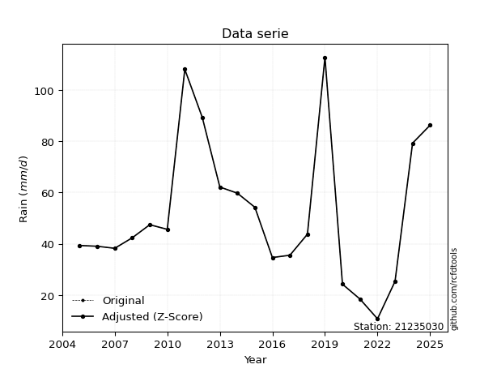</img>

</div>

> If Z-Score is active, values out of range or outliers are replaced with the station mean value.


### 4. Active continuous probability distributions from SciPy (45 of 104 available)

[scipy.stats](https://docs.scipy.org/doc/scipy/reference/stats.html) is a Python´s powerful submodule within the SciPy library for comprehensive statistical analysis, offering over 130 probability distributions (like Normal, Poisson), functions for descriptive stats (mean, variance), hypothesis testing (t-tests, chi-square), random variable generation, and statistical tests, making it essential for data science, modeling, and research. It provides tools to explore, model, and draw conclusions from data efficiently, working seamlessly with NumPy.

<div align="center">

|   id | p_dist             |   n_parameter | fit_method   | label                                                                       | active   | ref                                                                                                        |
|-----:|:-------------------|--------------:|:-------------|:----------------------------------------------------------------------------|:---------|:-----------------------------------------------------------------------------------------------------------|
|    0 | alpha              |             3 | MLE          | Alpha                                                                       | True     | [:mortar_board:](https://docs.scipy.org/doc/scipy/reference/generated/scipy.stats.alpha.html)              |
|    1 | betaprime          |             4 | MLE          | Beta prime                                                                  | True     | [:mortar_board:](https://docs.scipy.org/doc/scipy/reference/generated/scipy.stats.betaprime.html)          |
|    2 | chi2               |             3 | MLE          | Chi²                                                                        | True     | [:mortar_board:](https://docs.scipy.org/doc/scipy/reference/generated/scipy.stats.chi2.html)               |
|    3 | crystalball        |             4 | MLE          | Crystalball                                                                 | True     | [:mortar_board:](https://docs.scipy.org/doc/scipy/reference/generated/scipy.stats.crystalball.html)        |
|    4 | erlang             |             3 | MLE          | Erlang                                                                      | True     | [:mortar_board:](https://docs.scipy.org/doc/scipy/reference/generated/scipy.stats.erlang.html)             |
|    5 | expon              |             2 | MLE          | Exponential                                                                 | True     | [:mortar_board:](https://docs.scipy.org/doc/scipy/reference/generated/scipy.stats.expon.html)              |
|    6 | exponnorm          |             3 | MLE          | Exponentially modified Normal                                               | True     | [:mortar_board:](https://docs.scipy.org/doc/scipy/reference/generated/scipy.stats.exponnorm.html)          |
|    7 | f                  |             4 | MLE          | F                                                                           | True     | [:mortar_board:](https://docs.scipy.org/doc/scipy/reference/generated/scipy.stats.f.html)                  |
|    8 | fatiguelife        |             3 | MLE          | Fatigue-life (Birnbaum-Saunders)                                            | True     | [:mortar_board:](https://docs.scipy.org/doc/scipy/reference/generated/scipy.stats.fatiguelife.html)        |
|    9 | fisk               |             3 | MLE          | Fisk                                                                        | True     | [:mortar_board:](https://docs.scipy.org/doc/scipy/reference/generated/scipy.stats.fisk.html)               |
|   10 | gamma              |             3 | MLE          | Gamma                                                                       | True     | [:mortar_board:](https://docs.scipy.org/doc/scipy/reference/generated/scipy.stats.gamma.html)              |
|   11 | genexpon           |             5 | MLE          | Generalized exponential                                                     | True     | [:mortar_board:](https://docs.scipy.org/doc/scipy/reference/generated/scipy.stats.genexpon.html)           |
|   12 | genlogistic        |             3 | MLE          | Generalized logistic                                                        | True     | [:mortar_board:](https://docs.scipy.org/doc/scipy/reference/generated/scipy.stats.genlogistic.html)        |
|   13 | gibrat             |             2 | MM           | Gibrat                                                                      | True     | [:mortar_board:](https://docs.scipy.org/doc/scipy/reference/generated/scipy.stats.gibrat.html)             |
|   14 | gompertz           |             3 | MLE          | Gompertz (or truncated Gumbel)                                              | True     | [:mortar_board:](https://docs.scipy.org/doc/scipy/reference/generated/scipy.stats.gompertz.html)           |
|   15 | gumbel_l           |             2 | MM           | Gumbel Left Skew                                                            | True     | [:mortar_board:](https://docs.scipy.org/doc/scipy/reference/generated/scipy.stats.gumbel_l.html)           |
|   16 | gumbel_r           |             2 | MM           | Gumbel Right Skew                                                           | True     | [:mortar_board:](https://docs.scipy.org/doc/scipy/reference/generated/scipy.stats.gumbel_r.html)           |
|   17 | halflogistic       |             2 | MM           | Half-logistic                                                               | True     | [:mortar_board:](https://docs.scipy.org/doc/scipy/reference/generated/scipy.stats.halflogistic.html)       |
|   18 | halfnorm           |             2 | MM           | Half Normal                                                                 | True     | [:mortar_board:](https://docs.scipy.org/doc/scipy/reference/generated/scipy.stats.halfnorm.html)           |
|   19 | hypsecant          |             2 | MM           | hyperbolic secant                                                           | True     | [:mortar_board:](https://docs.scipy.org/doc/scipy/reference/generated/scipy.stats.hypsecant.html)          |
|   20 | invgamma           |             3 | MLE          | Inverted gamma                                                              | True     | [:mortar_board:](https://docs.scipy.org/doc/scipy/reference/generated/scipy.stats.invgamma.html)           |
|   21 | invgauss           |             3 | MLE          | Inverse Gaussian                                                            | True     | [:mortar_board:](https://docs.scipy.org/doc/scipy/reference/generated/scipy.stats.invgauss.html)           |
|   22 | invweibull         |             3 | MLE          | Inverted Weibull                                                            | True     | [:mortar_board:](https://docs.scipy.org/doc/scipy/reference/generated/scipy.stats.invweibull.html)         |
|   23 | johnsonsu          |             4 | MLE          | Johnson Su                                                                  | True     | [:mortar_board:](https://docs.scipy.org/doc/scipy/reference/generated/scipy.stats.johnsonsu.html)          |
|   24 | kstwobign          |             2 | MLE          | Limiting distribution of scaled Kolmogorov-Smirnov two-sided test statistic | True     | [:mortar_board:](https://docs.scipy.org/doc/scipy/reference/generated/scipy.stats.kstwobign.html)          |
|   25 | laplace            |             2 | MM           | Laplace                                                                     | True     | [:mortar_board:](https://docs.scipy.org/doc/scipy/reference/generated/scipy.stats.laplace.html)            |
|   26 | laplace_asymmetric |             3 | MLE          | Asymmetric Laplace                                                          | True     | [:mortar_board:](https://docs.scipy.org/doc/scipy/reference/generated/scipy.stats.laplace_asymmetric.html) |
|   27 | loggamma           |             3 | MLE          | Log gamma                                                                   | True     | [:mortar_board:](https://docs.scipy.org/doc/scipy/reference/generated/scipy.stats.loggamma.html)           |
|   28 | logistic           |             2 | MM           | Logistic (or Sech-squared)                                                  | True     | [:mortar_board:](https://docs.scipy.org/doc/scipy/reference/generated/scipy.stats.logistic.html)           |
|   29 | lognorm            |             3 | MLE          | Log Normal                                                                  | True     | [:mortar_board:](https://docs.scipy.org/doc/scipy/reference/generated/scipy.stats.lognorm.html)            |
|   30 | maxwell            |             2 | MM           | Maxwell                                                                     | True     | [:mortar_board:](https://docs.scipy.org/doc/scipy/reference/generated/scipy.stats.maxwell.html)            |
|   31 | mielke             |             4 | MLE          | Mielke Beta-Kappa / Dagum                                                   | True     | [:mortar_board:](https://docs.scipy.org/doc/scipy/reference/generated/scipy.stats.mielke.html)             |
|   32 | moyal              |             2 | MM           | Moyal                                                                       | True     | [:mortar_board:](https://docs.scipy.org/doc/scipy/reference/generated/scipy.stats.moyal.html)              |
|   33 | nakagami           |             3 | MLE          | Nakagami                                                                    | True     | [:mortar_board:](https://docs.scipy.org/doc/scipy/reference/generated/scipy.stats.nakagami.html)           |
|   34 | ncf                |             5 | MLE          | Non-central F distribution                                                  | True     | [:mortar_board:](https://docs.scipy.org/doc/scipy/reference/generated/scipy.stats.ncf.html)                |
|   35 | nct                |             4 | MLE          | Non-central Student’s t                                                     | True     | [:mortar_board:](https://docs.scipy.org/doc/scipy/reference/generated/scipy.stats.nct.html)                |
|   36 | norm               |             2 | MM           | Normal                                                                      | True     | [:mortar_board:](https://docs.scipy.org/doc/scipy/reference/generated/scipy.stats.norm.html)               |
|   37 | pareto             |             3 | MLE          | Pareto                                                                      | True     | [:mortar_board:](https://docs.scipy.org/doc/scipy/reference/generated/scipy.stats.pareto.html)             |
|   38 | pearson3           |             3 | MM           | Pearson type III                                                            | True     | [:mortar_board:](https://docs.scipy.org/doc/scipy/reference/generated/scipy.stats.pearson3.html)           |
|   39 | rayleigh           |             2 | MM           | Rayleigh                                                                    | True     | [:mortar_board:](https://docs.scipy.org/doc/scipy/reference/generated/scipy.stats.rayleigh.html)           |
|   40 | rice               |             3 | MLE          | Rice                                                                        | True     | [:mortar_board:](https://docs.scipy.org/doc/scipy/reference/generated/scipy.stats.rice.html)               |
|   41 | t                  |             3 | MLE          | Student’s t                                                                 | True     | [:mortar_board:](https://docs.scipy.org/doc/scipy/reference/generated/scipy.stats.t.html)                  |
|   42 | truncnorm          |             4 | MLE          | Truncated normal                                                            | True     | [:mortar_board:](https://docs.scipy.org/doc/scipy/reference/generated/scipy.stats.truncnorm.html)          |
|   43 | wald               |             2 | MM           | Wald                                                                        | True     | [:mortar_board:](https://docs.scipy.org/doc/scipy/reference/generated/scipy.stats.wald.html)               |
|   44 | weibull_min        |             3 | MLE          | Weibull minimum                                                             | True     | [:mortar_board:](https://docs.scipy.org/doc/scipy/reference/generated/scipy.stats.weibull_min.html)        |

</div>

> **n_parameter:** # arguments & localization & scale.
>
> **Fit methods:** (MLE) maximum likelihood, (MM) L-moments.
>
>**Inactive:** foldnorm, gennorm, norminvgauss, powernorm, powerlognorm, skewnorm, genextreme, anglit, arcsine, argus, beta, bradford, burr, burr12, cauchy, cosine, halfcauchy, foldcauchy, skewcauchy, wrapcauchy, dgamma, gengamma, exponweib, exponpow, truncexpon, gausshyper, genhalflogistic, genhyperbolic, geninvgauss, halfgennorm, johnsonsb, kappa4, kappa3, ksone, kstwo, loglaplace, levy, levy_l, levy_stable, ncx2, genpareto, truncpareto, lomax, powerlaw, rdist, rel_breitwigner, recipinvgauss, semicircular, studentized_range, trapezoid, triang, truncweibull_min, tukeylambda, uniform, loguniform, vonmises, vonmises_line, weibull_max, dweibull, 


## B. Probability distributions vs. Empirical distributions

A continuous probability distribution (CPD) describes probabilities for variables that can take any value within a range (like rain any time), unlike discrete variables with specific outcomes (like temperature). It uses a Probability Density Function (PDF), a curve where the total area under it equals 1, and the probability of the variable falling within an interval (a to b) is found by calculating the area under the curve between those points. A key feature is that the probability of hitting any single exact value is zero, so probabilities are always expressed for ranges, e.g., $P(a ≤ X ≤ b)$.

<div align="center">

Distributions parameters
|    |   station | p_dist                |   n |              loc |            scale | shape                  | shape1              | shape2                 | shape3   |
|---:|----------:|:----------------------|----:|-----------------:|-----------------:|:-----------------------|:--------------------|:-----------------------|:---------|
|  0 |  21235030 | alpha                 |  21 |    -78.5008      |    645.217       | 5.143207924034475      |                     |                        |          |
|  1 |  21235030 | betaprime             |  21 |      1.44367     | 304769           | 3.3459660008116208     | 20155.15083434575   |                        |          |
|  2 |  21235030 | chi2                  |  21 |      2.75829     |      8.0511      | 6.136851530801035      |                     |                        |          |
|  3 |  21235030 | crystalball           |  21 |     52.1667      |     27.534       | 7719.103032533754      | 11765.373353309722  |                        |          |
|  4 |  21235030 | erlang                |  21 |      2.75837     |     16.1022      | 3.06841594832833       |                     |                        |          |
|  5 |  21235030 | expon                 |  21 |     10.7         |     41.4667      |                        |                     |                        |          |
|  6 |  21235030 | exponnorm             |  21 |     24.8433      |     11.1196      | 2.4572284943006677     |                     |                        |          |
|  7 |  21235030 | f                     |  21 |      2.75307     |     49.4084      | 6.135099514748941      | 318190.0183999017   |                        |          |
|  8 |  21235030 | fatiguelife           |  21 |    -14.7739      |     61.597       | 0.41646048289385745    |                     |                        |          |
|  9 |  21235030 | fisk                  |  21 |     -6.2345      |     52.4421      | 3.6193041917685815     |                     |                        |          |
| 10 |  21235030 | gamma                 |  21 |      2.75836     |     16.1022      | 3.068416643941295      |                     |                        |          |
| 11 |  21235030 | genexpon              |  21 |      0.779397    |      2.47361     | 1.2382969725849897e-07 | 0.40140878615309217 | 0.009930442430207777   |          |
| 12 |  21235030 | genlogistic           |  21 |    -98.0004      |     21.2613      | 645.1605322346652      |                     |                        |          |
| 13 |  21235030 | gibrat                |  21 |     31.1617      |     12.7402      |                        |                     |                        |          |
| 14 |  21235030 | gompertz              |  21 |     10.7         |     51.8618      | 0.5497791841099099     |                     |                        |          |
| 15 |  21235030 | gumbel_l              |  21 |     64.5584      |     21.4682      |                        |                     |                        |          |
| 16 |  21235030 | gumbel_r              |  21 |     39.7749      |     21.4682      |                        |                     |                        |          |
| 17 |  21235030 | halflogistic          |  21 |     19.5324      |     23.5406      |                        |                     |                        |          |
| 18 |  21235030 | halfnorm              |  21 |     15.7223      |     45.6762      |                        |                     |                        |          |
| 19 |  21235030 | hypsecant             |  21 |     52.1667      |     17.5287      |                        |                     |                        |          |
| 20 |  21235030 | invgamma              |  21 |    -34.2253      |    859.901       | 10.940752166981362     |                     |                        |          |
| 21 |  21235030 | invgauss              |  21 |    -16.1972      |    398.493       | 0.17155581391624275    |                     |                        |          |
| 22 |  21235030 | invweibull            |  21 |   -503.382       |    542.513       | 25.86392611001743      |                     |                        |          |
| 23 |  21235030 | johnsonsu             |  21 |    -14.1331      |      3.77592     | -8.422294464839624     | 2.4229385628588966  |                        |          |
| 24 |  21235030 | kstwobign             |  21 |    -36.9315      |    102.56        |                        |                     |                        |          |
| 25 |  21235030 | laplace               |  21 |     52.1667      |     19.4695      |                        |                     |                        |          |
| 26 |  21235030 | laplace_asymmetric    |  21 |     38.2         |     17.7529      | 0.6812226341777636     |                     |                        |          |
| 27 |  21235030 | loggamma              |  21 |  -7648.41        |   1056.78        | 1461.381971463801      |                     |                        |          |
| 28 |  21235030 | logistic              |  21 |     52.1667      |     15.1803      |                        |                     |                        |          |
| 29 |  21235030 | lognorm               |  21 |    -14.3544      |     61.1759      | 0.4120935202259683     |                     |                        |          |
| 30 |  21235030 | maxwell               |  21 |    -13.0774      |     40.8857      |                        |                     |                        |          |
| 31 |  21235030 | mielke                |  21 |     -0.21751     |     53.0178      | 2.599406902681071      | 3.5467205258642576  |                        |          |
| 32 |  21235030 | moyal                 |  21 |     36.4209      |     12.3947      |                        |                     |                        |          |
| 33 |  21235030 | nakagami              |  21 |     18.4         |     34.3336      | 0.3286670115442618     |                     |                        |          |
| 34 |  21235030 | ncf                   |  21 |     -0.201465    |      4.43152     | 1.6773853102619012     | 32.500023823970494  | 16.923730942261493     |          |
| 35 |  21235030 | nct                   |  21 |     -0.0759051   |     15.8707      | 4.7425825132386095     | 2.754078338650661   |                        |          |
| 36 |  21235030 | norm                  |  21 |     52.1667      |     27.534       |                        |                     |                        |          |
| 37 |  21235030 | pareto                |  21 |     10.7         |      2.71281e-08 | 0.049999995108724514   |                     |                        |          |
| 38 |  21235030 | pearson3              |  21 |     52.1667      |     27.534       | 0.768860995823283      |                     |                        |          |
| 39 |  21235030 | rayleigh              |  21 |     -0.507553    |     42.0279      |                        |                     |                        |          |
| 40 |  21235030 | rice                  |  21 |      3.42477     |     39.5847      | 0.00080921401891696    |                     |                        |          |
| 41 |  21235030 | t                     |  21 |     52.1673      |     27.5341      | 12361660.899457086     |                     |                        |          |
| 42 |  21235030 | truncnorm             |  21 |     52.1667      |     27.534       | -170.71159503390527    | 599.7436256911878   |                        |          |
| 43 |  21235030 | wald                  |  21 |     24.6326      |     27.534       |                        |                     |                        |          |
| 44 |  21235030 | weibull_min           |  21 |      7.94506     |     49.3473      | 1.6329619138444347     |                     |                        |          |
| 45 |  21235030 | logalpha              |  21 |    -13.4608      |    512.813       | 29.72932493057823      |                     |                        |          |
| 46 |  21235030 | logbetaprime          |  21 |    -13.1813      |     59.6139      | 1099.120605969763      | 3859.4581537465874  |                        |          |
| 47 |  21235030 | logchi2               |  21 |      2.37024     |      0.918819    | 1.2044335426748949     |                     |                        |          |
| 48 |  21235030 | logcrystalball        |  21 |      3.80612     |      0.569703    | 8.223069972467258      | 2901.902211502471   |                        |          |
| 49 |  21235030 | logerlang             |  21 |     -6.36468     |      0.0326752   | 311.1454832921712      |                     |                        |          |
| 50 |  21235030 | logexpon              |  21 |      2.37024     |      1.43588     |                        |                     |                        |          |
| 51 |  21235030 | logexponnorm          |  21 |      3.80559     |      0.569702    | 0.0009219494443652196  |                     |                        |          |
| 52 |  21235030 | logf                  |  21 |   -488.242       |    492.048       | 4777815.725704914      | 2163123.941897545   |                        |          |
| 53 |  21235030 | logfatiguelife        |  21 |   -230.305       |    234.111       | 0.0024379210499806065  |                     |                        |          |
| 54 |  21235030 | logfisk               |  21 |     -2.71684e+07 |      2.71684e+07 | 84971104.22509599      |                     |                        |          |
| 55 |  21235030 | loggamma              |  21 |     -6.25541     |      0.0335388   | 299.78118027206756     |                     |                        |          |
| 56 |  21235030 | loggenexpon           |  21 |      2.36648     |      0.0154174   | 0.0012904477731302093  | 4.52108852162176    | 3.867426370476166e-05  |          |
| 57 |  21235030 | loggenlogistic        |  21 |      3.97109     |      0.282198    | 0.724826035160097      |                     |                        |          |
| 58 |  21235030 | loggibrat             |  21 |      3.37148     |      0.263623    |                        |                     |                        |          |
| 59 |  21235030 | loggompertz           |  21 |      2.37024     |      0.552639    | 0.04971349940505017    |                     |                        |          |
| 60 |  21235030 | loggumbel_l           |  21 |      4.06252     |      0.444195    |                        |                     |                        |          |
| 61 |  21235030 | loggumbel_r           |  21 |      3.54973     |      0.444195    |                        |                     |                        |          |
| 62 |  21235030 | loghalflogistic       |  21 |      3.13093     |      0.487052    |                        |                     |                        |          |
| 63 |  21235030 | loghalfnorm           |  21 |      3.05203     |      0.945109    |                        |                     |                        |          |
| 64 |  21235030 | loghypsecant          |  21 |      3.80612     |      0.362684    |                        |                     |                        |          |
| 65 |  21235030 | loginvgamma           |  21 |     -9.34673     |   6737.69        | 513.2285207574871      |                     |                        |          |
| 66 |  21235030 | loginvgauss           |  21 |     -1.94305     |    527.78        | 0.010875801991266126   |                     |                        |          |
| 67 |  21235030 | loginvweibull         |  21 |     -9.90347e+07 |      9.90347e+07 | 159235070.67825598     |                     |                        |          |
| 68 |  21235030 | logjohnsonsu          |  21 |      6.64359     |      0.638322    | 11.176964388339737     | 5.130045134808283   |                        |          |
| 69 |  21235030 | logkstwobign          |  21 |      1.17493     |      3.029       |                        |                     |                        |          |
| 70 |  21235030 | loglaplace            |  21 |      3.80612     |      0.402841    |                        |                     |                        |          |
| 71 |  21235030 | loglaplace_asymmetric |  21 |      3.74479     |      0.430605    | 0.9312970905958848     |                     |                        |          |
| 72 |  21235030 | logloggamma           |  21 |      2.67265     |      1.00643     | 3.5706593869799885     |                     |                        |          |
| 73 |  21235030 | loglogistic           |  21 |      3.80612     |      0.314094    |                        |                     |                        |          |
| 74 |  21235030 | loglognorm            |  21 | -32765.6         |  32769.4         | 1.7385258691813587e-05 |                     |                        |          |
| 75 |  21235030 | logmaxwell            |  21 |      2.45618     |      0.845951    |                        |                     |                        |          |
| 76 |  21235030 | logmielke             |  21 |     -1.91348e+07 |      1.91348e+07 | 51578410.564501956     | 66930872.10882887   |                        |          |
| 77 |  21235030 | logmoyal              |  21 |      3.48033     |      0.256456    |                        |                     |                        |          |
| 78 |  21235030 | lognakagami           |  21 |      2.64006     |      1.31843     | 1.635559110155243      |                     |                        |          |
| 79 |  21235030 | logncf                |  21 |     -8.2443      |     12.04        | 1301.7399896172492     | 2252.366044888362   | 0.00018412743055792248 |          |
| 80 |  21235030 | lognct                |  21 |     28.5443      |      0.567915    | 133135.16652698722     | -43.55964013731514  |                        |          |
| 81 |  21235030 | lognorm               |  21 |      3.80612     |      0.569703    |                        |                     |                        |          |
| 82 |  21235030 | logpareto             |  21 |     -1.34218e+08 |      1.34218e+08 | 93474279.36171496      |                     |                        |          |
| 83 |  21235030 | logpearson3           |  21 |      3.80612     |      0.569703    | -0.47804661263902526   |                     |                        |          |
| 84 |  21235030 | lograyleigh           |  21 |      2.71628     |      0.869568    |                        |                     |                        |          |
| 85 |  21235030 | logrice               |  21 |   -143.151       |      0.569705    | 257.9506124870204      |                     |                        |          |
| 86 |  21235030 | logt                  |  21 |      3.81703     |      0.542122    | 20.769392776615824     |                     |                        |          |
| 87 |  21235030 | logtruncnorm          |  21 |     -1.08695     |      2.81198     | 1.422237001852935      | 2.066758495847522   |                        |          |
| 88 |  21235030 | logwald               |  21 |      3.23641     |      0.569708    |                        |                     |                        |          |
| 89 |  21235030 | logweibull_min        |  21 |      0.315293    |      3.72603     | 7.247642990829471      |                     |                        |          |

</div>

> **loc** (Location parameter): This shifts the distribution along the x-axis. For many common distributions, like the normal (Gaussian) distribution, loc represents the mean $μ$. For others, like the uniform distribution, it might represent the minimum value, or for the beta distribution, the left end of the support interval.
>
> **scale** (Scale parameter): This determines the width or spread of the distribution. For the normal distribution, scale represents the standard deviation $σ$. For a uniform distribution, it defines the length of the interval (from $loc$ to $loc + scale$).
>
> **shape** (Shape parameters): Refers to parameters that define the specific form of a probability distribution, distinct from its location (loc) and scale (scale). These parameters are required arguments for most distribution functions. For example, a normal (Gaussian) distribution is fully defined by its location (mean) and scale (standard deviation), so it has no specific shape parameters beyond loc and scale. However, other distributions have intrinsic properties that need specification, as Gamma distribution that takes a shape parameter, often named $a$ or $alpha$.


### 0. Cumulative distribution values - CDF (90 evaluated)

> Ordered by x ascending and calculating $log(f(x))$ separately. 

|   id |   Station |   date |     x |   count |    mean |    std |     zscore |   Value_initial |   station |   m |     alpha |   alpha_pdf |   betaprime |   betaprime_pdf |      chi2 |   chi2_pdf |   crystalball |   crystalball_pdf |    erlang |   erlang_pdf |    expon |   expon_pdf |   exponnorm |   exponnorm_pdf |         f |      f_pdf |   fatiguelife |   fatiguelife_pdf |      fisk |   fisk_pdf |    gamma |   gamma_pdf |   genexpon |   genexpon_pdf |   genlogistic |   genlogistic_pdf |    gibrat |   gibrat_pdf |    gompertz |   gompertz_pdf |   gumbel_l |   gumbel_l_pdf |   gumbel_r |   gumbel_r_pdf |   halflogistic |   halflogistic_pdf |   halfnorm |   halfnorm_pdf |   hypsecant |   hypsecant_pdf |   invgamma |   invgamma_pdf |   invgauss |   invgauss_pdf |   invweibull |   invweibull_pdf |   johnsonsu |   johnsonsu_pdf |   kstwobign |   kstwobign_pdf |   laplace |   laplace_pdf |   laplace_asymmetric |   laplace_asymmetric_pdf |   loggamma |   loggamma_pdf |   logistic |   logistic_pdf |    lognorm |   lognorm_pdf |   maxwell |   maxwell_pdf |    mielke |   mielke_pdf |      moyal |   moyal_pdf |    nakagami |   nakagami_pdf |       ncf |    ncf_pdf |       nct |    nct_pdf |      norm |   norm_pdf |   pareto |   pareto_pdf |   pearson3 |   pearson3_pdf |   rayleigh |   rayleigh_pdf |      rice |   rice_pdf |         t |      t_pdf |   truncnorm |   truncnorm_pdf |        wald |    wald_pdf |   weibull_min |   weibull_min_pdf |   logalpha |   logalpha_pdf |   logbetaprime |   logbetaprime_pdf |     logchi2 |    logchi2_pdf |   logcrystalball |   logcrystalball_pdf |   logerlang |   logerlang_pdf |   logexpon |   logexpon_pdf |   logexponnorm |   logexponnorm_pdf |      logf |   logf_pdf |   logfatiguelife |   logfatiguelife_pdf |   logfisk |   logfisk_pdf |   loggenexpon |   loggenexpon_pdf |   loggenlogistic |   loggenlogistic_pdf |   loggibrat |   loggibrat_pdf |   loggompertz |   loggompertz_pdf |   loggumbel_l |   loggumbel_l_pdf |   loggumbel_r |   loggumbel_r_pdf |   loghalflogistic |   loghalflogistic_pdf |   loghalfnorm |   loghalfnorm_pdf |   loghypsecant |   loghypsecant_pdf |   loginvgamma |   loginvgamma_pdf |   loginvgauss |   loginvgauss_pdf |   loginvweibull |   loginvweibull_pdf |   logjohnsonsu |   logjohnsonsu_pdf |   logkstwobign |   logkstwobign_pdf |   loglaplace |   loglaplace_pdf |   loglaplace_asymmetric |   loglaplace_asymmetric_pdf |   logloggamma |   logloggamma_pdf |   loglogistic |   loglogistic_pdf |   loglognorm |   loglognorm_pdf |   logmaxwell |   logmaxwell_pdf |   logmielke |   logmielke_pdf |    logmoyal |   logmoyal_pdf |   lognakagami |   lognakagami_pdf |     logncf |   logncf_pdf |     lognct |   lognct_pdf |   logpareto |   logpareto_pdf |   logpearson3 |   logpearson3_pdf |   lograyleigh |   lograyleigh_pdf |    logrice |   logrice_pdf |      logt |   logt_pdf |   logtruncnorm |   logtruncnorm_pdf |   logwald |   logwald_pdf |   logweibull_min |   logweibull_min_pdf |
|-----:|----------:|-------:|------:|--------:|--------:|-------:|-----------:|----------------:|----------:|----:|----------:|------------:|------------:|----------------:|----------:|-----------:|--------------:|------------------:|----------:|-------------:|---------:|------------:|------------:|----------------:|----------:|-----------:|--------------:|------------------:|----------:|-----------:|---------:|------------:|-----------:|---------------:|--------------:|------------------:|----------:|-------------:|------------:|---------------:|-----------:|---------------:|-----------:|---------------:|---------------:|-------------------:|-----------:|---------------:|------------:|----------------:|-----------:|---------------:|-----------:|---------------:|-------------:|-----------------:|------------:|----------------:|------------:|----------------:|----------:|--------------:|---------------------:|-------------------------:|-----------:|---------------:|-----------:|---------------:|-----------:|--------------:|----------:|--------------:|----------:|-------------:|-----------:|------------:|------------:|---------------:|----------:|-----------:|----------:|-----------:|----------:|-----------:|---------:|-------------:|-----------:|---------------:|-----------:|---------------:|----------:|-----------:|----------:|-----------:|------------:|----------------:|------------:|------------:|--------------:|------------------:|-----------:|---------------:|---------------:|-------------------:|------------:|---------------:|-----------------:|---------------------:|------------:|----------------:|-----------:|---------------:|---------------:|-------------------:|----------:|-----------:|-----------------:|---------------------:|----------:|--------------:|--------------:|------------------:|-----------------:|---------------------:|------------:|----------------:|--------------:|------------------:|--------------:|------------------:|--------------:|------------------:|------------------:|----------------------:|--------------:|------------------:|---------------:|-------------------:|--------------:|------------------:|--------------:|------------------:|----------------:|--------------------:|---------------:|-------------------:|---------------:|-------------------:|-------------:|-----------------:|------------------------:|----------------------------:|--------------:|------------------:|--------------:|------------------:|-------------:|-----------------:|-------------:|-----------------:|------------:|----------------:|------------:|---------------:|--------------:|------------------:|-----------:|-------------:|-----------:|-------------:|------------:|----------------:|--------------:|------------------:|--------------:|------------------:|-----------:|--------------:|----------:|-----------:|---------------:|-------------------:|----------:|--------------:|-----------------:|---------------------:|
|    0 |  21235030 |   2022 |  10.7 |      21 | 52.1667 | 28.214 | -1.46972   |            10.7 |  21235030 |   1 | 0.0183045 |  0.00364139 |   0.0129108 |      0.00402777 | 0.0120991 | 0.00412212 |     0.0660317 |        0.00466158 | 0.012099  |   0.00412211 | 0        |  0.0241158  |   0.016776  |      0.0031081  | 0.0121328 | 0.00412939 |     0.0142732 |        0.00375913 | 0.0164458 | 0.00345705 | 0.012099 |  0.00412211 |  0.0311421 |     0.00613867 |     0.0208057 |        0.00377819 | 0         |  0           | 9.36837e-14 |     0.0106008  |   0.078147 |    0.00349404  |  0.0207722 |     0.00374854 |      0         |         0          |  0         |     0          |   0.0595969 |      0.00338013 |  0.0163514 |     0.00363975 |  0.0144991 |     0.00374057 |    0.0178848 |       0.00362062 |   0.0151835 |      0.00369136 |   0.0177061 |      0.00388068 | 0.059429  |    0.00305241 |            0.032619  |               0.00269719 | 0.00511471 |      0.0281579 |  0.0611338 |     0.00378098 | 0.00586108 |     0.0292316 | 0.0473111 |    0.00557333 | 0.0164007 |   0.00389061 | 0.00476687 |  0.00169252 | 0           |    0           | 0.0159708 | 0.00391268 | 0.0196437 | 0.00320391 | 0.0660317 | 0.00466158 | 0        |  1.84311e+06 |  0.0335155 |     0.00490597 |  0.0349315 |     0.0061234  | 0.0167474 | 0.00456517 | 0.0660291 | 0.00466143 |   0.0660317 |      0.00466158 | 0           | 0           |    0.00894748 |        0.00527973 | 0.00386624 |      0.0235135 |     0.00557507 |          0.0294674 | 4.40639e-10 | 597538         |       0.00586108 |            0.0292316 |  0.00476606 |       0.0266135 |   0        |       0.696438 |     0.00586114 |          0.0292318 | 0.0058269 |  0.0291474 |       0.00582634 |            0.0292039 | 0.0104468 |      0.032332 |   0.000320025 |         0.0864403 |        0.0163381 |            0.0418206 |    0        |       0         |   1.22583e-08 |         0.0899566 |     0.02191   |         0.0487809 |   6.60957e-07 |       2.11734e-05 |         0         |              0        |      0        |          0        |      0.0121462 |          0.0334816 |    0.00414011 |         0.0245429 |    0.00345321 |         0.0233538 |      0.00195175 |           0.0195791 |      0.0153442 |          0.0458486 |     0.00230317 |          0.0286029 |    0.0141572 |        0.0351435 |               0.0150788 |                    0.037601 |     0.0150695 |         0.0450712 |     0.0102366 |         0.0322572 |   0.00586048 |        0.0292301 |     0        |         0        |   0.0143334 |       0.0384794 | 3.08411e-18 |    4.61853e-16 |     0         |         0         | 0.00555359 |    0.0300058 | 0.00589755 |    0.0293557 | 2.07555e-08 |        0.696438 |     0.0133075 |         0.0439836 |     0         |          0        | 0.00586109 |     0.0292316 | 0.0072273 |  0.0293635 |    0           |           0        |  0        |      0        |        0.0133038 |            0.0466081 |
|    1 |  21235030 |   2021 |  18.4 |      21 | 52.1667 | 28.214 | -1.19681   |            18.4 |  21235030 |   2 | 0.0648456 |  0.00869658 |   0.0671644 |      0.0100144  | 0.0684371 | 0.0103831  |     0.110031  |        0.00683061 | 0.0684369 |   0.0103831  | 0.16947  |  0.0200289  |   0.0584022 |      0.00815195 | 0.0685276 | 0.0103896  |     0.0655474 |        0.00968324 | 0.0609619 | 0.00841052 | 0.068437 |  0.0103831  |  0.0940701 |     0.0100401  |     0.0673132 |        0.00852527 | 0         |  0           | 0.0842368   |     0.0112617  |   0.109947 |    0.00482892  |  0.0667706 |     0.00841776 |      0         |         0          |  0.0467472 |     0.0174383  |   0.0920931 |      0.00518085 |  0.0643616 |     0.00905714 |  0.0653292 |     0.0096024  |    0.0646149 |       0.00877363 |   0.0646779 |      0.00934406 |   0.0670357 |      0.00905878 | 0.0882587 |    0.00453317 |            0.0616572 |               0.00509829 | 0.0600207  |      0.218249  |  0.0975831 |     0.00580098 | 0.0583427  |     0.204554  | 0.101905  |    0.00860034 | 0.0646972 |   0.00881766 | 0.038566   |  0.00783476 | 2.41252e-11 | 4463.71        | 0.06648   | 0.0093267  | 0.061192  | 0.00799218 | 0.110031  | 0.00683061 | 0.622126 |  0.00245372  |  0.0860998 |     0.00879627 |  0.0962443 |     0.00967409 | 0.0690584 | 0.00889695 | 0.110028  | 0.00683042 |   0.110031  |      0.0068306  | 0           | 0           |    0.0762718  |        0.0114466  | 0.0558023  |      0.215243  |     0.0606885  |          0.216247  | 0.48197     |      0.443655  |       0.0583427  |            0.204553  |  0.0579619  |       0.213845  |   0.314457 |       0.477438 |     0.0583432  |          0.204555  | 0.0582897 |  0.204624  |       0.0584504  |            0.20526   | 0.0543991 |      0.160882 |   0.143785    |         0.415237  |        0.0648171 |            0.162664  |    0        |       0         |   0.07953     |         0.220831  |     0.0723218 |         0.15678   |   0.0150073   |       0.141872    |         0         |              0        |      0        |          0        |      0.0540247 |          0.148244  |    0.0565964  |         0.215138  |    0.0597349  |         0.235595  |      0.073566   |           0.308672  |      0.0702522 |          0.182464  |     0.102801   |          0.384565  |    0.0543767 |        0.134983  |               0.0582711 |                    0.145307 |     0.069471  |         0.181836  |     0.0549113 |         0.165225  |   0.058342   |        0.204556  |     0.038247 |         0.237147 |   0.0607265 |       0.159372  | 0.00247518  |    0.0483056   |     0.0083754 |         0.0979711 | 0.0620889  |    0.22112   | 0.0584755  |    0.204728  | 0.314457    |        0.477438 |     0.0688438 |         0.188399  |     0.0250998 |          0.252791 | 0.0583428  |     0.204553  | 0.0550843 |  0.184841  |    1.40578e-07 |           0.888145 |  0        |      0        |        0.0704775 |            0.189583  |
|    2 |  21235030 |   2020 |  24.2 |      21 | 52.1667 | 28.214 | -0.991234  |            24.2 |  21235030 |   3 | 0.127293  |  0.0127532  |   0.13629   |      0.0136073  | 0.139584  | 0.0139065  |     0.154883  |        0.00864999 | 0.139584  |   0.0139065  | 0.277879 |  0.0174145  |   0.119877  |      0.0130678  | 0.139705  | 0.0139101  |     0.133781  |        0.0136433  | 0.122455  | 0.0127793  | 0.139584 |  0.0139065  |  0.159034  |     0.0122466  |     0.12807   |        0.0123599  | 0         |  0           | 0.150804    |     0.0116788  |   0.141529 |    0.00610228  |  0.126725  |     0.0121939  |      0.0988156 |         0.0210325  |  0.147244  |     0.01717    |   0.127386  |      0.00707485 |  0.129167  |     0.0131607  |  0.13314   |     0.013587   |    0.127693  |       0.0128838  |   0.131056  |      0.0133815  |   0.13054   |      0.0126946  | 0.118887  |    0.00610632 |            0.0996017 |               0.00823583 | 0.145101   |      0.409494  |  0.13678   |     0.0077779  | 0.138323   |     0.387499  | 0.15803   |    0.0107055  | 0.12735   |   0.0127426  | 0.101587   |  0.0137952  | 0.240658    |    0.0270826   | 0.132015  | 0.0131251  | 0.120733  | 0.0125429  | 0.154883  | 0.00864999 | 0.632587 |  0.00136079  |  0.145369  |     0.0115698  |  0.158697  |     0.0117681  | 0.12866   | 0.0115526  | 0.154878  | 0.00864979 |   0.154883  |      0.00864999 | 0           | 0           |    0.150495   |        0.0139192  | 0.141074   |      0.41401   |     0.144707   |          0.403946  | 0.585827    |      0.324802  |       0.138323   |            0.387499  |  0.141939   |       0.406375  |   0.433551 |       0.394496 |     0.138324   |          0.387501  | 0.138302  |  0.387627  |       0.138677   |            0.388494  | 0.119359  |      0.328748 |   0.270711    |         0.500423  |        0.127558  |            0.308508  |    0        |       0         |   0.154618    |         0.332989  |     0.129869  |         0.272504  |   0.103719    |       0.529123    |         0.0568341 |              1.02327  |      0.113017 |          0.835742 |      0.11404   |          0.307751  |    0.141517   |         0.411594  |    0.151846   |         0.440741  |      0.186426   |           0.503495  |      0.138146  |          0.32185   |     0.230067   |          0.525627  |    0.107352  |        0.266487  |               0.115396  |                    0.287755 |     0.137418  |         0.323163  |     0.122045  |         0.341142  |   0.138324   |        0.387506  |     0.13743  |         0.48415  |   0.123095  |       0.309911  | 0.0760879   |    0.572203    |     0.0718338 |         0.38566   | 0.14739    |    0.407424  | 0.138484   |    0.387507  | 0.433551    |        0.394496 |     0.139201  |         0.333558  |     0.13594   |          0.537155 | 0.138323   |     0.387499  | 0.12894   |  0.365742  |    0.226897    |           0.769548 |  0        |      0        |        0.140319  |            0.328116  |
|    3 |  21235030 |   2023 |  25.3 |      21 | 52.1667 | 28.214 | -0.952246  |            25.3 |  21235030 |   4 | 0.141702  |  0.0134383  |   0.151553  |      0.0141342  | 0.15516   | 0.0144042  |     0.164591  |        0.00900102 | 0.15516   |   0.0144042  | 0.296783 |  0.0169586  |   0.134749  |      0.0139672  | 0.155284  | 0.0144073  |     0.149122  |        0.0142387  | 0.136948  | 0.0135653  | 0.15516  |  0.0144042  |  0.172694  |     0.0125861  |     0.142031  |        0.0130182  | 0         |  0           | 0.163689    |     0.0117482  |   0.148389 |    0.00637177  |  0.140499  |     0.012844   |      0.121894  |         0.0209243  |  0.166087  |     0.0170885  |   0.135397  |      0.00749346 |  0.144014  |     0.0138252  |  0.148424  |     0.0141918  |    0.142247  |       0.0135713  |   0.146128  |      0.0140136  |   0.144823  |      0.0132684  | 0.125797  |    0.00646125 |            0.109086  |               0.00902006 | 0.164042   |      0.442702  |  0.145563  |     0.00819312 | 0.156282   |     0.420545  | 0.170006  |    0.0110677  | 0.141751  |   0.0134355  | 0.117315   |  0.0147872  | 0.2695      |    0.0254188   | 0.146788  | 0.0137272  | 0.134987  | 0.0133673  | 0.164591  | 0.00900102 | 0.634023 |  0.00125334  |  0.158355  |     0.0120368  |  0.171827  |     0.0121002  | 0.141607  | 0.0119835  | 0.164586  | 0.00900083 |   0.164591  |      0.00900102 | 3.58757e-10 | 1.13399e-08 |    0.165988   |        0.0142436  | 0.16024    |      0.448282  |     0.163394   |          0.436793  | 0.599942    |      0.310421  |       0.156282   |            0.420545  |  0.160753   |       0.440089  |   0.450819 |       0.38247  |     0.156283   |          0.420547  | 0.156266  |  0.420657  |       0.15668    |            0.421516  | 0.134763  |      0.364681 |   0.293133    |         0.508102  |        0.141962  |            0.339961  |    0        |       0         |   0.169892    |         0.35436   |     0.142516  |         0.296808  |   0.128699    |       0.594038    |         0.102171  |              1.01587  |      0.150029 |          0.829256 |      0.128532  |          0.344838  |    0.160569   |         0.445586  |    0.172184   |         0.474137  |      0.209328   |           0.52635   |      0.153056  |          0.349157  |     0.253708   |          0.53757   |    0.119876  |        0.297576  |               0.128923  |                    0.321487 |     0.152397  |         0.350946  |     0.138039  |         0.378817  |   0.156283   |        0.420553  |     0.159757 |         0.520013 |   0.137589  |       0.342599  | 0.103824    |    0.673979    |     0.0901691 |         0.439248  | 0.166213   |    0.439422  | 0.156443   |    0.420517  | 0.450819    |        0.38247  |     0.154645  |         0.361462  |     0.160588  |          0.571179 | 0.156282   |     0.420545  | 0.145968  |  0.400561  |    0.260696    |           0.751187 |  0        |      0        |        0.155494  |            0.354797  |
|    4 |  21235030 |   2016 |  34.6 |      21 | 52.1667 | 28.214 | -0.622623  |            34.6 |  21235030 |   5 | 0.287199  |  0.017187   |   0.296936  |      0.0165398  | 0.301699  | 0.0165174  |     0.261737  |        0.0118209  | 0.301699  |   0.0165174  | 0.438064 |  0.0135515  |   0.292236  |      0.0189448  | 0.301831  | 0.0165163  |     0.297292  |        0.0169428  | 0.287925  | 0.018172   | 0.301699 |  0.0165174  |  0.299724  |     0.0144276  |     0.283399  |        0.0167905  | 0.0951358 |  0.049209    | 0.275188    |     0.0121816  |   0.219417 |    0.00900688  |  0.280107  |     0.0166041  |      0.309537  |         0.0192048  |  0.320608  |     0.0160383  |   0.223971  |      0.0117488  |  0.291541  |     0.0172026  |  0.296558  |     0.0169779  |    0.288739  |       0.0172439  |   0.2939    |      0.0170739  |   0.284542  |      0.0161988  | 0.202825  |    0.0104176  |            0.235363  |               0.0194617  | 0.33591    |      0.638842  |  0.239176  |     0.0119873  | 0.322629   |     0.629856  | 0.285022  |    0.0134453  | 0.288853  |   0.0176035  | 0.281828   |  0.0194118  | 0.465442    |    0.0178701   | 0.291563  | 0.0167853  | 0.284993  | 0.0181007  | 0.261737  | 0.0118209  | 0.642932 |  0.000747004 |  0.285074  |     0.0148507  |  0.294533  |     0.0140217  | 0.266644  | 0.0145905  | 0.261731  | 0.0118208  |   0.261737  |      0.0118209  | 0.231644    | 0.0379148   |    0.306336   |        0.0155436  | 0.33437    |      0.645622  |     0.333415   |          0.634114  | 0.683877    |      0.231403  |       0.322629   |            0.629856  |  0.332533   |       0.641103  |   0.558398 |       0.307548 |     0.32263    |          0.629858  | 0.3226    |  0.62959   |       0.323217   |            0.629885  | 0.293095  |      0.648003 |   0.455503    |         0.516455  |        0.288949  |            0.608313  |    0.335476 |       2.11466   |   0.306476    |         0.521654  |     0.267357  |         0.513114  |   0.363016    |       0.82812     |         0.400212  |              0.862158 |      0.397206 |          0.737317 |      0.2876    |          0.689405  |    0.333789   |         0.643225  |    0.351577   |         0.64942   |      0.38854    |           0.590587  |      0.29491   |          0.559217  |     0.426445   |          0.546174  |    0.260749  |        0.647277  |               0.281419  |                    0.701757 |     0.295384  |         0.564526  |     0.302588  |         0.671866  |   0.322632   |        0.629861  |     0.352596 |         0.682228 |   0.286945  |       0.620411  | 0.376959    |    0.930262    |     0.280193  |         0.742896  | 0.335636   |    0.626847  | 0.32274    |    0.629593  | 0.558398    |        0.307548 |     0.300292  |         0.568795  |     0.3642    |          0.695856 | 0.322629   |     0.629856  | 0.309817  |  0.63701   |    0.476427    |           0.629243 |  0.398785 |      1.4515   |        0.29808   |            0.557699  |
|    5 |  21235030 |   2017 |  35.5 |      21 | 52.1667 | 28.214 | -0.590723  |            35.5 |  21235030 |   6 | 0.302736  |  0.0173325  |   0.311849  |      0.0165946  | 0.31658   | 0.0165465  |     0.272486  |        0.0120636  | 0.31658   |   0.0165465  | 0.450129 |  0.0132606  |   0.309358  |      0.0190936  | 0.316711  | 0.0165451  |     0.312568  |        0.0169978  | 0.304368  | 0.0183615  | 0.31658  |  0.0165465  |  0.312748  |     0.0145105  |     0.298588  |        0.0169586  | 0.140679  |  0.0514737   | 0.286164    |     0.0122072  |   0.227652 |    0.00929341  |  0.295131  |     0.0167764  |      0.326718  |         0.0189726  |  0.334983  |     0.0159052  |   0.234752  |      0.012211   |  0.307074  |     0.0173085  |  0.311868  |     0.0170387  |    0.304321  |       0.0173764  |   0.309306  |      0.0171559  |   0.29917   |      0.0163025  | 0.212421  |    0.0109104  |            0.253547  |               0.0209652  | 0.352452   |      0.649329  |  0.250131  |     0.0123558  | 0.338966   |     0.642409  | 0.297194  |    0.0136007  | 0.304786  |   0.0177967  | 0.29934    |  0.0194946  | 0.48131     |    0.0173961   | 0.306718  | 0.0168859  | 0.301371  | 0.0182874  | 0.272486  | 0.0120636  | 0.643591 |  0.000718566 |  0.29851   |     0.0150028  |  0.307199  |     0.014123   | 0.279844  | 0.0147415  | 0.272479  | 0.0120634  |   0.272486  |      0.0120636  | 0.265258    | 0.0367344   |    0.320331   |        0.0155536  | 0.351081   |      0.655644  |     0.34984    |          0.644997  | 0.689753    |      0.226235  |       0.338966   |            0.64241   |  0.349138   |       0.651997  |   0.566225 |       0.302097 |     0.338968   |          0.642411  | 0.33893   |  0.642098  |       0.339553   |            0.642312  | 0.310007  |      0.668997 |   0.468733    |         0.513912  |        0.304862  |            0.630973  |    0.387449 |       1.93359   |   0.320053    |         0.535767  |     0.280797  |         0.533678  |   0.384278    |       0.827382    |         0.422115  |              0.843668 |      0.416004 |          0.726697 |      0.305688  |          0.719138  |    0.35044    |         0.653463  |    0.368351   |         0.656841  |      0.403684   |           0.588788  |      0.309487  |          0.576037  |     0.44042    |          0.542197  |    0.277912  |        0.689881  |               0.300029  |                    0.748163 |     0.3101    |         0.581537  |     0.320114  |         0.692918  |   0.338969   |        0.642414  |     0.370181 |         0.687143 |   0.303175  |       0.643534  | 0.400702    |    0.91836     |     0.29946   |         0.757398  | 0.351863   |    0.63681   | 0.339071   |    0.642135  | 0.566225    |        0.302097 |     0.315104  |         0.584722  |     0.382089  |          0.697261 | 0.338966   |     0.642409  | 0.326373  |  0.652208  |    0.492464    |           0.619825 |  0.434763 |      1.35142  |        0.312609  |            0.573867  |
|    6 |  21235030 |   2007 |  38.2 |      21 | 52.1667 | 28.214 | -0.495026  |            38.2 |  21235030 |   7 | 0.349895  |  0.0175461  |   0.356715  |      0.0166016  | 0.361219  | 0.0164841  |     0.305989  |        0.0127399  | 0.361219  |   0.0164841  | 0.484791 |  0.0124246  |   0.361144  |      0.0191783  | 0.361345  | 0.0164819  |     0.358499  |        0.0169815  | 0.354414  | 0.0186367  | 0.36122  |  0.0164841  |  0.352165  |     0.0146641  |     0.344845  |        0.0172539  | 0.27646   |  0.0475314   | 0.319207    |     0.0122643  |   0.253932 |    0.0101803   |  0.340917  |     0.0170888  |      0.376948  |         0.0182219  |  0.377358  |     0.0154762  |   0.269607  |      0.0136067  |  0.354019  |     0.0174145  |  0.357928  |     0.0170358  |    0.351546  |       0.017551   |   0.355757  |      0.0172048  |   0.343435  |      0.016446   | 0.244019  |    0.0125334  |            0.31697   |               0.0262095  | 0.400966   |      0.672649  |  0.284947  |     0.0134221  | 0.387202   |     0.672083  | 0.334457  |    0.0139804  | 0.353367  |   0.0181265  | 0.351984   |  0.0194265  | 0.526481    |    0.0160905   | 0.352526  | 0.0170012  | 0.351204  | 0.018554   | 0.305989  | 0.0127399  | 0.645428 |  0.000644676 |  0.339501  |     0.0153287  |  0.345652  |     0.0143393  | 0.32015   | 0.0150879  | 0.305982  | 0.0127398  |   0.305989  |      0.0127399  | 0.358569    | 0.0322635   |    0.362264   |        0.0154835  | 0.399998   |      0.677258  |     0.398084   |          0.669634  | 0.705819    |      0.212318  |       0.387202   |            0.672083  |  0.397888   |       0.676392  |   0.587814 |       0.287062 |     0.387204   |          0.672085  | 0.387139  |  0.671641  |       0.387769   |            0.671608  | 0.361046  |      0.721506 |   0.506074    |         0.504342  |        0.35338   |            0.691555  |    0.511535 |       1.46956   |   0.36078     |         0.575119  |     0.322097  |         0.593287  |   0.444459    |       0.811379    |         0.481945  |              0.78814  |      0.468106 |          0.69439  |      0.361301  |          0.795642  |    0.399224   |         0.675809  |    0.417082   |         0.670968  |      0.446522   |           0.578859  |      0.353406  |          0.62154   |     0.47967    |          0.528072  |    0.333375  |        0.827562  |               0.360204  |                    0.898217 |     0.354437  |         0.627379  |     0.372883  |         0.744496  |   0.387206   |        0.672086  |     0.420863 |         0.693862 |   0.352644  |       0.704762  | 0.466335    |    0.869102    |     0.35619   |         0.78762   | 0.399414   |    0.658973  | 0.387286   |    0.671787  | 0.587814    |        0.287062 |     0.359551  |         0.627123  |     0.433161  |          0.694581 | 0.387202   |     0.672083  | 0.37559   |  0.688885  |    0.536927    |           0.593436 |  0.524198 |      1.09715  |        0.356304  |            0.61763   |
|    7 |  21235030 |   2006 |  39   |      21 | 52.1667 | 28.214 | -0.466672  |            39   |  21235030 |   8 | 0.363935  |  0.0175486  |   0.369981  |      0.0165618  | 0.374385  | 0.0164263  |     0.316255  |        0.0129236  | 0.374385  |   0.0164263  | 0.494636 |  0.0121872  |   0.37646   |      0.0191064  | 0.374509  | 0.0164239  |     0.372064  |        0.016929   | 0.369325  | 0.0186367  | 0.374385 |  0.0164263  |  0.363905  |     0.0146832  |     0.358661  |        0.0172835  | 0.313578  |  0.0452328   | 0.329023    |     0.0122754  |   0.262184 |    0.0104499   |  0.354604  |     0.0171247  |      0.391431  |         0.0179855  |  0.389685  |     0.015341   |   0.280656  |      0.0140159  |  0.367942  |     0.0173891  |  0.371538  |     0.0169861  |    0.365585  |       0.0175423  |   0.369507  |      0.0171669  |   0.356593  |      0.0164436  | 0.254255  |    0.0130591  |            0.337619  |               0.0254172  | 0.414958   |      0.67737   |  0.295806  |     0.013722   | 0.401202   |     0.678679  | 0.345678  |    0.0140678  | 0.367881  |   0.0181531  | 0.367487   |  0.0193258  | 0.539209    |    0.0157312   | 0.366122  | 0.016985   | 0.366049  | 0.0185528  | 0.316255  | 0.0129236  | 0.645936 |  0.000625555 |  0.351789  |     0.0153883  |  0.35714   |     0.0143787  | 0.33225   | 0.0151603  | 0.316248  | 0.0129235  |   0.316255  |      0.0129236  | 0.383824    | 0.0308758   |    0.374632   |        0.0154361  | 0.41408    |      0.681411  |     0.412017   |          0.674769  | 0.710181    |      0.208592  |       0.401202   |            0.678679  |  0.41196    |       0.681387  |   0.593721 |       0.282948 |     0.401204   |          0.67868   | 0.401128  |  0.6782    |       0.401757   |            0.678095  | 0.376131  |      0.733906 |   0.516493    |         0.50105   |        0.367876  |            0.707093  |    0.540829 |       1.35869   |   0.372811    |         0.585859  |     0.334568  |         0.610189  |   0.461197    |       0.803552    |         0.498111  |              0.771874 |      0.482399 |          0.684771 |      0.377984  |          0.813957  |    0.413278   |         0.680196  |    0.431011   |         0.673041  |      0.458479   |           0.57488   |      0.366414  |          0.633528  |     0.490568   |          0.523418  |    0.350977  |        0.871254  |               0.37931   |                    0.945861 |     0.367565  |         0.639396  |     0.388439  |         0.756316  |   0.401206   |        0.67868   |     0.435245 |         0.693836 |   0.367413  |       0.720275  | 0.484173    |    0.852055    |     0.372573  |         0.793111  | 0.41312    |    0.663468  | 0.40128    |    0.678379  | 0.593721    |        0.282948 |     0.372663  |         0.638096  |     0.447533  |          0.692114 | 0.401202   |     0.678679  | 0.389956  |  0.697241  |    0.549151    |           0.586108 |  0.546282 |      1.0345   |        0.369226  |            0.629173  |
|    8 |  21235030 |   2005 |  39.3 |      21 | 52.1667 | 28.214 | -0.456039  |            39.3 |  21235030 |   9 | 0.369199  |  0.0175428  |   0.374947  |      0.0165424  | 0.379309  | 0.0164004  |     0.320142  |        0.0129904  | 0.379309  |   0.0164004  | 0.498279 |  0.0120994  |   0.382187  |      0.019069   | 0.379432  | 0.0163979  |     0.377139  |        0.0169042  | 0.374915  | 0.0186276  | 0.379309 |  0.0164004  |  0.36831   |     0.0146873  |     0.363847  |        0.0172882  | 0.327013  |  0.0443362   | 0.332706    |     0.0122788  |   0.265335 |    0.0105517   |  0.359742  |     0.0171318  |      0.396813  |         0.0178954  |  0.394279  |     0.0152894  |   0.284884  |      0.014168   |  0.373156  |     0.0173734  |  0.37663   |     0.0169622  |    0.370846  |       0.0175324  |   0.374654  |      0.017147   |   0.361525  |      0.0164377  | 0.258203  |    0.0132619  |            0.3452    |               0.0251262  | 0.420155   |      0.6789    |  0.299939  |     0.0138321  | 0.406411   |     0.680905  | 0.349902  |    0.0140976  | 0.373327  |   0.0181549  | 0.373278   |  0.0192796  | 0.543909    |    0.0155992   | 0.371216  | 0.0169733  | 0.371614  | 0.0185435  | 0.320142  | 0.0129904  | 0.646123 |  0.000618667 |  0.356408  |     0.0154064  |  0.361456  |     0.0143906  | 0.336802  | 0.0151839  | 0.320135  | 0.0129902  |   0.320142  |      0.0129904  | 0.393009    | 0.0303599   |    0.37926    |        0.0154154  | 0.419306   |      0.682722  |     0.417194   |          0.676455  | 0.711774    |      0.207237  |       0.406411   |            0.680905  |  0.417188   |       0.683014  |   0.595883 |       0.281442 |     0.406413   |          0.680906  | 0.406334  |  0.680413  |       0.406962   |            0.680281  | 0.381771  |      0.738176 |   0.520328    |         0.499772  |        0.373315  |            0.712612  |    0.551091 |       1.32      |   0.377316    |         0.589773  |     0.339268  |         0.616422  |   0.467342    |       0.800333    |         0.504003  |              0.765813 |      0.487632 |          0.681165 |      0.384246  |          0.820256  |    0.418495   |         0.681596  |    0.436171   |         0.673593  |      0.462878   |           0.573288  |      0.371285  |          0.637842  |     0.494572   |          0.521632  |    0.357717  |        0.887986  |               0.386628  |                    0.964108 |     0.372482  |         0.643713  |     0.39425   |         0.760337  |   0.406415   |        0.680907  |     0.440561 |         0.693616 |   0.372954  |       0.725759  | 0.490677    |    0.845489    |     0.378657  |         0.794799  | 0.41821    |    0.664925  | 0.406486   |    0.680605  | 0.595883    |        0.281442 |     0.377568  |         0.642022  |     0.452832  |          0.69102  | 0.406411   |     0.680905  | 0.39531   |  0.700087  |    0.553631    |           0.583414 |  0.554124 |      1.01235  |        0.374063  |            0.633329  |
|    9 |  21235030 |   2008 |  42.3 |      21 | 52.1667 | 28.214 | -0.349708  |            42.3 |  21235030 |  10 | 0.42154   |  0.0172968  |   0.424149  |      0.016223   | 0.427998  | 0.0160257  |     0.360043  |        0.013588   | 0.427998  |   0.0160258  | 0.533295 |  0.0112549  |   0.438535  |      0.0184181  | 0.428113  | 0.0160227  |     0.427331  |        0.0165169  | 0.43039   | 0.0182816  | 0.427998 |  0.0160258  |  0.412342  |     0.0146416  |     0.415587  |        0.0171515  | 0.446556  |  0.0354952   | 0.369571    |     0.0122913  |   0.298535 |    0.0115859   |  0.411053  |     0.0170224  |      0.449107  |         0.0169559  |  0.439347  |     0.0147479  |   0.329603  |      0.015619   |  0.424859  |     0.0170456  |  0.427007  |     0.0165808  |    0.423099  |       0.0172493  |   0.425631  |      0.0167924  |   0.410605  |      0.0162429  | 0.301218  |    0.0154712  |            0.416402  |               0.0223941  | 0.470481   |      0.68753   |  0.342997  |     0.0148449  | 0.457132   |     0.696217  | 0.392549  |    0.0143064  | 0.427573  |   0.0179399  | 0.430191   |  0.0186014  | 0.588803    |    0.0143505   | 0.421799  | 0.0167036  | 0.426846  | 0.0182073  | 0.360043  | 0.013588   | 0.647883 |  0.000557147 |  0.402769  |     0.0154641  |  0.404719  |     0.0144267  | 0.3826    | 0.0153174  | 0.360035  | 0.0135879  |   0.360043  |      0.013588   | 0.476647    | 0.0255053   |    0.425109   |        0.0151269  | 0.469833   |      0.689106  |     0.467398   |          0.686653  | 0.726555    |      0.194796  |       0.457132   |            0.696217  |  0.467849   |       0.692459  |   0.616066 |       0.267386 |     0.457134   |          0.696218  | 0.457013  |  0.695607  |       0.457623   |            0.69522   | 0.43734   |      0.769614 |   0.556599    |         0.485894  |        0.427499  |            0.758064  |    0.636038 |       1.00591   |   0.422034    |         0.625358  |     0.386789  |         0.675128  |   0.524875    |       0.761673    |         0.558173  |              0.706745 |      0.536436 |          0.645343 |      0.446424  |          0.865248  |    0.468972   |         0.688873  |    0.485767   |         0.673054  |      0.504411   |           0.555038  |      0.419634  |          0.675457  |     0.532271   |          0.502866  |    0.429384  |        1.06589   |               0.464471  |                    1.15822  |     0.421258  |         0.681105  |     0.451335  |         0.788401  |   0.457135   |        0.696216  |     0.491364 |         0.685948 |   0.428074  |       0.770176  | 0.550412    |    0.777221    |     0.437482  |         0.801713  | 0.467492   |    0.673214  | 0.457185   |    0.695917  | 0.616066    |        0.267386 |     0.42608   |         0.675592  |     0.503157  |          0.675801 | 0.457132   |     0.696217  | 0.447636  |  0.720356  |    0.595608    |           0.557961 |  0.621444 |      0.825354 |        0.42203   |            0.669634  |
|   10 |  21235030 |   2018 |  43.7 |      21 | 52.1667 | 28.214 | -0.300088  |            43.7 |  21235030 |  11 | 0.445609  |  0.0170768  |   0.446713  |      0.0160047  | 0.450271  | 0.0157875  |     0.379232  |        0.01382    | 0.450272  |   0.0157875  | 0.548789 |  0.0108813  |   0.464017  |      0.0179707  | 0.450382  | 0.0157843  |     0.45028   |        0.0162604  | 0.455782  | 0.0179785  | 0.450272 |  0.0157875  |  0.432793  |     0.0145687  |     0.439489  |        0.0169835  | 0.493629  |  0.0318138   | 0.386774    |     0.012283   |   0.315097 |    0.0120746   |  0.434784  |     0.0168684  |      0.472525  |         0.0164974  |  0.459807  |     0.0144804  |   0.351903  |      0.0162291  |  0.448556  |     0.0167986  |  0.450046  |     0.016325   |    0.447091  |       0.0170149  |   0.44897   |      0.0165417  |   0.433233  |      0.0160758  | 0.323675  |    0.0166247  |            0.446927  |               0.0212228  | 0.492879   |      0.687816  |  0.364071  |     0.0152515  | 0.479859   |     0.699371  | 0.412612  |    0.0143489  | 0.452534  |   0.0177056  | 0.455941   |  0.018174   | 0.60851     |    0.0138056   | 0.445041  | 0.0164918  | 0.452141  | 0.0179168  | 0.379232  | 0.01382    | 0.648646 |  0.000532355 |  0.424392  |     0.0154178  |  0.424897  |     0.0143935  | 0.404049  | 0.0153177  | 0.379224  | 0.0138199  |   0.379232  |      0.01382    | 0.51092     | 0.0234833   |    0.446163   |        0.014946   | 0.492265   |      0.688345  |     0.489779   |          0.687652  | 0.732813    |      0.189601  |       0.479859   |            0.699371  |  0.490411   |       0.693027  |   0.624674 |       0.261391 |     0.479861   |          0.699372  | 0.479716  |  0.698717  |       0.480315   |            0.698219  | 0.462538  |      0.777505 |   0.572308    |         0.478888  |        0.452435  |            0.773011  |    0.666953 |       0.895548  |   0.442632    |         0.639671  |     0.409179  |         0.699951  |   0.549342    |       0.740833    |         0.580756  |              0.680341 |      0.557182 |          0.628877 |      0.474773  |          0.874896  |    0.491402   |         0.688519  |    0.50763    |         0.669519  |      0.522329   |           0.545439  |      0.441862  |          0.689546  |     0.548498   |          0.493749  |    0.465531  |        1.15562   |               0.500887  |                    1.07946  |     0.443666  |         0.694939  |     0.477113  |         0.794273  |   0.479862   |        0.699369  |     0.513599 |         0.679487 |   0.453391  |       0.784265  | 0.575198    |    0.745087    |     0.463559  |         0.799538  | 0.489423   |    0.673555  | 0.479902   |    0.699077  | 0.624674    |        0.261391 |     0.44828   |         0.687753  |     0.525014  |          0.666524 | 0.479859   |     0.699371  | 0.471175  |  0.72505   |    0.613596    |           0.546932 |  0.647167 |      0.755848 |        0.444061  |            0.683281  |
|   11 |  21235030 |   2010 |  45.6 |      21 | 52.1667 | 28.214 | -0.232745  |            45.6 |  21235030 |  12 | 0.4777    |  0.0166874  |   0.476795  |      0.0156491  | 0.479919  | 0.0154106  |     0.405749  |        0.0140828  | 0.479919  |   0.0154106  | 0.568997 |  0.010394   |   0.4975    |      0.0172572  | 0.480023  | 0.0154071  |     0.480795  |        0.0158491  | 0.489457  | 0.0174483  | 0.479919 |  0.0154106  |  0.460342  |     0.0144212  |     0.471469  |        0.0166637  | 0.549788  |  0.0274153   | 0.41009     |     0.0122569  |   0.338669 |    0.012738    |  0.466564  |     0.0165682  |      0.503267  |         0.0158603  |  0.486965  |     0.0141039  |   0.383449  |      0.0169556  |  0.480093  |     0.0163839  |  0.480683  |     0.0159128  |    0.479049  |       0.0166099  |   0.48002   |      0.0161297  |   0.46351   |      0.0157829  | 0.356855  |    0.0183289  |            0.485815  |               0.0197305  | 0.522103   |      0.684934  |  0.393511  |     0.0157217  | 0.509652   |     0.700059  | 0.439887  |    0.0143521  | 0.48578   |   0.0172694  | 0.489855   |  0.0175113  | 0.634063    |    0.0130979   | 0.476045  | 0.0161303  | 0.485722  | 0.0174116  | 0.405749  | 0.0140828  | 0.649628 |  0.000501966 |  0.453572  |     0.0152861  |  0.452164  |     0.0143003  | 0.433107  | 0.0152582  | 0.405741  | 0.0140827  |   0.405749  |      0.0140828  | 0.553135    | 0.0210044   |    0.474296   |        0.0146595  | 0.521483   |      0.684093  |     0.519016   |          0.685695  | 0.740743    |      0.183077  |       0.509652   |            0.700059  |  0.519864   |       0.690438  |   0.635636 |       0.253757 |     0.509654   |          0.700059  | 0.509485  |  0.699355  |       0.510055   |            0.698722  | 0.495745  |      0.781837 |   0.592482    |         0.469012  |        0.485653  |            0.786881  |    0.702371 |       0.772564  |   0.470226    |         0.656676  |     0.43963   |         0.73063   |   0.580246    |       0.711015    |         0.608977  |              0.645873 |      0.58348  |          0.606899 |      0.512096  |          0.877017  |    0.520639   |         0.684795  |    0.535975   |         0.661989  |      0.545255   |           0.53172   |      0.471553  |          0.70516   |     0.569247   |          0.481222  |    0.516821  |        1.19943   |               0.544778  |                    0.984539 |     0.473576  |         0.710069  |     0.51097   |         0.795558  |   0.509656   |        0.700056  |     0.542292 |         0.668417 |   0.487059  |       0.796684  | 0.606002    |    0.702424    |     0.497447  |         0.792095  | 0.518046   |    0.670939  | 0.509683   |    0.699776  | 0.635636    |        0.253757 |     0.47784   |         0.700786  |     0.553087  |          0.652286 | 0.509652   |     0.700059  | 0.502093  |  0.727078  |    0.63657     |           0.532738 |  0.677584 |      0.675393 |        0.473475  |            0.698462  |
|   12 |  21235030 |   2009 |  47.4 |      21 | 52.1667 | 28.214 | -0.168947  |            47.4 |  21235030 |  13 | 0.507342  |  0.0162362  |   0.504618  |      0.015258   | 0.507299  | 0.0150052  |     0.431279  |        0.0142736  | 0.507299  |   0.0150052  | 0.587306 |  0.00995243 |   0.527891  |      0.0165007  | 0.507397  | 0.0150016  |     0.50893   |        0.0154037  | 0.520332  | 0.0168423  | 0.5073   |  0.0150052  |  0.486138  |     0.0142334  |     0.501126  |        0.0162756  | 0.595848  |  0.0238554   | 0.432118    |     0.0122159  |   0.362159 |    0.01336     |  0.496066  |     0.0161991  |      0.531264  |         0.0152451  |  0.512021  |     0.0137343  |   0.414488  |      0.017508   |  0.509176  |     0.0159201  |  0.50893   |     0.015465   |    0.508541  |       0.0161481  |   0.508654  |      0.0156756  |   0.491624  |      0.0154448  | 0.39142   |    0.0201043  |            0.520131  |               0.0184137  | 0.548518   |      0.679169  |  0.422138  |     0.0160693  | 0.536712   |     0.697297  | 0.465681  |    0.0142988  | 0.51641   |   0.0167485  | 0.52076    |  0.0168182  | 0.657058    |    0.0124571   | 0.50472   | 0.0157203  | 0.516558  | 0.0168367  | 0.431279  | 0.0142736  | 0.650508 |  0.000476148 |  0.480924  |     0.0150936  |  0.477789  |     0.0141636  | 0.460475  | 0.0151414  | 0.43127   | 0.0142735  |   0.431279  |      0.0142736  | 0.589033    | 0.0189236   |    0.500409   |        0.0143492  | 0.547841   |      0.677118  |     0.545476   |          0.680748  | 0.747719    |      0.177391  |       0.536712   |            0.697297  |  0.546496   |       0.684861  |   0.645328 |       0.247007 |     0.536714   |          0.697297  | 0.536516  |  0.696558  |       0.53706    |            0.695811  | 0.525992  |      0.779781 |   0.610454    |         0.459379  |        0.516262  |            0.793404  |    0.730406 |       0.678231  |   0.495916    |         0.670173  |     0.468419  |         0.756212  |   0.607215    |       0.681958    |         0.633378  |              0.614752 |      0.606583 |          0.586541 |      0.545916  |          0.868535  |    0.547034   |         0.678282  |    0.561427   |         0.652422  |      0.565583   |           0.518257  |      0.499079  |          0.716296  |     0.587648   |          0.469321  |    0.561094  |        1.08953   |               0.581342  |                    0.90546  |     0.501281  |         0.720613  |     0.54169   |         0.790408  |   0.536715   |        0.697292  |     0.567935 |         0.655945 |   0.518017  |       0.801618  | 0.632444    |    0.66361     |     0.527911  |         0.781051  | 0.543927   |    0.665604  | 0.536732   |    0.697029  | 0.645328    |        0.247007 |     0.505151  |         0.70957   |     0.578058  |          0.637443 | 0.536712   |     0.697297  | 0.530211  |  0.724849  |    0.656949    |           0.520042 |  0.702462 |      0.611143 |        0.500736  |            0.709354  |
|   13 |  21235030 |   2015 |  54.2 |      21 | 52.1667 | 28.214 |  0.0720683 |            54.2 |  21235030 |  14 | 0.610651  |  0.0140514  |   0.602467  |      0.013452   | 0.603358  | 0.0131886  |     0.529434  |        0.0144496  | 0.603358  |   0.0131886  | 0.649725 |  0.00844716 |   0.629613  |      0.013404   | 0.603431  | 0.013185   |     0.607095  |        0.0134063  | 0.625603  | 0.0140272  | 0.603358 |  0.0131886  |  0.579593  |     0.0131684  |     0.605408  |        0.0142845  | 0.723208  |  0.0145296   | 0.514289    |     0.0119122  |   0.460567 |    0.0155094   |  0.600062  |     0.0142753  |      0.626926  |         0.0128918  |  0.600437  |     0.0122505  |   0.536841  |      0.0180378  |  0.610381  |     0.0137664  |  0.607457  |     0.0134493  |    0.611204  |       0.013958   |   0.608431  |      0.0135991  |   0.591294  |      0.0137887  | 0.549584  |    0.0231344  |            0.630341  |               0.0141847  | 0.637145   |      0.637777  |  0.533436  |     0.0163951  | 0.628342   |     0.663707  | 0.561075  |    0.0136459  | 0.621932  |   0.0141682  | 0.625469   |  0.0139463  | 0.734085    |    0.0102497   | 0.605257  | 0.013765   | 0.622282  | 0.014169   | 0.529434  | 0.0144496  | 0.653465 |  0.000398316 |  0.57982   |     0.0138796  |  0.571389  |     0.013275   | 0.560737  | 0.0142338  | 0.529426  | 0.0144496  |   0.529434  |      0.0144496  | 0.696002    | 0.0129874   |    0.593314   |        0.0129176  | 0.635943   |      0.632212  |     0.634486   |          0.64178   | 0.770264    |      0.159349  |       0.628342   |            0.663707  |  0.6359     |       0.643535  |   0.676943 |       0.224989 |     0.628344   |          0.663706  | 0.628044  |  0.662941  |       0.628466   |            0.661896  | 0.627929  |      0.730709 |   0.6696      |         0.422086  |        0.621755  |            0.767954  |    0.804316 |       0.444776  |   0.587995    |         0.698133  |     0.57451   |         0.818529  |   0.691489    |       0.574288    |         0.708746  |              0.51091  |      0.680401 |          0.514465 |      0.656957  |          0.773099  |    0.635386   |         0.634712  |    0.645778   |         0.601842  |      0.631666   |           0.466578  |      0.59641   |          0.728556  |     0.647667   |          0.425573  |    0.685337  |        0.781109  |               0.686714  |                    0.677565 |     0.599001  |         0.729805  |     0.644273  |         0.729672  |   0.628345   |        0.663699  |     0.652211 |         0.597878 |   0.624187  |       0.769771  | 0.712663    |    0.535335    |     0.628669  |         0.715769  | 0.630899   |    0.626957  | 0.628331   |    0.663511  | 0.676943    |        0.224989 |     0.601068  |         0.71452   |     0.659486  |          0.574798 | 0.628342   |     0.663707  | 0.625414  |  0.688262  |    0.723797    |           0.477673 |  0.772124 |      0.439725 |        0.597135  |            0.721862  |
|   14 |  21235030 |   2014 |  59.7 |      21 | 52.1667 | 28.214 |  0.267007  |            59.7 |  21235030 |  15 | 0.682435  |  0.012042   |   0.671942  |      0.0117994  | 0.671451  | 0.011564   |     0.607804  |        0.0139568  | 0.671451  |   0.011564   | 0.693235 |  0.00739788 |   0.696766  |      0.0110665  | 0.671505  | 0.0115607  |     0.675991  |        0.0116421  | 0.696069  | 0.0116129  | 0.671451 |  0.011564   |  0.648906  |     0.0120014  |     0.678753  |        0.0123669  | 0.790019  |  0.0100982   | 0.578714    |     0.0114881  |   0.549534 |    0.0167333   |  0.673481  |     0.0124008  |      0.692714  |         0.0110479  |  0.664359  |     0.0109889  |   0.632774  |      0.0166023  |  0.680802  |     0.0118361  |  0.676537  |     0.0116664  |    0.682535  |       0.0119741  |   0.678151  |      0.0117484  |   0.662838  |      0.0122082  | 0.660431  |    0.0174411  |            0.700674  |               0.0114858  | 0.6966     |      0.590433  |  0.621579  |     0.015495   | 0.690447   |     0.618869  | 0.633629  |    0.0126822  | 0.693421  |   0.0118283  | 0.695805   |  0.0116585  | 0.78604     |    0.00867152  | 0.676028  | 0.0119571  | 0.693826  | 0.0118564  | 0.607804  | 0.0139568  | 0.655522 |  0.000351508 |  0.652491  |     0.0125044  |  0.641603  |     0.0122163  | 0.635975  | 0.0130736  | 0.607796  | 0.0139568  |   0.607804  |      0.0139568  | 0.758126    | 0.00978874  |    0.660708   |        0.0115713  | 0.694779   |      0.583379  |     0.694388   |          0.595592  | 0.785096    |      0.147745  |       0.690447   |            0.618869  |  0.695892   |       0.595732  |   0.697973 |       0.210343 |     0.690449   |          0.618868  | 0.690078  |  0.618181  |       0.690393   |            0.617039  | 0.695429  |      0.662444 |   0.708974    |         0.392389  |        0.693262  |            0.706476  |    0.841767 |       0.336486  |   0.655508    |         0.695293  |     0.654313  |         0.826655  |   0.743214    |       0.496548    |         0.754741  |              0.441807 |      0.727597 |          0.462254 |      0.726577  |          0.664539  |    0.694496   |         0.586464  |    0.70162    |         0.552231  |      0.674844   |           0.426727  |      0.666079  |          0.70897   |     0.687219   |          0.39279   |    0.752459  |        0.614489  |               0.745809  |                    0.549755 |     0.668655  |         0.707342  |     0.711293  |         0.653803  |   0.690449   |        0.61886   |     0.707512 |         0.54531  |   0.695665  |       0.704245  | 0.760342    |    0.452936    |     0.694721  |         0.648912  | 0.689445   |    0.582539  | 0.69042    |    0.618738  | 0.697973    |        0.210343 |     0.669198  |         0.691509  |     0.712526  |          0.522008 | 0.690447   |     0.618869  | 0.689626  |  0.637544  |    0.768552    |           0.448652 |  0.810191 |      0.35199  |        0.666204  |            0.703343  |
|   15 |  21235030 |   2013 |  62.1 |      21 | 52.1667 | 28.214 |  0.352071  |            62.1 |  21235030 |  16 | 0.710283  |  0.0111672  |   0.699383  |      0.0110679  | 0.698347  | 0.0108508  |     0.640863  |        0.0135762  | 0.698347  |   0.0108508  | 0.710485 |  0.00698186 |   0.722214  |      0.0101518  | 0.698394  | 0.0108477  |     0.703011  |        0.010877   | 0.722731  | 0.0106136  | 0.698348 |  0.0108508  |  0.677037  |     0.0114365  |     0.707409  |        0.0115139  | 0.812524  |  0.00869917  | 0.606009    |     0.0112526  |   0.590082 |    0.0170282   |  0.702237  |     0.0115627  |      0.718303  |         0.010281   |  0.690065  |     0.0104323  |   0.671438  |      0.0155886  |  0.708203  |     0.0110009  |  0.703607  |     0.0108935  |    0.710238  |       0.0111148  |   0.705382  |      0.0109464  |   0.691284  |      0.011496   | 0.699812  |    0.0154184  |            0.727009  |               0.0104753  | 0.719432   |      0.567868  |  0.657991  |     0.0148244  | 0.714406   |     0.596518  | 0.66346   |    0.0121688  | 0.720611  |   0.010836   | 0.722657   |  0.0107261  | 0.806082    |    0.00803502  | 0.703767  | 0.0111603  | 0.72111   | 0.0108871  | 0.640863  | 0.0135762  | 0.656345 |  0.000334295 |  0.681711  |     0.0118412  |  0.670293  |     0.0116863  | 0.66665   | 0.0124825  | 0.640854  | 0.0135763  |   0.640863  |      0.0135762  | 0.780283    | 0.00870153  |    0.687746   |        0.0109591  | 0.717327   |      0.560513  |     0.71743    |          0.573326  | 0.790831    |      0.143311  |       0.714406   |            0.596518  |  0.718928   |       0.57288   |   0.70615  |       0.204648 |     0.714407   |          0.596516  | 0.714011  |  0.595882  |       0.71428    |            0.594733  | 0.720893  |      0.629288 |   0.724193    |         0.379831  |        0.720466  |            0.673316  |    0.854333 |       0.301911  |   0.682774    |         0.687593  |     0.686759  |         0.818569  |   0.76218     |       0.465982    |         0.771629  |              0.415344 |      0.745401 |          0.44119  |      0.751834  |          0.617007  |    0.717168   |         0.563726  |    0.722946   |         0.529792  |      0.691339   |           0.410313  |      0.693738  |          0.693844  |     0.702435   |          0.379363  |    0.775531  |        0.557215  |               0.76658   |                    0.504834 |     0.696225  |         0.691005  |     0.736364  |         0.61807   |   0.714407   |        0.596508  |     0.728551 |         0.522182 |   0.722756  |       0.669841  | 0.777583    |    0.422223    |     0.719703  |         0.61849   | 0.711992   |    0.561312  | 0.714374   |    0.596413  | 0.70615     |        0.204648 |     0.696153  |         0.675647  |     0.732657  |          0.49939  | 0.714405   |     0.596518  | 0.714264  |  0.612253  |    0.786008    |           0.437181 |  0.823472 |      0.322467 |        0.693652  |            0.688796  |
|   16 |  21235030 |   2024 |  79.2 |      21 | 52.1667 | 28.214 |  0.958153  |            79.2 |  21235030 |  17 | 0.853557  |  0.00595274 |   0.846846  |      0.00639734 | 0.84343   | 0.00633464 |     0.836905  |        0.00894785 | 0.84343   |   0.00633463 | 0.80832  |  0.0046225  |   0.851411  |      0.00543813 | 0.843437  | 0.00633313 |     0.846569  |        0.00618319 | 0.854005  | 0.00528189 | 0.84343  |  0.00633463 |  0.836106  |     0.00718315 |     0.856507  |        0.00623907 | 0.907785  |  0.00344194  | 0.779081    |     0.00877399 |   0.861634 |    0.0127476   |  0.852669  |     0.00633036 |      0.853073  |         0.00578291 |  0.83539   |     0.00665061 |   0.865847  |      0.00742878 |  0.85075   |     0.00600469 |  0.847097  |     0.00616569 |    0.85356   |       0.00600011 |   0.848448  |      0.00608946 |   0.84613   |      0.00678601 | 0.875275  |    0.00640618 |            0.858363  |               0.00543497 | 0.838404   |      0.406419  |  0.855798  |     0.00812949 | 0.839704   |     0.427601  | 0.834949  |    0.00778566 | 0.854879  |   0.00538915 | 0.858686   |  0.00564063 | 0.90995     |    0.00435977  | 0.849944  | 0.00621624 | 0.857344  | 0.00553338 | 0.836905  | 0.00894785 | 0.661244 |  0.000247267 |  0.842532  |     0.00705493 |  0.834441  |     0.00747096 | 0.839937  | 0.0077404  | 0.836899  | 0.00894804 |   0.836905  |      0.00894785 | 0.883457    | 0.00407215  |    0.838293   |        0.00675198 | 0.834616   |      0.400897  |     0.837766   |          0.411612  | 0.822654    |      0.119239  |       0.839704   |            0.427601  |  0.838838   |       0.408999  |   0.751939 |       0.172759 |     0.839706   |          0.427599  | 0.839213  |  0.427482  |       0.839228   |            0.426618  | 0.846786  |      0.405769 |   0.806926    |         0.300277  |        0.854845  |            0.427208  |    0.908854 |       0.163841  |   0.836417    |         0.55061   |     0.865616  |         0.6072    |   0.854649    |       0.302198    |         0.854889  |              0.276321 |      0.837468 |          0.318354 |      0.868165  |          0.353194  |    0.835219   |         0.403606  |    0.833732   |         0.379722  |      0.779075   |           0.312722  |      0.843898  |          0.520494  |     0.784796   |          0.298831  |    0.877275  |        0.30465   |               0.862064  |                    0.298324 |     0.844949  |         0.512529  |     0.858337  |         0.387129  |   0.839703   |        0.427594  |     0.837389 |         0.372321 |   0.855881  |       0.421869  | 0.86045     |    0.269283    |     0.84578   |         0.417345  | 0.830415   |    0.408316  | 0.839665   |    0.42763   | 0.751939    |        0.172759 |     0.842179  |         0.507347  |     0.836785  |          0.357382 | 0.839704   |     0.427601  | 0.841113  |  0.425511  |    0.884135    |           0.370988 |  0.88473  |      0.194288 |        0.84306   |            0.519247  |
|   17 |  21235030 |   2025 |  86.2 |      21 | 52.1667 | 28.214 |  1.20626   |            86.2 |  21235030 |  18 | 0.889844  |  0.00447709 |   0.886324  |      0.00492944 | 0.88265   | 0.00491624 |     0.891779  |        0.00674964 | 0.88265   |   0.00491624 | 0.838094 |  0.00390448 |   0.884993  |      0.0042091  | 0.882649  | 0.00491527 |     0.884717  |        0.0047658  | 0.886088  | 0.00395219 | 0.882651 |  0.00491623 |  0.880791  |     0.00561599 |     0.894541  |        0.00468848 | 0.928303  |  0.00248484  | 0.835954    |     0.00745675 |   0.93545  |    0.00823948  |  0.891334  |     0.00477617 |      0.888764  |         0.00446247 |  0.877166  |     0.00531209 |   0.909278  |      0.00510581 |  0.887539  |     0.00456374 |  0.885109  |     0.00474522 |    0.890244  |       0.00454033 |   0.885878  |      0.00465856 |   0.888063  |      0.00523863 | 0.912942  |    0.00447151 |            0.891726  |               0.00415473 | 0.870363   |      0.348557  |  0.903953  |     0.00571938 | 0.873254   |     0.364848  | 0.88322   |    0.00603426 | 0.887533  |   0.00401065 | 0.893208   |  0.00428215 | 0.936514    |    0.00326771  | 0.888078  | 0.00473384 | 0.89096   | 0.00413772 | 0.891779  | 0.00674964 | 0.662888 |  0.000223253 |  0.885992  |     0.00540702 |  0.880946  |     0.00584421 | 0.887672  | 0.00593381 | 0.891775  | 0.00674983 |   0.891779  |      0.00674964 | 0.908295    | 0.00307929  |    0.880356   |        0.00530095 | 0.866177   |      0.344739  |     0.870134   |          0.353004  | 0.832442    |      0.112006  |       0.873254   |            0.364848  |  0.870976   |       0.350248  |   0.766148 |       0.162863 |     0.873255   |          0.364846  | 0.872761  |  0.364932  |       0.87271    |            0.364256  | 0.878094  |      0.334791 |   0.831197    |         0.272991  |        0.887527  |            0.345997  |    0.921465 |       0.135092  |   0.87979     |         0.471633  |     0.911845  |         0.481993  |   0.878272    |       0.256641    |         0.876621  |              0.237691 |      0.862779 |          0.279778 |      0.895064  |          0.28412   |    0.866986   |         0.346887  |    0.863701   |         0.328368  |      0.804234   |           0.281722  |      0.884541  |          0.438325  |     0.808985   |          0.272578  |    0.900545  |        0.246885  |               0.885151  |                    0.248391 |     0.884911  |         0.430419  |     0.888071  |         0.316468  |   0.873252   |        0.364842  |     0.866773 |         0.321993 |   0.888146  |       0.341543  | 0.88152     |    0.229289    |     0.878267  |         0.350571  | 0.86264    |    0.352897  | 0.873218   |    0.364903  | 0.766148    |        0.162863 |     0.881904  |         0.429951  |     0.865054  |          0.310598 | 0.873254   |     0.364848  | 0.874308  |  0.358842  |    0.91465     |           0.349759 |  0.899894 |      0.164765 |        0.88364   |            0.438035  |
|   18 |  21235030 |   2012 |  89.2 |      21 | 52.1667 | 28.214 |  1.31259   |            89.2 |  21235030 |  19 | 0.902474  |  0.00395317 |   0.900285  |      0.00438615 | 0.896598  | 0.00438985 |     0.910688  |        0.00586427 | 0.896598  |   0.00438985 | 0.849394 |  0.00363198 |   0.896952  |      0.00377143 | 0.896594  | 0.00438907 |     0.898223  |        0.00424682 | 0.897246  | 0.00349648 | 0.896598 |  0.00438984 |  0.896716  |     0.00500812 |     0.907756  |        0.00413173 | 0.935284  |  0.00217725  | 0.85744     |     0.00686598 |   0.957204 |    0.00628204  |  0.904807  |     0.00421606 |      0.901417  |         0.00398134 |  0.89231   |     0.00478979 |   0.923399  |      0.00432796 |  0.900441  |     0.00404662 |  0.898553  |     0.00422624 |    0.903068  |       0.00401868 |   0.899063  |      0.00414038 |   0.902893  |      0.00465616 | 0.925374  |    0.00383297 |            0.9035    |               0.00370295 | 0.881897   |      0.325854  |  0.919795  |     0.00485973 | 0.88531    |     0.340055  | 0.900278  |    0.00534486 | 0.898841  |   0.00353858 | 0.90532    |  0.00380141 | 0.945707    |    0.00286716  | 0.901459  | 0.00419587 | 0.902631  | 0.00365324 | 0.910688  | 0.00586427 | 0.663545 |  0.000214303 |  0.901268  |     0.00478616 |  0.89751   |     0.00520516 | 0.90441   | 0.00523265 | 0.910684  | 0.00586445 |   0.910688  |      0.00586427 | 0.917018    | 0.00274353  |    0.895415   |        0.0047454  | 0.877594   |      0.322797  |     0.881815   |          0.329948  | 0.836226    |      0.109231  |       0.88531    |            0.340055  |  0.882563   |       0.32721   |   0.771654 |       0.159029 |     0.885311   |          0.340053  | 0.884821  |  0.340216  |       0.884749   |            0.339621  | 0.889092  |      0.308402 |   0.840351    |         0.262184  |        0.898844  |            0.315876  |    0.925916 |       0.125276  |   0.895334    |         0.436872  |     0.927422  |         0.428592  |   0.886763    |       0.239914    |         0.884507  |              0.223434 |      0.872095 |          0.26495  |      0.904361  |          0.259748  |    0.878472   |         0.32469   |    0.874592   |         0.308397  |      0.813667   |           0.269771  |      0.89895   |          0.404034  |     0.818134   |          0.262323  |    0.908642  |        0.226784  |               0.893342  |                    0.230676 |     0.899056  |         0.396472  |     0.898449  |         0.290481  |   0.885308   |        0.34005   |     0.877453 |         0.302473 |   0.899318  |       0.311852  | 0.889113    |    0.214793    |     0.889821  |         0.325018  | 0.874338   |    0.331046  | 0.885276   |    0.340116  | 0.771654    |        0.159029 |     0.896063  |         0.397756  |     0.875369  |          0.292496 | 0.88531    |     0.340055  | 0.886139  |  0.332968  |    0.926473    |           0.341445 |  0.90535  |      0.154375 |        0.898045  |            0.40405   |
|   19 |  21235030 |   2011 | 108   |      21 | 52.1667 | 28.214 |  1.97892   |           108   |  21235030 |  20 | 0.953872  |  0.00179365 |   0.957768  |      0.00199516 | 0.954777  | 0.00205196 |     0.978709  |        0.00185414 | 0.954777  |   0.00205196 | 0.904293 |  0.00230805 |   0.948213  |      0.00189534 | 0.954767  | 0.00205193 |     0.954409  |        0.00198588 | 0.94363   | 0.00168532 | 0.954777 |  0.00205196 |  0.961635  |     0.00217764 |     0.960814  |        0.00180643 | 0.963828  |  0.00103315  | 0.952133    |     0.00331267 |   0.999482 |    0.000182634 |  0.959186  |     0.00186181 |      0.954407  |         0.00189264 |  0.956643  |     0.00226974 |   0.973679  |      0.00149986 |  0.953544  |     0.00186992 |  0.954416  |     0.00197345 |    0.955561  |       0.00183753 |   0.953619  |      0.00192575 |   0.963146  |      0.00203116 | 0.971586  |    0.0014594  |            0.953094  |               0.00179989 | 0.9329     |      0.211599  |  0.97535   |     0.0015838  | 0.937934   |     0.214704  | 0.967485  |    0.00213324 | 0.945408  |   0.00167451 | 0.955568   |  0.00179052 | 0.981445    |    0.00114094  | 0.9562    | 0.0019031  | 0.950526  | 0.00170368 | 0.978709  | 0.00185414 | 0.667137 |  0.00017105  |  0.962468  |     0.0020337  |  0.964308  |     0.00219257 | 0.969486  | 0.00203643 | 0.978708  | 0.00185423 |   0.978709  |      0.00185414 | 0.954269    | 0.0013946   |    0.958063   |        0.00217074 | 0.928426   |      0.212782  |     0.933395   |          0.213543  | 0.855731    |      0.0951112 |       0.937934   |            0.214704  |  0.933671   |       0.211457  |   0.800129 |       0.139197 |     0.937935   |          0.214702  | 0.937511  |  0.2152    |       0.937367   |            0.215032  | 0.935815  |      0.187859 |   0.884933    |         0.205067  |        0.945435  |            0.180891  |    0.945617 |       0.0841218 |   0.959675    |         0.237911  |     0.982307  |         0.160701  |   0.924841    |       0.162678    |         0.920523  |              0.156696 |      0.915432 |          0.190756 |      0.943277  |          0.15557   |    0.929524   |         0.213202  |    0.923669   |         0.208443  |      0.859317   |           0.209486  |      0.958308  |          0.221646  |     0.863101   |          0.209124  |    0.943172  |        0.141068  |               0.929473  |                    0.152534 |     0.957336  |         0.218465  |     0.942079  |         0.173726  |   0.937932   |        0.214703  |     0.925632 |         0.204863 |   0.945369  |       0.179165  | 0.923497    |    0.148697    |     0.939626  |         0.20168   | 0.926677   |    0.219894  | 0.937914   |    0.214775  | 0.800129    |        0.139197 |     0.955276  |         0.225676  |     0.922341  |          0.2019   | 0.937934   |     0.214704  | 0.937178  |  0.206477  |    0.987515    |           0.297663 |  0.930209 |      0.108715 |        0.95752   |            0.222702  |
|   20 |  21235030 |   2019 | 112.7 |      21 | 52.1667 | 28.214 |  2.14551   |           112.7 |  21235030 |  21 | 0.961525  |  0.00147356 |   0.966231  |      0.00161805 | 0.963515  | 0.00167746 |     0.986043  |        0.00129267 | 0.963515  |   0.00167746 | 0.914549 |  0.00206073 |   0.956397  |      0.00159582 | 0.963504  | 0.00167751 |     0.96288   |        0.00162945 | 0.950908  | 0.00142059 | 0.963515 |  0.00167746 |  0.970755  |     0.00171768 |     0.968461  |        0.00145971 | 0.968296  |  0.000873536 | 0.965945    |     0.00258034 |   0.999919 |    3.56925e-05 |  0.967077  |     0.00150805 |      0.962504  |         0.00156297 |  0.966259  |     0.00183398 |   0.979865  |      0.00114792 |  0.961529  |     0.00153892 |  0.962834  |     0.00161962 |    0.963398  |       0.00150812 |   0.961841  |      0.00158357 |   0.971676  |      0.00161171 | 0.97768   |    0.0011464  |            0.960835  |               0.00150287 | 0.941445   |      0.1898    |  0.981794  |     0.00117749 | 0.946566   |     0.19085   | 0.97628   |    0.00162707 | 0.952624  |   0.00140522 | 0.963236   |  0.00148201 | 0.986175    |    0.000881037 | 0.964293  | 0.00155253 | 0.957839  | 0.00141793 | 0.986043  | 0.00129267 | 0.667921 |  0.000162784 |  0.970991  |     0.00160745 |  0.973426  |     0.00170318 | 0.977858  | 0.0015441  | 0.986042  | 0.00129274 |   0.986043  |      0.00129267 | 0.960328    | 0.00118982  |    0.967238   |        0.00174585 | 0.937038   |      0.191799  |     0.942013   |          0.191293  | 0.859721    |      0.0922593 |       0.946566   |            0.19085   |  0.942204   |       0.189428  |   0.805972 |       0.135128 |     0.946567   |          0.190849  | 0.946165  |  0.191391  |       0.946016   |            0.191303  | 0.943368  |      0.167091 |   0.893416    |         0.19327   |        0.952652  |            0.158386  |    0.949054 |       0.0773603 |   0.968947    |         0.19789   |     0.988212  |         0.117845  |   0.931473    |       0.148862    |         0.926935  |              0.144534 |      0.923247 |          0.176309 |      0.949535  |          0.13856   |    0.938148   |         0.191921  |    0.932137   |         0.189302  |      0.867985   |           0.197591  |      0.966996  |          0.186777  |     0.871777   |          0.198284  |    0.948874  |        0.126913  |               0.93568   |                    0.139109 |     0.965915  |         0.184817  |     0.949051  |         0.153946  |   0.946564   |        0.19085   |     0.933955 |         0.186138 |   0.952521  |       0.157059  | 0.929577    |    0.136943    |     0.947731  |         0.17914   | 0.935581   |    0.1984    | 0.946549   |    0.190918  | 0.805972    |        0.135128 |     0.964169  |         0.192261  |     0.930566  |          0.184428 | 0.946566   |     0.19085   | 0.945472  |  0.183257  |    1           |           0.288521 |  0.93467  |      0.100829 |        0.966257  |            0.187962  |

An Empirical Distribution Function (EDF) is a step-function estimate of a true cumulative distribution function (CDF) based on observed sample data, representing the proportion of data points less than or equal to a given value. It is calculated by ordering your data and jumping up by $1/n$ (where $n$ is sample size) at each unique data point, allowing analysis without assuming an underlying population distribution, and it gets closer to the true CDF as the sample size grows.


### 1. Empirical - EDF California (1923)

California´s estimates the true probability distribution of water-related data (like rainfall, streamflow) using observed samples, crucial for risk assessment.

<div align="center">


$P=m/n$


</div>


**1.1. Empirical values**

<div align="center">

|                | 0                    | 1                   | 2                   | 3                   | 4                   | 5                  | 6                  | 7                   | 8                   | 9                   | 10                 | 11                 | 12                 | 13                 | 14                 | 15                 | 16                 | 17                 | 18                 | 19                 | 20             |
|:---------------|:---------------------|:--------------------|:--------------------|:--------------------|:--------------------|:-------------------|:-------------------|:--------------------|:--------------------|:--------------------|:-------------------|:-------------------|:-------------------|:-------------------|:-------------------|:-------------------|:-------------------|:-------------------|:-------------------|:-------------------|:---------------|
| date           | 2022                 | 2021                | 2020                | 2023                | 2016                | 2017               | 2007               | 2006                | 2005                | 2008                | 2018               | 2010               | 2009               | 2015               | 2014               | 2013               | 2024               | 2025               | 2012               | 2011               | 2019           |
| x              | 10.7                 | 18.4                | 24.2                | 25.3                | 34.6                | 35.5               | 38.2               | 39.0                | 39.3                | 42.3                | 43.7               | 45.6               | 47.4               | 54.2               | 59.7               | 62.1               | 79.2               | 86.2               | 89.2               | 108.0              | 112.7          |
| m              | 1                    | 2                   | 3                   | 4                   | 5                   | 6                  | 7                  | 8                   | 9                   | 10                  | 11                 | 12                 | 13                 | 14                 | 15                 | 16                 | 17                 | 18                 | 19                 | 20                 | 21             |
| empirical_dist | edf_california       | edf_california      | edf_california      | edf_california      | edf_california      | edf_california     | edf_california     | edf_california      | edf_california      | edf_california      | edf_california     | edf_california     | edf_california     | edf_california     | edf_california     | edf_california     | edf_california     | edf_california     | edf_california     | edf_california     | edf_california |
| empirical      | 0.047619047619047616 | 0.09523809523809523 | 0.14285714285714285 | 0.19047619047619047 | 0.23809523809523808 | 0.2857142857142857 | 0.3333333333333333 | 0.38095238095238093 | 0.42857142857142855 | 0.47619047619047616 | 0.5238095238095238 | 0.5714285714285714 | 0.6190476190476191 | 0.6666666666666666 | 0.7142857142857143 | 0.7619047619047619 | 0.8095238095238095 | 0.8571428571428571 | 0.9047619047619048 | 0.9523809523809523 | 1.0            |
| empirical_tr   | 1.05                 | 1.1052631578947367  | 1.1666666666666665  | 1.2352941176470589  | 1.3125              | 1.4                | 1.4999999999999998 | 1.6153846153846154  | 1.75                | 1.909090909090909   | 2.1                | 2.333333333333333  | 2.625              | 2.9999999999999996 | 3.5                | 4.199999999999999  | 5.25               | 6.999999999999997  | 10.5               | 20.999999999999975 | inf            |

</div>


**1.2. Kolmogorov-Smirnov fit test (sorted by Δ)**


<div align="center">

|                | 0                     | 1                   | 2                   | 3                   | 4                   | 5                   | 6                   | 7                   | 8                   | 9                   | 10                  | 11                  | 12                  | 13                  | 14                  | 15                  | 16                  | 17                  | 18                  | 19                  | 20                  | 21                  | 22                  | 23                  | 24                  | 25                  | 26                  | 27                  | 28                  | 29                  | 30                  | 31                  | 32                  | 33                  | 34                  | 35                  | 36                  | 37                  | 38                  | 39                  | 40                  | 41                  | 42                  | 43                  | 44                  | 45                  | 46                  | 47                  | 48                  | 49                  | 50                  | 51                  | 52                  | 53                  | 54                  | 55                  | 56                  | 57                  | 58                  | 59                  | 60                  | 61                  | 62                  | 63                  | 64                  | 65                  | 66                  | 67                  | 68                  | 69                  | 70                  | 71                  | 72                  | 73                  | 74                  | 75                  | 76                  | 77                  | 78                  | 79                  | 80                  | 81                  | 82                  | 83                  | 84                  | 85                  | 86                  | 87                  | 88                  | 89                  |
|:---------------|:----------------------|:--------------------|:--------------------|:--------------------|:--------------------|:--------------------|:--------------------|:--------------------|:--------------------|:--------------------|:--------------------|:--------------------|:--------------------|:--------------------|:--------------------|:--------------------|:--------------------|:--------------------|:--------------------|:--------------------|:--------------------|:--------------------|:--------------------|:--------------------|:--------------------|:--------------------|:--------------------|:--------------------|:--------------------|:--------------------|:--------------------|:--------------------|:--------------------|:--------------------|:--------------------|:--------------------|:--------------------|:--------------------|:--------------------|:--------------------|:--------------------|:--------------------|:--------------------|:--------------------|:--------------------|:--------------------|:--------------------|:--------------------|:--------------------|:--------------------|:--------------------|:--------------------|:--------------------|:--------------------|:--------------------|:--------------------|:--------------------|:--------------------|:--------------------|:--------------------|:--------------------|:--------------------|:--------------------|:--------------------|:--------------------|:--------------------|:--------------------|:--------------------|:--------------------|:--------------------|:--------------------|:--------------------|:--------------------|:--------------------|:--------------------|:--------------------|:--------------------|:--------------------|:--------------------|:--------------------|:--------------------|:--------------------|:--------------------|:--------------------|:--------------------|:--------------------|:--------------------|:--------------------|:--------------------|:--------------------|
| station        | 21235030              | 21235030            | 21235030            | 21235030            | 21235030            | 21235030            | 21235030            | 21235030            | 21235030            | 21235030            | 21235030            | 21235030            | 21235030            | 21235030            | 21235030            | 21235030            | 21235030            | 21235030            | 21235030            | 21235030            | 21235030            | 21235030            | 21235030            | 21235030            | 21235030            | 21235030            | 21235030            | 21235030            | 21235030            | 21235030            | 21235030            | 21235030            | 21235030            | 21235030            | 21235030            | 21235030            | 21235030            | 21235030            | 21235030            | 21235030            | 21235030            | 21235030            | 21235030            | 21235030            | 21235030            | 21235030            | 21235030            | 21235030            | 21235030            | 21235030            | 21235030            | 21235030            | 21235030            | 21235030            | 21235030            | 21235030            | 21235030            | 21235030            | 21235030            | 21235030            | 21235030            | 21235030            | 21235030            | 21235030            | 21235030            | 21235030            | 21235030            | 21235030            | 21235030            | 21235030            | 21235030            | 21235030            | 21235030            | 21235030            | 21235030            | 21235030            | 21235030            | 21235030            | 21235030            | 21235030            | 21235030            | 21235030            | 21235030            | 21235030            | 21235030            | 21235030            | 21235030            | 21235030            | 21235030            | 21235030            |
| empirical_dist | edf_california        | edf_california      | edf_california      | edf_california      | edf_california      | edf_california      | edf_california      | edf_california      | edf_california      | edf_california      | edf_california      | edf_california      | edf_california      | edf_california      | edf_california      | edf_california      | edf_california      | edf_california      | edf_california      | edf_california      | edf_california      | edf_california      | edf_california      | edf_california      | edf_california      | edf_california      | edf_california      | edf_california      | edf_california      | edf_california      | edf_california      | edf_california      | edf_california      | edf_california      | edf_california      | edf_california      | edf_california      | edf_california      | edf_california      | edf_california      | edf_california      | edf_california      | edf_california      | edf_california      | edf_california      | edf_california      | edf_california      | edf_california      | edf_california      | edf_california      | edf_california      | edf_california      | edf_california      | edf_california      | edf_california      | edf_california      | edf_california      | edf_california      | edf_california      | edf_california      | edf_california      | edf_california      | edf_california      | edf_california      | edf_california      | edf_california      | edf_california      | edf_california      | edf_california      | edf_california      | edf_california      | edf_california      | edf_california      | edf_california      | edf_california      | edf_california      | edf_california      | edf_california      | edf_california      | edf_california      | edf_california      | edf_california      | edf_california      | edf_california      | edf_california      | edf_california      | edf_california      | edf_california      | edf_california      | edf_california      |
| p_dist         | loglaplace_asymmetric | loglaplace          | loghypsecant        | loglogistic         | logf                | logrice             | logcrystalball      | lognorm             | lognorm             | logexponnorm        | loglognorm          | lognct              | logfatiguelife      | logt                | exponnorm           | logfisk             | logerlang           | halflogistic        | logbetaprime        | loginvgamma         | logalpha            | logncf              | loggamma            | loggamma            | moyal               | fisk                | laplace_asymmetric  | lognakagami         | logmielke           | nct                 | mielke              | loggenlogistic      | halfnorm            | invgamma            | invgauss            | fatiguelife         | johnsonsu           | invweibull          | f                   | alpha               | gamma               | erlang              | chi2                | loginvgauss         | logpearson3         | ncf                 | betaprime           | logmaxwell          | logloggamma         | genlogistic         | logweibull_min      | weibull_min         | logjohnsonsu        | gumbel_r            | loggompertz         | loggumbel_r         | lograyleigh         | kstwobign           | genexpon            | pearson3            | logmoyal            | rayleigh            | loginvweibull       | loggumbel_l         | maxwell             | rice                | loghalfnorm         | loghalflogistic     | gompertz            | crystalball         | norm                | truncnorm           | t                   | logkstwobign        | wald                | loggibrat           | gibrat              | logwald             | logistic            | expon               | hypsecant           | loggenexpon         | nakagami            | laplace             | logtruncnorm        | gumbel_l            | logexpon            | logpareto           | logchi2             | pareto              |
| delta          | 0.0643198576418117    | 0.07085471783129438 | 0.07313123731488136 | 0.07735791246191437 | 0.08450456482839086 | 0.08453332024700544 | 0.08453339270028504 | 0.08453341704907325 | 0.08453341704907325 | 0.08453502244078287 | 0.08453656170060153 | 0.08464511117189827 | 0.08512149575597705 | 0.08883702137738791 | 0.09115623903349346 | 0.09305548352474713 | 0.09443751555200103 | 0.09523809523809523 | 0.09531962157036988 | 0.09569352287550797 | 0.0962752204323633  | 0.0975409090589725  | 0.09781510807472388 | 0.09781510807472388 | 0.0982880300429223  | 0.09871549332058327 | 0.09891643297160524 | 0.10030704819012258 | 0.10103017359867072 | 0.10249006064541422 | 0.10263736754795272 | 0.10278534536343742 | 0.10702654998187455 | 0.10987175629190604 | 0.11011732047006961 | 0.11011797281158597 | 0.11039408700462994 | 0.11050637157450449 | 0.11165044331068286 | 0.11170528469451824 | 0.11174809473303693 | 0.11174832868040496 | 0.11174846522915527 | 0.11348153701873587 | 0.11389694712630394 | 0.11432811241139895 | 0.1144293803402836  | 0.11450116280520028 | 0.11776683724169956 | 0.11792140939819307 | 0.11831146954651184 | 0.11863883386897622 | 0.11996910338388012 | 0.12298144944243    | 0.12313132524598758 | 0.12492100725395272 | 0.1261042976160846  | 0.12742406458087152 | 0.13290928628027876 | 0.13812406820149548 | 0.13886389081041667 | 0.14125880534486035 | 0.15044442505271083 | 0.15062873881933436 | 0.15336645250808795 | 0.15857264599071613 | 0.1591107720405182  | 0.16211629554702067 | 0.1869294995284685  | 0.18776869339971464 | 0.18776869908034266 | 0.1877687048657808  | 0.18777726066764922 | 0.18834941879634265 | 0.1904761901174331  | 0.19047619047619047 | 0.19047619047619047 | 0.19086498259929724 | 0.19690972589279904 | 0.19996833759168414 | 0.2045596347763287  | 0.21740750365388223 | 0.22734640427649466 | 0.2276277688491834  | 0.23833127453218428 | 0.25688857258056397 | 0.3203027143509721  | 0.32030272427647716 | 0.4457821994940217  | 0.526888403693092   |
| deltao         | 0.30282488509099936   | 0.30282488509099936 | 0.30282488509099936 | 0.30282488509099936 | 0.30282488509099936 | 0.30282488509099936 | 0.30282488509099936 | 0.30282488509099936 | 0.30282488509099936 | 0.30282488509099936 | 0.30282488509099936 | 0.30282488509099936 | 0.30282488509099936 | 0.30282488509099936 | 0.30282488509099936 | 0.30282488509099936 | 0.30282488509099936 | 0.30282488509099936 | 0.30282488509099936 | 0.30282488509099936 | 0.30282488509099936 | 0.30282488509099936 | 0.30282488509099936 | 0.30282488509099936 | 0.30282488509099936 | 0.30282488509099936 | 0.30282488509099936 | 0.30282488509099936 | 0.30282488509099936 | 0.30282488509099936 | 0.30282488509099936 | 0.30282488509099936 | 0.30282488509099936 | 0.30282488509099936 | 0.30282488509099936 | 0.30282488509099936 | 0.30282488509099936 | 0.30282488509099936 | 0.30282488509099936 | 0.30282488509099936 | 0.30282488509099936 | 0.30282488509099936 | 0.30282488509099936 | 0.30282488509099936 | 0.30282488509099936 | 0.30282488509099936 | 0.30282488509099936 | 0.30282488509099936 | 0.30282488509099936 | 0.30282488509099936 | 0.30282488509099936 | 0.30282488509099936 | 0.30282488509099936 | 0.30282488509099936 | 0.30282488509099936 | 0.30282488509099936 | 0.30282488509099936 | 0.30282488509099936 | 0.30282488509099936 | 0.30282488509099936 | 0.30282488509099936 | 0.30282488509099936 | 0.30282488509099936 | 0.30282488509099936 | 0.30282488509099936 | 0.30282488509099936 | 0.30282488509099936 | 0.30282488509099936 | 0.30282488509099936 | 0.30282488509099936 | 0.30282488509099936 | 0.30282488509099936 | 0.30282488509099936 | 0.30282488509099936 | 0.30282488509099936 | 0.30282488509099936 | 0.30282488509099936 | 0.30282488509099936 | 0.30282488509099936 | 0.30282488509099936 | 0.30282488509099936 | 0.30282488509099936 | 0.30282488509099936 | 0.30282488509099936 | 0.30282488509099936 | 0.30282488509099936 | 0.30282488509099936 | 0.30282488509099936 | 0.30282488509099936 | 0.30282488509099936 |
| eval           | Δo > Δ                | Δo > Δ              | Δo > Δ              | Δo > Δ              | Δo > Δ              | Δo > Δ              | Δo > Δ              | Δo > Δ              | Δo > Δ              | Δo > Δ              | Δo > Δ              | Δo > Δ              | Δo > Δ              | Δo > Δ              | Δo > Δ              | Δo > Δ              | Δo > Δ              | Δo > Δ              | Δo > Δ              | Δo > Δ              | Δo > Δ              | Δo > Δ              | Δo > Δ              | Δo > Δ              | Δo > Δ              | Δo > Δ              | Δo > Δ              | Δo > Δ              | Δo > Δ              | Δo > Δ              | Δo > Δ              | Δo > Δ              | Δo > Δ              | Δo > Δ              | Δo > Δ              | Δo > Δ              | Δo > Δ              | Δo > Δ              | Δo > Δ              | Δo > Δ              | Δo > Δ              | Δo > Δ              | Δo > Δ              | Δo > Δ              | Δo > Δ              | Δo > Δ              | Δo > Δ              | Δo > Δ              | Δo > Δ              | Δo > Δ              | Δo > Δ              | Δo > Δ              | Δo > Δ              | Δo > Δ              | Δo > Δ              | Δo > Δ              | Δo > Δ              | Δo > Δ              | Δo > Δ              | Δo > Δ              | Δo > Δ              | Δo > Δ              | Δo > Δ              | Δo > Δ              | Δo > Δ              | Δo > Δ              | Δo > Δ              | Δo > Δ              | Δo > Δ              | Δo > Δ              | Δo > Δ              | Δo > Δ              | Δo > Δ              | Δo > Δ              | Δo > Δ              | Δo > Δ              | Δo > Δ              | Δo > Δ              | Δo > Δ              | Δo > Δ              | Δo > Δ              | Δo > Δ              | Δo > Δ              | Δo > Δ              | Δo > Δ              | Δo > Δ              | Δo <= Δ             | Δo <= Δ             | Δo <= Δ             | Δo <= Δ             |
| fit            | 1                     | 1                   | 1                   | 1                   | 1                   | 1                   | 1                   | 1                   | 1                   | 1                   | 1                   | 1                   | 1                   | 1                   | 1                   | 1                   | 1                   | 1                   | 1                   | 1                   | 1                   | 1                   | 1                   | 1                   | 1                   | 1                   | 1                   | 1                   | 1                   | 1                   | 1                   | 1                   | 1                   | 1                   | 1                   | 1                   | 1                   | 1                   | 1                   | 1                   | 1                   | 1                   | 1                   | 1                   | 1                   | 1                   | 1                   | 1                   | 1                   | 1                   | 1                   | 1                   | 1                   | 1                   | 1                   | 1                   | 1                   | 1                   | 1                   | 1                   | 1                   | 1                   | 1                   | 1                   | 1                   | 1                   | 1                   | 1                   | 1                   | 1                   | 1                   | 1                   | 1                   | 1                   | 1                   | 1                   | 1                   | 1                   | 1                   | 1                   | 1                   | 1                   | 1                   | 1                   | 1                   | 1                   | 0                   | 0                   | 0                   | 0                   |
| n              | 21                    | 21                  | 21                  | 21                  | 21                  | 21                  | 21                  | 21                  | 21                  | 21                  | 21                  | 21                  | 21                  | 21                  | 21                  | 21                  | 21                  | 21                  | 21                  | 21                  | 21                  | 21                  | 21                  | 21                  | 21                  | 21                  | 21                  | 21                  | 21                  | 21                  | 21                  | 21                  | 21                  | 21                  | 21                  | 21                  | 21                  | 21                  | 21                  | 21                  | 21                  | 21                  | 21                  | 21                  | 21                  | 21                  | 21                  | 21                  | 21                  | 21                  | 21                  | 21                  | 21                  | 21                  | 21                  | 21                  | 21                  | 21                  | 21                  | 21                  | 21                  | 21                  | 21                  | 21                  | 21                  | 21                  | 21                  | 21                  | 21                  | 21                  | 21                  | 21                  | 21                  | 21                  | 21                  | 21                  | 21                  | 21                  | 21                  | 21                  | 21                  | 21                  | 21                  | 21                  | 21                  | 21                  | 21                  | 21                  | 21                  | 21                  |
| best_fit       | 1                     | 0                   | 0                   | 0                   | 0                   | 0                   | 0                   | 0                   | 0                   | 0                   | 0                   | 0                   | 0                   | 0                   | 0                   | 0                   | 0                   | 0                   | 0                   | 0                   | 0                   | 0                   | 0                   | 0                   | 0                   | 0                   | 0                   | 0                   | 0                   | 0                   | 0                   | 0                   | 0                   | 0                   | 0                   | 0                   | 0                   | 0                   | 0                   | 0                   | 0                   | 0                   | 0                   | 0                   | 0                   | 0                   | 0                   | 0                   | 0                   | 0                   | 0                   | 0                   | 0                   | 0                   | 0                   | 0                   | 0                   | 0                   | 0                   | 0                   | 0                   | 0                   | 0                   | 0                   | 0                   | 0                   | 0                   | 0                   | 0                   | 0                   | 0                   | 0                   | 0                   | 0                   | 0                   | 0                   | 0                   | 0                   | 0                   | 0                   | 0                   | 0                   | 0                   | 0                   | 0                   | 0                   | 0                   | 0                   | 0                   | 0                   |
| best_fit_sort  | 1                     | 2                   | 3                   | 4                   | 5                   | 6                   | 7                   | 8                   | 9                   | 10                  | 11                  | 12                  | 13                  | 14                  | 15                  | 16                  | 17                  | 18                  | 19                  | 20                  | 21                  | 22                  | 23                  | 24                  | 25                  | 26                  | 27                  | 28                  | 29                  | 30                  | 31                  | 32                  | 33                  | 34                  | 35                  | 36                  | 37                  | 38                  | 39                  | 40                  | 41                  | 42                  | 43                  | 44                  | 45                  | 46                  | 47                  | 48                  | 49                  | 50                  | 51                  | 52                  | 53                  | 54                  | 55                  | 56                  | 57                  | 58                  | 59                  | 60                  | 61                  | 62                  | 63                  | 64                  | 65                  | 66                  | 67                  | 68                  | 69                  | 70                  | 71                  | 72                  | 73                  | 74                  | 75                  | 76                  | 77                  | 78                  | 79                  | 80                  | 81                  | 82                  | 83                  | 84                  | 85                  | 86                  | 87                  | 88                  | 89                  | 90                  |

</div>


<div align="center">

</img>

</div>


**1.3. Best fit**

<div align="center">

|   id |   station | empirical_dist   | p_dist                |     delta |   deltao | eval   |   fit |   n |   best_fit |   best_fit_sort |
|-----:|----------:|:-----------------|:----------------------|----------:|---------:|:-------|------:|----:|-----------:|----------------:|
|    0 |  21235030 | edf_california   | loglaplace_asymmetric | 0.0643199 | 0.302825 | Δo > Δ |     1 |  21 |          1 |               1 |

</div>


<div align="center">

</img></img>

</div>


### 2. Empirical - EDF Hazen (1930)

Hazen method for plotting positions is a formula used to estimate the empirical cumulative probability distribution of flood events or other hydrological data. This formula often results in biased estimations, particularly when extrapolating to extreme events (high return periods).

<div align="center">


$P=(m-0.5)/n$


</div>


**2.1. Empirical values**

<div align="center">

|                | 0                    | 1                   | 2                   | 3                   | 4                   | 5                  | 6                   | 7                   | 8                   | 9                  | 10        | 11                 | 12                 | 13                 | 14                 | 15                 | 16                 | 17                 | 18                 | 19                 | 20                 |
|:---------------|:---------------------|:--------------------|:--------------------|:--------------------|:--------------------|:-------------------|:--------------------|:--------------------|:--------------------|:-------------------|:----------|:-------------------|:-------------------|:-------------------|:-------------------|:-------------------|:-------------------|:-------------------|:-------------------|:-------------------|:-------------------|
| date           | 2022                 | 2021                | 2020                | 2023                | 2016                | 2017               | 2007                | 2006                | 2005                | 2008               | 2018      | 2010               | 2009               | 2015               | 2014               | 2013               | 2024               | 2025               | 2012               | 2011               | 2019               |
| x              | 10.7                 | 18.4                | 24.2                | 25.3                | 34.6                | 35.5               | 38.2                | 39.0                | 39.3                | 42.3               | 43.7      | 45.6               | 47.4               | 54.2               | 59.7               | 62.1               | 79.2               | 86.2               | 89.2               | 108.0              | 112.7              |
| m              | 1                    | 2                   | 3                   | 4                   | 5                   | 6                  | 7                   | 8                   | 9                   | 10                 | 11        | 12                 | 13                 | 14                 | 15                 | 16                 | 17                 | 18                 | 19                 | 20                 | 21                 |
| empirical_dist | edf_hazen            | edf_hazen           | edf_hazen           | edf_hazen           | edf_hazen           | edf_hazen          | edf_hazen           | edf_hazen           | edf_hazen           | edf_hazen          | edf_hazen | edf_hazen          | edf_hazen          | edf_hazen          | edf_hazen          | edf_hazen          | edf_hazen          | edf_hazen          | edf_hazen          | edf_hazen          | edf_hazen          |
| empirical      | 0.023809523809523808 | 0.07142857142857142 | 0.11904761904761904 | 0.16666666666666666 | 0.21428571428571427 | 0.2619047619047619 | 0.30952380952380953 | 0.35714285714285715 | 0.40476190476190477 | 0.4523809523809524 | 0.5       | 0.5476190476190477 | 0.5952380952380952 | 0.6428571428571429 | 0.6904761904761905 | 0.7380952380952381 | 0.7857142857142857 | 0.8333333333333334 | 0.8809523809523809 | 0.9285714285714286 | 0.9761904761904762 |
| empirical_tr   | 1.024390243902439    | 1.0769230769230769  | 1.135135135135135   | 1.2                 | 1.2727272727272727  | 1.3548387096774193 | 1.4482758620689655  | 1.5555555555555558  | 1.68                | 1.826086956521739  | 2.0       | 2.210526315789474  | 2.4705882352941178 | 2.8000000000000003 | 3.230769230769231  | 3.818181818181819  | 4.666666666666666  | 6.000000000000002  | 8.399999999999999  | 14.000000000000007 | 41.99999999999995  |

</div>


**2.2. Kolmogorov-Smirnov fit test (sorted by Δ)**


<div align="center">

|                | 0                   | 1                   | 2                   | 3                     | 4                   | 5                   | 6                   | 7                   | 8                   | 9                   | 10                  | 11                  | 12                  | 13                  | 14                  | 15                  | 16                  | 17                  | 18                  | 19                  | 20                  | 21                  | 22                  | 23                  | 24                  | 25                  | 26                  | 27                  | 28                  | 29                  | 30                  | 31                  | 32                  | 33                  | 34                  | 35                  | 36                  | 37                  | 38                  | 39                  | 40                  | 41                  | 42                  | 43                  | 44                  | 45                  | 46                  | 47                  | 48                  | 49                  | 50                  | 51                  | 52                  | 53                  | 54                  | 55                  | 56                  | 57                  | 58                  | 59                  | 60                  | 61                  | 62                  | 63                  | 64                  | 65                  | 66                  | 67                  | 68                  | 69                  | 70                  | 71                  | 72                  | 73                  | 74                  | 75                  | 76                  | 77                  | 78                  | 79                  | 80                  | 81                  | 82                  | 83                  | 84                  | 85                  | 86                  | 87                  | 88                  | 89                  |
|:---------------|:--------------------|:--------------------|:--------------------|:----------------------|:--------------------|:--------------------|:--------------------|:--------------------|:--------------------|:--------------------|:--------------------|:--------------------|:--------------------|:--------------------|:--------------------|:--------------------|:--------------------|:--------------------|:--------------------|:--------------------|:--------------------|:--------------------|:--------------------|:--------------------|:--------------------|:--------------------|:--------------------|:--------------------|:--------------------|:--------------------|:--------------------|:--------------------|:--------------------|:--------------------|:--------------------|:--------------------|:--------------------|:--------------------|:--------------------|:--------------------|:--------------------|:--------------------|:--------------------|:--------------------|:--------------------|:--------------------|:--------------------|:--------------------|:--------------------|:--------------------|:--------------------|:--------------------|:--------------------|:--------------------|:--------------------|:--------------------|:--------------------|:--------------------|:--------------------|:--------------------|:--------------------|:--------------------|:--------------------|:--------------------|:--------------------|:--------------------|:--------------------|:--------------------|:--------------------|:--------------------|:--------------------|:--------------------|:--------------------|:--------------------|:--------------------|:--------------------|:--------------------|:--------------------|:--------------------|:--------------------|:--------------------|:--------------------|:--------------------|:--------------------|:--------------------|:--------------------|:--------------------|:--------------------|:--------------------|:--------------------|
| station        | 21235030            | 21235030            | 21235030            | 21235030              | 21235030            | 21235030            | 21235030            | 21235030            | 21235030            | 21235030            | 21235030            | 21235030            | 21235030            | 21235030            | 21235030            | 21235030            | 21235030            | 21235030            | 21235030            | 21235030            | 21235030            | 21235030            | 21235030            | 21235030            | 21235030            | 21235030            | 21235030            | 21235030            | 21235030            | 21235030            | 21235030            | 21235030            | 21235030            | 21235030            | 21235030            | 21235030            | 21235030            | 21235030            | 21235030            | 21235030            | 21235030            | 21235030            | 21235030            | 21235030            | 21235030            | 21235030            | 21235030            | 21235030            | 21235030            | 21235030            | 21235030            | 21235030            | 21235030            | 21235030            | 21235030            | 21235030            | 21235030            | 21235030            | 21235030            | 21235030            | 21235030            | 21235030            | 21235030            | 21235030            | 21235030            | 21235030            | 21235030            | 21235030            | 21235030            | 21235030            | 21235030            | 21235030            | 21235030            | 21235030            | 21235030            | 21235030            | 21235030            | 21235030            | 21235030            | 21235030            | 21235030            | 21235030            | 21235030            | 21235030            | 21235030            | 21235030            | 21235030            | 21235030            | 21235030            | 21235030            |
| empirical_dist | edf_hazen           | edf_hazen           | edf_hazen           | edf_hazen             | edf_hazen           | edf_hazen           | edf_hazen           | edf_hazen           | edf_hazen           | edf_hazen           | edf_hazen           | edf_hazen           | edf_hazen           | edf_hazen           | edf_hazen           | edf_hazen           | edf_hazen           | edf_hazen           | edf_hazen           | edf_hazen           | edf_hazen           | edf_hazen           | edf_hazen           | edf_hazen           | edf_hazen           | edf_hazen           | edf_hazen           | edf_hazen           | edf_hazen           | edf_hazen           | edf_hazen           | edf_hazen           | edf_hazen           | edf_hazen           | edf_hazen           | edf_hazen           | edf_hazen           | edf_hazen           | edf_hazen           | edf_hazen           | edf_hazen           | edf_hazen           | edf_hazen           | edf_hazen           | edf_hazen           | edf_hazen           | edf_hazen           | edf_hazen           | edf_hazen           | edf_hazen           | edf_hazen           | edf_hazen           | edf_hazen           | edf_hazen           | edf_hazen           | edf_hazen           | edf_hazen           | edf_hazen           | edf_hazen           | edf_hazen           | edf_hazen           | edf_hazen           | edf_hazen           | edf_hazen           | edf_hazen           | edf_hazen           | edf_hazen           | edf_hazen           | edf_hazen           | edf_hazen           | edf_hazen           | edf_hazen           | edf_hazen           | edf_hazen           | edf_hazen           | edf_hazen           | edf_hazen           | edf_hazen           | edf_hazen           | edf_hazen           | edf_hazen           | edf_hazen           | edf_hazen           | edf_hazen           | edf_hazen           | edf_hazen           | edf_hazen           | edf_hazen           | edf_hazen           | edf_hazen           |
| p_dist         | moyal               | fisk                | laplace_asymmetric  | loglaplace_asymmetric | lognakagami         | logmielke           | exponnorm           | nct                 | logfisk             | mielke              | loggenlogistic      | loghypsecant        | invgamma            | invgauss            | fatiguelife         | johnsonsu           | invweibull          | f                   | alpha               | gamma               | erlang              | chi2                | loglogistic         | logpearson3         | ncf                 | betaprime           | loglaplace          | logloggamma         | genlogistic         | logweibull_min      | weibull_min         | halflogistic        | logt                | logjohnsonsu        | gumbel_r            | loggompertz         | kstwobign           | halfnorm            | logf                | logrice             | logcrystalball      | lognorm             | lognorm             | logexponnorm        | loglognorm          | lognct              | logfatiguelife      | genexpon            | pearson3            | rayleigh            | logerlang           | logbetaprime        | loginvgamma         | logalpha            | logncf              | loggamma            | loggamma            | loggumbel_l         | maxwell             | rice                | loginvgauss         | logmaxwell          | loggumbel_r         | lograyleigh         | logmoyal            | gompertz            | crystalball         | norm                | truncnorm           | t                   | wald                | gibrat              | logistic            | loginvweibull       | hypsecant           | loghalfnorm         | loghalflogistic     | loggibrat           | laplace             | logkstwobign        | logwald             | expon               | gumbel_l            | loggenexpon         | nakagami            | logtruncnorm        | logexpon            | logpareto           | logchi2             | pareto              |
| delta          | 0.07447850623339847 | 0.07490596951105943 | 0.0751069091620814  | 0.07634957492877437   | 0.07649752438059877 | 0.07722064978914689 | 0.0779506301790607  | 0.07868053683589038 | 0.07880917830177728 | 0.07882784373842888 | 0.07897582155391358 | 0.08245100016845675 | 0.0860622324823822  | 0.08630779666054578 | 0.08630844900206214 | 0.0865845631951061  | 0.08669684776498066 | 0.08784091950115902 | 0.0878957608849944  | 0.08793857092351309 | 0.08793880487088113 | 0.08793894141963143 | 0.08830274581053546 | 0.0900874233167801  | 0.09051858860187512 | 0.09061985653075977 | 0.09156035922053185 | 0.09395731343217573 | 0.09411188558866923 | 0.094501945736988   | 0.09482931005945239 | 0.09525167339552629 | 0.09553151484647218 | 0.09615957957435628 | 0.09917192563290617 | 0.09932180143646374 | 0.10361454077134769 | 0.10632251946846275 | 0.10831408863791467 | 0.10834284405652925 | 0.10834291650980885 | 0.10834294085859705 | 0.10834294085859705 | 0.10834454625030668 | 0.10834608551012534 | 0.10845463498142208 | 0.10893101956550086 | 0.10909976247075492 | 0.11431454439197164 | 0.11744928153533651 | 0.11824703936152484 | 0.11912914537989369 | 0.11950304668503178 | 0.12008474424188711 | 0.12135043286849631 | 0.12162463188424769 | 0.12162463188424769 | 0.12681921500981053 | 0.1295569286985641  | 0.1347631221811923  | 0.13729106082825968 | 0.1383106866147241  | 0.14873053106347653 | 0.1499138214256084  | 0.16267341461994048 | 0.16311997571894465 | 0.1639591695901908  | 0.16395917527081882 | 0.16395918105625695 | 0.16396773685812538 | 0.1666666663079093  | 0.16666666666666666 | 0.1731002020832752  | 0.17425394886223464 | 0.18075011096680488 | 0.18292029585004202 | 0.18592581935654448 | 0.20201163098869057 | 0.20381824503965956 | 0.21215894260586646 | 0.21467450640882102 | 0.22377786140120795 | 0.23307904877104013 | 0.24121702746340604 | 0.2511559280860185  | 0.2621407983417081  | 0.34411223816049585 | 0.34411224808600094 | 0.4695917233035455  | 0.5506979275026158  |
| deltao         | 0.30282488509099936 | 0.30282488509099936 | 0.30282488509099936 | 0.30282488509099936   | 0.30282488509099936 | 0.30282488509099936 | 0.30282488509099936 | 0.30282488509099936 | 0.30282488509099936 | 0.30282488509099936 | 0.30282488509099936 | 0.30282488509099936 | 0.30282488509099936 | 0.30282488509099936 | 0.30282488509099936 | 0.30282488509099936 | 0.30282488509099936 | 0.30282488509099936 | 0.30282488509099936 | 0.30282488509099936 | 0.30282488509099936 | 0.30282488509099936 | 0.30282488509099936 | 0.30282488509099936 | 0.30282488509099936 | 0.30282488509099936 | 0.30282488509099936 | 0.30282488509099936 | 0.30282488509099936 | 0.30282488509099936 | 0.30282488509099936 | 0.30282488509099936 | 0.30282488509099936 | 0.30282488509099936 | 0.30282488509099936 | 0.30282488509099936 | 0.30282488509099936 | 0.30282488509099936 | 0.30282488509099936 | 0.30282488509099936 | 0.30282488509099936 | 0.30282488509099936 | 0.30282488509099936 | 0.30282488509099936 | 0.30282488509099936 | 0.30282488509099936 | 0.30282488509099936 | 0.30282488509099936 | 0.30282488509099936 | 0.30282488509099936 | 0.30282488509099936 | 0.30282488509099936 | 0.30282488509099936 | 0.30282488509099936 | 0.30282488509099936 | 0.30282488509099936 | 0.30282488509099936 | 0.30282488509099936 | 0.30282488509099936 | 0.30282488509099936 | 0.30282488509099936 | 0.30282488509099936 | 0.30282488509099936 | 0.30282488509099936 | 0.30282488509099936 | 0.30282488509099936 | 0.30282488509099936 | 0.30282488509099936 | 0.30282488509099936 | 0.30282488509099936 | 0.30282488509099936 | 0.30282488509099936 | 0.30282488509099936 | 0.30282488509099936 | 0.30282488509099936 | 0.30282488509099936 | 0.30282488509099936 | 0.30282488509099936 | 0.30282488509099936 | 0.30282488509099936 | 0.30282488509099936 | 0.30282488509099936 | 0.30282488509099936 | 0.30282488509099936 | 0.30282488509099936 | 0.30282488509099936 | 0.30282488509099936 | 0.30282488509099936 | 0.30282488509099936 | 0.30282488509099936 |
| eval           | Δo > Δ              | Δo > Δ              | Δo > Δ              | Δo > Δ                | Δo > Δ              | Δo > Δ              | Δo > Δ              | Δo > Δ              | Δo > Δ              | Δo > Δ              | Δo > Δ              | Δo > Δ              | Δo > Δ              | Δo > Δ              | Δo > Δ              | Δo > Δ              | Δo > Δ              | Δo > Δ              | Δo > Δ              | Δo > Δ              | Δo > Δ              | Δo > Δ              | Δo > Δ              | Δo > Δ              | Δo > Δ              | Δo > Δ              | Δo > Δ              | Δo > Δ              | Δo > Δ              | Δo > Δ              | Δo > Δ              | Δo > Δ              | Δo > Δ              | Δo > Δ              | Δo > Δ              | Δo > Δ              | Δo > Δ              | Δo > Δ              | Δo > Δ              | Δo > Δ              | Δo > Δ              | Δo > Δ              | Δo > Δ              | Δo > Δ              | Δo > Δ              | Δo > Δ              | Δo > Δ              | Δo > Δ              | Δo > Δ              | Δo > Δ              | Δo > Δ              | Δo > Δ              | Δo > Δ              | Δo > Δ              | Δo > Δ              | Δo > Δ              | Δo > Δ              | Δo > Δ              | Δo > Δ              | Δo > Δ              | Δo > Δ              | Δo > Δ              | Δo > Δ              | Δo > Δ              | Δo > Δ              | Δo > Δ              | Δo > Δ              | Δo > Δ              | Δo > Δ              | Δo > Δ              | Δo > Δ              | Δo > Δ              | Δo > Δ              | Δo > Δ              | Δo > Δ              | Δo > Δ              | Δo > Δ              | Δo > Δ              | Δo > Δ              | Δo > Δ              | Δo > Δ              | Δo > Δ              | Δo > Δ              | Δo > Δ              | Δo > Δ              | Δo > Δ              | Δo <= Δ             | Δo <= Δ             | Δo <= Δ             | Δo <= Δ             |
| fit            | 1                   | 1                   | 1                   | 1                     | 1                   | 1                   | 1                   | 1                   | 1                   | 1                   | 1                   | 1                   | 1                   | 1                   | 1                   | 1                   | 1                   | 1                   | 1                   | 1                   | 1                   | 1                   | 1                   | 1                   | 1                   | 1                   | 1                   | 1                   | 1                   | 1                   | 1                   | 1                   | 1                   | 1                   | 1                   | 1                   | 1                   | 1                   | 1                   | 1                   | 1                   | 1                   | 1                   | 1                   | 1                   | 1                   | 1                   | 1                   | 1                   | 1                   | 1                   | 1                   | 1                   | 1                   | 1                   | 1                   | 1                   | 1                   | 1                   | 1                   | 1                   | 1                   | 1                   | 1                   | 1                   | 1                   | 1                   | 1                   | 1                   | 1                   | 1                   | 1                   | 1                   | 1                   | 1                   | 1                   | 1                   | 1                   | 1                   | 1                   | 1                   | 1                   | 1                   | 1                   | 1                   | 1                   | 0                   | 0                   | 0                   | 0                   |
| n              | 21                  | 21                  | 21                  | 21                    | 21                  | 21                  | 21                  | 21                  | 21                  | 21                  | 21                  | 21                  | 21                  | 21                  | 21                  | 21                  | 21                  | 21                  | 21                  | 21                  | 21                  | 21                  | 21                  | 21                  | 21                  | 21                  | 21                  | 21                  | 21                  | 21                  | 21                  | 21                  | 21                  | 21                  | 21                  | 21                  | 21                  | 21                  | 21                  | 21                  | 21                  | 21                  | 21                  | 21                  | 21                  | 21                  | 21                  | 21                  | 21                  | 21                  | 21                  | 21                  | 21                  | 21                  | 21                  | 21                  | 21                  | 21                  | 21                  | 21                  | 21                  | 21                  | 21                  | 21                  | 21                  | 21                  | 21                  | 21                  | 21                  | 21                  | 21                  | 21                  | 21                  | 21                  | 21                  | 21                  | 21                  | 21                  | 21                  | 21                  | 21                  | 21                  | 21                  | 21                  | 21                  | 21                  | 21                  | 21                  | 21                  | 21                  |
| best_fit       | 1                   | 0                   | 0                   | 0                     | 0                   | 0                   | 0                   | 0                   | 0                   | 0                   | 0                   | 0                   | 0                   | 0                   | 0                   | 0                   | 0                   | 0                   | 0                   | 0                   | 0                   | 0                   | 0                   | 0                   | 0                   | 0                   | 0                   | 0                   | 0                   | 0                   | 0                   | 0                   | 0                   | 0                   | 0                   | 0                   | 0                   | 0                   | 0                   | 0                   | 0                   | 0                   | 0                   | 0                   | 0                   | 0                   | 0                   | 0                   | 0                   | 0                   | 0                   | 0                   | 0                   | 0                   | 0                   | 0                   | 0                   | 0                   | 0                   | 0                   | 0                   | 0                   | 0                   | 0                   | 0                   | 0                   | 0                   | 0                   | 0                   | 0                   | 0                   | 0                   | 0                   | 0                   | 0                   | 0                   | 0                   | 0                   | 0                   | 0                   | 0                   | 0                   | 0                   | 0                   | 0                   | 0                   | 0                   | 0                   | 0                   | 0                   |
| best_fit_sort  | 1                   | 2                   | 3                   | 4                     | 5                   | 6                   | 7                   | 8                   | 9                   | 10                  | 11                  | 12                  | 13                  | 14                  | 15                  | 16                  | 17                  | 18                  | 19                  | 20                  | 21                  | 22                  | 23                  | 24                  | 25                  | 26                  | 27                  | 28                  | 29                  | 30                  | 31                  | 32                  | 33                  | 34                  | 35                  | 36                  | 37                  | 38                  | 39                  | 40                  | 41                  | 42                  | 43                  | 44                  | 45                  | 46                  | 47                  | 48                  | 49                  | 50                  | 51                  | 52                  | 53                  | 54                  | 55                  | 56                  | 57                  | 58                  | 59                  | 60                  | 61                  | 62                  | 63                  | 64                  | 65                  | 66                  | 67                  | 68                  | 69                  | 70                  | 71                  | 72                  | 73                  | 74                  | 75                  | 76                  | 77                  | 78                  | 79                  | 80                  | 81                  | 82                  | 83                  | 84                  | 85                  | 86                  | 87                  | 88                  | 89                  | 90                  |

</div>


<div align="center">

</img>

</div>


**2.3. Best fit**

<div align="center">

|   id |   station | empirical_dist   | p_dist   |     delta |   deltao | eval   |   fit |   n |   best_fit |   best_fit_sort |
|-----:|----------:|:-----------------|:---------|----------:|---------:|:-------|------:|----:|-----------:|----------------:|
|    0 |  21235030 | edf_hazen        | moyal    | 0.0744785 | 0.302825 | Δo > Δ |     1 |  21 |          1 |               1 |

</div>


<div align="center">

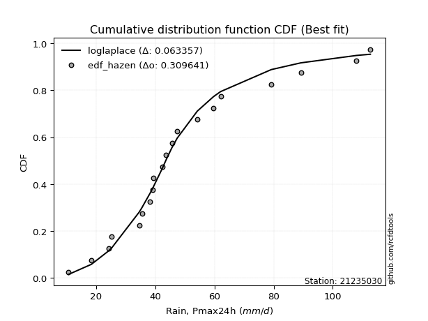</img>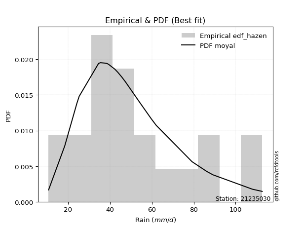</img>

</div>


### 3. Empirical - EDF Weibull (1939)

Weibull plotting position formula is an empirical method used to estimate the non-exceedance probability or plotting position for a set of observed data, is often recommended or widely used in practice, particularly in flood frequency analysis.

<div align="center">


$P=m/(n+1)$


</div>


**3.1. Empirical values**

<div align="center">

|                | 0                    | 1                   | 2                   | 3                   | 4                   | 5                  | 6                  | 7                   | 8                  | 9                   | 10          | 11                 | 12                 | 13                 | 14                 | 15                 | 16                 | 17                 | 18                 | 19                 | 20                 |
|:---------------|:---------------------|:--------------------|:--------------------|:--------------------|:--------------------|:-------------------|:-------------------|:--------------------|:-------------------|:--------------------|:------------|:-------------------|:-------------------|:-------------------|:-------------------|:-------------------|:-------------------|:-------------------|:-------------------|:-------------------|:-------------------|
| date           | 2022                 | 2021                | 2020                | 2023                | 2016                | 2017               | 2007               | 2006                | 2005               | 2008                | 2018        | 2010               | 2009               | 2015               | 2014               | 2013               | 2024               | 2025               | 2012               | 2011               | 2019               |
| x              | 10.7                 | 18.4                | 24.2                | 25.3                | 34.6                | 35.5               | 38.2               | 39.0                | 39.3               | 42.3                | 43.7        | 45.6               | 47.4               | 54.2               | 59.7               | 62.1               | 79.2               | 86.2               | 89.2               | 108.0              | 112.7              |
| m              | 1                    | 2                   | 3                   | 4                   | 5                   | 6                  | 7                  | 8                   | 9                  | 10                  | 11          | 12                 | 13                 | 14                 | 15                 | 16                 | 17                 | 18                 | 19                 | 20                 | 21                 |
| empirical_dist | edf_weibull          | edf_weibull         | edf_weibull         | edf_weibull         | edf_weibull         | edf_weibull        | edf_weibull        | edf_weibull         | edf_weibull        | edf_weibull         | edf_weibull | edf_weibull        | edf_weibull        | edf_weibull        | edf_weibull        | edf_weibull        | edf_weibull        | edf_weibull        | edf_weibull        | edf_weibull        | edf_weibull        |
| empirical      | 0.045454545454545456 | 0.09090909090909091 | 0.13636363636363635 | 0.18181818181818182 | 0.22727272727272727 | 0.2727272727272727 | 0.3181818181818182 | 0.36363636363636365 | 0.4090909090909091 | 0.45454545454545453 | 0.5         | 0.5454545454545454 | 0.5909090909090909 | 0.6363636363636364 | 0.6818181818181818 | 0.7272727272727273 | 0.7727272727272727 | 0.8181818181818182 | 0.8636363636363636 | 0.9090909090909091 | 0.9545454545454546 |
| empirical_tr   | 1.0476190476190477   | 1.1                 | 1.1578947368421053  | 1.2222222222222223  | 1.2941176470588236  | 1.375              | 1.4666666666666666 | 1.5714285714285714  | 1.6923076923076925 | 1.8333333333333335  | 2.0         | 2.1999999999999997 | 2.4444444444444446 | 2.75               | 3.1428571428571423 | 3.666666666666667  | 4.3999999999999995 | 5.500000000000002  | 7.333333333333334  | 10.999999999999996 | 22.00000000000002  |

</div>


**3.2. Kolmogorov-Smirnov fit test (sorted by Δ)**


<div align="center">

|                | 0                   | 1                   | 2                   | 3                   | 4                   | 5                   | 6                   | 7                   | 8                   | 9                   | 10                  | 11                  | 12                  | 13                  | 14                  | 15                  | 16                  | 17                  | 18                  | 19                  | 20                  | 21                  | 22                  | 23                  | 24                    | 25                  | 26                  | 27                  | 28                  | 29                  | 30                  | 31                  | 32                  | 33                  | 34                  | 35                  | 36                  | 37                  | 38                  | 39                  | 40                  | 41                  | 42                  | 43                  | 44                  | 45                  | 46                  | 47                  | 48                  | 49                  | 50                  | 51                  | 52                  | 53                  | 54                  | 55                  | 56                  | 57                  | 58                  | 59                  | 60                  | 61                  | 62                  | 63                  | 64                  | 65                  | 66                  | 67                  | 68                  | 69                  | 70                  | 71                  | 72                  | 73                  | 74                  | 75                  | 76                  | 77                  | 78                  | 79                  | 80                  | 81                  | 82                  | 83                  | 84                  | 85                  | 86                  | 87                  | 88                  | 89                  |
|:---------------|:--------------------|:--------------------|:--------------------|:--------------------|:--------------------|:--------------------|:--------------------|:--------------------|:--------------------|:--------------------|:--------------------|:--------------------|:--------------------|:--------------------|:--------------------|:--------------------|:--------------------|:--------------------|:--------------------|:--------------------|:--------------------|:--------------------|:--------------------|:--------------------|:----------------------|:--------------------|:--------------------|:--------------------|:--------------------|:--------------------|:--------------------|:--------------------|:--------------------|:--------------------|:--------------------|:--------------------|:--------------------|:--------------------|:--------------------|:--------------------|:--------------------|:--------------------|:--------------------|:--------------------|:--------------------|:--------------------|:--------------------|:--------------------|:--------------------|:--------------------|:--------------------|:--------------------|:--------------------|:--------------------|:--------------------|:--------------------|:--------------------|:--------------------|:--------------------|:--------------------|:--------------------|:--------------------|:--------------------|:--------------------|:--------------------|:--------------------|:--------------------|:--------------------|:--------------------|:--------------------|:--------------------|:--------------------|:--------------------|:--------------------|:--------------------|:--------------------|:--------------------|:--------------------|:--------------------|:--------------------|:--------------------|:--------------------|:--------------------|:--------------------|:--------------------|:--------------------|:--------------------|:--------------------|:--------------------|:--------------------|
| station        | 21235030            | 21235030            | 21235030            | 21235030            | 21235030            | 21235030            | 21235030            | 21235030            | 21235030            | 21235030            | 21235030            | 21235030            | 21235030            | 21235030            | 21235030            | 21235030            | 21235030            | 21235030            | 21235030            | 21235030            | 21235030            | 21235030            | 21235030            | 21235030            | 21235030              | 21235030            | 21235030            | 21235030            | 21235030            | 21235030            | 21235030            | 21235030            | 21235030            | 21235030            | 21235030            | 21235030            | 21235030            | 21235030            | 21235030            | 21235030            | 21235030            | 21235030            | 21235030            | 21235030            | 21235030            | 21235030            | 21235030            | 21235030            | 21235030            | 21235030            | 21235030            | 21235030            | 21235030            | 21235030            | 21235030            | 21235030            | 21235030            | 21235030            | 21235030            | 21235030            | 21235030            | 21235030            | 21235030            | 21235030            | 21235030            | 21235030            | 21235030            | 21235030            | 21235030            | 21235030            | 21235030            | 21235030            | 21235030            | 21235030            | 21235030            | 21235030            | 21235030            | 21235030            | 21235030            | 21235030            | 21235030            | 21235030            | 21235030            | 21235030            | 21235030            | 21235030            | 21235030            | 21235030            | 21235030            | 21235030            |
| empirical_dist | edf_weibull         | edf_weibull         | edf_weibull         | edf_weibull         | edf_weibull         | edf_weibull         | edf_weibull         | edf_weibull         | edf_weibull         | edf_weibull         | edf_weibull         | edf_weibull         | edf_weibull         | edf_weibull         | edf_weibull         | edf_weibull         | edf_weibull         | edf_weibull         | edf_weibull         | edf_weibull         | edf_weibull         | edf_weibull         | edf_weibull         | edf_weibull         | edf_weibull           | edf_weibull         | edf_weibull         | edf_weibull         | edf_weibull         | edf_weibull         | edf_weibull         | edf_weibull         | edf_weibull         | edf_weibull         | edf_weibull         | edf_weibull         | edf_weibull         | edf_weibull         | edf_weibull         | edf_weibull         | edf_weibull         | edf_weibull         | edf_weibull         | edf_weibull         | edf_weibull         | edf_weibull         | edf_weibull         | edf_weibull         | edf_weibull         | edf_weibull         | edf_weibull         | edf_weibull         | edf_weibull         | edf_weibull         | edf_weibull         | edf_weibull         | edf_weibull         | edf_weibull         | edf_weibull         | edf_weibull         | edf_weibull         | edf_weibull         | edf_weibull         | edf_weibull         | edf_weibull         | edf_weibull         | edf_weibull         | edf_weibull         | edf_weibull         | edf_weibull         | edf_weibull         | edf_weibull         | edf_weibull         | edf_weibull         | edf_weibull         | edf_weibull         | edf_weibull         | edf_weibull         | edf_weibull         | edf_weibull         | edf_weibull         | edf_weibull         | edf_weibull         | edf_weibull         | edf_weibull         | edf_weibull         | edf_weibull         | edf_weibull         | edf_weibull         | edf_weibull         |
| p_dist         | logfisk             | exponnorm           | fisk                | invgamma            | invgauss            | fatiguelife         | loggenlogistic      | mielke              | johnsonsu           | invweibull          | logt                | logmielke           | f                   | alpha               | gamma               | erlang              | chi2                | nct                 | loglogistic         | laplace_asymmetric  | logpearson3         | moyal               | ncf                 | betaprime           | loglaplace_asymmetric | logloggamma         | genlogistic         | logweibull_min      | weibull_min         | halflogistic        | lognakagami         | logjohnsonsu        | halfnorm            | gumbel_r            | loggompertz         | logf                | logrice             | logcrystalball      | lognorm             | lognorm             | logexponnorm        | loglognorm          | loghypsecant        | lognct              | logfatiguelife      | kstwobign           | loglaplace          | genexpon            | logerlang           | logbetaprime        | loginvgamma         | logalpha            | logncf              | loggamma            | loggamma            | pearson3            | rayleigh            | loggumbel_l         | loginvgauss         | maxwell             | logmaxwell          | rice                | loggumbel_r         | lograyleigh         | logmoyal            | gompertz            | crystalball         | norm                | truncnorm           | t                   | loginvweibull       | logistic            | loghalfnorm         | loghalflogistic     | hypsecant           | wald                | gibrat              | loggibrat           | logkstwobign        | laplace             | logwald             | expon               | loggenexpon         | gumbel_l            | nakagami            | logtruncnorm        | logexpon            | logpareto           | logchi2             | pareto              |
| delta          | 0.07405918433650249 | 0.07868378406679633 | 0.08127809535244246 | 0.08173322815337791 | 0.08197879233154148 | 0.08197944467305784 | 0.08211733411650024 | 0.0821517165668545  | 0.08225555886610181 | 0.08236784343597636 | 0.08254450185945919 | 0.08315353993864127 | 0.08351191517215473 | 0.08356675655599011 | 0.0836095665945088  | 0.08360980054187683 | 0.08360993709062714 | 0.08461687182907152 | 0.0856096693813313  | 0.08563536016854634 | 0.08575841898777581 | 0.08595824786033346 | 0.08618958427287082 | 0.08629085220175547 | 0.08933658791578736   | 0.08962830910317143 | 0.08978288125966494 | 0.09017294140798371 | 0.0905003057304481  | 0.09090909090909091 | 0.09164903953211394 | 0.09183057524535199 | 0.09333550648144975 | 0.09484292130390187 | 0.09499279710745945 | 0.09532707565090168 | 0.09535583106951626 | 0.09535590352279585 | 0.09535592787158406 | 0.09535592787158406 | 0.09535753326329369 | 0.09535907252311235 | 0.09543801315546974 | 0.09546762199440909 | 0.09594400657848787 | 0.09928553644234339 | 0.10454737220754484 | 0.10477075814175063 | 0.10526002637451184 | 0.1061421323928807  | 0.10651603369801879 | 0.10709773125487412 | 0.10836341988148332 | 0.1086376188972347  | 0.1086376188972347  | 0.10998554006296735 | 0.11312027720633222 | 0.12249021068080623 | 0.12430404784124668 | 0.12522792436955982 | 0.1253236736277111  | 0.130434117852188   | 0.13574351807646354 | 0.13692680843859542 | 0.14968640163292748 | 0.15879097138994036 | 0.1596301652611865  | 0.15963017094181453 | 0.15963017672725266 | 0.15963873252912109 | 0.16126693587522165 | 0.1687711977542709  | 0.16993328286302903 | 0.1729388063695315  | 0.17642110663780058 | 0.18181818145942447 | 0.18181818181818182 | 0.19335362233068193 | 0.19917192961885347 | 0.19948924071065527 | 0.20601649775081238 | 0.21079084841419496 | 0.22823001447639304 | 0.22875004444203584 | 0.23816891509900548 | 0.2491537853546951  | 0.33112522517348286 | 0.33112523509898795 | 0.4566047103165325  | 0.5312174080220963  |
| deltao         | 0.30282488509099936 | 0.30282488509099936 | 0.30282488509099936 | 0.30282488509099936 | 0.30282488509099936 | 0.30282488509099936 | 0.30282488509099936 | 0.30282488509099936 | 0.30282488509099936 | 0.30282488509099936 | 0.30282488509099936 | 0.30282488509099936 | 0.30282488509099936 | 0.30282488509099936 | 0.30282488509099936 | 0.30282488509099936 | 0.30282488509099936 | 0.30282488509099936 | 0.30282488509099936 | 0.30282488509099936 | 0.30282488509099936 | 0.30282488509099936 | 0.30282488509099936 | 0.30282488509099936 | 0.30282488509099936   | 0.30282488509099936 | 0.30282488509099936 | 0.30282488509099936 | 0.30282488509099936 | 0.30282488509099936 | 0.30282488509099936 | 0.30282488509099936 | 0.30282488509099936 | 0.30282488509099936 | 0.30282488509099936 | 0.30282488509099936 | 0.30282488509099936 | 0.30282488509099936 | 0.30282488509099936 | 0.30282488509099936 | 0.30282488509099936 | 0.30282488509099936 | 0.30282488509099936 | 0.30282488509099936 | 0.30282488509099936 | 0.30282488509099936 | 0.30282488509099936 | 0.30282488509099936 | 0.30282488509099936 | 0.30282488509099936 | 0.30282488509099936 | 0.30282488509099936 | 0.30282488509099936 | 0.30282488509099936 | 0.30282488509099936 | 0.30282488509099936 | 0.30282488509099936 | 0.30282488509099936 | 0.30282488509099936 | 0.30282488509099936 | 0.30282488509099936 | 0.30282488509099936 | 0.30282488509099936 | 0.30282488509099936 | 0.30282488509099936 | 0.30282488509099936 | 0.30282488509099936 | 0.30282488509099936 | 0.30282488509099936 | 0.30282488509099936 | 0.30282488509099936 | 0.30282488509099936 | 0.30282488509099936 | 0.30282488509099936 | 0.30282488509099936 | 0.30282488509099936 | 0.30282488509099936 | 0.30282488509099936 | 0.30282488509099936 | 0.30282488509099936 | 0.30282488509099936 | 0.30282488509099936 | 0.30282488509099936 | 0.30282488509099936 | 0.30282488509099936 | 0.30282488509099936 | 0.30282488509099936 | 0.30282488509099936 | 0.30282488509099936 | 0.30282488509099936 |
| eval           | Δo > Δ              | Δo > Δ              | Δo > Δ              | Δo > Δ              | Δo > Δ              | Δo > Δ              | Δo > Δ              | Δo > Δ              | Δo > Δ              | Δo > Δ              | Δo > Δ              | Δo > Δ              | Δo > Δ              | Δo > Δ              | Δo > Δ              | Δo > Δ              | Δo > Δ              | Δo > Δ              | Δo > Δ              | Δo > Δ              | Δo > Δ              | Δo > Δ              | Δo > Δ              | Δo > Δ              | Δo > Δ                | Δo > Δ              | Δo > Δ              | Δo > Δ              | Δo > Δ              | Δo > Δ              | Δo > Δ              | Δo > Δ              | Δo > Δ              | Δo > Δ              | Δo > Δ              | Δo > Δ              | Δo > Δ              | Δo > Δ              | Δo > Δ              | Δo > Δ              | Δo > Δ              | Δo > Δ              | Δo > Δ              | Δo > Δ              | Δo > Δ              | Δo > Δ              | Δo > Δ              | Δo > Δ              | Δo > Δ              | Δo > Δ              | Δo > Δ              | Δo > Δ              | Δo > Δ              | Δo > Δ              | Δo > Δ              | Δo > Δ              | Δo > Δ              | Δo > Δ              | Δo > Δ              | Δo > Δ              | Δo > Δ              | Δo > Δ              | Δo > Δ              | Δo > Δ              | Δo > Δ              | Δo > Δ              | Δo > Δ              | Δo > Δ              | Δo > Δ              | Δo > Δ              | Δo > Δ              | Δo > Δ              | Δo > Δ              | Δo > Δ              | Δo > Δ              | Δo > Δ              | Δo > Δ              | Δo > Δ              | Δo > Δ              | Δo > Δ              | Δo > Δ              | Δo > Δ              | Δo > Δ              | Δo > Δ              | Δo > Δ              | Δo > Δ              | Δo <= Δ             | Δo <= Δ             | Δo <= Δ             | Δo <= Δ             |
| fit            | 1                   | 1                   | 1                   | 1                   | 1                   | 1                   | 1                   | 1                   | 1                   | 1                   | 1                   | 1                   | 1                   | 1                   | 1                   | 1                   | 1                   | 1                   | 1                   | 1                   | 1                   | 1                   | 1                   | 1                   | 1                     | 1                   | 1                   | 1                   | 1                   | 1                   | 1                   | 1                   | 1                   | 1                   | 1                   | 1                   | 1                   | 1                   | 1                   | 1                   | 1                   | 1                   | 1                   | 1                   | 1                   | 1                   | 1                   | 1                   | 1                   | 1                   | 1                   | 1                   | 1                   | 1                   | 1                   | 1                   | 1                   | 1                   | 1                   | 1                   | 1                   | 1                   | 1                   | 1                   | 1                   | 1                   | 1                   | 1                   | 1                   | 1                   | 1                   | 1                   | 1                   | 1                   | 1                   | 1                   | 1                   | 1                   | 1                   | 1                   | 1                   | 1                   | 1                   | 1                   | 1                   | 1                   | 0                   | 0                   | 0                   | 0                   |
| n              | 21                  | 21                  | 21                  | 21                  | 21                  | 21                  | 21                  | 21                  | 21                  | 21                  | 21                  | 21                  | 21                  | 21                  | 21                  | 21                  | 21                  | 21                  | 21                  | 21                  | 21                  | 21                  | 21                  | 21                  | 21                    | 21                  | 21                  | 21                  | 21                  | 21                  | 21                  | 21                  | 21                  | 21                  | 21                  | 21                  | 21                  | 21                  | 21                  | 21                  | 21                  | 21                  | 21                  | 21                  | 21                  | 21                  | 21                  | 21                  | 21                  | 21                  | 21                  | 21                  | 21                  | 21                  | 21                  | 21                  | 21                  | 21                  | 21                  | 21                  | 21                  | 21                  | 21                  | 21                  | 21                  | 21                  | 21                  | 21                  | 21                  | 21                  | 21                  | 21                  | 21                  | 21                  | 21                  | 21                  | 21                  | 21                  | 21                  | 21                  | 21                  | 21                  | 21                  | 21                  | 21                  | 21                  | 21                  | 21                  | 21                  | 21                  |
| best_fit       | 1                   | 0                   | 0                   | 0                   | 0                   | 0                   | 0                   | 0                   | 0                   | 0                   | 0                   | 0                   | 0                   | 0                   | 0                   | 0                   | 0                   | 0                   | 0                   | 0                   | 0                   | 0                   | 0                   | 0                   | 0                     | 0                   | 0                   | 0                   | 0                   | 0                   | 0                   | 0                   | 0                   | 0                   | 0                   | 0                   | 0                   | 0                   | 0                   | 0                   | 0                   | 0                   | 0                   | 0                   | 0                   | 0                   | 0                   | 0                   | 0                   | 0                   | 0                   | 0                   | 0                   | 0                   | 0                   | 0                   | 0                   | 0                   | 0                   | 0                   | 0                   | 0                   | 0                   | 0                   | 0                   | 0                   | 0                   | 0                   | 0                   | 0                   | 0                   | 0                   | 0                   | 0                   | 0                   | 0                   | 0                   | 0                   | 0                   | 0                   | 0                   | 0                   | 0                   | 0                   | 0                   | 0                   | 0                   | 0                   | 0                   | 0                   |
| best_fit_sort  | 1                   | 2                   | 3                   | 4                   | 5                   | 6                   | 7                   | 8                   | 9                   | 10                  | 11                  | 12                  | 13                  | 14                  | 15                  | 16                  | 17                  | 18                  | 19                  | 20                  | 21                  | 22                  | 23                  | 24                  | 25                    | 26                  | 27                  | 28                  | 29                  | 30                  | 31                  | 32                  | 33                  | 34                  | 35                  | 36                  | 37                  | 38                  | 39                  | 40                  | 41                  | 42                  | 43                  | 44                  | 45                  | 46                  | 47                  | 48                  | 49                  | 50                  | 51                  | 52                  | 53                  | 54                  | 55                  | 56                  | 57                  | 58                  | 59                  | 60                  | 61                  | 62                  | 63                  | 64                  | 65                  | 66                  | 67                  | 68                  | 69                  | 70                  | 71                  | 72                  | 73                  | 74                  | 75                  | 76                  | 77                  | 78                  | 79                  | 80                  | 81                  | 82                  | 83                  | 84                  | 85                  | 86                  | 87                  | 88                  | 89                  | 90                  |

</div>


<div align="center">

</img>

</div>


**3.3. Best fit**

<div align="center">

|   id |   station | empirical_dist   | p_dist   |     delta |   deltao | eval   |   fit |   n |   best_fit |   best_fit_sort |
|-----:|----------:|:-----------------|:---------|----------:|---------:|:-------|------:|----:|-----------:|----------------:|
|    0 |  21235030 | edf_weibull      | logfisk  | 0.0740592 | 0.302825 | Δo > Δ |     1 |  21 |          1 |               1 |

</div>


<div align="center">

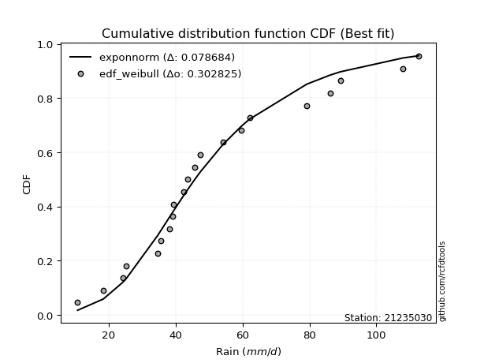</img>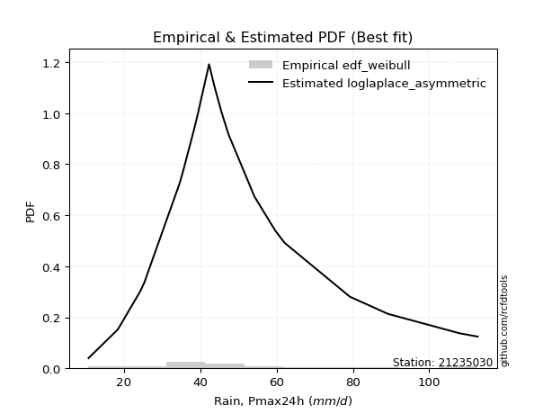</img>

</div>


### 4. Empirical - EDF Beard (1943)

The Beard formula (or Beard´s plotting position formula) in hydrology is used to estimate the empirical non-exceedance probability _(P)_ of a flood event (or other extreme hydrological data point) within a given dataset.

<div align="center">


$P=(m-0.31)/(n+0.38)$


</div>


**4.1. Empirical values**

<div align="center">

|                | 0                    | 1                   | 2                   | 3                   | 4                  | 5                  | 6                   | 7                  | 8                   | 9                  | 10        | 11                 | 12                 | 13                 | 14                 | 15                 | 16                 | 17                 | 18                 | 19                 | 20                 |
|:---------------|:---------------------|:--------------------|:--------------------|:--------------------|:-------------------|:-------------------|:--------------------|:-------------------|:--------------------|:-------------------|:----------|:-------------------|:-------------------|:-------------------|:-------------------|:-------------------|:-------------------|:-------------------|:-------------------|:-------------------|:-------------------|
| date           | 2022                 | 2021                | 2020                | 2023                | 2016               | 2017               | 2007                | 2006               | 2005                | 2008               | 2018      | 2010               | 2009               | 2015               | 2014               | 2013               | 2024               | 2025               | 2012               | 2011               | 2019               |
| x              | 10.7                 | 18.4                | 24.2                | 25.3                | 34.6               | 35.5               | 38.2                | 39.0               | 39.3                | 42.3               | 43.7      | 45.6               | 47.4               | 54.2               | 59.7               | 62.1               | 79.2               | 86.2               | 89.2               | 108.0              | 112.7              |
| m              | 1                    | 2                   | 3                   | 4                   | 5                  | 6                  | 7                   | 8                  | 9                   | 10                 | 11        | 12                 | 13                 | 14                 | 15                 | 16                 | 17                 | 18                 | 19                 | 20                 | 21                 |
| empirical_dist | edf_beard            | edf_beard           | edf_beard           | edf_beard           | edf_beard          | edf_beard          | edf_beard           | edf_beard          | edf_beard           | edf_beard          | edf_beard | edf_beard          | edf_beard          | edf_beard          | edf_beard          | edf_beard          | edf_beard          | edf_beard          | edf_beard          | edf_beard          | edf_beard          |
| empirical      | 0.032273152478952294 | 0.07904583723105707 | 0.12581852198316185 | 0.17259120673526662 | 0.2193638914873714 | 0.2661365762394762 | 0.31290926099158095 | 0.3596819457436857 | 0.40645463049579045 | 0.4532273152478952 | 0.5       | 0.5467726847521047 | 0.5935453695042096 | 0.6403180542563143 | 0.6870907390084191 | 0.7338634237605238 | 0.7806361085126288 | 0.8274087932647335 | 0.8741814780168383 | 0.920954162768943  | 0.9677268475210478 |
| empirical_tr   | 1.0333494441759306   | 1.085830370746572   | 1.1439272338148743  | 1.208592425098926   | 1.281006590772918  | 1.362651370299554  | 1.4554118447923756  | 1.5617238860482106 | 1.6847911741528763  | 1.828913601368691  | 2.0       | 2.206398348813209  | 2.4602991944764097 | 2.780234070221066  | 3.195814648729447  | 3.7574692442882247 | 4.558635394456293  | 5.794037940379407  | 7.947955390334582  | 12.650887573964514 | 30.985507246376862 |

</div>


**4.2. Kolmogorov-Smirnov fit test (sorted by Δ)**


<div align="center">

|                | 0                   | 1                   | 2                   | 3                   | 4                   | 5                   | 6                   | 7                   | 8                   | 9                     | 10                  | 11                  | 12                  | 13                  | 14                  | 15                  | 16                  | 17                  | 18                  | 19                  | 20                  | 21                  | 22                  | 23                  | 24                  | 25                  | 26                  | 27                  | 28                  | 29                  | 30                  | 31                  | 32                  | 33                  | 34                  | 35                  | 36                  | 37                  | 38                  | 39                  | 40                  | 41                  | 42                  | 43                  | 44                  | 45                  | 46                  | 47                  | 48                  | 49                  | 50                  | 51                  | 52                  | 53                  | 54                  | 55                  | 56                  | 57                  | 58                  | 59                  | 60                  | 61                  | 62                  | 63                  | 64                  | 65                  | 66                  | 67                  | 68                  | 69                  | 70                  | 71                  | 72                  | 73                  | 74                  | 75                  | 76                  | 77                  | 78                  | 79                  | 80                  | 81                  | 82                  | 83                  | 84                  | 85                  | 86                  | 87                  | 88                  | 89                  |
|:---------------|:--------------------|:--------------------|:--------------------|:--------------------|:--------------------|:--------------------|:--------------------|:--------------------|:--------------------|:----------------------|:--------------------|:--------------------|:--------------------|:--------------------|:--------------------|:--------------------|:--------------------|:--------------------|:--------------------|:--------------------|:--------------------|:--------------------|:--------------------|:--------------------|:--------------------|:--------------------|:--------------------|:--------------------|:--------------------|:--------------------|:--------------------|:--------------------|:--------------------|:--------------------|:--------------------|:--------------------|:--------------------|:--------------------|:--------------------|:--------------------|:--------------------|:--------------------|:--------------------|:--------------------|:--------------------|:--------------------|:--------------------|:--------------------|:--------------------|:--------------------|:--------------------|:--------------------|:--------------------|:--------------------|:--------------------|:--------------------|:--------------------|:--------------------|:--------------------|:--------------------|:--------------------|:--------------------|:--------------------|:--------------------|:--------------------|:--------------------|:--------------------|:--------------------|:--------------------|:--------------------|:--------------------|:--------------------|:--------------------|:--------------------|:--------------------|:--------------------|:--------------------|:--------------------|:--------------------|:--------------------|:--------------------|:--------------------|:--------------------|:--------------------|:--------------------|:--------------------|:--------------------|:--------------------|:--------------------|:--------------------|
| station        | 21235030            | 21235030            | 21235030            | 21235030            | 21235030            | 21235030            | 21235030            | 21235030            | 21235030            | 21235030              | 21235030            | 21235030            | 21235030            | 21235030            | 21235030            | 21235030            | 21235030            | 21235030            | 21235030            | 21235030            | 21235030            | 21235030            | 21235030            | 21235030            | 21235030            | 21235030            | 21235030            | 21235030            | 21235030            | 21235030            | 21235030            | 21235030            | 21235030            | 21235030            | 21235030            | 21235030            | 21235030            | 21235030            | 21235030            | 21235030            | 21235030            | 21235030            | 21235030            | 21235030            | 21235030            | 21235030            | 21235030            | 21235030            | 21235030            | 21235030            | 21235030            | 21235030            | 21235030            | 21235030            | 21235030            | 21235030            | 21235030            | 21235030            | 21235030            | 21235030            | 21235030            | 21235030            | 21235030            | 21235030            | 21235030            | 21235030            | 21235030            | 21235030            | 21235030            | 21235030            | 21235030            | 21235030            | 21235030            | 21235030            | 21235030            | 21235030            | 21235030            | 21235030            | 21235030            | 21235030            | 21235030            | 21235030            | 21235030            | 21235030            | 21235030            | 21235030            | 21235030            | 21235030            | 21235030            | 21235030            |
| empirical_dist | edf_beard           | edf_beard           | edf_beard           | edf_beard           | edf_beard           | edf_beard           | edf_beard           | edf_beard           | edf_beard           | edf_beard             | edf_beard           | edf_beard           | edf_beard           | edf_beard           | edf_beard           | edf_beard           | edf_beard           | edf_beard           | edf_beard           | edf_beard           | edf_beard           | edf_beard           | edf_beard           | edf_beard           | edf_beard           | edf_beard           | edf_beard           | edf_beard           | edf_beard           | edf_beard           | edf_beard           | edf_beard           | edf_beard           | edf_beard           | edf_beard           | edf_beard           | edf_beard           | edf_beard           | edf_beard           | edf_beard           | edf_beard           | edf_beard           | edf_beard           | edf_beard           | edf_beard           | edf_beard           | edf_beard           | edf_beard           | edf_beard           | edf_beard           | edf_beard           | edf_beard           | edf_beard           | edf_beard           | edf_beard           | edf_beard           | edf_beard           | edf_beard           | edf_beard           | edf_beard           | edf_beard           | edf_beard           | edf_beard           | edf_beard           | edf_beard           | edf_beard           | edf_beard           | edf_beard           | edf_beard           | edf_beard           | edf_beard           | edf_beard           | edf_beard           | edf_beard           | edf_beard           | edf_beard           | edf_beard           | edf_beard           | edf_beard           | edf_beard           | edf_beard           | edf_beard           | edf_beard           | edf_beard           | edf_beard           | edf_beard           | edf_beard           | edf_beard           | edf_beard           | edf_beard           |
| p_dist         | exponnorm           | fisk                | logfisk             | logmielke           | nct                 | mielke              | loggenlogistic      | laplace_asymmetric  | moyal               | loglaplace_asymmetric | lognakagami         | loglogistic         | invgamma            | invgauss            | fatiguelife         | johnsonsu           | invweibull          | f                   | alpha               | gamma               | erlang              | chi2                | loghypsecant        | logpearson3         | ncf                 | betaprime           | halflogistic        | logt                | logloggamma         | genlogistic         | logweibull_min      | weibull_min         | logjohnsonsu        | loglaplace          | gumbel_r            | loggompertz         | halfnorm            | kstwobign           | logf                | logrice             | logcrystalball      | lognorm             | lognorm             | logexponnorm        | loglognorm          | lognct              | logfatiguelife      | genexpon            | pearson3            | logerlang           | logbetaprime        | loginvgamma         | logalpha            | rayleigh            | logncf              | loggamma            | loggamma            | loggumbel_l         | maxwell             | loginvgauss         | rice                | logmaxwell          | loggumbel_r         | lograyleigh         | logmoyal            | gompertz            | crystalball         | norm                | truncnorm           | t                   | loginvweibull       | logistic            | wald                | gibrat              | loghalfnorm         | hypsecant           | loghalflogistic     | loggibrat           | laplace             | logkstwobign        | logwald             | expon               | gumbel_l            | loggenexpon         | nakagami            | logtruncnorm        | logexpon            | logpareto           | logchi2             | pareto              |
| delta          | 0.07287245297740358 | 0.0733692595670864  | 0.07373100110012015 | 0.07552792405526121 | 0.0769878111020047  | 0.0771351180045432  | 0.0772830958200279  | 0.07772652438319028 | 0.0780494120749774  | 0.0814277521304313    | 0.08242206444919874 | 0.08322456860887834 | 0.08436950674849653 | 0.0846150709266601  | 0.08461572326817646 | 0.08489183746122042 | 0.08500412203109498 | 0.08614819376727334 | 0.08620303515110872 | 0.08624584518962741 | 0.08624607913699545 | 0.08624621568574575 | 0.08752917737011368 | 0.08839469758289442 | 0.08882586286798944 | 0.08892713079687409 | 0.09017349619386916 | 0.09045333764481506 | 0.09226458769829005 | 0.09241915985478355 | 0.09280922000310232 | 0.09313658432556671 | 0.0944668538404706  | 0.09663853642218878 | 0.09747919989902049 | 0.09762907570257806 | 0.10124434226680562 | 0.101921815037462   | 0.10323591143625754 | 0.10326466685487212 | 0.10326473930815172 | 0.10326476365693993 | 0.10326476365693993 | 0.10326636904864955 | 0.10326790830846821 | 0.10337645777976495 | 0.10385284236384373 | 0.10740703673686924 | 0.11262181865808596 | 0.11316886215986771 | 0.11405096817823657 | 0.11442486948337466 | 0.11500656704022999 | 0.11575655580145083 | 0.11627225566683919 | 0.11654645468259056 | 0.11654645468259056 | 0.12512648927592485 | 0.12786420296467843 | 0.13221288362660255 | 0.13307039644730662 | 0.13323250941306697 | 0.1436523538618194  | 0.1448356442239513  | 0.15759523741828335 | 0.16142724998505897 | 0.16226644385630512 | 0.16226644953693314 | 0.16226645532237127 | 0.1622750111242397  | 0.1691757716605775  | 0.17140747634938952 | 0.17259120637650927 | 0.17259120673526662 | 0.1778421186483849  | 0.1790573852329192  | 0.18084764215488736 | 0.19862617952091915 | 0.20212551930577388 | 0.20708076540420933 | 0.2112890549410496  | 0.21869968419955083 | 0.23138632303715445 | 0.2361388502617489  | 0.24607775088436135 | 0.25706262114005096 | 0.33903406095883876 | 0.33903407088434384 | 0.4645135461018884  | 0.5430806617001301  |
| deltao         | 0.30282488509099936 | 0.30282488509099936 | 0.30282488509099936 | 0.30282488509099936 | 0.30282488509099936 | 0.30282488509099936 | 0.30282488509099936 | 0.30282488509099936 | 0.30282488509099936 | 0.30282488509099936   | 0.30282488509099936 | 0.30282488509099936 | 0.30282488509099936 | 0.30282488509099936 | 0.30282488509099936 | 0.30282488509099936 | 0.30282488509099936 | 0.30282488509099936 | 0.30282488509099936 | 0.30282488509099936 | 0.30282488509099936 | 0.30282488509099936 | 0.30282488509099936 | 0.30282488509099936 | 0.30282488509099936 | 0.30282488509099936 | 0.30282488509099936 | 0.30282488509099936 | 0.30282488509099936 | 0.30282488509099936 | 0.30282488509099936 | 0.30282488509099936 | 0.30282488509099936 | 0.30282488509099936 | 0.30282488509099936 | 0.30282488509099936 | 0.30282488509099936 | 0.30282488509099936 | 0.30282488509099936 | 0.30282488509099936 | 0.30282488509099936 | 0.30282488509099936 | 0.30282488509099936 | 0.30282488509099936 | 0.30282488509099936 | 0.30282488509099936 | 0.30282488509099936 | 0.30282488509099936 | 0.30282488509099936 | 0.30282488509099936 | 0.30282488509099936 | 0.30282488509099936 | 0.30282488509099936 | 0.30282488509099936 | 0.30282488509099936 | 0.30282488509099936 | 0.30282488509099936 | 0.30282488509099936 | 0.30282488509099936 | 0.30282488509099936 | 0.30282488509099936 | 0.30282488509099936 | 0.30282488509099936 | 0.30282488509099936 | 0.30282488509099936 | 0.30282488509099936 | 0.30282488509099936 | 0.30282488509099936 | 0.30282488509099936 | 0.30282488509099936 | 0.30282488509099936 | 0.30282488509099936 | 0.30282488509099936 | 0.30282488509099936 | 0.30282488509099936 | 0.30282488509099936 | 0.30282488509099936 | 0.30282488509099936 | 0.30282488509099936 | 0.30282488509099936 | 0.30282488509099936 | 0.30282488509099936 | 0.30282488509099936 | 0.30282488509099936 | 0.30282488509099936 | 0.30282488509099936 | 0.30282488509099936 | 0.30282488509099936 | 0.30282488509099936 | 0.30282488509099936 |
| eval           | Δo > Δ              | Δo > Δ              | Δo > Δ              | Δo > Δ              | Δo > Δ              | Δo > Δ              | Δo > Δ              | Δo > Δ              | Δo > Δ              | Δo > Δ                | Δo > Δ              | Δo > Δ              | Δo > Δ              | Δo > Δ              | Δo > Δ              | Δo > Δ              | Δo > Δ              | Δo > Δ              | Δo > Δ              | Δo > Δ              | Δo > Δ              | Δo > Δ              | Δo > Δ              | Δo > Δ              | Δo > Δ              | Δo > Δ              | Δo > Δ              | Δo > Δ              | Δo > Δ              | Δo > Δ              | Δo > Δ              | Δo > Δ              | Δo > Δ              | Δo > Δ              | Δo > Δ              | Δo > Δ              | Δo > Δ              | Δo > Δ              | Δo > Δ              | Δo > Δ              | Δo > Δ              | Δo > Δ              | Δo > Δ              | Δo > Δ              | Δo > Δ              | Δo > Δ              | Δo > Δ              | Δo > Δ              | Δo > Δ              | Δo > Δ              | Δo > Δ              | Δo > Δ              | Δo > Δ              | Δo > Δ              | Δo > Δ              | Δo > Δ              | Δo > Δ              | Δo > Δ              | Δo > Δ              | Δo > Δ              | Δo > Δ              | Δo > Δ              | Δo > Δ              | Δo > Δ              | Δo > Δ              | Δo > Δ              | Δo > Δ              | Δo > Δ              | Δo > Δ              | Δo > Δ              | Δo > Δ              | Δo > Δ              | Δo > Δ              | Δo > Δ              | Δo > Δ              | Δo > Δ              | Δo > Δ              | Δo > Δ              | Δo > Δ              | Δo > Δ              | Δo > Δ              | Δo > Δ              | Δo > Δ              | Δo > Δ              | Δo > Δ              | Δo > Δ              | Δo <= Δ             | Δo <= Δ             | Δo <= Δ             | Δo <= Δ             |
| fit            | 1                   | 1                   | 1                   | 1                   | 1                   | 1                   | 1                   | 1                   | 1                   | 1                     | 1                   | 1                   | 1                   | 1                   | 1                   | 1                   | 1                   | 1                   | 1                   | 1                   | 1                   | 1                   | 1                   | 1                   | 1                   | 1                   | 1                   | 1                   | 1                   | 1                   | 1                   | 1                   | 1                   | 1                   | 1                   | 1                   | 1                   | 1                   | 1                   | 1                   | 1                   | 1                   | 1                   | 1                   | 1                   | 1                   | 1                   | 1                   | 1                   | 1                   | 1                   | 1                   | 1                   | 1                   | 1                   | 1                   | 1                   | 1                   | 1                   | 1                   | 1                   | 1                   | 1                   | 1                   | 1                   | 1                   | 1                   | 1                   | 1                   | 1                   | 1                   | 1                   | 1                   | 1                   | 1                   | 1                   | 1                   | 1                   | 1                   | 1                   | 1                   | 1                   | 1                   | 1                   | 1                   | 1                   | 0                   | 0                   | 0                   | 0                   |
| n              | 21                  | 21                  | 21                  | 21                  | 21                  | 21                  | 21                  | 21                  | 21                  | 21                    | 21                  | 21                  | 21                  | 21                  | 21                  | 21                  | 21                  | 21                  | 21                  | 21                  | 21                  | 21                  | 21                  | 21                  | 21                  | 21                  | 21                  | 21                  | 21                  | 21                  | 21                  | 21                  | 21                  | 21                  | 21                  | 21                  | 21                  | 21                  | 21                  | 21                  | 21                  | 21                  | 21                  | 21                  | 21                  | 21                  | 21                  | 21                  | 21                  | 21                  | 21                  | 21                  | 21                  | 21                  | 21                  | 21                  | 21                  | 21                  | 21                  | 21                  | 21                  | 21                  | 21                  | 21                  | 21                  | 21                  | 21                  | 21                  | 21                  | 21                  | 21                  | 21                  | 21                  | 21                  | 21                  | 21                  | 21                  | 21                  | 21                  | 21                  | 21                  | 21                  | 21                  | 21                  | 21                  | 21                  | 21                  | 21                  | 21                  | 21                  |
| best_fit       | 1                   | 0                   | 0                   | 0                   | 0                   | 0                   | 0                   | 0                   | 0                   | 0                     | 0                   | 0                   | 0                   | 0                   | 0                   | 0                   | 0                   | 0                   | 0                   | 0                   | 0                   | 0                   | 0                   | 0                   | 0                   | 0                   | 0                   | 0                   | 0                   | 0                   | 0                   | 0                   | 0                   | 0                   | 0                   | 0                   | 0                   | 0                   | 0                   | 0                   | 0                   | 0                   | 0                   | 0                   | 0                   | 0                   | 0                   | 0                   | 0                   | 0                   | 0                   | 0                   | 0                   | 0                   | 0                   | 0                   | 0                   | 0                   | 0                   | 0                   | 0                   | 0                   | 0                   | 0                   | 0                   | 0                   | 0                   | 0                   | 0                   | 0                   | 0                   | 0                   | 0                   | 0                   | 0                   | 0                   | 0                   | 0                   | 0                   | 0                   | 0                   | 0                   | 0                   | 0                   | 0                   | 0                   | 0                   | 0                   | 0                   | 0                   |
| best_fit_sort  | 1                   | 2                   | 3                   | 4                   | 5                   | 6                   | 7                   | 8                   | 9                   | 10                    | 11                  | 12                  | 13                  | 14                  | 15                  | 16                  | 17                  | 18                  | 19                  | 20                  | 21                  | 22                  | 23                  | 24                  | 25                  | 26                  | 27                  | 28                  | 29                  | 30                  | 31                  | 32                  | 33                  | 34                  | 35                  | 36                  | 37                  | 38                  | 39                  | 40                  | 41                  | 42                  | 43                  | 44                  | 45                  | 46                  | 47                  | 48                  | 49                  | 50                  | 51                  | 52                  | 53                  | 54                  | 55                  | 56                  | 57                  | 58                  | 59                  | 60                  | 61                  | 62                  | 63                  | 64                  | 65                  | 66                  | 67                  | 68                  | 69                  | 70                  | 71                  | 72                  | 73                  | 74                  | 75                  | 76                  | 77                  | 78                  | 79                  | 80                  | 81                  | 82                  | 83                  | 84                  | 85                  | 86                  | 87                  | 88                  | 89                  | 90                  |

</div>


<div align="center">

</img>

</div>


**4.3. Best fit**

<div align="center">

|   id |   station | empirical_dist   | p_dist    |     delta |   deltao | eval   |   fit |   n |   best_fit |   best_fit_sort |
|-----:|----------:|:-----------------|:----------|----------:|---------:|:-------|------:|----:|-----------:|----------------:|
|    0 |  21235030 | edf_beard        | exponnorm | 0.0728725 | 0.302825 | Δo > Δ |     1 |  21 |          1 |               1 |

</div>


<div align="center">

</img>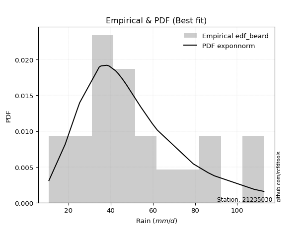</img>

</div>


### 5. Empirical - EDF Chegodayev (1955)

The Chegodayev formula is an empirical plotting position formula used in hydrological frequency analysis to estimate the exceedance probability or return period of a specific event from a set of observed data. It is primarily used for plotting observed data points on probability paper to fit a theoretical distribution, particularly for analyzing extreme events like maximum flood flows or rainfall intensities. The constant _b_ value in the generalized plotting position formula is 0.3.

<div align="center">


$P=(m-b)/(n+1-2b)$


</div>


**5.1. Empirical values**

<div align="center">

|                | 0                   | 1                   | 2                   | 3                   | 4                  | 5                  | 6                   | 7                  | 8                   | 9                  | 10             | 11                 | 12                 | 13                 | 14                 | 15                 | 16                | 17                 | 18                 | 19                 | 20                 |
|:---------------|:--------------------|:--------------------|:--------------------|:--------------------|:-------------------|:-------------------|:--------------------|:-------------------|:--------------------|:-------------------|:---------------|:-------------------|:-------------------|:-------------------|:-------------------|:-------------------|:------------------|:-------------------|:-------------------|:-------------------|:-------------------|
| date           | 2022                | 2021                | 2020                | 2023                | 2016               | 2017               | 2007                | 2006               | 2005                | 2008               | 2018           | 2010               | 2009               | 2015               | 2014               | 2013               | 2024              | 2025               | 2012               | 2011               | 2019               |
| x              | 10.7                | 18.4                | 24.2                | 25.3                | 34.6               | 35.5               | 38.2                | 39.0               | 39.3                | 42.3               | 43.7           | 45.6               | 47.4               | 54.2               | 59.7               | 62.1               | 79.2              | 86.2               | 89.2               | 108.0              | 112.7              |
| m              | 1                   | 2                   | 3                   | 4                   | 5                  | 6                  | 7                   | 8                  | 9                   | 10                 | 11             | 12                 | 13                 | 14                 | 15                 | 16                 | 17                | 18                 | 19                 | 20                 | 21                 |
| empirical_dist | edf_chegodayev      | edf_chegodayev      | edf_chegodayev      | edf_chegodayev      | edf_chegodayev     | edf_chegodayev     | edf_chegodayev      | edf_chegodayev     | edf_chegodayev      | edf_chegodayev     | edf_chegodayev | edf_chegodayev     | edf_chegodayev     | edf_chegodayev     | edf_chegodayev     | edf_chegodayev     | edf_chegodayev    | edf_chegodayev     | edf_chegodayev     | edf_chegodayev     | edf_chegodayev     |
| empirical      | 0.03271028037383177 | 0.07943925233644861 | 0.12616822429906543 | 0.17289719626168226 | 0.2196261682242991 | 0.2663551401869159 | 0.31308411214953275 | 0.3598130841121496 | 0.40654205607476634 | 0.4532710280373832 | 0.5            | 0.5467289719626168 | 0.5934579439252337 | 0.6401869158878505 | 0.6869158878504673 | 0.7336448598130841 | 0.780373831775701 | 0.8271028037383178 | 0.8738317757009346 | 0.9205607476635514 | 0.9672897196261683 |
| empirical_tr   | 1.0338164251207729  | 1.086294416243655   | 1.1443850267379678  | 1.209039548022599   | 1.2814371257485029 | 1.3630573248407645 | 1.4557823129251701  | 1.5620437956204383 | 1.68503937007874    | 1.829059829059829  | 2.0            | 2.2061855670103094 | 2.4597701149425286 | 2.7792207792207795 | 3.194029850746269  | 3.7543859649122813 | 4.553191489361703 | 5.783783783783785  | 7.925925925925928  | 12.588235294117654 | 30.57142857142862  |

</div>


**5.2. Kolmogorov-Smirnov fit test (sorted by Δ)**


<div align="center">

|                | 0                   | 1                   | 2                   | 3                   | 4                   | 5                   | 6                   | 7                   | 8                   | 9                     | 10                  | 11                  | 12                  | 13                  | 14                  | 15                  | 16                  | 17                  | 18                  | 19                  | 20                  | 21                  | 22                  | 23                  | 24                  | 25                  | 26                  | 27                  | 28                  | 29                  | 30                  | 31                  | 32                  | 33                  | 34                  | 35                  | 36                  | 37                  | 38                  | 39                  | 40                  | 41                  | 42                  | 43                  | 44                  | 45                  | 46                  | 47                  | 48                  | 49                  | 50                  | 51                  | 52                  | 53                  | 54                  | 55                  | 56                  | 57                  | 58                  | 59                  | 60                  | 61                  | 62                  | 63                  | 64                  | 65                  | 66                  | 67                  | 68                  | 69                  | 70                  | 71                  | 72                  | 73                  | 74                  | 75                  | 76                  | 77                  | 78                  | 79                  | 80                  | 81                  | 82                  | 83                  | 84                  | 85                  | 86                  | 87                  | 88                  | 89                  |
|:---------------|:--------------------|:--------------------|:--------------------|:--------------------|:--------------------|:--------------------|:--------------------|:--------------------|:--------------------|:----------------------|:--------------------|:--------------------|:--------------------|:--------------------|:--------------------|:--------------------|:--------------------|:--------------------|:--------------------|:--------------------|:--------------------|:--------------------|:--------------------|:--------------------|:--------------------|:--------------------|:--------------------|:--------------------|:--------------------|:--------------------|:--------------------|:--------------------|:--------------------|:--------------------|:--------------------|:--------------------|:--------------------|:--------------------|:--------------------|:--------------------|:--------------------|:--------------------|:--------------------|:--------------------|:--------------------|:--------------------|:--------------------|:--------------------|:--------------------|:--------------------|:--------------------|:--------------------|:--------------------|:--------------------|:--------------------|:--------------------|:--------------------|:--------------------|:--------------------|:--------------------|:--------------------|:--------------------|:--------------------|:--------------------|:--------------------|:--------------------|:--------------------|:--------------------|:--------------------|:--------------------|:--------------------|:--------------------|:--------------------|:--------------------|:--------------------|:--------------------|:--------------------|:--------------------|:--------------------|:--------------------|:--------------------|:--------------------|:--------------------|:--------------------|:--------------------|:--------------------|:--------------------|:--------------------|:--------------------|:--------------------|
| station        | 21235030            | 21235030            | 21235030            | 21235030            | 21235030            | 21235030            | 21235030            | 21235030            | 21235030            | 21235030              | 21235030            | 21235030            | 21235030            | 21235030            | 21235030            | 21235030            | 21235030            | 21235030            | 21235030            | 21235030            | 21235030            | 21235030            | 21235030            | 21235030            | 21235030            | 21235030            | 21235030            | 21235030            | 21235030            | 21235030            | 21235030            | 21235030            | 21235030            | 21235030            | 21235030            | 21235030            | 21235030            | 21235030            | 21235030            | 21235030            | 21235030            | 21235030            | 21235030            | 21235030            | 21235030            | 21235030            | 21235030            | 21235030            | 21235030            | 21235030            | 21235030            | 21235030            | 21235030            | 21235030            | 21235030            | 21235030            | 21235030            | 21235030            | 21235030            | 21235030            | 21235030            | 21235030            | 21235030            | 21235030            | 21235030            | 21235030            | 21235030            | 21235030            | 21235030            | 21235030            | 21235030            | 21235030            | 21235030            | 21235030            | 21235030            | 21235030            | 21235030            | 21235030            | 21235030            | 21235030            | 21235030            | 21235030            | 21235030            | 21235030            | 21235030            | 21235030            | 21235030            | 21235030            | 21235030            | 21235030            |
| empirical_dist | edf_chegodayev      | edf_chegodayev      | edf_chegodayev      | edf_chegodayev      | edf_chegodayev      | edf_chegodayev      | edf_chegodayev      | edf_chegodayev      | edf_chegodayev      | edf_chegodayev        | edf_chegodayev      | edf_chegodayev      | edf_chegodayev      | edf_chegodayev      | edf_chegodayev      | edf_chegodayev      | edf_chegodayev      | edf_chegodayev      | edf_chegodayev      | edf_chegodayev      | edf_chegodayev      | edf_chegodayev      | edf_chegodayev      | edf_chegodayev      | edf_chegodayev      | edf_chegodayev      | edf_chegodayev      | edf_chegodayev      | edf_chegodayev      | edf_chegodayev      | edf_chegodayev      | edf_chegodayev      | edf_chegodayev      | edf_chegodayev      | edf_chegodayev      | edf_chegodayev      | edf_chegodayev      | edf_chegodayev      | edf_chegodayev      | edf_chegodayev      | edf_chegodayev      | edf_chegodayev      | edf_chegodayev      | edf_chegodayev      | edf_chegodayev      | edf_chegodayev      | edf_chegodayev      | edf_chegodayev      | edf_chegodayev      | edf_chegodayev      | edf_chegodayev      | edf_chegodayev      | edf_chegodayev      | edf_chegodayev      | edf_chegodayev      | edf_chegodayev      | edf_chegodayev      | edf_chegodayev      | edf_chegodayev      | edf_chegodayev      | edf_chegodayev      | edf_chegodayev      | edf_chegodayev      | edf_chegodayev      | edf_chegodayev      | edf_chegodayev      | edf_chegodayev      | edf_chegodayev      | edf_chegodayev      | edf_chegodayev      | edf_chegodayev      | edf_chegodayev      | edf_chegodayev      | edf_chegodayev      | edf_chegodayev      | edf_chegodayev      | edf_chegodayev      | edf_chegodayev      | edf_chegodayev      | edf_chegodayev      | edf_chegodayev      | edf_chegodayev      | edf_chegodayev      | edf_chegodayev      | edf_chegodayev      | edf_chegodayev      | edf_chegodayev      | edf_chegodayev      | edf_chegodayev      | edf_chegodayev      |
| p_dist         | exponnorm           | logfisk             | fisk                | logmielke           | nct                 | mielke              | loggenlogistic      | laplace_asymmetric  | moyal               | loglaplace_asymmetric | lognakagami         | loglogistic         | invgamma            | invgauss            | fatiguelife         | johnsonsu           | invweibull          | f                   | alpha               | gamma               | erlang              | chi2                | loghypsecant        | logpearson3         | ncf                 | betaprime           | halflogistic        | logt                | logloggamma         | genlogistic         | logweibull_min      | weibull_min         | logjohnsonsu        | loglaplace          | gumbel_r            | loggompertz         | halfnorm            | kstwobign           | logf                | logrice             | logcrystalball      | lognorm             | lognorm             | logexponnorm        | loglognorm          | lognct              | logfatiguelife      | genexpon            | pearson3            | logerlang           | logbetaprime        | loginvgamma         | logalpha            | rayleigh            | logncf              | loggamma            | loggamma            | loggumbel_l         | maxwell             | loginvgauss         | logmaxwell          | rice                | loggumbel_r         | lograyleigh         | logmoyal            | gompertz            | crystalball         | norm                | truncnorm           | t                   | loginvweibull       | logistic            | wald                | gibrat              | loghalfnorm         | hypsecant           | loghalflogistic     | loggibrat           | laplace             | logkstwobign        | logwald             | expon               | gumbel_l            | loggenexpon         | nakagami            | logtruncnorm        | logexpon            | logpareto           | logchi2             | pareto              |
| delta          | 0.07261017624047589 | 0.07346872436319246 | 0.0736315363040142  | 0.07550698089021302 | 0.07697031278064326 | 0.0770476924255673  | 0.077195670241052   | 0.07798880112011808 | 0.0783116888119052  | 0.0816900288673591    | 0.08272805397561438 | 0.08296229187195064 | 0.08428208116952063 | 0.0845276453476842  | 0.08452829768920056 | 0.08480441188224452 | 0.08491669645211908 | 0.08606076818829744 | 0.08611560957213282 | 0.08615841961065152 | 0.08615865355801955 | 0.08615879010676986 | 0.08779145410704148 | 0.08830727200391852 | 0.08873843728901354 | 0.08883970521789819 | 0.08991121945694147 | 0.09019106090788737 | 0.09217716211931415 | 0.09233173427580765 | 0.09272179442412642 | 0.09304915874659081 | 0.0943794282614947  | 0.09690081315911658 | 0.09739177432004459 | 0.09754165012360216 | 0.10098206552987793 | 0.10183438945848611 | 0.10297363469932985 | 0.10300239011794443 | 0.10300246257122403 | 0.10300248692001224 | 0.10300248692001224 | 0.10300409231172186 | 0.10300563157154052 | 0.10311418104283726 | 0.10359056562691604 | 0.10731961115789335 | 0.11253439307911006 | 0.11290658542294002 | 0.11378869144130888 | 0.11416259274644697 | 0.1147442903033023  | 0.11566913022247494 | 0.1160099789299115  | 0.11628417794566287 | 0.11628417794566287 | 0.12503906369694895 | 0.12777677738570253 | 0.13195060688967486 | 0.13297023267613928 | 0.13298297086833072 | 0.1433900771248917  | 0.1445733674870236  | 0.15733296068135566 | 0.16133982440608308 | 0.16217901827732922 | 0.16217902395795725 | 0.16217902974339538 | 0.1621875855452638  | 0.16891349492364982 | 0.17132005077041362 | 0.1728971959029249  | 0.17289719626168226 | 0.1775798419114572  | 0.1789699596539433  | 0.18058536541795966 | 0.19845132836296736 | 0.20203809372679798 | 0.20681848866728164 | 0.2111142037830978  | 0.21843740746262313 | 0.23129889745817855 | 0.23587657352482122 | 0.24581547414743365 | 0.25680034440312327 | 0.33877178422191107 | 0.33877179414741615 | 0.4642512693649607  | 0.5426872465947385  |
| deltao         | 0.30282488509099936 | 0.30282488509099936 | 0.30282488509099936 | 0.30282488509099936 | 0.30282488509099936 | 0.30282488509099936 | 0.30282488509099936 | 0.30282488509099936 | 0.30282488509099936 | 0.30282488509099936   | 0.30282488509099936 | 0.30282488509099936 | 0.30282488509099936 | 0.30282488509099936 | 0.30282488509099936 | 0.30282488509099936 | 0.30282488509099936 | 0.30282488509099936 | 0.30282488509099936 | 0.30282488509099936 | 0.30282488509099936 | 0.30282488509099936 | 0.30282488509099936 | 0.30282488509099936 | 0.30282488509099936 | 0.30282488509099936 | 0.30282488509099936 | 0.30282488509099936 | 0.30282488509099936 | 0.30282488509099936 | 0.30282488509099936 | 0.30282488509099936 | 0.30282488509099936 | 0.30282488509099936 | 0.30282488509099936 | 0.30282488509099936 | 0.30282488509099936 | 0.30282488509099936 | 0.30282488509099936 | 0.30282488509099936 | 0.30282488509099936 | 0.30282488509099936 | 0.30282488509099936 | 0.30282488509099936 | 0.30282488509099936 | 0.30282488509099936 | 0.30282488509099936 | 0.30282488509099936 | 0.30282488509099936 | 0.30282488509099936 | 0.30282488509099936 | 0.30282488509099936 | 0.30282488509099936 | 0.30282488509099936 | 0.30282488509099936 | 0.30282488509099936 | 0.30282488509099936 | 0.30282488509099936 | 0.30282488509099936 | 0.30282488509099936 | 0.30282488509099936 | 0.30282488509099936 | 0.30282488509099936 | 0.30282488509099936 | 0.30282488509099936 | 0.30282488509099936 | 0.30282488509099936 | 0.30282488509099936 | 0.30282488509099936 | 0.30282488509099936 | 0.30282488509099936 | 0.30282488509099936 | 0.30282488509099936 | 0.30282488509099936 | 0.30282488509099936 | 0.30282488509099936 | 0.30282488509099936 | 0.30282488509099936 | 0.30282488509099936 | 0.30282488509099936 | 0.30282488509099936 | 0.30282488509099936 | 0.30282488509099936 | 0.30282488509099936 | 0.30282488509099936 | 0.30282488509099936 | 0.30282488509099936 | 0.30282488509099936 | 0.30282488509099936 | 0.30282488509099936 |
| eval           | Δo > Δ              | Δo > Δ              | Δo > Δ              | Δo > Δ              | Δo > Δ              | Δo > Δ              | Δo > Δ              | Δo > Δ              | Δo > Δ              | Δo > Δ                | Δo > Δ              | Δo > Δ              | Δo > Δ              | Δo > Δ              | Δo > Δ              | Δo > Δ              | Δo > Δ              | Δo > Δ              | Δo > Δ              | Δo > Δ              | Δo > Δ              | Δo > Δ              | Δo > Δ              | Δo > Δ              | Δo > Δ              | Δo > Δ              | Δo > Δ              | Δo > Δ              | Δo > Δ              | Δo > Δ              | Δo > Δ              | Δo > Δ              | Δo > Δ              | Δo > Δ              | Δo > Δ              | Δo > Δ              | Δo > Δ              | Δo > Δ              | Δo > Δ              | Δo > Δ              | Δo > Δ              | Δo > Δ              | Δo > Δ              | Δo > Δ              | Δo > Δ              | Δo > Δ              | Δo > Δ              | Δo > Δ              | Δo > Δ              | Δo > Δ              | Δo > Δ              | Δo > Δ              | Δo > Δ              | Δo > Δ              | Δo > Δ              | Δo > Δ              | Δo > Δ              | Δo > Δ              | Δo > Δ              | Δo > Δ              | Δo > Δ              | Δo > Δ              | Δo > Δ              | Δo > Δ              | Δo > Δ              | Δo > Δ              | Δo > Δ              | Δo > Δ              | Δo > Δ              | Δo > Δ              | Δo > Δ              | Δo > Δ              | Δo > Δ              | Δo > Δ              | Δo > Δ              | Δo > Δ              | Δo > Δ              | Δo > Δ              | Δo > Δ              | Δo > Δ              | Δo > Δ              | Δo > Δ              | Δo > Δ              | Δo > Δ              | Δo > Δ              | Δo > Δ              | Δo <= Δ             | Δo <= Δ             | Δo <= Δ             | Δo <= Δ             |
| fit            | 1                   | 1                   | 1                   | 1                   | 1                   | 1                   | 1                   | 1                   | 1                   | 1                     | 1                   | 1                   | 1                   | 1                   | 1                   | 1                   | 1                   | 1                   | 1                   | 1                   | 1                   | 1                   | 1                   | 1                   | 1                   | 1                   | 1                   | 1                   | 1                   | 1                   | 1                   | 1                   | 1                   | 1                   | 1                   | 1                   | 1                   | 1                   | 1                   | 1                   | 1                   | 1                   | 1                   | 1                   | 1                   | 1                   | 1                   | 1                   | 1                   | 1                   | 1                   | 1                   | 1                   | 1                   | 1                   | 1                   | 1                   | 1                   | 1                   | 1                   | 1                   | 1                   | 1                   | 1                   | 1                   | 1                   | 1                   | 1                   | 1                   | 1                   | 1                   | 1                   | 1                   | 1                   | 1                   | 1                   | 1                   | 1                   | 1                   | 1                   | 1                   | 1                   | 1                   | 1                   | 1                   | 1                   | 0                   | 0                   | 0                   | 0                   |
| n              | 21                  | 21                  | 21                  | 21                  | 21                  | 21                  | 21                  | 21                  | 21                  | 21                    | 21                  | 21                  | 21                  | 21                  | 21                  | 21                  | 21                  | 21                  | 21                  | 21                  | 21                  | 21                  | 21                  | 21                  | 21                  | 21                  | 21                  | 21                  | 21                  | 21                  | 21                  | 21                  | 21                  | 21                  | 21                  | 21                  | 21                  | 21                  | 21                  | 21                  | 21                  | 21                  | 21                  | 21                  | 21                  | 21                  | 21                  | 21                  | 21                  | 21                  | 21                  | 21                  | 21                  | 21                  | 21                  | 21                  | 21                  | 21                  | 21                  | 21                  | 21                  | 21                  | 21                  | 21                  | 21                  | 21                  | 21                  | 21                  | 21                  | 21                  | 21                  | 21                  | 21                  | 21                  | 21                  | 21                  | 21                  | 21                  | 21                  | 21                  | 21                  | 21                  | 21                  | 21                  | 21                  | 21                  | 21                  | 21                  | 21                  | 21                  |
| best_fit       | 1                   | 0                   | 0                   | 0                   | 0                   | 0                   | 0                   | 0                   | 0                   | 0                     | 0                   | 0                   | 0                   | 0                   | 0                   | 0                   | 0                   | 0                   | 0                   | 0                   | 0                   | 0                   | 0                   | 0                   | 0                   | 0                   | 0                   | 0                   | 0                   | 0                   | 0                   | 0                   | 0                   | 0                   | 0                   | 0                   | 0                   | 0                   | 0                   | 0                   | 0                   | 0                   | 0                   | 0                   | 0                   | 0                   | 0                   | 0                   | 0                   | 0                   | 0                   | 0                   | 0                   | 0                   | 0                   | 0                   | 0                   | 0                   | 0                   | 0                   | 0                   | 0                   | 0                   | 0                   | 0                   | 0                   | 0                   | 0                   | 0                   | 0                   | 0                   | 0                   | 0                   | 0                   | 0                   | 0                   | 0                   | 0                   | 0                   | 0                   | 0                   | 0                   | 0                   | 0                   | 0                   | 0                   | 0                   | 0                   | 0                   | 0                   |
| best_fit_sort  | 1                   | 2                   | 3                   | 4                   | 5                   | 6                   | 7                   | 8                   | 9                   | 10                    | 11                  | 12                  | 13                  | 14                  | 15                  | 16                  | 17                  | 18                  | 19                  | 20                  | 21                  | 22                  | 23                  | 24                  | 25                  | 26                  | 27                  | 28                  | 29                  | 30                  | 31                  | 32                  | 33                  | 34                  | 35                  | 36                  | 37                  | 38                  | 39                  | 40                  | 41                  | 42                  | 43                  | 44                  | 45                  | 46                  | 47                  | 48                  | 49                  | 50                  | 51                  | 52                  | 53                  | 54                  | 55                  | 56                  | 57                  | 58                  | 59                  | 60                  | 61                  | 62                  | 63                  | 64                  | 65                  | 66                  | 67                  | 68                  | 69                  | 70                  | 71                  | 72                  | 73                  | 74                  | 75                  | 76                  | 77                  | 78                  | 79                  | 80                  | 81                  | 82                  | 83                  | 84                  | 85                  | 86                  | 87                  | 88                  | 89                  | 90                  |

</div>


<div align="center">

</img>

</div>


**5.3. Best fit**

<div align="center">

|   id |   station | empirical_dist   | p_dist    |     delta |   deltao | eval   |   fit |   n |   best_fit |   best_fit_sort |
|-----:|----------:|:-----------------|:----------|----------:|---------:|:-------|------:|----:|-----------:|----------------:|
|    0 |  21235030 | edf_chegodayev   | exponnorm | 0.0726102 | 0.302825 | Δo > Δ |     1 |  21 |          1 |               1 |

</div>


<div align="center">

</img></img>

</div>


### 6. Empirical - EDF Blom (1958)

The Blom formula is a specific "plotting position" formula used in hydrology and statistical analysis to estimate the empirical cumulative probability (or non-exceedance probability) of a data series. It is particularly recommended for data that are approximately normally distributed. The constant _a_ is set to 0.375 (or 3/8).

<div align="center">


$P=(m-a)/(n+1-2a)$


</div>


**6.1. Empirical values**

<div align="center">

|                | 0                    | 1                   | 2                   | 3                   | 4                   | 5                  | 6                   | 7                  | 8                   | 9                   | 10       | 11                 | 12                 | 13                 | 14                 | 15                 | 16                 | 17                 | 18                 | 19                 | 20                 |
|:---------------|:---------------------|:--------------------|:--------------------|:--------------------|:--------------------|:-------------------|:--------------------|:-------------------|:--------------------|:--------------------|:---------|:-------------------|:-------------------|:-------------------|:-------------------|:-------------------|:-------------------|:-------------------|:-------------------|:-------------------|:-------------------|
| date           | 2022                 | 2021                | 2020                | 2023                | 2016                | 2017               | 2007                | 2006               | 2005                | 2008                | 2018     | 2010               | 2009               | 2015               | 2014               | 2013               | 2024               | 2025               | 2012               | 2011               | 2019               |
| x              | 10.7                 | 18.4                | 24.2                | 25.3                | 34.6                | 35.5               | 38.2                | 39.0               | 39.3                | 42.3                | 43.7     | 45.6               | 47.4               | 54.2               | 59.7               | 62.1               | 79.2               | 86.2               | 89.2               | 108.0              | 112.7              |
| m              | 1                    | 2                   | 3                   | 4                   | 5                   | 6                  | 7                   | 8                  | 9                   | 10                  | 11       | 12                 | 13                 | 14                 | 15                 | 16                 | 17                 | 18                 | 19                 | 20                 | 21                 |
| empirical_dist | edf_blom             | edf_blom            | edf_blom            | edf_blom            | edf_blom            | edf_blom           | edf_blom            | edf_blom           | edf_blom            | edf_blom            | edf_blom | edf_blom           | edf_blom           | edf_blom           | edf_blom           | edf_blom           | edf_blom           | edf_blom           | edf_blom           | edf_blom           | edf_blom           |
| empirical      | 0.029411764705882353 | 0.07647058823529412 | 0.12352941176470589 | 0.17058823529411765 | 0.21764705882352942 | 0.2647058823529412 | 0.31176470588235294 | 0.3588235294117647 | 0.40588235294117647 | 0.45294117647058824 | 0.5      | 0.5470588235294118 | 0.5941176470588235 | 0.6411764705882353 | 0.6882352941176471 | 0.7352941176470589 | 0.7823529411764706 | 0.8294117647058824 | 0.8764705882352941 | 0.9235294117647059 | 0.9705882352941176 |
| empirical_tr   | 1.0303030303030303   | 1.0828025477707006  | 1.1409395973154361  | 1.2056737588652484  | 1.2781954887218046  | 1.3599999999999999 | 1.452991452991453   | 1.559633027522936  | 1.683168316831683   | 1.8279569892473115  | 2.0      | 2.207792207792208  | 2.463768115942029  | 2.7868852459016398 | 3.207547169811321  | 3.7777777777777786 | 4.594594594594595  | 5.862068965517243  | 8.095238095238095  | 13.076923076923086 | 33.99999999999999  |

</div>


**6.2. Kolmogorov-Smirnov fit test (sorted by Δ)**


<div align="center">

|                | 0                   | 1                   | 2                   | 3                   | 4                   | 5                   | 6                   | 7                   | 8                   | 9                     | 10                  | 11                  | 12                  | 13                  | 14                  | 15                  | 16                  | 17                  | 18                  | 19                  | 20                  | 21                  | 22                  | 23                  | 24                  | 25                  | 26                  | 27                  | 28                  | 29                  | 30                  | 31                  | 32                  | 33                  | 34                  | 35                  | 36                  | 37                  | 38                  | 39                  | 40                  | 41                  | 42                  | 43                  | 44                  | 45                  | 46                  | 47                  | 48                  | 49                  | 50                  | 51                  | 52                  | 53                  | 54                  | 55                  | 56                  | 57                  | 58                  | 59                  | 60                  | 61                  | 62                  | 63                  | 64                  | 65                  | 66                  | 67                  | 68                  | 69                  | 70                  | 71                  | 72                  | 73                  | 74                  | 75                  | 76                  | 77                  | 78                  | 79                  | 80                  | 81                  | 82                  | 83                  | 84                  | 85                  | 86                  | 87                  | 88                  | 89                  |
|:---------------|:--------------------|:--------------------|:--------------------|:--------------------|:--------------------|:--------------------|:--------------------|:--------------------|:--------------------|:----------------------|:--------------------|:--------------------|:--------------------|:--------------------|:--------------------|:--------------------|:--------------------|:--------------------|:--------------------|:--------------------|:--------------------|:--------------------|:--------------------|:--------------------|:--------------------|:--------------------|:--------------------|:--------------------|:--------------------|:--------------------|:--------------------|:--------------------|:--------------------|:--------------------|:--------------------|:--------------------|:--------------------|:--------------------|:--------------------|:--------------------|:--------------------|:--------------------|:--------------------|:--------------------|:--------------------|:--------------------|:--------------------|:--------------------|:--------------------|:--------------------|:--------------------|:--------------------|:--------------------|:--------------------|:--------------------|:--------------------|:--------------------|:--------------------|:--------------------|:--------------------|:--------------------|:--------------------|:--------------------|:--------------------|:--------------------|:--------------------|:--------------------|:--------------------|:--------------------|:--------------------|:--------------------|:--------------------|:--------------------|:--------------------|:--------------------|:--------------------|:--------------------|:--------------------|:--------------------|:--------------------|:--------------------|:--------------------|:--------------------|:--------------------|:--------------------|:--------------------|:--------------------|:--------------------|:--------------------|:--------------------|
| station        | 21235030            | 21235030            | 21235030            | 21235030            | 21235030            | 21235030            | 21235030            | 21235030            | 21235030            | 21235030              | 21235030            | 21235030            | 21235030            | 21235030            | 21235030            | 21235030            | 21235030            | 21235030            | 21235030            | 21235030            | 21235030            | 21235030            | 21235030            | 21235030            | 21235030            | 21235030            | 21235030            | 21235030            | 21235030            | 21235030            | 21235030            | 21235030            | 21235030            | 21235030            | 21235030            | 21235030            | 21235030            | 21235030            | 21235030            | 21235030            | 21235030            | 21235030            | 21235030            | 21235030            | 21235030            | 21235030            | 21235030            | 21235030            | 21235030            | 21235030            | 21235030            | 21235030            | 21235030            | 21235030            | 21235030            | 21235030            | 21235030            | 21235030            | 21235030            | 21235030            | 21235030            | 21235030            | 21235030            | 21235030            | 21235030            | 21235030            | 21235030            | 21235030            | 21235030            | 21235030            | 21235030            | 21235030            | 21235030            | 21235030            | 21235030            | 21235030            | 21235030            | 21235030            | 21235030            | 21235030            | 21235030            | 21235030            | 21235030            | 21235030            | 21235030            | 21235030            | 21235030            | 21235030            | 21235030            | 21235030            |
| empirical_dist | edf_blom            | edf_blom            | edf_blom            | edf_blom            | edf_blom            | edf_blom            | edf_blom            | edf_blom            | edf_blom            | edf_blom              | edf_blom            | edf_blom            | edf_blom            | edf_blom            | edf_blom            | edf_blom            | edf_blom            | edf_blom            | edf_blom            | edf_blom            | edf_blom            | edf_blom            | edf_blom            | edf_blom            | edf_blom            | edf_blom            | edf_blom            | edf_blom            | edf_blom            | edf_blom            | edf_blom            | edf_blom            | edf_blom            | edf_blom            | edf_blom            | edf_blom            | edf_blom            | edf_blom            | edf_blom            | edf_blom            | edf_blom            | edf_blom            | edf_blom            | edf_blom            | edf_blom            | edf_blom            | edf_blom            | edf_blom            | edf_blom            | edf_blom            | edf_blom            | edf_blom            | edf_blom            | edf_blom            | edf_blom            | edf_blom            | edf_blom            | edf_blom            | edf_blom            | edf_blom            | edf_blom            | edf_blom            | edf_blom            | edf_blom            | edf_blom            | edf_blom            | edf_blom            | edf_blom            | edf_blom            | edf_blom            | edf_blom            | edf_blom            | edf_blom            | edf_blom            | edf_blom            | edf_blom            | edf_blom            | edf_blom            | edf_blom            | edf_blom            | edf_blom            | edf_blom            | edf_blom            | edf_blom            | edf_blom            | edf_blom            | edf_blom            | edf_blom            | edf_blom            | edf_blom            |
| p_dist         | fisk                | exponnorm           | logfisk             | laplace_asymmetric  | logmielke           | moyal               | nct                 | mielke              | loggenlogistic      | loglaplace_asymmetric | lognakagami         | loglogistic         | invgamma            | invgauss            | fatiguelife         | johnsonsu           | invweibull          | loghypsecant        | f                   | alpha               | gamma               | erlang              | chi2                | logpearson3         | ncf                 | betaprime           | halflogistic        | logt                | logloggamma         | genlogistic         | logweibull_min      | weibull_min         | loglaplace          | logjohnsonsu        | gumbel_r            | loggompertz         | kstwobign           | halfnorm            | logf                | logrice             | logcrystalball      | lognorm             | lognorm             | logexponnorm        | loglognorm          | lognct              | logfatiguelife      | genexpon            | pearson3            | logerlang           | logbetaprime        | loginvgamma         | rayleigh            | logalpha            | logncf              | loggamma            | loggamma            | loggumbel_l         | maxwell             | rice                | loginvgauss         | logmaxwell          | loggumbel_r         | lograyleigh         | logmoyal            | gompertz            | crystalball         | norm                | truncnorm           | t                   | wald                | gibrat              | loginvweibull       | logistic            | loghalfnorm         | hypsecant           | loghalflogistic     | loggibrat           | laplace             | logkstwobign        | logwald             | expon               | gumbel_l            | loggenexpon         | nakagami            | logtruncnorm        | logexpon            | logpareto           | logchi2             | pareto              |
| delta          | 0.07378552133178773 | 0.07458928564124556 | 0.07544783376396214 | 0.07600969171934846 | 0.07610020160987518 | 0.07633257941113558 | 0.07756008865661868 | 0.07770739555915718 | 0.07785537337464188 | 0.07971091946658948   | 0.08041909300804977 | 0.08494140127272032 | 0.0849417843031105  | 0.08518734848127407 | 0.08518800082279043 | 0.0854641150158344  | 0.08557639958570895 | 0.08581234470627186 | 0.08672047132188732 | 0.0867753127057227  | 0.08681812274424139 | 0.08681835669160942 | 0.08681849324035973 | 0.0889669751375084  | 0.08939814042260341 | 0.08949940835148806 | 0.09189032885771115 | 0.09217017030865704 | 0.09283686525290402 | 0.09299143740939753 | 0.0933814975577163  | 0.09370886188018068 | 0.09492170375834696 | 0.09503913139508458 | 0.09805147745363446 | 0.09820135325719204 | 0.10249409259207598 | 0.1029611749306476  | 0.10495274410009953 | 0.1049814995187141  | 0.1049815719719937  | 0.10498159632078191 | 0.10498159632078191 | 0.10498320171249154 | 0.1049847409723102  | 0.10509329044360693 | 0.10556967502768572 | 0.10797931429148322 | 0.11319409621269994 | 0.1148856948237097  | 0.11576780084207855 | 0.11614170214721664 | 0.11632883335606481 | 0.11672339970407197 | 0.11798908833068117 | 0.11826328734643254 | 0.11826328734643254 | 0.12569876683053882 | 0.1284364805192924  | 0.1336426740019206  | 0.13392971629044453 | 0.13494934207690895 | 0.1453691865256614  | 0.14655247688779327 | 0.15931207008212533 | 0.16199952753967295 | 0.1628387214109191  | 0.16283872709154712 | 0.16283873287698525 | 0.16284728867885367 | 0.1705882349353603  | 0.17058823529411765 | 0.1708926043244195  | 0.1719797539040035  | 0.17955895131222688 | 0.17962966278753317 | 0.18256447481872934 | 0.19977073463014716 | 0.20269779686038786 | 0.20879759806805132 | 0.2124336100502776  | 0.2204165168633928  | 0.23195860059176843 | 0.2378556829255909  | 0.24779458354820333 | 0.25877945380389294 | 0.34075089362268074 | 0.3407509035481858  | 0.46623037876573037 | 0.5456559106958931  |
| deltao         | 0.30282488509099936 | 0.30282488509099936 | 0.30282488509099936 | 0.30282488509099936 | 0.30282488509099936 | 0.30282488509099936 | 0.30282488509099936 | 0.30282488509099936 | 0.30282488509099936 | 0.30282488509099936   | 0.30282488509099936 | 0.30282488509099936 | 0.30282488509099936 | 0.30282488509099936 | 0.30282488509099936 | 0.30282488509099936 | 0.30282488509099936 | 0.30282488509099936 | 0.30282488509099936 | 0.30282488509099936 | 0.30282488509099936 | 0.30282488509099936 | 0.30282488509099936 | 0.30282488509099936 | 0.30282488509099936 | 0.30282488509099936 | 0.30282488509099936 | 0.30282488509099936 | 0.30282488509099936 | 0.30282488509099936 | 0.30282488509099936 | 0.30282488509099936 | 0.30282488509099936 | 0.30282488509099936 | 0.30282488509099936 | 0.30282488509099936 | 0.30282488509099936 | 0.30282488509099936 | 0.30282488509099936 | 0.30282488509099936 | 0.30282488509099936 | 0.30282488509099936 | 0.30282488509099936 | 0.30282488509099936 | 0.30282488509099936 | 0.30282488509099936 | 0.30282488509099936 | 0.30282488509099936 | 0.30282488509099936 | 0.30282488509099936 | 0.30282488509099936 | 0.30282488509099936 | 0.30282488509099936 | 0.30282488509099936 | 0.30282488509099936 | 0.30282488509099936 | 0.30282488509099936 | 0.30282488509099936 | 0.30282488509099936 | 0.30282488509099936 | 0.30282488509099936 | 0.30282488509099936 | 0.30282488509099936 | 0.30282488509099936 | 0.30282488509099936 | 0.30282488509099936 | 0.30282488509099936 | 0.30282488509099936 | 0.30282488509099936 | 0.30282488509099936 | 0.30282488509099936 | 0.30282488509099936 | 0.30282488509099936 | 0.30282488509099936 | 0.30282488509099936 | 0.30282488509099936 | 0.30282488509099936 | 0.30282488509099936 | 0.30282488509099936 | 0.30282488509099936 | 0.30282488509099936 | 0.30282488509099936 | 0.30282488509099936 | 0.30282488509099936 | 0.30282488509099936 | 0.30282488509099936 | 0.30282488509099936 | 0.30282488509099936 | 0.30282488509099936 | 0.30282488509099936 |
| eval           | Δo > Δ              | Δo > Δ              | Δo > Δ              | Δo > Δ              | Δo > Δ              | Δo > Δ              | Δo > Δ              | Δo > Δ              | Δo > Δ              | Δo > Δ                | Δo > Δ              | Δo > Δ              | Δo > Δ              | Δo > Δ              | Δo > Δ              | Δo > Δ              | Δo > Δ              | Δo > Δ              | Δo > Δ              | Δo > Δ              | Δo > Δ              | Δo > Δ              | Δo > Δ              | Δo > Δ              | Δo > Δ              | Δo > Δ              | Δo > Δ              | Δo > Δ              | Δo > Δ              | Δo > Δ              | Δo > Δ              | Δo > Δ              | Δo > Δ              | Δo > Δ              | Δo > Δ              | Δo > Δ              | Δo > Δ              | Δo > Δ              | Δo > Δ              | Δo > Δ              | Δo > Δ              | Δo > Δ              | Δo > Δ              | Δo > Δ              | Δo > Δ              | Δo > Δ              | Δo > Δ              | Δo > Δ              | Δo > Δ              | Δo > Δ              | Δo > Δ              | Δo > Δ              | Δo > Δ              | Δo > Δ              | Δo > Δ              | Δo > Δ              | Δo > Δ              | Δo > Δ              | Δo > Δ              | Δo > Δ              | Δo > Δ              | Δo > Δ              | Δo > Δ              | Δo > Δ              | Δo > Δ              | Δo > Δ              | Δo > Δ              | Δo > Δ              | Δo > Δ              | Δo > Δ              | Δo > Δ              | Δo > Δ              | Δo > Δ              | Δo > Δ              | Δo > Δ              | Δo > Δ              | Δo > Δ              | Δo > Δ              | Δo > Δ              | Δo > Δ              | Δo > Δ              | Δo > Δ              | Δo > Δ              | Δo > Δ              | Δo > Δ              | Δo > Δ              | Δo <= Δ             | Δo <= Δ             | Δo <= Δ             | Δo <= Δ             |
| fit            | 1                   | 1                   | 1                   | 1                   | 1                   | 1                   | 1                   | 1                   | 1                   | 1                     | 1                   | 1                   | 1                   | 1                   | 1                   | 1                   | 1                   | 1                   | 1                   | 1                   | 1                   | 1                   | 1                   | 1                   | 1                   | 1                   | 1                   | 1                   | 1                   | 1                   | 1                   | 1                   | 1                   | 1                   | 1                   | 1                   | 1                   | 1                   | 1                   | 1                   | 1                   | 1                   | 1                   | 1                   | 1                   | 1                   | 1                   | 1                   | 1                   | 1                   | 1                   | 1                   | 1                   | 1                   | 1                   | 1                   | 1                   | 1                   | 1                   | 1                   | 1                   | 1                   | 1                   | 1                   | 1                   | 1                   | 1                   | 1                   | 1                   | 1                   | 1                   | 1                   | 1                   | 1                   | 1                   | 1                   | 1                   | 1                   | 1                   | 1                   | 1                   | 1                   | 1                   | 1                   | 1                   | 1                   | 0                   | 0                   | 0                   | 0                   |
| n              | 21                  | 21                  | 21                  | 21                  | 21                  | 21                  | 21                  | 21                  | 21                  | 21                    | 21                  | 21                  | 21                  | 21                  | 21                  | 21                  | 21                  | 21                  | 21                  | 21                  | 21                  | 21                  | 21                  | 21                  | 21                  | 21                  | 21                  | 21                  | 21                  | 21                  | 21                  | 21                  | 21                  | 21                  | 21                  | 21                  | 21                  | 21                  | 21                  | 21                  | 21                  | 21                  | 21                  | 21                  | 21                  | 21                  | 21                  | 21                  | 21                  | 21                  | 21                  | 21                  | 21                  | 21                  | 21                  | 21                  | 21                  | 21                  | 21                  | 21                  | 21                  | 21                  | 21                  | 21                  | 21                  | 21                  | 21                  | 21                  | 21                  | 21                  | 21                  | 21                  | 21                  | 21                  | 21                  | 21                  | 21                  | 21                  | 21                  | 21                  | 21                  | 21                  | 21                  | 21                  | 21                  | 21                  | 21                  | 21                  | 21                  | 21                  |
| best_fit       | 1                   | 0                   | 0                   | 0                   | 0                   | 0                   | 0                   | 0                   | 0                   | 0                     | 0                   | 0                   | 0                   | 0                   | 0                   | 0                   | 0                   | 0                   | 0                   | 0                   | 0                   | 0                   | 0                   | 0                   | 0                   | 0                   | 0                   | 0                   | 0                   | 0                   | 0                   | 0                   | 0                   | 0                   | 0                   | 0                   | 0                   | 0                   | 0                   | 0                   | 0                   | 0                   | 0                   | 0                   | 0                   | 0                   | 0                   | 0                   | 0                   | 0                   | 0                   | 0                   | 0                   | 0                   | 0                   | 0                   | 0                   | 0                   | 0                   | 0                   | 0                   | 0                   | 0                   | 0                   | 0                   | 0                   | 0                   | 0                   | 0                   | 0                   | 0                   | 0                   | 0                   | 0                   | 0                   | 0                   | 0                   | 0                   | 0                   | 0                   | 0                   | 0                   | 0                   | 0                   | 0                   | 0                   | 0                   | 0                   | 0                   | 0                   |
| best_fit_sort  | 1                   | 2                   | 3                   | 4                   | 5                   | 6                   | 7                   | 8                   | 9                   | 10                    | 11                  | 12                  | 13                  | 14                  | 15                  | 16                  | 17                  | 18                  | 19                  | 20                  | 21                  | 22                  | 23                  | 24                  | 25                  | 26                  | 27                  | 28                  | 29                  | 30                  | 31                  | 32                  | 33                  | 34                  | 35                  | 36                  | 37                  | 38                  | 39                  | 40                  | 41                  | 42                  | 43                  | 44                  | 45                  | 46                  | 47                  | 48                  | 49                  | 50                  | 51                  | 52                  | 53                  | 54                  | 55                  | 56                  | 57                  | 58                  | 59                  | 60                  | 61                  | 62                  | 63                  | 64                  | 65                  | 66                  | 67                  | 68                  | 69                  | 70                  | 71                  | 72                  | 73                  | 74                  | 75                  | 76                  | 77                  | 78                  | 79                  | 80                  | 81                  | 82                  | 83                  | 84                  | 85                  | 86                  | 87                  | 88                  | 89                  | 90                  |

</div>


<div align="center">

</img>

</div>


**6.3. Best fit**

<div align="center">

|   id |   station | empirical_dist   | p_dist   |     delta |   deltao | eval   |   fit |   n |   best_fit |   best_fit_sort |
|-----:|----------:|:-----------------|:---------|----------:|---------:|:-------|------:|----:|-----------:|----------------:|
|    0 |  21235030 | edf_blom         | fisk     | 0.0737855 | 0.302825 | Δo > Δ |     1 |  21 |          1 |               1 |

</div>


<div align="center">

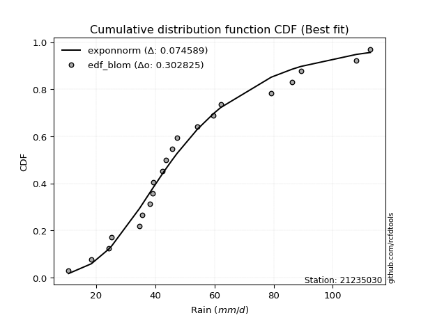</img></img>

</div>


### 7. Empirical - EDF Tukey (1962)

In hydrology, the Tukey formula is used as a plotting position formula to estimate the empirical probability or frequency of a flood event (or other hydrological data). The formula parameter is given as _c=0.333_ (or 1/3).

<div align="center">


$P=(m-c)/(n+1-2c)$


</div>


**7.1. Empirical values**

<div align="center">

|                | 0                 | 1                  | 2                  | 3                  | 4         | 5                  | 6                  | 7                  | 8                  | 9                  | 10        | 11                | 12                 | 13                | 14        | 15                | 16                | 17                | 18        | 19        | 20        |
|:---------------|:------------------|:-------------------|:-------------------|:-------------------|:----------|:-------------------|:-------------------|:-------------------|:-------------------|:-------------------|:----------|:------------------|:-------------------|:------------------|:----------|:------------------|:------------------|:------------------|:----------|:----------|:----------|
| date           | 2022              | 2021               | 2020               | 2023               | 2016      | 2017               | 2007               | 2006               | 2005               | 2008               | 2018      | 2010              | 2009               | 2015              | 2014      | 2013              | 2024              | 2025              | 2012      | 2011      | 2019      |
| x              | 10.7              | 18.4               | 24.2               | 25.3               | 34.6      | 35.5               | 38.2               | 39.0               | 39.3               | 42.3               | 43.7      | 45.6              | 47.4               | 54.2              | 59.7      | 62.1              | 79.2              | 86.2              | 89.2      | 108.0     | 112.7     |
| m              | 1                 | 2                  | 3                  | 4                  | 5         | 6                  | 7                  | 8                  | 9                  | 10                 | 11        | 12                | 13                 | 14                | 15        | 16                | 17                | 18                | 19        | 20        | 21        |
| empirical_dist | edf_tukey         | edf_tukey          | edf_tukey          | edf_tukey          | edf_tukey | edf_tukey          | edf_tukey          | edf_tukey          | edf_tukey          | edf_tukey          | edf_tukey | edf_tukey         | edf_tukey          | edf_tukey         | edf_tukey | edf_tukey         | edf_tukey         | edf_tukey         | edf_tukey | edf_tukey | edf_tukey |
| empirical      | 0.03125           | 0.078125           | 0.125              | 0.171875           | 0.21875   | 0.265625           | 0.3125             | 0.359375           | 0.40625            | 0.453125           | 0.5       | 0.546875          | 0.59375            | 0.640625          | 0.6875    | 0.734375          | 0.78125           | 0.828125          | 0.875     | 0.921875  | 0.96875   |
| empirical_tr   | 1.032258064516129 | 1.0847457627118644 | 1.1428571428571428 | 1.2075471698113207 | 1.28      | 1.3617021276595744 | 1.4545454545454546 | 1.5609756097560976 | 1.6842105263157894 | 1.8285714285714285 | 2.0       | 2.206896551724138 | 2.4615384615384617 | 2.782608695652174 | 3.2       | 3.764705882352941 | 4.571428571428571 | 5.818181818181818 | 8.0       | 12.8      | 32.0      |

</div>


**7.2. Kolmogorov-Smirnov fit test (sorted by Δ)**


<div align="center">

|                | 0                   | 1                   | 2                   | 3                   | 4                   | 5                   | 6                   | 7                   | 8                   | 9                     | 10                  | 11                  | 12                  | 13                  | 14                  | 15                  | 16                  | 17                  | 18                  | 19                  | 20                  | 21                  | 22                  | 23                  | 24                  | 25                  | 26                  | 27                  | 28                  | 29                  | 30                  | 31                  | 32                  | 33                  | 34                  | 35                  | 36                  | 37                  | 38                  | 39                  | 40                  | 41                  | 42                  | 43                  | 44                  | 45                  | 46                  | 47                  | 48                  | 49                  | 50                  | 51                  | 52                  | 53                  | 54                  | 55                  | 56                  | 57                  | 58                  | 59                  | 60                  | 61                  | 62                  | 63                  | 64                  | 65                  | 66                  | 67                  | 68                  | 69                  | 70                  | 71                  | 72                  | 73                  | 74                  | 75                  | 76                  | 77                  | 78                  | 79                  | 80                  | 81                  | 82                  | 83                  | 84                  | 85                  | 86                  | 87                  | 88                  | 89                  |
|:---------------|:--------------------|:--------------------|:--------------------|:--------------------|:--------------------|:--------------------|:--------------------|:--------------------|:--------------------|:----------------------|:--------------------|:--------------------|:--------------------|:--------------------|:--------------------|:--------------------|:--------------------|:--------------------|:--------------------|:--------------------|:--------------------|:--------------------|:--------------------|:--------------------|:--------------------|:--------------------|:--------------------|:--------------------|:--------------------|:--------------------|:--------------------|:--------------------|:--------------------|:--------------------|:--------------------|:--------------------|:--------------------|:--------------------|:--------------------|:--------------------|:--------------------|:--------------------|:--------------------|:--------------------|:--------------------|:--------------------|:--------------------|:--------------------|:--------------------|:--------------------|:--------------------|:--------------------|:--------------------|:--------------------|:--------------------|:--------------------|:--------------------|:--------------------|:--------------------|:--------------------|:--------------------|:--------------------|:--------------------|:--------------------|:--------------------|:--------------------|:--------------------|:--------------------|:--------------------|:--------------------|:--------------------|:--------------------|:--------------------|:--------------------|:--------------------|:--------------------|:--------------------|:--------------------|:--------------------|:--------------------|:--------------------|:--------------------|:--------------------|:--------------------|:--------------------|:--------------------|:--------------------|:--------------------|:--------------------|:--------------------|
| station        | 21235030            | 21235030            | 21235030            | 21235030            | 21235030            | 21235030            | 21235030            | 21235030            | 21235030            | 21235030              | 21235030            | 21235030            | 21235030            | 21235030            | 21235030            | 21235030            | 21235030            | 21235030            | 21235030            | 21235030            | 21235030            | 21235030            | 21235030            | 21235030            | 21235030            | 21235030            | 21235030            | 21235030            | 21235030            | 21235030            | 21235030            | 21235030            | 21235030            | 21235030            | 21235030            | 21235030            | 21235030            | 21235030            | 21235030            | 21235030            | 21235030            | 21235030            | 21235030            | 21235030            | 21235030            | 21235030            | 21235030            | 21235030            | 21235030            | 21235030            | 21235030            | 21235030            | 21235030            | 21235030            | 21235030            | 21235030            | 21235030            | 21235030            | 21235030            | 21235030            | 21235030            | 21235030            | 21235030            | 21235030            | 21235030            | 21235030            | 21235030            | 21235030            | 21235030            | 21235030            | 21235030            | 21235030            | 21235030            | 21235030            | 21235030            | 21235030            | 21235030            | 21235030            | 21235030            | 21235030            | 21235030            | 21235030            | 21235030            | 21235030            | 21235030            | 21235030            | 21235030            | 21235030            | 21235030            | 21235030            |
| empirical_dist | edf_tukey           | edf_tukey           | edf_tukey           | edf_tukey           | edf_tukey           | edf_tukey           | edf_tukey           | edf_tukey           | edf_tukey           | edf_tukey             | edf_tukey           | edf_tukey           | edf_tukey           | edf_tukey           | edf_tukey           | edf_tukey           | edf_tukey           | edf_tukey           | edf_tukey           | edf_tukey           | edf_tukey           | edf_tukey           | edf_tukey           | edf_tukey           | edf_tukey           | edf_tukey           | edf_tukey           | edf_tukey           | edf_tukey           | edf_tukey           | edf_tukey           | edf_tukey           | edf_tukey           | edf_tukey           | edf_tukey           | edf_tukey           | edf_tukey           | edf_tukey           | edf_tukey           | edf_tukey           | edf_tukey           | edf_tukey           | edf_tukey           | edf_tukey           | edf_tukey           | edf_tukey           | edf_tukey           | edf_tukey           | edf_tukey           | edf_tukey           | edf_tukey           | edf_tukey           | edf_tukey           | edf_tukey           | edf_tukey           | edf_tukey           | edf_tukey           | edf_tukey           | edf_tukey           | edf_tukey           | edf_tukey           | edf_tukey           | edf_tukey           | edf_tukey           | edf_tukey           | edf_tukey           | edf_tukey           | edf_tukey           | edf_tukey           | edf_tukey           | edf_tukey           | edf_tukey           | edf_tukey           | edf_tukey           | edf_tukey           | edf_tukey           | edf_tukey           | edf_tukey           | edf_tukey           | edf_tukey           | edf_tukey           | edf_tukey           | edf_tukey           | edf_tukey           | edf_tukey           | edf_tukey           | edf_tukey           | edf_tukey           | edf_tukey           | edf_tukey           |
| p_dist         | fisk                | exponnorm           | logfisk             | logmielke           | laplace_asymmetric  | nct                 | mielke              | moyal               | loggenlogistic      | loglaplace_asymmetric | lognakagami         | loglogistic         | invgamma            | invgauss            | fatiguelife         | johnsonsu           | invweibull          | f                   | alpha               | gamma               | erlang              | chi2                | loghypsecant        | logpearson3         | ncf                 | betaprime           | halflogistic        | logt                | logloggamma         | genlogistic         | logweibull_min      | weibull_min         | logjohnsonsu        | loglaplace          | gumbel_r            | loggompertz         | halfnorm            | kstwobign           | logf                | logrice             | logcrystalball      | lognorm             | lognorm             | logexponnorm        | loglognorm          | lognct              | logfatiguelife      | genexpon            | pearson3            | logerlang           | logbetaprime        | loginvgamma         | logalpha            | rayleigh            | logncf              | loggamma            | loggamma            | loggumbel_l         | maxwell             | loginvgauss         | rice                | logmaxwell          | loggumbel_r         | lograyleigh         | logmoyal            | gompertz            | crystalball         | norm                | truncnorm           | t                   | loginvweibull       | logistic            | wald                | gibrat              | loghalfnorm         | hypsecant           | loghalflogistic     | loggibrat           | laplace             | logkstwobign        | logwald             | expon               | gumbel_l            | loggenexpon         | nakagami            | logtruncnorm        | logexpon            | logpareto           | logchi2             | pareto              |
| delta          | 0.0734178742729642  | 0.07348634446477498 | 0.07434489258749155 | 0.07573255455105166 | 0.07711263289581904 | 0.07719244159779515 | 0.07733974850033365 | 0.07743552058760617 | 0.07748772631581835 | 0.08081386064306006   | 0.08170585771393211 | 0.08383846009624973 | 0.08457413724428697 | 0.08481970142245054 | 0.0848203537639669  | 0.08509646795701087 | 0.08520875252688542 | 0.08635282426306379 | 0.08640766564689917 | 0.08645047568541786 | 0.0864507096327859  | 0.0864508461815362  | 0.08691528588274244 | 0.08859932807868487 | 0.08903049336377988 | 0.08913176129266454 | 0.09078738768124056 | 0.09106722913218646 | 0.0924692181940805  | 0.092623790350574   | 0.09301385049889277 | 0.09334121482135715 | 0.09467148433626105 | 0.09602464493481755 | 0.09768383039481093 | 0.09783370619836851 | 0.10185823375417702 | 0.10212644553325245 | 0.10384980292362894 | 0.10387855834224352 | 0.10387863079552312 | 0.10387865514431133 | 0.10387865514431133 | 0.10388026053602095 | 0.10388179979583961 | 0.10399034926713635 | 0.10446673385121513 | 0.10761166723265969 | 0.11282644915387641 | 0.11378275364723911 | 0.11466485966560797 | 0.11503876097074606 | 0.11562045852760139 | 0.11596118629724128 | 0.11688614715421058 | 0.11716034616996196 | 0.11716034616996196 | 0.1253311197717153  | 0.12806883346046888 | 0.13282677511397395 | 0.13327502694309706 | 0.13384640090043837 | 0.1442662453491908  | 0.14544953571132269 | 0.15820912890565475 | 0.16163188048084942 | 0.16247107435209557 | 0.1624710800327236  | 0.16247108581816172 | 0.16247964162003015 | 0.1697896631479489  | 0.17161210684517997 | 0.17187499964124264 | 0.171875            | 0.1784560101357563  | 0.17926201572870964 | 0.18146153364225875 | 0.1990354405125001  | 0.20233014980156433 | 0.20769465689158073 | 0.21169831593263055 | 0.21931357568692222 | 0.2315909535329449  | 0.2367527417491203  | 0.24669164237173274 | 0.25767651262742236 | 0.33964795244621016 | 0.33964796237171524 | 0.4651274375892598  | 0.5440014989311872  |
| deltao         | 0.30282488509099936 | 0.30282488509099936 | 0.30282488509099936 | 0.30282488509099936 | 0.30282488509099936 | 0.30282488509099936 | 0.30282488509099936 | 0.30282488509099936 | 0.30282488509099936 | 0.30282488509099936   | 0.30282488509099936 | 0.30282488509099936 | 0.30282488509099936 | 0.30282488509099936 | 0.30282488509099936 | 0.30282488509099936 | 0.30282488509099936 | 0.30282488509099936 | 0.30282488509099936 | 0.30282488509099936 | 0.30282488509099936 | 0.30282488509099936 | 0.30282488509099936 | 0.30282488509099936 | 0.30282488509099936 | 0.30282488509099936 | 0.30282488509099936 | 0.30282488509099936 | 0.30282488509099936 | 0.30282488509099936 | 0.30282488509099936 | 0.30282488509099936 | 0.30282488509099936 | 0.30282488509099936 | 0.30282488509099936 | 0.30282488509099936 | 0.30282488509099936 | 0.30282488509099936 | 0.30282488509099936 | 0.30282488509099936 | 0.30282488509099936 | 0.30282488509099936 | 0.30282488509099936 | 0.30282488509099936 | 0.30282488509099936 | 0.30282488509099936 | 0.30282488509099936 | 0.30282488509099936 | 0.30282488509099936 | 0.30282488509099936 | 0.30282488509099936 | 0.30282488509099936 | 0.30282488509099936 | 0.30282488509099936 | 0.30282488509099936 | 0.30282488509099936 | 0.30282488509099936 | 0.30282488509099936 | 0.30282488509099936 | 0.30282488509099936 | 0.30282488509099936 | 0.30282488509099936 | 0.30282488509099936 | 0.30282488509099936 | 0.30282488509099936 | 0.30282488509099936 | 0.30282488509099936 | 0.30282488509099936 | 0.30282488509099936 | 0.30282488509099936 | 0.30282488509099936 | 0.30282488509099936 | 0.30282488509099936 | 0.30282488509099936 | 0.30282488509099936 | 0.30282488509099936 | 0.30282488509099936 | 0.30282488509099936 | 0.30282488509099936 | 0.30282488509099936 | 0.30282488509099936 | 0.30282488509099936 | 0.30282488509099936 | 0.30282488509099936 | 0.30282488509099936 | 0.30282488509099936 | 0.30282488509099936 | 0.30282488509099936 | 0.30282488509099936 | 0.30282488509099936 |
| eval           | Δo > Δ              | Δo > Δ              | Δo > Δ              | Δo > Δ              | Δo > Δ              | Δo > Δ              | Δo > Δ              | Δo > Δ              | Δo > Δ              | Δo > Δ                | Δo > Δ              | Δo > Δ              | Δo > Δ              | Δo > Δ              | Δo > Δ              | Δo > Δ              | Δo > Δ              | Δo > Δ              | Δo > Δ              | Δo > Δ              | Δo > Δ              | Δo > Δ              | Δo > Δ              | Δo > Δ              | Δo > Δ              | Δo > Δ              | Δo > Δ              | Δo > Δ              | Δo > Δ              | Δo > Δ              | Δo > Δ              | Δo > Δ              | Δo > Δ              | Δo > Δ              | Δo > Δ              | Δo > Δ              | Δo > Δ              | Δo > Δ              | Δo > Δ              | Δo > Δ              | Δo > Δ              | Δo > Δ              | Δo > Δ              | Δo > Δ              | Δo > Δ              | Δo > Δ              | Δo > Δ              | Δo > Δ              | Δo > Δ              | Δo > Δ              | Δo > Δ              | Δo > Δ              | Δo > Δ              | Δo > Δ              | Δo > Δ              | Δo > Δ              | Δo > Δ              | Δo > Δ              | Δo > Δ              | Δo > Δ              | Δo > Δ              | Δo > Δ              | Δo > Δ              | Δo > Δ              | Δo > Δ              | Δo > Δ              | Δo > Δ              | Δo > Δ              | Δo > Δ              | Δo > Δ              | Δo > Δ              | Δo > Δ              | Δo > Δ              | Δo > Δ              | Δo > Δ              | Δo > Δ              | Δo > Δ              | Δo > Δ              | Δo > Δ              | Δo > Δ              | Δo > Δ              | Δo > Δ              | Δo > Δ              | Δo > Δ              | Δo > Δ              | Δo > Δ              | Δo <= Δ             | Δo <= Δ             | Δo <= Δ             | Δo <= Δ             |
| fit            | 1                   | 1                   | 1                   | 1                   | 1                   | 1                   | 1                   | 1                   | 1                   | 1                     | 1                   | 1                   | 1                   | 1                   | 1                   | 1                   | 1                   | 1                   | 1                   | 1                   | 1                   | 1                   | 1                   | 1                   | 1                   | 1                   | 1                   | 1                   | 1                   | 1                   | 1                   | 1                   | 1                   | 1                   | 1                   | 1                   | 1                   | 1                   | 1                   | 1                   | 1                   | 1                   | 1                   | 1                   | 1                   | 1                   | 1                   | 1                   | 1                   | 1                   | 1                   | 1                   | 1                   | 1                   | 1                   | 1                   | 1                   | 1                   | 1                   | 1                   | 1                   | 1                   | 1                   | 1                   | 1                   | 1                   | 1                   | 1                   | 1                   | 1                   | 1                   | 1                   | 1                   | 1                   | 1                   | 1                   | 1                   | 1                   | 1                   | 1                   | 1                   | 1                   | 1                   | 1                   | 1                   | 1                   | 0                   | 0                   | 0                   | 0                   |
| n              | 21                  | 21                  | 21                  | 21                  | 21                  | 21                  | 21                  | 21                  | 21                  | 21                    | 21                  | 21                  | 21                  | 21                  | 21                  | 21                  | 21                  | 21                  | 21                  | 21                  | 21                  | 21                  | 21                  | 21                  | 21                  | 21                  | 21                  | 21                  | 21                  | 21                  | 21                  | 21                  | 21                  | 21                  | 21                  | 21                  | 21                  | 21                  | 21                  | 21                  | 21                  | 21                  | 21                  | 21                  | 21                  | 21                  | 21                  | 21                  | 21                  | 21                  | 21                  | 21                  | 21                  | 21                  | 21                  | 21                  | 21                  | 21                  | 21                  | 21                  | 21                  | 21                  | 21                  | 21                  | 21                  | 21                  | 21                  | 21                  | 21                  | 21                  | 21                  | 21                  | 21                  | 21                  | 21                  | 21                  | 21                  | 21                  | 21                  | 21                  | 21                  | 21                  | 21                  | 21                  | 21                  | 21                  | 21                  | 21                  | 21                  | 21                  |
| best_fit       | 1                   | 0                   | 0                   | 0                   | 0                   | 0                   | 0                   | 0                   | 0                   | 0                     | 0                   | 0                   | 0                   | 0                   | 0                   | 0                   | 0                   | 0                   | 0                   | 0                   | 0                   | 0                   | 0                   | 0                   | 0                   | 0                   | 0                   | 0                   | 0                   | 0                   | 0                   | 0                   | 0                   | 0                   | 0                   | 0                   | 0                   | 0                   | 0                   | 0                   | 0                   | 0                   | 0                   | 0                   | 0                   | 0                   | 0                   | 0                   | 0                   | 0                   | 0                   | 0                   | 0                   | 0                   | 0                   | 0                   | 0                   | 0                   | 0                   | 0                   | 0                   | 0                   | 0                   | 0                   | 0                   | 0                   | 0                   | 0                   | 0                   | 0                   | 0                   | 0                   | 0                   | 0                   | 0                   | 0                   | 0                   | 0                   | 0                   | 0                   | 0                   | 0                   | 0                   | 0                   | 0                   | 0                   | 0                   | 0                   | 0                   | 0                   |
| best_fit_sort  | 1                   | 2                   | 3                   | 4                   | 5                   | 6                   | 7                   | 8                   | 9                   | 10                    | 11                  | 12                  | 13                  | 14                  | 15                  | 16                  | 17                  | 18                  | 19                  | 20                  | 21                  | 22                  | 23                  | 24                  | 25                  | 26                  | 27                  | 28                  | 29                  | 30                  | 31                  | 32                  | 33                  | 34                  | 35                  | 36                  | 37                  | 38                  | 39                  | 40                  | 41                  | 42                  | 43                  | 44                  | 45                  | 46                  | 47                  | 48                  | 49                  | 50                  | 51                  | 52                  | 53                  | 54                  | 55                  | 56                  | 57                  | 58                  | 59                  | 60                  | 61                  | 62                  | 63                  | 64                  | 65                  | 66                  | 67                  | 68                  | 69                  | 70                  | 71                  | 72                  | 73                  | 74                  | 75                  | 76                  | 77                  | 78                  | 79                  | 80                  | 81                  | 82                  | 83                  | 84                  | 85                  | 86                  | 87                  | 88                  | 89                  | 90                  |

</div>


<div align="center">

</img>

</div>


**7.3. Best fit**

<div align="center">

|   id |   station | empirical_dist   | p_dist   |     delta |   deltao | eval   |   fit |   n |   best_fit |   best_fit_sort |
|-----:|----------:|:-----------------|:---------|----------:|---------:|:-------|------:|----:|-----------:|----------------:|
|    0 |  21235030 | edf_tukey        | fisk     | 0.0734179 | 0.302825 | Δo > Δ |     1 |  21 |          1 |               1 |

</div>


<div align="center">

</img></img>

</div>


### 8. Empirical - EDF Gringorten (1963)

Gringorten plotting position formula is essential for estimating the probability and return periods of extreme events like floods and heavy rainfall. The constant _a=0.44_.

<div align="center">


$P=(m-a)/(n+1-2a)$


</div>


**8.1. Empirical values**

<div align="center">

|                | 0                    | 1                   | 2                   | 3                   | 4                   | 5                   | 6                   | 7                  | 8                   | 9                   | 10             | 11                 | 12                 | 13                 | 14                 | 15                 | 16                | 17                 | 18                 | 19                 | 20                 |
|:---------------|:---------------------|:--------------------|:--------------------|:--------------------|:--------------------|:--------------------|:--------------------|:-------------------|:--------------------|:--------------------|:---------------|:-------------------|:-------------------|:-------------------|:-------------------|:-------------------|:------------------|:-------------------|:-------------------|:-------------------|:-------------------|
| date           | 2022                 | 2021                | 2020                | 2023                | 2016                | 2017                | 2007                | 2006               | 2005                | 2008                | 2018           | 2010               | 2009               | 2015               | 2014               | 2013               | 2024              | 2025               | 2012               | 2011               | 2019               |
| x              | 10.7                 | 18.4                | 24.2                | 25.3                | 34.6                | 35.5                | 38.2                | 39.0               | 39.3                | 42.3                | 43.7           | 45.6               | 47.4               | 54.2               | 59.7               | 62.1               | 79.2              | 86.2               | 89.2               | 108.0              | 112.7              |
| m              | 1                    | 2                   | 3                   | 4                   | 5                   | 6                   | 7                   | 8                  | 9                   | 10                  | 11             | 12                 | 13                 | 14                 | 15                 | 16                 | 17                | 18                 | 19                 | 20                 | 21                 |
| empirical_dist | edf_gringorten       | edf_gringorten      | edf_gringorten      | edf_gringorten      | edf_gringorten      | edf_gringorten      | edf_gringorten      | edf_gringorten     | edf_gringorten      | edf_gringorten      | edf_gringorten | edf_gringorten     | edf_gringorten     | edf_gringorten     | edf_gringorten     | edf_gringorten     | edf_gringorten    | edf_gringorten     | edf_gringorten     | edf_gringorten     | edf_gringorten     |
| empirical      | 0.026515151515151516 | 0.07386363636363637 | 0.12121212121212122 | 0.16856060606060605 | 0.21590909090909088 | 0.26325757575757575 | 0.31060606060606055 | 0.3579545454545454 | 0.40530303030303033 | 0.45265151515151514 | 0.5            | 0.5473484848484849 | 0.5946969696969697 | 0.6420454545454546 | 0.6893939393939393 | 0.7367424242424242 | 0.784090909090909 | 0.8314393939393938 | 0.8787878787878787 | 0.9261363636363635 | 0.9734848484848484 |
| empirical_tr   | 1.027237354085603    | 1.0797546012269938  | 1.1379310344827587  | 1.202733485193622   | 1.2753623188405796  | 1.3573264781491001  | 1.4505494505494505  | 1.5575221238938053 | 1.681528662420382   | 1.8269896193771626  | 2.0            | 2.209205020920502  | 2.4672897196261685 | 2.793650793650794  | 3.2195121951219505 | 3.798561151079136  | 4.631578947368418 | 5.932584269662917  | 8.249999999999993  | 13.53846153846152  | 37.71428571428559  |

</div>


**8.2. Kolmogorov-Smirnov fit test (sorted by Δ)**


<div align="center">

|                | 0                   | 1                   | 2                   | 3                   | 4                   | 5                   | 6                     | 7                   | 8                   | 9                   | 10                  | 11                  | 12                  | 13                  | 14                  | 15                  | 16                  | 17                  | 18                  | 19                  | 20                  | 21                  | 22                  | 23                  | 24                  | 25                  | 26                  | 27                  | 28                  | 29                  | 30                  | 31                  | 32                  | 33                  | 34                  | 35                  | 36                  | 37                  | 38                  | 39                  | 40                  | 41                  | 42                  | 43                  | 44                  | 45                  | 46                  | 47                  | 48                  | 49                  | 50                  | 51                  | 52                  | 53                  | 54                  | 55                  | 56                  | 57                  | 58                  | 59                  | 60                  | 61                  | 62                  | 63                  | 64                  | 65                  | 66                  | 67                  | 68                  | 69                  | 70                  | 71                  | 72                  | 73                  | 74                  | 75                  | 76                  | 77                  | 78                  | 79                  | 80                  | 81                  | 82                  | 83                  | 84                  | 85                  | 86                  | 87                  | 88                  | 89                  |
|:---------------|:--------------------|:--------------------|:--------------------|:--------------------|:--------------------|:--------------------|:----------------------|:--------------------|:--------------------|:--------------------|:--------------------|:--------------------|:--------------------|:--------------------|:--------------------|:--------------------|:--------------------|:--------------------|:--------------------|:--------------------|:--------------------|:--------------------|:--------------------|:--------------------|:--------------------|:--------------------|:--------------------|:--------------------|:--------------------|:--------------------|:--------------------|:--------------------|:--------------------|:--------------------|:--------------------|:--------------------|:--------------------|:--------------------|:--------------------|:--------------------|:--------------------|:--------------------|:--------------------|:--------------------|:--------------------|:--------------------|:--------------------|:--------------------|:--------------------|:--------------------|:--------------------|:--------------------|:--------------------|:--------------------|:--------------------|:--------------------|:--------------------|:--------------------|:--------------------|:--------------------|:--------------------|:--------------------|:--------------------|:--------------------|:--------------------|:--------------------|:--------------------|:--------------------|:--------------------|:--------------------|:--------------------|:--------------------|:--------------------|:--------------------|:--------------------|:--------------------|:--------------------|:--------------------|:--------------------|:--------------------|:--------------------|:--------------------|:--------------------|:--------------------|:--------------------|:--------------------|:--------------------|:--------------------|:--------------------|:--------------------|
| station        | 21235030            | 21235030            | 21235030            | 21235030            | 21235030            | 21235030            | 21235030              | 21235030            | 21235030            | 21235030            | 21235030            | 21235030            | 21235030            | 21235030            | 21235030            | 21235030            | 21235030            | 21235030            | 21235030            | 21235030            | 21235030            | 21235030            | 21235030            | 21235030            | 21235030            | 21235030            | 21235030            | 21235030            | 21235030            | 21235030            | 21235030            | 21235030            | 21235030            | 21235030            | 21235030            | 21235030            | 21235030            | 21235030            | 21235030            | 21235030            | 21235030            | 21235030            | 21235030            | 21235030            | 21235030            | 21235030            | 21235030            | 21235030            | 21235030            | 21235030            | 21235030            | 21235030            | 21235030            | 21235030            | 21235030            | 21235030            | 21235030            | 21235030            | 21235030            | 21235030            | 21235030            | 21235030            | 21235030            | 21235030            | 21235030            | 21235030            | 21235030            | 21235030            | 21235030            | 21235030            | 21235030            | 21235030            | 21235030            | 21235030            | 21235030            | 21235030            | 21235030            | 21235030            | 21235030            | 21235030            | 21235030            | 21235030            | 21235030            | 21235030            | 21235030            | 21235030            | 21235030            | 21235030            | 21235030            | 21235030            |
| empirical_dist | edf_gringorten      | edf_gringorten      | edf_gringorten      | edf_gringorten      | edf_gringorten      | edf_gringorten      | edf_gringorten        | edf_gringorten      | edf_gringorten      | edf_gringorten      | edf_gringorten      | edf_gringorten      | edf_gringorten      | edf_gringorten      | edf_gringorten      | edf_gringorten      | edf_gringorten      | edf_gringorten      | edf_gringorten      | edf_gringorten      | edf_gringorten      | edf_gringorten      | edf_gringorten      | edf_gringorten      | edf_gringorten      | edf_gringorten      | edf_gringorten      | edf_gringorten      | edf_gringorten      | edf_gringorten      | edf_gringorten      | edf_gringorten      | edf_gringorten      | edf_gringorten      | edf_gringorten      | edf_gringorten      | edf_gringorten      | edf_gringorten      | edf_gringorten      | edf_gringorten      | edf_gringorten      | edf_gringorten      | edf_gringorten      | edf_gringorten      | edf_gringorten      | edf_gringorten      | edf_gringorten      | edf_gringorten      | edf_gringorten      | edf_gringorten      | edf_gringorten      | edf_gringorten      | edf_gringorten      | edf_gringorten      | edf_gringorten      | edf_gringorten      | edf_gringorten      | edf_gringorten      | edf_gringorten      | edf_gringorten      | edf_gringorten      | edf_gringorten      | edf_gringorten      | edf_gringorten      | edf_gringorten      | edf_gringorten      | edf_gringorten      | edf_gringorten      | edf_gringorten      | edf_gringorten      | edf_gringorten      | edf_gringorten      | edf_gringorten      | edf_gringorten      | edf_gringorten      | edf_gringorten      | edf_gringorten      | edf_gringorten      | edf_gringorten      | edf_gringorten      | edf_gringorten      | edf_gringorten      | edf_gringorten      | edf_gringorten      | edf_gringorten      | edf_gringorten      | edf_gringorten      | edf_gringorten      | edf_gringorten      | edf_gringorten      |
| p_dist         | fisk                | laplace_asymmetric  | moyal               | exponnorm           | logmielke           | logfisk             | loglaplace_asymmetric | nct                 | mielke              | lognakagami         | loggenlogistic      | loghypsecant        | invgamma            | invgauss            | fatiguelife         | johnsonsu           | invweibull          | loglogistic         | f                   | alpha               | gamma               | erlang              | chi2                | logpearson3         | ncf                 | betaprime           | loglaplace          | logloggamma         | genlogistic         | halflogistic        | logt                | logweibull_min      | weibull_min         | logjohnsonsu        | gumbel_r            | loggompertz         | kstwobign           | halfnorm            | logf                | logrice             | logcrystalball      | lognorm             | lognorm             | logexponnorm        | loglognorm          | lognct              | logfatiguelife      | genexpon            | pearson3            | logerlang           | rayleigh            | logbetaprime        | loginvgamma         | logalpha            | logncf              | loggamma            | loggamma            | loggumbel_l         | maxwell             | rice                | loginvgauss         | logmaxwell          | loggumbel_r         | lograyleigh         | logmoyal            | gompertz            | crystalball         | norm                | truncnorm           | t                   | wald                | gibrat              | logistic            | loginvweibull       | hypsecant           | loghalfnorm         | loghalflogistic     | loggibrat           | laplace             | logkstwobign        | logwald             | expon               | gumbel_l            | loggenexpon         | nakagami            | logtruncnorm        | logexpon            | logpareto           | logchi2             | pareto              |
| delta          | 0.07436484396993392 | 0.0745657836209559  | 0.07459461149669722 | 0.0763272535556841  | 0.07667952424802138 | 0.07718580167840067 | 0.07797295155215112   | 0.07813941129476487 | 0.07828671819730337 | 0.07839146377453816 | 0.07843469601278807 | 0.0840743767918335  | 0.0855211069412567  | 0.08576667111942027 | 0.08576732346093663 | 0.08604343765398059 | 0.08615572222385515 | 0.08667936918715885 | 0.08729979396003351 | 0.08735463534386889 | 0.08739744538238758 | 0.08739767932975562 | 0.08739781587850592 | 0.08954629777565459 | 0.08997746306074961 | 0.09007873098963426 | 0.0931837358439086  | 0.09341618789105022 | 0.09357076004754372 | 0.09362829677214968 | 0.09390813822309557 | 0.0939608201958625  | 0.09428818451832688 | 0.09561845403323077 | 0.09863080009178066 | 0.09878067589533823 | 0.10307341523022218 | 0.10469914284508614 | 0.10669071201453806 | 0.10671946743315264 | 0.10671953988643224 | 0.10671956423522044 | 0.10671956423522044 | 0.10672116962693007 | 0.10672270888674873 | 0.10683125835804547 | 0.10730764294212425 | 0.10855863692962942 | 0.11377341885084613 | 0.11662366273814823 | 0.116908155994211   | 0.11750576875651708 | 0.11787967006165517 | 0.1184613676185105  | 0.1197270562451197  | 0.12000125526087108 | 0.12000125526087108 | 0.12627808946868502 | 0.1290158031574386  | 0.1342219966400668  | 0.13566768420488307 | 0.13668730999134748 | 0.14710715444009992 | 0.1482904448022318  | 0.16105003799656387 | 0.16257885017781915 | 0.1634180440490653  | 0.16341804972969332 | 0.16341805551513144 | 0.16342661131699987 | 0.1685606057018487  | 0.16856060606060605 | 0.1725590765421497  | 0.17263057223885803 | 0.18020898542567937 | 0.1812969192266654  | 0.18430244273316787 | 0.20092937990643955 | 0.20327711949853405 | 0.21053556598248985 | 0.21359225532657    | 0.22215448477783134 | 0.23253792322991462 | 0.23959365084002943 | 0.24953255146264186 | 0.2605174217183315  | 0.34248886153711927 | 0.34248887146262436 | 0.4679683466801689  | 0.5482628625675509  |
| deltao         | 0.30282488509099936 | 0.30282488509099936 | 0.30282488509099936 | 0.30282488509099936 | 0.30282488509099936 | 0.30282488509099936 | 0.30282488509099936   | 0.30282488509099936 | 0.30282488509099936 | 0.30282488509099936 | 0.30282488509099936 | 0.30282488509099936 | 0.30282488509099936 | 0.30282488509099936 | 0.30282488509099936 | 0.30282488509099936 | 0.30282488509099936 | 0.30282488509099936 | 0.30282488509099936 | 0.30282488509099936 | 0.30282488509099936 | 0.30282488509099936 | 0.30282488509099936 | 0.30282488509099936 | 0.30282488509099936 | 0.30282488509099936 | 0.30282488509099936 | 0.30282488509099936 | 0.30282488509099936 | 0.30282488509099936 | 0.30282488509099936 | 0.30282488509099936 | 0.30282488509099936 | 0.30282488509099936 | 0.30282488509099936 | 0.30282488509099936 | 0.30282488509099936 | 0.30282488509099936 | 0.30282488509099936 | 0.30282488509099936 | 0.30282488509099936 | 0.30282488509099936 | 0.30282488509099936 | 0.30282488509099936 | 0.30282488509099936 | 0.30282488509099936 | 0.30282488509099936 | 0.30282488509099936 | 0.30282488509099936 | 0.30282488509099936 | 0.30282488509099936 | 0.30282488509099936 | 0.30282488509099936 | 0.30282488509099936 | 0.30282488509099936 | 0.30282488509099936 | 0.30282488509099936 | 0.30282488509099936 | 0.30282488509099936 | 0.30282488509099936 | 0.30282488509099936 | 0.30282488509099936 | 0.30282488509099936 | 0.30282488509099936 | 0.30282488509099936 | 0.30282488509099936 | 0.30282488509099936 | 0.30282488509099936 | 0.30282488509099936 | 0.30282488509099936 | 0.30282488509099936 | 0.30282488509099936 | 0.30282488509099936 | 0.30282488509099936 | 0.30282488509099936 | 0.30282488509099936 | 0.30282488509099936 | 0.30282488509099936 | 0.30282488509099936 | 0.30282488509099936 | 0.30282488509099936 | 0.30282488509099936 | 0.30282488509099936 | 0.30282488509099936 | 0.30282488509099936 | 0.30282488509099936 | 0.30282488509099936 | 0.30282488509099936 | 0.30282488509099936 | 0.30282488509099936 |
| eval           | Δo > Δ              | Δo > Δ              | Δo > Δ              | Δo > Δ              | Δo > Δ              | Δo > Δ              | Δo > Δ                | Δo > Δ              | Δo > Δ              | Δo > Δ              | Δo > Δ              | Δo > Δ              | Δo > Δ              | Δo > Δ              | Δo > Δ              | Δo > Δ              | Δo > Δ              | Δo > Δ              | Δo > Δ              | Δo > Δ              | Δo > Δ              | Δo > Δ              | Δo > Δ              | Δo > Δ              | Δo > Δ              | Δo > Δ              | Δo > Δ              | Δo > Δ              | Δo > Δ              | Δo > Δ              | Δo > Δ              | Δo > Δ              | Δo > Δ              | Δo > Δ              | Δo > Δ              | Δo > Δ              | Δo > Δ              | Δo > Δ              | Δo > Δ              | Δo > Δ              | Δo > Δ              | Δo > Δ              | Δo > Δ              | Δo > Δ              | Δo > Δ              | Δo > Δ              | Δo > Δ              | Δo > Δ              | Δo > Δ              | Δo > Δ              | Δo > Δ              | Δo > Δ              | Δo > Δ              | Δo > Δ              | Δo > Δ              | Δo > Δ              | Δo > Δ              | Δo > Δ              | Δo > Δ              | Δo > Δ              | Δo > Δ              | Δo > Δ              | Δo > Δ              | Δo > Δ              | Δo > Δ              | Δo > Δ              | Δo > Δ              | Δo > Δ              | Δo > Δ              | Δo > Δ              | Δo > Δ              | Δo > Δ              | Δo > Δ              | Δo > Δ              | Δo > Δ              | Δo > Δ              | Δo > Δ              | Δo > Δ              | Δo > Δ              | Δo > Δ              | Δo > Δ              | Δo > Δ              | Δo > Δ              | Δo > Δ              | Δo > Δ              | Δo > Δ              | Δo <= Δ             | Δo <= Δ             | Δo <= Δ             | Δo <= Δ             |
| fit            | 1                   | 1                   | 1                   | 1                   | 1                   | 1                   | 1                     | 1                   | 1                   | 1                   | 1                   | 1                   | 1                   | 1                   | 1                   | 1                   | 1                   | 1                   | 1                   | 1                   | 1                   | 1                   | 1                   | 1                   | 1                   | 1                   | 1                   | 1                   | 1                   | 1                   | 1                   | 1                   | 1                   | 1                   | 1                   | 1                   | 1                   | 1                   | 1                   | 1                   | 1                   | 1                   | 1                   | 1                   | 1                   | 1                   | 1                   | 1                   | 1                   | 1                   | 1                   | 1                   | 1                   | 1                   | 1                   | 1                   | 1                   | 1                   | 1                   | 1                   | 1                   | 1                   | 1                   | 1                   | 1                   | 1                   | 1                   | 1                   | 1                   | 1                   | 1                   | 1                   | 1                   | 1                   | 1                   | 1                   | 1                   | 1                   | 1                   | 1                   | 1                   | 1                   | 1                   | 1                   | 1                   | 1                   | 0                   | 0                   | 0                   | 0                   |
| n              | 21                  | 21                  | 21                  | 21                  | 21                  | 21                  | 21                    | 21                  | 21                  | 21                  | 21                  | 21                  | 21                  | 21                  | 21                  | 21                  | 21                  | 21                  | 21                  | 21                  | 21                  | 21                  | 21                  | 21                  | 21                  | 21                  | 21                  | 21                  | 21                  | 21                  | 21                  | 21                  | 21                  | 21                  | 21                  | 21                  | 21                  | 21                  | 21                  | 21                  | 21                  | 21                  | 21                  | 21                  | 21                  | 21                  | 21                  | 21                  | 21                  | 21                  | 21                  | 21                  | 21                  | 21                  | 21                  | 21                  | 21                  | 21                  | 21                  | 21                  | 21                  | 21                  | 21                  | 21                  | 21                  | 21                  | 21                  | 21                  | 21                  | 21                  | 21                  | 21                  | 21                  | 21                  | 21                  | 21                  | 21                  | 21                  | 21                  | 21                  | 21                  | 21                  | 21                  | 21                  | 21                  | 21                  | 21                  | 21                  | 21                  | 21                  |
| best_fit       | 1                   | 0                   | 0                   | 0                   | 0                   | 0                   | 0                     | 0                   | 0                   | 0                   | 0                   | 0                   | 0                   | 0                   | 0                   | 0                   | 0                   | 0                   | 0                   | 0                   | 0                   | 0                   | 0                   | 0                   | 0                   | 0                   | 0                   | 0                   | 0                   | 0                   | 0                   | 0                   | 0                   | 0                   | 0                   | 0                   | 0                   | 0                   | 0                   | 0                   | 0                   | 0                   | 0                   | 0                   | 0                   | 0                   | 0                   | 0                   | 0                   | 0                   | 0                   | 0                   | 0                   | 0                   | 0                   | 0                   | 0                   | 0                   | 0                   | 0                   | 0                   | 0                   | 0                   | 0                   | 0                   | 0                   | 0                   | 0                   | 0                   | 0                   | 0                   | 0                   | 0                   | 0                   | 0                   | 0                   | 0                   | 0                   | 0                   | 0                   | 0                   | 0                   | 0                   | 0                   | 0                   | 0                   | 0                   | 0                   | 0                   | 0                   |
| best_fit_sort  | 1                   | 2                   | 3                   | 4                   | 5                   | 6                   | 7                     | 8                   | 9                   | 10                  | 11                  | 12                  | 13                  | 14                  | 15                  | 16                  | 17                  | 18                  | 19                  | 20                  | 21                  | 22                  | 23                  | 24                  | 25                  | 26                  | 27                  | 28                  | 29                  | 30                  | 31                  | 32                  | 33                  | 34                  | 35                  | 36                  | 37                  | 38                  | 39                  | 40                  | 41                  | 42                  | 43                  | 44                  | 45                  | 46                  | 47                  | 48                  | 49                  | 50                  | 51                  | 52                  | 53                  | 54                  | 55                  | 56                  | 57                  | 58                  | 59                  | 60                  | 61                  | 62                  | 63                  | 64                  | 65                  | 66                  | 67                  | 68                  | 69                  | 70                  | 71                  | 72                  | 73                  | 74                  | 75                  | 76                  | 77                  | 78                  | 79                  | 80                  | 81                  | 82                  | 83                  | 84                  | 85                  | 86                  | 87                  | 88                  | 89                  | 90                  |

</div>


<div align="center">

</img>

</div>


**8.3. Best fit**

<div align="center">

|   id |   station | empirical_dist   | p_dist   |     delta |   deltao | eval   |   fit |   n |   best_fit |   best_fit_sort |
|-----:|----------:|:-----------------|:---------|----------:|---------:|:-------|------:|----:|-----------:|----------------:|
|    0 |  21235030 | edf_gringorten   | fisk     | 0.0743648 | 0.302825 | Δo > Δ |     1 |  21 |          1 |               1 |

</div>


<div align="center">

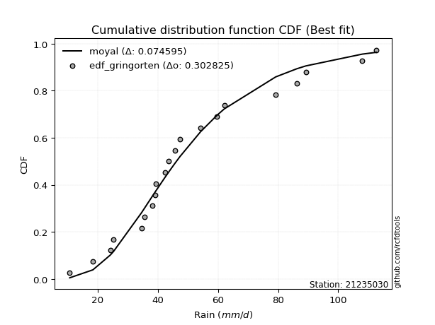</img>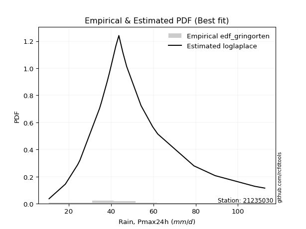</img>

</div>


### 9. Empirical - EDF Filliben (1975)

The specific values of the constants (0.3175) (often denoted as $alpha$) and (0.365) are derived from a method proposed by James J. Filliben in a 1975 paper. This particular formula is the mean value of the $i$-th order statistic of the normal distribution and is considered a robust and effective plotting position formula for the normal probability plot correlation coefficient test for normality.

<div align="center">


$P=(m-0.3175)/(n+0.365)$


</div>


**9.1. Empirical values**

<div align="center">

|                | 0                   | 1                   | 2                   | 3                  | 4                   | 5                  | 6                  | 7                   | 8                   | 9                  | 10           | 11                 | 12                 | 13                 | 14                 | 15                 | 16                 | 17                 | 18                 | 19                 | 20                 |
|:---------------|:--------------------|:--------------------|:--------------------|:-------------------|:--------------------|:-------------------|:-------------------|:--------------------|:--------------------|:-------------------|:-------------|:-------------------|:-------------------|:-------------------|:-------------------|:-------------------|:-------------------|:-------------------|:-------------------|:-------------------|:-------------------|
| date           | 2022                | 2021                | 2020                | 2023               | 2016                | 2017               | 2007               | 2006                | 2005                | 2008               | 2018         | 2010               | 2009               | 2015               | 2014               | 2013               | 2024               | 2025               | 2012               | 2011               | 2019               |
| x              | 10.7                | 18.4                | 24.2                | 25.3               | 34.6                | 35.5               | 38.2               | 39.0                | 39.3                | 42.3               | 43.7         | 45.6               | 47.4               | 54.2               | 59.7               | 62.1               | 79.2               | 86.2               | 89.2               | 108.0              | 112.7              |
| m              | 1                   | 2                   | 3                   | 4                  | 5                   | 6                  | 7                  | 8                   | 9                   | 10                 | 11           | 12                 | 13                 | 14                 | 15                 | 16                 | 17                 | 18                 | 19                 | 20                 | 21                 |
| empirical_dist | edf_filliben        | edf_filliben        | edf_filliben        | edf_filliben       | edf_filliben        | edf_filliben       | edf_filliben       | edf_filliben        | edf_filliben        | edf_filliben       | edf_filliben | edf_filliben       | edf_filliben       | edf_filliben       | edf_filliben       | edf_filliben       | edf_filliben       | edf_filliben       | edf_filliben       | edf_filliben       | edf_filliben       |
| empirical      | 0.03194476948279897 | 0.07875029253451908 | 0.12555581558623918 | 0.1723613386379593 | 0.21916686168967942 | 0.2659723847413995 | 0.3127779077931196 | 0.35958343084483974 | 0.40638895389655977 | 0.4531944769482799 | 0.5          | 0.5468055230517201 | 0.5936110461034402 | 0.6404165691551603 | 0.6872220922068805 | 0.7340276152586005 | 0.7808331383103208 | 0.8276386613620408 | 0.8744441844137609 | 0.9212497074654811 | 0.9680552305172011 |
| empirical_tr   | 1.0329989121237761  | 1.0854820271815064  | 1.1435835675097017  | 1.2082567510250248 | 1.2806833508167241  | 1.3623465646421171 | 1.4551336625234124 | 1.561483646994336   | 1.6846047703528482  | 1.8288037663171408 | 2.0          | 2.206558223599277  | 2.4606968039159227 | 2.780995769606248  | 3.1971567527123086 | 3.759788825340959  | 4.56273358248799   | 5.801765105227429  | 7.964585274930109  | 12.69836552748888  | 31.304029304029378 |

</div>


**9.2. Kolmogorov-Smirnov fit test (sorted by Δ)**


<div align="center">

|                | 0                   | 1                   | 2                   | 3                   | 4                   | 5                   | 6                   | 7                   | 8                   | 9                     | 10                  | 11                  | 12                  | 13                  | 14                  | 15                  | 16                  | 17                  | 18                  | 19                  | 20                  | 21                  | 22                  | 23                  | 24                  | 25                  | 26                  | 27                  | 28                  | 29                  | 30                  | 31                  | 32                  | 33                  | 34                  | 35                  | 36                  | 37                  | 38                  | 39                  | 40                  | 41                  | 42                  | 43                  | 44                  | 45                  | 46                  | 47                  | 48                  | 49                  | 50                  | 51                  | 52                  | 53                  | 54                  | 55                  | 56                  | 57                  | 58                  | 59                  | 60                  | 61                  | 62                  | 63                  | 64                  | 65                  | 66                  | 67                  | 68                  | 69                  | 70                  | 71                  | 72                  | 73                  | 74                  | 75                  | 76                  | 77                  | 78                  | 79                  | 80                  | 81                  | 82                  | 83                  | 84                  | 85                  | 86                  | 87                  | 88                  | 89                  |
|:---------------|:--------------------|:--------------------|:--------------------|:--------------------|:--------------------|:--------------------|:--------------------|:--------------------|:--------------------|:----------------------|:--------------------|:--------------------|:--------------------|:--------------------|:--------------------|:--------------------|:--------------------|:--------------------|:--------------------|:--------------------|:--------------------|:--------------------|:--------------------|:--------------------|:--------------------|:--------------------|:--------------------|:--------------------|:--------------------|:--------------------|:--------------------|:--------------------|:--------------------|:--------------------|:--------------------|:--------------------|:--------------------|:--------------------|:--------------------|:--------------------|:--------------------|:--------------------|:--------------------|:--------------------|:--------------------|:--------------------|:--------------------|:--------------------|:--------------------|:--------------------|:--------------------|:--------------------|:--------------------|:--------------------|:--------------------|:--------------------|:--------------------|:--------------------|:--------------------|:--------------------|:--------------------|:--------------------|:--------------------|:--------------------|:--------------------|:--------------------|:--------------------|:--------------------|:--------------------|:--------------------|:--------------------|:--------------------|:--------------------|:--------------------|:--------------------|:--------------------|:--------------------|:--------------------|:--------------------|:--------------------|:--------------------|:--------------------|:--------------------|:--------------------|:--------------------|:--------------------|:--------------------|:--------------------|:--------------------|:--------------------|
| station        | 21235030            | 21235030            | 21235030            | 21235030            | 21235030            | 21235030            | 21235030            | 21235030            | 21235030            | 21235030              | 21235030            | 21235030            | 21235030            | 21235030            | 21235030            | 21235030            | 21235030            | 21235030            | 21235030            | 21235030            | 21235030            | 21235030            | 21235030            | 21235030            | 21235030            | 21235030            | 21235030            | 21235030            | 21235030            | 21235030            | 21235030            | 21235030            | 21235030            | 21235030            | 21235030            | 21235030            | 21235030            | 21235030            | 21235030            | 21235030            | 21235030            | 21235030            | 21235030            | 21235030            | 21235030            | 21235030            | 21235030            | 21235030            | 21235030            | 21235030            | 21235030            | 21235030            | 21235030            | 21235030            | 21235030            | 21235030            | 21235030            | 21235030            | 21235030            | 21235030            | 21235030            | 21235030            | 21235030            | 21235030            | 21235030            | 21235030            | 21235030            | 21235030            | 21235030            | 21235030            | 21235030            | 21235030            | 21235030            | 21235030            | 21235030            | 21235030            | 21235030            | 21235030            | 21235030            | 21235030            | 21235030            | 21235030            | 21235030            | 21235030            | 21235030            | 21235030            | 21235030            | 21235030            | 21235030            | 21235030            |
| empirical_dist | edf_filliben        | edf_filliben        | edf_filliben        | edf_filliben        | edf_filliben        | edf_filliben        | edf_filliben        | edf_filliben        | edf_filliben        | edf_filliben          | edf_filliben        | edf_filliben        | edf_filliben        | edf_filliben        | edf_filliben        | edf_filliben        | edf_filliben        | edf_filliben        | edf_filliben        | edf_filliben        | edf_filliben        | edf_filliben        | edf_filliben        | edf_filliben        | edf_filliben        | edf_filliben        | edf_filliben        | edf_filliben        | edf_filliben        | edf_filliben        | edf_filliben        | edf_filliben        | edf_filliben        | edf_filliben        | edf_filliben        | edf_filliben        | edf_filliben        | edf_filliben        | edf_filliben        | edf_filliben        | edf_filliben        | edf_filliben        | edf_filliben        | edf_filliben        | edf_filliben        | edf_filliben        | edf_filliben        | edf_filliben        | edf_filliben        | edf_filliben        | edf_filliben        | edf_filliben        | edf_filliben        | edf_filliben        | edf_filliben        | edf_filliben        | edf_filliben        | edf_filliben        | edf_filliben        | edf_filliben        | edf_filliben        | edf_filliben        | edf_filliben        | edf_filliben        | edf_filliben        | edf_filliben        | edf_filliben        | edf_filliben        | edf_filliben        | edf_filliben        | edf_filliben        | edf_filliben        | edf_filliben        | edf_filliben        | edf_filliben        | edf_filliben        | edf_filliben        | edf_filliben        | edf_filliben        | edf_filliben        | edf_filliben        | edf_filliben        | edf_filliben        | edf_filliben        | edf_filliben        | edf_filliben        | edf_filliben        | edf_filliben        | edf_filliben        | edf_filliben        |
| p_dist         | exponnorm           | fisk                | logfisk             | logmielke           | nct                 | mielke              | loggenlogistic      | laplace_asymmetric  | moyal               | loglaplace_asymmetric | lognakagami         | loglogistic         | invgamma            | invgauss            | fatiguelife         | johnsonsu           | invweibull          | f                   | alpha               | gamma               | erlang              | chi2                | loghypsecant        | logpearson3         | ncf                 | betaprime           | halflogistic        | logt                | logloggamma         | genlogistic         | logweibull_min      | weibull_min         | logjohnsonsu        | loglaplace          | gumbel_r            | loggompertz         | halfnorm            | kstwobign           | logf                | logrice             | logcrystalball      | lognorm             | lognorm             | logexponnorm        | loglognorm          | lognct              | logfatiguelife      | genexpon            | pearson3            | logerlang           | logbetaprime        | loginvgamma         | logalpha            | rayleigh            | logncf              | loggamma            | loggamma            | loggumbel_l         | maxwell             | loginvgauss         | rice                | logmaxwell          | loggumbel_r         | lograyleigh         | logmoyal            | gompertz            | crystalball         | norm                | truncnorm           | t                   | loginvweibull       | logistic            | wald                | gibrat              | loghalfnorm         | hypsecant           | loghalflogistic     | loggibrat           | laplace             | logkstwobign        | logwald             | expon               | gumbel_l            | loggenexpon         | nakagami            | logtruncnorm        | logexpon            | logpareto           | logchi2             | pareto              |
| delta          | 0.07306948277509556 | 0.07327892037640438 | 0.07392803089781214 | 0.07559360065449183 | 0.07705348770123532 | 0.07720079460377383 | 0.07734877241925853 | 0.0775294945854983  | 0.07785238227728541 | 0.08123072233273931   | 0.08219219635189141 | 0.08342159840657032 | 0.08443518334772715 | 0.08468074752589072 | 0.08468139986740708 | 0.08495751406045104 | 0.0850697986303256  | 0.08621387036650396 | 0.08626871175033934 | 0.08631152178885804 | 0.08631175573622607 | 0.08631189228497638 | 0.08733214757242169 | 0.08846037418212505 | 0.08889153946722006 | 0.08899280739610471 | 0.09037052599156115 | 0.09065036744250704 | 0.09233026429752067 | 0.09248483645401417 | 0.09287489660233295 | 0.09320226092479733 | 0.09453253043970122 | 0.0964415066244968  | 0.09754487649825111 | 0.09769475230180868 | 0.1014413720644976  | 0.10198749163669263 | 0.10343294123394953 | 0.1034616966525641  | 0.1034617691058437  | 0.10346179345463191 | 0.10346179345463191 | 0.10346339884634154 | 0.1034649381061602  | 0.10357348757745694 | 0.10404987216153572 | 0.10747271333609987 | 0.11268749525731658 | 0.1133658919575597  | 0.11424799797592855 | 0.11462189928106664 | 0.11520359683792197 | 0.11582223240068146 | 0.11646928546453117 | 0.11674348448028254 | 0.11674348448028254 | 0.12519216587515547 | 0.12792987956390905 | 0.13240991342429453 | 0.13313607304653724 | 0.13342953921075895 | 0.1438493836595114  | 0.14503267402164327 | 0.15779226721597533 | 0.1614929265842896  | 0.16233212045553574 | 0.16233212613616377 | 0.1623321319216019  | 0.16234068772347032 | 0.1693728014582695  | 0.17147315294862014 | 0.17236133827920194 | 0.1723613386379593  | 0.17803914844607688 | 0.17912306183214982 | 0.18104467195257934 | 0.19875753271938051 | 0.2021911959050045  | 0.20727779520190132 | 0.21142040813951096 | 0.2188967139972428  | 0.23145199963638508 | 0.2363358800594409  | 0.24627478068205333 | 0.25725965093774295 | 0.33923109075653074 | 0.3392311006820358  | 0.46471057589958037 | 0.5433762063966682  |
| deltao         | 0.30282488509099936 | 0.30282488509099936 | 0.30282488509099936 | 0.30282488509099936 | 0.30282488509099936 | 0.30282488509099936 | 0.30282488509099936 | 0.30282488509099936 | 0.30282488509099936 | 0.30282488509099936   | 0.30282488509099936 | 0.30282488509099936 | 0.30282488509099936 | 0.30282488509099936 | 0.30282488509099936 | 0.30282488509099936 | 0.30282488509099936 | 0.30282488509099936 | 0.30282488509099936 | 0.30282488509099936 | 0.30282488509099936 | 0.30282488509099936 | 0.30282488509099936 | 0.30282488509099936 | 0.30282488509099936 | 0.30282488509099936 | 0.30282488509099936 | 0.30282488509099936 | 0.30282488509099936 | 0.30282488509099936 | 0.30282488509099936 | 0.30282488509099936 | 0.30282488509099936 | 0.30282488509099936 | 0.30282488509099936 | 0.30282488509099936 | 0.30282488509099936 | 0.30282488509099936 | 0.30282488509099936 | 0.30282488509099936 | 0.30282488509099936 | 0.30282488509099936 | 0.30282488509099936 | 0.30282488509099936 | 0.30282488509099936 | 0.30282488509099936 | 0.30282488509099936 | 0.30282488509099936 | 0.30282488509099936 | 0.30282488509099936 | 0.30282488509099936 | 0.30282488509099936 | 0.30282488509099936 | 0.30282488509099936 | 0.30282488509099936 | 0.30282488509099936 | 0.30282488509099936 | 0.30282488509099936 | 0.30282488509099936 | 0.30282488509099936 | 0.30282488509099936 | 0.30282488509099936 | 0.30282488509099936 | 0.30282488509099936 | 0.30282488509099936 | 0.30282488509099936 | 0.30282488509099936 | 0.30282488509099936 | 0.30282488509099936 | 0.30282488509099936 | 0.30282488509099936 | 0.30282488509099936 | 0.30282488509099936 | 0.30282488509099936 | 0.30282488509099936 | 0.30282488509099936 | 0.30282488509099936 | 0.30282488509099936 | 0.30282488509099936 | 0.30282488509099936 | 0.30282488509099936 | 0.30282488509099936 | 0.30282488509099936 | 0.30282488509099936 | 0.30282488509099936 | 0.30282488509099936 | 0.30282488509099936 | 0.30282488509099936 | 0.30282488509099936 | 0.30282488509099936 |
| eval           | Δo > Δ              | Δo > Δ              | Δo > Δ              | Δo > Δ              | Δo > Δ              | Δo > Δ              | Δo > Δ              | Δo > Δ              | Δo > Δ              | Δo > Δ                | Δo > Δ              | Δo > Δ              | Δo > Δ              | Δo > Δ              | Δo > Δ              | Δo > Δ              | Δo > Δ              | Δo > Δ              | Δo > Δ              | Δo > Δ              | Δo > Δ              | Δo > Δ              | Δo > Δ              | Δo > Δ              | Δo > Δ              | Δo > Δ              | Δo > Δ              | Δo > Δ              | Δo > Δ              | Δo > Δ              | Δo > Δ              | Δo > Δ              | Δo > Δ              | Δo > Δ              | Δo > Δ              | Δo > Δ              | Δo > Δ              | Δo > Δ              | Δo > Δ              | Δo > Δ              | Δo > Δ              | Δo > Δ              | Δo > Δ              | Δo > Δ              | Δo > Δ              | Δo > Δ              | Δo > Δ              | Δo > Δ              | Δo > Δ              | Δo > Δ              | Δo > Δ              | Δo > Δ              | Δo > Δ              | Δo > Δ              | Δo > Δ              | Δo > Δ              | Δo > Δ              | Δo > Δ              | Δo > Δ              | Δo > Δ              | Δo > Δ              | Δo > Δ              | Δo > Δ              | Δo > Δ              | Δo > Δ              | Δo > Δ              | Δo > Δ              | Δo > Δ              | Δo > Δ              | Δo > Δ              | Δo > Δ              | Δo > Δ              | Δo > Δ              | Δo > Δ              | Δo > Δ              | Δo > Δ              | Δo > Δ              | Δo > Δ              | Δo > Δ              | Δo > Δ              | Δo > Δ              | Δo > Δ              | Δo > Δ              | Δo > Δ              | Δo > Δ              | Δo > Δ              | Δo <= Δ             | Δo <= Δ             | Δo <= Δ             | Δo <= Δ             |
| fit            | 1                   | 1                   | 1                   | 1                   | 1                   | 1                   | 1                   | 1                   | 1                   | 1                     | 1                   | 1                   | 1                   | 1                   | 1                   | 1                   | 1                   | 1                   | 1                   | 1                   | 1                   | 1                   | 1                   | 1                   | 1                   | 1                   | 1                   | 1                   | 1                   | 1                   | 1                   | 1                   | 1                   | 1                   | 1                   | 1                   | 1                   | 1                   | 1                   | 1                   | 1                   | 1                   | 1                   | 1                   | 1                   | 1                   | 1                   | 1                   | 1                   | 1                   | 1                   | 1                   | 1                   | 1                   | 1                   | 1                   | 1                   | 1                   | 1                   | 1                   | 1                   | 1                   | 1                   | 1                   | 1                   | 1                   | 1                   | 1                   | 1                   | 1                   | 1                   | 1                   | 1                   | 1                   | 1                   | 1                   | 1                   | 1                   | 1                   | 1                   | 1                   | 1                   | 1                   | 1                   | 1                   | 1                   | 0                   | 0                   | 0                   | 0                   |
| n              | 21                  | 21                  | 21                  | 21                  | 21                  | 21                  | 21                  | 21                  | 21                  | 21                    | 21                  | 21                  | 21                  | 21                  | 21                  | 21                  | 21                  | 21                  | 21                  | 21                  | 21                  | 21                  | 21                  | 21                  | 21                  | 21                  | 21                  | 21                  | 21                  | 21                  | 21                  | 21                  | 21                  | 21                  | 21                  | 21                  | 21                  | 21                  | 21                  | 21                  | 21                  | 21                  | 21                  | 21                  | 21                  | 21                  | 21                  | 21                  | 21                  | 21                  | 21                  | 21                  | 21                  | 21                  | 21                  | 21                  | 21                  | 21                  | 21                  | 21                  | 21                  | 21                  | 21                  | 21                  | 21                  | 21                  | 21                  | 21                  | 21                  | 21                  | 21                  | 21                  | 21                  | 21                  | 21                  | 21                  | 21                  | 21                  | 21                  | 21                  | 21                  | 21                  | 21                  | 21                  | 21                  | 21                  | 21                  | 21                  | 21                  | 21                  |
| best_fit       | 1                   | 0                   | 0                   | 0                   | 0                   | 0                   | 0                   | 0                   | 0                   | 0                     | 0                   | 0                   | 0                   | 0                   | 0                   | 0                   | 0                   | 0                   | 0                   | 0                   | 0                   | 0                   | 0                   | 0                   | 0                   | 0                   | 0                   | 0                   | 0                   | 0                   | 0                   | 0                   | 0                   | 0                   | 0                   | 0                   | 0                   | 0                   | 0                   | 0                   | 0                   | 0                   | 0                   | 0                   | 0                   | 0                   | 0                   | 0                   | 0                   | 0                   | 0                   | 0                   | 0                   | 0                   | 0                   | 0                   | 0                   | 0                   | 0                   | 0                   | 0                   | 0                   | 0                   | 0                   | 0                   | 0                   | 0                   | 0                   | 0                   | 0                   | 0                   | 0                   | 0                   | 0                   | 0                   | 0                   | 0                   | 0                   | 0                   | 0                   | 0                   | 0                   | 0                   | 0                   | 0                   | 0                   | 0                   | 0                   | 0                   | 0                   |
| best_fit_sort  | 1                   | 2                   | 3                   | 4                   | 5                   | 6                   | 7                   | 8                   | 9                   | 10                    | 11                  | 12                  | 13                  | 14                  | 15                  | 16                  | 17                  | 18                  | 19                  | 20                  | 21                  | 22                  | 23                  | 24                  | 25                  | 26                  | 27                  | 28                  | 29                  | 30                  | 31                  | 32                  | 33                  | 34                  | 35                  | 36                  | 37                  | 38                  | 39                  | 40                  | 41                  | 42                  | 43                  | 44                  | 45                  | 46                  | 47                  | 48                  | 49                  | 50                  | 51                  | 52                  | 53                  | 54                  | 55                  | 56                  | 57                  | 58                  | 59                  | 60                  | 61                  | 62                  | 63                  | 64                  | 65                  | 66                  | 67                  | 68                  | 69                  | 70                  | 71                  | 72                  | 73                  | 74                  | 75                  | 76                  | 77                  | 78                  | 79                  | 80                  | 81                  | 82                  | 83                  | 84                  | 85                  | 86                  | 87                  | 88                  | 89                  | 90                  |

</div>


<div align="center">

</img>

</div>


**9.3. Best fit**

<div align="center">

|   id |   station | empirical_dist   | p_dist    |     delta |   deltao | eval   |   fit |   n |   best_fit |   best_fit_sort |
|-----:|----------:|:-----------------|:----------|----------:|---------:|:-------|------:|----:|-----------:|----------------:|
|    0 |  21235030 | edf_filliben     | exponnorm | 0.0730695 | 0.302825 | Δo > Δ |     1 |  21 |          1 |               1 |

</div>


<div align="center">

</img></img>

</div>


### 10. Empirical - EDF Jenkinson (1977)

The Jenkinson formula in hydrology is an empirical plotting position formula used to estimate the non-exceedance probability _(P)_ or return period _(T)_ of a given ordered observation within a sample. It is a widely used method in the frequency analysis of extreme events such as floods and rainfall, as it provides a distribution-free way to plot data. _a≈0.31_ and _b≈0.38_ are constants derived to approximate the median of the probability distribution for the given rank.

<div align="center">


$P=(m-a)/(n+b)$


</div>


**10.1. Empirical values**

<div align="center">

|                | 0                    | 1                   | 2                   | 3                   | 4                  | 5                  | 6                   | 7                  | 8                   | 9                  | 10            | 11                 | 12                 | 13                 | 14                 | 15                 | 16                 | 17                 | 18                 | 19                 | 20                 |
|:---------------|:---------------------|:--------------------|:--------------------|:--------------------|:-------------------|:-------------------|:--------------------|:-------------------|:--------------------|:-------------------|:--------------|:-------------------|:-------------------|:-------------------|:-------------------|:-------------------|:-------------------|:-------------------|:-------------------|:-------------------|:-------------------|
| date           | 2022                 | 2021                | 2020                | 2023                | 2016               | 2017               | 2007                | 2006               | 2005                | 2008               | 2018          | 2010               | 2009               | 2015               | 2014               | 2013               | 2024               | 2025               | 2012               | 2011               | 2019               |
| x              | 10.7                 | 18.4                | 24.2                | 25.3                | 34.6               | 35.5               | 38.2                | 39.0               | 39.3                | 42.3               | 43.7          | 45.6               | 47.4               | 54.2               | 59.7               | 62.1               | 79.2               | 86.2               | 89.2               | 108.0              | 112.7              |
| m              | 1                    | 2                   | 3                   | 4                   | 5                  | 6                  | 7                   | 8                  | 9                   | 10                 | 11            | 12                 | 13                 | 14                 | 15                 | 16                 | 17                 | 18                 | 19                 | 20                 | 21                 |
| empirical_dist | edf_jenkinson        | edf_jenkinson       | edf_jenkinson       | edf_jenkinson       | edf_jenkinson      | edf_jenkinson      | edf_jenkinson       | edf_jenkinson      | edf_jenkinson       | edf_jenkinson      | edf_jenkinson | edf_jenkinson      | edf_jenkinson      | edf_jenkinson      | edf_jenkinson      | edf_jenkinson      | edf_jenkinson      | edf_jenkinson      | edf_jenkinson      | edf_jenkinson      | edf_jenkinson      |
| empirical      | 0.032273152478952294 | 0.07904583723105707 | 0.12581852198316185 | 0.17259120673526662 | 0.2193638914873714 | 0.2661365762394762 | 0.31290926099158095 | 0.3596819457436857 | 0.40645463049579045 | 0.4532273152478952 | 0.5           | 0.5467726847521047 | 0.5935453695042096 | 0.6403180542563143 | 0.6870907390084191 | 0.7338634237605238 | 0.7806361085126288 | 0.8274087932647335 | 0.8741814780168383 | 0.920954162768943  | 0.9677268475210478 |
| empirical_tr   | 1.0333494441759306   | 1.085830370746572   | 1.1439272338148743  | 1.208592425098926   | 1.281006590772918  | 1.362651370299554  | 1.4554118447923756  | 1.5617238860482106 | 1.6847911741528763  | 1.828913601368691  | 2.0           | 2.206398348813209  | 2.4602991944764097 | 2.780234070221066  | 3.195814648729447  | 3.7574692442882247 | 4.558635394456293  | 5.794037940379407  | 7.947955390334582  | 12.650887573964514 | 30.985507246376862 |

</div>


**10.2. Kolmogorov-Smirnov fit test (sorted by Δ)**


<div align="center">

|                | 0                   | 1                   | 2                   | 3                   | 4                   | 5                   | 6                   | 7                   | 8                   | 9                     | 10                  | 11                  | 12                  | 13                  | 14                  | 15                  | 16                  | 17                  | 18                  | 19                  | 20                  | 21                  | 22                  | 23                  | 24                  | 25                  | 26                  | 27                  | 28                  | 29                  | 30                  | 31                  | 32                  | 33                  | 34                  | 35                  | 36                  | 37                  | 38                  | 39                  | 40                  | 41                  | 42                  | 43                  | 44                  | 45                  | 46                  | 47                  | 48                  | 49                  | 50                  | 51                  | 52                  | 53                  | 54                  | 55                  | 56                  | 57                  | 58                  | 59                  | 60                  | 61                  | 62                  | 63                  | 64                  | 65                  | 66                  | 67                  | 68                  | 69                  | 70                  | 71                  | 72                  | 73                  | 74                  | 75                  | 76                  | 77                  | 78                  | 79                  | 80                  | 81                  | 82                  | 83                  | 84                  | 85                  | 86                  | 87                  | 88                  | 89                  |
|:---------------|:--------------------|:--------------------|:--------------------|:--------------------|:--------------------|:--------------------|:--------------------|:--------------------|:--------------------|:----------------------|:--------------------|:--------------------|:--------------------|:--------------------|:--------------------|:--------------------|:--------------------|:--------------------|:--------------------|:--------------------|:--------------------|:--------------------|:--------------------|:--------------------|:--------------------|:--------------------|:--------------------|:--------------------|:--------------------|:--------------------|:--------------------|:--------------------|:--------------------|:--------------------|:--------------------|:--------------------|:--------------------|:--------------------|:--------------------|:--------------------|:--------------------|:--------------------|:--------------------|:--------------------|:--------------------|:--------------------|:--------------------|:--------------------|:--------------------|:--------------------|:--------------------|:--------------------|:--------------------|:--------------------|:--------------------|:--------------------|:--------------------|:--------------------|:--------------------|:--------------------|:--------------------|:--------------------|:--------------------|:--------------------|:--------------------|:--------------------|:--------------------|:--------------------|:--------------------|:--------------------|:--------------------|:--------------------|:--------------------|:--------------------|:--------------------|:--------------------|:--------------------|:--------------------|:--------------------|:--------------------|:--------------------|:--------------------|:--------------------|:--------------------|:--------------------|:--------------------|:--------------------|:--------------------|:--------------------|:--------------------|
| station        | 21235030            | 21235030            | 21235030            | 21235030            | 21235030            | 21235030            | 21235030            | 21235030            | 21235030            | 21235030              | 21235030            | 21235030            | 21235030            | 21235030            | 21235030            | 21235030            | 21235030            | 21235030            | 21235030            | 21235030            | 21235030            | 21235030            | 21235030            | 21235030            | 21235030            | 21235030            | 21235030            | 21235030            | 21235030            | 21235030            | 21235030            | 21235030            | 21235030            | 21235030            | 21235030            | 21235030            | 21235030            | 21235030            | 21235030            | 21235030            | 21235030            | 21235030            | 21235030            | 21235030            | 21235030            | 21235030            | 21235030            | 21235030            | 21235030            | 21235030            | 21235030            | 21235030            | 21235030            | 21235030            | 21235030            | 21235030            | 21235030            | 21235030            | 21235030            | 21235030            | 21235030            | 21235030            | 21235030            | 21235030            | 21235030            | 21235030            | 21235030            | 21235030            | 21235030            | 21235030            | 21235030            | 21235030            | 21235030            | 21235030            | 21235030            | 21235030            | 21235030            | 21235030            | 21235030            | 21235030            | 21235030            | 21235030            | 21235030            | 21235030            | 21235030            | 21235030            | 21235030            | 21235030            | 21235030            | 21235030            |
| empirical_dist | edf_jenkinson       | edf_jenkinson       | edf_jenkinson       | edf_jenkinson       | edf_jenkinson       | edf_jenkinson       | edf_jenkinson       | edf_jenkinson       | edf_jenkinson       | edf_jenkinson         | edf_jenkinson       | edf_jenkinson       | edf_jenkinson       | edf_jenkinson       | edf_jenkinson       | edf_jenkinson       | edf_jenkinson       | edf_jenkinson       | edf_jenkinson       | edf_jenkinson       | edf_jenkinson       | edf_jenkinson       | edf_jenkinson       | edf_jenkinson       | edf_jenkinson       | edf_jenkinson       | edf_jenkinson       | edf_jenkinson       | edf_jenkinson       | edf_jenkinson       | edf_jenkinson       | edf_jenkinson       | edf_jenkinson       | edf_jenkinson       | edf_jenkinson       | edf_jenkinson       | edf_jenkinson       | edf_jenkinson       | edf_jenkinson       | edf_jenkinson       | edf_jenkinson       | edf_jenkinson       | edf_jenkinson       | edf_jenkinson       | edf_jenkinson       | edf_jenkinson       | edf_jenkinson       | edf_jenkinson       | edf_jenkinson       | edf_jenkinson       | edf_jenkinson       | edf_jenkinson       | edf_jenkinson       | edf_jenkinson       | edf_jenkinson       | edf_jenkinson       | edf_jenkinson       | edf_jenkinson       | edf_jenkinson       | edf_jenkinson       | edf_jenkinson       | edf_jenkinson       | edf_jenkinson       | edf_jenkinson       | edf_jenkinson       | edf_jenkinson       | edf_jenkinson       | edf_jenkinson       | edf_jenkinson       | edf_jenkinson       | edf_jenkinson       | edf_jenkinson       | edf_jenkinson       | edf_jenkinson       | edf_jenkinson       | edf_jenkinson       | edf_jenkinson       | edf_jenkinson       | edf_jenkinson       | edf_jenkinson       | edf_jenkinson       | edf_jenkinson       | edf_jenkinson       | edf_jenkinson       | edf_jenkinson       | edf_jenkinson       | edf_jenkinson       | edf_jenkinson       | edf_jenkinson       | edf_jenkinson       |
| p_dist         | exponnorm           | fisk                | logfisk             | logmielke           | nct                 | mielke              | loggenlogistic      | laplace_asymmetric  | moyal               | loglaplace_asymmetric | lognakagami         | loglogistic         | invgamma            | invgauss            | fatiguelife         | johnsonsu           | invweibull          | f                   | alpha               | gamma               | erlang              | chi2                | loghypsecant        | logpearson3         | ncf                 | betaprime           | halflogistic        | logt                | logloggamma         | genlogistic         | logweibull_min      | weibull_min         | logjohnsonsu        | loglaplace          | gumbel_r            | loggompertz         | halfnorm            | kstwobign           | logf                | logrice             | logcrystalball      | lognorm             | lognorm             | logexponnorm        | loglognorm          | lognct              | logfatiguelife      | genexpon            | pearson3            | logerlang           | logbetaprime        | loginvgamma         | logalpha            | rayleigh            | logncf              | loggamma            | loggamma            | loggumbel_l         | maxwell             | loginvgauss         | rice                | logmaxwell          | loggumbel_r         | lograyleigh         | logmoyal            | gompertz            | crystalball         | norm                | truncnorm           | t                   | loginvweibull       | logistic            | wald                | gibrat              | loghalfnorm         | hypsecant           | loghalflogistic     | loggibrat           | laplace             | logkstwobign        | logwald             | expon               | gumbel_l            | loggenexpon         | nakagami            | logtruncnorm        | logexpon            | logpareto           | logchi2             | pareto              |
| delta          | 0.07287245297740358 | 0.0733692595670864  | 0.07373100110012015 | 0.07552792405526121 | 0.0769878111020047  | 0.0771351180045432  | 0.0772830958200279  | 0.07772652438319028 | 0.0780494120749774  | 0.0814277521304313    | 0.08242206444919874 | 0.08322456860887834 | 0.08436950674849653 | 0.0846150709266601  | 0.08461572326817646 | 0.08489183746122042 | 0.08500412203109498 | 0.08614819376727334 | 0.08620303515110872 | 0.08624584518962741 | 0.08624607913699545 | 0.08624621568574575 | 0.08752917737011368 | 0.08839469758289442 | 0.08882586286798944 | 0.08892713079687409 | 0.09017349619386916 | 0.09045333764481506 | 0.09226458769829005 | 0.09241915985478355 | 0.09280922000310232 | 0.09313658432556671 | 0.0944668538404706  | 0.09663853642218878 | 0.09747919989902049 | 0.09762907570257806 | 0.10124434226680562 | 0.101921815037462   | 0.10323591143625754 | 0.10326466685487212 | 0.10326473930815172 | 0.10326476365693993 | 0.10326476365693993 | 0.10326636904864955 | 0.10326790830846821 | 0.10337645777976495 | 0.10385284236384373 | 0.10740703673686924 | 0.11262181865808596 | 0.11316886215986771 | 0.11405096817823657 | 0.11442486948337466 | 0.11500656704022999 | 0.11575655580145083 | 0.11627225566683919 | 0.11654645468259056 | 0.11654645468259056 | 0.12512648927592485 | 0.12786420296467843 | 0.13221288362660255 | 0.13307039644730662 | 0.13323250941306697 | 0.1436523538618194  | 0.1448356442239513  | 0.15759523741828335 | 0.16142724998505897 | 0.16226644385630512 | 0.16226644953693314 | 0.16226645532237127 | 0.1622750111242397  | 0.1691757716605775  | 0.17140747634938952 | 0.17259120637650927 | 0.17259120673526662 | 0.1778421186483849  | 0.1790573852329192  | 0.18084764215488736 | 0.19862617952091915 | 0.20212551930577388 | 0.20708076540420933 | 0.2112890549410496  | 0.21869968419955083 | 0.23138632303715445 | 0.2361388502617489  | 0.24607775088436135 | 0.25706262114005096 | 0.33903406095883876 | 0.33903407088434384 | 0.4645135461018884  | 0.5430806617001301  |
| deltao         | 0.30282488509099936 | 0.30282488509099936 | 0.30282488509099936 | 0.30282488509099936 | 0.30282488509099936 | 0.30282488509099936 | 0.30282488509099936 | 0.30282488509099936 | 0.30282488509099936 | 0.30282488509099936   | 0.30282488509099936 | 0.30282488509099936 | 0.30282488509099936 | 0.30282488509099936 | 0.30282488509099936 | 0.30282488509099936 | 0.30282488509099936 | 0.30282488509099936 | 0.30282488509099936 | 0.30282488509099936 | 0.30282488509099936 | 0.30282488509099936 | 0.30282488509099936 | 0.30282488509099936 | 0.30282488509099936 | 0.30282488509099936 | 0.30282488509099936 | 0.30282488509099936 | 0.30282488509099936 | 0.30282488509099936 | 0.30282488509099936 | 0.30282488509099936 | 0.30282488509099936 | 0.30282488509099936 | 0.30282488509099936 | 0.30282488509099936 | 0.30282488509099936 | 0.30282488509099936 | 0.30282488509099936 | 0.30282488509099936 | 0.30282488509099936 | 0.30282488509099936 | 0.30282488509099936 | 0.30282488509099936 | 0.30282488509099936 | 0.30282488509099936 | 0.30282488509099936 | 0.30282488509099936 | 0.30282488509099936 | 0.30282488509099936 | 0.30282488509099936 | 0.30282488509099936 | 0.30282488509099936 | 0.30282488509099936 | 0.30282488509099936 | 0.30282488509099936 | 0.30282488509099936 | 0.30282488509099936 | 0.30282488509099936 | 0.30282488509099936 | 0.30282488509099936 | 0.30282488509099936 | 0.30282488509099936 | 0.30282488509099936 | 0.30282488509099936 | 0.30282488509099936 | 0.30282488509099936 | 0.30282488509099936 | 0.30282488509099936 | 0.30282488509099936 | 0.30282488509099936 | 0.30282488509099936 | 0.30282488509099936 | 0.30282488509099936 | 0.30282488509099936 | 0.30282488509099936 | 0.30282488509099936 | 0.30282488509099936 | 0.30282488509099936 | 0.30282488509099936 | 0.30282488509099936 | 0.30282488509099936 | 0.30282488509099936 | 0.30282488509099936 | 0.30282488509099936 | 0.30282488509099936 | 0.30282488509099936 | 0.30282488509099936 | 0.30282488509099936 | 0.30282488509099936 |
| eval           | Δo > Δ              | Δo > Δ              | Δo > Δ              | Δo > Δ              | Δo > Δ              | Δo > Δ              | Δo > Δ              | Δo > Δ              | Δo > Δ              | Δo > Δ                | Δo > Δ              | Δo > Δ              | Δo > Δ              | Δo > Δ              | Δo > Δ              | Δo > Δ              | Δo > Δ              | Δo > Δ              | Δo > Δ              | Δo > Δ              | Δo > Δ              | Δo > Δ              | Δo > Δ              | Δo > Δ              | Δo > Δ              | Δo > Δ              | Δo > Δ              | Δo > Δ              | Δo > Δ              | Δo > Δ              | Δo > Δ              | Δo > Δ              | Δo > Δ              | Δo > Δ              | Δo > Δ              | Δo > Δ              | Δo > Δ              | Δo > Δ              | Δo > Δ              | Δo > Δ              | Δo > Δ              | Δo > Δ              | Δo > Δ              | Δo > Δ              | Δo > Δ              | Δo > Δ              | Δo > Δ              | Δo > Δ              | Δo > Δ              | Δo > Δ              | Δo > Δ              | Δo > Δ              | Δo > Δ              | Δo > Δ              | Δo > Δ              | Δo > Δ              | Δo > Δ              | Δo > Δ              | Δo > Δ              | Δo > Δ              | Δo > Δ              | Δo > Δ              | Δo > Δ              | Δo > Δ              | Δo > Δ              | Δo > Δ              | Δo > Δ              | Δo > Δ              | Δo > Δ              | Δo > Δ              | Δo > Δ              | Δo > Δ              | Δo > Δ              | Δo > Δ              | Δo > Δ              | Δo > Δ              | Δo > Δ              | Δo > Δ              | Δo > Δ              | Δo > Δ              | Δo > Δ              | Δo > Δ              | Δo > Δ              | Δo > Δ              | Δo > Δ              | Δo > Δ              | Δo <= Δ             | Δo <= Δ             | Δo <= Δ             | Δo <= Δ             |
| fit            | 1                   | 1                   | 1                   | 1                   | 1                   | 1                   | 1                   | 1                   | 1                   | 1                     | 1                   | 1                   | 1                   | 1                   | 1                   | 1                   | 1                   | 1                   | 1                   | 1                   | 1                   | 1                   | 1                   | 1                   | 1                   | 1                   | 1                   | 1                   | 1                   | 1                   | 1                   | 1                   | 1                   | 1                   | 1                   | 1                   | 1                   | 1                   | 1                   | 1                   | 1                   | 1                   | 1                   | 1                   | 1                   | 1                   | 1                   | 1                   | 1                   | 1                   | 1                   | 1                   | 1                   | 1                   | 1                   | 1                   | 1                   | 1                   | 1                   | 1                   | 1                   | 1                   | 1                   | 1                   | 1                   | 1                   | 1                   | 1                   | 1                   | 1                   | 1                   | 1                   | 1                   | 1                   | 1                   | 1                   | 1                   | 1                   | 1                   | 1                   | 1                   | 1                   | 1                   | 1                   | 1                   | 1                   | 0                   | 0                   | 0                   | 0                   |
| n              | 21                  | 21                  | 21                  | 21                  | 21                  | 21                  | 21                  | 21                  | 21                  | 21                    | 21                  | 21                  | 21                  | 21                  | 21                  | 21                  | 21                  | 21                  | 21                  | 21                  | 21                  | 21                  | 21                  | 21                  | 21                  | 21                  | 21                  | 21                  | 21                  | 21                  | 21                  | 21                  | 21                  | 21                  | 21                  | 21                  | 21                  | 21                  | 21                  | 21                  | 21                  | 21                  | 21                  | 21                  | 21                  | 21                  | 21                  | 21                  | 21                  | 21                  | 21                  | 21                  | 21                  | 21                  | 21                  | 21                  | 21                  | 21                  | 21                  | 21                  | 21                  | 21                  | 21                  | 21                  | 21                  | 21                  | 21                  | 21                  | 21                  | 21                  | 21                  | 21                  | 21                  | 21                  | 21                  | 21                  | 21                  | 21                  | 21                  | 21                  | 21                  | 21                  | 21                  | 21                  | 21                  | 21                  | 21                  | 21                  | 21                  | 21                  |
| best_fit       | 1                   | 0                   | 0                   | 0                   | 0                   | 0                   | 0                   | 0                   | 0                   | 0                     | 0                   | 0                   | 0                   | 0                   | 0                   | 0                   | 0                   | 0                   | 0                   | 0                   | 0                   | 0                   | 0                   | 0                   | 0                   | 0                   | 0                   | 0                   | 0                   | 0                   | 0                   | 0                   | 0                   | 0                   | 0                   | 0                   | 0                   | 0                   | 0                   | 0                   | 0                   | 0                   | 0                   | 0                   | 0                   | 0                   | 0                   | 0                   | 0                   | 0                   | 0                   | 0                   | 0                   | 0                   | 0                   | 0                   | 0                   | 0                   | 0                   | 0                   | 0                   | 0                   | 0                   | 0                   | 0                   | 0                   | 0                   | 0                   | 0                   | 0                   | 0                   | 0                   | 0                   | 0                   | 0                   | 0                   | 0                   | 0                   | 0                   | 0                   | 0                   | 0                   | 0                   | 0                   | 0                   | 0                   | 0                   | 0                   | 0                   | 0                   |
| best_fit_sort  | 1                   | 2                   | 3                   | 4                   | 5                   | 6                   | 7                   | 8                   | 9                   | 10                    | 11                  | 12                  | 13                  | 14                  | 15                  | 16                  | 17                  | 18                  | 19                  | 20                  | 21                  | 22                  | 23                  | 24                  | 25                  | 26                  | 27                  | 28                  | 29                  | 30                  | 31                  | 32                  | 33                  | 34                  | 35                  | 36                  | 37                  | 38                  | 39                  | 40                  | 41                  | 42                  | 43                  | 44                  | 45                  | 46                  | 47                  | 48                  | 49                  | 50                  | 51                  | 52                  | 53                  | 54                  | 55                  | 56                  | 57                  | 58                  | 59                  | 60                  | 61                  | 62                  | 63                  | 64                  | 65                  | 66                  | 67                  | 68                  | 69                  | 70                  | 71                  | 72                  | 73                  | 74                  | 75                  | 76                  | 77                  | 78                  | 79                  | 80                  | 81                  | 82                  | 83                  | 84                  | 85                  | 86                  | 87                  | 88                  | 89                  | 90                  |

</div>


<div align="center">

</img>

</div>


**10.3. Best fit**

<div align="center">

|   id |   station | empirical_dist   | p_dist    |     delta |   deltao | eval   |   fit |   n |   best_fit |   best_fit_sort |
|-----:|----------:|:-----------------|:----------|----------:|---------:|:-------|------:|----:|-----------:|----------------:|
|    0 |  21235030 | edf_jenkinson    | exponnorm | 0.0728725 | 0.302825 | Δo > Δ |     1 |  21 |          1 |               1 |

</div>


<div align="center">

</img></img>

</div>


### 11. Empirical - EDF Cunnane (1978)

Cunnane´s work in statistical hydrology has focused on the performance and evaluation of different probability distributions (such as GEV, Gumbel, Lognormal) for flood frequency estimation. _b_ is a constant, typically set to 0.4.

<div align="center">


$P=(m-b)/(n+1-2b)$


</div>


**11.1. Empirical values**

<div align="center">

|                | 0                   | 1                   | 2                   | 3                  | 4                   | 5                  | 6                  | 7                  | 8                  | 9                  | 10          | 11                 | 12                 | 13                 | 14                 | 15                 | 16                 | 17                 | 18                 | 19                 | 20                 |
|:---------------|:--------------------|:--------------------|:--------------------|:-------------------|:--------------------|:-------------------|:-------------------|:-------------------|:-------------------|:-------------------|:------------|:-------------------|:-------------------|:-------------------|:-------------------|:-------------------|:-------------------|:-------------------|:-------------------|:-------------------|:-------------------|
| date           | 2022                | 2021                | 2020                | 2023               | 2016                | 2017               | 2007               | 2006               | 2005               | 2008               | 2018        | 2010               | 2009               | 2015               | 2014               | 2013               | 2024               | 2025               | 2012               | 2011               | 2019               |
| x              | 10.7                | 18.4                | 24.2                | 25.3               | 34.6                | 35.5               | 38.2               | 39.0               | 39.3               | 42.3               | 43.7        | 45.6               | 47.4               | 54.2               | 59.7               | 62.1               | 79.2               | 86.2               | 89.2               | 108.0              | 112.7              |
| m              | 1                   | 2                   | 3                   | 4                  | 5                   | 6                  | 7                  | 8                  | 9                  | 10                 | 11          | 12                 | 13                 | 14                 | 15                 | 16                 | 17                 | 18                 | 19                 | 20                 | 21                 |
| empirical_dist | edf_cunnane         | edf_cunnane         | edf_cunnane         | edf_cunnane        | edf_cunnane         | edf_cunnane        | edf_cunnane        | edf_cunnane        | edf_cunnane        | edf_cunnane        | edf_cunnane | edf_cunnane        | edf_cunnane        | edf_cunnane        | edf_cunnane        | edf_cunnane        | edf_cunnane        | edf_cunnane        | edf_cunnane        | edf_cunnane        | edf_cunnane        |
| empirical      | 0.02830188679245283 | 0.07547169811320756 | 0.12264150943396228 | 0.169811320754717  | 0.21698113207547168 | 0.2641509433962264 | 0.3113207547169811 | 0.3584905660377358 | 0.4056603773584906 | 0.4528301886792453 | 0.5         | 0.5471698113207547 | 0.5943396226415094 | 0.6415094339622641 | 0.6886792452830188 | 0.7358490566037736 | 0.7830188679245284 | 0.8301886792452832 | 0.8773584905660379 | 0.9245283018867926 | 0.9716981132075473 |
| empirical_tr   | 1.029126213592233   | 1.0816326530612246  | 1.139784946236559   | 1.2045454545454546 | 1.2771084337349397  | 1.3589743589743588 | 1.452054794520548  | 1.5588235294117645 | 1.6825396825396826 | 1.8275862068965518 | 2.0         | 2.2083333333333335 | 2.4651162790697674 | 2.789473684210526  | 3.2121212121212115 | 3.7857142857142865 | 4.608695652173914  | 5.888888888888894  | 8.153846153846162  | 13.250000000000023 | 35.33333333333348  |

</div>


**11.2. Kolmogorov-Smirnov fit test (sorted by Δ)**


<div align="center">

|                | 0                   | 1                   | 2                   | 3                   | 4                   | 5                   | 6                   | 7                   | 8                   | 9                     | 10                  | 11                  | 12                  | 13                  | 14                  | 15                  | 16                  | 17                  | 18                  | 19                  | 20                  | 21                  | 22                  | 23                  | 24                  | 25                  | 26                  | 27                  | 28                  | 29                  | 30                  | 31                  | 32                  | 33                  | 34                  | 35                  | 36                  | 37                  | 38                  | 39                  | 40                  | 41                  | 42                  | 43                  | 44                  | 45                  | 46                  | 47                  | 48                  | 49                  | 50                  | 51                  | 52                  | 53                  | 54                  | 55                  | 56                  | 57                  | 58                  | 59                  | 60                  | 61                  | 62                  | 63                  | 64                  | 65                  | 66                  | 67                  | 68                  | 69                  | 70                  | 71                  | 72                  | 73                  | 74                  | 75                  | 76                  | 77                  | 78                  | 79                  | 80                  | 81                  | 82                  | 83                  | 84                  | 85                  | 86                  | 87                  | 88                  | 89                  |
|:---------------|:--------------------|:--------------------|:--------------------|:--------------------|:--------------------|:--------------------|:--------------------|:--------------------|:--------------------|:----------------------|:--------------------|:--------------------|:--------------------|:--------------------|:--------------------|:--------------------|:--------------------|:--------------------|:--------------------|:--------------------|:--------------------|:--------------------|:--------------------|:--------------------|:--------------------|:--------------------|:--------------------|:--------------------|:--------------------|:--------------------|:--------------------|:--------------------|:--------------------|:--------------------|:--------------------|:--------------------|:--------------------|:--------------------|:--------------------|:--------------------|:--------------------|:--------------------|:--------------------|:--------------------|:--------------------|:--------------------|:--------------------|:--------------------|:--------------------|:--------------------|:--------------------|:--------------------|:--------------------|:--------------------|:--------------------|:--------------------|:--------------------|:--------------------|:--------------------|:--------------------|:--------------------|:--------------------|:--------------------|:--------------------|:--------------------|:--------------------|:--------------------|:--------------------|:--------------------|:--------------------|:--------------------|:--------------------|:--------------------|:--------------------|:--------------------|:--------------------|:--------------------|:--------------------|:--------------------|:--------------------|:--------------------|:--------------------|:--------------------|:--------------------|:--------------------|:--------------------|:--------------------|:--------------------|:--------------------|:--------------------|
| station        | 21235030            | 21235030            | 21235030            | 21235030            | 21235030            | 21235030            | 21235030            | 21235030            | 21235030            | 21235030              | 21235030            | 21235030            | 21235030            | 21235030            | 21235030            | 21235030            | 21235030            | 21235030            | 21235030            | 21235030            | 21235030            | 21235030            | 21235030            | 21235030            | 21235030            | 21235030            | 21235030            | 21235030            | 21235030            | 21235030            | 21235030            | 21235030            | 21235030            | 21235030            | 21235030            | 21235030            | 21235030            | 21235030            | 21235030            | 21235030            | 21235030            | 21235030            | 21235030            | 21235030            | 21235030            | 21235030            | 21235030            | 21235030            | 21235030            | 21235030            | 21235030            | 21235030            | 21235030            | 21235030            | 21235030            | 21235030            | 21235030            | 21235030            | 21235030            | 21235030            | 21235030            | 21235030            | 21235030            | 21235030            | 21235030            | 21235030            | 21235030            | 21235030            | 21235030            | 21235030            | 21235030            | 21235030            | 21235030            | 21235030            | 21235030            | 21235030            | 21235030            | 21235030            | 21235030            | 21235030            | 21235030            | 21235030            | 21235030            | 21235030            | 21235030            | 21235030            | 21235030            | 21235030            | 21235030            | 21235030            |
| empirical_dist | edf_cunnane         | edf_cunnane         | edf_cunnane         | edf_cunnane         | edf_cunnane         | edf_cunnane         | edf_cunnane         | edf_cunnane         | edf_cunnane         | edf_cunnane           | edf_cunnane         | edf_cunnane         | edf_cunnane         | edf_cunnane         | edf_cunnane         | edf_cunnane         | edf_cunnane         | edf_cunnane         | edf_cunnane         | edf_cunnane         | edf_cunnane         | edf_cunnane         | edf_cunnane         | edf_cunnane         | edf_cunnane         | edf_cunnane         | edf_cunnane         | edf_cunnane         | edf_cunnane         | edf_cunnane         | edf_cunnane         | edf_cunnane         | edf_cunnane         | edf_cunnane         | edf_cunnane         | edf_cunnane         | edf_cunnane         | edf_cunnane         | edf_cunnane         | edf_cunnane         | edf_cunnane         | edf_cunnane         | edf_cunnane         | edf_cunnane         | edf_cunnane         | edf_cunnane         | edf_cunnane         | edf_cunnane         | edf_cunnane         | edf_cunnane         | edf_cunnane         | edf_cunnane         | edf_cunnane         | edf_cunnane         | edf_cunnane         | edf_cunnane         | edf_cunnane         | edf_cunnane         | edf_cunnane         | edf_cunnane         | edf_cunnane         | edf_cunnane         | edf_cunnane         | edf_cunnane         | edf_cunnane         | edf_cunnane         | edf_cunnane         | edf_cunnane         | edf_cunnane         | edf_cunnane         | edf_cunnane         | edf_cunnane         | edf_cunnane         | edf_cunnane         | edf_cunnane         | edf_cunnane         | edf_cunnane         | edf_cunnane         | edf_cunnane         | edf_cunnane         | edf_cunnane         | edf_cunnane         | edf_cunnane         | edf_cunnane         | edf_cunnane         | edf_cunnane         | edf_cunnane         | edf_cunnane         | edf_cunnane         | edf_cunnane         |
| p_dist         | fisk                | exponnorm           | laplace_asymmetric  | moyal               | logfisk             | logmielke           | nct                 | mielke              | loggenlogistic      | loglaplace_asymmetric | lognakagami         | loghypsecant        | invgamma            | invgauss            | fatiguelife         | loglogistic         | johnsonsu           | invweibull          | f                   | alpha               | gamma               | erlang              | chi2                | logpearson3         | ncf                 | betaprime           | halflogistic        | logt                | logloggamma         | genlogistic         | logweibull_min      | weibull_min         | loglaplace          | logjohnsonsu        | gumbel_r            | loggompertz         | kstwobign           | halfnorm            | logf                | logrice             | logcrystalball      | lognorm             | lognorm             | logexponnorm        | loglognorm          | lognct              | logfatiguelife      | genexpon            | pearson3            | logerlang           | logbetaprime        | rayleigh            | loginvgamma         | logalpha            | logncf              | loggamma            | loggamma            | loggumbel_l         | maxwell             | rice                | loginvgauss         | logmaxwell          | loggumbel_r         | lograyleigh         | logmoyal            | gompertz            | crystalball         | norm                | truncnorm           | t                   | wald                | gibrat              | loginvweibull       | logistic            | hypsecant           | loghalfnorm         | loghalflogistic     | loggibrat           | laplace             | logkstwobign        | logwald             | expon               | gumbel_l            | loggenexpon         | nakagami            | logtruncnorm        | logexpon            | logpareto           | logchi2             | pareto              |
| delta          | 0.07400749691447361 | 0.0752552123893033  | 0.0753437649712907  | 0.07566665266307782 | 0.07611376051201987 | 0.07632217719256107 | 0.07778206423930456 | 0.07792937114184306 | 0.07807734895732776 | 0.07904499271853171   | 0.07964217846864911 | 0.0851464179582141  | 0.08516375988579639 | 0.08540932406395996 | 0.08540997640547632 | 0.08560732802077806 | 0.08568609059852028 | 0.08579837516839484 | 0.0869424469045732  | 0.08699728828840858 | 0.08704009832692727 | 0.0870403322742953  | 0.08704046882304561 | 0.08918895072019428 | 0.0896201160052893  | 0.08972138393417395 | 0.09255625560576888 | 0.09283609705671478 | 0.0930588408355899  | 0.09321341299208341 | 0.09360347314040218 | 0.09393083746286657 | 0.0942557770102892  | 0.09526110697777046 | 0.09827345303632035 | 0.09842332883987792 | 0.10271606817476187 | 0.10362710167870534 | 0.10561867084815726 | 0.10564742626677184 | 0.10564749872005144 | 0.10564752306883965 | 0.10564752306883965 | 0.10564912846054927 | 0.10565066772036794 | 0.10575921719166467 | 0.10623560177574345 | 0.1082012898741691  | 0.11341607179538582 | 0.11555162157176743 | 0.11643372759013629 | 0.1165508089387507  | 0.11680762889527438 | 0.11738932645212971 | 0.1186550150787389  | 0.11892921409449028 | 0.11892921409449028 | 0.1259207424132247  | 0.1286584561019783  | 0.13386464958460648 | 0.13459564303850227 | 0.1356152688249667  | 0.14603511327371912 | 0.147218403635851   | 0.15997799683018307 | 0.16222150312235883 | 0.16306069699360498 | 0.163060702674233   | 0.16306070845967113 | 0.16306926426153956 | 0.16981132039595964 | 0.169811320754717   | 0.17155853107247723 | 0.17220172948668938 | 0.17985163837021906 | 0.18022487806028462 | 0.18323040156678708 | 0.200214685795519   | 0.20291977244307374 | 0.20946352481610905 | 0.21287756121564944 | 0.22108244361145055 | 0.2321805761744543  | 0.23852160967364863 | 0.24846051029626107 | 0.25944538055195066 | 0.3414168203707385  | 0.3414168302962436  | 0.46689630551378813 | 0.5466548008179797  |
| deltao         | 0.30282488509099936 | 0.30282488509099936 | 0.30282488509099936 | 0.30282488509099936 | 0.30282488509099936 | 0.30282488509099936 | 0.30282488509099936 | 0.30282488509099936 | 0.30282488509099936 | 0.30282488509099936   | 0.30282488509099936 | 0.30282488509099936 | 0.30282488509099936 | 0.30282488509099936 | 0.30282488509099936 | 0.30282488509099936 | 0.30282488509099936 | 0.30282488509099936 | 0.30282488509099936 | 0.30282488509099936 | 0.30282488509099936 | 0.30282488509099936 | 0.30282488509099936 | 0.30282488509099936 | 0.30282488509099936 | 0.30282488509099936 | 0.30282488509099936 | 0.30282488509099936 | 0.30282488509099936 | 0.30282488509099936 | 0.30282488509099936 | 0.30282488509099936 | 0.30282488509099936 | 0.30282488509099936 | 0.30282488509099936 | 0.30282488509099936 | 0.30282488509099936 | 0.30282488509099936 | 0.30282488509099936 | 0.30282488509099936 | 0.30282488509099936 | 0.30282488509099936 | 0.30282488509099936 | 0.30282488509099936 | 0.30282488509099936 | 0.30282488509099936 | 0.30282488509099936 | 0.30282488509099936 | 0.30282488509099936 | 0.30282488509099936 | 0.30282488509099936 | 0.30282488509099936 | 0.30282488509099936 | 0.30282488509099936 | 0.30282488509099936 | 0.30282488509099936 | 0.30282488509099936 | 0.30282488509099936 | 0.30282488509099936 | 0.30282488509099936 | 0.30282488509099936 | 0.30282488509099936 | 0.30282488509099936 | 0.30282488509099936 | 0.30282488509099936 | 0.30282488509099936 | 0.30282488509099936 | 0.30282488509099936 | 0.30282488509099936 | 0.30282488509099936 | 0.30282488509099936 | 0.30282488509099936 | 0.30282488509099936 | 0.30282488509099936 | 0.30282488509099936 | 0.30282488509099936 | 0.30282488509099936 | 0.30282488509099936 | 0.30282488509099936 | 0.30282488509099936 | 0.30282488509099936 | 0.30282488509099936 | 0.30282488509099936 | 0.30282488509099936 | 0.30282488509099936 | 0.30282488509099936 | 0.30282488509099936 | 0.30282488509099936 | 0.30282488509099936 | 0.30282488509099936 |
| eval           | Δo > Δ              | Δo > Δ              | Δo > Δ              | Δo > Δ              | Δo > Δ              | Δo > Δ              | Δo > Δ              | Δo > Δ              | Δo > Δ              | Δo > Δ                | Δo > Δ              | Δo > Δ              | Δo > Δ              | Δo > Δ              | Δo > Δ              | Δo > Δ              | Δo > Δ              | Δo > Δ              | Δo > Δ              | Δo > Δ              | Δo > Δ              | Δo > Δ              | Δo > Δ              | Δo > Δ              | Δo > Δ              | Δo > Δ              | Δo > Δ              | Δo > Δ              | Δo > Δ              | Δo > Δ              | Δo > Δ              | Δo > Δ              | Δo > Δ              | Δo > Δ              | Δo > Δ              | Δo > Δ              | Δo > Δ              | Δo > Δ              | Δo > Δ              | Δo > Δ              | Δo > Δ              | Δo > Δ              | Δo > Δ              | Δo > Δ              | Δo > Δ              | Δo > Δ              | Δo > Δ              | Δo > Δ              | Δo > Δ              | Δo > Δ              | Δo > Δ              | Δo > Δ              | Δo > Δ              | Δo > Δ              | Δo > Δ              | Δo > Δ              | Δo > Δ              | Δo > Δ              | Δo > Δ              | Δo > Δ              | Δo > Δ              | Δo > Δ              | Δo > Δ              | Δo > Δ              | Δo > Δ              | Δo > Δ              | Δo > Δ              | Δo > Δ              | Δo > Δ              | Δo > Δ              | Δo > Δ              | Δo > Δ              | Δo > Δ              | Δo > Δ              | Δo > Δ              | Δo > Δ              | Δo > Δ              | Δo > Δ              | Δo > Δ              | Δo > Δ              | Δo > Δ              | Δo > Δ              | Δo > Δ              | Δo > Δ              | Δo > Δ              | Δo > Δ              | Δo <= Δ             | Δo <= Δ             | Δo <= Δ             | Δo <= Δ             |
| fit            | 1                   | 1                   | 1                   | 1                   | 1                   | 1                   | 1                   | 1                   | 1                   | 1                     | 1                   | 1                   | 1                   | 1                   | 1                   | 1                   | 1                   | 1                   | 1                   | 1                   | 1                   | 1                   | 1                   | 1                   | 1                   | 1                   | 1                   | 1                   | 1                   | 1                   | 1                   | 1                   | 1                   | 1                   | 1                   | 1                   | 1                   | 1                   | 1                   | 1                   | 1                   | 1                   | 1                   | 1                   | 1                   | 1                   | 1                   | 1                   | 1                   | 1                   | 1                   | 1                   | 1                   | 1                   | 1                   | 1                   | 1                   | 1                   | 1                   | 1                   | 1                   | 1                   | 1                   | 1                   | 1                   | 1                   | 1                   | 1                   | 1                   | 1                   | 1                   | 1                   | 1                   | 1                   | 1                   | 1                   | 1                   | 1                   | 1                   | 1                   | 1                   | 1                   | 1                   | 1                   | 1                   | 1                   | 0                   | 0                   | 0                   | 0                   |
| n              | 21                  | 21                  | 21                  | 21                  | 21                  | 21                  | 21                  | 21                  | 21                  | 21                    | 21                  | 21                  | 21                  | 21                  | 21                  | 21                  | 21                  | 21                  | 21                  | 21                  | 21                  | 21                  | 21                  | 21                  | 21                  | 21                  | 21                  | 21                  | 21                  | 21                  | 21                  | 21                  | 21                  | 21                  | 21                  | 21                  | 21                  | 21                  | 21                  | 21                  | 21                  | 21                  | 21                  | 21                  | 21                  | 21                  | 21                  | 21                  | 21                  | 21                  | 21                  | 21                  | 21                  | 21                  | 21                  | 21                  | 21                  | 21                  | 21                  | 21                  | 21                  | 21                  | 21                  | 21                  | 21                  | 21                  | 21                  | 21                  | 21                  | 21                  | 21                  | 21                  | 21                  | 21                  | 21                  | 21                  | 21                  | 21                  | 21                  | 21                  | 21                  | 21                  | 21                  | 21                  | 21                  | 21                  | 21                  | 21                  | 21                  | 21                  |
| best_fit       | 1                   | 0                   | 0                   | 0                   | 0                   | 0                   | 0                   | 0                   | 0                   | 0                     | 0                   | 0                   | 0                   | 0                   | 0                   | 0                   | 0                   | 0                   | 0                   | 0                   | 0                   | 0                   | 0                   | 0                   | 0                   | 0                   | 0                   | 0                   | 0                   | 0                   | 0                   | 0                   | 0                   | 0                   | 0                   | 0                   | 0                   | 0                   | 0                   | 0                   | 0                   | 0                   | 0                   | 0                   | 0                   | 0                   | 0                   | 0                   | 0                   | 0                   | 0                   | 0                   | 0                   | 0                   | 0                   | 0                   | 0                   | 0                   | 0                   | 0                   | 0                   | 0                   | 0                   | 0                   | 0                   | 0                   | 0                   | 0                   | 0                   | 0                   | 0                   | 0                   | 0                   | 0                   | 0                   | 0                   | 0                   | 0                   | 0                   | 0                   | 0                   | 0                   | 0                   | 0                   | 0                   | 0                   | 0                   | 0                   | 0                   | 0                   |
| best_fit_sort  | 1                   | 2                   | 3                   | 4                   | 5                   | 6                   | 7                   | 8                   | 9                   | 10                    | 11                  | 12                  | 13                  | 14                  | 15                  | 16                  | 17                  | 18                  | 19                  | 20                  | 21                  | 22                  | 23                  | 24                  | 25                  | 26                  | 27                  | 28                  | 29                  | 30                  | 31                  | 32                  | 33                  | 34                  | 35                  | 36                  | 37                  | 38                  | 39                  | 40                  | 41                  | 42                  | 43                  | 44                  | 45                  | 46                  | 47                  | 48                  | 49                  | 50                  | 51                  | 52                  | 53                  | 54                  | 55                  | 56                  | 57                  | 58                  | 59                  | 60                  | 61                  | 62                  | 63                  | 64                  | 65                  | 66                  | 67                  | 68                  | 69                  | 70                  | 71                  | 72                  | 73                  | 74                  | 75                  | 76                  | 77                  | 78                  | 79                  | 80                  | 81                  | 82                  | 83                  | 84                  | 85                  | 86                  | 87                  | 88                  | 89                  | 90                  |

</div>


<div align="center">

</img>

</div>


**11.3. Best fit**

<div align="center">

|   id |   station | empirical_dist   | p_dist   |     delta |   deltao | eval   |   fit |   n |   best_fit |   best_fit_sort |
|-----:|----------:|:-----------------|:---------|----------:|---------:|:-------|------:|----:|-----------:|----------------:|
|    0 |  21235030 | edf_cunnane      | fisk     | 0.0740075 | 0.302825 | Δo > Δ |     1 |  21 |          1 |               1 |

</div>


<div align="center">

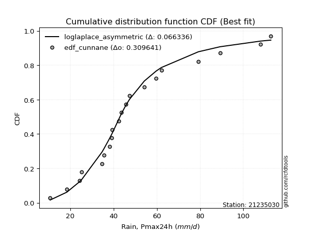</img>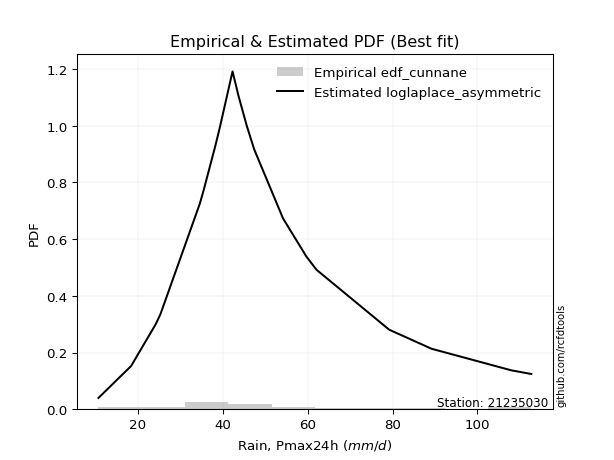</img>

</div>


### 12. Empirical - EDF Adamowski (1981)

The Adamowski formula in hydrology refers to a specific plotting position formula used for estimating the non-parametric empirical distribution of hydrological events (like flood peaks) to calculate their return periods. This formula provides an alternative to traditional parametric methods (like the Gumbel or Log Pearson Type III distributions). 

<div align="center">


$P=(m-0.25)/(n+0.5)$


</div>


**12.1. Empirical values**

<div align="center">

|                | 0                   | 1                   | 2                   | 3                  | 4                   | 5                   | 6                 | 7                   | 8                  | 9                   | 10            | 11                 | 12                 | 13                 | 14                | 15                 | 16                 | 17                 | 18                 | 19                 | 20                 |
|:---------------|:--------------------|:--------------------|:--------------------|:-------------------|:--------------------|:--------------------|:------------------|:--------------------|:-------------------|:--------------------|:--------------|:-------------------|:-------------------|:-------------------|:------------------|:-------------------|:-------------------|:-------------------|:-------------------|:-------------------|:-------------------|
| date           | 2022                | 2021                | 2020                | 2023               | 2016                | 2017                | 2007              | 2006                | 2005               | 2008                | 2018          | 2010               | 2009               | 2015               | 2014              | 2013               | 2024               | 2025               | 2012               | 2011               | 2019               |
| x              | 10.7                | 18.4                | 24.2                | 25.3               | 34.6                | 35.5                | 38.2              | 39.0                | 39.3               | 42.3                | 43.7          | 45.6               | 47.4               | 54.2               | 59.7              | 62.1               | 79.2               | 86.2               | 89.2               | 108.0              | 112.7              |
| m              | 1                   | 2                   | 3                   | 4                  | 5                   | 6                   | 7                 | 8                   | 9                  | 10                  | 11            | 12                 | 13                 | 14                 | 15                | 16                 | 17                 | 18                 | 19                 | 20                 | 21                 |
| empirical_dist | edf_adamowski       | edf_adamowski       | edf_adamowski       | edf_adamowski      | edf_adamowski       | edf_adamowski       | edf_adamowski     | edf_adamowski       | edf_adamowski      | edf_adamowski       | edf_adamowski | edf_adamowski      | edf_adamowski      | edf_adamowski      | edf_adamowski     | edf_adamowski      | edf_adamowski      | edf_adamowski      | edf_adamowski      | edf_adamowski      | edf_adamowski      |
| empirical      | 0.03488372093023256 | 0.08139534883720931 | 0.12790697674418605 | 0.1744186046511628 | 0.22093023255813954 | 0.26744186046511625 | 0.313953488372093 | 0.36046511627906974 | 0.4069767441860465 | 0.45348837209302323 | 0.5           | 0.5465116279069767 | 0.5930232558139535 | 0.6395348837209303 | 0.686046511627907 | 0.7325581395348837 | 0.7790697674418605 | 0.8255813953488372 | 0.872093023255814  | 0.9186046511627907 | 0.9651162790697675 |
| empirical_tr   | 1.036144578313253   | 1.0886075949367089  | 1.1466666666666667  | 1.2112676056338028 | 1.2835820895522387  | 1.3650793650793651  | 1.457627118644068 | 1.5636363636363635  | 1.6862745098039218 | 1.829787234042553   | 2.0           | 2.205128205128205  | 2.4571428571428573 | 2.774193548387097  | 3.185185185185185 | 3.7391304347826084 | 4.526315789473685  | 5.733333333333334  | 7.8181818181818175 | 12.285714285714281 | 28.666666666666707 |

</div>


**12.2. Kolmogorov-Smirnov fit test (sorted by Δ)**


<div align="center">

|                | 0                   | 1                   | 2                   | 3                   | 4                   | 5                   | 6                   | 7                   | 8                   | 9                   | 10                    | 11                  | 12                  | 13                  | 14                  | 15                  | 16                  | 17                  | 18                  | 19                  | 20                  | 21                  | 22                  | 23                  | 24                  | 25                  | 26                  | 27                  | 28                  | 29                  | 30                  | 31                  | 32                  | 33                  | 34                  | 35                  | 36                  | 37                  | 38                  | 39                  | 40                  | 41                  | 42                  | 43                  | 44                  | 45                  | 46                  | 47                  | 48                  | 49                  | 50                  | 51                  | 52                  | 53                  | 54                  | 55                  | 56                  | 57                  | 58                  | 59                  | 60                  | 61                  | 62                  | 63                  | 64                  | 65                  | 66                  | 67                  | 68                  | 69                  | 70                  | 71                  | 72                  | 73                  | 74                  | 75                  | 76                  | 77                  | 78                  | 79                  | 80                  | 81                  | 82                  | 83                  | 84                  | 85                  | 86                  | 87                  | 88                  | 89                  |
|:---------------|:--------------------|:--------------------|:--------------------|:--------------------|:--------------------|:--------------------|:--------------------|:--------------------|:--------------------|:--------------------|:----------------------|:--------------------|:--------------------|:--------------------|:--------------------|:--------------------|:--------------------|:--------------------|:--------------------|:--------------------|:--------------------|:--------------------|:--------------------|:--------------------|:--------------------|:--------------------|:--------------------|:--------------------|:--------------------|:--------------------|:--------------------|:--------------------|:--------------------|:--------------------|:--------------------|:--------------------|:--------------------|:--------------------|:--------------------|:--------------------|:--------------------|:--------------------|:--------------------|:--------------------|:--------------------|:--------------------|:--------------------|:--------------------|:--------------------|:--------------------|:--------------------|:--------------------|:--------------------|:--------------------|:--------------------|:--------------------|:--------------------|:--------------------|:--------------------|:--------------------|:--------------------|:--------------------|:--------------------|:--------------------|:--------------------|:--------------------|:--------------------|:--------------------|:--------------------|:--------------------|:--------------------|:--------------------|:--------------------|:--------------------|:--------------------|:--------------------|:--------------------|:--------------------|:--------------------|:--------------------|:--------------------|:--------------------|:--------------------|:--------------------|:--------------------|:--------------------|:--------------------|:--------------------|:--------------------|:--------------------|
| station        | 21235030            | 21235030            | 21235030            | 21235030            | 21235030            | 21235030            | 21235030            | 21235030            | 21235030            | 21235030            | 21235030              | 21235030            | 21235030            | 21235030            | 21235030            | 21235030            | 21235030            | 21235030            | 21235030            | 21235030            | 21235030            | 21235030            | 21235030            | 21235030            | 21235030            | 21235030            | 21235030            | 21235030            | 21235030            | 21235030            | 21235030            | 21235030            | 21235030            | 21235030            | 21235030            | 21235030            | 21235030            | 21235030            | 21235030            | 21235030            | 21235030            | 21235030            | 21235030            | 21235030            | 21235030            | 21235030            | 21235030            | 21235030            | 21235030            | 21235030            | 21235030            | 21235030            | 21235030            | 21235030            | 21235030            | 21235030            | 21235030            | 21235030            | 21235030            | 21235030            | 21235030            | 21235030            | 21235030            | 21235030            | 21235030            | 21235030            | 21235030            | 21235030            | 21235030            | 21235030            | 21235030            | 21235030            | 21235030            | 21235030            | 21235030            | 21235030            | 21235030            | 21235030            | 21235030            | 21235030            | 21235030            | 21235030            | 21235030            | 21235030            | 21235030            | 21235030            | 21235030            | 21235030            | 21235030            | 21235030            |
| empirical_dist | edf_adamowski       | edf_adamowski       | edf_adamowski       | edf_adamowski       | edf_adamowski       | edf_adamowski       | edf_adamowski       | edf_adamowski       | edf_adamowski       | edf_adamowski       | edf_adamowski         | edf_adamowski       | edf_adamowski       | edf_adamowski       | edf_adamowski       | edf_adamowski       | edf_adamowski       | edf_adamowski       | edf_adamowski       | edf_adamowski       | edf_adamowski       | edf_adamowski       | edf_adamowski       | edf_adamowski       | edf_adamowski       | edf_adamowski       | edf_adamowski       | edf_adamowski       | edf_adamowski       | edf_adamowski       | edf_adamowski       | edf_adamowski       | edf_adamowski       | edf_adamowski       | edf_adamowski       | edf_adamowski       | edf_adamowski       | edf_adamowski       | edf_adamowski       | edf_adamowski       | edf_adamowski       | edf_adamowski       | edf_adamowski       | edf_adamowski       | edf_adamowski       | edf_adamowski       | edf_adamowski       | edf_adamowski       | edf_adamowski       | edf_adamowski       | edf_adamowski       | edf_adamowski       | edf_adamowski       | edf_adamowski       | edf_adamowski       | edf_adamowski       | edf_adamowski       | edf_adamowski       | edf_adamowski       | edf_adamowski       | edf_adamowski       | edf_adamowski       | edf_adamowski       | edf_adamowski       | edf_adamowski       | edf_adamowski       | edf_adamowski       | edf_adamowski       | edf_adamowski       | edf_adamowski       | edf_adamowski       | edf_adamowski       | edf_adamowski       | edf_adamowski       | edf_adamowski       | edf_adamowski       | edf_adamowski       | edf_adamowski       | edf_adamowski       | edf_adamowski       | edf_adamowski       | edf_adamowski       | edf_adamowski       | edf_adamowski       | edf_adamowski       | edf_adamowski       | edf_adamowski       | edf_adamowski       | edf_adamowski       | edf_adamowski       |
| p_dist         | logfisk             | exponnorm           | fisk                | mielke              | loggenlogistic      | logmielke           | nct                 | laplace_asymmetric  | moyal               | loglogistic         | loglaplace_asymmetric | invgamma            | invgauss            | fatiguelife         | lognakagami         | johnsonsu           | invweibull          | f                   | alpha               | gamma               | erlang              | chi2                | logpearson3         | ncf                 | betaprime           | halflogistic        | logt                | loghypsecant        | logloggamma         | genlogistic         | logweibull_min      | weibull_min         | logjohnsonsu        | gumbel_r            | loggompertz         | loglaplace          | halfnorm            | kstwobign           | logf                | logrice             | logcrystalball      | lognorm             | lognorm             | logexponnorm        | loglognorm          | lognct              | logfatiguelife      | genexpon            | logerlang           | pearson3            | logbetaprime        | loginvgamma         | logalpha            | logncf              | loggamma            | loggamma            | rayleigh            | loggumbel_l         | maxwell             | loginvgauss         | logmaxwell          | rice                | loggumbel_r         | lograyleigh         | logmoyal            | gompertz            | crystalball         | norm                | truncnorm           | t                   | loginvweibull       | logistic            | wald                | gibrat              | loghalfnorm         | hypsecant           | loghalflogistic     | loggibrat           | laplace             | logkstwobign        | logwald             | expon               | gumbel_l            | loggenexpon         | nakagami            | logtruncnorm        | logexpon            | logpareto           | logchi2             | pareto              |
| delta          | 0.07216466002935201 | 0.07234128935220852 | 0.07493560063785465 | 0.07661300431428719 | 0.07676098212977189 | 0.07681104522405346 | 0.0782743771144837  | 0.07929286545395853 | 0.07961575314574565 | 0.0816582275381102  | 0.08299409320119955   | 0.08384739305824052 | 0.08409295723640409 | 0.08409360957792045 | 0.08424946236509491 | 0.08436972377096441 | 0.08448200834083897 | 0.08562608007701733 | 0.08568092146085271 | 0.0857237314993714  | 0.08572396544673944 | 0.08572410199548974 | 0.08787258389263841 | 0.08830374917773343 | 0.08840501710661808 | 0.08860715512310102 | 0.08888699657404692 | 0.08909551844088193 | 0.09174247400803404 | 0.09189704616452754 | 0.09228710631284631 | 0.0926144706353107  | 0.09394474015021459 | 0.09695708620876448 | 0.09710696201232205 | 0.09820487749295703 | 0.09967800119603748 | 0.101399701347206   | 0.1016695703654894  | 0.10169832578410398 | 0.10169839823738358 | 0.10169842258617179 | 0.10169842258617179 | 0.10170002797788141 | 0.10170156723770007 | 0.10181011670899681 | 0.1022865012930756  | 0.10688492304661323 | 0.11160252108909957 | 0.11209970496782995 | 0.11248462710746843 | 0.11285852841260652 | 0.11344022596946185 | 0.11470591459607105 | 0.11498011361182242 | 0.11498011361182242 | 0.11523444211119482 | 0.12460437558566884 | 0.12734208927442242 | 0.1306465425558344  | 0.13166616834229883 | 0.1325482827570506  | 0.14208601279105126 | 0.14326930315318315 | 0.1560288963475152  | 0.16090513629480296 | 0.1617443301660491  | 0.16174433584667713 | 0.16174434163211526 | 0.1617528974339837  | 0.16760943058980937 | 0.1708853626591335  | 0.17441860429240544 | 0.1744186046511628  | 0.17627577757761675 | 0.1785352715426632  | 0.17928130108411922 | 0.19758195214040708 | 0.20160340561551787 | 0.2055144243334412  | 0.21024482756053753 | 0.21713334312878269 | 0.23086420934689844 | 0.23457250919098077 | 0.2445114098135932  | 0.2554962800692828  | 0.3374677198880706  | 0.3374677298135757  | 0.46294720503112025 | 0.5407311500939779  |
| deltao         | 0.30282488509099936 | 0.30282488509099936 | 0.30282488509099936 | 0.30282488509099936 | 0.30282488509099936 | 0.30282488509099936 | 0.30282488509099936 | 0.30282488509099936 | 0.30282488509099936 | 0.30282488509099936 | 0.30282488509099936   | 0.30282488509099936 | 0.30282488509099936 | 0.30282488509099936 | 0.30282488509099936 | 0.30282488509099936 | 0.30282488509099936 | 0.30282488509099936 | 0.30282488509099936 | 0.30282488509099936 | 0.30282488509099936 | 0.30282488509099936 | 0.30282488509099936 | 0.30282488509099936 | 0.30282488509099936 | 0.30282488509099936 | 0.30282488509099936 | 0.30282488509099936 | 0.30282488509099936 | 0.30282488509099936 | 0.30282488509099936 | 0.30282488509099936 | 0.30282488509099936 | 0.30282488509099936 | 0.30282488509099936 | 0.30282488509099936 | 0.30282488509099936 | 0.30282488509099936 | 0.30282488509099936 | 0.30282488509099936 | 0.30282488509099936 | 0.30282488509099936 | 0.30282488509099936 | 0.30282488509099936 | 0.30282488509099936 | 0.30282488509099936 | 0.30282488509099936 | 0.30282488509099936 | 0.30282488509099936 | 0.30282488509099936 | 0.30282488509099936 | 0.30282488509099936 | 0.30282488509099936 | 0.30282488509099936 | 0.30282488509099936 | 0.30282488509099936 | 0.30282488509099936 | 0.30282488509099936 | 0.30282488509099936 | 0.30282488509099936 | 0.30282488509099936 | 0.30282488509099936 | 0.30282488509099936 | 0.30282488509099936 | 0.30282488509099936 | 0.30282488509099936 | 0.30282488509099936 | 0.30282488509099936 | 0.30282488509099936 | 0.30282488509099936 | 0.30282488509099936 | 0.30282488509099936 | 0.30282488509099936 | 0.30282488509099936 | 0.30282488509099936 | 0.30282488509099936 | 0.30282488509099936 | 0.30282488509099936 | 0.30282488509099936 | 0.30282488509099936 | 0.30282488509099936 | 0.30282488509099936 | 0.30282488509099936 | 0.30282488509099936 | 0.30282488509099936 | 0.30282488509099936 | 0.30282488509099936 | 0.30282488509099936 | 0.30282488509099936 | 0.30282488509099936 |
| eval           | Δo > Δ              | Δo > Δ              | Δo > Δ              | Δo > Δ              | Δo > Δ              | Δo > Δ              | Δo > Δ              | Δo > Δ              | Δo > Δ              | Δo > Δ              | Δo > Δ                | Δo > Δ              | Δo > Δ              | Δo > Δ              | Δo > Δ              | Δo > Δ              | Δo > Δ              | Δo > Δ              | Δo > Δ              | Δo > Δ              | Δo > Δ              | Δo > Δ              | Δo > Δ              | Δo > Δ              | Δo > Δ              | Δo > Δ              | Δo > Δ              | Δo > Δ              | Δo > Δ              | Δo > Δ              | Δo > Δ              | Δo > Δ              | Δo > Δ              | Δo > Δ              | Δo > Δ              | Δo > Δ              | Δo > Δ              | Δo > Δ              | Δo > Δ              | Δo > Δ              | Δo > Δ              | Δo > Δ              | Δo > Δ              | Δo > Δ              | Δo > Δ              | Δo > Δ              | Δo > Δ              | Δo > Δ              | Δo > Δ              | Δo > Δ              | Δo > Δ              | Δo > Δ              | Δo > Δ              | Δo > Δ              | Δo > Δ              | Δo > Δ              | Δo > Δ              | Δo > Δ              | Δo > Δ              | Δo > Δ              | Δo > Δ              | Δo > Δ              | Δo > Δ              | Δo > Δ              | Δo > Δ              | Δo > Δ              | Δo > Δ              | Δo > Δ              | Δo > Δ              | Δo > Δ              | Δo > Δ              | Δo > Δ              | Δo > Δ              | Δo > Δ              | Δo > Δ              | Δo > Δ              | Δo > Δ              | Δo > Δ              | Δo > Δ              | Δo > Δ              | Δo > Δ              | Δo > Δ              | Δo > Δ              | Δo > Δ              | Δo > Δ              | Δo > Δ              | Δo <= Δ             | Δo <= Δ             | Δo <= Δ             | Δo <= Δ             |
| fit            | 1                   | 1                   | 1                   | 1                   | 1                   | 1                   | 1                   | 1                   | 1                   | 1                   | 1                     | 1                   | 1                   | 1                   | 1                   | 1                   | 1                   | 1                   | 1                   | 1                   | 1                   | 1                   | 1                   | 1                   | 1                   | 1                   | 1                   | 1                   | 1                   | 1                   | 1                   | 1                   | 1                   | 1                   | 1                   | 1                   | 1                   | 1                   | 1                   | 1                   | 1                   | 1                   | 1                   | 1                   | 1                   | 1                   | 1                   | 1                   | 1                   | 1                   | 1                   | 1                   | 1                   | 1                   | 1                   | 1                   | 1                   | 1                   | 1                   | 1                   | 1                   | 1                   | 1                   | 1                   | 1                   | 1                   | 1                   | 1                   | 1                   | 1                   | 1                   | 1                   | 1                   | 1                   | 1                   | 1                   | 1                   | 1                   | 1                   | 1                   | 1                   | 1                   | 1                   | 1                   | 1                   | 1                   | 0                   | 0                   | 0                   | 0                   |
| n              | 21                  | 21                  | 21                  | 21                  | 21                  | 21                  | 21                  | 21                  | 21                  | 21                  | 21                    | 21                  | 21                  | 21                  | 21                  | 21                  | 21                  | 21                  | 21                  | 21                  | 21                  | 21                  | 21                  | 21                  | 21                  | 21                  | 21                  | 21                  | 21                  | 21                  | 21                  | 21                  | 21                  | 21                  | 21                  | 21                  | 21                  | 21                  | 21                  | 21                  | 21                  | 21                  | 21                  | 21                  | 21                  | 21                  | 21                  | 21                  | 21                  | 21                  | 21                  | 21                  | 21                  | 21                  | 21                  | 21                  | 21                  | 21                  | 21                  | 21                  | 21                  | 21                  | 21                  | 21                  | 21                  | 21                  | 21                  | 21                  | 21                  | 21                  | 21                  | 21                  | 21                  | 21                  | 21                  | 21                  | 21                  | 21                  | 21                  | 21                  | 21                  | 21                  | 21                  | 21                  | 21                  | 21                  | 21                  | 21                  | 21                  | 21                  |
| best_fit       | 1                   | 0                   | 0                   | 0                   | 0                   | 0                   | 0                   | 0                   | 0                   | 0                   | 0                     | 0                   | 0                   | 0                   | 0                   | 0                   | 0                   | 0                   | 0                   | 0                   | 0                   | 0                   | 0                   | 0                   | 0                   | 0                   | 0                   | 0                   | 0                   | 0                   | 0                   | 0                   | 0                   | 0                   | 0                   | 0                   | 0                   | 0                   | 0                   | 0                   | 0                   | 0                   | 0                   | 0                   | 0                   | 0                   | 0                   | 0                   | 0                   | 0                   | 0                   | 0                   | 0                   | 0                   | 0                   | 0                   | 0                   | 0                   | 0                   | 0                   | 0                   | 0                   | 0                   | 0                   | 0                   | 0                   | 0                   | 0                   | 0                   | 0                   | 0                   | 0                   | 0                   | 0                   | 0                   | 0                   | 0                   | 0                   | 0                   | 0                   | 0                   | 0                   | 0                   | 0                   | 0                   | 0                   | 0                   | 0                   | 0                   | 0                   |
| best_fit_sort  | 1                   | 2                   | 3                   | 4                   | 5                   | 6                   | 7                   | 8                   | 9                   | 10                  | 11                    | 12                  | 13                  | 14                  | 15                  | 16                  | 17                  | 18                  | 19                  | 20                  | 21                  | 22                  | 23                  | 24                  | 25                  | 26                  | 27                  | 28                  | 29                  | 30                  | 31                  | 32                  | 33                  | 34                  | 35                  | 36                  | 37                  | 38                  | 39                  | 40                  | 41                  | 42                  | 43                  | 44                  | 45                  | 46                  | 47                  | 48                  | 49                  | 50                  | 51                  | 52                  | 53                  | 54                  | 55                  | 56                  | 57                  | 58                  | 59                  | 60                  | 61                  | 62                  | 63                  | 64                  | 65                  | 66                  | 67                  | 68                  | 69                  | 70                  | 71                  | 72                  | 73                  | 74                  | 75                  | 76                  | 77                  | 78                  | 79                  | 80                  | 81                  | 82                  | 83                  | 84                  | 85                  | 86                  | 87                  | 88                  | 89                  | 90                  |

</div>


<div align="center">

</img>

</div>


**12.3. Best fit**

<div align="center">

|   id |   station | empirical_dist   | p_dist   |     delta |   deltao | eval   |   fit |   n |   best_fit |   best_fit_sort |
|-----:|----------:|:-----------------|:---------|----------:|---------:|:-------|------:|----:|-----------:|----------------:|
|    0 |  21235030 | edf_adamowski    | logfisk  | 0.0721647 | 0.302825 | Δo > Δ |     1 |  21 |          1 |               1 |

</div>


<div align="center">

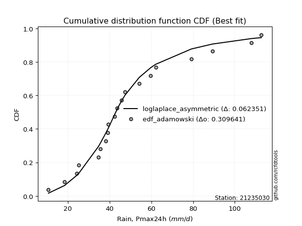</img>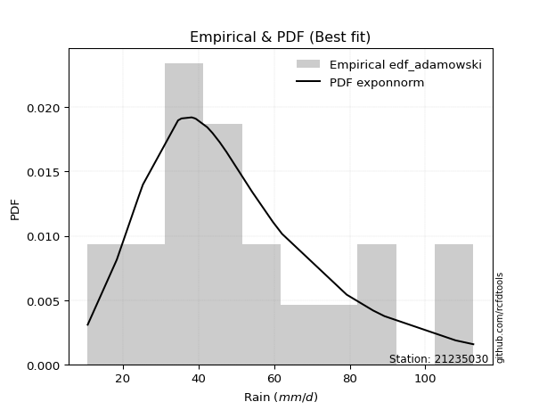</img>

</div>


## C. Best fit & Estimate extreme values for specific return periods - Tr


### 1. Best fit (ordered by delta Δ)

<div align="center">

|   id |   station | empirical_dist   | p_dist                |     delta |   deltao | eval   |   fit |   n |   best_fit |   best_fit_sort |
|-----:|----------:|:-----------------|:----------------------|----------:|---------:|:-------|------:|----:|-----------:|----------------:|
|    0 |  21235030 | edf_california   | loglaplace_asymmetric | 0.0643199 | 0.302825 | Δo > Δ |     1 |  21 |          1 |               1 |
|    1 |  21235030 | edf_adamowski    | logfisk               | 0.0721647 | 0.302825 | Δo > Δ |     1 |  21 |          1 |               2 |
|    2 |  21235030 | edf_chegodayev   | exponnorm             | 0.0726102 | 0.302825 | Δo > Δ |     1 |  21 |          1 |               3 |
|    3 |  21235030 | edf_jenkinson    | exponnorm             | 0.0728725 | 0.302825 | Δo > Δ |     1 |  21 |          1 |               4 |
|    4 |  21235030 | edf_beard        | exponnorm             | 0.0728725 | 0.302825 | Δo > Δ |     1 |  21 |          1 |               5 |
|    5 |  21235030 | edf_filliben     | exponnorm             | 0.0730695 | 0.302825 | Δo > Δ |     1 |  21 |          1 |               6 |
|    6 |  21235030 | edf_tukey        | fisk                  | 0.0734179 | 0.302825 | Δo > Δ |     1 |  21 |          1 |               7 |
|    7 |  21235030 | edf_blom         | fisk                  | 0.0737855 | 0.302825 | Δo > Δ |     1 |  21 |          1 |               8 |
|    8 |  21235030 | edf_cunnane      | fisk                  | 0.0740075 | 0.302825 | Δo > Δ |     1 |  21 |          1 |               9 |
|    9 |  21235030 | edf_weibull      | logfisk               | 0.0740592 | 0.302825 | Δo > Δ |     1 |  21 |          1 |              10 |
|   10 |  21235030 | edf_gringorten   | fisk                  | 0.0743648 | 0.302825 | Δo > Δ |     1 |  21 |          1 |              11 |
|   11 |  21235030 | edf_hazen        | moyal                 | 0.0744785 | 0.302825 | Δo > Δ |     1 |  21 |          1 |              12 |

</div>

:file_folder:Tables: [bestfit_21235030.csv](table/bestfit_21235030.csv) | [extreme_21235030.csv](table/extreme_21235030.csv)


### 2. Extreme values

In hydrology, a return period (or recurrence interval $Tr$) is the statistical average time between extreme events like floods or droughts of a specific magnitude, indicating how rare an event is, with a 100-year flood, for example, having a 1% chance of occurring in any given year, not that it happens exactly every century. It is a key tool for infrastructure design (like bridges or dams) and risk assessment, calculated from historical data to determine the probability of future events, although it is important to remember it is statistical average, and events can cluster or be missed.

> risk_rate: assuming the return period as the project useful life.

|   id |      tr |   prob_l |     prob_g |    alpha |   betaprime |     chi2 |   crystalball |   erlang |    expon |   exponnorm |        f |   fatiguelife |     fisk |    gamma |   genexpon |   genlogistic |   gibrat |   gompertz |   gumbel_l |   gumbel_r |   halflogistic |   halfnorm |   hypsecant |   invgamma |   invgauss |   invweibull |   johnsonsu |   kstwobign |   laplace |   laplace_asymmetric |   loggamma |   logistic |   lognorm |   maxwell |   mielke |    moyal |   nakagami |      ncf |      nct |     norm |       pareto |   pearson3 |   rayleigh |     rice |        t |   truncnorm |     wald |   weibull_min |   logalpha |   logbetaprime |     logchi2 |   logcrystalball |   logerlang |    logexpon |   logexponnorm |     logf |   logfatiguelife |   logfisk |   loggenexpon |   loggenlogistic |   loggibrat |   loggompertz |   loggumbel_l |   loggumbel_r |   loghalflogistic |   loghalfnorm |   loghypsecant |   loginvgamma |   loginvgauss |   loginvweibull |   logjohnsonsu |   logkstwobign |   loglaplace |   loglaplace_asymmetric |   logloggamma |   loglogistic |   loglognorm |   logmaxwell |   logmielke |   logmoyal |   lognakagami |   logncf |   lognct |   logpareto |   logpearson3 |   lograyleigh |   logrice |     logt |   logtruncnorm |   logwald |   logweibull_min |   station |   n |   risk_rate |
|-----:|--------:|---------:|-----------:|---------:|------------:|---------:|--------------:|---------:|---------:|------------:|---------:|--------------:|---------:|---------:|-----------:|--------------:|---------:|-----------:|-----------:|-----------:|---------------:|-----------:|------------:|-----------:|-----------:|-------------:|------------:|------------:|----------:|---------------------:|-----------:|-----------:|----------:|----------:|---------:|---------:|-----------:|---------:|---------:|---------:|-------------:|-----------:|-----------:|---------:|---------:|------------:|---------:|--------------:|-----------:|---------------:|------------:|-----------------:|------------:|------------:|---------------:|---------:|-----------------:|----------:|--------------:|-----------------:|------------:|--------------:|--------------:|--------------:|------------------:|--------------:|---------------:|--------------:|--------------:|----------------:|---------------:|---------------:|-------------:|------------------------:|--------------:|--------------:|-------------:|-------------:|------------:|-----------:|--------------:|---------:|---------:|------------:|--------------:|--------------:|----------:|---------:|---------------:|----------:|-----------------:|----------:|----:|------------:|
|    0 |    2    | 0.5      | 0.5        |  46.9495 |     47.098  |  46.9154 |       52.1667 |  46.9154 |  39.4425 |     45.7451 |  46.9088 |       46.8231 |  46.2076 |  46.9154 |    48.3779 |       47.3308 |  43.9018 |    53.004  |    56.6901 |    47.6433 |        45.3944 |    46.5305 |     52.1667 |    46.8264 |    46.8253 |      46.8734 |     46.8505 |     47.9443 |   52.1667 |              46.329  |    44.1549 |    52.1667 |   44.9757 |   49.8118 |  46.4288 |  46.183  |    36.5917 |  47.1005 |  46.426  |  52.1667 | 10.7284      |    48.6709 |    48.9766 |  50.0322 |  52.1673 |     52.1667 |  43.2413 |       47.3715 |    44.1941 |        44.3545 |     19.1838 |          44.9757 |     44.309  |     28.9485 |        44.9756 |  44.9858 |          44.9486 |   45.8488 |       37.7435 |          46.4369 |     37.9057 |       47.6893 |       49.3884 |       40.9573 |           39.0957 |       40.0247 |        44.9757 |       44.2494 |       43.2054 |         41.9659 |        47.461  |        39.7121 |      44.9757 |                 43.6641 |       47.3158 |       44.9757 |      44.9755 |      42.8368 |     46.3454 |    39.7383 |       45.7473 |  44.3919 |  44.9735 |     28.9485 |       47.0568 |       42.103  |   44.9757 |  45.4689 |        35.9358 |   37.3915 |          47.3508 |  21235030 |  21 |    0.75     |
|    1 |    2.33 | 0.570815 | 0.429185   |  51.4586 |     51.9034 |  51.7951 |       57.0801 |  51.7951 |  45.7753 |     50.1    |  51.7891 |       51.5741 |  50.5068 |  51.795  |    53.5366 |       51.842  |  46.3908 |    59.0143 |    60.9649 |    52.1961 |        50.0755 |    51.8334 |     56.0989 |    51.4213 |    51.5575 |      51.4039 |     51.5201 |     52.7359 |   55.1401 |              50.309  |    48.9901 |    56.4958 |   49.7886 |   54.9165 |  50.7636 |  50.4928 |    41.0678 |  51.7654 |  50.743  |  57.0801 | 11.3033      |    53.5546 |    54.1568 |  54.9113 |  57.0807 |     57.0801 |  46.4631 |       52.4845 |    49.0459 |        49.2072 |     23.1319 |          49.7886 |     49.1229 |     36.0464 |        49.7885 |  49.8054 |          49.769  |   50.2259 |       43.5641 |          50.7747 |     39.909  |       52.8803 |       53.9558 |       45.0031 |           43.0715 |       44.6665 |        48.788  |       49.1017 |       48.0892 |         47.8827 |        52.331  |        45.749  |      47.8296 |                 46.8589 |       52.1503 |       49.1902 |      49.7884 |      47.6088 |     50.6336 |    43.4447 |       50.1144 |  49.3661 |  49.788  |     36.0464 |       51.9587 |       46.8664 |   49.7886 |  50.1481 |        40.4855 |   39.9691 |          52.2612 |  21235030 |  21 |    0.729209 |
|    2 |    5    | 0.8      | 0.2        |  71.4942 |     72.6821 |  73.0421 |       75.3399 |  73.0421 |  77.438  |     71.0811 |  73.0398 |       72.5256 |  70.6833 |  73.0421 |    74.5387 |       71.4367 |  60.7205 |    81.6461 |    74.7748 |    71.9759 |        71.2565 |    74.2587 |     71.872  |    71.8642 |    72.4463 |      71.5232 |     72.2196 |     73.0895 |   70.0064 |              70.2079 |    72.5346 |    73.211  |   72.6459 |   75.0085 |  70.7281 |  70.4566 |    61.3521 |  72.1662 |  70.564  |  75.3399 |  2.58715e+06 |    73.7285 |    74.8957 |  74.4446 |  75.3405 |     75.3399 |  64.4988 |       73.9882 |    73.0497 |        72.7067 |     66.3107 |          72.6459 |     72.5092 |    107.9    |        72.6456 |  72.7158 |          72.7016 |   71.4215 |       77.416  |          70.739  |     53.684  |       74.3498 |       71.8015 |       67.7614 |           66.7592 |       71.0396 |        67.6159 |       72.9913 |       72.8805 |         84.926  |        73.1859 |        83.4538 |      65.0556 |                 66.6992 |       72.9796 |       69.5154 |      72.6459 |      72.149  |     70.5212 |    65.6644 |       71.675  |  73.8106 |  72.6518 |    107.9    |       73.255  |       71.9804 |   72.6459 |  72.4473 |        64.1416 |   58.0489 |          73.2728 |  21235030 |  21 |    0.67232  |
|    3 |   10    | 0.9      | 0.1        |  88.5821 |     89.1351 |  89.9868 |       87.453  |  89.9868 | 106.181  |     90.0205 |  89.9878 |       89.6218 |  90.0006 |  89.9867 |    89.8642 |       87.3938 |  77.0546 |    96.0846 |    82.4636 |    88.0862 |        88.8464 |    90.853  |     84.4674 |    89.0913 |    89.5446 |      88.4481 |     89.4272 |     88.5861 |   83.5016 |              88.2716 |    94.6216 |    85.5212 |   93.3379 |   89.1481 |  89.5298 |  87.8381 |    77.0141 |  88.8547 |  88.4903 |  87.453  |  2.71282e+12 |    88.9364 |    89.683  |  88.3722 |  87.4536 |     87.453  |  83.639  |       90.1843 |    96.1265 |        94.5763 |    189.823  |          93.3379 |     94.3836 |    291.919  |        93.3376 |  93.4833 |          93.5131 |   92.5624 |      116.705  |          89.5288 |     75.2719 |       90.1703 |       84.1829 |       94.5689 |           96.0649 |      100.143  |        87.7464 |       95.7836 |       97.5715 |        135.436  |        89.4328 |       131.89   |      86.0105 |                 91.8985 |       89.4133 |       89.6808 |      93.3384 |      96.6689 |     89.396  |    94.0847 |       92.1462 |  97.0304 |  93.3471 |    291.919  |       90.098  |       97.7434 |   93.3379 |  93.1879 |        82.7138 |   86.2556 |          89.6352 |  21235030 |  21 |    0.651322 |
|    4 |   15    | 0.933333 | 0.0666667  |  98.6532 |     98.1771 |  99.3316 |       93.4976 |  99.3316 | 122.994  |    101.099  |  99.3347 |       99.2034 | 102.496  |  99.3316 |    97.8777 |       96.3961 |  88.3212 |   102.978  |    85.9457 |    97.1755 |        98.8007 |    99.4885 |     91.6554 |    99.0671 |    99.1549 |      98.216  |     99.255  |     96.813  |   91.3958 |              98.8382 |   108.222  |    92.2284 |  105.773  |   96.403  | 101.633  |  97.9256 |    85.2462 |  98.3072 |  99.5172 |  93.4976 |  9.02082e+15 |    97.0883 |    97.3021 |  95.5483 |  93.4983 |     93.4976 |  95.93   |       98.7722 |   110.593  |       107.969  |    359.805  |         105.773  |    107.828  |    522.526  |       105.773  | 105.975  |         106.041  |  106.607  |      144.207  |         101.622  |     95.0342 |       98.4535 |       90.4719 |      114.136  |          118.035  |      119.735  |       101.817  |      109.991  |      113.42   |        176.236  |        98.2512 |       168.165  |     101.272  |                110.848  |       98.4294 |      103.031  |     105.774  |     112.325  |    101.595  |   115.922  |      104.813  | 111.448  | 105.783  |    522.526  |       99.2985 |      114.433  |  105.773  | 106.056  |        91.0235 |  111.233  |          98.5297 |  21235030 |  21 |    0.644736 |
|    5 |   20    | 0.95     | 0.05       | 105.933  |    104.405  | 105.78   |       97.4561 | 105.78   | 134.923  |    108.96   | 105.784  |      105.877  | 112.068  | 105.78   |   103.249  |      102.699  |  97.159  |   107.366  |    88.1131 |   103.54   |       105.775  |   105.246  |     96.7262 |   106.176  |   105.861  |     105.151  |    106.19   |    102.355  |   96.9969 |             106.335  |   118.241  |    96.8642 |  114.801  |  101.218  | 110.894  | 105.07   |    90.7496 | 104.952  | 107.693  |  97.4561 |  2.8446e+18  |   102.634  |   102.366  | 100.318  |  97.4568 |     97.4561 | 105.089  |      104.565  |   121.371  |       117.802  |    570.834  |         114.801  |    117.722  |    789.778  |       114.801  | 115.049  |         115.145  |  117.542  |      165.99   |         110.876  |    114.104  |      104.003  |       94.6215 |      130.2    |          136.357  |      134.883  |       113.08   |      120.538  |      125.395  |        211.916  |       104.278  |       198.069  |     113.715  |                126.618  |      104.635  |      113.403  |     114.802  |     124.092  |    110.948  |   134.388  |      114.163  | 122.122  | 114.811  |    789.778  |      105.601  |      127.073  |  114.801  | 115.626  |        95.7293 |  134.443  |         104.619  |  21235030 |  21 |    0.641514 |
|    6 |   25    | 0.96     | 0.04       | 111.687  |    109.147  | 110.694  |      100.37   | 110.694  | 144.176  |    115.057  | 110.7    |      110.996  | 119.956  | 110.694  |   107.263  |      107.554  | 104.527  |   110.532  |    89.6555 |   108.442  |       111.148  |   109.53   |    100.651  |   111.726  |   111.012  |     110.547  |    111.565  |    106.506  |  101.341  |             112.151  |   126.243  |   100.411  |  121.936  |  104.792  | 118.525  | 110.607  |    94.849  | 110.088  | 114.271  | 100.37   |  2.4673e+20  |   106.821  |   106.129  | 103.862  | 100.371  |    100.37   | 112.426  |      108.911  |   130.051  |       125.637  |    819.596  |         121.936  |    125.619  |   1088.07   |       121.935  | 122.222  |         122.345  |  126.658  |      184.282  |         118.499  |    132.896  |      108.148  |       97.6899 |      144.099  |          152.391  |      147.385  |       122.645  |      129.008  |      135.137  |        244.253  |       108.84   |       223.904  |     124.411  |                140.38   |      109.357  |      122.038  |     121.937  |     133.617  |    118.665  |   150.702  |      121.639  | 130.677  | 121.945  |   1088.07   |      110.377  |      137.361  |  121.936  | 123.335  |        98.757  |  156.481  |         109.236  |  21235030 |  21 |    0.639603 |
|    7 |   50    | 0.98     | 0.02       | 130.344  |    123.473  | 125.567  |      108.715  | 125.567  | 172.919  |    133.996  | 125.576  |      126.653  | 147.466  | 125.567  |   119.029  |      122.51   | 130.498  |   119.288  |    93.8422 |   123.542  |       127.704  |   121.981  |    112.818  |   129.278  |   126.806  |     127.473  |    128.32   |    118.696  |  114.837  |             130.214  |   152.497  |   111.246  |  144.915  |  115.159  | 145.151  | 127.798  |   106.774  | 126.05   | 136.243  | 108.715  |  2.58715e+26 |   119.314  |   117.051  | 114.149  | 108.715  |    108.715  | 136.379  |      121.719  |   158.957  |       151.233  |   2563.55   |         144.915  |    151.493  |   2943.73   |       144.915  | 145.343  |         145.565  |  159.128  |      249.639  |         145.103  |    227.458  |      120.276  |      106.53   |      196.95   |          214.646  |      190.696  |       157.756  |      157.082  |      168.159  |        378.297  |       122.482  |       320.93   |     164.485  |                193.416  |      123.612  |      152.707  |     144.918  |     165.583  |    145.657  |   215.076  |      146.201  | 158.922  | 144.922  |   2943.73   |      124.668  |      172.189  |  144.915  | 149.132  |       105.332  |  256.865  |         123.091  |  21235030 |  21 |    0.63583  |
|    8 |   75    | 0.986667 | 0.0133333  | 141.947  |    131.622  | 134.042  |      113.192  | 134.042  | 189.732  |    145.075  | 134.053  |      135.681  | 166.008  | 134.042  |   125.503  |      131.202  | 148.039  |   123.799  |    95.9594 |   132.32   |       137.328  |   128.759  |    119.928  |   139.828  |   135.939  |     137.524  |    138.212  |    125.402  |  122.731  |             140.781  |   168.914  |   117.504  |  158.982  |  120.795  | 163.126  | 137.85   |   113.267  | 135.448  | 150.347  | 113.192  |  8.60295e+29 |   126.326  |   122.993  | 119.746  | 113.193  |    113.192  | 151.118  |      128.801  |   177.355  |       167.161  |   5042.71   |         158.982  |    167.651  |   5269.2    |       158.981  | 159.507  |         159.799  |  181.547  |      294.478  |         163.065  |    326.99   |      126.93   |      111.3    |      236.171  |          261.939  |      219.407  |       182.76   |      174.846  |      189.603  |        487.825  |       130.146  |       391.231  |     193.67   |                233.298  |      131.715  |      173.817  |     158.986  |     186.064  |    163.923  |   264.804  |      161.573  | 176.711  | 158.986  |   5269.2    |      132.692  |      194.715  |  158.982  | 165.714  |       107.693  |  348.463  |         130.914  |  21235030 |  21 |    0.634587 |
|    9 |  100    | 0.99     | 0.01       | 150.554  |    137.319  | 139.972  |      116.22   | 139.972  | 201.661  |    152.935  | 139.985  |      142.042  | 180.432  | 139.972  |   129.943  |      137.355  | 161.627  |   126.777  |    97.3442 |   138.532  |       144.14   |   133.376  |    124.972  |   147.464  |   142.384  |     144.735  |    145.289  |    129.997  |  128.332  |             148.278  |   181.072  |   121.922  |  169.262  |  124.634  | 177.127  | 144.982  |   117.689  | 142.164  | 160.993  | 116.22   |  2.71283e+32 |   131.193  |   127.041  | 123.559  | 116.221  |    116.22   | 161.865  |      133.671  |   191.132  |       178.921  |   8177.75   |         169.262  |    179.605  |   7964.18   |       169.262  | 169.864  |         170.211  |  199.253  |      329.561  |         177.056  |    433.157  |      131.485  |      114.536  |      268.564  |          301.582  |      241.404  |       202.863  |      188.099  |      205.861  |        584.014  |       135.462  |       448.097  |     217.466  |                266.489  |      137.377  |      190.456  |     169.267  |     201.446  |    178.173  |   306.91   |      172.959  | 189.943  | 169.263  |   7964.18   |      138.25   |      211.726  |  169.262  | 178.242  |       108.908  |  435.236  |         136.36   |  21235030 |  21 |    0.633968 |
|   10 |  200    | 0.995    | 0.005      | 172.812  |    150.8    | 154.022  |      123.09   | 154.022  | 230.404  |    171.874  | 154.039  |      157.246  | 220.149  | 154.022  |   140.194  |      152.146  | 198.596  |   133.32   |   100.354  |   153.466  |       160.516  |   143.937  |    137.123  |   166.45   |   157.829  |     162.404  |    162.584  |    140.581  |  141.827  |             166.342  |   212.211  |   132.521  |  195.113  |  133.417  | 215.767  | 162.165  |   127.795  | 158.565  | 189.107  | 123.09   |  2.84461e+38 |   142.606  |   136.304  | 132.283  | 123.09   |    123.09   | 188.634  |      144.943  |   226.989  |       208.914  |  26472.8    |         195.113  |    210.19   |  21546.8    |       195.112  | 195.923  |         196.425  |  249.09   |      426.391  |         215.672  |    930.82   |      141.968  |      121.896  |      365.805  |          423.208  |      300.36   |       260.851  |      222.411  |      248.914  |        900.172  |       147.905  |       612.523  |     287.514  |                367.17   |      150.77   |      237.155  |     195.12   |     241.593  |    217.581  |   437.943  |      202.114  | 224.045  | 195.104  |  21546.9    |      151.222  |      256.452  |  195.113  | 211.378  |       110.776  |  757.3    |         149.18   |  21235030 |  21 |    0.633042 |
|   11 |  250    | 0.996    | 0.004      | 180.503  |    155.076  | 158.483  |      125.189  | 158.483  | 239.657  |    177.971  | 158.501  |      162.111  | 234.612  | 158.483  |   143.375  |      156.901  | 211.86   |   135.262  |   101.24   |   158.268  |       165.781  |   147.186  |    141.035  |   172.755  |   162.781  |     168.186  |    168.234  |    143.856  |  146.172  |             172.157  |   222.82   |   135.923  |  203.774  |  136.121  | 229.869  | 167.697  |   130.902  | 163.923  | 198.976  | 125.189  |  2.46731e+40 |   146.197  |   139.155  | 134.968  | 125.19   |    125.189  | 197.489  |      148.448  |   239.386  |       219.093  |  38738.4    |         203.774  |    220.599  |  29684.8    |       203.774  | 204.66   |         205.218  |  267.597  |      461.584  |         229.768  |   1224.81   |      145.212  |      124.15   |      404.012  |          471.911  |      321.246  |       282.84   |      234.215  |      264.03   |       1034.51   |       151.812  |       674.736  |     314.556  |                407.076  |      155.016  |      254.454  |     203.782  |     255.493  |    231.99   |   491.049  |      212.042  | 235.728  | 203.762  |  29684.9    |      155.281  |      272.036  |  203.775  | 223.033  |       111.156  |  909.592  |         153.228  |  21235030 |  21 |    0.632858 |
|   12 |  500    | 0.998    | 0.002      | 206.355  |    168.19   | 172.176  |      131.414  | 172.176  | 268.399  |    196.91   | 172.197  |      177.15   | 285.612  | 172.176  |   152.94   |      171.659  | 257.702  |   140.868  |   103.779  |   173.17   |       182.122  |   156.872  |    153.185  |   193.002  |   178.121  |     186.454  |    186.074  |    153.672  |  159.667  |             190.22   |   257.705  |   146.476  |  231.787  |  144.189  | 279.718  | 184.88   |   140.157  | 180.853  | 232.524  | 131.414  |  2.58716e+46 |   157.138  |   147.662  | 142.981  | 131.415  |    131.414  | 225.648  |      159.001  |   280.773  |       252.439  | 127233      |         231.787  |    254.793  |  80311.4    |       231.786  | 232.932  |         233.688  |  334.202  |      584.839  |         279.596  |   3162.45   |      154.934  |      130.846  |      549.925  |          661.742  |      392.539  |       363.682  |      273.422  |      315.279  |       1593.04   |       163.673  |       901.641  |     415.878  |                560.87   |      168.035  |      316.544  |     231.797  |     301.909  |    283.02   |   700.693  |      244.662  | 274.363  | 231.759  |  80311.5    |      167.549  |      324.392  |  231.787  | 262.762  |       111.924  | 1628.85   |         165.591  |  21235030 |  21 |    0.632489 |
|   13 |  750    | 0.998667 | 0.00133333 | 223.076  |    175.758  | 180.084  |      134.872  | 180.084  | 285.212  |    207.989  | 180.108  |      185.904  | 320.269  | 180.084  |   158.337  |      180.287  | 288.019  |   143.888  |   105.136  |   181.882  |       191.675  |   162.284  |    160.292  |   205.345  |   187.073  |     197.363  |    196.728  |    159.186  |  167.561  |             200.787  |   279.536  |   152.641  |  248.98   |  148.702  | 313.691  | 194.931  |   145.323  | 190.977  | 254.392  | 134.872  |  8.60299e+49 |   163.404  |   152.42   | 147.462  | 134.873  |    134.872  | 242.531  |      164.962  |   307.138  |       273.213  | 256126      |         248.98   |    276.167  | 143755      |       248.979  | 250.296  |         251.184  |  380.544  |      667.611  |         313.561  |   5921.98   |      160.398  |      134.571  |      658.547  |          806.353  |      439.048  |       421.296  |      298.248  |      348.513  |       2050.38   |       170.435  |      1061.11   |     489.669  |                676.522  |      175.544  |      359.612  |     248.992  |     331.454  |    317.874  |   862.675  |      265.048  | 298.699  | 248.941  | 143755      |      174.5    |      357.945  |  248.98   | 288.774  |       112.181  | 2309.9    |         172.692  |  21235030 |  21 |    0.632366 |
|   14 | 1000    | 0.999    | 0.001      | 235.777  |    181.086  | 185.655  |      137.253  | 185.655  | 297.142  |    215.849  | 185.681  |      192.1    | 347.314  | 185.655  |   162.088  |      186.407  | 311.218  |   145.928  |   106.049  |   188.061  |       198.451  |   166.021  |    165.335  |   214.341  |   193.417  |     205.205  |    204.391  |    163.006  |  173.162  |             208.284  |   295.695  |   157.013  |  261.553  |  151.82   | 340.252  | 202.062  |   148.888  | 198.268  | 271.023  | 137.253  |  2.71284e+52 |   167.797  |   155.707  | 150.558  | 137.254  |    137.253  | 254.676  |      169.106  |   326.877  |       288.548  | 421430      |         261.553  |    291.977  | 217280      |       261.552  | 263      |         263.989  |  417.252  |      731.568  |         340.116  |   9570.93   |      164.185  |      137.138  |      748.37   |          927.709  |      474.346  |       467.628  |      316.762  |      373.671  |       2452.36   |       175.161  |      1187.85   |     549.836  |                772.77   |      180.831  |      393.661  |     261.566  |     353.548  |    345.161  |   999.839  |      280.122  | 316.787  | 261.505  | 217280      |      179.336  |      383.139  |  261.553  | 308.627  |       112.311  | 2969.78   |         177.679  |  21235030 |  21 |    0.632305 |

<div align="center">

</img>

</div>


<div align="center">

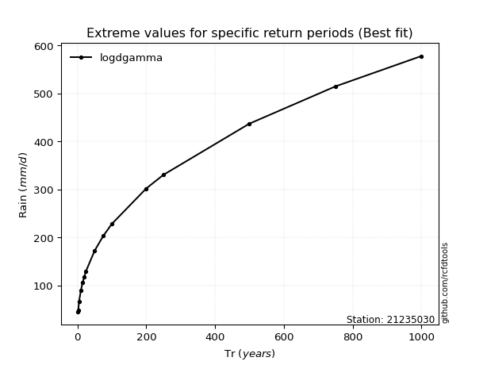</img>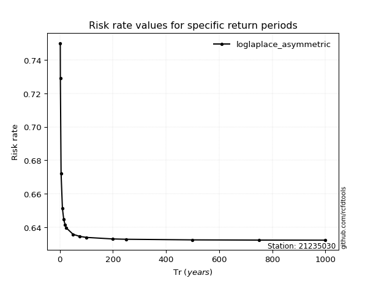</img>

</div>


<sub>**APP DISCLAIMER**: NO WARRANTY - This software is provided by [github.com/rcfdtools](https://github.com/rcfdtools) "as is", without any express or implied warranty, including warranties of merchantability, fitness for a particular purpose, or non-infringement. There is no guarantee that the software will be error-free or operate without interruption. LIMITATION OF LIABILITY - Neither the authors nor copyright holders will be liable for claims or damages arising from the software or its use. You are responsible for determining if the software is appropriate for your use and assume all associated risks, including errors, legal compliance, and data loss. NO PROFESSIONAL ADVICE - The software provides general information and does not offer professional advice. It should not replace consultation with professional advisors.</sub>