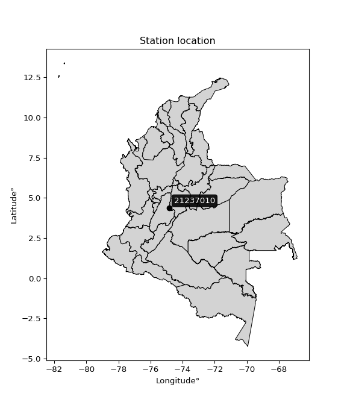

<div align="center">


</div>

# PMP Station (rain, Pmax24h): 21237010

Probable Maximum Precipitation (PMP) is the greatest amount of rainfall for a specific duration that is meteorologically possible for a given location, acting as a "worst-case" scenario for extreme storms, crucial for designing safety-critical infrastructure like bridges, river deviations, dams, spillways, and nuclear plants to prevent catastrophic failure. PMP is calculated by hydrologists using meteorological data to determine the upper limit of extreme rainfall, often leading to the Probable Maximum Flood (PMF) for flood control design, and is increasingly being studied for climate change impacts.

<div align="center">

</img>

</div>


## A. General information


### 1. General running parameters

• app_version: _v20251228_. • runtime: _2025-12-28 08:43:48.795225_. • Python version: _3.14.0_. • SciPy version: _1.16.3_. • Pandas version: _2.3.3_. • NumPy version: _2.3.5_. • Stations dataset (station_dataset_file): _dataset/pmax24h_in/automatic_colombia_2003_2024.csv_. • Stations catalog (station_catalog_file): _dataset/CNE_IDEAM.xls_. • Minimum year to eval til year_max (date_min): _1900_. • Maximum year to eval since year_min (date_max): _2024_. • Creates, save and include plots into reports (create_plot): _False_. • Plot only fit distributions with Δo > Δ (plot_only_fit): _True_. • Eval low extreme values, if False, evaluates high extreme values (low_extreme): _False_. • Eval every SciPy distribution as logarithmic (pdist_logarithmic_on): _True_. • Standard deviation normalized (ddof): _1.0_. • Return periods to eval in years (Tr): _[2, 2.33, 5, 10, 15, 20, 25, 50, 75, 100, 200, 250, 500, 750, 1000]_. • Minimum data sample per station, 0 means any (minimum_sample): _5_. • Z-Score maximum threshold to adjust a value, 0 means disable (zscore_max): _3.5_. • Z-Score minimum threshold to adjust a value, 0 means disable (zscore_min): _-2.5_. • Avoid zeros, e.g. rain = 0 (avoid_zeros): _True_. • Avoid null values (avoid_nans): _True_. [:file_folder:Dataset file.](../../dataset/pmax24h_in/automatic_colombia_2003_2024.csv)

> Delta Degrees of Freedom (DDOF): is a parameter used in the formulas for calculating variance and standard deviation. When ddof=0, the divisor is $N$ (the total number of observations) and this is used when your data set is the entire population. When ddof=1, the divisor is $N-1$ and this is used when your data set is a sample drawn from a larger population. Using $N-1$ provides an unbiased estimate of the population variance (known as Bessel´s correction).


### 2. Station info and location

|   id |   CODIGO | NOMBRE                  | CATEGORIA    | TECNOLOGIA                              | ESTADO   | FECHA_INSTALACION   |   FECHA_SUSPENSION |   ALTITUD |   LATITUD |   LONGITUD | DEPARTAMENTO   | MUNICIPIO   | AREA_OPERATIVA             | ENTIDAD                                                     | AREA_HIDROGRAFICA   | ZONA_HIDROGRAFICA   | SUBZONA_HIDROGRAFICA   | CORRIENTE   | Catalogo   |
|-----:|---------:|:------------------------|:-------------|:----------------------------------------|:---------|:--------------------|-------------------:|----------:|----------:|-----------:|:---------------|:------------|:---------------------------|:------------------------------------------------------------|:--------------------|:--------------------|:-----------------------|:------------|:-----------|
|    0 | 21237010 | NARINO - AUT [21237010] | Limnigráfica | Automática con Telemetría, Convencional | Activa   | 15/08/1977          |                nan |       277 |   4.38778 |   -74.8384 | Cundinamarca   | Nariño      | Area Operativa 10 - Tolima | INSTITUTO DE HIDROLOGIA METEOROLOGIA Y ESTUDIOS AMBIENTALES | Magdalena Cauca     | Alto Magdalena      | Río Opía               | Magdalena   | CNE_IDEAM  |

<div align="center">

Map location in: [:earth_americas:Google](http://maps.google.com/maps?q=4.387777778,-74.838375) [:earth_americas:OSM](https://www.openstreetmap.org/#map=18/4.387777778/-74.838375&layers=P) [:earth_americas:Bing](https://www.bing.com/maps?cp=4.387777778~-74.838375&lvl=18) [:earth_americas:Apple](https://maps.apple.com/frame?center=4.387777778%2C-74.838375&span=0.003%2C0.006)

</div>


<div align="center">

```geojson
{
  "type": "Feature",
  "geometry": {
    "type": "Point", 
    "coordinates": [-74.838375, 4.387777778]
  }, 
  "properties": {
    "Name": "21237010"
  }
}
```

</div>


### 3. Discrete values table and plot

|               |           0 |           1 |           2 |           3 |           4 |           5 |            6 |           7 |           8 |          9 |         10 |          11 |        12 |          13 |          14 |         15 |
|:--------------|------------:|------------:|------------:|------------:|------------:|------------:|-------------:|------------:|------------:|-----------:|-----------:|------------:|----------:|------------:|------------:|-----------:|
| Date          | 2004        | 2005        | 2008        | 2009        | 2010        | 2011        | 2015         | 2016        | 2017        | 2018       | 2019       | 2020        | 2021      | 2022        | 2023        | 2024       |
| Value         |   65.7      |    0.9      |   62.8      |   39.6      |   58.8      |   53.4      |  295.4       |  107.3      |   83.4      | 1964.6     |  492.6     |   94.7      | 1637.7    |   11.5      |    6.6      |   29.6     |
| Value_initial |   65.7      |    0.9      |   62.8      |   39.6      |   58.8      |   53.4      |  295.4       |  107.3      |   83.4      | 1964.6     |  492.6     |   94.7      | 1637.7    |   11.5      |    6.6      |   29.6     |
| count         |   16        |   16        |   16        |   16        |   16        |   16        |   16         |   16        |   16        |   16       |   16       |   16        |   16      |   16        |   16        |   16       |
| mean          |  312.787    |  312.787    |  312.787    |  312.787    |  312.787    |  312.787    |  312.787     |  312.787    |  312.787    |  312.787   |  312.787   |  312.787    |  312.787  |  312.787    |  312.787    |  312.787   |
| std           |  597.265    |  597.265    |  597.265    |  597.265    |  597.265    |  597.265    |  597.265     |  597.265    |  597.265    |  597.265   |  597.265   |  597.265    |  597.265  |  597.265    |  597.265    |  597.265   |
| zscore        |   -0.413698 |   -0.522193 |   -0.418554 |   -0.457398 |   -0.425251 |   -0.434292 |   -0.0291119 |   -0.344047 |   -0.384063 |    2.76563 |    0.30106 |   -0.365144 |    2.2183 |   -0.504445 |   -0.512649 |   -0.47414 |

> The initial value (value_initial) correspond to the initial obtained or null completed value, and value (value) is adjusted only when the initial value is outside the valid range definite through the Z-Score value. If Z-Score is active, values out of range or outliers are replaced with the station mean value


### 4. Active continuous probability distributions from SciPy (44 of 104 available)

[scipy.stats](https://docs.scipy.org/doc/scipy/reference/stats.html) is a Python´s powerful submodule within the SciPy library for comprehensive statistical analysis, offering over 130 probability distributions (like Normal, Poisson), functions for descriptive stats (mean, variance), hypothesis testing (t-tests, chi-square), random variable generation, and statistical tests, making it essential for data science, modeling, and research. It provides tools to explore, model, and draw conclusions from data efficiently, working seamlessly with NumPy.

<div align="center">

|   id | p_dist             |   n_parameter | fit_method   | label                                                                       | active   | ref                                                                                                        |
|-----:|:-------------------|--------------:|:-------------|:----------------------------------------------------------------------------|:---------|:-----------------------------------------------------------------------------------------------------------|
|    0 | alpha              |             3 | MLE          | Alpha                                                                       | True     | [:mortar_board:](https://docs.scipy.org/doc/scipy/reference/generated/scipy.stats.alpha.html)              |
|    1 | betaprime          |             4 | MLE          | Beta prime                                                                  | True     | [:mortar_board:](https://docs.scipy.org/doc/scipy/reference/generated/scipy.stats.betaprime.html)          |
|    2 | chi2               |             3 | MLE          | Chi²                                                                        | True     | [:mortar_board:](https://docs.scipy.org/doc/scipy/reference/generated/scipy.stats.chi2.html)               |
|    3 | crystalball        |             4 | MLE          | Crystalball                                                                 | True     | [:mortar_board:](https://docs.scipy.org/doc/scipy/reference/generated/scipy.stats.crystalball.html)        |
|    4 | erlang             |             3 | MLE          | Erlang                                                                      | True     | [:mortar_board:](https://docs.scipy.org/doc/scipy/reference/generated/scipy.stats.erlang.html)             |
|    5 | expon              |             2 | MLE          | Exponential                                                                 | True     | [:mortar_board:](https://docs.scipy.org/doc/scipy/reference/generated/scipy.stats.expon.html)              |
|    6 | exponnorm          |             3 | MLE          | Exponentially modified Normal                                               | True     | [:mortar_board:](https://docs.scipy.org/doc/scipy/reference/generated/scipy.stats.exponnorm.html)          |
|    7 | f                  |             4 | MLE          | F                                                                           | True     | [:mortar_board:](https://docs.scipy.org/doc/scipy/reference/generated/scipy.stats.f.html)                  |
|    8 | fatiguelife        |             3 | MLE          | Fatigue-life (Birnbaum-Saunders)                                            | True     | [:mortar_board:](https://docs.scipy.org/doc/scipy/reference/generated/scipy.stats.fatiguelife.html)        |
|    9 | fisk               |             3 | MLE          | Fisk                                                                        | True     | [:mortar_board:](https://docs.scipy.org/doc/scipy/reference/generated/scipy.stats.fisk.html)               |
|   10 | gamma              |             3 | MLE          | Gamma                                                                       | True     | [:mortar_board:](https://docs.scipy.org/doc/scipy/reference/generated/scipy.stats.gamma.html)              |
|   11 | genexpon           |             5 | MLE          | Generalized exponential                                                     | True     | [:mortar_board:](https://docs.scipy.org/doc/scipy/reference/generated/scipy.stats.genexpon.html)           |
|   12 | genlogistic        |             3 | MLE          | Generalized logistic                                                        | True     | [:mortar_board:](https://docs.scipy.org/doc/scipy/reference/generated/scipy.stats.genlogistic.html)        |
|   13 | gibrat             |             2 | MM           | Gibrat                                                                      | True     | [:mortar_board:](https://docs.scipy.org/doc/scipy/reference/generated/scipy.stats.gibrat.html)             |
|   14 | gompertz           |             3 | MLE          | Gompertz (or truncated Gumbel)                                              | True     | [:mortar_board:](https://docs.scipy.org/doc/scipy/reference/generated/scipy.stats.gompertz.html)           |
|   15 | gumbel_l           |             2 | MM           | Gumbel Left Skew                                                            | True     | [:mortar_board:](https://docs.scipy.org/doc/scipy/reference/generated/scipy.stats.gumbel_l.html)           |
|   16 | gumbel_r           |             2 | MM           | Gumbel Right Skew                                                           | True     | [:mortar_board:](https://docs.scipy.org/doc/scipy/reference/generated/scipy.stats.gumbel_r.html)           |
|   17 | halflogistic       |             2 | MM           | Half-logistic                                                               | True     | [:mortar_board:](https://docs.scipy.org/doc/scipy/reference/generated/scipy.stats.halflogistic.html)       |
|   18 | halfnorm           |             2 | MM           | Half Normal                                                                 | True     | [:mortar_board:](https://docs.scipy.org/doc/scipy/reference/generated/scipy.stats.halfnorm.html)           |
|   19 | hypsecant          |             2 | MM           | hyperbolic secant                                                           | True     | [:mortar_board:](https://docs.scipy.org/doc/scipy/reference/generated/scipy.stats.hypsecant.html)          |
|   20 | invgamma           |             3 | MLE          | Inverted gamma                                                              | True     | [:mortar_board:](https://docs.scipy.org/doc/scipy/reference/generated/scipy.stats.invgamma.html)           |
|   21 | invgauss           |             3 | MLE          | Inverse Gaussian                                                            | True     | [:mortar_board:](https://docs.scipy.org/doc/scipy/reference/generated/scipy.stats.invgauss.html)           |
|   22 | invweibull         |             3 | MLE          | Inverted Weibull                                                            | True     | [:mortar_board:](https://docs.scipy.org/doc/scipy/reference/generated/scipy.stats.invweibull.html)         |
|   23 | johnsonsu          |             4 | MLE          | Johnson Su                                                                  | True     | [:mortar_board:](https://docs.scipy.org/doc/scipy/reference/generated/scipy.stats.johnsonsu.html)          |
|   24 | kstwobign          |             2 | MLE          | Limiting distribution of scaled Kolmogorov-Smirnov two-sided test statistic | True     | [:mortar_board:](https://docs.scipy.org/doc/scipy/reference/generated/scipy.stats.kstwobign.html)          |
|   25 | laplace            |             2 | MM           | Laplace                                                                     | True     | [:mortar_board:](https://docs.scipy.org/doc/scipy/reference/generated/scipy.stats.laplace.html)            |
|   26 | laplace_asymmetric |             3 | MLE          | Asymmetric Laplace                                                          | True     | [:mortar_board:](https://docs.scipy.org/doc/scipy/reference/generated/scipy.stats.laplace_asymmetric.html) |
|   27 | loggamma           |             3 | MLE          | Log gamma                                                                   | True     | [:mortar_board:](https://docs.scipy.org/doc/scipy/reference/generated/scipy.stats.loggamma.html)           |
|   28 | logistic           |             2 | MM           | Logistic (or Sech-squared)                                                  | True     | [:mortar_board:](https://docs.scipy.org/doc/scipy/reference/generated/scipy.stats.logistic.html)           |
|   29 | lognorm            |             3 | MLE          | Log Normal                                                                  | True     | [:mortar_board:](https://docs.scipy.org/doc/scipy/reference/generated/scipy.stats.lognorm.html)            |
|   30 | maxwell            |             2 | MM           | Maxwell                                                                     | True     | [:mortar_board:](https://docs.scipy.org/doc/scipy/reference/generated/scipy.stats.maxwell.html)            |
|   31 | mielke             |             4 | MLE          | Mielke Beta-Kappa / Dagum                                                   | True     | [:mortar_board:](https://docs.scipy.org/doc/scipy/reference/generated/scipy.stats.mielke.html)             |
|   32 | moyal              |             2 | MM           | Moyal                                                                       | True     | [:mortar_board:](https://docs.scipy.org/doc/scipy/reference/generated/scipy.stats.moyal.html)              |
|   33 | nakagami           |             3 | MLE          | Nakagami                                                                    | True     | [:mortar_board:](https://docs.scipy.org/doc/scipy/reference/generated/scipy.stats.nakagami.html)           |
|   34 | ncf                |             5 | MLE          | Non-central F distribution                                                  | True     | [:mortar_board:](https://docs.scipy.org/doc/scipy/reference/generated/scipy.stats.ncf.html)                |
|   35 | nct                |             4 | MLE          | Non-central Student’s t                                                     | True     | [:mortar_board:](https://docs.scipy.org/doc/scipy/reference/generated/scipy.stats.nct.html)                |
|   36 | norm               |             2 | MM           | Normal                                                                      | True     | [:mortar_board:](https://docs.scipy.org/doc/scipy/reference/generated/scipy.stats.norm.html)               |
|   37 | pearson3           |             3 | MM           | Pearson type III                                                            | True     | [:mortar_board:](https://docs.scipy.org/doc/scipy/reference/generated/scipy.stats.pearson3.html)           |
|   38 | rayleigh           |             2 | MM           | Rayleigh                                                                    | True     | [:mortar_board:](https://docs.scipy.org/doc/scipy/reference/generated/scipy.stats.rayleigh.html)           |
|   39 | rice               |             3 | MLE          | Rice                                                                        | True     | [:mortar_board:](https://docs.scipy.org/doc/scipy/reference/generated/scipy.stats.rice.html)               |
|   40 | t                  |             3 | MLE          | Student’s t                                                                 | True     | [:mortar_board:](https://docs.scipy.org/doc/scipy/reference/generated/scipy.stats.t.html)                  |
|   41 | truncnorm          |             4 | MLE          | Truncated normal                                                            | True     | [:mortar_board:](https://docs.scipy.org/doc/scipy/reference/generated/scipy.stats.truncnorm.html)          |
|   42 | wald               |             2 | MM           | Wald                                                                        | True     | [:mortar_board:](https://docs.scipy.org/doc/scipy/reference/generated/scipy.stats.wald.html)               |
|   43 | weibull_min        |             3 | MLE          | Weibull minimum                                                             | True     | [:mortar_board:](https://docs.scipy.org/doc/scipy/reference/generated/scipy.stats.weibull_min.html)        |

</div>

> **n_parameter:** # arguments & localization & scale.
>
> **Fit methods:** (MLE) maximum likelihood, (MM) L-moments.
>
>**Inactive:** foldnorm, gennorm, norminvgauss, powernorm, powerlognorm, skewnorm, genextreme, anglit, arcsine, argus, beta, bradford, burr, burr12, cauchy, cosine, halfcauchy, foldcauchy, skewcauchy, wrapcauchy, dgamma, gengamma, exponweib, exponpow, truncexpon, gausshyper, genhalflogistic, genhyperbolic, geninvgauss, halfgennorm, johnsonsb, kappa4, kappa3, ksone, kstwo, loglaplace, levy, levy_l, levy_stable, ncx2, pareto, genpareto, truncpareto, lomax, powerlaw, rdist, rel_breitwigner, recipinvgauss, semicircular, studentized_range, trapezoid, triang, truncweibull_min, tukeylambda, uniform, loguniform, vonmises, vonmises_line, weibull_max, dweibull, 


## B. Probability distributions vs. Empirical distributions

A continuous probability distribution (CPD) describes probabilities for variables that can take any value within a range (like rain any time), unlike discrete variables with specific outcomes (like temperature). It uses a Probability Density Function (PDF), a curve where the total area under it equals 1, and the probability of the variable falling within an interval (a to b) is found by calculating the area under the curve between those points. A key feature is that the probability of hitting any single exact value is zero, so probabilities are always expressed for ranges, e.g., $P(a ≤ X ≤ b)$.

<div align="center">

Distributions parameters from station values
|    |   station | p_dist                |   n |               loc |            scale | shape                  | shape1             | shape2                | shape3   |
|---:|----------:|:----------------------|----:|------------------:|-----------------:|:-----------------------|:-------------------|:----------------------|:---------|
|  0 |  21237010 | alpha                 |  16 |     -28.7794      |     65.0566      | 3.5137550390524815e-06 |                    |                       |          |
|  1 |  21237010 | betaprime             |  16 |       0.9         |     62.1775      | 0.7908972973248849     | 0.8239951428903188 |                       |          |
|  2 |  21237010 | chi2                  |  16 |       0.9         |   1061.99        | 0.37247273905156664    |                    |                       |          |
|  3 |  21237010 | crystalball           |  16 |      -0.400009    |    657.57        | 4.7486549757789716     | 2.2870365844312808 |                       |          |
|  4 |  21237010 | erlang                |  16 |       0.9         |    500.679       | 0.5822875661993817     |                    |                       |          |
|  5 |  21237010 | expon                 |  16 |       0.9         |    311.887       |                        |                    |                       |          |
|  6 |  21237010 | exponnorm             |  16 |       0.621865    |      0.0877313   | 3560.4227007863146     |                    |                       |          |
|  7 |  21237010 | f                     |  16 |       0.9         |    148.058       | 1.2048073449651633     | 2.893698935784848  |                       |          |
|  8 |  21237010 | fatiguelife           |  16 |      -3.75279     |    104.553       | 2.119393671063209      |                    |                       |          |
|  9 |  21237010 | fisk                  |  16 |       0.9         |     96.0262      | 0.879033384031835      |                    |                       |          |
| 10 |  21237010 | gamma                 |  16 |       0.9         |    662.563       | 0.6646183273225257     |                    |                       |          |
| 11 |  21237010 | genexpon              |  16 |       0.624538    |    681.56        | 2.181310255530473      | 1.8848536142840189 | 5.715366439242233e-06 |          |
| 12 |  21237010 | genlogistic           |  16 |   -1863.25        |    251.878       | 2521.324475445772      |                    |                       |          |
| 13 |  21237010 | gibrat                |  16 |    -128.382       |    267.583       |                        |                    |                       |          |
| 14 |  21237010 | gompertz              |  16 |       0.825411    |  42841.3         | 178.58269122149926     |                    |                       |          |
| 15 |  21237010 | gumbel_l              |  16 |     573.053       |    450.898       |                        |                    |                       |          |
| 16 |  21237010 | gumbel_r              |  16 |      52.522       |    450.898       |                        |                    |                       |          |
| 17 |  21237010 | halflogistic          |  16 |    -372.632       |    494.425       |                        |                    |                       |          |
| 18 |  21237010 | halfnorm              |  16 |    -452.654       |    959.339       |                        |                    |                       |          |
| 19 |  21237010 | hypsecant             |  16 |     312.787       |    368.157       |                        |                    |                       |          |
| 20 |  21237010 | invgamma              |  16 |     -11.2575      |     41.7353      | 0.8278336436081399     |                    |                       |          |
| 21 |  21237010 | invgauss              |  16 |      -7.38085     |     47.191       | 6.784516090386939      |                    |                       |          |
| 22 |  21237010 | invweibull            |  16 |       0.881086    |      2.61559     | 0.2992683421880761     |                    |                       |          |
| 23 |  21237010 | johnsonsu             |  16 |      -0.0893089   |      0.042954    | -4.363939631203689     | 0.5381931633211545 |                       |          |
| 24 |  21237010 | kstwobign             |  16 |   -1006.83        |   1565.31        |                        |                    |                       |          |
| 25 |  21237010 | laplace               |  16 |     312.787       |    408.919       |                        |                    |                       |          |
| 26 |  21237010 | laplace_asymmetric    |  16 |       0.9         |      0.000550379 | 1.7646740467137967e-06 |                    |                       |          |
| 27 |  21237010 | loggamma              |  16 | -264072           |  33046.8         | 2982.3501795984257     |                    |                       |          |
| 28 |  21237010 | logistic              |  16 |     312.787       |    318.833       |                        |                    |                       |          |
| 29 |  21237010 | lognorm               |  16 |       0.9         |      7.02035     | 10.104210090066182     |                    |                       |          |
| 30 |  21237010 | maxwell               |  16 |   -1057.54        |    858.725       |                        |                    |                       |          |
| 31 |  21237010 | mielke                |  16 |       0.9         |    197.428       | 0.4938709522601016     | 1.13749681289424   |                       |          |
| 32 |  21237010 | moyal                 |  16 |     -17.9212      |    260.326       |                        |                    |                       |          |
| 33 |  21237010 | nakagami              |  16 |       6.6         |    842.395       | 0.15038788534658354    |                    |                       |          |
| 34 |  21237010 | ncf                   |  16 |       0.899851    |     28.3151      | 1.3326192010952638     | 1.4889383219872712 | 1.309725118473484     |          |
| 35 |  21237010 | nct                   |  16 |     -21.4442      |      3.81449     | 0.7981691687509047     | 14.016070713502684 |                       |          |
| 36 |  21237010 | norm                  |  16 |     312.787       |    578.299       |                        |                    |                       |          |
| 37 |  21237010 | pearson3              |  16 |     312.787       |    578.299       | 2.137189323489232      |                    |                       |          |
| 38 |  21237010 | rayleigh              |  16 |    -793.533       |    882.716       |                        |                    |                       |          |
| 39 |  21237010 | rice                  |  16 |    -467.45        |    686.732       | 0.00012164998177444927 |                    |                       |          |
| 40 |  21237010 | t                     |  16 |      56.1643      |     28.1957      | 0.6158236912057826     |                    |                       |          |
| 41 |  21237010 | truncnorm             |  16 |   -1383.28        |    894.37        | 1.547660069513641      | 3.7433182566228718 |                       |          |
| 42 |  21237010 | wald                  |  16 |    -265.512       |    578.299       |                        |                    |                       |          |
| 43 |  21237010 | weibull_min           |  16 |       0.9         |    445.239       | 0.2736702845479756     |                    |                       |          |
| 44 |  21237010 | logalpha              |  16 |      -0.771736    |      1.83466     | 3.763187242990031e-10  |                    |                       |          |
| 45 |  21237010 | logbetaprime          |  16 |      -3.76178     |      6.62664e+06 | 13.667158561982305     | 11228452.097297657 |                       |          |
| 46 |  21237010 | logchi2               |  16 |      -0.105361    |      2.27131     | 1.8171921173408885     |                    |                       |          |
| 47 |  21237010 | logcrystalball        |  16 |       4.4424      |      1.66791     | 1.263882951326523      | 166562.87194107124 |                       |          |
| 48 |  21237010 | logerlang             |  16 |     -31.4893      |      0.100477    | 355.71564921542654     |                    |                       |          |
| 49 |  21237010 | logexpon              |  16 |      -0.105361    |      4.36722     |                        |                    |                       |          |
| 50 |  21237010 | logexponnorm          |  16 |       4.26036     |      1.87449     | 0.0007946923201677149  |                    |                       |          |
| 51 |  21237010 | logf                  |  16 |      -0.105361    |      1.54771     | 1.2422872810775867     | 1.1137413374740661 |                       |          |
| 52 |  21237010 | logfatiguelife        |  16 |    -371.614       |    375.876       | 0.004987741352501969   |                    |                       |          |
| 53 |  21237010 | logfisk               |  16 |      -0.105361    |      2.109       | 0.9498269557098191     |                    |                       |          |
| 54 |  21237010 | loggamma              |  16 |     -32.7246      |      0.0968782   | 381.6310858375748      |                    |                       |          |
| 55 |  21237010 | loggenexpon           |  16 |      -0.105361    |      0.218306    | 0.008676925705796545   | 1.909812221142323  | 0.0018555358234231788 |          |
| 56 |  21237010 | loggenlogistic        |  16 |       4.45227     |      0.981904    | 0.886697086271402      |                    |                       |          |
| 57 |  21237010 | loggibrat             |  16 |       2.83185     |      0.867338    |                        |                    |                       |          |
| 58 |  21237010 | loggompertz           |  16 |      -0.105361    |      2.3073      | 0.12529649500248652    |                    |                       |          |
| 59 |  21237010 | loggumbel_l           |  16 |       5.10548     |      1.46153     |                        |                    |                       |          |
| 60 |  21237010 | loggumbel_r           |  16 |       3.41824     |      1.46153     |                        |                    |                       |          |
| 61 |  21237010 | loghalflogistic       |  16 |       2.04017     |      1.60261     |                        |                    |                       |          |
| 62 |  21237010 | loghalfnorm           |  16 |       1.78081     |      3.10955     |                        |                    |                       |          |
| 63 |  21237010 | loghypsecant          |  16 |       4.26186     |      1.19333     |                        |                    |                       |          |
| 64 |  21237010 | loginvgamma           |  16 |     -29.9101      |  10928.2         | 321.1276395287383      |                    |                       |          |
| 65 |  21237010 | loginvgauss           |  16 |     -13.7322      |   1517.99        | 0.01184757180590458    |                    |                       |          |
| 66 |  21237010 | loginvweibull         |  16 |      -2.54379e+08 |      2.54379e+08 | 128451265.69325009     |                    |                       |          |
| 67 |  21237010 | logjohnsonsu          |  16 |       4.15084     |      0.722686    | -0.07054850891576522   | 0.7364944916725862 |                       |          |
| 68 |  21237010 | logkstwobign          |  16 |      -4.08547     |      9.60795     |                        |                    |                       |          |
| 69 |  21237010 | loglaplace            |  16 |       4.26186     |      1.32546     |                        |                    |                       |          |
| 70 |  21237010 | loglaplace_asymmetric |  16 |       4.13995     |      1.3224      | 0.9550295151611496     |                    |                       |          |
| 71 |  21237010 | logloggamma           |  16 |     -19.8461      |      8.18005     | 19.549702008156235     |                    |                       |          |
| 72 |  21237010 | loglogistic           |  16 |       4.26186     |      1.03346     |                        |                    |                       |          |
| 73 |  21237010 | loglognorm            |  16 |    -289.09        |    293.348       | 0.006380806533560983   |                    |                       |          |
| 74 |  21237010 | logmaxwell            |  16 |      -0.179882    |      2.78345     |                        |                    |                       |          |
| 75 |  21237010 | logmielke             |  16 | -141615           | 141617           | 385937.2898954806      | 92488.88292031272  |                       |          |
| 76 |  21237010 | logmoyal              |  16 |       3.18991     |      0.843815    |                        |                    |                       |          |
| 77 |  21237010 | lognakagami           |  16 |    -532.483       |    536.749       | 20444.88513937524      |                    |                       |          |
| 78 |  21237010 | logncf                |  16 |      -0.105361    |      1.20269     | 1.2267108295390794     | 1.3539830228055392 | 1.1387370710465081    |          |
| 79 |  21237010 | lognct                |  16 |     -86.6497      |      1.84008     | 32048.911186949146     | 49.404832511135425 |                       |          |
| 80 |  21237010 | lognorm               |  16 |       4.26186     |      1.87449     |                        |                    |                       |          |
| 81 |  21237010 | logpearson3           |  16 |       4.26187     |      1.87447     | -0.2444236356141783    |                    |                       |          |
| 82 |  21237010 | lograyleigh           |  16 |       0.675886    |      2.8612      |                        |                    |                       |          |
| 83 |  21237010 | logrice               |  16 |      -1.43441     |      1.96201     | 2.7095761885267002     |                    |                       |          |
| 84 |  21237010 | logt                  |  16 |       4.27802     |      1.46039     | 4.317232141185405      |                    |                       |          |
| 85 |  21237010 | logtruncnorm          |  16 |       0.415038    |      3.93782     | -0.13607403498274953   | 1.8202960272659947 |                       |          |
| 86 |  21237010 | logwald               |  16 |       2.38734     |      1.87452     |                        |                    |                       |          |
| 87 |  21237010 | logweibull_min        |  16 |      -3.51424     |      8.49249     | 4.693499900237949      |                    |                       |          |

</div>

> **loc** (Location parameter): This shifts the distribution along the x-axis. For many common distributions, like the normal (Gaussian) distribution, loc represents the mean $μ$. For others, like the uniform distribution, it might represent the minimum value, or for the beta distribution, the left end of the support interval.
>
> **scale** (Scale parameter): This determines the width or spread of the distribution. For the normal distribution, scale represents the standard deviation $σ$. For a uniform distribution, it defines the length of the interval (from $loc$ to $loc + scale$).
>
> **shape** (Shape parameters): Refers to parameters that define the specific form of a probability distribution, distinct from its location (loc) and scale (scale). These parameters are required arguments for most distribution functions. For example, a normal (Gaussian) distribution is fully defined by its location (mean) and scale (standard deviation), so it has no specific shape parameters beyond loc and scale. However, other distributions have intrinsic properties that need specification, as Gamma distribution that takes a shape parameter, often named $a$ or $alpha$.


### 0. Cumulative distribution values - CDF (88 evaluated)

Cumulative Distribution Function (CDF), denoted as $F$<sub>$X$</sub>$(x)$, is a function that gives the probability that a random variable $X$ will take a value less than or equal to a specific value, $x$ (i.e., $(P(X≥x)$. It essentially "accumulates" probabilities from a given point up to the far right (positive infinity), providing a complete picture of the distribution´s probabilities for both discrete (like rain) and continuous (like temperature) variables, helping to find probabilities over ranges or above certain values.

<div align="center">

CDF ordered by x ascending and calculating $log(f(x))$ separately
|   id |   Station |   date |      x |   count |    mean |     std |     zscore |   Value_initial |   station |   m |     alpha |   alpha_pdf |   betaprime |   betaprime_pdf |        chi2 |    chi2_pdf |   crystalball |   crystalball_pdf |      erlang |      erlang_pdf |     expon |   expon_pdf |   exponnorm |   exponnorm_pdf |           f |         f_pdf |   fatiguelife |   fatiguelife_pdf |        fisk |    fisk_pdf |       gamma |      gamma_pdf |   genexpon |   genexpon_pdf |   genlogistic |   genlogistic_pdf |   gibrat |   gibrat_pdf |    gompertz |   gompertz_pdf |   gumbel_l |   gumbel_l_pdf |   gumbel_r |   gumbel_r_pdf |   halflogistic |   halflogistic_pdf |   halfnorm |   halfnorm_pdf |   hypsecant |   hypsecant_pdf |   invgamma |   invgamma_pdf |   invgauss |   invgauss_pdf |   invweibull |   invweibull_pdf |   johnsonsu |   johnsonsu_pdf |   kstwobign |   kstwobign_pdf |   laplace |   laplace_pdf |   laplace_asymmetric |   laplace_asymmetric_pdf |   loggamma |   loggamma_pdf |   logistic |   logistic_pdf |    lognorm |   lognorm_pdf |   maxwell |   maxwell_pdf |      mielke |      mielke_pdf |    moyal |   moyal_pdf |   nakagami |   nakagami_pdf |         ncf |     ncf_pdf |       nct |     nct_pdf |     norm |    norm_pdf |   pearson3 |   pearson3_pdf |   rayleigh |   rayleigh_pdf |     rice |    rice_pdf |        t |       t_pdf |   truncnorm |   truncnorm_pdf |     wald |    wald_pdf |   weibull_min |   weibull_min_pdf |   logalpha |   logalpha_pdf |   logbetaprime |   logbetaprime_pdf |     logchi2 |   logchi2_pdf |   logcrystalball |   logcrystalball_pdf |   logerlang |   logerlang_pdf |   logexpon |   logexpon_pdf |   logexponnorm |   logexponnorm_pdf |       logf |       logf_pdf |   logfatiguelife |   logfatiguelife_pdf |     logfisk |   logfisk_pdf |   loggenexpon |   loggenexpon_pdf |   loggenlogistic |   loggenlogistic_pdf |   loggibrat |   loggibrat_pdf |   loggompertz |   loggompertz_pdf |   loggumbel_l |   loggumbel_l_pdf |   loggumbel_r |   loggumbel_r_pdf |   loghalflogistic |   loghalflogistic_pdf |   loghalfnorm |   loghalfnorm_pdf |   loghypsecant |   loghypsecant_pdf |   loginvgamma |   loginvgamma_pdf |   loginvgauss |   loginvgauss_pdf |   loginvweibull |   loginvweibull_pdf |   logjohnsonsu |   logjohnsonsu_pdf |   logkstwobign |   logkstwobign_pdf |   loglaplace |   loglaplace_pdf |   loglaplace_asymmetric |   loglaplace_asymmetric_pdf |   logloggamma |   logloggamma_pdf |   loglogistic |   loglogistic_pdf |   loglognorm |   loglognorm_pdf |   logmaxwell |   logmaxwell_pdf |   logmielke |   logmielke_pdf |    logmoyal |   logmoyal_pdf |   lognakagami |   lognakagami_pdf |      logncf |     logncf_pdf |     lognct |   lognct_pdf |   logpearson3 |   logpearson3_pdf |   lograyleigh |   lograyleigh_pdf |    logrice |   logrice_pdf |      logt |   logt_pdf |   logtruncnorm |   logtruncnorm_pdf |     logwald |   logwald_pdf |   logweibull_min |   logweibull_min_pdf |
|-----:|----------:|-------:|-------:|--------:|--------:|--------:|-----------:|----------------:|----------:|----:|----------:|------------:|------------:|----------------:|------------:|------------:|--------------:|------------------:|------------:|----------------:|----------:|------------:|------------:|----------------:|------------:|--------------:|--------------:|------------------:|------------:|------------:|------------:|---------------:|-----------:|---------------:|--------------:|------------------:|---------:|-------------:|------------:|---------------:|-----------:|---------------:|-----------:|---------------:|---------------:|-------------------:|-----------:|---------------:|------------:|----------------:|-----------:|---------------:|-----------:|---------------:|-------------:|-----------------:|------------:|----------------:|------------:|----------------:|----------:|--------------:|---------------------:|-------------------------:|-----------:|---------------:|-----------:|---------------:|-----------:|--------------:|----------:|--------------:|------------:|----------------:|---------:|------------:|-----------:|---------------:|------------:|------------:|----------:|------------:|---------:|------------:|-----------:|---------------:|-----------:|---------------:|---------:|------------:|---------:|------------:|------------:|----------------:|---------:|------------:|--------------:|------------------:|-----------:|---------------:|---------------:|-------------------:|------------:|--------------:|-----------------:|---------------------:|------------:|----------------:|-----------:|---------------:|---------------:|-------------------:|-----------:|---------------:|-----------------:|---------------------:|------------:|--------------:|--------------:|------------------:|-----------------:|---------------------:|------------:|----------------:|--------------:|------------------:|--------------:|------------------:|--------------:|------------------:|------------------:|----------------------:|--------------:|------------------:|---------------:|-------------------:|--------------:|------------------:|--------------:|------------------:|----------------:|--------------------:|---------------:|-------------------:|---------------:|-------------------:|-------------:|-----------------:|------------------------:|----------------------------:|--------------:|------------------:|--------------:|------------------:|-------------:|-----------------:|-------------:|-----------------:|------------:|----------------:|------------:|---------------:|--------------:|------------------:|------------:|---------------:|-----------:|-------------:|--------------:|------------------:|--------------:|------------------:|-----------:|--------------:|----------:|-----------:|---------------:|-------------------:|------------:|--------------:|-----------------:|---------------------:|
|    0 |  21237010 |   2005 |    0.9 |      16 | 312.787 | 597.265 | -0.522193  |             0.9 |  21237010 |   1 | 0.0283814 | 0.00533313  | 5.17953e-14 |    33.5434      | 0.000278186 | 4.66649e+11 |      0.500789 |       0.00060669  | 1.54074e-11 | 80808.5         | 0         | 0.00320628  | 0.000890053 |     0.00319614  | 4.42155e-08 | 184.923       |     0.016294  |       0.010207    | 1.62926e-15 | 0.992296    | 3.67996e-13 | 2202.95        | 0.00088122 |    0.00319765  |      0.21457  |       0.00131075  | 0.23348  |  0.00236846  | 0.000310875 |    0.00416718  |   0.245074 |    0.000470697 |   0.325856 |    0.000810343 |       0.360746 |        0.00087967  |   0.363628 |    0.000743758 |    0.257794 |     0.000626152 |  0.0221231 |    0.00650061  |  0.0196426 |    0.00769893  |    0.0126274 |      0.873491    |   0.0106565 |     0.0153111   |    0.198432 |     0.000975352 |  0.2332   |   0.000570284 |          4.71589e-12 |              0.00320629  | 0.00866705 |      0.0135129 |   0.273246 |    0.000622842 | 0.00990771 |     0.0141038 |  0.322161 |   0.000660409 | 2.12582e-07 | 17230.2         | 0.334797 | 0.000928306 | 0          |    0           | 0.000116679 | 0.522707    | 0.0247401 | 0.00582336  | 0.294834 | 0.000596482 |   0.372272 |    0.00115976  |   0.333015 |    0.000680035 | 0.207499 | 0.000787039 | 0.201119 | 0.00204517  | 6.75373e-08 |     0.00221638  | 0.329405 | 0.00160899  |     8.107e-06 |       1.99837e+10 | 0.00590165 |      0.0744839 |     0.00639144 |          0.0141884 | 1.26341e-16 |     8.27168   |       nan        |           nan        |  0.00860597 |       0.0134547 |   0        |      0.228979  |     0.00990791 |          0.014104  | 1.7813e-11 | 797276         |       0.00956653 |            0.0138374 | 9.25192e-17 |     3.16611   |    1.6736e-08 |         0.0397467 |        0.0161761 |            0.0144681 |    0        |       0         |   3.11542e-08 |         0.0543045 |     0.0278912 |         0.018815  |   1.44619e-05 |        0.00011027 |          0        |             0         |     0         |         0         |      0.0163835 |          0.0137231 |    0.00717745 |         0.0125245 |    0.00608878 |         0.0117439 |      0.00376176 |           0.0106049 |      0.0292308 |          0.0113603 |     0.00456664 |          0.0153499 |    0.0185364 |        0.0139849 |               0.0165445 |                   0.0131001 |     0.0144366 |         0.0165587 |     0.0144027 |         0.0137357 |   0.00941448 |        0.0137115 |  5.10285e-06 |      0.000205396 |  0.00349273 |      0.00706502 | 1.82806e-12 |    5.48361e-11 |    0.00991296 |         0.0141304 | 1.63527e-11 | 722738         | 0.00983821 |    0.0140625 |     0.0146541 |         0.0167779 |     0         |         0         | 0.00764379 |     0.0142314 | 0.0180913 |  0.0128854 |     0.00298194 |          0.193222  | 0           |   0           |        0.0136897 |            0.018719  |
|    1 |  21237010 |   2023 |    6.6 |      16 | 312.787 | 597.265 | -0.512649  |             6.6 |  21237010 |   2 | 0.0659411 | 0.00764708  | 0.120146    |     0.0154045   | 0.359956    | 0.0117343   |      0.504247 |       0.000606657 | 0.0824534   |     0.00836265  | 0.0181098 | 0.00314822  | 0.0189566   |     0.00314074  | 0.105724    |   0.0109484   |     0.0883539 |       0.012748    | 0.0770922   | 0.0109723   | 0.0468203   |    0.00543108  | 0.0189426  |    0.00313984  |      0.222086 |       0.00132632  | 0.246897 |  0.0023386   | 0.0237854   |    0.00406987  |   0.247769 |    0.000474984 |   0.330479 |    0.000811514 |       0.36575  |        0.000875994 |   0.367862 |    0.000741658 |    0.261382 |     0.000632833 |  0.0697023 |    0.00963009  |  0.076508  |    0.0111994   |    0.453268  |      0.0187684   |   0.101329  |     0.0142562   |    0.204016 |     0.000983713 |  0.236473 |   0.000578289 |          0.0181099   |              0.00314822  | 0.104301   |      0.0999195 |   0.276811 |    0.000627872 | 0.102595   |     0.0953888 |  0.32593  |   0.000662087 | 0.172327    |     0.014671    | 0.340086 | 0.000927494 | 3.1577e-06 |    1.06933e+09 | 0.131049    | 0.0150098   | 0.0672244 | 0.00873826  | 0.298243 | 0.000599632 |   0.378842 |    0.00114561  |   0.336894 |    0.000680931 | 0.211999 | 0.000792094 | 0.213679 | 0.00237423  | 0.0125712   |     0.00219458  | 0.338513 | 0.00158671  |     0.261698  |       0.0107549   | 0.490174   |      0.163204  |     0.125016   |          0.119841  | 0.401111    |     0.144173  |       nan        |           nan        |  0.104055   |       0.099784  |   0.366328 |      0.145097  |     0.102596   |          0.0953895 | 0.531232   |      0.0883184 |       0.101946   |            0.0955393 | 0.486502    |     0.119093  |    0.202247   |         0.148903  |        0.0926211 |            0.0779245 |    0        |       0         |   0.157893    |         0.10845   |     0.104679  |         0.0677359 |   0.0577896   |        0.112728   |          0        |             0         |     0.0272601 |         0.256442  |      0.086483  |          0.0715834 |    0.105835   |         0.10543   |    0.10672    |         0.108655  |      0.129856   |           0.133854  |      0.0749233 |          0.0438379 |     0.16558    |          0.1493    |    0.0833406 |        0.0628767 |               0.0801325 |                   0.0634496 |     0.105572  |         0.088931  |     0.0912963 |         0.0802755 |   0.101671   |        0.0956724 |  0.0925454   |      0.11998     |  0.0893742  |      0.10702    | 0.0304584   |    0.0983976   |    0.102783   |         0.0955325 | 0.459952    |      0.0988848 | 0.102592   |    0.0955485 |     0.106178  |         0.0888571 |     0.0857007 |         0.135271  | 0.104152   |     0.0989115 | 0.0858382 |  0.0714276 |     0.384501   |          0.181763  | 0           |   0           |        0.112682  |            0.0921795 |
|    2 |  21237010 |   2022 |   11.5 |      16 | 312.787 | 597.265 | -0.504445  |            11.5 |  21237010 |   3 | 0.106283  | 0.0086817   | 0.186689    |     0.0120899   | 0.403896    | 0.00706645  |      0.50722  |       0.000606592 | 0.117906    |     0.00639071  | 0.0334156 | 0.00309914  | 0.0342261   |     0.00309186  | 0.152049    |   0.00832216  |     0.145688  |       0.01061     | 0.125957    | 0.00912969  | 0.0705057   |    0.00437836  | 0.0342078  |    0.00309099  |      0.228616 |       0.00133903  | 0.258289 |  0.00231095  | 0.0435265   |    0.00398802  |   0.250106 |    0.000478682 |   0.334457 |    0.000812408 |       0.370034 |        0.000872806 |   0.371491 |    0.000739837 |    0.264497 |     0.000638568 |  0.11889   |    0.0102258   |  0.131589  |    0.0110457   |    0.518148  |      0.00960122  |   0.163977  |     0.0114812   |    0.208853 |     0.0009906   |  0.239324 |   0.00058526  |          0.0334156   |              0.00309915  | 0.170436   |      0.138473  |   0.279898 |    0.000632164 | 0.165855   |     0.132871  |  0.329178 |   0.00066348  | 0.232316    |     0.0104487   | 0.344629 | 0.000926636 | 0.171432   |    0.0105229   | 0.195352    | 0.0116306   | 0.112903  | 0.00970619  | 0.301187 | 0.000602306 |   0.384427 |    0.00113365  |   0.340233 |    0.000681652 | 0.215891 | 0.000796329 | 0.226142 | 0.00272477  | 0.023279    |     0.00217594  | 0.34624  | 0.00156745  |     0.302007  |       0.00647929  | 0.568122   |      0.1204    |     0.201196   |          0.153391  | 0.47561     |     0.12475   |         0.148349 |             0.112184 |  0.170104   |       0.138295  |   0.441986 |      0.127773  |     0.165857   |          0.132872  | 0.573983   |      0.0672642 |       0.165353   |            0.133236  | 0.544755    |     0.0924573 |    0.288837   |         0.161543  |        0.146209  |            0.116933  |    0        |       0         |   0.223297    |         0.127244  |     0.149284  |         0.0941078 |   0.142304    |        0.189844   |          0.124821 |             0.30713   |     0.168473  |         0.250851  |      0.13645   |          0.110874  |    0.175524   |         0.145483  |    0.178235   |         0.148558  |      0.21391    |           0.166583  |      0.106446  |          0.0729095 |     0.254833   |          0.169628  |    0.126706  |        0.0955937 |               0.124382  |                   0.0984866 |     0.164286  |         0.123215  |     0.146714  |         0.121136  |   0.165202   |        0.133549  |  0.17156     |      0.163234    |  0.16263    |      0.156409   | 0.119395    |    0.21898     |    0.166117   |         0.132984  | 0.508678    |      0.0779692 | 0.16596    |    0.133094  |     0.164751  |         0.122763  |     0.173522  |         0.178336  | 0.169361   |     0.136185  | 0.136236  |  0.112568  |     0.482495   |          0.170724  | 1.41939e-08 |   4.51567e-06 |        0.172416  |            0.123406  |
|    3 |  21237010 |   2024 |   29.6 |      16 | 312.787 | 597.265 | -0.47414   |            29.6 |  21237010 |   4 | 0.265119  | 0.00818563  | 0.349789    |     0.00685803  | 0.485571    | 0.0031152   |      0.518195 |       0.00060606  | 0.207825    |     0.0040659   | 0.0879134 | 0.00292441  | 0.0885982   |     0.00291779  | 0.267005    |   0.00507352  |     0.284713  |       0.00560539  | 0.256998    | 0.00584848  | 0.135213    |    0.00305049  | 0.088565   |    0.00291702  |      0.253241 |       0.00138047  | 0.299115 |  0.00219789  | 0.113067    |    0.00369963  |   0.258894 |    0.000492448 |   0.349186 |    0.00081481  |       0.385724 |        0.000860815 |   0.384821 |    0.000732984 |    0.276246 |     0.000659643 |  0.286531  |    0.00790664  |  0.298262  |    0.00739758  |    0.613741  |      0.00312219  |   0.318477  |     0.00646961  |    0.226997 |     0.00101365  |  0.250155 |   0.000611747 |          0.0879135   |              0.00292441  | 0.32978    |      0.194315  |   0.291481 |    0.000647737 | 0.320498   |     0.190902  |  0.341231 |   0.000668218 | 0.368498    |     0.00570497  | 0.361364 | 0.000922226 | 0.272939   |    0.00356893  | 0.352462    | 0.00662821  | 0.280141  | 0.00814577  | 0.312177 | 0.000611908 |   0.404556 |    0.00109102  |   0.352592 |    0.000683921 | 0.23044  | 0.000811089 | 0.292684 | 0.00492116  | 0.0620458   |     0.00210791  | 0.373966 | 0.00149613  |     0.376379  |       0.00280805  | 0.659158   |      0.0767655 |     0.364732   |          0.186358  | 0.580539    |     0.0984291 |         0.291154 |             0.188519 |  0.329238   |       0.194055  |   0.550605 |      0.102902  |     0.3205     |          0.190903  | 0.626652   |      0.046313  |       0.320397   |            0.191293  | 0.617576    |     0.0642192 |    0.444587   |         0.16422   |        0.295349  |            0.199306  |    0.328232 |       0.650031  |   0.35862     |         0.158289  |     0.265623  |         0.155129  |   0.360211    |        0.251653   |          0.397302 |             0.262744  |     0.394693  |         0.224518  |      0.285271  |          0.208314  |    0.340847   |         0.198803  |    0.344942   |         0.198062  |      0.384132   |           0.185586  |      0.227117  |          0.211286  |     0.419385   |          0.172751  |    0.258566  |        0.195076  |               0.262947  |                   0.208204  |     0.309404  |         0.182126  |     0.300317  |         0.203324  |   0.320648   |        0.191783  |  0.350288    |      0.207116    |  0.340987   |      0.211202   | 0.373805    |    0.28313     |    0.32079    |         0.19083   | 0.570868    |      0.055617  | 0.32081    |    0.19108   |     0.309136  |         0.181102  |     0.361848  |         0.211398  | 0.326047   |     0.191494  | 0.286382  |  0.207094  |     0.632924   |          0.146587  | 0.393846    |   0.445251    |        0.314659  |            0.17609   |
|    4 |  21237010 |   2009 |   39.6 |      16 | 312.787 | 597.265 | -0.457398  |            39.6 |  21237010 |   5 | 0.341399  | 0.00706033  | 0.410837    |     0.00544297  | 0.512994    | 0.00243103  |      0.524253 |       0.00060557  | 0.245559    |     0.00351764  | 0.116694  | 0.00283213  | 0.117314    |     0.00282586  | 0.313485    |   0.00427394  |     0.333995  |       0.00435024  | 0.310272    | 0.00486088  | 0.163952    |    0.00271814  | 0.117273   |    0.00282514  |      0.267143 |       0.0013996   | 0.320761 |  0.00213098  | 0.149307    |    0.0035493   |   0.263857 |    0.00050012  |   0.357338 |    0.000815543 |       0.394298 |        0.000854051 |   0.392131 |    0.000729114 |    0.2829   |     0.000671183 |  0.358217  |    0.00647776  |  0.364374  |    0.00590413  |    0.639911  |      0.00220804  |   0.376104  |     0.00514669  |    0.23719  |     0.00102478  |  0.256348 |   0.000626892 |          0.116694    |              0.00283213  | 0.387926   |      0.20451   |   0.298001 |    0.000656131 | 0.377887   |     0.202778  |  0.347925 |   0.000670563 | 0.419801    |     0.00463165  | 0.370571 | 0.000918997 | 0.30424    |    0.00277242  | 0.411525    | 0.00527025  | 0.354436  | 0.00674116  | 0.318321 | 0.000617019 |   0.415353 |    0.00106845  |   0.359436 |    0.000684912 | 0.238589 | 0.000818645 | 0.352007 | 0.00706505  | 0.0829394   |     0.00207087  | 0.388731 | 0.00145697  |     0.400986  |       0.00217081  | 0.68017    |      0.0678836 |     0.419398   |          0.18866   | 0.608188    |     0.0916475 |         0.348863 |             0.20733  |  0.387306   |       0.204238  |   0.579579 |      0.0962674 |     0.377889   |          0.202778  | 0.639482   |      0.0419663 |       0.377885   |            0.203062  | 0.635361    |     0.0581507 |    0.49194    |         0.16088   |        0.356688  |            0.221393  |    0.490524 |       0.470886  |   0.40589     |         0.166336  |     0.313922  |         0.176862  |   0.43314     |        0.247963   |          0.470917 |             0.242803  |     0.458393  |         0.212981  |      0.350324  |          0.23779   |    0.400019   |         0.207003  |    0.403666   |         0.204673  |      0.437799   |           0.182604  |      0.300609  |          0.296936  |     0.468998   |          0.167822  |    0.32206   |        0.242979  |               0.331098  |                   0.262166  |     0.364565  |         0.196398  |     0.362586  |         0.223635  |   0.378278   |        0.203536  |  0.411214    |      0.210742    |  0.403162   |      0.21494    | 0.454169    |    0.267419    |    0.378147   |         0.20263   | 0.586331    |      0.0507617 | 0.378242   |    0.202896  |     0.363992  |         0.195343  |     0.423493  |         0.211474  | 0.383438   |     0.202195  | 0.350571  |  0.232991  |     0.674383   |          0.138254  | 0.50863     |   0.34692     |        0.367876  |            0.189184  |
|    5 |  21237010 |   2011 |   53.4 |      16 | 312.787 | 597.265 | -0.434292  |            53.4 |  21237010 |   6 | 0.428571  | 0.0056185   | 0.476386    |     0.00415161  | 0.542425    | 0.00188446  |      0.532604 |       0.000604664 | 0.290383    |     0.0030127   | 0.154925  | 0.00270955  | 0.155462    |     0.00270373  | 0.36698     |   0.00352819  |     0.386168  |       0.00330364  | 0.370338    | 0.00390438  | 0.199154    |    0.00240329  | 0.155412   |    0.00270308  |      0.286616 |       0.0014216   | 0.349518 |  0.00203658  | 0.196911    |    0.00335176  |   0.270832 |    0.000510777 |   0.368596 |    0.00081588  |       0.406019 |        0.000844565 |   0.402156 |    0.000723677 |    0.292272 |     0.000686936 |  0.436657  |    0.00497639  |  0.435352  |    0.0044826   |    0.66531   |      0.00154489  |   0.438359  |     0.00396602  |    0.251427 |     0.00103829  |  0.265147 |   0.000648409 |          0.154925    |              0.00270955  | 0.450041   |      0.210148  |   0.307134 |    0.000667442 | 0.439777   |     0.210398  |  0.357199 |   0.000673478 | 0.476597    |     0.00366996  | 0.383217 | 0.000913675 | 0.337941   |    0.00217101  | 0.475022    | 0.00402252  | 0.436148  | 0.00518127  | 0.326884 | 0.000623837 |   0.429889 |    0.00103836  |   0.368896 |    0.000685975 | 0.249955 | 0.000828373 | 0.472139 | 0.00999553  | 0.111168    |     0.00202041  | 0.408468 | 0.00140366  |     0.427119  |       0.0016636   | 0.699288   |      0.0602269 |     0.475683   |          0.187237  | 0.634614    |     0.0852154 |         0.413114 |             0.221474 |  0.44934    |       0.209878  |   0.607398 |      0.0898975 |     0.439779   |          0.210398  | 0.651445   |      0.0381624 |       0.439838   |            0.21053   | 0.651926    |     0.0527858 |    0.539317   |         0.155783  |        0.42551   |            0.237661  |    0.609712 |       0.334881  |   0.456684    |         0.173161  |     0.370159  |         0.199221  |   0.505653    |        0.235922   |          0.540263 |             0.220926  |     0.520144  |         0.199915  |      0.424938  |          0.259358  |    0.462535   |         0.210308  |    0.465256   |         0.206482  |      0.491522   |           0.176283  |      0.403133  |          0.383676  |     0.518176   |          0.160873  |    0.403552  |        0.304462  |               0.419536  |                   0.332193  |     0.425024  |         0.207317  |     0.431716  |         0.237395  |   0.440366   |        0.210949  |  0.47417     |      0.209602    |  0.467178   |      0.212255   | 0.530684    |    0.243527    |    0.439981   |         0.210177  | 0.600848    |      0.0464465 | 0.440157   |    0.21044   |     0.424144  |         0.206346  |     0.486189  |         0.207241  | 0.444977   |     0.208647  | 0.423231  |  0.251338  |     0.714407   |          0.129448  | 0.600091    |   0.268652    |        0.426088  |            0.199642  |
|    6 |  21237010 |   2010 |   58.8 |      16 | 312.787 | 597.265 | -0.425251  |            58.8 |  21237010 |   7 | 0.457586  | 0.00513578  | 0.497766    |     0.0037762   | 0.552187    | 0.00173573  |      0.535868 |       0.000604238 | 0.306233    |     0.00286095  | 0.169431  | 0.00266304  | 0.169937    |     0.00265739  | 0.385412    |   0.0033033   |     0.403211  |       0.00301705  | 0.39062     | 0.00361384  | 0.211866    |    0.00230678  | 0.169883   |    0.00265676  |      0.294312 |       0.00142883  | 0.360416 |  0.00199948  | 0.214809    |    0.00327747  |   0.273602 |    0.000514968 |   0.373001 |    0.000815803 |       0.410569 |        0.000840807 |   0.406058 |    0.00072152  |    0.295998 |     0.000693034 |  0.462261  |    0.00451698  |  0.458408  |    0.00406723  |    0.673182  |      0.00137652  |   0.458835  |     0.00362653  |    0.257047 |     0.001043    |  0.268671 |   0.000657028 |          0.169431    |              0.00266304  | 0.470323   |      0.210855  |   0.31075  |    0.000671776 | 0.460115   |     0.211763  |  0.360839 |   0.000674518 | 0.495636    |     0.0033882   | 0.388145 | 0.000911332 | 0.349219   |    0.00201119  | 0.495736    | 0.00365868  | 0.462786  | 0.00469507  | 0.330259 | 0.000626428 |   0.435465 |    0.0010269   |   0.372601 |    0.000686296 | 0.254438 | 0.000831959 | 0.526576 | 0.0100068   | 0.122026    |     0.00200088  | 0.415992 | 0.0013831   |     0.43572   |       0.00152614  | 0.704983   |      0.0580264 |     0.493664   |          0.186017  | 0.642728    |     0.0832497 |         0.434609 |             0.224691 |  0.469596   |       0.21059   |   0.615963 |      0.0879362 |     0.460117   |          0.211763  | 0.655068   |      0.0370569 |       0.460187   |            0.21184   | 0.656934    |     0.0512176 |    0.55423    |         0.153823  |        0.448576  |            0.241064  |    0.640308 |       0.301063  |   0.473454    |         0.174971  |     0.389688  |         0.206197  |   0.528132    |        0.230693   |          0.561199 |             0.213731  |     0.53919   |         0.195493  |      0.450133  |          0.263473  |    0.482796   |         0.210246  |    0.485127   |         0.205999  |      0.50838    |           0.173672  |      0.440946  |          0.399857  |     0.533551   |          0.158314  |    0.433973  |        0.327413  |               0.452789  |                   0.358522  |     0.445122  |         0.20987   |     0.454714  |         0.239922  |   0.460753   |        0.212234  |  0.4943      |      0.208248    |  0.487527   |      0.210131   | 0.553732    |    0.234945    |    0.460297   |         0.211521  | 0.60526     |      0.0451805 | 0.460497   |    0.211779  |     0.444151  |         0.208952  |     0.50605   |         0.205042  | 0.465129   |     0.209666  | 0.447622  |  0.254862  |     0.726739   |          0.126577  | 0.624957    |   0.247936    |        0.445448  |            0.202229  |
|    7 |  21237010 |   2008 |   62.8 |      16 | 312.787 | 597.265 | -0.418554  |            62.8 |  21237010 |   8 | 0.477467  | 0.00480898  | 0.512373    |     0.00353188  | 0.558937    | 0.0016408   |      0.538284 |       0.000603896 | 0.317473    |     0.00276008  | 0.180015  | 0.00262911  | 0.180498    |     0.00262358  | 0.398322    |   0.00315388  |     0.414906  |       0.00283454  | 0.404684    | 0.0034212   | 0.220962    |    0.0022421   | 0.180442   |    0.00262297  |      0.300037 |       0.00143369  | 0.368359 |  0.00197205  | 0.227811    |    0.0032235   |   0.275668 |    0.000518079 |   0.376264 |    0.000815671 |       0.413927 |        0.000838008 |   0.408941 |    0.000719912 |    0.298779 |     0.000697525 |  0.479714  |    0.00421449  |  0.474127  |    0.00379747  |    0.678474  |      0.00127204  |   0.472892  |     0.00340618  |    0.261226 |     0.00104629  |  0.271312 |   0.000663486 |          0.180015    |              0.00262911  | 0.484207   |      0.211023  |   0.313443 |    0.000674951 | 0.474073   |     0.212378  |  0.363538 |   0.000675252 | 0.508813    |     0.0032033   | 0.391786 | 0.000909507 | 0.357057   |    0.00190982  | 0.509888    | 0.00342174  | 0.480913  | 0.00437377  | 0.332769 | 0.000628319 |   0.439556 |    0.00101852  |   0.375346 |    0.000686499 | 0.257771 | 0.000834535 | 0.565611 | 0.00944108  | 0.13        |     0.00198648  | 0.421494 | 0.00136799  |     0.441646  |       0.00143859  | 0.708754   |      0.0565896 |     0.505873   |          0.184983  | 0.648164    |     0.0819352 |         0.449458 |             0.226481 |  0.483463   |       0.210762  |   0.621707 |      0.086621  |     0.474076   |          0.212378  | 0.657483   |      0.0363317 |       0.474149   |            0.212417  | 0.660271    |     0.0501868 |    0.564308   |         0.152402  |        0.464501  |            0.242807  |    0.659429 |       0.280288  |   0.485006    |         0.176084  |     0.403412  |         0.210844  |   0.543188    |        0.226822   |          0.575103 |             0.208802  |     0.551955  |         0.192422  |      0.467539  |          0.265354  |    0.496622   |         0.209892  |    0.498666   |         0.205381  |      0.519747   |           0.171752  |      0.467464  |          0.405166  |     0.54391    |          0.156491  |    0.456065  |        0.34408   |               0.47701   |                   0.377701  |     0.458983  |         0.211318  |     0.470544  |         0.241067  |   0.474741   |        0.212792  |  0.507968    |      0.207062    |  0.5013     |      0.208363   | 0.568998    |    0.228952    |    0.474239   |         0.212123  | 0.608206    |      0.0443471 | 0.474456   |    0.212375  |     0.457954  |         0.210445  |     0.519489  |         0.203327  | 0.478942   |     0.210056  | 0.464453  |  0.256518  |     0.735005   |          0.124609  | 0.64084     |   0.234878    |        0.458808  |            0.203753  |
|    8 |  21237010 |   2004 |   65.7 |      16 | 312.787 | 597.265 | -0.413698  |            65.7 |  21237010 |   9 | 0.491089  | 0.00458773  | 0.522378    |     0.00337012  | 0.563604    | 0.00157863  |      0.540035 |       0.000603634 | 0.325377    |     0.00269216  | 0.187604  | 0.00260477  | 0.188072    |     0.00259933  | 0.407321    |   0.00305336  |     0.422951  |       0.00271536  | 0.414416    | 0.00329197  | 0.2274      |    0.00219829  | 0.188014   |    0.00259874  |      0.3042   |       0.00143694  | 0.374049 |  0.00195222  | 0.237103    |    0.00318493  |   0.277173 |    0.000520338 |   0.37863  |    0.000815537 |       0.416354 |        0.00083597  |   0.411027 |    0.00071874  |    0.300806 |     0.000700764 |  0.491641  |    0.00401306  |  0.484878  |    0.00361927  |    0.682065  |      0.00120494  |   0.482556  |     0.00326045  |    0.264263 |     0.00104856  |  0.273243 |   0.000668209 |          0.187604    |              0.00260478  | 0.493733   |      0.210991  |   0.315404 |    0.000677233 | 0.483667   |     0.212649  |  0.365497 |   0.000675764 | 0.517922    |     0.00307999  | 0.394422 | 0.000908137 | 0.362498   |    0.00184366  | 0.519581    | 0.00326482  | 0.493283  | 0.00415949  | 0.334593 | 0.000629674 |   0.442501 |    0.0010125   |   0.377338 |    0.000686628 | 0.260193 | 0.00083636  | 0.592121 | 0.00881993  | 0.135746    |     0.00197608  | 0.425446 | 0.0013571   |     0.445734  |       0.00138135  | 0.711287   |      0.0556339 |     0.514206   |          0.184184  | 0.651842    |     0.0810466 |         0.459706 |             0.227512 |  0.492978   |       0.210733  |   0.625597 |      0.0857302 |     0.48367    |          0.212649  | 0.659112   |      0.0358477 |       0.483744   |            0.212662  | 0.662521    |     0.0494979 |    0.571165   |         0.151392  |        0.475484  |            0.243719  |    0.67178  |       0.267033  |   0.492971    |         0.176786  |     0.413001  |         0.213963  |   0.553366    |        0.224044   |          0.584453 |             0.20542   |     0.560594  |         0.190294  |      0.479539  |          0.266189  |    0.506089   |         0.209505  |    0.507925   |         0.204823  |      0.52747    |           0.170376  |      0.48578   |          0.405851  |     0.550946   |          0.155209  |    0.471866  |        0.356001  |               0.493786  |                   0.365585  |     0.468542  |         0.212169  |     0.481439  |         0.241573  |   0.484353   |        0.213022  |  0.517295    |      0.20613     |  0.510676   |      0.207011   | 0.57924     |    0.2248      |    0.483822   |         0.212386  | 0.610196    |      0.0437896 | 0.48405    |    0.212634  |     0.467474  |         0.211329  |     0.52864   |         0.202054  | 0.488428   |     0.21018   | 0.476052  |  0.25729   |     0.740599   |          0.123257  | 0.651251    |   0.226401    |        0.468028  |            0.20468   |
|    9 |  21237010 |   2017 |   83.4 |      16 | 312.787 | 597.265 | -0.384063  |            83.4 |  21237010 |  10 | 0.56196   | 0.00348637  | 0.574701    |     0.00259533  | 0.58877     | 0.00128622  |      0.550704 |       0.000601785 | 0.369835    |     0.0023493   | 0.232425  | 0.00246107  | 0.2328      |     0.00245614  | 0.456658    |   0.00254904  |     0.465731  |       0.00216076  | 0.466685    | 0.00265191  | 0.264227    |    0.00197382  | 0.232733   |    0.00245561  |      0.32978  |       0.00145211  | 0.407542 |  0.00183292  | 0.291455    |    0.00295925  |   0.286506 |    0.000534183 |   0.393053 |    0.000814014 |       0.43104  |        0.000823385 |   0.423684 |    0.000711489 |    0.313383 |     0.000720222 |  0.553496  |    0.00304219  |  0.540913  |    0.00277272  |    0.700501  |      0.00090431  |   0.533667  |     0.00256252  |    0.282933 |     0.00106048  |  0.28533  |   0.000697767 |          0.232425    |              0.00246107  | 0.543874   |      0.20884   |   0.327512 |    0.000690794 | 0.53439    |     0.212036  |  0.377484 |   0.000678538 | 0.566758    |     0.00247536  | 0.410417 | 0.000898958 | 0.392191   |    0.00153429  | 0.570259    | 0.00251319  | 0.557138  | 0.00312621  | 0.34581  | 0.000637664 |   0.460103 |    0.000976794 |   0.389496 |    0.000687089 | 0.275091 | 0.000846726 | 0.710581 | 0.00480418  | 0.170166    |     0.00191335  | 0.448887 | 0.00129207  |     0.467636  |       0.00111331  | 0.723989   |      0.0509544 |     0.55754    |          0.178819  | 0.670631    |     0.0765209 |         0.514394 |             0.230221 |  0.54306    |       0.208608  |   0.6455   |      0.081173  |     0.534392   |          0.212036  | 0.667373   |      0.0334583 |       0.534453   |            0.21191   | 0.673915    |     0.0460869 |    0.606603   |         0.145603  |        0.533857  |            0.244559  |    0.728137 |       0.208432  |   0.53551     |         0.179594  |     0.465905  |         0.229194  |   0.604941    |        0.208041   |          0.63133  |             0.187639  |     0.604626  |         0.178808  |      0.543024  |          0.264307  |    0.555659   |         0.205567  |    0.556285   |         0.200157  |      0.567184   |           0.162413  |      0.579751  |          0.372741  |     0.587131   |          0.148067  |    0.557453  |        0.333882  |               0.573897  |                   0.307729  |     0.519519  |         0.214645  |     0.539058  |         0.24043   |   0.535138   |        0.212186  |  0.565749    |      0.199708    |  0.559058   |      0.198182   | 0.630229    |    0.202698    |    0.534477   |         0.211735  | 0.620306    |      0.0410218 | 0.534761   |    0.211955  |     0.518276  |         0.214026  |     0.575934  |         0.194138  | 0.538477   |     0.208889  | 0.537485  |  0.256359  |     0.769149   |          0.116098  | 0.700418    |   0.187327    |        0.517294  |            0.20788   |
|   10 |  21237010 |   2020 |   94.7 |      16 | 312.787 | 597.265 | -0.365144  |            94.7 |  21237010 |  11 | 0.59829   | 0.00296323  | 0.601929    |     0.00223764  | 0.602519    | 0.00115249  |      0.557496 |       0.00060038  | 0.395381    |     0.00217696  | 0.259737  | 0.00237349  | 0.260059    |     0.00236887  | 0.484007    |   0.00229904  |     0.488684  |       0.00191202  | 0.494845    | 0.00234259  | 0.285864    |    0.00185868  | 0.259985   |    0.00236839  |      0.346223 |       0.00145766  | 0.427835 |  0.00175898  | 0.324122    |    0.00282356  |   0.292592 |    0.000543067 |   0.402243 |    0.000812428 |       0.440298 |        0.000815227 |   0.431698 |    0.000706773 |    0.32159  |     0.000732314 |  0.585244  |    0.0025947   |  0.569977  |    0.00238697  |    0.709959  |      0.000775756 |   0.560726  |     0.00223882  |    0.294951 |     0.00106639  |  0.293325 |   0.000717318 |          0.259737    |              0.0023735   | 0.570263   |      0.206375  |   0.335365 |    0.000699097 | 0.561233   |     0.210316  |  0.385159 |   0.000679992 | 0.593035    |     0.00218519  | 0.420539 | 0.000892409 | 0.408701   |    0.00139332  | 0.596623    | 0.0021665   | 0.589674  | 0.00265168  | 0.353043 | 0.000642503 |   0.471017 |    0.000954862 |   0.39726  |    0.000687092 | 0.284693 | 0.00085265  | 0.755533 | 0.00328039  | 0.191564    |     0.00187397  | 0.46326  | 0.0012519   |     0.479502  |       0.0009916   | 0.730318   |      0.0486936 |     0.58004    |          0.175247  | 0.680207    |     0.0742222 |         0.543632 |             0.22975  |  0.56942    |       0.206161  |   0.655665 |      0.0788453 |     0.561236   |          0.210315  | 0.671549   |      0.0322909 |       0.561276   |            0.210118  | 0.679663    |     0.0444145 |    0.624893   |         0.142242  |        0.564805  |            0.242247  |    0.753009 |       0.183687  |   0.558387    |         0.180416  |     0.495481  |         0.236168  |   0.630797    |        0.198869   |          0.654578 |             0.178312  |     0.62695   |         0.17256   |      0.576307  |          0.259112  |    0.581577   |         0.202238  |    0.581498   |         0.196567  |      0.58753    |           0.157783  |      0.624985  |          0.338136  |     0.605691   |          0.144058  |    0.597908  |        0.30336   |               0.611258  |                   0.280747  |     0.546796  |         0.21453   |     0.569424  |         0.237243  |   0.561993   |        0.210345  |  0.590854    |      0.195345    |  0.583886   |      0.192494   | 0.655244    |    0.191067    |    0.561281   |         0.21      | 0.625431    |      0.0396602 | 0.561592   |    0.210201  |     0.545483  |         0.214055  |     0.600292  |         0.189191  | 0.564902   |     0.206887  | 0.569837  |  0.252475  |     0.783658   |          0.112288  | 0.723091    |   0.169899    |        0.543748  |            0.208357  |
|   11 |  21237010 |   2016 |  107.3 |      16 | 312.787 | 597.265 | -0.344047  |           107.3 |  21237010 |  12 | 0.632595  | 0.00250043  | 0.628059    |     0.00192248  | 0.616266    | 0.00103399  |      0.56505  |       0.000598608 | 0.421756    |     0.00201398  | 0.289047  | 0.00227952  | 0.289312    |     0.00227522  | 0.511464    |   0.00206621  |     0.511353  |       0.00169508  | 0.522528    | 0.0020612   | 0.30857     |    0.00174818  | 0.289234   |    0.00227479  |      0.364609 |       0.0014602   | 0.449492 |  0.00167913  | 0.358783    |    0.00267954  |   0.299497 |    0.000553005 |   0.412465 |    0.000810118 |       0.450512 |        0.000806025 |   0.440569 |    0.000701436 |    0.3309   |     0.000745443 |  0.61537   |    0.0022033   |  0.597844  |    0.0020502   |    0.719017  |      0.000666997 |   0.587056  |     0.00195155  |    0.308421 |     0.00107146  |  0.302504 |   0.000739765 |          0.289047    |              0.00227952  | 0.595847   |      0.203102  |   0.34423  |    0.000708006 | 0.587351   |     0.207705  |  0.393736 |   0.000681324 | 0.618849    |     0.00192137  | 0.431734 | 0.000884525 | 0.42544    |    0.00126835  | 0.621922    | 0.00186137  | 0.620374  | 0.00223875  | 0.361171 | 0.00064765  |   0.482898 |    0.000931153 |   0.405916 |    0.000686831 | 0.295474 | 0.000858621 | 0.789974 | 0.00227596  | 0.214902    |     0.00183066  | 0.478758 | 0.00120843  |     0.491294  |       0.000884353 | 0.736269   |      0.0466114 |     0.601689   |          0.17131   | 0.689341    |     0.0720345 |         0.572234 |             0.227995 |  0.594978   |       0.202909  |   0.665375 |      0.076622  |     0.587354   |          0.207705  | 0.675515   |      0.0312074 |       0.587365   |            0.207443  | 0.685113    |     0.0428591 |    0.642446   |         0.138776  |        0.594829  |            0.23816   |    0.774618 |       0.162818  |   0.580948    |         0.180723  |     0.525358  |         0.242007  |   0.655062    |        0.189601   |          0.676287 |             0.169298  |     0.648119  |         0.166361  |      0.608221  |          0.251471  |    0.606594   |         0.198195  |    0.605796   |         0.192361  |      0.606944   |           0.153033  |      0.664881  |          0.300464  |     0.623435   |          0.140014  |    0.634071  |        0.276077  |               0.644792  |                   0.256529  |     0.573535  |         0.213424  |     0.598777  |         0.232465  |   0.588107   |        0.207619  |  0.614958    |      0.190493    |  0.607554   |      0.186372   | 0.67841     |    0.179885    |    0.587358   |         0.20738   | 0.630305    |      0.0383908 | 0.587693   |    0.20756   |     0.572173  |         0.213104  |     0.623599  |         0.183903  | 0.590578   |     0.204059  | 0.601024  |  0.246518  |     0.797452   |          0.108554  | 0.743345    |   0.154676    |        0.569759  |            0.207955  |
|   12 |  21237010 |   2015 |  295.4 |      16 | 312.787 | 597.265 | -0.0291119 |           295.4 |  21237010 |  13 | 0.840949  | 0.000484077 | 0.803945    |     0.000463233 | 0.735001    | 0.000413292 |      0.673587 |       0.000548311 | 0.673215    |     0.000904079 | 0.611029  | 0.00124715  | 0.610819    |     0.00124593  | 0.734401    |   0.000684541 |     0.698182  |       0.000627617 | 0.728118    | 0.000590884 | 0.546104    |    0.000935416 | 0.610706   |    0.00124593  |      0.619919 |       0.00117675  | 0.677167 |  0.000846957 | 0.708337    |    0.00122418  |   0.41738  |    0.000698036 |   0.557924 |    0.000722041 |       0.588628 |        0.000660886 |   0.564468 |    0.000613673 |    0.484972 |     0.000863641 |  0.807754  |    0.000481347 |  0.788487  |    0.000520053 |    0.784082  |      0.000193797 |   0.777781  |     0.000542399 |    0.506827 |     0.000998333 |  0.479185 |   0.00117183  |          0.61103     |              0.00124715  | 0.779013   |      0.152901  |   0.48637  |    0.000783527 | 0.776669   |     0.159322  |  0.521496 |   0.00066668  | 0.807889    |     0.000525938 | 0.583807 | 0.000722553 | 0.582888   |    0.000597798 | 0.792874    | 0.000454549 | 0.811939  | 0.000469865 | 0.488007 | 0.000689543 |   0.629708 |    0.000649858 |   0.532756 |    0.000652984 | 0.460431 | 0.000872794 | 0.916193 | 0.000214599 | 0.50343     |     0.00126117  | 0.655832 | 0.000721842 |     0.590593  |       0.000339759 | 0.77641    |      0.0336905 |     0.755062   |          0.129457  | 0.754163    |     0.0566363 |         0.780983 |             0.174182 |  0.778067   |       0.152955  |   0.73463  |      0.060764  |     0.776671   |          0.159321  | 0.703357   |      0.0242593 |       0.776261   |            0.158861  | 0.723093    |     0.032826  |    0.767306   |         0.107067  |        0.8012    |            0.160022  |    0.883353 |       0.0686414 |   0.757816    |         0.161997  |     0.774634  |         0.229761  |   0.809317    |        0.117153   |          0.813805 |             0.105366  |     0.791109  |         0.116506  |      0.812939  |          0.147887  |    0.782997   |         0.145671  |    0.776755   |         0.141556  |      0.741243   |           0.112075  |      0.849344  |          0.101374  |     0.748047   |          0.106059  |    0.829557  |        0.128592  |               0.829056  |                   0.123455  |     0.77283   |         0.171129  |     0.799037  |         0.155378  |   0.776973   |        0.158654  |  0.782726    |      0.138052    |  0.767499   |      0.128518   | 0.820004    |    0.104828    |    0.776372   |         0.159094  | 0.664726    |      0.0301218 | 0.776784   |    0.159064  |     0.771828  |         0.172087  |     0.784442  |         0.131983  | 0.77612    |     0.156125  | 0.807442  |  0.15335   |     0.89244    |          0.0795135 | 0.85527     |   0.0772647   |        0.767239  |            0.173053  |
|   13 |  21237010 |   2019 |  492.6 |      16 | 312.787 | 597.265 |  0.30106   |           492.6 |  21237010 |  14 | 0.9007    | 0.00018947  | 0.864465    |     0.000204448 | 0.79772     | 0.000248187 |      0.773292 |       0.000458047 | 0.805586    |     0.000492225 | 0.793309  | 0.00066271  | 0.792999    |     0.000662698 | 0.827568    |   0.000324421 |     0.791461  |       0.00035985  | 0.807785    | 0.00027758  | 0.692237    |    0.000584903 | 0.7929     |    0.000662819 |      0.80367  |       0.000697353 | 0.80007  |  0.000450742 | 0.87277     |    0.000536478 |   0.566812 |    0.000803725 |   0.686044 |    0.000573325 |       0.703899 |        0.000510215 |   0.675532 |    0.000511859 |    0.64963  |     0.000770823 |  0.869507  |    0.000204839 |  0.858071  |    0.000241516 |    0.811679  |      0.000103074 |   0.8508    |     0.000253786 |    0.682128 |     0.000768578 |  0.677894 |   0.000787702 |          0.793309    |              0.00066271  | 0.848753   |      0.119701  |   0.637371 |    0.000724922 | 0.849384   |     0.124725  |  0.646556 |   0.000593635 | 0.876658    |     0.000230297 | 0.70758  | 0.00053579  | 0.678827   |    0.000402198 | 0.852747    | 0.000204377 | 0.871931  | 0.000198234 | 0.622074 | 0.0006573   |   0.737275 |    0.000453927 |   0.654046 |    0.000571034 | 0.623637 | 0.000766173 | 0.942059 | 8.16268e-05 | 0.705621    |     0.000813742 | 0.767936 | 0.000442968 |     0.642112  |       0.000204678 | 0.792421   |      0.0290946 |     0.81527    |          0.106103  | 0.781449    |     0.0502167 |         0.85943  |             0.132168 |  0.847867   |       0.119881  |   0.763953 |      0.0540498 |     0.849386   |          0.124725  | 0.715079   |      0.0216655 |       0.84877    |            0.124403  | 0.738887    |     0.0290644 |    0.817784   |         0.0904226 |        0.8709    |            0.113523  |    0.912546 |       0.0471985 |   0.834863    |         0.137867  |     0.879271  |         0.174643  |   0.86148     |        0.0878874  |          0.861139 |             0.0806308 |     0.844704  |         0.0934816 |      0.876091  |          0.101232  |    0.849323   |         0.113786  |    0.841501   |         0.111766  |      0.793514   |           0.0926742 |      0.890526  |          0.0635245 |     0.798056   |          0.0897206 |    0.884115  |        0.08743   |               0.881841  |                   0.0853335 |     0.851186  |         0.134475  |     0.867047  |         0.111544  |   0.849349   |        0.124103  |  0.845827    |      0.108911    |  0.825985   |      0.1008     | 0.866537    |    0.0783414   |    0.849002   |         0.124624  | 0.679302    |      0.0269772 | 0.849376   |    0.124512  |     0.850751  |         0.135664  |     0.844887  |         0.104663  | 0.847508   |     0.122784  | 0.873127  |  0.105227  |     0.929661   |          0.0662605 | 0.889116    |   0.0564234   |        0.847248  |            0.138676  |
|   14 |  21237010 |   2021 | 1637.7 |      16 | 312.787 | 597.265 |  2.2183    |          1637.7 |  21237010 |  15 | 0.96886   | 1.86767e-05 | 0.946583    |     2.60185e-05 | 0.930408    | 5.44019e-05 |      0.993633 |       2.7252e-05  | 0.986276    |     3.02497e-05 | 0.994742  | 1.68579e-05 | 0.994705    |     1.69516e-05 | 0.95354     |   3.48724e-05 |     0.95998   |       5.22206e-05 | 0.923638    | 3.78783e-05 | 0.958373    |    6.93953e-05 | 0.994697   |    1.69731e-05 |      0.997684 |       9.18313e-06 | 0.970426 |  3.80728e-05 | 0.999046    |    4.12979e-06 |   0.999975 |    5.83968e-07 |   0.970708 |    6.40035e-05 |       0.966286 |        6.70383e-05 |   0.970665 |    7.74441e-05 |    0.982588 |     4.72711e-05 |  0.94982   |    2.4845e-05  |  0.958741  |    3.21284e-05 |    0.864516  |      2.30118e-05 |   0.954137  |     3.16274e-05 |    0.993365 |     2.86451e-05 |  0.980419 |   4.78854e-05 |          0.994742    |              1.68578e-05 | 0.94932    |      0.0521657 |   0.984564 |    4.76663e-05 | 0.953003   |     0.0523622 |  0.980125 |   6.64392e-05 | 0.963206    |     2.40409e-05 | 0.966826 | 6.36802e-05 | 0.92059    |    0.000103188 | 0.937102    | 2.78487e-05 | 0.949678  | 2.42012e-05 | 0.98902  | 5.00001e-05 |   0.962159 |    6.32286e-05 |   0.977472 |    7.0293e-05  | 0.990891 | 4.06597e-05 | 0.973768 | 1.02132e-05 | 0.995481    |     2.44487e-05 | 0.963235 | 5.20507e-05 |     0.760216  |       5.72513e-05 | 0.82238    |      0.0213704 |     0.912734   |          0.0586229 | 0.834045    |     0.0379377 |         0.963381 |             0.047742 |  0.948753   |       0.0524703 |   0.82072  |      0.0410513 |     0.953003   |          0.0523617 | 0.738182   |      0.0170936 |       0.95231    |            0.0525333 | 0.769563    |     0.0224392 |    0.904574   |         0.0553925 |        0.957958  |            0.0409048 |    0.95171  |       0.0219533 |   0.955708    |         0.0622403 |     0.991851  |         0.0268188 |   0.936561    |        0.0419987  |          0.931888 |             0.0410535 |     0.929302  |         0.0501046 |      0.95422   |          0.0382309 |    0.945804   |         0.0512218 |    0.938255   |         0.0532062 |      0.881534   |           0.0561287 |      0.940171  |          0.026291  |     0.885318   |          0.0570476 |    0.953184  |        0.0353209 |               0.950379  |                   0.0358362 |     0.960472  |         0.0520876 |     0.954242  |         0.0422503 |   0.952535   |        0.0522947 |  0.940293    |      0.0521037   |  0.915462   |      0.0522515  | 0.934271    |    0.038859    |    0.952661   |         0.0524967 | 0.708126    |      0.0213586 | 0.952858   |    0.0523475 |     0.961084  |         0.0524265 |     0.936857  |         0.0518716 | 0.950549   |     0.053032  | 0.952901  |  0.037797  |     0.992943   |          0.0404027 | 0.938136    |   0.0288024   |        0.961141  |            0.0542681 |
|   15 |  21237010 |   2018 | 1964.6 |      16 | 312.787 | 597.265 |  2.76563   |          1964.6 |  21237010 |  16 | 0.973965  | 1.30563e-05 | 0.95382     |     1.88507e-05 | 0.945723    | 4.0218e-05  |      0.998597 |       6.98053e-06 | 0.993289    |     1.45926e-05 | 0.998157  | 5.91025e-06 | 0.998141    |     5.95253e-06 | 0.96296     |   2.37591e-05 |     0.97372   |       3.33752e-05 | 0.934189    | 2.7521e-05  | 0.975771    |    3.98596e-05 | 0.998137   |    5.96187e-06 |      0.999367 |       2.51231e-06 | 0.980153 |  2.29835e-05 | 0.99977     |    1.00471e-06 |   1        |    1.50735e-11 |   0.985704 |    3.14775e-05 |       0.982452 |        3.51797e-05 |   0.988255 |    3.47789e-05 |    0.992833 |     1.94643e-05 |  0.956716  |    1.79262e-05 |  0.967589  |    2.27598e-05 |    0.871217  |      1.83045e-05 |   0.962813  |     2.2244e-05  |    0.998517 |     7.19217e-06 |  0.991196 |   2.15287e-05 |          0.998157    |              5.9102e-06  | 0.958116   |      0.0446263 |   0.994408 |    1.7441e-05  | 0.961785   |     0.0442951 |  0.993828 |   2.35226e-05 | 0.969751    |     1.66584e-05 | 0.98229  | 3.4009e-05  | 0.948753   |    7.08231e-05 | 0.944895    | 2.04272e-05 | 0.956405  | 1.75165e-05 | 0.997857 | 1.16718e-05 |   0.97806  |    3.65144e-05 |   0.992415 |    2.68497e-05 | 0.99811  | 9.74794e-06 | 0.976634 | 7.53938e-06 | 1           |     6.65369e-06 | 0.976603 | 3.16294e-05 |     0.777089  |       4.66294e-05 | 0.826187   |      0.0204718 |     0.922873   |          0.0528576 | 0.840806    |     0.0363681 |         0.971265 |             0.039107 |  0.957604   |       0.0449264 |   0.828038 |      0.0393757 |     0.961785   |          0.0442947 | 0.741242   |      0.0165397 |       0.961128   |            0.0445148 | 0.773574    |     0.021639  |    0.91424    |         0.0508696 |        0.964805  |            0.0345032 |    0.955502 |       0.0197706 |   0.966056    |         0.0516134 |     0.995694  |         0.0160515 |   0.943776    |        0.037367   |          0.938977 |             0.0369158 |     0.937951  |         0.0449979 |      0.960678  |          0.0328677 |    0.954483   |         0.0442766 |    0.947324   |         0.0465668 |      0.891348   |           0.0517704 |      0.944692  |          0.0234619 |     0.89532    |          0.0529043 |    0.95919   |        0.0307893 |               0.95649   |                   0.0314224 |     0.969098  |         0.0428944 |     0.961345  |         0.0359576 |   0.961312   |        0.0443032 |  0.949177    |      0.0456254   |  0.924483   |      0.0469634  | 0.940978    |    0.0349095   |    0.961469   |         0.044444  | 0.71195     |      0.0206716 | 0.961639   |    0.0443037 |     0.969755  |         0.0430549 |     0.945736  |         0.0457843 | 0.959471   |     0.0451585 | 0.95926   |  0.0322351 |     1          |          0.0371824 | 0.943135    |   0.0261795   |        0.970101  |            0.0443851 |


</div>

An Empirical Distribution Function (EDF) is a step-function estimate of a true cumulative distribution function (CDF) based on observed sample data, representing the proportion of data points less than or equal to a given value. It is calculated by ordering your data and jumping up by $1/n$ (where $n$ is sample size) at each unique data point, allowing analysis without assuming an underlying population distribution, and it gets closer to the true CDF as the sample size grows.


### 1. Empirical - EDF California (1923)

California´s estimates the true probability distribution of water-related data (like rainfall, streamflow) using observed samples, crucial for risk assessment.

<div align="center">


$P=m/n$


</div>


**1.1. Empirical values**

<div align="center">

|                | 0                  | 1                  | 2                  | 3                  | 4                  | 5              | 6                  | 7              | 8                  | 9                  | 10             | 11             | 12                | 13             | 14             | 15             |
|:---------------|:-------------------|:-------------------|:-------------------|:-------------------|:-------------------|:---------------|:-------------------|:---------------|:-------------------|:-------------------|:---------------|:---------------|:------------------|:---------------|:---------------|:---------------|
| date           | 2005               | 2023               | 2022               | 2024               | 2009               | 2011           | 2010               | 2008           | 2004               | 2017               | 2020           | 2016           | 2015              | 2019           | 2021           | 2018           |
| x              | 0.9                | 6.6                | 11.5               | 29.6               | 39.6               | 53.4           | 58.8               | 62.8           | 65.7               | 83.4               | 94.7           | 107.3          | 295.4             | 492.6          | 1637.7         | 1964.6         |
| m              | 1                  | 2                  | 3                  | 4                  | 5                  | 6              | 7                  | 8              | 9                  | 10                 | 11             | 12             | 13                | 14             | 15             | 16             |
| empirical_dist | edf_california     | edf_california     | edf_california     | edf_california     | edf_california     | edf_california | edf_california     | edf_california | edf_california     | edf_california     | edf_california | edf_california | edf_california    | edf_california | edf_california | edf_california |
| empirical      | 0.0625             | 0.125              | 0.1875             | 0.25               | 0.3125             | 0.375          | 0.4375             | 0.5            | 0.5625             | 0.625              | 0.6875         | 0.75           | 0.8125            | 0.875          | 0.9375         | 1.0            |
| empirical_tr   | 1.0666666666666667 | 1.1428571428571428 | 1.2307692307692308 | 1.3333333333333333 | 1.4545454545454546 | 1.6            | 1.7777777777777777 | 2.0            | 2.2857142857142856 | 2.6666666666666665 | 3.2            | 4.0            | 5.333333333333333 | 8.0            | 16.0           | inf            |

</div>


**1.2. Kolmogorov-Smirnov fit test (sorted by Δ)**


<div align="center">

|                | 0                   | 1                     | 2                   | 3                   | 4                   | 5                   | 6                   | 7                  | 8                   | 9                  | 10                  | 11                 | 12                  | 13                  | 14                  | 15                  | 16                  | 17                  | 18                | 19                | 20                 | 21                  | 22                  | 23                  | 24                  | 25                  | 26                  | 27                 | 28                  | 29                  | 30                 | 31                  | 32                  | 33                  | 34                  | 35                  | 36                  | 37                  | 38                  | 39                 | 40                  | 41                  | 42                  | 43                 | 44                  | 45                  | 46                  | 47                  | 48                  | 49                  | 50                | 51                 | 52                 | 53                | 54                 | 55                 | 56                  | 57                 | 58                  | 59                  | 60                 | 61                 | 62                 | 63                 | 64                  | 65                  | 66                 | 67                 | 68                | 69                  | 70                 | 71                 | 72                 | 73                  | 74                 | 75                  | 76                 | 77                 | 78                 | 79                 | 80                | 81                  | 82                 | 83                 | 84                 | 85                  | 86                 | 87                 |
|:---------------|:--------------------|:----------------------|:--------------------|:--------------------|:--------------------|:--------------------|:--------------------|:-------------------|:--------------------|:-------------------|:--------------------|:-------------------|:--------------------|:--------------------|:--------------------|:--------------------|:--------------------|:--------------------|:------------------|:------------------|:-------------------|:--------------------|:--------------------|:--------------------|:--------------------|:--------------------|:--------------------|:-------------------|:--------------------|:--------------------|:-------------------|:--------------------|:--------------------|:--------------------|:--------------------|:--------------------|:--------------------|:--------------------|:--------------------|:-------------------|:--------------------|:--------------------|:--------------------|:-------------------|:--------------------|:--------------------|:--------------------|:--------------------|:--------------------|:--------------------|:------------------|:-------------------|:-------------------|:------------------|:-------------------|:-------------------|:--------------------|:-------------------|:--------------------|:--------------------|:-------------------|:-------------------|:-------------------|:-------------------|:--------------------|:--------------------|:-------------------|:-------------------|:------------------|:--------------------|:-------------------|:-------------------|:-------------------|:--------------------|:-------------------|:--------------------|:-------------------|:-------------------|:-------------------|:-------------------|:------------------|:--------------------|:-------------------|:-------------------|:-------------------|:--------------------|:-------------------|:-------------------|
| station        | 21237010            | 21237010              | 21237010            | 21237010            | 21237010            | 21237010            | 21237010            | 21237010           | 21237010            | 21237010           | 21237010            | 21237010           | 21237010            | 21237010            | 21237010            | 21237010            | 21237010            | 21237010            | 21237010          | 21237010          | 21237010           | 21237010            | 21237010            | 21237010            | 21237010            | 21237010            | 21237010            | 21237010           | 21237010            | 21237010            | 21237010           | 21237010            | 21237010            | 21237010            | 21237010            | 21237010            | 21237010            | 21237010            | 21237010            | 21237010           | 21237010            | 21237010            | 21237010            | 21237010           | 21237010            | 21237010            | 21237010            | 21237010            | 21237010            | 21237010            | 21237010          | 21237010           | 21237010           | 21237010          | 21237010           | 21237010           | 21237010            | 21237010           | 21237010            | 21237010            | 21237010           | 21237010           | 21237010           | 21237010           | 21237010            | 21237010            | 21237010           | 21237010           | 21237010          | 21237010            | 21237010           | 21237010           | 21237010           | 21237010            | 21237010           | 21237010            | 21237010           | 21237010           | 21237010           | 21237010           | 21237010          | 21237010            | 21237010           | 21237010           | 21237010           | 21237010            | 21237010           | 21237010           |
| empirical_dist | edf_california      | edf_california        | edf_california      | edf_california      | edf_california      | edf_california      | edf_california      | edf_california     | edf_california      | edf_california     | edf_california      | edf_california     | edf_california      | edf_california      | edf_california      | edf_california      | edf_california      | edf_california      | edf_california    | edf_california    | edf_california     | edf_california      | edf_california      | edf_california      | edf_california      | edf_california      | edf_california      | edf_california     | edf_california      | edf_california      | edf_california     | edf_california      | edf_california      | edf_california      | edf_california      | edf_california      | edf_california      | edf_california      | edf_california      | edf_california     | edf_california      | edf_california      | edf_california      | edf_california     | edf_california      | edf_california      | edf_california      | edf_california      | edf_california      | edf_california      | edf_california    | edf_california     | edf_california     | edf_california    | edf_california     | edf_california     | edf_california      | edf_california     | edf_california      | edf_california      | edf_california     | edf_california     | edf_california     | edf_california     | edf_california      | edf_california      | edf_california     | edf_california     | edf_california    | edf_california      | edf_california     | edf_california     | edf_california     | edf_california      | edf_california     | edf_california      | edf_california     | edf_california     | edf_california     | edf_california     | edf_california    | edf_california      | edf_california     | edf_california     | edf_california     | edf_california      | edf_california     | edf_california     |
| p_dist         | logjohnsonsu        | loglaplace_asymmetric | loglaplace          | alpha               | betaprime           | lograyleigh         | ncf                 | nct                | loggumbel_r         | mielke             | invgamma            | logmaxwell         | t                   | loghypsecant        | logmielke           | loginvweibull       | loginvgamma         | loginvgauss         | loghalfnorm       | logbetaprime      | logt               | loglogistic         | invgauss            | loggamma            | loggamma            | logerlang           | loggenlogistic      | logmoyal           | logrice             | loglognorm          | lognct             | logfatiguelife      | lognakagami         | logexponnorm        | lognorm             | lognorm             | johnsonsu           | loghalflogistic     | loggompertz         | logkstwobign       | logloggamma         | logcrystalball      | logpearson3         | logweibull_min     | loggenexpon         | loggumbel_l         | logwald             | fisk                | loggibrat           | chi2                | f                 | fatiguelife        | weibull_min        | wald              | halflogistic       | gibrat             | logexpon            | halfnorm           | pearson3            | moyal               | nakagami           | erlang             | logchi2            | logncf             | gumbel_r            | rayleigh            | maxwell            | invweibull         | logfisk           | logtruncnorm        | genlogistic        | norm               | gompertz           | logistic            | logf               | logalpha            | hypsecant          | crystalball        | gamma              | kstwobign          | laplace           | gumbel_l            | rice               | exponnorm          | genexpon           | laplace_asymmetric  | expon              | truncnorm          |
| delta          | 0.08511865075120373 | 0.10520753682668893   | 0.11592899828362602 | 0.11740459010241255 | 0.12194126586442411 | 0.12640105932059176 | 0.12807837412118284 | 0.1296257600189481 | 0.13065259785627836 | 0.1311505625679923 | 0.13462991032432203 | 0.1350416235854468 | 0.13861862045054352 | 0.14177891345037452 | 0.14244645318428695 | 0.14305590773819932 | 0.14340564270143197 | 0.14420415633331718 | 0.145893088896631 | 0.148310710811562 | 0.1489759307495171 | 0.15122296312270067 | 0.15215615782534464 | 0.15415322225370043 | 0.15415322225370043 | 0.15502161742543275 | 0.15517136383426922 | 0.1556836834745281 | 0.15942237486483224 | 0.16189327114614704 | 0.1623065170462925 | 0.16263507740895966 | 0.16264160995769805 | 0.16264648801914905 | 0.16264874263674522 | 0.16264874263674522 | 0.16294426873847923 | 0.16526310198095073 | 0.16905156862540194 | 0.1693852950635662 | 0.17646462207167124 | 0.17776551823481468 | 0.17782727513999463 | 0.1802413372874725 | 0.19458721475545504 | 0.22464193025662715 | 0.22509143286961475 | 0.22747156214825526 | 0.23471182783429567 | 0.23557057534693476 | 0.238535781601512 | 0.2386468554503134 | 0.2587062550707391 | 0.271241786175164 | 0.2994877369723503 | 0.3005083292016799 | 0.30060493757726325 | 0.3094305395493834 | 0.30977221133148813 | 0.31826617452976713 | 0.3245601293275335 | 0.3282435355034278 | 0.3305394324131764 | 0.3349524118008821 | 0.33753468637418244 | 0.34408392478986627 | 0.3562639405516897 | 0.3637412328245804 | 0.367575665005035 | 0.38292406761738285 | 0.3853905176165338 | 0.3888290741165807 | 0.3912167373273716 | 0.40576966947962906 | 0.4062316340112927 | 0.40915752351254575 | 0.4190997937149966 | 0.4382891387150274 | 0.4414295946798847 | 0.4415786396863662 | 0.447495972940118 | 0.45050265743123885 | 0.4545255647623681 | 0.4606875118899193 | 0.4607664616975416 | 0.46095285589146895 | 0.4609532161908657 | 0.5350978608127311 |
| deltao         | 0.331107277296      | 0.331107277296        | 0.331107277296      | 0.331107277296      | 0.331107277296      | 0.331107277296      | 0.331107277296      | 0.331107277296     | 0.331107277296      | 0.331107277296     | 0.331107277296      | 0.331107277296     | 0.331107277296      | 0.331107277296      | 0.331107277296      | 0.331107277296      | 0.331107277296      | 0.331107277296      | 0.331107277296    | 0.331107277296    | 0.331107277296     | 0.331107277296      | 0.331107277296      | 0.331107277296      | 0.331107277296      | 0.331107277296      | 0.331107277296      | 0.331107277296     | 0.331107277296      | 0.331107277296      | 0.331107277296     | 0.331107277296      | 0.331107277296      | 0.331107277296      | 0.331107277296      | 0.331107277296      | 0.331107277296      | 0.331107277296      | 0.331107277296      | 0.331107277296     | 0.331107277296      | 0.331107277296      | 0.331107277296      | 0.331107277296     | 0.331107277296      | 0.331107277296      | 0.331107277296      | 0.331107277296      | 0.331107277296      | 0.331107277296      | 0.331107277296    | 0.331107277296     | 0.331107277296     | 0.331107277296    | 0.331107277296     | 0.331107277296     | 0.331107277296      | 0.331107277296     | 0.331107277296      | 0.331107277296      | 0.331107277296     | 0.331107277296     | 0.331107277296     | 0.331107277296     | 0.331107277296      | 0.331107277296      | 0.331107277296     | 0.331107277296     | 0.331107277296    | 0.331107277296      | 0.331107277296     | 0.331107277296     | 0.331107277296     | 0.331107277296      | 0.331107277296     | 0.331107277296      | 0.331107277296     | 0.331107277296     | 0.331107277296     | 0.331107277296     | 0.331107277296    | 0.331107277296      | 0.331107277296     | 0.331107277296     | 0.331107277296     | 0.331107277296      | 0.331107277296     | 0.331107277296     |
| eval           | Δo > Δ              | Δo > Δ                | Δo > Δ              | Δo > Δ              | Δo > Δ              | Δo > Δ              | Δo > Δ              | Δo > Δ             | Δo > Δ              | Δo > Δ             | Δo > Δ              | Δo > Δ             | Δo > Δ              | Δo > Δ              | Δo > Δ              | Δo > Δ              | Δo > Δ              | Δo > Δ              | Δo > Δ            | Δo > Δ            | Δo > Δ             | Δo > Δ              | Δo > Δ              | Δo > Δ              | Δo > Δ              | Δo > Δ              | Δo > Δ              | Δo > Δ             | Δo > Δ              | Δo > Δ              | Δo > Δ             | Δo > Δ              | Δo > Δ              | Δo > Δ              | Δo > Δ              | Δo > Δ              | Δo > Δ              | Δo > Δ              | Δo > Δ              | Δo > Δ             | Δo > Δ              | Δo > Δ              | Δo > Δ              | Δo > Δ             | Δo > Δ              | Δo > Δ              | Δo > Δ              | Δo > Δ              | Δo > Δ              | Δo > Δ              | Δo > Δ            | Δo > Δ             | Δo > Δ             | Δo > Δ            | Δo > Δ             | Δo > Δ             | Δo > Δ              | Δo > Δ             | Δo > Δ              | Δo > Δ              | Δo > Δ             | Δo > Δ             | Δo > Δ             | Δo <= Δ            | Δo <= Δ             | Δo <= Δ             | Δo <= Δ            | Δo <= Δ            | Δo <= Δ           | Δo <= Δ             | Δo <= Δ            | Δo <= Δ            | Δo <= Δ            | Δo <= Δ             | Δo <= Δ            | Δo <= Δ             | Δo <= Δ            | Δo <= Δ            | Δo <= Δ            | Δo <= Δ            | Δo <= Δ           | Δo <= Δ             | Δo <= Δ            | Δo <= Δ            | Δo <= Δ            | Δo <= Δ             | Δo <= Δ            | Δo <= Δ            |
| fit            | 1                   | 1                     | 1                   | 1                   | 1                   | 1                   | 1                   | 1                  | 1                   | 1                  | 1                   | 1                  | 1                   | 1                   | 1                   | 1                   | 1                   | 1                   | 1                 | 1                 | 1                  | 1                   | 1                   | 1                   | 1                   | 1                   | 1                   | 1                  | 1                   | 1                   | 1                  | 1                   | 1                   | 1                   | 1                   | 1                   | 1                   | 1                   | 1                   | 1                  | 1                   | 1                   | 1                   | 1                  | 1                   | 1                   | 1                   | 1                   | 1                   | 1                   | 1                 | 1                  | 1                  | 1                 | 1                  | 1                  | 1                   | 1                  | 1                   | 1                   | 1                  | 1                  | 1                  | 0                  | 0                   | 0                   | 0                  | 0                  | 0                 | 0                   | 0                  | 0                  | 0                  | 0                   | 0                  | 0                   | 0                  | 0                  | 0                  | 0                  | 0                 | 0                   | 0                  | 0                  | 0                  | 0                   | 0                  | 0                  |
| n              | 16                  | 16                    | 16                  | 16                  | 16                  | 16                  | 16                  | 16                 | 16                  | 16                 | 16                  | 16                 | 16                  | 16                  | 16                  | 16                  | 16                  | 16                  | 16                | 16                | 16                 | 16                  | 16                  | 16                  | 16                  | 16                  | 16                  | 16                 | 16                  | 16                  | 16                 | 16                  | 16                  | 16                  | 16                  | 16                  | 16                  | 16                  | 16                  | 16                 | 16                  | 16                  | 16                  | 16                 | 16                  | 16                  | 16                  | 16                  | 16                  | 16                  | 16                | 16                 | 16                 | 16                | 16                 | 16                 | 16                  | 16                 | 16                  | 16                  | 16                 | 16                 | 16                 | 16                 | 16                  | 16                  | 16                 | 16                 | 16                | 16                  | 16                 | 16                 | 16                 | 16                  | 16                 | 16                  | 16                 | 16                 | 16                 | 16                 | 16                | 16                  | 16                 | 16                 | 16                 | 16                  | 16                 | 16                 |
| best_fit       | 1                   | 0                     | 0                   | 0                   | 0                   | 0                   | 0                   | 0                  | 0                   | 0                  | 0                   | 0                  | 0                   | 0                   | 0                   | 0                   | 0                   | 0                   | 0                 | 0                 | 0                  | 0                   | 0                   | 0                   | 0                   | 0                   | 0                   | 0                  | 0                   | 0                   | 0                  | 0                   | 0                   | 0                   | 0                   | 0                   | 0                   | 0                   | 0                   | 0                  | 0                   | 0                   | 0                   | 0                  | 0                   | 0                   | 0                   | 0                   | 0                   | 0                   | 0                 | 0                  | 0                  | 0                 | 0                  | 0                  | 0                   | 0                  | 0                   | 0                   | 0                  | 0                  | 0                  | 0                  | 0                   | 0                   | 0                  | 0                  | 0                 | 0                   | 0                  | 0                  | 0                  | 0                   | 0                  | 0                   | 0                  | 0                  | 0                  | 0                  | 0                 | 0                   | 0                  | 0                  | 0                  | 0                   | 0                  | 0                  |
| best_fit_sort  | 1                   | 2                     | 3                   | 4                   | 5                   | 6                   | 7                   | 8                  | 9                   | 10                 | 11                  | 12                 | 13                  | 14                  | 15                  | 16                  | 17                  | 18                  | 19                | 20                | 21                 | 22                  | 23                  | 24                  | 25                  | 26                  | 27                  | 28                 | 29                  | 30                  | 31                 | 32                  | 33                  | 34                  | 35                  | 36                  | 37                  | 38                  | 39                  | 40                 | 41                  | 42                  | 43                  | 44                 | 45                  | 46                  | 47                  | 48                  | 49                  | 50                  | 51                | 52                 | 53                 | 54                | 55                 | 56                 | 57                  | 58                 | 59                  | 60                  | 61                 | 62                 | 63                 | 64                 | 65                  | 66                  | 67                 | 68                 | 69                | 70                  | 71                 | 72                 | 73                 | 74                  | 75                 | 76                  | 77                 | 78                 | 79                 | 80                 | 81                | 82                  | 83                 | 84                 | 85                 | 86                  | 87                 | 88                 |

</div>


**1.3. Best fit**

<div align="center">

|   id |   station | empirical_dist   | p_dist       |     delta |   deltao | eval   |   fit |   n |   best_fit |   best_fit_sort |
|-----:|----------:|:-----------------|:-------------|----------:|---------:|:-------|------:|----:|-----------:|----------------:|
|    0 |  21237010 | edf_california   | logjohnsonsu | 0.0851187 | 0.331107 | Δo > Δ |     1 |  16 |          1 |               1 |

</div>


### 2. Empirical - EDF Hazen (1930)

Hazen method for plotting positions is a formula used to estimate the empirical cumulative probability distribution of flood events or other hydrological data. This formula often results in biased estimations, particularly when extrapolating to extreme events (high return periods).

<div align="center">


$P=(m-0.5)/n$


</div>


**2.1. Empirical values**

<div align="center">

|                | 0                 | 1                 | 2                  | 3         | 4                 | 5                  | 6                  | 7                  | 8                  | 9                  | 10                | 11                 | 12                | 13        | 14                 | 15        |
|:---------------|:------------------|:------------------|:-------------------|:----------|:------------------|:-------------------|:-------------------|:-------------------|:-------------------|:-------------------|:------------------|:-------------------|:------------------|:----------|:-------------------|:----------|
| date           | 2005              | 2023              | 2022               | 2024      | 2009              | 2011               | 2010               | 2008               | 2004               | 2017               | 2020              | 2016               | 2015              | 2019      | 2021               | 2018      |
| x              | 0.9               | 6.6               | 11.5               | 29.6      | 39.6              | 53.4               | 58.8               | 62.8               | 65.7               | 83.4               | 94.7              | 107.3              | 295.4             | 492.6     | 1637.7             | 1964.6    |
| m              | 1                 | 2                 | 3                  | 4         | 5                 | 6                  | 7                  | 8                  | 9                  | 10                 | 11                | 12                 | 13                | 14        | 15                 | 16        |
| empirical_dist | edf_hazen         | edf_hazen         | edf_hazen          | edf_hazen | edf_hazen         | edf_hazen          | edf_hazen          | edf_hazen          | edf_hazen          | edf_hazen          | edf_hazen         | edf_hazen          | edf_hazen         | edf_hazen | edf_hazen          | edf_hazen |
| empirical      | 0.03125           | 0.09375           | 0.15625            | 0.21875   | 0.28125           | 0.34375            | 0.40625            | 0.46875            | 0.53125            | 0.59375            | 0.65625           | 0.71875            | 0.78125           | 0.84375   | 0.90625            | 0.96875   |
| empirical_tr   | 1.032258064516129 | 1.103448275862069 | 1.1851851851851851 | 1.28      | 1.391304347826087 | 1.5238095238095237 | 1.6842105263157894 | 1.8823529411764706 | 2.1333333333333333 | 2.4615384615384617 | 2.909090909090909 | 3.5555555555555554 | 4.571428571428571 | 6.4       | 10.666666666666666 | 32.0      |

</div>


**2.2. Kolmogorov-Smirnov fit test (sorted by Δ)**


<div align="center">

|                | 0                 | 1                     | 2                   | 3                   | 4                  | 5                   | 6                   | 7                  | 8                   | 9                   | 10                  | 11                  | 12                  | 13                  | 14                  | 15                  | 16                  | 17                  | 18                  | 19                 | 20                  | 21                  | 22                  | 23                  | 24                  | 25                  | 26                  | 27                 | 28                  | 29                  | 30                  | 31                  | 32                  | 33                  | 34                  | 35                 | 36                  | 37                  | 38                  | 39                  | 40                | 41                 | 42                  | 43                  | 44                  | 45                 | 46                | 47                 | 48                  | 49                  | 50                  | 51                  | 52                  | 53                 | 54                 | 55                 | 56                 | 57                  | 58                  | 59                  | 60                 | 61                 | 62                  | 63                  | 64                  | 65                 | 66                 | 67                 | 68                 | 69                 | 70                  | 71                 | 72                 | 73                | 74                 | 75                 | 76                  | 77                | 78                  | 79                 | 80                 | 81                 | 82                  | 83                 | 84                 | 85                  | 86                 | 87                 |
|:---------------|:------------------|:----------------------|:--------------------|:--------------------|:-------------------|:--------------------|:--------------------|:-------------------|:--------------------|:--------------------|:--------------------|:--------------------|:--------------------|:--------------------|:--------------------|:--------------------|:--------------------|:--------------------|:--------------------|:-------------------|:--------------------|:--------------------|:--------------------|:--------------------|:--------------------|:--------------------|:--------------------|:-------------------|:--------------------|:--------------------|:--------------------|:--------------------|:--------------------|:--------------------|:--------------------|:-------------------|:--------------------|:--------------------|:--------------------|:--------------------|:------------------|:-------------------|:--------------------|:--------------------|:--------------------|:-------------------|:------------------|:-------------------|:--------------------|:--------------------|:--------------------|:--------------------|:--------------------|:-------------------|:-------------------|:-------------------|:-------------------|:--------------------|:--------------------|:--------------------|:-------------------|:-------------------|:--------------------|:--------------------|:--------------------|:-------------------|:-------------------|:-------------------|:-------------------|:-------------------|:--------------------|:-------------------|:-------------------|:------------------|:-------------------|:-------------------|:--------------------|:------------------|:--------------------|:-------------------|:-------------------|:-------------------|:--------------------|:-------------------|:-------------------|:--------------------|:-------------------|:-------------------|
| station        | 21237010          | 21237010              | 21237010            | 21237010            | 21237010           | 21237010            | 21237010            | 21237010           | 21237010            | 21237010            | 21237010            | 21237010            | 21237010            | 21237010            | 21237010            | 21237010            | 21237010            | 21237010            | 21237010            | 21237010           | 21237010            | 21237010            | 21237010            | 21237010            | 21237010            | 21237010            | 21237010            | 21237010           | 21237010            | 21237010            | 21237010            | 21237010            | 21237010            | 21237010            | 21237010            | 21237010           | 21237010            | 21237010            | 21237010            | 21237010            | 21237010          | 21237010           | 21237010            | 21237010            | 21237010            | 21237010           | 21237010          | 21237010           | 21237010            | 21237010            | 21237010            | 21237010            | 21237010            | 21237010           | 21237010           | 21237010           | 21237010           | 21237010            | 21237010            | 21237010            | 21237010           | 21237010           | 21237010            | 21237010            | 21237010            | 21237010           | 21237010           | 21237010           | 21237010           | 21237010           | 21237010            | 21237010           | 21237010           | 21237010          | 21237010           | 21237010           | 21237010            | 21237010          | 21237010            | 21237010           | 21237010           | 21237010           | 21237010            | 21237010           | 21237010           | 21237010            | 21237010           | 21237010           |
| empirical_dist | edf_hazen         | edf_hazen             | edf_hazen           | edf_hazen           | edf_hazen          | edf_hazen           | edf_hazen           | edf_hazen          | edf_hazen           | edf_hazen           | edf_hazen           | edf_hazen           | edf_hazen           | edf_hazen           | edf_hazen           | edf_hazen           | edf_hazen           | edf_hazen           | edf_hazen           | edf_hazen          | edf_hazen           | edf_hazen           | edf_hazen           | edf_hazen           | edf_hazen           | edf_hazen           | edf_hazen           | edf_hazen          | edf_hazen           | edf_hazen           | edf_hazen           | edf_hazen           | edf_hazen           | edf_hazen           | edf_hazen           | edf_hazen          | edf_hazen           | edf_hazen           | edf_hazen           | edf_hazen           | edf_hazen         | edf_hazen          | edf_hazen           | edf_hazen           | edf_hazen           | edf_hazen          | edf_hazen         | edf_hazen          | edf_hazen           | edf_hazen           | edf_hazen           | edf_hazen           | edf_hazen           | edf_hazen          | edf_hazen          | edf_hazen          | edf_hazen          | edf_hazen           | edf_hazen           | edf_hazen           | edf_hazen          | edf_hazen          | edf_hazen           | edf_hazen           | edf_hazen           | edf_hazen          | edf_hazen          | edf_hazen          | edf_hazen          | edf_hazen          | edf_hazen           | edf_hazen          | edf_hazen          | edf_hazen         | edf_hazen          | edf_hazen          | edf_hazen           | edf_hazen         | edf_hazen           | edf_hazen          | edf_hazen          | edf_hazen          | edf_hazen           | edf_hazen          | edf_hazen          | edf_hazen           | edf_hazen          | edf_hazen          |
| p_dist         | logjohnsonsu      | loglaplace_asymmetric | loglaplace          | alpha               | nct                | invgamma            | loghypsecant        | logt               | loglogistic         | invgauss            | loginvgamma         | loggamma            | loggamma            | logmielke           | logerlang           | loggenlogistic      | loginvgauss         | logrice             | loglognorm          | lognct             | logfatiguelife      | lognakagami         | logexponnorm        | lognorm             | lognorm             | logmaxwell          | johnsonsu           | betaprime          | ncf                 | loggompertz         | lograyleigh         | logloggamma         | logbetaprime        | logcrystalball      | logpearson3         | logweibull_min     | mielke              | loggumbel_r         | loginvweibull       | t                   | loghalfnorm       | logmoyal           | loggumbel_l         | fisk                | loghalflogistic     | logkstwobign       | f                 | fatiguelife        | loggenexpon         | weibull_min         | logwald             | loggibrat           | chi2                | gibrat             | nakagami           | erlang             | wald               | moyal               | gumbel_r            | rayleigh            | maxwell            | halflogistic       | logexpon            | halfnorm            | pearson3            | genlogistic        | norm               | gompertz           | logchi2            | logncf             | logistic            | hypsecant          | invweibull         | logfisk           | gamma              | kstwobign          | logtruncnorm        | laplace           | gumbel_l            | rice               | exponnorm          | genexpon           | laplace_asymmetric  | expon              | logf               | logalpha            | crystalball        | truncnorm          |
| delta          | 0.068093928644404 | 0.07578610855463896   | 0.08467899828362602 | 0.08615459010241255 | 0.0983757600189481 | 0.10337991032432203 | 0.11052891345037452 | 0.1177259307495171 | 0.11997296312270067 | 0.12090615782534464 | 0.12209748268716736 | 0.12290322225370043 | 0.12290322225370043 | 0.12342843250920638 | 0.12377161742543275 | 0.12392136383426922 | 0.12619231321768964 | 0.12817237486483224 | 0.13064327114614704 | 0.1310565170462925 | 0.13138507740895966 | 0.13139160995769805 | 0.13139648801914905 | 0.13139874263674522 | 0.13139874263674522 | 0.13153778195369886 | 0.13169426873847923 | 0.1326362691273384 | 0.13371242251609494 | 0.13986982670913622 | 0.14309758622845703 | 0.14521462207167124 | 0.14598191034091396 | 0.14651551823481468 | 0.14657727513999463 | 0.1489913372874725 | 0.14974789654040938 | 0.16190259785627836 | 0.16538249832871565 | 0.16986862045054352 | 0.177143088896631 | 0.1869336834745281 | 0.19339193025662715 | 0.19622156214825526 | 0.19651310198095073 | 0.2006352950635662 | 0.207285781601512 | 0.2073968554503134 | 0.22583721475545504 | 0.22745625507073908 | 0.25634143286961475 | 0.26596182783429567 | 0.26682057534693476 | 0.2692583292016799 | 0.2933101293275335 | 0.2969935355034278 | 0.2981548996057028 | 0.30354712339328016 | 0.30628468637418244 | 0.31283392478986627 | 0.3250139405516897 | 0.3294959068798299 | 0.33185493757726325 | 0.33237831316320254 | 0.34102221133148813 | 0.3541405176165338 | 0.3575790741165807 | 0.3599667373273716 | 0.3617894324131764 | 0.3662024118008821 | 0.37451966947962906 | 0.3878497937149966 | 0.3949912328245804 | 0.398825665005035 | 0.4101795946798847 | 0.4103286396863662 | 0.41417406761738285 | 0.416245972940118 | 0.41925265743123885 | 0.4232755647623681 | 0.4294375118899193 | 0.4295164616975416 | 0.42970285589146895 | 0.4297032161908657 | 0.4374816340112927 | 0.44040752351254575 | 0.4695391387150274 | 0.5038478608127311 |
| deltao         | 0.331107277296    | 0.331107277296        | 0.331107277296      | 0.331107277296      | 0.331107277296     | 0.331107277296      | 0.331107277296      | 0.331107277296     | 0.331107277296      | 0.331107277296      | 0.331107277296      | 0.331107277296      | 0.331107277296      | 0.331107277296      | 0.331107277296      | 0.331107277296      | 0.331107277296      | 0.331107277296      | 0.331107277296      | 0.331107277296     | 0.331107277296      | 0.331107277296      | 0.331107277296      | 0.331107277296      | 0.331107277296      | 0.331107277296      | 0.331107277296      | 0.331107277296     | 0.331107277296      | 0.331107277296      | 0.331107277296      | 0.331107277296      | 0.331107277296      | 0.331107277296      | 0.331107277296      | 0.331107277296     | 0.331107277296      | 0.331107277296      | 0.331107277296      | 0.331107277296      | 0.331107277296    | 0.331107277296     | 0.331107277296      | 0.331107277296      | 0.331107277296      | 0.331107277296     | 0.331107277296    | 0.331107277296     | 0.331107277296      | 0.331107277296      | 0.331107277296      | 0.331107277296      | 0.331107277296      | 0.331107277296     | 0.331107277296     | 0.331107277296     | 0.331107277296     | 0.331107277296      | 0.331107277296      | 0.331107277296      | 0.331107277296     | 0.331107277296     | 0.331107277296      | 0.331107277296      | 0.331107277296      | 0.331107277296     | 0.331107277296     | 0.331107277296     | 0.331107277296     | 0.331107277296     | 0.331107277296      | 0.331107277296     | 0.331107277296     | 0.331107277296    | 0.331107277296     | 0.331107277296     | 0.331107277296      | 0.331107277296    | 0.331107277296      | 0.331107277296     | 0.331107277296     | 0.331107277296     | 0.331107277296      | 0.331107277296     | 0.331107277296     | 0.331107277296      | 0.331107277296     | 0.331107277296     |
| eval           | Δo > Δ            | Δo > Δ                | Δo > Δ              | Δo > Δ              | Δo > Δ             | Δo > Δ              | Δo > Δ              | Δo > Δ             | Δo > Δ              | Δo > Δ              | Δo > Δ              | Δo > Δ              | Δo > Δ              | Δo > Δ              | Δo > Δ              | Δo > Δ              | Δo > Δ              | Δo > Δ              | Δo > Δ              | Δo > Δ             | Δo > Δ              | Δo > Δ              | Δo > Δ              | Δo > Δ              | Δo > Δ              | Δo > Δ              | Δo > Δ              | Δo > Δ             | Δo > Δ              | Δo > Δ              | Δo > Δ              | Δo > Δ              | Δo > Δ              | Δo > Δ              | Δo > Δ              | Δo > Δ             | Δo > Δ              | Δo > Δ              | Δo > Δ              | Δo > Δ              | Δo > Δ            | Δo > Δ             | Δo > Δ              | Δo > Δ              | Δo > Δ              | Δo > Δ             | Δo > Δ            | Δo > Δ             | Δo > Δ              | Δo > Δ              | Δo > Δ              | Δo > Δ              | Δo > Δ              | Δo > Δ             | Δo > Δ             | Δo > Δ             | Δo > Δ             | Δo > Δ              | Δo > Δ              | Δo > Δ              | Δo > Δ             | Δo > Δ             | Δo <= Δ             | Δo <= Δ             | Δo <= Δ             | Δo <= Δ            | Δo <= Δ            | Δo <= Δ            | Δo <= Δ            | Δo <= Δ            | Δo <= Δ             | Δo <= Δ            | Δo <= Δ            | Δo <= Δ           | Δo <= Δ            | Δo <= Δ            | Δo <= Δ             | Δo <= Δ           | Δo <= Δ             | Δo <= Δ            | Δo <= Δ            | Δo <= Δ            | Δo <= Δ             | Δo <= Δ            | Δo <= Δ            | Δo <= Δ             | Δo <= Δ            | Δo <= Δ            |
| fit            | 1                 | 1                     | 1                   | 1                   | 1                  | 1                   | 1                   | 1                  | 1                   | 1                   | 1                   | 1                   | 1                   | 1                   | 1                   | 1                   | 1                   | 1                   | 1                   | 1                  | 1                   | 1                   | 1                   | 1                   | 1                   | 1                   | 1                   | 1                  | 1                   | 1                   | 1                   | 1                   | 1                   | 1                   | 1                   | 1                  | 1                   | 1                   | 1                   | 1                   | 1                 | 1                  | 1                   | 1                   | 1                   | 1                  | 1                 | 1                  | 1                   | 1                   | 1                   | 1                   | 1                   | 1                  | 1                  | 1                  | 1                  | 1                   | 1                   | 1                   | 1                  | 1                  | 0                   | 0                   | 0                   | 0                  | 0                  | 0                  | 0                  | 0                  | 0                   | 0                  | 0                  | 0                 | 0                  | 0                  | 0                   | 0                 | 0                   | 0                  | 0                  | 0                  | 0                   | 0                  | 0                  | 0                   | 0                  | 0                  |
| n              | 16                | 16                    | 16                  | 16                  | 16                 | 16                  | 16                  | 16                 | 16                  | 16                  | 16                  | 16                  | 16                  | 16                  | 16                  | 16                  | 16                  | 16                  | 16                  | 16                 | 16                  | 16                  | 16                  | 16                  | 16                  | 16                  | 16                  | 16                 | 16                  | 16                  | 16                  | 16                  | 16                  | 16                  | 16                  | 16                 | 16                  | 16                  | 16                  | 16                  | 16                | 16                 | 16                  | 16                  | 16                  | 16                 | 16                | 16                 | 16                  | 16                  | 16                  | 16                  | 16                  | 16                 | 16                 | 16                 | 16                 | 16                  | 16                  | 16                  | 16                 | 16                 | 16                  | 16                  | 16                  | 16                 | 16                 | 16                 | 16                 | 16                 | 16                  | 16                 | 16                 | 16                | 16                 | 16                 | 16                  | 16                | 16                  | 16                 | 16                 | 16                 | 16                  | 16                 | 16                 | 16                  | 16                 | 16                 |
| best_fit       | 1                 | 0                     | 0                   | 0                   | 0                  | 0                   | 0                   | 0                  | 0                   | 0                   | 0                   | 0                   | 0                   | 0                   | 0                   | 0                   | 0                   | 0                   | 0                   | 0                  | 0                   | 0                   | 0                   | 0                   | 0                   | 0                   | 0                   | 0                  | 0                   | 0                   | 0                   | 0                   | 0                   | 0                   | 0                   | 0                  | 0                   | 0                   | 0                   | 0                   | 0                 | 0                  | 0                   | 0                   | 0                   | 0                  | 0                 | 0                  | 0                   | 0                   | 0                   | 0                   | 0                   | 0                  | 0                  | 0                  | 0                  | 0                   | 0                   | 0                   | 0                  | 0                  | 0                   | 0                   | 0                   | 0                  | 0                  | 0                  | 0                  | 0                  | 0                   | 0                  | 0                  | 0                 | 0                  | 0                  | 0                   | 0                 | 0                   | 0                  | 0                  | 0                  | 0                   | 0                  | 0                  | 0                   | 0                  | 0                  |
| best_fit_sort  | 1                 | 2                     | 3                   | 4                   | 5                  | 6                   | 7                   | 8                  | 9                   | 10                  | 11                  | 12                  | 13                  | 14                  | 15                  | 16                  | 17                  | 18                  | 19                  | 20                 | 21                  | 22                  | 23                  | 24                  | 25                  | 26                  | 27                  | 28                 | 29                  | 30                  | 31                  | 32                  | 33                  | 34                  | 35                  | 36                 | 37                  | 38                  | 39                  | 40                  | 41                | 42                 | 43                  | 44                  | 45                  | 46                 | 47                | 48                 | 49                  | 50                  | 51                  | 52                  | 53                  | 54                 | 55                 | 56                 | 57                 | 58                  | 59                  | 60                  | 61                 | 62                 | 63                  | 64                  | 65                  | 66                 | 67                 | 68                 | 69                 | 70                 | 71                  | 72                 | 73                 | 74                | 75                 | 76                 | 77                  | 78                | 79                  | 80                 | 81                 | 82                 | 83                  | 84                 | 85                 | 86                  | 87                 | 88                 |

</div>


**2.3. Best fit**

<div align="center">

|   id |   station | empirical_dist   | p_dist       |     delta |   deltao | eval   |   fit |   n |   best_fit |   best_fit_sort |
|-----:|----------:|:-----------------|:-------------|----------:|---------:|:-------|------:|----:|-----------:|----------------:|
|    0 |  21237010 | edf_hazen        | logjohnsonsu | 0.0680939 | 0.331107 | Δo > Δ |     1 |  16 |          1 |               1 |

</div>


### 3. Empirical - EDF Weibull (1939)

Weibull plotting position formula is an empirical method used to estimate the non-exceedance probability or plotting position for a set of observed data, is often recommended or widely used in practice, particularly in flood frequency analysis.

<div align="center">


$P=m/(n+1)$


</div>


**3.1. Empirical values**

<div align="center">

|                | 0                    | 1                   | 2                   | 3                   | 4                   | 5                   | 6                  | 7                   | 8                  | 9                  | 10                 | 11                 | 12                 | 13                 | 14                 | 15                 |
|:---------------|:---------------------|:--------------------|:--------------------|:--------------------|:--------------------|:--------------------|:-------------------|:--------------------|:-------------------|:-------------------|:-------------------|:-------------------|:-------------------|:-------------------|:-------------------|:-------------------|
| date           | 2005                 | 2023                | 2022                | 2024                | 2009                | 2011                | 2010               | 2008                | 2004               | 2017               | 2020               | 2016               | 2015               | 2019               | 2021               | 2018               |
| x              | 0.9                  | 6.6                 | 11.5                | 29.6                | 39.6                | 53.4                | 58.8               | 62.8                | 65.7               | 83.4               | 94.7               | 107.3              | 295.4              | 492.6              | 1637.7             | 1964.6             |
| m              | 1                    | 2                   | 3                   | 4                   | 5                   | 6                   | 7                  | 8                   | 9                  | 10                 | 11                 | 12                 | 13                 | 14                 | 15                 | 16                 |
| empirical_dist | edf_weibull          | edf_weibull         | edf_weibull         | edf_weibull         | edf_weibull         | edf_weibull         | edf_weibull        | edf_weibull         | edf_weibull        | edf_weibull        | edf_weibull        | edf_weibull        | edf_weibull        | edf_weibull        | edf_weibull        | edf_weibull        |
| empirical      | 0.058823529411764705 | 0.11764705882352941 | 0.17647058823529413 | 0.23529411764705882 | 0.29411764705882354 | 0.35294117647058826 | 0.4117647058823529 | 0.47058823529411764 | 0.5294117647058824 | 0.5882352941176471 | 0.6470588235294118 | 0.7058823529411765 | 0.7647058823529411 | 0.8235294117647058 | 0.8823529411764706 | 0.9411764705882353 |
| empirical_tr   | 1.0625               | 1.1333333333333333  | 1.2142857142857144  | 1.3076923076923077  | 1.4166666666666667  | 1.5454545454545456  | 1.7                | 1.8888888888888888  | 2.125              | 2.428571428571429  | 2.8333333333333335 | 3.4000000000000004 | 4.249999999999999  | 5.666666666666665  | 8.499999999999998  | 16.999999999999996 |

</div>


**3.2. Kolmogorov-Smirnov fit test (sorted by Δ)**


<div align="center">

|                | 0                     | 1                   | 2                   | 3                   | 4                   | 5                   | 6                   | 7                   | 8                   | 9                   | 10                  | 11                  | 12                  | 13                  | 14                  | 15                 | 16                  | 17                  | 18                  | 19                  | 20                  | 21                  | 22                  | 23                  | 24                  | 25                  | 26                  | 27                  | 28                  | 29                  | 30                  | 31                  | 32                  | 33                  | 34                 | 35                  | 36                | 37                  | 38                 | 39                 | 40                  | 41                  | 42                  | 43                  | 44                  | 45                  | 46                  | 47                 | 48                  | 49                 | 50                 | 51                  | 52                  | 53                 | 54                 | 55                  | 56               | 57                 | 58                  | 59                 | 60                  | 61                 | 62                 | 63                 | 64                  | 65                  | 66                  | 67                 | 68                 | 69                 | 70                 | 71                  | 72                  | 73                 | 74                 | 75                 | 76                | 77                 | 78                  | 79                 | 80                  | 81                 | 82                 | 83                  | 84                 | 85                  | 86                 | 87                  |
|:---------------|:----------------------|:--------------------|:--------------------|:--------------------|:--------------------|:--------------------|:--------------------|:--------------------|:--------------------|:--------------------|:--------------------|:--------------------|:--------------------|:--------------------|:--------------------|:-------------------|:--------------------|:--------------------|:--------------------|:--------------------|:--------------------|:--------------------|:--------------------|:--------------------|:--------------------|:--------------------|:--------------------|:--------------------|:--------------------|:--------------------|:--------------------|:--------------------|:--------------------|:--------------------|:-------------------|:--------------------|:------------------|:--------------------|:-------------------|:-------------------|:--------------------|:--------------------|:--------------------|:--------------------|:--------------------|:--------------------|:--------------------|:-------------------|:--------------------|:-------------------|:-------------------|:--------------------|:--------------------|:-------------------|:-------------------|:--------------------|:-----------------|:-------------------|:--------------------|:-------------------|:--------------------|:-------------------|:-------------------|:-------------------|:--------------------|:--------------------|:--------------------|:-------------------|:-------------------|:-------------------|:-------------------|:--------------------|:--------------------|:-------------------|:-------------------|:-------------------|:------------------|:-------------------|:--------------------|:-------------------|:--------------------|:-------------------|:-------------------|:--------------------|:-------------------|:--------------------|:-------------------|:--------------------|
| station        | 21237010              | 21237010            | 21237010            | 21237010            | 21237010            | 21237010            | 21237010            | 21237010            | 21237010            | 21237010            | 21237010            | 21237010            | 21237010            | 21237010            | 21237010            | 21237010           | 21237010            | 21237010            | 21237010            | 21237010            | 21237010            | 21237010            | 21237010            | 21237010            | 21237010            | 21237010            | 21237010            | 21237010            | 21237010            | 21237010            | 21237010            | 21237010            | 21237010            | 21237010            | 21237010           | 21237010            | 21237010          | 21237010            | 21237010           | 21237010           | 21237010            | 21237010            | 21237010            | 21237010            | 21237010            | 21237010            | 21237010            | 21237010           | 21237010            | 21237010           | 21237010           | 21237010            | 21237010            | 21237010           | 21237010           | 21237010            | 21237010         | 21237010           | 21237010            | 21237010           | 21237010            | 21237010           | 21237010           | 21237010           | 21237010            | 21237010            | 21237010            | 21237010           | 21237010           | 21237010           | 21237010           | 21237010            | 21237010            | 21237010           | 21237010           | 21237010           | 21237010          | 21237010           | 21237010            | 21237010           | 21237010            | 21237010           | 21237010           | 21237010            | 21237010           | 21237010            | 21237010           | 21237010            |
| empirical_dist | edf_weibull           | edf_weibull         | edf_weibull         | edf_weibull         | edf_weibull         | edf_weibull         | edf_weibull         | edf_weibull         | edf_weibull         | edf_weibull         | edf_weibull         | edf_weibull         | edf_weibull         | edf_weibull         | edf_weibull         | edf_weibull        | edf_weibull         | edf_weibull         | edf_weibull         | edf_weibull         | edf_weibull         | edf_weibull         | edf_weibull         | edf_weibull         | edf_weibull         | edf_weibull         | edf_weibull         | edf_weibull         | edf_weibull         | edf_weibull         | edf_weibull         | edf_weibull         | edf_weibull         | edf_weibull         | edf_weibull        | edf_weibull         | edf_weibull       | edf_weibull         | edf_weibull        | edf_weibull        | edf_weibull         | edf_weibull         | edf_weibull         | edf_weibull         | edf_weibull         | edf_weibull         | edf_weibull         | edf_weibull        | edf_weibull         | edf_weibull        | edf_weibull        | edf_weibull         | edf_weibull         | edf_weibull        | edf_weibull        | edf_weibull         | edf_weibull      | edf_weibull        | edf_weibull         | edf_weibull        | edf_weibull         | edf_weibull        | edf_weibull        | edf_weibull        | edf_weibull         | edf_weibull         | edf_weibull         | edf_weibull        | edf_weibull        | edf_weibull        | edf_weibull        | edf_weibull         | edf_weibull         | edf_weibull        | edf_weibull        | edf_weibull        | edf_weibull       | edf_weibull        | edf_weibull         | edf_weibull        | edf_weibull         | edf_weibull        | edf_weibull        | edf_weibull         | edf_weibull        | edf_weibull         | edf_weibull        | edf_weibull         |
| p_dist         | loglaplace_asymmetric | loglaplace          | logjohnsonsu        | nct                 | alpha               | invgamma            | loghypsecant        | logt                | loglogistic         | invgauss            | loginvgamma         | loggamma            | loggamma            | logerlang           | loggenlogistic      | loginvgauss        | logmielke           | logrice             | loglognorm          | lognct              | logfatiguelife      | lognakagami         | logexponnorm        | lognorm             | lognorm             | johnsonsu           | logmaxwell          | ncf                 | betaprime           | loggompertz         | logbetaprime        | logloggamma         | mielke              | lograyleigh         | logcrystalball     | logpearson3         | logweibull_min    | loginvweibull       | t                  | loggumbel_r        | loghalfnorm         | logmoyal            | loggumbel_l         | fisk                | logkstwobign        | loghalflogistic     | f                   | fatiguelife        | loggenexpon         | weibull_min        | logwald            | chi2                | gibrat              | loggibrat          | wald               | moyal               | nakagami         | erlang             | gumbel_r            | rayleigh           | halflogistic        | halfnorm           | maxwell            | pearson3           | logexpon            | genlogistic         | logncf              | norm               | logchi2            | gompertz           | logistic           | hypsecant           | invweibull          | logfisk            | gamma              | kstwobign          | logtruncnorm      | laplace            | gumbel_l            | rice               | logf                | exponnorm          | genexpon           | laplace_asymmetric  | expon              | logalpha            | crystalball        | truncnorm           |
| delta          | 0.06802580954490389   | 0.07181135122480253 | 0.08463804629146288 | 0.08550811296012462 | 0.08650697333542268 | 0.09051226326549855 | 0.09766126639155104 | 0.10485828369069361 | 0.10710531606387719 | 0.10803851076652116 | 0.10959391562388271 | 0.11003557519487694 | 0.11003557519487694 | 0.11090397036660926 | 0.11105371677544573 | 0.1123146438145422 | 0.11423725603861812 | 0.11530472780600876 | 0.11777562408732356 | 0.11818886998746903 | 0.11851743035013618 | 0.11852396289887457 | 0.11852884096032557 | 0.11853109557792174 | 0.11853109557792174 | 0.11882662167965574 | 0.12122922867661168 | 0.12208037179437597 | 0.12344509265675013 | 0.12493392156657845 | 0.12943779269385514 | 0.13234697501284776 | 0.13320377889335056 | 0.13324816189617056 | 0.1336478711759912 | 0.13370962808117115 | 0.136123690228649 | 0.14883838068165683 | 0.1514869042061181 | 0.1527114213856901 | 0.16720299333033944 | 0.17774250700393984 | 0.18052428319780367 | 0.18335391508943177 | 0.18409117741650738 | 0.18732192551036247 | 0.19441813454268853 | 0.1945292083914899 | 0.20929309710839622 | 0.2145886080119156 | 0.2471502563990265 | 0.25027645769987594 | 0.25639068214285643 | 0.2567706513637074 | 0.2705813701939381 | 0.27597359398151544 | 0.28044248226871 | 0.2841258884446043 | 0.29341703931535895 | 0.2999662777310428 | 0.30192237746806516 | 0.3048047837514378 | 0.3121462934928662 | 0.3134486819197234 | 0.31531081993020443 | 0.34127287055771033 | 0.34230535297735265 | 0.3447114270577572 | 0.3452453147661176 | 0.3470990902685481 | 0.3616520224208056 | 0.37498214665617313 | 0.37844711517752155 | 0.3822815473579762 | 0.3973119476210612 | 0.3974609926275427 | 0.397629949970324 | 0.4033783258812945 | 0.40638501037241537 | 0.4104079177035446 | 0.41358457518776326 | 0.4165698648310958 | 0.4166488146387181 | 0.41683520883264547 | 0.4168355691320422 | 0.42386340586548693 | 0.4419656093032627 | 0.49098021375390766 |
| deltao         | 0.331107277296        | 0.331107277296      | 0.331107277296      | 0.331107277296      | 0.331107277296      | 0.331107277296      | 0.331107277296      | 0.331107277296      | 0.331107277296      | 0.331107277296      | 0.331107277296      | 0.331107277296      | 0.331107277296      | 0.331107277296      | 0.331107277296      | 0.331107277296     | 0.331107277296      | 0.331107277296      | 0.331107277296      | 0.331107277296      | 0.331107277296      | 0.331107277296      | 0.331107277296      | 0.331107277296      | 0.331107277296      | 0.331107277296      | 0.331107277296      | 0.331107277296      | 0.331107277296      | 0.331107277296      | 0.331107277296      | 0.331107277296      | 0.331107277296      | 0.331107277296      | 0.331107277296     | 0.331107277296      | 0.331107277296    | 0.331107277296      | 0.331107277296     | 0.331107277296     | 0.331107277296      | 0.331107277296      | 0.331107277296      | 0.331107277296      | 0.331107277296      | 0.331107277296      | 0.331107277296      | 0.331107277296     | 0.331107277296      | 0.331107277296     | 0.331107277296     | 0.331107277296      | 0.331107277296      | 0.331107277296     | 0.331107277296     | 0.331107277296      | 0.331107277296   | 0.331107277296     | 0.331107277296      | 0.331107277296     | 0.331107277296      | 0.331107277296     | 0.331107277296     | 0.331107277296     | 0.331107277296      | 0.331107277296      | 0.331107277296      | 0.331107277296     | 0.331107277296     | 0.331107277296     | 0.331107277296     | 0.331107277296      | 0.331107277296      | 0.331107277296     | 0.331107277296     | 0.331107277296     | 0.331107277296    | 0.331107277296     | 0.331107277296      | 0.331107277296     | 0.331107277296      | 0.331107277296     | 0.331107277296     | 0.331107277296      | 0.331107277296     | 0.331107277296      | 0.331107277296     | 0.331107277296      |
| eval           | Δo > Δ                | Δo > Δ              | Δo > Δ              | Δo > Δ              | Δo > Δ              | Δo > Δ              | Δo > Δ              | Δo > Δ              | Δo > Δ              | Δo > Δ              | Δo > Δ              | Δo > Δ              | Δo > Δ              | Δo > Δ              | Δo > Δ              | Δo > Δ             | Δo > Δ              | Δo > Δ              | Δo > Δ              | Δo > Δ              | Δo > Δ              | Δo > Δ              | Δo > Δ              | Δo > Δ              | Δo > Δ              | Δo > Δ              | Δo > Δ              | Δo > Δ              | Δo > Δ              | Δo > Δ              | Δo > Δ              | Δo > Δ              | Δo > Δ              | Δo > Δ              | Δo > Δ             | Δo > Δ              | Δo > Δ            | Δo > Δ              | Δo > Δ             | Δo > Δ             | Δo > Δ              | Δo > Δ              | Δo > Δ              | Δo > Δ              | Δo > Δ              | Δo > Δ              | Δo > Δ              | Δo > Δ             | Δo > Δ              | Δo > Δ             | Δo > Δ             | Δo > Δ              | Δo > Δ              | Δo > Δ             | Δo > Δ             | Δo > Δ              | Δo > Δ           | Δo > Δ             | Δo > Δ              | Δo > Δ             | Δo > Δ              | Δo > Δ             | Δo > Δ             | Δo > Δ             | Δo > Δ              | Δo <= Δ             | Δo <= Δ             | Δo <= Δ            | Δo <= Δ            | Δo <= Δ            | Δo <= Δ            | Δo <= Δ             | Δo <= Δ             | Δo <= Δ            | Δo <= Δ            | Δo <= Δ            | Δo <= Δ           | Δo <= Δ            | Δo <= Δ             | Δo <= Δ            | Δo <= Δ             | Δo <= Δ            | Δo <= Δ            | Δo <= Δ             | Δo <= Δ            | Δo <= Δ             | Δo <= Δ            | Δo <= Δ             |
| fit            | 1                     | 1                   | 1                   | 1                   | 1                   | 1                   | 1                   | 1                   | 1                   | 1                   | 1                   | 1                   | 1                   | 1                   | 1                   | 1                  | 1                   | 1                   | 1                   | 1                   | 1                   | 1                   | 1                   | 1                   | 1                   | 1                   | 1                   | 1                   | 1                   | 1                   | 1                   | 1                   | 1                   | 1                   | 1                  | 1                   | 1                 | 1                   | 1                  | 1                  | 1                   | 1                   | 1                   | 1                   | 1                   | 1                   | 1                   | 1                  | 1                   | 1                  | 1                  | 1                   | 1                   | 1                  | 1                  | 1                   | 1                | 1                  | 1                   | 1                  | 1                   | 1                  | 1                  | 1                  | 1                   | 0                   | 0                   | 0                  | 0                  | 0                  | 0                  | 0                   | 0                   | 0                  | 0                  | 0                  | 0                 | 0                  | 0                   | 0                  | 0                   | 0                  | 0                  | 0                   | 0                  | 0                   | 0                  | 0                   |
| n              | 16                    | 16                  | 16                  | 16                  | 16                  | 16                  | 16                  | 16                  | 16                  | 16                  | 16                  | 16                  | 16                  | 16                  | 16                  | 16                 | 16                  | 16                  | 16                  | 16                  | 16                  | 16                  | 16                  | 16                  | 16                  | 16                  | 16                  | 16                  | 16                  | 16                  | 16                  | 16                  | 16                  | 16                  | 16                 | 16                  | 16                | 16                  | 16                 | 16                 | 16                  | 16                  | 16                  | 16                  | 16                  | 16                  | 16                  | 16                 | 16                  | 16                 | 16                 | 16                  | 16                  | 16                 | 16                 | 16                  | 16               | 16                 | 16                  | 16                 | 16                  | 16                 | 16                 | 16                 | 16                  | 16                  | 16                  | 16                 | 16                 | 16                 | 16                 | 16                  | 16                  | 16                 | 16                 | 16                 | 16                | 16                 | 16                  | 16                 | 16                  | 16                 | 16                 | 16                  | 16                 | 16                  | 16                 | 16                  |
| best_fit       | 1                     | 0                   | 0                   | 0                   | 0                   | 0                   | 0                   | 0                   | 0                   | 0                   | 0                   | 0                   | 0                   | 0                   | 0                   | 0                  | 0                   | 0                   | 0                   | 0                   | 0                   | 0                   | 0                   | 0                   | 0                   | 0                   | 0                   | 0                   | 0                   | 0                   | 0                   | 0                   | 0                   | 0                   | 0                  | 0                   | 0                 | 0                   | 0                  | 0                  | 0                   | 0                   | 0                   | 0                   | 0                   | 0                   | 0                   | 0                  | 0                   | 0                  | 0                  | 0                   | 0                   | 0                  | 0                  | 0                   | 0                | 0                  | 0                   | 0                  | 0                   | 0                  | 0                  | 0                  | 0                   | 0                   | 0                   | 0                  | 0                  | 0                  | 0                  | 0                   | 0                   | 0                  | 0                  | 0                  | 0                 | 0                  | 0                   | 0                  | 0                   | 0                  | 0                  | 0                   | 0                  | 0                   | 0                  | 0                   |
| best_fit_sort  | 1                     | 2                   | 3                   | 4                   | 5                   | 6                   | 7                   | 8                   | 9                   | 10                  | 11                  | 12                  | 13                  | 14                  | 15                  | 16                 | 17                  | 18                  | 19                  | 20                  | 21                  | 22                  | 23                  | 24                  | 25                  | 26                  | 27                  | 28                  | 29                  | 30                  | 31                  | 32                  | 33                  | 34                  | 35                 | 36                  | 37                | 38                  | 39                 | 40                 | 41                  | 42                  | 43                  | 44                  | 45                  | 46                  | 47                  | 48                 | 49                  | 50                 | 51                 | 52                  | 53                  | 54                 | 55                 | 56                  | 57               | 58                 | 59                  | 60                 | 61                  | 62                 | 63                 | 64                 | 65                  | 66                  | 67                  | 68                 | 69                 | 70                 | 71                 | 72                  | 73                  | 74                 | 75                 | 76                 | 77                | 78                 | 79                  | 80                 | 81                  | 82                 | 83                 | 84                  | 85                 | 86                  | 87                 | 88                  |

</div>


**3.3. Best fit**

<div align="center">

|   id |   station | empirical_dist   | p_dist                |     delta |   deltao | eval   |   fit |   n |   best_fit |   best_fit_sort |
|-----:|----------:|:-----------------|:----------------------|----------:|---------:|:-------|------:|----:|-----------:|----------------:|
|    0 |  21237010 | edf_weibull      | loglaplace_asymmetric | 0.0680258 | 0.331107 | Δo > Δ |     1 |  16 |          1 |               1 |

</div>


### 4. Empirical - EDF Beard (1943)

The Beard formula (or Beard´s plotting position formula) in hydrology is used to estimate the empirical non-exceedance probability _(P)_ of a flood event (or other extreme hydrological data point) within a given dataset.

<div align="center">


$P=(m-0.31)/(n+0.38)$


</div>


**4.1. Empirical values**

<div align="center">

|                | 0                   | 1                   | 2                   | 3                   | 4                   | 5                  | 6                  | 7                   | 8                  | 9                  | 10                 | 11                 | 12                 | 13                 | 14                 | 15                 |
|:---------------|:--------------------|:--------------------|:--------------------|:--------------------|:--------------------|:-------------------|:-------------------|:--------------------|:-------------------|:-------------------|:-------------------|:-------------------|:-------------------|:-------------------|:-------------------|:-------------------|
| date           | 2005                | 2023                | 2022                | 2024                | 2009                | 2011               | 2010               | 2008                | 2004               | 2017               | 2020               | 2016               | 2015               | 2019               | 2021               | 2018               |
| x              | 0.9                 | 6.6                 | 11.5                | 29.6                | 39.6                | 53.4               | 58.8               | 62.8                | 65.7               | 83.4               | 94.7               | 107.3              | 295.4              | 492.6              | 1637.7             | 1964.6             |
| m              | 1                   | 2                   | 3                   | 4                   | 5                   | 6                  | 7                  | 8                   | 9                  | 10                 | 11                 | 12                 | 13                 | 14                 | 15                 | 16                 |
| empirical_dist | edf_beard           | edf_beard           | edf_beard           | edf_beard           | edf_beard           | edf_beard          | edf_beard          | edf_beard           | edf_beard          | edf_beard          | edf_beard          | edf_beard          | edf_beard          | edf_beard          | edf_beard          | edf_beard          |
| empirical      | 0.04212454212454212 | 0.10317460317460318 | 0.16422466422466422 | 0.22527472527472528 | 0.28632478632478636 | 0.3473748473748474 | 0.4084249084249085 | 0.46947496947496953 | 0.5305250305250305 | 0.5915750915750916 | 0.6526251526251526 | 0.7136752136752137 | 0.7747252747252747 | 0.8357753357753358 | 0.8968253968253969 | 0.9578754578754579 |
| empirical_tr   | 1.0439770554493308  | 1.1150442477876106  | 1.1964937910883857  | 1.2907801418439715  | 1.4011976047904193  | 1.5322731524789526 | 1.690402476780186  | 1.884925201380898   | 2.130039011703511  | 2.4484304932735426 | 2.878734622144113  | 3.492537313432836  | 4.439024390243903  | 6.08921933085502   | 9.692307692307695  | 23.73913043478263  |

</div>


**4.2. Kolmogorov-Smirnov fit test (sorted by Δ)**


<div align="center">

|                | 0                     | 1                   | 2                   | 3                   | 4                   | 5                   | 6                   | 7                   | 8                   | 9                   | 10                  | 11                  | 12                  | 13                  | 14                  | 15                  | 16                  | 17                  | 18                  | 19                 | 20                  | 21                  | 22                  | 23                  | 24                  | 25                  | 26                  | 27                  | 28                  | 29                  | 30                 | 31                  | 32                  | 33                  | 34                  | 35                 | 36                  | 37                  | 38                  | 39                 | 40                  | 41                  | 42                  | 43                  | 44                  | 45                  | 46                 | 47                  | 48                  | 49                  | 50                  | 51                  | 52                  | 53                 | 54                  | 55                  | 56                  | 57                | 58                  | 59                  | 60                  | 61                 | 62                 | 63                | 64                | 65                 | 66                 | 67                 | 68                  | 69                 | 70                  | 71                 | 72                 | 73                 | 74                 | 75                 | 76                 | 77                 | 78                  | 79                 | 80                | 81                 | 82                  | 83                 | 84                 | 85                 | 86                  | 87                  |
|:---------------|:----------------------|:--------------------|:--------------------|:--------------------|:--------------------|:--------------------|:--------------------|:--------------------|:--------------------|:--------------------|:--------------------|:--------------------|:--------------------|:--------------------|:--------------------|:--------------------|:--------------------|:--------------------|:--------------------|:-------------------|:--------------------|:--------------------|:--------------------|:--------------------|:--------------------|:--------------------|:--------------------|:--------------------|:--------------------|:--------------------|:-------------------|:--------------------|:--------------------|:--------------------|:--------------------|:-------------------|:--------------------|:--------------------|:--------------------|:-------------------|:--------------------|:--------------------|:--------------------|:--------------------|:--------------------|:--------------------|:-------------------|:--------------------|:--------------------|:--------------------|:--------------------|:--------------------|:--------------------|:-------------------|:--------------------|:--------------------|:--------------------|:------------------|:--------------------|:--------------------|:--------------------|:-------------------|:-------------------|:------------------|:------------------|:-------------------|:-------------------|:-------------------|:--------------------|:-------------------|:--------------------|:-------------------|:-------------------|:-------------------|:-------------------|:-------------------|:-------------------|:-------------------|:--------------------|:-------------------|:------------------|:-------------------|:--------------------|:-------------------|:-------------------|:-------------------|:--------------------|:--------------------|
| station        | 21237010              | 21237010            | 21237010            | 21237010            | 21237010            | 21237010            | 21237010            | 21237010            | 21237010            | 21237010            | 21237010            | 21237010            | 21237010            | 21237010            | 21237010            | 21237010            | 21237010            | 21237010            | 21237010            | 21237010           | 21237010            | 21237010            | 21237010            | 21237010            | 21237010            | 21237010            | 21237010            | 21237010            | 21237010            | 21237010            | 21237010           | 21237010            | 21237010            | 21237010            | 21237010            | 21237010           | 21237010            | 21237010            | 21237010            | 21237010           | 21237010            | 21237010            | 21237010            | 21237010            | 21237010            | 21237010            | 21237010           | 21237010            | 21237010            | 21237010            | 21237010            | 21237010            | 21237010            | 21237010           | 21237010            | 21237010            | 21237010            | 21237010          | 21237010            | 21237010            | 21237010            | 21237010           | 21237010           | 21237010          | 21237010          | 21237010           | 21237010           | 21237010           | 21237010            | 21237010           | 21237010            | 21237010           | 21237010           | 21237010           | 21237010           | 21237010           | 21237010           | 21237010           | 21237010            | 21237010           | 21237010          | 21237010           | 21237010            | 21237010           | 21237010           | 21237010           | 21237010            | 21237010            |
| empirical_dist | edf_beard             | edf_beard           | edf_beard           | edf_beard           | edf_beard           | edf_beard           | edf_beard           | edf_beard           | edf_beard           | edf_beard           | edf_beard           | edf_beard           | edf_beard           | edf_beard           | edf_beard           | edf_beard           | edf_beard           | edf_beard           | edf_beard           | edf_beard          | edf_beard           | edf_beard           | edf_beard           | edf_beard           | edf_beard           | edf_beard           | edf_beard           | edf_beard           | edf_beard           | edf_beard           | edf_beard          | edf_beard           | edf_beard           | edf_beard           | edf_beard           | edf_beard          | edf_beard           | edf_beard           | edf_beard           | edf_beard          | edf_beard           | edf_beard           | edf_beard           | edf_beard           | edf_beard           | edf_beard           | edf_beard          | edf_beard           | edf_beard           | edf_beard           | edf_beard           | edf_beard           | edf_beard           | edf_beard          | edf_beard           | edf_beard           | edf_beard           | edf_beard         | edf_beard           | edf_beard           | edf_beard           | edf_beard          | edf_beard          | edf_beard         | edf_beard         | edf_beard          | edf_beard          | edf_beard          | edf_beard           | edf_beard          | edf_beard           | edf_beard          | edf_beard          | edf_beard          | edf_beard          | edf_beard          | edf_beard          | edf_beard          | edf_beard           | edf_beard          | edf_beard         | edf_beard          | edf_beard           | edf_beard          | edf_beard          | edf_beard          | edf_beard           | edf_beard           |
| p_dist         | loglaplace_asymmetric | logjohnsonsu        | loglaplace          | alpha               | nct                 | invgamma            | loghypsecant        | logt                | loglogistic         | loginvgamma         | invgauss            | loggamma            | loggamma            | logerlang           | loggenlogistic      | loginvgauss         | logmielke           | logrice             | loglognorm          | lognct             | logfatiguelife      | lognakagami         | logexponnorm        | lognorm             | lognorm             | johnsonsu           | logmaxwell          | ncf                 | betaprime           | loggompertz         | lograyleigh        | logbetaprime        | logloggamma         | logcrystalball      | logpearson3         | mielke             | logweibull_min      | loggumbel_r         | loginvweibull       | t                  | loghalfnorm         | logmoyal            | loggumbel_l         | fisk                | loghalflogistic     | logkstwobign        | f                  | fatiguelife         | loggenexpon         | weibull_min         | logwald             | chi2                | loggibrat           | gibrat             | wald                | nakagami            | erlang              | moyal             | gumbel_r            | rayleigh            | halflogistic        | maxwell            | halfnorm           | logexpon          | pearson3          | genlogistic        | norm               | gompertz           | logchi2             | logncf             | logistic            | hypsecant          | invweibull         | logfisk            | gamma              | kstwobign          | logtruncnorm       | laplace            | gumbel_l            | rice               | exponnorm         | genexpon           | laplace_asymmetric  | expon              | logf               | logalpha           | crystalball         | truncnorm           |
| delta          | 0.07216126117979155   | 0.07461865391912925 | 0.07960421195883971 | 0.08119614668663688 | 0.09330097369416179 | 0.09830512399953573 | 0.10545412712558822 | 0.11265114442473079 | 0.11489817679791436 | 0.11557275741244208 | 0.11583137150055833 | 0.11782843592891412 | 0.11782843592891412 | 0.11869683110064644 | 0.11884657750948291 | 0.11966758794296437 | 0.11980358513435896 | 0.12309758854004593 | 0.12556848482136074 | 0.1259817307215062 | 0.12631029108417335 | 0.12631682363291175 | 0.12632170169436274 | 0.12632395631195892 | 0.12632395631195892 | 0.12661948241369292 | 0.12679555777235252 | 0.12764670089011682 | 0.12901142175249097 | 0.13334510143441095 | 0.1388144909919114 | 0.13945718506618868 | 0.14013983574688493 | 0.14144073191002837 | 0.14150248881520833 | 0.1432231712656841 | 0.14391655096268618 | 0.15827775048143095 | 0.15885777305399038 | 0.1589940783260014 | 0.17276932242608029 | 0.18330883609968068 | 0.18831714393184085 | 0.19114677582346895 | 0.19288825460610332 | 0.19411056978884092 | 0.2022109952767257 | 0.20232206912552708 | 0.21931248948072976 | 0.22238146874595277 | 0.25271658549476733 | 0.26029585007220946 | 0.26233698045944825 | 0.2641835428768936 | 0.28728035748116065 | 0.28823534300274717 | 0.29191874917864147 | 0.292672581268738 | 0.30120990004939613 | 0.30775913846507996 | 0.31862136475528774 | 0.3199391542269034 | 0.3215037710386604 | 0.325330212302538 | 0.330147669206946 | 0.3490657312917475 | 0.3525042877917944 | 0.3548919510025853 | 0.35526470713845115 | 0.3567778086262789 | 0.36944488315484275 | 0.3827750073902103 | 0.3884665075498551 | 0.3923009397303098 | 0.4051048083550984 | 0.4052538533615799 | 0.4076493423426576 | 0.4111711866153317 | 0.41417787110645254 | 0.4182007784375818 | 0.424362725565133 | 0.4244416753727553 | 0.42462806956668264 | 0.4246284298660794 | 0.4280570308366895 | 0.4338827982378205 | 0.45866459659048525 | 0.49877307448794483 |
| deltao         | 0.331107277296        | 0.331107277296      | 0.331107277296      | 0.331107277296      | 0.331107277296      | 0.331107277296      | 0.331107277296      | 0.331107277296      | 0.331107277296      | 0.331107277296      | 0.331107277296      | 0.331107277296      | 0.331107277296      | 0.331107277296      | 0.331107277296      | 0.331107277296      | 0.331107277296      | 0.331107277296      | 0.331107277296      | 0.331107277296     | 0.331107277296      | 0.331107277296      | 0.331107277296      | 0.331107277296      | 0.331107277296      | 0.331107277296      | 0.331107277296      | 0.331107277296      | 0.331107277296      | 0.331107277296      | 0.331107277296     | 0.331107277296      | 0.331107277296      | 0.331107277296      | 0.331107277296      | 0.331107277296     | 0.331107277296      | 0.331107277296      | 0.331107277296      | 0.331107277296     | 0.331107277296      | 0.331107277296      | 0.331107277296      | 0.331107277296      | 0.331107277296      | 0.331107277296      | 0.331107277296     | 0.331107277296      | 0.331107277296      | 0.331107277296      | 0.331107277296      | 0.331107277296      | 0.331107277296      | 0.331107277296     | 0.331107277296      | 0.331107277296      | 0.331107277296      | 0.331107277296    | 0.331107277296      | 0.331107277296      | 0.331107277296      | 0.331107277296     | 0.331107277296     | 0.331107277296    | 0.331107277296    | 0.331107277296     | 0.331107277296     | 0.331107277296     | 0.331107277296      | 0.331107277296     | 0.331107277296      | 0.331107277296     | 0.331107277296     | 0.331107277296     | 0.331107277296     | 0.331107277296     | 0.331107277296     | 0.331107277296     | 0.331107277296      | 0.331107277296     | 0.331107277296    | 0.331107277296     | 0.331107277296      | 0.331107277296     | 0.331107277296     | 0.331107277296     | 0.331107277296      | 0.331107277296      |
| eval           | Δo > Δ                | Δo > Δ              | Δo > Δ              | Δo > Δ              | Δo > Δ              | Δo > Δ              | Δo > Δ              | Δo > Δ              | Δo > Δ              | Δo > Δ              | Δo > Δ              | Δo > Δ              | Δo > Δ              | Δo > Δ              | Δo > Δ              | Δo > Δ              | Δo > Δ              | Δo > Δ              | Δo > Δ              | Δo > Δ             | Δo > Δ              | Δo > Δ              | Δo > Δ              | Δo > Δ              | Δo > Δ              | Δo > Δ              | Δo > Δ              | Δo > Δ              | Δo > Δ              | Δo > Δ              | Δo > Δ             | Δo > Δ              | Δo > Δ              | Δo > Δ              | Δo > Δ              | Δo > Δ             | Δo > Δ              | Δo > Δ              | Δo > Δ              | Δo > Δ             | Δo > Δ              | Δo > Δ              | Δo > Δ              | Δo > Δ              | Δo > Δ              | Δo > Δ              | Δo > Δ             | Δo > Δ              | Δo > Δ              | Δo > Δ              | Δo > Δ              | Δo > Δ              | Δo > Δ              | Δo > Δ             | Δo > Δ              | Δo > Δ              | Δo > Δ              | Δo > Δ            | Δo > Δ              | Δo > Δ              | Δo > Δ              | Δo > Δ             | Δo > Δ             | Δo > Δ            | Δo > Δ            | Δo <= Δ            | Δo <= Δ            | Δo <= Δ            | Δo <= Δ             | Δo <= Δ            | Δo <= Δ             | Δo <= Δ            | Δo <= Δ            | Δo <= Δ            | Δo <= Δ            | Δo <= Δ            | Δo <= Δ            | Δo <= Δ            | Δo <= Δ             | Δo <= Δ            | Δo <= Δ           | Δo <= Δ            | Δo <= Δ             | Δo <= Δ            | Δo <= Δ            | Δo <= Δ            | Δo <= Δ             | Δo <= Δ             |
| fit            | 1                     | 1                   | 1                   | 1                   | 1                   | 1                   | 1                   | 1                   | 1                   | 1                   | 1                   | 1                   | 1                   | 1                   | 1                   | 1                   | 1                   | 1                   | 1                   | 1                  | 1                   | 1                   | 1                   | 1                   | 1                   | 1                   | 1                   | 1                   | 1                   | 1                   | 1                  | 1                   | 1                   | 1                   | 1                   | 1                  | 1                   | 1                   | 1                   | 1                  | 1                   | 1                   | 1                   | 1                   | 1                   | 1                   | 1                  | 1                   | 1                   | 1                   | 1                   | 1                   | 1                   | 1                  | 1                   | 1                   | 1                   | 1                 | 1                   | 1                   | 1                   | 1                  | 1                  | 1                 | 1                 | 0                  | 0                  | 0                  | 0                   | 0                  | 0                   | 0                  | 0                  | 0                  | 0                  | 0                  | 0                  | 0                  | 0                   | 0                  | 0                 | 0                  | 0                   | 0                  | 0                  | 0                  | 0                   | 0                   |
| n              | 16                    | 16                  | 16                  | 16                  | 16                  | 16                  | 16                  | 16                  | 16                  | 16                  | 16                  | 16                  | 16                  | 16                  | 16                  | 16                  | 16                  | 16                  | 16                  | 16                 | 16                  | 16                  | 16                  | 16                  | 16                  | 16                  | 16                  | 16                  | 16                  | 16                  | 16                 | 16                  | 16                  | 16                  | 16                  | 16                 | 16                  | 16                  | 16                  | 16                 | 16                  | 16                  | 16                  | 16                  | 16                  | 16                  | 16                 | 16                  | 16                  | 16                  | 16                  | 16                  | 16                  | 16                 | 16                  | 16                  | 16                  | 16                | 16                  | 16                  | 16                  | 16                 | 16                 | 16                | 16                | 16                 | 16                 | 16                 | 16                  | 16                 | 16                  | 16                 | 16                 | 16                 | 16                 | 16                 | 16                 | 16                 | 16                  | 16                 | 16                | 16                 | 16                  | 16                 | 16                 | 16                 | 16                  | 16                  |
| best_fit       | 1                     | 0                   | 0                   | 0                   | 0                   | 0                   | 0                   | 0                   | 0                   | 0                   | 0                   | 0                   | 0                   | 0                   | 0                   | 0                   | 0                   | 0                   | 0                   | 0                  | 0                   | 0                   | 0                   | 0                   | 0                   | 0                   | 0                   | 0                   | 0                   | 0                   | 0                  | 0                   | 0                   | 0                   | 0                   | 0                  | 0                   | 0                   | 0                   | 0                  | 0                   | 0                   | 0                   | 0                   | 0                   | 0                   | 0                  | 0                   | 0                   | 0                   | 0                   | 0                   | 0                   | 0                  | 0                   | 0                   | 0                   | 0                 | 0                   | 0                   | 0                   | 0                  | 0                  | 0                 | 0                 | 0                  | 0                  | 0                  | 0                   | 0                  | 0                   | 0                  | 0                  | 0                  | 0                  | 0                  | 0                  | 0                  | 0                   | 0                  | 0                 | 0                  | 0                   | 0                  | 0                  | 0                  | 0                   | 0                   |
| best_fit_sort  | 1                     | 2                   | 3                   | 4                   | 5                   | 6                   | 7                   | 8                   | 9                   | 10                  | 11                  | 12                  | 13                  | 14                  | 15                  | 16                  | 17                  | 18                  | 19                  | 20                 | 21                  | 22                  | 23                  | 24                  | 25                  | 26                  | 27                  | 28                  | 29                  | 30                  | 31                 | 32                  | 33                  | 34                  | 35                  | 36                 | 37                  | 38                  | 39                  | 40                 | 41                  | 42                  | 43                  | 44                  | 45                  | 46                  | 47                 | 48                  | 49                  | 50                  | 51                  | 52                  | 53                  | 54                 | 55                  | 56                  | 57                  | 58                | 59                  | 60                  | 61                  | 62                 | 63                 | 64                | 65                | 66                 | 67                 | 68                 | 69                  | 70                 | 71                  | 72                 | 73                 | 74                 | 75                 | 76                 | 77                 | 78                 | 79                  | 80                 | 81                | 82                 | 83                  | 84                 | 85                 | 86                 | 87                  | 88                  |

</div>


**4.3. Best fit**

<div align="center">

|   id |   station | empirical_dist   | p_dist                |     delta |   deltao | eval   |   fit |   n |   best_fit |   best_fit_sort |
|-----:|----------:|:-----------------|:----------------------|----------:|---------:|:-------|------:|----:|-----------:|----------------:|
|    0 |  21237010 | edf_beard        | loglaplace_asymmetric | 0.0721613 | 0.331107 | Δo > Δ |     1 |  16 |          1 |               1 |

</div>


### 5. Empirical - EDF Chegodayev (1955)

The Chegodayev formula is an empirical plotting position formula used in hydrological frequency analysis to estimate the exceedance probability or return period of a specific event from a set of observed data. It is primarily used for plotting observed data points on probability paper to fit a theoretical distribution, particularly for analyzing extreme events like maximum flood flows or rainfall intensities. The constant _b_ value in the generalized plotting position formula is 0.3.

<div align="center">


$P=(m-b)/(n+1-2b)$


</div>


**5.1. Empirical values**

<div align="center">

|                | 0                    | 1                   | 2                   | 3                  | 4                   | 5                   | 6                  | 7                   | 8                  | 9                  | 10                 | 11                 | 12                 | 13                 | 14                 | 15                 |
|:---------------|:---------------------|:--------------------|:--------------------|:-------------------|:--------------------|:--------------------|:-------------------|:--------------------|:-------------------|:-------------------|:-------------------|:-------------------|:-------------------|:-------------------|:-------------------|:-------------------|
| date           | 2005                 | 2023                | 2022                | 2024               | 2009                | 2011                | 2010               | 2008                | 2004               | 2017               | 2020               | 2016               | 2015               | 2019               | 2021               | 2018               |
| x              | 0.9                  | 6.6                 | 11.5                | 29.6               | 39.6                | 53.4                | 58.8               | 62.8                | 65.7               | 83.4               | 94.7               | 107.3              | 295.4              | 492.6              | 1637.7             | 1964.6             |
| m              | 1                    | 2                   | 3                   | 4                  | 5                   | 6                   | 7                  | 8                   | 9                  | 10                 | 11                 | 12                 | 13                 | 14                 | 15                 | 16                 |
| empirical_dist | edf_chegodayev       | edf_chegodayev      | edf_chegodayev      | edf_chegodayev     | edf_chegodayev      | edf_chegodayev      | edf_chegodayev     | edf_chegodayev      | edf_chegodayev     | edf_chegodayev     | edf_chegodayev     | edf_chegodayev     | edf_chegodayev     | edf_chegodayev     | edf_chegodayev     | edf_chegodayev     |
| empirical      | 0.042682926829268296 | 0.10365853658536586 | 0.16463414634146345 | 0.225609756097561  | 0.28658536585365857 | 0.34756097560975613 | 0.4085365853658537 | 0.46951219512195125 | 0.5304878048780488 | 0.5914634146341463 | 0.6524390243902439 | 0.7134146341463414 | 0.774390243902439  | 0.8353658536585367 | 0.8963414634146342 | 0.9573170731707318 |
| empirical_tr   | 1.0445859872611465   | 1.1156462585034013  | 1.197080291970803   | 1.2913385826771653 | 1.4017094017094018  | 1.532710280373832   | 1.690721649484536  | 1.8850574712643677  | 2.12987012987013   | 2.4477611940298507 | 2.8771929824561404 | 3.4893617021276593 | 4.4324324324324325 | 6.074074074074077  | 9.647058823529413  | 23.42857142857147  |

</div>


**5.2. Kolmogorov-Smirnov fit test (sorted by Δ)**


<div align="center">

|                | 0                     | 1                   | 2                   | 3                   | 4                   | 5                   | 6                   | 7                   | 8                  | 9                   | 10                  | 11                  | 12                  | 13                  | 14                  | 15                  | 16                  | 17                  | 18                  | 19                  | 20                 | 21                  | 22                  | 23                  | 24                  | 25                  | 26                 | 27                 | 28                  | 29                  | 30                 | 31                  | 32                  | 33                 | 34                  | 35                  | 36                  | 37                  | 38                  | 39                  | 40                  | 41                  | 42                  | 43                 | 44                 | 45                 | 46                  | 47                  | 48                  | 49                 | 50                 | 51                  | 52                  | 53                  | 54                 | 55                 | 56                 | 57                 | 58                  | 59                 | 60                 | 61                 | 62                  | 63                  | 64                  | 65                  | 66                 | 67                  | 68                 | 69                  | 70                 | 71                  | 72                  | 73                | 74                 | 75                 | 76                  | 77                  | 78                 | 79                  | 80                  | 81                | 82                 | 83                  | 84                  | 85                  | 86                 | 87                  |
|:---------------|:----------------------|:--------------------|:--------------------|:--------------------|:--------------------|:--------------------|:--------------------|:--------------------|:-------------------|:--------------------|:--------------------|:--------------------|:--------------------|:--------------------|:--------------------|:--------------------|:--------------------|:--------------------|:--------------------|:--------------------|:-------------------|:--------------------|:--------------------|:--------------------|:--------------------|:--------------------|:-------------------|:-------------------|:--------------------|:--------------------|:-------------------|:--------------------|:--------------------|:-------------------|:--------------------|:--------------------|:--------------------|:--------------------|:--------------------|:--------------------|:--------------------|:--------------------|:--------------------|:-------------------|:-------------------|:-------------------|:--------------------|:--------------------|:--------------------|:-------------------|:-------------------|:--------------------|:--------------------|:--------------------|:-------------------|:-------------------|:-------------------|:-------------------|:--------------------|:-------------------|:-------------------|:-------------------|:--------------------|:--------------------|:--------------------|:--------------------|:-------------------|:--------------------|:-------------------|:--------------------|:-------------------|:--------------------|:--------------------|:------------------|:-------------------|:-------------------|:--------------------|:--------------------|:-------------------|:--------------------|:--------------------|:------------------|:-------------------|:--------------------|:--------------------|:--------------------|:-------------------|:--------------------|
| station        | 21237010              | 21237010            | 21237010            | 21237010            | 21237010            | 21237010            | 21237010            | 21237010            | 21237010           | 21237010            | 21237010            | 21237010            | 21237010            | 21237010            | 21237010            | 21237010            | 21237010            | 21237010            | 21237010            | 21237010            | 21237010           | 21237010            | 21237010            | 21237010            | 21237010            | 21237010            | 21237010           | 21237010           | 21237010            | 21237010            | 21237010           | 21237010            | 21237010            | 21237010           | 21237010            | 21237010            | 21237010            | 21237010            | 21237010            | 21237010            | 21237010            | 21237010            | 21237010            | 21237010           | 21237010           | 21237010           | 21237010            | 21237010            | 21237010            | 21237010           | 21237010           | 21237010            | 21237010            | 21237010            | 21237010           | 21237010           | 21237010           | 21237010           | 21237010            | 21237010           | 21237010           | 21237010           | 21237010            | 21237010            | 21237010            | 21237010            | 21237010           | 21237010            | 21237010           | 21237010            | 21237010           | 21237010            | 21237010            | 21237010          | 21237010           | 21237010           | 21237010            | 21237010            | 21237010           | 21237010            | 21237010            | 21237010          | 21237010           | 21237010            | 21237010            | 21237010            | 21237010           | 21237010            |
| empirical_dist | edf_chegodayev        | edf_chegodayev      | edf_chegodayev      | edf_chegodayev      | edf_chegodayev      | edf_chegodayev      | edf_chegodayev      | edf_chegodayev      | edf_chegodayev     | edf_chegodayev      | edf_chegodayev      | edf_chegodayev      | edf_chegodayev      | edf_chegodayev      | edf_chegodayev      | edf_chegodayev      | edf_chegodayev      | edf_chegodayev      | edf_chegodayev      | edf_chegodayev      | edf_chegodayev     | edf_chegodayev      | edf_chegodayev      | edf_chegodayev      | edf_chegodayev      | edf_chegodayev      | edf_chegodayev     | edf_chegodayev     | edf_chegodayev      | edf_chegodayev      | edf_chegodayev     | edf_chegodayev      | edf_chegodayev      | edf_chegodayev     | edf_chegodayev      | edf_chegodayev      | edf_chegodayev      | edf_chegodayev      | edf_chegodayev      | edf_chegodayev      | edf_chegodayev      | edf_chegodayev      | edf_chegodayev      | edf_chegodayev     | edf_chegodayev     | edf_chegodayev     | edf_chegodayev      | edf_chegodayev      | edf_chegodayev      | edf_chegodayev     | edf_chegodayev     | edf_chegodayev      | edf_chegodayev      | edf_chegodayev      | edf_chegodayev     | edf_chegodayev     | edf_chegodayev     | edf_chegodayev     | edf_chegodayev      | edf_chegodayev     | edf_chegodayev     | edf_chegodayev     | edf_chegodayev      | edf_chegodayev      | edf_chegodayev      | edf_chegodayev      | edf_chegodayev     | edf_chegodayev      | edf_chegodayev     | edf_chegodayev      | edf_chegodayev     | edf_chegodayev      | edf_chegodayev      | edf_chegodayev    | edf_chegodayev     | edf_chegodayev     | edf_chegodayev      | edf_chegodayev      | edf_chegodayev     | edf_chegodayev      | edf_chegodayev      | edf_chegodayev    | edf_chegodayev     | edf_chegodayev      | edf_chegodayev      | edf_chegodayev      | edf_chegodayev     | edf_chegodayev      |
| p_dist         | loglaplace_asymmetric | logjohnsonsu        | loglaplace          | alpha               | nct                 | invgamma            | loghypsecant        | logt                | loglogistic        | loginvgamma         | invgauss            | loggamma            | loggamma            | logerlang           | loggenlogistic      | loginvgauss         | logmielke           | logrice             | loglognorm          | lognct              | logfatiguelife     | lognakagami         | logexponnorm        | lognorm             | lognorm             | johnsonsu           | logmaxwell         | ncf                | betaprime           | loggompertz         | lograyleigh        | logbetaprime        | logloggamma         | logcrystalball     | logpearson3         | mielke              | logweibull_min      | loggumbel_r         | t                   | loginvweibull       | loghalfnorm         | logmoyal            | loggumbel_l         | fisk               | loghalflogistic    | logkstwobign       | f                   | fatiguelife         | loggenexpon         | weibull_min        | logwald            | chi2                | loggibrat           | gibrat              | wald               | nakagami           | erlang             | moyal              | gumbel_r            | rayleigh           | halflogistic       | maxwell            | halfnorm            | logexpon            | pearson3            | genlogistic         | norm               | gompertz            | logchi2            | logncf              | logistic           | hypsecant           | invweibull          | logfisk           | gamma              | kstwobign          | logtruncnorm        | laplace             | gumbel_l           | rice                | exponnorm           | genexpon          | laplace_asymmetric | expon               | logf                | logalpha            | crystalball        | truncnorm           |
| delta          | 0.07197513294488284   | 0.07495368474196495 | 0.07934363242996745 | 0.08101001845172817 | 0.09304039416528953 | 0.09804454447066346 | 0.10519354759671595 | 0.11239056489585852 | 0.1146375972690421 | 0.11523772658960635 | 0.11557079197168607 | 0.11756785640004186 | 0.11756785640004186 | 0.11843625157177418 | 0.11858599798061065 | 0.11933255712012864 | 0.11961745689945025 | 0.12283700901117367 | 0.12530790529248848 | 0.12572115119263394 | 0.1260497115553011 | 0.12605624410403948 | 0.12606112216549048 | 0.12606337678308666 | 0.12606337678308666 | 0.12635890288482066 | 0.1266094295374438 | 0.1274605726552081 | 0.12882529351758226 | 0.13301007061157522 | 0.1386283627570027 | 0.13912215424335295 | 0.13987925621801267 | 0.1411801523811561 | 0.14124190928633606 | 0.14288814044284837 | 0.14365597143381392 | 0.15809162224652223 | 0.15843569362127521 | 0.15852274223115465 | 0.17258319419117157 | 0.18312270786477197 | 0.18805656440296858 | 0.1908861962945967 | 0.1927021263711946 | 0.1937755389660052 | 0.20195041574785344 | 0.20206148959665482 | 0.21897745865789403 | 0.2221208892170805 | 0.2525304572598586 | 0.25996081924937375 | 0.26215085222453954 | 0.26392296334802134 | 0.2867219727764345 | 0.2879747634738749 | 0.2916581696497692 | 0.2921141965640119 | 0.30094932052052387 | 0.3074985589362077 | 0.3180629800505616 | 0.3196785746980311 | 0.32094538633393427 | 0.32499518147970224 | 0.32958928450221986 | 0.34880515176287524 | 0.3522437082629221 | 0.35463137147371304 | 0.3549296763156154 | 0.35629387521551625 | 0.3691843036259705 | 0.38251442786133805 | 0.38813147672701936 | 0.391965908907474 | 0.4048442288262261 | 0.4049932738327076 | 0.40731431151982184 | 0.41091060708645943 | 0.4139172915775803 | 0.41794019890870954 | 0.42410214603626073 | 0.424181095843883 | 0.4243674900378104 | 0.42436785033720714 | 0.42757309742592686 | 0.43354776741498474 | 0.4581062118857591 | 0.49851249495907257 |
| deltao         | 0.331107277296        | 0.331107277296      | 0.331107277296      | 0.331107277296      | 0.331107277296      | 0.331107277296      | 0.331107277296      | 0.331107277296      | 0.331107277296     | 0.331107277296      | 0.331107277296      | 0.331107277296      | 0.331107277296      | 0.331107277296      | 0.331107277296      | 0.331107277296      | 0.331107277296      | 0.331107277296      | 0.331107277296      | 0.331107277296      | 0.331107277296     | 0.331107277296      | 0.331107277296      | 0.331107277296      | 0.331107277296      | 0.331107277296      | 0.331107277296     | 0.331107277296     | 0.331107277296      | 0.331107277296      | 0.331107277296     | 0.331107277296      | 0.331107277296      | 0.331107277296     | 0.331107277296      | 0.331107277296      | 0.331107277296      | 0.331107277296      | 0.331107277296      | 0.331107277296      | 0.331107277296      | 0.331107277296      | 0.331107277296      | 0.331107277296     | 0.331107277296     | 0.331107277296     | 0.331107277296      | 0.331107277296      | 0.331107277296      | 0.331107277296     | 0.331107277296     | 0.331107277296      | 0.331107277296      | 0.331107277296      | 0.331107277296     | 0.331107277296     | 0.331107277296     | 0.331107277296     | 0.331107277296      | 0.331107277296     | 0.331107277296     | 0.331107277296     | 0.331107277296      | 0.331107277296      | 0.331107277296      | 0.331107277296      | 0.331107277296     | 0.331107277296      | 0.331107277296     | 0.331107277296      | 0.331107277296     | 0.331107277296      | 0.331107277296      | 0.331107277296    | 0.331107277296     | 0.331107277296     | 0.331107277296      | 0.331107277296      | 0.331107277296     | 0.331107277296      | 0.331107277296      | 0.331107277296    | 0.331107277296     | 0.331107277296      | 0.331107277296      | 0.331107277296      | 0.331107277296     | 0.331107277296      |
| eval           | Δo > Δ                | Δo > Δ              | Δo > Δ              | Δo > Δ              | Δo > Δ              | Δo > Δ              | Δo > Δ              | Δo > Δ              | Δo > Δ             | Δo > Δ              | Δo > Δ              | Δo > Δ              | Δo > Δ              | Δo > Δ              | Δo > Δ              | Δo > Δ              | Δo > Δ              | Δo > Δ              | Δo > Δ              | Δo > Δ              | Δo > Δ             | Δo > Δ              | Δo > Δ              | Δo > Δ              | Δo > Δ              | Δo > Δ              | Δo > Δ             | Δo > Δ             | Δo > Δ              | Δo > Δ              | Δo > Δ             | Δo > Δ              | Δo > Δ              | Δo > Δ             | Δo > Δ              | Δo > Δ              | Δo > Δ              | Δo > Δ              | Δo > Δ              | Δo > Δ              | Δo > Δ              | Δo > Δ              | Δo > Δ              | Δo > Δ             | Δo > Δ             | Δo > Δ             | Δo > Δ              | Δo > Δ              | Δo > Δ              | Δo > Δ             | Δo > Δ             | Δo > Δ              | Δo > Δ              | Δo > Δ              | Δo > Δ             | Δo > Δ             | Δo > Δ             | Δo > Δ             | Δo > Δ              | Δo > Δ             | Δo > Δ             | Δo > Δ             | Δo > Δ              | Δo > Δ              | Δo > Δ              | Δo <= Δ             | Δo <= Δ            | Δo <= Δ             | Δo <= Δ            | Δo <= Δ             | Δo <= Δ            | Δo <= Δ             | Δo <= Δ             | Δo <= Δ           | Δo <= Δ            | Δo <= Δ            | Δo <= Δ             | Δo <= Δ             | Δo <= Δ            | Δo <= Δ             | Δo <= Δ             | Δo <= Δ           | Δo <= Δ            | Δo <= Δ             | Δo <= Δ             | Δo <= Δ             | Δo <= Δ            | Δo <= Δ             |
| fit            | 1                     | 1                   | 1                   | 1                   | 1                   | 1                   | 1                   | 1                   | 1                  | 1                   | 1                   | 1                   | 1                   | 1                   | 1                   | 1                   | 1                   | 1                   | 1                   | 1                   | 1                  | 1                   | 1                   | 1                   | 1                   | 1                   | 1                  | 1                  | 1                   | 1                   | 1                  | 1                   | 1                   | 1                  | 1                   | 1                   | 1                   | 1                   | 1                   | 1                   | 1                   | 1                   | 1                   | 1                  | 1                  | 1                  | 1                   | 1                   | 1                   | 1                  | 1                  | 1                   | 1                   | 1                   | 1                  | 1                  | 1                  | 1                  | 1                   | 1                  | 1                  | 1                  | 1                   | 1                   | 1                   | 0                   | 0                  | 0                   | 0                  | 0                   | 0                  | 0                   | 0                   | 0                 | 0                  | 0                  | 0                   | 0                   | 0                  | 0                   | 0                   | 0                 | 0                  | 0                   | 0                   | 0                   | 0                  | 0                   |
| n              | 16                    | 16                  | 16                  | 16                  | 16                  | 16                  | 16                  | 16                  | 16                 | 16                  | 16                  | 16                  | 16                  | 16                  | 16                  | 16                  | 16                  | 16                  | 16                  | 16                  | 16                 | 16                  | 16                  | 16                  | 16                  | 16                  | 16                 | 16                 | 16                  | 16                  | 16                 | 16                  | 16                  | 16                 | 16                  | 16                  | 16                  | 16                  | 16                  | 16                  | 16                  | 16                  | 16                  | 16                 | 16                 | 16                 | 16                  | 16                  | 16                  | 16                 | 16                 | 16                  | 16                  | 16                  | 16                 | 16                 | 16                 | 16                 | 16                  | 16                 | 16                 | 16                 | 16                  | 16                  | 16                  | 16                  | 16                 | 16                  | 16                 | 16                  | 16                 | 16                  | 16                  | 16                | 16                 | 16                 | 16                  | 16                  | 16                 | 16                  | 16                  | 16                | 16                 | 16                  | 16                  | 16                  | 16                 | 16                  |
| best_fit       | 1                     | 0                   | 0                   | 0                   | 0                   | 0                   | 0                   | 0                   | 0                  | 0                   | 0                   | 0                   | 0                   | 0                   | 0                   | 0                   | 0                   | 0                   | 0                   | 0                   | 0                  | 0                   | 0                   | 0                   | 0                   | 0                   | 0                  | 0                  | 0                   | 0                   | 0                  | 0                   | 0                   | 0                  | 0                   | 0                   | 0                   | 0                   | 0                   | 0                   | 0                   | 0                   | 0                   | 0                  | 0                  | 0                  | 0                   | 0                   | 0                   | 0                  | 0                  | 0                   | 0                   | 0                   | 0                  | 0                  | 0                  | 0                  | 0                   | 0                  | 0                  | 0                  | 0                   | 0                   | 0                   | 0                   | 0                  | 0                   | 0                  | 0                   | 0                  | 0                   | 0                   | 0                 | 0                  | 0                  | 0                   | 0                   | 0                  | 0                   | 0                   | 0                 | 0                  | 0                   | 0                   | 0                   | 0                  | 0                   |
| best_fit_sort  | 1                     | 2                   | 3                   | 4                   | 5                   | 6                   | 7                   | 8                   | 9                  | 10                  | 11                  | 12                  | 13                  | 14                  | 15                  | 16                  | 17                  | 18                  | 19                  | 20                  | 21                 | 22                  | 23                  | 24                  | 25                  | 26                  | 27                 | 28                 | 29                  | 30                  | 31                 | 32                  | 33                  | 34                 | 35                  | 36                  | 37                  | 38                  | 39                  | 40                  | 41                  | 42                  | 43                  | 44                 | 45                 | 46                 | 47                  | 48                  | 49                  | 50                 | 51                 | 52                  | 53                  | 54                  | 55                 | 56                 | 57                 | 58                 | 59                  | 60                 | 61                 | 62                 | 63                  | 64                  | 65                  | 66                  | 67                 | 68                  | 69                 | 70                  | 71                 | 72                  | 73                  | 74                | 75                 | 76                 | 77                  | 78                  | 79                 | 80                  | 81                  | 82                | 83                 | 84                  | 85                  | 86                  | 87                 | 88                  |

</div>


**5.3. Best fit**

<div align="center">

|   id |   station | empirical_dist   | p_dist                |     delta |   deltao | eval   |   fit |   n |   best_fit |   best_fit_sort |
|-----:|----------:|:-----------------|:----------------------|----------:|---------:|:-------|------:|----:|-----------:|----------------:|
|    0 |  21237010 | edf_chegodayev   | loglaplace_asymmetric | 0.0719751 | 0.331107 | Δo > Δ |     1 |  16 |          1 |               1 |

</div>


### 6. Empirical - EDF Blom (1958)

The Blom formula is a specific "plotting position" formula used in hydrology and statistical analysis to estimate the empirical cumulative probability (or non-exceedance probability) of a data series. It is particularly recommended for data that are approximately normally distributed. The constant _a_ is set to 0.375 (or 3/8).

<div align="center">


$P=(m-a)/(n+1-2a)$


</div>


**6.1. Empirical values**

<div align="center">

|                | 0                    | 1                  | 2                   | 3                  | 4                  | 5                   | 6                  | 7                   | 8                  | 9                  | 10                 | 11                 | 12                 | 13                 | 14                 | 15                 |
|:---------------|:---------------------|:-------------------|:--------------------|:-------------------|:-------------------|:--------------------|:-------------------|:--------------------|:-------------------|:-------------------|:-------------------|:-------------------|:-------------------|:-------------------|:-------------------|:-------------------|
| date           | 2005                 | 2023               | 2022                | 2024               | 2009               | 2011                | 2010               | 2008                | 2004               | 2017               | 2020               | 2016               | 2015               | 2019               | 2021               | 2018               |
| x              | 0.9                  | 6.6                | 11.5                | 29.6               | 39.6               | 53.4                | 58.8               | 62.8                | 65.7               | 83.4               | 94.7               | 107.3              | 295.4              | 492.6              | 1637.7             | 1964.6             |
| m              | 1                    | 2                  | 3                   | 4                  | 5                  | 6                   | 7                  | 8                   | 9                  | 10                 | 11                 | 12                 | 13                 | 14                 | 15                 | 16                 |
| empirical_dist | edf_blom             | edf_blom           | edf_blom            | edf_blom           | edf_blom           | edf_blom            | edf_blom           | edf_blom            | edf_blom           | edf_blom           | edf_blom           | edf_blom           | edf_blom           | edf_blom           | edf_blom           | edf_blom           |
| empirical      | 0.038461538461538464 | 0.1                | 0.16153846153846155 | 0.2230769230769231 | 0.2846153846153846 | 0.34615384615384615 | 0.4076923076923077 | 0.46923076923076923 | 0.5307692307692308 | 0.5923076923076923 | 0.6538461538461539 | 0.7153846153846154 | 0.7769230769230769 | 0.8384615384615385 | 0.9                | 0.9615384615384616 |
| empirical_tr   | 1.04                 | 1.1111111111111112 | 1.1926605504587156  | 1.2871287128712872 | 1.3978494623655913 | 1.5294117647058822  | 1.6883116883116882 | 1.8840579710144927  | 2.1311475409836067 | 2.452830188679245  | 2.888888888888889  | 3.5135135135135136 | 4.482758620689656  | 6.190476190476192  | 10.000000000000002 | 26.000000000000018 |

</div>


**6.2. Kolmogorov-Smirnov fit test (sorted by Δ)**


<div align="center">

|                | 0                   | 1                     | 2                   | 3                   | 4                  | 5                   | 6                   | 7                   | 8                   | 9                   | 10                  | 11                  | 12                  | 13                  | 14                  | 15                  | 16                  | 17                  | 18                  | 19                 | 20                 | 21                  | 22                  | 23                  | 24                  | 25                  | 26                  | 27                  | 28                  | 29                  | 30                  | 31                  | 32                  | 33                  | 34                  | 35                  | 36                 | 37                  | 38                  | 39                  | 40                  | 41                  | 42                  | 43                  | 44                 | 45                 | 46                 | 47                  | 48                  | 49                  | 50                 | 51                  | 52                 | 53                 | 54                  | 55                 | 56                  | 57                 | 58                  | 59                  | 60                 | 61                  | 62                 | 63                 | 64                 | 65                 | 66                 | 67                | 68                  | 69                 | 70                  | 71                | 72                 | 73                  | 74                 | 75                 | 76                 | 77                 | 78                  | 79                 | 80                 | 81                | 82                  | 83                 | 84                 | 85                 | 86                  | 87                 |
|:---------------|:--------------------|:----------------------|:--------------------|:--------------------|:-------------------|:--------------------|:--------------------|:--------------------|:--------------------|:--------------------|:--------------------|:--------------------|:--------------------|:--------------------|:--------------------|:--------------------|:--------------------|:--------------------|:--------------------|:-------------------|:-------------------|:--------------------|:--------------------|:--------------------|:--------------------|:--------------------|:--------------------|:--------------------|:--------------------|:--------------------|:--------------------|:--------------------|:--------------------|:--------------------|:--------------------|:--------------------|:-------------------|:--------------------|:--------------------|:--------------------|:--------------------|:--------------------|:--------------------|:--------------------|:-------------------|:-------------------|:-------------------|:--------------------|:--------------------|:--------------------|:-------------------|:--------------------|:-------------------|:-------------------|:--------------------|:-------------------|:--------------------|:-------------------|:--------------------|:--------------------|:-------------------|:--------------------|:-------------------|:-------------------|:-------------------|:-------------------|:-------------------|:------------------|:--------------------|:-------------------|:--------------------|:------------------|:-------------------|:--------------------|:-------------------|:-------------------|:-------------------|:-------------------|:--------------------|:-------------------|:-------------------|:------------------|:--------------------|:-------------------|:-------------------|:-------------------|:--------------------|:-------------------|
| station        | 21237010            | 21237010              | 21237010            | 21237010            | 21237010           | 21237010            | 21237010            | 21237010            | 21237010            | 21237010            | 21237010            | 21237010            | 21237010            | 21237010            | 21237010            | 21237010            | 21237010            | 21237010            | 21237010            | 21237010           | 21237010           | 21237010            | 21237010            | 21237010            | 21237010            | 21237010            | 21237010            | 21237010            | 21237010            | 21237010            | 21237010            | 21237010            | 21237010            | 21237010            | 21237010            | 21237010            | 21237010           | 21237010            | 21237010            | 21237010            | 21237010            | 21237010            | 21237010            | 21237010            | 21237010           | 21237010           | 21237010           | 21237010            | 21237010            | 21237010            | 21237010           | 21237010            | 21237010           | 21237010           | 21237010            | 21237010           | 21237010            | 21237010           | 21237010            | 21237010            | 21237010           | 21237010            | 21237010           | 21237010           | 21237010           | 21237010           | 21237010           | 21237010          | 21237010            | 21237010           | 21237010            | 21237010          | 21237010           | 21237010            | 21237010           | 21237010           | 21237010           | 21237010           | 21237010            | 21237010           | 21237010           | 21237010          | 21237010            | 21237010           | 21237010           | 21237010           | 21237010            | 21237010           |
| empirical_dist | edf_blom            | edf_blom              | edf_blom            | edf_blom            | edf_blom           | edf_blom            | edf_blom            | edf_blom            | edf_blom            | edf_blom            | edf_blom            | edf_blom            | edf_blom            | edf_blom            | edf_blom            | edf_blom            | edf_blom            | edf_blom            | edf_blom            | edf_blom           | edf_blom           | edf_blom            | edf_blom            | edf_blom            | edf_blom            | edf_blom            | edf_blom            | edf_blom            | edf_blom            | edf_blom            | edf_blom            | edf_blom            | edf_blom            | edf_blom            | edf_blom            | edf_blom            | edf_blom           | edf_blom            | edf_blom            | edf_blom            | edf_blom            | edf_blom            | edf_blom            | edf_blom            | edf_blom           | edf_blom           | edf_blom           | edf_blom            | edf_blom            | edf_blom            | edf_blom           | edf_blom            | edf_blom           | edf_blom           | edf_blom            | edf_blom           | edf_blom            | edf_blom           | edf_blom            | edf_blom            | edf_blom           | edf_blom            | edf_blom           | edf_blom           | edf_blom           | edf_blom           | edf_blom           | edf_blom          | edf_blom            | edf_blom           | edf_blom            | edf_blom          | edf_blom           | edf_blom            | edf_blom           | edf_blom           | edf_blom           | edf_blom           | edf_blom            | edf_blom           | edf_blom           | edf_blom          | edf_blom            | edf_blom           | edf_blom           | edf_blom           | edf_blom            | edf_blom           |
| p_dist         | logjohnsonsu        | loglaplace_asymmetric | loglaplace          | alpha               | nct                | invgamma            | loghypsecant        | logt                | loglogistic         | invgauss            | loginvgamma         | loggamma            | loggamma            | logerlang           | loggenlogistic      | logmielke           | loginvgauss         | logrice             | loglognorm          | lognct             | logmaxwell         | logfatiguelife      | lognakagami         | logexponnorm        | lognorm             | lognorm             | johnsonsu           | ncf                 | betaprime           | loggompertz         | lograyleigh         | logbetaprime        | logloggamma         | logcrystalball      | logpearson3         | mielke              | logweibull_min     | loggumbel_r         | loginvweibull       | t                   | loghalfnorm         | logmoyal            | loggumbel_l         | fisk                | loghalflogistic    | logkstwobign       | f                  | fatiguelife         | loggenexpon         | weibull_min         | logwald            | chi2                | loggibrat          | gibrat             | nakagami            | wald               | erlang              | moyal              | gumbel_r            | rayleigh            | maxwell            | halflogistic        | halfnorm           | logexpon           | pearson3           | genlogistic        | norm               | gompertz          | logchi2             | logncf             | logistic            | hypsecant         | invweibull         | logfisk             | gamma              | kstwobign          | logtruncnorm       | laplace            | gumbel_l            | rice               | exponnorm          | genexpon          | laplace_asymmetric  | expon              | logf               | logalpha           | crystalball         | truncnorm          |
| delta          | 0.07242085172132706 | 0.07338226240079282   | 0.08131361366824141 | 0.08278920548702795 | 0.0950103754035635 | 0.10001452570893743 | 0.10716352883498992 | 0.11436054613413249 | 0.11660757850731607 | 0.11754077320996004 | 0.11777055961024427 | 0.11953783763831582 | 0.11953783763831582 | 0.12040623281004814 | 0.12055597921888461 | 0.12102458635536023 | 0.12186539014076656 | 0.12480699024944764 | 0.12727788653076244 | 0.1276911324309079 | 0.1280165589933538 | 0.12801969279357506 | 0.12802622534231345 | 0.12803110340376445 | 0.12803335802136062 | 0.12803335802136062 | 0.12832888412309462 | 0.12938549943917185 | 0.13023242297349225 | 0.13554290363221314 | 0.14003549221291267 | 0.14165498726399087 | 0.14184923745628664 | 0.14315013361943008 | 0.14321189052461003 | 0.14542097346348629 | 0.1456259526720879 | 0.15949875170243222 | 0.16105557525179257 | 0.16265708198900505 | 0.17399032364708156 | 0.18452983732068196 | 0.19002654564124255 | 0.19285617753287065 | 0.1941092558271046 | 0.1963083719866431 | 0.2039203969861274 | 0.20403147083492879 | 0.22151029167853195 | 0.22409087045535447 | 0.2539375867157686 | 0.26249365227001165 | 0.2635579816804495 | 0.2658929445862953 | 0.28994474471214887 | 0.2909433611441643 | 0.29362815088804317 | 0.2963355849317417 | 0.30291930175879783 | 0.30946854017448167 | 0.3216485559363051 | 0.32228436841829144 | 0.3251667747016641 | 0.3275280145003402 | 0.3338106728699497 | 0.3507751330011492 | 0.3542136895011961 | 0.356601352711987 | 0.35746250933625334 | 0.3599524118008821 | 0.37115428486424445 | 0.384484409099612 | 0.3906643097476573 | 0.39449874192811196 | 0.4068142100645001 | 0.4069632550709816 | 0.4098471445404598 | 0.4128805883247334 | 0.41588727281585425 | 0.4199101801469835 | 0.4260721272745347 | 0.426151077082157 | 0.42633747127608435 | 0.4263378315754811 | 0.4312316340112927 | 0.4360806004356227 | 0.46232760025348896 | 0.5004824761973465 |
| deltao         | 0.331107277296      | 0.331107277296        | 0.331107277296      | 0.331107277296      | 0.331107277296     | 0.331107277296      | 0.331107277296      | 0.331107277296      | 0.331107277296      | 0.331107277296      | 0.331107277296      | 0.331107277296      | 0.331107277296      | 0.331107277296      | 0.331107277296      | 0.331107277296      | 0.331107277296      | 0.331107277296      | 0.331107277296      | 0.331107277296     | 0.331107277296     | 0.331107277296      | 0.331107277296      | 0.331107277296      | 0.331107277296      | 0.331107277296      | 0.331107277296      | 0.331107277296      | 0.331107277296      | 0.331107277296      | 0.331107277296      | 0.331107277296      | 0.331107277296      | 0.331107277296      | 0.331107277296      | 0.331107277296      | 0.331107277296     | 0.331107277296      | 0.331107277296      | 0.331107277296      | 0.331107277296      | 0.331107277296      | 0.331107277296      | 0.331107277296      | 0.331107277296     | 0.331107277296     | 0.331107277296     | 0.331107277296      | 0.331107277296      | 0.331107277296      | 0.331107277296     | 0.331107277296      | 0.331107277296     | 0.331107277296     | 0.331107277296      | 0.331107277296     | 0.331107277296      | 0.331107277296     | 0.331107277296      | 0.331107277296      | 0.331107277296     | 0.331107277296      | 0.331107277296     | 0.331107277296     | 0.331107277296     | 0.331107277296     | 0.331107277296     | 0.331107277296    | 0.331107277296      | 0.331107277296     | 0.331107277296      | 0.331107277296    | 0.331107277296     | 0.331107277296      | 0.331107277296     | 0.331107277296     | 0.331107277296     | 0.331107277296     | 0.331107277296      | 0.331107277296     | 0.331107277296     | 0.331107277296    | 0.331107277296      | 0.331107277296     | 0.331107277296     | 0.331107277296     | 0.331107277296      | 0.331107277296     |
| eval           | Δo > Δ              | Δo > Δ                | Δo > Δ              | Δo > Δ              | Δo > Δ             | Δo > Δ              | Δo > Δ              | Δo > Δ              | Δo > Δ              | Δo > Δ              | Δo > Δ              | Δo > Δ              | Δo > Δ              | Δo > Δ              | Δo > Δ              | Δo > Δ              | Δo > Δ              | Δo > Δ              | Δo > Δ              | Δo > Δ             | Δo > Δ             | Δo > Δ              | Δo > Δ              | Δo > Δ              | Δo > Δ              | Δo > Δ              | Δo > Δ              | Δo > Δ              | Δo > Δ              | Δo > Δ              | Δo > Δ              | Δo > Δ              | Δo > Δ              | Δo > Δ              | Δo > Δ              | Δo > Δ              | Δo > Δ             | Δo > Δ              | Δo > Δ              | Δo > Δ              | Δo > Δ              | Δo > Δ              | Δo > Δ              | Δo > Δ              | Δo > Δ             | Δo > Δ             | Δo > Δ             | Δo > Δ              | Δo > Δ              | Δo > Δ              | Δo > Δ             | Δo > Δ              | Δo > Δ             | Δo > Δ             | Δo > Δ              | Δo > Δ             | Δo > Δ              | Δo > Δ             | Δo > Δ              | Δo > Δ              | Δo > Δ             | Δo > Δ              | Δo > Δ             | Δo > Δ             | Δo <= Δ            | Δo <= Δ            | Δo <= Δ            | Δo <= Δ           | Δo <= Δ             | Δo <= Δ            | Δo <= Δ             | Δo <= Δ           | Δo <= Δ            | Δo <= Δ             | Δo <= Δ            | Δo <= Δ            | Δo <= Δ            | Δo <= Δ            | Δo <= Δ             | Δo <= Δ            | Δo <= Δ            | Δo <= Δ           | Δo <= Δ             | Δo <= Δ            | Δo <= Δ            | Δo <= Δ            | Δo <= Δ             | Δo <= Δ            |
| fit            | 1                   | 1                     | 1                   | 1                   | 1                  | 1                   | 1                   | 1                   | 1                   | 1                   | 1                   | 1                   | 1                   | 1                   | 1                   | 1                   | 1                   | 1                   | 1                   | 1                  | 1                  | 1                   | 1                   | 1                   | 1                   | 1                   | 1                   | 1                   | 1                   | 1                   | 1                   | 1                   | 1                   | 1                   | 1                   | 1                   | 1                  | 1                   | 1                   | 1                   | 1                   | 1                   | 1                   | 1                   | 1                  | 1                  | 1                  | 1                   | 1                   | 1                   | 1                  | 1                   | 1                  | 1                  | 1                   | 1                  | 1                   | 1                  | 1                   | 1                   | 1                  | 1                   | 1                  | 1                  | 0                  | 0                  | 0                  | 0                 | 0                   | 0                  | 0                   | 0                 | 0                  | 0                   | 0                  | 0                  | 0                  | 0                  | 0                   | 0                  | 0                  | 0                 | 0                   | 0                  | 0                  | 0                  | 0                   | 0                  |
| n              | 16                  | 16                    | 16                  | 16                  | 16                 | 16                  | 16                  | 16                  | 16                  | 16                  | 16                  | 16                  | 16                  | 16                  | 16                  | 16                  | 16                  | 16                  | 16                  | 16                 | 16                 | 16                  | 16                  | 16                  | 16                  | 16                  | 16                  | 16                  | 16                  | 16                  | 16                  | 16                  | 16                  | 16                  | 16                  | 16                  | 16                 | 16                  | 16                  | 16                  | 16                  | 16                  | 16                  | 16                  | 16                 | 16                 | 16                 | 16                  | 16                  | 16                  | 16                 | 16                  | 16                 | 16                 | 16                  | 16                 | 16                  | 16                 | 16                  | 16                  | 16                 | 16                  | 16                 | 16                 | 16                 | 16                 | 16                 | 16                | 16                  | 16                 | 16                  | 16                | 16                 | 16                  | 16                 | 16                 | 16                 | 16                 | 16                  | 16                 | 16                 | 16                | 16                  | 16                 | 16                 | 16                 | 16                  | 16                 |
| best_fit       | 1                   | 0                     | 0                   | 0                   | 0                  | 0                   | 0                   | 0                   | 0                   | 0                   | 0                   | 0                   | 0                   | 0                   | 0                   | 0                   | 0                   | 0                   | 0                   | 0                  | 0                  | 0                   | 0                   | 0                   | 0                   | 0                   | 0                   | 0                   | 0                   | 0                   | 0                   | 0                   | 0                   | 0                   | 0                   | 0                   | 0                  | 0                   | 0                   | 0                   | 0                   | 0                   | 0                   | 0                   | 0                  | 0                  | 0                  | 0                   | 0                   | 0                   | 0                  | 0                   | 0                  | 0                  | 0                   | 0                  | 0                   | 0                  | 0                   | 0                   | 0                  | 0                   | 0                  | 0                  | 0                  | 0                  | 0                  | 0                 | 0                   | 0                  | 0                   | 0                 | 0                  | 0                   | 0                  | 0                  | 0                  | 0                  | 0                   | 0                  | 0                  | 0                 | 0                   | 0                  | 0                  | 0                  | 0                   | 0                  |
| best_fit_sort  | 1                   | 2                     | 3                   | 4                   | 5                  | 6                   | 7                   | 8                   | 9                   | 10                  | 11                  | 12                  | 13                  | 14                  | 15                  | 16                  | 17                  | 18                  | 19                  | 20                 | 21                 | 22                  | 23                  | 24                  | 25                  | 26                  | 27                  | 28                  | 29                  | 30                  | 31                  | 32                  | 33                  | 34                  | 35                  | 36                  | 37                 | 38                  | 39                  | 40                  | 41                  | 42                  | 43                  | 44                  | 45                 | 46                 | 47                 | 48                  | 49                  | 50                  | 51                 | 52                  | 53                 | 54                 | 55                  | 56                 | 57                  | 58                 | 59                  | 60                  | 61                 | 62                  | 63                 | 64                 | 65                 | 66                 | 67                 | 68                | 69                  | 70                 | 71                  | 72                | 73                 | 74                  | 75                 | 76                 | 77                 | 78                 | 79                  | 80                 | 81                 | 82                | 83                  | 84                 | 85                 | 86                 | 87                  | 88                 |

</div>


**6.3. Best fit**

<div align="center">

|   id |   station | empirical_dist   | p_dist       |     delta |   deltao | eval   |   fit |   n |   best_fit |   best_fit_sort |
|-----:|----------:|:-----------------|:-------------|----------:|---------:|:-------|------:|----:|-----------:|----------------:|
|    0 |  21237010 | edf_blom         | logjohnsonsu | 0.0724209 | 0.331107 | Δo > Δ |     1 |  16 |          1 |               1 |

</div>


### 7. Empirical - EDF Tukey (1962)

In hydrology, the Tukey formula is used as a plotting position formula to estimate the empirical probability or frequency of a flood event (or other hydrological data). The formula parameter is given as _c=0.333_ (or 1/3).

<div align="center">


$P=(m-c)/(n+1-2c)$


</div>


**7.1. Empirical values**

<div align="center">

|                | 0                   | 1                   | 2                   | 3                   | 4                  | 5                  | 6                   | 7                   | 8                  | 9                  | 10                 | 11                 | 12                 | 13                 | 14                 | 15                 |
|:---------------|:--------------------|:--------------------|:--------------------|:--------------------|:-------------------|:-------------------|:--------------------|:--------------------|:-------------------|:-------------------|:-------------------|:-------------------|:-------------------|:-------------------|:-------------------|:-------------------|
| date           | 2005                | 2023                | 2022                | 2024                | 2009               | 2011               | 2010                | 2008                | 2004               | 2017               | 2020               | 2016               | 2015               | 2019               | 2021               | 2018               |
| x              | 0.9                 | 6.6                 | 11.5                | 29.6                | 39.6               | 53.4               | 58.8                | 62.8                | 65.7               | 83.4               | 94.7               | 107.3              | 295.4              | 492.6              | 1637.7             | 1964.6             |
| m              | 1                   | 2                   | 3                   | 4                   | 5                  | 6                  | 7                   | 8                   | 9                  | 10                 | 11                 | 12                 | 13                 | 14                 | 15                 | 16                 |
| empirical_dist | edf_tukey           | edf_tukey           | edf_tukey           | edf_tukey           | edf_tukey          | edf_tukey          | edf_tukey           | edf_tukey           | edf_tukey          | edf_tukey          | edf_tukey          | edf_tukey          | edf_tukey          | edf_tukey          | edf_tukey          | edf_tukey          |
| empirical      | 0.04081632653061224 | 0.10204081632653061 | 0.16326530612244897 | 0.22448979591836735 | 0.2857142857142857 | 0.3469387755102041 | 0.40816326530612246 | 0.46938775510204084 | 0.5306122448979592 | 0.5918367346938775 | 0.6530612244897959 | 0.7142857142857143 | 0.7755102040816326 | 0.8367346938775511 | 0.8979591836734694 | 0.9591836734693877 |
| empirical_tr   | 1.0425531914893618  | 1.1136363636363635  | 1.1951219512195121  | 1.2894736842105263  | 1.4                | 1.5312499999999998 | 1.6896551724137931  | 1.8846153846153848  | 2.130434782608696  | 2.4499999999999997 | 2.88235294117647   | 3.5                | 4.454545454545454  | 6.125000000000002  | 9.799999999999999  | 24.49999999999997  |

</div>


**7.2. Kolmogorov-Smirnov fit test (sorted by Δ)**


<div align="center">

|                | 0                     | 1                   | 2                   | 3                   | 4                  | 5                   | 6                   | 7                  | 8                   | 9                   | 10                  | 11                  | 12                  | 13                  | 14                  | 15                 | 16                 | 17                  | 18                  | 19                 | 20                  | 21                  | 22                  | 23                  | 24                  | 25                  | 26                  | 27                  | 28                 | 29                  | 30                  | 31                 | 32                  | 33                  | 34                  | 35                  | 36                 | 37                  | 38                 | 39                  | 40                  | 41                  | 42                  | 43                  | 44                  | 45                  | 46                 | 47                 | 48                 | 49                  | 50                  | 51                  | 52                 | 53                 | 54                  | 55                 | 56                 | 57                 | 58                  | 59                  | 60                  | 61                | 62                 | 63                 | 64                 | 65                 | 66                | 67                 | 68                  | 69                 | 70                  | 71                 | 72                | 73                  | 74                | 75                 | 76                  | 77                 | 78                  | 79                 | 80                 | 81                 | 82                  | 83               | 84                 | 85                 | 86                  | 87                  |
|:---------------|:----------------------|:--------------------|:--------------------|:--------------------|:-------------------|:--------------------|:--------------------|:-------------------|:--------------------|:--------------------|:--------------------|:--------------------|:--------------------|:--------------------|:--------------------|:-------------------|:-------------------|:--------------------|:--------------------|:-------------------|:--------------------|:--------------------|:--------------------|:--------------------|:--------------------|:--------------------|:--------------------|:--------------------|:-------------------|:--------------------|:--------------------|:-------------------|:--------------------|:--------------------|:--------------------|:--------------------|:-------------------|:--------------------|:-------------------|:--------------------|:--------------------|:--------------------|:--------------------|:--------------------|:--------------------|:--------------------|:-------------------|:-------------------|:-------------------|:--------------------|:--------------------|:--------------------|:-------------------|:-------------------|:--------------------|:-------------------|:-------------------|:-------------------|:--------------------|:--------------------|:--------------------|:------------------|:-------------------|:-------------------|:-------------------|:-------------------|:------------------|:-------------------|:--------------------|:-------------------|:--------------------|:-------------------|:------------------|:--------------------|:------------------|:-------------------|:--------------------|:-------------------|:--------------------|:-------------------|:-------------------|:-------------------|:--------------------|:-----------------|:-------------------|:-------------------|:--------------------|:--------------------|
| station        | 21237010              | 21237010            | 21237010            | 21237010            | 21237010           | 21237010            | 21237010            | 21237010           | 21237010            | 21237010            | 21237010            | 21237010            | 21237010            | 21237010            | 21237010            | 21237010           | 21237010           | 21237010            | 21237010            | 21237010           | 21237010            | 21237010            | 21237010            | 21237010            | 21237010            | 21237010            | 21237010            | 21237010            | 21237010           | 21237010            | 21237010            | 21237010           | 21237010            | 21237010            | 21237010            | 21237010            | 21237010           | 21237010            | 21237010           | 21237010            | 21237010            | 21237010            | 21237010            | 21237010            | 21237010            | 21237010            | 21237010           | 21237010           | 21237010           | 21237010            | 21237010            | 21237010            | 21237010           | 21237010           | 21237010            | 21237010           | 21237010           | 21237010           | 21237010            | 21237010            | 21237010            | 21237010          | 21237010           | 21237010           | 21237010           | 21237010           | 21237010          | 21237010           | 21237010            | 21237010           | 21237010            | 21237010           | 21237010          | 21237010            | 21237010          | 21237010           | 21237010            | 21237010           | 21237010            | 21237010           | 21237010           | 21237010           | 21237010            | 21237010         | 21237010           | 21237010           | 21237010            | 21237010            |
| empirical_dist | edf_tukey             | edf_tukey           | edf_tukey           | edf_tukey           | edf_tukey          | edf_tukey           | edf_tukey           | edf_tukey          | edf_tukey           | edf_tukey           | edf_tukey           | edf_tukey           | edf_tukey           | edf_tukey           | edf_tukey           | edf_tukey          | edf_tukey          | edf_tukey           | edf_tukey           | edf_tukey          | edf_tukey           | edf_tukey           | edf_tukey           | edf_tukey           | edf_tukey           | edf_tukey           | edf_tukey           | edf_tukey           | edf_tukey          | edf_tukey           | edf_tukey           | edf_tukey          | edf_tukey           | edf_tukey           | edf_tukey           | edf_tukey           | edf_tukey          | edf_tukey           | edf_tukey          | edf_tukey           | edf_tukey           | edf_tukey           | edf_tukey           | edf_tukey           | edf_tukey           | edf_tukey           | edf_tukey          | edf_tukey          | edf_tukey          | edf_tukey           | edf_tukey           | edf_tukey           | edf_tukey          | edf_tukey          | edf_tukey           | edf_tukey          | edf_tukey          | edf_tukey          | edf_tukey           | edf_tukey           | edf_tukey           | edf_tukey         | edf_tukey          | edf_tukey          | edf_tukey          | edf_tukey          | edf_tukey         | edf_tukey          | edf_tukey           | edf_tukey          | edf_tukey           | edf_tukey          | edf_tukey         | edf_tukey           | edf_tukey         | edf_tukey          | edf_tukey           | edf_tukey          | edf_tukey           | edf_tukey          | edf_tukey          | edf_tukey          | edf_tukey           | edf_tukey        | edf_tukey          | edf_tukey          | edf_tukey           | edf_tukey           |
| p_dist         | loglaplace_asymmetric | logjohnsonsu        | loglaplace          | alpha               | nct                | invgamma            | loghypsecant        | logt               | loglogistic         | loginvgamma         | invgauss            | loggamma            | loggamma            | logerlang           | loggenlogistic      | logmielke          | loginvgauss        | logrice             | loglognorm          | lognct             | logfatiguelife      | lognakagami         | logexponnorm        | lognorm             | lognorm             | johnsonsu           | logmaxwell          | ncf                 | betaprime          | loggompertz         | lograyleigh         | logbetaprime       | logloggamma         | logcrystalball      | logpearson3         | mielke              | logweibull_min     | loggumbel_r         | loginvweibull      | t                   | loghalfnorm         | logmoyal            | loggumbel_l         | fisk                | loghalflogistic     | logkstwobign        | f                  | fatiguelife        | loggenexpon        | weibull_min         | logwald             | chi2                | loggibrat          | gibrat             | wald                | nakagami           | erlang             | moyal              | gumbel_r            | rayleigh            | halflogistic        | maxwell           | halfnorm           | logexpon           | pearson3           | genlogistic        | norm              | gompertz           | logchi2             | logncf             | logistic            | hypsecant          | invweibull        | logfisk             | gamma             | kstwobign          | logtruncnorm        | laplace            | gumbel_l            | rice               | exponnorm          | genexpon           | laplace_asymmetric  | expon            | logf               | logalpha           | crystalball         | truncnorm           |
| delta          | 0.07259733304443489   | 0.07383372456277137 | 0.08021471256934032 | 0.08169030438812686 | 0.0939114743046624 | 0.09891562461003633 | 0.10606462773608882 | 0.1132616450352314 | 0.11550867740841497 | 0.11635768676880001 | 0.11644187211105894 | 0.11843893653941473 | 0.11843893653941473 | 0.11930733171114705 | 0.11945707811998352 | 0.1202396569990023 | 0.1204525172993223 | 0.12370808915054654 | 0.12617898543186135 | 0.1265922313320068 | 0.12692079169467396 | 0.12692732424341235 | 0.12693220230486335 | 0.12693445692245953 | 0.12693445692245953 | 0.12722998302419353 | 0.12723162963699586 | 0.12808277275476015 | 0.1294474936171343 | 0.13413003079076888 | 0.13925056285655474 | 0.1402421144225466 | 0.14075033635738554 | 0.14205123252052898 | 0.14211298942570894 | 0.14400810062204203 | 0.1445270515731868 | 0.15871382234607428 | 0.1596427024103483 | 0.16030229391993128 | 0.17320539429072362 | 0.18374490796432402 | 0.18892764454234146 | 0.19175727643396956 | 0.19332432647074665 | 0.19489549914519885 | 0.2028214958872263 | 0.2029325697360277 | 0.2200974188370877 | 0.22299196935645338 | 0.25315265735941067 | 0.26108077942856744 | 0.2627730523240916 | 0.2647940434873942 | 0.28858857307509056 | 0.2888458436132478 | 0.2925292497891421 | 0.2939807968626679 | 0.30182040065989674 | 0.30836963907558057 | 0.31992958034921765 | 0.320549654837404 | 0.3228119866325903 | 0.3261151416588959 | 0.3314558848008759 | 0.3496762319022481 | 0.353114788402295 | 0.3555024516130859 | 0.35604963649480903 | 0.3579115954743515 | 0.37005538376534336 | 0.3833855080007109 | 0.389251436906213 | 0.39308586908666765 | 0.405715308965599 | 0.4058643539720805 | 0.40843427169901547 | 0.4117816872258323 | 0.41478837171695315 | 0.4188112790480824 | 0.4249732261756336 | 0.4250521759832559 | 0.42523857017718325 | 0.42523893047658 | 0.4291908176847621 | 0.4346677275941784 | 0.45997281218441516 | 0.49938357509844544 |
| deltao         | 0.331107277296        | 0.331107277296      | 0.331107277296      | 0.331107277296      | 0.331107277296     | 0.331107277296      | 0.331107277296      | 0.331107277296     | 0.331107277296      | 0.331107277296      | 0.331107277296      | 0.331107277296      | 0.331107277296      | 0.331107277296      | 0.331107277296      | 0.331107277296     | 0.331107277296     | 0.331107277296      | 0.331107277296      | 0.331107277296     | 0.331107277296      | 0.331107277296      | 0.331107277296      | 0.331107277296      | 0.331107277296      | 0.331107277296      | 0.331107277296      | 0.331107277296      | 0.331107277296     | 0.331107277296      | 0.331107277296      | 0.331107277296     | 0.331107277296      | 0.331107277296      | 0.331107277296      | 0.331107277296      | 0.331107277296     | 0.331107277296      | 0.331107277296     | 0.331107277296      | 0.331107277296      | 0.331107277296      | 0.331107277296      | 0.331107277296      | 0.331107277296      | 0.331107277296      | 0.331107277296     | 0.331107277296     | 0.331107277296     | 0.331107277296      | 0.331107277296      | 0.331107277296      | 0.331107277296     | 0.331107277296     | 0.331107277296      | 0.331107277296     | 0.331107277296     | 0.331107277296     | 0.331107277296      | 0.331107277296      | 0.331107277296      | 0.331107277296    | 0.331107277296     | 0.331107277296     | 0.331107277296     | 0.331107277296     | 0.331107277296    | 0.331107277296     | 0.331107277296      | 0.331107277296     | 0.331107277296      | 0.331107277296     | 0.331107277296    | 0.331107277296      | 0.331107277296    | 0.331107277296     | 0.331107277296      | 0.331107277296     | 0.331107277296      | 0.331107277296     | 0.331107277296     | 0.331107277296     | 0.331107277296      | 0.331107277296   | 0.331107277296     | 0.331107277296     | 0.331107277296      | 0.331107277296      |
| eval           | Δo > Δ                | Δo > Δ              | Δo > Δ              | Δo > Δ              | Δo > Δ             | Δo > Δ              | Δo > Δ              | Δo > Δ             | Δo > Δ              | Δo > Δ              | Δo > Δ              | Δo > Δ              | Δo > Δ              | Δo > Δ              | Δo > Δ              | Δo > Δ             | Δo > Δ             | Δo > Δ              | Δo > Δ              | Δo > Δ             | Δo > Δ              | Δo > Δ              | Δo > Δ              | Δo > Δ              | Δo > Δ              | Δo > Δ              | Δo > Δ              | Δo > Δ              | Δo > Δ             | Δo > Δ              | Δo > Δ              | Δo > Δ             | Δo > Δ              | Δo > Δ              | Δo > Δ              | Δo > Δ              | Δo > Δ             | Δo > Δ              | Δo > Δ             | Δo > Δ              | Δo > Δ              | Δo > Δ              | Δo > Δ              | Δo > Δ              | Δo > Δ              | Δo > Δ              | Δo > Δ             | Δo > Δ             | Δo > Δ             | Δo > Δ              | Δo > Δ              | Δo > Δ              | Δo > Δ             | Δo > Δ             | Δo > Δ              | Δo > Δ             | Δo > Δ             | Δo > Δ             | Δo > Δ              | Δo > Δ              | Δo > Δ              | Δo > Δ            | Δo > Δ             | Δo > Δ             | Δo <= Δ            | Δo <= Δ            | Δo <= Δ           | Δo <= Δ            | Δo <= Δ             | Δo <= Δ            | Δo <= Δ             | Δo <= Δ            | Δo <= Δ           | Δo <= Δ             | Δo <= Δ           | Δo <= Δ            | Δo <= Δ             | Δo <= Δ            | Δo <= Δ             | Δo <= Δ            | Δo <= Δ            | Δo <= Δ            | Δo <= Δ             | Δo <= Δ          | Δo <= Δ            | Δo <= Δ            | Δo <= Δ             | Δo <= Δ             |
| fit            | 1                     | 1                   | 1                   | 1                   | 1                  | 1                   | 1                   | 1                  | 1                   | 1                   | 1                   | 1                   | 1                   | 1                   | 1                   | 1                  | 1                  | 1                   | 1                   | 1                  | 1                   | 1                   | 1                   | 1                   | 1                   | 1                   | 1                   | 1                   | 1                  | 1                   | 1                   | 1                  | 1                   | 1                   | 1                   | 1                   | 1                  | 1                   | 1                  | 1                   | 1                   | 1                   | 1                   | 1                   | 1                   | 1                   | 1                  | 1                  | 1                  | 1                   | 1                   | 1                   | 1                  | 1                  | 1                   | 1                  | 1                  | 1                  | 1                   | 1                   | 1                   | 1                 | 1                  | 1                  | 0                  | 0                  | 0                 | 0                  | 0                   | 0                  | 0                   | 0                  | 0                 | 0                   | 0                 | 0                  | 0                   | 0                  | 0                   | 0                  | 0                  | 0                  | 0                   | 0                | 0                  | 0                  | 0                   | 0                   |
| n              | 16                    | 16                  | 16                  | 16                  | 16                 | 16                  | 16                  | 16                 | 16                  | 16                  | 16                  | 16                  | 16                  | 16                  | 16                  | 16                 | 16                 | 16                  | 16                  | 16                 | 16                  | 16                  | 16                  | 16                  | 16                  | 16                  | 16                  | 16                  | 16                 | 16                  | 16                  | 16                 | 16                  | 16                  | 16                  | 16                  | 16                 | 16                  | 16                 | 16                  | 16                  | 16                  | 16                  | 16                  | 16                  | 16                  | 16                 | 16                 | 16                 | 16                  | 16                  | 16                  | 16                 | 16                 | 16                  | 16                 | 16                 | 16                 | 16                  | 16                  | 16                  | 16                | 16                 | 16                 | 16                 | 16                 | 16                | 16                 | 16                  | 16                 | 16                  | 16                 | 16                | 16                  | 16                | 16                 | 16                  | 16                 | 16                  | 16                 | 16                 | 16                 | 16                  | 16               | 16                 | 16                 | 16                  | 16                  |
| best_fit       | 1                     | 0                   | 0                   | 0                   | 0                  | 0                   | 0                   | 0                  | 0                   | 0                   | 0                   | 0                   | 0                   | 0                   | 0                   | 0                  | 0                  | 0                   | 0                   | 0                  | 0                   | 0                   | 0                   | 0                   | 0                   | 0                   | 0                   | 0                   | 0                  | 0                   | 0                   | 0                  | 0                   | 0                   | 0                   | 0                   | 0                  | 0                   | 0                  | 0                   | 0                   | 0                   | 0                   | 0                   | 0                   | 0                   | 0                  | 0                  | 0                  | 0                   | 0                   | 0                   | 0                  | 0                  | 0                   | 0                  | 0                  | 0                  | 0                   | 0                   | 0                   | 0                 | 0                  | 0                  | 0                  | 0                  | 0                 | 0                  | 0                   | 0                  | 0                   | 0                  | 0                 | 0                   | 0                 | 0                  | 0                   | 0                  | 0                   | 0                  | 0                  | 0                  | 0                   | 0                | 0                  | 0                  | 0                   | 0                   |
| best_fit_sort  | 1                     | 2                   | 3                   | 4                   | 5                  | 6                   | 7                   | 8                  | 9                   | 10                  | 11                  | 12                  | 13                  | 14                  | 15                  | 16                 | 17                 | 18                  | 19                  | 20                 | 21                  | 22                  | 23                  | 24                  | 25                  | 26                  | 27                  | 28                  | 29                 | 30                  | 31                  | 32                 | 33                  | 34                  | 35                  | 36                  | 37                 | 38                  | 39                 | 40                  | 41                  | 42                  | 43                  | 44                  | 45                  | 46                  | 47                 | 48                 | 49                 | 50                  | 51                  | 52                  | 53                 | 54                 | 55                  | 56                 | 57                 | 58                 | 59                  | 60                  | 61                  | 62                | 63                 | 64                 | 65                 | 66                 | 67                | 68                 | 69                  | 70                 | 71                  | 72                 | 73                | 74                  | 75                | 76                 | 77                  | 78                 | 79                  | 80                 | 81                 | 82                 | 83                  | 84               | 85                 | 86                 | 87                  | 88                  |

</div>


**7.3. Best fit**

<div align="center">

|   id |   station | empirical_dist   | p_dist                |     delta |   deltao | eval   |   fit |   n |   best_fit |   best_fit_sort |
|-----:|----------:|:-----------------|:----------------------|----------:|---------:|:-------|------:|----:|-----------:|----------------:|
|    0 |  21237010 | edf_tukey        | loglaplace_asymmetric | 0.0725973 | 0.331107 | Δo > Δ |     1 |  16 |          1 |               1 |

</div>


### 8. Empirical - EDF Gringorten (1963)

Gringorten plotting position formula is essential for estimating the probability and return periods of extreme events like floods and heavy rainfall. The constant _a=0.44_.

<div align="center">


$P=(m-a)/(n+1-2a)$


</div>


**8.1. Empirical values**

<div align="center">

|                | 0                    | 1                  | 2                  | 3                   | 4                  | 5                   | 6                  | 7                  | 8                  | 9                  | 10                 | 11                 | 12                 | 13                 | 14                 | 15                 |
|:---------------|:---------------------|:-------------------|:-------------------|:--------------------|:-------------------|:--------------------|:-------------------|:-------------------|:-------------------|:-------------------|:-------------------|:-------------------|:-------------------|:-------------------|:-------------------|:-------------------|
| date           | 2005                 | 2023               | 2022               | 2024                | 2009               | 2011                | 2010               | 2008               | 2004               | 2017               | 2020               | 2016               | 2015               | 2019               | 2021               | 2018               |
| x              | 0.9                  | 6.6                | 11.5               | 29.6                | 39.6               | 53.4                | 58.8               | 62.8               | 65.7               | 83.4               | 94.7               | 107.3              | 295.4              | 492.6              | 1637.7             | 1964.6             |
| m              | 1                    | 2                  | 3                  | 4                   | 5                  | 6                   | 7                  | 8                  | 9                  | 10                 | 11                 | 12                 | 13                 | 14                 | 15                 | 16                 |
| empirical_dist | edf_gringorten       | edf_gringorten     | edf_gringorten     | edf_gringorten      | edf_gringorten     | edf_gringorten      | edf_gringorten     | edf_gringorten     | edf_gringorten     | edf_gringorten     | edf_gringorten     | edf_gringorten     | edf_gringorten     | edf_gringorten     | edf_gringorten     | edf_gringorten     |
| empirical      | 0.034739454094292806 | 0.0967741935483871 | 0.1588089330024814 | 0.22084367245657568 | 0.2828784119106699 | 0.34491315136476425 | 0.4069478908188585 | 0.4689826302729528 | 0.5310173697270472 | 0.5930521091811415 | 0.6550868486352357 | 0.71712158808933   | 0.7791563275434243 | 0.8411910669975186 | 0.9032258064516129 | 0.9652605459057072 |
| empirical_tr   | 1.0359897172236503   | 1.1071428571428572 | 1.1887905604719764 | 1.28343949044586    | 1.3944636678200693 | 1.5265151515151516  | 1.6861924686192467 | 1.8831775700934574 | 2.1322751322751325 | 2.457317073170732  | 2.899280575539568  | 3.5350877192982457 | 4.52808988764045   | 6.296874999999998  | 10.33333333333333  | 28.785714285714292 |

</div>


**8.2. Kolmogorov-Smirnov fit test (sorted by Δ)**


<div align="center">

|                | 0                   | 1                     | 2                   | 3                   | 4                   | 5                   | 6                   | 7                   | 8                   | 9                   | 10                  | 11                  | 12                  | 13                  | 14                  | 15                  | 16                  | 17                  | 18                  | 19                  | 20                  | 21                  | 22                  | 23                  | 24                  | 25                  | 26                  | 27                  | 28                  | 29                  | 30                  | 31                  | 32                  | 33                 | 34                  | 35                 | 36                 | 37                  | 38                  | 39                  | 40                  | 41                  | 42                  | 43                  | 44                  | 45                  | 46                  | 47                 | 48                  | 49                 | 50                 | 51                  | 52                 | 53                  | 54                 | 55               | 56                 | 57                  | 58                  | 59                 | 60                 | 61                 | 62                  | 63                 | 64                  | 65                  | 66                 | 67                  | 68                  | 69                  | 70                 | 71                  | 72                 | 73                  | 74                 | 75                 | 76                 | 77                | 78                  | 79                 | 80                 | 81                 | 82                  | 83                  | 84                 | 85                 | 86                 | 87                 |
|:---------------|:--------------------|:----------------------|:--------------------|:--------------------|:--------------------|:--------------------|:--------------------|:--------------------|:--------------------|:--------------------|:--------------------|:--------------------|:--------------------|:--------------------|:--------------------|:--------------------|:--------------------|:--------------------|:--------------------|:--------------------|:--------------------|:--------------------|:--------------------|:--------------------|:--------------------|:--------------------|:--------------------|:--------------------|:--------------------|:--------------------|:--------------------|:--------------------|:--------------------|:-------------------|:--------------------|:-------------------|:-------------------|:--------------------|:--------------------|:--------------------|:--------------------|:--------------------|:--------------------|:--------------------|:--------------------|:--------------------|:--------------------|:-------------------|:--------------------|:-------------------|:-------------------|:--------------------|:-------------------|:--------------------|:-------------------|:-----------------|:-------------------|:--------------------|:--------------------|:-------------------|:-------------------|:-------------------|:--------------------|:-------------------|:--------------------|:--------------------|:-------------------|:--------------------|:--------------------|:--------------------|:-------------------|:--------------------|:-------------------|:--------------------|:-------------------|:-------------------|:-------------------|:------------------|:--------------------|:-------------------|:-------------------|:-------------------|:--------------------|:--------------------|:-------------------|:-------------------|:-------------------|:-------------------|
| station        | 21237010            | 21237010              | 21237010            | 21237010            | 21237010            | 21237010            | 21237010            | 21237010            | 21237010            | 21237010            | 21237010            | 21237010            | 21237010            | 21237010            | 21237010            | 21237010            | 21237010            | 21237010            | 21237010            | 21237010            | 21237010            | 21237010            | 21237010            | 21237010            | 21237010            | 21237010            | 21237010            | 21237010            | 21237010            | 21237010            | 21237010            | 21237010            | 21237010            | 21237010           | 21237010            | 21237010           | 21237010           | 21237010            | 21237010            | 21237010            | 21237010            | 21237010            | 21237010            | 21237010            | 21237010            | 21237010            | 21237010            | 21237010           | 21237010            | 21237010           | 21237010           | 21237010            | 21237010           | 21237010            | 21237010           | 21237010         | 21237010           | 21237010            | 21237010            | 21237010           | 21237010           | 21237010           | 21237010            | 21237010           | 21237010            | 21237010            | 21237010           | 21237010            | 21237010            | 21237010            | 21237010           | 21237010            | 21237010           | 21237010            | 21237010           | 21237010           | 21237010           | 21237010          | 21237010            | 21237010           | 21237010           | 21237010           | 21237010            | 21237010            | 21237010           | 21237010           | 21237010           | 21237010           |
| empirical_dist | edf_gringorten      | edf_gringorten        | edf_gringorten      | edf_gringorten      | edf_gringorten      | edf_gringorten      | edf_gringorten      | edf_gringorten      | edf_gringorten      | edf_gringorten      | edf_gringorten      | edf_gringorten      | edf_gringorten      | edf_gringorten      | edf_gringorten      | edf_gringorten      | edf_gringorten      | edf_gringorten      | edf_gringorten      | edf_gringorten      | edf_gringorten      | edf_gringorten      | edf_gringorten      | edf_gringorten      | edf_gringorten      | edf_gringorten      | edf_gringorten      | edf_gringorten      | edf_gringorten      | edf_gringorten      | edf_gringorten      | edf_gringorten      | edf_gringorten      | edf_gringorten     | edf_gringorten      | edf_gringorten     | edf_gringorten     | edf_gringorten      | edf_gringorten      | edf_gringorten      | edf_gringorten      | edf_gringorten      | edf_gringorten      | edf_gringorten      | edf_gringorten      | edf_gringorten      | edf_gringorten      | edf_gringorten     | edf_gringorten      | edf_gringorten     | edf_gringorten     | edf_gringorten      | edf_gringorten     | edf_gringorten      | edf_gringorten     | edf_gringorten   | edf_gringorten     | edf_gringorten      | edf_gringorten      | edf_gringorten     | edf_gringorten     | edf_gringorten     | edf_gringorten      | edf_gringorten     | edf_gringorten      | edf_gringorten      | edf_gringorten     | edf_gringorten      | edf_gringorten      | edf_gringorten      | edf_gringorten     | edf_gringorten      | edf_gringorten     | edf_gringorten      | edf_gringorten     | edf_gringorten     | edf_gringorten     | edf_gringorten    | edf_gringorten      | edf_gringorten     | edf_gringorten     | edf_gringorten     | edf_gringorten      | edf_gringorten      | edf_gringorten     | edf_gringorten     | edf_gringorten     | edf_gringorten     |
| p_dist         | logjohnsonsu        | loglaplace_asymmetric | loglaplace          | alpha               | nct                 | invgamma            | loghypsecant        | logt                | loglogistic         | invgauss            | loginvgamma         | loggamma            | loggamma            | logerlang           | logmielke           | loggenlogistic      | loginvgauss         | logrice             | loglognorm          | lognct              | logmaxwell          | logfatiguelife      | lognakagami         | logexponnorm        | lognorm             | lognorm             | johnsonsu           | betaprime           | ncf                 | loggompertz         | lograyleigh         | logloggamma         | logbetaprime        | logcrystalball     | logpearson3         | logweibull_min     | mielke             | loggumbel_r         | loginvweibull       | t                   | loghalfnorm         | logmoyal            | loggumbel_l         | fisk                | loghalflogistic     | logkstwobign        | f                   | fatiguelife        | loggenexpon         | weibull_min        | logwald            | chi2                | loggibrat          | gibrat              | nakagami           | wald             | erlang             | moyal               | gumbel_r            | rayleigh           | maxwell            | halflogistic       | halfnorm            | logexpon           | pearson3            | genlogistic         | norm               | gompertz            | logchi2             | logncf              | logistic           | hypsecant           | invweibull         | logfisk             | gamma              | kstwobign          | logtruncnorm       | laplace           | gumbel_l            | rice               | exponnorm          | genexpon           | laplace_asymmetric  | expon               | logf               | logalpha           | crystalball        | truncnorm          |
| delta          | 0.07018760110097966 | 0.07462295718987472   | 0.08305058637295604 | 0.08452617819174257 | 0.09674734810827812 | 0.10175149841365205 | 0.10890050153970454 | 0.11609751883884711 | 0.11834455121203069 | 0.11927774591467466 | 0.12000381023059167 | 0.12127481034303045 | 0.12127481034303045 | 0.12214320551476276 | 0.12226528114444213 | 0.12229295192359924 | 0.12409864076111396 | 0.12654396295416226 | 0.12901485923547706 | 0.12942810513562253 | 0.12944410949712318 | 0.12975666549828968 | 0.12976319804702807 | 0.12976807610847907 | 0.12977033072607524 | 0.12977033072607524 | 0.13006585682780925 | 0.13147311776257414 | 0.13161875005951926 | 0.13777615425256054 | 0.14127618700199457 | 0.14358621016100126 | 0.14388823788433827 | 0.1448871063241447 | 0.14494886322932465 | 0.1473629253768025 | 0.1476542240838337 | 0.16073944649151412 | 0.16328882587213997 | 0.16637916635625072 | 0.17551467698596107 | 0.18577053210976385 | 0.19176351834595717 | 0.19459315023758528 | 0.19534995061618649 | 0.19854162260699051 | 0.20565736969084203 | 0.2057684435396434 | 0.22374354229887936 | 0.2258278431600691 | 0.2551782815048505 | 0.26472690289035905 | 0.2647986764695314 | 0.26762991729100993 | 0.2916817174168635 | 0.29466544551141 | 0.2953651235927578 | 0.30005766929898736 | 0.30465627446351246 | 0.3112055128791963 | 0.3233855286410197 | 0.3260064527855371 | 0.32888885906890974 | 0.3297612651206876 | 0.33753275723719534 | 0.35251210570586383 | 0.3559506622059107 | 0.35833832541670163 | 0.35969575995660075 | 0.36317821825249497 | 0.3728912575689591 | 0.38622138180432664 | 0.3928975603680047 | 0.39673199254845937 | 0.4085511827692147 | 0.4087002277756962 | 0.4120803951608072 | 0.414617561029448 | 0.41762424552056887 | 0.4216471528516981 | 0.4278090999792493 | 0.4278880497868716 | 0.42807444398079897 | 0.42807480428019573 | 0.4344574404629056 | 0.4383138510559701 | 0.4660496846207346 | 0.5022194489020612 |
| deltao         | 0.331107277296      | 0.331107277296        | 0.331107277296      | 0.331107277296      | 0.331107277296      | 0.331107277296      | 0.331107277296      | 0.331107277296      | 0.331107277296      | 0.331107277296      | 0.331107277296      | 0.331107277296      | 0.331107277296      | 0.331107277296      | 0.331107277296      | 0.331107277296      | 0.331107277296      | 0.331107277296      | 0.331107277296      | 0.331107277296      | 0.331107277296      | 0.331107277296      | 0.331107277296      | 0.331107277296      | 0.331107277296      | 0.331107277296      | 0.331107277296      | 0.331107277296      | 0.331107277296      | 0.331107277296      | 0.331107277296      | 0.331107277296      | 0.331107277296      | 0.331107277296     | 0.331107277296      | 0.331107277296     | 0.331107277296     | 0.331107277296      | 0.331107277296      | 0.331107277296      | 0.331107277296      | 0.331107277296      | 0.331107277296      | 0.331107277296      | 0.331107277296      | 0.331107277296      | 0.331107277296      | 0.331107277296     | 0.331107277296      | 0.331107277296     | 0.331107277296     | 0.331107277296      | 0.331107277296     | 0.331107277296      | 0.331107277296     | 0.331107277296   | 0.331107277296     | 0.331107277296      | 0.331107277296      | 0.331107277296     | 0.331107277296     | 0.331107277296     | 0.331107277296      | 0.331107277296     | 0.331107277296      | 0.331107277296      | 0.331107277296     | 0.331107277296      | 0.331107277296      | 0.331107277296      | 0.331107277296     | 0.331107277296      | 0.331107277296     | 0.331107277296      | 0.331107277296     | 0.331107277296     | 0.331107277296     | 0.331107277296    | 0.331107277296      | 0.331107277296     | 0.331107277296     | 0.331107277296     | 0.331107277296      | 0.331107277296      | 0.331107277296     | 0.331107277296     | 0.331107277296     | 0.331107277296     |
| eval           | Δo > Δ              | Δo > Δ                | Δo > Δ              | Δo > Δ              | Δo > Δ              | Δo > Δ              | Δo > Δ              | Δo > Δ              | Δo > Δ              | Δo > Δ              | Δo > Δ              | Δo > Δ              | Δo > Δ              | Δo > Δ              | Δo > Δ              | Δo > Δ              | Δo > Δ              | Δo > Δ              | Δo > Δ              | Δo > Δ              | Δo > Δ              | Δo > Δ              | Δo > Δ              | Δo > Δ              | Δo > Δ              | Δo > Δ              | Δo > Δ              | Δo > Δ              | Δo > Δ              | Δo > Δ              | Δo > Δ              | Δo > Δ              | Δo > Δ              | Δo > Δ             | Δo > Δ              | Δo > Δ             | Δo > Δ             | Δo > Δ              | Δo > Δ              | Δo > Δ              | Δo > Δ              | Δo > Δ              | Δo > Δ              | Δo > Δ              | Δo > Δ              | Δo > Δ              | Δo > Δ              | Δo > Δ             | Δo > Δ              | Δo > Δ             | Δo > Δ             | Δo > Δ              | Δo > Δ             | Δo > Δ              | Δo > Δ             | Δo > Δ           | Δo > Δ             | Δo > Δ              | Δo > Δ              | Δo > Δ             | Δo > Δ             | Δo > Δ             | Δo > Δ              | Δo > Δ             | Δo <= Δ             | Δo <= Δ             | Δo <= Δ            | Δo <= Δ             | Δo <= Δ             | Δo <= Δ             | Δo <= Δ            | Δo <= Δ             | Δo <= Δ            | Δo <= Δ             | Δo <= Δ            | Δo <= Δ            | Δo <= Δ            | Δo <= Δ           | Δo <= Δ             | Δo <= Δ            | Δo <= Δ            | Δo <= Δ            | Δo <= Δ             | Δo <= Δ             | Δo <= Δ            | Δo <= Δ            | Δo <= Δ            | Δo <= Δ            |
| fit            | 1                   | 1                     | 1                   | 1                   | 1                   | 1                   | 1                   | 1                   | 1                   | 1                   | 1                   | 1                   | 1                   | 1                   | 1                   | 1                   | 1                   | 1                   | 1                   | 1                   | 1                   | 1                   | 1                   | 1                   | 1                   | 1                   | 1                   | 1                   | 1                   | 1                   | 1                   | 1                   | 1                   | 1                  | 1                   | 1                  | 1                  | 1                   | 1                   | 1                   | 1                   | 1                   | 1                   | 1                   | 1                   | 1                   | 1                   | 1                  | 1                   | 1                  | 1                  | 1                   | 1                  | 1                   | 1                  | 1                | 1                  | 1                   | 1                   | 1                  | 1                  | 1                  | 1                   | 1                  | 0                   | 0                   | 0                  | 0                   | 0                   | 0                   | 0                  | 0                   | 0                  | 0                   | 0                  | 0                  | 0                  | 0                 | 0                   | 0                  | 0                  | 0                  | 0                   | 0                   | 0                  | 0                  | 0                  | 0                  |
| n              | 16                  | 16                    | 16                  | 16                  | 16                  | 16                  | 16                  | 16                  | 16                  | 16                  | 16                  | 16                  | 16                  | 16                  | 16                  | 16                  | 16                  | 16                  | 16                  | 16                  | 16                  | 16                  | 16                  | 16                  | 16                  | 16                  | 16                  | 16                  | 16                  | 16                  | 16                  | 16                  | 16                  | 16                 | 16                  | 16                 | 16                 | 16                  | 16                  | 16                  | 16                  | 16                  | 16                  | 16                  | 16                  | 16                  | 16                  | 16                 | 16                  | 16                 | 16                 | 16                  | 16                 | 16                  | 16                 | 16               | 16                 | 16                  | 16                  | 16                 | 16                 | 16                 | 16                  | 16                 | 16                  | 16                  | 16                 | 16                  | 16                  | 16                  | 16                 | 16                  | 16                 | 16                  | 16                 | 16                 | 16                 | 16                | 16                  | 16                 | 16                 | 16                 | 16                  | 16                  | 16                 | 16                 | 16                 | 16                 |
| best_fit       | 1                   | 0                     | 0                   | 0                   | 0                   | 0                   | 0                   | 0                   | 0                   | 0                   | 0                   | 0                   | 0                   | 0                   | 0                   | 0                   | 0                   | 0                   | 0                   | 0                   | 0                   | 0                   | 0                   | 0                   | 0                   | 0                   | 0                   | 0                   | 0                   | 0                   | 0                   | 0                   | 0                   | 0                  | 0                   | 0                  | 0                  | 0                   | 0                   | 0                   | 0                   | 0                   | 0                   | 0                   | 0                   | 0                   | 0                   | 0                  | 0                   | 0                  | 0                  | 0                   | 0                  | 0                   | 0                  | 0                | 0                  | 0                   | 0                   | 0                  | 0                  | 0                  | 0                   | 0                  | 0                   | 0                   | 0                  | 0                   | 0                   | 0                   | 0                  | 0                   | 0                  | 0                   | 0                  | 0                  | 0                  | 0                 | 0                   | 0                  | 0                  | 0                  | 0                   | 0                   | 0                  | 0                  | 0                  | 0                  |
| best_fit_sort  | 1                   | 2                     | 3                   | 4                   | 5                   | 6                   | 7                   | 8                   | 9                   | 10                  | 11                  | 12                  | 13                  | 14                  | 15                  | 16                  | 17                  | 18                  | 19                  | 20                  | 21                  | 22                  | 23                  | 24                  | 25                  | 26                  | 27                  | 28                  | 29                  | 30                  | 31                  | 32                  | 33                  | 34                 | 35                  | 36                 | 37                 | 38                  | 39                  | 40                  | 41                  | 42                  | 43                  | 44                  | 45                  | 46                  | 47                  | 48                 | 49                  | 50                 | 51                 | 52                  | 53                 | 54                  | 55                 | 56               | 57                 | 58                  | 59                  | 60                 | 61                 | 62                 | 63                  | 64                 | 65                  | 66                  | 67                 | 68                  | 69                  | 70                  | 71                 | 72                  | 73                 | 74                  | 75                 | 76                 | 77                 | 78                | 79                  | 80                 | 81                 | 82                 | 83                  | 84                  | 85                 | 86                 | 87                 | 88                 |

</div>


**8.3. Best fit**

<div align="center">

|   id |   station | empirical_dist   | p_dist       |     delta |   deltao | eval   |   fit |   n |   best_fit |   best_fit_sort |
|-----:|----------:|:-----------------|:-------------|----------:|---------:|:-------|------:|----:|-----------:|----------------:|
|    0 |  21237010 | edf_gringorten   | logjohnsonsu | 0.0701876 | 0.331107 | Δo > Δ |     1 |  16 |          1 |               1 |

</div>


### 9. Empirical - EDF Filliben (1975)

The specific values of the constants (0.3175) (often denoted as $alpha$) and (0.365) are derived from a method proposed by James J. Filliben in a 1975 paper. This particular formula is the mean value of the $i$-th order statistic of the normal distribution and is considered a robust and effective plotting position formula for the normal probability plot correlation coefficient test for normality.

<div align="center">


$P=(m-0.3175)/(n+0.365)$


</div>


**9.1. Empirical values**

<div align="center">

|                | 0                    | 1                   | 2                  | 3                  | 4                  | 5                  | 6                   | 7                   | 8                  | 9                  | 10                 | 11                 | 12                 | 13                 | 14                 | 15                 |
|:---------------|:---------------------|:--------------------|:-------------------|:-------------------|:-------------------|:-------------------|:--------------------|:--------------------|:-------------------|:-------------------|:-------------------|:-------------------|:-------------------|:-------------------|:-------------------|:-------------------|
| date           | 2005                 | 2023                | 2022               | 2024               | 2009               | 2011               | 2010                | 2008                | 2004               | 2017               | 2020               | 2016               | 2015               | 2019               | 2021               | 2018               |
| x              | 0.9                  | 6.6                 | 11.5               | 29.6               | 39.6               | 53.4               | 58.8                | 62.8                | 65.7               | 83.4               | 94.7               | 107.3              | 295.4              | 492.6              | 1637.7             | 1964.6             |
| m              | 1                    | 2                   | 3                  | 4                  | 5                  | 6                  | 7                   | 8                   | 9                  | 10                 | 11                 | 12                 | 13                 | 14                 | 15                 | 16                 |
| empirical_dist | edf_filliben         | edf_filliben        | edf_filliben       | edf_filliben       | edf_filliben       | edf_filliben       | edf_filliben        | edf_filliben        | edf_filliben       | edf_filliben       | edf_filliben       | edf_filliben       | edf_filliben       | edf_filliben       | edf_filliben       | edf_filliben       |
| empirical      | 0.041704857928505965 | 0.10281087687137185 | 0.1639168958142377 | 0.2250229147571036 | 0.2861289336999695 | 0.3472349526428354 | 0.40834097158570126 | 0.46944699052856714 | 0.5305530094714329 | 0.5916590284142988 | 0.6527650473571647 | 0.7138710663000306 | 0.7749770852428964 | 0.8360831041857624 | 0.8971891231286282 | 0.9582951420714941 |
| empirical_tr   | 1.0435198469631755   | 1.1145922016005447  | 1.1960533528229491 | 1.2903607332939089 | 1.4008131821099936 | 1.531944769482799  | 1.6901626646010846  | 1.8848257990210198  | 2.1301659616010413 | 2.4489337822671158 | 2.8798944126704793 | 3.4949279231179933 | 4.443991853360489  | 6.100652376514448  | 9.72659732540862   | 23.97802197802203  |

</div>


**9.2. Kolmogorov-Smirnov fit test (sorted by Δ)**


<div align="center">

|                | 0                     | 1                   | 2                   | 3                   | 4                   | 5                   | 6                   | 7                  | 8                   | 9                   | 10                  | 11                  | 12                  | 13                  | 14                  | 15                  | 16                | 17                  | 18                  | 19                  | 20                  | 21                  | 22                  | 23                  | 24                  | 25                  | 26                  | 27                  | 28                | 29                  | 30                  | 31                  | 32                  | 33                 | 34                  | 35                  | 36                 | 37                  | 38                  | 39                  | 40                  | 41                  | 42                  | 43                  | 44                  | 45                 | 46                  | 47                | 48                  | 49                 | 50                  | 51                  | 52                 | 53                 | 54                 | 55                 | 56                 | 57                 | 58                  | 59                 | 60                 | 61                 | 62                  | 63                 | 64                  | 65                 | 66                 | 67                 | 68                  | 69                  | 70                  | 71                 | 72                 | 73                  | 74                 | 75                 | 76                 | 77                 | 78                  | 79                 | 80                 | 81                 | 82                  | 83                 | 84                  | 85                 | 86                 | 87                  |
|:---------------|:----------------------|:--------------------|:--------------------|:--------------------|:--------------------|:--------------------|:--------------------|:-------------------|:--------------------|:--------------------|:--------------------|:--------------------|:--------------------|:--------------------|:--------------------|:--------------------|:------------------|:--------------------|:--------------------|:--------------------|:--------------------|:--------------------|:--------------------|:--------------------|:--------------------|:--------------------|:--------------------|:--------------------|:------------------|:--------------------|:--------------------|:--------------------|:--------------------|:-------------------|:--------------------|:--------------------|:-------------------|:--------------------|:--------------------|:--------------------|:--------------------|:--------------------|:--------------------|:--------------------|:--------------------|:-------------------|:--------------------|:------------------|:--------------------|:-------------------|:--------------------|:--------------------|:-------------------|:-------------------|:-------------------|:-------------------|:-------------------|:-------------------|:--------------------|:-------------------|:-------------------|:-------------------|:--------------------|:-------------------|:--------------------|:-------------------|:-------------------|:-------------------|:--------------------|:--------------------|:--------------------|:-------------------|:-------------------|:--------------------|:-------------------|:-------------------|:-------------------|:-------------------|:--------------------|:-------------------|:-------------------|:-------------------|:--------------------|:-------------------|:--------------------|:-------------------|:-------------------|:--------------------|
| station        | 21237010              | 21237010            | 21237010            | 21237010            | 21237010            | 21237010            | 21237010            | 21237010           | 21237010            | 21237010            | 21237010            | 21237010            | 21237010            | 21237010            | 21237010            | 21237010            | 21237010          | 21237010            | 21237010            | 21237010            | 21237010            | 21237010            | 21237010            | 21237010            | 21237010            | 21237010            | 21237010            | 21237010            | 21237010          | 21237010            | 21237010            | 21237010            | 21237010            | 21237010           | 21237010            | 21237010            | 21237010           | 21237010            | 21237010            | 21237010            | 21237010            | 21237010            | 21237010            | 21237010            | 21237010            | 21237010           | 21237010            | 21237010          | 21237010            | 21237010           | 21237010            | 21237010            | 21237010           | 21237010           | 21237010           | 21237010           | 21237010           | 21237010           | 21237010            | 21237010           | 21237010           | 21237010           | 21237010            | 21237010           | 21237010            | 21237010           | 21237010           | 21237010           | 21237010            | 21237010            | 21237010            | 21237010           | 21237010           | 21237010            | 21237010           | 21237010           | 21237010           | 21237010           | 21237010            | 21237010           | 21237010           | 21237010           | 21237010            | 21237010           | 21237010            | 21237010           | 21237010           | 21237010            |
| empirical_dist | edf_filliben          | edf_filliben        | edf_filliben        | edf_filliben        | edf_filliben        | edf_filliben        | edf_filliben        | edf_filliben       | edf_filliben        | edf_filliben        | edf_filliben        | edf_filliben        | edf_filliben        | edf_filliben        | edf_filliben        | edf_filliben        | edf_filliben      | edf_filliben        | edf_filliben        | edf_filliben        | edf_filliben        | edf_filliben        | edf_filliben        | edf_filliben        | edf_filliben        | edf_filliben        | edf_filliben        | edf_filliben        | edf_filliben      | edf_filliben        | edf_filliben        | edf_filliben        | edf_filliben        | edf_filliben       | edf_filliben        | edf_filliben        | edf_filliben       | edf_filliben        | edf_filliben        | edf_filliben        | edf_filliben        | edf_filliben        | edf_filliben        | edf_filliben        | edf_filliben        | edf_filliben       | edf_filliben        | edf_filliben      | edf_filliben        | edf_filliben       | edf_filliben        | edf_filliben        | edf_filliben       | edf_filliben       | edf_filliben       | edf_filliben       | edf_filliben       | edf_filliben       | edf_filliben        | edf_filliben       | edf_filliben       | edf_filliben       | edf_filliben        | edf_filliben       | edf_filliben        | edf_filliben       | edf_filliben       | edf_filliben       | edf_filliben        | edf_filliben        | edf_filliben        | edf_filliben       | edf_filliben       | edf_filliben        | edf_filliben       | edf_filliben       | edf_filliben       | edf_filliben       | edf_filliben        | edf_filliben       | edf_filliben       | edf_filliben       | edf_filliben        | edf_filliben       | edf_filliben        | edf_filliben       | edf_filliben       | edf_filliben        |
| p_dist         | loglaplace_asymmetric | logjohnsonsu        | loglaplace          | alpha               | nct                 | invgamma            | loghypsecant        | logt               | loglogistic         | loginvgamma         | invgauss            | loggamma            | loggamma            | logerlang           | loggenlogistic      | loginvgauss         | logmielke         | logrice             | loglognorm          | lognct              | logfatiguelife      | lognakagami         | logexponnorm        | lognorm             | lognorm             | johnsonsu           | logmaxwell          | ncf                 | betaprime         | loggompertz         | lograyleigh         | logbetaprime        | logloggamma         | logcrystalball     | logpearson3         | mielke              | logweibull_min     | loggumbel_r         | loginvweibull       | t                   | loghalfnorm         | logmoyal            | loggumbel_l         | fisk                | loghalflogistic     | logkstwobign       | f                   | fatiguelife       | loggenexpon         | weibull_min        | logwald             | chi2                | loggibrat          | gibrat             | wald               | nakagami           | erlang             | moyal              | gumbel_r            | rayleigh           | halflogistic       | maxwell            | halfnorm            | logexpon           | pearson3            | genlogistic        | norm               | gompertz           | logchi2             | logncf              | logistic            | hypsecant          | invweibull         | logfisk             | gamma              | kstwobign          | logtruncnorm       | laplace            | gumbel_l            | rice               | exponnorm          | genexpon           | laplace_asymmetric  | expon              | logf                | logalpha           | crystalball        | truncnorm           |
| delta          | 0.07230115591180358   | 0.07436684340150757 | 0.07980006458365663 | 0.08133604141864892 | 0.09349682631897871 | 0.09850097662435264 | 0.10564997975040513 | 0.1128469970495477 | 0.11509402942273128 | 0.11582456793006377 | 0.11602722412537525 | 0.11802428855373104 | 0.11802428855373104 | 0.11889268372546336 | 0.11904243013429983 | 0.11991939846058605 | 0.119943479866371 | 0.12329344116486285 | 0.12576433744617765 | 0.12617758334632312 | 0.12650614370899027 | 0.12651267625772866 | 0.12651755431917966 | 0.12651980893677583 | 0.12651980893677583 | 0.12681533503850984 | 0.12693545250436455 | 0.12778659562212885 | 0.129151316484503 | 0.13359691195203263 | 0.13895438572392343 | 0.13970899558381036 | 0.14033568837170185 | 0.1416365845348453 | 0.14169834144002524 | 0.14347498178330578 | 0.1441124035875031 | 0.15841764521344298 | 0.15910958357161206 | 0.15941376252203754 | 0.17290921715809232 | 0.18344873083169272 | 0.18851299655665776 | 0.19134262844828587 | 0.19302814933811535 | 0.1943623803064626 | 0.20240684790154262 | 0.202517921750344 | 0.21956429999835145 | 0.2225773213707697 | 0.25285648022677937 | 0.26054766058983114 | 0.2624768751914603 | 0.2643793955017105 | 0.2877000416771968 | 0.2884311956275641 | 0.2921146018034584 | 0.2930922654647742 | 0.30140575267421305 | 0.3079549910898969 | 0.3190410489513239 | 0.3201350068517203 | 0.32192345523469656 | 0.3255820228201597 | 0.33056735340298216 | 0.3492615839165644 | 0.3527001404166113 | 0.3550878036274022 | 0.35551651765607284 | 0.35714153492951023 | 0.36964073577965967 | 0.3829708600150272 | 0.3887183180674768 | 0.39255275024793146 | 0.4053006609799153 | 0.4054497059863968 | 0.4079011528602793 | 0.4113670392401486 | 0.41437372373126946 | 0.4183966310623987 | 0.4245585781899499 | 0.4246375279975722 | 0.42482392219149956 | 0.4248242824908963 | 0.42842075713992084 | 0.4341346087554422 | 0.4590842807865214 | 0.49896892711276175 |
| deltao         | 0.331107277296        | 0.331107277296      | 0.331107277296      | 0.331107277296      | 0.331107277296      | 0.331107277296      | 0.331107277296      | 0.331107277296     | 0.331107277296      | 0.331107277296      | 0.331107277296      | 0.331107277296      | 0.331107277296      | 0.331107277296      | 0.331107277296      | 0.331107277296      | 0.331107277296    | 0.331107277296      | 0.331107277296      | 0.331107277296      | 0.331107277296      | 0.331107277296      | 0.331107277296      | 0.331107277296      | 0.331107277296      | 0.331107277296      | 0.331107277296      | 0.331107277296      | 0.331107277296    | 0.331107277296      | 0.331107277296      | 0.331107277296      | 0.331107277296      | 0.331107277296     | 0.331107277296      | 0.331107277296      | 0.331107277296     | 0.331107277296      | 0.331107277296      | 0.331107277296      | 0.331107277296      | 0.331107277296      | 0.331107277296      | 0.331107277296      | 0.331107277296      | 0.331107277296     | 0.331107277296      | 0.331107277296    | 0.331107277296      | 0.331107277296     | 0.331107277296      | 0.331107277296      | 0.331107277296     | 0.331107277296     | 0.331107277296     | 0.331107277296     | 0.331107277296     | 0.331107277296     | 0.331107277296      | 0.331107277296     | 0.331107277296     | 0.331107277296     | 0.331107277296      | 0.331107277296     | 0.331107277296      | 0.331107277296     | 0.331107277296     | 0.331107277296     | 0.331107277296      | 0.331107277296      | 0.331107277296      | 0.331107277296     | 0.331107277296     | 0.331107277296      | 0.331107277296     | 0.331107277296     | 0.331107277296     | 0.331107277296     | 0.331107277296      | 0.331107277296     | 0.331107277296     | 0.331107277296     | 0.331107277296      | 0.331107277296     | 0.331107277296      | 0.331107277296     | 0.331107277296     | 0.331107277296      |
| eval           | Δo > Δ                | Δo > Δ              | Δo > Δ              | Δo > Δ              | Δo > Δ              | Δo > Δ              | Δo > Δ              | Δo > Δ             | Δo > Δ              | Δo > Δ              | Δo > Δ              | Δo > Δ              | Δo > Δ              | Δo > Δ              | Δo > Δ              | Δo > Δ              | Δo > Δ            | Δo > Δ              | Δo > Δ              | Δo > Δ              | Δo > Δ              | Δo > Δ              | Δo > Δ              | Δo > Δ              | Δo > Δ              | Δo > Δ              | Δo > Δ              | Δo > Δ              | Δo > Δ            | Δo > Δ              | Δo > Δ              | Δo > Δ              | Δo > Δ              | Δo > Δ             | Δo > Δ              | Δo > Δ              | Δo > Δ             | Δo > Δ              | Δo > Δ              | Δo > Δ              | Δo > Δ              | Δo > Δ              | Δo > Δ              | Δo > Δ              | Δo > Δ              | Δo > Δ             | Δo > Δ              | Δo > Δ            | Δo > Δ              | Δo > Δ             | Δo > Δ              | Δo > Δ              | Δo > Δ             | Δo > Δ             | Δo > Δ             | Δo > Δ             | Δo > Δ             | Δo > Δ             | Δo > Δ              | Δo > Δ             | Δo > Δ             | Δo > Δ             | Δo > Δ              | Δo > Δ             | Δo > Δ              | Δo <= Δ            | Δo <= Δ            | Δo <= Δ            | Δo <= Δ             | Δo <= Δ             | Δo <= Δ             | Δo <= Δ            | Δo <= Δ            | Δo <= Δ             | Δo <= Δ            | Δo <= Δ            | Δo <= Δ            | Δo <= Δ            | Δo <= Δ             | Δo <= Δ            | Δo <= Δ            | Δo <= Δ            | Δo <= Δ             | Δo <= Δ            | Δo <= Δ             | Δo <= Δ            | Δo <= Δ            | Δo <= Δ             |
| fit            | 1                     | 1                   | 1                   | 1                   | 1                   | 1                   | 1                   | 1                  | 1                   | 1                   | 1                   | 1                   | 1                   | 1                   | 1                   | 1                   | 1                 | 1                   | 1                   | 1                   | 1                   | 1                   | 1                   | 1                   | 1                   | 1                   | 1                   | 1                   | 1                 | 1                   | 1                   | 1                   | 1                   | 1                  | 1                   | 1                   | 1                  | 1                   | 1                   | 1                   | 1                   | 1                   | 1                   | 1                   | 1                   | 1                  | 1                   | 1                 | 1                   | 1                  | 1                   | 1                   | 1                  | 1                  | 1                  | 1                  | 1                  | 1                  | 1                   | 1                  | 1                  | 1                  | 1                   | 1                  | 1                   | 0                  | 0                  | 0                  | 0                   | 0                   | 0                   | 0                  | 0                  | 0                   | 0                  | 0                  | 0                  | 0                  | 0                   | 0                  | 0                  | 0                  | 0                   | 0                  | 0                   | 0                  | 0                  | 0                   |
| n              | 16                    | 16                  | 16                  | 16                  | 16                  | 16                  | 16                  | 16                 | 16                  | 16                  | 16                  | 16                  | 16                  | 16                  | 16                  | 16                  | 16                | 16                  | 16                  | 16                  | 16                  | 16                  | 16                  | 16                  | 16                  | 16                  | 16                  | 16                  | 16                | 16                  | 16                  | 16                  | 16                  | 16                 | 16                  | 16                  | 16                 | 16                  | 16                  | 16                  | 16                  | 16                  | 16                  | 16                  | 16                  | 16                 | 16                  | 16                | 16                  | 16                 | 16                  | 16                  | 16                 | 16                 | 16                 | 16                 | 16                 | 16                 | 16                  | 16                 | 16                 | 16                 | 16                  | 16                 | 16                  | 16                 | 16                 | 16                 | 16                  | 16                  | 16                  | 16                 | 16                 | 16                  | 16                 | 16                 | 16                 | 16                 | 16                  | 16                 | 16                 | 16                 | 16                  | 16                 | 16                  | 16                 | 16                 | 16                  |
| best_fit       | 1                     | 0                   | 0                   | 0                   | 0                   | 0                   | 0                   | 0                  | 0                   | 0                   | 0                   | 0                   | 0                   | 0                   | 0                   | 0                   | 0                 | 0                   | 0                   | 0                   | 0                   | 0                   | 0                   | 0                   | 0                   | 0                   | 0                   | 0                   | 0                 | 0                   | 0                   | 0                   | 0                   | 0                  | 0                   | 0                   | 0                  | 0                   | 0                   | 0                   | 0                   | 0                   | 0                   | 0                   | 0                   | 0                  | 0                   | 0                 | 0                   | 0                  | 0                   | 0                   | 0                  | 0                  | 0                  | 0                  | 0                  | 0                  | 0                   | 0                  | 0                  | 0                  | 0                   | 0                  | 0                   | 0                  | 0                  | 0                  | 0                   | 0                   | 0                   | 0                  | 0                  | 0                   | 0                  | 0                  | 0                  | 0                  | 0                   | 0                  | 0                  | 0                  | 0                   | 0                  | 0                   | 0                  | 0                  | 0                   |
| best_fit_sort  | 1                     | 2                   | 3                   | 4                   | 5                   | 6                   | 7                   | 8                  | 9                   | 10                  | 11                  | 12                  | 13                  | 14                  | 15                  | 16                  | 17                | 18                  | 19                  | 20                  | 21                  | 22                  | 23                  | 24                  | 25                  | 26                  | 27                  | 28                  | 29                | 30                  | 31                  | 32                  | 33                  | 34                 | 35                  | 36                  | 37                 | 38                  | 39                  | 40                  | 41                  | 42                  | 43                  | 44                  | 45                  | 46                 | 47                  | 48                | 49                  | 50                 | 51                  | 52                  | 53                 | 54                 | 55                 | 56                 | 57                 | 58                 | 59                  | 60                 | 61                 | 62                 | 63                  | 64                 | 65                  | 66                 | 67                 | 68                 | 69                  | 70                  | 71                  | 72                 | 73                 | 74                  | 75                 | 76                 | 77                 | 78                 | 79                  | 80                 | 81                 | 82                 | 83                  | 84                 | 85                  | 86                 | 87                 | 88                  |

</div>


**9.3. Best fit**

<div align="center">

|   id |   station | empirical_dist   | p_dist                |     delta |   deltao | eval   |   fit |   n |   best_fit |   best_fit_sort |
|-----:|----------:|:-----------------|:----------------------|----------:|---------:|:-------|------:|----:|-----------:|----------------:|
|    0 |  21237010 | edf_filliben     | loglaplace_asymmetric | 0.0723012 | 0.331107 | Δo > Δ |     1 |  16 |          1 |               1 |

</div>


### 10. Empirical - EDF Jenkinson (1977)

The Jenkinson formula in hydrology is an empirical plotting position formula used to estimate the non-exceedance probability _(P)_ or return period _(T)_ of a given ordered observation within a sample. It is a widely used method in the frequency analysis of extreme events such as floods and rainfall, as it provides a distribution-free way to plot data. _a≈0.31_ and _b≈0.38_ are constants derived to approximate the median of the probability distribution for the given rank.

<div align="center">


$P=(m-a)/(n+b)$


</div>


**10.1. Empirical values**

<div align="center">

|                | 0                   | 1                   | 2                   | 3                   | 4                   | 5                  | 6                  | 7                   | 8                  | 9                  | 10                 | 11                 | 12                 | 13                 | 14                 | 15                 |
|:---------------|:--------------------|:--------------------|:--------------------|:--------------------|:--------------------|:-------------------|:-------------------|:--------------------|:-------------------|:-------------------|:-------------------|:-------------------|:-------------------|:-------------------|:-------------------|:-------------------|
| date           | 2005                | 2023                | 2022                | 2024                | 2009                | 2011               | 2010               | 2008                | 2004               | 2017               | 2020               | 2016               | 2015               | 2019               | 2021               | 2018               |
| x              | 0.9                 | 6.6                 | 11.5                | 29.6                | 39.6                | 53.4               | 58.8               | 62.8                | 65.7               | 83.4               | 94.7               | 107.3              | 295.4              | 492.6              | 1637.7             | 1964.6             |
| m              | 1                   | 2                   | 3                   | 4                   | 5                   | 6                  | 7                  | 8                   | 9                  | 10                 | 11                 | 12                 | 13                 | 14                 | 15                 | 16                 |
| empirical_dist | edf_jenkinson       | edf_jenkinson       | edf_jenkinson       | edf_jenkinson       | edf_jenkinson       | edf_jenkinson      | edf_jenkinson      | edf_jenkinson       | edf_jenkinson      | edf_jenkinson      | edf_jenkinson      | edf_jenkinson      | edf_jenkinson      | edf_jenkinson      | edf_jenkinson      | edf_jenkinson      |
| empirical      | 0.04212454212454212 | 0.10317460317460318 | 0.16422466422466422 | 0.22527472527472528 | 0.28632478632478636 | 0.3473748473748474 | 0.4084249084249085 | 0.46947496947496953 | 0.5305250305250305 | 0.5915750915750916 | 0.6526251526251526 | 0.7136752136752137 | 0.7747252747252747 | 0.8357753357753358 | 0.8968253968253969 | 0.9578754578754579 |
| empirical_tr   | 1.0439770554493308  | 1.1150442477876106  | 1.1964937910883857  | 1.2907801418439715  | 1.4011976047904193  | 1.5322731524789526 | 1.690402476780186  | 1.884925201380898   | 2.130039011703511  | 2.4484304932735426 | 2.878734622144113  | 3.492537313432836  | 4.439024390243903  | 6.08921933085502   | 9.692307692307695  | 23.73913043478263  |

</div>


**10.2. Kolmogorov-Smirnov fit test (sorted by Δ)**


<div align="center">

|                | 0                     | 1                   | 2                   | 3                   | 4                   | 5                   | 6                   | 7                   | 8                   | 9                   | 10                  | 11                  | 12                  | 13                  | 14                  | 15                  | 16                  | 17                  | 18                  | 19                 | 20                  | 21                  | 22                  | 23                  | 24                  | 25                  | 26                  | 27                  | 28                  | 29                  | 30                 | 31                  | 32                  | 33                  | 34                  | 35                 | 36                  | 37                  | 38                  | 39                 | 40                  | 41                  | 42                  | 43                  | 44                  | 45                  | 46                 | 47                  | 48                  | 49                  | 50                  | 51                  | 52                  | 53                 | 54                  | 55                  | 56                  | 57                | 58                  | 59                  | 60                  | 61                 | 62                 | 63                | 64                | 65                 | 66                 | 67                 | 68                  | 69                 | 70                  | 71                 | 72                 | 73                 | 74                 | 75                 | 76                 | 77                 | 78                  | 79                 | 80                | 81                 | 82                  | 83                 | 84                 | 85                 | 86                  | 87                  |
|:---------------|:----------------------|:--------------------|:--------------------|:--------------------|:--------------------|:--------------------|:--------------------|:--------------------|:--------------------|:--------------------|:--------------------|:--------------------|:--------------------|:--------------------|:--------------------|:--------------------|:--------------------|:--------------------|:--------------------|:-------------------|:--------------------|:--------------------|:--------------------|:--------------------|:--------------------|:--------------------|:--------------------|:--------------------|:--------------------|:--------------------|:-------------------|:--------------------|:--------------------|:--------------------|:--------------------|:-------------------|:--------------------|:--------------------|:--------------------|:-------------------|:--------------------|:--------------------|:--------------------|:--------------------|:--------------------|:--------------------|:-------------------|:--------------------|:--------------------|:--------------------|:--------------------|:--------------------|:--------------------|:-------------------|:--------------------|:--------------------|:--------------------|:------------------|:--------------------|:--------------------|:--------------------|:-------------------|:-------------------|:------------------|:------------------|:-------------------|:-------------------|:-------------------|:--------------------|:-------------------|:--------------------|:-------------------|:-------------------|:-------------------|:-------------------|:-------------------|:-------------------|:-------------------|:--------------------|:-------------------|:------------------|:-------------------|:--------------------|:-------------------|:-------------------|:-------------------|:--------------------|:--------------------|
| station        | 21237010              | 21237010            | 21237010            | 21237010            | 21237010            | 21237010            | 21237010            | 21237010            | 21237010            | 21237010            | 21237010            | 21237010            | 21237010            | 21237010            | 21237010            | 21237010            | 21237010            | 21237010            | 21237010            | 21237010           | 21237010            | 21237010            | 21237010            | 21237010            | 21237010            | 21237010            | 21237010            | 21237010            | 21237010            | 21237010            | 21237010           | 21237010            | 21237010            | 21237010            | 21237010            | 21237010           | 21237010            | 21237010            | 21237010            | 21237010           | 21237010            | 21237010            | 21237010            | 21237010            | 21237010            | 21237010            | 21237010           | 21237010            | 21237010            | 21237010            | 21237010            | 21237010            | 21237010            | 21237010           | 21237010            | 21237010            | 21237010            | 21237010          | 21237010            | 21237010            | 21237010            | 21237010           | 21237010           | 21237010          | 21237010          | 21237010           | 21237010           | 21237010           | 21237010            | 21237010           | 21237010            | 21237010           | 21237010           | 21237010           | 21237010           | 21237010           | 21237010           | 21237010           | 21237010            | 21237010           | 21237010          | 21237010           | 21237010            | 21237010           | 21237010           | 21237010           | 21237010            | 21237010            |
| empirical_dist | edf_jenkinson         | edf_jenkinson       | edf_jenkinson       | edf_jenkinson       | edf_jenkinson       | edf_jenkinson       | edf_jenkinson       | edf_jenkinson       | edf_jenkinson       | edf_jenkinson       | edf_jenkinson       | edf_jenkinson       | edf_jenkinson       | edf_jenkinson       | edf_jenkinson       | edf_jenkinson       | edf_jenkinson       | edf_jenkinson       | edf_jenkinson       | edf_jenkinson      | edf_jenkinson       | edf_jenkinson       | edf_jenkinson       | edf_jenkinson       | edf_jenkinson       | edf_jenkinson       | edf_jenkinson       | edf_jenkinson       | edf_jenkinson       | edf_jenkinson       | edf_jenkinson      | edf_jenkinson       | edf_jenkinson       | edf_jenkinson       | edf_jenkinson       | edf_jenkinson      | edf_jenkinson       | edf_jenkinson       | edf_jenkinson       | edf_jenkinson      | edf_jenkinson       | edf_jenkinson       | edf_jenkinson       | edf_jenkinson       | edf_jenkinson       | edf_jenkinson       | edf_jenkinson      | edf_jenkinson       | edf_jenkinson       | edf_jenkinson       | edf_jenkinson       | edf_jenkinson       | edf_jenkinson       | edf_jenkinson      | edf_jenkinson       | edf_jenkinson       | edf_jenkinson       | edf_jenkinson     | edf_jenkinson       | edf_jenkinson       | edf_jenkinson       | edf_jenkinson      | edf_jenkinson      | edf_jenkinson     | edf_jenkinson     | edf_jenkinson      | edf_jenkinson      | edf_jenkinson      | edf_jenkinson       | edf_jenkinson      | edf_jenkinson       | edf_jenkinson      | edf_jenkinson      | edf_jenkinson      | edf_jenkinson      | edf_jenkinson      | edf_jenkinson      | edf_jenkinson      | edf_jenkinson       | edf_jenkinson      | edf_jenkinson     | edf_jenkinson      | edf_jenkinson       | edf_jenkinson      | edf_jenkinson      | edf_jenkinson      | edf_jenkinson       | edf_jenkinson       |
| p_dist         | loglaplace_asymmetric | logjohnsonsu        | loglaplace          | alpha               | nct                 | invgamma            | loghypsecant        | logt                | loglogistic         | loginvgamma         | invgauss            | loggamma            | loggamma            | logerlang           | loggenlogistic      | loginvgauss         | logmielke           | logrice             | loglognorm          | lognct             | logfatiguelife      | lognakagami         | logexponnorm        | lognorm             | lognorm             | johnsonsu           | logmaxwell          | ncf                 | betaprime           | loggompertz         | lograyleigh        | logbetaprime        | logloggamma         | logcrystalball      | logpearson3         | mielke             | logweibull_min      | loggumbel_r         | loginvweibull       | t                  | loghalfnorm         | logmoyal            | loggumbel_l         | fisk                | loghalflogistic     | logkstwobign        | f                  | fatiguelife         | loggenexpon         | weibull_min         | logwald             | chi2                | loggibrat           | gibrat             | wald                | nakagami            | erlang              | moyal             | gumbel_r            | rayleigh            | halflogistic        | maxwell            | halfnorm           | logexpon          | pearson3          | genlogistic        | norm               | gompertz           | logchi2             | logncf             | logistic            | hypsecant          | invweibull         | logfisk            | gamma              | kstwobign          | logtruncnorm       | laplace            | gumbel_l            | rice               | exponnorm         | genexpon           | laplace_asymmetric  | expon              | logf               | logalpha           | crystalball         | truncnorm           |
| delta          | 0.07216126117979155   | 0.07461865391912925 | 0.07960421195883971 | 0.08119614668663688 | 0.09330097369416179 | 0.09830512399953573 | 0.10545412712558822 | 0.11265114442473079 | 0.11489817679791436 | 0.11557275741244208 | 0.11583137150055833 | 0.11782843592891412 | 0.11782843592891412 | 0.11869683110064644 | 0.11884657750948291 | 0.11966758794296437 | 0.11980358513435896 | 0.12309758854004593 | 0.12556848482136074 | 0.1259817307215062 | 0.12631029108417335 | 0.12631682363291175 | 0.12632170169436274 | 0.12632395631195892 | 0.12632395631195892 | 0.12661948241369292 | 0.12679555777235252 | 0.12764670089011682 | 0.12901142175249097 | 0.13334510143441095 | 0.1388144909919114 | 0.13945718506618868 | 0.14013983574688493 | 0.14144073191002837 | 0.14150248881520833 | 0.1432231712656841 | 0.14391655096268618 | 0.15827775048143095 | 0.15885777305399038 | 0.1589940783260014 | 0.17276932242608029 | 0.18330883609968068 | 0.18831714393184085 | 0.19114677582346895 | 0.19288825460610332 | 0.19411056978884092 | 0.2022109952767257 | 0.20232206912552708 | 0.21931248948072976 | 0.22238146874595277 | 0.25271658549476733 | 0.26029585007220946 | 0.26233698045944825 | 0.2641835428768936 | 0.28728035748116065 | 0.28823534300274717 | 0.29191874917864147 | 0.292672581268738 | 0.30120990004939613 | 0.30775913846507996 | 0.31862136475528774 | 0.3199391542269034 | 0.3215037710386604 | 0.325330212302538 | 0.330147669206946 | 0.3490657312917475 | 0.3525042877917944 | 0.3548919510025853 | 0.35526470713845115 | 0.3567778086262789 | 0.36944488315484275 | 0.3827750073902103 | 0.3884665075498551 | 0.3923009397303098 | 0.4051048083550984 | 0.4052538533615799 | 0.4076493423426576 | 0.4111711866153317 | 0.41417787110645254 | 0.4182007784375818 | 0.424362725565133 | 0.4244416753727553 | 0.42462806956668264 | 0.4246284298660794 | 0.4280570308366895 | 0.4338827982378205 | 0.45866459659048525 | 0.49877307448794483 |
| deltao         | 0.331107277296        | 0.331107277296      | 0.331107277296      | 0.331107277296      | 0.331107277296      | 0.331107277296      | 0.331107277296      | 0.331107277296      | 0.331107277296      | 0.331107277296      | 0.331107277296      | 0.331107277296      | 0.331107277296      | 0.331107277296      | 0.331107277296      | 0.331107277296      | 0.331107277296      | 0.331107277296      | 0.331107277296      | 0.331107277296     | 0.331107277296      | 0.331107277296      | 0.331107277296      | 0.331107277296      | 0.331107277296      | 0.331107277296      | 0.331107277296      | 0.331107277296      | 0.331107277296      | 0.331107277296      | 0.331107277296     | 0.331107277296      | 0.331107277296      | 0.331107277296      | 0.331107277296      | 0.331107277296     | 0.331107277296      | 0.331107277296      | 0.331107277296      | 0.331107277296     | 0.331107277296      | 0.331107277296      | 0.331107277296      | 0.331107277296      | 0.331107277296      | 0.331107277296      | 0.331107277296     | 0.331107277296      | 0.331107277296      | 0.331107277296      | 0.331107277296      | 0.331107277296      | 0.331107277296      | 0.331107277296     | 0.331107277296      | 0.331107277296      | 0.331107277296      | 0.331107277296    | 0.331107277296      | 0.331107277296      | 0.331107277296      | 0.331107277296     | 0.331107277296     | 0.331107277296    | 0.331107277296    | 0.331107277296     | 0.331107277296     | 0.331107277296     | 0.331107277296      | 0.331107277296     | 0.331107277296      | 0.331107277296     | 0.331107277296     | 0.331107277296     | 0.331107277296     | 0.331107277296     | 0.331107277296     | 0.331107277296     | 0.331107277296      | 0.331107277296     | 0.331107277296    | 0.331107277296     | 0.331107277296      | 0.331107277296     | 0.331107277296     | 0.331107277296     | 0.331107277296      | 0.331107277296      |
| eval           | Δo > Δ                | Δo > Δ              | Δo > Δ              | Δo > Δ              | Δo > Δ              | Δo > Δ              | Δo > Δ              | Δo > Δ              | Δo > Δ              | Δo > Δ              | Δo > Δ              | Δo > Δ              | Δo > Δ              | Δo > Δ              | Δo > Δ              | Δo > Δ              | Δo > Δ              | Δo > Δ              | Δo > Δ              | Δo > Δ             | Δo > Δ              | Δo > Δ              | Δo > Δ              | Δo > Δ              | Δo > Δ              | Δo > Δ              | Δo > Δ              | Δo > Δ              | Δo > Δ              | Δo > Δ              | Δo > Δ             | Δo > Δ              | Δo > Δ              | Δo > Δ              | Δo > Δ              | Δo > Δ             | Δo > Δ              | Δo > Δ              | Δo > Δ              | Δo > Δ             | Δo > Δ              | Δo > Δ              | Δo > Δ              | Δo > Δ              | Δo > Δ              | Δo > Δ              | Δo > Δ             | Δo > Δ              | Δo > Δ              | Δo > Δ              | Δo > Δ              | Δo > Δ              | Δo > Δ              | Δo > Δ             | Δo > Δ              | Δo > Δ              | Δo > Δ              | Δo > Δ            | Δo > Δ              | Δo > Δ              | Δo > Δ              | Δo > Δ             | Δo > Δ             | Δo > Δ            | Δo > Δ            | Δo <= Δ            | Δo <= Δ            | Δo <= Δ            | Δo <= Δ             | Δo <= Δ            | Δo <= Δ             | Δo <= Δ            | Δo <= Δ            | Δo <= Δ            | Δo <= Δ            | Δo <= Δ            | Δo <= Δ            | Δo <= Δ            | Δo <= Δ             | Δo <= Δ            | Δo <= Δ           | Δo <= Δ            | Δo <= Δ             | Δo <= Δ            | Δo <= Δ            | Δo <= Δ            | Δo <= Δ             | Δo <= Δ             |
| fit            | 1                     | 1                   | 1                   | 1                   | 1                   | 1                   | 1                   | 1                   | 1                   | 1                   | 1                   | 1                   | 1                   | 1                   | 1                   | 1                   | 1                   | 1                   | 1                   | 1                  | 1                   | 1                   | 1                   | 1                   | 1                   | 1                   | 1                   | 1                   | 1                   | 1                   | 1                  | 1                   | 1                   | 1                   | 1                   | 1                  | 1                   | 1                   | 1                   | 1                  | 1                   | 1                   | 1                   | 1                   | 1                   | 1                   | 1                  | 1                   | 1                   | 1                   | 1                   | 1                   | 1                   | 1                  | 1                   | 1                   | 1                   | 1                 | 1                   | 1                   | 1                   | 1                  | 1                  | 1                 | 1                 | 0                  | 0                  | 0                  | 0                   | 0                  | 0                   | 0                  | 0                  | 0                  | 0                  | 0                  | 0                  | 0                  | 0                   | 0                  | 0                 | 0                  | 0                   | 0                  | 0                  | 0                  | 0                   | 0                   |
| n              | 16                    | 16                  | 16                  | 16                  | 16                  | 16                  | 16                  | 16                  | 16                  | 16                  | 16                  | 16                  | 16                  | 16                  | 16                  | 16                  | 16                  | 16                  | 16                  | 16                 | 16                  | 16                  | 16                  | 16                  | 16                  | 16                  | 16                  | 16                  | 16                  | 16                  | 16                 | 16                  | 16                  | 16                  | 16                  | 16                 | 16                  | 16                  | 16                  | 16                 | 16                  | 16                  | 16                  | 16                  | 16                  | 16                  | 16                 | 16                  | 16                  | 16                  | 16                  | 16                  | 16                  | 16                 | 16                  | 16                  | 16                  | 16                | 16                  | 16                  | 16                  | 16                 | 16                 | 16                | 16                | 16                 | 16                 | 16                 | 16                  | 16                 | 16                  | 16                 | 16                 | 16                 | 16                 | 16                 | 16                 | 16                 | 16                  | 16                 | 16                | 16                 | 16                  | 16                 | 16                 | 16                 | 16                  | 16                  |
| best_fit       | 1                     | 0                   | 0                   | 0                   | 0                   | 0                   | 0                   | 0                   | 0                   | 0                   | 0                   | 0                   | 0                   | 0                   | 0                   | 0                   | 0                   | 0                   | 0                   | 0                  | 0                   | 0                   | 0                   | 0                   | 0                   | 0                   | 0                   | 0                   | 0                   | 0                   | 0                  | 0                   | 0                   | 0                   | 0                   | 0                  | 0                   | 0                   | 0                   | 0                  | 0                   | 0                   | 0                   | 0                   | 0                   | 0                   | 0                  | 0                   | 0                   | 0                   | 0                   | 0                   | 0                   | 0                  | 0                   | 0                   | 0                   | 0                 | 0                   | 0                   | 0                   | 0                  | 0                  | 0                 | 0                 | 0                  | 0                  | 0                  | 0                   | 0                  | 0                   | 0                  | 0                  | 0                  | 0                  | 0                  | 0                  | 0                  | 0                   | 0                  | 0                 | 0                  | 0                   | 0                  | 0                  | 0                  | 0                   | 0                   |
| best_fit_sort  | 1                     | 2                   | 3                   | 4                   | 5                   | 6                   | 7                   | 8                   | 9                   | 10                  | 11                  | 12                  | 13                  | 14                  | 15                  | 16                  | 17                  | 18                  | 19                  | 20                 | 21                  | 22                  | 23                  | 24                  | 25                  | 26                  | 27                  | 28                  | 29                  | 30                  | 31                 | 32                  | 33                  | 34                  | 35                  | 36                 | 37                  | 38                  | 39                  | 40                 | 41                  | 42                  | 43                  | 44                  | 45                  | 46                  | 47                 | 48                  | 49                  | 50                  | 51                  | 52                  | 53                  | 54                 | 55                  | 56                  | 57                  | 58                | 59                  | 60                  | 61                  | 62                 | 63                 | 64                | 65                | 66                 | 67                 | 68                 | 69                  | 70                 | 71                  | 72                 | 73                 | 74                 | 75                 | 76                 | 77                 | 78                 | 79                  | 80                 | 81                | 82                 | 83                  | 84                 | 85                 | 86                 | 87                  | 88                  |

</div>


**10.3. Best fit**

<div align="center">

|   id |   station | empirical_dist   | p_dist                |     delta |   deltao | eval   |   fit |   n |   best_fit |   best_fit_sort |
|-----:|----------:|:-----------------|:----------------------|----------:|---------:|:-------|------:|----:|-----------:|----------------:|
|    0 |  21237010 | edf_jenkinson    | loglaplace_asymmetric | 0.0721613 | 0.331107 | Δo > Δ |     1 |  16 |          1 |               1 |

</div>


### 11. Empirical - EDF Cunnane (1978)

Cunnane´s work in statistical hydrology has focused on the performance and evaluation of different probability distributions (such as GEV, Gumbel, Lognormal) for flood frequency estimation. _b_ is a constant, typically set to 0.4.

<div align="center">


$P=(m-b)/(n+1-2b)$


</div>


**11.1. Empirical values**

<div align="center">

|                | 0                    | 1                   | 2                   | 3                   | 4                  | 5                  | 6                  | 7                  | 8                  | 9                  | 10                 | 11                 | 12                 | 13                 | 14                 | 15                 |
|:---------------|:---------------------|:--------------------|:--------------------|:--------------------|:-------------------|:-------------------|:-------------------|:-------------------|:-------------------|:-------------------|:-------------------|:-------------------|:-------------------|:-------------------|:-------------------|:-------------------|
| date           | 2005                 | 2023                | 2022                | 2024                | 2009               | 2011               | 2010               | 2008               | 2004               | 2017               | 2020               | 2016               | 2015               | 2019               | 2021               | 2018               |
| x              | 0.9                  | 6.6                 | 11.5                | 29.6                | 39.6               | 53.4               | 58.8               | 62.8               | 65.7               | 83.4               | 94.7               | 107.3              | 295.4              | 492.6              | 1637.7             | 1964.6             |
| m              | 1                    | 2                   | 3                   | 4                   | 5                  | 6                  | 7                  | 8                  | 9                  | 10                 | 11                 | 12                 | 13                 | 14                 | 15                 | 16                 |
| empirical_dist | edf_cunnane          | edf_cunnane         | edf_cunnane         | edf_cunnane         | edf_cunnane        | edf_cunnane        | edf_cunnane        | edf_cunnane        | edf_cunnane        | edf_cunnane        | edf_cunnane        | edf_cunnane        | edf_cunnane        | edf_cunnane        | edf_cunnane        | edf_cunnane        |
| empirical      | 0.037037037037037035 | 0.09876543209876544 | 0.16049382716049385 | 0.22222222222222224 | 0.2839506172839506 | 0.345679012345679  | 0.4074074074074074 | 0.4691358024691358 | 0.5308641975308642 | 0.5925925925925926 | 0.654320987654321  | 0.7160493827160493 | 0.7777777777777778 | 0.8395061728395062 | 0.9012345679012346 | 0.962962962962963  |
| empirical_tr   | 1.0384615384615383   | 1.1095890410958904  | 1.1911764705882353  | 1.2857142857142856  | 1.3965517241379308 | 1.5283018867924527 | 1.6875             | 1.8837209302325582 | 2.1315789473684212 | 2.454545454545454  | 2.8928571428571432 | 3.5217391304347823 | 4.5                | 6.2307692307692335 | 10.125             | 27.000000000000043 |

</div>


**11.2. Kolmogorov-Smirnov fit test (sorted by Δ)**


<div align="center">

|                | 0                   | 1                     | 2                   | 3                  | 4                   | 5                   | 6                   | 7                   | 8                   | 9                   | 10                  | 11                  | 12                  | 13                  | 14                  | 15                  | 16                 | 17                  | 18                 | 19                  | 20                  | 21                | 22                 | 23                 | 24                  | 25                  | 26                  | 27                 | 28                 | 29                | 30                  | 31                  | 32                  | 33                  | 34                  | 35                  | 36                  | 37                  | 38                  | 39                  | 40                 | 41                 | 42                 | 43                 | 44                  | 45                  | 46                  | 47                  | 48                 | 49                  | 50                  | 51                 | 52                 | 53                  | 54                 | 55                  | 56                 | 57                 | 58                 | 59                 | 60                  | 61                  | 62                 | 63                  | 64                 | 65                  | 66                  | 67                  | 68                 | 69                  | 70                 | 71                  | 72                  | 73                 | 74                  | 75                 | 76                  | 77                  | 78                 | 79                  | 80                  | 81                  | 82                 | 83                  | 84                  | 85                  | 86                  | 87                 |
|:---------------|:--------------------|:----------------------|:--------------------|:-------------------|:--------------------|:--------------------|:--------------------|:--------------------|:--------------------|:--------------------|:--------------------|:--------------------|:--------------------|:--------------------|:--------------------|:--------------------|:-------------------|:--------------------|:-------------------|:--------------------|:--------------------|:------------------|:-------------------|:-------------------|:--------------------|:--------------------|:--------------------|:-------------------|:-------------------|:------------------|:--------------------|:--------------------|:--------------------|:--------------------|:--------------------|:--------------------|:--------------------|:--------------------|:--------------------|:--------------------|:-------------------|:-------------------|:-------------------|:-------------------|:--------------------|:--------------------|:--------------------|:--------------------|:-------------------|:--------------------|:--------------------|:-------------------|:-------------------|:--------------------|:-------------------|:--------------------|:-------------------|:-------------------|:-------------------|:-------------------|:--------------------|:--------------------|:-------------------|:--------------------|:-------------------|:--------------------|:--------------------|:--------------------|:-------------------|:--------------------|:-------------------|:--------------------|:--------------------|:-------------------|:--------------------|:-------------------|:--------------------|:--------------------|:-------------------|:--------------------|:--------------------|:--------------------|:-------------------|:--------------------|:--------------------|:--------------------|:--------------------|:-------------------|
| station        | 21237010            | 21237010              | 21237010            | 21237010           | 21237010            | 21237010            | 21237010            | 21237010            | 21237010            | 21237010            | 21237010            | 21237010            | 21237010            | 21237010            | 21237010            | 21237010            | 21237010           | 21237010            | 21237010           | 21237010            | 21237010            | 21237010          | 21237010           | 21237010           | 21237010            | 21237010            | 21237010            | 21237010           | 21237010           | 21237010          | 21237010            | 21237010            | 21237010            | 21237010            | 21237010            | 21237010            | 21237010            | 21237010            | 21237010            | 21237010            | 21237010           | 21237010           | 21237010           | 21237010           | 21237010            | 21237010            | 21237010            | 21237010            | 21237010           | 21237010            | 21237010            | 21237010           | 21237010           | 21237010            | 21237010           | 21237010            | 21237010           | 21237010           | 21237010           | 21237010           | 21237010            | 21237010            | 21237010           | 21237010            | 21237010           | 21237010            | 21237010            | 21237010            | 21237010           | 21237010            | 21237010           | 21237010            | 21237010            | 21237010           | 21237010            | 21237010           | 21237010            | 21237010            | 21237010           | 21237010            | 21237010            | 21237010            | 21237010           | 21237010            | 21237010            | 21237010            | 21237010            | 21237010           |
| empirical_dist | edf_cunnane         | edf_cunnane           | edf_cunnane         | edf_cunnane        | edf_cunnane         | edf_cunnane         | edf_cunnane         | edf_cunnane         | edf_cunnane         | edf_cunnane         | edf_cunnane         | edf_cunnane         | edf_cunnane         | edf_cunnane         | edf_cunnane         | edf_cunnane         | edf_cunnane        | edf_cunnane         | edf_cunnane        | edf_cunnane         | edf_cunnane         | edf_cunnane       | edf_cunnane        | edf_cunnane        | edf_cunnane         | edf_cunnane         | edf_cunnane         | edf_cunnane        | edf_cunnane        | edf_cunnane       | edf_cunnane         | edf_cunnane         | edf_cunnane         | edf_cunnane         | edf_cunnane         | edf_cunnane         | edf_cunnane         | edf_cunnane         | edf_cunnane         | edf_cunnane         | edf_cunnane        | edf_cunnane        | edf_cunnane        | edf_cunnane        | edf_cunnane         | edf_cunnane         | edf_cunnane         | edf_cunnane         | edf_cunnane        | edf_cunnane         | edf_cunnane         | edf_cunnane        | edf_cunnane        | edf_cunnane         | edf_cunnane        | edf_cunnane         | edf_cunnane        | edf_cunnane        | edf_cunnane        | edf_cunnane        | edf_cunnane         | edf_cunnane         | edf_cunnane        | edf_cunnane         | edf_cunnane        | edf_cunnane         | edf_cunnane         | edf_cunnane         | edf_cunnane        | edf_cunnane         | edf_cunnane        | edf_cunnane         | edf_cunnane         | edf_cunnane        | edf_cunnane         | edf_cunnane        | edf_cunnane         | edf_cunnane         | edf_cunnane        | edf_cunnane         | edf_cunnane         | edf_cunnane         | edf_cunnane        | edf_cunnane         | edf_cunnane         | edf_cunnane         | edf_cunnane         | edf_cunnane        |
| p_dist         | logjohnsonsu        | loglaplace_asymmetric | loglaplace          | alpha              | nct                 | invgamma            | loghypsecant        | logt                | loglogistic         | invgauss            | loginvgamma         | loggamma            | loggamma            | logerlang           | loggenlogistic      | logmielke           | loginvgauss        | logrice             | loglognorm         | lognct              | logmaxwell          | logfatiguelife    | lognakagami        | logexponnorm       | lognorm             | lognorm             | johnsonsu           | ncf                | betaprime          | loggompertz       | lograyleigh         | logbetaprime        | logloggamma         | logcrystalball      | logpearson3         | mielke              | logweibull_min      | loggumbel_r         | loginvweibull       | t                   | loghalfnorm        | logmoyal           | loggumbel_l        | fisk               | loghalflogistic     | logkstwobign        | f                   | fatiguelife         | loggenexpon        | weibull_min         | logwald             | chi2               | loggibrat          | gibrat              | nakagami           | wald                | erlang             | moyal              | gumbel_r           | rayleigh           | maxwell             | halflogistic        | halfnorm           | logexpon            | pearson3           | genlogistic         | norm                | gompertz            | logchi2            | logncf              | logistic           | hypsecant           | invweibull          | logfisk            | gamma               | kstwobign          | logtruncnorm        | laplace             | gumbel_l           | rice                | exponnorm           | genexpon            | laplace_asymmetric | expon               | logf                | logalpha            | crystalball         | truncnorm          |
| delta          | 0.07156615086662621 | 0.07385709620895997   | 0.08197838099967536 | 0.0834539728184619 | 0.09567514273499744 | 0.10067929304037138 | 0.10782829616642386 | 0.11502531346556644 | 0.11727234583875001 | 0.11820554054139398 | 0.11862526046494512 | 0.12020260496974977 | 0.12020260496974977 | 0.12107100014148209 | 0.12122074655031856 | 0.12149942016352738 | 0.1227200909954674 | 0.12547175758088158 | 0.1279426538621964 | 0.12835589976234185 | 0.12849139280152094 | 0.128684460125009 | 0.1286909926737474 | 0.1286958707351984 | 0.12869812535279457 | 0.12869812535279457 | 0.12899365145452857 | 0.1302402002938727 | 0.1307072567816594 | 0.136397604486914 | 0.14051032602107982 | 0.14250968811869172 | 0.14251400478772058 | 0.14381490095086402 | 0.14387665785604398 | 0.14627567431818714 | 0.14629072000352183 | 0.15997358551059937 | 0.16191027610649342 | 0.16408158341350648 | 0.1744651574552487 | 0.1850046711288491 | 0.1906913129726765 | 0.1935209448643046 | 0.19458408963527174 | 0.19716307284134396 | 0.20458516431756135 | 0.20469623816636273 | 0.2223649925332328 | 0.22475563778678842 | 0.25441242052393576 | 0.2633483531247125 | 0.2640328154886167 | 0.26655771191772926 | 0.2906095120435828 | 0.29236786256866576 | 0.2942929182194771 | 0.2977600863562431 | 0.3035840690902318 | 0.3101333075059156 | 0.32231332326773904 | 0.32370886984279285 | 0.3265912761261655 | 0.32838271535504104 | 0.3352351742944511 | 0.35143990033258315 | 0.35487845683263003 | 0.35726612004342095 | 0.3583172101909542 | 0.36118697970211666 | 0.3718190521956784 | 0.38514917643104596 | 0.39151901060235816 | 0.3953534427828128 | 0.40747897739593403 | 0.4076280224024155 | 0.41070184539516064 | 0.41354535565616735 | 0.4165520401472882 | 0.42057494747841745 | 0.42673689460596864 | 0.42681584441359094 | 0.4270022386075183 | 0.42700259890691505 | 0.43246620191252727 | 0.43693530129032354 | 0.46375210167799036 | 0.5011472435287805 |
| deltao         | 0.331107277296      | 0.331107277296        | 0.331107277296      | 0.331107277296     | 0.331107277296      | 0.331107277296      | 0.331107277296      | 0.331107277296      | 0.331107277296      | 0.331107277296      | 0.331107277296      | 0.331107277296      | 0.331107277296      | 0.331107277296      | 0.331107277296      | 0.331107277296      | 0.331107277296     | 0.331107277296      | 0.331107277296     | 0.331107277296      | 0.331107277296      | 0.331107277296    | 0.331107277296     | 0.331107277296     | 0.331107277296      | 0.331107277296      | 0.331107277296      | 0.331107277296     | 0.331107277296     | 0.331107277296    | 0.331107277296      | 0.331107277296      | 0.331107277296      | 0.331107277296      | 0.331107277296      | 0.331107277296      | 0.331107277296      | 0.331107277296      | 0.331107277296      | 0.331107277296      | 0.331107277296     | 0.331107277296     | 0.331107277296     | 0.331107277296     | 0.331107277296      | 0.331107277296      | 0.331107277296      | 0.331107277296      | 0.331107277296     | 0.331107277296      | 0.331107277296      | 0.331107277296     | 0.331107277296     | 0.331107277296      | 0.331107277296     | 0.331107277296      | 0.331107277296     | 0.331107277296     | 0.331107277296     | 0.331107277296     | 0.331107277296      | 0.331107277296      | 0.331107277296     | 0.331107277296      | 0.331107277296     | 0.331107277296      | 0.331107277296      | 0.331107277296      | 0.331107277296     | 0.331107277296      | 0.331107277296     | 0.331107277296      | 0.331107277296      | 0.331107277296     | 0.331107277296      | 0.331107277296     | 0.331107277296      | 0.331107277296      | 0.331107277296     | 0.331107277296      | 0.331107277296      | 0.331107277296      | 0.331107277296     | 0.331107277296      | 0.331107277296      | 0.331107277296      | 0.331107277296      | 0.331107277296     |
| eval           | Δo > Δ              | Δo > Δ                | Δo > Δ              | Δo > Δ             | Δo > Δ              | Δo > Δ              | Δo > Δ              | Δo > Δ              | Δo > Δ              | Δo > Δ              | Δo > Δ              | Δo > Δ              | Δo > Δ              | Δo > Δ              | Δo > Δ              | Δo > Δ              | Δo > Δ             | Δo > Δ              | Δo > Δ             | Δo > Δ              | Δo > Δ              | Δo > Δ            | Δo > Δ             | Δo > Δ             | Δo > Δ              | Δo > Δ              | Δo > Δ              | Δo > Δ             | Δo > Δ             | Δo > Δ            | Δo > Δ              | Δo > Δ              | Δo > Δ              | Δo > Δ              | Δo > Δ              | Δo > Δ              | Δo > Δ              | Δo > Δ              | Δo > Δ              | Δo > Δ              | Δo > Δ             | Δo > Δ             | Δo > Δ             | Δo > Δ             | Δo > Δ              | Δo > Δ              | Δo > Δ              | Δo > Δ              | Δo > Δ             | Δo > Δ              | Δo > Δ              | Δo > Δ             | Δo > Δ             | Δo > Δ              | Δo > Δ             | Δo > Δ              | Δo > Δ             | Δo > Δ             | Δo > Δ             | Δo > Δ             | Δo > Δ              | Δo > Δ              | Δo > Δ             | Δo > Δ              | Δo <= Δ            | Δo <= Δ             | Δo <= Δ             | Δo <= Δ             | Δo <= Δ            | Δo <= Δ             | Δo <= Δ            | Δo <= Δ             | Δo <= Δ             | Δo <= Δ            | Δo <= Δ             | Δo <= Δ            | Δo <= Δ             | Δo <= Δ             | Δo <= Δ            | Δo <= Δ             | Δo <= Δ             | Δo <= Δ             | Δo <= Δ            | Δo <= Δ             | Δo <= Δ             | Δo <= Δ             | Δo <= Δ             | Δo <= Δ            |
| fit            | 1                   | 1                     | 1                   | 1                  | 1                   | 1                   | 1                   | 1                   | 1                   | 1                   | 1                   | 1                   | 1                   | 1                   | 1                   | 1                   | 1                  | 1                   | 1                  | 1                   | 1                   | 1                 | 1                  | 1                  | 1                   | 1                   | 1                   | 1                  | 1                  | 1                 | 1                   | 1                   | 1                   | 1                   | 1                   | 1                   | 1                   | 1                   | 1                   | 1                   | 1                  | 1                  | 1                  | 1                  | 1                   | 1                   | 1                   | 1                   | 1                  | 1                   | 1                   | 1                  | 1                  | 1                   | 1                  | 1                   | 1                  | 1                  | 1                  | 1                  | 1                   | 1                   | 1                  | 1                   | 0                  | 0                   | 0                   | 0                   | 0                  | 0                   | 0                  | 0                   | 0                   | 0                  | 0                   | 0                  | 0                   | 0                   | 0                  | 0                   | 0                   | 0                   | 0                  | 0                   | 0                   | 0                   | 0                   | 0                  |
| n              | 16                  | 16                    | 16                  | 16                 | 16                  | 16                  | 16                  | 16                  | 16                  | 16                  | 16                  | 16                  | 16                  | 16                  | 16                  | 16                  | 16                 | 16                  | 16                 | 16                  | 16                  | 16                | 16                 | 16                 | 16                  | 16                  | 16                  | 16                 | 16                 | 16                | 16                  | 16                  | 16                  | 16                  | 16                  | 16                  | 16                  | 16                  | 16                  | 16                  | 16                 | 16                 | 16                 | 16                 | 16                  | 16                  | 16                  | 16                  | 16                 | 16                  | 16                  | 16                 | 16                 | 16                  | 16                 | 16                  | 16                 | 16                 | 16                 | 16                 | 16                  | 16                  | 16                 | 16                  | 16                 | 16                  | 16                  | 16                  | 16                 | 16                  | 16                 | 16                  | 16                  | 16                 | 16                  | 16                 | 16                  | 16                  | 16                 | 16                  | 16                  | 16                  | 16                 | 16                  | 16                  | 16                  | 16                  | 16                 |
| best_fit       | 1                   | 0                     | 0                   | 0                  | 0                   | 0                   | 0                   | 0                   | 0                   | 0                   | 0                   | 0                   | 0                   | 0                   | 0                   | 0                   | 0                  | 0                   | 0                  | 0                   | 0                   | 0                 | 0                  | 0                  | 0                   | 0                   | 0                   | 0                  | 0                  | 0                 | 0                   | 0                   | 0                   | 0                   | 0                   | 0                   | 0                   | 0                   | 0                   | 0                   | 0                  | 0                  | 0                  | 0                  | 0                   | 0                   | 0                   | 0                   | 0                  | 0                   | 0                   | 0                  | 0                  | 0                   | 0                  | 0                   | 0                  | 0                  | 0                  | 0                  | 0                   | 0                   | 0                  | 0                   | 0                  | 0                   | 0                   | 0                   | 0                  | 0                   | 0                  | 0                   | 0                   | 0                  | 0                   | 0                  | 0                   | 0                   | 0                  | 0                   | 0                   | 0                   | 0                  | 0                   | 0                   | 0                   | 0                   | 0                  |
| best_fit_sort  | 1                   | 2                     | 3                   | 4                  | 5                   | 6                   | 7                   | 8                   | 9                   | 10                  | 11                  | 12                  | 13                  | 14                  | 15                  | 16                  | 17                 | 18                  | 19                 | 20                  | 21                  | 22                | 23                 | 24                 | 25                  | 26                  | 27                  | 28                 | 29                 | 30                | 31                  | 32                  | 33                  | 34                  | 35                  | 36                  | 37                  | 38                  | 39                  | 40                  | 41                 | 42                 | 43                 | 44                 | 45                  | 46                  | 47                  | 48                  | 49                 | 50                  | 51                  | 52                 | 53                 | 54                  | 55                 | 56                  | 57                 | 58                 | 59                 | 60                 | 61                  | 62                  | 63                 | 64                  | 65                 | 66                  | 67                  | 68                  | 69                 | 70                  | 71                 | 72                  | 73                  | 74                 | 75                  | 76                 | 77                  | 78                  | 79                 | 80                  | 81                  | 82                  | 83                 | 84                  | 85                  | 86                  | 87                  | 88                 |

</div>


**11.3. Best fit**

<div align="center">

|   id |   station | empirical_dist   | p_dist       |     delta |   deltao | eval   |   fit |   n |   best_fit |   best_fit_sort |
|-----:|----------:|:-----------------|:-------------|----------:|---------:|:-------|------:|----:|-----------:|----------------:|
|    0 |  21237010 | edf_cunnane      | logjohnsonsu | 0.0715662 | 0.331107 | Δo > Δ |     1 |  16 |          1 |               1 |

</div>


### 12. Empirical - EDF Adamowski (1981)

The Adamowski formula in hydrology refers to a specific plotting position formula used for estimating the non-parametric empirical distribution of hydrological events (like flood peaks) to calculate their return periods. This formula provides an alternative to traditional parametric methods (like the Gumbel or Log Pearson Type III distributions). 

<div align="center">


$P=(m-0.25)/(n+0.5)$


</div>


**12.1. Empirical values**

<div align="center">

|                | 0                    | 1                   | 2                   | 3                   | 4                  | 5                  | 6                  | 7                  | 8                  | 9                  | 10                 | 11                 | 12                 | 13                 | 14                 | 15                 |
|:---------------|:---------------------|:--------------------|:--------------------|:--------------------|:-------------------|:-------------------|:-------------------|:-------------------|:-------------------|:-------------------|:-------------------|:-------------------|:-------------------|:-------------------|:-------------------|:-------------------|
| date           | 2005                 | 2023                | 2022                | 2024                | 2009               | 2011               | 2010               | 2008               | 2004               | 2017               | 2020               | 2016               | 2015               | 2019               | 2021               | 2018               |
| x              | 0.9                  | 6.6                 | 11.5                | 29.6                | 39.6               | 53.4               | 58.8               | 62.8               | 65.7               | 83.4               | 94.7               | 107.3              | 295.4              | 492.6              | 1637.7             | 1964.6             |
| m              | 1                    | 2                   | 3                   | 4                   | 5                  | 6                  | 7                  | 8                  | 9                  | 10                 | 11                 | 12                 | 13                 | 14                 | 15                 | 16                 |
| empirical_dist | edf_adamowski        | edf_adamowski       | edf_adamowski       | edf_adamowski       | edf_adamowski      | edf_adamowski      | edf_adamowski      | edf_adamowski      | edf_adamowski      | edf_adamowski      | edf_adamowski      | edf_adamowski      | edf_adamowski      | edf_adamowski      | edf_adamowski      | edf_adamowski      |
| empirical      | 0.045454545454545456 | 0.10606060606060606 | 0.16666666666666666 | 0.22727272727272727 | 0.2878787878787879 | 0.3484848484848485 | 0.4090909090909091 | 0.4696969696969697 | 0.5303030303030303 | 0.5909090909090909 | 0.6515151515151515 | 0.7121212121212122 | 0.7727272727272727 | 0.8333333333333334 | 0.8939393939393939 | 0.9545454545454546 |
| empirical_tr   | 1.0476190476190477   | 1.1186440677966103  | 1.2                 | 1.2941176470588236  | 1.4042553191489362 | 1.5348837209302326 | 1.6923076923076925 | 1.885714285714286  | 2.129032258064516  | 2.4444444444444446 | 2.869565217391304  | 3.4736842105263164 | 4.3999999999999995 | 6.000000000000002  | 9.428571428571427  | 22.00000000000002  |

</div>


**12.2. Kolmogorov-Smirnov fit test (sorted by Δ)**


<div align="center">

|                | 0                     | 1                  | 2                   | 3                   | 4                   | 5                   | 6                   | 7                   | 8                   | 9                   | 10                 | 11                  | 12                  | 13                 | 14                  | 15                  | 16                  | 17                 | 18                 | 19                  | 20                  | 21                  | 22                 | 23                  | 24                  | 25                  | 26                  | 27                  | 28                  | 29                  | 30                 | 31                 | 32                 | 33                  | 34                 | 35                 | 36                  | 37                  | 38                 | 39                  | 40                 | 41                 | 42                 | 43                 | 44                  | 45                  | 46                  | 47                  | 48                  | 49                  | 50                  | 51                 | 52                  | 53                  | 54                 | 55                  | 56                 | 57                  | 58                 | 59                 | 60                 | 61                 | 62                  | 63                  | 64                  | 65                  | 66                  | 67                 | 68                  | 69                | 70                 | 71                  | 72                 | 73                  | 74                  | 75                  | 76                  | 77                  | 78                | 79                  | 80                  | 81                  | 82                 | 83                  | 84                 | 85                  | 86                 | 87                 |
|:---------------|:----------------------|:-------------------|:--------------------|:--------------------|:--------------------|:--------------------|:--------------------|:--------------------|:--------------------|:--------------------|:-------------------|:--------------------|:--------------------|:-------------------|:--------------------|:--------------------|:--------------------|:-------------------|:-------------------|:--------------------|:--------------------|:--------------------|:-------------------|:--------------------|:--------------------|:--------------------|:--------------------|:--------------------|:--------------------|:--------------------|:-------------------|:-------------------|:-------------------|:--------------------|:-------------------|:-------------------|:--------------------|:--------------------|:-------------------|:--------------------|:-------------------|:-------------------|:-------------------|:-------------------|:--------------------|:--------------------|:--------------------|:--------------------|:--------------------|:--------------------|:--------------------|:-------------------|:--------------------|:--------------------|:-------------------|:--------------------|:-------------------|:--------------------|:-------------------|:-------------------|:-------------------|:-------------------|:--------------------|:--------------------|:--------------------|:--------------------|:--------------------|:-------------------|:--------------------|:------------------|:-------------------|:--------------------|:-------------------|:--------------------|:--------------------|:--------------------|:--------------------|:--------------------|:------------------|:--------------------|:--------------------|:--------------------|:-------------------|:--------------------|:-------------------|:--------------------|:-------------------|:-------------------|
| station        | 21237010              | 21237010           | 21237010            | 21237010            | 21237010            | 21237010            | 21237010            | 21237010            | 21237010            | 21237010            | 21237010           | 21237010            | 21237010            | 21237010           | 21237010            | 21237010            | 21237010            | 21237010           | 21237010           | 21237010            | 21237010            | 21237010            | 21237010           | 21237010            | 21237010            | 21237010            | 21237010            | 21237010            | 21237010            | 21237010            | 21237010           | 21237010           | 21237010           | 21237010            | 21237010           | 21237010           | 21237010            | 21237010            | 21237010           | 21237010            | 21237010           | 21237010           | 21237010           | 21237010           | 21237010            | 21237010            | 21237010            | 21237010            | 21237010            | 21237010            | 21237010            | 21237010           | 21237010            | 21237010            | 21237010           | 21237010            | 21237010           | 21237010            | 21237010           | 21237010           | 21237010           | 21237010           | 21237010            | 21237010            | 21237010            | 21237010            | 21237010            | 21237010           | 21237010            | 21237010          | 21237010           | 21237010            | 21237010           | 21237010            | 21237010            | 21237010            | 21237010            | 21237010            | 21237010          | 21237010            | 21237010            | 21237010            | 21237010           | 21237010            | 21237010           | 21237010            | 21237010           | 21237010           |
| empirical_dist | edf_adamowski         | edf_adamowski      | edf_adamowski       | edf_adamowski       | edf_adamowski       | edf_adamowski       | edf_adamowski       | edf_adamowski       | edf_adamowski       | edf_adamowski       | edf_adamowski      | edf_adamowski       | edf_adamowski       | edf_adamowski      | edf_adamowski       | edf_adamowski       | edf_adamowski       | edf_adamowski      | edf_adamowski      | edf_adamowski       | edf_adamowski       | edf_adamowski       | edf_adamowski      | edf_adamowski       | edf_adamowski       | edf_adamowski       | edf_adamowski       | edf_adamowski       | edf_adamowski       | edf_adamowski       | edf_adamowski      | edf_adamowski      | edf_adamowski      | edf_adamowski       | edf_adamowski      | edf_adamowski      | edf_adamowski       | edf_adamowski       | edf_adamowski      | edf_adamowski       | edf_adamowski      | edf_adamowski      | edf_adamowski      | edf_adamowski      | edf_adamowski       | edf_adamowski       | edf_adamowski       | edf_adamowski       | edf_adamowski       | edf_adamowski       | edf_adamowski       | edf_adamowski      | edf_adamowski       | edf_adamowski       | edf_adamowski      | edf_adamowski       | edf_adamowski      | edf_adamowski       | edf_adamowski      | edf_adamowski      | edf_adamowski      | edf_adamowski      | edf_adamowski       | edf_adamowski       | edf_adamowski       | edf_adamowski       | edf_adamowski       | edf_adamowski      | edf_adamowski       | edf_adamowski     | edf_adamowski      | edf_adamowski       | edf_adamowski      | edf_adamowski       | edf_adamowski       | edf_adamowski       | edf_adamowski       | edf_adamowski       | edf_adamowski     | edf_adamowski       | edf_adamowski       | edf_adamowski       | edf_adamowski      | edf_adamowski       | edf_adamowski      | edf_adamowski       | edf_adamowski      | edf_adamowski      |
| p_dist         | loglaplace_asymmetric | logjohnsonsu       | loglaplace          | alpha               | nct                 | invgamma            | loghypsecant        | logt                | loglogistic         | loginvgamma         | invgauss           | loggamma            | loggamma            | logerlang          | loggenlogistic      | loginvgauss         | logmielke           | logrice            | loglognorm         | lognct              | logfatiguelife      | lognakagami         | logexponnorm       | lognorm             | lognorm             | johnsonsu           | logmaxwell          | ncf                 | betaprime           | loggompertz         | logbetaprime       | lograyleigh        | logloggamma        | logcrystalball      | logpearson3        | mielke             | logweibull_min      | t                   | loginvweibull      | loggumbel_r         | loghalfnorm        | logmoyal           | loggumbel_l        | fisk               | loghalflogistic     | logkstwobign        | f                   | fatiguelife         | loggenexpon         | weibull_min         | logwald             | chi2               | loggibrat           | gibrat              | wald               | nakagami            | moyal              | erlang              | gumbel_r           | rayleigh           | halflogistic       | halfnorm           | maxwell             | logexpon            | pearson3            | genlogistic         | norm                | logchi2            | gompertz            | logncf            | logistic           | hypsecant           | invweibull         | logfisk             | gamma               | kstwobign           | logtruncnorm        | laplace             | gumbel_l          | rice                | exponnorm           | genexpon            | laplace_asymmetric | expon               | logf               | logalpha            | crystalball        | truncnorm          |
| delta          | 0.07105126006979046   | 0.0766166559171313 | 0.07805021040483817 | 0.08008614557663579 | 0.09174697214016025 | 0.09675112244553419 | 0.10390012557158668 | 0.11109714287072925 | 0.11334417524391283 | 0.11405024360962246 | 0.1142773699465568 | 0.11627443437491258 | 0.11627443437491258 | 0.1171428295466449 | 0.11729257595548137 | 0.11766958594496238 | 0.11869358402435787 | 0.1215435869860444 | 0.1240144832673592 | 0.12442772916750466 | 0.12475628953017182 | 0.12476282207891021 | 0.1247677001403612 | 0.12476995475795738 | 0.12476995475795738 | 0.12506548085969138 | 0.12568555666235143 | 0.12653669978011572 | 0.12790142064248988 | 0.13134709943640896 | 0.1374591830681867 | 0.1377044898819103 | 0.1385858341928834 | 0.13988673035602683 | 0.1399484872612068 | 0.1412251692676821 | 0.14236254940868465 | 0.15566407499599805 | 0.1568597710559884 | 0.15716774937142985 | 0.1716593213160792 | 0.1821988349896796 | 0.1867631423778393 | 0.1895927742694674 | 0.19177825349610222 | 0.19211256779083893 | 0.20065699372272416 | 0.20076806757152554 | 0.21731448748272778 | 0.22082746719195123 | 0.25160658438476624 | 0.2582978480742075 | 0.26122697934944716 | 0.26262954132289207 | 0.2839503541511573 | 0.28668134144874563 | 0.2893425779387347 | 0.29036474762463993 | 0.2996558984953946 | 0.3062051369110784 | 0.3152913614252844 | 0.3181737677086571 | 0.31838515267290185 | 0.32333221030453596 | 0.32681766587694266 | 0.34751172973774597 | 0.35095028623779284 | 0.3532667051404491 | 0.35333794944858377 | 0.353891805740276 | 0.3678908816008412 | 0.38122100583620877 | 0.3864685055518531 | 0.39030293773230773 | 0.40355080680109684 | 0.40369985180757834 | 0.40565134034465555 | 0.40961718506133016 | 0.412623869552451 | 0.41664677688358026 | 0.42280872401113145 | 0.42288767381875375 | 0.4230740680126811 | 0.42307442831207787 | 0.4251710279506866 | 0.43188479623981846 | 0.4553345932604819 | 0.4972190729339433 |
| deltao         | 0.331107277296        | 0.331107277296     | 0.331107277296      | 0.331107277296      | 0.331107277296      | 0.331107277296      | 0.331107277296      | 0.331107277296      | 0.331107277296      | 0.331107277296      | 0.331107277296     | 0.331107277296      | 0.331107277296      | 0.331107277296     | 0.331107277296      | 0.331107277296      | 0.331107277296      | 0.331107277296     | 0.331107277296     | 0.331107277296      | 0.331107277296      | 0.331107277296      | 0.331107277296     | 0.331107277296      | 0.331107277296      | 0.331107277296      | 0.331107277296      | 0.331107277296      | 0.331107277296      | 0.331107277296      | 0.331107277296     | 0.331107277296     | 0.331107277296     | 0.331107277296      | 0.331107277296     | 0.331107277296     | 0.331107277296      | 0.331107277296      | 0.331107277296     | 0.331107277296      | 0.331107277296     | 0.331107277296     | 0.331107277296     | 0.331107277296     | 0.331107277296      | 0.331107277296      | 0.331107277296      | 0.331107277296      | 0.331107277296      | 0.331107277296      | 0.331107277296      | 0.331107277296     | 0.331107277296      | 0.331107277296      | 0.331107277296     | 0.331107277296      | 0.331107277296     | 0.331107277296      | 0.331107277296     | 0.331107277296     | 0.331107277296     | 0.331107277296     | 0.331107277296      | 0.331107277296      | 0.331107277296      | 0.331107277296      | 0.331107277296      | 0.331107277296     | 0.331107277296      | 0.331107277296    | 0.331107277296     | 0.331107277296      | 0.331107277296     | 0.331107277296      | 0.331107277296      | 0.331107277296      | 0.331107277296      | 0.331107277296      | 0.331107277296    | 0.331107277296      | 0.331107277296      | 0.331107277296      | 0.331107277296     | 0.331107277296      | 0.331107277296     | 0.331107277296      | 0.331107277296     | 0.331107277296     |
| eval           | Δo > Δ                | Δo > Δ             | Δo > Δ              | Δo > Δ              | Δo > Δ              | Δo > Δ              | Δo > Δ              | Δo > Δ              | Δo > Δ              | Δo > Δ              | Δo > Δ             | Δo > Δ              | Δo > Δ              | Δo > Δ             | Δo > Δ              | Δo > Δ              | Δo > Δ              | Δo > Δ             | Δo > Δ             | Δo > Δ              | Δo > Δ              | Δo > Δ              | Δo > Δ             | Δo > Δ              | Δo > Δ              | Δo > Δ              | Δo > Δ              | Δo > Δ              | Δo > Δ              | Δo > Δ              | Δo > Δ             | Δo > Δ             | Δo > Δ             | Δo > Δ              | Δo > Δ             | Δo > Δ             | Δo > Δ              | Δo > Δ              | Δo > Δ             | Δo > Δ              | Δo > Δ             | Δo > Δ             | Δo > Δ             | Δo > Δ             | Δo > Δ              | Δo > Δ              | Δo > Δ              | Δo > Δ              | Δo > Δ              | Δo > Δ              | Δo > Δ              | Δo > Δ             | Δo > Δ              | Δo > Δ              | Δo > Δ             | Δo > Δ              | Δo > Δ             | Δo > Δ              | Δo > Δ             | Δo > Δ             | Δo > Δ             | Δo > Δ             | Δo > Δ              | Δo > Δ              | Δo > Δ              | Δo <= Δ             | Δo <= Δ             | Δo <= Δ            | Δo <= Δ             | Δo <= Δ           | Δo <= Δ            | Δo <= Δ             | Δo <= Δ            | Δo <= Δ             | Δo <= Δ             | Δo <= Δ             | Δo <= Δ             | Δo <= Δ             | Δo <= Δ           | Δo <= Δ             | Δo <= Δ             | Δo <= Δ             | Δo <= Δ            | Δo <= Δ             | Δo <= Δ            | Δo <= Δ             | Δo <= Δ            | Δo <= Δ            |
| fit            | 1                     | 1                  | 1                   | 1                   | 1                   | 1                   | 1                   | 1                   | 1                   | 1                   | 1                  | 1                   | 1                   | 1                  | 1                   | 1                   | 1                   | 1                  | 1                  | 1                   | 1                   | 1                   | 1                  | 1                   | 1                   | 1                   | 1                   | 1                   | 1                   | 1                   | 1                  | 1                  | 1                  | 1                   | 1                  | 1                  | 1                   | 1                   | 1                  | 1                   | 1                  | 1                  | 1                  | 1                  | 1                   | 1                   | 1                   | 1                   | 1                   | 1                   | 1                   | 1                  | 1                   | 1                   | 1                  | 1                   | 1                  | 1                   | 1                  | 1                  | 1                  | 1                  | 1                   | 1                   | 1                   | 0                   | 0                   | 0                  | 0                   | 0                 | 0                  | 0                   | 0                  | 0                   | 0                   | 0                   | 0                   | 0                   | 0                 | 0                   | 0                   | 0                   | 0                  | 0                   | 0                  | 0                   | 0                  | 0                  |
| n              | 16                    | 16                 | 16                  | 16                  | 16                  | 16                  | 16                  | 16                  | 16                  | 16                  | 16                 | 16                  | 16                  | 16                 | 16                  | 16                  | 16                  | 16                 | 16                 | 16                  | 16                  | 16                  | 16                 | 16                  | 16                  | 16                  | 16                  | 16                  | 16                  | 16                  | 16                 | 16                 | 16                 | 16                  | 16                 | 16                 | 16                  | 16                  | 16                 | 16                  | 16                 | 16                 | 16                 | 16                 | 16                  | 16                  | 16                  | 16                  | 16                  | 16                  | 16                  | 16                 | 16                  | 16                  | 16                 | 16                  | 16                 | 16                  | 16                 | 16                 | 16                 | 16                 | 16                  | 16                  | 16                  | 16                  | 16                  | 16                 | 16                  | 16                | 16                 | 16                  | 16                 | 16                  | 16                  | 16                  | 16                  | 16                  | 16                | 16                  | 16                  | 16                  | 16                 | 16                  | 16                 | 16                  | 16                 | 16                 |
| best_fit       | 1                     | 0                  | 0                   | 0                   | 0                   | 0                   | 0                   | 0                   | 0                   | 0                   | 0                  | 0                   | 0                   | 0                  | 0                   | 0                   | 0                   | 0                  | 0                  | 0                   | 0                   | 0                   | 0                  | 0                   | 0                   | 0                   | 0                   | 0                   | 0                   | 0                   | 0                  | 0                  | 0                  | 0                   | 0                  | 0                  | 0                   | 0                   | 0                  | 0                   | 0                  | 0                  | 0                  | 0                  | 0                   | 0                   | 0                   | 0                   | 0                   | 0                   | 0                   | 0                  | 0                   | 0                   | 0                  | 0                   | 0                  | 0                   | 0                  | 0                  | 0                  | 0                  | 0                   | 0                   | 0                   | 0                   | 0                   | 0                  | 0                   | 0                 | 0                  | 0                   | 0                  | 0                   | 0                   | 0                   | 0                   | 0                   | 0                 | 0                   | 0                   | 0                   | 0                  | 0                   | 0                  | 0                   | 0                  | 0                  |
| best_fit_sort  | 1                     | 2                  | 3                   | 4                   | 5                   | 6                   | 7                   | 8                   | 9                   | 10                  | 11                 | 12                  | 13                  | 14                 | 15                  | 16                  | 17                  | 18                 | 19                 | 20                  | 21                  | 22                  | 23                 | 24                  | 25                  | 26                  | 27                  | 28                  | 29                  | 30                  | 31                 | 32                 | 33                 | 34                  | 35                 | 36                 | 37                  | 38                  | 39                 | 40                  | 41                 | 42                 | 43                 | 44                 | 45                  | 46                  | 47                  | 48                  | 49                  | 50                  | 51                  | 52                 | 53                  | 54                  | 55                 | 56                  | 57                 | 58                  | 59                 | 60                 | 61                 | 62                 | 63                  | 64                  | 65                  | 66                  | 67                  | 68                 | 69                  | 70                | 71                 | 72                  | 73                 | 74                  | 75                  | 76                  | 77                  | 78                  | 79                | 80                  | 81                  | 82                  | 83                 | 84                  | 85                 | 86                  | 87                 | 88                 |

</div>


**12.3. Best fit**

<div align="center">

|   id |   station | empirical_dist   | p_dist                |     delta |   deltao | eval   |   fit |   n |   best_fit |   best_fit_sort |
|-----:|----------:|:-----------------|:----------------------|----------:|---------:|:-------|------:|----:|-----------:|----------------:|
|    0 |  21237010 | edf_adamowski    | loglaplace_asymmetric | 0.0710513 | 0.331107 | Δo > Δ |     1 |  16 |          1 |               1 |

</div>


## C. Best fit & Estimate extreme values for specific return periods - Tr


### 1. Best fit (ordered by delta Δ)

<div align="center">

|   id |   station | empirical_dist   | p_dist                |     delta |   deltao | eval   |   fit |   n |   best_fit |   best_fit_sort |
|-----:|----------:|:-----------------|:----------------------|----------:|---------:|:-------|------:|----:|-----------:|----------------:|
|    0 |  21237010 | edf_weibull      | loglaplace_asymmetric | 0.0680258 | 0.331107 | Δo > Δ |     1 |  16 |          1 |               1 |
|    1 |  21237010 | edf_hazen        | logjohnsonsu          | 0.0680939 | 0.331107 | Δo > Δ |     1 |  16 |          1 |               2 |
|    2 |  21237010 | edf_gringorten   | logjohnsonsu          | 0.0701876 | 0.331107 | Δo > Δ |     1 |  16 |          1 |               3 |
|    3 |  21237010 | edf_adamowski    | loglaplace_asymmetric | 0.0710513 | 0.331107 | Δo > Δ |     1 |  16 |          1 |               4 |
|    4 |  21237010 | edf_cunnane      | logjohnsonsu          | 0.0715662 | 0.331107 | Δo > Δ |     1 |  16 |          1 |               5 |
|    5 |  21237010 | edf_chegodayev   | loglaplace_asymmetric | 0.0719751 | 0.331107 | Δo > Δ |     1 |  16 |          1 |               6 |
|    6 |  21237010 | edf_jenkinson    | loglaplace_asymmetric | 0.0721613 | 0.331107 | Δo > Δ |     1 |  16 |          1 |               7 |
|    7 |  21237010 | edf_beard        | loglaplace_asymmetric | 0.0721613 | 0.331107 | Δo > Δ |     1 |  16 |          1 |               8 |
|    8 |  21237010 | edf_filliben     | loglaplace_asymmetric | 0.0723012 | 0.331107 | Δo > Δ |     1 |  16 |          1 |               9 |
|    9 |  21237010 | edf_blom         | logjohnsonsu          | 0.0724209 | 0.331107 | Δo > Δ |     1 |  16 |          1 |              10 |
|   10 |  21237010 | edf_tukey        | loglaplace_asymmetric | 0.0725973 | 0.331107 | Δo > Δ |     1 |  16 |          1 |              11 |
|   11 |  21237010 | edf_california   | logjohnsonsu          | 0.0851187 | 0.331107 | Δo > Δ |     1 |  16 |          1 |              12 |

</div>

:file_folder:Tables: [bestfit_21237010.csv](table/bestfit_21237010.csv) | [extreme_21237010.csv](table/extreme_21237010.csv)


### 2. Extreme values

In hydrology, a return period (or recurrence interval $Tr$) is the statistical average time between extreme events like floods or droughts of a specific magnitude, indicating how rare an event is, with a 100-year flood, for example, having a 1% chance of occurring in any given year, not that it happens exactly every century. It is a key tool for infrastructure design (like bridges or dams) and risk assessment, calculated from historical data to determine the probability of future events, although it is important to remember it is statistical average, and events can cluster or be missed.

> risk_rate: assuming the return period as the project useful life.

|   id |      tr |   prob_l |     prob_g |      alpha |   betaprime |      chi2 |   crystalball |   erlang |    expon |   exponnorm |         f |   fatiguelife |        fisk |    gamma |   genexpon |   genlogistic |   gibrat |   gompertz |   gumbel_l |   gumbel_r |   halflogistic |   halfnorm |   hypsecant |    invgamma |   invgauss |       invweibull |   johnsonsu |   kstwobign |   laplace |   laplace_asymmetric |   loggamma |   logistic |    lognorm |   maxwell |     mielke |    moyal |   nakagami |         ncf |         nct |     norm |   pearson3 |   rayleigh |     rice |           t |   truncnorm |     wald |   weibull_min |       logalpha |   logbetaprime |          logchi2 |   logcrystalball |   logerlang |         logexpon |   logexponnorm |              logf |   logfatiguelife |         logfisk |   loggenexpon |   loggenlogistic |        loggibrat |   loggompertz |   loggumbel_l |   loggumbel_r |   loghalflogistic |   loghalfnorm |   loghypsecant |   loginvgamma |   loginvgauss |    loginvweibull |     logjohnsonsu |     logkstwobign |   loglaplace |   loglaplace_asymmetric |   logloggamma |   loglogistic |   loglognorm |   logmaxwell |        logmielke |         logmoyal |   lognakagami |         logncf |     lognct |   logpearson3 |   lograyleigh |    logrice |             logt |   logtruncnorm |          logwald |   logweibull_min |   station |   n |   risk_rate |
|-----:|--------:|---------:|-----------:|-----------:|------------:|----------:|--------------:|---------:|---------:|------------:|----------:|--------------:|------------:|---------:|-----------:|--------------:|---------:|-----------:|-----------:|-----------:|---------------:|-----------:|------------:|------------:|-----------:|-----------------:|------------:|------------:|----------:|---------------------:|-----------:|-----------:|-----------:|----------:|-----------:|---------:|-----------:|------------:|------------:|---------:|-----------:|-----------:|---------:|------------:|------------:|---------:|--------------:|---------------:|---------------:|-----------------:|-----------------:|------------:|-----------------:|---------------:|------------------:|-----------------:|----------------:|--------------:|-----------------:|-----------------:|--------------:|--------------:|--------------:|------------------:|--------------:|---------------:|--------------:|--------------:|-----------------:|-----------------:|-----------------:|-------------:|------------------------:|--------------:|--------------:|-------------:|-------------:|-----------------:|-----------------:|--------------:|---------------:|-----------:|--------------:|--------------:|-----------:|-----------------:|---------------:|-----------------:|-----------------:|----------:|----:|------------:|
|    0 |    2    | 0.5      | 0.5        |    67.6734 |     59.3947 |   34.5526 |     -0.400726 |  150.989 |  217.084 |     217.134 |   101.875 |       100.8   |     96.9262 |  249.141 |    217.201 |       201.871 |  139.201 |    166.787 |    407.793 |    217.782 |        170.55  |    194.41  |     312.787 |     67.8199 |    70.0254 |      9.78227     |     71.2699 |     288.583 |   312.787 |              217.084 |    67.681  |    312.787 |    70.9419 |   263.328 |    60.0999 |  187.111 |    179.177 |     59.9771 |     67.3376 |  312.787 |    126.009 |    245.786 |  341.115 |     56.1643 |     292.688 |  125.327 |       117.571 |   7.01702      |        60.8401 |     14.0539      |           78.343 |     67.9267 |     18.5741      |        70.9411 |      4.78038      |          70.9166 |    7.41597      |       41.6393 |          72.6323 |     40.4146      |       68.3603 |       96.5257 |       52.139  |       44.7377     |       48.3355 |        70.9419 |       63.8191 |       63.2094 |     56.0407      |     68.0455      |     47.742       |      70.9419 |                 66.8334 |       76.1433 |       70.9419 |      70.7056 |      60.4335 |     62.4096      |     47.2048      |       70.8974 |  10.3135       |    70.8151 |       76.5664 |       57.0933 |    69.4184 |     72.0976      |        12.7507 |     38.6373      |          76.7315 |  21237010 |  16 |    0.75     |
|    1 |    2.33 | 0.570815 | 0.429185   |    85.9888 |     81.9181 |   70.4067 |    116.943    |  200.421 |  264.716 |     264.838 |   139.793 |       148.521 |    133.727  |  322.774 |    264.92  |       255.295 |  191.477 |    203.267 |    497.576 |    313.406 |        268.867 |    305.787 |     395.377 |     89.3408 |    95.0521 |     18.9615      |     99.3254 |     361.714 |   375.238 |              264.715 |    94.9537 |    403.712 |    99.1233 |   370.543 |    85.0546 |  277.632 |    275.716 |     83.6219 |     87.9253 |  415.985 |    211.683 |    354.587 |  425.76  |     63.3544 |     352.11  |  192.995 |       242.421 |  11.7617       |        89.8648 |     26.8473      |          106.634 |     95.3432 |     36.1882      |        99.1222 |     10.9763       |          99.1077 |   15.5208       |       65.5485 |          97.0821 |     47.8771      |      101.448  |      129.131  |       71.0844 |       61.5282     |       69.3509 |        92.7181 |       89.8104 |       89.7112 |     85.2903      |     81.4392      |     74.7907      |      86.8591 |                 82.572  |      105.942  |       95.2573 |      98.7646 |      85.5473 |     88.5317      |     63.3014      |       99.1078 |  29.5723       |    98.9563 |      106.619  |       81.2354 |    97.4495 |     95.0677      |        19.6817 |     48.1133      |         107.847  |  21237010 |  16 |    0.729209 |
|    2 |    5    | 0.8      | 0.2        |   228.008  |    287.07   |  501.879  |    553.024    |  481.431 |  502.864 |     503.347 |   417.82  |       517.016 |    465.738  |  725.789 |    503.5   |       487.379 |  492.444 |    385.194 |    787.629 |    728.842 |        713.732 |    776.788 |     726.661 |    279.977  |   318.809  |    393.764       |    340.786  |     672.359 |   687.477 |              502.863 |   340.277  |    754.784 |   343.596  |   792.535 |   280.953  |  696.932 |    886.443 |    311.733  |    271.683  |  799.496 |    651.198 |    790.168 |  764.631 |    111.979  |     628.529 |  571.801 |      2534.79  | 645.458        |       428.348  |    724.939       |          330.417 |    342.5    |   1015.78        |       343.593  | 330915            |         344.697  | 7875.89         |      407.265  |         293.197  |    127           |      386.853  |      330.63   |      273.267  |      260.203      |      319.211  |       271.342  |      332.99   |      350.205  |    528.827       |    198.929       |    503.431       |     238.977  |                237.689  |      348.063  |      297.239  |     343.13   |     335.93   |    386.467       |    246.415       |      344.355  |   1.6579e+06   |   343.421  |      349.874  |      333.36   |   345.972  |    281.622       |       109.857  |    164.257       |         359.421  |  21237010 |  16 |    0.67232  |
|    3 |   10    | 0.9      | 0.1        |   488.933  |    736.43   | 1195.57   |    842.309    |  764.24  |  719.048 |     719.859 |   846.055 |       965.388 |   1170.26   | 1119.73  |    720.076 |       676.401 |  835.511 |    549.676 |    949.117 |   1067.21  |       1083.17  |   1125.32  |     991.201 |    692.542  |   729.977  |   4823.4         |    771.875  |     908.875 |   970.918 |              719.046 |   806.169  |   1013.34  |   783.766  |  1089.51  |   615.788  | 1062     |   1457.47  |    858.248  |    679.891  | 1053.91  |   1058.96  |   1100.75  | 1006.25  |    235.373  |     854.832 |  973.803 |      9379.56  |   1.01289e+06  |      1333.95   |  15136.2         |          694.701 |    813.222  |  20963.5         |       783.758  |      2.47401e+20  |         789.825  |    1.62954e+09  |     1510.19   |         655.186  |    386.14        |      840.23   |      558.047  |      818.295  |      861.74       |      987.876  |       639.607  |      824.069  |      912.839  |   2337.34        |    577.684       |   2149.94        |     598.908  |                620.633  |      742.533  |      687.183  |     786.165  |     879.642  |   1246.23        |    804.589       |      787.144  |   5.66074e+18  |   784.527  |      742.277  |      912.25   |   805.26   |    655.687       |       325.381  |    604.559       |         757.299  |  21237010 |  16 |    0.651322 |
|    4 |   15    | 0.933333 | 0.0666667  |   748.926  |   1238.83   | 1692.91   |    986.669    |  936.704 |  845.507 |     846.51  |  1212.18  |      1254.87  |   1933.94   | 1357.25  |    846.764 |       783.044 | 1072.14  |    645.6   |   1022.25  |   1258.11  |       1292.24  |   1306.69  |    1142.17  |   1152      |  1089.12   |  19847.4         |   1160.69   |    1034.44  |  1136.72  |              845.506 |  1245.71   |   1154.21  |  1182.78   |  1241.89  |   927.663  | 1273.87  |   1770.68  |   1511.27   |   1144.77   | 1180.86  |   1299.66  |   1260.77  | 1130.75  |    403.534  |     978.131 | 1231.95  |     16965.1   |   1.54829e+09  |      2424.46   |  90584.7         |         1005.4   |   1258.21   | 123167           |      1182.77   |      5.94389e+42  |        1195.42   |    4.95864e+14  |     2973.65   |        1013.44   |    831.487       |     1199.92   |      707.33   |     1519.31   |     1697.02       |     1778.37   |      1043.37   |     1310.13   |     1497.38   |   5405.76        |   1287.85        |   4646.63        |    1025.09   |               1088.09   |     1074.11   |     1084.87   |    1190.06   |    1441.47   |   2399.16        |   1598.91        |     1189.31   |   6.23416e+34  |  1185.06   |     1068.95   |     1532.43   |  1228.71   |   1068.58        |       520.976  |   1395.86        |        1081.86   |  21237010 |  16 |    0.644736 |
|    5 |   20    | 0.95     | 0.05       |  1008.69   |   1779.01   | 2076.25   |   1081.21     | 1061.34  |  935.231 |     936.37  |  1542.32  |      1468.54  |   2736.91   | 1528.06  |    936.651 |       857.712 | 1257.76  |    713.529 |   1067.77  |   1391.78  |       1438.73  |   1427.62  |    1248.68  |   1644.97   |  1401.75   |  53442.5         |   1516.13   |    1119.02  |  1254.36  |              935.23  |  1659.31   |   1251.57  |  1548.61   |  1343.01  |  1225.83   | 1423.91  |   1982.4   |   2244.78   |   1651.1    | 1264.01  |   1471.15  |   1367.13  | 1213.5   |    610.793  |    1061.89  | 1424.32  |     24533.9   |   2.35149e+12  |      3625.75   | 323595           |         1280.38  |   1677.48   | 432642           |      1548.6    |      1.10187e+72  |        1568.55   |    1.92923e+20  |     4669.11   |        1369.36   |   1517.6         |     1499.88   |      819.794  |     2343.2    |     2728.28       |     2631.76   |      1473.54   |     1782.44   |     2083.44   |   9723.31        |   2505.75        |   7809.29        |    1500.94   |               1620.55   |     1363.62   |     1487.44   |    1561.77   |    2000.61   |   3789.75        |   2600.45        |     1558.48   |   4.42483e+53  |  1552.68   |     1352.19   |     2163.25   |  1620.91   |   1520.45        |       682.718  |   2604.06        |        1359.35   |  21237010 |  16 |    0.641514 |
|    6 |   25    | 0.96     | 0.04       |  1268.36   |   2349.13   | 2388.07   |   1150.8      | 1159.09  | 1004.83  |    1006.07  |  1847.89  |      1638.08  |   3569.82   | 1661.63  |   1006.37  |       915.226 | 1412.51  |    766.145 |   1100.17  |   1494.74  |       1551.58  |   1517.59  |    1331.1   |   2164.49   |  1677.76   | 114616           |   1845.63   |    1182.37  |  1345.61  |             1004.83  |  2050.99   |   1326.06  |  1888.42   |  1418.09  |  1514.38   | 1540.22  |   2140.81  |   3044.61   |   2190.73   | 1325.21  |   1604.5   |   1446.16  | 1274.98  |    853.202  |    1124.81  | 1578.41  |     31898.7   |   3.56221e+15  |      4903.88   | 870312           |         1529.6   |   2074.89   |      1.14645e+06 |      1888.4    |      6.27489e+107 |        1916.01   |    9.00669e+25  |     6531.31   |        1723.57   |   2506.05        |     1758.95   |      910.555  |     3271.48   |     3933.3        |     3522.88   |      1924.83   |     2240.67   |     2665.35   |  15282.6         |   4467.05        |  11521.2         |    2017.5    |               2207.24   |     1622.99   |     1893.62   |    1908.04   |    2551.8    |   5386.36        |   3791.13        |     1901.69   |   8.04853e+74  |  1894.43   |     1604.54   |     2794.81   |  1987.86   |   2010.67        |       815.033  |   4291.04        |        1604      |  21237010 |  16 |    0.639603 |
|    7 |   50    | 0.98     | 0.02       |  2566.32   |   5519.33   | 3421.54   |   1350.08     | 1467.6   | 1221.01  |    1222.58  |  3162.99  |      2181.21  |   8039.48   | 2081.44  |   1222.95  |      1092.4   | 1957.98  |    929.174 |   1188.1   |   1811.9   |       1899.31  |   1779.1   |    1586.65  |   5045.06   |  2717.45   |      1.2023e+06  |   3241.22   |    1368.42  |  1629.05  |             1221.01  |  3778.29   |   1553.63  |  3332.85   |  1635.82  |  2869.75   | 1901.27  |   2603.23  |   7791.99   |   5250.86   | 1500.47  |   2020.25  |   1675.56  | 1453.44  |   2513.11   |    1308.82  | 2081.5   |     65050.8   |   2.80925e+31  |     11962      |      1.89611e+07 |         2544.08  |   3830.52   |      2.36603e+07 |      3332.82   |    inf            |        3400.18   |    1.19646e+55  |    17338      |        3478.34   |  14684.6         |     2716.44   |     1210.86   |     9145.74   |    12141.1        |     8223.03   |      4406.92   |     4359.31   |     5477.97   |  61541.1         |  39961.8         |  36094.2         |    5056.13   |               5763.37   |     2653.22   |     3959.58   |    3388.12   |    5168.35   |  15875.1         |  12218.7         |     3362.97   |   9.37333e+209 |  3349.37   |     2595.93   |     5878.63   |  3568.11   |   5022.26        |      1213.83   |  21917           |        2546.49   |  21237010 |  16 |    0.63583  |
|    8 |   75    | 0.986667 | 0.0133333  |  3864.1    |   9062.37   | 4062.37   |   1457.01     | 1650.82  | 1347.47  |    1349.23  |  4281.03  |      2507.96  |  12849.4    | 2329.79  |   1349.64  |      1195.38  | 2326.4   |   1024.25  |   1232.57  |   1996.25  |       2101.45  |   1921.46  |    1735.99  |   8254.99   |  3446.13   |      4.7133e+06  |   4384.63   |    1470.78  |  1794.85  |             1347.47  |  5257.16   |   1685.07  |  4520.6    |  1754.2   |  4139.03   | 2112.41  |   2855.19  |  13464.9    |   8740.96   | 1594.51  |   2264.3   |   1800.36  | 1550.53  |   4802.39   |    1408.12  | 2391.07  |     93272.2   |   2.20415e+47  |     19625.7    |      1.15516e+08 |         3341.74  |   5336.5    |      1.39011e+08 |      4520.56   |    inf            |        4627.2    |    1.08372e+85  |    29526      |        5216.19   |  48471.4         |     3387.64   |     1398.59   |    16623.7    |    23377.7        |    13044.5    |      7150.98   |     6270.58   |     8138.44   | 138291           | 198189           |  67654.9         |    8654.06   |              10104.3    |     3439.17   |     6062.82   |    4612.78   |    7585.66   |  29726.7         |  24224           |     4566.73   | inf            |  4547.85   |     3342.4    |     8809.66   |  4885.42   |   8957.15        |      1409.33   |  59784           |        3240.95   |  21237010 |  16 |    0.634587 |
|    9 |  100    | 0.99     | 0.01       |  5161.83   |  12871.6    | 4530.01   |   1529.34     | 1781.82  | 1437.2   |    1439.1   |  5287.53  |      2742.98  |  17892.6    | 2507     |   1439.52  |      1268.26  | 2611.79  |   1091.58  |   1261.66  |   2126.72  |       2244.51  |   2018.44  |    1841.93  |  11699.5    |  4012.54   |      1.2395e+07  |   5378.82   |    1540.91  |  1912.49  |             1437.19  |  6579.78   |   1777.86  |  5555.62   |  1834.83  |  5356.07   | 2262.2   |   3026.66  |  19837      |  12543.4    | 1658.11  |   2437.77  |   1885.38  | 1616.68  |   7628.52   |    1474.5   | 2616.79  |    118064     |   1.72717e+63  |     27614.9    |      4.17043e+08 |         4018.33  |   6684.97   |      4.88299e+08 |      5555.57   |    inf            |        5700.17   |    3.48254e+115 |    42455.3    |        6943.23   | 122248           |     3915.32   |     1536.86   |    25374.5    |    37170.3        |    17862.7    |     10080.7    |     8039.45   |    10676.9    | 245282           | 727788           | 104053           |   12671.3    |              15048.9    |     4092.12   |     8190.45   |    5684.28   |    9851.43   |  46328.6         |  39365.1         |     5616.88   | inf            |  5593.39   |     3957.1    |    11605.1    |  6043.01   |  13827.2         |      1524.43   | 124259           |        3805.19   |  21237010 |  16 |    0.633968 |
|   10 |  200    | 0.995    | 0.005      | 10352.7    |  29922.6    | 5692.99   |   1693.39     | 2100.29  | 1653.38  |    1655.61  |  8718.5   |      3318.03  |  39591.8    | 2936.87  |   1656.1   |      1443.48  | 3388.25  |   1253.38  |   1324.88  |   2440.39  |       2588.46  |   2240.24  |    2097.14  |  27071.9    |  5528.45   |      1.26703e+08 |   8550.84   |    1702.44  |  2195.93  |             1653.38  | 10979.3    |   2000.47  |  8868.09   |  2019.3   |  9922.86   | 2623.1   |   3417.88  |  50397.8    |  29922.4    | 1802.39  |   2856.64  |   2079.93  | 1768.03  |  23393.8    |    1618.72  | 3179.01  |    197069     |   6.49127e+126 |     61133      |      9.23841e+09 |         6103.51  |  11178.5    |      1.00774e+10 |      8868.02   |    inf            |        9151.89   |    1.06167e+241 |    97605.2    |       13785.7    |      1.5145e+06  |     5367.67   |     1886.39   |    70138.8    |   113338          |    36658.8    |     23054.4    |    14238.1    |    19989.7    | 972688           |      3.18293e+07 | 280447           |   31755.9    |              39294.4    |     6040.68   |    16852.7    |    9134.38   |   17913.7    | 134550           | 126810           |     8983.31   | inf            |  8945.09   |     5766.99   |    21802.6    |  9792.25   |  43307.5         |      1724.28   | 768760           |        5435.35   |  21237010 |  16 |    0.633042 |
|   11 |  250    | 0.996    | 0.004      | 12948      |  39246      | 6076.63   |   1743.52     | 2203.55  | 1722.97  |    1725.31  | 10221.7   |      3505.39  |  51091.1    | 3076     |   1725.82  |      1499.82  | 3666.84  |   1305.34  |   1343.48  |   2541.24  |       2699.04  |   2308.48  |    2179.29  |  35457.9    |  6057.52   |      2.67508e+08 |   9852.16   |    1752.43  |  2287.18  |             1722.97  | 12849.6    |   2071.93  | 10230.5    |  2076.09  | 12090.9    | 2739.28  |   3537.9   |  68027.1    |  39581.1    | 1846.48  |   2991.72  |   2139.81  | 1814.62  |  33585.4    |    1659.82  | 3365.01  |    229131     |   3.9772e+158  |     78373.7    |      2.50763e+10 |         6934.77  |  13091.5    |      2.67041e+10 |     10230.4    |    inf            |       10577.9    |    1.54715e+305 |   126166      |       17180.8    |      3.73638e+06 |     5890.98   |     2003.62   |    97255.4    |   162194          |    45733.4    |     30088.7    |    16993.1    |    24289.1    |      1.51468e+06 |      1.33479e+08 | 381163           |   42685      |              53520.3    |     6795.14   |    21245.8    |   10560.8    |   21533.9    | 189538           | 184800           |    10369.8    | inf            | 10325.6    |     6459.24   |    26473.4    | 11349.6    |  64623.1         |      1768.78   |      1.40485e+06 |        6048.9    |  21237010 |  16 |    0.632858 |
|   12 |  500    | 0.998    | 0.002      | 25924.9    |  91088.9    | 7291.84   |   1892.19     | 2526.22  | 1939.16  |    1941.82  | 16685.6   |      4093.04  | 112665      | 3510.11  |   1942.39  |      1674.66  | 4629.66  |   1466.33  |   1396.8   |   2854.23  |       3042.24  |   2511.93  |    2434.48  |  81956.9    |  7811.46   |      2.72069e+09 |  14996.1    |    1902.24  |  2570.62  |             1939.16  | 20533.5    |   2293.57  | 15629.8    |  2245.54  | 22302.5    | 3100.17  |   3894.7   | 172666      |  94357.3    | 1977.23  |   3411.91  |   2318.49  | 1953.63  | 103391      |    1768.72  | 3956.43  |    352983     | inf            |    166285      |      5.59449e+11 |        10125.6   |  20964      |      5.51115e+11 |     15629.6    |    inf            |       16256.8    |  inf            |   271665      |       34004.4    |      8.46873e+07 |     7694.97   |     2381.66   |   268234      |   493360          |    88435.4    |     68807.8    |    28892.3    |    43665.5    |      5.98864e+06 |      2.51024e+10 | 956012           |  106974      |             139748      |     9598.98   |    43578.9    |   16246.6    |   37296      | 548894           | 595295           |    15873      | inf            | 15805.3    |     8997.46   |    47242.9    | 17586      | 252358           |      1862.94   |      9.55409e+06 |        8262.59   |  21237010 |  16 |    0.632489 |
|   13 |  750    | 0.998667 | 0.00133333 | 38901.8    | 149029      | 8016.83   |   1974.78     | 2716.13  | 2065.62  |    2068.47  | 22178.3   |      4440.19  | 178830      | 3765.23  |   2069.08  |      1776.87  | 5266.4   |   1560.23  |   1425.3   |   3037.2   |       3242.88  |   2625.58  |    2583.76  | 133773      |  8906.25   |      1.05577e+10 |  18937.8    |    1986.4   |  2736.42  |             2065.62  | 26680.3    |   2423.06  | 19778.7    |  2340.32  | 31884.2    | 3311.28  |   4093.3   | 297704      | 156832      | 2049.86  |   3658.08  |   2418.41  | 2031.36  | 199671      |    1818.54  | 4311.03  |    444685     | inf            |    255091      |      3.447e+12   |        12494.2   |  27273      |      3.23796e+12 |     19778.6    |    inf            |       20644.6    |  inf            |   417466      |       50669      |      6.67074e+08 |     8878.22   |     2612.14   |   485388      |   945370          |   127827      |    111628      |    38958.4    |    60832.9    |      1.33764e+07 |      9.98172e+11 |      1.60254e+06 |  183097      |             245004      |    11603.3    |    66306.9    |   20644.1    |   50708.1    |      1.02191e+06 |      1.18007e+06 |    20108.9    | inf            | 20023.4    |    10783.4    |    65311.4    | 22432.5    | 615240           |      1895.96   |      3.01559e+07 |        9792.94   |  21237010 |  16 |    0.632366 |
|   14 | 1000    | 0.999    | 0.001      | 51878.7    | 211321      | 8536.66   |   2031.64     | 2851.33  | 2155.34  |    2158.33  | 27122.2   |      4687.81  | 248163      | 3946.71  |   2158.97  |      1849.37  | 5753.67  |   1626.72  |   1444.48  |   3166.99  |       3385.2   |   2704.08  |    2689.67  | 189376      |  9710.15   |      2.76243e+10 |  22238.7    |    2044.71  |  2854.06  |             2155.34  | 31971.2    |   2514.89  | 23259.2    |  2405.82  | 41079      | 3461.06  |   4230.15  | 438155      | 224897      | 2099.87  |   3832.88  |   2487.45  | 2085.08  | 318530      |    1847.73  | 4566.1   |    519467     | inf            |    343931      |      1.25333e+13 |        14439.4   |  32709.7    |      1.13738e+13 |     23259      |    inf            |       24338.2    |  inf            |   561950      |       67231.3    |      3.23677e+09 |     9776.33   |     2779.7    |   739259      |        1.4995e+06 |   164860      |    157351      |    47942.9    |    76617.5    |      2.3654e+07  |      1.86246e+13 |      2.2921e+06  |  268091      |             364898      |    13209.3    |    89295      |   24348.5    |   62703.1    |      1.58807e+06 |      1.91761e+06 |    23666      | inf            | 23565.9    |    12199.7    |    81693.3    | 26526.6    |      1.21435e+06 |      1912.78   |      6.89366e+07 |       10993.7    |  21237010 |  16 |    0.632305 |

<sub>**APP DISCLAIMER**: NO WARRANTY - This software is provided by [github.com/rcfdtools](https://github.com/rcfdtools) "as is", without any express or implied warranty, including warranties of merchantability, fitness for a particular purpose, or non-infringement. There is no guarantee that the software will be error-free or operate without interruption. LIMITATION OF LIABILITY - Neither the authors nor copyright holders will be liable for claims or damages arising from the software or its use. You are responsible for determining if the software is appropriate for your use and assume all associated risks, including errors, legal compliance, and data loss. NO PROFESSIONAL ADVICE - The software provides general information and does not offer professional advice. It should not replace consultation with professional advisors.</sub>