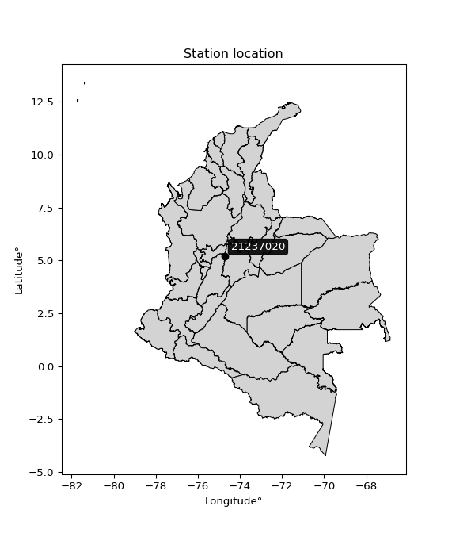

<div align="center">


</div>

# PMP Station (Rain, Pmax24h): 21237020

Probable Maximum Precipitation (PMP) is the greatest amount of rainfall for a specific duration that is meteorologically possible for a given location, acting as a "worst-case" scenario for extreme storms, crucial for designing safety-critical infrastructure like bridges, river deviations, dams, spillways, and nuclear plants to prevent catastrophic failure. PMP is calculated by hydrologists using meteorological data to determine the upper limit of extreme rainfall, often leading to the Probable Maximum Flood (PMF) for flood control design, and is increasingly being studied for climate change impacts. Probable Maximum Precipitation (PMP) is the theoretical upper limit of rainfall, a deterministic estimate for extreme events, while probability distributions (like GEV, Gumbel) describe the likelihood and frequency of various precipitation amounts, including rare ones, showing how often events occur, with PMP representing the extreme end of these distributions, used for critical infrastructure design to ensure safety against the worst conceivable weather, unlike standard statistical forecasts which cover typical probabilities.

The most common probability distributions in hydrology, used for analyzing floods, rainfall, and streamflow, include the Normal, Log-Normal, Gumbel, Gamma (including Log-Pearson Type III), and Generalized Extreme Value (GEV) distributions, often chosen based on the data´s skewness and whether modeling extremes or general conditions, with Gumbel and GEV popular for extreme events like floods, while the Normal distribution serves as a baseline, though often requiring transformations for skewed hydrological data. These distributions help in designing water infrastructure, managing water resources, and forecasting hydrologic events.

> Hydrological data often isn´t perfectly normal (it´s skewed), so different distributions are needed for different applications, such as: **Flood Frequency Analysis**: Using Gumbel, GEV, or Log-Pearson Type III for predicting extreme flood magnitudes and their return periods, **Rainfall Analysis**: Normal for annual totals, but Log-Normal, Weibull, or GEV for intensity or extreme daily rainfall, **Streamflow Modeling**: Gamma and Log-Normal for maximum flows, GEV for minimum flows, and Kappa for daily flows.

<div align="center">

</img>

</div>


## A. General information


### 1. General running parameters

• app_version: _v20260108_. • runtime: _2026-01-09 11:32:22.148588_. • Python version: _3.14.0_. • SciPy version: _1.16.3_. • Pandas version: _2.3.3_. • NumPy version: _2.3.5_. • Stations dataset (station_dataset_file): _dataset/pmax24h_in/automatic_colombia_2003_2024.csv_. • Stations catalog (station_catalog_file): _dataset/CNE.xls_. • Minimum year to eval til year_max (date_min): _1900_. • Maximum year to eval since year_min (date_max): _2024_. • Creates, save and include plots into reports (create_plot): _False_. • Plot only fit distributions with Δo > Δ (plot_only_fit): _True_. • Plot only simple graphs avoiding multiple CDFs and multiple Extreme values plots (plot_only_simple): _True_. • Eval low extreme values, if False, evaluates high extreme values (low_extreme): _False_. • Eval every SciPy distribution as logarithmic (pdist_logarithmic_on): _True_. • Standard deviation normalized (ddof): _1.0_. • Return periods to eval in years (Tr): _[2, 2.33, 5, 10, 15, 20, 25, 50, 75, 100, 200, 250, 500, 750, 1000]_. • Minimum data sample per station, 0 means any (minimum_sample): _5_. • Z-Score maximum threshold to adjust a value, 0 means disable (zscore_max): _3.5_. • Z-Score minimum threshold to adjust a value, 0 means disable (zscore_min): _-2.5_. • Avoid zeros, e.g. rain = 0 (avoid_zeros): _True_. • Avoid null values (avoid_nans): _True_. 

:file_folder:Table: [dataset.csv](../../dataset/pmax24h_in/automatic_colombia_2003_2024.csv)

> Delta Degrees of Freedom (DDOF): is a parameter used in the formulas for calculating variance and standard deviation. When ddof=0, the divisor is $N$ (the total number of observations) and this is used when your data set is the entire population. When ddof=1, the divisor is $N-1$ and this is used when your data set is a sample drawn from a larger population. Using $N-1$ provides an unbiased estimate of the population variance (known as Bessel´s correction).


### 2. Station info and location

|   id |   CODIGO | NOMBRE                          | CATEGORIA    | TECNOLOGIA                              | ESTADO           | FECHA_INSTALACION   |   FECHA_SUSPENSION |   ALTITUD |   LATITUD |   LONGITUD | DEPARTAMENTO   | MUNICIPIO   | AREA_OPERATIVA             | ENTIDAD                                                     | AREA_HIDROGRAFICA   | ZONA_HIDROGRAFICA   | SUBZONA_HIDROGRAFICA                   | CORRIENTE   | Catalogo   |   Version |
|-----:|---------:|:--------------------------------|:-------------|:----------------------------------------|:-----------------|:--------------------|-------------------:|----------:|----------:|-----------:|:---------------|:------------|:---------------------------|:------------------------------------------------------------|:--------------------|:--------------------|:---------------------------------------|:------------|:-----------|----------:|
|    0 | 21237020 | ARRANCAPLUMAS  - AUT [21237020] | Limnimétrica | Automática con Telemetría, Convencional | En Mantenimiento | 15/01/1934          |                nan |       222 |   5.20242 |   -74.7276 | Cundinamarca   | Guaduas     | Area Operativa 10 - Tolima | INSTITUTO DE HIDROLOGIA METEOROLOGIA Y ESTUDIOS AMBIENTALES | Magdalena Cauca     | Alto Magdalena      | Río Seco y otros Directos al Magdalena | Magdalena   | CNE_IDEAM  |  20251226 |

<div align="center">

Dynamic map: [:earth_americas:Google](http://maps.google.com/maps?q=5.202416667,-74.72761111) [:earth_americas:OSM](https://www.openstreetmap.org/#map=18/5.202416667/-74.72761111&layers=P) [:earth_americas:Bing](https://www.bing.com/maps?cp=5.202416667~-74.72761111&lvl=18) [:earth_americas:Apple](https://maps.apple.com/frame?center=5.202416667%2C-74.72761111&span=0.003%2C0.006)

</div>


<div align="center">

```geojson
{
  "type": "Feature",
  "geometry": {
    "type": "Point", 
    "coordinates": [-74.72761111, 5.202416667]
  }, 
  "properties": {
    "Name": "21237020"
  }
}
```

</div>


### 3. Discrete values table and plot

<div align="center">

|               |          0 |           1 |          2 |           3 |           4 |            5 |          6 |          7 |           8 |          9 |          10 |          11 |
|:--------------|-----------:|------------:|-----------:|------------:|------------:|-------------:|-----------:|-----------:|------------:|-----------:|------------:|------------:|
| Date          | 2011       | 2012        | 2013       | 2014        | 2015        | 2016         | 2017       | 2018       | 2019        | 2020       | 2021        | 2022        |
| Value         |   58.5     |   57.5      |  129.8     |   68.2      |   72.2      |   74.5       |  103.2     |   69.1     |   89.7      |   53       |   67.7      |   67.5      |
| Value_initial |   58.5     |   57.5      |  129.8     |   68.2      |   72.2      |   74.5       |  103.2     |   69.1     |   89.7      |   53       |   67.7      |   67.5      |
| count         |   12       |   12        |   12       |   12        |   12        |   12         |   12       |   12       |   12        |   12       |   12        |   12        |
| mean          |   75.9083  |   75.9083   |   75.9083  |   75.9083   |   75.9083   |   75.9083    |   75.9083  |   75.9083  |   75.9083   |   75.9083  |   75.9083   |   75.9083   |
| std           |   21.8791  |   21.8791   |   21.8791  |   21.8791   |   21.8791   |   21.8791    |   21.8791  |   21.8791  |   21.8791   |   21.8791  |   21.8791   |   21.8791   |
| zscore        |   -0.79566 |   -0.841366 |    2.46316 |   -0.352315 |   -0.169492 |   -0.0643689 |    1.24738 |   -0.31118 |    0.630358 |   -1.04704 |   -0.375168 |   -0.384309 |


</div>


> The initial value (value_initial) correspond to the initial obtained or null completed value, and value (value) is adjusted only when the initial value is outside the valid range (outlier) definite through the Z-Score value. If Z-Score is active, values out of range or outliers are replaced with the station mean value. A Z-Score (or standard score) measures how many standard deviations a data point is from the mean of a dataset, indicating its relative position; positive scores mean above the mean, negative mean below, and a score of zero is exactly at the mean, allowing for comparison of values from different distributions. It´s calculated using the formula $z=(x–μ)/σ$, where $x$ is the data point, $μ$ is the mean, and $σ$ is the standard deviation, helping identify outliers and understand probability.
>
> <sub>**Note**: In this study, "completing" (filling gaps in) and "extending" (forecasting or lengthening the historical record) rainfall data series are avoided for certain critical analyses because they introduce artificial bias and uncertainty, which can distort the statistics of rare events (extremes), alter day-to-day variability, and compromise the integrity and homogeneity of the original data. Some reasons against Completing/Extending rainfall data are: **Distortion of Extremes and Variability**: The primary issue is that most gap-filling or extension methods rely on averaging or regression with nearby stations, which inherently smooths the data. Rainfall is highly variable in space and time, with a large percentage of zero values and occasional large storms. Infilling methods often underestimate the highest values and overestimate the lowest (zero) values, which severely distorts analyses focused on flood frequency, drought severity, and intensity-duration-frequency (IDF) curves, **Loss of Data Homogeneity**: Infilled or extended data are synthetic estimates, not actual measurements. Combining these estimates with observed data can violate the assumption of data homogeneity, which requires that the data properties do not change over time. Inhomogeneity can lead to incorrect conclusions about long-term trends or changes in climate patterns, **Propagation of Errors**: Errors and biases from the original data (e.g., wind-induced undercatch, instrument errors, site changes) or the data used for imputation can propagate through the analysis, leading to unreliable hydrological models and inaccurate predictions, **Compromised Statistical Integrity**: For statistical analyses, especially those involving the frequency of events, using artificial data can introduce time bias or autocorrelation that doesn´t exist in reality, making it difficult to assess the true probability of events, **Difficulty in Validation**: It is difficult to accurately validate the quality of filled or extended data, especially for past periods where ground-truth measurements are unavailable. The reliability of imputation techniques heavily depends on the density of the surrounding station network and the complexity of the local topography.</sub>


### 4. Active continuous probability distributions from SciPy (45 of 104 available)

A Probability Density Function (PDF) describes the relative likelihood of a continuous random variable falling within a specific range, where the total area under its curve equals 1, and the area over any interval gives the actual probability for that range. Unlike discrete probabilities (like rolling a die), a PDF shows density, not direct probability for a single point (which is zero), with higher points indicating higher likelihood, often visualized as a bell curve for normal distributions.

A log of a probability density function (log-PDF) is simply the logarithm of the PDF´s value, denoted as $log(f(x))$, useful for converting multiplication of probabilities into addition, improving numerical stability with tiny numbers, and connecting to information theory concepts like entropy. Instead of dealing with very small probabilities (e.g., 0.000001), log-PDFs use negative numbers (e.g., $log(0.00001) ≈ -11.51$ that are easier for computers to handle, preventing underflow errors and simplifying complex calculations. In this study, each active probability distribution from SciPy is also evaluated in the $log$ form.

[scipy.stats](https://docs.scipy.org/doc/scipy/reference/stats.html) is a Python´s powerful submodule within the SciPy library for comprehensive statistical analysis, offering over 130 probability distributions (like Normal, Poisson), functions for descriptive stats (mean, variance), hypothesis testing (t-tests, chi-square), random variable generation, and statistical tests, making it essential for data science, modeling, and research. It provides tools to explore, model, and draw conclusions from data efficiently, working seamlessly with NumPy.

<div align="center">

|   id | p_dist             |   n_parameter | fit_method   | label                                                                       | active   | ref                                                                                                        |
|-----:|:-------------------|--------------:|:-------------|:----------------------------------------------------------------------------|:---------|:-----------------------------------------------------------------------------------------------------------|
|    0 | alpha              |             3 | MLE          | Alpha                                                                       | True     | [:mortar_board:](https://docs.scipy.org/doc/scipy/reference/generated/scipy.stats.alpha.html)              |
|    1 | betaprime          |             4 | MLE          | Beta prime                                                                  | True     | [:mortar_board:](https://docs.scipy.org/doc/scipy/reference/generated/scipy.stats.betaprime.html)          |
|    2 | chi2               |             3 | MLE          | Chi²                                                                        | True     | [:mortar_board:](https://docs.scipy.org/doc/scipy/reference/generated/scipy.stats.chi2.html)               |
|    3 | crystalball        |             4 | MLE          | Crystalball                                                                 | True     | [:mortar_board:](https://docs.scipy.org/doc/scipy/reference/generated/scipy.stats.crystalball.html)        |
|    4 | dweibull           |             3 | MLE          | Double Weibull                                                              | True     | [:mortar_board:](https://docs.scipy.org/doc/scipy/reference/generated/scipy.stats.dweibull.html)           |
|    5 | erlang             |             3 | MLE          | Erlang                                                                      | True     | [:mortar_board:](https://docs.scipy.org/doc/scipy/reference/generated/scipy.stats.erlang.html)             |
|    6 | expon              |             2 | MLE          | Exponential                                                                 | True     | [:mortar_board:](https://docs.scipy.org/doc/scipy/reference/generated/scipy.stats.expon.html)              |
|    7 | exponnorm          |             3 | MLE          | Exponentially modified Normal                                               | True     | [:mortar_board:](https://docs.scipy.org/doc/scipy/reference/generated/scipy.stats.exponnorm.html)          |
|    8 | f                  |             4 | MLE          | F                                                                           | True     | [:mortar_board:](https://docs.scipy.org/doc/scipy/reference/generated/scipy.stats.f.html)                  |
|    9 | fatiguelife        |             3 | MLE          | Fatigue-life (Birnbaum-Saunders)                                            | True     | [:mortar_board:](https://docs.scipy.org/doc/scipy/reference/generated/scipy.stats.fatiguelife.html)        |
|   10 | fisk               |             3 | MLE          | Fisk                                                                        | True     | [:mortar_board:](https://docs.scipy.org/doc/scipy/reference/generated/scipy.stats.fisk.html)               |
|   11 | gamma              |             3 | MLE          | Gamma                                                                       | True     | [:mortar_board:](https://docs.scipy.org/doc/scipy/reference/generated/scipy.stats.gamma.html)              |
|   12 | genexpon           |             5 | MLE          | Generalized exponential                                                     | True     | [:mortar_board:](https://docs.scipy.org/doc/scipy/reference/generated/scipy.stats.genexpon.html)           |
|   13 | genlogistic        |             3 | MLE          | Generalized logistic                                                        | True     | [:mortar_board:](https://docs.scipy.org/doc/scipy/reference/generated/scipy.stats.genlogistic.html)        |
|   14 | gibrat             |             2 | MM           | Gibrat                                                                      | True     | [:mortar_board:](https://docs.scipy.org/doc/scipy/reference/generated/scipy.stats.gibrat.html)             |
|   15 | gompertz           |             3 | MLE          | Gompertz (or truncated Gumbel)                                              | True     | [:mortar_board:](https://docs.scipy.org/doc/scipy/reference/generated/scipy.stats.gompertz.html)           |
|   16 | gumbel_l           |             2 | MM           | Gumbel Left Skew                                                            | True     | [:mortar_board:](https://docs.scipy.org/doc/scipy/reference/generated/scipy.stats.gumbel_l.html)           |
|   17 | gumbel_r           |             2 | MM           | Gumbel Right Skew                                                           | True     | [:mortar_board:](https://docs.scipy.org/doc/scipy/reference/generated/scipy.stats.gumbel_r.html)           |
|   18 | halflogistic       |             2 | MM           | Half-logistic                                                               | True     | [:mortar_board:](https://docs.scipy.org/doc/scipy/reference/generated/scipy.stats.halflogistic.html)       |
|   19 | halfnorm           |             2 | MM           | Half Normal                                                                 | True     | [:mortar_board:](https://docs.scipy.org/doc/scipy/reference/generated/scipy.stats.halfnorm.html)           |
|   20 | hypsecant          |             2 | MM           | hyperbolic secant                                                           | True     | [:mortar_board:](https://docs.scipy.org/doc/scipy/reference/generated/scipy.stats.hypsecant.html)          |
|   21 | invgamma           |             3 | MLE          | Inverted gamma                                                              | True     | [:mortar_board:](https://docs.scipy.org/doc/scipy/reference/generated/scipy.stats.invgamma.html)           |
|   22 | invgauss           |             3 | MLE          | Inverse Gaussian                                                            | True     | [:mortar_board:](https://docs.scipy.org/doc/scipy/reference/generated/scipy.stats.invgauss.html)           |
|   23 | invweibull         |             3 | MLE          | Inverted Weibull                                                            | True     | [:mortar_board:](https://docs.scipy.org/doc/scipy/reference/generated/scipy.stats.invweibull.html)         |
|   24 | kappa4             |             4 | MLE          | Kappa 4                                                                     | True     | [:mortar_board:](https://docs.scipy.org/doc/scipy/reference/generated/scipy.stats.kappa4.html)             |
|   25 | kstwobign          |             2 | MLE          | Limiting distribution of scaled Kolmogorov-Smirnov two-sided test statistic | True     | [:mortar_board:](https://docs.scipy.org/doc/scipy/reference/generated/scipy.stats.kstwobign.html)          |
|   26 | laplace            |             2 | MM           | Laplace                                                                     | True     | [:mortar_board:](https://docs.scipy.org/doc/scipy/reference/generated/scipy.stats.laplace.html)            |
|   27 | laplace_asymmetric |             3 | MLE          | Asymmetric Laplace                                                          | True     | [:mortar_board:](https://docs.scipy.org/doc/scipy/reference/generated/scipy.stats.laplace_asymmetric.html) |
|   28 | loggamma           |             3 | MLE          | Log gamma                                                                   | True     | [:mortar_board:](https://docs.scipy.org/doc/scipy/reference/generated/scipy.stats.loggamma.html)           |
|   29 | logistic           |             2 | MM           | Logistic (or Sech-squared)                                                  | True     | [:mortar_board:](https://docs.scipy.org/doc/scipy/reference/generated/scipy.stats.logistic.html)           |
|   30 | lognorm            |             3 | MLE          | Log Normal                                                                  | True     | [:mortar_board:](https://docs.scipy.org/doc/scipy/reference/generated/scipy.stats.lognorm.html)            |
|   31 | maxwell            |             2 | MM           | Maxwell                                                                     | True     | [:mortar_board:](https://docs.scipy.org/doc/scipy/reference/generated/scipy.stats.maxwell.html)            |
|   32 | mielke             |             4 | MLE          | Mielke Beta-Kappa / Dagum                                                   | True     | [:mortar_board:](https://docs.scipy.org/doc/scipy/reference/generated/scipy.stats.mielke.html)             |
|   33 | moyal              |             2 | MM           | Moyal                                                                       | True     | [:mortar_board:](https://docs.scipy.org/doc/scipy/reference/generated/scipy.stats.moyal.html)              |
|   34 | nakagami           |             3 | MLE          | Nakagami                                                                    | True     | [:mortar_board:](https://docs.scipy.org/doc/scipy/reference/generated/scipy.stats.nakagami.html)           |
|   35 | ncf                |             5 | MLE          | Non-central F distribution                                                  | True     | [:mortar_board:](https://docs.scipy.org/doc/scipy/reference/generated/scipy.stats.ncf.html)                |
|   36 | nct                |             4 | MLE          | Non-central Student’s t                                                     | True     | [:mortar_board:](https://docs.scipy.org/doc/scipy/reference/generated/scipy.stats.nct.html)                |
|   37 | norm               |             2 | MM           | Normal                                                                      | True     | [:mortar_board:](https://docs.scipy.org/doc/scipy/reference/generated/scipy.stats.norm.html)               |
|   38 | pearson3           |             3 | MM           | Pearson type III                                                            | True     | [:mortar_board:](https://docs.scipy.org/doc/scipy/reference/generated/scipy.stats.pearson3.html)           |
|   39 | rayleigh           |             2 | MM           | Rayleigh                                                                    | True     | [:mortar_board:](https://docs.scipy.org/doc/scipy/reference/generated/scipy.stats.rayleigh.html)           |
|   40 | rice               |             3 | MLE          | Rice                                                                        | True     | [:mortar_board:](https://docs.scipy.org/doc/scipy/reference/generated/scipy.stats.rice.html)               |
|   41 | t                  |             3 | MLE          | Student’s t                                                                 | True     | [:mortar_board:](https://docs.scipy.org/doc/scipy/reference/generated/scipy.stats.t.html)                  |
|   42 | truncnorm          |             4 | MLE          | Truncated normal                                                            | True     | [:mortar_board:](https://docs.scipy.org/doc/scipy/reference/generated/scipy.stats.truncnorm.html)          |
|   43 | wald               |             2 | MM           | Wald                                                                        | True     | [:mortar_board:](https://docs.scipy.org/doc/scipy/reference/generated/scipy.stats.wald.html)               |
|   44 | weibull_min        |             3 | MLE          | Weibull minimum                                                             | True     | [:mortar_board:](https://docs.scipy.org/doc/scipy/reference/generated/scipy.stats.weibull_min.html)        |

</div>

> **n_parameter:** # arguments & localization & scale.
>
> **Fit methods:** (MLE) maximum likelihood, (MM) L-moments.
>
>**Inactive** (With the only purpose of prevent loops, zero divisions, infinite values, over high estimated values or horizontal trending for recurrence intervals estimations, the follow distributions were disabled.)**:** foldnorm, gennorm, norminvgauss, powernorm, powerlognorm, skewnorm, genextreme, anglit, arcsine, argus, beta, bradford, burr, burr12, cauchy, cosine, halfcauchy, foldcauchy, skewcauchy, wrapcauchy, dgamma, gengamma, exponweib, exponpow, truncexpon, gausshyper, genhalflogistic, genhyperbolic, geninvgauss, halfgennorm, johnsonsb, johnsonsu, kappa3, ksone, kstwo, loglaplace, levy, levy_l, levy_stable, ncx2, pareto, genpareto, truncpareto, lomax, powerlaw, rdist, rel_breitwigner, recipinvgauss, semicircular, studentized_range, trapezoid, triang, truncweibull_min, tukeylambda, uniform, loguniform, vonmises, vonmises_line, weibull_max, 


## B. Probability (PDF) vs. Empirical (EDF) distributions functions

A continuous probability distribution (CPD) describes probabilities for variables that can take any value within a range (like rain any time), unlike discrete variables with specific outcomes (like temperature). It uses a Probability Density Function (PDF), a curve where the total area under it equals 1, and the probability of the variable falling within an interval (a to b) is found by calculating the area under the curve between those points. A key feature is that the probability of hitting any single exact value is zero, so probabilities are always expressed for ranges, e.g., $P(a ≤ X ≤ b)$.

<div align="center">

Distributions parameters from station values
|    |   station | p_dist                |   n |          loc |          scale | shape                 | shape1             | shape2                | shape3   |
|---:|----------:|:----------------------|----:|-------------:|---------------:|:----------------------|:-------------------|:----------------------|:---------|
|  0 |  21237020 | alpha                 |  12 |    25.3958   |  136.123       | 3.069690662428524     |                    |                       |          |
|  1 |  21237020 | betaprime             |  12 |     6.43667  |    0.922406    | 1163.4466048240683    | 16.733769283194917 |                       |          |
|  2 |  21237020 | chi2                  |  12 |    53        |    7.23038     | 0.39651454016982024   |                    |                       |          |
|  3 |  21237020 | crystalball           |  12 |    75.9083   |   20.9477      | 2704.8820925541404    | 9293.519299154428  |                       |          |
|  4 |  21237020 | dweibull              |  12 |    67.5      |   15.2877      | 0.8276650885138741    |                    |                       |          |
|  5 |  21237020 | erlang                |  12 |    53        |   30.3672      | 0.8204611877468574    |                    |                       |          |
|  6 |  21237020 | expon                 |  12 |    53        |   22.9083      |                       |                    |                       |          |
|  7 |  21237020 | exponnorm             |  12 |    53.5722   |    2.19737     | 10.164911051864504    |                    |                       |          |
|  8 |  21237020 | f                     |  12 |    41.1913   |   25.9822      | 1135.7825411985702    | 7.639123040785929  |                       |          |
|  9 |  21237020 | fatiguelife           |  12 |    53        |    5.75457e-05 | 545.4407678425697     |                    |                       |          |
| 10 |  21237020 | fisk                  |  12 |    49.333    |   20.1595      | 2.2026404637244537    |                    |                       |          |
| 11 |  21237020 | gamma                 |  12 |    53        |   26.3148      | 0.7783560078206793    |                    |                       |          |
| 12 |  21237020 | genexpon              |  12 |    52.9984   |   86.1869      | 3.3736474652533346    | 5.324984470562395  | 0.319606213716102     |          |
| 13 |  21237020 | genlogistic           |  12 |   -27.2878   |   13.5212      | 1077.0605753408681    |                    |                       |          |
| 14 |  21237020 | gibrat                |  12 |    59.9279   |    9.69262     |                       |                    |                       |          |
| 15 |  21237020 | gompertz              |  12 |    53        |  201.069       | 7.869238709031119     |                    |                       |          |
| 16 |  21237020 | gumbel_l              |  12 |    85.3359   |   16.3328      |                       |                    |                       |          |
| 17 |  21237020 | gumbel_r              |  12 |    66.4808   |   16.3328      |                       |                    |                       |          |
| 18 |  21237020 | halflogistic          |  12 |    51.0805   |   17.9095      |                       |                    |                       |          |
| 19 |  21237020 | halfnorm              |  12 |    48.1819   |   34.75        |                       |                    |                       |          |
| 20 |  21237020 | hypsecant             |  12 |    75.9083   |   13.3357      |                       |                    |                       |          |
| 21 |  21237020 | invgamma              |  12 |    41.104    |   99.4849      | 3.81943838881872      |                    |                       |          |
| 22 |  21237020 | invgauss              |  12 |    46.3949   |   52.4697      | 0.5624853947957702    |                    |                       |          |
| 23 |  21237020 | invweibull            |  12 |    26.4411   |   38.6795      | 3.359479492610565     |                    |                       |          |
| 24 |  21237020 | kappa4                |  12 |    43.0181   |   85.1006      | 1.1326575691092362    | 0.9756130952426221 |                       |          |
| 25 |  21237020 | kstwobign             |  12 |    16.9142   |   68.4542      |                       |                    |                       |          |
| 26 |  21237020 | laplace               |  12 |    75.9083   |   14.8122      |                       |                    |                       |          |
| 27 |  21237020 | laplace_asymmetric    |  12 |    67.7      |   11.8987      | 0.7129157135916684    |                    |                       |          |
| 28 |  21237020 | loggamma              |  12 | -8702.95     | 1112.9         | 2666.1179529021665    |                    |                       |          |
| 29 |  21237020 | logistic              |  12 |    75.9083   |   11.549       |                       |                    |                       |          |
| 30 |  21237020 | lognorm               |  12 |    53        |    0.949327    | 9.83728124795206      |                    |                       |          |
| 31 |  21237020 | maxwell               |  12 |    26.2712   |   31.1055      |                       |                    |                       |          |
| 32 |  21237020 | mielke                |  12 |    -1.18442  |   26.3104      | 1021.7537555123099    | 5.5693129667769945 |                       |          |
| 33 |  21237020 | moyal                 |  12 |    63.9291   |    9.42976     |                       |                    |                       |          |
| 34 |  21237020 | nakagami              |  12 |    53        |   35.3706      | 0.3711859916330127    |                    |                       |          |
| 35 |  21237020 | ncf                   |  12 |    -1.38213  |   73.8357      | 147.26683184602433    | 46.28637586602065  | 1.818666904681863e-06 |          |
| 36 |  21237020 | nct                   |  12 |    -0.28624  |    1.31183     | 10.126871961617912    | 53.49925123007375  |                       |          |
| 37 |  21237020 | norm                  |  12 |    75.9083   |   20.9477      |                       |                    |                       |          |
| 38 |  21237020 | pearson3              |  12 |    75.9083   |   20.9476      | 1.3958023698369357    |                    |                       |          |
| 39 |  21237020 | rayleigh              |  12 |    35.8343   |   31.9745      |                       |                    |                       |          |
| 40 |  21237020 | rice                  |  12 |    43.4725   |   27.3028      | 0.0021392407804031307 |                    |                       |          |
| 41 |  21237020 | t                     |  12 |    75.3119   |   21.2085      | 13.795856693357408    |                    |                       |          |
| 42 |  21237020 | truncnorm             |  12 |    76.2809   |   21.3373      | -729.4098661208022    | 2.508266854311189  |                       |          |
| 43 |  21237020 | wald                  |  12 |    54.9607   |   20.9477      |                       |                    |                       |          |
| 44 |  21237020 | weibull_min           |  12 |    53        |   21.793       | 0.9409461701861617    |                    |                       |          |
| 45 |  21237020 | logalpha              |  12 |     2.29112  |   17.0897      | 8.63502499116968      |                    |                       |          |
| 46 |  21237020 | logbetaprime          |  12 |     3.15275  |    3.68672     | 29.851383142996937    | 97.11026650495211  |                       |          |
| 47 |  21237020 | logchi2               |  12 |     3.97029  |    0.963876    | 1.091844330854319     |                    |                       |          |
| 48 |  21237020 | logcrystalball        |  12 |     4.29714  |    0.245205    | 34740.78633692072     | 3.2107539704629104 |                       |          |
| 49 |  21237020 | logdweibull           |  12 |     4.21509  |    0.170547    | 0.7104290272867296    |                    |                       |          |
| 50 |  21237020 | logerlang             |  12 |     3.93874  |    0.192451    | 1.862313485213371     |                    |                       |          |
| 51 |  21237020 | logexpon              |  12 |     3.97029  |    0.326849    |                       |                    |                       |          |
| 52 |  21237020 | logexponnorm          |  12 |     4.0631   |    0.0992856   | 2.357271603934707     |                    |                       |          |
| 53 |  21237020 | logf                  |  12 |     3.64165  |    0.57794     | 2976.123352624629     | 16.619727923431665 |                       |          |
| 54 |  21237020 | logfatiguelife        |  12 |     3.79784  |    0.443445    | 0.5015387267416664    |                    |                       |          |
| 55 |  21237020 | logfisk               |  12 |     3.83018  |    0.4116      | 3.2882666802222693    |                    |                       |          |
| 56 |  21237020 | loggamma              |  12 |     3.93874  |    0.192446    | 1.8623710406973966    |                    |                       |          |
| 57 |  21237020 | loggenexpon           |  12 |     3.97023  |    0.0917477   | 0.16779342699661298   | 3.5033555445578717 | 0.011879208531334357  |          |
| 58 |  21237020 | loggenlogistic        |  12 |     3.03371  |    0.182366    | 557.7831203718079     |                    |                       |          |
| 59 |  21237020 | loggibrat             |  12 |     4.11014  |    0.113425    |                       |                    |                       |          |
| 60 |  21237020 | loggompertz           |  12 |     3.97029  |    0.723741    | 1.484214347581248     |                    |                       |          |
| 61 |  21237020 | loggumbel_l           |  12 |     4.4075   |    0.191185    |                       |                    |                       |          |
| 62 |  21237020 | loggumbel_r           |  12 |     4.18679  |    0.191185    |                       |                    |                       |          |
| 63 |  21237020 | loghalflogistic       |  12 |     4.00649  |    0.209663    |                       |                    |                       |          |
| 64 |  21237020 | loghalfnorm           |  12 |     3.97255  |    0.406816    |                       |                    |                       |          |
| 65 |  21237020 | loghypsecant          |  12 |     4.29714  |    0.156102    |                       |                    |                       |          |
| 66 |  21237020 | loginvgamma           |  12 |     3.64004  |    4.81436     | 8.30983699517132      |                    |                       |          |
| 67 |  21237020 | loginvgauss           |  12 |     3.78145  |    2.11003     | 0.24439745353996178   |                    |                       |          |
| 68 |  21237020 | loginvweibull         |  12 |     2.20309  |    1.97538     | 11.19867883990645     |                    |                       |          |
| 69 |  21237020 | logkappa4             |  12 |     3.90351  |    0.987442    | 1.0726031681762986    | 1.0242562110362368 |                       |          |
| 70 |  21237020 | logkstwobign          |  12 |     3.52794  |    0.886778    |                       |                    |                       |          |
| 71 |  21237020 | loglaplace            |  12 |     4.29714  |    0.173386    |                       |                    |                       |          |
| 72 |  21237020 | loglaplace_asymmetric |  12 |     4.21509  |    0.15949     | 0.7754065246229241    |                    |                       |          |
| 73 |  21237020 | logloggamma           |  12 |   -64.35     |    9.43996     | 1440.3932089985979    |                    |                       |          |
| 74 |  21237020 | loglogistic           |  12 |     4.29714  |    0.135188    |                       |                    |                       |          |
| 75 |  21237020 | loglognorm            |  12 |     3.97029  |    0.0166918   | 9.447539020082237     |                    |                       |          |
| 76 |  21237020 | logmaxwell            |  12 |     3.71611  |    0.364108    |                       |                    |                       |          |
| 77 |  21237020 | logmielke             |  12 |     2.49551  |    1.14938     | 399.49281531903773    | 9.719127055053427  |                       |          |
| 78 |  21237020 | logmoyal              |  12 |     4.15692  |    0.110381    |                       |                    |                       |          |
| 79 |  21237020 | lognakagami           |  12 |     3.97029  |    0.420773    | 0.26955157636676924   |                    |                       |          |
| 80 |  21237020 | logncf                |  12 |    -4.53763  |    8.83311     | 2799.5715141077762    | 2262.9170814227928 | 0.0002738628264449933 |          |
| 81 |  21237020 | lognct                |  12 |     0.947318 |    0.054245    | 107.84796449627359    | 61.258031623980344 |                       |          |
| 82 |  21237020 | lognorm               |  12 |     4.29714  |    0.245205    |                       |                    |                       |          |
| 83 |  21237020 | logpearson3           |  12 |     4.29714  |    0.245205    | 0.9483399403355719    |                    |                       |          |
| 84 |  21237020 | lograyleigh           |  12 |     3.82805  |    0.374281    |                       |                    |                       |          |
| 85 |  21237020 | logrice               |  12 |     3.88033  |    0.341946    | 0.0002356801253410161 |                    |                       |          |
| 86 |  21237020 | logt                  |  12 |     4.29707  |    0.245128    | 3440.79317322972      |                    |                       |          |
| 87 |  21237020 | logtruncnorm          |  12 |    -0.111954 |    1.22956     | 3.3200995525307       | 6.295047974938914  |                       |          |
| 88 |  21237020 | logwald               |  12 |     4.05191  |    0.245233    |                       |                    |                       |          |
| 89 |  21237020 | logweibull_min        |  12 |     3.95616  |    0.369692    | 1.3414170289865965    |                    |                       |          |

</div>

> **loc** (Location parameter): This shifts the distribution along the x-axis. For many common distributions, like the normal (Gaussian) distribution, loc represents the mean $μ$. For others, like the uniform distribution, it might represent the minimum value, or for the beta distribution, the left end of the support interval.
>
> **scale** (Scale parameter): This determines the width or spread of the distribution. For the normal distribution, scale represents the standard deviation $σ$. For a uniform distribution, it defines the length of the interval (from $loc$ to $loc + scale$).
>
> **shape** (Shape parameters): Refers to parameters that define the specific form of a probability distribution, distinct from its location (loc) and scale (scale). These parameters are required arguments for most distribution functions. For example, a normal (Gaussian) distribution is fully defined by its location (mean) and scale (standard deviation), so it has no specific shape parameters beyond loc and scale. However, other distributions have intrinsic properties that need specification, as Gamma distribution that takes a shape parameter, often named $a$ or $alpha$.


### 0. Cumulative distribution values - CDF (90 evaluated)

Cumulative Distribution Function (CDF), denoted as $F$<sub>$X$</sub>$(x)$, is a function that gives the probability that a random variable $X$ will take a value less than or equal to a specific value, $x$ (i.e., $(P(X≥x)$. It essentially "accumulates" probabilities from a given point up to the far right (positive infinity), providing a complete picture of the distribution´s probabilities for both discrete (like rain) and continuous (like temperature) variables, helping to find probabilities over ranges or above certain values. Each station is evaluated separately ordering the $x$ values ascending, calculating the CDF and PDF values for the activated distributions and their logarithmic forms.

<div align="center">

CDF ordered by x ascending and calculating $log(f(x))$ separately
|   id |   Station |   date |     x |   count |    mean |     std |     zscore |   Value_initial |   station |   m |     alpha |   alpha_pdf |   betaprime |   betaprime_pdf |       chi2 |    chi2_pdf |   crystalball |   crystalball_pdf |   dweibull |   dweibull_pdf |      erlang |   erlang_pdf |    expon |   expon_pdf |   exponnorm |   exponnorm_pdf |         f |      f_pdf |   fatiguelife |   fatiguelife_pdf |      fisk |   fisk_pdf |       gamma |   gamma_pdf |    genexpon |   genexpon_pdf |   genlogistic |   genlogistic_pdf |   gibrat |   gibrat_pdf |   gompertz |   gompertz_pdf |   gumbel_l |   gumbel_l_pdf |   gumbel_r |   gumbel_r_pdf |   halflogistic |   halflogistic_pdf |   halfnorm |   halfnorm_pdf |   hypsecant |   hypsecant_pdf |   invgamma |   invgamma_pdf |   invgauss |   invgauss_pdf |   invweibull |   invweibull_pdf |      kappa4 |   kappa4_pdf |   kstwobign |   kstwobign_pdf |   laplace |   laplace_pdf |   laplace_asymmetric |   laplace_asymmetric_pdf |   loggamma |   loggamma_pdf |   logistic |   logistic_pdf |   lognorm |   lognorm_pdf |   maxwell |   maxwell_pdf |   mielke |   mielke_pdf |     moyal |   moyal_pdf |    nakagami |   nakagami_pdf |       ncf |     ncf_pdf |       nct |     nct_pdf |     norm |    norm_pdf |   pearson3 |   pearson3_pdf |   rayleigh |   rayleigh_pdf |      rice |    rice_pdf |        t |      t_pdf |   truncnorm |   truncnorm_pdf |      wald |   wald_pdf |   weibull_min |   weibull_min_pdf |   logalpha |   logalpha_pdf |   logbetaprime |   logbetaprime_pdf |     logchi2 |   logchi2_pdf |   logcrystalball |   logcrystalball_pdf |   logdweibull |   logdweibull_pdf |   logerlang |   logerlang_pdf |   logexpon |   logexpon_pdf |   logexponnorm |   logexponnorm_pdf |      logf |   logf_pdf |   logfatiguelife |   logfatiguelife_pdf |   logfisk |   logfisk_pdf |   loggenexpon |   loggenexpon_pdf |   loggenlogistic |   loggenlogistic_pdf |   loggibrat |   loggibrat_pdf |   loggompertz |   loggompertz_pdf |   loggumbel_l |   loggumbel_l_pdf |   loggumbel_r |   loggumbel_r_pdf |   loghalflogistic |   loghalflogistic_pdf |   loghalfnorm |   loghalfnorm_pdf |   loghypsecant |   loghypsecant_pdf |   loginvgamma |   loginvgamma_pdf |   loginvgauss |   loginvgauss_pdf |   loginvweibull |   loginvweibull_pdf |   logkappa4 |   logkappa4_pdf |   logkstwobign |   logkstwobign_pdf |   loglaplace |   loglaplace_pdf |   loglaplace_asymmetric |   loglaplace_asymmetric_pdf |   logloggamma |   logloggamma_pdf |   loglogistic |   loglogistic_pdf |   loglognorm |   loglognorm_pdf |   logmaxwell |   logmaxwell_pdf |   logmielke |   logmielke_pdf |   logmoyal |   logmoyal_pdf |   lognakagami |   lognakagami_pdf |   logncf |   logncf_pdf |    lognct |   lognct_pdf |   logpearson3 |   logpearson3_pdf |   lograyleigh |   lograyleigh_pdf |   logrice |   logrice_pdf |      logt |   logt_pdf |   logtruncnorm |   logtruncnorm_pdf |     logwald |   logwald_pdf |   logweibull_min |   logweibull_min_pdf |
|-----:|----------:|-------:|------:|--------:|--------:|--------:|-----------:|----------------:|----------:|----:|----------:|------------:|------------:|----------------:|-----------:|------------:|--------------:|------------------:|-----------:|---------------:|------------:|-------------:|---------:|------------:|------------:|----------------:|----------:|-----------:|--------------:|------------------:|----------:|-----------:|------------:|------------:|------------:|---------------:|--------------:|------------------:|---------:|-------------:|-----------:|---------------:|-----------:|---------------:|-----------:|---------------:|---------------:|-------------------:|-----------:|---------------:|------------:|----------------:|-----------:|---------------:|-----------:|---------------:|-------------:|-----------------:|------------:|-------------:|------------:|----------------:|----------:|--------------:|---------------------:|-------------------------:|-----------:|---------------:|-----------:|---------------:|----------:|--------------:|----------:|--------------:|---------:|-------------:|----------:|------------:|------------:|---------------:|----------:|------------:|----------:|------------:|---------:|------------:|-----------:|---------------:|-----------:|---------------:|----------:|------------:|---------:|-----------:|------------:|----------------:|----------:|-----------:|--------------:|------------------:|-----------:|---------------:|---------------:|-------------------:|------------:|--------------:|-----------------:|---------------------:|--------------:|------------------:|------------:|----------------:|-----------:|---------------:|---------------:|-------------------:|----------:|-----------:|-----------------:|---------------------:|----------:|--------------:|--------------:|------------------:|-----------------:|---------------------:|------------:|----------------:|--------------:|------------------:|--------------:|------------------:|--------------:|------------------:|------------------:|----------------------:|--------------:|------------------:|---------------:|-------------------:|--------------:|------------------:|--------------:|------------------:|----------------:|--------------------:|------------:|----------------:|---------------:|-------------------:|-------------:|-----------------:|------------------------:|----------------------------:|--------------:|------------------:|--------------:|------------------:|-------------:|-----------------:|-------------:|-----------------:|------------:|----------------:|-----------:|---------------:|--------------:|------------------:|---------:|-------------:|----------:|-------------:|--------------:|------------------:|--------------:|------------------:|----------:|--------------:|----------:|-----------:|---------------:|-------------------:|------------:|--------------:|-----------------:|---------------------:|
|    0 |  21237020 |   2020 |  53   |      12 | 75.9083 | 21.8791 | -1.04704   |            53   |  21237020 |   1 | 0.0313672 |  0.0126144  |   0.0737401 |     0.0135263   | 0.00100419 | 2.80192e+10 |      0.137065 |       0.0104731   |   0.19199  |    0.0104894   | 1.59881e-13 |  18.4614     | 0        |  0.0436522  |   0.0262669 |      0.0166101  | 0.0274411 | 0.0136094  |     0.0855357 |       1.03639e+09 | 0.0228887 | 0.0134337  | 8.23291e-13 | 90.1865     | 6.22827e-05 |     0.0391413  |     0.0586004 |       0.0122793   | 0        |  0           | 5.5617e-16 |     0.039137   |   0.128984 |    0.00736451  |   0.102004 |     0.0142565  |      0.0535377 |         0.0278381  |   0.110275 |     0.0227411  |    0.113042 |     0.00829962  |   0.027441 |     0.013609   |  0.0241861 |     0.0155514  |    0.0291314 |       0.0130295  | 8.20393e-15 |    0.865685  |   0.0561159 |     0.0122525   |  0.106487 |   0.00718915  |             0.059567 |              0.0070221   |  0.0175436 |       0.976937 |   0.120939 |    0.00920532  |  0.091272 |      0.6692   |  0.135861 |    0.0130933  |      nan |          nan | 0.0742372 |  0.0153493  | 2.89504e-12 |   151.236      | 0.0878961 | 0.0128944   | 0.0670676 | 0.0131269   | 0.137065 | 0.0104731   |  0.0785564 |     0.0192273  |   0.134206 |     0.0145368  | 0.0590693 | 0.012026    | 0.155434 | 0.0104377  |    0.138457 |     0.010373    | 0         | 0          |   2.67808e-15 |        0.354649   |  0.0614856 |       0.735947 |      0.0702321 |           0.738398 | 3.26891e-09 |    4.0185e+06 |         0.091272 |             0.6692   |      0.13726  |          0.514958 |   0.0175438 |        0.976976 |   0        |       3.05952  |      0.0333135 |           0.605213 | 0.0288846 |   0.697849 |        0.0253545 |             0.761439 | 0.0280976 |      0.64091  |   0.000111541 |          1.82895  |        0.0379421 |             0.678699 |    0        |       0         |   1.60998e-10 |          2.05075  |     0.0966004 |       0.48004     |     0.0449134 |          0.728963 |          0        |              0        |      0        |          0        |      0.0780486 |           0.494989 |      0.028885 |          0.697852 |     0.0259274 |          0.748531 |       0.0307996 |            0.67926  | 1.33462e-15 |        12.1948  |      0.0353089 |           0.711698 |    0.0759074 |         0.437794 |               0.0518736 |                    0.419453 |     0.0927753 |          0.659936 |     0.0818308 |          0.555776 |    0.0004689 |      3.99132e+11 |    0.0783367 |         0.836987 |   0.0304416 |        0.671612 |  0.0198678 |       0.559065 |   6.56326e-09 |       7.96749e+06 | 0.173567 |     0.754791 | 0.0759731 |     0.714108 |     0.0505417 |          0.845484 |     0.0696699 |          0.94465  |  0.034013 |      0.743187 | 0.0912924 |   0.669214 |    1.76555e-07 |           2.91335  | 0           |      0        |        0.0124647 |             1.17566  |
|    1 |  21237020 |   2012 |  57.5 |      12 | 75.9083 | 21.8791 | -0.841366  |            57.5 |  21237020 |   2 | 0.121062  |  0.0265924  |   0.149388  |     0.0198986   | 0.822716   | 0.027875    |      0.189761 |       0.0129444   |   0.24736  |    0.0144082   | 0.208624    |   0.0350301  | 0.178345 |  0.0358671  |   0.158689  |      0.0360127  | 0.126181  | 0.0287831  |     0.695913  |       0.0199274   | 0.120231  | 0.0285276  | 0.253828    |  0.0398276  | 0.163489    |     0.0335995  |     0.130729  |       0.0196531   | 0        |  0           | 0.163143   |     0.0334934  |   0.166316 |    0.00928487  |   0.176751 |     0.0187544  |      0.177326  |         0.0270403  |   0.211415 |     0.0221499  |    0.156846 |     0.0112912   |   0.126177 |     0.028782   |  0.136172  |     0.0311485  |    0.12369   |       0.0279617  | 0.0830086   |    0.0162736 |   0.126444  |     0.018753    |  0.14429  |   0.00974131  |             0.101249 |              0.0119359   |  0.144781  |       1.9225   |   0.168832 |    0.0121506   |  0.158506 |      0.986203 |  0.200671 |    0.0156195  |      nan |          nan | 0.159663  |  0.0221344  | 0.168183    |     0.0276241  | 0.157088  | 0.0177287   | 0.141478  | 0.0197311   | 0.189761 | 0.0129444   |  0.176815  |     0.0236914  |   0.205123 |     0.0168448  | 0.123644  | 0.016491    | 0.207656 | 0.0127742  |    0.190534 |     0.0127697   | 0.0105324 | 0.0186665  |   0.202799    |        0.037781   |  0.142005  |       1.23894  |      0.14825   |           1.17546  | 0.19715     |    1.28498    |         0.158506 |             0.986203 |      0.189612 |          0.799839 |   0.144784  |        1.92253  |   0.220677 |       2.38435  |      0.115613  |           1.44856  | 0.123765  |   1.60364  |        0.130089  |             1.72675  | 0.115473  |      1.51562  |   0.152559    |          1.88974  |        0.123084  |             1.41125  |    0        |       0         |   0.162132    |          1.92305  |     0.144087  |       0.69654     |     0.131846  |          1.39726  |          0.107611 |              2.35716  |      0.15443  |          1.92444  |      0.130359  |           0.81194  |      0.123766 |          1.60364  |     0.128754  |          1.70425  |       0.122378  |            1.55724  | 0.104582    |         1.19783 |      0.123678  |           1.43332  |    0.121452  |         0.700475 |               0.10026   |                    0.810709 |     0.158755  |          0.964603 |     0.140045  |          0.890847 |    0.566642  |      0.510922    |    0.162508  |         1.21768  |   0.12173   |        1.56067  |  0.107402  |       1.59214  |   0.320456    |       2.1031      | 0.241505 |     0.90917  | 0.150529  |     1.11889  |     0.144655  |          1.43372  |     0.163616  |          1.33581  |  0.118121 |      1.29311  | 0.158532  |   0.986331 |    0.212964    |           2.33277  | 0           |      0        |        0.150424  |             1.94278  |
|    2 |  21237020 |   2011 |  58.5 |      12 | 75.9083 | 21.8791 | -0.79566   |            58.5 |  21237020 |   3 | 0.148805  |  0.0288172  |   0.169893  |     0.0210941   | 0.84755    | 0.0221468   |      0.202976 |       0.0134836   |   0.262333 |    0.0155604   | 0.242454    |   0.0326959  | 0.213441 |  0.0343351  |   0.194527  |      0.0355036  | 0.155957  | 0.0306692  |     0.714572  |       0.0175061   | 0.149844  | 0.0306094  | 0.292029    |  0.0366745  | 0.196514    |     0.0324537  |     0.151116  |       0.0211013   | 0        |  0           | 0.196055   |     0.0323365  |   0.175836 |    0.00975839  |   0.195912 |     0.0195529  |      0.204226  |         0.0267537  |   0.233476 |     0.0219705  |    0.168516 |     0.0120544   |   0.155952 |     0.030668   |  0.167943  |     0.0322807  |    0.152757  |       0.0300767  | 0.0990835   |    0.0158904 |   0.145798  |     0.019934    |  0.154368 |   0.0104217   |             0.113917 |              0.0134292   |  0.178527  |       1.98664  |   0.181333 |    0.012854    |  0.176108 |      1.05548  |  0.216533 |    0.0160992  |      nan |          nan | 0.182339  |  0.023187   | 0.195044    |     0.0261546  | 0.17529   | 0.0186635   | 0.161832  | 0.020958    | 0.202976 | 0.0134836   |  0.200743  |     0.0241369  |   0.222171 |     0.0172444  | 0.140557  | 0.0173256   | 0.220688 | 0.0132872  |    0.203566 |     0.0132929   | 0.0380681 | 0.0355229  |   0.239479    |        0.0356181  |  0.164229  |       1.33801  |      0.169276  |           1.26273  | 0.218245    |    1.16725    |         0.176108 |             1.05548  |      0.204154 |          0.889463 |   0.178531  |        1.98666  |   0.260722 |       2.26183  |      0.142175  |           1.6306   | 0.152724  |   1.75124  |        0.160977  |             1.85064  | 0.143118  |      1.68838  |   0.185116    |          1.8858   |        0.148641  |             1.55105  |    0        |       0         |   0.195024    |          1.8921   |     0.156563  |       0.751165    |     0.157018  |          1.52052  |          0.148051 |              2.33251  |      0.187465 |          1.90691  |      0.145087  |           0.897586 |      0.152724 |          1.75124  |     0.159294  |          1.83303  |       0.150585  |            1.71102  | 0.125102    |         1.18295 |      0.149459  |           1.55441  |    0.134151  |         0.773712 |               0.115259  |                    0.931995 |     0.175963  |          1.03139  |     0.156121  |          0.974545 |    0.574619  |      0.420179    |    0.184109  |         1.28704  |   0.150027  |        1.71789  |  0.13648   |       1.77607  |   0.355032    |       1.91597     | 0.257437 |     0.938626 | 0.170552  |     1.20334  |     0.170208  |          1.52814  |     0.187196  |          1.39819  |  0.14123  |      1.38586  | 0.176136  |   1.05564  |    0.252244    |           2.22437  | 0.000405516 |      0.179547 |        0.184223  |             1.97412  |
|    3 |  21237020 |   2022 |  67.5 |      12 | 75.9083 | 21.8791 | -0.384309  |            67.5 |  21237020 |   4 | 0.435605  |  0.0302597  |   0.389646  |     0.0258769   | 0.94836    | 0.00546361  |      0.344064 |       0.0175707   |   0.5      |   10.5432      | 0.473932    |   0.0204265  | 0.468981 |  0.0231802  |   0.461364  |      0.0241151  | 0.442081  | 0.0288921  |     0.821291  |       0.00828956  | 0.442943  | 0.0299163  | 0.540787    |  0.0210144  | 0.446397    |     0.0234607  |     0.378463  |       0.0271842   | 0.402495 |  0.0511043   | 0.444813   |     0.0233532  |   0.285045 |    0.0146878   |   0.390822 |     0.022481   |      0.428781  |         0.0227853  |   0.421733 |     0.0196733  |    0.311413 |     0.019801    |   0.442068 |     0.0288916  |  0.44647   |     0.0269442  |    0.441191  |       0.0295387  | 0.232856    |    0.0141401 |   0.354247  |     0.0246389   |  0.283425 |   0.0191345   |             0.329127 |              0.0387994   |  0.45931   |       1.78959  |   0.325622 |    0.0190139   |  0.364407 |      1.53207  |  0.375625 |    0.0187216  |      nan |          nan | 0.407951  |  0.0248591  | 0.39488     |     0.0193149  | 0.369266  | 0.0231912   | 0.380302  | 0.0256393   | 0.344064 | 0.0175707   |  0.418283  |     0.0230002  |   0.387613 |     0.0189674  | 0.321067  | 0.0218837   | 0.359106 | 0.0171828  |    0.34242  |     0.0172837   | 0.445333  | 0.0359434  |   0.49417     |        0.0223719  |  0.396976  |       1.78555  |      0.388755  |           1.70435  | 0.3469      |    0.721552   |         0.364407 |             1.53207  |      0.472714 |          6.37002  |   0.459314  |        1.78958  |   0.522839 |       1.45988  |      0.436     |           2.12492  | 0.439468  |   1.98886  |        0.446048  |             1.90354  | 0.438834  |      2.12012  |   0.443197    |          1.6739   |        0.418724  |             1.99726  |    0.457686 |       3.88955   |   0.44504     |          1.58962  |     0.302266  |       1.31352     |     0.416505  |          1.90809  |          0.454543 |              1.89206  |      0.444082 |          1.64904  |      0.334632  |           1.77007  |      0.439468 |          1.98886  |     0.444706  |          1.91831  |       0.437094  |            2.0164   | 0.288975    |         1.11841 |      0.408938  |           1.87977  |    0.306218  |         1.7661   |               0.366613  |                    2.96446  |     0.359854  |          1.49901  |     0.347771  |          1.67785  |    0.611399  |      0.167758    |    0.397137  |         1.6079   |   0.438326  |        2.0265   |  0.436139  |       2.07836  |   0.566613    |       1.17721     | 0.405717 |     1.10876  | 0.383308  |     1.68654  |     0.418111  |          1.78603  |     0.409342  |          1.61942  |  0.375468 |      1.77219  | 0.36448   |   1.53251  |    0.51458     |           1.48728  | 0.484778    |      2.80982  |        0.457038  |             1.73774  |
|    4 |  21237020 |   2021 |  67.7 |      12 | 75.9083 | 21.8791 | -0.375168  |            67.7 |  21237020 |   5 | 0.441636  |  0.0300457  |   0.39482   |     0.02586     | 0.949439   | 0.0053297   |      0.347585 |       0.0176373   |   0.513622 |    0.0555965   | 0.477999    |   0.0202425  | 0.473597 |  0.0229787  |   0.466166  |      0.0239001  | 0.447836  | 0.0286608  |     0.822939  |       0.00818503  | 0.448902  | 0.0296678  | 0.544967    |  0.020792   | 0.451071    |     0.0232864  |     0.383898  |       0.0271701   | 0.412614 |  0.0500937   | 0.449466   |     0.0231805  |   0.287994 |    0.0148074   |   0.395316 |     0.0224628  |      0.433327  |         0.0226759  |   0.425661 |     0.0196101  |    0.31539  |     0.0199659   |   0.447823 |     0.0286604  |  0.451837  |     0.0267161  |    0.447076  |       0.0293053  | 0.235681    |    0.0141163 |   0.359174  |     0.024632    |  0.287278 |   0.0193946   |             0.336979 |              0.0397251   |  0.464589  |       1.77872  |   0.329436 |    0.0191278   |  0.368949 |      1.53838  |  0.379371 |    0.0187428  |      nan |          nan | 0.412915  |  0.0247742  | 0.398733    |     0.0192135  | 0.373906  | 0.0232059   | 0.385428  | 0.0256162   | 0.347585 | 0.0176373   |  0.422874  |     0.0229089  |   0.391407 |     0.018969   | 0.325448  | 0.0219235   | 0.362549 | 0.0172456  |    0.345884 |     0.0173498   | 0.452467  | 0.0353942  |   0.498623    |        0.022157   |  0.40226   |       1.78627  |      0.393801  |           1.70664  | 0.349027    |    0.716479   |         0.368949 |             1.53838  |      0.5      |      28489.8      |   0.464592  |        1.77871  |   0.527138 |       1.44673  |      0.442271  |           2.11423  | 0.445338  |   1.97948  |        0.451665  |             1.89328  | 0.445092  |      2.11003  |   0.448139    |          1.66686  |        0.424627  |             1.99287  |    0.469046 |       3.78985   |   0.449733    |          1.58263  |     0.306172  |       1.32654     |     0.422144  |          1.90423  |          0.460123 |              1.87989  |      0.44895  |          1.64195  |      0.339894  |           1.78656  |      0.445338 |          1.97948  |     0.450366  |          1.90819  |       0.443047  |            2.0075   | 0.292283    |         1.1176  |      0.414493  |           1.87562  |    0.311488  |         1.7965   |               0.37549   |                    3.03623  |     0.364299  |          1.50546  |     0.352752  |          1.68889  |    0.611892  |      0.16567     |    0.401896  |         1.60917  |   0.444308  |        2.01725  |  0.442271  |       2.0672   |   0.570082    |       1.16806     | 0.409    |     1.11057  | 0.388303  |     1.69051  |     0.423391  |          1.7826   |     0.414133  |          1.61866  |  0.380712 |      1.77297  | 0.369024  |   1.53882  |    0.518961    |           1.47474  | 0.49301     |      2.75527  |        0.462165  |             1.7281   |
|    5 |  21237020 |   2014 |  68.2 |      12 | 75.9083 | 21.8791 | -0.352315  |            68.2 |  21237020 |   6 | 0.456521  |  0.0294907  |   0.407735  |     0.0257974   | 0.952024   | 0.00501234  |      0.356444 |       0.017798    |   0.537473 |    0.0426038   | 0.488007    |   0.0197927  | 0.484962 |  0.0224826  |   0.477983  |      0.023371   | 0.46202   | 0.0280725  |     0.826968  |       0.00793259  | 0.463578  | 0.0290315  | 0.555227    |  0.02025    | 0.462606    |     0.0228553  |     0.39747   |       0.0271103   | 0.43704  |  0.0476257   | 0.460949   |     0.0227535  |   0.295473 |    0.0151073   |   0.406534 |     0.0224037  |      0.444596  |         0.0223997  |   0.435427 |     0.0194503  |    0.325475 |     0.0203703   |   0.462007 |     0.0280721  |  0.465052  |     0.0261447  |    0.46158   |       0.0287082  | 0.242725    |    0.0140585 |   0.371483  |     0.0245977   |  0.29714  |   0.0200605   |             0.356547 |              0.0385526   |  0.477576  |       1.75124  |   0.33907  |    0.0194043   |  0.380325 |      1.55321  |  0.388754 |    0.0187889  |      nan |          nan | 0.425246  |  0.0245473  | 0.408277    |     0.0189643  | 0.385515  | 0.0232271   | 0.398218  | 0.0255385   | 0.356444 | 0.017798    |  0.43427   |     0.0226736  |   0.400891 |     0.0189664  | 0.336433  | 0.0220115   | 0.37121  | 0.0173963  |    0.354599 |     0.0175092   | 0.469827  | 0.034053   |   0.509569    |        0.0216305  |  0.415406  |       1.78657  |      0.406376  |           1.71106  | 0.354254    |    0.704215   |         0.380325 |             1.55321  |      0.55083  |          4.64912  |   0.47758   |        1.75122  |   0.537665 |       1.41452  |      0.457724  |           2.08517  | 0.459814  |   1.95471  |        0.4655    |             1.8668   | 0.460519  |      2.08265  |   0.460339    |          1.64903  |        0.439246  |             1.98008  |    0.496049 |       3.55206   |   0.461314    |          1.56516  |     0.316052  |       1.35896     |     0.436116  |          1.89298  |          0.473844 |              1.84933  |      0.460966 |          1.62407  |      0.353186  |           1.82604  |      0.459814 |          1.95471  |     0.464312  |          1.88197  |       0.457733  |            1.98371  | 0.3005      |         1.11566 |      0.428253  |           1.86394  |    0.324991  |         1.87438  |               0.397436  |                    2.92953  |     0.375433  |          1.52068  |     0.365277  |          1.71501  |    0.613093  |      0.160692    |    0.413746  |         1.6114   |   0.459062  |        1.99257  |  0.457376  |       2.03786  |   0.578595    |       1.14583     | 0.417187 |     1.11474  | 0.400776  |     1.69912  |     0.436473  |          1.77289  |     0.426034  |          1.61593  |  0.393762 |      1.77376  | 0.380402  |   1.55365  |    0.5297      |           1.44398  | 0.512798    |      2.6242   |        0.474791  |             1.70375  |
|    6 |  21237020 |   2018 |  69.1 |      12 | 75.9083 | 21.8791 | -0.31118   |            69.1 |  21237020 |   7 | 0.482591  |  0.0284329  |   0.430877  |     0.0256149   | 0.956298   | 0.00449761  |      0.372584 |       0.0180649   |   0.571544 |    0.0342252   | 0.505468    |   0.0190173  | 0.504804 |  0.0216164  |   0.498599  |      0.022448   | 0.486799  | 0.0269867  |     0.833913  |       0.00750773  | 0.489175  | 0.0278445  | 0.57303     |  0.0193212  | 0.482833    |     0.0220957  |     0.42179   |       0.026918    | 0.47799  |  0.043429    | 0.481087   |     0.0220017  |   0.309313 |    0.0156496   |   0.426633 |     0.0222509  |      0.464529  |         0.0218938  |   0.4528   |     0.0191558  |    0.344123 |     0.0210638   |   0.486785 |     0.0269863  |  0.488119  |     0.0251174  |    0.48692   |       0.0275959  | 0.255332    |    0.0139593 |   0.393572  |     0.0244773   |  0.315755 |   0.0213172   |             0.390326 |              0.0365288   |  0.500207  |       1.7009   |   0.356746 |    0.0198699   |  0.400844 |      1.57646  |  0.405693 |    0.0188464  |      nan |          nan | 0.447137  |  0.0240905  | 0.425148    |     0.0185298  | 0.406417  | 0.0232105   | 0.421115  | 0.0253297   | 0.372584 | 0.0180649   |  0.454477  |     0.0222266  |   0.41795  |     0.0189387  | 0.3563    | 0.0221297   | 0.386981 | 0.0176449  |    0.370479 |     0.0177754   | 0.49943   | 0.0317578  |   0.528623    |        0.0207196  |  0.438806  |       1.782    |      0.428837  |           1.71446  | 0.363349    |    0.683527   |         0.400844 |             1.57646  |      0.599443 |          3.08295  |   0.50021   |        1.70088  |   0.555843 |       1.35891  |      0.484681  |           2.02579  | 0.485127  |   1.90595  |        0.489649  |             1.81669  | 0.487466  |      2.02667  |   0.481744    |          1.6161   |        0.465023  |             1.95107  |    0.540028 |       3.16489   |   0.481628    |          1.53367  |     0.334247  |       1.4167      |     0.460774  |          1.86745  |          0.497727 |              1.79399  |      0.482045 |          1.59141  |      0.377555  |           1.8901   |      0.485127 |          1.90595  |     0.488662  |          1.83204  |       0.483434  |            1.93606  | 0.315104    |         1.11236 |      0.45253   |           1.83867  |    0.350518  |         2.0216   |               0.434645  |                    2.74864  |     0.395532  |          1.54485  |     0.38804   |          1.75655  |    0.615145  |      0.152512    |    0.43488   |         1.61205  |   0.484869  |        1.94329  |  0.483724  |       1.98068  |   0.593366    |       1.10787     | 0.431844 |     1.12097  | 0.423129  |     1.71007  |     0.459582  |          1.7516   |     0.447172  |          1.60816  |  0.417005 |      1.77113  | 0.400928  |   1.57691  |    0.548279    |           1.39063  | 0.545754    |      2.40675  |        0.496837  |             1.65924  |
|    7 |  21237020 |   2015 |  72.2 |      12 | 75.9083 | 21.8791 | -0.169492  |            72.2 |  21237020 |   8 | 0.564694  |  0.0244954  |   0.508603  |     0.0243903   | 0.968007   | 0.00315186  |      0.429743 |       0.0187486   |   0.65695  |    0.0227587   | 0.560625    |   0.0166374  | 0.567478 |  0.0188805  |   0.563574  |      0.019539   | 0.564552  | 0.0231841  |     0.8552    |       0.00627987  | 0.568952  | 0.023623   | 0.628433    |  0.0165167  | 0.547455    |     0.0196358  |     0.503367  |       0.0255465   | 0.593269 |  0.0316156   | 0.545464   |     0.0195716  |   0.360723 |    0.0175122   |   0.494321 |     0.0213242  |      0.52962   |         0.0200872  |   0.510541 |     0.0180822  |    0.412605 |     0.022975    |   0.564538 |     0.023184   |  0.560613  |     0.0216938  |    0.566341  |       0.0236401  | 0.298124    |    0.0136575 |   0.468222  |     0.023568    |  0.389262 |   0.0262798   |             0.493671 |              0.0303369   |  0.57102   |       1.52505  |   0.420409 |    0.0210983   |  0.471226 |      1.62274  |  0.464142 |    0.0188008  |      nan |          nan | 0.518947  |  0.0221625  | 0.480402    |     0.0171423  | 0.477704  | 0.0226608   | 0.497837  | 0.0240338   | 0.429743 | 0.0187486   |  0.520787  |     0.0205177  |   0.476264 |     0.0186294  | 0.425091  | 0.0221555   | 0.442735 | 0.0182611  |    0.426751 |     0.0184701   | 0.58699   | 0.0250281  |   0.588371    |        0.0179062  |  0.515949  |       1.72315  |      0.503672  |           1.68622  | 0.391978    |    0.623272   |         0.471226 |             1.62274  |      0.696849 |          1.67457  |   0.571022  |        1.52504  |   0.611648 |       1.18817  |      0.568405  |           1.78142  | 0.564657  |   1.71238  |        0.565373  |             1.63083  | 0.571471  |      1.79245  |   0.550098    |          1.497    |        0.547717  |             1.80706  |    0.655623 |       2.17474   |   0.546572    |          1.42538  |     0.400591  |       1.60464     |     0.540141  |          1.74012  |          0.572301 |              1.6037   |      0.549377 |          1.47559  |      0.463983  |           2.02607  |      0.564658 |          1.71238  |     0.565041  |          1.64492  |       0.564286  |            1.74144  | 0.363702    |         1.10271 |      0.530792  |           1.72039  |    0.451475  |         2.60387  |               0.54327   |                    2.22053  |     0.464627  |          1.5962   |     0.467313  |          1.84137  |    0.621324  |      0.130226    |    0.505189  |         1.58487  |   0.565917  |        1.74319  |  0.565919  |       1.75962  |   0.639411    |       0.993522    | 0.481312 |     1.13052  | 0.498314  |     1.70608  |     0.534359  |          1.64902  |     0.516761  |          1.55711  |  0.493958 |      1.72727  | 0.471329  |   1.62316  |    0.605601    |           1.22497  | 0.637679    |      1.81514  |        0.566262  |             1.50335  |
|    8 |  21237020 |   2016 |  74.5 |      12 | 75.9083 | 21.8791 | -0.0643689 |            74.5 |  21237020 |   9 | 0.617646  |  0.0215696  |   0.563185  |     0.0230193   | 0.974416   | 0.00245526  |      0.473199 |       0.0190017   |   0.703887 |    0.0183415   | 0.597104    |   0.0151137  | 0.608795 |  0.017077   |   0.606278  |      0.0176272  | 0.614741  | 0.0204892  |     0.868778  |       0.00554894  | 0.619794  | 0.0206243  | 0.664354    |  0.0147595  | 0.590667    |     0.0179609  |     0.560408  |       0.0239949   | 0.658269 |  0.0251934   | 0.588555   |     0.01792    |   0.402544 |    0.0188415   |   0.542254 |     0.0203193  |      0.574242  |         0.018712   |   0.551164 |     0.0172358  |    0.466447 |     0.0237365   |   0.614727 |     0.0204892  |  0.60778   |     0.0193537  |    0.617426  |       0.0208117  | 0.32931     |    0.0134648 |   0.521262  |     0.0225093   |  0.45465  |   0.0306943   |             0.558851 |              0.0264316   |  0.616848  |       1.39796  |   0.469552 |    0.0215665   |  0.52221  |      1.62445  |  0.507115 |    0.0185359  |      nan |          nan | 0.568054  |  0.0205213  | 0.518727    |     0.0161938  | 0.528932  | 0.0218328   | 0.551565  | 0.0226383   | 0.473199 | 0.0190017   |  0.566413  |     0.0191486  |   0.518652 |     0.0182045  | 0.475719  | 0.0218221   | 0.485006 | 0.0184585  |    0.46959  |     0.0187456   | 0.639871  | 0.0210892  |   0.627435    |        0.0160989  |  0.568848  |       1.64644  |      0.555774  |           1.63243  | 0.41094     |    0.586894   |         0.52221  |             1.62445  |      0.742451 |          1.26819  |   0.61685   |        1.39794  |   0.647177 |       1.07947  |      0.621288  |           1.59121  | 0.615969  |   1.55916  |        0.614319  |             1.49052  | 0.624743  |      1.60398  |   0.595621    |          1.40564  |        0.60234   |             1.6736   |    0.715823 |       1.68957   |   0.590028    |          1.34585  |     0.452853  |       1.72581     |     0.592889  |          1.6211   |          0.620441 |              1.46677  |      0.594287 |          1.38811  |      0.527815  |           2.03133  |      0.615969 |          1.55916  |     0.614399  |          1.50259  |       0.616455  |            1.58451  | 0.398189    |         1.09691 |      0.5831    |           1.61336  |    0.537876  |         2.66529  |               0.607855  |                    1.90653  |     0.514858  |          1.60317  |     0.525236  |          1.84456  |    0.625207  |      0.117853    |    0.55424   |         1.54017  |   0.618087  |        1.58289  |  0.618447  |       1.59011  |   0.669416    |       0.92123     | 0.516726 |     1.12661  | 0.551276  |     1.66693  |     0.58461   |          1.55337  |     0.564735  |          1.49996  |  0.547233 |      1.66686  | 0.522325  |   1.62482  |    0.642314    |           1.11796  | 0.689426    |      1.49755  |        0.611619  |             1.38937  |
|    9 |  21237020 |   2019 |  89.7 |      12 | 75.9083 | 21.8791 |  0.630358  |            89.7 |  21237020 |  10 | 0.830553  |  0.00834991 |   0.825262  |     0.0115419   | 0.993531   | 0.000559003 |      0.744855 |       0.0153337   |   0.871892 |    0.00650385  | 0.769385    |   0.00832326 | 0.798514 |  0.0087953  |   0.800636  |      0.00892565 | 0.822599  | 0.0085321  |     0.92842   |       0.0027246   | 0.821915  | 0.00798677 | 0.82512     |  0.00735772 | 0.794881    |     0.00964164 |     0.828453  |       0.0115298   | 0.869113 |  0.00713899  | 0.79315    |     0.00971654 |   0.72918  |    0.0216602   |   0.78559  |     0.0116072  |      0.792525  |         0.0103829  |   0.767822 |     0.0112464  |    0.782545 |     0.0150672   |   0.822588 |     0.00853236 |  0.812223  |     0.00888387 |    0.82568   |       0.00839924 | 0.526449    |    0.0125521 |   0.791767  |     0.0128936   |  0.80294  |   0.0133039   |             0.822553 |              0.0106318   |  0.812957  |       0.755269 |   0.767488 |    0.0154515   |  0.791866 |      1.16919  |  0.755114 |    0.0133375  |      nan |          nan | 0.798718  |  0.0104434  | 0.722649    |     0.0108526  | 0.794018  | 0.0125996   | 0.809762  | 0.0115085   | 0.744855 | 0.0153337   |  0.789713  |     0.0106046  |   0.758049 |     0.0127477  | 0.761494  | 0.0147905   | 0.745635 | 0.0144911  |    0.739781 |     0.0154357   | 0.839457  | 0.00782505 |   0.804654    |        0.0081787  |  0.812147  |       0.946874 |      0.805384  |           1.00567  | 0.504682    |    0.437428   |         0.791866 |             1.16919  |      0.880011 |          0.432363 |   0.812957  |        0.755261 |   0.800083 |       0.611649 |      0.828247  |           0.733824 | 0.825998  |   0.759743 |        0.819673  |             0.769182 | 0.82975   |      0.697174 |   0.804404    |          0.84966  |        0.832607  |             0.836248 |    0.889818 |       0.487297  |   0.795361    |          0.868253 |     0.796609  |       1.6943      |     0.820423  |          0.849388 |          0.823793 |              0.766384 |      0.802206 |          0.855823 |      0.82685   |           1.05531  |      0.825998 |          0.759743 |     0.820723  |          0.768843 |       0.828659  |            0.760501 | 0.599541    |         1.07507 |      0.816102  |           0.903861 |    0.841623  |         0.913435 |               0.840995  |                    0.773049 |     0.784171  |          1.18538  |     0.813734  |          1.12118  |    0.642538  |      0.0750739   |    0.795889  |         1.01252  |   0.829114  |        0.75297  |  0.829932  |       0.758595 |   0.807637    |       0.590006    | 0.712639 |     0.942841 | 0.810129  |     1.04925  |     0.810959  |          0.88486  |     0.797028  |          0.968482 |  0.802762 |      1.03933  | 0.79199   |   1.16889  |    0.801945    |           0.642059 | 0.862553    |      0.555466 |        0.810561  |             0.782458 |
|   10 |  21237020 |   2017 | 103.2 |      12 | 75.9083 | 21.8791 |  1.24738   |           103.2 |  21237020 |  11 | 0.907577  |  0.00375721 |   0.931031  |     0.00488792  | 0.997924   | 0.000170965 |      0.903687 |       0.00815051  |   0.933518 |    0.00310987  | 0.857647    |   0.00504429 | 0.888233 |  0.00487886 |   0.891067  |      0.00487698 | 0.903638  | 0.0040855  |     0.956586  |       0.00157056  | 0.897048  | 0.00377633 | 0.900272    |  0.00410951 | 0.893185    |     0.0053021  |     0.933004  |       0.00478491  | 0.932692 |  0.00301044  | 0.892653   |     0.00539271 |   0.949484 |    0.00923379  |   0.899793 |     0.0058171  |      0.896693  |         0.00547034 |   0.886637 |     0.00655635 |    0.918212 |     0.00606579  |   0.90363  |     0.00408571 |  0.899409  |     0.00454748 |    0.904825  |       0.00396064 | 0.691929    |    0.0119832 |   0.91664   |     0.00613849  |  0.92079  |   0.00534759  |             0.920971 |              0.00473504  |  0.895253  |       0.442282 |   0.913971 |    0.00680821  |  0.916923 |      0.623795 |  0.893923 |    0.00736923 |      nan |          nan | 0.900805  |  0.00523252 | 0.842619    |     0.00706843 | 0.914631  | 0.00585488  | 0.917515  | 0.00516362  | 0.903687 | 0.00815051  |  0.896099  |     0.00558874 |   0.891329 |     0.00716055 | 0.908625  | 0.00732126  | 0.895017 | 0.00771186 |    0.901924 |     0.0084878   | 0.913762  | 0.0037698  |   0.888389    |        0.00458727 |  0.911335  |       0.49886  |      0.911797  |           0.537392 | 0.560688    |    0.365376   |         0.916923 |             0.623795 |      0.92537  |          0.239208 |   0.895252  |        0.442279 |   0.869814 |       0.398306 |      0.905648  |           0.40314  | 0.905527  |   0.408439 |        0.901921  |             0.432345 | 0.901304  |      0.362696 |   0.89831     |          0.506983 |        0.918574  |             0.427772 |    0.937629 |       0.233198  |   0.893846    |          0.546665 |     0.963694  |       0.629658    |     0.909308  |          0.452175 |          0.905662 |              0.428728 |      0.897423 |          0.517419 |      0.927986  |           0.4574   |      0.905527 |          0.408439 |     0.90267   |          0.429234 |       0.907823  |            0.403993 | 0.749775    |         1.06971 |      0.912258  |           0.494708 |    0.929445  |         0.406922 |               0.919575  |                    0.391008 |     0.912334  |          0.647809 |     0.924945  |          0.513517 |    0.651826  |      0.0587219   |    0.905984  |         0.573226 |   0.907429  |        0.399647 |  0.909383  |       0.408705 |   0.877187    |       0.410229    | 0.827886 |     0.694373 | 0.919877  |     0.541421 |     0.905545  |          0.490672 |     0.903073  |          0.559491 |  0.913374 |      0.560334 | 0.916987  |   0.623324 |    0.875055    |           0.416054 | 0.919942    |      0.295575 |        0.896386  |             0.463035 |
|   11 |  21237020 |   2013 | 129.8 |      12 | 75.9083 | 21.8791 |  2.46316   |           129.8 |  21237020 |  12 | 0.962323  |  0.00104889 |   0.989778  |     0.000729926 | 0.999753   | 1.93193e-05 |      0.994954 |       0.000695893 |   0.979596 |    0.000867123 | 0.943948    |   0.00194639 | 0.965003 |  0.0015277  |   0.96689   |      0.00148235 | 0.964613  | 0.00118483 |     0.982913  |       0.0005839   | 0.954732  | 0.00118303 | 0.966211    |  0.00136101 | 0.973275    |     0.00145533 |     0.99035   |       0.000710269 | 0.975883 |  0.000811592 | 0.974277   |     0.00147497 |   1        |    2.29521e-07 |   0.979496 |     0.00124241 |      0.975633  |         0.001344   |   0.981162 |     0.00145577 |    0.988811 |     0.000838835 |   0.964609 |     0.00118493 |  0.968394  |     0.0013292  |    0.963861  |       0.00115315 | 0.995518    |    0.010305  |   0.991311  |     0.000837263 |  0.986852 |   0.000887659 |             0.983944 |              0.000961985 |  0.9612    |       0.171626 |   0.990681 |    0.000799392 |  0.989827 |      0.11033  |  0.988687 |    0.00111703 |      nan |          nan | 0.975734  |  0.0012863  | 0.959617    |     0.00232522 | 0.987419  | 0.000929641 | 0.983944  | 0.000956324 | 0.994954 | 0.000695893 |  0.97655   |     0.00135363 |   0.986676 |     0.0012246  | 0.993253  | 0.000781349 | 0.988762 | 0.00102405 |    0.999999 |     0.000809624 | 0.970724  | 0.00111686 |   0.962048    |        0.00152116 |  0.977138  |       0.139745 |      0.981053  |           0.137427 | 0.634465    |    0.28363    |         0.989827 |             0.11033  |      0.962477 |          0.106058 |   0.961199  |        0.171628 |   0.935457 |       0.197471 |      0.964583  |           0.151326 | 0.96402   |   0.146631 |        0.964838  |             0.158997 | 0.954117  |      0.138975 |   0.971196    |          0.173123 |        0.976136  |             0.129279 |    0.971067 |       0.0873536 |   0.973547    |          0.187016 |     0.999983  |       0.000958126 |     0.971757  |          0.14562  |          0.967378 |              0.153053 |      0.971922 |          0.175866 |      0.98336   |           0.106551 |      0.96402  |          0.146631 |     0.964959  |          0.157075 |       0.96534   |            0.143206 | 0.998101    |         1.17914 |      0.978939  |           0.143341 |    0.981202  |         0.108418 |               0.973626  |                    0.128226 |     0.989047  |          0.118337 |     0.98534   |          0.106852 |    0.663326  |      0.0431358   |    0.981208  |         0.149222 |   0.964484  |        0.142936 |  0.967872  |       0.145455 |   0.946073    |       0.207477    | 0.940876 |     0.312443 | 0.986079  |     0.117436 |     0.97336   |          0.154655 |     0.978619  |          0.15842  |  0.984305 |      0.132303 | 0.989825  |   0.110245 |    0.942735    |           0.19896  | 0.964085    |      0.119597 |        0.964811  |             0.173646 |


</div>

An Empirical Distribution Function (EDF) is a step-function estimate of a true cumulative distribution function (CDF) based on observed sample data, representing the proportion of data points less than or equal to a given value. It is calculated by ordering your data and jumping up by $1/n$ (where $n$ is sample size) at each unique data point, allowing analysis without assuming an underlying population distribution, and it gets closer to the true CDF as the sample size grows. For the empirical probability calculations, the parameter $m$ correspond to the order number which means the position of the $x$ values in an ascending order list.

The Kolmogorov-Smirnov (K-S) test is a non-parametric statistical test used to determine if a sample data set comes from a specific theoretical distribution (one-sample) or if two different samples come from the same underlying distribution (two-sample), by comparing their cumulative distribution functions (CDFs). It calculates the maximum vertical difference (D statistic) between these functions, with a small p-value indicating a significant difference and rejection of the null hypothesis (that the data/samples match).


### 1. EDF California (1923)

California´s estimates the true probability distribution of water-related data (like rainfall, streamflow) using observed samples, crucial for risk assessment.

<div align="center">


$P=m/n$


</div>


**1.1. Empirical values**

<div align="center">

|                | 0                   | 1                   | 2                  | 3                  | 4                  | 5              | 6                  | 7                  | 8              | 9                  | 10                 | 11             |
|:---------------|:--------------------|:--------------------|:-------------------|:-------------------|:-------------------|:---------------|:-------------------|:-------------------|:---------------|:-------------------|:-------------------|:---------------|
| date           | 2020                | 2012                | 2011               | 2022               | 2021               | 2014           | 2018               | 2015               | 2016           | 2019               | 2017               | 2013           |
| x              | 53.0                | 57.5                | 58.5               | 67.5               | 67.7               | 68.2           | 69.1               | 72.2               | 74.5           | 89.7               | 103.2              | 129.8          |
| m              | 1                   | 2                   | 3                  | 4                  | 5                  | 6              | 7                  | 8                  | 9              | 10                 | 11                 | 12             |
| empirical_dist | edf_california      | edf_california      | edf_california     | edf_california     | edf_california     | edf_california | edf_california     | edf_california     | edf_california | edf_california     | edf_california     | edf_california |
| empirical      | 0.08333333333333333 | 0.16666666666666666 | 0.25               | 0.3333333333333333 | 0.4166666666666667 | 0.5            | 0.5833333333333334 | 0.6666666666666666 | 0.75           | 0.8333333333333334 | 0.9166666666666666 | 1.0            |
| empirical_tr   | 1.090909090909091   | 1.2                 | 1.3333333333333333 | 1.4999999999999998 | 1.7142857142857144 | 2.0            | 2.4000000000000004 | 2.9999999999999996 | 4.0            | 6.000000000000002  | 11.999999999999995 | inf            |

</div>


**1.2. Kolmogorov-Smirnov fit test (sorted by Δ)**


<div align="center">

|                | 0                   | 1                   | 2                   | 3                   | 4                   | 5                   | 6                   | 7                   | 8                   | 9                   | 10                  | 11                  | 12                  | 13                  | 14                  | 15                  | 16                  | 17                  | 18                  | 19                  | 20                  | 21                  | 22                  | 23                  | 24                    | 25                  | 26                  | 27                  | 28                  | 29                  | 30                  | 31                  | 32                  | 33                  | 34                  | 35                  | 36                  | 37                  | 38                  | 39                  | 40                  | 41                  | 42                  | 43                  | 44                  | 45                  | 46                  | 47                  | 48                  | 49                  | 50                  | 51                  | 52                  | 53                  | 54                  | 55                  | 56                  | 57                  | 58                  | 59                  | 60                  | 61                  | 62                  | 63                  | 64                  | 65                  | 66                  | 67                  | 68                  | 69                  | 70                  | 71                  | 72                  | 73                  | 74                  | 75                  | 76                  | 77                  | 78                  | 79                  | 80                  | 81                  | 82                  | 83                  | 84                  | 85                  | 86                  | 87                  | 88                  | 89                  |
|:---------------|:--------------------|:--------------------|:--------------------|:--------------------|:--------------------|:--------------------|:--------------------|:--------------------|:--------------------|:--------------------|:--------------------|:--------------------|:--------------------|:--------------------|:--------------------|:--------------------|:--------------------|:--------------------|:--------------------|:--------------------|:--------------------|:--------------------|:--------------------|:--------------------|:----------------------|:--------------------|:--------------------|:--------------------|:--------------------|:--------------------|:--------------------|:--------------------|:--------------------|:--------------------|:--------------------|:--------------------|:--------------------|:--------------------|:--------------------|:--------------------|:--------------------|:--------------------|:--------------------|:--------------------|:--------------------|:--------------------|:--------------------|:--------------------|:--------------------|:--------------------|:--------------------|:--------------------|:--------------------|:--------------------|:--------------------|:--------------------|:--------------------|:--------------------|:--------------------|:--------------------|:--------------------|:--------------------|:--------------------|:--------------------|:--------------------|:--------------------|:--------------------|:--------------------|:--------------------|:--------------------|:--------------------|:--------------------|:--------------------|:--------------------|:--------------------|:--------------------|:--------------------|:--------------------|:--------------------|:--------------------|:--------------------|:--------------------|:--------------------|:--------------------|:--------------------|:--------------------|:--------------------|:--------------------|:--------------------|:--------------------|
| station        | 21237020            | 21237020            | 21237020            | 21237020            | 21237020            | 21237020            | 21237020            | 21237020            | 21237020            | 21237020            | 21237020            | 21237020            | 21237020            | 21237020            | 21237020            | 21237020            | 21237020            | 21237020            | 21237020            | 21237020            | 21237020            | 21237020            | 21237020            | 21237020            | 21237020              | 21237020            | 21237020            | 21237020            | 21237020            | 21237020            | 21237020            | 21237020            | 21237020            | 21237020            | 21237020            | 21237020            | 21237020            | 21237020            | 21237020            | 21237020            | 21237020            | 21237020            | 21237020            | 21237020            | 21237020            | 21237020            | 21237020            | 21237020            | 21237020            | 21237020            | 21237020            | 21237020            | 21237020            | 21237020            | 21237020            | 21237020            | 21237020            | 21237020            | 21237020            | 21237020            | 21237020            | 21237020            | 21237020            | 21237020            | 21237020            | 21237020            | 21237020            | 21237020            | 21237020            | 21237020            | 21237020            | 21237020            | 21237020            | 21237020            | 21237020            | 21237020            | 21237020            | 21237020            | 21237020            | 21237020            | 21237020            | 21237020            | 21237020            | 21237020            | 21237020            | 21237020            | 21237020            | 21237020            | 21237020            | 21237020            |
| empirical_dist | edf_california      | edf_california      | edf_california      | edf_california      | edf_california      | edf_california      | edf_california      | edf_california      | edf_california      | edf_california      | edf_california      | edf_california      | edf_california      | edf_california      | edf_california      | edf_california      | edf_california      | edf_california      | edf_california      | edf_california      | edf_california      | edf_california      | edf_california      | edf_california      | edf_california        | edf_california      | edf_california      | edf_california      | edf_california      | edf_california      | edf_california      | edf_california      | edf_california      | edf_california      | edf_california      | edf_california      | edf_california      | edf_california      | edf_california      | edf_california      | edf_california      | edf_california      | edf_california      | edf_california      | edf_california      | edf_california      | edf_california      | edf_california      | edf_california      | edf_california      | edf_california      | edf_california      | edf_california      | edf_california      | edf_california      | edf_california      | edf_california      | edf_california      | edf_california      | edf_california      | edf_california      | edf_california      | edf_california      | edf_california      | edf_california      | edf_california      | edf_california      | edf_california      | edf_california      | edf_california      | edf_california      | edf_california      | edf_california      | edf_california      | edf_california      | edf_california      | edf_california      | edf_california      | edf_california      | edf_california      | edf_california      | edf_california      | edf_california      | edf_california      | edf_california      | edf_california      | edf_california      | edf_california      | edf_california      | edf_california      |
| p_dist         | logfisk             | logexponnorm        | loghalflogistic     | fisk                | logmoyal            | logmielke           | alpha               | invweibull          | logerlang           | loggamma            | loggamma            | loginvweibull       | loginvgamma         | logf                | f                   | invgamma            | loginvgauss         | logfatiguelife      | logweibull_min      | logdweibull         | expon               | invgauss            | exponnorm           | loggenlogistic      | loglaplace_asymmetric | erlang              | loggenexpon         | loghalfnorm         | loggumbel_r         | genexpon            | loggompertz         | weibull_min         | gompertz            | logpearson3         | dweibull            | logkstwobign        | halflogistic        | logalpha            | logtruncnorm        | moyal               | pearson3            | lograyleigh         | betaprime           | logexpon            | genlogistic         | laplace_asymmetric  | logbetaprime        | logmaxwell          | nct                 | lognct              | halfnorm            | logrice             | gamma               | gumbel_r            | wald                | ncf                 | loghypsecant        | loglogistic         | logt                | logcrystalball      | lognorm             | lognorm             | kstwobign           | nakagami            | rayleigh            | loglaplace          | logncf              | lognakagami         | logloggamma         | maxwell             | logwald             | gibrat              | loggibrat           | t                   | rice                | norm                | crystalball         | truncnorm           | logistic            | hypsecant           | laplace             | loggumbel_l         | gumbel_l            | logkappa4           | logchi2             | loglognorm          | kappa4              | fatiguelife         | chi2                | mielke              |
| delta          | 0.12525702639470415 | 0.1287120199488877  | 0.1295589798430844  | 0.1302058022524215  | 0.13155281555614518 | 0.13191334030172464 | 0.1323541495958026  | 0.1325743213536057  | 0.13315029389848498 | 0.13315228554436986 | 0.13315228554436986 | 0.13354454862801113 | 0.13403087358484655 | 0.13403091843716308 | 0.13525854001060345 | 0.13527282373171756 | 0.13560139744844057 | 0.1356807528764803  | 0.13838097628361334 | 0.13938024635227864 | 0.14120518011403926 | 0.1422204398781235  | 0.14372227789627012 | 0.14766034482108803 | 0.1486885933692892    | 0.15289608702537627 | 0.15437892753156135 | 0.1557133819507286  | 0.15711101091161983 | 0.15933252021024913 | 0.15997245004706417 | 0.16083650748476735 | 0.1614448356241457  | 0.16539030760104056 | 0.16666666666648566 | 0.16689977323813254 | 0.17575793758908964 | 0.18115181050766216 | 0.18124644916630278 | 0.18194601932456544 | 0.18358708390621592 | 0.18526509817583836 | 0.1868148606902229  | 0.18950525767084975 | 0.18959245593978136 | 0.19300748314162153 | 0.19422607880170983 | 0.19576044218474165 | 0.1984349004185677  | 0.1987239082090233  | 0.19883602719975624 | 0.20276676385515513 | 0.20745326448049056 | 0.2077462122472722  | 0.211931856955619   | 0.22106838546094365 | 0.22218473229864566 | 0.22476363991739423 | 0.22767461268681843 | 0.2277898060670116  | 0.22778981420078281 | 0.22778981420078281 | 0.22873762098423234 | 0.23127284707112017 | 0.23134775691106835 | 0.23281556151766053 | 0.23327405779667143 | 0.23327919168301176 | 0.23514150057462957 | 0.24288512492108016 | 0.2495944836097727  | 0.25                | 0.25                | 0.2649935222529217  | 0.2742811206432253  | 0.27680113066384776 | 0.2768011337658963  | 0.28040989340606576 | 0.280448203182789   | 0.2835532322577502  | 0.29534950274145966 | 0.29714710338853134 | 0.3474558219071959  | 0.3518113908863732  | 0.3655348389252444  | 0.3999756755072785  | 0.42068974200381204 | 0.52924585032225    | 0.6560489301859287  | nan                 |
| deltao         | 0.36218414519599995 | 0.36218414519599995 | 0.36218414519599995 | 0.36218414519599995 | 0.36218414519599995 | 0.36218414519599995 | 0.36218414519599995 | 0.36218414519599995 | 0.36218414519599995 | 0.36218414519599995 | 0.36218414519599995 | 0.36218414519599995 | 0.36218414519599995 | 0.36218414519599995 | 0.36218414519599995 | 0.36218414519599995 | 0.36218414519599995 | 0.36218414519599995 | 0.36218414519599995 | 0.36218414519599995 | 0.36218414519599995 | 0.36218414519599995 | 0.36218414519599995 | 0.36218414519599995 | 0.36218414519599995   | 0.36218414519599995 | 0.36218414519599995 | 0.36218414519599995 | 0.36218414519599995 | 0.36218414519599995 | 0.36218414519599995 | 0.36218414519599995 | 0.36218414519599995 | 0.36218414519599995 | 0.36218414519599995 | 0.36218414519599995 | 0.36218414519599995 | 0.36218414519599995 | 0.36218414519599995 | 0.36218414519599995 | 0.36218414519599995 | 0.36218414519599995 | 0.36218414519599995 | 0.36218414519599995 | 0.36218414519599995 | 0.36218414519599995 | 0.36218414519599995 | 0.36218414519599995 | 0.36218414519599995 | 0.36218414519599995 | 0.36218414519599995 | 0.36218414519599995 | 0.36218414519599995 | 0.36218414519599995 | 0.36218414519599995 | 0.36218414519599995 | 0.36218414519599995 | 0.36218414519599995 | 0.36218414519599995 | 0.36218414519599995 | 0.36218414519599995 | 0.36218414519599995 | 0.36218414519599995 | 0.36218414519599995 | 0.36218414519599995 | 0.36218414519599995 | 0.36218414519599995 | 0.36218414519599995 | 0.36218414519599995 | 0.36218414519599995 | 0.36218414519599995 | 0.36218414519599995 | 0.36218414519599995 | 0.36218414519599995 | 0.36218414519599995 | 0.36218414519599995 | 0.36218414519599995 | 0.36218414519599995 | 0.36218414519599995 | 0.36218414519599995 | 0.36218414519599995 | 0.36218414519599995 | 0.36218414519599995 | 0.36218414519599995 | 0.36218414519599995 | 0.36218414519599995 | 0.36218414519599995 | 0.36218414519599995 | 0.36218414519599995 | 0.36218414519599995 |
| eval           | Δo > Δ              | Δo > Δ              | Δo > Δ              | Δo > Δ              | Δo > Δ              | Δo > Δ              | Δo > Δ              | Δo > Δ              | Δo > Δ              | Δo > Δ              | Δo > Δ              | Δo > Δ              | Δo > Δ              | Δo > Δ              | Δo > Δ              | Δo > Δ              | Δo > Δ              | Δo > Δ              | Δo > Δ              | Δo > Δ              | Δo > Δ              | Δo > Δ              | Δo > Δ              | Δo > Δ              | Δo > Δ                | Δo > Δ              | Δo > Δ              | Δo > Δ              | Δo > Δ              | Δo > Δ              | Δo > Δ              | Δo > Δ              | Δo > Δ              | Δo > Δ              | Δo > Δ              | Δo > Δ              | Δo > Δ              | Δo > Δ              | Δo > Δ              | Δo > Δ              | Δo > Δ              | Δo > Δ              | Δo > Δ              | Δo > Δ              | Δo > Δ              | Δo > Δ              | Δo > Δ              | Δo > Δ              | Δo > Δ              | Δo > Δ              | Δo > Δ              | Δo > Δ              | Δo > Δ              | Δo > Δ              | Δo > Δ              | Δo > Δ              | Δo > Δ              | Δo > Δ              | Δo > Δ              | Δo > Δ              | Δo > Δ              | Δo > Δ              | Δo > Δ              | Δo > Δ              | Δo > Δ              | Δo > Δ              | Δo > Δ              | Δo > Δ              | Δo > Δ              | Δo > Δ              | Δo > Δ              | Δo > Δ              | Δo > Δ              | Δo > Δ              | Δo > Δ              | Δo > Δ              | Δo > Δ              | Δo > Δ              | Δo > Δ              | Δo > Δ              | Δo > Δ              | Δo > Δ              | Δo > Δ              | Δo > Δ              | Δo <= Δ             | Δo <= Δ             | Δo <= Δ             | Δo <= Δ             | Δo <= Δ             | Δo <= Δ             |
| fit            | 1                   | 1                   | 1                   | 1                   | 1                   | 1                   | 1                   | 1                   | 1                   | 1                   | 1                   | 1                   | 1                   | 1                   | 1                   | 1                   | 1                   | 1                   | 1                   | 1                   | 1                   | 1                   | 1                   | 1                   | 1                     | 1                   | 1                   | 1                   | 1                   | 1                   | 1                   | 1                   | 1                   | 1                   | 1                   | 1                   | 1                   | 1                   | 1                   | 1                   | 1                   | 1                   | 1                   | 1                   | 1                   | 1                   | 1                   | 1                   | 1                   | 1                   | 1                   | 1                   | 1                   | 1                   | 1                   | 1                   | 1                   | 1                   | 1                   | 1                   | 1                   | 1                   | 1                   | 1                   | 1                   | 1                   | 1                   | 1                   | 1                   | 1                   | 1                   | 1                   | 1                   | 1                   | 1                   | 1                   | 1                   | 1                   | 1                   | 1                   | 1                   | 1                   | 1                   | 1                   | 0                   | 0                   | 0                   | 0                   | 0                   | 0                   |
| n              | 12                  | 12                  | 12                  | 12                  | 12                  | 12                  | 12                  | 12                  | 12                  | 12                  | 12                  | 12                  | 12                  | 12                  | 12                  | 12                  | 12                  | 12                  | 12                  | 12                  | 12                  | 12                  | 12                  | 12                  | 12                    | 12                  | 12                  | 12                  | 12                  | 12                  | 12                  | 12                  | 12                  | 12                  | 12                  | 12                  | 12                  | 12                  | 12                  | 12                  | 12                  | 12                  | 12                  | 12                  | 12                  | 12                  | 12                  | 12                  | 12                  | 12                  | 12                  | 12                  | 12                  | 12                  | 12                  | 12                  | 12                  | 12                  | 12                  | 12                  | 12                  | 12                  | 12                  | 12                  | 12                  | 12                  | 12                  | 12                  | 12                  | 12                  | 12                  | 12                  | 12                  | 12                  | 12                  | 12                  | 12                  | 12                  | 12                  | 12                  | 12                  | 12                  | 12                  | 12                  | 12                  | 12                  | 12                  | 12                  | 12                  | 12                  |
| best_fit       | 1                   | 0                   | 0                   | 0                   | 0                   | 0                   | 0                   | 0                   | 0                   | 0                   | 0                   | 0                   | 0                   | 0                   | 0                   | 0                   | 0                   | 0                   | 0                   | 0                   | 0                   | 0                   | 0                   | 0                   | 0                     | 0                   | 0                   | 0                   | 0                   | 0                   | 0                   | 0                   | 0                   | 0                   | 0                   | 0                   | 0                   | 0                   | 0                   | 0                   | 0                   | 0                   | 0                   | 0                   | 0                   | 0                   | 0                   | 0                   | 0                   | 0                   | 0                   | 0                   | 0                   | 0                   | 0                   | 0                   | 0                   | 0                   | 0                   | 0                   | 0                   | 0                   | 0                   | 0                   | 0                   | 0                   | 0                   | 0                   | 0                   | 0                   | 0                   | 0                   | 0                   | 0                   | 0                   | 0                   | 0                   | 0                   | 0                   | 0                   | 0                   | 0                   | 0                   | 0                   | 0                   | 0                   | 0                   | 0                   | 0                   | 0                   |
| best_fit_sort  | 1                   | 2                   | 3                   | 4                   | 5                   | 6                   | 7                   | 8                   | 9                   | 10                  | 11                  | 12                  | 13                  | 14                  | 15                  | 16                  | 17                  | 18                  | 19                  | 20                  | 21                  | 22                  | 23                  | 24                  | 25                    | 26                  | 27                  | 28                  | 29                  | 30                  | 31                  | 32                  | 33                  | 34                  | 35                  | 36                  | 37                  | 38                  | 39                  | 40                  | 41                  | 42                  | 43                  | 44                  | 45                  | 46                  | 47                  | 48                  | 49                  | 50                  | 51                  | 52                  | 53                  | 54                  | 55                  | 56                  | 57                  | 58                  | 59                  | 60                  | 61                  | 62                  | 63                  | 64                  | 65                  | 66                  | 67                  | 68                  | 69                  | 70                  | 71                  | 72                  | 73                  | 74                  | 75                  | 76                  | 77                  | 78                  | 79                  | 80                  | 81                  | 82                  | 83                  | 84                  | 85                  | 86                  | 87                  | 88                  | 89                  | 90                  |

</div>


**1.3. Best fit**

<div align="center">

|   id |   station | empirical_dist   | p_dist   |    delta |   deltao | eval   |   fit |   n |   best_fit |   best_fit_sort |
|-----:|----------:|:-----------------|:---------|---------:|---------:|:-------|------:|----:|-----------:|----------------:|
|    0 |  21237020 | edf_california   | logfisk  | 0.125257 | 0.362184 | Δo > Δ |     1 |  12 |          1 |               1 |

</div>


### 2. EDF Hazen (1930)

Hazen method for plotting positions is a formula used to estimate the empirical cumulative probability distribution of flood events or other hydrological data. This formula often results in biased estimations, particularly when extrapolating to extreme events (high return periods).

<div align="center">


$P=(m-0.5)/n$


</div>


**2.1. Empirical values**

<div align="center">

|                | 0                    | 1                  | 2                   | 3                  | 4         | 5                  | 6                  | 7                  | 8                  | 9                  | 10        | 11                 |
|:---------------|:---------------------|:-------------------|:--------------------|:-------------------|:----------|:-------------------|:-------------------|:-------------------|:-------------------|:-------------------|:----------|:-------------------|
| date           | 2020                 | 2012               | 2011                | 2022               | 2021      | 2014               | 2018               | 2015               | 2016               | 2019               | 2017      | 2013               |
| x              | 53.0                 | 57.5               | 58.5                | 67.5               | 67.7      | 68.2               | 69.1               | 72.2               | 74.5               | 89.7               | 103.2     | 129.8              |
| m              | 1                    | 2                  | 3                   | 4                  | 5         | 6                  | 7                  | 8                  | 9                  | 10                 | 11        | 12                 |
| empirical_dist | edf_hazen            | edf_hazen          | edf_hazen           | edf_hazen          | edf_hazen | edf_hazen          | edf_hazen          | edf_hazen          | edf_hazen          | edf_hazen          | edf_hazen | edf_hazen          |
| empirical      | 0.041666666666666664 | 0.125              | 0.20833333333333334 | 0.2916666666666667 | 0.375     | 0.4583333333333333 | 0.5416666666666666 | 0.625              | 0.7083333333333334 | 0.7916666666666666 | 0.875     | 0.9583333333333334 |
| empirical_tr   | 1.0434782608695652   | 1.1428571428571428 | 1.2631578947368423  | 1.411764705882353  | 1.6       | 1.8461538461538458 | 2.1818181818181817 | 2.6666666666666665 | 3.428571428571429  | 4.799999999999999  | 8.0       | 24.00000000000002  |

</div>


**2.2. Kolmogorov-Smirnov fit test (sorted by Δ)**


<div align="center">

|                | 0                     | 1                   | 2                   | 3                   | 4                   | 5                   | 6                   | 7                   | 8                   | 9                   | 10                  | 11                  | 12                  | 13                  | 14                  | 15                  | 16                  | 17                  | 18                  | 19                  | 20                  | 21                  | 22                  | 23                  | 24                  | 25                  | 26                  | 27                  | 28                  | 29                  | 30                  | 31                  | 32                  | 33                  | 34                  | 35                  | 36                  | 37                  | 38                  | 39                  | 40                  | 41                  | 42                  | 43                  | 44                  | 45                  | 46                  | 47                  | 48                  | 49                  | 50                  | 51                  | 52                  | 53                  | 54                  | 55                  | 56                  | 57                  | 58                  | 59                  | 60                  | 61                  | 62                  | 63                  | 64                  | 65                  | 66                  | 67                  | 68                  | 69                  | 70                  | 71                  | 72                  | 73                  | 74                  | 75                  | 76                  | 77                  | 78                  | 79                  | 80                  | 81                  | 82                  | 83                  | 84                  | 85                  | 86                  | 87                  | 88                  | 89                  |
|:---------------|:----------------------|:--------------------|:--------------------|:--------------------|:--------------------|:--------------------|:--------------------|:--------------------|:--------------------|:--------------------|:--------------------|:--------------------|:--------------------|:--------------------|:--------------------|:--------------------|:--------------------|:--------------------|:--------------------|:--------------------|:--------------------|:--------------------|:--------------------|:--------------------|:--------------------|:--------------------|:--------------------|:--------------------|:--------------------|:--------------------|:--------------------|:--------------------|:--------------------|:--------------------|:--------------------|:--------------------|:--------------------|:--------------------|:--------------------|:--------------------|:--------------------|:--------------------|:--------------------|:--------------------|:--------------------|:--------------------|:--------------------|:--------------------|:--------------------|:--------------------|:--------------------|:--------------------|:--------------------|:--------------------|:--------------------|:--------------------|:--------------------|:--------------------|:--------------------|:--------------------|:--------------------|:--------------------|:--------------------|:--------------------|:--------------------|:--------------------|:--------------------|:--------------------|:--------------------|:--------------------|:--------------------|:--------------------|:--------------------|:--------------------|:--------------------|:--------------------|:--------------------|:--------------------|:--------------------|:--------------------|:--------------------|:--------------------|:--------------------|:--------------------|:--------------------|:--------------------|:--------------------|:--------------------|:--------------------|:--------------------|
| station        | 21237020              | 21237020            | 21237020            | 21237020            | 21237020            | 21237020            | 21237020            | 21237020            | 21237020            | 21237020            | 21237020            | 21237020            | 21237020            | 21237020            | 21237020            | 21237020            | 21237020            | 21237020            | 21237020            | 21237020            | 21237020            | 21237020            | 21237020            | 21237020            | 21237020            | 21237020            | 21237020            | 21237020            | 21237020            | 21237020            | 21237020            | 21237020            | 21237020            | 21237020            | 21237020            | 21237020            | 21237020            | 21237020            | 21237020            | 21237020            | 21237020            | 21237020            | 21237020            | 21237020            | 21237020            | 21237020            | 21237020            | 21237020            | 21237020            | 21237020            | 21237020            | 21237020            | 21237020            | 21237020            | 21237020            | 21237020            | 21237020            | 21237020            | 21237020            | 21237020            | 21237020            | 21237020            | 21237020            | 21237020            | 21237020            | 21237020            | 21237020            | 21237020            | 21237020            | 21237020            | 21237020            | 21237020            | 21237020            | 21237020            | 21237020            | 21237020            | 21237020            | 21237020            | 21237020            | 21237020            | 21237020            | 21237020            | 21237020            | 21237020            | 21237020            | 21237020            | 21237020            | 21237020            | 21237020            | 21237020            |
| empirical_dist | edf_hazen             | edf_hazen           | edf_hazen           | edf_hazen           | edf_hazen           | edf_hazen           | edf_hazen           | edf_hazen           | edf_hazen           | edf_hazen           | edf_hazen           | edf_hazen           | edf_hazen           | edf_hazen           | edf_hazen           | edf_hazen           | edf_hazen           | edf_hazen           | edf_hazen           | edf_hazen           | edf_hazen           | edf_hazen           | edf_hazen           | edf_hazen           | edf_hazen           | edf_hazen           | edf_hazen           | edf_hazen           | edf_hazen           | edf_hazen           | edf_hazen           | edf_hazen           | edf_hazen           | edf_hazen           | edf_hazen           | edf_hazen           | edf_hazen           | edf_hazen           | edf_hazen           | edf_hazen           | edf_hazen           | edf_hazen           | edf_hazen           | edf_hazen           | edf_hazen           | edf_hazen           | edf_hazen           | edf_hazen           | edf_hazen           | edf_hazen           | edf_hazen           | edf_hazen           | edf_hazen           | edf_hazen           | edf_hazen           | edf_hazen           | edf_hazen           | edf_hazen           | edf_hazen           | edf_hazen           | edf_hazen           | edf_hazen           | edf_hazen           | edf_hazen           | edf_hazen           | edf_hazen           | edf_hazen           | edf_hazen           | edf_hazen           | edf_hazen           | edf_hazen           | edf_hazen           | edf_hazen           | edf_hazen           | edf_hazen           | edf_hazen           | edf_hazen           | edf_hazen           | edf_hazen           | edf_hazen           | edf_hazen           | edf_hazen           | edf_hazen           | edf_hazen           | edf_hazen           | edf_hazen           | edf_hazen           | edf_hazen           | edf_hazen           | edf_hazen           |
| p_dist         | loglaplace_asymmetric | loggumbel_r         | logkstwobign        | logpearson3         | loggenlogistic      | halflogistic        | logalpha            | moyal               | pearson3            | lograyleigh         | alpha               | logexponnorm        | logmoyal            | betaprime           | loginvweibull       | logmielke           | logfisk             | logf                | loginvgamma         | genlogistic         | invweibull          | invgamma            | f                   | fisk                | laplace_asymmetric  | loggenexpon         | loghalfnorm         | logbetaprime        | loginvgauss         | gompertz            | loggompertz         | logmaxwell          | logfatiguelife      | genexpon            | invgauss            | nct                 | lognct              | halfnorm            | logrice             | loghalflogistic     | logweibull_min      | gumbel_r            | loggamma            | loggamma            | logerlang           | exponnorm           | wald                | expon               | ncf                 | loghypsecant        | logdweibull         | erlang              | loglogistic         | logt                | logcrystalball      | lognorm             | lognorm             | kstwobign           | nakagami            | rayleigh            | loglaplace          | logncf              | logloggamma         | maxwell             | weibull_min         | logwald             | dweibull            | loggibrat           | gibrat              | logtruncnorm        | t                   | logexpon            | rice                | norm                | crystalball         | truncnorm           | logistic            | hypsecant           | gamma               | laplace             | loggumbel_l         | lognakagami         | gumbel_l            | logkappa4           | logchi2             | kappa4              | loglognorm          | fatiguelife         | chi2                | mielke              |
| delta          | 0.10702192670262245   | 0.12483798407834001 | 0.1252331065714659  | 0.12644479127447283 | 0.127057489547741   | 0.13711430102211497 | 0.13948514384099553 | 0.14027935265789881 | 0.1419204172395493  | 0.14359843150917173 | 0.14393822328995626 | 0.14433372128483035 | 0.1444722242603888  | 0.14514819402355628 | 0.14542759606816524 | 0.14665942001777837 | 0.14716746038353257 | 0.14780086306340806 | 0.147800975976615   | 0.14792578927311473 | 0.14952467684709603 | 0.1504014056581922  | 0.15041434924132452 | 0.1512768139069084  | 0.1513408164749548  | 0.15153013367230045 | 0.1524149543066114  | 0.1525594121350432  | 0.15303897072565453 | 0.15314594776230922 | 0.1533733310911372  | 0.15409377551807502 | 0.15438143175298963 | 0.15472983733651596 | 0.15480383059113545 | 0.15676823375190108 | 0.15705724154235667 | 0.1571693605330896  | 0.1611000971884885  | 0.16287656517232296 | 0.16537090095266577 | 0.16607954558060556 | 0.1676433355381201  | 0.1676433355381201  | 0.16764694686857096 | 0.1696973569005678  | 0.17026519028895232 | 0.17731431327816077 | 0.17940171879427702 | 0.18051806563197903 | 0.18104691301894527 | 0.1822651378791939  | 0.1830969732507276  | 0.1860079460201518  | 0.18612313940034497 | 0.18612314753411618 | 0.18612314753411618 | 0.1870709543175657  | 0.18960618040445354 | 0.18968109024440172 | 0.1911488948509938  | 0.1916073911300048  | 0.19347483390796294 | 0.20121845825441353 | 0.20250317415143398 | 0.20792781694310605 | 0.2083333333331523  | 0.20833333333333334 | 0.20833333333333334 | 0.2229131158329694  | 0.2233268555862551  | 0.23117192433751638 | 0.23261445397655867 | 0.23513446399718113 | 0.2351344670992297  | 0.23874322673939913 | 0.23878153651612238 | 0.24188656559108357 | 0.2491199311471572  | 0.25368283607479303 | 0.2554804367218647  | 0.2749458583496784  | 0.3057891552405293  | 0.31014472421970657 | 0.3238681722585778  | 0.3790230753371454  | 0.44164234217394516 | 0.5709125169889167  | 0.6977155968525953  | nan                 |
| deltao         | 0.36218414519599995   | 0.36218414519599995 | 0.36218414519599995 | 0.36218414519599995 | 0.36218414519599995 | 0.36218414519599995 | 0.36218414519599995 | 0.36218414519599995 | 0.36218414519599995 | 0.36218414519599995 | 0.36218414519599995 | 0.36218414519599995 | 0.36218414519599995 | 0.36218414519599995 | 0.36218414519599995 | 0.36218414519599995 | 0.36218414519599995 | 0.36218414519599995 | 0.36218414519599995 | 0.36218414519599995 | 0.36218414519599995 | 0.36218414519599995 | 0.36218414519599995 | 0.36218414519599995 | 0.36218414519599995 | 0.36218414519599995 | 0.36218414519599995 | 0.36218414519599995 | 0.36218414519599995 | 0.36218414519599995 | 0.36218414519599995 | 0.36218414519599995 | 0.36218414519599995 | 0.36218414519599995 | 0.36218414519599995 | 0.36218414519599995 | 0.36218414519599995 | 0.36218414519599995 | 0.36218414519599995 | 0.36218414519599995 | 0.36218414519599995 | 0.36218414519599995 | 0.36218414519599995 | 0.36218414519599995 | 0.36218414519599995 | 0.36218414519599995 | 0.36218414519599995 | 0.36218414519599995 | 0.36218414519599995 | 0.36218414519599995 | 0.36218414519599995 | 0.36218414519599995 | 0.36218414519599995 | 0.36218414519599995 | 0.36218414519599995 | 0.36218414519599995 | 0.36218414519599995 | 0.36218414519599995 | 0.36218414519599995 | 0.36218414519599995 | 0.36218414519599995 | 0.36218414519599995 | 0.36218414519599995 | 0.36218414519599995 | 0.36218414519599995 | 0.36218414519599995 | 0.36218414519599995 | 0.36218414519599995 | 0.36218414519599995 | 0.36218414519599995 | 0.36218414519599995 | 0.36218414519599995 | 0.36218414519599995 | 0.36218414519599995 | 0.36218414519599995 | 0.36218414519599995 | 0.36218414519599995 | 0.36218414519599995 | 0.36218414519599995 | 0.36218414519599995 | 0.36218414519599995 | 0.36218414519599995 | 0.36218414519599995 | 0.36218414519599995 | 0.36218414519599995 | 0.36218414519599995 | 0.36218414519599995 | 0.36218414519599995 | 0.36218414519599995 | 0.36218414519599995 |
| eval           | Δo > Δ                | Δo > Δ              | Δo > Δ              | Δo > Δ              | Δo > Δ              | Δo > Δ              | Δo > Δ              | Δo > Δ              | Δo > Δ              | Δo > Δ              | Δo > Δ              | Δo > Δ              | Δo > Δ              | Δo > Δ              | Δo > Δ              | Δo > Δ              | Δo > Δ              | Δo > Δ              | Δo > Δ              | Δo > Δ              | Δo > Δ              | Δo > Δ              | Δo > Δ              | Δo > Δ              | Δo > Δ              | Δo > Δ              | Δo > Δ              | Δo > Δ              | Δo > Δ              | Δo > Δ              | Δo > Δ              | Δo > Δ              | Δo > Δ              | Δo > Δ              | Δo > Δ              | Δo > Δ              | Δo > Δ              | Δo > Δ              | Δo > Δ              | Δo > Δ              | Δo > Δ              | Δo > Δ              | Δo > Δ              | Δo > Δ              | Δo > Δ              | Δo > Δ              | Δo > Δ              | Δo > Δ              | Δo > Δ              | Δo > Δ              | Δo > Δ              | Δo > Δ              | Δo > Δ              | Δo > Δ              | Δo > Δ              | Δo > Δ              | Δo > Δ              | Δo > Δ              | Δo > Δ              | Δo > Δ              | Δo > Δ              | Δo > Δ              | Δo > Δ              | Δo > Δ              | Δo > Δ              | Δo > Δ              | Δo > Δ              | Δo > Δ              | Δo > Δ              | Δo > Δ              | Δo > Δ              | Δo > Δ              | Δo > Δ              | Δo > Δ              | Δo > Δ              | Δo > Δ              | Δo > Δ              | Δo > Δ              | Δo > Δ              | Δo > Δ              | Δo > Δ              | Δo > Δ              | Δo > Δ              | Δo > Δ              | Δo > Δ              | Δo <= Δ             | Δo <= Δ             | Δo <= Δ             | Δo <= Δ             | Δo <= Δ             |
| fit            | 1                     | 1                   | 1                   | 1                   | 1                   | 1                   | 1                   | 1                   | 1                   | 1                   | 1                   | 1                   | 1                   | 1                   | 1                   | 1                   | 1                   | 1                   | 1                   | 1                   | 1                   | 1                   | 1                   | 1                   | 1                   | 1                   | 1                   | 1                   | 1                   | 1                   | 1                   | 1                   | 1                   | 1                   | 1                   | 1                   | 1                   | 1                   | 1                   | 1                   | 1                   | 1                   | 1                   | 1                   | 1                   | 1                   | 1                   | 1                   | 1                   | 1                   | 1                   | 1                   | 1                   | 1                   | 1                   | 1                   | 1                   | 1                   | 1                   | 1                   | 1                   | 1                   | 1                   | 1                   | 1                   | 1                   | 1                   | 1                   | 1                   | 1                   | 1                   | 1                   | 1                   | 1                   | 1                   | 1                   | 1                   | 1                   | 1                   | 1                   | 1                   | 1                   | 1                   | 1                   | 1                   | 0                   | 0                   | 0                   | 0                   | 0                   |
| n              | 12                    | 12                  | 12                  | 12                  | 12                  | 12                  | 12                  | 12                  | 12                  | 12                  | 12                  | 12                  | 12                  | 12                  | 12                  | 12                  | 12                  | 12                  | 12                  | 12                  | 12                  | 12                  | 12                  | 12                  | 12                  | 12                  | 12                  | 12                  | 12                  | 12                  | 12                  | 12                  | 12                  | 12                  | 12                  | 12                  | 12                  | 12                  | 12                  | 12                  | 12                  | 12                  | 12                  | 12                  | 12                  | 12                  | 12                  | 12                  | 12                  | 12                  | 12                  | 12                  | 12                  | 12                  | 12                  | 12                  | 12                  | 12                  | 12                  | 12                  | 12                  | 12                  | 12                  | 12                  | 12                  | 12                  | 12                  | 12                  | 12                  | 12                  | 12                  | 12                  | 12                  | 12                  | 12                  | 12                  | 12                  | 12                  | 12                  | 12                  | 12                  | 12                  | 12                  | 12                  | 12                  | 12                  | 12                  | 12                  | 12                  | 12                  |
| best_fit       | 1                     | 0                   | 0                   | 0                   | 0                   | 0                   | 0                   | 0                   | 0                   | 0                   | 0                   | 0                   | 0                   | 0                   | 0                   | 0                   | 0                   | 0                   | 0                   | 0                   | 0                   | 0                   | 0                   | 0                   | 0                   | 0                   | 0                   | 0                   | 0                   | 0                   | 0                   | 0                   | 0                   | 0                   | 0                   | 0                   | 0                   | 0                   | 0                   | 0                   | 0                   | 0                   | 0                   | 0                   | 0                   | 0                   | 0                   | 0                   | 0                   | 0                   | 0                   | 0                   | 0                   | 0                   | 0                   | 0                   | 0                   | 0                   | 0                   | 0                   | 0                   | 0                   | 0                   | 0                   | 0                   | 0                   | 0                   | 0                   | 0                   | 0                   | 0                   | 0                   | 0                   | 0                   | 0                   | 0                   | 0                   | 0                   | 0                   | 0                   | 0                   | 0                   | 0                   | 0                   | 0                   | 0                   | 0                   | 0                   | 0                   | 0                   |
| best_fit_sort  | 1                     | 2                   | 3                   | 4                   | 5                   | 6                   | 7                   | 8                   | 9                   | 10                  | 11                  | 12                  | 13                  | 14                  | 15                  | 16                  | 17                  | 18                  | 19                  | 20                  | 21                  | 22                  | 23                  | 24                  | 25                  | 26                  | 27                  | 28                  | 29                  | 30                  | 31                  | 32                  | 33                  | 34                  | 35                  | 36                  | 37                  | 38                  | 39                  | 40                  | 41                  | 42                  | 43                  | 44                  | 45                  | 46                  | 47                  | 48                  | 49                  | 50                  | 51                  | 52                  | 53                  | 54                  | 55                  | 56                  | 57                  | 58                  | 59                  | 60                  | 61                  | 62                  | 63                  | 64                  | 65                  | 66                  | 67                  | 68                  | 69                  | 70                  | 71                  | 72                  | 73                  | 74                  | 75                  | 76                  | 77                  | 78                  | 79                  | 80                  | 81                  | 82                  | 83                  | 84                  | 85                  | 86                  | 87                  | 88                  | 89                  | 90                  |

</div>


**2.3. Best fit**

<div align="center">

|   id |   station | empirical_dist   | p_dist                |    delta |   deltao | eval   |   fit |   n |   best_fit |   best_fit_sort |
|-----:|----------:|:-----------------|:----------------------|---------:|---------:|:-------|------:|----:|-----------:|----------------:|
|    0 |  21237020 | edf_hazen        | loglaplace_asymmetric | 0.107022 | 0.362184 | Δo > Δ |     1 |  12 |          1 |               1 |

</div>


### 3. EDF Weibull (1939)

Weibull plotting position formula is an empirical method used to estimate the non-exceedance probability or plotting position for a set of observed data, is often recommended or widely used in practice, particularly in flood frequency analysis.

<div align="center">


$P=m/(n+1)$


</div>


**3.1. Empirical values**

<div align="center">

|                | 0                   | 1                   | 2                   | 3                  | 4                   | 5                   | 6                  | 7                  | 8                  | 9                  | 10                 | 11                 |
|:---------------|:--------------------|:--------------------|:--------------------|:-------------------|:--------------------|:--------------------|:-------------------|:-------------------|:-------------------|:-------------------|:-------------------|:-------------------|
| date           | 2020                | 2012                | 2011                | 2022               | 2021                | 2014                | 2018               | 2015               | 2016               | 2019               | 2017               | 2013               |
| x              | 53.0                | 57.5                | 58.5                | 67.5               | 67.7                | 68.2                | 69.1               | 72.2               | 74.5               | 89.7               | 103.2              | 129.8              |
| m              | 1                   | 2                   | 3                   | 4                  | 5                   | 6                   | 7                  | 8                  | 9                  | 10                 | 11                 | 12                 |
| empirical_dist | edf_weibull         | edf_weibull         | edf_weibull         | edf_weibull        | edf_weibull         | edf_weibull         | edf_weibull        | edf_weibull        | edf_weibull        | edf_weibull        | edf_weibull        | edf_weibull        |
| empirical      | 0.07692307692307693 | 0.15384615384615385 | 0.23076923076923078 | 0.3076923076923077 | 0.38461538461538464 | 0.46153846153846156 | 0.5384615384615384 | 0.6153846153846154 | 0.6923076923076923 | 0.7692307692307693 | 0.8461538461538461 | 0.9230769230769231 |
| empirical_tr   | 1.0833333333333333  | 1.1818181818181819  | 1.3                 | 1.4444444444444444 | 1.625               | 1.8571428571428572  | 2.1666666666666665 | 2.6                | 3.25               | 4.333333333333334  | 6.5                | 13.000000000000009 |

</div>


**3.2. Kolmogorov-Smirnov fit test (sorted by Δ)**


<div align="center">

|                | 0                   | 1                   | 2                   | 3                   | 4                     | 5                   | 6                   | 7                   | 8                   | 9                   | 10                  | 11                  | 12                  | 13                  | 14                  | 15                  | 16                  | 17                  | 18                  | 19                  | 20                  | 21                  | 22                  | 23                  | 24                  | 25                  | 26                  | 27                  | 28                  | 29                  | 30                  | 31                  | 32                  | 33                  | 34                  | 35                  | 36                  | 37                  | 38                  | 39                  | 40                  | 41                  | 42                  | 43                  | 44                  | 45                  | 46                  | 47                  | 48                  | 49                  | 50                  | 51                  | 52                  | 53                  | 54                  | 55                  | 56                  | 57                  | 58                  | 59                  | 60                  | 61                  | 62                  | 63                  | 64                  | 65                  | 66                  | 67                  | 68                  | 69                  | 70                  | 71                  | 72                  | 73                  | 74                  | 75                  | 76                  | 77                  | 78                  | 79                  | 80                  | 81                  | 82                  | 83                  | 84                  | 85                  | 86                  | 87                  | 88                  | 89                  |
|:---------------|:--------------------|:--------------------|:--------------------|:--------------------|:----------------------|:--------------------|:--------------------|:--------------------|:--------------------|:--------------------|:--------------------|:--------------------|:--------------------|:--------------------|:--------------------|:--------------------|:--------------------|:--------------------|:--------------------|:--------------------|:--------------------|:--------------------|:--------------------|:--------------------|:--------------------|:--------------------|:--------------------|:--------------------|:--------------------|:--------------------|:--------------------|:--------------------|:--------------------|:--------------------|:--------------------|:--------------------|:--------------------|:--------------------|:--------------------|:--------------------|:--------------------|:--------------------|:--------------------|:--------------------|:--------------------|:--------------------|:--------------------|:--------------------|:--------------------|:--------------------|:--------------------|:--------------------|:--------------------|:--------------------|:--------------------|:--------------------|:--------------------|:--------------------|:--------------------|:--------------------|:--------------------|:--------------------|:--------------------|:--------------------|:--------------------|:--------------------|:--------------------|:--------------------|:--------------------|:--------------------|:--------------------|:--------------------|:--------------------|:--------------------|:--------------------|:--------------------|:--------------------|:--------------------|:--------------------|:--------------------|:--------------------|:--------------------|:--------------------|:--------------------|:--------------------|:--------------------|:--------------------|:--------------------|:--------------------|:--------------------|
| station        | 21237020            | 21237020            | 21237020            | 21237020            | 21237020              | 21237020            | 21237020            | 21237020            | 21237020            | 21237020            | 21237020            | 21237020            | 21237020            | 21237020            | 21237020            | 21237020            | 21237020            | 21237020            | 21237020            | 21237020            | 21237020            | 21237020            | 21237020            | 21237020            | 21237020            | 21237020            | 21237020            | 21237020            | 21237020            | 21237020            | 21237020            | 21237020            | 21237020            | 21237020            | 21237020            | 21237020            | 21237020            | 21237020            | 21237020            | 21237020            | 21237020            | 21237020            | 21237020            | 21237020            | 21237020            | 21237020            | 21237020            | 21237020            | 21237020            | 21237020            | 21237020            | 21237020            | 21237020            | 21237020            | 21237020            | 21237020            | 21237020            | 21237020            | 21237020            | 21237020            | 21237020            | 21237020            | 21237020            | 21237020            | 21237020            | 21237020            | 21237020            | 21237020            | 21237020            | 21237020            | 21237020            | 21237020            | 21237020            | 21237020            | 21237020            | 21237020            | 21237020            | 21237020            | 21237020            | 21237020            | 21237020            | 21237020            | 21237020            | 21237020            | 21237020            | 21237020            | 21237020            | 21237020            | 21237020            | 21237020            |
| empirical_dist | edf_weibull         | edf_weibull         | edf_weibull         | edf_weibull         | edf_weibull           | edf_weibull         | edf_weibull         | edf_weibull         | edf_weibull         | edf_weibull         | edf_weibull         | edf_weibull         | edf_weibull         | edf_weibull         | edf_weibull         | edf_weibull         | edf_weibull         | edf_weibull         | edf_weibull         | edf_weibull         | edf_weibull         | edf_weibull         | edf_weibull         | edf_weibull         | edf_weibull         | edf_weibull         | edf_weibull         | edf_weibull         | edf_weibull         | edf_weibull         | edf_weibull         | edf_weibull         | edf_weibull         | edf_weibull         | edf_weibull         | edf_weibull         | edf_weibull         | edf_weibull         | edf_weibull         | edf_weibull         | edf_weibull         | edf_weibull         | edf_weibull         | edf_weibull         | edf_weibull         | edf_weibull         | edf_weibull         | edf_weibull         | edf_weibull         | edf_weibull         | edf_weibull         | edf_weibull         | edf_weibull         | edf_weibull         | edf_weibull         | edf_weibull         | edf_weibull         | edf_weibull         | edf_weibull         | edf_weibull         | edf_weibull         | edf_weibull         | edf_weibull         | edf_weibull         | edf_weibull         | edf_weibull         | edf_weibull         | edf_weibull         | edf_weibull         | edf_weibull         | edf_weibull         | edf_weibull         | edf_weibull         | edf_weibull         | edf_weibull         | edf_weibull         | edf_weibull         | edf_weibull         | edf_weibull         | edf_weibull         | edf_weibull         | edf_weibull         | edf_weibull         | edf_weibull         | edf_weibull         | edf_weibull         | edf_weibull         | edf_weibull         | edf_weibull         | edf_weibull         |
| p_dist         | loggumbel_r         | logkstwobign        | logpearson3         | loggenlogistic      | loglaplace_asymmetric | halflogistic        | logalpha            | moyal               | pearson3            | lograyleigh         | alpha               | logexponnorm        | logmoyal            | betaprime           | loginvweibull       | logmielke           | logfisk             | logf                | loginvgamma         | genlogistic         | invweibull          | invgamma            | f                   | fisk                | loggenexpon         | loghalfnorm         | logbetaprime        | loginvgauss         | gompertz            | loggompertz         | logmaxwell          | logfatiguelife      | genexpon            | invgauss            | nct                 | lognct              | halfnorm            | logrice             | loghalflogistic     | laplace_asymmetric  | logweibull_min      | gumbel_r            | loggamma            | loggamma            | logerlang           | exponnorm           | expon               | ncf                 | loghypsecant        | logdweibull         | erlang              | loglogistic         | logt                | logcrystalball      | lognorm             | lognorm             | kstwobign           | nakagami            | rayleigh            | logncf              | logloggamma         | maxwell             | weibull_min         | loglaplace          | dweibull            | wald                | logtruncnorm        | t                   | logexpon            | rice                | norm                | crystalball         | truncnorm           | logistic            | hypsecant           | logwald             | loggibrat           | gibrat              | gamma               | laplace             | loggumbel_l         | lognakagami         | logchi2             | gumbel_l            | logkappa4           | kappa4              | loglognorm          | fatiguelife         | chi2                | mielke              |
| delta          | 0.10881234305269899 | 0.10920746554582483 | 0.11041915024883181 | 0.11103184852209996 | 0.11550978529449892   | 0.12108865999647395 | 0.12345950281535445 | 0.12425371163225774 | 0.1258947762139082  | 0.12757279048353065 | 0.12791258226431523 | 0.12830808025918933 | 0.12844658323474778 | 0.1291225529979152  | 0.12940195504252422 | 0.13063377899213735 | 0.13114181935789154 | 0.13177522203776704 | 0.131775334950974   | 0.13190014824747365 | 0.133499035821455   | 0.1343757646325512  | 0.1343887082156835  | 0.13525117288126737 | 0.13550449264665942 | 0.13638931328097037 | 0.13653377110940212 | 0.1370133297000135  | 0.1371203067366682  | 0.1373476900654962  | 0.13806813449243394 | 0.1383557907273486  | 0.13870419631087494 | 0.13877818956549443 | 0.14074259272626    | 0.1410316005167156  | 0.14114371950744853 | 0.14507445616284742 | 0.14685092414668194 | 0.1481356882698266  | 0.14934525992702474 | 0.15005390455496448 | 0.15161769451247908 | 0.15161769451247908 | 0.15162130584292993 | 0.15367171587492678 | 0.16128867225251975 | 0.16337607776863594 | 0.16449242460633795 | 0.16502127199330424 | 0.16623949685355288 | 0.16707133222508652 | 0.16998230499451072 | 0.1700974983747039  | 0.1700975065084751  | 0.1700975065084751  | 0.17104531329192463 | 0.17358053937881246 | 0.17365544921876064 | 0.17558175010436372 | 0.17744919288232186 | 0.18519281722877245 | 0.18647753312579296 | 0.1879437666458656  | 0.19230769230751127 | 0.19270108772484978 | 0.2068874748073284  | 0.207301214560614   | 0.21514628331187535 | 0.2165888129509176  | 0.21910882297154005 | 0.21910882607358861 | 0.22271758571375805 | 0.2227558954904813  | 0.2258609245654425  | 0.2303637143790035  | 0.23076923076923078 | 0.23076923076923078 | 0.23309429012151617 | 0.23765719504915195 | 0.23945479569622363 | 0.25892021732403736 | 0.28861176200216754 | 0.2897635142148882  | 0.2941190831940655  | 0.36299743431150433 | 0.4127961883277913  | 0.5420663631427628  | 0.6688694430064415  | nan                 |
| deltao         | 0.36218414519599995 | 0.36218414519599995 | 0.36218414519599995 | 0.36218414519599995 | 0.36218414519599995   | 0.36218414519599995 | 0.36218414519599995 | 0.36218414519599995 | 0.36218414519599995 | 0.36218414519599995 | 0.36218414519599995 | 0.36218414519599995 | 0.36218414519599995 | 0.36218414519599995 | 0.36218414519599995 | 0.36218414519599995 | 0.36218414519599995 | 0.36218414519599995 | 0.36218414519599995 | 0.36218414519599995 | 0.36218414519599995 | 0.36218414519599995 | 0.36218414519599995 | 0.36218414519599995 | 0.36218414519599995 | 0.36218414519599995 | 0.36218414519599995 | 0.36218414519599995 | 0.36218414519599995 | 0.36218414519599995 | 0.36218414519599995 | 0.36218414519599995 | 0.36218414519599995 | 0.36218414519599995 | 0.36218414519599995 | 0.36218414519599995 | 0.36218414519599995 | 0.36218414519599995 | 0.36218414519599995 | 0.36218414519599995 | 0.36218414519599995 | 0.36218414519599995 | 0.36218414519599995 | 0.36218414519599995 | 0.36218414519599995 | 0.36218414519599995 | 0.36218414519599995 | 0.36218414519599995 | 0.36218414519599995 | 0.36218414519599995 | 0.36218414519599995 | 0.36218414519599995 | 0.36218414519599995 | 0.36218414519599995 | 0.36218414519599995 | 0.36218414519599995 | 0.36218414519599995 | 0.36218414519599995 | 0.36218414519599995 | 0.36218414519599995 | 0.36218414519599995 | 0.36218414519599995 | 0.36218414519599995 | 0.36218414519599995 | 0.36218414519599995 | 0.36218414519599995 | 0.36218414519599995 | 0.36218414519599995 | 0.36218414519599995 | 0.36218414519599995 | 0.36218414519599995 | 0.36218414519599995 | 0.36218414519599995 | 0.36218414519599995 | 0.36218414519599995 | 0.36218414519599995 | 0.36218414519599995 | 0.36218414519599995 | 0.36218414519599995 | 0.36218414519599995 | 0.36218414519599995 | 0.36218414519599995 | 0.36218414519599995 | 0.36218414519599995 | 0.36218414519599995 | 0.36218414519599995 | 0.36218414519599995 | 0.36218414519599995 | 0.36218414519599995 | 0.36218414519599995 |
| eval           | Δo > Δ              | Δo > Δ              | Δo > Δ              | Δo > Δ              | Δo > Δ                | Δo > Δ              | Δo > Δ              | Δo > Δ              | Δo > Δ              | Δo > Δ              | Δo > Δ              | Δo > Δ              | Δo > Δ              | Δo > Δ              | Δo > Δ              | Δo > Δ              | Δo > Δ              | Δo > Δ              | Δo > Δ              | Δo > Δ              | Δo > Δ              | Δo > Δ              | Δo > Δ              | Δo > Δ              | Δo > Δ              | Δo > Δ              | Δo > Δ              | Δo > Δ              | Δo > Δ              | Δo > Δ              | Δo > Δ              | Δo > Δ              | Δo > Δ              | Δo > Δ              | Δo > Δ              | Δo > Δ              | Δo > Δ              | Δo > Δ              | Δo > Δ              | Δo > Δ              | Δo > Δ              | Δo > Δ              | Δo > Δ              | Δo > Δ              | Δo > Δ              | Δo > Δ              | Δo > Δ              | Δo > Δ              | Δo > Δ              | Δo > Δ              | Δo > Δ              | Δo > Δ              | Δo > Δ              | Δo > Δ              | Δo > Δ              | Δo > Δ              | Δo > Δ              | Δo > Δ              | Δo > Δ              | Δo > Δ              | Δo > Δ              | Δo > Δ              | Δo > Δ              | Δo > Δ              | Δo > Δ              | Δo > Δ              | Δo > Δ              | Δo > Δ              | Δo > Δ              | Δo > Δ              | Δo > Δ              | Δo > Δ              | Δo > Δ              | Δo > Δ              | Δo > Δ              | Δo > Δ              | Δo > Δ              | Δo > Δ              | Δo > Δ              | Δo > Δ              | Δo > Δ              | Δo > Δ              | Δo > Δ              | Δo > Δ              | Δo > Δ              | Δo <= Δ             | Δo <= Δ             | Δo <= Δ             | Δo <= Δ             | Δo <= Δ             |
| fit            | 1                   | 1                   | 1                   | 1                   | 1                     | 1                   | 1                   | 1                   | 1                   | 1                   | 1                   | 1                   | 1                   | 1                   | 1                   | 1                   | 1                   | 1                   | 1                   | 1                   | 1                   | 1                   | 1                   | 1                   | 1                   | 1                   | 1                   | 1                   | 1                   | 1                   | 1                   | 1                   | 1                   | 1                   | 1                   | 1                   | 1                   | 1                   | 1                   | 1                   | 1                   | 1                   | 1                   | 1                   | 1                   | 1                   | 1                   | 1                   | 1                   | 1                   | 1                   | 1                   | 1                   | 1                   | 1                   | 1                   | 1                   | 1                   | 1                   | 1                   | 1                   | 1                   | 1                   | 1                   | 1                   | 1                   | 1                   | 1                   | 1                   | 1                   | 1                   | 1                   | 1                   | 1                   | 1                   | 1                   | 1                   | 1                   | 1                   | 1                   | 1                   | 1                   | 1                   | 1                   | 1                   | 0                   | 0                   | 0                   | 0                   | 0                   |
| n              | 12                  | 12                  | 12                  | 12                  | 12                    | 12                  | 12                  | 12                  | 12                  | 12                  | 12                  | 12                  | 12                  | 12                  | 12                  | 12                  | 12                  | 12                  | 12                  | 12                  | 12                  | 12                  | 12                  | 12                  | 12                  | 12                  | 12                  | 12                  | 12                  | 12                  | 12                  | 12                  | 12                  | 12                  | 12                  | 12                  | 12                  | 12                  | 12                  | 12                  | 12                  | 12                  | 12                  | 12                  | 12                  | 12                  | 12                  | 12                  | 12                  | 12                  | 12                  | 12                  | 12                  | 12                  | 12                  | 12                  | 12                  | 12                  | 12                  | 12                  | 12                  | 12                  | 12                  | 12                  | 12                  | 12                  | 12                  | 12                  | 12                  | 12                  | 12                  | 12                  | 12                  | 12                  | 12                  | 12                  | 12                  | 12                  | 12                  | 12                  | 12                  | 12                  | 12                  | 12                  | 12                  | 12                  | 12                  | 12                  | 12                  | 12                  |
| best_fit       | 1                   | 0                   | 0                   | 0                   | 0                     | 0                   | 0                   | 0                   | 0                   | 0                   | 0                   | 0                   | 0                   | 0                   | 0                   | 0                   | 0                   | 0                   | 0                   | 0                   | 0                   | 0                   | 0                   | 0                   | 0                   | 0                   | 0                   | 0                   | 0                   | 0                   | 0                   | 0                   | 0                   | 0                   | 0                   | 0                   | 0                   | 0                   | 0                   | 0                   | 0                   | 0                   | 0                   | 0                   | 0                   | 0                   | 0                   | 0                   | 0                   | 0                   | 0                   | 0                   | 0                   | 0                   | 0                   | 0                   | 0                   | 0                   | 0                   | 0                   | 0                   | 0                   | 0                   | 0                   | 0                   | 0                   | 0                   | 0                   | 0                   | 0                   | 0                   | 0                   | 0                   | 0                   | 0                   | 0                   | 0                   | 0                   | 0                   | 0                   | 0                   | 0                   | 0                   | 0                   | 0                   | 0                   | 0                   | 0                   | 0                   | 0                   |
| best_fit_sort  | 1                   | 2                   | 3                   | 4                   | 5                     | 6                   | 7                   | 8                   | 9                   | 10                  | 11                  | 12                  | 13                  | 14                  | 15                  | 16                  | 17                  | 18                  | 19                  | 20                  | 21                  | 22                  | 23                  | 24                  | 25                  | 26                  | 27                  | 28                  | 29                  | 30                  | 31                  | 32                  | 33                  | 34                  | 35                  | 36                  | 37                  | 38                  | 39                  | 40                  | 41                  | 42                  | 43                  | 44                  | 45                  | 46                  | 47                  | 48                  | 49                  | 50                  | 51                  | 52                  | 53                  | 54                  | 55                  | 56                  | 57                  | 58                  | 59                  | 60                  | 61                  | 62                  | 63                  | 64                  | 65                  | 66                  | 67                  | 68                  | 69                  | 70                  | 71                  | 72                  | 73                  | 74                  | 75                  | 76                  | 77                  | 78                  | 79                  | 80                  | 81                  | 82                  | 83                  | 84                  | 85                  | 86                  | 87                  | 88                  | 89                  | 90                  |

</div>


**3.3. Best fit**

<div align="center">

|   id |   station | empirical_dist   | p_dist      |    delta |   deltao | eval   |   fit |   n |   best_fit |   best_fit_sort |
|-----:|----------:|:-----------------|:------------|---------:|---------:|:-------|------:|----:|-----------:|----------------:|
|    0 |  21237020 | edf_weibull      | loggumbel_r | 0.108812 | 0.362184 | Δo > Δ |     1 |  12 |          1 |               1 |

</div>


### 4. EDF Beard (1943)

The Beard formula (or Beard´s plotting position formula) in hydrology is used to estimate the empirical non-exceedance probability _(P)_ of a flood event (or other extreme hydrological data point) within a given dataset.

<div align="center">


$P=(m-0.31)/(n+0.38)$


</div>


**4.1. Empirical values**

<div align="center">

|                | 0                    | 1                   | 2                   | 3                  | 4                  | 5                  | 6                  | 7                  | 8                  | 9                  | 10                 | 11                 |
|:---------------|:---------------------|:--------------------|:--------------------|:-------------------|:-------------------|:-------------------|:-------------------|:-------------------|:-------------------|:-------------------|:-------------------|:-------------------|
| date           | 2020                 | 2012                | 2011                | 2022               | 2021               | 2014               | 2018               | 2015               | 2016               | 2019               | 2017               | 2013               |
| x              | 53.0                 | 57.5                | 58.5                | 67.5               | 67.7               | 68.2               | 69.1               | 72.2               | 74.5               | 89.7               | 103.2              | 129.8              |
| m              | 1                    | 2                   | 3                   | 4                  | 5                  | 6                  | 7                  | 8                  | 9                  | 10                 | 11                 | 12                 |
| empirical_dist | edf_beard            | edf_beard           | edf_beard           | edf_beard          | edf_beard          | edf_beard          | edf_beard          | edf_beard          | edf_beard          | edf_beard          | edf_beard          | edf_beard          |
| empirical      | 0.055735056542810975 | 0.13651050080775443 | 0.21728594507269788 | 0.2980613893376413 | 0.3788368336025848 | 0.4596122778675283 | 0.5403877221324718 | 0.6211631663974152 | 0.7019386106623585 | 0.7827140549273021 | 0.8634894991922455 | 0.9442649434571889 |
| empirical_tr   | 1.0590248075278015   | 1.1580916744621141  | 1.2776057791537667  | 1.424626006904488  | 1.6098829648894668 | 1.850523168908819  | 2.1757469244288226 | 2.6396588486140726 | 3.3550135501355    | 4.6022304832713745 | 7.325443786982245  | 17.942028985507218 |

</div>


**4.2. Kolmogorov-Smirnov fit test (sorted by Δ)**


<div align="center">

|                | 0                     | 1                   | 2                   | 3                   | 4                   | 5                   | 6                   | 7                   | 8                   | 9                   | 10                  | 11                  | 12                  | 13                  | 14                  | 15                  | 16                  | 17                  | 18                  | 19                  | 20                  | 21                  | 22                  | 23                  | 24                  | 25                  | 26                  | 27                  | 28                  | 29                  | 30                  | 31                  | 32                  | 33                  | 34                  | 35                  | 36                  | 37                  | 38                  | 39                  | 40                  | 41                  | 42                  | 43                  | 44                  | 45                  | 46                  | 47                  | 48                  | 49                  | 50                  | 51                  | 52                  | 53                  | 54                  | 55                  | 56                  | 57                  | 58                  | 59                  | 60                  | 61                  | 62                  | 63                  | 64                  | 65                  | 66                  | 67                  | 68                  | 69                  | 70                  | 71                  | 72                  | 73                  | 74                  | 75                  | 76                  | 77                  | 78                  | 79                  | 80                  | 81                  | 82                  | 83                  | 84                  | 85                  | 86                  | 87                  | 88                  | 89                  |
|:---------------|:----------------------|:--------------------|:--------------------|:--------------------|:--------------------|:--------------------|:--------------------|:--------------------|:--------------------|:--------------------|:--------------------|:--------------------|:--------------------|:--------------------|:--------------------|:--------------------|:--------------------|:--------------------|:--------------------|:--------------------|:--------------------|:--------------------|:--------------------|:--------------------|:--------------------|:--------------------|:--------------------|:--------------------|:--------------------|:--------------------|:--------------------|:--------------------|:--------------------|:--------------------|:--------------------|:--------------------|:--------------------|:--------------------|:--------------------|:--------------------|:--------------------|:--------------------|:--------------------|:--------------------|:--------------------|:--------------------|:--------------------|:--------------------|:--------------------|:--------------------|:--------------------|:--------------------|:--------------------|:--------------------|:--------------------|:--------------------|:--------------------|:--------------------|:--------------------|:--------------------|:--------------------|:--------------------|:--------------------|:--------------------|:--------------------|:--------------------|:--------------------|:--------------------|:--------------------|:--------------------|:--------------------|:--------------------|:--------------------|:--------------------|:--------------------|:--------------------|:--------------------|:--------------------|:--------------------|:--------------------|:--------------------|:--------------------|:--------------------|:--------------------|:--------------------|:--------------------|:--------------------|:--------------------|:--------------------|:--------------------|
| station        | 21237020              | 21237020            | 21237020            | 21237020            | 21237020            | 21237020            | 21237020            | 21237020            | 21237020            | 21237020            | 21237020            | 21237020            | 21237020            | 21237020            | 21237020            | 21237020            | 21237020            | 21237020            | 21237020            | 21237020            | 21237020            | 21237020            | 21237020            | 21237020            | 21237020            | 21237020            | 21237020            | 21237020            | 21237020            | 21237020            | 21237020            | 21237020            | 21237020            | 21237020            | 21237020            | 21237020            | 21237020            | 21237020            | 21237020            | 21237020            | 21237020            | 21237020            | 21237020            | 21237020            | 21237020            | 21237020            | 21237020            | 21237020            | 21237020            | 21237020            | 21237020            | 21237020            | 21237020            | 21237020            | 21237020            | 21237020            | 21237020            | 21237020            | 21237020            | 21237020            | 21237020            | 21237020            | 21237020            | 21237020            | 21237020            | 21237020            | 21237020            | 21237020            | 21237020            | 21237020            | 21237020            | 21237020            | 21237020            | 21237020            | 21237020            | 21237020            | 21237020            | 21237020            | 21237020            | 21237020            | 21237020            | 21237020            | 21237020            | 21237020            | 21237020            | 21237020            | 21237020            | 21237020            | 21237020            | 21237020            |
| empirical_dist | edf_beard             | edf_beard           | edf_beard           | edf_beard           | edf_beard           | edf_beard           | edf_beard           | edf_beard           | edf_beard           | edf_beard           | edf_beard           | edf_beard           | edf_beard           | edf_beard           | edf_beard           | edf_beard           | edf_beard           | edf_beard           | edf_beard           | edf_beard           | edf_beard           | edf_beard           | edf_beard           | edf_beard           | edf_beard           | edf_beard           | edf_beard           | edf_beard           | edf_beard           | edf_beard           | edf_beard           | edf_beard           | edf_beard           | edf_beard           | edf_beard           | edf_beard           | edf_beard           | edf_beard           | edf_beard           | edf_beard           | edf_beard           | edf_beard           | edf_beard           | edf_beard           | edf_beard           | edf_beard           | edf_beard           | edf_beard           | edf_beard           | edf_beard           | edf_beard           | edf_beard           | edf_beard           | edf_beard           | edf_beard           | edf_beard           | edf_beard           | edf_beard           | edf_beard           | edf_beard           | edf_beard           | edf_beard           | edf_beard           | edf_beard           | edf_beard           | edf_beard           | edf_beard           | edf_beard           | edf_beard           | edf_beard           | edf_beard           | edf_beard           | edf_beard           | edf_beard           | edf_beard           | edf_beard           | edf_beard           | edf_beard           | edf_beard           | edf_beard           | edf_beard           | edf_beard           | edf_beard           | edf_beard           | edf_beard           | edf_beard           | edf_beard           | edf_beard           | edf_beard           | edf_beard           |
| p_dist         | loglaplace_asymmetric | loggumbel_r         | logkstwobign        | logpearson3         | loggenlogistic      | halflogistic        | logalpha            | moyal               | pearson3            | lograyleigh         | alpha               | logexponnorm        | logmoyal            | betaprime           | loginvweibull       | logmielke           | logfisk             | logf                | loginvgamma         | genlogistic         | invweibull          | invgamma            | f                   | fisk                | loggenexpon         | loghalfnorm         | logbetaprime        | loginvgauss         | gompertz            | loggompertz         | logmaxwell          | logfatiguelife      | genexpon            | invgauss            | laplace_asymmetric  | nct                 | lognct              | halfnorm            | logrice             | loghalflogistic     | logweibull_min      | gumbel_r            | loggamma            | loggamma            | logerlang           | exponnorm           | expon               | ncf                 | loghypsecant        | logdweibull         | erlang              | loglogistic         | wald                | logt                | logcrystalball      | lognorm             | lognorm             | kstwobign           | nakagami            | rayleigh            | logncf              | logloggamma         | loglaplace          | maxwell             | weibull_min         | dweibull            | logtruncnorm        | logwald             | t                   | gibrat              | loggibrat           | logexpon            | rice                | norm                | crystalball         | truncnorm           | logistic            | hypsecant           | gamma               | laplace             | loggumbel_l         | lognakagami         | gumbel_l            | logkappa4           | logchi2             | kappa4              | loglognorm          | fatiguelife         | chi2                | mielke              |
| delta          | 0.10574298216842759   | 0.11844326140736539 | 0.11883838390049106 | 0.1200500686034982  | 0.12066276687676636 | 0.13071957835114034 | 0.13309042117002068 | 0.13388462998692396 | 0.13552569456857444 | 0.13720370883819688 | 0.13754350061898163 | 0.13793899861385572 | 0.13807750158941418 | 0.13875347135258143 | 0.13903287339719061 | 0.14026469734680375 | 0.14077273771255794 | 0.14140614039243343 | 0.14140625330564038 | 0.14153106660213988 | 0.1431299541761214  | 0.14400668298721758 | 0.1440196265703499  | 0.14488209123593376 | 0.14513541100132582 | 0.14602023163563677 | 0.14616468946406835 | 0.1466442480546799  | 0.1467512250913346  | 0.14697860842016258 | 0.14769905284710017 | 0.147986709082015   | 0.14833511466554133 | 0.14840910792016082 | 0.15006187194075993 | 0.15037351108092623 | 0.15066251887138182 | 0.15077463786211476 | 0.15470537451751365 | 0.15648184250134833 | 0.15897617828169114 | 0.1596848229096307  | 0.16124861286714548 | 0.16124861286714548 | 0.16125222419759633 | 0.16330263422959318 | 0.17091959060718614 | 0.17300699612330217 | 0.17412334296100418 | 0.17465219034797064 | 0.17587041520821928 | 0.17670225057975275 | 0.17921780202831689 | 0.17961322334917695 | 0.17972841672937012 | 0.17972842486314133 | 0.17972842486314133 | 0.18067623164659086 | 0.1832114577334787  | 0.18328636757342687 | 0.18521266845902995 | 0.1870801112369881  | 0.18986995031679893 | 0.19482373558343868 | 0.19610845148045936 | 0.20193861066217766 | 0.21651839316199478 | 0.2168804286824706  | 0.21693213291528024 | 0.21728594507269788 | 0.21728594507269788 | 0.22477720166654175 | 0.22621973130558382 | 0.22873974132620628 | 0.22873974442825484 | 0.23234850406842428 | 0.23238681384514753 | 0.23549184292010872 | 0.24272520847618256 | 0.24728811340381818 | 0.24908571405088986 | 0.26855113567870376 | 0.29939443256955445 | 0.3037500015487317  | 0.30979978238243333 | 0.37262835266617056 | 0.43013184136619076 | 0.5594020161811623  | 0.6862050960448409  | nan                 |
| deltao         | 0.36218414519599995   | 0.36218414519599995 | 0.36218414519599995 | 0.36218414519599995 | 0.36218414519599995 | 0.36218414519599995 | 0.36218414519599995 | 0.36218414519599995 | 0.36218414519599995 | 0.36218414519599995 | 0.36218414519599995 | 0.36218414519599995 | 0.36218414519599995 | 0.36218414519599995 | 0.36218414519599995 | 0.36218414519599995 | 0.36218414519599995 | 0.36218414519599995 | 0.36218414519599995 | 0.36218414519599995 | 0.36218414519599995 | 0.36218414519599995 | 0.36218414519599995 | 0.36218414519599995 | 0.36218414519599995 | 0.36218414519599995 | 0.36218414519599995 | 0.36218414519599995 | 0.36218414519599995 | 0.36218414519599995 | 0.36218414519599995 | 0.36218414519599995 | 0.36218414519599995 | 0.36218414519599995 | 0.36218414519599995 | 0.36218414519599995 | 0.36218414519599995 | 0.36218414519599995 | 0.36218414519599995 | 0.36218414519599995 | 0.36218414519599995 | 0.36218414519599995 | 0.36218414519599995 | 0.36218414519599995 | 0.36218414519599995 | 0.36218414519599995 | 0.36218414519599995 | 0.36218414519599995 | 0.36218414519599995 | 0.36218414519599995 | 0.36218414519599995 | 0.36218414519599995 | 0.36218414519599995 | 0.36218414519599995 | 0.36218414519599995 | 0.36218414519599995 | 0.36218414519599995 | 0.36218414519599995 | 0.36218414519599995 | 0.36218414519599995 | 0.36218414519599995 | 0.36218414519599995 | 0.36218414519599995 | 0.36218414519599995 | 0.36218414519599995 | 0.36218414519599995 | 0.36218414519599995 | 0.36218414519599995 | 0.36218414519599995 | 0.36218414519599995 | 0.36218414519599995 | 0.36218414519599995 | 0.36218414519599995 | 0.36218414519599995 | 0.36218414519599995 | 0.36218414519599995 | 0.36218414519599995 | 0.36218414519599995 | 0.36218414519599995 | 0.36218414519599995 | 0.36218414519599995 | 0.36218414519599995 | 0.36218414519599995 | 0.36218414519599995 | 0.36218414519599995 | 0.36218414519599995 | 0.36218414519599995 | 0.36218414519599995 | 0.36218414519599995 | 0.36218414519599995 |
| eval           | Δo > Δ                | Δo > Δ              | Δo > Δ              | Δo > Δ              | Δo > Δ              | Δo > Δ              | Δo > Δ              | Δo > Δ              | Δo > Δ              | Δo > Δ              | Δo > Δ              | Δo > Δ              | Δo > Δ              | Δo > Δ              | Δo > Δ              | Δo > Δ              | Δo > Δ              | Δo > Δ              | Δo > Δ              | Δo > Δ              | Δo > Δ              | Δo > Δ              | Δo > Δ              | Δo > Δ              | Δo > Δ              | Δo > Δ              | Δo > Δ              | Δo > Δ              | Δo > Δ              | Δo > Δ              | Δo > Δ              | Δo > Δ              | Δo > Δ              | Δo > Δ              | Δo > Δ              | Δo > Δ              | Δo > Δ              | Δo > Δ              | Δo > Δ              | Δo > Δ              | Δo > Δ              | Δo > Δ              | Δo > Δ              | Δo > Δ              | Δo > Δ              | Δo > Δ              | Δo > Δ              | Δo > Δ              | Δo > Δ              | Δo > Δ              | Δo > Δ              | Δo > Δ              | Δo > Δ              | Δo > Δ              | Δo > Δ              | Δo > Δ              | Δo > Δ              | Δo > Δ              | Δo > Δ              | Δo > Δ              | Δo > Δ              | Δo > Δ              | Δo > Δ              | Δo > Δ              | Δo > Δ              | Δo > Δ              | Δo > Δ              | Δo > Δ              | Δo > Δ              | Δo > Δ              | Δo > Δ              | Δo > Δ              | Δo > Δ              | Δo > Δ              | Δo > Δ              | Δo > Δ              | Δo > Δ              | Δo > Δ              | Δo > Δ              | Δo > Δ              | Δo > Δ              | Δo > Δ              | Δo > Δ              | Δo > Δ              | Δo > Δ              | Δo <= Δ             | Δo <= Δ             | Δo <= Δ             | Δo <= Δ             | Δo <= Δ             |
| fit            | 1                     | 1                   | 1                   | 1                   | 1                   | 1                   | 1                   | 1                   | 1                   | 1                   | 1                   | 1                   | 1                   | 1                   | 1                   | 1                   | 1                   | 1                   | 1                   | 1                   | 1                   | 1                   | 1                   | 1                   | 1                   | 1                   | 1                   | 1                   | 1                   | 1                   | 1                   | 1                   | 1                   | 1                   | 1                   | 1                   | 1                   | 1                   | 1                   | 1                   | 1                   | 1                   | 1                   | 1                   | 1                   | 1                   | 1                   | 1                   | 1                   | 1                   | 1                   | 1                   | 1                   | 1                   | 1                   | 1                   | 1                   | 1                   | 1                   | 1                   | 1                   | 1                   | 1                   | 1                   | 1                   | 1                   | 1                   | 1                   | 1                   | 1                   | 1                   | 1                   | 1                   | 1                   | 1                   | 1                   | 1                   | 1                   | 1                   | 1                   | 1                   | 1                   | 1                   | 1                   | 1                   | 0                   | 0                   | 0                   | 0                   | 0                   |
| n              | 12                    | 12                  | 12                  | 12                  | 12                  | 12                  | 12                  | 12                  | 12                  | 12                  | 12                  | 12                  | 12                  | 12                  | 12                  | 12                  | 12                  | 12                  | 12                  | 12                  | 12                  | 12                  | 12                  | 12                  | 12                  | 12                  | 12                  | 12                  | 12                  | 12                  | 12                  | 12                  | 12                  | 12                  | 12                  | 12                  | 12                  | 12                  | 12                  | 12                  | 12                  | 12                  | 12                  | 12                  | 12                  | 12                  | 12                  | 12                  | 12                  | 12                  | 12                  | 12                  | 12                  | 12                  | 12                  | 12                  | 12                  | 12                  | 12                  | 12                  | 12                  | 12                  | 12                  | 12                  | 12                  | 12                  | 12                  | 12                  | 12                  | 12                  | 12                  | 12                  | 12                  | 12                  | 12                  | 12                  | 12                  | 12                  | 12                  | 12                  | 12                  | 12                  | 12                  | 12                  | 12                  | 12                  | 12                  | 12                  | 12                  | 12                  |
| best_fit       | 1                     | 0                   | 0                   | 0                   | 0                   | 0                   | 0                   | 0                   | 0                   | 0                   | 0                   | 0                   | 0                   | 0                   | 0                   | 0                   | 0                   | 0                   | 0                   | 0                   | 0                   | 0                   | 0                   | 0                   | 0                   | 0                   | 0                   | 0                   | 0                   | 0                   | 0                   | 0                   | 0                   | 0                   | 0                   | 0                   | 0                   | 0                   | 0                   | 0                   | 0                   | 0                   | 0                   | 0                   | 0                   | 0                   | 0                   | 0                   | 0                   | 0                   | 0                   | 0                   | 0                   | 0                   | 0                   | 0                   | 0                   | 0                   | 0                   | 0                   | 0                   | 0                   | 0                   | 0                   | 0                   | 0                   | 0                   | 0                   | 0                   | 0                   | 0                   | 0                   | 0                   | 0                   | 0                   | 0                   | 0                   | 0                   | 0                   | 0                   | 0                   | 0                   | 0                   | 0                   | 0                   | 0                   | 0                   | 0                   | 0                   | 0                   |
| best_fit_sort  | 1                     | 2                   | 3                   | 4                   | 5                   | 6                   | 7                   | 8                   | 9                   | 10                  | 11                  | 12                  | 13                  | 14                  | 15                  | 16                  | 17                  | 18                  | 19                  | 20                  | 21                  | 22                  | 23                  | 24                  | 25                  | 26                  | 27                  | 28                  | 29                  | 30                  | 31                  | 32                  | 33                  | 34                  | 35                  | 36                  | 37                  | 38                  | 39                  | 40                  | 41                  | 42                  | 43                  | 44                  | 45                  | 46                  | 47                  | 48                  | 49                  | 50                  | 51                  | 52                  | 53                  | 54                  | 55                  | 56                  | 57                  | 58                  | 59                  | 60                  | 61                  | 62                  | 63                  | 64                  | 65                  | 66                  | 67                  | 68                  | 69                  | 70                  | 71                  | 72                  | 73                  | 74                  | 75                  | 76                  | 77                  | 78                  | 79                  | 80                  | 81                  | 82                  | 83                  | 84                  | 85                  | 86                  | 87                  | 88                  | 89                  | 90                  |

</div>


**4.3. Best fit**

<div align="center">

|   id |   station | empirical_dist   | p_dist                |    delta |   deltao | eval   |   fit |   n |   best_fit |   best_fit_sort |
|-----:|----------:|:-----------------|:----------------------|---------:|---------:|:-------|------:|----:|-----------:|----------------:|
|    0 |  21237020 | edf_beard        | loglaplace_asymmetric | 0.105743 | 0.362184 | Δo > Δ |     1 |  12 |          1 |               1 |

</div>


### 5. EDF Chegodayev (1955)

The Chegodayev formula is an empirical plotting position formula used in hydrological frequency analysis to estimate the exceedance probability or return period of a specific event from a set of observed data. It is primarily used for plotting observed data points on probability paper to fit a theoretical distribution, particularly for analyzing extreme events like maximum flood flows or rainfall intensities. The constant _b_ value in the generalized plotting position formula is 0.3.

<div align="center">


$P=(m-b)/(n+1-2b)$


</div>


**5.1. Empirical values**

<div align="center">

|                | 0                  | 1                   | 2                   | 3                   | 4                  | 5                  | 6                  | 7                  | 8                  | 9                 | 10                 | 11                 |
|:---------------|:-------------------|:--------------------|:--------------------|:--------------------|:-------------------|:-------------------|:-------------------|:-------------------|:-------------------|:------------------|:-------------------|:-------------------|
| date           | 2020               | 2012                | 2011                | 2022                | 2021               | 2014               | 2018               | 2015               | 2016               | 2019              | 2017               | 2013               |
| x              | 53.0               | 57.5                | 58.5                | 67.5                | 67.7               | 68.2               | 69.1               | 72.2               | 74.5               | 89.7              | 103.2              | 129.8              |
| m              | 1                  | 2                   | 3                   | 4                   | 5                  | 6                  | 7                  | 8                  | 9                  | 10                | 11                 | 12                 |
| empirical_dist | edf_chegodayev     | edf_chegodayev      | edf_chegodayev      | edf_chegodayev      | edf_chegodayev     | edf_chegodayev     | edf_chegodayev     | edf_chegodayev     | edf_chegodayev     | edf_chegodayev    | edf_chegodayev     | edf_chegodayev     |
| empirical      | 0.0564516129032258 | 0.13709677419354838 | 0.21774193548387097 | 0.29838709677419356 | 0.3790322580645161 | 0.4596774193548387 | 0.5403225806451613 | 0.6209677419354839 | 0.7016129032258064 | 0.782258064516129 | 0.8629032258064515 | 0.9435483870967741 |
| empirical_tr   | 1.0598290598290598 | 1.158878504672897   | 1.2783505154639176  | 1.425287356321839   | 1.6103896103896105 | 1.8507462686567164 | 2.1754385964912277 | 2.6382978723404253 | 3.3513513513513504 | 4.592592592592592 | 7.294117647058818  | 17.714285714285694 |

</div>


**5.2. Kolmogorov-Smirnov fit test (sorted by Δ)**


<div align="center">

|                | 0                     | 1                   | 2                   | 3                   | 4                   | 5                   | 6                   | 7                   | 8                   | 9                   | 10                  | 11                  | 12                  | 13                  | 14                  | 15                  | 16                  | 17                  | 18                  | 19                  | 20                  | 21                  | 22                  | 23                  | 24                  | 25                  | 26                  | 27                  | 28                  | 29                  | 30                  | 31                  | 32                  | 33                  | 34                  | 35                  | 36                  | 37                  | 38                  | 39                  | 40                  | 41                  | 42                  | 43                  | 44                  | 45                  | 46                  | 47                  | 48                  | 49                  | 50                  | 51                  | 52                  | 53                  | 54                  | 55                  | 56                  | 57                  | 58                  | 59                  | 60                  | 61                  | 62                  | 63                  | 64                  | 65                  | 66                  | 67                  | 68                  | 69                  | 70                  | 71                  | 72                  | 73                  | 74                  | 75                  | 76                  | 77                  | 78                  | 79                  | 80                  | 81                  | 82                  | 83                  | 84                  | 85                  | 86                  | 87                  | 88                  | 89                  |
|:---------------|:----------------------|:--------------------|:--------------------|:--------------------|:--------------------|:--------------------|:--------------------|:--------------------|:--------------------|:--------------------|:--------------------|:--------------------|:--------------------|:--------------------|:--------------------|:--------------------|:--------------------|:--------------------|:--------------------|:--------------------|:--------------------|:--------------------|:--------------------|:--------------------|:--------------------|:--------------------|:--------------------|:--------------------|:--------------------|:--------------------|:--------------------|:--------------------|:--------------------|:--------------------|:--------------------|:--------------------|:--------------------|:--------------------|:--------------------|:--------------------|:--------------------|:--------------------|:--------------------|:--------------------|:--------------------|:--------------------|:--------------------|:--------------------|:--------------------|:--------------------|:--------------------|:--------------------|:--------------------|:--------------------|:--------------------|:--------------------|:--------------------|:--------------------|:--------------------|:--------------------|:--------------------|:--------------------|:--------------------|:--------------------|:--------------------|:--------------------|:--------------------|:--------------------|:--------------------|:--------------------|:--------------------|:--------------------|:--------------------|:--------------------|:--------------------|:--------------------|:--------------------|:--------------------|:--------------------|:--------------------|:--------------------|:--------------------|:--------------------|:--------------------|:--------------------|:--------------------|:--------------------|:--------------------|:--------------------|:--------------------|
| station        | 21237020              | 21237020            | 21237020            | 21237020            | 21237020            | 21237020            | 21237020            | 21237020            | 21237020            | 21237020            | 21237020            | 21237020            | 21237020            | 21237020            | 21237020            | 21237020            | 21237020            | 21237020            | 21237020            | 21237020            | 21237020            | 21237020            | 21237020            | 21237020            | 21237020            | 21237020            | 21237020            | 21237020            | 21237020            | 21237020            | 21237020            | 21237020            | 21237020            | 21237020            | 21237020            | 21237020            | 21237020            | 21237020            | 21237020            | 21237020            | 21237020            | 21237020            | 21237020            | 21237020            | 21237020            | 21237020            | 21237020            | 21237020            | 21237020            | 21237020            | 21237020            | 21237020            | 21237020            | 21237020            | 21237020            | 21237020            | 21237020            | 21237020            | 21237020            | 21237020            | 21237020            | 21237020            | 21237020            | 21237020            | 21237020            | 21237020            | 21237020            | 21237020            | 21237020            | 21237020            | 21237020            | 21237020            | 21237020            | 21237020            | 21237020            | 21237020            | 21237020            | 21237020            | 21237020            | 21237020            | 21237020            | 21237020            | 21237020            | 21237020            | 21237020            | 21237020            | 21237020            | 21237020            | 21237020            | 21237020            |
| empirical_dist | edf_chegodayev        | edf_chegodayev      | edf_chegodayev      | edf_chegodayev      | edf_chegodayev      | edf_chegodayev      | edf_chegodayev      | edf_chegodayev      | edf_chegodayev      | edf_chegodayev      | edf_chegodayev      | edf_chegodayev      | edf_chegodayev      | edf_chegodayev      | edf_chegodayev      | edf_chegodayev      | edf_chegodayev      | edf_chegodayev      | edf_chegodayev      | edf_chegodayev      | edf_chegodayev      | edf_chegodayev      | edf_chegodayev      | edf_chegodayev      | edf_chegodayev      | edf_chegodayev      | edf_chegodayev      | edf_chegodayev      | edf_chegodayev      | edf_chegodayev      | edf_chegodayev      | edf_chegodayev      | edf_chegodayev      | edf_chegodayev      | edf_chegodayev      | edf_chegodayev      | edf_chegodayev      | edf_chegodayev      | edf_chegodayev      | edf_chegodayev      | edf_chegodayev      | edf_chegodayev      | edf_chegodayev      | edf_chegodayev      | edf_chegodayev      | edf_chegodayev      | edf_chegodayev      | edf_chegodayev      | edf_chegodayev      | edf_chegodayev      | edf_chegodayev      | edf_chegodayev      | edf_chegodayev      | edf_chegodayev      | edf_chegodayev      | edf_chegodayev      | edf_chegodayev      | edf_chegodayev      | edf_chegodayev      | edf_chegodayev      | edf_chegodayev      | edf_chegodayev      | edf_chegodayev      | edf_chegodayev      | edf_chegodayev      | edf_chegodayev      | edf_chegodayev      | edf_chegodayev      | edf_chegodayev      | edf_chegodayev      | edf_chegodayev      | edf_chegodayev      | edf_chegodayev      | edf_chegodayev      | edf_chegodayev      | edf_chegodayev      | edf_chegodayev      | edf_chegodayev      | edf_chegodayev      | edf_chegodayev      | edf_chegodayev      | edf_chegodayev      | edf_chegodayev      | edf_chegodayev      | edf_chegodayev      | edf_chegodayev      | edf_chegodayev      | edf_chegodayev      | edf_chegodayev      | edf_chegodayev      |
| p_dist         | loglaplace_asymmetric | loggumbel_r         | logkstwobign        | logpearson3         | loggenlogistic      | halflogistic        | logalpha            | moyal               | pearson3            | lograyleigh         | alpha               | logexponnorm        | logmoyal            | betaprime           | loginvweibull       | logmielke           | logfisk             | logf                | loginvgamma         | genlogistic         | invweibull          | invgamma            | f                   | fisk                | loggenexpon         | loghalfnorm         | logbetaprime        | loginvgauss         | gompertz            | loggompertz         | logmaxwell          | logfatiguelife      | genexpon            | invgauss            | laplace_asymmetric  | nct                 | lognct              | halfnorm            | logrice             | loghalflogistic     | logweibull_min      | gumbel_r            | loggamma            | loggamma            | logerlang           | exponnorm           | expon               | ncf                 | loghypsecant        | logdweibull         | erlang              | loglogistic         | logt                | logcrystalball      | lognorm             | lognorm             | wald                | kstwobign           | nakagami            | rayleigh            | logncf              | logloggamma         | loglaplace          | maxwell             | weibull_min         | dweibull            | logtruncnorm        | t                   | logwald             | gibrat              | loggibrat           | logexpon            | rice                | norm                | crystalball         | truncnorm           | logistic            | hypsecant           | gamma               | laplace             | loggumbel_l         | lognakagami         | gumbel_l            | logkappa4           | logchi2             | kappa4              | loglognorm          | fatiguelife         | chi2                | mielke              |
| delta          | 0.10567784068111707   | 0.11811755397081314 | 0.11851267646393893 | 0.11972436116694596 | 0.12033705944021411 | 0.1303938709145881  | 0.13276471373346854 | 0.13355892255037183 | 0.1351999871320223  | 0.13687800140164474 | 0.13721779318242938 | 0.13761329117730348 | 0.13775179415286193 | 0.1384277639160293  | 0.13870716596063837 | 0.1399389899102515  | 0.1404470302760057  | 0.14108043295588119 | 0.14108054586908814 | 0.14120535916558774 | 0.14280424673956915 | 0.14368097555066534 | 0.14369391913379764 | 0.14455638379938152 | 0.14480970356477357 | 0.14569452419908452 | 0.14583898202751622 | 0.14631854061812766 | 0.14642551765478234 | 0.14665290098361033 | 0.14737334541054803 | 0.14766100164546275 | 0.1480094072289891  | 0.14808340048360857 | 0.1499967304534494  | 0.1500478036443741  | 0.1503368114348297  | 0.15044893042556262 | 0.1543796670809615  | 0.1561561350647961  | 0.1586504708451389  | 0.15935911547307857 | 0.16092290543059323 | 0.16092290543059323 | 0.16092651676104408 | 0.16297692679304093 | 0.1705938831706339  | 0.17268128868675003 | 0.17379763552445204 | 0.1743264829114184  | 0.17554470777166703 | 0.17637654314320061 | 0.17928751591262482 | 0.17940270929281799 | 0.1794027174265892  | 0.1794027174265892  | 0.17967379243948994 | 0.18035052421003872 | 0.18288575029692655 | 0.18296066013687473 | 0.1848869610224778  | 0.18675440380043595 | 0.18980480882948841 | 0.19449802814688655 | 0.1957827440439071  | 0.20161290322562542 | 0.21619268572544253 | 0.2166064254787281  | 0.21733641909364368 | 0.21774193548387097 | 0.21774193548387097 | 0.2244514942299895  | 0.22589402386903168 | 0.22841403388965414 | 0.2284140369917027  | 0.23202279663187214 | 0.2320611064085954  | 0.23516613548355658 | 0.24239950103963032 | 0.24696240596726604 | 0.24876000661433773 | 0.2682254282421515  | 0.2990687251330023  | 0.3034242941121796  | 0.30908322602201854 | 0.3723026452296184  | 0.4295455679803968  | 0.5588157427953683  | 0.685618822659047   | nan                 |
| deltao         | 0.36218414519599995   | 0.36218414519599995 | 0.36218414519599995 | 0.36218414519599995 | 0.36218414519599995 | 0.36218414519599995 | 0.36218414519599995 | 0.36218414519599995 | 0.36218414519599995 | 0.36218414519599995 | 0.36218414519599995 | 0.36218414519599995 | 0.36218414519599995 | 0.36218414519599995 | 0.36218414519599995 | 0.36218414519599995 | 0.36218414519599995 | 0.36218414519599995 | 0.36218414519599995 | 0.36218414519599995 | 0.36218414519599995 | 0.36218414519599995 | 0.36218414519599995 | 0.36218414519599995 | 0.36218414519599995 | 0.36218414519599995 | 0.36218414519599995 | 0.36218414519599995 | 0.36218414519599995 | 0.36218414519599995 | 0.36218414519599995 | 0.36218414519599995 | 0.36218414519599995 | 0.36218414519599995 | 0.36218414519599995 | 0.36218414519599995 | 0.36218414519599995 | 0.36218414519599995 | 0.36218414519599995 | 0.36218414519599995 | 0.36218414519599995 | 0.36218414519599995 | 0.36218414519599995 | 0.36218414519599995 | 0.36218414519599995 | 0.36218414519599995 | 0.36218414519599995 | 0.36218414519599995 | 0.36218414519599995 | 0.36218414519599995 | 0.36218414519599995 | 0.36218414519599995 | 0.36218414519599995 | 0.36218414519599995 | 0.36218414519599995 | 0.36218414519599995 | 0.36218414519599995 | 0.36218414519599995 | 0.36218414519599995 | 0.36218414519599995 | 0.36218414519599995 | 0.36218414519599995 | 0.36218414519599995 | 0.36218414519599995 | 0.36218414519599995 | 0.36218414519599995 | 0.36218414519599995 | 0.36218414519599995 | 0.36218414519599995 | 0.36218414519599995 | 0.36218414519599995 | 0.36218414519599995 | 0.36218414519599995 | 0.36218414519599995 | 0.36218414519599995 | 0.36218414519599995 | 0.36218414519599995 | 0.36218414519599995 | 0.36218414519599995 | 0.36218414519599995 | 0.36218414519599995 | 0.36218414519599995 | 0.36218414519599995 | 0.36218414519599995 | 0.36218414519599995 | 0.36218414519599995 | 0.36218414519599995 | 0.36218414519599995 | 0.36218414519599995 | 0.36218414519599995 |
| eval           | Δo > Δ                | Δo > Δ              | Δo > Δ              | Δo > Δ              | Δo > Δ              | Δo > Δ              | Δo > Δ              | Δo > Δ              | Δo > Δ              | Δo > Δ              | Δo > Δ              | Δo > Δ              | Δo > Δ              | Δo > Δ              | Δo > Δ              | Δo > Δ              | Δo > Δ              | Δo > Δ              | Δo > Δ              | Δo > Δ              | Δo > Δ              | Δo > Δ              | Δo > Δ              | Δo > Δ              | Δo > Δ              | Δo > Δ              | Δo > Δ              | Δo > Δ              | Δo > Δ              | Δo > Δ              | Δo > Δ              | Δo > Δ              | Δo > Δ              | Δo > Δ              | Δo > Δ              | Δo > Δ              | Δo > Δ              | Δo > Δ              | Δo > Δ              | Δo > Δ              | Δo > Δ              | Δo > Δ              | Δo > Δ              | Δo > Δ              | Δo > Δ              | Δo > Δ              | Δo > Δ              | Δo > Δ              | Δo > Δ              | Δo > Δ              | Δo > Δ              | Δo > Δ              | Δo > Δ              | Δo > Δ              | Δo > Δ              | Δo > Δ              | Δo > Δ              | Δo > Δ              | Δo > Δ              | Δo > Δ              | Δo > Δ              | Δo > Δ              | Δo > Δ              | Δo > Δ              | Δo > Δ              | Δo > Δ              | Δo > Δ              | Δo > Δ              | Δo > Δ              | Δo > Δ              | Δo > Δ              | Δo > Δ              | Δo > Δ              | Δo > Δ              | Δo > Δ              | Δo > Δ              | Δo > Δ              | Δo > Δ              | Δo > Δ              | Δo > Δ              | Δo > Δ              | Δo > Δ              | Δo > Δ              | Δo > Δ              | Δo > Δ              | Δo <= Δ             | Δo <= Δ             | Δo <= Δ             | Δo <= Δ             | Δo <= Δ             |
| fit            | 1                     | 1                   | 1                   | 1                   | 1                   | 1                   | 1                   | 1                   | 1                   | 1                   | 1                   | 1                   | 1                   | 1                   | 1                   | 1                   | 1                   | 1                   | 1                   | 1                   | 1                   | 1                   | 1                   | 1                   | 1                   | 1                   | 1                   | 1                   | 1                   | 1                   | 1                   | 1                   | 1                   | 1                   | 1                   | 1                   | 1                   | 1                   | 1                   | 1                   | 1                   | 1                   | 1                   | 1                   | 1                   | 1                   | 1                   | 1                   | 1                   | 1                   | 1                   | 1                   | 1                   | 1                   | 1                   | 1                   | 1                   | 1                   | 1                   | 1                   | 1                   | 1                   | 1                   | 1                   | 1                   | 1                   | 1                   | 1                   | 1                   | 1                   | 1                   | 1                   | 1                   | 1                   | 1                   | 1                   | 1                   | 1                   | 1                   | 1                   | 1                   | 1                   | 1                   | 1                   | 1                   | 0                   | 0                   | 0                   | 0                   | 0                   |
| n              | 12                    | 12                  | 12                  | 12                  | 12                  | 12                  | 12                  | 12                  | 12                  | 12                  | 12                  | 12                  | 12                  | 12                  | 12                  | 12                  | 12                  | 12                  | 12                  | 12                  | 12                  | 12                  | 12                  | 12                  | 12                  | 12                  | 12                  | 12                  | 12                  | 12                  | 12                  | 12                  | 12                  | 12                  | 12                  | 12                  | 12                  | 12                  | 12                  | 12                  | 12                  | 12                  | 12                  | 12                  | 12                  | 12                  | 12                  | 12                  | 12                  | 12                  | 12                  | 12                  | 12                  | 12                  | 12                  | 12                  | 12                  | 12                  | 12                  | 12                  | 12                  | 12                  | 12                  | 12                  | 12                  | 12                  | 12                  | 12                  | 12                  | 12                  | 12                  | 12                  | 12                  | 12                  | 12                  | 12                  | 12                  | 12                  | 12                  | 12                  | 12                  | 12                  | 12                  | 12                  | 12                  | 12                  | 12                  | 12                  | 12                  | 12                  |
| best_fit       | 1                     | 0                   | 0                   | 0                   | 0                   | 0                   | 0                   | 0                   | 0                   | 0                   | 0                   | 0                   | 0                   | 0                   | 0                   | 0                   | 0                   | 0                   | 0                   | 0                   | 0                   | 0                   | 0                   | 0                   | 0                   | 0                   | 0                   | 0                   | 0                   | 0                   | 0                   | 0                   | 0                   | 0                   | 0                   | 0                   | 0                   | 0                   | 0                   | 0                   | 0                   | 0                   | 0                   | 0                   | 0                   | 0                   | 0                   | 0                   | 0                   | 0                   | 0                   | 0                   | 0                   | 0                   | 0                   | 0                   | 0                   | 0                   | 0                   | 0                   | 0                   | 0                   | 0                   | 0                   | 0                   | 0                   | 0                   | 0                   | 0                   | 0                   | 0                   | 0                   | 0                   | 0                   | 0                   | 0                   | 0                   | 0                   | 0                   | 0                   | 0                   | 0                   | 0                   | 0                   | 0                   | 0                   | 0                   | 0                   | 0                   | 0                   |
| best_fit_sort  | 1                     | 2                   | 3                   | 4                   | 5                   | 6                   | 7                   | 8                   | 9                   | 10                  | 11                  | 12                  | 13                  | 14                  | 15                  | 16                  | 17                  | 18                  | 19                  | 20                  | 21                  | 22                  | 23                  | 24                  | 25                  | 26                  | 27                  | 28                  | 29                  | 30                  | 31                  | 32                  | 33                  | 34                  | 35                  | 36                  | 37                  | 38                  | 39                  | 40                  | 41                  | 42                  | 43                  | 44                  | 45                  | 46                  | 47                  | 48                  | 49                  | 50                  | 51                  | 52                  | 53                  | 54                  | 55                  | 56                  | 57                  | 58                  | 59                  | 60                  | 61                  | 62                  | 63                  | 64                  | 65                  | 66                  | 67                  | 68                  | 69                  | 70                  | 71                  | 72                  | 73                  | 74                  | 75                  | 76                  | 77                  | 78                  | 79                  | 80                  | 81                  | 82                  | 83                  | 84                  | 85                  | 86                  | 87                  | 88                  | 89                  | 90                  |

</div>


**5.3. Best fit**

<div align="center">

|   id |   station | empirical_dist   | p_dist                |    delta |   deltao | eval   |   fit |   n |   best_fit |   best_fit_sort |
|-----:|----------:|:-----------------|:----------------------|---------:|---------:|:-------|------:|----:|-----------:|----------------:|
|    0 |  21237020 | edf_chegodayev   | loglaplace_asymmetric | 0.105678 | 0.362184 | Δo > Δ |     1 |  12 |          1 |               1 |

</div>


### 6. EDF Blom (1958)

The Blom formula is a specific "plotting position" formula used in hydrology and statistical analysis to estimate the empirical cumulative probability (or non-exceedance probability) of a data series. It is particularly recommended for data that are approximately normally distributed. The constant _a_ is set to 0.375 (or 3/8).

<div align="center">


$P=(m-a)/(n+1-2a)$


</div>


**6.1. Empirical values**

<div align="center">

|                | 0                   | 1                  | 2                   | 3                   | 4                   | 5                   | 6                  | 7                  | 8                  | 9                  | 10                 | 11                 |
|:---------------|:--------------------|:-------------------|:--------------------|:--------------------|:--------------------|:--------------------|:-------------------|:-------------------|:-------------------|:-------------------|:-------------------|:-------------------|
| date           | 2020                | 2012               | 2011                | 2022                | 2021                | 2014                | 2018               | 2015               | 2016               | 2019               | 2017               | 2013               |
| x              | 53.0                | 57.5               | 58.5                | 67.5                | 67.7                | 68.2                | 69.1               | 72.2               | 74.5               | 89.7               | 103.2              | 129.8              |
| m              | 1                   | 2                  | 3                   | 4                   | 5                   | 6                   | 7                  | 8                  | 9                  | 10                 | 11                 | 12                 |
| empirical_dist | edf_blom            | edf_blom           | edf_blom            | edf_blom            | edf_blom            | edf_blom            | edf_blom           | edf_blom           | edf_blom           | edf_blom           | edf_blom           | edf_blom           |
| empirical      | 0.05102040816326531 | 0.1326530612244898 | 0.21428571428571427 | 0.29591836734693877 | 0.37755102040816324 | 0.45918367346938777 | 0.5408163265306123 | 0.6224489795918368 | 0.7040816326530612 | 0.7857142857142857 | 0.8673469387755102 | 0.9489795918367347 |
| empirical_tr   | 1.053763440860215   | 1.1529411764705884 | 1.2727272727272727  | 1.4202898550724639  | 1.6065573770491803  | 1.8490566037735847  | 2.177777777777778  | 2.6486486486486487 | 3.3793103448275863 | 4.666666666666666  | 7.5384615384615365 | 19.60000000000002  |

</div>


**6.2. Kolmogorov-Smirnov fit test (sorted by Δ)**


<div align="center">

|                | 0                     | 1                   | 2                   | 3                   | 4                   | 5                   | 6                   | 7                   | 8                   | 9                   | 10                  | 11                  | 12                  | 13                  | 14                  | 15                  | 16                  | 17                  | 18                  | 19                  | 20                  | 21                  | 22                  | 23                  | 24                  | 25                  | 26                  | 27                  | 28                  | 29                  | 30                  | 31                  | 32                  | 33                  | 34                  | 35                  | 36                  | 37                  | 38                  | 39                  | 40                  | 41                  | 42                  | 43                  | 44                  | 45                  | 46                  | 47                  | 48                  | 49                  | 50                  | 51                  | 52                  | 53                  | 54                  | 55                  | 56                  | 57                  | 58                  | 59                  | 60                  | 61                  | 62                  | 63                  | 64                  | 65                  | 66                  | 67                  | 68                  | 69                  | 70                  | 71                  | 72                  | 73                  | 74                  | 75                  | 76                  | 77                  | 78                  | 79                  | 80                  | 81                  | 82                  | 83                  | 84                  | 85                  | 86                  | 87                  | 88                  | 89                  |
|:---------------|:----------------------|:--------------------|:--------------------|:--------------------|:--------------------|:--------------------|:--------------------|:--------------------|:--------------------|:--------------------|:--------------------|:--------------------|:--------------------|:--------------------|:--------------------|:--------------------|:--------------------|:--------------------|:--------------------|:--------------------|:--------------------|:--------------------|:--------------------|:--------------------|:--------------------|:--------------------|:--------------------|:--------------------|:--------------------|:--------------------|:--------------------|:--------------------|:--------------------|:--------------------|:--------------------|:--------------------|:--------------------|:--------------------|:--------------------|:--------------------|:--------------------|:--------------------|:--------------------|:--------------------|:--------------------|:--------------------|:--------------------|:--------------------|:--------------------|:--------------------|:--------------------|:--------------------|:--------------------|:--------------------|:--------------------|:--------------------|:--------------------|:--------------------|:--------------------|:--------------------|:--------------------|:--------------------|:--------------------|:--------------------|:--------------------|:--------------------|:--------------------|:--------------------|:--------------------|:--------------------|:--------------------|:--------------------|:--------------------|:--------------------|:--------------------|:--------------------|:--------------------|:--------------------|:--------------------|:--------------------|:--------------------|:--------------------|:--------------------|:--------------------|:--------------------|:--------------------|:--------------------|:--------------------|:--------------------|:--------------------|
| station        | 21237020              | 21237020            | 21237020            | 21237020            | 21237020            | 21237020            | 21237020            | 21237020            | 21237020            | 21237020            | 21237020            | 21237020            | 21237020            | 21237020            | 21237020            | 21237020            | 21237020            | 21237020            | 21237020            | 21237020            | 21237020            | 21237020            | 21237020            | 21237020            | 21237020            | 21237020            | 21237020            | 21237020            | 21237020            | 21237020            | 21237020            | 21237020            | 21237020            | 21237020            | 21237020            | 21237020            | 21237020            | 21237020            | 21237020            | 21237020            | 21237020            | 21237020            | 21237020            | 21237020            | 21237020            | 21237020            | 21237020            | 21237020            | 21237020            | 21237020            | 21237020            | 21237020            | 21237020            | 21237020            | 21237020            | 21237020            | 21237020            | 21237020            | 21237020            | 21237020            | 21237020            | 21237020            | 21237020            | 21237020            | 21237020            | 21237020            | 21237020            | 21237020            | 21237020            | 21237020            | 21237020            | 21237020            | 21237020            | 21237020            | 21237020            | 21237020            | 21237020            | 21237020            | 21237020            | 21237020            | 21237020            | 21237020            | 21237020            | 21237020            | 21237020            | 21237020            | 21237020            | 21237020            | 21237020            | 21237020            |
| empirical_dist | edf_blom              | edf_blom            | edf_blom            | edf_blom            | edf_blom            | edf_blom            | edf_blom            | edf_blom            | edf_blom            | edf_blom            | edf_blom            | edf_blom            | edf_blom            | edf_blom            | edf_blom            | edf_blom            | edf_blom            | edf_blom            | edf_blom            | edf_blom            | edf_blom            | edf_blom            | edf_blom            | edf_blom            | edf_blom            | edf_blom            | edf_blom            | edf_blom            | edf_blom            | edf_blom            | edf_blom            | edf_blom            | edf_blom            | edf_blom            | edf_blom            | edf_blom            | edf_blom            | edf_blom            | edf_blom            | edf_blom            | edf_blom            | edf_blom            | edf_blom            | edf_blom            | edf_blom            | edf_blom            | edf_blom            | edf_blom            | edf_blom            | edf_blom            | edf_blom            | edf_blom            | edf_blom            | edf_blom            | edf_blom            | edf_blom            | edf_blom            | edf_blom            | edf_blom            | edf_blom            | edf_blom            | edf_blom            | edf_blom            | edf_blom            | edf_blom            | edf_blom            | edf_blom            | edf_blom            | edf_blom            | edf_blom            | edf_blom            | edf_blom            | edf_blom            | edf_blom            | edf_blom            | edf_blom            | edf_blom            | edf_blom            | edf_blom            | edf_blom            | edf_blom            | edf_blom            | edf_blom            | edf_blom            | edf_blom            | edf_blom            | edf_blom            | edf_blom            | edf_blom            | edf_blom            |
| p_dist         | loglaplace_asymmetric | loggumbel_r         | logkstwobign        | logpearson3         | loggenlogistic      | halflogistic        | logalpha            | moyal               | pearson3            | lograyleigh         | alpha               | logexponnorm        | logmoyal            | betaprime           | loginvweibull       | logmielke           | logfisk             | logf                | loginvgamma         | genlogistic         | invweibull          | invgamma            | f                   | fisk                | loggenexpon         | loghalfnorm         | logbetaprime        | loginvgauss         | gompertz            | loggompertz         | logmaxwell          | logfatiguelife      | genexpon            | laplace_asymmetric  | invgauss            | nct                 | lognct              | halfnorm            | logrice             | loghalflogistic     | logweibull_min      | gumbel_r            | loggamma            | loggamma            | logerlang           | exponnorm           | expon               | ncf                 | wald                | loghypsecant        | logdweibull         | erlang              | loglogistic         | logt                | logcrystalball      | lognorm             | lognorm             | kstwobign           | nakagami            | rayleigh            | logncf              | logloggamma         | loglaplace          | maxwell             | weibull_min         | dweibull            | logwald             | loggibrat           | gibrat              | logtruncnorm        | t                   | logexpon            | rice                | norm                | crystalball         | truncnorm           | logistic            | hypsecant           | gamma               | laplace             | loggumbel_l         | lognakagami         | gumbel_l            | logkappa4           | logchi2             | kappa4              | loglognorm          | fatiguelife         | chi2                | mielke              |
| delta          | 0.10617158656656811   | 0.12058628339806793 | 0.12098140589119377 | 0.12219309059420075 | 0.1228057888674689  | 0.13286260034184288 | 0.1352334431607234  | 0.13602765197762667 | 0.13766871655927715 | 0.1393467308288996  | 0.13968652260968417 | 0.14008202060455827 | 0.14022052358011672 | 0.14089649334328413 | 0.14117589538789316 | 0.1424077193375063  | 0.14291575970326048 | 0.14354916238313598 | 0.14354927529634293 | 0.14367408859284259 | 0.14527297616682394 | 0.14614970497792013 | 0.14616264856105243 | 0.1470251132266363  | 0.14727843299202836 | 0.1481632536263393  | 0.14830771145477106 | 0.14878727004538245 | 0.14889424708203713 | 0.14912163041086512 | 0.14984207483780287 | 0.15012973107271754 | 0.15047813665624388 | 0.15049047633890045 | 0.15055212991086336 | 0.15251653307162893 | 0.15280554086208453 | 0.15291765985281747 | 0.15684839650821636 | 0.15862486449205088 | 0.16111920027239368 | 0.16182784490033342 | 0.16339163485784802 | 0.16339163485784802 | 0.16339524618829887 | 0.16544565622029572 | 0.1730626125978887  | 0.17515001811400488 | 0.17621757124133325 | 0.1762663649517069  | 0.17679521233867318 | 0.17801343719892182 | 0.17884527257045546 | 0.18175624533987966 | 0.18187143872007283 | 0.18187144685384404 | 0.18187144685384404 | 0.18281925363729357 | 0.1853544797241814  | 0.18542938956412958 | 0.18735569044973266 | 0.1892231332276908  | 0.19029855471493945 | 0.1969667575741414  | 0.1982514734711619  | 0.2040816326528802  | 0.21388019789548698 | 0.21428571428571427 | 0.21428571428571427 | 0.21866141515269732 | 0.21907515490598295 | 0.2269202236572443  | 0.22836275329628652 | 0.230882763316909   | 0.23088276641895755 | 0.234491526059127   | 0.23452983583585024 | 0.23763486491081143 | 0.2448682304668851  | 0.2494311353945209  | 0.25122873604159257 | 0.2706941576694063  | 0.30153745456025716 | 0.3058930235394344  | 0.31451443076197916 | 0.37477137465687327 | 0.4339892809494553  | 0.5632594557644268  | 0.6900625356281055  | nan                 |
| deltao         | 0.36218414519599995   | 0.36218414519599995 | 0.36218414519599995 | 0.36218414519599995 | 0.36218414519599995 | 0.36218414519599995 | 0.36218414519599995 | 0.36218414519599995 | 0.36218414519599995 | 0.36218414519599995 | 0.36218414519599995 | 0.36218414519599995 | 0.36218414519599995 | 0.36218414519599995 | 0.36218414519599995 | 0.36218414519599995 | 0.36218414519599995 | 0.36218414519599995 | 0.36218414519599995 | 0.36218414519599995 | 0.36218414519599995 | 0.36218414519599995 | 0.36218414519599995 | 0.36218414519599995 | 0.36218414519599995 | 0.36218414519599995 | 0.36218414519599995 | 0.36218414519599995 | 0.36218414519599995 | 0.36218414519599995 | 0.36218414519599995 | 0.36218414519599995 | 0.36218414519599995 | 0.36218414519599995 | 0.36218414519599995 | 0.36218414519599995 | 0.36218414519599995 | 0.36218414519599995 | 0.36218414519599995 | 0.36218414519599995 | 0.36218414519599995 | 0.36218414519599995 | 0.36218414519599995 | 0.36218414519599995 | 0.36218414519599995 | 0.36218414519599995 | 0.36218414519599995 | 0.36218414519599995 | 0.36218414519599995 | 0.36218414519599995 | 0.36218414519599995 | 0.36218414519599995 | 0.36218414519599995 | 0.36218414519599995 | 0.36218414519599995 | 0.36218414519599995 | 0.36218414519599995 | 0.36218414519599995 | 0.36218414519599995 | 0.36218414519599995 | 0.36218414519599995 | 0.36218414519599995 | 0.36218414519599995 | 0.36218414519599995 | 0.36218414519599995 | 0.36218414519599995 | 0.36218414519599995 | 0.36218414519599995 | 0.36218414519599995 | 0.36218414519599995 | 0.36218414519599995 | 0.36218414519599995 | 0.36218414519599995 | 0.36218414519599995 | 0.36218414519599995 | 0.36218414519599995 | 0.36218414519599995 | 0.36218414519599995 | 0.36218414519599995 | 0.36218414519599995 | 0.36218414519599995 | 0.36218414519599995 | 0.36218414519599995 | 0.36218414519599995 | 0.36218414519599995 | 0.36218414519599995 | 0.36218414519599995 | 0.36218414519599995 | 0.36218414519599995 | 0.36218414519599995 |
| eval           | Δo > Δ                | Δo > Δ              | Δo > Δ              | Δo > Δ              | Δo > Δ              | Δo > Δ              | Δo > Δ              | Δo > Δ              | Δo > Δ              | Δo > Δ              | Δo > Δ              | Δo > Δ              | Δo > Δ              | Δo > Δ              | Δo > Δ              | Δo > Δ              | Δo > Δ              | Δo > Δ              | Δo > Δ              | Δo > Δ              | Δo > Δ              | Δo > Δ              | Δo > Δ              | Δo > Δ              | Δo > Δ              | Δo > Δ              | Δo > Δ              | Δo > Δ              | Δo > Δ              | Δo > Δ              | Δo > Δ              | Δo > Δ              | Δo > Δ              | Δo > Δ              | Δo > Δ              | Δo > Δ              | Δo > Δ              | Δo > Δ              | Δo > Δ              | Δo > Δ              | Δo > Δ              | Δo > Δ              | Δo > Δ              | Δo > Δ              | Δo > Δ              | Δo > Δ              | Δo > Δ              | Δo > Δ              | Δo > Δ              | Δo > Δ              | Δo > Δ              | Δo > Δ              | Δo > Δ              | Δo > Δ              | Δo > Δ              | Δo > Δ              | Δo > Δ              | Δo > Δ              | Δo > Δ              | Δo > Δ              | Δo > Δ              | Δo > Δ              | Δo > Δ              | Δo > Δ              | Δo > Δ              | Δo > Δ              | Δo > Δ              | Δo > Δ              | Δo > Δ              | Δo > Δ              | Δo > Δ              | Δo > Δ              | Δo > Δ              | Δo > Δ              | Δo > Δ              | Δo > Δ              | Δo > Δ              | Δo > Δ              | Δo > Δ              | Δo > Δ              | Δo > Δ              | Δo > Δ              | Δo > Δ              | Δo > Δ              | Δo > Δ              | Δo <= Δ             | Δo <= Δ             | Δo <= Δ             | Δo <= Δ             | Δo <= Δ             |
| fit            | 1                     | 1                   | 1                   | 1                   | 1                   | 1                   | 1                   | 1                   | 1                   | 1                   | 1                   | 1                   | 1                   | 1                   | 1                   | 1                   | 1                   | 1                   | 1                   | 1                   | 1                   | 1                   | 1                   | 1                   | 1                   | 1                   | 1                   | 1                   | 1                   | 1                   | 1                   | 1                   | 1                   | 1                   | 1                   | 1                   | 1                   | 1                   | 1                   | 1                   | 1                   | 1                   | 1                   | 1                   | 1                   | 1                   | 1                   | 1                   | 1                   | 1                   | 1                   | 1                   | 1                   | 1                   | 1                   | 1                   | 1                   | 1                   | 1                   | 1                   | 1                   | 1                   | 1                   | 1                   | 1                   | 1                   | 1                   | 1                   | 1                   | 1                   | 1                   | 1                   | 1                   | 1                   | 1                   | 1                   | 1                   | 1                   | 1                   | 1                   | 1                   | 1                   | 1                   | 1                   | 1                   | 0                   | 0                   | 0                   | 0                   | 0                   |
| n              | 12                    | 12                  | 12                  | 12                  | 12                  | 12                  | 12                  | 12                  | 12                  | 12                  | 12                  | 12                  | 12                  | 12                  | 12                  | 12                  | 12                  | 12                  | 12                  | 12                  | 12                  | 12                  | 12                  | 12                  | 12                  | 12                  | 12                  | 12                  | 12                  | 12                  | 12                  | 12                  | 12                  | 12                  | 12                  | 12                  | 12                  | 12                  | 12                  | 12                  | 12                  | 12                  | 12                  | 12                  | 12                  | 12                  | 12                  | 12                  | 12                  | 12                  | 12                  | 12                  | 12                  | 12                  | 12                  | 12                  | 12                  | 12                  | 12                  | 12                  | 12                  | 12                  | 12                  | 12                  | 12                  | 12                  | 12                  | 12                  | 12                  | 12                  | 12                  | 12                  | 12                  | 12                  | 12                  | 12                  | 12                  | 12                  | 12                  | 12                  | 12                  | 12                  | 12                  | 12                  | 12                  | 12                  | 12                  | 12                  | 12                  | 12                  |
| best_fit       | 1                     | 0                   | 0                   | 0                   | 0                   | 0                   | 0                   | 0                   | 0                   | 0                   | 0                   | 0                   | 0                   | 0                   | 0                   | 0                   | 0                   | 0                   | 0                   | 0                   | 0                   | 0                   | 0                   | 0                   | 0                   | 0                   | 0                   | 0                   | 0                   | 0                   | 0                   | 0                   | 0                   | 0                   | 0                   | 0                   | 0                   | 0                   | 0                   | 0                   | 0                   | 0                   | 0                   | 0                   | 0                   | 0                   | 0                   | 0                   | 0                   | 0                   | 0                   | 0                   | 0                   | 0                   | 0                   | 0                   | 0                   | 0                   | 0                   | 0                   | 0                   | 0                   | 0                   | 0                   | 0                   | 0                   | 0                   | 0                   | 0                   | 0                   | 0                   | 0                   | 0                   | 0                   | 0                   | 0                   | 0                   | 0                   | 0                   | 0                   | 0                   | 0                   | 0                   | 0                   | 0                   | 0                   | 0                   | 0                   | 0                   | 0                   |
| best_fit_sort  | 1                     | 2                   | 3                   | 4                   | 5                   | 6                   | 7                   | 8                   | 9                   | 10                  | 11                  | 12                  | 13                  | 14                  | 15                  | 16                  | 17                  | 18                  | 19                  | 20                  | 21                  | 22                  | 23                  | 24                  | 25                  | 26                  | 27                  | 28                  | 29                  | 30                  | 31                  | 32                  | 33                  | 34                  | 35                  | 36                  | 37                  | 38                  | 39                  | 40                  | 41                  | 42                  | 43                  | 44                  | 45                  | 46                  | 47                  | 48                  | 49                  | 50                  | 51                  | 52                  | 53                  | 54                  | 55                  | 56                  | 57                  | 58                  | 59                  | 60                  | 61                  | 62                  | 63                  | 64                  | 65                  | 66                  | 67                  | 68                  | 69                  | 70                  | 71                  | 72                  | 73                  | 74                  | 75                  | 76                  | 77                  | 78                  | 79                  | 80                  | 81                  | 82                  | 83                  | 84                  | 85                  | 86                  | 87                  | 88                  | 89                  | 90                  |

</div>


**6.3. Best fit**

<div align="center">

|   id |   station | empirical_dist   | p_dist                |    delta |   deltao | eval   |   fit |   n |   best_fit |   best_fit_sort |
|-----:|----------:|:-----------------|:----------------------|---------:|---------:|:-------|------:|----:|-----------:|----------------:|
|    0 |  21237020 | edf_blom         | loglaplace_asymmetric | 0.106172 | 0.362184 | Δo > Δ |     1 |  12 |          1 |               1 |

</div>


### 7. EDF Tukey (1962)

In hydrology, the Tukey formula is used as a plotting position formula to estimate the empirical probability or frequency of a flood event (or other hydrological data). The formula parameter is given as _c=0.333_ (or 1/3).

<div align="center">


$P=(m-c)/(n+1-2c)$


</div>


**7.1. Empirical values**

<div align="center">

|                | 0                   | 1                   | 2                   | 3                  | 4                  | 5                  | 6                  | 7                  | 8                  | 9                  | 10                 | 11                 |
|:---------------|:--------------------|:--------------------|:--------------------|:-------------------|:-------------------|:-------------------|:-------------------|:-------------------|:-------------------|:-------------------|:-------------------|:-------------------|
| date           | 2020                | 2012                | 2011                | 2022               | 2021               | 2014               | 2018               | 2015               | 2016               | 2019               | 2017               | 2013               |
| x              | 53.0                | 57.5                | 58.5                | 67.5               | 67.7               | 68.2               | 69.1               | 72.2               | 74.5               | 89.7               | 103.2              | 129.8              |
| m              | 1                   | 2                   | 3                   | 4                  | 5                  | 6                  | 7                  | 8                  | 9                  | 10                 | 11                 | 12                 |
| empirical_dist | edf_tukey           | edf_tukey           | edf_tukey           | edf_tukey          | edf_tukey          | edf_tukey          | edf_tukey          | edf_tukey          | edf_tukey          | edf_tukey          | edf_tukey          | edf_tukey          |
| empirical      | 0.05405405405405406 | 0.13513513513513514 | 0.21621621621621623 | 0.2972972972972973 | 0.3783783783783784 | 0.4594594594594595 | 0.5405405405405406 | 0.6216216216216216 | 0.7027027027027027 | 0.7837837837837838 | 0.8648648648648649 | 0.9459459459459459 |
| empirical_tr   | 1.0571428571428572  | 1.15625             | 1.2758620689655173  | 1.4230769230769231 | 1.608695652173913  | 1.8499999999999999 | 2.1764705882352944 | 2.642857142857143  | 3.363636363636364  | 4.625              | 7.400000000000003  | 18.5               |

</div>


**7.2. Kolmogorov-Smirnov fit test (sorted by Δ)**


<div align="center">

|                | 0                     | 1                   | 2                   | 3                   | 4                   | 5                   | 6                   | 7                   | 8                   | 9                   | 10                  | 11                  | 12                  | 13                  | 14                  | 15                  | 16                  | 17                  | 18                  | 19                  | 20                  | 21                  | 22                  | 23                  | 24                  | 25                  | 26                  | 27                  | 28                  | 29                  | 30                  | 31                  | 32                  | 33                  | 34                  | 35                  | 36                  | 37                  | 38                  | 39                  | 40                  | 41                  | 42                  | 43                  | 44                  | 45                  | 46                  | 47                  | 48                  | 49                  | 50                  | 51                  | 52                  | 53                  | 54                  | 55                  | 56                  | 57                  | 58                  | 59                  | 60                  | 61                  | 62                  | 63                  | 64                  | 65                  | 66                  | 67                  | 68                  | 69                  | 70                  | 71                  | 72                  | 73                  | 74                  | 75                  | 76                  | 77                  | 78                  | 79                  | 80                  | 81                  | 82                  | 83                  | 84                  | 85                  | 86                  | 87                  | 88                  | 89                  |
|:---------------|:----------------------|:--------------------|:--------------------|:--------------------|:--------------------|:--------------------|:--------------------|:--------------------|:--------------------|:--------------------|:--------------------|:--------------------|:--------------------|:--------------------|:--------------------|:--------------------|:--------------------|:--------------------|:--------------------|:--------------------|:--------------------|:--------------------|:--------------------|:--------------------|:--------------------|:--------------------|:--------------------|:--------------------|:--------------------|:--------------------|:--------------------|:--------------------|:--------------------|:--------------------|:--------------------|:--------------------|:--------------------|:--------------------|:--------------------|:--------------------|:--------------------|:--------------------|:--------------------|:--------------------|:--------------------|:--------------------|:--------------------|:--------------------|:--------------------|:--------------------|:--------------------|:--------------------|:--------------------|:--------------------|:--------------------|:--------------------|:--------------------|:--------------------|:--------------------|:--------------------|:--------------------|:--------------------|:--------------------|:--------------------|:--------------------|:--------------------|:--------------------|:--------------------|:--------------------|:--------------------|:--------------------|:--------------------|:--------------------|:--------------------|:--------------------|:--------------------|:--------------------|:--------------------|:--------------------|:--------------------|:--------------------|:--------------------|:--------------------|:--------------------|:--------------------|:--------------------|:--------------------|:--------------------|:--------------------|:--------------------|
| station        | 21237020              | 21237020            | 21237020            | 21237020            | 21237020            | 21237020            | 21237020            | 21237020            | 21237020            | 21237020            | 21237020            | 21237020            | 21237020            | 21237020            | 21237020            | 21237020            | 21237020            | 21237020            | 21237020            | 21237020            | 21237020            | 21237020            | 21237020            | 21237020            | 21237020            | 21237020            | 21237020            | 21237020            | 21237020            | 21237020            | 21237020            | 21237020            | 21237020            | 21237020            | 21237020            | 21237020            | 21237020            | 21237020            | 21237020            | 21237020            | 21237020            | 21237020            | 21237020            | 21237020            | 21237020            | 21237020            | 21237020            | 21237020            | 21237020            | 21237020            | 21237020            | 21237020            | 21237020            | 21237020            | 21237020            | 21237020            | 21237020            | 21237020            | 21237020            | 21237020            | 21237020            | 21237020            | 21237020            | 21237020            | 21237020            | 21237020            | 21237020            | 21237020            | 21237020            | 21237020            | 21237020            | 21237020            | 21237020            | 21237020            | 21237020            | 21237020            | 21237020            | 21237020            | 21237020            | 21237020            | 21237020            | 21237020            | 21237020            | 21237020            | 21237020            | 21237020            | 21237020            | 21237020            | 21237020            | 21237020            |
| empirical_dist | edf_tukey             | edf_tukey           | edf_tukey           | edf_tukey           | edf_tukey           | edf_tukey           | edf_tukey           | edf_tukey           | edf_tukey           | edf_tukey           | edf_tukey           | edf_tukey           | edf_tukey           | edf_tukey           | edf_tukey           | edf_tukey           | edf_tukey           | edf_tukey           | edf_tukey           | edf_tukey           | edf_tukey           | edf_tukey           | edf_tukey           | edf_tukey           | edf_tukey           | edf_tukey           | edf_tukey           | edf_tukey           | edf_tukey           | edf_tukey           | edf_tukey           | edf_tukey           | edf_tukey           | edf_tukey           | edf_tukey           | edf_tukey           | edf_tukey           | edf_tukey           | edf_tukey           | edf_tukey           | edf_tukey           | edf_tukey           | edf_tukey           | edf_tukey           | edf_tukey           | edf_tukey           | edf_tukey           | edf_tukey           | edf_tukey           | edf_tukey           | edf_tukey           | edf_tukey           | edf_tukey           | edf_tukey           | edf_tukey           | edf_tukey           | edf_tukey           | edf_tukey           | edf_tukey           | edf_tukey           | edf_tukey           | edf_tukey           | edf_tukey           | edf_tukey           | edf_tukey           | edf_tukey           | edf_tukey           | edf_tukey           | edf_tukey           | edf_tukey           | edf_tukey           | edf_tukey           | edf_tukey           | edf_tukey           | edf_tukey           | edf_tukey           | edf_tukey           | edf_tukey           | edf_tukey           | edf_tukey           | edf_tukey           | edf_tukey           | edf_tukey           | edf_tukey           | edf_tukey           | edf_tukey           | edf_tukey           | edf_tukey           | edf_tukey           | edf_tukey           |
| p_dist         | loglaplace_asymmetric | loggumbel_r         | logkstwobign        | logpearson3         | loggenlogistic      | halflogistic        | logalpha            | moyal               | pearson3            | lograyleigh         | alpha               | logexponnorm        | logmoyal            | betaprime           | loginvweibull       | logmielke           | logfisk             | logf                | loginvgamma         | genlogistic         | invweibull          | invgamma            | f                   | fisk                | loggenexpon         | loghalfnorm         | logbetaprime        | loginvgauss         | gompertz            | loggompertz         | logmaxwell          | logfatiguelife      | genexpon            | invgauss            | laplace_asymmetric  | nct                 | lognct              | halfnorm            | logrice             | loghalflogistic     | logweibull_min      | gumbel_r            | loggamma            | loggamma            | logerlang           | exponnorm           | expon               | ncf                 | loghypsecant        | logdweibull         | erlang              | loglogistic         | wald                | logt                | logcrystalball      | lognorm             | lognorm             | kstwobign           | nakagami            | rayleigh            | logncf              | logloggamma         | loglaplace          | maxwell             | weibull_min         | dweibull            | logwald             | loggibrat           | gibrat              | logtruncnorm        | t                   | logexpon            | rice                | norm                | crystalball         | truncnorm           | logistic            | hypsecant           | gamma               | laplace             | loggumbel_l         | lognakagami         | gumbel_l            | logkappa4           | logchi2             | kappa4              | loglognorm          | fatiguelife         | chi2                | mielke              |
| delta          | 0.10589580057649639   | 0.11920735344770939 | 0.11960247594083528 | 0.1208141606438422  | 0.12142685891711036 | 0.13148367039148434 | 0.1338545132103649  | 0.1346487220272682  | 0.13628978660891866 | 0.1379678008785411  | 0.13830759265932563 | 0.13870309065419972 | 0.13884159362975818 | 0.13951756339292565 | 0.13979696543753461 | 0.14102878938714775 | 0.14153682975290194 | 0.14217023243277743 | 0.14217034534598438 | 0.1422951586424841  | 0.1438940462164654  | 0.14477077502756158 | 0.1447837186106939  | 0.14564618327627776 | 0.14589950304166982 | 0.14678432367598077 | 0.14692878150441258 | 0.1474083400950239  | 0.1475153171316786  | 0.14774270046050658 | 0.1484631448874444  | 0.148750801122359   | 0.14909920670588533 | 0.14917319996050482 | 0.15021469034882873 | 0.15113760312127045 | 0.15142661091172605 | 0.15153872990245898 | 0.15546946655785787 | 0.15724593454169233 | 0.15974027032203514 | 0.16044891494997493 | 0.16201270490748948 | 0.16201270490748948 | 0.16201631623794033 | 0.16406672626993718 | 0.17168368264753014 | 0.1737710881636464  | 0.1748874350013484  | 0.17541628238831464 | 0.17663450724856328 | 0.17746634262009697 | 0.17814807317183523 | 0.18037731538952118 | 0.18049250876971434 | 0.18049251690348556 | 0.18049251690348556 | 0.18144032368693508 | 0.1839755497738229  | 0.1840504596137711  | 0.18597676049937417 | 0.1878442032773323  | 0.19002276872486773 | 0.1955878276237829  | 0.19687254352080336 | 0.20270270270252166 | 0.21581069982598894 | 0.21621621621621623 | 0.21621621621621623 | 0.21728248520233878 | 0.21769622495562446 | 0.22554129370688575 | 0.22698382334592804 | 0.2295038333665505  | 0.22950383646859907 | 0.2331125961087685  | 0.23315090588549175 | 0.23625593496045294 | 0.24348930051652656 | 0.2480522054441624  | 0.24984980609123408 | 0.26931522771904776 | 0.30015852460989867 | 0.30451409358907594 | 0.31148078487119035 | 0.3733924447065148  | 0.43150720703881    | 0.5607773818537816  | 0.6875804617174601  | nan                 |
| deltao         | 0.36218414519599995   | 0.36218414519599995 | 0.36218414519599995 | 0.36218414519599995 | 0.36218414519599995 | 0.36218414519599995 | 0.36218414519599995 | 0.36218414519599995 | 0.36218414519599995 | 0.36218414519599995 | 0.36218414519599995 | 0.36218414519599995 | 0.36218414519599995 | 0.36218414519599995 | 0.36218414519599995 | 0.36218414519599995 | 0.36218414519599995 | 0.36218414519599995 | 0.36218414519599995 | 0.36218414519599995 | 0.36218414519599995 | 0.36218414519599995 | 0.36218414519599995 | 0.36218414519599995 | 0.36218414519599995 | 0.36218414519599995 | 0.36218414519599995 | 0.36218414519599995 | 0.36218414519599995 | 0.36218414519599995 | 0.36218414519599995 | 0.36218414519599995 | 0.36218414519599995 | 0.36218414519599995 | 0.36218414519599995 | 0.36218414519599995 | 0.36218414519599995 | 0.36218414519599995 | 0.36218414519599995 | 0.36218414519599995 | 0.36218414519599995 | 0.36218414519599995 | 0.36218414519599995 | 0.36218414519599995 | 0.36218414519599995 | 0.36218414519599995 | 0.36218414519599995 | 0.36218414519599995 | 0.36218414519599995 | 0.36218414519599995 | 0.36218414519599995 | 0.36218414519599995 | 0.36218414519599995 | 0.36218414519599995 | 0.36218414519599995 | 0.36218414519599995 | 0.36218414519599995 | 0.36218414519599995 | 0.36218414519599995 | 0.36218414519599995 | 0.36218414519599995 | 0.36218414519599995 | 0.36218414519599995 | 0.36218414519599995 | 0.36218414519599995 | 0.36218414519599995 | 0.36218414519599995 | 0.36218414519599995 | 0.36218414519599995 | 0.36218414519599995 | 0.36218414519599995 | 0.36218414519599995 | 0.36218414519599995 | 0.36218414519599995 | 0.36218414519599995 | 0.36218414519599995 | 0.36218414519599995 | 0.36218414519599995 | 0.36218414519599995 | 0.36218414519599995 | 0.36218414519599995 | 0.36218414519599995 | 0.36218414519599995 | 0.36218414519599995 | 0.36218414519599995 | 0.36218414519599995 | 0.36218414519599995 | 0.36218414519599995 | 0.36218414519599995 | 0.36218414519599995 |
| eval           | Δo > Δ                | Δo > Δ              | Δo > Δ              | Δo > Δ              | Δo > Δ              | Δo > Δ              | Δo > Δ              | Δo > Δ              | Δo > Δ              | Δo > Δ              | Δo > Δ              | Δo > Δ              | Δo > Δ              | Δo > Δ              | Δo > Δ              | Δo > Δ              | Δo > Δ              | Δo > Δ              | Δo > Δ              | Δo > Δ              | Δo > Δ              | Δo > Δ              | Δo > Δ              | Δo > Δ              | Δo > Δ              | Δo > Δ              | Δo > Δ              | Δo > Δ              | Δo > Δ              | Δo > Δ              | Δo > Δ              | Δo > Δ              | Δo > Δ              | Δo > Δ              | Δo > Δ              | Δo > Δ              | Δo > Δ              | Δo > Δ              | Δo > Δ              | Δo > Δ              | Δo > Δ              | Δo > Δ              | Δo > Δ              | Δo > Δ              | Δo > Δ              | Δo > Δ              | Δo > Δ              | Δo > Δ              | Δo > Δ              | Δo > Δ              | Δo > Δ              | Δo > Δ              | Δo > Δ              | Δo > Δ              | Δo > Δ              | Δo > Δ              | Δo > Δ              | Δo > Δ              | Δo > Δ              | Δo > Δ              | Δo > Δ              | Δo > Δ              | Δo > Δ              | Δo > Δ              | Δo > Δ              | Δo > Δ              | Δo > Δ              | Δo > Δ              | Δo > Δ              | Δo > Δ              | Δo > Δ              | Δo > Δ              | Δo > Δ              | Δo > Δ              | Δo > Δ              | Δo > Δ              | Δo > Δ              | Δo > Δ              | Δo > Δ              | Δo > Δ              | Δo > Δ              | Δo > Δ              | Δo > Δ              | Δo > Δ              | Δo > Δ              | Δo <= Δ             | Δo <= Δ             | Δo <= Δ             | Δo <= Δ             | Δo <= Δ             |
| fit            | 1                     | 1                   | 1                   | 1                   | 1                   | 1                   | 1                   | 1                   | 1                   | 1                   | 1                   | 1                   | 1                   | 1                   | 1                   | 1                   | 1                   | 1                   | 1                   | 1                   | 1                   | 1                   | 1                   | 1                   | 1                   | 1                   | 1                   | 1                   | 1                   | 1                   | 1                   | 1                   | 1                   | 1                   | 1                   | 1                   | 1                   | 1                   | 1                   | 1                   | 1                   | 1                   | 1                   | 1                   | 1                   | 1                   | 1                   | 1                   | 1                   | 1                   | 1                   | 1                   | 1                   | 1                   | 1                   | 1                   | 1                   | 1                   | 1                   | 1                   | 1                   | 1                   | 1                   | 1                   | 1                   | 1                   | 1                   | 1                   | 1                   | 1                   | 1                   | 1                   | 1                   | 1                   | 1                   | 1                   | 1                   | 1                   | 1                   | 1                   | 1                   | 1                   | 1                   | 1                   | 1                   | 0                   | 0                   | 0                   | 0                   | 0                   |
| n              | 12                    | 12                  | 12                  | 12                  | 12                  | 12                  | 12                  | 12                  | 12                  | 12                  | 12                  | 12                  | 12                  | 12                  | 12                  | 12                  | 12                  | 12                  | 12                  | 12                  | 12                  | 12                  | 12                  | 12                  | 12                  | 12                  | 12                  | 12                  | 12                  | 12                  | 12                  | 12                  | 12                  | 12                  | 12                  | 12                  | 12                  | 12                  | 12                  | 12                  | 12                  | 12                  | 12                  | 12                  | 12                  | 12                  | 12                  | 12                  | 12                  | 12                  | 12                  | 12                  | 12                  | 12                  | 12                  | 12                  | 12                  | 12                  | 12                  | 12                  | 12                  | 12                  | 12                  | 12                  | 12                  | 12                  | 12                  | 12                  | 12                  | 12                  | 12                  | 12                  | 12                  | 12                  | 12                  | 12                  | 12                  | 12                  | 12                  | 12                  | 12                  | 12                  | 12                  | 12                  | 12                  | 12                  | 12                  | 12                  | 12                  | 12                  |
| best_fit       | 1                     | 0                   | 0                   | 0                   | 0                   | 0                   | 0                   | 0                   | 0                   | 0                   | 0                   | 0                   | 0                   | 0                   | 0                   | 0                   | 0                   | 0                   | 0                   | 0                   | 0                   | 0                   | 0                   | 0                   | 0                   | 0                   | 0                   | 0                   | 0                   | 0                   | 0                   | 0                   | 0                   | 0                   | 0                   | 0                   | 0                   | 0                   | 0                   | 0                   | 0                   | 0                   | 0                   | 0                   | 0                   | 0                   | 0                   | 0                   | 0                   | 0                   | 0                   | 0                   | 0                   | 0                   | 0                   | 0                   | 0                   | 0                   | 0                   | 0                   | 0                   | 0                   | 0                   | 0                   | 0                   | 0                   | 0                   | 0                   | 0                   | 0                   | 0                   | 0                   | 0                   | 0                   | 0                   | 0                   | 0                   | 0                   | 0                   | 0                   | 0                   | 0                   | 0                   | 0                   | 0                   | 0                   | 0                   | 0                   | 0                   | 0                   |
| best_fit_sort  | 1                     | 2                   | 3                   | 4                   | 5                   | 6                   | 7                   | 8                   | 9                   | 10                  | 11                  | 12                  | 13                  | 14                  | 15                  | 16                  | 17                  | 18                  | 19                  | 20                  | 21                  | 22                  | 23                  | 24                  | 25                  | 26                  | 27                  | 28                  | 29                  | 30                  | 31                  | 32                  | 33                  | 34                  | 35                  | 36                  | 37                  | 38                  | 39                  | 40                  | 41                  | 42                  | 43                  | 44                  | 45                  | 46                  | 47                  | 48                  | 49                  | 50                  | 51                  | 52                  | 53                  | 54                  | 55                  | 56                  | 57                  | 58                  | 59                  | 60                  | 61                  | 62                  | 63                  | 64                  | 65                  | 66                  | 67                  | 68                  | 69                  | 70                  | 71                  | 72                  | 73                  | 74                  | 75                  | 76                  | 77                  | 78                  | 79                  | 80                  | 81                  | 82                  | 83                  | 84                  | 85                  | 86                  | 87                  | 88                  | 89                  | 90                  |

</div>


**7.3. Best fit**

<div align="center">

|   id |   station | empirical_dist   | p_dist                |    delta |   deltao | eval   |   fit |   n |   best_fit |   best_fit_sort |
|-----:|----------:|:-----------------|:----------------------|---------:|---------:|:-------|------:|----:|-----------:|----------------:|
|    0 |  21237020 | edf_tukey        | loglaplace_asymmetric | 0.105896 | 0.362184 | Δo > Δ |     1 |  12 |          1 |               1 |

</div>


### 8. EDF Gringorten (1963)

Gringorten plotting position formula is essential for estimating the probability and return periods of extreme events like floods and heavy rainfall. The constant _a=0.44_.

<div align="center">


$P=(m-a)/(n+1-2a)$


</div>


**8.1. Empirical values**

<div align="center">

|                | 0                   | 1                   | 2                   | 3                   | 4                   | 5                   | 6                  | 7                  | 8                  | 9                  | 10                 | 11                 |
|:---------------|:--------------------|:--------------------|:--------------------|:--------------------|:--------------------|:--------------------|:-------------------|:-------------------|:-------------------|:-------------------|:-------------------|:-------------------|
| date           | 2020                | 2012                | 2011                | 2022                | 2021                | 2014                | 2018               | 2015               | 2016               | 2019               | 2017               | 2013               |
| x              | 53.0                | 57.5                | 58.5                | 67.5                | 67.7                | 68.2                | 69.1               | 72.2               | 74.5               | 89.7               | 103.2              | 129.8              |
| m              | 1                   | 2                   | 3                   | 4                   | 5                   | 6                   | 7                  | 8                  | 9                  | 10                 | 11                 | 12                 |
| empirical_dist | edf_gringorten      | edf_gringorten      | edf_gringorten      | edf_gringorten      | edf_gringorten      | edf_gringorten      | edf_gringorten     | edf_gringorten     | edf_gringorten     | edf_gringorten     | edf_gringorten     | edf_gringorten     |
| empirical      | 0.04620462046204621 | 0.12871287128712872 | 0.21122112211221125 | 0.29372937293729373 | 0.37623762376237624 | 0.45874587458745875 | 0.5412541254125413 | 0.6237623762376238 | 0.7062706270627064 | 0.7887788778877889 | 0.8712871287128714 | 0.9537953795379539 |
| empirical_tr   | 1.0484429065743945  | 1.1477272727272727  | 1.2677824267782427  | 1.4158878504672898  | 1.6031746031746033  | 1.8475609756097562  | 2.179856115107914  | 2.6578947368421053 | 3.4044943820224733 | 4.734375000000003  | 7.769230769230775  | 21.642857142857192 |

</div>


**8.2. Kolmogorov-Smirnov fit test (sorted by Δ)**


<div align="center">

|                | 0                     | 1                   | 2                   | 3                   | 4                   | 5                   | 6                   | 7                   | 8                   | 9                   | 10                  | 11                  | 12                  | 13                  | 14                  | 15                  | 16                  | 17                  | 18                  | 19                  | 20                  | 21                  | 22                  | 23                  | 24                  | 25                  | 26                  | 27                  | 28                  | 29                  | 30                  | 31                  | 32                  | 33                  | 34                  | 35                  | 36                  | 37                  | 38                  | 39                  | 40                  | 41                  | 42                  | 43                  | 44                  | 45                  | 46                  | 47                  | 48                  | 49                  | 50                  | 51                  | 52                  | 53                  | 54                  | 55                  | 56                  | 57                  | 58                  | 59                  | 60                  | 61                  | 62                  | 63                  | 64                  | 65                  | 66                  | 67                  | 68                  | 69                  | 70                  | 71                  | 72                  | 73                  | 74                  | 75                  | 76                  | 77                  | 78                  | 79                  | 80                  | 81                  | 82                  | 83                  | 84                  | 85                  | 86                  | 87                  | 88                  | 89                  |
|:---------------|:----------------------|:--------------------|:--------------------|:--------------------|:--------------------|:--------------------|:--------------------|:--------------------|:--------------------|:--------------------|:--------------------|:--------------------|:--------------------|:--------------------|:--------------------|:--------------------|:--------------------|:--------------------|:--------------------|:--------------------|:--------------------|:--------------------|:--------------------|:--------------------|:--------------------|:--------------------|:--------------------|:--------------------|:--------------------|:--------------------|:--------------------|:--------------------|:--------------------|:--------------------|:--------------------|:--------------------|:--------------------|:--------------------|:--------------------|:--------------------|:--------------------|:--------------------|:--------------------|:--------------------|:--------------------|:--------------------|:--------------------|:--------------------|:--------------------|:--------------------|:--------------------|:--------------------|:--------------------|:--------------------|:--------------------|:--------------------|:--------------------|:--------------------|:--------------------|:--------------------|:--------------------|:--------------------|:--------------------|:--------------------|:--------------------|:--------------------|:--------------------|:--------------------|:--------------------|:--------------------|:--------------------|:--------------------|:--------------------|:--------------------|:--------------------|:--------------------|:--------------------|:--------------------|:--------------------|:--------------------|:--------------------|:--------------------|:--------------------|:--------------------|:--------------------|:--------------------|:--------------------|:--------------------|:--------------------|:--------------------|
| station        | 21237020              | 21237020            | 21237020            | 21237020            | 21237020            | 21237020            | 21237020            | 21237020            | 21237020            | 21237020            | 21237020            | 21237020            | 21237020            | 21237020            | 21237020            | 21237020            | 21237020            | 21237020            | 21237020            | 21237020            | 21237020            | 21237020            | 21237020            | 21237020            | 21237020            | 21237020            | 21237020            | 21237020            | 21237020            | 21237020            | 21237020            | 21237020            | 21237020            | 21237020            | 21237020            | 21237020            | 21237020            | 21237020            | 21237020            | 21237020            | 21237020            | 21237020            | 21237020            | 21237020            | 21237020            | 21237020            | 21237020            | 21237020            | 21237020            | 21237020            | 21237020            | 21237020            | 21237020            | 21237020            | 21237020            | 21237020            | 21237020            | 21237020            | 21237020            | 21237020            | 21237020            | 21237020            | 21237020            | 21237020            | 21237020            | 21237020            | 21237020            | 21237020            | 21237020            | 21237020            | 21237020            | 21237020            | 21237020            | 21237020            | 21237020            | 21237020            | 21237020            | 21237020            | 21237020            | 21237020            | 21237020            | 21237020            | 21237020            | 21237020            | 21237020            | 21237020            | 21237020            | 21237020            | 21237020            | 21237020            |
| empirical_dist | edf_gringorten        | edf_gringorten      | edf_gringorten      | edf_gringorten      | edf_gringorten      | edf_gringorten      | edf_gringorten      | edf_gringorten      | edf_gringorten      | edf_gringorten      | edf_gringorten      | edf_gringorten      | edf_gringorten      | edf_gringorten      | edf_gringorten      | edf_gringorten      | edf_gringorten      | edf_gringorten      | edf_gringorten      | edf_gringorten      | edf_gringorten      | edf_gringorten      | edf_gringorten      | edf_gringorten      | edf_gringorten      | edf_gringorten      | edf_gringorten      | edf_gringorten      | edf_gringorten      | edf_gringorten      | edf_gringorten      | edf_gringorten      | edf_gringorten      | edf_gringorten      | edf_gringorten      | edf_gringorten      | edf_gringorten      | edf_gringorten      | edf_gringorten      | edf_gringorten      | edf_gringorten      | edf_gringorten      | edf_gringorten      | edf_gringorten      | edf_gringorten      | edf_gringorten      | edf_gringorten      | edf_gringorten      | edf_gringorten      | edf_gringorten      | edf_gringorten      | edf_gringorten      | edf_gringorten      | edf_gringorten      | edf_gringorten      | edf_gringorten      | edf_gringorten      | edf_gringorten      | edf_gringorten      | edf_gringorten      | edf_gringorten      | edf_gringorten      | edf_gringorten      | edf_gringorten      | edf_gringorten      | edf_gringorten      | edf_gringorten      | edf_gringorten      | edf_gringorten      | edf_gringorten      | edf_gringorten      | edf_gringorten      | edf_gringorten      | edf_gringorten      | edf_gringorten      | edf_gringorten      | edf_gringorten      | edf_gringorten      | edf_gringorten      | edf_gringorten      | edf_gringorten      | edf_gringorten      | edf_gringorten      | edf_gringorten      | edf_gringorten      | edf_gringorten      | edf_gringorten      | edf_gringorten      | edf_gringorten      | edf_gringorten      |
| p_dist         | loglaplace_asymmetric | loggumbel_r         | logkstwobign        | logpearson3         | loggenlogistic      | halflogistic        | logalpha            | moyal               | pearson3            | lograyleigh         | alpha               | logexponnorm        | logmoyal            | betaprime           | loginvweibull       | logmielke           | logfisk             | logf                | loginvgamma         | genlogistic         | invweibull          | invgamma            | f                   | fisk                | loggenexpon         | loghalfnorm         | logbetaprime        | laplace_asymmetric  | loginvgauss         | gompertz            | loggompertz         | logmaxwell          | logfatiguelife      | genexpon            | invgauss            | nct                 | lognct              | halfnorm            | logrice             | loghalflogistic     | logweibull_min      | gumbel_r            | loggamma            | loggamma            | logerlang           | exponnorm           | wald                | expon               | ncf                 | loghypsecant        | logdweibull         | erlang              | loglogistic         | logt                | logcrystalball      | lognorm             | lognorm             | kstwobign           | nakagami            | rayleigh            | logncf              | loglaplace          | logloggamma         | maxwell             | weibull_min         | dweibull            | logwald             | loggibrat           | gibrat              | logtruncnorm        | t                   | logexpon            | rice                | norm                | crystalball         | truncnorm           | logistic            | hypsecant           | gamma               | laplace             | loggumbel_l         | lognakagami         | gumbel_l            | logkappa4           | logchi2             | kappa4              | loglognorm          | fatiguelife         | chi2                | mielke              |
| delta          | 0.10660938544849707   | 0.12277527780771297 | 0.12317040030083892 | 0.12438208500384579 | 0.12499478327711394 | 0.13505159475148792 | 0.13742243757036854 | 0.13821664638727182 | 0.1398577109689223  | 0.14153572523854474 | 0.1418755170193292  | 0.1422710150142033  | 0.14240951798976176 | 0.14308548775292929 | 0.1433648897975382  | 0.14459671374715133 | 0.14510475411290552 | 0.14573815679278102 | 0.14573826970598797 | 0.14586308300248774 | 0.14746197057646898 | 0.14833869938756516 | 0.14835164297069747 | 0.14921410763628135 | 0.1494674274016734  | 0.15035224803598435 | 0.1504967058644162  | 0.1509282752208294  | 0.1509762644550275  | 0.15108324149168217 | 0.15131062482051016 | 0.15203106924744803 | 0.15231872548236258 | 0.15266713106588892 | 0.1527411243205084  | 0.15470552748127409 | 0.15499453527172968 | 0.15510665426246262 | 0.1590373909178615  | 0.16081385890169592 | 0.16330819468203872 | 0.16401683930997857 | 0.16558062926749306 | 0.16558062926749306 | 0.1655842405979439  | 0.16763465062994076 | 0.17315297906783023 | 0.17525160700753373 | 0.17733901252365003 | 0.17845535936135204 | 0.17898420674831822 | 0.18020243160856686 | 0.1810342669801006  | 0.1839452397495248  | 0.18406043312971798 | 0.1840604412634892  | 0.1840604412634892  | 0.18500824804693872 | 0.18754347413382655 | 0.18761838397377473 | 0.1895446848593778  | 0.1907363535968684  | 0.19141212763733595 | 0.19915575198378654 | 0.20044046788080694 | 0.20627062706252525 | 0.21081560572198396 | 0.21122112211221125 | 0.21122112211221125 | 0.22085040956234236 | 0.2212641493156281  | 0.22910921806688933 | 0.23055174770593168 | 0.23307175772655414 | 0.2330717608286027  | 0.23668052046877214 | 0.2367188302454954  | 0.23982385932045658 | 0.24705722487653015 | 0.25162012980416604 | 0.2534177304512377  | 0.27288315207905134 | 0.3037264489699023  | 0.3080820179490796  | 0.3193302184631983  | 0.3769603690665184  | 0.43792947088681644 | 0.5671996457017879  | 0.6940027255654666  | nan                 |
| deltao         | 0.36218414519599995   | 0.36218414519599995 | 0.36218414519599995 | 0.36218414519599995 | 0.36218414519599995 | 0.36218414519599995 | 0.36218414519599995 | 0.36218414519599995 | 0.36218414519599995 | 0.36218414519599995 | 0.36218414519599995 | 0.36218414519599995 | 0.36218414519599995 | 0.36218414519599995 | 0.36218414519599995 | 0.36218414519599995 | 0.36218414519599995 | 0.36218414519599995 | 0.36218414519599995 | 0.36218414519599995 | 0.36218414519599995 | 0.36218414519599995 | 0.36218414519599995 | 0.36218414519599995 | 0.36218414519599995 | 0.36218414519599995 | 0.36218414519599995 | 0.36218414519599995 | 0.36218414519599995 | 0.36218414519599995 | 0.36218414519599995 | 0.36218414519599995 | 0.36218414519599995 | 0.36218414519599995 | 0.36218414519599995 | 0.36218414519599995 | 0.36218414519599995 | 0.36218414519599995 | 0.36218414519599995 | 0.36218414519599995 | 0.36218414519599995 | 0.36218414519599995 | 0.36218414519599995 | 0.36218414519599995 | 0.36218414519599995 | 0.36218414519599995 | 0.36218414519599995 | 0.36218414519599995 | 0.36218414519599995 | 0.36218414519599995 | 0.36218414519599995 | 0.36218414519599995 | 0.36218414519599995 | 0.36218414519599995 | 0.36218414519599995 | 0.36218414519599995 | 0.36218414519599995 | 0.36218414519599995 | 0.36218414519599995 | 0.36218414519599995 | 0.36218414519599995 | 0.36218414519599995 | 0.36218414519599995 | 0.36218414519599995 | 0.36218414519599995 | 0.36218414519599995 | 0.36218414519599995 | 0.36218414519599995 | 0.36218414519599995 | 0.36218414519599995 | 0.36218414519599995 | 0.36218414519599995 | 0.36218414519599995 | 0.36218414519599995 | 0.36218414519599995 | 0.36218414519599995 | 0.36218414519599995 | 0.36218414519599995 | 0.36218414519599995 | 0.36218414519599995 | 0.36218414519599995 | 0.36218414519599995 | 0.36218414519599995 | 0.36218414519599995 | 0.36218414519599995 | 0.36218414519599995 | 0.36218414519599995 | 0.36218414519599995 | 0.36218414519599995 | 0.36218414519599995 |
| eval           | Δo > Δ                | Δo > Δ              | Δo > Δ              | Δo > Δ              | Δo > Δ              | Δo > Δ              | Δo > Δ              | Δo > Δ              | Δo > Δ              | Δo > Δ              | Δo > Δ              | Δo > Δ              | Δo > Δ              | Δo > Δ              | Δo > Δ              | Δo > Δ              | Δo > Δ              | Δo > Δ              | Δo > Δ              | Δo > Δ              | Δo > Δ              | Δo > Δ              | Δo > Δ              | Δo > Δ              | Δo > Δ              | Δo > Δ              | Δo > Δ              | Δo > Δ              | Δo > Δ              | Δo > Δ              | Δo > Δ              | Δo > Δ              | Δo > Δ              | Δo > Δ              | Δo > Δ              | Δo > Δ              | Δo > Δ              | Δo > Δ              | Δo > Δ              | Δo > Δ              | Δo > Δ              | Δo > Δ              | Δo > Δ              | Δo > Δ              | Δo > Δ              | Δo > Δ              | Δo > Δ              | Δo > Δ              | Δo > Δ              | Δo > Δ              | Δo > Δ              | Δo > Δ              | Δo > Δ              | Δo > Δ              | Δo > Δ              | Δo > Δ              | Δo > Δ              | Δo > Δ              | Δo > Δ              | Δo > Δ              | Δo > Δ              | Δo > Δ              | Δo > Δ              | Δo > Δ              | Δo > Δ              | Δo > Δ              | Δo > Δ              | Δo > Δ              | Δo > Δ              | Δo > Δ              | Δo > Δ              | Δo > Δ              | Δo > Δ              | Δo > Δ              | Δo > Δ              | Δo > Δ              | Δo > Δ              | Δo > Δ              | Δo > Δ              | Δo > Δ              | Δo > Δ              | Δo > Δ              | Δo > Δ              | Δo > Δ              | Δo > Δ              | Δo <= Δ             | Δo <= Δ             | Δo <= Δ             | Δo <= Δ             | Δo <= Δ             |
| fit            | 1                     | 1                   | 1                   | 1                   | 1                   | 1                   | 1                   | 1                   | 1                   | 1                   | 1                   | 1                   | 1                   | 1                   | 1                   | 1                   | 1                   | 1                   | 1                   | 1                   | 1                   | 1                   | 1                   | 1                   | 1                   | 1                   | 1                   | 1                   | 1                   | 1                   | 1                   | 1                   | 1                   | 1                   | 1                   | 1                   | 1                   | 1                   | 1                   | 1                   | 1                   | 1                   | 1                   | 1                   | 1                   | 1                   | 1                   | 1                   | 1                   | 1                   | 1                   | 1                   | 1                   | 1                   | 1                   | 1                   | 1                   | 1                   | 1                   | 1                   | 1                   | 1                   | 1                   | 1                   | 1                   | 1                   | 1                   | 1                   | 1                   | 1                   | 1                   | 1                   | 1                   | 1                   | 1                   | 1                   | 1                   | 1                   | 1                   | 1                   | 1                   | 1                   | 1                   | 1                   | 1                   | 0                   | 0                   | 0                   | 0                   | 0                   |
| n              | 12                    | 12                  | 12                  | 12                  | 12                  | 12                  | 12                  | 12                  | 12                  | 12                  | 12                  | 12                  | 12                  | 12                  | 12                  | 12                  | 12                  | 12                  | 12                  | 12                  | 12                  | 12                  | 12                  | 12                  | 12                  | 12                  | 12                  | 12                  | 12                  | 12                  | 12                  | 12                  | 12                  | 12                  | 12                  | 12                  | 12                  | 12                  | 12                  | 12                  | 12                  | 12                  | 12                  | 12                  | 12                  | 12                  | 12                  | 12                  | 12                  | 12                  | 12                  | 12                  | 12                  | 12                  | 12                  | 12                  | 12                  | 12                  | 12                  | 12                  | 12                  | 12                  | 12                  | 12                  | 12                  | 12                  | 12                  | 12                  | 12                  | 12                  | 12                  | 12                  | 12                  | 12                  | 12                  | 12                  | 12                  | 12                  | 12                  | 12                  | 12                  | 12                  | 12                  | 12                  | 12                  | 12                  | 12                  | 12                  | 12                  | 12                  |
| best_fit       | 1                     | 0                   | 0                   | 0                   | 0                   | 0                   | 0                   | 0                   | 0                   | 0                   | 0                   | 0                   | 0                   | 0                   | 0                   | 0                   | 0                   | 0                   | 0                   | 0                   | 0                   | 0                   | 0                   | 0                   | 0                   | 0                   | 0                   | 0                   | 0                   | 0                   | 0                   | 0                   | 0                   | 0                   | 0                   | 0                   | 0                   | 0                   | 0                   | 0                   | 0                   | 0                   | 0                   | 0                   | 0                   | 0                   | 0                   | 0                   | 0                   | 0                   | 0                   | 0                   | 0                   | 0                   | 0                   | 0                   | 0                   | 0                   | 0                   | 0                   | 0                   | 0                   | 0                   | 0                   | 0                   | 0                   | 0                   | 0                   | 0                   | 0                   | 0                   | 0                   | 0                   | 0                   | 0                   | 0                   | 0                   | 0                   | 0                   | 0                   | 0                   | 0                   | 0                   | 0                   | 0                   | 0                   | 0                   | 0                   | 0                   | 0                   |
| best_fit_sort  | 1                     | 2                   | 3                   | 4                   | 5                   | 6                   | 7                   | 8                   | 9                   | 10                  | 11                  | 12                  | 13                  | 14                  | 15                  | 16                  | 17                  | 18                  | 19                  | 20                  | 21                  | 22                  | 23                  | 24                  | 25                  | 26                  | 27                  | 28                  | 29                  | 30                  | 31                  | 32                  | 33                  | 34                  | 35                  | 36                  | 37                  | 38                  | 39                  | 40                  | 41                  | 42                  | 43                  | 44                  | 45                  | 46                  | 47                  | 48                  | 49                  | 50                  | 51                  | 52                  | 53                  | 54                  | 55                  | 56                  | 57                  | 58                  | 59                  | 60                  | 61                  | 62                  | 63                  | 64                  | 65                  | 66                  | 67                  | 68                  | 69                  | 70                  | 71                  | 72                  | 73                  | 74                  | 75                  | 76                  | 77                  | 78                  | 79                  | 80                  | 81                  | 82                  | 83                  | 84                  | 85                  | 86                  | 87                  | 88                  | 89                  | 90                  |

</div>


**8.3. Best fit**

<div align="center">

|   id |   station | empirical_dist   | p_dist                |    delta |   deltao | eval   |   fit |   n |   best_fit |   best_fit_sort |
|-----:|----------:|:-----------------|:----------------------|---------:|---------:|:-------|------:|----:|-----------:|----------------:|
|    0 |  21237020 | edf_gringorten   | loglaplace_asymmetric | 0.106609 | 0.362184 | Δo > Δ |     1 |  12 |          1 |               1 |

</div>


### 9. EDF Filliben (1975)

The specific values of the constants (0.3175) (often denoted as $alpha$) and (0.365) are derived from a method proposed by James J. Filliben in a 1975 paper. This particular formula is the mean value of the $i$-th order statistic of the normal distribution and is considered a robust and effective plotting position formula for the normal probability plot correlation coefficient test for normality.

<div align="center">


$P=(m-0.3175)/(n+0.365)$


</div>


**9.1. Empirical values**

<div align="center">

|                | 0                   | 1                   | 2                   | 3                   | 4                  | 5                  | 6                  | 7                  | 8                  | 9                  | 10                 | 11                 |
|:---------------|:--------------------|:--------------------|:--------------------|:--------------------|:-------------------|:-------------------|:-------------------|:-------------------|:-------------------|:-------------------|:-------------------|:-------------------|
| date           | 2020                | 2012                | 2011                | 2022                | 2021               | 2014               | 2018               | 2015               | 2016               | 2019               | 2017               | 2013               |
| x              | 53.0                | 57.5                | 58.5                | 67.5                | 67.7               | 68.2               | 69.1               | 72.2               | 74.5               | 89.7               | 103.2              | 129.8              |
| m              | 1                   | 2                   | 3                   | 4                   | 5                  | 6                  | 7                  | 8                  | 9                  | 10                 | 11                 | 12                 |
| empirical_dist | edf_filliben        | edf_filliben        | edf_filliben        | edf_filliben        | edf_filliben       | edf_filliben       | edf_filliben       | edf_filliben       | edf_filliben       | edf_filliben       | edf_filliben       | edf_filliben       |
| empirical      | 0.05519611807521229 | 0.13606955115244643 | 0.21694298422968056 | 0.29781641730691466 | 0.3786898503841488 | 0.4595632834613829 | 0.540436716538617  | 0.6213101496158512 | 0.7021835826930852 | 0.7830570157703194 | 0.8639304488475535 | 0.9448038819247876 |
| empirical_tr   | 1.0584207147442757  | 1.1575005850690383  | 1.2770462174025305  | 1.4241289951050964  | 1.609502115196876  | 1.8503554059109617 | 2.1759788825340958 | 2.6406833956219966 | 3.357773251866937  | 4.6095060577819185 | 7.349182763744426  | 18.117216117216078 |

</div>


**9.2. Kolmogorov-Smirnov fit test (sorted by Δ)**


<div align="center">

|                | 0                     | 1                   | 2                   | 3                   | 4                   | 5                   | 6                   | 7                   | 8                   | 9                   | 10                  | 11                  | 12                  | 13                  | 14                  | 15                  | 16                  | 17                  | 18                  | 19                  | 20                  | 21                  | 22                  | 23                  | 24                  | 25                  | 26                  | 27                  | 28                  | 29                  | 30                  | 31                  | 32                  | 33                  | 34                  | 35                  | 36                  | 37                  | 38                  | 39                  | 40                  | 41                  | 42                  | 43                  | 44                  | 45                  | 46                  | 47                  | 48                  | 49                  | 50                  | 51                  | 52                  | 53                  | 54                  | 55                  | 56                  | 57                  | 58                  | 59                  | 60                  | 61                  | 62                  | 63                  | 64                  | 65                  | 66                  | 67                  | 68                  | 69                  | 70                  | 71                  | 72                  | 73                  | 74                  | 75                  | 76                  | 77                  | 78                  | 79                  | 80                  | 81                  | 82                  | 83                  | 84                  | 85                  | 86                  | 87                  | 88                  | 89                  |
|:---------------|:----------------------|:--------------------|:--------------------|:--------------------|:--------------------|:--------------------|:--------------------|:--------------------|:--------------------|:--------------------|:--------------------|:--------------------|:--------------------|:--------------------|:--------------------|:--------------------|:--------------------|:--------------------|:--------------------|:--------------------|:--------------------|:--------------------|:--------------------|:--------------------|:--------------------|:--------------------|:--------------------|:--------------------|:--------------------|:--------------------|:--------------------|:--------------------|:--------------------|:--------------------|:--------------------|:--------------------|:--------------------|:--------------------|:--------------------|:--------------------|:--------------------|:--------------------|:--------------------|:--------------------|:--------------------|:--------------------|:--------------------|:--------------------|:--------------------|:--------------------|:--------------------|:--------------------|:--------------------|:--------------------|:--------------------|:--------------------|:--------------------|:--------------------|:--------------------|:--------------------|:--------------------|:--------------------|:--------------------|:--------------------|:--------------------|:--------------------|:--------------------|:--------------------|:--------------------|:--------------------|:--------------------|:--------------------|:--------------------|:--------------------|:--------------------|:--------------------|:--------------------|:--------------------|:--------------------|:--------------------|:--------------------|:--------------------|:--------------------|:--------------------|:--------------------|:--------------------|:--------------------|:--------------------|:--------------------|:--------------------|
| station        | 21237020              | 21237020            | 21237020            | 21237020            | 21237020            | 21237020            | 21237020            | 21237020            | 21237020            | 21237020            | 21237020            | 21237020            | 21237020            | 21237020            | 21237020            | 21237020            | 21237020            | 21237020            | 21237020            | 21237020            | 21237020            | 21237020            | 21237020            | 21237020            | 21237020            | 21237020            | 21237020            | 21237020            | 21237020            | 21237020            | 21237020            | 21237020            | 21237020            | 21237020            | 21237020            | 21237020            | 21237020            | 21237020            | 21237020            | 21237020            | 21237020            | 21237020            | 21237020            | 21237020            | 21237020            | 21237020            | 21237020            | 21237020            | 21237020            | 21237020            | 21237020            | 21237020            | 21237020            | 21237020            | 21237020            | 21237020            | 21237020            | 21237020            | 21237020            | 21237020            | 21237020            | 21237020            | 21237020            | 21237020            | 21237020            | 21237020            | 21237020            | 21237020            | 21237020            | 21237020            | 21237020            | 21237020            | 21237020            | 21237020            | 21237020            | 21237020            | 21237020            | 21237020            | 21237020            | 21237020            | 21237020            | 21237020            | 21237020            | 21237020            | 21237020            | 21237020            | 21237020            | 21237020            | 21237020            | 21237020            |
| empirical_dist | edf_filliben          | edf_filliben        | edf_filliben        | edf_filliben        | edf_filliben        | edf_filliben        | edf_filliben        | edf_filliben        | edf_filliben        | edf_filliben        | edf_filliben        | edf_filliben        | edf_filliben        | edf_filliben        | edf_filliben        | edf_filliben        | edf_filliben        | edf_filliben        | edf_filliben        | edf_filliben        | edf_filliben        | edf_filliben        | edf_filliben        | edf_filliben        | edf_filliben        | edf_filliben        | edf_filliben        | edf_filliben        | edf_filliben        | edf_filliben        | edf_filliben        | edf_filliben        | edf_filliben        | edf_filliben        | edf_filliben        | edf_filliben        | edf_filliben        | edf_filliben        | edf_filliben        | edf_filliben        | edf_filliben        | edf_filliben        | edf_filliben        | edf_filliben        | edf_filliben        | edf_filliben        | edf_filliben        | edf_filliben        | edf_filliben        | edf_filliben        | edf_filliben        | edf_filliben        | edf_filliben        | edf_filliben        | edf_filliben        | edf_filliben        | edf_filliben        | edf_filliben        | edf_filliben        | edf_filliben        | edf_filliben        | edf_filliben        | edf_filliben        | edf_filliben        | edf_filliben        | edf_filliben        | edf_filliben        | edf_filliben        | edf_filliben        | edf_filliben        | edf_filliben        | edf_filliben        | edf_filliben        | edf_filliben        | edf_filliben        | edf_filliben        | edf_filliben        | edf_filliben        | edf_filliben        | edf_filliben        | edf_filliben        | edf_filliben        | edf_filliben        | edf_filliben        | edf_filliben        | edf_filliben        | edf_filliben        | edf_filliben        | edf_filliben        | edf_filliben        |
| p_dist         | loglaplace_asymmetric | loggumbel_r         | logkstwobign        | logpearson3         | loggenlogistic      | halflogistic        | logalpha            | moyal               | pearson3            | lograyleigh         | alpha               | logexponnorm        | logmoyal            | betaprime           | loginvweibull       | logmielke           | logfisk             | logf                | loginvgamma         | genlogistic         | invweibull          | invgamma            | f                   | fisk                | loggenexpon         | loghalfnorm         | logbetaprime        | loginvgauss         | gompertz            | loggompertz         | logmaxwell          | logfatiguelife      | genexpon            | invgauss            | laplace_asymmetric  | nct                 | lognct              | halfnorm            | logrice             | loghalflogistic     | logweibull_min      | gumbel_r            | loggamma            | loggamma            | logerlang           | exponnorm           | expon               | ncf                 | loghypsecant        | logdweibull         | erlang              | loglogistic         | wald                | logt                | logcrystalball      | lognorm             | lognorm             | kstwobign           | nakagami            | rayleigh            | logncf              | logloggamma         | loglaplace          | maxwell             | weibull_min         | dweibull            | logwald             | logtruncnorm        | gibrat              | loggibrat           | t                   | logexpon            | rice                | norm                | crystalball         | truncnorm           | logistic            | hypsecant           | gamma               | laplace             | loggumbel_l         | lognakagami         | gumbel_l            | logkappa4           | logchi2             | kappa4              | loglognorm          | fatiguelife         | chi2                | mielke              |
| delta          | 0.10579197657457284   | 0.11868823343809204 | 0.11908335593121777 | 0.12029504063422486 | 0.12090773890749301 | 0.130964550381867   | 0.1333353932007474  | 0.13412960201765067 | 0.13577066659930115 | 0.1374486808689236  | 0.13778847264970828 | 0.13818397064458238 | 0.13832247362014083 | 0.13899844338330813 | 0.13927784542791727 | 0.1405096693775304  | 0.1410177097432846  | 0.14165111242316009 | 0.14165122533636704 | 0.14177603863286659 | 0.14337492620684805 | 0.14425165501794424 | 0.14426459860107654 | 0.14512706326666042 | 0.14538038303205247 | 0.14626520366636342 | 0.14640966149479506 | 0.14688922008540656 | 0.14699619712206125 | 0.14722358045088924 | 0.14794402487782687 | 0.14823168111274165 | 0.148580086696268   | 0.14865407995088747 | 0.15011086634690518 | 0.15061848311165293 | 0.15090749090210853 | 0.15101960989284147 | 0.15495034654824036 | 0.156726814532075   | 0.1592211503124178  | 0.15992979494035742 | 0.16149358489787213 | 0.16149358489787213 | 0.16149719622832298 | 0.16354760626031983 | 0.1711645626379128  | 0.17325196815402888 | 0.1743683149917309  | 0.1748971623786973  | 0.17611538723894593 | 0.17694722261047946 | 0.17887484118529956 | 0.17985819537990366 | 0.17997338876009683 | 0.17997339689386804 | 0.17997339689386804 | 0.18092120367731757 | 0.1834564297642054  | 0.18353133960415358 | 0.18545764048975666 | 0.1873250832677148  | 0.18991894472294418 | 0.1950687076141654  | 0.196353423511186   | 0.20218358269290432 | 0.21653746783945327 | 0.21676336519272144 | 0.21694298422968056 | 0.21694298422968056 | 0.21717710494600695 | 0.2250221736972684  | 0.22646470333631052 | 0.228984713356933   | 0.22898471645898155 | 0.232593476099151   | 0.23263178587587424 | 0.23573681495083543 | 0.24297018050690922 | 0.24753308543454489 | 0.24933068608161657 | 0.2687961077094304  | 0.29963940460028116 | 0.3039949735794584  | 0.310338720850032   | 0.37287332469689727 | 0.4305727910214987  | 0.5598429658364702  | 0.6866460457001489  | nan                 |
| deltao         | 0.36218414519599995   | 0.36218414519599995 | 0.36218414519599995 | 0.36218414519599995 | 0.36218414519599995 | 0.36218414519599995 | 0.36218414519599995 | 0.36218414519599995 | 0.36218414519599995 | 0.36218414519599995 | 0.36218414519599995 | 0.36218414519599995 | 0.36218414519599995 | 0.36218414519599995 | 0.36218414519599995 | 0.36218414519599995 | 0.36218414519599995 | 0.36218414519599995 | 0.36218414519599995 | 0.36218414519599995 | 0.36218414519599995 | 0.36218414519599995 | 0.36218414519599995 | 0.36218414519599995 | 0.36218414519599995 | 0.36218414519599995 | 0.36218414519599995 | 0.36218414519599995 | 0.36218414519599995 | 0.36218414519599995 | 0.36218414519599995 | 0.36218414519599995 | 0.36218414519599995 | 0.36218414519599995 | 0.36218414519599995 | 0.36218414519599995 | 0.36218414519599995 | 0.36218414519599995 | 0.36218414519599995 | 0.36218414519599995 | 0.36218414519599995 | 0.36218414519599995 | 0.36218414519599995 | 0.36218414519599995 | 0.36218414519599995 | 0.36218414519599995 | 0.36218414519599995 | 0.36218414519599995 | 0.36218414519599995 | 0.36218414519599995 | 0.36218414519599995 | 0.36218414519599995 | 0.36218414519599995 | 0.36218414519599995 | 0.36218414519599995 | 0.36218414519599995 | 0.36218414519599995 | 0.36218414519599995 | 0.36218414519599995 | 0.36218414519599995 | 0.36218414519599995 | 0.36218414519599995 | 0.36218414519599995 | 0.36218414519599995 | 0.36218414519599995 | 0.36218414519599995 | 0.36218414519599995 | 0.36218414519599995 | 0.36218414519599995 | 0.36218414519599995 | 0.36218414519599995 | 0.36218414519599995 | 0.36218414519599995 | 0.36218414519599995 | 0.36218414519599995 | 0.36218414519599995 | 0.36218414519599995 | 0.36218414519599995 | 0.36218414519599995 | 0.36218414519599995 | 0.36218414519599995 | 0.36218414519599995 | 0.36218414519599995 | 0.36218414519599995 | 0.36218414519599995 | 0.36218414519599995 | 0.36218414519599995 | 0.36218414519599995 | 0.36218414519599995 | 0.36218414519599995 |
| eval           | Δo > Δ                | Δo > Δ              | Δo > Δ              | Δo > Δ              | Δo > Δ              | Δo > Δ              | Δo > Δ              | Δo > Δ              | Δo > Δ              | Δo > Δ              | Δo > Δ              | Δo > Δ              | Δo > Δ              | Δo > Δ              | Δo > Δ              | Δo > Δ              | Δo > Δ              | Δo > Δ              | Δo > Δ              | Δo > Δ              | Δo > Δ              | Δo > Δ              | Δo > Δ              | Δo > Δ              | Δo > Δ              | Δo > Δ              | Δo > Δ              | Δo > Δ              | Δo > Δ              | Δo > Δ              | Δo > Δ              | Δo > Δ              | Δo > Δ              | Δo > Δ              | Δo > Δ              | Δo > Δ              | Δo > Δ              | Δo > Δ              | Δo > Δ              | Δo > Δ              | Δo > Δ              | Δo > Δ              | Δo > Δ              | Δo > Δ              | Δo > Δ              | Δo > Δ              | Δo > Δ              | Δo > Δ              | Δo > Δ              | Δo > Δ              | Δo > Δ              | Δo > Δ              | Δo > Δ              | Δo > Δ              | Δo > Δ              | Δo > Δ              | Δo > Δ              | Δo > Δ              | Δo > Δ              | Δo > Δ              | Δo > Δ              | Δo > Δ              | Δo > Δ              | Δo > Δ              | Δo > Δ              | Δo > Δ              | Δo > Δ              | Δo > Δ              | Δo > Δ              | Δo > Δ              | Δo > Δ              | Δo > Δ              | Δo > Δ              | Δo > Δ              | Δo > Δ              | Δo > Δ              | Δo > Δ              | Δo > Δ              | Δo > Δ              | Δo > Δ              | Δo > Δ              | Δo > Δ              | Δo > Δ              | Δo > Δ              | Δo > Δ              | Δo <= Δ             | Δo <= Δ             | Δo <= Δ             | Δo <= Δ             | Δo <= Δ             |
| fit            | 1                     | 1                   | 1                   | 1                   | 1                   | 1                   | 1                   | 1                   | 1                   | 1                   | 1                   | 1                   | 1                   | 1                   | 1                   | 1                   | 1                   | 1                   | 1                   | 1                   | 1                   | 1                   | 1                   | 1                   | 1                   | 1                   | 1                   | 1                   | 1                   | 1                   | 1                   | 1                   | 1                   | 1                   | 1                   | 1                   | 1                   | 1                   | 1                   | 1                   | 1                   | 1                   | 1                   | 1                   | 1                   | 1                   | 1                   | 1                   | 1                   | 1                   | 1                   | 1                   | 1                   | 1                   | 1                   | 1                   | 1                   | 1                   | 1                   | 1                   | 1                   | 1                   | 1                   | 1                   | 1                   | 1                   | 1                   | 1                   | 1                   | 1                   | 1                   | 1                   | 1                   | 1                   | 1                   | 1                   | 1                   | 1                   | 1                   | 1                   | 1                   | 1                   | 1                   | 1                   | 1                   | 0                   | 0                   | 0                   | 0                   | 0                   |
| n              | 12                    | 12                  | 12                  | 12                  | 12                  | 12                  | 12                  | 12                  | 12                  | 12                  | 12                  | 12                  | 12                  | 12                  | 12                  | 12                  | 12                  | 12                  | 12                  | 12                  | 12                  | 12                  | 12                  | 12                  | 12                  | 12                  | 12                  | 12                  | 12                  | 12                  | 12                  | 12                  | 12                  | 12                  | 12                  | 12                  | 12                  | 12                  | 12                  | 12                  | 12                  | 12                  | 12                  | 12                  | 12                  | 12                  | 12                  | 12                  | 12                  | 12                  | 12                  | 12                  | 12                  | 12                  | 12                  | 12                  | 12                  | 12                  | 12                  | 12                  | 12                  | 12                  | 12                  | 12                  | 12                  | 12                  | 12                  | 12                  | 12                  | 12                  | 12                  | 12                  | 12                  | 12                  | 12                  | 12                  | 12                  | 12                  | 12                  | 12                  | 12                  | 12                  | 12                  | 12                  | 12                  | 12                  | 12                  | 12                  | 12                  | 12                  |
| best_fit       | 1                     | 0                   | 0                   | 0                   | 0                   | 0                   | 0                   | 0                   | 0                   | 0                   | 0                   | 0                   | 0                   | 0                   | 0                   | 0                   | 0                   | 0                   | 0                   | 0                   | 0                   | 0                   | 0                   | 0                   | 0                   | 0                   | 0                   | 0                   | 0                   | 0                   | 0                   | 0                   | 0                   | 0                   | 0                   | 0                   | 0                   | 0                   | 0                   | 0                   | 0                   | 0                   | 0                   | 0                   | 0                   | 0                   | 0                   | 0                   | 0                   | 0                   | 0                   | 0                   | 0                   | 0                   | 0                   | 0                   | 0                   | 0                   | 0                   | 0                   | 0                   | 0                   | 0                   | 0                   | 0                   | 0                   | 0                   | 0                   | 0                   | 0                   | 0                   | 0                   | 0                   | 0                   | 0                   | 0                   | 0                   | 0                   | 0                   | 0                   | 0                   | 0                   | 0                   | 0                   | 0                   | 0                   | 0                   | 0                   | 0                   | 0                   |
| best_fit_sort  | 1                     | 2                   | 3                   | 4                   | 5                   | 6                   | 7                   | 8                   | 9                   | 10                  | 11                  | 12                  | 13                  | 14                  | 15                  | 16                  | 17                  | 18                  | 19                  | 20                  | 21                  | 22                  | 23                  | 24                  | 25                  | 26                  | 27                  | 28                  | 29                  | 30                  | 31                  | 32                  | 33                  | 34                  | 35                  | 36                  | 37                  | 38                  | 39                  | 40                  | 41                  | 42                  | 43                  | 44                  | 45                  | 46                  | 47                  | 48                  | 49                  | 50                  | 51                  | 52                  | 53                  | 54                  | 55                  | 56                  | 57                  | 58                  | 59                  | 60                  | 61                  | 62                  | 63                  | 64                  | 65                  | 66                  | 67                  | 68                  | 69                  | 70                  | 71                  | 72                  | 73                  | 74                  | 75                  | 76                  | 77                  | 78                  | 79                  | 80                  | 81                  | 82                  | 83                  | 84                  | 85                  | 86                  | 87                  | 88                  | 89                  | 90                  |

</div>


**9.3. Best fit**

<div align="center">

|   id |   station | empirical_dist   | p_dist                |    delta |   deltao | eval   |   fit |   n |   best_fit |   best_fit_sort |
|-----:|----------:|:-----------------|:----------------------|---------:|---------:|:-------|------:|----:|-----------:|----------------:|
|    0 |  21237020 | edf_filliben     | loglaplace_asymmetric | 0.105792 | 0.362184 | Δo > Δ |     1 |  12 |          1 |               1 |

</div>


### 10. EDF Jenkinson (1977)

The Jenkinson formula in hydrology is an empirical plotting position formula used to estimate the non-exceedance probability _(P)_ or return period _(T)_ of a given ordered observation within a sample. It is a widely used method in the frequency analysis of extreme events such as floods and rainfall, as it provides a distribution-free way to plot data. _a≈0.31_ and _b≈0.38_ are constants derived to approximate the median of the probability distribution for the given rank.

<div align="center">


$P=(m-a)/(n+b)$


</div>


**10.1. Empirical values**

<div align="center">

|                | 0                    | 1                   | 2                   | 3                  | 4                  | 5                  | 6                  | 7                  | 8                  | 9                  | 10                 | 11                 |
|:---------------|:---------------------|:--------------------|:--------------------|:-------------------|:-------------------|:-------------------|:-------------------|:-------------------|:-------------------|:-------------------|:-------------------|:-------------------|
| date           | 2020                 | 2012                | 2011                | 2022               | 2021               | 2014               | 2018               | 2015               | 2016               | 2019               | 2017               | 2013               |
| x              | 53.0                 | 57.5                | 58.5                | 67.5               | 67.7               | 68.2               | 69.1               | 72.2               | 74.5               | 89.7               | 103.2              | 129.8              |
| m              | 1                    | 2                   | 3                   | 4                  | 5                  | 6                  | 7                  | 8                  | 9                  | 10                 | 11                 | 12                 |
| empirical_dist | edf_jenkinson        | edf_jenkinson       | edf_jenkinson       | edf_jenkinson      | edf_jenkinson      | edf_jenkinson      | edf_jenkinson      | edf_jenkinson      | edf_jenkinson      | edf_jenkinson      | edf_jenkinson      | edf_jenkinson      |
| empirical      | 0.055735056542810975 | 0.13651050080775443 | 0.21728594507269788 | 0.2980613893376413 | 0.3788368336025848 | 0.4596122778675283 | 0.5403877221324718 | 0.6211631663974152 | 0.7019386106623585 | 0.7827140549273021 | 0.8634894991922455 | 0.9442649434571889 |
| empirical_tr   | 1.0590248075278015   | 1.1580916744621141  | 1.2776057791537667  | 1.424626006904488  | 1.6098829648894668 | 1.850523168908819  | 2.1757469244288226 | 2.6396588486140726 | 3.3550135501355    | 4.6022304832713745 | 7.325443786982245  | 17.942028985507218 |

</div>


**10.2. Kolmogorov-Smirnov fit test (sorted by Δ)**


<div align="center">

|                | 0                     | 1                   | 2                   | 3                   | 4                   | 5                   | 6                   | 7                   | 8                   | 9                   | 10                  | 11                  | 12                  | 13                  | 14                  | 15                  | 16                  | 17                  | 18                  | 19                  | 20                  | 21                  | 22                  | 23                  | 24                  | 25                  | 26                  | 27                  | 28                  | 29                  | 30                  | 31                  | 32                  | 33                  | 34                  | 35                  | 36                  | 37                  | 38                  | 39                  | 40                  | 41                  | 42                  | 43                  | 44                  | 45                  | 46                  | 47                  | 48                  | 49                  | 50                  | 51                  | 52                  | 53                  | 54                  | 55                  | 56                  | 57                  | 58                  | 59                  | 60                  | 61                  | 62                  | 63                  | 64                  | 65                  | 66                  | 67                  | 68                  | 69                  | 70                  | 71                  | 72                  | 73                  | 74                  | 75                  | 76                  | 77                  | 78                  | 79                  | 80                  | 81                  | 82                  | 83                  | 84                  | 85                  | 86                  | 87                  | 88                  | 89                  |
|:---------------|:----------------------|:--------------------|:--------------------|:--------------------|:--------------------|:--------------------|:--------------------|:--------------------|:--------------------|:--------------------|:--------------------|:--------------------|:--------------------|:--------------------|:--------------------|:--------------------|:--------------------|:--------------------|:--------------------|:--------------------|:--------------------|:--------------------|:--------------------|:--------------------|:--------------------|:--------------------|:--------------------|:--------------------|:--------------------|:--------------------|:--------------------|:--------------------|:--------------------|:--------------------|:--------------------|:--------------------|:--------------------|:--------------------|:--------------------|:--------------------|:--------------------|:--------------------|:--------------------|:--------------------|:--------------------|:--------------------|:--------------------|:--------------------|:--------------------|:--------------------|:--------------------|:--------------------|:--------------------|:--------------------|:--------------------|:--------------------|:--------------------|:--------------------|:--------------------|:--------------------|:--------------------|:--------------------|:--------------------|:--------------------|:--------------------|:--------------------|:--------------------|:--------------------|:--------------------|:--------------------|:--------------------|:--------------------|:--------------------|:--------------------|:--------------------|:--------------------|:--------------------|:--------------------|:--------------------|:--------------------|:--------------------|:--------------------|:--------------------|:--------------------|:--------------------|:--------------------|:--------------------|:--------------------|:--------------------|:--------------------|
| station        | 21237020              | 21237020            | 21237020            | 21237020            | 21237020            | 21237020            | 21237020            | 21237020            | 21237020            | 21237020            | 21237020            | 21237020            | 21237020            | 21237020            | 21237020            | 21237020            | 21237020            | 21237020            | 21237020            | 21237020            | 21237020            | 21237020            | 21237020            | 21237020            | 21237020            | 21237020            | 21237020            | 21237020            | 21237020            | 21237020            | 21237020            | 21237020            | 21237020            | 21237020            | 21237020            | 21237020            | 21237020            | 21237020            | 21237020            | 21237020            | 21237020            | 21237020            | 21237020            | 21237020            | 21237020            | 21237020            | 21237020            | 21237020            | 21237020            | 21237020            | 21237020            | 21237020            | 21237020            | 21237020            | 21237020            | 21237020            | 21237020            | 21237020            | 21237020            | 21237020            | 21237020            | 21237020            | 21237020            | 21237020            | 21237020            | 21237020            | 21237020            | 21237020            | 21237020            | 21237020            | 21237020            | 21237020            | 21237020            | 21237020            | 21237020            | 21237020            | 21237020            | 21237020            | 21237020            | 21237020            | 21237020            | 21237020            | 21237020            | 21237020            | 21237020            | 21237020            | 21237020            | 21237020            | 21237020            | 21237020            |
| empirical_dist | edf_jenkinson         | edf_jenkinson       | edf_jenkinson       | edf_jenkinson       | edf_jenkinson       | edf_jenkinson       | edf_jenkinson       | edf_jenkinson       | edf_jenkinson       | edf_jenkinson       | edf_jenkinson       | edf_jenkinson       | edf_jenkinson       | edf_jenkinson       | edf_jenkinson       | edf_jenkinson       | edf_jenkinson       | edf_jenkinson       | edf_jenkinson       | edf_jenkinson       | edf_jenkinson       | edf_jenkinson       | edf_jenkinson       | edf_jenkinson       | edf_jenkinson       | edf_jenkinson       | edf_jenkinson       | edf_jenkinson       | edf_jenkinson       | edf_jenkinson       | edf_jenkinson       | edf_jenkinson       | edf_jenkinson       | edf_jenkinson       | edf_jenkinson       | edf_jenkinson       | edf_jenkinson       | edf_jenkinson       | edf_jenkinson       | edf_jenkinson       | edf_jenkinson       | edf_jenkinson       | edf_jenkinson       | edf_jenkinson       | edf_jenkinson       | edf_jenkinson       | edf_jenkinson       | edf_jenkinson       | edf_jenkinson       | edf_jenkinson       | edf_jenkinson       | edf_jenkinson       | edf_jenkinson       | edf_jenkinson       | edf_jenkinson       | edf_jenkinson       | edf_jenkinson       | edf_jenkinson       | edf_jenkinson       | edf_jenkinson       | edf_jenkinson       | edf_jenkinson       | edf_jenkinson       | edf_jenkinson       | edf_jenkinson       | edf_jenkinson       | edf_jenkinson       | edf_jenkinson       | edf_jenkinson       | edf_jenkinson       | edf_jenkinson       | edf_jenkinson       | edf_jenkinson       | edf_jenkinson       | edf_jenkinson       | edf_jenkinson       | edf_jenkinson       | edf_jenkinson       | edf_jenkinson       | edf_jenkinson       | edf_jenkinson       | edf_jenkinson       | edf_jenkinson       | edf_jenkinson       | edf_jenkinson       | edf_jenkinson       | edf_jenkinson       | edf_jenkinson       | edf_jenkinson       | edf_jenkinson       |
| p_dist         | loglaplace_asymmetric | loggumbel_r         | logkstwobign        | logpearson3         | loggenlogistic      | halflogistic        | logalpha            | moyal               | pearson3            | lograyleigh         | alpha               | logexponnorm        | logmoyal            | betaprime           | loginvweibull       | logmielke           | logfisk             | logf                | loginvgamma         | genlogistic         | invweibull          | invgamma            | f                   | fisk                | loggenexpon         | loghalfnorm         | logbetaprime        | loginvgauss         | gompertz            | loggompertz         | logmaxwell          | logfatiguelife      | genexpon            | invgauss            | laplace_asymmetric  | nct                 | lognct              | halfnorm            | logrice             | loghalflogistic     | logweibull_min      | gumbel_r            | loggamma            | loggamma            | logerlang           | exponnorm           | expon               | ncf                 | loghypsecant        | logdweibull         | erlang              | loglogistic         | wald                | logt                | logcrystalball      | lognorm             | lognorm             | kstwobign           | nakagami            | rayleigh            | logncf              | logloggamma         | loglaplace          | maxwell             | weibull_min         | dweibull            | logtruncnorm        | logwald             | t                   | gibrat              | loggibrat           | logexpon            | rice                | norm                | crystalball         | truncnorm           | logistic            | hypsecant           | gamma               | laplace             | loggumbel_l         | lognakagami         | gumbel_l            | logkappa4           | logchi2             | kappa4              | loglognorm          | fatiguelife         | chi2                | mielke              |
| delta          | 0.10574298216842759   | 0.11844326140736539 | 0.11883838390049106 | 0.1200500686034982  | 0.12066276687676636 | 0.13071957835114034 | 0.13309042117002068 | 0.13388462998692396 | 0.13552569456857444 | 0.13720370883819688 | 0.13754350061898163 | 0.13793899861385572 | 0.13807750158941418 | 0.13875347135258143 | 0.13903287339719061 | 0.14026469734680375 | 0.14077273771255794 | 0.14140614039243343 | 0.14140625330564038 | 0.14153106660213988 | 0.1431299541761214  | 0.14400668298721758 | 0.1440196265703499  | 0.14488209123593376 | 0.14513541100132582 | 0.14602023163563677 | 0.14616468946406835 | 0.1466442480546799  | 0.1467512250913346  | 0.14697860842016258 | 0.14769905284710017 | 0.147986709082015   | 0.14833511466554133 | 0.14840910792016082 | 0.15006187194075993 | 0.15037351108092623 | 0.15066251887138182 | 0.15077463786211476 | 0.15470537451751365 | 0.15648184250134833 | 0.15897617828169114 | 0.1596848229096307  | 0.16124861286714548 | 0.16124861286714548 | 0.16125222419759633 | 0.16330263422959318 | 0.17091959060718614 | 0.17300699612330217 | 0.17412334296100418 | 0.17465219034797064 | 0.17587041520821928 | 0.17670225057975275 | 0.17921780202831689 | 0.17961322334917695 | 0.17972841672937012 | 0.17972842486314133 | 0.17972842486314133 | 0.18067623164659086 | 0.1832114577334787  | 0.18328636757342687 | 0.18521266845902995 | 0.1870801112369881  | 0.18986995031679893 | 0.19482373558343868 | 0.19610845148045936 | 0.20193861066217766 | 0.21651839316199478 | 0.2168804286824706  | 0.21693213291528024 | 0.21728594507269788 | 0.21728594507269788 | 0.22477720166654175 | 0.22621973130558382 | 0.22873974132620628 | 0.22873974442825484 | 0.23234850406842428 | 0.23238681384514753 | 0.23549184292010872 | 0.24272520847618256 | 0.24728811340381818 | 0.24908571405088986 | 0.26855113567870376 | 0.29939443256955445 | 0.3037500015487317  | 0.30979978238243333 | 0.37262835266617056 | 0.43013184136619076 | 0.5594020161811623  | 0.6862050960448409  | nan                 |
| deltao         | 0.36218414519599995   | 0.36218414519599995 | 0.36218414519599995 | 0.36218414519599995 | 0.36218414519599995 | 0.36218414519599995 | 0.36218414519599995 | 0.36218414519599995 | 0.36218414519599995 | 0.36218414519599995 | 0.36218414519599995 | 0.36218414519599995 | 0.36218414519599995 | 0.36218414519599995 | 0.36218414519599995 | 0.36218414519599995 | 0.36218414519599995 | 0.36218414519599995 | 0.36218414519599995 | 0.36218414519599995 | 0.36218414519599995 | 0.36218414519599995 | 0.36218414519599995 | 0.36218414519599995 | 0.36218414519599995 | 0.36218414519599995 | 0.36218414519599995 | 0.36218414519599995 | 0.36218414519599995 | 0.36218414519599995 | 0.36218414519599995 | 0.36218414519599995 | 0.36218414519599995 | 0.36218414519599995 | 0.36218414519599995 | 0.36218414519599995 | 0.36218414519599995 | 0.36218414519599995 | 0.36218414519599995 | 0.36218414519599995 | 0.36218414519599995 | 0.36218414519599995 | 0.36218414519599995 | 0.36218414519599995 | 0.36218414519599995 | 0.36218414519599995 | 0.36218414519599995 | 0.36218414519599995 | 0.36218414519599995 | 0.36218414519599995 | 0.36218414519599995 | 0.36218414519599995 | 0.36218414519599995 | 0.36218414519599995 | 0.36218414519599995 | 0.36218414519599995 | 0.36218414519599995 | 0.36218414519599995 | 0.36218414519599995 | 0.36218414519599995 | 0.36218414519599995 | 0.36218414519599995 | 0.36218414519599995 | 0.36218414519599995 | 0.36218414519599995 | 0.36218414519599995 | 0.36218414519599995 | 0.36218414519599995 | 0.36218414519599995 | 0.36218414519599995 | 0.36218414519599995 | 0.36218414519599995 | 0.36218414519599995 | 0.36218414519599995 | 0.36218414519599995 | 0.36218414519599995 | 0.36218414519599995 | 0.36218414519599995 | 0.36218414519599995 | 0.36218414519599995 | 0.36218414519599995 | 0.36218414519599995 | 0.36218414519599995 | 0.36218414519599995 | 0.36218414519599995 | 0.36218414519599995 | 0.36218414519599995 | 0.36218414519599995 | 0.36218414519599995 | 0.36218414519599995 |
| eval           | Δo > Δ                | Δo > Δ              | Δo > Δ              | Δo > Δ              | Δo > Δ              | Δo > Δ              | Δo > Δ              | Δo > Δ              | Δo > Δ              | Δo > Δ              | Δo > Δ              | Δo > Δ              | Δo > Δ              | Δo > Δ              | Δo > Δ              | Δo > Δ              | Δo > Δ              | Δo > Δ              | Δo > Δ              | Δo > Δ              | Δo > Δ              | Δo > Δ              | Δo > Δ              | Δo > Δ              | Δo > Δ              | Δo > Δ              | Δo > Δ              | Δo > Δ              | Δo > Δ              | Δo > Δ              | Δo > Δ              | Δo > Δ              | Δo > Δ              | Δo > Δ              | Δo > Δ              | Δo > Δ              | Δo > Δ              | Δo > Δ              | Δo > Δ              | Δo > Δ              | Δo > Δ              | Δo > Δ              | Δo > Δ              | Δo > Δ              | Δo > Δ              | Δo > Δ              | Δo > Δ              | Δo > Δ              | Δo > Δ              | Δo > Δ              | Δo > Δ              | Δo > Δ              | Δo > Δ              | Δo > Δ              | Δo > Δ              | Δo > Δ              | Δo > Δ              | Δo > Δ              | Δo > Δ              | Δo > Δ              | Δo > Δ              | Δo > Δ              | Δo > Δ              | Δo > Δ              | Δo > Δ              | Δo > Δ              | Δo > Δ              | Δo > Δ              | Δo > Δ              | Δo > Δ              | Δo > Δ              | Δo > Δ              | Δo > Δ              | Δo > Δ              | Δo > Δ              | Δo > Δ              | Δo > Δ              | Δo > Δ              | Δo > Δ              | Δo > Δ              | Δo > Δ              | Δo > Δ              | Δo > Δ              | Δo > Δ              | Δo > Δ              | Δo <= Δ             | Δo <= Δ             | Δo <= Δ             | Δo <= Δ             | Δo <= Δ             |
| fit            | 1                     | 1                   | 1                   | 1                   | 1                   | 1                   | 1                   | 1                   | 1                   | 1                   | 1                   | 1                   | 1                   | 1                   | 1                   | 1                   | 1                   | 1                   | 1                   | 1                   | 1                   | 1                   | 1                   | 1                   | 1                   | 1                   | 1                   | 1                   | 1                   | 1                   | 1                   | 1                   | 1                   | 1                   | 1                   | 1                   | 1                   | 1                   | 1                   | 1                   | 1                   | 1                   | 1                   | 1                   | 1                   | 1                   | 1                   | 1                   | 1                   | 1                   | 1                   | 1                   | 1                   | 1                   | 1                   | 1                   | 1                   | 1                   | 1                   | 1                   | 1                   | 1                   | 1                   | 1                   | 1                   | 1                   | 1                   | 1                   | 1                   | 1                   | 1                   | 1                   | 1                   | 1                   | 1                   | 1                   | 1                   | 1                   | 1                   | 1                   | 1                   | 1                   | 1                   | 1                   | 1                   | 0                   | 0                   | 0                   | 0                   | 0                   |
| n              | 12                    | 12                  | 12                  | 12                  | 12                  | 12                  | 12                  | 12                  | 12                  | 12                  | 12                  | 12                  | 12                  | 12                  | 12                  | 12                  | 12                  | 12                  | 12                  | 12                  | 12                  | 12                  | 12                  | 12                  | 12                  | 12                  | 12                  | 12                  | 12                  | 12                  | 12                  | 12                  | 12                  | 12                  | 12                  | 12                  | 12                  | 12                  | 12                  | 12                  | 12                  | 12                  | 12                  | 12                  | 12                  | 12                  | 12                  | 12                  | 12                  | 12                  | 12                  | 12                  | 12                  | 12                  | 12                  | 12                  | 12                  | 12                  | 12                  | 12                  | 12                  | 12                  | 12                  | 12                  | 12                  | 12                  | 12                  | 12                  | 12                  | 12                  | 12                  | 12                  | 12                  | 12                  | 12                  | 12                  | 12                  | 12                  | 12                  | 12                  | 12                  | 12                  | 12                  | 12                  | 12                  | 12                  | 12                  | 12                  | 12                  | 12                  |
| best_fit       | 1                     | 0                   | 0                   | 0                   | 0                   | 0                   | 0                   | 0                   | 0                   | 0                   | 0                   | 0                   | 0                   | 0                   | 0                   | 0                   | 0                   | 0                   | 0                   | 0                   | 0                   | 0                   | 0                   | 0                   | 0                   | 0                   | 0                   | 0                   | 0                   | 0                   | 0                   | 0                   | 0                   | 0                   | 0                   | 0                   | 0                   | 0                   | 0                   | 0                   | 0                   | 0                   | 0                   | 0                   | 0                   | 0                   | 0                   | 0                   | 0                   | 0                   | 0                   | 0                   | 0                   | 0                   | 0                   | 0                   | 0                   | 0                   | 0                   | 0                   | 0                   | 0                   | 0                   | 0                   | 0                   | 0                   | 0                   | 0                   | 0                   | 0                   | 0                   | 0                   | 0                   | 0                   | 0                   | 0                   | 0                   | 0                   | 0                   | 0                   | 0                   | 0                   | 0                   | 0                   | 0                   | 0                   | 0                   | 0                   | 0                   | 0                   |
| best_fit_sort  | 1                     | 2                   | 3                   | 4                   | 5                   | 6                   | 7                   | 8                   | 9                   | 10                  | 11                  | 12                  | 13                  | 14                  | 15                  | 16                  | 17                  | 18                  | 19                  | 20                  | 21                  | 22                  | 23                  | 24                  | 25                  | 26                  | 27                  | 28                  | 29                  | 30                  | 31                  | 32                  | 33                  | 34                  | 35                  | 36                  | 37                  | 38                  | 39                  | 40                  | 41                  | 42                  | 43                  | 44                  | 45                  | 46                  | 47                  | 48                  | 49                  | 50                  | 51                  | 52                  | 53                  | 54                  | 55                  | 56                  | 57                  | 58                  | 59                  | 60                  | 61                  | 62                  | 63                  | 64                  | 65                  | 66                  | 67                  | 68                  | 69                  | 70                  | 71                  | 72                  | 73                  | 74                  | 75                  | 76                  | 77                  | 78                  | 79                  | 80                  | 81                  | 82                  | 83                  | 84                  | 85                  | 86                  | 87                  | 88                  | 89                  | 90                  |

</div>


**10.3. Best fit**

<div align="center">

|   id |   station | empirical_dist   | p_dist                |    delta |   deltao | eval   |   fit |   n |   best_fit |   best_fit_sort |
|-----:|----------:|:-----------------|:----------------------|---------:|---------:|:-------|------:|----:|-----------:|----------------:|
|    0 |  21237020 | edf_jenkinson    | loglaplace_asymmetric | 0.105743 | 0.362184 | Δo > Δ |     1 |  12 |          1 |               1 |

</div>


### 11. EDF Cunnane (1978)

Cunnane´s work in statistical hydrology has focused on the performance and evaluation of different probability distributions (such as GEV, Gumbel, Lognormal) for flood frequency estimation. _b_ is a constant, typically set to 0.4.

<div align="center">


$P=(m-b)/(n+1-2b)$


</div>


**11.1. Empirical values**

<div align="center">

|                | 0                   | 1                   | 2                   | 3                  | 4                  | 5                   | 6                  | 7                  | 8                  | 9                  | 10                 | 11                 |
|:---------------|:--------------------|:--------------------|:--------------------|:-------------------|:-------------------|:--------------------|:-------------------|:-------------------|:-------------------|:-------------------|:-------------------|:-------------------|
| date           | 2020                | 2012                | 2011                | 2022               | 2021               | 2014                | 2018               | 2015               | 2016               | 2019               | 2017               | 2013               |
| x              | 53.0                | 57.5                | 58.5                | 67.5               | 67.7               | 68.2                | 69.1               | 72.2               | 74.5               | 89.7               | 103.2              | 129.8              |
| m              | 1                   | 2                   | 3                   | 4                  | 5                  | 6                   | 7                  | 8                  | 9                  | 10                 | 11                 | 12                 |
| empirical_dist | edf_cunnane         | edf_cunnane         | edf_cunnane         | edf_cunnane        | edf_cunnane        | edf_cunnane         | edf_cunnane        | edf_cunnane        | edf_cunnane        | edf_cunnane        | edf_cunnane        | edf_cunnane        |
| empirical      | 0.04918032786885246 | 0.13114754098360656 | 0.21311475409836067 | 0.2950819672131148 | 0.3770491803278688 | 0.45901639344262296 | 0.5409836065573771 | 0.6229508196721312 | 0.7049180327868853 | 0.7868852459016393 | 0.8688524590163935 | 0.9508196721311476 |
| empirical_tr   | 1.0517241379310345  | 1.150943396226415   | 1.2708333333333333  | 1.418604651162791  | 1.6052631578947367 | 1.8484848484848486  | 2.178571428571429  | 2.6521739130434785 | 3.388888888888889  | 4.692307692307692  | 7.625000000000004  | 20.333333333333357 |

</div>


**11.2. Kolmogorov-Smirnov fit test (sorted by Δ)**


<div align="center">

|                | 0                     | 1                   | 2                   | 3                   | 4                   | 5                   | 6                   | 7                   | 8                   | 9                   | 10                  | 11                  | 12                  | 13                  | 14                  | 15                  | 16                  | 17                  | 18                  | 19                  | 20                  | 21                  | 22                  | 23                  | 24                  | 25                  | 26                  | 27                  | 28                  | 29                  | 30                  | 31                  | 32                  | 33                  | 34                  | 35                  | 36                  | 37                  | 38                  | 39                  | 40                  | 41                  | 42                  | 43                  | 44                  | 45                  | 46                  | 47                  | 48                  | 49                  | 50                  | 51                  | 52                  | 53                  | 54                  | 55                  | 56                  | 57                  | 58                  | 59                  | 60                  | 61                  | 62                  | 63                  | 64                  | 65                  | 66                  | 67                  | 68                  | 69                  | 70                  | 71                  | 72                  | 73                  | 74                  | 75                  | 76                  | 77                  | 78                  | 79                  | 80                  | 81                  | 82                  | 83                  | 84                  | 85                  | 86                  | 87                  | 88                  | 89                  |
|:---------------|:----------------------|:--------------------|:--------------------|:--------------------|:--------------------|:--------------------|:--------------------|:--------------------|:--------------------|:--------------------|:--------------------|:--------------------|:--------------------|:--------------------|:--------------------|:--------------------|:--------------------|:--------------------|:--------------------|:--------------------|:--------------------|:--------------------|:--------------------|:--------------------|:--------------------|:--------------------|:--------------------|:--------------------|:--------------------|:--------------------|:--------------------|:--------------------|:--------------------|:--------------------|:--------------------|:--------------------|:--------------------|:--------------------|:--------------------|:--------------------|:--------------------|:--------------------|:--------------------|:--------------------|:--------------------|:--------------------|:--------------------|:--------------------|:--------------------|:--------------------|:--------------------|:--------------------|:--------------------|:--------------------|:--------------------|:--------------------|:--------------------|:--------------------|:--------------------|:--------------------|:--------------------|:--------------------|:--------------------|:--------------------|:--------------------|:--------------------|:--------------------|:--------------------|:--------------------|:--------------------|:--------------------|:--------------------|:--------------------|:--------------------|:--------------------|:--------------------|:--------------------|:--------------------|:--------------------|:--------------------|:--------------------|:--------------------|:--------------------|:--------------------|:--------------------|:--------------------|:--------------------|:--------------------|:--------------------|:--------------------|
| station        | 21237020              | 21237020            | 21237020            | 21237020            | 21237020            | 21237020            | 21237020            | 21237020            | 21237020            | 21237020            | 21237020            | 21237020            | 21237020            | 21237020            | 21237020            | 21237020            | 21237020            | 21237020            | 21237020            | 21237020            | 21237020            | 21237020            | 21237020            | 21237020            | 21237020            | 21237020            | 21237020            | 21237020            | 21237020            | 21237020            | 21237020            | 21237020            | 21237020            | 21237020            | 21237020            | 21237020            | 21237020            | 21237020            | 21237020            | 21237020            | 21237020            | 21237020            | 21237020            | 21237020            | 21237020            | 21237020            | 21237020            | 21237020            | 21237020            | 21237020            | 21237020            | 21237020            | 21237020            | 21237020            | 21237020            | 21237020            | 21237020            | 21237020            | 21237020            | 21237020            | 21237020            | 21237020            | 21237020            | 21237020            | 21237020            | 21237020            | 21237020            | 21237020            | 21237020            | 21237020            | 21237020            | 21237020            | 21237020            | 21237020            | 21237020            | 21237020            | 21237020            | 21237020            | 21237020            | 21237020            | 21237020            | 21237020            | 21237020            | 21237020            | 21237020            | 21237020            | 21237020            | 21237020            | 21237020            | 21237020            |
| empirical_dist | edf_cunnane           | edf_cunnane         | edf_cunnane         | edf_cunnane         | edf_cunnane         | edf_cunnane         | edf_cunnane         | edf_cunnane         | edf_cunnane         | edf_cunnane         | edf_cunnane         | edf_cunnane         | edf_cunnane         | edf_cunnane         | edf_cunnane         | edf_cunnane         | edf_cunnane         | edf_cunnane         | edf_cunnane         | edf_cunnane         | edf_cunnane         | edf_cunnane         | edf_cunnane         | edf_cunnane         | edf_cunnane         | edf_cunnane         | edf_cunnane         | edf_cunnane         | edf_cunnane         | edf_cunnane         | edf_cunnane         | edf_cunnane         | edf_cunnane         | edf_cunnane         | edf_cunnane         | edf_cunnane         | edf_cunnane         | edf_cunnane         | edf_cunnane         | edf_cunnane         | edf_cunnane         | edf_cunnane         | edf_cunnane         | edf_cunnane         | edf_cunnane         | edf_cunnane         | edf_cunnane         | edf_cunnane         | edf_cunnane         | edf_cunnane         | edf_cunnane         | edf_cunnane         | edf_cunnane         | edf_cunnane         | edf_cunnane         | edf_cunnane         | edf_cunnane         | edf_cunnane         | edf_cunnane         | edf_cunnane         | edf_cunnane         | edf_cunnane         | edf_cunnane         | edf_cunnane         | edf_cunnane         | edf_cunnane         | edf_cunnane         | edf_cunnane         | edf_cunnane         | edf_cunnane         | edf_cunnane         | edf_cunnane         | edf_cunnane         | edf_cunnane         | edf_cunnane         | edf_cunnane         | edf_cunnane         | edf_cunnane         | edf_cunnane         | edf_cunnane         | edf_cunnane         | edf_cunnane         | edf_cunnane         | edf_cunnane         | edf_cunnane         | edf_cunnane         | edf_cunnane         | edf_cunnane         | edf_cunnane         | edf_cunnane         |
| p_dist         | loglaplace_asymmetric | loggumbel_r         | logkstwobign        | logpearson3         | loggenlogistic      | halflogistic        | logalpha            | moyal               | pearson3            | lograyleigh         | alpha               | logexponnorm        | logmoyal            | betaprime           | loginvweibull       | logmielke           | logfisk             | logf                | loginvgamma         | genlogistic         | invweibull          | invgamma            | f                   | fisk                | loggenexpon         | loghalfnorm         | logbetaprime        | loginvgauss         | gompertz            | loggompertz         | laplace_asymmetric  | logmaxwell          | logfatiguelife      | genexpon            | invgauss            | nct                 | lognct              | halfnorm            | logrice             | loghalflogistic     | logweibull_min      | gumbel_r            | loggamma            | loggamma            | logerlang           | exponnorm           | expon               | wald                | ncf                 | loghypsecant        | logdweibull         | erlang              | loglogistic         | logt                | logcrystalball      | lognorm             | lognorm             | kstwobign           | nakagami            | rayleigh            | logncf              | logloggamma         | loglaplace          | maxwell             | weibull_min         | dweibull            | logwald             | loggibrat           | gibrat              | logtruncnorm        | t                   | logexpon            | rice                | norm                | crystalball         | truncnorm           | logistic            | hypsecant           | gamma               | laplace             | loggumbel_l         | lognakagami         | gumbel_l            | logkappa4           | logchi2             | kappa4              | loglognorm          | fatiguelife         | chi2                | mielke              |
| delta          | 0.10633886659333291   | 0.1214226835318919  | 0.1218178060250178  | 0.12302949072802472 | 0.12364218900129287 | 0.13369900047566685 | 0.1360698432945474  | 0.1368640521114507  | 0.13850511669310117 | 0.1401831309627236  | 0.14052292274350814 | 0.14091842073838223 | 0.14105692371394069 | 0.14173289347710816 | 0.14201229552171712 | 0.14324411947133026 | 0.14375215983708445 | 0.14438556251695994 | 0.1443856754301669  | 0.1445104887266666  | 0.1461093763006479  | 0.1469861051117441  | 0.1469990486948764  | 0.14786151336046027 | 0.14811483312585233 | 0.14899965376016328 | 0.14914411158859509 | 0.1496236701792064  | 0.1497306472158611  | 0.1499580305446891  | 0.15065775636566525 | 0.1506784749716269  | 0.1509661312065415  | 0.15131453679006784 | 0.15138853004468733 | 0.15335293320545296 | 0.15364194099590855 | 0.1537540599866415  | 0.15768479664204038 | 0.15946126462587484 | 0.16195560040621765 | 0.16266424503415744 | 0.164228034991672   | 0.164228034991672   | 0.16423164632212284 | 0.1662820563541197  | 0.17389901273171265 | 0.17504661105397967 | 0.1759864182478289  | 0.1771027650855309  | 0.17763161247249715 | 0.1788498373327458  | 0.17968167270427948 | 0.18259264547370369 | 0.18270783885389685 | 0.18270784698766807 | 0.18270784698766807 | 0.1836556537711176  | 0.18619087985800542 | 0.1862657896979536  | 0.18819209058355668 | 0.19005953336151482 | 0.19046583474170425 | 0.19780315770796542 | 0.19908787360498587 | 0.20491803278670417 | 0.21270923770813338 | 0.21311475409836067 | 0.21311475409836067 | 0.2194978152865213  | 0.21991155503980697 | 0.22775662379106826 | 0.22919915343011055 | 0.231719163450733   | 0.23171916655278157 | 0.235327926192951   | 0.23536623596967426 | 0.23847126504463545 | 0.24570463060070907 | 0.2502675355283449  | 0.2520651361754166  | 0.27153055780323027 | 0.3023738546940812  | 0.30672942367325845 | 0.316354511056392   | 0.3756077747906973  | 0.43549480119033857 | 0.5647649760053101  | 0.6915680558689887  | nan                 |
| deltao         | 0.36218414519599995   | 0.36218414519599995 | 0.36218414519599995 | 0.36218414519599995 | 0.36218414519599995 | 0.36218414519599995 | 0.36218414519599995 | 0.36218414519599995 | 0.36218414519599995 | 0.36218414519599995 | 0.36218414519599995 | 0.36218414519599995 | 0.36218414519599995 | 0.36218414519599995 | 0.36218414519599995 | 0.36218414519599995 | 0.36218414519599995 | 0.36218414519599995 | 0.36218414519599995 | 0.36218414519599995 | 0.36218414519599995 | 0.36218414519599995 | 0.36218414519599995 | 0.36218414519599995 | 0.36218414519599995 | 0.36218414519599995 | 0.36218414519599995 | 0.36218414519599995 | 0.36218414519599995 | 0.36218414519599995 | 0.36218414519599995 | 0.36218414519599995 | 0.36218414519599995 | 0.36218414519599995 | 0.36218414519599995 | 0.36218414519599995 | 0.36218414519599995 | 0.36218414519599995 | 0.36218414519599995 | 0.36218414519599995 | 0.36218414519599995 | 0.36218414519599995 | 0.36218414519599995 | 0.36218414519599995 | 0.36218414519599995 | 0.36218414519599995 | 0.36218414519599995 | 0.36218414519599995 | 0.36218414519599995 | 0.36218414519599995 | 0.36218414519599995 | 0.36218414519599995 | 0.36218414519599995 | 0.36218414519599995 | 0.36218414519599995 | 0.36218414519599995 | 0.36218414519599995 | 0.36218414519599995 | 0.36218414519599995 | 0.36218414519599995 | 0.36218414519599995 | 0.36218414519599995 | 0.36218414519599995 | 0.36218414519599995 | 0.36218414519599995 | 0.36218414519599995 | 0.36218414519599995 | 0.36218414519599995 | 0.36218414519599995 | 0.36218414519599995 | 0.36218414519599995 | 0.36218414519599995 | 0.36218414519599995 | 0.36218414519599995 | 0.36218414519599995 | 0.36218414519599995 | 0.36218414519599995 | 0.36218414519599995 | 0.36218414519599995 | 0.36218414519599995 | 0.36218414519599995 | 0.36218414519599995 | 0.36218414519599995 | 0.36218414519599995 | 0.36218414519599995 | 0.36218414519599995 | 0.36218414519599995 | 0.36218414519599995 | 0.36218414519599995 | 0.36218414519599995 |
| eval           | Δo > Δ                | Δo > Δ              | Δo > Δ              | Δo > Δ              | Δo > Δ              | Δo > Δ              | Δo > Δ              | Δo > Δ              | Δo > Δ              | Δo > Δ              | Δo > Δ              | Δo > Δ              | Δo > Δ              | Δo > Δ              | Δo > Δ              | Δo > Δ              | Δo > Δ              | Δo > Δ              | Δo > Δ              | Δo > Δ              | Δo > Δ              | Δo > Δ              | Δo > Δ              | Δo > Δ              | Δo > Δ              | Δo > Δ              | Δo > Δ              | Δo > Δ              | Δo > Δ              | Δo > Δ              | Δo > Δ              | Δo > Δ              | Δo > Δ              | Δo > Δ              | Δo > Δ              | Δo > Δ              | Δo > Δ              | Δo > Δ              | Δo > Δ              | Δo > Δ              | Δo > Δ              | Δo > Δ              | Δo > Δ              | Δo > Δ              | Δo > Δ              | Δo > Δ              | Δo > Δ              | Δo > Δ              | Δo > Δ              | Δo > Δ              | Δo > Δ              | Δo > Δ              | Δo > Δ              | Δo > Δ              | Δo > Δ              | Δo > Δ              | Δo > Δ              | Δo > Δ              | Δo > Δ              | Δo > Δ              | Δo > Δ              | Δo > Δ              | Δo > Δ              | Δo > Δ              | Δo > Δ              | Δo > Δ              | Δo > Δ              | Δo > Δ              | Δo > Δ              | Δo > Δ              | Δo > Δ              | Δo > Δ              | Δo > Δ              | Δo > Δ              | Δo > Δ              | Δo > Δ              | Δo > Δ              | Δo > Δ              | Δo > Δ              | Δo > Δ              | Δo > Δ              | Δo > Δ              | Δo > Δ              | Δo > Δ              | Δo > Δ              | Δo <= Δ             | Δo <= Δ             | Δo <= Δ             | Δo <= Δ             | Δo <= Δ             |
| fit            | 1                     | 1                   | 1                   | 1                   | 1                   | 1                   | 1                   | 1                   | 1                   | 1                   | 1                   | 1                   | 1                   | 1                   | 1                   | 1                   | 1                   | 1                   | 1                   | 1                   | 1                   | 1                   | 1                   | 1                   | 1                   | 1                   | 1                   | 1                   | 1                   | 1                   | 1                   | 1                   | 1                   | 1                   | 1                   | 1                   | 1                   | 1                   | 1                   | 1                   | 1                   | 1                   | 1                   | 1                   | 1                   | 1                   | 1                   | 1                   | 1                   | 1                   | 1                   | 1                   | 1                   | 1                   | 1                   | 1                   | 1                   | 1                   | 1                   | 1                   | 1                   | 1                   | 1                   | 1                   | 1                   | 1                   | 1                   | 1                   | 1                   | 1                   | 1                   | 1                   | 1                   | 1                   | 1                   | 1                   | 1                   | 1                   | 1                   | 1                   | 1                   | 1                   | 1                   | 1                   | 1                   | 0                   | 0                   | 0                   | 0                   | 0                   |
| n              | 12                    | 12                  | 12                  | 12                  | 12                  | 12                  | 12                  | 12                  | 12                  | 12                  | 12                  | 12                  | 12                  | 12                  | 12                  | 12                  | 12                  | 12                  | 12                  | 12                  | 12                  | 12                  | 12                  | 12                  | 12                  | 12                  | 12                  | 12                  | 12                  | 12                  | 12                  | 12                  | 12                  | 12                  | 12                  | 12                  | 12                  | 12                  | 12                  | 12                  | 12                  | 12                  | 12                  | 12                  | 12                  | 12                  | 12                  | 12                  | 12                  | 12                  | 12                  | 12                  | 12                  | 12                  | 12                  | 12                  | 12                  | 12                  | 12                  | 12                  | 12                  | 12                  | 12                  | 12                  | 12                  | 12                  | 12                  | 12                  | 12                  | 12                  | 12                  | 12                  | 12                  | 12                  | 12                  | 12                  | 12                  | 12                  | 12                  | 12                  | 12                  | 12                  | 12                  | 12                  | 12                  | 12                  | 12                  | 12                  | 12                  | 12                  |
| best_fit       | 1                     | 0                   | 0                   | 0                   | 0                   | 0                   | 0                   | 0                   | 0                   | 0                   | 0                   | 0                   | 0                   | 0                   | 0                   | 0                   | 0                   | 0                   | 0                   | 0                   | 0                   | 0                   | 0                   | 0                   | 0                   | 0                   | 0                   | 0                   | 0                   | 0                   | 0                   | 0                   | 0                   | 0                   | 0                   | 0                   | 0                   | 0                   | 0                   | 0                   | 0                   | 0                   | 0                   | 0                   | 0                   | 0                   | 0                   | 0                   | 0                   | 0                   | 0                   | 0                   | 0                   | 0                   | 0                   | 0                   | 0                   | 0                   | 0                   | 0                   | 0                   | 0                   | 0                   | 0                   | 0                   | 0                   | 0                   | 0                   | 0                   | 0                   | 0                   | 0                   | 0                   | 0                   | 0                   | 0                   | 0                   | 0                   | 0                   | 0                   | 0                   | 0                   | 0                   | 0                   | 0                   | 0                   | 0                   | 0                   | 0                   | 0                   |
| best_fit_sort  | 1                     | 2                   | 3                   | 4                   | 5                   | 6                   | 7                   | 8                   | 9                   | 10                  | 11                  | 12                  | 13                  | 14                  | 15                  | 16                  | 17                  | 18                  | 19                  | 20                  | 21                  | 22                  | 23                  | 24                  | 25                  | 26                  | 27                  | 28                  | 29                  | 30                  | 31                  | 32                  | 33                  | 34                  | 35                  | 36                  | 37                  | 38                  | 39                  | 40                  | 41                  | 42                  | 43                  | 44                  | 45                  | 46                  | 47                  | 48                  | 49                  | 50                  | 51                  | 52                  | 53                  | 54                  | 55                  | 56                  | 57                  | 58                  | 59                  | 60                  | 61                  | 62                  | 63                  | 64                  | 65                  | 66                  | 67                  | 68                  | 69                  | 70                  | 71                  | 72                  | 73                  | 74                  | 75                  | 76                  | 77                  | 78                  | 79                  | 80                  | 81                  | 82                  | 83                  | 84                  | 85                  | 86                  | 87                  | 88                  | 89                  | 90                  |

</div>


**11.3. Best fit**

<div align="center">

|   id |   station | empirical_dist   | p_dist                |    delta |   deltao | eval   |   fit |   n |   best_fit |   best_fit_sort |
|-----:|----------:|:-----------------|:----------------------|---------:|---------:|:-------|------:|----:|-----------:|----------------:|
|    0 |  21237020 | edf_cunnane      | loglaplace_asymmetric | 0.106339 | 0.362184 | Δo > Δ |     1 |  12 |          1 |               1 |

</div>


### 12. EDF Adamowski (1981)

The Adamowski formula in hydrology refers to a specific plotting position formula used for estimating the non-parametric empirical distribution of hydrological events (like flood peaks) to calculate their return periods. This formula provides an alternative to traditional parametric methods (like the Gumbel or Log Pearson Type III distributions). 

<div align="center">


$P=(m-0.25)/(n+0.5)$


</div>


**12.1. Empirical values**

<div align="center">

|                | 0                  | 1                  | 2                 | 3                  | 4                  | 5                  | 6                 | 7                  | 8                 | 9                 | 10                | 11                 |
|:---------------|:-------------------|:-------------------|:------------------|:-------------------|:-------------------|:-------------------|:------------------|:-------------------|:------------------|:------------------|:------------------|:-------------------|
| date           | 2020               | 2012               | 2011              | 2022               | 2021               | 2014               | 2018              | 2015               | 2016              | 2019              | 2017              | 2013               |
| x              | 53.0               | 57.5               | 58.5              | 67.5               | 67.7               | 68.2               | 69.1              | 72.2               | 74.5              | 89.7              | 103.2             | 129.8              |
| m              | 1                  | 2                  | 3                 | 4                  | 5                  | 6                  | 7                 | 8                  | 9                 | 10                | 11                | 12                 |
| empirical_dist | edf_adamowski      | edf_adamowski      | edf_adamowski     | edf_adamowski      | edf_adamowski      | edf_adamowski      | edf_adamowski     | edf_adamowski      | edf_adamowski     | edf_adamowski     | edf_adamowski     | edf_adamowski      |
| empirical      | 0.06               | 0.14               | 0.22              | 0.3                | 0.38               | 0.46               | 0.54              | 0.62               | 0.7               | 0.78              | 0.86              | 0.94               |
| empirical_tr   | 1.0638297872340425 | 1.1627906976744187 | 1.282051282051282 | 1.4285714285714286 | 1.6129032258064517 | 1.8518518518518516 | 2.173913043478261 | 2.6315789473684212 | 3.333333333333333 | 4.545454545454546 | 7.142857142857142 | 16.666666666666654 |

</div>


**12.2. Kolmogorov-Smirnov fit test (sorted by Δ)**


<div align="center">

|                | 0                     | 1                   | 2                   | 3                   | 4                   | 5                   | 6                   | 7                   | 8                   | 9                   | 10                  | 11                  | 12                  | 13                  | 14                  | 15                  | 16                  | 17                  | 18                  | 19                  | 20                  | 21                  | 22                  | 23                  | 24                  | 25                  | 26                  | 27                  | 28                  | 29                  | 30                  | 31                  | 32                  | 33                  | 34                  | 35                  | 36                  | 37                  | 38                  | 39                  | 40                  | 41                  | 42                  | 43                  | 44                  | 45                  | 46                  | 47                  | 48                  | 49                  | 50                  | 51                  | 52                  | 53                  | 54                  | 55                  | 56                  | 57                  | 58                  | 59                  | 60                  | 61                  | 62                  | 63                  | 64                  | 65                  | 66                  | 67                  | 68                  | 69                  | 70                  | 71                  | 72                  | 73                  | 74                  | 75                  | 76                  | 77                  | 78                  | 79                  | 80                  | 81                  | 82                  | 83                  | 84                  | 85                  | 86                  | 87                  | 88                  | 89                  |
|:---------------|:----------------------|:--------------------|:--------------------|:--------------------|:--------------------|:--------------------|:--------------------|:--------------------|:--------------------|:--------------------|:--------------------|:--------------------|:--------------------|:--------------------|:--------------------|:--------------------|:--------------------|:--------------------|:--------------------|:--------------------|:--------------------|:--------------------|:--------------------|:--------------------|:--------------------|:--------------------|:--------------------|:--------------------|:--------------------|:--------------------|:--------------------|:--------------------|:--------------------|:--------------------|:--------------------|:--------------------|:--------------------|:--------------------|:--------------------|:--------------------|:--------------------|:--------------------|:--------------------|:--------------------|:--------------------|:--------------------|:--------------------|:--------------------|:--------------------|:--------------------|:--------------------|:--------------------|:--------------------|:--------------------|:--------------------|:--------------------|:--------------------|:--------------------|:--------------------|:--------------------|:--------------------|:--------------------|:--------------------|:--------------------|:--------------------|:--------------------|:--------------------|:--------------------|:--------------------|:--------------------|:--------------------|:--------------------|:--------------------|:--------------------|:--------------------|:--------------------|:--------------------|:--------------------|:--------------------|:--------------------|:--------------------|:--------------------|:--------------------|:--------------------|:--------------------|:--------------------|:--------------------|:--------------------|:--------------------|:--------------------|
| station        | 21237020              | 21237020            | 21237020            | 21237020            | 21237020            | 21237020            | 21237020            | 21237020            | 21237020            | 21237020            | 21237020            | 21237020            | 21237020            | 21237020            | 21237020            | 21237020            | 21237020            | 21237020            | 21237020            | 21237020            | 21237020            | 21237020            | 21237020            | 21237020            | 21237020            | 21237020            | 21237020            | 21237020            | 21237020            | 21237020            | 21237020            | 21237020            | 21237020            | 21237020            | 21237020            | 21237020            | 21237020            | 21237020            | 21237020            | 21237020            | 21237020            | 21237020            | 21237020            | 21237020            | 21237020            | 21237020            | 21237020            | 21237020            | 21237020            | 21237020            | 21237020            | 21237020            | 21237020            | 21237020            | 21237020            | 21237020            | 21237020            | 21237020            | 21237020            | 21237020            | 21237020            | 21237020            | 21237020            | 21237020            | 21237020            | 21237020            | 21237020            | 21237020            | 21237020            | 21237020            | 21237020            | 21237020            | 21237020            | 21237020            | 21237020            | 21237020            | 21237020            | 21237020            | 21237020            | 21237020            | 21237020            | 21237020            | 21237020            | 21237020            | 21237020            | 21237020            | 21237020            | 21237020            | 21237020            | 21237020            |
| empirical_dist | edf_adamowski         | edf_adamowski       | edf_adamowski       | edf_adamowski       | edf_adamowski       | edf_adamowski       | edf_adamowski       | edf_adamowski       | edf_adamowski       | edf_adamowski       | edf_adamowski       | edf_adamowski       | edf_adamowski       | edf_adamowski       | edf_adamowski       | edf_adamowski       | edf_adamowski       | edf_adamowski       | edf_adamowski       | edf_adamowski       | edf_adamowski       | edf_adamowski       | edf_adamowski       | edf_adamowski       | edf_adamowski       | edf_adamowski       | edf_adamowski       | edf_adamowski       | edf_adamowski       | edf_adamowski       | edf_adamowski       | edf_adamowski       | edf_adamowski       | edf_adamowski       | edf_adamowski       | edf_adamowski       | edf_adamowski       | edf_adamowski       | edf_adamowski       | edf_adamowski       | edf_adamowski       | edf_adamowski       | edf_adamowski       | edf_adamowski       | edf_adamowski       | edf_adamowski       | edf_adamowski       | edf_adamowski       | edf_adamowski       | edf_adamowski       | edf_adamowski       | edf_adamowski       | edf_adamowski       | edf_adamowski       | edf_adamowski       | edf_adamowski       | edf_adamowski       | edf_adamowski       | edf_adamowski       | edf_adamowski       | edf_adamowski       | edf_adamowski       | edf_adamowski       | edf_adamowski       | edf_adamowski       | edf_adamowski       | edf_adamowski       | edf_adamowski       | edf_adamowski       | edf_adamowski       | edf_adamowski       | edf_adamowski       | edf_adamowski       | edf_adamowski       | edf_adamowski       | edf_adamowski       | edf_adamowski       | edf_adamowski       | edf_adamowski       | edf_adamowski       | edf_adamowski       | edf_adamowski       | edf_adamowski       | edf_adamowski       | edf_adamowski       | edf_adamowski       | edf_adamowski       | edf_adamowski       | edf_adamowski       | edf_adamowski       |
| p_dist         | loglaplace_asymmetric | loggumbel_r         | logkstwobign        | logpearson3         | loggenlogistic      | halflogistic        | logalpha            | moyal               | pearson3            | lograyleigh         | alpha               | logexponnorm        | logmoyal            | betaprime           | loginvweibull       | logmielke           | logfisk             | logf                | loginvgamma         | genlogistic         | invweibull          | invgamma            | f                   | fisk                | loggenexpon         | loghalfnorm         | logbetaprime        | loginvgauss         | gompertz            | loggompertz         | logmaxwell          | logfatiguelife      | genexpon            | invgauss            | nct                 | lognct              | halfnorm            | laplace_asymmetric  | logrice             | loghalflogistic     | logweibull_min      | gumbel_r            | loggamma            | loggamma            | logerlang           | exponnorm           | expon               | ncf                 | loghypsecant        | logdweibull         | erlang              | loglogistic         | logt                | logcrystalball      | lognorm             | lognorm             | kstwobign           | nakagami            | rayleigh            | wald                | logncf              | logloggamma         | loglaplace          | maxwell             | weibull_min         | dweibull            | logtruncnorm        | t                   | logwald             | gibrat              | loggibrat           | logexpon            | rice                | norm                | crystalball         | truncnorm           | logistic            | hypsecant           | gamma               | laplace             | loggumbel_l         | lognakagami         | gumbel_l            | logkappa4           | logchi2             | kappa4              | loglognorm          | fatiguelife         | chi2                | mielke              |
| delta          | 0.10535526003595586   | 0.11650465074500671 | 0.1168997732381325  | 0.11811145794113953 | 0.11872415621440768 | 0.12878096768878167 | 0.13115181050766211 | 0.1319460193245654  | 0.13358708390621588 | 0.13526509817583832 | 0.13560488995662295 | 0.13600038795149705 | 0.1361388909270555  | 0.13681486069022286 | 0.13709426273483194 | 0.13832608668444507 | 0.13883412705019926 | 0.13946752973007476 | 0.1394676426432817  | 0.1395924559397813  | 0.14119134351376272 | 0.1420680723248589  | 0.14208101590799121 | 0.1429434805735751  | 0.14319680033896715 | 0.1440816209732781  | 0.1442260788017098  | 0.14470563739232123 | 0.14481261442897592 | 0.1450399977578039  | 0.1457604421847416  | 0.14604809841965632 | 0.14639650400318266 | 0.14647049725780215 | 0.14843490041856766 | 0.14872390820902326 | 0.1488360271997562  | 0.1496741498082882  | 0.15276676385515509 | 0.15454323183898966 | 0.15703756761933246 | 0.15774621224727214 | 0.1593100022047868  | 0.1593100022047868  | 0.15931361353523765 | 0.1613640235672345  | 0.16898097994482747 | 0.1710683854609436  | 0.17218473229864562 | 0.17271357968561196 | 0.1739318045458606  | 0.1747636399173942  | 0.1776746126868184  | 0.17778980606701156 | 0.17778981420078277 | 0.17778981420078277 | 0.1787376209842323  | 0.18127284707112012 | 0.1813477569110683  | 0.18193185695561898 | 0.18327405779667139 | 0.18514150057462953 | 0.1894822281843272  | 0.19288512492108012 | 0.19416984081810068 | 0.199999999999819   | 0.2145797824996361  | 0.21499352225292168 | 0.2195944836097727  | 0.22                | 0.22                | 0.22283859100418307 | 0.22428112064322525 | 0.22680113066384772 | 0.22680113376589628 | 0.2304098934060657  | 0.23044820318278897 | 0.23355323225775015 | 0.2407865978138239  | 0.2453495027414596  | 0.2471471033885313  | 0.2666125250163451  | 0.2974558219071959  | 0.30181139088637315 | 0.30553483892524436 | 0.370689742003812   | 0.42664234217394514 | 0.5559125169889166  | 0.6827155968525953  | nan                 |
| deltao         | 0.36218414519599995   | 0.36218414519599995 | 0.36218414519599995 | 0.36218414519599995 | 0.36218414519599995 | 0.36218414519599995 | 0.36218414519599995 | 0.36218414519599995 | 0.36218414519599995 | 0.36218414519599995 | 0.36218414519599995 | 0.36218414519599995 | 0.36218414519599995 | 0.36218414519599995 | 0.36218414519599995 | 0.36218414519599995 | 0.36218414519599995 | 0.36218414519599995 | 0.36218414519599995 | 0.36218414519599995 | 0.36218414519599995 | 0.36218414519599995 | 0.36218414519599995 | 0.36218414519599995 | 0.36218414519599995 | 0.36218414519599995 | 0.36218414519599995 | 0.36218414519599995 | 0.36218414519599995 | 0.36218414519599995 | 0.36218414519599995 | 0.36218414519599995 | 0.36218414519599995 | 0.36218414519599995 | 0.36218414519599995 | 0.36218414519599995 | 0.36218414519599995 | 0.36218414519599995 | 0.36218414519599995 | 0.36218414519599995 | 0.36218414519599995 | 0.36218414519599995 | 0.36218414519599995 | 0.36218414519599995 | 0.36218414519599995 | 0.36218414519599995 | 0.36218414519599995 | 0.36218414519599995 | 0.36218414519599995 | 0.36218414519599995 | 0.36218414519599995 | 0.36218414519599995 | 0.36218414519599995 | 0.36218414519599995 | 0.36218414519599995 | 0.36218414519599995 | 0.36218414519599995 | 0.36218414519599995 | 0.36218414519599995 | 0.36218414519599995 | 0.36218414519599995 | 0.36218414519599995 | 0.36218414519599995 | 0.36218414519599995 | 0.36218414519599995 | 0.36218414519599995 | 0.36218414519599995 | 0.36218414519599995 | 0.36218414519599995 | 0.36218414519599995 | 0.36218414519599995 | 0.36218414519599995 | 0.36218414519599995 | 0.36218414519599995 | 0.36218414519599995 | 0.36218414519599995 | 0.36218414519599995 | 0.36218414519599995 | 0.36218414519599995 | 0.36218414519599995 | 0.36218414519599995 | 0.36218414519599995 | 0.36218414519599995 | 0.36218414519599995 | 0.36218414519599995 | 0.36218414519599995 | 0.36218414519599995 | 0.36218414519599995 | 0.36218414519599995 | 0.36218414519599995 |
| eval           | Δo > Δ                | Δo > Δ              | Δo > Δ              | Δo > Δ              | Δo > Δ              | Δo > Δ              | Δo > Δ              | Δo > Δ              | Δo > Δ              | Δo > Δ              | Δo > Δ              | Δo > Δ              | Δo > Δ              | Δo > Δ              | Δo > Δ              | Δo > Δ              | Δo > Δ              | Δo > Δ              | Δo > Δ              | Δo > Δ              | Δo > Δ              | Δo > Δ              | Δo > Δ              | Δo > Δ              | Δo > Δ              | Δo > Δ              | Δo > Δ              | Δo > Δ              | Δo > Δ              | Δo > Δ              | Δo > Δ              | Δo > Δ              | Δo > Δ              | Δo > Δ              | Δo > Δ              | Δo > Δ              | Δo > Δ              | Δo > Δ              | Δo > Δ              | Δo > Δ              | Δo > Δ              | Δo > Δ              | Δo > Δ              | Δo > Δ              | Δo > Δ              | Δo > Δ              | Δo > Δ              | Δo > Δ              | Δo > Δ              | Δo > Δ              | Δo > Δ              | Δo > Δ              | Δo > Δ              | Δo > Δ              | Δo > Δ              | Δo > Δ              | Δo > Δ              | Δo > Δ              | Δo > Δ              | Δo > Δ              | Δo > Δ              | Δo > Δ              | Δo > Δ              | Δo > Δ              | Δo > Δ              | Δo > Δ              | Δo > Δ              | Δo > Δ              | Δo > Δ              | Δo > Δ              | Δo > Δ              | Δo > Δ              | Δo > Δ              | Δo > Δ              | Δo > Δ              | Δo > Δ              | Δo > Δ              | Δo > Δ              | Δo > Δ              | Δo > Δ              | Δo > Δ              | Δo > Δ              | Δo > Δ              | Δo > Δ              | Δo > Δ              | Δo <= Δ             | Δo <= Δ             | Δo <= Δ             | Δo <= Δ             | Δo <= Δ             |
| fit            | 1                     | 1                   | 1                   | 1                   | 1                   | 1                   | 1                   | 1                   | 1                   | 1                   | 1                   | 1                   | 1                   | 1                   | 1                   | 1                   | 1                   | 1                   | 1                   | 1                   | 1                   | 1                   | 1                   | 1                   | 1                   | 1                   | 1                   | 1                   | 1                   | 1                   | 1                   | 1                   | 1                   | 1                   | 1                   | 1                   | 1                   | 1                   | 1                   | 1                   | 1                   | 1                   | 1                   | 1                   | 1                   | 1                   | 1                   | 1                   | 1                   | 1                   | 1                   | 1                   | 1                   | 1                   | 1                   | 1                   | 1                   | 1                   | 1                   | 1                   | 1                   | 1                   | 1                   | 1                   | 1                   | 1                   | 1                   | 1                   | 1                   | 1                   | 1                   | 1                   | 1                   | 1                   | 1                   | 1                   | 1                   | 1                   | 1                   | 1                   | 1                   | 1                   | 1                   | 1                   | 1                   | 0                   | 0                   | 0                   | 0                   | 0                   |
| n              | 12                    | 12                  | 12                  | 12                  | 12                  | 12                  | 12                  | 12                  | 12                  | 12                  | 12                  | 12                  | 12                  | 12                  | 12                  | 12                  | 12                  | 12                  | 12                  | 12                  | 12                  | 12                  | 12                  | 12                  | 12                  | 12                  | 12                  | 12                  | 12                  | 12                  | 12                  | 12                  | 12                  | 12                  | 12                  | 12                  | 12                  | 12                  | 12                  | 12                  | 12                  | 12                  | 12                  | 12                  | 12                  | 12                  | 12                  | 12                  | 12                  | 12                  | 12                  | 12                  | 12                  | 12                  | 12                  | 12                  | 12                  | 12                  | 12                  | 12                  | 12                  | 12                  | 12                  | 12                  | 12                  | 12                  | 12                  | 12                  | 12                  | 12                  | 12                  | 12                  | 12                  | 12                  | 12                  | 12                  | 12                  | 12                  | 12                  | 12                  | 12                  | 12                  | 12                  | 12                  | 12                  | 12                  | 12                  | 12                  | 12                  | 12                  |
| best_fit       | 1                     | 0                   | 0                   | 0                   | 0                   | 0                   | 0                   | 0                   | 0                   | 0                   | 0                   | 0                   | 0                   | 0                   | 0                   | 0                   | 0                   | 0                   | 0                   | 0                   | 0                   | 0                   | 0                   | 0                   | 0                   | 0                   | 0                   | 0                   | 0                   | 0                   | 0                   | 0                   | 0                   | 0                   | 0                   | 0                   | 0                   | 0                   | 0                   | 0                   | 0                   | 0                   | 0                   | 0                   | 0                   | 0                   | 0                   | 0                   | 0                   | 0                   | 0                   | 0                   | 0                   | 0                   | 0                   | 0                   | 0                   | 0                   | 0                   | 0                   | 0                   | 0                   | 0                   | 0                   | 0                   | 0                   | 0                   | 0                   | 0                   | 0                   | 0                   | 0                   | 0                   | 0                   | 0                   | 0                   | 0                   | 0                   | 0                   | 0                   | 0                   | 0                   | 0                   | 0                   | 0                   | 0                   | 0                   | 0                   | 0                   | 0                   |
| best_fit_sort  | 1                     | 2                   | 3                   | 4                   | 5                   | 6                   | 7                   | 8                   | 9                   | 10                  | 11                  | 12                  | 13                  | 14                  | 15                  | 16                  | 17                  | 18                  | 19                  | 20                  | 21                  | 22                  | 23                  | 24                  | 25                  | 26                  | 27                  | 28                  | 29                  | 30                  | 31                  | 32                  | 33                  | 34                  | 35                  | 36                  | 37                  | 38                  | 39                  | 40                  | 41                  | 42                  | 43                  | 44                  | 45                  | 46                  | 47                  | 48                  | 49                  | 50                  | 51                  | 52                  | 53                  | 54                  | 55                  | 56                  | 57                  | 58                  | 59                  | 60                  | 61                  | 62                  | 63                  | 64                  | 65                  | 66                  | 67                  | 68                  | 69                  | 70                  | 71                  | 72                  | 73                  | 74                  | 75                  | 76                  | 77                  | 78                  | 79                  | 80                  | 81                  | 82                  | 83                  | 84                  | 85                  | 86                  | 87                  | 88                  | 89                  | 90                  |

</div>


**12.3. Best fit**

<div align="center">

|   id |   station | empirical_dist   | p_dist                |    delta |   deltao | eval   |   fit |   n |   best_fit |   best_fit_sort |
|-----:|----------:|:-----------------|:----------------------|---------:|---------:|:-------|------:|----:|-----------:|----------------:|
|    0 |  21237020 | edf_adamowski    | loglaplace_asymmetric | 0.105355 | 0.362184 | Δo > Δ |     1 |  12 |          1 |               1 |

</div>


## C. Best fit & Estimate extreme values for specific return periods - Tr

Best fit in probability distribution analysis means finding the theoretical distribution (like Normal, Poisson, Exponential) that most accurately mirrors your real-world data´s patterns (shape, center, spread) for better predictions, using methods like visual checks (Q-Q plots), goodness-of-fit tests (Kolmogorov-Smirnov, Chi-Squared), and information criteria (AIC) to score and select the simplest, most representative model.


### 1. Best fit (ordered by delta Δ)

:file_folder:Table: [bestfit_21237020.csv](table/bestfit_21237020.csv)

<div align="center">

|   id |   station | empirical_dist   | p_dist                |    delta |   deltao | eval   |   fit |   n |   best_fit |   best_fit_sort |
|-----:|----------:|:-----------------|:----------------------|---------:|---------:|:-------|------:|----:|-----------:|----------------:|
|    0 |  21237020 | edf_adamowski    | loglaplace_asymmetric | 0.105355 | 0.362184 | Δo > Δ |     1 |  12 |          1 |               1 |
|    1 |  21237020 | edf_chegodayev   | loglaplace_asymmetric | 0.105678 | 0.362184 | Δo > Δ |     1 |  12 |          1 |               2 |
|    2 |  21237020 | edf_jenkinson    | loglaplace_asymmetric | 0.105743 | 0.362184 | Δo > Δ |     1 |  12 |          1 |               3 |
|    3 |  21237020 | edf_beard        | loglaplace_asymmetric | 0.105743 | 0.362184 | Δo > Δ |     1 |  12 |          1 |               4 |
|    4 |  21237020 | edf_filliben     | loglaplace_asymmetric | 0.105792 | 0.362184 | Δo > Δ |     1 |  12 |          1 |               5 |
|    5 |  21237020 | edf_tukey        | loglaplace_asymmetric | 0.105896 | 0.362184 | Δo > Δ |     1 |  12 |          1 |               6 |
|    6 |  21237020 | edf_blom         | loglaplace_asymmetric | 0.106172 | 0.362184 | Δo > Δ |     1 |  12 |          1 |               7 |
|    7 |  21237020 | edf_cunnane      | loglaplace_asymmetric | 0.106339 | 0.362184 | Δo > Δ |     1 |  12 |          1 |               8 |
|    8 |  21237020 | edf_gringorten   | loglaplace_asymmetric | 0.106609 | 0.362184 | Δo > Δ |     1 |  12 |          1 |               9 |
|    9 |  21237020 | edf_hazen        | loglaplace_asymmetric | 0.107022 | 0.362184 | Δo > Δ |     1 |  12 |          1 |              10 |
|   10 |  21237020 | edf_weibull      | loggumbel_r           | 0.108812 | 0.362184 | Δo > Δ |     1 |  12 |          1 |              11 |
|   11 |  21237020 | edf_california   | logfisk               | 0.125257 | 0.362184 | Δo > Δ |     1 |  12 |          1 |              12 |

</div>


### 2. Extreme values and % difference analysis

In hydrology, a return period (or recurrence interval $Tr$) is the statistical average time between extreme events like floods or droughts of a specific magnitude, indicating how rare an event is, with a 100-year flood, for example, having a 1% chance of occurring in any given year, not that it happens exactly every century. It is a key tool for infrastructure design (like bridges or dams) and risk assessment, calculated from historical data to determine the probability of future events, although it is important to remember it is statistical average, and events can cluster or be missed.

The extreme value porcentage difference is evaluated as $pdiff = 1 - (ETrBf / ETr) * 100$, where _ETrBf_ correspond to the bestfit extreme value for a specific recurrence interval and _ETr_ correspond to the extreme value for one of the most used PDFsused in hydrology.

> risk_rate: assuming the return period as the project useful life.

:file_folder:Table: [extreme_21237020.csv](table/extreme_21237020.csv), all PDFs.  
:file_folder:Table: [extremepdiff_21237020.csv](table/extremepdiff_21237020.csv), % difference between bestfit and most used PDFs in Hydrology.

<div align="center">

Extreme values table for only best fit PDFs
|   id |      tr |   prob_l |     prob_g |    alpha |   betaprime |     chi2 |   crystalball |   dweibull |   erlang |    expon |   exponnorm |        f |   fatiguelife |     fisk |    gamma |   genexpon |   genlogistic |   gibrat |   gompertz |   gumbel_l |   gumbel_r |   halflogistic |   halfnorm |   hypsecant |   invgamma |   invgauss |   invweibull |   kappa4 |   kstwobign |   laplace |   laplace_asymmetric |   loggamma |   logistic |   lognorm |   maxwell |   mielke |    moyal |   nakagami |      ncf |      nct |     norm |   pearson3 |   rayleigh |     rice |        t |   truncnorm |     wald |   weibull_min |   logalpha |   logbetaprime |          logchi2 |   logcrystalball |   logdweibull |   logerlang |   logexpon |   logexponnorm |     logf |   logfatiguelife |   logfisk |   loggenexpon |   loggenlogistic |   loggibrat |   loggompertz |   loggumbel_l |   loggumbel_r |   loghalflogistic |   loghalfnorm |   loghypsecant |   loginvgamma |   loginvgauss |   loginvweibull |   logkappa4 |   logkstwobign |   loglaplace |   loglaplace_asymmetric |   logloggamma |   loglogistic |    loglognorm |   logmaxwell |   logmielke |   logmoyal |   lognakagami |   logncf |   lognct |   logpearson3 |   lograyleigh |   logrice |     logt |   logtruncnorm |   logwald |   logweibull_min |   station |   n |   risk_rate |
|-----:|--------:|---------:|-----------:|---------:|------------:|---------:|--------------:|-----------:|---------:|---------:|------------:|---------:|--------------:|---------:|---------:|-----------:|--------------:|---------:|-----------:|-----------:|-----------:|---------------:|-----------:|------------:|-----------:|-----------:|-------------:|---------:|------------:|----------:|---------------------:|-----------:|-----------:|----------:|----------:|---------:|---------:|-----------:|---------:|---------:|---------:|-----------:|-----------:|---------:|---------:|------------:|---------:|--------------:|-----------:|---------------:|-----------------:|-----------------:|--------------:|------------:|-----------:|---------------:|---------:|-----------------:|----------:|--------------:|-----------------:|------------:|--------------:|--------------:|--------------:|------------------:|--------------:|---------------:|--------------:|--------------:|----------------:|------------:|---------------:|-------------:|------------------------:|--------------:|--------------:|--------------:|-------------:|------------:|-----------:|--------------:|---------:|---------:|--------------:|--------------:|----------:|---------:|---------------:|----------:|-----------------:|----------:|----:|------------:|
|    0 |    2    | 0.5      | 0.5        |  69.7206 |     71.8486 |  53.2905 |       75.9083 |    67.5    |  68.8143 |  68.8788 |     69.1625 |  69.5947 |       53.0001 |  69.4925 |  65.6542 |    69.8886 |       72.0684 |  69.6205 |    69.9737 |    79.3497 |    72.467  |        70.7561 |    71.6204 |     75.9083 |    69.5952 |    69.5782 |      69.5792 |  87.6013 |     73.5651 |   75.9083 |              72.4099 |    69.0916 |    75.9083 |   73.4894 |   74.1168 |  70.4287 |  71.356  |    73.3598 |  73.1906 |  72.2901 |  75.9083 |    71.2009 |    73.4813 |  75.6191 |  75.3119 |     76.1187 |  69.118  |       67.7623 |    71.5382 |        72.0431 |     88.752       |          73.4894 |       67.7    |     69.0915 |    66.4764 |        69.6295 |  69.6459 |          69.4973 |   69.5318 |       69.8923 |          70.3662 |     68.2763 |       69.9409 |       76.5102 |       70.5878 |           69.1877 |       69.8913 |        73.4894 |       69.6459 |       69.5319 |         69.6991 |     81.7953 |        70.9388 |      73.4894 |                 70.8682 |       73.8129 |       73.4894 |  53.8921      |      71.9642 |     69.6446 |    69.6758 |       64.0414 |  73.4037 |  72.2714 |       70.7352 |       71.431  |   72.4534 |  73.4844 |        66.8505 |   67.8734 |          69.2321 |  21237020 |  12 |    0.75     |
|    1 |    2.33 | 0.570815 | 0.429185   |  72.4516 |     74.8331 |  53.576  |       79.6465 |    69.0788 |  72.8205 |  72.3774 |     72.5737 |  72.4721 |       53.5453 |  72.2791 |  68.9857 |    73.4178 |       74.9368 |  71.5141 |    73.5285 |    82.6019 |    75.9308 |        74.3174 |    75.6548 |     78.8999 |    72.4727 |    72.6758 |      72.3902 |  93.2579 |     76.7633 |   78.1705 |              74.9589 |    72.1903 |    79.2019 |   76.7764 |   78.0004 |  73.2131 |  74.6349 |    77.8523 |  76.4586 |  75.3614 |  79.6465 |    74.7308 |    77.4224 |  78.9844 |  79.168  |     79.9005 |  71.5691 |       71.2414 |    74.5892 |        75.1939 |    106.15        |          76.7764 |       68.5247 |     72.1902 |    69.8789 |        72.298  |  72.4614 |          72.4425 |   72.1736 |       73.2199 |          73.1425 |     69.8061 |       73.4579 |       79.479  |       73.5087 |           72.1333 |       73.2715 |        76.1085 |       72.4614 |       72.4551 |         72.4726 |     87.3372 |        73.9396 |      75.4613 |                 73.1297 |       77.1606 |       76.3779 |  57.9966      |      75.3113 |     72.404  |    72.402  |       67.7426 |  78.1972 |  75.3841 |       73.8473 |       74.8035 |   75.5724 |  76.7704 |        70.2564 |   69.8493 |          72.4198 |  21237020 |  12 |    0.729209 |
|    2 |    5    | 0.8      | 0.2        |  86.4066 |     87.6371 |  56.7604 |       93.5383 |    81.2553 |  93.6592 |  89.8695 |     89.6289 |  87.234  |       65.1268 |  87.1612 |  86.5203 |    90.237  |       87.3966 |  82.416  |    90.4156 |    93.1084 |    90.979  |        90.4317 |    92.7158 |     90.9    |    87.2352 |    88.3701 |      86.8894 | 112.352  |     90.3484 |   89.4806 |              87.7031 |    88.2196 |    91.9187 |   90.3337 |   93.2862 |  86.612  |  89.8231 |    97.7156 |  90.1804 |  88.8709 |  93.5383 |    90.6916 |    93.2004 |  92.4571 |  93.7305 |     93.8716 |  85.2905 |       89.1378 |    88.5847 |        89.2258 |    299.928       |          90.3337 |       78.7191 |     88.2196 |    89.6878 |        86.5595 |  86.8806 |          87.5401 |   86.2818 |       89.2402 |          86.5298 |     79.3047 |       90.1843 |       89.8803 |       87.6676 |           87.1091 |       89.47   |        87.5865 |       86.8806 |       87.4325 |         86.6247 |    108.16   |        88.1671 |      86.1434 |                 85.5662 |       90.9327 |       88.6372 |   2.02061e+22 |      90.0674 |     86.5533 |    86.4894 |       88.5644 |  99.332  |  88.8536 |       88.6207 |       89.9771 |   89.4631 |  90.324  |        89.4299 |   82.0211 |          88.5247 |  21237020 |  12 |    0.67232  |
|    3 |   10    | 0.9      | 0.1        | 101.289  |     97.9121 |  61.6706 |      102.754  |    94.6675 | 113.214  | 105.748  |    105.111  | 102.329  |       81.1178 | 103.998  | 103.134  |   104.525  |       97.5441 |  94.8429 |   104.606  |    98.958  |   103.236  |       103.814  |   105.341  |    100.482  |   102.331  |   103.33   |     102.019  | 121.081  |    100.692  |   99.7477 |              99.2718 |   104.338  |   101.284  |  100.623  |  104.043  |  99.2818 | 103.047  |   112.826  | 100.877  | 100.121  | 102.754  |   103.911  |   104.45   | 102.063  | 103.859  |    102.975  |  99.8522 |      105.877  |   101.003  |       101.074  |    867.028       |         100.623  |       94.4742 |    104.338  |   112.493  |       101.805  | 101.853  |         102.747  |  102.833  |      103.547  |          99.2221 |     91.7181 |      104.394  |       96.2502 |      101.192  |          101.883  |      103.721  |        97.9831 |      101.853  |      102.568  |        101.303  |    118.718  |       100.809  |      97.144  |                 98.6779 |      101.346  |       98.907  | inf           |     102.154  |    101.375  |   100.969  |      109.623  | 116.845  |  99.8015 |      102.069  |      102.642  |  100.901  | 100.613  |       110.292  |   97.2659 |         104.021  |  21237020 |  12 |    0.651322 |
|    4 |   15    | 0.933333 | 0.0666667  | 111.752  |    103.679  |  65.1431 |      107.353  |   103.141  | 124.813  | 115.037  |    114.168  | 112.262  |       91.5763 | 116.14   | 113.027  |   112.532  |      103.269  | 103.414  |   112.466  |   101.607  |   110.151  |       111.387  |   111.91   |    105.951  |   112.264  |   112.429  |     112.17   | 124.061  |    106.183  |  105.754  |             106.039  |   114.701  |   106.387  |  106.188  |  109.563  | 107.219  | 110.721  |   120.742  | 106.771  | 106.601  | 107.353  |   111.334  |   110.247  | 107.013  | 109.142  |    107.405  | 109.203  |      115.824  |   108.491  |       107.947  |   1662.77        |         106.188  |      106.942  |    114.701  |   128.434  |       111.94   | 111.939  |         112.581  |  115.419  |      111.982  |         107.187  |    101.395  |      112.369  |       99.2816 |      109.724  |          111.328  |      112.013  |       104.46   |      111.939  |      112.4    |        111.182  |    122.429  |       108.241  |     104.219  |                107.26   |      106.964  |      104.995  | inf           |     108.972  |    111.438  |   110.459  |      122.723  | 126.85   | 106.001  |      110.217  |      109.848  |  107.354  | 106.178  |       124.221  |  108.518  |         113.645  |  21237020 |  12 |    0.644736 |
|    5 |   20    | 0.95     | 0.05       | 120.28   |    107.714  |  67.8059 |      110.364  |   109.377  | 133.093  | 121.627  |    120.593  | 119.898  |       99.3195 | 126.075  | 120.102  |   118.076  |      107.277  | 110.138  |   117.861  |   103.256  |   114.992  |       116.693  |   116.291  |    109.809  |   119.901  |   119.033  |     120.079  | 125.569  |    109.882  |  110.015  |             110.841  |   122.534  |   109.914  |  109.999  |  113.226  | 113.147  | 116.156  |   126.029  | 110.851  | 111.207  | 110.364  |   116.501  |   114.1    | 110.303  | 112.706  |    110.237  | 116.171  |      122.94   |   113.97   |       112.852  |   2665.15        |         109.999  |      117.54   |    122.535  |   141.096  |       119.736  | 119.849  |         120.05   |  126.21   |      118.027  |         113.142  |    109.695  |      117.899  |      101.217  |      116.122  |          118.463  |      117.907  |       109.286  |      119.849  |      119.89   |        118.919  |    124.316  |       113.554  |     109.55   |                113.799  |      110.804  |      109.42   | inf           |     113.746  |    119.368  |   117.715  |      132.361  | 133.916  | 110.362  |      116.172  |      114.915  |  111.869  | 109.989  |       134.95   |  117.742  |         120.761  |  21237020 |  12 |    0.641514 |
|    6 |   25    | 0.96     | 0.04       | 127.681  |    110.825  |  69.9659 |      112.581  |   114.329  | 139.541  | 126.739  |    125.577  | 126.195  |      105.472  | 134.662  | 125.616  |   122.305  |      110.365  | 115.743  |   121.949  |   104.429  |   118.722  |       120.781  |   119.55   |    112.795  |   126.198  |   124.236  |     126.664  | 126.482  |    112.652  |  113.32   |             114.565  |   128.909  |   112.612  |  112.89   |  115.945  | 117.932  | 120.369  |   129.965  | 113.973  | 114.798  | 112.581  |   120.462  |   116.962  | 112.747  | 115.389  |    112.272  | 121.753  |      128.489  |   118.335  |       116.686  |   3860.65        |         112.89   |      126.912  |    128.91   |   151.772  |       126.155  | 126.484  |         126.148  |  135.931  |      122.759  |         117.953  |    117.132  |      122.12   |      102.616  |      121.304  |          124.27   |      122.492  |       113.173  |      126.484  |      126.022  |        125.398  |    125.456  |       117.703  |     113.871  |                119.144  |      113.716  |      112.931  | inf           |     117.425  |    126.04   |   123.666  |      140.034  | 139.397  | 113.737  |      120.903  |      118.831  |  115.347  | 112.882  |       143.784  |  125.692  |         126.456  |  21237020 |  12 |    0.639603 |
|    7 |   50    | 0.98     | 0.02       | 156.642  |    120.448  |  77.0987 |      118.93   |   130.271  | 159.678  | 142.618  |    141.06   | 148.104  |      125.211  | 167.319  | 142.866  |   135.079  |      119.876  | 135.502  |   134.141  |   107.615  |   130.21   |       133.377  |   129.022  |    122.051  |   148.109  |   140.812  |     150.008  | 128.329  |    120.789  |  123.587  |             126.134  |   150.539  |   120.855  |  121.599  |  123.832  | 133.969  | 133.448  |   141.414  | 123.507  | 126.133  | 118.93   |   132.55   |   125.272  | 119.843  | 123.396  |    117.762  | 139.976  |      145.875  |   132.666  |       128.834  |  12463.7         |         121.599  |      163.884  |    150.541  |   190.363  |       148.375  | 150.447  |         146.982  |  176.698  |      137.744  |         134.097  |    147.602  |      134.897  |      106.515  |      138.765  |          144.014  |      136.858  |       126.125  |      150.447  |      147.075  |        148.693  |    127.746  |       130.786  |     128.413  |                137.4    |      122.468  |      124.371  | inf           |     128.782  |    150.262  |   144.124  |      164.995  | 156.521  | 124.251  |      136.31   |      130.97   |  126.066  | 121.595  |       174.314  |  155.583  |         145.211  |  21237020 |  12 |    0.63583  |
|    8 |   75    | 0.986667 | 0.0133333  | 179.518  |    126.087  |  81.5081 |      122.336  |   139.946  | 171.52   | 151.906  |    150.116  | 162.797  |      137.099  | 191.603  | 153.025  |   142.324  |      125.404  | 148.847  |   140.945  |   109.225  |   136.888  |       140.699  |   134.179  |    127.461  |   162.802  |   150.775  |     165.999  | 128.955  |    125.265  |  129.593  |             132.901  |   164.612  |   125.616  |  126.546  |  128.12   | 144.265  | 141.096  |   147.647  | 129.013  | 132.935  | 122.336  |   139.498  |   129.792  | 123.703  | 127.918  |    120.407  | 151.19   |      156.137  |   141.687  |       136.155  |  25033.5         |         126.546  |      192.451  |    164.613  |   217.339  |       163.145  | 167.348  |         160.646  |  211.451  |      146.74   |         144.478  |    172.55   |      142.159  |      108.542  |      150.046  |          156.903  |      145.374  |       134.37   |      167.348  |      160.969  |        165.001  |    128.509  |       138.595  |     137.765  |                149.351  |      127.428  |      131.499  | inf           |     135.411  |    167.424  |   157.622  |      180.409  | 166.662  | 130.464  |      145.879  |      138.087  |  132.311  | 126.545  |       194.527  |  177.409  |         156.986  |  21237020 |  12 |    0.634587 |
|    9 |  100    | 0.99     | 0.01       | 199.597  |    130.107  |  84.7214 |      124.64   |   146.95   | 179.945  | 158.497  |    156.542  | 174.176  |      145.653  | 211.701  | 160.258  |   147.373  |      129.317  | 159.185  |   145.636  |   110.279  |   141.614  |       145.881  |   137.692  |    131.298  |   174.182  |   157.952  |     178.553  | 129.271  |    128.332  |  133.854  |             137.703  |   175.298  |   128.978  |  130.005  |  131.041  | 152.022  | 146.522  |   151.893  | 132.904  | 137.856  | 124.64   |   144.383  |   132.872  | 126.333  | 131.078  |    122.034  | 159.366  |      163.456  |   148.419  |       141.464  |  41236.2         |         130.005  |      216.681  |    175.3    |   238.767  |       174.507  | 180.934  |         171.078  |  243.476  |      153.238  |         152.307  |    194.74   |      147.226  |      109.889  |      158.581  |          166.716  |      151.477  |       140.543  |      180.934  |      171.618  |        178.027  |    128.889  |       144.212  |     144.811  |                158.455  |      130.892  |      136.776  | inf           |     140.12   |    181.249  |   167.958  |      191.72   | 173.933  | 134.916  |      152.942  |      143.156  |  136.741  | 130.007  |       210.016  |  195.229  |         165.728  |  21237020 |  12 |    0.633968 |
|   10 |  200    | 0.995    | 0.005      | 267.861  |    139.894  |  92.7008 |      129.866  |   164.258  | 200.31   | 174.376  |    172.024  | 205.291  |      166.591  | 272.259  | 177.757  |   159.256  |      138.723  | 187.31   |   156.509  |   112.569  |   152.976  |       158.34   |   145.726  |    140.543  |   205.3    |   175.581  |     213.549  | 129.75   |    135.396  |  144.121  |             149.271  |   203.688  |   137.041  |  138.206  |  137.723  | 172.406  | 159.594  |   161.598  | 142.26   | 150.087  | 129.866  |   156.023  |   139.919  | 132.35   | 138.59   |    125.125  | 179.731  |      181.204  |   165.931  |       154.701  | 138941           |         138.206  |      292.57   |    203.691  |   299.478  |       205.243  | 220.443  |         199.005  |  360.985  |      169.315  |         172.909  |    270.641  |      159.173  |      112.874  |      181.14   |          192.895  |      166.416  |       156.605  |      220.443  |      200.305  |        215.476  |    129.454  |       158.032  |     163.304  |                182.736  |      139.089  |      150.315  | inf           |     151.521  |    221.53   |   195.73   |      220.296  | 191.764  | 145.833  |      170.976  |      155.466  |  147.444  | 138.218  |       251.601  |  247.791  |         188.202  |  21237020 |  12 |    0.633042 |
|   11 |  250    | 0.996    | 0.004      | 298.474  |    143.083  |  95.3302 |      131.463  |   169.951  | 206.883  | 179.487  |    177.008  | 216.548  |      173.414  | 296.139  | 183.408  |   163.003  |      141.747  | 197.402  |   159.888  |   113.243  |   156.629  |       162.345  |   148.198  |    143.518  |   216.557  |   181.349  |     226.429  | 129.847  |    137.582  |  147.426  |             152.996  |   213.691  |   139.63   |  140.814  |  139.78   | 179.518  | 163.803  |   164.582  | 145.275  | 154.149  | 131.463  |   159.737  |   142.088  | 134.202  | 140.989  |    125.885  | 186.469  |      186.95   |   172.003  |       159.109  | 206080           |         140.814  |      323.599  |    213.694  |   322.137  |       216.246  | 235.635  |         208.915  |  417.406  |      174.625  |         180.107  |    304.566  |      162.946  |      113.768  |      189.053  |          202.156  |      171.302  |       162.156  |      235.635  |      210.543  |        229.703  |    129.567  |       162.571  |     169.746  |                191.318  |      141.692  |      154.94   | inf           |     155.213  |    237.029  |   205.613  |      229.905  | 197.61   | 149.414  |      177.109  |      159.464  |  150.905  | 140.829  |       266.369  |  268.127  |         195.886  |  21237020 |  12 |    0.632858 |
|   12 |  500    | 0.998    | 0.002      | 438.638  |    153.133  | 103.652  |      136.199  |   187.977  | 227.345  | 195.366  |    192.49   | 255.958  |      194.82   | 387.724  | 201.012  |   174.423  |      151.132  | 232.278  |   170.036  |   115.174  |   167.966  |       174.777  |   155.567  |    152.762  |   255.971  |   199.527  |     272.331  | 130.043  |    144.134  |  157.693  |             164.564  |   247.762  |   147.658  |  148.841  |  145.918  | 203.505  | 176.875  |   173.475  | 154.676  | 167.199  | 136.199  |   171.183  |   148.561  | 139.729  | 148.429  |    127.628  | 207.891  |      204.889  |   192.423  |       173.307  | 706953           |         148.841  |      447.929  |    247.766  |   404.047  |       254.333  | 292.864  |         242.919  |  701.259  |      191.564  |         204.412  |    458.065  |      174.461  |      116.37   |      215.883  |          233.826  |      186.737  |       180.686  |      292.864  |      245.887  |        282.47   |    129.789  |       176.971  |     191.423  |                220.635  |      149.688  |      170.207  | inf           |     166.775  |    295.381  |   239.612  |      261.071  | 216.139  | 160.778  |      197.262  |      172.015  |  161.72   | 148.869  |       316.957  |  344.556  |         221.256  |  21237020 |  12 |    0.632489 |
|   13 |  750    | 0.998667 | 0.00133333 | 569.942  |    159.128  | 108.613  |      138.83   |   198.747  | 239.341  | 204.655  |    201.547  | 282.518  |      207.468  | 456.241  | 211.339  |   180.961  |      156.619  | 255.343  |   175.743  |   116.207  |   174.594  |       182.045  |   159.684  |    158.169  |   282.533  |   210.327  |     303.901  | 130.109  |    147.814  |  163.699  |             171.332  |   269.992  |   152.348  |  153.496  |  149.351  | 218.976  | 184.522  |   178.44   | 160.214  | 175.161  | 138.83   |   177.825  |   152.18   | 142.819  | 152.791  |    128.294  | 220.736  |      215.442  |   205.594  |       181.994  |      1.46123e+06 |         153.496  |      546.117  |    269.997  |   461.303  |       279.651  | 335.194  |         265.301  | 1003.06   |      201.799  |         220.113  |    599.994  |      181.063  |      117.785  |      233.299  |          254.59   |      195.958  |       192.492  |      335.195  |      269.322  |        320.707  |    129.862  |       185.613  |     205.365  |                239.824  |      154.316  |      179.813  | inf           |     173.614  |    338.457  |   262.049  |      280.256  | 227.257  | 167.612  |      209.877  |      179.459  |  168.102  | 153.533  |       350.128  |  400.466  |         237.209  |  21237020 |  12 |    0.632366 |
|   14 | 1000    | 0.999    | 0.001      | 697.777  |    163.439  | 112.168  |      140.641  |   206.482  | 247.863  | 211.245  |    207.973  | 303.134  |      216.49   | 513.083  | 218.678  |   185.541  |      160.511  | 272.993  |   179.696  |   116.901  |   179.296  |       187.2    |   162.528  |    162.006  |   303.151  |   218.058  |     328.722  | 130.143  |    150.364  |  167.961  |             176.133  |   286.895  |   155.675  |  156.786  |  151.724  | 230.654  | 189.948  |   181.867  | 164.165  | 180.968  | 140.641  |   182.515  |   154.681  | 144.955  | 155.897  |    128.647  | 229.976  |      222.954  |   215.559  |       188.341  |      2.45069e+06 |         156.786  |      630.725  |    286.901  |   506.784  |       299.128  | 370.274  |         282.416  | 1329.83   |      209.212  |         231.977  |    737.649  |      185.693  |      118.746  |      246.498  |          270.428  |      202.59   |       201.334  |      370.274  |      287.327  |        351.923  |    129.898  |       191.846  |     215.868  |                254.443  |      157.583  |      186.953  | inf           |     178.503  |    374.078  |   279.231  |      294.308  | 235.279  | 172.552  |      219.224  |      184.79   |  172.659  | 156.829  |       375.397  |  446.212  |         249.058  |  21237020 |  12 |    0.632305 |


</div>


<sub>**APP DISCLAIMER**: NO WARRANTY - This software is provided by [github.com/rcfdtools](https://github.com/rcfdtools) "as is", without any express or implied warranty, including warranties of merchantability, fitness for a particular purpose, or non-infringement. There is no guarantee that the software will be error-free or operate without interruption. LIMITATION OF LIABILITY - Neither the authors nor copyright holders will be liable for claims or damages arising from the software or its use. You are responsible for determining if the software is appropriate for your use and assume all associated risks, including errors, legal compliance, and data loss. NO PROFESSIONAL ADVICE - The software provides general information and does not offer professional advice. It should not replace consultation with professional advisors.</sub>